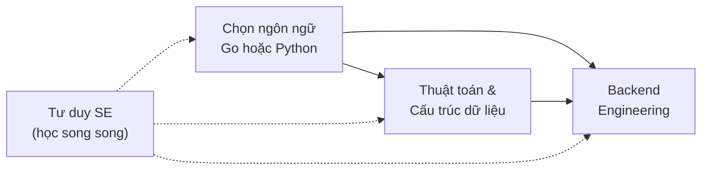

# 📚 Learning Hub - Backend Engineering

Tài liệu tự học bằng tiếng Việt để trở thành một Backend Engineer toàn diện: ngôn ngữ (Go, Python), kiến thức backend, cấu trúc dữ liệu & giải thuật (có animation minh họa) và tư duy Software Engineer.

🌐 **Học trên web**: [nguyenthanh1205tb.github.io/learning](https://nguyenthanh1205tb.github.io/learning/)

## 🗂️ Các khóa học

| Khóa học | Mô tả | Bắt đầu |
| --- | --- | --- |
| 🐹 **Golang** | Cú pháp Go, struct & interface, error handling, concurrency, file/JSON/CLI, HTTP API, database, production, Docker, gRPC | [golang/README.md](./golang/README.md) |
| 🐍 **Python** | Cú pháp Python, OOP, file, module, advanced Python, FastAPI, database, xử lý dữ liệu, production | [python/README.md](./python/README.md) |
| 🏗️ **Backend** | Mạng & HTTP, Linux, thiết kế API, auth, database, NoSQL, cache/Redis, message queue, system design, observability, bảo mật, CI/CD, microservices | [backend/README.md](./backend/README.md) |
| 🧮 **Thuật toán** | Big-O, cấu trúc dữ liệu, sắp xếp, tìm kiếm, cây, heap, đồ thị, greedy, quy hoạch động, pattern phỏng vấn — có animation từng bước | [algorithms/README.md](./algorithms/README.md) |
| 🧠 **Tư duy SE** | Giải quyết vấn đề, clean code, nguyên tắc thiết kế, debug, trade-off, làm việc nhóm, tư duy sản phẩm, phát triển sự nghiệp | [mindset/README.md](./mindset/README.md) |

## 📁 Cấu trúc thư mục

```
.
├── golang/      # Khóa học Golang (18 bài)
├── python/      # Khóa học Python (16 bài)
├── backend/     # Backend Engineering toàn diện (14 bài)
├── algorithms/  # Cấu trúc dữ liệu & Giải thuật (17 bài)
├── mindset/     # Tư duy Software Engineer (10 bài)
└── static/      # JS/CSS cho animation thuật toán trên website
```

## 🧭 Lộ trình gợi ý



## 🎯 Cách học

1. Mở `README.md` của khóa học bạn chọn
2. Học tuần tự từng bài, gõ lại code ví dụ
3. Làm bài tập cuối mỗi bài và đánh dấu checklist
4. Hoàn thành dự án cuối khóa

## 🌐 Xem website trên máy (tùy chọn)

Website được build bằng [MkDocs Material](https://squidfunk.github.io/mkdocs-material/) và tự động deploy lên GitHub Pages mỗi khi push lên `main`.

```bash
pip install -r requirements.txt
mkdir -p docs && cp -r README.md golang python backend algorithms mindset static docs/
mkdocs serve   # mở http://127.0.0.1:8000
```
