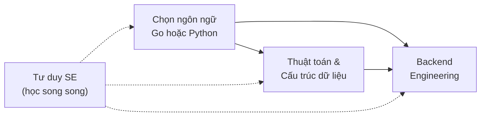

# 📚 Learning Hub - Backend Engineering

Tài liệu tự học bằng tiếng Việt để trở thành một Backend Engineer toàn diện: ngôn ngữ (Go, Python), kiến thức backend, cấu trúc dữ liệu & giải thuật (có animation minh họa) và tư duy Software Engineer.

🌐 **Học trên web**: [nguyenthanh1205tb.github.io/learning](https://nguyenthanh1205tb.github.io/learning/)

## 🗂️ Các khóa học

| Khóa học | Mô tả | Bắt đầu |
| --- | --- | --- |
| 🐹 **Golang** | Cú pháp Go, struct & interface, error handling, concurrency, file/JSON/CLI, HTTP API, database, production, Docker, gRPC | [golang/README.md](./golang/README.md) |
| 🐍 **Python** | Cú pháp Python, OOP, file, module, advanced Python, FastAPI, database, xử lý dữ liệu, production | [python/README.md](./python/README.md) |
| 🏗️ **Backend** | Mạng & HTTP, Linux, thiết kế API, auth, database, NoSQL, cache/Redis, message queue, system design, observability, bảo mật, CI/CD, microservices, Git, bẫy production, dự án shop | [backend/README.md](./backend/README.md) |
| 🧮 **Thuật toán** | Big-O, cấu trúc dữ liệu, sắp xếp, tìm kiếm, cây, heap, đồ thị, greedy, quy hoạch động, pattern phỏng vấn — có animation từng bước | [algorithms/README.md](./algorithms/README.md) |
| 🧠 **Tư duy SE** | Giải quyết vấn đề, clean code, nguyên tắc thiết kế, debug, trade-off, làm việc nhóm, tư duy sản phẩm, phát triển sự nghiệp, làm việc với AI | [mindset/README.md](./mindset/README.md) |

## 📁 Cấu trúc thư mục

```
.
├── golang/        # Khóa học Golang (18 bài)
├── python/        # Khóa học Python (16 bài)
├── backend/       # Backend Engineering (17 bài)
├── algorithms/    # Cấu trúc dữ liệu & Giải thuật (17 bài)
├── mindset/       # Tư duy Software Engineer (11 bài)
├── projects/shop/ # API shop chạy được, đi với Backend bài 17
└── static/        # JS/CSS cho animation thuật toán trên website
```

## 🧭 Lộ trình gợi ý


```mermaid
flowchart LR
    A["Chọn ngôn ngữ<br/>Go hoặc Python"] --> B["Thuật toán &<br/>Cấu trúc dữ liệu"]
    A --> C["Backend<br/>Engineering"]
    B --> C
    D["Tư duy SE<br/>(học song song)"] -.-> A
    D -.-> B
    D -.-> C
```

## ⏱️ Lộ trình 6 tuần

Chọn một ngôn ngữ. Bảng dưới dùng Go. Học Python thì đổi các bài Go thành Python 1–7, 12 và 13. Phần còn lại của mỗi khóa để sau, khi lối này đã chạy được một đơn hàng.

| Tuần | Việc |
| --- | --- |
| 1 | Go 1–7. Tư duy SE bài 1–2 |
| 2 | Go 8, 9, 12, 13. Thuật toán bài 1–3 |
| 3 | Backend 1–4 và [bài 15 (Git)](./backend/15-git.md) |
| 4 | Backend 5, 6, 8 và [bài 16 (tiền, giờ, chữ)](./backend/16-production-traps.md) |
| 5 | Backend 9, 11, 12 |
| 6 | [Shop](./backend/17-shop-capstone.md) (`projects/shop`, `go test ./...`) và [Tư duy SE bài 11](./mindset/11-working-with-ai.md) |

## 🎯 Cách học

1. Mở `README.md` của khóa học bạn chọn
2. Học tuần tự từng bài, gõ lại code ví dụ
3. Làm bài tập cuối mỗi bài và đánh dấu checklist
4. Hoàn thành dự án cuối khóa

## 🌐 Xem website trên máy (tùy chọn)

Website được build bằng [MkDocs Material](https://squidfunk.github.io/mkdocs-material/) và tự động deploy lên GitHub Pages mỗi khi push lên `main`.

```bash
pip install -r requirements.txt
mkdir -p docs && cp -r README.md golang python backend algorithms mindset static docs/
mkdocs serve   # mở http://127.0.0.1:8000
```
