# 📚 Bài 1: Độ phức tạp thuật toán (Big-O)

## 🎯 Mục tiêu bài học

- Hiểu **vì sao** phải phân tích thuật toán thay vì chỉ "chạy thử xem nhanh hay chậm"
- Biết cách **đếm số phép toán** của một đoạn code và rút ra công thức `T(n)`
- Hiểu trực giác **Big-O, Big-Ω (Omega), Big-Θ (Theta)** - không cần sợ toán
- Thuộc lòng các lớp độ phức tạp phổ biến: `O(1)`, `O(log n)`, `O(n)`, `O(n log n)`, `O(n²)`, `O(2ⁿ)`, `O(n!)`
- Nắm các **quy tắc tính Big-O**: bỏ hằng số, giữ số hạng trội, vòng lặp lồng nhau, "chia đôi sinh ra log"
- Phân tích được **vòng lặp** và **đệ quy** (cây đệ quy, định lý Master bản đơn giản)
- Hiểu **độ phức tạp bộ nhớ** (space complexity) và **call stack**
- Hiểu **phân tích khấu hao** (amortized analysis) qua ví dụ mảng động nhân đôi
- Phân biệt **trường hợp tốt nhất / trung bình / xấu nhất**
- Biết **giới hạn thực tế** (~10⁸ phép toán/giây) để chọn thuật toán phù hợp với kích thước dữ liệu
- Tự **đo benchmark** bằng Go và Python để thấy lý thuyết khớp với thực tế

!!! note "Bài này là nền móng của cả khóa"
    Mọi bài sau (sắp xếp, cây, đồ thị, quy hoạch động...) đều kết thúc bằng câu hỏi: *"Độ phức tạp là bao nhiêu?"*. Hãy đọc chậm bài này, chạy thử code, và quay lại khi cần.

## 📖 1. Vì sao phải phân tích thuật toán?

### Câu chuyện tìm số điện thoại

Bạn cần tìm số điện thoại của "Nguyễn Văn Minh" trong một cuốn danh bạ 1.000 trang (ngày xưa mỗi nhà đều có một cuốn như vậy).

- **Cách 1 - Lật từng trang**: bắt đầu từ trang 1, đọc hết, sang trang 2... Xui nhất phải lật **1.000 trang**.
- **Cách 2 - Mở giữa cuốn**: danh bạ đã sắp xếp theo tên. Mở trang 500, thấy vần "L" → "Minh" ở nửa sau. Mở trang 750, thấy vần "P" → "Minh" ở nửa trước... Mỗi lần **loại được một nửa**. Chỉ cần khoảng **10 lần mở** (vì 2¹⁰ = 1024).

Nếu danh bạ dày gấp 1.000 lần (1 triệu trang):

| | 1.000 trang | 1.000.000 trang |
|---|---|---|
| Cách 1 (lật từng trang) | 1.000 lần | 1.000.000 lần 😱 |
| Cách 2 (mở giữa) | ~10 lần | ~20 lần 😎 |

Dữ liệu tăng 1.000 lần, cách 1 chậm đi **1.000 lần**, còn cách 2 chỉ chậm đi **2 lần**. Đây chính là điều mà phân tích thuật toán muốn nói: **thuật toán thay đổi thế nào khi dữ liệu lớn lên?**

### Tại sao không chỉ bấm giờ?

Bấm giờ (benchmark) rất hữu ích (mục 12 sẽ làm), nhưng **không đủ** để so sánh thuật toán vì:

1. **Phụ thuộc máy**: laptop của bạn và server của công ty chạy khác nhau
2. **Phụ thuộc ngôn ngữ**: cùng thuật toán, Go thường nhanh hơn Python 10-50 lần
3. **Phụ thuộc dữ liệu thử**: thử với 100 phần tử thì cái gì cũng nhanh
4. **Không dự đoán được tương lai**: hôm nay 1.000 user, năm sau 1.000.000 user thì sao?

Vì vậy ta **đếm số bước** (số phép toán cơ bản) theo **kích thước đầu vào n**, rồi xem nó **tăng nhanh cỡ nào** khi n tăng. Cách đếm này độc lập với máy và ngôn ngữ.

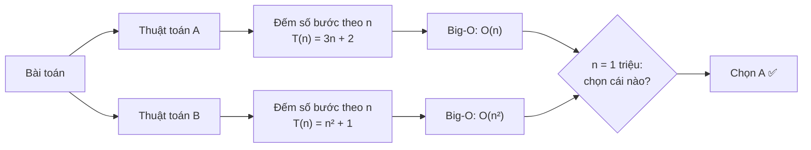

### Ví dụ đầu tiên: tính tổng 1 + 2 + ... + n

Có hai cách: cộng dồn bằng vòng lặp, hoặc dùng công thức Gauss `n(n+1)/2` (cậu bé Gauss nghĩ ra lúc 10 tuổi khi bị thầy phạt cộng từ 1 đến 100). Hãy đếm số phép toán của mỗi cách:

=== "Go"

    ```go
    package main

    import "fmt"

    // Cách 1: cộng dồn từng số - số phép cộng tăng theo n
    func sumLoop(n int) (sum, ops int) {
    	for i := 1; i <= n; i++ {
    		sum += i
    		ops++ // đếm 1 phép cộng
    	}
    	return sum, ops
    }

    // Cách 2: công thức Gauss - luôn chỉ 3 phép toán (+, *, /) dù n lớn cỡ nào
    func sumFormula(n int) (sum, ops int) {
    	return n * (n + 1) / 2, 3
    }

    func main() {
    	for _, n := range []int{10, 1000, 1000000} {
    		s1, ops1 := sumLoop(n)
    		s2, ops2 := sumFormula(n)
    		fmt.Printf("n=%-7d | vòng lặp: tổng=%d, %d phép toán | công thức: tổng=%d, %d phép toán\n",
    			n, s1, ops1, s2, ops2)
    	}
    }

    // Output:
    // n=10      | vòng lặp: tổng=55, 10 phép toán | công thức: tổng=55, 3 phép toán
    // n=1000    | vòng lặp: tổng=500500, 1000 phép toán | công thức: tổng=500500, 3 phép toán
    // n=1000000 | vòng lặp: tổng=500000500000, 1000000 phép toán | công thức: tổng=500000500000, 3 phép toán
    ```

=== "Python"

    ```python
    def sum_loop(n: int) -> tuple[int, int]:
        """Cách 1: cộng dồn từng số - số phép cộng tăng theo n."""
        total, ops = 0, 0
        for i in range(1, n + 1):
            total += i
            ops += 1  # đếm 1 phép cộng
        return total, ops


    def sum_formula(n: int) -> tuple[int, int]:
        """Cách 2: công thức Gauss - luôn chỉ 3 phép toán."""
        return n * (n + 1) // 2, 3


    for n in [10, 1000, 1_000_000]:
        s1, ops1 = sum_loop(n)
        s2, ops2 = sum_formula(n)
        print(f"n={n:<7} | vòng lặp: tổng={s1}, {ops1} phép toán | "
              f"công thức: tổng={s2}, {ops2} phép toán")

    # Output:
    # n=10      | vòng lặp: tổng=55, 10 phép toán | công thức: tổng=55, 3 phép toán
    # n=1000    | vòng lặp: tổng=500500, 1000 phép toán | công thức: tổng=500500, 3 phép toán
    # n=1000000 | vòng lặp: tổng=500000500000, 1000000 phép toán | công thức: tổng=500000500000, 3 phép toán
    ```

Cách 1 có số phép toán **tỉ lệ thuận với n** → ta nói nó là `O(n)`. Cách 2 luôn **3 phép toán** → `O(1)` (hằng số). Cùng một bài toán, hai thuật toán khác nhau một trời một vực.

## 📖 2. Đếm số phép toán - hàm T(n)

### Phép toán cơ bản là gì?

Ta coi các thao tác sau tốn **1 đơn vị thời gian** (vì máy làm chúng trong thời gian gần như cố định):

- Phép gán: `x = 5`
- Phép tính số học: `a + b`, `a * b`, `a % b`
- Phép so sánh: `a < b`, `a == b`
- Truy cập mảng theo chỉ số: `arr[i]`
- Gọi hàm / return (chưa tính phần thân hàm)

!!! warning "Không phải dòng code nào cũng là 1 bước!"
    `sorted(arr)`, `x in my_list`, `strings.Contains(s, t)`, `s1 + s2` (nối chuỗi), `arr.copy()`... **một dòng nhưng bên trong là cả một vòng lặp**. Phải biết độ phức tạp của hàm thư viện mình gọi.

### Đếm thử: tìm số lớn nhất trong mảng

```text
func findMax(arr):                  Số lần chạy
    best = arr[0]                   1
    for i = 1 .. n-1:               n   (n-1 lần vào vòng + 1 lần kiểm tra thoát)
        if arr[i] > best:           n-1
            best = arr[i]           từ 0 đến n-1 (tùy dữ liệu)
    return best                     1
```

Trường hợp xấu nhất (mảng tăng dần, lần nào cũng cập nhật `best`):

```text
T(n) = 1 + n + (n-1) + (n-1) + 1 = 3n
```

Chi tiết `3n` hay `3n + 1` hay `4n - 2` phụ thuộc vào cách bạn đếm - và **điều đó không quan trọng**! Cái quan trọng là: **T(n) tăng tuyến tính theo n**. Big-O sinh ra chính là để bỏ qua những chi tiết vụn vặt này.

| n | T(n) = 3n | Nếu 1 bước = 1 ns |
|---|---|---|
| 10 | 30 | 30 ns |
| 1.000 | 3.000 | 3 µs |
| 1.000.000 | 3.000.000 | 3 ms |
| 1.000.000.000 | 3.000.000.000 | 3 giây |

## 📖 3. Big-O, Big-Ω, Big-Θ - hiểu bằng trực giác

### Ba "lời hứa" về tốc độ

Hãy tưởng tượng bạn đặt Grab giao đồ ăn:

- **Big-O (cận trên)**: "Đơn hàng sẽ đến **không quá** 30 phút". Có thể đến sớm hơn, nhưng không trễ hơn. → `T(n) = O(g(n))` nghĩa là T(n) tăng **không nhanh hơn** g(n).
- **Big-Ω - Omega (cận dưới)**: "Đơn hàng cần **ít nhất** 10 phút" (phải nấu, phải chạy xe). → T(n) tăng **không chậm hơn** g(n).
- **Big-Θ - Theta (cận chặt)**: "Đơn hàng đến trong khoảng **20-25 phút**". → T(n) tăng **đúng cỡ** g(n) - vừa là O vừa là Ω.

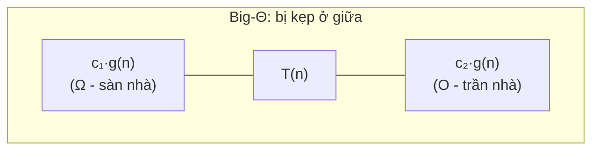

### Định nghĩa (dạng dễ đọc)

- `T(n) = O(g(n))` nếu tồn tại hằng số `c > 0` và `n₀` sao cho **T(n) ≤ c·g(n) với mọi n ≥ n₀**.
- `T(n) = Ω(g(n))` nếu tồn tại `c > 0` và `n₀` sao cho **T(n) ≥ c·g(n) với mọi n ≥ n₀**.
- `T(n) = Θ(g(n))` nếu T(n) vừa là `O(g(n))` vừa là `Ω(g(n))`.

**Ví dụ**: `T(n) = 3n + 5`.

- Chọn `c = 4`, `n₀ = 5`: với n ≥ 5 thì `3n + 5 ≤ 3n + n = 4n` ✅ → `T(n) = O(n)`
- Chọn `c = 3`: `3n + 5 ≥ 3n` với mọi n ✅ → `T(n) = Ω(n)`
- Vậy `T(n) = Θ(n)`

Nhìn bằng số cho dễ hình dung:

| n | T(n) = 3n+5 | 4n (trần) | 3n (sàn) | Kẹp giữa? |
|---|---|---|---|---|
| 1 | 8 | 4 | 3 | ❌ vượt trần (chưa tới n₀) |
| 5 | 20 | 20 | 15 | ✅ |
| 100 | 305 | 400 | 300 | ✅ |
| 10⁶ | 3.000.005 | 4.000.000 | 3.000.000 | ✅ |

!!! tip "Trong thực tế (phỏng vấn, tài liệu)"
    Người ta nói "Big-O" nhưng thường **ngầm hiểu là cận chặt** (Θ). Ví dụ "tìm kiếm tuyến tính là O(n)" hiểu là "cỡ n bước trong trường hợp xấu nhất". Về mặt toán thì `3n + 5` cũng là `O(n²)` (vì n² còn lớn hơn), nhưng nói vậy **đúng mà vô dụng** - như nói "đơn hàng đến trong vòng 1 năm".

### 💡 Tips quan trọng

- Big-O mô tả **tốc độ tăng**, không phải thời gian tuyệt đối. Thuật toán `O(n)` với hằng số 1000 vẫn có thể chậm hơn `O(n²)` khi n nhỏ.
- Big-O quan tâm **n lớn** (n → ∞). Với n = 10, mọi thứ đều nhanh.
- Big-O, Ω, Θ **không** đồng nghĩa với xấu nhất / tốt nhất / trung bình. Đó là hai khái niệm khác nhau (mục 10). Ta có thể nói "trường hợp xấu nhất của quicksort là Θ(n²)".

## 📖 4. Các lớp độ phức tạp thường gặp

Xếp từ **nhanh nhất** đến **chậm nhất**:

| Big-O | Tên gọi | Ví dụ thuật toán | Ví dụ đời thường |
|---|---|---|---|
| `O(1)` | Hằng số | Truy cập `arr[i]`, tra hash map | Lấy đồ trong tủ có đánh số: đi thẳng tới ngăn số 7 |
| `O(log n)` | Logarit | Binary search, thao tác trên cây cân bằng/heap | Tra từ điển giấy bằng cách mở giữa |
| `O(√n)` | Căn bậc hai | Kiểm tra số nguyên tố bằng thử chia | Tìm cặp ước số, chỉ cần thử tới √n |
| `O(n)` | Tuyến tính | Duyệt mảng, tìm max, tìm kiếm tuyến tính | Điểm danh cả lớp, gọi từng bạn |
| `O(n log n)` | Tuyến tính-logarit | Merge sort, heap sort, sort thư viện | Sắp xếp bộ bài bằng cách chia nhóm rồi gộp |
| `O(n²)` | Bình phương | Bubble sort, xét mọi cặp phần tử | Mỗi bạn trong lớp bắt tay với mọi bạn khác |
| `O(n³)` | Lập phương | Nhân ma trận ngây thơ, Floyd-Warshall | Xét mọi bộ ba người |
| `O(2ⁿ)` | Hàm mũ | Duyệt mọi tập con, Fibonacci đệ quy ngây thơ | Thử mọi cách chọn món trong thực đơn |
| `O(n!)` | Giai thừa | Duyệt mọi hoán vị (TSP vét cạn) | Thử mọi thứ tự xếp hàng của n người |

### Bảng tăng trưởng - con số biết nói

Số phép toán với các giá trị n khác nhau:

| n | log₂n | n | n log₂n | n² | n³ | 2ⁿ | n! |
|---|---|---|---|---|---|---|---|
| 10 | 3,3 | 10 | 33 | 100 | 1.000 | 1.024 | 3.628.800 |
| 100 | 6,6 | 100 | 664 | 10⁴ | 10⁶ | 1,3 × 10³⁰ | 9,3 × 10¹⁵⁷ |
| 1.000 | 10 | 1.000 | ~10⁴ | 10⁶ | 10⁹ | 1,1 × 10³⁰¹ | 4 × 10²⁵⁶⁷ |
| 10⁶ | 20 | 10⁶ | 2 × 10⁷ | 10¹² | 10¹⁸ | 😵 | 😵 |

Đổi ra **thời gian** nếu máy làm được 10⁸ phép toán/giây (mức phổ biến của Go/C++ với phép toán đơn giản):

| n | O(log n) | O(n) | O(n log n) | O(n²) | O(n³) | O(2ⁿ) |
|---|---|---|---|---|---|---|
| 10 | tức thì | tức thì | tức thì | tức thì | tức thì | 10 µs |
| 100 | tức thì | 1 µs | 7 µs | 100 µs | 10 ms | **4 × 10¹⁴ năm** |
| 1.000 | tức thì | 10 µs | 100 µs | 10 ms | 10 giây | 😵 |
| 10⁶ | tức thì | 10 ms | 0,2 giây | **2,8 giờ** | **317 năm** | 😵 |

!!! warning "Hàm mũ và giai thừa là 'bức tường'"
    2¹⁰⁰ phép toán mất khoảng 4 × 10¹⁴ năm - gấp **30.000 lần tuổi vũ trụ**. Không có máy tính nào, dù mạnh đến đâu, cứu được thuật toán `O(2ⁿ)` khi n = 100. Muốn nhanh hơn phải **đổi thuật toán**, không phải đổi máy.

### Biểu đồ tăng trưởng

Biểu đồ dưới đây vẽ số phép toán với n từ 1 đến 10. Các đường từ **dưới lên trên** lần lượt là: `log₂n`, `n`, `n log₂n`, `n²`.

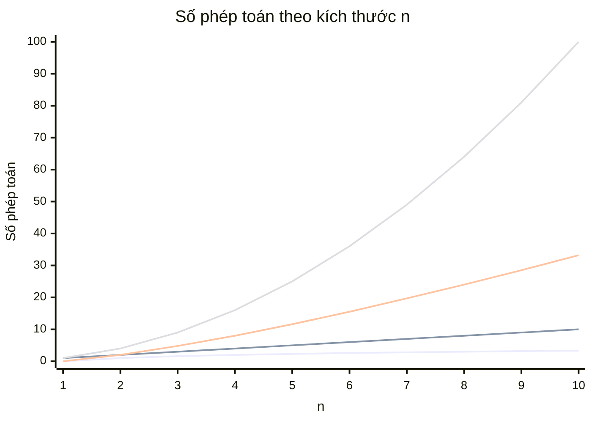

Và đây là `2ⁿ` so với `n²` - chỉ tới n = 10 mà `2ⁿ` đã bỏ xa:

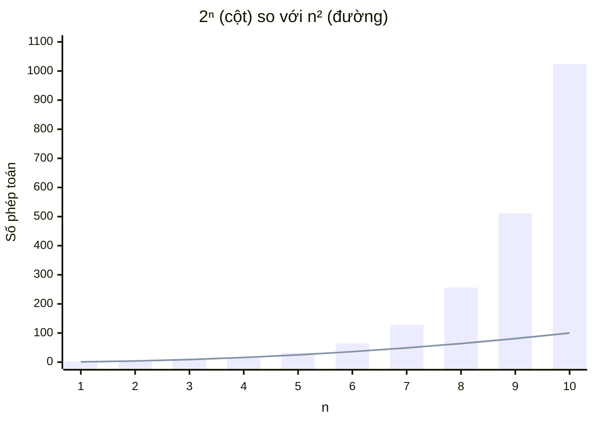

### Code mẫu cho từng lớp - đếm số bước thật

Chương trình dưới đây **chạy thật** các vòng lặp đặc trưng của từng lớp và đếm số bước. Hãy để ý khi n tăng từ 4 lên 10, cột `2^n` và `n!` "nổ tung" thế nào:

=== "Go"

    ```go
    package main

    import "fmt"

    func constant(n int) int { return 1 } // O(1): ví dụ arr[0]

    func logarithmic(n int) int { // O(log n): chia đôi đến khi còn 1
    	steps := 0
    	for i := n; i > 1; i /= 2 {
    		steps++
    	}
    	return steps
    }

    func linear(n int) int { // O(n): duyệt từng phần tử
    	steps := 0
    	for i := 0; i < n; i++ {
    		steps++
    	}
    	return steps
    }

    func linearithmic(n int) int { // O(n log n): n lần, mỗi lần chia đôi
    	steps := 0
    	for i := 0; i < n; i++ {
    		for j := n; j > 1; j /= 2 {
    			steps++
    		}
    	}
    	return steps
    }

    func quadratic(n int) int { // O(n²): mọi cặp (i, j)
    	steps := 0
    	for i := 0; i < n; i++ {
    		for j := 0; j < n; j++ {
    			steps++
    		}
    	}
    	return steps
    }

    func exponential(n int) int { // O(2ⁿ): mỗi phần tử chọn hoặc không chọn
    	if n == 0 {
    		return 1
    	}
    	return exponential(n-1) + exponential(n-1)
    }

    func factorial(n int) int { // O(n!): mọi thứ tự sắp xếp
    	if n == 0 {
    		return 1
    	}
    	steps := 0
    	for i := 0; i < n; i++ { // chọn 1 trong n người đứng đầu
    		steps += factorial(n - 1)
    	}
    	return steps
    }

    func main() {
    	fmt.Printf("%4s %6s %6s %6s %8s %6s %6s %9s\n",
    		"n", "O(1)", "logn", "n", "nlogn", "n^2", "2^n", "n!")
    	for _, n := range []int{4, 6, 8, 10} {
    		fmt.Printf("%4d %6d %6d %6d %8d %6d %6d %9d\n", n,
    			constant(n), logarithmic(n), linear(n), linearithmic(n),
    			quadratic(n), exponential(n), factorial(n))
    	}
    }

    // Output:
    //    n   O(1)   logn      n    nlogn    n^2    2^n        n!
    //    4      1      2      4        8     16     16        24
    //    6      1      2      6       12     36     64       720
    //    8      1      3      8       24     64    256     40320
    //   10      1      3     10       30    100   1024   3628800
    ```

=== "Python"

    ```python
    def constant(n):        # O(1): ví dụ arr[0]
        return 1


    def logarithmic(n):     # O(log n): chia đôi đến khi còn 1
        steps, i = 0, n
        while i > 1:
            i //= 2
            steps += 1
        return steps


    def linear(n):          # O(n): duyệt từng phần tử
        steps = 0
        for _ in range(n):
            steps += 1
        return steps


    def linearithmic(n):    # O(n log n): n lần, mỗi lần chia đôi
        return sum(logarithmic(n) for _ in range(n))


    def quadratic(n):       # O(n²): mọi cặp (i, j)
        steps = 0
        for _ in range(n):
            for _ in range(n):
                steps += 1
        return steps


    def exponential(n):     # O(2ⁿ): mỗi phần tử chọn hoặc không chọn
        if n == 0:
            return 1
        return exponential(n - 1) + exponential(n - 1)


    def factorial(n):       # O(n!): mọi thứ tự sắp xếp
        if n == 0:
            return 1
        return sum(factorial(n - 1) for _ in range(n))


    print(f"{'n':>4} {'O(1)':>6} {'logn':>6} {'n':>6} {'nlogn':>8} {'n^2':>6} {'2^n':>6} {'n!':>9}")
    for n in [4, 6, 8, 10]:
        print(f"{n:>4} {constant(n):>6} {logarithmic(n):>6} {linear(n):>6} "
              f"{linearithmic(n):>8} {quadratic(n):>6} {exponential(n):>6} {factorial(n):>9}")

    # Output:
    #    n   O(1)   logn      n    nlogn    n^2    2^n        n!
    #    4      1      2      4        8     16     16        24
    #    6      1      2      6       12     36     64       720
    #    8      1      3      8       24     64    256     40320
    #   10      1      3     10       30    100   1024   3628800
    ```

> 💡 Với n = 6 hay 10 (không phải lũy thừa của 2), số lần chia đôi là `⌊log₂n⌋` (làm tròn xuống). Big-O không quan tâm chuyện làm tròn này.

### Xem tận mắt: O(n) vs O(log n)

Bấm ▶ để xem **tìm kiếm tuyến tính** duyệt từng ô để tìm số 88 - đếm xem mất bao nhiêu bước:

<div class="algo-viz" data-viz="search" data-algo="linear" data-input="3,8,12,17,21,25,30,34,41,47,55,60,68,72,80,88" data-target="88" data-title="Tìm kiếm tuyến tính - O(n)"></div>

Còn đây là **binary search** trên cùng mảng đã sắp xếp - mỗi bước loại bỏ một nửa, chỉ mất khoảng log₂16 = 4-5 bước:

<div class="algo-viz" data-viz="search" data-algo="binary" data-input="3,8,12,17,21,25,30,34,41,47,55,60,68,72,80,88" data-target="88" data-title="Binary search - O(log n)"></div>

Và đây là **bubble sort** - thuật toán `O(n²)` kinh điển. Để ý bộ đếm số lần so sánh: với 8 phần tử, nó so sánh tới ~28 lần (= 8·7/2):

<div class="algo-viz" data-viz="sort" data-algo="bubble" data-input="29,10,14,37,13,5,42,21" data-title="Bubble sort - O(n²) so sánh"></div>

## 📖 5. Quy tắc tính Big-O

### Quy tắc 1: Bỏ hằng số nhân

`O(3n) = O(n)`, `O(n²/2) = O(n²)`, `O(1000) = O(1)`.

**Vì sao?** Hằng số phụ thuộc vào máy, ngôn ngữ, cách đếm. Máy nhanh gấp đôi thì hằng số giảm một nửa, nhưng **hình dạng đường tăng** không đổi.

### Quy tắc 2: Chỉ giữ số hạng trội (dominant term)

`O(n² + n + 100) = O(n²)`, `O(n + log n) = O(n)`, `O(2ⁿ + n³) = O(2ⁿ)`.

**Vì sao?** Khi n = 10⁶: n² = 10¹², n = 10⁶ (chỉ bằng 0,0001% của n²). Số hạng nhỏ **chìm nghỉm** khi n lớn.

Thứ tự "ai trội hơn ai": `1 < log n < √n < n < n log n < n² < n³ < 2ⁿ < n!`

### Quy tắc 3: Các bước nối tiếp → cộng

```text
for i in 0..n:  ...      # O(n)
for j in 0..m:  ...      # O(m)
→ Tổng: O(n + m)
```

Nếu `m = n` thì `O(2n) = O(n)`. **Hai vòng lặp nối tiếp không phải O(n²)!**

### Quy tắc 4: Vòng lặp lồng nhau → nhân

```text
for i in 0..n:           # n lần
    for j in 0..m:       #   mỗi lần chạy m lần
        ...              # O(1)
→ Tổng: O(n × m)
```

### Quy tắc 5: Hai đầu vào khác nhau → giữ cả hai biến

Nếu hàm nhận 2 mảng kích thước `a` và `b`, lồng nhau thì là `O(a × b)`, **không phải** `O(n²)`. Đây là lỗi hay gặp khi phỏng vấn.

### Quy tắc 6: Chia đôi (hoặc nhân đôi) → sinh ra log

Mỗi bước giảm n **một nửa**: `n → n/2 → n/4 → ... → 1`. Số bước k thỏa mãn `n / 2ᵏ = 1` → `k = log₂n`.

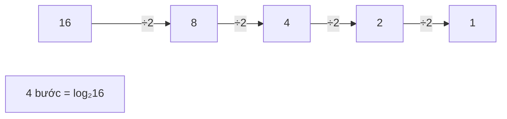

!!! tip "Cơ số của log không quan trọng"
    `log₂n` và `log₁₀n` chỉ khác nhau một hằng số nhân (`log₂n ≈ 3,32 × log₁₀n`). Mà hằng số thì bị bỏ (quy tắc 1). Vì vậy ta chỉ viết `O(log n)`.

**Mẹo nhớ**: `log₂(1.000) ≈ 10`, `log₂(1.000.000) ≈ 20`, `log₂(10⁹) ≈ 30`. Tức là **log của một tỉ chỉ là 30** - gần như hằng số!

## 📖 6. Phân tích vòng lặp - các mẫu hay gặp

| Mẫu vòng lặp | Số lần lặp | Big-O |
|---|---|---|
| `for i := 0; i < n; i++` | n | O(n) |
| Hai vòng `for` lồng nhau, mỗi vòng tới n | n² | O(n²) |
| `for i < n { for j < i }` (tam giác) | n(n-1)/2 | O(n²) |
| `for i := 1; i < n; i *= 2` | log₂n | O(log n) |
| `for i := 1; i*i <= n; i++` | √n | O(√n) |
| `for i := 1..n { for j := i; j <= n; j += i }` (điều hòa) | n/1 + n/2 + ... + n/n ≈ n·ln n | O(n log n) |
| Hai con trỏ `l`, `r` tiến lại gần nhau | ≤ n | O(n) |
| Hai vòng lặp nối tiếp mỗi vòng n | 2n | O(n) |

Mẫu **tam giác** rất hay gặp (ví dụ xét mọi cặp i < j):

```text
i = 0: j chạy 0 lần
i = 1: j chạy 1 lần        ■
i = 2: j chạy 2 lần        ■ ■
i = 3: j chạy 3 lần        ■ ■ ■
i = 4: j chạy 4 lần        ■ ■ ■ ■
                          ─────────
Tổng = 0+1+2+...+(n-1) = n(n-1)/2  → nửa hình vuông n×n → vẫn O(n²)
```

Mẫu **điều hòa** (harmonic) xuất hiện trong sàng số nguyên tố Eratosthenes: `n/1 + n/2 + n/3 + ... + n/n = n × (1 + 1/2 + ... + 1/n) ≈ n × ln n`.

Hãy kiểm chứng bằng code - đếm thật số lần lặp với n = 1000:

=== "Go"

    ```go
    package main

    import (
    	"fmt"
    	"math"
    )

    func main() {
    	n := 1000
    	count := func(name string, c int, formula string) {
    		fmt.Printf("%-26s %8d   (%s)\n", name, c, formula)
    	}

    	c := 0
    	for i := 0; i < n; i++ {
    		c++
    	}
    	count("1 vòng", c, "n")

    	c = 0
    	for i := 0; i < n; i++ {
    		for j := 0; j < n; j++ {
    			c++
    		}
    	}
    	count("2 vòng lồng nhau", c, "n^2")

    	c = 0
    	for i := 0; i < n; i++ {
    		for j := 0; j < i; j++ {
    			c++
    		}
    	}
    	count("tam giác j < i", c, fmt.Sprint("n(n-1)/2 = ", n*(n-1)/2))

    	c = 0
    	for i := 1; i < n; i *= 2 {
    		c++
    	}
    	count("i *= 2", c, fmt.Sprintf("log2(n) = %.2f", math.Log2(float64(n))))

    	c = 0
    	for i := 1; i*i <= n; i++ {
    		c++
    	}
    	count("i*i <= n", c, fmt.Sprintf("sqrt(n) = %.2f", math.Sqrt(float64(n))))

    	c = 0
    	for i := 1; i <= n; i++ {
    		for j := i; j <= n; j += i {
    			c++
    		}
    	}
    	count("điều hòa j += i", c, fmt.Sprintf("n*ln(n) = %.0f", float64(n)*math.Log(float64(n))))

    	c = 0
    	for l, r := 0, n-1; l < r; l++ {
    		c++
    	}
    	count("hai con trỏ", c, "< n")
    }

    // Output:
    // 1 vòng                         1000   (n)
    // 2 vòng lồng nhau            1000000   (n^2)
    // tam giác j < i               499500   (n(n-1)/2 = 499500)
    // i *= 2                           10   (log2(n) = 9.97)
    // i*i <= n                         31   (sqrt(n) = 31.62)
    // điều hòa j += i                7069   (n*ln(n) = 6908)
    // hai con trỏ                     999   (< n)
    ```

=== "Python"

    ```python
    import math

    n = 1000


    def show(name, c, formula):
        print(f"{name:<26} {c:>8}   ({formula})")


    show("1 vòng", sum(1 for _ in range(n)), "n")
    show("2 vòng lồng nhau", sum(1 for i in range(n) for j in range(n)), "n^2")
    show("tam giác j < i", sum(1 for i in range(n) for j in range(i)),
         f"n(n-1)/2 = {n * (n - 1) // 2}")

    c, i = 0, 1
    while i < n:
        i *= 2
        c += 1
    show("i *= 2", c, f"log2(n) = {math.log2(n):.2f}")

    c, i = 0, 1
    while i * i <= n:
        i += 1
        c += 1
    show("i*i <= n", c, f"sqrt(n) = {math.sqrt(n):.2f}")

    c = sum(1 for i in range(1, n + 1) for j in range(i, n + 1, i))
    show("điều hòa j += i", c, f"n*ln(n) = {n * math.log(n):.0f}")

    c, l, r = 0, 0, n - 1
    while l < r:
        l += 1
        c += 1
    show("hai con trỏ", c, "< n")

    # Output:
    # 1 vòng                         1000   (n)
    # 2 vòng lồng nhau            1000000   (n^2)
    # tam giác j < i               499500   (n(n-1)/2 = 499500)
    # i *= 2                           10   (log2(n) = 9.97)
    # i*i <= n                         31   (sqrt(n) = 31.62)
    # điều hòa j += i                7069   (n*ln(n) = 6908)
    # hai con trỏ                     999   (< n)
    ```

### Vòng lặp "trá hình" - O(n) ẩn trong một dòng

```python
for x in arr:            # n lần
    if x in other_list:  # 'in' trên list là O(m) → tổng O(n·m) chứ không phải O(n)!
        ...
```

```go
s := ""
for _, w := range words { // n lần
	s += w // mỗi lần tạo chuỗi mới và copy toàn bộ → tổng O(n²) ký tự copy
}
```

Cách sửa: dùng `set`/`map` (tra cứu O(1)) và `strings.Builder` / `"".join(...)` (nối O(n)). Bài 2 và 3 sẽ nói kỹ.

## 📖 7. Phân tích đệ quy

### Công thức truy hồi (recurrence)

Với hàm đệ quy, ta viết thời gian chạy dưới dạng **chính nó**:

| Hàm | Công thức truy hồi | Kết quả |
|---|---|---|
| Giai thừa `f(n) = n * f(n-1)` | `T(n) = T(n-1) + O(1)` | `O(n)` |
| Binary search (đệ quy) | `T(n) = T(n/2) + O(1)` | `O(log n)` |
| Duyệt cây nhị phân | `T(n) = 2T(n/2) + O(1)` | `O(n)` |
| Merge sort | `T(n) = 2T(n/2) + O(n)` | `O(n log n)` |
| Fibonacci ngây thơ | `T(n) = T(n-1) + T(n-2) + O(1)` | `O(2ⁿ)` (chính xác hơn ~1,618ⁿ) |
| Tháp Hà Nội | `T(n) = 2T(n-1) + O(1)` | `O(2ⁿ)` |

### Cây đệ quy (recursion tree) - công cụ trực quan nhất

**Ý tưởng**: vẽ mỗi lời gọi hàm là một nút, con của nó là các lời gọi đệ quy. **Tổng công việc = tổng công việc của mọi nút.**

Ví dụ Fibonacci ngây thơ `fib(n) = fib(n-1) + fib(n-2)`:

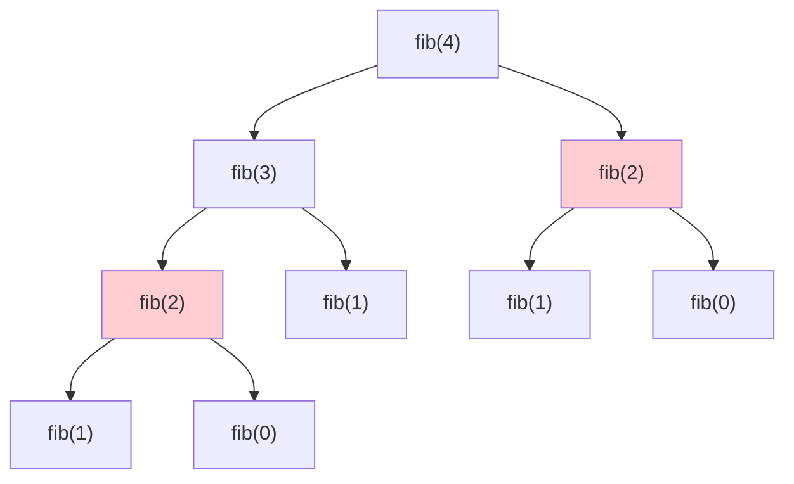

Để ý `fib(2)` (tô đỏ) bị tính **2 lần**. Với `fib(5)`, `fib(3)` bị tính 2 lần, `fib(2)` 3 lần... Mỗi tầng số nút gần như **gấp đôi** → cây có khoảng `2ⁿ` nút.

Bấm ▶ để xem cây đệ quy của `fib(5)` được "mọc" ra từng lời gọi - đếm số lần `fib(2)` xuất hiện:

<div class="algo-viz" data-viz="recursion" data-algo="fib-tree" data-n="5" data-title="Cây đệ quy fib(5)"></div>

Đếm thật số lời gọi hàm - và xem **ghi nhớ (memoization)** cứu thuật toán thế nào (chi tiết ở [Bài 14 - Quy hoạch động](./14-dynamic-programming.md)):

=== "Go"

    ```go
    package main

    import "fmt"

    var calls int

    // Fibonacci ngây thơ: O(2ⁿ)
    func fibNaive(n int) int {
    	calls++
    	if n < 2 {
    		return n
    	}
    	return fibNaive(n-1) + fibNaive(n-2)
    }

    // Fibonacci có ghi nhớ: mỗi giá trị chỉ tính 1 lần → O(n)
    func fibMemo(n int, memo map[int]int) int {
    	calls++
    	if n < 2 {
    		return n
    	}
    	if v, ok := memo[n]; ok {
    		return v
    	}
    	memo[n] = fibMemo(n-1, memo) + fibMemo(n-2, memo)
    	return memo[n]
    }

    func main() {
    	for _, n := range []int{10, 20, 30} {
    		calls = 0
    		v := fibNaive(n)
    		naive := calls

    		calls = 0
    		fibMemo(n, map[int]int{})
    		fmt.Printf("fib(%d) = %-7d | ngây thơ: %8d lời gọi | ghi nhớ: %d lời gọi\n",
    			n, v, naive, calls)
    	}
    }

    // Output:
    // fib(10) = 55      | ngây thơ:      177 lời gọi | ghi nhớ: 19 lời gọi
    // fib(20) = 6765    | ngây thơ:    21891 lời gọi | ghi nhớ: 39 lời gọi
    // fib(30) = 832040  | ngây thơ:  2692537 lời gọi | ghi nhớ: 59 lời gọi
    ```

=== "Python"

    ```python
    calls = 0


    def fib_naive(n: int) -> int:
        """Fibonacci ngây thơ: O(2ⁿ)."""
        global calls
        calls += 1
        if n < 2:
            return n
        return fib_naive(n - 1) + fib_naive(n - 2)


    def fib_memo(n: int, memo: dict[int, int]) -> int:
        """Fibonacci có ghi nhớ: mỗi giá trị chỉ tính 1 lần → O(n)."""
        global calls
        calls += 1
        if n < 2:
            return n
        if n in memo:
            return memo[n]
        memo[n] = fib_memo(n - 1, memo) + fib_memo(n - 2, memo)
        return memo[n]


    for n in [10, 20, 30]:
        calls = 0
        v = fib_naive(n)
        naive = calls
        calls = 0
        fib_memo(n, {})
        print(f"fib({n}) = {v:<7} | ngây thơ: {naive:>8} lời gọi | ghi nhớ: {calls} lời gọi")

    # Output:
    # fib(10) = 55      | ngây thơ:      177 lời gọi | ghi nhớ: 19 lời gọi
    # fib(20) = 6765    | ngây thơ:    21891 lời gọi | ghi nhớ: 39 lời gọi
    # fib(30) = 832040  | ngây thơ:  2692537 lời gọi | ghi nhớ: 59 lời gọi
    ```

n tăng thêm 10, bản ngây thơ tăng **~123 lần** số lời gọi (đặc trưng của hàm mũ), bản ghi nhớ chỉ tăng thêm 20 lời gọi (tuyến tính).

### Cây đệ quy của merge sort - vì sao ra n log n?

Merge sort chia mảng làm đôi, sắp xếp mỗi nửa, rồi **trộn** (merge) hai nửa mất `O(n)`:

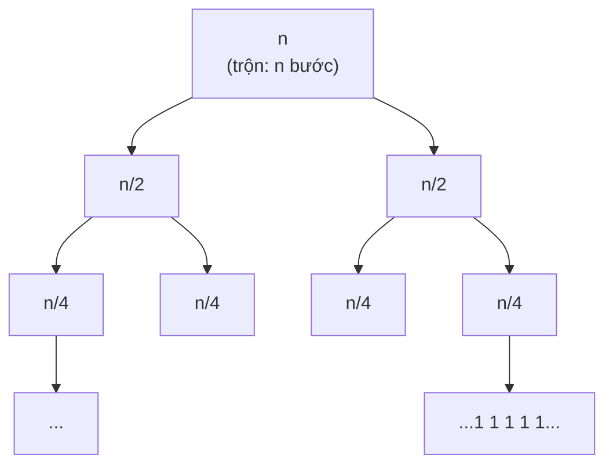

| Tầng | Số nút | Kích thước mỗi nút | Công việc cả tầng |
|---|---|---|---|
| 0 | 1 | n | n |
| 1 | 2 | n/2 | n |
| 2 | 4 | n/4 | n |
| ... | ... | ... | n |
| log₂n | n | 1 | n |

Mỗi tầng tốn `n`, có `log₂n` tầng → tổng **O(n log n)**. Chi tiết ở [Bài 7 - Sắp xếp](./07-sorting.md).

### Định lý Master (bản đơn giản)

Với công thức dạng **`T(n) = a·T(n/b) + O(nᵈ)`** (chia thành `a` bài con, mỗi bài nhỏ đi `b` lần, chi phí chia/gộp là `nᵈ`):

| Điều kiện | Kết quả | Trực giác | Ví dụ |
|---|---|---|---|
| `a < bᵈ` | `O(nᵈ)` | Công việc ở **gốc** chiếm ưu thế | `T(n) = T(n/2) + O(n)` → `O(n)` |
| `a = bᵈ` | `O(nᵈ · log n)` | Mỗi tầng bằng nhau | Merge sort: a=2, b=2, d=1 → `O(n log n)`; Binary search: a=1, b=2, d=0 → `O(log n)` |
| `a > bᵈ` | `O(n^(log_b a))` | Công việc ở **lá** chiếm ưu thế | Duyệt cây: a=2, b=2, d=0 → `O(n)`; Karatsuba: a=3, b=2, d=1 → `O(n^1,58)` |

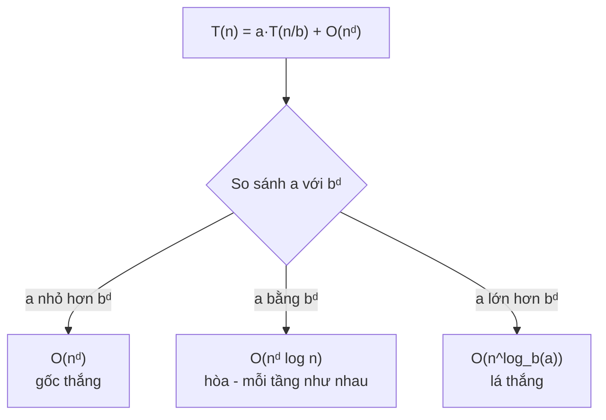

!!! note "Định lý Master không áp dụng cho mọi thứ"
    `T(n) = T(n-1) + O(1)` (giảm 1 chứ không chia) hay Fibonacci không có dạng `n/b`. Với những trường hợp đó hãy **vẽ cây đệ quy** hoặc "trải" công thức ra: `T(n) = T(n-1) + 1 = T(n-2) + 2 = ... = T(0) + n` → `O(n)`.

## 📖 8. Độ phức tạp bộ nhớ (Space complexity) & Call stack

### Bộ nhớ cũng là tài nguyên

**Space complexity** = lượng bộ nhớ **thêm** (auxiliary space) mà thuật toán cần, tính theo n. Thường **không tính** bộ nhớ của đầu vào.

| Đoạn code | Bộ nhớ thêm |
|---|---|
| Đổi chỗ 2 biến, tìm max | `O(1)` |
| Tạo bản sao của mảng, tạo `set` từ mảng | `O(n)` |
| Ma trận kề n × n | `O(n²)` |
| Merge sort (mảng tạm khi trộn) | `O(n)` |
| Đệ quy sâu n tầng | `O(n)` - **stack!** |

### Call stack - "chồng đĩa" của lời gọi hàm

Mỗi lần gọi hàm, máy cất một **stack frame** (biến cục bộ, tham số, địa chỉ trả về) lên **call stack**. Hàm return thì frame bị lấy ra. Giống **chồng đĩa** trong nhà hàng: đĩa đặt sau lấy ra trước (sẽ học kỹ ở [Bài 5 - Stack & Queue](./05-stacks-queues.md)).

```text
sumRec(3) gọi sumRec(2) gọi sumRec(1) gọi sumRec(0)

Thời điểm sâu nhất:        Sau đó trả về dần:
┌─────────────┐
│ sumRec(0)   │ ← đỉnh     return 0
├─────────────┤
│ sumRec(1)   │            return 1 + 0 = 1
├─────────────┤
│ sumRec(2)   │            return 2 + 1 = 3
├─────────────┤
│ sumRec(3)   │            return 3 + 3 = 6
├─────────────┤
│ main()      │
└─────────────┘
Độ sâu = n + 1 frame → bộ nhớ O(n) dù code không tạo mảng nào!
```

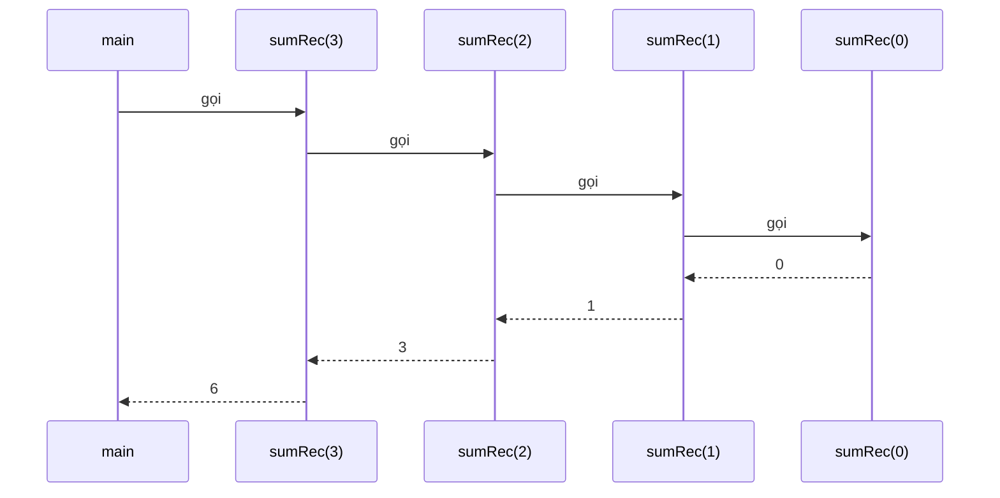

**Go và Python xử lý đệ quy sâu rất khác nhau**:

- **Python** giới hạn độ sâu mặc định **1000** (`sys.getrecursionlimit()`), vượt quá sẽ ném `RecursionError`.
- **Go**: stack của goroutine bắt đầu nhỏ (vài KB) và **tự lớn lên** khi cần, tối đa 1 GB trên máy 64-bit. Đệ quy 1 triệu tầng vẫn chạy được; đệ quy vô hạn sẽ chết với `fatal error: stack overflow`.

=== "Go"

    ```go
    package main

    import "fmt"

    // Đệ quy: thời gian O(n), bộ nhớ O(n) (n stack frame)
    func sumRec(n int) int {
    	if n == 0 {
    		return 0
    	}
    	return n + sumRec(n-1)
    }

    // Vòng lặp: thời gian O(n), bộ nhớ O(1)
    func sumIter(n int) int {
    	total := 0
    	for i := 1; i <= n; i++ {
    		total += i
    	}
    	return total
    }

    func main() {
    	fmt.Println("sumRec(5000)      =", sumRec(5000))
    	fmt.Println("sumRec(1_000_000) =", sumRec(1_000_000)) // Go stack tự lớn lên
    	fmt.Println("sumIter(1_000_000)=", sumIter(1_000_000))
    }

    // Output:
    // sumRec(5000)      = 12502500
    // sumRec(1_000_000) = 500000500000
    // sumIter(1_000_000)= 500000500000
    ```

=== "Python"

    ```python
    import sys


    def sum_rec(n: int) -> int:
        """Đệ quy: thời gian O(n), bộ nhớ O(n) (n stack frame)."""
        if n == 0:
            return 0
        return n + sum_rec(n - 1)


    def sum_iter(n: int) -> int:
        """Vòng lặp: thời gian O(n), bộ nhớ O(1)."""
        total = 0
        for i in range(1, n + 1):
            total += i
        return total


    print("Giới hạn đệ quy mặc định:", sys.getrecursionlimit())
    print("sum_rec(500)   =", sum_rec(500))
    try:
        sum_rec(5000)
    except RecursionError as e:
        print("sum_rec(5000)  → lỗi", type(e).__name__)
    print("sum_iter(5000) =", sum_iter(5000))

    # Output:
    # Giới hạn đệ quy mặc định: 1000
    # sum_rec(500)   = 125250
    # sum_rec(5000)  → lỗi RecursionError
    # sum_iter(5000) = 12502500
    ```

!!! tip "Khi đệ quy quá sâu trong Python"
    Có thể tăng giới hạn bằng `sys.setrecursionlimit(10**6)`, nhưng stack C bên dưới vẫn có thể tràn (crash cả chương trình). Cách an toàn: **chuyển đệ quy thành vòng lặp** với một stack tự quản lý (Bài 5, Bài 11 sẽ làm với DFS).

## 📖 9. Phân tích khấu hao (Amortized analysis)

### Câu hỏi: `append` tốn bao nhiêu?

Slice trong Go và list trong Python là **mảng động**: bên dưới là một mảng có sức chứa (capacity) cố định. Khi đầy, nó phải:

1. Cấp phát mảng mới **gấp đôi** (hoặc gấp ~1,25-2 lần)
2. **Copy toàn bộ** phần tử cũ sang
3. Thêm phần tử mới

Bước 2 tốn `O(n)`! Vậy `append` là `O(n)`? **Không hẳn** - vì việc copy **hiếm khi** xảy ra.

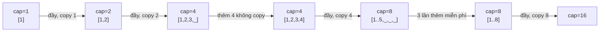

### Đếm chi phí từng lần push

Chi phí = 1 (ghi phần tử) + số phần tử phải copy:

| Lần push thứ | 1 | 2 | 3 | 4 | 5 | 6 | 7 | 8 | 9 | 10 | ... | 16 | 17 |
|---|---|---|---|---|---|---|---|---|---|---|---|---|---|
| Copy | 0 | 1 | 2 | 0 | 4 | 0 | 0 | 0 | 8 | 0 | ... | 0 | 16 |
| Chi phí | 1 | 2 | 3 | 1 | 5 | 1 | 1 | 1 | 9 | 1 | ... | 1 | 17 |

Tổng số lần copy khi push n phần tử: `1 + 2 + 4 + ... + (≤ n) < 2n`. Cộng thêm n lần ghi → **tổng < 3n**. Chia đều cho n lần push → **trung bình < 3 bước/lần = O(1) khấu hao** (amortized O(1)).

!!! tip "Ví dụ đời thường: mua gạo bao lớn"
    Mỗi ngày bạn nấu cơm (O(1)). Thỉnh thoảng hết gạo phải đi chợ mua bao lớn (tốn công). Nhưng mỗi lần mua bao **to gấp đôi** lần trước, nên số lần đi chợ ít dần. Chia tổng công sức cho số ngày → mỗi ngày tốn rất ít. Đó là **khấu hao**: chi phí lớn hiếm hoi được "trải đều" cho nhiều thao tác rẻ.

!!! warning "Khấu hao ≠ trung bình theo xác suất"
    Amortized O(1) là **đảm bảo** cho tổng một dãy thao tác (không dựa vào may rủi), nhưng **một lần** push riêng lẻ vẫn có thể tốn O(n). Hệ thống thời gian thực (game 60 FPS, điều khiển robot) đôi khi phải tránh các "cú giật" này bằng cách cấp phát trước (`make([]T, 0, n)`).

Hãy tự cài mảng động và đếm số lần copy:

=== "Go"

    ```go
    package main

    import "fmt"

    type DynArray struct {
    	data   []int // mảng nền, len(data) chính là capacity
    	size   int   // số phần tử đang dùng
    	copies int   // tổng số lần copy phần tử
    }

    func (d *DynArray) Push(x int, verbose bool) {
    	if d.size == len(d.data) { // đầy → cấp phát gấp đôi
    		newCap := max(1, 2*len(d.data))
    		newData := make([]int, newCap)
    		for i := 0; i < d.size; i++ {
    			newData[i] = d.data[i]
    			d.copies++
    		}
    		if verbose {
    			fmt.Printf("push #%-2d: đầy! cap %2d → %2d, copy %2d phần tử\n",
    				d.size+1, len(d.data), newCap, d.size)
    		}
    		d.data = newData
    	}
    	d.data[d.size] = x
    	d.size++
    }

    func main() {
    	small := &DynArray{}
    	for i := 1; i <= 17; i++ {
    		small.Push(i, true)
    	}

    	big := &DynArray{}
    	n := 1_000_000
    	for i := 0; i < n; i++ {
    		big.Push(i, false)
    	}
    	fmt.Printf("n=%d: tổng copy=%d → trung bình %.2f copy/push\n",
    		n, big.copies, float64(big.copies)/float64(n))

    	// Slice thật của Go: xem capacity tăng thế nào
    	var s []int
    	prev := -1
    	for i := 0; i < 2000; i++ {
    		s = append(s, i)
    		if cap(s) != prev {
    			fmt.Print(cap(s), " ")
    			prev = cap(s)
    		}
    	}
    	fmt.Println()
    }

    // Output:
    // push #1 : đầy! cap  0 →  1, copy  0 phần tử
    // push #2 : đầy! cap  1 →  2, copy  1 phần tử
    // push #3 : đầy! cap  2 →  4, copy  2 phần tử
    // push #5 : đầy! cap  4 →  8, copy  4 phần tử
    // push #9 : đầy! cap  8 → 16, copy  8 phần tử
    // push #17: đầy! cap 16 → 32, copy 16 phần tử
    // n=1000000: tổng copy=1048575 → trung bình 1.05 copy/push
    // 1 2 4 8 16 32 64 128 256 512 848 1280 1792 2560
    ```

=== "Python"

    ```python
    import sys


    class DynArray:
        def __init__(self):
            self.data = []    # mô phỏng mảng nền cố định, len(data) là capacity
            self.size = 0
            self.copies = 0

        def push(self, x, verbose=False):
            if self.size == len(self.data):  # đầy → cấp phát gấp đôi
                new_cap = max(1, 2 * len(self.data))
                new_data = [None] * new_cap
                for i in range(self.size):
                    new_data[i] = self.data[i]
                    self.copies += 1
                if verbose:
                    print(f"push #{self.size + 1:<2}: đầy! cap {len(self.data):>2} → "
                          f"{new_cap:>2}, copy {self.size:>2} phần tử")
                self.data = new_data
            self.data[self.size] = x
            self.size += 1


    small = DynArray()
    for i in range(1, 18):
        small.push(i, verbose=True)

    big = DynArray()
    n = 1_000_000
    for i in range(n):
        big.push(i)
    print(f"n={n}: tổng copy={big.copies} → trung bình {big.copies / n:.2f} copy/push")

    # list thật của Python: kích thước bộ nhớ (byte) nhảy bậc khi over-allocate
    lst, prev, sizes = [], -1, []
    for i in range(64):
        lst.append(i)
        if sys.getsizeof(lst) != prev:
            prev = sys.getsizeof(lst)
            sizes.append(f"len={len(lst)}:{prev}B")
    print(" ".join(sizes))

    # Output:
    # push #1 : đầy! cap  0 →  1, copy  0 phần tử
    # push #2 : đầy! cap  1 →  2, copy  1 phần tử
    # push #3 : đầy! cap  2 →  4, copy  2 phần tử
    # push #5 : đầy! cap  4 →  8, copy  4 phần tử
    # push #9 : đầy! cap  8 → 16, copy  8 phần tử
    # push #17: đầy! cap 16 → 32, copy 16 phần tử
    # n=1000000: tổng copy=1048575 → trung bình 1.05 copy/push
    # len=1:88B len=5:120B len=9:184B len=17:248B len=25:312B len=33:376B len=41:472B len=53:568B
    ```

Nhận xét:

- Tổng copy cho 1 triệu lần push chỉ khoảng **1 triệu** (= 2²⁰ - 1) → trung bình **~1 copy/push** → khấu hao O(1).
- Go thật sự **nhân đôi** khi slice còn nhỏ (dưới 256 phần tử), sau đó tăng chậm dần về **~1,25 lần** để đỡ phí bộ nhớ. Con số cụ thể có thể thay đổi giữa các phiên bản Go.
- Python list **over-allocate** khoảng 12,5% + một ít - tăng chậm hơn nhân đôi nhưng vẫn là cấp số nhân, nên vẫn O(1) khấu hao. (Kích thước byte có thể khác giữa các phiên bản Python.)

!!! warning "Nếu tăng thêm hằng số thay vì nhân lên thì sao?"
    Nếu mỗi lần đầy chỉ tăng thêm 10 ô, tổng copy = `10 + 20 + 30 + ... + n ≈ n²/20` → **O(n) mỗi lần push**, tổng O(n²). Bí mật của O(1) khấu hao nằm ở chỗ **tăng theo cấp số nhân**.

## 📖 10. Trường hợp tốt nhất, trung bình, xấu nhất

Cùng một thuật toán, thời gian có thể khác nhau tùy **dữ liệu cụ thể**:

| Thuật toán | Tốt nhất | Trung bình | Xấu nhất | Xấu nhất xảy ra khi |
|---|---|---|---|---|
| Tìm kiếm tuyến tính | O(1) | O(n) | O(n) | Không có phần tử cần tìm |
| Binary search | O(1) | O(log n) | O(log n) | Phần tử ở rìa / không có |
| Insertion sort | O(n) | O(n²) | O(n²) | Mảng sắp xếp ngược |
| Quick sort | O(n log n) | O(n log n) | O(n²) | Pivot luôn là min/max |
| Merge sort | O(n log n) | O(n log n) | O(n log n) | Luôn như nhau |
| Tra hash table | O(1) | O(1) | O(n) | Mọi key trùng bucket |

**Nên quan tâm cái nào?**

- **Xấu nhất**: an toàn nhất, là mặc định khi phỏng vấn. Hệ thống quan trọng (thanh toán, y tế) cần đảm bảo xấu nhất.
- **Trung bình**: phản ánh thực tế thường ngày (vì vậy quicksort và hash table vẫn được dùng khắp nơi).
- **Tốt nhất**: hầu như **vô dụng** để đánh giá - thuật toán nào cũng có thể may mắn.

=== "Go"

    ```go
    package main

    import "fmt"

    // Trả về vị trí và số lần so sánh
    func linearSearch(arr []int, target int) (int, int) {
    	comparisons := 0
    	for i, v := range arr {
    		comparisons++
    		if v == target {
    			return i, comparisons
    		}
    	}
    	return -1, comparisons
    }

    func main() {
    	arr := []int{7, 3, 9, 1, 5, 8, 2, 6, 4, 10}
    	cases := []struct {
    		name   string
    		target int
    	}{{"tốt nhất (ở đầu)", 7}, {"trung bình (ở giữa)", 8}, {"xấu nhất (không có)", 99}}
    	for _, c := range cases {
    		idx, cmp := linearSearch(arr, c.target)
    		fmt.Printf("%-20s target=%-3d → index=%-3d so sánh %d lần\n", c.name, c.target, idx, cmp)
    	}
    }

    // Output:
    // tốt nhất (ở đầu)     target=7   → index=0   so sánh 1 lần
    // trung bình (ở giữa)  target=8   → index=5   so sánh 6 lần
    // xấu nhất (không có)  target=99  → index=-1  so sánh 10 lần
    ```

=== "Python"

    ```python
    def linear_search(arr, target):
        """Trả về (vị trí, số lần so sánh)."""
        comparisons = 0
        for i, v in enumerate(arr):
            comparisons += 1
            if v == target:
                return i, comparisons
        return -1, comparisons


    arr = [7, 3, 9, 1, 5, 8, 2, 6, 4, 10]
    for name, target in [("tốt nhất (ở đầu)", 7), ("trung bình (ở giữa)", 8),
                         ("xấu nhất (không có)", 99)]:
        idx, cmp = linear_search(arr, target)
        print(f"{name:<20} target={target:<3} → index={idx:<3} so sánh {cmp} lần")

    # Output:
    # tốt nhất (ở đầu)     target=7   → index=0   so sánh 1 lần
    # trung bình (ở giữa)  target=8   → index=5   so sánh 6 lần
    # xấu nhất (không có)  target=99  → index=-1  so sánh 10 lần
    ```

## 📖 11. Giới hạn thực tế - n bao nhiêu thì chọn thuật toán nào?

### Quy tắc ngón tay cái: ~10⁸ phép toán đơn giản mỗi giây

Một CPU hiện đại chạy vài tỉ lệnh/giây, nhưng "một phép toán" trong thuật toán thường tốn vài lệnh + truy cập bộ nhớ. Con số **10⁸ phép toán/giây** là ước lượng an toàn cho **Go/C++/Java**. **Python chậm hơn khoảng 10-50 lần** với vòng lặp thuần (≈ 10⁷ phép toán/giây), trừ khi dùng thư viện viết bằng C (`sorted`, `sum`, NumPy...).

Với giới hạn thời gian **1 giây** (phổ biến trong bài thi lập trình và cũng là ngưỡng "người dùng bắt đầu sốt ruột"):

| Kích thước n | Độ phức tạp tối đa chấp nhận được | Thuật toán điển hình |
|---|---|---|
| n ≤ 10-11 | `O(n!)` | Vét cạn hoán vị |
| n ≤ 20-25 | `O(2ⁿ)`, `O(2ⁿ·n)` | Vét cạn tập con, DP bitmask |
| n ≤ 100-500 | `O(n³)` | Floyd-Warshall, DP 3 chiều |
| n ≤ 2.000-5.000 | `O(n²)` | DP 2 chiều, xét mọi cặp |
| n ≤ 10⁵-10⁶ | `O(n log n)` | Sắp xếp, heap, binary search, segment tree |
| n ≤ 10⁷-10⁸ | `O(n)` | Duyệt tuyến tính, two pointers, prefix sum |
| n ≤ 10¹⁸ | `O(log n)`, `O(√n)`, `O(1)` | Binary search trên đáp án, lũy thừa nhanh, công thức toán |

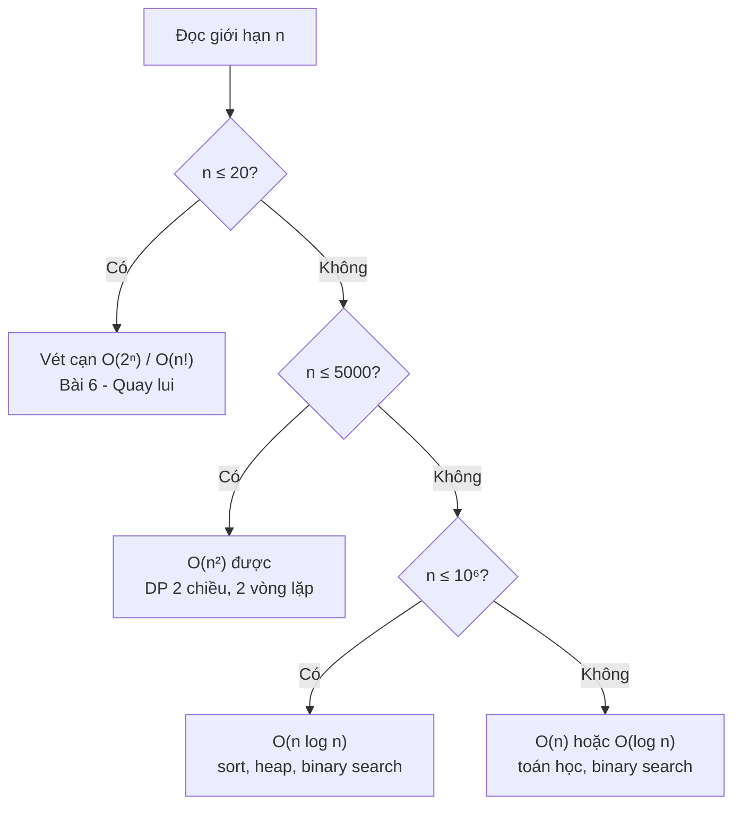

!!! tip "Đọc đề ngược: giới hạn n là gợi ý thuật toán!"
    Đề cho `n ≤ 10⁵` gần như chắc chắn đòi `O(n log n)` hoặc tốt hơn - nghĩ ngay tới sort, binary search, heap, hash. Đề cho `n ≤ 20` → nghĩ tới vét cạn/bitmask. Đây là mẹo cực mạnh khi luyện LeetCode/Codeforces.

**Bộ nhớ** cũng có giới hạn: 256 MB chứa được khoảng 64 triệu số `int32` hoặc 32 triệu số `int64`. Ma trận `n × n` với n = 10⁵ là 10¹⁰ ô → **không thể**.

## 📖 12. Benchmark thực nghiệm - lý thuyết có đúng không?

Hãy đo thật! Chương trình dưới đây chạy 3 thuật toán với n **tăng gấp đôi** mỗi lần. Dự đoán:

- `O(n)`: n gấp đôi → thời gian **gấp đôi**
- `O(n log n)`: gấp **hơn 2 một chút**
- `O(n²)`: gấp **4 lần**

=== "Go"

    ```go
    package main

    import (
    	"fmt"
    	"math/rand"
    	"slices"
    	"time"
    )

    func sumAll(a []int) int { // O(n)
    	s := 0
    	for _, v := range a {
    		s += v
    	}
    	return s
    }

    func countInversions(a []int) int { // O(n²): đếm cặp i<j mà a[i] > a[j]
    	c := 0
    	for i := range a {
    		for j := i + 1; j < len(a); j++ {
    			if a[i] > a[j] {
    				c++
    			}
    		}
    	}
    	return c
    }

    // Chạy f nhiều lần, trả về thời gian trung bình mỗi lần
    func measure(repeat int, f func()) time.Duration {
    	start := time.Now()
    	for i := 0; i < repeat; i++ {
    		f()
    	}
    	return time.Since(start) / time.Duration(repeat)
    }

    func main() {
    	r := rand.New(rand.NewSource(42))
    	fmt.Printf("%7s %12s %12s %12s\n", "n", "O(n) sum", "O(nlogn) sort", "O(n²) pairs")
    	for _, n := range []int{2000, 4000, 8000, 16000, 32000} {
    		a := make([]int, n)
    		for i := range a {
    			a[i] = r.Intn(1_000_000)
    		}
    		tLinear := measure(2000, func() { sumAll(a) })
    		tSort := measure(50, func() { b := slices.Clone(a); slices.Sort(b) })
    		tQuad := measure(3, func() { countInversions(a) })
    		fmt.Printf("%7d %12v %12v %12v\n", n, tLinear, tSort, tQuad)
    	}
    }

    // Output (máy của tác giả - máy bạn sẽ khác, hãy nhìn TỈ LỆ):
    //       n     O(n) sum O(nlogn) sort  O(n²) pairs
    //    2000        747ns    100.586µs   1.566885ms
    //    4000      1.462µs    260.264µs   5.234438ms
    //    8000      3.082µs    567.731µs  18.689359ms
    //   16000       5.99µs   1.162155ms  92.356749ms
    //   32000     11.673µs   2.544405ms 309.326279ms
    ```

=== "Python"

    ```python
    import random
    import time


    def sum_all(a):              # O(n) - vòng lặp Python thuần
        s = 0
        for v in a:
            s += v
        return s


    def count_inversions(a):     # O(n²)
        c = 0
        n = len(a)
        for i in range(n):
            ai = a[i]
            for j in range(i + 1, n):
                if ai > a[j]:
                    c += 1
        return c


    def measure(repeat, f):
        start = time.perf_counter()
        for _ in range(repeat):
            f()
        return (time.perf_counter() - start) / repeat


    def fmt(sec):
        return f"{sec * 1000:.3f} ms"


    random.seed(42)
    print(f"{'n':>6} {'O(n) sum':>12} {'O(nlogn) sort':>14} {'O(n²) pairs':>12}")
    for n in [500, 1000, 2000, 4000]:
        a = [random.randint(0, 999_999) for _ in range(n)]
        t_lin = measure(200, lambda: sum_all(a))
        t_sort = measure(50, lambda: sorted(a))
        t_quad = measure(1, lambda: count_inversions(a))
        print(f"{n:>6} {fmt(t_lin):>12} {fmt(t_sort):>14} {fmt(t_quad):>12}")

    # Output (máy của tác giả - máy bạn sẽ khác, hãy nhìn TỈ LỆ):
    #      n     O(n) sum  O(nlogn) sort  O(n²) pairs
    #    500     0.008 ms       0.018 ms     4.136 ms
    #   1000     0.016 ms       0.047 ms    14.665 ms
    #   2000     0.032 ms       0.188 ms    68.865 ms
    #   4000     0.087 ms       0.521 ms   278.499 ms
    ```

Nhận xét từ số liệu thật:

- Cột `O(n²)` **gấp ~3,5-4,5 lần** mỗi khi n gấp đôi - khớp lý thuyết "gấp 4" (lệch chút do cache CPU: mảng lớn không còn nằm gọn trong cache).
- Cột `O(n)` và `O(n log n)` **gấp ~2 lần** (với n nhỏ số liệu hơi nhiễu do cache CPU và độ phân giải đồng hồ).
- Python với n = 4.000 mà `O(n²)` đã tốn gần **0,3 giây**, trong khi Go phải tới n = 32.000 (gấp 8 lần n, tức gấp **64 lần** số phép toán) mới tốn cỡ đó. Hằng số của ngôn ngữ **có** quan trọng - nhưng Big-O quan trọng hơn: không ngôn ngữ nào cứu được `O(n²)` với n = 10⁷.
- `sorted()` của Python là O(n log n) nhưng viết bằng C, nên chỉ chậm hơn một vòng `for` O(n) thuần Python vài lần. Bài học: trong Python, **ưu tiên hàm có sẵn** (`sum`, `sorted`, `max`, `collections`...) thay vì tự viết vòng lặp.

### Công cụ benchmark chuyên nghiệp

=== "Go"

    ```go
    // file sum_test.go - chạy: go test -bench=. -benchmem
    package main

    import "testing"

    func BenchmarkSumAll(b *testing.B) {
    	a := make([]int, 10_000)
    	for b.Loop() { // Go 1.24+: b.Loop() tự quản lý số lần lặp
    		sumAll(a)
    	}
    }
    // Kết quả dạng: BenchmarkSumAll-8   356124   3350 ns/op   0 B/op   0 allocs/op
    ```

=== "Python"

    ```python
    import timeit

    # Chạy câu lệnh 1000 lần, lặp 5 đợt, lấy đợt nhanh nhất
    best = min(timeit.repeat("sum(a)", setup="a = list(range(10_000))",
                             number=1000, repeat=5))
    print(f"{best / 1000 * 1e6:.1f} µs mỗi lần")
    # Trong terminal: python -m timeit -s "a = list(range(10_000))" "sum(a)"
    ```

> 💡 Chi tiết về benchmark trong Go xem [Bài 9 khóa Go](../golang/09-packages-modules-testing.md); trong Python xem [khóa Python](../python/README.md).

## 🌍 Ứng dụng thực tế

Big-O không chỉ để đi phỏng vấn - nó quyết định hệ thống của bạn sống hay chết khi lượng người dùng tăng:

| Tình huống | Chậm (sai) | Nhanh (đúng) | Chênh lệch khi n = 10 triệu |
|---|---|---|---|
| Tìm user theo email trong database | Quét toàn bảng `O(n)` | Index B-tree `O(log n)` | 10.000.000 vs ~23 lần so sánh |
| Kiểm tra username đã tồn tại (trong bộ nhớ) | Duyệt list `O(n)` | Hash set `O(1)` | 10⁷ vs 1 |
| Lấy 10 sản phẩm bán chạy nhất | Sort toàn bộ `O(n log n)` | Heap kích thước k `O(n log k)` | 2,3 × 10⁸ vs 3,3 × 10⁷ |
| Phân trang `OFFSET 1000000 LIMIT 20` | DB phải bỏ qua 1 triệu dòng `O(offset)` | Cursor pagination `WHERE id > last_id` `O(log n)` | Trang càng sâu càng chậm vs luôn nhanh |
| Load bài viết + tác giả (N+1 query) | N+1 lần gọi DB | 1-2 query có `JOIN`/`IN` | 1.001 round-trip vs 2 |

Một số câu chuyện có thật:

- **Sự cố Cloudflare 2/7/2019**: một biểu thức chính quy (regex) có thể **backtracking** theo cấp số nhân đã đẩy CPU của toàn bộ hệ thống lên 100% và làm sập hàng loạt website trong khoảng 27 phút. Đây là lý do package `regexp` của Go dùng engine RE2 **đảm bảo thời gian tuyến tính**, còn `re` của Python (có backtracking) cần cẩn thận với input do người dùng nhập.
- **Tấn công hash flooding (2011)**: kẻ tấn công gửi hàng nghìn key cố tình trùng hash, biến hash table `O(1)` thành `O(n)` → server web chết vì một request. Python (từ 3.3) và Go đã thêm **seed ngẫu nhiên** cho hàm băm để chống lại (xem [Bài 3 - Hash Table](./03-hashing.md)).
- **`git bisect`** dùng binary search trên lịch sử commit: tìm commit gây bug trong 1.000 commit chỉ mất ~10 lần build/test.

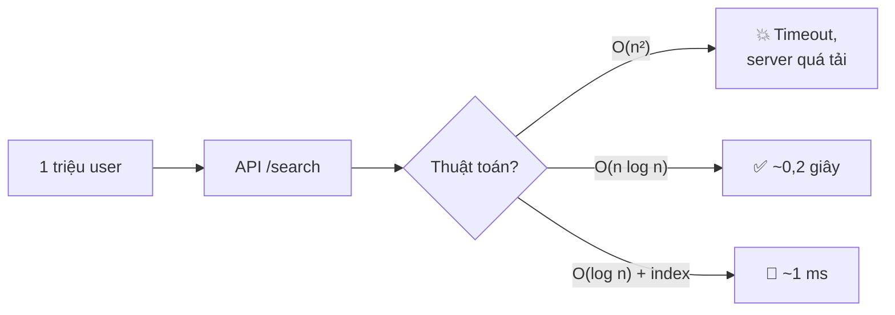

## ⚠️ Lỗi thường gặp

**1. Nghĩ hai vòng lặp nối tiếp là O(n²)**

```text
for x in arr: ...   # O(n)
for y in arr: ...   # O(n)
→ O(n) + O(n) = O(n), KHÔNG phải O(n²). Chỉ LỒNG NHAU mới nhân.
```

**2. Bỏ quên chi phí "ẩn" của hàm thư viện**

| Thao tác | Trông như | Thực tế |
|---|---|---|
| Python `x in list` | O(1) | **O(n)** - dùng `set` nếu tra nhiều lần |
| Python `list.pop(0)`, `list.insert(0, x)` | O(1) | **O(n)** - dùng `collections.deque` |
| Python `arr[1:]`, Go `slices.Clone` | O(1) | **O(n)** - tạo bản sao |
| Nối chuỗi `s += t` trong vòng lặp | O(1) | **O(len)** mỗi lần → tổng O(n²) |
| Go `append(s[:i], s[i+1:]...)` (xóa giữa) | O(1) | **O(n)** - dịch chuyển phần tử |
| Go `strings.Contains`, Python `sub in s` | O(1) | **O(n·m)** trường hợp xấu (ngây thơ) |

**3. Dùng chung chữ n cho hai đầu vào khác nhau**

So sánh mọi cặp giữa danh sách `users` (u phần tử) và `orders` (o phần tử) là `O(u·o)`, không phải `O(n²)`. Nếu u = 10 còn o = 10⁶ thì khác xa nhau!

**4. Quên bộ nhớ của đệ quy**

Hàm đệ quy không tạo mảng nào vẫn tốn `O(độ sâu)` bộ nhớ cho call stack. Duyệt cây lệch (giống linked list) sâu n tầng → O(n) stack, dễ `RecursionError` trong Python.

**5. Nhầm "khấu hao O(1)" thành "mọi lần đều O(1)"**

`append` thỉnh thoảng tốn O(n). Nếu biết trước số phần tử, hãy cấp phát trước: `make([]int, 0, n)` trong Go, hoặc `[0] * n` trong Python.

**6. Tối ưu vụn vặt trước khi sửa thuật toán**

Đổi `i++` thành `i += 1`, cache `len(arr)`... chỉ nhanh vài %. Đổi `O(n²)` thành `O(n log n)` có thể nhanh **hàng nghìn lần**. Hãy sửa Big-O trước, tối ưu hằng số sau (và chỉ khi đo đạc cho thấy cần).

**7. Tin rằng O(1) luôn nhanh**

Hash một chuỗi dài 1 MB tốn O(độ dài chuỗi). "O(1)" của hash map là theo **số phần tử**, không phải theo kích thước key.

## 🏋️ Bài tập

### Bài 1 (⭐ Dễ): Xác định Big-O

Cho biết độ phức tạp thời gian của từng đoạn code (n là kích thước đầu vào):

```text
(a) for i in 0..n: for j in 0..100: work()
(b) i = n; while i > 0: i = i / 3
(c) for i in 0..n: for j in i..n: work()
(d) for i in 0..n: work(); for j in 0..m: work()
(e) for i in 0..n: for j = 1; j < n; j *= 2: work()
(f) def f(n): if n <= 1: return; f(n-1); f(n-1)
(g) def g(n): if n <= 1: return; g(n/2); g(n/2)
(h) for i in 0..n: if i == 0: for j in 0..n: work()
```

<details markdown="1">
<summary>Đáp án</summary>

- **(a)** `O(n)` - vòng trong chạy **hằng số** 100 lần → `100n`.
- **(b)** `O(log n)` - chia 3 mỗi lần, `log₃n` bước.
- **(c)** `O(n²)` - mẫu tam giác `n + (n-1) + ... + 1 = n(n+1)/2`.
- **(d)** `O(n + m)` - hai vòng **nối tiếp**, hai biến khác nhau.
- **(e)** `O(n log n)` - n lần, mỗi lần log n.
- **(f)** `O(2ⁿ)` - `T(n) = 2T(n-1) + 1`, mỗi tầng số lời gọi gấp đôi.
- **(g)** `O(n)` - `T(n) = 2T(n/2) + O(1)`, Master: a=2, b=2, d=0, a > bᵈ → `O(n^log₂2) = O(n)`.
- **(h)** `O(n)` - vòng trong chỉ chạy **một lần** (khi i == 0): `n + n = 2n`.

</details>

### Bài 2 (⭐ Dễ): Xếp hạng tốc độ tăng

Sắp xếp các hàm sau từ tăng **chậm nhất** đến **nhanh nhất**: `n²`, `2ⁿ`, `n log n`, `log n`, `√n`, `n!`, `1000`, `n³`, `100n`, `nⁿ`, `log(n²)`, `3ⁿ`.

<details markdown="1">
<summary>Đáp án</summary>

`1000` < `log n` = `log(n²)` (vì `log(n²) = 2 log n`, cùng lớp) < `√n` < `100n` < `n log n` < `n²` < `n³` < `2ⁿ` < `3ⁿ` < `n!` < `nⁿ`.

Lưu ý: `2ⁿ` và `3ⁿ` **khác lớp** (vì `3ⁿ / 2ⁿ = 1,5ⁿ → ∞`) - cơ số của hàm mũ quan trọng, khác với cơ số của log!

</details>

### Bài 3 (⭐ Dễ): Two Sum - từ O(n²) xuống O(n)

[LeetCode 1 - Two Sum](https://leetcode.com/problems/two-sum/): cho mảng `nums` và `target`, tìm 2 chỉ số `i ≠ j` sao cho `nums[i] + nums[j] == target`. Viết 2 cách: vét cạn `O(n²)` và dùng hash map `O(n)`.

<details markdown="1">
<summary>Đáp án</summary>

=== "Go"

    ```go
    package main

    import "fmt"

    // O(n²) thời gian, O(1) bộ nhớ
    func twoSumBrute(nums []int, target int) []int {
    	for i := 0; i < len(nums); i++ {
    		for j := i + 1; j < len(nums); j++ {
    			if nums[i]+nums[j] == target {
    				return []int{i, j}
    			}
    		}
    	}
    	return nil
    }

    // O(n) thời gian, O(n) bộ nhớ: đổi bộ nhớ lấy tốc độ
    func twoSumHash(nums []int, target int) []int {
    	seen := map[int]int{} // giá trị → chỉ số
    	for i, x := range nums {
    		if j, ok := seen[target-x]; ok {
    			return []int{j, i}
    		}
    		seen[x] = i
    	}
    	return nil
    }

    func main() {
    	nums := []int{2, 7, 11, 15}
    	fmt.Println(twoSumBrute(nums, 9), twoSumHash(nums, 9))
    	fmt.Println(twoSumBrute(nums, 26), twoSumHash(nums, 26))
    }

    // Output:
    // [0 1] [0 1]
    // [2 3] [2 3]
    ```

=== "Python"

    ```python
    def two_sum_brute(nums, target):
        """O(n²) thời gian, O(1) bộ nhớ."""
        for i in range(len(nums)):
            for j in range(i + 1, len(nums)):
                if nums[i] + nums[j] == target:
                    return [i, j]
        return None


    def two_sum_hash(nums, target):
        """O(n) thời gian, O(n) bộ nhớ: đổi bộ nhớ lấy tốc độ."""
        seen = {}  # giá trị → chỉ số
        for i, x in enumerate(nums):
            if target - x in seen:
                return [seen[target - x], i]
            seen[x] = i
        return None


    nums = [2, 7, 11, 15]
    print(two_sum_brute(nums, 9), two_sum_hash(nums, 9))
    print(two_sum_brute(nums, 26), two_sum_hash(nums, 26))

    # Output:
    # [0, 1] [0, 1]
    # [2, 3] [2, 3]
    ```

Đây là **trade-off kinh điển**: dùng thêm `O(n)` bộ nhớ để giảm thời gian từ `O(n²)` xuống `O(n)`. Xem kỹ ở [Bài 3](./03-hashing.md).

</details>

### Bài 4 (⭐⭐ Trung bình): Contains Duplicate - 3 cách, 3 độ phức tạp

[LeetCode 217 - Contains Duplicate](https://leetcode.com/problems/contains-duplicate/): mảng có phần tử nào xuất hiện ít nhất 2 lần không? Hãy nêu 3 cách với độ phức tạp thời gian/bộ nhớ khác nhau.

<details markdown="1">
<summary>Đáp án</summary>

| Cách | Thời gian | Bộ nhớ thêm |
|---|---|---|
| So sánh mọi cặp | O(n²) | O(1) |
| Sắp xếp rồi so sánh 2 phần tử kề nhau | O(n log n) | O(1) - O(n) tùy thuật toán sort |
| Dùng hash set | O(n) | O(n) |

=== "Go"

    ```go
    package main

    import (
    	"fmt"
    	"slices"
    )

    func containsDupSort(nums []int) bool { // O(n log n)
    	s := slices.Clone(nums) // không sửa mảng gốc của người gọi
    	slices.Sort(s)
    	for i := 1; i < len(s); i++ {
    		if s[i] == s[i-1] {
    			return true
    		}
    	}
    	return false
    }

    func containsDupSet(nums []int) bool { // O(n)
    	seen := make(map[int]struct{}, len(nums))
    	for _, x := range nums {
    		if _, ok := seen[x]; ok {
    			return true
    		}
    		seen[x] = struct{}{}
    	}
    	return false
    }

    func main() {
    	for _, nums := range [][]int{{1, 2, 3, 1}, {1, 2, 3, 4}} {
    		fmt.Println(nums, containsDupSort(nums), containsDupSet(nums))
    	}
    }

    // Output:
    // [1 2 3 1] true true
    // [1 2 3 4] false false
    ```

=== "Python"

    ```python
    def contains_dup_sort(nums):   # O(n log n)
        s = sorted(nums)
        return any(s[i] == s[i - 1] for i in range(1, len(s)))


    def contains_dup_set(nums):    # O(n)
        return len(set(nums)) != len(nums)


    for nums in [[1, 2, 3, 1], [1, 2, 3, 4]]:
        print(nums, contains_dup_sort(nums), contains_dup_set(nums))

    # Output:
    # [1, 2, 3, 1] True True
    # [1, 2, 3, 4] False False
    ```

</details>

### Bài 5 (⭐⭐ Trung bình): Lũy thừa nhanh - Pow(x, n)

[LeetCode 50 - Pow(x, n)](https://leetcode.com/problems/powx-n/): tính `xⁿ`. Cách ngây thơ nhân n lần là `O(n)` - quá chậm khi n = 2³¹. Hãy làm `O(log n)` bằng ý tưởng: `xⁿ = (x^(n/2))²` nếu n chẵn, `x · xⁿ⁻¹` nếu n lẻ.

<details markdown="1">
<summary>Đáp án</summary>

Mỗi bước n giảm một nửa → `O(log n)` phép nhân. Ví dụ `2¹⁰ = (2⁵)²`, `2⁵ = 2 · (2²)²`... chỉ ~4 phép nhân thay vì 10.

=== "Go"

    ```go
    package main

    import "fmt"

    func myPow(x float64, n int) float64 {
    	if n < 0 {
    		x, n = 1/x, -n
    	}
    	result := 1.0
    	for n > 0 {
    		if n%2 == 1 { // bit thấp nhất bằng 1 → nhân vào kết quả
    			result *= x
    		}
    		x *= x // bình phương cơ số
    		n /= 2 // chia đôi số mũ → O(log n)
    	}
    	return result
    }

    func main() {
    	fmt.Println(myPow(2, 10))
    	fmt.Printf("%.5f\n", myPow(2.1, 3))
    	fmt.Println(myPow(2, -2))
    	fmt.Println(myPow(1.0000001, 1<<31-1) > 1)
    }

    // Output:
    // 1024
    // 9.26100
    // 0.25
    // true
    ```

=== "Python"

    ```python
    def my_pow(x: float, n: int) -> float:
        if n < 0:
            x, n = 1 / x, -n
        result = 1.0
        while n > 0:
            if n % 2 == 1:   # bit thấp nhất bằng 1 → nhân vào kết quả
                result *= x
            x *= x           # bình phương cơ số
            n //= 2          # chia đôi số mũ → O(log n)
        return result


    print(my_pow(2, 10))
    print(f"{my_pow(2.1, 3):.5f}")
    print(my_pow(2, -2))
    print(my_pow(1.0000001, 2**31 - 1) > 1)

    # Output:
    # 1024.0
    # 9.26100
    # 0.25
    # True
    ```

</details>

### Bài 6 (⭐⭐ Trung bình): Câu hỏi mẹo

Độ phức tạp của đoạn code sau là gì? (Gợi ý: đừng vội nói `O(n log n)`!)

```go
for i := n; i > 0; i /= 2 {
	for j := 0; j < i; j++ {
		work()
	}
}
```

<details markdown="1">
<summary>Đáp án</summary>

Vòng trong chạy `n + n/2 + n/4 + ... + 1 < 2n` lần tổng cộng → **O(n)**. Vòng ngoài có log n lần nhưng mỗi lần vòng trong **nhỏ đi một nửa**, nên không phải n × log n. Đây cũng là lý do thuật toán **build heap** là O(n) (Bài 10).

</details>

### Bài 7 (⭐⭐⭐ Khó): Chọn thuật toán theo giới hạn

Với mỗi đề bài sau (giới hạn 1 giây, dùng Go), độ phức tạp tối đa có thể chấp nhận là gì, và gợi ý một hướng giải:

1. n ≤ 15, tìm cách chia n người thành 2 đội có tổng sức mạnh chênh lệch ít nhất
2. n ≤ 2 × 10⁵, đếm số cặp `(i, j)` có `a[i] + a[j] = k`
3. n ≤ 10¹², kiểm tra n có phải số nguyên tố
4. n ≤ 3.000, tìm dãy con chung dài nhất của 2 chuỗi độ dài n

<details markdown="1">
<summary>Đáp án</summary>

1. `O(2ⁿ · n)` ≈ 5 × 10⁵ → vét cạn mọi tập con ([Bài 6](./06-recursion-backtracking.md)).
2. `O(n log n)` hoặc `O(n)` → hash map đếm tần suất ([Bài 3](./03-hashing.md)) hoặc sort + two pointers ([Bài 2](./02-arrays-strings.md)). `O(n²)` = 4 × 10¹⁰ là quá chậm.
3. `O(√n)` = 10⁶ phép chia → thử chia tới √n ([Bài 16](./16-strings-math-bits.md)).
4. `O(n²)` = 9 × 10⁶ → quy hoạch động 2 chiều LCS ([Bài 14](./14-dynamic-programming.md)).

</details>

### Luyện thêm trên LeetCode

- [509 - Fibonacci Number](https://leetcode.com/problems/fibonacci-number/) - so sánh đệ quy ngây thơ `O(2ⁿ)` vs vòng lặp `O(n)`
- [69 - Sqrt(x)](https://leetcode.com/problems/sqrtx/) - binary search `O(log x)` thay vì thử từng số `O(√x)`
- [204 - Count Primes](https://leetcode.com/problems/count-primes/) - sàng Eratosthenes `O(n log log n)` (mẫu vòng lặp điều hòa)
- [1492 - The kth Factor of n](https://leetcode.com/problems/the-kth-factor-of-n/) - từ `O(n)` xuống `O(√n)`

## ✅ Checklist hoàn thành

- [ ] Giải thích được vì sao đếm số bước tốt hơn bấm giờ để so sánh thuật toán
- [ ] Phân biệt Big-O (cận trên), Big-Ω (cận dưới), Big-Θ (cận chặt)
- [ ] Thuộc thứ tự: `1 < log n < √n < n < n log n < n² < n³ < 2ⁿ < n!`
- [ ] Áp dụng các quy tắc: bỏ hằng số, giữ số hạng trội, nối tiếp cộng, lồng nhau nhân
- [ ] Giải thích được vì sao "chia đôi" sinh ra `log n`
- [ ] Phân tích được vòng lặp tam giác, vòng `i *= 2`, vòng điều hòa
- [ ] Vẽ được cây đệ quy và dùng định lý Master bản đơn giản
- [ ] Hiểu call stack tốn bộ nhớ `O(độ sâu)` và giới hạn đệ quy của Python
- [ ] Giải thích được vì sao `append` là O(1) khấu hao
- [ ] Phân biệt tốt nhất / trung bình / xấu nhất
- [ ] Dùng bảng "n → độ phức tạp" để đoán thuật toán từ giới hạn đề bài
- [ ] Tự viết benchmark bằng Go và Python và thấy O(n²) gấp 4 khi n gấp đôi
- [ ] Hoàn thành ít nhất 5 bài tập

**Bài tiếp theo**: [Bài 2: Mảng & Chuỗi](./02-arrays-strings.md)

---

💡 **Tips ghi nhớ**:

- **Big-O = tốc độ tăng**, không phải thời gian tuyệt đối
- **Nối tiếp thì cộng, lồng nhau thì nhân, chia đôi thì log**
- **log₂(10⁹) ≈ 30** - log gần như hằng số
- **~10⁸ phép toán/giây** (Go), Python chậm hơn ~10-50 lần
- **Đổi thuật toán > đổi máy**
