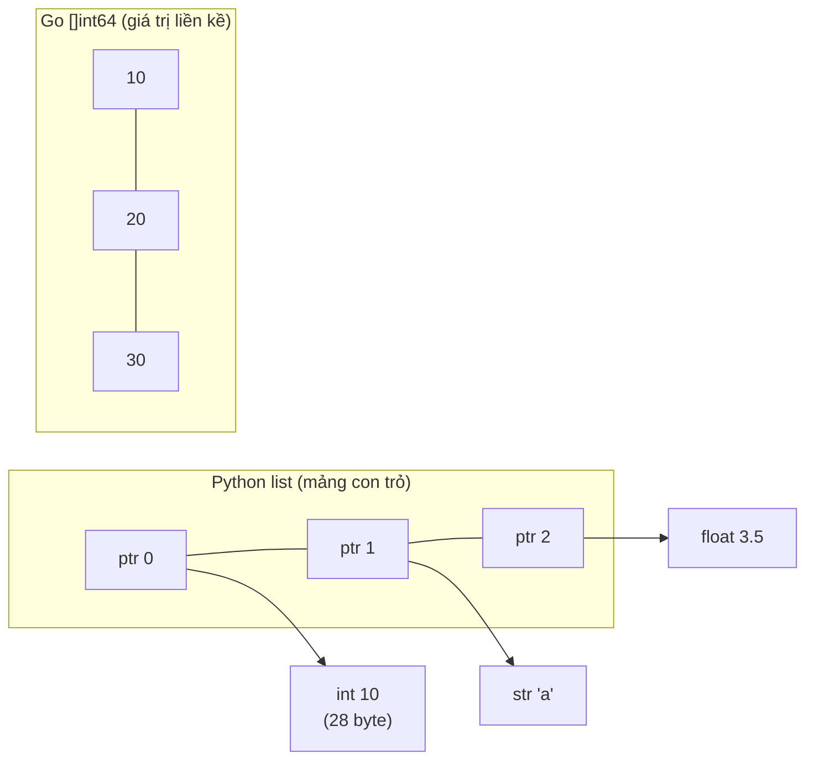
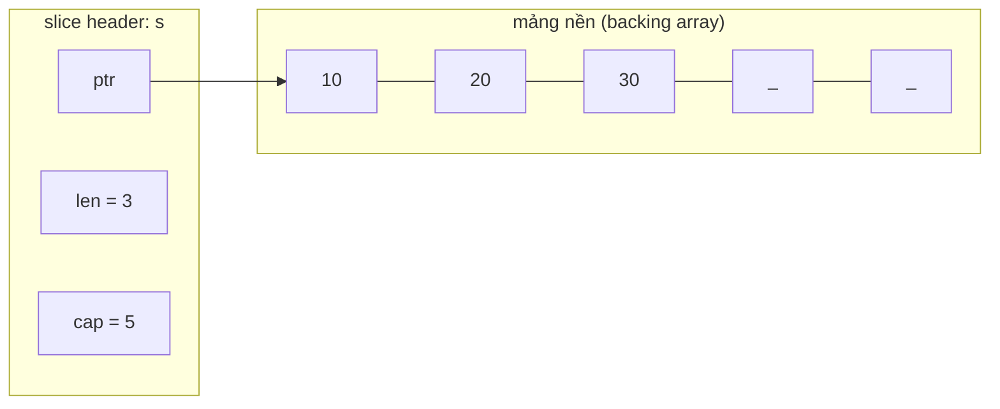
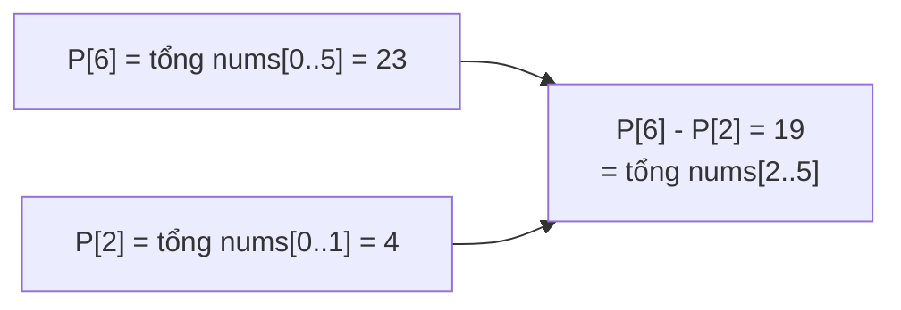
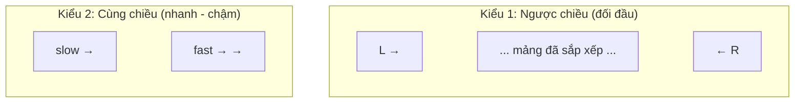
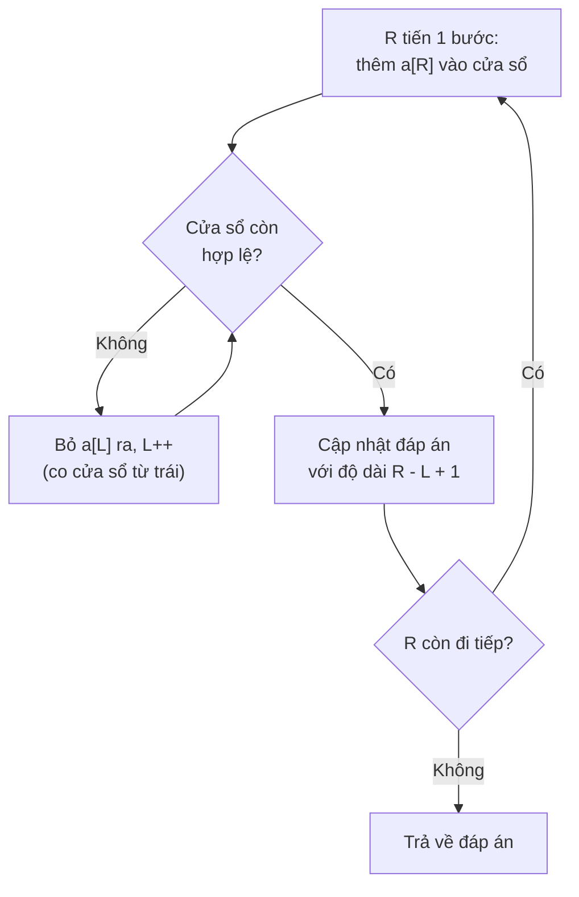
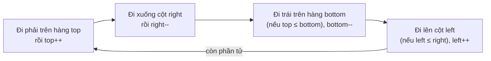
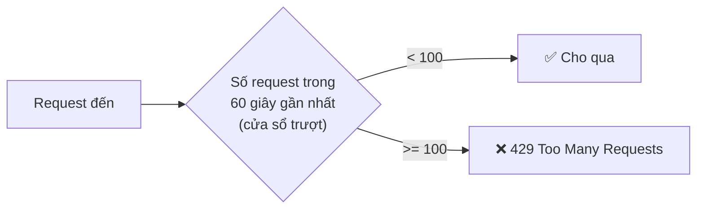

# 📚 Bài 2: Mảng & Chuỗi (Arrays & Strings)

## 🎯 Mục tiêu bài học

- Hiểu mảng nằm trong bộ nhớ **như thế nào** và vì sao truy cập `arr[i]` là `O(1)`
- Phân biệt **mảng tĩnh** và **mảng động** (slice của Go, list của Python)
- Nắm chi phí của từng thao tác: đọc, ghi, thêm cuối, chèn giữa, xóa, tìm kiếm
- Làm việc với **mảng 2 chiều** (ma trận, lưới) và các lỗi kinh điển
- Hiểu **chuỗi bất biến** (immutable), **byte vs rune**, Unicode và tiếng Việt có dấu
- Thành thạo 7 kỹ thuật "ăn tiền" nhất với mảng:
    - **Prefix sum** (tổng tiền tố)
    - **Two pointers** (hai con trỏ)
    - **Sliding window** (cửa sổ trượt) cố định và thay đổi
    - **Kadane** (dãy con có tổng lớn nhất)
    - **Đảo ngược / xoay mảng tại chỗ**
    - **Duyệt ma trận xoắn ốc**, xoay ma trận
    - **Difference array** (mảng hiệu)
- Giải được các bài LeetCode kinh điển về mảng & chuỗi bằng cả Go và Python

!!! tip "Vì sao mảng quan trọng nhất?"
    Mảng là cấu trúc dữ liệu **nền tảng** nhất: hash table, heap, stack, queue, ma trận kề của đồ thị, bảng quy hoạch động... **đều xây trên mảng**. Khoảng 30-40% bài phỏng vấn thuật toán là bài về mảng và chuỗi.

## 📖 1. Mảng nằm trong bộ nhớ như thế nào?

### Dãy nhà liền kề trên một con phố

Hãy tưởng tượng một dãy nhà phố **liền kề nhau**, mỗi căn rộng đúng **4 mét**. Căn đầu tiên ở mét số 1000. Hỏi căn thứ 7 ở đâu? Không cần đi bộ qua 6 căn trước - chỉ cần tính: `1000 + 7 × 4 = 1028`. 

Mảng cũng vậy: các phần tử **cùng kích thước** nằm **liền kề** trong bộ nhớ. Địa chỉ của phần tử thứ i:

```text
địa_chỉ(arr[i]) = địa_chỉ_gốc + i × kích_thước_phần_tử
```

```text
Mảng int64 (mỗi phần tử 8 byte): arr = [10, 20, 30, 40, 50]

Địa chỉ:   1000     1008     1016     1024     1032
         ┌────────┬────────┬────────┬────────┬────────┐
         │   10   │   20   │   30   │   40   │   50   │
         └────────┴────────┴────────┴────────┴────────┘
Chỉ số:     [0]      [1]      [2]      [3]      [4]

arr[3] → 1000 + 3 × 8 = 1024 → đọc ngay, không cần duyệt → O(1)
```

Đó là lý do **chỉ số bắt đầu từ 0**: `arr[0]` nằm ngay tại địa chỉ gốc (khoảng cách 0).

### Bonus: cache CPU thích mảng

CPU không đọc từng byte mà đọc cả **dòng cache** (thường 64 byte) một lúc. Khi bạn đọc `arr[0]`, CPU "tiện tay" mang luôn `arr[1]` ... `arr[7]` vào cache. Duyệt mảng tuần tự vì vậy **cực nhanh** - nhanh hơn nhiều so với duyệt linked list (các nút nằm rải rác, xem [Bài 4](./04-linked-lists.md)).

Kiểm chứng: in ra khoảng cách địa chỉ giữa các phần tử.

=== "Go"

    ```go
    package main

    import (
    	"fmt"
    	"unsafe"
    )

    func main() {
    	arr := [5]int64{10, 20, 30, 40, 50}
    	base := uintptr(unsafe.Pointer(&arr[0]))
    	for i := range arr {
    		addr := uintptr(unsafe.Pointer(&arr[i]))
    		fmt.Printf("arr[%d] = %d nằm ở gốc + %d byte\n", i, arr[i], addr-base)
    	}
    	fmt.Println("Kích thước 1 phần tử:", unsafe.Sizeof(arr[0]), "byte")
    	fmt.Println("Kích thước cả mảng:  ", unsafe.Sizeof(arr), "byte")
    }

    // Output:
    // arr[0] = 10 nằm ở gốc + 0 byte
    // arr[1] = 20 nằm ở gốc + 8 byte
    // arr[2] = 30 nằm ở gốc + 16 byte
    // arr[3] = 40 nằm ở gốc + 24 byte
    // arr[4] = 50 nằm ở gốc + 32 byte
    // Kích thước 1 phần tử: 8 byte
    // Kích thước cả mảng:   40 byte
    ```

=== "Python"

    ```python
    import sys
    from array import array

    # array('q') = mảng số nguyên 8 byte nằm liền kề, giống mảng của C/Go
    arr = array("q", [10, 20, 30, 40, 50])
    for i in range(len(arr)):
        print(f"arr[{i}] = {arr[i]} nằm ở gốc + {i * arr.itemsize} byte")
    print("Kích thước 1 phần tử:", arr.itemsize, "byte")

    # list thông thường: mảng các CON TRỎ (8 byte) trỏ tới object int ở chỗ khác
    lst = [10, 20, 30, 40, 50]
    print("list 5 phần tử (chỉ tính mảng con trỏ):", sys.getsizeof(lst), "byte")
    print("mỗi object int riêng lẻ:", sys.getsizeof(10), "byte")

    # Output:
    # arr[0] = 10 nằm ở gốc + 0 byte
    # arr[1] = 20 nằm ở gốc + 8 byte
    # arr[2] = 30 nằm ở gốc + 16 byte
    # arr[3] = 40 nằm ở gốc + 24 byte
    # arr[4] = 50 nằm ở gốc + 32 byte
    # Kích thước 1 phần tử: 8 byte
    # list 5 phần tử (chỉ tính mảng con trỏ): 104 byte
    # mỗi object int riêng lẻ: 28 byte
    ```

!!! note "List của Python là mảng con trỏ"
    `list` trong Python là **mảng liền kề các con trỏ** (reference), mỗi con trỏ trỏ tới một object nằm đâu đó trên heap. Nhờ vậy list chứa được đủ loại kiểu (`[1, "a", 3.5]`), nhưng tốn bộ nhớ hơn và kém thân thiện với cache. Khi cần xử lý số lượng lớn, dân Python dùng `array` hoặc **NumPy** (mảng số liền kề thật sự).



## 📖 2. Mảng tĩnh vs Mảng động

| | Mảng tĩnh (static array) | Mảng động (dynamic array) |
|---|---|---|
| Kích thước | Cố định lúc tạo | Tự lớn lên khi thêm |
| Go | `[5]int` | `[]int` (slice) |
| Python | `array`, tuple (bất biến) | `list` |
| Thêm cuối | ❌ Không được | ✅ O(1) khấu hao |
| Dùng khi | Kích thước biết trước và không đổi (tọa độ `[3]float64`, bàn cờ `[8][8]`) | 99% trường hợp còn lại |

### Slice của Go: "cửa sổ" nhìn vào mảng nền

Một slice gồm 3 trường: **con trỏ** tới mảng nền, **len** (số phần tử đang dùng), **cap** (sức chứa):



Khi `len == cap` mà vẫn `append`, Go cấp phát mảng mới lớn hơn (~gấp đôi), copy sang, và **slice mới trỏ tới mảng mới**:

```text
append(s, 40), append(s, 50): còn chỗ → ghi thẳng vào ô trống, O(1)
┌────┬────┬────┬────┬────┐
│ 10 │ 20 │ 30 │ 40 │ 50 │   len=5, cap=5 (đầy)
└────┴────┴────┴────┴────┘
append(s, 60): hết chỗ → cấp phát mảng cap=10, copy 5 phần tử, O(n) nhưng hiếm
┌────┬────┬────┬────┬────┬────┬────┬────┬────┬────┐
│ 10 │ 20 │ 30 │ 40 │ 50 │ 60 │    │    │    │    │   len=6, cap=10
└────┴────┴────┴────┴────┴────┴────┴────┴────┴────┘
```

Phân tích chi tiết vì sao append là **O(1) khấu hao** đã có ở [Bài 1, mục 9](./01-complexity.md). Cú pháp slice/list chi tiết xem [Go Bài 5](../golang/05-arrays-slices-maps.md) và [Python Bài 5](../python/05-data-structures.md).

## 📖 3. Các thao tác trên mảng và chi phí

| Thao tác | Go | Python | Độ phức tạp | Vì sao |
|---|---|---|---|---|
| Đọc/ghi `a[i]` | `a[i]` | `a[i]` | **O(1)** | Tính địa chỉ trực tiếp |
| Thêm cuối | `append(a, x)` | `a.append(x)` | **O(1)** khấu hao | Thỉnh thoảng phải cấp phát lại |
| Xóa cuối | `a = a[:len(a)-1]` | `a.pop()` | **O(1)** | Chỉ giảm len |
| Chèn ở vị trí i | `slices.Insert(a, i, x)` | `a.insert(i, x)` | **O(n)** | Dịch các phần tử sau i sang phải |
| Xóa ở vị trí i | `slices.Delete(a, i, i+1)` | `del a[i]` / `a.pop(i)` | **O(n)** | Dịch các phần tử sau i sang trái |
| Tìm kiếm (chưa sắp xếp) | `slices.Index(a, x)` | `a.index(x)`, `x in a` | **O(n)** | Duyệt từng phần tử |
| Tìm kiếm (đã sắp xếp) | `slices.BinarySearch` | `bisect.bisect_left` | **O(log n)** | Binary search ([Bài 8](./08-binary-search.md)) |
| Sao chép / cắt | `slices.Clone`, `copy` | `a[:]`, `a[l:r]` | **O(n)** / **O(r-l)** | Copy từng phần tử |

### Vì sao chèn giữa tốn O(n)?

Giống xếp hàng mua vé: có người **chen vào vị trí thứ 2**, tất cả những người phía sau phải **lùi lại một bước**.

```text
Chèn 99 vào vị trí 1 của [10, 20, 30, 40]:

Bước 0:  [10, 20, 30, 40, __]     nới thêm 1 ô ở cuối
Bước 1:  [10, 20, 30, 40, 40]     dịch 40 sang phải
Bước 2:  [10, 20, 30, 30, 40]     dịch 30 sang phải
Bước 3:  [10, 20, 20, 30, 40]     dịch 20 sang phải
Bước 4:  [10, 99, 20, 30, 40]     ghi 99 vào ô 1 → 3 lần dịch = n - i
```

Tự cài đặt để đếm số lần dịch:

=== "Go"

    ```go
    package main

    import (
    	"fmt"
    	"slices"
    )

    func insertAt(a []int, i, x int) ([]int, int) {
    	a = append(a, 0) // nới thêm 1 ô ở cuối
    	shifts := 0
    	for j := len(a) - 1; j > i; j-- {
    		a[j] = a[j-1] // dịch sang phải
    		shifts++
    	}
    	a[i] = x
    	return a, shifts
    }

    func deleteAt(a []int, i int) ([]int, int) {
    	shifts := 0
    	for j := i; j < len(a)-1; j++ {
    		a[j] = a[j+1] // dịch sang trái lấp chỗ trống
    		shifts++
    	}
    	return a[:len(a)-1], shifts
    }

    func main() {
    	a := []int{10, 20, 30, 40}
    	a, s := insertAt(a, 1, 99)
    	fmt.Println("sau khi chèn:", a, "- số lần dịch:", s)
    	a, s = deleteAt(a, 0)
    	fmt.Println("sau khi xóa: ", a, "- số lần dịch:", s)

    	// Cách viết thực tế với package slices (Go 1.21+) - bên trong cũng dịch O(n)
    	b := []int{1, 2, 3}
    	b = slices.Insert(b, 1, 100)
    	b = slices.Delete(b, 2, 3) // xóa đoạn [2, 3)
    	fmt.Println("slices:", b)
    }

    // Output:
    // sau khi chèn: [10 99 20 30 40] - số lần dịch: 3
    // sau khi xóa:  [99 20 30 40] - số lần dịch: 4
    // slices: [1 100 3]
    ```

=== "Python"

    ```python
    def insert_at(a, i, x):
        a.append(None)                 # nới thêm 1 ô ở cuối
        shifts = 0
        for j in range(len(a) - 1, i, -1):
            a[j] = a[j - 1]            # dịch sang phải
            shifts += 1
        a[i] = x
        return shifts


    def delete_at(a, i):
        shifts = 0
        for j in range(i, len(a) - 1):
            a[j] = a[j + 1]            # dịch sang trái lấp chỗ trống
            shifts += 1
        a.pop()
        return shifts


    a = [10, 20, 30, 40]
    s = insert_at(a, 1, 99)
    print("sau khi chèn:", a, "- số lần dịch:", s)
    s = delete_at(a, 0)
    print("sau khi xóa: ", a, "- số lần dịch:", s)

    # Cách viết thực tế - bên trong cũng dịch O(n)
    b = [1, 2, 3]
    b.insert(1, 100)
    del b[2]
    print("list:", b)

    # Output:
    # sau khi chèn: [10, 99, 20, 30, 40] - số lần dịch: 3
    # sau khi xóa:  [99, 20, 30, 40] - số lần dịch: 4
    # list: [1, 100, 3]
    ```

!!! tip "Mẹo xóa O(1) khi không cần giữ thứ tự"
    Nếu thứ tự không quan trọng, **đổi chỗ phần tử cần xóa với phần tử cuối** rồi xóa cuối: `a[i] = a[len(a)-1]; a = a[:len(a)-1]` → O(1). Mẹo này dùng nhiều trong game (xóa đạn/quái khỏi danh sách) và trong "Insert Delete GetRandom O(1)" ([LeetCode 380](https://leetcode.com/problems/insert-delete-getrandom-o1/)).

## 📖 4. Mảng 2 chiều (ma trận, lưới)

### Bố cục trong bộ nhớ: row-major

Ma trận `3 × 4` thực chất được "trải phẳng" thành từng hàng nối tiếp nhau (**row-major**):

```text
Ma trận logic:                 Trong bộ nhớ (mảng 2D tĩnh):
     c0  c1  c2  c3
r0 [  1,  2,  3,  4 ]          [1 2 3 4 | 5 6 7 8 | 9 10 11 12]
r1 [  5,  6,  7,  8 ]           └─ r0 ─┘  └─ r1 ─┘  └── r2 ───┘
r2 [  9, 10, 11, 12 ]
                               grid[r][c] = flat[r × số_cột + c]
                               grid[2][1] = flat[2 × 4 + 1] = flat[9] = 10
```

Vì vậy **duyệt theo hàng** (`for r { for c { } }`) nhanh hơn duyệt theo cột với ma trận lớn - đọc bộ nhớ tuần tự, tận dụng cache.

!!! note "Slice-of-slice trong Go và list-of-list trong Python"
    `[][]int` (Go) và `list[list[int]]` (Python) thực ra là **mảng các con trỏ tới từng hàng** - mỗi hàng là một mảng riêng, có thể nằm rải rác. Vẫn dùng `grid[r][c]` như bình thường, chỉ là không liền kề 100% như mảng 2D tĩnh `[3][4]int`.

### Duyệt 4 hướng / 8 hướng - kỹ thuật "mảng hướng"

Trong các bài lưới (mê cung, đảo, game), ta hay cần xét các ô **kề** một ô. Thay vì viết 4 câu `if`, dùng **mảng hướng**:

```text
          (r-1, c)
             ↑
(r, c-1) ← (r, c) → (r, c+1)
             ↓
          (r+1, c)

dirs = [(-1,0), (1,0), (0,-1), (0,1)]   # lên, xuống, trái, phải
```

=== "Go"

    ```go
    package main

    import "fmt"

    func main() {
    	grid := []string{
    		"#..#",
    		".#..",
    		"..#.",
    	}
    	rows, cols := len(grid), len(grid[0])
    	dirs := [][2]int{{-1, 0}, {1, 0}, {0, -1}, {0, 1}} // lên, xuống, trái, phải

    	// Với mỗi ô, đếm số ô tường '#' kề 4 hướng
    	count := make([][]int, rows) // tạo ma trận rows × cols
    	for r := range count {
    		count[r] = make([]int, cols)
    	}
    	for r := 0; r < rows; r++ {
    		for c := 0; c < cols; c++ {
    			for _, d := range dirs {
    				nr, nc := r+d[0], c+d[1]
    				// LUÔN kiểm tra biên trước khi truy cập!
    				if nr >= 0 && nr < rows && nc >= 0 && nc < cols && grid[nr][nc] == '#' {
    					count[r][c]++
    				}
    			}
    		}
    	}
    	for _, row := range count {
    		fmt.Println(row)
    	}
    }

    // Output:
    // [0 2 1 0]
    // [2 0 2 1]
    // [0 2 0 1]
    ```

=== "Python"

    ```python
    grid = [
        "#..#",
        ".#..",
        "..#.",
    ]
    rows, cols = len(grid), len(grid[0])
    dirs = [(-1, 0), (1, 0), (0, -1), (0, 1)]  # lên, xuống, trái, phải

    # ✅ Tạo ma trận đúng cách: mỗi hàng là một list RIÊNG
    count = [[0] * cols for _ in range(rows)]
    for r in range(rows):
        for c in range(cols):
            for dr, dc in dirs:
                nr, nc = r + dr, c + dc
                # LUÔN kiểm tra biên trước khi truy cập!
                if 0 <= nr < rows and 0 <= nc < cols and grid[nr][nc] == "#":
                    count[r][c] += 1
    for row in count:
        print(row)

    # ❌ Bẫy kinh điển: [[0] * cols] * rows tạo ra rows tham chiếu tới CÙNG MỘT hàng
    bad = [[0] * 3] * 2
    bad[0][0] = 9
    print("bẫy:", bad)

    # Output:
    # [0, 2, 1, 0]
    # [2, 0, 2, 1]
    # [0, 2, 0, 1]
    # bẫy: [[9, 0, 0], [9, 0, 0]]
    ```

Kỹ thuật này sẽ dùng lại liên tục trong BFS/DFS trên lưới ([Bài 11](./11-graphs-traversal.md)).

## 📖 5. Chuỗi (Strings)

### Chuỗi là mảng... nhưng bất biến

Cả Go và Python đều coi chuỗi là **bất biến (immutable)**: không sửa được từng ký tự tại chỗ. Muốn "sửa" phải **tạo chuỗi mới**.

| | Go | Python |
|---|---|---|
| Bản chất | Dãy **byte** (thường là UTF-8), bất biến | Dãy **ký tự Unicode** (code point), bất biến |
| `len(s)` | Số **byte** | Số **ký tự** |
| `s[i]` | Byte thứ i (`uint8`) | Ký tự thứ i (chuỗi độ dài 1) |
| Duyệt theo ký tự | `for _, r := range s` (rune) | `for ch in s` |
| Sửa được | Chuyển sang `[]byte` hoặc `[]rune` | Chuyển sang `list` |
| Nối nhiều lần | `strings.Builder` | `"".join(list)` |

**Vì sao bất biến?** An toàn khi chia sẻ giữa nhiều biến/goroutine/thread, dùng làm key của map/dict được (hash không đổi), và cắt chuỗi con có thể chia sẻ bộ nhớ.

### Tiếng Việt: byte, rune và Unicode

Chữ "ệ" là **1 ký tự** nhưng chiếm **3 byte** trong UTF-8. Đây là nguồn gốc của vô số bug với tiếng Việt:

```text
Chuỗi "Việt":   V     i     ệ              t
Rune (ký tự):   V     i     ệ              t        → 4 ký tự
Byte UTF-8:     56    69    E1 BB 87       74       → 6 byte
```

=== "Go"

    ```go
    package main

    import (
    	"fmt"
    	"strings"
    	"unicode/utf8"
    )

    func main() {
    	s := "Việt Nam"
    	fmt.Println("len (byte):", len(s))
    	fmt.Println("số ký tự  :", utf8.RuneCountInString(s))
    	fmt.Println("s[2] là byte:", s[2]) // byte đầu của 'ệ', không phải cả chữ!

    	// s[0] = 'v' // ❌ lỗi biên dịch: cannot assign to s[0] (strings are immutable)

    	// Đảo ngược SAI: đảo từng byte → làm vỡ ký tự nhiều byte
    	b := []byte(s)
    	for i, j := 0, len(b)-1; i < j; i, j = i+1, j-1 {
    		b[i], b[j] = b[j], b[i]
    	}
    	fmt.Println("đảo byte hợp lệ UTF-8?", utf8.Valid(b))

    	// Đảo ngược ĐÚNG: đảo theo rune
    	r := []rune(s)
    	for i, j := 0, len(r)-1; i < j; i, j = i+1, j-1 {
    		r[i], r[j] = r[j], r[i]
    	}
    	fmt.Println("đảo rune:", string(r))

    	// Nối chuỗi hiệu quả: strings.Builder - O(tổng độ dài)
    	var sb strings.Builder
    	for i := 0; i < 3; i++ {
    		sb.WriteString("Go")
    	}
    	fmt.Println(sb.String())
    }

    // Output:
    // len (byte): 10
    // số ký tự  : 8
    // s[2] là byte: 225
    // đảo byte hợp lệ UTF-8? false
    // đảo rune: maN tệiV
    // GoGoGo
    ```

=== "Python"

    ```python
    import unicodedata

    s = "Việt Nam"
    print("len (ký tự):", len(s))
    print("số byte UTF-8:", len(s.encode("utf-8")))
    print("s[2]:", s[2])

    try:
        s[0] = "v"
    except TypeError as e:
        print("Lỗi:", e)

    print("đảo ngược:", s[::-1])  # Python đảo theo ký tự (code point)

    # Cùng hiển thị "ệ" nhưng khác biểu diễn: NFC (1 code point) vs NFD (3 code point)
    nfc = unicodedata.normalize("NFC", "ệ")
    nfd = unicodedata.normalize("NFD", "ệ")
    print("NFC len:", len(nfc), "| NFD len:", len(nfd), "| bằng nhau?", nfc == nfd)

    # Nối chuỗi hiệu quả: "".join - O(tổng độ dài)
    print("".join(["Py"] * 3))

    # Output:
    # len (ký tự): 8
    # số byte UTF-8: 10
    # s[2]: ệ
    # Lỗi: 'str' object does not support item assignment
    # đảo ngược: maN tệiV
    # NFC len: 1 | NFD len: 3 | bằng nhau? False
    # PyPyPy
    ```

!!! warning "Chuẩn hóa Unicode khi so sánh/tìm kiếm tiếng Việt"
    Chữ "ệ" có thể được lưu dưới dạng **1 code point** (NFC, dạng dựng sẵn) hoặc **e + dấu nặng + dấu mũ** (NFD, dạng tổ hợp - macOS hay dùng cho tên file). Hai chuỗi trông giống hệt nhau nhưng `==` trả về `false`! Hãy chuẩn hóa về NFC trước khi so sánh (`unicodedata.normalize` trong Python, `golang.org/x/text/unicode/norm` trong Go).

### Nối chuỗi trong vòng lặp: O(n²) ẩn

```text
s = ""
for i in 1..n: s = s + "x"
Lần 1 copy 1 ký tự, lần 2 copy 2, ... lần n copy n → tổng n(n+1)/2 = O(n²)
```

Dùng `strings.Builder` (Go) hoặc gom vào list rồi `"".join(...)` (Python) → **O(n)**. (CPython đôi khi tối ưu được `s += x` tại chỗ, nhưng đừng dựa vào điều đó.)

## 📖 6. Prefix Sum - Tổng tiền tố

### Trực giác: cột mốc km trên quốc lộ

Đi trên quốc lộ 1A, bạn thấy cột mốc "Km 45" rồi sau đó "Km 120". Quãng đường giữa hai cột mốc là bao nhiêu? Không cần đo lại từng đoạn - chỉ cần **120 - 45 = 75 km**. Cột mốc km chính là **tổng tiền tố** của quãng đường tính từ điểm đầu!

**Bài toán**: cho mảng `nums`, trả lời **rất nhiều** câu hỏi "tổng các phần tử từ chỉ số `l` đến `r` là bao nhiêu?".

- Cách ngây thơ: mỗi câu hỏi cộng lại từ đầu → `O(n)` mỗi truy vấn, q truy vấn là `O(n·q)`.
- Prefix sum: tiền xử lý `O(n)` một lần, sau đó mỗi truy vấn chỉ **`O(1)`**.

### Cách xây

Tạo mảng `P` dài `n + 1` với `P[0] = 0` và `P[i+1] = P[i] + nums[i]`. Khi đó:

```text
sum(nums[l..r]) = P[r + 1] - P[l]
```

```text
chỉ số i:    0    1    2    3    4    5    6    7
nums:      [ 3,   1,   4,   1,   5,   9,   2,   6 ]
P:      [0,  3,   4,   8,   9,  14,  23,  25,  31 ]
         P0  P1   P2   P3   P4   P5   P6   P7   P8

sum(2..5) = 4 + 1 + 5 + 9 = 19
          = P[6] - P[2] = 23 - 4 = 19 ✅
            └ tổng 0..5 ┘ └ tổng 0..1 ┘ → trừ đi phần thừa phía trước
```



Bấm ▶ để xem mảng `P` được xây dần từ trái sang phải - mỗi ô bằng ô trước cộng phần tử hiện tại:

<div class="algo-viz" data-viz="array" data-algo="prefix-sum" data-input="3,1,4,1,5,9,2,6" data-title="Xây mảng prefix sum"></div>

=== "Go"

    ```go
    package main

    import "fmt"

    type PrefixSum struct{ p []int }

    // Tiền xử lý O(n)
    func NewPrefixSum(nums []int) *PrefixSum {
    	p := make([]int, len(nums)+1)
    	for i, x := range nums {
    		p[i+1] = p[i] + x
    	}
    	return &PrefixSum{p}
    }

    // Truy vấn tổng đoạn [l, r] (bao gồm cả 2 đầu) trong O(1)
    func (ps *PrefixSum) Sum(l, r int) int { return ps.p[r+1] - ps.p[l] }

    // Prefix sum 2 chiều: tổng hình chữ nhật (r1,c1)-(r2,c2) trong O(1)
    type PrefixSum2D struct{ p [][]int }

    func NewPrefixSum2D(m [][]int) *PrefixSum2D {
    	rows, cols := len(m), len(m[0])
    	p := make([][]int, rows+1)
    	for i := range p {
    		p[i] = make([]int, cols+1)
    	}
    	for i := 0; i < rows; i++ {
    		for j := 0; j < cols; j++ {
    			p[i+1][j+1] = m[i][j] + p[i][j+1] + p[i+1][j] - p[i][j]
    		}
    	}
    	return &PrefixSum2D{p}
    }

    func (ps *PrefixSum2D) Sum(r1, c1, r2, c2 int) int {
    	p := ps.p
    	return p[r2+1][c2+1] - p[r1][c2+1] - p[r2+1][c1] + p[r1][c1]
    }

    func main() {
    	ps := NewPrefixSum([]int{3, 1, 4, 1, 5, 9, 2, 6})
    	fmt.Println("P =", ps.p)
    	fmt.Println("sum(2,5) =", ps.Sum(2, 5))
    	fmt.Println("sum(0,7) =", ps.Sum(0, 7))
    	fmt.Println("sum(3,3) =", ps.Sum(3, 3))

    	m := [][]int{{1, 2, 3}, {4, 5, 6}, {7, 8, 9}}
    	ps2 := NewPrefixSum2D(m)
    	fmt.Println("2D sum (1,1)-(2,2) =", ps2.Sum(1, 1, 2, 2))
    	fmt.Println("2D sum toàn bộ     =", ps2.Sum(0, 0, 2, 2))
    }

    // Output:
    // P = [0 3 4 8 9 14 23 25 31]
    // sum(2,5) = 19
    // sum(0,7) = 31
    // sum(3,3) = 1
    // 2D sum (1,1)-(2,2) = 28
    // 2D sum toàn bộ     = 45
    ```

=== "Python"

    ```python
    from itertools import accumulate


    class PrefixSum:
        def __init__(self, nums):             # tiền xử lý O(n)
            self.p = [0] + list(accumulate(nums))

        def sum(self, l, r):                  # tổng đoạn [l, r] trong O(1)
            return self.p[r + 1] - self.p[l]


    class PrefixSum2D:
        def __init__(self, m):
            rows, cols = len(m), len(m[0])
            p = [[0] * (cols + 1) for _ in range(rows + 1)]
            for i in range(rows):
                for j in range(cols):
                    p[i + 1][j + 1] = m[i][j] + p[i][j + 1] + p[i + 1][j] - p[i][j]
            self.p = p

        def sum(self, r1, c1, r2, c2):
            p = self.p
            return p[r2 + 1][c2 + 1] - p[r1][c2 + 1] - p[r2 + 1][c1] + p[r1][c1]


    ps = PrefixSum([3, 1, 4, 1, 5, 9, 2, 6])
    print("P =", ps.p)
    print("sum(2,5) =", ps.sum(2, 5))
    print("sum(0,7) =", ps.sum(0, 7))
    print("sum(3,3) =", ps.sum(3, 3))

    ps2 = PrefixSum2D([[1, 2, 3], [4, 5, 6], [7, 8, 9]])
    print("2D sum (1,1)-(2,2) =", ps2.sum(1, 1, 2, 2))
    print("2D sum toàn bộ     =", ps2.sum(0, 0, 2, 2))

    # Output:
    # P = [0, 3, 4, 8, 9, 14, 23, 25, 31]
    # sum(2,5) = 19
    # sum(0,7) = 31
    # sum(3,3) = 1
    # 2D sum (1,1)-(2,2) = 28
    # 2D sum toàn bộ     = 45
    ```

**Công thức 2D** (bao hàm - loại trừ): tổng hình chữ nhật = hình lớn − dải trên − dải trái + góc trên-trái (bị trừ 2 lần nên cộng lại):

```text
┌─────────┬───────┐
│    A    │   B   │     Sum(vùng D) = P(A+B+C+D) - P(A+B) - P(A+C) + P(A)
├─────────┼───────┤
│    C    │ ▓ D ▓ │
└─────────┴───────┘
```

**Độ phức tạp**: xây `O(n)` (2D: `O(rows·cols)`), mỗi truy vấn `O(1)`, bộ nhớ `O(n)`.

!!! tip "Nhận diện bài dùng prefix sum"
    Từ khóa: "tổng đoạn con", "nhiều truy vấn tổng", "đếm dãy con có tổng bằng k" (prefix sum + hash map - [Bài 3](./03-hashing.md)), "số dư của tổng chia hết cho k".

## 📖 7. Two Pointers - Hai con trỏ

### Trực giác: hai người đi từ hai đầu cây cầu

Hai con trỏ là kỹ thuật dùng **hai chỉ số** di chuyển trên mảng theo một quy luật, biến bài `O(n²)` (xét mọi cặp) thành `O(n)`. Có 2 kiểu chính:



| Kiểu | Dùng khi | Ví dụ |
|---|---|---|
| Ngược chiều | Mảng **đã sắp xếp**, tìm cặp; đối xứng (palindrome) | Two Sum II, Container With Most Water, 3Sum, Valid Palindrome |
| Cùng chiều | Lọc/nén mảng **tại chỗ**, "đọc - ghi" | Remove Duplicates, Move Zeroes, Remove Element |

### Kiểu 1: Tìm cặp có tổng bằng target trong mảng đã sắp xếp

[LeetCode 167 - Two Sum II](https://leetcode.com/problems/two-sum-ii-input-array-is-sorted/). Đặt `L` ở đầu, `R` ở cuối:

- `a[L] + a[R] == target` → tìm thấy ✅
- `a[L] + a[R] > target` → tổng **quá lớn**, giảm `R` (bỏ số lớn nhất)
- `a[L] + a[R] < target` → tổng **quá nhỏ**, tăng `L` (bỏ số nhỏ nhất)

**Vì sao được phép bỏ?** Nếu `a[L] + a[R] > target` thì `a[R]` cộng với **bất kỳ** phần tử nào từ L trở đi (đều ≥ a[L]) cũng > target → `a[R]` vô dụng, bỏ đi an toàn. Lập luận tương tự cho `a[L]`.

Mảng `[1, 2, 4, 6, 8, 11, 15]`, target = 14:

| Bước | L | R | a[L] | a[R] | Tổng | So với 14 | Hành động |
|---|---|---|---|---|---|---|---|
| 1 | 0 | 6 | 1 | 15 | 16 | lớn hơn | R-- |
| 2 | 0 | 5 | 1 | 11 | 12 | nhỏ hơn | L++ |
| 3 | 1 | 5 | 2 | 11 | 13 | nhỏ hơn | L++ |
| 4 | 2 | 5 | 4 | 11 | 15 | lớn hơn | R-- |
| 5 | 2 | 4 | 4 | 8 | 12 | nhỏ hơn | L++ |
| 6 | 3 | 4 | 6 | 8 | **14** | bằng ✅ | trả về (3, 4) |

Bấm ▶ để xem hai con trỏ tiến lại gần nhau:

<div class="algo-viz" data-viz="array" data-algo="two-pointers" data-input="1,2,4,6,8,11,15" data-target="14" data-title="Two pointers: tìm cặp có tổng 14"></div>

### Kiểu 2: Xóa phần tử trùng trong mảng đã sắp xếp (tại chỗ)

[LeetCode 26 - Remove Duplicates from Sorted Array](https://leetcode.com/problems/remove-duplicates-from-sorted-array/). Con trỏ `fast` **đọc** từng phần tử, con trỏ `slow` đánh dấu **vị trí ghi** tiếp theo. Chỉ ghi khi gặp giá trị mới:

`a = [0, 0, 1, 1, 1, 2, 3, 3]`, `slow` bắt đầu từ 1 (phần tử đầu luôn giữ):

| fast | a[fast] | a[slow-1] | Giá trị mới? | Hành động | Mảng sau bước | slow |
|---|---|---|---|---|---|---|
| 1 | 0 | 0 | không | bỏ qua | `[0, 0, 1, 1, 1, 2, 3, 3]` | 1 |
| 2 | 1 | 0 | **có** | a[1] = 1 | `[0, 1, 1, 1, 1, 2, 3, 3]` | 2 |
| 3 | 1 | 1 | không | bỏ qua | (giữ nguyên) | 2 |
| 4 | 1 | 1 | không | bỏ qua | (giữ nguyên) | 2 |
| 5 | 2 | 1 | **có** | a[2] = 2 | `[0, 1, 2, 1, 1, 2, 3, 3]` | 3 |
| 6 | 3 | 2 | **có** | a[3] = 3 | `[0, 1, 2, 3, 1, 2, 3, 3]` | 4 |
| 7 | 3 | 3 | không | bỏ qua | (giữ nguyên) | 4 |

Kết quả `k = 4`: `[0, 1, 2, 3 | 1, 2, 3, 3]` - 4 phần tử đầu là đáp án, phần sau là "rác" không quan tâm.

=== "Go"

    ```go
    package main

    import "fmt"

    // Kiểu 1 - ngược chiều: O(n) thời gian, O(1) bộ nhớ
    func twoSumSorted(a []int, target int) (int, int) {
    	l, r := 0, len(a)-1
    	for l < r {
    		sum := a[l] + a[r]
    		switch {
    		case sum == target:
    			return l, r
    		case sum > target:
    			r-- // tổng quá lớn → bỏ phần tử lớn nhất
    		default:
    			l++ // tổng quá nhỏ → bỏ phần tử nhỏ nhất
    		}
    	}
    	return -1, -1
    }

    // Kiểu 2 - cùng chiều: trả về số phần tử phân biệt k, a[:k] là kết quả
    func removeDuplicates(a []int) int {
    	if len(a) == 0 {
    		return 0
    	}
    	slow := 1 // vị trí ghi tiếp theo
    	for fast := 1; fast < len(a); fast++ {
    		if a[fast] != a[slow-1] { // gặp giá trị mới
    			a[slow] = a[fast]
    			slow++
    		}
    	}
    	return slow
    }

    func main() {
    	fmt.Println(twoSumSorted([]int{1, 2, 4, 6, 8, 11, 15}, 14))
    	fmt.Println(twoSumSorted([]int{1, 2, 3}, 100))

    	a := []int{0, 0, 1, 1, 1, 2, 2, 3, 3, 4}
    	k := removeDuplicates(a)
    	fmt.Println(k, a[:k])
    }

    // Output:
    // 3 4
    // -1 -1
    // 5 [0 1 2 3 4]
    ```

=== "Python"

    ```python
    def two_sum_sorted(a, target):
        """Kiểu 1 - ngược chiều: O(n) thời gian, O(1) bộ nhớ."""
        l, r = 0, len(a) - 1
        while l < r:
            s = a[l] + a[r]
            if s == target:
                return l, r
            if s > target:
                r -= 1   # tổng quá lớn → bỏ phần tử lớn nhất
            else:
                l += 1   # tổng quá nhỏ → bỏ phần tử nhỏ nhất
        return -1, -1


    def remove_duplicates(a):
        """Kiểu 2 - cùng chiều: trả về k, a[:k] là các phần tử phân biệt."""
        if not a:
            return 0
        slow = 1  # vị trí ghi tiếp theo
        for fast in range(1, len(a)):
            if a[fast] != a[slow - 1]:   # gặp giá trị mới
                a[slow] = a[fast]
                slow += 1
        return slow


    print(two_sum_sorted([1, 2, 4, 6, 8, 11, 15], 14))
    print(two_sum_sorted([1, 2, 3], 100))

    a = [0, 0, 1, 1, 1, 2, 2, 3, 3, 4]
    k = remove_duplicates(a)
    print(k, a[:k])

    # Output:
    # (3, 4)
    # (-1, -1)
    # 5 [0, 1, 2, 3, 4]
    ```

**Độ phức tạp**: mỗi bước ít nhất một con trỏ di chuyển, tổng cộng tối đa n bước → **O(n)** thời gian, **O(1)** bộ nhớ.

## 📖 8. Sliding Window - Cửa sổ trượt

### Trực giác: khung cửa sổ trên tàu hỏa

Ngồi trên tàu Thống Nhất, bạn nhìn qua khung cửa sổ: mỗi giây cảnh mới **đi vào** từ bên phải, cảnh cũ **đi ra** bên trái. Bạn không cần nhìn lại toàn bộ khung cảnh - chỉ cần cập nhật phần **vào** và **ra**.

Sliding window là trường hợp đặc biệt của two pointers cùng chiều: đoạn `[L, R]` là "cửa sổ", ta duy trì một **thông tin tổng hợp** (tổng, số lần xuất hiện...) và cập nhật **tăng dần** khi cửa sổ trượt.

### Cửa sổ kích thước cố định k

**Bài toán**: tìm tổng lớn nhất của k phần tử liên tiếp.

- Ngây thơ: với mỗi vị trí, cộng lại k phần tử → `O(n·k)`.
- Cửa sổ trượt: `tổng_mới = tổng_cũ + phần_tử_vào - phần_tử_ra` → `O(n)`.

Mảng `[2, 1, 5, 1, 3, 2, 7, 1]`, k = 3:

```text
[2  1  5] 1  3  2  7  1     tổng = 8                     max = 8
 2 [1  5  1] 3  2  7  1     tổng = 8  - 2 + 1 = 7        max = 8
 2  1 [5  1  3] 2  7  1     tổng = 7  - 1 + 3 = 9        max = 9
 2  1  5 [1  3  2] 7  1     tổng = 9  - 5 + 2 = 6        max = 9
 2  1  5  1 [3  2  7] 1     tổng = 6  - 1 + 7 = 12       max = 12 ✅
 2  1  5  1  3 [2  7  1]    tổng = 12 - 3 + 1 = 10       max = 12
```

Bấm ▶ để xem cửa sổ trượt - chú ý mỗi bước chỉ **một phần tử vào, một phần tử ra**:

<div class="algo-viz" data-viz="array" data-algo="sliding-window" data-input="2,1,5,1,3,2,7,1" data-k="3" data-title="Cửa sổ trượt k = 3: tổng lớn nhất"></div>

### Cửa sổ kích thước thay đổi

Khi đề bài hỏi "đoạn con **dài nhất / ngắn nhất** thỏa mãn điều kiện", cửa sổ **co giãn**:



**Ví dụ**: [LeetCode 3 - Longest Substring Without Repeating Characters](https://leetcode.com/problems/longest-substring-without-repeating-characters/) - chuỗi con dài nhất không có ký tự lặp, với `s = "abcabcbb"`:

| R | Ký tự vào | Trùng? | Co L (bỏ ký tự) | Cửa sổ | Độ dài | Best |
|---|---|---|---|---|---|---|
| 0 | a | không | - | `a` | 1 | 1 |
| 1 | b | không | - | `ab` | 2 | 2 |
| 2 | c | không | - | `abc` | 3 | **3** |
| 3 | a | có | bỏ `a` → L=1 | `bca` | 3 | 3 |
| 4 | b | có | bỏ `b` → L=2 | `cab` | 3 | 3 |
| 5 | c | có | bỏ `c` → L=3 | `abc` | 3 | 3 |
| 6 | b | có | bỏ `a`, `b` → L=5 | `cb` | 2 | 3 |
| 7 | b | có | bỏ `c`, `b` → L=7 | `b` | 1 | 3 |

**Ví dụ 2**: [LeetCode 209 - Minimum Size Subarray Sum](https://leetcode.com/problems/minimum-size-subarray-sum/) - đoạn con **ngắn nhất** có tổng ≥ target (mảng số dương). Lần này ta co cửa sổ **khi nó hợp lệ** để tìm đoạn ngắn hơn.

=== "Go"

    ```go
    package main

    import "fmt"

    // Cửa sổ cố định: tổng lớn nhất của k phần tử liên tiếp - O(n)
    func maxSumK(a []int, k int) (best, start int) {
    	sum := 0
    	for i := 0; i < k; i++ {
    		sum += a[i]
    	}
    	best = sum
    	for r := k; r < len(a); r++ {
    		sum += a[r] - a[r-k] // vào a[r], ra a[r-k]
    		if sum > best {
    			best, start = sum, r-k+1
    		}
    	}
    	return best, start
    }

    // Cửa sổ thay đổi: chuỗi con dài nhất không lặp ký tự - O(n)
    func lengthOfLongestSubstring(s string) int {
    	count := map[byte]int{}
    	best, l := 0, 0
    	for r := 0; r < len(s); r++ {
    		count[s[r]]++
    		for count[s[r]] > 1 { // không hợp lệ → co từ trái
    			count[s[l]]--
    			l++
    		}
    		best = max(best, r-l+1)
    	}
    	return best
    }

    // Cửa sổ thay đổi: đoạn ngắn nhất có tổng >= target (số dương) - O(n)
    func minSubArrayLen(target int, a []int) int {
    	best, sum, l := len(a)+1, 0, 0
    	for r, x := range a {
    		sum += x
    		for sum >= target { // hợp lệ → ghi nhận rồi thử co cho ngắn hơn
    			best = min(best, r-l+1)
    			sum -= a[l]
    			l++
    		}
    	}
    	if best == len(a)+1 {
    		return 0
    	}
    	return best
    }

    func main() {
    	fmt.Println(maxSumK([]int{2, 1, 5, 1, 3, 2, 7, 1}, 3))
    	for _, s := range []string{"abcabcbb", "bbbbb", "pwwkew", ""} {
    		fmt.Printf("%q → %d\n", s, lengthOfLongestSubstring(s))
    	}
    	fmt.Println(minSubArrayLen(7, []int{2, 3, 1, 2, 4, 3}))
    	fmt.Println(minSubArrayLen(100, []int{1, 2, 3}))
    }

    // Output:
    // 12 4
    // "abcabcbb" → 3
    // "bbbbb" → 1
    // "pwwkew" → 3
    // "" → 0
    // 2
    // 0
    ```

=== "Python"

    ```python
    from collections import Counter


    def max_sum_k(a, k):
        """Cửa sổ cố định: tổng lớn nhất của k phần tử liên tiếp - O(n)."""
        s = best = sum(a[:k])
        start = 0
        for r in range(k, len(a)):
            s += a[r] - a[r - k]       # vào a[r], ra a[r-k]
            if s > best:
                best, start = s, r - k + 1
        return best, start


    def length_of_longest_substring(s):
        """Cửa sổ thay đổi: chuỗi con dài nhất không lặp ký tự - O(n)."""
        count = Counter()
        best = l = 0
        for r, ch in enumerate(s):
            count[ch] += 1
            while count[ch] > 1:       # không hợp lệ → co từ trái
                count[s[l]] -= 1
                l += 1
            best = max(best, r - l + 1)
        return best


    def min_sub_array_len(target, a):
        """Đoạn ngắn nhất có tổng >= target (số dương) - O(n)."""
        best, s, l = len(a) + 1, 0, 0
        for r, x in enumerate(a):
            s += x
            while s >= target:         # hợp lệ → ghi nhận rồi thử co
                best = min(best, r - l + 1)
                s -= a[l]
                l += 1
        return 0 if best == len(a) + 1 else best


    print(max_sum_k([2, 1, 5, 1, 3, 2, 7, 1], 3))
    for s in ["abcabcbb", "bbbbb", "pwwkew", ""]:
        print(f'"{s}" → {length_of_longest_substring(s)}')
    print(min_sub_array_len(7, [2, 3, 1, 2, 4, 3]))
    print(min_sub_array_len(100, [1, 2, 3]))

    # Output:
    # (12, 4)
    # "abcabcbb" → 3
    # "bbbbb" → 1
    # "pwwkew" → 3
    # "" → 0
    # 2
    # 0
    ```

**Độ phức tạp**: mặc dù có vòng `while` lồng trong `for`, **mỗi phần tử vào cửa sổ đúng 1 lần và ra tối đa 1 lần** → tổng số bước ≤ 2n → **O(n)**. Đây là ví dụ đẹp của phân tích khấu hao ([Bài 1](./01-complexity.md)).

!!! warning "Cửa sổ thay đổi cần tính đơn điệu"
    Kỹ thuật "co khi vượt" chỉ đúng khi mở rộng cửa sổ làm điều kiện **đơn điệu** (ví dụ mảng **toàn số dương**: thêm phần tử thì tổng chỉ tăng). Với mảng có **số âm**, "tổng đoạn con = k" phải dùng **prefix sum + hash map** ([Bài 3](./03-hashing.md)), còn "tổng lớn nhất" dùng **Kadane** (mục tiếp theo).

## 📖 9. Kadane - Dãy con liên tiếp có tổng lớn nhất

### Trực giác: quán trà sữa và "quên đi quá khứ"

Bạn mở quán trà sữa, mỗi ngày lời hoặc lỗ: `[-2, 1, -3, 4, -1, 2, 1, -5, 4]` (triệu đồng). Bạn muốn khoe với bạn bè **giai đoạn liên tiếp** kinh doanh tốt nhất.

Ý tưởng của Kadane: đi qua từng ngày, giữ `cur` = tổng tốt nhất của giai đoạn **kết thúc tại hôm nay**. Mỗi ngày tự hỏi: *"Nối tiếp giai đoạn cũ, hay bắt đầu lại từ hôm nay?"*

- Nếu quá khứ đang **âm** (`cur < 0`), nó chỉ kéo mình xuống → **quên nó đi, bắt đầu lại**.
- Công thức: `cur = max(x, cur + x)`, `best = max(best, cur)`.

| Ngày i | x | cur + x | cur = max(x, cur+x) | Quyết định | best |
|---|---|---|---|---|---|
| 0 | -2 | - | -2 | bắt đầu | -2 |
| 1 | 1 | -1 | **1** | bỏ quá khứ âm, làm lại | 1 |
| 2 | -3 | -2 | -2 | nối tiếp | 1 |
| 3 | 4 | 2 | **4** | bỏ quá khứ âm, làm lại | 4 |
| 4 | -1 | 3 | 3 | nối tiếp | 4 |
| 5 | 2 | 5 | 5 | nối tiếp | 5 |
| 6 | 1 | 6 | 6 | nối tiếp | **6** |
| 7 | -5 | 1 | 1 | nối tiếp | 6 |
| 8 | 4 | 5 | 5 | nối tiếp | 6 |

Đáp án: **6**, là đoạn `[4, -1, 2, 1]` (ngày 3 → 6).

Bấm ▶ và quan sát lúc `cur` bị "reset" về phần tử hiện tại:

<div class="algo-viz" data-viz="array" data-algo="kadane" data-input="-2,1,-3,4,-1,2,1,-5,4" data-title="Kadane: dãy con tổng lớn nhất"></div>

=== "Go"

    ```go
    package main

    import "fmt"

    // Kadane: trả về tổng lớn nhất và đoạn [start, end] - O(n) thời gian, O(1) bộ nhớ
    func maxSubArray(nums []int) (best, start, end int) {
    	cur := nums[0]
    	best = nums[0]
    	curStart := 0
    	for i := 1; i < len(nums); i++ {
    		if cur < 0 { // quá khứ âm → bắt đầu lại từ i
    			cur, curStart = nums[i], i
    		} else { // nối tiếp
    			cur += nums[i]
    		}
    		if cur > best {
    			best, start, end = cur, curStart, i
    		}
    	}
    	return best, start, end
    }

    func main() {
    	for _, nums := range [][]int{
    		{-2, 1, -3, 4, -1, 2, 1, -5, 4},
    		{5, 4, -1, 7, 8},
    		{-3, -1, -2}, // toàn số âm: đáp án là số lớn nhất
    	} {
    		best, s, e := maxSubArray(nums)
    		fmt.Printf("%v → tổng %d, đoạn %v\n", nums, best, nums[s:e+1])
    	}
    }

    // Output:
    // [-2 1 -3 4 -1 2 1 -5 4] → tổng 6, đoạn [4 -1 2 1]
    // [5 4 -1 7 8] → tổng 23, đoạn [5 4 -1 7 8]
    // [-3 -1 -2] → tổng -1, đoạn [-1]
    ```

=== "Python"

    ```python
    def max_sub_array(nums):
        """Kadane: trả về (tổng lớn nhất, start, end) - O(n) thời gian, O(1) bộ nhớ."""
        cur = best = nums[0]
        start = end = cur_start = 0
        for i in range(1, len(nums)):
            if cur < 0:                  # quá khứ âm → bắt đầu lại từ i
                cur, cur_start = nums[i], i
            else:                        # nối tiếp
                cur += nums[i]
            if cur > best:
                best, start, end = cur, cur_start, i
        return best, start, end


    for nums in [[-2, 1, -3, 4, -1, 2, 1, -5, 4], [5, 4, -1, 7, 8], [-3, -1, -2]]:
        best, s, e = max_sub_array(nums)
        print(f"{nums} → tổng {best}, đoạn {nums[s:e + 1]}")

    # Output:
    # [-2, 1, -3, 4, -1, 2, 1, -5, 4] → tổng 6, đoạn [4, -1, 2, 1]
    # [5, 4, -1, 7, 8] → tổng 23, đoạn [5, 4, -1, 7, 8]
    # [-3, -1, -2] → tổng -1, đoạn [-1]
    ```

!!! warning "Bẫy: khởi tạo best = 0"
    Nếu khởi tạo `best = 0` và `cur = 0`, mảng **toàn số âm** như `[-3, -1, -2]` sẽ trả về 0 (đoạn rỗng) - sai với đề LeetCode 53 (yêu cầu đoạn khác rỗng). Hãy khởi tạo bằng `nums[0]`.

Kadane thực chất là **quy hoạch động** đơn giản nhất: `cur[i] = max(nums[i], cur[i-1] + nums[i])`. Bạn sẽ gặp lại tư duy này ở [Bài 14](./14-dynamic-programming.md).

## 📖 10. Đảo ngược và xoay mảng tại chỗ

### Đảo ngược: hai con trỏ đổi chỗ

```text
[1, 2, 3, 4, 5]   swap(0, 4) → [5, 2, 3, 4, 1]
 L           R
[5, 2, 3, 4, 1]   swap(1, 3) → [5, 4, 3, 2, 1]
    L     R
      L=R → dừng. n/2 lần đổi chỗ → O(n), bộ nhớ O(1)
```

### Xoay phải k bước bằng 3 lần đảo ngược

[LeetCode 189 - Rotate Array](https://leetcode.com/problems/rotate-array/): xoay `[1,2,3,4,5,6,7]` sang phải 3 bước → `[5,6,7,1,2,3,4]`, **không dùng mảng phụ**.

Mẹo đẹp: xoay = **đảo cả mảng**, rồi **đảo k phần tử đầu**, rồi **đảo phần còn lại**:

```text
Ban đầu:          [1, 2, 3, 4, 5, 6, 7]     (muốn: [5, 6, 7, 1, 2, 3, 4])
Đảo cả mảng:      [7, 6, 5, 4, 3, 2, 1]
Đảo 3 phần tử đầu:[5, 6, 7, 4, 3, 2, 1]
Đảo 4 phần tử sau:[5, 6, 7, 1, 2, 3, 4]  ✅
```

**Vì sao đúng?** Mảng = `A B` với `B` là k phần tử cuối. Ta muốn `B A`. Đảo cả mảng cho `Bᴿ Aᴿ` (mỗi phần bị lật), đảo từng phần lật lại → `B A`. Giống lật một chồng hai cuốn sách: lật cả chồng, rồi lật từng cuốn cho đúng chiều.

=== "Go"

    ```go
    package main

    import "fmt"

    func reverse(a []int, l, r int) {
    	for l < r {
    		a[l], a[r] = a[r], a[l]
    		l++
    		r--
    	}
    }

    // Xoay phải k bước - O(n) thời gian, O(1) bộ nhớ
    func rotate(a []int, k int) {
    	n := len(a)
    	k %= n // xoay n bước = không xoay
    	reverse(a, 0, n-1)
    	reverse(a, 0, k-1)
    	reverse(a, k, n-1)
    }

    func main() {
    	a := []int{1, 2, 3, 4, 5}
    	reverse(a, 0, len(a)-1)
    	fmt.Println("đảo:", a)

    	b := []int{1, 2, 3, 4, 5, 6, 7}
    	rotate(b, 3)
    	fmt.Println("xoay 3:", b)

    	c := []int{1, 2, 3}
    	rotate(c, 10) // 10 % 3 = 1
    	fmt.Println("xoay 10:", c)
    }

    // Output:
    // đảo: [5 4 3 2 1]
    // xoay 3: [5 6 7 1 2 3 4]
    // xoay 10: [3 1 2]
    ```

=== "Python"

    ```python
    def reverse(a, l, r):
        while l < r:
            a[l], a[r] = a[r], a[l]
            l += 1
            r -= 1


    def rotate(a, k):
        """Xoay phải k bước - O(n) thời gian, O(1) bộ nhớ."""
        n = len(a)
        k %= n                      # xoay n bước = không xoay
        reverse(a, 0, n - 1)
        reverse(a, 0, k - 1)
        reverse(a, k, n - 1)


    a = [1, 2, 3, 4, 5]
    reverse(a, 0, len(a) - 1)
    print("đảo:", a)

    b = [1, 2, 3, 4, 5, 6, 7]
    rotate(b, 3)
    print("xoay 3:", b)

    c = [1, 2, 3]
    rotate(c, 10)                   # 10 % 3 = 1
    print("xoay 10:", c)

    # Cách "Pythonic" (tạo list mới, O(n) bộ nhớ): b[-k:] + b[:-k]

    # Output:
    # đảo: [5, 4, 3, 2, 1]
    # xoay 3: [5, 6, 7, 1, 2, 3, 4]
    # xoay 10: [3, 1, 2]
    ```

## 📖 11. Duyệt ma trận: xoắn ốc và xoay 90°

### Duyệt xoắn ốc (Spiral Matrix)

[LeetCode 54 - Spiral Matrix](https://leetcode.com/problems/spiral-matrix/). Giống **bóc vỏ hành**: mỗi vòng đi 4 cạnh (phải → xuống → trái → lên), rồi thu hẹp 4 biên `top, bottom, left, right`:

```text
         left          right
          ↓              ↓
top →   [ 1 →  2 →  3 →  4 ]
        [ 5 →  6 →  7    8 ]      Vòng 1: 1 2 3 4 → 8 12 → 11 10 9 → 5
        [ 9   10   11   12 ]      Vòng 2: 6 7
bottom→   ↑              ↓
          └── ← ← ← ← ───┘
Kết quả: 1 2 3 4 8 12 11 10 9 5 6 7
```



### Xoay ma trận 90° theo chiều kim đồng hồ

[LeetCode 48 - Rotate Image](https://leetcode.com/problems/rotate-image/): **chuyển vị** (đổi `m[i][j]` ↔ `m[j][i]`) rồi **đảo ngược từng hàng**:

```text
1 2 3        1 4 7         7 4 1
4 5 6   →    2 5 8    →    8 5 2
7 8 9        3 6 9         9 6 3
       chuyển vị    đảo từng hàng
```

=== "Go"

    ```go
    package main

    import "fmt"

    func spiralOrder(m [][]int) []int {
    	var res []int
    	top, bottom, left, right := 0, len(m)-1, 0, len(m[0])-1
    	for top <= bottom && left <= right {
    		for c := left; c <= right; c++ { // → phải
    			res = append(res, m[top][c])
    		}
    		top++
    		for r := top; r <= bottom; r++ { // ↓ xuống
    			res = append(res, m[r][right])
    		}
    		right--
    		if top <= bottom { // còn hàng dưới chưa đi
    			for c := right; c >= left; c-- { // ← trái
    				res = append(res, m[bottom][c])
    			}
    			bottom--
    		}
    		if left <= right { // còn cột trái chưa đi
    			for r := bottom; r >= top; r-- { // ↑ lên
    				res = append(res, m[r][left])
    			}
    			left++
    		}
    	}
    	return res
    }

    func rotate90(m [][]int) {
    	n := len(m)
    	for i := 0; i < n; i++ { // chuyển vị
    		for j := i + 1; j < n; j++ {
    			m[i][j], m[j][i] = m[j][i], m[i][j]
    		}
    	}
    	for _, row := range m { // đảo từng hàng
    		for l, r := 0, n-1; l < r; l, r = l+1, r-1 {
    			row[l], row[r] = row[r], row[l]
    		}
    	}
    }

    func main() {
    	fmt.Println(spiralOrder([][]int{{1, 2, 3, 4}, {5, 6, 7, 8}, {9, 10, 11, 12}}))
    	fmt.Println(spiralOrder([][]int{{1}, {2}, {3}}))

    	m := [][]int{{1, 2, 3}, {4, 5, 6}, {7, 8, 9}}
    	rotate90(m)
    	fmt.Println(m)
    }

    // Output:
    // [1 2 3 4 8 12 11 10 9 5 6 7]
    // [1 2 3]
    // [[7 4 1] [8 5 2] [9 6 3]]
    ```

=== "Python"

    ```python
    def spiral_order(m):
        res = []
        top, bottom, left, right = 0, len(m) - 1, 0, len(m[0]) - 1
        while top <= bottom and left <= right:
            for c in range(left, right + 1):          # → phải
                res.append(m[top][c])
            top += 1
            for r in range(top, bottom + 1):          # ↓ xuống
                res.append(m[r][right])
            right -= 1
            if top <= bottom:                         # còn hàng dưới
                for c in range(right, left - 1, -1):  # ← trái
                    res.append(m[bottom][c])
                bottom -= 1
            if left <= right:                         # còn cột trái
                for r in range(bottom, top - 1, -1):  # ↑ lên
                    res.append(m[r][left])
                left += 1
        return res


    def rotate90(m):
        n = len(m)
        for i in range(n):                            # chuyển vị
            for j in range(i + 1, n):
                m[i][j], m[j][i] = m[j][i], m[i][j]
        for row in m:                                 # đảo từng hàng
            row.reverse()


    print(spiral_order([[1, 2, 3, 4], [5, 6, 7, 8], [9, 10, 11, 12]]))
    print(spiral_order([[1], [2], [3]]))

    m = [[1, 2, 3], [4, 5, 6], [7, 8, 9]]
    rotate90(m)
    print(m)

    # Output:
    # [1, 2, 3, 4, 8, 12, 11, 10, 9, 5, 6, 7]
    # [1, 2, 3]
    # [[7, 4, 1], [8, 5, 2], [9, 6, 3]]
    ```

**Độ phức tạp**: cả hai đều `O(rows × cols)` - mỗi ô được thăm/đổi chỗ hằng số lần. Hai câu `if` trong spiral là để xử lý ma trận **chỉ có 1 hàng hoặc 1 cột** (nếu thiếu sẽ duyệt trùng) - đây là lỗi hay gặp nhất của bài này.

## 📖 12. Difference Array - Mảng hiệu

### Trực giác: cộng tiền cho cả một đoạn trong O(1)

Prefix sum giúp **truy vấn tổng đoạn** nhanh. Difference array làm điều **ngược lại**: giúp **cập nhật cả đoạn** nhanh.

**Tình huống**: hãng hàng không có n chuyến bay đánh số 1..n. Mỗi đơn đặt chỗ `(l, r, v)` đặt `v` ghế cho **mọi chuyến từ l đến r**. Có hàng trăm nghìn đơn. Hỏi mỗi chuyến có bao nhiêu ghế được đặt? ([LeetCode 1109 - Corporate Flight Bookings](https://leetcode.com/problems/corporate-flight-bookings/))

- Ngây thơ: mỗi đơn cộng v vào r - l + 1 chuyến → `O(n)` mỗi đơn.
- Mảng hiệu: mỗi đơn chỉ sửa **2 ô**: `diff[l] += v`, `diff[r+1] -= v` → `O(1)`. Cuối cùng lấy **prefix sum** của `diff` là ra kết quả.

Giống cắm **biển báo**: "Từ km l bắt đầu tăng v" và "Từ km r+1 hết tăng v". Người lái xe đi dọc đường cộng dồn các biển báo là biết giá trị tại mỗi điểm.

```text
n = 5, đơn đặt: (1,2,+10), (2,3,+20), (2,5,+25)   [chuyến đánh số 1..5 → chỉ số 0..4]

                     chỉ số:   0    1    2    3    4    5
(1,2,10): diff[0]+=10, diff[2]-=10     [10,  0, -10,   0,   0,   0]
(2,3,20): diff[1]+=20, diff[3]-=20     [10, 20, -10, -20,   0,   0]
(2,5,25): diff[1]+=25, diff[5]-=25     [10, 45, -10, -20,   0, -25]

Prefix sum của diff (bỏ ô cuối):        [10, 55,  45,  25,  25]  ✅
```

=== "Go"

    ```go
    package main

    import "fmt"

    // bookings[i] = [l, r, v] với chuyến đánh số từ 1
    func corpFlightBookings(bookings [][]int, n int) []int {
    	diff := make([]int, n+1)
    	for _, b := range bookings { // mỗi đơn O(1)
    		l, r, v := b[0]-1, b[1]-1, b[2]
    		diff[l] += v
    		diff[r+1] -= v
    	}
    	res := make([]int, n)
    	running := 0
    	for i := 0; i < n; i++ { // prefix sum O(n)
    		running += diff[i]
    		res[i] = running
    	}
    	return res
    }

    func main() {
    	fmt.Println(corpFlightBookings([][]int{{1, 2, 10}, {2, 3, 20}, {2, 5, 25}}, 5))
    	fmt.Println(corpFlightBookings([][]int{{1, 2, 10}, {2, 2, 15}}, 2))
    }

    // Output:
    // [10 55 45 25 25]
    // [10 25]
    ```

=== "Python"

    ```python
    from itertools import accumulate


    def corp_flight_bookings(bookings, n):
        """bookings[i] = [l, r, v] với chuyến đánh số từ 1."""
        diff = [0] * (n + 1)
        for l, r, v in bookings:            # mỗi đơn O(1)
            diff[l - 1] += v
            diff[r] -= v                    # (r - 1) + 1
        return list(accumulate(diff[:n]))   # prefix sum O(n)


    print(corp_flight_bookings([[1, 2, 10], [2, 3, 20], [2, 5, 25]], 5))
    print(corp_flight_bookings([[1, 2, 10], [2, 2, 15]], 2))

    # Output:
    # [10, 55, 45, 25, 25]
    # [10, 25]
    ```

**Độ phức tạp**: `O(n + q)` thay vì `O(n·q)` với q đơn đặt.

| Kỹ thuật | Cập nhật 1 phần tử | Cập nhật cả đoạn | Truy vấn tổng đoạn | Dùng khi |
|---|---|---|---|---|
| Mảng thường | O(1) | O(n) | O(n) | Ít truy vấn |
| Prefix sum | O(n) (xây lại) | O(n) | **O(1)** | Mảng không đổi, nhiều truy vấn |
| Difference array | O(1) | **O(1)** | O(n) (sau khi gom) | Nhiều cập nhật, hỏi 1 lần cuối |
| Fenwick / Segment tree | O(log n) | O(log n) | O(log n) | Cập nhật và truy vấn xen kẽ ([Bài 15](./15-advanced-data-structures.md)) |

## 🌍 Ứng dụng thực tế

| Kỹ thuật | Xuất hiện ở đâu |
|---|---|
| **Mảng liền kề + cache** | NumPy, Pandas, cơ sở dữ liệu dạng cột (ClickHouse, Parquet) lưu mỗi cột thành một mảng liền kề để quét cực nhanh |
| **Prefix sum** | Dashboard doanh thu "lũy kế từ đầu năm", bảng xếp hạng; **summed-area table** trong xử lý ảnh (làm mờ ảnh, nhận diện khuôn mặt Viola-Jones dùng prefix sum 2D) |
| **Sliding window** | **Rate limiter** "tối đa 100 request/phút" (sliding window log/counter) ở API gateway; **đường trung bình động MA20** trên biểu đồ chứng khoán; TCP sliding window trong mạng |
| **Two pointers** | Bước **merge** trong merge sort, gộp 2 file log đã sắp xếp theo thời gian, `git diff` so sánh hai dãy dòng |
| **Kadane** | Tìm giai đoạn lợi nhuận tốt nhất trong chuỗi dữ liệu tài chính; phân tích tín hiệu |
| **Difference array** | Đặt phòng khách sạn/vé máy bay: tính số phòng đã đặt mỗi đêm từ hàng triệu booking; lịch họp - đếm số cuộc họp chồng nhau |
| **Ma trận 2D** | Ảnh số (mỗi pixel là một ô), bản đồ game dạng lưới, bảng tính Excel |
| **Xoay ma trận** | Xoay ảnh 90° trong app chỉnh ảnh, xoay khối trong Tetris |
| **Chuỗi UTF-8** | Cột `VARCHAR(50)` của MySQL tính theo ký tự còn giới hạn index tính theo byte; cắt chuỗi tiếng Việt theo byte làm vỡ chữ khi hiển thị |



## ⚠️ Lỗi thường gặp

**1. Off-by-one (lệch 1)** - lỗi số 1 của mọi lập trình viên:

- `for i := 0; i <= len(a); i++` → truy cập `a[len(a)]` → panic / IndexError
- Prefix sum: nhầm `P[r] - P[l]` với `P[r+1] - P[l]`. Mẹo: luôn dùng `P` dài `n+1` với `P[0] = 0`.
- Cửa sổ: độ dài đoạn `[l, r]` là `r - l + 1`, không phải `r - l`.

**2. Sửa mảng trong lúc duyệt**

```python
for x in nums:
    if x == 0:
        nums.remove(x)   # ❌ bỏ sót phần tử vì chỉ số bị dịch
nums = [x for x in nums if x != 0]   # ✅ tạo list mới (hoặc two pointers tại chỗ)
```

**3. Slice trong Go chia sẻ mảng nền**

```go
a := []int{1, 2, 3, 4}
b := a[:2]
b = append(b, 99) // ❌ ghi đè a[2]! a thành [1 2 99 4]
c := slices.Clone(a[:2]) // ✅ bản sao độc lập
```

**4. `[[0] * m] * n` trong Python** - n hàng dùng chung một list (xem mục 4). Dùng `[[0] * m for _ in range(n)]`.

**5. `len(s)` của chuỗi tiếng Việt trong Go là số byte**, không phải số ký tự. Dùng `utf8.RuneCountInString(s)` hoặc `[]rune(s)`.

**6. Tràn số khi cộng dồn**: prefix sum của 10⁵ số, mỗi số tới 10⁹ → tổng tới 10¹⁴, **vượt `int32`**. Trong Go, `int` trên máy 64-bit là 64 bit (an toàn); cẩn thận khi dùng `int32`. Python không bị tràn số nguyên.

**7. Dùng sliding window cho mảng có số âm** - điều kiện không còn đơn điệu, kết quả sai. Chuyển sang prefix sum + hash map.

**8. Quên trường hợp biên**: mảng rỗng, 1 phần tử, toàn số âm (Kadane), `k > n` (cửa sổ), ma trận 1 hàng/1 cột (spiral), `k >= n` khi xoay (nhớ `k %= n`).

## 🏋️ Bài tập

### Bài 1 (⭐ Dễ): Move Zeroes - [LeetCode 283](https://leetcode.com/problems/move-zeroes/)

Dồn tất cả số 0 về cuối mảng, giữ nguyên thứ tự các số khác 0, làm **tại chỗ**. Ví dụ `[0,1,0,3,12]` → `[1,3,12,0,0]`.

<details markdown="1">
<summary>Đáp án</summary>

Two pointers cùng chiều: `w` là vị trí ghi cho số khác 0 tiếp theo. Gặp số khác 0 thì **đổi chỗ** với `a[w]` → các số 0 tự bị đẩy ra sau. `O(n)` thời gian, `O(1)` bộ nhớ.

=== "Go"

    ```go
    package main

    import "fmt"

    func moveZeroes(nums []int) {
    	w := 0 // vị trí ghi tiếp theo cho số khác 0
    	for r := range nums {
    		if nums[r] != 0 {
    			nums[w], nums[r] = nums[r], nums[w]
    			w++
    		}
    	}
    }

    func main() {
    	a := []int{0, 1, 0, 3, 12}
    	moveZeroes(a)
    	fmt.Println(a)
    }

    // Output:
    // [1 3 12 0 0]
    ```

=== "Python"

    ```python
    def move_zeroes(nums):
        w = 0  # vị trí ghi tiếp theo cho số khác 0
        for r in range(len(nums)):
            if nums[r] != 0:
                nums[w], nums[r] = nums[r], nums[w]
                w += 1


    a = [0, 1, 0, 3, 12]
    move_zeroes(a)
    print(a)

    # Output:
    # [1, 3, 12, 0, 0]
    ```

</details>

### Bài 2 (⭐ Dễ): Valid Palindrome - [LeetCode 125](https://leetcode.com/problems/valid-palindrome/)

Kiểm tra chuỗi có đối xứng không, **chỉ xét chữ và số**, không phân biệt hoa thường. `"A man, a plan, a canal: Panama"` → true.

<details markdown="1">
<summary>Đáp án</summary>

Two pointers ngược chiều, bỏ qua ký tự không phải chữ/số. `O(n)` thời gian, `O(1)` bộ nhớ (không tạo chuỗi đã lọc).

=== "Go"

    ```go
    package main

    import (
    	"fmt"
    	"unicode"
    )

    func isPalindrome(s string) bool {
    	r := []rune(s) // an toàn với Unicode
    	isAlnum := func(c rune) bool { return unicode.IsLetter(c) || unicode.IsDigit(c) }
    	l, h := 0, len(r)-1
    	for l < h {
    		switch {
    		case !isAlnum(r[l]):
    			l++
    		case !isAlnum(r[h]):
    			h--
    		case unicode.ToLower(r[l]) != unicode.ToLower(r[h]):
    			return false
    		default:
    			l++
    			h--
    		}
    	}
    	return true
    }

    func main() {
    	fmt.Println(isPalindrome("A man, a plan, a canal: Panama"))
    	fmt.Println(isPalindrome("race a car"))
    	fmt.Println(isPalindrome(" "))
    }

    // Output:
    // true
    // false
    // true
    ```

=== "Python"

    ```python
    def is_palindrome(s: str) -> bool:
        l, r = 0, len(s) - 1
        while l < r:
            if not s[l].isalnum():
                l += 1
            elif not s[r].isalnum():
                r -= 1
            elif s[l].lower() != s[r].lower():
                return False
            else:
                l += 1
                r -= 1
        return True


    print(is_palindrome("A man, a plan, a canal: Panama"))
    print(is_palindrome("race a car"))
    print(is_palindrome(" "))

    # Output:
    # True
    # False
    # True
    ```

</details>

### Bài 3 (⭐⭐ Trung bình): Product of Array Except Self - [LeetCode 238](https://leetcode.com/problems/product-of-array-except-self/)

Trả về mảng `ans` với `ans[i]` = tích mọi phần tử trừ `nums[i]`. **Không dùng phép chia**, `O(n)`.

<details markdown="1">
<summary>Đáp án</summary>

Biến thể của prefix sum với **tích**: `ans[i] = (tích bên trái i) × (tích bên phải i)`. Lượt 1 đi từ trái ghi tích tiền tố, lượt 2 đi từ phải nhân thêm tích hậu tố.

```text
nums:        [ 1,  2,  3,  4]
tích trái:   [ 1,  1,  2,  6]
tích phải:   [24, 12,  4,  1]
ans = nhân:  [24, 12,  8,  6]
```

=== "Go"

    ```go
    package main

    import "fmt"

    func productExceptSelf(nums []int) []int {
    	n := len(nums)
    	ans := make([]int, n)
    	left := 1
    	for i := 0; i < n; i++ { // ans[i] = tích các phần tử bên trái i
    		ans[i] = left
    		left *= nums[i]
    	}
    	right := 1
    	for i := n - 1; i >= 0; i-- { // nhân thêm tích bên phải i
    		ans[i] *= right
    		right *= nums[i]
    	}
    	return ans
    }

    func main() {
    	fmt.Println(productExceptSelf([]int{1, 2, 3, 4}))
    	fmt.Println(productExceptSelf([]int{-1, 1, 0, -3, 3}))
    }

    // Output:
    // [24 12 8 6]
    // [0 0 9 0 0]
    ```

=== "Python"

    ```python
    def product_except_self(nums):
        n = len(nums)
        ans = [1] * n
        left = 1
        for i in range(n):              # tích các phần tử bên trái i
            ans[i] = left
            left *= nums[i]
        right = 1
        for i in range(n - 1, -1, -1):  # nhân thêm tích bên phải i
            ans[i] *= right
            right *= nums[i]
        return ans


    print(product_except_self([1, 2, 3, 4]))
    print(product_except_self([-1, 1, 0, -3, 3]))

    # Output:
    # [24, 12, 8, 6]
    # [0, 0, 9, 0, 0]
    ```

</details>

### Bài 4 (⭐⭐ Trung bình): Container With Most Water - [LeetCode 11](https://leetcode.com/problems/container-with-most-water/)

Cho mảng chiều cao `h`, chọn 2 cột tạo thành bể chứa nhiều nước nhất: `diện tích = min(h[l], h[r]) × (r - l)`.

<details markdown="1">
<summary>Đáp án</summary>

Two pointers từ hai đầu. Luôn **dịch con trỏ ở cột thấp hơn** - vì diện tích bị giới hạn bởi cột thấp; giữ cột thấp mà thu hẹp chiều rộng thì chắc chắn không tốt hơn. `O(n)`.

=== "Go"

    ```go
    package main

    import "fmt"

    func maxArea(h []int) int {
    	best, l, r := 0, 0, len(h)-1
    	for l < r {
    		best = max(best, min(h[l], h[r])*(r-l))
    		if h[l] < h[r] {
    			l++
    		} else {
    			r--
    		}
    	}
    	return best
    }

    func main() {
    	fmt.Println(maxArea([]int{1, 8, 6, 2, 5, 4, 8, 3, 7}))
    	fmt.Println(maxArea([]int{1, 1}))
    }

    // Output:
    // 49
    // 1
    ```

=== "Python"

    ```python
    def max_area(h):
        best, l, r = 0, 0, len(h) - 1
        while l < r:
            best = max(best, min(h[l], h[r]) * (r - l))
            if h[l] < h[r]:
                l += 1
            else:
                r -= 1
        return best


    print(max_area([1, 8, 6, 2, 5, 4, 8, 3, 7]))
    print(max_area([1, 1]))

    # Output:
    # 49
    # 1
    ```

</details>

### Bài 5 (⭐⭐ Trung bình): 3Sum - [LeetCode 15](https://leetcode.com/problems/3sum/)

Tìm mọi bộ ba **không trùng lặp** có tổng bằng 0.

<details markdown="1">
<summary>Đáp án</summary>

Sắp xếp, cố định phần tử thứ nhất `a[i]`, rồi dùng **two pointers** tìm cặp có tổng `-a[i]` trong phần còn lại. Bỏ qua giá trị trùng để không lặp kết quả. `O(n log n + n²) = O(n²)`.

=== "Go"

    ```go
    package main

    import (
    	"fmt"
    	"slices"
    )

    func threeSum(nums []int) [][]int {
    	a := slices.Clone(nums)
    	slices.Sort(a)
    	var res [][]int
    	for i := 0; i < len(a)-2; i++ {
    		if i > 0 && a[i] == a[i-1] {
    			continue // bỏ phần tử thứ nhất trùng
    		}
    		l, r := i+1, len(a)-1
    		for l < r {
    			sum := a[i] + a[l] + a[r]
    			switch {
    			case sum < 0:
    				l++
    			case sum > 0:
    				r--
    			default:
    				res = append(res, []int{a[i], a[l], a[r]})
    				for l < r && a[l] == a[l+1] {
    					l++ // bỏ trùng
    				}
    				for l < r && a[r] == a[r-1] {
    					r--
    				}
    				l++
    				r--
    			}
    		}
    	}
    	return res
    }

    func main() {
    	fmt.Println(threeSum([]int{-1, 0, 1, 2, -1, -4}))
    	fmt.Println(threeSum([]int{0, 0, 0, 0}))
    }

    // Output:
    // [[-1 -1 2] [-1 0 1]]
    // [[0 0 0]]
    ```

=== "Python"

    ```python
    def three_sum(nums):
        a = sorted(nums)
        res = []
        for i in range(len(a) - 2):
            if i > 0 and a[i] == a[i - 1]:
                continue                     # bỏ phần tử thứ nhất trùng
            l, r = i + 1, len(a) - 1
            while l < r:
                s = a[i] + a[l] + a[r]
                if s < 0:
                    l += 1
                elif s > 0:
                    r -= 1
                else:
                    res.append([a[i], a[l], a[r]])
                    while l < r and a[l] == a[l + 1]:
                        l += 1               # bỏ trùng
                    while l < r and a[r] == a[r - 1]:
                        r -= 1
                    l += 1
                    r -= 1
        return res


    print(three_sum([-1, 0, 1, 2, -1, -4]))
    print(three_sum([0, 0, 0, 0]))

    # Output:
    # [[-1, -1, 2], [-1, 0, 1]]
    # [[0, 0, 0]]
    ```

</details>

### Bài 6 (⭐⭐⭐ Khó): Minimum Window Substring - [LeetCode 76](https://leetcode.com/problems/minimum-window-substring/)

Tìm đoạn con **ngắn nhất** của `s` chứa đủ mọi ký tự của `t` (kể cả số lần lặp). `s = "ADOBECODEBANC"`, `t = "ABC"` → `"BANC"`.

<details markdown="1">
<summary>Đáp án</summary>

Cửa sổ thay đổi + bảng đếm. `need[c]` = số ký tự c còn thiếu; `missing` = tổng số ký tự còn thiếu. Mở rộng `R` đến khi `missing == 0` (cửa sổ hợp lệ), rồi **co `L`** hết mức có thể trong khi vẫn hợp lệ, ghi nhận đáp án. `O(|s| + |t|)`.

=== "Go"

    ```go
    package main

    import "fmt"

    func minWindow(s, t string) string {
    	need := map[byte]int{}
    	for i := 0; i < len(t); i++ {
    		need[t[i]]++
    	}
    	missing := len(t)
    	bestL, bestLen := 0, len(s)+1
    	l := 0
    	for r := 0; r < len(s); r++ {
    		if need[s[r]] > 0 {
    			missing--
    		}
    		need[s[r]]-- // có thể âm: ký tự thừa
    		for missing == 0 { // hợp lệ → thử co
    			if r-l+1 < bestLen {
    				bestL, bestLen = l, r-l+1
    			}
    			need[s[l]]++
    			if need[s[l]] > 0 { // vừa bỏ ra một ký tự cần thiết
    				missing++
    			}
    			l++
    		}
    	}
    	if bestLen > len(s) {
    		return ""
    	}
    	return s[bestL : bestL+bestLen]
    }

    func main() {
    	fmt.Printf("%q\n", minWindow("ADOBECODEBANC", "ABC"))
    	fmt.Printf("%q\n", minWindow("a", "aa"))
    }

    // Output:
    // "BANC"
    // ""
    ```

=== "Python"

    ```python
    from collections import Counter


    def min_window(s: str, t: str) -> str:
        need = Counter(t)
        missing = len(t)
        best_l, best_len = 0, len(s) + 1
        l = 0
        for r, ch in enumerate(s):
            if need[ch] > 0:
                missing -= 1
            need[ch] -= 1                    # có thể âm: ký tự thừa
            while missing == 0:              # hợp lệ → thử co
                if r - l + 1 < best_len:
                    best_l, best_len = l, r - l + 1
                need[s[l]] += 1
                if need[s[l]] > 0:           # vừa bỏ ra một ký tự cần thiết
                    missing += 1
                l += 1
        return "" if best_len > len(s) else s[best_l:best_l + best_len]


    print(repr(min_window("ADOBECODEBANC", "ABC")))
    print(repr(min_window("a", "aa")))

    # Output:
    # 'BANC'
    # ''
    ```

</details>

### Luyện thêm (xếp theo độ khó)

| Kỹ thuật | Dễ | Trung bình | Khó |
|---|---|---|---|
| Prefix sum | [1480 Running Sum](https://leetcode.com/problems/running-sum-of-1d-array/), [303 Range Sum Query](https://leetcode.com/problems/range-sum-query-immutable/), [724 Find Pivot Index](https://leetcode.com/problems/find-pivot-index/) | [304 Range Sum 2D](https://leetcode.com/problems/range-sum-query-2d-immutable/), [560 Subarray Sum = K](https://leetcode.com/problems/subarray-sum-equals-k/) | [1074 Submatrices Sum to Target](https://leetcode.com/problems/number-of-submatrices-that-sum-to-target/) |
| Two pointers | [344 Reverse String](https://leetcode.com/problems/reverse-string/), [977 Squares of Sorted Array](https://leetcode.com/problems/squares-of-a-sorted-array/) | [167 Two Sum II](https://leetcode.com/problems/two-sum-ii-input-array-is-sorted/), [75 Sort Colors](https://leetcode.com/problems/sort-colors/) | [42 Trapping Rain Water](https://leetcode.com/problems/trapping-rain-water/) |
| Sliding window | [643 Max Average Subarray I](https://leetcode.com/problems/maximum-average-subarray-i/) | [424 Longest Repeating Char Replacement](https://leetcode.com/problems/longest-repeating-character-replacement/), [567 Permutation in String](https://leetcode.com/problems/permutation-in-string/) | [239 Sliding Window Maximum](https://leetcode.com/problems/sliding-window-maximum/) ([Bài 5](./05-stacks-queues.md)) |
| Kadane | [121 Best Time to Buy and Sell Stock](https://leetcode.com/problems/best-time-to-buy-and-sell-stock/) | [53 Maximum Subarray](https://leetcode.com/problems/maximum-subarray/), [918 Max Circular Subarray](https://leetcode.com/problems/maximum-sum-circular-subarray/) | [152 Max Product Subarray](https://leetcode.com/problems/maximum-product-subarray/) |
| Ma trận | [867 Transpose Matrix](https://leetcode.com/problems/transpose-matrix/) | [54 Spiral Matrix](https://leetcode.com/problems/spiral-matrix/), [48 Rotate Image](https://leetcode.com/problems/rotate-image/), [73 Set Matrix Zeroes](https://leetcode.com/problems/set-matrix-zeroes/) | [59 Spiral Matrix II](https://leetcode.com/problems/spiral-matrix-ii/) (trung bình-khó) |
| Difference array | - | [1109 Flight Bookings](https://leetcode.com/problems/corporate-flight-bookings/), [370 Range Addition](https://leetcode.com/problems/range-addition/) | [1094 Car Pooling](https://leetcode.com/problems/car-pooling/) |

## ✅ Checklist hoàn thành

- [ ] Giải thích được vì sao `arr[i]` là O(1) (công thức địa chỉ) và vì sao mảng thân thiện với cache
- [ ] Phân biệt mảng tĩnh / mảng động; hiểu slice header `ptr, len, cap` và list là mảng con trỏ
- [ ] Nêu được độ phức tạp của đọc, ghi, thêm cuối, chèn giữa, xóa, tìm kiếm
- [ ] Tạo ma trận đúng cách trong Python (tránh `[[0]*m]*n`) và duyệt 4 hướng bằng mảng hướng
- [ ] Hiểu chuỗi bất biến, byte vs rune, NFC vs NFD với tiếng Việt
- [ ] Cài được prefix sum 1D và 2D
- [ ] Cài được two pointers ngược chiều và cùng chiều
- [ ] Cài được sliding window cố định và thay đổi; giải thích vì sao vẫn O(n)
- [ ] Cài được Kadane và xử lý đúng mảng toàn số âm
- [ ] Xoay mảng bằng 3 lần đảo ngược; duyệt xoắn ốc; xoay ma trận 90°
- [ ] Dùng difference array cho cập nhật đoạn
- [ ] Giải ít nhất 4/6 bài tập và 5 bài trong bảng luyện thêm

**Bài tiếp theo**: [Bài 3: Hash Table](./03-hashing.md)

---

💡 **Tips ghi nhớ**:

- **Nhiều truy vấn tổng đoạn** → prefix sum; **nhiều cập nhật đoạn** → difference array
- **Mảng đã sắp xếp + tìm cặp** → two pointers ngược chiều
- **Đoạn con liên tiếp dài/ngắn nhất** → sliding window (nếu điều kiện đơn điệu)
- **Tổng đoạn con lớn nhất** → Kadane: "quá khứ âm thì bỏ"
- **Chuỗi tiếng Việt trong Go** → nghĩ tới `[]rune`
