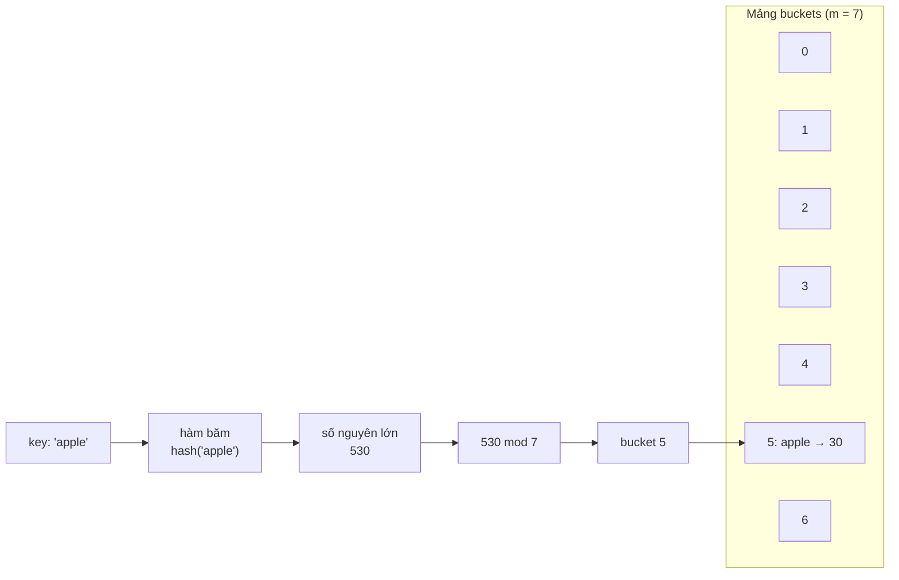
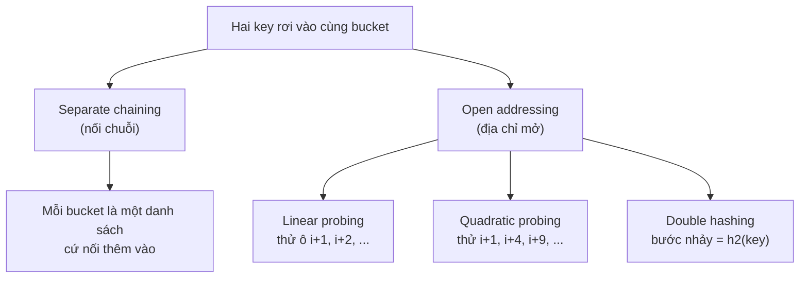
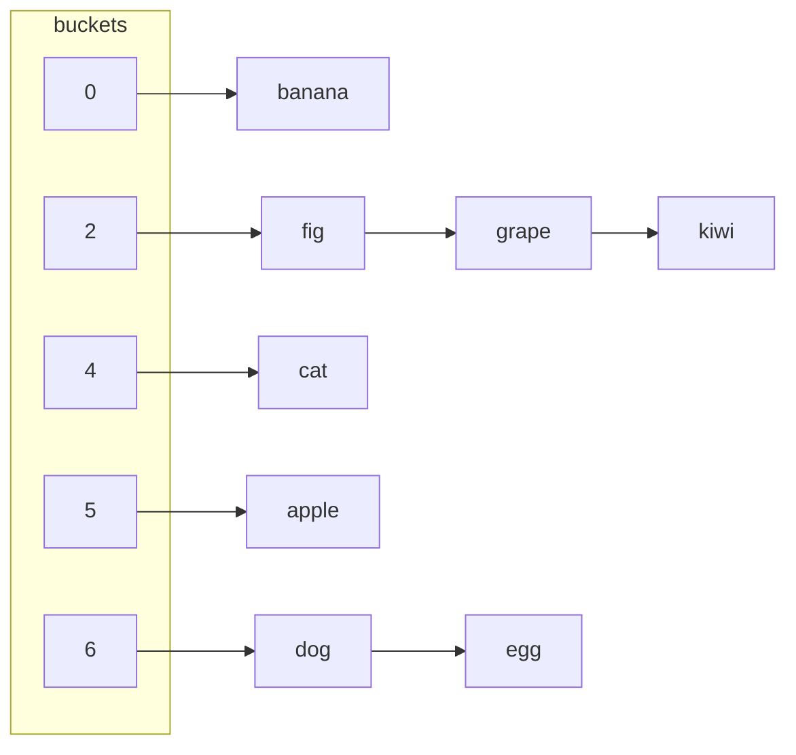
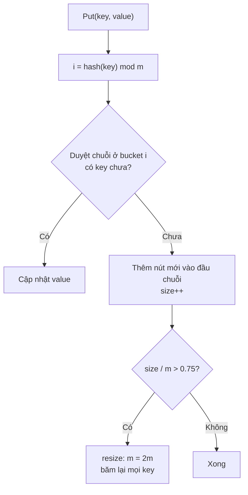
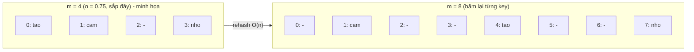
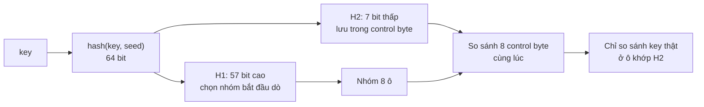
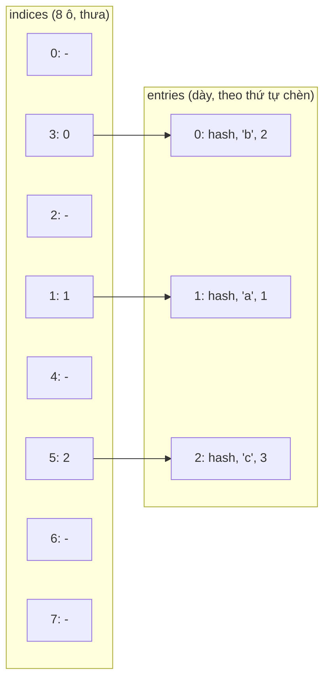
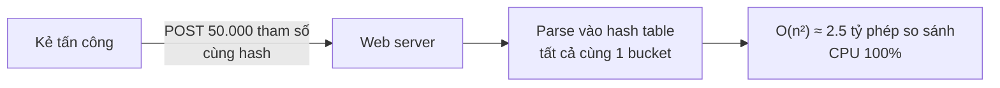
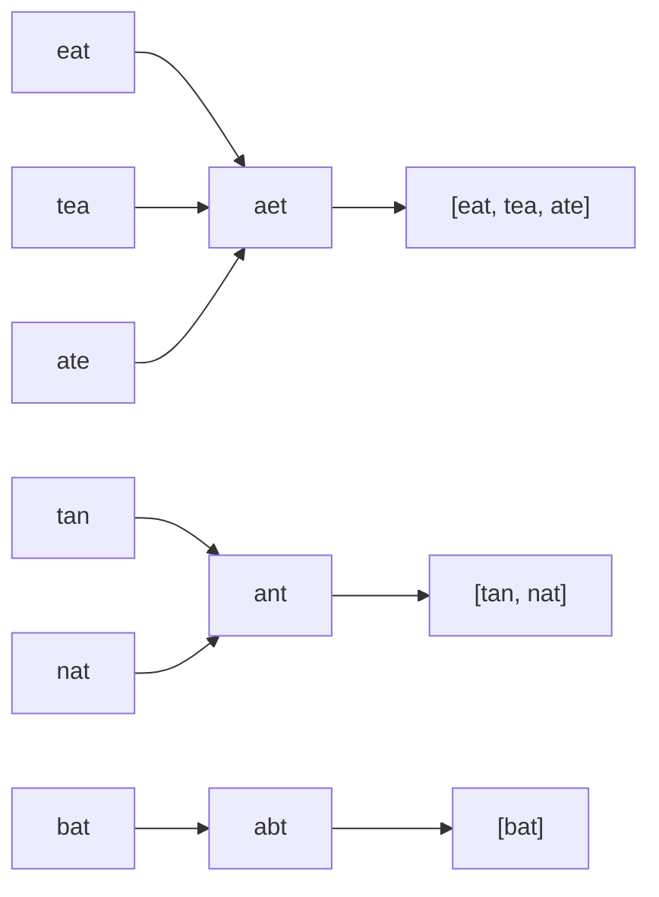

# 📚 Bài 3: Hash Table (Bảng băm)

## 🎯 Mục tiêu bài học

- Hiểu **vì sao** hash table tra cứu được trong `O(1)` trung bình, trong khi mảng cần `O(n)` và mảng đã sắp xếp cần `O(log n)`
- Hiểu **hàm băm** (hash function) là gì, thế nào là hàm băm tốt, vì sao "cộng mã ASCII" là hàm băm tồi
- Hiểu **va chạm** (collision) là không thể tránh, và hai cách xử lý kinh điển:
    - **Separate chaining** (nối chuỗi)
    - **Open addressing** với **linear probing** (dò tuyến tính), và vấn đề xóa bằng **tombstone**
- Hiểu **load factor** (hệ số tải), **rehashing** và vì sao `O(1)` là **khấu hao** (amortized)
- Biết ở mức tổng quan `map` của Go và `dict` của Python được cài bên trong ra sao
- Biết khi nào hash table rơi vào **trường hợp xấu nhất `O(n)`** (hash flooding)
- **Tự cài một hash map từ con số 0** bằng Go và Python
- Thành thạo các pattern "ăn tiền" với hash: **tra phần bù** (Two Sum), **khóa chuẩn hóa** (Group Anagrams), **tập hợp + điểm bắt đầu** (Longest Consecutive), **prefix sum + đếm** (Subarray Sum = K), **đếm tần suất**

!!! tip "Vì sao hash table quan trọng?"
    Nếu chỉ được chọn **một** cấu trúc dữ liệu để mang theo đi phỏng vấn, hãy chọn hash table. Rất nhiều lời giải `O(n²)` trở thành `O(n)` chỉ bằng một câu: *"mình lưu những gì đã thấy vào một hash map"*. Ngoài đời, cache, index của database, bảng định tuyến, bộ đếm lượt xem, session đăng nhập... đều là hash table.

## 📖 1. Bài toán: tra cứu thật nhanh

### Tủ gửi đồ ở siêu thị

Bạn vào siêu thị, gửi balo ở quầy. Nhân viên đưa bạn **thẻ số 37**. Lúc ra về, nhân viên **không** lục từng ngăn tủ để tìm balo của bạn - họ nhìn số trên thẻ và đi thẳng tới **ngăn 37**. Tốn đúng một bước, dù tủ có 10 ngăn hay 1000 ngăn.

Hash table hoạt động y hệt:

- **Key** (khóa): thứ bạn dùng để tìm, ví dụ `"apple"`, số điện thoại, mã sinh viên
- **Hàm băm**: "nhân viên quầy" biến key thành **số ngăn** (chỉ số trong mảng)
- **Bucket** (ngăn): ô trong mảng chứa dữ liệu
- Vì truy cập `arr[i]` là `O(1)` (xem [Bài 2](./02-arrays-strings.md)), tìm ngăn cũng là `O(1)`



### So sánh ba cách tìm kiếm

Giả sử có `n = 1.000.000` sinh viên, cần tìm theo mã số:

| Cách lưu | Tìm 1 phần tử | Thêm | Xóa | Số bước với n = 10⁶ |
|---|---|---|---|---|
| Mảng chưa sắp xếp | `O(n)` - duyệt từng phần tử | `O(1)` | `O(n)` | ~1.000.000 |
| Mảng đã sắp xếp + binary search | `O(log n)` | `O(n)` - phải dời | `O(n)` | ~20 |
| **Hash table** | **`O(1)` trung bình** | **`O(1)`** | **`O(1)`** | **~1-2** |

!!! note "Cái giá phải trả"
    Hash table **không giữ thứ tự** theo giá trị key (không trả lời được "sinh viên có mã nhỏ nhất", "các mã trong khoảng 100-200" một cách hiệu quả). Nếu cần thứ tự, dùng cây nhị phân cân bằng ([Bài 9](./09-trees-bst.md)) hoặc mảng đã sắp xếp.

## 📖 2. Hàm băm (Hash function)

### Hàm băm là gì?

Hàm băm là một hàm `h(key) → số nguyên`. Sau đó ta lấy `h(key) mod m` (m là số bucket) để ra chỉ số trong mảng.

Một hàm băm **tốt** cần:

1. **Tất định (deterministic)**: cùng key luôn cho cùng giá trị - nếu không, bạn cất balo vào ngăn 37 nhưng lúc lấy lại được bảo ngăn 12!
2. **Phân bố đều (uniform)**: các key rải đều khắp các bucket, không dồn cục một chỗ
3. **Nhanh**: tính trong `O(độ dài key)`
4. **Hiệu ứng thác lũ (avalanche)**: key thay đổi một chút → giá trị băm thay đổi rất nhiều

### Hàm băm "đồ chơi": cộng mã ASCII

Cách đơn giản nhất: cộng mã ASCII của từng ký tự rồi lấy dư cho `m`.

```text
"cat" = 'c' + 'a' + 't' = 99 + 97 + 116 = 312
312 mod 7 = 4   → bucket 4
```

Với `m = 7`:

| Key | Tổng ASCII | mod 7 → bucket |
|---|---|---|
| apple | 530 | **5** |
| banana | 609 | **0** |
| cat | 312 | **4** |
| dog | 314 | **6** |
| egg | 307 | **6** ← trùng với dog! |
| fig | 310 | **2** |
| grape | 527 | **2** ← trùng với fig |
| kiwi | 436 | **2** ← lại trùng |

Vấn đề lớn: `"cat"`, `"act"`, `"tac"` có **cùng tổng** → luôn cùng bucket. Mọi **hoán vị** (anagram) của một chuỗi đều va chạm với nhau. Và vì tổng ASCII của chuỗi ngắn chỉ nằm trong khoảng vài trăm, với bảng lớn (m = 1 triệu) thì hầu hết bucket **không bao giờ được dùng**.

### Hàm băm đa thức (polynomial rolling hash)

Cách khắc phục: cho **vị trí** của ký tự ảnh hưởng tới kết quả, bằng cách nhân với một cơ số `B` (thường là số nguyên tố như 31):

```text
h("cat") = ((0·31 + 'c')·31 + 'a')·31 + 't'
         = 'c'·31² + 'a'·31 + 't'
```

Đây chính là `String.hashCode()` của Java. Giờ `"cat"` và `"act"` cho kết quả khác nhau.

=== "Go"

    ```go
    package main

    import "fmt"

    // Hàm băm "đồ chơi": cộng mã ASCII rồi lấy dư
    func toyHash(key string, m int) int {
    	sum := 0
    	for i := 0; i < len(key); i++ {
    		sum += int(key[i])
    	}
    	return sum % m
    }

    // Hàm băm đa thức: h = h*31 + c (giống String.hashCode của Java)
    func polyHash(key string, m int) int {
    	h := 0
    	for i := 0; i < len(key); i++ {
    		h = (h*31 + int(key[i])) % m
    	}
    	return h
    }

    func main() {
    	keys := []string{"cat", "act", "tac", "dog", "god"}
    	for _, k := range keys {
    		fmt.Printf("%-4s toy=%d poly=%d\n", k, toyHash(k, 97), polyHash(k, 97))
    	}
    }

    // Output:
    // cat  toy=21 poly=1
    // act  toy=21 poly=81
    // tac  toy=21 poly=25
    // dog  toy=23 poly=25
    // god  toy=23 poly=92
    ```

=== "Python"

    ```python
    def toy_hash(key: str, m: int) -> int:
        """Hàm băm "đồ chơi": cộng mã ASCII rồi lấy dư."""
        return sum(ord(c) for c in key) % m


    def poly_hash(key: str, m: int) -> int:
        """Hàm băm đa thức: h = h*31 + c (giống String.hashCode của Java)."""
        h = 0
        for c in key:
            h = (h * 31 + ord(c)) % m
        return h


    for k in ["cat", "act", "tac", "dog", "god"]:
        print(f"{k:<4} toy={toy_hash(k, 97)} poly={poly_hash(k, 97)}")

    # Output:
    # cat  toy=21 poly=1
    # act  toy=21 poly=81
    # tac  toy=21 poly=25
    # dog  toy=23 poly=25
    # god  toy=23 poly=92
    ```

Hàm băm toy cho **cùng một giá trị** với cả 3 anagram (và cả `dog`/`god`); hàm băm đa thức phân biệt được chúng. (Hàm đa thức vẫn có va chạm - `tac` và `dog` cùng ra 25 - nhưng đó là va chạm "ngẫu nhiên", không phải do quy luật của dữ liệu.)

### Băm số nguyên và vì sao m hay là số nguyên tố

Với key là số nguyên, cách đơn giản nhất là `h(k) = k mod m`. Nhưng nếu dữ liệu có **quy luật** thì cẩn thận:

```text
Key đều là bội của 4: 0, 4, 8, 12, 16, 20, 24, 28 ...
m = 8  (hợp số, có ước chung 4 với dữ liệu):  0 4 0 4 0 4 0 4   → chỉ dùng 2/8 bucket!
m = 7  (số nguyên tố):                        0 4 1 5 2 6 3 0   → rải đều 7/7 bucket
```

Chọn `m` nguyên tố giúp "phá" các quy luật trong dữ liệu. Các thư viện hiện đại (Go, Python, Java) thì dùng `m = 2^k` (lấy dư bằng phép AND bit, rất nhanh) và bù lại bằng một hàm băm **trộn bit** thật kỹ trước khi lấy dư.

!!! note "Hàm băm cho hash table ≠ hàm băm mật mã"
    - Hash table cần hàm băm **nhanh** và phân bố đều: FNV, MurmurHash, xxHash, SipHash (Python), AES-hash (Go)
    - Mật mã/bảo mật cần hàm băm **khó đảo ngược, khó tạo va chạm**: SHA-256 (chữ ký số, Git, blockchain)
    - Lưu mật khẩu cần hàm băm **cố ý chậm**: bcrypt, Argon2 (xem [Bảo mật Backend](../backend/12-security.md))

## 📖 3. Va chạm (Collision) là không thể tránh

### Nguyên lý chuồng bồ câu

Có vô số chuỗi nhưng chỉ có `m` bucket. Theo **nguyên lý chuồng bồ câu** (nhốt 11 con bồ câu vào 10 chuồng thì chắc chắn có chuồng chứa ≥ 2 con), va chạm **chắc chắn xảy ra**.

Còn tệ hơn bạn nghĩ: **nghịch lý ngày sinh** nói rằng chỉ cần **23 người** trong phòng là đã có hơn **50%** khả năng có hai người trùng ngày sinh (dù có 365 ngày). Tương tự, bảng có 1 triệu bucket thì chỉ cần khoảng **1.200 key** là va chạm đã rất có thể xảy ra.

→ Câu hỏi không phải là "làm sao tránh va chạm" mà là **"va chạm rồi thì xử lý thế nào"**. Có hai trường phái:



## 📖 4. Separate Chaining - Nối chuỗi

### Trực giác: mỗi ngăn tủ là một cái móc treo

Mỗi bucket không chứa một món đồ mà là **một cái móc**, trên đó treo **một chuỗi** (linked list, xem [Bài 4](./04-linked-lists.md)) các cặp `(key, value)`. Hai key trùng bucket? Cứ treo thêm vào móc.

Dùng hàm băm toy ở trên với `m = 7`, chèn lần lượt `apple, banana, cat, dog, egg, fig, grape, kiwi`:

```text
bucket 0: → [banana]
bucket 1: (rỗng)
bucket 2: → [fig] → [grape] → [kiwi]       ← 3 key va chạm
bucket 3: (rỗng)
bucket 4: → [cat]
bucket 5: → [apple]
bucket 6: → [dog] → [egg]                  ← 2 key va chạm
```



Các thao tác:

- **Put(key, value)**: tính bucket, duyệt chuỗi. Gặp key đã có → cập nhật value. Không gặp → thêm nút mới vào chuỗi.
- **Get(key)**: tính bucket, duyệt chuỗi tìm key.
- **Delete(key)**: tính bucket, gỡ nút ra khỏi chuỗi (thao tác xóa nút của linked list).

Chi phí mỗi thao tác = `O(1)` (tính băm) + `O(độ dài chuỗi)`. Nếu hàm băm rải đều, độ dài trung bình của chuỗi là `α = n/m` (load factor) → giữ `α` nhỏ (ví dụ ≤ 0.75) thì mỗi thao tác là `O(1)`.

Bấm ▶ để xem từng key được băm vào bucket nào và các key va chạm được nối thành chuỗi (widget dùng hàm băm riêng nên vị trí có thể khác bảng tay ở trên - điều quan trọng là quan sát **cơ chế**).

<div class="algo-viz" data-viz="hash" data-algo="chaining" data-input="apple,banana,cat,dog,egg,fig,grape,kiwi" data-size="7" data-title="Separate chaining với 7 bucket"></div>

### Cài đặt hash map nối chuỗi từ con số 0

Ta sẽ dùng hàm băm **FNV-1a** (đơn giản, phân bố tốt, dùng rộng rãi) và tự **tăng gấp đôi** số bucket khi load factor vượt 0.75.



=== "Go"

    ```go
    package main

    import "fmt"

    type entry struct {
    	key   string
    	value int
    	next  *entry // nút kế tiếp trong cùng bucket
    }

    type HashMap struct {
    	buckets []*entry
    	size    int
    }

    func NewHashMap(capacity int) *HashMap {
    	return &HashMap{buckets: make([]*entry, capacity)}
    }

    // FNV-1a 64-bit: XOR từng byte rồi nhân với một số nguyên tố lớn
    func fnv1a(s string) uint64 {
    	h := uint64(14695981039346656037)
    	for i := 0; i < len(s); i++ {
    		h ^= uint64(s[i])
    		h *= 1099511628211
    	}
    	return h
    }

    func (m *HashMap) index(key string) int {
    	return int(fnv1a(key) % uint64(len(m.buckets)))
    }

    func (m *HashMap) Put(key string, value int) {
    	i := m.index(key)
    	for e := m.buckets[i]; e != nil; e = e.next {
    		if e.key == key { // key đã có → cập nhật
    			e.value = value
    			return
    		}
    	}
    	m.buckets[i] = &entry{key, value, m.buckets[i]} // chèn đầu chuỗi: O(1)
    	m.size++
    	if float64(m.size)/float64(len(m.buckets)) > 0.75 {
    		m.resize(2 * len(m.buckets))
    	}
    }

    func (m *HashMap) Get(key string) (int, bool) {
    	for e := m.buckets[m.index(key)]; e != nil; e = e.next {
    		if e.key == key {
    			return e.value, true
    		}
    	}
    	return 0, false
    }

    func (m *HashMap) Delete(key string) bool {
    	i := m.index(key)
    	// pp trỏ tới "con trỏ đang trỏ vào nút hiện tại" → xóa nút đầu hay giữa đều như nhau
    	for pp := &m.buckets[i]; *pp != nil; pp = &(*pp).next {
    		if (*pp).key == key {
    			*pp = (*pp).next
    			m.size--
    			return true
    		}
    	}
    	return false
    }

    func (m *HashMap) resize(newCap int) {
    	fmt.Printf("resize: %d -> %d\n", len(m.buckets), newCap)
    	old := m.buckets
    	m.buckets = make([]*entry, newCap)
    	for _, head := range old {
    		for e := head; e != nil; {
    			next := e.next
    			i := m.index(e.key) // m mới → chỉ số mới
    			e.next = m.buckets[i]
    			m.buckets[i] = e
    			e = next
    		}
    	}
    }

    func (m *HashMap) Dump() {
    	for i, head := range m.buckets {
    		if head == nil {
    			continue
    		}
    		fmt.Printf("  [%2d]", i)
    		for e := head; e != nil; e = e.next {
    			fmt.Printf(" -> %s:%d", e.key, e.value)
    		}
    		fmt.Println()
    	}
    }

    func main() {
    	m := NewHashMap(4)
    	prices := []struct {
    		k string
    		v int
    	}{{"tao", 30}, {"cam", 40}, {"chuoi", 25}, {"xoai", 50},
    		{"nho", 90}, {"le", 45}, {"dua", 20}}
    	for _, p := range prices {
    		m.Put(p.k, p.v)
    	}
    	fmt.Printf("size = %d, buckets = %d\n", m.size, len(m.buckets))
    	m.Dump()

    	v, ok := m.Get("tao")
    	fmt.Println("tao =", v, ok)
    	v, ok = m.Get("mit")
    	fmt.Println("mit =", v, ok)

    	m.Put("cam", 45) // cập nhật, size không đổi
    	v, _ = m.Get("cam")
    	fmt.Println("cam sau khi sửa =", v, "| size =", m.size)

    	fmt.Println("delete chuoi:", m.Delete("chuoi"))
    	v, ok = m.Get("chuoi")
    	fmt.Println("chuoi =", v, ok, "| size =", m.size)
    }

    // Output:
    // resize: 4 -> 8
    // resize: 8 -> 16
    // size = 7, buckets = 16
    //   [ 6] -> xoai:50
    //   [ 9] -> chuoi:25 -> dua:20
    //   [10] -> le:45
    //   [11] -> tao:30
    //   [12] -> cam:40 -> nho:90
    // tao = 30 true
    // mit = 0 false
    // cam sau khi sửa = 45 | size = 7
    // delete chuoi: true
    // chuoi = 0 false | size = 6
    ```

=== "Python"

    ```python
    class _Entry:
        __slots__ = ("key", "value", "next")

        def __init__(self, key, value, nxt):
            self.key, self.value, self.next = key, value, nxt


    def fnv1a(s: str) -> int:
        """FNV-1a 64-bit: XOR từng byte rồi nhân với một số nguyên tố lớn."""
        h = 14695981039346656037
        for b in s.encode("utf-8"):
            h ^= b
            h = (h * 1099511628211) & 0xFFFFFFFFFFFFFFFF  # giữ 64 bit như Go
        return h


    class HashMap:
        def __init__(self, capacity=4):
            self.buckets = [None] * capacity
            self.size = 0

        def _index(self, key):
            return fnv1a(key) % len(self.buckets)

        def put(self, key, value):
            i = self._index(key)
            e = self.buckets[i]
            while e:
                if e.key == key:  # key đã có → cập nhật
                    e.value = value
                    return
                e = e.next
            self.buckets[i] = _Entry(key, value, self.buckets[i])  # chèn đầu chuỗi
            self.size += 1
            if self.size / len(self.buckets) > 0.75:
                self._resize(2 * len(self.buckets))

        def get(self, key, default=None):
            e = self.buckets[self._index(key)]
            while e:
                if e.key == key:
                    return e.value
                e = e.next
            return default

        def delete(self, key) -> bool:
            i = self._index(key)
            prev, e = None, self.buckets[i]
            while e:
                if e.key == key:
                    if prev is None:
                        self.buckets[i] = e.next  # xóa nút đầu chuỗi
                    else:
                        prev.next = e.next  # xóa nút giữa/cuối
                    self.size -= 1
                    return True
                prev, e = e, e.next
            return False

        def _resize(self, new_cap):
            print(f"resize: {len(self.buckets)} -> {new_cap}")
            old = self.buckets
            self.buckets = [None] * new_cap
            for head in old:
                e = head
                while e:
                    nxt = e.next
                    i = self._index(e.key)  # m mới → chỉ số mới
                    e.next = self.buckets[i]
                    self.buckets[i] = e
                    e = nxt

        def dump(self):
            for i, e in enumerate(self.buckets):
                if e is None:
                    continue
                parts = []
                while e:
                    parts.append(f" -> {e.key}:{e.value}")
                    e = e.next
                print(f"  [{i:2d}]" + "".join(parts))


    m = HashMap(4)
    for k, v in [("tao", 30), ("cam", 40), ("chuoi", 25), ("xoai", 50),
                 ("nho", 90), ("le", 45), ("dua", 20)]:
        m.put(k, v)
    print(f"size = {m.size}, buckets = {len(m.buckets)}")
    m.dump()

    print("tao =", m.get("tao"))
    print("mit =", m.get("mit"))

    m.put("cam", 45)  # cập nhật, size không đổi
    print("cam sau khi sửa =", m.get("cam"), "| size =", m.size)

    print("delete chuoi:", m.delete("chuoi"))
    print("chuoi =", m.get("chuoi"), "| size =", m.size)

    # Output:
    # resize: 4 -> 8
    # resize: 8 -> 16
    # size = 7, buckets = 16
    #   [ 6] -> xoai:50
    #   [ 9] -> chuoi:25 -> dua:20
    #   [10] -> le:45
    #   [11] -> tao:30
    #   [12] -> cam:40 -> nho:90
    # tao = 30
    # mit = None
    # cam sau khi sửa = 45 | size = 7
    # delete chuoi: True
    # chuoi = None | size = 6
    ```

!!! tip "Mẹo con trỏ tới con trỏ (`pp`) trong Go"
    Trong `Delete` của bản Go, `pp` có kiểu `**entry` - nó trỏ vào **ô nhớ đang chứa con trỏ tới nút hiện tại** (có thể là `m.buckets[i]` hoặc `prev.next`). Nhờ vậy xóa nút đầu và xóa nút giữa là **cùng một câu lệnh** `*pp = (*pp).next`. Bản Python dùng biến `prev` truyền thống - ở [Bài 4](./04-linked-lists.md) bạn sẽ gặp kỹ thuật **dummy node** giải quyết cùng vấn đề.

## 📖 5. Open Addressing - Linear Probing (Dò tuyến tính)

### Trực giác: tìm chỗ đậu xe

Bạn được chỉ định đậu xe ở **ô số 6**, nhưng ô 6 có người đậu rồi. Bạn làm gì? Đi tiếp sang **ô 7**, rồi ô 8... tới khi thấy ô trống. Hết dãy thì quay lại ô 0. Lúc quay lại lấy xe, bạn cũng bắt đầu tìm từ ô 6 và đi tiếp cho đến khi thấy xe mình - hoặc gặp **một ô trống** (nghĩa là xe không có trong bãi).

Đó là **open addressing**: không có chuỗi nào cả, mọi phần tử nằm **trực tiếp trong mảng**. Va chạm thì dò sang ô kế tiếp: `i, i+1, i+2, ...` (mod m).

### Theo dõi từng bước

Dùng hàm băm toy, `m = 7`, chèn `apple, banana, cat, dog, egg, fig`:

| Bước | Key | h(key) | Các ô đã thử | Đặt vào ô | Bảng sau bước (0..6) |
|---|---|---|---|---|---|
| 1 | apple | 5 | 5 | **5** | `_ _ _ _ _ apple _` |
| 2 | banana | 0 | 0 | **0** | `banana _ _ _ _ apple _` |
| 3 | cat | 4 | 4 | **4** | `banana _ _ _ cat apple _` |
| 4 | dog | 6 | 6 | **6** | `banana _ _ _ cat apple dog` |
| 5 | egg | 6 | 6 ✗ → 0 ✗ → 1 | **1** | `banana egg _ _ cat apple dog` |
| 6 | fig | 2 | 2 | **2** | `banana egg fig _ cat apple dog` |

`egg` băm vào 6 (đã có `dog`), dò sang 0 (vòng lại đầu mảng, đã có `banana`), rồi 1 - trống, đặt vào.

**Tìm `egg`**: bắt đầu ở 6 → `dog` ≠ `egg` → ô 0 `banana` ≠ → ô 1 `egg` ✓ (3 lần dò).
**Tìm `kiwi`** (h = 2): ô 2 `fig` ≠ → ô 3 **trống** → dừng, kết luận không có.

Bấm ▶ và để ý những key bị va chạm phải "đi bộ" sang các ô bên cạnh - và các ô đã dùng dần **dính lại thành cụm**.

<div class="algo-viz" data-viz="hash" data-algo="linear-probing" data-input="apple,banana,cat,dog,egg,fig" data-size="7" data-title="Linear probing với 7 ô"></div>

### Vấn đề khi xóa: tombstone (bia mộ)

Giả sử ta xóa `banana` ở ô 0 bằng cách để ô 0 **trống**. Giờ tìm `egg`: bắt đầu ở 6 (`dog`) → ô 0 **trống** → dừng, kết luận "không có `egg`". **SAI!** `egg` vẫn nằm ở ô 1.

```text
Trước khi xóa:  [banana][egg][fig][ _ ][cat][apple][dog]
Xóa kiểu ngây thơ: [ _ ][egg][fig][ _ ][cat][apple][dog]
Tìm egg: 6 (dog) → 0 (trống!) → dừng → "không tìm thấy"  ✗ SAI

Xóa bằng tombstone: [ † ][egg][fig][ _ ][cat][apple][dog]
Tìm egg: 6 (dog) → 0 († bỏ qua, đi tiếp) → 1 (egg) ✓
```

Giải pháp: đánh dấu ô bị xóa là **tombstone** (`†`, "đã từng có người"):

- **Get** gặp tombstone → **đi tiếp** (không dừng)
- **Put** gặp tombstone → có thể **tái sử dụng** ô đó (sau khi chắc chắn key chưa tồn tại ở phía sau)
- Quá nhiều tombstone làm chậm tìm kiếm → khi rehash thì dọn sạch

### Primary clustering và các biến thể

Linear probing có nhược điểm **cụm chính** (primary clustering): các ô đã dùng dính thành cụm dài; key nào rơi vào bất kỳ chỗ nào trong cụm cũng phải đi đến cuối cụm, làm cụm **dài thêm** - "giàu càng giàu thêm".

| Chiến lược | Dãy ô thử | Ưu | Nhược |
|---|---|---|---|
| Linear probing | `h, h+1, h+2, ...` | Cực thân thiện cache CPU | Cụm chính |
| Quadratic probing | `h, h+1, h+4, h+9, ...` | Giảm cụm chính | Có thể không thử hết mọi ô |
| Double hashing | `h, h+d, h+2d, ...` với `d = h2(key)` | Phân bố tốt nhất | Tính 2 hàm băm |
| Robin Hood hashing | Như linear, nhưng key "nghèo" (đi xa) được giành chỗ của key "giàu" | Độ dài dò đồng đều | Cài phức tạp hơn |

!!! tip "Vì sao ngày nay open addressing lại thắng thế?"
    Linked list trong chaining có các nút rải rác trong bộ nhớ → CPU cache miss liên tục. Open addressing để mọi thứ trong **một mảng liền kề** → dò 2-3 ô liên tiếp gần như miễn phí. Python `dict`, Go `map` (từ 1.24), Rust `HashMap`, C++ `absl::flat_hash_map` đều dùng open addressing.

### Cài đặt linear probing từ con số 0

=== "Go"

    ```go
    package main

    import "fmt"

    const (
    	empty = iota
    	used
    	deleted // tombstone
    )

    type ProbingMap struct {
    	keys  []string
    	vals  []int
    	state []int
    	size  int // số ô used
    	tombs int // số tombstone
    }

    func NewProbingMap(capacity int) *ProbingMap {
    	return &ProbingMap{
    		keys:  make([]string, capacity),
    		vals:  make([]int, capacity),
    		state: make([]int, capacity),
    	}
    }

    func fnv1a(s string) uint64 {
    	h := uint64(14695981039346656037)
    	for i := 0; i < len(s); i++ {
    		h ^= uint64(s[i])
    		h *= 1099511628211
    	}
    	return h
    }

    // find trả về (ô chứa key, true) hoặc (ô nên dùng để chèn, false)
    func (m *ProbingMap) find(key string) (int, bool) {
    	n := len(m.keys)
    	i := int(fnv1a(key) % uint64(n))
    	firstTomb := -1
    	for {
    		switch m.state[i] {
    		case empty:
    			if firstTomb >= 0 {
    				return firstTomb, false // tái sử dụng tombstone
    			}
    			return i, false
    		case deleted:
    			if firstTomb < 0 {
    				firstTomb = i
    			}
    		case used:
    			if m.keys[i] == key {
    				return i, true
    			}
    		}
    		i = (i + 1) % n // dò ô kế tiếp, vòng lại đầu mảng
    	}
    }

    func (m *ProbingMap) Put(key string, val int) {
    	// giữ (used + tombstone) <= 1/2 → luôn còn ô trống, vòng lặp find chắc chắn dừng
    	if 2*(m.size+m.tombs+1) > len(m.keys) {
    		m.resize(2 * len(m.keys))
    	}
    	i, found := m.find(key)
    	if found {
    		m.vals[i] = val
    		return
    	}
    	if m.state[i] == deleted {
    		m.tombs--
    	}
    	m.keys[i], m.vals[i], m.state[i] = key, val, used
    	m.size++
    }

    func (m *ProbingMap) Get(key string) (int, bool) {
    	i, found := m.find(key)
    	if !found {
    		return 0, false
    	}
    	return m.vals[i], true
    }

    func (m *ProbingMap) Delete(key string) bool {
    	i, found := m.find(key)
    	if !found {
    		return false
    	}
    	m.state[i] = deleted // KHÔNG đặt về empty!
    	m.size--
    	m.tombs++
    	return true
    }

    func (m *ProbingMap) resize(newCap int) {
    	oldK, oldV, oldS := m.keys, m.vals, m.state
    	*m = *NewProbingMap(newCap) // tombstone biến mất sau khi băm lại
    	for i := range oldK {
    		if oldS[i] == used {
    			m.Put(oldK[i], oldV[i])
    		}
    	}
    }

    func main() {
    	m := NewProbingMap(8)
    	for i, k := range []string{"ha-noi", "hue", "da-nang", "sai-gon", "can-tho"} {
    		m.Put(k, (i+1)*100)
    	}
    	fmt.Println("size:", m.size, "| capacity:", len(m.keys))

    	fmt.Println("delete hue:", m.Delete("hue"))
    	for _, k := range []string{"ha-noi", "hue", "sai-gon", "vinh"} {
    		v, ok := m.Get(k)
    		fmt.Printf("get %-8s -> %d %v\n", k, v, ok)
    	}
    	m.Put("hue", 999) // có thể tái sử dụng tombstone
    	v, _ := m.Get("hue")
    	fmt.Println("hue sau khi thêm lại:", v, "| size:", m.size)
    }

    // Output:
    // size: 5 | capacity: 16
    // delete hue: true
    // get ha-noi   -> 100 true
    // get hue      -> 0 false
    // get sai-gon  -> 400 true
    // get vinh     -> 0 false
    // hue sau khi thêm lại: 999 | size: 5
    ```

=== "Python"

    ```python
    EMPTY, USED, DELETED = 0, 1, 2  # DELETED = tombstone


    def fnv1a(s: str) -> int:
        h = 14695981039346656037
        for b in s.encode("utf-8"):
            h ^= b
            h = (h * 1099511628211) & 0xFFFFFFFFFFFFFFFF
        return h


    class ProbingMap:
        def __init__(self, capacity=8):
            self.keys = [None] * capacity
            self.vals = [None] * capacity
            self.state = [EMPTY] * capacity
            self.size = 0   # số ô USED
            self.tombs = 0  # số tombstone

        def _find(self, key):
            """Trả về (ô chứa key, True) hoặc (ô nên dùng để chèn, False)."""
            n = len(self.keys)
            i = fnv1a(key) % n
            first_tomb = -1
            while True:
                st = self.state[i]
                if st == EMPTY:
                    return (first_tomb if first_tomb >= 0 else i), False
                if st == DELETED:
                    if first_tomb < 0:
                        first_tomb = i
                elif self.keys[i] == key:
                    return i, True
                i = (i + 1) % n  # dò ô kế tiếp, vòng lại đầu mảng

        def put(self, key, val):
            # giữ (used + tombstone) <= 1/2 → luôn còn ô trống
            if 2 * (self.size + self.tombs + 1) > len(self.keys):
                self._resize(2 * len(self.keys))
            i, found = self._find(key)
            if found:
                self.vals[i] = val
                return
            if self.state[i] == DELETED:
                self.tombs -= 1
            self.keys[i], self.vals[i], self.state[i] = key, val, USED
            self.size += 1

        def get(self, key):
            i, found = self._find(key)
            return self.vals[i] if found else None

        def delete(self, key) -> bool:
            i, found = self._find(key)
            if not found:
                return False
            self.state[i] = DELETED  # KHÔNG đặt về EMPTY!
            self.size -= 1
            self.tombs += 1
            return True

        def _resize(self, new_cap):
            old = [(k, v) for k, v, s in zip(self.keys, self.vals, self.state) if s == USED]
            self.__init__(new_cap)  # tombstone biến mất sau khi băm lại
            for k, v in old:
                self.put(k, v)


    m = ProbingMap(8)
    for i, k in enumerate(["ha-noi", "hue", "da-nang", "sai-gon", "can-tho"]):
        m.put(k, (i + 1) * 100)
    print("size:", m.size, "| capacity:", len(m.keys))

    print("delete hue:", m.delete("hue"))
    for k in ["ha-noi", "hue", "sai-gon", "vinh"]:
        print(f"get {k:<8} -> {m.get(k)}")
    m.put("hue", 999)  # có thể tái sử dụng tombstone
    print("hue sau khi thêm lại:", m.get("hue"), "| size:", m.size)

    # Output:
    # size: 5 | capacity: 16
    # delete hue: True
    # get ha-noi   -> 100
    # get hue      -> None
    # get sai-gon  -> 400
    # get vinh     -> None
    # hue sau khi thêm lại: 999 | size: 5
    ```

## 📖 6. Load factor & Rehashing

### Load factor (hệ số tải)

```text
α = n / m      (n = số phần tử, m = số bucket/ô)
```

- **Chaining**: `α` = độ dài chuỗi trung bình. `α` có thể > 1 (vẫn chạy, chỉ chậm dần)
- **Open addressing**: `α` luôn ≤ 1. Khi `α → 1`, số lần dò **bùng nổ**

Số lần dò trung bình của linear probing (công thức của Knuth) cho thấy rõ điều đó:

| α (độ đầy) | Tìm thấy (~ ½(1 + 1/(1-α))) | Không tìm thấy (~ ½(1 + 1/(1-α)²)) |
|---|---|---|
| 0.50 | 1.5 | 2.5 |
| 0.75 | 2.5 | 8.5 |
| 0.90 | 5.5 | 50.5 |
| 0.99 | 50.5 | 5000.5 |

→ Vì thế các thư viện luôn **rehash** trước khi bảng quá đầy:

| Cài đặt | Ngưỡng rehash |
|---|---|
| Java `HashMap` (chaining) | α > 0.75 |
| Python `dict` (open addressing) | đầy 2/3 |
| Go `map` trước 1.24 (bucket 8 ô) | trung bình 6.5 phần tử/bucket (~81%) |
| Go `map` từ 1.24 (Swiss Table) | 7/8 (87.5%) |

### Rehashing và vì sao vẫn là `O(1)` khấu hao

Khi vượt ngưỡng: tạo mảng mới **gấp đôi**, rồi **băm lại từng key** (chỉ số thay đổi vì `m` thay đổi - không thể copy nguyên xi!). Một lần rehash tốn `O(n)`, nhưng nó hiếm:

```text
Chèn 1..16 vào bảng bắt đầu m = 2, gấp đôi khi đầy:
lần rehash:   m=2→4    4→8    8→16   16→32
chi phí copy:   2   +   4   +   8   +   16    = 30  < 2 × 16

Tổng chi phí cho n lần chèn ≤ n (chèn) + 2n (copy) = 3n  →  O(1) mỗi lần (khấu hao)
```

Giống hệt slice của Go / list của Python ở [Bài 2](./02-arrays-strings.md). Chi tiết phân tích khấu hao ở [Bài 1](./01-complexity.md).



!!! warning "Rehash gây 'giật' (latency spike)"
    Một lần rehash bảng 10 triệu phần tử có thể mất hàng chục mili-giây - chấp nhận được với script, nhưng tệ với server cần độ trễ ổn định. Vì thế Redis và Go (bản cũ) dùng **rehash tăng dần** (incremental rehashing): giữ cả bảng cũ và mới, mỗi thao tác chuyển dần vài bucket. Nếu biết trước số phần tử, hãy **cấp phát sẵn**: `make(map[string]int, 1_000_000)` trong Go.

## 📖 7. Bên trong Go `map` và Python `dict`

### Go map

**Trước Go 1.24** (bucket + overflow):

- Mảng `2^B` bucket, mỗi bucket chứa **8 cặp key/value** và 8 byte `tophash` (8 bit cao của hash) để so sánh nhanh
- Bucket đầy thì nối thêm **overflow bucket** (một dạng chaining)
- Trung bình > 6.5 phần tử/bucket → gấp đôi, di chuyển dần (incremental)

**Từ Go 1.24** (Swiss Table - open addressing):

- Các ô chia thành **nhóm 8 ô**, mỗi nhóm có **8 byte điều khiển** (control word) lưu 7 bit thấp của hash (`H2`) hoặc trạng thái trống/tombstone
- Tìm key: dùng `H1` (phần còn lại của hash) chọn nhóm, rồi so sánh **cả 8 byte điều khiển cùng lúc** bằng phép toán bit → biết ngay ô nào *có thể* chứa key
- Map lớn được chia thành nhiều bảng con (tối đa 1024 ô/bảng) → khi grow chỉ tách một bảng con, tránh giật



Những điều **bạn cần nhớ** khi dùng Go map:

- **Thứ tự duyệt ngẫu nhiên** (cố ý!) - mỗi lần `range` có thể ra thứ tự khác. Cần thứ tự thì sắp xếp key
- Hash có **seed ngẫu nhiên** theo từng map → chống tấn công hash flooding
- Key phải **comparable** (`==` được): số, string, bool, pointer, array, struct gồm các field comparable. **Không** dùng được slice, map, func làm key
- **Không an toàn khi nhiều goroutine cùng ghi** → chương trình chết với `fatal error: concurrent map writes`. Dùng `sync.Mutex` hoặc `sync.Map`
- Ghi vào **nil map** → panic. Luôn `make` trước

### Python dict

- **Open addressing** với dò kiểu "nhiễu loạn" (perturbation): `j = (5*j + 1 + perturb) mod 2^k`, `perturb >>= 5` - dùng dần các bit cao của hash để thoát cụm
- Từ Python 3.6: **compact dict** gồm 2 mảng - `indices` (thưa, chỉ chứa số nhỏ) và `entries` (dày, xếp theo **thứ tự chèn**). Tiết kiệm 20-25% bộ nhớ, và thứ tự chèn được **đảm bảo** từ 3.7
- Rehash khi đầy 2/3
- Hash của `str` có **seed ngẫu nhiên** mỗi lần chạy (`PYTHONHASHSEED`), dùng SipHash
- Key phải **hashable** (thường là bất biến): `int`, `str`, `tuple` (chứa phần tử hashable), `frozenset`. **Không** dùng được `list`, `dict`, `set`



Duyệt dict = duyệt mảng `entries` từ đầu → ra đúng thứ tự chèn `b, a, c`.

### Thực hành: những điều "bất ngờ" của map/dict

=== "Go"

    ```go
    package main

    import (
    	"fmt"
    	"maps"
    	"slices"
    )

    type Point struct{ X, Y int }

    func main() {
    	m := map[string]int{"tao": 30, "cam": 40}

    	// 1. comma-ok: phân biệt "không có key" với "value = 0"
    	v, ok := m["xoai"]
    	fmt.Println("xoai:", v, ok)

    	// 2. struct (comparable) làm key được - rất hay dùng cho tọa độ lưới
    	grid := map[Point]string{{1, 2}: "kho báu", {0, 0}: "xuất phát"}
    	fmt.Println("(1,2):", grid[Point{1, 2}])

    	// 3. array làm key được (slice thì KHÔNG)
    	seen := map[[3]int]bool{{1, 2, 3}: true}
    	fmt.Println("[1 2 3] đã thấy?", seen[[3]int{1, 2, 3}])

    	// 4. thứ tự duyệt ngẫu nhiên → muốn in ổn định thì sắp xếp key
    	m["nho"] = 90
    	for _, k := range slices.Sorted(maps.Keys(m)) {
    		fmt.Printf("%s=%d ", k, m[k])
    	}
    	fmt.Println()

    	// 5. delete key không tồn tại: không sao cả
    	delete(m, "khong-co")
    	delete(m, "cam")
    	fmt.Println("len sau delete:", len(m))

    	// 6. ghi vào nil map → panic
    	defer func() { fmt.Println("recover:", recover()) }()
    	var nilMap map[string]int
    	fmt.Println("đọc nil map vẫn được:", nilMap["a"])
    	nilMap["a"] = 1
    }

    // Output:
    // xoai: 0 false
    // (1,2): kho báu
    // [1 2 3] đã thấy? true
    // cam=40 nho=90 tao=30
    // len sau delete: 2
    // đọc nil map vẫn được: 0
    // recover: assignment to entry in nil map
    ```

=== "Python"

    ```python
    # 1. dict giữ thứ tự chèn (đảm bảo từ Python 3.7)
    d = {}
    d["b"] = 2
    d["a"] = 1
    d["c"] = 3
    print(list(d))

    # 2. get với giá trị mặc định thay vì KeyError
    print("xoai:", d.get("xoai", 0))

    # 3. tuple làm key được - hay dùng cho tọa độ lưới
    grid = {(1, 2): "kho báu", (0, 0): "xuất phát"}
    print("(1,2):", grid[(1, 2)])

    # 4. list KHÔNG làm key được
    try:
        bad = {[1, 2, 3]: True}
    except TypeError as e:
        print("TypeError:", e)

    # 5. 1, 1.0 và True có cùng hash và bằng nhau → là CÙNG một key!
    print({1: "int", 1.0: "float", True: "bool"})
    print(hash(1) == hash(1.0) == hash(True))

    # 6. hash của số nguyên nhỏ chính là nó (trừ -1, vì -1 là mã lỗi trong CPython)
    print(hash(42), hash(-1), hash(-2))

    # Output:
    # ['b', 'a', 'c']
    # xoai: 0
    # (1,2): kho báu
    # TypeError: unhashable type: 'list'
    # {1: 'bool'}
    # True
    # 42 -2 -2
    ```

## 📖 8. Hash set và đếm tần suất

**Hash set** = hash map chỉ có key, không có value. Trả lời câu hỏi "đã thấy X chưa?" trong `O(1)`.

- Go không có kiểu set riêng: dùng `map[T]struct{}` (`struct{}` chiếm 0 byte) hoặc `map[T]bool`
- Python: `set()`, và `collections.Counter` cho đếm tần suất

**Đếm tần suất** là pattern hash phổ biến nhất: đếm từ, đếm ký tự, đếm lượt truy cập theo IP...

=== "Go"

    ```go
    package main

    import (
    	"cmp"
    	"fmt"
    	"slices"
    	"strings"
    )

    func main() {
    	text := "an com an ca uong nuoc an banh uong tra"
    	freq := make(map[string]int)
    	for _, w := range strings.Fields(text) {
    		freq[w]++ // key chưa có → zero value 0 → thành 1
    	}

    	// Top từ xuất hiện nhiều nhất: sắp xếp theo (tần suất giảm, từ tăng)
    	words := make([]string, 0, len(freq))
    	for w := range freq {
    		words = append(words, w)
    	}
    	slices.SortFunc(words, func(a, b string) int {
    		if c := cmp.Compare(freq[b], freq[a]); c != 0 {
    			return c
    		}
    		return cmp.Compare(a, b)
    	})
    	for _, w := range words[:3] {
    		fmt.Println(w, freq[w])
    	}

    	// Set: các từ khác nhau
    	set := make(map[string]struct{})
    	for _, w := range strings.Fields(text) {
    		set[w] = struct{}{}
    	}
    	_, hasTra := set["tra"]
    	fmt.Println("số từ khác nhau:", len(set), "| có 'tra'?", hasTra)
    }

    // Output:
    // an 3
    // uong 2
    // banh 1
    // số từ khác nhau: 7 | có 'tra'? true
    ```

=== "Python"

    ```python
    from collections import Counter

    text = "an com an ca uong nuoc an banh uong tra"
    freq = Counter(text.split())

    # most_common sắp theo tần suất giảm; hòa nhau thì giữ thứ tự xuất hiện đầu tiên
    top = sorted(freq.items(), key=lambda kv: (-kv[1], kv[0]))[:3]
    for w, c in top:
        print(w, c)

    words = set(text.split())
    print("số từ khác nhau:", len(words), "| có 'tra'?", "tra" in words)

    # Output:
    # an 3
    # uong 2
    # banh 1
    # số từ khác nhau: 7 | có 'tra'? True
    ```

## 📖 9. Độ phức tạp và trường hợp xấu nhất

| Thao tác | Trung bình | Xấu nhất | Ghi chú |
|---|---|---|---|
| Get / Contains | `O(1)` | `O(n)` | Xấu nhất khi mọi key cùng bucket |
| Put | `O(1)` khấu hao | `O(n)` | Có lúc phải rehash `O(n)` |
| Delete | `O(1)` | `O(n)` | |
| Duyệt toàn bộ | `O(n + m)` | `O(n + m)` | Phải đi qua cả bucket rỗng |
| Tìm min/max key | `O(n)` | `O(n)` | Hash không có thứ tự |
| Bộ nhớ | `O(n)` | `O(n)` | Hệ số lớn hơn mảng (ô trống, con trỏ) |

!!! warning "`O(1)` là với key kích thước cố định"
    Băm một chuỗi dài `L` tốn `O(L)`. Dùng chuỗi 1 MB làm key thì mỗi lần tra là `O(10⁶)`, không phải `O(1)`. Khi phân tích bài có key là chuỗi, hãy tính cả `L`: ví dụ Group Anagrams là `O(n · L log L)`.

### Hash flooding - khi `O(1)` biến thành `O(n)`

Năm 2011, tại hội nghị 28C3, hai nhà nghiên cứu chỉ ra rằng hầu hết ngôn ngữ web (PHP, Java, Python, Ruby...) dùng hàm băm **cố định, công khai**. Kẻ tấn công gửi một request với hàng nghìn tham số được chọn sao cho **cùng hash** → server nhét tất cả vào một bucket → mỗi lần chèn `O(n)`, tổng `O(n²)`. Một request vài trăm KB có thể chiếm CPU hàng chục giây.



Cách chống: **hàm băm có seed bí mật ngẫu nhiên** (SipHash của Python, AES-hash + seed của Go), giới hạn số tham số. Trên Codeforces, người ta cũng thường "hack" lời giải C++ dùng `unordered_map` bằng test chống hash - vì thế lời giải thi đấu hay tự thêm seed ngẫu nhiên.

## 📖 10. Các pattern giải bài với hash table

### 10.1. Two Sum - Tra phần bù

**Đề** ([LeetCode 1](https://leetcode.com/problems/two-sum/)): cho mảng `nums` và `target`, tìm chỉ số của **hai phần tử** có tổng bằng `target`.

**Trực giác**: đi chợ với 100 nghìn, muốn mua đúng 2 món cho hết tiền. Cầm món giá 30 nghìn, bạn chỉ cần hỏi *"có món nào giá 70 không?"* - và nếu bạn **ghi nhớ** mọi món đã đi qua vào sổ (hash map), câu hỏi đó trả lời trong `O(1)`.

- Brute force: thử mọi cặp → `O(n²)`
- Sắp xếp + two pointers → `O(n log n)`, nhưng mất chỉ số gốc
- **Hash map `giá trị → chỉ số`**: với mỗi `x`, hỏi `target - x` đã thấy chưa → `O(n)`

`nums = [2, 7, 11, 15]`, `target = 18`:

| i | x | cần tìm `18 - x` | seen trước bước | Kết quả |
|---|---|---|---|---|
| 0 | 2 | 16 | `{}` | không có → thêm `2:0` |
| 1 | 7 | 11 | `{2:0}` | không có → thêm `7:1` |
| 2 | 11 | 7 | `{2:0, 7:1}` | **có! ở chỉ số 1** → trả `[1, 2]` |

!!! tip "Vì sao hỏi TRƯỚC rồi mới thêm?"
    Nếu thêm `x` vào trước rồi mới hỏi `target - x`, với `nums = [3, 5]`, `target = 6` ta sẽ ghép `3` với chính nó. Hỏi trước, thêm sau đảm bảo hai chỉ số khác nhau.

=== "Go"

    ```go
    package main

    import "fmt"

    func twoSum(nums []int, target int) []int {
    	seen := make(map[int]int) // giá trị → chỉ số
    	for i, x := range nums {
    		if j, ok := seen[target-x]; ok {
    			return []int{j, i}
    		}
    		seen[x] = i
    	}
    	return nil
    }

    func main() {
    	fmt.Println(twoSum([]int{2, 7, 11, 15}, 18))
    	fmt.Println(twoSum([]int{3, 2, 4}, 6))
    	fmt.Println(twoSum([]int{3, 3}, 6))
    	fmt.Println(twoSum([]int{1, 2}, 10))
    }

    // Output:
    // [1 2]
    // [1 2]
    // [0 1]
    // []
    ```

=== "Python"

    ```python
    def two_sum(nums: list[int], target: int) -> list[int]:
        seen = {}  # giá trị → chỉ số
        for i, x in enumerate(nums):
            if target - x in seen:
                return [seen[target - x], i]
            seen[x] = i
        return []


    print(two_sum([2, 7, 11, 15], 18))
    print(two_sum([3, 2, 4], 6))
    print(two_sum([3, 3], 6))
    print(two_sum([1, 2], 10))

    # Output:
    # [1, 2]
    # [1, 2]
    # [0, 1]
    # []
    ```

**Độ phức tạp**: `O(n)` thời gian, `O(n)` bộ nhớ - đổi bộ nhớ lấy thời gian, triết lý cốt lõi của hash.

### 10.2. Group Anagrams - Khóa chuẩn hóa

**Đề** ([LeetCode 49](https://leetcode.com/problems/group-anagrams/)): nhóm các chuỗi là **hoán vị** của nhau. `["eat","tea","tan","ate","nat","bat"]` → `[["eat","tea","ate"], ["tan","nat"], ["bat"]]`.

**Trực giác**: tìm một **"chữ ký"** (canonical key) giống nhau cho mọi anagram, rồi dùng nó làm key của hash map. Giống như gom quần áo theo **size**: áo nào cùng size thì vào cùng một chồng.

Hai loại chữ ký:

1. **Sắp xếp ký tự**: `"eat" → "aet"`, `"tea" → "aet"` → `O(L log L)` mỗi chuỗi
2. **Đếm 26 chữ cái**: `"eat" → (1,0,0,0,1,...,1,...)` → `O(L)` mỗi chuỗi. Trong Go, `[26]int` là **array** nên dùng làm key trực tiếp được; Python dùng `tuple`



=== "Go"

    ```go
    package main

    import "fmt"

    func groupAnagrams(strs []string) [][]string {
    	idx := make(map[[26]int]int) // chữ ký → vị trí nhóm trong result
    	var result [][]string
    	for _, s := range strs {
    		var key [26]int // array là comparable → làm key được
    		for i := 0; i < len(s); i++ {
    			key[s[i]-'a']++
    		}
    		if g, ok := idx[key]; ok {
    			result[g] = append(result[g], s)
    		} else {
    			idx[key] = len(result)
    			result = append(result, []string{s})
    		}
    	}
    	return result // giữ thứ tự xuất hiện đầu tiên của mỗi nhóm
    }

    func main() {
    	fmt.Println(groupAnagrams([]string{"eat", "tea", "tan", "ate", "nat", "bat"}))
    	fmt.Println(groupAnagrams([]string{""}))
    }

    // Output:
    // [[eat tea ate] [tan nat] [bat]]
    // [[]]
    ```

=== "Python"

    ```python
    from collections import defaultdict


    def group_anagrams(strs: list[str]) -> list[list[str]]:
        groups = defaultdict(list)  # chữ ký → danh sách chuỗi
        for s in strs:
            count = [0] * 26
            for c in s:
                count[ord(c) - ord("a")] += 1
            groups[tuple(count)].append(s)  # list không hash được → đổi sang tuple
        return list(groups.values())  # dict giữ thứ tự chèn


    print(group_anagrams(["eat", "tea", "tan", "ate", "nat", "bat"]))
    print(group_anagrams([""]))

    # Output:
    # [['eat', 'tea', 'ate'], ['tan', 'nat'], ['bat']]
    # [['']]
    ```

**Độ phức tạp**: `O(n · L)` với đếm chữ cái (`O(n · L log L)` nếu sắp xếp), `n` = số chuỗi, `L` = độ dài tối đa.

### 10.3. Longest Consecutive Sequence - Tập hợp + điểm bắt đầu

**Đề** ([LeetCode 128](https://leetcode.com/problems/longest-consecutive-sequence/)): tìm độ dài dãy **số nguyên liên tiếp** dài nhất (không cần liền kề trong mảng), trong `O(n)`. `[100, 4, 200, 1, 3, 2]` → `4` (dãy `1,2,3,4`).

**Trực giác**: sắp xếp thì dễ nhưng tốn `O(n log n)`. Thay vào đó, bỏ mọi số vào **set**. Một số `x` là **điểm bắt đầu** của một dãy khi và chỉ khi `x - 1` **không** có trong set. Chỉ từ các điểm bắt đầu, ta đếm lên `x+1, x+2, ...`.

Giống xếp hàng lấy số ở ngân hàng: chỉ người **không có ai đứng ngay trước** mới là đầu hàng - bắt đầu đếm từ họ.

```text
set = {100, 4, 200, 1, 3, 2}

100: có 99 không? Không → đầu dãy. Đếm: 100 (101 không có)        → dài 1
4:   có 3 không?  CÓ   → không phải đầu dãy, bỏ qua
200: có 199 không? Không → đầu dãy. Đếm: 200                      → dài 1
1:   có 0 không?  Không → đầu dãy. Đếm: 1 → 2 → 3 → 4 (5 không có) → dài 4 ✓
3:   có 2 → bỏ qua
2:   có 1 → bỏ qua
```

**Vì sao `O(n)` dù có vòng `while` lồng trong `for`?** Mỗi số chỉ được "đếm lên" **đúng một lần** - bởi đúng một điểm bắt đầu của dãy chứa nó. Tổng số bước của mọi vòng `while` ≤ n.

=== "Go"

    ```go
    package main

    import "fmt"

    func longestConsecutive(nums []int) int {
    	set := make(map[int]struct{}, len(nums))
    	for _, x := range nums {
    		set[x] = struct{}{}
    	}
    	best := 0
    	for x := range set { // duyệt set (không có trùng lặp)
    		if _, hasPrev := set[x-1]; hasPrev {
    			continue // không phải điểm bắt đầu
    		}
    		length := 1
    		for {
    			if _, ok := set[x+length]; !ok {
    				break
    			}
    			length++
    		}
    		best = max(best, length)
    	}
    	return best
    }

    func main() {
    	fmt.Println(longestConsecutive([]int{100, 4, 200, 1, 3, 2}))
    	fmt.Println(longestConsecutive([]int{0, 3, 7, 2, 5, 8, 4, 6, 0, 1}))
    	fmt.Println(longestConsecutive([]int{}))
    }

    // Output:
    // 4
    // 9
    // 0
    ```

=== "Python"

    ```python
    def longest_consecutive(nums: list[int]) -> int:
        s = set(nums)
        best = 0
        for x in s:  # duyệt set, không duyệt nums (tránh lặp lại số trùng)
            if x - 1 in s:
                continue  # không phải điểm bắt đầu
            length = 1
            while x + length in s:
                length += 1
            best = max(best, length)
        return best


    print(longest_consecutive([100, 4, 200, 1, 3, 2]))
    print(longest_consecutive([0, 3, 7, 2, 5, 8, 4, 6, 0, 1]))
    print(longest_consecutive([]))

    # Output:
    # 4
    # 9
    # 0
    ```

!!! warning "Bẫy: duyệt `nums` thay vì duyệt `set`"
    Nếu `nums = [1, 1, 1, ..., 1, 2, 3, ..., 50000]` với 50.000 số `1`, duyệt `nums` sẽ đếm dãy từ `1` tới 50.000 lần → `O(n²)` và bị TLE trên LeetCode. Luôn duyệt **set**.

### 10.4. Subarray Sum Equals K - Prefix sum + hash map

**Đề** ([LeetCode 560](https://leetcode.com/problems/subarray-sum-equals-k/)): đếm số **đoạn con liên tiếp** có tổng bằng `k`. Mảng có thể có **số âm** (nên sliding window không dùng được).

**Trực giác**: với prefix sum `P[i]` = tổng `nums[0..i-1]` (xem [Bài 2](./02-arrays-strings.md)):

```text
tổng(nums[j..i-1]) = P[i] - P[j] = k   ⟺   P[j] = P[i] - k
```

→ Đứng ở vị trí `i`, số đoạn con kết thúc tại đây có tổng `k` = **số lần prefix `P[i] - k` đã xuất hiện trước đó**. Ta đếm prefix bằng hash map, khởi tạo `{0: 1}` (prefix rỗng).

Giống sổ chi tiêu: số dư hiện tại là 350k; muốn biết có bao nhiêu khoảng thời gian (kết thúc hôm nay) tiêu đúng 100k → đếm xem có bao nhiêu ngày trước đó số dư là 250k... (ở đây là tổng cộng dồn).

`nums = [1, 2, 3]`, `k = 3`:

| i | x | prefix | cần `prefix - k` | count[cần] | ans | count sau bước |
|---|---|---|---|---|---|---|
| - | - | 0 | - | - | 0 | `{0:1}` |
| 0 | 1 | 1 | -2 | 0 | 0 | `{0:1, 1:1}` |
| 1 | 2 | 3 | 0 | **1** (đoạn `[1,2]`) | 1 | `{0:1, 1:1, 3:1}` |
| 2 | 3 | 6 | 3 | **1** (đoạn `[3]`) | 2 | `{0:1, 1:1, 3:1, 6:1}` |

=== "Go"

    ```go
    package main

    import "fmt"

    func subarraySum(nums []int, k int) int {
    	count := map[int]int{0: 1} // prefix rỗng xuất hiện 1 lần
    	prefix, ans := 0, 0
    	for _, x := range nums {
    		prefix += x
    		ans += count[prefix-k] // key chưa có → 0
    		count[prefix]++
    	}
    	return ans
    }

    func main() {
    	fmt.Println(subarraySum([]int{1, 1, 1}, 2))
    	fmt.Println(subarraySum([]int{1, 2, 3}, 3))
    	fmt.Println(subarraySum([]int{1, -1, 0}, 0))
    	fmt.Println(subarraySum([]int{3, 4, 7, 2, -3, 1, 4, 2}, 7))
    }

    // Output:
    // 2
    // 2
    // 3
    // 4
    ```

=== "Python"

    ```python
    from collections import defaultdict


    def subarray_sum(nums: list[int], k: int) -> int:
        count = defaultdict(int)
        count[0] = 1  # prefix rỗng xuất hiện 1 lần
        prefix = ans = 0
        for x in nums:
            prefix += x
            ans += count[prefix - k]
            count[prefix] += 1
        return ans


    print(subarray_sum([1, 1, 1], 2))
    print(subarray_sum([1, 2, 3], 3))
    print(subarray_sum([1, -1, 0], 0))
    print(subarray_sum([3, 4, 7, 2, -3, 1, 4, 2], 7))

    # Output:
    # 2
    # 2
    # 3
    # 4
    ```

!!! warning "Hai lỗi kinh điển của bài này"
    1. Quên khởi tạo `count[0] = 1` → bỏ sót các đoạn bắt đầu từ chỉ số 0.
    2. Tăng `count[prefix]` **trước** khi cộng `ans` → với `k = 0` sẽ đếm cả đoạn rỗng.

    Thứ tự đúng: **cập nhật prefix → cộng đáp án → ghi prefix vào map**.

### 10.5. Top K Frequent Elements - Đếm tần suất + bucket

**Đề** ([LeetCode 347](https://leetcode.com/problems/top-k-frequent-elements/)): trả về `k` phần tử xuất hiện nhiều nhất, tốt hơn `O(n log n)`.

**Trực giác**: bước 1 đếm tần suất bằng hash map. Bước 2, thay vì sắp xếp, dùng **bucket sort theo tần suất**: tần suất chỉ nằm trong `1..n`, nên tạo mảng `buckets[f]` = danh sách phần tử có tần suất `f`, rồi đi từ `f = n` xuống.

```text
nums = [1,1,1,2,2,3], k = 2
freq    = {1:3, 2:2, 3:1}
buckets = [ [], [3], [2], [1], [], [], [] ]
             f=0 f=1  f=2  f=3
Đi từ f=6 xuống: f=3 → lấy 1; f=2 → lấy 2 → đủ k=2 → [1, 2]
```

=== "Go"

    ```go
    package main

    import "fmt"

    func topKFrequent(nums []int, k int) []int {
    	freq := make(map[int]int)
    	for _, x := range nums {
    		freq[x]++
    	}
    	buckets := make([][]int, len(nums)+1) // buckets[f] = các số có tần suất f
    	for x, f := range freq {
    		buckets[f] = append(buckets[f], x)
    	}
    	res := make([]int, 0, k)
    	for f := len(buckets) - 1; f > 0 && len(res) < k; f-- {
    		for _, x := range buckets[f] {
    			if len(res) < k {
    				res = append(res, x)
    			}
    		}
    	}
    	return res
    }

    func main() {
    	fmt.Println(topKFrequent([]int{1, 1, 1, 2, 2, 3}, 2))
    	fmt.Println(topKFrequent([]int{4, 4, 4, 4, 5, 6, 6}, 1))
    }

    // Output:
    // [1 2]
    // [4]
    ```

=== "Python"

    ```python
    from collections import Counter


    def top_k_frequent(nums: list[int], k: int) -> list[int]:
        freq = Counter(nums)
        buckets = [[] for _ in range(len(nums) + 1)]  # buckets[f] = các số có tần suất f
        for x, f in freq.items():
            buckets[f].append(x)
        res = []
        for f in range(len(buckets) - 1, 0, -1):
            for x in buckets[f]:
                if len(res) < k:
                    res.append(x)
        return res


    print(top_k_frequent([1, 1, 1, 2, 2, 3], 2))
    print(top_k_frequent([4, 4, 4, 4, 5, 6, 6], 1))
    # Cách "lười" nhưng hay dùng thực tế: Counter.most_common dùng heap, O(n log k)
    print([x for x, _ in Counter([1, 1, 1, 2, 2, 3]).most_common(2)])

    # Output:
    # [1, 2]
    # [4]
    # [1, 2]
    ```

**Độ phức tạp**: `O(n)` thời gian và bộ nhớ. Cách dùng heap kích thước `k` (`O(n log k)`) sẽ học ở [Bài 10](./10-heaps.md).

### 💡 Tips quan trọng: nhận diện bài dùng hash

| Dấu hiệu trong đề | Pattern | Ví dụ |
|---|---|---|
| "tìm cặp/phần bù có tổng/hiệu = X" | Map `giá trị → chỉ số` | Two Sum |
| "đã xuất hiện chưa", "trùng lặp" | Set | Contains Duplicate |
| "nhóm các phần tử giống nhau theo tiêu chí" | Map `chữ ký → danh sách` | Group Anagrams |
| "đếm số đoạn con có tổng/XOR = k" | Prefix + map đếm | Subarray Sum = K |
| "đoạn con dài nhất có tổng = k / cân bằng 0-1" | Prefix + map `giá trị → chỉ số đầu tiên` | Contiguous Array |
| "phần tử xuất hiện nhiều nhất / k lần" | Map đếm tần suất | Top K Frequent |
| "yêu cầu O(n), mảng chưa sắp xếp" | Thường là hash | Longest Consecutive |

## 🌍 Ứng dụng thực tế

- **Cache**: Redis, Memcached về bản chất là một hash table khổng lồ trong RAM (xem [Caching & Redis](../backend/08-caching.md)). LRU cache = hash map + doubly linked list ([Bài 4](./04-linked-lists.md))
- **Index của database**: PostgreSQL có **hash index** cho truy vấn `WHERE id = ?`; phép `JOIN` thường chạy bằng **hash join** - băm bảng nhỏ vào RAM rồi dò bảng lớn (xem [Database Internals](../backend/06-database-internals-performance.md))
- **Session & rate limiting**: map `session_id → user`, `ip → số request trong phút này` để chặn spam
- **Chống trùng lặp (dedup)**: hệ thống thanh toán lưu `idempotency_key` vào set để không trừ tiền 2 lần khi người dùng bấm "Thanh toán" hai lần
- **Trình biên dịch**: bảng ký hiệu (symbol table) `tên biến → kiểu, địa chỉ`
- **Git**: mỗi object được lưu theo **SHA của nội dung** (content-addressable) - hai file giống hệt nhau chỉ lưu một lần
- **Consistent hashing**: chia dữ liệu cho nhiều server cache/DB sao cho thêm bớt server chỉ di chuyển ít key (xem [System Design](../backend/10-system-design.md))
- **Bloom filter**: "set xác suất" dùng nhiều hàm băm, tiết kiệm bộ nhớ cực lớn (xem [Bài 15](./15-advanced-data-structures.md))

## ⚠️ Lỗi thường gặp

1. **Dựa vào thứ tự duyệt của Go map** → test chạy đúng trên máy bạn, sai trên CI. Luôn sắp xếp key nếu cần thứ tự.
2. **Dùng key có thể thay đổi**: trong Python, `list` không hash được; trong Go, sửa struct là key sau khi đã chèn thì không thể tìm lại được (vì là bản sao - nhưng với key là **con trỏ**, map so sánh địa chỉ chứ không so sánh nội dung!).
3. **Nhầm "không có key" với "value = 0"**: Go `m[k]` trả về `0` cho key không tồn tại → dùng `v, ok := m[k]`. Python `d[k]` ném `KeyError` → dùng `d.get(k, default)` hoặc `k in d`.
4. **Sửa dict/map trong lúc đang duyệt**: Python ném `RuntimeError: dictionary changed size during iteration`. Go cho phép xóa khi duyệt, nhưng key thêm mới có thể được duyệt hoặc không. Hãy thu thập key cần xóa vào danh sách rồi xóa sau.
5. **Ghi Go map từ nhiều goroutine** → `fatal error: concurrent map writes` (không `recover` được!). Dùng `sync.Mutex`.
6. **Quên ghi nhớ `count[0] = 1`** trong các bài prefix + hash.
7. **Coi `O(1)` là miễn phí**: hash table có hằng số lớn (tính hash, cache miss). Với key là số nhỏ trong khoảng `0..10⁶`, **mảng đếm** (`cnt := make([]int, 1_000_001)`) nhanh hơn map nhiều lần.
8. **Dùng float làm key**: `0.1 + 0.2 != 0.3` → không tìm thấy. `NaN != NaN` → trong Go, mỗi lần `m[math.NaN()] = 1` tạo **một entry mới** không bao giờ đọc lại được.

## 🏋️ Bài tập

### Bài 1 (⭐ Dễ): Valid Anagram - [LeetCode 242](https://leetcode.com/problems/valid-anagram/)

Cho hai chuỗi `s`, `t` (chữ thường a-z). Kiểm tra `t` có phải hoán vị của `s` không. `"anagram", "nagaram"` → `true`; `"rat", "car"` → `false`.

<details markdown="1">
<summary>Đáp án</summary>

Đếm tần suất: `+1` cho mỗi ký tự của `s`, `-1` cho mỗi ký tự của `t`; mọi số đếm phải về 0. Với bảng chữ cái nhỏ cố định, dùng **mảng 26 phần tử** thay map - nhanh hơn. `O(n)` thời gian, `O(1)` bộ nhớ.

=== "Go"

    ```go
    package main

    import "fmt"

    func isAnagram(s, t string) bool {
    	if len(s) != len(t) {
    		return false
    	}
    	var cnt [26]int
    	for i := 0; i < len(s); i++ {
    		cnt[s[i]-'a']++
    		cnt[t[i]-'a']--
    	}
    	return cnt == [26]int{} // so sánh array trực tiếp
    }

    func main() {
    	fmt.Println(isAnagram("anagram", "nagaram"))
    	fmt.Println(isAnagram("rat", "car"))
    }

    // Output:
    // true
    // false
    ```

=== "Python"

    ```python
    from collections import Counter


    def is_anagram(s: str, t: str) -> bool:
        return len(s) == len(t) and Counter(s) == Counter(t)


    print(is_anagram("anagram", "nagaram"))
    print(is_anagram("rat", "car"))

    # Output:
    # True
    # False
    ```

</details>

### Bài 2 (⭐ Dễ): Contains Duplicate II - [LeetCode 219](https://leetcode.com/problems/contains-duplicate-ii/)

Có tồn tại `i ≠ j` với `nums[i] == nums[j]` và `|i - j| ≤ k` không? `[1,2,3,1], k=3` → `true`; `[1,2,3,1,2,3], k=2` → `false`.

<details markdown="1">
<summary>Đáp án</summary>

Map `giá trị → chỉ số lần cuối gặp`. Gặp lại `x` thì kiểm tra khoảng cách với lần gặp gần nhất (lần gặp gần nhất luôn cho khoảng cách nhỏ nhất). `O(n)`.

=== "Go"

    ```go
    package main

    import "fmt"

    func containsNearbyDuplicate(nums []int, k int) bool {
    	last := make(map[int]int)
    	for i, x := range nums {
    		if j, ok := last[x]; ok && i-j <= k {
    			return true
    		}
    		last[x] = i
    	}
    	return false
    }

    func main() {
    	fmt.Println(containsNearbyDuplicate([]int{1, 2, 3, 1}, 3))
    	fmt.Println(containsNearbyDuplicate([]int{1, 2, 3, 1, 2, 3}, 2))
    }

    // Output:
    // true
    // false
    ```

=== "Python"

    ```python
    def contains_nearby_duplicate(nums: list[int], k: int) -> bool:
        last = {}
        for i, x in enumerate(nums):
            if x in last and i - last[x] <= k:
                return True
            last[x] = i
        return False


    print(contains_nearby_duplicate([1, 2, 3, 1], 3))
    print(contains_nearby_duplicate([1, 2, 3, 1, 2, 3], 2))

    # Output:
    # True
    # False
    ```

</details>

### Bài 3 (⭐⭐ Trung bình): Longest Substring Without Repeating Characters - [LeetCode 3](https://leetcode.com/problems/longest-substring-without-repeating-characters/)

Độ dài chuỗi con dài nhất không có ký tự lặp. `"abcabcbb"` → `3` (`"abc"`); `"pwwkew"` → `3` (`"wke"`).

<details markdown="1">
<summary>Đáp án</summary>

Sliding window + map `ký tự → chỉ số lần cuối`. Gặp ký tự đã có **trong cửa sổ** → nhảy `left` tới ngay sau lần xuất hiện trước. Chú ý `max(left, ...)` để `left` không bao giờ lùi. `O(n)`.

=== "Go"

    ```go
    package main

    import "fmt"

    func lengthOfLongestSubstring(s string) int {
    	last := make(map[byte]int)
    	best, left := 0, 0
    	for right := 0; right < len(s); right++ {
    		if j, ok := last[s[right]]; ok {
    			left = max(left, j+1)
    		}
    		last[s[right]] = right
    		best = max(best, right-left+1)
    	}
    	return best
    }

    func main() {
    	for _, s := range []string{"abcabcbb", "bbbbb", "pwwkew", "abba"} {
    		fmt.Println(s, lengthOfLongestSubstring(s))
    	}
    }

    // Output:
    // abcabcbb 3
    // bbbbb 1
    // pwwkew 3
    // abba 2
    ```

=== "Python"

    ```python
    def length_of_longest_substring(s: str) -> int:
        last = {}
        best = left = 0
        for right, c in enumerate(s):
            if c in last:
                left = max(left, last[c] + 1)  # không cho left lùi (xem "abba")
            last[c] = right
            best = max(best, right - left + 1)
        return best


    for s in ["abcabcbb", "bbbbb", "pwwkew", "abba"]:
        print(s, length_of_longest_substring(s))

    # Output:
    # abcabcbb 3
    # bbbbb 1
    # pwwkew 3
    # abba 2
    ```

</details>

### Bài 4 (⭐⭐ Trung bình): Contiguous Array - [LeetCode 525](https://leetcode.com/problems/contiguous-array/)

Mảng nhị phân. Tìm độ dài đoạn con dài nhất có **số 0 bằng số 1**. `[0,1,0]` → `2`; `[0,0,1,0,0,0,1,1]` → `6`.

<details markdown="1">
<summary>Đáp án</summary>

Đổi `0 → -1`, bài toán thành "đoạn con dài nhất có tổng 0". Hai prefix bằng nhau `P[i] == P[j]` ⟹ đoạn giữa có tổng 0. Lưu **chỉ số đầu tiên** của mỗi prefix (muốn đoạn dài nhất), khởi tạo `{0: -1}`. `O(n)`.

=== "Go"

    ```go
    package main

    import "fmt"

    func findMaxLength(nums []int) int {
    	first := map[int]int{0: -1} // prefix → chỉ số đầu tiên xuất hiện
    	prefix, best := 0, 0
    	for i, x := range nums {
    		if x == 1 {
    			prefix++
    		} else {
    			prefix--
    		}
    		if j, ok := first[prefix]; ok {
    			best = max(best, i-j)
    		} else {
    			first[prefix] = i
    		}
    	}
    	return best
    }

    func main() {
    	fmt.Println(findMaxLength([]int{0, 1, 0}))
    	fmt.Println(findMaxLength([]int{0, 0, 1, 0, 0, 0, 1, 1}))
    }

    // Output:
    // 2
    // 6
    ```

=== "Python"

    ```python
    def find_max_length(nums: list[int]) -> int:
        first = {0: -1}  # prefix → chỉ số đầu tiên xuất hiện
        prefix = best = 0
        for i, x in enumerate(nums):
            prefix += 1 if x == 1 else -1
            if prefix in first:
                best = max(best, i - first[prefix])
            else:
                first[prefix] = i
        return best


    print(find_max_length([0, 1, 0]))
    print(find_max_length([0, 0, 1, 0, 0, 0, 1, 1]))

    # Output:
    # 2
    # 6
    ```

</details>

### Bài 5 (⭐⭐ Trung bình): Insert Delete GetRandom O(1) - [LeetCode 380](https://leetcode.com/problems/insert-delete-getrandom-o1/)

Thiết kế `RandomizedSet` với `insert`, `remove`, `getRandom` đều `O(1)` trung bình.

<details markdown="1">
<summary>Đáp án</summary>

Kết hợp **mảng** (lấy ngẫu nhiên theo chỉ số `O(1)`) + **map `giá trị → chỉ số trong mảng`**. Xóa giữa mảng tốn `O(n)`, nên dùng mẹo: **đổi chỗ phần tử cần xóa với phần tử cuối**, cập nhật chỉ số của phần tử cuối trong map, rồi `pop` cuối.

```text
arr = [10, 20, 30, 40]   idx = {10:0, 20:1, 30:2, 40:3}
remove(20): đưa 40 vào chỗ của 20 → arr = [10, 40, 30], idx = {10:0, 40:1, 30:2}
```

=== "Go"

    ```go
    package main

    import (
    	"fmt"
    	"math/rand"
    )

    type RandomizedSet struct {
    	arr []int
    	idx map[int]int
    }

    func Constructor() RandomizedSet {
    	return RandomizedSet{idx: make(map[int]int)}
    }

    func (s *RandomizedSet) Insert(v int) bool {
    	if _, ok := s.idx[v]; ok {
    		return false
    	}
    	s.idx[v] = len(s.arr)
    	s.arr = append(s.arr, v)
    	return true
    }

    func (s *RandomizedSet) Remove(v int) bool {
    	i, ok := s.idx[v]
    	if !ok {
    		return false
    	}
    	last := s.arr[len(s.arr)-1]
    	s.arr[i] = last // phần tử cuối lấp vào chỗ trống
    	s.idx[last] = i
    	s.arr = s.arr[:len(s.arr)-1]
    	delete(s.idx, v)
    	return true
    }

    func (s *RandomizedSet) GetRandom() int {
    	return s.arr[rand.Intn(len(s.arr))]
    }

    func main() {
    	s := Constructor()
    	fmt.Println(s.Insert(10), s.Insert(20), s.Insert(30), s.Insert(40), s.Insert(20))
    	fmt.Println(s.Remove(20), s.Remove(99))
    	fmt.Println(s.arr)
    	r := s.GetRandom()
    	fmt.Println("random hợp lệ?", r == 10 || r == 30 || r == 40)
    }

    // Output:
    // true true true true false
    // true false
    // [10 40 30]
    // random hợp lệ? true
    ```

=== "Python"

    ```python
    import random


    class RandomizedSet:
        def __init__(self):
            self.arr = []
            self.idx = {}  # giá trị → chỉ số trong arr

        def insert(self, v: int) -> bool:
            if v in self.idx:
                return False
            self.idx[v] = len(self.arr)
            self.arr.append(v)
            return True

        def remove(self, v: int) -> bool:
            if v not in self.idx:
                return False
            i, last = self.idx[v], self.arr[-1]
            self.arr[i] = last  # phần tử cuối lấp vào chỗ trống
            self.idx[last] = i
            self.arr.pop()
            del self.idx[v]
            return True

        def get_random(self) -> int:
            return random.choice(self.arr)


    s = RandomizedSet()
    print(s.insert(10), s.insert(20), s.insert(30), s.insert(40), s.insert(20))
    print(s.remove(20), s.remove(99))
    print(s.arr)
    print("random hợp lệ?", s.get_random() in (10, 30, 40))

    # Output:
    # True True True True False
    # True False
    # [10, 40, 30]
    # random hợp lệ? True
    ```

Chú ý thứ tự trong `remove`: cập nhật `idx[last] = i` **trước** `del idx[v]` - nếu `v` chính là phần tử cuối, làm ngược lại sẽ ghi lại `v` vào map.

</details>

### Bài 6 (⭐⭐⭐ Khó): LRU Cache - [LeetCode 146](https://leetcode.com/problems/lru-cache/)

Thiết kế cache dung lượng `capacity`, `get` và `put` đều `O(1)`; khi đầy thì loại phần tử **lâu nhất chưa được dùng**.

<details markdown="1">
<summary>Gợi ý và đáp án ngắn</summary>

Cần hai thứ: tra key trong `O(1)` (**hash map**) và biết/di chuyển thứ tự "mới dùng" trong `O(1)` (**doubly linked list**). Map lưu `key → nút trong list`. Mỗi lần `get`/`put`: chuyển nút lên đầu list; đầy thì xóa nút cuối list. Bản cài đầy đủ bằng Go và Python có ở [Bài 4 - Linked List](./04-linked-lists.md).

Trong Python, `OrderedDict` chính là "hash map + doubly linked list" có sẵn:

```python
from collections import OrderedDict


class LRUCache:
    def __init__(self, capacity: int):
        self.cap = capacity
        self.data = OrderedDict()

    def get(self, key: int) -> int:
        if key not in self.data:
            return -1
        self.data.move_to_end(key)  # vừa dùng → đưa về cuối (mới nhất)
        return self.data[key]

    def put(self, key: int, value: int) -> None:
        self.data[key] = value
        self.data.move_to_end(key)
        if len(self.data) > self.cap:
            self.data.popitem(last=False)  # bỏ phần tử cũ nhất (đầu)


c = LRUCache(2)
c.put(1, 1)
c.put(2, 2)
print(c.get(1))
c.put(3, 3)  # loại key 2
print(c.get(2), c.get(3))

# Output:
# 1
# -1 3
```

</details>

### Luyện thêm (xếp theo độ khó)

| Chủ đề | Dễ | Trung bình | Khó |
|---|---|---|---|
| Set / đếm | [217 Contains Duplicate](https://leetcode.com/problems/contains-duplicate/), [383 Ransom Note](https://leetcode.com/problems/ransom-note/), [202 Happy Number](https://leetcode.com/problems/happy-number/) | [347 Top K Frequent](https://leetcode.com/problems/top-k-frequent-elements/), [36 Valid Sudoku](https://leetcode.com/problems/valid-sudoku/) | [41 First Missing Positive](https://leetcode.com/problems/first-missing-positive/) |
| Ánh xạ | [205 Isomorphic Strings](https://leetcode.com/problems/isomorphic-strings/), [290 Word Pattern](https://leetcode.com/problems/word-pattern/) | [49 Group Anagrams](https://leetcode.com/problems/group-anagrams/), [128 Longest Consecutive](https://leetcode.com/problems/longest-consecutive-sequence/) | [149 Max Points on a Line](https://leetcode.com/problems/max-points-on-a-line/) |
| Prefix + hash | [1 Two Sum](https://leetcode.com/problems/two-sum/) | [560 Subarray Sum = K](https://leetcode.com/problems/subarray-sum-equals-k/), [974 Subarray Sums Divisible by K](https://leetcode.com/problems/subarray-sums-divisible-by-k/), [454 4Sum II](https://leetcode.com/problems/4sum-ii/) | [1074 Submatrices Sum to Target](https://leetcode.com/problems/number-of-submatrices-that-sum-to-target/) |
| Thiết kế | [706 Design HashMap](https://leetcode.com/problems/design-hashmap/), [705 Design HashSet](https://leetcode.com/problems/design-hashset/) | [380 RandomizedSet](https://leetcode.com/problems/insert-delete-getrandom-o1/), [146 LRU Cache](https://leetcode.com/problems/lru-cache/) | [460 LFU Cache](https://leetcode.com/problems/lfu-cache/) |

Ngoài LeetCode: CSES [Distinct Numbers](https://cses.fi/problemset/task/1621), [Sum of Two Values](https://cses.fi/problemset/task/1640), [Subarray Sums II](https://cses.fi/problemset/task/1661).

## ✅ Checklist hoàn thành

- [ ] Giải thích được key → hash → bucket và vì sao tra cứu là `O(1)` trung bình
- [ ] Nêu được 4 tính chất của hàm băm tốt và vì sao "cộng ASCII" là hàm băm tồi
- [ ] Hiểu vì sao va chạm là không thể tránh (chuồng bồ câu, nghịch lý ngày sinh)
- [ ] Cài được hash map **separate chaining** có resize, bằng Go và Python
- [ ] Cài được **linear probing** và giải thích vì sao xóa phải dùng tombstone
- [ ] Hiểu load factor, rehashing, và vì sao Put là `O(1)` **khấu hao**
- [ ] Biết các đặc điểm quan trọng của Go map (thứ tự ngẫu nhiên, không thread-safe, nil map) và Python dict (thứ tự chèn, hashable)
- [ ] Biết khi nào hash rơi vào `O(n)` và hash flooding là gì
- [ ] Giải được Two Sum, Group Anagrams, Longest Consecutive, Subarray Sum = K, Top K Frequent
- [ ] Làm ít nhất 4/6 bài tập và 5 bài trong bảng luyện thêm

**Bài tiếp theo**: [Bài 4: Linked List](./04-linked-lists.md)

---

💡 **Tips ghi nhớ**:

- **"Cần O(n) mà mảng chưa sắp xếp"** → nghĩ ngay tới hash
- **Đổi bộ nhớ lấy thời gian**: lưu những gì đã thấy để khỏi phải tìm lại
- **Tìm cặp** → tra phần bù; **nhóm** → khóa chuẩn hóa; **đếm đoạn con** → prefix + map đếm
- **Key nhỏ, liên tục** → dùng mảng đếm thay vì map
- **Không bao giờ** dựa vào thứ tự duyệt của Go map
