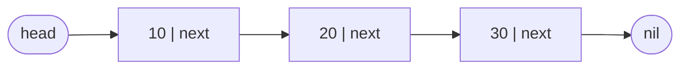
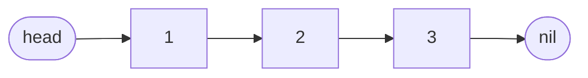
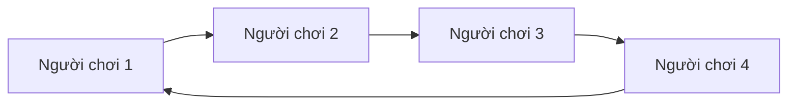
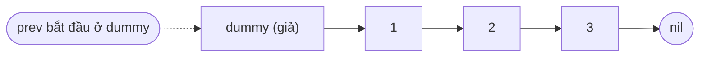
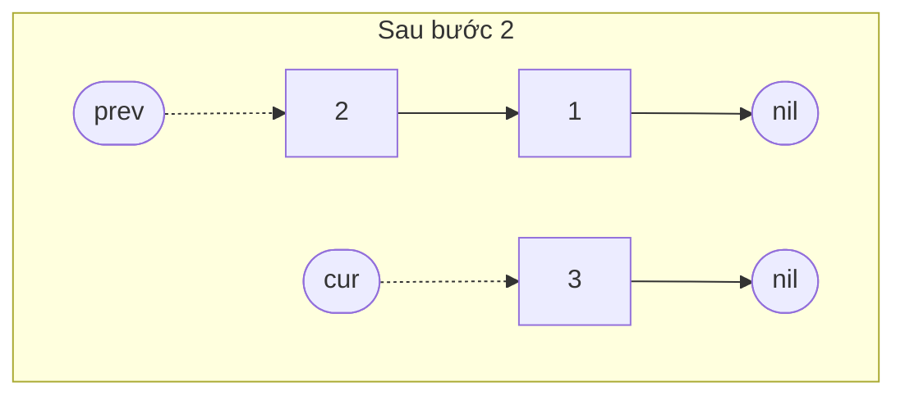
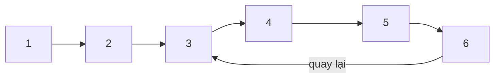
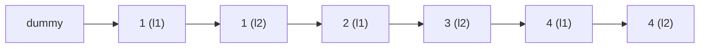
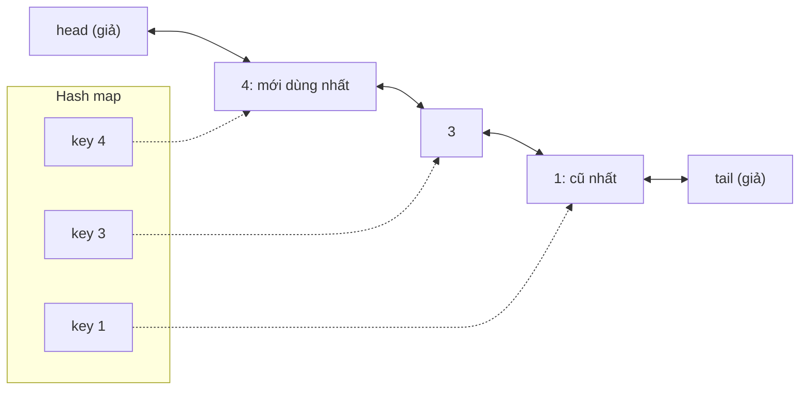

# 📚 Bài 4: Linked List (Danh sách liên kết)

## 🎯 Mục tiêu bài học

- Hiểu linked list nằm trong bộ nhớ **như thế nào**: nút (node), con trỏ (pointer), `head`, `tail`, `nil`/`None`
- Phân biệt **singly**, **doubly** và **circular** linked list
- Cài đặt được các thao tác: thêm đầu/cuối, chèn giữa, xóa, tìm kiếm - và biết chi phí của từng thao tác
- So sánh **mảng vs linked list** một cách thực tế (kể cả chuyện cache CPU)
- Thành thạo kỹ thuật **dummy node** (nút giả) để bỏ hết các `if` trường hợp đặc biệt
- Thành thạo các bài kinh điển:
    - **Đảo ngược** danh sách (lặp và đệ quy)
    - Tìm **nút giữa** bằng con trỏ nhanh/chậm
    - **Phát hiện chu trình** bằng thuật toán **Floyd** (rùa và thỏ) và tìm điểm bắt đầu chu trình
    - **Trộn hai danh sách đã sắp xếp**
    - **Xóa nút thứ n từ cuối** trong một lượt duyệt
- Tự cài **LRU Cache** (hash map + doubly linked list)
- Biết dùng `container/list` của Go và `collections.deque` của Python

!!! tip "Vì sao phải học linked list khi thực tế ít dùng trực tiếp?"
    Trong code hằng ngày bạn hiếm khi tự viết linked list - slice/list đã đủ tốt. Nhưng linked list là **sân tập con trỏ** tốt nhất: nó rèn cho bạn tư duy "vẽ hình trước, code sau", xử lý trường hợp biên (rỗng, 1 phần tử, đầu, cuối). Nó cũng là nền tảng của LRU cache, hash table chaining ([Bài 3](./03-hashing.md)), danh sách kề của đồ thị ([Bài 11](./11-graphs-traversal.md)) - và là chủ đề **cực phổ biến** trong phỏng vấn.

## 📖 1. Linked list là gì?

### Trò chơi truy tìm kho báu

Bạn chơi trò truy tìm kho báu: mảnh giấy đầu tiên ghi *"manh mối tiếp theo ở dưới gốc cây bàng"*. Dưới gốc cây bàng có mảnh giấy thứ hai ghi *"tiếp theo ở hộp thư nhà số 5"*... Mảnh cuối cùng ghi *"HẾT - kho báu ở đây"*.

- Các mảnh giấy nằm **rải rác** khắp nơi, không liền kề nhau
- Mỗi mảnh giấy chứa **dữ liệu** (manh mối) và **địa chỉ** của mảnh tiếp theo
- Muốn đến mảnh thứ 5, bạn **bắt buộc** phải đi qua mảnh 1, 2, 3, 4 - không nhảy thẳng được

Đó chính xác là **linked list**. Mỗi mảnh giấy là một **node**:

```text
node = [ dữ liệu | con trỏ next ]
```



### Trong bộ nhớ: rải rác chứ không liền kề

So với mảng ([Bài 2](./02-arrays-strings.md)) nằm liền kề, các node của linked list được cấp phát **riêng lẻ** ở bất kỳ đâu trên heap:

```text
Mảng [10, 20, 30]:           1000 [10] 1008 [20] 1016 [30]      ← liền kề

Linked list 10 → 20 → 30:
  địa chỉ 5040: [ 10 | next = 9120 ]
  địa chỉ 9120: [ 20 | next = 2200 ]
  địa chỉ 2200: [ 30 | next = nil  ]
  head = 5040
```

Hệ quả:

- **Truy cập phần tử thứ i**: không có công thức địa chỉ → phải đi từ `head` qua `i` bước → `O(n)`
- **Chèn/xóa khi đã đứng ở đúng chỗ**: chỉ đổi vài con trỏ, không phải dời phần tử nào → `O(1)`
- **Không cần cấp phát trước**, không bao giờ phải "copy sang mảng lớn hơn"

## 📖 2. Ba loại linked list

### Singly linked list (danh sách liên kết đơn)

Mỗi node chỉ biết node **sau** nó. Đi được một chiều.



### Doubly linked list (danh sách liên kết đôi)

Mỗi node biết cả node **trước** (`prev`) và **sau** (`next`). Đi được hai chiều, xóa một node **khi đã có con trỏ tới nó** là `O(1)` (không cần tìm node trước). Tốn thêm một con trỏ mỗi node.

```mermaid
flowchart LR
    N1(["nil"]) <-- "prev" --- A["1"]
    A <--> B["2"]
    B <--> C["3"]
    C -- "next" --> N2(["nil"])
    H(["head"]) --> A
    T(["tail"]) --> C
```

### Circular linked list (danh sách liên kết vòng)

Node cuối trỏ ngược về node đầu - không có `nil`. Hữu ích cho những thứ **quay vòng**: lượt chơi trong game bài, playlist "lặp lại tất cả", bộ lập lịch CPU round-robin.



| Loại | Con trỏ/node | Duyệt ngược | Xóa node khi có con trỏ tới nó | Dùng khi |
|---|---|---|---|---|
| Singly | 1 (`next`) | ❌ | `O(n)` (phải tìm node trước) | Stack, hash chaining, bài phỏng vấn |
| Doubly | 2 (`prev`, `next`) | ✅ | `O(1)` | LRU cache, `container/list`, `deque` |
| Circular | 1 hoặc 2 | tùy | tùy | Round-robin, bộ đệm vòng |

## 📖 3. Cài đặt singly linked list

### Các thao tác và hình vẽ

**Thêm vào đầu (push front)** - `O(1)`:

```text
Trước:            head → [2] → [3] → nil
Tạo node mới:     [1]
Bước 1: new.next = head        [1] → [2] → [3] → nil
Bước 2: head = new      head → [1] → [2] → [3] → nil
```

**Thêm vào cuối (push back)** - `O(1)` **nếu giữ con trỏ `tail`**, `O(n)` nếu không (phải đi tới cuối).

**Chèn vào vị trí `index`** - `O(n)` để đi tới node đứng **trước** vị trí đó, rồi `O(1)` để nối:

```text
Chèn 3 vào index 2 của: 1 → 2 → 4 → 5

prev = node ở index 1 (giá trị 2)
Bước 1: new.next = prev.next      [3] → [4]
Bước 2: prev.next = new     1 → 2 → [3] → 4 → 5
```

!!! warning "Thứ tự hai bước là SỐNG CÒN"
    Nếu làm `prev.next = new` **trước**, bạn đánh mất địa chỉ của `[4]` - cả phần đuôi `4 → 5` bị "rơi" khỏi danh sách (trong C là memory leak; trong Go/Python thì bị garbage collector dọn mất). Quy tắc: **nối node mới vào phần sau trước, rồi mới nối phần trước vào node mới.**

Bấm ▶ để xem con trỏ đi từ `head` tới vị trí chèn, rồi hai con trỏ được nối lại theo đúng thứ tự.

<div class="algo-viz" data-viz="linkedlist" data-algo="insert" data-input="1,2,4,5" data-value="3" data-index="2" data-title="Chèn 3 vào index 2"></div>

**Xóa theo giá trị** - `O(n)` để tìm, `O(1)` để gỡ: tìm node `prev` đứng **trước** node cần xóa, rồi "đi vòng qua" nó.

```text
Xóa 3 khỏi: 1 → 2 → 3 → 4 → 5

prev = node 2, target = node 3
prev.next = target.next     1 → 2 ──────→ 4 → 5
                                  [3] (không ai trỏ tới → GC thu hồi)
```

Trường hợp đặc biệt: xóa **node đầu** (không có `prev`) → phải cập nhật `head`. Xóa **node cuối** → phải cập nhật `tail`.

Bấm ▶ và để ý con trỏ `prev` luôn đi **chậm hơn một bước** so với node đang xét - vì với singly linked list, muốn gỡ một node thì phải đứng ở node trước nó.

<div class="algo-viz" data-viz="linkedlist" data-algo="delete" data-input="1,2,3,4,5" data-value="3" data-title="Xóa node có giá trị 3"></div>

### Code đầy đủ

=== "Go"

    ```go
    package main

    import (
    	"fmt"
    	"strings"
    )

    type Node struct {
    	Val  int
    	Next *Node
    }

    type LinkedList struct {
    	head, tail *Node
    	size       int
    }

    // PushFront: O(1)
    func (l *LinkedList) PushFront(v int) {
    	n := &Node{Val: v, Next: l.head}
    	l.head = n
    	if l.tail == nil { // danh sách đang rỗng
    		l.tail = n
    	}
    	l.size++
    }

    // PushBack: O(1) nhờ giữ tail
    func (l *LinkedList) PushBack(v int) {
    	n := &Node{Val: v}
    	if l.tail == nil {
    		l.head, l.tail = n, n
    	} else {
    		l.tail.Next = n
    		l.tail = n
    	}
    	l.size++
    }

    // InsertAt: O(index)
    func (l *LinkedList) InsertAt(index, v int) error {
    	if index < 0 || index > l.size {
    		return fmt.Errorf("index %d ngoài phạm vi [0, %d]", index, l.size)
    	}
    	if index == 0 {
    		l.PushFront(v)
    		return nil
    	}
    	if index == l.size {
    		l.PushBack(v)
    		return nil
    	}
    	prev := l.head
    	for i := 0; i < index-1; i++ { // đi tới node đứng TRƯỚC vị trí chèn
    		prev = prev.Next
    	}
    	prev.Next = &Node{Val: v, Next: prev.Next} // nối phần sau trước, rồi phần trước
    	l.size++
    	return nil
    }

    // DeleteValue: xóa node đầu tiên có giá trị v. O(n)
    func (l *LinkedList) DeleteValue(v int) bool {
    	if l.head == nil {
    		return false
    	}
    	if l.head.Val == v { // xóa đầu
    		l.head = l.head.Next
    		if l.head == nil {
    			l.tail = nil
    		}
    		l.size--
    		return true
    	}
    	prev := l.head
    	for prev.Next != nil && prev.Next.Val != v {
    		prev = prev.Next
    	}
    	if prev.Next == nil {
    		return false // không tìm thấy
    	}
    	if prev.Next == l.tail { // xóa cuối → cập nhật tail
    		l.tail = prev
    	}
    	prev.Next = prev.Next.Next
    	l.size--
    	return true
    }

    // Find: trả về index đầu tiên có giá trị v, -1 nếu không có. O(n)
    func (l *LinkedList) Find(v int) int {
    	i := 0
    	for n := l.head; n != nil; n = n.Next {
    		if n.Val == v {
    			return i
    		}
    		i++
    	}
    	return -1
    }

    func (l *LinkedList) String() string {
    	var sb strings.Builder
    	for n := l.head; n != nil; n = n.Next {
    		fmt.Fprintf(&sb, "%d -> ", n.Val)
    	}
    	sb.WriteString("nil")
    	return sb.String()
    }

    func main() {
    	l := &LinkedList{}
    	l.PushBack(2)
    	l.PushBack(4)
    	l.PushFront(1)
    	l.PushBack(5)
    	fmt.Println(l, "| size =", l.size)

    	l.InsertAt(2, 3)
    	fmt.Println("InsertAt(2, 3):", l)
    	fmt.Println("InsertAt(9, 0):", l.InsertAt(9, 0))

    	fmt.Println("Find(4) =", l.Find(4), "| Find(7) =", l.Find(7))

    	l.DeleteValue(1) // đầu
    	l.DeleteValue(3) // giữa
    	l.DeleteValue(5) // cuối
    	fmt.Println("Sau 3 lần xóa:", l, "| tail =", l.tail.Val)
    	l.PushBack(6)
    	fmt.Println("PushBack(6):", l)
    }

    // Output:
    // 1 -> 2 -> 4 -> 5 -> nil | size = 4
    // InsertAt(2, 3): 1 -> 2 -> 3 -> 4 -> 5 -> nil
    // InsertAt(9, 0): index 9 ngoài phạm vi [0, 5]
    // Find(4) = 3 | Find(7) = -1
    // Sau 3 lần xóa: 2 -> 4 -> nil | tail = 4
    // PushBack(6): 2 -> 4 -> 6 -> nil
    ```

=== "Python"

    ```python
    class Node:
        __slots__ = ("val", "next")  # tiết kiệm bộ nhớ cho mỗi node

        def __init__(self, val, nxt=None):
            self.val = val
            self.next = nxt


    class LinkedList:
        def __init__(self):
            self.head = self.tail = None
            self.size = 0

        def push_front(self, v):  # O(1)
            self.head = Node(v, self.head)
            if self.tail is None:  # danh sách đang rỗng
                self.tail = self.head
            self.size += 1

        def push_back(self, v):  # O(1) nhờ giữ tail
            n = Node(v)
            if self.tail is None:
                self.head = self.tail = n
            else:
                self.tail.next = n
                self.tail = n
            self.size += 1

        def insert_at(self, index, v):  # O(index)
            if not 0 <= index <= self.size:
                raise IndexError(f"index {index} ngoài phạm vi [0, {self.size}]")
            if index == 0:
                return self.push_front(v)
            if index == self.size:
                return self.push_back(v)
            prev = self.head
            for _ in range(index - 1):  # đi tới node đứng TRƯỚC vị trí chèn
                prev = prev.next
            prev.next = Node(v, prev.next)  # nối phần sau trước, rồi phần trước
            self.size += 1

        def delete_value(self, v) -> bool:  # O(n)
            if self.head is None:
                return False
            if self.head.val == v:  # xóa đầu
                self.head = self.head.next
                if self.head is None:
                    self.tail = None
                self.size -= 1
                return True
            prev = self.head
            while prev.next and prev.next.val != v:
                prev = prev.next
            if prev.next is None:
                return False  # không tìm thấy
            if prev.next is self.tail:  # xóa cuối → cập nhật tail
                self.tail = prev
            prev.next = prev.next.next
            self.size -= 1
            return True

        def find(self, v) -> int:  # O(n)
            for i, x in enumerate(self):
                if x == v:
                    return i
            return -1

        def __iter__(self):  # cho phép: for x in lst
            n = self.head
            while n:
                yield n.val
                n = n.next

        def __str__(self):
            return " -> ".join([str(x) for x in self] + ["None"])


    l = LinkedList()
    l.push_back(2)
    l.push_back(4)
    l.push_front(1)
    l.push_back(5)
    print(l, "| size =", l.size)

    l.insert_at(2, 3)
    print("insert_at(2, 3):", l)
    try:
        l.insert_at(9, 0)
    except IndexError as e:
        print("insert_at(9, 0):", e)

    print("find(4) =", l.find(4), "| find(7) =", l.find(7))

    l.delete_value(1)  # đầu
    l.delete_value(3)  # giữa
    l.delete_value(5)  # cuối
    print("Sau 3 lần xóa:", l, "| tail =", l.tail.val)
    l.push_back(6)
    print("push_back(6):", l)

    # Output:
    # 1 -> 2 -> 4 -> 5 -> None | size = 4
    # insert_at(2, 3): 1 -> 2 -> 3 -> 4 -> 5 -> None
    # insert_at(9, 0): index 9 ngoài phạm vi [0, 5]
    # find(4) = 3 | find(7) = -1
    # Sau 3 lần xóa: 2 -> 4 -> None | tail = 4
    # push_back(6): 2 -> 4 -> 6 -> None
    ```

!!! warning "Lỗi kinh điển: quên cập nhật `tail`"
    Xóa node cuối mà không cập nhật `tail` → `tail` vẫn trỏ vào node đã bị gỡ. Lần `PushBack` sau sẽ nối node mới vào node "ma" đó, và node mới **không bao giờ xuất hiện** khi duyệt từ `head`. Dòng `PushBack(6)` trong ví dụ trên chính là để kiểm tra lỗi này.

## 📖 4. Mảng vs Linked list

| Thao tác | Mảng động (slice/list) | Singly linked list | Doubly linked list |
|---|---|---|---|
| Truy cập `a[i]` | **`O(1)`** | `O(n)` | `O(n)` |
| Tìm kiếm theo giá trị | `O(n)` | `O(n)` | `O(n)` |
| Thêm/xóa **đầu** | `O(n)` - dời mọi phần tử | **`O(1)`** | **`O(1)`** |
| Thêm **cuối** | `O(1)` khấu hao | `O(1)` (có tail) | `O(1)` |
| Xóa **cuối** | `O(1)` | `O(n)` (phải tìm node áp chót) | **`O(1)`** |
| Chèn/xóa **giữa** (đã có con trỏ tới vị trí) | `O(n)` | `O(1)` (sau node đó) | **`O(1)`** |
| Bộ nhớ thêm/phần tử | ~0 (có thể dư capacity) | 1 con trỏ (8 byte) | 2 con trỏ (16 byte) |
| Thân thiện cache CPU | ✅ Rất tốt | ❌ Kém | ❌ Kém |
| Binary search | ✅ | ❌ | ❌ |

!!! note "Sự thật phũ phàng: mảng thường thắng"
    Trên lý thuyết, chèn giữa linked list là `O(1)`. Nhưng để **tới được** vị trí giữa bạn đã tốn `O(n)` bước đi theo con trỏ - mỗi bước có thể là một **cache miss** (~100 ns). Trong khi đó dời `n` phần tử mảng dùng `memmove` liền kề cực nhanh. Bjarne Stroustrup (cha đẻ C++) từng đo: với vài trăm nghìn phần tử, chèn vào vị trí ngẫu nhiên của `vector` vẫn **nhanh hơn** `list`.

    → Chỉ dùng linked list khi bạn **đã có sẵn con trỏ** tới node cần thao tác (như LRU cache), hoặc cần thêm/xóa ở **đầu** liên tục (queue, deque).

## 📖 5. Kỹ thuật dummy node (nút giả / sentinel)

Nhìn lại `DeleteValue` ở trên: có một nhánh `if` riêng cho trường hợp **xóa node đầu**, vì node đầu không có `prev`. Bài nào cũng phải lo "nếu là node đầu thì sao?" rất dễ sai.

**Mẹo**: tạo thêm một node giả `dummy` đứng **trước** `head`. Giờ **mọi** node thật đều có node đứng trước → chỉ còn một trường hợp. Cuối cùng trả về `dummy.next`.



Ví dụ: xóa **mọi** node có giá trị `v` ([LeetCode 203](https://leetcode.com/problems/remove-linked-list-elements/)) - không cần một `if` đặc biệt nào:

```text
xóa 1 khỏi: 1 → 1 → 2 → 1 → 3
dummy → 1 → 1 → 2 → 1 → 3
prev=dummy: next là 1 → bỏ qua   dummy → 1 → 2 → 1 → 3
prev=dummy: next là 1 → bỏ qua   dummy → 2 → 1 → 3
prev=dummy: next là 2 → prev tiến tới 2
prev=2:     next là 1 → bỏ qua   dummy → 2 → 3
prev=2:     next là 3 → prev tiến tới 3; hết
Kết quả: dummy.next = 2 → 3
```

=== "Go"

    ```go
    package main

    import (
    	"fmt"
    	"strings"
    )

    type ListNode struct {
    	Val  int
    	Next *ListNode
    }

    func build(vals ...int) *ListNode {
    	dummy := &ListNode{}
    	cur := dummy
    	for _, v := range vals {
    		cur.Next = &ListNode{Val: v}
    		cur = cur.Next
    	}
    	return dummy.Next
    }

    func str(head *ListNode) string {
    	var sb strings.Builder
    	for ; head != nil; head = head.Next {
    		fmt.Fprintf(&sb, "%d -> ", head.Val)
    	}
    	return sb.String() + "nil"
    }

    func removeElements(head *ListNode, v int) *ListNode {
    	dummy := &ListNode{Next: head}
    	prev := dummy
    	for prev.Next != nil {
    		if prev.Next.Val == v {
    			prev.Next = prev.Next.Next // gỡ, prev đứng yên để xét node mới
    		} else {
    			prev = prev.Next
    		}
    	}
    	return dummy.Next
    }

    func main() {
    	fmt.Println(str(removeElements(build(1, 1, 2, 1, 3), 1)))
    	fmt.Println(str(removeElements(build(7, 7, 7), 7)))
    	fmt.Println(str(removeElements(build(), 1)))
    }

    // Output:
    // 2 -> 3 -> nil
    // nil
    // nil
    ```

=== "Python"

    ```python
    class ListNode:
        def __init__(self, val=0, next=None):
            self.val = val
            self.next = next


    def build(vals):
        dummy = cur = ListNode()
        for v in vals:
            cur.next = ListNode(v)
            cur = cur.next
        return dummy.next


    def to_str(head):
        parts = []
        while head:
            parts.append(str(head.val))
            head = head.next
        return " -> ".join(parts + ["None"])


    def remove_elements(head, v):
        dummy = ListNode(0, head)
        prev = dummy
        while prev.next:
            if prev.next.val == v:
                prev.next = prev.next.next  # gỡ, prev đứng yên để xét node mới
            else:
                prev = prev.next
        return dummy.next


    print(to_str(remove_elements(build([1, 1, 2, 1, 3]), 1)))
    print(to_str(remove_elements(build([7, 7, 7]), 7)))
    print(to_str(remove_elements(build([]), 1)))

    # Output:
    # 2 -> 3 -> None
    # None
    # None
    ```

!!! tip "Khi nào dùng dummy node?"
    Bất cứ khi nào **node đầu có thể bị thay đổi**: xóa node, trộn danh sách, chia danh sách, chèn có thứ tự. Các hàm `build` ở trên cũng dùng dummy để khỏi phải `if head == nil`.

Các ví dụ tiếp theo trong bài đều dùng lại `ListNode`, `build` và `str`/`to_str` như trên.

## 📖 6. Đảo ngược linked list

### Trực giác: quay đầu đoàn tàu

Một đoàn tàu gồm các toa nối với nhau bằng móc, mỗi móc hướng về toa **sau**. Muốn đảo ngược, bạn đi dọc đoàn tàu và **tháo móc từng toa, gắn nó quay về toa trước**. Cần nhớ ba thứ:

- `prev`: toa vừa quay xong (ban đầu là `nil` - toa đầu tiên sẽ thành toa cuối)
- `cur`: toa đang xử lý
- `next`: toa kế tiếp - **phải lưu trước** khi tháo móc, nếu không sẽ lạc mất phần còn lại

### Từng bước với `1 → 2 → 3 → nil`

| Bước | Trước bước | `next = cur.next` | `cur.next = prev` | Tiến lên | Trạng thái |
|---|---|---|---|---|---|
| 0 | prev=nil, cur=1 | | | | `nil ← ?  1 → 2 → 3` |
| 1 | prev=nil, cur=1 | next=2 | `1 → nil` | prev=1, cur=2 | `nil ← 1   2 → 3` |
| 2 | prev=1, cur=2 | next=3 | `2 → 1` | prev=2, cur=3 | `nil ← 1 ← 2   3` |
| 3 | prev=2, cur=3 | next=nil | `3 → 2` | prev=3, cur=nil | `nil ← 1 ← 2 ← 3` |

`cur == nil` → dừng. `prev` (node 3) là `head` mới.



Bấm ▶ và theo dõi ba con trỏ `prev`, `cur`, `next` - mỗi bước chỉ **một mũi tên** bị lật ngược.

<div class="algo-viz" data-viz="linkedlist" data-algo="reverse" data-input="1,2,3,4,5" data-title="Đảo ngược linked list"></div>

### Cách 2: đệ quy

Ý tưởng "tin tưởng đệ quy" (xem [Bài 6](./06-recursion-backtracking.md)): giả sử `reverse(head.next)` đã đảo ngược xong phần đuôi và trả về head mới. Lúc này `head.next` (node 2) là **node cuối** của phần đã đảo → chỉ cần cho nó trỏ ngược về `head`, rồi cắt `head.next = nil`.

```text
reverse(1 → 2 → 3):
    phần đuôi reverse(2 → 3) trả về 3 → 2 → nil, và node 1 vẫn trỏ tới 2
    1 → 2 ← 3
    head.next.next = head:   1 ⇄ 2 ← 3
    head.next = nil:         nil ← 1 ← 2 ← 3      → trả về 3
```

=== "Go"

    ```go
    package main

    import (
    	"fmt"
    	"strings"
    )

    type ListNode struct {
    	Val  int
    	Next *ListNode
    }

    func build(vals ...int) *ListNode {
    	dummy := &ListNode{}
    	cur := dummy
    	for _, v := range vals {
    		cur.Next = &ListNode{Val: v}
    		cur = cur.Next
    	}
    	return dummy.Next
    }

    func str(head *ListNode) string {
    	var sb strings.Builder
    	for ; head != nil; head = head.Next {
    		fmt.Fprintf(&sb, "%d -> ", head.Val)
    	}
    	return sb.String() + "nil"
    }

    // Lặp: O(n) thời gian, O(1) bộ nhớ
    func reverseIter(head *ListNode) *ListNode {
    	var prev *ListNode
    	cur := head
    	for cur != nil {
    		next := cur.Next // 1. lưu phần còn lại
    		cur.Next = prev  // 2. lật mũi tên
    		prev = cur       // 3. tiến prev
    		cur = next       // 4. tiến cur
    	}
    	return prev
    }

    // Đệ quy: O(n) thời gian, O(n) bộ nhớ (call stack)
    func reverseRec(head *ListNode) *ListNode {
    	if head == nil || head.Next == nil {
    		return head // 0 hoặc 1 node: đã "đảo" xong
    	}
    	newHead := reverseRec(head.Next)
    	head.Next.Next = head // node sau quay lại trỏ về mình
    	head.Next = nil       // cắt mũi tên cũ
    	return newHead
    }

    func main() {
    	fmt.Println(str(reverseIter(build(1, 2, 3, 4, 5))))
    	fmt.Println(str(reverseRec(build(1, 2, 3, 4, 5))))
    	fmt.Println(str(reverseIter(build(42))))
    	fmt.Println(str(reverseRec(build())))
    }

    // Output:
    // 5 -> 4 -> 3 -> 2 -> 1 -> nil
    // 5 -> 4 -> 3 -> 2 -> 1 -> nil
    // 42 -> nil
    // nil
    ```

=== "Python"

    ```python
    class ListNode:
        def __init__(self, val=0, next=None):
            self.val = val
            self.next = next


    def build(vals):
        dummy = cur = ListNode()
        for v in vals:
            cur.next = ListNode(v)
            cur = cur.next
        return dummy.next


    def to_str(head):
        parts = []
        while head:
            parts.append(str(head.val))
            head = head.next
        return " -> ".join(parts + ["None"])


    def reverse_iter(head):
        """Lặp: O(n) thời gian, O(1) bộ nhớ."""
        prev, cur = None, head
        while cur:
            nxt = cur.next  # 1. lưu phần còn lại
            cur.next = prev  # 2. lật mũi tên
            prev = cur  # 3. tiến prev
            cur = nxt  # 4. tiến cur
        return prev


    def reverse_rec(head):
        """Đệ quy: O(n) thời gian, O(n) bộ nhớ (call stack)."""
        if head is None or head.next is None:
            return head
        new_head = reverse_rec(head.next)
        head.next.next = head  # node sau quay lại trỏ về mình
        head.next = None  # cắt mũi tên cũ
        return new_head


    print(to_str(reverse_iter(build([1, 2, 3, 4, 5]))))
    print(to_str(reverse_rec(build([1, 2, 3, 4, 5]))))
    print(to_str(reverse_iter(build([42]))))
    print(to_str(reverse_rec(build([]))))

    # Output:
    # 5 -> 4 -> 3 -> 2 -> 1 -> None
    # 5 -> 4 -> 3 -> 2 -> 1 -> None
    # 42 -> None
    # None
    ```

!!! tip "Python: gán song song cho gọn"
    Bốn dòng trong vòng lặp có thể viết thành một: `cur.next, prev, cur = prev, cur, cur.next`. Vế phải được tính **hết** trước khi gán nên đúng - nhưng thứ tự vế trái vẫn quan trọng (gán `cur.next` trước khi `cur` đổi). Khi mới học, hãy viết 4 dòng cho rõ.

!!! warning "Đệ quy với danh sách dài"
    Python giới hạn độ sâu đệ quy mặc định là 1000 → `reverse_rec` với 10.000 node sẽ ném `RecursionError`. Go có stack tự lớn nên chịu được sâu hơn nhiều, nhưng vẫn tốn `O(n)` bộ nhớ. Trong thực tế và phỏng vấn, **ưu tiên bản lặp**.

**Độ phức tạp**: lặp `O(n)` thời gian / `O(1)` bộ nhớ; đệ quy `O(n)` / `O(n)`.

## 📖 7. Tìm nút giữa - Con trỏ nhanh/chậm

### Trực giác: hai người chạy trên đường đua

Hai người cùng xuất phát. **Thỏ** chạy nhanh gấp đôi **rùa**. Khi thỏ về đích, rùa đang ở đúng **nửa đường**. Không cần biết trước đường dài bao nhiêu!

Với linked list: `slow` đi 1 bước, `fast` đi 2 bước. Khi `fast` tới cuối, `slow` ở giữa. Chỉ **một lượt duyệt**, không cần đếm độ dài trước.

```text
1 → 2 → 3 → 4 → 5 → nil          (lẻ: giữa là 3)
s,f
    s       f
        s           f            f.next == nil → dừng, slow = 3 ✓

1 → 2 → 3 → 4 → 5 → 6 → nil      (chẵn: có 2 nút giữa 3 và 4)
s,f
    s       f
        s           f
            s               f    f == nil → dừng, slow = 4 (nút giữa thứ hai)
```

Bấm ▶ và để ý `fast` nhảy 2 ô mỗi lượt trong khi `slow` chỉ nhích 1 ô - khi `fast` ra khỏi danh sách, `slow` nằm đúng giữa.

<div class="algo-viz" data-viz="linkedlist" data-algo="middle" data-input="1,2,3,4,5,6,7" data-title="Tìm nút giữa bằng slow/fast"></div>

=== "Go"

    ```go
    package main

    import "fmt"

    type ListNode struct {
    	Val  int
    	Next *ListNode
    }

    func build(vals ...int) *ListNode {
    	dummy := &ListNode{}
    	cur := dummy
    	for _, v := range vals {
    		cur.Next = &ListNode{Val: v}
    		cur = cur.Next
    	}
    	return dummy.Next
    }

    // Trả về nút giữa; nếu độ dài chẵn trả về nút giữa THỨ HAI (LeetCode 876)
    func middleNode(head *ListNode) *ListNode {
    	slow, fast := head, head
    	for fast != nil && fast.Next != nil {
    		slow = slow.Next
    		fast = fast.Next.Next
    	}
    	return slow
    }

    // Biến thể: nút giữa THỨ NHẤT (hay dùng khi cần cắt đôi danh sách)
    func middleFirst(head *ListNode) *ListNode {
    	slow, fast := head, head
    	for fast.Next != nil && fast.Next.Next != nil {
    		slow = slow.Next
    		fast = fast.Next.Next
    	}
    	return slow
    }

    func main() {
    	fmt.Println(middleNode(build(1, 2, 3, 4, 5)).Val)
    	fmt.Println(middleNode(build(1, 2, 3, 4, 5, 6)).Val)
    	fmt.Println(middleFirst(build(1, 2, 3, 4, 5, 6)).Val)
    	fmt.Println(middleNode(build(9)).Val)
    }

    // Output:
    // 3
    // 4
    // 3
    // 9
    ```

=== "Python"

    ```python
    class ListNode:
        def __init__(self, val=0, next=None):
            self.val = val
            self.next = next


    def build(vals):
        dummy = cur = ListNode()
        for v in vals:
            cur.next = ListNode(v)
            cur = cur.next
        return dummy.next


    def middle_node(head):
        """Nút giữa; độ dài chẵn → nút giữa THỨ HAI (LeetCode 876)."""
        slow = fast = head
        while fast and fast.next:
            slow = slow.next
            fast = fast.next.next
        return slow


    def middle_first(head):
        """Biến thể: nút giữa THỨ NHẤT (hay dùng khi cần cắt đôi)."""
        slow = fast = head
        while fast.next and fast.next.next:
            slow = slow.next
            fast = fast.next.next
        return slow


    print(middle_node(build([1, 2, 3, 4, 5])).val)
    print(middle_node(build([1, 2, 3, 4, 5, 6])).val)
    print(middle_first(build([1, 2, 3, 4, 5, 6])).val)
    print(middle_node(build([9])).val)

    # Output:
    # 3
    # 4
    # 3
    # 9
    ```

**Độ phức tạp**: `O(n)` thời gian, `O(1)` bộ nhớ. Tìm nút giữa là bước đầu của **merge sort trên linked list** ([Bài 7](./07-sorting.md)), kiểm tra palindrome, reorder list.

## 📖 8. Phát hiện chu trình - Thuật toán Floyd (rùa và thỏ)

### Vấn đề

Nếu một node nào đó trỏ **ngược lại** một node phía trước, danh sách có **chu trình** (cycle) - duyệt bằng `for n != nil` sẽ chạy **mãi mãi**.



Cách dễ: lưu mọi node đã thăm vào một **set** ([Bài 3](./03-hashing.md)); gặp lại node đã có → có chu trình. `O(n)` thời gian nhưng `O(n)` bộ nhớ.

### Trực giác: chạy trên đường tròn

Rùa và thỏ chạy trên một đường đua. Nếu đường **thẳng**, thỏ về đích trước và không bao giờ gặp lại rùa. Nếu đường có **vòng tròn**, thỏ sẽ chạy vòng và **đuổi kịp rùa từ phía sau** - giống như trên sân vận động, người chạy nhanh sẽ "bắt vòng" người chạy chậm.

Vì sao chắc chắn gặp mà không "nhảy qua" nhau? Khi cả hai đã vào vòng, mỗi lượt thỏ đi 2 bước, rùa đi 1 → **khoảng cách giữa chúng giảm đúng 1** mỗi lượt. Khoảng cách giảm dần từng đơn vị thì chắc chắn chạm 0.

### Từng bước với `1 → 2 → 3 → 4 → 5 → 6 → (quay về 3)`

| Lượt | slow (1 bước) | fast (2 bước) | Gặp nhau? |
|---|---|---|---|
| 0 | 1 | 1 | (xuất phát) |
| 1 | 2 | 3 | |
| 2 | 3 | 5 | |
| 3 | 4 | 3 (5 → 6 → 3) | |
| 4 | 5 | 5 (3 → 4 → 5) | ✅ gặp tại 5 |

### Giai đoạn 2: tìm điểm bắt đầu chu trình

Gọi:

- `a` = số bước từ `head` tới điểm bắt đầu chu trình (ở đây `a = 2`: 1 → 2 → 3)
- `b` = số bước từ điểm bắt đầu chu trình tới điểm gặp (ở đây `b = 2`: 3 → 4 → 5)
- `c` = độ dài chu trình (ở đây `c = 4`: 3 → 4 → 5 → 6 → 3)

Khi gặp nhau: rùa đi `a + b`, thỏ đi gấp đôi `2(a + b)`. Thỏ đi nhiều hơn đúng một số vòng nguyên `k·c`:

```text
2(a + b) = a + b + k·c   ⟹   a + b = k·c   ⟹   a = k·c - b
```

`a = k·c - b` nghĩa là: đi `a` bước từ **điểm gặp** thì cũng tới **điểm bắt đầu chu trình** (đi `c - b` bước để hoàn tất vòng hiện tại, rồi thêm vài vòng nguyên). Vậy:

1. Đặt một con trỏ về `head`, giữ con trỏ kia ở điểm gặp
2. Cả hai cùng đi **1 bước** mỗi lượt
3. Nơi chúng gặp nhau chính là **điểm bắt đầu chu trình**

```text
p1 = head(1), p2 = điểm gặp(5)
p1: 1 → 2 → 3
p2: 5 → 6 → 3        gặp nhau tại 3 ✓ (sau a = 2 bước)
```

Bấm ▶ để xem thỏ chạy vòng và đuổi kịp rùa bên trong chu trình (đuôi danh sách nối về index 2, tức node 3).

<div class="algo-viz" data-viz="linkedlist" data-algo="detect-cycle" data-input="1,2,3,4,5,6" data-cycle-to="2" data-title="Floyd: rùa và thỏ"></div>

=== "Go"

    ```go
    package main

    import "fmt"

    type ListNode struct {
    	Val  int
    	Next *ListNode
    }

    // buildCycle tạo danh sách, node cuối trỏ về node ở vị trí pos (-1: không có chu trình)
    func buildCycle(vals []int, pos int) *ListNode {
    	nodes := make([]*ListNode, len(vals))
    	for i, v := range vals {
    		nodes[i] = &ListNode{Val: v}
    		if i > 0 {
    			nodes[i-1].Next = nodes[i]
    		}
    	}
    	if pos >= 0 {
    		nodes[len(nodes)-1].Next = nodes[pos]
    	}
    	return nodes[0]
    }

    func hasCycle(head *ListNode) bool {
    	slow, fast := head, head
    	for fast != nil && fast.Next != nil {
    		slow = slow.Next
    		fast = fast.Next.Next
    		if slow == fast { // so sánh ĐỊA CHỈ node, không so sánh Val
    			return true
    		}
    	}
    	return false
    }

    func detectCycle(head *ListNode) *ListNode {
    	slow, fast := head, head
    	for fast != nil && fast.Next != nil {
    		slow = slow.Next
    		fast = fast.Next.Next
    		if slow == fast { // giai đoạn 2
    			p := head
    			for p != slow {
    				p = p.Next
    				slow = slow.Next
    			}
    			return p
    		}
    	}
    	return nil
    }

    func main() {
    	withCycle := buildCycle([]int{1, 2, 3, 4, 5, 6}, 2)
    	noCycle := buildCycle([]int{1, 2, 3}, -1)
    	fmt.Println("hasCycle:", hasCycle(withCycle), hasCycle(noCycle))
    	fmt.Println("chu trình bắt đầu tại node:", detectCycle(withCycle).Val)
    	fmt.Println("tự vòng:", detectCycle(buildCycle([]int{7}, 0)).Val)
    	fmt.Println("không có chu trình:", detectCycle(noCycle))
    }

    // Output:
    // hasCycle: true false
    // chu trình bắt đầu tại node: 3
    // tự vòng: 7
    // không có chu trình: <nil>
    ```

=== "Python"

    ```python
    class ListNode:
        def __init__(self, val=0, next=None):
            self.val = val
            self.next = next


    def build_cycle(vals, pos):
        """Node cuối trỏ về node ở vị trí pos (-1: không có chu trình)."""
        nodes = [ListNode(v) for v in vals]
        for a, b in zip(nodes, nodes[1:]):
            a.next = b
        if pos >= 0:
            nodes[-1].next = nodes[pos]
        return nodes[0]


    def has_cycle(head) -> bool:
        slow = fast = head
        while fast and fast.next:
            slow = slow.next
            fast = fast.next.next
            if slow is fast:  # so sánh ĐỊNH DANH object, không so sánh val
                return True
        return False


    def detect_cycle(head):
        slow = fast = head
        while fast and fast.next:
            slow = slow.next
            fast = fast.next.next
            if slow is fast:  # giai đoạn 2
                p = head
                while p is not slow:
                    p = p.next
                    slow = slow.next
                return p
        return None


    with_cycle = build_cycle([1, 2, 3, 4, 5, 6], 2)
    no_cycle = build_cycle([1, 2, 3], -1)
    print("has_cycle:", has_cycle(with_cycle), has_cycle(no_cycle))
    print("chu trình bắt đầu tại node:", detect_cycle(with_cycle).val)
    print("tự vòng:", detect_cycle(build_cycle([7], 0)).val)
    print("không có chu trình:", detect_cycle(no_cycle))

    # Output:
    # has_cycle: True False
    # chu trình bắt đầu tại node: 3
    # tự vòng: 7
    # không có chu trình: None
    ```

**Độ phức tạp**: `O(n)` thời gian, **`O(1)` bộ nhớ** - đây là lý do Floyd đẹp hơn cách dùng set.

!!! note "Floyd không chỉ dành cho linked list"
    Bất kỳ dãy nào sinh bởi `x → f(x)` với tập giá trị hữu hạn đều **chắc chắn** rơi vào chu trình. Floyd dùng được cho: [202 Happy Number](https://leetcode.com/problems/happy-number/) (`f(x)` = tổng bình phương các chữ số), [287 Find the Duplicate Number](https://leetcode.com/problems/find-the-duplicate-number/) (coi `i → nums[i]` là con trỏ), phân tích số nguyên lớn (thuật toán Pollard rho), phát hiện vòng lặp trong bộ sinh số ngẫu nhiên.

## 📖 9. Trộn hai danh sách đã sắp xếp

**Đề** ([LeetCode 21](https://leetcode.com/problems/merge-two-sorted-lists/)): trộn hai linked list đã sắp xếp thành một danh sách sắp xếp.

**Trực giác**: hai hàng người đã xếp theo chiều cao. Người gác cổng mỗi lần nhìn **hai người đứng đầu** hai hàng, cho người **thấp hơn** đi qua. Hết một hàng thì cho cả hàng còn lại đi qua luôn.

Dùng dummy node làm "đầu hàng mới" và con trỏ `tail` để nối vào cuối. **Không tạo node mới** - chỉ nối lại con trỏ.

```text
l1: 1 → 2 → 4        l2: 1 → 3 → 4
dummy →                                      so 1 vs 1 → lấy l1 (≤ giữ ổn định)
dummy → 1(l1)                                so 2 vs 1 → lấy l2
dummy → 1 → 1(l2)                            so 2 vs 3 → lấy l1
dummy → 1 → 1 → 2                            so 4 vs 3 → lấy l2
dummy → 1 → 1 → 2 → 3                        so 4 vs 4 → lấy l1
dummy → 1 → 1 → 2 → 3 → 4                    l1 hết → nối nguyên l2 còn lại (4)
dummy → 1 → 1 → 2 → 3 → 4 → 4
```



=== "Go"

    ```go
    package main

    import (
    	"fmt"
    	"strings"
    )

    type ListNode struct {
    	Val  int
    	Next *ListNode
    }

    func build(vals ...int) *ListNode {
    	dummy := &ListNode{}
    	cur := dummy
    	for _, v := range vals {
    		cur.Next = &ListNode{Val: v}
    		cur = cur.Next
    	}
    	return dummy.Next
    }

    func str(head *ListNode) string {
    	var sb strings.Builder
    	for ; head != nil; head = head.Next {
    		fmt.Fprintf(&sb, "%d -> ", head.Val)
    	}
    	return sb.String() + "nil"
    }

    func mergeTwoLists(l1, l2 *ListNode) *ListNode {
    	dummy := &ListNode{}
    	tail := dummy
    	for l1 != nil && l2 != nil {
    		if l1.Val <= l2.Val { // <= giữ thứ tự ổn định (stable)
    			tail.Next, l1 = l1, l1.Next
    		} else {
    			tail.Next, l2 = l2, l2.Next
    		}
    		tail = tail.Next
    	}
    	if l1 != nil { // nối nguyên phần còn lại, không cần lặp
    		tail.Next = l1
    	} else {
    		tail.Next = l2
    	}
    	return dummy.Next
    }

    func main() {
    	fmt.Println(str(mergeTwoLists(build(1, 2, 4), build(1, 3, 4))))
    	fmt.Println(str(mergeTwoLists(build(), build(0))))
    	fmt.Println(str(mergeTwoLists(build(5, 6, 7), build(1, 2))))
    }

    // Output:
    // 1 -> 1 -> 2 -> 3 -> 4 -> 4 -> nil
    // 0 -> nil
    // 1 -> 2 -> 5 -> 6 -> 7 -> nil
    ```

=== "Python"

    ```python
    class ListNode:
        def __init__(self, val=0, next=None):
            self.val = val
            self.next = next


    def build(vals):
        dummy = cur = ListNode()
        for v in vals:
            cur.next = ListNode(v)
            cur = cur.next
        return dummy.next


    def to_str(head):
        parts = []
        while head:
            parts.append(str(head.val))
            head = head.next
        return " -> ".join(parts + ["None"])


    def merge_two_lists(l1, l2):
        dummy = tail = ListNode()
        while l1 and l2:
            if l1.val <= l2.val:  # <= giữ thứ tự ổn định (stable)
                tail.next, l1 = l1, l1.next
            else:
                tail.next, l2 = l2, l2.next
            tail = tail.next
        tail.next = l1 or l2  # nối nguyên phần còn lại
        return dummy.next


    print(to_str(merge_two_lists(build([1, 2, 4]), build([1, 3, 4]))))
    print(to_str(merge_two_lists(build([]), build([0]))))
    print(to_str(merge_two_lists(build([5, 6, 7]), build([1, 2]))))

    # Output:
    # 1 -> 1 -> 2 -> 3 -> 4 -> 4 -> None
    # 0 -> None
    # 1 -> 2 -> 5 -> 6 -> 7 -> None
    ```

**Độ phức tạp**: `O(n + m)` thời gian, `O(1)` bộ nhớ thêm. Đây là bước "trộn" của merge sort ([Bài 7](./07-sorting.md)). Trộn **k** danh sách thì dùng heap ([Bài 10](./10-heaps.md)).

## 📖 10. Xóa nút thứ n tính từ cuối

**Đề** ([LeetCode 19](https://leetcode.com/problems/remove-nth-node-from-end-of-list/)): xóa node thứ `n` **tính từ cuối**, chỉ duyệt **một lượt**.

**Trực giác**: hai người nắm hai đầu một **sợi dây dài n bước** đi dọc con đường. Khi người đi trước chạm cuối đường, người đi sau cách cuối đúng `n` bước.

1. `fast` đi trước `n + 1` bước (tính từ `dummy`)
2. `fast` và `slow` cùng đi tới khi `fast == nil`
3. Lúc này `slow` đứng **ngay trước** node cần xóa → `slow.next = slow.next.next`

Vì sao `n + 1` và vì sao cần dummy? Để `slow` dừng ở node **trước** node cần xóa; và khi cần xóa chính `head` (n = độ dài), `slow` phải đứng ở `dummy`.

```text
dummy → 1 → 2 → 3 → 4 → 5 → nil,  n = 2 (xóa 4)

fast đi 3 bước:   slow=dummy, fast=3
cùng đi:          slow=1, fast=4
                  slow=2, fast=5
                  slow=3, fast=nil  → dừng
slow.next (4) bị gỡ:   1 → 2 → 3 → 5
```

=== "Go"

    ```go
    package main

    import (
    	"fmt"
    	"strings"
    )

    type ListNode struct {
    	Val  int
    	Next *ListNode
    }

    func build(vals ...int) *ListNode {
    	dummy := &ListNode{}
    	cur := dummy
    	for _, v := range vals {
    		cur.Next = &ListNode{Val: v}
    		cur = cur.Next
    	}
    	return dummy.Next
    }

    func str(head *ListNode) string {
    	var sb strings.Builder
    	for ; head != nil; head = head.Next {
    		fmt.Fprintf(&sb, "%d -> ", head.Val)
    	}
    	return sb.String() + "nil"
    }

    func removeNthFromEnd(head *ListNode, n int) *ListNode {
    	dummy := &ListNode{Next: head}
    	slow, fast := dummy, dummy
    	for i := 0; i <= n; i++ { // fast đi trước n+1 bước
    		fast = fast.Next
    	}
    	for fast != nil {
    		slow, fast = slow.Next, fast.Next
    	}
    	slow.Next = slow.Next.Next
    	return dummy.Next
    }

    func main() {
    	fmt.Println(str(removeNthFromEnd(build(1, 2, 3, 4, 5), 2)))
    	fmt.Println(str(removeNthFromEnd(build(1, 2, 3, 4, 5), 5))) // xóa head
    	fmt.Println(str(removeNthFromEnd(build(1), 1)))
    	fmt.Println(str(removeNthFromEnd(build(1, 2), 1)))
    }

    // Output:
    // 1 -> 2 -> 3 -> 5 -> nil
    // 2 -> 3 -> 4 -> 5 -> nil
    // nil
    // 1 -> nil
    ```

=== "Python"

    ```python
    class ListNode:
        def __init__(self, val=0, next=None):
            self.val = val
            self.next = next


    def build(vals):
        dummy = cur = ListNode()
        for v in vals:
            cur.next = ListNode(v)
            cur = cur.next
        return dummy.next


    def to_str(head):
        parts = []
        while head:
            parts.append(str(head.val))
            head = head.next
        return " -> ".join(parts + ["None"])


    def remove_nth_from_end(head, n):
        dummy = ListNode(0, head)
        slow = fast = dummy
        for _ in range(n + 1):  # fast đi trước n+1 bước
            fast = fast.next
        while fast:
            slow, fast = slow.next, fast.next
        slow.next = slow.next.next
        return dummy.next


    print(to_str(remove_nth_from_end(build([1, 2, 3, 4, 5]), 2)))
    print(to_str(remove_nth_from_end(build([1, 2, 3, 4, 5]), 5)))  # xóa head
    print(to_str(remove_nth_from_end(build([1]), 1)))
    print(to_str(remove_nth_from_end(build([1, 2]), 1)))

    # Output:
    # 1 -> 2 -> 3 -> 5 -> None
    # 2 -> 3 -> 4 -> 5 -> None
    # None
    # 1 -> None
    ```

**Độ phức tạp**: `O(L)` thời gian (một lượt), `O(1)` bộ nhớ.

### 💡 Tips quan trọng: bộ công cụ linked list

| Kỹ thuật | Dùng khi | Bài tiêu biểu |
|---|---|---|
| **Dummy node** | Node đầu có thể thay đổi | 203, 21, 19, 86 |
| **Ba con trỏ prev/cur/next** | Đảo ngược (toàn bộ hoặc một đoạn) | 206, 92, 25 |
| **Slow/fast (1 và 2 bước)** | Tìm giữa, phát hiện chu trình | 876, 141, 142, 234 |
| **Hai con trỏ cách nhau n** | Vị trí tính từ cuối | 19, 61 |
| **Tìm giữa + đảo nửa sau + so sánh/trộn** | Palindrome, reorder | 234, 143 |
| **Hash map + doubly linked list** | Cache, thứ tự truy cập | 146, 460 |

Và nguyên tắc vàng: **vẽ hình trên giấy trước khi code**, kiểm tra với danh sách **rỗng**, **1 node**, **2 node**.

## 📖 11. Doubly linked list trong thực tế: LRU Cache

**LRU (Least Recently Used) cache**: bộ nhớ đệm có dung lượng giới hạn; khi đầy, loại bỏ phần tử **lâu nhất chưa được dùng**. Ví dụ đời thường: bàn làm việc chỉ để được 3 tập hồ sơ; lấy thêm tập thứ 4 thì cất tập nào lâu nhất không đụng tới vào tủ.

Yêu cầu ([LeetCode 146](https://leetcode.com/problems/lru-cache/)): `get(key)` và `put(key, value)` đều `O(1)`.

- Tìm key trong `O(1)` → **hash map** ([Bài 3](./03-hashing.md))
- Biết phần tử nào cũ nhất, và **đưa một phần tử bất kỳ lên đầu** trong `O(1)` → **doubly linked list** (xóa một node khi có con trỏ tới nó là `O(1)`)
- Map lưu `key → node` để nhảy thẳng tới node trong list



Dùng **hai node giả** `head` và `tail` để không bao giờ phải kiểm tra `nil` khi chèn/xóa.

=== "Go"

    ```go
    package main

    import "fmt"

    type node struct {
    	key, val   int
    	prev, next *node
    }

    type LRUCache struct {
    	cap        int
    	items      map[int]*node
    	head, tail *node // node giả: head.next = mới nhất, tail.prev = cũ nhất
    }

    func NewLRU(capacity int) *LRUCache {
    	h, t := &node{}, &node{}
    	h.next, t.prev = t, h
    	return &LRUCache{cap: capacity, items: make(map[int]*node), head: h, tail: t}
    }

    func (c *LRUCache) remove(n *node) { // O(1) nhờ có prev
    	n.prev.next = n.next
    	n.next.prev = n.prev
    }

    func (c *LRUCache) pushFront(n *node) {
    	n.prev, n.next = c.head, c.head.next
    	c.head.next.prev = n
    	c.head.next = n
    }

    func (c *LRUCache) Get(key int) int {
    	n, ok := c.items[key]
    	if !ok {
    		return -1
    	}
    	c.remove(n) // vừa được dùng → chuyển lên đầu
    	c.pushFront(n)
    	return n.val
    }

    func (c *LRUCache) Put(key, val int) {
    	if n, ok := c.items[key]; ok {
    		n.val = val
    		c.remove(n)
    		c.pushFront(n)
    		return
    	}
    	if len(c.items) == c.cap {
    		lru := c.tail.prev // cũ nhất
    		c.remove(lru)
    		delete(c.items, lru.key) // vì thế node phải lưu cả key
    		fmt.Println("  loại key", lru.key)
    	}
    	n := &node{key: key, val: val}
    	c.items[key] = n
    	c.pushFront(n)
    }

    func main() {
    	c := NewLRU(2)
    	c.Put(1, 1)
    	c.Put(2, 2)
    	fmt.Println("get(1) =", c.Get(1))
    	c.Put(3, 3)
    	fmt.Println("get(2) =", c.Get(2))
    	c.Put(4, 4)
    	fmt.Println("get(1) =", c.Get(1))
    	fmt.Println("get(3) =", c.Get(3))
    	fmt.Println("get(4) =", c.Get(4))
    }

    // Output:
    // get(1) = 1
    //   loại key 2
    // get(2) = -1
    //   loại key 1
    // get(1) = -1
    // get(3) = 3
    // get(4) = 4
    ```

=== "Python"

    ```python
    class _Node:
        __slots__ = ("key", "val", "prev", "next")

        def __init__(self, key=0, val=0):
            self.key, self.val = key, val
            self.prev = self.next = None


    class LRUCache:
        def __init__(self, capacity: int):
            self.cap = capacity
            self.items = {}  # key → node
            self.head, self.tail = _Node(), _Node()  # node giả
            self.head.next, self.tail.prev = self.tail, self.head

        def _remove(self, n):  # O(1) nhờ có prev
            n.prev.next = n.next
            n.next.prev = n.prev

        def _push_front(self, n):
            n.prev, n.next = self.head, self.head.next
            self.head.next.prev = n
            self.head.next = n

        def get(self, key: int) -> int:
            n = self.items.get(key)
            if n is None:
                return -1
            self._remove(n)  # vừa được dùng → chuyển lên đầu
            self._push_front(n)
            return n.val

        def put(self, key: int, val: int) -> None:
            if key in self.items:
                n = self.items[key]
                n.val = val
                self._remove(n)
                self._push_front(n)
                return
            if len(self.items) == self.cap:
                lru = self.tail.prev  # cũ nhất
                self._remove(lru)
                del self.items[lru.key]  # vì thế node phải lưu cả key
                print("  loại key", lru.key)
            n = _Node(key, val)
            self.items[key] = n
            self._push_front(n)


    c = LRUCache(2)
    c.put(1, 1)
    c.put(2, 2)
    print("get(1) =", c.get(1))
    c.put(3, 3)
    print("get(2) =", c.get(2))
    c.put(4, 4)
    print("get(1) =", c.get(1))
    print("get(3) =", c.get(3))
    print("get(4) =", c.get(4))

    # Output:
    # get(1) = 1
    #   loại key 2
    # get(2) = -1
    #   loại key 1
    # get(1) = -1
    # get(3) = 3
    # get(4) = 4
    ```

## 📖 12. Linked list trong thư viện chuẩn

### Go: `container/list`

Go có sẵn **doubly linked list** vòng (dùng một node gốc làm sentinel) trong `container/list`. Mỗi phần tử là `*list.Element` với trường `Value any` - cần **type assertion** khi đọc.

=== "Go"

    ```go
    package main

    import (
    	"container/list"
    	"fmt"
    )

    func printList(l *list.List) {
    	for e := l.Front(); e != nil; e = e.Next() {
    		fmt.Print(e.Value, " ")
    	}
    	fmt.Println("| len =", l.Len())
    }

    func main() {
    	l := list.New()
    	l.PushBack(2)
    	l.PushBack(3)
    	l.PushFront(1)
    	five := l.PushBack(5) // giữ con trỏ tới phần tử
    	l.InsertBefore(4, five)
    	printList(l)

    	l.MoveToFront(five) // O(1) - chính là thao tác của LRU cache
    	printList(l)

    	l.Remove(l.Back()) // O(1)
    	printList(l)

    	// Duyệt ngược nhờ con trỏ prev
    	for e := l.Back(); e != nil; e = e.Prev() {
    		n := e.Value.(int) // Value có kiểu any → cần type assertion
    		fmt.Print(n*10, " ")
    	}
    	fmt.Println()
    }

    // Output:
    // 1 2 3 4 5 | len = 5
    // 5 1 2 3 4 | len = 5
    // 5 1 2 3 | len = 4
    // 30 20 10 50
    ```

=== "Python"

    ```python
    from collections import deque

    # Python không có linked list "trần" trong thư viện chuẩn.
    # deque = doubly linked list của các KHỐI 64 phần tử → O(1) ở hai đầu, thân thiện cache hơn
    d = deque([2, 3])
    d.appendleft(1)  # O(1) - list.insert(0, x) là O(n)!
    d.append(4)
    print(d)

    print(d.popleft(), d.pop(), d)  # O(1) ở cả hai đầu

    d.rotate(1)  # xoay phải 1 bước (đuôi lên đầu)
    print(d)

    recent = deque(maxlen=3)  # tự bỏ phần tử cũ nhất khi đầy
    for page in ["home", "cart", "product", "checkout"]:
        recent.append(page)
    print(list(recent))

    print(d[1])  # truy cập theo chỉ số được, nhưng là O(n) ở giữa!

    # Output:
    # deque([1, 2, 3, 4])
    # 1 4 deque([2, 3])
    # deque([3, 2])
    # ['cart', 'product', 'checkout']
    # 2
    ```

!!! note "Thực tế: khi nào dùng gì?"
    - **Go**: `container/list` ít được dùng vì `Value any` mất an toàn kiểu và chậm hơn slice. Thường chỉ dùng cho LRU cache; hoặc tự viết struct node có kiểu cụ thể (như bài LRU ở trên)
    - **Python**: dùng `deque` khi cần thêm/xóa ở **hai đầu** (queue, BFS, sliding window - xem [Bài 5](./05-stacks-queues.md)); dùng `OrderedDict` cho LRU; tự viết node cho bài phỏng vấn
    - **Cả hai**: 95% trường hợp còn lại, slice/list là lựa chọn đúng

## 🌍 Ứng dụng thực tế

- **LRU cache**: Redis (chế độ `allkeys-lru` dùng xấp xỉ), cache trang của hệ điều hành, cache ảnh trong app di động - đều dựa trên ý tưởng hash map + doubly linked list
- **Trình duyệt**: lịch sử Back/Forward là danh sách hai chiều; playlist nhạc "lặp lại tất cả" là danh sách vòng
- **Hệ điều hành**: Linux kernel dùng `struct list_head` (doubly linked list vòng) khắp nơi - danh sách tiến trình, hàng đợi lập lịch; bộ cấp phát bộ nhớ quản lý các vùng trống bằng **free list**
- **Hash table chaining**: mỗi bucket là một linked list ([Bài 3](./03-hashing.md)); Java `HashMap` còn chuyển bucket dài (> 8) thành cây đỏ-đen
- **Đồ thị**: danh sách kề (adjacency list) - [Bài 11](./11-graphs-traversal.md)
- **Blockchain**: mỗi block lưu **hash của block trước** - một "linked list" mà con trỏ là hash, sửa một block là đứt cả chuỗi phía sau
- **Redis List**: `LPUSH`/`RPOP` O(1) nhờ cấu trúc `quicklist` - linked list của các mảng nhỏ nén (giống ý tưởng `deque` của Python)
- **Text editor**: một số editor lưu văn bản dạng danh sách các dòng/đoạn (piece table, rope) để chèn giữa văn bản dài nhanh

## ⚠️ Lỗi thường gặp

1. **Truy cập `.Next` của `nil`** → Go: `panic: runtime error: invalid memory address or nil pointer dereference`; Python: `AttributeError: 'NoneType' object has no attribute 'next'`. Luôn kiểm tra `fast != nil && fast.Next != nil` **theo đúng thứ tự** (short-circuit).
2. **Nối con trỏ sai thứ tự** khi chèn → mất cả phần đuôi.
3. **Quên lưu `next`** trước khi lật con trỏ khi đảo ngược.
4. **Quên cập nhật `head`/`tail`** khi xóa node đầu/cuối, hoặc khi danh sách trở nên rỗng.
5. **So sánh giá trị thay vì so sánh node** trong bài chu trình/giao nhau: hai node khác nhau có thể có cùng `Val`. Go dùng `==` trên con trỏ; Python dùng `is`.
6. **Vòng lặp vô hạn** do vô tình tạo chu trình (ví dụ quên `head.Next = nil` trong đảo ngược đệ quy, hay quên cắt đuôi khi chia đôi danh sách).
7. **Dùng linked list vì "chèn O(1)"** trong khi phải tìm vị trí `O(n)` trước → chậm hơn slice.
8. **Python**: dùng `list.insert(0, x)` / `list.pop(0)` trong vòng lặp → `O(n)` mỗi lần; hãy dùng `deque`.

## 🏋️ Bài tập

Các đáp án dưới đây dùng lại `ListNode`, `build`, `str`/`to_str` như ở mục 5.

### Bài 1 (⭐ Dễ): Intersection of Two Linked Lists - [LeetCode 160](https://leetcode.com/problems/intersection-of-two-linked-lists/)

Hai danh sách **nhập vào nhau** tại một node (từ đó về sau dùng chung). Tìm node giao, `O(1)` bộ nhớ.

```text
A:      a1 → a2 ↘
                  c1 → c2 → c3
B: b1 → b2 → b3 ↗
```

<details markdown="1">
<summary>Đáp án</summary>

Hai con trỏ `pa`, `pb`. Khi `pa` hết danh sách A thì chuyển sang đầu B, và ngược lại. Cả hai đều đi tổng cộng `lenA + lenB` bước nên sẽ **tới node giao cùng lúc** (hoặc cùng tới `nil` nếu không giao). Giống hai người đi hai con đường dài khác nhau, đi hết đường mình thì đi tiếp đường của người kia - họ sẽ gặp nhau ở ngã ba chung.

```text
pa: a1 a2 c1 c2 c3 | b1 b2 b3 c1   ← 9 bước tới c1
pb: b1 b2 b3 c1 c2 c3 | a1 a2 c1   ← 9 bước tới c1
```

=== "Go"

    ```go
    func getIntersectionNode(headA, headB *ListNode) *ListNode {
        pa, pb := headA, headB
        for pa != pb { // so sánh con trỏ
            if pa == nil {
                pa = headB
            } else {
                pa = pa.Next
            }
            if pb == nil {
                pb = headA
            } else {
                pb = pb.Next
            }
        }
        return pa // node giao, hoặc nil
    }
    ```

=== "Python"

    ```python
    def get_intersection_node(head_a, head_b):
        pa, pb = head_a, head_b
        while pa is not pb:
            pa = pa.next if pa else head_b
            pb = pb.next if pb else head_a
        return pa  # node giao, hoặc None
    ```

</details>

### Bài 2 (⭐ Dễ): Palindrome Linked List - [LeetCode 234](https://leetcode.com/problems/palindrome-linked-list/)

`1 → 2 → 2 → 1` → `true`. Làm trong `O(n)` thời gian, `O(1)` bộ nhớ.

<details markdown="1">
<summary>Đáp án</summary>

Kết hợp 2 kỹ thuật đã học: (1) tìm **nút giữa** bằng slow/fast, (2) **đảo ngược nửa sau**, (3) so sánh hai nửa. (Lịch sự: đảo lại nửa sau để trả danh sách về như cũ.)

=== "Go"

    ```go
    package main

    import "fmt"

    type ListNode struct {
    	Val  int
    	Next *ListNode
    }

    func build(vals ...int) *ListNode {
    	dummy := &ListNode{}
    	cur := dummy
    	for _, v := range vals {
    		cur.Next = &ListNode{Val: v}
    		cur = cur.Next
    	}
    	return dummy.Next
    }

    func reverse(head *ListNode) *ListNode {
    	var prev *ListNode
    	for head != nil {
    		head.Next, prev, head = prev, head, head.Next
    	}
    	return prev
    }

    func isPalindrome(head *ListNode) bool {
    	slow, fast := head, head
    	for fast != nil && fast.Next != nil {
    		slow, fast = slow.Next, fast.Next.Next
    	}
    	second := reverse(slow) // nửa sau đã đảo
    	for p, q := head, second; q != nil; p, q = p.Next, q.Next {
    		if p.Val != q.Val {
    			return false
    		}
    	}
    	return true
    }

    func main() {
    	fmt.Println(isPalindrome(build(1, 2, 2, 1)))
    	fmt.Println(isPalindrome(build(1, 2, 3, 2, 1)))
    	fmt.Println(isPalindrome(build(1, 2)))
    }

    // Output:
    // true
    // true
    // false
    ```

=== "Python"

    ```python
    class ListNode:
        def __init__(self, val=0, next=None):
            self.val = val
            self.next = next


    def build(vals):
        dummy = cur = ListNode()
        for v in vals:
            cur.next = ListNode(v)
            cur = cur.next
        return dummy.next


    def reverse(head):
        prev = None
        while head:
            head.next, prev, head = prev, head, head.next
        return prev


    def is_palindrome(head) -> bool:
        slow = fast = head
        while fast and fast.next:
            slow, fast = slow.next, fast.next.next
        p, q = head, reverse(slow)  # q: nửa sau đã đảo
        while q:
            if p.val != q.val:
                return False
            p, q = p.next, q.next
        return True


    print(is_palindrome(build([1, 2, 2, 1])))
    print(is_palindrome(build([1, 2, 3, 2, 1])))
    print(is_palindrome(build([1, 2])))

    # Output:
    # True
    # True
    # False
    ```

</details>

### Bài 3 (⭐⭐ Trung bình): Add Two Numbers - [LeetCode 2](https://leetcode.com/problems/add-two-numbers/)

Hai số lớn được lưu **ngược** trong linked list (`342` là `2 → 4 → 3`). Trả về tổng dưới dạng linked list. `(2→4→3) + (5→6→4)` = `7→0→8` (342 + 465 = 807).

<details markdown="1">
<summary>Đáp án</summary>

Cộng tay như tiểu học: từ hàng đơn vị, cộng hai chữ số + **nhớ** (carry). Dummy node cho danh sách kết quả. Nhớ xử lý carry còn dư ở cuối (`5 + 5 = 10` → `0 → 1`).

=== "Go"

    ```go
    package main

    import (
    	"fmt"
    	"strings"
    )

    type ListNode struct {
    	Val  int
    	Next *ListNode
    }

    func build(vals ...int) *ListNode {
    	dummy := &ListNode{}
    	cur := dummy
    	for _, v := range vals {
    		cur.Next = &ListNode{Val: v}
    		cur = cur.Next
    	}
    	return dummy.Next
    }

    func str(head *ListNode) string {
    	var sb strings.Builder
    	for ; head != nil; head = head.Next {
    		fmt.Fprintf(&sb, "%d -> ", head.Val)
    	}
    	return sb.String() + "nil"
    }

    func addTwoNumbers(l1, l2 *ListNode) *ListNode {
    	dummy := &ListNode{}
    	tail, carry := dummy, 0
    	for l1 != nil || l2 != nil || carry > 0 {
    		sum := carry
    		if l1 != nil {
    			sum += l1.Val
    			l1 = l1.Next
    		}
    		if l2 != nil {
    			sum += l2.Val
    			l2 = l2.Next
    		}
    		tail.Next = &ListNode{Val: sum % 10}
    		tail, carry = tail.Next, sum/10
    	}
    	return dummy.Next
    }

    func main() {
    	fmt.Println(str(addTwoNumbers(build(2, 4, 3), build(5, 6, 4))))
    	fmt.Println(str(addTwoNumbers(build(9, 9, 9, 9), build(9, 9))))
    	fmt.Println(str(addTwoNumbers(build(5), build(5))))
    }

    // Output:
    // 7 -> 0 -> 8 -> nil
    // 8 -> 9 -> 0 -> 0 -> 1 -> nil
    // 0 -> 1 -> nil
    ```

=== "Python"

    ```python
    class ListNode:
        def __init__(self, val=0, next=None):
            self.val = val
            self.next = next


    def build(vals):
        dummy = cur = ListNode()
        for v in vals:
            cur.next = ListNode(v)
            cur = cur.next
        return dummy.next


    def to_str(head):
        parts = []
        while head:
            parts.append(str(head.val))
            head = head.next
        return " -> ".join(parts + ["None"])


    def add_two_numbers(l1, l2):
        dummy = tail = ListNode()
        carry = 0
        while l1 or l2 or carry:
            s = carry
            if l1:
                s += l1.val
                l1 = l1.next
            if l2:
                s += l2.val
                l2 = l2.next
            carry, digit = divmod(s, 10)
            tail.next = ListNode(digit)
            tail = tail.next
        return dummy.next


    print(to_str(add_two_numbers(build([2, 4, 3]), build([5, 6, 4]))))
    print(to_str(add_two_numbers(build([9, 9, 9, 9]), build([9, 9]))))
    print(to_str(add_two_numbers(build([5]), build([5]))))

    # Output:
    # 7 -> 0 -> 8 -> None
    # 8 -> 9 -> 0 -> 0 -> 1 -> None
    # 0 -> 1 -> None
    ```

</details>

### Bài 4 (⭐⭐ Trung bình): Reorder List - [LeetCode 143](https://leetcode.com/problems/reorder-list/)

Sắp lại `L0 → L1 → ... → Ln` thành `L0 → Ln → L1 → Ln-1 → ...` tại chỗ. `1→2→3→4→5` → `1→5→2→4→3`.

<details markdown="1">
<summary>Đáp án</summary>

Ba bước quen thuộc: (1) tìm **nút giữa thứ nhất** và **cắt đôi**, (2) **đảo ngược** nửa sau, (3) **đan xen** hai nửa. `O(n)` thời gian, `O(1)` bộ nhớ.

```text
1 → 2 → 3 → 4 → 5
cắt:     1 → 2 → 3        4 → 5
đảo:     1 → 2 → 3        5 → 4
đan:     1 → 5 → 2 → 4 → 3
```

=== "Python"

    ```python
    class ListNode:
        def __init__(self, val=0, next=None):
            self.val = val
            self.next = next


    def build(vals):
        dummy = cur = ListNode()
        for v in vals:
            cur.next = ListNode(v)
            cur = cur.next
        return dummy.next


    def to_str(head):
        parts = []
        while head:
            parts.append(str(head.val))
            head = head.next
        return " -> ".join(parts + ["None"])


    def reorder_list(head) -> None:
        if not head or not head.next:
            return
        # 1. nút giữa thứ nhất, cắt đôi
        slow = fast = head
        while fast.next and fast.next.next:
            slow, fast = slow.next, fast.next.next
        second, slow.next = slow.next, None  # QUAN TRỌNG: cắt để tránh chu trình
        # 2. đảo nửa sau
        prev = None
        while second:
            second.next, prev, second = prev, second, second.next
        # 3. đan xen
        first, second = head, prev
        while second:
            n1, n2 = first.next, second.next
            first.next, second.next = second, n1
            first, second = n1, n2


    for vals in ([1, 2, 3, 4, 5], [1, 2, 3, 4]):
        h = build(vals)
        reorder_list(h)
        print(to_str(h))

    # Output:
    # 1 -> 5 -> 2 -> 4 -> 3 -> None
    # 1 -> 4 -> 2 -> 3 -> None
    ```

=== "Go"

    ```go
    package main

    import (
    	"fmt"
    	"strings"
    )

    type ListNode struct {
    	Val  int
    	Next *ListNode
    }

    func build(vals ...int) *ListNode {
    	dummy := &ListNode{}
    	cur := dummy
    	for _, v := range vals {
    		cur.Next = &ListNode{Val: v}
    		cur = cur.Next
    	}
    	return dummy.Next
    }

    func str(head *ListNode) string {
    	var sb strings.Builder
    	for ; head != nil; head = head.Next {
    		fmt.Fprintf(&sb, "%d -> ", head.Val)
    	}
    	return sb.String() + "nil"
    }

    func reorderList(head *ListNode) {
    	if head == nil || head.Next == nil {
    		return
    	}
    	slow, fast := head, head
    	for fast.Next != nil && fast.Next.Next != nil {
    		slow, fast = slow.Next, fast.Next.Next
    	}
    	second := slow.Next
    	slow.Next = nil // cắt đôi
    	var prev *ListNode
    	for second != nil {
    		second.Next, prev, second = prev, second, second.Next
    	}
    	first, second := head, prev
    	for second != nil {
    		n1, n2 := first.Next, second.Next
    		first.Next, second.Next = second, n1
    		first, second = n1, n2
    	}
    }

    func main() {
    	for _, vals := range [][]int{{1, 2, 3, 4, 5}, {1, 2, 3, 4}} {
    		h := build(vals...)
    		reorderList(h)
    		fmt.Println(str(h))
    	}
    }

    // Output:
    // 1 -> 5 -> 2 -> 4 -> 3 -> nil
    // 1 -> 4 -> 2 -> 3 -> nil
    ```

</details>

### Bài 5 (⭐⭐⭐ Khó): Reverse Nodes in k-Group - [LeetCode 25](https://leetcode.com/problems/reverse-nodes-in-k-group/)

Đảo ngược từng nhóm `k` node; nhóm cuối thiếu thì giữ nguyên. `1→2→3→4→5`, `k=2` → `2→1→4→3→5`; `k=3` → `3→2→1→4→5`.

<details markdown="1">
<summary>Đáp án</summary>

Dummy node + con trỏ `groupPrev` (node đứng trước nhóm hiện tại). Với mỗi nhóm: kiểm tra đủ `k` node không; đảo ngược `k` node bằng kỹ thuật prev/cur/next, với `prev` khởi tạo là node **sau** nhóm (để nhóm đã đảo tự nối vào phần sau); rồi nối `groupPrev` vào đầu mới và dời `groupPrev` tới cuối nhóm (chính là đầu nhóm cũ). `O(n)` thời gian, `O(1)` bộ nhớ.

=== "Python"

    ```python
    class ListNode:
        def __init__(self, val=0, next=None):
            self.val = val
            self.next = next


    def build(vals):
        dummy = cur = ListNode()
        for v in vals:
            cur.next = ListNode(v)
            cur = cur.next
        return dummy.next


    def to_str(head):
        parts = []
        while head:
            parts.append(str(head.val))
            head = head.next
        return " -> ".join(parts + ["None"])


    def reverse_k_group(head, k):
        dummy = ListNode(0, head)
        group_prev = dummy
        while True:
            # tìm node thứ k của nhóm
            kth = group_prev
            for _ in range(k):
                kth = kth.next
                if kth is None:
                    return dummy.next  # không đủ k node → giữ nguyên
            group_next = kth.next
            # đảo k node; prev bắt đầu là group_next để nhóm đảo nối sẵn vào phần sau
            prev, cur = group_next, group_prev.next
            while cur is not group_next:
                cur.next, prev, cur = prev, cur, cur.next
            old_first = group_prev.next  # sau khi đảo sẽ thành node cuối nhóm
            group_prev.next = kth
            group_prev = old_first


    print(to_str(reverse_k_group(build([1, 2, 3, 4, 5]), 2)))
    print(to_str(reverse_k_group(build([1, 2, 3, 4, 5]), 3)))
    print(to_str(reverse_k_group(build([1, 2, 3, 4, 5, 6]), 3)))

    # Output:
    # 2 -> 1 -> 4 -> 3 -> 5 -> None
    # 3 -> 2 -> 1 -> 4 -> 5 -> None
    # 3 -> 2 -> 1 -> 6 -> 5 -> 4 -> None
    ```

=== "Go"

    ```go
    package main

    import (
    	"fmt"
    	"strings"
    )

    type ListNode struct {
    	Val  int
    	Next *ListNode
    }

    func build(vals ...int) *ListNode {
    	dummy := &ListNode{}
    	cur := dummy
    	for _, v := range vals {
    		cur.Next = &ListNode{Val: v}
    		cur = cur.Next
    	}
    	return dummy.Next
    }

    func str(head *ListNode) string {
    	var sb strings.Builder
    	for ; head != nil; head = head.Next {
    		fmt.Fprintf(&sb, "%d -> ", head.Val)
    	}
    	return sb.String() + "nil"
    }

    func reverseKGroup(head *ListNode, k int) *ListNode {
    	dummy := &ListNode{Next: head}
    	groupPrev := dummy
    	for {
    		kth := groupPrev
    		for i := 0; i < k; i++ {
    			kth = kth.Next
    			if kth == nil {
    				return dummy.Next
    			}
    		}
    		groupNext := kth.Next
    		prev, cur := groupNext, groupPrev.Next
    		for cur != groupNext {
    			cur.Next, prev, cur = prev, cur, cur.Next
    		}
    		oldFirst := groupPrev.Next
    		groupPrev.Next = kth
    		groupPrev = oldFirst
    	}
    }

    func main() {
    	fmt.Println(str(reverseKGroup(build(1, 2, 3, 4, 5), 2)))
    	fmt.Println(str(reverseKGroup(build(1, 2, 3, 4, 5), 3)))
    	fmt.Println(str(reverseKGroup(build(1, 2, 3, 4, 5, 6), 3)))
    }

    // Output:
    // 2 -> 1 -> 4 -> 3 -> 5 -> nil
    // 3 -> 2 -> 1 -> 4 -> 5 -> nil
    // 3 -> 2 -> 1 -> 6 -> 5 -> 4 -> nil
    ```

</details>

### Luyện thêm (xếp theo độ khó)

| Chủ đề | Dễ | Trung bình | Khó |
|---|---|---|---|
| Thao tác cơ bản | [203 Remove Elements](https://leetcode.com/problems/remove-linked-list-elements/), [83 Remove Duplicates](https://leetcode.com/problems/remove-duplicates-from-sorted-list/), [707 Design Linked List](https://leetcode.com/problems/design-linked-list/) | [82 Remove Duplicates II](https://leetcode.com/problems/remove-duplicates-from-sorted-list-ii/), [86 Partition List](https://leetcode.com/problems/partition-list/), [328 Odd Even List](https://leetcode.com/problems/odd-even-linked-list/) | - |
| Đảo ngược | [206 Reverse List](https://leetcode.com/problems/reverse-linked-list/) | [92 Reverse List II](https://leetcode.com/problems/reverse-linked-list-ii/), [24 Swap Pairs](https://leetcode.com/problems/swap-nodes-in-pairs/), [61 Rotate List](https://leetcode.com/problems/rotate-list/) | [25 Reverse k-Group](https://leetcode.com/problems/reverse-nodes-in-k-group/) |
| Slow/fast | [876 Middle](https://leetcode.com/problems/middle-of-the-linked-list/), [141 Cycle](https://leetcode.com/problems/linked-list-cycle/) | [142 Cycle II](https://leetcode.com/problems/linked-list-cycle-ii/), [287 Find Duplicate](https://leetcode.com/problems/find-the-duplicate-number/), [148 Sort List](https://leetcode.com/problems/sort-list/) | - |
| Trộn / thiết kế | [21 Merge Two](https://leetcode.com/problems/merge-two-sorted-lists/) | [138 Copy Random Pointer](https://leetcode.com/problems/copy-list-with-random-pointer/), [146 LRU Cache](https://leetcode.com/problems/lru-cache/) | [23 Merge k Lists](https://leetcode.com/problems/merge-k-sorted-lists/), [460 LFU Cache](https://leetcode.com/problems/lfu-cache/) |

## ✅ Checklist hoàn thành

- [ ] Vẽ được sơ đồ node/con trỏ và giải thích vì sao truy cập theo chỉ số là `O(n)`
- [ ] Phân biệt singly, doubly, circular và biết khi nào dùng loại nào
- [ ] Cài được push front/back, chèn giữa, xóa theo giá trị - nhớ cập nhật `head`/`tail`
- [ ] Giải thích được vì sao mảng thường nhanh hơn linked list trong thực tế (cache)
- [ ] Dùng thành thạo **dummy node**
- [ ] Đảo ngược linked list bằng cả lặp và đệ quy
- [ ] Tìm nút giữa bằng slow/fast (cả hai biến thể giữa thứ nhất/thứ hai)
- [ ] Cài Floyd và **chứng minh** được vì sao giai đoạn 2 tìm ra điểm bắt đầu chu trình
- [ ] Trộn hai danh sách sắp xếp; xóa nút thứ n từ cuối trong một lượt
- [ ] Tự cài LRU Cache bằng hash map + doubly linked list
- [ ] Biết dùng `container/list` (Go) và `deque` (Python)
- [ ] Làm ít nhất 4/5 bài tập và 5 bài trong bảng luyện thêm

**Bài tiếp theo**: [Bài 5: Stack & Queue](./05-stacks-queues.md)

---

💡 **Tips ghi nhớ**:

- **Vẽ hình trước, code sau** - mọi bài linked list
- **Node đầu có thể đổi** → dummy node
- **Tìm giữa / chu trình** → slow 1 bước, fast 2 bước
- **"Thứ n từ cuối"** → hai con trỏ cách nhau n
- **Đảo ngược** → prev, cur, next - lưu `next` trước khi lật
- **Kiểm tra**: rỗng, 1 node, 2 node, thao tác ở đầu và cuối
