# 📚 Bài 5: Stack & Queue (Ngăn xếp & Hàng đợi)

## 🎯 Mục tiêu bài học

- Hiểu **Stack** (LIFO - vào sau ra trước) và **Queue** (FIFO - vào trước ra trước) bằng hình ảnh đời thường
- Tự cài đặt stack và queue trong Go và Python, biết chi phí `O(?)` của từng thao tác
- Cài **circular buffer** (bộ đệm vòng) - cách queue được cài "thật" trong thư viện và hệ thống
- Biết dùng **deque** (hàng đợi hai đầu): `collections.deque` (Python), `container/list` (Go)
- Giải các bài kinh điển bằng stack:
    - **Kiểm tra ngoặc hợp lệ**
    - **Tính biểu thức hậu tố (RPN)** và thuật toán **Shunting-yard** đổi trung tố → hậu tố
    - **Undo / Redo** trong trình soạn thảo
- Thành thạo **monotonic stack** (ngăn xếp đơn điệu): *next greater element*, *daily temperatures*, *largest rectangle in histogram*
- Thành thạo **monotonic queue**: *sliding window maximum*
- Cài **queue bằng hai stack** và hiểu phân tích **amortized** (khấu hao)
- Làm quen **priority queue** trước khi học kỹ ở [Bài 10](./10-heaps.md)

!!! tip "Vì sao stack & queue quan trọng?"
    Stack và queue là hai cấu trúc "khiêm tốn" nhất nhưng xuất hiện ở **khắp nơi**: call stack khi gọi hàm (và đệ quy ở [Bài 6](./06-recursion-backtracking.md)), nút Back của trình duyệt, Ctrl+Z, hàng đợi in, message queue giữa các service ([Backend Bài 9](../backend/09-message-queues.md)), BFS trên đồ thị ([Bài 11](./11-graphs-traversal.md))... Trong phỏng vấn, **monotonic stack** là một pattern "ăn điểm" rất hay gặp mà nhiều người không biết.

## 📖 1. Stack - chồng đĩa trong bếp

### Hình ảnh đời thường

Sau bữa cơm, mẹ rửa bát và **chồng đĩa** lên nhau. Khi dọn cơm lần sau, bạn lấy đĩa **trên cùng** - chính là cái được đặt vào **sau cùng**. Không ai rút cái đĩa ở dưới đáy ra cả (đổ hết!).

Đó là **Stack** - nguyên tắc **LIFO** (*Last In, First Out* - vào sau, ra trước).

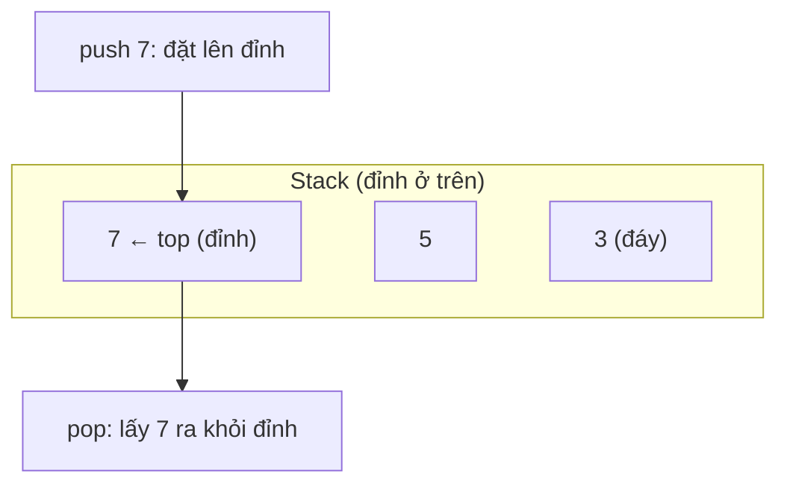

### Các thao tác

| Thao tác | Ý nghĩa | Độ phức tạp |
|---|---|---|
| `push(x)` | Đặt `x` lên đỉnh | `O(1)` (amortized với mảng động) |
| `pop()` | Lấy ra và xóa phần tử ở đỉnh | `O(1)` |
| `peek()` / `top()` | Xem phần tử ở đỉnh, **không** xóa | `O(1)` |
| `isEmpty()` / `len` | Kiểm tra rỗng / số phần tử | `O(1)` |

Không có "lấy phần tử thứ i" - stack **cố ý** giới hạn thao tác. Chính giới hạn đó làm code rõ ràng hơn: nhìn thấy `stack` là biết "cái gì vào sau thì xử lý trước".

Bấm ▶ để xem các phần tử được đặt lên và lấy ra **chỉ ở đỉnh**; để ý `peek` chỉ nhìn mà không lấy.

<div class="algo-viz" data-viz="stack" data-algo="ops" data-ops="push 3,push 5,pop,peek,push 7,push 9,pop,pop" data-title="Stack: push / pop / peek"></div>

Diễn biến (dạng chữ, cho ai đọc trên GitHub):

| Bước | Thao tác | Stack (đáy → đỉnh) | Kết quả |
|---|---|---|---|
| 1 | push 3 | `[3]` | |
| 2 | push 5 | `[3, 5]` | |
| 3 | pop | `[3]` | trả về 5 |
| 4 | peek | `[3]` | trả về 3 (không xóa) |
| 5 | push 7 | `[3, 7]` | |
| 6 | push 9 | `[3, 7, 9]` | |
| 7 | pop | `[3, 7]` | trả về 9 |
| 8 | pop | `[3]` | trả về 7 |

### Cài đặt stack bằng mảng động

Đỉnh stack = **cuối mảng**. Thêm/xóa ở cuối slice (Go) / list (Python) đều `O(1)`, nên đây là cách cài tự nhiên nhất.

```text
data: [3, 5, 7]
              ↑ top = data[len-1]
push 9 → append        → [3, 5, 7, 9]
pop    → bỏ phần tử cuối → [3, 5, 7]
```

=== "Go"

    ```go
    package main

    import "fmt"

    // Stack generic: dùng được cho int, string, struct...
    type Stack[T any] struct {
    	data []T
    }

    func (s *Stack[T]) Push(v T) { s.data = append(s.data, v) }

    func (s *Stack[T]) Pop() (T, bool) {
    	var zero T
    	if len(s.data) == 0 {
    		return zero, false // stack rỗng: báo lỗi bằng bool thay vì panic
    	}
    	v := s.data[len(s.data)-1]
    	s.data = s.data[:len(s.data)-1]
    	return v, true
    }

    func (s *Stack[T]) Peek() (T, bool) {
    	var zero T
    	if len(s.data) == 0 {
    		return zero, false
    	}
    	return s.data[len(s.data)-1], true
    }

    func (s *Stack[T]) Len() int      { return len(s.data) }
    func (s *Stack[T]) IsEmpty() bool { return len(s.data) == 0 }

    func main() {
    	s := &Stack[int]{}
    	s.Push(3)
    	s.Push(5)
    	fmt.Println(s.data)

    	v, _ := s.Pop()
    	fmt.Println("pop:", v)
    	top, _ := s.Peek()
    	fmt.Println("peek:", top)

    	s.Push(7)
    	fmt.Println(s.data, "len =", s.Len())

    	s.Pop()
    	s.Pop()
    	_, ok := s.Pop()
    	fmt.Println("pop khi rỗng thành công?", ok, "- rỗng:", s.IsEmpty())
    }

    // Output:
    // [3 5]
    // pop: 5
    // peek: 3
    // [3 7] len = 2
    // pop khi rỗng thành công? false - rỗng: true
    ```

=== "Python"

    ```python
    class Stack:
        def __init__(self):
            self._data = []

        def push(self, v):
            self._data.append(v)          # O(1) amortized

        def pop(self):
            if not self._data:
                raise IndexError("pop từ stack rỗng")
            return self._data.pop()       # pop() không tham số = lấy cuối, O(1)

        def peek(self):
            if not self._data:
                raise IndexError("peek stack rỗng")
            return self._data[-1]

        def __len__(self):
            return len(self._data)

        def is_empty(self):
            return not self._data


    s = Stack()
    s.push(3)
    s.push(5)
    print(s._data)
    print("pop:", s.pop())
    print("peek:", s.peek())
    s.push(7)
    print(s._data, "len =", len(s))
    s.pop()
    s.pop()
    try:
        s.pop()
    except IndexError as e:
        print("lỗi:", e, "- rỗng:", s.is_empty())

    # Output:
    # [3, 5]
    # pop: 5
    # peek: 3
    # [3, 7] len = 2
    # lỗi: pop từ stack rỗng - rỗng: True
    ```

!!! note "Trong thực tế"
    Bạn **hiếm khi** viết class `Stack` riêng. Python: dùng thẳng `list` với `append()` / `pop()` / `[-1]`. Go: dùng slice với `append` và `s = s[:len(s)-1]`. Class ở trên chỉ để thấy rõ "hợp đồng" của stack.

### Stack cũng có thể cài bằng linked list

Đỉnh stack = `head` của singly linked list ([Bài 4](./04-linked-lists.md)): push = thêm đầu, pop = xóa đầu, đều `O(1)` **thật sự** (không amortized). Đổi lại, mỗi node tốn thêm một con trỏ và các node rải rác trong bộ nhớ → chậm hơn mảng vì cache. Mảng động gần như luôn là lựa chọn tốt hơn.

### Call stack - stack mà bạn dùng mỗi ngày mà không biết

Mỗi lần gọi hàm, máy tính **push** một "khung" (stack frame) chứa biến cục bộ và địa chỉ trả về; hàm chạy xong thì **pop**. Đó là lý do đệ quy quá sâu gây **stack overflow** (Python: `RecursionError`, Go: `goroutine stack exceeds limit`).

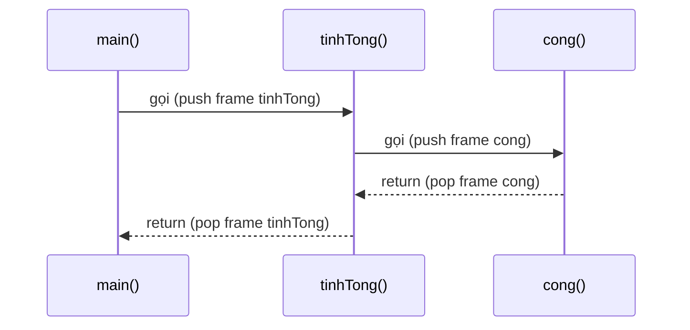

Bạn sẽ gặp lại chuyện này ở [Bài 6: Đệ quy](./06-recursion-backtracking.md) - mọi thuật toán đệ quy đều có thể viết lại bằng **stack tự quản lý**.

## 📖 2. Queue - xếp hàng mua bánh mì

### Hình ảnh đời thường

Sáng sớm, trước xe bánh mì đầu hẻm có hàng người xếp. Ai **đến trước được bán trước**. Người mới đến đứng vào **cuối** hàng; cô bán hàng phục vụ người ở **đầu** hàng.

Đó là **Queue** - nguyên tắc **FIFO** (*First In, First Out* - vào trước, ra trước).

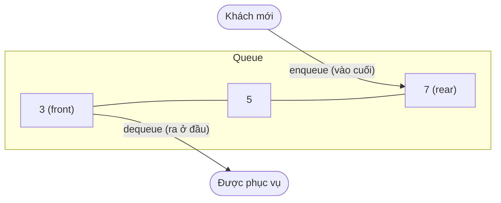

| Thao tác | Ý nghĩa | Độ phức tạp (cài đúng) |
|---|---|---|
| `enqueue(x)` / `push` / `offer` | Thêm vào **cuối** | `O(1)` |
| `dequeue()` / `pop` / `poll` | Lấy ra ở **đầu** | `O(1)` |
| `front()` / `peek` | Xem phần tử đầu | `O(1)` |
| `isEmpty()` / `len` | Rỗng? / số phần tử | `O(1)` |

Bấm ▶ và để ý: phần tử **vào trước** (3) sẽ **ra trước**, ngược hẳn với stack.

<div class="algo-viz" data-viz="queue" data-algo="ops" data-ops="enqueue 3,enqueue 5,enqueue 7,dequeue,enqueue 9,dequeue,dequeue" data-title="Queue: enqueue / dequeue"></div>

| Bước | Thao tác | Queue (đầu → cuối) | Kết quả |
|---|---|---|---|
| 1 | enqueue 3 | `[3]` | |
| 2 | enqueue 5 | `[3, 5]` | |
| 3 | enqueue 7 | `[3, 5, 7]` | |
| 4 | dequeue | `[5, 7]` | trả về 3 |
| 5 | enqueue 9 | `[5, 7, 9]` | |
| 6 | dequeue | `[7, 9]` | trả về 5 |
| 7 | dequeue | `[9]` | trả về 7 |

### Cách cài "ngây thơ" và cái bẫy `O(n)`

Cách đầu tiên ai cũng nghĩ: dùng mảng, thêm vào cuối, lấy ra ở đầu.

```python
q = [3, 5, 7]
q.append(9)     # O(1) - OK
x = q.pop(0)    # O(n)!!! mọi phần tử phía sau phải dời lên 1 ô
```

```text
pop(0) trên [3, 5, 7, 9]:
  lấy 3 ra, rồi dời:  5 → ô 0,  7 → ô 1,  9 → ô 2     ← n-1 lần dời
```

Với 1 triệu phần tử, `n` lần `pop(0)` tốn ~`n²/2` = 500 tỷ thao tác. Đây là **lỗi hiệu năng số 1** khi người mới viết BFS bằng Python.

Trong Go, `q = q[1:]` thì `O(1)` (chỉ dời con trỏ đầu slice), nhưng mảng bên dưới **không bao giờ co lại** - các ô đầu đã "bỏ đi" vẫn chiếm bộ nhớ cho tới khi `append` phải cấp phát mảng mới. Với queue sống lâu (server chạy nhiều ngày) đây là rò rỉ bộ nhớ âm thầm. Giải pháp chuẩn: **circular buffer**.

### Circular buffer (bộ đệm vòng / ring buffer)

**Ý tưởng**: dùng một mảng cố định, coi như **uốn cong thành vòng tròn** - hết ô cuối thì quay về ô 0. Giữ hai thông tin:

- `head`: chỉ số của phần tử đầu hàng
- `size`: số phần tử hiện có → vị trí cuối (chỗ thêm tiếp) = `(head + size) % cap`

Giống **bàn xoay ở nhà hàng lẩu băng chuyền**: băng chuyền là vòng tròn, đĩa được đặt vào và lấy ra liên tục, không ai phải "dời" cả băng chuyền.

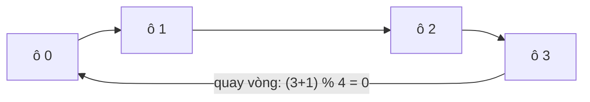

**Trace** với `cap = 4`:

| Thao tác | `buf` | `head` | `size` | Ghi chú |
|---|---|---|---|---|
| (khởi tạo) | `[_, _, _, _]` | 0 | 0 | |
| enqueue 1, 2, 3 | `[1, 2, 3, _]` | 0 | 3 | |
| dequeue → 1 | `[1, 2, 3, _]` | 1 | 2 | chỉ tăng `head`, không xóa gì |
| dequeue → 2 | `[1, 2, 3, _]` | 2 | 1 | |
| enqueue 4 | `[1, 2, 3, 4]` | 2 | 2 | ghi vào `(2+1)%4 = 3` |
| enqueue 5 | `[5, 2, 3, 4]` | 2 | 3 | ghi vào `(2+2)%4 = 0` ← **quay vòng!** |
| enqueue 6 | `[5, 6, 3, 4]` | 2 | 4 | đầy |
| enqueue 7 | `[3, 4, 5, 6, 7, _, _, _]` | 0 | 5 | đầy → **grow**: copy theo thứ tự hàng đợi sang mảng gấp đôi |

Thứ tự logic của hàng đợi luôn là `buf[head], buf[head+1], ...` (lấy `% cap`), dù trong mảng chúng có thể "bị cắt đôi".

=== "Go"

    ```go
    package main

    import "fmt"

    type Queue struct {
    	buf  []int
    	head int // chỉ số phần tử đầu hàng
    	size int // số phần tử đang có
    }

    func NewQueue(capacity int) *Queue {
    	return &Queue{buf: make([]int, max(1, capacity))}
    }

    func (q *Queue) Enqueue(v int) {
    	if q.size == len(q.buf) {
    		q.grow()
    	}
    	tail := (q.head + q.size) % len(q.buf)
    	q.buf[tail] = v
    	q.size++
    }

    func (q *Queue) Dequeue() (int, bool) {
    	if q.size == 0 {
    		return 0, false
    	}
    	v := q.buf[q.head]
    	q.head = (q.head + 1) % len(q.buf)
    	q.size--
    	return v, true
    }

    func (q *Queue) Len() int { return q.size }

    // grow: copy các phần tử THEO THỨ TỰ HÀNG ĐỢI sang mảng gấp đôi
    func (q *Queue) grow() {
    	nb := make([]int, len(q.buf)*2)
    	for i := 0; i < q.size; i++ {
    		nb[i] = q.buf[(q.head+i)%len(q.buf)]
    	}
    	q.buf, q.head = nb, 0
    }

    func main() {
    	q := NewQueue(4)
    	for _, v := range []int{1, 2, 3} {
    		q.Enqueue(v)
    	}
    	a, _ := q.Dequeue()
    	b, _ := q.Dequeue()
    	fmt.Println("dequeue:", a, b)

    	q.Enqueue(4)
    	q.Enqueue(5) // quay vòng về ô 0
    	q.Enqueue(6)
    	fmt.Printf("buf=%v head=%d size=%d\n", q.buf, q.head, q.size)

    	q.Enqueue(7) // đầy → grow
    	fmt.Println("sau khi grow: cap =", len(q.buf))

    	fmt.Print("drain:")
    	for q.Len() > 0 {
    		v, _ := q.Dequeue()
    		fmt.Print(" ", v)
    	}
    	fmt.Println()
    }

    // Output:
    // dequeue: 1 2
    // buf=[5 6 3 4] head=2 size=4
    // sau khi grow: cap = 8
    // drain: 3 4 5 6 7
    ```

=== "Python"

    ```python
    class Queue:
        def __init__(self, capacity=4):
            self.buf = [None] * max(1, capacity)
            self.head = 0   # chỉ số phần tử đầu hàng
            self.size = 0   # số phần tử đang có

        def enqueue(self, v):
            if self.size == len(self.buf):
                self._grow()
            tail = (self.head + self.size) % len(self.buf)
            self.buf[tail] = v
            self.size += 1

        def dequeue(self):
            if self.size == 0:
                raise IndexError("dequeue từ queue rỗng")
            v = self.buf[self.head]
            self.buf[self.head] = None          # giúp GC thu hồi object
            self.head = (self.head + 1) % len(self.buf)
            self.size -= 1
            return v

        def __len__(self):
            return self.size

        def _grow(self):
            cap = len(self.buf)
            nb = [self.buf[(self.head + i) % cap] for i in range(self.size)]
            self.buf = nb + [None] * cap        # gấp đôi
            self.head = 0


    q = Queue(4)
    for v in (1, 2, 3):
        q.enqueue(v)
    print("dequeue:", q.dequeue(), q.dequeue())
    q.enqueue(4)
    q.enqueue(5)   # quay vòng về ô 0
    q.enqueue(6)
    print(f"buf={q.buf} head={q.head} size={q.size}")
    q.enqueue(7)   # đầy → grow
    print("sau khi grow: cap =", len(q.buf))
    print("drain:", *[q.dequeue() for _ in range(len(q))])

    # Output:
    # dequeue: 1 2
    # buf=[5, 6, 3, 4] head=2 size=4
    # sau khi grow: cap = 8
    # drain: 3 4 5 6 7
    ```

!!! tip "Circular buffer ở ngoài đời"
    Bộ đệm âm thanh/video khi stream, buffer bàn phím của hệ điều hành, log "giữ 1000 dòng gần nhất", channel có buffer trong Go (`make(chan int, 10)` bên trong chính là một ring buffer!), bộ đệm của card mạng... Bản **cố định kích thước** (không grow) thường **ghi đè** phần tử cũ nhất khi đầy.

## 📖 3. Deque - hàng đợi hai đầu

**Deque** (*double-ended queue*, đọc là "deck") cho phép thêm/xóa ở **cả hai đầu** trong `O(1)`. Nó vừa là stack, vừa là queue. Ví dụ đời thường: **toa tàu điện** có cửa ở cả hai đầu.

| Thao tác | Python `collections.deque` | Go `container/list` |
|---|---|---|
| Thêm cuối | `append(x)` | `PushBack(x)` |
| Thêm đầu | `appendleft(x)` | `PushFront(x)` |
| Xóa cuối | `pop()` | `Remove(l.Back())` |
| Xóa đầu | `popleft()` | `Remove(l.Front())` |
| Xem đầu / cuối | `d[0]` / `d[-1]` | `l.Front().Value` / `l.Back().Value` |

=== "Go"

    ```go
    package main

    import (
    	"container/list"
    	"fmt"
    )

    func show(l *list.List) {
    	fmt.Print("[")
    	for e := l.Front(); e != nil; e = e.Next() {
    		if e != l.Front() {
    			fmt.Print(" ")
    		}
    		fmt.Print(e.Value)
    	}
    	fmt.Println("]")
    }

    func main() {
    	d := list.New() // doubly linked list - dùng như deque
    	d.PushBack(2)
    	d.PushBack(3)
    	d.PushFront(1)
    	show(d)

    	front := d.Remove(d.Front()) // popleft
    	back := d.Remove(d.Back())   // pop
    	fmt.Println("popleft:", front, "pop:", back)
    	show(d)
    }

    // Output:
    // [1 2 3]
    // popleft: 1 pop: 3
    // [2]
    ```

=== "Python"

    ```python
    from collections import deque

    d = deque()
    d.append(2)
    d.append(3)
    d.appendleft(1)
    print(list(d))
    print("popleft:", d.popleft(), "pop:", d.pop())
    print(list(d))

    # deque(maxlen=3): tự bỏ phần tử cũ nhất khi đầy - circular buffer có sẵn!
    recent = deque(maxlen=3)
    for page in ["home", "cart", "product", "checkout"]:
        recent.append(page)
    print("3 trang gần nhất:", list(recent))

    # Output:
    # [1, 2, 3]
    # popleft: 1 pop: 3
    # [2]
    # 3 trang gần nhất: ['cart', 'product', 'checkout']
    ```

!!! note "Chọn gì trong thực tế?"
    - **Python**: queue/deque → luôn dùng `collections.deque` (cài bằng các khối mảng liên kết, cực nhanh). Đừng dùng `list.pop(0)`. Cần queue an toàn đa luồng → `queue.Queue`.
    - **Go**: queue đơn giản trong thuật toán (BFS) → slice `q = q[1:]` là đủ vì sống ngắn. Queue sống lâu → ring buffer tự viết hoặc `container/list`. Giao tiếp giữa goroutine → **channel**.

## 📖 4. Bài kinh điển 1: Kiểm tra dấu ngoặc hợp lệ

**Đề** ([LeetCode 20](https://leetcode.com/problems/valid-parentheses/)): cho chuỗi chỉ gồm `()[]{}`, kiểm tra các ngoặc có **đóng mở đúng cặp, đúng thứ tự** không.

- `"{[()()]}"` → hợp lệ
- `"([)]"` → **không** hợp lệ (mở `[` nhưng lại đóng `)` trước)

**Trực giác**: ngoặc mở **gần nhất** chưa được đóng phải là ngoặc được đóng **tiếp theo**. "Gần nhất, chưa xử lý" = **đỉnh stack**. Giống búp bê Matryoshka của Nga: con búp bê mở ra **sau cùng** phải được đóng lại **đầu tiên**.

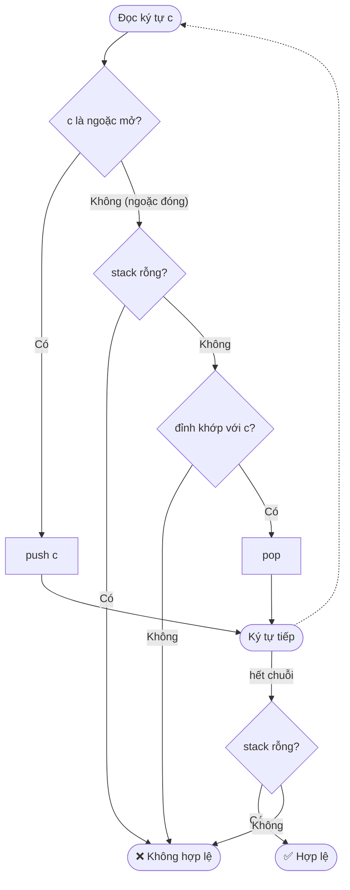

**Trace** với `"{[()()]}"`:

| i | c | Hành động | Stack sau đó |
|---|---|---|---|
| 0 | `{` | push | `{` |
| 1 | `[` | push | `{ [` |
| 2 | `(` | push | `{ [ (` |
| 3 | `)` | đỉnh `(` khớp → pop | `{ [` |
| 4 | `(` | push | `{ [ (` |
| 5 | `)` | khớp → pop | `{ [` |
| 6 | `]` | đỉnh `[` khớp → pop | `{` |
| 7 | `}` | đỉnh `{` khớp → pop | (rỗng) |
| hết | | stack rỗng | ✅ hợp lệ |

Với `"([)]"`: sau `(`, `[` stack là `( [`; gặp `)` nhưng đỉnh là `[` → ❌.

=== "Go"

    ```go
    package main

    import "fmt"

    func isValid(s string) bool {
    	pair := map[rune]rune{')': '(', ']': '[', '}': '{'}
    	stack := []rune{}
    	for _, c := range s {
    		switch c {
    		case '(', '[', '{':
    			stack = append(stack, c)
    		default: // ngoặc đóng
    			if len(stack) == 0 || stack[len(stack)-1] != pair[c] {
    				return false
    			}
    			stack = stack[:len(stack)-1]
    		}
    	}
    	return len(stack) == 0 // còn ngoặc mở chưa đóng → sai
    }

    func main() {
    	for _, s := range []string{"()[]{}", "{[()()]}", "([)]", "((", ")("} {
    		fmt.Printf("%-10q %v\n", s, isValid(s))
    	}
    }

    // Output:
    // "()[]{}"   true
    // "{[()()]}" true
    // "([)]"     false
    // "(("       false
    // ")("       false
    ```

=== "Python"

    ```python
    def is_valid(s: str) -> bool:
        pair = {")": "(", "]": "[", "}": "{"}
        stack = []
        for c in s:
            if c in "([{":
                stack.append(c)
            else:  # ngoặc đóng
                if not stack or stack[-1] != pair[c]:
                    return False
                stack.pop()
        return not stack  # còn ngoặc mở chưa đóng → sai


    for s in ["()[]{}", "{[()()]}", "([)]", "((", ")("]:
        print(f"{s!r:<10} {is_valid(s)}")

    # Output:
    # '()[]{}'   True
    # '{[()()]}' True
    # '([)]'     False
    # '(('       False
    # ')('       False
    ```

**Độ phức tạp**: thời gian `O(n)`, bộ nhớ `O(n)` (chuỗi toàn ngoặc mở).

!!! warning "Hai trường hợp hay quên"
    1. Gặp ngoặc đóng khi **stack rỗng** (`")("`) → phải trả `false`, đừng `pop` stack rỗng (Go: panic index out of range).
    2. Hết chuỗi mà **stack chưa rỗng** (`"(("`) → vẫn `false`.

## 📖 5. Bài kinh điển 2: Biểu thức hậu tố (RPN) & Shunting-yard

### Vì sao máy tính thích ký pháp hậu tố?

Ta quen viết **trung tố** (infix): `3 + 4 * 2`. Để tính đúng, bạn phải nhớ "nhân chia trước, cộng trừ sau" và xử lý ngoặc - khá rắc rối cho máy.

**Hậu tố** (postfix, còn gọi **RPN** - *Reverse Polish Notation*) đặt toán tử **sau** hai toán hạng: `3 4 2 * +`. Không cần ngoặc, không cần độ ưu tiên - chỉ cần **một stack**:

- Gặp **số** → push
- Gặp **toán tử** → pop 2 số (`b` = pop, `a` = pop), tính `a op b`, push kết quả

| Trung tố | Hậu tố (RPN) |
|---|---|
| `3 + 4` | `3 4 +` |
| `(3 + 4) * 2` | `3 4 + 2 *` |
| `3 + 4 * 2` | `3 4 2 * +` |
| `5 + (1 + 2) * 4 - 3` | `5 1 2 + 4 * + 3 -` |

**Trace** tính `5 1 2 + 4 * + 3 -`:

| Token | Hành động | Stack |
|---|---|---|
| `5` | push | `5` |
| `1` | push | `5 1` |
| `2` | push | `5 1 2` |
| `+` | pop 2, 1 → `1+2=3`, push | `5 3` |
| `4` | push | `5 3 4` |
| `*` | `3*4=12` | `5 12` |
| `+` | `5+12=17` | `17` |
| `3` | push | `17 3` |
| `-` | `17-3=14` | `14` |

Kết quả: **14**. Máy tính bỏ túi HP đời cũ và máy ảo Java/Python (bytecode) đều chạy theo kiểu "stack machine" này.

!!! warning "Thứ tự pop"
    Phần tử pop **đầu tiên** là toán hạng **bên phải** (`b`). Với `-` và `/`, đảo thứ tự là sai kết quả: `10 3 -` phải là `10 - 3 = 7`, không phải `3 - 10`.

### Shunting-yard: đổi trung tố → hậu tố

Thuật toán của **Edsger Dijkstra** (1961), tên "sân dồn toa tàu" vì toán tử được "dồn" tạm vào một stack giống toa tàu vào đường tránh.

Quy tắc (với toán tử kết hợp trái `+ - * /`):

1. **Số** → đưa thẳng ra output
2. **Toán tử `o`** → trong khi đỉnh stack là toán tử có độ ưu tiên **≥** `o`: pop ra output. Rồi push `o`
3. **`(`** → push
4. **`)`** → pop ra output cho tới khi gặp `(`; bỏ `(`
5. Hết input → pop hết stack ra output

**Trace** `3 + 4 * 2 - ( 1 - 5 )`:

| Token | Hành động | Output | Stack toán tử |
|---|---|---|---|
| `3` | ra output | `3` | |
| `+` | push | `3` | `+` |
| `4` | ra output | `3 4` | `+` |
| `*` | `*` ưu tiên hơn `+` → push | `3 4` | `+ *` |
| `2` | ra output | `3 4 2` | `+ *` |
| `-` | pop `*` (≥), pop `+` (≥), push `-` | `3 4 2 * +` | `-` |
| `(` | push | `3 4 2 * +` | `- (` |
| `1` | ra output | `3 4 2 * + 1` | `- (` |
| `-` | đỉnh là `(` → push | `3 4 2 * + 1` | `- ( -` |
| `5` | ra output | `3 4 2 * + 1 5` | `- ( -` |
| `)` | pop tới `(` | `3 4 2 * + 1 5 -` | `-` |
| hết | pop hết | `3 4 2 * + 1 5 - -` | |

Tính: `3 + 8 - (1 - 5) = 11 - (-4) = 15`.

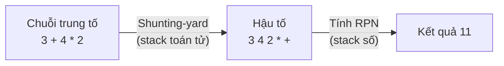

=== "Go"

    ```go
    package main

    import (
    	"fmt"
    	"strconv"
    	"strings"
    )

    var prec = map[string]int{"+": 1, "-": 1, "*": 2, "/": 2}

    // toRPN: Shunting-yard, token cách nhau bởi dấu cách
    func toRPN(expr string) []string {
    	var out, ops []string
    	for _, t := range strings.Fields(expr) {
    		switch {
    		case t == "(":
    			ops = append(ops, t)
    		case t == ")":
    			for ops[len(ops)-1] != "(" {
    				out = append(out, ops[len(ops)-1])
    				ops = ops[:len(ops)-1]
    			}
    			ops = ops[:len(ops)-1] // bỏ "("
    		case prec[t] > 0: // toán tử
    			for len(ops) > 0 && prec[ops[len(ops)-1]] >= prec[t] {
    				out = append(out, ops[len(ops)-1])
    				ops = ops[:len(ops)-1]
    			}
    			ops = append(ops, t)
    		default: // số
    			out = append(out, t)
    		}
    	}
    	for len(ops) > 0 {
    		out = append(out, ops[len(ops)-1])
    		ops = ops[:len(ops)-1]
    	}
    	return out
    }

    // evalRPN: LeetCode 150. Chia số nguyên cắt về 0.
    func evalRPN(tokens []string) int {
    	st := []int{}
    	for _, t := range tokens {
    		if prec[t] == 0 { // số
    			n, _ := strconv.Atoi(t)
    			st = append(st, n)
    			continue
    		}
    		b, a := st[len(st)-1], st[len(st)-2] // b pop trước = toán hạng phải
    		st = st[:len(st)-2]
    		var r int
    		switch t {
    		case "+":
    			r = a + b
    		case "-":
    			r = a - b
    		case "*":
    			r = a * b
    		case "/":
    			r = a / b
    		}
    		st = append(st, r)
    	}
    	return st[0]
    }

    func main() {
    	fmt.Println(evalRPN(strings.Fields("5 1 2 + 4 * + 3 -")))
    	fmt.Println(evalRPN(strings.Fields("4 13 5 / +")))

    	rpn := toRPN("3 + 4 * 2 - ( 1 - 5 )")
    	fmt.Println(strings.Join(rpn, " "), "=", evalRPN(rpn))
    }

    // Output:
    // 14
    // 6
    // 3 4 2 * + 1 5 - - = 15
    ```

=== "Python"

    ```python
    PREC = {"+": 1, "-": 1, "*": 2, "/": 2}


    def to_rpn(expr: str) -> list[str]:
        """Shunting-yard, token cách nhau bởi dấu cách."""
        out, ops = [], []
        for t in expr.split():
            if t == "(":
                ops.append(t)
            elif t == ")":
                while ops[-1] != "(":
                    out.append(ops.pop())
                ops.pop()  # bỏ "("
            elif t in PREC:
                while ops and ops[-1] in PREC and PREC[ops[-1]] >= PREC[t]:
                    out.append(ops.pop())
                ops.append(t)
            else:
                out.append(t)
        while ops:
            out.append(ops.pop())
        return out


    def eval_rpn(tokens: list[str]) -> int:
        """LeetCode 150. Chia số nguyên cắt về 0."""
        st = []
        for t in tokens:
            if t not in PREC:
                st.append(int(t))
                continue
            b, a = st.pop(), st.pop()  # b pop trước = toán hạng phải
            if t == "+":
                st.append(a + b)
            elif t == "-":
                st.append(a - b)
            elif t == "*":
                st.append(a * b)
            else:
                st.append(int(a / b))  # cắt về 0, KHÔNG dùng // (làm tròn xuống)
        return st[0]


    print(eval_rpn("5 1 2 + 4 * + 3 -".split()))
    print(eval_rpn("4 13 5 / +".split()))
    rpn = to_rpn("3 + 4 * 2 - ( 1 - 5 )")
    print(" ".join(rpn), "=", eval_rpn(rpn))

    # Output:
    # 14
    # 6
    # 3 4 2 * + 1 5 - - = 15
    ```

**Độ phức tạp**: cả hai đều `O(n)` thời gian và bộ nhớ - mỗi token được push/pop tối đa một lần.

!!! warning "`//` trong Python làm tròn **xuống**, không phải cắt về 0"
    `-7 // 2 == -4` còn Go `-7 / 2 == -3`. LeetCode 150 yêu cầu cắt về 0 → dùng `int(a / b)`.

## 📖 6. Undo / Redo bằng hai stack

Ctrl+Z trong Word, VS Code, Photoshop... đều dựa trên **hai stack**:

- `undo`: lịch sử các trạng thái **trước đó**
- `redo`: các trạng thái vừa bị undo (để làm lại)

Quy tắc:

1. **Thao tác mới** → push trạng thái hiện tại vào `undo`, **xóa sạch** `redo` (nhánh tương lai cũ không còn ý nghĩa)
2. **Undo** → push hiện tại vào `redo`, pop `undo` làm hiện tại
3. **Redo** → push hiện tại vào `undo`, pop `redo` làm hiện tại

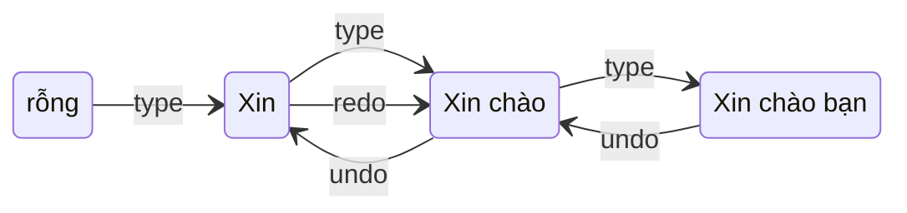

=== "Go"

    ```go
    package main

    import "fmt"

    type Editor struct {
    	text       string
    	undo, redo []string
    }

    func (e *Editor) Type(s string) {
    	e.undo = append(e.undo, e.text)
    	e.redo = e.redo[:0] // thao tác mới → xóa nhánh redo
    	e.text += s
    }

    func (e *Editor) Undo() {
    	if len(e.undo) == 0 {
    		return
    	}
    	e.redo = append(e.redo, e.text)
    	e.text = e.undo[len(e.undo)-1]
    	e.undo = e.undo[:len(e.undo)-1]
    }

    func (e *Editor) Redo() {
    	if len(e.redo) == 0 {
    		return
    	}
    	e.undo = append(e.undo, e.text)
    	e.text = e.redo[len(e.redo)-1]
    	e.redo = e.redo[:len(e.redo)-1]
    }

    func main() {
    	e := &Editor{}
    	step := func(name string, f func()) {
    		f()
    		fmt.Printf("%-12s → %q\n", name, e.text)
    	}
    	step(`type "Xin"`, func() { e.Type("Xin") })
    	step(`type " chào"`, func() { e.Type(" chào") })
    	step(`type " bạn"`, func() { e.Type(" bạn") })
    	step("undo", e.Undo)
    	step("undo", e.Undo)
    	step("redo", e.Redo)
    	step(`type "!"`, func() { e.Type("!") })
    	step("redo", e.Redo) // redo đã bị xóa → không đổi
    }

    // Output:
    // type "Xin"   → "Xin"
    // type " chào" → "Xin chào"
    // type " bạn"  → "Xin chào bạn"
    // undo         → "Xin chào"
    // undo         → "Xin"
    // redo         → "Xin chào"
    // type "!"     → "Xin chào!"
    // redo         → "Xin chào!"
    ```

=== "Python"

    ```python
    class Editor:
        def __init__(self):
            self.text = ""
            self.undo_st, self.redo_st = [], []

        def type(self, s):
            self.undo_st.append(self.text)
            self.redo_st.clear()        # thao tác mới → xóa nhánh redo
            self.text += s

        def undo(self):
            if self.undo_st:
                self.redo_st.append(self.text)
                self.text = self.undo_st.pop()

        def redo(self):
            if self.redo_st:
                self.undo_st.append(self.text)
                self.text = self.redo_st.pop()


    e = Editor()
    steps = [
        ('type "Xin"', lambda: e.type("Xin")),
        ('type " chào"', lambda: e.type(" chào")),
        ('type " bạn"', lambda: e.type(" bạn")),
        ("undo", e.undo),
        ("undo", e.undo),
        ("redo", e.redo),
        ('type "!"', lambda: e.type("!")),
        ("redo", e.redo),               # redo đã bị xóa → không đổi
    ]
    for name, f in steps:
        f()
        print(f"{name:<12} → {e.text!r}")

    # Output:
    # type "Xin"   → 'Xin'
    # type " chào" → 'Xin chào'
    # type " bạn"  → 'Xin chào bạn'
    # undo         → 'Xin chào'
    # undo         → 'Xin'
    # redo         → 'Xin chào'
    # type "!"     → 'Xin chào!'
    # redo         → 'Xin chào!'
    ```

!!! tip "Trong ứng dụng thật"
    Lưu **cả bản sao** trạng thái rất tốn bộ nhớ với văn bản lớn. Editor thật lưu **lệnh** (*Command pattern*: "chèn 'abc' ở vị trí 10") kèm cách đảo ngược lệnh đó. Nút Back/Forward của trình duyệt cũng là đúng hai stack này.

## 📖 7. Monotonic stack - ngăn xếp đơn điệu

### Bài toán dẫn nhập: Next Greater Element

**Đề**: với mỗi phần tử, tìm phần tử **đầu tiên bên phải lớn hơn nó** (không có thì `-1`).

`[2, 1, 2, 4, 3]` → `[4, 2, 4, -1, -1]`

**Cách ngây thơ**: với mỗi `i`, quét sang phải → `O(n²)`.

**Trực giác**: hình dung một hàng người xếp theo thứ tự, mỗi người muốn biết "người **đầu tiên cao hơn tôi** đứng sau tôi là ai". Ta đi từ trái sang phải, giữ một **danh sách những người đang chờ câu trả lời**. Khi một người cao mới đến, **mọi người thấp hơn anh ta đang chờ** đều có câu trả lời ngay → rời khỏi danh sách. Những người còn chờ luôn được sắp **giảm dần** chiều cao (vì nếu có người thấp đứng sau người cao hơn mà vẫn chờ... thì người đến sau đã giải quyết người thấp rồi).

Danh sách chờ đó chính là **monotonic stack** (ở đây là stack **giảm dần**).

**Trace** (stack lưu **chỉ số**, ghi kèm giá trị):

| i | nums[i] | Pop (và gán đáp án) | Stack sau (chỉ số:giá trị) | ans |
|---|---|---|---|---|
| 0 | 2 | - | `0:2` | `[-1,-1,-1,-1,-1]` |
| 1 | 1 | - (1 không > 2) | `0:2, 1:1` | |
| 2 | 2 | pop `1:1` → ans[1]=2 | `0:2, 2:2` | `[-1,2,-1,-1,-1]` |
| 3 | 4 | pop `2:2` → ans[2]=4; pop `0:2` → ans[0]=4 | `3:4` | `[4,2,4,-1,-1]` |
| 4 | 3 | - | `3:4, 4:3` | |
| hết | | còn lại trong stack → giữ -1 | | `[4,2,4,-1,-1]` |

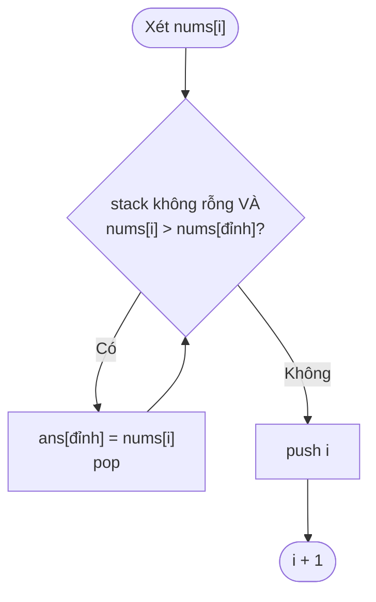

**Vì sao `O(n)` dù có vòng `while` lồng?** Mỗi chỉ số được **push đúng 1 lần** và **pop tối đa 1 lần** → tổng số thao tác ≤ `2n`. Đây là phân tích **amortized** (khấu hao) - giống ở [Bài 1](./01-complexity.md).

### Mẫu tổng quát

| Muốn tìm | Duyệt | Stack giữ | Pop khi |
|---|---|---|---|
| Phần tử **lớn hơn** kế tiếp bên phải | trái → phải | giảm dần | `nums[i] > đỉnh` |
| Phần tử **nhỏ hơn** kế tiếp bên phải | trái → phải | tăng dần | `nums[i] < đỉnh` |
| Phần tử lớn hơn gần nhất **bên trái** | trái → phải | giảm dần | `nums[i] >= đỉnh`; sau khi pop, đỉnh chính là đáp án của `i` |

### Daily Temperatures (LeetCode 739)

**Đề**: với mỗi ngày, cần chờ **bao nhiêu ngày** để có ngày nóng hơn? Đây chính là next greater element, nhưng đáp án là **khoảng cách** `i - đỉnh` thay vì giá trị.

`[73, 74, 75, 71, 69, 72, 76, 73]` → `[1, 1, 4, 2, 1, 1, 0, 0]`

### Largest Rectangle in Histogram (LeetCode 84)

**Đề**: cho chiều cao các cột (rộng 1), tìm **diện tích hình chữ nhật lớn nhất** nằm trong biểu đồ.

```text
heights = [2, 1, 5, 6, 2, 3]

           █
        ▓  ▓
        ▓  ▓
        ▓  ▓     █
  █     ▓  ▓  █  █
  █  █  ▓  ▓  █  █
  -----------------
  0  1  2  3  4  5

▓ = hình chữ nhật lớn nhất: cao 5 × rộng 2 (cột 2-3) = 10
```

**Trực giác**: với mỗi cột `j` làm **chiều cao** của hình chữ nhật, hình đó lan sang trái/phải tới khi gặp cột **thấp hơn**. Vậy cần: cột thấp hơn gần nhất bên trái và bên phải → monotonic stack **tăng dần**. Khi cột `i` thấp hơn đỉnh, đỉnh bị pop: **bên phải** của nó là `i`, **bên trái** là phần tử ngay dưới nó trong stack → `width = i - left - 1`.

Mẹo: thêm cột **cao 0** vào cuối (sentinel) để "xả" hết stack.

| i | h | Pop & tính diện tích | Stack sau (chỉ số) | max |
|---|---|---|---|---|
| 0 | 2 | - | `0` | 0 |
| 1 | 1 | pop 0 (h=2), trái = rỗng → w = 1 → **2** | `1` | 2 |
| 2 | 5 | - | `1, 2` | 2 |
| 3 | 6 | - | `1, 2, 3` | 2 |
| 4 | 2 | pop 3 (h=6): w = 4-2-1 = 1 → 6; pop 2 (h=5): w = 4-1-1 = 2 → **10** | `1, 4` | 10 |
| 5 | 3 | - | `1, 4, 5` | 10 |
| 6 | 0 (sentinel) | pop 5 (h=3): w=1 → 3; pop 4 (h=2): w = 6-1-1 = 4 → 8; pop 1 (h=1): w = 6 → 6 | `6` | **10** |

=== "Go"

    ```go
    package main

    import "fmt"

    func nextGreater(nums []int) []int {
    	ans := make([]int, len(nums))
    	for i := range ans {
    		ans[i] = -1
    	}
    	st := []int{} // chỉ số, giá trị giảm dần
    	for i, v := range nums {
    		for len(st) > 0 && v > nums[st[len(st)-1]] {
    			ans[st[len(st)-1]] = v
    			st = st[:len(st)-1]
    		}
    		st = append(st, i)
    	}
    	return ans
    }

    func dailyTemperatures(t []int) []int {
    	ans := make([]int, len(t)) // mặc định 0
    	st := []int{}
    	for i, v := range t {
    		for len(st) > 0 && v > t[st[len(st)-1]] {
    			j := st[len(st)-1]
    			st = st[:len(st)-1]
    			ans[j] = i - j // khoảng cách thay vì giá trị
    		}
    		st = append(st, i)
    	}
    	return ans
    }

    func largestRectangle(heights []int) int {
    	h := append(append([]int{}, heights...), 0) // copy + sentinel 0
    	st := []int{}                               // chỉ số, chiều cao tăng dần
    	best := 0
    	for i := range h {
    		for len(st) > 0 && h[i] < h[st[len(st)-1]] {
    			top := st[len(st)-1]
    			st = st[:len(st)-1]
    			left := -1 // không còn cột thấp hơn bên trái
    			if len(st) > 0 {
    				left = st[len(st)-1]
    			}
    			best = max(best, h[top]*(i-left-1))
    		}
    		st = append(st, i)
    	}
    	return best
    }

    func main() {
    	fmt.Println(nextGreater([]int{2, 1, 2, 4, 3}))
    	fmt.Println(dailyTemperatures([]int{73, 74, 75, 71, 69, 72, 76, 73}))
    	fmt.Println(largestRectangle([]int{2, 1, 5, 6, 2, 3}))
    	fmt.Println(largestRectangle([]int{2, 4}))
    }

    // Output:
    // [4 2 4 -1 -1]
    // [1 1 4 2 1 1 0 0]
    // 10
    // 4
    ```

=== "Python"

    ```python
    def next_greater(nums):
        ans = [-1] * len(nums)
        st = []  # chỉ số, giá trị giảm dần
        for i, v in enumerate(nums):
            while st and v > nums[st[-1]]:
                ans[st.pop()] = v
            st.append(i)
        return ans


    def daily_temperatures(t):
        ans = [0] * len(t)
        st = []
        for i, v in enumerate(t):
            while st and v > t[st[-1]]:
                j = st.pop()
                ans[j] = i - j  # khoảng cách thay vì giá trị
            st.append(i)
        return ans


    def largest_rectangle(heights):
        h = heights + [0]  # sentinel 0 để xả hết stack
        st = []            # chỉ số, chiều cao tăng dần
        best = 0
        for i, x in enumerate(h):
            while st and x < h[st[-1]]:
                top = st.pop()
                left = st[-1] if st else -1
                best = max(best, h[top] * (i - left - 1))
            st.append(i)
        return best


    print(next_greater([2, 1, 2, 4, 3]))
    print(daily_temperatures([73, 74, 75, 71, 69, 72, 76, 73]))
    print(largest_rectangle([2, 1, 5, 6, 2, 3]))
    print(largest_rectangle([2, 4]))

    # Output:
    # [4, 2, 4, -1, -1]
    # [1, 1, 4, 2, 1, 1, 0, 0]
    # 10
    # 4
    ```

**Độ phức tạp**: cả ba bài `O(n)` thời gian, `O(n)` bộ nhớ.

!!! tip "Tín hiệu nhận biết monotonic stack"
    Đề hỏi **"phần tử lớn/nhỏ hơn gần nhất bên trái/phải"**, **"bao lâu nữa thì..."**, **"span"** (chứng khoán), **"hình chữ nhật/nước đọng giữa các cột"**, hoặc "đóng góp của mỗi phần tử khi nó là min/max của các mảng con". Nếu brute force là `O(n²)` với vòng trong "quét tới khi gặp phần tử lớn hơn" → gần như chắc chắn là monotonic stack.

## 📖 8. Monotonic queue - Sliding Window Maximum

**Đề** ([LeetCode 239](https://leetcode.com/problems/sliding-window-maximum/)): cửa sổ kích thước `k` trượt từ trái sang phải; in ra **giá trị lớn nhất** của mỗi cửa sổ.

`nums = [1, 3, -1, -3, 5, 3, 6, 7], k = 3` → `[3, 3, 5, 5, 6, 7]`

**Cách ngây thơ**: mỗi cửa sổ quét `k` phần tử → `O(n·k)`.

**Trực giác - "thi tuyển trong công ty"**: một nhân viên **mới vào** (bên phải) và **giỏi hơn** những người cũ thì những người cũ **không bao giờ** còn cơ hội làm "giỏi nhất" nữa - vì người mới vừa giỏi hơn vừa ở lại lâu hơn (rời cửa sổ muộn hơn). Loại họ luôn! Những người còn lại tạo thành dãy **giảm dần**; người **đứng đầu** là giỏi nhất. Khi người đứng đầu "nghỉ hưu" (ra khỏi cửa sổ) thì bỏ khỏi đầu.

Cần xóa ở **cả hai đầu** → dùng **deque** chứa **chỉ số**:

1. Bỏ ở **đầu** nếu chỉ số đã ra khỏi cửa sổ (`dq[0] <= i - k`)
2. Bỏ ở **cuối** mọi phần tử `<= nums[i]` (vô dụng rồi)
3. Thêm `i` vào cuối
4. Nếu `i >= k - 1`: max của cửa sổ = `nums[dq[0]]`

| i | nums[i] | Bỏ đầu (hết hạn) | Bỏ cuối (≤ nums[i]) | deque (chỉ số:giá trị) | Output |
|---|---|---|---|---|---|
| 0 | 1 | | | `0:1` | |
| 1 | 3 | | `0:1` | `1:3` | |
| 2 | -1 | | | `1:3, 2:-1` | **3** |
| 3 | -3 | | | `1:3, 2:-1, 3:-3` | **3** |
| 4 | 5 | `1:3` | `3:-3`, `2:-1` | `4:5` | **5** |
| 5 | 3 | | | `4:5, 5:3` | **5** |
| 6 | 6 | | `5:3`, `4:5` | `6:6` | **6** |
| 7 | 7 | | `6:6` | `7:7` | **7** |

=== "Go"

    ```go
    package main

    import "fmt"

    func maxSlidingWindow(nums []int, k int) []int {
    	dq := []int{} // chỉ số; nums[dq[...]] giảm dần
    	res := []int{}
    	for i, v := range nums {
    		if len(dq) > 0 && dq[0] <= i-k { // 1. đầu đã ra khỏi cửa sổ
    			dq = dq[1:]
    		}
    		for len(dq) > 0 && nums[dq[len(dq)-1]] <= v { // 2. loại người "vô dụng"
    			dq = dq[:len(dq)-1]
    		}
    		dq = append(dq, i) // 3.
    		if i >= k-1 {      // 4. cửa sổ đã đủ k phần tử
    			res = append(res, nums[dq[0]])
    		}
    	}
    	return res
    }

    func main() {
    	fmt.Println(maxSlidingWindow([]int{1, 3, -1, -3, 5, 3, 6, 7}, 3))
    	fmt.Println(maxSlidingWindow([]int{9, 8, 7, 6}, 2))
    }

    // Output:
    // [3 3 5 5 6 7]
    // [9 8 7]
    ```

=== "Python"

    ```python
    from collections import deque


    def max_sliding_window(nums, k):
        dq = deque()  # chỉ số; nums[...] giảm dần
        res = []
        for i, v in enumerate(nums):
            if dq and dq[0] <= i - k:          # 1. đầu đã ra khỏi cửa sổ
                dq.popleft()
            while dq and nums[dq[-1]] <= v:    # 2. loại người "vô dụng"
                dq.pop()
            dq.append(i)                       # 3.
            if i >= k - 1:                     # 4. cửa sổ đã đủ k phần tử
                res.append(nums[dq[0]])
        return res


    print(max_sliding_window([1, 3, -1, -3, 5, 3, 6, 7], 3))
    print(max_sliding_window([9, 8, 7, 6], 2))

    # Output:
    # [3, 3, 5, 5, 6, 7]
    # [9, 8, 7]
    ```

**Độ phức tạp**: `O(n)` - mỗi chỉ số vào/ra deque tối đa một lần. Bộ nhớ `O(k)`.

!!! note "Liên hệ"
    Sliding window cơ bản (tổng/đếm) đã học ở [Bài 2](./02-arrays-strings.md). Monotonic queue là "nâng cấp" khi cần **min/max** của cửa sổ. Nó còn dùng để tối ưu một số bài DP ở [Bài 14](./14-dynamic-programming.md) (`dp[i] = max(dp[j]) + ...` với `j` trong một cửa sổ).

## 📖 9. Queue bằng hai stack (LeetCode 232)

**Đề**: chỉ được dùng stack (push/pop/peek ở đỉnh), hãy cài queue.

**Ý tưởng**: stack **đảo ngược** thứ tự; đảo **hai lần** thì về lại thứ tự ban đầu!

- `in`: nhận mọi `push`
- `out`: phục vụ `pop`/`peek`. Khi `out` **rỗng**, đổ **toàn bộ** `in` sang `out` (thứ tự bị lật → phần tử cũ nhất nằm trên đỉnh `out`)

```text
push 1, 2, 3:     in = [1, 2, 3]    out = []
pop:              out rỗng → đổ:  in = []   out = [3, 2, 1]  → pop 1 ✓
push 4:           in = [4]          out = [3, 2]
pop:              out còn → pop 2 ✓ (không đổ, dù in có 4)
pop:              pop 3 ✓
pop:              out rỗng → đổ: out = [4] → pop 4 ✓
```

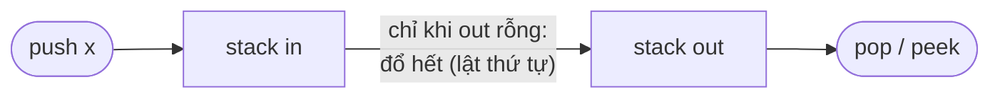

**Amortized `O(1)`**: một lần `pop` có thể tốn `O(n)` (đổ cả `in`), nhưng **mỗi phần tử chỉ bị đổ đúng một lần** trong đời (vào `in` → sang `out` → ra). Tổng chi phí `n` thao tác là `O(n)` → trung bình `O(1)` mỗi thao tác.

=== "Go"

    ```go
    package main

    import "fmt"

    type MyQueue struct{ in, out []int }

    func (q *MyQueue) Push(x int) { q.in = append(q.in, x) }

    func (q *MyQueue) move() {
    	if len(q.out) == 0 { // CHỈ đổ khi out rỗng, nếu không sẽ sai thứ tự
    		for len(q.in) > 0 {
    			q.out = append(q.out, q.in[len(q.in)-1])
    			q.in = q.in[:len(q.in)-1]
    		}
    	}
    }

    func (q *MyQueue) Pop() int {
    	q.move()
    	v := q.out[len(q.out)-1]
    	q.out = q.out[:len(q.out)-1]
    	return v
    }

    func (q *MyQueue) Peek() int { q.move(); return q.out[len(q.out)-1] }
    func (q *MyQueue) Empty() bool { return len(q.in) == 0 && len(q.out) == 0 }

    func main() {
    	q := &MyQueue{}
    	q.Push(1)
    	q.Push(2)
    	q.Push(3)
    	fmt.Println("peek:", q.Peek(), "pop:", q.Pop())
    	q.Push(4)
    	fmt.Println(q.Pop(), q.Pop(), q.Pop(), "empty:", q.Empty())
    }

    // Output:
    // peek: 1 pop: 1
    // 2 3 4 empty: true
    ```

=== "Python"

    ```python
    class MyQueue:
        def __init__(self):
            self.inp, self.out = [], []

        def push(self, x):
            self.inp.append(x)

        def _move(self):
            if not self.out:  # CHỈ đổ khi out rỗng, nếu không sẽ sai thứ tự
                while self.inp:
                    self.out.append(self.inp.pop())

        def pop(self):
            self._move()
            return self.out.pop()

        def peek(self):
            self._move()
            return self.out[-1]

        def empty(self):
            return not self.inp and not self.out


    q = MyQueue()
    for x in (1, 2, 3):
        q.push(x)
    print("peek:", q.peek(), "pop:", q.pop())
    q.push(4)
    print(q.pop(), q.pop(), q.pop(), "empty:", q.empty())

    # Output:
    # peek: 1 pop: 1
    # 2 3 4 empty: True
    ```

**Độ phức tạp**: `push` `O(1)`; `pop`/`peek` amortized `O(1)` (trường hợp xấu một lần là `O(n)`). Bộ nhớ `O(n)`.

## 📖 10. Priority Queue - "hàng đợi có ưu tiên" (xem trước)

Queue thường: ai **đến trước** ra trước. Nhưng ở **phòng cấp cứu**, bệnh nhân **nặng nhất** được khám trước, bất kể đến lúc nào. Đó là **priority queue**: mỗi lần lấy ra phần tử có **độ ưu tiên cao nhất** (nhỏ nhất hoặc lớn nhất).

| Cài đặt | Thêm | Lấy min |
|---|---|---|
| Mảng không sắp xếp | `O(1)` | `O(n)` |
| Mảng đã sắp xếp | `O(n)` | `O(1)` |
| **Binary heap** | `O(log n)` | `O(log n)` |

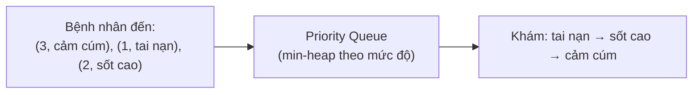

=== "Go"

    ```go
    package main

    import (
    	"container/heap"
    	"fmt"
    )

    type Patient struct {
    	level int // 1 = nặng nhất
    	name  string
    }

    // PQ cài heap.Interface (xem chi tiết ở Bài 10)
    type PQ []Patient

    func (p PQ) Len() int           { return len(p) }
    func (p PQ) Less(i, j int) bool { return p[i].level < p[j].level }
    func (p PQ) Swap(i, j int)      { p[i], p[j] = p[j], p[i] }
    func (p *PQ) Push(x any)        { *p = append(*p, x.(Patient)) }
    func (p *PQ) Pop() any {
    	old := *p
    	x := old[len(old)-1]
    	*p = old[:len(old)-1]
    	return x
    }

    func main() {
    	pq := &PQ{}
    	heap.Push(pq, Patient{3, "cảm cúm"})
    	heap.Push(pq, Patient{1, "tai nạn"})
    	heap.Push(pq, Patient{2, "sốt cao"})
    	for pq.Len() > 0 {
    		p := heap.Pop(pq).(Patient)
    		fmt.Println(p.level, p.name)
    	}
    }

    // Output:
    // 1 tai nạn
    // 2 sốt cao
    // 3 cảm cúm
    ```

=== "Python"

    ```python
    import heapq

    pq = []
    heapq.heappush(pq, (3, "cảm cúm"))
    heapq.heappush(pq, (1, "tai nạn"))
    heapq.heappush(pq, (2, "sốt cao"))
    while pq:
        level, name = heapq.heappop(pq)
        print(level, name)

    # Output:
    # 1 tai nạn
    # 2 sốt cao
    # 3 cảm cúm
    ```

Heap hoạt động thế nào, vì sao `O(log n)`, bài toán top-K, trộn K danh sách, median của dòng dữ liệu... → học kỹ ở **[Bài 10: Heap & Priority Queue](./10-heaps.md)**.

## 📖 11. Tổng kết: chọn cấu trúc nào?

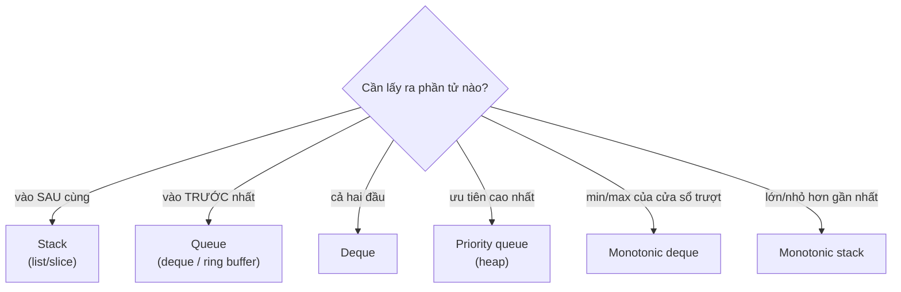

| Cấu trúc | Python | Go | Thêm | Lấy |
|---|---|---|---|---|
| Stack | `list` | slice | `O(1)`* | `O(1)` |
| Queue | `collections.deque` | slice / ring buffer / `container/list` | `O(1)`* | `O(1)` |
| Deque | `collections.deque` | `container/list` | `O(1)` | `O(1)` |
| Priority queue | `heapq` | `container/heap` | `O(log n)` | `O(log n)` |

\* amortized

## 🌍 Ứng dụng thực tế

| Ở đâu | Dùng gì | Chi tiết |
|---|---|---|
| Gọi hàm, đệ quy | Stack | Call stack; stack overflow khi đệ quy quá sâu |
| Ctrl+Z / Ctrl+Y, nút Back/Forward trình duyệt | 2 stack | Như mục 6 |
| Trình biên dịch, máy tính bỏ túi, Excel công thức | Stack | Kiểm tra ngoặc, shunting-yard, stack machine (JVM, CPython bytecode) |
| Duyệt DFS, flood fill trong Photoshop "Paint bucket" | Stack | [Bài 11](./11-graphs-traversal.md) |
| BFS, tìm đường ngắn nhất trên lưới (Google Maps đơn giản hóa) | Queue | [Bài 11](./11-graphs-traversal.md) |
| Hàng đợi in, hàng đợi xử lý đơn hàng Shopee/Tiki | Queue | Worker lấy việc theo FIFO; ở quy mô lớn dùng Kafka/RabbitMQ ([Backend Bài 9](../backend/09-message-queues.md)) |
| Rate limiter "tối đa 100 request/phút" | Deque | Giữ timestamp các request trong cửa sổ, bỏ các timestamp cũ ở đầu |
| Buffer stream nhạc/video, log vòng | Circular buffer | Ghi đè dữ liệu cũ khi đầy |
| Go channel có buffer | Ring buffer | `make(chan T, n)` |
| Bộ lập lịch CPU, Dijkstra, Uber ghép tài xế gần nhất | Priority queue | [Bài 10](./10-heaps.md), [Bài 12](./12-shortest-paths-mst.md) |
| Biểu đồ chứng khoán: "giá đã cao nhất trong bao nhiêu phiên" | Monotonic stack | LeetCode 901 Online Stock Span |

## ⚠️ Lỗi thường gặp

1. **`pop`/`peek` stack rỗng**: Go panic `index out of range [-1]`, Python `IndexError`. Luôn kiểm tra `len(st) > 0` trước.
2. **Dùng `list.pop(0)` làm queue trong Python** → `O(n)` mỗi lần, BFS thành `O(n²)`. Dùng `deque.popleft()`.
3. **Queue bằng slice Go sống lâu** (`q = q[1:]`) → mảng dưới không co lại, rò rỉ bộ nhớ. Dùng ring buffer.
4. **Quên kiểm tra stack còn phần tử sau khi duyệt xong** (bài ngoặc `"(("`).
5. **Sai thứ tự toán hạng** khi tính RPN: `b` pop trước là toán hạng phải.
6. **Monotonic stack lưu giá trị thay vì chỉ số** → không tính được khoảng cách/độ rộng. Hầu như luôn lưu **chỉ số**.
7. **Nhầm `<` với `<=`** trong monotonic stack: ảnh hưởng khi có phần tử **bằng nhau** (next greater là "lớn hơn hẳn" → pop khi `>`, giữ lại phần tử bằng). Tự trace với input có trùng như `[2, 2, 3]`.
8. **Queue bằng hai stack: đổ `in` sang `out` khi `out` chưa rỗng** → sai thứ tự.
9. **Circular buffer**: quên `% cap`, hoặc phân biệt "đầy" và "rỗng" bằng `head == tail` (cả hai trường hợp đều thỏa!) - hãy giữ biến `size` riêng.

## 🏋️ Bài tập

### Bài 1 (Dễ): Min Stack - [LeetCode 155](https://leetcode.com/problems/min-stack/)

Cài stack hỗ trợ `push`, `pop`, `top` và `getMin` (lấy phần tử nhỏ nhất) - **tất cả `O(1)`**.

<details markdown="1">
<summary>Đáp án</summary>

Mỗi phần tử trong stack lưu kèm **min của mọi phần tử từ đáy tới nó**. Khi pop, min "cũ" tự động quay lại - không cần tính lại.

```text
push 5: [(5,5)]
push 3: [(5,5), (3,3)]
push 7: [(5,5), (3,3), (7,3)]   getMin = 3
pop   : [(5,5), (3,3)]          getMin = 3
pop   : [(5,5)]                 getMin = 5
```

=== "Go"

    ```go
    package main

    import "fmt"

    type MinStack struct{ st [][2]int } // {giá trị, min tới đây}

    func (m *MinStack) Push(v int) {
    	mn := v
    	if len(m.st) > 0 {
    		mn = min(mn, m.st[len(m.st)-1][1])
    	}
    	m.st = append(m.st, [2]int{v, mn})
    }
    func (m *MinStack) Pop()        { m.st = m.st[:len(m.st)-1] }
    func (m *MinStack) Top() int    { return m.st[len(m.st)-1][0] }
    func (m *MinStack) GetMin() int { return m.st[len(m.st)-1][1] }

    func main() {
    	m := &MinStack{}
    	m.Push(5)
    	m.Push(3)
    	m.Push(7)
    	fmt.Println(m.Top(), m.GetMin())
    	m.Pop()
    	m.Pop()
    	fmt.Println(m.Top(), m.GetMin())
    }

    // Output:
    // 7 3
    // 5 5
    ```

=== "Python"

    ```python
    class MinStack:
        def __init__(self):
            self.st = []  # (giá trị, min tới đây)

        def push(self, v):
            mn = min(v, self.st[-1][1]) if self.st else v
            self.st.append((v, mn))

        def pop(self):
            self.st.pop()

        def top(self):
            return self.st[-1][0]

        def get_min(self):
            return self.st[-1][1]


    m = MinStack()
    for v in (5, 3, 7):
        m.push(v)
    print(m.top(), m.get_min())
    m.pop()
    m.pop()
    print(m.top(), m.get_min())

    # Output:
    # 7 3
    # 5 5
    ```

</details>

### Bài 2 (Dễ): Xóa ký tự trùng kề nhau - [LeetCode 1047](https://leetcode.com/problems/remove-all-adjacent-duplicates-in-string/)

Lặp lại việc xóa hai ký tự **giống nhau đứng cạnh nhau** cho tới khi không xóa được nữa. `"abbaca"` → `"ca"` (xóa `bb` → `"aaca"`, xóa `aa` → `"ca"`).

<details markdown="1">
<summary>Đáp án</summary>

Giống trò "xếp gạch" Candy Crush: dùng stack ký tự; nếu ký tự mới **bằng đỉnh** thì pop (hai viên "nổ"), ngược lại push. `O(n)`.

=== "Go"

    ```go
    package main

    import "fmt"

    func removeDuplicates(s string) string {
    	st := []byte{}
    	for i := 0; i < len(s); i++ {
    		if len(st) > 0 && st[len(st)-1] == s[i] {
    			st = st[:len(st)-1]
    		} else {
    			st = append(st, s[i])
    		}
    	}
    	return string(st)
    }

    func main() {
    	fmt.Println(removeDuplicates("abbaca"))
    	fmt.Println(removeDuplicates("azxxzy"))
    }

    // Output:
    // ca
    // ay
    ```

=== "Python"

    ```python
    def remove_duplicates(s: str) -> str:
        st = []
        for c in s:
            if st and st[-1] == c:
                st.pop()
            else:
                st.append(c)
        return "".join(st)


    print(remove_duplicates("abbaca"))
    print(remove_duplicates("azxxzy"))

    # Output:
    # ca
    # ay
    ```

</details>

### Bài 3 (Trung bình): Giải mã chuỗi - [LeetCode 394](https://leetcode.com/problems/decode-string/)

`"3[a2[c]]"` → `"accaccacc"`; `"2[abc]3[cd]ef"` → `"abcabccdcdcdef"`.

<details markdown="1">
<summary>Đáp án</summary>

Ngoặc lồng nhau → stack. Khi gặp `[`: push **(chuỗi đang xây, số lần lặp)** rồi bắt đầu chuỗi mới. Khi gặp `]`: pop ra `(prev, k)`, chuỗi hiện tại = `prev + cur * k`. Chú ý số có thể nhiều chữ số (`12[a]`).

=== "Go"

    ```go
    package main

    import (
    	"fmt"
    	"strings"
    )

    type frame struct {
    	prev string
    	k    int
    }

    func decodeString(s string) string {
    	st := []frame{}
    	cur, k := "", 0
    	for _, c := range s {
    		switch {
    		case c >= '0' && c <= '9':
    			k = k*10 + int(c-'0')
    		case c == '[':
    			st = append(st, frame{cur, k})
    			cur, k = "", 0
    		case c == ']':
    			f := st[len(st)-1]
    			st = st[:len(st)-1]
    			cur = f.prev + strings.Repeat(cur, f.k)
    		default:
    			cur += string(c)
    		}
    	}
    	return cur
    }

    func main() {
    	fmt.Println(decodeString("3[a2[c]]"))
    	fmt.Println(decodeString("2[abc]3[cd]ef"))
    	fmt.Println(decodeString("10[x]"))
    }

    // Output:
    // accaccacc
    // abcabccdcdcdef
    // xxxxxxxxxx
    ```

=== "Python"

    ```python
    def decode_string(s: str) -> str:
        st = []
        cur, k = "", 0
        for c in s:
            if c.isdigit():
                k = k * 10 + int(c)
            elif c == "[":
                st.append((cur, k))
                cur, k = "", 0
            elif c == "]":
                prev, times = st.pop()
                cur = prev + cur * times
            else:
                cur += c
        return cur


    print(decode_string("3[a2[c]]"))
    print(decode_string("2[abc]3[cd]ef"))
    print(decode_string("10[x]"))

    # Output:
    # accaccacc
    # abcabccdcdcdef
    # xxxxxxxxxx
    ```

</details>

### Bài 4 (Trung bình): Va chạm tiểu hành tinh - [LeetCode 735](https://leetcode.com/problems/asteroid-collision/)

Số dương bay sang phải, số âm bay sang trái, độ lớn là kích thước. Hai thiên thạch gặp nhau: nhỏ hơn nổ, bằng nhau cả hai nổ. `[5, 10, -5]` → `[5, 10]`; `[8, -8]` → `[]`; `[10, 2, -5]` → `[10]`.

<details markdown="1">
<summary>Đáp án</summary>

Stack chứa các thiên thạch "còn sống". Va chạm chỉ xảy ra khi **đỉnh dương** và **mới âm**. Lặp: nếu đỉnh nhỏ hơn → đỉnh nổ (pop, tiếp tục); bằng → cả hai nổ; lớn hơn → thiên thạch mới nổ.

=== "Python"

    ```python
    def asteroid_collision(asteroids):
        st = []
        for a in asteroids:
            alive = True
            while alive and a < 0 and st and st[-1] > 0:
                if st[-1] < -a:      # đỉnh nhỏ hơn → đỉnh nổ, a tiếp tục bay
                    st.pop()
                elif st[-1] == -a:   # bằng nhau → cả hai nổ
                    st.pop()
                    alive = False
                else:                # đỉnh lớn hơn → a nổ
                    alive = False
            if alive:
                st.append(a)
        return st


    print(asteroid_collision([5, 10, -5]))
    print(asteroid_collision([8, -8]))
    print(asteroid_collision([10, 2, -5]))
    print(asteroid_collision([-2, -1, 1, 2]))

    # Output:
    # [5, 10]
    # []
    # [10]
    # [-2, -1, 1, 2]
    ```

</details>

### Bài 5 (Khó): Nước đọng - [LeetCode 42 Trapping Rain Water](https://leetcode.com/problems/trapping-rain-water/)

`[0,1,0,2,1,0,1,3,2,1,2,1]` → `6`. Giải bằng **monotonic stack** (còn có cách hai con trỏ ở [Bài 2](./02-arrays-strings.md)).

<details markdown="1">
<summary>Đáp án</summary>

Stack **giảm dần** chiều cao. Khi cột `i` cao hơn đỉnh: pop đỉnh làm **đáy** hố; cột dưới nó trong stack là **bờ trái**, cột `i` là **bờ phải**. Nước = `(min(bờ trái, bờ phải) - đáy) × (i - trái - 1)`. Nước được tính theo từng **lớp ngang**.

=== "Go"

    ```go
    package main

    import "fmt"

    func trap(h []int) int {
    	st, water := []int{}, 0
    	for i := range h {
    		for len(st) > 0 && h[i] > h[st[len(st)-1]] {
    			bottom := st[len(st)-1]
    			st = st[:len(st)-1]
    			if len(st) == 0 {
    				break // không có bờ trái → nước chảy mất
    			}
    			left := st[len(st)-1]
    			water += (min(h[left], h[i]) - h[bottom]) * (i - left - 1)
    		}
    		st = append(st, i)
    	}
    	return water
    }

    func main() {
    	fmt.Println(trap([]int{0, 1, 0, 2, 1, 0, 1, 3, 2, 1, 2, 1}))
    	fmt.Println(trap([]int{4, 2, 0, 3, 2, 5}))
    }

    // Output:
    // 6
    // 9
    ```

=== "Python"

    ```python
    def trap(h):
        st, water = [], 0
        for i, x in enumerate(h):
            while st and x > h[st[-1]]:
                bottom = st.pop()
                if not st:
                    break  # không có bờ trái → nước chảy mất
                left = st[-1]
                water += (min(h[left], x) - h[bottom]) * (i - left - 1)
            st.append(i)
        return water


    print(trap([0, 1, 0, 2, 1, 0, 1, 3, 2, 1, 2, 1]))
    print(trap([4, 2, 0, 3, 2, 5]))

    # Output:
    # 6
    # 9
    ```

</details>

### Bài 6 (Khó): Tổng min của mọi mảng con - [LeetCode 907](https://leetcode.com/problems/sum-of-subarray-minimums/)

`[3, 1, 2, 4]` → `17` (các mảng con: `[3],[1],[2],[4],[3,1],[1,2],[2,4],[3,1,2],[1,2,4],[3,1,2,4]`, min lần lượt `3,1,2,4,1,1,2,1,1,1`).

<details markdown="1">
<summary>Đáp án</summary>

Đổi góc nhìn: thay vì duyệt mọi mảng con, hỏi "**`arr[i]` là min của bao nhiêu mảng con?**". Gọi `left` = số vị trí có thể bắt đầu (tới phần tử **nhỏ hơn** gần nhất bên trái), `right` = số vị trí có thể kết thúc (tới phần tử **nhỏ hơn hoặc bằng** gần nhất bên phải - dùng `<=` một bên để không đếm trùng khi có giá trị bằng nhau). Đóng góp = `arr[i] × left × right`. Hai lần monotonic stack → `O(n)`.

=== "Python"

    ```python
    def sum_subarray_mins(arr):
        n = len(arr)
        left, right = [0] * n, [0] * n
        st = []
        for i in range(n):                   # nhỏ hơn HẲN gần nhất bên trái
            while st and arr[st[-1]] > arr[i]:
                st.pop()
            left[i] = i - (st[-1] if st else -1)
            st.append(i)
        st = []
        for i in range(n - 1, -1, -1):       # nhỏ hơn HOẶC BẰNG gần nhất bên phải
            while st and arr[st[-1]] >= arr[i]:
                st.pop()
            right[i] = (st[-1] if st else n) - i
            st.append(i)
        return sum(arr[i] * left[i] * right[i] for i in range(n)) % (10**9 + 7)


    print(sum_subarray_mins([3, 1, 2, 4]))
    print(sum_subarray_mins([11, 81, 94, 43, 3]))

    # Output:
    # 17
    # 444
    ```

</details>

### 📋 Luyện thêm

| Chủ đề | Dễ | Trung bình | Khó |
|---|---|---|---|
| Stack cơ bản | [20 Valid Parentheses](https://leetcode.com/problems/valid-parentheses/), [232 Queue using Stacks](https://leetcode.com/problems/implement-queue-using-stacks/), [225 Stack using Queues](https://leetcode.com/problems/implement-stack-using-queues/) | [150 Evaluate RPN](https://leetcode.com/problems/evaluate-reverse-polish-notation/), [71 Simplify Path](https://leetcode.com/problems/simplify-path/), [2390 Removing Stars](https://leetcode.com/problems/removing-stars-from-a-string/) | [224 Basic Calculator](https://leetcode.com/problems/basic-calculator/), [32 Longest Valid Parentheses](https://leetcode.com/problems/longest-valid-parentheses/) |
| Monotonic stack | [496 Next Greater I](https://leetcode.com/problems/next-greater-element-i/) | [739 Daily Temperatures](https://leetcode.com/problems/daily-temperatures/), [901 Stock Span](https://leetcode.com/problems/online-stock-span/), [503 Next Greater II](https://leetcode.com/problems/next-greater-element-ii/), [853 Car Fleet](https://leetcode.com/problems/car-fleet/) | [84 Largest Rectangle](https://leetcode.com/problems/largest-rectangle-in-histogram/), [85 Maximal Rectangle](https://leetcode.com/problems/maximal-rectangle/) |
| Queue / deque | [933 Recent Calls](https://leetcode.com/problems/number-of-recent-calls/) | [622 Circular Queue](https://leetcode.com/problems/design-circular-queue/), [641 Circular Deque](https://leetcode.com/problems/design-circular-deque/) | [239 Sliding Window Max](https://leetcode.com/problems/sliding-window-maximum/), [862 Shortest Subarray Sum ≥ K](https://leetcode.com/problems/shortest-subarray-with-sum-at-least-k/) |

## ✅ Checklist hoàn thành

- [ ] Giải thích LIFO/FIFO bằng ví dụ đời thường và vẽ được sơ đồ push/pop, enqueue/dequeue
- [ ] Cài stack bằng slice/list; biết vì sao đỉnh stack đặt ở **cuối** mảng
- [ ] Giải thích vì sao `list.pop(0)` là `O(n)` và cách tránh
- [ ] Tự cài circular buffer với `head`, `size`, `% cap` và hàm `grow`
- [ ] Dùng `collections.deque` và `container/list` thành thạo
- [ ] Giải bài ngoặc hợp lệ, tính RPN, trace được shunting-yard trên giấy
- [ ] Cài undo/redo bằng hai stack
- [ ] Nhận ra tín hiệu monotonic stack; giải next greater, daily temperatures, largest rectangle
- [ ] Giải sliding window maximum bằng monotonic deque và giải thích vì sao `O(n)`
- [ ] Cài queue bằng hai stack và giải thích amortized `O(1)`
- [ ] Biết priority queue là gì và khi nào cần (chi tiết ở Bài 10)
- [ ] Làm ít nhất 4/6 bài tập và 5 bài trong bảng luyện thêm

**Bài tiếp theo**: [Bài 6: Đệ quy & Quay lui](./06-recursion-backtracking.md)

---

💡 **Tips ghi nhớ**:

- **"Gần nhất chưa xử lý"** → stack
- **"Đến trước phục vụ trước" / BFS** → queue (Python: `deque`)
- **Lớn/nhỏ hơn gần nhất** → monotonic stack, lưu **chỉ số**
- **Min/max cửa sổ trượt** → monotonic deque
- **Mỗi phần tử vào/ra một lần** → vòng `while` lồng vẫn là `O(n)`
- **Luôn kiểm tra rỗng** trước khi `pop`/`peek`
