# 📚 Bài 6: Đệ quy & Quay lui (Recursion & Backtracking)

## 🎯 Mục tiêu bài học

- Hiểu **đệ quy** (recursion) là gì và "giải phẫu" một hàm đệ quy: **base case** + **recursive case**
- Nhìn thấy **call stack** hoạt động thế nào khi hàm gọi chính nó
- Vẽ được **cây đệ quy** (recursion tree) và dùng nó để ước lượng độ phức tạp
- Biết vì sao Fibonacci đệ quy ngây thơ chậm khủng khiếp và cách **memoization** cứu nó
- Hiểu **tail recursion**, và vì sao Go & Python **không** tối ưu nó
- Biết giới hạn độ sâu đệ quy (`RecursionError` trong Python, stack 1 GB của goroutine trong Go)
- Nắm tư duy **chia để trị** (Divide & Conquer): tính lũy thừa nhanh, tháp Hà Nội
- Thuộc lòng **template quay lui** (backtracking): *chọn → khám phá → bỏ chọn*
- Giải được các bài kinh điển: **hoán vị, tập con, tổ hợp, combination sum, N-Queens, Sudoku, Word Search**
- Biết các kỹ thuật **cắt tỉa** (pruning) và phân tích độ phức tạp của quay lui

---

## 📖 1. Đệ quy là gì?

### Ví dụ đời thường: xếp hàng mua trà sữa

Bạn đứng trong một hàng dài mua trà sữa, không nhìn thấy đầu hàng. Bạn muốn biết **mình đứng thứ mấy**. Làm sao?

- Bạn hỏi người đứng trước: *"Anh đứng thứ mấy vậy?"*
- Người đó cũng không biết, nên lại hỏi người trước nữa... câu hỏi cứ thế truyền lên.
- Đến **người đầu tiên**: *"Tôi đứng thứ 1"* (không cần hỏi ai nữa) → đây là **base case**.
- Câu trả lời truyền ngược lại: người thứ 2 nói "tôi thứ 2", người thứ 3 nói "tôi thứ 3"... đến bạn.

Đó chính là đệ quy:

> **Đệ quy** = giải một bài toán bằng cách giải **cùng bài toán đó nhưng nhỏ hơn**, cho đến khi bài toán nhỏ tới mức **trả lời ngay được**.

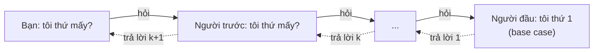

Một ví dụ khác: **búp bê Matryoshka** của Nga — mở một con búp bê ra thì thấy một con nhỏ hơn bên trong, cứ thế cho đến con nhỏ nhất **không mở được nữa** (base case).

### Giải phẫu một hàm đệ quy

Mọi hàm đệ quy đúng đều có **2 phần bắt buộc**:

| Phần | Vai trò | Ví dụ với `n!` |
|------|---------|----------------|
| **Base case** (trường hợp cơ sở) | Điểm dừng — trả kết quả trực tiếp, KHÔNG gọi đệ quy | `0! = 1` |
| **Recursive case** (trường hợp đệ quy) | Gọi lại chính mình với input **nhỏ hơn**, rồi kết hợp kết quả | `n! = n × (n-1)!` |

Và một điều kiện ngầm: **mỗi lần gọi đệ quy phải tiến gần hơn tới base case** (n giảm dần, mảng ngắn dần...). Nếu không, hàm sẽ gọi mãi mãi → tràn stack.

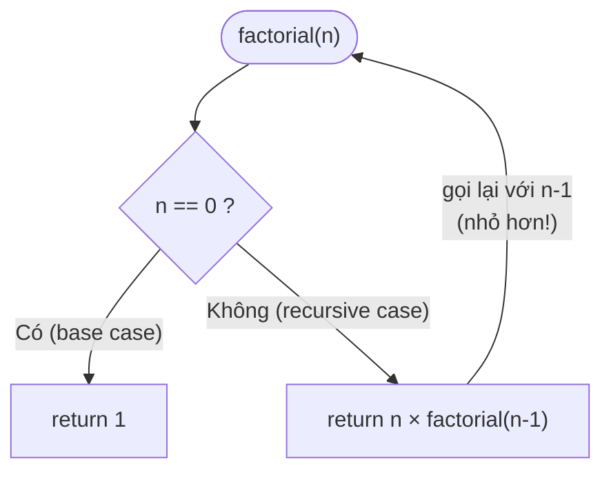

### 💡 Công thức 3 bước để viết hàm đệ quy

1. **Định nghĩa hàm bằng lời**: "`sum(a)` trả về tổng các phần tử của mảng `a`". Tin tưởng tuyệt đối vào định nghĩa này (gọi là *"leap of faith"* — cú nhảy niềm tin).
2. **Tìm base case**: input nhỏ nhất là gì? Mảng rỗng → tổng = 0.
3. **Tìm quan hệ**: giả sử `sum` đã đúng cho input nhỏ hơn, dùng nó để giải input hiện tại: `sum(a) = a[0] + sum(a[1:])`.

!!! tip "Đừng cố 'chạy tay' toàn bộ đệ quy trong đầu"
    Người mới hay cố theo dõi từng lời gọi một và bị rối. Hãy làm như chứng minh quy nạp trong toán: chứng minh base case đúng, giả sử lời gọi nhỏ hơn đúng → lời gọi hiện tại đúng. Xong!

### Ví dụ đầu tiên: giai thừa, tổng mảng, đếm ngược

=== "Go"

    ```go
    package main

    import "fmt"

    // factorial trả về n! = 1 × 2 × ... × n
    func factorial(n int) int {
    	if n == 0 { // base case
    		return 1
    	}
    	return n * factorial(n-1) // recursive case: bài toán nhỏ hơn (n-1)
    }

    // sum trả về tổng các phần tử của a
    func sum(a []int) int {
    	if len(a) == 0 { // base case: mảng rỗng
    		return 0
    	}
    	return a[0] + sum(a[1:]) // phần tử đầu + tổng phần còn lại
    }

    // countdown in n, n-1, ..., 1 rồi "Bắn pháo hoa!"
    func countdown(n int) {
    	if n == 0 {
    		fmt.Println("Bắn pháo hoa! 🎆")
    		return
    	}
    	fmt.Print(n, " ")
    	countdown(n - 1)
    }

    func main() {
    	fmt.Println("5! =", factorial(5))
    	fmt.Println("sum =", sum([]int{3, 1, 4, 1, 5}))
    	countdown(5)
    }
    // Output:
    // 5! = 120
    // sum = 14
    // 5 4 3 2 1 Bắn pháo hoa! 🎆
    ```

=== "Python"

    ```python
    def factorial(n: int) -> int:
        """Trả về n! = 1 × 2 × ... × n"""
        if n == 0:          # base case
            return 1
        return n * factorial(n - 1)  # recursive case


    def total(a: list[int]) -> int:
        """Tổng các phần tử của a"""
        if not a:           # base case: danh sách rỗng
            return 0
        return a[0] + total(a[1:])


    def countdown(n: int) -> None:
        if n == 0:
            print("Bắn pháo hoa! 🎆")
            return
        print(n, end=" ")
        countdown(n - 1)


    print("5! =", factorial(5))
    print("sum =", total([3, 1, 4, 1, 5]))
    countdown(5)
    # Output:
    # 5! = 120
    # sum = 14
    # 5 4 3 2 1 Bắn pháo hoa! 🎆
    ```

!!! warning "`a[1:]` có giá rẻ không?"
    Trong Go, `a[1:]` chỉ tạo một slice header mới trỏ vào cùng mảng → O(1). Trong Python, `a[1:]` **sao chép** cả danh sách → O(n) mỗi lần, cả hàm thành O(n²). Với Python, nên truyền chỉ số: `total(a, i)` trả về tổng từ `a[i]` trở đi.

---

## 📖 2. Call Stack — đệ quy chạy thật sự thế nào?

Mỗi lần gọi hàm, chương trình đẩy một **stack frame** (khung) lên **call stack**. Frame chứa tham số, biến cục bộ và "địa chỉ quay về". Khi hàm `return`, frame bị **pop** ra và kết quả trả cho frame bên dưới.

Hình dung như **chồng đĩa** ở quán cơm: đĩa đặt sau cùng được lấy ra đầu tiên (LIFO — xem [Bài 5: Stack & Queue](./05-stacks-queues.md)).

Theo dõi `factorial(3)`:

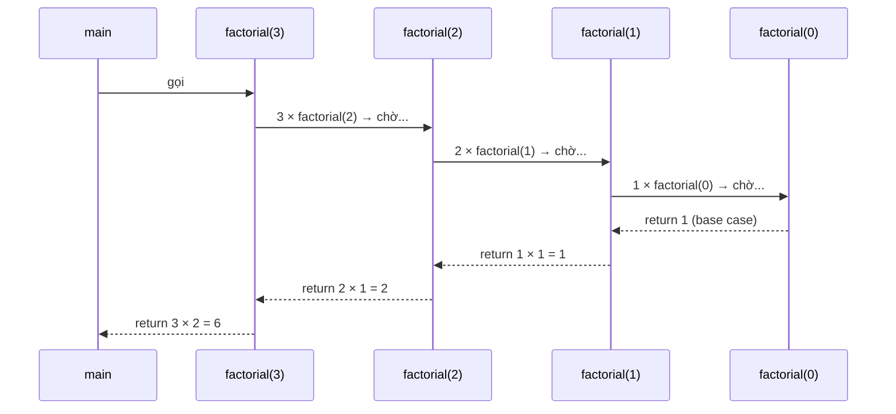

Trạng thái call stack theo thời gian (đỉnh stack ở trên):

```text
 Bước 1        Bước 2        Bước 3        Bước 4        Bước 5       Bước 6      Bước 7
                                          ┌──────────┐
                            ┌──────────┐  │ fact(0)  │  ← base case, return 1
              ┌──────────┐  │ fact(1)  │  │ fact(1)  │  ┌──────────┐
┌──────────┐  │ fact(2)  │  │ fact(2)  │  │ fact(2)  │  │ fact(1)=1│ ┌──────────┐
│ fact(3)  │  │ fact(3)  │  │ fact(3)  │  │ fact(3)  │  │ fact(2)  │ │ fact(2)=2│ ┌──────────┐
│  main    │  │  main    │  │  main    │  │  main    │  │ fact(3)  │ │ fact(3)  │ │ fact(3)=6│
└──────────┘  └──────────┘  └──────────┘  └──────────┘  │  main    │ │  main    │ │  main    │
                                                        └──────────┘ └──────────┘ └──────────┘
   push          push          push          push           pop          pop          pop
```

Hai giai đoạn cần nhớ:

1. **Đi xuống (winding)**: các lời gọi chồng lên nhau, **chưa có phép nhân nào được thực hiện**.
2. **Đi lên (unwinding)**: từ base case, các kết quả được trả về và kết hợp dần.

Ta có thể **in ra** quá trình này bằng cách thụt lề theo độ sâu:

=== "Go"

    ```go
    package main

    import (
    	"fmt"
    	"strings"
    )

    func factorial(n, depth int) int {
    	indent := strings.Repeat("│  ", depth)
    	fmt.Printf("%s→ factorial(%d)\n", indent, n)
    	if n == 0 {
    		fmt.Printf("%s← trả về 1 (base case)\n", indent)
    		return 1
    	}
    	sub := factorial(n-1, depth+1)
    	res := n * sub
    	fmt.Printf("%s← trả về %d × %d = %d\n", indent, n, sub, res)
    	return res
    }

    func main() {
    	factorial(3, 0)
    }
    // Output:
    // → factorial(3)
    // │  → factorial(2)
    // │  │  → factorial(1)
    // │  │  │  → factorial(0)
    // │  │  │  ← trả về 1 (base case)
    // │  │  ← trả về 1 × 1 = 1
    // │  ← trả về 2 × 1 = 2
    // ← trả về 3 × 2 = 6
    ```

=== "Python"

    ```python
    def factorial(n: int, depth: int = 0) -> int:
        indent = "│  " * depth
        print(f"{indent}→ factorial({n})")
        if n == 0:
            print(f"{indent}← trả về 1 (base case)")
            return 1
        sub = factorial(n - 1, depth + 1)
        res = n * sub
        print(f"{indent}← trả về {n} × {sub} = {res}")
        return res


    factorial(3)
    # Output:
    # → factorial(3)
    # │  → factorial(2)
    # │  │  → factorial(1)
    # │  │  │  → factorial(0)
    # │  │  │  ← trả về 1 (base case)
    # │  │  ← trả về 1 × 1 = 1
    # │  ← trả về 2 × 1 = 2
    # ← trả về 3 × 2 = 6
    ```

!!! note "Bộ nhớ của đệ quy"
    Độ sâu đệ quy tối đa = số frame cùng lúc nằm trên stack. `factorial(n)` sâu `n` tầng → tốn **O(n) bộ nhớ stack**, dù không tạo mảng nào. Đây là "chi phí ẩn" hay bị quên khi phân tích space complexity.

---

## 📖 3. Cây đệ quy (Recursion Tree)

Khi một hàm gọi **nhiều hơn một** lần đệ quy, các lời gọi tạo thành một **cây**. Ví dụ kinh điển: dãy Fibonacci.

```text
fib(0) = 0, fib(1) = 1, fib(n) = fib(n-1) + fib(n-2)
```

Cây đệ quy của `fib(5)`:

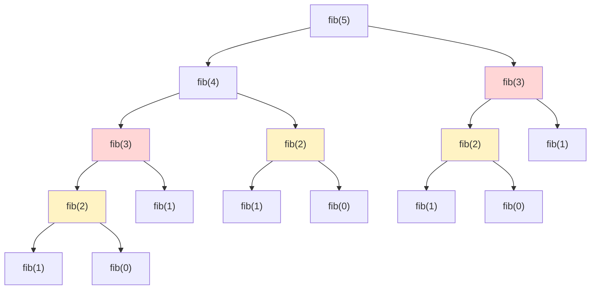

Nhìn vào cây: `fib(3)` bị tính **2 lần** (đỏ), `fib(2)` bị tính **3 lần** (vàng). Với `fib(50)`, số lần tính lặp lại lên tới **hàng tỷ**.

Bấm ▶ để xem cây đệ quy của `fib(5)` được "mọc" dần theo đúng thứ tự gọi hàm — để ý các nhánh giống hệt nhau xuất hiện lặp đi lặp lại:

<div class="algo-viz" data-viz="recursion" data-algo="fib-tree" data-n="5" data-title="Cây đệ quy fib(5)"></div>

### Dùng cây đệ quy để tính độ phức tạp

- **Mỗi nút** của cây = 1 lời gọi hàm, tốn O(1) công việc (một phép cộng).
- **Số nút** ≈ 2^n (mỗi nút tách thành 2, chiều cao n) → **thời gian O(2^n)**. Chính xác hơn là O(φ^n) với φ ≈ 1.618.
- **Chiều cao cây** = n → **bộ nhớ stack O(n)** (tại một thời điểm, chỉ một đường từ gốc tới lá nằm trên stack).

| Dạng đệ quy | Cây trông thế nào | Thời gian |
|-------------|-------------------|-----------|
| `f(n) = f(n-1) + O(1)` | Một đường thẳng dài n | O(n) |
| `f(n) = 2·f(n-1) + O(1)` | Cây nhị phân cao n | O(2^n) |
| `f(n) = f(n/2) + O(1)` | Đường thẳng dài log n | O(log n) |
| `f(n) = 2·f(n/2) + O(n)` | Cây log n tầng, mỗi tầng tổng O(n) | O(n log n) |

Quy tắc nhanh: **thời gian ≈ (số nút của cây) × (công việc mỗi nút)**; **bộ nhớ ≈ chiều cao cây**.

---

## 📖 4. Memoization — nhớ để khỏi tính lại

### Ý tưởng

Bạn làm bài tập toán, câu 5 cần kết quả câu 3, câu 7 cũng cần kết quả câu 3. Người thông minh sẽ **ghi kết quả câu 3 ra giấy nháp** để dùng lại, thay vì giải lại từ đầu.

**Memoization** = lưu kết quả của mỗi lời gọi `f(x)` vào một bảng (map/dict). Lần sau gặp lại `x` → tra bảng, trả về ngay.

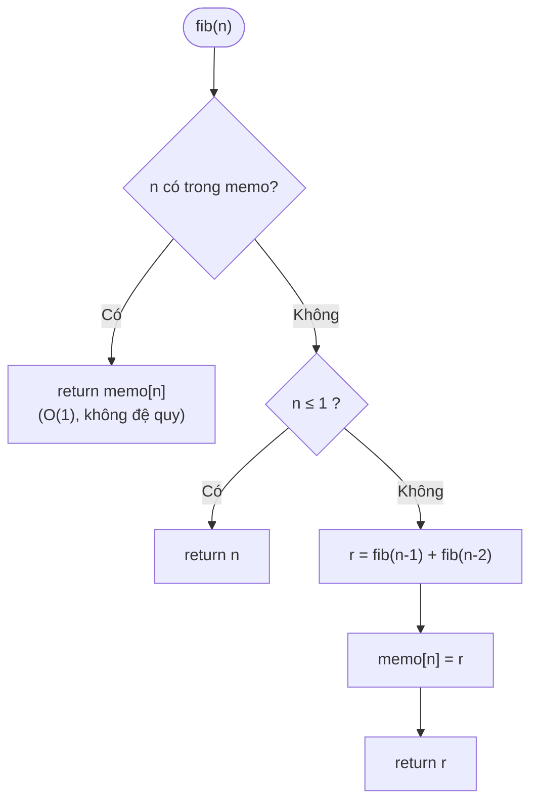

Với memo, cây đệ quy bị "cắt" gần hết: mỗi `fib(k)` chỉ tính **đúng 1 lần** → **O(n)** thay vì O(2^n).

=== "Go"

    ```go
    package main

    import "fmt"

    var calls int

    func fibNaive(n int) int {
    	calls++
    	if n <= 1 {
    		return n
    	}
    	return fibNaive(n-1) + fibNaive(n-2)
    }

    func fibMemo(n int, memo map[int]int) int {
    	calls++
    	if v, ok := memo[n]; ok {
    		return v // đã tính rồi → trả ngay
    	}
    	if n <= 1 {
    		return n
    	}
    	r := fibMemo(n-1, memo) + fibMemo(n-2, memo)
    	memo[n] = r // ghi vào "giấy nháp"
    	return r
    }

    func main() {
    	for _, n := range []int{10, 20, 30} {
    		calls = 0
    		v := fibNaive(n)
    		naive := calls
    		calls = 0
    		fibMemo(n, map[int]int{})
    		fmt.Printf("fib(%d) = %d | naive: %d lời gọi | memo: %d lời gọi\n", n, v, naive, calls)
    	}
    	fmt.Println("fib(90) =", fibMemo(90, map[int]int{}))
    }
    // Output:
    // fib(10) = 55 | naive: 177 lời gọi | memo: 19 lời gọi
    // fib(20) = 6765 | naive: 21891 lời gọi | memo: 39 lời gọi
    // fib(30) = 832040 | naive: 2692537 lời gọi | memo: 59 lời gọi
    // fib(90) = 2880067194370816120
    ```

=== "Python"

    ```python
    from functools import lru_cache

    calls = 0


    def fib_naive(n: int) -> int:
        global calls
        calls += 1
        if n <= 1:
            return n
        return fib_naive(n - 1) + fib_naive(n - 2)


    @lru_cache(maxsize=None)  # decorator tự động memoize
    def fib_memo(n: int) -> int:
        if n <= 1:
            return n
        return fib_memo(n - 1) + fib_memo(n - 2)


    for n in (10, 20, 30):
        calls = 0
        v = fib_naive(n)
        fib_memo.cache_clear()
        fib_memo(n)
        info = fib_memo.cache_info()  # hits = số lần tra bảng thành công
        print(f"fib({n}) = {v} | naive: {calls} lời gọi | memo: {info.hits + info.misses} lời gọi")
    print("fib(90) =", fib_memo(90))
    # Output:
    # fib(10) = 55 | naive: 177 lời gọi | memo: 19 lời gọi
    # fib(20) = 6765 | naive: 21891 lời gọi | memo: 39 lời gọi
    # fib(30) = 832040 | naive: 2692537 lời gọi | memo: 59 lời gọi
    # fib(90) = 2880067194370816120
    ```

!!! tip "Memoization là cửa ngõ vào Quy hoạch động"
    Đệ quy + memo chính là **Top-down Dynamic Programming**. Ta sẽ học kỹ ở [Bài 14: Quy hoạch động](./14-dynamic-programming.md). Điều kiện để memo hiệu quả: bài toán có **bài toán con gối nhau** (overlapping subproblems) — như `fib(3)` xuất hiện nhiều lần. Quay lui (phần sau) thường **không** có tính chất này nên memo ít giúp được.

---

## 📖 5. Tail Recursion (đệ quy đuôi)

Một lời gọi đệ quy là **tail call** nếu nó là **việc cuối cùng** hàm làm — không còn phép tính nào chờ kết quả của nó.

```go
// KHÔNG phải tail recursion: sau khi factorial(n-1) trả về còn phải nhân với n
return n * factorial(n-1)

// Tail recursion: truyền "kết quả tích lũy" acc xuống, lời gọi là việc cuối cùng
return factorialTail(n-1, acc*n)
```

Ở một số ngôn ngữ (Scheme, Haskell, Scala với `@tailrec`, C/C++ khi bật tối ưu), compiler biến tail call thành **vòng lặp** → không tốn thêm stack frame (**Tail Call Optimization — TCO**).

!!! warning "Go và Python KHÔNG có TCO"
    - **Go**: compiler không đảm bảo TCO. Tail recursion vẫn tạo frame mới.
    - **Python**: Guido van Rossum từ chối TCO một cách có chủ đích (để traceback đầy đủ, dễ debug).

    ⇒ Viết đệ quy đuôi trong Go/Python **không giúp tiết kiệm stack**. Nếu độ sâu có thể lớn (hàng trăm nghìn), hãy **chuyển thành vòng lặp**.

Đệ quy đuôi rất dễ chuyển thành vòng lặp: tham số tích lũy trở thành biến, lời gọi đệ quy trở thành "cập nhật biến rồi lặp lại":

=== "Go"

    ```go
    package main

    import "fmt"

    // Đệ quy đuôi: acc mang kết quả tích lũy
    func sumTail(n, acc int) int {
    	if n == 0 {
    		return acc
    	}
    	return sumTail(n-1, acc+n) // tail call
    }

    // Chuyển máy móc thành vòng lặp
    func sumLoop(n int) int {
    	acc := 0
    	for n > 0 { // "gọi lại" = quay đầu vòng lặp
    		acc, n = acc+n, n-1
    	}
    	return acc
    }

    func main() {
    	fmt.Println(sumTail(100, 0), sumLoop(100))
    	fmt.Println(sumLoop(10_000_000))
    }
    // Output:
    // 5050 5050
    // 50000005000000
    ```

=== "Python"

    ```python
    def sum_tail(n: int, acc: int = 0) -> int:
        if n == 0:
            return acc
        return sum_tail(n - 1, acc + n)  # tail call — Python vẫn tạo frame mới!


    def sum_loop(n: int) -> int:
        acc = 0
        while n > 0:
            acc, n = acc + n, n - 1
        return acc


    print(sum_tail(100), sum_loop(100))
    print(sum_loop(10_000_000))
    # sum_tail(10_000_000) sẽ ném RecursionError
    # Output:
    # 5050 5050
    # 50000005000000
    ```

---

## 📖 6. Giới hạn độ sâu đệ quy

### Python: `RecursionError`

Python mặc định chỉ cho **~1000 tầng** đệ quy. Vượt quá → `RecursionError: maximum recursion depth exceeded`. Đây là "cầu chì" bảo vệ để chương trình không làm tràn stack của C bên dưới (gây crash cả tiến trình).

=== "Python"

    ```python
    import sys


    def depth(n: int) -> int:
        return 0 if n == 0 else 1 + depth(n - 1)


    print("Giới hạn mặc định:", sys.getrecursionlimit())
    print(depth(900))
    try:
        depth(5000)
    except RecursionError as e:
        print("Lỗi:", e)

    sys.setrecursionlimit(10_000)   # nâng giới hạn
    print(depth(5000))
    # Output:
    # Giới hạn mặc định: 1000
    # 900
    # Lỗi: maximum recursion depth exceeded
    # 5000
    ```

=== "Go"

    ```go
    package main

    import "fmt"

    func depth(n int) int {
    	if n == 0 {
    		return 0
    	}
    	return 1 + depth(n-1)
    }

    func main() {
    	// Goroutine stack bắt đầu nhỏ (vài KB) và tự lớn dần đến tối đa 1 GB (64-bit)
    	fmt.Println(depth(1_000_000))
    	fmt.Println(depth(10_000_000))
    }
    // Output:
    // 1000000
    // 10000000
    ```

Nếu cần đệ quy **rất sâu** trong Python (ví dụ DFS trên đồ thị 10⁶ đỉnh), chỉ `setrecursionlimit` là chưa đủ vì stack C của thread chính có thể không đủ lớn → **segfault**. Mẹo hay dùng trong thi lập trình:

```python
import sys, threading

sys.setrecursionlimit(1 << 25)
threading.stack_size(1 << 27)  # 128 MB stack cho thread mới


def main():
    ...  # code đệ quy sâu ở đây


threading.Thread(target=main).start()
```

Trong Go, đệ quy vô hạn sẽ làm chương trình chết với thông báo:

```text
runtime: goroutine stack exceeds 1000000000-byte limit
fatal error: stack overflow
```

Có thể chỉnh giới hạn bằng `debug.SetMaxStack` (package `runtime/debug`), nhưng thường nếu bạn cần tới nó thì nên **viết lại bằng vòng lặp + stack tự quản lý**.

!!! tip "Khi nào nên khử đệ quy?"
    - Độ sâu có thể > 10⁴ (Python) hoặc > 10⁷ (Go) → dùng vòng lặp + stack thủ công.
    - Đệ quy tuyến tính (mỗi hàm gọi 1 lần) → gần như luôn viết được bằng vòng lặp đơn giản.
    - Đệ quy cây (duyệt cây, quay lui) → giữ đệ quy cho dễ đọc, vì độ sâu thường chỉ là chiều cao cây (nhỏ).

---

## 📖 7. Chia để trị (Divide & Conquer)

### Ý tưởng

Giám đốc cần kiểm kê 1000 cửa hàng. Thay vì tự đi từng cửa hàng, ông **chia** cho 2 phó giám đốc mỗi người 500, mỗi phó lại chia cho 2 trưởng vùng 250... cuối cùng mỗi nhân viên kiểm 1 cửa hàng (**trị** — giải trực tiếp), rồi báo cáo được **gộp** ngược lên.

Chia để trị gồm 3 bước:

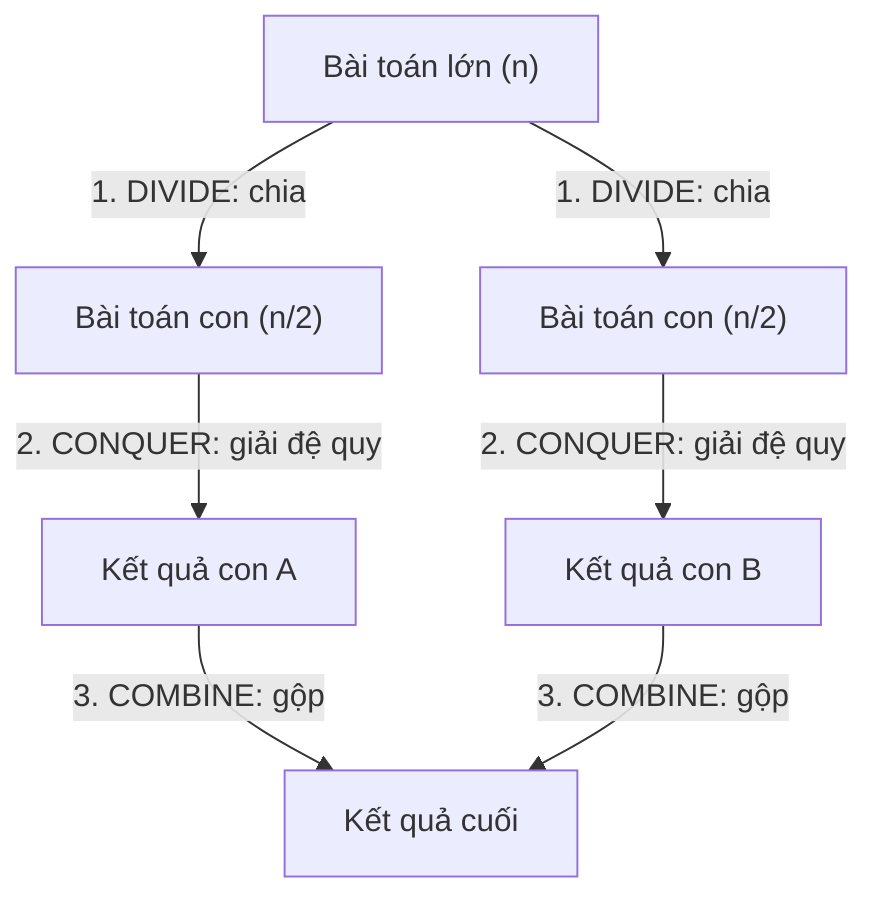

Các thuật toán nổi tiếng dùng chia để trị: **Merge Sort, Quick Sort** ([Bài 7](./07-sorting.md)), **Binary Search** ([Bài 8](./08-binary-search.md)), lũy thừa nhanh, nhân ma trận Strassen, FFT, tìm cặp điểm gần nhất...

!!! note "Chia để trị vs Quy hoạch động"
    Chia để trị: các bài toán con **độc lập, không trùng nhau** (nửa trái và nửa phải của mảng). Quy hoạch động: các bài toán con **trùng nhau** → cần memo. Fibonacci "chia" thành fib(n-1) và fib(n-2) nhưng chúng chồng lấn → là bài DP, không phải D&C thuần.

### Ví dụ 1: Lũy thừa nhanh (Fast Power) — O(log n)

Tính `x^n`. Cách ngây thơ nhân `n` lần → O(n). Chia để trị:

```text
x^n = (x^(n/2))²          nếu n chẵn
x^n = x · (x^(n/2))²      nếu n lẻ      (n/2 là chia nguyên)
x^0 = 1                   base case
```

`2^10 = (2^5)² = (2·(2^2)²)² = ...` → chỉ cần ~log₂(n) bước.

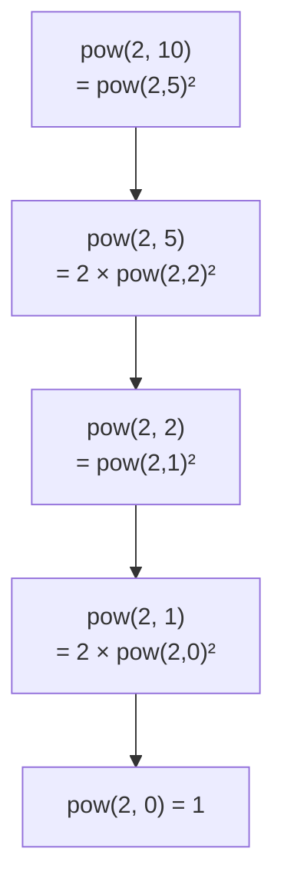

### Ví dụ 2: Tìm max bằng chia đôi

Không nhanh hơn duyệt tuyến tính (vẫn O(n)), nhưng minh họa rõ 3 bước divide/conquer/combine.

### Ví dụ 3: Tháp Hà Nội (Tower of Hanoi)

Có 3 cọc A, B, C. Cọc A có `n` đĩa, đĩa to ở dưới. Chuyển hết sang C, mỗi lần 1 đĩa, **không đặt đĩa to lên đĩa nhỏ**.

Lời giải đệ quy đẹp đến kinh ngạc:

1. Chuyển `n-1` đĩa trên cùng từ A sang B (dùng C làm trung gian) — **đệ quy**
2. Chuyển đĩa lớn nhất từ A sang C — **1 bước**
3. Chuyển `n-1` đĩa từ B sang C (dùng A làm trung gian) — **đệ quy**

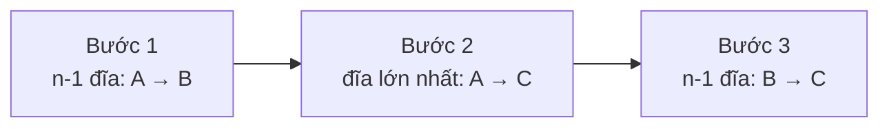

Số bước: `T(n) = 2·T(n-1) + 1` → `T(n) = 2^n − 1`. Với 64 đĩa (truyền thuyết), cần 1.8×10¹⁹ bước — mỗi giây 1 bước thì mất ~585 tỷ năm!

=== "Go"

    ```go
    package main

    import "fmt"

    // power tính x^n bằng chia để trị, O(log n)
    func power(x float64, n int) float64 {
    	if n < 0 {
    		return 1 / power(x, -n)
    	}
    	if n == 0 {
    		return 1
    	}
    	half := power(x, n/2) // chỉ gọi ĐÚNG 1 lần rồi dùng lại
    	if n%2 == 0 {
    		return half * half
    	}
    	return x * half * half
    }

    // maxDC tìm max của a[lo..hi] bằng chia đôi
    func maxDC(a []int, lo, hi int) int {
    	if lo == hi { // 1 phần tử → chính nó
    		return a[lo]
    	}
    	mid := (lo + hi) / 2
    	left := maxDC(a, lo, mid)    // conquer nửa trái
    	right := maxDC(a, mid+1, hi) // conquer nửa phải
    	return max(left, right)      // combine
    }

    // hanoi in các bước chuyển n đĩa từ from sang to, dùng via làm trung gian
    func hanoi(n int, from, to, via string, moves *int) {
    	if n == 0 {
    		return
    	}
    	hanoi(n-1, from, via, to, moves)
    	*moves++
    	fmt.Printf("  bước %d: đĩa %d  %s → %s\n", *moves, n, from, to)
    	hanoi(n-1, via, to, from, moves)
    }

    func main() {
    	fmt.Println("2^10 =", power(2, 10), "| 2^-2 =", power(2, -2))
    	fmt.Println("max =", maxDC([]int{3, 9, 2, 7, 5, 8}, 0, 5))
    	moves := 0
    	fmt.Println("Tháp Hà Nội 3 đĩa:")
    	hanoi(3, "A", "C", "B", &moves)
    	fmt.Println("Tổng số bước:", moves)
    }
    // Output:
    // 2^10 = 1024 | 2^-2 = 0.25
    // max = 9
    // Tháp Hà Nội 3 đĩa:
    //   bước 1: đĩa 1  A → C
    //   bước 2: đĩa 2  A → B
    //   bước 3: đĩa 1  C → B
    //   bước 4: đĩa 3  A → C
    //   bước 5: đĩa 1  B → A
    //   bước 6: đĩa 2  B → C
    //   bước 7: đĩa 1  A → C
    // Tổng số bước: 7
    ```

=== "Python"

    ```python
    def power(x: float, n: int) -> float:
        """x^n bằng chia để trị, O(log n)"""
        if n < 0:
            return 1 / power(x, -n)
        if n == 0:
            return 1
        half = power(x, n // 2)  # gọi 1 lần, dùng lại 2 lần
        return half * half if n % 2 == 0 else x * half * half


    def max_dc(a: list[int], lo: int, hi: int) -> int:
        if lo == hi:
            return a[lo]
        mid = (lo + hi) // 2
        return max(max_dc(a, lo, mid), max_dc(a, mid + 1, hi))


    def hanoi(n: int, src: str, dst: str, via: str, moves: list[int]) -> None:
        if n == 0:
            return
        hanoi(n - 1, src, via, dst, moves)
        moves[0] += 1
        print(f"  bước {moves[0]}: đĩa {n}  {src} → {dst}")
        hanoi(n - 1, via, dst, src, moves)


    print("2^10 =", power(2, 10), "| 2^-2 =", power(2, -2))
    print("max =", max_dc([3, 9, 2, 7, 5, 8], 0, 5))
    moves = [0]
    print("Tháp Hà Nội 3 đĩa:")
    hanoi(3, "A", "C", "B", moves)
    print("Tổng số bước:", moves[0])
    # Output:
    # 2^10 = 1024 | 2^-2 = 0.25
    # max = 9
    # Tháp Hà Nội 3 đĩa:
    #   bước 1: đĩa 1  A → C
    #   bước 2: đĩa 2  A → B
    #   bước 3: đĩa 1  C → B
    #   bước 4: đĩa 3  A → C
    #   bước 5: đĩa 1  B → A
    #   bước 6: đĩa 2  B → C
    #   bước 7: đĩa 1  A → C
    # Tổng số bước: 7
    ```

!!! warning "Lỗi kinh điển với lũy thừa nhanh"
    Viết `return power(x, n/2) * power(x, n/2)` — gọi **2 lần** thay vì lưu vào `half` — biến cây đệ quy từ một đường thẳng (log n nút) thành cây nhị phân đầy đủ (n nút) → mất hết lợi thế, lại thành O(n)!

### Định lý Master (phiên bản "bỏ túi")

Với đệ quy dạng `T(n) = a·T(n/b) + O(n^d)`:

| Điều kiện | Kết quả | Ví dụ |
|-----------|---------|-------|
| `d > log_b(a)` | O(n^d) — công việc gộp chiếm ưu thế | `T(n) = T(n/2) + O(n)` → O(n) |
| `d = log_b(a)` | O(n^d · log n) — mỗi tầng như nhau | Merge sort: `2T(n/2) + O(n)` → O(n log n) |
| `d < log_b(a)` | O(n^(log_b a)) — số lá chiếm ưu thế | `T(n) = 4T(n/2) + O(n)` → O(n²) |

Binary search: `T(n) = T(n/2) + O(1)` → a=1, b=2, d=0 = log₂1 → O(log n).

---

## 📖 8. Quay lui (Backtracking) — thử, sai, quay lại

### Ví dụ đời thường: đi mê cung & thử chìa khóa

Bạn đi trong một **mê cung**. Tại mỗi ngã rẽ, bạn chọn một hướng và đi tiếp. Nếu gặp **ngõ cụt**, bạn **quay lại** ngã rẽ gần nhất và thử hướng khác. Cứ thế cho đến khi thấy lối ra (hoặc đã thử hết mọi đường).

Hay khi bạn cầm chùm 10 chìa khóa để mở cửa phòng trọ: thử chìa 1 — không được, **rút ra** (bỏ chọn), thử chìa 2... Việc "rút chìa ra" chính là bước **unchoose** quan trọng nhất của quay lui.

> **Backtracking** = duyệt có hệ thống **mọi khả năng** bằng cách xây dựng lời giải **từng bước một**; ngay khi thấy bước hiện tại không thể dẫn tới lời giải hợp lệ thì **bỏ nó và quay lại** thử lựa chọn khác.

### Cây không gian trạng thái (State Space Tree)

Mọi bài quay lui đều có thể hình dung thành một cây:

- **Gốc** = lời giải rỗng (chưa chọn gì)
- **Mỗi cạnh** = một lựa chọn
- **Mỗi nút** = một lời giải "đang xây dở" (partial solution)
- **Lá** = lời giải hoàn chỉnh (hoặc ngõ cụt)

Quay lui = **DFS trên cây này**, và **cắt tỉa** (prune) những nhánh chắc chắn không có kết quả.

### 🧩 Template quay lui: Chọn → Khám phá → Bỏ chọn

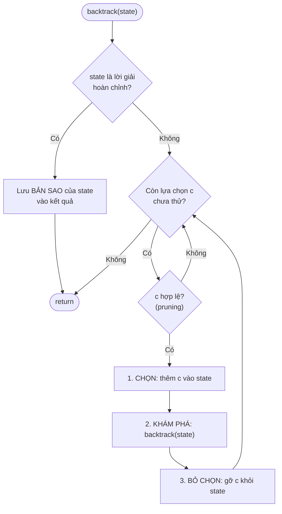

Dạng mã giả dùng cho mọi bài:

```text
func backtrack(state):
    if isComplete(state):
        result.add(copy(state))      // ⚠️ phải copy!
        return
    for choice in choices(state):
        if not isValid(state, choice):
            continue                 // cắt tỉa
        make(choice)                 // CHỌN
        backtrack(state)             // KHÁM PHÁ
        undo(choice)                 // BỎ CHỌN — trả state về như cũ
```

!!! warning "Hai lỗi chết người với quay lui"
    1. **Quên copy khi lưu kết quả**: `result = append(result, path)` trong Go hay `result.append(path)` trong Python lưu **tham chiếu** tới `path` — sau đó `path` bị sửa tiếp và mọi kết quả trong `result` đều bị thay đổi theo. Phải lưu **bản sao**: `append([]int(nil), path...)` / `path[:]` / `list(path)`.
    2. **Quên bỏ chọn** (undo): state bị "bẩn" từ nhánh trước tràn sang nhánh sau → kết quả sai.

---

## 📖 9. Hoán vị (Permutations) — LeetCode 46

**Bài toán**: Cho mảng các số **khác nhau** `[1,2,3]`, liệt kê mọi hoán vị.

**Trực giác**: Có 3 ô trống `_ _ _`. Ô thứ nhất có 3 lựa chọn, ô thứ hai còn 2 (không dùng lại số đã chọn), ô thứ ba còn 1 → 3! = 6 hoán vị. Ta cần một mảng `used[]` để biết số nào đã nằm trong `path`.

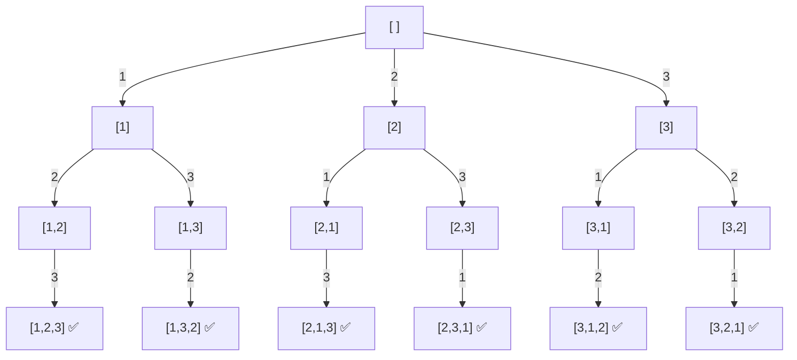

Bảng theo dõi vài bước đầu:

| Bước | Hành động | `path` | `used` |
|------|-----------|--------|--------|
| 1 | chọn 1 | [1] | {1} |
| 2 | chọn 2 | [1,2] | {1,2} |
| 3 | chọn 3 → đủ 3 phần tử, **lưu** [1,2,3] | [1,2,3] | {1,2,3} |
| 4 | bỏ 3 | [1,2] | {1,2} |
| 5 | bỏ 2 (hết lựa chọn ở tầng này) | [1] | {1} |
| 6 | chọn 3 | [1,3] | {1,3} |
| 7 | chọn 2 → **lưu** [1,3,2] | [1,3,2] | {1,2,3} |
| ... | ... | ... | ... |

Bấm ▶ và để ý: mỗi khi `path` đủ dài thì một hoán vị được ghi nhận, sau đó thuật toán **gỡ** phần tử cuối ra (quay lui) để thử nhánh khác:

<div class="algo-viz" data-viz="recursion" data-algo="permutations" data-input="1,2,3" data-title="Sinh hoán vị của [1,2,3]"></div>

=== "Go"

    ```go
    package main

    import "fmt"

    func permute(nums []int) [][]int {
    	var res [][]int
    	path := make([]int, 0, len(nums))
    	used := make([]bool, len(nums))

    	var backtrack func()
    	backtrack = func() {
    		if len(path) == len(nums) { // đủ phần tử → một hoán vị
    			res = append(res, append([]int(nil), path...)) // lưu BẢN SAO
    			return
    		}
    		for i, x := range nums {
    			if used[i] {
    				continue
    			}
    			used[i] = true // CHỌN
    			path = append(path, x)
    			backtrack() // KHÁM PHÁ
    			path = path[:len(path)-1] // BỎ CHỌN
    			used[i] = false
    		}
    	}
    	backtrack()
    	return res
    }

    func main() {
    	ps := permute([]int{1, 2, 3})
    	fmt.Println(len(ps), "hoán vị:", ps)
    }
    // Output:
    // 6 hoán vị: [[1 2 3] [1 3 2] [2 1 3] [2 3 1] [3 1 2] [3 2 1]]
    ```

=== "Python"

    ```python
    def permute(nums: list[int]) -> list[list[int]]:
        res: list[list[int]] = []
        path: list[int] = []
        used = [False] * len(nums)

        def backtrack() -> None:
            if len(path) == len(nums):
                res.append(path[:])      # lưu BẢN SAO
                return
            for i, x in enumerate(nums):
                if used[i]:
                    continue
                used[i] = True           # CHỌN
                path.append(x)
                backtrack()              # KHÁM PHÁ
                path.pop()               # BỎ CHỌN
                used[i] = False

        backtrack()
        return res


    ps = permute([1, 2, 3])
    print(len(ps), "hoán vị:", ps)
    # Output:
    # 6 hoán vị: [[1, 2, 3], [1, 3, 2], [2, 1, 3], [2, 3, 1], [3, 1, 2], [3, 2, 1]]
    ```

**Độ phức tạp**: có `n!` lá, mỗi lá copy `n` phần tử → **O(n · n!)** thời gian; bộ nhớ phụ O(n) (path + used + stack), chưa kể kết quả.

!!! tip "Python có sẵn"
    `itertools.permutations([1,2,3])` sinh hoán vị (lười, theo thứ tự từ điển của vị trí). Nhưng phỏng vấn thì bạn phải tự viết được!

### Biến thể: Hoán vị có phần tử trùng — LeetCode 47

Với `[1,1,2]`, cách trên sinh ra `[1,1,2]` **hai lần** (vì hai số 1 ở hai vị trí khác nhau). Mẹo: **sắp xếp** trước, rồi ở mỗi tầng **bỏ qua** `nums[i]` nếu nó bằng `nums[i-1]` và `nums[i-1]` **chưa được dùng** (nghĩa là ta đang thử lại cùng một giá trị ở cùng một vị trí).

```go
if i > 0 && nums[i] == nums[i-1] && !used[i-1] {
	continue // tránh sinh trùng
}
```

---

## 📖 10. Tập con (Subsets) — LeetCode 78

**Bài toán**: Liệt kê mọi tập con của `[1,2,3]` (có 2³ = 8 tập con, kể cả tập rỗng).

**Trực giác — cách 1 "lấy hay không lấy"**: Với **mỗi** phần tử, ta có đúng 2 lựa chọn: *cho vào túi* hoặc *không*. 3 phần tử → cây nhị phân cao 3, có 8 lá.

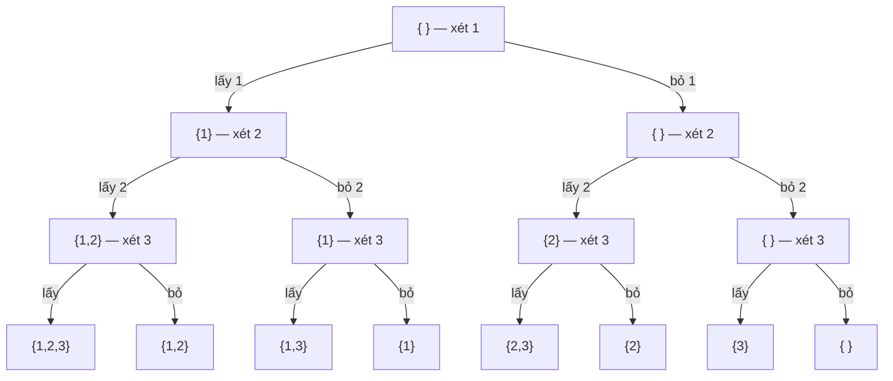

**Cách 2 "vòng for từ vị trí start"** (template chuẩn, dùng lại được cho tổ hợp): **mỗi nút** của cây đều là một tập con hợp lệ → lưu ngay khi vào hàm. Từ vị trí `start`, thử thêm lần lượt `nums[start], nums[start+1], ...` — chỉ nhìn **về phía sau** để không sinh `{2,1}` sau khi đã có `{1,2}`.

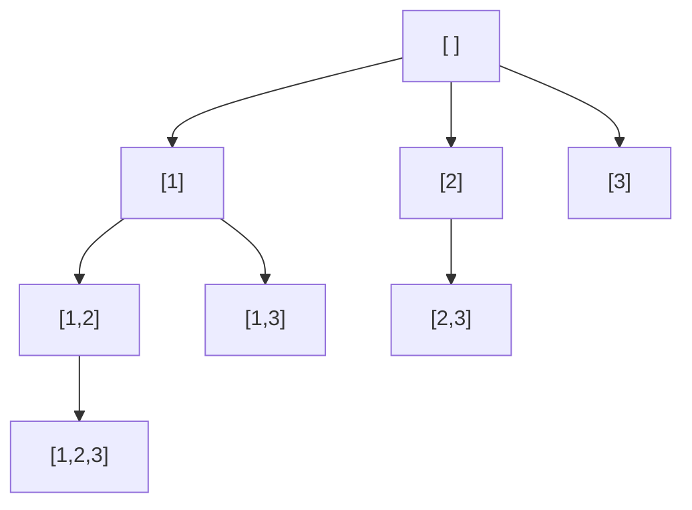

Bấm ▶ để xem mỗi nút được "ghi nhận" ngay khi thăm, và thuật toán chỉ mở rộng bằng các phần tử **đứng sau** phần tử vừa chọn:

<div class="algo-viz" data-viz="recursion" data-algo="subsets" data-input="1,2,3" data-title="Sinh tập con của [1,2,3]"></div>

=== "Go"

    ```go
    package main

    import "fmt"

    // Cách 2: vòng for từ start — mọi nút đều là 1 tập con
    func subsets(nums []int) [][]int {
    	var res [][]int
    	var path []int
    	var backtrack func(start int)
    	backtrack = func(start int) {
    		res = append(res, append([]int(nil), path...)) // mọi nút đều là kết quả
    		for i := start; i < len(nums); i++ {
    			path = append(path, nums[i]) // chọn
    			backtrack(i + 1)             // chỉ xét phần tử phía sau
    			path = path[:len(path)-1]    // bỏ chọn
    		}
    	}
    	backtrack(0)
    	return res
    }

    // Cách 1: lấy / không lấy từng phần tử
    func subsetsTakeSkip(nums []int) [][]int {
    	var res [][]int
    	var path []int
    	var dfs func(i int)
    	dfs = func(i int) {
    		if i == len(nums) { // đã quyết định xong mọi phần tử
    			res = append(res, append([]int(nil), path...))
    			return
    		}
    		path = append(path, nums[i]) // lấy nums[i]
    		dfs(i + 1)
    		path = path[:len(path)-1] // không lấy nums[i]
    		dfs(i + 1)
    	}
    	dfs(0)
    	return res
    }

    // Cách 3: bitmask — số k từ 0..2^n-1, bit j bật ⇔ lấy nums[j]
    func subsetsBitmask(nums []int) [][]int {
    	n := len(nums)
    	var res [][]int
    	for mask := 0; mask < 1<<n; mask++ {
    		var s []int
    		for j := 0; j < n; j++ {
    			if mask>>j&1 == 1 {
    				s = append(s, nums[j])
    			}
    		}
    		res = append(res, s)
    	}
    	return res
    }

    func main() {
    	nums := []int{1, 2, 3}
    	fmt.Println("start-loop:", subsets(nums))
    	fmt.Println("take/skip :", subsetsTakeSkip(nums))
    	fmt.Println("bitmask   :", subsetsBitmask(nums))
    }
    // Output:
    // start-loop: [[] [1] [1 2] [1 2 3] [1 3] [2] [2 3] [3]]
    // take/skip : [[1 2 3] [1 2] [1 3] [1] [2 3] [2] [3] []]
    // bitmask   : [[] [1] [2] [1 2] [3] [1 3] [2 3] [1 2 3]]
    ```

=== "Python"

    ```python
    def subsets(nums: list[int]) -> list[list[int]]:
        res, path = [], []

        def backtrack(start: int) -> None:
            res.append(path[:])              # mọi nút đều là 1 tập con
            for i in range(start, len(nums)):
                path.append(nums[i])         # chọn
                backtrack(i + 1)             # chỉ xét phần tử phía sau
                path.pop()                   # bỏ chọn

        backtrack(0)
        return res


    def subsets_take_skip(nums: list[int]) -> list[list[int]]:
        res, path = [], []

        def dfs(i: int) -> None:
            if i == len(nums):
                res.append(path[:])
                return
            path.append(nums[i])   # lấy
            dfs(i + 1)
            path.pop()             # không lấy
            dfs(i + 1)

        dfs(0)
        return res


    def subsets_bitmask(nums: list[int]) -> list[list[int]]:
        n = len(nums)
        return [[nums[j] for j in range(n) if mask >> j & 1] for mask in range(1 << n)]


    nums = [1, 2, 3]
    print("start-loop:", subsets(nums))
    print("take/skip :", subsets_take_skip(nums))
    print("bitmask   :", subsets_bitmask(nums))
    # Output:
    # start-loop: [[], [1], [1, 2], [1, 2, 3], [1, 3], [2], [2, 3], [3]]
    # take/skip : [[1, 2, 3], [1, 2], [1, 3], [1], [2, 3], [2], [3], []]
    # bitmask   : [[], [1], [2], [1, 2], [3], [1, 3], [2, 3], [1, 2, 3]]
    ```

**Độ phức tạp**: 2ⁿ tập con, mỗi cái copy tối đa n phần tử → **O(n · 2ⁿ)**.

!!! note "Trong Go, `[]int(nil)` được in ra là `[]`"
    Tập rỗng ở kết quả bitmask là `nil` slice, `fmt` in là `[]` — giống slice rỗng. Khi so sánh hoặc JSON-encode thì `nil` và `[]int{}` khác nhau (`null` vs `[]`), cần để ý.

---

## 📖 11. Tổ hợp (Combinations) — LeetCode 77

**Bài toán**: Chọn `k` số từ `1..n`. Ví dụ `n=4, k=2` → `[1,2] [1,3] [1,4] [2,3] [2,4] [3,4]` (C(4,2) = 6).

**Trực giác**: Giống hệt subsets (cách 2), nhưng **chỉ lưu khi `len(path) == k`** và dừng đi sâu hơn.

**Cắt tỉa quan trọng**: Nếu số phần tử còn lại **không đủ** để lấp đầy `k` chỗ thì dừng. Đang có `len(path)` phần tử, cần thêm `k - len(path)`; các số từ `i` đến `n` có `n - i + 1` số. Điều kiện để còn hy vọng: `n - i + 1 >= k - len(path)` ⇔ `i <= n - (k - len(path)) + 1`.

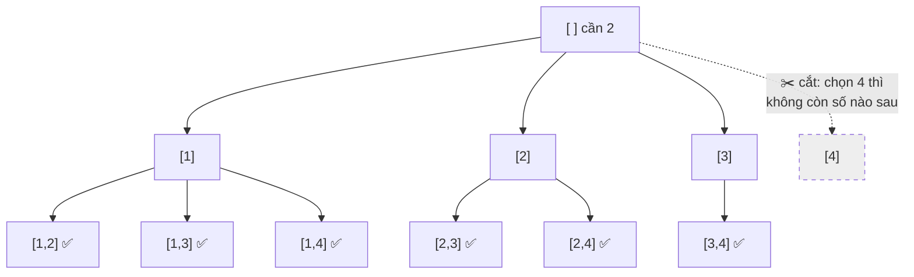

=== "Go"

    ```go
    package main

    import "fmt"

    func combine(n, k int) [][]int {
    	var res [][]int
    	var path []int
    	nodes := 0
    	var backtrack func(start int)
    	backtrack = func(start int) {
    		nodes++
    		if len(path) == k {
    			res = append(res, append([]int(nil), path...))
    			return
    		}
    		need := k - len(path)
    		// cắt tỉa: i chỉ chạy tới n-need+1
    		for i := start; i <= n-need+1; i++ {
    			path = append(path, i)
    			backtrack(i + 1)
    			path = path[:len(path)-1]
    		}
    	}
    	backtrack(1)
    	fmt.Println("số nút đã thăm:", nodes)
    	return res
    }

    func main() {
    	fmt.Println(combine(4, 2))
    	fmt.Println(len(combine(10, 3)), "tổ hợp C(10,3)")
    }
    // Output:
    // số nút đã thăm: 10
    // [[1 2] [1 3] [1 4] [2 3] [2 4] [3 4]]
    // số nút đã thăm: 165
    // 120 tổ hợp C(10,3)
    ```

=== "Python"

    ```python
    def combine(n: int, k: int) -> list[list[int]]:
        res, path = [], []
        nodes = 0

        def backtrack(start: int) -> None:
            nonlocal nodes
            nodes += 1
            if len(path) == k:
                res.append(path[:])
                return
            need = k - len(path)
            for i in range(start, n - need + 2):   # cắt tỉa: i ≤ n-need+1
                path.append(i)
                backtrack(i + 1)
                path.pop()

        backtrack(1)
        print("số nút đã thăm:", nodes)
        return res


    print(combine(4, 2))
    print(len(combine(10, 3)), "tổ hợp C(10,3)")
    # Output:
    # số nút đã thăm: 10
    # [[1, 2], [1, 3], [1, 4], [2, 3], [2, 4], [3, 4]]
    # số nút đã thăm: 165
    # 120 tổ hợp C(10,3)
    ```

**Độ phức tạp**: O(k · C(n, k)).

---

## 📖 12. Combination Sum — LeetCode 39

**Bài toán**: Cho `candidates` (các số dương khác nhau) và `target`. Tìm mọi tổ hợp có tổng = `target`; **mỗi số được dùng nhiều lần**. Ví dụ `candidates=[2,3,6,7], target=7` → `[[2,2,3],[7]]`.

**Trực giác**: Như đi chợ với 7 nghìn đồng, mua các món giá 2, 3, 6, 7 nghìn — mỗi món mua bao nhiêu cái cũng được, phải tiêu **vừa đúng** hết tiền.

Khác biệt với tổ hợp thường:

- Được dùng lại → gọi đệ quy với `i` (không phải `i+1`).
- Để không sinh `[2,3,2]` sau khi đã có `[2,2,3]` → vẫn chỉ xét từ `start` trở đi.
- **Cắt tỉa**: sắp xếp tăng dần; nếu `candidates[i] > remain` thì **break** luôn (các số sau còn lớn hơn).

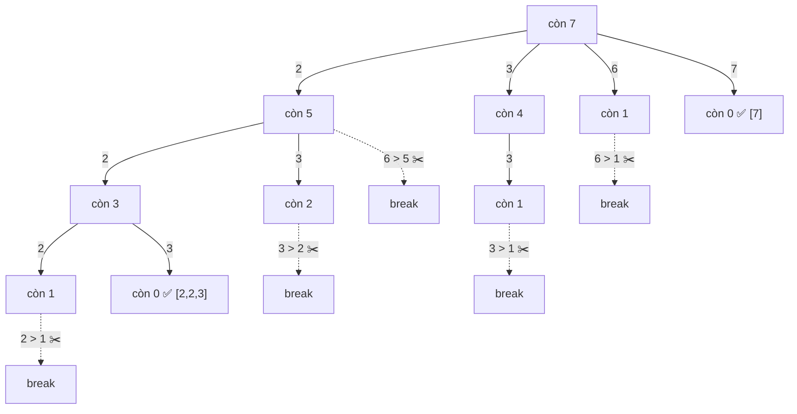

=== "Go"

    ```go
    package main

    import (
    	"fmt"
    	"slices"
    )

    func combinationSum(candidates []int, target int) [][]int {
    	slices.Sort(candidates) // sắp xếp để cắt tỉa bằng break
    	var res [][]int
    	var path []int
    	var backtrack func(start, remain int)
    	backtrack = func(start, remain int) {
    		if remain == 0 {
    			res = append(res, append([]int(nil), path...))
    			return
    		}
    		for i := start; i < len(candidates); i++ {
    			c := candidates[i]
    			if c > remain {
    				break // các số sau còn lớn hơn → khỏi thử
    			}
    			path = append(path, c)
    			backtrack(i, remain-c) // i (không phải i+1): được dùng lại
    			path = path[:len(path)-1]
    		}
    	}
    	backtrack(0, target)
    	return res
    }

    func main() {
    	fmt.Println(combinationSum([]int{2, 3, 6, 7}, 7))
    	fmt.Println(combinationSum([]int{2, 3, 5}, 8))
    }
    // Output:
    // [[2 2 3] [7]]
    // [[2 2 2 2] [2 3 3] [3 5]]
    ```

=== "Python"

    ```python
    def combination_sum(candidates: list[int], target: int) -> list[list[int]]:
        candidates = sorted(candidates)
        res, path = [], []

        def backtrack(start: int, remain: int) -> None:
            if remain == 0:
                res.append(path[:])
                return
            for i in range(start, len(candidates)):
                c = candidates[i]
                if c > remain:
                    break                   # cắt tỉa
                path.append(c)
                backtrack(i, remain - c)    # được dùng lại c
                path.pop()

        backtrack(0, target)
        return res


    print(combination_sum([2, 3, 6, 7], 7))
    print(combination_sum([2, 3, 5], 8))
    # Output:
    # [[2, 2, 3], [7]]
    # [[2, 2, 2, 2], [2, 3, 3], [3, 5]]
    ```

!!! tip "Biến thể Combination Sum II (LeetCode 40)"
    Mỗi số chỉ dùng **một lần** và mảng **có trùng** → gọi `backtrack(i+1, ...)` và thêm dòng bỏ trùng giống hoán vị II: `if i > start && c[i] == c[i-1] { continue }`.

---

## 📖 13. N-Queens — LeetCode 51

**Bài toán**: Đặt `n` quân hậu lên bàn cờ `n×n` sao cho **không hai quân nào ăn nhau** (không cùng hàng, cùng cột, cùng đường chéo).

**Trực giác**: Mỗi hàng chắc chắn có đúng 1 quân hậu. Vậy ta đi **từng hàng một**: ở hàng `r`, thử đặt hậu vào từng cột `c`. Nếu ô `(r, c)` bị tấn công → bỏ qua. Nếu đặt được → sang hàng `r+1`. Nếu hàng `r+1` không đặt được ở đâu → **quay lui**, dời quân ở hàng `r` sang cột khác.

**Kiểm tra O(1) bằng 3 tập hợp**:

- `cols[c]`: cột `c` đã có hậu
- `diag1[r-c]`: đường chéo "\\" — mọi ô trên cùng đường chéo này có **cùng `r - c`**
- `diag2[r+c]`: đường chéo "/" — mọi ô có **cùng `r + c`**

```text
  r-c trên bàn 4×4           r+c trên bàn 4×4
   c: 0  1  2  3               c: 0  1  2  3
r0:   0 -1 -2 -3            r0:   0  1  2  3
r1:   1  0 -1 -2            r1:   1  2  3  4
r2:   2  1  0 -1            r2:   2  3  4  5
r3:   3  2  1  0            r3:   3  4  5  6
```

Quá trình tìm lời giải đầu tiên cho n = 4 (Q = hậu, x = ô thử nhưng bị tấn công):

```text
Thử (0,0)      Hàng 1: (1,2)     Hàng 2: hết chỗ!   Quay lui: (1,3)   Hàng 2: (2,1)    Hàng 3: hết chỗ!
Q . . .        Q . . .           Q . . .            Q . . .           Q . . .          → quay lui tới hàng 0
. . . .        . . Q .           . . Q .            . . . Q           . . . Q          Thử (0,1) ...
. . . .        . . . .           x x x x            . . . .           . Q . .          ... cuối cùng:
. . . .        . . . .           . . . .            . . . .           . . . .          . Q . .
                                                                                        . . . Q
                                                                                        Q . . .
                                                                                        . . Q .
```

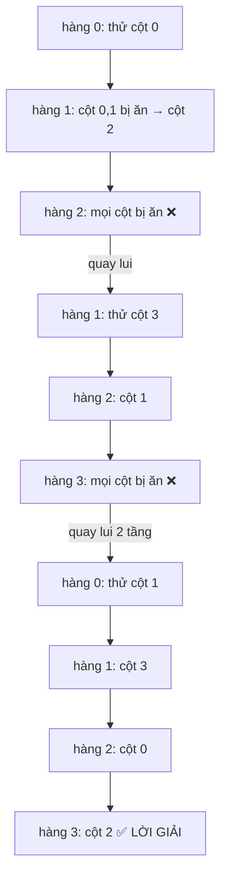

Bấm ▶ để xem các quân hậu được đặt từng hàng; khi một hàng hết chỗ, quân hậu ở hàng trên sẽ bị **nhấc lên** và dời sang cột khác — đó chính là "quay lui":

<div class="algo-viz" data-viz="recursion" data-algo="nqueens" data-n="4" data-title="N-Queens với n = 4"></div>

=== "Go"

    ```go
    package main

    import (
    	"fmt"
    	"strings"
    )

    func solveNQueens(n int) [][]string {
    	var res [][]string
    	queens := make([]int, n) // queens[r] = cột của hậu ở hàng r
    	cols := make([]bool, n)
    	diag1 := make([]bool, 2*n) // chỉ số r-c+n để không âm
    	diag2 := make([]bool, 2*n) // chỉ số r+c

    	var place func(r int)
    	place = func(r int) {
    		if r == n { // đặt đủ n hàng → 1 lời giải
    			board := make([]string, n)
    			for i, c := range queens {
    				board[i] = strings.Repeat(".", c) + "Q" + strings.Repeat(".", n-c-1)
    			}
    			res = append(res, board)
    			return
    		}
    		for c := 0; c < n; c++ {
    			if cols[c] || diag1[r-c+n] || diag2[r+c] {
    				continue // bị tấn công → cắt tỉa
    			}
    			queens[r] = c // CHỌN
    			cols[c], diag1[r-c+n], diag2[r+c] = true, true, true
    			place(r + 1) // KHÁM PHÁ
    			cols[c], diag1[r-c+n], diag2[r+c] = false, false, false // BỎ CHỌN
    		}
    	}
    	place(0)
    	return res
    }

    func main() {
    	sols := solveNQueens(4)
    	for i, b := range sols {
    		fmt.Printf("Lời giải %d:\n  %s\n", i+1, strings.Join(b, "\n  "))
    	}
    	for n := 1; n <= 10; n++ {
    		fmt.Printf("n=%d: %d lời giải\n", n, len(solveNQueens(n)))
    	}
    }
    // Output:
    // Lời giải 1:
    //   .Q..
    //   ...Q
    //   Q...
    //   ..Q.
    // Lời giải 2:
    //   ..Q.
    //   Q...
    //   ...Q
    //   .Q..
    // n=1: 1 lời giải
    // n=2: 0 lời giải
    // n=3: 0 lời giải
    // n=4: 2 lời giải
    // n=5: 10 lời giải
    // n=6: 4 lời giải
    // n=7: 40 lời giải
    // n=8: 92 lời giải
    // n=9: 352 lời giải
    // n=10: 724 lời giải
    ```

=== "Python"

    ```python
    def solve_n_queens(n: int) -> list[list[str]]:
        res: list[list[str]] = []
        queens = [0] * n
        cols, diag1, diag2 = set(), set(), set()

        def place(r: int) -> None:
            if r == n:
                res.append(["." * c + "Q" + "." * (n - c - 1) for c in queens])
                return
            for c in range(n):
                if c in cols or (r - c) in diag1 or (r + c) in diag2:
                    continue                          # bị tấn công
                queens[r] = c                         # CHỌN
                cols.add(c); diag1.add(r - c); diag2.add(r + c)
                place(r + 1)                          # KHÁM PHÁ
                cols.remove(c); diag1.remove(r - c); diag2.remove(r + c)  # BỎ CHỌN

        place(0)
        return res


    for i, b in enumerate(solve_n_queens(4), 1):
        print(f"Lời giải {i}:\n  " + "\n  ".join(b))
    for n in range(1, 11):
        print(f"n={n}: {len(solve_n_queens(n))} lời giải")
    # Output:
    # Lời giải 1:
    #   .Q..
    #   ...Q
    #   Q...
    #   ..Q.
    # Lời giải 2:
    #   ..Q.
    #   Q...
    #   ...Q
    #   .Q..
    # n=1: 1 lời giải
    # n=2: 0 lời giải
    # n=3: 0 lời giải
    # n=4: 2 lời giải
    # n=5: 10 lời giải
    # n=6: 4 lời giải
    # n=7: 40 lời giải
    # n=8: 92 lời giải
    # n=9: 352 lời giải
    # n=10: 724 lời giải
    ```

**Độ phức tạp**: hàng 0 có n lựa chọn, hàng 1 tối đa n−1 (bỏ cột đã dùng)... → cận trên **O(n!)**; thực tế nhỏ hơn nhiều nhờ cắt tỉa đường chéo. Bộ nhớ O(n).

!!! tip "Tối ưu bằng bitmask"
    Thay 3 mảng bool bằng 3 số nguyên, `available = ~(cols | d1 | d2) & ((1<<n)-1)`, lấy bit thấp nhất bằng `p = available & -available`. Nhanh hơn vài lần — kỹ thuật bit được học ở [Bài 16](./16-strings-math-bits.md).

---

## 📖 14. Sudoku Solver — LeetCode 37

**Bài toán**: Điền các số 1–9 vào ô trống sao cho mỗi **hàng**, mỗi **cột**, mỗi **khối 3×3** có đủ 1–9 không trùng.

**Trực giác**: Đúng như cách bạn giải Sudoku bằng bút chì: tìm một ô trống, thử điền 1; nếu vi phạm thì thử 2... Nếu điền được thì sang ô trống tiếp theo. Nếu tới một ô mà **không số nào hợp lệ** → xóa ô trước đó và thử số khác (**tẩy bút chì** = bỏ chọn).

Chỉ số khối: ô `(r, c)` thuộc khối `(r/3)*3 + c/3` (0..8):

```text
 khối 0 | khối 1 | khối 2
--------+--------+--------
 khối 3 | khối 4 | khối 5
--------+--------+--------
 khối 6 | khối 7 | khối 8
```

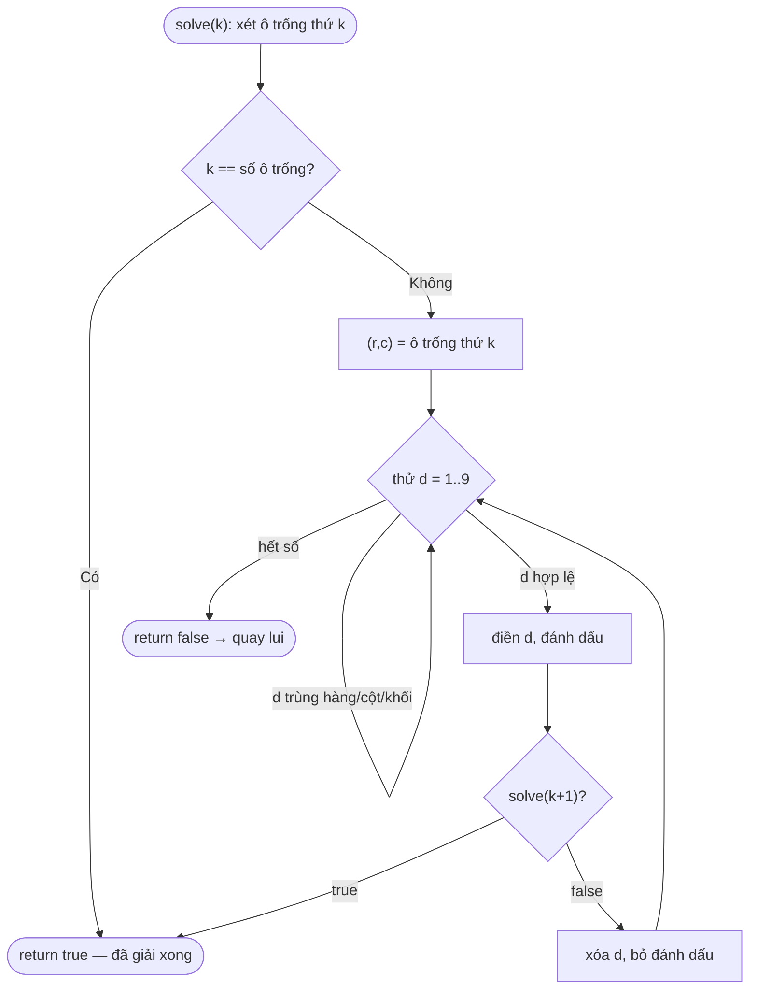

=== "Go"

    ```go
    package main

    import (
    	"fmt"
    	"strings"
    )

    func solveSudoku(board [][]byte) bool {
    	var rows, cols, boxes [9][10]bool
    	type cell struct{ r, c int }
    	var empty []cell
    	for r := 0; r < 9; r++ {
    		for c := 0; c < 9; c++ {
    			if board[r][c] == '.' {
    				empty = append(empty, cell{r, c})
    			} else {
    				d := board[r][c] - '0'
    				rows[r][d], cols[c][d], boxes[r/3*3+c/3][d] = true, true, true
    			}
    		}
    	}
    	steps := 0
    	var solve func(k int) bool
    	solve = func(k int) bool {
    		if k == len(empty) {
    			return true
    		}
    		r, c := empty[k].r, empty[k].c
    		b := r/3*3 + c/3
    		for d := byte(1); d <= 9; d++ {
    			if rows[r][d] || cols[c][d] || boxes[b][d] {
    				continue
    			}
    			steps++
    			board[r][c] = '0' + d
    			rows[r][d], cols[c][d], boxes[b][d] = true, true, true
    			if solve(k + 1) {
    				return true // tìm thấy → dừng luôn, không cần bỏ chọn
    			}
    			board[r][c] = '.'
    			rows[r][d], cols[c][d], boxes[b][d] = false, false, false
    		}
    		return false
    	}
    	ok := solve(0)
    	fmt.Println("số lần thử điền:", steps)
    	return ok
    }

    func main() {
    	puzzle := []string{
    		"53..7....",
    		"6..195...",
    		".98....6.",
    		"8...6...3",
    		"4..8.3..1",
    		"7...2...6",
    		".6....28.",
    		"...419..5",
    		"....8..79",
    	}
    	board := make([][]byte, 9)
    	for i, s := range puzzle {
    		board[i] = []byte(s)
    	}
    	fmt.Println("giải được:", solveSudoku(board))
    	for r, row := range board {
    		if r%3 == 0 && r > 0 {
    			fmt.Println("------+-------+------")
    		}
    		s := string(row)
    		fmt.Println(strings.Join([]string{spaced(s[0:3]), spaced(s[3:6]), spaced(s[6:9])}, " | "))
    	}
    }

    func spaced(s string) string { return strings.Join(strings.Split(s, ""), " ") }
    // Output:
    // số lần thử điền: 4208
    // giải được: true
    // 5 3 4 | 6 7 8 | 9 1 2
    // 6 7 2 | 1 9 5 | 3 4 8
    // 1 9 8 | 3 4 2 | 5 6 7
    // ------+-------+------
    // 8 5 9 | 7 6 1 | 4 2 3
    // 4 2 6 | 8 5 3 | 7 9 1
    // 7 1 3 | 9 2 4 | 8 5 6
    // ------+-------+------
    // 9 6 1 | 5 3 7 | 2 8 4
    // 2 8 7 | 4 1 9 | 6 3 5
    // 3 4 5 | 2 8 6 | 1 7 9
    ```

=== "Python"

    ```python
    def solve_sudoku(board: list[list[str]]) -> bool:
        rows = [set() for _ in range(9)]
        cols = [set() for _ in range(9)]
        boxes = [set() for _ in range(9)]
        empty = []
        for r in range(9):
            for c in range(9):
                v = board[r][c]
                if v == ".":
                    empty.append((r, c))
                else:
                    rows[r].add(v); cols[c].add(v); boxes[r // 3 * 3 + c // 3].add(v)
        steps = 0

        def solve(k: int) -> bool:
            nonlocal steps
            if k == len(empty):
                return True
            r, c = empty[k]
            b = r // 3 * 3 + c // 3
            for d in "123456789":
                if d in rows[r] or d in cols[c] or d in boxes[b]:
                    continue
                steps += 1
                board[r][c] = d
                rows[r].add(d); cols[c].add(d); boxes[b].add(d)
                if solve(k + 1):
                    return True
                board[r][c] = "."
                rows[r].remove(d); cols[c].remove(d); boxes[b].remove(d)
            return False

        ok = solve(0)
        print("số lần thử điền:", steps)
        return ok


    puzzle = [
        "53..7....", "6..195...", ".98....6.",
        "8...6...3", "4..8.3..1", "7...2...6",
        ".6....28.", "...419..5", "....8..79",
    ]
    board = [list(s) for s in puzzle]
    print("giải được:", solve_sudoku(board))
    for r, row in enumerate(board):
        if r % 3 == 0 and r > 0:
            print("------+-------+------")
        print(" | ".join(" ".join(row[i:i + 3]) for i in (0, 3, 6)))
    # Output:
    # số lần thử điền: 4208
    # giải được: True
    # 5 3 4 | 6 7 8 | 9 1 2
    # 6 7 2 | 1 9 5 | 3 4 8
    # 1 9 8 | 3 4 2 | 5 6 7
    # ------+-------+------
    # 8 5 9 | 7 6 1 | 4 2 3
    # 4 2 6 | 8 5 3 | 7 9 1
    # 7 1 3 | 9 2 4 | 8 5 6
    # ------+-------+------
    # 9 6 1 | 5 3 7 | 2 8 4
    # 2 8 7 | 4 1 9 | 6 3 5
    # 3 4 5 | 2 8 6 | 1 7 9
    ```

!!! tip "Heuristic MRV — chọn ô 'khó nhất' trước"
    Thay vì điền ô trống theo thứ tự, hãy chọn ô có **ít số hợp lệ nhất** (Minimum Remaining Values). Nếu một ô chỉ còn 1 khả năng thì điền luôn; nếu còn 0 thì biết ngay nhánh này hỏng. Kỹ thuật này giảm số lần thử hàng trăm lần với Sudoku khó.

---

## 📖 15. Word Search — LeetCode 79

**Bài toán**: Cho lưới chữ cái và một từ. Kiểm tra từ có thể được tạo bằng cách đi qua các ô **kề nhau** (trên/dưới/trái/phải), **mỗi ô dùng tối đa 1 lần** không.

```text
A B C E
S F C S        "ABCCED" → true:  A→B→C→C→E→D
A D E E        "SEE"    → true
               "ABCB"   → false (không được dùng lại ô B)
```

**Trực giác**: Như chơi trò "nối chữ" trên báo. Từ mỗi ô khớp chữ đầu tiên, thử đi 4 hướng tìm chữ tiếp theo. Đánh dấu ô đang đi qua (**chọn**) để không quay lại, và **xóa dấu** khi quay lui (**bỏ chọn**).

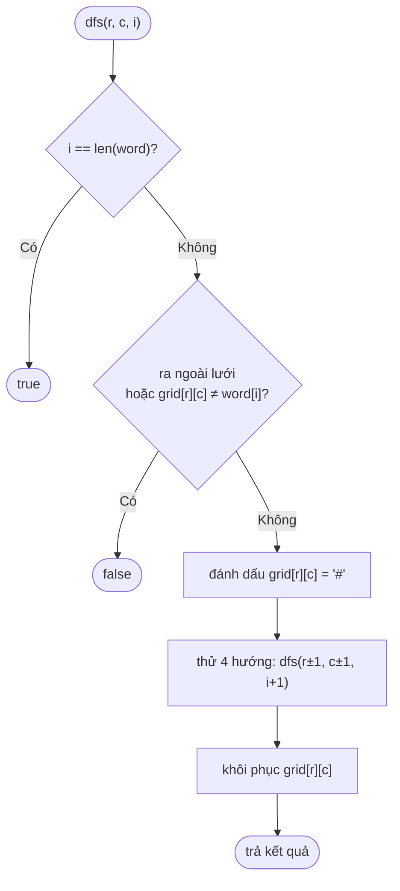

=== "Go"

    ```go
    package main

    import "fmt"

    func exist(board [][]byte, word string) bool {
    	m, n := len(board), len(board[0])
    	var dfs func(r, c, i int) bool
    	dfs = func(r, c, i int) bool {
    		if i == len(word) {
    			return true
    		}
    		if r < 0 || r >= m || c < 0 || c >= n || board[r][c] != word[i] {
    			return false
    		}
    		tmp := board[r][c]
    		board[r][c] = '#' // CHỌN: đánh dấu đã đi qua
    		found := dfs(r+1, c, i+1) || dfs(r-1, c, i+1) ||
    			dfs(r, c+1, i+1) || dfs(r, c-1, i+1)
    		board[r][c] = tmp // BỎ CHỌN: khôi phục
    		return found
    	}
    	for r := 0; r < m; r++ {
    		for c := 0; c < n; c++ {
    			if dfs(r, c, 0) {
    				return true
    			}
    		}
    	}
    	return false
    }

    func main() {
    	grid := []string{"ABCE", "SFCS", "ADEE"}
    	board := make([][]byte, len(grid))
    	for i, s := range grid {
    		board[i] = []byte(s)
    	}
    	for _, w := range []string{"ABCCED", "SEE", "ABCB"} {
    		fmt.Printf("%-7s → %v\n", w, exist(board, w))
    	}
    }
    // Output:
    // ABCCED  → true
    // SEE     → true
    // ABCB    → false
    ```

=== "Python"

    ```python
    def exist(board: list[list[str]], word: str) -> bool:
        m, n = len(board), len(board[0])

        def dfs(r: int, c: int, i: int) -> bool:
            if i == len(word):
                return True
            if not (0 <= r < m and 0 <= c < n) or board[r][c] != word[i]:
                return False
            tmp, board[r][c] = board[r][c], "#"      # CHỌN
            found = (dfs(r + 1, c, i + 1) or dfs(r - 1, c, i + 1)
                     or dfs(r, c + 1, i + 1) or dfs(r, c - 1, i + 1))
            board[r][c] = tmp                         # BỎ CHỌN
            return found

        return any(dfs(r, c, 0) for r in range(m) for c in range(n))


    board = [list(s) for s in ("ABCE", "SFCS", "ADEE")]
    for w in ("ABCCED", "SEE", "ABCB"):
        print(f"{w:<7} → {exist(board, w)}")
    # Output:
    # ABCCED  → True
    # SEE     → True
    # ABCB    → False
    ```

**Độ phức tạp**: O(m · n · 3^L) với L = độ dài từ (bước đầu 4 hướng, các bước sau chỉ còn 3 vì không quay lại ô vừa đi). Bộ nhớ O(L) cho stack.

---

## 📖 16. Kỹ thuật cắt tỉa (Pruning)

Quay lui "thuần" là vét cạn → rất chậm. Sức mạnh thực sự nằm ở chỗ **cắt bỏ sớm** các nhánh vô vọng. Cắt càng sớm (gần gốc) càng lợi, vì mỗi nhánh bị cắt ở tầng `d` loại bỏ cả một cây con khổng lồ.

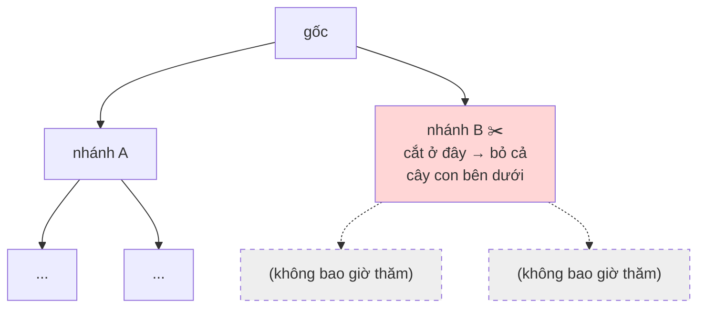

| Kỹ thuật | Ý tưởng | Ví dụ |
|----------|---------|-------|
| **Kiểm tra ràng buộc sớm** | Kiểm tra hợp lệ **trước** khi đi sâu, không đợi tới lá | N-Queens kiểm tra cột/chéo ngay khi đặt |
| **Sắp xếp + break** | Sắp xếp input, khi một lựa chọn đã vượt ngưỡng thì các lựa chọn sau cũng vượt | Combination Sum: `if c > remain: break` |
| **Đếm "còn đủ không"** | Nếu phần còn lại không đủ để hoàn thành → dừng | Combinations: `i <= n-need+1` |
| **Bỏ trùng** | Sắp xếp, ở cùng tầng bỏ qua giá trị đã thử | Permutations II, Subsets II, Combination Sum II |
| **Cận (bound)** | Ước lượng tốt nhất có thể đạt từ nhánh này; nếu không hơn kết quả hiện tại → cắt (**Branch & Bound**) | Bài toán cái túi, TSP |
| **Chọn biến khó trước (MRV)** | Ưu tiên ô/biến có ít lựa chọn nhất | Sudoku |
| **Đối xứng** | Lời giải đối xứng chỉ cần tìm một nửa | N-Queens: hậu hàng 0 chỉ cần thử nửa trái, nhân đôi kết quả |
| **Memo trạng thái** | Nếu cùng trạng thái đã được chứng minh là thất bại → nhớ lại | Word Break, các bài chuyển sang DP |

Ví dụ đo được hiệu quả của cắt tỉa trong bài Combination Sum (đếm số nút đã thăm khi **có** và **không có** `break`):

=== "Go"

    ```go
    package main

    import (
    	"fmt"
    	"slices"
    )

    func count(cands []int, target int, prune bool) (sols, nodes int) {
    	var bt func(start, remain int)
    	bt = func(start, remain int) {
    		nodes++
    		if remain == 0 {
    			sols++
    			return
    		}
    		if remain < 0 {
    			return
    		}
    		for i := start; i < len(cands); i++ {
    			if prune && cands[i] > remain {
    				break
    			}
    			bt(i, remain-cands[i])
    		}
    	}
    	bt(0, target)
    	return
    }

    func main() {
    	cands := []int{2, 3, 5, 7, 11, 13, 17, 19, 23}
    	slices.Sort(cands)
    	s1, n1 := count(cands, 60, false)
    	s2, n2 := count(cands, 60, true)
    	fmt.Printf("không cắt tỉa: %d lời giải, %d nút\n", s1, n1)
    	fmt.Printf("có cắt tỉa   : %d lời giải, %d nút (giảm %.1f lần)\n", s2, n2, float64(n1)/float64(n2))
    }
    // Output:
    // không cắt tỉa: 1729 lời giải, 74001 nút
    // có cắt tỉa   : 1729 lời giải, 20085 nút (giảm 3.7 lần)
    ```

=== "Python"

    ```python
    def count(cands: list[int], target: int, prune: bool) -> tuple[int, int]:
        sols = nodes = 0

        def bt(start: int, remain: int) -> None:
            nonlocal sols, nodes
            nodes += 1
            if remain == 0:
                sols += 1
                return
            if remain < 0:
                return
            for i in range(start, len(cands)):
                if prune and cands[i] > remain:
                    break
                bt(i, remain - cands[i])

        bt(0, target)
        return sols, nodes


    cands = sorted([2, 3, 5, 7, 11, 13, 17, 19, 23])
    s1, n1 = count(cands, 60, False)
    s2, n2 = count(cands, 60, True)
    print(f"không cắt tỉa: {s1} lời giải, {n1} nút")
    print(f"có cắt tỉa   : {s2} lời giải, {n2} nút (giảm {n1 / n2:.1f} lần)")
    # Output:
    # không cắt tỉa: 1729 lời giải, 74001 nút
    # có cắt tỉa   : 1729 lời giải, 20085 nút (giảm 3.7 lần)
    ```

---

## 📖 17. Độ phức tạp của quay lui

Công thức chung: **Thời gian ≈ (số nút trong cây trạng thái) × (công việc tại mỗi nút)**. Số nút phụ thuộc vào **độ rẽ nhánh** (branching factor) `b` và **độ sâu** `d`: tối đa `b^d`.

| Bài toán | Số lời giải / lá | Thời gian | Bộ nhớ phụ (không tính output) |
|----------|------------------|-----------|-------------------------------|
| Subsets | 2ⁿ | O(n · 2ⁿ) | O(n) |
| Permutations | n! | O(n · n!) | O(n) |
| Combinations C(n,k) | C(n,k) | O(k · C(n,k)) | O(k) |
| Combination Sum | phụ thuộc target | O(n^(T/min)) cận trên | O(T/min) |
| N-Queens | ≤ n! | O(n!) | O(n) |
| Sudoku | — | O(9^m), m = số ô trống | O(m) |
| Word Search | — | O(m·n·3^L) | O(L) |

Cảm nhận độ lớn (giả sử máy làm ~10⁸ phép tính/giây):

| n | 2ⁿ | n! |
|---|----|----|
| 10 | 1 024 (tức thì) | 3 628 800 (~0.04 s) |
| 15 | 32 768 | 1.3 × 10¹² (~3.6 giờ) |
| 20 | ~10⁶ (tức thì) | 2.4 × 10¹⁸ (~770 năm) |
| 30 | ~10⁹ (~10 s) | 2.6 × 10³² (vô vọng) |

!!! tip "Nhìn ràng buộc đề bài để đoán thuật toán"
    Thấy `n ≤ 10` → gần như chắc chắn là hoán vị/quay lui O(n!). Thấy `n ≤ 20` → tập con / bitmask O(2ⁿ). Thấy `n ≤ 10⁵` → **không** được quay lui, phải O(n log n) hoặc O(n).

---

## 🌍 Ứng dụng thực tế

- **Duyệt cấu trúc cây**: hệ thống thư mục (`du`, `find`, `os.walk`, `filepath.WalkDir`), DOM của trình duyệt, cây cú pháp (AST) trong compiler/linter, JSON lồng nhau — tất cả tự nhiên nhất khi viết đệ quy.
- **Parser**: *recursive descent parser* — cách viết tay phổ biến nhất cho trình biên dịch/interpreter (Go's `go/parser` là recursive descent).
- **Chia để trị**: `sort.Sort` / `slices.Sort` của Go (pdqsort, dạng quicksort), MapReduce, xử lý ảnh (quadtree), thuật toán nhân số lớn Karatsuba trong `math/big`.
- **Giải ràng buộc (constraint solving)**: xếp thời khóa biểu trường học, xếp lịch trực y tá, xếp chỗ ngồi đám cưới (ai không ngồi cạnh ai) — nền tảng là quay lui + cắt tỉa. Các SAT/CSP solver công nghiệp (như bộ giải phụ thuộc của `apt`, `pip`, `conda`; riêng Go modules dùng MVS nên không cần) đều dựa trên backtracking thông minh.
- **Trò chơi**: AI cờ vua/cờ tướng (minimax + alpha-beta pruning = quay lui có cắt tỉa), giải Sudoku, giải mê cung.
- **Regex engine**: engine của Perl/Python/Java dùng quay lui để khớp mẫu (và đó là lý do có lỗ hổng **ReDoS** — mẫu như `(a+)+$` gây quay lui bùng nổ). Go's `regexp` dùng automata (RE2) nên **không** bị ReDoS.
- **Sinh test case / fuzzing**: sinh mọi tổ hợp tham số cấu hình (pairwise testing).

---

## ⚠️ Lỗi thường gặp

| Lỗi | Hậu quả | Cách sửa |
|-----|---------|----------|
| Thiếu base case hoặc base case không bao giờ đạt tới | Đệ quy vô hạn → `RecursionError` / stack overflow | Kiểm tra: mỗi lời gọi có làm input **nhỏ đi** không? |
| Base case sai (vd. `fib(1)` quên) | Kết quả sai hoặc lặp vô hạn với input âm | Viết test cho input nhỏ nhất: 0, 1, rỗng |
| Lưu `path` thay vì bản sao | Mọi kết quả giống nhau (thường là rỗng) | `append([]int(nil), path...)` / `path[:]` |
| Quên bỏ chọn | State bẩn tràn sang nhánh khác | Mọi thao tác "chọn" phải có "bỏ chọn" đối xứng ngay sau lời gọi đệ quy |
| Dùng `a[1:]` trong Python cho đệ quy | O(n²) do copy | Truyền chỉ số `i` |
| Gọi đệ quy 2 lần cho cùng input (`pow(x,n/2)*pow(x,n/2)`) | Mất lợi thế chia để trị | Lưu vào biến |
| Đệ quy sâu 10⁵+ trong Python | `RecursionError` hoặc segfault | Khử đệ quy bằng vòng lặp + stack |
| Go: closure đệ quy khai báo `f := func(){ f() }` | Lỗi compile "undefined: f" | Khai báo trước: `var f func(); f = func(){ ... f() ... }` |
| Sinh trùng khi input có phần tử lặp | Kết quả dư thừa | Sắp xếp + `if i > start && a[i]==a[i-1] { continue }` |
| Không cắt tỉa | Chạy quá thời gian (TLE) | Sắp xếp + break, kiểm tra ràng buộc sớm |

---

## 🏋️ Bài tập

### Mức 1 — Làm quen đệ quy

**Bài 1.1**: Viết hàm đệ quy `reverse(s)` đảo ngược chuỗi và `isPalindrome(s)` kiểm tra chuỗi đối xứng.

<details markdown="1"><summary>Đáp án</summary>

=== "Go"

    ```go
    package main

    import "fmt"

    func reverse(s string) string {
    	if len(s) <= 1 {
    		return s
    	}
    	return reverse(s[1:]) + s[:1] // (chỉ đúng với chuỗi ASCII)
    }

    func isPalindrome(s string) bool {
    	if len(s) <= 1 {
    		return true
    	}
    	return s[0] == s[len(s)-1] && isPalindrome(s[1:len(s)-1])
    }

    func main() {
    	fmt.Println(reverse("hello"), isPalindrome("racecar"), isPalindrome("abca"))
    }
    // Output:
    // olleh true false
    ```

=== "Python"

    ```python
    def reverse(s: str) -> str:
        return s if len(s) <= 1 else reverse(s[1:]) + s[0]


    def is_palindrome(s: str) -> bool:
        return len(s) <= 1 or (s[0] == s[-1] and is_palindrome(s[1:-1]))


    print(reverse("hello"), is_palindrome("racecar"), is_palindrome("abca"))
    # Output:
    # olleh True False
    ```

</details>

**Bài 1.2** (LeetCode 509, 70): Tính số cách leo `n` bậc thang, mỗi lần bước 1 hoặc 2 bậc. Viết bản đệ quy thuần, sau đó thêm memo.

<details markdown="1"><summary>Gợi ý & đáp án</summary>

`ways(n) = ways(n-1) + ways(n-2)`, `ways(0) = ways(1) = 1` — chính là Fibonacci dịch một vị trí. Bản memo giống hệt `fibMemo` ở mục 4. `ways(10) = 89`, `ways(45) = 1836311903`.

</details>

**Bài 1.3** (LeetCode 50 — Pow(x, n)): Cài `myPow(x, n)` với `n` có thể âm và rất lớn (`-2³¹ ≤ n ≤ 2³¹-1`).

<details markdown="1"><summary>Đáp án</summary>

Dùng đúng hàm `power` ở mục 7. Lưu ý Go: `-n` với `n = math.MinInt32` vẫn vừa kiểu `int` 64-bit nên an toàn; trong C/Java phải đổi sang `long`.

</details>

### Mức 2 — Quay lui cơ bản

**Bài 2.1** (LeetCode 22 — Generate Parentheses): Sinh mọi chuỗi ngoặc hợp lệ gồm `n` cặp. `n=3` → `((())) (()()) (())() ()(()) ()()()`.

<details markdown="1"><summary>Đáp án</summary>

Cắt tỉa: chỉ thêm `(` khi `open < n`; chỉ thêm `)` khi `close < open`.

=== "Go"

    ```go
    package main

    import "fmt"

    func generateParenthesis(n int) []string {
    	var res []string
    	buf := make([]byte, 0, 2*n)
    	var bt func(open, close int)
    	bt = func(open, close int) {
    		if len(buf) == 2*n {
    			res = append(res, string(buf))
    			return
    		}
    		if open < n {
    			buf = append(buf, '(')
    			bt(open+1, close)
    			buf = buf[:len(buf)-1]
    		}
    		if close < open {
    			buf = append(buf, ')')
    			bt(open, close+1)
    			buf = buf[:len(buf)-1]
    		}
    	}
    	bt(0, 0)
    	return res
    }

    func main() {
    	fmt.Println(generateParenthesis(3))
    }
    // Output:
    // [((())) (()()) (())() ()(()) ()()()]
    ```

=== "Python"

    ```python
    def generate_parenthesis(n: int) -> list[str]:
        res, buf = [], []

        def bt(open_: int, close: int) -> None:
            if len(buf) == 2 * n:
                res.append("".join(buf))
                return
            if open_ < n:
                buf.append("(")
                bt(open_ + 1, close)
                buf.pop()
            if close < open_:
                buf.append(")")
                bt(open_, close + 1)
                buf.pop()

        bt(0, 0)
        return res


    print(generate_parenthesis(3))
    # Output:
    # ['((()))', '(()())', '(())()', '()(())', '()()()']
    ```

</details>

**Bài 2.2** (LeetCode 17 — Letter Combinations of a Phone Number): Bàn phím điện thoại cũ `2→abc, 3→def, ...`. Cho `"23"`, liệt kê mọi chuỗi chữ có thể.

<details markdown="1"><summary>Đáp án</summary>

=== "Python"

    ```python
    PHONE = {"2": "abc", "3": "def", "4": "ghi", "5": "jkl",
             "6": "mno", "7": "pqrs", "8": "tuv", "9": "wxyz"}


    def letter_combinations(digits: str) -> list[str]:
        if not digits:
            return []
        res, path = [], []

        def bt(i: int) -> None:
            if i == len(digits):
                res.append("".join(path))
                return
            for ch in PHONE[digits[i]]:
                path.append(ch)
                bt(i + 1)
                path.pop()

        bt(0)
        return res


    print(letter_combinations("23"))
    # Output:
    # ['ad', 'ae', 'af', 'bd', 'be', 'bf', 'cd', 'ce', 'cf']
    ```

</details>

**Bài 2.3** (LeetCode 90 — Subsets II): Tập con của mảng **có phần tử trùng**, không được sinh tập con trùng. `[1,2,2]` → `[[],[1],[1,2],[1,2,2],[2],[2,2]]`.

<details markdown="1"><summary>Đáp án</summary>

Sắp xếp, dùng template "vòng for từ start" và thêm `if i > start && nums[i] == nums[i-1] { continue }` — ở **cùng một tầng**, chỉ thử mỗi giá trị một lần.

=== "Go"

    ```go
    package main

    import (
    	"fmt"
    	"slices"
    )

    func subsetsWithDup(nums []int) [][]int {
    	slices.Sort(nums)
    	var res [][]int
    	var path []int
    	var bt func(start int)
    	bt = func(start int) {
    		res = append(res, append([]int(nil), path...))
    		for i := start; i < len(nums); i++ {
    			if i > start && nums[i] == nums[i-1] {
    				continue
    			}
    			path = append(path, nums[i])
    			bt(i + 1)
    			path = path[:len(path)-1]
    		}
    	}
    	bt(0)
    	return res
    }

    func main() {
    	fmt.Println(subsetsWithDup([]int{2, 1, 2}))
    }
    // Output:
    // [[] [1] [1 2] [1 2 2] [2] [2 2]]
    ```

</details>

### Mức 3 — Nâng cao

**Bài 3.1** (LeetCode 131 — Palindrome Partitioning): Chia chuỗi thành các đoạn mà mỗi đoạn đều là palindrome. `"aab"` → `[["a","a","b"],["aa","b"]]`.

<details markdown="1"><summary>Đáp án</summary>

Ở vị trí `start`, thử mọi điểm cắt `end`; nếu `s[start:end+1]` là palindrome thì chọn nó và đệ quy từ `end+1`.

=== "Python"

    ```python
    def partition(s: str) -> list[list[str]]:
        res, path = [], []

        def bt(start: int) -> None:
            if start == len(s):
                res.append(path[:])
                return
            for end in range(start, len(s)):
                piece = s[start:end + 1]
                if piece == piece[::-1]:      # cắt tỉa: chỉ đi tiếp khi là palindrome
                    path.append(piece)
                    bt(end + 1)
                    path.pop()

        bt(0)
        return res


    print(partition("aab"))
    print(len(partition("aabbaa")), "cách chia")
    # Output:
    # [['a', 'a', 'b'], ['aa', 'b']]
    # 10 cách chia
    ```

</details>

**Bài 3.2** (LeetCode 52 — N-Queens II): Chỉ đếm số lời giải, dùng bitmask. Kiểm tra `n = 12` ra `14200`.

<details markdown="1"><summary>Đáp án</summary>

=== "Go"

    ```go
    package main

    import "fmt"

    func totalNQueens(n int) int {
    	full := 1<<n - 1
    	var bt func(cols, d1, d2 int) int
    	bt = func(cols, d1, d2 int) int {
    		if cols == full {
    			return 1
    		}
    		cnt := 0
    		avail := full &^ (cols | d1 | d2) // các cột còn đặt được ở hàng này
    		for avail != 0 {
    			p := avail & -avail // bit thấp nhất
    			avail ^= p
    			// sang hàng sau: đường chéo dịch 1 cột
    			cnt += bt(cols|p, (d1|p)<<1&full, (d2|p)>>1)
    		}
    		return cnt
    	}
    	return bt(0, 0, 0)
    }

    func main() {
    	for _, n := range []int{4, 8, 12} {
    		fmt.Printf("n=%d → %d\n", n, totalNQueens(n))
    	}
    }
    // Output:
    // n=4 → 2
    // n=8 → 92
    // n=12 → 14200
    ```

</details>

**Bài 3.3** (LeetCode 212 — Word Search II): Tìm **nhiều từ** cùng lúc trên lưới. Gợi ý: dựng **Trie** từ danh sách từ ([Bài 15](./15-advanced-data-structures.md)), rồi DFS một lần từ mỗi ô, đi song song trên lưới và trên trie — cắt tỉa ngay khi tiền tố không có trong trie.

**Bài 3.4** (LeetCode 698 — Partition to K Equal Sum Subsets): Chia mảng thành `k` nhóm có tổng bằng nhau. Gợi ý cắt tỉa: sắp xếp **giảm dần**; nếu một nhóm đang rỗng mà đặt số hiện tại vào thất bại thì các nhóm rỗng khác cũng sẽ thất bại (đối xứng) → `break`.

---

## ✅ Checklist hoàn thành

- [ ] Giải thích được base case, recursive case và "cú nhảy niềm tin"
- [ ] Vẽ được call stack của `factorial(3)` và cây đệ quy của `fib(5)`
- [ ] Tính được độ phức tạp từ cây đệ quy (số nút × công mỗi nút; bộ nhớ = chiều cao)
- [ ] Thêm được memoization vào một hàm đệ quy (Go: map; Python: `@lru_cache`)
- [ ] Biết Go/Python không có TCO và biết khử đệ quy đuôi thành vòng lặp
- [ ] Biết `sys.setrecursionlimit` và giới hạn stack 1 GB của goroutine
- [ ] Viết được lũy thừa nhanh O(log n) và tháp Hà Nội
- [ ] Thuộc template *chọn → khám phá → bỏ chọn* và nhớ **copy** khi lưu kết quả
- [ ] Tự viết lại được: permutations, subsets, combinations, combination sum, N-Queens, Sudoku, word search
- [ ] Biết ít nhất 4 kỹ thuật cắt tỉa và nhìn ràng buộc `n` để đoán độ phức tạp chấp nhận được

---

**Bài tiếp theo**: [Bài 7: Thuật toán sắp xếp](./07-sorting.md)
