# 📚 Bài 7: Thuật toán sắp xếp (Sorting)

## 🎯 Mục tiêu bài học

- Hiểu các khái niệm nền: **so sánh (comparison-based)**, **ổn định (stable)**, **tại chỗ (in-place)**, **thích nghi (adaptive)**
- Nắm trực giác, xem animation, tự cài đặt được **10 thuật toán sắp xếp**:
  Bubble, Selection, Insertion, Shell, Merge, Quick, Heap, Counting, Radix, Bucket
- Phân tích độ phức tạp best/average/worst và bộ nhớ của từng thuật toán
- Hiểu vì sao sắp xếp dựa trên so sánh **không thể nhanh hơn O(n log n)** (cây quyết định)
- Biết Go dùng **pdqsort** và Python dùng **Timsort** ra sao, và dùng chúng đúng cách với **comparator/key** tùy chỉnh
- Đọc được **benchmark thật** và biết **khi nào dùng thuật toán nào**

---

## 📖 1. Vì sao phải học sắp xếp?

Trong thực tế bạn gần như luôn gọi `slices.Sort` hay `sorted()`. Vậy học tự cài để làm gì?

1. **Sắp xếp là "bài tập giáo khoa" hoàn hảo**: chỉ một bài toán mà gói gọn gần đủ các kỹ thuật thiết kế thuật toán — vét cạn, tham lam, chia để trị, cấu trúc dữ liệu (heap), đếm/phân phối, ngẫu nhiên hóa.
2. **Rất nhiều bài toán trở nên dễ sau khi sắp xếp**: tìm trùng, tìm cặp có tổng bằng k (two pointers), gộp khoảng (merge intervals), binary search, tham lam...
3. **Phỏng vấn**: "cài quick sort", "vì sao merge sort ổn định", "sort 10 GB dữ liệu với 1 GB RAM" là câu hỏi kinh điển.
4. Hiểu thuật toán giúp dùng thư viện **đúng**: khi nào cần `SortStableFunc`, vì sao comparator phải nhất quán, vì sao sort dữ liệu đã gần sắp xếp lại nhanh bất ngờ.

### Các thuật ngữ cần nắm

| Thuật ngữ | Ý nghĩa | Ví dụ |
|-----------|---------|-------|
| **Comparison-based** | Chỉ biết thứ tự qua phép so sánh `a < b` | Quick, Merge, Heap... |
| **Non-comparison** | Tận dụng cấu trúc của khóa (số nguyên nhỏ, chữ số...) | Counting, Radix, Bucket |
| **Stable** (ổn định) | Hai phần tử **bằng nhau** giữ nguyên **thứ tự ban đầu** | Merge, Insertion, Timsort |
| **In-place** (tại chỗ) | Chỉ dùng O(1) (hoặc O(log n)) bộ nhớ phụ | Quick, Heap, Insertion |
| **Adaptive** (thích nghi) | Chạy nhanh hơn khi dữ liệu đã gần sắp xếp | Insertion, Bubble (có cờ), Timsort |
| **Inversion** (nghịch thế) | Cặp `(i, j)` với `i < j` nhưng `a[i] > a[j]` — đo "độ lộn xộn" | `[3,1,2]` có 2 nghịch thế |

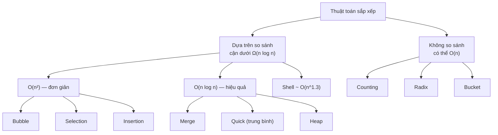

---

## 📖 2. Bubble Sort — Sắp xếp nổi bọt

### Trực giác

Hình dung các **bọt khí** trong cốc nước ngọt: bọt to nổi lên trên trước. Bubble sort đi từ trái sang phải, so sánh **từng cặp kề nhau**, nếu sai thứ tự thì **đổi chỗ**. Sau lượt 1, phần tử **lớn nhất** "nổi" lên cuối mảng. Sau lượt 2, phần tử lớn thứ hai nằm đúng chỗ... 

Ví dụ đời thường: lớp thể dục xếp hàng theo chiều cao, thầy giáo đi dọc hàng, thấy hai bạn đứng cạnh nhau mà bạn trước cao hơn thì bảo đổi chỗ. Đi vài lượt là hàng thẳng.

### Từng bước với `[5, 1, 4, 2, 8]`

Lượt 1 (chi tiết từng phép so sánh):

| So sánh | Trước | Hành động | Sau |
|---------|-------|-----------|-----|
| 5 vs 1 | **5 1** 4 2 8 | đổi | 1 5 4 2 8 |
| 5 vs 4 | 1 **5 4** 2 8 | đổi | 1 4 5 2 8 |
| 5 vs 2 | 1 4 **5 2** 8 | đổi | 1 4 2 5 8 |
| 5 vs 8 | 1 4 2 **5 8** | giữ | 1 4 2 5 **8** ✅ |

Các lượt tiếp theo:

| Lượt | Mảng sau lượt | Có đổi chỗ? | Phần đã cố định |
|------|---------------|-------------|-----------------|
| 1 | 1 4 2 5 **8** | có | [8] |
| 2 | 1 2 4 **5 8** | có | [5, 8] |
| 3 | 1 2 4 5 8 | **không** → dừng sớm! | toàn bộ |

Bấm ▶ và để ý phần tử lớn nhất trong phần chưa sắp xếp luôn "nổi" dần về bên phải sau mỗi lượt:

<div class="algo-viz" data-viz="sort" data-algo="bubble" data-input="5,1,4,2,8" data-title="Bubble Sort"></div>

=== "Go"

    ```go
    package main

    import "fmt"

    func bubbleSort(a []int) {
    	n := len(a)
    	for i := 0; i < n-1; i++ {
    		swapped := false
    		// sau i lượt, i phần tử cuối đã đúng chỗ → chỉ duyệt tới n-1-i
    		for j := 0; j < n-1-i; j++ {
    			if a[j] > a[j+1] { // dùng > (không phải >=) để giữ ổn định
    				a[j], a[j+1] = a[j+1], a[j]
    				swapped = true
    			}
    		}
    		if !swapped { // không đổi chỗ nào → mảng đã sắp xếp
    			break
    		}
    	}
    }

    func main() {
    	a := []int{5, 1, 4, 2, 8}
    	bubbleSort(a)
    	fmt.Println(a)
    }
    // Output:
    // [1 2 4 5 8]
    ```

=== "Python"

    ```python
    def bubble_sort(a: list[int]) -> None:
        n = len(a)
        for i in range(n - 1):
            swapped = False
            for j in range(n - 1 - i):
                if a[j] > a[j + 1]:
                    a[j], a[j + 1] = a[j + 1], a[j]
                    swapped = True
            if not swapped:        # đã sắp xếp → dừng sớm
                break


    a = [5, 1, 4, 2, 8]
    bubble_sort(a)
    print(a)
    # Output:
    # [1, 2, 4, 5, 8]
    ```

| | Best | Average | Worst | Bộ nhớ | Stable | In-place | Adaptive |
|--|------|---------|-------|--------|--------|----------|----------|
| Bubble | O(n) (đã sắp xếp, nhờ cờ `swapped`) | O(n²) | O(n²) | O(1) | ✅ | ✅ | ✅ |

!!! warning "Bubble sort gần như không bao giờ dùng thật"
    Số phép **đổi chỗ** của bubble sort = số nghịch thế — nhiều hơn insertion sort (dịch chuyển rẻ hơn swap). Nó chỉ có giá trị giáo dục. Donald Knuth: *"bubble sort dường như không có gì đáng khen ngoài cái tên dễ nhớ"*.

---

## 📖 3. Selection Sort — Sắp xếp chọn

### Trực giác

Chọn đội bóng: thầy **tìm bạn thấp nhất** trong cả lớp, cho đứng vị trí 1. Rồi tìm bạn thấp nhất trong **số còn lại**, cho đứng vị trí 2... Mỗi lượt: **tìm min** của phần chưa sắp xếp, **đổi** nó về đầu phần đó.

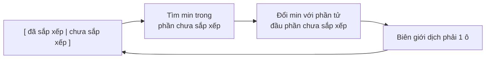

### Từng bước với `[64, 25, 12, 22, 11]`

| i | Phần chưa sắp xếp | Min (vị trí) | Đổi | Kết quả |
|---|-------------------|--------------|-----|---------|
| 0 | 64 25 12 22 11 | 11 (4) | a[0] ↔ a[4] | **11** 25 12 22 64 |
| 1 | 25 12 22 64 | 12 (2) | a[1] ↔ a[2] | **11 12** 25 22 64 |
| 2 | 25 22 64 | 22 (3) | a[2] ↔ a[3] | **11 12 22** 25 64 |
| 3 | 25 64 | 25 (3) | không đổi | **11 12 22 25** 64 |

Bấm ▶ và để ý thuật toán quét **toàn bộ** phần còn lại để tìm min rồi chỉ đổi chỗ **một lần** mỗi lượt:

<div class="algo-viz" data-viz="sort" data-algo="selection" data-input="64,25,12,22,11" data-title="Selection Sort"></div>

=== "Go"

    ```go
    package main

    import "fmt"

    func selectionSort(a []int) {
    	n := len(a)
    	for i := 0; i < n-1; i++ {
    		minIdx := i
    		for j := i + 1; j < n; j++ {
    			if a[j] < a[minIdx] {
    				minIdx = j
    			}
    		}
    		a[i], a[minIdx] = a[minIdx], a[i] // chỉ 1 lần swap mỗi lượt
    	}
    }

    func main() {
    	a := []int{64, 25, 12, 22, 11}
    	selectionSort(a)
    	fmt.Println(a)
    }
    // Output:
    // [11 12 22 25 64]
    ```

=== "Python"

    ```python
    def selection_sort(a: list[int]) -> None:
        n = len(a)
        for i in range(n - 1):
            min_idx = i
            for j in range(i + 1, n):
                if a[j] < a[min_idx]:
                    min_idx = j
            a[i], a[min_idx] = a[min_idx], a[i]


    a = [64, 25, 12, 22, 11]
    selection_sort(a)
    print(a)
    # Output:
    # [11, 12, 22, 25, 64]
    ```

| | Best | Average | Worst | Bộ nhớ | Stable | In-place | Adaptive |
|--|------|---------|-------|--------|--------|----------|----------|
| Selection | O(n²) | O(n²) | O(n²) | O(1) | ❌ | ✅ | ❌ |

**Vì sao không ổn định?** Với `[5a, 5b, 1]`: lượt 0 tìm được min = 1, đổi `a[0]` với `a[2]` → `[1, 5b, 5a]`. `5a` bị "nhảy cóc" ra sau `5b`!

**Điểm mạnh duy nhất**: số lần **ghi** (swap) chỉ O(n) — hữu ích khi ghi rất đắt (ví dụ ghi vào bộ nhớ flash có giới hạn số lần ghi).

---

## 📖 4. Insertion Sort — Sắp xếp chèn

### Trực giác

Đây là cách bạn **xếp bài tiến lên** trên tay: rút từng lá, **chèn** nó vào đúng vị trí trong nhóm bài đã xếp bên trái — dịch các lá lớn hơn sang phải để lấy chỗ.

```text
Tay bài đã xếp | lá mới
  2  5  9  J   |   7        → dịch 9, J sang phải → chèn 7:  2 5 7 9 J
```

### Từng bước với `[5, 2, 4, 6, 1, 3]`

| Bước | Lá rút (key) | Số lần dịch | Mảng sau khi chèn (phần đã xếp in đậm) |
|------|--------------|-------------|---------------------------------------|
| 1 | 2 | 1 | **2 5** 4 6 1 3 |
| 2 | 4 | 1 | **2 4 5** 6 1 3 |
| 3 | 6 | 0 | **2 4 5 6** 1 3 |
| 4 | 1 | 4 | **1 2 4 5 6** 3 |
| 5 | 3 | 3 | **1 2 3 4 5 6** |

Tổng số lần dịch = 9 = đúng bằng **số nghịch thế** của mảng. Mảng càng "gần sắp xếp" → càng ít nghịch thế → insertion sort càng nhanh.

Bấm ▶ và để ý mỗi phần tử mới được "trượt" sang trái cho đến khi gặp phần tử nhỏ hơn hoặc bằng nó:

<div class="algo-viz" data-viz="sort" data-algo="insertion" data-input="5,2,4,6,1,3" data-title="Insertion Sort"></div>

=== "Go"

    ```go
    package main

    import "fmt"

    func insertionSort(a []int) {
    	for i := 1; i < len(a); i++ {
    		key := a[i]
    		j := i - 1
    		for j >= 0 && a[j] > key { // dịch các phần tử lớn hơn key sang phải
    			a[j+1] = a[j]
    			j--
    		}
    		a[j+1] = key // chèn key vào chỗ trống
    	}
    }

    func main() {
    	a := []int{5, 2, 4, 6, 1, 3}
    	insertionSort(a)
    	fmt.Println(a)
    }
    // Output:
    // [1 2 3 4 5 6]
    ```

=== "Python"

    ```python
    def insertion_sort(a: list[int]) -> None:
        for i in range(1, len(a)):
            key = a[i]
            j = i - 1
            while j >= 0 and a[j] > key:
                a[j + 1] = a[j]      # dịch phải
                j -= 1
            a[j + 1] = key


    a = [5, 2, 4, 6, 1, 3]
    insertion_sort(a)
    print(a)
    # Output:
    # [1, 2, 3, 4, 5, 6]
    ```

| | Best | Average | Worst | Bộ nhớ | Stable | In-place | Adaptive |
|--|------|---------|-------|--------|--------|----------|----------|
| Insertion | O(n) | O(n²) | O(n²) (mảng ngược) | O(1) | ✅ | ✅ | ✅ — O(n + số nghịch thế) |

!!! tip "Insertion sort là 'vua' của mảng nhỏ"
    Với n ≤ ~16–32, insertion sort **nhanh hơn** quick/merge sort vì vòng lặp cực đơn giản, thân thiện cache, không đệ quy. Vì vậy **mọi** thư viện sort công nghiệp (pdqsort của Go, Timsort của Python, introsort của C++) đều chuyển sang insertion sort khi đoạn con đủ nhỏ.

    Nó cũng là thuật toán **online**: sắp xếp được khi dữ liệu đến từng phần tử một.

---

## 📖 5. Shell Sort — Insertion sort "nhảy cóc"

### Trực giác

Điểm yếu của insertion sort: phần tử nhỏ nằm tận cuối mảng phải dịch **từng ô một** về đầu → rất chậm. Donald Shell (1959) nghĩ ra: hãy cho phần tử **nhảy xa** trước!

- Chọn khoảng cách `gap` lớn (vd. n/2). Sắp xếp chèn **các phần tử cách nhau `gap`** (như chia mảng thành `gap` dãy con xen kẽ).
- Giảm `gap` (n/4, n/8, ...) và lặp lại.
- Lượt cuối `gap = 1` chính là insertion sort thường — nhưng lúc này mảng đã **gần sắp xếp** nên chạy rất nhanh.

Ví dụ: xếp sách trên kệ dài — trước tiên ước chừng đẩy các cuốn về "khu vực" gần đúng (bước nhảy xa), sau đó mới chỉnh tỉ mỉ từng cuốn cạnh nhau.

### Từng bước với `[35, 33, 42, 10, 14, 19, 27, 44, 26, 31]` (n = 10, gap = 5 → 2 → 1)

```text
gap = 5: các nhóm (cùng màu = cùng dãy con): (35,19) (33,27) (42,44) (10,26) (14,31)
         sắp từng nhóm → 19 27 42 10 14 35 33 44 26 31
gap = 2: nhóm chỉ số chẵn (19,42,14,33,26) và lẻ (27,10,35,44,31)
         sắp từng nhóm → 14 10 19 27 26 31 33 35 42 44
gap = 1: insertion sort thường (mảng đã gần xong) → 10 14 19 26 27 31 33 35 42 44
```

| gap | Mảng sau lượt |
|-----|---------------|
| 5 | 19 27 42 10 14 35 33 44 26 31 |
| 2 | 14 10 19 27 26 31 33 35 42 44 |
| 1 | 10 14 19 26 27 31 33 35 42 44 |

Bấm ▶ và để ý ở các lượt đầu, phần tử được so sánh với phần tử cách xa `gap` ô, nhờ vậy số nhỏ "nhảy" về đầu mảng rất nhanh:

<div class="algo-viz" data-viz="sort" data-algo="shell" data-input="35,33,42,10,14,19,27,44,26,31" data-title="Shell Sort (gap = n/2, n/4, ..., 1)"></div>

=== "Go"

    ```go
    package main

    import "fmt"

    func shellSort(a []int) {
    	n := len(a)
    	// Dãy gap Knuth: 1, 4, 13, 40, ... (tốt hơn n/2, n/4)
    	gap := 1
    	for gap < n/3 {
    		gap = 3*gap + 1
    	}
    	for ; gap >= 1; gap /= 3 {
    		// insertion sort với bước nhảy gap
    		for i := gap; i < n; i++ {
    			key := a[i]
    			j := i
    			for j >= gap && a[j-gap] > key {
    				a[j] = a[j-gap]
    				j -= gap
    			}
    			a[j] = key
    		}
    	}
    }

    func main() {
    	a := []int{35, 33, 42, 10, 14, 19, 27, 44, 26, 31}
    	shellSort(a)
    	fmt.Println(a)
    }
    // Output:
    // [10 14 19 26 27 31 33 35 42 44]
    ```

=== "Python"

    ```python
    def shell_sort(a: list[int]) -> None:
        n = len(a)
        gap = 1
        while gap < n // 3:          # dãy Knuth: 1, 4, 13, 40, ...
            gap = 3 * gap + 1
        while gap >= 1:
            for i in range(gap, n):
                key = a[i]
                j = i
                while j >= gap and a[j - gap] > key:
                    a[j] = a[j - gap]
                    j -= gap
                a[j] = key
            gap //= 3


    a = [35, 33, 42, 10, 14, 19, 27, 44, 26, 31]
    shell_sort(a)
    print(a)
    # Output:
    # [10, 14, 19, 26, 27, 31, 33, 35, 42, 44]
    ```

| | Best | Average | Worst | Bộ nhớ | Stable | In-place | Adaptive |
|--|------|---------|-------|--------|--------|----------|----------|
| Shell (dãy Knuth) | O(n log n) | ~O(n^1.25) (thực nghiệm) | O(n^1.5) | O(1) | ❌ | ✅ | ✅ |

Độ phức tạp của Shell sort **phụ thuộc dãy gap** và là bài toán mở trong lý thuyết. Dãy `n/2, n/4, ...` (của Shell) có worst case O(n²); dãy Knuth `(3^k−1)/2` cho O(n^1.5); dãy Ciura `1, 4, 10, 23, 57, 132, 301, 701` tốt nhất theo thực nghiệm. Shell sort có ưu điểm là code ngắn, không đệ quy, không cần bộ nhớ phụ — hay dùng trong hệ thống nhúng (uClibc dùng shell sort cho `qsort`).

---

## 📖 6. Merge Sort — Sắp xếp trộn

### Trực giác

Chia để trị (xem [Bài 6](./06-recursion-backtracking.md)): Hai lớp đã **xếp hàng theo chiều cao** riêng, giờ cần gộp thành một hàng. Chỉ cần đứng ở **đầu hai hàng**, mỗi lần mời bạn **thấp hơn** trong hai bạn đứng đầu bước ra hàng mới. Việc **trộn hai dãy đã sắp xếp** chỉ mất O(n)!

Merge sort:

1. **Chia** mảng làm đôi.
2. **Trị**: sắp xếp đệ quy mỗi nửa (đến khi còn 1 phần tử — tự nó đã sắp xếp).
3. **Gộp**: trộn hai nửa đã sắp xếp.

### Cây đệ quy với `[38, 27, 43, 3, 9, 82, 10]`

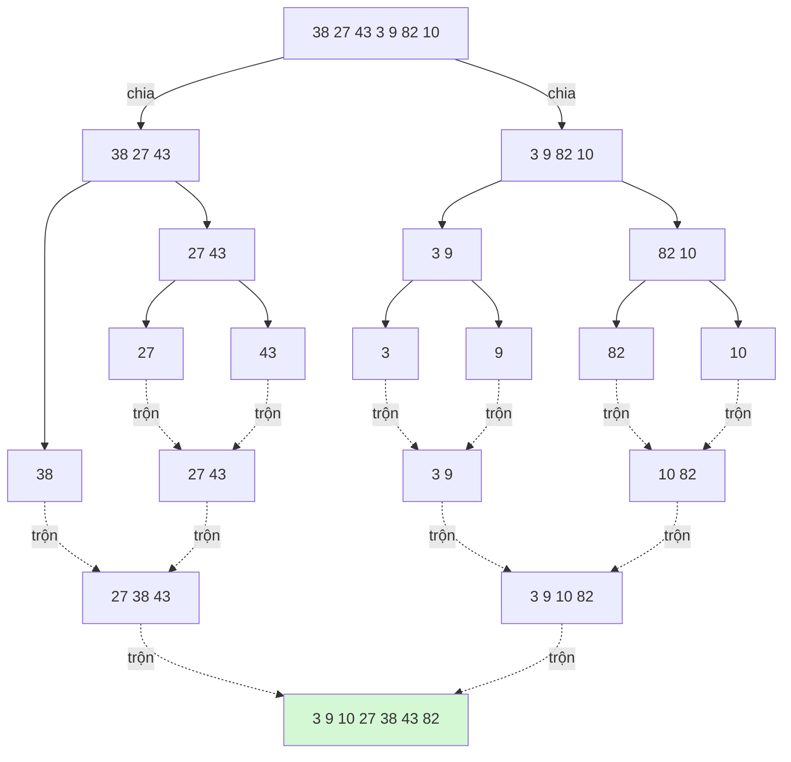

### Bước trộn chi tiết: trộn `[27, 38, 43]` và `[3, 9, 10, 82]`

| i (trái) | j (phải) | So sánh | Lấy | Kết quả |
|----------|----------|---------|-----|---------|
| 27 | 3 | 3 < 27 | 3 | 3 |
| 27 | 9 | 9 < 27 | 9 | 3 9 |
| 27 | 10 | 10 < 27 | 10 | 3 9 10 |
| 27 | 82 | 27 ≤ 82 | 27 | 3 9 10 27 |
| 38 | 82 | 38 ≤ 82 | 38 | 3 9 10 27 38 |
| 43 | 82 | 43 ≤ 82 | 43 | 3 9 10 27 38 43 |
| — | 82 | trái hết | 82 | 3 9 10 27 38 43 82 |

**Vì sao O(n log n)?** Cây có **log₂n tầng**; ở **mỗi tầng**, tổng công trộn của mọi nút = n. ⇒ n × log n.

```text
tầng 0:  [        n        ]            → trộn tốn n
tầng 1:  [   n/2  ][  n/2  ]            → tổng n
tầng 2:  [n/4][n/4][n/4][n/4]           → tổng n
  ...                                     ...
tầng log n: [1][1][1]...[1]             → tổng n
                                  Tổng: n · log n
```

Bấm ▶ và để ý mảng được chia tới từng phần tử đơn, rồi các đoạn liền kề được **trộn** thành đoạn dài dần:

<div class="algo-viz" data-viz="sort" data-algo="merge" data-input="38,27,43,3,9,82,10" data-title="Merge Sort"></div>

=== "Go"

    ```go
    package main

    import "fmt"

    // mergeSort trả về slice mới đã sắp xếp (không sửa a)
    func mergeSort(a []int) []int {
    	if len(a) <= 1 {
    		return a
    	}
    	mid := len(a) / 2
    	left := mergeSort(a[:mid])
    	right := mergeSort(a[mid:])
    	return merge(left, right)
    }

    // merge trộn hai slice đã sắp xếp thành một slice đã sắp xếp
    func merge(left, right []int) []int {
    	res := make([]int, 0, len(left)+len(right))
    	i, j := 0, 0
    	for i < len(left) && j < len(right) {
    		if left[i] <= right[j] { // <= : ưu tiên bên trái khi bằng → ỔN ĐỊNH
    			res = append(res, left[i])
    			i++
    		} else {
    			res = append(res, right[j])
    			j++
    		}
    	}
    	res = append(res, left[i:]...) // phần còn thừa (chỉ một bên còn)
    	res = append(res, right[j:]...)
    	return res
    }

    func main() {
    	a := []int{38, 27, 43, 3, 9, 82, 10}
    	fmt.Println(mergeSort(a))
    	fmt.Println(merge([]int{27, 38, 43}, []int{3, 9, 10, 82}))
    }
    // Output:
    // [3 9 10 27 38 43 82]
    // [3 9 10 27 38 43 82]
    ```

=== "Python"

    ```python
    def merge_sort(a: list[int]) -> list[int]:
        if len(a) <= 1:
            return a
        mid = len(a) // 2
        return merge(merge_sort(a[:mid]), merge_sort(a[mid:]))


    def merge(left: list[int], right: list[int]) -> list[int]:
        res = []
        i = j = 0
        while i < len(left) and j < len(right):
            if left[i] <= right[j]:      # <= giữ tính ổn định
                res.append(left[i]); i += 1
            else:
                res.append(right[j]); j += 1
        res.extend(left[i:])
        res.extend(right[j:])
        return res


    print(merge_sort([38, 27, 43, 3, 9, 82, 10]))
    print(merge([27, 38, 43], [3, 9, 10, 82]))
    # Output:
    # [3, 9, 10, 27, 38, 43, 82]
    # [3, 9, 10, 27, 38, 43, 82]
    ```

| | Best | Average | Worst | Bộ nhớ | Stable | In-place | Adaptive |
|--|------|---------|-------|--------|--------|----------|----------|
| Merge | O(n log n) | O(n log n) | O(n log n) | O(n) | ✅ | ❌ | ❌ (bản cơ bản) |

!!! tip "Merge sort — lựa chọn cho các tình huống đặc biệt"
    - **Đảm bảo** O(n log n) ở mọi trường hợp (quick sort không đảm bảo).
    - **Ổn định** — cần khi sắp xếp theo nhiều khóa.
    - **Sắp xếp linked list**: không cần truy cập ngẫu nhiên, trộn chỉ cần nối con trỏ → O(1) bộ nhớ phụ (LeetCode 148).
    - **External sort**: sắp xếp file 100 GB với 8 GB RAM — cắt thành từng khúc vừa RAM, sort từng khúc, ghi ra đĩa, rồi **trộn k-đường** (dùng heap, xem [Bài 10](./10-heaps.md)). Đây là cách database sắp xếp khi `ORDER BY` không vừa bộ nhớ.

!!! note "Bottom-up merge sort"
    Không cần đệ quy: trộn các đoạn dài 1 thành đoạn dài 2, rồi 2 → 4, 4 → 8... đến khi đoạn dài ≥ n. Cùng O(n log n), tránh chi phí đệ quy.

---

## 📖 7. Quick Sort — Sắp xếp nhanh

### Trực giác

Cô giáo muốn xếp lớp theo chiều cao. Cô gọi **một bạn bất kỳ** làm "cột mốc" (**pivot**) và nói: *"Ai thấp hơn bạn này đứng bên trái, ai cao hơn đứng bên phải"*. Sau bước này, bạn cột mốc đã đứng **đúng vị trí cuối cùng** của mình! Tiếp tục làm như vậy với nhóm bên trái và nhóm bên phải (đệ quy).

So với merge sort: merge sort **chia dễ, gộp khó** (trộn); quick sort **chia khó (partition), gộp dễ** (không cần làm gì — các nhóm đã nằm đúng chỗ).

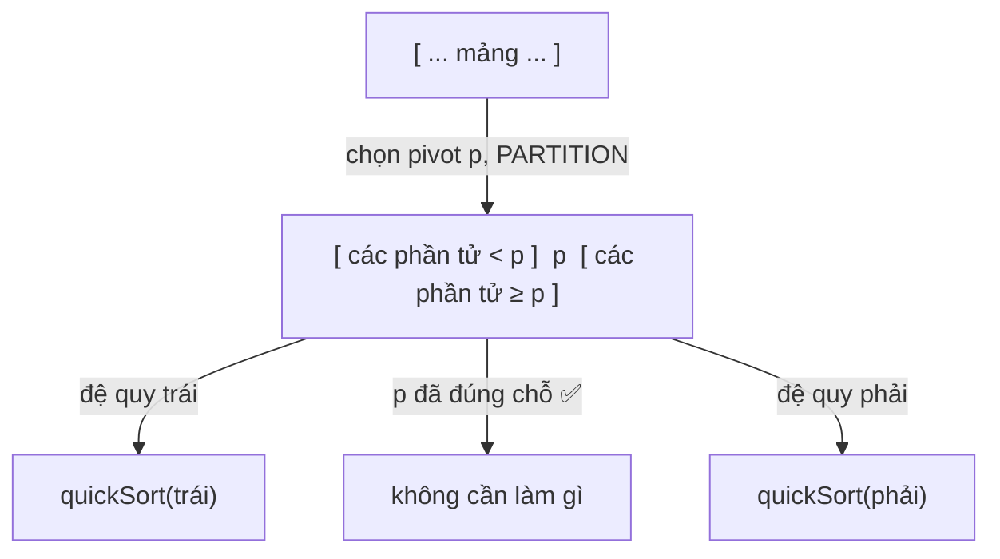

### Partition kiểu Lomuto (dễ hiểu nhất)

- Chọn pivot = phần tử **cuối** `a[hi]`.
- Biến `i` đánh dấu **ranh giới**: mọi phần tử ở `a[lo..i-1]` đều `< pivot`.
- Duyệt `j` từ `lo` đến `hi-1`: nếu `a[j] < pivot` → đổi `a[j]` về vị trí `i`, tăng `i`.
- Cuối cùng đổi pivot vào vị trí `i`.

```text
[ < pivot  |  ≥ pivot  |  chưa xét  | pivot ]
 lo      i-1 i       j-1 j        hi-1  hi
```

Theo dõi `[10, 80, 30, 90, 40, 50, 70]`, pivot = 70:

| j | a[j] | a[j] < 70? | Hành động | Mảng | i sau bước |
|---|------|------------|-----------|------|------------|
| 0 | 10 | ✅ | đổi a[0]↔a[0] | **10** 80 30 90 40 50 70 | 1 |
| 1 | 80 | ❌ | — | 10 80 30 90 40 50 70 | 1 |
| 2 | 30 | ✅ | đổi a[1]↔a[2] | 10 **30** 80 90 40 50 70 | 2 |
| 3 | 90 | ❌ | — | 10 30 80 90 40 50 70 | 2 |
| 4 | 40 | ✅ | đổi a[2]↔a[4] | 10 30 **40** 90 80 50 70 | 3 |
| 5 | 50 | ✅ | đổi a[3]↔a[5] | 10 30 40 **50** 80 90 70 | 4 |
| — | | | đổi pivot a[4]↔a[6] | 10 30 40 50 **[70]** 90 80 | |

Pivot 70 đã nằm đúng chỗ (chỉ số 4). Đệ quy tiếp `[10,30,40,50]` và `[90,80]`.

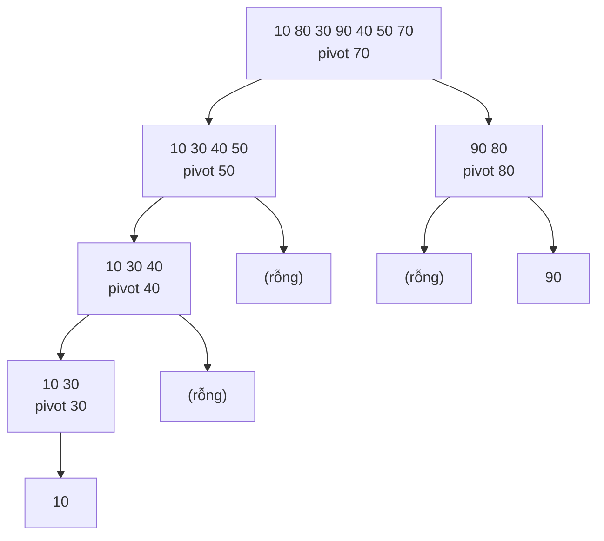

Bấm ▶ và để ý mỗi lượt partition: phần tử nhỏ hơn pivot bị gom về bên trái, và pivot "rơi" vào đúng vị trí cuối cùng của nó:

<div class="algo-viz" data-viz="sort" data-algo="quick" data-input="10,80,30,90,40,50,70" data-title="Quick Sort (Lomuto)"></div>

=== "Go"

    ```go
    package main

    import (
    	"fmt"
    	"math/rand"
    )

    var comparisons int

    // partitionLomuto: pivot = a[hi]; trả về vị trí cuối cùng của pivot
    func partitionLomuto(a []int, lo, hi int) int {
    	pivot := a[hi]
    	i := lo
    	for j := lo; j < hi; j++ {
    		comparisons++
    		if a[j] < pivot {
    			a[i], a[j] = a[j], a[i]
    			i++
    		}
    	}
    	a[i], a[hi] = a[hi], a[i]
    	return i
    }

    func quickSortLomuto(a []int, lo, hi int, rng *rand.Rand) {
    	if lo >= hi {
    		return
    	}
    	if rng != nil { // RANDOMIZED: đổi một phần tử ngẫu nhiên về cuối làm pivot
    		r := lo + rng.Intn(hi-lo+1)
    		a[r], a[hi] = a[hi], a[r]
    	}
    	p := partitionLomuto(a, lo, hi)
    	quickSortLomuto(a, lo, p-1, rng)
    	quickSortLomuto(a, p+1, hi, rng)
    }

    func main() {
    	a := []int{10, 80, 30, 90, 40, 50, 70}
    	quickSortLomuto(a, 0, len(a)-1, nil)
    	fmt.Println(a)

    	// Worst case: mảng ĐÃ sắp xếp + pivot luôn là phần tử cuối
    	n := 500
    	sorted := make([]int, n)
    	for i := range sorted {
    		sorted[i] = i
    	}
    	comparisons = 0
    	quickSortLomuto(append([]int(nil), sorted...), 0, n-1, nil)
    	fmt.Println("pivot cố định, input đã sắp xếp :", comparisons, "phép so sánh")
    	comparisons = 0
    	quickSortLomuto(append([]int(nil), sorted...), 0, n-1, rand.New(rand.NewSource(1)))
    	fmt.Println("pivot ngẫu nhiên, input đã sắp xếp:", comparisons, "phép so sánh")
    }
    // Output:
    // [10 30 40 50 70 80 90]
    // pivot cố định, input đã sắp xếp : 124750 phép so sánh
    // pivot ngẫu nhiên, input đã sắp xếp: 5262 phép so sánh
    ```

=== "Python"

    ```python
    import random

    comparisons = 0


    def partition_lomuto(a: list[int], lo: int, hi: int) -> int:
        global comparisons
        pivot = a[hi]
        i = lo
        for j in range(lo, hi):
            comparisons += 1
            if a[j] < pivot:
                a[i], a[j] = a[j], a[i]
                i += 1
        a[i], a[hi] = a[hi], a[i]
        return i


    def quick_sort_lomuto(a: list[int], lo: int, hi: int, rng: random.Random | None = None) -> None:
        if lo >= hi:
            return
        if rng:                              # RANDOMIZED pivot
            r = rng.randint(lo, hi)
            a[r], a[hi] = a[hi], a[r]
        p = partition_lomuto(a, lo, hi)
        quick_sort_lomuto(a, lo, p - 1, rng)
        quick_sort_lomuto(a, p + 1, hi, rng)


    a = [10, 80, 30, 90, 40, 50, 70]
    quick_sort_lomuto(a, 0, len(a) - 1)
    print(a)

    n = 500
    comparisons = 0
    quick_sort_lomuto(list(range(n)), 0, n - 1)
    print("pivot cố định, input đã sắp xếp :", comparisons, "phép so sánh")
    comparisons = 0
    quick_sort_lomuto(list(range(n)), 0, n - 1, random.Random(1))
    print("pivot ngẫu nhiên, input đã sắp xếp:", comparisons, "phép so sánh")
    # Output:
    # [10, 30, 40, 50, 70, 80, 90]
    # pivot cố định, input đã sắp xếp : 124750 phép so sánh
    # pivot ngẫu nhiên, input đã sắp xếp: 4982 phép so sánh
    ```

Kết quả trên cho thấy rõ **worst case**: 124 750 = n(n−1)/2 phép so sánh — O(n²) — khi pivot luôn là min/max. Pivot ngẫu nhiên giảm xuống còn ~5 000 — đúng bậc **O(n log n)** (kỳ vọng lý thuyết ≈ 2n·ln n − 2.8n ≈ 4 800 với n = 500).

### Vì sao worst case là O(n²)?

Nếu pivot luôn là phần tử **nhỏ nhất hoặc lớn nhất** (ví dụ mảng đã sắp xếp + chọn phần tử cuối), mỗi lần partition chỉ "bóc" được **1 phần tử**: cây đệ quy thành một **đường thẳng** cao n, tầng k tốn n−k phép so sánh → tổng n²/2. Tệ hơn: độ sâu đệ quy n → dễ tràn stack.

```text
Pivot tốt (chia đôi):              Pivot tệ (luôn là max):
        [n]                         [n]
     [n/2][n/2]                     [n-1]
   [n/4]...[n/4]                    [n-2]
   log n tầng → O(n log n)          ...  n tầng → O(n²)
```

### Chọn pivot thế nào?

| Chiến lược | Ưu | Nhược |
|------------|----|-------|
| Phần tử đầu/cuối | Đơn giản | O(n²) với dữ liệu đã/gần sắp xếp — **rất hay gặp trong thực tế!** |
| **Ngẫu nhiên** | Kỳ vọng O(n log n) với **mọi** input; kẻ xấu không đoán được | Tốn gọi hàm random |
| **Median-of-3** (đầu, giữa, cuối) | Xử lý tốt dữ liệu đã sắp xếp, không cần random | Vẫn có input "độc" được thiết kế riêng |
| Ninther / median-of-medians | Pivot rất tốt; median-of-medians đảm bảo O(n log n) | Hằng số lớn |

### Partition kiểu Hoare (bản gốc 1961 — nhanh hơn)

Hai con trỏ `i` từ trái, `j` từ phải chạy **về phía nhau**: `i` dừng tại phần tử `≥ pivot`, `j` dừng tại phần tử `≤ pivot`, rồi **đổi chỗ** hai phần tử "đứng nhầm phe". Khi `i` và `j` gặp nhau → xong. Hoare trung bình đổi chỗ **ít hơn Lomuto 3 lần** và xử lý tốt mảng có nhiều phần tử bằng nhau.

⚠️ Khác Lomuto: sau Hoare partition, pivot **không nhất thiết** nằm ở vị trí `j` — ta chỉ biết `a[lo..j] ≤ pivot ≤ a[j+1..hi]`, nên đệ quy trên `[lo, j]` và `[j+1, hi]`.

### 3-way partition (Dutch National Flag) — khi có nhiều phần tử trùng

Với mảng như `[3,3,3,1,3,3,2,3,3]`, 2-way partition vẫn đệ quy lãng phí vào các số 3. **3-way partition** (Dijkstra) chia thành 3 vùng: `< p`, `= p`, `> p` — vùng giữa **đã xong**, không cần đệ quy.

```text
[  < p   |   = p   |  chưa xét  |   > p   ]
 lo    lt-1 lt   i-1 i        gt gt+1    hi
```

- `a[i] < p` → đổi `a[i]` với `a[lt]`, `lt++`, `i++`
- `a[i] > p` → đổi `a[i]` với `a[gt]`, `gt--` (không tăng i: phần tử mới đổi về chưa xét)
- `a[i] == p` → `i++`

=== "Go"

    ```go
    package main

    import "fmt"

    // Hoare partition: pivot = phần tử giữa
    func partitionHoare(a []int, lo, hi int) int {
    	pivot := a[lo+(hi-lo)/2]
    	i, j := lo-1, hi+1
    	for {
    		for i++; a[i] < pivot; i++ {
    		}
    		for j--; a[j] > pivot; j-- {
    		}
    		if i >= j {
    			return j
    		}
    		a[i], a[j] = a[j], a[i]
    	}
    }

    func quickSortHoare(a []int, lo, hi int) {
    	if lo >= hi {
    		return
    	}
    	p := partitionHoare(a, lo, hi)
    	quickSortHoare(a, lo, p) // chú ý: [lo, p] chứ không phải [lo, p-1]
    	quickSortHoare(a, p+1, hi)
    }

    // 3-way quick sort (Dijkstra / Dutch National Flag)
    func quickSort3Way(a []int, lo, hi int) {
    	if lo >= hi {
    		return
    	}
    	p := a[lo+(hi-lo)/2]
    	lt, i, gt := lo, lo, hi
    	for i <= gt {
    		switch {
    		case a[i] < p:
    			a[lt], a[i] = a[i], a[lt]
    			lt++
    			i++
    		case a[i] > p:
    			a[i], a[gt] = a[gt], a[i]
    			gt--
    		default:
    			i++
    		}
    	}
    	// a[lt..gt] == p, đã đúng chỗ
    	quickSort3Way(a, lo, lt-1)
    	quickSort3Way(a, gt+1, hi)
    }

    func main() {
    	a := []int{10, 80, 30, 90, 40, 50, 70}
    	quickSortHoare(a, 0, len(a)-1)
    	fmt.Println("Hoare:", a)

    	b := []int{3, 3, 3, 1, 3, 3, 2, 3, 3, 5, 3}
    	quickSort3Way(b, 0, len(b)-1)
    	fmt.Println("3-way:", b)
    }
    // Output:
    // Hoare: [10 30 40 50 70 80 90]
    // 3-way: [1 2 3 3 3 3 3 3 3 3 5]
    ```

=== "Python"

    ```python
    def partition_hoare(a: list[int], lo: int, hi: int) -> int:
        pivot = a[(lo + hi) // 2]
        i, j = lo - 1, hi + 1
        while True:
            i += 1
            while a[i] < pivot:
                i += 1
            j -= 1
            while a[j] > pivot:
                j -= 1
            if i >= j:
                return j
            a[i], a[j] = a[j], a[i]


    def quick_sort_hoare(a: list[int], lo: int, hi: int) -> None:
        if lo < hi:
            p = partition_hoare(a, lo, hi)
            quick_sort_hoare(a, lo, p)        # [lo, p]
            quick_sort_hoare(a, p + 1, hi)


    def quick_sort_3way(a: list[int], lo: int, hi: int) -> None:
        if lo >= hi:
            return
        p = a[(lo + hi) // 2]
        lt, i, gt = lo, lo, hi
        while i <= gt:
            if a[i] < p:
                a[lt], a[i] = a[i], a[lt]
                lt += 1
                i += 1
            elif a[i] > p:
                a[i], a[gt] = a[gt], a[i]
                gt -= 1
            else:
                i += 1
        quick_sort_3way(a, lo, lt - 1)
        quick_sort_3way(a, gt + 1, hi)


    a = [10, 80, 30, 90, 40, 50, 70]
    quick_sort_hoare(a, 0, len(a) - 1)
    print("Hoare:", a)
    b = [3, 3, 3, 1, 3, 3, 2, 3, 3, 5, 3]
    quick_sort_3way(b, 0, len(b) - 1)
    print("3-way:", b)
    # Output:
    # Hoare: [10, 30, 40, 50, 70, 80, 90]
    # 3-way: [1, 2, 3, 3, 3, 3, 3, 3, 3, 3, 5]
    ```

| | Best | Average | Worst | Bộ nhớ | Stable | In-place | Adaptive |
|--|------|---------|-------|--------|--------|----------|----------|
| Quick | O(n log n) | O(n log n) | O(n²) | O(log n) stack (trung bình) | ❌ | ✅ | ❌ |

!!! tip "Vì sao quick sort thường nhanh nhất trong thực tế?"
    - Vòng lặp partition cực đơn giản, truy cập bộ nhớ **tuần tự** → tận dụng CPU cache tốt.
    - In-place, không cấp phát bộ nhớ (merge sort cần mảng phụ O(n)).
    - Hằng số nhỏ: trung bình ~1.39 n log₂n phép so sánh.

    **Mẹo giới hạn stack**: luôn đệ quy vào nửa **nhỏ hơn** trước, còn nửa lớn thì xử lý bằng vòng lặp → độ sâu stack đảm bảo O(log n) kể cả worst case. **Introsort** (C++ `std::sort`) còn chuyển sang heap sort khi độ sâu vượt 2·log n → đảm bảo O(n log n).

---

## 📖 8. Heap Sort — Sắp xếp vun đống

### Trực giác

Heap sort dựa trên cấu trúc **max-heap** — một cây nhị phân hoàn chỉnh mà **cha luôn ≥ con**, nên phần tử lớn nhất luôn ở **gốc** (chi tiết ở [Bài 10: Heap & Priority Queue](./10-heaps.md)). Giống **giải đấu loại trực tiếp**: nhà vô địch (max) luôn đứng trên cùng.

1. **Build heap**: biến mảng thành max-heap, O(n).
2. Lặp: **đổi gốc (max) với phần tử cuối** của heap → max về đúng chỗ ở cuối mảng. Thu nhỏ heap 1 phần tử, **sift down** gốc mới để khôi phục heap, O(log n).

Mảng `[4, 10, 3, 5, 1]` sau khi build max-heap thành `[10, 5, 3, 4, 1]`:

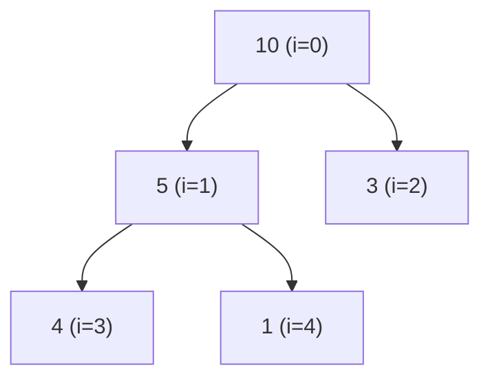

| Bước | Hành động | Heap (chưa xong) | Phần đã sắp xếp |
|------|-----------|------------------|-----------------|
| build | heapify | 10 5 3 4 1 | |
| 1 | đổi 10 ↔ 1, sift down 1 | 5 4 3 1 | 10 |
| 2 | đổi 5 ↔ 1, sift down 1 | 4 1 3 | 5 10 |
| 3 | đổi 4 ↔ 3, sift down 3 | 3 1 | 4 5 10 |
| 4 | đổi 3 ↔ 1 | 1 | 3 4 5 10 |
| xong | | | **1 3 4 5 10** |

Bấm ▶ và để ý mảng được xem như một cây: sau khi dựng heap, số lớn nhất ở gốc liên tục bị đổi xuống cuối mảng:

<div class="algo-viz" data-viz="sort" data-algo="heap" data-input="4,10,3,5,1" data-title="Heap Sort"></div>

=== "Go"

    ```go
    package main

    import "fmt"

    // siftDown đẩy a[i] xuống cho tới khi thỏa max-heap trong a[0:n]
    func siftDown(a []int, i, n int) {
    	for {
    		largest := i
    		l, r := 2*i+1, 2*i+2
    		if l < n && a[l] > a[largest] {
    			largest = l
    		}
    		if r < n && a[r] > a[largest] {
    			largest = r
    		}
    		if largest == i {
    			return
    		}
    		a[i], a[largest] = a[largest], a[i]
    		i = largest
    	}
    }

    func heapSort(a []int) {
    	n := len(a)
    	for i := n/2 - 1; i >= 0; i-- { // build max-heap từ nút cha cuối cùng
    		siftDown(a, i, n)
    	}
    	for end := n - 1; end > 0; end-- {
    		a[0], a[end] = a[end], a[0] // max về cuối
    		siftDown(a, 0, end)         // khôi phục heap cho a[0:end]
    	}
    }

    func main() {
    	a := []int{4, 10, 3, 5, 1}
    	heapSort(a)
    	fmt.Println(a)
    }
    // Output:
    // [1 3 4 5 10]
    ```

=== "Python"

    ```python
    def sift_down(a: list[int], i: int, n: int) -> None:
        while True:
            largest = i
            l, r = 2 * i + 1, 2 * i + 2
            if l < n and a[l] > a[largest]:
                largest = l
            if r < n and a[r] > a[largest]:
                largest = r
            if largest == i:
                return
            a[i], a[largest] = a[largest], a[i]
            i = largest


    def heap_sort(a: list[int]) -> None:
        n = len(a)
        for i in range(n // 2 - 1, -1, -1):
            sift_down(a, i, n)
        for end in range(n - 1, 0, -1):
            a[0], a[end] = a[end], a[0]
            sift_down(a, 0, end)


    a = [4, 10, 3, 5, 1]
    heap_sort(a)
    print(a)
    # Output:
    # [1, 3, 4, 5, 10]
    ```

| | Best | Average | Worst | Bộ nhớ | Stable | In-place | Adaptive |
|--|------|---------|-------|--------|--------|----------|----------|
| Heap | O(n log n) | O(n log n) | O(n log n) | O(1) | ❌ | ✅ | ❌ |

Heap sort là thuật toán duy nhất trong nhóm O(n log n) vừa **đảm bảo worst case** vừa **O(1) bộ nhớ**. Nhược điểm: truy cập bộ nhớ "nhảy cóc" (i → 2i+1) nên **kém thân thiện cache**, thực tế chậm hơn quick sort 2–3 lần. Nó được dùng làm "lưới an toàn" trong introsort/pdqsort.

---

## 📖 9. Counting Sort — Sắp xếp đếm

### Trực giác

Cô giáo chấm bài kiểm tra thang điểm 0–10 cho 500 học sinh và cần xếp theo điểm. Thay vì so sánh từng cặp bài, cô lấy **11 cái rổ** (điểm 0, 1, ..., 10), bỏ từng bài vào rổ đúng điểm, rồi đổ lần lượt từ rổ 0 đến rổ 10. **Không cần một phép so sánh nào!**

Counting sort dùng khi khóa là **số nguyên trong khoảng nhỏ** `[0, k]`.

### Từng bước với `[4, 2, 2, 8, 3, 3, 1]` (k = 8)

**Bước 1 — Đếm**: `count[v]` = số lần giá trị `v` xuất hiện.

| v | 0 | 1 | 2 | 3 | 4 | 5 | 6 | 7 | 8 |
|---|---|---|---|---|---|---|---|---|---|
| count | 0 | 1 | 2 | 2 | 1 | 0 | 0 | 0 | 1 |

**Bước 2 — Cộng dồn (prefix sum)**: `count[v]` = số phần tử `≤ v` = **vị trí kết thúc** của nhóm `v` trong mảng kết quả.

| v | 0 | 1 | 2 | 3 | 4 | 5 | 6 | 7 | 8 |
|---|---|---|---|---|---|---|---|---|---|
| prefix | 0 | 1 | 3 | 5 | 6 | 6 | 6 | 6 | 7 |

**Bước 3 — Đặt vào chỗ**: duyệt input **từ phải sang trái**, với mỗi `x`: `count[x]--`, `out[count[x]] = x`. Duyệt ngược đảm bảo **ổn định** (phần tử đứng sau trong input được đặt vào vị trí sau).

Kết quả: `[1, 2, 2, 3, 3, 4, 8]`.

Bấm ▶ và để ý thuật toán không hề so sánh hai phần tử với nhau — nó chỉ đếm vào các "rổ" rồi đổ ra theo thứ tự:

<div class="algo-viz" data-viz="sort" data-algo="counting" data-input="4,2,2,8,3,3,1" data-title="Counting Sort"></div>

=== "Go"

    ```go
    package main

    import (
    	"fmt"
    	"slices"
    )

    // countingSort cho số nguyên không âm; trả về slice mới, ổn định
    func countingSort(a []int) []int {
    	if len(a) == 0 {
    		return nil
    	}
    	k := slices.Max(a)
    	count := make([]int, k+1)
    	for _, x := range a { // 1. đếm
    		count[x]++
    	}
    	for v := 1; v <= k; v++ { // 2. cộng dồn
    		count[v] += count[v-1]
    	}
    	out := make([]int, len(a))
    	for i := len(a) - 1; i >= 0; i-- { // 3. đặt vào chỗ (duyệt ngược → ổn định)
    		x := a[i]
    		count[x]--
    		out[count[x]] = x
    	}
    	return out
    }

    func main() {
    	fmt.Println(countingSort([]int{4, 2, 2, 8, 3, 3, 1}))
    }
    // Output:
    // [1 2 2 3 3 4 8]
    ```

=== "Python"

    ```python
    def counting_sort(a: list[int]) -> list[int]:
        if not a:
            return []
        k = max(a)
        count = [0] * (k + 1)
        for x in a:                    # 1. đếm
            count[x] += 1
        for v in range(1, k + 1):      # 2. cộng dồn
            count[v] += count[v - 1]
        out = [0] * len(a)
        for x in reversed(a):          # 3. đặt vào chỗ, duyệt ngược → ổn định
            count[x] -= 1
            out[count[x]] = x
        return out


    print(counting_sort([4, 2, 2, 8, 3, 3, 1]))
    # Output:
    # [1, 2, 2, 3, 3, 4, 8]
    ```

| | Best | Average | Worst | Bộ nhớ | Stable | In-place | Adaptive |
|--|------|---------|-------|--------|--------|----------|----------|
| Counting | O(n + k) | O(n + k) | O(n + k) | O(n + k) | ✅ | ❌ | ❌ |

!!! warning "Chỉ dùng khi k nhỏ"
    Nếu sắp xếp 10 số nhưng giá trị lên tới 10⁹ thì cần mảng đếm 10⁹ ô (4–8 GB)! Quy tắc: dùng khi `k = O(n)`. Có số âm → dịch khóa: dùng `x - min` làm chỉ số.

---

## 📖 10. Radix Sort (LSD) — Sắp xếp theo cơ số

### Trực giác

Bưu điện phân loại thư theo **mã bưu chính 6 chữ số**: xếp theo chữ số **hàng đơn vị** trước (10 ngăn), gom lại; rồi xếp theo **hàng chục**, gom lại; ... Sau lượt chữ số cuối cùng (hàng cao nhất), thư được sắp xếp hoàn toàn!

Điều kỳ diệu nằm ở chỗ mỗi lượt phải dùng một thuật toán **ổn định** (thường là counting sort với k = 10): khi hai số có cùng chữ số hàng chục, thứ tự theo hàng đơn vị (đã xếp ở lượt trước) được **giữ nguyên**.

LSD = *Least Significant Digit first* (chữ số ít quan trọng nhất trước).

### Từng bước với `[170, 45, 75, 90, 802, 24, 2, 66]`

| Lượt | Theo chữ số | Kết quả (chữ số đang xét in đậm) |
|------|-------------|----------------------------------|
| 1 | đơn vị | 17**0** 9**0** 80**2** **2** 2**4** 4**5** 7**5** 6**6** |
| 2 | chục | 8**0**2 **0**2 **2**4 **4**5 **6**6 1**7**0 **7**5 **9**0 |
| 3 | trăm | **0**02 **0**24 **0**45 **0**66 **0**75 **0**90 **1**70 **8**02 |

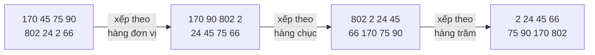

Để ý lượt 2: `802` và `2` cùng chữ số hàng chục là 0 → giữ thứ tự của lượt 1 (802 trước 2). Đến lượt 3 mới phân định được `2 < 802`.

Bấm ▶ (widget dùng số 2 chữ số nên chỉ có 2 lượt) và để ý mỗi lượt phân phối các số vào 10 "ngăn" 0–9 theo một chữ số, rồi gom lại theo thứ tự ngăn:

<div class="algo-viz" data-viz="sort" data-algo="radix" data-input="53,89,15,7,42,31,26,98,64,20" data-title="Radix Sort LSD (cơ số 10)"></div>

=== "Go"

    ```go
    package main

    import (
    	"fmt"
    	"slices"
    )

    // radixSort LSD cơ số 10 cho số nguyên không âm; trả về slice mới
    func radixSort(a []int) []int {
    	if len(a) == 0 {
    		return nil
    	}
    	src := append([]int(nil), a...)
    	dst := make([]int, len(a))
    	maxV := slices.Max(a)
    	for exp := 1; maxV/exp > 0; exp *= 10 {
    		var count [10]int
    		for _, x := range src {
    			count[(x/exp)%10]++
    		}
    		for d := 1; d < 10; d++ {
    			count[d] += count[d-1]
    		}
    		for i := len(src) - 1; i >= 0; i-- { // duyệt ngược → ổn định
    			d := (src[i] / exp) % 10
    			count[d]--
    			dst[count[d]] = src[i]
    		}
    		src, dst = dst, src // đổi vai hai mảng thay vì copy
    		fmt.Printf("  sau lượt exp=%d: %v\n", exp, src)
    	}
    	return src
    }

    func main() {
    	fmt.Println(radixSort([]int{170, 45, 75, 90, 802, 24, 2, 66}))
    }
    // Output:
    //   sau lượt exp=1: [170 90 802 2 24 45 75 66]
    //   sau lượt exp=10: [802 2 24 45 66 170 75 90]
    //   sau lượt exp=100: [2 24 45 66 75 90 170 802]
    // [2 24 45 66 75 90 170 802]
    ```

=== "Python"

    ```python
    def radix_sort(a: list[int]) -> list[int]:
        if not a:
            return []
        exp, max_v = 1, max(a)
        while max_v // exp > 0:
            buckets: list[list[int]] = [[] for _ in range(10)]
            for x in a:                          # phân phối vào 10 ngăn (ổn định)
                buckets[(x // exp) % 10].append(x)
            a = [x for b in buckets for x in b]  # gom lại theo thứ tự ngăn
            print(f"  sau lượt exp={exp}: {a}")
            exp *= 10
        return a


    print(radix_sort([170, 45, 75, 90, 802, 24, 2, 66]))
    # Output:
    #   sau lượt exp=1: [170, 90, 802, 2, 24, 45, 75, 66]
    #   sau lượt exp=10: [802, 2, 24, 45, 66, 170, 75, 90]
    #   sau lượt exp=100: [2, 24, 45, 66, 75, 90, 170, 802]
    # [2, 24, 45, 66, 75, 90, 170, 802]
    ```

| | Best | Average | Worst | Bộ nhớ | Stable | In-place | Adaptive |
|--|------|---------|-------|--------|--------|----------|----------|
| Radix (d chữ số, cơ số b) | O(d·(n + b)) | O(d·(n + b)) | O(d·(n + b)) | O(n + b) | ✅ | ❌ | ❌ |

Với số nguyên 32-bit, dùng **cơ số 256** (xử lý từng byte) → chỉ 4 lượt, mỗi lượt O(n + 256) → gần như **O(n)**. Radix sort cũng sắp xếp được **chuỗi cùng độ dài** (từng ký tự từ phải sang trái), ngày tháng (ngày → tháng → năm).

!!! note "MSD Radix Sort"
    Biến thể *Most Significant Digit first* xét chữ số cao trước, rồi đệ quy vào từng ngăn — giống cách tra từ điển (chữ cái đầu → chữ cái thứ hai...). Hợp với chuỗi độ dài khác nhau.

---

## 📖 11. Bucket Sort — Sắp xếp theo xô

### Trực giác

Chia hàng hóa trong kho theo **khoảng giá**: xô 0–100k, xô 100k–200k, ... Bỏ từng món vào xô tương ứng, sắp xếp **trong từng xô** (xô nhỏ nên nhanh, thường dùng insertion sort), rồi nối các xô lại.

Bucket sort hiệu quả khi dữ liệu **phân bố đều** trên một khoảng biết trước, ví dụ số thực trong `[0, 1)`.

Ví dụ với 10 số trong `[0, 1)`, 10 xô, xô `i` chứa các số trong `[i/10, (i+1)/10)`:

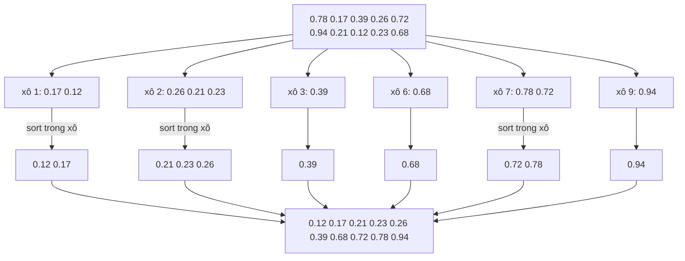

=== "Go"

    ```go
    package main

    import (
    	"fmt"
    	"slices"
    )

    // bucketSort cho số thực trong [0, 1)
    func bucketSort(a []float64) []float64 {
    	n := len(a)
    	buckets := make([][]float64, n)
    	for _, x := range a {
    		i := int(x * float64(n)) // xô tương ứng
    		buckets[i] = append(buckets[i], x)
    	}
    	out := make([]float64, 0, n)
    	for _, b := range buckets {
    		slices.Sort(b) // xô nhỏ; thư viện dùng insertion sort cho mảng nhỏ
    		out = append(out, b...)
    	}
    	return out
    }

    func main() {
    	a := []float64{0.78, 0.17, 0.39, 0.26, 0.72, 0.94, 0.21, 0.12, 0.23, 0.68}
    	fmt.Println(bucketSort(a))
    }
    // Output:
    // [0.12 0.17 0.21 0.23 0.26 0.39 0.68 0.72 0.78 0.94]
    ```

=== "Python"

    ```python
    def bucket_sort(a: list[float]) -> list[float]:
        n = len(a)
        buckets: list[list[float]] = [[] for _ in range(n)]
        for x in a:
            buckets[int(x * n)].append(x)
        out = []
        for b in buckets:
            out.extend(sorted(b))
        return out


    print(bucket_sort([0.78, 0.17, 0.39, 0.26, 0.72, 0.94, 0.21, 0.12, 0.23, 0.68]))
    # Output:
    # [0.12, 0.17, 0.21, 0.23, 0.26, 0.39, 0.68, 0.72, 0.78, 0.94]
    ```

| | Best | Average | Worst | Bộ nhớ | Stable | In-place | Adaptive |
|--|------|---------|-------|--------|--------|----------|----------|
| Bucket | O(n + k) | O(n + k) (phân bố đều) | O(n²) (dồn hết vào 1 xô) hoặc O(n log n) nếu sort xô bằng thuật toán tốt | O(n + k) | ✅ nếu sort xô ổn định | ❌ | ❌ |

---

## 📖 12. Bảng so sánh tổng hợp

| Thuật toán | Best | Average | Worst | Bộ nhớ phụ | Stable | In-place | Adaptive | Ghi chú |
|------------|------|---------|-------|-----------|--------|----------|----------|---------|
| Bubble | O(n) | O(n²) | O(n²) | O(1) | ✅ | ✅ | ✅ | Chỉ để học |
| Selection | O(n²) | O(n²) | O(n²) | O(1) | ❌ | ✅ | ❌ | Ít lần ghi nhất: O(n) swap |
| Insertion | O(n) | O(n²) | O(n²) | O(1) | ✅ | ✅ | ✅ | Tốt nhất cho n nhỏ / gần sắp xếp |
| Shell | O(n log n) | ~O(n^1.25) | O(n^1.5) (Knuth) | O(1) | ❌ | ✅ | ✅ | Code ngắn, không đệ quy |
| Merge | O(n log n) | O(n log n) | O(n log n) | O(n) | ✅ | ❌ | ❌ | Ổn định, linked list, external sort |
| Quick | O(n log n) | O(n log n) | O(n²) | O(log n) | ❌ | ✅ | ❌ | Nhanh nhất thực tế (random pivot) |
| Heap | O(n log n) | O(n log n) | O(n log n) | O(1) | ❌ | ✅ | ❌ | Đảm bảo worst case + O(1) bộ nhớ |
| Counting | O(n + k) | O(n + k) | O(n + k) | O(n + k) | ✅ | ❌ | ❌ | Số nguyên, khoảng k nhỏ |
| Radix (LSD) | O(d(n + b)) | O(d(n + b)) | O(d(n + b)) | O(n + b) | ✅ | ❌ | ❌ | Số nguyên/chuỗi độ dài cố định |
| Bucket | O(n + k) | O(n + k) | O(n²) | O(n + k) | ✅* | ❌ | ❌ | Dữ liệu phân bố đều |
| **Timsort** (Python) | O(n) | O(n log n) | O(n log n) | O(n) | ✅ | ❌ | ✅ | Merge + insertion, khai thác "run" |
| **pdqsort** (Go) | O(n) | O(n log n) | O(n log n) | O(log n) | ❌ | ✅ | ✅ | Quick + insertion + heap |

(\*) nếu sắp xếp trong từng xô bằng thuật toán ổn định.

---

## 📖 13. Tính ổn định (Stability) — giải thích bằng ví dụ

Sắp xếp **ổn định** nghĩa là: nếu hai phần tử có **khóa bằng nhau**, thứ tự tương đối của chúng **sau khi sắp xếp giống hệt trước khi sắp xếp**.

Với số nguyên thuần thì ổn định hay không chẳng quan trọng (hai số 5 giống hệt nhau). Nhưng khi sắp xếp **bản ghi** theo **một trường**, nó rất quan trọng.

**Ví dụ**: Danh sách học sinh đã xếp theo **tên** (A→Z). Giờ cần xếp theo **điểm**. Ta muốn: ai cùng điểm thì **vẫn theo thứ tự tên**.

```text
Ban đầu (theo tên):  An 8 | Bình 7 | Chi 8 | Dũng 7 | Giang 9

Sort theo điểm, ỔN ĐỊNH:       Bình 7 | Dũng 7 | An 8 | Chi 8 | Giang 9   ✅ cùng điểm vẫn theo tên
Sort theo điểm, KHÔNG ổn định: Bình 7 | Dũng 7 | Chi 8 | An 8 | Giang 9   ❌ Chi nhảy lên trước An
```

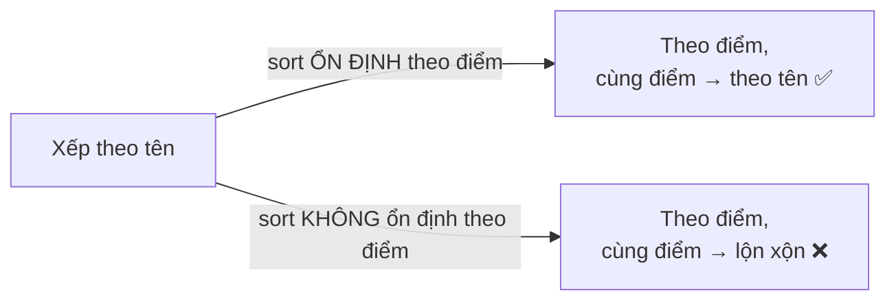

Đây chính là kỹ thuật **sắp xếp nhiều khóa bằng nhiều lượt ổn định**: sắp theo khóa **phụ** trước, rồi sắp ổn định theo khóa **chính**. Radix sort hoạt động đúng nhờ nguyên lý này. Trong Excel, khi bạn sort cột "Tên" rồi sort cột "Điểm", Excel cũng dùng sort ổn định.

=== "Go"

    ```go
    package main

    import (
    	"cmp"
    	"fmt"
    	"slices"
    )

    type Student struct {
    	Name  string
    	Score int
    }

    // Selection sort theo Score — KHÔNG ổn định
    func selectionByScore(a []Student) {
    	for i := 0; i < len(a)-1; i++ {
    		m := i
    		for j := i + 1; j < len(a); j++ {
    			if a[j].Score < a[m].Score {
    				m = j
    			}
    		}
    		a[i], a[m] = a[m], a[i]
    	}
    }

    func main() {
    	byName := []Student{{"An", 8}, {"Bình", 7}, {"Chi", 8}, {"Dũng", 7}, {"Giang", 9}}

    	a := slices.Clone(byName)
    	selectionByScore(a)
    	fmt.Println("selection (không ổn định):", a)

    	b := slices.Clone(byName)
    	slices.SortStableFunc(b, func(x, y Student) int { return cmp.Compare(x.Score, y.Score) })
    	fmt.Println("SortStableFunc (ổn định) :", b)
    }
    // Output:
    // selection (không ổn định): [{Bình 7} {Dũng 7} {Chi 8} {An 8} {Giang 9}]
    // SortStableFunc (ổn định) : [{Bình 7} {Dũng 7} {An 8} {Chi 8} {Giang 9}]
    ```

=== "Python"

    ```python
    def selection_by_score(a: list[tuple[str, int]]) -> None:
        for i in range(len(a) - 1):
            m = i
            for j in range(i + 1, len(a)):
                if a[j][1] < a[m][1]:
                    m = j
            a[i], a[m] = a[m], a[i]


    by_name = [("An", 8), ("Bình", 7), ("Chi", 8), ("Dũng", 7), ("Giang", 9)]

    a = by_name[:]
    selection_by_score(a)
    print("selection (không ổn định):", a)

    b = sorted(by_name, key=lambda s: s[1])     # Timsort luôn ổn định
    print("sorted (ổn định)         :", b)
    # Output:
    # selection (không ổn định): [('Bình', 7), ('Dũng', 7), ('Chi', 8), ('An', 8), ('Giang', 9)]
    # sorted (ổn định)         : [('Bình', 7), ('Dũng', 7), ('An', 8), ('Chi', 8), ('Giang', 9)]
    ```

!!! tip "Biến sort không ổn định thành ổn định"
    Thêm **chỉ số ban đầu** vào khóa: so sánh `(key, originalIndex)`. Hai phần tử không bao giờ "bằng nhau" nữa nên thứ tự được xác định hoàn toàn.

---

## 📖 14. Cận dưới Ω(n log n) cho sắp xếp dựa trên so sánh

**Câu hỏi**: Có thuật toán sắp xếp dựa trên so sánh nào nhanh hơn O(n log n) không? **Không!** Và ta chứng minh được bằng **cây quyết định** (decision tree).

**Ý tưởng**: Mọi thuật toán so sánh có thể mô tả bằng một cây nhị phân: mỗi nút trong là một câu hỏi "`a[i] < a[j]`?", đi trái nếu Có, phải nếu Không. Mỗi **lá** là một **hoán vị** kết luận thứ tự đúng.

Cây quyết định cho 3 phần tử `a, b, c`:

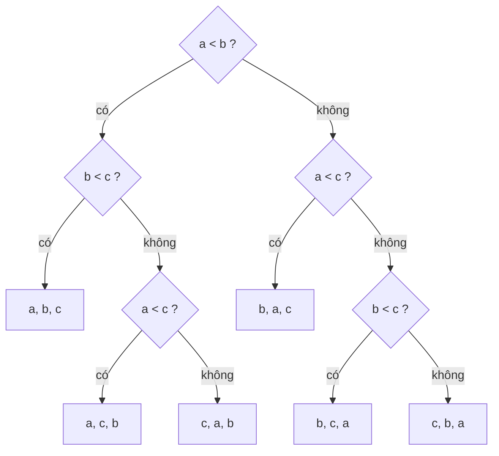

Lập luận:

1. Có **n!** cách sắp xếp đầu vào khác nhau, mỗi cách cần một lá riêng ⇒ cây có **ít nhất n! lá**.
2. Cây nhị phân cao `h` có tối đa **2^h lá** ⇒ `2^h ≥ n!` ⇒ `h ≥ log₂(n!)`.
3. Theo xấp xỉ Stirling: `log₂(n!) ≈ n·log₂n − 1.44n` ⇒ **h = Ω(n log n)**.
4. Chiều cao cây = số phép so sánh trong **trường hợp xấu nhất** ⇒ mọi thuật toán so sánh cần **Ω(n log n)** phép so sánh.

Ví dụ n = 3: 3! = 6 lá cần ít nhất ⌈log₂6⌉ = 3 phép so sánh trong trường hợp xấu nhất — đúng như cây trên.

!!! note "Vậy Counting/Radix sort 'phá' cận dưới này thế nào?"
    Chúng **không so sánh** các phần tử — chúng dùng giá trị làm **chỉ số mảng**, khai thác thêm thông tin (khóa là số nguyên nhỏ). Cận dưới Ω(n log n) chỉ áp dụng cho mô hình so sánh. Cái giá: chỉ dùng được với loại khóa đặc biệt.

---

## 📖 15. Thư viện chuẩn thực sự dùng gì?

### Go: pdqsort (Pattern-Defeating Quicksort)

Từ **Go 1.19**, `sort.Sort`, `sort.Slice`, `sort.Ints` và (từ Go 1.21) `slices.Sort`, `slices.SortFunc` đều dùng **pdqsort** (Orson Peters, 2021) — một bản "độ" của introsort:

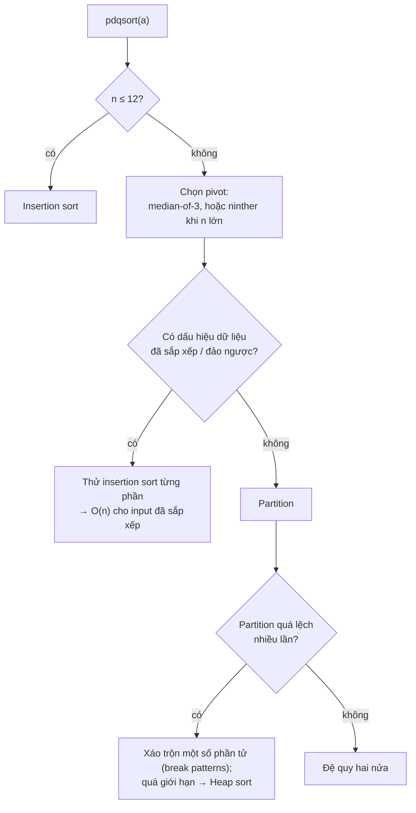

- **Không ổn định**. Cần ổn định → `slices.SortStableFunc` / `sort.SliceStable` / `sort.Stable` (insertion sort theo khối 20 phần tử + **SymMerge** — trộn tại chỗ, O(n log n) phép so sánh, O(n log² n) phép đổi chỗ, không cấp phát bộ nhớ).
- `slices.Sort` (generic) nhanh hơn `sort.Sort` (interface) vì không tốn chi phí gọi phương thức qua interface; Go 1.22+ `sort.Ints` gọi thẳng `slices.Sort`.
- Worst case O(n log n) nhờ heap sort fallback; input đã sắp xếp/đảo ngược chạy gần O(n).

### Python: Timsort (và Powersort từ 3.11)

`list.sort()` và `sorted()` dùng **Timsort** (Tim Peters, 2002) — lai giữa **merge sort** và **insertion sort**, tối ưu cho dữ liệu **thực tế** (vốn thường có các đoạn đã sắp xếp sẵn):

1. Quét mảng, tìm các **run** — đoạn con đã tăng dần (hoặc giảm dần nghiêm ngặt → đảo ngược lại).
2. Run ngắn hơn **minrun** (32–64) được kéo dài bằng **binary insertion sort**.
3. Đẩy run vào stack, **trộn** các run theo quy tắc cân bằng (từ Python 3.11 dùng chiến lược **Powersort** — tối ưu hơn về số phép trộn).
4. Khi trộn mà một bên "thắng liên tục", chuyển sang **galloping mode** (tìm kiếm mũ) để nhảy qua cả khối.

```text
Input:  [1 2 3 4 5 | 9 8 7 6 | 10 11 12 ...]
         run tăng     run giảm → đảo    run tăng
Timsort chỉ cần trộn vài run → gần O(n) với dữ liệu "gần sắp xếp"
```

- **Luôn ổn định**. Best case O(n), worst O(n log n), bộ nhớ phụ tới n/2.
- `key=` được tính **một lần cho mỗi phần tử** (decorate-sort-undecorate) → nhanh hơn nhiều so với gọi comparator O(n log n) lần.
- Timsort cũng được dùng trong Java (`Arrays.sort` cho object), Android, V8 (JavaScript `Array.prototype.sort`), Swift.

---

## 📖 16. Comparator tùy chỉnh & sắp xếp struct

Trong thực tế bạn hiếm khi sắp xếp mảng số — thường là sắp xếp **đơn hàng theo ngày**, **sản phẩm theo giá rồi theo tên**...

=== "Go"

    ```go
    package main

    import (
    	"cmp"
    	"fmt"
    	"slices"
    	"sort"
    	"strings"
    )

    type Product struct {
    	Name  string
    	Price int
    	Stock int
    }

    func main() {
    	ps := []Product{
    		{"Phở", 45, 10}, {"Bún chả", 40, 0}, {"Cơm tấm", 40, 5},
    		{"Bánh mì", 20, 30}, {"Bún bò", 45, 7},
    	}

    	// 1. slices.SortFunc: comparator trả về âm / 0 / dương (Go 1.21+)
    	//    Giá TĂNG dần, cùng giá thì tên TĂNG dần
    	slices.SortFunc(ps, func(a, b Product) int {
    		return cmp.Or( // cmp.Or (Go 1.22+): trả về giá trị khác 0 đầu tiên
    			cmp.Compare(a.Price, b.Price),
    			strings.Compare(a.Name, b.Name),
    		)
    	})
    	fmt.Println("giá↑, tên↑ :", ps)

    	// 2. Giảm dần: đảo vị trí a, b
    	slices.SortFunc(ps, func(a, b Product) int { return cmp.Compare(b.Stock, a.Stock) })
    	fmt.Println("tồn kho↓   :", ps)

    	// 3. sort.Slice kiểu cũ: less(i, j) trả về bool
    	sort.Slice(ps, func(i, j int) bool { return ps[i].Name < ps[j].Name })
    	fmt.Println("tên↑       :", ps)

    	// 4. Sau khi sort có thể binary search
    	i, found := slices.BinarySearchFunc(ps, "Phở", func(p Product, name string) int {
    		return strings.Compare(p.Name, name)
    	})
    	fmt.Println("tìm Phở    :", i, found)
    }
    // Output:
    // giá↑, tên↑ : [{Bánh mì 20 30} {Bún chả 40 0} {Cơm tấm 40 5} {Bún bò 45 7} {Phở 45 10}]
    // tồn kho↓   : [{Bánh mì 20 30} {Phở 45 10} {Bún bò 45 7} {Cơm tấm 40 5} {Bún chả 40 0}]
    // tên↑       : [{Bánh mì 20 30} {Bún bò 45 7} {Bún chả 40 0} {Cơm tấm 40 5} {Phở 45 10}]
    // tìm Phở    : 4 true
    ```

=== "Python"

    ```python
    from dataclasses import dataclass
    from functools import cmp_to_key
    from operator import attrgetter


    @dataclass
    class Product:
        name: str
        price: int
        stock: int

        def __repr__(self) -> str:
            return f"{{{self.name} {self.price} {self.stock}}}"


    ps = [Product("Phở", 45, 10), Product("Bún chả", 40, 0), Product("Cơm tấm", 40, 5),
          Product("Bánh mì", 20, 30), Product("Bún bò", 45, 7)]

    # 1. key trả về tuple → so sánh lần lượt từng thành phần
    ps.sort(key=lambda p: (p.price, p.name))
    print("giá↑, tên↑ :", ps)

    # 2. Giảm dần: reverse=True, hoặc đổi dấu khóa số
    ps.sort(key=attrgetter("stock"), reverse=True)
    print("tồn kho↓   :", ps)

    # 3. Giá↓ nhưng tên↑: đổi dấu khóa số
    print("giá↓, tên↑ :", sorted(ps, key=lambda p: (-p.price, p.name)))

    # 4. Comparator kiểu cũ (a, b) -> âm/0/dương, bọc bằng cmp_to_key
    def by_name(a: Product, b: Product) -> int:
        return (a.name > b.name) - (a.name < b.name)

    print("tên↑       :", sorted(ps, key=cmp_to_key(by_name)))
    # Output:
    # giá↑, tên↑ : [{Bánh mì 20 30}, {Bún chả 40 0}, {Cơm tấm 40 5}, {Bún bò 45 7}, {Phở 45 10}]
    # tồn kho↓   : [{Bánh mì 20 30}, {Phở 45 10}, {Bún bò 45 7}, {Cơm tấm 40 5}, {Bún chả 40 0}]
    # giá↓, tên↑ : [{Bún bò 45 7}, {Phở 45 10}, {Bún chả 40 0}, {Cơm tấm 40 5}, {Bánh mì 20 30}]
    # tên↑       : [{Bánh mì 20 30}, {Bún bò 45 7}, {Bún chả 40 0}, {Cơm tấm 40 5}, {Phở 45 10}]
    ```

!!! warning "Comparator phải nhất quán!"
    Comparator phải là một **thứ tự yếu nghiêm ngặt** (strict weak ordering): `less(a,a)` luôn false; nếu `less(a,b)` thì không `less(b,a)`; có tính bắc cầu. Viết sai (ví dụ dùng `<=` trong `sort.Slice`, hoặc comparator ngẫu nhiên) → kết quả sai, và ở một số ngôn ngữ (C++, Java) còn gây crash hoặc exception *"Comparison method violates its general contract!"*.

    Cẩn thận `return a - b` làm comparator: có thể **tràn số** khi a, b lớn trái dấu. Dùng `cmp.Compare(a, b)`.

!!! tip "Python: sắp xếp theo khóa giảm dần cho chuỗi"
    Không thể viết `-p.name`. Hãy tận dụng tính **ổn định**: sort theo khóa phụ trước, rồi sort theo khóa chính: `ps.sort(key=attrgetter("name"), reverse=True); ps.sort(key=attrgetter("price"))`.

---

## 📖 17. Benchmark thật: Go vs Python

Cài đặt ở trên được chạy trên **cùng một mảng số nguyên ngẫu nhiên** trong `[0, n)` (seed cố định), lấy thời gian **tốt nhất** của 5 lần (Go) / 3 lần (Python); thuật toán O(n²) ở n lớn chỉ chạy 1 lần. Máy đo: Intel Xeon 2.1 GHz, 4 nhân, Go 1.24, Python 3.11 (CPython).

Chương trình đo (Go — đặt cạnh file chứa các hàm sort ở trên):

```go
// Chạy: go run .   (cùng thư mục với sorts.go chứa các hàm ở trên)
package main

import (
	"fmt"
	"math/rand"
	"slices"
	"time"
)

func main() {
	algos := []struct {
		name string
		run  func([]int)
	}{
		{"Insertion", insertionSort},
		{"Merge", func(a []int) { copy(a, mergeSort(a)) }},
		{"Heap", heapSort},
		{"slices.Sort", slices.Sort[[]int]},
		// ... các thuật toán khác
	}
	for _, n := range []int{1_000, 10_000, 100_000} {
		r := rand.New(rand.NewSource(42))
		data := make([]int, n)
		for i := range data {
			data[i] = r.Intn(n)
		}
		for _, al := range algos {
			best := time.Hour
			for rep := 0; rep < 5; rep++ {
				a := slices.Clone(data)
				start := time.Now()
				al.run(a)
				best = min(best, time.Since(start))
			}
			fmt.Printf("n=%d %-12s %v\n", n, al.name, best)
		}
	}
}
```

Python dùng `time.perf_counter()` theo cách tương tự:

```python
# Chạy: python bench.py   (cùng thư mục với sorts.py chứa các hàm ở trên)
import random, time
from sorts import insertion_sort, merge_sort, heap_sort

for n in (1_000, 10_000, 100_000):
    r = random.Random(42)
    data = [r.randrange(n) for _ in range(n)]
    for name, fn in [("Heap", heap_sort), ("list.sort", list.sort)]:
        best = float("inf")
        for _ in range(3):
            a = data[:]
            t = time.perf_counter()
            fn(a)
            best = min(best, time.perf_counter() - t)
        print(f"n={n} {name:<10} {best * 1000:.1f} ms")
```

### Kết quả — Go (mảng ngẫu nhiên)

| Thuật toán | n = 1 000 | n = 10 000 | n = 100 000 |
|------------|-----------|------------|-------------|
| Bubble | 0.759 ms | 83.8 ms | **18 033 ms** |
| Selection | 0.446 ms | 39.9 ms | 4 163 ms |
| Insertion | 0.161 ms | 16.4 ms | 1 748 ms |
| Shell | 0.054 ms | 0.912 ms | 12.6 ms |
| Merge | 0.086 ms | 1.1 ms | 16.6 ms |
| Quick (Lomuto, pivot ngẫu nhiên) | 0.057 ms | 0.733 ms | 8.9 ms |
| Quick (Hoare) | 0.038 ms | 0.865 ms | 10.5 ms |
| Heap | 0.051 ms | 0.961 ms | 12.3 ms |
| Counting | 0.008 ms | 0.152 ms | **1.4 ms** |
| Radix LSD | 0.026 ms | 0.299 ms | 4.1 ms |
| `slices.Sort` (pdqsort) | 0.028 ms | 0.646 ms | 8.5 ms |
| `sort.Ints` | 0.031 ms | 0.659 ms | 8.4 ms |
| `slices.SortStableFunc` | 0.118 ms | 2.0 ms | 28.5 ms |

### Kết quả — Python (mảng ngẫu nhiên)

| Thuật toán | n = 1 000 | n = 10 000 | n = 100 000 |
|------------|-----------|------------|-------------|
| Bubble | 26.5 ms | 2 788 ms | bỏ qua (ước tính ~4–5 phút) |
| Selection | 13.0 ms | 1 293 ms | bỏ qua (~2 phút) |
| Insertion | 9.7 ms | 1 186 ms | bỏ qua (~2 phút) |
| Shell | 0.759 ms | 13.1 ms | 228 ms |
| Merge | 1.1 ms | 13.5 ms | 181 ms |
| Quick (Lomuto, pivot ngẫu nhiên) | 1.2 ms | 15.3 ms | 178 ms |
| Quick (Hoare) | 0.613 ms | 7.9 ms | 99.3 ms |
| Heap | 1.1 ms | 15.5 ms | 222 ms |
| Counting | 0.123 ms | 1.4 ms | 19.2 ms |
| Radix LSD | 0.189 ms | 2.2 ms | 38.9 ms |
| **`sorted()` / `list.sort` (Timsort)** | **0.081 ms** | **1.7 ms** | **23.1 ms** |

### Kết quả — input đã sắp xếp / đảo ngược, n = 100 000

| Thuật toán | Go: tăng dần | Go: giảm dần | Python: tăng dần | Python: giảm dần |
|------------|--------------|--------------|------------------|------------------|
| Insertion | 0.10 ms | O(n²) | 5.51 ms | O(n²) |
| Bubble (có cờ) | 0.07 ms | O(n²) | — | — |
| Merge | 7.59 ms | 8.26 ms | 107 ms | 108 ms |
| Heap | 7.33 ms | 7.69 ms | — | — |
| `slices.Sort` / `sorted()` | **0.07 ms** | **0.11 ms** | **0.30 ms** | **0.32 ms** |

### Đọc hiểu kết quả

1. **O(n²) vs O(n log n) là khác biệt "một trời một vực"**: tăng n lên 10 lần, bubble/selection/insertion chậm đi ~**100 lần** (Go: 16 ms → 1 748 ms), còn merge/quick/heap chỉ chậm đi ~**12–15 lần**. Ở n = 100 000, bubble sort Go mất **18 giây** trong khi `slices.Sort` mất **8.5 ms** — nhanh hơn ~2 000 lần.
2. **Trong nhóm O(n²), insertion nhanh nhất** (ít thao tác, dịch thay vì swap), bubble chậm nhất.
3. **Quick sort nhanh nhất trong nhóm so sánh tự cài**, heap sort chậm hơn do truy cập bộ nhớ nhảy cóc; merge chậm do cấp phát bộ nhớ.
4. **Counting/Radix đánh bại mọi thuật toán so sánh** khi khóa là số nguyên nhỏ — Counting nhanh gấp ~6 lần `slices.Sort`.
5. **Trong Python, hàm built-in thắng tuyệt đối**: `sorted()` (viết bằng C) nhanh hơn merge sort tự viết ~**8 lần**, nhanh hơn insertion sort ở n = 10⁴ tới ~700 lần. Bài học: **đừng bao giờ tự viết sort bằng Python thuần trong code thật**.
6. **Go nhanh hơn Python ~10–70 lần** cho cùng một thuật toán tự cài (mã máy biên dịch vs thông dịch), nhưng `sorted()` viết bằng C chỉ chậm hơn `slices.Sort` khoảng 3 lần.
7. **Adaptive thật sự có tác dụng**: với input đã sắp xếp, insertion sort và các sort thư viện gần như tức thì (O(n)), trong khi merge/heap vẫn tốn O(n log n).

!!! note "Kết quả trên máy bạn sẽ khác"
    Con số tuyệt đối phụ thuộc CPU, bộ nhớ, phiên bản compiler. Hãy chú ý **tỷ lệ** và **xu hướng tăng** khi n tăng — đó mới là điều Big-O dự đoán.

---

## 📖 18. Khi nào dùng thuật toán nào?

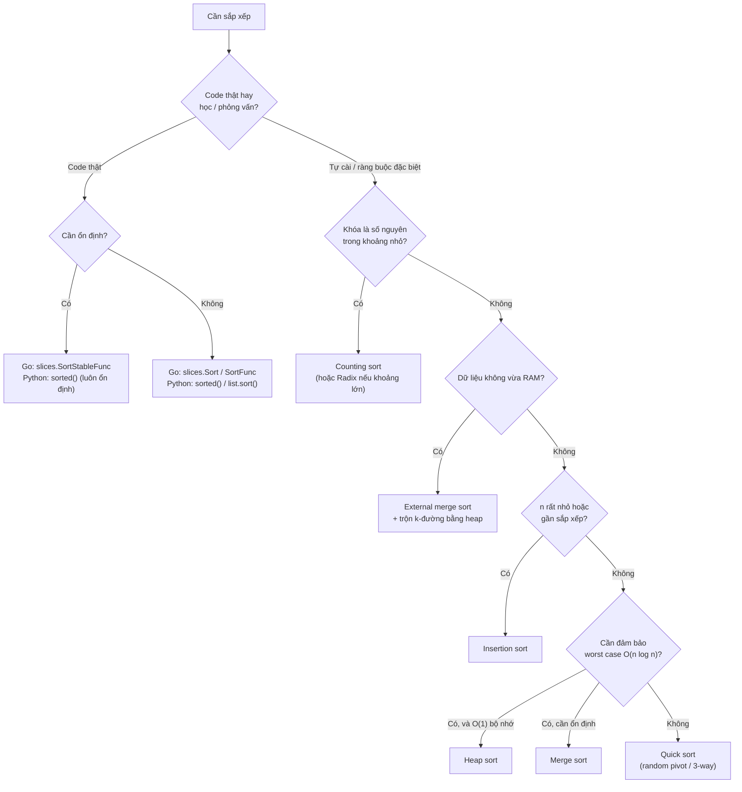

| Tình huống | Chọn |
|------------|------|
| Sắp xếp bình thường trong ứng dụng | Thư viện chuẩn (`slices.Sort`, `sorted`) |
| Sắp xếp theo nhiều tiêu chí, giữ thứ tự cũ | Sort ổn định |
| Linked list | Merge sort |
| File 100 GB, RAM 8 GB | External merge sort |
| Điểm thi 0–10, tuổi 0–150, mã màu 0–255 | Counting sort |
| Số nguyên 32/64-bit, hàng triệu phần tử, cần cực nhanh | Radix sort (cơ số 256) |
| Chỉ cần **top-k** hoặc **phần tử thứ k** | **Không cần sort hết!** Heap (O(n log k)) hoặc Quickselect (O(n) trung bình) |
| Dữ liệu đến liên tục, cần luôn có thứ tự | Heap / cây cân bằng, không sort lại mỗi lần |
| Hệ thống nhúng, không đệ quy, bộ nhớ ít | Shell sort hoặc heap sort |

---

## 🌍 Ứng dụng thực tế

- **Database**: `ORDER BY` dùng quicksort trong bộ nhớ, **external merge sort** khi vượt `work_mem` (PostgreSQL); **sort-merge join** sắp xếp hai bảng rồi trộn; index B-tree lưu dữ liệu **đã sắp xếp** sẵn để khỏi sort (xem [Database Internals](../backend/06-database-internals-performance.md)).
- **Big data**: bước **shuffle & sort** của MapReduce/Spark; cuộc thi **Sort Benchmark** (sắp xếp 100 TB) dùng radix sort + external merge.
- **Thương mại điện tử**: sắp xếp sản phẩm theo giá / đánh giá / bán chạy — đa khóa, ổn định; phân trang với `ORDER BY ... LIMIT` (chỉ cần top-k → heap).
- **Đồ họa 3D**: vẽ vật thể theo thứ tự xa → gần (painter's algorithm), radix sort trên GPU cho hàng triệu hạt.
- **Nén dữ liệu**: Burrows–Wheeler Transform (bzip2) dựa trên sắp xếp các phép quay chuỗi; suffix array.
- **Tiền xử lý cho thuật toán khác**: binary search ([Bài 8](./08-binary-search.md)), two pointers, tham lam (xếp lịch họp theo giờ kết thúc — [Bài 13](./13-greedy.md)), Kruskal (sắp cạnh theo trọng số — [Bài 12](./12-shortest-paths-mst.md)), loại bỏ trùng lặp, gộp khoảng thời gian.
- **Hệ điều hành / mạng**: sắp xếp request đĩa theo vị trí (elevator algorithm), sắp xếp gói tin theo sequence number trong TCP.

---

## ⚠️ Lỗi thường gặp

| Lỗi | Hậu quả | Cách sửa |
|-----|---------|----------|
| Dùng `>=` thay vì `>` khi đổi chỗ (bubble/insertion) hoặc `<` thay vì `<=` khi trộn (merge) | Mất tính ổn định | Nhớ: bằng nhau thì **giữ nguyên thứ tự** |
| Quick sort chọn pivot cố định (đầu/cuối) | O(n²) + tràn stack với dữ liệu đã sắp xếp | Pivot ngẫu nhiên / median-of-3 |
| Hoare partition đệ quy `[lo, p-1]` | Bỏ sót phần tử → sai kết quả | Hoare: `[lo, p]` và `[p+1, hi]` |
| `(lo + hi) / 2` với lo, hi rất lớn (C/Java int32) | Tràn số | `lo + (hi - lo) / 2` |
| Counting sort với khoảng giá trị lớn | Hết bộ nhớ | Chỉ dùng khi k = O(n); nếu không → radix/comparison |
| Counting sort với số âm | Index âm → panic | Dịch khóa `x - min` |
| Comparator không nhất quán (`<=`, `a - b` tràn số) | Kết quả sai / panic / exception | `cmp.Compare`, tuple key |
| `sorted(a)` nhưng tưởng `a` đã thay đổi | Bug "sort không có tác dụng" | `sorted()` trả về list mới; `a.sort()` sửa tại chỗ và trả về `None` |
| `a = a.sort()` trong Python | `a` thành `None` | Chỉ viết `a.sort()` |
| Go: sort slice con rồi tưởng không ảnh hưởng mảng gốc | Mảng gốc bị thay đổi (chung backing array) | `slices.Clone` trước khi sort |
| Sort toàn bộ chỉ để lấy top-k | Tốn O(n log n) không cần thiết | Heap O(n log k) / Quickselect O(n) |
| Tự viết sort bằng Python thuần trong production | Chậm hơn built-in 10–1000 lần | Dùng `sorted()` với `key=` |

---

## 🏋️ Bài tập

### Mức 1 — Cơ bản

**Bài 1.1** (LeetCode 75 — Sort Colors): Mảng chỉ gồm 0, 1, 2 (đỏ, trắng, xanh). Sắp xếp **tại chỗ, một lượt duyệt**.

<details><summary>Đáp án</summary>

Chính là 3-way partition với pivot = 1 (bài toán cờ Hà Lan của Dijkstra).

=== "Go"

    ```go
    package main

    import "fmt"

    func sortColors(a []int) {
    	lo, i, hi := 0, 0, len(a)-1
    	for i <= hi {
    		switch a[i] {
    		case 0:
    			a[lo], a[i] = a[i], a[lo]
    			lo++
    			i++
    		case 2:
    			a[i], a[hi] = a[hi], a[i]
    			hi--
    		default:
    			i++
    		}
    	}
    }

    func main() {
    	a := []int{2, 0, 2, 1, 1, 0}
    	sortColors(a)
    	fmt.Println(a)
    }
    // Output:
    // [0 0 1 1 2 2]
    ```

=== "Python"

    ```python
    def sort_colors(a: list[int]) -> None:
        lo, i, hi = 0, 0, len(a) - 1
        while i <= hi:
            if a[i] == 0:
                a[lo], a[i] = a[i], a[lo]; lo += 1; i += 1
            elif a[i] == 2:
                a[i], a[hi] = a[hi], a[i]; hi -= 1
            else:
                i += 1


    a = [2, 0, 2, 1, 1, 0]
    sort_colors(a)
    print(a)
    # Output:
    # [0, 0, 1, 1, 2, 2]
    ```

</details>

**Bài 1.2** (LeetCode 88 — Merge Sorted Array): `nums1` có độ dài `m+n` (n ô cuối trống), trộn `nums2` vào `nums1` tại chỗ.

<details><summary>Đáp án</summary>

Trộn **từ cuối lên** để không ghi đè phần tử chưa xét: `i=m-1, j=n-1, k=m+n-1`; lấy số lớn hơn giữa `nums1[i]` và `nums2[j]` đặt vào `nums1[k]`. Khi `j < 0` thì xong. O(m+n) thời gian, O(1) bộ nhớ.

</details>

**Bài 1.3**: Chạy tay insertion sort trên `[3, 7, 4, 9, 5, 2, 6, 1]`, đếm số lần dịch. Kiểm tra bằng cách đếm số nghịch thế.

<details><summary>Đáp án</summary>

Số nghịch thế = 17 (ví dụ 3 nghịch thế với 2, 1; 7 với 4, 5, 2, 6, 1; ...). Số lần dịch của insertion sort đúng bằng 17.

</details>

### Mức 2 — Trung bình

**Bài 2.1** (LeetCode 56 — Merge Intervals): Gộp các khoảng chồng lấn. `[[1,3],[2,6],[8,10],[15,18]]` → `[[1,6],[8,10],[15,18]]`.

<details><summary>Đáp án</summary>

Sắp xếp theo điểm đầu, rồi duyệt: nếu khoảng hiện tại bắt đầu ≤ điểm cuối của khoảng cuối cùng trong kết quả → gộp (lấy max điểm cuối), ngược lại thêm mới. O(n log n).

=== "Python"

    ```python
    def merge_intervals(iv: list[list[int]]) -> list[list[int]]:
        iv.sort(key=lambda x: x[0])
        res: list[list[int]] = []
        for s, e in iv:
            if res and s <= res[-1][1]:
                res[-1][1] = max(res[-1][1], e)
            else:
                res.append([s, e])
        return res


    print(merge_intervals([[1, 3], [2, 6], [8, 10], [15, 18]]))
    print(merge_intervals([[1, 4], [4, 5]]))
    # Output:
    # [[1, 6], [8, 10], [15, 18]]
    # [[1, 5]]
    ```

</details>

**Bài 2.2** (LeetCode 179 — Largest Number): Ghép các số thành số lớn nhất. `[3,30,34,5,9]` → `"9534330"`.

<details><summary>Đáp án</summary>

Comparator: đặt `a` trước `b` nếu chuỗi `a+b > b+a`. Ví dụ "3" vs "30": "330" > "303" → 3 đứng trước 30.

=== "Go"

    ```go
    package main

    import (
    	"fmt"
    	"slices"
    	"strconv"
    	"strings"
    )

    func largestNumber(nums []int) string {
    	s := make([]string, len(nums))
    	for i, x := range nums {
    		s[i] = strconv.Itoa(x)
    	}
    	slices.SortFunc(s, func(a, b string) int {
    		return strings.Compare(b+a, a+b) // a trước b nếu a+b lớn hơn
    	})
    	if s[0] == "0" {
    		return "0" // toàn số 0
    	}
    	return strings.Join(s, "")
    }

    func main() {
    	fmt.Println(largestNumber([]int{3, 30, 34, 5, 9}))
    	fmt.Println(largestNumber([]int{0, 0}))
    }
    // Output:
    // 9534330
    // 0
    ```

=== "Python"

    ```python
    from functools import cmp_to_key


    def largest_number(nums: list[int]) -> str:
        s = list(map(str, nums))
        s.sort(key=cmp_to_key(lambda a, b: (b + a > a + b) - (b + a < a + b)))
        return "0" if s[0] == "0" else "".join(s)


    print(largest_number([3, 30, 34, 5, 9]))
    print(largest_number([0, 0]))
    # Output:
    # 9534330
    # 0
    ```

</details>

**Bài 2.3** (LeetCode 215 — Kth Largest Element): Tìm phần tử lớn thứ k **không sắp xếp toàn bộ**.

<details><summary>Đáp án — Quickselect O(n) trung bình</summary>

Partition như quick sort, nhưng chỉ đệ quy vào **một** bên chứa vị trí cần tìm: `n + n/2 + n/4 + ... = 2n` → O(n) trung bình. (Cách khác: min-heap kích thước k, O(n log k) — xem [Bài 10](./10-heaps.md).)

=== "Go"

    ```go
    package main

    import (
    	"fmt"
    	"math/rand"
    )

    func findKthLargest(nums []int, k int) int {
    	target := len(nums) - k // vị trí trong mảng tăng dần
    	lo, hi := 0, len(nums)-1
    	for {
    		r := lo + rand.Intn(hi-lo+1)
    		nums[r], nums[hi] = nums[hi], nums[r]
    		p, i := nums[hi], lo
    		for j := lo; j < hi; j++ {
    			if nums[j] < p {
    				nums[i], nums[j] = nums[j], nums[i]
    				i++
    			}
    		}
    		nums[i], nums[hi] = nums[hi], nums[i]
    		switch {
    		case i == target:
    			return nums[i]
    		case i < target:
    			lo = i + 1
    		default:
    			hi = i - 1
    		}
    	}
    }

    func main() {
    	fmt.Println(findKthLargest([]int{3, 2, 1, 5, 6, 4}, 2))
    	fmt.Println(findKthLargest([]int{3, 2, 3, 1, 2, 4, 5, 5, 6}, 4))
    }
    // Output:
    // 5
    // 4
    ```

</details>

### Mức 3 — Nâng cao

**Bài 3.1** (Đếm nghịch thế — kinh điển): Đếm số cặp `i < j` mà `a[i] > a[j]` trong O(n log n).

<details><summary>Đáp án</summary>

Sửa merge sort: khi trộn, nếu lấy phần tử từ nửa **phải** (`right[j] < left[i]`), thì `right[j]` nhỏ hơn **tất cả** phần tử còn lại ở nửa trái → cộng thêm `len(left) - i` nghịch thế.

=== "Python"

    ```python
    def count_inversions(a: list[int]) -> tuple[list[int], int]:
        if len(a) <= 1:
            return a, 0
        mid = len(a) // 2
        left, x = count_inversions(a[:mid])
        right, y = count_inversions(a[mid:])
        res, inv, i, j = [], x + y, 0, 0
        while i < len(left) and j < len(right):
            if left[i] <= right[j]:
                res.append(left[i]); i += 1
            else:
                res.append(right[j]); j += 1
                inv += len(left) - i      # right[j] < mọi left[i:]
        res += left[i:] + right[j:]
        return res, inv


    print(count_inversions([3, 7, 4, 9, 5, 2, 6, 1])[1])
    print(count_inversions([5, 4, 3, 2, 1])[1])
    # Output:
    # 17
    # 10
    ```

</details>

**Bài 3.2** (LeetCode 148 — Sort List): Sắp xếp linked list trong O(n log n), bộ nhớ O(1) (không tính stack). Gợi ý: tìm giữa bằng con trỏ nhanh/chậm ([Bài 4](./04-linked-lists.md)), cắt đôi, merge sort đệ quy, trộn hai list bằng nối con trỏ. Để đạt đúng O(1) bộ nhớ: dùng merge sort **bottom-up**.

**Bài 3.3** (LeetCode 164 — Maximum Gap): Tìm hiệu lớn nhất giữa hai phần tử liên tiếp **sau khi sắp xếp**, trong O(n). Gợi ý: radix sort; hoặc bucket sort với `n-1` xô kích thước `(max-min)/(n-1)` — khoảng cách lớn nhất chắc chắn nằm **giữa hai xô**, nên mỗi xô chỉ cần nhớ min và max.

**Bài 3.4** (Thiết kế): Bạn có file log 50 GB, mỗi dòng có timestamp, cần sắp xếp theo thời gian trên máy RAM 4 GB. Mô tả thuật toán và ước lượng số lần đọc/ghi đĩa.

<details><summary>Gợi ý</summary>

External merge sort: đọc từng khúc ~3 GB, sort trong RAM, ghi ra ~17 file tạm (run). Sau đó mở 17 file, trộn k-đường bằng min-heap chứa phần tử đầu của mỗi file (O(N log k)), ghi ra file kết quả. Tổng cộng đọc 2 lần và ghi 2 lần toàn bộ dữ liệu.

</details>

---

## ✅ Checklist hoàn thành

- [ ] Phân biệt được stable / in-place / adaptive / comparison-based
- [ ] Tự viết không nhìn tài liệu: bubble, selection, insertion, merge, quick (Lomuto + Hoare), heap, counting
- [ ] Hiểu shell sort, radix LSD, bucket sort và khi nào dùng chúng
- [ ] Giải thích được vì sao quick sort worst case O(n²) và 3 cách phòng tránh
- [ ] Giải thích được 3-way partition và khi nào cần nó
- [ ] Chứng minh được cận dưới Ω(n log n) bằng cây quyết định
- [ ] Biết Go dùng pdqsort (không ổn định) và Python dùng Timsort (ổn định)
- [ ] Viết được comparator đa khóa với `cmp.Or` / tuple key
- [ ] Đọc được bảng benchmark và giải thích xu hướng theo Big-O
- [ ] Chọn đúng thuật toán cho: linked list, dữ liệu lớn hơn RAM, số nguyên nhỏ, top-k

---

**Bài tiếp theo**: [Bài 8: Tìm kiếm & Binary Search](./08-binary-search.md)
