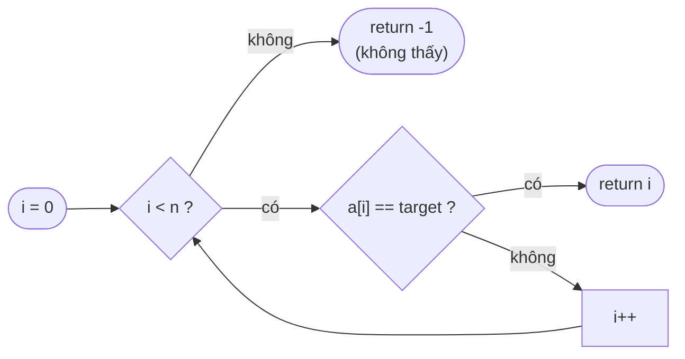
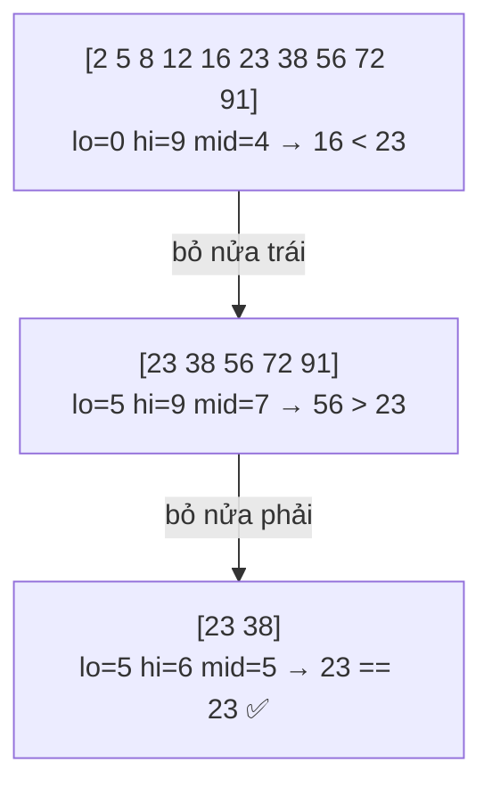
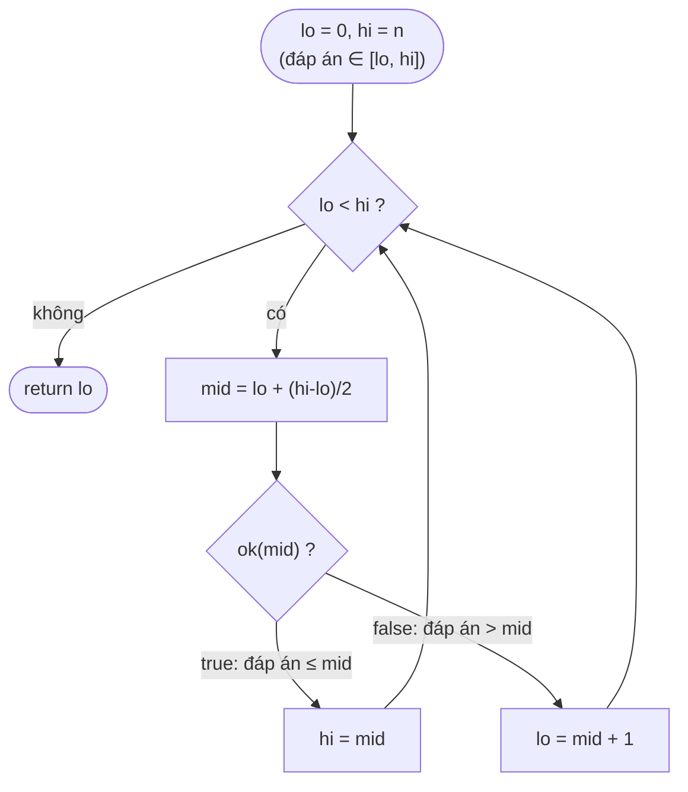
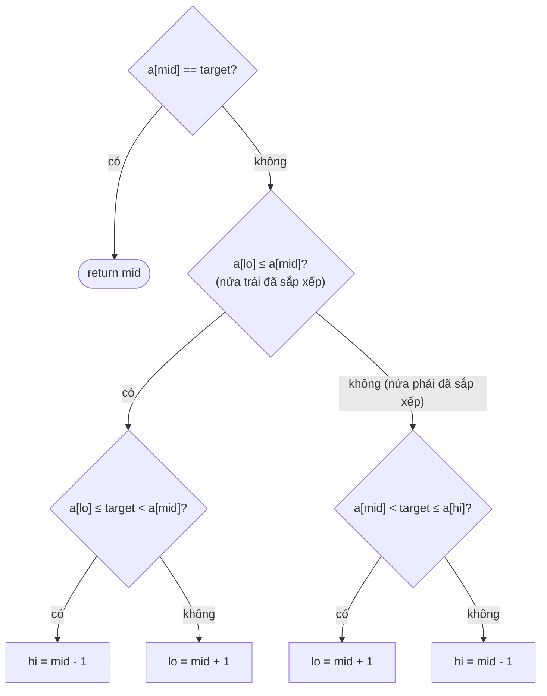
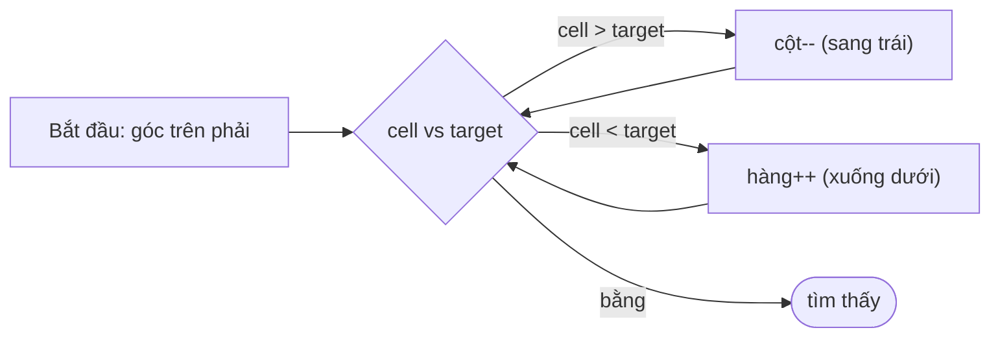
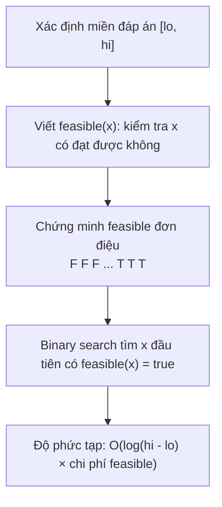
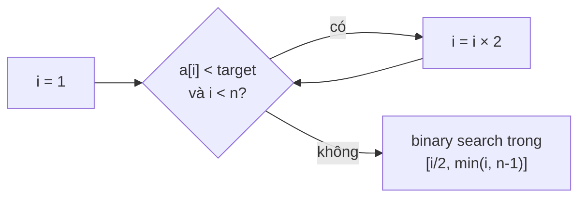

# 📚 Bài 8: Tìm kiếm & Binary Search

## 🎯 Mục tiêu bài học

- Cài đặt **tìm kiếm tuyến tính** (linear search) và biết khi nào nó là lựa chọn đúng
- Hiểu **binary search** qua **bất biến vòng lặp** (loop invariant) — không học thuộc lòng
- Tránh các lỗi **off-by-one**: phân biệt template `lo <= hi` và `lo < hi`, nửa đóng/nửa mở
- Cài được **lower_bound / upper_bound**, tìm vị trí xuất hiện đầu/cuối, vị trí chèn
- Giải các biến thể: **mảng xoay**, **đỉnh (peak)**, **ma trận 2D**
- Nắm kỹ thuật cực mạnh **"binary search trên đáp án"**: Koko ăn chuối, chở hàng, căn bậc hai
- Binary search trên **số thực**, **ternary search**, **exponential search**
- Dùng thành thạo `sort.Search`, `slices.BinarySearch` (Go) và `bisect` (Python)

---

## 📖 1. Tìm kiếm tuyến tính (Linear Search)

### Trực giác

Bạn tìm chìa khóa xe trong **ngăn kéo lộn xộn**. Không có cách nào thông minh hơn: lấy **từng món ra xem**, cho tới khi thấy chìa khóa hoặc hết đồ.

Linear search = duyệt lần lượt từ đầu đến cuối, so sánh từng phần tử với giá trị cần tìm.



Tìm `16` trong `[12, 5, 8, 23, 16, 2, 38]`:

| Bước | i | a[i] | a[i] == 16? |
|------|---|------|-------------|
| 1 | 0 | 12 | ❌ |
| 2 | 1 | 5 | ❌ |
| 3 | 2 | 8 | ❌ |
| 4 | 3 | 23 | ❌ |
| 5 | 4 | 16 | ✅ trả về 4 |

Bấm ▶ và để ý con trỏ đi qua **từng ô một** — số bước tỉ lệ thuận với vị trí của phần tử cần tìm:

<div class="algo-viz" data-viz="search" data-algo="linear" data-input="12,5,8,23,16,2,38" data-target="16" data-title="Linear Search tìm 16"></div>

=== "Go"

    ```go
    package main

    import (
    	"fmt"
    	"slices"
    )

    func linearSearch(a []int, target int) int {
    	for i, x := range a {
    		if x == target {
    			return i
    		}
    	}
    	return -1
    }

    func main() {
    	a := []int{12, 5, 8, 23, 16, 2, 38}
    	fmt.Println(linearSearch(a, 16), linearSearch(a, 99))
    	// Thư viện chuẩn (Go 1.21+):
    	fmt.Println(slices.Index(a, 16), slices.Contains(a, 99))
    	fmt.Println(slices.IndexFunc(a, func(x int) bool { return x > 20 })) // phần tử đầu tiên > 20
    }
    // Output:
    ```

=== "Python"

    ```python
    def linear_search(a: list[int], target: int) -> int:
        for i, x in enumerate(a):
            if x == target:
                return i
        return -1


    a = [12, 5, 8, 23, 16, 2, 38]
    print(linear_search(a, 16), linear_search(a, 99))
    # Built-in:
    print(a.index(16), 99 in a)          # a.index ném ValueError nếu không có
    print(next((i for i, x in enumerate(a) if x > 20), -1))  # phần tử đầu tiên > 20
    # Output:
    ```

| Best | Average | Worst | Bộ nhớ | Yêu cầu |
|------|---------|-------|--------|---------|
| O(1) | O(n) | O(n) | O(1) | Không cần sắp xếp |

!!! tip "Khi nào linear search là lựa chọn ĐÚNG?"
    - Mảng **nhỏ** (vài chục phần tử): nhanh hơn binary search nhờ đơn giản, thân thiện cache, CPU dự đoán nhánh tốt.
    - Dữ liệu **không sắp xếp** và chỉ tìm **một lần**: sort mất O(n log n) > O(n).
    - Dữ liệu là **linked list** hoặc stream — không truy cập ngẫu nhiên được.
    - Cần tìm theo **điều kiện phức tạp** (phần tử đầu tiên thỏa mãn `f(x)`).

    Nếu tìm **nhiều lần** trên cùng dữ liệu → sort một lần + binary search, hoặc dùng hash map O(1) ([Bài 3](./03-hashing.md)).

---

## 📖 2. Binary Search — Tìm kiếm nhị phân

### Trực giác: trò chơi đoán số

Bạn nghĩ một số từ 1 đến 100, tôi đoán, bạn chỉ trả lời "lớn hơn" hoặc "nhỏ hơn". Chiến lược tối ưu: **luôn đoán số ở giữa**.

- Đoán 50 → "nhỏ hơn" → loại **một nửa** (51..100), còn 1..49
- Đoán 25 → "lớn hơn" → còn 26..49
- ...

Mỗi lần đoán loại bỏ **một nửa** khả năng → tối đa ⌈log₂100⌉ = **7 lần** là chắc chắn đoán trúng!

Một ví dụ khác: tra **từ điển giấy** tìm chữ "quả". Bạn không lật từng trang từ đầu — bạn mở khoảng giữa, thấy chữ "m", biết "q" nằm ở nửa sau, lại mở giữa nửa sau...

> **Điều kiện bắt buộc**: dữ liệu phải **được sắp xếp** (hoặc tổng quát hơn: có tính **đơn điệu** — xem mục 9).

### Sức mạnh của log₂n

| n | Linear (worst) | Binary (worst) |
|---|----------------|----------------|
| 100 | 100 | 7 |
| 1 000 000 | 1 000 000 | 20 |
| 1 000 000 000 | 1 tỷ | **30** |
| Số nguyên tử trong vũ trụ ~10⁸⁰ | 10⁸⁰ | ~266 |

### Từng bước: tìm 23 trong `[2, 5, 8, 12, 16, 23, 38, 56, 72, 91]`

```text
chỉ số:  0   1   2   3   4   5   6   7   8   9
giá trị: 2   5   8  12  16  23  38  56  72  91
```

| Bước | lo | hi | mid | a[mid] | So sánh với 23 | Hành động |
|------|----|----|-----|--------|----------------|-----------|
| 1 | 0 | 9 | 4 | 16 | 16 < 23 | target ở bên phải → `lo = mid + 1 = 5` |
| 2 | 5 | 9 | 7 | 56 | 56 > 23 | target ở bên trái → `hi = mid - 1 = 6` |
| 3 | 5 | 6 | 5 | 23 | bằng! | ✅ trả về 5 |



Bấm ▶ và để ý vùng tìm kiếm `[lo, hi]` bị **cắt đôi** sau mỗi bước; chỉ 3 bước là tìm được 23 trong 10 phần tử:

<div class="algo-viz" data-viz="search" data-algo="binary" data-input="2,5,8,12,16,23,38,56,72,91" data-target="23" data-title="Binary Search tìm 23"></div>

### Bất biến (invariant) — chìa khóa để viết đúng

Thay vì học thuộc `lo = mid + 1` hay `hi = mid`, hãy phát biểu **bất biến**:

> **Bất biến**: *Nếu target có trong mảng, thì nó nằm trong đoạn `a[lo..hi]` (đóng cả hai đầu).*

- **Khởi tạo**: `lo = 0, hi = n-1` — cả mảng, bất biến đúng.
- **Duy trì**: `a[mid] < target` ⇒ mọi `a[0..mid]` đều < target (vì mảng tăng) ⇒ loại chúng: `lo = mid + 1`. Tương tự `a[mid] > target` ⇒ `hi = mid - 1`. Bất biến vẫn đúng.
- **Kết thúc**: vòng lặp chạy khi đoạn còn phần tử, tức `lo <= hi`. Khi `lo > hi`, đoạn rỗng ⇒ theo bất biến, target **không có** trong mảng.
- **Tiến triển**: mỗi bước đoạn `[lo, hi]` giảm ít nhất 1 phần tử (loại cả `mid`) ⇒ chắc chắn dừng.

```text
      đã loại (< target)      vùng còn nghi ngờ       đã loại (> target)
   [ x  x  x  x  x ]  [ lo  ...  mid  ...  hi ]  [ x  x  x  x ]
```

=== "Go"

    ```go
    package main

    import "fmt"

    // binarySearch trả về chỉ số của target trong a (đã sắp xếp tăng), hoặc -1
    func binarySearch(a []int, target int) int {
    	lo, hi := 0, len(a)-1 // bất biến: target (nếu có) nằm trong a[lo..hi]
    	for lo <= hi {        // đoạn còn ít nhất 1 phần tử
    		mid := lo + (hi-lo)/2 // tránh tràn số so với (lo+hi)/2
    		switch {
    		case a[mid] == target:
    			return mid
    		case a[mid] < target:
    			lo = mid + 1 // loại a[lo..mid]
    		default:
    			hi = mid - 1 // loại a[mid..hi]
    		}
    	}
    	return -1
    }

    func main() {
    	a := []int{2, 5, 8, 12, 16, 23, 38, 56, 72, 91}
    	for _, t := range []int{23, 2, 91, 7, 100} {
    		fmt.Printf("tìm %3d → %d\n", t, binarySearch(a, t))
    	}
    }
    // Output:
    ```

=== "Python"

    ```python
    def binary_search(a: list[int], target: int) -> int:
        lo, hi = 0, len(a) - 1          # bất biến: target (nếu có) ∈ a[lo..hi]
        while lo <= hi:
            mid = (lo + hi) // 2        # Python int không tràn số
            if a[mid] == target:
                return mid
            if a[mid] < target:
                lo = mid + 1
            else:
                hi = mid - 1
        return -1


    a = [2, 5, 8, 12, 16, 23, 38, 56, 72, 91]
    for t in (23, 2, 91, 7, 100):
        print(f"tìm {t:3d} → {binary_search(a, t)}")
    # Output:
    ```

| Best | Average | Worst | Bộ nhớ | Yêu cầu |
|------|---------|-------|--------|---------|
| O(1) | O(log n) | O(log n) | O(1) (vòng lặp) / O(log n) (đệ quy) | Mảng đã sắp xếp, truy cập ngẫu nhiên O(1) |

!!! warning "Lỗi tràn số `(lo + hi) / 2` — tồn tại 9 năm trong Java"
    Năm 2006, Joshua Bloch phát hiện `Arrays.binarySearch` của Java (và code trong sách "Programming Pearls") bị lỗi: khi `lo + hi > 2³¹ − 1`, tổng bị tràn thành số âm. Viết `lo + (hi - lo) / 2` để an toàn. Go `int` là 64-bit nên khó gặp, nhưng thói quen tốt vẫn nên giữ. Python không tràn số.

---

## 📖 3. Off-by-one: hai template chính & cách không bao giờ nhầm

Binary search nổi tiếng là **dễ hiểu nhưng khó viết đúng**. Knuth kể: thuật toán công bố năm 1946 nhưng phiên bản **không lỗi** đầu tiên xuất hiện năm 1962! Lỗi hay gặp: vòng lặp vô hạn, bỏ sót phần tử, truy cập ngoài mảng.

Bí quyết: **chọn một quy ước khoảng và giữ nhất quán**.

| | Template A: đoạn đóng `[lo, hi]` | Template B: nửa mở `[lo, hi)` |
|--|-----------------------------------|-------------------------------|
| Khởi tạo | `lo = 0, hi = n - 1` | `lo = 0, hi = n` |
| Điều kiện lặp | `lo <= hi` (đoạn còn phần tử) | `lo < hi` (đoạn còn phần tử) |
| Loại bên trái | `lo = mid + 1` | `lo = mid + 1` |
| Loại bên phải | `hi = mid - 1` | `hi = mid` (vì hi là **biên mở**) |
| Khi kết thúc | `lo = hi + 1` | `lo == hi` |
| Hợp với | Tìm **chính xác** một giá trị | Tìm **biên** (lower/upper bound) |

### Tư duy "predicate": tìm vị trí `true` đầu tiên

Cách tổng quát và an toàn nhất: biến mọi bài binary search thành **tìm chỉ số đầu tiên mà điều kiện `ok(i)` đúng**, với `ok` **đơn điệu**: `false false ... false true true ... true`.

```text
 i:     0      1      2      3      4      5      6
ok(i): false  false  false  TRUE   true   true   true
                             ↑
                      cần tìm vị trí này
```



Nếu không có `i` nào thỏa → trả về `n`. Đây chính là cách `sort.Search` của Go hoạt động.

!!! warning "Bẫy vòng lặp vô hạn: `lo = mid`"
    Nếu bạn viết `lo = mid` (không +1) với `mid = (lo+hi)/2`: khi `hi = lo + 1` thì `mid = lo` → `lo = mid = lo` → **kẹt mãi**. Quy tắc: nếu cần `lo = mid` thì phải lấy **mid làm tròn lên**: `mid = lo + (hi - lo + 1) / 2`. Tốt nhất là tránh hẳn bằng cách dùng template predicate ở trên.

!!! tip "Kiểm tra bằng mảng 0, 1, 2 phần tử"
    Hầu hết lỗi off-by-one lộ ra với mảng rỗng, 1 phần tử, 2 phần tử, và target nhỏ hơn min / lớn hơn max. Luôn thử các trường hợp này.

---

## 📖 4. Lower bound & Upper bound — vị trí đầu tiên / cuối cùng

Khi mảng có **phần tử trùng**, binary search thường trả về một vị trí "bất kỳ" của target. Thường ta cần chính xác hơn:

- **lower_bound(x)**: chỉ số **đầu tiên** có `a[i] >= x` (predicate `a[i] >= x`)
- **upper_bound(x)**: chỉ số **đầu tiên** có `a[i] > x` (predicate `a[i] > x`)

```text
chỉ số:   0  1  2  3  4  5  6  7
a:        1  2  4  4  4  4  7  9
                ↑           ↑
      lower_bound(4)=2   upper_bound(4)=6

- Lần xuất hiện đầu tiên của 4 = lower_bound(4) = 2
- Lần xuất hiện cuối cùng của 4 = upper_bound(4) - 1 = 5
- Số lần xuất hiện của 4        = upper_bound(4) - lower_bound(4) = 4
- Vị trí chèn 5 để giữ thứ tự   = lower_bound(5) = 6
- Số phần tử < 4                = lower_bound(4) = 2
```

Ứng dụng trực tiếp: **LeetCode 34** (First and Last Position), **LeetCode 35** (Search Insert Position = lower_bound), đếm số phần tử trong khoảng `[L, R]` = `upper_bound(R) − lower_bound(L)`.

=== "Go"

    ```go
    package main

    import "fmt"

    // lowerBound: chỉ số đầu tiên i mà a[i] >= x (len(a) nếu không có)
    func lowerBound(a []int, x int) int {
    	lo, hi := 0, len(a) // nửa mở [lo, hi)
    	for lo < hi {
    		mid := lo + (hi-lo)/2
    		if a[mid] >= x {
    			hi = mid // mid có thể là đáp án → giữ lại
    		} else {
    			lo = mid + 1
    		}
    	}
    	return lo
    }

    // upperBound: chỉ số đầu tiên i mà a[i] > x
    func upperBound(a []int, x int) int {
    	lo, hi := 0, len(a)
    	for lo < hi {
    		mid := lo + (hi-lo)/2
    		if a[mid] > x {
    			hi = mid
    		} else {
    			lo = mid + 1
    		}
    	}
    	return lo
    }

    // LeetCode 34: vị trí đầu và cuối của target
    func searchRange(a []int, target int) [2]int {
    	l := lowerBound(a, target)
    	if l == len(a) || a[l] != target {
    		return [2]int{-1, -1}
    	}
    	return [2]int{l, upperBound(a, target) - 1}
    }

    func main() {
    	a := []int{1, 2, 4, 4, 4, 4, 7, 9}
    	fmt.Println("lower_bound(4) =", lowerBound(a, 4), "| upper_bound(4) =", upperBound(a, 4))
    	fmt.Println("searchRange(4) =", searchRange(a, 4), "| searchRange(5) =", searchRange(a, 5))
    	fmt.Println("số lần xuất hiện của 4:", upperBound(a, 4)-lowerBound(a, 4))
    	fmt.Println("vị trí chèn 5:", lowerBound(a, 5), "| chèn 0:", lowerBound(a, 0), "| chèn 10:", lowerBound(a, 10))
    	fmt.Println("số phần tử trong [2, 7]:", upperBound(a, 7)-lowerBound(a, 2))
    }
    // Output:
    ```

=== "Python"

    ```python
    def lower_bound(a: list[int], x: int) -> int:
        lo, hi = 0, len(a)              # nửa mở [lo, hi)
        while lo < hi:
            mid = (lo + hi) // 2
            if a[mid] >= x:
                hi = mid
            else:
                lo = mid + 1
        return lo


    def upper_bound(a: list[int], x: int) -> int:
        lo, hi = 0, len(a)
        while lo < hi:
            mid = (lo + hi) // 2
            if a[mid] > x:
                hi = mid
            else:
                lo = mid + 1
        return lo


    def search_range(a: list[int], target: int) -> list[int]:
        l = lower_bound(a, target)
        if l == len(a) or a[l] != target:
            return [-1, -1]
        return [l, upper_bound(a, target) - 1]


    a = [1, 2, 4, 4, 4, 4, 7, 9]
    print("lower_bound(4) =", lower_bound(a, 4), "| upper_bound(4) =", upper_bound(a, 4))
    print("searchRange(4) =", search_range(a, 4), "| searchRange(5) =", search_range(a, 5))
    print("số lần xuất hiện của 4:", upper_bound(a, 4) - lower_bound(a, 4))
    print("vị trí chèn 5:", lower_bound(a, 5), "| chèn 0:", lower_bound(a, 0), "| chèn 10:", lower_bound(a, 10))
    print("số phần tử trong [2, 7]:", upper_bound(a, 7) - lower_bound(a, 2))
    # Output:
    ```

Theo dõi `lowerBound(a, 4)` trên `[1, 2, 4, 4, 4, 4, 7, 9]`:

| lo | hi | mid | a[mid] | a[mid] >= 4? | Hành động |
|----|----|-----|--------|--------------|-----------|
| 0 | 8 | 4 | 4 | ✅ | hi = 4 |
| 0 | 4 | 2 | 4 | ✅ | hi = 2 |
| 0 | 2 | 1 | 2 | ❌ | lo = 2 |
| 2 | 2 | — | — | lo == hi | **trả về 2** |

Để ý: dù gặp `a[mid] == 4` ngay bước 1, ta **không dừng** mà tiếp tục thu hẹp về phía trái để tìm vị trí **đầu tiên**.

---

## 📖 5. Mảng đã sắp xếp bị xoay (Rotated Sorted Array)

### Bài toán (LeetCode 33)

Mảng tăng dần `[0,1,2,4,5,6,7]` bị **xoay** tại một điểm không biết trước thành `[4,5,6,7,0,1,2]`. Tìm `target` trong O(log n).

### Trực giác

Hình dung một **đồng hồ**: các số tăng dần theo chiều kim đồng hồ, nhưng bạn bắt đầu đọc từ một vị trí bất kỳ. Mảng xoay gồm **hai đoạn tăng dần** nối nhau.

```text
giá trị
  7 |          ●
  6 |       ●
  5 |    ●
  4 | ●
  2 |                         ●
  1 |                     ●
  0 |                 ●
    +---------------------------- chỉ số
      0  1  2  3      4   5   6
      [ đoạn cao ]    [ đoạn thấp ]
```

**Quan sát then chốt**: Cắt ở `mid`, **ít nhất một nửa luôn được sắp xếp** hoàn chỉnh.

- Nếu `a[lo] <= a[mid]` → nửa **trái** `[lo..mid]` tăng dần. Kiểm tra target có nằm trong `[a[lo], a[mid])` không: có → đi trái, không → đi phải.
- Ngược lại nửa **phải** `[mid..hi]` tăng dần. Kiểm tra target ∈ `(a[mid], a[hi]]`.



Tìm `0` trong `[4,5,6,7,0,1,2]`:

| lo | hi | mid | a[mid] | Nửa sắp xếp | target trong nửa đó? | Hành động |
|----|----|-----|--------|-------------|----------------------|-----------|
| 0 | 6 | 3 | 7 | trái [4..7] | 0 ∉ [4, 7) | lo = 4 |
| 4 | 6 | 5 | 1 | trái [0..1] | 0 ∈ [0, 1) | hi = 4 |
| 4 | 4 | 4 | 0 | — | bằng target | ✅ trả về 4 |

### Biến thể: tìm phần tử nhỏ nhất (LeetCode 153)

Phần tử nhỏ nhất = **điểm xoay**. So sánh `a[mid]` với `a[hi]`: nếu `a[mid] > a[hi]` thì điểm xoay ở **bên phải** mid; ngược lại ở `[lo..mid]`.

=== "Go"

    ```go
    package main

    import "fmt"

    func searchRotated(a []int, target int) int {
    	lo, hi := 0, len(a)-1
    	for lo <= hi {
    		mid := lo + (hi-lo)/2
    		if a[mid] == target {
    			return mid
    		}
    		if a[lo] <= a[mid] { // nửa trái tăng dần
    			if a[lo] <= target && target < a[mid] {
    				hi = mid - 1
    			} else {
    				lo = mid + 1
    			}
    		} else { // nửa phải tăng dần
    			if a[mid] < target && target <= a[hi] {
    				lo = mid + 1
    			} else {
    				hi = mid - 1
    			}
    		}
    	}
    	return -1
    }

    func findMin(a []int) int {
    	lo, hi := 0, len(a)-1
    	for lo < hi {
    		mid := lo + (hi-lo)/2
    		if a[mid] > a[hi] {
    			lo = mid + 1 // min nằm bên phải mid
    		} else {
    			hi = mid // mid có thể chính là min
    		}
    	}
    	return a[lo]
    }

    func main() {
    	a := []int{4, 5, 6, 7, 0, 1, 2}
    	fmt.Println(searchRotated(a, 0), searchRotated(a, 5), searchRotated(a, 3))
    	fmt.Println("min:", findMin(a), findMin([]int{3, 1, 2}), findMin([]int{1, 2, 3}))
    }
    // Output:
    ```

=== "Python"

    ```python
    def search_rotated(a: list[int], target: int) -> int:
        lo, hi = 0, len(a) - 1
        while lo <= hi:
            mid = (lo + hi) // 2
            if a[mid] == target:
                return mid
            if a[lo] <= a[mid]:                       # nửa trái tăng
                if a[lo] <= target < a[mid]:
                    hi = mid - 1
                else:
                    lo = mid + 1
            else:                                     # nửa phải tăng
                if a[mid] < target <= a[hi]:
                    lo = mid + 1
                else:
                    hi = mid - 1
        return -1


    def find_min(a: list[int]) -> int:
        lo, hi = 0, len(a) - 1
        while lo < hi:
            mid = (lo + hi) // 2
            if a[mid] > a[hi]:
                lo = mid + 1
            else:
                hi = mid
        return a[lo]


    a = [4, 5, 6, 7, 0, 1, 2]
    print(search_rotated(a, 0), search_rotated(a, 5), search_rotated(a, 3))
    print("min:", find_min(a), find_min([3, 1, 2]), find_min([1, 2, 3]))
    # Output:
    ```

!!! note "Có phần tử trùng (LeetCode 81, 154)"
    Với `[1,0,1,1,1]`, `a[lo] == a[mid] == a[hi]` → không biết nửa nào sắp xếp. Cách xử lý: `lo++` (hoặc `hi--`) để thu hẹp dần. Worst case thành O(n) — không tránh được.

---

## 📖 6. Tìm đỉnh (Peak Element) — LeetCode 162

### Bài toán

Tìm **một** chỉ số `i` mà `a[i] > a[i-1]` và `a[i] > a[i+1]` (coi `a[-1] = a[n] = −∞`). Mảng **không** sắp xếp! Vậy mà vẫn O(log n)?

### Trực giác: leo núi trong sương mù

Bạn đứng giữa dãy núi, sương mù dày không thấy xa. Nhìn sang bên phải: nếu **đất dốc lên**, cứ đi về bên phải — chắc chắn sẽ gặp một đỉnh (vì hoặc dốc lên mãi đến tận cùng, mà cuối là −∞ nên điểm cuối là đỉnh; hoặc sẽ có chỗ bắt đầu đi xuống = đỉnh).

- `a[mid] < a[mid+1]` → đang lên dốc → **có đỉnh ở bên phải**: `lo = mid + 1`
- `a[mid] > a[mid+1]` → đang xuống dốc → **có đỉnh ở `mid` hoặc bên trái**: `hi = mid`

```text
a:   1   2   1   3   5   6   4
          ↑                ↑
       đỉnh (1)         đỉnh (5)  — trả về đỉnh nào cũng được
```

Đây là ví dụ đẹp cho thấy binary search **không cần mảng sắp xếp** — chỉ cần một tính chất cho phép **loại bỏ một nửa** mà không bỏ lỡ đáp án.

---

## 📖 7. Tìm trong ma trận 2D

### LeetCode 74: Ma trận "trải phẳng" được sắp xếp

Mỗi hàng tăng dần, và phần tử đầu hàng sau > phần tử cuối hàng trước. Khi đó ma trận `m×n` chính là **một mảng tăng dần dài m·n** được "gấp" lại. Chỉ số 1D `k` ↔ ô `(k / n, k % n)`.

```text
 1   3   5   7        chỉ số 1D:  0  1  2  3
10  11  16  20                    4  5  6  7
23  30  34  60                    8  9 10 11
k = 6 → hàng 6/4 = 1, cột 6%4 = 2 → 16
```

### LeetCode 240: Hàng tăng, cột tăng (nhưng không trải phẳng được)

Kỹ thuật **"bậc thang"** (staircase): bắt đầu ở **góc trên phải**. Nếu ô hiện tại > target → cả cột bên dưới còn lớn hơn → **sang trái**. Nếu < target → cả hàng bên trái còn nhỏ hơn → **xuống dưới**. O(m + n).



=== "Go"

    ```go
    package main

    import "fmt"

    // LeetCode 162: trả về chỉ số một đỉnh
    func findPeakElement(a []int) int {
    	lo, hi := 0, len(a)-1
    	for lo < hi {
    		mid := lo + (hi-lo)/2
    		if a[mid] < a[mid+1] {
    			lo = mid + 1 // đang lên dốc → đỉnh ở bên phải
    		} else {
    			hi = mid // đang xuống dốc → đỉnh ở mid hoặc bên trái
    		}
    	}
    	return lo
    }

    // LeetCode 74: ma trận trải phẳng được
    func searchMatrix(m [][]int, target int) bool {
    	rows, cols := len(m), len(m[0])
    	lo, hi := 0, rows*cols-1
    	for lo <= hi {
    		mid := lo + (hi-lo)/2
    		v := m[mid/cols][mid%cols] // chỉ số 1D → 2D
    		switch {
    		case v == target:
    			return true
    		case v < target:
    			lo = mid + 1
    		default:
    			hi = mid - 1
    		}
    	}
    	return false
    }

    // LeetCode 240: bậc thang từ góc trên phải
    func searchMatrixII(m [][]int, target int) bool {
    	r, c := 0, len(m[0])-1
    	for r < len(m) && c >= 0 {
    		switch {
    		case m[r][c] == target:
    			return true
    		case m[r][c] > target:
    			c--
    		default:
    			r++
    		}
    	}
    	return false
    }

    func main() {
    	fmt.Println("peak:", findPeakElement([]int{1, 2, 1, 3, 5, 6, 4}))
    	m := [][]int{{1, 3, 5, 7}, {10, 11, 16, 20}, {23, 30, 34, 60}}
    	fmt.Println("LC74:", searchMatrix(m, 16), searchMatrix(m, 13))
    	m2 := [][]int{{1, 4, 7, 11}, {2, 5, 8, 12}, {3, 6, 9, 16}, {10, 13, 14, 17}}
    	fmt.Println("LC240:", searchMatrixII(m2, 5), searchMatrixII(m2, 15))
    }
    // Output:
    ```

=== "Python"

    ```python
    def find_peak_element(a: list[int]) -> int:
        lo, hi = 0, len(a) - 1
        while lo < hi:
            mid = (lo + hi) // 2
            if a[mid] < a[mid + 1]:
                lo = mid + 1
            else:
                hi = mid
        return lo


    def search_matrix(m: list[list[int]], target: int) -> bool:
        rows, cols = len(m), len(m[0])
        lo, hi = 0, rows * cols - 1
        while lo <= hi:
            mid = (lo + hi) // 2
            v = m[mid // cols][mid % cols]
            if v == target:
                return True
            if v < target:
                lo = mid + 1
            else:
                hi = mid - 1
        return False


    def search_matrix_ii(m: list[list[int]], target: int) -> bool:
        r, c = 0, len(m[0]) - 1
        while r < len(m) and c >= 0:
            if m[r][c] == target:
                return True
            if m[r][c] > target:
                c -= 1
            else:
                r += 1
        return False


    print("peak:", find_peak_element([1, 2, 1, 3, 5, 6, 4]))
    m = [[1, 3, 5, 7], [10, 11, 16, 20], [23, 30, 34, 60]]
    print("LC74:", search_matrix(m, 16), search_matrix(m, 13))
    m2 = [[1, 4, 7, 11], [2, 5, 8, 12], [3, 6, 9, 16], [10, 13, 14, 17]]
    print("LC240:", search_matrix_ii(m2, 5), search_matrix_ii(m2, 15))
    # Output:
    ```

---

## 📖 8. Binary Search trên đáp án (Binary Search on Answer)

Đây là kỹ thuật **mạnh nhất và hay gặp nhất** trong phỏng vấn/thi lập trình. Dấu hiệu nhận biết:

- Đề hỏi **"giá trị nhỏ nhất / lớn nhất sao cho ..."** (minimize the maximum, maximize the minimum...)
- Nếu biết đáp án là `x`, **kiểm tra** "x có khả thi không?" thì **dễ** (thường O(n) tham lam).
- Tính khả thi **đơn điệu**: nếu `x` khả thi thì mọi `x' > x` cũng khả thi (hoặc ngược lại).

⇒ Không tìm trong mảng, mà **binary search trên miền giá trị của đáp án** `[lo, hi]`, dùng hàm `feasible(x)` làm predicate.

```text
 x (tốc độ):      1      2      3      4      5      6  ...  11
 feasible(x):   false  false  false  TRUE   true   true ...  true
                                      ↑
                          đáp án = x nhỏ nhất khả thi
```



### Ví dụ 1: Koko ăn chuối (LeetCode 875)

Koko có các đống chuối `piles = [3, 6, 7, 11]` và `h = 8` giờ. Mỗi giờ Koko chọn một đống, ăn tối đa `k` quả (nếu đống ít hơn `k` thì ăn hết đống đó và nghỉ phần còn lại của giờ). Tìm **tốc độ `k` nhỏ nhất** để ăn hết trong `h` giờ.

- Miền đáp án: `k ∈ [1, max(piles)]` (ăn nhanh hơn max(piles) cũng không giúp gì).
- `feasible(k)`: tổng số giờ = Σ ⌈pile / k⌉ ≤ h?
- Đơn điệu: ăn nhanh hơn thì tốn ít giờ hơn ✅.

| k | Giờ cho từng đống ⌈p/k⌉ | Tổng | ≤ 8? |
|---|------------------------|------|------|
| 1 | 3 + 6 + 7 + 11 | 27 | ❌ |
| 3 | 1 + 2 + 3 + 4 | 10 | ❌ |
| **4** | 1 + 2 + 2 + 3 | **8** | ✅ |
| 6 | 1 + 1 + 2 + 2 | 6 | ✅ |
| 11 | 1 + 1 + 1 + 1 | 4 | ✅ |

Binary search trên `[1, 11]` tìm được **k = 4** chỉ sau ~4 lần gọi `feasible`.

### Ví dụ 2: Chở hàng trong D ngày (LeetCode 1011)

Băng chuyền có các kiện hàng `weights = [1,2,3,4,5,6,7,8,9,10]` phải chở **theo đúng thứ tự** trong `days = 5` ngày. Tìm **tải trọng tàu nhỏ nhất**.

- Miền: `[max(weights), sum(weights)]` = `[10, 55]` (tàu phải chở được kiện nặng nhất; chở tất cả trong 1 ngày là đủ).
- `feasible(cap)`: xếp tham lam — chất hàng cho tới khi quá tải thì sang ngày mới; số ngày ≤ days?
- Đáp án: **15** — `[1,2,3,4,5] [6,7] [8] [9] [10]`.

### Ví dụ 3: Căn bậc hai nguyên (LeetCode 69)

Tìm `⌊√x⌋` không dùng hàm có sẵn = số `r` **lớn nhất** mà `r² ≤ x`. Predicate `r*r > x` có dạng `F F F T T T` → tìm `true` đầu tiên rồi trừ 1.

=== "Go"

    ```go
    package main

    import (
    	"fmt"
    	"slices"
    )

    // firstTrue: số nhỏ nhất x trong [lo, hi] mà ok(x) = true (giả sử ok(hi) = true)
    func firstTrue(lo, hi int, ok func(int) bool) int {
    	for lo < hi {
    		mid := lo + (hi-lo)/2
    		if ok(mid) {
    			hi = mid
    		} else {
    			lo = mid + 1
    		}
    	}
    	return lo
    }

    func minEatingSpeed(piles []int, h int) int {
    	return firstTrue(1, slices.Max(piles), func(k int) bool {
    		hours := 0
    		for _, p := range piles {
    			hours += (p + k - 1) / k // ⌈p/k⌉ bằng số nguyên
    		}
    		return hours <= h
    	})
    }

    func shipWithinDays(weights []int, days int) int {
    	total := 0
    	for _, w := range weights {
    		total += w
    	}
    	return firstTrue(slices.Max(weights), total, func(capacity int) bool {
    		need, load := 1, 0
    		for _, w := range weights {
    			if load+w > capacity { // quá tải → sang ngày mới
    				need++
    				load = 0
    			}
    			load += w
    		}
    		return need <= days
    	})
    }

    func mySqrt(x int) int {
    	// r nhỏ nhất mà r*r > x, trừ 1
    	return firstTrue(0, x+1, func(r int) bool { return r*r > x }) - 1
    }

    func main() {
    	fmt.Println("Koko:", minEatingSpeed([]int{3, 6, 7, 11}, 8), minEatingSpeed([]int{30, 11, 23, 4, 20}, 5))
    	fmt.Println("Ship:", shipWithinDays([]int{1, 2, 3, 4, 5, 6, 7, 8, 9, 10}, 5))
    	fmt.Println("Sqrt:", mySqrt(8), mySqrt(16), mySqrt(0), mySqrt(2147395599))
    }
    // Output:
    ```

=== "Python"

    ```python
    from typing import Callable


    def first_true(lo: int, hi: int, ok: Callable[[int], bool]) -> int:
        """Số nhỏ nhất x ∈ [lo, hi] mà ok(x) đúng (giả sử ok(hi) đúng)."""
        while lo < hi:
            mid = (lo + hi) // 2
            if ok(mid):
                hi = mid
            else:
                lo = mid + 1
        return lo


    def min_eating_speed(piles: list[int], h: int) -> int:
        return first_true(1, max(piles),
                          lambda k: sum((p + k - 1) // k for p in piles) <= h)


    def ship_within_days(weights: list[int], days: int) -> int:
        def feasible(cap: int) -> bool:
            need, load = 1, 0
            for w in weights:
                if load + w > cap:
                    need += 1
                    load = 0
                load += w
            return need <= days

        return first_true(max(weights), sum(weights), feasible)


    def my_sqrt(x: int) -> int:
        return first_true(0, x + 1, lambda r: r * r > x) - 1


    print("Koko:", min_eating_speed([3, 6, 7, 11], 8), min_eating_speed([30, 11, 23, 4, 20], 5))
    print("Ship:", ship_within_days([1, 2, 3, 4, 5, 6, 7, 8, 9, 10], 5))
    print("Sqrt:", my_sqrt(8), my_sqrt(16), my_sqrt(0), my_sqrt(2147395599))
    # Output:
    ```

**Độ phức tạp**: Koko O(n · log(max)); Ship O(n · log(sum)); Sqrt O(log x).

!!! tip "Khuôn mẫu 'binary search on answer' — 4 câu hỏi"
    1. Đáp án nằm trong khoảng nào? (`lo`, `hi` — hãy chắc chắn `hi` luôn khả thi)
    2. Cho trước một giá trị `x`, kiểm tra khả thi thế nào? (thường tham lam O(n))
    3. Tính khả thi có đơn điệu không? (tăng x thì dễ hơn hay khó hơn?)
    4. Tìm `x` nhỏ nhất khả thi (hay lớn nhất)? → chọn predicate cho đúng chiều.

    Bài tương tự: LeetCode 410 (Split Array Largest Sum), 1482 (Minimum Days to Make Bouquets), 2064, 1760, 774 (Minimize Max Distance to Gas Station).

---

## 📖 9. Binary Search trên số thực

Khi đáp án là **số thực** (căn bậc hai với độ chính xác 10⁻⁹, thời điểm hai xe gặp nhau...), không còn khái niệm `mid + 1`. Có hai cách dừng:

1. **Lặp đến khi `hi - lo < eps`** — cẩn thận: nếu `eps` quá nhỏ so với độ lớn của số, do giới hạn độ chính xác float64 mà `mid` có thể không đổi → lặp vô hạn.
2. **Lặp số lần cố định** (an toàn hơn): mỗi lần khoảng giảm một nửa, **100 lần** giảm 2¹⁰⁰ ≈ 10³⁰ lần — thừa đủ cho float64.

## 📖 10. Ternary Search — tìm cực trị của hàm "một đỉnh"

Hàm **unimodal** (đơn đỉnh): tăng rồi giảm (hoặc giảm rồi tăng), ví dụ lợi nhuận theo giá bán: giá quá thấp → lỗ, quá cao → không ai mua; ở giữa có điểm tối ưu.

Chia khoảng `[lo, hi]` thành 3 phần bằng `m1 < m2`:

- `f(m1) < f(m2)` → đỉnh **không thể** nằm trong `[lo, m1]` → `lo = m1`
- ngược lại → đỉnh không nằm trong `[m2, hi]` → `hi = m2`

```text
 f(x)
   |          ___
   |        /     \
   |      /    ●    \          f(m1) < f(m2) → bỏ đoạn [lo, m1]
   |    ●             \
   |  /                 \
   +--lo----m1----m2-----hi--→ x
```

Mỗi bước loại **1/3** khoảng → O(log₃/₂ n). Với mảng số nguyên, thường dùng cách của bài Peak Element (so sánh `f(mid)` với `f(mid+1)`) — gọn hơn và nhanh hơn.

## 📖 11. Exponential Search — khi không biết kích thước mảng

Tìm trong mảng **rất lớn hoặc vô hạn** (stream đã sắp xếp, API chỉ cho `get(i)`), hoặc khi target **nằm gần đầu**:

1. Tìm biên: thử `i = 1, 2, 4, 8, 16, ...` cho tới khi `a[i] >= target` (hoặc vượt mảng).
2. Binary search trong `[i/2, i]`.

Độ phức tạp **O(log p)** với `p` là vị trí của target — tốt hơn O(log n) khi target ở gần đầu. Đây cũng là ý tưởng của **galloping mode** trong Timsort ([Bài 7](./07-sorting.md)).



=== "Go"

    ```go
    package main

    import (
    	"fmt"
    	"math"
    )

    // Căn bậc hai số thực: lặp 100 lần cố định
    func sqrtFloat(x float64) float64 {
    	lo, hi := 0.0, math.Max(1, x)
    	for i := 0; i < 100; i++ {
    		mid := (lo + hi) / 2
    		if mid*mid < x {
    			lo = mid
    		} else {
    			hi = mid
    		}
    	}
    	return lo
    }

    // Ternary search: tìm x làm f đạt max trên [lo, hi], f unimodal
    func ternaryMax(f func(float64) float64, lo, hi float64) float64 {
    	for i := 0; i < 200; i++ {
    		m1 := lo + (hi-lo)/3
    		m2 := hi - (hi-lo)/3
    		if f(m1) < f(m2) {
    			lo = m1
    		} else {
    			hi = m2
    		}
    	}
    	return (lo + hi) / 2
    }

    // Exponential search trên mảng đã sắp xếp
    func exponentialSearch(a []int, target int) int {
    	if len(a) == 0 {
    		return -1
    	}
    	i := 1
    	for i < len(a) && a[i] < target {
    		i *= 2 // nhảy gấp đôi
    	}
    	lo, hi := i/2, min(i, len(a)-1)
    	for lo <= hi {
    		mid := lo + (hi-lo)/2
    		switch {
    		case a[mid] == target:
    			return mid
    		case a[mid] < target:
    			lo = mid + 1
    		default:
    			hi = mid - 1
    		}
    	}
    	return -1
    }

    func main() {
    	fmt.Printf("sqrt(2)  ≈ %.12f (math.Sqrt: %.12f)\n", sqrtFloat(2), math.Sqrt(2))
    	fmt.Printf("sqrt(0.25) ≈ %.6f\n", sqrtFloat(0.25))

    	// Lợi nhuận khi bán giá p (nghìn đồng): (p - 20) * (100 - p) → max tại p = 60
    	profit := func(p float64) float64 { return (p - 20) * (100 - p) }
    	best := ternaryMax(profit, 20, 100)
    	fmt.Printf("giá tối ưu ≈ %.4f, lợi nhuận ≈ %.2f\n", best, profit(best))

    	a := make([]int, 1000)
    	for i := range a {
    		a[i] = 3 * i // 0, 3, 6, ...
    	}
    	fmt.Println(exponentialSearch(a, 27), exponentialSearch(a, 2997), exponentialSearch(a, 28))
    }
    // Output:
    ```

=== "Python"

    ```python
    import math
    from typing import Callable


    def sqrt_float(x: float) -> float:
        lo, hi = 0.0, max(1.0, x)
        for _ in range(100):                  # lặp cố định: an toàn với float
            mid = (lo + hi) / 2
            if mid * mid < x:
                lo = mid
            else:
                hi = mid
        return lo


    def ternary_max(f: Callable[[float], float], lo: float, hi: float) -> float:
        for _ in range(200):
            m1 = lo + (hi - lo) / 3
            m2 = hi - (hi - lo) / 3
            if f(m1) < f(m2):
                lo = m1
            else:
                hi = m2
        return (lo + hi) / 2


    def exponential_search(a: list[int], target: int) -> int:
        if not a:
            return -1
        i = 1
        while i < len(a) and a[i] < target:
            i *= 2
        lo, hi = i // 2, min(i, len(a) - 1)
        while lo <= hi:
            mid = (lo + hi) // 2
            if a[mid] == target:
                return mid
            if a[mid] < target:
                lo = mid + 1
            else:
                hi = mid - 1
        return -1


    print(f"sqrt(2)  ≈ {sqrt_float(2):.12f} (math.sqrt: {math.sqrt(2):.12f})")
    print(f"sqrt(0.25) ≈ {sqrt_float(0.25):.6f}")
    profit = lambda p: (p - 20) * (100 - p)
    best = ternary_max(profit, 20, 100)
    print(f"giá tối ưu ≈ {best:.4f}, lợi nhuận ≈ {profit(best):.2f}")
    a = [3 * i for i in range(1000)]
    print(exponential_search(a, 27), exponential_search(a, 2997), exponential_search(a, 28))
    # Output:
    ```

---

## 📖 12. Thư viện chuẩn: Go `sort.Search`, `slices.BinarySearch` & Python `bisect`

Trong code thật, **đừng tự viết binary search** nếu thư viện đã có — ít lỗi hơn và người đọc hiểu ngay.

| Nhu cầu | Go | Python |
|---------|----|--------|
| Chỉ số đầu tiên `ok(i)` đúng | `sort.Search(n, func(i int) bool)` | `bisect_left(range(n), True, key=ok)` (3.10+) |
| lower_bound (`>= x`) | `sort.SearchInts(a, x)`, `slices.BinarySearch(a, x)` | `bisect.bisect_left(a, x)` |
| upper_bound (`> x`) | `sort.Search(len(a), func(i int) bool { return a[i] > x })` | `bisect.bisect_right(a, x)` |
| Có tồn tại không | `_, found := slices.BinarySearch(a, x)` | `i < len(a) and a[i] == x` |
| Theo khóa của struct | `slices.BinarySearchFunc(a, target, cmp)` | `bisect_left(a, x, key=...)` (3.10+) |
| Chèn giữ thứ tự | `slices.Insert(a, i, x)` (với i từ BinarySearch) | `bisect.insort(a, x)` |

=== "Go"

    ```go
    package main

    import (
    	"cmp"
    	"fmt"
    	"slices"
    	"sort"
    )

    type Event struct {
    	Time int
    	Name string
    }

    func main() {
    	a := []int{1, 2, 4, 4, 4, 4, 7, 9}

    	// sort.Search: chỉ số nhỏ nhất i trong [0, n) mà f(i) = true
    	lower := sort.Search(len(a), func(i int) bool { return a[i] >= 4 })
    	upper := sort.Search(len(a), func(i int) bool { return a[i] > 4 })
    	fmt.Println("lower/upper của 4:", lower, upper)

    	// slices.BinarySearch (Go 1.21+): trả về (vị trí chèn, có tìm thấy không)
    	i, found := slices.BinarySearch(a, 4)
    	fmt.Println("BinarySearch(4):", i, found)
    	i, found = slices.BinarySearch(a, 5)
    	fmt.Println("BinarySearch(5):", i, found)

    	// Chèn 5 mà vẫn giữ thứ tự
    	a = slices.Insert(a, i, 5)
    	fmt.Println("sau khi chèn 5:", a)

    	// Tìm theo khóa của struct: sự kiện đầu tiên lúc >= 10h
    	events := []Event{{8, "họp"}, {9, "code"}, {12, "ăn trưa"}, {15, "review"}}
	j, _ := slices.BinarySearchFunc(events, 10, func(e Event, t int) int { return cmp.Compare(e.Time, t) })
    	fmt.Println("sự kiện đầu tiên từ 10h:", events[j])

    	// sort.Search cho bài "binary search on answer": số nhỏ nhất có bình phương >= 50
    	fmt.Println("ceil(sqrt(50)) =", sort.Search(100, func(x int) bool { return x*x >= 50 }))
    }
    // Output:
    ```

=== "Python"

    ```python
    import bisect
    from dataclasses import dataclass

    a = [1, 2, 4, 4, 4, 4, 7, 9]
    print("lower/upper của 4:", bisect.bisect_left(a, 4), bisect.bisect_right(a, 4))

    i = bisect.bisect_left(a, 5)
    print("bisect_left(5):", i, "có 5?", i < len(a) and a[i] == 5)

    bisect.insort(a, 5)                      # chèn giữ thứ tự, O(n) do dịch phần tử
    print("sau khi chèn 5:", a)


    @dataclass
    class Event:
        time: int
        name: str


    events = [Event(8, "họp"), Event(9, "code"), Event(12, "ăn trưa"), Event(15, "review")]
    j = bisect.bisect_left(events, 10, key=lambda e: e.time)   # key= từ Python 3.10
    print("sự kiện đầu tiên từ 10h:", events[j])

    # "binary search on answer" với bisect + key trên range (lười, không tạo list)
    print("ceil(sqrt(50)) =", bisect.bisect_left(range(100), True, key=lambda x: x * x >= 50))

    # Ứng dụng kinh điển: đổi điểm số ra xếp loại
    def grade(score: float) -> str:
        return "FDCBA"[bisect.bisect_right([5, 6.5, 8, 9], score)]

    print([grade(s) for s in (3, 5, 7.9, 8, 9.5)])
    # Output:
    ```

!!! warning "`bisect.insort` và `slices.Insert` là O(n)"
    Tìm vị trí chèn là O(log n), nhưng **chèn** vào mảng phải dịch các phần tử phía sau → O(n). Nếu chèn/xóa liên tục, dùng cấu trúc cân bằng: cây BST cân bằng ([Bài 9](./09-trees-bst.md)), heap ([Bài 10](./10-heaps.md)), hoặc `sortedcontainers.SortedList` (Python).

---

## 🌍 Ứng dụng thực tế

- **Database index**: B-tree/B+tree là "binary search nhiều nhánh" trên đĩa — tìm 1 dòng trong 1 tỷ dòng chỉ cần 3–4 lần đọc trang ([Database Internals](../backend/06-database-internals-performance.md)).
- **`git bisect`**: tìm commit gây lỗi trong 1000 commit chỉ cần ~10 lần test — binary search trên lịch sử (predicate: "commit này có lỗi không?" đơn điệu theo thời gian).
- **Debug hằng ngày**: comment nửa đoạn code để khoanh vùng lỗi; tắt nửa số extension trình duyệt để tìm cái gây xung đột — đều là binary search!
- **Hệ thống phân tán**: consistent hashing tìm node chịu trách nhiệm cho một key bằng binary search trên vòng hash đã sắp xếp.
- **Lưu trữ log/time-series**: tìm log trong khoảng thời gian bằng binary search trên file đã sắp xếp theo timestamp; LSM-tree (RocksDB, Cassandra) dùng binary search trong SSTable.
- **Autocomplete**: tìm tất cả từ bắt đầu bằng tiền tố `"ng"` trong danh sách đã sắp xếp = `[lower_bound("ng"), lower_bound("nh"))`.
- **Tối ưu tham số / capacity planning**: tìm số server tối thiểu đáp ứng SLA, batch size lớn nhất không bị OOM, bitrate cao nhất không bị giật — binary search on answer bằng thử nghiệm thật.
- **Đồ họa/game**: tìm frame trong animation theo thời gian, ray marching.

---

## ⚠️ Lỗi thường gặp

| Lỗi | Hậu quả | Cách sửa |
|-----|---------|----------|
| Binary search trên mảng **chưa sắp xếp** | Kết quả sai (không báo lỗi!) | Sort trước, hoặc kiểm tra tính đơn điệu |
| Trộn lẫn template: `hi = n` nhưng `lo <= hi` | Truy cập `a[n]` → panic / IndexError | Nhất quán: `[lo,hi]` ↔ `lo<=hi`, `hi=mid-1`; `[lo,hi)` ↔ `lo<hi`, `hi=mid` |
| `lo = mid` với mid làm tròn xuống | Vòng lặp vô hạn khi `hi = lo+1` | Dùng `lo = mid + 1` hoặc mid làm tròn lên |
| `(lo + hi) / 2` với int32 | Tràn số | `lo + (hi - lo) / 2` |
| Dừng ngay khi gặp `a[mid] == target` trong bài tìm vị trí đầu/cuối | Trả về vị trí bất kỳ | Dùng lower/upper bound |
| Binary search on answer: `hi` chưa chắc khả thi | Trả về giá trị sai | Chọn `hi` chắc chắn khả thi (vd. `sum(weights)`) |
| `mid * mid` tràn số khi tìm sqrt với x lớn (C/Java) | Sai kết quả | So sánh `mid > x / mid` hoặc dùng int64 |
| Float: lặp `while hi - lo > 1e-15` với số lớn | Lặp vô hạn (mid không đổi) | Lặp số lần cố định (100) |
| Dùng `bisect` trên list rồi `insert` liên tục | O(n) mỗi lần chèn → O(n²) | Cấu trúc cây / `SortedList` |
| Quên xử lý mảng rỗng | `a[0]` panic | Kiểm tra `len(a) == 0` |

---

## 🏋️ Bài tập

### Mức 1 — Cơ bản

**Bài 1.1** (LeetCode 704 — Binary Search): Cài binary search cơ bản. Viết cả 2 template (`lo <= hi` và `lo < hi`), test với mảng rỗng, 1 phần tử, target ở đầu, cuối, không có.

**Bài 1.2** (LeetCode 35 — Search Insert Position): Trả về chỉ số của target, hoặc vị trí nên chèn nếu không có.

<details><summary>Đáp án</summary>

Chính là `lowerBound(a, target)` ở mục 4 — một dòng với thư viện: Go `sort.SearchInts(a, target)`, Python `bisect.bisect_left(a, target)`.

</details>

**Bài 1.3** (LeetCode 374 — Guess Number Higher or Lower): Chơi trò đoán số từ 1 đến n với API `guess(num)` trả về -1/0/1.

<details><summary>Đáp án</summary>

Template `lo <= hi` tiêu chuẩn: `guess(mid) == -1` (số cần tìm nhỏ hơn) → `hi = mid - 1`; `1` → `lo = mid + 1`; `0` → trả về mid.

</details>

**Bài 1.4** (LeetCode 278 — First Bad Version): Các phiên bản `1..n`, từ một phiên bản nào đó trở đi đều lỗi. Tìm phiên bản lỗi đầu tiên với ít lần gọi `isBadVersion` nhất.

<details><summary>Đáp án</summary>

Predicate `isBadVersion` có dạng `F F F T T T` → template "first true": `lo=1, hi=n; while lo<hi: mid; if bad(mid): hi=mid else lo=mid+1; return lo`. Đây chính là `git bisect`!

</details>

### Mức 2 — Trung bình

**Bài 2.1** (LeetCode 34): Tìm vị trí đầu và cuối — xem mục 4. Tự viết lại không nhìn code.

**Bài 2.2** (LeetCode 1011, 875): Đã giải ở mục 8. Hãy tự giải LeetCode 1482 — *Minimum Number of Days to Make m Bouquets*: `bloomDay[i]` là ngày hoa i nở; cần `m` bó, mỗi bó gồm `k` hoa **liền kề**. Tìm số ngày ít nhất.

<details><summary>Đáp án</summary>

Miền đáp án `[min(bloomDay), max(bloomDay)]`; nếu `m*k > n` trả về -1. `feasible(day)`: duyệt, đếm chuỗi hoa liền kề đã nở (`bloomDay[i] <= day`), mỗi khi đủ `k` thì +1 bó và reset. Đơn điệu: đợi càng lâu càng nhiều hoa nở.

=== "Python"

    ```python
    def min_days(bloom_day: list[int], m: int, k: int) -> int:
        if m * k > len(bloom_day):
            return -1

        def feasible(day: int) -> bool:
            bouquets = run = 0
            for b in bloom_day:
                run = run + 1 if b <= day else 0
                if run == k:
                    bouquets += 1
                    run = 0
            return bouquets >= m

        lo, hi = min(bloom_day), max(bloom_day)
        while lo < hi:
            mid = (lo + hi) // 2
            if feasible(mid):
                hi = mid
            else:
                lo = mid + 1
        return lo


    print(min_days([1, 10, 3, 10, 2], 3, 1))
    print(min_days([1, 10, 3, 10, 2], 3, 2))
    print(min_days([7, 7, 7, 7, 12, 7, 7], 2, 3))
    # Output:
    ```

</details>

**Bài 2.3** (LeetCode 153, 33): Tự viết lại tìm min và tìm target trong mảng xoay. Sau đó: tìm **số lần mảng bị xoay** (= chỉ số của phần tử nhỏ nhất).

**Bài 2.4** (LeetCode 658 — Find K Closest Elements): Tìm `k` phần tử gần `x` nhất trong mảng đã sắp xếp.

<details><summary>Gợi ý</summary>

Binary search vị trí **bắt đầu** `left ∈ [0, n-k]` của cửa sổ: so sánh `x - a[mid]` với `a[mid+k] - x`; nếu `x - a[mid] > a[mid+k] - x` thì cửa sổ nên dịch phải (`lo = mid + 1`), ngược lại `hi = mid`. O(log(n-k) + k).

</details>

### Mức 3 — Nâng cao

**Bài 3.1** (LeetCode 410 — Split Array Largest Sum): Chia mảng thành `k` đoạn liên tiếp sao cho **tổng lớn nhất** trong các đoạn là **nhỏ nhất**.

<details><summary>Đáp án</summary>

Giống hệt bài chở hàng (Ship packages): đáp án ∈ `[max(a), sum(a)]`, `feasible(limit)` = tham lam cắt đoạn khi tổng vượt `limit`, đếm số đoạn ≤ k.

=== "Go"

    ```go
    package main

    import (
    	"fmt"
    	"sort"
    )

    func splitArray(nums []int, k int) int {
    	lo, total := 0, 0
    	for _, x := range nums {
    		lo = max(lo, x)
    		total += x
    	}
    	// sort.Search trên miền [0, total-lo]: offset để bắt đầu từ lo
    	return lo + sort.Search(total-lo+1, func(d int) bool {
    		limit := lo + d
    		parts, sum := 1, 0
    		for _, x := range nums {
    			if sum+x > limit {
    				parts++
    				sum = 0
    			}
    			sum += x
    		}
    		return parts <= k
    	})
    }

    func main() {
    	fmt.Println(splitArray([]int{7, 2, 5, 10, 8}, 2))
    	fmt.Println(splitArray([]int{1, 2, 3, 4, 5}, 2))
    }
    // Output:
    ```

</details>

**Bài 3.2** (LeetCode 4 — Median of Two Sorted Arrays): Tìm trung vị của hai mảng đã sắp xếp trong O(log(min(m, n))). Gợi ý: binary search **vị trí cắt** `i` trên mảng ngắn hơn, `j = (m+n+1)/2 - i` trên mảng dài; điều kiện đúng: `A[i-1] <= B[j]` và `B[j-1] <= A[i]`.

**Bài 3.3** (LeetCode 1044/718 kết hợp hashing): "Độ dài lớn nhất của chuỗi con lặp lại" — binary search trên độ dài L, kiểm tra bằng rolling hash (xem [Bài 16](./16-strings-math-bits.md)). Tính đơn điệu: nếu có chuỗi lặp dài L thì cũng có chuỗi lặp dài L−1.

**Bài 3.4** (LeetCode 1901 — Find a Peak Element II): Tìm đỉnh trong ma trận 2D trong O(m log n). Gợi ý: binary search trên **cột**; với cột `mid`, tìm hàng có giá trị lớn nhất, so sánh với hai hàng xóm trái/phải để quyết định đi trái hay phải.

---

## ✅ Checklist hoàn thành

- [ ] Biết khi nào linear search tốt hơn binary search
- [ ] Phát biểu được bất biến của binary search và dùng nó để chứng minh code đúng
- [ ] Viết đúng ngay lần đầu cả template `[lo, hi]` và `[lo, hi)`
- [ ] Cài được lower_bound, upper_bound, tìm vị trí đầu/cuối, đếm số lần xuất hiện
- [ ] Giải được mảng xoay (tìm target, tìm min) và peak element
- [ ] Tìm trong ma trận 2D bằng cả 2 kỹ thuật (trải phẳng, bậc thang)
- [ ] Nhận ra bài "binary search on answer" và viết được hàm `feasible`
- [ ] Binary search trên số thực với số lần lặp cố định; biết ternary & exponential search
- [ ] Dùng thành thạo `sort.Search`, `slices.BinarySearch(Func)`, `bisect_left/right`, `insort`

---

**Bài tiếp theo**: [Bài 9: Cây & Binary Search Tree](./09-trees-bst.md)
