# 📚 Bài 9: Cây & Cây nhị phân tìm kiếm (Tree & BST)

## 🎯 Mục tiêu bài học

- Nắm vững **thuật ngữ** về cây: root, leaf, parent, child, depth, height, subtree, level...
- Biết các cách **biểu diễn** cây trong bộ nhớ: con trỏ, mảng, mảng cha
- Thành thạo 4 kiểu duyệt: **preorder, inorder, postorder** (đệ quy **và** vòng lặp) và **level order** (BFS)
- Tính được **chiều cao, đường kính**, kiểm tra **cây cân bằng** trong O(n)
- Cài đặt **BST**: tìm kiếm, chèn, xóa (3 trường hợp), tìm **successor/predecessor**, **validate BST**, **LCA**
- **Serialize / deserialize** một cây nhị phân
- Hiểu vì sao BST có thể thoái hóa thành O(n), và cách **AVL / Red-Black / B-tree** giải quyết

---

## 📖 1. Cây là gì? Vì sao cần cây?

Mảng, linked list, stack, queue đều là cấu trúc **tuyến tính**: phần tử này nối tiếp phần tử kia như một hàng người xếp hàng mua vé. Nhưng rất nhiều dữ liệu trong đời thực lại có dạng **phân cấp**:

- **Gia phả** một dòng họ: ông → các con → các cháu
- **Sơ đồ tổ chức** công ty: CEO → giám đốc các khối → trưởng phòng → nhân viên
- **Thư mục** trên máy tính: `/` → `home` → `user` → `Documents`
- **Cây DOM** của trang web: `<html>` → `<body>` → `<div>` → `<p>`
- **Mục lục** cuốn sách: Chương → Mục → Tiểu mục

**Cây (tree)** là cấu trúc gồm các **nút (node)** nối với nhau bằng **cạnh (edge)**, có một nút gốc, mỗi nút (trừ gốc) có **đúng một cha**, và **không có chu trình**.

!!! note "Định nghĩa đệ quy — chìa khóa của mọi thuật toán trên cây"
    Một cây là: **rỗng**, hoặc **một nút gốc** cùng với các **cây con** (subtree) của nó.
    Vì cây được định nghĩa đệ quy, hầu hết thuật toán trên cây cũng viết **đệ quy** rất tự nhiên:
    *"giải cho cây con trái, giải cho cây con phải, rồi kết hợp ở gốc"*.

### Thuật ngữ

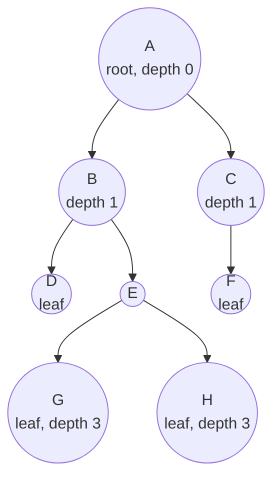

| Thuật ngữ | Ý nghĩa | Trong hình |
|-----------|---------|------------|
| **Root** (gốc) | Nút trên cùng, không có cha | A |
| **Parent / Child** (cha / con) | Nút nối trực tiếp phía trên / dưới | B là cha của D, E |
| **Sibling** (anh em) | Các nút cùng cha | D và E |
| **Leaf** (lá) | Nút không có con | D, F, G, H |
| **Internal node** | Nút có ít nhất một con | A, B, C, E |
| **Ancestor / Descendant** | Tổ tiên / hậu duệ (theo đường đi lên / xuống) | A là tổ tiên của G |
| **Subtree** (cây con) | Một nút cùng toàn bộ hậu duệ của nó | Cây con gốc E = {E, G, H} |
| **Depth** (độ sâu) của nút | Số cạnh từ **gốc** xuống nút đó | depth(G) = 3 |
| **Height** (chiều cao) của nút | Số cạnh trên đường dài nhất từ nút đó **xuống lá** | height(B) = 2 |
| **Height của cây** | Height của gốc | 3 |
| **Level** | Tập các nút có cùng depth | Level 1 = {B, C} |
| **Degree** | Số con của một nút | degree(B) = 2 |

!!! warning "Height tính theo cạnh hay theo nút?"
    Sách giáo khoa thường tính **theo cạnh** (cây 1 nút có height 0). LeetCode "Maximum Depth" tính **theo nút** (cây 1 nút có depth 1). Cả hai đều đúng — chỉ cần **nói rõ** mình dùng quy ước nào. Trong bài này, code `height()` trả về **số nút** trên đường dài nhất (cây rỗng = 0), giống LeetCode.

Một vài tính chất quan trọng:

- Cây có `n` nút thì có đúng **`n - 1` cạnh** (mỗi nút trừ gốc có 1 cạnh nối lên cha).
- Giữa hai nút bất kỳ có **đúng một đường đi** duy nhất.

---

## 📖 2. Cây nhị phân và các dạng đặc biệt

**Cây nhị phân (binary tree)**: mỗi nút có **tối đa 2 con**, gọi là con **trái** và con **phải** (thứ tự có ý nghĩa!).

| Loại | Định nghĩa | Ví dụ dùng |
|------|------------|-----------|
| **Full** (đầy đủ) | Mỗi nút có 0 hoặc 2 con | Cây biểu thức, cây Huffman |
| **Complete** (hoàn chỉnh) | Mọi level đầy, trừ level cuối được lấp **từ trái sang** | **Heap** ([Bài 10](./10-heaps.md)) |
| **Perfect** (hoàn hảo) | Mọi nút trong có 2 con, mọi lá cùng level | Có đúng `2^(h+1) - 1` nút |
| **Balanced** (cân bằng) | Với mọi nút, chiều cao hai cây con lệch nhau ≤ 1 | AVL tree |
| **Degenerate** (thoái hóa) | Mỗi nút chỉ có 1 con — thực chất là linked list | BST khi chèn dãy đã sắp xếp 😱 |

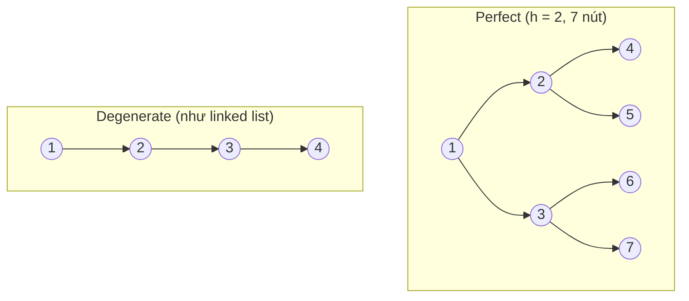

Vì sao "cân bằng" quan trọng? Cây nhị phân cân bằng với `n` nút có chiều cao khoảng **log₂ n**. Với 1 triệu nút, chiều cao chỉ ~20. Cây thoái hóa cùng 1 triệu nút có chiều cao **1 triệu**. Hầu hết thao tác trên cây tốn **O(h)** — nên sự khác biệt là 20 bước so với 1.000.000 bước.

---

## 📖 3. Biểu diễn cây trong bộ nhớ

### 3.1. Con trỏ (phổ biến nhất)

Mỗi nút giữ giá trị và con trỏ tới con trái, con phải (có thể thêm con trỏ `parent`).

=== "Go"

    ```go
    type Node struct {
    	Val         int
    	Left, Right *Node // nil nghĩa là không có con
    }
    ```

=== "Python"

    ```python
    class Node:
        def __init__(self, val, left=None, right=None):
            self.val = val
            self.left = left      # None nghĩa là không có con
            self.right = right
    ```

### 3.2. Mảng (cho cây complete)

Đánh số các nút theo thứ tự level (trái → phải), bắt đầu từ 0. Với nút ở chỉ số `i`:

- con trái: `2i + 1`
- con phải: `2i + 2`
- cha: `(i - 1) / 2` (chia nguyên)

```text
            50 (0)
          /        \
      30 (1)       70 (2)
      /   \        /   \
  20 (3) 40 (4) 60 (5) 80 (6)

Mảng: [50, 30, 70, 20, 40, 60, 80]
       0   1   2   3   4   5   6
```

Cách này **không tốn con trỏ**, thân thiện cache — chính là cách **heap** được lưu ([Bài 10](./10-heaps.md)). Nhưng nếu cây **thưa/lệch**, mảng sẽ có rất nhiều ô trống lãng phí.

LeetCode dùng dạng mảng level-order có `null`: `[1,null,2,3]` nghĩa là gốc 1, con trái rỗng, con phải 2, con trái của 2 là 3.

### 3.3. Mảng cha (parent array) và danh sách con

Với cây **tổng quát** (mỗi nút có nhiều con), thường dùng:

- **Mảng cha**: `parent[i]` = cha của nút `i` (gốc có `parent = -1`). Gọn, dễ đi **lên** — dùng trong Union-Find.
- **Danh sách con**: `children[i] = [...]` — giống adjacency list của đồ thị ([Bài 11](./11-graphs-traversal.md)).

```text
parent   = [-1, 0, 0, 1, 1, 2]      children = {0: [1, 2], 1: [3, 4], 2: [5]}
nút        0   1  2  3  4  5
```

---

## 📖 4. Duyệt cây theo chiều sâu (DFS): Preorder, Inorder, Postorder

"Duyệt" (traversal) = thăm **mỗi nút đúng một lần**. Với cây nhị phân, ở mỗi nút ta có 3 việc: **thăm nút (N)**, **đi trái (L)**, **đi phải (R)**. Thứ tự làm 3 việc này đặt tên cho kiểu duyệt:

| Kiểu | Thứ tự | Mẹo nhớ | Dùng khi |
|------|--------|---------|----------|
| **Preorder** | N → L → R | "**Pre**" = thăm gốc **trước** | Sao chép cây, serialize, in cây thư mục |
| **Inorder** | L → N → R | Gốc ở **giữa** | BST → cho ra dãy **tăng dần** |
| **Postorder** | L → R → N | Gốc **sau cùng** | Xóa cây, tính kích thước thư mục, tính chiều cao |

Ví dụ với BST dựng từ `50, 30, 70, 20, 40, 60, 80`:

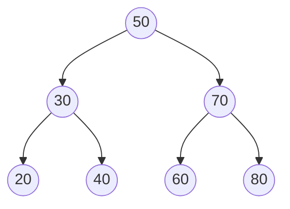

| Kiểu | Kết quả |
|------|---------|
| Preorder | 50, 30, 20, 40, 70, 60, 80 |
| Inorder | 20, 30, 40, 50, 60, 70, 80 ← **tăng dần!** |
| Postorder | 20, 40, 30, 60, 80, 70, 50 |

!!! tip "Mẹo vẽ tay: đi vòng quanh cây"
    Tưởng tượng bạn đi bộ **vòng quanh viền cây** ngược chiều kim đồng hồ, bắt đầu từ bên trái gốc. Mỗi nút bạn đi ngang **3 lần**: từ bên trái, từ bên dưới, từ bên phải.
    Ghi nút lần **đầu** gặp (bên trái) → preorder. Lần **thứ hai** (bên dưới) → inorder. Lần **cuối** (bên phải) → postorder.

### Trace preorder chi tiết

| Bước | Đang ở | Hành động | Kết quả đến giờ |
|------|--------|-----------|-----------------|
| 1 | 50 | thăm 50, đi trái | 50 |
| 2 | 30 | thăm 30, đi trái | 50 30 |
| 3 | 20 | thăm 20, trái/phải rỗng → quay về 30 | 50 30 20 |
| 4 | 40 | (30 đi phải) thăm 40 → quay về 50 | 50 30 20 40 |
| 5 | 70 | (50 đi phải) thăm 70, đi trái | 50 30 20 40 70 |
| 6 | 60 | thăm 60 | ... 70 60 |
| 7 | 80 | (70 đi phải) thăm 80 | 50 30 20 40 70 60 80 |

Bấm ▶ để xem thứ tự các nút được thăm trong **preorder** (gốc trước, rồi trái, rồi phải):

<div class="algo-viz" data-viz="tree" data-algo="preorder" data-input="50,30,70,20,40,60,80" data-title="Preorder: N → L → R"></div>

Với **inorder**, để ý dãy kết quả của BST luôn **tăng dần**:

<div class="algo-viz" data-viz="tree" data-algo="inorder" data-input="50,30,70,20,40,60,80" data-title="Inorder: L → N → R"></div>

Với **postorder**, gốc 50 luôn là nút **cuối cùng** được thăm — mọi con đều xong trước cha:

<div class="algo-viz" data-viz="tree" data-algo="postorder" data-input="50,30,70,20,40,60,80" data-title="Postorder: L → R → N"></div>

### 4.1. Cài đặt đệ quy

Ba hàm gần như giống hệt nhau — chỉ **dời dòng "thăm nút"** lên đầu, giữa hoặc cuối.

=== "Go"

    ```go
    package main

    import "fmt"

    type Node struct {
    	Val         int
    	Left, Right *Node
    }

    // insert chèn v vào BST (chi tiết ở mục 7)
    func insert(root *Node, v int) *Node {
    	if root == nil {
    		return &Node{Val: v}
    	}
    	if v < root.Val {
    		root.Left = insert(root.Left, v)
    	} else {
    		root.Right = insert(root.Right, v)
    	}
    	return root
    }

    func preorder(n *Node, out *[]int) {
    	if n == nil {
    		return
    	}
    	*out = append(*out, n.Val) // N
    	preorder(n.Left, out)      // L
    	preorder(n.Right, out)     // R
    }

    func inorder(n *Node, out *[]int) {
    	if n == nil {
    		return
    	}
    	inorder(n.Left, out)       // L
    	*out = append(*out, n.Val) // N
    	inorder(n.Right, out)      // R
    }

    func postorder(n *Node, out *[]int) {
    	if n == nil {
    		return
    	}
    	postorder(n.Left, out)     // L
    	postorder(n.Right, out)    // R
    	*out = append(*out, n.Val) // N
    }

    func main() {
    	var root *Node
    	for _, v := range []int{50, 30, 70, 20, 40, 60, 80} {
    		root = insert(root, v)
    	}
    	var pre, in, post []int
    	preorder(root, &pre)
    	inorder(root, &in)
    	postorder(root, &post)
    	fmt.Printf("pre:  %v\n", pre)
    	fmt.Printf("in:   %v\n", in)
    	fmt.Printf("post: %v\n", post)
    }
    // Output:
    // pre:  [50 30 20 40 70 60 80]
    // in:   [20 30 40 50 60 70 80]
    // post: [20 40 30 60 80 70 50]
    ```

=== "Python"

    ```python
    class Node:
        def __init__(self, val, left=None, right=None):
            self.val, self.left, self.right = val, left, right


    def insert(root, v):
        """Chèn v vào BST (chi tiết ở mục 7)."""
        if root is None:
            return Node(v)
        if v < root.val:
            root.left = insert(root.left, v)
        else:
            root.right = insert(root.right, v)
        return root


    def preorder(n, out):
        if n is None:
            return
        out.append(n.val)          # N
        preorder(n.left, out)      # L
        preorder(n.right, out)     # R


    def inorder(n, out):
        if n is None:
            return
        inorder(n.left, out)       # L
        out.append(n.val)          # N
        inorder(n.right, out)      # R


    def postorder(n, out):
        if n is None:
            return
        postorder(n.left, out)     # L
        postorder(n.right, out)    # R
        out.append(n.val)          # N


    root = None
    for v in [50, 30, 70, 20, 40, 60, 80]:
        root = insert(root, v)
    pre, ino, post = [], [], []
    preorder(root, pre)
    inorder(root, ino)
    postorder(root, post)
    print("pre: ", pre)
    print("in:  ", ino)
    print("post:", post)
    # Output:
    # pre:  [50, 30, 20, 40, 70, 60, 80]
    # in:   [20, 30, 40, 50, 60, 70, 80]
    # post: [20, 40, 30, 60, 80, 70, 50]
    ```

### 4.2. Cài đặt bằng vòng lặp (dùng stack tường minh)

Đệ quy dùng **call stack** ngầm. Khi cây rất sâu (ví dụ cây thoái hóa 100.000 nút), Python sẽ báo `RecursionError` (giới hạn mặc định ~1000), Go thì chịu được sâu hơn nhiều nhưng vẫn tốn bộ nhớ. Ta có thể tự quản lý một **stack** ([Bài 5](./05-stacks-queues.md)).

**Preorder**: pop nút → thăm → push **phải trước, trái sau** (để trái được pop trước).

**Inorder**: "đi trái hết cỡ, vừa đi vừa push" → pop một nút, thăm → chuyển sang cây con phải.

**Postorder**: mẹo gọn nhất — làm preorder biến thể **N → R → L** rồi **đảo ngược** kết quả thành **L → R → N**.

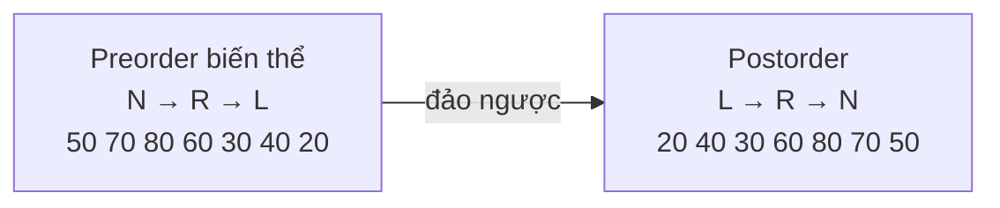

Trace **inorder** vòng lặp:

| Bước | Hành động | Stack (đáy → đỉnh) | Kết quả |
|------|-----------|--------------------|---------|
| 1 | đi trái từ 50: push 50, 30, 20 | 50 30 20 | |
| 2 | pop 20, thăm; 20 không có con phải | 50 30 | 20 |
| 3 | pop 30, thăm; sang phải → push 40 | 50 40 | 20 30 |
| 4 | pop 40, thăm | 50 | 20 30 40 |
| 5 | pop 50, thăm; sang phải → push 70, 60 | 70 60 | ... 50 |
| 6 | pop 60, pop 70, sang phải push 80, pop 80 | | ... 60 70 80 |

=== "Go"

    ```go
    package main

    import (
    	"fmt"
    	"slices"
    )

    type Node struct {
    	Val         int
    	Left, Right *Node
    }

    func insert(root *Node, v int) *Node {
    	if root == nil {
    		return &Node{Val: v}
    	}
    	if v < root.Val {
    		root.Left = insert(root.Left, v)
    	} else {
    		root.Right = insert(root.Right, v)
    	}
    	return root
    }

    func preorderIter(root *Node) []int {
    	var res []int
    	if root == nil {
    		return res
    	}
    	stack := []*Node{root}
    	for len(stack) > 0 {
    		n := stack[len(stack)-1]
    		stack = stack[:len(stack)-1]
    		res = append(res, n.Val)
    		if n.Right != nil { // push phải trước
    			stack = append(stack, n.Right)
    		}
    		if n.Left != nil { // trái sau → được pop trước
    			stack = append(stack, n.Left)
    		}
    	}
    	return res
    }

    func inorderIter(root *Node) []int {
    	var res []int
    	var stack []*Node
    	cur := root
    	for cur != nil || len(stack) > 0 {
    		for cur != nil { // đi trái hết cỡ
    			stack = append(stack, cur)
    			cur = cur.Left
    		}
    		cur = stack[len(stack)-1]
    		stack = stack[:len(stack)-1]
    		res = append(res, cur.Val)
    		cur = cur.Right
    	}
    	return res
    }

    func postorderIter(root *Node) []int {
    	var res []int
    	if root == nil {
    		return res
    	}
    	stack := []*Node{root}
    	for len(stack) > 0 { // N → R → L
    		n := stack[len(stack)-1]
    		stack = stack[:len(stack)-1]
    		res = append(res, n.Val)
    		if n.Left != nil {
    			stack = append(stack, n.Left)
    		}
    		if n.Right != nil {
    			stack = append(stack, n.Right)
    		}
    	}
    	slices.Reverse(res) // → L → R → N
    	return res
    }

    func main() {
    	var root *Node
    	for _, v := range []int{50, 30, 70, 20, 40, 60, 80} {
    		root = insert(root, v)
    	}
    	fmt.Println(preorderIter(root))
    	fmt.Println(inorderIter(root))
    	fmt.Println(postorderIter(root))
    }
    // Output:
    // [50 30 20 40 70 60 80]
    // [20 30 40 50 60 70 80]
    // [20 40 30 60 80 70 50]
    ```

=== "Python"

    ```python
    class Node:
        def __init__(self, val, left=None, right=None):
            self.val, self.left, self.right = val, left, right


    def insert(root, v):
        if root is None:
            return Node(v)
        if v < root.val:
            root.left = insert(root.left, v)
        else:
            root.right = insert(root.right, v)
        return root


    def preorder_iter(root):
        res, stack = [], [root] if root else []
        while stack:
            n = stack.pop()
            res.append(n.val)
            if n.right:
                stack.append(n.right)   # phải trước
            if n.left:
                stack.append(n.left)    # trái sau → pop trước
        return res


    def inorder_iter(root):
        res, stack, cur = [], [], root
        while cur or stack:
            while cur:                  # đi trái hết cỡ
                stack.append(cur)
                cur = cur.left
            cur = stack.pop()
            res.append(cur.val)
            cur = cur.right
        return res


    def postorder_iter(root):
        res, stack = [], [root] if root else []
        while stack:                    # N → R → L
            n = stack.pop()
            res.append(n.val)
            if n.left:
                stack.append(n.left)
            if n.right:
                stack.append(n.right)
        return res[::-1]                # → L → R → N


    root = None
    for v in [50, 30, 70, 20, 40, 60, 80]:
        root = insert(root, v)
    print(preorder_iter(root))
    print(inorder_iter(root))
    print(postorder_iter(root))
    # Output:
    # [50, 30, 20, 40, 70, 60, 80]
    # [20, 30, 40, 50, 60, 70, 80]
    # [20, 40, 30, 60, 80, 70, 50]
    ```

**Độ phức tạp** (cả đệ quy lẫn vòng lặp): thời gian **O(n)** (mỗi nút thăm một lần), bộ nhớ **O(h)** cho stack — O(log n) nếu cây cân bằng, O(n) nếu thoái hóa.

!!! note "Morris traversal — duyệt inorder với O(1) bộ nhớ"
    Có một kỹ thuật tên **Morris traversal** tạm thời "mượn" con trỏ phải của nút lá để nối ngược về tổ tiên, cho phép duyệt inorder **không cần stack**. Hiếm khi dùng trong thực tế, nhưng là câu hỏi phỏng vấn nâng cao hay gặp.

---

## 📖 5. Duyệt theo tầng (Level order / BFS)

Thay vì đi sâu, ta duyệt **từng tầng một**, từ trên xuống, trái sang phải — giống cách đọc sơ đồ tổ chức: CEO trước, rồi toàn bộ giám đốc, rồi toàn bộ trưởng phòng.

Công cụ: **hàng đợi (queue)** — ai vào trước được xử lý trước.

1. Cho gốc vào queue.
2. Lặp: lấy `size = len(queue)` — đó là số nút của tầng hiện tại. Lấy ra đúng `size` nút, thăm từng nút, cho các con của chúng vào queue.
3. Hết queue thì dừng.

| Vòng | Queue đầu vòng | Tầng thu được | Queue cuối vòng |
|------|----------------|---------------|-----------------|
| 1 | [50] | [50] | [30, 70] |
| 2 | [30, 70] | [30, 70] | [20, 40, 60, 80] |
| 3 | [20, 40, 60, 80] | [20, 40, 60, 80] | [] |

Bấm ▶ và để ý các nút được thăm **theo từng hàng ngang**, còn hàng đợi thì chứa các nút của tầng kế tiếp:

<div class="algo-viz" data-viz="tree" data-algo="levelorder" data-input="50,30,70,20,40,60,80" data-title="Level order (BFS)"></div>

=== "Go"

    ```go
    package main

    import "fmt"

    type Node struct {
    	Val         int
    	Left, Right *Node
    }

    func insert(root *Node, v int) *Node {
    	if root == nil {
    		return &Node{Val: v}
    	}
    	if v < root.Val {
    		root.Left = insert(root.Left, v)
    	} else {
    		root.Right = insert(root.Right, v)
    	}
    	return root
    }

    func levelOrder(root *Node) [][]int {
    	var res [][]int
    	if root == nil {
    		return res
    	}
    	queue := []*Node{root}
    	for len(queue) > 0 {
    		size := len(queue) // số nút của tầng hiện tại
    		level := make([]int, 0, size)
    		for i := 0; i < size; i++ {
    			n := queue[0]
    			queue = queue[1:]
    			level = append(level, n.Val)
    			if n.Left != nil {
    				queue = append(queue, n.Left)
    			}
    			if n.Right != nil {
    				queue = append(queue, n.Right)
    			}
    		}
    		res = append(res, level)
    	}
    	return res
    }

    func main() {
    	var root *Node
    	for _, v := range []int{50, 30, 70, 20, 40, 60, 80, 65} {
    		root = insert(root, v)
    	}
    	for i, level := range levelOrder(root) {
    		fmt.Println("tầng", i, level)
    	}
    }
    // Output:
    // tầng 0 [50]
    // tầng 1 [30 70]
    // tầng 2 [20 40 60 80]
    // tầng 3 [65]
    ```

=== "Python"

    ```python
    from collections import deque


    class Node:
        def __init__(self, val, left=None, right=None):
            self.val, self.left, self.right = val, left, right


    def insert(root, v):
        if root is None:
            return Node(v)
        if v < root.val:
            root.left = insert(root.left, v)
        else:
            root.right = insert(root.right, v)
        return root


    def level_order(root):
        res = []
        if root is None:
            return res
        q = deque([root])               # deque: popleft O(1), list.pop(0) là O(n)!
        while q:
            level = []
            for _ in range(len(q)):     # đúng số nút của tầng hiện tại
                n = q.popleft()
                level.append(n.val)
                if n.left:
                    q.append(n.left)
                if n.right:
                    q.append(n.right)
            res.append(level)
        return res


    root = None
    for v in [50, 30, 70, 20, 40, 60, 80, 65]:
        root = insert(root, v)
    for i, level in enumerate(level_order(root)):
        print("tầng", i, level)
    # Output:
    # tầng 0 [50]
    # tầng 1 [30, 70]
    # tầng 2 [20, 40, 60, 80]
    # tầng 3 [65]
    ```

Độ phức tạp: thời gian **O(n)**, bộ nhớ **O(w)** với `w` là **độ rộng** lớn nhất của một tầng (cây perfect: tầng cuối có ~n/2 nút → O(n)).

!!! tip "Các biến thể level order hay gặp"
    - **Right side view** (LeetCode 199): lấy phần tử **cuối** của mỗi tầng.
    - **Zigzag** (LeetCode 103): đảo ngược tầng lẻ.
    - **Min depth** (LeetCode 111): BFS dừng ngay khi gặp **lá đầu tiên** — nhanh hơn DFS.
    - **Average of levels**, **largest value in each row**: gom theo tầng rồi tính.

---

## 📖 6. Chiều cao, đường kính, cây cân bằng

Đây là nhóm bài "**postorder tư duy**": muốn biết thông tin ở gốc, trước tiên phải biết thông tin của **hai cây con**.

### 6.1. Chiều cao

```text
height(nil) = 0
height(n)   = 1 + max(height(n.left), height(n.right))
```

### 6.2. Đường kính (diameter)

**Đường kính** = số cạnh trên đường đi **dài nhất giữa hai nút bất kỳ** (không nhất thiết qua gốc). Mọi đường đi đều có một nút "cao nhất" — tại nút đó đường đi rẽ xuống trái và phải. Vậy tại mỗi nút `n`, đường dài nhất **đi qua** `n` dài `height(left) + height(right)` cạnh. Đường kính = max giá trị này trên mọi nút.

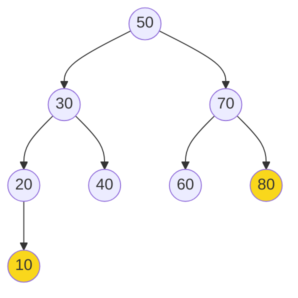

Đường kính của cây trên: `10 → 20 → 30 → 50 → 70 → 80` = **5 cạnh**, "đỉnh" của đường đi là 50: height(trái) = 3, height(phải) = 2 → 3 + 2 = 5.

!!! warning "Sai lầm kinh điển: gọi height() lặp lại → O(n²)"
    Nếu ở **mỗi nút** bạn gọi `height(left)` và `height(right)` (mỗi lần O(n)), tổng chi phí thành O(n²) với cây thoái hóa. Cách đúng: **một lần DFS**, hàm trả về chiều cao, và **tiện thể** cập nhật đường kính vào một biến ngoài.

### 6.3. Cây cân bằng (height-balanced)

Cây cân bằng khi **mọi nút** có `|height(left) - height(right)| ≤ 1`. Mẹo: hàm trả về chiều cao, hoặc **-1** nếu cây con đã mất cân bằng → "lan truyền" lỗi lên trên, dừng sớm.

=== "Go"

    ```go
    package main

    import "fmt"

    type Node struct {
    	Val         int
    	Left, Right *Node
    }

    func insert(root *Node, v int) *Node {
    	if root == nil {
    		return &Node{Val: v}
    	}
    	if v < root.Val {
    		root.Left = insert(root.Left, v)
    	} else {
    		root.Right = insert(root.Right, v)
    	}
    	return root
    }

    func build(vals ...int) *Node {
    	var root *Node
    	for _, v := range vals {
    		root = insert(root, v)
    	}
    	return root
    }

    func height(n *Node) int {
    	if n == nil {
    		return 0
    	}
    	return 1 + max(height(n.Left), height(n.Right))
    }

    // diameter: một lần DFS, O(n)
    func diameter(root *Node) int {
    	best := 0
    	var h func(n *Node) int
    	h = func(n *Node) int {
    		if n == nil {
    			return 0
    		}
    		l, r := h(n.Left), h(n.Right)
    		best = max(best, l+r) // đường đi "gập" tại n
    		return 1 + max(l, r)
    	}
    	h(root)
    	return best
    }

    // checkHeight trả về chiều cao, hoặc -1 nếu mất cân bằng
    func checkHeight(n *Node) int {
    	if n == nil {
    		return 0
    	}
    	l := checkHeight(n.Left)
    	if l == -1 {
    		return -1
    	}
    	r := checkHeight(n.Right)
    	if r == -1 || l-r > 1 || r-l > 1 {
    		return -1
    	}
    	return 1 + max(l, r)
    }

    func isBalanced(root *Node) bool { return checkHeight(root) != -1 }

    func main() {
    	t := build(50, 30, 70, 20, 40, 60, 80, 10)
    	fmt.Println("height:", height(t))
    	fmt.Println("diameter:", diameter(t))
    	fmt.Println("balanced:", isBalanced(t))

    	chain := build(1, 2, 3, 4) // chèn dãy tăng → thoái hóa
    	fmt.Println("chain:", height(chain), diameter(chain), isBalanced(chain))
    }
    // Output:
    // height: 4
    // diameter: 5
    // balanced: true
    // chain: 4 3 false
    ```

=== "Python"

    ```python
    class Node:
        def __init__(self, val, left=None, right=None):
            self.val, self.left, self.right = val, left, right


    def insert(root, v):
        if root is None:
            return Node(v)
        if v < root.val:
            root.left = insert(root.left, v)
        else:
            root.right = insert(root.right, v)
        return root


    def build(*vals):
        root = None
        for v in vals:
            root = insert(root, v)
        return root


    def height(n):
        return 0 if n is None else 1 + max(height(n.left), height(n.right))


    def diameter(root):
        best = 0

        def h(n):
            nonlocal best
            if n is None:
                return 0
            l, r = h(n.left), h(n.right)
            best = max(best, l + r)     # đường đi "gập" tại n
            return 1 + max(l, r)

        h(root)
        return best


    def is_balanced(root):
        def check(n):                   # chiều cao, hoặc -1 nếu mất cân bằng
            if n is None:
                return 0
            l = check(n.left)
            if l == -1:
                return -1
            r = check(n.right)
            if r == -1 or abs(l - r) > 1:
                return -1
            return 1 + max(l, r)

        return check(root) != -1


    t = build(50, 30, 70, 20, 40, 60, 80, 10)
    print("height:", height(t))
    print("diameter:", diameter(t))
    print("balanced:", is_balanced(t))
    chain = build(1, 2, 3, 4)
    print("chain:", height(chain), diameter(chain), is_balanced(chain))
    # Output:
    # height: 4
    # diameter: 5
    # balanced: True
    # chain: 4 3 False
    ```

Cả ba hàm đều **O(n)** thời gian, **O(h)** bộ nhớ.

### 💡 Tips quan trọng

- Khi gặp bài cây, hãy tự hỏi: *"Nếu tôi đã có đáp án cho cây con trái và phải, tôi kết hợp thế nào ở gốc?"* — đó là 80% lời giải.
- Nếu cần trả về **nhiều thông tin** từ cây con (chiều cao + cân bằng, tổng + số nút...), trả về một **tuple/struct**, hoặc dùng biến ngoài như `best`.
- Đáp án **toàn cục** (đường kính, max path sum) thường ≠ giá trị hàm **trả về** (chiều cao, đường một nhánh). Phân biệt rõ hai thứ này.

---

## 📖 7. Cây nhị phân tìm kiếm (Binary Search Tree — BST)

### 7.1. Tính chất BST

Với **mọi nút** `n`:

- mọi giá trị trong **cây con trái** `< n.val`
- mọi giá trị trong **cây con phải** `> n.val`
- (và hai cây con cũng là BST)

Hình dung một **cuốn từ điển giấy**: bạn mở giữa, thấy chữ "M"; từ cần tìm là "cá" → lật sang nửa trái; gặp "E" → lại lật sang trái... Mỗi lần so sánh loại bỏ **một nửa** — chính là **binary search** ([Bài 8](./08-binary-search.md)) nhưng trên một cấu trúc **có thể chèn/xóa** hiệu quả.

| Thao tác | Mảng đã sắp xếp | BST cân bằng | BST thoái hóa | Hash table |
|----------|-----------------|--------------|---------------|------------|
| Tìm kiếm | O(log n) | O(log n) | O(n) | O(1) TB |
| Chèn / xóa | O(n) (dịch phần tử) | O(log n) | O(n) | O(1) TB |
| Min / Max | O(1) | O(log n) | O(n) | O(n) |
| Duyệt theo thứ tự | O(n) | O(n) | O(n) | O(n log n) (phải sort) |
| Tìm "phần tử nhỏ nhất ≥ x" | O(log n) | O(log n) | O(n) | O(n) |

BST mạnh ở chỗ **vừa tìm nhanh, vừa giữ thứ tự** — điều hash table không làm được ([Bài 3](./03-hashing.md)).

### 7.2. Tìm kiếm

So sánh `target` với nút hiện tại: bằng → tìm thấy; nhỏ hơn → sang trái; lớn hơn → sang phải; gặp `nil` → không có.

Bấm ▶ để xem đường đi tìm `60`: 50 → (60 > 50) phải → 70 → (60 < 70) trái → 60 ✅:

<div class="algo-viz" data-viz="tree" data-algo="bst-search" data-input="50,30,70,20,40,60,80" data-target="60" data-title="Tìm 60 trong BST"></div>

### 7.3. Chèn

Đi y như tìm kiếm; khi gặp chỗ `nil` thì **đặt nút mới vào đó**. Nút mới luôn là **lá**.

Bấm ▶ để xem các giá trị lần lượt được chèn, mỗi lần đi từ gốc xuống tìm "chỗ trống":

<div class="algo-viz" data-viz="tree" data-algo="bst-insert" data-input="50,30,70,20,40,60,80,35,65" data-title="Chèn vào BST"></div>

!!! warning "Thứ tự chèn quyết định hình dạng cây"
    Chèn `50, 30, 70, 20, 40, 60, 80` → cây đẹp, cao 3.
    Chèn `20, 30, 40, 50, 60, 70, 80` (đã sắp xếp) → cây **thoái hóa** thành "linked list", cao 7.
    Đây là lý do cần **cây tự cân bằng** (mục 9).

### 7.4. Xóa — 3 trường hợp

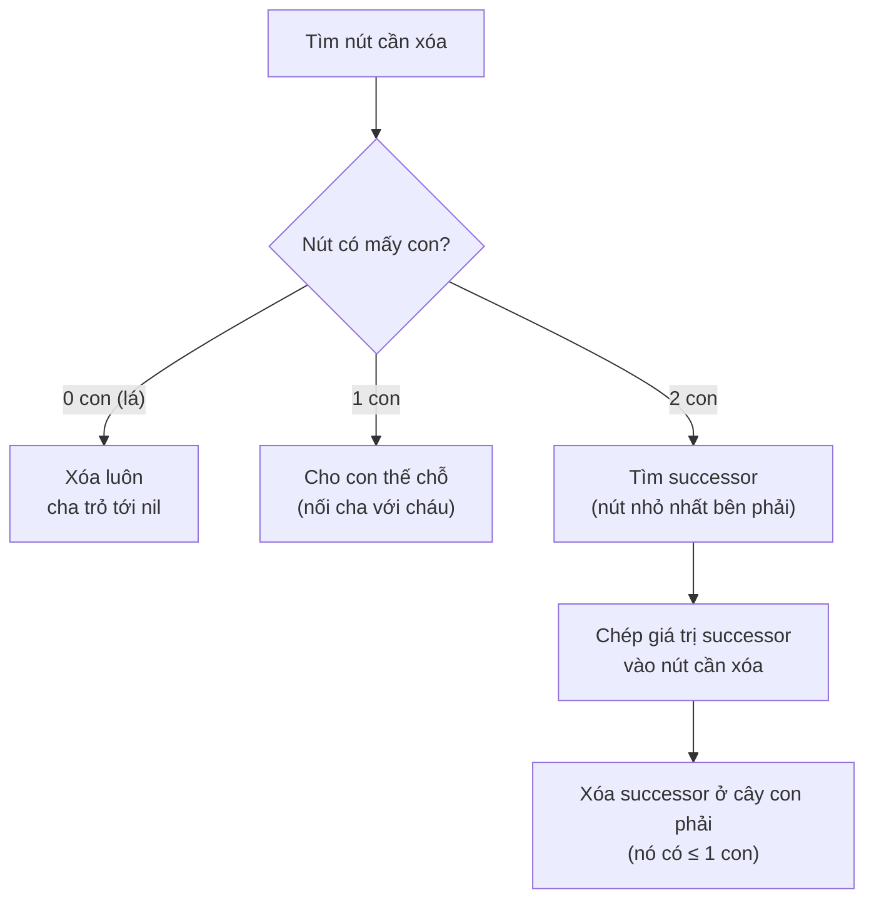

Trường hợp 2 con là khó nhất. Ý tưởng: ta cần một giá trị thay thế sao cho **vẫn giữ tính chất BST** — phải lớn hơn mọi nút bên trái và nhỏ hơn mọi nút bên phải. Ứng viên hoàn hảo: **inorder successor** = nút **nhỏ nhất của cây con phải** (đi phải 1 bước, rồi trái hết cỡ). Successor không bao giờ có con trái, nên xóa nó rơi về trường hợp 0 hoặc 1 con. (Dùng **predecessor** — lớn nhất bên trái — cũng đúng.)

Ví dụ xóa `50` (gốc, 2 con):

```text
         50                    60
       /    \                /    \
     30      70     →      30      70
    /  \    /  \          /  \       \
   20  40  60  80        20  40      80

successor(50) = 60 (nhỏ nhất bên phải). Chép 60 lên gốc, xóa 60 cũ (là lá).
```

Bấm ▶ để xem xóa nút `50` có hai con: tìm successor, chép giá trị lên, rồi xóa successor:

<div class="algo-viz" data-viz="tree" data-algo="bst-delete" data-input="50,30,70,20,40,60,80" data-target="50" data-title="Xóa 50 (2 con)"></div>

### 7.5. Cài đặt đầy đủ

=== "Go"

    ```go
    package main

    import "fmt"

    type Node struct {
    	Val         int
    	Left, Right *Node
    }

    // search trả về đường đi và có tìm thấy không
    func search(root *Node, target int) ([]int, bool) {
    	var path []int
    	for cur := root; cur != nil; {
    		path = append(path, cur.Val)
    		switch {
    		case target == cur.Val:
    			return path, true
    		case target < cur.Val:
    			cur = cur.Left
    		default:
    			cur = cur.Right
    		}
    	}
    	return path, false
    }

    func insert(root *Node, v int) *Node {
    	if root == nil {
    		return &Node{Val: v}
    	}
    	if v < root.Val {
    		root.Left = insert(root.Left, v)
    	} else if v > root.Val {
    		root.Right = insert(root.Right, v)
    	} // v == root.Val: bỏ qua giá trị trùng
    	return root
    }

    func minNode(n *Node) *Node {
    	for n.Left != nil {
    		n = n.Left
    	}
    	return n
    }

    func deleteNode(root *Node, key int) *Node {
    	if root == nil {
    		return nil // không tìm thấy
    	}
    	switch {
    	case key < root.Val:
    		root.Left = deleteNode(root.Left, key)
    	case key > root.Val:
    		root.Right = deleteNode(root.Right, key)
    	default: // tìm thấy
    		if root.Left == nil { // 0 con hoặc chỉ có con phải
    			return root.Right
    		}
    		if root.Right == nil { // chỉ có con trái
    			return root.Left
    		}
    		succ := minNode(root.Right) // 2 con
    		root.Val = succ.Val
    		root.Right = deleteNode(root.Right, succ.Val)
    	}
    	return root
    }

    func inorder(n *Node, out *[]int) {
    	if n != nil {
    		inorder(n.Left, out)
    		*out = append(*out, n.Val)
    		inorder(n.Right, out)
    	}
    }

    func show(root *Node) []int {
    	var out []int
    	inorder(root, &out)
    	return out
    }

    func main() {
    	var root *Node
    	for _, v := range []int{50, 30, 70, 20, 40, 60, 80} {
    		root = insert(root, v)
    	}
    	fmt.Println(search(root, 60))
    	fmt.Println(search(root, 65))
    	fmt.Println("start:     ", show(root))
    	root = deleteNode(root, 20) // lá
    	fmt.Println("xóa 20:    ", show(root))
    	root = deleteNode(root, 30) // 1 con (40)
    	fmt.Println("xóa 30:    ", show(root))
    	root = deleteNode(root, 50) // 2 con
    	fmt.Println("xóa 50:    ", show(root), "gốc mới:", root.Val)
    }
    // Output:
    // [50 70 60] true
    // [50 70 60] false
    // start:      [20 30 40 50 60 70 80]
    // xóa 20:     [30 40 50 60 70 80]
    // xóa 30:     [40 50 60 70 80]
    // xóa 50:     [40 60 70 80] gốc mới: 60
    ```

=== "Python"

    ```python
    class Node:
        def __init__(self, val, left=None, right=None):
            self.val, self.left, self.right = val, left, right


    def search(root, target):
        path, cur = [], root
        while cur:
            path.append(cur.val)
            if target == cur.val:
                return path, True
            cur = cur.left if target < cur.val else cur.right
        return path, False


    def insert(root, v):
        if root is None:
            return Node(v)
        if v < root.val:
            root.left = insert(root.left, v)
        elif v > root.val:
            root.right = insert(root.right, v)
        return root                      # trùng: bỏ qua


    def min_node(n):
        while n.left:
            n = n.left
        return n


    def delete(root, key):
        if root is None:
            return None
        if key < root.val:
            root.left = delete(root.left, key)
        elif key > root.val:
            root.right = delete(root.right, key)
        else:
            if root.left is None:        # 0 con hoặc chỉ con phải
                return root.right
            if root.right is None:       # chỉ con trái
                return root.left
            succ = min_node(root.right)  # 2 con
            root.val = succ.val
            root.right = delete(root.right, succ.val)
        return root


    def show(n):
        return show(n.left) + [n.val] + show(n.right) if n else []


    root = None
    for v in [50, 30, 70, 20, 40, 60, 80]:
        root = insert(root, v)
    print(search(root, 60))
    print(search(root, 65))
    print("start: ", show(root))
    root = delete(root, 20)
    print("xóa 20:", show(root))
    root = delete(root, 30)
    print("xóa 30:", show(root))
    root = delete(root, 50)
    print("xóa 50:", show(root), "gốc mới:", root.val)
    # Output:
    # ([50, 70, 60], True)
    # ([50, 70, 60], False)
    # start:  [20, 30, 40, 50, 60, 70, 80]
    # xóa 20: [30, 40, 50, 60, 70, 80]
    # xóa 30: [40, 50, 60, 70, 80]
    # xóa 50: [40, 60, 70, 80] gốc mới: 60
    ```

| Thao tác | Trung bình (cây ngẫu nhiên) | Tệ nhất (thoái hóa) | Bộ nhớ |
|----------|----------------------------|---------------------|--------|
| search / insert / delete | O(log n) | O(n) | O(h) nếu đệ quy, O(1) nếu vòng lặp |

!!! tip "Pattern `root.left = f(root.left, ...)`"
    Hàm đệ quy **trả về gốc mới của cây con** rồi cha gán lại. Pattern này xử lý gọn cả trường hợp gốc bị thay đổi (chèn vào cây rỗng, xóa gốc) mà không cần con trỏ `parent`. Dùng cho mọi bài "sửa cây": insert, delete, trim BST, prune tree...

---

## 📖 8. Các bài toán BST kinh điển

### 8.1. Successor & Predecessor

**Inorder successor** của `x` = nút nhỏ nhất **lớn hơn** `x`. Không cần con trỏ cha — đi từ gốc:

- Nếu `x < node.val`: node là **ứng viên** (lớn hơn x), ghi nhận rồi sang **trái** tìm ứng viên nhỏ hơn.
- Ngược lại: sang **phải**.

Predecessor làm đối xứng. Đây cũng chính là thao tác `ceiling`/`floor` của các "sorted map" (Java `TreeMap`, C++ `std::map::upper_bound`).

| Tìm successor của 40 | node | 40 < node? | ứng viên | đi |
|---|---|---|---|---|
| 1 | 50 | có | 50 | trái |
| 2 | 30 | không | 50 | phải |
| 3 | 40 | không (bằng) | 50 | phải |
| 4 | nil | — | **50** | dừng |

=== "Go"

    ```go
    package main

    import "fmt"

    type Node struct {
    	Val         int
    	Left, Right *Node
    }

    func insert(root *Node, v int) *Node {
    	if root == nil {
    		return &Node{Val: v}
    	}
    	if v < root.Val {
    		root.Left = insert(root.Left, v)
    	} else {
    		root.Right = insert(root.Right, v)
    	}
    	return root
    }

    // successor: nút nhỏ nhất > x; ok=false nếu không có
    func successor(root *Node, x int) (int, bool) {
    	ans, ok := 0, false
    	for cur := root; cur != nil; {
    		if x < cur.Val {
    			ans, ok = cur.Val, true
    			cur = cur.Left
    		} else {
    			cur = cur.Right
    		}
    	}
    	return ans, ok
    }

    // predecessor: nút lớn nhất < x
    func predecessor(root *Node, x int) (int, bool) {
    	ans, ok := 0, false
    	for cur := root; cur != nil; {
    		if x > cur.Val {
    			ans, ok = cur.Val, true
    			cur = cur.Right
    		} else {
    			cur = cur.Left
    		}
    	}
    	return ans, ok
    }

    func main() {
    	var root *Node
    	for _, v := range []int{50, 30, 70, 20, 40, 60, 80} {
    		root = insert(root, v)
    	}
    	fmt.Println(successor(root, 40))
    	fmt.Println(successor(root, 50))
    	fmt.Println(successor(root, 80))
    	fmt.Println(predecessor(root, 60))
    	fmt.Println(successor(root, 45)) // x không cần có trong cây
    }
    // Output:
    // 50 true
    // 60 true
    // 0 false
    // 50 true
    // 50 true
    ```

=== "Python"

    ```python
    class Node:
        def __init__(self, val, left=None, right=None):
            self.val, self.left, self.right = val, left, right


    def insert(root, v):
        if root is None:
            return Node(v)
        if v < root.val:
            root.left = insert(root.left, v)
        else:
            root.right = insert(root.right, v)
        return root


    def successor(root, x):
        ans, cur = None, root
        while cur:
            if x < cur.val:
                ans, cur = cur.val, cur.left
            else:
                cur = cur.right
        return ans


    def predecessor(root, x):
        ans, cur = None, root
        while cur:
            if x > cur.val:
                ans, cur = cur.val, cur.right
            else:
                cur = cur.left
        return ans


    root = None
    for v in [50, 30, 70, 20, 40, 60, 80]:
        root = insert(root, v)
    print(successor(root, 40), successor(root, 50), successor(root, 80))
    print(predecessor(root, 60), successor(root, 45))
    # Output:
    # 50 60 None
    # 50 50
    ```

Độ phức tạp: **O(h)**.

### 8.2. Validate BST — cái bẫy "chỉ so với con"

Cách **sai** mà rất nhiều người viết: ở mỗi nút chỉ kiểm tra `left.val < node.val < right.val`. Phản ví dụ:

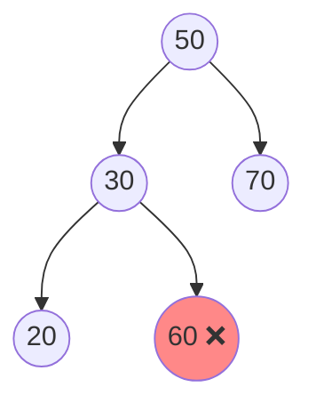

Mỗi nút đều "lớn hơn con trái, nhỏ hơn con phải", nhưng `60` nằm trong **cây con trái của 50** mà lại lớn hơn 50 → **không phải BST**.

**Cách đúng #1 — truyền khoảng (min, max)**: mỗi nút phải nằm trong khoảng mở `(lo, hi)`. Đi trái thì `hi = node.val`, đi phải thì `lo = node.val`.

**Cách đúng #2 — inorder phải tăng dần nghiêm ngặt**: duyệt inorder, so với giá trị **trước đó**.

=== "Go"

    ```go
    package main

    import (
    	"fmt"
    	"math"
    )

    type Node struct {
    	Val         int
    	Left, Right *Node
    }

    // Cách SAI: chỉ so với con trực tiếp
    func naiveValid(n *Node) bool {
    	if n == nil {
    		return true
    	}
    	if n.Left != nil && n.Left.Val >= n.Val {
    		return false
    	}
    	if n.Right != nil && n.Right.Val <= n.Val {
    		return false
    	}
    	return naiveValid(n.Left) && naiveValid(n.Right)
    }

    // Cách ĐÚNG: mỗi nút phải nằm trong (lo, hi)
    func isValidBST(n *Node, lo, hi int) bool {
    	if n == nil {
    		return true
    	}
    	if n.Val <= lo || n.Val >= hi {
    		return false
    	}
    	return isValidBST(n.Left, lo, n.Val) && isValidBST(n.Right, n.Val, hi)
    }

    func main() {
    	good := &Node{50, &Node{30, &Node{Val: 20}, &Node{Val: 40}}, &Node{Val: 70}}
    	bad := &Node{50, &Node{30, &Node{Val: 20}, &Node{Val: 60}}, &Node{Val: 70}}
    	fmt.Println(isValidBST(good, math.MinInt, math.MaxInt))
    	fmt.Println(naiveValid(bad), isValidBST(bad, math.MinInt, math.MaxInt))
    }
    // Output:
    // true
    // true false
    ```

=== "Python"

    ```python
    import math


    class Node:
        def __init__(self, val, left=None, right=None):
            self.val, self.left, self.right = val, left, right


    def is_valid_bst(n, lo=-math.inf, hi=math.inf):
        if n is None:
            return True
        if not (lo < n.val < hi):
            return False
        return is_valid_bst(n.left, lo, n.val) and is_valid_bst(n.right, n.val, hi)


    def is_valid_inorder(root):
        prev = -math.inf
        stack, cur = [], root
        while cur or stack:
            while cur:
                stack.append(cur)
                cur = cur.left
            cur = stack.pop()
            if cur.val <= prev:          # phải TĂNG NGHIÊM NGẶT
                return False
            prev = cur.val
            cur = cur.right
        return True


    good = Node(50, Node(30, Node(20), Node(40)), Node(70))
    bad = Node(50, Node(30, Node(20), Node(60)), Node(70))
    print(is_valid_bst(good), is_valid_inorder(good))
    print(is_valid_bst(bad), is_valid_inorder(bad))
    # Output:
    # True True
    # False False
    ```

!!! warning "Biên bằng giá trị cực trị"
    Trong Go, nếu dùng `math.MinInt32` làm biên mà cây lại chứa đúng giá trị `-2147483648` thì sai. An toàn hơn: truyền con trỏ `*int` (nil = không giới hạn) hoặc dùng `math.MinInt`/`math.MaxInt` (int 64-bit) khi giá trị là int32. Python dùng `math.inf` nên không gặp vấn đề này.

### 8.3. Lowest Common Ancestor (LCA)

**LCA** của `p` và `q` = tổ tiên chung **sâu nhất** (một nút cũng được xem là tổ tiên của chính nó). Ví dụ đời thường: hai người họ hàng tìm "ông/bà chung gần nhất".

**Trong BST** — tận dụng thứ tự: nếu cả `p, q` đều nhỏ hơn nút → LCA ở bên trái; đều lớn hơn → bên phải; còn lại (chúng **tách nhau** ở nút này, hoặc một trong hai chính là nút) → nút hiện tại là LCA. **O(h)**.

**Trong cây nhị phân tổng quát** — postorder: hàm trả về nút `p` hoặc `q` nếu tìm thấy trong cây con. Nếu **cả trái và phải** đều trả về khác nil → nút hiện tại là LCA. **O(n)**.

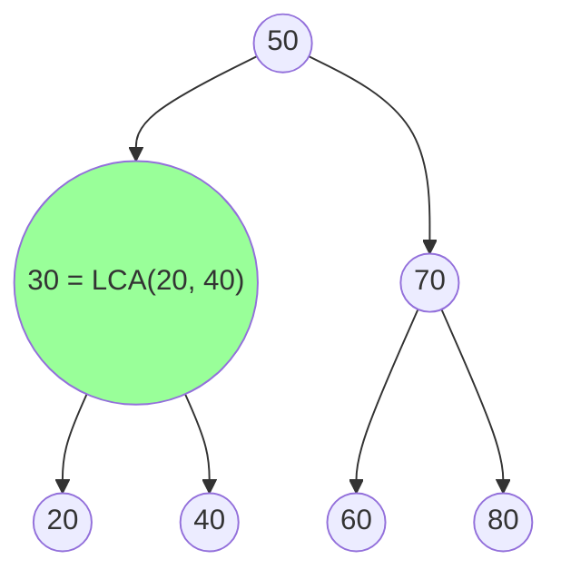

=== "Go"

    ```go
    package main

    import "fmt"

    type Node struct {
    	Val         int
    	Left, Right *Node
    }

    func insert(root *Node, v int) *Node {
    	if root == nil {
    		return &Node{Val: v}
    	}
    	if v < root.Val {
    		root.Left = insert(root.Left, v)
    	} else {
    		root.Right = insert(root.Right, v)
    	}
    	return root
    }

    // LCA trong BST: O(h), không cần đệ quy
    func lcaBST(root *Node, p, q int) *Node {
    	for cur := root; cur != nil; {
    		switch {
    		case p < cur.Val && q < cur.Val:
    			cur = cur.Left
    		case p > cur.Val && q > cur.Val:
    			cur = cur.Right
    		default:
    			return cur // tách nhau tại đây
    		}
    	}
    	return nil
    }

    // LCA trong cây nhị phân bất kỳ: O(n)
    func lca(n *Node, p, q int) *Node {
    	if n == nil || n.Val == p || n.Val == q {
    		return n
    	}
    	l, r := lca(n.Left, p, q), lca(n.Right, p, q)
    	if l != nil && r != nil {
    		return n // p một bên, q một bên
    	}
    	if l != nil {
    		return l
    	}
    	return r
    }

    func main() {
    	var root *Node
    	for _, v := range []int{50, 30, 70, 20, 40, 60, 80} {
    		root = insert(root, v)
    	}
    	fmt.Println(lcaBST(root, 20, 40).Val, lcaBST(root, 20, 60).Val, lcaBST(root, 60, 70).Val)
    	fmt.Println(lca(root, 20, 40).Val, lca(root, 20, 60).Val, lca(root, 60, 70).Val)
    }
    // Output:
    // 30 50 70
    // 30 50 70
    ```

=== "Python"

    ```python
    class Node:
        def __init__(self, val, left=None, right=None):
            self.val, self.left, self.right = val, left, right


    def insert(root, v):
        if root is None:
            return Node(v)
        if v < root.val:
            root.left = insert(root.left, v)
        else:
            root.right = insert(root.right, v)
        return root


    def lca_bst(root, p, q):
        cur = root
        while cur:
            if p < cur.val and q < cur.val:
                cur = cur.left
            elif p > cur.val and q > cur.val:
                cur = cur.right
            else:
                return cur


    def lca(n, p, q):
        if n is None or n.val in (p, q):
            return n
        l, r = lca(n.left, p, q), lca(n.right, p, q)
        if l and r:
            return n
        return l or r


    root = None
    for v in [50, 30, 70, 20, 40, 60, 80]:
        root = insert(root, v)
    print(lca_bst(root, 20, 40).val, lca_bst(root, 20, 60).val, lca_bst(root, 60, 70).val)
    print(lca(root, 20, 40).val, lca(root, 20, 60).val, lca(root, 60, 70).val)
    # Output:
    # 30 50 70
    # 30 50 70
    ```

### 8.4. Serialize & Deserialize

**Serialize** = biến cây thành chuỗi (để lưu file, gửi qua mạng); **deserialize** = dựng lại cây y hệt. Cách đơn giản và chắc chắn: **preorder có đánh dấu nút rỗng** bằng `#`.

```text
Cây:      50                     Preorder có '#':
         /  \
       30    70          50,30,20,#,#,40,#,#,70,60,#,#,80,#,#
      /  \   / \
    20  40  60  80
```

Khi deserialize, đọc lần lượt từng token: gặp `#` → trả về nil; gặp số → tạo nút, **đệ quy** dựng cây con trái rồi cây con phải. Vì preorder ghi gốc **trước**, ta luôn biết mình đang dựng nút nào.

!!! note "Vì sao cần dấu `#`?"
    Chỉ preorder (không `#`) **không** xác định duy nhất một cây nhị phân: `[1, 2]` có thể là 2 là con trái hoặc con phải của 1. Cần **preorder + inorder** (LeetCode 105), hoặc preorder có đánh dấu rỗng. Riêng với **BST**, chỉ preorder là đủ vì thứ tự đã ngầm cho biết trái/phải (LeetCode 449).

=== "Go"

    ```go
    package main

    import (
    	"fmt"
    	"strconv"
    	"strings"
    )

    type Node struct {
    	Val         int
    	Left, Right *Node
    }

    func insert(root *Node, v int) *Node {
    	if root == nil {
    		return &Node{Val: v}
    	}
    	if v < root.Val {
    		root.Left = insert(root.Left, v)
    	} else {
    		root.Right = insert(root.Right, v)
    	}
    	return root
    }

    func serialize(root *Node) string {
    	var parts []string
    	var dfs func(n *Node)
    	dfs = func(n *Node) {
    		if n == nil {
    			parts = append(parts, "#")
    			return
    		}
    		parts = append(parts, strconv.Itoa(n.Val))
    		dfs(n.Left)
    		dfs(n.Right)
    	}
    	dfs(root)
    	return strings.Join(parts, ",")
    }

    func deserialize(s string) *Node {
    	tokens := strings.Split(s, ",")
    	i := 0
    	var build func() *Node
    	build = func() *Node {
    		t := tokens[i]
    		i++
    		if t == "#" {
    			return nil
    		}
    		v, _ := strconv.Atoi(t)
    		n := &Node{Val: v}
    		n.Left = build()
    		n.Right = build()
    		return n
    	}
    	return build()
    }

    func main() {
    	var root *Node
    	for _, v := range []int{50, 30, 70, 20, 40, 60, 80} {
    		root = insert(root, v)
    	}
    	s := serialize(root)
    	fmt.Println(s)
    	copyTree := deserialize(s)
    	fmt.Println(serialize(copyTree) == s)
    }
    // Output:
    // 50,30,20,#,#,40,#,#,70,60,#,#,80,#,#
    // true
    ```

=== "Python"

    ```python
    class Node:
        def __init__(self, val, left=None, right=None):
            self.val, self.left, self.right = val, left, right


    def insert(root, v):
        if root is None:
            return Node(v)
        if v < root.val:
            root.left = insert(root.left, v)
        else:
            root.right = insert(root.right, v)
        return root


    def serialize(root):
        parts = []

        def dfs(n):
            if n is None:
                parts.append("#")
                return
            parts.append(str(n.val))
            dfs(n.left)
            dfs(n.right)

        dfs(root)
        return ",".join(parts)


    def deserialize(s):
        tokens = iter(s.split(","))

        def build():
            t = next(tokens)
            if t == "#":
                return None
            n = Node(int(t))
            n.left = build()
            n.right = build()
            return n

        return build()


    root = None
    for v in [50, 30, 70, 20, 40, 60, 80]:
        root = insert(root, v)
    s = serialize(root)
    print(s)
    print(serialize(deserialize(s)) == s)
    # Output:
    # 50,30,20,#,#,40,#,#,70,60,#,#,80,#,#
    # True
    ```

Cả hai chiều đều **O(n)**. Chuỗi kết quả có `2n + 1` token (`n` số và `n + 1` dấu `#`).

---

## 📖 9. Cây tự cân bằng: AVL, Red-Black, B-tree

BST thường có thể thoái hóa thành O(n). **Cây tự cân bằng** tự "xoay" lại sau mỗi lần chèn/xóa để giữ chiều cao **O(log n)** bất kể thứ tự chèn.

### 9.1. AVL tree

Phát minh năm 1962 (Adelson-Velsky & Landis) — cây tự cân bằng đầu tiên. Mỗi nút lưu **chiều cao**; **hệ số cân bằng** `bf = height(left) - height(right)` phải thuộc `{-1, 0, 1}`. Sau khi chèn, đi ngược lên, nút nào có `|bf| = 2` thì **xoay (rotate)**.

**Phép xoay phải (right rotation)** tại `z` — dùng khi cây lệch trái:

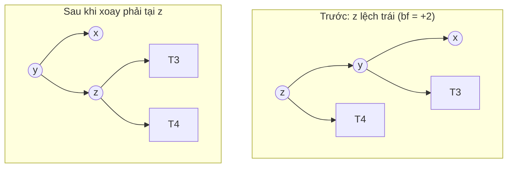

Để ý cây con `T3` (nằm giữa `y` và `z` về giá trị) **chuyển từ con phải của y sang con trái của z** — thứ tự inorder được bảo toàn: `x < y < T3 < z < T4`.

4 trường hợp mất cân bằng:

| Trường hợp | Hình dạng | Cách sửa |
|------------|-----------|----------|
| **LL** | chèn vào trái của con trái | 1 lần xoay **phải** tại z |
| **RR** | chèn vào phải của con phải | 1 lần xoay **trái** tại z |
| **LR** | chèn vào phải của con trái | xoay **trái** tại y, rồi xoay **phải** tại z |
| **RL** | chèn vào trái của con phải | xoay **phải** tại y, rồi xoay **trái** tại z |

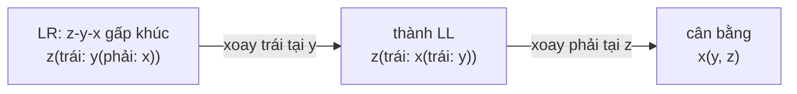

Cài đặt chèn AVL — chèn như BST thường, rồi trên đường **quay lui** cập nhật chiều cao và xoay nếu cần:

=== "Go"

    ```go
    package main

    import "fmt"

    type AVL struct {
    	Val, H      int
    	Left, Right *AVL
    }

    func h(n *AVL) int {
    	if n == nil {
    		return 0
    	}
    	return n.H
    }

    func update(n *AVL) { n.H = 1 + max(h(n.Left), h(n.Right)) }

    func bf(n *AVL) int { return h(n.Left) - h(n.Right) }

    func rotateRight(z *AVL) *AVL {
    	y := z.Left
    	z.Left = y.Right // T3 chuyển sang z
    	y.Right = z
    	update(z)
    	update(y)
    	return y
    }

    func rotateLeft(z *AVL) *AVL {
    	y := z.Right
    	z.Right = y.Left
    	y.Left = z
    	update(z)
    	update(y)
    	return y
    }

    func insert(n *AVL, v int) *AVL {
    	if n == nil {
    		return &AVL{Val: v, H: 1}
    	}
    	if v < n.Val {
    		n.Left = insert(n.Left, v)
    	} else {
    		n.Right = insert(n.Right, v)
    	}
    	update(n)
    	switch b := bf(n); {
    	case b > 1 && bf(n.Left) >= 0: // LL
    		return rotateRight(n)
    	case b > 1: // LR
    		n.Left = rotateLeft(n.Left)
    		return rotateRight(n)
    	case b < -1 && bf(n.Right) <= 0: // RR
    		return rotateLeft(n)
    	case b < -1: // RL
    		n.Right = rotateRight(n.Right)
    		return rotateLeft(n)
    	}
    	return n
    }

    func preorder(n *AVL, out *[]int) {
    	if n != nil {
    		*out = append(*out, n.Val)
    		preorder(n.Left, out)
    		preorder(n.Right, out)
    	}
    }

    func main() {
    	var root *AVL
    	for v := 1; v <= 7; v++ { // dãy tăng: BST thường sẽ thoái hóa!
    		root = insert(root, v)
    	}
    	var out []int
    	preorder(root, &out)
    	fmt.Println(out, "height:", root.H)

    	root = nil
    	for _, v := range []int{10, 20, 30, 40, 50, 25} {
    		root = insert(root, v)
    	}
    	out = nil
    	preorder(root, &out)
    	fmt.Println(out, "height:", root.H)
    }
    // Output:
    // [4 2 1 3 6 5 7] height: 3
    // [30 20 10 25 40 50] height: 3
    ```

=== "Python"

    ```python
    class AVL:
        def __init__(self, val):
            self.val, self.h, self.left, self.right = val, 1, None, None


    def h(n):
        return n.h if n else 0


    def update(n):
        n.h = 1 + max(h(n.left), h(n.right))


    def bf(n):
        return h(n.left) - h(n.right)


    def rotate_right(z):
        y = z.left
        z.left, y.right = y.right, z     # T3 chuyển sang z
        update(z)
        update(y)
        return y


    def rotate_left(z):
        y = z.right
        z.right, y.left = y.left, z
        update(z)
        update(y)
        return y


    def insert(n, v):
        if n is None:
            return AVL(v)
        if v < n.val:
            n.left = insert(n.left, v)
        else:
            n.right = insert(n.right, v)
        update(n)
        b = bf(n)
        if b > 1:
            if bf(n.left) < 0:           # LR
                n.left = rotate_left(n.left)
            return rotate_right(n)       # LL
        if b < -1:
            if bf(n.right) > 0:          # RL
                n.right = rotate_right(n.right)
            return rotate_left(n)        # RR
        return n


    def preorder(n):
        return [n.val] + preorder(n.left) + preorder(n.right) if n else []


    root = None
    for v in range(1, 8):
        root = insert(root, v)
    print(preorder(root), "height:", root.h)
    root = None
    for v in [10, 20, 30, 40, 50, 25]:
        root = insert(root, v)
    print(preorder(root), "height:", root.h)
    # Output:
    # [4, 2, 1, 3, 6, 5, 7] height: 3
    # [30, 20, 10, 25, 40, 50] height: 3
    ```

Chèn `1..7` theo thứ tự tăng — thứ tự tệ nhất với BST thường (cao 7) — nhưng AVL cho ra cây **perfect** cao 3. Mỗi phép xoay là **O(1)**, nên chèn/xóa/tìm AVL đều **O(log n)** tệ nhất. Chiều cao AVL ≤ ~1.44 log₂ n.

### 9.2. Red-Black tree (khái niệm)

Red-Black tree cân bằng "lỏng" hơn AVL nhưng **ít phải xoay hơn** khi chèn/xóa. Mỗi nút có màu **đỏ** hoặc **đen**, thỏa 5 tính chất:

1. Mỗi nút là đỏ hoặc đen.
2. Gốc là đen.
3. Các lá `nil` được coi là đen.
4. Nút đỏ **không có con đỏ** (không có hai nút đỏ liền nhau).
5. Mọi đường đi từ một nút xuống các lá `nil` có **cùng số nút đen** ("black height").

Hệ quả: đường dài nhất (đỏ-đen xen kẽ) ≤ **2 lần** đường ngắn nhất (toàn đen) → chiều cao ≤ 2 log₂(n + 1). Sau khi chèn/xóa, cây sửa bằng **đổi màu** và **tối đa 2–3 phép xoay**.

| | AVL | Red-Black |
|---|---|---|
| Độ cân bằng | Chặt (\|bf\| ≤ 1) | Lỏng (cao ≤ 2 log n) |
| Tìm kiếm | Nhanh hơn chút (cây thấp hơn) | Chậm hơn chút |
| Chèn/xóa | Có thể xoay nhiều lần (xóa: O(log n) lần) | Tối đa 2 (chèn) / 3 (xóa) lần xoay |
| Dùng ở | Database in-memory đọc nhiều | `std::map` (C++), `TreeMap` (Java), Linux CFS scheduler, epoll |

!!! note "Phỏng vấn có bắt cài Red-Black không?"
    Hầu như **không**. Bạn chỉ cần biết: nó là BST tự cân bằng, O(log n) mọi thao tác, 5 tính chất ở trên, và vì sao thư viện chuẩn chọn nó (ít xoay khi ghi). Go **không có** sorted map trong thư viện chuẩn; Python cũng không — dùng thư viện `sortedcontainers` (`SortedList`, `SortedDict`) hoặc `bisect` trên list.

### 9.3. B-tree và B+ tree — cây của database

Trên **đĩa**, mỗi lần đọc là một **trang (page)** 4–16 KB, và đọc đĩa chậm hơn RAM hàng nghìn lần. BST nhị phân cao ~30 tầng với 1 tỷ bản ghi → 30 lần đọc đĩa. **B-tree** giải quyết bằng cách cho mỗi nút chứa **hàng trăm khóa** và **hàng trăm con** → cây rất **thấp và béo**: 1 tỷ bản ghi chỉ cần **3–4 tầng**.

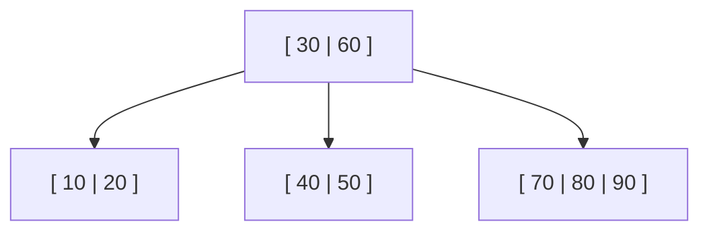

**B+ tree** (biến thể dùng trong MySQL InnoDB, PostgreSQL, SQLite): dữ liệu chỉ nằm ở **lá**, các lá **nối nhau** thành linked list → quét khoảng (`WHERE age BETWEEN 20 AND 30`) cực nhanh. Đọc chi tiết về index trong database tại [Backend Bài 6: Database Internals & Hiệu năng](../backend/06-database-internals-performance.md).

---

## 🌍 Ứng dụng thực tế

| Ở đâu | Cấu trúc cây | Vai trò |
|-------|--------------|---------|
| Index của MySQL, PostgreSQL, SQLite | **B+ tree** | `WHERE id = ?` và truy vấn khoảng trong O(log n) lần đọc đĩa |
| `std::map`, Java `TreeMap`, Linux CFS scheduler | **Red-Black tree** | Map có thứ tự; chọn tiến trình có vruntime nhỏ nhất |
| Hệ thống file (ext4, NTFS, Btrfs) | Cây thư mục + B-tree | Lưu cấu trúc thư mục, tìm file nhanh |
| Trình duyệt | **DOM tree** | Render, `querySelector` duyệt cây |
| Compiler, interpreter | **AST** (cây cú pháp) | Parse code → cây → duyệt postorder để sinh mã / tính giá trị |
| Git | **Merkle tree** | Mỗi commit trỏ tới cây thư mục; hash thay đổi lan lên gốc |
| Game engine (Unity, Godot) | **Scene graph**, quadtree/octree | Quản lý object cha-con; tìm va chạm trong không gian |
| Nén dữ liệu (ZIP, JPEG) | **Huffman tree** | Mã hóa ký tự hay gặp bằng ít bit ([Bài 13](./13-greedy.md)) |
| Autocomplete | **Trie** | Tìm theo tiền tố ([Bài 15](./15-advanced-data-structures.md)) |

---

## ⚠️ Lỗi thường gặp

| Lỗi | Hậu quả | Cách tránh |
|-----|---------|-----------|
| Quên base case `if n == nil` | Panic nil pointer / `AttributeError` | Luôn viết dòng kiểm tra nil **đầu tiên** |
| Validate BST chỉ so với con trực tiếp | Chấp nhận cây sai (mục 8.2) | Truyền khoảng `(lo, hi)` hoặc kiểm tra inorder tăng dần |
| Gọi `height()` trong mỗi nút | O(n²) | Một DFS trả về chiều cao, cập nhật kết quả toàn cục |
| Quên gán lại `root.left = insert(root.left, v)` | Nút mới bị "rơi mất" | Hàm sửa cây phải **trả về gốc mới** và cha phải **gán lại** |
| Xóa nút 2 con nhưng quên xóa successor cũ | Giá trị bị **trùng** trong cây | Sau khi chép, gọi `delete(root.right, succ.val)` |
| Dùng `list.pop(0)` làm queue trong Python | BFS thành O(n²) | Dùng `collections.deque` |
| Đệ quy sâu trên cây thoái hóa trong Python | `RecursionError` | Viết vòng lặp với stack, hoặc `sys.setrecursionlimit` |
| Nhầm height theo nút / theo cạnh | Lệch 1 đơn vị | Nói rõ quy ước; đường kính tính theo **cạnh** |
| Chèn dữ liệu đã sắp xếp vào BST thường | Cây thoái hóa, O(n) mỗi thao tác | Dùng cây tự cân bằng, hoặc xáo trộn trước |

---

## 🏋️ Bài tập

### Cấp độ 1 — Làm quen

**Bài 1.1** Cho BST dựng bằng cách chèn `8, 3, 10, 1, 6, 14, 4, 7, 13`. Vẽ cây và viết ra preorder, inorder, postorder, level order.

<details><summary>Đáp án</summary>

```text
          8
        /   \
       3     10
      / \      \
     1   6      14
        / \    /
       4   7  13
```

- Preorder: 8 3 1 6 4 7 10 14 13
- Inorder: 1 3 4 6 7 8 10 13 14
- Postorder: 1 4 7 6 3 13 14 10 8
- Level order: [8] [3 10] [1 6 14] [4 7 13]

</details>

**Bài 1.2** (LeetCode 226 — Invert Binary Tree) Đảo ngược cây: đổi trái ↔ phải ở **mọi** nút.

<details><summary>Đáp án</summary>

Postorder (hoặc preorder) — đổi chỗ hai con rồi đệ quy xuống. O(n).

```python
def invert(n):
    if n:
        n.left, n.right = invert(n.right), invert(n.left)
    return n
```

</details>

**Bài 1.3** (LeetCode 100 — Same Tree) Kiểm tra hai cây có giống hệt nhau (cấu trúc + giá trị).

<details><summary>Đáp án</summary>

```python
def same(a, b):
    if a is None or b is None:
        return a is b
    return a.val == b.val and same(a.left, b.left) and same(a.right, b.right)
```

</details>

### Cấp độ 2 — Trung bình

**Bài 2.1** (LeetCode 230 — Kth Smallest in BST) Tìm phần tử nhỏ thứ k trong BST.

<details><summary>Đáp án</summary>

Inorder của BST tăng dần → phần tử thứ k được thăm chính là đáp án. Dùng inorder vòng lặp và **dừng sớm**: O(h + k).

=== "Go"

    ```go
    package main

    import "fmt"

    type Node struct {
    	Val         int
    	Left, Right *Node
    }

    func insert(root *Node, v int) *Node {
    	if root == nil {
    		return &Node{Val: v}
    	}
    	if v < root.Val {
    		root.Left = insert(root.Left, v)
    	} else {
    		root.Right = insert(root.Right, v)
    	}
    	return root
    }

    func kthSmallest(root *Node, k int) int {
    	var stack []*Node
    	cur := root
    	for {
    		for cur != nil {
    			stack = append(stack, cur)
    			cur = cur.Left
    		}
    		cur = stack[len(stack)-1]
    		stack = stack[:len(stack)-1]
    		k--
    		if k == 0 {
    			return cur.Val
    		}
    		cur = cur.Right
    	}
    }

    func main() {
    	var root *Node
    	for _, v := range []int{50, 30, 70, 20, 40, 60, 80} {
    		root = insert(root, v)
    	}
    	fmt.Println(kthSmallest(root, 1), kthSmallest(root, 3), kthSmallest(root, 7))
    }
    // Output:
    // 20 40 80
    ```

=== "Python"

    ```python
    class Node:
        def __init__(self, val, left=None, right=None):
            self.val, self.left, self.right = val, left, right


    def insert(root, v):
        if root is None:
            return Node(v)
        if v < root.val:
            root.left = insert(root.left, v)
        else:
            root.right = insert(root.right, v)
        return root


    def kth_smallest(root, k):
        stack, cur = [], root
        while True:
            while cur:
                stack.append(cur)
                cur = cur.left
            cur = stack.pop()
            k -= 1
            if k == 0:
                return cur.val
            cur = cur.right


    root = None
    for v in [50, 30, 70, 20, 40, 60, 80]:
        root = insert(root, v)
    print(kth_smallest(root, 1), kth_smallest(root, 3), kth_smallest(root, 7))
    # Output:
    # 20 40 80
    ```

</details>

**Bài 2.2** (LeetCode 199 — Right Side View) Đứng bên phải cây, liệt kê các nút nhìn thấy từ trên xuống.

<details><summary>Đáp án</summary>

Level order, lấy phần tử **cuối** mỗi tầng. Hoặc DFS thăm phải trước, nút đầu tiên chạm tới mỗi depth là nút nhìn thấy.

```python
def right_view(root):
    res = []
    def dfs(n, d):
        if n:
            if d == len(res):
                res.append(n.val)
            dfs(n.right, d + 1)
            dfs(n.left, d + 1)
    dfs(root, 0)
    return res
```

</details>

**Bài 2.3** (LeetCode 108 — Sorted Array to BST) Từ mảng tăng dần, dựng BST **cân bằng**.

<details><summary>Đáp án</summary>

Chọn phần tử **giữa** làm gốc, đệ quy nửa trái làm cây con trái, nửa phải làm cây con phải. O(n).

```python
def build(a, lo=0, hi=None):
    if hi is None:
        hi = len(a) - 1
    if lo > hi:
        return None
    mid = (lo + hi) // 2
    return Node(a[mid], build(a, lo, mid - 1), build(a, mid + 1, hi))
```

</details>

**Bài 2.4** (LeetCode 112/113 — Path Sum) Có đường đi gốc → lá nào có tổng bằng `target`? Liệt kê tất cả.

<details><summary>Gợi ý</summary>

DFS mang theo tổng còn lại `target - n.val`; tại **lá** kiểm tra bằng 0. Để liệt kê: backtracking với một `path` chung — `append` khi vào, `pop` khi ra ([Bài 6](./06-recursion-backtracking.md)).

</details>

### Cấp độ 3 — Khó

**Bài 3.1** (LeetCode 124 — Binary Tree Maximum Path Sum) Giá trị nút có thể âm. Tìm tổng lớn nhất của một đường đi bất kỳ.

<details><summary>Đáp án</summary>

Giống đường kính: hàm trả về "tổng lớn nhất của đường **một nhánh** đi xuống từ n" = `n.val + max(0, left, right)`; tại mỗi nút cập nhật đáp án toàn cục `n.val + max(0,left) + max(0,right)`. Dùng `max(0, ...)` để **bỏ** nhánh âm.

```python
def max_path_sum(root):
    best = float("-inf")
    def gain(n):
        nonlocal best
        if n is None:
            return 0
        l, r = max(0, gain(n.left)), max(0, gain(n.right))
        best = max(best, n.val + l + r)
        return n.val + max(l, r)
    gain(root)
    return best
```

</details>

**Bài 3.2** (LeetCode 105) Dựng cây từ **preorder** và **inorder**.

<details><summary>Gợi ý</summary>

`preorder[0]` là gốc. Tìm vị trí gốc trong inorder (dùng hash map vị trí → O(1)) → bên trái là cây con trái (kích thước `k`), bên phải là cây con phải. Đệ quy với chỉ số, không cắt slice. O(n).

</details>

**Bài 3.3** Cài đặt **xóa** trong AVL tree (gợi ý: xóa như BST thường, rồi trên đường quay lui cập nhật chiều cao và xoay y như khi chèn — chú ý có thể phải xoay ở **nhiều** tổ tiên).

**Bài 3.4** (LeetCode 173 — BST Iterator) Thiết kế iterator có `next()` và `hasNext()` chạy O(1) trung bình, bộ nhớ O(h).

<details><summary>Gợi ý</summary>

Chính là inorder vòng lặp được "cắt nhỏ": constructor push toàn bộ nhánh trái; `next()` pop một nút, rồi push nhánh trái của con phải nó.

</details>

---

## ✅ Checklist hoàn thành

- [ ] Giải thích được root, leaf, depth, height, subtree; phân biệt full / complete / perfect / balanced
- [ ] Biết 3 cách biểu diễn cây và công thức chỉ số con/cha trong mảng
- [ ] Viết không nhìn tài liệu: preorder/inorder/postorder đệ quy **và** vòng lặp
- [ ] Viết level order bằng queue, xử lý theo từng tầng
- [ ] Tính chiều cao, đường kính, kiểm tra cân bằng trong O(n)
- [ ] Cài BST: search, insert, delete (đủ 3 trường hợp)
- [ ] Tìm successor/predecessor, validate BST đúng cách, LCA trong BST và cây thường
- [ ] Serialize/deserialize cây bằng preorder có `#`
- [ ] Vẽ được phép xoay AVL và nêu 4 trường hợp LL/RR/LR/RL
- [ ] Nêu được 5 tính chất Red-Black và vì sao database dùng B+ tree

---

**Bài tiếp theo**: [Bài 10: Heap & Priority Queue](./10-heaps.md)
