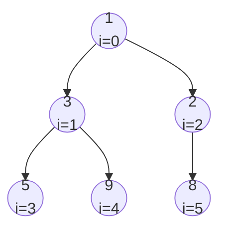
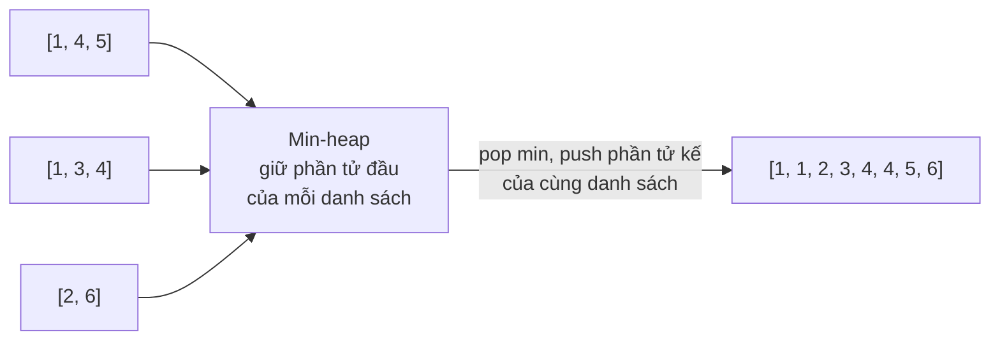
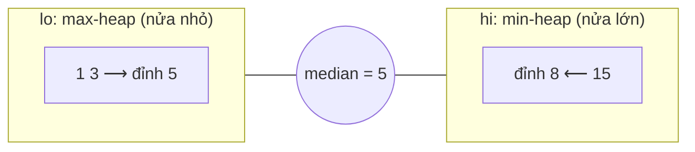
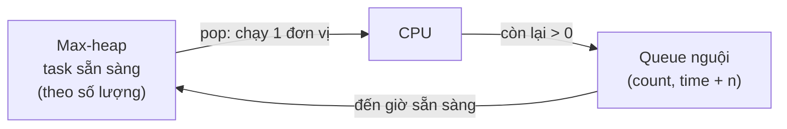

# 📚 Bài 10: Heap & Priority Queue (Hàng đợi ưu tiên)

## 🎯 Mục tiêu bài học

- Hiểu **hàng đợi ưu tiên (priority queue)** là gì và vì sao **heap** là cách cài đặt tốt nhất
- Nắm **tính chất heap** và cách lưu cây nhị phân **complete** trong **mảng** bằng công thức chỉ số
- Tự cài đặt **sift up** (chèn), **sift down** (lấy ra), **build heap O(n)** — và hiểu **vì sao** là O(n)
- Dùng thành thạo **`container/heap`** của Go và **`heapq`** của Python (kể cả mẹo **max-heap**)
- Giải các bài kinh điển: **Top-K**, **K-th largest**, **merge K sorted lists**, **median of a stream**, **task scheduler**

---

## 📖 1. Priority Queue — hàng đợi "không công bằng"

Hàng đợi thường ([Bài 5](./05-stacks-queues.md)) là **FIFO**: ai đến trước phục vụ trước. Nhưng ở **phòng cấp cứu bệnh viện**, bệnh nhân **nguy kịch** được vào trước người bị trầy xước, dù đến sau. Đó là **hàng đợi ưu tiên**:

- `push(x, priority)` — thêm một phần tử
- `pop()` — lấy ra phần tử có **độ ưu tiên cao nhất** (nhỏ nhất với min-PQ, lớn nhất với max-PQ)
- `peek()` — xem phần tử ưu tiên nhất mà không lấy ra

Cài đặt thế nào cho nhanh?

| Cách cài | push | pop (lấy min) | peek |
|----------|------|---------------|------|
| Mảng không sắp xếp | O(1) | O(n) — phải tìm min | O(n) |
| Mảng đã sắp xếp | O(n) — phải chèn đúng chỗ | O(1) | O(1) |
| BST cân bằng | O(log n) | O(log n) | O(log n) |
| **Binary heap** | **O(log n)** | **O(log n)** | **O(1)** |

Heap thắng vì: đơn giản hơn BST cân bằng rất nhiều, lưu gọn trong **một mảng**, không cần con trỏ, thân thiện cache CPU.

!!! note "Heap chỉ \"sắp xếp một nửa\""
    Heap **không** giữ toàn bộ thứ tự như BST — nó chỉ đảm bảo phần tử **nhỏ nhất ở đỉnh**. Chính vì "lười" như vậy nên nó nhanh hơn: ta không phải trả giá cho thông tin mình không cần.

---

## 📖 2. Tính chất heap và cách lưu trong mảng

**Binary heap** là một cây nhị phân thỏa **hai** điều kiện:

1. **Hình dạng**: là cây **complete** — mọi tầng đầy, trừ tầng cuối được lấp **từ trái sang phải** ([Bài 9](./09-trees-bst.md)).
2. **Thứ tự heap**:
    - **Min-heap**: mỗi nút **≤** các con của nó → gốc là **nhỏ nhất**.
    - **Max-heap**: mỗi nút **≥** các con của nó → gốc là **lớn nhất**.

!!! warning "Heap ≠ BST"
    Trong heap, **không có** quan hệ giữa con trái và con phải. `[1, 3, 2]` và `[1, 2, 3]` đều là min-heap hợp lệ. Vì vậy **không thể** tìm một giá trị bất kỳ trong heap nhanh hơn O(n).

### Công thức chỉ số

Vì cây complete không có "lỗ hổng", ta đánh số các nút theo tầng từ 0 và cất vào mảng — **không cần con trỏ**:



```text
Mảng:   [ 1 | 3 | 2 | 5 | 9 | 8 ]
chỉ số:   0   1   2   3   4   5

  con trái  của i  = 2*i + 1        con trái của 1 (i=1)  → i=3 → 5
  con phải  của i  = 2*i + 2        con phải của 1 (i=1)  → i=4 → 9
  cha       của i  = (i - 1) / 2    cha của 8 (i=5)       → i=2 → 2
  nút lá: i >= n/2                  nút trong cuối cùng: n/2 - 1
```

!!! tip "Nếu đánh số từ 1"
    Nhiều sách dùng mảng bắt đầu từ chỉ số 1 (bỏ trống ô 0): con = `2i` và `2i+1`, cha = `i/2`. Công thức gọn hơn, nhưng trong Go/Python quen đánh từ 0 thì dùng công thức ở trên.

Chiều cao heap `n` phần tử luôn là **⌊log₂ n⌋** — vì cây complete không bao giờ bị lệch. Đây là lý do mọi thao tác đều O(log n).

---

## 📖 3. Chèn — Sift up (nổi lên)

Để giữ **hình dạng** complete, phần tử mới chỉ có một chỗ đặt: **cuối mảng**. Nhưng như vậy có thể vi phạm **thứ tự**. Sửa bằng **sift up**: so với cha, nếu nhỏ hơn cha thì **đổi chỗ**, lặp lại cho tới khi ≥ cha hoặc lên tới gốc.

Hình dung: một nhân viên mới xuất sắc vào công ty ở vị trí thấp nhất, rồi được **thăng chức dần** mỗi khi giỏi hơn sếp trực tiếp.

Trace chèn lần lượt `5, 3, 8, 1, 9, 2` vào min-heap rỗng:

| Chèn | Đặt cuối | Sift up | Heap sau |
|------|----------|---------|----------|
| 5 | [5] | — | [5] |
| 3 | [5, **3**] | 3 < cha 5 → đổi | [3, 5] |
| 8 | [3, 5, **8**] | 8 ≥ cha 3 → dừng | [3, 5, 8] |
| 1 | [3, 5, 8, **1**] | 1 < 5 → đổi; 1 < 3 → đổi | [1, 3, 8, 5] |
| 9 | [1, 3, 8, 5, **9**] | 9 ≥ 3 → dừng | [1, 3, 8, 5, 9] |
| 2 | [1, 3, 8, 5, 9, **2**] | 2 < 8 → đổi; 2 ≥ 1 → dừng | [1, 3, 2, 5, 9, 8] |

Bấm ▶ để xem từng phần tử được thêm vào cuối rồi **nổi lên** khi nhỏ hơn cha (quan sát cả mảng và cây):

<div class="algo-viz" data-viz="heap" data-algo="insert" data-input="5,3,8,1,9,2" data-title="Min-heap: chèn + sift up"></div>

Chi phí: số lần đổi chỗ ≤ chiều cao → **O(log n)**.

---

## 📖 4. Lấy phần tử nhỏ nhất — Sift down (chìm xuống)

Min luôn ở `a[0]`. Lấy nó ra thì "lỗ hổng" ở gốc phải lấp thế nào để cây vẫn complete?

1. Lưu `a[0]` để trả về.
2. Đưa **phần tử cuối** lên gốc, xóa ô cuối (cây vẫn complete).
3. **Sift down**: so nút với **con nhỏ hơn** trong hai con; nếu lớn hơn con đó thì đổi chỗ; lặp lại tới khi ≤ cả hai con hoặc thành lá.

Vì sao phải đổi với **con nhỏ hơn**? Vì con được đưa lên sẽ làm cha của con còn lại — nó phải ≤ con kia. Đổi với con lớn hơn sẽ phá vỡ tính chất heap.

Trace `pop()` hai lần trên `[1, 3, 2, 5, 9, 8]`:

| Bước | Mảng | Giải thích |
|------|------|-----------|
| Lấy 1, đưa 8 lên gốc | [**8**, 3, 2, 5, 9] | |
| So 8 với con nhỏ hơn (2) | [2, 3, **8**, 5, 9] | 8 > 2 → đổi; i=2 không có con → dừng. Trả về **1** |
| Lấy 2, đưa 9 lên gốc | [**9**, 3, 8, 5] | |
| So 9 với min(3, 8) = 3 | [3, **9**, 8, 5] | đổi |
| So 9 với con 5 | [3, 5, 8, **9**] | đổi → lá, dừng. Trả về **2** |

Bấm ▶ để xem gốc bị lấy ra, phần tử cuối được đưa lên đỉnh rồi **chìm dần** xuống phía con nhỏ hơn:

<div class="algo-viz" data-viz="heap" data-algo="extract" data-input="1,3,2,5,9,8" data-title="Min-heap: extract + sift down"></div>

Chi phí: **O(log n)**.

---

## 📖 5. Build heap trong O(n) — Heapify

Có sẵn mảng `n` phần tử, muốn biến thành heap. Cách ngây thơ: `push` từng phần tử → O(n log n). Cách thông minh của Floyd (1964):

> **Sift down** từ nút trong cuối cùng (`n/2 - 1`) **ngược về** gốc.

Các lá (nửa sau của mảng) đã là heap 1 phần tử — không cần làm gì. Mỗi lần sift down tại `i`, hai cây con của `i` **đã** là heap (vì đã xử lý trước), nên sau khi sift down, cây con gốc `i` thành heap.

Trace `heapify([9, 5, 7, 1, 3, 8, 2, 6])` (n = 8, bắt đầu từ i = 3):

| i | Nút | Con | Hành động | Mảng sau |
|---|-----|-----|-----------|----------|
| 3 | 1 | 6 | 1 ≤ 6, giữ | [9, 5, 7, 1, 3, 8, 2, 6] |
| 2 | 7 | 8, 2 | đổi với 2 | [9, 5, **2**, 1, 3, 8, **7**, 6] |
| 1 | 5 | 1, 3 | đổi với 1; rồi 5 vs 6: giữ | [9, **1**, 2, **5**, 3, 8, 7, 6] |
| 0 | 9 | 1, 2 | đổi với 1; 9 vs (5, 3) → đổi với 3 | [**1**, **3**, 2, 5, **9**, 8, 7, 6] |

Bấm ▶ để xem heapify đi **từ phải sang trái** qua các nút trong, mỗi nút chìm xuống đúng chỗ:

<div class="algo-viz" data-viz="heap" data-algo="heapify" data-input="9,5,7,1,3,8,2,6" data-title="Build heap O(n)"></div>

### Vì sao là O(n) chứ không phải O(n log n)?

Trực giác: **phần lớn nút nằm ở đáy** và chỉ chìm được rất ít bước.

| Tầng (tính từ đáy) | Số nút (khoảng) | Bước sift down tối đa |
|--------------------|-----------------|-----------------------|
| 0 (lá) | n/2 | 0 |
| 1 | n/4 | 1 |
| 2 | n/8 | 2 |
| h | n/2^(h+1) | h |

Tổng = n · (1/4 + 2/8 + 3/16 + ...) = n · Σ h/2^(h+1) = **n · 1** → **O(n)**.

Ngược lại, `push` từng phần tử thì các nút ở **đáy** (đông nhất) phải **nổi lên xa nhất** (log n bước) → O(n log n). Cùng một mục tiêu nhưng chọn hướng đi khác nhau cho chi phí khác nhau!

---

## 📖 6. Cài đặt heap từ đầu

=== "Go"

    ```go
    package main

    import "fmt"

    type MinHeap struct{ a []int }

    func (h *MinHeap) Len() int  { return len(h.a) }
    func (h *MinHeap) Peek() int { return h.a[0] }

    func (h *MinHeap) Push(x int) {
    	h.a = append(h.a, x) // 1. đặt cuối mảng
    	h.siftUp(len(h.a) - 1)
    }

    func (h *MinHeap) Pop() int {
    	top := h.a[0]
    	last := len(h.a) - 1
    	h.a[0] = h.a[last] // 2. đưa phần tử cuối lên gốc
    	h.a = h.a[:last]
    	if len(h.a) > 0 {
    		h.siftDown(0)
    	}
    	return top
    }

    func (h *MinHeap) siftUp(i int) {
    	for i > 0 {
    		p := (i - 1) / 2
    		if h.a[i] >= h.a[p] {
    			break
    		}
    		h.a[i], h.a[p] = h.a[p], h.a[i]
    		i = p
    	}
    }

    func (h *MinHeap) siftDown(i int) {
    	n := len(h.a)
    	for {
    		smallest, l, r := i, 2*i+1, 2*i+2
    		if l < n && h.a[l] < h.a[smallest] {
    			smallest = l
    		}
    		if r < n && h.a[r] < h.a[smallest] {
    			smallest = r
    		}
    		if smallest == i {
    			return
    		}
    		h.a[i], h.a[smallest] = h.a[smallest], h.a[i]
    		i = smallest
    	}
    }

    // Heapify: build heap O(n) từ mảng có sẵn
    func Heapify(a []int) *MinHeap {
    	h := &MinHeap{a: a}
    	for i := len(a)/2 - 1; i >= 0; i-- {
    		h.siftDown(i)
    	}
    	return h
    }

    func main() {
    	h := &MinHeap{}
    	for _, x := range []int{5, 3, 8, 1, 9, 2} {
    		h.Push(x)
    	}
    	fmt.Println("heap:", h.a)
    	fmt.Println("pop:", h.Pop(), "→", h.a)
    	fmt.Println("pop:", h.Pop(), "→", h.a)

    	h2 := Heapify([]int{9, 5, 7, 1, 3, 8, 2, 6})
    	fmt.Println("heapify:", h2.a)
    	var sorted []int
    	for h2.Len() > 0 {
    		sorted = append(sorted, h2.Pop())
    	}
    	fmt.Println("pop hết:", sorted)
    }
    // Output:
    // heap: [1 3 2 5 9 8]
    // pop: 1 → [2 3 8 5 9]
    // pop: 2 → [3 5 8 9]
    // heapify: [1 3 2 5 9 8 7 6]
    // pop hết: [1 2 3 5 6 7 8 9]
    ```

=== "Python"

    ```python
    class MinHeap:
        def __init__(self, items=None):
            self.a = list(items or [])
            for i in range(len(self.a) // 2 - 1, -1, -1):   # heapify O(n)
                self._sift_down(i)

        def __len__(self):
            return len(self.a)

        def peek(self):
            return self.a[0]

        def push(self, x):
            self.a.append(x)                 # 1. đặt cuối
            self._sift_up(len(self.a) - 1)

        def pop(self):
            top = self.a[0]
            last = self.a.pop()              # 2. lấy phần tử cuối
            if self.a:
                self.a[0] = last             #    đưa lên gốc
                self._sift_down(0)
            return top

        def _sift_up(self, i):
            a = self.a
            while i > 0:
                p = (i - 1) // 2
                if a[i] >= a[p]:
                    break
                a[i], a[p] = a[p], a[i]
                i = p

        def _sift_down(self, i):
            a, n = self.a, len(self.a)
            while True:
                smallest, l, r = i, 2 * i + 1, 2 * i + 2
                if l < n and a[l] < a[smallest]:
                    smallest = l
                if r < n and a[r] < a[smallest]:
                    smallest = r
                if smallest == i:
                    return
                a[i], a[smallest] = a[smallest], a[i]
                i = smallest


    h = MinHeap()
    for x in [5, 3, 8, 1, 9, 2]:
        h.push(x)
    print("heap:", h.a)
    print("pop:", h.pop(), "→", h.a)
    print("pop:", h.pop(), "→", h.a)
    h2 = MinHeap([9, 5, 7, 1, 3, 8, 2, 6])
    print("heapify:", h2.a)
    print("pop hết:", [h2.pop() for _ in range(len(h2))])
    # Output:
    # heap: [1, 3, 2, 5, 9, 8]
    # pop: 1 → [2, 3, 8, 5, 9]
    # pop: 2 → [3, 5, 8, 9]
    # heapify: [1, 3, 2, 5, 9, 8, 7, 6]
    # pop hết: [1, 2, 3, 5, 6, 7, 8, 9]
    ```

| Thao tác | Thời gian | Ghi chú |
|----------|-----------|---------|
| `peek` | O(1) | `a[0]` |
| `push` | O(log n) | sift up |
| `pop` | O(log n) | sift down |
| `heapify` | **O(n)** | Floyd |
| Tìm / xóa phần tử bất kỳ | O(n) | phải quét mảng (trừ khi có index map) |
| Bộ nhớ | O(n) | chỉ một mảng |

!!! note "Max-heap"
    Chỉ cần **đảo** phép so sánh (`<` thành `>`). Widget ở trên cũng có chế độ max-heap:

<div class="algo-viz" data-viz="heap" data-algo="insert" data-input="5,3,8,1,9,2" data-type="max" data-title="Max-heap: chèn + sift up"></div>

---

## 📖 7. Heap sort — ôn lại

Heap sort (đã học ở [Bài 7](./07-sorting.md)) chính là: **heapify** thành **max-heap** O(n), rồi lặp `n` lần: đổi gốc (max) với phần tử cuối vùng heap, thu nhỏ vùng heap 1 ô, **sift down** gốc. Kết quả: mảng tăng dần **tại chỗ**.

- Thời gian **O(n log n)** trong **mọi** trường hợp, bộ nhớ **O(1)**.
- **Không ổn định**, và chậm hơn quick sort trên thực tế vì truy cập bộ nhớ nhảy cóc (cha ↔ con cách xa nhau → cache miss).
- Là "phao cứu sinh" của **introsort/pdqsort**: khi quick sort đệ quy quá sâu, chuyển sang heap sort để đảm bảo O(n log n).

<div class="algo-viz" data-viz="sort" data-algo="heap" data-input="9,5,7,1,3,8,2,6" data-title="Heap sort"></div>

---

## 📖 8. Dùng heap có sẵn: Go `container/heap` và Python `heapq`

Trong thực tế (và phỏng vấn), bạn gần như luôn dùng thư viện.

### 8.1. Go — `container/heap`

Go không có kiểu heap "đóng gói sẵn". Thay vào đó bạn tự định nghĩa một kiểu thỏa interface `heap.Interface` = `sort.Interface` (`Len`, `Less`, `Swap`) + `Push(any)` + `Pop() any`, rồi gọi các hàm **`heap.Init`, `heap.Push`, `heap.Pop`, `heap.Fix`, `heap.Remove`**.

!!! warning "Đừng gọi `h.Push(x)` trực tiếp!"
    Phương thức `Push`/`Pop` **của bạn** chỉ thêm/bớt ở **cuối slice** — không sift gì cả. Phải gọi **`heap.Push(h, x)`** và **`heap.Pop(h)`** (hàm của package) để chúng sift giúp bạn. Nhầm chỗ này là lỗi Go số 1 khi dùng heap.

=== "Go"

    ```go
    package main

    import (
    	"container/heap"
    	"fmt"
    )

    // IntHeap: min-heap số nguyên
    type IntHeap []int

    func (h IntHeap) Len() int           { return len(h) }
    func (h IntHeap) Less(i, j int) bool { return h[i] < h[j] } // đổi thành > để có max-heap
    func (h IntHeap) Swap(i, j int)      { h[i], h[j] = h[j], h[i] }
    func (h *IntHeap) Push(x any)        { *h = append(*h, x.(int)) }
    func (h *IntHeap) Pop() any {
    	old := *h
    	n := len(old)
    	x := old[n-1]
    	*h = old[:n-1]
    	return x
    }

    // Task: priority queue với struct + cập nhật độ ưu tiên
    type Task struct {
    	Name     string
    	Priority int // số nhỏ = ưu tiên cao
    	index    int // vị trí trong heap, cần cho heap.Fix
    }

    type PQ []*Task

    func (pq PQ) Len() int { return len(pq) }
    func (pq PQ) Less(i, j int) bool {
    	if pq[i].Priority != pq[j].Priority {
    		return pq[i].Priority < pq[j].Priority
    	}
    	return pq[i].Name < pq[j].Name // phá hòa: theo tên
    }
    func (pq PQ) Swap(i, j int) {
    	pq[i], pq[j] = pq[j], pq[i]
    	pq[i].index, pq[j].index = i, j
    }
    func (pq *PQ) Push(x any) {
    	t := x.(*Task)
    	t.index = len(*pq)
    	*pq = append(*pq, t)
    }
    func (pq *PQ) Pop() any {
    	old := *pq
    	n := len(old)
    	t := old[n-1]
    	old[n-1] = nil // tránh memory leak
    	*pq = old[:n-1]
    	return t
    }

    func main() {
    	h := &IntHeap{5, 3, 8, 1}
    	heap.Init(h) // heapify O(n)
    	heap.Push(h, 2)
    	fmt.Println("min:", (*h)[0])
    	for h.Len() > 0 {
    		fmt.Print(heap.Pop(h), " ")
    	}
    	fmt.Println()

    	pq := &PQ{}
    	tasks := map[string]*Task{}
    	for _, t := range []*Task{{Name: "email", Priority: 3}, {Name: "deploy", Priority: 1}, {Name: "review", Priority: 2}} {
    		tasks[t.Name] = t
    		heap.Push(pq, t)
    	}
    	tasks["email"].Priority = 0         // sếp bảo: email gấp!
    	heap.Fix(pq, tasks["email"].index) // sift lại tại vị trí đó, O(log n)
    	for pq.Len() > 0 {
    		t := heap.Pop(pq).(*Task)
    		fmt.Println(t.Priority, t.Name)
    	}
    }
    // Output:
    // min: 1
    // 1 2 3 5 8
    // 0 email
    // 1 deploy
    // 2 review
    ```

=== "Python"

    ```python
    import heapq

    # heapq thao tác trực tiếp trên list, luôn là MIN-heap
    h = [5, 3, 8, 1]
    heapq.heapify(h)                 # O(n), tại chỗ
    heapq.heappush(h, 2)
    print("min:", h[0])
    print([heapq.heappop(h) for _ in range(len(h))])

    # Max-heap: đẩy SỐ ÂM vào, lấy ra thì đổi dấu lại
    mh = []
    for x in [5, 3, 8, 1]:
        heapq.heappush(mh, -x)
    print("max:", -mh[0], "pop:", -heapq.heappop(mh))

    # Priority queue với tuple: so sánh theo phần tử đầu, hòa thì phần tử sau
    pq = []
    heapq.heappush(pq, (3, "email"))
    heapq.heappush(pq, (1, "deploy"))
    heapq.heappush(pq, (2, "review"))
    while pq:
        print(heapq.heappop(pq))

    # Tiện ích
    nums = [3, 1, 5, 12, 2, 11, 7]
    print(heapq.nlargest(3, nums), heapq.nsmallest(2, nums))
    print(heapq.heappushpop([1, 4, 6], 3))   # push rồi pop, nhanh hơn 2 lệnh riêng
    # Output:
    # min: 1
    # [1, 2, 3, 5, 8]
    # max: 8 pop: 8
    # (1, 'deploy')
    # (2, 'review')
    # (3, 'email')
    # [12, 11, 7] [1, 2]
    # 1
    ```

!!! tip "Python: đối tượng không so sánh được → thêm bộ đếm"
    Nếu hai tuple có cùng priority, Python sẽ so sánh **phần tử thứ hai**. Nếu đó là dict/object không so sánh được → `TypeError`. Mẹo chuẩn: `(priority, counter, item)` với `counter = itertools.count()` tăng dần — vừa tránh lỗi, vừa giữ **FIFO** cho các phần tử cùng ưu tiên.

!!! note "Python: `heapq` không có \"decrease key\""
    Muốn đổi ưu tiên, dùng kỹ thuật **lazy deletion**: đẩy bản ghi mới vào, đánh dấu bản cũ là "đã hủy", khi pop gặp bản đã hủy thì bỏ qua. Dijkstra trong [Bài 12](./12-shortest-paths-mst.md) dùng đúng mẹo này (bỏ qua khi `d > dist[u]`).

---

## 📖 9. Top-K và K-th largest

**Bài toán**: tìm `k` phần tử **lớn nhất** trong `n` phần tử (ví dụ: 10 bài hát nghe nhiều nhất trong 100 triệu lượt nghe).

**Mẹo ngược đời**: dùng **MIN-heap** kích thước `k`!

- Heap giữ `k` phần tử lớn nhất **đã thấy**. Đỉnh heap = **nhỏ nhất trong top-k** = "người gác cổng".
- Gặp số mới lớn hơn người gác cổng → đuổi người gác cổng ra, cho số mới vào.
- Hết dữ liệu: heap chứa đúng top-k, và **đỉnh chính là phần tử lớn thứ k**.

Giống **bảng xếp hạng top 3** của cuộc thi: người mới chỉ lọt vào nếu điểm cao hơn **người đứng thứ 3** hiện tại.

Trace top-3 của `[3, 1, 5, 12, 2, 11, 7]`:

| Số | Heap (min-heap, k = 3) | Hành động |
|----|------------------------|-----------|
| 3, 1, 5 | [1, 3, 5] | chưa đủ 3 → cứ thêm |
| 12 | [3, 12, 5] | 12 > đỉnh 1 → thay |
| 2 | [3, 12, 5] | 2 ≤ 3 → bỏ qua |
| 11 | [5, 12, 11] | 11 > 3 → thay |
| 7 | [7, 12, 11] | 7 > 5 → thay |

Kết quả: top-3 = {7, 11, 12}, phần tử lớn thứ 3 = **7**.

| Cách | Thời gian | Bộ nhớ | Ghi chú |
|------|-----------|--------|---------|
| Sắp xếp toàn bộ | O(n log n) | O(n) | Đơn giản |
| **Min-heap cỡ k** | **O(n log k)** | **O(k)** | Chạy được với **stream** vô hạn |
| Quickselect | O(n) trung bình | O(1) | Phải có toàn bộ mảng, sửa mảng ([Bài 7](./07-sorting.md)) |

=== "Go"

    ```go
    package main

    import (
    	"container/heap"
    	"fmt"
    	"slices"
    )

    type IntHeap []int

    func (h IntHeap) Len() int           { return len(h) }
    func (h IntHeap) Less(i, j int) bool { return h[i] < h[j] }
    func (h IntHeap) Swap(i, j int)      { h[i], h[j] = h[j], h[i] }
    func (h *IntHeap) Push(x any)        { *h = append(*h, x.(int)) }
    func (h *IntHeap) Pop() any {
    	old := *h
    	x := old[len(old)-1]
    	*h = old[:len(old)-1]
    	return x
    }

    func topK(nums []int, k int) []int {
    	h := &IntHeap{}
    	for _, x := range nums {
    		if h.Len() < k {
    			heap.Push(h, x)
    		} else if x > (*h)[0] { // lớn hơn "người gác cổng"
    			(*h)[0] = x
    			heap.Fix(h, 0) // thay đỉnh + sift down: rẻ hơn Pop rồi Push
    		}
    	}
    	res := slices.Clone(*h)
    	slices.SortFunc(res, func(a, b int) int { return b - a })
    	return res
    }

    // LeetCode 215: phần tử lớn thứ k
    func findKthLargest(nums []int, k int) int {
    	h := &IntHeap{}
    	for _, x := range nums {
    		heap.Push(h, x)
    		if h.Len() > k {
    			heap.Pop(h)
    		}
    	}
    	return (*h)[0]
    }

    func main() {
    	fmt.Println(topK([]int{3, 1, 5, 12, 2, 11, 7}, 3))
    	fmt.Println(findKthLargest([]int{3, 2, 1, 5, 6, 4}, 2))
    	fmt.Println(findKthLargest([]int{3, 2, 3, 1, 2, 4, 5, 5, 6}, 4))
    }
    // Output:
    // [12 11 7]
    // 5
    // 4
    ```

=== "Python"

    ```python
    import heapq


    def top_k(nums, k):
        h = []
        for x in nums:
            if len(h) < k:
                heapq.heappush(h, x)
            elif x > h[0]:                  # lớn hơn "người gác cổng"
                heapq.heapreplace(h, x)     # pop đỉnh + push x, một lần sift
        return sorted(h, reverse=True)


    def find_kth_largest(nums, k):
        h = nums[:k]
        heapq.heapify(h)
        for x in nums[k:]:
            if x > h[0]:
                heapq.heapreplace(h, x)
        return h[0]


    print(top_k([3, 1, 5, 12, 2, 11, 7], 3))
    print(find_kth_largest([3, 2, 1, 5, 6, 4], 2))
    print(find_kth_largest([3, 2, 3, 1, 2, 4, 5, 5, 6], 4))
    print(heapq.nlargest(3, [3, 1, 5, 12, 2, 11, 7]))   # thư viện làm sẵn
    # Output:
    # [12, 11, 7]
    # 5
    # 4
    # [12, 11, 7]
    ```

!!! tip "Top-K nhỏ nhất thì sao?"
    Đối xứng: dùng **MAX-heap** kích thước k (đỉnh = lớn nhất trong top-k-nhỏ-nhất). Quy tắc nhớ: **heap ngược chiều với thứ bạn muốn giữ**.

---

## 📖 10. Merge K sorted lists

**Bài toán** (LeetCode 23): trộn `k` danh sách đã sắp xếp (tổng `N` phần tử) thành một danh sách sắp xếp.

Ví dụ đời thường: 3 quầy thu ngân, mỗi quầy có hàng người đã xếp theo số thứ tự. Muốn gọi tên theo thứ tự tổng, bạn chỉ cần nhìn **người đứng đầu** mỗi hàng, gọi người có số nhỏ nhất, rồi người kế tiếp của hàng đó bước lên.



Heap chứa **tối đa k** phần tử → mỗi thao tác O(log k) → tổng **O(N log k)**. So với trộn lần lượt từng cặp (O(N·k)) thì nhanh hơn nhiều khi k lớn.

Heap lưu bộ ba `(giá trị, chỉ số danh sách, chỉ số phần tử)` để biết lấy phần tử kế tiếp từ đâu.

=== "Go"

    ```go
    package main

    import (
    	"container/heap"
    	"fmt"
    )

    type item struct{ val, list, idx int }
    type minHeap []item

    func (h minHeap) Len() int           { return len(h) }
    func (h minHeap) Less(i, j int) bool { return h[i].val < h[j].val }
    func (h minHeap) Swap(i, j int)      { h[i], h[j] = h[j], h[i] }
    func (h *minHeap) Push(x any)        { *h = append(*h, x.(item)) }
    func (h *minHeap) Pop() any {
    	old := *h
    	x := old[len(old)-1]
    	*h = old[:len(old)-1]
    	return x
    }

    func mergeK(lists [][]int) []int {
    	h := &minHeap{}
    	for i, l := range lists {
    		if len(l) > 0 {
    			heap.Push(h, item{l[0], i, 0})
    		}
    	}
    	var res []int
    	for h.Len() > 0 {
    		it := heap.Pop(h).(item)
    		res = append(res, it.val)
    		if next := it.idx + 1; next < len(lists[it.list]) {
    			heap.Push(h, item{lists[it.list][next], it.list, next})
    		}
    	}
    	return res
    }

    func main() {
    	fmt.Println(mergeK([][]int{{1, 4, 5}, {1, 3, 4}, {2, 6}}))
    	fmt.Println(mergeK([][]int{{}, {7}, {}}))
    }
    // Output:
    // [1 1 2 3 4 4 5 6]
    // [7]
    ```

=== "Python"

    ```python
    import heapq


    def merge_k(lists):
        h = [(l[0], i, 0) for i, l in enumerate(lists) if l]
        heapq.heapify(h)
        res = []
        while h:
            val, li, idx = heapq.heappop(h)
            res.append(val)
            if idx + 1 < len(lists[li]):
                heapq.heappush(h, (lists[li][idx + 1], li, idx + 1))
        return res


    print(merge_k([[1, 4, 5], [1, 3, 4], [2, 6]]))
    print(merge_k([[], [7], []]))
    print(list(heapq.merge([1, 4, 5], [1, 3, 4], [2, 6])))   # thư viện: lazy iterator
    # Output:
    # [1, 1, 2, 3, 4, 4, 5, 6]
    # [7]
    # [1, 1, 2, 3, 4, 4, 5, 6]
    ```

!!! note "Với linked list"
    Bài gốc LeetCode 23 dùng linked list. Ý tưởng y hệt: heap chứa **nút đầu** mỗi list; pop nút nhỏ nhất, nối vào kết quả, push `node.next` nếu có. Trong Python, thêm chỉ số list vào tuple `(node.val, i, node)` vì `ListNode` không so sánh được.

Kỹ thuật này là trái tim của **external merge sort** (sắp xếp dữ liệu lớn hơn RAM), của **LSM-tree compaction** trong RocksDB/Cassandra, và của việc gộp kết quả từ nhiều shard database.

---

## 📖 11. Median of a data stream — kỹ thuật "hai heap"

**Bài toán** (LeetCode 295): số liệu đến liên tục (ví dụ: thời gian phản hồi của API). Sau mỗi số, trả về **trung vị** (median) của mọi số đã thấy.

Sắp xếp lại mỗi lần là O(n log n) mỗi thao tác — quá chậm. Ý tưởng: chia dữ liệu thành **nửa nhỏ** và **nửa lớn**:

- `lo`: **max-heap** chứa nửa nhỏ → đỉnh = số lớn nhất của nửa nhỏ
- `hi`: **min-heap** chứa nửa lớn → đỉnh = số nhỏ nhất của nửa lớn
- Giữ `len(lo) == len(hi)` hoặc `len(lo) == len(hi) + 1`

Median = đỉnh `lo` (nếu lẻ) hoặc trung bình hai đỉnh (nếu chẵn). Hai đỉnh chính là "hai người đứng giữa hàng".



Thêm số `x`: đẩy vào `lo`, rồi chuyển **đỉnh `lo`** sang `hi` (đảm bảo mọi phần tử `lo` ≤ mọi phần tử `hi`), rồi nếu `hi` dài hơn `lo` thì chuyển đỉnh `hi` về `lo`.

| Thêm | lo (max-heap) | hi (min-heap) | Median |
|------|---------------|---------------|--------|
| 5 | [5] | [] | 5 |
| 15 | [5] | [15] | (5 + 15) / 2 = 10 |
| 1 | [1, 5] | [15] | 5 |
| 3 | [1, 3] | [5, 15] | (3 + 5) / 2 = 4 |
| 8 | [1, 3, 5] | [8, 15] | 5 |

=== "Go"

    ```go
    package main

    import (
    	"container/heap"
    	"fmt"
    	"strings"
    )

    // IntHeap với hàm so sánh tùy chọn → dùng cho cả min và max
    type IntHeap struct {
    	a    []int
    	less func(x, y int) bool
    }

    func (h IntHeap) Len() int           { return len(h.a) }
    func (h IntHeap) Less(i, j int) bool { return h.less(h.a[i], h.a[j]) }
    func (h IntHeap) Swap(i, j int)      { h.a[i], h.a[j] = h.a[j], h.a[i] }
    func (h *IntHeap) Push(x any)        { h.a = append(h.a, x.(int)) }
    func (h *IntHeap) Pop() any {
    	x := h.a[len(h.a)-1]
    	h.a = h.a[:len(h.a)-1]
    	return x
    }

    type MedianFinder struct{ lo, hi *IntHeap }

    func NewMedianFinder() *MedianFinder {
    	return &MedianFinder{
    		lo: &IntHeap{less: func(x, y int) bool { return x > y }}, // max-heap
    		hi: &IntHeap{less: func(x, y int) bool { return x < y }}, // min-heap
    	}
    }

    func (m *MedianFinder) Add(x int) {
    	heap.Push(m.lo, x)
    	heap.Push(m.hi, heap.Pop(m.lo)) // phần tử lớn nhất nửa dưới sang nửa trên
    	if m.hi.Len() > m.lo.Len() {
    		heap.Push(m.lo, heap.Pop(m.hi))
    	}
    }

    func (m *MedianFinder) Median() float64 {
    	if m.lo.Len() > m.hi.Len() {
    		return float64(m.lo.a[0])
    	}
    	return float64(m.lo.a[0]+m.hi.a[0]) / 2
    }

    func main() {
    	m := NewMedianFinder()
    	var out []string
    	for _, x := range []int{5, 15, 1, 3, 8} {
    		m.Add(x)
    		out = append(out, fmt.Sprintf("%.1f", m.Median()))
    	}
    	fmt.Println(strings.Join(out, " "))
    }
    // Output:
    // 5.0 10.0 5.0 4.0 5.0
    ```

=== "Python"

    ```python
    import heapq


    class MedianFinder:
        def __init__(self):
            self.lo = []   # max-heap (lưu số âm)
            self.hi = []   # min-heap

        def add(self, x):
            heapq.heappush(self.lo, -x)
            heapq.heappush(self.hi, -heapq.heappop(self.lo))
            if len(self.hi) > len(self.lo):
                heapq.heappush(self.lo, -heapq.heappop(self.hi))

        def median(self):
            if len(self.lo) > len(self.hi):
                return float(-self.lo[0])
            return (-self.lo[0] + self.hi[0]) / 2


    m = MedianFinder()
    out = []
    for x in [5, 15, 1, 3, 8]:
        m.add(x)
        out.append(f"{m.median():.1f}")
    print(" ".join(out))
    # Output:
    # 5.0 10.0 5.0 4.0 5.0
    ```

Độ phức tạp: `add` **O(log n)**, `median` **O(1)**. Kỹ thuật **hai heap** còn dùng cho: sliding window median (LeetCode 480), IPO (LeetCode 502), cân bằng tải giữa hai nhóm.

---

## 📖 12. Task scheduling với heap

### 12.1. Task Scheduler (LeetCode 621)

CPU cần chạy các task (ký hiệu chữ cái), mỗi task mất 1 đơn vị thời gian. Hai task **cùng loại** phải cách nhau ít nhất `n` đơn vị (thời gian "nguội"). CPU có thể **nghỉ (idle)**. Tìm tổng thời gian nhỏ nhất.

Ví dụ `tasks = A A A B B B`, `n = 2` → `A B idle A B idle A B` = **8**.

Chiến lược tham lam ([Bài 13](./13-greedy.md)): ở mỗi thời điểm, chạy task **còn nhiều nhất** trong số các task đang sẵn sàng — vì task nhiều nhất là thứ dễ gây "tắc" về sau.

- **Max-heap** chứa số lượng còn lại của các task **sẵn sàng**.
- **Queue** "phòng chờ" chứa `(số lượng còn lại, thời điểm sẵn sàng lại)` của task vừa chạy.



=== "Go"

    ```go
    package main

    import (
    	"container/heap"
    	"fmt"
    )

    type MaxHeap []int

    func (h MaxHeap) Len() int           { return len(h) }
    func (h MaxHeap) Less(i, j int) bool { return h[i] > h[j] }
    func (h MaxHeap) Swap(i, j int)      { h[i], h[j] = h[j], h[i] }
    func (h *MaxHeap) Push(x any)        { *h = append(*h, x.(int)) }
    func (h *MaxHeap) Pop() any {
    	old := *h
    	x := old[len(old)-1]
    	*h = old[:len(old)-1]
    	return x
    }

    func leastInterval(tasks []byte, n int) int {
    	cnt := map[byte]int{}
    	for _, t := range tasks {
    		cnt[t]++
    	}
    	h := &MaxHeap{}
    	for _, c := range cnt {
    		*h = append(*h, c)
    	}
    	heap.Init(h)
    	type waiting struct{ count, readyAt int }
    	var queue []waiting
    	time := 0
    	for h.Len() > 0 || len(queue) > 0 {
    		time++
    		if h.Len() > 0 {
    			c := heap.Pop(h).(int) - 1
    			if c > 0 {
    				queue = append(queue, waiting{c, time + n})
    			}
    		}
    		if len(queue) > 0 && queue[0].readyAt == time {
    			heap.Push(h, queue[0].count)
    			queue = queue[1:]
    		}
    	}
    	return time
    }

    func main() {
    	fmt.Println(leastInterval([]byte("AAABBB"), 2))
    	fmt.Println(leastInterval([]byte("AAABBB"), 0))
    	fmt.Println(leastInterval([]byte("AAAAAABCDEFG"), 2))
    }
    // Output:
    // 8
    // 6
    // 16
    ```

=== "Python"

    ```python
    import heapq
    from collections import Counter, deque


    def least_interval(tasks, n):
        h = [-c for c in Counter(tasks).values()]   # max-heap bằng số âm
        heapq.heapify(h)
        queue = deque()                             # (count âm còn lại, ready_at)
        time = 0
        while h or queue:
            time += 1
            if h:
                c = heapq.heappop(h) + 1            # chạy 1 đơn vị (count âm nên +1)
                if c < 0:
                    queue.append((c, time + n))
            if queue and queue[0][1] == time:
                heapq.heappush(h, queue.popleft()[0])
        return time


    print(least_interval("AAABBB", 2))
    print(least_interval("AAABBB", 0))
    print(least_interval("AAAAAABCDEFG", 2))
    # Output:
    # 8
    # 6
    # 16
    ```

!!! tip "Lời giải công thức O(n)"
    Gọi `maxCnt` = số lần xuất hiện nhiều nhất, `k` = số loại task đạt `maxCnt`. Đáp án = `max(len(tasks), (maxCnt - 1) * (n + 1) + k)`. Hình dung: xếp `maxCnt - 1` "khung" dài `n + 1`, cộng hàng cuối gồm `k` task. Heap simulation vẫn đáng học vì **tổng quát hơn** (dễ đổi luật: task có thời lượng khác nhau, trả về thứ tự chạy...).

### 12.2. Lập lịch theo thời điểm — mô phỏng sự kiện

Nhiều hệ thống thực (bộ hẹn giờ của Go runtime, `setTimeout` của Node.js, cron, game loop) giữ một **min-heap theo thời điểm hết hạn**: luôn biết ngay "việc tiếp theo cần làm lúc nào" trong O(1), thêm hẹn giờ O(log n). Ví dụ Go runtime cài timer bằng **4-ary heap** (mỗi nút 4 con → cây thấp hơn, ít cache miss hơn).

---

## 🌍 Ứng dụng thực tế

| Ở đâu | Heap dùng để | 
|-------|--------------|
| **Dijkstra, Prim** ([Bài 12](./12-shortest-paths-mst.md)) | Lấy đỉnh có khoảng cách nhỏ nhất — Google Maps, định tuyến mạng (OSPF) |
| **Hệ điều hành** | Lập lịch tiến trình theo độ ưu tiên; timer của kernel |
| **Go runtime / Node.js event loop** | Quản lý `time.After`, `setTimeout` bằng heap theo thời điểm |
| **Database** | `ORDER BY ... LIMIT k` dùng top-K heap thay vì sort toàn bộ; external merge sort |
| **Kafka, RocksDB, Cassandra** | Trộn K file/segment đã sắp xếp (K-way merge) |
| **Monitoring** (Prometheus, Datadog) | Theo dõi median/percentile của latency theo stream |
| **Nén dữ liệu** | Xây cây **Huffman** — lặp lại "lấy 2 nút nhỏ nhất" ([Bài 13](./13-greedy.md)) |
| **Hệ thống gợi ý / bảng xếp hạng** | Top-K sản phẩm bán chạy, top-K người chơi |
| **Rate limiter, job queue** (Sidekiq, Celery) | Chạy job theo thời điểm hẹn / độ ưu tiên |

---

## ⚠️ Lỗi thường gặp

| Lỗi | Hậu quả | Cách tránh |
|-----|---------|-----------|
| Go: gọi `h.Push(x)` thay vì `heap.Push(h, x)` | Heap không được sift → sai thứ tự | Luôn dùng **hàm của package** `heap.*` |
| Go: quên `heap.Init` khi slice có sẵn dữ liệu | `Pop` trả về sai | Gọi `heap.Init(h)` một lần sau khi khởi tạo |
| Python: quên đổi dấu khi dùng max-heap | Lấy ra số âm hoặc sai thứ tự | Đẩy `-x`, lấy ra `-heappop(h)` — viết hàm bọc cho chắc |
| Python: tuple có phần tử không so sánh được | `TypeError: '<' not supported` | `(priority, counter, obj)` |
| Top-K lớn nhất mà dùng max-heap chứa **cả n** phần tử | O(n) bộ nhớ, O(n + k log n) | Min-heap **cỡ k** |
| Nghĩ `h[1]` là phần tử nhỏ thứ hai | Sai! nhỏ thứ hai là `min(h[1], h[2])` | Chỉ `h[0]` có ý nghĩa đặc biệt |
| Duyệt `for x in h` và nghĩ nó đã sắp xếp | Thứ tự trong mảng heap **không** sắp xếp | Pop lần lượt, hoặc `sorted(h)` |
| Sift down đổi với con **lớn hơn** (min-heap) | Phá tính chất heap | Luôn chọn con **nhỏ nhất** trong hai con |
| Tìm/xóa phần tử bất kỳ trong heap bằng quét | O(n) mỗi lần | Lưu `index` (Go `heap.Fix/Remove`) hoặc lazy deletion |

---

## 🏋️ Bài tập

### Cấp độ 1 — Làm quen

**Bài 1.1** Mảng `[10, 20, 15, 30, 40]` có phải min-heap không? Còn `[10, 15, 20, 12, 40]`?

<details markdown="1"><summary>Đáp án</summary>

- `[10, 20, 15, 30, 40]`: cha i=0 (10) ≤ 20, 15 ✅; i=1 (20) ≤ 30, 40 ✅ → **là** min-heap.
- `[10, 15, 20, 12, 40]`: i=1 (15) có con i=3 là 12 < 15 ❌ → **không phải**.

</details>

**Bài 1.2** Vẽ min-heap sau khi chèn lần lượt `7, 2, 9, 4, 1` và sau một lần `pop`.

<details markdown="1"><summary>Đáp án</summary>

Chèn: [7] → [2,7] → [2,7,9] → [2,4,9,7] → chèn 1 vào i=4, cha i=1 (4) → đổi → [2,1,9,7,4], cha i=0 (2) → đổi → **[1,2,9,7,4]**.

Pop: lấy 1, đưa 4 lên → [4,2,9,7]; 4 > min(2,9)=2 → đổi → [2,4,9,7]; i=1 con i=3 (7) ≥ 4 → dừng. Kết quả **[2,4,9,7]**.

</details>

**Bài 1.3** (LeetCode 1046 — Last Stone Weight) Mỗi lượt lấy 2 viên đá nặng nhất `x ≤ y`; nếu bằng nhau cả hai biến mất, không thì còn lại viên `y - x`. Trả về khối lượng viên cuối (hoặc 0).

<details markdown="1"><summary>Đáp án</summary>

Max-heap, lặp tới khi còn ≤ 1 viên. O(n log n).

```python
import heapq

def last_stone(stones):
    h = [-s for s in stones]
    heapq.heapify(h)
    while len(h) > 1:
        y, x = -heapq.heappop(h), -heapq.heappop(h)
        if y != x:
            heapq.heappush(h, -(y - x))
    return -h[0] if h else 0

print(last_stone([2, 7, 4, 1, 8, 1]))  # 1
```

</details>

### Cấp độ 2 — Trung bình

**Bài 2.1** (LeetCode 703 — Kth Largest in a Stream) Thiết kế lớp nhận từng số và trả về số lớn thứ k sau mỗi lần thêm.

<details markdown="1"><summary>Đáp án</summary>

Min-heap cỡ k; sau mỗi `add`, nếu cỡ > k thì pop; đỉnh là đáp án. `add` O(log k).

</details>

**Bài 2.2** (LeetCode 347 — Top K Frequent Elements) Trả về k phần tử xuất hiện nhiều nhất.

<details markdown="1"><summary>Đáp án</summary>

Đếm bằng hash map, rồi top-K theo tần suất bằng min-heap cỡ k trên cặp `(count, value)`: O(n log k). (Cách O(n): bucket sort theo tần suất.)

=== "Go"

    ```go
    package main

    import (
    	"container/heap"
    	"fmt"
    	"slices"
    )

    type pair struct{ cnt, val int }
    type pairHeap []pair

    func (h pairHeap) Len() int           { return len(h) }
    func (h pairHeap) Less(i, j int) bool { return h[i].cnt < h[j].cnt }
    func (h pairHeap) Swap(i, j int)      { h[i], h[j] = h[j], h[i] }
    func (h *pairHeap) Push(x any)        { *h = append(*h, x.(pair)) }
    func (h *pairHeap) Pop() any {
    	old := *h
    	x := old[len(old)-1]
    	*h = old[:len(old)-1]
    	return x
    }

    func topKFrequent(nums []int, k int) []int {
    	cnt := map[int]int{}
    	for _, x := range nums {
    		cnt[x]++
    	}
    	h := &pairHeap{}
    	for v, c := range cnt {
    		heap.Push(h, pair{c, v})
    		if h.Len() > k {
    			heap.Pop(h)
    		}
    	}
    	var res []int
    	for _, p := range *h {
    		res = append(res, p.val)
    	}
    	slices.Sort(res)
    	return res
    }

    func main() {
    	fmt.Println(topKFrequent([]int{1, 1, 1, 2, 2, 3}, 2))
    }
    // Output:
    // [1 2]
    ```

=== "Python"

    ```python
    import heapq
    from collections import Counter


    def top_k_frequent(nums, k):
        cnt = Counter(nums)
        return heapq.nlargest(k, cnt.keys(), key=cnt.get)


    print(sorted(top_k_frequent([1, 1, 1, 2, 2, 3], 2)))
    # Output:
    # [1, 2]
    ```

</details>

**Bài 2.3** (LeetCode 973 — K Closest Points to Origin) Tìm k điểm gần gốc tọa độ nhất.

<details markdown="1"><summary>Gợi ý</summary>

Top-K **nhỏ nhất** theo `x² + y²` → **max-heap** cỡ k (Python: đẩy `(-dist, x, y)`). Không cần căn bậc hai.

</details>

**Bài 2.4** (LeetCode 767 — Reorganize String) Sắp xếp lại chuỗi sao cho không có 2 ký tự giống nhau kề nhau.

<details markdown="1"><summary>Gợi ý</summary>

Max-heap theo số lần còn lại; mỗi bước lấy ký tự nhiều nhất **khác** ký tự vừa đặt (giữ ký tự vừa dùng ở ngoài heap một lượt rồi mới đẩy lại). Nếu có ký tự xuất hiện > ⌈n/2⌉ lần → không thể.

</details>

### Cấp độ 3 — Khó

**Bài 3.1** (LeetCode 632 — Smallest Range Covering Elements from K Lists) Tìm khoảng `[a, b]` nhỏ nhất chứa ít nhất một số từ mỗi danh sách.

<details markdown="1"><summary>Gợi ý</summary>

Giống merge K lists: heap chứa phần tử hiện tại của mỗi list, đồng thời theo dõi `max` hiện tại. Khoảng ứng viên = `[heap.min, max]`. Pop min, push phần tử kế của list đó, cập nhật max; dừng khi một list hết. O(N log k).

</details>

**Bài 3.2** (LeetCode 480 — Sliding Window Median) Trung vị của mọi cửa sổ kích thước k.

<details markdown="1"><summary>Gợi ý</summary>

Hai heap + **lazy deletion**: phần tử rời cửa sổ được ghi vào hash map "chờ xóa"; chỉ thật sự bỏ khi nó nổi lên đỉnh. Cần đếm kích thước "hiệu lực" của mỗi heap để cân bằng đúng.

</details>

**Bài 3.3** (LeetCode 502 — IPO) Có vốn `w`, được làm tối đa `k` dự án; mỗi dự án cần vốn `capital[i]` và cho lãi `profits[i]`. Tối đa hóa vốn cuối.

<details markdown="1"><summary>Gợi ý</summary>

Sắp xếp dự án theo vốn cần. Mỗi vòng: đẩy mọi dự án có `capital ≤ w` vào **max-heap theo lãi**, pop dự án lãi nhất, `w += profit`. Hai "heap" (một mảng đã sort đóng vai min-heap theo vốn + một max-heap theo lãi). O(n log n).

</details>

**Bài 3.4** Cài đặt **d-ary heap** (mỗi nút `d` con) với công thức chỉ số tổng quát: con thứ `j` của `i` là `d*i + j + 1`, cha là `(i - 1) / d`. So sánh tốc độ `push`/`pop` với d = 2, 4, 8 trên 1 triệu phần tử.

---

## ✅ Checklist hoàn thành

- [ ] Giải thích được priority queue và vì sao heap tốt hơn mảng sắp xếp / BST cho nó
- [ ] Nhớ công thức: con `2i+1`, `2i+2`; cha `(i-1)/2`; nút trong cuối `n/2-1`
- [ ] Tự viết sift up, sift down, push, pop không nhìn tài liệu
- [ ] Giải thích được vì sao build heap là O(n)
- [ ] Dùng được `container/heap` (kể cả `heap.Fix` với `index`) và `heapq` (kể cả max-heap bằng số âm, tuple có counter)
- [ ] Giải Top-K bằng min-heap cỡ k; biết khi nào dùng quickselect
- [ ] Giải merge K sorted lists trong O(N log k)
- [ ] Giải median of a stream bằng hai heap
- [ ] Giải task scheduler bằng heap + hàng đợi nguội

---

**Bài tiếp theo**: [Bài 11: Đồ thị (BFS, DFS, Topo Sort)](./11-graphs-traversal.md)
