# 📚 Bài 11: Đồ thị — BFS, DFS, Topological Sort

## 🎯 Mục tiêu bài học

- Hiểu **đồ thị (graph)** là gì và vì sao nó xuất hiện ở khắp nơi: bản đồ, mạng xã hội, lịch học, mạng máy tính
- Nắm vững thuật ngữ: **có hướng / vô hướng**, **có trọng số**, **bậc (degree)**, **đường đi (path)**, **chu trình (cycle)**, **DAG**, **thành phần liên thông**
- Biết 3 cách **biểu diễn đồ thị** (ma trận kề, danh sách kề, danh sách cạnh) và khi nào dùng cách nào
- Thành thạo **BFS** (duyệt theo chiều rộng) — và dùng nó để tìm **đường đi ngắn nhất trên đồ thị không trọng số** và **trên lưới**
- Thành thạo **DFS** (duyệt theo chiều sâu) — cả bản **đệ quy** lẫn **dùng stack**
- Giải các bài kinh điển: **đếm đảo (Number of Islands)**, **phát hiện chu trình**, **kiểm tra đồ thị hai phía (bipartite)**, **sắp xếp topo (Kahn & DFS)**, **Course Schedule**, **Clone Graph**, **Rotting Oranges (multi-source BFS)**, **Flood Fill**
- Biết **chọn BFS hay DFS** cho từng loại bài

!!! note "Kiến thức cần có"
    Bài này dùng **queue** và **stack** (Bài 5), **đệ quy** (Bài 6), **hash map/set** (Bài 3). Nếu bạn chưa chắc về chúng, hãy xem lại trước — đồ thị chỉ là "sân chơi lớn" để các cấu trúc đó phát huy sức mạnh.

---

## 📖 1. Đồ thị là gì?

### Hình dung đời thường

Hãy mở **bản đồ xe buýt Hà Nội**. Mỗi **bến xe** là một điểm, mỗi **tuyến chạy thẳng giữa hai bến** là một đường nối. Câu hỏi "từ Cầu Giấy đến Hồ Gươm cần đổi ít tuyến nhất là bao nhiêu?" chính là một bài toán đồ thị.

Hoặc mở **Facebook**: mỗi **người** là một điểm, mỗi **quan hệ bạn bè** là một đường nối. "Bạn của bạn" mà Facebook gợi ý chính là những người cách bạn **đúng 2 bước** trên đồ thị.

> **Đồ thị (graph)** `G = (V, E)` gồm:
>
> - `V` (vertices / nodes) — tập các **đỉnh** (bến xe, con người, trang web, môn học...)
> - `E` (edges) — tập các **cạnh** nối các cặp đỉnh (tuyến xe, quan hệ bạn bè, link, điều kiện tiên quyết...)

Ta thường ký hiệu `V` = số đỉnh, `E` = số cạnh. Độ phức tạp của hầu hết thuật toán đồ thị được viết theo hai con số này, ví dụ BFS là `O(V + E)`.

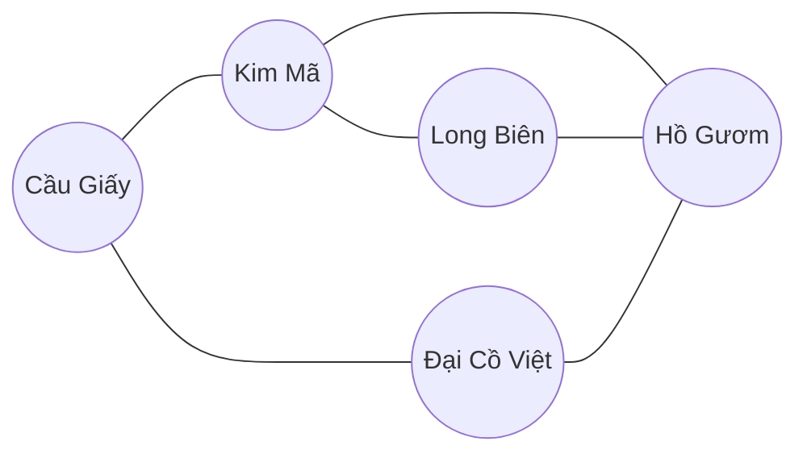

### 1.1 Vô hướng vs Có hướng

| Loại | Ý nghĩa | Ví dụ đời thực | Cách vẽ |
|---|---|---|---|
| **Vô hướng (undirected)** | Cạnh `u — v` đi được cả hai chiều | Bạn bè Facebook (A là bạn B ⇔ B là bạn A), đường 2 chiều | `A --- B` |
| **Có hướng (directed)** | Cạnh `u → v` chỉ đi một chiều | Follow trên Instagram/Twitter, đường một chiều, "phải học môn A trước môn B" | `A --> B` |

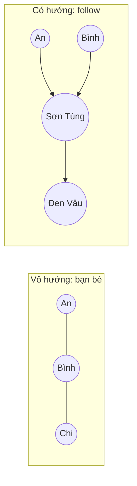

### 1.2 Có trọng số (weighted)

Mỗi cạnh mang thêm một **con số**: khoảng cách (km), thời gian (phút), giá vé (nghìn đồng), độ trễ mạng (ms)...

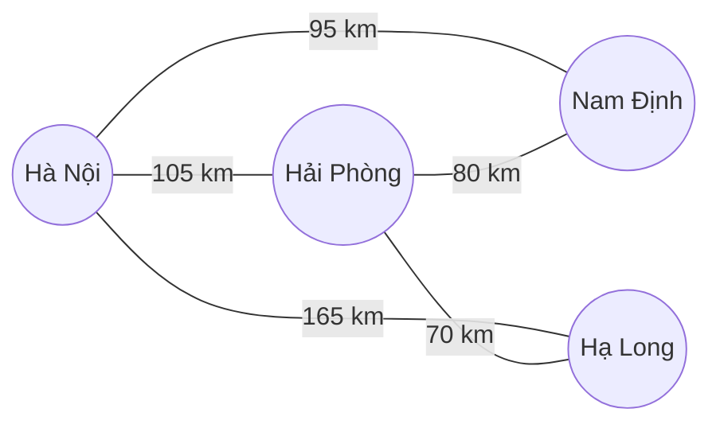

Đồ thị **không trọng số** có thể coi là mọi cạnh nặng bằng 1. Bài này tập trung vào đồ thị không trọng số; **Bài 12** sẽ xử lý trọng số (Dijkstra, Bellman-Ford...).

### 1.3 Bậc (degree)

- Đồ thị vô hướng: **bậc** của đỉnh = số cạnh nối vào nó. Ở Facebook, bậc = số bạn bè.
- Đồ thị có hướng: tách làm **bậc vào (in-degree)** = số mũi tên đi vào, và **bậc ra (out-degree)** = số mũi tên đi ra. Ở Instagram, in-degree = số follower, out-degree = số người bạn đang follow.

!!! tip "Định lý bắt tay (Handshaking lemma)"
    Trong đồ thị vô hướng, **tổng bậc của mọi đỉnh = 2 × số cạnh**, vì mỗi cạnh được đếm ở cả hai đầu. Hệ quả vui: số người có số bạn bè lẻ luôn là số chẵn!

### 1.4 Đường đi (path) và chu trình (cycle)

- **Đường đi** từ `u` đến `v`: dãy đỉnh `u = x0, x1, ..., xk = v` với mỗi cặp liên tiếp có cạnh nối. **Độ dài** = số cạnh `k` (không trọng số) hoặc tổng trọng số.
- **Đường đi đơn (simple path)**: không lặp lại đỉnh nào.
- **Chu trình (cycle)**: đường đi quay về chính điểm xuất phát, ví dụ `A → B → C → A`.

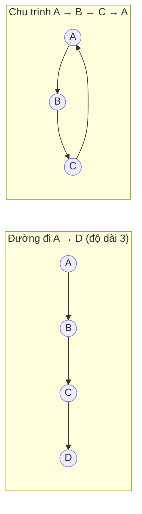

### 1.5 DAG — Đồ thị có hướng không chu trình

**DAG (Directed Acyclic Graph)** = có hướng + **không có chu trình**. Đây là "hình dạng" của mọi thứ có **thứ tự phụ thuộc**:

- Môn học tiên quyết: phải học *Nhập môn* trước *CTDL*, học *CTDL* trước *Thuật toán*
- Build system: file `main.go` phụ thuộc `utils.go`
- Pipeline dữ liệu, task trong Makefile, công thức trong Excel

Nếu có chu trình (A cần B, B cần C, C lại cần A) thì **không thể** bắt đầu — giống như "muốn có kinh nghiệm phải có việc, muốn có việc phải có kinh nghiệm" 😅.

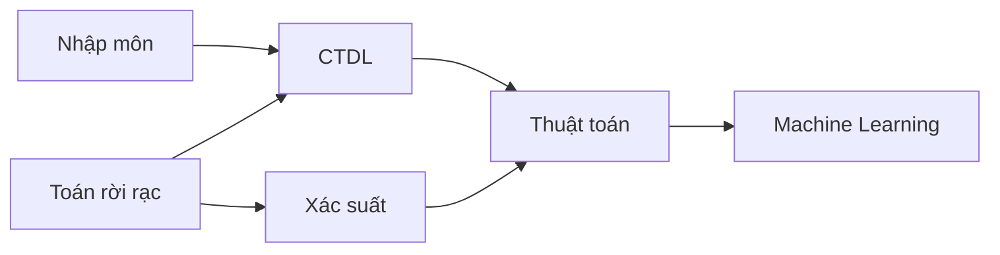

### 1.6 Thành phần liên thông (connected components)

Trong đồ thị vô hướng, một **thành phần liên thông** là một "cụm" đỉnh mà từ đỉnh nào cũng đi được đến đỉnh khác trong cụm, và không có cạnh nào nối ra ngoài cụm. Đồ thị dưới đây có **3 thành phần**:

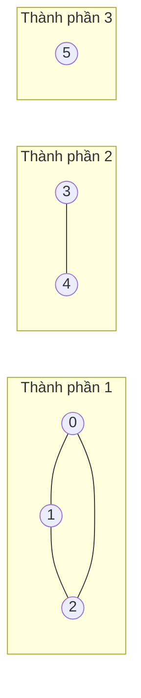

Hình dung: các **hòn đảo** trên bản đồ, các **nhóm bạn** không quen nhau, các **mạng LAN** tách biệt.

### 1.7 Bảng thuật ngữ nhanh

| Thuật ngữ | Tiếng Việt | Giải thích ngắn |
|---|---|---|
| Vertex / Node | Đỉnh | Một "điểm" |
| Edge | Cạnh | Nối 2 đỉnh |
| Adjacent / Neighbor | Kề / Hàng xóm | Hai đỉnh có cạnh nối trực tiếp |
| Degree | Bậc | Số cạnh chạm vào đỉnh |
| Path | Đường đi | Dãy đỉnh nối tiếp nhau bằng cạnh |
| Cycle | Chu trình | Đường đi quay về điểm đầu |
| Connected | Liên thông | Mọi cặp đỉnh đều có đường đi |
| DAG | Đồ thị có hướng không chu trình | Mô hình "phụ thuộc" |
| Sparse / Dense | Thưa / Dày | `E ≈ V` (thưa) vs `E ≈ V²` (dày) |
| Tree | Cây | Đồ thị vô hướng liên thông, không chu trình, có đúng `V − 1` cạnh |

!!! tip "Cây cũng là đồ thị"
    Cây nhị phân ở Bài 9 chỉ là **một loại đồ thị đặc biệt**. Duyệt level-order của cây chính là BFS, duyệt preorder chính là DFS. Khác biệt duy nhất: đồ thị tổng quát có thể có **chu trình**, nên ta phải **đánh dấu đỉnh đã thăm (visited)** để không đi vòng vòng mãi.

---

## 📖 2. Biểu diễn đồ thị trong code

Máy tính không "nhìn" được hình vẽ. Ta cần lưu đồ thị dưới dạng dữ liệu. Có 3 cách phổ biến. Xét đồ thị vô hướng 5 đỉnh:

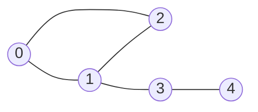

### 2.1 Ma trận kề (adjacency matrix)

Bảng `V × V`, ô `[u][v] = 1` nếu có cạnh `u — v` (hoặc lưu trọng số).

```text
      0  1  2  3  4
  0 [ 0  1  1  0  0 ]
  1 [ 1  0  1  1  0 ]
  2 [ 1  1  0  0  0 ]
  3 [ 0  1  0  0  1 ]
  4 [ 0  0  0  1  0 ]
```

Giống **bảng khoảng cách giữa các tỉnh** in ở cuối tập bản đồ: tra "Hà Nội – Huế" là ra ngay, nhưng bảng chiếm rất nhiều chỗ, và phần lớn các ô... trống.

### 2.2 Danh sách kề (adjacency list)

Mỗi đỉnh giữ một **danh sách hàng xóm** của nó.

```text
0 -> [1, 2]
1 -> [0, 2, 3]
2 -> [0, 1]
3 -> [1, 4]
4 -> [3]
```

Giống **danh bạ điện thoại** của mỗi người: chỉ lưu những ai mình quen. Đây là cách **dùng nhiều nhất** trong phỏng vấn và thực tế.

### 2.3 Danh sách cạnh (edge list)

Chỉ đơn giản là mảng các cặp `(u, v)` hoặc `(u, v, w)`:

```text
[(0,1), (0,2), (1,2), (1,3), (3,4)]
```

Thường là **định dạng đầu vào** của đề bài, và là cấu trúc mà **Kruskal** (Bài 12) cần vì nó sắp xếp cạnh theo trọng số.

### 2.4 So sánh chi phí

| Thao tác | Ma trận kề | Danh sách kề | Danh sách cạnh |
|---|---|---|---|
| Bộ nhớ | `O(V²)` | `O(V + E)` | `O(E)` |
| Kiểm tra `u` kề `v`? | **`O(1)`** | `O(deg(u))` | `O(E)` |
| Duyệt hàng xóm của `u` | `O(V)` | **`O(deg(u))`** | `O(E)` |
| Duyệt toàn bộ đồ thị (BFS/DFS) | `O(V²)` | **`O(V + E)`** | `O(V · E)` |
| Thêm cạnh | `O(1)` | `O(1)` | `O(1)` |
| Hợp với | Đồ thị **dày**, V nhỏ (≤ vài nghìn), Floyd-Warshall | Đồ thị **thưa** (hầu hết thực tế) | Kruskal, Bellman-Ford, input |

!!! tip "Quy tắc chọn nhanh"
    - Mặc định: **danh sách kề**.
    - `V ≤ 500` và cần hỏi "có cạnh u-v không?" liên tục, hoặc làm Floyd-Warshall: **ma trận kề**.
    - Cần sắp xếp/duyệt cạnh theo trọng số: **danh sách cạnh**.
    - Mạng xã hội 3 tỷ người, mỗi người ~300 bạn: ma trận cần `9·10¹⁸` ô (không thể!), danh sách kề cần ~`10¹²` — vẫn lớn nhưng khả thi khi phân tán.

### 2.5 Code: xây cả 3 cách biểu diễn

=== "Go"

    ```go
    package main

    import "fmt"

    func main() {
    	n := 5
    	edges := [][2]int{{0, 1}, {0, 2}, {1, 2}, {1, 3}, {3, 4}}

    	// 1) Ma trận kề: n x n toàn số 0
    	matrix := make([][]int, n)
    	for i := range matrix {
    		matrix[i] = make([]int, n)
    	}
    	for _, e := range edges {
    		u, v := e[0], e[1]
    		matrix[u][v] = 1
    		matrix[v][u] = 1 // vô hướng: đánh dấu cả 2 chiều
    	}
    	fmt.Println("Ma trận kề:")
    	for _, row := range matrix {
    		fmt.Println(row)
    	}

    	// 2) Danh sách kề: mỗi đỉnh một slice hàng xóm
    	adj := make([][]int, n)
    	for _, e := range edges {
    		u, v := e[0], e[1]
    		adj[u] = append(adj[u], v)
    		adj[v] = append(adj[v], u) // bỏ dòng này nếu đồ thị có hướng
    	}
    	fmt.Println("Danh sách kề:")
    	for u, nb := range adj {
    		fmt.Printf("%d -> %v (bậc %d)\n", u, nb, len(nb))
    	}

    	// 3) Danh sách cạnh: chính là edges
    	fmt.Println("Số cạnh:", len(edges))
    	fmt.Println("1 kề 3?", matrix[1][3] == 1, "| 0 kề 4?", matrix[0][4] == 1)
    }

    // Output:
    // Ma trận kề:
    // [0 1 1 0 0]
    // [1 0 1 1 0]
    // [1 1 0 0 0]
    // [0 1 0 0 1]
    // [0 0 0 1 0]
    // Danh sách kề:
    // 0 -> [1 2] (bậc 2)
    // 1 -> [0 2 3] (bậc 3)
    // 2 -> [0 1] (bậc 2)
    // 3 -> [1 4] (bậc 2)
    // 4 -> [3] (bậc 1)
    // Số cạnh: 5
    // 1 kề 3? true | 0 kề 4? false
    ```

=== "Python"

    ```python
    from collections import defaultdict

    n = 5
    edges = [(0, 1), (0, 2), (1, 2), (1, 3), (3, 4)]

    # 1) Ma trận kề
    matrix = [[0] * n for _ in range(n)]  # KHÔNG dùng [[0]*n]*n (chung 1 list!)
    for u, v in edges:
        matrix[u][v] = matrix[v][u] = 1
    print("Ma trận kề:")
    for row in matrix:
        print(row)

    # 2) Danh sách kề
    adj = defaultdict(list)
    for u, v in edges:
        adj[u].append(v)
        adj[v].append(u)  # bỏ dòng này nếu đồ thị có hướng
    print("Danh sách kề:")
    for u in range(n):
        print(f"{u} -> {adj[u]} (bậc {len(adj[u])})")

    # 3) Danh sách cạnh: chính là edges
    print("Số cạnh:", len(edges))
    print("1 kề 3?", matrix[1][3] == 1, "| 0 kề 4?", matrix[0][4] == 1)

    # Output:
    # Ma trận kề:
    # [0, 1, 1, 0, 0]
    # [1, 0, 1, 1, 0]
    # [1, 1, 0, 0, 0]
    # [0, 1, 0, 0, 1]
    # [0, 0, 0, 1, 0]
    # Danh sách kề:
    # 0 -> [1, 2] (bậc 2)
    # 1 -> [0, 2, 3] (bậc 3)
    # 2 -> [0, 1] (bậc 2)
    # 3 -> [1, 4] (bậc 2)
    # 4 -> [3] (bậc 1)
    # Số cạnh: 5
    # 1 kề 3? True | 0 kề 4? False
    ```

!!! warning "Đỉnh là chuỗi thì sao?"
    Khi đỉnh là tên (`"Hà Nội"`, `"alice"`), dùng `map[string][]string` (Go) hoặc `dict[str, list[str]]` (Python). Một mẹo hay trong bài lớn: **đánh số lại** các tên thành `0..V-1` bằng một map `name → id`, rồi dùng mảng — nhanh hơn và tiết kiệm bộ nhớ hơn.

---

## 📖 3. BFS — Duyệt theo chiều rộng (Breadth-First Search)

### 3.1 Trực giác: vết dầu loang 🌊

Nhỏ một giọt mực vào tờ giấy thấm: mực loang ra **thành từng vòng tròn đồng tâm**, vòng 1 trước, rồi vòng 2, rồi vòng 3...

BFS làm y hệt: từ đỉnh xuất phát, thăm **tất cả hàng xóm cách 1 bước**, rồi **tất cả đỉnh cách 2 bước**, rồi 3 bước... Giống như tin đồn lan trong lớp: bạn kể cho bạn thân (vòng 1), họ kể cho bạn của họ (vòng 2)...

Công cụ giúp "đi theo từng vòng" chính là **hàng đợi (queue)** — FIFO: ai vào trước được xử lý trước, nên đỉnh ở vòng 1 luôn được xử lý xong trước vòng 2.

### 3.2 Đồ thị ví dụ (dùng xuyên suốt BFS & DFS)

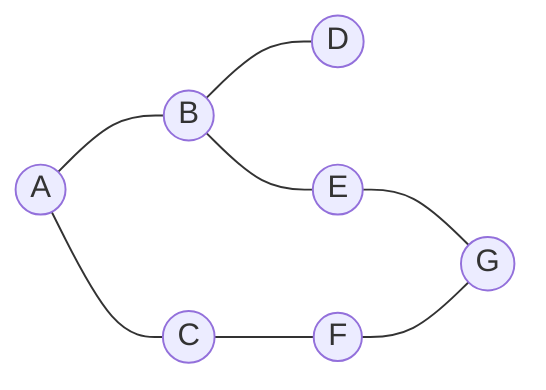

Danh sách kề (hàng xóm xếp theo thứ tự chữ cái):

```text
A: B, C
B: A, D, E
C: A, F
D: B
E: B, G
F: C, G
G: E, F
```

### 3.3 Thuật toán

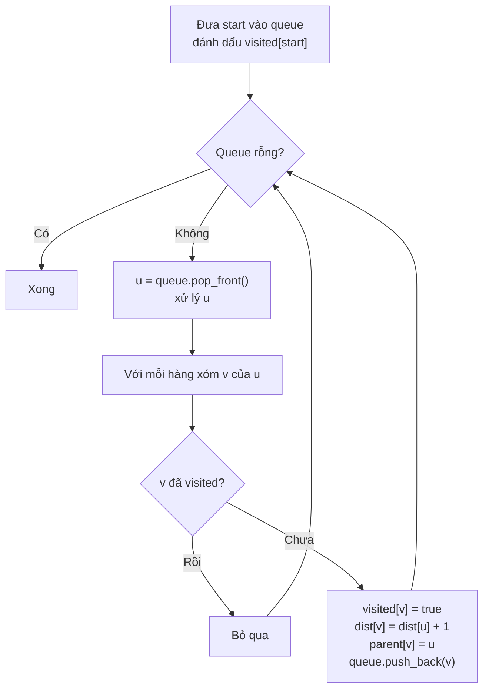

!!! warning "Đánh dấu visited KHI ĐƯA VÀO queue, không phải khi lấy ra"
    Nếu đợi lúc lấy ra mới đánh dấu, một đỉnh có thể bị đưa vào queue **nhiều lần** (từ nhiều hàng xóm khác nhau) → chậm, thậm chí tràn bộ nhớ trên lưới lớn.

### 3.4 Trace từng bước (BFS từ A)

| Bước | Lấy ra `u` | Hàng xóm mới được thêm | Queue sau bước | `dist` mới |
|---|---|---|---|---|
| 0 | — | (khởi tạo) | `[A]` | A=0 |
| 1 | A | B, C | `[B, C]` | B=1, C=1 |
| 2 | B | D, E (A đã thăm) | `[C, D, E]` | D=2, E=2 |
| 3 | C | F (A đã thăm) | `[D, E, F]` | F=2 |
| 4 | D | — | `[E, F]` | |
| 5 | E | G | `[F, G]` | G=3 |
| 6 | F | — (C, G đã thăm) | `[G]` | |
| 7 | G | — | `[]` | |

Thứ tự thăm: **A, B, C, D, E, F, G** — đúng theo "vòng": vòng 0 `{A}`, vòng 1 `{B, C}`, vòng 2 `{D, E, F}`, vòng 3 `{G}`.

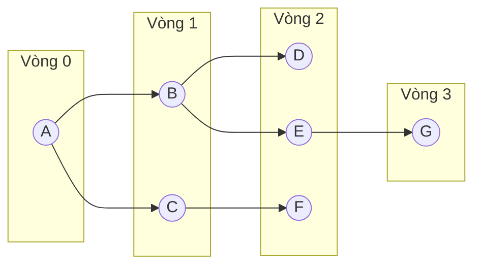

Hình trên là **cây BFS**: mỗi mũi tên là cạnh `parent → con` được dùng khi phát hiện đỉnh mới. Cạnh `F — G` không nằm trong cây vì lúc xét nó, G đã được E phát hiện rồi.

Bấm ▶ để xem hàng đợi thay đổi từng bước và các đỉnh được tô màu theo từng "vòng" — hãy so với bảng trace ở trên:

<div class="algo-viz" data-viz="graph" data-algo="bfs" data-nodes="A,B,C,D,E,F,G" data-edges="A-B,A-C,B-D,B-E,C-F,E-G,F-G" data-start="A" data-title="BFS từ A"></div>

### 3.5 Code BFS + đường đi ngắn nhất (không trọng số)

Vì BFS đi theo từng vòng, **lần đầu tiên** chạm tới một đỉnh chính là bằng **đường ngắn nhất** (ít cạnh nhất). Ghi lại `parent[v] = u` rồi lần ngược từ đích về nguồn là có đường đi.

=== "Go"

    ```go
    package main

    import (
    	"fmt"
    	"slices"
    	"strings"
    )

    // buildGraph tạo danh sách kề cho đồ thị VÔ HƯỚNG từ danh sách cạnh.
    func buildGraph(edges [][2]string) map[string][]string {
    	g := map[string][]string{}
    	for _, e := range edges {
    		u, v := e[0], e[1]
    		g[u] = append(g[u], v)
    		g[v] = append(g[v], u)
    	}
    	for u := range g {
    		slices.Sort(g[u]) // hàng xóm theo thứ tự chữ cái cho dễ theo dõi
    	}
    	return g
    }

    // bfs trả về thứ tự thăm, khoảng cách (số cạnh) và parent của mỗi đỉnh.
    func bfs(g map[string][]string, start string) ([]string, map[string]int, map[string]string) {
    	dist := map[string]int{start: 0} // có trong dist = đã visited
    	parent := map[string]string{}
    	order := []string{}
    	queue := []string{start}
    	for len(queue) > 0 {
    		u := queue[0]
    		queue = queue[1:] // pop front
    		order = append(order, u)
    		for _, v := range g[u] {
    			if _, seen := dist[v]; !seen {
    				dist[v] = dist[u] + 1 // đánh dấu NGAY khi đưa vào queue
    				parent[v] = u
    				queue = append(queue, v)
    			}
    		}
    	}
    	return order, dist, parent
    }

    // path lần ngược parent từ target về start rồi đảo lại.
    func path(parent map[string]string, start, target string) []string {
    	p := []string{target}
    	for p[len(p)-1] != start {
    		prev, ok := parent[p[len(p)-1]]
    		if !ok {
    			return nil // không tới được
    		}
    		p = append(p, prev)
    	}
    	slices.Reverse(p)
    	return p
    }

    func main() {
    	edges := [][2]string{
    		{"A", "B"}, {"A", "C"}, {"B", "D"}, {"B", "E"},
    		{"C", "F"}, {"E", "G"}, {"F", "G"},
    	}
    	g := buildGraph(edges)
    	order, dist, parent := bfs(g, "A")
    	fmt.Println("Thứ tự BFS:", strings.Join(order, " "))
    	for _, v := range order {
    		fmt.Printf("dist[%s] = %d\n", v, dist[v])
    	}
    	fmt.Println("Đường ngắn nhất A -> G:", strings.Join(path(parent, "A", "G"), " -> "))
    	fmt.Println("Đường ngắn nhất A -> F:", strings.Join(path(parent, "A", "F"), " -> "))
    }

    // Output:
    // Thứ tự BFS: A B C D E F G
    // dist[A] = 0
    // dist[B] = 1
    // dist[C] = 1
    // dist[D] = 2
    // dist[E] = 2
    // dist[F] = 2
    // dist[G] = 3
    // Đường ngắn nhất A -> G: A -> B -> E -> G
    // Đường ngắn nhất A -> F: A -> C -> F
    ```

=== "Python"

    ```python
    from collections import deque, defaultdict


    def build_graph(edges):
        """Danh sách kề cho đồ thị VÔ HƯỚNG."""
        g = defaultdict(list)
        for u, v in edges:
            g[u].append(v)
            g[v].append(u)
        for u in g:
            g[u].sort()  # hàng xóm theo thứ tự chữ cái
        return g


    def bfs(g, start):
        dist = {start: 0}          # có trong dist = đã visited
        parent = {}
        order = []
        queue = deque([start])     # deque: popleft O(1), list.pop(0) là O(n)!
        while queue:
            u = queue.popleft()
            order.append(u)
            for v in g[u]:
                if v not in dist:
                    dist[v] = dist[u] + 1  # đánh dấu NGAY khi đưa vào queue
                    parent[v] = u
                    queue.append(v)
        return order, dist, parent


    def path(parent, start, target):
        p = [target]
        while p[-1] != start:
            if p[-1] not in parent:
                return None  # không tới được
            p.append(parent[p[-1]])
        return p[::-1]


    edges = [("A", "B"), ("A", "C"), ("B", "D"), ("B", "E"),
             ("C", "F"), ("E", "G"), ("F", "G")]
    g = build_graph(edges)
    order, dist, parent = bfs(g, "A")
    print("Thứ tự BFS:", " ".join(order))
    for v in order:
        print(f"dist[{v}] = {dist[v]}")
    print("Đường ngắn nhất A -> G:", " -> ".join(path(parent, "A", "G")))
    print("Đường ngắn nhất A -> F:", " -> ".join(path(parent, "A", "F")))

    # Output:
    # Thứ tự BFS: A B C D E F G
    # dist[A] = 0
    # dist[B] = 1
    # dist[C] = 1
    # dist[D] = 2
    # dist[E] = 2
    # dist[F] = 2
    # dist[G] = 3
    # Đường ngắn nhất A -> G: A -> B -> E -> G
    # Đường ngắn nhất A -> F: A -> C -> F
    ```

### 3.6 Độ phức tạp

- **Thời gian `O(V + E)`**: mỗi đỉnh vào/ra queue đúng 1 lần (`O(V)`), mỗi danh sách kề được duyệt đúng 1 lần — tổng độ dài các danh sách kề là `2E` (vô hướng) hoặc `E` (có hướng).
- **Bộ nhớ `O(V)`**: queue + visited + parent.
- Nếu dùng ma trận kề: duyệt hàng xóm tốn `O(V)` mỗi đỉnh → `O(V²)`.

### 3.7 Vì sao BFS cho đường ngắn nhất? (trực giác chứng minh)

Queue luôn có dạng: `[các đỉnh vòng d..., các đỉnh vòng d+1...]` — **không bao giờ lẫn 3 vòng**. Vì thế mọi đỉnh ở vòng `d` được lấy ra trước mọi đỉnh ở vòng `d+1`. Khi đỉnh `v` được phát hiện lần đầu từ `u` (vòng `d`), không thể có đường ngắn hơn đến `v`, vì nếu có, `v` đã được phát hiện từ một đỉnh ở vòng `< d` — mà các đỉnh đó đã được xử lý xong trước `u` rồi.

!!! warning "BFS chỉ đúng khi mọi cạnh có cùng trọng số"
    Nếu cạnh có trọng số khác nhau (đường cao tốc 100km vs đường làng 2km), "ít cạnh nhất" ≠ "ngắn nhất". Khi đó dùng **Dijkstra** (Bài 12). Trường hợp đặc biệt trọng số chỉ là 0 hoặc 1 → **0-1 BFS** (cũng ở Bài 12).

---

## 📖 4. BFS trên lưới (grid) — tìm đường trong mê cung

### 4.1 Lưới cũng là đồ thị

Rất nhiều bài phỏng vấn cho một **ma trận** (bản đồ, mê cung, bàn cờ) thay vì đồ thị tường minh. Mẹo: **mỗi ô là một đỉnh**, và mỗi ô nối với **4 ô kề** (lên, xuống, trái, phải) nếu ô đó không phải tường. Ta **không cần xây danh sách kề** — hàng xóm được tính ngay bằng mảng hướng:

```text
dirs = [(-1,0), (1,0), (0,-1), (0,1)]   # lên, xuống, trái, phải
hàng xóm của (r, c) = (r+dr, c+dc) nếu còn trong lưới và không phải tường
```

Mê cung ví dụ (`S` = xuất phát, `E` = đích, `#` = tường):

```text
      c0 c1 c2 c3 c4 c5
r0     S  .  .  #  .  .
r1     .  #  .  #  .  #
r2     .  #  .  .  .  .
r3     .  .  #  #  #  .
r4     #  .  .  .  #  E
```

BFS loang từ `S` như nước tràn: ô nào cách `S` 1 bước ướt trước, rồi 2 bước... Khi nước chạm `E`, số bước lúc đó là **ngắn nhất**. Lưu ý nhánh bên trái (đi xuống cột 0 rồi sang phải ở hàng 4) là **ngõ cụt** — BFS vẫn loang vào đó nhưng không sao, nó vẫn tìm ra đường ngắn nhất ở nhánh phải.

Bấm ▶ và quan sát "làn sóng" BFS lan đều theo mọi hướng, sau đó đường ngắn nhất được tô lại từ `E` về `S`:

<div class="algo-viz" data-viz="grid" data-algo="bfs-path" data-grid="S..#..|.#.#.#|.#....|..###.|#...#E" data-title="BFS tìm đường ngắn nhất trong mê cung"></div>

### 4.2 Code

=== "Go"

    ```go
    package main

    import "fmt"

    type cell struct{ r, c int }

    func shortestPath(grid []string) (int, [][]byte) {
    	rows, cols := len(grid), len(grid[0])
    	var start, end cell
    	for r := 0; r < rows; r++ {
    		for c := 0; c < cols; c++ {
    			switch grid[r][c] {
    			case 'S':
    				start = cell{r, c}
    			case 'E':
    				end = cell{r, c}
    			}
    		}
    	}

    	dirs := []cell{{-1, 0}, {1, 0}, {0, -1}, {0, 1}} // lên, xuống, trái, phải
    	dist := map[cell]int{start: 0}
    	parent := map[cell]cell{}
    	queue := []cell{start}
    	for len(queue) > 0 {
    		u := queue[0]
    		queue = queue[1:]
    		if u == end {
    			break // chạm đích: dừng sớm
    		}
    		for _, d := range dirs {
    			v := cell{u.r + d.r, u.c + d.c}
    			if v.r < 0 || v.r >= rows || v.c < 0 || v.c >= cols {
    				continue // ra ngoài lưới
    			}
    			if grid[v.r][v.c] == '#' {
    				continue // tường
    			}
    			if _, seen := dist[v]; seen {
    				continue
    			}
    			dist[v] = dist[u] + 1
    			parent[v] = u
    			queue = append(queue, v)
    		}
    	}

    	steps, ok := dist[end]
    	if !ok {
    		return -1, nil
    	}
    	// Vẽ đường đi bằng dấu '*'
    	out := make([][]byte, rows)
    	for r := range grid {
    		out[r] = []byte(grid[r])
    	}
    	for cur := parent[end]; cur != start; cur = parent[cur] {
    		out[cur.r][cur.c] = '*'
    	}
    	return steps, out
    }

    func main() {
    	grid := []string{
    		"S..#..",
    		".#.#.#",
    		".#....",
    		"..###.",
    		"#...#E",
    	}
    	steps, drawn := shortestPath(grid)
    	fmt.Println("Số bước ngắn nhất:", steps)
    	for _, row := range drawn {
    		fmt.Println(string(row))
    	}
    }

    // Output:
    // Số bước ngắn nhất: 9
    // S**#..
    // .#*#.#
    // .#****
    // ..###*
    // #...#E
    ```

=== "Python"

    ```python
    from collections import deque


    def shortest_path(grid):
        rows, cols = len(grid), len(grid[0])
        start = end = None
        for r in range(rows):
            for c in range(cols):
                if grid[r][c] == "S":
                    start = (r, c)
                elif grid[r][c] == "E":
                    end = (r, c)

        dirs = [(-1, 0), (1, 0), (0, -1), (0, 1)]  # lên, xuống, trái, phải
        dist = {start: 0}
        parent = {}
        queue = deque([start])
        while queue:
            u = queue.popleft()
            if u == end:
                break  # chạm đích: dừng sớm
            r, c = u
            for dr, dc in dirs:
                nr, nc = r + dr, c + dc
                if not (0 <= nr < rows and 0 <= nc < cols):
                    continue  # ra ngoài lưới
                if grid[nr][nc] == "#" or (nr, nc) in dist:
                    continue  # tường hoặc đã thăm
                dist[(nr, nc)] = dist[u] + 1
                parent[(nr, nc)] = u
                queue.append((nr, nc))

        if end not in dist:
            return -1, None
        out = [list(row) for row in grid]
        cur = parent[end]
        while cur != start:  # vẽ đường đi bằng '*'
            out[cur[0]][cur[1]] = "*"
            cur = parent[cur]
        return dist[end], ["".join(row) for row in out]


    grid = [
        "S..#..",
        ".#.#.#",
        ".#....",
        "..###.",
        "#...#E",
    ]
    steps, drawn = shortest_path(grid)
    print("Số bước ngắn nhất:", steps)
    print("\n".join(drawn))

    # Output:
    # Số bước ngắn nhất: 9
    # S**#..
    # .#*#.#
    # .#****
    # ..###*
    # #...#E
    ```

**Độ phức tạp**: `O(R × C)` thời gian và bộ nhớ — mỗi ô vào queue tối đa 1 lần, mỗi ô xét 4 hướng.

!!! tip "Mẹo cho lưới"
    - Dùng mảng `dirs` thay vì viết 4 khối `if` — ít bug hơn. Cần đi chéo? Thêm 4 hướng chéo (8 hướng).
    - Thay vì `map`/`set` cho visited, dùng mảng 2 chiều `bool[R][C]` — nhanh hơn nhiều.
    - Nếu được phép sửa input, có thể **ghi đè ô đã thăm** (ví dụ đổi thành `#`) để khỏi cần visited.
    - Mã hoá ô `(r, c)` thành một số `r * C + c` khi cần lưu vào mảng 1 chiều.

---

## 📖 5. DFS — Duyệt theo chiều sâu (Depth-First Search)

### 5.1 Trực giác: đi mê cung bằng cách "bám tường" 🧭

Bạn lạc trong một mê cung. Chiến lược đơn giản: **cứ đi thẳng một hướng tới khi hết đường**, rồi **quay lui (backtrack)** về ngã rẽ gần nhất chưa thử, và thử hướng khác. Rải vụn bánh mì để khỏi đi lại chỗ cũ.

Đó chính là DFS: **đi sâu nhất có thể trước**, hết đường thì **lùi lại**. Công cụ để "nhớ đường lùi" là **stack** (LIFO) — hoặc chính **call stack** của đệ quy.

| | BFS | DFS |
|---|---|---|
| Cấu trúc | Queue (FIFO) | Stack (LIFO) / đệ quy |
| Hình dung | Vết dầu loang, sóng lan | Thám hiểm hang động, đi mê cung |
| Thứ tự thăm (đồ thị ví dụ) | A B C D E F G | A B D E G F C |

### 5.2 Trace DFS đệ quy từ A (cùng đồ thị ở mục 3)


```text
dfs(A)                      thăm A
├── dfs(B)                  thăm B       (hàng xóm đầu tiên của A)
│   ├── A đã thăm → bỏ qua
│   ├── dfs(D)              thăm D
│   │   └── B đã thăm → quay lui
│   └── dfs(E)              thăm E
│       ├── B đã thăm
│       └── dfs(G)          thăm G
│           ├── E đã thăm
│           └── dfs(F)      thăm F
│               ├── dfs(C)  thăm C
│               │   └── A, F đã thăm → quay lui
│               └── G đã thăm → quay lui
└── C đã thăm → bỏ qua
Thứ tự: A B D E G F C
```

Để ý: DFS đi `A → B → E → G → F → C` — một mạch dài 5 cạnh tới C, dù C chỉ cách A **1 cạnh**. Đây là lý do **DFS không tìm đường ngắn nhất**.

Bấm ▶ và để ý cách DFS "lao" thật sâu dọc một nhánh rồi mới quay lui — so sánh thứ tự tô màu với cây đệ quy ở trên:

<div class="algo-viz" data-viz="graph" data-algo="dfs" data-nodes="A,B,C,D,E,F,G" data-edges="A-B,A-C,B-D,B-E,C-F,E-G,F-G" data-start="A" data-title="DFS từ A"></div>

### 5.3 DFS lặp (dùng stack tường minh)

Mẹo để thứ tự giống bản đệ quy: **đẩy hàng xóm vào stack theo thứ tự ngược**, và **đánh dấu visited khi lấy ra** (khác BFS!).

| Bước | Pop | Đã thăm? | Đẩy vào (ngược thứ tự) | Stack sau bước (đỉnh ở bên phải) |
|---|---|---|---|---|
| 0 | — | | | `[A]` |
| 1 | A | thăm | C, B | `[C, B]` |
| 2 | B | thăm | E, D | `[C, E, D]` |
| 3 | D | thăm | — | `[C, E]` |
| 4 | E | thăm | G | `[C, G]` |
| 5 | G | thăm | F | `[C, F]` |
| 6 | F | thăm | C | `[C, C]` |
| 7 | C | thăm | — | `[C]` |
| 8 | C | **rồi → bỏ** | | `[]` |

!!! note "Vì sao DFS lặp đánh dấu khi pop?"
    Nếu đánh dấu khi push (như BFS), một đỉnh có thể bị "chiếm chỗ" quá sớm bởi một đỉnh ở nông hơn. Ví dụ `A: [B, C]`, `B: [C, D]`: DFS thật đi `A → B → C → D` (C là hàng xóm đầu tiên của B). Còn "đánh dấu khi push" sẽ khoá C ngay khi xử lý A, nên B bỏ qua C và ra thứ tự `A B D C` — **không còn là DFS đúng nghĩa**. Điều này quan trọng với các thuật toán dựa vào thứ tự DFS (topo sort, 3 màu, tìm cầu...). Đổi lại, đánh dấu khi pop khiến một đỉnh có thể nằm trong stack nhiều lần (bộ nhớ `O(E)`).

    Nếu bạn **chỉ cần thăm hết** (đếm thành phần, đánh dấu vùng) thì thứ tự không quan trọng — đánh dấu khi push cũng được và tiết kiệm bộ nhớ hơn.

### 5.4 Code DFS (đệ quy + lặp)

=== "Go"

    ```go
    package main

    import (
    	"fmt"
    	"slices"
    	"strings"
    )

    func buildGraph(edges [][2]string) map[string][]string {
    	g := map[string][]string{}
    	for _, e := range edges {
    		g[e[0]] = append(g[e[0]], e[1])
    		g[e[1]] = append(g[e[1]], e[0])
    	}
    	for u := range g {
    		slices.Sort(g[u])
    	}
    	return g
    }

    // DFS đệ quy: dùng closure để chia sẻ visited và order.
    func dfsRecursive(g map[string][]string, start string) []string {
    	visited := map[string]bool{}
    	order := []string{}
    	var dfs func(u string)
    	dfs = func(u string) {
    		visited[u] = true
    		order = append(order, u)
    		for _, v := range g[u] {
    			if !visited[v] {
    				dfs(v)
    			}
    		}
    	}
    	dfs(start)
    	return order
    }

    // DFS lặp: stack tường minh, đánh dấu khi POP.
    func dfsIterative(g map[string][]string, start string) []string {
    	visited := map[string]bool{}
    	order := []string{}
    	stack := []string{start}
    	for len(stack) > 0 {
    		u := stack[len(stack)-1]
    		stack = stack[:len(stack)-1] // pop
    		if visited[u] {
    			continue
    		}
    		visited[u] = true
    		order = append(order, u)
    		nb := g[u]
    		for i := len(nb) - 1; i >= 0; i-- { // đẩy ngược để pop theo thứ tự xuôi
    			if !visited[nb[i]] {
    				stack = append(stack, nb[i])
    			}
    		}
    	}
    	return order
    }

    func main() {
    	edges := [][2]string{
    		{"A", "B"}, {"A", "C"}, {"B", "D"}, {"B", "E"},
    		{"C", "F"}, {"E", "G"}, {"F", "G"},
    	}
    	g := buildGraph(edges)
    	fmt.Println("DFS đệ quy:", strings.Join(dfsRecursive(g, "A"), " "))
    	fmt.Println("DFS lặp:   ", strings.Join(dfsIterative(g, "A"), " "))
    }

    // Output:
    // DFS đệ quy: A B D E G F C
    // DFS lặp:    A B D E G F C
    ```

=== "Python"

    ```python
    from collections import defaultdict


    def build_graph(edges):
        g = defaultdict(list)
        for u, v in edges:
            g[u].append(v)
            g[v].append(u)
        for u in g:
            g[u].sort()
        return g


    def dfs_recursive(g, start):
        visited, order = set(), []

        def dfs(u):
            visited.add(u)
            order.append(u)
            for v in g[u]:
                if v not in visited:
                    dfs(v)

        dfs(start)
        return order


    def dfs_iterative(g, start):
        visited, order = set(), []
        stack = [start]
        while stack:
            u = stack.pop()
            if u in visited:
                continue
            visited.add(u)
            order.append(u)
            for v in reversed(g[u]):  # đẩy ngược để pop theo thứ tự xuôi
                if v not in visited:
                    stack.append(v)
        return order


    edges = [("A", "B"), ("A", "C"), ("B", "D"), ("B", "E"),
             ("C", "F"), ("E", "G"), ("F", "G")]
    g = build_graph(edges)
    print("DFS đệ quy:", " ".join(dfs_recursive(g, "A")))
    print("DFS lặp:   ", " ".join(dfs_iterative(g, "A")))

    # Output:
    # DFS đệ quy: A B D E G F C
    # DFS lặp:    A B D E G F C
    ```

**Độ phức tạp**: thời gian `O(V + E)`, bộ nhớ `O(V)` cho visited + độ sâu đệ quy (tệ nhất `O(V)` khi đồ thị là một đường thẳng dài).

!!! warning "Giới hạn đệ quy"
    - **Python** mặc định giới hạn ~1000 tầng đệ quy. Lưới 1000×1000 toàn đất → DFS đệ quy sẽ `RecursionError`. Cách xử lý: `sys.setrecursionlimit(10**6)` (vẫn có thể crash vì stack C), hoặc tốt hơn là **dùng DFS lặp / BFS**.
    - **Go** có goroutine stack tự giãn (tới 1GB mặc định), nên đệ quy sâu ít khi là vấn đề — nhưng vẫn tốn bộ nhớ.

### 5.5 DFS trên lưới

Trên lưới, DFS cũng tìm được **một** đường tới đích, nhưng thường **không phải đường ngắn nhất** — nó cứ lao theo hướng đầu tiên trong `dirs`, gặp ngõ cụt thì quay lui. Dùng **đúng mê cung ở mục 4** để so sánh.

Bấm ▶ và so sánh với widget BFS ở mục 4: DFS có thể chui vào ngõ cụt bên trái rồi mới quay lại, và đường nó tìm ra có thể dài hơn 9 bước:

<div class="algo-viz" data-viz="grid" data-algo="dfs-path" data-grid="S..#..|.#.#.#|.#....|..###.|#...#E" data-title="DFS tìm một đường (không đảm bảo ngắn nhất)"></div>

### 5.6 BFS hay DFS? Bảng chọn nhanh

| Bài toán | Nên dùng | Lý do |
|---|---|---|
| Đường đi **ngắn nhất** (không trọng số), số bước tối thiểu | **BFS** | Duyệt theo vòng khoảng cách |
| Duyệt theo **tầng/level**, "cách k bước" | **BFS** | Tự nhiên tách từng vòng |
| Lan truyền đồng thời từ nhiều nguồn (lửa cháy, cam thối) | **BFS đa nguồn** | Mọi nguồn loang cùng tốc độ |
| Đếm thành phần liên thông, đếm đảo, flood fill | **Cả hai** (DFS code ngắn hơn) | Chỉ cần thăm hết |
| Phát hiện chu trình, sắp xếp topo, tìm cầu/khớp | **DFS** | Cần biết "đang trên đường đi hiện tại" |
| Liệt kê mọi đường đi, backtracking | **DFS** | Tự nhiên quay lui |
| Đồ thị rất sâu (đường dài) | BFS hoặc DFS lặp | Tránh tràn stack |
| Đồ thị rất rộng (mỗi đỉnh nhiều hàng xóm) | DFS | Queue BFS có thể phình to |

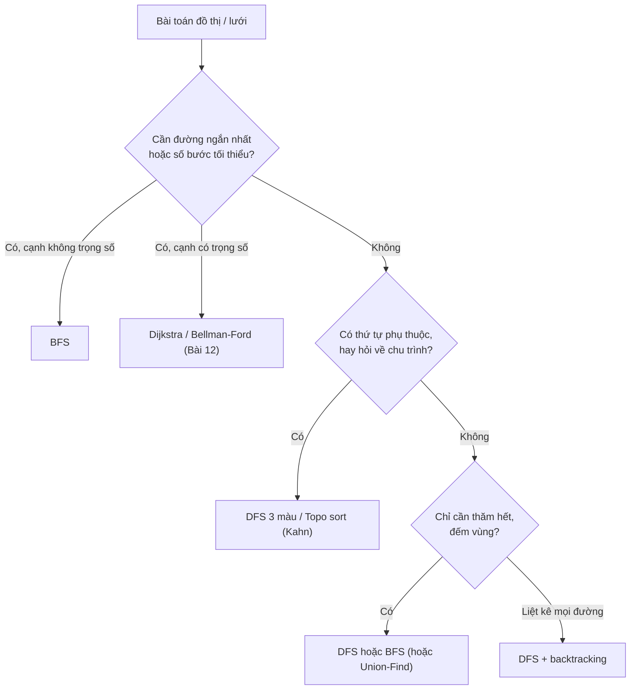

---

## 📖 6. Thành phần liên thông & Number of Islands

### 6.1 Đếm thành phần liên thông

Ý tưởng cực đơn giản: duyệt qua từng đỉnh; nếu đỉnh **chưa thăm** thì đó là **một thành phần mới** → tăng bộ đếm và chạy DFS/BFS từ nó để "tô màu" cả thành phần.

Hình dung: bạn là **nhân viên điều tra dân số** đi khắp các làng. Gặp một nhà chưa ghi tên → đó là một làng mới, bạn đi hết mọi nhà nối với nó bằng đường làng và ghi lại. Xong quay về danh sách, tìm nhà tiếp theo chưa ghi.

Đồ thị ở mục 1.6: đỉnh `0..5`, cạnh `0-1, 1-2, 0-2, 3-4`.

=== "Go"

    ```go
    package main

    import "fmt"

    func components(n int, edges [][2]int) [][]int {
    	adj := make([][]int, n)
    	for _, e := range edges {
    		adj[e[0]] = append(adj[e[0]], e[1])
    		adj[e[1]] = append(adj[e[1]], e[0])
    	}
    	visited := make([]bool, n)
    	var result [][]int
    	for s := 0; s < n; s++ {
    		if visited[s] {
    			continue
    		}
    		// s chưa thăm → thành phần mới; DFS lặp để gom cả cụm
    		comp := []int{}
    		stack := []int{s}
    		visited[s] = true
    		for len(stack) > 0 {
    			u := stack[len(stack)-1]
    			stack = stack[:len(stack)-1]
    			comp = append(comp, u)
    			for _, v := range adj[u] {
    				if !visited[v] {
    					visited[v] = true // chỉ cần thăm hết → đánh dấu khi push
    					stack = append(stack, v)
    				}
    			}
    		}
    		result = append(result, comp)
    	}
    	return result
    }

    func main() {
    	comps := components(6, [][2]int{{0, 1}, {1, 2}, {0, 2}, {3, 4}})
    	fmt.Println("Số thành phần:", len(comps))
    	for i, c := range comps {
    		fmt.Printf("Thành phần %d: %v\n", i+1, c)
    	}
    }

    // Output:
    // Số thành phần: 3
    // Thành phần 1: [0 2 1]
    // Thành phần 2: [3 4]
    // Thành phần 3: [5]
    ```

=== "Python"

    ```python
    def components(n, edges):
        adj = [[] for _ in range(n)]
        for u, v in edges:
            adj[u].append(v)
            adj[v].append(u)
        visited = [False] * n
        result = []
        for s in range(n):
            if visited[s]:
                continue
            comp, stack = [], [s]  # thành phần mới
            visited[s] = True
            while stack:
                u = stack.pop()
                comp.append(u)
                for v in adj[u]:
                    if not visited[v]:
                        visited[v] = True
                        stack.append(v)
            result.append(comp)
        return result


    comps = components(6, [(0, 1), (1, 2), (0, 2), (3, 4)])
    print("Số thành phần:", len(comps))
    for i, c in enumerate(comps, 1):
        print(f"Thành phần {i}: {c}")

    # Output:
    # Số thành phần: 3
    # Thành phần 1: [0, 2, 1]
    # Thành phần 2: [3, 4]
    # Thành phần 3: [5]
    ```

### 6.2 Number of Islands (LeetCode 200)

> Cho lưới `'1'` (đất) và `'0'` (nước). Đếm số **hòn đảo** — nhóm các ô đất nối nhau theo 4 hướng.

```text
1 1 0 0 0        A A . . .
1 1 0 0 0   →    A A . . .      3 đảo: A, B, C
0 0 1 0 0        . . B . .
0 0 0 1 1        . . . C C
```

Chính là **đếm thành phần liên thông trên lưới**. Mỗi khi gặp ô `'1'` chưa thăm → đảo mới → DFS "đánh chìm" cả đảo (đổi thành `'0'`) để không đếm lại.

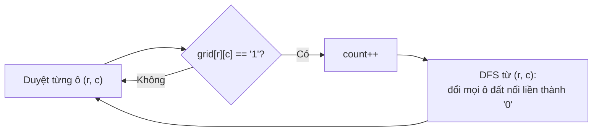

=== "Go"

    ```go
    package main

    import "fmt"

    func numIslands(grid [][]byte) int {
    	rows, cols := len(grid), len(grid[0])
    	var sink func(r, c int)
    	sink = func(r, c int) {
    		if r < 0 || r >= rows || c < 0 || c >= cols || grid[r][c] != '1' {
    			return
    		}
    		grid[r][c] = '0' // "đánh chìm" = đánh dấu đã thăm
    		sink(r-1, c)
    		sink(r+1, c)
    		sink(r, c-1)
    		sink(r, c+1)
    	}
    	count := 0
    	for r := 0; r < rows; r++ {
    		for c := 0; c < cols; c++ {
    			if grid[r][c] == '1' {
    				count++
    				sink(r, c)
    			}
    		}
    	}
    	return count
    }

    func toGrid(rows ...string) [][]byte {
    	g := make([][]byte, len(rows))
    	for i, r := range rows {
    		g[i] = []byte(r)
    	}
    	return g
    }

    func main() {
    	fmt.Println(numIslands(toGrid("11000", "11000", "00100", "00011")))
    	fmt.Println(numIslands(toGrid("11110", "11010", "11000", "00000")))
    	fmt.Println(numIslands(toGrid("10101", "01010", "10101")))
    }

    // Output:
    // 3
    // 1
    // 8
    ```

=== "Python"

    ```python
    def num_islands(grid):
        rows, cols = len(grid), len(grid[0])

        def sink(r, c):
            if r < 0 or r >= rows or c < 0 or c >= cols or grid[r][c] != "1":
                return
            grid[r][c] = "0"  # "đánh chìm" = đánh dấu đã thăm
            sink(r - 1, c)
            sink(r + 1, c)
            sink(r, c - 1)
            sink(r, c + 1)

        count = 0
        for r in range(rows):
            for c in range(cols):
                if grid[r][c] == "1":
                    count += 1
                    sink(r, c)
        return count


    def to_grid(*rows):
        return [list(r) for r in rows]


    print(num_islands(to_grid("11000", "11000", "00100", "00011")))
    print(num_islands(to_grid("11110", "11010", "11000", "00000")))
    print(num_islands(to_grid("10101", "01010", "10101")))

    # Output:
    # 3
    # 1
    # 8
    ```

**Độ phức tạp**: `O(R × C)` — mỗi ô bị "đánh chìm" tối đa 1 lần. Bộ nhớ: độ sâu đệ quy tệ nhất `O(R × C)` (lưới toàn đất hình xoắn ốc).

!!! tip "Biến thể hay gặp"
    - **Max Area of Island** (LC 695): `sink` trả về số ô đã đánh chìm, lấy max.
    - **Number of Provinces** (LC 547): đầu vào là ma trận kề thay vì lưới — cùng ý tưởng.
    - **Surrounded Regions** (LC 130): DFS từ **viền** trước để đánh dấu vùng "thoát được", phần còn lại mới bị lật.
    - Có thể giải bằng **Union-Find** (Bài 12) — hữu ích khi đất được **thêm dần** (LC 305).

---

## 📖 7. Phát hiện chu trình

### 7.1 Đồ thị vô hướng: dùng `parent`

Khi DFS đang ở `u` và gặp hàng xóm `v` **đã thăm**:

- Nếu `v` chính là **cha** của `u` (đỉnh vừa đi tới `u`) → bình thường, đó là cạnh ta vừa đi qua.
- Nếu `v` **không phải cha** → có một **con đường khác** quay về `v` → **có chu trình**!

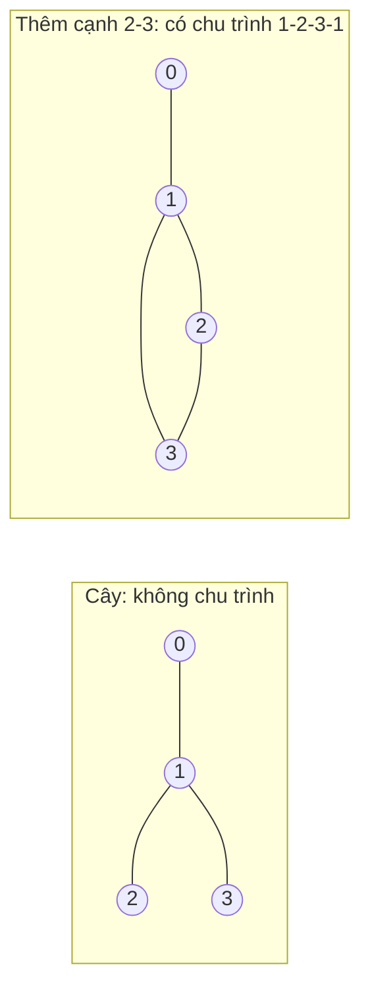

Ở hình phải: DFS `0 → 1 → 2 → 3`. Tại 3, hàng xóm 1 đã thăm và 1 **không phải cha** của 3 (cha của 3 là 2) → chu trình.

### 7.2 Đồ thị có hướng: 3 màu WHITE / GRAY / BLACK

Với đồ thị có hướng, "gặp đỉnh đã thăm" **chưa chắc** là chu trình. Ví dụ hình kim cương `0→1, 0→2, 1→3, 2→3`: DFS đi `0→1→3`, rồi quay về `0→2→3` — gặp 3 đã thăm nhưng **không có chu trình** (không có đường nào từ 3 quay về 2).

Giải pháp: tô 3 màu.

| Màu | Ý nghĩa | Hình dung |
|---|---|---|
| ⚪ **WHITE** | Chưa thăm | Phòng chưa vào |
| 🔘 **GRAY** | Đang thăm — đỉnh nằm trên **đường đi hiện tại** (đang trong call stack) | Phòng bạn đang đứng, và các phòng trên đường bạn đi vào, chưa ra |
| ⚫ **BLACK** | Đã thăm xong toàn bộ con cháu | Phòng đã khám xong, khoá lại |

**Quy tắc**: gặp cạnh `u → v` với `v` đang **GRAY** ⇒ `v` là tổ tiên của `u` trên đường hiện tại ⇒ **cạnh quay lui (back edge)** ⇒ **có chu trình**. Gặp `v` BLACK thì yên tâm bỏ qua.

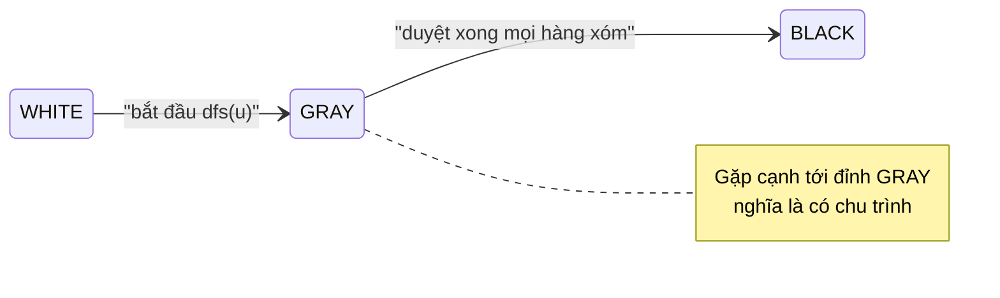

Trace với đồ thị `0→1, 1→2, 2→0, 2→3`:

| Hành động | Màu sau hành động |
|---|---|
| dfs(0) | 0=GRAY |
| 0→1: 1 WHITE → dfs(1) | 0=GRAY, 1=GRAY |
| 1→2: 2 WHITE → dfs(2) | 0,1,2=GRAY |
| 2→0: **0 đang GRAY** | ⇒ **CHU TRÌNH 0→1→2→0** |

=== "Go"

    ```go
    package main

    import "fmt"

    // Vô hướng: DFS với parent.
    func hasCycleUndirected(n int, edges [][2]int) bool {
    	adj := make([][]int, n)
    	for _, e := range edges {
    		adj[e[0]] = append(adj[e[0]], e[1])
    		adj[e[1]] = append(adj[e[1]], e[0])
    	}
    	visited := make([]bool, n)
    	var dfs func(u, parent int) bool
    	dfs = func(u, parent int) bool {
    		visited[u] = true
    		for _, v := range adj[u] {
    			if !visited[v] {
    				if dfs(v, u) {
    					return true
    				}
    			} else if v != parent {
    				return true // đã thăm và không phải cha → chu trình
    			}
    		}
    		return false
    	}
    	for s := 0; s < n; s++ { // đồ thị có thể không liên thông
    		if !visited[s] && dfs(s, -1) {
    			return true
    		}
    	}
    	return false
    }

    const (
    	white = 0
    	gray  = 1
    	black = 2
    )

    // Có hướng: DFS 3 màu.
    func hasCycleDirected(n int, edges [][2]int) bool {
    	adj := make([][]int, n)
    	for _, e := range edges {
    		adj[e[0]] = append(adj[e[0]], e[1])
    	}
    	color := make([]int, n) // mặc định white
    	var dfs func(u int) bool
    	dfs = func(u int) bool {
    		color[u] = gray
    		for _, v := range adj[u] {
    			if color[v] == gray {
    				return true // back edge
    			}
    			if color[v] == white && dfs(v) {
    				return true
    			}
    		}
    		color[u] = black
    		return false
    	}
    	for s := 0; s < n; s++ {
    		if color[s] == white && dfs(s) {
    			return true
    		}
    	}
    	return false
    }

    func main() {
    	fmt.Println("Vô hướng, cây:          ", hasCycleUndirected(4, [][2]int{{0, 1}, {1, 2}, {1, 3}}))
    	fmt.Println("Vô hướng, thêm 2-3:     ", hasCycleUndirected(4, [][2]int{{0, 1}, {1, 2}, {1, 3}, {2, 3}}))
    	fmt.Println("Có hướng, kim cương:    ", hasCycleDirected(4, [][2]int{{0, 1}, {0, 2}, {1, 3}, {2, 3}}))
    	fmt.Println("Có hướng, 0->1->2->0:   ", hasCycleDirected(4, [][2]int{{0, 1}, {1, 2}, {2, 0}, {2, 3}}))
    }

    // Output:
    // Vô hướng, cây:           false
    // Vô hướng, thêm 2-3:      true
    // Có hướng, kim cương:     false
    // Có hướng, 0->1->2->0:    true
    ```

=== "Python"

    ```python
    def has_cycle_undirected(n, edges):
        adj = [[] for _ in range(n)]
        for u, v in edges:
            adj[u].append(v)
            adj[v].append(u)
        visited = [False] * n

        def dfs(u, parent):
            visited[u] = True
            for v in adj[u]:
                if not visited[v]:
                    if dfs(v, u):
                        return True
                elif v != parent:
                    return True  # đã thăm và không phải cha → chu trình
            return False

        return any(not visited[s] and dfs(s, -1) for s in range(n))


    WHITE, GRAY, BLACK = 0, 1, 2


    def has_cycle_directed(n, edges):
        adj = [[] for _ in range(n)]
        for u, v in edges:
            adj[u].append(v)
        color = [WHITE] * n

        def dfs(u):
            color[u] = GRAY
            for v in adj[u]:
                if color[v] == GRAY:
                    return True  # back edge
                if color[v] == WHITE and dfs(v):
                    return True
            color[u] = BLACK
            return False

        return any(color[s] == WHITE and dfs(s) for s in range(n))


    print("Vô hướng, cây:          ", has_cycle_undirected(4, [(0, 1), (1, 2), (1, 3)]))
    print("Vô hướng, thêm 2-3:     ", has_cycle_undirected(4, [(0, 1), (1, 2), (1, 3), (2, 3)]))
    print("Có hướng, kim cương:    ", has_cycle_directed(4, [(0, 1), (0, 2), (1, 3), (2, 3)]))
    print("Có hướng, 0->1->2->0:   ", has_cycle_directed(4, [(0, 1), (1, 2), (2, 0), (2, 3)]))

    # Output:
    # Vô hướng, cây:           False
    # Vô hướng, thêm 2-3:      True
    # Có hướng, kim cương:     False
    # Có hướng, 0->1->2->0:    True
    ```

!!! warning "Bẫy kinh điển"
    - Dùng thuật toán **vô hướng (parent)** cho đồ thị **có hướng** → báo sai "kim cương" là có chu trình.
    - Đồ thị vô hướng có **cạnh song song** (hai cạnh `1-2`): cách so `v != parent` sẽ bỏ sót chu trình độ dài 2. Nếu đề cho phép multi-edge, hãy so theo **id cạnh** thay vì id đỉnh.
    - Quên vòng `for s := 0..n` → bỏ sót chu trình ở thành phần không chứa đỉnh 0.
    - Cách khác cho vô hướng: **Union-Find** — thêm cạnh `u-v` mà `u, v` đã cùng nhóm ⇒ chu trình (Bài 12).

---

## 📖 8. Kiểm tra đồ thị hai phía (Bipartite)

### 8.1 Bài toán

> Có thể chia các đỉnh thành **2 nhóm** sao cho **mọi cạnh đều nối hai đỉnh khác nhóm** không? (LeetCode 785)

Đời thường: cô giáo muốn chia lớp thành **2 đội** chơi kéo co, sao cho **hai bạn hay cãi nhau không bao giờ cùng đội**. Mỗi "cặp hay cãi nhau" là một cạnh.

Ý tưởng: **tô 2 màu** bằng BFS/DFS. Tô đỉnh đầu màu 🔴, mọi hàng xóm của nó phải là 🔵, hàng xóm của hàng xóm lại 🔴... Nếu gặp cạnh nối **hai đỉnh cùng màu** → không chia được.

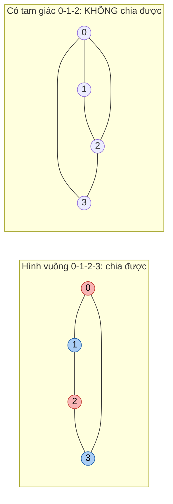

!!! tip "Định lý"
    Một đồ thị là hai phía **khi và chỉ khi nó không có chu trình độ dài lẻ**. Tam giác (chu trình 3) là "thủ phạm" nhỏ nhất: 3 người đôi một ghét nhau thì chia 2 đội kiểu gì cũng có 2 người chung đội.

=== "Go"

    ```go
    package main

    import "fmt"

    // graph[u] = danh sách hàng xóm của u (định dạng LeetCode 785)
    func isBipartite(graph [][]int) bool {
    	color := make([]int, len(graph)) // 0 = chưa tô, 1 = đỏ, -1 = xanh
    	for s := range graph {           // đồ thị có thể không liên thông
    		if color[s] != 0 {
    			continue
    		}
    		color[s] = 1
    		queue := []int{s}
    		for len(queue) > 0 {
    			u := queue[0]
    			queue = queue[1:]
    			for _, v := range graph[u] {
    				if color[v] == 0 {
    					color[v] = -color[u] // tô màu ngược lại
    					queue = append(queue, v)
    				} else if color[v] == color[u] {
    					return false // 2 đầu cạnh cùng màu
    				}
    			}
    		}
    	}
    	return true
    }

    func main() {
    	square := [][]int{{1, 3}, {0, 2}, {1, 3}, {0, 2}}
    	withTriangle := [][]int{{1, 2, 3}, {0, 2}, {0, 1, 3}, {0, 2}}
    	fmt.Println("Hình vuông:", isBipartite(square))
    	fmt.Println("Có tam giác:", isBipartite(withTriangle))
    }

    // Output:
    // Hình vuông: true
    // Có tam giác: false
    ```

=== "Python"

    ```python
    from collections import deque


    def is_bipartite(graph):
        color = [0] * len(graph)  # 0 = chưa tô, 1 = đỏ, -1 = xanh
        for s in range(len(graph)):  # đồ thị có thể không liên thông
            if color[s]:
                continue
            color[s] = 1
            queue = deque([s])
            while queue:
                u = queue.popleft()
                for v in graph[u]:
                    if color[v] == 0:
                        color[v] = -color[u]  # tô màu ngược lại
                        queue.append(v)
                    elif color[v] == color[u]:
                        return False  # 2 đầu cạnh cùng màu
        return True


    square = [[1, 3], [0, 2], [1, 3], [0, 2]]
    with_triangle = [[1, 2, 3], [0, 2], [0, 1, 3], [0, 2]]
    print("Hình vuông:", is_bipartite(square))
    print("Có tam giác:", is_bipartite(with_triangle))

    # Output:
    # Hình vuông: True
    # Có tam giác: False
    ```

**Độ phức tạp**: `O(V + E)`.

**Ứng dụng**: ghép cặp (sinh viên – đề tài, tài xế – khách), xếp lịch thi 2 ca sao cho 2 môn có chung sinh viên không trùng ca, phát hiện "hai phe" trong mạng xã hội.

---

## 📖 9. Sắp xếp Topo (Topological Sort)

### 9.1 Bài toán

> Cho một **DAG**. Hãy xếp các đỉnh thành một hàng sao cho **mọi cạnh `u → v` thì `u` đứng trước `v`**.

Đời thường: **lên lộ trình học** sao cho học môn tiên quyết trước; **mặc quần áo** (tất trước giày, quần trước thắt lưng); **nấu phở** (ninh xương trước khi chan nước dùng). Đồ thị môn học ở mục 1.5, đặt tên ngắn:

| Ký hiệu | Môn |
|---|---|
| A | Nhập môn lập trình |
| B | Toán rời rạc |
| C | Cấu trúc dữ liệu |
| D | Xác suất |
| E | Thuật toán |
| F | Machine Learning |

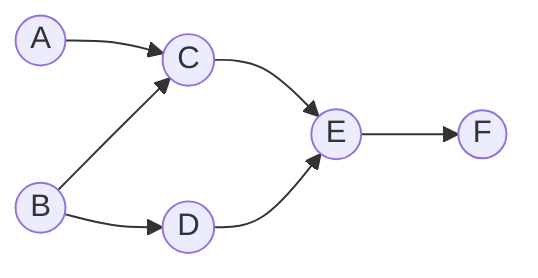

Cạnh: `A→C, B→C, B→D, C→E, D→E, E→F`. Một thứ tự topo hợp lệ: **A B C D E F** (còn nhiều thứ tự khác cũng đúng, ví dụ `B D A C E F`).

!!! note "Topo sort chỉ tồn tại khi KHÔNG có chu trình"
    Có chu trình thì không có "điểm bắt đầu". Vì vậy topo sort đồng thời là một cách **phát hiện chu trình trong đồ thị có hướng**.

### 9.2 Thuật toán Kahn (BFS theo in-degree)

Trực giác: **môn nào không cần tiên quyết (in-degree = 0) thì học ngay**. Học xong môn đó, "gạch" nó khỏi điều kiện của các môn phụ thuộc (giảm in-degree). Môn nào về 0 thì đến lượt nó được học.

1. Tính `indeg[v]` cho mọi đỉnh.
2. Đưa mọi đỉnh có `indeg = 0` vào queue.
3. Lặp: lấy `u` ra, thêm vào kết quả; với mỗi `u → v`: `indeg[v]--`, nếu về 0 thì đưa `v` vào queue.
4. Nếu kết quả có **ít hơn V đỉnh** → đồ thị **có chu trình** (các đỉnh trong chu trình không bao giờ về 0).

Trace:

| Bước | Lấy ra | Giảm in-degree | In-degree (A B C D E F) | Queue | Kết quả |
|---|---|---|---|---|---|
| 0 | — | — | 0 0 2 1 2 1 | `[A, B]` | |
| 1 | A | C: 2→1 | 0 0 1 1 2 1 | `[B]` | A |
| 2 | B | C: 1→**0**, D: 1→**0** | 0 0 0 0 2 1 | `[C, D]` | A B |
| 3 | C | E: 2→1 | 0 0 0 0 1 1 | `[D]` | A B C |
| 4 | D | E: 1→**0** | 0 0 0 0 0 1 | `[E]` | A B C D |
| 5 | E | F: 1→**0** | 0 0 0 0 0 0 | `[F]` | A B C D E |
| 6 | F | — | | `[]` | A B C D E F |

Bấm ▶ và theo dõi con số in-degree cạnh mỗi đỉnh giảm dần — đỉnh nào về 0 thì được đưa vào hàng đợi, đúng như bảng trên:

<div class="algo-viz" data-viz="graph" data-algo="topo" data-nodes="A,B,C,D,E,F" data-edges="A-C,B-C,B-D,C-E,D-E,E-F" data-directed="true" data-title="Topo sort (Kahn) — lộ trình môn học"></div>

### 9.3 Topo sort bằng DFS (hậu thứ tự đảo ngược)

Trực giác: trong DFS, một đỉnh chỉ "xong" (BLACK) **sau khi mọi đỉnh phụ thuộc vào nó đã xong**. Vậy nếu ghi đỉnh vào danh sách **lúc nó xong** (post-order), ta được thứ tự "ngược": việc làm cuối cùng đứng đầu. **Đảo ngược** danh sách là có thứ tự topo.

Hình dung: bạn muốn biết cần làm gì trước khi "đi phỏng vấn" — bạn lần ngược: cần CV → cần dự án → cần học Go... Việc sâu nhất xong trước.

```text
dfs(A) → dfs(C) → dfs(E) → dfs(F): F xong
                           E xong
                  C xong
         A xong
dfs(B) → C đã xong, dfs(D) → E đã xong; D xong
         B xong
Post-order:  F E C A D B
Đảo ngược:   B D A C E F   ← thứ tự topo hợp lệ
```

### 9.4 Code: Kahn + DFS (kèm phát hiện chu trình)

=== "Go"

    ```go
    package main

    import (
    	"fmt"
    	"slices"
    )

    // Kahn: trả về thứ tự topo và ok=false nếu có chu trình.
    func topoKahn(nodes []string, edges [][2]string) ([]string, bool) {
    	adj := map[string][]string{}
    	indeg := map[string]int{}
    	for _, e := range edges {
    		adj[e[0]] = append(adj[e[0]], e[1])
    		indeg[e[1]]++
    	}
    	queue := []string{}
    	for _, v := range nodes {
    		if indeg[v] == 0 {
    			queue = append(queue, v)
    		}
    	}
    	order := []string{}
    	for len(queue) > 0 {
    		u := queue[0]
    		queue = queue[1:]
    		order = append(order, u)
    		for _, v := range adj[u] {
    			indeg[v]--
    			if indeg[v] == 0 {
    				queue = append(queue, v)
    			}
    		}
    	}
    	return order, len(order) == len(nodes)
    }

    // DFS: post-order rồi đảo ngược; dùng 3 màu để phát hiện chu trình.
    func topoDFS(nodes []string, edges [][2]string) ([]string, bool) {
    	adj := map[string][]string{}
    	for _, e := range edges {
    		adj[e[0]] = append(adj[e[0]], e[1])
    	}
    	const white, gray, black = 0, 1, 2
    	color := map[string]int{}
    	post := []string{}
    	var dfs func(u string) bool
    	dfs = func(u string) bool {
    		color[u] = gray
    		for _, v := range adj[u] {
    			if color[v] == gray {
    				return false // chu trình
    			}
    			if color[v] == white && !dfs(v) {
    				return false
    			}
    		}
    		color[u] = black
    		post = append(post, u) // u "xong"
    		return true
    	}
    	for _, v := range nodes {
    		if color[v] == white && !dfs(v) {
    			return nil, false
    		}
    	}
    	slices.Reverse(post)
    	return post, true
    }

    func main() {
    	nodes := []string{"A", "B", "C", "D", "E", "F"}
    	edges := [][2]string{{"A", "C"}, {"B", "C"}, {"B", "D"}, {"C", "E"}, {"D", "E"}, {"E", "F"}}
    	fmt.Println(topoKahn(nodes, edges))
    	fmt.Println(topoDFS(nodes, edges))

    	cyclic := append(edges, [2]string{"F", "B"}) // F -> B tạo chu trình B-D-E-F-B
    	fmt.Println(topoKahn(nodes, cyclic))
    	fmt.Println(topoDFS(nodes, cyclic))
    }

    // Output:
    // [A B C D E F] true
    // [B D A C E F] true
    // [A] false
    // [] false
    ```

=== "Python"

    ```python
    from collections import deque, defaultdict


    def topo_kahn(nodes, edges):
        adj = defaultdict(list)
        indeg = {v: 0 for v in nodes}
        for u, v in edges:
            adj[u].append(v)
            indeg[v] += 1
        queue = deque(v for v in nodes if indeg[v] == 0)
        order = []
        while queue:
            u = queue.popleft()
            order.append(u)
            for v in adj[u]:
                indeg[v] -= 1
                if indeg[v] == 0:
                    queue.append(v)
        return order, len(order) == len(nodes)


    def topo_dfs(nodes, edges):
        adj = defaultdict(list)
        for u, v in edges:
            adj[u].append(v)
        WHITE, GRAY, BLACK = 0, 1, 2
        color = {v: WHITE for v in nodes}
        post = []

        def dfs(u):
            color[u] = GRAY
            for v in adj[u]:
                if color[v] == GRAY:
                    return False  # chu trình
                if color[v] == WHITE and not dfs(v):
                    return False
            color[u] = BLACK
            post.append(u)  # u "xong"
            return True

        for v in nodes:
            if color[v] == WHITE and not dfs(v):
                return [], False
        return post[::-1], True


    nodes = ["A", "B", "C", "D", "E", "F"]
    edges = [("A", "C"), ("B", "C"), ("B", "D"), ("C", "E"), ("D", "E"), ("E", "F")]
    print(topo_kahn(nodes, edges))
    print(topo_dfs(nodes, edges))

    cyclic = edges + [("F", "B")]  # F -> B tạo chu trình B-D-E-F-B
    print(topo_kahn(nodes, cyclic))
    print(topo_dfs(nodes, cyclic))

    # Output:
    # (['A', 'B', 'C', 'D', 'E', 'F'], True)
    # (['B', 'D', 'A', 'C', 'E', 'F'], True)
    # (['A'], False)
    # ([], False)
    ```

| | Kahn (BFS) | DFS post-order |
|---|---|---|
| Ý tưởng | Lấy dần đỉnh in-degree 0 | Đảo ngược thứ tự "xong" |
| Phát hiện chu trình | `len(order) < V` | Gặp đỉnh GRAY |
| Đệ quy | Không (an toàn với đồ thị lớn) | Có (cẩn thận độ sâu) |
| Thứ tự nhỏ nhất theo từ điển | Dễ: thay queue bằng **min-heap** | Khó |
| Chạy song song theo "đợt" | Dễ: mỗi "lớp" queue là một đợt có thể chạy đồng thời | Không tự nhiên |
| Độ phức tạp | `O(V + E)` | `O(V + E)` |

### 9.5 Course Schedule I & II (LeetCode 207, 210)

> Có `numCourses` môn đánh số `0..n-1`. `prerequisites[i] = [a, b]` nghĩa là **muốn học `a` phải học `b` trước** (cạnh `b → a`). (207) Có học hết được không? (210) Trả về một thứ tự học hợp lệ, hoặc `[]` nếu không thể.

!!! warning "Chú ý chiều cạnh"
    `[a, b]` là **`b → a`**, không phải `a → b`. Đây là lỗi số 1 khi làm bài này. Vẽ ra giấy trước khi code!

=== "Go"

    ```go
    package main

    import "fmt"

    func findOrder(numCourses int, prerequisites [][]int) []int {
    	adj := make([][]int, numCourses)
    	indeg := make([]int, numCourses)
    	for _, p := range prerequisites {
    		a, b := p[0], p[1]
    		adj[b] = append(adj[b], a) // học b xong mới học a
    		indeg[a]++
    	}
    	queue := []int{}
    	for i := 0; i < numCourses; i++ {
    		if indeg[i] == 0 {
    			queue = append(queue, i)
    		}
    	}
    	order := []int{}
    	for len(queue) > 0 {
    		u := queue[0]
    		queue = queue[1:]
    		order = append(order, u)
    		for _, v := range adj[u] {
    			indeg[v]--
    			if indeg[v] == 0 {
    				queue = append(queue, v)
    			}
    		}
    	}
    	if len(order) < numCourses {
    		return []int{} // có chu trình
    	}
    	return order
    }

    func canFinish(numCourses int, prerequisites [][]int) bool {
    	return len(findOrder(numCourses, prerequisites)) == numCourses
    }

    func main() {
    	fmt.Println(findOrder(4, [][]int{{1, 0}, {2, 0}, {3, 1}, {3, 2}}))
    	fmt.Println(canFinish(2, [][]int{{1, 0}}))
    	fmt.Println(canFinish(2, [][]int{{1, 0}, {0, 1}}))
    }

    // Output:
    // [0 1 2 3]
    // true
    // false
    ```

=== "Python"

    ```python
    from collections import deque


    def find_order(num_courses, prerequisites):
        adj = [[] for _ in range(num_courses)]
        indeg = [0] * num_courses
        for a, b in prerequisites:
            adj[b].append(a)  # học b xong mới học a
            indeg[a] += 1
        queue = deque(i for i in range(num_courses) if indeg[i] == 0)
        order = []
        while queue:
            u = queue.popleft()
            order.append(u)
            for v in adj[u]:
                indeg[v] -= 1
                if indeg[v] == 0:
                    queue.append(v)
        return order if len(order) == num_courses else []


    def can_finish(num_courses, prerequisites):
        return len(find_order(num_courses, prerequisites)) == num_courses


    print(find_order(4, [[1, 0], [2, 0], [3, 1], [3, 2]]))
    print(can_finish(2, [[1, 0]]))
    print(can_finish(2, [[1, 0], [0, 1]]))

    # Output:
    # [0, 1, 2, 3]
    # True
    # False
    ```

**Độ phức tạp**: `O(V + E)` với `V = numCourses`, `E = len(prerequisites)`.

---

## 📖 10. Clone Graph (LeetCode 133)

> Cho một đỉnh của đồ thị vô hướng liên thông (mỗi đỉnh có `val` và danh sách `neighbors`). Tạo **bản sao sâu (deep copy)** — mọi đỉnh mới hoàn toàn, cấu trúc y hệt.

Đời thường: **photo lại sơ đồ tổ chức công ty** sang một tờ giấy mới — mỗi người phải được vẽ lại **đúng 1 lần**, và các mối quan hệ phải trỏ tới **bản vẽ mới**, không phải bản cũ.

Chìa khoá: một **hash map `cũ → mới`**. Nó vừa là "visited", vừa giúp nối cạnh tới đúng bản sao.

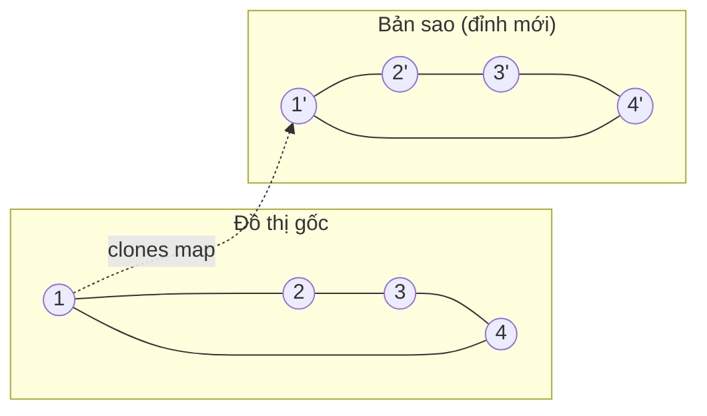

!!! warning "Phải đăng ký bản sao vào map TRƯỚC khi đệ quy sang hàng xóm"
    Nếu clone hàng xóm trước rồi mới lưu `map[old] = new`, đồ thị có chu trình (1-2-1) sẽ đệ quy vô hạn.

=== "Go"

    ```go
    package main

    import "fmt"

    type Node struct {
    	Val       int
    	Neighbors []*Node
    }

    func cloneGraph(node *Node) *Node {
    	if node == nil {
    		return nil
    	}
    	clones := map[*Node]*Node{} // cũ -> mới
    	var dfs func(n *Node) *Node
    	dfs = func(n *Node) *Node {
    		if c, ok := clones[n]; ok {
    			return c
    		}
    		c := &Node{Val: n.Val}
    		clones[n] = c // đăng ký TRƯỚC khi duyệt hàng xóm
    		for _, nb := range n.Neighbors {
    			c.Neighbors = append(c.Neighbors, dfs(nb))
    		}
    		return c
    	}
    	return dfs(node)
    }

    func main() {
    	// Dựng hình vuông 1-2-3-4-1
    	nodes := make([]*Node, 5)
    	for i := 1; i <= 4; i++ {
    		nodes[i] = &Node{Val: i}
    	}
    	link := func(a, b int) {
    		nodes[a].Neighbors = append(nodes[a].Neighbors, nodes[b])
    		nodes[b].Neighbors = append(nodes[b].Neighbors, nodes[a])
    	}
    	link(1, 2)
    	link(2, 3)
    	link(3, 4)
    	link(4, 1)

    	copy1 := cloneGraph(nodes[1])
    	// In bản sao bằng BFS
    	seen := map[*Node]bool{copy1: true}
    	queue := []*Node{copy1}
    	for len(queue) > 0 {
    		u := queue[0]
    		queue = queue[1:]
    		vals := []int{}
    		for _, v := range u.Neighbors {
    			vals = append(vals, v.Val)
    			if !seen[v] {
    				seen[v] = true
    				queue = append(queue, v)
    			}
    		}
    		fmt.Printf("%d: %v\n", u.Val, vals)
    	}
    	fmt.Println("Cùng một object với bản gốc?", copy1 == nodes[1])
    }

    // Output:
    // 1: [2 4]
    // 2: [1 3]
    // 4: [3 1]
    // 3: [2 4]
    // Cùng một object với bản gốc? false
    ```

=== "Python"

    ```python
    from collections import deque


    class Node:
        def __init__(self, val):
            self.val = val
            self.neighbors = []


    def clone_graph(node):
        if node is None:
            return None
        clones = {}  # cũ -> mới

        def dfs(n):
            if n in clones:
                return clones[n]
            c = Node(n.val)
            clones[n] = c  # đăng ký TRƯỚC khi duyệt hàng xóm
            for nb in n.neighbors:
                c.neighbors.append(dfs(nb))
            return c

        return dfs(node)


    nodes = {i: Node(i) for i in range(1, 5)}


    def link(a, b):
        nodes[a].neighbors.append(nodes[b])
        nodes[b].neighbors.append(nodes[a])


    link(1, 2)
    link(2, 3)
    link(3, 4)
    link(4, 1)

    copy1 = clone_graph(nodes[1])
    seen, queue = {copy1}, deque([copy1])
    while queue:
        u = queue.popleft()
        print(f"{u.val}: {[v.val for v in u.neighbors]}")
        for v in u.neighbors:
            if v not in seen:
                seen.add(v)
                queue.append(v)
    print("Cùng một object với bản gốc?", copy1 is nodes[1])

    # Output:
    # 1: [2, 4]
    # 2: [1, 3]
    # 4: [3, 1]
    # 3: [2, 4]
    # Cùng một object với bản gốc? False
    ```

**Độ phức tạp**: `O(V + E)` thời gian, `O(V)` bộ nhớ cho map. Cùng kỹ thuật dùng cho **Copy List with Random Pointer** (LC 138).

---

## 📖 11. BFS đa nguồn (Multi-source BFS) — Rotting Oranges

### 11.1 Bài toán (LeetCode 994)

> Lưới: `0` = trống, `1` = cam tươi, `2` = cam thối. Mỗi phút, cam thối làm thối các cam tươi **kề 4 hướng**. Sau bao nhiêu phút mọi quả cam đều thối? Nếu có quả không bao giờ thối, trả về `-1`.

Trực giác: **nhiều đám cháy bùng lên cùng lúc** ở nhiều nơi. Nếu chạy BFS riêng từ từng đám cháy rồi lấy min thì tốn `O(k · R · C)`. Mẹo: **đưa TẤT CẢ nguồn vào queue ngay từ đầu** với thời gian 0 — chúng loang **đồng thời** theo từng "vòng" như một làn sóng chung.

Tương đương: tạo một **siêu nguồn ảo** nối với mọi quả cam thối, rồi BFS 1 nguồn từ đó.

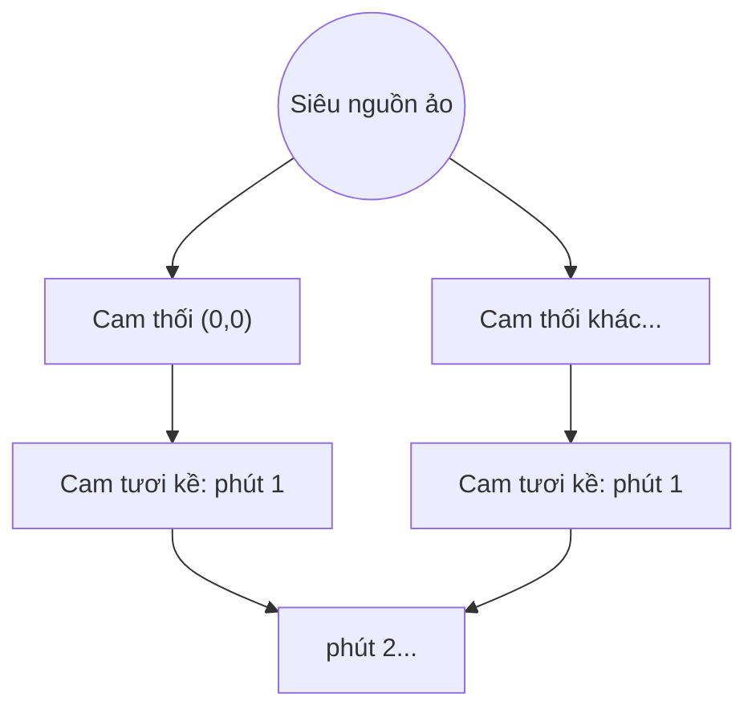

Trace ví dụ `[[2,1,1],[1,1,0],[0,1,1]]`:

```text
Phút 0      Phút 1      Phút 2      Phút 3      Phút 4
2 1 1       2 2 1       2 2 2       2 2 2       2 2 2
1 1 0   →   2 1 0   →   2 2 0   →   2 2 0   →   2 2 0
0 1 1       0 1 1       0 1 1       0 2 1       0 2 2
```

Kết quả: **4 phút**.

=== "Go"

    ```go
    package main

    import "fmt"

    func orangesRotting(grid [][]int) int {
    	rows, cols := len(grid), len(grid[0])
    	type cell struct{ r, c int }
    	queue := []cell{}
    	fresh := 0
    	for r := 0; r < rows; r++ {
    		for c := 0; c < cols; c++ {
    			switch grid[r][c] {
    			case 2:
    				queue = append(queue, cell{r, c}) // MỌI nguồn vào queue ngay từ đầu
    			case 1:
    				fresh++
    			}
    		}
    	}
    	dirs := []cell{{-1, 0}, {1, 0}, {0, -1}, {0, 1}}
    	minutes := 0
    	for len(queue) > 0 && fresh > 0 {
    		// xử lý trọn một "vòng" = một phút
    		next := []cell{}
    		for _, u := range queue {
    			for _, d := range dirs {
    				r, c := u.r+d.r, u.c+d.c
    				if r >= 0 && r < rows && c >= 0 && c < cols && grid[r][c] == 1 {
    					grid[r][c] = 2 // thối ngay → cũng là đánh dấu visited
    					fresh--
    					next = append(next, cell{r, c})
    				}
    			}
    		}
    		queue = next
    		minutes++
    	}
    	if fresh > 0 {
    		return -1
    	}
    	return minutes
    }

    func main() {
    	fmt.Println(orangesRotting([][]int{{2, 1, 1}, {1, 1, 0}, {0, 1, 1}}))
    	fmt.Println(orangesRotting([][]int{{2, 1, 1}, {0, 1, 1}, {1, 0, 1}}))
    	fmt.Println(orangesRotting([][]int{{0, 2}}))
    }

    // Output:
    // 4
    // -1
    // 0
    ```

=== "Python"

    ```python
    def oranges_rotting(grid):
        rows, cols = len(grid), len(grid[0])
        queue, fresh = [], 0
        for r in range(rows):
            for c in range(cols):
                if grid[r][c] == 2:
                    queue.append((r, c))  # MỌI nguồn vào queue ngay từ đầu
                elif grid[r][c] == 1:
                    fresh += 1
        minutes = 0
        while queue and fresh:
            nxt = []  # xử lý trọn một "vòng" = một phút
            for r, c in queue:
                for dr, dc in ((-1, 0), (1, 0), (0, -1), (0, 1)):
                    nr, nc = r + dr, c + dc
                    if 0 <= nr < rows and 0 <= nc < cols and grid[nr][nc] == 1:
                        grid[nr][nc] = 2  # thối ngay → cũng là visited
                        fresh -= 1
                        nxt.append((nr, nc))
            queue = nxt
            minutes += 1
        return -1 if fresh else minutes


    print(oranges_rotting([[2, 1, 1], [1, 1, 0], [0, 1, 1]]))
    print(oranges_rotting([[2, 1, 1], [0, 1, 1], [1, 0, 1]]))
    print(oranges_rotting([[0, 2]]))

    # Output:
    # 4
    # -1
    # 0
    ```

!!! tip "Kỹ thuật \"xử lý theo vòng\""
    Thay vì lưu `dist` cho từng ô, ta xử lý **trọn một lớp** queue rồi mới tăng `minutes`. Cùng kỹ thuật dùng cho **Binary Tree Level Order Traversal**, **01 Matrix** (LC 542), **Walls and Gates** (LC 286), **As Far from Land as Possible** (LC 1162).

---

## 📖 12. Flood Fill (LeetCode 733) — công cụ "đổ màu" 🪣

> Cho ảnh `image[r][c]`, điểm `(sr, sc)` và `color`. Đổi màu điểm đó **và mọi điểm nối liền (4 hướng) có cùng màu gốc** sang `color`.

Đây chính là nút **Paint Bucket** trong Paint/Photoshop, hay cách game **Minesweeper** mở một vùng ô trống khi bạn click.

```text
Trước (click vào ô giữa, màu mới = 2)     Sau
1 1 1                                      2 2 2
1 1 0                                      2 2 0
1 0 1                                      2 0 1   ← ô (2,2) không nối liền → giữ nguyên
```

=== "Go"

    ```go
    package main

    import "fmt"

    func floodFill(image [][]int, sr, sc, color int) [][]int {
    	old := image[sr][sc]
    	if old == color {
    		return image // QUAN TRỌNG: tránh đệ quy vô hạn
    	}
    	var fill func(r, c int)
    	fill = func(r, c int) {
    		if r < 0 || r >= len(image) || c < 0 || c >= len(image[0]) || image[r][c] != old {
    			return
    		}
    		image[r][c] = color
    		fill(r-1, c)
    		fill(r+1, c)
    		fill(r, c-1)
    		fill(r, c+1)
    	}
    	fill(sr, sc)
    	return image
    }

    func main() {
    	img := [][]int{{1, 1, 1}, {1, 1, 0}, {1, 0, 1}}
    	for _, row := range floodFill(img, 1, 1, 2) {
    		fmt.Println(row)
    	}
    }

    // Output:
    // [2 2 2]
    // [2 2 0]
    // [2 0 1]
    ```

=== "Python"

    ```python
    def flood_fill(image, sr, sc, color):
        old = image[sr][sc]
        if old == color:
            return image  # QUAN TRỌNG: tránh đệ quy vô hạn

        def fill(r, c):
            if not (0 <= r < len(image) and 0 <= c < len(image[0])) or image[r][c] != old:
                return
            image[r][c] = color
            fill(r - 1, c)
            fill(r + 1, c)
            fill(r, c - 1)
            fill(r, c + 1)

        fill(sr, sc)
        return image


    for row in flood_fill([[1, 1, 1], [1, 1, 0], [1, 0, 1]], 1, 1, 2):
        print(row)

    # Output:
    # [2, 2, 2]
    # [2, 2, 0]
    # [2, 0, 1]
    ```

!!! warning "Bẫy `old == color`"
    Nếu màu mới trùng màu cũ, điều kiện `image[r][c] != old` không bao giờ chặn → đệ quy vô hạn → stack overflow. Luôn kiểm tra trước!

---

## 📖 13. Tổng kết các "khuôn" (template)

| Khuôn | Cấu trúc | Đánh dấu visited khi | Dùng cho |
|---|---|---|---|
| BFS 1 nguồn | queue | **push** | Đường ngắn nhất không trọng số |
| BFS đa nguồn / theo vòng | queue, xử lý từng lớp | push | Lan truyền đồng thời, "sau k phút" |
| DFS đệ quy | call stack | vào hàm | Đếm vùng, chu trình, topo, backtracking |
| DFS lặp | stack | pop (nếu cần đúng thứ tự) | Như trên, khi sợ tràn stack |
| DFS 3 màu | đệ quy + `color[]` | GRAY khi vào, BLACK khi ra | Chu trình có hướng, topo |
| Kahn | queue + `indeg[]` | — | Topo, phát hiện chu trình có hướng, chia "đợt" |
| Tô 2 màu | BFS/DFS + `color[]` | push | Bipartite |

---

## 🌍 Ứng dụng thực tế

| Lĩnh vực | Bài toán | Thuật toán |
|---|---|---|
| **Mạng xã hội** (Facebook, LinkedIn, Zalo) | "Những người bạn có thể biết", kết nối cấp 1/2/3 trên LinkedIn | BFS giới hạn 2–3 tầng, đếm bạn chung |
| **Google Maps / Grab** | Tìm đường ít rẽ nhất, vùng phủ "trong vòng 10 phút" | BFS (không trọng số), Dijkstra/A* (Bài 12) |
| **Web crawler** (Googlebot) | Thu thập trang web từ vài URL gốc | BFS theo link, `visited` = tập URL đã tải |
| **Garbage Collector** (Go, Java, Python) | Tìm object còn dùng được từ các "root" | Mark phase = DFS/BFS; object không được đánh dấu bị thu hồi |
| **Build tool / package manager** (`go build`, npm, pip, Bazel, Makefile) | Build/cài theo đúng thứ tự phụ thuộc; báo lỗi `import cycle not allowed` | Topo sort + phát hiện chu trình |
| **Airflow, CI/CD pipelines** | Chạy task theo DAG, task độc lập chạy song song | Kahn theo "đợt" |
| **Excel / Google Sheets** | Tính lại ô khi ô khác đổi; báo "Circular reference" | Topo sort + DFS 3 màu |
| **Database** | Phát hiện **deadlock** (T1 chờ T2, T2 chờ T1) | Tìm chu trình trong wait-for graph |
| **Photoshop, Paint, game** | Paint bucket, Minesweeper mở vùng, "chọn vùng cùng màu" (magic wand) | Flood fill |
| **Game** | NPC tìm đường trên bản đồ ô vuông, tính tầm di chuyển trong game chiến thuật | BFS trên lưới |
| **Mạng máy tính** | Broadcast gói tin, tìm các máy trong cùng mạng con | BFS, thành phần liên thông |

### Ví dụ nhỏ: gợi ý kết bạn kiểu Facebook

Gợi ý = những người **cách bạn đúng 2 bước** (bạn của bạn, nhưng chưa là bạn), xếp theo **số bạn chung** giảm dần.

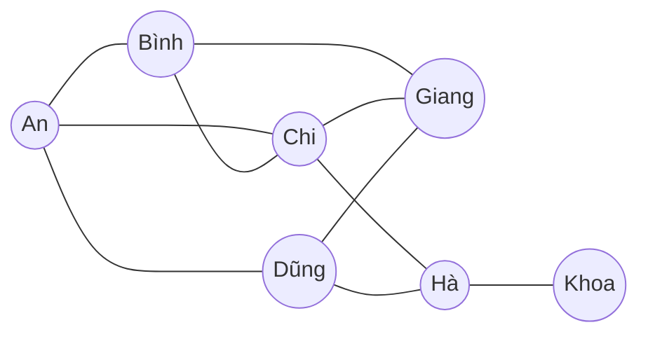

=== "Go"

    ```go
    package main

    import (
    	"fmt"
    	"sort"
    )

    func suggest(g map[string][]string, me string) []string {
    	isFriend := map[string]bool{me: true}
    	for _, f := range g[me] {
    		isFriend[f] = true
    	}
    	mutual := map[string]int{}
    	for _, f := range g[me] { // tầng 1
    		for _, ff := range g[f] { // tầng 2
    			if !isFriend[ff] {
    				mutual[ff]++ // f là một bạn chung
    			}
    		}
    	}
    	res := []string{}
    	for name := range mutual {
    		res = append(res, name)
    	}
    	sort.Slice(res, func(i, j int) bool {
    		if mutual[res[i]] != mutual[res[j]] {
    			return mutual[res[i]] > mutual[res[j]]
    		}
    		return res[i] < res[j]
    	})
    	for i, name := range res {
    		res[i] = fmt.Sprintf("%s (%d bạn chung)", name, mutual[name])
    	}
    	return res
    }

    func main() {
    	pairs := [][2]string{
    		{"An", "Bình"}, {"An", "Chi"}, {"An", "Dũng"}, {"Bình", "Chi"},
    		{"Bình", "Giang"}, {"Chi", "Giang"}, {"Chi", "Hà"}, {"Dũng", "Hà"},
    		{"Dũng", "Giang"}, {"Hà", "Khoa"},
    	}
    	g := map[string][]string{}
    	for _, p := range pairs {
    		g[p[0]] = append(g[p[0]], p[1])
    		g[p[1]] = append(g[p[1]], p[0])
    	}
    	for _, s := range suggest(g, "An") {
    		fmt.Println(s)
    	}
    }

    // Output:
    // Giang (3 bạn chung)
    // Hà (2 bạn chung)
    ```

=== "Python"

    ```python
    from collections import defaultdict, Counter


    def suggest(g, me):
        friends = set(g[me]) | {me}
        mutual = Counter()
        for f in g[me]:            # tầng 1
            for ff in g[f]:        # tầng 2
                if ff not in friends:
                    mutual[ff] += 1  # f là một bạn chung
        ranked = sorted(mutual.items(), key=lambda kv: (-kv[1], kv[0]))
        return [f"{name} ({cnt} bạn chung)" for name, cnt in ranked]


    pairs = [("An", "Bình"), ("An", "Chi"), ("An", "Dũng"), ("Bình", "Chi"),
             ("Bình", "Giang"), ("Chi", "Giang"), ("Chi", "Hà"), ("Dũng", "Hà"),
             ("Dũng", "Giang"), ("Hà", "Khoa")]
    g = defaultdict(list)
    for a, b in pairs:
        g[a].append(b)
        g[b].append(a)
    print("\n".join(suggest(g, "An")))

    # Output:
    # Giang (3 bạn chung)
    # Hà (2 bạn chung)
    ```

Khoa **không** được gợi ý vì cách An 3 bước. Hệ thống thật (Facebook "People You May Know") còn cộng thêm tín hiệu: cùng trường, cùng công ty, danh bạ điện thoại, vị trí...

---

## ⚠️ Lỗi thường gặp

| Lỗi | Hậu quả | Cách tránh |
|---|---|---|
| Quên `visited` | Lặp vô hạn trên đồ thị có chu trình | Luôn có `visited`/`dist`/`color` |
| BFS đánh dấu visited khi **pop** | Một đỉnh vào queue nhiều lần, TLE/MLE | Đánh dấu khi **push** |
| Dùng `list.pop(0)` trong Python | Mỗi lần pop `O(n)` → BFS thành `O(V²)` | Dùng `collections.deque` + `popleft()` |
| Go: `queue = queue[1:]` với queue rất lớn | Mảng nền không được giải phóng sớm | Chấp nhận được cho phỏng vấn; production dùng ring buffer hoặc xử lý theo lớp |
| Chỉ duyệt từ đỉnh 0 | Bỏ sót thành phần khác | `for s in range(n): if not visited[s]: ...` |
| Đồ thị vô hướng quên thêm cạnh 2 chiều | BFS/DFS "không thấy" đường | `adj[u].append(v); adj[v].append(u)` |
| Nhầm chiều cạnh `[a, b]` trong Course Schedule | Thứ tự ngược hoàn toàn | Vẽ ví dụ nhỏ ra giấy, đọc kỹ đề |
| Dùng thuật toán chu trình vô hướng (parent) cho đồ thị có hướng | Báo chu trình sai | Có hướng → 3 màu hoặc Kahn |
| Kiểm tra biên lưới **sau** khi truy cập `grid[r][c]` | Index out of range / panic | Kiểm tra biên **trước** |
| Dùng BFS cho đồ thị có trọng số khác nhau | Sai đáp án | Dijkstra (Bài 12) |
| DFS đệ quy trên lưới 10⁶ ô bằng Python | `RecursionError` | DFS lặp hoặc BFS |
| Flood fill khi màu mới == màu cũ | Đệ quy vô hạn | Return sớm |

---

## 🏋️ Bài tập

### 🟢 Mức dễ

**Bài 1 — Find if Path Exists in Graph (LC 1971).** Cho `n` đỉnh, danh sách cạnh vô hướng, `source`, `destination`. Có đường đi không?

<details markdown="1">
<summary>Đáp án</summary>

BFS/DFS từ `source`, gặp `destination` thì trả về `True`. `O(V + E)`. (Cũng giải được bằng Union-Find — Bài 12.)

```python
from collections import deque, defaultdict


def valid_path(n, edges, source, destination):
    g = defaultdict(list)
    for u, v in edges:
        g[u].append(v)
        g[v].append(u)
    seen, q = {source}, deque([source])
    while q:
        u = q.popleft()
        if u == destination:
            return True
        for v in g[u]:
            if v not in seen:
                seen.add(v)
                q.append(v)
    return False


print(valid_path(3, [[0, 1], [1, 2], [2, 0]], 0, 2))
print(valid_path(6, [[0, 1], [0, 2], [3, 5], [5, 4], [4, 3]], 0, 5))

# Output:
# True
# False
```

</details>

**Bài 2 — Find the Town Judge (LC 997).** Trong thị trấn `n` người, "thẩm phán" không tin ai, và được **mọi người khác** tin. `trust[i] = [a, b]`: a tin b. Tìm thẩm phán (hoặc -1).

<details markdown="1">
<summary>Đáp án</summary>

Chỉ cần **bậc**: thẩm phán có `in-degree = n-1` và `out-degree = 0`. Gộp thành một mảng `score = in - out`, tìm người có `score == n-1`. `O(n + E)`.

```python
def find_judge(n, trust):
    score = [0] * (n + 1)
    for a, b in trust:
        score[a] -= 1  # a tin người khác → không thể là thẩm phán
        score[b] += 1
    for p in range(1, n + 1):
        if score[p] == n - 1:
            return p
    return -1


print(find_judge(3, [[1, 3], [2, 3]]))
print(find_judge(3, [[1, 3], [2, 3], [3, 1]]))

# Output:
# 3
# -1
```

</details>

**Bài 3 — Max Area of Island (LC 695).** Như Number of Islands nhưng trả về **diện tích đảo lớn nhất**.

<details markdown="1">
<summary>Đáp án</summary>

`sink(r, c)` trả về số ô đã đánh chìm: `1 + sink(4 hướng)`.

```python
def max_area_of_island(grid):
    rows, cols = len(grid), len(grid[0])

    def sink(r, c):
        if not (0 <= r < rows and 0 <= c < cols) or grid[r][c] != 1:
            return 0
        grid[r][c] = 0
        return 1 + sink(r + 1, c) + sink(r - 1, c) + sink(r, c + 1) + sink(r, c - 1)

    return max((sink(r, c) for r in range(rows) for c in range(cols)), default=0)


print(max_area_of_island([
    [0, 0, 1, 0, 0],
    [1, 1, 1, 0, 1],
    [0, 1, 0, 0, 1],
    [0, 0, 0, 1, 1],
]))

# Output:
# 5
```

</details>

### 🟡 Mức trung bình

**Bài 4 — Keys and Rooms (LC 841).** Phòng 0 mở sẵn; phòng `i` chứa chìa khoá `rooms[i]`. Có vào được mọi phòng không?

<details markdown="1">
<summary>Đáp án</summary>

Đồ thị có hướng `i → key`. DFS từ phòng 0, kiểm tra số phòng thăm được == `n`.

```python
def can_visit_all_rooms(rooms):
    seen, stack = {0}, [0]
    while stack:
        for key in rooms[stack.pop()]:
            if key not in seen:
                seen.add(key)
                stack.append(key)
    return len(seen) == len(rooms)


print(can_visit_all_rooms([[1], [2], [3], []]))
print(can_visit_all_rooms([[1, 3], [3, 0, 1], [2], [0]]))

# Output:
# True
# False
```

</details>

**Bài 5 — Shortest Path in Binary Matrix (LC 1091).** Lưới `0/1`, đi **8 hướng** qua ô `0`, từ góc trên-trái đến góc dưới-phải. Độ dài đường ngắn nhất (tính số ô)?

<details markdown="1">
<summary>Đáp án</summary>

BFS trên lưới với 8 hướng. Chú ý: ô đầu hoặc ô cuối là `1` → `-1`. Độ dài tính **số ô**, nên bắt đầu từ 1.

```python
from collections import deque


def shortest_path_binary_matrix(grid):
    n = len(grid)
    if grid[0][0] or grid[n - 1][n - 1]:
        return -1
    q = deque([(0, 0, 1)])
    grid[0][0] = 1  # đánh dấu visited
    while q:
        r, c, d = q.popleft()
        if (r, c) == (n - 1, n - 1):
            return d
        for dr in (-1, 0, 1):
            for dc in (-1, 0, 1):
                nr, nc = r + dr, c + dc
                if 0 <= nr < n and 0 <= nc < n and grid[nr][nc] == 0:
                    grid[nr][nc] = 1
                    q.append((nr, nc, d + 1))
    return -1


print(shortest_path_binary_matrix([[0, 1], [1, 0]]))
print(shortest_path_binary_matrix([[0, 0, 0], [1, 1, 0], [1, 1, 0]]))
print(shortest_path_binary_matrix([[1, 0, 0], [1, 1, 0], [1, 1, 0]]))

# Output:
# 2
# 4
# -1
```

</details>

**Bài 6 — 01 Matrix (LC 542).** Với mỗi ô, tìm khoảng cách tới ô `0` gần nhất.

<details markdown="1">
<summary>Đáp án</summary>

**BFS đa nguồn**: đưa **mọi ô 0** vào queue với dist 0 (thay vì BFS từ mỗi ô 1 → quá chậm). `O(R·C)`.

```python
from collections import deque


def update_matrix(mat):
    rows, cols = len(mat), len(mat[0])
    dist = [[-1] * cols for _ in range(rows)]
    q = deque()
    for r in range(rows):
        for c in range(cols):
            if mat[r][c] == 0:
                dist[r][c] = 0
                q.append((r, c))
    while q:
        r, c = q.popleft()
        for dr, dc in ((1, 0), (-1, 0), (0, 1), (0, -1)):
            nr, nc = r + dr, c + dc
            if 0 <= nr < rows and 0 <= nc < cols and dist[nr][nc] == -1:
                dist[nr][nc] = dist[r][c] + 1
                q.append((nr, nc))
    return dist


for row in update_matrix([[0, 0, 0], [0, 1, 0], [1, 1, 1]]):
    print(row)

# Output:
# [0, 0, 0]
# [0, 1, 0]
# [1, 2, 1]
```

</details>

**Bài 7 — Pacific Atlantic Water Flow (LC 417).** Nước chảy từ ô cao sang ô thấp hơn hoặc bằng. Ô nào chảy được ra **cả hai** đại dương (Thái Bình Dương: mép trên + trái; Đại Tây Dương: mép dưới + phải)?

<details markdown="1">
<summary>Đáp án</summary>

**Nghĩ ngược**: thay vì thử từ mỗi ô (chậm), cho nước "chảy ngược lên" từ **mép biển**: DFS từ mép, đi sang ô **cao hơn hoặc bằng**. Lấy giao của hai tập. `O(R·C)`.

```python
def pacific_atlantic(h):
    rows, cols = len(h), len(h[0])

    def dfs(starts):
        seen, stack = set(starts), list(starts)
        while stack:
            r, c = stack.pop()
            for nr, nc in ((r + 1, c), (r - 1, c), (r, c + 1), (r, c - 1)):
                if (0 <= nr < rows and 0 <= nc < cols and (nr, nc) not in seen
                        and h[nr][nc] >= h[r][c]):
                    seen.add((nr, nc))
                    stack.append((nr, nc))
        return seen

    pac = dfs([(0, c) for c in range(cols)] + [(r, 0) for r in range(rows)])
    atl = dfs([(rows - 1, c) for c in range(cols)] + [(r, cols - 1) for r in range(rows)])
    return sorted(pac & atl)


heights = [[1, 2, 2, 3, 5], [3, 2, 3, 4, 4], [2, 4, 5, 3, 1], [6, 7, 1, 4, 5], [5, 1, 1, 2, 4]]
print(pacific_atlantic(heights))

# Output:
# [(0, 4), (1, 3), (1, 4), (2, 2), (3, 0), (3, 1), (4, 0)]
```

</details>

**Bài 8 — Possible Bipartition (LC 886).** `n` người, `dislikes[i] = [a, b]`: a và b không muốn chung nhóm. Chia được thành 2 nhóm không?

<details markdown="1">
<summary>Đáp án</summary>

Đúng là **kiểm tra bipartite** (mục 8), chỉ khác đầu vào là danh sách cạnh và đỉnh đánh số từ 1.

```python
from collections import deque, defaultdict


def possible_bipartition(n, dislikes):
    g = defaultdict(list)
    for a, b in dislikes:
        g[a].append(b)
        g[b].append(a)
    color = [0] * (n + 1)
    for s in range(1, n + 1):
        if color[s]:
            continue
        color[s] = 1
        q = deque([s])
        while q:
            u = q.popleft()
            for v in g[u]:
                if color[v] == color[u]:
                    return False
                if not color[v]:
                    color[v] = -color[u]
                    q.append(v)
    return True


print(possible_bipartition(4, [[1, 2], [1, 3], [2, 4]]))
print(possible_bipartition(3, [[1, 2], [1, 3], [2, 3]]))

# Output:
# True
# False
```

</details>

### 🔴 Mức khó

**Bài 9 — Word Ladder (LC 127).** Biến `beginWord` thành `endWord`, mỗi bước đổi **1 chữ cái** và từ mới phải nằm trong `wordList`. Số từ ít nhất trong chuỗi biến đổi?

<details markdown="1">
<summary>Đáp án</summary>

Mỗi **từ là một đỉnh**, hai từ khác nhau 1 chữ là có cạnh → **BFS** tìm đường ngắn nhất. Đừng so từng cặp từ (`O(N²·L)`); với mỗi từ hãy thử thay từng vị trí bằng `a..z` (`O(N·L·26)`).

```python
from collections import deque
from string import ascii_lowercase


def ladder_length(begin, end, word_list):
    words = set(word_list)
    if end not in words:
        return 0
    q = deque([(begin, 1)])
    seen = {begin}
    while q:
        w, d = q.popleft()
        if w == end:
            return d
        for i in range(len(w)):
            for ch in ascii_lowercase:
                nxt = w[:i] + ch + w[i + 1:]
                if nxt in words and nxt not in seen:
                    seen.add(nxt)
                    q.append((nxt, d + 1))
    return 0


print(ladder_length("hit", "cog", ["hot", "dot", "dog", "lot", "log", "cog"]))
print(ladder_length("hit", "cog", ["hot", "dot", "dog", "lot", "log"]))

# Output:
# 5
# 0
```

Nâng cao: **BFS hai đầu (bidirectional BFS)** — loang từ cả `begin` và `end`, gặp nhau ở giữa → giảm mạnh số đỉnh phải thăm.

</details>

**Bài 10 — Alien Dictionary (LC 269).** Cho danh sách từ **đã sắp xếp** theo bảng chữ cái của người ngoài hành tinh. Suy ra thứ tự các chữ cái.

<details markdown="1">
<summary>Đáp án</summary>

So sánh **từng cặp từ liền kề**: ký tự khác nhau **đầu tiên** cho một cạnh `c1 → c2`. Sau đó **topo sort (Kahn)**. Bẫy: nếu từ trước dài hơn và từ sau là tiền tố của nó (`"abc"` trước `"ab"`) → không hợp lệ.

```python
from collections import deque


def alien_order(words):
    adj = {c: set() for w in words for c in w}
    indeg = {c: 0 for c in adj}
    for w1, w2 in zip(words, words[1:]):
        for a, b in zip(w1, w2):
            if a != b:
                if b not in adj[a]:
                    adj[a].add(b)
                    indeg[b] += 1
                break
        else:
            if len(w1) > len(w2):
                return ""  # tiền tố đứng sau → vô lý
    q = deque(sorted(c for c in indeg if indeg[c] == 0))
    order = []
    while q:
        c = q.popleft()
        order.append(c)
        for d in sorted(adj[c]):
            indeg[d] -= 1
            if indeg[d] == 0:
                q.append(d)
    return "".join(order) if len(order) == len(adj) else ""


print(repr(alien_order(["wrt", "wrf", "er", "ett", "rftt"])))
print(repr(alien_order(["z", "x", "z"])))

# Output:
# 'wertf'
# ''
```

(Kết quả thứ hai rỗng vì có chu trình `z → x → z`.)

</details>

**Bài 11 — Shortest Path Visiting All Nodes (LC 847).** Đồ thị vô hướng `n ≤ 12` đỉnh. Tìm độ dài đường đi ngắn nhất **thăm mọi đỉnh** (được bắt đầu ở đâu cũng được, đi lại cạnh cũ được).

<details markdown="1">
<summary>Đáp án</summary>

**BFS trên không gian trạng thái**: trạng thái = `(đỉnh hiện tại, mask các đỉnh đã thăm)`. BFS đa nguồn từ mọi `(i, 1<<i)`. Trạng thái đầu tiên có `mask == (1<<n) - 1` cho đáp án. Số trạng thái `n · 2ⁿ` ≈ 49k → nhanh. (Ý tưởng "mask" sẽ gặp lại ở **bitmask DP**, Bài 14.)

```python
from collections import deque


def shortest_path_length(graph):
    n = len(graph)
    full = (1 << n) - 1
    q = deque((i, 1 << i, 0) for i in range(n))
    seen = {(i, 1 << i) for i in range(n)}
    while q:
        u, mask, d = q.popleft()
        if mask == full:
            return d
        for v in graph[u]:
            state = (v, mask | (1 << v))
            if state not in seen:
                seen.add(state)
                q.append((v, state[1], d + 1))
    return 0


print(shortest_path_length([[1, 2, 3], [0], [0], [0]]))
print(shortest_path_length([[1], [0, 2, 4], [1, 3, 4], [2], [1, 2]]))

# Output:
# 4
# 4
```

</details>

---

## ✅ Checklist hoàn thành

- [ ] Giải thích được: có hướng / vô hướng, trọng số, bậc, đường đi, chu trình, DAG, thành phần liên thông
- [ ] Biết khi nào dùng ma trận kề, danh sách kề, danh sách cạnh và chi phí của từng cách
- [ ] Viết BFS không cần nhìn tài liệu, biết vì sao đánh dấu visited khi push
- [ ] Dùng BFS tìm đường ngắn nhất + dựng lại đường đi bằng `parent`
- [ ] Viết BFS trên lưới với mảng `dirs`
- [ ] Viết DFS đệ quy và DFS lặp; biết giới hạn đệ quy của Python
- [ ] Đếm thành phần liên thông / Number of Islands
- [ ] Phát hiện chu trình: vô hướng (parent) và có hướng (3 màu)
- [ ] Kiểm tra bipartite bằng tô 2 màu
- [ ] Topo sort bằng Kahn và bằng DFS; giải Course Schedule I & II
- [ ] Clone Graph bằng hash map cũ → mới
- [ ] BFS đa nguồn (Rotting Oranges, 01 Matrix)
- [ ] Flood fill và bẫy `old == color`
- [ ] Giải ít nhất 6/11 bài tập

**Bài tiếp theo**: [Bài 12: Đường đi ngắn nhất & Cây khung nhỏ nhất](./12-shortest-paths-mst.md)
