# 📚 Bài 12: Đường đi ngắn nhất & Cây khung nhỏ nhất

## 🎯 Mục tiêu bài học

- Hiểu vì sao **BFS không đủ** khi cạnh có **trọng số** và khái niệm cốt lõi **"nới lỏng cạnh" (relaxation)**
- Thành thạo **Dijkstra** với priority queue: trực giác, chứng minh "bằng cảm giác", **vì sao cấm cạnh âm**, dựng lại đường đi
- Hiểu **Bellman-Ford** và cách **phát hiện chu trình âm**
- Hiểu **Floyd-Warshall** (mọi cặp đỉnh) dưới góc nhìn quy hoạch động
- Biết hai "vũ khí" chuyên dụng: **0-1 BFS** và **A\*** (heuristic)
- Nắm **Union-Find (DSU)** với **path compression** và **union by rank**
- Xây **cây khung nhỏ nhất (MST)** bằng **Kruskal** và **Prim**, hiểu **tính chất lát cắt (cut property)**
- Biết chọn thuật toán nào cho bài nào (bảng so sánh) và áp dụng vào bài thật: **Google Maps, thiết kế mạng, vé máy bay rẻ nhất với ≤ K điểm dừng**

!!! note "Kiến thức cần có"
    Bài 10 (**heap / priority queue**) và Bài 11 (**BFS, DFS, biểu diễn đồ thị**). Dijkstra về bản chất là "BFS dùng heap thay cho queue".

---

## 📖 1. Đồ thị có trọng số & bài toán đường đi ngắn nhất

### 1.1 Vì sao BFS không đủ?

Bạn đi từ **nhà (A)** đến **công ty (F)**. BFS chỉ đếm **số đoạn đường**, không quan tâm mỗi đoạn dài bao nhiêu. Nhưng đi 1 đoạn cao tốc 50 km lâu hơn nhiều so với 3 đoạn đường phố 2 km!

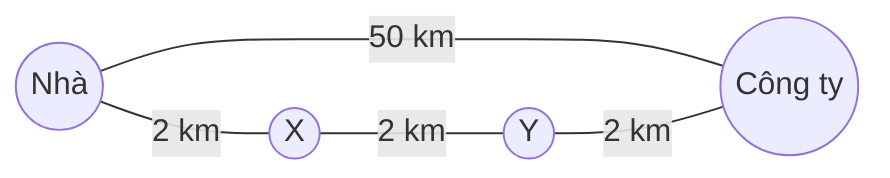

- BFS: `Nhà → Công ty` (1 cạnh) — "ngắn nhất" theo số cạnh, nhưng **50 km**.
- Thực tế: `Nhà → X → Y → Công ty` = **6 km**.

### 1.2 Các biến thể của bài toán

| Biến thể | Câu hỏi | Thuật toán tiêu biểu |
|---|---|---|
| **Một nguồn (single-source)** | Từ A đến **mọi** đỉnh khác | Dijkstra (trọng số ≥ 0), Bellman-Ford (có cạnh âm) |
| **Một cặp (single-pair)** | Từ A đến B | Dijkstra dừng sớm, **A\*** |
| **Mọi cặp (all-pairs)** | Giữa **mọi** cặp đỉnh | Floyd-Warshall, hoặc chạy Dijkstra V lần |
| **Trọng số chỉ 0 / 1** | Như trên | **0-1 BFS** |
| **Không trọng số** | Như trên | BFS (Bài 11) |

### 1.3 Khái niệm cốt lõi: nới lỏng cạnh (relaxation)

Mọi thuật toán đường đi ngắn nhất đều xoay quanh **một thao tác duy nhất**:

```text
relax(u, v, w):
    if dist[u] + w < dist[v]:      # đi qua u rồi sang v thì rẻ hơn cách tốt nhất đang biết?
        dist[v] = dist[u] + w      # cập nhật "kỷ lục" mới
        parent[v] = u              # ghi nhớ để dựng lại đường đi
```

Hình dung: `dist[v]` là **giá vé rẻ nhất bạn đang biết** để đến `v`. Mỗi khi phát hiện "đi qua `u` rồi bắt chuyến `u → v` rẻ hơn" → cập nhật. Ban đầu mọi `dist = ∞` trừ `dist[nguồn] = 0`.

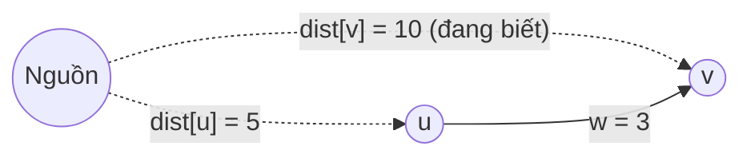

`5 + 3 = 8 < 10` → **relax thành công**: `dist[v] = 8`, `parent[v] = u`.

Các thuật toán khác nhau **chỉ ở thứ tự relax các cạnh**:

- **Dijkstra**: relax theo thứ tự đỉnh gần nguồn nhất trước (dùng heap) — mỗi cạnh relax 1 lần.
- **Bellman-Ford**: relax **mọi cạnh**, lặp `V − 1` lần — "trâu bò" nhưng chịu được cạnh âm.
- **Floyd-Warshall**: relax qua từng đỉnh trung gian `k`.

---

## 📖 2. Dijkstra — "ngọn lửa lan theo dây cháy" 🔥

### 2.1 Trực giác

Tưởng tượng mỗi cạnh là một **sợi dây cháy chậm** có độ dài bằng trọng số. Châm lửa ở nguồn A lúc 0 giờ. Lửa lan dọc mọi sợi dây với cùng tốc độ. **Thời điểm lửa chạm tới một đỉnh lần đầu chính là khoảng cách ngắn nhất** tới đỉnh đó.

Dijkstra mô phỏng đúng điều đó: luôn "đốt" đỉnh **gần nguồn nhất trong số chưa bị đốt** (lấy ra từ **min-heap**), rồi relax các cạnh đi ra từ nó.

### 2.2 Đồ thị ví dụ (dùng cho Dijkstra, Kruskal, Prim)

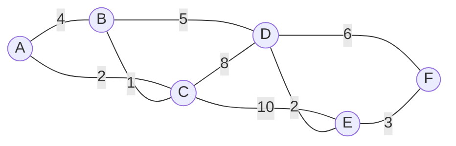

Cạnh (vô hướng): `A-B:4, A-C:2, B-C:1, B-D:5, C-D:8, C-E:10, D-E:2, D-F:6, E-F:3`.

### 2.3 Thuật toán

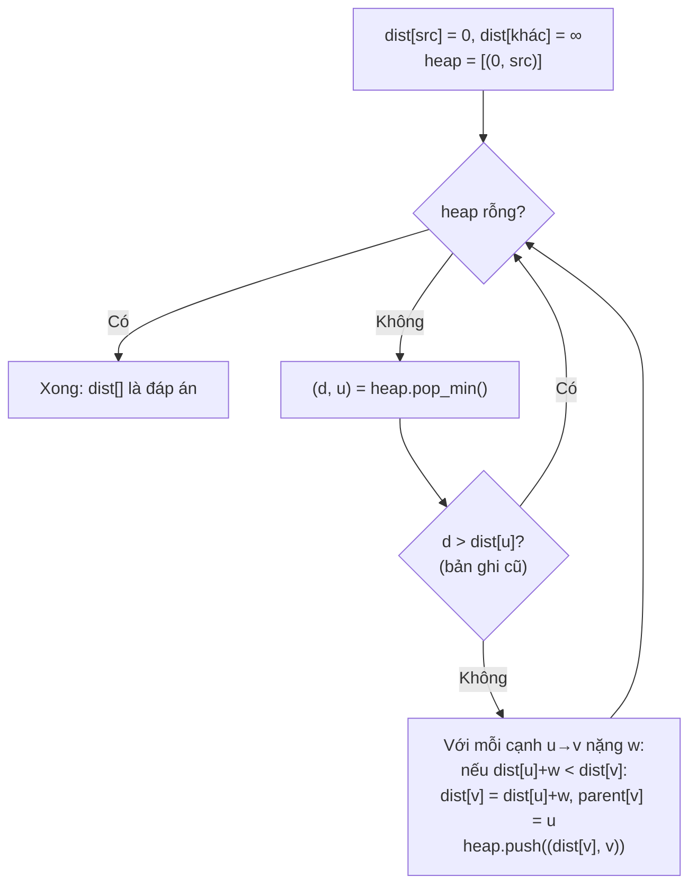

!!! tip "Lazy deletion — \"bản ghi cũ\""
    Heap chuẩn (Go `container/heap`, Python `heapq`) không có thao tác "giảm khoá" (decrease-key). Cách thực tế: khi `dist[v]` giảm, **cứ push bản ghi mới** `(dist mới, v)`. Bản ghi cũ vẫn nằm trong heap; khi pop ra thấy `d > dist[v]` thì **bỏ qua**. Heap có thể chứa tới `O(E)` phần tử — không sao, `log E ≤ 2 log V`.

### 2.4 Trace từng bước (nguồn A)

| Bước | Pop `(d, u)` | Relax | dist A | B | C | D | E | F |
|---|---|---|---|---|---|---|---|---|
| 0 | — | khởi tạo | **0** | ∞ | ∞ | ∞ | ∞ | ∞ |
| 1 | (0, A) | B=4, C=2 | **0** | 4 | 2 | ∞ | ∞ | ∞ |
| 2 | (2, C) | B: 2+1=**3** < 4 ✓, D=10, E=12 | 0 | 3 | **2** | 10 | 12 | ∞ |
| 3 | (3, B) | D: 3+5=**8** < 10 ✓ | 0 | **3** | 2 | 8 | 12 | ∞ |
| 4 | (4, B) | bản ghi cũ (4 > 3) → **bỏ qua** | | | | | | |
| 5 | (8, D) | E: 8+2=**10** < 12 ✓, F=14 | 0 | 3 | 2 | **8** | 10 | 14 |
| 6 | (10, D) | bản ghi cũ → bỏ qua | | | | | | |
| 7 | (10, E) | F: 10+3=**13** < 14 ✓ | 0 | 3 | 2 | 8 | **10** | 13 |
| 8 | (12, E) | bản ghi cũ → bỏ qua | | | | | | |
| 9 | (13, F) | — | 0 | 3 | 2 | 8 | 10 | **13** |
| 10 | (14, F) | bản ghi cũ → bỏ qua | | | | | | |

Kết quả: `A=0, B=3, C=2, D=8, E=10, F=13`. Đường tới F: **A → C → B → D → E → F** (2+1+5+2+3 = 13).

Để ý bước 2: ban đầu tưởng `B = 4` (đi thẳng), nhưng đi vòng qua C chỉ tốn 3 — relax đã "sửa sai".

Bấm ▶ và theo dõi bảng khoảng cách: mỗi bước, đỉnh có khoảng cách nhỏ nhất chưa chốt được tô đậm, rồi các cạnh đi ra từ nó được relax — so với bảng trace ở trên:

<div class="algo-viz" data-viz="graph" data-algo="dijkstra" data-nodes="A,B,C,D,E,F" data-edges="A-B:4,A-C:2,B-C:1,B-D:5,C-D:8,C-E:10,D-E:2,D-F:6,E-F:3" data-start="A" data-title="Dijkstra từ A"></div>

### 2.5 Code Dijkstra + dựng lại đường đi

=== "Go"

    ```go
    package main

    import (
    	"container/heap"
    	"fmt"
    	"math"
    	"slices"
    	"strings"
    )

    type Edge struct {
    	to string
    	w  int
    }

    // Item trong heap: (khoảng cách, đỉnh)
    type Item struct {
    	d int
    	v string
    }
    type MinHeap []Item

    func (h MinHeap) Len() int { return len(h) }
    func (h MinHeap) Less(i, j int) bool {
    	if h[i].d != h[j].d {
    		return h[i].d < h[j].d
    	}
    	return h[i].v < h[j].v // hoà thì theo tên, cho kết quả ổn định
    }
    func (h MinHeap) Swap(i, j int) { h[i], h[j] = h[j], h[i] }
    func (h *MinHeap) Push(x any)   { *h = append(*h, x.(Item)) }
    func (h *MinHeap) Pop() any {
    	old := *h
    	it := old[len(old)-1]
    	*h = old[:len(old)-1]
    	return it
    }

    func dijkstra(g map[string][]Edge, src string) (map[string]int, map[string]string) {
    	dist := map[string]int{}
    	for u := range g {
    		dist[u] = math.MaxInt
    	}
    	dist[src] = 0
    	parent := map[string]string{}
    	h := &MinHeap{{0, src}}
    	for h.Len() > 0 {
    		cur := heap.Pop(h).(Item)
    		if cur.d > dist[cur.v] {
    			continue // bản ghi cũ (lazy deletion)
    		}
    		for _, e := range g[cur.v] {
    			if nd := cur.d + e.w; nd < dist[e.to] { // relax
    				dist[e.to] = nd
    				parent[e.to] = cur.v
    				heap.Push(h, Item{nd, e.to})
    			}
    		}
    	}
    	return dist, parent
    }

    func pathTo(parent map[string]string, src, dst string) string {
    	p := []string{dst}
    	for p[len(p)-1] != src {
    		p = append(p, parent[p[len(p)-1]])
    	}
    	slices.Reverse(p)
    	return strings.Join(p, " -> ")
    }

    func main() {
    	type E struct {
    		u, v string
    		w    int
    	}
    	edges := []E{
    		{"A", "B", 4}, {"A", "C", 2}, {"B", "C", 1}, {"B", "D", 5}, {"C", "D", 8},
    		{"C", "E", 10}, {"D", "E", 2}, {"D", "F", 6}, {"E", "F", 3},
    	}
    	g := map[string][]Edge{}
    	for _, e := range edges { // vô hướng: thêm 2 chiều
    		g[e.u] = append(g[e.u], Edge{e.v, e.w})
    		g[e.v] = append(g[e.v], Edge{e.u, e.w})
    	}
    	dist, parent := dijkstra(g, "A")
    	for _, v := range []string{"A", "B", "C", "D", "E", "F"} {
    		fmt.Printf("%s: %2d  đường: %s\n", v, dist[v], pathTo(parent, "A", v))
    	}
    }

    // Output:
    // A:  0  đường: A
    // B:  3  đường: A -> C -> B
    // C:  2  đường: A -> C
    // D:  8  đường: A -> C -> B -> D
    // E: 10  đường: A -> C -> B -> D -> E
    // F: 13  đường: A -> C -> B -> D -> E -> F
    ```

=== "Python"

    ```python
    import heapq
    from collections import defaultdict
    from math import inf


    def dijkstra(g, src):
        dist = defaultdict(lambda: inf)
        dist[src] = 0
        parent = {}
        heap = [(0, src)]
        while heap:
            d, u = heapq.heappop(heap)
            if d > dist[u]:
                continue  # bản ghi cũ (lazy deletion)
            for v, w in g[u]:
                if d + w < dist[v]:  # relax
                    dist[v] = d + w
                    parent[v] = u
                    heapq.heappush(heap, (dist[v], v))
        return dist, parent


    def path_to(parent, src, dst):
        p = [dst]
        while p[-1] != src:
            p.append(parent[p[-1]])
        return " -> ".join(reversed(p))


    edges = [("A", "B", 4), ("A", "C", 2), ("B", "C", 1), ("B", "D", 5), ("C", "D", 8),
             ("C", "E", 10), ("D", "E", 2), ("D", "F", 6), ("E", "F", 3)]
    g = defaultdict(list)
    for u, v, w in edges:  # vô hướng: thêm 2 chiều
        g[u].append((v, w))
        g[v].append((u, w))

    dist, parent = dijkstra(g, "A")
    for v in "ABCDEF":
        print(f"{v}: {dist[v]:2d}  đường: {path_to(parent, 'A', v)}")

    # Output:
    # A:  0  đường: A
    # B:  3  đường: A -> C -> B
    # C:  2  đường: A -> C
    # D:  8  đường: A -> C -> B -> D
    # E: 10  đường: A -> C -> B -> D -> E
    # F: 13  đường: A -> C -> B -> D -> E -> F
    ```

**Cây đường đi ngắn nhất (shortest-path tree)** — hợp của mọi cạnh `parent[v] → v`:

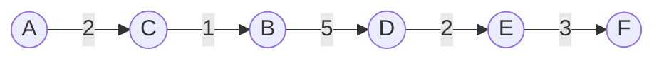

### 2.6 Độ phức tạp

| Cài đặt | Thời gian | Ghi chú |
|---|---|---|
| Binary heap (lazy deletion) | **`O((V + E) log V)`** | Chuẩn cho phỏng vấn và thực tế |
| Mảng, tìm min tuyến tính | `O(V²)` | Tốt hơn khi đồ thị **rất dày** (`E ≈ V²`) |
| Fibonacci heap | `O(E + V log V)` | Lý thuyết, hiếm dùng thực tế |

Bộ nhớ `O(V + E)`.

### 2.7 Vì sao Dijkstra đúng? (trực giác chứng minh)

**Khẳng định**: khi một đỉnh `u` được pop ra (bản ghi hợp lệ) với khoảng cách `d`, thì `d` **chính là khoảng cách ngắn nhất** — không bao giờ cần sửa nữa ("chốt").

**Lý do**: giả sử có một đường khác ngắn hơn tới `u`. Đường đó xuất phát từ vùng đã chốt, nên phải **rời vùng đã chốt** tại một cạnh `x → y` nào đó (y chưa chốt). Khi đó:

```text
độ dài đường "ngắn hơn"  ≥  dist[x] + w(x,y)   (vì các cạnh còn lại đều ≥ 0)
                         ≥  dist[y]            (y đã được relax từ x)
                         ≥  d                  (heap chọn u vì d nhỏ nhất, nên d ≤ dist[y])
```

Mâu thuẫn — đường "ngắn hơn" không ngắn hơn chút nào. Mấu chốt nằm ở chữ **"các cạnh còn lại đều ≥ 0"**: đi thêm thì **không bao giờ rẻ đi**.

### 2.8 Vì sao cấm cạnh âm?

Nếu có cạnh âm, "đi thêm" có thể **rẻ đi** → lập luận trên sụp đổ.

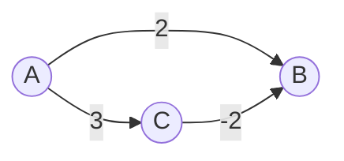

- Dijkstra pop A, relax: `B = 2`, `C = 3`.
- Pop B (2 < 3) → **chốt B = 2**, và mọi đỉnh phía sau B được tính dựa trên con số 2 này.
- Pop C, xét `C → B`: `3 + (−2) = 1 < 2` — nhưng B **đã chốt**, Dijkstra chuẩn (có tập "đã chốt") không sửa nữa → **sai**.
- Đáp án đúng: `B = 1` qua `A → C → B`.

Bản "lazy" ở mục 2.5 không có tập "đã chốt" nên tình cờ vẫn sửa được B, nhưng khi đó một đỉnh có thể bị xử lý **rất nhiều lần** (tệ nhất là thời gian **mũ**) — nó không còn là Dijkstra với đảm bảo `O((V+E) log V)` nữa, và gặp chu trình âm thì lặp vô hạn.

!!! warning "Có cạnh âm → dùng Bellman-Ford"
    Ví dụ đời thực của cạnh âm: **hoàn tiền / cashback** khi đi một chặng, **lãi** trong giao dịch tài chính (arbitrage). Đường đi (bản đồ, mạng) thì hầu như luôn ≥ 0 → Dijkstra là lựa chọn mặc định.

---

## 📖 3. Bellman-Ford — chậm mà chắc, chịu được cạnh âm

### 3.1 Trực giác

Đường đi ngắn nhất (không có chu trình âm) có **tối đa `V − 1` cạnh** (đi quá thì phải lặp đỉnh = có chu trình, mà chu trình không âm thì bỏ đi chỉ tốt hơn).

Bellman-Ford: **relax toàn bộ cạnh, lặp lại `V − 1` vòng**.

- Sau vòng 1: đúng cho mọi đỉnh có đường ngắn nhất dùng ≤ 1 cạnh.
- Sau vòng 2: đúng cho mọi đường ≤ 2 cạnh.
- ...
- Sau vòng `V − 1`: đúng cho tất cả.

Hình dung: tin tức "giá vé rẻ" lan truyền qua mạng lưới đại lý — mỗi vòng, mỗi đại lý hỏi các đại lý kề "bạn bán vé đến X giá bao nhiêu?". Sau đủ số vòng, mọi người biết giá rẻ nhất.

### 3.2 Phát hiện chu trình âm

Sau `V − 1` vòng, **chạy thêm vòng thứ V**. Nếu **vẫn còn relax được** → tồn tại **chu trình âm** (đi vòng mãi thì chi phí → −∞, "đường ngắn nhất" không xác định).

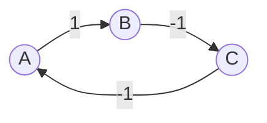

Chu trình `A → B → C → A` có tổng `1 − 1 − 1 = −1` < 0: mỗi vòng đi qua lại "lời" thêm 1.

### 3.3 Đồ thị ví dụ (có hướng, có cạnh âm, không có chu trình âm)

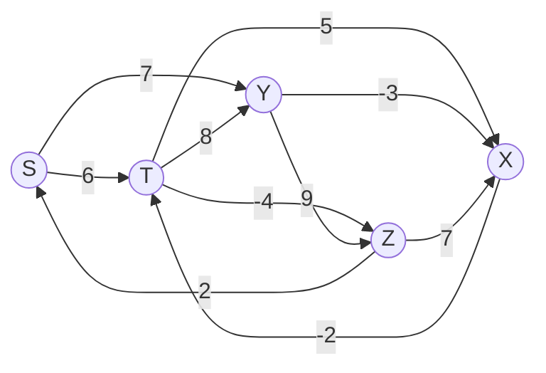

Thứ tự cạnh relax mỗi vòng: `S→T:6, S→Y:7, T→X:5, T→Y:8, T→Z:-4, X→T:-2, Y→X:-3, Y→Z:9, Z→X:7, Z→S:2`.

| Sau vòng | S | T | X | Y | Z | Cập nhật trong vòng |
|---|---|---|---|---|---|---|
| 0 | 0 | ∞ | ∞ | ∞ | ∞ | |
| 1 | 0 | 6 | 4 | 7 | 2 | T=6, Y=7 (từ S); X=11, Z=2 (từ T); X: 11→**4** (từ Y) |
| 2 | 0 | **2** | 4 | 7 | 2 | T: 6→2 (từ X: 4−2) |
| 3 | 0 | 2 | 4 | 7 | **−2** | Z: 2→−2 (từ T: 2−4) |
| 4 | 0 | 2 | 4 | 7 | −2 | không đổi → **dừng sớm** |

Kết quả: `S=0, T=2, X=4, Y=7, Z=−2`. Đường tới Z: `S → Y → X → T → Z` = 7 − 3 − 2 − 4 = −2.

Bấm ▶ và để ý mỗi vòng lặp quét qua **toàn bộ** cạnh; khoảng cách của T và Z còn tiếp tục giảm ở vòng 2 và 3 nhờ các cạnh âm:

<div class="algo-viz" data-viz="graph" data-algo="bellman-ford" data-nodes="S,T,X,Y,Z" data-edges="S-T:6,S-Y:7,T-X:5,T-Y:8,T-Z:-4,X-T:-2,Y-X:-3,Y-Z:9,Z-X:7,Z-S:2" data-directed="true" data-start="S" data-title="Bellman-Ford từ S (có cạnh âm)"></div>

### 3.4 Code

=== "Go"

    ```go
    package main

    import (
    	"fmt"
    	"math"
    )

    type Edge struct {
    	u, v, w int
    }

    // Trả về dist và hasNegCycle.
    func bellmanFord(n int, edges []Edge, src int) ([]int, bool) {
    	const inf = math.MaxInt / 2 // chia 2 để inf + w không tràn số
    	dist := make([]int, n)
    	for i := range dist {
    		dist[i] = inf
    	}
    	dist[src] = 0
    	for round := 1; round <= n-1; round++ {
    		changed := false
    		for _, e := range edges {
    			if dist[e.u] != inf && dist[e.u]+e.w < dist[e.v] {
    				dist[e.v] = dist[e.u] + e.w
    				changed = true
    			}
    		}
    		if !changed {
    			break // tối ưu: không đổi gì → đã hội tụ
    		}
    	}
    	// Vòng thứ V: còn relax được → chu trình âm
    	for _, e := range edges {
    		if dist[e.u] != inf && dist[e.u]+e.w < dist[e.v] {
    			return dist, true
    		}
    	}
    	return dist, false
    }

    func main() {
    	names := []string{"S", "T", "X", "Y", "Z"}
    	const S, T, X, Y, Z = 0, 1, 2, 3, 4
    	edges := []Edge{
    		{S, T, 6}, {S, Y, 7}, {T, X, 5}, {T, Y, 8}, {T, Z, -4},
    		{X, T, -2}, {Y, X, -3}, {Y, Z, 9}, {Z, X, 7}, {Z, S, 2},
    	}
    	dist, neg := bellmanFord(5, edges, S)
    	for i, d := range dist {
    		fmt.Printf("%s=%d ", names[i], d)
    	}
    	fmt.Println("| chu trình âm:", neg)

    	// A -> B -> C -> A tổng = -1
    	_, neg = bellmanFord(3, []Edge{{0, 1, 1}, {1, 2, -1}, {2, 0, -1}}, 0)
    	fmt.Println("Đồ thị 2 có chu trình âm:", neg)
    }

    // Output:
    // S=0 T=2 X=4 Y=7 Z=-2 | chu trình âm: false
    // Đồ thị 2 có chu trình âm: true
    ```

=== "Python"

    ```python
    from math import inf


    def bellman_ford(n, edges, src):
        dist = [inf] * n
        dist[src] = 0
        for _ in range(n - 1):
            changed = False
            for u, v, w in edges:
                if dist[u] + w < dist[v]:  # inf + w vẫn là inf trong Python
                    dist[v] = dist[u] + w
                    changed = True
            if not changed:
                break  # đã hội tụ
        # Vòng thứ V: còn relax được → chu trình âm
        has_neg = any(dist[u] + w < dist[v] for u, v, w in edges)
        return dist, has_neg


    names = "STXYZ"
    S, T, X, Y, Z = range(5)
    edges = [(S, T, 6), (S, Y, 7), (T, X, 5), (T, Y, 8), (T, Z, -4),
             (X, T, -2), (Y, X, -3), (Y, Z, 9), (Z, X, 7), (Z, S, 2)]
    dist, neg = bellman_ford(5, edges, S)
    print(" ".join(f"{names[i]}={d}" for i, d in enumerate(dist)), "| chu trình âm:", neg)

    _, neg = bellman_ford(3, [(0, 1, 1), (1, 2, -1), (2, 0, -1)], 0)
    print("Đồ thị 2 có chu trình âm:", neg)

    # Output:
    # S=0 T=2 X=4 Y=7 Z=-2 | chu trình âm: False
    # Đồ thị 2 có chu trình âm: True
    ```

**Độ phức tạp**: `O(V · E)` thời gian, `O(V)` bộ nhớ. Chậm hơn Dijkstra nhiều, nhưng:

- Chịu được **cạnh âm**, phát hiện **chu trình âm**.
- Chỉ cần **danh sách cạnh** — cực dễ cài.
- Dễ biến thể "**tối đa K cạnh**" (xem mục 10: vé máy bay ≤ K điểm dừng).
- Chạy **phân tán** được: mỗi router chỉ cần biết hàng xóm → nền tảng của giao thức định tuyến **RIP** (distance-vector).

!!! tip "SPFA"
    **SPFA** (Shortest Path Faster Algorithm) là Bellman-Ford dùng queue: chỉ relax cạnh đi ra từ đỉnh **vừa được cập nhật**. Trung bình nhanh, nhưng trường hợp xấu vẫn `O(V·E)`.

---

## 📖 4. Floyd-Warshall — mọi cặp đỉnh

### 4.1 Trực giác: "thử cho phép trung chuyển qua từng thành phố"

Bạn có bảng giá vé **bay thẳng** giữa 4 thành phố. Câu hỏi: giá rẻ nhất giữa **mọi cặp** nếu được **trung chuyển**?

- Bước `k = 1`: cho phép trung chuyển **qua thành phố 1**. Cặp `(i, j)` nào mà `i → 1 → j` rẻ hơn thì cập nhật.
- Bước `k = 2`: cho phép trung chuyển qua **1 và 2**...
- Sau bước `k = V`: được trung chuyển qua mọi nơi → đáp án.

Đây chính là **quy hoạch động** (Bài 14):

```text
dist_k[i][j] = min( dist_{k-1}[i][j],                       # không đi qua k
                    dist_{k-1}[i][k] + dist_{k-1}[k][j] )   # đi qua k
```

Vì hàng `k` và cột `k` không đổi trong bước `k`, ta cập nhật **tại chỗ** trên một ma trận duy nhất.

### 4.2 Ví dụ

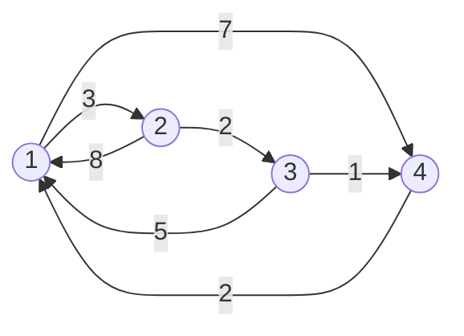

Bảng DP qua từng bước (∞ = không có đường; **đậm** = ô vừa được cải thiện):

```text
Ban đầu (bay thẳng)      k = 1 (qua 1)            k = 2 (qua 1, 2)
     1  2  3  4               1  2  3  4               1  2  3  4
1 [  0  3  ∞  7 ]        1 [  0  3  ∞  7 ]        1 [  0  3 *5  7 ]
2 [  8  0  2  ∞ ]        2 [  8  0  2 *15]        2 [  8  0  2  15]
3 [  5  ∞  0  1 ]        3 [  5 *8  0  1 ]        3 [  5  8  0  1 ]
4 [  2  ∞  ∞  0 ]        4 [  2 *5  ∞  0 ]        4 [  2  5 *7  0 ]

k = 3 (qua 1, 2, 3)      k = 4 (qua tất cả) = ĐÁP ÁN
     1  2  3  4               1  2  3  4
1 [  0  3  5 *6 ]        1 [  0  3  5  6 ]
2 [ *7  0  2 *3 ]        2 [ *5  0  2  3 ]
3 [  5  8  0  1 ]        3 [ *3 *6  0  1 ]
4 [  2  5  7  0 ]        4 [  2  5  7  0 ]
(* = vừa được cải thiện ở bước đó)
```

Ví dụ đọc bảng: ở `k = 4`, ô `[2][1]` giảm từ 7 xuống 5 vì `2 → 3 → 4 → 1` = 2 + 1 + 2 = 5 (đi qua 4).

### 4.3 Code

=== "Go"

    ```go
    package main

    import "fmt"

    const inf = 1 << 30

    func floydWarshall(n int, edges [][3]int) [][]int {
    	d := make([][]int, n)
    	for i := range d {
    		d[i] = make([]int, n)
    		for j := range d[i] {
    			if i != j {
    				d[i][j] = inf
    			}
    		}
    	}
    	for _, e := range edges {
    		d[e[0]][e[1]] = min(d[e[0]][e[1]], e[2])
    	}
    	for k := 0; k < n; k++ { // k PHẢI là vòng ngoài cùng!
    		for i := 0; i < n; i++ {
    			for j := 0; j < n; j++ {
    				if d[i][k]+d[k][j] < d[i][j] {
    					d[i][j] = d[i][k] + d[k][j]
    				}
    			}
    		}
    	}
    	return d
    }

    func main() {
    	// Đỉnh 1..4 trong hình được đánh số 0..3
    	edges := [][3]int{{0, 1, 3}, {0, 3, 7}, {1, 0, 8}, {1, 2, 2}, {2, 0, 5}, {2, 3, 1}, {3, 0, 2}}
    	d := floydWarshall(4, edges)
    	for _, row := range d {
    		fmt.Println(row)
    	}
    	// Phát hiện chu trình âm: có d[i][i] < 0
    }

    // Output:
    // [0 3 5 6]
    // [5 0 2 3]
    // [3 6 0 1]
    // [2 5 7 0]
    ```

=== "Python"

    ```python
    from math import inf


    def floyd_warshall(n, edges):
        d = [[0 if i == j else inf for j in range(n)] for i in range(n)]
        for u, v, w in edges:
            d[u][v] = min(d[u][v], w)
        for k in range(n):  # k PHẢI là vòng ngoài cùng!
            for i in range(n):
                for j in range(n):
                    if d[i][k] + d[k][j] < d[i][j]:
                        d[i][j] = d[i][k] + d[k][j]
        return d


    edges = [(0, 1, 3), (0, 3, 7), (1, 0, 8), (1, 2, 2), (2, 0, 5), (2, 3, 1), (3, 0, 2)]
    for row in floyd_warshall(4, edges):
        print(row)
    # Phát hiện chu trình âm: có d[i][i] < 0

    # Output:
    # [0, 3, 5, 6]
    # [5, 0, 2, 3]
    # [3, 6, 0, 1]
    # [2, 5, 7, 0]
    ```

**Độ phức tạp**: `O(V³)` thời gian, `O(V²)` bộ nhớ. Hợp với `V ≤ ~400`. Code chỉ 3 vòng for — cực khó viết sai, trừ một lỗi:

!!! warning "Thứ tự vòng lặp"
    Vòng `k` (đỉnh trung gian) **phải ở ngoài cùng**. Đặt `k` ở trong (`i, j, k`) là sai — lúc tính `d[i][j]`, các ô `d[i][k]`, `d[k][j]` chưa được tối ưu đầy đủ.

!!! tip "Khi nào dùng Floyd thay vì chạy Dijkstra V lần?"
    - Floyd: `O(V³)`, code 5 dòng, chịu cạnh âm (không chu trình âm), hợp đồ thị **dày**, V nhỏ.
    - Dijkstra × V: `O(V · (V+E) log V)`, nhanh hơn trên đồ thị **thưa** lớn, nhưng không chịu cạnh âm.
    - Bài "tìm thành phố có ít hàng xóm trong bán kính X nhất" (LC 1334) → Floyd là chuẩn.

---

## 📖 5. 0-1 BFS — khi trọng số chỉ là 0 hoặc 1

### 5.1 Trực giác

Nhiều bài có cạnh chỉ nặng **0 hoặc 1**: "đi thẳng miễn phí, rẽ tốn 1 lượt", "đi trên đường miễn phí, phá 1 bức tường tốn 1". Dijkstra chạy được, nhưng có cách nhanh hơn: dùng **deque** (hàng đợi hai đầu).

- Cạnh nặng **0** → đỉnh mới **cùng khoảng cách** → đẩy vào **đầu** deque (xử lý ngay, như "chen hàng hợp lệ").
- Cạnh nặng **1** → khoảng cách +1 → đẩy vào **cuối** deque (như BFS thường).

Deque khi đó luôn có dạng `[các đỉnh khoảng cách d..., các đỉnh khoảng cách d+1...]` — đúng bất biến của BFS/Dijkstra, nhưng mỗi thao tác chỉ `O(1)` thay vì `O(log V)`.

### 5.2 Ví dụ: phá ít tường nhất

> Lưới `.` = đường, `#` = tường. Đi 4 hướng từ góc trên-trái tới góc dưới-phải. Bước vào ô `#` tốn **1 lần phá tường**, bước vào `.` miễn phí. Phá ít nhất bao nhiêu tường?

```text
. . # . .
# # # . #
. . . # .
. # . # .
. . . # .
```

=== "Go"

    ```go
    package main

    import "fmt"

    func minWallsToBreak(grid []string) int {
    	rows, cols := len(grid), len(grid[0])
    	const inf = 1 << 30
    	dist := make([][]int, rows)
    	for i := range dist {
    		dist[i] = make([]int, cols)
    		for j := range dist[i] {
    			dist[i][j] = inf
    		}
    	}
    	type cell struct{ r, c int }
    	// Deque đơn giản bằng 2 slice: front (đảo ngược) + back
    	front, back := []cell{}, []cell{{0, 0}}
    	dist[0][0] = 0
    	pop := func() cell {
    		if len(front) > 0 {
    			x := front[len(front)-1]
    			front = front[:len(front)-1]
    			return x
    		}
    		x := back[0]
    		back = back[1:]
    		return x
    	}
    	dirs := []cell{{1, 0}, {-1, 0}, {0, 1}, {0, -1}}
    	for len(front)+len(back) > 0 {
    		u := pop()
    		for _, d := range dirs {
    			r, c := u.r+d.r, u.c+d.c
    			if r < 0 || r >= rows || c < 0 || c >= cols {
    				continue
    			}
    			w := 0
    			if grid[r][c] == '#' {
    				w = 1
    			}
    			if dist[u.r][u.c]+w < dist[r][c] {
    				dist[r][c] = dist[u.r][u.c] + w
    				if w == 0 {
    					front = append(front, cell{r, c}) // đẩy vào ĐẦU
    				} else {
    					back = append(back, cell{r, c}) // đẩy vào CUỐI
    				}
    			}
    		}
    	}
    	return dist[rows-1][cols-1]
    }

    func main() {
    	grid := []string{
    		"..#..",
    		"###.#",
    		"...#.",
    		".#.#.",
    		"...#.",
    	}
    	fmt.Println("Số tường ít nhất phải phá:", minWallsToBreak(grid))
    }

    // Output:
    // Số tường ít nhất phải phá: 2
    ```

=== "Python"

    ```python
    from collections import deque


    def min_walls_to_break(grid):
        rows, cols = len(grid), len(grid[0])
        INF = float("inf")
        dist = [[INF] * cols for _ in range(rows)]
        dist[0][0] = 0
        dq = deque([(0, 0)])
        while dq:
            r, c = dq.popleft()
            for dr, dc in ((1, 0), (-1, 0), (0, 1), (0, -1)):
                nr, nc = r + dr, c + dc
                if not (0 <= nr < rows and 0 <= nc < cols):
                    continue
                w = 1 if grid[nr][nc] == "#" else 0
                if dist[r][c] + w < dist[nr][nc]:
                    dist[nr][nc] = dist[r][c] + w
                    if w == 0:
                        dq.appendleft((nr, nc))  # đẩy vào ĐẦU
                    else:
                        dq.append((nr, nc))      # đẩy vào CUỐI
        return dist[rows - 1][cols - 1]


    grid = [
        "..#..",
        "###.#",
        "...#.",
        ".#.#.",
        "...#.",
    ]
    print("Số tường ít nhất phải phá:", min_walls_to_break(grid))

    # Output:
    # Số tường ít nhất phải phá: 2
    ```

Một đường phá 2 tường: `(0,0) → (0,1) → phá (1,1) → (2,1) → (2,2) → phá (2,3) → (2,4) → (3,4) → (4,4)`.

**Độ phức tạp**: `O(V + E)` — nhanh như BFS. Bài luyện: **Minimum Cost to Make at Least One Valid Path in a Grid** (LC 1368), **Minimum Obstacle Removal** (LC 2290).

---

## 📖 6. A* — Dijkstra "có la bàn" 🧭

### 6.1 Trực giác

Dijkstra loang **đều mọi hướng** như vết dầu — kể cả hướng **ngược với đích**. Nếu bạn đi từ Hà Nội vào TP.HCM, Dijkstra sẽ phí công khám phá cả đường lên Lạng Sơn!

A* thêm một **la bàn**: hàm **heuristic `h(v)`** = **ước lượng** khoảng cách còn lại từ `v` tới đích. Thay vì chọn đỉnh có `g(v)` nhỏ nhất (quãng đã đi), A* chọn đỉnh có

```text
f(v) = g(v) + h(v)
       ↑        ↑
   đã đi     ước lượng còn lại
```

nhỏ nhất — tức là ưu tiên đỉnh **"hứa hẹn nhất"** cho toàn bộ hành trình.

### 6.2 Chọn heuristic

| Heuristic | Công thức | Dùng khi |
|---|---|---|
| **Manhattan** | `|dx| + |dy|` | Lưới đi 4 hướng |
| **Chebyshev** | `max(|dx|, |dy|)` | Lưới đi 8 hướng, chéo tốn 1 |
| **Euclid** | `√(dx² + dy²)` | Di chuyển tự do, bản đồ thật (đường chim bay) |
| `h = 0` | — | A* **trở thành Dijkstra** |

!!! warning "Heuristic phải \"lạc quan\" (admissible)"
    `h(v)` **không bao giờ được đánh giá quá** khoảng cách thật còn lại. Đường chim bay luôn ≤ đường bộ → Euclid là admissible trên bản đồ. Nếu `h` đánh giá quá (bi quan), A* có thể trả về đường **không ngắn nhất**. Nếu `h` còn **nhất quán (consistent)**: `h(u) ≤ w(u,v) + h(v)` thì mỗi đỉnh chỉ cần xử lý 1 lần như Dijkstra. Manhattan trên lưới 4 hướng thoả cả hai.

### 6.3 Ví dụ: so sánh số ô phải mở rộng

```text
S . . . . . . . . .
. . . . . . . . . .
. . . . # # # # . .
. . . . . . . # . .
. . . . . . . # . .
. . . . . . . # . G
. . . . . . . . . .
```

=== "Go"

    ```go
    package main

    import (
    	"container/heap"
    	"fmt"
    )

    type P struct{ r, c int }

    type node struct {
    	f, h int
    	p    P
    }
    type PQ []node

    func (q PQ) Len() int { return len(q) }
    func (q PQ) Less(i, j int) bool {
    	a, b := q[i], q[j]
    	if a.f != b.f {
    		return a.f < b.f
    	}
    	if a.h != b.h {
    		return a.h < b.h // hoà f → ưu tiên ô gần đích hơn
    	}
    	if a.p.r != b.p.r {
    		return a.p.r < b.p.r
    	}
    	return a.p.c < b.p.c
    }
    func (q PQ) Swap(i, j int) { q[i], q[j] = q[j], q[i] }
    func (q *PQ) Push(x any)   { *q = append(*q, x.(node)) }
    func (q *PQ) Pop() any {
    	old := *q
    	x := old[len(old)-1]
    	*q = old[:len(old)-1]
    	return x
    }

    func abs(x int) int {
    	if x < 0 {
    		return -x
    	}
    	return x
    }

    // useH = false → h = 0 → chính là Dijkstra
    func astar(grid []string, useH bool) (int, int, map[P]P, P, P) {
    	var s, t P
    	for r := range grid {
    		for c := range grid[r] {
    			switch grid[r][c] {
    			case 'S':
    				s = P{r, c}
    			case 'G':
    				t = P{r, c}
    			}
    		}
    	}
    	h := func(p P) int {
    		if !useH {
    			return 0
    		}
    		return abs(p.r-t.r) + abs(p.c-t.c) // Manhattan
    	}
    	g := map[P]int{s: 0}
    	parent := map[P]P{}
    	closed := map[P]bool{}
    	pq := &PQ{{h(s), h(s), s}}
    	expanded := 0
    	for pq.Len() > 0 {
    		cur := heap.Pop(pq).(node)
    		u := cur.p
    		if closed[u] {
    			continue
    		}
    		closed[u] = true
    		expanded++
    		if u == t {
    			return g[u], expanded, parent, s, t
    		}
    		for _, d := range []P{{1, 0}, {-1, 0}, {0, 1}, {0, -1}} {
    			v := P{u.r + d.r, u.c + d.c}
    			if v.r < 0 || v.r >= len(grid) || v.c < 0 || v.c >= len(grid[0]) || grid[v.r][v.c] == '#' {
    				continue
    			}
    			ng := g[u] + 1
    			if old, ok := g[v]; !ok || ng < old {
    				g[v] = ng
    				parent[v] = u
    				heap.Push(pq, node{ng + h(v), h(v), v})
    			}
    		}
    	}
    	return -1, expanded, nil, s, t
    }

    func main() {
    	grid := []string{
    		"S.........",
    		"..........",
    		"....####..",
    		".......#..",
    		".......#..",
    		".......#.G",
    		"..........",
    	}
    	d1, e1, _, _, _ := astar(grid, false)
    	d2, e2, parent, s, t := astar(grid, true)
    	fmt.Printf("Dijkstra: độ dài %d, mở rộng %d ô\n", d1, e1)
    	fmt.Printf("A*:       độ dài %d, mở rộng %d ô\n", d2, e2)

    	out := make([][]byte, len(grid))
    	for i := range grid {
    		out[i] = []byte(grid[i])
    	}
    	for p := parent[t]; p != s; p = parent[p] {
    		out[p.r][p.c] = '*'
    	}
    	for _, row := range out {
    		fmt.Println(string(row))
    	}
    }

    // Output:
    // Dijkstra: độ dài 14, mở rộng 61 ô
    // A*:       độ dài 14, mở rộng 15 ô
    // S*********
    // .........*
    // ....####.*
    // .......#.*
    // .......#.*
    // .......#.G
    // ..........
    ```

=== "Python"

    ```python
    import heapq


    def astar(grid, use_h):
        for r, row in enumerate(grid):
            for c, ch in enumerate(row):
                if ch == "S":
                    s = (r, c)
                elif ch == "G":
                    t = (r, c)

        def h(p):  # Manhattan; h = 0 → chính là Dijkstra
            return abs(p[0] - t[0]) + abs(p[1] - t[1]) if use_h else 0

        g = {s: 0}
        parent = {}
        closed = set()
        pq = [(h(s), h(s), s)]  # (f, h, ô): hoà f → ưu tiên ô gần đích hơn
        expanded = 0
        while pq:
            _, _, u = heapq.heappop(pq)
            if u in closed:
                continue
            closed.add(u)
            expanded += 1
            if u == t:
                return g[u], expanded, parent, s, t
            for dr, dc in ((1, 0), (-1, 0), (0, 1), (0, -1)):
                v = (u[0] + dr, u[1] + dc)
                if not (0 <= v[0] < len(grid) and 0 <= v[1] < len(grid[0])) or grid[v[0]][v[1]] == "#":
                    continue
                ng = g[u] + 1
                if ng < g.get(v, float("inf")):
                    g[v] = ng
                    parent[v] = u
                    heapq.heappush(pq, (ng + h(v), h(v), v))
        return -1, expanded, None, s, t


    grid = [
        "S.........",
        "..........",
        "....####..",
        ".......#..",
        ".......#..",
        ".......#.G",
        "..........",
    ]
    d1, e1, *_ = astar(grid, False)
    d2, e2, parent, s, t = astar(grid, True)
    print(f"Dijkstra: độ dài {d1}, mở rộng {e1} ô")
    print(f"A*:       độ dài {d2}, mở rộng {e2} ô")

    out = [list(row) for row in grid]
    p = parent[t]
    while p != s:
        out[p[0]][p[1]] = "*"
        p = parent[p]
    print("\n".join("".join(row) for row in out))

    # Output:
    # Dijkstra: độ dài 14, mở rộng 61 ô
    # A*:       độ dài 14, mở rộng 15 ô
    # S*********
    # .........*
    # ....####.*
    # .......#.*
    # .......#.*
    # .......#.G
    # ..........
    ```

Cùng độ dài 14, nhưng A* chỉ mở rộng **khoảng 1/4** số ô. Trên bản đồ thật hàng triệu nút giao, khác biệt là giữa "tức thì" và "đợi vài giây".

**Độ phức tạp**: tệ nhất như Dijkstra `O((V+E) log V)`; thực tế nhanh hơn nhiều khi heuristic tốt.

---

## 📖 7. Bảng so sánh các thuật toán đường đi ngắn nhất

| Thuật toán | Bài toán | Trọng số | Thời gian | Bộ nhớ | Ghi nhớ nhanh |
|---|---|---|---|---|---|
| **BFS** | 1 nguồn | Không trọng số (đều = 1) | `O(V + E)` | `O(V)` | Queue |
| **0-1 BFS** | 1 nguồn | Chỉ 0 hoặc 1 | `O(V + E)` | `O(V)` | Deque: 0 → đầu, 1 → cuối |
| **Dijkstra** | 1 nguồn | **≥ 0** | `O((V+E) log V)` | `O(V + E)` | Min-heap, chốt đỉnh gần nhất |
| **A\*** | 1 cặp | ≥ 0 + có heuristic tốt | ≤ Dijkstra (thực tế nhanh hơn nhiều) | `O(V)` | `f = g + h` |
| **Bellman-Ford** | 1 nguồn | **Âm được**, phát hiện chu trình âm | `O(V · E)` | `O(V)` | Relax mọi cạnh V−1 vòng |
| **Floyd-Warshall** | **Mọi cặp** | Âm được (không chu trình âm) | `O(V³)` | `O(V²)` | 3 vòng for, `k` ngoài cùng |

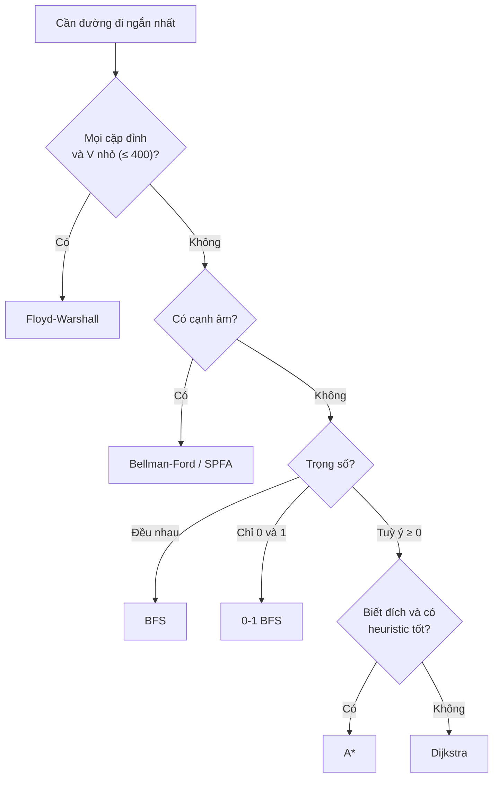

---

## 📖 8. Union-Find (Disjoint Set Union — DSU)

### 8.1 Trực giác: các nhóm và "trưởng nhóm"

Hình dung các **câu lạc bộ** trong trường. Mỗi CLB có một **trưởng nhóm** (đại diện). Hai thao tác:

- **`find(x)`**: "x thuộc CLB nào?" → lần theo "người giới thiệu" cho đến khi gặp trưởng nhóm (người tự trỏ vào chính mình).
- **`union(x, y)`**: "sáp nhập CLB của x và CLB của y" → cho trưởng nhóm này **báo cáo** cho trưởng nhóm kia.

Hai người **cùng CLB** ⇔ `find(x) == find(y)`.

Mỗi nhóm là một **cây**; mảng `parent[x]` lưu "người giới thiệu" của x; gốc cây có `parent[r] = r`.

### 8.2 Hai tối ưu then chốt

**1. Union by rank (hợp theo hạng)**: luôn gắn **cây thấp hơn vào gốc cây cao hơn** — giống sáp nhập công ty nhỏ vào công ty lớn, chứ không đảo lộn cả công ty lớn. Giữ cây luôn "lùn".

**2. Path compression (nén đường)**: khi `find(x)` đi qua một chuỗi `x → a → b → root`, cho **tất cả** trỏ thẳng vào `root`. Lần sau hỏi lại chỉ mất 1 bước. Giống việc sau khi hỏi đường vòng vèo một lần, bạn **lưu số điện thoại trưởng nhóm** luôn.

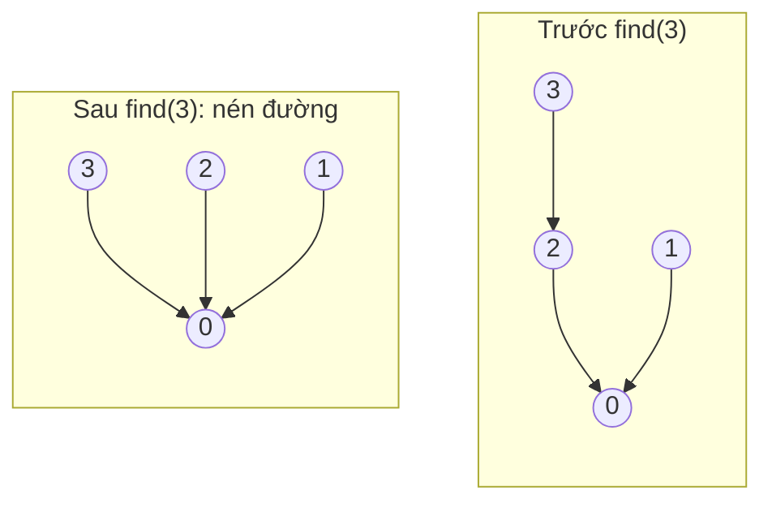

Với cả hai tối ưu, mỗi thao tác tốn **`O(α(n))`** — `α` là hàm Ackermann ngược, **≤ 4 với mọi n thực tế** (kể cả n = số nguyên tử trong vũ trụ). Coi như `O(1)`.

### 8.3 Trace

`n = 6`, các thao tác: `union 0 1, union 2 3, union 4 5, union 1 3, find 3, union 3 5, find 5`.

| Thao tác | Diễn giải | `parent` sau thao tác | Số nhóm |
|---|---|---|---|
| (đầu) | mỗi người một nhóm | `[0 1 2 3 4 5]` | 6 |
| union 0 1 | gốc 0, 1 cùng hạng → 1 trỏ về 0, hạng[0]=1 | `[0 0 2 3 4 5]` | 5 |
| union 2 3 | 3 trỏ về 2, hạng[2]=1 | `[0 0 2 2 4 5]` | 4 |
| union 4 5 | 5 trỏ về 4, hạng[4]=1 | `[0 0 2 2 4 4]` | 3 |
| union 1 3 | find(1)=0, find(3)=2, cùng hạng 1 → 2 trỏ về 0, hạng[0]=2 | `[0 0 0 2 4 4]` | 2 |
| find 3 | 3 → 2 → 0; **nén**: 3 trỏ thẳng về 0 | `[0 0 0 0 4 4]` | 2 |
| union 3 5 | find(3)=0 (hạng 2), find(5)=4 (hạng 1) → 4 trỏ về 0 | `[0 0 0 0 0 4]` | 1 |
| find 5 | 5 → 4 → 0; **nén**: 5 trỏ về 0 | `[0 0 0 0 0 0]` | 1 |

Bấm ▶ và quan sát rừng cây: `union` nối hai gốc, còn `find` làm các nút trên đường đi "nhảy" thẳng lên gốc (path compression):

<div class="algo-viz" data-viz="unionfind" data-algo="ops" data-n="6" data-ops="union 0 1,union 2 3,union 4 5,union 1 3,find 3,union 3 5,find 5" data-title="Union-Find với path compression"></div>

### 8.4 Code

=== "Go"

    ```go
    package main

    import "fmt"

    type DSU struct {
    	parent, rank []int
    	count        int // số nhóm hiện tại
    }

    func NewDSU(n int) *DSU {
    	d := &DSU{parent: make([]int, n), rank: make([]int, n), count: n}
    	for i := range d.parent {
    		d.parent[i] = i // mỗi người tự làm trưởng nhóm
    	}
    	return d
    }

    func (d *DSU) Find(x int) int {
    	if d.parent[x] != x {
    		d.parent[x] = d.Find(d.parent[x]) // path compression
    	}
    	return d.parent[x]
    }

    // Union trả về false nếu x, y đã cùng nhóm (hữu ích để phát hiện chu trình).
    func (d *DSU) Union(x, y int) bool {
    	rx, ry := d.Find(x), d.Find(y)
    	if rx == ry {
    		return false
    	}
    	switch { // union by rank
    	case d.rank[rx] < d.rank[ry]:
    		d.parent[rx] = ry
    	case d.rank[rx] > d.rank[ry]:
    		d.parent[ry] = rx
    	default:
    		d.parent[ry] = rx
    		d.rank[rx]++
    	}
    	d.count--
    	return true
    }

    func main() {
    	d := NewDSU(6)
    	d.Union(0, 1)
    	d.Union(2, 3)
    	d.Union(4, 5)
    	fmt.Println("Sau 3 union:", d.parent, "| nhóm:", d.count)
    	d.Union(1, 3)
    	fmt.Println("find(3) =", d.Find(3), "| parent:", d.parent)
    	d.Union(3, 5)
    	fmt.Println("find(5) =", d.Find(5), "| parent:", d.parent, "| nhóm:", d.count)
    	fmt.Println("0 và 5 cùng nhóm?", d.Find(0) == d.Find(5))
    	fmt.Println("Union(1, 4) lần nữa:", d.Union(1, 4), "(đã cùng nhóm → sẽ tạo chu trình)")
    }

    // Output:
    // Sau 3 union: [0 0 2 2 4 4] | nhóm: 3
    // find(3) = 0 | parent: [0 0 0 0 4 4]
    // find(5) = 0 | parent: [0 0 0 0 0 0] | nhóm: 1
    // 0 và 5 cùng nhóm? true
    // Union(1, 4) lần nữa: false (đã cùng nhóm → sẽ tạo chu trình)
    ```

=== "Python"

    ```python
    class DSU:
        def __init__(self, n):
            self.parent = list(range(n))  # mỗi người tự làm trưởng nhóm
            self.rank = [0] * n
            self.count = n                # số nhóm hiện tại

        def find(self, x):
            # bản lặp + nén đường (tránh giới hạn đệ quy của Python)
            root = x
            while self.parent[root] != root:
                root = self.parent[root]
            while self.parent[x] != root:
                self.parent[x], x = root, self.parent[x]
            return root

        def union(self, x, y):
            rx, ry = self.find(x), self.find(y)
            if rx == ry:
                return False  # đã cùng nhóm
            if self.rank[rx] < self.rank[ry]:  # union by rank
                rx, ry = ry, rx
            self.parent[ry] = rx
            if self.rank[rx] == self.rank[ry]:
                self.rank[rx] += 1
            self.count -= 1
            return True


    d = DSU(6)
    d.union(0, 1)
    d.union(2, 3)
    d.union(4, 5)
    print("Sau 3 union:", d.parent, "| nhóm:", d.count)
    d.union(1, 3)
    print("find(3) =", d.find(3), "| parent:", d.parent)
    d.union(3, 5)
    print("find(5) =", d.find(5), "| parent:", d.parent, "| nhóm:", d.count)
    print("0 và 5 cùng nhóm?", d.find(0) == d.find(5))
    print("Union(1, 4) lần nữa:", d.union(1, 4), "(đã cùng nhóm → sẽ tạo chu trình)")

    # Output:
    # Sau 3 union: [0, 0, 2, 2, 4, 4] | nhóm: 3
    # find(3) = 0 | parent: [0, 0, 0, 0, 4, 4]
    # find(5) = 0 | parent: [0, 0, 0, 0, 0, 0] | nhóm: 1
    # 0 và 5 cùng nhóm? True
    # Union(1, 4) lần nữa: False (đã cùng nhóm → sẽ tạo chu trình)
    ```

| Phiên bản | find / union |
|---|---|
| Ngây thơ (không tối ưu) | `O(n)` tệ nhất (cây thành đường thẳng) |
| Chỉ union by rank | `O(log n)` |
| Chỉ path compression | `O(log n)` trung bình |
| **Cả hai** | **`O(α(n))` ≈ `O(1)`** |

!!! tip "Khi nào nghĩ tới Union-Find?"
    - Câu hỏi dạng **"x và y có cùng nhóm/liên thông không?"** với các cạnh được **thêm dần** (online).
    - Đếm số thành phần liên thông khi thêm cạnh.
    - Phát hiện chu trình khi thêm cạnh vào đồ thị vô hướng.
    - **Kruskal** (ngay dưới đây).
    - Hạn chế: **không hỗ trợ xoá cạnh / tách nhóm** hiệu quả.

---

## 📖 9. Cây khung nhỏ nhất (Minimum Spanning Tree — MST)

### 9.1 Bài toán

> Cho đồ thị vô hướng liên thông có trọng số. Chọn một tập cạnh **nối tất cả các đỉnh** (liên thông), **không có chu trình** (là một cây, đúng `V − 1` cạnh), với **tổng trọng số nhỏ nhất**.

Đời thường: **kéo cáp quang** nối 6 quận sao cho quận nào cũng có mạng, tổng chiều dài cáp **ít nhất**. Không cần kéo trực tiếp giữa mọi cặp — chỉ cần "đi được tới nhau".

!!! warning "MST ≠ cây đường đi ngắn nhất"
    MST tối thiểu **tổng chi phí xây dựng**; cây Dijkstra tối thiểu **khoảng cách từ một nguồn**. Ví dụ tam giác `A-B:2, B-C:2, A-C:3`:

    - MST: `A-B, B-C` (tổng **4**), nhưng từ A đến C phải đi 4.
    - Cây đường ngắn nhất từ A: `A-B, A-C` (tổng 5), từ A đến C chỉ 3.

    Công ty viễn thông muốn **ít cáp nhất** → MST. Người dùng muốn **đến nhanh nhất** → Dijkstra.

### 9.2 Tính chất lát cắt (cut property) — vì sao tham lam đúng?

Chia các đỉnh thành **hai phe bất kỳ** (một "lát cắt"). Trong các cạnh **nối hai phe**, cạnh **nhẹ nhất** chắc chắn **nằm trong một MST nào đó**.

Trực giác: hai làng bên hai bờ sông **bắt buộc** phải có ít nhất một cây cầu nối. Nếu MST dùng một cầu đắt, ta **đổi** nó lấy cầu rẻ nhất — vẫn nối được hai bờ, mà tổng rẻ hơn (hoặc bằng). Đây là lập luận **"trao đổi" (exchange argument)** sẽ gặp lại ở Bài 13 (Greedy).

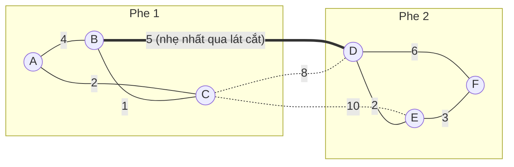

Cạnh qua lát cắt: `B-D:5`, `C-D:8`, `C-E:10` → `B-D:5` là nhẹ nhất → nó thuộc MST.

Cả **Kruskal** và **Prim** đều là ứng dụng lặp đi lặp lại của tính chất này — chỉ khác cách chọn lát cắt.

### 9.3 Kruskal — "chọn cạnh rẻ nhất, miễn không tạo vòng"

1. Sắp xếp mọi cạnh theo trọng số tăng dần.
2. Duyệt từng cạnh `u-v`: nếu `u`, `v` **khác nhóm** (Union-Find) → **chọn** và `union`; nếu cùng nhóm → **bỏ** (sẽ tạo chu trình).
3. Dừng khi đã chọn `V − 1` cạnh.

Dùng **cùng đồ thị với Dijkstra** (mục 2.2):

| # | Cạnh | Trọng số | Cùng nhóm? | Quyết định | Các nhóm sau bước |
|---|---|---|---|---|---|
| 1 | B-C | 1 | không | ✅ chọn | {B,C} {A} {D} {E} {F} |
| 2 | A-C | 2 | không | ✅ chọn | {A,B,C} {D} {E} {F} |
| 3 | D-E | 2 | không | ✅ chọn | {A,B,C} {D,E} {F} |
| 4 | E-F | 3 | không | ✅ chọn | {A,B,C} {D,E,F} |
| 5 | A-B | 4 | **có** (A, B cùng {A,B,C}) | ❌ bỏ — tạo vòng A-B-C | |
| 6 | B-D | 5 | không | ✅ chọn | {A,B,C,D,E,F} — đủ 5 cạnh, **dừng** |

Tổng MST = 1 + 2 + 2 + 3 + 5 = **13**.

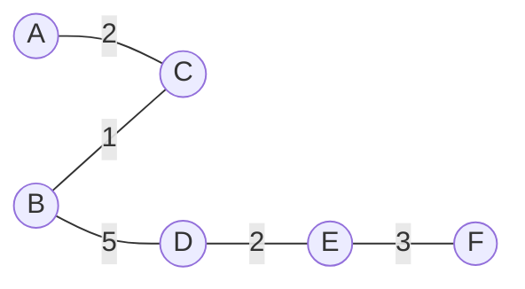

Bấm ▶ và xem các cạnh được xét theo thứ tự trọng số tăng dần: cạnh được chọn tô đậm, cạnh tạo chu trình (A-B) bị gạch bỏ:

<div class="algo-viz" data-viz="graph" data-algo="kruskal" data-nodes="A,B,C,D,E,F" data-edges="A-B:4,A-C:2,B-C:1,B-D:5,C-D:8,C-E:10,D-E:2,D-F:6,E-F:3" data-title="Kruskal"></div>

=== "Go"

    ```go
    package main

    import (
    	"fmt"
    	"sort"
    )

    type Edge struct {
    	u, v string
    	w    int
    }

    // DSU trên map[string]string cho đỉnh là chữ.
    type DSU map[string]string

    func (d DSU) Find(x string) string {
    	if d[x] != x {
    		d[x] = d.Find(d[x])
    	}
    	return d[x]
    }

    func kruskal(nodes []string, edges []Edge) ([]Edge, int) {
    	sort.SliceStable(edges, func(i, j int) bool { return edges[i].w < edges[j].w })
    	d := DSU{}
    	for _, v := range nodes {
    		d[v] = v
    	}
    	mst, total := []Edge{}, 0
    	for _, e := range edges {
    		ru, rv := d.Find(e.u), d.Find(e.v)
    		if ru == rv {
    			fmt.Printf("  bỏ  %s-%s:%d (tạo chu trình)\n", e.u, e.v, e.w)
    			continue
    		}
    		d[ru] = rv // union (bản gọn; có thể thêm union by rank)
    		mst = append(mst, e)
    		total += e.w
    		fmt.Printf("  chọn %s-%s:%d\n", e.u, e.v, e.w)
    		if len(mst) == len(nodes)-1 {
    			break // đủ V-1 cạnh
    		}
    	}
    	return mst, total
    }

    func main() {
    	nodes := []string{"A", "B", "C", "D", "E", "F"}
    	edges := []Edge{
    		{"A", "B", 4}, {"A", "C", 2}, {"B", "C", 1}, {"B", "D", 5}, {"C", "D", 8},
    		{"C", "E", 10}, {"D", "E", 2}, {"D", "F", 6}, {"E", "F", 3},
    	}
    	mst, total := kruskal(nodes, edges)
    	fmt.Println("Số cạnh MST:", len(mst), "| Tổng:", total)
    }

    // Output:
    //   chọn B-C:1
    //   chọn A-C:2
    //   chọn D-E:2
    //   chọn E-F:3
    //   bỏ  A-B:4 (tạo chu trình)
    //   chọn B-D:5
    // Số cạnh MST: 5 | Tổng: 13
    ```

=== "Python"

    ```python
    def kruskal(nodes, edges):
        parent = {v: v for v in nodes}

        def find(x):
            while parent[x] != x:
                parent[x] = parent[parent[x]]  # nén đường kiểu "halving"
                x = parent[x]
            return x

        mst, total = [], 0
        for u, v, w in sorted(edges, key=lambda e: e[2]):  # sorted() ổn định
            ru, rv = find(u), find(v)
            if ru == rv:
                print(f"  bỏ  {u}-{v}:{w} (tạo chu trình)")
                continue
            parent[ru] = rv  # union
            mst.append((u, v, w))
            total += w
            print(f"  chọn {u}-{v}:{w}")
            if len(mst) == len(nodes) - 1:
                break  # đủ V-1 cạnh
        return mst, total


    nodes = "ABCDEF"
    edges = [("A", "B", 4), ("A", "C", 2), ("B", "C", 1), ("B", "D", 5), ("C", "D", 8),
             ("C", "E", 10), ("D", "E", 2), ("D", "F", 6), ("E", "F", 3)]
    mst, total = kruskal(nodes, edges)
    print("Số cạnh MST:", len(mst), "| Tổng:", total)

    # Output:
    #   chọn B-C:1
    #   chọn A-C:2
    #   chọn D-E:2
    #   chọn E-F:3
    #   bỏ  A-B:4 (tạo chu trình)
    #   chọn B-D:5
    # Số cạnh MST: 5 | Tổng: 13
    ```

**Độ phức tạp**: `O(E log E)` — bị chi phối bởi việc **sắp xếp cạnh**; phần Union-Find gần như `O(E)`.

### 9.4 Prim — "lan dần từ một đỉnh, mỗi bước kéo đỉnh gần nhất vào"

Giống Dijkstra, nhưng khoá trong heap là **trọng số cạnh nối vào cây**, không phải tổng quãng đường từ nguồn.

1. Bắt đầu với cây chỉ có đỉnh A. Đưa các cạnh của A vào min-heap.
2. Lặp: pop cạnh nhẹ nhất `(w, u→v)`; nếu `v` đã trong cây → bỏ; nếu chưa → thêm `v` và cạnh vào cây, đẩy các cạnh của `v` vào heap.

| Bước | Cây hiện tại | Cạnh nhẹ nhất đi ra khỏi cây | Thêm |
|---|---|---|---|
| 1 | {A} | A-C:2 (so với A-B:4) | C |
| 2 | {A, C} | C-B:1 (so với A-B:4, C-D:8, C-E:10) | B |
| 3 | {A, B, C} | B-D:5 (so với C-D:8, C-E:10; A-B:4 bỏ vì B đã trong cây) | D |
| 4 | {A, B, C, D} | D-E:2 | E |
| 5 | {A, B, C, D, E} | E-F:3 (so với D-F:6) | F |

Tổng = 2 + 1 + 5 + 2 + 3 = **13** — cùng tập cạnh với Kruskal (ở đồ thị này MST là duy nhất).

Bấm ▶ và để ý cây "lớn dần" từ A: mỗi bước chỉ xét các cạnh **vượt qua ranh giới** giữa cây và phần còn lại — đúng tinh thần cut property:

<div class="algo-viz" data-viz="graph" data-algo="prim" data-nodes="A,B,C,D,E,F" data-edges="A-B:4,A-C:2,B-C:1,B-D:5,C-D:8,C-E:10,D-E:2,D-F:6,E-F:3" data-start="A" data-title="Prim từ A"></div>

=== "Go"

    ```go
    package main

    import (
    	"container/heap"
    	"fmt"
    )

    type Item struct {
    	w        int
    	from, to string
    }
    type MinHeap []Item

    func (h MinHeap) Len() int { return len(h) }
    func (h MinHeap) Less(i, j int) bool {
    	if h[i].w != h[j].w {
    		return h[i].w < h[j].w
    	}
    	return h[i].to < h[j].to
    }
    func (h MinHeap) Swap(i, j int) { h[i], h[j] = h[j], h[i] }
    func (h *MinHeap) Push(x any)   { *h = append(*h, x.(Item)) }
    func (h *MinHeap) Pop() any {
    	old := *h
    	x := old[len(old)-1]
    	*h = old[:len(old)-1]
    	return x
    }

    type Adj struct {
    	to string
    	w  int
    }

    func prim(g map[string][]Adj, start string) int {
    	inTree := map[string]bool{start: true}
    	h := &MinHeap{}
    	for _, e := range g[start] {
    		heap.Push(h, Item{e.w, start, e.to})
    	}
    	total := 0
    	for h.Len() > 0 && len(inTree) < len(g) {
    		it := heap.Pop(h).(Item)
    		if inTree[it.to] {
    			continue // đỉnh đã trong cây → cạnh này tạo chu trình
    		}
    		inTree[it.to] = true
    		total += it.w
    		fmt.Printf("  thêm %s qua cạnh %s-%s:%d\n", it.to, it.from, it.to, it.w)
    		for _, e := range g[it.to] {
    			if !inTree[e.to] {
    				heap.Push(h, Item{e.w, it.to, e.to})
    			}
    		}
    	}
    	return total
    }

    func main() {
    	type E struct {
    		u, v string
    		w    int
    	}
    	edges := []E{
    		{"A", "B", 4}, {"A", "C", 2}, {"B", "C", 1}, {"B", "D", 5}, {"C", "D", 8},
    		{"C", "E", 10}, {"D", "E", 2}, {"D", "F", 6}, {"E", "F", 3},
    	}
    	g := map[string][]Adj{}
    	for _, e := range edges {
    		g[e.u] = append(g[e.u], Adj{e.v, e.w})
    		g[e.v] = append(g[e.v], Adj{e.u, e.w})
    	}
    	fmt.Println("Tổng MST:", prim(g, "A"))
    }

    // Output:
    //   thêm C qua cạnh A-C:2
    //   thêm B qua cạnh C-B:1
    //   thêm D qua cạnh B-D:5
    //   thêm E qua cạnh D-E:2
    //   thêm F qua cạnh E-F:3
    // Tổng MST: 13
    ```

=== "Python"

    ```python
    import heapq
    from collections import defaultdict


    def prim(g, start):
        in_tree = {start}
        heap = [(w, v, start) for v, w in g[start]]  # (trọng số, đỉnh đích, đỉnh nguồn)
        heapq.heapify(heap)
        total = 0
        while heap and len(in_tree) < len(g):
            w, v, u = heapq.heappop(heap)
            if v in in_tree:
                continue  # đỉnh đã trong cây → cạnh này tạo chu trình
            in_tree.add(v)
            total += w
            print(f"  thêm {v} qua cạnh {u}-{v}:{w}")
            for nxt, w2 in g[v]:
                if nxt not in in_tree:
                    heapq.heappush(heap, (w2, nxt, v))
        return total


    edges = [("A", "B", 4), ("A", "C", 2), ("B", "C", 1), ("B", "D", 5), ("C", "D", 8),
             ("C", "E", 10), ("D", "E", 2), ("D", "F", 6), ("E", "F", 3)]
    g = defaultdict(list)
    for u, v, w in edges:
        g[u].append((v, w))
        g[v].append((u, w))
    print("Tổng MST:", prim(g, "A"))

    # Output:
    #   thêm C qua cạnh A-C:2
    #   thêm B qua cạnh C-B:1
    #   thêm D qua cạnh B-D:5
    #   thêm E qua cạnh D-E:2
    #   thêm F qua cạnh E-F:3
    # Tổng MST: 13
    ```

**Độ phức tạp**: `O(E log V)` với binary heap (lazy). Bản dùng mảng `O(V²)` tốt cho đồ thị dày (ví dụ "nối mọi điểm trên mặt phẳng" — LC 1584).

### 9.5 Kruskal hay Prim?

| | Kruskal | Prim |
|---|---|---|
| Tư duy | Toàn cục: cạnh rẻ nhất toàn đồ thị | Cục bộ: mở rộng một cây |
| Cấu trúc | Sắp xếp + **Union-Find** | **Min-heap** (giống Dijkstra) |
| Đầu vào lý tưởng | Danh sách cạnh | Danh sách kề / ma trận |
| Đồ thị | **Thưa** | **Dày** (bản `O(V²)`) |
| Thời gian | `O(E log E)` | `O(E log V)` / `O(V²)` |
| Đồ thị không liên thông | Tự ra **rừng khung** | Chỉ ra cây của 1 thành phần |

---

## 📖 10. Ứng dụng: vé máy bay rẻ nhất với tối đa K điểm dừng (LeetCode 787)

> `n` thành phố, `flights[i] = [from, to, price]`. Tìm giá rẻ nhất từ `src` đến `dst` với **tối đa `k` điểm dừng** (tức tối đa `k + 1` chuyến bay). Không có → `-1`.

Dijkstra thường **sai** ở đây: đường rẻ nhất có thể có quá nhiều điểm dừng, còn đường hợp lệ lại bị "chốt" mất. Nhớ lại Bellman-Ford: **sau vòng `i`, ta có đáp án đúng cho mọi đường dùng ≤ `i` cạnh** → chỉ cần chạy đúng `k + 1` vòng!

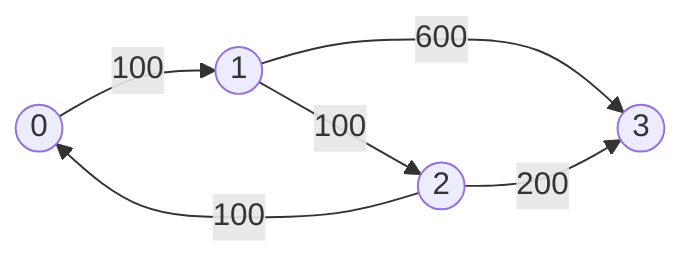

- `k = 1`: `0 → 1 → 3` = **700** (đường `0 → 1 → 2 → 3` = 400 rẻ hơn nhưng có 2 điểm dừng).
- `k = 2`: `0 → 1 → 2 → 3` = **400**.

!!! warning "Phải dùng bản sao `prev` của mảng dist mỗi vòng"
    Nếu relax trực tiếp trên `dist`, trong **cùng một vòng** có thể nối nhiều cạnh liên tiếp (`0→1` rồi ngay `1→2`) → vượt quá số chặng cho phép. Mỗi vòng phải đọc từ `prev` (kết quả vòng trước) và ghi vào `dist`.

=== "Go"

    ```go
    package main

    import (
    	"fmt"
    	"math"
    )

    func findCheapestPrice(n int, flights [][]int, src, dst, k int) int {
    	const inf = math.MaxInt / 2
    	dist := make([]int, n)
    	for i := range dist {
    		dist[i] = inf
    	}
    	dist[src] = 0
    	for round := 0; round <= k; round++ { // k điểm dừng = k+1 chuyến bay
    		prev := make([]int, n)
    		copy(prev, dist) // chỉ đọc kết quả của vòng trước
    		for _, f := range flights {
    			u, v, w := f[0], f[1], f[2]
    			if prev[u] != inf && prev[u]+w < dist[v] {
    				dist[v] = prev[u] + w
    			}
    		}
    	}
    	if dist[dst] == inf {
    		return -1
    	}
    	return dist[dst]
    }

    func main() {
    	flights := [][]int{{0, 1, 100}, {1, 2, 100}, {2, 0, 100}, {1, 3, 600}, {2, 3, 200}}
    	fmt.Println("k=1:", findCheapestPrice(4, flights, 0, 3, 1))
    	fmt.Println("k=2:", findCheapestPrice(4, flights, 0, 3, 2))
    	fmt.Println("k=0:", findCheapestPrice(4, flights, 0, 3, 0))
    }

    // Output:
    // k=1: 700
    // k=2: 400
    // k=0: -1
    ```

=== "Python"

    ```python
    from math import inf


    def find_cheapest_price(n, flights, src, dst, k):
        dist = [inf] * n
        dist[src] = 0
        for _ in range(k + 1):   # k điểm dừng = k+1 chuyến bay
            prev = dist[:]       # chỉ đọc kết quả của vòng trước
            for u, v, w in flights:
                if prev[u] + w < dist[v]:
                    dist[v] = prev[u] + w
        return -1 if dist[dst] == inf else dist[dst]


    flights = [[0, 1, 100], [1, 2, 100], [2, 0, 100], [1, 3, 600], [2, 3, 200]]
    print("k=1:", find_cheapest_price(4, flights, 0, 3, 1))
    print("k=2:", find_cheapest_price(4, flights, 0, 3, 2))
    print("k=0:", find_cheapest_price(4, flights, 0, 3, 0))

    # Output:
    # k=1: 700
    # k=2: 400
    # k=0: -1
    ```

**Độ phức tạp**: `O(k · E)`. Cách khác: Dijkstra/BFS trên **trạng thái** `(thành phố, số chặng đã bay)`.

---

## 🌍 Ứng dụng thực tế

| Hệ thống | Bài toán | Thuật toán |
|---|---|---|
| **Google Maps, Grab, Be, GPS ô tô** | Đường nhanh nhất giữa hai điểm | Dijkstra hai chiều + **A\*** + tiền xử lý (Contraction Hierarchies) để trả lời trong vài ms trên đồ thị hàng trăm triệu nút |
| **Định tuyến Internet** — OSPF | Router tính đường tới mọi mạng con | **Dijkstra** (link-state: mỗi router biết toàn bộ bản đồ) |
| **Định tuyến Internet** — RIP | Router chỉ trao đổi với hàng xóm | **Bellman-Ford** phân tán (distance-vector) |
| **Skyscanner, Traveloka** | Vé rẻ nhất với ≤ K điểm dừng | Bellman-Ford giới hạn vòng / Dijkstra trên trạng thái |
| **Giao dịch ngoại hối / crypto** | Phát hiện **arbitrage** (đổi vòng USD→EUR→JPY→USD mà lời) | Bellman-Ford trên trọng số `−log(tỉ giá)`: chu trình âm = cơ hội lời |
| **Game** (StarCraft, Liên Quân) | NPC/lính tìm đường né chướng ngại | **A\*** trên lưới / navmesh |
| **Điện lực, viễn thông, cấp nước** | Kéo cáp/ống nối mọi khu vực với chi phí ít nhất | **MST** (Kruskal/Prim) |
| **Machine Learning** | Phân cụm (single-linkage clustering) | Chạy Kruskal, **dừng khi còn k nhóm** |
| **Xử lý ảnh** | Phân vùng ảnh (Felzenszwalb) | MST + Union-Find |
| **Mạng xã hội, hệ thống tài khoản** | Gộp các tài khoản cùng email/số điện thoại | **Union-Find** |
| **Hệ thống phân tán** | Theo dõi các node còn kết nối với nhau | Union-Find / thành phần liên thông |

---

## ⚠️ Lỗi thường gặp

| Lỗi | Hậu quả | Cách tránh |
|---|---|---|
| Dùng Dijkstra khi có **cạnh âm** | Kết quả sai (im lặng!) | Kiểm tra đề; cạnh âm → Bellman-Ford |
| Quên `if d > dist[u]: continue` | Xử lý lại bản ghi cũ → chậm (vẫn đúng nhưng có thể TLE) | Luôn có dòng "lazy deletion" |
| Dùng `math.MaxInt` rồi cộng thêm `w` | **Tràn số** thành số âm → sai | Dùng `MaxInt/2` hoặc kiểm tra `dist[u] != inf` trước |
| Dijkstra với heap **max** thay vì min | Sai hoàn toàn | Go `container/heap`: `Less` là `<`; Python `heapq` là min-heap |
| Bellman-Ford giới hạn K vòng nhưng **không copy** mảng | Vượt số chặng | Dùng `prev = dist.copy()` |
| Floyd-Warshall đặt vòng `k` bên trong | Sai kết quả | `for k` ngoài cùng |
| Heuristic A\* đánh giá **quá** | Đường không tối ưu | Dùng heuristic admissible (Manhattan, Euclid) |
| Union-Find không nén đường, không union by rank | `O(n)` mỗi thao tác → TLE | Luôn dùng ít nhất path compression |
| `union` gán `parent[x] = y` thay vì `parent[find(x)] = find(y)` | Nhóm bị "vỡ" | Luôn nối **gốc** với **gốc** |
| Nhầm MST với đường đi ngắn nhất | Sai bài toán | MST = tổng chi phí nối; Dijkstra = khoảng cách từ nguồn |
| Kruskal trên đồ thị không liên thông mà mong `V − 1` cạnh | Trả về rừng, thiếu cạnh | Kiểm tra `len(mst) == V − 1` |

---

## 🏋️ Bài tập

### 🟢 Mức dễ

**Bài 1 — Network Delay Time (LC 743).** Gửi tín hiệu từ node `k`, `times[i] = [u, v, w]` (có hướng). Sau bao lâu mọi node nhận được? Không thể → `-1`.

<details markdown="1">
<summary>Đáp án</summary>

Dijkstra từ `k`, đáp án = `max(dist)`; nếu còn node ∞ → `-1`.

```python
import heapq
from collections import defaultdict


def network_delay_time(times, n, k):
    g = defaultdict(list)
    for u, v, w in times:
        g[u].append((v, w))
    dist = {}
    heap = [(0, k)]
    while heap:
        d, u = heapq.heappop(heap)
        if u in dist:
            continue  # đã chốt
        dist[u] = d
        for v, w in g[u]:
            if v not in dist:
                heapq.heappush(heap, (d + w, v))
    return max(dist.values()) if len(dist) == n else -1


print(network_delay_time([[2, 1, 1], [2, 3, 1], [3, 4, 1]], 4, 2))
print(network_delay_time([[1, 2, 1]], 2, 2))

# Output:
# 2
# -1
```

(Đây là biến thể "chốt khi pop" — mỗi đỉnh vào `dist` đúng một lần.)

</details>

**Bài 2 — Number of Provinces (LC 547) bằng Union-Find.**

<details markdown="1">
<summary>Đáp án</summary>

`union(i, j)` với mọi `isConnected[i][j] == 1`; đáp án = số nhóm còn lại.

```python
def find_circle_num(is_connected):
    n = len(is_connected)
    parent = list(range(n))

    def find(x):
        while parent[x] != x:
            parent[x] = parent[parent[x]]
            x = parent[x]
        return x

    groups = n
    for i in range(n):
        for j in range(i + 1, n):
            if is_connected[i][j]:
                ri, rj = find(i), find(j)
                if ri != rj:
                    parent[ri] = rj
                    groups -= 1
    return groups


print(find_circle_num([[1, 1, 0], [1, 1, 0], [0, 0, 1]]))
print(find_circle_num([[1, 0, 0], [0, 1, 0], [0, 0, 1]]))

# Output:
# 2
# 3
```

</details>

### 🟡 Mức trung bình

**Bài 3 — Redundant Connection (LC 684).** Một cây `n` đỉnh được thêm **1 cạnh thừa**. Tìm cạnh đó (nếu nhiều đáp án, trả về cạnh xuất hiện cuối).

<details markdown="1">
<summary>Đáp án</summary>

Thêm lần lượt từng cạnh vào Union-Find; cạnh đầu tiên mà hai đầu **đã cùng nhóm** là cạnh tạo chu trình.

```python
def find_redundant_connection(edges):
    parent = list(range(len(edges) + 1))

    def find(x):
        while parent[x] != x:
            parent[x] = parent[parent[x]]
            x = parent[x]
        return x

    for u, v in edges:
        ru, rv = find(u), find(v)
        if ru == rv:
            return [u, v]
        parent[ru] = rv
    return []


print(find_redundant_connection([[1, 2], [1, 3], [2, 3]]))
print(find_redundant_connection([[1, 2], [2, 3], [3, 4], [1, 4], [1, 5]]))

# Output:
# [2, 3]
# [1, 4]
```

</details>

**Bài 4 — Min Cost to Connect All Points (LC 1584).** Nối mọi điểm trên mặt phẳng, chi phí = khoảng cách Manhattan. Tổng nhỏ nhất?

<details markdown="1">
<summary>Đáp án</summary>

MST trên **đồ thị đầy đủ** (`E ≈ V²/2`) → **Prim bản mảng `O(V²)`** là tối ưu (không cần tạo danh sách cạnh).

```python
def min_cost_connect_points(points):
    n = len(points)
    in_tree = [False] * n
    best = [float("inf")] * n  # cạnh rẻ nhất nối i vào cây
    best[0] = 0
    total = 0
    for _ in range(n):
        u = min((i for i in range(n) if not in_tree[i]), key=lambda i: best[i])
        in_tree[u] = True
        total += best[u]
        for v in range(n):
            if not in_tree[v]:
                d = abs(points[u][0] - points[v][0]) + abs(points[u][1] - points[v][1])
                best[v] = min(best[v], d)
    return total


print(min_cost_connect_points([[0, 0], [2, 2], [3, 10], [5, 2], [7, 0]]))
print(min_cost_connect_points([[3, 12], [-2, 5], [-4, 1]]))

# Output:
# 20
# 18
```

</details>

**Bài 5 — Path With Minimum Effort (LC 1631).** Lưới độ cao; "nỗ lực" của một đường = **chênh lệch độ cao lớn nhất** giữa hai ô liên tiếp. Tìm đường có nỗ lực nhỏ nhất.

<details markdown="1">
<summary>Đáp án</summary>

Dijkstra với phép "cộng" đổi thành `max`: `new = max(effort[u], |h[u] − h[v]|)`. Vẫn đúng vì `max` cũng "không giảm khi đi thêm" (giống cạnh không âm).

```python
import heapq


def minimum_effort_path(heights):
    rows, cols = len(heights), len(heights[0])
    best = [[float("inf")] * cols for _ in range(rows)]
    best[0][0] = 0
    heap = [(0, 0, 0)]
    while heap:
        e, r, c = heapq.heappop(heap)
        if (r, c) == (rows - 1, cols - 1):
            return e
        if e > best[r][c]:
            continue
        for nr, nc in ((r + 1, c), (r - 1, c), (r, c + 1), (r, c - 1)):
            if 0 <= nr < rows and 0 <= nc < cols:
                ne = max(e, abs(heights[nr][nc] - heights[r][c]))
                if ne < best[nr][nc]:
                    best[nr][nc] = ne
                    heapq.heappush(heap, (ne, nr, nc))
    return 0


print(minimum_effort_path([[1, 2, 2], [3, 8, 2], [5, 3, 5]]))
print(minimum_effort_path([[1, 2, 3], [3, 8, 4], [5, 3, 5]]))

# Output:
# 2
# 1
```

</details>

**Bài 6 — Find the City With the Smallest Number of Neighbors at a Threshold Distance (LC 1334).**

<details markdown="1">
<summary>Đáp án</summary>

Floyd-Warshall cho mọi cặp, rồi đếm với mỗi thành phố số thành phố có `dist ≤ threshold`. Hoà → chọn thành phố **số lớn nhất**.

```python
def find_the_city(n, edges, threshold):
    INF = float("inf")
    d = [[0 if i == j else INF for j in range(n)] for i in range(n)]
    for u, v, w in edges:
        d[u][v] = d[v][u] = w
    for k in range(n):
        for i in range(n):
            for j in range(n):
                d[i][j] = min(d[i][j], d[i][k] + d[k][j])
    best_city, best_cnt = -1, INF
    for i in range(n):
        cnt = sum(1 for j in range(n) if i != j and d[i][j] <= threshold)
        if cnt <= best_cnt:
            best_city, best_cnt = i, cnt
    return best_city


print(find_the_city(4, [[0, 1, 3], [1, 2, 1], [1, 3, 4], [2, 3, 1]], 4))
print(find_the_city(5, [[0, 1, 2], [0, 4, 8], [1, 2, 3], [1, 4, 2], [2, 3, 1], [3, 4, 1]], 2))

# Output:
# 3
# 0
```

</details>

### 🔴 Mức khó

**Bài 7 — Swim in Rising Water (LC 778).** Lưới `n × n` độ cao; tại thời điểm `t` bạn bơi được qua mọi ô có độ cao `≤ t`. Thời điểm sớm nhất để đi từ `(0,0)` tới `(n-1,n-1)`?

<details markdown="1">
<summary>Đáp án</summary>

Lại là "minimax path": Dijkstra với `max` (như Bài 5). Cách khác: sắp xếp ô theo độ cao, **Union-Find** dần cho đến khi góc đầu và góc cuối cùng nhóm; hoặc binary search `t` + BFS.

```python
import heapq


def swim_in_water(grid):
    n = len(grid)
    seen = {(0, 0)}
    heap = [(grid[0][0], 0, 0)]
    while heap:
        t, r, c = heapq.heappop(heap)
        if (r, c) == (n - 1, n - 1):
            return t
        for nr, nc in ((r + 1, c), (r - 1, c), (r, c + 1), (r, c - 1)):
            if 0 <= nr < n and 0 <= nc < n and (nr, nc) not in seen:
                seen.add((nr, nc))
                heapq.heappush(heap, (max(t, grid[nr][nc]), nr, nc))
    return -1


print(swim_in_water([[0, 2], [1, 3]]))
print(swim_in_water([[0, 1, 2, 3, 4], [24, 23, 22, 21, 5], [12, 13, 14, 15, 16],
                     [11, 17, 18, 19, 20], [10, 9, 8, 7, 6]]))

# Output:
# 3
# 16
```

</details>

**Bài 8 — Accounts Merge (LC 721).** Mỗi tài khoản `[tên, email1, email2...]`. Hai tài khoản chung **bất kỳ email nào** là cùng một người. Gộp lại.

<details markdown="1">
<summary>Đáp án</summary>

Union-Find trên **email**: trong mỗi tài khoản, `union` email đầu với các email còn lại. Sau đó gom email theo gốc.

```python
from collections import defaultdict


def accounts_merge(accounts):
    parent, owner = {}, {}

    def find(x):
        parent.setdefault(x, x)
        while parent[x] != x:
            parent[x] = parent[parent[x]]
            x = parent[x]
        return x

    for name, *emails in accounts:
        for e in emails:
            owner[e] = name
            parent[find(e)] = find(emails[0])
    groups = defaultdict(list)
    for e in owner:
        groups[find(e)].append(e)
    return sorted([owner[root]] + sorted(es) for root, es in groups.items())


for acc in accounts_merge([
    ["John", "johnsmith@mail.com", "john_newyork@mail.com"],
    ["John", "johnsmith@mail.com", "john00@mail.com"],
    ["Mary", "mary@mail.com"],
    ["John", "johnnybravo@mail.com"],
]):
    print(acc)

# Output:
# ['John', 'john00@mail.com', 'john_newyork@mail.com', 'johnsmith@mail.com']
# ['John', 'johnnybravo@mail.com']
# ['Mary', 'mary@mail.com']
```

</details>

**Bài 9 — Arbitrage (tự thiết kế).** Cho tỉ giá `rate[i][j]` (1 đơn vị tiền i đổi được `rate[i][j]` tiền j). Có tồn tại vòng đổi tiền **sinh lời** không?

<details markdown="1">
<summary>Đáp án</summary>

Vòng lời ⇔ tích tỉ giá `> 1` ⇔ tổng `−log(rate)` `< 0` ⇔ **chu trình âm** → Bellman-Ford. Khởi tạo mọi `dist = 0` (tương đương thêm siêu nguồn nối tới mọi đỉnh) để bắt chu trình âm ở bất kỳ đâu.

```python
from math import log


def has_arbitrage(rate):
    n = len(rate)
    edges = [(i, j, -log(rate[i][j])) for i in range(n) for j in range(n) if i != j]
    dist = [0.0] * n
    for _ in range(n - 1):
        for u, v, w in edges:
            if dist[u] + w < dist[v] - 1e-12:
                dist[v] = dist[u] + w
    return any(dist[u] + w < dist[v] - 1e-12 for u, v, w in edges)


# USD, EUR, JPY
fair = [[1, 0.9, 150], [1 / 0.9, 1, 150 / 0.9], [1 / 150, 0.9 / 150, 1]]
profit = [[1, 0.9, 150], [1.2, 1, 170], [1 / 150, 0.9 / 150, 1]]
print(has_arbitrage(fair))
print(has_arbitrage(profit))

# Output:
# False
# True
```

(Ở bảng `profit`: 1 USD → 0.9 EUR → 0.9 × 1.2 = 1.08 USD — lời 8%.)

</details>

---

## ✅ Checklist hoàn thành

- [ ] Giải thích được "relax" và vì sao BFS không dùng được cho đồ thị có trọng số
- [ ] Viết Dijkstra với heap + lazy deletion, dựng lại đường đi bằng `parent`
- [ ] Giải thích được vì sao Dijkstra đúng và vì sao **cạnh âm** phá vỡ nó
- [ ] Viết Bellman-Ford, phát hiện chu trình âm, biến thể ≤ K cạnh (có copy mảng)
- [ ] Viết Floyd-Warshall, nhớ `k` ở vòng ngoài cùng
- [ ] Dùng 0-1 BFS với deque cho trọng số 0/1
- [ ] Hiểu A\*: `f = g + h`, heuristic admissible, vì sao nhanh hơn Dijkstra
- [ ] Viết Union-Find với path compression + union by rank
- [ ] Giải thích cut property; viết Kruskal và Prim
- [ ] Phân biệt MST với cây đường đi ngắn nhất
- [ ] Chọn đúng thuật toán theo bảng so sánh
- [ ] Giải ít nhất 5/9 bài tập

**Bài tiếp theo**: [Bài 13: Thuật toán tham lam (Greedy)](./13-greedy.md)
