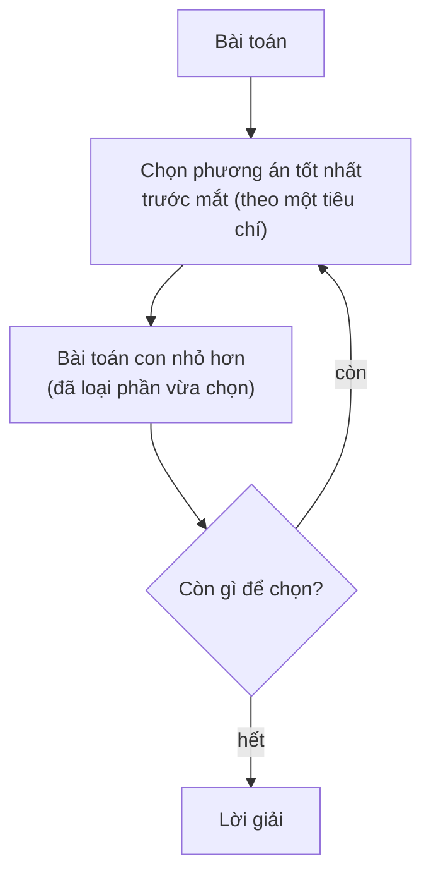
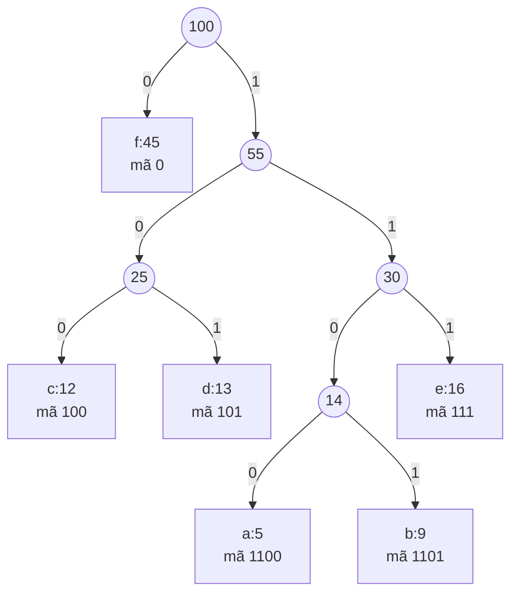
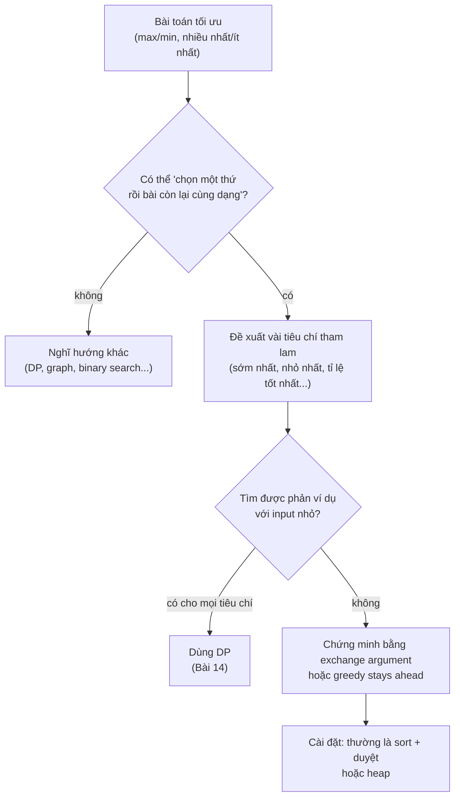

# 📚 Bài 13: Thuật toán tham lam (Greedy)

## 🎯 Mục tiêu bài học

- Hiểu tư tưởng **tham lam**: ở mỗi bước chọn phương án **tốt nhất trước mắt** và **không bao giờ quay lại**
- Nắm hai điều kiện để greedy đúng: **greedy choice property** và **optimal substructure**
- Biết cách **chứng minh** một thuật toán tham lam bằng **exchange argument** (lập luận hoán đổi) — và biết cách **bác bỏ** bằng **phản ví dụ**
- Giải các bài kinh điển: **đổi tiền**, **activity selection**, **merge intervals**, **meeting rooms**, **jump game**, **gas station**, **fractional knapsack**, **Huffman coding**, **assign cookies**
- Thấy được greedy ẩn trong **Dijkstra, Prim, Kruskal** và biết khi nào phải chuyển sang **quy hoạch động**

---

## 📖 1. Tham lam là gì?

**Thuật toán tham lam** xây dựng lời giải từng bước; ở mỗi bước, nó chọn phương án **có vẻ tốt nhất ngay lúc này** (local optimum), **cam kết** với lựa chọn đó và không bao giờ xem xét lại — hy vọng rằng các lựa chọn tốt cục bộ sẽ dẫn tới lời giải tốt **toàn cục** (global optimum).

Ví dụ đời thường:

- **Thối tiền ở quầy thu ngân**: khách cần thối 380.000đ, thu ngân lấy tờ **lớn nhất không vượt quá** số còn lại: 200k → 100k → 50k → 20k → 10k. Nhanh, không cần suy nghĩ, và với tiền Việt Nam thì **luôn tối ưu** (ít tờ nhất).
- **Xếp lịch họp**: muốn tổ chức được **nhiều cuộc họp nhất** trong một phòng → luôn chọn cuộc họp **kết thúc sớm nhất** để phòng trống sớm cho người sau.
- **Đi chợ với ngân sách có hạn**, được mua "lẻ" (cân ký): mua trước món **đáng tiền nhất trên mỗi kg**.



So sánh với các chiến lược khác:

| Chiến lược | Cách làm | Ưu | Nhược |
|------------|----------|----|-------|
| **Vét cạn / Quay lui** ([Bài 6](./06-recursion-backtracking.md)) | Thử **mọi** khả năng | Luôn đúng | Rất chậm (mũ) |
| **Quy hoạch động** ([Bài 14](./14-dynamic-programming.md)) | Thử mọi lựa chọn nhưng **nhớ** kết quả bài toán con | Luôn đúng khi có optimal substructure | Tốn bộ nhớ, khó nghĩ hơn |
| **Tham lam** | Chỉ đi **một** nhánh — nhánh "trông tốt nhất" | **Nhanh nhất**, code ngắn | **Chỉ đúng với một số bài** — phải chứng minh! |

!!! warning "Điều quan trọng nhất của bài này"
    Greedy **rất dễ viết** nhưng **rất dễ sai**. Một thuật toán tham lam "nghe hợp lý" vẫn có thể sai. Trước khi dùng, hãy **(1) tìm phản ví dụ** thật kỹ, và **(2) nếu không tìm được**, thử **chứng minh**.

---

## 📖 2. Khi nào greedy đúng?

Hai tính chất cần có:

1. **Greedy choice property** (tính chất lựa chọn tham lam): tồn tại một lời giải tối ưu **chứa** lựa chọn tham lam đầu tiên. Nói cách khác, chọn tham lam **không làm mất** cơ hội đạt tối ưu.
2. **Optimal substructure** (cấu trúc con tối ưu): sau khi chọn, phần còn lại là một bài toán **cùng dạng, nhỏ hơn**, và lời giải tối ưu của bài lớn = lựa chọn tham lam + lời giải tối ưu của bài con.

DP chỉ cần tính chất (2). Greedy cần **cả hai** — vì nó không thử các lựa chọn khác.

### 2.1. Phản ví dụ kinh điển: đổi tiền với mệnh giá {1, 3, 4}

Cần đổi **6** đồng với các đồng xu mệnh giá `{1, 3, 4}`, dùng **ít đồng nhất**.

| Chiến lược | Cách chọn | Số đồng |
|------------|-----------|---------|
| Tham lam (lớn nhất trước) | 4 → còn 2 → 1 → 1 | **3** đồng |
| Tối ưu | 3 + 3 | **2** đồng ✅ |

Greedy chọn đồng 4 "ngon" nhất trước mắt, nhưng chính lựa chọn đó làm hỏng phần còn lại. Tính chất (1) bị vi phạm: **không** có lời giải tối ưu nào chứa đồng 4.

Vì sao tiền Việt Nam (1k, 2k, 5k, 10k, 20k, 50k, 100k, 200k, 500k) lại đúng? Vì hệ mệnh giá này là **canonical** (chuẩn tắc): mỗi mệnh giá "đủ lớn" so với các mệnh giá nhỏ hơn. Chứng minh tổng quát khá phức tạp; với hệ bất kỳ, hãy dùng **DP** ([Bài 14 — Coin Change](./14-dynamic-programming.md)).

=== "Go"

    ```go
    package main

    import "fmt"

    // greedyCoins: coins sắp giảm dần; lấy đồng lớn nhất có thể
    func greedyCoins(coins []int, amount int) []int {
    	var used []int
    	for _, c := range coins {
    		for amount >= c {
    			amount -= c
    			used = append(used, c)
    		}
    	}
    	return used
    }

    // minCoinsDP: số đồng ít nhất (quy hoạch động — xem Bài 14)
    func minCoinsDP(coins []int, amount int) int {
    	dp := make([]int, amount+1)
    	for a := 1; a <= amount; a++ {
    		dp[a] = 1 << 30
    		for _, c := range coins {
    			if c <= a && dp[a-c]+1 < dp[a] {
    				dp[a] = dp[a-c] + 1
    			}
    		}
    	}
    	return dp[amount]
    }

    func main() {
    	vnd := []int{500000, 200000, 100000, 50000, 20000, 10000, 5000, 2000, 1000}
    	fmt.Println("VND 380000:", greedyCoins(vnd, 380000))
    	fmt.Println("{4,3,1} đổi 6 — tham lam:", greedyCoins([]int{4, 3, 1}, 6))
    	fmt.Println("{4,3,1} đổi 6 — tối ưu:", minCoinsDP([]int{4, 3, 1}, 6), "đồng")
    }
    // Output:
    // VND 380000: [200000 100000 50000 20000 10000]
    // {4,3,1} đổi 6 — tham lam: [4 1 1]
    // {4,3,1} đổi 6 — tối ưu: 2 đồng
    ```

=== "Python"

    ```python
    def greedy_coins(coins, amount):
        used = []
        for c in sorted(coins, reverse=True):
            while amount >= c:
                amount -= c
                used.append(c)
        return used


    def min_coins_dp(coins, amount):
        dp = [0] + [float("inf")] * amount
        for a in range(1, amount + 1):
            for c in coins:
                if c <= a:
                    dp[a] = min(dp[a], dp[a - c] + 1)
        return dp[amount]


    vnd = [500000, 200000, 100000, 50000, 20000, 10000, 5000, 2000, 1000]
    print("VND 380000:", greedy_coins(vnd, 380000))
    print("{1,3,4} đổi 6 — tham lam:", greedy_coins([1, 3, 4], 6))
    print("{1,3,4} đổi 6 — tối ưu:", min_coins_dp([1, 3, 4], 6), "đồng")
    # Output:
    # VND 380000: [200000, 100000, 50000, 20000, 10000]
    # {1,3,4} đổi 6 — tham lam: [4, 1, 1]
    # {1,3,4} đổi 6 — tối ưu: 2 đồng
    ```

### 2.2. Chứng minh greedy: Exchange argument (lập luận hoán đổi)

Đây là kỹ thuật chứng minh phổ biến nhất, giải thích đơn giản như sau:

1. Giả sử có một lời giải tối ưu **OPT** bất kỳ.
2. Nếu OPT đã chứa lựa chọn tham lam `g` → xong.
3. Nếu không, OPT có một lựa chọn `o` ở "vị trí tương ứng". **Hoán đổi** `o` bằng `g` → được lời giải **OPT'**.
4. Chỉ ra OPT' **vẫn hợp lệ** và **không tệ hơn** OPT → OPT' cũng tối ưu, và nó chứa `g`.
5. Lặp lại lập luận cho phần còn lại (quy nạp) → lời giải tham lam là tối ưu.

Hình dung: bạn nói với người phản biện *"đưa tôi xem lời giải tốt nhất của anh; tôi sẽ đổi dần từng lựa chọn của anh sang lựa chọn của tôi mà không làm nó tệ đi"*. Nếu làm được, lời giải của bạn cũng tốt nhất.

Kỹ thuật thứ hai: **"greedy stays ahead"** — chứng minh sau **mỗi bước**, lời giải tham lam luôn "đi trước hoặc ngang bằng" mọi lời giải khác theo một thước đo nào đó (ví dụ: thời điểm kết thúc của cuộc họp thứ k).

Ta sẽ áp dụng ngay vào bài toán đầu tiên.

---

## 📖 3. Activity Selection — Chọn nhiều hoạt động nhất

**Bài toán**: có `n` cuộc họp, cuộc họp `i` diễn ra trong `[start_i, end_i)`. Chỉ có **một** phòng. Chọn **nhiều cuộc họp nhất** không chồng lấn nhau (cuộc sau có thể bắt đầu đúng lúc cuộc trước kết thúc).

### Thử các tiêu chí tham lam

| Tiêu chí | Phản ví dụ | Kết quả |
|----------|-----------|---------|
| Bắt đầu **sớm nhất** | `[0,10)`, `[1,2)`, `[3,4)` → chọn `[0,10)` rồi hết chỗ | ❌ 1 thay vì 2 |
| **Ngắn nhất** | `[0,5)`, `[4,7)`, `[6,10)` → chọn `[4,7)` chặn cả hai bên | ❌ 1 thay vì 2 |
| Ít **xung đột** nhất | Có phản ví dụ (phức tạp hơn) | ❌ |
| **Kết thúc sớm nhất** | Không có phản ví dụ | ✅ |

### Chứng minh (exchange argument)

Gọi `g` là cuộc họp kết thúc sớm nhất. Xét một lời giải tối ưu OPT, gọi `o` là cuộc họp **đầu tiên** (kết thúc sớm nhất) trong OPT. Vì `g` kết thúc sớm nhất trong **tất cả**, `end(g) ≤ end(o)`. Thay `o` bằng `g`: mọi cuộc họp khác trong OPT bắt đầu sau `end(o) ≥ end(g)` → vẫn không chồng lấn với `g`. Số cuộc họp không đổi → vẫn tối ưu. Phần còn lại là bài toán cùng dạng với các cuộc họp bắt đầu sau `end(g)`. ∎

### Thuật toán

1. Sắp xếp theo **thời điểm kết thúc** tăng dần.
2. Duyệt: nếu cuộc họp bắt đầu **≥** thời điểm kết thúc của cuộc cuối cùng đã chọn → chọn.

```mermaid
gantt
    title Chọn cuộc họp theo "kết thúc sớm nhất"
    dateFormat X
    axisFormat %s
    section Được chọn
    A 1-4      :done, 1, 4
    D 5-7      :done, 5, 7
    H 8-11     :done, 8, 11
    K 12-16    :done, 12, 16
    section Bị loại
    B 3-5      :3, 5
    C 0-6      :0, 6
    E 3-9      :3, 9
    J 2-14     :2, 14
```



| Cuộc họp (đã sort theo end) | Start ≥ lastEnd? | Chọn? | lastEnd |
|-----------------------------|------------------|-------|---------|
| [1, 4) | 1 ≥ −∞ | ✅ | 4 |
| [3, 5) | 3 < 4 | ❌ | 4 |
| [0, 6) | 0 < 4 | ❌ | 4 |
| [5, 7) | 5 ≥ 4 | ✅ | 7 |
| [3, 9), [5, 9), [6, 10) | < 7 | ❌ | 7 |
| [8, 11) | 8 ≥ 7 | ✅ | 11 |
| [8, 12), [2, 14) | < 11 | ❌ | 11 |
| [12, 16) | 12 ≥ 11 | ✅ | 16 |

=== "Go"

    ```go
    package main

    import (
    	"fmt"
    	"slices"
    )

    func selectActivities(acts [][2]int) [][2]int {
    	slices.SortFunc(acts, func(a, b [2]int) int { return a[1] - b[1] }) // theo end
    	var chosen [][2]int
    	lastEnd := -1 << 31
    	for _, a := range acts {
    		if a[0] >= lastEnd {
    			chosen = append(chosen, a)
    			lastEnd = a[1]
    		}
    	}
    	return chosen
    }

    func main() {
    	acts := [][2]int{{1, 4}, {3, 5}, {0, 6}, {5, 7}, {3, 9}, {5, 9},
    		{6, 10}, {8, 11}, {8, 12}, {2, 14}, {12, 16}}
    	chosen := selectActivities(acts)
    	fmt.Println(chosen)
    	// LeetCode 435: số khoảng ít nhất cần XÓA để không còn chồng lấn
    	fmt.Println("cần xóa:", len(acts)-len(chosen))
    }
    // Output:
    // [[1 4] [5 7] [8 11] [12 16]]
    // cần xóa: 7
    ```

=== "Python"

    ```python
    def select_activities(acts):
        chosen, last_end = [], float("-inf")
        for s, e in sorted(acts, key=lambda a: a[1]):   # theo end
            if s >= last_end:
                chosen.append((s, e))
                last_end = e
        return chosen


    acts = [(1, 4), (3, 5), (0, 6), (5, 7), (3, 9), (5, 9),
            (6, 10), (8, 11), (8, 12), (2, 14), (12, 16)]
    chosen = select_activities(acts)
    print(chosen)
    print("cần xóa:", len(acts) - len(chosen))
    # Output:
    # [(1, 4), (5, 7), (8, 11), (12, 16)]
    # cần xóa: 7
    ```

**Độ phức tạp**: O(n log n) cho sắp xếp + O(n) duyệt. Bộ nhớ O(1) (không tính kết quả).

!!! tip "Bài cùng họ"
    - LeetCode 435 (Non-overlapping Intervals): số khoảng cần xóa = n − số khoảng chọn được.
    - LeetCode 452 (Minimum Arrows to Burst Balloons): sort theo end, mỗi mũi tên bắn ở `end` của bóng đầu tiên chưa vỡ — cùng một thuật toán!

---

## 📖 4. Merge Intervals — Gộp khoảng

**Bài toán** (LeetCode 56): gộp các khoảng chồng lấn. `[[1,3],[2,6],[8,10],[15,18]]` → `[[1,6],[8,10],[15,18]]`.

Ví dụ đời thường: gộp các khung giờ "bận" trên lịch Google Calendar của bạn để biết khi nào **thực sự rảnh**.

Lần này sắp xếp theo **điểm bắt đầu**. Duyệt từng khoảng: nếu nó bắt đầu **≤** điểm cuối của khoảng cuối cùng trong kết quả → **gộp** (kéo dài điểm cuối thành `max`); ngược lại → thêm khoảng mới.

```text
sau khi sort:  [1,3] [2,6] [8,10] [15,18]

[1,3]           → kết quả: [1,3]
[2,6]  2 ≤ 3    → gộp:     [1,6]          (max(3,6) = 6)
[8,10] 8 > 6    → thêm:    [1,6] [8,10]
[15,18] 15 > 10 → thêm:    [1,6] [8,10] [15,18]
```

=== "Go"

    ```go
    package main

    import (
    	"fmt"
    	"slices"
    )

    func merge(intervals [][2]int) [][2]int {
    	slices.SortFunc(intervals, func(a, b [2]int) int { return a[0] - b[0] })
    	var res [][2]int
    	for _, iv := range intervals {
    		if n := len(res); n > 0 && iv[0] <= res[n-1][1] {
    			res[n-1][1] = max(res[n-1][1], iv[1]) // gộp
    		} else {
    			res = append(res, iv)
    		}
    	}
    	return res
    }

    func main() {
    	fmt.Println(merge([][2]int{{1, 3}, {2, 6}, {8, 10}, {15, 18}}))
    	fmt.Println(merge([][2]int{{1, 4}, {4, 5}}))
    	fmt.Println(merge([][2]int{{1, 10}, {2, 3}, {4, 5}})) // khoảng bị "nuốt" trọn
    }
    // Output:
    // [[1 6] [8 10] [15 18]]
    // [[1 5]]
    // [[1 10]]
    ```

=== "Python"

    ```python
    def merge(intervals):
        res = []
        for s, e in sorted(intervals):
            if res and s <= res[-1][1]:
                res[-1][1] = max(res[-1][1], e)   # gộp
            else:
                res.append([s, e])
        return res


    print(merge([[1, 3], [2, 6], [8, 10], [15, 18]]))
    print(merge([[1, 4], [4, 5]]))
    print(merge([[1, 10], [2, 3], [4, 5]]))
    # Output:
    # [[1, 6], [8, 10], [15, 18]]
    # [[1, 5]]
    # [[1, 10]]
    ```

O(n log n). Lỗi hay gặp: gán `res[-1][1] = e` thay vì `max(...)` → sai với khoảng bị "nuốt" trọn như `[1,10]` và `[2,3]`.

---

## 📖 5. Meeting Rooms II — Cần bao nhiêu phòng họp?

**Bài toán** (LeetCode 253): cho danh sách cuộc họp, cần **ít nhất bao nhiêu phòng** để tổ chức **tất cả**?

Ví dụ đời thường: quản lý phòng khám cần bao nhiêu bác sĩ trực để không bệnh nhân nào phải chờ.

Ý tưởng tham lam: xử lý cuộc họp theo **giờ bắt đầu**. Khi một cuộc họp đến, hãy **tái sử dụng phòng trống sớm nhất** nếu nó đã trống; không thì mở phòng mới. "Phòng trống sớm nhất" = **min-heap** các thời điểm kết thúc ([Bài 10](./10-heaps.md)).

| Cuộc họp (sort theo start) | Heap end-times trước | Phòng sớm nhất trống lúc | Hành động | Heap sau |
|---------------------------|---------------------|--------------------------|-----------|----------|
| [0, 30) | [] | — | mở phòng 1 | [30] |
| [5, 10) | [30] | 30 > 5 | mở phòng 2 | [10, 30] |
| [15, 20) | [10, 30] | 10 ≤ 15 | dùng lại phòng đó | [20, 30] |

Đáp án = kích thước heap lớn nhất = **2**.

=== "Go"

    ```go
    package main

    import (
    	"container/heap"
    	"fmt"
    	"slices"
    )

    type IntHeap []int

    func (h IntHeap) Len() int           { return len(h) }
    func (h IntHeap) Less(i, j int) bool { return h[i] < h[j] }
    func (h IntHeap) Swap(i, j int)      { h[i], h[j] = h[j], h[i] }
    func (h *IntHeap) Push(x any)        { *h = append(*h, x.(int)) }
    func (h *IntHeap) Pop() any {
    	old := *h
    	x := old[len(old)-1]
    	*h = old[:len(old)-1]
    	return x
    }

    func minMeetingRooms(meetings [][2]int) int {
    	slices.SortFunc(meetings, func(a, b [2]int) int { return a[0] - b[0] })
    	ends := &IntHeap{}
    	rooms := 0
    	for _, m := range meetings {
    		if ends.Len() > 0 && (*ends)[0] <= m[0] {
    			heap.Pop(ends) // phòng này đã trống → dùng lại
    		}
    		heap.Push(ends, m[1])
    		rooms = max(rooms, ends.Len())
    	}
    	return rooms
    }

    func main() {
    	fmt.Println(minMeetingRooms([][2]int{{0, 30}, {5, 10}, {15, 20}}))
    	fmt.Println(minMeetingRooms([][2]int{{7, 10}, {2, 4}}))
    	fmt.Println(minMeetingRooms([][2]int{{1, 5}, {2, 6}, {3, 7}, {6, 8}}))
    }
    // Output:
    // 2
    // 1
    // 3
    ```

=== "Python"

    ```python
    import heapq


    def min_meeting_rooms(meetings):
        ends, rooms = [], 0
        for s, e in sorted(meetings):
            if ends and ends[0] <= s:
                heapq.heappop(ends)          # phòng trống sớm nhất → dùng lại
            heapq.heappush(ends, e)
            rooms = max(rooms, len(ends))
        return rooms


    def min_meeting_rooms_sweep(meetings):
        """Cách 2: quét sự kiện — +1 khi bắt đầu, -1 khi kết thúc."""
        events = []
        for s, e in meetings:
            events += [(s, 1), (e, -1)]
        cur = best = 0
        for _, d in sorted(events):          # (t, -1) đứng trước (t, +1): trả phòng trước
            cur += d
            best = max(best, cur)
        return best


    for m in ([[0, 30], [5, 10], [15, 20]], [[7, 10], [2, 4]], [[1, 5], [2, 6], [3, 7], [6, 8]]):
        print(min_meeting_rooms(m), min_meeting_rooms_sweep(m))
    # Output:
    # 2 2
    # 1 1
    # 3 3
    ```

O(n log n). Cách **sweep line** (quét sự kiện) không cần heap: số phòng cần = số cuộc họp **đang diễn ra đồng thời** lớn nhất.

---

## 📖 6. Jump Game — Nhảy xa nhất có thể

**Bài toán** (LeetCode 55): `nums[i]` = số bước **tối đa** có thể nhảy từ ô `i`. Bắt đầu ở ô 0, có tới được ô cuối không?

Ý tưởng tham lam: không cần biết **nhảy thế nào**, chỉ cần theo dõi **`farthest`** = ô xa nhất có thể chạm tới. Duyệt `i` từ trái sang: nếu `i > farthest` → kẹt, không tới được `i`. Ngược lại cập nhật `farthest = max(farthest, i + nums[i])`.

```text
nums = [2, 3, 1, 1, 4]
i=0: farthest = max(0, 0+2) = 2
i=1: farthest = max(2, 1+3) = 4  ≥ 4 (ô cuối) → TỚI ĐƯỢC ✅

nums = [3, 2, 1, 0, 4]
i=0..3: farthest = 3, 3, 3, 3
i=4: 4 > farthest=3 → KẸT ở ô 3 (giá trị 0) ❌
```

**Jump Game II** (LeetCode 45): số lần nhảy **ít nhất**. Nghĩ như **BFS theo tầng** ([Bài 11](./11-graphs-traversal.md)): tầng `k` = các ô tới được bằng đúng `k` bước nhảy — luôn là một **đoạn liên tiếp**. Duyệt từng đoạn, tính đoạn kế tiếp vươn xa tới đâu.

```text
nums = [2, 3, 1, 1, 4]
tầng 0: ô [0]        → vươn tới 2
tầng 1: ô [1, 2]     → vươn tới max(1+3, 2+1) = 4 → chạm ô cuối
→ 2 lần nhảy (0 → 1 → 4)
```

=== "Go"

    ```go
    package main

    import "fmt"

    func canJump(nums []int) bool {
    	farthest := 0
    	for i, x := range nums {
    		if i > farthest {
    			return false
    		}
    		farthest = max(farthest, i+x)
    	}
    	return true
    }

    func minJumps(nums []int) int {
    	jumps, curEnd, farthest := 0, 0, 0
    	for i := 0; i < len(nums)-1; i++ {
    		farthest = max(farthest, i+nums[i])
    		if i == curEnd { // hết tầng hiện tại → phải nhảy thêm
    			jumps++
    			curEnd = farthest
    		}
    	}
    	return jumps
    }

    func main() {
    	fmt.Println(canJump([]int{2, 3, 1, 1, 4}), canJump([]int{3, 2, 1, 0, 4}))
    	fmt.Println(minJumps([]int{2, 3, 1, 1, 4}), minJumps([]int{2, 3, 0, 1, 4}))
    }
    // Output:
    // true false
    // 2 2
    ```

=== "Python"

    ```python
    def can_jump(nums):
        farthest = 0
        for i, x in enumerate(nums):
            if i > farthest:
                return False
            farthest = max(farthest, i + x)
        return True


    def min_jumps(nums):
        jumps = cur_end = farthest = 0
        for i in range(len(nums) - 1):
            farthest = max(farthest, i + nums[i])
            if i == cur_end:          # hết tầng hiện tại
                jumps += 1
                cur_end = farthest
        return jumps


    print(can_jump([2, 3, 1, 1, 4]), can_jump([3, 2, 1, 0, 4]))
    print(min_jumps([2, 3, 1, 1, 4]), min_jumps([2, 3, 0, 1, 4]))
    # Output:
    # True False
    # 2 2
    ```

Cả hai: **O(n)** thời gian, **O(1)** bộ nhớ. (Lời giải DP cho Jump Game là O(n²) — greedy ở đây thắng rõ.)

---

## 📖 7. Gas Station — Trạm xăng vòng tròn

**Bài toán** (LeetCode 134): `n` trạm xăng trên đường vòng. Trạm `i` có `gas[i]` lít; đi từ `i` tới `i+1` tốn `cost[i]` lít. Xe bắt đầu với bình rỗng. Tìm trạm xuất phát để đi **hết một vòng** (đáp án nếu có là duy nhất), hoặc `-1`.

Hai nhận xét then chốt:

1. Nếu **tổng gas < tổng cost** → chắc chắn không đi được → `-1`. Ngược lại **chắc chắn có** đáp án.
2. Nếu xuất phát từ `s` mà **hết xăng khi tới trạm `j`** (bình âm), thì **mọi** trạm giữa `s` và `j` cũng không thể là điểm xuất phát. Vì sao? Khi tới một trạm `k` ở giữa, xe mang theo lượng xăng **≥ 0** từ đoạn trước; xuất phát tại `k` với bình **rỗng** chỉ tệ hơn → cũng sẽ chết trước `j`. → Nhảy thẳng điểm xuất phát tới `j + 1`.

```text
gas  = [1, 2, 3, 4, 5]
cost = [3, 4, 5, 1, 2]
diff = [-2,-2,-2, 3, 3]   (tổng = 0 ≥ 0 → có đáp án)

i=0: tank=-2 < 0 → start=1, tank=0
i=1: tank=-2 < 0 → start=2, tank=0
i=2: tank=-2 < 0 → start=3, tank=0
i=3: tank=3
i=4: tank=6          → đáp án start = 3
```

=== "Go"

    ```go
    package main

    import "fmt"

    func canCompleteCircuit(gas, cost []int) int {
    	total, tank, start := 0, 0, 0
    	for i := range gas {
    		d := gas[i] - cost[i]
    		total += d
    		tank += d
    		if tank < 0 { // không thể xuất phát từ start..i
    			start = i + 1
    			tank = 0
    		}
    	}
    	if total < 0 {
    		return -1
    	}
    	return start
    }

    func main() {
    	fmt.Println(canCompleteCircuit([]int{1, 2, 3, 4, 5}, []int{3, 4, 5, 1, 2}))
    	fmt.Println(canCompleteCircuit([]int{2, 3, 4}, []int{3, 4, 3}))
    }
    // Output:
    // 3
    // -1
    ```

=== "Python"

    ```python
    def can_complete_circuit(gas, cost):
        total = tank = start = 0
        for i, (g, c) in enumerate(zip(gas, cost)):
            total += g - c
            tank += g - c
            if tank < 0:            # không thể xuất phát từ start..i
                start, tank = i + 1, 0
        return start if total >= 0 else -1


    print(can_complete_circuit([1, 2, 3, 4, 5], [3, 4, 5, 1, 2]))
    print(can_complete_circuit([2, 3, 4], [3, 4, 3]))
    # Output:
    # 3
    # -1
    ```

**O(n)** thời gian, **O(1)** bộ nhớ — thay vì O(n²) nếu thử từng điểm xuất phát.

---

## 📖 8. Fractional Knapsack — Cái túi "cắt được"

**Bài toán**: túi chứa tối đa `W` kg. Có các món hàng, món `i` nặng `w_i`, giá trị `v_i`. Được **lấy một phần** món hàng (như gạo, đường, vàng cám). Tối đa hóa tổng giá trị.

Tham lam: tính **giá trị trên 1 kg** `v_i / w_i`, lấy món **đắt nhất trên kg** trước, lấy hết; hết chỗ thì lấy **một phần** món tiếp theo.

| Món | Giá trị | Nặng | Giá trị/kg |
|-----|---------|------|------------|
| A | 60 | 10 | **6.0** |
| B | 100 | 20 | 5.0 |
| C | 120 | 30 | 4.0 |

Túi `W = 50`: lấy hết A (10 kg, +60), hết B (20 kg, +100), còn 20 kg → lấy 20/30 của C (+80). Tổng **240**.

Chứng minh (exchange): nếu lời giải OPT chứa ít món đắt/kg hơn mức greedy chọn, ta **đổi** 1 kg món rẻ/kg trong OPT lấy 1 kg món đắt/kg hơn → tổng giá trị **không giảm**. Lặp lại cho tới khi OPT trùng greedy.

=== "Go"

    ```go
    package main

    import (
    	"fmt"
    	"slices"
    )

    type Item struct{ Value, Weight float64 }

    func fractionalKnapsack(items []Item, W float64) float64 {
    	slices.SortFunc(items, func(a, b Item) int { // giảm dần theo value/weight
    		ra, rb := a.Value/a.Weight, b.Value/b.Weight
    		switch {
    		case ra > rb:
    			return -1
    		case ra < rb:
    			return 1
    		}
    		return 0
    	})
    	total := 0.0
    	for _, it := range items {
    		if W <= 0 {
    			break
    		}
    		take := min(it.Weight, W)
    		total += it.Value * take / it.Weight
    		W -= take
    	}
    	return total
    }

    func main() {
    	items := []Item{{60, 10}, {100, 20}, {120, 30}}
    	fmt.Printf("%.2f\n", fractionalKnapsack(items, 50))
    }
    // Output:
    // 240.00
    ```

=== "Python"

    ```python
    def fractional_knapsack(items, W):
        total = 0.0
        for value, weight in sorted(items, key=lambda it: it[0] / it[1], reverse=True):
            if W <= 0:
                break
            take = min(weight, W)
            total += value * take / weight
            W -= take
        return total


    print(f"{fractional_knapsack([(60, 10), (100, 20), (120, 30)], 50):.2f}")
    # Output:
    # 240.00
    ```

!!! warning "0/1 Knapsack: greedy SAI"
    Nếu **không được cắt** món hàng (lấy nguyên hoặc bỏ), greedy theo giá trị/kg chọn A + B = 160 (còn 20 kg không vừa C). Tối ưu thật là **B + C = 220**. Bài 0/1 knapsack cần **quy hoạch động** — xem [Bài 14](./14-dynamic-programming.md). Đây là cặp ví dụ kinh điển cho thấy **một thay đổi nhỏ trong đề** làm greedy từ đúng thành sai.

---

## 📖 9. Huffman Coding — Nén dữ liệu

### Vấn đề

Mã ASCII dùng **8 bit cho mỗi ký tự**, bất kể ký tự đó xuất hiện nhiều hay ít. Nhưng trong văn bản tiếng Việt, chữ "n", "h", khoảng trắng xuất hiện rất nhiều, còn "z", "w" gần như không có. Ý tưởng: ký tự **hay gặp** → mã **ngắn**; ký tự **hiếm** → mã **dài**. Giống **mã Morse**: chữ E (phổ biến nhất tiếng Anh) chỉ là một dấu chấm `.`.

Vấn đề của mã có độ dài thay đổi: làm sao **giải mã không nhập nhằng**? Nếu `a = 0`, `b = 01` thì chuỗi `01` là "ab..." hay "b"? Giải pháp: **mã tiền tố (prefix code)** — không mã nào là **tiền tố** của mã khác. Mọi prefix code tương ứng với một **cây nhị phân**: ký tự nằm ở **lá**, đi trái = `0`, đi phải = `1`.

### Thuật toán Huffman (1952) — tham lam

1. Mỗi ký tự là một cây 1 nút với trọng số = tần suất. Cho tất cả vào **min-heap**.
2. Lặp: lấy ra **hai cây nhẹ nhất**, gộp thành một cây mới (trọng số = tổng), đẩy lại vào heap.
3. Còn một cây → đó là cây Huffman.

Trực giác: hai ký tự **hiếm nhất** nên nằm **sâu nhất** (mã dài nhất) — và làm "anh em" với nhau.

Ví dụ tần suất: `a:5, b:9, c:12, d:13, e:16, f:45`.

| Bước | Lấy 2 nhỏ nhất | Gộp thành | Heap sau |
|------|---------------|-----------|----------|
| 1 | a:5, b:9 | 14 | c:12, d:13, 14, e:16, f:45 |
| 2 | c:12, d:13 | 25 | 14, e:16, 25, f:45 |
| 3 | 14, e:16 | 30 | 25, 30, f:45 |
| 4 | 25, 30 | 55 | f:45, 55 |
| 5 | f:45, 55 | 100 | 100 (xong) |



Tổng số bit = 45·1 + 12·3 + 13·3 + 16·3 + 5·4 + 9·4 = **224 bit**, so với mã cố định 3 bit/ký tự: 100 · 3 = 300 bit → tiết kiệm **25%**.

=== "Go"

    ```go
    package main

    import (
    	"container/heap"
    	"fmt"
    	"sort"
    )

    type HNode struct {
    	Freq        int
    	Char        byte
    	Order       int // phá hòa để kết quả ổn định
    	Left, Right *HNode
    }

    type NodeHeap []*HNode

    func (h NodeHeap) Len() int { return len(h) }
    func (h NodeHeap) Less(i, j int) bool {
    	if h[i].Freq != h[j].Freq {
    		return h[i].Freq < h[j].Freq
    	}
    	return h[i].Order < h[j].Order
    }
    func (h NodeHeap) Swap(i, j int) { h[i], h[j] = h[j], h[i] }
    func (h *NodeHeap) Push(x any)   { *h = append(*h, x.(*HNode)) }
    func (h *NodeHeap) Pop() any {
    	old := *h
    	x := old[len(old)-1]
    	*h = old[:len(old)-1]
    	return x
    }

    func huffman(chars []byte, freqs []int) map[byte]string {
    	h := &NodeHeap{}
    	order := 0
    	for i, c := range chars {
    		*h = append(*h, &HNode{Freq: freqs[i], Char: c, Order: order})
    		order++
    	}
    	heap.Init(h)
    	for h.Len() > 1 {
    		a := heap.Pop(h).(*HNode) // nhẹ nhất → nhánh 0
    		b := heap.Pop(h).(*HNode) // nhẹ thứ hai → nhánh 1
    		heap.Push(h, &HNode{Freq: a.Freq + b.Freq, Order: order, Left: a, Right: b})
    		order++
    	}
    	codes := map[byte]string{}
    	var walk func(n *HNode, code string)
    	walk = func(n *HNode, code string) {
    		if n.Left == nil { // lá
    			codes[n.Char] = code
    			return
    		}
    		walk(n.Left, code+"0")
    		walk(n.Right, code+"1")
    	}
    	walk(heap.Pop(h).(*HNode), "")
    	return codes
    }

    func main() {
    	chars := []byte("abcdef")
    	freqs := []int{5, 9, 12, 13, 16, 45}
    	codes := huffman(chars, freqs)
    	keys := make([]int, 0, len(codes))
    	for c := range codes {
    		keys = append(keys, int(c))
    	}
    	sort.Ints(keys)
    	total := 0
    	for i, k := range keys {
    		fmt.Printf("%c: %s\n", k, codes[byte(k)])
    		total += freqs[i] * len(codes[byte(k)])
    	}
    	fmt.Println("tổng bit:", total)
    	encoded := ""
    	for _, c := range []byte("face") {
    		encoded += codes[c]
    	}
    	fmt.Println("face →", encoded)
    }
    // Output:
    // a: 1100
    // b: 1101
    // c: 100
    // d: 101
    // e: 111
    // f: 0
    // tổng bit: 224
    // face → 01100100111
    ```

=== "Python"

    ```python
    import heapq
    from itertools import count


    def huffman(freqs: dict[str, int]) -> dict[str, str]:
        tie = count()                         # phá hòa → kết quả ổn định
        # phần tử heap: (tần suất, thứ tự, cây); cây = ký tự (lá) hoặc (trái, phải)
        h = [(f, next(tie), ch) for ch, f in freqs.items()]
        heapq.heapify(h)
        while len(h) > 1:
            fa, _, a = heapq.heappop(h)       # nhẹ nhất → nhánh 0
            fb, _, b = heapq.heappop(h)       # nhẹ thứ hai → nhánh 1
            heapq.heappush(h, (fa + fb, next(tie), (a, b)))
        codes = {}

        def walk(node, code):
            if isinstance(node, str):
                codes[node] = code or "0"     # trường hợp chỉ có 1 ký tự
                return
            walk(node[0], code + "0")
            walk(node[1], code + "1")

        walk(h[0][2], "")
        return codes


    def decode(bits, codes):
        rev, out, cur = {v: k for k, v in codes.items()}, [], ""
        for b in bits:
            cur += b
            if cur in rev:                    # prefix code → khớp là chắc chắn
                out.append(rev[cur])
                cur = ""
        return "".join(out)


    freqs = {"a": 5, "b": 9, "c": 12, "d": 13, "e": 16, "f": 45}
    codes = huffman(freqs)
    for ch in sorted(codes):
        print(f"{ch}: {codes[ch]}")
    print("tổng bit:", sum(freqs[c] * len(codes[c]) for c in freqs))
    enc = "".join(codes[c] for c in "face")
    print("face →", enc, "→", decode(enc, codes))
    # Output:
    # a: 1100
    # b: 1101
    # c: 100
    # d: 101
    # e: 111
    # f: 0
    # tổng bit: 224
    # face → 01100100111 → face
    ```

**Độ phức tạp**: O(k log k) với `k` ký tự khác nhau (heap có k phần tử, k−1 lần gộp).

!!! note "Huffman trong đời thực"
    Huffman là một bước trong **DEFLATE** (ZIP, gzip, PNG), **JPEG**, **MP3**, và **HTTP/2 HPACK** (nén header). Cây Huffman còn là ví dụ đẹp về **cây full** ([Bài 9](./09-trees-bst.md)) — mọi nút trong có đúng 2 con.

---

## 📖 10. Assign Cookies — Chia bánh cho trẻ

**Bài toán** (LeetCode 455): trẻ `i` chỉ vui nếu nhận bánh kích thước ≥ `g[i]` (độ "tham"). Bánh `j` có kích thước `s[j]`. Mỗi trẻ nhận tối đa 1 bánh. Tối đa hóa số trẻ vui.

Tham lam: **bánh nhỏ nhất đủ làm vui đứa trẻ dễ tính nhất**. Không nên phí bánh to cho đứa dễ tính. Sắp xếp cả hai, dùng **hai con trỏ**:

```text
g = [1, 2, 3]  (trẻ)     s = [1, 1]  (bánh)
bánh 1 → trẻ g=1 vui ✅; bánh 1 → trẻ g=2 không đủ ❌; hết bánh → 1 trẻ vui
```

=== "Go"

    ```go
    package main

    import (
    	"fmt"
    	"slices"
    )

    func findContentChildren(g, s []int) int {
    	slices.Sort(g)
    	slices.Sort(s)
    	child := 0
    	for _, cookie := range s {
    		if child < len(g) && cookie >= g[child] {
    			child++ // bánh này làm vui đứa dễ tính nhất còn lại
    		}
    	}
    	return child
    }

    func main() {
    	fmt.Println(findContentChildren([]int{1, 2, 3}, []int{1, 1}))
    	fmt.Println(findContentChildren([]int{1, 2}, []int{1, 2, 3}))
    }
    // Output:
    // 1
    // 2
    ```

=== "Python"

    ```python
    def find_content_children(g, s):
        g, s = sorted(g), sorted(s)
        child = 0
        for cookie in s:
            if child < len(g) and cookie >= g[child]:
                child += 1
        return child


    print(find_content_children([1, 2, 3], [1, 1]))
    print(find_content_children([1, 2], [1, 2, 3]))
    # Output:
    # 1
    # 2
    ```

O(n log n + m log m).

---

## 📖 11. Greedy trong thuật toán đồ thị

Ba thuật toán đồ thị nổi tiếng nhất thực chất là **tham lam** (chi tiết ở [Bài 12: Đường đi ngắn nhất & Cây khung](./12-shortest-paths-mst.md)):

| Thuật toán | Lựa chọn tham lam ở mỗi bước | Vì sao đúng |
|-----------|------------------------------|------------|
| **Dijkstra** | Chốt đỉnh chưa xử lý có **khoảng cách tạm nhỏ nhất** | Trọng số **không âm** → không đường nào khác có thể ngắn hơn về sau |
| **Prim** | Thêm **cạnh rẻ nhất** nối cây hiện tại với một đỉnh bên ngoài | **Cut property**: cạnh nhẹ nhất qua một lát cắt luôn thuộc một MST nào đó |
| **Kruskal** | Thêm **cạnh rẻ nhất toàn cục** không tạo chu trình (dùng Union-Find) | Cũng nhờ cut property |

!!! warning "Dijkstra sai với cạnh âm"
    Đây là một phản ví dụ nữa cho thấy greedy chỉ đúng khi **giả thiết** được thỏa mãn. Với cạnh âm, một đỉnh đã "chốt" vẫn có thể có đường ngắn hơn đi vòng qua cạnh âm → phải dùng **Bellman-Ford** (một thuật toán kiểu DP).

---

## 📖 12. Cách nhận biết và tiếp cận bài greedy



**Dấu hiệu** một bài có thể giải bằng greedy:

- Có khoảng thời gian / interval → sort theo **end** (chọn nhiều nhất) hoặc **start** (gộp, đếm phòng).
- "Tối thiểu số lần..." với lựa chọn "vươn xa nhất" (jump game, trạm xăng, số mũi tên).
- Có tỉ lệ giá trị/chi phí và được **chia nhỏ** (fractional).
- Liên tục cần "lấy phần tử nhỏ nhất/lớn nhất hiện tại" → **heap** (Huffman, task scheduler, meeting rooms).
- Ghép cặp giữa hai tập → sort cả hai + **two pointers** (assign cookies, boats to save people).

**Mẹo tìm phản ví dụ nhanh**: viết một hàm **vét cạn** cho input nhỏ (n ≤ 8), rồi chạy ngẫu nhiên hàng nghìn test so sánh với greedy. Đây là kỹ thuật **stress test** mà dân thi lập trình dùng hàng ngày.

### 💡 Tips quan trọng

- Greedy thường = **sắp xếp theo đúng tiêu chí** + **một vòng duyệt**. Phần khó là chọn **tiêu chí**.
- Nếu bạn phân vân giữa greedy và DP: thử greedy với **3–4 phản ví dụ nhỏ** trước. Nếu gãy → DP.
- Khi phỏng vấn, hãy **nói ra** lý do greedy đúng (dù chỉ là lập luận hoán đổi ngắn gọn) — người phỏng vấn đánh giá cao điều này hơn là code chạy đúng "may mắn".

---

## 🌍 Ứng dụng thực tế

| Lĩnh vực | Bài toán greedy |
|----------|-----------------|
| Nén dữ liệu (ZIP, PNG, JPEG, HTTP/2) | **Huffman coding** |
| Mạng máy tính | Dijkstra trong OSPF; Prim/Kruskal để thiết kế mạng cáp chi phí thấp |
| Hệ điều hành | Lập lịch **Shortest Job First** (tối thiểu thời gian chờ trung bình), cấp phát bộ nhớ best-fit/first-fit |
| Lịch họp, đặt phòng (Google Calendar, Booking) | Interval scheduling, meeting rooms |
| Máy ATM, máy bán hàng | Thối tiền với hệ mệnh giá chuẩn tắc |
| Cloud / Kubernetes | Bin packing xấp xỉ (First Fit Decreasing) để xếp container lên node |
| Machine Learning | **Decision tree** (ID3, CART) chọn thuộc tính chia tốt nhất ở mỗi nút; greedy feature selection |
| Tài chính | Chọn khoản đầu tư có tỉ suất tốt nhất khi vốn chia nhỏ được |

Và khi bài toán **quá khó** (NP-hard như Set Cover, Traveling Salesman), greedy thường là **thuật toán xấp xỉ** đầu tiên được dùng: không tối ưu, nhưng nhanh và "đủ tốt".

---

## ⚠️ Lỗi thường gặp

| Lỗi | Ví dụ | Cách tránh |
|-----|-------|-----------|
| Tin vào trực giác mà không kiểm chứng | Đổi tiền {1, 3, 4}, 0/1 knapsack | Tìm phản ví dụ nhỏ; stress test với vét cạn |
| Sai tiêu chí sắp xếp | Activity selection sort theo start hoặc độ dài | Thử các tiêu chí khác nhau với phản ví dụ |
| Merge intervals gán `end = cur.end` | Sai khi khoảng sau bị khoảng trước "nuốt" | Luôn `end = max(end, cur.end)` |
| Nhầm `<` và `<=` ở biên | `[1,2]` và `[2,3]` có chồng nhau không? | Đọc kỹ đề; thống nhất quy ước nửa mở `[s, e)` |
| Quên sort | Greedy trên dữ liệu chưa sort cho kết quả sai | Hầu như mọi bài greedy bắt đầu bằng sort hoặc heap |
| Comparator dùng `a - b` với số lớn | Tràn số trong Go/Java | Dùng `cmp.Compare(a, b)` |
| So sánh tỉ lệ bằng số thực | Sai số làm thứ tự lệch | So sánh chéo `v1 * w2 > v2 * w1` (số nguyên) |

---

## 🏋️ Bài tập

### Cấp độ 1 — Làm quen

**Bài 1.1** (LeetCode 122 — Best Time to Buy and Sell Stock II) Được mua bán nhiều lần (giữ tối đa 1 cổ phiếu). Tối đa hóa lợi nhuận.

<details><summary>Đáp án</summary>

Cộng **mọi** đoạn tăng: `sum(max(0, p[i] - p[i-1]))`. Lập luận: một lần mua-bán dài bằng tổng các bước tăng nhỏ bên trong; bỏ các bước giảm. O(n).

```python
def max_profit(p):
    return sum(max(0, p[i] - p[i - 1]) for i in range(1, len(p)))

print(max_profit([7, 1, 5, 3, 6, 4]))  # 7
```

</details>

**Bài 1.2** (LeetCode 881 — Boats to Save People) Mỗi thuyền chở tối đa 2 người, tải trọng `limit`. Số thuyền ít nhất?

<details><summary>Đáp án</summary>

Sort; hai con trỏ: người **nặng nhất** luôn đi; nếu ghép được với người **nhẹ nhất** thì ghép. O(n log n).

```python
def num_boats(people, limit):
    people.sort()
    i, j, boats = 0, len(people) - 1, 0
    while i <= j:
        if people[i] + people[j] <= limit:
            i += 1
        j -= 1
        boats += 1
    return boats

print(num_boats([3, 2, 2, 1], 3))  # 3
```

</details>

**Bài 1.3** Với mệnh giá `{1, 5, 10, 25}` (xu Mỹ), greedy có luôn đúng không? Còn `{1, 5, 10, 20, 25}`?

<details><summary>Đáp án</summary>

`{1, 5, 10, 25}`: đúng (hệ chuẩn tắc). `{1, 5, 10, 20, 25}`: sai — đổi 40: greedy 25 + 10 + 5 = 3 đồng; tối ưu 20 + 20 = 2 đồng.

</details>

### Cấp độ 2 — Trung bình

**Bài 2.1** (LeetCode 452 — Minimum Number of Arrows) Mỗi bóng là đoạn `[x1, x2]`; mũi tên bắn tại `x` làm vỡ mọi bóng chứa `x`. Số mũi tên ít nhất?

<details><summary>Đáp án</summary>

Sort theo **end**; bắn tại end của bóng đầu tiên; bỏ qua mọi bóng có `start ≤` vị trí bắn; gặp bóng chưa vỡ → bắn mũi mới tại end của nó. Chính là activity selection (chú ý ở đây chạm biên **vẫn vỡ** nên dùng `start > arrow` để bắn mũi mới).

</details>

**Bài 2.2** (LeetCode 763 — Partition Labels) Chia chuỗi thành nhiều phần nhất sao cho mỗi chữ cái chỉ xuất hiện trong một phần.

<details><summary>Đáp án</summary>

Ghi `last[c]` = vị trí cuối của mỗi chữ. Duyệt, mở rộng `end = max(end, last[s[i]])`; khi `i == end` → cắt. O(n).

```python
def partition_labels(s):
    last = {c: i for i, c in enumerate(s)}
    res, start, end = [], 0, 0
    for i, c in enumerate(s):
        end = max(end, last[c])
        if i == end:
            res.append(end - start + 1)
            start = i + 1
    return res

print(partition_labels("ababcbacadefegdehijhklij"))  # [9, 7, 8]
```

</details>

**Bài 2.3** (LeetCode 406 — Queue Reconstruction by Height) Mỗi người `(h, k)`: cao `h`, có đúng `k` người cao ≥ h đứng trước. Dựng lại hàng.

<details><summary>Gợi ý</summary>

Sort theo `h` **giảm dần**, `k` tăng dần; chèn từng người vào vị trí `k`. Người thấp hơn chèn sau không ảnh hưởng số đếm của người cao hơn. O(n²).

</details>

**Bài 2.4** (LeetCode 621 — Task Scheduler) Đã giải bằng heap ở [Bài 10](./10-heaps.md). Hãy chứng minh công thức `max(n_tasks, (maxCnt - 1)(n + 1) + k)`.

### Cấp độ 3 — Khó

**Bài 3.1** (LeetCode 135 — Candy) Trẻ đứng hàng có điểm `ratings`; mỗi trẻ ≥ 1 kẹo; trẻ điểm cao hơn **hàng xóm** phải nhiều kẹo hơn hàng xóm đó. Tổng kẹo ít nhất?

<details><summary>Đáp án</summary>

Hai lượt quét: trái → phải đảm bảo điều kiện với hàng xóm trái; phải → trái lấy `max` để đảm bảo với hàng xóm phải. O(n).

```python
def candy(r):
    n = len(r)
    c = [1] * n
    for i in range(1, n):
        if r[i] > r[i - 1]:
            c[i] = c[i - 1] + 1
    for i in range(n - 2, -1, -1):
        if r[i] > r[i + 1]:
            c[i] = max(c[i], c[i + 1] + 1)
    return sum(c)

print(candy([1, 0, 2]), candy([1, 2, 2]))  # 5 4
```

</details>

**Bài 3.2** (LeetCode 630 — Course Schedule III) Mỗi khóa học có `(duration, lastDay)`. Học tối đa bao nhiêu khóa?

<details><summary>Gợi ý</summary>

Sort theo `lastDay`; duyệt, cộng dồn thời gian và đẩy `duration` vào **max-heap**; nếu tổng vượt `lastDay` → bỏ khóa **dài nhất** đã chọn (pop heap). Exchange argument: bỏ khóa dài nhất giữ số khóa như cũ nhưng tổng thời gian nhỏ nhất.

</details>

**Bài 3.3** Viết **stress test**: hàm vét cạn cho activity selection (thử mọi tập con, n ≤ 10) và so sánh với greedy trên 1000 input ngẫu nhiên. Sau đó cố tình đổi greedy sang "sort theo start" và xem stress test tìm ra phản ví dụ nhanh thế nào.

---

## ✅ Checklist hoàn thành

- [ ] Giải thích được greedy choice property và optimal substructure
- [ ] Đưa ra phản ví dụ cho đổi tiền {1, 3, 4} và 0/1 knapsack
- [ ] Trình bày được exchange argument cho activity selection
- [ ] Cài đặt: activity selection, merge intervals, meeting rooms (heap + sweep line)
- [ ] Cài đặt: jump game I & II, gas station, fractional knapsack, assign cookies
- [ ] Xây cây Huffman bằng heap, sinh mã và giải mã được
- [ ] Nêu được lựa chọn tham lam trong Dijkstra, Prim, Kruskal
- [ ] Biết dùng stress test để tìm phản ví dụ

---

**Bài tiếp theo**: [Bài 14: Quy hoạch động (Dynamic Programming)](./14-dynamic-programming.md)
