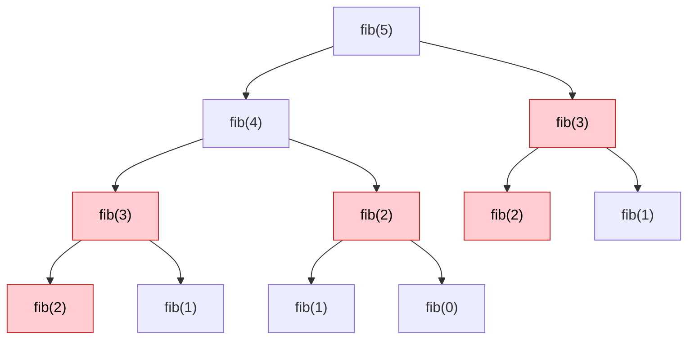
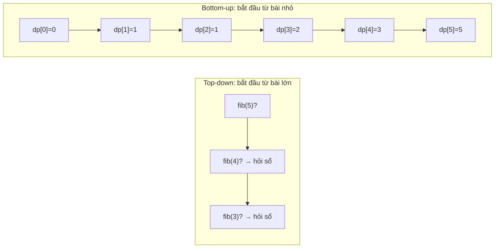
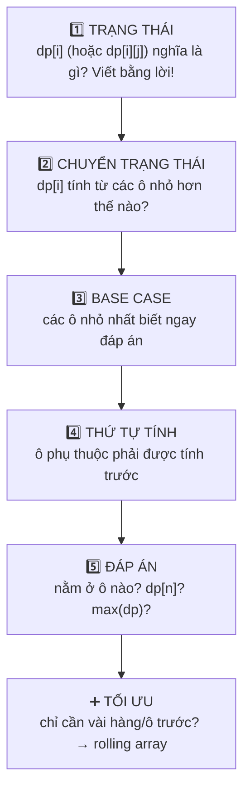
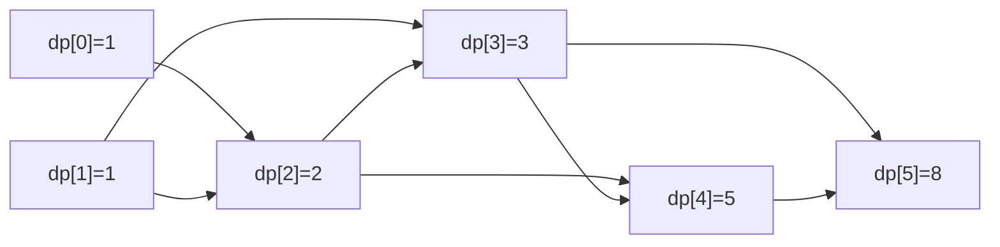
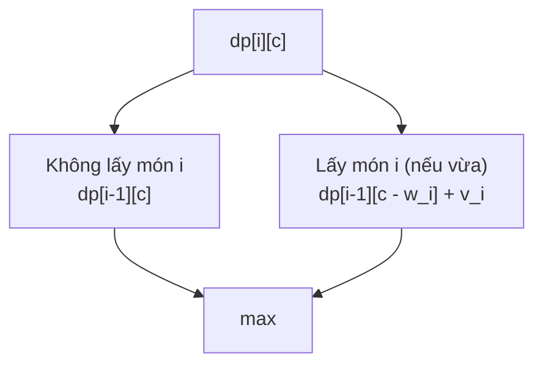
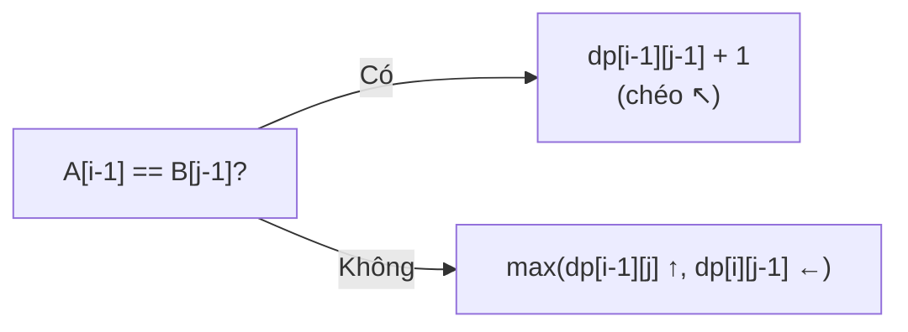
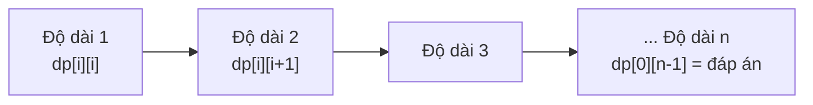
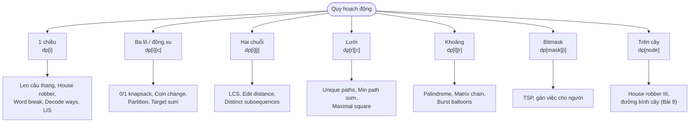

# 📚 Bài 14: Quy hoạch động (Dynamic Programming)

## 🎯 Mục tiêu bài học

- Hiểu **vì sao** cần quy hoạch động: *bài toán con gối nhau* (overlapping subproblems) và *cấu trúc con tối ưu* (optimal substructure)
- Phân biệt và viết được cả hai phong cách: **memoization** (top-down) và **tabulation** (bottom-up)
- Thuộc lòng **khung 5 bước** để tự thiết kế lời giải DP cho bài mới
- Biết **tối ưu bộ nhớ** (rolling array: từ `O(n²)` xuống `O(n)`, từ `O(n)` xuống `O(1)`)
- Giải được các bài kinh điển, chia theo "họ":
    - **DP 1 chiều**: Fibonacci, leo cầu thang, house robber, word break
    - **Đồng xu & ba lô**: coin change (min và số cách), **0/1 knapsack** (có truy vết), partition equal subset sum
    - **Dãy con**: LIS `O(n²)` và `O(n log n)`
    - **Hai chuỗi**: LCS (có truy vết), edit distance
    - **Lưới**: số đường đi, đường đi tổng nhỏ nhất
    - **Khoảng (interval)**: chuỗi con đối xứng dài nhất, nhân chuỗi ma trận
    - **Bitmask**: bài người du lịch (TSP) cỡ nhỏ
- Có **checklist nhận diện** một bài là DP, và phân biệt DP với tham lam / quay lui

!!! tip "Đừng sợ DP"
    DP nổi tiếng "khó", nhưng thực ra nó chỉ là **đệ quy + ghi nhớ**. Nếu bạn đã viết được lời giải đệ quy/quay lui ở [Bài 6](./06-recursion-backtracking.md), bạn đã đi được 70% đường. Phần còn lại là **luyện nhận dạng** các "họ" bài - bài này sẽ cho bạn đủ các họ quan trọng nhất.

## 📖 1. Vì sao cần quy hoạch động?

### Câu chuyện "1 + 1 + 1 + 1"

Thầy giáo viết lên bảng `1 + 1 + 1 + 1 + 1 + 1 + 1 + 1 = ?`. Cả lớp đếm... **8**!
Thầy viết thêm `+ 1` vào bên trái. Cả lớp trả lời ngay: **9**!
"Sao nhanh thế?" - "Vì em **nhớ** kết quả vừa nãy là 8, cộng thêm 1."

Đó là toàn bộ tinh thần của DP: **đừng tính lại thứ đã tính - hãy ghi nhớ**.

### Fibonacci ngây thơ: tính đi tính lại

`fib(n) = fib(n-1) + fib(n-2)`, với `fib(0) = 0`, `fib(1) = 1`.



Các ô đỏ là **bị tính lặp lại**: `fib(3)` 2 lần, `fib(2)` 3 lần (cây chưa vẽ hết). Với `fib(50)`, số lần gọi hàm khoảng **40 tỷ** - trong khi chỉ có **51** giá trị khác nhau cần tính!

Bấm ▶ để xem cây đệ quy `fib(5)` mọc ra; để ý cùng một `fib(2)` xuất hiện ở nhiều nhánh.

<div class="algo-viz" data-viz="recursion" data-algo="fib-tree" data-n="5" data-title="Cây đệ quy fib(5): bài toán con gối nhau"></div>

### Hai điều kiện để dùng DP

| Điều kiện | Nghĩa là | Ví dụ |
|---|---|---|
| **Bài toán con gối nhau** (overlapping subproblems) | Cùng một bài toán con được giải **nhiều lần** | `fib(3)` xuất hiện ở nhiều nhánh |
| **Cấu trúc con tối ưu** (optimal substructure) | Lời giải tối ưu của bài lớn **ghép từ** lời giải tối ưu của bài con | Đường ngắn nhất A→C qua B = ngắn nhất A→B + ngắn nhất B→C |

!!! note "DP khác chia để trị (merge sort) ở đâu?"
    Merge sort cũng chia bài lớn thành bài con, nhưng các bài con **không gối nhau** (nửa trái và nửa phải độc lập) → không có gì để nhớ. DP chỉ có lợi khi bài con **lặp lại**.

## 📖 2. Hai phong cách: Memoization vs Tabulation

### Top-down (memoization) - "đệ quy + cuốn sổ"

Giữ nguyên lời giải đệ quy, thêm một **cuốn sổ** (map/mảng). Trước khi tính, mở sổ xem đã có chưa; tính xong thì ghi vào sổ.

### Bottom-up (tabulation) - "điền bảng từ nhỏ đến lớn"

Bỏ đệ quy. Tạo bảng `dp[]`, điền các ô **nhỏ trước** (base case), rồi dùng chúng tính ô lớn hơn. Giống xây nhà: móng trước, tầng 1, tầng 2...



Bấm ▶ để xem bảng `dp` được điền từ trái sang phải; mỗi ô chỉ cần **hai ô ngay trước nó**.

<div class="algo-viz" data-viz="dp" data-algo="fibonacci" data-n="10" data-title="Tabulation: điền bảng Fibonacci"></div>

| i | 0 | 1 | 2 | 3 | 4 | 5 | 6 | 7 | 8 | 9 | 10 |
|---|---|---|---|---|---|---|---|---|---|---|---|
| dp[i] | 0 | 1 | 1 | 2 | 3 | 5 | 8 | 13 | 21 | 34 | 55 |

=== "Go"

    ```go
    package main

    import "fmt"

    var calls int

    // 1. Đệ quy ngây thơ: O(2^n)
    func fibNaive(n int) int {
    	calls++
    	if n < 2 {
    		return n
    	}
    	return fibNaive(n-1) + fibNaive(n-2)
    }

    // 2. Top-down + memo: O(n)
    func fibMemo(n int, memo map[int]int) int {
    	calls++
    	if n < 2 {
    		return n
    	}
    	if v, ok := memo[n]; ok {
    		return v // đã có trong sổ
    	}
    	memo[n] = fibMemo(n-1, memo) + fibMemo(n-2, memo)
    	return memo[n]
    }

    // 3. Bottom-up: O(n) thời gian, O(n) bộ nhớ
    func fibTab(n int) int {
    	if n < 2 {
    		return n
    	}
    	dp := make([]int, n+1)
    	dp[1] = 1
    	for i := 2; i <= n; i++ {
    		dp[i] = dp[i-1] + dp[i-2]
    	}
    	return dp[n]
    }

    // 4. Tối ưu bộ nhớ: chỉ cần 2 ô trước → O(1)
    func fibO1(n int) int {
    	a, b := 0, 1 // a = fib(i), b = fib(i+1)
    	for i := 0; i < n; i++ {
    		a, b = b, a+b
    	}
    	return a
    }

    func main() {
    	calls = 0
    	fmt.Println("naive:", fibNaive(30), "-", calls, "lần gọi")
    	calls = 0
    	fmt.Println("memo :", fibMemo(30, map[int]int{}), "-", calls, "lần gọi")
    	fmt.Println("tab  :", fibTab(30))
    	fmt.Println("O(1) :", fibO1(30), "| fib(90) =", fibO1(90))
    }

    // Output:
    // naive: 832040 - 2692537 lần gọi
    // memo : 832040 - 59 lần gọi
    // tab  : 832040
    // O(1) : 832040 | fib(90) = 2880067194370816120
    ```

=== "Python"

    ```python
    from functools import cache

    calls = 0


    def fib_naive(n):                 # O(2^n)
        global calls
        calls += 1
        return n if n < 2 else fib_naive(n - 1) + fib_naive(n - 2)


    def fib_memo(n, memo=None):       # top-down: O(n)
        global calls
        calls += 1
        if memo is None:
            memo = {}
        if n < 2:
            return n
        if n not in memo:
            memo[n] = fib_memo(n - 1, memo) + fib_memo(n - 2, memo)
        return memo[n]


    @cache                            # Python làm memo hộ bạn
    def fib_cache(n):
        return n if n < 2 else fib_cache(n - 1) + fib_cache(n - 2)


    def fib_tab(n):                   # bottom-up: O(n) bộ nhớ
        if n < 2:
            return n
        dp = [0] * (n + 1)
        dp[1] = 1
        for i in range(2, n + 1):
            dp[i] = dp[i - 1] + dp[i - 2]
        return dp[n]


    def fib_o1(n):                    # chỉ giữ 2 ô: O(1) bộ nhớ
        a, b = 0, 1
        for _ in range(n):
            a, b = b, a + b
        return a


    calls = 0
    print("naive:", fib_naive(30), "-", calls, "lần gọi")
    calls = 0
    print("memo :", fib_memo(30), "-", calls, "lần gọi")
    print("cache:", fib_cache(30))
    print("tab  :", fib_tab(30))
    print("O(1) :", fib_o1(30), "| fib(90) =", fib_o1(90))

    # Output:
    # naive: 832040 - 2692537 lần gọi
    # memo : 832040 - 59 lần gọi
    # cache: 832040
    # tab  : 832040
    # O(1) : 832040 | fib(90) = 2880067194370816120
    ```

**2,7 triệu lần gọi → 59 lần gọi**. Đó là sức mạnh của việc "ghi sổ".

### So sánh hai phong cách

| | Top-down (memo) | Bottom-up (tabulation) |
|---|---|---|
| Cách viết | Đệ quy + map/mảng | Vòng lặp + mảng |
| Dễ nghĩ ra | ✅ Rất dễ - chuyển thẳng từ lời giải đệ quy | Cần xác định **thứ tự** điền bảng |
| Chỉ tính bài con **cần thiết** | ✅ | ❌ tính tất cả ô |
| Rủi ro stack overflow | ⚠️ Có (Python mặc định giới hạn ~1000 tầng) | ✅ Không |
| Tối ưu bộ nhớ (rolling array) | Khó | ✅ Dễ |
| Tốc độ thực tế | Chậm hơn (gọi hàm, hash map) | Nhanh hơn |

!!! tip "Lời khuyên"
    Khi gặp bài mới: **nghĩ bằng top-down** (dễ tìm công thức), **viết bằng bottom-up** khi cần tối ưu hoặc khi `n` lớn. Phỏng vấn: cả hai đều được chấp nhận; nói rõ bạn biết cách chuyển đổi là điểm cộng.

## 📖 3. Khung 5 bước giải mọi bài DP



Bước **quan trọng nhất và khó nhất** là bước 1. Một định nghĩa trạng thái tốt thường có dạng:

- *"`dp[i]` = đáp án cho **tiền tố** `i` phần tử đầu"* (hoặc **kết thúc tại** `i`)
- *"`dp[i][j]` = đáp án cho `i` ký tự đầu của chuỗi A và `j` ký tự đầu của chuỗi B"*
- *"`dp[i][c]` = đáp án khi xét `i` món đồ đầu với sức chứa `c`"*
- *"`dp[l][r]` = đáp án cho đoạn con từ `l` tới `r`"*

Câu hỏi then chốt để tìm **chuyển trạng thái**: *"Ở bước cuối cùng, có những lựa chọn nào?"* - rồi lấy tốt nhất (hoặc cộng dồn) qua các lựa chọn.

## 📖 4. Leo cầu thang (Climbing Stairs)

**Đề** ([LeetCode 70](https://leetcode.com/problems/climbing-stairs/)): cầu thang `n` bậc, mỗi lần bước **1 hoặc 2** bậc. Có bao nhiêu cách lên tới đỉnh?

**Áp dụng khung 5 bước**:

1. **Trạng thái**: `dp[i]` = số cách lên tới bậc `i`
2. **Chuyển**: bước cuối cùng lên bậc `i` là từ bậc `i-1` (bước 1) **hoặc** bậc `i-2` (bước 2) → `dp[i] = dp[i-1] + dp[i-2]`
3. **Base**: `dp[0] = 1` (đứng yên ở chân cầu thang là 1 cách), `dp[1] = 1`
4. **Thứ tự**: `i` tăng dần
5. **Đáp án**: `dp[n]`



Với `n = 3`: các cách là `1+1+1`, `1+2`, `2+1` → 3 ✓. Hóa ra đây chính là Fibonacci lệch một chỉ số!

Bấm ▶ và để ý mỗi ô = tổng **hai ô trước** (hai cách đặt bước chân cuối cùng).

<div class="algo-viz" data-viz="dp" data-algo="climbing-stairs" data-n="7" data-title="Leo cầu thang: dp[i] = dp[i-1] + dp[i-2]"></div>

=== "Go"

    ```go
    package main

    import "fmt"

    func climbStairs(n int) int {
    	prev2, prev1 := 1, 1 // dp[i-2], dp[i-1]; bắt đầu với dp[0], dp[1]
    	for i := 2; i <= n; i++ {
    		prev2, prev1 = prev1, prev1+prev2
    	}
    	return prev1
    }

    // Biến thể: mỗi lần được bước 1, 2 hoặc 3 bậc
    func climb123(n int) int {
    	dp := make([]int, n+1)
    	dp[0] = 1
    	for i := 1; i <= n; i++ {
    		for _, step := range []int{1, 2, 3} {
    			if i-step >= 0 {
    				dp[i] += dp[i-step]
    			}
    		}
    	}
    	return dp[n]
    }

    func main() {
    	fmt.Println(climbStairs(3), climbStairs(5), climbStairs(10))
    	fmt.Println(climb123(4), climb123(10))
    }

    // Output:
    // 3 8 89
    // 7 274
    ```

=== "Python"

    ```python
    def climb_stairs(n: int) -> int:
        prev2, prev1 = 1, 1  # dp[i-2], dp[i-1]
        for _ in range(2, n + 1):
            prev2, prev1 = prev1, prev1 + prev2
        return prev1


    def climb_123(n: int) -> int:
        """Biến thể: mỗi lần được bước 1, 2 hoặc 3 bậc."""
        dp = [0] * (n + 1)
        dp[0] = 1
        for i in range(1, n + 1):
            dp[i] = sum(dp[i - s] for s in (1, 2, 3) if i - s >= 0)
        return dp[n]


    print(climb_stairs(3), climb_stairs(5), climb_stairs(10))
    print(climb_123(4), climb_123(10))

    # Output:
    # 3 8 89
    # 7 274
    ```

**Độ phức tạp**: `O(n)` thời gian, `O(1)` bộ nhớ (bản rút gọn).

## 📖 5. House Robber - chọn hoặc bỏ

**Đề** ([LeetCode 198](https://leetcode.com/problems/house-robber/)): dãy nhà có tiền `nums[i]`. Không được lấy **hai nhà kề nhau** (sẽ báo động). Lấy được nhiều nhất bao nhiêu?

Ví dụ đời thường hơn: bạn đi **phát quà Tết** dọc một con hẻm, nhưng quy định không được ghé hai nhà liền kề (để chia đều cho các nhóm). Chọn nhà nào để tổng quà nhận lại lớn nhất?

1. **Trạng thái**: `dp[i]` = số tiền lớn nhất khi xét `i` nhà đầu tiên
2. **Chuyển** - với nhà thứ `i` (chỉ số `i-1`) chỉ có 2 lựa chọn:
    - **Bỏ** nhà này → `dp[i-1]`
    - **Lấy** nhà này → không được lấy nhà trước → `dp[i-2] + nums[i-1]`
    - `dp[i] = max(dp[i-1], dp[i-2] + nums[i-1])`
3. **Base**: `dp[0] = 0`, `dp[1] = nums[0]`
4. **Đáp án**: `dp[n]`

Trace với `[2, 7, 9, 3, 1]`:

| i | nhà | bỏ = dp[i-1] | lấy = dp[i-2] + nhà | dp[i] |
|---|---|---|---|---|
| 0 | - | | | 0 |
| 1 | 2 | 0 | 0 + 2 | 2 |
| 2 | 7 | 2 | 0 + 7 | 7 |
| 3 | 9 | 7 | 2 + 9 | 11 |
| 4 | 3 | 11 | 7 + 3 | 11 |
| 5 | 1 | 11 | 11 + 1 | **12** |

Đáp án 12 = nhà 2 + 9 + 1.

=== "Go"

    ```go
    package main

    import "fmt"

    func rob(nums []int) int {
    	prev2, prev1 := 0, 0 // dp[i-2], dp[i-1]
    	for _, x := range nums {
    		prev2, prev1 = prev1, max(prev1, prev2+x)
    	}
    	return prev1
    }

    func main() {
    	fmt.Println(rob([]int{2, 7, 9, 3, 1}))
    	fmt.Println(rob([]int{1, 2, 3, 1}))
    	fmt.Println(rob([]int{2, 1, 1, 2}))
    }

    // Output:
    // 12
    // 4
    // 4
    ```

=== "Python"

    ```python
    def rob(nums):
        prev2, prev1 = 0, 0  # dp[i-2], dp[i-1]
        for x in nums:
            prev2, prev1 = prev1, max(prev1, prev2 + x)
        return prev1


    print(rob([2, 7, 9, 3, 1]))
    print(rob([1, 2, 3, 1]))
    print(rob([2, 1, 1, 2]))

    # Output:
    # 12
    # 4
    # 4
    ```

!!! warning "Vì sao tham lam không được?"
    - "Cứ lấy nhà giàu nhất trước rồi bỏ hai nhà kề": với `[3, 4, 3]` chọn 4 → được 4, trong khi `3 + 3 = 6`.
    - "Lấy xen kẽ các nhà chẵn hoặc lẻ": với `[2, 1, 1, 2]` được 3, trong khi nhà đầu + nhà cuối = 4.

    DP xét **mọi** khả năng một cách có hệ thống, tham lam chỉ nhìn bước hiện tại ([Bài 13](./13-greedy.md)).

## 📖 6. Đổi tiền (Coin Change)

### 6.1 Số đồng xu ít nhất

**Đề** ([LeetCode 322](https://leetcode.com/problems/coin-change/)): có các mệnh giá `coins` (dùng không giới hạn), cần đổi đúng `amount`. Ít nhất bao nhiêu đồng? Không được thì `-1`.

Tham lam "lấy đồng lớn nhất trước" đúng với tiền Việt Nam (1k, 2k, 5k, 10k...) nhưng **sai** với mệnh giá lạ: `coins = [1, 3, 4]`, `amount = 6` → tham lam `4+1+1` (3 đồng), tối ưu `3+3` (2 đồng).

1. **Trạng thái**: `dp[a]` = số đồng ít nhất để tạo ra số tiền `a`
2. **Chuyển**: đồng xu **cuối cùng** là `c` nào đó → `dp[a] = min(dp[a - c] + 1)` với mọi `c ≤ a`
3. **Base**: `dp[0] = 0`; các ô khác khởi tạo **vô cực** (chưa tạo được)
4. **Thứ tự**: `a` tăng dần
5. **Đáp án**: `dp[amount]` (nếu vẫn vô cực → `-1`)

Trace với `coins = [1, 2, 5]`, `amount = 11`:

| a | 0 | 1 | 2 | 3 | 4 | 5 | 6 | 7 | 8 | 9 | 10 | 11 |
|---|---|---|---|---|---|---|---|---|---|---|---|---|
| dp[a] | 0 | 1 | 1 | 2 | 2 | 1 | 2 | 2 | 3 | 3 | 2 | **3** |

Ví dụ `dp[11] = min(dp[10]+1, dp[9]+1, dp[6]+1) = min(3, 4, 3) = 3` → `5 + 5 + 1`.

Bấm ▶ để xem mỗi ô `dp[a]` thử từng đồng xu và lấy kết quả nhỏ nhất.

<div class="algo-viz" data-viz="dp" data-algo="coin-change" data-coins="1,2,5" data-amount="11" data-title="Coin change: số đồng xu ít nhất"></div>

### 6.2 Số cách đổi tiền

**Đề** ([LeetCode 518](https://leetcode.com/problems/coin-change-ii/)): có **bao nhiêu cách** (không tính thứ tự) để đổi `amount`?

`ways[a] += ways[a - c]`. Nhưng **thứ tự hai vòng lặp** quyết định ta đếm **tổ hợp** hay **chỉnh hợp**:

| Vòng ngoài | Vòng trong | Đếm | `coins=[1,2,5]`, `amount=5` |
|---|---|---|---|
| **đồng xu** | số tiền | **Tổ hợp** (`1+2+2` và `2+1+2` là **một** cách) | 4 |
| số tiền | đồng xu | **Chỉnh hợp** (thứ tự khác = cách khác) - [LeetCode 377](https://leetcode.com/problems/combination-sum-iv/) | 9 |

Vì sao? Khi đồng xu ở vòng ngoài, ta "dùng xong hết đồng 1, rồi mới được thêm đồng 2, rồi đồng 5" → mỗi tổ hợp chỉ được tạo theo **một thứ tự duy nhất**.

Trace tổ hợp (`amount = 5`):

| Sau khi xét đồng | ways[0..5] |
|---|---|
| (khởi tạo) | `1 0 0 0 0 0` |
| 1 | `1 1 1 1 1 1` |
| 2 | `1 1 2 2 3 3` |
| 5 | `1 1 2 2 3 4` |

4 cách: `5`, `2+2+1`, `2+1+1+1`, `1+1+1+1+1`.

=== "Go"

    ```go
    package main

    import (
    	"fmt"
    	"math"
    )

    // Ít đồng nhất + truy vết các đồng đã dùng
    func coinChange(coins []int, amount int) (int, []int) {
    	const INF = math.MaxInt32
    	dp := make([]int, amount+1)
    	last := make([]int, amount+1) // đồng xu cuối cùng dùng để đạt dp[a]
    	for a := 1; a <= amount; a++ {
    		dp[a] = INF
    		for _, c := range coins {
    			if c <= a && dp[a-c] != INF && dp[a-c]+1 < dp[a] {
    				dp[a] = dp[a-c] + 1
    				last[a] = c
    			}
    		}
    	}
    	if dp[amount] == INF {
    		return -1, nil
    	}
    	used := []int{}
    	for a := amount; a > 0; a -= last[a] {
    		used = append(used, last[a])
    	}
    	return dp[amount], used
    }

    // Số cách - tổ hợp: đồng xu ở vòng NGOÀI
    func change(amount int, coins []int) int {
    	ways := make([]int, amount+1)
    	ways[0] = 1
    	for _, c := range coins {
    		for a := c; a <= amount; a++ {
    			ways[a] += ways[a-c]
    		}
    	}
    	return ways[amount]
    }

    // Số cách - chỉnh hợp: số tiền ở vòng NGOÀI
    func combinationSum4(coins []int, amount int) int {
    	ways := make([]int, amount+1)
    	ways[0] = 1
    	for a := 1; a <= amount; a++ {
    		for _, c := range coins {
    			if c <= a {
    				ways[a] += ways[a-c]
    			}
    		}
    	}
    	return ways[amount]
    }

    func main() {
    	fmt.Println(coinChange([]int{1, 2, 5}, 11))
    	fmt.Println(coinChange([]int{1, 3, 4}, 6))
    	fmt.Println(coinChange([]int{2}, 3))
    	fmt.Println("tổ hợp:", change(5, []int{1, 2, 5}), "| chỉnh hợp:", combinationSum4([]int{1, 2, 5}, 5))
    }

    // Output:
    // 3 [1 5 5]
    // 2 [3 3]
    // -1 []
    // tổ hợp: 4 | chỉnh hợp: 9
    ```

=== "Python"

    ```python
    import math


    def coin_change(coins, amount):
        """Ít đồng nhất + truy vết các đồng đã dùng."""
        dp = [0] + [math.inf] * amount
        last = [0] * (amount + 1)  # đồng xu cuối cùng dùng để đạt dp[a]
        for a in range(1, amount + 1):
            for c in coins:
                if c <= a and dp[a - c] + 1 < dp[a]:
                    dp[a] = dp[a - c] + 1
                    last[a] = c
        if dp[amount] == math.inf:
            return -1, []
        used, a = [], amount
        while a > 0:
            used.append(last[a])
            a -= last[a]
        return dp[amount], used


    def change(amount, coins):
        """Số cách - tổ hợp: đồng xu ở vòng NGOÀI."""
        ways = [1] + [0] * amount
        for c in coins:
            for a in range(c, amount + 1):
                ways[a] += ways[a - c]
        return ways[amount]


    def combination_sum4(coins, amount):
        """Số cách - chỉnh hợp: số tiền ở vòng NGOÀI."""
        ways = [1] + [0] * amount
        for a in range(1, amount + 1):
            for c in coins:
                if c <= a:
                    ways[a] += ways[a - c]
        return ways[amount]


    print(coin_change([1, 2, 5], 11))
    print(coin_change([1, 3, 4], 6))
    print(coin_change([2], 3))
    print("tổ hợp:", change(5, [1, 2, 5]), "| chỉnh hợp:", combination_sum4([1, 2, 5], 5))

    # Output:
    # (3, [1, 5, 5])
    # (2, [3, 3])
    # (-1, [])
    # tổ hợp: 4 | chỉnh hợp: 9
    ```

**Độ phức tạp**: `O(amount × số mệnh giá)` thời gian, `O(amount)` bộ nhớ.

!!! warning "Vô cực và tràn số"
    Trong Go, nếu dùng `math.MaxInt` làm vô cực rồi `+1` → **tràn số thành số âm**, và số âm đó lại "thắng" phép `min`. Luôn kiểm tra `dp[a-c] != INF` trước khi cộng, hoặc dùng vô cực "vừa đủ lớn" như `amount + 1`.

## 📖 7. Bài toán cái ba lô 0/1 (0/1 Knapsack)

### Đề bài và trực giác

Bạn đi phượt với ba lô chịu được tối đa `W` kg. Có `n` món đồ, món `i` nặng `w[i]`, có giá trị `v[i]`. Mỗi món **lấy hoặc không** (không cắt đôi được - đó là nghĩa của "0/1"). Tổng giá trị lớn nhất?

Tham lam theo "giá trị/kg" **sai** ở đây (nó chỉ đúng cho knapsack **phân số** - [Bài 13](./13-greedy.md)).

1. **Trạng thái**: `dp[i][c]` = giá trị lớn nhất khi chỉ xét **`i` món đầu** và ba lô sức chứa **`c`**
2. **Chuyển** - với món thứ `i`:
    - **Không lấy**: `dp[i-1][c]`
    - **Lấy** (nếu `w[i] ≤ c`): `dp[i-1][c - w[i]] + v[i]`
    - `dp[i][c] = max(hai lựa chọn)`
3. **Base**: `dp[0][c] = 0` (không có món nào)
4. **Thứ tự**: `i` tăng dần; `c` tùy ý
5. **Đáp án**: `dp[n][W]`



### Trace bảng

Đồ vật: `w = [1, 3, 4, 5]`, `v = [1, 4, 5, 7]`, `W = 7`.

| i (món) \ c | 0 | 1 | 2 | 3 | 4 | 5 | 6 | 7 |
|---|---|---|---|---|---|---|---|---|
| 0 (không có) | 0 | 0 | 0 | 0 | 0 | 0 | 0 | 0 |
| 1 (w=1, v=1) | 0 | 1 | 1 | 1 | 1 | 1 | 1 | 1 |
| 2 (w=3, v=4) | 0 | 1 | 1 | 4 | 5 | 5 | 5 | 5 |
| 3 (w=4, v=5) | 0 | 1 | 1 | 4 | 5 | 6 | 6 | **9** |
| 4 (w=5, v=7) | 0 | 1 | 1 | 4 | 5 | 7 | 8 | **9** |

Ví dụ ô `dp[3][7]`: không lấy món 3 → `dp[2][7] = 5`; lấy → `dp[2][7-4] + 5 = 4 + 5 = 9` → **9**.

### Truy vết: đã chọn những món nào?

Đi ngược từ `dp[n][W]`: nếu `dp[i][c] != dp[i-1][c]` thì **món `i` đã được lấy** → `c -= w[i]`. Ngược lại món `i` không được lấy.

```text
i=4, c=7: dp[4][7]=9 == dp[3][7]=9  → KHÔNG lấy món 4
i=3, c=7: dp[3][7]=9 != dp[2][7]=5  → LẤY món 3 (w=4), c = 3
i=2, c=3: dp[2][3]=4 != dp[1][3]=1  → LẤY món 2 (w=3), c = 0
i=1, c=0: dp[1][0]=0 == dp[0][0]=0  → KHÔNG lấy món 1
→ chọn món 2 và 3: nặng 3 + 4 = 7, giá trị 4 + 5 = 9
```

Bấm ▶ để xem bảng được điền từng hàng; mỗi ô so sánh "không lấy" (ô ngay trên) với "lấy" (ô ở hàng trên, lùi sang trái `w[i]` cột).

<div class="algo-viz" data-viz="dp" data-algo="knapsack" data-weights="1,3,4,5" data-values="1,4,5,7" data-capacity="7" data-title="0/1 Knapsack"></div>

### Tối ưu bộ nhớ: một hàng, duyệt `c` **giảm dần**

Hàng `i` chỉ dùng hàng `i-1` → giữ **một mảng** `dp[c]`. Nhưng phải duyệt `c` **từ lớn về nhỏ**: khi tính `dp[c]` ta cần `dp[c - w]` **của hàng cũ** - nếu duyệt tăng dần, `dp[c - w]` đã bị ghi đè bởi hàng mới → một món bị lấy **nhiều lần** (thành bài unbounded knapsack!).

```text
Duyệt TĂNG với món (w=1, v=1):  dp[1] = dp[0]+1 = 1,  dp[2] = dp[1]+1 = 2 ← món 1 bị lấy 2 lần ❌
Duyệt GIẢM:                      dp[2] = dp[1]+1 = 1 (dp[1] còn là 0 của hàng cũ) ✓
```

=== "Go"

    ```go
    package main

    import (
    	"fmt"
    	"slices"
    )

    func knapsack(w, v []int, W int) (int, []int) {
    	n := len(w)
    	dp := make([][]int, n+1)
    	for i := range dp {
    		dp[i] = make([]int, W+1)
    	}
    	for i := 1; i <= n; i++ {
    		for c := 0; c <= W; c++ {
    			dp[i][c] = dp[i-1][c] // không lấy món i
    			if w[i-1] <= c {
    				dp[i][c] = max(dp[i][c], dp[i-1][c-w[i-1]]+v[i-1]) // lấy
    			}
    		}
    	}
    	for i, row := range dp {
    		fmt.Println(i, row)
    	}
    	// Truy vết
    	chosen := []int{}
    	c := W
    	for i := n; i >= 1; i-- {
    		if dp[i][c] != dp[i-1][c] {
    			chosen = append(chosen, i-1) // chỉ số 0-based
    			c -= w[i-1]
    		}
    	}
    	slices.Reverse(chosen)
    	return dp[n][W], chosen
    }

    // Bản 1 chiều: O(W) bộ nhớ
    func knapsack1D(w, v []int, W int) int {
    	dp := make([]int, W+1)
    	for i := range w {
    		for c := W; c >= w[i]; c-- { // GIẢM dần!
    			dp[c] = max(dp[c], dp[c-w[i]]+v[i])
    		}
    	}
    	return dp[W]
    }

    func main() {
    	w, v := []int{1, 3, 4, 5}, []int{1, 4, 5, 7}
    	best, items := knapsack(w, v, 7)
    	fmt.Println("tốt nhất:", best, "- các món (0-based):", items)
    	fmt.Println("bản 1D:", knapsack1D(w, v, 7))
    }

    // Output:
    // 0 [0 0 0 0 0 0 0 0]
    // 1 [0 1 1 1 1 1 1 1]
    // 2 [0 1 1 4 5 5 5 5]
    // 3 [0 1 1 4 5 6 6 9]
    // 4 [0 1 1 4 5 7 8 9]
    // tốt nhất: 9 - các món (0-based): [1 2]
    // bản 1D: 9
    ```

=== "Python"

    ```python
    def knapsack(w, v, W):
        n = len(w)
        dp = [[0] * (W + 1) for _ in range(n + 1)]
        for i in range(1, n + 1):
            for c in range(W + 1):
                dp[i][c] = dp[i - 1][c]                       # không lấy món i
                if w[i - 1] <= c:
                    dp[i][c] = max(dp[i][c], dp[i - 1][c - w[i - 1]] + v[i - 1])  # lấy
        for i, row in enumerate(dp):
            print(i, row)
        chosen, c = [], W                                     # truy vết
        for i in range(n, 0, -1):
            if dp[i][c] != dp[i - 1][c]:
                chosen.append(i - 1)
                c -= w[i - 1]
        return dp[n][W], chosen[::-1]


    def knapsack_1d(w, v, W):
        dp = [0] * (W + 1)
        for wi, vi in zip(w, v):
            for c in range(W, wi - 1, -1):                    # GIẢM dần!
                dp[c] = max(dp[c], dp[c - wi] + vi)
        return dp[W]


    w, v = [1, 3, 4, 5], [1, 4, 5, 7]
    best, items = knapsack(w, v, 7)
    print("tốt nhất:", best, "- các món (0-based):", items)
    print("bản 1D:", knapsack_1d(w, v, 7))

    # Output:
    # 0 [0, 0, 0, 0, 0, 0, 0, 0]
    # 1 [0, 1, 1, 1, 1, 1, 1, 1]
    # 2 [0, 1, 1, 4, 5, 5, 5, 5]
    # 3 [0, 1, 1, 4, 5, 6, 6, 9]
    # 4 [0, 1, 1, 4, 5, 7, 8, 9]
    # tốt nhất: 9 - các món (0-based): [1, 2]
    # bản 1D: 9
    ```

**Độ phức tạp**: `O(n × W)` thời gian; `O(n × W)` bộ nhớ (bản 2D, cần để truy vết) hoặc `O(W)` (bản 1D).

!!! note "Pseudo-polynomial"
    `O(n × W)` trông như đa thức, nhưng `W` là **giá trị** chứ không phải **kích thước input**. Nếu `W = 10^12` thì bảng không thể tạo nổi. Knapsack thực chất là bài **NP-khó**; DP chỉ hiệu quả khi `W` nhỏ (thường ≤ 10^5 - 10^6).

### Các biến thể knapsack

| Biến thể | Khác biệt | Vòng `c` (bản 1D) |
|---|---|---|
| **0/1** | mỗi món tối đa 1 lần | **giảm** dần |
| **Unbounded** (không giới hạn) | mỗi món dùng bao nhiêu lần cũng được - coin change chính là loại này | **tăng** dần |
| **Subset sum** | chỉ hỏi "có tạo được tổng `S` không" (`bool`) | giảm dần |
| **Đếm số cách** | `+=` thay vì `max` | tùy 0/1 hay unbounded |

## 📖 8. Partition Equal Subset Sum - knapsack "trá hình"

**Đề** ([LeetCode 416](https://leetcode.com/problems/partition-equal-subset-sum/)): chia mảng thành **hai phần có tổng bằng nhau** được không?

**Biến đổi**: nếu tổng `S` lẻ → không được. Ngược lại, câu hỏi thành: *có tập con nào có tổng đúng `S/2` không?* → **subset sum** = 0/1 knapsack với giá trị `bool`.

`dp[t]` = có tạo được tổng `t` từ các phần tử đã xét không. `dp[0] = true`. Với mỗi `x`: `dp[t] = dp[t] || dp[t - x]` (duyệt `t` giảm dần).

Ví dụ `[1, 5, 11, 5]`: tổng 22, mục tiêu 11 → `{11}` và `{1, 5, 5}` ✓.

=== "Go"

    ```go
    package main

    import "fmt"

    func canPartition(nums []int) bool {
    	sum := 0
    	for _, x := range nums {
    		sum += x
    	}
    	if sum%2 == 1 {
    		return false
    	}
    	target := sum / 2
    	dp := make([]bool, target+1)
    	dp[0] = true
    	for _, x := range nums {
    		for t := target; t >= x; t-- { // giảm dần: mỗi số dùng 1 lần
    			dp[t] = dp[t] || dp[t-x]
    		}
    	}
    	return dp[target]
    }

    func main() {
    	fmt.Println(canPartition([]int{1, 5, 11, 5}))
    	fmt.Println(canPartition([]int{1, 2, 3, 5}))
    	fmt.Println(canPartition([]int{2, 2, 3, 5}))
    }

    // Output:
    // true
    // false
    // false
    ```

=== "Python"

    ```python
    def can_partition(nums):
        total = sum(nums)
        if total % 2:
            return False
        target = total // 2
        dp = [True] + [False] * target
        for x in nums:
            for t in range(target, x - 1, -1):  # giảm dần: mỗi số dùng 1 lần
                dp[t] = dp[t] or dp[t - x]
        return dp[target]


    print(can_partition([1, 5, 11, 5]))
    print(can_partition([1, 2, 3, 5]))
    print(can_partition([2, 2, 3, 5]))

    # Output:
    # True
    # False
    # False
    ```

## 📖 9. Đường đi trên lưới (Grid DP)

### Số đường đi

**Đề** ([LeetCode 62](https://leetcode.com/problems/unique-paths/)): robot ở góc trên-trái lưới `m × n`, mỗi bước chỉ đi **phải** hoặc **xuống**. Có bao nhiêu đường tới góc dưới-phải?

Như đi bộ trong khu phố **bàn cờ** (kiểu các khu đô thị mới), chỉ được đi về phía đích: tới ô `(i, j)` chỉ có thể từ ô **trên** hoặc ô **trái**.

`dp[i][j] = dp[i-1][j] + dp[i][j-1]`, hàng đầu và cột đầu đều bằng 1.

```text
Lưới 3 × 4:
  1   1   1   1
  1   2   3   4
  1   3   6  10   ← đáp án 10
```

### Đường đi có tổng nhỏ nhất

**Đề** ([LeetCode 64](https://leetcode.com/problems/minimum-path-sum/)): mỗi ô có chi phí, tìm đường (phải/xuống) có tổng nhỏ nhất. `dp[i][j] = grid[i][j] + min(dp[i-1][j], dp[i][j-1])`.

```text
grid           dp
1 3 1          1  4  5
1 5 1    →     2  7  6
4 2 1          6  8  7   ← đáp án 7 (1→3→1→1→1)
```

=== "Go"

    ```go
    package main

    import "fmt"

    func uniquePaths(m, n int) int {
    	dp := make([]int, n) // một hàng, tái sử dụng
    	for j := range dp {
    		dp[j] = 1
    	}
    	for i := 1; i < m; i++ {
    		for j := 1; j < n; j++ {
    			dp[j] += dp[j-1] // dp[j] cũ = ô trên, dp[j-1] = ô trái
    		}
    	}
    	return dp[n-1]
    }

    func minPathSum(grid [][]int) int {
    	m, n := len(grid), len(grid[0])
    	dp := make([][]int, m)
    	for i := range dp {
    		dp[i] = make([]int, n)
    		for j := range dp[i] {
    			switch {
    			case i == 0 && j == 0:
    				dp[i][j] = grid[0][0]
    			case i == 0:
    				dp[i][j] = dp[i][j-1] + grid[i][j]
    			case j == 0:
    				dp[i][j] = dp[i-1][j] + grid[i][j]
    			default:
    				dp[i][j] = min(dp[i-1][j], dp[i][j-1]) + grid[i][j]
    			}
    		}
    	}
    	return dp[m-1][n-1]
    }

    func main() {
    	fmt.Println(uniquePaths(3, 4), uniquePaths(3, 7))
    	fmt.Println(minPathSum([][]int{{1, 3, 1}, {1, 5, 1}, {4, 2, 1}}))
    }

    // Output:
    // 10 28
    // 7
    ```

=== "Python"

    ```python
    def unique_paths(m, n):
        dp = [1] * n                 # một hàng, tái sử dụng
        for _ in range(1, m):
            for j in range(1, n):
                dp[j] += dp[j - 1]   # dp[j] cũ = ô trên, dp[j-1] = ô trái
        return dp[-1]


    def min_path_sum(grid):
        m, n = len(grid), len(grid[0])
        dp = [[0] * n for _ in range(m)]
        for i in range(m):
            for j in range(n):
                if i == 0 and j == 0:
                    dp[i][j] = grid[0][0]
                elif i == 0:
                    dp[i][j] = dp[i][j - 1] + grid[i][j]
                elif j == 0:
                    dp[i][j] = dp[i - 1][j] + grid[i][j]
                else:
                    dp[i][j] = min(dp[i - 1][j], dp[i][j - 1]) + grid[i][j]
        return dp[-1][-1]


    print(unique_paths(3, 4), unique_paths(3, 7))
    print(min_path_sum([[1, 3, 1], [1, 5, 1], [4, 2, 1]]))

    # Output:
    # 10 28
    # 7
    ```

**Độ phức tạp**: `O(m × n)` thời gian; bộ nhớ `O(n)` với một hàng.

## 📖 10. Dãy con tăng dài nhất (LIS)

**Đề** ([LeetCode 300](https://leetcode.com/problems/longest-increasing-subsequence/)): tìm độ dài **dãy con** (không cần liên tiếp, giữ thứ tự) **tăng ngặt** dài nhất.

`[10, 9, 2, 5, 3, 7, 101, 18]` → 4 (ví dụ `2, 5, 7, 101` hoặc `2, 3, 7, 18`).

Ví dụ đời thường: nhìn lại giá vàng các tháng, tìm chuỗi tháng dài nhất (không cần liền nhau) mà giá **luôn tăng** - "chuỗi tăng trưởng" dài nhất.

### Cách 1: `O(n²)`

1. **Trạng thái**: `dp[i]` = độ dài LIS **kết thúc tại** `nums[i]` (bắt buộc chứa `nums[i]`)
2. **Chuyển**: `dp[i] = 1 + max(dp[j])` với mọi `j < i` mà `nums[j] < nums[i]` (nối `nums[i]` vào sau dãy kết thúc ở `j`)
3. **Base**: `dp[i] = 1` (chỉ mình nó)
4. **Đáp án**: `max(dp)` - **không phải** `dp[n-1]`!

| i | 0 | 1 | 2 | 3 | 4 | 5 | 6 | 7 |
|---|---|---|---|---|---|---|---|---|
| nums | 10 | 9 | 2 | 5 | 3 | 7 | 101 | 18 |
| dp | 1 | 1 | 1 | 2 | 2 | 3 | **4** | **4** |
| nối sau | - | - | - | 2 | 2 | 5 (hoặc 3) | 7 | 7 |

Bấm ▶ để xem với mỗi `i`, thuật toán quét mọi `j` phía trước và nối vào dãy dài nhất có đuôi nhỏ hơn.

<div class="algo-viz" data-viz="dp" data-algo="lis" data-input="10,9,2,5,3,7,101,18" data-title="LIS O(n²)"></div>

### Cách 2: `O(n log n)` - "xếp bài patience"

**Trực giác**: giữ mảng `tails`, trong đó `tails[k]` = **đuôi nhỏ nhất** có thể của một dãy tăng độ dài `k+1`. Đuôi càng nhỏ càng "dễ nối thêm" về sau. `tails` luôn **tăng dần** → dùng **binary search** ([Bài 8](./08-binary-search.md)).

Với mỗi `x`: tìm vị trí đầu tiên trong `tails` có giá trị `≥ x`:

- Không có → `x` lớn hơn mọi đuôi → **nối dài** (`append`)
- Có → **thay** đuôi đó bằng `x` (đuôi nhỏ hơn, tốt hơn)

| x | tails sau đó | Giải thích |
|---|---|---|
| 10 | `[10]` | |
| 9 | `[9]` | thay 10 (dãy dài 1 kết thúc bằng 9 tốt hơn) |
| 2 | `[2]` | thay 9 |
| 5 | `[2, 5]` | nối dài |
| 3 | `[2, 3]` | thay 5 |
| 7 | `[2, 3, 7]` | nối dài |
| 101 | `[2, 3, 7, 101]` | nối dài |
| 18 | `[2, 3, 7, 18]` | thay 101 |

Độ dài `tails` = **4** ✓.

!!! warning "`tails` KHÔNG phải là một LIS"
    `tails` chỉ cho **độ dài** đúng. Ví dụ `[3, 4, 1]` → `tails = [1, 4]` nhưng `1, 4` không phải dãy con hợp lệ (1 đứng sau 4). Muốn in dãy, dùng cách `O(n²)` với mảng `parent`, hoặc lưu thêm chỉ số trong cách `O(n log n)`.

=== "Go"

    ```go
    package main

    import (
    	"fmt"
    	"slices"
    	"sort"
    )

    // O(n²) + truy vết dãy
    func lisN2(nums []int) (int, []int) {
    	n := len(nums)
    	dp, parent := make([]int, n), make([]int, n)
    	best := 0
    	for i := range nums {
    		dp[i], parent[i] = 1, -1
    		for j := 0; j < i; j++ {
    			if nums[j] < nums[i] && dp[j]+1 > dp[i] {
    				dp[i], parent[i] = dp[j]+1, j
    			}
    		}
    		if dp[i] > dp[best] {
    			best = i
    		}
    	}
    	seq := []int{}
    	for i := best; i != -1; i = parent[i] {
    		seq = append(seq, nums[i])
    	}
    	slices.Reverse(seq)
    	return dp[best], seq
    }

    // O(n log n): tails + binary search
    func lisNLogN(nums []int) int {
    	tails := []int{}
    	for _, x := range nums {
    		k := sort.SearchInts(tails, x) // vị trí đầu tiên >= x
    		if k == len(tails) {
    			tails = append(tails, x)
    		} else {
    			tails[k] = x
    		}
    	}
    	return len(tails)
    }

    func main() {
    	nums := []int{10, 9, 2, 5, 3, 7, 101, 18}
    	fmt.Println(lisN2(nums))
    	fmt.Println(lisNLogN(nums), lisNLogN([]int{0, 1, 0, 3, 2, 3}), lisNLogN([]int{7, 7, 7}))
    }

    // Output:
    // 4 [2 5 7 101]
    // 4 4 1
    ```

=== "Python"

    ```python
    from bisect import bisect_left


    def lis_n2(nums):
        """O(n²) + truy vết dãy."""
        n = len(nums)
        dp, parent = [1] * n, [-1] * n
        best = 0
        for i in range(n):
            for j in range(i):
                if nums[j] < nums[i] and dp[j] + 1 > dp[i]:
                    dp[i], parent[i] = dp[j] + 1, j
            if dp[i] > dp[best]:
                best = i
        seq, i = [], best
        while i != -1:
            seq.append(nums[i])
            i = parent[i]
        return dp[best], seq[::-1]


    def lis_nlogn(nums):
        """O(n log n): tails + binary search."""
        tails = []
        for x in nums:
            k = bisect_left(tails, x)  # vị trí đầu tiên >= x
            if k == len(tails):
                tails.append(x)
            else:
                tails[k] = x
        return len(tails)


    nums = [10, 9, 2, 5, 3, 7, 101, 18]
    print(lis_n2(nums))
    print(lis_nlogn(nums), lis_nlogn([0, 1, 0, 3, 2, 3]), lis_nlogn([7, 7, 7]))

    # Output:
    # (4, [2, 5, 7, 101])
    # 4 4 1
    ```

**Độ phức tạp**: cách 1 `O(n²)`; cách 2 `O(n log n)`. Cả hai `O(n)` bộ nhớ. Với `n = 10^5`, chỉ cách 2 chạy kịp.

!!! tip "Tăng ngặt hay không giảm?"
    Tăng **ngặt** → `bisect_left` / `sort.SearchInts` (tìm `≥ x`). **Không giảm** (cho phép bằng) → `bisect_right` (tìm `> x`).

## 📖 11. Dãy con chung dài nhất (LCS)

**Đề** ([LeetCode 1143](https://leetcode.com/problems/longest-common-subsequence/)): độ dài dãy con chung dài nhất của hai chuỗi.

`A = "ABCBDAB"`, `B = "BDCABA"` → 4 (ví dụ `"BCBA"`).

**Ở đâu ngoài đời?** Lệnh `git diff` / `diff` tìm các dòng **chung** giữa hai phiên bản file (LCS theo dòng), phần còn lại là dòng thêm/xóa. Sinh học so sánh chuỗi DNA.

1. **Trạng thái**: `dp[i][j]` = LCS của `i` ký tự đầu của `A` và `j` ký tự đầu của `B`
2. **Chuyển** - nhìn **ký tự cuối** `A[i-1]` và `B[j-1]`:
    - **Bằng nhau** → chắc chắn dùng nó: `dp[i][j] = dp[i-1][j-1] + 1` (đi **chéo**)
    - **Khác** → bỏ ký tự cuối của A **hoặc** của B: `dp[i][j] = max(dp[i-1][j], dp[i][j-1])`
3. **Base**: hàng 0 và cột 0 = 0 (chuỗi rỗng)
4. **Thứ tự**: `i` tăng, `j` tăng
5. **Đáp án**: `dp[m][n]`



Bảng đầy đủ (hàng = A, cột = B):

| | ∅ | B | D | C | A | B | A |
|---|---|---|---|---|---|---|---|
| **∅** | 0 | 0 | 0 | 0 | 0 | 0 | 0 |
| **A** | 0 | 0 | 0 | 0 | 1 | 1 | 1 |
| **B** | 0 | 1 | 1 | 1 | 1 | 2 | 2 |
| **C** | 0 | 1 | 1 | 2 | 2 | 2 | 2 |
| **B** | 0 | 1 | 1 | 2 | 2 | 3 | 3 |
| **D** | 0 | 1 | 2 | 2 | 2 | 3 | 3 |
| **A** | 0 | 1 | 2 | 2 | 3 | 3 | 4 |
| **B** | 0 | 1 | 2 | 2 | 3 | 4 | **4** |

**Truy vết**: từ ô cuối, nếu hai ký tự bằng nhau → lấy ký tự đó, đi chéo ↖; nếu không → đi về phía ô **lớn hơn** (↑ hoặc ←). Thu được các ký tự theo thứ tự ngược → đảo lại.

Bấm ▶ để xem bảng LCS được điền; ô xanh là chỗ hai ký tự khớp nhau (đi chéo +1).

<div class="algo-viz" data-viz="dp" data-algo="lcs" data-a="ABCBDAB" data-b="BDCABA" data-title="Longest Common Subsequence"></div>

=== "Go"

    ```go
    package main

    import "fmt"

    func lcs(a, b string) (int, string) {
    	m, n := len(a), len(b)
    	dp := make([][]int, m+1)
    	for i := range dp {
    		dp[i] = make([]int, n+1)
    	}
    	for i := 1; i <= m; i++ {
    		for j := 1; j <= n; j++ {
    			if a[i-1] == b[j-1] {
    				dp[i][j] = dp[i-1][j-1] + 1
    			} else {
    				dp[i][j] = max(dp[i-1][j], dp[i][j-1])
    			}
    		}
    	}
    	// Truy vết từ góc dưới-phải
    	res := []byte{}
    	for i, j := m, n; i > 0 && j > 0; {
    		switch {
    		case a[i-1] == b[j-1]:
    			res = append(res, a[i-1])
    			i, j = i-1, j-1
    		case dp[i-1][j] >= dp[i][j-1]:
    			i--
    		default:
    			j--
    		}
    	}
    	for l, r := 0, len(res)-1; l < r; l, r = l+1, r-1 {
    		res[l], res[r] = res[r], res[l]
    	}
    	return dp[m][n], string(res)
    }

    func main() {
    	fmt.Println(lcs("ABCBDAB", "BDCABA"))
    	fmt.Println(lcs("abcde", "ace"))
    	fmt.Println(lcs("abc", "def"))
    }

    // Output:
    // 4 BCBA
    // 3 ace
    // 0
    ```

=== "Python"

    ```python
    def lcs(a: str, b: str):
        m, n = len(a), len(b)
        dp = [[0] * (n + 1) for _ in range(m + 1)]
        for i in range(1, m + 1):
            for j in range(1, n + 1):
                if a[i - 1] == b[j - 1]:
                    dp[i][j] = dp[i - 1][j - 1] + 1
                else:
                    dp[i][j] = max(dp[i - 1][j], dp[i][j - 1])
        res, i, j = [], m, n          # truy vết từ góc dưới-phải
        while i > 0 and j > 0:
            if a[i - 1] == b[j - 1]:
                res.append(a[i - 1])
                i, j = i - 1, j - 1
            elif dp[i - 1][j] >= dp[i][j - 1]:
                i -= 1
            else:
                j -= 1
        return dp[m][n], "".join(reversed(res))


    print(lcs("ABCBDAB", "BDCABA"))
    print(lcs("abcde", "ace"))
    print(lcs("abc", "def"))

    # Output:
    # (4, 'BCBA')
    # (3, 'ace')
    # (0, '')
    ```

**Độ phức tạp**: `O(m × n)` thời gian và bộ nhớ. Nếu chỉ cần **độ dài**, giữ 2 hàng → `O(min(m, n))` bộ nhớ.

## 📖 12. Khoảng cách chỉnh sửa (Edit Distance)

**Đề** ([LeetCode 72](https://leetcode.com/problems/edit-distance/)): số thao tác **ít nhất** (chèn, xóa, thay 1 ký tự) để biến chuỗi `A` thành `B`. Còn gọi là **khoảng cách Levenshtein**.

`"horse"` → `"ros"`: 3 thao tác (`horse` → thay h=r → `rorse` → xóa r → `rose` → xóa e → `ros`).

**Ở đâu ngoài đời?** Gợi ý sửa lỗi chính tả ("Có phải bạn muốn tìm: *điện thoại*?" khi gõ "dien thaoi"), tìm kiếm mờ (fuzzy search), so khớp tên khách hàng gõ sai.

1. **Trạng thái**: `dp[i][j]` = số thao tác ít nhất biến `i` ký tự đầu của A thành `j` ký tự đầu của B
2. **Chuyển**:
    - `A[i-1] == B[j-1]` → không tốn gì: `dp[i-1][j-1]`
    - Khác → `1 + min(`
        - `dp[i-1][j]` - **xóa** `A[i-1]`
        - `dp[i][j-1]` - **chèn** `B[j-1]` vào A
        - `dp[i-1][j-1]` - **thay** `A[i-1]` bằng `B[j-1]` `)`
3. **Base**: `dp[i][0] = i` (xóa hết), `dp[0][j] = j` (chèn hết)
4. **Đáp án**: `dp[m][n]`

| | ∅ | r | o | s |
|---|---|---|---|---|
| **∅** | 0 | 1 | 2 | 3 |
| **h** | 1 | 1 | 2 | 3 |
| **o** | 2 | 2 | 1 | 2 |
| **r** | 3 | 2 | 2 | 2 |
| **s** | 4 | 3 | 3 | 2 |
| **e** | 5 | 4 | 4 | **3** |

Bấm ▶ để xem từng ô chọn giữa **xóa** (↑), **chèn** (←), **thay** (↖) - hoặc đi chéo miễn phí khi hai ký tự giống nhau.

<div class="algo-viz" data-viz="dp" data-algo="edit-distance" data-a="HORSE" data-b="ROS" data-title="Edit distance HORSE → ROS"></div>

=== "Go"

    ```go
    package main

    import "fmt"

    func minDistance(a, b string) int {
    	m, n := len(a), len(b)
    	prev := make([]int, n+1) // hàng i-1
    	for j := range prev {
    		prev[j] = j
    	}
    	for i := 1; i <= m; i++ {
    		cur := make([]int, n+1)
    		cur[0] = i
    		for j := 1; j <= n; j++ {
    			if a[i-1] == b[j-1] {
    				cur[j] = prev[j-1]
    			} else {
    				cur[j] = 1 + min(prev[j], cur[j-1], prev[j-1]) // xóa, chèn, thay
    			}
    		}
    		prev = cur
    	}
    	return prev[n]
    }

    func main() {
    	fmt.Println(minDistance("horse", "ros"))
    	fmt.Println(minDistance("intention", "execution"))
    	fmt.Println(minDistance("", "abc"), minDistance("kitten", "sitting"))
    }

    // Output:
    // 3
    // 5
    // 3 3
    ```

=== "Python"

    ```python
    def min_distance(a: str, b: str) -> int:
        m, n = len(a), len(b)
        prev = list(range(n + 1))          # hàng i-1
        for i in range(1, m + 1):
            cur = [i] + [0] * n
            for j in range(1, n + 1):
                if a[i - 1] == b[j - 1]:
                    cur[j] = prev[j - 1]
                else:
                    cur[j] = 1 + min(prev[j], cur[j - 1], prev[j - 1])  # xóa, chèn, thay
            prev = cur
        return prev[n]


    print(min_distance("horse", "ros"))
    print(min_distance("intention", "execution"))
    print(min_distance("", "abc"), min_distance("kitten", "sitting"))

    # Output:
    # 3
    # 5
    # 3 3
    ```

**Độ phức tạp**: `O(m × n)` thời gian, `O(n)` bộ nhớ (hai hàng).

!!! note "Chuỗi tiếng Việt có dấu"
    Trong Go, `len(s)` và `s[i]` làm việc trên **byte**; "đ" chiếm 2 byte. Với văn bản Unicode, chuyển sang `[]rune(s)` trước. Python `str` đã là chuỗi ký tự Unicode nên không gặp vấn đề này.

## 📖 13. Word Break - DP trên tiền tố chuỗi

**Đề** ([LeetCode 139](https://leetcode.com/problems/word-break/)): chuỗi `s` có tách được thành các từ trong từ điển không?

`"applepenapple"`, `["apple", "pen"]` → `true` ("apple pen apple").

Giống việc **tách từ tiếng Việt** không dấu cách: "hocsinhhocsinhhoc" → "học sinh / học sinh học" - bộ tách từ thật dùng DP tương tự (kèm xác suất).

1. **Trạng thái**: `dp[i]` = tiền tố `s[:i]` có tách được không
2. **Chuyển**: `dp[i] = true` nếu tồn tại `j < i` với `dp[j] = true` **và** `s[j:i]` là một từ
3. **Base**: `dp[0] = true` (chuỗi rỗng)
4. **Đáp án**: `dp[n]`

```text
s = "leetcode", dict = {leet, code}
i:   0    1    2    3    4    5    6    7    8
dp:  T    F    F    F    T    F    F    F    T
                         ↑ "leet"            ↑ dp[4] và "code"
```

=== "Go"

    ```go
    package main

    import "fmt"

    func wordBreak(s string, words []string) bool {
    	dict := map[string]bool{}
    	maxLen := 0
    	for _, w := range words {
    		dict[w] = true
    		maxLen = max(maxLen, len(w))
    	}
    	dp := make([]bool, len(s)+1)
    	dp[0] = true
    	for i := 1; i <= len(s); i++ {
    		for j := max(0, i-maxLen); j < i; j++ { // chỉ thử từ dài ≤ maxLen
    			if dp[j] && dict[s[j:i]] {
    				dp[i] = true
    				break
    			}
    		}
    	}
    	return dp[len(s)]
    }

    func main() {
    	fmt.Println(wordBreak("leetcode", []string{"leet", "code"}))
    	fmt.Println(wordBreak("applepenapple", []string{"apple", "pen"}))
    	fmt.Println(wordBreak("catsandog", []string{"cats", "dog", "sand", "and", "cat"}))
    }

    // Output:
    // true
    // true
    // false
    ```

=== "Python"

    ```python
    def word_break(s, words):
        dict_ = set(words)
        max_len = max(map(len, words))
        dp = [True] + [False] * len(s)
        for i in range(1, len(s) + 1):
            for j in range(max(0, i - max_len), i):  # chỉ thử từ dài ≤ max_len
                if dp[j] and s[j:i] in dict_:
                    dp[i] = True
                    break
        return dp[-1]


    print(word_break("leetcode", ["leet", "code"]))
    print(word_break("applepenapple", ["apple", "pen"]))
    print(word_break("catsandog", ["cats", "dog", "sand", "and", "cat"]))

    # Output:
    # True
    # True
    # False
    ```

**Độ phức tạp**: `O(n × L × L)` với `L` = độ dài từ dài nhất (vòng `j` tối đa `L` lần, cắt chuỗi `O(L)`).

## 📖 14. Interval DP - DP trên đoạn

Một số bài có trạng thái là **đoạn con** `[l, r]`: đáp án của đoạn lớn ghép từ các đoạn **ngắn hơn** bên trong. **Thứ tự tính**: theo **độ dài đoạn tăng dần** (không phải `l` tăng dần!).



### 14.1 Chuỗi con đối xứng dài nhất (LeetCode 5)

`dp[l][r]` = `s[l..r]` có phải palindrome không. `dp[l][r] = (s[l] == s[r]) && (r - l < 2 || dp[l+1][r-1])` - một chuỗi đối xứng nếu hai đầu giống nhau **và** phần bên trong đối xứng.

```text
s = "babad":  "bab" đối xứng vì s[0]=s[2]='b' và "a" (bên trong) đối xứng
```

(Cách tối ưu hơn về bộ nhớ: **mở rộng từ tâm** `O(n²)` thời gian, `O(1)` bộ nhớ; còn thuật toán Manacher `O(n)` - [Bài 16](./16-strings-math-bits.md).)

### 14.2 Nhân chuỗi ma trận (Matrix Chain Multiplication)

Nhân `A(10×30)`, `B(30×5)`, `C(5×60)`. Phép nhân ma trận có tính kết hợp nhưng **chi phí** khác nhau:

- `(AB)C`: `10·30·5 + 10·5·60 = 1500 + 3000 = ` **4500** phép nhân
- `A(BC)`: `30·5·60 + 10·30·60 = 9000 + 18000 = 27000`

`dp[l][r]` = chi phí ít nhất để nhân các ma trận `l..r`. Thử mọi điểm **cắt cuối cùng** `k`: `dp[l][r] = min(dp[l][k] + dp[k+1][r] + d[l]·d[k+1]·d[r+1])`.

=== "Go"

    ```go
    package main

    import (
    	"fmt"
    	"math"
    )

    func longestPalindrome(s string) string {
    	n := len(s)
    	dp := make([][]bool, n)
    	for i := range dp {
    		dp[i] = make([]bool, n)
    	}
    	bestL, bestLen := 0, 0
    	for length := 1; length <= n; length++ { // độ dài tăng dần
    		for l := 0; l+length-1 < n; l++ {
    			r := l + length - 1
    			dp[l][r] = s[l] == s[r] && (length <= 2 || dp[l+1][r-1])
    			if dp[l][r] && length > bestLen {
    				bestL, bestLen = l, length
    			}
    		}
    	}
    	return s[bestL : bestL+bestLen]
    }

    // d: kích thước; ma trận i có kích thước d[i] x d[i+1]
    func matrixChain(d []int) int {
    	n := len(d) - 1
    	dp := make([][]int, n)
    	for i := range dp {
    		dp[i] = make([]int, n)
    	}
    	for length := 2; length <= n; length++ {
    		for l := 0; l+length-1 < n; l++ {
    			r := l + length - 1
    			dp[l][r] = math.MaxInt
    			for k := l; k < r; k++ { // điểm cắt cuối cùng
    				cost := dp[l][k] + dp[k+1][r] + d[l]*d[k+1]*d[r+1]
    				dp[l][r] = min(dp[l][r], cost)
    			}
    		}
    	}
    	return dp[0][n-1]
    }

    func main() {
    	fmt.Println(longestPalindrome("babad"), longestPalindrome("cbbd"), longestPalindrome("xabacabay"))
    	fmt.Println(matrixChain([]int{10, 30, 5, 60}), matrixChain([]int{40, 20, 30, 10, 30}))
    }

    // Output:
    // bab bb abacaba
    // 4500 26000
    ```

=== "Python"

    ```python
    def longest_palindrome(s: str) -> str:
        n = len(s)
        dp = [[False] * n for _ in range(n)]
        best_l, best_len = 0, 0
        for length in range(1, n + 1):             # độ dài tăng dần
            for l in range(n - length + 1):
                r = l + length - 1
                dp[l][r] = s[l] == s[r] and (length <= 2 or dp[l + 1][r - 1])
                if dp[l][r] and length > best_len:
                    best_l, best_len = l, length
        return s[best_l:best_l + best_len]


    def matrix_chain(d):
        """Ma trận i có kích thước d[i] x d[i+1]."""
        n = len(d) - 1
        dp = [[0] * n for _ in range(n)]
        for length in range(2, n + 1):
            for l in range(n - length + 1):
                r = l + length - 1
                dp[l][r] = min(
                    dp[l][k] + dp[k + 1][r] + d[l] * d[k + 1] * d[r + 1]
                    for k in range(l, r)               # điểm cắt cuối cùng
                )
        return dp[0][n - 1]


    print(longest_palindrome("babad"), longest_palindrome("cbbd"), longest_palindrome("xabacabay"))
    print(matrix_chain([10, 30, 5, 60]), matrix_chain([40, 20, 30, 10, 30]))

    # Output:
    # bab bb abacaba
    # 4500 26000
    ```

**Độ phức tạp**: palindrome `O(n²)`; nhân chuỗi ma trận `O(n³)` (hai chiều đoạn + một vòng điểm cắt) - điển hình của interval DP.

## 📖 15. Bitmask DP - khi trạng thái là "tập đã thăm"

Khi `n` **nhỏ** (≤ 20) và trạng thái cần nhớ **tập con nào đã dùng**, ta mã hóa tập con bằng một số nguyên: bit thứ `i` bật = phần tử `i` đã dùng. Có `2^n` tập con.

```text
n = 4 thành phố, mask = 0b1011 = 11  →  đã thăm thành phố {0, 1, 3}
thêm thành phố 2: mask | (1 << 2) = 0b1111
kiểm tra đã thăm 2 chưa: mask & (1 << 2) != 0
```

**Bài người giao hàng (TSP)**: shipper xuất phát từ kho (thành phố 0), đi qua **mọi** điểm giao đúng một lần rồi về kho; tổng quãng đường ngắn nhất?

- `dp[mask][i]` = quãng đường ngắn nhất khi đã thăm tập `mask` và **đang đứng ở** `i`
- `dp[mask | 1<<j][j] = min(dp[mask][i] + dist[i][j])` với `j` chưa thăm
- Đáp án: `min(dp[full][i] + dist[i][0])`

Brute force thử mọi hoán vị: `O(n!)` (n = 15 → 1,3 nghìn tỷ). Bitmask DP: `O(2^n · n²)` (n = 15 → ~7 triệu). Vẫn là hàm mũ, nhưng khả thi với `n ≤ 20`.

=== "Go"

    ```go
    package main

    import (
    	"fmt"
    	"math"
    )

    func tsp(dist [][]int) int {
    	n := len(dist)
    	full := 1<<n - 1
    	dp := make([][]int, 1<<n)
    	for m := range dp {
    		dp[m] = make([]int, n)
    		for i := range dp[m] {
    			dp[m][i] = math.MaxInt / 2 // "vô cực" an toàn khi cộng
    		}
    	}
    	dp[1][0] = 0 // đã thăm {0}, đang ở 0
    	for mask := 1; mask <= full; mask++ {
    		for i := 0; i < n; i++ {
    			if mask&(1<<i) == 0 || dp[mask][i] >= math.MaxInt/2 {
    				continue
    			}
    			for j := 0; j < n; j++ {
    				if mask&(1<<j) != 0 {
    					continue // đã thăm j
    				}
    				nm := mask | 1<<j
    				dp[nm][j] = min(dp[nm][j], dp[mask][i]+dist[i][j])
    			}
    		}
    	}
    	best := math.MaxInt
    	for i := 1; i < n; i++ {
    		best = min(best, dp[full][i]+dist[i][0]) // quay về kho
    	}
    	return best
    }

    func main() {
    	dist := [][]int{
    		{0, 10, 15, 20},
    		{10, 0, 35, 25},
    		{15, 35, 0, 30},
    		{20, 25, 30, 0},
    	}
    	fmt.Println(tsp(dist))
    }

    // Output:
    // 80
    ```

=== "Python"

    ```python
    import math


    def tsp(dist):
        n = len(dist)
        full = (1 << n) - 1
        dp = [[math.inf] * n for _ in range(1 << n)]
        dp[1][0] = 0                        # đã thăm {0}, đang ở 0
        for mask in range(1, full + 1):
            for i in range(n):
                if not mask & (1 << i) or dp[mask][i] == math.inf:
                    continue
                for j in range(n):
                    if mask & (1 << j):
                        continue            # đã thăm j
                    nm = mask | (1 << j)
                    dp[nm][j] = min(dp[nm][j], dp[mask][i] + dist[i][j])
        return min(dp[full][i] + dist[i][0] for i in range(1, n))  # quay về kho


    dist = [
        [0, 10, 15, 20],
        [10, 0, 35, 25],
        [15, 35, 0, 30],
        [20, 25, 30, 0],
    ]
    print(tsp(dist))

    # Output:
    # 80
    ```

Lộ trình tối ưu: `0 → 1 → 3 → 2 → 0` = `10 + 25 + 30 + 15 = 80`. Phép toán bit được giải thích kỹ ở [Bài 16](./16-strings-math-bits.md).

## 📖 16. Làm sao nhận ra một bài là DP?

### Checklist nhận diện

- [ ] Đề hỏi **tối ưu** (min/max), **đếm số cách**, hoặc **có/không** (true/false)
- [ ] Mỗi bước có **vài lựa chọn** (lấy/bỏ, đi phải/xuống, bước 1/2, dùng đồng xu nào...)
- [ ] Lời giải brute force/quay lui có **bài con lặp lại** (vẽ cây đệ quy thấy trùng)
- [ ] Quyết định hiện tại **ảnh hưởng** tới lựa chọn về sau (nên tham lam không an toàn)
- [ ] Ràng buộc gợi ý: `n ≤ 1000` → thường `O(n²)`; `n ≤ 100` → `O(n³)`; `n ≤ 20` → bitmask `O(2^n·n)`
- [ ] Từ khóa: "dãy con" (subsequence), "số cách", "ít nhất/nhiều nhất", "có thể ... hay không", "chia thành"

### DP vs các kỹ thuật khác

| Kỹ thuật | Bài con | Xét mọi lựa chọn? | Khi nào dùng |
|---|---|---|---|
| **Chia để trị** | độc lập, không trùng | - | Merge sort, quick sort |
| **Quay lui** ([Bài 6](./06-recursion-backtracking.md)) | có thể trùng, **không nhớ** | ✅ (và cần **liệt kê** mọi lời giải) | "In ra **tất cả** tổ hợp/hoán vị" |
| **Tham lam** ([Bài 13](./13-greedy.md)) | chỉ theo 1 lựa chọn | ❌ chỉ chọn "tốt nhất lúc này" | Có chứng minh tham lam đúng |
| **DP** | **trùng**, có nhớ | ✅ | Đếm / tối ưu, không cần liệt kê |

!!! tip "Liệt kê hay đếm?"
    "In ra **tất cả** cách" → quay lui (số lời giải có thể là hàm mũ, không tránh được). "**Có bao nhiêu** cách" / "cách **tốt nhất**" → thường là DP.

### Bản đồ các "họ" DP



## 🌍 Ứng dụng thực tế

| Ứng dụng | Bài DP bên dưới |
|---|---|
| `git diff`, `diff`, so sánh phiên bản tài liệu trên Google Docs | LCS (thuật toán Myers - biến thể của LCS/edit distance) |
| Gợi ý sửa chính tả, tìm kiếm mờ ("iphnoe" → "iphone") trên Shopee/Tiki | Edit distance |
| So sánh chuỗi DNA/protein (tin sinh học) | Needleman-Wunsch, Smith-Waterman = LCS/edit distance có trọng số |
| Tách từ tiếng Việt, tiếng Trung, nhận dạng giọng nói | Word break + xác suất (thuật toán Viterbi) |
| Phân bổ ngân sách quảng cáo, chọn dự án đầu tư với vốn giới hạn | 0/1 knapsack |
| Máy ATM / máy bán hàng trả tiền thối | Coin change |
| Dàn trang văn bản đẹp trong TeX/LaTeX | DP tối thiểu "độ xấu" của các dòng |
| Tối ưu truy vấn SQL: chọn thứ tự JOIN | Interval/bitmask DP (giống nhân chuỗi ma trận) |
| Tìm đường ngắn nhất (Bellman-Ford, Floyd-Warshall) | DP trên đồ thị ([Bài 12](./12-shortest-paths-mst.md)) |
| Resize ảnh thông minh "seam carving" | Grid DP: đường có "năng lượng" nhỏ nhất |
| Học tăng cường (reinforcement learning) | Phương trình Bellman - cha đẻ của cái tên "dynamic programming" |

## ⚠️ Lỗi thường gặp

1. **Định nghĩa trạng thái mơ hồ**: không viết được `dp[i]` bằng một câu rõ ràng → công thức sai. Hãy **viết ra giấy** trước khi code.
2. **Sai base case**: `dp[0]` của climbing stairs là 1, không phải 0; coin change `dp[0] = 0` còn lại là vô cực.
3. **Lệch chỉ số** khi dùng bảng kích thước `n+1`: `dp[i]` ứng với `nums[i-1]`. Quyết định một quy ước và giữ nhất quán.
4. **Sai thứ tự tính**: interval DP phải tính theo **độ dài**; knapsack 1D phải duyệt `c` **giảm dần**.
5. **Nhầm tổ hợp và chỉnh hợp** trong bài đếm (thứ tự hai vòng lặp của coin change).
6. **Đáp án ở sai chỗ**: LIS là `max(dp)`, không phải `dp[n-1]`.
7. **Tràn số với "vô cực"**: `math.MaxInt + 1` trong Go thành số âm. Dùng `MaxInt/2` hoặc kiểm tra trước khi cộng.
8. **Memo đệ quy quá sâu** trong Python (`RecursionError` khi `n > ~1000`) → chuyển sang bottom-up, hoặc `sys.setrecursionlimit` (cẩn thận).
9. **Dùng mutable default argument** làm memo trong Python (`def f(n, memo={})`) → memo bị chia sẻ giữa các lần gọi với input khác nhau. Dùng `None` hoặc `@cache`.
10. **Quên đếm kết quả modulo** `10^9 + 7` khi đề yêu cầu → tràn số / sai.

## 🏋️ Bài tập

### Bài 1 (Dễ): Min Cost Climbing Stairs - [LeetCode 746](https://leetcode.com/problems/min-cost-climbing-stairs/)

Bậc `i` tốn `cost[i]` khi bước lên nó; có thể bắt đầu ở bậc 0 hoặc 1, mỗi lần bước 1 hoặc 2 bậc; đích là **vượt qua** bậc cuối. `[10, 15, 20]` → 15; `[1,100,1,1,1,100,1,1,100,1]` → 6.

<details markdown="1">
<summary>Đáp án</summary>

`dp[i]` = chi phí ít nhất để **đứng ở** vị trí `i` (vị trí `n` là đích). `dp[0] = dp[1] = 0`, `dp[i] = min(dp[i-1] + cost[i-1], dp[i-2] + cost[i-2])`.

=== "Go"

    ```go
    package main

    import "fmt"

    func minCostClimbingStairs(cost []int) int {
    	a, b := 0, 0 // dp[i-2], dp[i-1]
    	for i := 2; i <= len(cost); i++ {
    		a, b = b, min(b+cost[i-1], a+cost[i-2])
    	}
    	return b
    }

    func main() {
    	fmt.Println(minCostClimbingStairs([]int{10, 15, 20}))
    	fmt.Println(minCostClimbingStairs([]int{1, 100, 1, 1, 1, 100, 1, 1, 100, 1}))
    }

    // Output:
    // 15
    // 6
    ```

=== "Python"

    ```python
    def min_cost_climbing_stairs(cost):
        a = b = 0  # dp[i-2], dp[i-1]
        for i in range(2, len(cost) + 1):
            a, b = b, min(b + cost[i - 1], a + cost[i - 2])
        return b


    print(min_cost_climbing_stairs([10, 15, 20]))
    print(min_cost_climbing_stairs([1, 100, 1, 1, 1, 100, 1, 1, 100, 1]))

    # Output:
    # 15
    # 6
    ```

</details>

### Bài 2 (Trung bình): Decode Ways - [LeetCode 91](https://leetcode.com/problems/decode-ways/)

`A=1, B=2, ..., Z=26`. Chuỗi số có bao nhiêu cách giải mã? `"226"` → 3 (`BZ`, `VF`, `BBF`); `"06"` → 0; `"11106"` → 2.

<details markdown="1">
<summary>Đáp án</summary>

Giống leo cầu thang nhưng có **điều kiện**: bước 1 ký tự được nếu ký tự đó khác `'0'`; bước 2 ký tự được nếu tạo số từ 10 đến 26. `dp[i] = (s[i-1] != '0' ? dp[i-1] : 0) + (10 ≤ s[i-2..i-1] ≤ 26 ? dp[i-2] : 0)`.

=== "Python"

    ```python
    def num_decodings(s: str) -> int:
        n = len(s)
        dp = [1] + [0] * n
        for i in range(1, n + 1):
            if s[i - 1] != "0":
                dp[i] += dp[i - 1]
            if i >= 2 and 10 <= int(s[i - 2:i]) <= 26:
                dp[i] += dp[i - 2]
        return dp[n]


    print(num_decodings("226"), num_decodings("06"), num_decodings("11106"), num_decodings("12"))

    # Output:
    # 3 0 2 2
    ```

</details>

### Bài 3 (Trung bình): Unique Paths II - [LeetCode 63](https://leetcode.com/problems/unique-paths-ii/)

Như số đường đi trên lưới nhưng có **chướng ngại** (ô `1`). `[[0,0,0],[0,1,0],[0,0,0]]` → 2.

<details markdown="1">
<summary>Đáp án</summary>

Ô chướng ngại có `dp = 0`. Dùng một hàng: `dp[j] = 0` nếu có đá, ngược lại `dp[j] += dp[j-1]`. Chú ý hàng/cột đầu: sau một hòn đá, mọi ô phía sau trên hàng đầu đều bằng 0 - cách dùng `dp[0] = 1` rồi duyệt đều sẽ tự xử lý.

=== "Go"

    ```go
    package main

    import "fmt"

    func uniquePathsWithObstacles(g [][]int) int {
    	n := len(g[0])
    	dp := make([]int, n)
    	dp[0] = 1
    	for _, row := range g {
    		for j := 0; j < n; j++ {
    			if row[j] == 1 {
    				dp[j] = 0
    			} else if j > 0 {
    				dp[j] += dp[j-1]
    			}
    		}
    	}
    	return dp[n-1]
    }

    func main() {
    	fmt.Println(uniquePathsWithObstacles([][]int{{0, 0, 0}, {0, 1, 0}, {0, 0, 0}}))
    	fmt.Println(uniquePathsWithObstacles([][]int{{0, 1}, {0, 0}}))
    	fmt.Println(uniquePathsWithObstacles([][]int{{1, 0}}))
    }

    // Output:
    // 2
    // 1
    // 0
    ```

</details>

### Bài 4 (Trung bình): Target Sum - [LeetCode 494](https://leetcode.com/problems/target-sum/)

Đặt `+` hoặc `-` trước mỗi số để tổng bằng `target`. Bao nhiêu cách? `[1,1,1,1,1]`, `target = 3` → 5.

<details markdown="1">
<summary>Đáp án</summary>

Gọi `P` = tập số mang dấu `+`, `N` = dấu `-`. `P - N = target` và `P + N = S` → `P = (S + target) / 2`. Bài thành: **đếm số tập con có tổng `P`** → 0/1 knapsack đếm (vòng giảm dần). Nếu `S + target` lẻ hoặc `|target| > S` → 0.

=== "Python"

    ```python
    def find_target_sum_ways(nums, target):
        s = sum(nums)
        if abs(target) > s or (s + target) % 2:
            return 0
        p = (s + target) // 2
        dp = [1] + [0] * p       # dp[t] = số tập con có tổng t
        for x in nums:
            for t in range(p, x - 1, -1):
                dp[t] += dp[t - x]
        return dp[p]


    print(find_target_sum_ways([1, 1, 1, 1, 1], 3))
    print(find_target_sum_ways([1], 1), find_target_sum_ways([1, 2], 4))

    # Output:
    # 5
    # 1 0
    ```

</details>

### Bài 5 (Khó): Distinct Subsequences - [LeetCode 115](https://leetcode.com/problems/distinct-subsequences/)

Đếm số **dãy con** của `s` bằng đúng `t`. `s = "rabbbit"`, `t = "rabbit"` → 3.

<details markdown="1">
<summary>Đáp án</summary>

Họ "hai chuỗi". `dp[i][j]` = số cách `s[:i]` chứa `t[:j]` như dãy con. Nếu `s[i-1] == t[j-1]`: **dùng** ký tự này (`dp[i-1][j-1]`) hoặc **không dùng** (`dp[i-1][j]`); khác thì chỉ không dùng. Base `dp[i][0] = 1` (chuỗi rỗng luôn có 1 cách).

=== "Go"

    ```go
    package main

    import "fmt"

    func numDistinct(s, t string) int {
    	n := len(t)
    	dp := make([]int, n+1) // dp[j] cho hàng i hiện tại
    	dp[0] = 1
    	for i := 1; i <= len(s); i++ {
    		for j := n; j >= 1; j-- { // giảm dần để dùng giá trị hàng i-1
    			if s[i-1] == t[j-1] {
    				dp[j] += dp[j-1]
    			}
    		}
    	}
    	return dp[n]
    }

    func main() {
    	fmt.Println(numDistinct("rabbbit", "rabbit"))
    	fmt.Println(numDistinct("babgbag", "bag"))
    }

    // Output:
    // 3
    // 5
    ```

</details>

### Bài 6 (Khó): Burst Balloons - [LeetCode 312](https://leetcode.com/problems/burst-balloons/)

Bắn bóng `i` được `nums[i-1] × nums[i] × nums[i+1]` điểm (bóng kề hiện tại, ngoài biên coi là 1). Tổng điểm lớn nhất? `[3, 1, 5, 8]` → 167.

<details markdown="1">
<summary>Đáp án</summary>

Interval DP với mẹo **nghĩ ngược**: thay vì chọn bóng bắn **đầu tiên** (làm hàng xóm thay đổi, khó), chọn bóng `k` bắn **cuối cùng** trong khoảng mở `(l, r)` - lúc đó hàng xóm của `k` chắc chắn là `l` và `r`. Thêm 1 vào hai đầu. `dp[l][r] = max(dp[l][k] + dp[k][r] + a[l]·a[k]·a[r])`. `O(n³)`.

=== "Python"

    ```python
    def max_coins(nums):
        a = [1] + nums + [1]
        n = len(a)
        dp = [[0] * n for _ in range(n)]      # dp[l][r]: khoảng MỞ (l, r)
        for length in range(2, n):            # r - l
            for l in range(n - length):
                r = l + length
                dp[l][r] = max(
                    dp[l][k] + dp[k][r] + a[l] * a[k] * a[r]
                    for k in range(l + 1, r)  # k = bóng bắn CUỐI CÙNG trong (l, r)
                )
        return dp[0][n - 1]


    print(max_coins([3, 1, 5, 8]))
    print(max_coins([1, 5]))

    # Output:
    # 167
    # 10
    ```

</details>

### 📋 Luyện thêm (theo họ)

| Họ | Dễ | Trung bình | Khó |
|---|---|---|---|
| 1 chiều | [70 Climbing Stairs](https://leetcode.com/problems/climbing-stairs/), [1137 Tribonacci](https://leetcode.com/problems/n-th-tribonacci-number/) | [198 House Robber](https://leetcode.com/problems/house-robber/), [213 House Robber II](https://leetcode.com/problems/house-robber-ii/), [139 Word Break](https://leetcode.com/problems/word-break/), [152 Max Product Subarray](https://leetcode.com/problems/maximum-product-subarray/) | [140 Word Break II](https://leetcode.com/problems/word-break-ii/) |
| Ba lô / đồng xu | - | [322 Coin Change](https://leetcode.com/problems/coin-change/), [518 Coin Change II](https://leetcode.com/problems/coin-change-ii/), [416 Partition](https://leetcode.com/problems/partition-equal-subset-sum/), [1049 Last Stone Weight II](https://leetcode.com/problems/last-stone-weight-ii/) | [879 Profitable Schemes](https://leetcode.com/problems/profitable-schemes/) |
| Dãy con | - | [300 LIS](https://leetcode.com/problems/longest-increasing-subsequence/), [673 Number of LIS](https://leetcode.com/problems/number-of-longest-increasing-subsequence/) | [354 Russian Doll Envelopes](https://leetcode.com/problems/russian-doll-envelopes/) |
| Hai chuỗi | [392 Is Subsequence](https://leetcode.com/problems/is-subsequence/) | [1143 LCS](https://leetcode.com/problems/longest-common-subsequence/), [97 Interleaving String](https://leetcode.com/problems/interleaving-string/) | [72 Edit Distance](https://leetcode.com/problems/edit-distance/), [10 Regex Matching](https://leetcode.com/problems/regular-expression-matching/) |
| Lưới | - | [62 Unique Paths](https://leetcode.com/problems/unique-paths/), [64 Min Path Sum](https://leetcode.com/problems/minimum-path-sum/), [221 Maximal Square](https://leetcode.com/problems/maximal-square/) | [174 Dungeon Game](https://leetcode.com/problems/dungeon-game/) |
| Khoảng | - | [5 Longest Palindromic Substring](https://leetcode.com/problems/longest-palindromic-substring/), [647 Palindromic Substrings](https://leetcode.com/problems/palindromic-substrings/), [516 Longest Palindromic Subseq](https://leetcode.com/problems/longest-palindromic-subsequence/) | [312 Burst Balloons](https://leetcode.com/problems/burst-balloons/), [1547 Min Cost to Cut a Stick](https://leetcode.com/problems/minimum-cost-to-cut-a-stick/) |
| Trạng thái / bitmask | - | [309 Stock with Cooldown](https://leetcode.com/problems/best-time-to-buy-and-sell-stock-with-cooldown/), [714 Stock with Fee](https://leetcode.com/problems/best-time-to-buy-and-sell-stock-with-transaction-fee/) | [847 Shortest Path Visiting All Nodes](https://leetcode.com/problems/shortest-path-visiting-all-nodes/), [1986 Min Work Sessions](https://leetcode.com/problems/minimum-number-of-work-sessions-to-finish-the-tasks/) |

Bộ đề luyện DP rất tốt: [AtCoder Educational DP Contest](https://atcoder.jp/contests/dp) (26 bài A→Z, từ dễ tới khó, mỗi bài một "họ") và mục *Dynamic Programming* của [CSES Problem Set](https://cses.fi/problemset/).

## ✅ Checklist hoàn thành

- [ ] Giải thích được "bài toán con gối nhau" bằng cây đệ quy Fibonacci
- [ ] Viết Fibonacci theo 4 cách: đệ quy, memo, tabulation, `O(1)` bộ nhớ
- [ ] Thuộc **khung 5 bước**: trạng thái → chuyển → base → thứ tự → đáp án (+ tối ưu)
- [ ] Giải climbing stairs, house robber, word break
- [ ] Giải coin change (min) và phân biệt đếm **tổ hợp** vs **chỉnh hợp**
- [ ] Điền tay bảng 0/1 knapsack, truy vết món đã chọn, giải thích vì sao bản 1D duyệt **giảm dần**
- [ ] Giải LIS bằng `O(n²)` (có truy vết) và `O(n log n)`
- [ ] Điền tay bảng LCS và edit distance, truy vết LCS
- [ ] Biết thứ tự tính của interval DP (theo độ dài) và ý tưởng bitmask DP
- [ ] Dùng checklist để nhận ra bài DP; phân biệt DP / tham lam / quay lui
- [ ] Làm ít nhất 4/6 bài tập và mỗi "họ" ít nhất 1 bài trong bảng luyện thêm

**Bài tiếp theo**: [Bài 15: Cấu trúc dữ liệu nâng cao](./15-advanced-data-structures.md)

---

💡 **Tips ghi nhớ**:

- **DP = đệ quy + ghi nhớ**
- **Viết `dp[...]` nghĩa là gì bằng một câu** trước khi code
- **"Bước cuối cùng có những lựa chọn nào?"** → công thức chuyển
- **Knapsack 0/1 bản 1D: duyệt ngược**; unbounded: duyệt xuôi
- **Đồng xu ngoài = tổ hợp, số tiền ngoài = chỉnh hợp**
- **Interval DP: tính theo độ dài đoạn**
- **n ≤ 20 và cần nhớ "tập đã dùng"** → bitmask
