# 📚 Bài 15: Cấu trúc dữ liệu nâng cao

## 🎯 Mục tiêu bài học

- Hiểu và cài đặt được **Trie** (cây tiền tố) — nền tảng của autocomplete, kiểm tra chính tả, bài **Word Search II**
- Tự tay xây **LRU Cache** với **hash map + danh sách liên kết đôi** để mọi thao tác đều **O(1)**, và nắm ý tưởng **LFU**
- Làm chủ **Segment Tree**: build / query / update cho **tổng đoạn** và **min đoạn**, biết **lazy propagation** dùng khi nào
- Hiểu **Fenwick Tree (BIT)** qua phép **lowbit** `i & -i` — ngắn gọn đến bất ngờ
- Dùng **Sparse Table** để trả lời **min đoạn trong O(1)** khi mảng không đổi
- Ôn lại **Disjoint Set (Union-Find)** với path compression + union by rank
- Hiểu **Skip List** (Redis dùng cho sorted set) và **Bloom Filter** (kiểm tra "chắc chắn không có" siêu tiết kiệm bộ nhớ)
- Ôn các cấu trúc **đơn điệu** (monotonic stack / deque)
- Biết **chọn đúng cấu trúc** cho từng bài toán thực tế qua bảng so sánh cuối bài

!!! note "Bài này dành cho ai?"
    Bạn đã đi qua mảng, hash table, cây, heap, đồ thị (Bài 1–14). Bài này là "hộp đồ nghề nâng cao": mỗi cấu trúc giải **một loại truy vấn** cụ thể nhanh hơn hẳn cách thông thường. Đừng cố học thuộc code — hãy hiểu **mỗi cấu trúc trả lời câu hỏi gì, trong bao lâu**, code sẽ tự nhớ.

## 🗺️ Bản đồ bài học

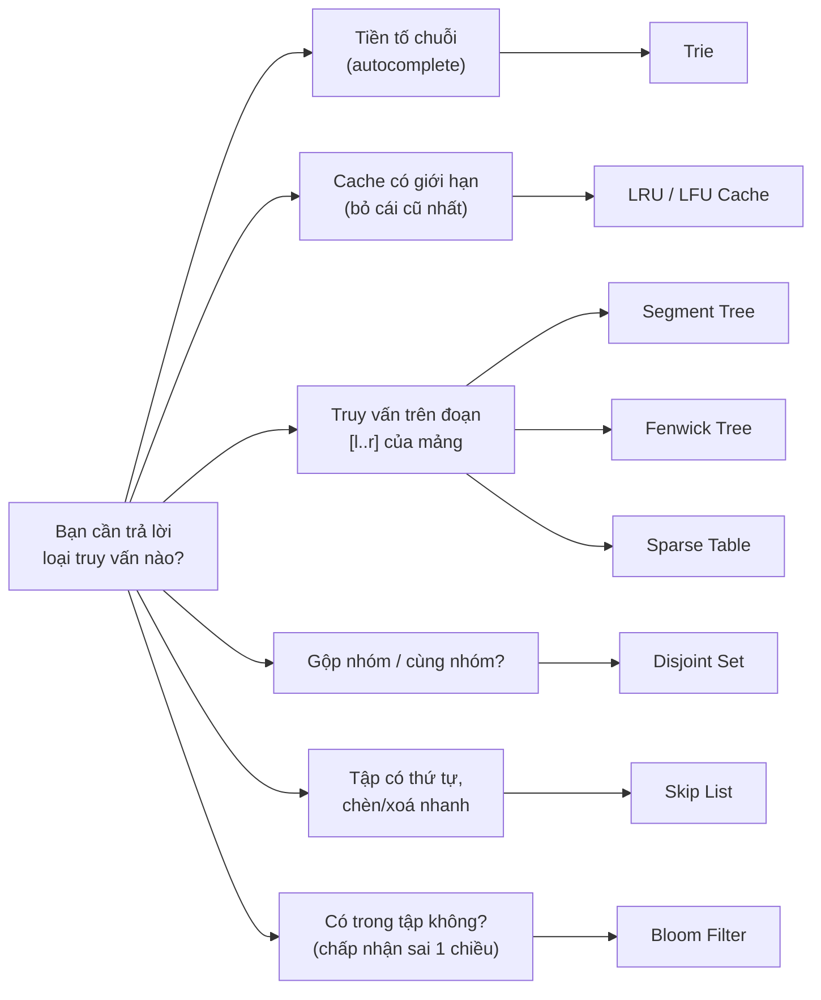

---

## 📖 1. Trie — Cây tiền tố

### 1.1 Trực giác: cuốn từ điển có "tab chữ cái"

Hãy nhớ cuốn **từ điển Anh–Việt** giấy: mép sách có các vạch chữ A, B, C... Muốn tra "cart", bạn lật tới vạch **C**, rồi tìm nhóm **ca**, rồi **car**, rồi **cart**. Bạn **không** so sánh "cart" với từng từ trong 50.000 từ — bạn đi theo **từng chữ cái**.

**Trie** (đọc là "try", từ re**trie**val) làm y như vậy:

- Mỗi **node** tượng trưng cho một **tiền tố** (prefix).
- Mỗi **cạnh** mang **một ký tự**.
- Node nào là điểm kết thúc của một từ thì đánh dấu `isEnd = true`.
- Các từ có chung tiền tố thì **dùng chung đường đi** → "cat", "car", "cart" chia sẻ đoạn `c → a`.

Ví dụ, trie chứa các từ `cat, car, cart, dog`:

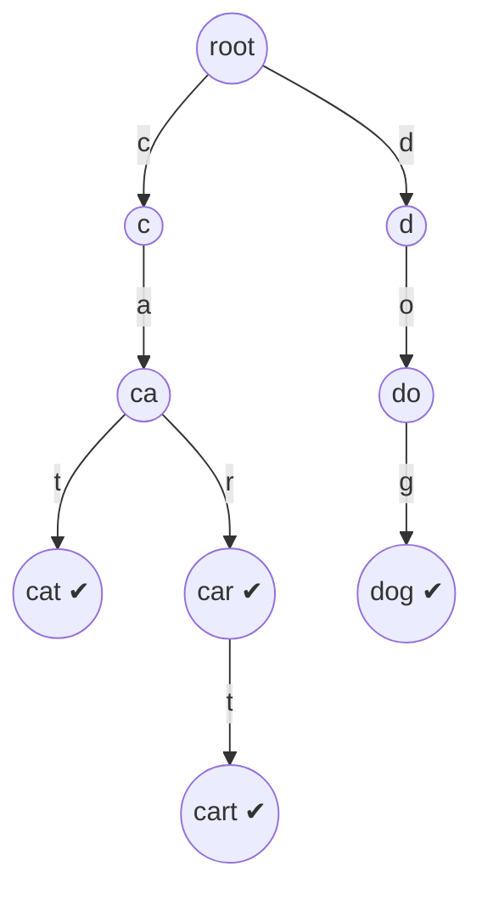

Dấu ✔ là node có `isEnd = true`. Để ý: "car" là một từ **và** là tiền tố của "cart" — vì vậy ta cần cờ `isEnd` chứ không thể chỉ nhìn "node lá".

Bấm ▶ để xem từng từ được chèn: chú ý lúc chèn "car" và "cart", trie **đi lại đường cũ** `c → a` và chỉ tạo node mới khi hết đường.

<div class="algo-viz" data-viz="trie" data-algo="insert" data-input="cat,car,cart,dog" data-title="Chèn từ vào Trie"></div>

### 1.2 Ba thao tác cơ bản

| Thao tác | Ý nghĩa | Cách làm | Độ phức tạp |
|---|---|---|---|
| `Insert(word)` | Thêm từ | Đi từng ký tự, thiếu node thì tạo, cuối cùng đặt `isEnd = true` | O(L) |
| `Search(word)` | Có đúng từ này không? | Đi từng ký tự, mất đường → false; tới cuối → trả về `isEnd` | O(L) |
| `StartsWith(prefix)` | Có từ nào bắt đầu bằng prefix? | Như Search nhưng tới cuối là **true** luôn | O(L) |

(L = độ dài từ/tiền tố.) Điểm "ăn tiền": độ phức tạp **không phụ thuộc số từ** trong trie — có 10 từ hay 10 triệu từ, tra "cart" vẫn đi đúng 4 bước.

Trace `Search("ca")` và `StartsWith("ca")` trên trie ở trên:

| Bước | Ký tự | Node hiện tại | Có con đó không? |
|---|---|---|---|
| 1 | `c` | root → `c` | có |
| 2 | `a` | `c` → `ca` | có |
| Kết thúc | — | `ca` | `isEnd = false` → **Search = false**, nhưng **StartsWith = true** |

### 1.3 Cài đặt Trie + Autocomplete

Có 2 cách lưu con của một node:

- **Mảng cố định `[26]*Node`**: nhanh nhất, chỉ dùng được khi bảng chữ cái nhỏ và biết trước (a–z).
- **Map `map[rune]*Node` / `dict`**: linh hoạt (Unicode, tiếng Việt có dấu), tốn bộ nhớ hơn một chút.

Ví dụ dưới dùng mảng 26 cho Go, dict cho Python, và thêm hàm **autocomplete**: đi tới node của tiền tố rồi **DFS** để liệt kê mọi từ bên dưới.

=== "Go"

    ```go
    package main

    import "fmt"

    type TrieNode struct {
    	children [26]*TrieNode
    	isEnd    bool
    }

    type Trie struct{ root *TrieNode }

    func NewTrie() *Trie { return &Trie{root: &TrieNode{}} }

    func (t *Trie) Insert(word string) {
    	node := t.root
    	for _, ch := range word {
    		i := ch - 'a'
    		if node.children[i] == nil {
    			node.children[i] = &TrieNode{} // hết đường thì mở đường mới
    		}
    		node = node.children[i]
    	}
    	node.isEnd = true
    }

    // walk đi theo prefix, trả về node cuối (nil nếu mất đường)
    func (t *Trie) walk(s string) *TrieNode {
    	node := t.root
    	for _, ch := range s {
    		node = node.children[ch-'a']
    		if node == nil {
    			return nil
    		}
    	}
    	return node
    }

    func (t *Trie) Search(word string) bool {
    	n := t.walk(word)
    	return n != nil && n.isEnd
    }

    func (t *Trie) StartsWith(prefix string) bool { return t.walk(prefix) != nil }

    // Autocomplete trả về tối đa limit từ bắt đầu bằng prefix, theo thứ tự từ điển
    func (t *Trie) Autocomplete(prefix string, limit int) []string {
    	res := []string{}
    	start := t.walk(prefix)
    	if start == nil {
    		return res
    	}
    	buf := []byte(prefix)
    	var dfs func(n *TrieNode)
    	dfs = func(n *TrieNode) {
    		if len(res) >= limit {
    			return
    		}
    		if n.isEnd {
    			res = append(res, string(buf))
    		}
    		for i, child := range n.children { // duyệt a→z nên kết quả tự sắp xếp
    			if child != nil {
    				buf = append(buf, byte('a'+i))
    				dfs(child)
    				buf = buf[:len(buf)-1] // backtrack
    			}
    		}
    	}
    	dfs(start)
    	return res
    }

    func main() {
    	t := NewTrie()
    	for _, w := range []string{"cat", "car", "cart", "care", "careful", "dog", "do"} {
    		t.Insert(w)
    	}
    	fmt.Println(t.Search("car"), t.Search("ca"), t.StartsWith("ca"))
    	fmt.Println(t.Autocomplete("car", 10))
    	fmt.Println(t.Autocomplete("do", 10))
    	fmt.Println(t.Autocomplete("x", 10))
    }

    // Output:
    // true false true
    // [car care careful cart]
    // [do dog]
    // []
    ```

=== "Python"

    ```python
    class TrieNode:
        __slots__ = ("children", "is_end")

        def __init__(self):
            self.children = {}      # ký tự -> TrieNode
            self.is_end = False


    class Trie:
        def __init__(self):
            self.root = TrieNode()

        def insert(self, word: str) -> None:
            node = self.root
            for ch in word:
                node = node.children.setdefault(ch, TrieNode())
            node.is_end = True

        def _walk(self, s: str):
            node = self.root
            for ch in s:
                node = node.children.get(ch)
                if node is None:
                    return None
            return node

        def search(self, word: str) -> bool:
            node = self._walk(word)
            return node is not None and node.is_end

        def starts_with(self, prefix: str) -> bool:
            return self._walk(prefix) is not None

        def autocomplete(self, prefix: str, limit: int = 10) -> list[str]:
            res: list[str] = []
            start = self._walk(prefix)
            if start is None:
                return res
            path = list(prefix)

            def dfs(node: TrieNode) -> None:
                if len(res) >= limit:
                    return
                if node.is_end:
                    res.append("".join(path))
                for ch in sorted(node.children):   # sorted để ra thứ tự từ điển
                    path.append(ch)
                    dfs(node.children[ch])
                    path.pop()                     # backtrack

            dfs(start)
            return res


    t = Trie()
    for w in ["cat", "car", "cart", "care", "careful", "dog", "do"]:
        t.insert(w)
    print(t.search("car"), t.search("ca"), t.starts_with("ca"))
    print(t.autocomplete("car"))
    print(t.autocomplete("do"))
    print(t.autocomplete("x"))

    # Output:
    # True False True
    # ['car', 'care', 'careful', 'cart']
    # ['do', 'dog']
    # []
    ```

**Độ phức tạp:**

| | Thời gian | Bộ nhớ |
|---|---|---|
| Insert / Search / StartsWith | O(L) | Insert tạo tối đa L node |
| Autocomplete | O(L + số node trong cây con) | O(độ sâu) cho đệ quy |
| Toàn bộ trie | — | O(tổng số ký tự của mọi từ × kích thước bảng con) |

!!! tip "Trie vs Hash Set"
    Hash set cũng tra từ trong O(L) (phải hash cả chuỗi). Nhưng hash set **không** trả lời được "có từ nào bắt đầu bằng `car` không?" nếu không duyệt hết. Khi đề bài có chữ **prefix / tiền tố / autocomplete / gợi ý**, hãy nghĩ ngay đến Trie.

### 1.4 Bài kinh điển: Word Search II (LeetCode 212)

**Đề:** Cho bảng chữ `board` m×n và danh sách `words`. Tìm tất cả các từ có thể ghép được bằng cách đi qua các ô **kề nhau** (trên/dưới/trái/phải), mỗi ô dùng tối đa 1 lần trong một từ.

**Cách ngây thơ:** với **mỗi từ**, chạy DFS từ mọi ô → O(W × m·n × 4^L). Với 30.000 từ thì quá chậm.

**Cách dùng Trie:** bỏ **tất cả từ** vào trie, rồi DFS **một lần** từ mỗi ô, vừa đi trên bảng vừa đi trên trie. Khi node trie không có con tương ứng → **cắt tỉa ngay** (không có từ nào bắt đầu bằng đường đi hiện tại).

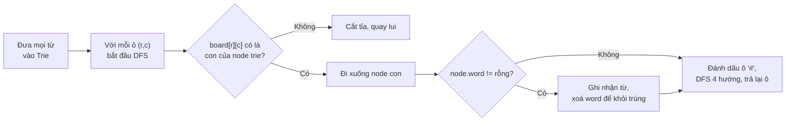

Mẹo: lưu **cả từ** ở node kết thúc (`node.word = "oath"`) thay vì cờ `isEnd` → khỏi phải ghép chuỗi khi DFS.

=== "Go"

    ```go
    package main

    import (
    	"fmt"
    	"sort"
    )

    type Node struct {
    	next [26]*Node
    	word string // khác rỗng nếu có từ kết thúc ở đây
    }

    func findWords(board [][]byte, words []string) []string {
    	root := &Node{}
    	for _, w := range words {
    		n := root
    		for i := 0; i < len(w); i++ {
    			c := w[i] - 'a'
    			if n.next[c] == nil {
    				n.next[c] = &Node{}
    			}
    			n = n.next[c]
    		}
    		n.word = w
    	}
    	m, cols := len(board), len(board[0])
    	res := []string{}
    	var dfs func(r, c int, parent *Node)
    	dfs = func(r, c int, parent *Node) {
    		ch := board[r][c]
    		if ch == '#' {
    			return
    		}
    		node := parent.next[ch-'a']
    		if node == nil {
    			return // cắt tỉa: không từ nào đi tiếp được
    		}
    		if node.word != "" {
    			res = append(res, node.word)
    			node.word = "" // tránh thêm trùng
    		}
    		board[r][c] = '#'
    		dirs := [4][2]int{{1, 0}, {-1, 0}, {0, 1}, {0, -1}}
    		for _, d := range dirs {
    			nr, nc := r+d[0], c+d[1]
    			if nr >= 0 && nr < m && nc >= 0 && nc < cols {
    				dfs(nr, nc, node)
    			}
    		}
    		board[r][c] = ch
    	}
    	for r := 0; r < m; r++ {
    		for c := 0; c < cols; c++ {
    			dfs(r, c, root)
    		}
    	}
    	sort.Strings(res)
    	return res
    }

    func main() {
    	board := [][]byte{
    		[]byte("oaan"),
    		[]byte("etae"),
    		[]byte("ihkr"),
    		[]byte("iflv"),
    	}
    	fmt.Println(findWords(board, []string{"oath", "pea", "eat", "rain"}))
    }

    // Output:
    // [eat oath]
    ```

=== "Python"

    ```python
    def find_words(board: list[list[str]], words: list[str]) -> list[str]:
        root: dict = {}
        for w in words:
            node = root
            for ch in w:
                node = node.setdefault(ch, {})
            node["$"] = w                     # "$" giữ từ kết thúc tại đây

        m, n = len(board), len(board[0])
        res: list[str] = []

        def dfs(r: int, c: int, parent: dict) -> None:
            ch = board[r][c]
            node = parent.get(ch)
            if node is None:
                return                        # cắt tỉa
            if "$" in node:
                res.append(node.pop("$"))     # lấy ra luôn để không trùng
            board[r][c] = "#"
            for dr, dc in ((1, 0), (-1, 0), (0, 1), (0, -1)):
                nr, nc = r + dr, c + dc
                if 0 <= nr < m and 0 <= nc < n:
                    dfs(nr, nc, node)
            board[r][c] = ch
            if not node:                      # tối ưu: node rỗng thì xoá khỏi cha
                parent.pop(ch)

        for r in range(m):
            for c in range(n):
                dfs(r, c, root)
        return sorted(res)


    board = [list("oaan"), list("etae"), list("ihkr"), list("iflv")]
    print(find_words(board, ["oath", "pea", "eat", "rain"]))

    # Output:
    # ['eat', 'oath']
    ```

!!! tip "Tối ưu 'tỉa lá' trong bản Python"
    Dòng `if not node: parent.pop(ch)` xoá những nhánh trie đã tìm hết từ. Về sau DFS sẽ bị cắt sớm hơn nhiều — trên LeetCode đây là khác biệt giữa **TLE** và **AC** với Python.

### 1.5 Lỗi hay gặp với Trie

- **Quên cờ `isEnd`** → "ca" bị coi là từ chỉ vì nó là tiền tố của "cat".
- **Dùng `[26]` cho dữ liệu có chữ hoa / dấu tiếng Việt** → index âm hoặc vượt mảng → panic. Dùng map khi bảng chữ cái không chắc chắn.
- **Tốn bộ nhớ**: mỗi node `[26]*Node` = 26 con trỏ × 8 byte = 208 byte. 1 triệu node ≈ 200 MB! Khi cần tiết kiệm → dùng map, hoặc **radix tree / compressed trie** (gộp chuỗi node chỉ có 1 con thành một cạnh mang cả chuỗi — router của Gin, httprouter trong Go dùng đúng cấu trúc này).

---

## 📖 2. LRU Cache — Bỏ đi thứ lâu không dùng nhất

### 2.1 Trực giác: cái bàn học chỉ để được 3 cuốn sách

Bàn học của bạn chỉ để vừa **3 cuốn**. Mỗi lần dùng sách nào, bạn đặt nó lên **trên cùng** chồng sách. Khi cần lấy cuốn thứ 4 từ giá, bạn phải cất bớt một cuốn — hợp lý nhất là cất cuốn **nằm dưới cùng** (lâu rồi không đụng tới). Đó là **LRU — Least Recently Used**.

Yêu cầu (LeetCode 146):

- `get(key)`: trả về value nếu có (và đánh dấu "vừa dùng"), không có trả `-1`.
- `put(key, value)`: thêm/cập nhật; nếu vượt `capacity` thì **đuổi** phần tử lâu không dùng nhất.
- **Cả hai phải O(1).**

### 2.2 Vì sao cần HAI cấu trúc?

| Cấu trúc | Tra theo key | Biết thứ tự "vừa dùng" | Chuyển 1 phần tử lên đầu |
|---|---|---|---|
| Chỉ hash map | O(1) ✅ | ❌ không có thứ tự | — |
| Chỉ mảng / list | O(n) ❌ | ✅ | O(n) ❌ |
| Chỉ linked list đôi | O(n) ❌ | ✅ | O(1) ✅ nếu **đã có con trỏ tới node** |
| **Hash map + linked list đôi** | **O(1)** | **✅** | **O(1)** |

Ý tưởng: **hash map lưu `key → con trỏ tới node`** trong danh sách liên kết đôi. Danh sách giữ thứ tự: **đầu = mới dùng nhất**, **cuối = cũ nhất**. Hai node **giả (sentinel)** `head` và `tail` giúp không phải xử lý trường hợp danh sách rỗng.

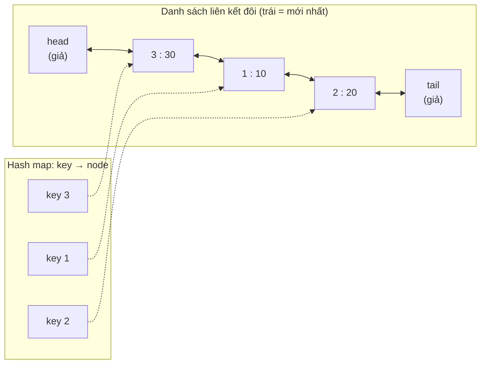

- `get(1)`: map tìm ra node `1` trong O(1) → **gỡ** node khỏi vị trí hiện tại (O(1) vì có `prev`, `next`) → **chèn** ngay sau `head`.
- `put(4, 40)` khi đầy: node cần đuổi là `tail.prev` (node `2`) → gỡ khỏi list + `delete(map, 2)` → chèn node `4` sau `head`.

Vì sao phải **đôi** (có `prev`)? Để gỡ một node ở giữa trong O(1), ta cần nối `prev.next = next` — danh sách đơn không biết `prev`.

### 2.3 Trace với capacity = 2

| Lệnh | Danh sách (mới → cũ) | Kết quả | Ghi chú |
|---|---|---|---|
| `put(1,1)` | `1` | | |
| `put(2,2)` | `2, 1` | | |
| `get(1)` | `1, 2` | 1 | 1 lên đầu |
| `put(3,3)` | `3, 1` | | đầy → đuổi **2** (cuối) |
| `get(2)` | `3, 1` | -1 | 2 đã bị đuổi |
| `put(4,4)` | `4, 3` | | đuổi **1** |
| `get(1)` | `4, 3` | -1 | |
| `get(3)` | `3, 4` | 3 | |
| `get(4)` | `4, 3` | 4 | |

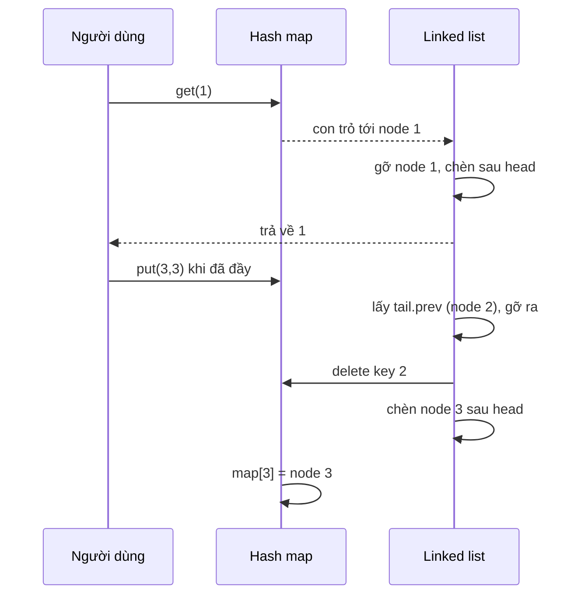

### 2.4 Cài đặt

=== "Go"

    ```go
    package main

    import "fmt"

    type node struct {
    	key, val   int
    	prev, next *node
    }

    type LRUCache struct {
    	cap        int
    	items      map[int]*node
    	head, tail *node // sentinel: head.next = mới nhất, tail.prev = cũ nhất
    }

    func NewLRU(capacity int) *LRUCache {
    	h, t := &node{}, &node{}
    	h.next, t.prev = t, h
    	return &LRUCache{cap: capacity, items: map[int]*node{}, head: h, tail: t}
    }

    func (c *LRUCache) unlink(n *node) {
    	n.prev.next = n.next
    	n.next.prev = n.prev
    }

    func (c *LRUCache) pushFront(n *node) {
    	n.prev, n.next = c.head, c.head.next
    	c.head.next.prev = n
    	c.head.next = n
    }

    func (c *LRUCache) Get(key int) int {
    	n, ok := c.items[key]
    	if !ok {
    		return -1
    	}
    	c.unlink(n)
    	c.pushFront(n) // vừa dùng → lên đầu
    	return n.val
    }

    func (c *LRUCache) Put(key, val int) {
    	if n, ok := c.items[key]; ok {
    		n.val = val
    		c.unlink(n)
    		c.pushFront(n)
    		return
    	}
    	if len(c.items) == c.cap {
    		lru := c.tail.prev // cũ nhất
    		c.unlink(lru)
    		delete(c.items, lru.key) // vì vậy node phải lưu cả key!
    	}
    	n := &node{key: key, val: val}
    	c.items[key] = n
    	c.pushFront(n)
    }

    func (c *LRUCache) String() string {
    	s := "["
    	for n := c.head.next; n != c.tail; n = n.next {
    		if n != c.head.next {
    			s += " "
    		}
    		s += fmt.Sprintf("%d:%d", n.key, n.val)
    	}
    	return s + "]"
    }

    func main() {
    	c := NewLRU(2)
    	c.Put(1, 1)
    	c.Put(2, 2)
    	fmt.Println(c.Get(1), c)
    	c.Put(3, 3)
    	fmt.Println(c.Get(2), c)
    	c.Put(4, 4)
    	fmt.Println(c.Get(1), c.Get(3), c.Get(4), c)
    }

    // Output:
    // 1 [1:1 2:2]
    // -1 [3:3 1:1]
    // -1 3 4 [4:4 3:3]
    ```

=== "Python"

    ```python
    class Node:
        __slots__ = ("key", "val", "prev", "next")

        def __init__(self, key=0, val=0):
            self.key, self.val = key, val
            self.prev = self.next = None


    class LRUCache:
        def __init__(self, capacity: int):
            self.cap = capacity
            self.items: dict[int, Node] = {}
            self.head, self.tail = Node(), Node()      # sentinel
            self.head.next, self.tail.prev = self.tail, self.head

        def _unlink(self, n: Node) -> None:
            n.prev.next, n.next.prev = n.next, n.prev

        def _push_front(self, n: Node) -> None:
            n.prev, n.next = self.head, self.head.next
            self.head.next.prev = n
            self.head.next = n

        def get(self, key: int) -> int:
            n = self.items.get(key)
            if n is None:
                return -1
            self._unlink(n)
            self._push_front(n)
            return n.val

        def put(self, key: int, val: int) -> None:
            if key in self.items:
                n = self.items[key]
                n.val = val
                self._unlink(n)
                self._push_front(n)
                return
            if len(self.items) == self.cap:
                lru = self.tail.prev
                self._unlink(lru)
                del self.items[lru.key]
            n = Node(key, val)
            self.items[key] = n
            self._push_front(n)

        def __repr__(self) -> str:
            out, n = [], self.head.next
            while n is not self.tail:
                out.append(f"{n.key}:{n.val}")
                n = n.next
            return "[" + " ".join(out) + "]"


    c = LRUCache(2)
    c.put(1, 1)
    c.put(2, 2)
    print(c.get(1), c)
    c.put(3, 3)
    print(c.get(2), c)
    c.put(4, 4)
    print(c.get(1), c.get(3), c.get(4), c)

    # Output:
    # 1 [1:1 2:2]
    # -1 [3:3 1:1]
    # -1 3 4 [4:4 3:3]
    ```

!!! tip "Bản 'lười' trong thực tế"
    - **Python:** `collections.OrderedDict` có sẵn `move_to_end(key)` và `popitem(last=False)` — LRU chỉ còn ~10 dòng. Còn nếu chỉ muốn cache kết quả hàm: `@functools.lru_cache(maxsize=128)`.
    - **Go:** package `container/list` là danh sách liên kết đôi có sẵn (`MoveToFront`, `Back`, `Remove`), hoặc dùng thư viện `hashicorp/golang-lru`.
    - Nhưng trong **phỏng vấn**, người ta thường muốn bạn tự viết linked list như trên.

=== "Python (OrderedDict)"

    ```python
    from collections import OrderedDict


    class LRUCache:
        def __init__(self, capacity: int):
            self.cap = capacity
            self.od: OrderedDict[int, int] = OrderedDict()

        def get(self, key: int) -> int:
            if key not in self.od:
                return -1
            self.od.move_to_end(key)          # cuối = mới nhất
            return self.od[key]

        def put(self, key: int, val: int) -> None:
            self.od[key] = val
            self.od.move_to_end(key)
            if len(self.od) > self.cap:
                self.od.popitem(last=False)   # đầu = cũ nhất


    c = LRUCache(2)
    c.put(1, 1); c.put(2, 2); c.get(1); c.put(3, 3)
    print(list(c.od.items()))

    # Output:
    # [(1, 1), (3, 3)]
    ```

=== "Go (container/list)"

    ```go
    package main

    import (
    	"container/list"
    	"fmt"
    )

    type entry struct{ key, val int }

    type LRU struct {
    	cap   int
    	ll    *list.List // Front = mới nhất
    	items map[int]*list.Element
    }

    func (c *LRU) Get(k int) int {
    	if e, ok := c.items[k]; ok {
    		c.ll.MoveToFront(e)
    		return e.Value.(*entry).val
    	}
    	return -1
    }

    func (c *LRU) Put(k, v int) {
    	if e, ok := c.items[k]; ok {
    		e.Value.(*entry).val = v
    		c.ll.MoveToFront(e)
    		return
    	}
    	c.items[k] = c.ll.PushFront(&entry{k, v})
    	if c.ll.Len() > c.cap {
    		old := c.ll.Back()
    		c.ll.Remove(old)
    		delete(c.items, old.Value.(*entry).key)
    	}
    }

    func main() {
    	c := &LRU{cap: 2, ll: list.New(), items: map[int]*list.Element{}}
    	c.Put(1, 1)
    	c.Put(2, 2)
    	c.Get(1)
    	c.Put(3, 3)
    	for e := c.ll.Front(); e != nil; e = e.Next() {
    		fmt.Print(*e.Value.(*entry), " ")
    	}
    	fmt.Println()
    }

    // Output:
    // {3 3} {1 1}
    ```

**Độ phức tạp:** `get` và `put` đều **O(1)**; bộ nhớ O(capacity).

### 2.5 LFU — bỏ thứ **ít được dùng nhất**

LRU có điểm yếu: một lần "quét" (scan) đọc 1.000 key mới chỉ **một lần** sẽ đẩy bay cả những key "hot" dùng liên tục. **LFU (Least Frequently Used)** đuổi key có **số lần truy cập ít nhất**; nếu hoà, đuổi key cũ nhất trong nhóm đó.

Cấu trúc O(1) (LeetCode 460):

- `keyMap: key → (value, freq)`
- `freqMap: freq → danh sách liên kết đôi (thứ tự LRU)` các key có cùng tần suất
- `minFreq`: tần suất nhỏ nhất hiện có

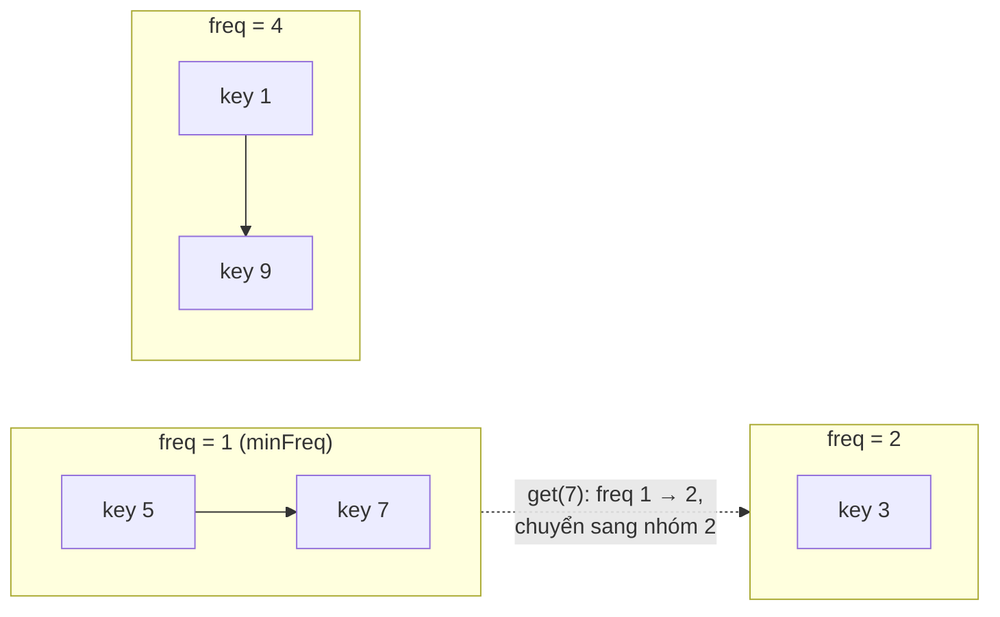

- `get(key)`: tăng `freq` của key, chuyển key từ nhóm `f` sang nhóm `f+1`. Nếu nhóm `f` rỗng và `f == minFreq` → `minFreq++`.
- `put` khi đầy: đuổi phần tử **cũ nhất** trong nhóm `minFreq`. Key mới luôn có `freq = 1` → đặt `minFreq = 1`.

=== "Python"

    ```python
    from collections import defaultdict, OrderedDict


    class LFUCache:
        def __init__(self, capacity: int):
            self.cap = capacity
            self.val: dict[int, int] = {}
            self.freq: dict[int, int] = {}
            self.groups: defaultdict[int, OrderedDict] = defaultdict(OrderedDict)
            self.min_freq = 0

        def _touch(self, key: int) -> None:
            f = self.freq[key]
            del self.groups[f][key]
            if not self.groups[f] and f == self.min_freq:
                self.min_freq += 1
            self.freq[key] = f + 1
            self.groups[f + 1][key] = None

        def get(self, key: int) -> int:
            if key not in self.val:
                return -1
            self._touch(key)
            return self.val[key]

        def put(self, key: int, value: int) -> None:
            if self.cap == 0:
                return
            if key in self.val:
                self.val[key] = value
                self._touch(key)
                return
            if len(self.val) == self.cap:
                old, _ = self.groups[self.min_freq].popitem(last=False)
                del self.val[old], self.freq[old]
            self.val[key], self.freq[key] = value, 1
            self.groups[1][key] = None
            self.min_freq = 1


    c = LFUCache(2)
    c.put(1, 1); c.put(2, 2)
    print(c.get(1))        # freq(1)=2
    c.put(3, 3)            # đuổi 2 (freq=1)
    print(c.get(2), c.get(3))
    c.put(4, 4)            # freq(1)=2, freq(3)=2 → hoà, đuổi 1 (cũ hơn)
    print(c.get(1), c.get(3), c.get(4))

    # Output:
    # 1
    # -1 3
    # -1 3 4
    ```

=== "Go"

    ```go
    package main

    import (
    	"container/list"
    	"fmt"
    )

    type item struct{ key, val, freq int }

    type LFUCache struct {
    	cap, minFreq int
    	items        map[int]*list.Element
    	groups       map[int]*list.List // freq → list (Front = mới nhất)
    }

    func NewLFU(capacity int) *LFUCache {
    	return &LFUCache{cap: capacity, items: map[int]*list.Element{}, groups: map[int]*list.List{}}
    }

    func (c *LFUCache) group(f int) *list.List {
    	if c.groups[f] == nil {
    		c.groups[f] = list.New()
    	}
    	return c.groups[f]
    }

    func (c *LFUCache) touch(e *list.Element) *list.Element {
    	it := e.Value.(*item)
    	c.groups[it.freq].Remove(e)
    	if c.groups[it.freq].Len() == 0 && it.freq == c.minFreq {
    		c.minFreq++
    	}
    	it.freq++
    	ne := c.group(it.freq).PushFront(it)
    	c.items[it.key] = ne
    	return ne
    }

    func (c *LFUCache) Get(key int) int {
    	e, ok := c.items[key]
    	if !ok {
    		return -1
    	}
    	return c.touch(e).Value.(*item).val
    }

    func (c *LFUCache) Put(key, val int) {
    	if c.cap == 0 {
    		return
    	}
    	if e, ok := c.items[key]; ok {
    		e.Value.(*item).val = val
    		c.touch(e)
    		return
    	}
    	if len(c.items) == c.cap {
    		g := c.groups[c.minFreq]
    		old := g.Back() // cũ nhất trong nhóm ít dùng nhất
    		g.Remove(old)
    		delete(c.items, old.Value.(*item).key)
    	}
    	c.items[key] = c.group(1).PushFront(&item{key, val, 1})
    	c.minFreq = 1
    }

    func main() {
    	c := NewLFU(2)
    	c.Put(1, 1)
    	c.Put(2, 2)
    	fmt.Println(c.Get(1))
    	c.Put(3, 3)
    	fmt.Println(c.Get(2), c.Get(3))
    	c.Put(4, 4)
    	fmt.Println(c.Get(1), c.Get(3), c.Get(4))
    }

    // Output:
    // 1
    // -1 3
    // -1 3 4
    ```

!!! note "Trong Redis"
    Redis không dùng LRU/LFU "chính xác" mà **xấp xỉ**: mỗi lần cần đuổi, nó **lấy mẫu ngẫu nhiên** vài key (`maxmemory-samples`, mặc định 5) rồi đuổi key tệ nhất trong mẫu. Rẻ hơn nhiều mà gần đúng. Các chính sách: `allkeys-lru`, `allkeys-lfu`, `volatile-lru`... Xem thêm [Bài 8 Backend: Caching & Redis](../backend/08-caching.md).

---

## 📖 3. Segment Tree — Cây phân đoạn

### 3.1 Bài toán: vừa hỏi tổng đoạn, vừa sửa phần tử

Cho mảng `a` có n phần tử và **q** thao tác trộn lẫn:

- `query(l, r)`: tổng `a[l] + ... + a[r]`
- `update(i, x)`: gán `a[i] = x`

| Cách | query | update | q = 10⁵ thao tác, n = 10⁵ |
|---|---|---|---|
| Duyệt thẳng | O(n) | O(1) | ~10¹⁰ phép → **quá chậm** |
| Mảng prefix sum (Bài 2) | O(1) | **O(n)** (tính lại prefix) | ~10¹⁰ → **quá chậm** |
| **Segment tree** | **O(log n)** | **O(log n)** | ~3.4 × 10⁶ → **nhanh** |

### 3.2 Trực giác: báo cáo doanh thu theo cấp quản lý

Một chuỗi cửa hàng có 6 chi nhánh. **Quản lý vùng** biết tổng doanh thu của 3 chi nhánh mình phụ trách, **giám đốc** biết tổng của 2 vùng. Muốn biết tổng chi nhánh 1..4, bạn không cần hỏi từng chi nhánh — hỏi **vài quản lý** có phạm vi nằm gọn trong đoạn cần tính rồi cộng lại. Khi một chi nhánh thay đổi số liệu, chỉ cần báo lên **đúng một chuỗi cấp trên** (log n người).

Segment tree là cây nhị phân mà:

- **Lá** = từng phần tử `a[i]`.
- **Node trong** quản lý đoạn `[l, r]` và lưu **tổng** (hoặc min, max, gcd...) của đoạn đó.
- Con trái quản lý `[l, mid]`, con phải quản lý `[mid+1, r]`.

Với `a = [2, 1, 5, 3, 4, 2]`:

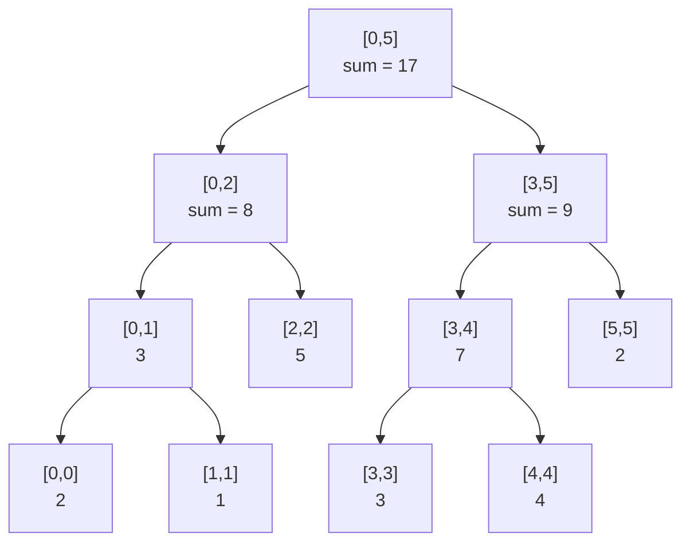

**Lưu trong mảng** giống heap: node `i` có con `2i` và `2i+1` (bắt đầu từ `i = 1`). Kích thước mảng an toàn: **`4n`**.

### 3.3 Build — xây từ dưới lên

```
build(node, l, r):
    nếu l == r: tree[node] = a[l]; return
    mid = (l + r) / 2
    build(2*node, l, mid)
    build(2*node+1, mid+1, r)
    tree[node] = tree[2*node] + tree[2*node+1]
```

Mỗi node được thăm 1 lần → **O(n)**.

### 3.4 Query — 3 trường hợp

Hỏi tổng `[ql, qr]` tại node quản lý `[l, r]`:

1. **Không giao nhau** (`qr < l` hoặc `r < ql`) → trả về 0 (phần tử trung hoà của phép cộng).
2. **Nằm gọn trong** (`ql ≤ l` và `r ≤ qr`) → trả về `tree[node]` luôn, **không đi xuống nữa**.
3. **Giao một phần** → hỏi cả 2 con rồi cộng.

Trace `query(1, 4)` (= 1 + 5 + 3 + 4 = **13**):

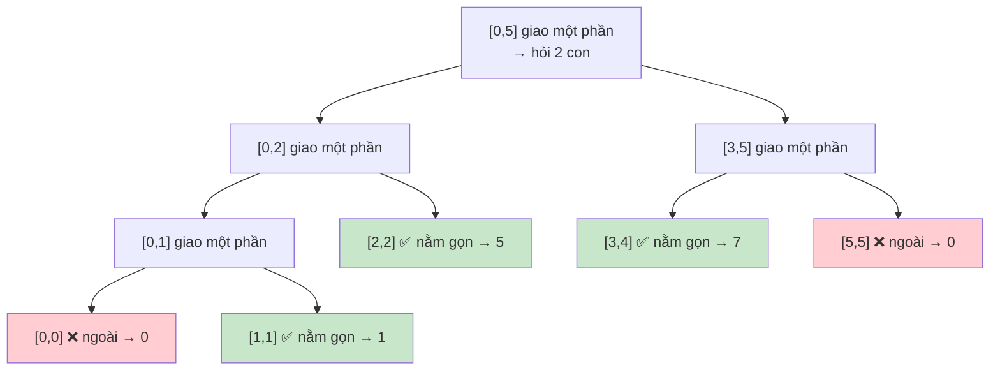

Kết quả = 1 + 5 + 7 = **13** ✅. Có thể chứng minh ở mỗi tầng chỉ có tối đa **4 node** được thăm → **O(log n)**.

### 3.5 Update — sửa lá rồi cập nhật ngược lên

`update(2, 10)` (đổi `a[2]` từ 5 thành 10): đi từ gốc xuống lá `[2,2]`, sửa lá, rồi **trên đường quay về** tính lại tổng:

| Node | Trước | Sau |
|---|---|---|
| `[2,2]` (lá) | 5 | 10 |
| `[0,2]` | 8 | 3 + 10 = 13 |
| `[0,5]` (gốc) | 17 | 13 + 9 = 22 |

Chỉ **log n** node trên một đường đi thay đổi → **O(log n)**.

### 3.6 Cài đặt: tổng đoạn và min đoạn

Mình viết segment tree **tổng quát**: truyền vào phép gộp (`+` hoặc `min`) và phần tử trung hoà (`0` cho tổng, `+∞` cho min). Đây là một **monoid** — bất cứ phép nào có tính kết hợp đều dùng được: `max`, `gcd`, `xor`, nhân ma trận...

=== "Go"

    ```go
    package main

    import (
    	"fmt"
    	"math"
    )

    type SegTree struct {
    	n        int
    	tree     []int
    	merge    func(a, b int) int
    	identity int // phần tử trung hoà: merge(x, identity) = x
    }

    func NewSegTree(a []int, merge func(a, b int) int, identity int) *SegTree {
    	st := &SegTree{n: len(a), tree: make([]int, 4*len(a)), merge: merge, identity: identity}
    	st.build(a, 1, 0, st.n-1)
    	return st
    }

    func (st *SegTree) build(a []int, node, l, r int) {
    	if l == r {
    		st.tree[node] = a[l]
    		return
    	}
    	mid := (l + r) / 2
    	st.build(a, 2*node, l, mid)
    	st.build(a, 2*node+1, mid+1, r)
    	st.tree[node] = st.merge(st.tree[2*node], st.tree[2*node+1])
    }

    func (st *SegTree) query(node, l, r, ql, qr int) int {
    	if qr < l || r < ql { // 1. không giao
    		return st.identity
    	}
    	if ql <= l && r <= qr { // 2. nằm gọn
    		return st.tree[node]
    	}
    	mid := (l + r) / 2 // 3. giao một phần
    	return st.merge(st.query(2*node, l, mid, ql, qr), st.query(2*node+1, mid+1, r, ql, qr))
    }

    func (st *SegTree) update(node, l, r, idx, val int) {
    	if l == r {
    		st.tree[node] = val
    		return
    	}
    	mid := (l + r) / 2
    	if idx <= mid {
    		st.update(2*node, l, mid, idx, val)
    	} else {
    		st.update(2*node+1, mid+1, r, idx, val)
    	}
    	st.tree[node] = st.merge(st.tree[2*node], st.tree[2*node+1])
    }

    func (st *SegTree) Query(l, r int) int { return st.query(1, 0, st.n-1, l, r) }
    func (st *SegTree) Update(i, val int)  { st.update(1, 0, st.n-1, i, val) }

    func main() {
    	a := []int{2, 1, 5, 3, 4, 2}
    	sum := NewSegTree(a, func(x, y int) int { return x + y }, 0)
    	mn := NewSegTree(a, func(x, y int) int { return min(x, y) }, math.MaxInt)

    	fmt.Println("sum[1..4] =", sum.Query(1, 4), " min[1..4] =", mn.Query(1, 4))
    	sum.Update(2, 10)
    	mn.Update(1, 7)
    	fmt.Println("sau update: sum[0..5] =", sum.Query(0, 5), " min[0..3] =", mn.Query(0, 3))
    	fmt.Println("tree[1..3] =", sum.tree[1:4])
    }

    // Output:
    // sum[1..4] = 13  min[1..4] = 1
    // sau update: sum[0..5] = 22  min[0..3] = 2
    // tree[1..3] = [22 13 9]
    ```

=== "Python"

    ```python
    import math
    from typing import Callable


    class SegTree:
        def __init__(self, a: list[int], merge: Callable[[int, int], int], identity):
            self.n = len(a)
            self.tree = [identity] * (4 * self.n)
            self.merge, self.identity = merge, identity
            self._build(a, 1, 0, self.n - 1)

        def _build(self, a, node, l, r):
            if l == r:
                self.tree[node] = a[l]
                return
            mid = (l + r) // 2
            self._build(a, 2 * node, l, mid)
            self._build(a, 2 * node + 1, mid + 1, r)
            self.tree[node] = self.merge(self.tree[2 * node], self.tree[2 * node + 1])

        def _query(self, node, l, r, ql, qr):
            if qr < l or r < ql:                 # không giao
                return self.identity
            if ql <= l and r <= qr:              # nằm gọn
                return self.tree[node]
            mid = (l + r) // 2                   # giao một phần
            return self.merge(self._query(2 * node, l, mid, ql, qr),
                              self._query(2 * node + 1, mid + 1, r, ql, qr))

        def _update(self, node, l, r, idx, val):
            if l == r:
                self.tree[node] = val
                return
            mid = (l + r) // 2
            if idx <= mid:
                self._update(2 * node, l, mid, idx, val)
            else:
                self._update(2 * node + 1, mid + 1, r, idx, val)
            self.tree[node] = self.merge(self.tree[2 * node], self.tree[2 * node + 1])

        def query(self, l: int, r: int):
            return self._query(1, 0, self.n - 1, l, r)

        def update(self, i: int, val: int) -> None:
            self._update(1, 0, self.n - 1, i, val)


    a = [2, 1, 5, 3, 4, 2]
    s = SegTree(a, lambda x, y: x + y, 0)
    m = SegTree(a, min, math.inf)
    print("sum[1..4] =", s.query(1, 4), " min[1..4] =", m.query(1, 4))
    s.update(2, 10)
    m.update(1, 7)
    print("sau update: sum[0..5] =", s.query(0, 5), " min[0..3] =", m.query(0, 3))
    print("tree[1..3] =", s.tree[1:4])

    # Output:
    # sum[1..4] = 13  min[1..4] = 1
    # sau update: sum[0..5] = 22  min[0..3] = 2
    # tree[1..3] = [22, 13, 9]
    ```

### 3.7 Lazy propagation — cập nhật cả đoạn

Nếu thao tác là **"cộng thêm v cho mọi phần tử trong [l, r]"** thì update từng phần tử tốn O(n log n). **Lazy propagation** (lan truyền lười) giải quyết:

> Khi một node **nằm gọn** trong đoạn cần cập nhật, ta sửa giá trị của node đó **và ghi một "giấy nợ"** `lazy[node] += v` — "các con của tôi còn nợ +v, khi nào cần đọc tới thì mới đẩy xuống".

Giống như **sếp nhận thông báo "tăng lương toàn phòng 1 triệu"**: sếp cập nhật ngay tổng quỹ lương phòng (`+ 1 triệu × số người`), nhưng chưa cần báo từng nhân viên. Chỉ khi có ai hỏi lương của một nhóm con cụ thể, sếp mới "đẩy" thông báo xuống nhóm đó (`push down`).

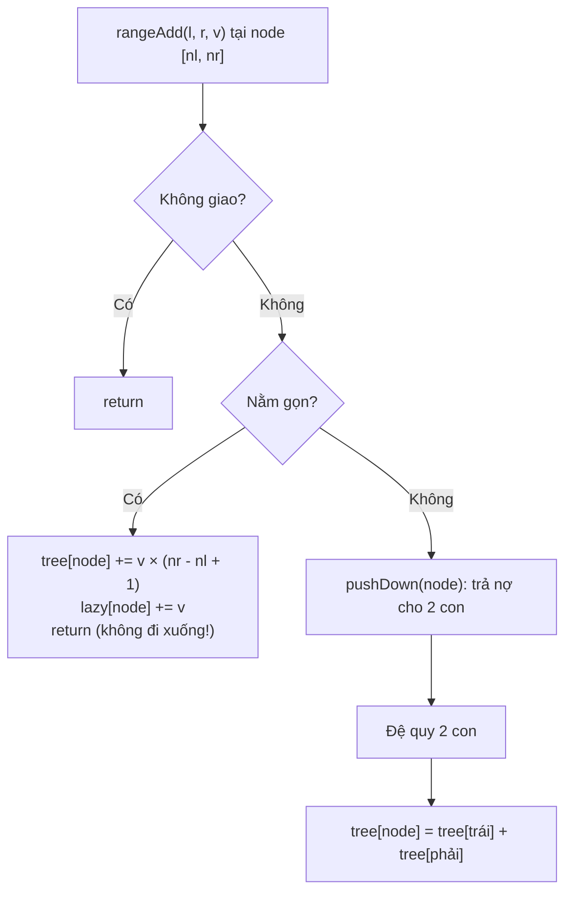

Quy tắc vàng: **trước khi đi xuống con (trong cả update và query), luôn `pushDown`**.

=== "Go"

    ```go
    package main

    import "fmt"

    type LazySeg struct {
    	n          int
    	tree, lazy []int
    }

    func NewLazySeg(a []int) *LazySeg {
    	s := &LazySeg{n: len(a), tree: make([]int, 4*len(a)), lazy: make([]int, 4*len(a))}
    	var build func(node, l, r int)
    	build = func(node, l, r int) {
    		if l == r {
    			s.tree[node] = a[l]
    			return
    		}
    		m := (l + r) / 2
    		build(2*node, l, m)
    		build(2*node+1, m+1, r)
    		s.tree[node] = s.tree[2*node] + s.tree[2*node+1]
    	}
    	build(1, 0, s.n-1)
    	return s
    }

    // apply: cộng v cho cả đoạn [l,r] mà node quản lý và ghi nợ
    func (s *LazySeg) apply(node, l, r, v int) {
    	s.tree[node] += v * (r - l + 1)
    	s.lazy[node] += v
    }

    func (s *LazySeg) pushDown(node, l, r int) {
    	if s.lazy[node] != 0 {
    		m := (l + r) / 2
    		s.apply(2*node, l, m, s.lazy[node])
    		s.apply(2*node+1, m+1, r, s.lazy[node])
    		s.lazy[node] = 0
    	}
    }

    func (s *LazySeg) add(node, l, r, ql, qr, v int) {
    	if qr < l || r < ql {
    		return
    	}
    	if ql <= l && r <= qr {
    		s.apply(node, l, r, v)
    		return
    	}
    	s.pushDown(node, l, r)
    	m := (l + r) / 2
    	s.add(2*node, l, m, ql, qr, v)
    	s.add(2*node+1, m+1, r, ql, qr, v)
    	s.tree[node] = s.tree[2*node] + s.tree[2*node+1]
    }

    func (s *LazySeg) sum(node, l, r, ql, qr int) int {
    	if qr < l || r < ql {
    		return 0
    	}
    	if ql <= l && r <= qr {
    		return s.tree[node]
    	}
    	s.pushDown(node, l, r)
    	m := (l + r) / 2
    	return s.sum(2*node, l, m, ql, qr) + s.sum(2*node+1, m+1, r, ql, qr)
    }

    func main() {
    	s := NewLazySeg([]int{2, 1, 5, 3, 4, 2})
    	fmt.Println(s.sum(1, 0, 5, 0, 5)) // 17
    	s.add(1, 0, 5, 1, 3, 10)          // a = [2 11 15 13 4 2]
    	fmt.Println(s.sum(1, 0, 5, 0, 5), s.sum(1, 0, 5, 2, 2), s.sum(1, 0, 5, 3, 5))
    }

    // Output:
    // 17
    // 47 15 19
    ```

=== "Python"

    ```python
    class LazySeg:
        def __init__(self, a: list[int]):
            self.n = len(a)
            self.tree = [0] * (4 * self.n)
            self.lazy = [0] * (4 * self.n)
            self._build(a, 1, 0, self.n - 1)

        def _build(self, a, node, l, r):
            if l == r:
                self.tree[node] = a[l]
                return
            m = (l + r) // 2
            self._build(a, 2 * node, l, m)
            self._build(a, 2 * node + 1, m + 1, r)
            self.tree[node] = self.tree[2 * node] + self.tree[2 * node + 1]

        def _apply(self, node, l, r, v):
            self.tree[node] += v * (r - l + 1)
            self.lazy[node] += v

        def _push(self, node, l, r):
            if self.lazy[node]:
                m = (l + r) // 2
                self._apply(2 * node, l, m, self.lazy[node])
                self._apply(2 * node + 1, m + 1, r, self.lazy[node])
                self.lazy[node] = 0

        def add(self, ql, qr, v, node=1, l=0, r=None):
            if r is None:
                r = self.n - 1
            if qr < l or r < ql:
                return
            if ql <= l and r <= qr:
                self._apply(node, l, r, v)
                return
            self._push(node, l, r)
            m = (l + r) // 2
            self.add(ql, qr, v, 2 * node, l, m)
            self.add(ql, qr, v, 2 * node + 1, m + 1, r)
            self.tree[node] = self.tree[2 * node] + self.tree[2 * node + 1]

        def sum(self, ql, qr, node=1, l=0, r=None):
            if r is None:
                r = self.n - 1
            if qr < l or r < ql:
                return 0
            if ql <= l and r <= qr:
                return self.tree[node]
            self._push(node, l, r)
            m = (l + r) // 2
            return self.sum(ql, qr, 2 * node, l, m) + self.sum(ql, qr, 2 * node + 1, m + 1, r)


    s = LazySeg([2, 1, 5, 3, 4, 2])
    print(s.sum(0, 5))
    s.add(1, 3, 10)          # a = [2, 11, 15, 13, 4, 2]
    print(s.sum(0, 5), s.sum(2, 2), s.sum(3, 5))

    # Output:
    # 17
    # 47 15 19
    ```

**Độ phức tạp segment tree:**

| Thao tác | Thời gian | Bộ nhớ |
|---|---|---|
| Build | O(n) | O(4n) |
| Point update / range query | O(log n) | |
| Range update (lazy) + range query | O(log n) | thêm mảng `lazy` O(4n) |

!!! warning "Lỗi hay gặp với segment tree"
    - Cấp mảng `2n` thay vì **`4n`** → tràn index khi n không phải luỹ thừa của 2.
    - Dùng `0` làm phần tử trung hoà cho **min** → kết quả sai (min của đoạn toàn số dương thành 0). Min phải dùng **+∞**, max dùng **−∞**.
    - Lazy: quên `pushDown` trong **query**, hoặc quên nhân `v × độ dài đoạn` khi cập nhật tổng.
    - Đệ quy trong Python khá chậm; với n ≈ 10⁵–10⁶ nên dùng bản **iterative (bottom-up)** hoặc Fenwick tree nếu chỉ cần tổng.

---

## 📖 4. Fenwick Tree (Binary Indexed Tree)

### 4.1 Khi nào dùng?

Fenwick tree làm được **prefix sum + point update** trong **O(log n)**, giống segment tree, nhưng:

- Code **ngắn đến kinh ngạc** (~10 dòng).
- Chỉ cần mảng kích thước **n + 1**.
- Hạn chế: chỉ tự nhiên với phép có **nghịch đảo** (cộng/trừ, xor) vì tổng đoạn `[l, r] = prefix(r) − prefix(l−1)`. Min/max đoạn thì dùng segment tree.

### 4.2 Chìa khoá: lowbit(i) = i & (−i)

`lowbit(i)` là **bit 1 thấp nhất** của i (giữ lại bit 1 cuối cùng, xoá hết phần còn lại). Trong máy tính, `−i` là bù 2 của i (đảo bit rồi +1), nên `i & −i` giữ đúng bit 1 thấp nhất.

Quy ước (**đánh chỉ số từ 1**): ô `tree[i]` lưu **tổng của `lowbit(i)` phần tử kết thúc tại i**, tức đoạn `[i − lowbit(i) + 1, i]`.

| i | Nhị phân | lowbit(i) | tree[i] phụ trách |
|---|---|---|---|
| 1 | `0001` | 1 | a[1] |
| 2 | `0010` | 2 | a[1..2] |
| 3 | `0011` | 1 | a[3] |
| 4 | `0100` | 4 | a[1..4] |
| 5 | `0101` | 1 | a[5] |
| 6 | `0110` | 2 | a[5..6] |
| 7 | `0111` | 1 | a[7] |
| 8 | `1000` | 8 | a[1..8] |

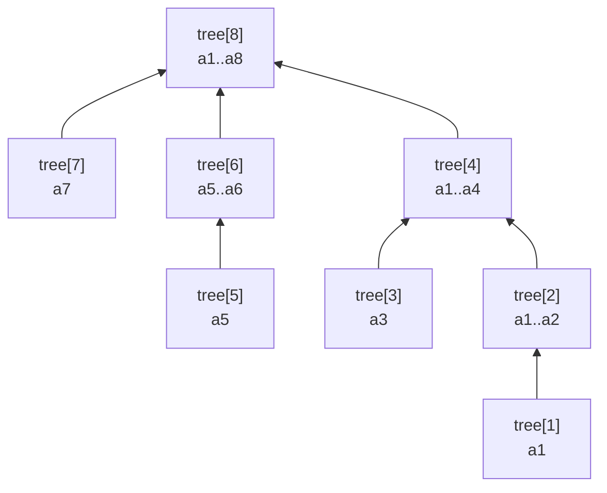

Mũi tên chỉ đường **update**: `i → i + lowbit(i)` (1 → 2 → 4 → 8). Ngược lại, **query** đi `i → i − lowbit(i)`.

### 4.3 Trace

Mảng (1-indexed) `a = [3, 2, −1, 6, 5, 4, −3, 3]` → `tree = [3, 5, −1, 10, 5, 9, −3, 19]`.

**prefix(7)** = a1 + ... + a7:

| Bước | i (nhị phân) | Cộng tree[i] | Tổng | i − lowbit(i) |
|---|---|---|---|---|
| 1 | 7 (`0111`) | tree[7] = −3 (a7) | −3 | 6 |
| 2 | 6 (`0110`) | tree[6] = 9 (a5..a6) | 6 | 4 |
| 3 | 4 (`0100`) | tree[4] = 10 (a1..a4) | **16** | 0 → dừng |

Mỗi bước **xoá 1 bit 1** → tối đa log₂n bước.

**update(3, +2)**: `i = 3 → 4 → 8 → 16 (> n, dừng)`. Mỗi bước **cộng thêm bit thấp nhất** → tối đa log₂n bước. Đúng: các ô chứa a3 là tree[3], tree[4], tree[8].

Muốn nhớ lại prefix sum "cổ điển" (mảng không đổi) chạy thế nào để so sánh, bấm ▶ và để ý: mỗi ô prefix phụ thuộc **mọi** ô trước nó — sửa `a[1]` là phải tính lại cả mảng. Fenwick chính là phiên bản prefix sum **cho phép sửa trong O(log n)**:

<div class="algo-viz" data-viz="array" data-algo="prefix-sum" data-input="3,2,1,6,5,4,3,3" data-title="Prefix sum tĩnh (để so sánh với Fenwick)"></div>

### 4.4 Cài đặt

=== "Go"

    ```go
    package main

    import "fmt"

    type Fenwick struct{ tree []int } // tree[0] không dùng

    func NewFenwick(n int) *Fenwick { return &Fenwick{tree: make([]int, n+1)} }

    // Add: a[i] += delta (i bắt đầu từ 1)
    func (f *Fenwick) Add(i, delta int) {
    	for ; i < len(f.tree); i += i & -i {
    		f.tree[i] += delta
    	}
    }

    // Prefix: a[1] + ... + a[i]
    func (f *Fenwick) Prefix(i int) int {
    	s := 0
    	for ; i > 0; i -= i & -i {
    		s += f.tree[i]
    	}
    	return s
    }

    func (f *Fenwick) RangeSum(l, r int) int { return f.Prefix(r) - f.Prefix(l-1) }

    func main() {
    	a := []int{3, 2, -1, 6, 5, 4, -3, 3}
    	f := NewFenwick(len(a))
    	for i, v := range a {
    		f.Add(i+1, v)
    	}
    	fmt.Println("tree   =", f.tree[1:])
    	fmt.Println("prefix(7) =", f.Prefix(7), " sum[3..6] =", f.RangeSum(3, 6))
    	f.Add(3, 2) // a3: -1 → 1
    	fmt.Println("sau update: prefix(7) =", f.Prefix(7), " tree =", f.tree[1:])
    }

    // Output:
    // tree   = [3 5 -1 10 5 9 -3 19]
    // prefix(7) = 16  sum[3..6] = 14
    // sau update: prefix(7) = 18  tree = [3 5 1 12 5 9 -3 21]
    ```

=== "Python"

    ```python
    class Fenwick:
        def __init__(self, n: int):
            self.tree = [0] * (n + 1)          # tree[0] không dùng

        def add(self, i: int, delta: int) -> None:
            while i < len(self.tree):
                self.tree[i] += delta
                i += i & -i                   # nhảy lên ô "cha"

        def prefix(self, i: int) -> int:
            s = 0
            while i > 0:
                s += self.tree[i]
                i -= i & -i                   # xoá bit 1 thấp nhất
            return s

        def range_sum(self, l: int, r: int) -> int:
            return self.prefix(r) - self.prefix(l - 1)


    a = [3, 2, -1, 6, 5, 4, -3, 3]
    f = Fenwick(len(a))
    for i, v in enumerate(a, 1):
        f.add(i, v)
    print("tree   =", f.tree[1:])
    print("prefix(7) =", f.prefix(7), " sum[3..6] =", f.range_sum(3, 6))
    f.add(3, 2)
    print("sau update: prefix(7) =", f.prefix(7), " tree =", f.tree[1:])

    # Output:
    # tree   = [3, 5, -1, 10, 5, 9, -3, 19]
    # prefix(7) = 16  sum[3..6] = 14
    # sau update: prefix(7) = 18  tree = [3, 5, 1, 12, 5, 9, -3, 21]
    ```

### 4.5 Ứng dụng kinh điển: đếm nghịch thế (inversions)

Cặp `(i, j)` là **nghịch thế** nếu `i < j` mà `a[i] > a[j]`. Duyệt từ trái sang phải, với mỗi `x`, số phần tử **đã gặp mà lớn hơn x** = `đã gặp − prefix(x)`. Dùng Fenwick trên **giá trị** (sau khi nén toạ độ nếu giá trị lớn).

=== "Go"

    ```go
    package main

    import (
    	"fmt"
    	"sort"
    )

    func countInversions(a []int) int {
    	// nén toạ độ: giá trị → hạng 1..m
    	vals := append([]int(nil), a...)
    	sort.Ints(vals)
    	rank := map[int]int{}
    	for _, v := range vals {
    		if _, ok := rank[v]; !ok {
    			rank[v] = len(rank) + 1
    		}
    	}
    	tree := make([]int, len(rank)+1)
    	inv := 0
    	for seen, x := range a {
    		r := rank[x]
    		le := 0 // số phần tử đã gặp <= x
    		for i := r; i > 0; i -= i & -i {
    			le += tree[i]
    		}
    		inv += seen - le
    		for i := r; i < len(tree); i += i & -i {
    			tree[i]++
    		}
    	}
    	return inv
    }

    func main() {
    	fmt.Println(countInversions([]int{8, 4, 2, 1}))
    	fmt.Println(countInversions([]int{3, 1, 2, 5, 4}))
    	fmt.Println(countInversions([]int{100, 7, 7, 1000000000}))
    }

    // Output:
    // 6
    // 3
    // 2
    ```

=== "Python"

    ```python
    def count_inversions(a: list[int]) -> int:
        rank = {v: i + 1 for i, v in enumerate(sorted(set(a)))}  # nén toạ độ
        tree = [0] * (len(rank) + 1)
        inv = 0
        for seen, x in enumerate(a):
            i, le = rank[x], 0
            while i > 0:
                le += tree[i]
                i -= i & -i
            inv += seen - le
            i = rank[x]
            while i < len(tree):
                tree[i] += 1
                i += i & -i
        return inv


    print(count_inversions([8, 4, 2, 1]))
    print(count_inversions([3, 1, 2, 5, 4]))
    print(count_inversions([100, 7, 7, 1_000_000_000]))

    # Output:
    # 6
    # 3
    # 2
    ```

!!! warning "Lỗi hay gặp với Fenwick"
    - **Dùng chỉ số 0**: `i & -i` với `i = 0` bằng 0 → vòng lặp `i += 0` **chạy mãi mãi**. Luôn dịch về 1-indexed.
    - Nhầm `Add` (cộng thêm) với "gán": muốn gán `a[i] = x` thì `Add(i, x - a[i])` và nhớ cập nhật mảng `a` gốc.

---

## 📖 5. Sparse Table — Min đoạn trong O(1)

### 5.1 Ý tưởng

Nếu mảng **không bao giờ thay đổi** và có rất nhiều truy vấn min/max đoạn (RMQ — Range Minimum Query), ta có thể **tiền xử lý O(n log n)** để trả lời mỗi truy vấn trong **O(1)**.

`sp[k][i]` = min của đoạn dài **2ᵏ** bắt đầu tại i: `a[i .. i + 2ᵏ − 1]`.

- `sp[0][i] = a[i]`
- `sp[k][i] = min(sp[k−1][i], sp[k−1][i + 2ᵏ⁻¹])` — ghép 2 nửa dài 2ᵏ⁻¹.

**Truy vấn [l, r]:** đặt `len = r − l + 1`, `k = ⌊log₂ len⌋`. Hai đoạn dài 2ᵏ — một bắt đầu ở `l`, một kết thúc ở `r` — **phủ kín** [l, r] (có thể **chồng lên nhau**):

```
a:      4   6   1   5   7   3   2   8
idx:    0   1   2   3   4   5   6   7
query(1, 6): len = 6, k = 2 (2² = 4)
        [1 ........ 4]                  min = sp[2][1] = 1
                    [3 ........ 6]      min = sp[2][3] = 2
kết quả = min(1, 2) = 1
```

Chồng lên nhau **không sao** với min/max/gcd vì `min(x, x) = x` (phép **idempotent**). Với **tổng** thì chồng lên nhau sẽ cộng trùng → sparse table O(1) **không dùng cho tổng**.

Bảng `sp` với `a = [4, 6, 1, 5, 7, 3, 2, 8]`:

| k \ i | 0 | 1 | 2 | 3 | 4 | 5 | 6 | 7 |
|---|---|---|---|---|---|---|---|---|
| 0 (dài 1) | 4 | 6 | 1 | 5 | 7 | 3 | 2 | 8 |
| 1 (dài 2) | 4 | 1 | 1 | 5 | 3 | 2 | 2 | |
| 2 (dài 4) | 1 | 1 | 1 | 2 | 2 | | | |
| 3 (dài 8) | 1 | | | | | | | |

=== "Go"

    ```go
    package main

    import (
    	"fmt"
    	"math/bits"
    )

    type SparseTable struct{ sp [][]int }

    func NewSparseTable(a []int) *SparseTable {
    	n := len(a)
    	K := bits.Len(uint(n)) // số tầng: 2^(K-1) <= n
    	sp := make([][]int, K)
    	sp[0] = append([]int(nil), a...)
    	for k := 1; k < K; k++ {
    		half := 1 << (k - 1)
    		sp[k] = make([]int, n-(1<<k)+1)
    		for i := range sp[k] {
    			sp[k][i] = min(sp[k-1][i], sp[k-1][i+half])
    		}
    	}
    	return &SparseTable{sp}
    }

    func (s *SparseTable) Min(l, r int) int {
    	k := bits.Len(uint(r-l+1)) - 1 // floor(log2(len))
    	return min(s.sp[k][l], s.sp[k][r-(1<<k)+1])
    }

    func main() {
    	st := NewSparseTable([]int{4, 6, 1, 5, 7, 3, 2, 8})
    	for _, k := range st.sp {
    		fmt.Println(k)
    	}
    	fmt.Println(st.Min(1, 6), st.Min(3, 5), st.Min(4, 4), st.Min(6, 7))
    }

    // Output:
    // [4 6 1 5 7 3 2 8]
    // [4 1 1 5 3 2 2]
    // [1 1 1 2 2]
    // [1]
    // 1 3 7 2
    ```

=== "Python"

    ```python
    class SparseTable:
        def __init__(self, a: list[int]):
            n = len(a)
            self.sp = [a[:]]
            k = 1
            while (1 << k) <= n:
                prev, half = self.sp[-1], 1 << (k - 1)
                self.sp.append([min(prev[i], prev[i + half]) for i in range(n - (1 << k) + 1)])
                k += 1

        def min(self, l: int, r: int) -> int:
            k = (r - l + 1).bit_length() - 1     # floor(log2(len))
            return min(self.sp[k][l], self.sp[k][r - (1 << k) + 1])


    st = SparseTable([4, 6, 1, 5, 7, 3, 2, 8])
    for row in st.sp:
        print(row)
    print(st.min(1, 6), st.min(3, 5), st.min(4, 4), st.min(6, 7))

    # Output:
    # [4, 6, 1, 5, 7, 3, 2, 8]
    # [4, 1, 1, 5, 3, 2, 2]
    # [1, 1, 1, 2, 2]
    # [1]
    # 1 3 7 2
    ```

**So sánh 3 cấu trúc "truy vấn đoạn":**

| | Segment tree | Fenwick tree | Sparse table |
|---|---|---|---|
| Build | O(n) | O(n log n) (hoặc O(n)) | O(n log n) |
| Truy vấn | O(log n) | O(log n) | **O(1)** (min/max/gcd) |
| Update điểm | O(log n) | O(log n) | ❌ không hỗ trợ |
| Update đoạn | O(log n) với lazy | được với mẹo 2 BIT | ❌ |
| Phép hỗ trợ | mọi phép kết hợp | phép có nghịch đảo (+, xor) | phép idempotent (min, max, gcd, and, or) |
| Độ dài code | dài | **rất ngắn** | ngắn |

---

## 📖 6. Disjoint Set (Union-Find) — ôn nhanh

Bạn đã gặp Union-Find ở [Bài 12: Đường đi ngắn nhất & Cây khung](./12-shortest-paths-mst.md) (thuật toán Kruskal). Nhắc lại thật gọn:

- Mỗi nhóm là một **cây**, đại diện là **gốc**. `parent[x]` trỏ lên cha; gốc trỏ về chính nó.
- `find(x)`: đi lên tới gốc. **Path compression**: trên đường về, gắn thẳng mọi node vào gốc → lần sau chỉ 1 bước.
- `union(a, b)`: nối gốc của cây **thấp hơn** vào gốc cây **cao hơn** (**union by rank/size**) để cây không bị "dài ngoằng".
- Kết hợp cả hai: mỗi thao tác gần như **O(1)** (chính xác là O(α(n)), α là hàm Ackermann ngược, ≤ 4 với mọi n thực tế).

Bấm ▶ và để ý: sau `union 1 3`, hai nhóm {0,1} và {2,3} gộp thành một cây; lệnh `find` làm **phẳng** đường đi.

<div class="algo-viz" data-viz="unionfind" data-algo="ops" data-n="6" data-ops="union 0 1,union 2 3,find 3,union 1 3,union 4 5,find 1,union 3 5,find 5" data-title="Union-Find: gộp nhóm và nén đường đi"></div>

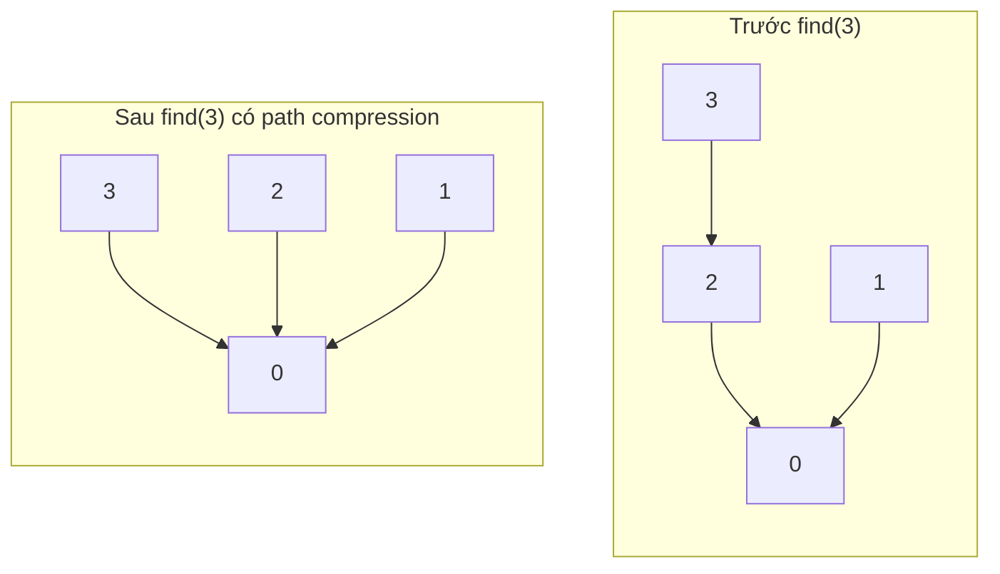

=== "Go"

    ```go
    package main

    import "fmt"

    type DSU struct{ parent, size []int }

    func NewDSU(n int) *DSU {
    	d := &DSU{make([]int, n), make([]int, n)}
    	for i := range d.parent {
    		d.parent[i], d.size[i] = i, 1
    	}
    	return d
    }

    func (d *DSU) Find(x int) int {
    	if d.parent[x] != x {
    		d.parent[x] = d.Find(d.parent[x]) // path compression
    	}
    	return d.parent[x]
    }

    func (d *DSU) Union(a, b int) bool {
    	ra, rb := d.Find(a), d.Find(b)
    	if ra == rb {
    		return false // đã cùng nhóm
    	}
    	if d.size[ra] < d.size[rb] {
    		ra, rb = rb, ra
    	}
    	d.parent[rb] = ra // cây nhỏ gắn vào cây lớn
    	d.size[ra] += d.size[rb]
    	return true
    }

    func main() {
    	d := NewDSU(6)
    	fmt.Println(d.Union(0, 1), d.Union(2, 3), d.Union(1, 3), d.Union(0, 2))
    	fmt.Println(d.Find(3) == d.Find(0), d.Find(4) == d.Find(0), d.size[d.Find(0)])
    }

    // Output:
    // true true true false
    // true false 4
    ```

=== "Python"

    ```python
    class DSU:
        def __init__(self, n: int):
            self.parent = list(range(n))
            self.size = [1] * n

        def find(self, x: int) -> int:
            root = x
            while self.parent[root] != root:
                root = self.parent[root]
            while self.parent[x] != root:          # path compression (không đệ quy)
                self.parent[x], x = root, self.parent[x]
            return root

        def union(self, a: int, b: int) -> bool:
            ra, rb = self.find(a), self.find(b)
            if ra == rb:
                return False
            if self.size[ra] < self.size[rb]:
                ra, rb = rb, ra
            self.parent[rb] = ra
            self.size[ra] += self.size[rb]
            return True


    d = DSU(6)
    print(d.union(0, 1), d.union(2, 3), d.union(1, 3), d.union(0, 2))
    print(d.find(3) == d.find(0), d.find(4) == d.find(0), d.size[d.find(0)])

    # Output:
    # True True True False
    # True False 4
    ```

**Khi nào nghĩ tới Union-Find:** "có bao nhiêu nhóm / thành phần liên thông", "hai phần tử có cùng nhóm không", "thêm cạnh có tạo chu trình không", các cạnh được **thêm dần** (online). Bài luyện: LeetCode 547 (Number of Provinces), 684 (Redundant Connection), 721 (Accounts Merge), 1101.

---

## 📖 7. Skip List — Danh sách liên kết có "làn cao tốc"

### 7.1 Trực giác: tàu nhanh và tàu chậm

Tuyến tàu Bắc–Nam có **tàu chợ** dừng mọi ga và **tàu nhanh** chỉ dừng ga lớn (Vinh, Huế, Đà Nẵng, Nha Trang...). Muốn tới Quảng Ngãi, bạn đi tàu nhanh tới **ga lớn gần nhất trước đó** (Đà Nẵng), rồi xuống tàu chợ đi nốt vài ga. Nhanh hơn nhiều so với tàu chợ từ Hà Nội!

**Skip list** là danh sách liên kết **đã sắp xếp** có nhiều **tầng**:

- Tầng 0: chứa **mọi** phần tử (tàu chợ).
- Mỗi tầng trên chứa **khoảng một nửa** phần tử của tầng dưới (tàu nhanh).
- Tìm kiếm: bắt đầu ở tầng **cao nhất**, đi sang phải khi phần tử kế tiếp **còn nhỏ hơn** mục tiêu, không được nữa thì **xuống tầng**.

```
Tầng 3: head ─────────────────────────────► 17 ─────────────────────────► nil
Tầng 2: head ─────────► 6 ────────────────► 17 ─────────────► 25 ───────► nil
Tầng 1: head ──► 3 ───► 6 ──────► 9 ──────► 17 ──────► 21 ──► 25 ───────► nil
Tầng 0: head ──► 3 ───► 6 ──► 7 ─► 9 ─► 12 ► 17 ─► 19 ─► 21 ─► 25 ─► 26 ► nil
```

Tìm **19**: tầng 3: head → 17 (17 < 19, đi tiếp), kế là nil → xuống. Tầng 2: 17 → 25? 25 > 19 → xuống. Tầng 1: 17 → 21? 21 > 19 → xuống. Tầng 0: 17 → **19** ✅. Chỉ 5 bước thay vì 7.

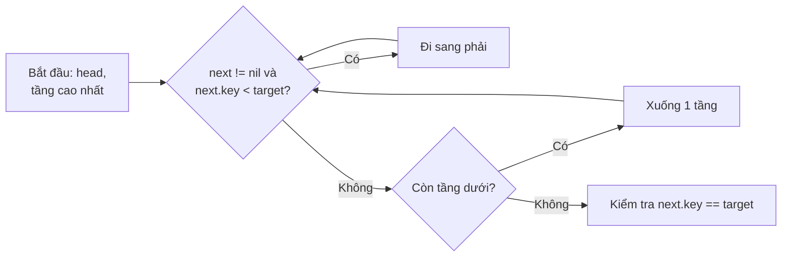

### 7.2 Ngẫu nhiên thay cho cân bằng

Cây nhị phân cân bằng (AVL, đỏ-đen) cần các phép **xoay** phức tạp. Skip list dùng **tung đồng xu**: khi chèn một phần tử, nó có mặt ở tầng 0; tung đồng xu, **ngửa** thì lên thêm một tầng, tiếp tục tung đến khi **sấp**. Kỳ vọng:

- Một nửa số phần tử có ở tầng 1, một phần tư ở tầng 2... → số tầng ≈ **log₂ n**.
- Tìm / chèn / xoá **O(log n) kỳ vọng**, xấu nhất O(n) (xác suất cực nhỏ).
- Bộ nhớ trung bình **2n** con trỏ (n + n/2 + n/4 + ...).

### 7.3 Cài đặt

=== "Go"

    ```go
    package main

    import (
    	"fmt"
    	"math/rand"
    	"strings"
    )

    const maxLevel = 4

    type slNode struct {
    	key  int
    	next []*slNode // next[i] = node kế tiếp ở tầng i
    }

    type SkipList struct {
    	head  *slNode
    	level int // số tầng đang dùng
    	rng   *rand.Rand
    }

    func NewSkipList(seed int64) *SkipList {
    	return &SkipList{head: &slNode{next: make([]*slNode, maxLevel)}, level: 1, rng: rand.New(rand.NewSource(seed))}
    }

    func (s *SkipList) randomLevel() int {
    	lv := 1
    	for lv < maxLevel && s.rng.Intn(2) == 0 { // tung đồng xu
    		lv++
    	}
    	return lv
    }

    func (s *SkipList) Search(key int) bool {
    	x := s.head
    	for i := s.level - 1; i >= 0; i-- {
    		for x.next[i] != nil && x.next[i].key < key {
    			x = x.next[i]
    		}
    	}
    	x = x.next[0]
    	return x != nil && x.key == key
    }

    func (s *SkipList) Insert(key int) {
    	update := make([]*slNode, maxLevel) // node cuối cùng < key ở mỗi tầng
    	x := s.head
    	for i := s.level - 1; i >= 0; i-- {
    		for x.next[i] != nil && x.next[i].key < key {
    			x = x.next[i]
    		}
    		update[i] = x
    	}
    	lv := s.randomLevel()
    	for i := s.level; i < lv; i++ {
    		update[i] = s.head
    	}
    	s.level = max(s.level, lv)
    	n := &slNode{key: key, next: make([]*slNode, lv)}
    	for i := 0; i < lv; i++ { // nối node mới vào từng tầng
    		n.next[i] = update[i].next[i]
    		update[i].next[i] = n
    	}
    }

    func (s *SkipList) Delete(key int) {
    	x := s.head
    	for i := s.level - 1; i >= 0; i-- {
    		for x.next[i] != nil && x.next[i].key < key {
    			x = x.next[i]
    		}
    		if x.next[i] != nil && x.next[i].key == key {
    			x.next[i] = x.next[i].next[i] // gỡ khỏi tầng i
    		}
    	}
    }

    func (s *SkipList) String() string {
    	var b strings.Builder
    	for i := s.level - 1; i >= 0; i-- {
    		fmt.Fprintf(&b, "L%d:", i)
    		for x := s.head.next[i]; x != nil; x = x.next[i] {
    			fmt.Fprintf(&b, " %d", x.key)
    		}
    		b.WriteString("\n")
    	}
    	return b.String()
    }

    func main() {
    	s := NewSkipList(7)
    	for _, k := range []int{3, 6, 7, 9, 12, 17, 19, 21, 25, 26} {
    		s.Insert(k)
    	}
    	fmt.Print(s)
    	fmt.Println(s.Search(19), s.Search(20))
    	s.Delete(19)
    	fmt.Println(s.Search(19))
    }

    // Output:
    // L3: 7 9 19 25
    // L2: 3 7 9 17 19 25
    // L1: 3 7 9 12 17 19 25
    // L0: 3 6 7 9 12 17 19 21 25 26
    // true false
    // false
    ```

=== "Python"

    ```python
    import random

    MAX_LEVEL = 4


    class Node:
        __slots__ = ("key", "next")

        def __init__(self, key, level):
            self.key = key
            self.next = [None] * level


    class SkipList:
        def __init__(self, seed: int = 0):
            self.head = Node(None, MAX_LEVEL)
            self.level = 1
            self.rng = random.Random(seed)

        def _random_level(self) -> int:
            lv = 1
            while lv < MAX_LEVEL and self.rng.random() < 0.5:   # tung đồng xu
                lv += 1
            return lv

        def search(self, key) -> bool:
            x = self.head
            for i in range(self.level - 1, -1, -1):
                while x.next[i] and x.next[i].key < key:
                    x = x.next[i]
            x = x.next[0]
            return x is not None and x.key == key

        def insert(self, key) -> None:
            update = [self.head] * MAX_LEVEL
            x = self.head
            for i in range(self.level - 1, -1, -1):
                while x.next[i] and x.next[i].key < key:
                    x = x.next[i]
                update[i] = x
            lv = self._random_level()
            self.level = max(self.level, lv)
            node = Node(key, lv)
            for i in range(lv):
                node.next[i] = update[i].next[i]
                update[i].next[i] = node

        def delete(self, key) -> None:
            x = self.head
            for i in range(self.level - 1, -1, -1):
                while x.next[i] and x.next[i].key < key:
                    x = x.next[i]
                if x.next[i] and x.next[i].key == key:
                    x.next[i] = x.next[i].next[i]

        def __str__(self) -> str:
            lines = []
            for i in range(self.level - 1, -1, -1):
                keys, x = [], self.head.next[i]
                while x:
                    keys.append(str(x.key))
                    x = x.next[i]
                lines.append(f"L{i}: " + " ".join(keys))
            return "\n".join(lines)


    s = SkipList(seed=7)
    for k in [3, 6, 7, 9, 12, 17, 19, 21, 25, 26]:
        s.insert(k)
    print(s)
    print(s.search(19), s.search(20))
    s.delete(19)
    print(s.search(19))

    # Output:
    # L3: 9
    # L2: 3 7 9 12 17
    # L1: 3 6 7 9 12 17 25 26
    # L0: 3 6 7 9 12 17 19 21 25 26
    # True False
    # False
    ```

(Hình dạng tầng phụ thuộc vào đồng xu — đổi `seed` sẽ ra cấu trúc khác, nhưng kết quả tìm kiếm luôn đúng.)

!!! note "Vì sao Redis chọn skip list cho Sorted Set (ZSET)?"
    `ZADD`, `ZRANGE`, `ZRANK` cần: chèn/xoá O(log n), **duyệt theo thứ tự** và **lấy đoạn** `[a, b]` nhanh. Cây cân bằng làm được, nhưng skip list **dễ cài đặt, dễ debug**, duyệt đoạn chỉ là đi tiếp ở tầng 0, và hỗ trợ tính **rank** bằng cách lưu "độ dài bước nhảy" (span) ở mỗi con trỏ. Redis kết hợp **skip list + hash map** (member → score) để `ZSCORE` là O(1). LevelDB/RocksDB cũng dùng skip list cho **memtable**.

---

## 📖 8. Bloom Filter — "Chắc chắn KHÔNG có" hoặc "Có thể có"

### 8.1 Trực giác: bảng đèn ở cổng chung cư

Hình dung một **bảng m bóng đèn** (tất cả tắt). Mỗi cư dân khi đăng ký được **k người bảo vệ** (k hàm hash), mỗi người chỉ vào **một bóng** dựa trên tên cư dân và bật bóng đó lên.

Khi có người lạ tới, k bảo vệ lại chỉ vào k bóng theo tên người đó:

- Có **ít nhất 1 bóng tắt** → người này **chắc chắn chưa đăng ký** (nếu đã đăng ký thì bóng đó phải sáng).
- **Tất cả k bóng đều sáng** → **có thể** đã đăng ký — hoặc chỉ là **trùng hợp** do các bóng đó bị cư dân khác bật (**dương tính giả — false positive**).

Bloom filter **không bao giờ âm tính giả** (có mà bảo không), chỉ có thể **dương tính giả**.

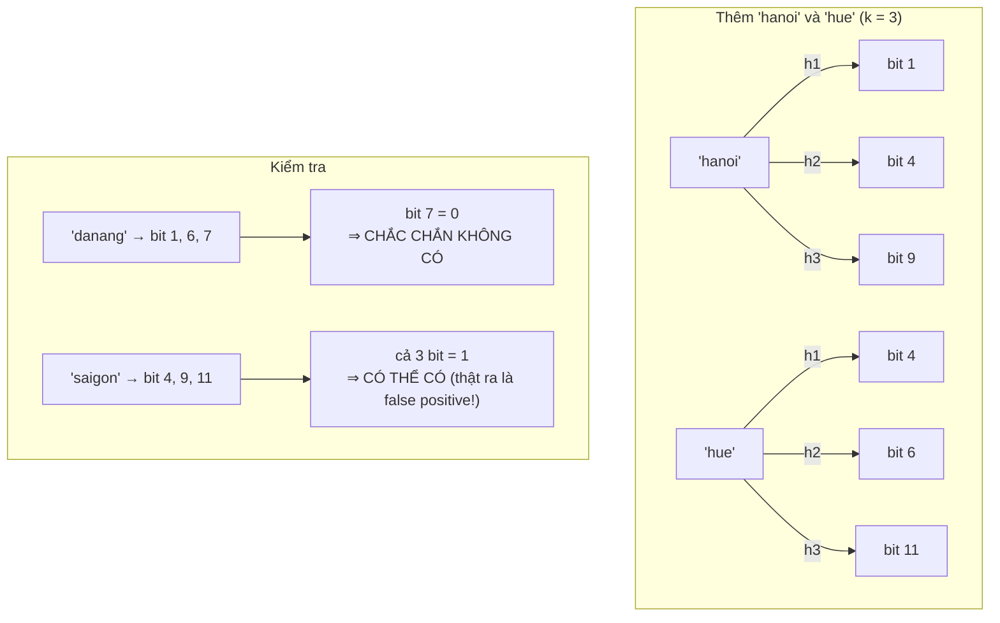

Mảng bit sau khi thêm "hanoi" và "hue" (m = 12):

```
index: 0 1 2 3 4 5 6 7 8 9 10 11
bit:   0 1 0 0 1 0 1 0 0 1  0  1
         ↑     ↑   ↑     ↑     ↑
      hanoi  cả hai hue hanoi  hue
```

### 8.2 Công thức tỉ lệ dương tính giả

Với **m** bit, **k** hàm hash, đã thêm **n** phần tử:

```
p ≈ (1 − e^(−k·n/m))^k
```

Chọn tham số tối ưu khi biết trước n và tỉ lệ sai mong muốn p:

```
m = − n · ln(p) / (ln 2)²        (số bit)
k = (m / n) · ln 2               (số hàm hash)
```

| n (phần tử) | p mong muốn | m (bit) | Bộ nhớ | k |
|---|---|---|---|---|
| 1 triệu | 1% | ≈ 9,6 triệu | **≈ 1,14 MB** | 7 |
| 1 triệu | 0,1% | ≈ 14,4 triệu | ≈ 1,71 MB | 10 |
| 100 triệu | 1% | ≈ 958 triệu | ≈ 114 MB | 7 |

So sánh: lưu 1 triệu URL (trung bình 60 byte) trong hash set tốn **> 60 MB**. Bloom filter chỉ cần **~1,14 MB** — tức khoảng **9,6 bit mỗi phần tử**, bất kể phần tử dài bao nhiêu!

### 8.3 Cài đặt

Thay vì cần k hàm hash độc lập, ta dùng mẹo **double hashing** (Kirsch–Mitzenmacher): `gᵢ(x) = h₁(x) + i·h₂(x) mod m` — chỉ cần tính 2 hash mà chất lượng gần như k hash riêng.

=== "Go"

    ```go
    package main

    import (
    	"fmt"
    	"hash/fnv"
    	"math"
    )

    type Bloom struct {
    	bits []uint64
    	m, k uint64
    }

    func NewBloom(n int, p float64) *Bloom {
    	m := uint64(math.Ceil(-float64(n) * math.Log(p) / (math.Ln2 * math.Ln2)))
    	k := uint64(math.Round(float64(m) / float64(n) * math.Ln2))
    	return &Bloom{bits: make([]uint64, (m+63)/64), m: m, k: k}
    }

    func (b *Bloom) hashes(s string) (uint64, uint64) {
    	f1, f2 := fnv.New64a(), fnv.New64() // 2 hàm hash khác nhau: FNV-1a và FNV-1
    	f1.Write([]byte(s))
    	f2.Write([]byte(s))
    	return f1.Sum64(), f2.Sum64() | 1 // | 1 để h2 lẻ, tránh h2 = 0
    }

    func (b *Bloom) Add(s string) {
    	h1, h2 := b.hashes(s)
    	for i := uint64(0); i < b.k; i++ {
    		pos := (h1 + i*h2) % b.m
    		b.bits[pos/64] |= 1 << (pos % 64) // bật bit
    	}
    }

    func (b *Bloom) MightContain(s string) bool {
    	h1, h2 := b.hashes(s)
    	for i := uint64(0); i < b.k; i++ {
    		pos := (h1 + i*h2) % b.m
    		if b.bits[pos/64]&(1<<(pos%64)) == 0 {
    			return false // chắc chắn không có
    		}
    	}
    	return true // có thể có
    }

    func main() {
    	n, p := 1000, 0.01
    	bf := NewBloom(n, p)
    	fmt.Printf("m = %d bit (%d byte), k = %d\n", bf.m, len(bf.bits)*8, bf.k)
    	for i := 0; i < n; i++ {
    		bf.Add(fmt.Sprintf("user-%d", i))
    	}
    	fmt.Println(bf.MightContain("user-42"), bf.MightContain("user-999"))

    	fp, trials := 0, 100000
    	for i := 0; i < trials; i++ {
    		if bf.MightContain(fmt.Sprintf("stranger-%d", i)) {
    			fp++
    		}
    	}
    	theory := math.Pow(1-math.Exp(-float64(bf.k)*float64(n)/float64(bf.m)), float64(bf.k))
    	fmt.Printf("false positive: đo được %.4f, lý thuyết %.4f\n", float64(fp)/float64(trials), theory)
    }

    // Output:
    // m = 9586 bit (1200 byte), k = 7
    // true true
    // false positive: đo được 0.0100, lý thuyết 0.0100
    ```

=== "Python"

    ```python
    import hashlib
    import math


    class Bloom:
        def __init__(self, n: int, p: float):
            self.m = math.ceil(-n * math.log(p) / math.log(2) ** 2)
            self.k = round(self.m / n * math.log(2))
            self.bits = bytearray((self.m + 7) // 8)

        def _positions(self, s: str):
            d = hashlib.sha256(s.encode()).digest()
            h1 = int.from_bytes(d[:8], "little")
            h2 = int.from_bytes(d[8:16], "little") | 1
            for i in range(self.k):
                yield (h1 + i * h2) % self.m

        def add(self, s: str) -> None:
            for pos in self._positions(s):
                self.bits[pos >> 3] |= 1 << (pos & 7)

        def might_contain(self, s: str) -> bool:
            return all(self.bits[pos >> 3] >> (pos & 7) & 1 for pos in self._positions(s))


    n, p = 1000, 0.01
    bf = Bloom(n, p)
    print(f"m = {bf.m} bit ({len(bf.bits)} byte), k = {bf.k}")
    for i in range(n):
        bf.add(f"user-{i}")
    print(bf.might_contain("user-42"), bf.might_contain("user-999"))

    trials = 100_000
    fp = sum(bf.might_contain(f"stranger-{i}") for i in range(trials))
    theory = (1 - math.exp(-bf.k * n / bf.m)) ** bf.k
    print(f"false positive: đo được {fp / trials:.4f}, lý thuyết {theory:.4f}")

    # Output:
    # m = 9586 bit (1199 byte), k = 7
    # True True
    # false positive: đo được 0.0111, lý thuyết 0.0100
    ```

Tỉ lệ đo được sát với công thức — và **không có** phần tử đã thêm nào bị báo "không có".

### 8.4 Giới hạn & biến thể

- **Không xoá được**: tắt một bit có thể "xoá nhầm" phần tử khác dùng chung bit đó. Cần xoá → **Counting Bloom filter** (mỗi ô là bộ đếm 4 bit thay vì 1 bit) hoặc **Cuckoo filter**.
- **Không liệt kê** được các phần tử, không biết giá trị gắn với key — nó chỉ là "bộ lọc" đứng **trước** nguồn dữ liệu thật.
- Thêm quá n phần tử dự kiến → tỉ lệ sai tăng vọt. Cần tăng dần → **Scalable Bloom filter** (chuỗi các filter lớn dần).

**Ứng dụng:**

- **Chống cache penetration**: kẻ xấu gửi hàng loạt ID **không tồn tại** → cache miss → dội thẳng vào DB. Đặt Bloom filter chứa mọi ID hợp lệ trước cache: "chắc chắn không có" thì trả 404 luôn. Xem [Bài 8 Backend: Caching & Redis](../backend/08-caching.md) (Redis có module `RedisBloom`: `BF.ADD`, `BF.EXISTS`).
- **Cassandra, HBase, RocksDB, LevelDB**: mỗi file SSTable kèm một Bloom filter — đọc key nào thì hỏi filter trước, tránh đọc đĩa vô ích.
- **Trình duyệt Chrome** (trước đây) kiểm tra URL độc hại cục bộ bằng Bloom filter, chỉ hỏi server khi "có thể có".
- **Medium** dùng để không gợi ý lại bài bạn đã đọc; **Akamai** để chỉ cache những URL được truy cập từ lần thứ 2 trở đi.

---

## 📖 9. Cấu trúc đơn điệu (Monotonic Stack / Deque) — ôn tập

Ở [Bài 5: Stack & Queue](./05-stacks-queues.md) bạn đã gặp ý tưởng: giữ stack/deque **luôn tăng dần hoặc giảm dần**; phần tử mới vào sẽ **đá văng** những phần tử "vô dụng" không bao giờ còn là đáp án.

**Hình ảnh:** xếp hàng chụp ảnh, ai **thấp hơn** người mới đến đứng phía trước thì bị che mất — loại luôn khỏi hàng.

### 9.1 Monotonic stack — "phần tử lớn hơn kế tiếp" (Next Greater Element)

Duyệt từ trái sang phải; stack giữ các **chỉ số chưa tìm được đáp án**, giá trị **giảm dần** từ đáy lên đỉnh. Gặp `x` lớn hơn đỉnh → `x` chính là "lớn hơn kế tiếp" của đỉnh → pop và ghi đáp án.

| i | a[i] | Stack (giá trị) trước | Pop & ghi đáp án | Stack sau |
|---|---|---|---|---|
| 0 | 2 | [] | — | [2] |
| 1 | 1 | [2] | — | [2, 1] |
| 2 | 2 | [2, 1] | ans[1] = 2 | [2, 2] |
| 3 | 4 | [2, 2] | ans[2] = 4, ans[0] = 4 | [4] |
| 4 | 3 | [4] | — | [4, 3] |
| hết | | [4, 3] | còn lại = −1 | |

### 9.2 Monotonic deque — max của cửa sổ trượt (LeetCode 239)

Deque giữ chỉ số, giá trị **giảm dần** từ đầu tới cuối → **đầu deque luôn là max** của cửa sổ. Mỗi bước: (1) bỏ đầu nếu đã trượt ra khỏi cửa sổ, (2) bỏ cuối khi nhỏ hơn phần tử mới, (3) thêm phần tử mới vào cuối.

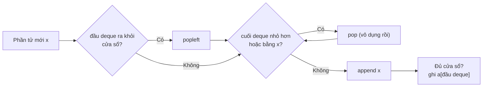

Mỗi phần tử vào deque 1 lần, ra tối đa 1 lần → tổng **O(n)**, trong khi dùng heap là O(n log n).

=== "Go"

    ```go
    package main

    import "fmt"

    func nextGreater(a []int) []int {
    	ans := make([]int, len(a))
    	stack := []int{} // chỉ số, giá trị giảm dần
    	for i := range ans {
    		ans[i] = -1
    	}
    	for i, x := range a {
    		for len(stack) > 0 && a[stack[len(stack)-1]] < x {
    			ans[stack[len(stack)-1]] = x
    			stack = stack[:len(stack)-1]
    		}
    		stack = append(stack, i)
    	}
    	return ans
    }

    func maxSlidingWindow(a []int, k int) []int {
    	dq, res := []int{}, []int{} // dq giữ chỉ số, giá trị giảm dần
    	for i, x := range a {
    		if len(dq) > 0 && dq[0] <= i-k {
    			dq = dq[1:] // ra khỏi cửa sổ
    		}
    		for len(dq) > 0 && a[dq[len(dq)-1]] <= x {
    			dq = dq[:len(dq)-1] // vô dụng
    		}
    		dq = append(dq, i)
    		if i >= k-1 {
    			res = append(res, a[dq[0]])
    		}
    	}
    	return res
    }

    func main() {
    	fmt.Println(nextGreater([]int{2, 1, 2, 4, 3}))
    	fmt.Println(maxSlidingWindow([]int{1, 3, -1, -3, 5, 3, 6, 7}, 3))
    }

    // Output:
    // [4 2 4 -1 -1]
    // [3 3 5 5 6 7]
    ```

=== "Python"

    ```python
    from collections import deque


    def next_greater(a: list[int]) -> list[int]:
        ans = [-1] * len(a)
        stack: list[int] = []
        for i, x in enumerate(a):
            while stack and a[stack[-1]] < x:
                ans[stack.pop()] = x
            stack.append(i)
        return ans


    def max_sliding_window(a: list[int], k: int) -> list[int]:
        dq: deque[int] = deque()
        res = []
        for i, x in enumerate(a):
            if dq and dq[0] <= i - k:
                dq.popleft()
            while dq and a[dq[-1]] <= x:
                dq.pop()
            dq.append(i)
            if i >= k - 1:
                res.append(a[dq[0]])
        return res


    print(next_greater([2, 1, 2, 4, 3]))
    print(max_sliding_window([1, 3, -1, -3, 5, 3, 6, 7], 3))

    # Output:
    # [4, 2, 4, -1, -1]
    # [3, 3, 5, 5, 6, 7]
    ```

!!! tip "Nhận diện bài monotonic"
    Từ khoá: "phần tử lớn/nhỏ hơn **gần nhất** bên trái/phải", "nhiệt độ ấm hơn sau bao nhiêu ngày" (739), "hình chữ nhật lớn nhất trong histogram" (84), "trapping rain water" (42), "max/min của mọi cửa sổ" (239), "sum of subarray minimums" (907).

---

## 📖 10. Bảng so sánh & chọn cấu trúc nào?

| Cấu trúc | Câu hỏi nó trả lời | Thao tác chính | Bộ nhớ | Dùng trong hệ thống thật |
|---|---|---|---|---|
| **Trie** | Có từ nào bắt đầu bằng prefix? | O(L) | lớn (nhiều node) | Autocomplete, spell check, router HTTP (radix tree), bảng định tuyến IP (longest prefix match) |
| **LRU cache** | Giữ n phần tử "nóng" nhất | O(1) get/put | O(n) | Redis `allkeys-lru`, page cache của OS, CDN, `functools.lru_cache` |
| **LFU cache** | Giữ phần tử dùng nhiều nhất | O(1) get/put | O(n) | Redis `allkeys-lfu`, cache chống "scan" |
| **Segment tree** | Tổng/min/max đoạn + update | O(log n) | O(4n) | Thi đấu lập trình, hệ thống xếp lịch/đặt phòng theo khoảng, game |
| **Fenwick tree** | Prefix sum + update | O(log n) | O(n) | Bảng xếp hạng, thống kê tần suất động, đếm nghịch thế |
| **Sparse table** | Min/max đoạn, mảng tĩnh | O(1) query | O(n log n) | LCA (tổ tiên chung) trên cây, RMQ tĩnh |
| **Disjoint set** | Cùng nhóm? gộp nhóm | ~O(1) | O(n) | Kruskal MST, phân cụm ảnh, phát hiện chu trình, gộp tài khoản |
| **Skip list** | Tập có thứ tự, chèn/xoá/range | O(log n) kỳ vọng | ~2n con trỏ | **Redis Sorted Set**, memtable của LevelDB/RocksDB, `ConcurrentSkipListMap` (Java) |
| **Bloom filter** | Chắc chắn không có? | O(k) | vài bit/phần tử | Cassandra/RocksDB SSTable, chống cache penetration, dedup crawler |
| **B+ tree** *(Bài 9 & Backend 6)* | Tập có thứ tự **trên đĩa** | O(log_B n) I/O | trang 4–16 KB | **Index của MySQL InnoDB, PostgreSQL**, hệ thống file |
| **Monotonic deque** | Max/min cửa sổ trượt | O(1) khấu hao | O(k) | Rate limiter, phân tích chuỗi thời gian |

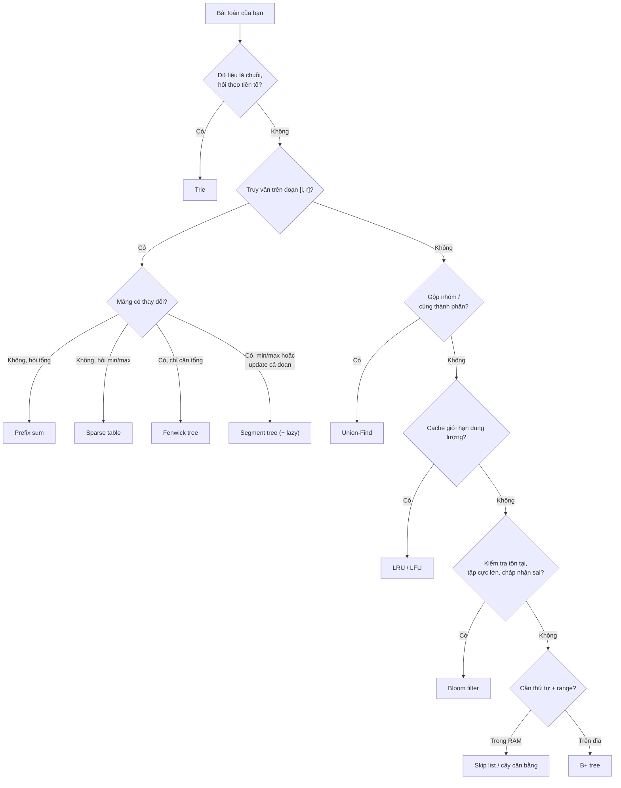

### 💡 Tips quan trọng

- **Đừng dùng dao mổ trâu giết gà.** Mảng tĩnh + hỏi tổng đoạn → prefix sum là đủ. Segment tree chỉ khi thật sự có update.
- Trong phỏng vấn ở công ty sản phẩm, **Trie, LRU, Union-Find, monotonic stack** xuất hiện thường xuyên. Segment tree / Fenwick / sparse table hay gặp hơn ở **thi lập trình** (VNOI, Codeforces) và vòng phỏng vấn khó.
- Khi viết cấu trúc tổng quát (segment tree), hãy nghĩ theo **phép gộp + phần tử trung hoà** — một khuôn dùng cho mọi bài.

---

## 🌍 Ứng dụng thực tế

| Hệ thống | Cấu trúc bên dưới | Vì sao |
|---|---|---|
| Ô tìm kiếm Google / Shopee gợi ý khi gõ | Trie (+ top-k lưu sẵn ở mỗi node) | Gõ "iph" → đi 3 bước tới node, lấy luôn danh sách gợi ý đã tính sẵn |
| Router Gin, `httprouter`, Echo (Go) | Radix tree (trie nén) | Khớp `/users/:id/posts` theo tiền tố đường dẫn nhanh |
| Bảng định tuyến IP của router mạng | Trie nhị phân (longest prefix match) | Tìm dải mạng khớp dài nhất cho IP đích |
| Redis `ZADD` / bảng xếp hạng game | Skip list + hash map | Rank, range theo điểm O(log n) |
| MySQL / PostgreSQL index | B+ tree | Tối ưu số lần đọc đĩa; lá nối nhau để quét range |
| Cassandra, RocksDB, LevelDB | Bloom filter + skip list (memtable) | Bỏ qua SSTable không chứa key; ghi nhanh vào RAM có thứ tự |
| Browser cache, CDN, Memcached | LRU (xấp xỉ) | Bộ nhớ có hạn, giữ thứ "nóng" |
| Bảng xếp hạng realtime, thống kê "bao nhiêu người điểm ≤ x" | Fenwick tree | Update + prefix count O(log n) |
| Mạng xã hội: gợi ý "bạn chung nhóm", phân cụm | Union-Find | Gộp nhóm gần O(1) |
| Web crawler tránh tải lại URL | Bloom filter | Hàng tỉ URL chỉ tốn vài GB RAM |

---

## ⚠️ Lỗi thường gặp

1. **Trie không có cờ kết thúc từ** → tiền tố bị coi là từ.
2. **LRU quên lưu `key` trong node** → khi đuổi `tail.prev` không biết xoá key nào khỏi map.
3. **LRU cập nhật value của key cũ mà không đưa lên đầu** — `put` cũng tính là "vừa dùng".
4. **Segment tree mảng `2n`** thay vì `4n`; **sai phần tử trung hoà** cho min/max.
5. **Lazy propagation quên `pushDown` trước khi đi xuống** trong query.
6. **Fenwick dùng chỉ số 0** → vòng lặp vô hạn.
7. **Sparse table cho tổng đoạn** với 2 đoạn chồng nhau → cộng trùng.
8. **Union-Find không nén đường đi / không union by size** → suy biến thành danh sách, O(n) mỗi `find`. Trong Python, `find` đệ quy sâu có thể vượt giới hạn đệ quy → dùng bản vòng lặp.
9. **Bloom filter**: hiểu nhầm "có" là chắc chắn có; cố xoá phần tử; thêm nhiều hơn dung lượng thiết kế.
10. **Skip list**: dùng `rand` không seed khi test → khó tái hiện bug. Seed cố định khi debug.

---

## 🏋️ Bài tập

### Mức 1 — Làm quen

**1.1** Implement Trie (LeetCode 208). Thêm hàm `CountPrefix(prefix)` trả về số từ có tiền tố đó.

<details><summary>Đáp án</summary>

Lưu thêm `count` ở mỗi node = số từ **đi qua** node đó. Khi `Insert`, tăng `count` của mọi node trên đường đi. `CountPrefix` = `walk(prefix).count` (hoặc 0 nếu `nil`).

```python
class Node:
    def __init__(self):
        self.children, self.count, self.is_end = {}, 0, False

def insert(root, w):
    node = root
    for ch in w:
        node = node.children.setdefault(ch, Node())
        node.count += 1
    node.is_end = True

def count_prefix(root, p):
    node = root
    for ch in p:
        node = node.children.get(ch)
        if node is None:
            return 0
    return node.count
```

</details>

**1.2** LRU Cache (LeetCode 146) — tự viết lại **không nhìn code**, dùng sentinel.

<details><summary>Gợi ý kiểm tra</summary>

Chạy lại bảng trace capacity = 2 ở mục 2.3. Test thêm: `capacity = 1`; `put` cùng key 2 lần (không được đuổi nhầm key khác); `get` key không tồn tại.

</details>

**1.3** Range Sum Query – Mutable (LeetCode 307) bằng **Fenwick tree**.

<details><summary>Đáp án</summary>

Giữ mảng `nums` gốc. `update(i, val)`: `delta = val - nums[i]; nums[i] = val; add(i+1, delta)`. `sumRange(l, r) = prefix(r+1) - prefix(l)`.

</details>

### Mức 2 — Vận dụng

**2.1** Design Add and Search Words (LeetCode 211): `search` hỗ trợ ký tự `.` khớp với mọi chữ.

<details><summary>Đáp án</summary>

Trie bình thường. `search` dùng DFS: gặp `.` thì thử **mọi con**; gặp chữ thường thì đi đúng con đó.

```python
def search(node, word, i=0):
    if i == len(word):
        return node.is_end
    ch = word[i]
    if ch == ".":
        return any(search(c, word, i + 1) for c in node.children.values())
    nxt = node.children.get(ch)
    return nxt is not None and search(nxt, word, i + 1)
```

</details>

**2.2** Range Sum Query 2D – Mutable (LeetCode 308) hoặc bản tĩnh 304. Gợi ý: Fenwick 2 chiều — hai vòng lặp lồng `i += i & -i`, `j += j & -j`.

**2.3** Number of Provinces (547) và Redundant Connection (684) bằng Union-Find.

<details><summary>Đáp án 684</summary>

Duyệt các cạnh theo thứ tự; cạnh `(u, v)` nào mà `union(u, v)` trả về `false` (đã cùng nhóm) chính là cạnh tạo chu trình → trả về cạnh đó.

</details>

**2.4** Sliding Window Maximum (239) bằng monotonic deque; Daily Temperatures (739) bằng monotonic stack.

### Mức 3 — Thử thách

**3.1** Word Search II (212) — cài lại bằng Go với tối ưu tỉa node đã hết từ (thêm `count` con cho mỗi node).

**3.2** LFU Cache (460) — tự viết bằng Go **không dùng `container/list`**.

**3.3** Count of Smaller Numbers After Self (315): với mỗi `i`, đếm số phần tử bên phải nhỏ hơn `a[i]`.

<details><summary>Đáp án</summary>

Nén toạ độ, duyệt **từ phải sang trái**: `ans[i] = prefix(rank[a[i]] - 1)` rồi `add(rank[a[i]], 1)`. O(n log n).

```python
def count_smaller(nums):
    rank = {v: i + 1 for i, v in enumerate(sorted(set(nums)))}
    tree = [0] * (len(rank) + 1)
    ans = []
    for x in reversed(nums):
        i, s = rank[x] - 1, 0
        while i > 0:
            s += tree[i]; i -= i & -i
        ans.append(s)
        i = rank[x]
        while i < len(tree):
            tree[i] += 1; i += i & -i
    return ans[::-1]
# count_smaller([5, 2, 6, 1]) == [2, 1, 1, 0]
```

</details>

**3.4** Range Module (715) / My Calendar III (732): dùng segment tree có lazy trên toạ độ đã nén (hoặc "dynamic segment tree" tạo node khi cần).

**3.5** Thiết kế: bạn cần chặn 1 tỉ email spam đã biết, RAM cho phép 2 GB, chấp nhận sai 0,1%. Tính m, k của Bloom filter. Có vừa không?

<details><summary>Đáp án</summary>

m = −n·ln(p)/(ln2)² = −10⁹ × ln(0,001) / 0,4805 ≈ 10⁹ × 6,908 / 0,4805 ≈ **1,44 × 10¹⁰ bit ≈ 1,8 GB**; k = (m/n)·ln2 ≈ 14,4 × 0,693 ≈ **10**. Vừa đủ 2 GB nhưng sát nút — thực tế nên chia shard hoặc chấp nhận p = 1% (≈ 1,2 GB, k = 7).

</details>

---

## ✅ Checklist hoàn thành

- [ ] Cài được Trie với `Insert / Search / StartsWith` và autocomplete bằng DFS
- [ ] Giải thích được vì sao LRU cần **hash map + linked list đôi**, tự viết được trong 15 phút
- [ ] Nêu được cách LFU giữ `minFreq` và các nhóm tần suất
- [ ] Vẽ được segment tree cho một mảng nhỏ và trace `query`, `update` bằng tay
- [ ] Hiểu "giấy nợ" `lazy` và khi nào phải `pushDown`
- [ ] Giải thích `i & -i` và hai vòng lặp của Fenwick tree
- [ ] Biết vì sao sparse table O(1) chỉ dùng cho phép idempotent (min/max/gcd)
- [ ] Union-Find có path compression + union by size
- [ ] Giải thích skip list và lý do Redis dùng nó cho sorted set
- [ ] Tính được m, k cho Bloom filter và hiểu vì sao chỉ có false positive
- [ ] Chọn đúng cấu trúc cho một bài toán dựa trên bảng so sánh

---

**Bài tiếp theo**: [Bài 16: Thuật toán chuỗi, Toán & Bit](./16-strings-math-bits.md)
