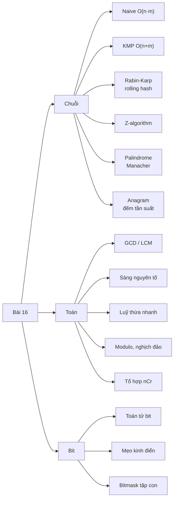
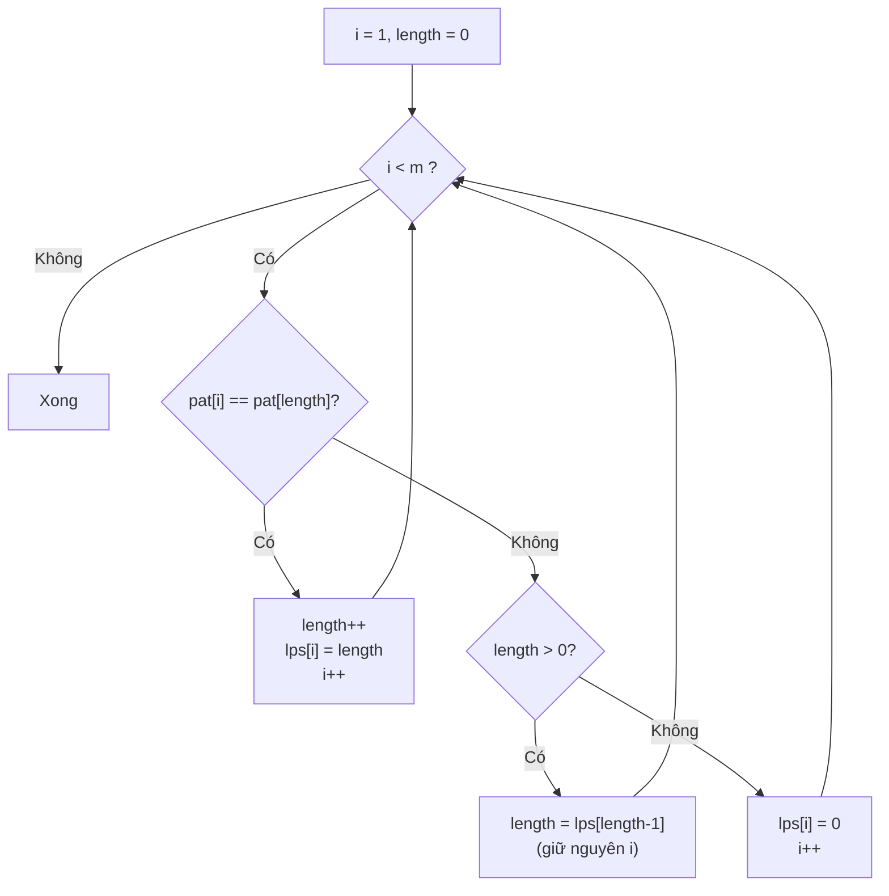
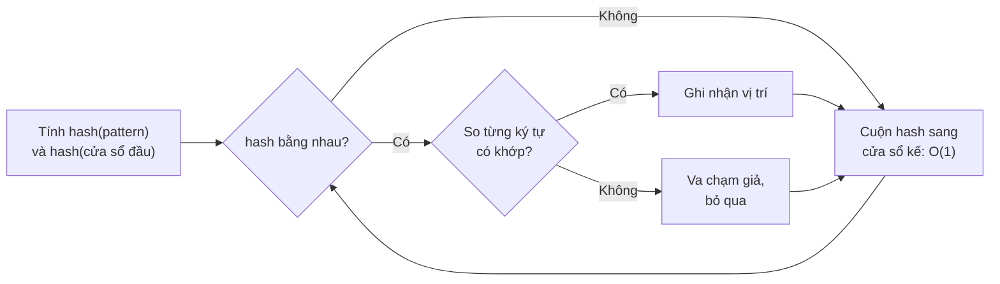
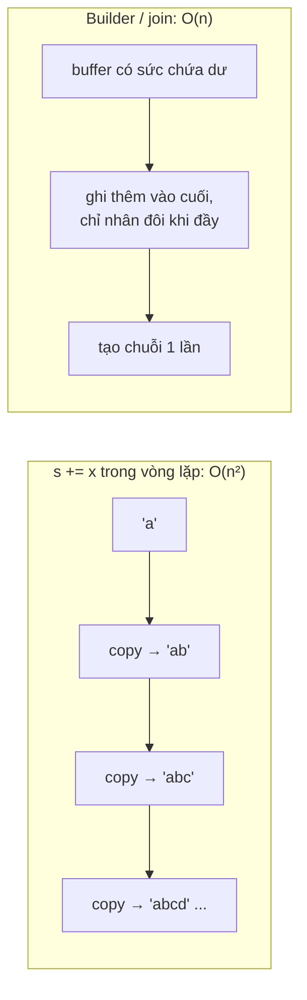
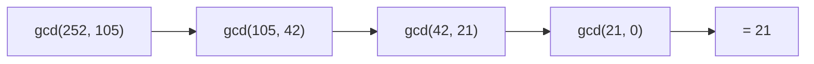
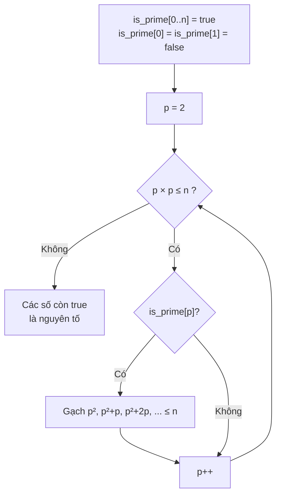
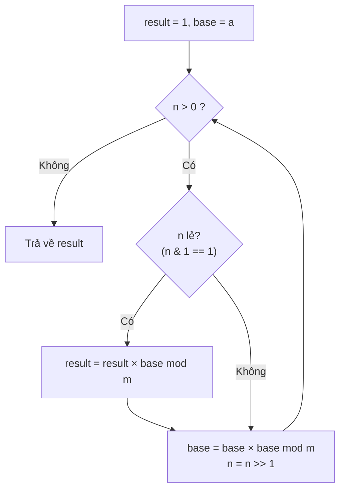
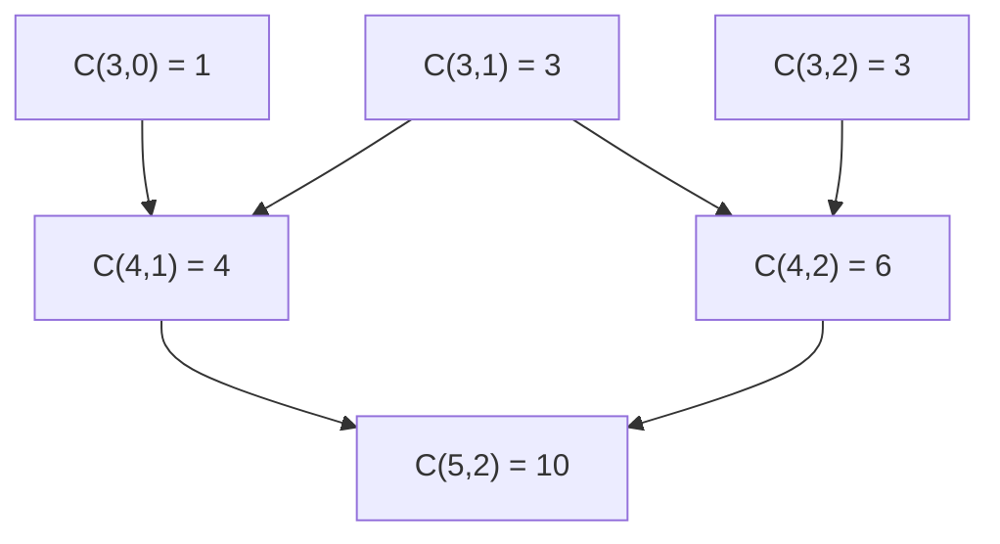
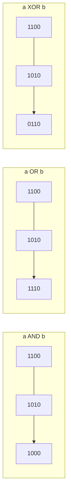

# 📚 Bài 16: Thuật toán chuỗi, Toán & Bit

## 🎯 Mục tiêu bài học

- Hiểu bài toán **tìm chuỗi con (pattern matching)** và 3 thuật toán kinh điển: **Naive**, **KMP**, **Rabin-Karp** — kèm **Z-algorithm**
- Tự dựng được **mảng LPS** của KMP từng bước, hiểu vì sao KMP **không bao giờ lùi** con trỏ trên văn bản
- Hiểu **rolling hash** và vì sao phải kiểm tra lại khi **trùng hash (collision)**
- Giải các bài **palindrome** (expand around center, Manacher) và **anagram** (đếm tần suất)
- Biết nối chuỗi **đúng cách** trong Go (`strings.Builder`) và Python (`"".join`)
- Nắm "bộ toán thi đấu": **GCD/LCM**, **sàng Eratosthenes**, **phân tích thừa số nguyên tố**, **luỹ thừa nhanh**, **số học modulo**, **nghịch đảo modulo**, **tổ hợp nCr mod p**
- Tránh các bẫy **tràn số (overflow)** trong Go và hiểu vì sao Python "không tràn"
- Thành thạo **thao tác bit**: AND/OR/XOR/NOT/shift, các mẹo kinh điển, **duyệt tập con bằng bitmask**, package `math/bits` và `int.bit_count()`

## 🗺️ Bản đồ bài học



---

# Phần A — Thuật toán chuỗi

## 📖 1. Bài toán tìm chuỗi con

Cho **văn bản** `text` dài **n** và **mẫu** `pattern` dài **m**. Tìm mọi vị trí `i` sao cho `text[i .. i+m−1] == pattern`.

Bạn dùng nó hàng ngày: **Ctrl+F** trong trình duyệt, `grep` trong terminal, tìm từ khoá bị cấm trong bình luận, tìm đoạn gen trong chuỗi DNA...

Ví dụ xuyên suốt phần này:

```
text    = A B A B D A B A C D A B A B C A B A B      (n = 19)
pattern = A B A B C A B A B                          (m = 9)
                                  ↑ khớp tại i = 10
```

---

## 📖 2. Naive — Thử mọi vị trí

### 2.1 Ý tưởng

Đặt pattern ở vị trí `i = 0`, so từng ký tự. Sai ở đâu thì **dịch pattern sang phải 1 ô** và so lại **từ đầu pattern**. Giống như bạn cầm tờ giấy có chữ "ABABCABAB" trượt dọc dòng chữ và so từng chữ.

```
text:  A B A B D A B A C D A B A B C A B A B
i=0:   A B A B C                      ← khớp 4 ký tự, sai ở D ≠ C → dịch 1, so lại từ đầu
i=1:     A                            ← B ≠ A → dịch 1
i=2:       A B A                      ← khớp "AB", sai ở D ≠ A → dịch 1
i=3:         A                        ← B ≠ A → dịch 1
...
i=10:                      A B A B C A B A B ← khớp đủ 9 ký tự ✅
```

Bấm ▶ và đếm xem có bao nhiêu lần pattern **quay về so từ đầu** dù trước đó đã khớp được mấy ký tự — đó chính là sự lãng phí mà KMP sẽ loại bỏ.

<div class="algo-viz" data-viz="string" data-algo="naive" data-text="ABABDABACDABABCABAB" data-pattern="ABABCABAB" data-title="Tìm chuỗi Naive"></div>

### 2.2 Cài đặt

=== "Go"

    ```go
    package main

    import "fmt"

    func naiveSearch(text, pat string) (res []int, comparisons int) {
    	n, m := len(text), len(pat)
    	for i := 0; i+m <= n; i++ {
    		j := 0
    		for j < m {
    			comparisons++
    			if text[i+j] != pat[j] {
    				break
    			}
    			j++
    		}
    		if j == m {
    			res = append(res, i)
    		}
    	}
    	return
    }

    func main() {
    	fmt.Println(naiveSearch("ABABDABACDABABCABAB", "ABABCABAB"))
    	fmt.Println(naiveSearch("AAAAAAAAAAAAAAAAAAAB", "AAAAB")) // trường hợp xấu
    }

    // Output:
    // [10] 29
    // [15] 80
    ```

=== "Python"

    ```python
    def naive_search(text: str, pat: str) -> tuple[list[int], int]:
        n, m = len(text), len(pat)
        res, comparisons = [], 0
        for i in range(n - m + 1):
            j = 0
            while j < m:
                comparisons += 1
                if text[i + j] != pat[j]:
                    break
                j += 1
            if j == m:
                res.append(i)
        return res, comparisons


    print(naive_search("ABABDABACDABABCABAB", "ABABCABAB"))
    print(naive_search("AAAAAAAAAAAAAAAAAAAB", "AAAAB"))   # trường hợp xấu

    # Output:
    # ([10], 29)
    # ([15], 80)
    ```

**Độ phức tạp:** trung bình trên văn bản "ngẫu nhiên" khá nhanh (thường sai ngay ký tự đầu), nhưng **xấu nhất O(n·m)** — ví dụ `text = "AAAA...AB"`, `pattern = "AAAAB"`: ở mỗi vị trí phải so gần hết pattern rồi mới sai.

!!! note "Thực tế"
    `strings.Index` của Go và `str.find` / toán tử `in` của Python **không** dùng naive thuần: Go dùng mẹo so byte đầu bằng lệnh SIMD rồi chuyển sang **Rabin-Karp** khi pattern dài; CPython dùng biến thể **Boyer–Moore–Horspool** ("fastsearch"), và từ Python 3.10 dùng thêm **Two-Way** cho pattern dài. Hãy dùng hàm có sẵn trong code thật — học các thuật toán dưới đây để hiểu và để giải các bài **biến thể** mà hàm có sẵn không làm được.

---

## 📖 3. KMP (Knuth–Morris–Pratt)

### 3.1 Trực giác: đừng quên những gì đã đọc

Hãy xem lại lần thử ở `i = 0` của Naive: ta đã khớp `ABAB` rồi mới sai ở ký tự thứ 5 (`D ≠ C`). Naive vứt hết, dịch 1 ô rồi so lại từ đầu. Nhưng ta **đã biết** 4 ký tự vừa đọc là `ABAB`! Trong `ABAB`, **đuôi** `AB` trùng với **đầu** `AB` của pattern → có thể **trượt pattern sao cho đầu `AB` nằm đúng chỗ đuôi `AB`** và so tiếp từ ký tự thứ 3 của pattern, **không cần lùi con trỏ trên text**.

```
text:     A B A B D ...
pattern:  A B A B C          sai ở j = 4, đã khớp "ABAB"
              A B A B C      trượt: "AB" đầu nằm dưới "AB" đuôi, so tiếp j = 2 với text 'D'
```

Để biết trượt bao xa, KMP tính trước cho pattern một bảng **LPS**.

### 3.2 Mảng LPS (Longest Proper Prefix which is also Suffix)

`lps[i]` = độ dài **tiền tố thật sự** dài nhất của `pattern[0..i]` mà **cũng là hậu tố** của nó ("thật sự" = không tính cả chuỗi).

Ví dụ với `pattern[0..3] = "ABAB"`: tiền tố thật `A, AB, ABA`; hậu tố thật `B, AB, BAB`. Chung dài nhất là `AB` → `lps[3] = 2`.

| i | 0 | 1 | 2 | 3 | 4 | 5 | 6 | 7 | 8 |
|---|---|---|---|---|---|---|---|---|---|
| pattern[i] | A | B | A | B | C | A | B | A | B |
| lps[i] | 0 | 0 | 1 | 2 | 0 | 1 | 2 | 3 | 4 |
| tiền tố = hậu tố | — | — | `A` | `AB` | — | `A` | `AB` | `ABA` | `ABAB` |

**Ý nghĩa khi so khớp:** đã khớp `j` ký tự rồi gặp sai → đặt `j = lps[j−1]` (giữ lại phần đầu đã chắc chắn khớp), **không động vào `i`**.

### 3.3 Xây mảng LPS — từng bước

Dùng 2 biến: `i` chạy trên pattern (từ 1), `length` = độ dài tiền-tố-bằng-hậu-tố hiện tại.

```
nếu pat[i] == pat[length]:   length++, lps[i] = length, i++
ngược lại nếu length > 0:    length = lps[length-1]     ← lùi "khôn ngoan", KHÔNG tăng i
ngược lại:                   lps[i] = 0, i++
```

Chỗ khó nhất là dòng thứ hai — khi sai, ta **không** về 0 ngay mà thử tiền tố ngắn hơn **cũng là hậu tố** (chính là `lps[length−1]`). Xem với pattern `"AAACAAAA"`:

| Bước | i | pat[i] | length | So `pat[i]` với `pat[length]` | Hành động | lps sau bước |
|---|---|---|---|---|---|---|
| 1 | 1 | A | 0 | A == A ✅ | length=1, lps[1]=1 | `0 1 _ _ _ _ _ _` |
| 2 | 2 | A | 1 | A == A ✅ | length=2, lps[2]=2 | `0 1 2 _ _ _ _ _` |
| 3 | 3 | C | 2 | C ≠ A ❌ | length = lps[1] = 1 | (chưa ghi) |
| 4 | 3 | C | 1 | C ≠ A ❌ | length = lps[0] = 0 | (chưa ghi) |
| 5 | 3 | C | 0 | C ≠ A ❌, length = 0 | lps[3]=0, i++ | `0 1 2 0 _ _ _ _` |
| 6 | 4 | A | 0 | A == A ✅ | length=1, lps[4]=1 | `0 1 2 0 1 _ _ _` |
| 7 | 5 | A | 1 | A == A ✅ | length=2, lps[5]=2 | `0 1 2 0 1 2 _ _` |
| 8 | 6 | A | 2 | A == A ✅ | length=3, lps[6]=3 | `0 1 2 0 1 2 3 _` |
| 9 | 7 | A | 3 | A ≠ C ❌ | length = lps[2] = 2 | (chưa ghi) |
| 10 | 7 | A | 2 | A == A ✅ | length=3, lps[7]=3 | `0 1 2 0 1 2 3 3` |

Ở bước 9: `"AAAC"` không phải hậu tố của `"AAAAAAA..."`, nhưng tiền tố ngắn hơn `"AA"` (= `lps[2]`) vẫn là hậu tố → thử nối thêm `A` được `"AAA"` ✅.



### 3.4 So khớp với LPS

Hai con trỏ: `i` trên text (**chỉ tăng, không bao giờ lùi**), `j` trên pattern.

- `text[i] == pat[j]` → `i++, j++`. Nếu `j == m` → tìm thấy tại `i − m`, đặt `j = lps[j−1]` để tìm tiếp (cho phép các lần khớp chồng nhau).
- Sai và `j > 0` → `j = lps[j−1]` (không tăng `i`).
- Sai và `j == 0` → `i++`.

Bấm ▶ và để ý con trỏ trên **text không bao giờ đi lùi**; khi sai, **pattern nhảy** theo LPS thay vì trượt từng ô.

<div class="algo-viz" data-viz="string" data-algo="kmp" data-text="ABABDABACDABABCABAB" data-pattern="ABABCABAB" data-title="KMP: so khớp với bảng LPS"></div>

Trace đoạn đầu với ví dụ xuyên suốt:

| i (text) | text[i] | j (pat) | pat[j] | Kết quả | Hành động |
|---|---|---|---|---|---|
| 0..3 | ABAB | 0..3 | ABAB | khớp | j = 4 |
| 4 | D | 4 | C | sai | j = lps[3] = **2** (giữ `AB`) |
| 4 | D | 2 | A | sai | j = lps[1] = 0 |
| 4 | D | 0 | A | sai, j = 0 | i = 5 |
| 5..7 | ABA | 0..2 | ABA | khớp | j = 3 |
| 8 | C | 3 | B | sai | j = lps[2] = 1 |
| 8 | C | 1 | B | sai | j = lps[0] = 0 → i = 9 |
| ... | | | | | |
| 10..18 | ABABCABAB | 0..8 | | khớp đủ 9 | **tìm thấy tại 10** |

### 3.5 Cài đặt

=== "Go"

    ```go
    package main

    import "fmt"

    func buildLPS(pat string) []int {
    	lps := make([]int, len(pat))
    	length := 0
    	for i := 1; i < len(pat); {
    		if pat[i] == pat[length] {
    			length++
    			lps[i] = length
    			i++
    		} else if length > 0 {
    			length = lps[length-1] // lùi khôn ngoan, giữ nguyên i
    		} else {
    			lps[i] = 0
    			i++
    		}
    	}
    	return lps
    }

    func kmpSearch(text, pat string) []int {
    	lps := buildLPS(pat)
    	res := []int{}
    	j := 0
    	for i := 0; i < len(text); i++ { // i chỉ tăng
    		for j > 0 && text[i] != pat[j] {
    			j = lps[j-1]
    		}
    		if text[i] == pat[j] {
    			j++
    		}
    		if j == len(pat) {
    			res = append(res, i-len(pat)+1)
    			j = lps[j-1] // tìm tiếp, cho phép chồng nhau
    		}
    	}
    	return res
    }

    func main() {
    	fmt.Println(buildLPS("ABABCABAB"))
    	fmt.Println(buildLPS("AAACAAAA"))
    	fmt.Println(kmpSearch("ABABDABACDABABCABAB", "ABABCABAB"))
    	fmt.Println(kmpSearch("AAAAA", "AA")) // chồng nhau
    }

    // Output:
    // [0 0 1 2 0 1 2 3 4]
    // [0 1 2 0 1 2 3 3]
    // [10]
    // [0 1 2 3]
    ```

=== "Python"

    ```python
    def build_lps(pat: str) -> list[int]:
        lps = [0] * len(pat)
        length, i = 0, 1
        while i < len(pat):
            if pat[i] == pat[length]:
                length += 1
                lps[i] = length
                i += 1
            elif length > 0:
                length = lps[length - 1]      # lùi khôn ngoan, giữ nguyên i
            else:
                lps[i] = 0
                i += 1
        return lps


    def kmp_search(text: str, pat: str) -> list[int]:
        lps, res, j = build_lps(pat), [], 0
        for i, ch in enumerate(text):         # i chỉ tăng
            while j > 0 and ch != pat[j]:
                j = lps[j - 1]
            if ch == pat[j]:
                j += 1
            if j == len(pat):
                res.append(i - len(pat) + 1)
                j = lps[j - 1]
        return res


    print(build_lps("ABABCABAB"))
    print(build_lps("AAACAAAA"))
    print(kmp_search("ABABDABACDABABCABAB", "ABABCABAB"))
    print(kmp_search("AAAAA", "AA"))

    # Output:
    # [0, 0, 1, 2, 0, 1, 2, 3, 4]
    # [0, 1, 2, 0, 1, 2, 3, 3]
    # [10]
    # [0, 1, 2, 3]
    ```

**Độ phức tạp:** xây LPS **O(m)**, so khớp **O(n)** → tổng **O(n + m)**, bộ nhớ O(m).

Vì sao vòng `while j > 0` bên trong không làm thành O(n·m)? Mỗi lần `j` giảm thì trước đó `j` phải được tăng; `j` tăng tối đa n lần (mỗi `i` một lần) → tổng số lần giảm ≤ n. Đây là phân tích **khấu hao (amortized)**.

!!! tip "Mẹo LPS: chu kỳ của chuỗi"
    Chuỗi `s` dài n được tạo bằng cách lặp một chuỗi con (LeetCode 459 — Repeated Substring Pattern) **khi và chỉ khi** `p = n − lps[n−1]` thoả `p < n` và `n % p == 0`. Ví dụ `"abcabcabc"`: `lps[8] = 6`, `p = 3`, `9 % 3 == 0` ✅.

---

## 📖 4. Rabin-Karp — So hash thay vì so chuỗi

### 4.1 Trực giác: so "mã vân tay" trước

Thay vì so từng ký tự của cửa sổ dài m với pattern, ta biến mỗi chuỗi thành **một con số** (hash). Hai số khác nhau → chắc chắn chuỗi khác nhau; hai số bằng nhau → **có thể** giống (phải so lại để chắc — vì có **va chạm**).

Phép màu nằm ở **rolling hash**: khi cửa sổ trượt sang phải 1 ô, hash mới tính được từ hash cũ trong **O(1)** — không phải đọc lại m ký tự.

### 4.2 Rolling hash bằng ví dụ chữ số

Coi chuỗi như **số viết trong hệ cơ số B**. Để dễ hiểu, dùng chữ số và B = 10, lấy mod q = 13:

```
text    = 3 1 6 0 5 9 1 5 9 2
pattern = 1 5 9 2        hash(pattern) = 1592 mod 13 = 6
```

Trượt cửa sổ: bỏ chữ số đầu, thêm chữ số cuối:

```
hash_mới = ( (hash_cũ − chữ_số_đầu × 10³) × 10 + chữ_số_mới ) mod 13
```

| Cửa sổ | Giá trị | hash = giá trị mod 13 | So với 6 | Kết luận |
|---|---|---|---|---|
| `3160` | 3160 | 1 | ≠ | bỏ qua (không cần so chuỗi) |
| `1605` | 1605 | **6** | = | so từng ký tự: `1605 ≠ 1592` → **va chạm giả** (spurious hit) |
| `6059` | 6059 | 1 | ≠ | bỏ qua |
| `0591` | 591 | **6** | = | so từng ký tự → va chạm giả |
| `5915` | 5915 | 0 | ≠ | bỏ qua |
| `9159` | 9159 | 7 | ≠ | bỏ qua |
| `1592` | 1592 | **6** | = | so từng ký tự → **khớp thật tại i = 6** ✅ |

Kiểm tra công thức cuộn từ `3160` (hash 1) sang `1605`: `10³ mod 13 = 12`, `((1 − 3×12) × 10 + 5) mod 13 = (−345) mod 13 = 6` ✅ — khớp với `1605 mod 13 = 6` mà **không cần đọc lại** cả cửa sổ.



Bấm ▶ và để ý: đa số cửa sổ bị loại chỉ bằng **một phép so số**; chỉ khi hash trùng mới so từng ký tự.

<div class="algo-viz" data-viz="string" data-algo="rabin-karp" data-text="ABABDABACDABABCABAB" data-pattern="ABABCABAB" data-title="Rabin-Karp: rolling hash"></div>

### 4.3 Chọn tham số & va chạm

- **Cơ số B**: lớn hơn kích thước bảng chữ cái (256 cho byte, 31 hoặc 131 cho chữ thường).
- **Modulo q**: số nguyên tố **lớn** (ví dụ `10⁹ + 7`, `2⁶¹ − 1`) để va chạm hiếm: xác suất một cửa sổ bất kỳ trùng hash ≈ `1/q`.
- **Double hashing**: dùng 2 cặp `(B, q)` khác nhau, chỉ coi là trùng khi **cả hai** hash trùng → xác suất va chạm ≈ `1/(q₁·q₂)`.
- **Anti-hash**: trên Codeforces, người ta cố tình tạo test phá hash có B, q cố định → chọn B **ngẫu nhiên** lúc chạy.

**Độ phức tạp:** trung bình **O(n + m)**; xấu nhất **O(n·m)** nếu va chạm liên tục (hoặc text/pattern toàn một ký tự và có rất nhiều lần khớp thật).

**Khi nào Rabin-Karp thắng KMP?** Khi tìm **nhiều pattern cùng độ dài** một lúc (bỏ hash các pattern vào set), khi cần **so sánh nhanh hai chuỗi con bất kỳ** (prefix hash), hoặc trong bài **"chuỗi con lặp lại dài nhất"** (kết hợp binary search).

### 4.4 Cài đặt

=== "Go"

    ```go
    package main

    import "fmt"

    const (
    	base = 256
    	mod  = 1_000_000_007
    )

    func rabinKarp(text, pat string) []int {
    	n, m := len(text), len(pat)
    	res := []int{}
    	if m > n {
    		return res
    	}
    	high := 1 // base^(m-1) mod q: trọng số của ký tự đầu cửa sổ
    	for i := 0; i < m-1; i++ {
    		high = high * base % mod
    	}
    	hp, hw := 0, 0
    	for i := 0; i < m; i++ {
    		hp = (hp*base + int(pat[i])) % mod
    		hw = (hw*base + int(text[i])) % mod
    	}
    	for i := 0; ; i++ {
    		if hp == hw && text[i:i+m] == pat { // trùng hash → kiểm tra lại
    			res = append(res, i)
    		}
    		if i+m == n {
    			break
    		}
    		// cuộn: bỏ text[i], thêm text[i+m]
    		hw = (hw - int(text[i])*high%mod + mod) % mod // + mod để không âm
    		hw = (hw*base + int(text[i+m])) % mod
    	}
    	return res
    }

    func main() {
    	fmt.Println(rabinKarp("ABABDABACDABABCABAB", "ABABCABAB"))
    	fmt.Println(rabinKarp("3160591592", "1592"))
    	fmt.Println(rabinKarp("aaaaa", "aa"))
    }

    // Output:
    // [10]
    // [6]
    // [0 1 2 3]
    ```

=== "Python"

    ```python
    BASE, MOD = 256, 1_000_000_007


    def rabin_karp(text: str, pat: str) -> list[int]:
        n, m = len(text), len(pat)
        if m > n:
            return []
        high = pow(BASE, m - 1, MOD)          # trọng số ký tự đầu cửa sổ
        hp = hw = 0
        for i in range(m):
            hp = (hp * BASE + ord(pat[i])) % MOD
            hw = (hw * BASE + ord(text[i])) % MOD
        res = []
        for i in range(n - m + 1):
            if hp == hw and text[i:i + m] == pat:     # trùng hash → kiểm tra lại
                res.append(i)
            if i + m < n:
                hw = ((hw - ord(text[i]) * high) * BASE + ord(text[i + m])) % MOD
        return res                            # % của Python luôn không âm


    print(rabin_karp("ABABDABACDABABCABAB", "ABABCABAB"))
    print(rabin_karp("3160591592", "1592"))
    print(rabin_karp("aaaaa", "aa"))

    # Output:
    # [10]
    # [6]
    # [0, 1, 2, 3]
    ```

### 4.5 Ứng dụng: Repeated DNA Sequences (LeetCode 187)

Tìm mọi đoạn dài 10 xuất hiện **hơn một lần** trong chuỗi DNA (chỉ gồm `A C G T`). Vì chỉ có 4 ký tự, mã hoá mỗi ký tự bằng **2 bit** → cửa sổ 10 ký tự = **20 bit**, vừa một `int` — rolling hash **không va chạm**!

=== "Go"

    ```go
    package main

    import "fmt"

    func findRepeatedDnaSequences(s string) []string {
    	code := map[byte]int{'A': 0, 'C': 1, 'G': 2, 'T': 3}
    	const L, mask = 10, 1<<20 - 1
    	seen, added := map[int]bool{}, map[int]bool{}
    	res := []string{}
    	h := 0
    	for i := 0; i < len(s); i++ {
    		h = (h<<2 | code[s[i]]) & mask // đẩy 2 bit mới vào, cắt về 20 bit
    		if i >= L-1 {
    			if seen[h] && !added[h] {
    				res = append(res, s[i-L+1:i+1])
    				added[h] = true
    			}
    			seen[h] = true
    		}
    	}
    	return res
    }

    func main() {
    	fmt.Println(findRepeatedDnaSequences("AAAAACCCCCAAAAACCCCCCAAAAAGGGTTT"))
    }

    // Output:
    // [AAAAACCCCC CCCCCAAAAA]
    ```

=== "Python"

    ```python
    def find_repeated_dna(s: str) -> list[str]:
        code = {"A": 0, "C": 1, "G": 2, "T": 3}
        L, mask = 10, (1 << 20) - 1
        seen, added, res, h = set(), set(), [], 0
        for i, ch in enumerate(s):
            h = ((h << 2) | code[ch]) & mask
            if i >= L - 1:
                if h in seen and h not in added:
                    res.append(s[i - L + 1:i + 1])
                    added.add(h)
                seen.add(h)
        return res


    print(find_repeated_dna("AAAAACCCCCAAAAACCCCCCAAAAAGGGTTT"))

    # Output:
    # ['AAAAACCCCC', 'CCCCCAAAAA']
    ```

---

## 📖 5. Z-algorithm

### 5.1 Mảng Z

`z[i]` = độ dài chuỗi con dài nhất **bắt đầu tại i** mà **trùng với tiền tố** của chuỗi (quy ước `z[0] = 0` hoặc n).

| i | 0 | 1 | 2 | 3 | 4 | 5 | 6 |
|---|---|---|---|---|---|---|---|
| s[i] | a | a | b | x | a | a | b |
| z[i] | – | 1 | 0 | 0 | **3** | 1 | 0 |

`z[4] = 3` vì `s[4..6] = "aab"` trùng tiền tố `"aab"`.

### 5.2 Tìm pattern bằng Z

Ghép `s = pattern + "$" + text` (`$` là ký tự không xuất hiện ở cả hai). Mọi vị trí có `z[i] == m` là một lần khớp, tại `i − m − 1` trong text.

### 5.3 Tính Z trong O(n) — "hộp Z" [l, r)

Giữ đoạn `[l, r)` là đoạn khớp-tiền-tố **xa nhất về bên phải** đã biết. Với `i` nằm trong hộp, `s[i..r)` giống hệt `s[i−l .. r−l)` → dùng lại `z[i−l]` làm điểm xuất phát, rồi mới so tiếp.

```
s:      a a b x a a b x a a b
            [l ─────── r)          hộp Z hiện tại (khớp với tiền tố)
                  i                i trong hộp → z[i] ≥ min(r − i, z[i − l])
tiền tố: a a b x a a b ...
             ↑ i − l               vị trí "gương" đã tính rồi
```

=== "Go"

    ```go
    package main

    import "fmt"

    func zFunction(s string) []int {
    	n := len(s)
    	z := make([]int, n)
    	for i, l, r := 1, 0, 0; i < n; i++ {
    		if i < r {
    			z[i] = min(r-i, z[i-l]) // dùng lại kết quả trong hộp Z
    		}
    		for i+z[i] < n && s[z[i]] == s[i+z[i]] {
    			z[i]++ // so tiếp ra ngoài hộp
    		}
    		if i+z[i] > r {
    			l, r = i, i+z[i]
    		}
    	}
    	return z
    }

    func zSearch(text, pat string) []int {
    	s := pat + "$" + text
    	res := []int{}
    	for i, v := range zFunction(s) {
    		if v == len(pat) {
    			res = append(res, i-len(pat)-1)
    		}
    	}
    	return res
    }

    func main() {
    	fmt.Println(zFunction("aabxaab"))
    	fmt.Println(zSearch("ABABDABACDABABCABAB", "ABABCABAB"))
    }

    // Output:
    // [0 1 0 0 3 1 0]
    // [10]
    ```

=== "Python"

    ```python
    def z_function(s: str) -> list[int]:
        n = len(s)
        z = [0] * n
        l = r = 0
        for i in range(1, n):
            if i < r:
                z[i] = min(r - i, z[i - l])
            while i + z[i] < n and s[z[i]] == s[i + z[i]]:
                z[i] += 1
            if i + z[i] > r:
                l, r = i, i + z[i]
        return z


    def z_search(text: str, pat: str) -> list[int]:
        z = z_function(pat + "$" + text)
        return [i - len(pat) - 1 for i, v in enumerate(z) if v == len(pat)]


    print(z_function("aabxaab"))
    print(z_search("ABABDABACDABABCABAB", "ABABCABAB"))

    # Output:
    # [0, 1, 0, 0, 3, 1, 0]
    # [10]
    ```

**So sánh các thuật toán tìm chuỗi:**

| Thuật toán | Tiền xử lý | Tìm | Xấu nhất | Ưu điểm |
|---|---|---|---|---|
| Naive | 0 | O(n·m) | O(n·m) | Đơn giản, đủ nhanh với dữ liệu nhỏ/ngẫu nhiên |
| KMP | O(m) | O(n) | **O(n+m)** | Đảm bảo tuyến tính, đọc text 1 chiều (stream) |
| Rabin-Karp | O(m) | O(n) trung bình | O(n·m) | Nhiều pattern, so sánh chuỗi con bằng hash |
| Z-algorithm | — | O(n+m) | **O(n+m)** | Dễ nhớ, mảng Z dùng cho nhiều bài khác |
| Boyer–Moore | O(m + σ) | thường **dưới tuyến tính** | O(n·m) | Nhảy xa với bảng chữ lớn — `grep` dùng |
| Aho–Corasick | O(tổng pattern) | O(n + số kết quả) | tuyến tính | **Hàng nghìn pattern** cùng lúc (lọc từ cấm) — Trie + LPS |

---

## 📖 6. Palindrome

**Palindrome** là chuỗi đọc xuôi ngược như nhau: `"racecar"`, `"abba"`, "Ô tô" nếu bỏ dấu và khoảng trắng.

### 6.1 Kiểm tra: hai con trỏ

`l = 0, r = n−1`, so `s[l]` với `s[r]` rồi tiến vào giữa. O(n), O(1) bộ nhớ. LeetCode 125 thêm yêu cầu bỏ qua ký tự không phải chữ/số.

### 6.2 Palindrome con dài nhất — Expand Around Center (LeetCode 5)

Mỗi palindrome có một **tâm**: là 1 ký tự (độ dài lẻ, `"aba"`) hoặc **giữa 2 ký tự** (độ dài chẵn, `"abba"`). Có `2n − 1` tâm; từ mỗi tâm **nở ra** hai bên khi còn bằng nhau. O(n²) thời gian, O(1) bộ nhớ — đủ tốt cho phỏng vấn.

```
s = b a b a d
tâm i=1 ('a'):  b[a]b   → mở rộng: s[0]='b' == s[2]='b' ✅ → "bab" (dài 3); tiếp: hết chuỗi bên trái, dừng
tâm i=2 ('b'):  a[b]a   → "aba" ✅; tiếp: s[0]='b' ≠ s[4]='d' ❌ dừng → dài 3
tâm giữa i=1 và i=2:  'a' ≠ 'b' ❌ → dài 0
Kết quả: "bab" (hoặc "aba" — cùng độ dài)
```

### 6.3 Manacher — O(n) (tóm tắt)

Manacher cũng "nở từ tâm" nhưng, giống Z-algorithm, **tái sử dụng** kết quả nhờ **tính đối xứng**: nếu `i` nằm trong một palindrome lớn tâm `c` với biên phải `r`, thì bán kính tại `i` ít nhất bằng `min(r − i, bán kính tại gương 2c − i)`. Chèn ký tự `#` giữa các chữ (`"abba"` → `"#a#b#b#a#"`) để gộp trường hợp chẵn/lẻ. Tổng **O(n)**. Chỉ cần khi n ~ 10⁵–10⁶; phỏng vấn thường chấp nhận O(n²).

=== "Go"

    ```go
    package main

    import (
    	"fmt"
    	"strings"
    )

    func longestPalindrome(s string) string {
    	best0, best1 := 0, 0
    	expand := func(l, r int) {
    		for l >= 0 && r < len(s) && s[l] == s[r] {
    			l--
    			r++
    		}
    		if r-l-1 > best1-best0 {
    			best0, best1 = l+1, r // s[l+1:r]
    		}
    	}
    	for i := range s {
    		expand(i, i)   // tâm lẻ
    		expand(i, i+1) // tâm chẵn
    	}
    	return s[best0:best1]
    }

    func manacher(s string) string {
    	t := "#" + strings.Join(strings.Split(s, ""), "#") + "#"
    	p := make([]int, len(t)) // p[i] = bán kính palindrome tâm i trong t
    	c, r := 0, 0
    	for i := range t {
    		if i < r {
    			p[i] = min(r-i, p[2*c-i]) // dùng gương qua tâm c
    		}
    		for i-p[i]-1 >= 0 && i+p[i]+1 < len(t) && t[i-p[i]-1] == t[i+p[i]+1] {
    			p[i]++
    		}
    		if i+p[i] > r {
    			c, r = i, i+p[i]
    		}
    	}
    	bi := 0
    	for i := range p {
    		if p[i] > p[bi] {
    			bi = i
    		}
    	}
    	start := (bi - p[bi]) / 2
    	return s[start : start+p[bi]]
    }

    func main() {
    	for _, s := range []string{"babad", "cbbd", "forgeeksskeegfor"} {
    		fmt.Println(longestPalindrome(s), manacher(s))
    	}
    }

    // Output:
    // bab bab
    // bb bb
    // geeksskeeg geeksskeeg
    ```

=== "Python"

    ```python
    def longest_palindrome(s: str) -> str:
        best = (0, 0)

        def expand(l: int, r: int) -> None:
            nonlocal best
            while l >= 0 and r < len(s) and s[l] == s[r]:
                l, r = l - 1, r + 1
            if r - l - 1 > best[1] - best[0]:
                best = (l + 1, r)

        for i in range(len(s)):
            expand(i, i)          # tâm lẻ
            expand(i, i + 1)      # tâm chẵn
        return s[best[0]:best[1]]


    def manacher(s: str) -> str:
        t = "#" + "#".join(s) + "#"
        p = [0] * len(t)
        c = r = 0
        for i in range(len(t)):
            if i < r:
                p[i] = min(r - i, p[2 * c - i])
            while i - p[i] - 1 >= 0 and i + p[i] + 1 < len(t) and t[i - p[i] - 1] == t[i + p[i] + 1]:
                p[i] += 1
            if i + p[i] > r:
                c, r = i, i + p[i]
        bi = max(range(len(t)), key=p.__getitem__)
        start = (bi - p[bi]) // 2
        return s[start:start + p[bi]]


    for s in ["babad", "cbbd", "forgeeksskeegfor"]:
        print(longest_palindrome(s), manacher(s))

    # Output:
    # bab bab
    # bb bb
    # geeksskeeg geeksskeeg
    ```

---

## 📖 7. Anagram & mẹo đếm tần suất

Hai chuỗi là **anagram** nếu dùng đúng cùng các chữ cái với cùng số lần: `"listen"` ↔ `"silent"`.

| Cách kiểm tra | Độ phức tạp | Ghi chú |
|---|---|---|
| Sắp xếp rồi so | O(n log n) | Ngắn gọn: `sorted(a) == sorted(b)` |
| **Mảng đếm `[26]int`** | **O(n)** | Tăng cho chuỗi a, giảm cho chuỗi b, cuối cùng toàn 0 |
| `Counter(a) == Counter(b)` | O(n) | Tiện với Unicode |

**Mẹo "chữ ký" (signature):** để **nhóm** anagram (LeetCode 49), dùng mảng đếm 26 số (chuyển thành tuple/array làm key của map) — mọi anagram có cùng chữ ký.

**Cửa sổ trượt + mảng đếm** (LeetCode 438 — Find All Anagrams): cửa sổ dài `len(p)` trượt trên `s`; mỗi bước **thêm 1 ký tự, bớt 1 ký tự** vào mảng đếm → so hai mảng 26 phần tử O(26) = O(1).

=== "Go"

    ```go
    package main

    import (
    	"fmt"
    	"sort"
    )

    func groupAnagrams(strs []string) [][]string {
    	groups := map[[26]int][]string{} // mảng [26]int so sánh được → làm key được!
    	order := [][26]int{}
    	for _, s := range strs {
    		var key [26]int
    		for i := 0; i < len(s); i++ {
    			key[s[i]-'a']++
    		}
    		if _, ok := groups[key]; !ok {
    			order = append(order, key)
    		}
    		groups[key] = append(groups[key], s)
    	}
    	res := [][]string{}
    	for _, k := range order {
    		res = append(res, groups[k])
    	}
    	return res
    }

    func findAnagrams(s, p string) []int {
    	res := []int{}
    	if len(p) > len(s) {
    		return res
    	}
    	var need, win [26]int
    	for i := 0; i < len(p); i++ {
    		need[p[i]-'a']++
    		win[s[i]-'a']++
    	}
    	for i := len(p); ; i++ {
    		if win == need { // mảng trong Go so sánh bằng == được
    			res = append(res, i-len(p))
    		}
    		if i == len(s) {
    			break
    		}
    		win[s[i]-'a']++        // thêm ký tự mới
    		win[s[i-len(p)]-'a']-- // bỏ ký tự cũ
    	}
    	return res
    }

    func main() {
    	g := groupAnagrams([]string{"eat", "tea", "tan", "ate", "nat", "bat"})
    	for _, grp := range g {
    		sort.Strings(grp)
    	}
    	fmt.Println(g)
    	fmt.Println(findAnagrams("cbaebabacd", "abc"))
    }

    // Output:
    // [[ate eat tea] [nat tan] [bat]]
    // [0 6]
    ```

=== "Python"

    ```python
    from collections import defaultdict


    def group_anagrams(strs: list[str]) -> list[list[str]]:
        groups: defaultdict[tuple, list[str]] = defaultdict(list)
        for s in strs:
            key = [0] * 26
            for ch in s:
                key[ord(ch) - ord("a")] += 1
            groups[tuple(key)].append(s)          # list không hash được → tuple
        return [sorted(g) for g in groups.values()]


    def find_anagrams(s: str, p: str) -> list[int]:
        if len(p) > len(s):
            return []
        need, win = [0] * 26, [0] * 26
        for i in range(len(p)):
            need[ord(p[i]) - 97] += 1
            win[ord(s[i]) - 97] += 1
        res = [0] if win == need else []
        for i in range(len(p), len(s)):
            win[ord(s[i]) - 97] += 1
            win[ord(s[i - len(p)]) - 97] -= 1
            if win == need:
                res.append(i - len(p) + 1)
        return res


    print(group_anagrams(["eat", "tea", "tan", "ate", "nat", "bat"]))
    print(find_anagrams("cbaebabacd", "abc"))

    # Output:
    # [['ate', 'eat', 'tea'], ['nat', 'tan'], ['bat']]
    # [0, 6]
    ```

!!! tip "Các mẹo đếm khác hay dùng"
    - Ký tự đầu tiên không lặp lại (387): đếm 1 lượt, duyệt lượt 2 tìm `count == 1`.
    - Ransom note (383): đếm tạp chí, trừ dần theo thư.
    - Chuỗi có dấu tiếng Việt: dùng `map[rune]int` (Go) / `Counter` (Python) thay vì `[26]`.
    - Chỉ cần biết "có/không" và bảng chữ ≤ 64 ký tự → dùng **bitmask** 1 số nguyên (xem Phần C).

---

## 📖 8. Hiệu năng nối chuỗi trong Go & Python

Chuỗi trong **cả Go và Python đều bất biến (immutable)**. `s += "x"` về lý thuyết tạo **chuỗi mới** và **copy toàn bộ** nội dung cũ → nối n lần tốn 1 + 2 + ... + n = **O(n²)**.



=== "Go"

    ```go
    package main

    import (
    	"fmt"
    	"strings"
    )

    func main() {
    	// ❌ O(n²): mỗi lần += cấp phát chuỗi mới
    	s := ""
    	for i := 0; i < 5; i++ {
    		s += fmt.Sprint(i)
    	}

    	// ✅ O(n): strings.Builder ghi vào buffer, chỉ tạo chuỗi 1 lần
    	var sb strings.Builder
    	sb.Grow(5) // biết trước kích thước → chỉ 1 lần cấp phát
    	for i := 0; i < 5; i++ {
    		sb.WriteByte(byte('0' + i))
    	}

    	// ✅ Có sẵn slice → strings.Join
    	parts := []string{"Hà", "Nội", "Sài", "Gòn"}
    	fmt.Println(s, sb.String(), strings.Join(parts, "-"))

    	// Sửa ký tự: chuỗi bất biến → chuyển sang []byte (ASCII) hoặc []rune (Unicode)
    	b := []byte("hello")
    	b[0] = 'H'
    	r := []rune("tiếng việt")
    	r[0] = 'T'
    	fmt.Println(string(b), string(r), len("việt"), len([]rune("việt")))
    }

    // Output:
    // 01234 01234 Hà-Nội-Sài-Gòn
    // Hello Tiếng việt 6 4
    ```

=== "Python"

    ```python
    # ❌ Về lý thuyết O(n²) (CPython có tối ưu riêng cho += nhưng không được đảm bảo)
    s = ""
    for i in range(5):
        s += str(i)

    # ✅ O(n): gom vào list rồi join một lần
    parts = []
    for i in range(5):
        parts.append(str(i))
    joined = "".join(parts)

    # ✅ Hoặc io.StringIO khi ghi nhiều mảnh
    import io
    buf = io.StringIO()
    for w in ["Hà", "Nội", "Sài", "Gòn"]:
        buf.write(w + "-")

    print(s, joined, buf.getvalue().rstrip("-"))

    # Sửa ký tự: chuỗi bất biến → list rồi join lại
    chars = list("tiếng việt")
    chars[0] = "T"
    print("".join(chars), len("việt"), len("việt".encode()))

    # Output:
    # 01234 01234 Hà-Nội-Sài-Gòn
    # Tiếng việt 4 6
    ```

Kết quả đo **thật** trên máy của mình (nối 10.000 lần một ký tự, Go 1.24, Python 3.11):

| Cách | Thời gian | Bộ nhớ cấp phát |
|---|---|---|
| Go `s += "x"` | ~16,7 ms | ~53 MB, 10.001 lần cấp phát |
| Go `strings.Builder` | ~0,064 ms | ~46 KB, 16 lần cấp phát |
| Go `strings.Builder` + `Grow(n)` | ~0,054 ms | 10 KB, **1 lần** cấp phát |
| Python `s += "x"` | ~0,36 ms | (CPython tối ưu tại chỗ khi chuỗi chỉ có 1 tham chiếu) |
| Python `"".join(list)` | ~0,23 ms | |

Go `+=` chậm hơn Builder **~260 lần**. Python may mắn nhờ một tối ưu của CPython (nếu biến `s` chỉ có một tham chiếu, nó mở rộng tại chỗ) — nhưng PyPy và các trường hợp có tham chiếu khác thì **không**; hãy luôn dùng `join`.

!!! warning "Go: len(string) là số byte, không phải số ký tự"
    `len("việt") == 6` vì `ệ` chiếm 3 byte UTF-8. Duyệt `for i, r := range s` cho ra **rune** (ký tự Unicode) còn `s[i]` là **byte**. Các thuật toán KMP/Z ở trên so **byte** — vẫn đúng với UTF-8 khi tìm chuỗi con, nhưng chỉ số trả về là vị trí **byte**.

---

# Phần B — Toán cho lập trình viên

## 📖 9. GCD & LCM — Thuật toán Euclid

### 9.1 Trực giác: cắt gạch vuông

Bạn có nền nhà hình chữ nhật **252 × 105 cm** và muốn lát bằng **gạch vuông lớn nhất** sao cho vừa khít. Cạnh gạch chính là **ƯCLN (GCD)** của 252 và 105.

Euclid nhận xét: **ước chung của a và b cũng là ước chung của b và (a mod b)**. Vì vậy cắt bỏ các hình vuông b×b khỏi hình chữ nhật a×b, phần dư là hình chữ nhật b × (a mod b) — bài toán nhỏ hơn mà đáp án không đổi.

```
gcd(a, b) = gcd(b, a mod b),   gcd(a, 0) = a
```

| Bước | a | b | a = q·b + r | r = a mod b |
|---|---|---|---|---|
| 1 | 252 | 105 | 252 = 2·105 + 42 | 42 |
| 2 | 105 | 42 | 105 = 2·42 + 21 | 21 |
| 3 | 42 | 21 | 42 = 2·21 + 0 | 0 |
| 4 | 21 | 0 | dừng | **gcd = 21** |



**Độ phức tạp:** O(log min(a, b)) — cứ 2 bước thì số nhỏ hơn giảm ít nhất một nửa (trường hợp xấu nhất là 2 số Fibonacci liên tiếp).

**LCM (BCNN):** `lcm(a, b) = a / gcd(a, b) * b` — **chia trước rồi mới nhân** để tránh tràn số.

### 9.2 Euclid mở rộng

Ngoài gcd, tìm luôn **x, y** thoả `a·x + b·y = gcd(a, b)` (đẳng thức Bézout). Dùng để tính **nghịch đảo modulo** khi modulo không phải số nguyên tố (mục 13).

=== "Go"

    ```go
    package main

    import "fmt"

    func gcd(a, b int) int {
    	for b != 0 {
    		a, b = b, a%b
    	}
    	return a
    }

    func lcm(a, b int) int { return a / gcd(a, b) * b } // chia trước, nhân sau

    // extGCD trả về g, x, y với a*x + b*y = g
    func extGCD(a, b int) (int, int, int) {
    	if b == 0 {
    		return a, 1, 0
    	}
    	g, x1, y1 := extGCD(b, a%b)
    	return g, y1, x1 - (a/b)*y1
    }

    func main() {
    	fmt.Println(gcd(252, 105), lcm(4, 6), lcm(21, 6))
    	g, x, y := extGCD(252, 105)
    	fmt.Printf("252*(%d) + 105*(%d) = %d\n", x, y, g)
    	// gcd của cả mảng
    	arr, g2 := []int{12, 18, 30}, 0
    	for _, v := range arr {
    		g2 = gcd(g2, v)
    	}
    	fmt.Println(g2)
    }

    // Output:
    // 21 12 42
    // 252*(-2) + 105*(5) = 21
    // 6
    ```

=== "Python"

    ```python
    import math
    from functools import reduce


    def gcd(a: int, b: int) -> int:
        while b:
            a, b = b, a % b
        return a


    def ext_gcd(a: int, b: int) -> tuple[int, int, int]:
        if b == 0:
            return a, 1, 0
        g, x1, y1 = ext_gcd(b, a % b)
        return g, y1, x1 - (a // b) * y1


    print(gcd(252, 105), math.lcm(4, 6), 21 // gcd(21, 6) * 6)
    g, x, y = ext_gcd(252, 105)
    print(f"252*({x}) + 105*({y}) = {g}")
    print(reduce(math.gcd, [12, 18, 30]), math.gcd(12, 18, 30))   # Python 3.9+ nhận nhiều số

    # Output:
    # 21 12 42
    # 252*(-2) + 105*(5) = 21
    # 6 6
    ```

---

## 📖 10. Sàng Eratosthenes — Tìm mọi số nguyên tố ≤ n

### 10.1 Ý tưởng

Kiểm tra từng số bằng cách chia thử đến √x tốn O(n√n) cho cả dãy. **Sàng** làm ngược lại: thay vì hỏi "x có ước không?", ta **gạch bỏ các bội** của mỗi số nguyên tố.

1. Viết ra 2, 3, ..., n; ban đầu coi tất cả là nguyên tố.
2. Lấy số nhỏ nhất **chưa bị gạch** p → p là nguyên tố.
3. Gạch mọi bội của p **bắt đầu từ p²** (các bội nhỏ hơn như 2p, 3p đã bị gạch bởi 2, 3...).
4. Dừng khi p² > n.

Kết quả sàng đến 50 (**đậm** = nguyên tố; số thường kèm `÷p` = bị gạch bởi số nguyên tố p):

| | +1 | +2 | +3 | +4 | +5 | +6 | +7 | +8 | +9 | +10 |
|---|---|---|---|---|---|---|---|---|---|---|
| 0 | 1 | **2** | **3** | 4 ÷2 | **5** | 6 ÷2 | **7** | 8 ÷2 | 9 ÷3 | 10 ÷2 |
| 10 | **11** | 12 ÷2 | **13** | 14 ÷2 | 15 ÷3 | 16 ÷2 | **17** | 18 ÷2 | **19** | 20 ÷2 |
| 20 | 21 ÷3 | 22 ÷2 | **23** | 24 ÷2 | 25 ÷5 | 26 ÷2 | 27 ÷3 | 28 ÷2 | **29** | 30 ÷2 |
| 30 | **31** | 32 ÷2 | 33 ÷3 | 34 ÷2 | 35 ÷5 | 36 ÷2 | **37** | 38 ÷2 | 39 ÷3 | 40 ÷2 |
| 40 | **41** | 42 ÷2 | **43** | 44 ÷2 | 45 ÷3 | 46 ÷2 | **47** | 48 ÷2 | 49 ÷7 | 50 ÷2 |

Để ý: 7 chỉ phải gạch **49** (vì 14, 21, 28, 35, 42 đã bị gạch trước đó) và sau 7 thì 11² = 121 > 50 → **dừng**.



**Độ phức tạp:** O(n log log n) — gần như tuyến tính (n = 10⁷ chỉ vài chục ms trong Go). Bộ nhớ O(n).

### 10.2 Phân tích thừa số nguyên tố

- **Một số x**: chia thử `d = 2, 3, 4, ...` khi `d·d ≤ x`; chia hết thì chia mãi đến khi không chia được. Phần còn lại > 1 cũng là một thừa số nguyên tố. **O(√x)**.
- **Rất nhiều số ≤ n**: dùng sàng biến thể lưu **SPF (smallest prime factor)** — ước nguyên tố nhỏ nhất của mỗi số. Phân tích x chỉ cần `x = x / spf[x]` lặp lại → **O(log x)** mỗi truy vấn.

```
360 = 2 × 180 = 2 × 2 × 90 = 2 × 2 × 2 × 45 = 2³ × 3 × 15 = 2³ × 3² × 5
```

=== "Go"

    ```go
    package main

    import "fmt"

    func sieve(n int) []int {
    	composite := make([]bool, n+1)
    	primes := []int{}
    	for p := 2; p <= n; p++ {
    		if composite[p] {
    			continue
    		}
    		primes = append(primes, p)
    		for q := p * p; q <= n; q += p { // bắt đầu từ p*p
    			composite[q] = true
    		}
    	}
    	return primes
    }

    func factorize(x int) map[int]int {
    	f := map[int]int{}
    	for d := 2; d*d <= x; d++ {
    		for x%d == 0 {
    			f[d]++
    			x /= d
    		}
    	}
    	if x > 1 {
    		f[x]++ // phần còn lại là số nguyên tố
    	}
    	return f
    }

    // spfSieve: spf[x] = ước nguyên tố nhỏ nhất của x
    func spfSieve(n int) []int {
    	spf := make([]int, n+1)
    	for i := 2; i <= n; i++ {
    		if spf[i] == 0 {
    			for j := i; j <= n; j += i {
    				if spf[j] == 0 {
    					spf[j] = i
    				}
    			}
    		}
    	}
    	return spf
    }

    func main() {
    	ps := sieve(50)
    	fmt.Println(len(ps), ps)
    	fmt.Println(len(sieve(1_000_000)))
    	fmt.Println(factorize(360), factorize(97), factorize(1_000_000_007*2))

    	spf := spfSieve(100)
    	x, parts := 84, []int{}
    	for x > 1 {
    		parts = append(parts, spf[x])
    		x /= spf[x]
    	}
    	fmt.Println("84 =", parts)
    }

    // Output:
    // 15 [2 3 5 7 11 13 17 19 23 29 31 37 41 43 47]
    // 78498
    // map[2:3 3:2 5:1] map[97:1] map[2:1 1000000007:1]
    // 84 = [2 2 3 7]
    ```

=== "Python"

    ```python
    from collections import Counter


    def sieve(n: int) -> list[int]:
        is_prime = bytearray([1]) * (n + 1)
        is_prime[0] = is_prime[1] = 0
        p = 2
        while p * p <= n:
            if is_prime[p]:
                is_prime[p * p::p] = bytes(len(range(p * p, n + 1, p)))   # gạch cả dãy một lần
            p += 1
        return [i for i in range(n + 1) if is_prime[i]]


    def factorize(x: int) -> Counter:
        f, d = Counter(), 2
        while d * d <= x:
            while x % d == 0:
                f[d] += 1
                x //= d
            d += 1
        if x > 1:
            f[x] += 1
        return f


    def spf_sieve(n: int) -> list[int]:
        spf = list(range(n + 1))
        p = 2
        while p * p <= n:
            if spf[p] == p:
                for q in range(p * p, n + 1, p):
                    if spf[q] == q:
                        spf[q] = p
            p += 1
        return spf


    ps = sieve(50)
    print(len(ps), ps)
    print(len(sieve(1_000_000)))
    print(dict(factorize(360)), dict(factorize(97)), dict(factorize(1_000_000_007 * 2)))

    spf, x, parts = spf_sieve(100), 84, []
    while x > 1:
        parts.append(spf[x])
        x //= spf[x]
    print("84 =", parts)

    # Output:
    # 15 [2, 3, 5, 7, 11, 13, 17, 19, 23, 29, 31, 37, 41, 43, 47]
    # 78498
    # {2: 3, 3: 2, 5: 1} {97: 1} {2: 1, 1000000007: 1}
    # 84 = [2, 2, 3, 7]
    ```

!!! tip "Mẹo slice assignment trong Python"
    `is_prime[p*p::p] = bytes(...)` gạch cả dãy bội số bằng **một lệnh C** thay vì vòng lặp Python → nhanh hơn 10–20 lần. Sàng 10⁷ trong Python theo cách này mất khoảng 1 giây.

---

## 📖 11. Luỹ thừa nhanh (Binary Exponentiation)

### 11.1 Ý tưởng

Tính `aⁿ` bằng cách nhân n lần tốn O(n). Với n = 10¹⁸ thì không thể. Nhận xét:

```
a¹³ = a⁸ · a⁴ · a¹        vì 13 = 1101₂ = 8 + 4 + 1
```

Ta chỉ cần các luỹ thừa **a¹, a², a⁴, a⁸, ...** (bình phương liên tiếp) và nhân vào kết quả những cái ứng với **bit 1** của n → **O(log n)** phép nhân.

### 11.2 Trace: 3¹³

| Vòng | n (nhị phân) | Bit cuối | result | base (sau bước) |
|---|---|---|---|---|
| bắt đầu | 1101 | | 1 | 3 |
| 1 | 110**1** | 1 → nhân | 1 × 3 = **3** | 3² = 9 |
| 2 | 11**0** | 0 → bỏ qua | 3 | 9² = 81 |
| 3 | 1**1** | 1 → nhân | 3 × 81 = **243** | 81² = 6561 |
| 4 | **1** | 1 → nhân | 243 × 6561 = **1594323** | (không cần) |

`3¹³ = 1.594.323` ✅ chỉ với 4 vòng lặp thay vì 12 phép nhân.



(Phiên bản đệ quy đã có ở [Bài 6](./06-recursion-backtracking.md); bản lặp dưới đây dùng trực tiếp các bit của n.)

=== "Go"

    ```go
    package main

    import "fmt"

    func powMod(a, n, m int) int {
    	result := 1 % m
    	a %= m
    	for n > 0 {
    		if n&1 == 1 {
    			result = result * a % m
    		}
    		a = a * a % m // a < m ≤ ~3·10⁹ để a*a không tràn int64
    		n >>= 1
    	}
    	return result
    }

    func main() {
    	fmt.Println(powMod(3, 13, 1_000_000_007))
    	fmt.Println(powMod(2, 10, 1000), powMod(2, 1_000_000_000_000_000_000, 1_000_000_007))
    	fmt.Println(powMod(7, 0, 13), powMod(5, 3, 1))
    }

    // Output:
    // 1594323
    // 24 719476260
    // 1 0
    ```

=== "Python"

    ```python
    def pow_mod(a: int, n: int, m: int) -> int:
        result, a = 1 % m, a % m
        while n > 0:
            if n & 1:
                result = result * a % m
            a = a * a % m
            n >>= 1
        return result


    print(pow_mod(3, 13, 1_000_000_007))
    print(pow_mod(2, 10, 1000), pow_mod(2, 10**18, 1_000_000_007))
    print(pow_mod(7, 0, 13), pow_mod(5, 3, 1))
    print(pow(2, 10**18, 1_000_000_007))      # hàm có sẵn: pow(a, n, m)

    # Output:
    # 1594323
    # 24 719476260
    # 1 0
    # 719476260
    ```

!!! note "Luỹ thừa nhanh không chỉ cho số"
    Cùng khuôn đó áp dụng cho **nhân ma trận**: tính Fibonacci thứ 10¹⁸ mod p bằng luỹ thừa ma trận `[[1,1],[1,0]]ⁿ` trong O(log n). Mọi phép **kết hợp** (associative) đều "luỹ thừa nhanh" được.

---

## 📖 12. Số học modulo

### 12.1 Vì sao đề bài hay bắt "in ra kết quả mod 10⁹ + 7"?

Đáp án đếm (số cách, số đường đi...) thường **khổng lồ** (C(1000, 500) có 300 chữ số). Lấy mod giữ số trong phạm vi `int64`. Chọn **10⁹ + 7** vì:

- Là **số nguyên tố** → tồn tại nghịch đảo modulo (chia được).
- `(10⁹+7)² ≈ 10¹⁸ < 9,2 × 10¹⁸` (giới hạn int64) → **nhân 2 số đã mod không tràn**.
- `2 × (10⁹+7)` vẫn vừa int32 → cộng 2 số đã mod không tràn int32.

### 12.2 Quy tắc

| Phép | Công thức | Ghi chú |
|---|---|---|
| Cộng | `(a + b) mod m = ((a mod m) + (b mod m)) mod m` | ✅ |
| Trừ | `(a − b) mod m = ((a mod m) − (b mod m) + m) mod m` | **+ m** để không âm (Go/C/Java) |
| Nhân | `(a · b) mod m = ((a mod m) · (b mod m)) mod m` | ✅ (cẩn thận tràn) |
| Chia | `(a / b) mod m` ≠ `(a mod m) / (b mod m)` | ❌ Phải nhân với **nghịch đảo** của b |

### 12.3 Nghịch đảo modulo

`b⁻¹` là số thoả `b · b⁻¹ ≡ 1 (mod m)`. Chỉ tồn tại khi `gcd(b, m) = 1`.

- **Định lý Fermat nhỏ** (m là **số nguyên tố**): `b^(m−1) ≡ 1 (mod m)` ⇒ **`b⁻¹ = b^(m−2) mod m`** — dùng luỹ thừa nhanh.
- **m bất kỳ** (miễn `gcd(b, m) = 1`): Euclid mở rộng giải `b·x + m·y = 1` ⇒ `b⁻¹ = x mod m`.
- **Python 3.8+**: `pow(b, -1, m)`.

Ví dụ: `3⁻¹ mod 7 = 3⁵ mod 7 = 243 mod 7 = 5`. Kiểm tra: `3 × 5 = 15 = 2·7 + 1` ✅. Vậy `(6 / 3) mod 7 = 6 × 5 mod 7 = 30 mod 7 = 2` ✅.

=== "Go"

    ```go
    package main

    import "fmt"

    const MOD = 1_000_000_007

    func powMod(a, n, m int) int {
    	r := 1
    	a %= m
    	for ; n > 0; n >>= 1 {
    		if n&1 == 1 {
    			r = r * a % m
    		}
    		a = a * a % m
    	}
    	return r
    }

    func extGCD(a, b int) (int, int, int) {
    	if b == 0 {
    		return a, 1, 0
    	}
    	g, x, y := extGCD(b, a%b)
    	return g, y, x - a/b*y
    }

    func invFermat(b, p int) int { return powMod(b, p-2, p) } // p nguyên tố

    func invExt(b, m int) (int, bool) {
    	g, x, _ := extGCD(b, m)
    	if g != 1 {
    		return 0, false // không tồn tại
    	}
    	return (x%m + m) % m, true
    }

    func main() {
    	fmt.Println(-7%3, (-7%3+3)%3) // Go: % giữ dấu số bị chia!
    	fmt.Println(invFermat(3, 7), 6*invFermat(3, 7)%7)
    	inv2 := invFermat(2, MOD)
    	fmt.Println(inv2, 2*inv2%MOD)
    	fmt.Println(invExt(3, 10))
    	fmt.Println(invExt(4, 10))
    	a, b := 5, 7
    	fmt.Println((a - b + MOD) % MOD) // trừ an toàn
    }

    // Output:
    // -1 2
    // 5 2
    // 500000004 1
    // 7 true
    // 0 false
    // 1000000005
    ```

=== "Python"

    ```python
    MOD = 1_000_000_007


    def ext_gcd(a: int, b: int):
        if b == 0:
            return a, 1, 0
        g, x, y = ext_gcd(b, a % b)
        return g, y, x - a // b * y


    def inv_ext(b: int, m: int):
        g, x, _ = ext_gcd(b, m)
        return x % m if g == 1 else None


    print(-7 % 3, -7 // 3)              # Python: % luôn cùng dấu với số chia
    print(pow(3, 7 - 2, 7), 6 * pow(3, 5, 7) % 7)
    inv2 = pow(2, MOD - 2, MOD)
    print(inv2, 2 * inv2 % MOD)
    print(inv_ext(3, 10), inv_ext(4, 10), pow(3, -1, 10))
    print((5 - 7) % MOD)

    # Output:
    # 2 -3
    # 5 2
    # 500000004 1
    # 7 None 7
    # 1000000005
    ```

!!! warning "Toán tử % với số âm: Go ≠ Python"
    | Biểu thức | Go / C / Java | Python |
    |---|---|---|
    | `-7 % 3` | **−1** (cùng dấu số bị chia) | **2** (cùng dấu số chia) |
    | `-7 / 3` | −2 (làm tròn về 0) | `-7 // 3 = −3` (làm tròn xuống) |

    Trong Go, sau phép trừ luôn viết `((x % m) + m) % m`. Code port từ Python sang Go hay "chết" ở đây.

---

## 📖 13. Tổ hợp nCr

`C(n, k)` = số cách chọn k phần tử từ n phần tử (không quan tâm thứ tự) = `n! / (k! · (n−k)!)`.

### 13.1 Tam giác Pascal — quy hoạch động

Công thức truy hồi: **`C(n, k) = C(n−1, k−1) + C(n−1, k)`** — hoặc chọn phần tử cuối (còn chọn k−1 từ n−1) hoặc không chọn (chọn k từ n−1).

```
n=0:              1
n=1:            1   1
n=2:          1   2   1
n=3:        1   3   3   1
n=4:      1   4   6   4   1
n=5:    1   5  10  10   5   1        C(5,2) = 10 = C(4,1) + C(4,2) = 4 + 6
n=6:  1   6  15  20  15   6   1
```



- Ưu: chỉ dùng **cộng** → mod với **bất kỳ m** nào (kể cả không nguyên tố).
- Nhược: O(n²) bộ nhớ/thời gian → dùng khi n ≤ ~5000.

### 13.2 Giai thừa + nghịch đảo giai thừa mod p

Khi n lớn (10⁵–10⁶) và p nguyên tố: tiền xử lý `fact[i] = i! mod p` và `invFact[i] = (i!)⁻¹ mod p`, sau đó mỗi truy vấn **O(1)**:

```
C(n, k) = fact[n] · invFact[k] · invFact[n−k]  mod p
invFact[n] = fact[n]^(p−2),   invFact[i−1] = invFact[i] · i      (tính ngược, chỉ 1 lần luỹ thừa)
```

=== "Go"

    ```go
    package main

    import "fmt"

    const MOD = 1_000_000_007

    func powMod(a, n int) int {
    	r := 1
    	a %= MOD
    	for ; n > 0; n >>= 1 {
    		if n&1 == 1 {
    			r = r * a % MOD
    		}
    		a = a * a % MOD
    	}
    	return r
    }

    type Comb struct{ fact, invFact []int }

    func NewComb(n int) *Comb {
    	f, inv := make([]int, n+1), make([]int, n+1)
    	f[0] = 1
    	for i := 1; i <= n; i++ {
    		f[i] = f[i-1] * i % MOD
    	}
    	inv[n] = powMod(f[n], MOD-2) // Fermat
    	for i := n; i > 0; i-- {
    		inv[i-1] = inv[i] * i % MOD
    	}
    	return &Comb{f, inv}
    }

    func (c *Comb) C(n, k int) int {
    	if k < 0 || k > n {
    		return 0
    	}
    	return c.fact[n] * c.invFact[k] % MOD * c.invFact[n-k] % MOD
    }

    func pascal(n int) [][]int {
    	t := make([][]int, n+1)
    	for i := range t {
    		t[i] = make([]int, i+1)
    		t[i][0], t[i][i] = 1, 1
    		for k := 1; k < i; k++ {
    			t[i][k] = t[i-1][k-1] + t[i-1][k]
    		}
    	}
    	return t
    }

    func main() {
    	fmt.Println(pascal(6)[6], pascal(6)[5][2])
    	c := NewComb(1_000_000)
    	fmt.Println(c.C(5, 2), c.C(1000, 500), c.C(1_000_000, 123_456), c.C(3, 5))
    }

    // Output:
    // [1 6 15 20 15 6 1] 10
    // 10 159835829 609024512 0
    ```

=== "Python"

    ```python
    import math

    MOD = 1_000_000_007


    class Comb:
        def __init__(self, n: int):
            self.fact = [1] * (n + 1)
            for i in range(1, n + 1):
                self.fact[i] = self.fact[i - 1] * i % MOD
            self.inv_fact = [1] * (n + 1)
            self.inv_fact[n] = pow(self.fact[n], MOD - 2, MOD)
            for i in range(n, 0, -1):
                self.inv_fact[i - 1] = self.inv_fact[i] * i % MOD

        def C(self, n: int, k: int) -> int:
            if k < 0 or k > n:
                return 0
            return self.fact[n] * self.inv_fact[k] % MOD * self.inv_fact[n - k] % MOD


    def pascal(n: int) -> list[list[int]]:
        t = [[1]]
        for i in range(1, n + 1):
            prev = t[-1]
            t.append([1] + [prev[k - 1] + prev[k] for k in range(1, i)] + [1])
        return t


    print(pascal(6)[6], pascal(6)[5][2])
    c = Comb(1_000_000)
    print(c.C(5, 2), c.C(1000, 500), c.C(1_000_000, 123_456), c.C(3, 5))
    print(math.comb(1000, 500) % MOD, len(str(math.comb(1000, 500))))   # số nguyên lớn thật sự

    # Output:
    # [1, 6, 15, 20, 15, 6, 1] 10
    # 10 159835829 609024512 0
    # 159835829 300
    ```

Go và Python cho cùng kết quả mod p, và `math.comb` (số nguyên lớn chính xác) xác nhận C(1000, 500) có **300 chữ số**.

---

## 📖 14. Bẫy tràn số (Overflow)

| Ngôn ngữ | Kiểu số nguyên | Khi vượt giới hạn |
|---|---|---|
| Go | `int` (= `int64` trên máy 64-bit): tối đa **9.223.372.036.854.775.807 ≈ 9,2·10¹⁸** | **Âm thầm quay vòng** (wrap around) — không panic, không báo lỗi |
| Go | `int32`: ≈ **2,1·10⁹** | Quay vòng |
| Python | `int` **độ chính xác tuỳ ý** (big int) | Không bao giờ tràn, nhưng **chậm dần** khi số lớn |
| Go | `math/big.Int` | Big int như Python, cú pháp dài hơn |

Các bẫy kinh điển:

1. **`a * b` khi a, b ~ 10¹⁰** → vượt 10¹⁸ → sai. Lấy mod **trước** khi nhân: `(a % m) * (b % m) % m`.
2. **`mid := (lo + hi) / 2`** với lo, hi gần giới hạn → tràn. Dùng `lo + (hi - lo) / 2`.
3. **LCM**: `a * b / gcd` tràn trong khi `a / gcd * b` thì không.
4. **Tổng mảng int32** 10⁵ phần tử × 10⁵ = 10¹⁰ > 2,1·10⁹ → dùng int64.
5. **Nhân 3 số đã mod** không có mod ở giữa: `a*b*c % MOD` → `a*b` đã ~10¹⁸, nhân tiếp c là tràn. Phải `a*b%MOD*c%MOD`.
6. **Python "không tràn" nhưng** khi đẩy sang NumPy (int64) thì **tràn âm thầm** như Go.

=== "Go"

    ```go
    package main

    import (
    	"fmt"
    	"math"
    	"math/big"
    	"math/bits"
    )

    func main() {
    	fmt.Println(math.MaxInt64, math.MaxInt32)
    	x := int64(3_037_000_500) // ≈ √(2^63)
    	fmt.Println(x*x, "← tràn, quay vòng thành số âm!")

    	var i8 int8 = 127
    	i8++
    	fmt.Println("int8: 127 + 1 =", i8)

    	lo, hi := math.MaxInt64-10, math.MaxInt64
    	fmt.Println((lo+hi)/2, lo+(hi-lo)/2) // cách 1 sai, cách 2 đúng

    	// Nhân 128-bit không tràn với math/bits
    	hiW, loW := bits.Mul64(uint64(x), uint64(x))
    	fmt.Println(hiW, loW)

    	// Số lớn tuỳ ý với math/big
    	f := big.NewInt(1)
    	for k := int64(2); k <= 25; k++ {
    		f.Mul(f, big.NewInt(k))
    	}
    	fmt.Println("25! =", f)
    }

    // Output:
    // 9223372036854775807 2147483647
    // -9223372036709301616 ← tràn, quay vòng thành số âm!
    // int8: 127 + 1 = -128
    // -6 9223372036854775802
    // 0 9223372037000250000
    // 25! = 15511210043330985984000000
    ```

=== "Python"

    ```python
    import math
    import sys

    x = 3_037_000_500
    print(x * x, "← Python tự dùng big int, không tràn")
    print(math.factorial(25))
    print(2 ** 100)
    print(sys.maxsize)                                   # = 2^63 - 1, chỉ là giới hạn index
    # Mô phỏng tràn int64 kiểu Go để so sánh:
    wrap = (x * x + 2**63) % 2**64 - 2**63
    print(wrap)

    # Output:
    # 9223372037000250000 ← Python tự dùng big int, không tràn
    # 15511210043330985984000000
    # 1267650600228229401496703205376
    # 9223372036854775807
    # -9223372036709301616
    ```

!!! tip "Ước lượng nhanh"
    `2³¹ ≈ 2,1·10⁹`, `2⁶³ ≈ 9,2·10¹⁸`. Nếu kết quả trung gian có thể vượt **10⁹** thì đừng dùng int32; vượt **10¹⁸** thì cần mod, `bits.Mul64` hoặc `math/big`.

---

# Phần C — Thao tác bit (Bit Manipulation)

## 📖 15. Biểu diễn nhị phân

Máy tính lưu số nguyên dưới dạng **dãy bit**. Bit thứ i (tính từ phải, bắt đầu 0) có trọng số `2ⁱ`:

```
13 = 0000 1101₂ = 8 + 4 + 1
      bit: 7654 3210
```

**Số âm dùng bù 2 (two's complement):** `−x = (đảo mọi bit của x) + 1`. Bit cao nhất là bit dấu.

| Giá trị (int8) | Nhị phân | Ghi chú |
|---|---|---|
| 5 | `0000 0101` | |
| −5 | `1111 1011` | đảo `0000 0101` → `1111 1010`, +1 |
| −1 | `1111 1111` | mọi bit đều 1 |
| 127 | `0111 1111` | lớn nhất của int8 |
| −128 | `1000 0000` | nhỏ nhất của int8 |
| 12 | `0000 1100` | |
| −12 | `1111 0100` | để ý: `12 & −12 = 0000 0100 = 4` → **bit 1 thấp nhất** |

Nhờ bù 2 mà phép cộng số âm và số dương dùng **cùng một mạch cộng**, và mẹo `x & -x` (đã gặp ở Fenwick tree) hoạt động.

---

## 📖 16. Các toán tử bit

| Phép | Go | Python | Quy tắc từng bit | Ví dụ `a = 1100₂ (12)`, `b = 1010₂ (10)` |
|---|---|---|---|---|
| AND | `a & b` | `a & b` | 1 khi **cả hai** là 1 | `1000₂ = 8` |
| OR | `a \| b` | `a \| b` | 1 khi **ít nhất một** là 1 | `1110₂ = 14` |
| XOR | `a ^ b` | `a ^ b` | 1 khi **khác nhau** | `0110₂ = 6` |
| NOT | `^a` | `~a` | đảo mọi bit (`~a = −a − 1`) | `−13` |
| AND NOT | `a &^ b` | `a & ~b` | xoá các bit của b khỏi a | `0100₂ = 4` |
| Dịch trái | `a << k` | `a << k` | nhân `2ᵏ` | `12 << 1 = 24` |
| Dịch phải | `a >> k` | `a >> k` | chia `2ᵏ` (làm tròn xuống) | `12 >> 2 = 3` |

**Tính chất XOR cần thuộc lòng** (nền tảng của rất nhiều mẹo):

| Tính chất | Ý nghĩa |
|---|---|
| `x ^ 0 = x` | XOR với 0 không đổi |
| `x ^ x = 0` | Hai số giống nhau **triệt tiêu** |
| giao hoán, kết hợp | Thứ tự không quan trọng: `a ^ b ^ a = b` |
| `x ^ y = z ⇔ x ^ z = y` | XOR là phép "tự nghịch đảo" → dùng trong mã hoá, RAID 5 |



---

## 📖 17. Các mẹo bit kinh điển

| Mẹo | Biểu thức | Giải thích | Ví dụ (x = 12 = `1100₂`) |
|---|---|---|---|
| Lấy bit i | `(x >> i) & 1` | dịch bit i về cuối | i=2 → 1 |
| Bật bit i | `x \| (1 << i)` | OR với mặt nạ | i=0 → `1101` = 13 |
| Tắt bit i | `x & ~(1 << i)` (Go: `x &^ (1 << i)`) | AND với mặt nạ đảo | i=3 → `0100` = 4 |
| Đảo bit i | `x ^ (1 << i)` | XOR lật bit | i=1 → `1110` = 14 |
| Là luỹ thừa của 2? | `x > 0 && x & (x−1) == 0` | luỹ thừa 2 chỉ có **một** bit 1 | 12 → false, 8 → true |
| Bit 1 thấp nhất | `x & (−x)` | bù 2 giữ lại đúng bit đó | `0100` = 4 |
| Xoá bit 1 thấp nhất | `x & (x−1)` | `x−1` lật bit thấp nhất và các bit 0 sau nó | `1000` = 8 |
| Chẵn / lẻ | `x & 1` | bit cuối | 0 → chẵn |
| Nhân/chia 2ᵏ | `x << k`, `x >> k` | | `12 >> 2 = 3` |
| Đổi dấu | `^x + 1` (Go) / `~x + 1` | bù 2 | −12 |

**Vì sao `x & (x−1)` xoá bit 1 thấp nhất?**

```
x     = 1 0 1 1 0 0 0      (88)
x - 1 = 1 0 1 0 1 1 1      (87)  ← bit 1 thấp nhất thành 0, các bit 0 sau nó thành 1
x&(x-1)=1 0 1 0 0 0 0      (80)  ← đúng bit đó bị xoá, phần trên giữ nguyên
```

**Đếm bit 1 — thuật toán Brian Kernighan:** lặp `x &= x − 1` cho đến khi x = 0; số vòng = số bit 1. Chỉ tốn **số bit 1** vòng chứ không phải 64 vòng.

**Hoán đổi bằng XOR** (không cần biến tạm):

```
a = a ^ b      a = A^B
b = a ^ b      b = A^B^B = A
a = a ^ b      a = A^B^A = B
```

Mẹo này đẹp nhưng **đừng dùng trong code thật** — khó đọc, và nếu `a`, `b` là **cùng một ô nhớ** thì kết quả thành 0. Go/Python có `a, b = b, a`.

**Single Number (LeetCode 136):** mọi số xuất hiện 2 lần trừ một số. XOR tất cả → các cặp triệt tiêu, còn lại số cô đơn. O(n) thời gian, **O(1) bộ nhớ**.

```
[4, 1, 2, 1, 2]:  4 ^ 1 ^ 2 ^ 1 ^ 2 = 4 ^ (1 ^ 1) ^ (2 ^ 2) = 4 ^ 0 ^ 0 = 4
```

**Missing Number (268):** mảng chứa 0..n thiếu một số → XOR mọi chỉ số 0..n và mọi phần tử → số thiếu.

=== "Go"

    ```go
    package main

    import (
    	"fmt"
    	"math/bits"
    )

    func isPowerOfTwo(x int) bool { return x > 0 && x&(x-1) == 0 }

    func countBits(x uint) int { // Brian Kernighan
    	c := 0
    	for x != 0 {
    		x &= x - 1 // xoá bit 1 thấp nhất
    		c++
    	}
    	return c
    }

    func singleNumber(nums []int) int {
    	r := 0
    	for _, v := range nums {
    		r ^= v
    	}
    	return r
    }

    func missingNumber(nums []int) int {
    	r := len(nums)
    	for i, v := range nums {
    		r ^= i ^ v
    	}
    	return r
    }

    func main() {
    	x := 12
    	fmt.Printf("%b %b %b %b\n", x, x|1, x&^(1<<3), x^(1<<1)) // bật / tắt / đảo bit
    	fmt.Println((x>>2)&1, x&-x, x&(x-1))
    	fmt.Println(isPowerOfTwo(8), isPowerOfTwo(12), isPowerOfTwo(0), isPowerOfTwo(1<<40))
    	fmt.Println(countBits(0b1011_0110), bits.OnesCount(0b1011_0110))
    	a, b := 3, 9
    	a ^= b
    	b ^= a
    	a ^= b
    	fmt.Println(a, b)
    	fmt.Println(singleNumber([]int{4, 1, 2, 1, 2}), missingNumber([]int{3, 0, 1}))
    	fmt.Printf("%08b %d\n", uint8(0b1111_1011), int8(-5)) // bù 2
    }

    // Output:
    // 1100 1101 100 1110
    // 1 4 8
    // true false false true
    // 5 5
    // 9 3
    // 4 2
    // 11111011 -5
    ```

=== "Python"

    ```python
    from functools import reduce
    from operator import xor


    def is_power_of_two(x: int) -> bool:
        return x > 0 and x & (x - 1) == 0


    def count_bits(x: int) -> int:           # Brian Kernighan
        c = 0
        while x:
            x &= x - 1
            c += 1
        return c


    x = 12
    print(f"{x:b} {x | 1:b} {x & ~(1 << 3):b} {x ^ (1 << 1):b}")
    print((x >> 2) & 1, x & -x, x & (x - 1))
    print(is_power_of_two(8), is_power_of_two(12), is_power_of_two(0), is_power_of_two(1 << 40))
    print(count_bits(0b1011_0110), (0b1011_0110).bit_count(), bin(0b1011_0110).count("1"))
    a, b = 3, 9
    a ^= b; b ^= a; a ^= b
    print(a, b)
    print(reduce(xor, [4, 1, 2, 1, 2]), reduce(xor, [3, 0, 1] + list(range(4))))
    print(f"{-5 & 0xFF:08b}", ~12, -12 >> 1)   # Python: số âm là "vô hạn bit 1" bên trái

    # Output:
    # 1100 1101 100 1110
    # 1 4 8
    # True False False True
    # 5 5 5
    # 9 3
    # 4 2
    # 11111011 -13 -6
    ```

!!! warning "Python: số âm có 'vô số' bit 1"
    Vì int Python không giới hạn độ dài, `-5` được coi là `...11111011` kéo dài vô tận. `bin(-5)` in ra `'-0b101'` chứ không phải dạng bù 2. Muốn xem như số 8/32/64 bit, dùng mặt nạ: `-5 & 0xFF`, `-5 & 0xFFFFFFFF`. Và `count_bits(-1)` với vòng `while x` sẽ **lặp vô hạn** — hãy mask trước.

---

## 📖 18. Bitmask — Liệt kê tập con

### 18.1 Ý tưởng: mỗi tập con là một số

Với n phần tử, mỗi tập con tương ứng **một số từ 0 đến 2ⁿ − 1**: bit i bật ⇔ chọn phần tử i.

| mask | Nhị phân (bit 2 1 0) | Tập con của `[a, b, c]` |
|---|---|---|
| 0 | `000` | {} |
| 1 | `001` | {a} |
| 2 | `010` | {b} |
| 3 | `011` | {a, b} |
| 4 | `100` | {c} |
| 5 | `101` | {a, c} |
| 6 | `110` | {b, c} |
| 7 | `111` | {a, b, c} |

So với backtracking ở [Bài 6](./06-recursion-backtracking.md): bitmask **không cần đệ quy**, và mỗi tập con được "nén" vào 1 số nguyên → dùng làm **index mảng DP** được. Bấm ▶ để xem lại cây quyết định "chọn / không chọn" của backtracking — mỗi lá của cây chính là một mask ở bảng trên:

<div class="algo-viz" data-viz="recursion" data-algo="subsets" data-input="1,2,3" data-title="Tập con: cây chọn/không chọn ↔ bitmask"></div>

### 18.2 Các thao tác tập hợp bằng bit

| Thao tác tập hợp | Bitmask |
|---|---|
| Hợp A ∪ B | `A \| B` |
| Giao A ∩ B | `A & B` |
| Hiệu A \ B | `A & ~B` (Go: `A &^ B`) |
| Thêm phần tử i | `A \| (1 << i)` |
| i ∈ A? | `A >> i & 1` |
| Kích thước \|A\| | `popcount(A)` |
| Tập đầy đủ n phần tử | `(1 << n) − 1` |
| Duyệt mọi tập con của A | `for s = A; s > 0; s = (s − 1) & A` (+ tập rỗng) |

### 18.3 Bitmask DP — ví dụ Người du lịch (TSP) cỡ nhỏ

`dp[mask][i]` = chi phí nhỏ nhất để **đã thăm đúng tập `mask`** và **đang đứng ở thành phố i**. Chuyển trạng thái: từ `(mask, i)` đi tới `j ∉ mask` → `(mask | 1<<j, j)`. Độ phức tạp O(2ⁿ · n²) — chạy tốt với **n ≤ 16–20** (thay vì n! cách thử).

=== "Go"

    ```go
    package main

    import (
    	"fmt"
    	"math"
    	"math/bits"
    )

    func subsets(items []string) [][]string {
    	n := len(items)
    	res := [][]string{}
    	for mask := 0; mask < 1<<n; mask++ {
    		cur := []string{}
    		for i := 0; i < n; i++ {
    			if mask>>i&1 == 1 {
    				cur = append(cur, items[i])
    			}
    		}
    		res = append(res, cur)
    	}
    	return res
    }

    func tsp(dist [][]int) int {
    	n := len(dist)
    	full := 1<<n - 1
    	dp := make([][]int, 1<<n)
    	for m := range dp {
    		dp[m] = make([]int, n)
    		for i := range dp[m] {
    			dp[m][i] = math.MaxInt / 2
    		}
    	}
    	dp[1][0] = 0 // bắt đầu ở thành phố 0, mới thăm {0}
    	for mask := 1; mask <= full; mask++ {
    		for i := 0; i < n; i++ {
    			if mask>>i&1 == 0 || dp[mask][i] == math.MaxInt/2 {
    				continue
    			}
    			for j := 0; j < n; j++ {
    				if mask>>j&1 == 0 { // j chưa thăm
    					nm := mask | 1<<j
    					dp[nm][j] = min(dp[nm][j], dp[mask][i]+dist[i][j])
    				}
    			}
    		}
    	}
    	best := math.MaxInt
    	for i := 1; i < n; i++ {
    		best = min(best, dp[full][i]+dist[i][0]) // quay về 0
    	}
    	return best
    }

    func main() {
    	fmt.Println(subsets([]string{"a", "b", "c"}))

    	mask := 0b1011 // tập {0, 1, 3}
    	for s := mask; s > 0; s = (s - 1) & mask {
    		fmt.Printf("%04b ", s) // mọi tập con khác rỗng của mask
    	}
    	fmt.Println("| size =", bits.OnesCount(uint(mask)))

    	dist := [][]int{
    		{0, 10, 15, 20},
    		{10, 0, 35, 25},
    		{15, 35, 0, 30},
    		{20, 25, 30, 0},
    	}
    	fmt.Println("TSP =", tsp(dist))
    }

    // Output:
    // [[] [a] [b] [a b] [c] [a c] [b c] [a b c]]
    // 1011 1010 1001 1000 0011 0010 0001 | size = 3
    // TSP = 80
    ```

=== "Python"

    ```python
    import math


    def subsets(items: list[str]) -> list[list[str]]:
        n = len(items)
        return [[items[i] for i in range(n) if mask >> i & 1] for mask in range(1 << n)]


    def tsp(dist: list[list[int]]) -> int:
        n = len(dist)
        full = (1 << n) - 1
        dp = [[math.inf] * n for _ in range(1 << n)]
        dp[1][0] = 0
        for mask in range(1, full + 1):
            for i in range(n):
                if not mask >> i & 1 or dp[mask][i] == math.inf:
                    continue
                for j in range(n):
                    if not mask >> j & 1:
                        nm = mask | 1 << j
                        dp[nm][j] = min(dp[nm][j], dp[mask][i] + dist[i][j])
        return min(dp[full][i] + dist[i][0] for i in range(1, n))


    print(subsets(["a", "b", "c"]))

    mask, s, out = 0b1011, 0b1011, []
    while s:
        out.append(f"{s:04b}")
        s = (s - 1) & mask
    print(" ".join(out), "| size =", mask.bit_count())

    dist = [[0, 10, 15, 20], [10, 0, 35, 25], [15, 35, 0, 30], [20, 25, 30, 0]]
    print("TSP =", tsp(dist))

    # Output:
    # [[], ['a'], ['b'], ['a', 'b'], ['c'], ['a', 'c'], ['b', 'c'], ['a', 'b', 'c']]
    # 1011 1010 1001 1000 0011 0010 0001 | size = 3
    # TSP = 80
    ```

---

## 📖 19. Thư viện bit có sẵn: Go `math/bits` & Python `int`

| Việc cần làm | Go (`math/bits`, số `uint`) | Python (`int`) |
|---|---|---|
| Đếm bit 1 (popcount) | `bits.OnesCount(x)` | `x.bit_count()` (3.10+) hoặc `bin(x).count("1")` |
| Số bit cần để biểu diễn | `bits.Len(x)` | `x.bit_length()` |
| ⌊log₂ x⌋ (x > 0) | `bits.Len(x) - 1` | `x.bit_length() - 1` |
| Số bit 0 ở cuối (vị trí bit 1 thấp nhất) | `bits.TrailingZeros(x)` | `(x & -x).bit_length() - 1` |
| Số bit 0 ở đầu | `bits.LeadingZeros64(x)` | `64 - x.bit_length()` |
| Đảo thứ tự bit | `bits.Reverse32(x)` | `int(f"{x:032b}"[::-1], 2)` |
| Xoay bit | `bits.RotateLeft32(x, k)` | tự viết bằng shift + mask |
| Nhân 64×64 → 128 bit | `bits.Mul64(a, b)` | không cần (big int) |
| In nhị phân | `fmt.Printf("%08b", x)` | `f"{x:08b}"`, `bin(x)` |
| Parse nhị phân | `strconv.ParseInt("1011", 2, 64)` | `int("1011", 2)` |

=== "Go"

    ```go
    package main

    import (
    	"fmt"
    	"math/bits"
    	"strconv"
    )

    func main() {
    	var x uint = 0b0010_1100 // 44
    	fmt.Println(bits.OnesCount(x), bits.Len(x), bits.TrailingZeros(x), bits.LeadingZeros64(uint64(x)))
    	fmt.Printf("%032b\n", bits.Reverse32(uint32(x)))
    	fmt.Printf("%08b\n", bits.RotateLeft8(0b1000_0011, 1))
    	v, _ := strconv.ParseInt("1011", 2, 64)
    	fmt.Println(v, strconv.FormatInt(44, 2))
    	// Counting Bits (LeetCode 338): ans[i] = ans[i>>1] + (i & 1)
    	ans := make([]int, 9)
    	for i := 1; i < len(ans); i++ {
    		ans[i] = ans[i>>1] + i&1
    	}
    	fmt.Println(ans)
    }

    // Output:
    // 3 6 2 58
    // 00110100000000000000000000000000
    // 00000111
    // 11 101100
    // [0 1 1 2 1 2 2 3 1]
    ```

=== "Python"

    ```python
    x = 0b0010_1100   # 44
    print(x.bit_count(), x.bit_length(), (x & -x).bit_length() - 1, 64 - x.bit_length())
    print(f"{x:032b}"[::-1])
    print(f"{((0b1000_0011 << 1) | (0b1000_0011 >> 7)) & 0xFF:08b}")
    print(int("1011", 2), bin(44), format(44, "b"))
    ans = [0] * 9
    for i in range(1, 9):
        ans[i] = ans[i >> 1] + (i & 1)
    print(ans)

    # Output:
    # 3 6 2 58
    # 00110100000000000000000000000000
    # 00000111
    # 11 0b101100 101100
    # [0, 1, 1, 2, 1, 2, 2, 3, 1]
    ```

!!! note "Độ ưu tiên toán tử trong Go khác C/Python"
    Trong Go, `&`, `<<`, `>>` có **cùng độ ưu tiên với `*`**, còn `|`, `^` cùng mức với `+`. Vì vậy `ans[i>>1] + i&1` trong Go nghĩa là `ans[i>>1] + (i&1)` ✅. Nhưng trong Python/C, `+` ưu tiên **cao hơn** `&` → `ans[i >> 1] + i & 1` thành `(ans[i >> 1] + i) & 1` ❌. **Luôn thêm ngoặc** khi trộn phép bit với phép số học — code dễ đọc và port an toàn hơn.

---

## 🌍 Ứng dụng thực tế

| Lĩnh vực | Kỹ thuật trong bài | Ví dụ |
|---|---|---|
| Tìm kiếm văn bản | KMP, Boyer–Moore, Aho–Corasick | `grep`, Ctrl+F, lọc từ ngữ thô tục trong bình luận, IDS (Snort) quét gói tin |
| Đồng bộ file / chống trùng lặp | Rolling hash (Rabin fingerprint) | `rsync` chỉ gửi khối thay đổi; Dropbox, backup dedup; phát hiện đạo văn (Moss) |
| Sinh học | Tìm chuỗi, rolling hash 2 bit/nucleotide | Tìm đoạn gen lặp, căn chỉnh DNA |
| Bảo mật | Luỹ thừa modulo, nghịch đảo modulo, GCD | **RSA**: `c = mᵉ mod n`, khoá bí mật `d = e⁻¹ mod φ(n)` (Euclid mở rộng); Diffie–Hellman |
| Hash table | Kích thước luỹ thừa 2, `h & (cap−1)` thay cho `h % cap` | Map của Go, `HashMap` của Java |
| Phân quyền | Bitmask cờ | Unix `chmod 755` = `rwx r-x r-x` = `111 101 101`; permission flags trong Discord, `os.O_RDWR \| os.O_CREATE` |
| Mạng | AND với subnet mask | `192.168.1.77 & 255.255.255.0 = 192.168.1.0` |
| Database | Bitmap index, Roaring bitmap | Lọc nhanh "giới tính = nữ AND tỉnh = HN" bằng AND các bitmap |
| Lịch / tính năng | Bitmask ngày trong tuần, feature flags | `0b0011111` = thứ 2–6 |
| Game | Bitboard | Engine cờ vua (Stockfish) dùng 64-bit = 64 ô |
| Xác suất / thống kê | Tổ hợp nCr mod p | Đếm số cách, xác suất xổ số, thi đấu |
| ID phân tán | Dịch bit ghép trường | Snowflake ID: `timestamp << 22 \| machine << 12 \| sequence` |

---

## ⚠️ Lỗi thường gặp

1. **KMP: xây LPS sai** — khi không khớp lại đặt `length = 0` ngay (thay vì `length = lps[length−1]`), hoặc tăng `i` trong nhánh lùi.
2. **Rabin-Karp: quên kiểm tra lại chuỗi khi trùng hash** → báo khớp sai do va chạm; **quên `+ mod`** khi trừ trong Go → hash âm.
3. **Palindrome: chỉ xét tâm lẻ**, quên tâm chẵn (`"abba"`).
4. **Nối chuỗi bằng `+=` trong vòng lặp** (Go) → O(n²).
5. **Nhầm `len(s)` là số ký tự** với chuỗi UTF-8 trong Go.
6. **GCD với số âm / số 0**: `gcd(0, 0)` = 0; LCM nhớ **chia trước**.
7. **Sàng: gạch từ `2p`** (vẫn đúng nhưng chậm hơn) hoặc vòng ngoài chạy tới n thay vì √n; **cấp mảng n thay vì n+1**.
8. **Luỹ thừa modulo: quên `a %= m`** ở đầu → `a*a` tràn khi a lớn.
9. **Chia khi đang mod** mà không dùng nghịch đảo; dùng Fermat khi m **không** nguyên tố.
10. **`%` với số âm trong Go** trả kết quả âm.
11. **Tràn số**: `a*b*c % MOD`, `(lo+hi)/2`, cộng dồn int32.
12. **Bit trong Python với số âm** → vòng lặp vô hạn; **độ ưu tiên toán tử** `&` vs `+`, `==` (trong Python `x & 1 == 0` nghĩa là `x & (1 == 0)`!).
13. **Dịch quá độ rộng**: trong Go `1 << 64` với `uint64` = 0; trong C là hành vi không xác định. Dùng `1 << i` với `i < 63` cho int64.

---

## 🏋️ Bài tập

### Mức 1 — Làm quen

**1.1** Find the Index of the First Occurrence in a String (LeetCode 28) — cài bằng **KMP**.

<details markdown="1"><summary>Đáp án</summary>

Dùng đúng `kmp_search` ở mục 3.5, trả về phần tử đầu tiên hoặc −1. Nhớ trường hợp `needle` rỗng (trả về 0).

</details>

**1.2** Valid Anagram (242), Valid Palindrome (125).

<details markdown="1"><summary>Đáp án 125</summary>

```python
def is_palindrome(s: str) -> bool:
    l, r = 0, len(s) - 1
    while l < r:
        while l < r and not s[l].isalnum(): l += 1
        while l < r and not s[r].isalnum(): r -= 1
        if s[l].lower() != s[r].lower():
            return False
        l, r = l + 1, r - 1
    return True
```

</details>

**1.3** Power of Two (231), Number of 1 Bits (191), Single Number (136), Missing Number (268).

**1.4** Count Primes (204): đếm số nguyên tố **< n**.

<details markdown="1"><summary>Đáp án</summary>

Sàng Eratosthenes đến `n − 1`. Cẩn thận `n ≤ 2` → 0. Python dùng slice assignment để không bị TLE.

</details>

### Mức 2 — Vận dụng

**2.1** Repeated Substring Pattern (459) bằng mảng LPS (xem tip ở mục 3.5).

<details markdown="1"><summary>Đáp án</summary>

```python
def repeated_substring_pattern(s: str) -> bool:
    lps = build_lps(s)
    p = len(s) - lps[-1]
    return lps[-1] > 0 and len(s) % p == 0
```

</details>

**2.2** Longest Palindromic Substring (5), Palindromic Substrings (647 — đếm số palindrome con bằng expand around center).

**2.3** Pow(x, n) (50) — luỹ thừa nhanh, chú ý n âm và `n = −2³¹`.

<details markdown="1"><summary>Đáp án</summary>

Nếu `n < 0` thì `x = 1/x, n = −n` (trong Go dùng `int64` để `−n` không tràn khi n = −2³¹). Sau đó vòng lặp bit như mục 11.

</details>

**2.4** Subsets (78) bằng bitmask; Counting Bits (338) bằng DP bit; Reverse Bits (190).

**2.5** Find All Anagrams in a String (438), Permutation in String (567).

### Mức 3 — Thử thách

**3.1** Shortest Palindrome (214): thêm ký tự **vào đầu** để thành palindrome ngắn nhất.

<details markdown="1"><summary>Đáp án</summary>

Tìm **tiền tố palindrome dài nhất** của s: xây LPS của `t = s + "#" + reverse(s)`; `k = lps[-1]` là độ dài tiền tố đó. Đáp án = `reverse(s[k:]) + s`. O(n).

</details>

**3.2** Longest Duplicate Substring (1044): binary search trên độ dài L + Rabin-Karp kiểm tra có chuỗi con dài L lặp lại không. O(n log n).

**3.3** Single Number II (137): mọi số xuất hiện **3 lần** trừ một số.

<details markdown="1"><summary>Đáp án</summary>

Đếm bit: với mỗi vị trí bit i (0..31), tổng các bit i của mọi số `mod 3` chính là bit i của số cần tìm. Cẩn thận số âm (bit 31) trong Python: nếu kết quả ≥ 2³¹ thì trừ 2³².

</details>

**3.4** Tính `C(n, k) mod p` với n ≤ 10¹⁸, p nhỏ (≤ 10⁵) — tìm hiểu **định lý Lucas**.

**3.5** Partition to K Equal Sum Subsets (698) hoặc Shortest Path Visiting All Nodes (847) bằng **bitmask DP / BFS trên (mask, node)**.

---

## ✅ Checklist hoàn thành

- [ ] Giải thích vì sao Naive là O(n·m) và cho được ví dụ xấu nhất
- [ ] Tự xây mảng LPS bằng tay cho `"AAACAAAA"` và `"ABABCABAB"`
- [ ] Hiểu vì sao KMP là O(n + m) (con trỏ text không lùi)
- [ ] Tính được rolling hash bằng tay và giải thích va chạm giả
- [ ] Dùng Z-algorithm với `pattern + "$" + text`
- [ ] Tìm palindrome con dài nhất bằng expand around center; biết Manacher dùng khi nào
- [ ] Nhóm anagram bằng "chữ ký" đếm tần suất
- [ ] Nối chuỗi bằng `strings.Builder` / `"".join`
- [ ] GCD bằng Euclid, LCM không tràn, Euclid mở rộng
- [ ] Sàng Eratosthenes bắt đầu từ p², phân tích thừa số bằng SPF
- [ ] Luỹ thừa nhanh O(log n) và trace được bằng bảng
- [ ] Biết 4 quy tắc modulo, nghịch đảo bằng Fermat và Euclid mở rộng
- [ ] Tính nCr mod p bằng fact + invFact
- [ ] Nhận diện được 6 bẫy tràn số
- [ ] Thuộc bảng toán tử bit và các mẹo `x & (x−1)`, `x & −x`, XOR triệt tiêu
- [ ] Liệt kê tập con và tập con của một mask bằng bitmask

---

**Bài tiếp theo**: [Bài 17: Pattern giải bài & Phỏng vấn](./17-problem-solving-patterns.md)
