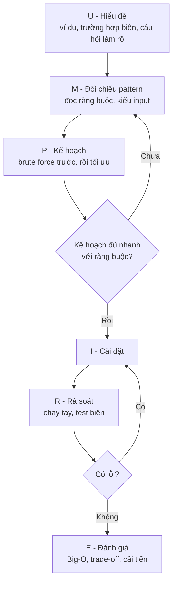
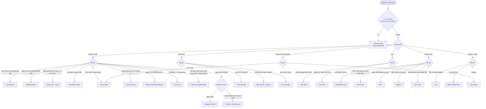
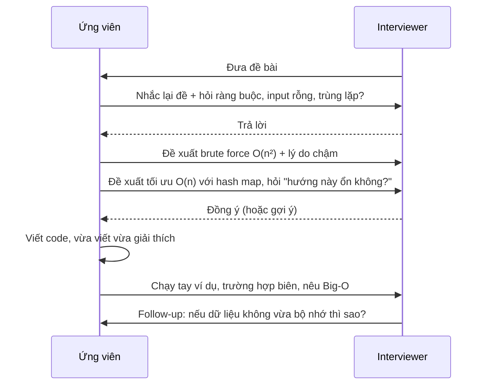
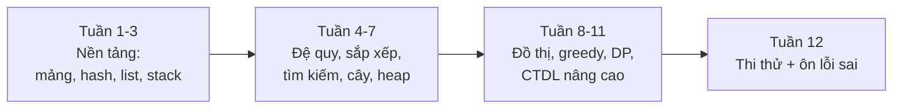

# 📚 Bài 17: Pattern giải bài & Phỏng vấn thuật toán

## 🎯 Mục tiêu bài học

- Có **quy trình** giải một bài lạ: UMPIRE (và 4 bước của Pólya) - không còn "nhìn đề rồi đơ"
- Đọc **ràng buộc** (constraints) để đoán ngay độ phức tạp cần đạt
- Nắm **22 pattern** hay gặp nhất, với mỗi pattern:
    - **tín hiệu nhận biết** ("khi nào nghĩ tới")
    - **khuôn code** ngắn bằng Go và Python
    - 2-3 bài LeetCode để luyện và **link về bài học** đã dạy kỹ
- Dùng **sơ đồ quyết định** lớn để chọn pattern từ đặc điểm của đề
- Biết **quy trình phỏng vấn** 45 phút: nói gì, làm gì khi bị bí, cách test và phân tích độ phức tạp
- Có **kế hoạch 12 tuần** và danh sách tài nguyên để luyện tiếp

!!! tip "Bài này dùng thế nào?"
    Đây là bài **tổng hợp**: mỗi pattern chỉ tóm tắt khuôn và tín hiệu, còn giải thích chi tiết (trực giác, hình vẽ, animation) nằm ở bài học được link. Hãy dùng bài này như **cuốn sổ tay tra cứu**: trước khi luyện một chủ đề, đọc lại pattern; khi gặp bài lạ, đi theo sơ đồ quyết định ở [mục 4](#4-so-o-quyet-inh-chon-pattern).

## 📖 1. Quy trình giải một bài lạ: UMPIRE

Người mới thường đọc đề xong là **gõ code ngay** - rồi viết được nửa chừng mới phát hiện hiểu sai đề hoặc hướng đi không ổn. Người có kinh nghiệm dành **1/3 thời gian để hiểu và lên kế hoạch** trước khi gõ dòng đầu tiên.

Nhà toán học **George Pólya** (sách *How to Solve It*, 1945) đề xuất 4 bước: *Hiểu bài → Lập kế hoạch → Thực hiện → Nhìn lại*. Giới phỏng vấn mở rộng thành **UMPIRE**:

| Bước | Tên | Làm gì | Pólya |
|---|---|---|---|
| **U** | Understand - Hiểu | Nhắc lại đề bằng lời của mình, hỏi làm rõ, tự tạo ví dụ (kể cả trường hợp biên) | Hiểu bài |
| **M** | Match - Đối chiếu | Bài này giống **pattern** nào? Dữ liệu đầu vào gợi ý gì? | Lập kế hoạch |
| **P** | Plan - Lập kế hoạch | Viết pseudocode / các bước; nêu độ phức tạp dự kiến | Lập kế hoạch |
| **I** | Implement - Cài đặt | Viết code sạch, tên biến rõ ràng | Thực hiện |
| **R** | Review - Rà soát | Chạy tay với ví dụ, kiểm tra trường hợp biên | Nhìn lại |
| **E** | Evaluate - Đánh giá | Độ phức tạp thời gian/bộ nhớ; có tối ưu hơn được không? | Nhìn lại |



### Ví dụ đi trọn UMPIRE: Longest Substring Without Repeating Characters ([LeetCode 3](https://leetcode.com/problems/longest-substring-without-repeating-characters/))

**U - Hiểu đề**: tìm độ dài **chuỗi con liên tiếp** dài nhất không có ký tự lặp.

- `"abcabcbb"` → 3 (`"abc"`); `"bbbbb"` → 1; `"pwwkew"` → 3 (`"wke"`; chú ý `"pwke"` là dãy con, **không liên tiếp**)
- Biên: `""` → 0; `"abba"` → 2 (bẫy: khi gặp `a` thứ hai, vị trí `a` cũ đã nằm **ngoài** cửa sổ)
- Câu hỏi làm rõ: chỉ chữ cái ASCII hay Unicode? Độ dài tối đa?

**M - Đối chiếu**: "chuỗi con **liên tiếp** dài nhất thỏa điều kiện" → **sliding window** ([Bài 2](./02-arrays-strings.md)). Cần biết nhanh "ký tự đã có trong cửa sổ chưa, ở đâu" → **hash map** ([Bài 3](./03-hashing.md)).

**P - Kế hoạch**:

```text
last = {}            # ký tự → vị trí gặp gần nhất
l = 0, best = 0
for r in 0..n-1:
    nếu s[r] đã gặp VÀ vị trí đó >= l:   # nằm trong cửa sổ
        l = vị trí đó + 1                # thu hẹp: nhảy qua ký tự trùng
    last[s[r]] = r
    best = max(best, r - l + 1)
```

Brute force (mọi chuỗi con) là `O(n³)`; kế hoạch trên `O(n)`.

**I - Cài đặt**:

=== "Go"

    ```go
    package main

    import "fmt"

    func lengthOfLongestSubstring(s string) int {
    	last := map[byte]int{} // ký tự → vị trí gặp gần nhất
    	best, l := 0, 0
    	for r := 0; r < len(s); r++ {
    		if i, ok := last[s[r]]; ok && i >= l { // trùng VÀ nằm trong cửa sổ
    			l = i + 1
    		}
    		last[s[r]] = r
    		best = max(best, r-l+1)
    	}
    	return best
    }

    func main() {
    	for _, s := range []string{"abcabcbb", "bbbbb", "pwwkew", "", "abba"} {
    		fmt.Printf("%q → %d\n", s, lengthOfLongestSubstring(s))
    	}
    }

    // Output:
    // "abcabcbb" → 3
    // "bbbbb" → 1
    // "pwwkew" → 3
    // "" → 0
    // "abba" → 2
    ```

=== "Python"

    ```python
    def length_of_longest_substring(s: str) -> int:
        last = {}          # ký tự → vị trí gặp gần nhất
        best = l = 0
        for r, c in enumerate(s):
            if c in last and last[c] >= l:   # trùng VÀ nằm trong cửa sổ
                l = last[c] + 1
            last[c] = r
            best = max(best, r - l + 1)
        return best


    for s in ["abcabcbb", "bbbbb", "pwwkew", "", "abba"]:
        print(f"{s!r} → {length_of_longest_substring(s)}")

    # Output:
    # 'abcabcbb' → 3
    # 'bbbbb' → 1
    # 'pwwkew' → 3
    # '' → 0
    # 'abba' → 2
    ```

**R - Rà soát** với `"abba"`:

| r | s[r] | last trước | l | cửa sổ | best |
|---|---|---|---|---|---|
| 0 | a | {} | 0 | `a` | 1 |
| 1 | b | {a:0} | 0 | `ab` | 2 |
| 2 | b | {a:0, b:1} | **2** (b ở 1 ≥ l) | `b` | 2 |
| 3 | a | {a:0, b:2} | **2** (a ở 0 < l → **không** lùi l) | `ba` | 2 |

Nếu quên điều kiện `>= l`, ở `r = 3` ta sẽ đặt `l = 1` (lùi cửa sổ!) và trả về 3 - sai.

**E - Đánh giá**: thời gian `O(n)` (mỗi ký tự xử lý một lần), bộ nhớ `O(min(n, bảng chữ cái))`.

## 📖 2. Đọc ràng buộc → đoán độ phức tạp

Máy chấm (và phỏng vấn) thường cho khoảng **1 giây**. Một máy hiện đại chạy được cỡ **10^8 phép tính đơn giản / giây** (C++/Go; Python chậm hơn ~10-50 lần). Từ đó suy ngược:

| Kích thước `n` | Độ phức tạp chấp nhận được | Thuật toán thường gặp |
|---|---|---|
| `n ≤ 10-12` | `O(n!)`, `O(n^6)` | Hoán vị, quay lui vét cạn ([Bài 6](./06-recursion-backtracking.md)) |
| `n ≤ 20-25` | `O(2^n · n)` | Tập con, bitmask DP ([Bài 14](./14-dynamic-programming.md)), meet-in-the-middle |
| `n ≤ 100-500` | `O(n³)` | Floyd-Warshall, interval DP |
| `n ≤ 2 000-5 000` | `O(n²)` | DP 2 chiều (LCS, edit distance), hai vòng lặp |
| `n ≤ 10^5 - 10^6` | `O(n log n)` hoặc `O(n)` | Sắp xếp, heap, binary search, two pointers, sliding window, hash map |
| `n ≤ 10^9 - 10^18` | `O(log n)` hoặc `O(1)` | Binary search trên đáp án, lũy thừa nhanh, công thức toán ([Bài 16](./16-strings-math-bits.md)) |

!!! tip "Mẹo phỏng vấn"
    Luôn **hỏi** "input lớn cỡ nào?". Câu trả lời gần như cho biết luôn hướng đi. `n ≤ 10^5` mà bạn đang nghĩ `O(n²)` → hãy nghĩ tiếp.

## 📖 3. Danh mục 22 pattern

Tổng quan nhanh:

| # | Pattern | Tín hiệu chính | Học ở |
|---|---|---|---|
| 1 | Two pointers | mảng **đã sắp xếp**, tìm cặp/bộ ba, đảo/so hai đầu | [Bài 2](./02-arrays-strings.md) |
| 2 | Sliding window | **mảng/chuỗi con liên tiếp** dài/ngắn nhất thỏa điều kiện | [Bài 2](./02-arrays-strings.md) |
| 3 | Fast & slow pointers | chu trình, nút giữa linked list | [Bài 4](./04-linked-lists.md) |
| 4 | Merge intervals | danh sách **khoảng** chồng lấn | [Bài 13](./13-greedy.md) |
| 5 | Cyclic sort | số trong khoảng `1..n`, tìm số thiếu/trùng, `O(1)` bộ nhớ | [Bài 2](./02-arrays-strings.md) |
| 6 | Đảo linked list tại chỗ | đảo toàn bộ/một đoạn/theo nhóm k | [Bài 4](./04-linked-lists.md) |
| 7 | Tree BFS | theo **tầng**, gần gốc nhất | [Bài 9](./09-trees-bst.md) |
| 8 | Tree DFS | đường đi gốc-lá, chiều cao, LCA | [Bài 9](./09-trees-bst.md) |
| 9 | Two heaps | **median**, chia hai nửa lớn/nhỏ | [Bài 10](./10-heaps.md) |
| 10 | Backtracking | **liệt kê tất cả** tổ hợp/hoán vị/tập con | [Bài 6](./06-recursion-backtracking.md) |
| 11 | Modified binary search | mảng sắp xếp (kể cả bị xoay), **"giá trị nhỏ nhất để..."** | [Bài 8](./08-binary-search.md) |
| 12 | Top-K | **k lớn nhất / nhỏ nhất / thường gặp nhất** | [Bài 10](./10-heaps.md) |
| 13 | K-way merge | trộn **k danh sách đã sắp xếp** | [Bài 10](./10-heaps.md) |
| 14 | Topological sort | **phụ thuộc**, thứ tự thực hiện, lịch học | [Bài 11](./11-graphs-traversal.md) |
| 15 | Union-Find | **nhóm/thành phần liên thông** động, gộp tập | [Bài 12](./12-shortest-paths-mst.md), [Bài 15](./15-advanced-data-structures.md) |
| 16 | Monotonic stack | **lớn/nhỏ hơn gần nhất** bên trái/phải | [Bài 5](./05-stacks-queues.md) |
| 17 | Prefix sum + hash map | **đếm mảng con có tổng = k**, tổng đoạn nhiều lần | [Bài 2](./02-arrays-strings.md), [Bài 3](./03-hashing.md) |
| 18 | Dynamic programming | **tối ưu / đếm số cách**, lựa chọn ảnh hưởng về sau | [Bài 14](./14-dynamic-programming.md) |
| 19 | Greedy intervals | chọn nhiều khoảng nhất, ít điểm bắn nhất | [Bài 13](./13-greedy.md) |
| 20 | Shortest path | đường đi **ngắn nhất**: BFS (không trọng số), Dijkstra | [Bài 11](./11-graphs-traversal.md), [Bài 12](./12-shortest-paths-mst.md) |
| 21 | Trie | **tiền tố**, autocomplete, nhiều từ cùng lúc | [Bài 15](./15-advanced-data-structures.md) |
| 22 | Bit manipulation | "xuất hiện 1 lần", tập con nhỏ, `O(1)` bộ nhớ | [Bài 16](./16-strings-math-bits.md) |

---

### 3.1 🧩 Two Pointers - Hai con trỏ

**Ý tưởng**: hai con trỏ đi **từ hai đầu vào giữa** (hoặc cùng chiều, một nhanh một chậm) để loại bỏ hàng loạt khả năng mỗi bước. Như hai người tìm nhau trong hành lang: một người đi từ đầu, một người đi từ cuối.

**🔎 Khi nào nghĩ tới**:

- Mảng/chuỗi **đã sắp xếp** (hoặc sắp xếp được) + tìm **cặp/bộ ba** có tổng bằng X
- So sánh **hai đầu** (palindrome), đảo ngược tại chỗ
- Loại bỏ phần tử trùng / dồn phần tử **tại chỗ** `O(1)` bộ nhớ
- Brute force là hai vòng lặp lồng `O(n²)` trên mảng sắp xếp

Bấm ▶ để xem hai con trỏ khép dần: tổng nhỏ quá thì dời trái lên, lớn quá thì dời phải xuống.

<div class="algo-viz" data-viz="array" data-algo="two-pointers" data-input="1,2,4,6,8,11,15" data-target="14" data-title="Two pointers: tìm cặp có tổng 14"></div>

=== "Go"

    ```go
    // Mảng đã sắp xếp: tìm cặp có tổng = target
    func twoSumSorted(nums []int, target int) (int, int) {
    	l, r := 0, len(nums)-1
    	for l < r {
    		s := nums[l] + nums[r]
    		switch {
    		case s == target:
    			return l, r
    		case s < target:
    			l++ // cần tổng lớn hơn
    		default:
    			r-- // cần tổng nhỏ hơn
    		}
    	}
    	return -1, -1
    }
    ```

=== "Python"

    ```python
    def two_sum_sorted(nums, target):
        """Mảng đã sắp xếp: tìm cặp có tổng = target."""
        l, r = 0, len(nums) - 1
        while l < r:
            s = nums[l] + nums[r]
            if s == target:
                return l, r
            if s < target:
                l += 1   # cần tổng lớn hơn
            else:
                r -= 1   # cần tổng nhỏ hơn
        return -1, -1
    ```

**Luyện**: [167 Two Sum II](https://leetcode.com/problems/two-sum-ii-input-array-is-sorted/), [15 3Sum](https://leetcode.com/problems/3sum/), [11 Container With Most Water](https://leetcode.com/problems/container-with-most-water/) · **Học kỹ**: [Bài 2 - Two Pointers](./02-arrays-strings.md)

### 3.2 🧩 Sliding Window - Cửa sổ trượt

**Ý tưởng**: giữ một **đoạn liên tiếp** `[l, r]`; mở rộng `r`, khi đoạn vi phạm điều kiện thì thu hẹp `l`. Mỗi phần tử vào/ra cửa sổ tối đa một lần → `O(n)`. Như **khung ngắm** trượt dọc đoàn tàu.

**🔎 Khi nào nghĩ tới**:

- "**Mảng con / chuỗi con liên tiếp** dài nhất / ngắn nhất / có tổng ..."
- "Trong mọi cửa sổ kích thước `k`..."
- Điều kiện có tính **đơn điệu**: nới rộng cửa sổ chỉ làm "tệ hơn" (hoặc "tốt hơn") theo một chiều
- ⚠️ Nếu có **số âm** và hỏi tổng → cửa sổ thường **không** dùng được → chuyển sang prefix sum + hash (3.17)

Bấm ▶ để xem cửa sổ kích thước `k` trượt và tổng được cập nhật bằng "cộng phần tử mới, trừ phần tử cũ".

<div class="algo-viz" data-viz="array" data-algo="sliding-window" data-input="2,1,5,1,3,2,7,1" data-k="3" data-title="Sliding window: tổng lớn nhất của cửa sổ k = 3"></div>

=== "Go"

    ```go
    // Khuôn cửa sổ co giãn: đoạn ngắn nhất có tổng >= target (số dương)
    func minSubArrayLen(target int, nums []int) int {
    	best, sum, l := len(nums)+1, 0, 0
    	for r, x := range nums {
    		sum += x              // 1. mở rộng phải
    		for sum >= target {   // 2. còn hợp lệ → thu hẹp trái để tìm ngắn hơn
    			best = min(best, r-l+1)
    			sum -= nums[l]
    			l++
    		}
    	}
    	if best > len(nums) {
    		return 0
    	}
    	return best
    }
    ```

=== "Python"

    ```python
    def min_sub_array_len(target, nums):
        """Khuôn cửa sổ co giãn: đoạn ngắn nhất có tổng >= target (số dương)."""
        best, total, l = len(nums) + 1, 0, 0
        for r, x in enumerate(nums):
            total += x                 # 1. mở rộng phải
            while total >= target:     # 2. còn hợp lệ → thu hẹp trái
                best = min(best, r - l + 1)
                total -= nums[l]
                l += 1
        return 0 if best > len(nums) else best
    ```

**Luyện**: [3 Longest Substring Without Repeating](https://leetcode.com/problems/longest-substring-without-repeating-characters/), [209 Minimum Size Subarray Sum](https://leetcode.com/problems/minimum-size-subarray-sum/), [424 Longest Repeating Character Replacement](https://leetcode.com/problems/longest-repeating-character-replacement/), [76 Minimum Window Substring](https://leetcode.com/problems/minimum-window-substring/) · **Học kỹ**: [Bài 2 - Sliding Window](./02-arrays-strings.md); min/max cửa sổ: [Bài 5 - Monotonic queue](./05-stacks-queues.md)

### 3.3 🧩 Fast & Slow Pointers - Rùa và thỏ

**Ý tưởng**: con trỏ chậm đi 1 bước, con trỏ nhanh đi 2 bước. Nếu có vòng, thỏ sẽ **đuổi kịp** rùa; nếu không, khi thỏ tới đích thì rùa ở **giữa**.

**🔎 Khi nào nghĩ tới**:

- Linked list: phát hiện **chu trình**, tìm **điểm bắt đầu** chu trình, tìm **nút giữa**
- Dãy số "đi theo hàm" `x → f(x)` có thể lặp (Happy Number, Find the Duplicate Number)
- Yêu cầu `O(1)` bộ nhớ (không dùng hash set)

Bấm ▶ để xem thỏ đi gấp đôi rùa; khi thỏ chạm cuối, rùa đứng đúng giữa.

<div class="algo-viz" data-viz="linkedlist" data-algo="middle" data-input="1,2,3,4,5,6,7" data-title="Fast & slow: tìm nút giữa"></div>

=== "Go"

    ```go
    type ListNode struct {
    	Val  int
    	Next *ListNode
    }

    func hasCycle(head *ListNode) bool {
    	slow, fast := head, head
    	for fast != nil && fast.Next != nil {
    		slow, fast = slow.Next, fast.Next.Next
    		if slow == fast {
    			return true // thỏ đuổi kịp rùa
    		}
    	}
    	return false
    }

    func middle(head *ListNode) *ListNode {
    	slow, fast := head, head
    	for fast != nil && fast.Next != nil {
    		slow, fast = slow.Next, fast.Next.Next
    	}
    	return slow // giữa thứ hai nếu độ dài chẵn
    }
    ```

=== "Python"

    ```python
    def has_cycle(head):
        slow = fast = head
        while fast and fast.next:
            slow, fast = slow.next, fast.next.next
            if slow is fast:
                return True   # thỏ đuổi kịp rùa
        return False


    def middle(head):
        slow = fast = head
        while fast and fast.next:
            slow, fast = slow.next, fast.next.next
        return slow           # giữa thứ hai nếu độ dài chẵn
    ```

**Luyện**: [141 Linked List Cycle](https://leetcode.com/problems/linked-list-cycle/), [876 Middle of the Linked List](https://leetcode.com/problems/middle-of-the-linked-list/), [287 Find the Duplicate Number](https://leetcode.com/problems/find-the-duplicate-number/) · **Học kỹ**: [Bài 4 - Floyd](./04-linked-lists.md)

### 3.4 🧩 Merge Intervals - Gộp khoảng

**Ý tưởng**: **sắp xếp theo điểm bắt đầu**, rồi đi một lượt: nếu khoảng mới chồng lên khoảng cuối cùng trong kết quả thì gộp (kéo dài điểm cuối), không thì thêm mới. Như gộp các **ca làm việc** chồng giờ của nhân viên để biết cửa hàng mở trong những khung nào.

**🔎 Khi nào nghĩ tới**:

- Input là danh sách **khoảng** `[start, end]`: lịch họp, đặt phòng, khung giờ
- "Gộp", "chèn khoảng", "giao của hai danh sách khoảng", "có chồng lấn không"

```text
[1,3] [2,6] [8,10] [15,18]   (đã sắp xếp theo start)
[1,3]+[2,6] chồng (2 ≤ 3) → [1,6];  [8,10] không chồng (8 > 6) → thêm mới
→ [1,6] [8,10] [15,18]
```

=== "Go"

    ```go
    import "slices"

    func merge(intervals [][]int) [][]int {
    	slices.SortFunc(intervals, func(a, b []int) int { return a[0] - b[0] })
    	res := [][]int{}
    	for _, it := range intervals {
    		if n := len(res); n > 0 && it[0] <= res[n-1][1] { // chồng lấn
    			res[n-1][1] = max(res[n-1][1], it[1])
    		} else {
    			res = append(res, []int{it[0], it[1]})
    		}
    	}
    	return res
    }
    ```

=== "Python"

    ```python
    def merge(intervals):
        intervals.sort(key=lambda it: it[0])
        res = []
        for s, e in intervals:
            if res and s <= res[-1][1]:          # chồng lấn
                res[-1][1] = max(res[-1][1], e)
            else:
                res.append([s, e])
        return res
    ```

**Luyện**: [56 Merge Intervals](https://leetcode.com/problems/merge-intervals/), [57 Insert Interval](https://leetcode.com/problems/insert-interval/), [986 Interval List Intersections](https://leetcode.com/problems/interval-list-intersections/) · **Học kỹ**: [Bài 13 - Merge Intervals](./13-greedy.md)

### 3.5 🧩 Cyclic Sort - Đưa mỗi số về "nhà" của nó

**Ý tưởng**: khi các số nằm trong khoảng `1..n`, số `x` có "nhà" là ô `x-1`. Đổi chỗ liên tục cho tới khi mỗi số về đúng nhà; ô nào **không đúng** chính là chỗ thiếu/trùng. Giống **xếp học sinh về đúng số ghế** theo số thứ tự. `O(n)` thời gian, `O(1)` bộ nhớ.

**🔎 Khi nào nghĩ tới**:

- "Mảng chứa các số từ `1` tới `n` (hoặc `0..n`)", tìm số **thiếu / trùng / số dương nhỏ nhất bị thiếu**
- Yêu cầu **không dùng thêm bộ nhớ**

=== "Go"

    ```go
    // First Missing Positive: số nguyên dương nhỏ nhất không có trong mảng
    func firstMissingPositive(nums []int) int {
    	n := len(nums)
    	for i := 0; i < n; i++ {
    		// đưa nums[i] về nhà (ô nums[i]-1) nếu hợp lệ và nhà chưa đúng
    		for nums[i] >= 1 && nums[i] <= n && nums[nums[i]-1] != nums[i] {
    			j := nums[i] - 1
    			nums[i], nums[j] = nums[j], nums[i]
    		}
    	}
    	for i := 0; i < n; i++ {
    		if nums[i] != i+1 {
    			return i + 1
    		}
    	}
    	return n + 1
    }
    ```

=== "Python"

    ```python
    def first_missing_positive(nums):
        """Số nguyên dương nhỏ nhất không có trong mảng."""
        n = len(nums)
        for i in range(n):
            # đưa nums[i] về nhà (ô nums[i]-1) nếu hợp lệ và nhà chưa đúng
            while 1 <= nums[i] <= n and nums[nums[i] - 1] != nums[i]:
                j = nums[i] - 1
                nums[i], nums[j] = nums[j], nums[i]
        for i in range(n):
            if nums[i] != i + 1:
                return i + 1
        return n + 1
    ```

**Luyện**: [268 Missing Number](https://leetcode.com/problems/missing-number/), [448 Find All Numbers Disappeared](https://leetcode.com/problems/find-all-numbers-disappeared-in-an-array/), [41 First Missing Positive](https://leetcode.com/problems/first-missing-positive/) · **Liên quan**: [Bài 2 - thao tác tại chỗ](./02-arrays-strings.md), [Bài 16 - XOR](./16-strings-math-bits.md) cho Missing Number

### 3.6 🧩 Đảo linked list tại chỗ

**Ý tưởng**: ba con trỏ `prev, cur, next`; **lưu `next` trước** khi lật `cur.Next = prev`. Đảo một đoạn: dùng **dummy node** + nối lại hai đầu.

**🔎 Khi nào nghĩ tới**:

- "Đảo" toàn bộ / đoạn `[left, right]` / từng nhóm `k` node
- Palindrome linked list, reorder list (đảo nửa sau rồi đan xen)
- Yêu cầu `O(1)` bộ nhớ trên linked list

=== "Go"

    ```go
    func reverseList(head *ListNode) *ListNode {
    	var prev *ListNode
    	cur := head
    	for cur != nil {
    		next := cur.Next // 1. lưu lại
    		cur.Next = prev  // 2. lật
    		prev, cur = cur, next
    	}
    	return prev
    }
    ```

=== "Python"

    ```python
    def reverse_list(head):
        prev, cur = None, head
        while cur:
            nxt = cur.next     # 1. lưu lại
            cur.next = prev    # 2. lật
            prev, cur = cur, nxt
        return prev
    ```

**Luyện**: [206 Reverse Linked List](https://leetcode.com/problems/reverse-linked-list/), [92 Reverse Linked List II](https://leetcode.com/problems/reverse-linked-list-ii/), [25 Reverse Nodes in k-Group](https://leetcode.com/problems/reverse-nodes-in-k-group/) · **Học kỹ**: [Bài 4](./04-linked-lists.md)

### 3.7 🧩 Tree BFS - Duyệt cây theo tầng

**Ý tưởng**: queue; mỗi vòng lặp ngoài xử lý **đúng một tầng** (lấy `len(queue)` ở đầu vòng). Như phát loa gọi từng **thế hệ** trong gia phả: ông bà → bố mẹ, cô chú → con cháu.

**🔎 Khi nào nghĩ tới**:

- "Theo **tầng/mức**", "zigzag", "góc nhìn bên phải/trái", "trung bình mỗi tầng"
- "**Độ sâu nhỏ nhất**", "nút **gần gốc nhất** thỏa..." (BFS dừng sớm)

=== "Go"

    ```go
    type TreeNode struct {
    	Val         int
    	Left, Right *TreeNode
    }

    func levelOrder(root *TreeNode) [][]int {
    	res := [][]int{}
    	if root == nil {
    		return res
    	}
    	q := []*TreeNode{root}
    	for len(q) > 0 {
    		level := []int{}
    		for size := len(q); size > 0; size-- { // đúng một tầng
    			node := q[0]
    			q = q[1:]
    			level = append(level, node.Val)
    			if node.Left != nil {
    				q = append(q, node.Left)
    			}
    			if node.Right != nil {
    				q = append(q, node.Right)
    			}
    		}
    		res = append(res, level)
    	}
    	return res
    }
    ```

=== "Python"

    ```python
    from collections import deque


    def level_order(root):
        res = []
        if not root:
            return res
        q = deque([root])
        while q:
            level = []
            for _ in range(len(q)):          # đúng một tầng
                node = q.popleft()
                level.append(node.val)
                if node.left:
                    q.append(node.left)
                if node.right:
                    q.append(node.right)
            res.append(level)
        return res
    ```

**Luyện**: [102 Level Order](https://leetcode.com/problems/binary-tree-level-order-traversal/), [199 Right Side View](https://leetcode.com/problems/binary-tree-right-side-view/), [111 Minimum Depth](https://leetcode.com/problems/minimum-depth-of-binary-tree/) · **Học kỹ**: [Bài 9 - Level order](./09-trees-bst.md)

### 3.8 🧩 Tree DFS - Đệ quy trên cây

**Ý tưởng**: hỏi "**nếu con trái và con phải đã cho tôi đáp án, tôi tính đáp án của mình thế nào?**" (postorder), hoặc "**tôi truyền gì xuống cho con?**" (preorder, như tổng đường đi còn lại).

**🔎 Khi nào nghĩ tới**:

- Chiều cao, đường kính, cân bằng, đối xứng
- Đường đi **gốc → lá** có tổng..., mọi đường đi
- Tổ tiên chung gần nhất (LCA), kiểm tra BST hợp lệ (truyền khoảng `[lo, hi]` xuống)

=== "Go"

    ```go
    // Postorder: nhận kết quả từ con, trả kết quả của mình
    func maxDepth(root *TreeNode) int {
    	if root == nil {
    		return 0
    	}
    	return 1 + max(maxDepth(root.Left), maxDepth(root.Right))
    }

    // Preorder: truyền "phần còn lại" xuống con
    func hasPathSum(root *TreeNode, remain int) bool {
    	if root == nil {
    		return false
    	}
    	remain -= root.Val
    	if root.Left == nil && root.Right == nil { // lá
    		return remain == 0
    	}
    	return hasPathSum(root.Left, remain) || hasPathSum(root.Right, remain)
    }
    ```

=== "Python"

    ```python
    def max_depth(root):
        """Postorder: nhận kết quả từ con, trả kết quả của mình."""
        if not root:
            return 0
        return 1 + max(max_depth(root.left), max_depth(root.right))


    def has_path_sum(root, remain):
        """Preorder: truyền 'phần còn lại' xuống con."""
        if not root:
            return False
        remain -= root.val
        if not root.left and not root.right:   # lá
            return remain == 0
        return has_path_sum(root.left, remain) or has_path_sum(root.right, remain)
    ```

**Luyện**: [104 Maximum Depth](https://leetcode.com/problems/maximum-depth-of-binary-tree/), [543 Diameter](https://leetcode.com/problems/diameter-of-binary-tree/), [236 Lowest Common Ancestor](https://leetcode.com/problems/lowest-common-ancestor-of-a-binary-tree/), [98 Validate BST](https://leetcode.com/problems/validate-binary-search-tree/) · **Học kỹ**: [Bài 9](./09-trees-bst.md)

### 3.9 🧩 Two Heaps - Hai đống

**Ý tưởng**: chia dữ liệu thành **nửa nhỏ** (max-heap) và **nửa lớn** (min-heap), giữ hai nửa lệch nhau tối đa 1 phần tử. Median = đỉnh của một hoặc hai heap. Như chia lớp thành hai nhóm "thấp" và "cao": người **cao nhất nhóm thấp** và **thấp nhất nhóm cao** đứng ở giữa lớp.

**🔎 Khi nào nghĩ tới**:

- **Median** của dòng dữ liệu, median cửa sổ trượt
- Cần liên tục biết "phần tử ở giữa" / chia hai nửa theo giá trị
- Lập lịch: chọn dự án lợi nhuận cao nhất trong số đang làm được (IPO)

=== "Go"

    ```go
    import "container/heap"

    type MinHeap []int

    func (h MinHeap) Len() int           { return len(h) }
    func (h MinHeap) Less(i, j int) bool { return h[i] < h[j] }
    func (h MinHeap) Swap(i, j int)      { h[i], h[j] = h[j], h[i] }
    func (h *MinHeap) Push(x any)        { *h = append(*h, x.(int)) }
    func (h *MinHeap) Pop() any {
    	old := *h
    	x := old[len(old)-1]
    	*h = old[:len(old)-1]
    	return x
    }

    type MedianFinder struct {
    	lo *MinHeap // nửa nhỏ, lưu SỐ ÂM để giả max-heap
    	hi *MinHeap // nửa lớn
    }

    func (m *MedianFinder) AddNum(x int) {
    	heap.Push(m.lo, -x)
    	heap.Push(m.hi, -heap.Pop(m.lo).(int)) // lớn nhất của lo sang hi
    	if m.hi.Len() > m.lo.Len() {           // giữ len(lo) >= len(hi)
    		heap.Push(m.lo, -heap.Pop(m.hi).(int))
    	}
    }

    func (m *MedianFinder) FindMedian() float64 {
    	if m.lo.Len() > m.hi.Len() {
    		return float64(-(*m.lo)[0])
    	}
    	return float64(-(*m.lo)[0]+(*m.hi)[0]) / 2
    }
    ```

=== "Python"

    ```python
    import heapq


    class MedianFinder:
        def __init__(self):
            self.lo = []  # nửa nhỏ: max-heap (lưu số âm)
            self.hi = []  # nửa lớn: min-heap

        def add_num(self, x):
            heapq.heappush(self.lo, -x)
            heapq.heappush(self.hi, -heapq.heappop(self.lo))  # lớn nhất của lo sang hi
            if len(self.hi) > len(self.lo):                     # giữ len(lo) >= len(hi)
                heapq.heappush(self.lo, -heapq.heappop(self.hi))

        def find_median(self):
            if len(self.lo) > len(self.hi):
                return float(-self.lo[0])
            return (-self.lo[0] + self.hi[0]) / 2
    ```

**Luyện**: [295 Find Median from Data Stream](https://leetcode.com/problems/find-median-from-data-stream/), [480 Sliding Window Median](https://leetcode.com/problems/sliding-window-median/), [502 IPO](https://leetcode.com/problems/ipo/) · **Học kỹ**: [Bài 10 - Hai heap](./10-heaps.md)

### 3.10 🧩 Backtracking - Quay lui

**Ý tưởng**: **chọn → đi tiếp → bỏ chọn**. Duyệt cây quyết định, cắt tỉa nhánh không thể thành lời giải. Như thử **mật khẩu vali số**: xoay từng vòng số, sai thì quay lại vòng trước.

**🔎 Khi nào nghĩ tới**:

- "Liệt kê **tất cả**" tập con / hoán vị / tổ hợp / cách chia / cách đặt
- Bài ràng buộc: Sudoku, N-Queens, Word Search trên lưới
- `n` **nhỏ** (≤ 15-20)

=== "Go"

    ```go
    // Khuôn: liệt kê mọi tập con
    func subsets(nums []int) [][]int {
    	res := [][]int{}
    	path := []int{}
    	var backtrack func(start int)
    	backtrack = func(start int) {
    		res = append(res, append([]int{}, path...)) // COPY path!
    		for i := start; i < len(nums); i++ {
    			path = append(path, nums[i]) // chọn
    			backtrack(i + 1)             // đi tiếp
    			path = path[:len(path)-1]    // bỏ chọn
    		}
    	}
    	backtrack(0)
    	return res
    }
    ```

=== "Python"

    ```python
    def subsets(nums):
        """Khuôn: liệt kê mọi tập con."""
        res, path = [], []

        def backtrack(start):
            res.append(path[:])              # COPY path!
            for i in range(start, len(nums)):
                path.append(nums[i])         # chọn
                backtrack(i + 1)             # đi tiếp
                path.pop()                   # bỏ chọn

        backtrack(0)
        return res
    ```

**Luyện**: [78 Subsets](https://leetcode.com/problems/subsets/), [46 Permutations](https://leetcode.com/problems/permutations/), [39 Combination Sum](https://leetcode.com/problems/combination-sum/), [79 Word Search](https://leetcode.com/problems/word-search/), [51 N-Queens](https://leetcode.com/problems/n-queens/) · **Học kỹ**: [Bài 6](./06-recursion-backtracking.md)

### 3.11 🧩 Modified Binary Search - Tìm kiếm nhị phân biến thể

**Ý tưởng**: binary search không chỉ để "tìm x trong mảng sắp xếp". Chỉ cần một **điều kiện đơn điệu** `ok(x)` (sai sai sai ... đúng đúng đúng), ta tìm được điểm chuyển trong `O(log n)`. Như **đoán giá** trong gameshow: "cao hơn" / "thấp hơn".

**🔎 Khi nào nghĩ tới**:

- Mảng **sắp xếp** (kể cả **bị xoay**), tìm vị trí đầu/cuối, cận dưới/trên
- "Tìm **giá trị nhỏ nhất/lớn nhất** sao cho ..." với đáp án trong khoảng lớn → **binary search trên đáp án**
- Ràng buộc `10^9` trở lên, hoặc đề yêu cầu `O(log n)`

=== "Go"

    ```go
    // Khuôn "điểm chuyển": giá trị nhỏ nhất trong [lo, hi] thỏa ok (ok đơn điệu)
    func firstTrue(lo, hi int, ok func(int) bool) int {
    	for lo < hi {
    		mid := lo + (hi-lo)/2 // tránh tràn số
    		if ok(mid) {
    			hi = mid // mid có thể là đáp án
    		} else {
    			lo = mid + 1
    		}
    	}
    	return lo
    }

    // Ví dụ binary search trên đáp án: Koko ăn chuối (LeetCode 875)
    func minEatingSpeed(piles []int, h int) int {
    	maxPile := 0
    	for _, p := range piles {
    		maxPile = max(maxPile, p)
    	}
    	return firstTrue(1, maxPile, func(k int) bool {
    		hours := 0
    		for _, p := range piles {
    			hours += (p + k - 1) / k // làm tròn lên
    		}
    		return hours <= h
    	})
    }
    ```

=== "Python"

    ```python
    def first_true(lo, hi, ok):
        """Giá trị nhỏ nhất trong [lo, hi] thỏa ok (ok đơn điệu)."""
        while lo < hi:
            mid = (lo + hi) // 2
            if ok(mid):
                hi = mid          # mid có thể là đáp án
            else:
                lo = mid + 1
        return lo


    def min_eating_speed(piles, h):
        """Binary search trên đáp án: Koko ăn chuối (LeetCode 875)."""
        return first_true(1, max(piles),
                          lambda k: sum((p + k - 1) // k for p in piles) <= h)
    ```

**Luyện**: [33 Search in Rotated Sorted Array](https://leetcode.com/problems/search-in-rotated-sorted-array/), [153 Find Minimum in Rotated Sorted Array](https://leetcode.com/problems/find-minimum-in-rotated-sorted-array/), [875 Koko Eating Bananas](https://leetcode.com/problems/koko-eating-bananas/), [1011 Capacity To Ship Packages](https://leetcode.com/problems/capacity-to-ship-packages-within-d-days/) · **Học kỹ**: [Bài 8](./08-binary-search.md)

### 3.12 🧩 Top-K Elements

**Ý tưởng**: muốn `k` phần tử **lớn nhất** → giữ **min-heap kích thước `k`**: phần tử mới lớn hơn đỉnh thì thay đỉnh. Đỉnh heap luôn là "người yếu nhất trong top k" - như **bảng xếp hạng top 10**: ai vượt người thứ 10 thì vào, người thứ 10 bị đẩy ra. `O(n log k)`.

**🔎 Khi nào nghĩ tới**:

- "**k** lớn nhất / nhỏ nhất / thường gặp nhất / gần nhất", "phần tử lớn thứ k"
- Dữ liệu **dòng chảy** (stream), không sắp xếp hết được
- (Nếu cần `O(n)` trung bình: **Quickselect**; nếu giá trị nhỏ: **bucket sort** theo tần suất)

=== "Go"

    ```go
    // K-th largest: min-heap kích thước k (dùng MinHeap ở mục 3.9)
    func findKthLargest(nums []int, k int) int {
    	h := &MinHeap{}
    	for _, x := range nums {
    		heap.Push(h, x)
    		if h.Len() > k {
    			heap.Pop(h) // bỏ phần tử nhỏ nhất → giữ đúng k lớn nhất
    		}
    	}
    	return (*h)[0]
    }
    ```

=== "Python"

    ```python
    import heapq
    from collections import Counter


    def find_kth_largest(nums, k):
        h = []
        for x in nums:
            heapq.heappush(h, x)
            if len(h) > k:
                heapq.heappop(h)     # bỏ phần tử nhỏ nhất → giữ đúng k lớn nhất
        return h[0]


    def top_k_frequent(nums, k):
        return [x for x, _ in Counter(nums).most_common(k)]  # dùng heap bên trong
    ```

**Luyện**: [215 Kth Largest Element](https://leetcode.com/problems/kth-largest-element-in-an-array/), [347 Top K Frequent Elements](https://leetcode.com/problems/top-k-frequent-elements/), [973 K Closest Points to Origin](https://leetcode.com/problems/k-closest-points-to-origin/) · **Học kỹ**: [Bài 10 - Top-K](./10-heaps.md)

### 3.13 🧩 K-way Merge - Trộn K danh sách

**Ý tưởng**: đưa **phần tử đầu** của mỗi danh sách vào min-heap; lấy nhỏ nhất ra, rồi đẩy phần tử **kế tiếp của cùng danh sách** vào. `O(N log k)` với `N` tổng số phần tử. Như **k quầy thu ngân**, mỗi quầy có hàng người đã xếp theo số thứ tự; gọi người có số nhỏ nhất trong các người đứng đầu.

**🔎 Khi nào nghĩ tới**:

- "Trộn **k** danh sách/mảng/file **đã sắp xếp**"
- Phần tử nhỏ thứ k trong ma trận có hàng/cột sắp xếp; k cặp có tổng nhỏ nhất
- External sort: trộn các khối đã sắp xếp trên đĩa

=== "Go"

    ```go
    // Item: giá trị + đang ở danh sách nào, vị trí nào
    type Item struct{ val, list, idx int }
    type ItemHeap []Item

    func (h ItemHeap) Len() int           { return len(h) }
    func (h ItemHeap) Less(i, j int) bool { return h[i].val < h[j].val }
    func (h ItemHeap) Swap(i, j int)      { h[i], h[j] = h[j], h[i] }
    func (h *ItemHeap) Push(x any)        { *h = append(*h, x.(Item)) }
    func (h *ItemHeap) Pop() any {
    	old := *h
    	x := old[len(old)-1]
    	*h = old[:len(old)-1]
    	return x
    }

    func mergeK(lists [][]int) []int {
    	h := &ItemHeap{}
    	for i, l := range lists {
    		if len(l) > 0 {
    			heap.Push(h, Item{l[0], i, 0})
    		}
    	}
    	res := []int{}
    	for h.Len() > 0 {
    		it := heap.Pop(h).(Item)
    		res = append(res, it.val)
    		if it.idx+1 < len(lists[it.list]) { // đẩy phần tử kế tiếp của cùng danh sách
    			heap.Push(h, Item{lists[it.list][it.idx+1], it.list, it.idx + 1})
    		}
    	}
    	return res
    }
    ```

=== "Python"

    ```python
    import heapq


    def merge_k(lists):
        h = [(l[0], i, 0) for i, l in enumerate(lists) if l]
        heapq.heapify(h)
        res = []
        while h:
            val, i, j = heapq.heappop(h)
            res.append(val)
            if j + 1 < len(lists[i]):        # đẩy phần tử kế tiếp của cùng danh sách
                heapq.heappush(h, (lists[i][j + 1], i, j + 1))
        return res
    ```

**Luyện**: [23 Merge k Sorted Lists](https://leetcode.com/problems/merge-k-sorted-lists/), [378 Kth Smallest in Sorted Matrix](https://leetcode.com/problems/kth-smallest-element-in-a-sorted-matrix/), [373 Find K Pairs with Smallest Sums](https://leetcode.com/problems/find-k-pairs-with-smallest-sums/) · **Học kỹ**: [Bài 10 - Merge K lists](./10-heaps.md)

### 3.14 🧩 Topological Sort - Sắp xếp topo

**Ý tưởng** (Kahn): đếm **bậc vào** (số việc phải làm trước); việc nào bậc vào 0 thì làm được ngay → cho vào queue. Làm xong việc nào thì giảm bậc vào của các việc phụ thuộc nó. Nếu cuối cùng không xử lý hết → có **chu trình**. Như xếp **lịch học tín chỉ**: môn tiên quyết phải học trước.

**🔎 Khi nào nghĩ tới**:

- "Phụ thuộc", "tiên quyết", "phải làm A trước B", thứ tự build/cài đặt package
- Kiểm tra đồ thị **có hướng** có chu trình không
- Suy ra thứ tự từ các cặp so sánh (Alien Dictionary)

=== "Go"

    ```go
    // n việc 0..n-1; pre[i] = {a, b} nghĩa là b phải làm trước a
    func topoOrder(n int, pre [][]int) []int {
    	adj := make([][]int, n)
    	indeg := make([]int, n)
    	for _, p := range pre {
    		adj[p[1]] = append(adj[p[1]], p[0])
    		indeg[p[0]]++
    	}
    	q := []int{}
    	for v := 0; v < n; v++ {
    		if indeg[v] == 0 {
    			q = append(q, v)
    		}
    	}
    	order := []int{}
    	for len(q) > 0 {
    		v := q[0]
    		q = q[1:]
    		order = append(order, v)
    		for _, w := range adj[v] {
    			indeg[w]--
    			if indeg[w] == 0 {
    				q = append(q, w)
    			}
    		}
    	}
    	if len(order) < n {
    		return nil // có chu trình
    	}
    	return order
    }
    ```

=== "Python"

    ```python
    from collections import deque


    def topo_order(n, pre):
        """pre[i] = [a, b] nghĩa là b phải làm trước a."""
        adj = [[] for _ in range(n)]
        indeg = [0] * n
        for a, b in pre:
            adj[b].append(a)
            indeg[a] += 1
        q = deque(v for v in range(n) if indeg[v] == 0)
        order = []
        while q:
            v = q.popleft()
            order.append(v)
            for w in adj[v]:
                indeg[w] -= 1
                if indeg[w] == 0:
                    q.append(w)
        return order if len(order) == n else []   # [] = có chu trình
    ```

**Luyện**: [207 Course Schedule](https://leetcode.com/problems/course-schedule/), [210 Course Schedule II](https://leetcode.com/problems/course-schedule-ii/), [269 Alien Dictionary](https://leetcode.com/problems/alien-dictionary/) · **Học kỹ**: [Bài 11 - Topo sort](./11-graphs-traversal.md)

### 3.15 🧩 Union-Find (Disjoint Set Union)

**Ý tưởng**: mỗi nhóm có một "**trưởng nhóm**" (gốc). `find(x)` đi lên tìm trưởng nhóm (kèm **nén đường**); `union(a, b)` cho trưởng nhóm nhỏ hơn "sáp nhập" vào nhóm lớn hơn. Gần như `O(1)` mỗi thao tác. Như các **công ty sáp nhập**: muốn biết hai nhân viên có cùng tập đoàn không, hỏi xem "sếp tổng" của họ có phải một người.

**🔎 Khi nào nghĩ tới**:

- "Có bao nhiêu **nhóm / thành phần liên thông**" khi **cạnh được thêm dần**
- "Cạnh nào tạo **chu trình**" trong đồ thị vô hướng; thuật toán **Kruskal** (MST)
- Gộp tài khoản có email chung, bạn của bạn

Bấm ▶ để xem các tập được gộp và `find` đi lên tới gốc.

<div class="algo-viz" data-viz="unionfind" data-algo="ops" data-n="6" data-ops="union 0 1,union 2 3,union 1 3,find 3,union 4 5,find 5" data-title="Union-Find: gộp nhóm và tìm trưởng nhóm"></div>

=== "Go"

    ```go
    type DSU struct{ parent, size []int }

    func NewDSU(n int) *DSU {
    	d := &DSU{make([]int, n), make([]int, n)}
    	for i := range d.parent {
    		d.parent[i], d.size[i] = i, 1
    	}
    	return d
    }

    func (d *DSU) Find(x int) int {
    	if d.parent[x] != x {
    		d.parent[x] = d.Find(d.parent[x]) // nén đường
    	}
    	return d.parent[x]
    }

    func (d *DSU) Union(a, b int) bool {
    	ra, rb := d.Find(a), d.Find(b)
    	if ra == rb {
    		return false // đã cùng nhóm → cạnh này tạo chu trình
    	}
    	if d.size[ra] < d.size[rb] {
    		ra, rb = rb, ra
    	}
    	d.parent[rb] = ra // nhóm nhỏ nhập vào nhóm lớn
    	d.size[ra] += d.size[rb]
    	return true
    }
    ```

=== "Python"

    ```python
    class DSU:
        def __init__(self, n):
            self.parent = list(range(n))
            self.size = [1] * n

        def find(self, x):
            if self.parent[x] != x:
                self.parent[x] = self.find(self.parent[x])  # nén đường
            return self.parent[x]

        def union(self, a, b):
            ra, rb = self.find(a), self.find(b)
            if ra == rb:
                return False              # đã cùng nhóm → cạnh này tạo chu trình
            if self.size[ra] < self.size[rb]:
                ra, rb = rb, ra
            self.parent[rb] = ra          # nhóm nhỏ nhập vào nhóm lớn
            self.size[ra] += self.size[rb]
            return True
    ```

**Luyện**: [547 Number of Provinces](https://leetcode.com/problems/number-of-provinces/), [684 Redundant Connection](https://leetcode.com/problems/redundant-connection/), [721 Accounts Merge](https://leetcode.com/problems/accounts-merge/) · **Học kỹ**: [Bài 12 - DSU & Kruskal](./12-shortest-paths-mst.md), [Bài 15](./15-advanced-data-structures.md)

### 3.16 🧩 Monotonic Stack - Ngăn xếp đơn điệu

**Ý tưởng**: stack giữ các phần tử **"đang chờ câu trả lời"** theo thứ tự đơn điệu; phần tử mới "giải quyết" (pop) mọi phần tử nó vượt qua. Mỗi phần tử vào/ra một lần → `O(n)`.

**🔎 Khi nào nghĩ tới**:

- "Phần tử **lớn hơn / nhỏ hơn gần nhất** bên trái/phải", "**bao nhiêu ngày nữa** thì..."
- Hình chữ nhật lớn nhất trong histogram, nước đọng
- "Tổng min/max của mọi mảng con" (đếm đóng góp của từng phần tử)

=== "Go"

    ```go
    // Next greater element: stack chỉ số, giá trị giảm dần
    func nextGreater(nums []int) []int {
    	ans := make([]int, len(nums))
    	for i := range ans {
    		ans[i] = -1
    	}
    	st := []int{}
    	for i, v := range nums {
    		for len(st) > 0 && v > nums[st[len(st)-1]] {
    			ans[st[len(st)-1]] = v // v là "câu trả lời" cho đỉnh
    			st = st[:len(st)-1]
    		}
    		st = append(st, i)
    	}
    	return ans
    }
    ```

=== "Python"

    ```python
    def next_greater(nums):
        """Stack chỉ số, giá trị giảm dần."""
        ans = [-1] * len(nums)
        st = []
        for i, v in enumerate(nums):
            while st and v > nums[st[-1]]:
                ans[st.pop()] = v          # v là "câu trả lời" cho đỉnh
            st.append(i)
        return ans
    ```

**Luyện**: [739 Daily Temperatures](https://leetcode.com/problems/daily-temperatures/), [496 Next Greater Element I](https://leetcode.com/problems/next-greater-element-i/), [84 Largest Rectangle in Histogram](https://leetcode.com/problems/largest-rectangle-in-histogram/) · **Học kỹ**: [Bài 5 - Monotonic stack](./05-stacks-queues.md)

### 3.17 🧩 Prefix Sum + Hash Map

**Ý tưởng**: tổng đoạn `(j, i] = prefix[i] - prefix[j]`. Muốn đoạn có tổng `k` kết thúc tại `i` → cần đếm các `j` trước đó có `prefix[j] = prefix[i] - k` → lưu **số lần xuất hiện của mỗi prefix** trong hash map. Như sổ **thu chi**: "từ ngày nào tới hôm nay tiêu đúng 500k?" = tìm ngày có số dư cũ bằng số dư hôm nay + 500k.

**🔎 Khi nào nghĩ tới**:

- "**Đếm số mảng con** có tổng = k / chia hết cho k", mảng có **số âm** (sliding window không dùng được)
- "Mảng con dài nhất có số 0 và 1 bằng nhau" (đổi 0 thành -1, tìm tổng = 0)
- Nhiều truy vấn **tổng đoạn** trên mảng không đổi → prefix sum thuần

=== "Go"

    ```go
    // Đếm số mảng con liên tiếp có tổng = k (LeetCode 560)
    func subarraySum(nums []int, k int) int {
    	count := map[int]int{0: 1} // prefix rỗng = 0 xuất hiện 1 lần
    	sum, res := 0, 0
    	for _, x := range nums {
    		sum += x
    		res += count[sum-k] // số điểm bắt đầu hợp lệ
    		count[sum]++
    	}
    	return res
    }
    ```

=== "Python"

    ```python
    from collections import defaultdict


    def subarray_sum(nums, k):
        """Đếm số mảng con liên tiếp có tổng = k (LeetCode 560)."""
        count = defaultdict(int, {0: 1})   # prefix rỗng = 0 xuất hiện 1 lần
        total = res = 0
        for x in nums:
            total += x
            res += count[total - k]        # số điểm bắt đầu hợp lệ
            count[total] += 1
        return res
    ```

**Luyện**: [560 Subarray Sum Equals K](https://leetcode.com/problems/subarray-sum-equals-k/), [525 Contiguous Array](https://leetcode.com/problems/contiguous-array/), [974 Subarray Sums Divisible by K](https://leetcode.com/problems/subarray-sums-divisible-by-k/) · **Học kỹ**: [Bài 2 - Prefix sum](./02-arrays-strings.md), [Bài 3 - pattern hash](./03-hashing.md)

### 3.18 🧩 Dynamic Programming - các "họ" bài

**Ý tưởng**: đệ quy + ghi nhớ. Tìm **trạng thái**, **chuyển trạng thái**, **base case**. Nhận ra **họ** của bài là đã đi được nửa đường:

| Họ | Trạng thái điển hình | Bài đại diện |
|---|---|---|
| 1 chiều | `dp[i]` = đáp án cho tiền tố `i` | [70](https://leetcode.com/problems/climbing-stairs/), [198](https://leetcode.com/problems/house-robber/), [139](https://leetcode.com/problems/word-break/) |
| Ba lô / đồng xu | `dp[c]` = tốt nhất với sức chứa/số tiền `c` | [322](https://leetcode.com/problems/coin-change/), [416](https://leetcode.com/problems/partition-equal-subset-sum/), [494](https://leetcode.com/problems/target-sum/) |
| Dãy con | `dp[i]` = tốt nhất **kết thúc tại** `i` | [300 LIS](https://leetcode.com/problems/longest-increasing-subsequence/), [152](https://leetcode.com/problems/maximum-product-subarray/) |
| Hai chuỗi | `dp[i][j]` = tiền tố `i` của A, `j` của B | [1143 LCS](https://leetcode.com/problems/longest-common-subsequence/), [72](https://leetcode.com/problems/edit-distance/) |
| Lưới | `dp[r][c]` từ ô trên/trái | [62](https://leetcode.com/problems/unique-paths/), [64](https://leetcode.com/problems/minimum-path-sum/), [221](https://leetcode.com/problems/maximal-square/) |
| Khoảng | `dp[l][r]`, tính theo độ dài | [5](https://leetcode.com/problems/longest-palindromic-substring/), [312](https://leetcode.com/problems/burst-balloons/) |
| Trạng thái máy | `dp[i][đang giữ/không giữ]` | [309](https://leetcode.com/problems/best-time-to-buy-and-sell-stock-with-cooldown/), [714](https://leetcode.com/problems/best-time-to-buy-and-sell-stock-with-transaction-fee/) |
| Bitmask | `dp[mask][i]`, `n ≤ 20` | [847](https://leetcode.com/problems/shortest-path-visiting-all-nodes/), [1986](https://leetcode.com/problems/minimum-number-of-work-sessions-to-finish-the-tasks/) |

**🔎 Khi nào nghĩ tới**:

- Hỏi **min/max**, **đếm số cách**, **có/không**
- Mỗi bước có vài lựa chọn và lựa chọn **ảnh hưởng về sau** (tham lam không an toàn)
- Cây đệ quy của lời giải brute force có **nhánh trùng lặp**

=== "Go"

    ```go
    // Khuôn top-down: viết đệ quy trước, thêm memo sau
    func solve(nums []int) int {
    	memo := map[int]int{}
    	var f func(i int) int // f(i) = đáp án cho bài con bắt đầu/kết thúc ở i
    	f = func(i int) int {
    		if i >= len(nums) { // base case
    			return 0
    		}
    		if v, ok := memo[i]; ok {
    			return v
    		}
    		// chuyển trạng thái: thử mọi lựa chọn ở bước này (ví dụ house robber)
    		res := max(f(i+1), nums[i]+f(i+2))
    		memo[i] = res
    		return res
    	}
    	return f(0)
    }
    ```

=== "Python"

    ```python
    from functools import cache


    def solve(nums):
        """Khuôn top-down: viết đệ quy trước, thêm @cache sau."""
        @cache
        def f(i):                 # f(i) = đáp án cho bài con bắt đầu ở i
            if i >= len(nums):    # base case
                return 0
            # chuyển trạng thái: thử mọi lựa chọn (ví dụ house robber)
            return max(f(i + 1), nums[i] + f(i + 2))

        return f(0)
    ```

**Học kỹ**: [Bài 14 - Quy hoạch động](./14-dynamic-programming.md) (khung 5 bước, 7 animation)

### 3.19 🧩 Greedy Intervals - Tham lam trên khoảng

**Ý tưởng**: để chọn **nhiều khoảng không chồng nhau nhất**, luôn chọn khoảng **kết thúc sớm nhất** (để lại nhiều thời gian nhất cho phần sau). Như sinh viên chọn **nhiều ca làm thêm nhất**: nhận ca nào xong sớm nhất trước.

**🔎 Khi nào nghĩ tới**:

- "Chọn **nhiều nhất** các hoạt động không trùng", "xóa **ít nhất** để không chồng lấn"
- "**Ít nhất** bao nhiêu mũi tên/điểm để phủ mọi khoảng"
- Cần bao nhiêu **phòng họp** → sắp xếp + heap (hoặc quét sự kiện)

=== "Go"

    ```go
    import "slices"

    // Số khoảng cần xóa ít nhất để không còn chồng lấn (LeetCode 435)
    func eraseOverlapIntervals(iv [][]int) int {
    	slices.SortFunc(iv, func(a, b []int) int { return a[1] - b[1] }) // theo END
    	kept, end := 0, math.MinInt
    	for _, it := range iv {
    		if it[0] >= end { // không chồng với khoảng đã chọn cuối
    			kept++
    			end = it[1]
    		}
    	}
    	return len(iv) - kept
    }
    ```

=== "Python"

    ```python
    def erase_overlap_intervals(iv):
        """Số khoảng cần xóa ít nhất để không còn chồng lấn (LeetCode 435)."""
        iv.sort(key=lambda it: it[1])      # theo END
        kept, end = 0, float("-inf")
        for s, e in iv:
            if s >= end:                   # không chồng với khoảng đã chọn cuối
                kept += 1
                end = e
        return len(iv) - kept
    ```

**Luyện**: [435 Non-overlapping Intervals](https://leetcode.com/problems/non-overlapping-intervals/), [452 Minimum Arrows to Burst Balloons](https://leetcode.com/problems/minimum-number-of-arrows-to-burst-balloons/), [253 Meeting Rooms II](https://leetcode.com/problems/meeting-rooms-ii/) · **Học kỹ**: [Bài 13 - Activity selection](./13-greedy.md)

### 3.20 🧩 Shortest Path - Đường đi ngắn nhất

**Ý tưởng**: **không trọng số** (mỗi bước như nhau) → **BFS** (lan như gợn sóng). **Trọng số không âm** → **Dijkstra** (BFS với min-heap). Có cạnh âm → Bellman-Ford. Mọi cặp đỉnh, `n` nhỏ → Floyd-Warshall.

**🔎 Khi nào nghĩ tới**:

- "**Ít bước nhất**", "ngắn nhất", "nhanh nhất", "chi phí nhỏ nhất" trên lưới/đồ thị
- Biến đổi trạng thái (từ → từ, khóa số xoay) mà mỗi bước tốn 1 → BFS trên **đồ thị trạng thái**
- Ràng buộc thêm (tối đa k điểm dừng) → Bellman-Ford k vòng hoặc Dijkstra trên trạng thái mở rộng

Bấm ▶ để xem BFS lan ra theo từng "vòng sóng" trên lưới và tìm đường ngắn nhất từ S tới E.

<div class="algo-viz" data-viz="grid" data-algo="bfs-path" data-grid="S..#....|.#.#.##.|.#...#..|.####.#.|......#E" data-title="BFS trên lưới: đường ngắn nhất"></div>

=== "Go"

    ```go
    import "container/heap"

    // Dijkstra: adj[u] = danh sách {v, w}; trả về khoảng cách từ src
    type Pair struct{ d, v int }
    type PairHeap []Pair

    func (h PairHeap) Len() int           { return len(h) }
    func (h PairHeap) Less(i, j int) bool { return h[i].d < h[j].d }
    func (h PairHeap) Swap(i, j int)      { h[i], h[j] = h[j], h[i] }
    func (h *PairHeap) Push(x any)        { *h = append(*h, x.(Pair)) }
    func (h *PairHeap) Pop() any {
    	old := *h
    	x := old[len(old)-1]
    	*h = old[:len(old)-1]
    	return x
    }

    func dijkstra(adj [][][2]int, src int) []int {
    	dist := make([]int, len(adj))
    	for i := range dist {
    		dist[i] = math.MaxInt
    	}
    	dist[src] = 0
    	h := &PairHeap{{0, src}}
    	for h.Len() > 0 {
    		p := heap.Pop(h).(Pair)
    		if p.d > dist[p.v] {
    			continue // bản ghi cũ, đã có đường tốt hơn
    		}
    		for _, e := range adj[p.v] {
    			if nd := p.d + e[1]; nd < dist[e[0]] {
    				dist[e[0]] = nd
    				heap.Push(h, Pair{nd, e[0]})
    			}
    		}
    	}
    	return dist
    }
    ```

=== "Python"

    ```python
    import heapq


    def dijkstra(adj, src):
        """adj[u] = list các (v, w); trả về khoảng cách từ src."""
        dist = [float("inf")] * len(adj)
        dist[src] = 0
        h = [(0, src)]
        while h:
            d, u = heapq.heappop(h)
            if d > dist[u]:
                continue                   # bản ghi cũ, đã có đường tốt hơn
            for v, w in adj[u]:
                if d + w < dist[v]:
                    dist[v] = d + w
                    heapq.heappush(h, (dist[v], v))
        return dist
    ```

**Luyện**: [1091 Shortest Path in Binary Matrix](https://leetcode.com/problems/shortest-path-in-binary-matrix/), [743 Network Delay Time](https://leetcode.com/problems/network-delay-time/), [1631 Path With Minimum Effort](https://leetcode.com/problems/path-with-minimum-effort/), [787 Cheapest Flights Within K Stops](https://leetcode.com/problems/cheapest-flights-within-k-stops/) · **Học kỹ**: [Bài 11 - BFS](./11-graphs-traversal.md), [Bài 12 - Dijkstra](./12-shortest-paths-mst.md)

### 3.21 🧩 Trie - Cây tiền tố

**Ý tưởng**: mỗi cạnh là một ký tự, mỗi đường từ gốc là một **tiền tố**. Tra cứu tiền tố độ dài `L` trong `O(L)`, không phụ thuộc số từ. Như **danh bạ điện thoại** gõ "Ng" là hiện ngay các tên Nguyễn, Ngô, Nghiêm...

**🔎 Khi nào nghĩ tới**:

- "**Tiền tố**", "autocomplete", "bắt đầu bằng", từ điển nhiều từ
- Tìm **nhiều từ cùng lúc** trên lưới (Word Search II)
- XOR lớn nhất của hai số (trie trên các bit)

=== "Go"

    ```go
    type Trie struct {
    	children [26]*Trie
    	isEnd    bool
    }

    func (t *Trie) Insert(word string) {
    	node := t
    	for _, c := range word {
    		i := c - 'a'
    		if node.children[i] == nil {
    			node.children[i] = &Trie{}
    		}
    		node = node.children[i]
    	}
    	node.isEnd = true
    }

    func (t *Trie) walk(s string) *Trie {
    	node := t
    	for _, c := range s {
    		if node = node.children[c-'a']; node == nil {
    			return nil
    		}
    	}
    	return node
    }

    func (t *Trie) Search(w string) bool     { n := t.walk(w); return n != nil && n.isEnd }
    func (t *Trie) StartsWith(p string) bool { return t.walk(p) != nil }
    ```

=== "Python"

    ```python
    class Trie:
        def __init__(self):
            self.children = {}
            self.is_end = False

        def insert(self, word):
            node = self
            for c in word:
                node = node.children.setdefault(c, Trie())
            node.is_end = True

        def _walk(self, s):
            node = self
            for c in s:
                node = node.children.get(c)
                if node is None:
                    return None
            return node

        def search(self, word):
            node = self._walk(word)
            return node is not None and node.is_end

        def starts_with(self, prefix):
            return self._walk(prefix) is not None
    ```

**Luyện**: [208 Implement Trie](https://leetcode.com/problems/implement-trie-prefix-tree/), [211 Add and Search Word](https://leetcode.com/problems/design-add-and-search-words-data-structure/), [212 Word Search II](https://leetcode.com/problems/word-search-ii/) · **Học kỹ**: [Bài 15 - Trie](./15-advanced-data-structures.md)

### 3.22 🧩 Bit Manipulation - Thao tác bit

**Ý tưởng**: `x ^ x = 0`, `x ^ 0 = x` → XOR tất cả để "triệt tiêu" các cặp; `x & (x-1)` xóa bit 1 thấp nhất; một số nguyên `n` bit biểu diễn một **tập con**.

**🔎 Khi nào nghĩ tới**:

- "Mọi phần tử xuất hiện 2 lần **trừ một**", yêu cầu `O(1)` bộ nhớ
- Đếm bit 1, kiểm tra lũy thừa của 2
- Liệt kê tập con khi `n ≤ 20`, bitmask DP

=== "Go"

    ```go
    func singleNumber(nums []int) int {
    	x := 0
    	for _, v := range nums {
    		x ^= v // các cặp triệt tiêu nhau
    	}
    	return x
    }

    func isPowerOfTwo(n int) bool { return n > 0 && n&(n-1) == 0 }
    ```

=== "Python"

    ```python
    from functools import reduce
    from operator import xor


    def single_number(nums):
        return reduce(xor, nums, 0)      # các cặp triệt tiêu nhau


    def is_power_of_two(n):
        return n > 0 and n & (n - 1) == 0
    ```

**Luyện**: [136 Single Number](https://leetcode.com/problems/single-number/), [191 Number of 1 Bits](https://leetcode.com/problems/number-of-1-bits/), [338 Counting Bits](https://leetcode.com/problems/counting-bits/) · **Học kỹ**: [Bài 16 - Bit](./16-strings-math-bits.md)

## 📖 4. Sơ đồ quyết định chọn pattern

Đi từ trên xuống: **kiểu input** → **câu hỏi của đề** → pattern. Đây là "bản đồ" chứ không phải luật cứng - một bài có thể cần kết hợp 2 pattern.



### Bảng "từ khóa → pattern" tra nhanh

| Nếu đề nói... | Nghĩ tới |
|---|---|
| "sorted array", "tìm cặp" | Two pointers, binary search |
| "contiguous subarray / substring", "longest / shortest" | Sliding window |
| "subarray sum equals k", có số âm | Prefix sum + hash map |
| "next greater / smaller", "how many days until" | Monotonic stack |
| "k largest / smallest / most frequent / closest" | Heap (top-K), quickselect |
| "median", "stream" | Two heaps |
| "merge k sorted" | K-way merge (heap) |
| "intervals", "meetings", "overlap" | Sort + merge / greedy theo end |
| "all combinations / permutations / subsets" | Backtracking |
| "number of ways", "minimum cost", "can you reach" | DP |
| "minimum / maximum value such that" (đáp án lớn) | Binary search on answer |
| "prerequisites", "order", "dependencies" | Topological sort |
| "connected components", "groups", "redundant edge" | Union-Find, DFS |
| "shortest path", "minimum steps" | BFS / Dijkstra |
| "prefix", "dictionary of words" | Trie |
| "cycle in linked list", "middle" | Fast & slow |
| "appears once / twice", "O(1) space" | XOR, cyclic sort |

## 📖 5. Phỏng vấn thuật toán: quy trình và giao tiếp

### Người phỏng vấn đánh giá gì?

Không chỉ "code chạy đúng". Thường có 4 tiêu chí:

| Tiêu chí | Họ muốn thấy |
|---|---|
| **Giải quyết vấn đề** | Hỏi làm rõ, tìm ra hướng, phân tích trade-off, tự cải thiện từ brute force |
| **Code** | Sạch, đúng, tên biến rõ ràng, chia hàm hợp lý, dùng thư viện chuẩn thành thạo |
| **Kiểm thử** | Tự chạy tay ví dụ, nghĩ trường hợp biên, tự tìm ra bug |
| **Giao tiếp** | Nói to suy nghĩ, nhận gợi ý, giải thích rõ ràng, hợp tác như đồng nghiệp |

### Phân bổ 45 phút

```mermaid
gantt
    title Một buổi phỏng vấn coding 45 phút
    dateFormat mm
    axisFormat %M
    section Mở đầu
    Giới thiệu ngắn           :a1, 00, 3m
    section Giải bài
    Hiểu đề, hỏi làm rõ, ví dụ :a2, after a1, 5m
    Brute force rồi tối ưu     :a3, after a2, 7m
    Viết code                 :a4, after a3, 15m
    Test, sửa lỗi, Big-O      :a5, after a4, 8m
    section Kết thúc
    Câu hỏi follow-up         :a6, after a5, 4m
    Bạn hỏi lại interviewer   :a7, after a6, 3m
```





### Câu nói mẫu (tiếng Việt / tiếng Anh)

| Tình huống | Nói gì |
|---|---|
| Làm rõ đề | "Cho mình hỏi input có thể rỗng không? Có số âm không? Kích thước tối đa bao nhiêu?" / *"Can the input be empty? Are there negative numbers? How large can n be?"* |
| Đưa brute force | "Cách đơn giản nhất là thử mọi cặp, `O(n²)`. Mình sẽ tìm cách tốt hơn." / *"The brute force is to check every pair in O(n²). Let me see if we can do better."* |
| Đề xuất tối ưu | "Vì mảng đã sắp xếp, mình nghĩ tới hai con trỏ, `O(n)` và `O(1)` bộ nhớ. Anh/chị thấy hướng này ổn không?" / *"Since the array is sorted, I'm thinking two pointers... Does that sound reasonable?"* |
| Bị bí | "Mình đang kẹt ở chỗ X. Để mình thử một ví dụ nhỏ hơn..." / *"I'm stuck on X. Let me try a smaller example..."* |
| Test | "Giờ mình chạy tay với `[2, 7, 11]`..., và trường hợp biên mảng rỗng." / *"Let me walk through with [2, 7, 11] and the empty case."* |
| Big-O | "Thời gian `O(n log n)` do sắp xếp, bộ nhớ `O(n)` cho hash map." / *"Time is O(n log n) due to sorting, space O(n) for the hash map."* |

### Khi bị bí thì làm gì?

1. **Làm ví dụ nhỏ bằng tay** - giải `n = 3, 4` trên giấy, quan sát mình làm gì
2. **Đơn giản hóa** - bỏ bớt một ràng buộc (mảng đã sắp xếp? chỉ số dương?), giải bài dễ hơn rồi mở rộng
3. **Chạy qua danh sách pattern** - sơ đồ ở mục 4, bảng từ khóa
4. **Đổi góc nhìn** - nghĩ ngược (từ đích về), đếm phần bù, xét "đóng góp của từng phần tử"
5. **Brute force + cấu trúc dữ liệu** - vòng lặp nào tốn nhất? thay bằng hash map / heap / sorted + binary search?
6. **Nói ra** - interviewer thường sẵn sàng gợi ý nếu bạn đang suy nghĩ đúng hướng; im lặng 5 phút là tín hiệu xấu nhất

!!! warning "Những điều nên tránh"
    - Gõ code ngay khi chưa chốt hướng với interviewer
    - Im lặng quá lâu
    - Khăng khăng một hướng khi interviewer đã gợi ý khác
    - Nói "xong rồi" mà chưa tự test
    - Học thuộc lời giải: interviewer đổi một chi tiết là lộ ngay - hãy học **pattern** và **lý do**

Kỹ năng giao tiếp, làm việc nhóm và phát triển sự nghiệp được bàn kỹ ở [Tư duy SE - Bài 8](../mindset/08-teamwork-communication.md) và [Bài 10](../mindset/10-career-growth.md). Phỏng vấn system design (thường cho vị trí mid/senior) xem [Backend - Bài 10](../backend/10-system-design.md).

## 📖 6. Kế hoạch luyện tập 12 tuần

Mỗi ngày 1-2 giờ, 5-6 ngày/tuần. Tuần nào cũng: **ôn lại bài học** → **làm 10-15 bài theo pattern** → cuối tuần **làm lại** các bài đã sai mà không nhìn lời giải.

| Tuần | Chủ đề | Bài học | Pattern | Mục tiêu |
|---|---|---|---|---|
| 1 | Big-O, mảng, chuỗi, hash | [1](./01-complexity.md), [2](./02-arrays-strings.md), [3](./03-hashing.md) | Hash map, prefix sum | 12 bài Easy |
| 2 | Two pointers, sliding window | [2](./02-arrays-strings.md) | 3.1, 3.2, 3.17 | 10 bài (Easy/Medium) |
| 3 | Linked list, stack, queue | [4](./04-linked-lists.md), [5](./05-stacks-queues.md) | 3.3, 3.6, 3.16 | 12 bài |
| 4 | Đệ quy, quay lui | [6](./06-recursion-backtracking.md) | 3.10 | 10 bài Medium |
| 5 | Sắp xếp, binary search | [7](./07-sorting.md), [8](./08-binary-search.md) | 3.4, 3.5, 3.11 | 12 bài |
| 6 | Cây, BST | [9](./09-trees-bst.md) | 3.7, 3.8 | 12 bài |
| 7 | Heap | [10](./10-heaps.md) | 3.9, 3.12, 3.13 | 10 bài |
| 8 | Đồ thị: BFS, DFS, topo | [11](./11-graphs-traversal.md) | 3.14, 3.20 (BFS) | 12 bài |
| 9 | Đường đi ngắn nhất, MST, DSU, greedy | [12](./12-shortest-paths-mst.md), [13](./13-greedy.md) | 3.15, 3.19, 3.20 | 10 bài |
| 10 | Quy hoạch động | [14](./14-dynamic-programming.md) | 3.18 | 15 bài (mỗi họ 2 bài) |
| 11 | CTDL nâng cao, chuỗi, bit | [15](./15-advanced-data-structures.md), [16](./16-strings-math-bits.md) | 3.21, 3.22 | 10 bài |
| 12 | **Thi thử** | bài này | tất cả | 2 bài/ngày, bấm giờ 45 phút, nói to như phỏng vấn thật |



!!! tip "Cách luyện một bài cho hiệu quả"
    1. Tự nghĩ **tối đa 20-30 phút**. Không ra thì đọc **gợi ý/ý tưởng** (không đọc code), rồi tự code.
    2. Vẫn không được → đọc lời giải, **hiểu tại sao**, đóng lại và tự viết lại.
    3. Ghi vào **sổ lỗi**: bài gì, pattern gì, vì sao mình không nghĩ ra, tín hiệu nào lẽ ra phải nhận ra.
    4. **Làm lại** sau 3 ngày và sau 1 tuần (lặp lại ngắt quãng - spaced repetition).

## 📖 7. Tài nguyên

| Loại | Tài nguyên | Ghi chú |
|---|---|---|
| Danh sách bài | [NeetCode 150 / Roadmap](https://neetcode.io/roadmap), [Blind 75](https://leetcode.com/discuss/general-discussion/460599/blind-75-leetcode-questions), [LeetCode Study Plans](https://leetcode.com/studyplan/) | Chia theo pattern, có video giải |
| Tiếng Việt | [VNOI Wiki](https://wiki.vnoi.info/), [VNOJ](https://oj.vnoi.info/) | Bài viết thuật toán tiếng Việt chất lượng cao, kho bài chấm online |
| Bộ đề chuẩn | [CSES Problem Set](https://cses.fi/problemset/), [AtCoder DP Contest](https://atcoder.jp/contests/dp) | CSES ~300 bài phủ mọi chủ đề; AtCoder DP 26 bài |
| Thi đấu | [Codeforces](https://codeforces.com/), [AtCoder](https://atcoder.jp/) | Contest hằng tuần, rèn tốc độ và tư duy |
| Tham khảo thuật toán | [CP-Algorithms](https://cp-algorithms.com/), [VisuAlgo](https://visualgo.net/) | Chứng minh chi tiết; animation |
| Sách | *Cracking the Coding Interview*, *Elements of Programming Interviews*, *Competitive Programmer's Handbook* (miễn phí), *Introduction to Algorithms* (CLRS) | Từ phỏng vấn tới học thuật |
| Pattern | *Grokking the Coding Interview Patterns* | Nguồn gốc cách chia pattern như bài này |

## 🌍 Ứng dụng thực tế

Pattern không chỉ để phỏng vấn - chúng xuất hiện trong code production hằng ngày:

| Pattern | Trong hệ thống thật |
|---|---|
| Sliding window | Rate limiter ("tối đa 100 request/phút"), tính trung bình động doanh thu 7 ngày |
| Two heaps / Top-K | Bảng xếp hạng game, "sản phẩm bán chạy nhất", độ trễ p50/p99 trong monitoring |
| K-way merge | Trộn log từ nhiều server theo thời gian, LSM-tree trong database (RocksDB, Cassandra) |
| Merge intervals | Lịch họp Google Calendar, tìm khung giờ trống chung, đặt phòng khách sạn |
| Topological sort | `go build`, `pip`/`npm` cài dependency, pipeline CI/CD, Airflow DAG, Excel tính lại ô |
| Union-Find | Gom nhóm tài khoản trùng (chống gian lận), phân cụm ảnh, Kruskal thiết kế mạng |
| Shortest path | Google Maps, Grab tìm tài xế, định tuyến gói tin mạng (OSPF) |
| Trie | Autocomplete ô tìm kiếm, định tuyến URL trong web framework, bảng định tuyến IP |
| Binary search trên đáp án | `git bisect` tìm commit gây lỗi, chọn cấu hình tối thiểu chịu được tải |
| DP | `diff`, sửa chính tả, tối ưu truy vấn SQL, dàn trang văn bản |
| Backtracking | Giải Sudoku, xếp thời khóa biểu, bộ giải ràng buộc (constraint solver) |

## ⚠️ Lỗi thường gặp

1. **Nhảy vào code ngay** khi chưa hiểu đề và chưa chốt hướng → sửa đi sửa lại, hết giờ.
2. **Bỏ qua ràng buộc** → chọn `O(n²)` cho `n = 10^5` hoặc tối ưu quá mức cho `n = 20`.
3. **Học thuộc lời giải** thay vì học tín hiệu và lý do → gặp biến thể là bí.
4. **Chỉ luyện Easy** hoặc **nhảy ngay vào Hard**. Phần lớn phỏng vấn là **Medium**; hãy luyện Medium theo pattern.
5. **Không tự test**: quên mảng rỗng, một phần tử, tất cả giống nhau, số âm, tràn số.
6. **Nhầm sliding window với prefix sum** khi có số âm; **nhầm tham lam với DP** khi chưa chứng minh được tham lam đúng.
7. **Im lặng khi phỏng vấn** - interviewer không đọc được suy nghĩ của bạn.
8. **Làm nhiều bài mới mà không làm lại bài cũ** → quên nhanh. 100 bài làm kỹ + làm lại > 300 bài lướt.

## 🏋️ Bài tập

### Bài 1 (Dễ): Nhận dạng pattern

Không cần code - chỉ ra pattern phù hợp cho mỗi đề:

1. Cho mảng số nguyên (có số âm), đếm số mảng con liên tiếp có tổng chia hết cho 5.
2. Cho danh sách các môn học và môn tiên quyết, in ra một thứ tự học hợp lệ.
3. Tìm chuỗi con ngắn nhất của `s` chứa đủ mọi ký tự của `t`.
4. Liệt kê mọi cách đặt dấu ngoặc hợp lệ với `n` cặp ngoặc.
5. Cho `n` điểm trên mặt phẳng, tìm `k` điểm gần gốc tọa độ nhất.
6. Cho lịch họp `[start, end]`, cần ít nhất bao nhiêu phòng?
7. Chia `n` gói hàng (theo thứ tự) vào `d` ngày, tìm tải trọng tàu nhỏ nhất.
8. Đếm số cách giải mã chuỗi số thành chữ cái (`A=1..Z=26`).
9. Cho lưới `0/1`, đếm số hòn đảo.
10. Với mỗi ngày, cần chờ bao lâu để có giá cổ phiếu cao hơn?

<details markdown="1">
<summary>Đáp án</summary>

| # | Pattern | Tín hiệu |
|---|---|---|
| 1 | Prefix sum + hash map (đếm theo `prefix % 5`) | đếm mảng con, có số âm |
| 2 | Topological sort | tiên quyết, thứ tự |
| 3 | Sliding window (co giãn) + đếm tần suất | chuỗi con liên tiếp ngắn nhất |
| 4 | Backtracking | liệt kê tất cả |
| 5 | Top-K (max-heap kích thước k) | k gần nhất |
| 6 | Sắp xếp + min-heap theo giờ kết thúc (hoặc quét sự kiện) | khoảng chồng lấn, đếm tài nguyên |
| 7 | Binary search trên đáp án | "nhỏ nhất sao cho", đáp án đơn điệu |
| 8 | DP 1 chiều | đếm số cách |
| 9 | DFS/BFS trên lưới (hoặc Union-Find) | thành phần liên thông |
| 10 | Monotonic stack | "bao lâu nữa thì lớn hơn" |

</details>

### Bài 2 (Trung bình): Subarray Sum Equals K - [LeetCode 560](https://leetcode.com/problems/subarray-sum-equals-k/)

Đếm số mảng con liên tiếp có tổng bằng `k`. `[1, 1, 1]`, `k = 2` → 2; `[1, 2, 3]`, `k = 3` → 2; `[1, -1, 0]`, `k = 0` → 3.

<details markdown="1">
<summary>Đáp án</summary>

Có số âm → **không** dùng sliding window. Pattern 3.17: prefix sum + hash map đếm số lần mỗi prefix đã xuất hiện.

=== "Go"

    ```go
    package main

    import "fmt"

    func subarraySum(nums []int, k int) int {
    	count := map[int]int{0: 1}
    	sum, res := 0, 0
    	for _, x := range nums {
    		sum += x
    		res += count[sum-k]
    		count[sum]++
    	}
    	return res
    }

    func main() {
    	fmt.Println(subarraySum([]int{1, 1, 1}, 2))
    	fmt.Println(subarraySum([]int{1, 2, 3}, 3))
    	fmt.Println(subarraySum([]int{1, -1, 0}, 0))
    }

    // Output:
    // 2
    // 2
    // 3
    ```

=== "Python"

    ```python
    from collections import defaultdict


    def subarray_sum(nums, k):
        count = defaultdict(int, {0: 1})
        total = res = 0
        for x in nums:
            total += x
            res += count[total - k]
            count[total] += 1
        return res


    print(subarray_sum([1, 1, 1], 2))
    print(subarray_sum([1, 2, 3], 3))
    print(subarray_sum([1, -1, 0], 0))

    # Output:
    # 2
    # 2
    # 3
    ```

</details>

### Bài 3 (Trung bình): Koko Eating Bananas - [LeetCode 875](https://leetcode.com/problems/koko-eating-bananas/)

Koko ăn `k` quả chuối/giờ (mỗi giờ chỉ ăn một đống). Tìm `k` nhỏ nhất để ăn hết trong `h` giờ. `[3, 6, 7, 11]`, `h = 8` → 4; `[30, 11, 23, 4, 20]`, `h = 5` → 30; `h = 6` → 23.

<details markdown="1">
<summary>Đáp án</summary>

"Giá trị **nhỏ nhất** sao cho..." và `ok(k) = tổng giờ(k) ≤ h` **đơn điệu** (ăn nhanh hơn thì chỉ ít giờ hơn) → binary search trên đáp án trong `[1, max(piles)]`. `O(n log M)`.

=== "Go"

    ```go
    package main

    import "fmt"

    func minEatingSpeed(piles []int, h int) int {
    	lo, hi := 1, 0
    	for _, p := range piles {
    		hi = max(hi, p)
    	}
    	for lo < hi {
    		mid := lo + (hi-lo)/2
    		hours := 0
    		for _, p := range piles {
    			hours += (p + mid - 1) / mid
    		}
    		if hours <= h {
    			hi = mid
    		} else {
    			lo = mid + 1
    		}
    	}
    	return lo
    }

    func main() {
    	fmt.Println(minEatingSpeed([]int{3, 6, 7, 11}, 8))
    	fmt.Println(minEatingSpeed([]int{30, 11, 23, 4, 20}, 5))
    	fmt.Println(minEatingSpeed([]int{30, 11, 23, 4, 20}, 6))
    }

    // Output:
    // 4
    // 30
    // 23
    ```

=== "Python"

    ```python
    def min_eating_speed(piles, h):
        lo, hi = 1, max(piles)
        while lo < hi:
            mid = (lo + hi) // 2
            if sum((p + mid - 1) // mid for p in piles) <= h:
                hi = mid
            else:
                lo = mid + 1
        return lo


    print(min_eating_speed([3, 6, 7, 11], 8))
    print(min_eating_speed([30, 11, 23, 4, 20], 5))
    print(min_eating_speed([30, 11, 23, 4, 20], 6))

    # Output:
    # 4
    # 30
    # 23
    ```

</details>

### Bài 4 (Trung bình): Course Schedule II - [LeetCode 210](https://leetcode.com/problems/course-schedule-ii/)

`n = 4`, `prerequisites = [[1,0],[2,0],[3,1],[3,2]]` (`[a, b]`: học `b` trước `a`) → `[0, 1, 2, 3]`. Có chu trình → `[]`.

<details markdown="1">
<summary>Đáp án</summary>

Pattern 3.14 (Kahn). Queue bắt đầu với các môn không có tiên quyết.

=== "Go"

    ```go
    package main

    import "fmt"

    func findOrder(n int, pre [][]int) []int {
    	adj := make([][]int, n)
    	indeg := make([]int, n)
    	for _, p := range pre {
    		adj[p[1]] = append(adj[p[1]], p[0])
    		indeg[p[0]]++
    	}
    	q := []int{}
    	for v := 0; v < n; v++ {
    		if indeg[v] == 0 {
    			q = append(q, v)
    		}
    	}
    	order := []int{}
    	for len(q) > 0 {
    		v := q[0]
    		q = q[1:]
    		order = append(order, v)
    		for _, w := range adj[v] {
    			if indeg[w]--; indeg[w] == 0 {
    				q = append(q, w)
    			}
    		}
    	}
    	if len(order) < n {
    		return []int{}
    	}
    	return order
    }

    func main() {
    	fmt.Println(findOrder(4, [][]int{{1, 0}, {2, 0}, {3, 1}, {3, 2}}))
    	fmt.Println(findOrder(2, [][]int{{1, 0}, {0, 1}}))
    }

    // Output:
    // [0 1 2 3]
    // []
    ```

=== "Python"

    ```python
    from collections import deque


    def find_order(n, pre):
        adj = [[] for _ in range(n)]
        indeg = [0] * n
        for a, b in pre:
            adj[b].append(a)
            indeg[a] += 1
        q = deque(v for v in range(n) if indeg[v] == 0)
        order = []
        while q:
            v = q.popleft()
            order.append(v)
            for w in adj[v]:
                indeg[w] -= 1
                if indeg[w] == 0:
                    q.append(w)
        return order if len(order) == n else []


    print(find_order(4, [[1, 0], [2, 0], [3, 1], [3, 2]]))
    print(find_order(2, [[1, 0], [0, 1]]))

    # Output:
    # [0, 1, 2, 3]
    # []
    ```

</details>

### Bài 5 (Khó): Minimum Window Substring - [LeetCode 76](https://leetcode.com/problems/minimum-window-substring/)

Chuỗi con **ngắn nhất** của `s` chứa mọi ký tự của `t` (kể cả số lần lặp). `s = "ADOBECODEBANC"`, `t = "ABC"` → `"BANC"`.

<details markdown="1">
<summary>Đáp án</summary>

Sliding window co giãn (3.2) + đếm tần suất (hash map). `need[c]` = số ký tự `c` còn thiếu; `missing` = tổng số ký tự còn thiếu. Mở rộng `r`; khi `missing == 0` (cửa sổ hợp lệ), thu hẹp `l` hết mức có thể và cập nhật đáp án. `O(|s| + |t|)`.

=== "Go"

    ```go
    package main

    import "fmt"

    func minWindow(s, t string) string {
    	need := map[byte]int{}
    	for i := 0; i < len(t); i++ {
    		need[t[i]]++
    	}
    	missing := len(t)
    	bestL, bestLen := 0, len(s)+1
    	l := 0
    	for r := 0; r < len(s); r++ {
    		if need[s[r]] > 0 {
    			missing--
    		}
    		need[s[r]]-- // âm = thừa trong cửa sổ
    		for missing == 0 { // hợp lệ → thu hẹp
    			if r-l+1 < bestLen {
    				bestL, bestLen = l, r-l+1
    			}
    			need[s[l]]++
    			if need[s[l]] > 0 { // bỏ s[l] làm thiếu
    				missing++
    			}
    			l++
    		}
    	}
    	if bestLen > len(s) {
    		return ""
    	}
    	return s[bestL : bestL+bestLen]
    }

    func main() {
    	fmt.Printf("%q\n", minWindow("ADOBECODEBANC", "ABC"))
    	fmt.Printf("%q\n", minWindow("a", "aa"))
    	fmt.Printf("%q\n", minWindow("aa", "aa"))
    }

    // Output:
    // "BANC"
    // ""
    // "aa"
    ```

=== "Python"

    ```python
    from collections import Counter


    def min_window(s, t):
        need = Counter(t)
        missing = len(t)
        best = (0, len(s) + 1)            # (l, độ dài)
        l = 0
        for r, c in enumerate(s):
            if need[c] > 0:
                missing -= 1
            need[c] -= 1                  # âm = thừa trong cửa sổ
            while missing == 0:           # hợp lệ → thu hẹp
                if r - l + 1 < best[1]:
                    best = (l, r - l + 1)
                need[s[l]] += 1
                if need[s[l]] > 0:        # bỏ s[l] làm thiếu
                    missing += 1
                l += 1
        return "" if best[1] > len(s) else s[best[0]:best[0] + best[1]]


    print(repr(min_window("ADOBECODEBANC", "ABC")))
    print(repr(min_window("a", "aa")))
    print(repr(min_window("aa", "aa")))

    # Output:
    # 'BANC'
    # ''
    # 'aa'
    ```

</details>

### Bài 6 (Khó): Tự phỏng vấn thử

Chọn ngẫu nhiên 1 bài Medium trong [NeetCode 150](https://neetcode.io/practice), bấm giờ **45 phút**, **nói to** toàn bộ suy nghĩ (ghi âm lại) theo UMPIRE. Sau đó nghe lại và tự chấm theo 4 tiêu chí ở mục 5 (mỗi tiêu chí 1-4 điểm). Lặp lại 2 lần/tuần trong tuần 12.

<details markdown="1">
<summary>Gợi ý tự chấm</summary>

- **Giải quyết vấn đề**: Mình có hỏi ràng buộc không? Có nêu brute force trước không? Có tự tìm ra hướng tối ưu?
- **Code**: Có biến tên `a`, `b`, `tmp` vô nghĩa không? Có đoạn lặp lại nên tách hàm?
- **Kiểm thử**: Có chạy tay ít nhất 1 ví dụ và 2 trường hợp biên? Có tự phát hiện bug trước khi "nộp"?
- **Giao tiếp**: Có khoảng im lặng > 1 phút? Giải thích Big-O có rõ ràng?

Bạn cũng có thể luyện với bạn bè (thay phiên làm interviewer) - vai interviewer dạy bạn rất nhiều về điều người chấm muốn nghe.

</details>

## ✅ Checklist hoàn thành

- [ ] Áp dụng được UMPIRE cho một bài lạ, nói to từng bước
- [ ] Nhìn ràng buộc `n` là đoán được độ phức tạp cần đạt
- [ ] Với mỗi pattern trong 22 pattern: nói được **tín hiệu nhận biết** và viết được **khuôn** không nhìn tài liệu
- [ ] Làm đúng ≥ 8/10 câu ở bài tập nhận dạng pattern
- [ ] Dùng sơ đồ quyết định / bảng từ khóa để tìm hướng khi bị bí
- [ ] Biết phân bổ 45 phút phỏng vấn và các câu nói mẫu khi làm rõ đề, đề xuất, bị bí, test
- [ ] Có kế hoạch 12 tuần và sổ lỗi riêng
- [ ] Đã làm ít nhất 1 buổi phỏng vấn thử có bấm giờ

**Quay về trang chính**: [README](./README.md)

---

💡 **Tips ghi nhớ**:

- **Hiểu đề → pattern → kế hoạch → code → test → Big-O** (UMPIRE)
- **Ràng buộc là gợi ý lớn nhất** về lời giải
- **Brute force trước, tối ưu sau** - và nói ra cả hai
- **Học tín hiệu, không học thuộc lời giải**
- **Nói to, test kỹ, hỏi nhiều**
- **Làm lại bài cũ** quan trọng không kém làm bài mới
