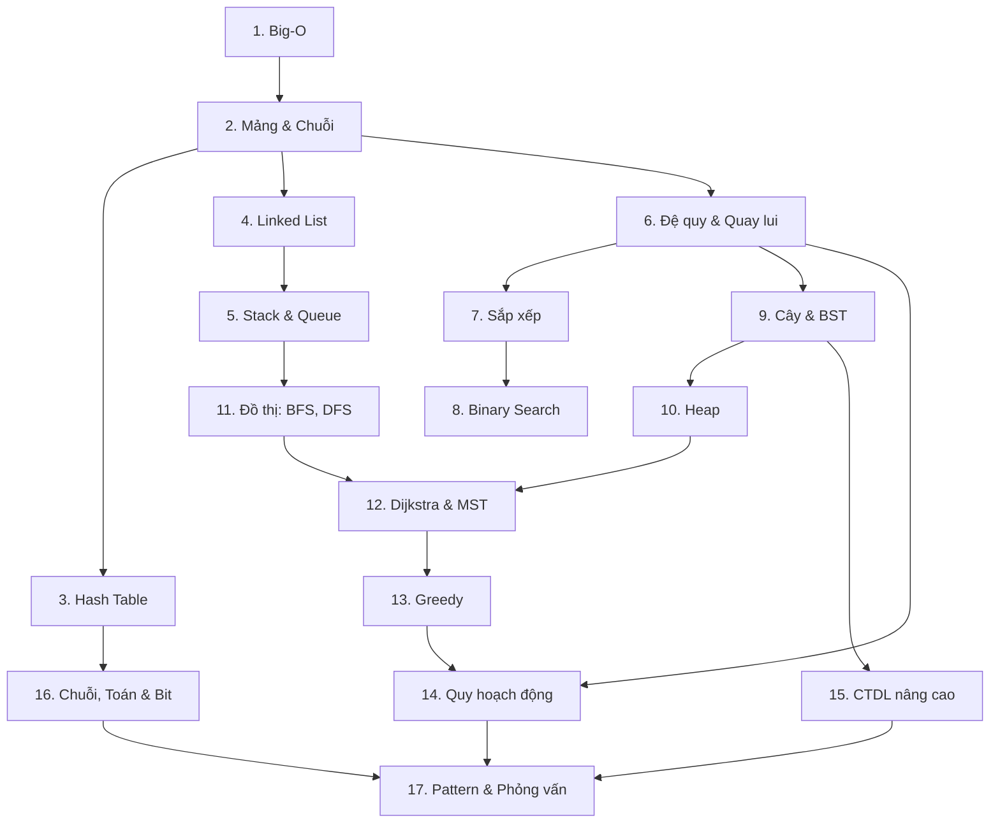

# 🧮 Cấu trúc dữ liệu & Giải thuật

## 📋 Tổng quan

Chào mừng bạn đến với khóa học **Cấu trúc dữ liệu & Giải thuật (DSA)**! Đây là nền móng giúp bạn viết code **nhanh hơn, tiết kiệm bộ nhớ hơn** và tự tin vượt qua các vòng phỏng vấn kỹ thuật.

Điểm đặc biệt của khóa học:

- 🎬 **Animation từng bước** ngay trên website: bấm ▶ để xem thuật toán chạy, hoặc bấm từng bước để hiểu thật kỹ
- 🗺️ **Diagram** (Mermaid) và bảng trace cho mọi thuật toán quan trọng
- 🐹🐍 **Code bằng cả Go và Python** (chuyển qua lại bằng tab), đã chạy thử và có Output
- 🌍 **Ứng dụng thực tế**: thuật toán này xuất hiện ở đâu trong hệ thống thật
- 🏋️ **Bài tập** từ dễ đến khó, kèm link LeetCode và lời giải

### 🎯 Mục tiêu khóa học

- Phân tích được độ phức tạp thời gian/bộ nhớ (Big-O) của mọi đoạn code
- Hiểu và tự cài đặt các cấu trúc dữ liệu: mảng, hash table, linked list, stack, queue, cây, heap, đồ thị, trie, segment tree...
- Nắm vững các thuật toán kinh điển: sắp xếp, tìm kiếm nhị phân, BFS/DFS, Dijkstra, MST, greedy, quy hoạch động, KMP...
- Nhận diện **pattern** khi gặp bài toán mới và chọn đúng công cụ
- Tự tin giải bài tập LeetCode mức Medium và vượt qua vòng phỏng vấn thuật toán

### ⏱️ Thời gian học tập

- **Tổng thời gian**: 8-10 tuần (1-2 giờ/ngày)
- **Yêu cầu**: biết cơ bản Go **hoặc** Python (học xong Phần 1 của [khóa Golang](../golang/README.md) hoặc [khóa Python](../python/README.md))

## 🎬 Cách dùng animation

Mỗi animation có các nút:

| Nút | Ý nghĩa |
| --- | --- |
| ⏮ | Về bước đầu tiên |
| ◀ | Lùi lại 1 bước |
| ▶ / ⏸ | Chạy tự động / tạm dừng |
| ▶\| | Tiến 1 bước |
| Thanh trượt | Chỉnh tốc độ |

Dòng chú thích bên dưới giải thích **chuyện gì đang xảy ra ở bước hiện tại**. Thử ngay với Bubble Sort:

!!! tip "Mẹo học với animation"
    Đừng chỉ bấm ▶ rồi xem. Hãy **đoán trước** bước tiếp theo, rồi bấm ▶| để kiểm tra. Đoán đúng nghĩa là bạn đã hiểu thuật toán.

!!! note
    Animation chỉ hiển thị trên website [nguyenthanh1205tb.github.io/learning](https://nguyenthanh1205tb.github.io/learning/). Khi đọc trên GitHub, bạn vẫn có diagram và bảng trace đầy đủ.

## 🗺️ Bản đồ kiến thức

## 📚 Cấu trúc khóa học

### Phần 1: Nền tảng (Tuần 1-3)

- [x] **Bài 1**: [Độ phức tạp (Big-O)](./01-complexity.md) - đếm phép toán, các lớp độ phức tạp, benchmark thực tế
- [x] **Bài 2**: [Mảng & Chuỗi](./02-arrays-strings.md) - prefix sum, two pointers, sliding window, Kadane
- [x] **Bài 3**: [Hash Table](./03-hashing.md) - hàm băm, chaining, linear probing, two sum, group anagrams
- [x] **Bài 4**: [Linked List](./04-linked-lists.md) - đảo ngược, fast/slow pointer, phát hiện chu trình
- [x] **Bài 5**: [Stack & Queue](./05-stacks-queues.md) - ngoặc hợp lệ, monotonic stack/queue

### Phần 2: Thuật toán kinh điển (Tuần 4-6)

- [x] **Bài 6**: [Đệ quy & Quay lui](./06-recursion-backtracking.md) - cây đệ quy, hoán vị, tập con, N-Queens
- [x] **Bài 7**: [Thuật toán sắp xếp](./07-sorting.md) - 10 thuật toán sắp xếp, so sánh và benchmark
- [x] **Bài 8**: [Tìm kiếm & Binary Search](./08-binary-search.md) - các biến thể, binary search trên đáp án
- [x] **Bài 9**: [Cây & BST](./09-trees-bst.md) - duyệt cây, thêm/xóa/tìm BST, AVL
- [x] **Bài 10**: [Heap & Priority Queue](./10-heaps.md) - sift up/down, top-K, median của luồng dữ liệu

### Phần 3: Đồ thị & Tối ưu (Tuần 7-8)

- [x] **Bài 11**: [Đồ thị: BFS, DFS, Topo Sort](./11-graphs-traversal.md) - duyệt đồ thị, đếm đảo, sắp xếp topo
- [x] **Bài 12**: [Đường đi ngắn nhất & Cây khung](./12-shortest-paths-mst.md) - Dijkstra, Bellman-Ford, Union-Find, Kruskal, Prim
- [x] **Bài 13**: [Tham lam (Greedy)](./13-greedy.md) - interval scheduling, Huffman, chứng minh greedy
- [x] **Bài 14**: [Quy hoạch động (DP)](./14-dynamic-programming.md) - knapsack, LIS, LCS, edit distance, khung 5 bước

### Phần 4: Nâng cao & Phỏng vấn (Tuần 9-10)

- [x] **Bài 15**: [Cấu trúc dữ liệu nâng cao](./15-advanced-data-structures.md) - trie, LRU cache, segment tree, Fenwick tree, bloom filter
- [x] **Bài 16**: [Thuật toán chuỗi, Toán & Bit](./16-strings-math-bits.md) - KMP, Rabin-Karp, sàng nguyên tố, lũy thừa nhanh, bit manipulation
- [x] **Bài 17**: [Pattern giải bài & Phỏng vấn](./17-problem-solving-patterns.md) - 20+ pattern, cây quyết định, kế hoạch luyện 12 tuần

## 📊 Bảng tra cứu nhanh Big-O

### Cấu trúc dữ liệu

| Cấu trúc | Truy cập | Tìm kiếm | Thêm | Xóa | Ghi chú |
| --- | --- | --- | --- | --- | --- |
| Mảng động (slice/list) | O(1) | O(n) | O(1)* cuối, O(n) giữa | O(n) | *amortized |
| Hash table (map/dict) | - | O(1)* | O(1)* | O(1)* | *trung bình, xấu nhất O(n) |
| Linked list | O(n) | O(n) | O(1) nếu có node | O(1) nếu có node | |
| Stack / Queue | O(1) đỉnh/đầu | O(n) | O(1) | O(1) | |
| BST cân bằng | O(log n) | O(log n) | O(log n) | O(log n) | BST lệch: O(n) |
| Binary heap | O(1) min/max | O(n) | O(log n) | O(log n) | |
| Trie | - | O(L) | O(L) | O(L) | L = độ dài từ |
| Union-Find | - | ~O(1) | ~O(1) | - | có nén đường đi |

### Sắp xếp

| Thuật toán | Tốt nhất | Trung bình | Xấu nhất | Bộ nhớ | Ổn định |
| --- | --- | --- | --- | --- | --- |
| Bubble / Insertion | O(n) | O(n²) | O(n²) | O(1) | ✅ |
| Selection | O(n²) | O(n²) | O(n²) | O(1) | ❌ |
| Merge sort | O(n log n) | O(n log n) | O(n log n) | O(n) | ✅ |
| Quick sort | O(n log n) | O(n log n) | O(n²) | O(log n) | ❌ |
| Heap sort | O(n log n) | O(n log n) | O(n log n) | O(1) | ❌ |
| Counting sort | O(n + k) | O(n + k) | O(n + k) | O(n + k) | ✅ |
| Radix sort | O(d·(n + b)) | O(d·(n + b)) | O(d·(n + b)) | O(n + b) | ✅ |

### Đồ thị

| Thuật toán | Độ phức tạp | Dùng khi |
| --- | --- | --- |
| BFS / DFS | O(V + E) | Duyệt, đường đi ngắn nhất không trọng số |
| Topological sort (Kahn) | O(V + E) | Sắp xếp phụ thuộc trong DAG |
| Dijkstra (heap) | O((V + E) log V) | Trọng số không âm |
| Bellman-Ford | O(V·E) | Có cạnh âm, phát hiện chu trình âm |
| Floyd-Warshall | O(V³) | Mọi cặp đỉnh, đồ thị nhỏ |
| Kruskal / Prim | O(E log E) / O(E log V) | Cây khung nhỏ nhất |

### Chọn độ phức tạp theo giới hạn n

| n tối đa | Độ phức tạp chấp nhận được | Gợi ý thuật toán |
| --- | --- | --- |
| ≤ 10 | O(n!) | Hoán vị, quay lui |
| ≤ 20 | O(2ⁿ) | Tập con, bitmask DP |
| ≤ 500 | O(n³) | Floyd-Warshall, DP 3 chiều |
| ≤ 5.000 | O(n²) | DP 2 chiều, hai vòng lặp |
| ≤ 10⁶ | O(n log n) | Sắp xếp, heap, binary search |
| ≤ 10⁸ | O(n) | Two pointers, prefix sum, hash |
| > 10⁸ | O(log n) hoặc O(1) | Binary search, công thức toán |

## 🏋️ Kế hoạch luyện tập

1. **Học bài → làm bài tập trong bài** (có đáp án trong mục `
`)
2. **Luyện theo chủ đề** trên LeetCode: dùng danh sách [NeetCode 150](https://neetcode.io/practice) hoặc [Blind 75](https://leetcode.com/discuss/general-discussion/460599/blind-75-leetcode-questions), làm theo đúng thứ tự bài học của khóa
3. **Luyện tư duy thuật toán sâu hơn**: [VNOI Wiki](https://vnoi.info/wiki/) (tiếng Việt), [CSES Problem Set](https://cses.fi/problemset/), [Codeforces](https://codeforces.com/)
4. **Ôn tập định kỳ**: làm lại bài cũ sau 1 tuần và 1 tháng, không nhìn lời giải

!!! tip "Quy tắc 30 phút"
    Kẹt quá 30 phút thì xem gợi ý (không xem lời giải). Kẹt thêm 15 phút nữa thì đọc lời giải, hiểu kỹ, rồi **tự viết lại từ đầu** vào hôm sau.

## ✅ Checklist tiến độ

- [ ] Phần 1: phân tích được Big-O, thành thạo mảng, hash, linked list, stack/queue
- [ ] Phần 2: tự cài đặt được merge sort, quick sort, binary search, BST, heap
- [ ] Phần 3: giải được bài đồ thị bằng BFS/DFS/Dijkstra, viết được DP từ khung 5 bước
- [ ] Phần 4: nhận diện được pattern, giải được 100+ bài LeetCode (trong đó 50+ Medium)

## 🔗 Các khóa học liên quan

- 🐹 [Khóa học Golang](../golang/README.md) - ngôn ngữ dùng cho code mẫu
- 🐍 [Khóa học Python](../python/README.md) - ngôn ngữ dùng cho code mẫu
- 🏗️ [Backend Engineering](../backend/README.md) - thấy thuật toán được dùng trong cache, database, hệ thống phân tán
- 🧠 [Tư duy Software Engineer](../mindset/README.md) - tư duy giải quyết vấn đề và phát triển sự nghiệp

---

**Bắt đầu học**: [Bài 1: Độ phức tạp (Big-O)](./01-complexity.md) 🚀
