# 📚 Bài 1: Web hoạt động thế nào? - Từ gõ URL đến nhận Response

## 🎯 Mục tiêu bài học

- Hiểu **Internet** vận chuyển dữ liệu như thế nào: gói tin (packet), **mô hình TCP/IP 4 tầng**, "đóng gói" (encapsulation)
- Phân biệt **IP address**, **port**, **socket**; biết vì sao `127.0.0.1` khác `0.0.0.0`
- Hiểu **TCP vs UDP**, vẽ được **bắt tay 3 bước** (3-way handshake) và biết khi nào dùng UDP
- Hiểu **DNS** phân giải tên miền ra IP qua những bước nào, dùng thành thạo `dig`
- Đọc hiểu **HTTP request/response** "trần" (raw text): method, status code, header, body, cookie
- Nắm được sự tiến hóa **HTTP/1.1 → HTTP/2 → HTTP/3 (QUIC)** và vì sao nó nhanh hơn
- Hiểu **TLS/HTTPS** bảo vệ dữ liệu thế nào, chứng chỉ (certificate) là gì
- Giải thích được **"điều gì xảy ra khi gõ URL vào trình duyệt"** - câu hỏi phỏng vấn kinh điển
- Phân biệt **proxy, reverse proxy, load balancer, CDN**
- Chọn đúng giữa **polling, long polling, SSE, WebSocket** cho tính năng real-time
- Thực hành: `curl -v`, `dig`, `nc`, và **tự viết HTTP server bằng TCP thuần** trong Go và Python

> 💡 **Vì sao backend dev phải hiểu mạng?** Code backend của bạn **sống trên mạng**. Khi có sự cố "API chậm", "timeout", "connection refused", "502 Bad Gateway", "CORS error", "certificate expired"... bạn sẽ không thể sửa nếu không biết dữ liệu đi từ trình duyệt đến server qua những chặng nào. Bài này là **tấm bản đồ** cho toàn bộ khóa học.

> 💡 **Kiến thức cần có**: Biết cơ bản Go **hoặc** Python (xem khóa [Go](../golang/README.md) / [Python](../python/README.md)). Mọi ví dụ đều có cả hai ngôn ngữ - bạn chỉ cần đọc tab của ngôn ngữ mình dùng.

---

## 📖 1. Internet là gì? - Bức tranh lớn

### Ví von: Internet là hệ thống bưu điện khổng lồ

Hãy tưởng tượng bạn ở Hà Nội muốn gửi **một cuốn sách 500 trang** cho bạn ở TP.HCM, nhưng bưu điện chỉ nhận **phong bì nhỏ**. Bạn sẽ:

1. **Xé** cuốn sách thành 500 tờ, mỗi tờ bỏ vào một phong bì (**packet - gói tin**)
2. Ghi **địa chỉ người nhận** + **địa chỉ người gửi** + **số thứ tự trang** lên mỗi phong bì
3. Bưu điện chuyển từng phong bì qua **nhiều trạm trung chuyển** (Hà Nội → Vinh → Đà Nẵng → Nha Trang → TP.HCM). Mỗi phong bì **có thể đi đường khác nhau**!
4. Người nhận **sắp xếp lại** theo số trang, phát hiện trang nào **bị thiếu** thì nhắn bạn **gửi lại**

Đó chính xác là cách Internet hoạt động:

| Bưu điện | Internet |
|---|---|
| Phong bì | **Packet** (gói tin, thường ≤ 1500 byte) |
| Địa chỉ nhà | **IP address** (vd `142.250.66.46`) |
| Tên người nhận trong nhà (số phòng) | **Port** (vd `443` cho HTTPS) |
| Trạm trung chuyển | **Router** |
| Danh bạ tra tên → địa chỉ | **DNS** |
| Đánh số trang, gửi lại trang thiếu | **TCP** |
| Gửi bưu thiếp, mất thì thôi | **UDP** |
| Ngôn ngữ viết trong thư | **HTTP**, SMTP, ... |
| Phong bì niêm phong, có con dấu xác thực | **TLS** (HTTPS) |

### Mô hình TCP/IP 4 tầng

Mạng máy tính được chia thành **các tầng (layer)**, mỗi tầng chỉ lo một việc và "nhờ" tầng dưới vận chuyển. Nhờ vậy người viết HTTP server không cần biết dữ liệu đi qua cáp quang hay WiFi.

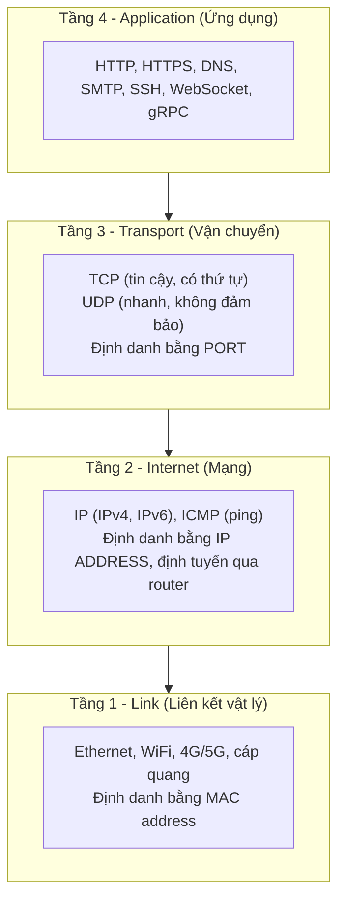
```mermaid
flowchart TB
    subgraph L4["Tầng 4 - Application (Ứng dụng)"]
        A1["HTTP, HTTPS, DNS, SMTP, SSH, WebSocket, gRPC"]
    end
    subgraph L3["Tầng 3 - Transport (Vận chuyển)"]
        A2["TCP (tin cậy, có thứ tự)<br/>UDP (nhanh, không đảm bảo)<br/>Định danh bằng PORT"]
    end
    subgraph L2["Tầng 2 - Internet (Mạng)"]
        A3["IP (IPv4, IPv6), ICMP (ping)<br/>Định danh bằng IP ADDRESS, định tuyến qua router"]
    end
    subgraph L1["Tầng 1 - Link (Liên kết vật lý)"]
        A4["Ethernet, WiFi, 4G/5G, cáp quang<br/>Định danh bằng MAC address"]
    end
    L4 --> L3 --> L2 --> L1
```

> 💡 Bạn sẽ còn nghe về **mô hình OSI 7 tầng** (thêm Presentation, Session, tách Physical/Data Link). Trong thực tế người ta hay nói "**L4 load balancer**" (làm việc ở tầng TCP/UDP) và "**L7 load balancer**" (hiểu HTTP) - số tầng ở đây là theo OSI: L4 = Transport, L7 = Application.

### Encapsulation - "Phong bì lồng phong bì"

Khi bạn gửi một HTTP request, mỗi tầng **bọc thêm một lớp header** của nó:

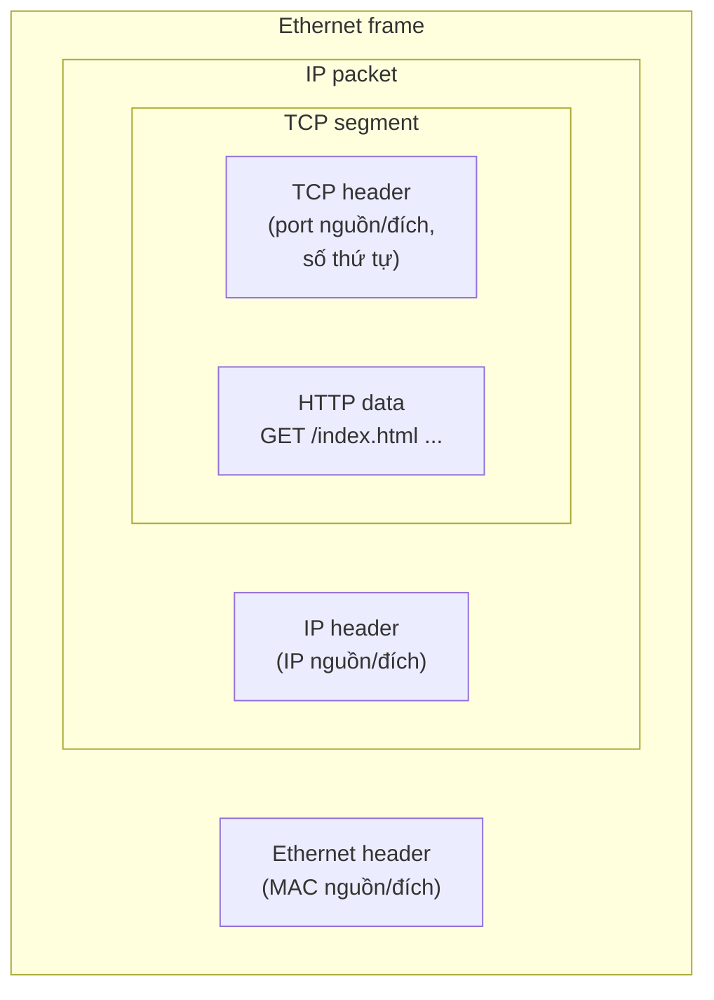
```mermaid
flowchart LR
    subgraph F["Ethernet frame"]
        direction LR
        E["Ethernet header<br/>(MAC nguồn/đích)"]
        subgraph P["IP packet"]
            direction LR
            I["IP header<br/>(IP nguồn/đích)"]
            subgraph S["TCP segment"]
                direction LR
                T["TCP header<br/>(port nguồn/đích,<br/>số thứ tự)"]
                H["HTTP data<br/>GET /index.html ..."]
            end
        end
    end
```

Router trên đường đi chỉ cần **mở tới lớp IP** để biết chuyển tiếp đi đâu; chỉ máy đích mới mở tới lớp HTTP.

### 💡 Tips quan trọng

- Khi debug mạng, hãy **đi từ dưới lên**: có mạng không (`ping`) → phân giải tên được không (`dig`) → mở được port không (`nc -zv`) → TLS ổn không (`curl -v`) → HTTP trả gì (`curl -i`)
- Lỗi ở tầng nào thì triệu chứng ở tầng đó: `no such host` (DNS), `connection refused` (TCP - không ai nghe ở port đó), `connection timed out` (firewall/mạng), `certificate verify failed` (TLS), `404/500` (HTTP - ứng dụng)

---

## 📖 2. IP Address, Port và Socket

### IP address - "Địa chỉ nhà"

**IPv4**: 4 số 0-255, vd `203.162.4.191` → chỉ có ~4,3 tỷ địa chỉ, **đã cạn** từ lâu.
**IPv6**: 128 bit, vd `2001:ee0:4f8b::1` → đủ cho mọi hạt cát trên Trái Đất.

Một số dải địa chỉ **đặc biệt** bạn gặp hằng ngày:

| Dải | Ý nghĩa | Ví dụ bạn gặp |
|---|---|---|
| `127.0.0.0/8` (thường `127.0.0.1`), IPv6 `::1` | **Loopback** - chính máy này | `localhost` khi dev |
| `10.0.0.0/8`, `172.16.0.0/12`, `192.168.0.0/16` | **Private** - mạng nội bộ, không đi ra Internet trực tiếp | WiFi nhà `192.168.1.x`, VPC trên AWS `10.0.x.x`, Docker `172.17.x.x` |
| `0.0.0.0` | Khi **listen**: "mọi địa chỉ của máy này" | `server.listen("0.0.0.0:8080")` |
| `169.254.169.254` | Metadata server của cloud (AWS/GCP) | Lấy credential tạm thời của VM |

> 💡 **CIDR** `/8`, `/16`, `/24` = số bit đầu cố định. `192.168.1.0/24` = `192.168.1.0` → `192.168.1.255` (256 địa chỉ). Bạn sẽ gặp CIDR khi cấu hình firewall, security group, VPC.

### ⚠️ `127.0.0.1` vs `0.0.0.0` - lỗi kinh điển khi chạy trong Docker

```text
Server listen 127.0.0.1:8080  →  chỉ nhận kết nối TỪ CHÍNH MÁY ĐÓ (trong container = chỉ trong container)
Server listen 0.0.0.0:8080    →  nhận kết nối từ MỌI card mạng (host khác, container khác, Internet)
```

Rất nhiều bạn chạy app trong Docker với `127.0.0.1`, map port `-p 8080:8080` rồi thắc mắc "sao gọi từ máy host không được?". Vì bên trong container, `127.0.0.1` là loopback **của container**, không phải của máy host.

### NAT - Vì sao cả nhà dùng chung một IP public?

Router WiFi nhà bạn có **1 IP public** do nhà mạng (Viettel, VNPT, FPT) cấp. Điện thoại, laptop, TV có IP private `192.168.1.x`. Router dùng **NAT** (Network Address Translation) để "đổi địa chỉ người gửi" trên phong bì:

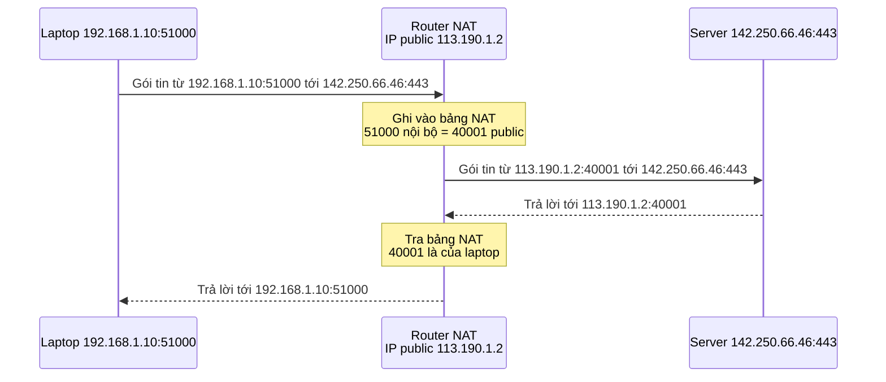
```mermaid
sequenceDiagram
    participant L as Laptop 192.168.1.10:51000
    participant R as Router NAT<br/>IP public 113.190.1.2
    participant S as Server 142.250.66.46:443
    L->>R: Gói tin từ 192.168.1.10:51000 tới 142.250.66.46:443
    Note over R: Ghi vào bảng NAT<br/>51000 nội bộ = 40001 public
    R->>S: Gói tin từ 113.190.1.2:40001 tới 142.250.66.46:443
    S-->>R: Trả lời tới 113.190.1.2:40001
    Note over R: Tra bảng NAT<br/>40001 là của laptop
    R-->>L: Trả lời tới 192.168.1.10:51000
```

Hệ quả cho backend: IP bạn thấy ở server (`r.RemoteAddr`) thường là **IP của NAT/proxy**, không phải IP thật của người dùng. Vì thế mới có header `X-Forwarded-For` (mục 10).

### Port - "Số phòng trong tòa nhà"

Một máy có **một IP** nhưng chạy **nhiều dịch vụ**. Port (0-65535) phân biệt dịch vụ nào nhận gói tin.

| Port | Dịch vụ | Ghi chú |
|---|---|---|
| 22 | SSH | Đăng nhập server từ xa |
| 53 | DNS | UDP (và TCP khi response lớn) |
| 80 | HTTP | Không mã hóa |
| 443 | HTTPS | HTTP + TLS; HTTP/3 dùng UDP 443 |
| 5432 | PostgreSQL | |
| 3306 | MySQL | |
| 6379 | Redis | |
| 9092 | Kafka | |
| 8080, 8000, 3000 | Hay dùng khi dev | Không cần quyền root |

- Port **0-1023** là "well-known", trên Linux cần quyền root để listen
- Port **49152-65535** (ephemeral) được OS **tự cấp cho phía client** khi kết nối đi

### Socket - "Một cuộc điện thoại cụ thể"

Một kết nối TCP được định danh **duy nhất** bởi bộ 5 (**5-tuple**):

```text
(giao thức, IP nguồn, port nguồn, IP đích, port đích)
(TCP,       113.190.1.2, 40001,  142.250.66.46, 443)
```

Vì vậy một server ở port 443 có thể phục vụ **hàng trăm nghìn** kết nối cùng lúc - mỗi kết nối khác nhau ở IP/port **nguồn**.

---

## 📖 3. TCP vs UDP

### TCP - "Gửi thư bảo đảm có hồi báo"

TCP (Transmission Control Protocol) đảm bảo:

- **Tin cậy**: gói nào mất sẽ được **gửi lại** (retransmission)
- **Đúng thứ tự**: bên nhận sắp xếp theo **sequence number**
- **Kiểm soát luồng** (flow control): không gửi nhanh hơn bên nhận xử lý kịp
- **Kiểm soát tắc nghẽn** (congestion control): tự giảm tốc khi mạng nghẽn
- **Hướng kết nối**: phải **bắt tay** trước khi gửi dữ liệu

### Bắt tay 3 bước (3-way handshake)

Giống gọi điện thoại: "Alo, nghe rõ không?" - "Rõ, còn bạn nghe rõ tôi không?" - "Rõ!" - rồi mới bắt đầu nói chuyện.

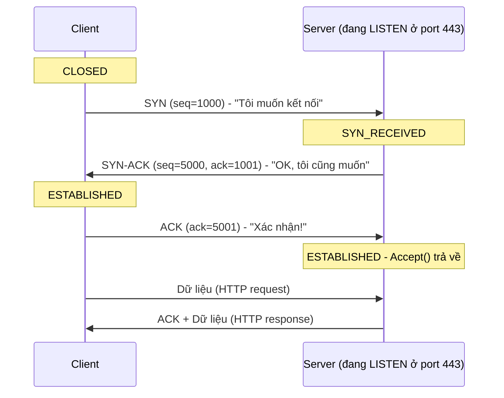
```mermaid
sequenceDiagram
    participant C as Client
    participant S as Server (đang LISTEN ở port 443)
    Note over C: CLOSED
    C->>S: SYN (seq=1000) - "Tôi muốn kết nối"
    Note over S: SYN_RECEIVED
    S->>C: SYN-ACK (seq=5000, ack=1001) - "OK, tôi cũng muốn"
    Note over C: ESTABLISHED
    C->>S: ACK (ack=5001) - "Xác nhận!"
    Note over S: ESTABLISHED - Accept() trả về
    C->>S: Dữ liệu (HTTP request)
    S->>C: ACK + Dữ liệu (HTTP response)
```

**Hệ quả quan trọng**: mỗi kết nối TCP mới tốn **1 RTT** (round-trip time - thời gian đi và về) trước khi gửi được byte dữ liệu đầu tiên. Từ Hà Nội tới server ở Singapore RTT ~40ms, tới Mỹ ~200ms. Thêm TLS lại tốn thêm 1 RTT nữa. Đó là lý do **tái sử dụng kết nối** (keep-alive, connection pool) cực kỳ quan trọng.

### Đóng kết nối (4-way close) và TIME_WAIT

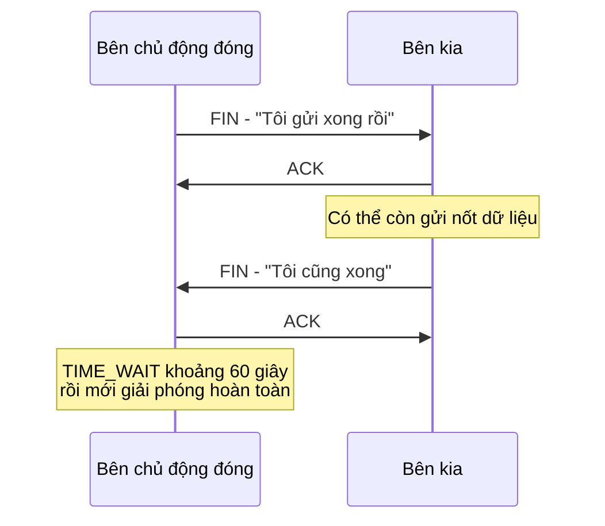
```mermaid
sequenceDiagram
    participant A as Bên chủ động đóng
    participant B as Bên kia
    A->>B: FIN - "Tôi gửi xong rồi"
    B->>A: ACK
    Note over B: Có thể còn gửi nốt dữ liệu
    B->>A: FIN - "Tôi cũng xong"
    A->>B: ACK
    Note over A: TIME_WAIT khoảng 60 giây<br/>rồi mới giải phóng hoàn toàn
```

> ⚠️ Server mở rồi đóng **hàng nghìn kết nối ngắn mỗi giây** (vd gọi API khác mà không dùng connection pool) sẽ có hàng nghìn socket ở trạng thái `TIME_WAIT` → có thể **cạn ephemeral port** và lỗi `cannot assign requested address`. Cách chữa: tái sử dụng kết nối (HTTP keep-alive, pool).

### UDP - "Gửi bưu thiếp"

UDP (User Datagram Protocol): **không bắt tay, không đảm bảo tới nơi, không đảm bảo thứ tự**. Đổi lại: **nhanh, header nhỏ (8 byte so với 20+ byte của TCP), không có độ trễ kết nối**.

| Tiêu chí | TCP | UDP |
|---|---|---|
| Kết nối | Có (3-way handshake) | Không |
| Tin cậy | Gửi lại gói mất | Mất là mất |
| Thứ tự | Đảm bảo | Không |
| Đơn vị dữ liệu | Luồng byte (stream) - không có ranh giới tin nhắn | Datagram - mỗi lần gửi là 1 gói riêng |
| Tốc độ / độ trễ | Chậm hơn | Nhanh hơn |
| Dùng cho | HTTP/1.1, HTTP/2, SSH, database, email | DNS, video call, game online, livestream, **HTTP/3 (QUIC)** |

> 💡 **Vì sao video call dùng UDP?** Nếu một khung hình bị mất, **gửi lại cũng vô ích** vì lúc đó đã trễ. Thà bỏ qua khung đó còn hơn làm cả cuộc gọi bị giật chờ gói cũ.

### Thử UDP bằng code

Chương trình dưới đây tự dựng một **UDP echo server** (trả lại chữ in hoa) và một client gửi 2 gói. Chú ý: **không có `Accept`, không có bắt tay**.

=== "Go"

    ```go
    package main

    import (
    	"fmt"
    	"net"
    	"strings"
    )

    func main() {
    	// Server UDP: không Listen/Accept, chỉ "mở hòm thư" và đọc từng gói (datagram)
    	pc, err := net.ListenPacket("udp", "127.0.0.1:0") // cổng 0 = OS tự chọn
    	if err != nil {
    		panic(err)
    	}
    	defer pc.Close()
    	go func() {
    		buf := make([]byte, 1024)
    		for {
    			n, addr, err := pc.ReadFrom(buf) // mỗi lần đọc = đúng 1 gói tin
    			if err != nil {
    				return
    			}
    			pc.WriteTo([]byte(strings.ToUpper(string(buf[:n]))), addr)
    		}
    	}()

    	// Client UDP: "Dial" chỉ ghi nhớ địa chỉ đích, KHÔNG có bắt tay nào cả
    	conn, err := net.Dial("udp", pc.LocalAddr().String())
    	if err != nil {
    		panic(err)
    	}
    	defer conn.Close()

    	for _, msg := range []string{"xin chao", "gps: 21.0285,105.8542"} {
    		conn.Write([]byte(msg))
    		buf := make([]byte, 1024)
    		n, _ := conn.Read(buf)
    		fmt.Printf("gửi %-24q nhận %q\n", msg, buf[:n])
    	}
    }

    // Output:
    // gửi "xin chao"               nhận "XIN CHAO"
    // gửi "gps: 21.0285,105.8542"  nhận "GPS: 21.0285,105.8542"
    ```

=== "Python"

    ```python
    import socket
    import threading

    # Server UDP: SOCK_DGRAM, không listen/accept
    server = socket.socket(socket.AF_INET, socket.SOCK_DGRAM)
    server.bind(("127.0.0.1", 0))  # cổng 0 = OS tự chọn
    addr = server.getsockname()


    def serve():
        while True:
            data, client = server.recvfrom(1024)  # mỗi lần đọc = đúng 1 gói tin
            server.sendto(data.upper(), client)


    threading.Thread(target=serve, daemon=True).start()

    # Client UDP: không có bắt tay, gửi thẳng
    client = socket.socket(socket.AF_INET, socket.SOCK_DGRAM)
    client.settimeout(1.0)  # UDP có thể mất gói → luôn đặt timeout
    for msg in [b"xin chao", b"gps: 21.0285,105.8542"]:
        client.sendto(msg, addr)
        data, _ = client.recvfrom(1024)
        print(f"gửi {msg!r:26} nhận {data!r}")

    # Output:
    # gửi b'xin chao'                nhận b'XIN CHAO'
    # gửi b'gps: 21.0285,105.8542'   nhận b'GPS: 21.0285,105.8542'
    ```

> ⚠️ **TCP là luồng byte, không phải "tin nhắn"**: nếu client gửi 2 lần `Write("abc")` và `Write("def")`, server có thể đọc được `"abcdef"` trong một lần, hoặc `"ab"` rồi `"cdef"`. Đó là lý do mọi giao thức trên TCP phải tự định nghĩa **ranh giới** - HTTP dùng `\r\n\r\n` và `Content-Length`, gRPC dùng tiền tố độ dài 5 byte...

---

## 📖 4. DNS - Danh bạ điện thoại của Internet

Con người nhớ `shopee.vn`, máy tính cần `IP`. **DNS** (Domain Name System) là hệ thống phân tán dịch tên miền → IP.

### Cấu trúc phân cấp

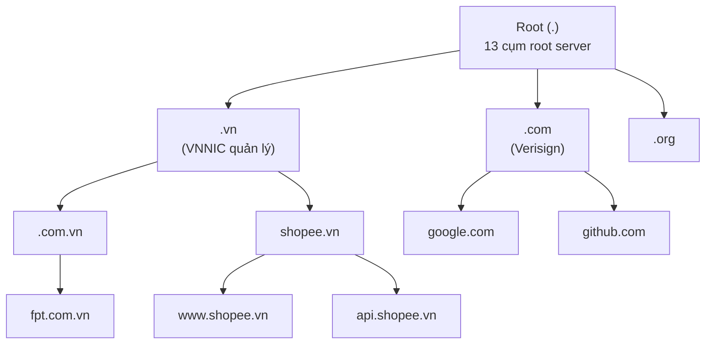
```mermaid
flowchart TD
    Root["Root (.)<br/>13 cụm root server"] --> VN[".vn<br/>(VNNIC quản lý)"]
    Root --> COM[".com<br/>(Verisign)"]
    Root --> ORG[".org"]
    VN --> COMVN[".com.vn"]
    VN --> SHOPEE["shopee.vn"]
    COM --> GOOGLE["google.com"]
    COM --> GITHUB["github.com"]
    SHOPEE --> WWW["www.shopee.vn"]
    SHOPEE --> API["api.shopee.vn"]
    COMVN --> FPT["fpt.com.vn"]
```

Đọc tên miền **từ phải sang trái**: `api.shopee.vn.` = root `.` → `vn` → `shopee` → `api`.

### Quá trình phân giải (resolution)

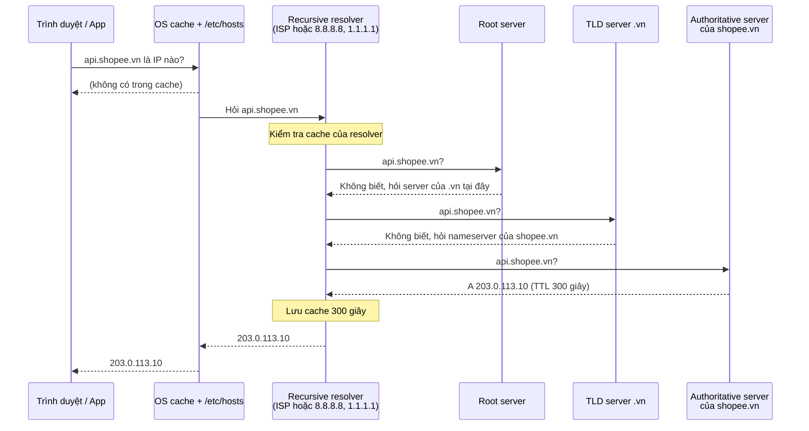
```mermaid
sequenceDiagram
    participant B as Trình duyệt / App
    participant OS as OS cache + /etc/hosts
    participant R as Recursive resolver<br/>(ISP hoặc 8.8.8.8, 1.1.1.1)
    participant Root as Root server
    participant TLD as TLD server .vn
    participant Auth as Authoritative server<br/>của shopee.vn
    B->>OS: api.shopee.vn là IP nào?
    OS-->>B: (không có trong cache)
    OS->>R: Hỏi api.shopee.vn
    Note over R: Kiểm tra cache của resolver
    R->>Root: api.shopee.vn?
    Root-->>R: Không biết, hỏi server của .vn tại đây
    R->>TLD: api.shopee.vn?
    TLD-->>R: Không biết, hỏi nameserver của shopee.vn
    R->>Auth: api.shopee.vn?
    Auth-->>R: A 203.0.113.10 (TTL 300 giây)
    Note over R: Lưu cache 300 giây
    R-->>OS: 203.0.113.10
    OS-->>B: 203.0.113.10
```

- **Recursive resolver** làm "chạy việc": hỏi lần lượt từng cấp thay bạn
- **Authoritative server** là "nguồn sự thật" do chủ tên miền cấu hình (thường là Cloudflare, Route 53...)
- **TTL** (time to live): thời gian được phép cache. TTL 300 = 5 phút

### Các loại bản ghi (record) quan trọng

| Record | Ý nghĩa | Ví dụ |
|---|---|---|
| `A` | Tên → IPv4 | `api.example.com. 300 IN A 203.0.113.10` |
| `AAAA` | Tên → IPv6 | `api.example.com. IN AAAA 2001:db8::10` |
| `CNAME` | Bí danh: tên này **là** tên kia | `www.example.com. IN CNAME example.com.` |
| `MX` | Server nhận email (có độ ưu tiên) | `example.com. IN MX 10 mail.example.com.` |
| `TXT` | Văn bản tùy ý - xác minh tên miền, SPF, DKIM | `"v=spf1 include:_spf.google.com ~all"` |
| `NS` | Nameserver quản lý zone | `example.com. IN NS ns1.cloudflare.com.` |
| `SRV` | Dịch vụ ở host:port nào (dùng trong service discovery) | `_grpc._tcp.svc.example.com.` |

### Thực hành với `dig`

```bash
dig example.com A
```

Output thật (chạy ngày 26/09/2026):

```text
; <<>> DiG 9.18.39-0ubuntu0.24.04.7-Ubuntu <<>> example.com A
;; global options: +cmd
;; Got answer:
;; ->>HEADER<<- opcode: QUERY, status: NOERROR, id: 52760
;; flags: qr rd ra ad; QUERY: 1, ANSWER: 2, AUTHORITY: 0, ADDITIONAL: 1

;; QUESTION SECTION:
;example.com.			IN	A

;; ANSWER SECTION:
example.com.		300	IN	A	172.66.147.243
example.com.		300	IN	A	104.20.23.154

;; Query time: 16 msec
;; SERVER: 8.8.8.8#53(8.8.8.8) (UDP)
```

Đọc output:

- `status: NOERROR` - thành công (`NXDOMAIN` = tên không tồn tại)
- `ANSWER SECTION` - 2 bản ghi A → tên miền có **2 IP** (client sẽ thử lần lượt - một dạng cân bằng tải đơn giản)
- `300` - TTL còn lại (giây)
- `SERVER: 8.8.8.8#53 (UDP)` - hỏi resolver của Google qua **UDP port 53**

Một số lệnh hữu ích:

```bash
dig +short example.com              # chỉ in IP
dig +short MX gmail.com             # server email của Gmail
dig +short www.github.com           # thấy CNAME rồi mới tới IP
dig @1.1.1.1 example.com            # hỏi resolver cụ thể (Cloudflare)
dig +trace example.com              # xem toàn bộ hành trình root → TLD → authoritative
dig -x 8.8.8.8                      # reverse lookup: IP → tên
```

Output thật của `dig +short MX gmail.com` và `dig +short www.github.com`:

```text
20 alt2.gmail-smtp-in.l.google.com.
10 alt1.gmail-smtp-in.l.google.com.
5 gmail-smtp-in.l.google.com.
30 alt3.gmail-smtp-in.l.google.com.
40 alt4.gmail-smtp-in.l.google.com.

github.com.
140.82.114.4
```

(Số nhỏ hơn = ưu tiên cao hơn; `www.github.com` là CNAME của `github.com`.)

### Phân giải DNS trong code

=== "Go"

    ```go
    package main

    import (
    	"context"
    	"fmt"
    	"net"
    	"time"
    )

    func main() {
    	// Luôn đặt timeout: DNS chậm = cả request chậm
    	ctx, cancel := context.WithTimeout(context.Background(), 3*time.Second)
    	defer cancel()
    	r := &net.Resolver{}

    	ips, err := r.LookupHost(ctx, "localhost") // dùng /etc/hosts + DNS như mọi chương trình khác
    	fmt.Println("localhost →", ips, err)

    	ips, err = r.LookupHost(ctx, "example.com")
    	fmt.Println("example.com →", ips, err)

    	mx, err := r.LookupMX(ctx, "gmail.com")
    	if err == nil {
    		fmt.Println("MX gmail.com ưu tiên cao nhất →", mx[0].Host, mx[0].Pref)
    	}

    	_, err = r.LookupHost(ctx, "khong-ton-tai.invalid")
    	fmt.Println("tên không tồn tại →", err)
    }

    // Output (IP có thể khác trên máy bạn):
    // localhost → [127.0.0.1] <nil>
    // example.com → [172.66.147.243 104.20.23.154 2606:4700:10::ac42:93f3 2606:4700:10::6814:179a] <nil>
    // MX gmail.com ưu tiên cao nhất → gmail-smtp-in.l.google.com. 5
    // tên không tồn tại → lookup khong-ton-tai.invalid on 8.8.8.8:53: no such host
    ```

=== "Python"

    ```python
    import socket


    def lookup(host: str) -> list[str]:
        infos = socket.getaddrinfo(host, None, proto=socket.IPPROTO_TCP)
        return sorted({info[4][0] for info in infos})  # bỏ trùng


    print("localhost →", lookup("localhost"))
    print("example.com →", lookup("example.com"))
    try:
        lookup("khong-ton-tai.invalid")
    except socket.gaierror as e:
        print("tên không tồn tại →", e)

    # Output (IP có thể khác trên máy bạn):
    # localhost → ['127.0.0.1']
    # example.com → ['104.20.23.154', '172.66.147.243', '2606:4700:10::6814:179a', '2606:4700:10::ac42:93f3']
    # tên không tồn tại → [Errno -2] Name or service not known
    ```

### 💡 Tips quan trọng về DNS

- **Trước khi đổi IP server, hạ TTL xuống** (vd 60 giây) từ vài ngày trước. Nếu TTL đang là 86400 (1 ngày), sau khi đổi IP, một số người dùng vẫn vào IP cũ **tới 1 ngày**
- `/etc/hosts` được ưu tiên hơn DNS - tiện khi test (`127.0.0.1 api.local`), nhưng cũng là nguồn gốc của nhiều pha "sao máy tôi chạy mà máy anh không chạy"
- Trong Kubernetes, service gọi nhau bằng DNS nội bộ (`orders.default.svc.cluster.local`) - DNS lỗi thì cả hệ thống microservice lỗi. Câu đùa nổi tiếng của dân vận hành: *"It's not DNS. There's no way it's DNS. It was DNS."*

---

## 📖 5. HTTP - Ngôn ngữ của Web

**HTTP** (HyperText Transfer Protocol) là giao thức dạng **hỏi - đáp** (request - response), **không trạng thái** (stateless): mỗi request độc lập, server không tự nhớ request trước. Điểm hay: HTTP/1.1 là **văn bản thuần** - bạn có thể gõ tay!

### Giải phẫu URL

```text
  https://api.shop.vn:8443/v1/products/42?color=red&size=M#reviews
  └─┬─┘   └────┬────┘ └┬─┘└──────┬──────┘ └───────┬───────┘ └──┬──┘
 scheme      host     port     path             query       fragment
                                                           (chỉ ở trình duyệt,
                                                            KHÔNG gửi lên server)
```

- Không ghi port → mặc định `80` (http) hoặc `443` (https)
- Query string phải được **mã hóa URL** (percent-encoding): dấu cách → `%20` hoặc `+`, `đ` → `%C4%91`

### Giải phẫu Request

```http
POST /v1/orders HTTP/1.1                       ← Request line: METHOD PATH VERSION
Host: api.shop.vn                              ← Header (bắt buộc trong HTTP/1.1)
User-Agent: curl/8.5.0
Content-Type: application/json                 ← Body là JSON
Content-Length: 45                             ← Body dài 45 BYTE ("ấ" chiếm 3 byte)
Authorization: Bearer eyJhbGciOi...
Accept: application/json                       ← Tôi muốn nhận JSON
                                               ← Dòng trống (\r\n) = hết header
{"product_id":42,"quantity":2,"note":"gấp"}    ← Body
```

### Giải phẫu Response

```http
HTTP/1.1 201 Created                           ← Status line: VERSION CODE REASON
Content-Type: application/json; charset=utf-8
Content-Length: 56
Location: /v1/orders/1001                      ← Tài nguyên mới tạo nằm ở đâu
Cache-Control: no-store
Set-Cookie: cart_id=abc123; HttpOnly; Secure   ← Nhờ trình duyệt lưu cookie
                                               ← Dòng trống
{"id":1001,"status":"pending","total":1180000,"items":2}
```

Mọi dòng kết thúc bằng `\r\n` (CRLF). Kết thúc phần header là một dòng trống `\r\n\r\n`.

### HTTP Methods

| Method | Mục đích | Có body? | **Safe** (không đổi dữ liệu) | **Idempotent** (gọi N lần = 1 lần) |
|---|---|---|---|---|
| `GET` | Lấy tài nguyên | Không | ✅ | ✅ |
| `HEAD` | Như GET nhưng chỉ lấy header | Không | ✅ | ✅ |
| `OPTIONS` | Hỏi server hỗ trợ gì (CORS preflight) | Không | ✅ | ✅ |
| `POST` | Tạo mới / hành động bất kỳ | Có | ❌ | ❌ |
| `PUT` | Thay thế **toàn bộ** tài nguyên | Có | ❌ | ✅ |
| `PATCH` | Sửa **một phần** tài nguyên | Có | ❌ | ❌ (tùy cách thiết kế) |
| `DELETE` | Xóa | Thường không | ❌ | ✅ |

> 💡 **Idempotent quan trọng thế nào?** Khi mạng chập chờn, client/proxy **tự động retry**. Retry `GET`/`PUT`/`DELETE` thì an toàn. Retry `POST /payments` có thể **trừ tiền 2 lần**! Bài 3 sẽ học cách làm POST an toàn bằng **Idempotency-Key**.

### Status codes

| Nhóm | Ý nghĩa | Mã hay gặp |
|---|---|---|
| **1xx** | Thông tin | `101 Switching Protocols` (nâng cấp lên WebSocket) |
| **2xx** | Thành công | `200 OK`, `201 Created`, `202 Accepted` (đã nhận, xử lý sau), `204 No Content` |
| **3xx** | Chuyển hướng | `301 Moved Permanently`, `302 Found`, `304 Not Modified` (dùng cache), `307`/`308` (giữ nguyên method) |
| **4xx** | **Lỗi phía client** | `400 Bad Request`, `401 Unauthorized` (chưa đăng nhập), `403 Forbidden` (đăng nhập rồi nhưng không có quyền), `404 Not Found`, `405 Method Not Allowed`, `409 Conflict`, `413 Payload Too Large`, `415 Unsupported Media Type`, `422 Unprocessable Content`, `429 Too Many Requests` |
| **5xx** | **Lỗi phía server** | `500 Internal Server Error`, `502 Bad Gateway` (proxy không gọi được app), `503 Service Unavailable` (quá tải/bảo trì), `504 Gateway Timeout` (app trả lời quá chậm) |

> 💡 **Mẹo nhớ**: 4xx = "**bạn** sai", 5xx = "**tôi** sai". Khi trực sự cố, **tỷ lệ 5xx** là chỉ số đầu tiên cần nhìn. `502`/`504` thường nghĩa là **reverse proxy vẫn sống nhưng app phía sau chết hoặc chậm**.

### Headers quan trọng

| Header | Hướng | Ý nghĩa |
|---|---|---|
| `Host` | Request | Tên miền đang gọi - một IP có thể phục vụ nhiều website (virtual hosting) |
| `Content-Type` | Cả hai | Kiểu dữ liệu của body: `application/json`, `text/html`, `multipart/form-data` |
| `Content-Length` | Cả hai | Độ dài body tính bằng **byte** |
| `Accept`, `Accept-Language`, `Accept-Encoding` | Request | Client muốn nhận định dạng/ngôn ngữ/nén gì (content negotiation) |
| `Content-Encoding` | Response | Body đã nén bằng `gzip`/`br` |
| `Authorization` | Request | Thông tin xác thực: `Bearer <token>`, `Basic <base64>` |
| `Cookie` / `Set-Cookie` | Req / Resp | Gửi cookie / yêu cầu lưu cookie |
| `Cache-Control` | Cả hai | Chính sách cache: `no-store`, `max-age=3600`, `public`, `private` |
| `ETag` / `If-None-Match` | Resp / Req | "Dấu vân tay" phiên bản tài nguyên → trả `304` nếu chưa đổi |
| `Location` | Response | URL tài nguyên mới (201) hoặc đích chuyển hướng (3xx) |
| `User-Agent` | Request | Client là ai (trình duyệt, curl, app mobile) |
| `X-Request-ID` | Cả hai | ID để truy vết một request qua nhiều service (Bài 11) |
| `X-Forwarded-For`, `X-Forwarded-Proto` | Request | IP thật của client / giao thức gốc khi đi qua proxy |
| `Retry-After` | Response | Bao lâu nữa hãy thử lại (với `429`, `503`) |
| `Access-Control-Allow-Origin` | Response | CORS - cho phép website khác gọi API (Bài 12) |
| `Strict-Transport-Security` | Response | HSTS - bắt trình duyệt luôn dùng HTTPS |

### Cache có điều kiện với ETag

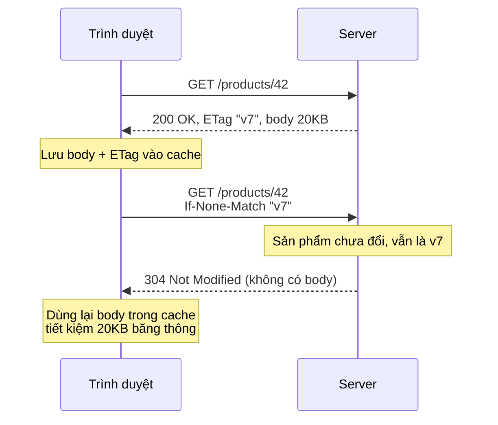
```mermaid
sequenceDiagram
    participant C as Trình duyệt
    participant S as Server
    C->>S: GET /products/42
    S-->>C: 200 OK, ETag "v7", body 20KB
    Note over C: Lưu body + ETag vào cache
    C->>S: GET /products/42<br/>If-None-Match "v7"
    Note over S: Sản phẩm chưa đổi, vẫn là v7
    S-->>C: 304 Not Modified (không có body)
    Note over C: Dùng lại body trong cache<br/>tiết kiệm 20KB băng thông
```

### Cookies - "Vé gửi xe"

HTTP không trạng thái, vậy làm sao website "nhớ" bạn đã đăng nhập? **Cookie** giống **vé gửi xe**: lần đầu vào, bảo vệ đưa bạn một vé (server gửi `Set-Cookie`); mỗi lần ra vào sau đó bạn chìa vé (trình duyệt **tự động** gửi `Cookie`).

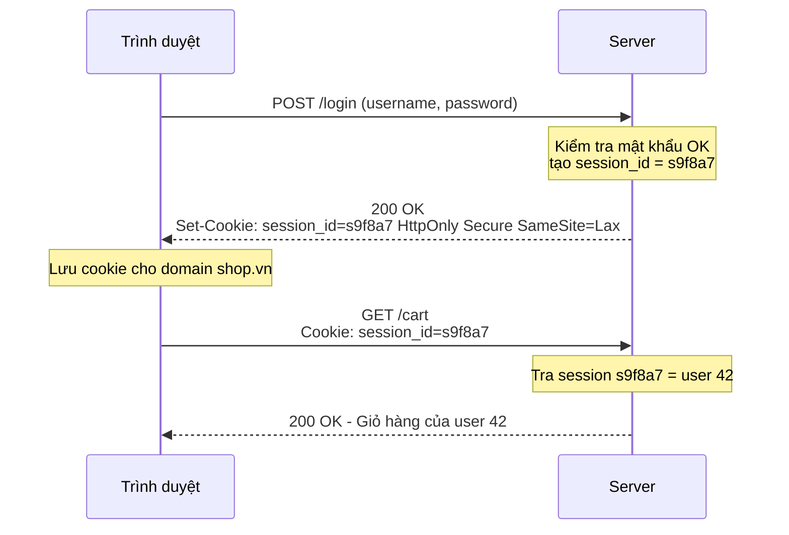
```mermaid
sequenceDiagram
    participant B as Trình duyệt
    participant S as Server
    B->>S: POST /login (username, password)
    Note over S: Kiểm tra mật khẩu OK<br/>tạo session_id = s9f8a7
    S-->>B: 200 OK<br/>Set-Cookie: session_id=s9f8a7 HttpOnly Secure SameSite=Lax
    Note over B: Lưu cookie cho domain shop.vn
    B->>S: GET /cart<br/>Cookie: session_id=s9f8a7
    Note over S: Tra session s9f8a7 = user 42
    S-->>B: 200 OK - Giỏ hàng của user 42
```

Các thuộc tính cookie cần nhớ (chi tiết ở Bài 4):

| Thuộc tính | Ý nghĩa |
|---|---|
| `HttpOnly` | JavaScript **không đọc được** → chống đánh cắp qua XSS |
| `Secure` | Chỉ gửi qua **HTTPS** |
| `SameSite=Lax/Strict/None` | Có gửi cookie khi request đến từ **website khác** không → chống CSRF |
| `Max-Age` / `Expires` | Thời hạn; không có = cookie phiên (đóng trình duyệt là mất) |
| `Domain`, `Path` | Phạm vi cookie được gửi |

### 💡 Tips quan trọng về HTTP

- `Content-Length` là số **byte**, không phải số ký tự. `"Đà Nẵng"` có 7 ký tự nhưng **11 byte** UTF-8. Tính sai = client đọc thiếu/treo
- Header **không phân biệt hoa thường** (`content-type` = `Content-Type`). HTTP/2 bắt buộc viết thường
- Đừng nhét dữ liệu nhạy cảm vào URL/query string (`?password=...`) - URL bị ghi vào log của proxy, trình duyệt, server

---

## 📖 6. Tự tay "nói chuyện" HTTP - curl, nc và server TCP thuần

Cách tốt nhất để thấy HTTP **chỉ là text** là tự viết server **không dùng thư viện HTTP**, chỉ dùng socket TCP.

### Server HTTP bằng TCP thuần

=== "Go"

    ```go
    package main

    import (
    	"bufio"
    	"fmt"
    	"log"
    	"net"
    	"strings"
    )

    func main() {
    	// 1. Mở một "cửa" TCP ở cổng 8080 trên mọi địa chỉ IP của máy
    	ln, err := net.Listen("tcp", ":8080")
    	if err != nil {
    		log.Fatal(err) // vd: "address already in use"
    	}
    	log.Println("Đang nghe tại :8080 ...")

    	for {
    		// 2. Chờ một client kết nối (3-way handshake đã xong khi Accept trả về)
    		conn, err := ln.Accept()
    		if err != nil {
    			log.Println("accept:", err)
    			continue
    		}
    		go handle(conn) // mỗi kết nối một goroutine
    	}
    }

    func handle(conn net.Conn) {
    	defer conn.Close()
    	r := bufio.NewReader(conn)

    	// 3. Dòng đầu tiên: "GET /hello HTTP/1.1"
    	requestLine, err := r.ReadString('\n')
    	if err != nil {
    		return
    	}
    	parts := strings.Fields(requestLine)
    	if len(parts) != 3 {
    		fmt.Fprint(conn, "HTTP/1.1 400 Bad Request\r\nContent-Length: 0\r\n\r\n")
    		return
    	}
    	method, path := parts[0], parts[1]

    	// 4. Đọc các header cho tới dòng trống "\r\n"
    	headers := map[string]string{}
    	for {
    		line, err := r.ReadString('\n')
    		if err != nil {
    			return
    		}
    		line = strings.TrimRight(line, "\r\n")
    		if line == "" {
    			break // hết phần header
    		}
    		if k, v, ok := strings.Cut(line, ":"); ok {
    			headers[strings.ToLower(strings.TrimSpace(k))] = strings.TrimSpace(v)
    		}
    	}
    	log.Printf("%s %s (Host=%s, User-Agent=%s)", method, path, headers["host"], headers["user-agent"])

    	// 5. Tự "viết tay" một HTTP response
    	status, body := "200 OK", "Xin chào từ server TCP thuần!\n"
    	if path != "/" && path != "/hello" {
    		status, body = "404 Not Found", "Không tìm thấy\n"
    	}
    	fmt.Fprintf(conn, "HTTP/1.1 %s\r\n", status)
    	fmt.Fprint(conn, "Content-Type: text/plain; charset=utf-8\r\n")
    	fmt.Fprintf(conn, "Content-Length: %d\r\n", len(body)) // số BYTE, không phải số ký tự!
    	fmt.Fprint(conn, "Connection: close\r\n")
    	fmt.Fprint(conn, "\r\n") // dòng trống ngăn cách header và body
    	fmt.Fprint(conn, body)
    }
    ```

=== "Python"

    ```python
    import socket
    import threading


    def handle(conn: socket.socket, addr) -> None:
        with conn:
            f = conn.makefile("rb")  # đọc theo dòng cho tiện
            request_line = f.readline().decode("latin-1").strip()  # "GET /hello HTTP/1.1"
            parts = request_line.split()
            if len(parts) != 3:
                conn.sendall(b"HTTP/1.1 400 Bad Request\r\nContent-Length: 0\r\n\r\n")
                return
            method, path, _version = parts

            headers = {}
            while True:  # đọc header tới dòng trống
                line = f.readline().decode("latin-1").rstrip("\r\n")
                if not line:
                    break
                key, _, value = line.partition(":")
                headers[key.strip().lower()] = value.strip()
            print(f"{method} {path} (Host={headers.get('host')}, User-Agent={headers.get('user-agent')})")

            status, body = "200 OK", "Xin chào từ server TCP thuần!\n"
            if path not in ("/", "/hello"):
                status, body = "404 Not Found", "Không tìm thấy\n"
            body_bytes = body.encode("utf-8")
            head = (
                f"HTTP/1.1 {status}\r\n"
                "Content-Type: text/plain; charset=utf-8\r\n"
                f"Content-Length: {len(body_bytes)}\r\n"  # số BYTE sau khi encode!
                "Connection: close\r\n"
                "\r\n"
            )
            conn.sendall(head.encode("latin-1") + body_bytes)


    def main() -> None:
        srv = socket.socket(socket.AF_INET, socket.SOCK_STREAM)  # SOCK_STREAM = TCP
        srv.setsockopt(socket.SOL_SOCKET, socket.SO_REUSEADDR, 1)  # tránh lỗi "Address already in use" khi restart
        srv.bind(("0.0.0.0", 8080))
        srv.listen(128)  # hàng đợi kết nối đã bắt tay xong nhưng chưa accept
        print("Đang nghe tại :8080 ...")
        while True:
            conn, addr = srv.accept()
            threading.Thread(target=handle, args=(conn, addr), daemon=True).start()


    if __name__ == "__main__":
        main()
    ```

Chạy server (`go run .` hoặc `python3 rawserver.py`), mở terminal thứ hai và dùng **`curl -v`** (verbose) để xem **toàn bộ** cuộc hội thoại:

```bash
curl -sv http://localhost:8080/hello
```

Output thật:

```text
* Host localhost:8080 was resolved.
* IPv6: ::1
* IPv4: 127.0.0.1
*   Trying 127.0.0.1:8080...
* Connected to localhost (127.0.0.1) port 8080
> GET /hello HTTP/1.1
> Host: localhost:8080
> User-Agent: curl/8.5.0
> Accept: */*
>
< HTTP/1.1 200 OK
< Content-Type: text/plain; charset=utf-8
< Content-Length: 35
< Connection: close
<
{ [35 bytes data]
* Closing connection
Xin chào từ server TCP thuần!
```

Cách đọc: dòng `*` là thông tin của curl (DNS, TCP), `>` là **request gửi đi**, `<` là **response nhận về**. Để ý body "Xin chào từ server TCP thuần!\n" có 30 ký tự nhưng **35 byte**.

Giờ thử "gõ tay" HTTP bằng **`nc`** (netcat - "con dao Thụy Sĩ" của TCP):

```bash
printf 'GET /xyz HTTP/1.1\r\nHost: localhost\r\n\r\n' | nc -q 2 localhost 8080
```

```text
HTTP/1.1 404 Not Found
Content-Type: text/plain; charset=utf-8
Content-Length: 19
Connection: close

Không tìm thấy
```

Log phía server (bản Go):

```text
2026/09/26 15:49:02 Đang nghe tại :8080 ...
2026/09/26 15:49:03 GET /hello (Host=localhost:8080, User-Agent=curl/8.5.0)
2026/09/26 15:49:03 GET /xyz (Host=localhost, User-Agent=)
```

> 💡 Server này **thiếu rất nhiều thứ**: không đọc body, không hỗ trợ keep-alive, chunked encoding, timeout, giới hạn kích thước header... Đó là lý do trong thực tế ta dùng `net/http` (Go) hay uvicorn/gunicorn (Python) - chúng đã xử lý hàng trăm trường hợp biên và lỗ hổng bảo mật. Mục đích của ví dụ là để bạn **hiểu cái bên dưới**.

### Client HTTP bằng TCP thuần

Chiều ngược lại: tự viết request thành text, gửi qua TCP rồi đọc response. Chương trình tự dựng server giả nên chạy được ngay.

=== "Go"

    ```go
    package main

    import (
    	"bufio"
    	"fmt"
    	"io"
    	"net"
    	"net/http"
    	"net/http/httptest"
    	"strings"
    )

    func main() {
    	// Server giả để thử nghiệm (chạy trên 127.0.0.1:<cổng ngẫu nhiên>)
    	srv := httptest.NewServer(http.HandlerFunc(func(w http.ResponseWriter, r *http.Request) {
    		w.Header().Set("Content-Type", "application/json")
    		fmt.Fprintf(w, `{"path":%q,"method":%q}`, r.URL.Path, r.Method)
    	}))
    	defer srv.Close()
    	addr := strings.TrimPrefix(srv.URL, "http://")

    	// 1. Mở kết nối TCP "trần"
    	conn, err := net.Dial("tcp", addr)
    	if err != nil {
    		panic(err)
    	}
    	defer conn.Close()

    	// 2. Tự tay viết HTTP request - chỉ là TEXT theo đúng định dạng
    	req := "GET /api/users/42 HTTP/1.1\r\n" +
    		"Host: " + addr + "\r\n" +
    		"Accept: application/json\r\n" +
    		"Connection: close\r\n" +
    		"\r\n"
    	conn.Write([]byte(req))

    	// 3. Đọc response: status line + headers + body
    	r := bufio.NewReader(conn)
    	for {
    		line, _ := r.ReadString('\n')
    		line = strings.TrimRight(line, "\r\n")
    		if strings.HasPrefix(line, "Date:") {
    			continue // bỏ Date vì mỗi lần chạy mỗi khác
    		}
    		if line == "" {
    			break // dòng trống = hết header
    		}
    		fmt.Println("[header]", line)
    	}
    	body, _ := io.ReadAll(r)
    	fmt.Println("[body]", string(body))
    }

    // Output:
    // [header] HTTP/1.1 200 OK
    // [header] Content-Type: application/json
    // [header] Content-Length: 39
    // [header] Connection: close
    // [body] {"path":"/api/users/42","method":"GET"}
    ```

=== "Python"

    ```python
    import json
    import socket
    import threading
    from http.server import BaseHTTPRequestHandler, HTTPServer


    class Handler(BaseHTTPRequestHandler):
        protocol_version = "HTTP/1.1"  # mặc định là HTTP/1.0!

        def do_GET(self):
            body = json.dumps({"path": self.path, "method": self.command}, separators=(",", ":")).encode()
            self.send_response(200)
            self.send_header("Content-Type", "application/json")
            self.send_header("Content-Length", str(len(body)))
            self.end_headers()
            self.wfile.write(body)

        def log_message(self, *args):  # tắt log mặc định cho gọn
            pass


    # Server giả chạy nền ở cổng ngẫu nhiên (port 0 = để OS tự chọn)
    srv = HTTPServer(("127.0.0.1", 0), Handler)
    threading.Thread(target=srv.serve_forever, daemon=True).start()
    host, port = srv.server_address

    # 1. Mở kết nối TCP "trần"
    with socket.create_connection((host, port)) as conn:
        # 2. Tự tay viết HTTP request
        req = (
            "GET /api/users/42 HTTP/1.1\r\n"
            f"Host: {host}:{port}\r\n"
            "Accept: application/json\r\n"
            "Connection: close\r\n"
            "\r\n"
        )
        conn.sendall(req.encode())

        # 3. Đọc tới khi server đóng kết nối
        raw = b""
        while chunk := conn.recv(4096):
            raw += chunk

    head, _, body = raw.partition(b"\r\n\r\n")
    for line in head.decode().split("\r\n"):
        if not line.startswith(("Date:", "Server:")):  # bỏ header thay đổi theo máy/thời gian
            print("[header]", line)
    print("[body]", body.decode())
    srv.shutdown()

    # Output:
    # [header] HTTP/1.1 200 OK
    # [header] Content-Type: application/json
    # [header] Content-Length: 39
    # [body] {"path":"/api/users/42","method":"GET"}
    ```

### Các "chiêu" curl hằng ngày của backend dev

```bash
curl -i  https://api.example.com/users/1            # in cả header response
curl -I  https://api.example.com/                    # chỉ HEAD, xem header
curl -sv https://api.example.com/ -o /dev/null       # xem handshake TLS + header, bỏ body
curl -X POST https://api.example.com/orders \
     -H 'Content-Type: application/json' \
     -H 'Authorization: Bearer TOKEN' \
     -d '{"product_id":42,"quantity":2}'             # gửi JSON
curl -L http://example.com                           # đi theo redirect 3xx
curl --resolve api.example.com:443:10.0.0.5 https://api.example.com/health
                                                     # "ép" tên miền trỏ về IP cụ thể (test server mới trước khi đổi DNS)
curl -w '%{http_code} %{time_total}s\n' -o /dev/null -s https://api.example.com/
                                                     # chỉ in status + thời gian
```

---

## 📖 7. HTTP/1.1 → HTTP/2 → HTTP/3

### HTTP/1.0 và HTTP/1.1

- **HTTP/1.0** (1996): mỗi request **mở một kết nối TCP mới** rồi đóng → rất tốn (bắt tay mỗi lần)
- **HTTP/1.1** (1997): thêm **keep-alive** (tái sử dụng kết nối), header `Host` bắt buộc, **chunked transfer encoding** (gửi body từng khúc khi chưa biết trước độ dài)

Bạn có thể thấy keep-alive bằng curl - gọi 2 URL trong một lệnh:

```bash
curl -sv --http1.1 https://localhost:8443/a https://localhost:8443/b 2>&1 | grep -E "Re-using|Connected|^> GET"
```

```text
* Connected to localhost (127.0.0.1) port 8443
> GET /a HTTP/1.1
* Re-using existing connection with host localhost
> GET /b HTTP/1.1
```

Nhưng HTTP/1.1 có một vấn đề lớn: **Head-of-Line (HOL) blocking**. Trên một kết nối, request phải **xếp hàng**: request sau chờ response trước xong. Trình duyệt "lách" bằng cách mở **6 kết nối song song** mỗi domain - vẫn chậm với trang cần 100+ file.

> 💡 **Ví von**: HTTP/1.1 giống quầy thu ngân siêu thị **một hàng**: người trước mua 50 món thì người sau cầm 1 chai nước cũng phải chờ. Mở 6 quầy thì đỡ hơn nhưng vẫn giới hạn.

### HTTP/2 (2015)

- **Binary framing**: không còn là text, mà chia thành các **frame** nhị phân
- **Multiplexing**: nhiều request/response (**stream**) chạy **đan xen** trên **một** kết nối TCP → hết HOL blocking ở tầng HTTP
- **HPACK**: nén header (header lặp lại như `Cookie`, `User-Agent` chỉ gửi một lần)
- Hầu như luôn đi kèm **TLS**; thương lượng qua **ALPN** trong lúc bắt tay TLS

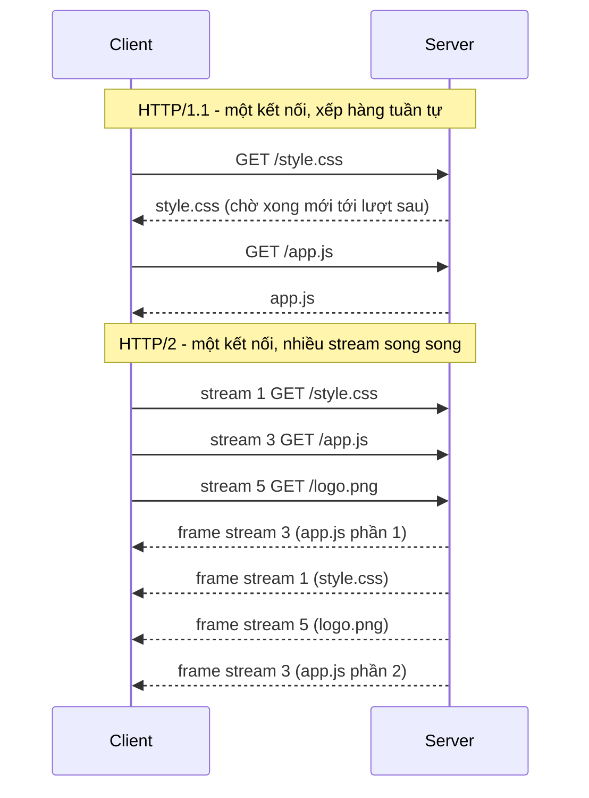
```mermaid
sequenceDiagram
    participant C as Client
    participant S as Server
    Note over C,S: HTTP/1.1 - một kết nối, xếp hàng tuần tự
    C->>S: GET /style.css
    S-->>C: style.css (chờ xong mới tới lượt sau)
    C->>S: GET /app.js
    S-->>C: app.js
    Note over C,S: HTTP/2 - một kết nối, nhiều stream song song
    C->>S: stream 1 GET /style.css
    C->>S: stream 3 GET /app.js
    C->>S: stream 5 GET /logo.png
    S-->>C: frame stream 3 (app.js phần 1)
    S-->>C: frame stream 1 (style.css)
    S-->>C: frame stream 5 (logo.png)
    S-->>C: frame stream 3 (app.js phần 2)
```

Nhưng HTTP/2 vẫn chạy trên **TCP**. Nếu **một gói TCP bị mất**, TCP bắt **mọi stream chờ** gói đó được gửi lại (HOL blocking ở **tầng TCP**). Trên mạng 4G chập chờn, điều này đáng kể.

### HTTP/3 (2022) - chạy trên QUIC (UDP)

**QUIC** là giao thức vận chuyển mới chạy trên **UDP**, tự cài đặt tính tin cậy **cho từng stream riêng**:

- Mất gói của stream A **không chặn** stream B
- **Gộp bắt tay transport + TLS 1.3** → kết nối mới chỉ tốn **1 RTT**, kết nối lại có thể **0-RTT**
- **Connection migration**: đổi từ WiFi sang 4G (IP thay đổi) vẫn giữ kết nối, vì kết nối được định danh bằng **Connection ID** chứ không phải 5-tuple
- TLS là **bắt buộc**

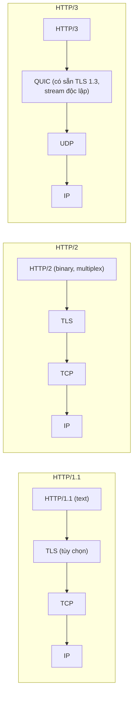
```mermaid
flowchart LR
    subgraph H1["HTTP/1.1"]
        direction TB
        a1["HTTP/1.1 (text)"] --> a2["TLS (tùy chọn)"] --> a3["TCP"] --> a4["IP"]
    end
    subgraph H2["HTTP/2"]
        direction TB
        b1["HTTP/2 (binary, multiplex)"] --> b2["TLS"] --> b3["TCP"] --> b4["IP"]
    end
    subgraph H3["HTTP/3"]
        direction TB
        c1["HTTP/3"] --> c2["QUIC (có sẵn TLS 1.3,<br/>stream độc lập)"] --> c3["UDP"] --> c4["IP"]
    end
```

| | HTTP/1.1 | HTTP/2 | HTTP/3 |
|---|---|---|---|
| Định dạng | Text | Binary frame | Binary frame |
| Transport | TCP | TCP | QUIC (UDP) |
| Nhiều request / kết nối | Tuần tự (keep-alive) | Multiplexing | Multiplexing, stream độc lập |
| HOL blocking | Tầng HTTP + TCP | Chỉ tầng TCP | Không |
| Bắt tay (kết nối mới, có TLS 1.3) | TCP 1 RTT + TLS 1 RTT | TCP 1 RTT + TLS 1 RTT | 1 RTT (0-RTT khi kết nối lại) |
| Nén header | Không | HPACK | QPACK |

> 💡 **Là backend dev, bạn có cần viết code khác không?** Hầu như **không**. Ứng dụng của bạn vẫn nhận request có method, path, header, body như cũ. Thường thì **reverse proxy/CDN** (Nginx, Cloudflare, AWS ALB) nói HTTP/2, HTTP/3 với trình duyệt, rồi gọi vào app của bạn bằng HTTP/1.1 trong mạng nội bộ. Go `net/http` tự hỗ trợ HTTP/2 khi dùng TLS.

---

## 📖 8. TLS/HTTPS - Phong bì niêm phong

HTTP thuần gửi mọi thứ dưới dạng **văn bản rõ**. Bất kỳ ai ở giữa (WiFi quán cà phê, nhà mạng, router bị hack) đều **đọc và sửa** được - kể cả mật khẩu và số thẻ. **TLS** (Transport Layer Security) giải quyết 3 vấn đề:

| Mục tiêu | Nghĩa | Ví von |
|---|---|---|
| **Bảo mật** (confidentiality) | Người ở giữa không đọc được | Thư viết bằng mật mã |
| **Toàn vẹn** (integrity) | Không sửa được mà không bị phát hiện | Niêm phong sáp, rách là biết |
| **Xác thực** (authentication) | Chắc chắn đang nói chuyện với đúng server | Con dấu của cơ quan có thẩm quyền |

### Hai loại mã hóa

- **Mã hóa đối xứng** (AES, ChaCha20): cùng **một khóa** để khóa và mở. **Rất nhanh**, nhưng làm sao gửi khóa cho nhau an toàn?
- **Mã hóa bất đối xứng** (RSA, ECDSA, trao đổi khóa ECDHE): cặp **public key / private key**. Chậm hơn nhiều, nhưng giải quyết được bài toán trao đổi khóa

TLS kết hợp cả hai: dùng bất đối xứng **trong lúc bắt tay** để thỏa thuận ra một **khóa phiên (session key)** chung, rồi dùng **đối xứng** cho toàn bộ dữ liệu sau đó.

### Chứng chỉ (certificate) và chuỗi tin cậy

Làm sao trình duyệt biết public key đúng là của `vietcombank.com.vn` mà không phải của kẻ giả mạo? Nhờ **chứng chỉ** được một **CA** (Certificate Authority - tổ chức cấp chứng chỉ, như Let's Encrypt, DigiCert) **ký xác nhận**.

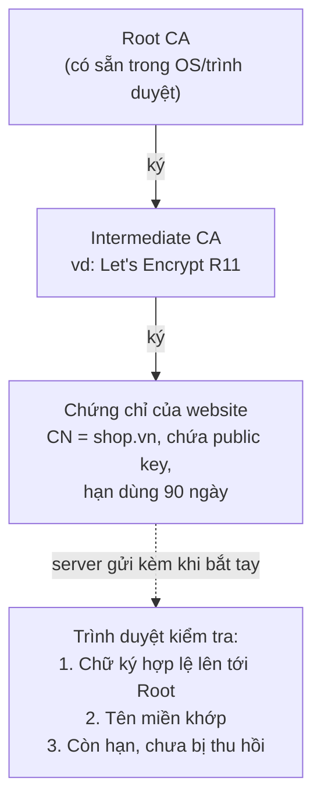
```mermaid
flowchart TD
    Root["Root CA<br/>(có sẵn trong OS/trình duyệt)"] -->|ký| Inter["Intermediate CA<br/>vd: Let's Encrypt R11"]
    Inter -->|ký| Leaf["Chứng chỉ của website<br/>CN = shop.vn, chứa public key,<br/>hạn dùng 90 ngày"]
    Leaf -.->|server gửi kèm khi bắt tay| Browser["Trình duyệt kiểm tra:<br/>1. Chữ ký hợp lệ lên tới Root<br/>2. Tên miền khớp<br/>3. Còn hạn, chưa bị thu hồi"]
```

### Bắt tay TLS 1.3 (đơn giản hóa)

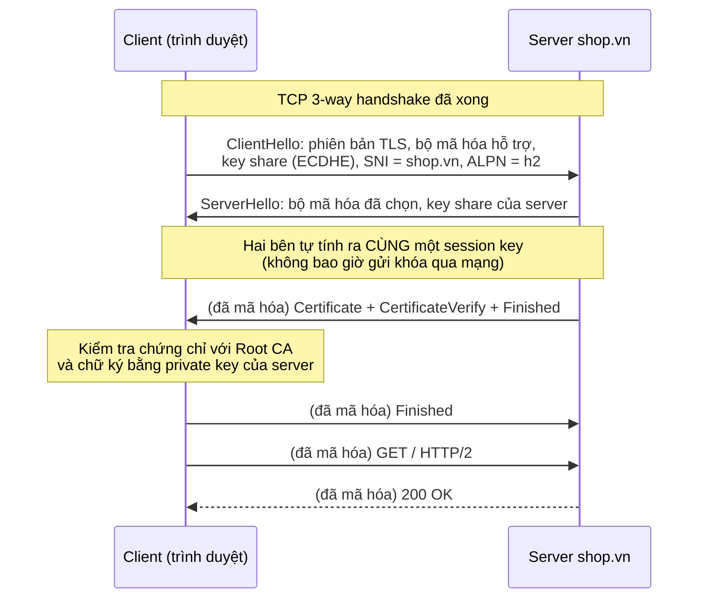
```mermaid
sequenceDiagram
    participant C as Client (trình duyệt)
    participant S as Server shop.vn
    Note over C,S: TCP 3-way handshake đã xong
    C->>S: ClientHello: phiên bản TLS, bộ mã hóa hỗ trợ,<br/>key share (ECDHE), SNI = shop.vn, ALPN = h2
    S->>C: ServerHello: bộ mã hóa đã chọn, key share của server
    Note over C,S: Hai bên tự tính ra CÙNG một session key<br/>(không bao giờ gửi khóa qua mạng)
    S->>C: (đã mã hóa) Certificate + CertificateVerify + Finished
    Note over C: Kiểm tra chứng chỉ với Root CA<br/>và chữ ký bằng private key của server
    C->>S: (đã mã hóa) Finished
    C->>S: (đã mã hóa) GET / HTTP/2
    S-->>C: (đã mã hóa) 200 OK
```

- TLS 1.3 chỉ tốn **1 RTT** (TLS 1.2 tốn 2 RTT)
- **SNI** (Server Name Indication): client nói tên miền ngay trong ClientHello để một IP có thể phục vụ nhiều chứng chỉ
- **ALPN**: thương lượng HTTP/2 hay HTTP/1.1 ngay trong bắt tay

### Thực hành: dựng HTTPS server với chứng chỉ tự ký

Tạo chứng chỉ tự ký (self-signed) cho `localhost` bằng `openssl`:

```bash
openssl req -x509 -newkey ec -pkeyopt ec_paramgen_curve:prime256v1 -nodes -days 30 \
  -keyout key.pem -out cert.pem -subj "/CN=localhost" \
  -addext "subjectAltName=DNS:localhost,IP:127.0.0.1"
```

=== "Go"

    ```go
    package main

    import (
    	"fmt"
    	"log"
    	"net/http"
    )

    func main() {
    	http.HandleFunc("GET /", func(w http.ResponseWriter, r *http.Request) {
    		// r.TLS chứa thông tin phiên TLS đã bắt tay; 0x304 = TLS 1.3
    		fmt.Fprintf(w, "proto=%s tls=%x\n", r.Proto, r.TLS.Version)
    	})
    	log.Println("HTTPS tại https://localhost:8443")
    	// Go tự bật HTTP/2 khi chạy TLS
    	log.Fatal(http.ListenAndServeTLS(":8443", "cert.pem", "key.pem", nil))
    }
    ```

=== "Python"

    ```python
    import ssl
    from http.server import BaseHTTPRequestHandler, HTTPServer


    class Handler(BaseHTTPRequestHandler):
        def do_GET(self):
            tls_version = self.connection.version()  # vd "TLSv1.3"
            body = f"proto={self.request_version} tls={tls_version}\n".encode()
            self.send_response(200)
            self.send_header("Content-Type", "text/plain; charset=utf-8")
            self.send_header("Content-Length", str(len(body)))
            self.end_headers()
            self.wfile.write(body)


    ctx = ssl.SSLContext(ssl.PROTOCOL_TLS_SERVER)
    ctx.minimum_version = ssl.TLSVersion.TLSv1_2  # từ chối TLS 1.0/1.1 cũ
    ctx.load_cert_chain("cert.pem", "key.pem")

    httpd = HTTPServer(("0.0.0.0", 8443), Handler)
    httpd.socket = ctx.wrap_socket(httpd.socket, server_side=True)
    print("HTTPS tại https://localhost:8443")
    httpd.serve_forever()
    ```

Gọi thử (bản Go), `--cacert` bảo curl tin chứng chỉ tự ký của ta:

```bash
curl -sv --cacert cert.pem https://localhost:8443/
```

Output thật (đã lược bớt các dòng `[n bytes data]`):

```text
*   Trying 127.0.0.1:8443...
* Connected to localhost (127.0.0.1) port 8443
* ALPN: curl offers h2,http/1.1
* TLSv1.3 (OUT), TLS handshake, Client hello (1):
* TLSv1.3 (IN), TLS handshake, Server hello (2):
* TLSv1.3 (IN), TLS handshake, Encrypted Extensions (8):
* TLSv1.3 (IN), TLS handshake, Certificate (11):
* TLSv1.3 (IN), TLS handshake, CERT verify (15):
* TLSv1.3 (IN), TLS handshake, Finished (20):
* TLSv1.3 (OUT), TLS change cipher, Change cipher spec (1):
* TLSv1.3 (OUT), TLS handshake, Finished (20):
* SSL connection using TLSv1.3 / TLS_AES_128_GCM_SHA256 / X25519 / id-ecPublicKey
* ALPN: server accepted h2
* Server certificate:
*  subject: CN=localhost
*  start date: Sep 26 15:50:20 2026 GMT
*  expire date: Oct 26 15:50:20 2026 GMT
*  subjectAltName: host "localhost" matched cert's "localhost"
*  issuer: CN=localhost
*  SSL certificate verify ok.
* using HTTP/2
> GET / HTTP/2
> Host: localhost:8443
> User-Agent: curl/8.5.0
> Accept: */*
>
< HTTP/2 200
< content-type: text/plain; charset=utf-8
< content-length: 23
< date: Sat, 26 Sep 2026 15:50:22 GMT
<
proto=HTTP/2.0 tls=304
```

Bạn thấy **đúng từng bước** của sơ đồ: Client hello → Server hello → Certificate → CERT verify → Finished; bộ mã hóa `TLS_AES_128_GCM_SHA256` (AES đối xứng), trao đổi khóa `X25519` (ECDHE); ALPN chọn `h2`; header HTTP/2 viết thường.

Thử các trường hợp khác:

```bash
curl -s --http1.1 --cacert cert.pem https://localhost:8443/   # proto=HTTP/1.1 tls=304
curl -s -k https://localhost:8443/                            # -k: BỎ QUA kiểm tra chứng chỉ (chỉ dùng khi dev!)
curl -s https://localhost:8443/; echo "exit=$?"               # exit=60: curl không tin chứng chỉ tự ký
```

Với bản Python, `--tlsv1.2 --tls-max 1.2` cho kết quả `proto=HTTP/1.1 tls=TLSv1.2` (Python `http.server` không hỗ trợ HTTP/2).

> ⚠️ **Không bao giờ tắt kiểm tra chứng chỉ trên production** (`InsecureSkipVerify: true` trong Go, `verify=False` trong Python requests). Làm vậy là **mở cửa cho tấn công man-in-the-middle**. Nếu gọi service nội bộ có CA riêng, hãy **nạp CA đó** vào client thay vì tắt kiểm tra.

> 💡 Trên production, chứng chỉ thường được cấp **miễn phí, tự động gia hạn** bởi **Let's Encrypt** (qua certbot, Caddy, cert-manager trên Kubernetes) hoặc do load balancer của cloud quản lý. **Chứng chỉ hết hạn** là một trong những nguyên nhân sập hệ thống phổ biến nhất - hãy đặt cảnh báo trước 14-30 ngày.

---

## 📖 9. Điều gì xảy ra khi gõ `https://shop.vn/products/42` rồi Enter?

Đây là câu hỏi phỏng vấn **kinh điển** vì nó kiểm tra toàn bộ kiến thức bạn vừa học. Hãy ghép lại:

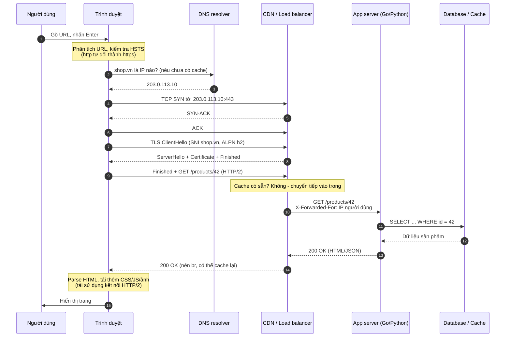
```mermaid
sequenceDiagram
    autonumber
    participant U as Người dùng
    participant B as Trình duyệt
    participant D as DNS resolver
    participant CDN as CDN / Load balancer
    participant App as App server (Go/Python)
    participant DB as Database / Cache
    U->>B: Gõ URL, nhấn Enter
    Note over B: Phân tích URL, kiểm tra HSTS<br/>(http tự đổi thành https)
    B->>D: shop.vn là IP nào? (nếu chưa có cache)
    D-->>B: 203.0.113.10
    B->>CDN: TCP SYN tới 203.0.113.10:443
    CDN-->>B: SYN-ACK
    B->>CDN: ACK
    B->>CDN: TLS ClientHello (SNI shop.vn, ALPN h2)
    CDN-->>B: ServerHello + Certificate + Finished
    B->>CDN: Finished + GET /products/42 (HTTP/2)
    Note over CDN: Cache có sẵn? Không - chuyển tiếp vào trong
    CDN->>App: GET /products/42<br/>X-Forwarded-For: IP người dùng
    App->>DB: SELECT ... WHERE id = 42
    DB-->>App: Dữ liệu sản phẩm
    App-->>CDN: 200 OK (HTML/JSON)
    CDN-->>B: 200 OK (nén br, có thể cache lại)
    Note over B: Parse HTML, tải thêm CSS/JS/ảnh<br/>(tái sử dụng kết nối HTTP/2)
    B->>U: Hiển thị trang
```

Diễn giải từng chặng:

1. **Phân tích URL**: trình duyệt tách scheme/host/path. Nếu gõ `shop.vn` không có scheme, nó thử `https://` (hoặc `http://` rồi bị redirect). Danh sách **HSTS** buộc dùng HTTPS
2. **DNS**: kiểm tra cache trình duyệt → cache OS → `/etc/hosts` → recursive resolver (mục 4)
3. **TCP**: bắt tay 3 bước với IP vừa tìm được, port 443 (mục 3)
4. **TLS**: thỏa thuận mã hóa, kiểm tra chứng chỉ, chọn HTTP/2 qua ALPN (mục 8)
5. **Gửi HTTP request**: method, path, header (cookie, user-agent, accept-encoding...)
6. **Qua CDN/Load balancer/Reverse proxy**: có thể trả luôn từ cache, hoặc chuyển vào một trong nhiều app server (mục 10)
7. **App server xử lý**: routing → middleware (log, xác thực) → handler → gọi DB/cache/service khác → tạo response
8. **Response đi ngược lại**, có thể được nén và cache ở CDN
9. **Trình duyệt render**: parse HTML, gặp `<link>`, `<script>`, `` thì tải tiếp (nhiều request nữa!), chạy JavaScript, vẽ lên màn hình

### Đo thời gian từng chặng bằng curl

`curl -w` cho biết thời gian **cộng dồn** tại mỗi mốc:

```bash
curl -s -o /dev/null --cacert cert.pem \
  -w "dns=%{time_namelookup}s tcp=%{time_connect}s tls=%{time_appconnect}s ttfb=%{time_starttransfer}s total=%{time_total}s http=%{http_version}\n" \
  https://localhost:8443/
```

```text
dns=0.000029s tcp=0.000408s tls=0.004897s ttfb=0.005795s total=0.005837s http=2
```

Trên localhost mọi thứ tính bằng micro giây. Với server thật ở xa, bạn sẽ thấy kiểu như `dns=0.020 tcp=0.060 tls=0.120 ttfb=0.450 total=0.470` - từ đó biết ngay **chậm ở đâu**:

| Chặng chậm | Nguyên nhân thường gặp |
|---|---|
| `dns` cao | Resolver chậm, TTL quá thấp nên không cache được |
| `tcp - dns` cao | Server ở xa (RTT lớn), mạng nghẽn, SYN bị drop |
| `tls - tcp` cao | Chuỗi chứng chỉ dài, không có session resumption, CPU server yếu |
| `ttfb - tls` cao | **Code backend chậm**: query DB chậm, gọi API bên thứ ba chậm - thường là thủ phạm! |
| `total - ttfb` cao | Response quá lớn, không nén, băng thông thấp |

---

## 📖 10. Proxy, Reverse Proxy, Load Balancer và CDN

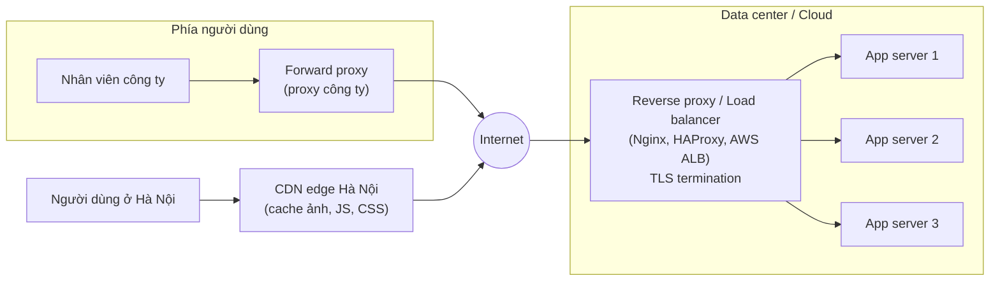
```mermaid
flowchart LR
    subgraph Client_side["Phía người dùng"]
        U1["Nhân viên công ty"] --> FP["Forward proxy<br/>(proxy công ty)"]
    end
    FP --> Internet(("Internet"))
    U2["Người dùng ở Hà Nội"] --> CDN["CDN edge Hà Nội<br/>(cache ảnh, JS, CSS)"]
    CDN --> Internet
    Internet --> RP["Reverse proxy / Load balancer<br/>(Nginx, HAProxy, AWS ALB)<br/>TLS termination"]
    subgraph Server_side["Data center / Cloud"]
        RP --> A1["App server 1"]
        RP --> A2["App server 2"]
        RP --> A3["App server 3"]
    end
```

| Thành phần | Đứng ở đâu | Làm gì | Ví dụ |
|---|---|---|---|
| **Forward proxy** | Cạnh **client** | Đại diện client đi ra Internet: lọc web, ẩn IP, cache | Proxy công ty, VPN |
| **Reverse proxy** | Cạnh **server** | Đại diện server nhận request: TLS termination, nén, cache, định tuyến theo path, rate limit | Nginx, Caddy, Envoy, Traefik |
| **Load balancer** | Cạnh server | Chia tải cho nhiều instance, loại instance chết (health check) | HAProxy, AWS ALB/NLB, GCP LB |
| **API Gateway** | Cạnh server | Reverse proxy + xác thực, rate limit, quản lý API key, gom nhiều service | Kong, AWS API Gateway |
| **CDN** | **Gần người dùng** (hàng trăm điểm trên thế giới) | Cache nội dung tĩnh (và cả động) ở "edge" gần người dùng, chống DDoS | Cloudflare, CloudFront, Akamai, BizFly CDN |

> 💡 **Ví von**: **Forward proxy** giống **người đi chợ hộ** bạn - người bán chỉ thấy người đi chợ. **Reverse proxy** giống **lễ tân khách sạn** - khách chỉ nói chuyện với lễ tân, không biết phòng bếp hay buồng phòng nào đang phục vụ. **CDN** giống **chuỗi cửa hàng tiện lợi**: hàng hot có sẵn ở cửa hàng gần nhà, không cần chạy lên tổng kho.

### Reverse proxy với Nginx - cấu hình tối thiểu

```nginx
upstream app {
    server 10.0.1.11:8080;     # app server 1
    server 10.0.1.12:8080;     # app server 2
    keepalive 32;              # giữ kết nối tới app (tránh bắt tay lại)
}

server {
    listen 443 ssl http2;
    server_name api.shop.vn;
    ssl_certificate     /etc/letsencrypt/live/api.shop.vn/fullchain.pem;
    ssl_certificate_key /etc/letsencrypt/live/api.shop.vn/privkey.pem;

    location / {
        proxy_pass http://app;                       # vào trong bằng HTTP thường
        proxy_http_version 1.1;
        proxy_set_header Connection "";
        proxy_set_header Host $host;
        proxy_set_header X-Real-IP $remote_addr;
        proxy_set_header X-Forwarded-For $proxy_add_x_forwarded_for;
        proxy_set_header X-Forwarded-Proto $scheme;
        proxy_read_timeout 30s;                      # app chậm quá 30s → 504
    }
}
```

**TLS termination**: proxy giải mã TLS, phía sau đi HTTP thường trong mạng nội bộ → app không cần quản lý chứng chỉ.

### Lấy IP thật của người dùng sau proxy

Khi đi qua proxy, `RemoteAddr` ở app là **IP của proxy**. IP thật nằm trong `X-Forwarded-For: <client>, <proxy1>, <proxy2>`.

> ⚠️ `X-Forwarded-For` **do client gửi được**! Kẻ tấn công có thể tự đặt `X-Forwarded-For: 1.2.3.4` để lách rate limit theo IP. Chỉ tin header này khi request **đến từ proxy của bạn**, và lấy IP ở vị trí do proxy tin cậy của bạn thêm vào (thường là phần tử **cuối cùng** do proxy của bạn append).

### CDN cache hoạt động thế nào?

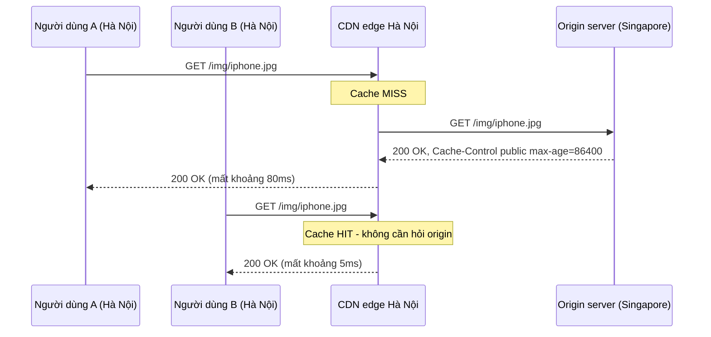
```mermaid
sequenceDiagram
    participant U1 as Người dùng A (Hà Nội)
    participant U2 as Người dùng B (Hà Nội)
    participant E as CDN edge Hà Nội
    participant O as Origin server (Singapore)
    U1->>E: GET /img/iphone.jpg
    Note over E: Cache MISS
    E->>O: GET /img/iphone.jpg
    O-->>E: 200 OK, Cache-Control public max-age=86400
    E-->>U1: 200 OK (mất khoảng 80ms)
    U2->>E: GET /img/iphone.jpg
    Note over E: Cache HIT - không cần hỏi origin
    E-->>U2: 200 OK (mất khoảng 5ms)
```

Backend điều khiển CDN bằng header `Cache-Control`:

- `Cache-Control: public, max-age=31536000, immutable` - file tĩnh có hash trong tên (`app.3f9a2c.js`), cache 1 năm
- `Cache-Control: public, max-age=60, stale-while-revalidate=30` - trang danh sách sản phẩm, chấp nhận cũ 1 phút
- `Cache-Control: private, no-store` - dữ liệu cá nhân (giỏ hàng, thông tin tài khoản) - **CDN tuyệt đối không cache**

> ⚠️ Sự cố kinh điển: cấu hình CDN cache nhầm API `/me` → người dùng B thấy **thông tin tài khoản của người dùng A**. Luôn đặt `private`/`no-store` cho response có dữ liệu cá nhân.

---

## 📖 11. Real-time: Polling, Long Polling, SSE và WebSocket

HTTP truyền thống: **client hỏi, server mới trả lời**. Nhưng nhiều tính năng cần **server chủ động báo** cho client: tin nhắn chat, vị trí tài xế Grab, trạng thái đơn hàng, giá coin, thông báo.

### 1) Short polling - "Hỏi liên tục"

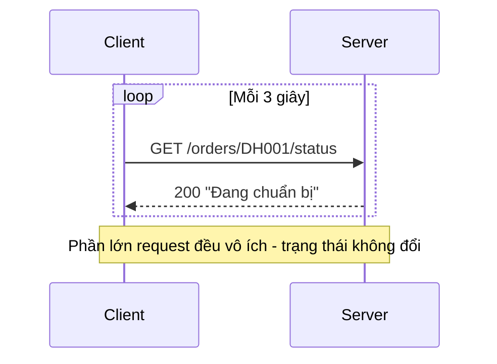
```mermaid
sequenceDiagram
    participant C as Client
    participant S as Server
    loop Mỗi 3 giây
        C->>S: GET /orders/DH001/status
        S-->>C: 200 "Đang chuẩn bị"
    end
    Note over C,S: Phần lớn request đều vô ích - trạng thái không đổi
```

Đơn giản, chạy mọi nơi. Nhưng **lãng phí** (10.000 người dùng x 1 request/3s = 3.300 request/giây chỉ để hỏi "có gì mới không?") và **trễ** tới 3 giây.

### 2) Long polling - "Hỏi và chờ"

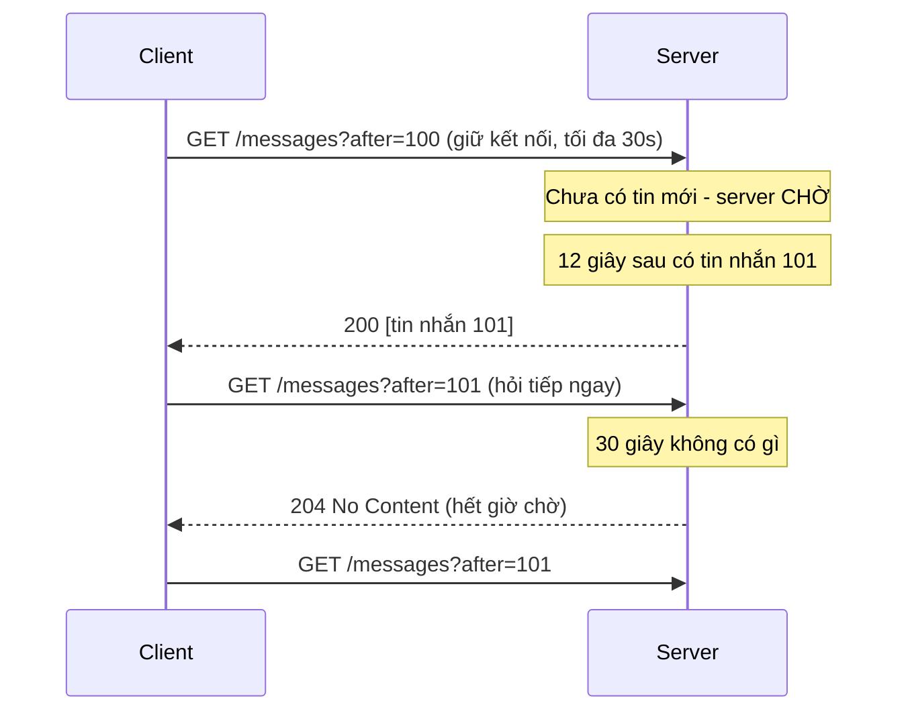
```mermaid
sequenceDiagram
    participant C as Client
    participant S as Server
    C->>S: GET /messages?after=100 (giữ kết nối, tối đa 30s)
    Note over S: Chưa có tin mới - server CHỜ
    Note over S: 12 giây sau có tin nhắn 101
    S-->>C: 200 [tin nhắn 101]
    C->>S: GET /messages?after=101 (hỏi tiếp ngay)
    Note over S: 30 giây không có gì
    S-->>C: 204 No Content (hết giờ chờ)
    C->>S: GET /messages?after=101
```

Ít request vô ích hơn, gần real-time. Nhưng mỗi client **giữ một kết nối** và phức tạp khi có nhiều server.

### 3) Server-Sent Events (SSE) - "Server phát thanh một chiều"

Client mở **một** HTTP request, server **giữ kết nối và đẩy event liên tục** theo định dạng text đơn giản. Trình duyệt có sẵn API `EventSource`, **tự kết nối lại** khi rớt mạng và gửi `Last-Event-ID` để nhận tiếp.

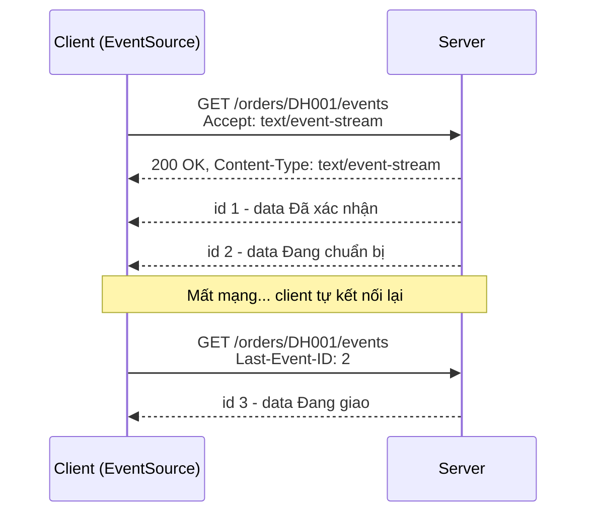
```mermaid
sequenceDiagram
    participant C as Client (EventSource)
    participant S as Server
    C->>S: GET /orders/DH001/events<br/>Accept: text/event-stream
    S-->>C: 200 OK, Content-Type: text/event-stream
    S-->>C: id 1 - data Đã xác nhận
    S-->>C: id 2 - data Đang chuẩn bị
    Note over C,S: Mất mạng... client tự kết nối lại
    C->>S: GET /orders/DH001/events<br/>Last-Event-ID: 2
    S-->>C: id 3 - data Đang giao
```

=== "Go"

    ```go
    package main

    import (
    	"fmt"
    	"log"
    	"net/http"
    	"time"
    )

    // Giả lập trạng thái đơn hàng thay đổi theo thời gian
    var steps = []string{"Đã xác nhận", "Đang chuẩn bị", "Đang giao", "Đã giao"}

    func orderEvents(w http.ResponseWriter, r *http.Request) {
    	flusher, ok := w.(http.Flusher)
    	if !ok {
    		http.Error(w, "streaming không được hỗ trợ", http.StatusInternalServerError)
    		return
    	}
    	w.Header().Set("Content-Type", "text/event-stream")
    	w.Header().Set("Cache-Control", "no-cache")
    	w.Header().Set("Connection", "keep-alive")

    	for i, s := range steps {
    		select {
    		case <-r.Context().Done(): // client đóng tab → dừng
    			log.Println("client ngắt kết nối")
    			return
    		case <-time.After(500 * time.Millisecond):
    		}
    		// Định dạng SSE: các dòng "field: value", kết thúc event bằng dòng trống
    		fmt.Fprintf(w, "id: %d\nevent: status\ndata: {\"order\":\"DH001\",\"status\":%q}\n\n", i+1, s)
    		flusher.Flush() // đẩy ngay xuống client, không chờ buffer đầy
    	}
    }

    func main() {
    	http.HandleFunc("GET /orders/DH001/events", orderEvents)
    	log.Println("SSE server tại :8081")
    	log.Fatal(http.ListenAndServe(":8081", nil))
    }
    ```

=== "Python"

    ```python
    import json
    import time
    from http.server import BaseHTTPRequestHandler, ThreadingHTTPServer

    STEPS = ["Đã xác nhận", "Đang chuẩn bị", "Đang giao", "Đã giao"]


    class Handler(BaseHTTPRequestHandler):
        def do_GET(self):
            if self.path != "/orders/DH001/events":
                self.send_error(404)
                return
            self.send_response(200)
            self.send_header("Content-Type", "text/event-stream")
            self.send_header("Cache-Control", "no-cache")
            self.end_headers()
            try:
                for i, s in enumerate(STEPS, start=1):
                    time.sleep(0.5)
                    data = json.dumps({"order": "DH001", "status": s}, ensure_ascii=False, separators=(",", ":"))
                    self.wfile.write(f"id: {i}\nevent: status\ndata: {data}\n\n".encode())
                    self.wfile.flush()  # đẩy ngay xuống client
            except BrokenPipeError:
                print("client ngắt kết nối")


    if __name__ == "__main__":
        print("SSE server tại :8081")
        ThreadingHTTPServer(("0.0.0.0", 8081), Handler).serve_forever()
    ```

Xem stream bằng curl (`-N` = không đệm output):

```bash
curl -sN http://localhost:8081/orders/DH001/events
```

Output (mỗi event hiện ra cách nhau 0,5 giây):

```text
id: 1
event: status
data: {"order":"DH001","status":"Đã xác nhận"}

id: 2
event: status
data: {"order":"DH001","status":"Đang chuẩn bị"}

id: 3
event: status
data: {"order":"DH001","status":"Đang giao"}

id: 4
event: status
data: {"order":"DH001","status":"Đã giao"}
```

Phía trình duyệt chỉ cần vài dòng JavaScript:

```javascript
const es = new EventSource("/orders/DH001/events");
es.addEventListener("status", (e) => {
  const { status } = JSON.parse(e.data);
  document.querySelector("#status").textContent = status;
});
```

### 4) WebSocket - "Đường dây điện thoại hai chiều"

WebSocket bắt đầu bằng một **HTTP request "xin nâng cấp"**, sau đó kết nối TCP trở thành kênh **hai chiều, full-duplex**, gửi **frame** nhị phân/text với overhead rất nhỏ.

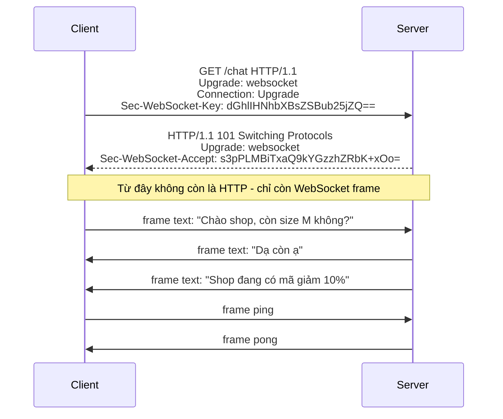
```mermaid
sequenceDiagram
    participant C as Client
    participant S as Server
    C->>S: GET /chat HTTP/1.1<br/>Upgrade: websocket<br/>Connection: Upgrade<br/>Sec-WebSocket-Key: dGhlIHNhbXBsZSBub25jZQ==
    S-->>C: HTTP/1.1 101 Switching Protocols<br/>Upgrade: websocket<br/>Sec-WebSocket-Accept: s3pPLMBiTxaQ9kYGzzhZRbK+xOo=
    Note over C,S: Từ đây không còn là HTTP - chỉ còn WebSocket frame
    C->>S: frame text: "Chào shop, còn size M không?"
    S->>C: frame text: "Dạ còn ạ"
    S->>C: frame text: "Shop đang có mã giảm 10%"
    C->>S: frame ping
    S->>C: frame pong
```

`Sec-WebSocket-Accept` được tính từ key của client để chứng minh server **thật sự hiểu WebSocket** (không phải một proxy cache ngây thơ trả lời bừa). Công thức: `base64(SHA1(key + "258EAFA5-E914-47DA-95CA-C5AB0DC85B11"))`:

=== "Go"

    ```go
    package main

    import (
    	"crypto/sha1"
    	"encoding/base64"
    	"fmt"
    )

    // GUID cố định do RFC 6455 quy định
    const wsGUID = "258EAFA5-E914-47DA-95CA-C5AB0DC85B11"

    func acceptKey(clientKey string) string {
    	h := sha1.Sum([]byte(clientKey + wsGUID))
    	return base64.StdEncoding.EncodeToString(h[:])
    }

    func main() {
    	fmt.Println(acceptKey("dGhlIHNhbXBsZSBub25jZQ==")) // ví dụ lấy từ RFC 6455
    }

    // Output:
    // s3pPLMBiTxaQ9kYGzzhZRbK+xOo=
    ```

=== "Python"

    ```python
    import base64
    import hashlib

    WS_GUID = "258EAFA5-E914-47DA-95CA-C5AB0DC85B11"  # hằng số do RFC 6455 quy định


    def accept_key(client_key: str) -> str:
        digest = hashlib.sha1((client_key + WS_GUID).encode()).digest()
        return base64.b64encode(digest).decode()


    print(accept_key("dGhlIHNhbXBsZSBub25jZQ=="))  # ví dụ lấy từ RFC 6455

    # Output:
    # s3pPLMBiTxaQ9kYGzzhZRbK+xOo=
    ```

> 💡 Trong dự án thật, dùng thư viện: Go có `github.com/coder/websocket` hoặc `github.com/gorilla/websocket`; Python có `websockets` hoặc WebSocket tích hợp sẵn trong FastAPI/Starlette.

### So sánh và cách chọn

| | Short polling | Long polling | SSE | WebSocket |
|---|---|---|---|---|
| Chiều dữ liệu | Client hỏi | Client hỏi, server giữ | **Server → client** | **Hai chiều** |
| Độ trễ | Cao (theo chu kỳ) | Thấp | Thấp | Rất thấp |
| Giao thức | HTTP thường | HTTP thường | HTTP thường (`text/event-stream`) | Nâng cấp từ HTTP, sau đó giao thức riêng |
| Tự kết nối lại | N/A | Tự code | **Có sẵn** (`EventSource`) | Tự code |
| Qua proxy/CDN/firewall | Dễ | Dễ | Dễ (tắt buffering ở proxy) | Đôi khi bị chặn, cần cấu hình |
| Dữ liệu nhị phân | Có | Có | Chỉ text | Có |
| Độ phức tạp server | Thấp | Trung bình | Thấp | Cao (quản lý kết nối, scale nhiều node) |
| Dùng khi | Cập nhật hiếm, đơn giản | Hệ thống cũ | Thông báo, trạng thái đơn, feed, **stream câu trả lời AI** | Chat, game, collaborative editing, giao dịch |

```mermaid
flowchart TD
    Q1{"Client cần GỬI dữ liệu<br/>liên tục cho server?"} -->|Có| WS["WebSocket"]
    Q1 -->|Không| Q2{"Cần cập nhật gần real-time<br/>(dưới vài giây)?"}
    Q2 -->|Không| POLL["Short polling<br/>(mỗi 30-60 giây)"]
    Q2 -->|Có| SSE["SSE"]
```

> 💡 Các chatbot AI (ChatGPT, Claude) stream từng chữ của câu trả lời bằng **SSE** - vì dữ liệu chỉ cần đi một chiều server → client.

---

## 🌍 Ứng dụng thực tế

### 1. Điều tra "API chậm vào giờ cao điểm"

Người dùng phàn nàn app đặt đồ ăn "quay mãi" lúc 11h30. Quy trình điều tra dùng kiến thức bài này:

```mermaid
flowchart TD
    A["Người dùng: app chậm"] --> B["curl -w đo từng chặng<br/>từ nhiều vị trí"]
    B --> C{"Chặng nào chậm?"}
    C -->|dns| D["Kiểm tra resolver, TTL"]
    C -->|tcp / tls| E["Server quá xa? Thiếu keep-alive?<br/>Load balancer quá tải?"]
    C -->|ttfb| F["Code backend: xem log, trace<br/>query DB chậm? (Bài 6, 11)"]
    C -->|total - ttfb| G["Response quá to?<br/>Bật nén gzip/br, phân trang"]
```

Kết quả thường gặp: `ttfb` cao do **một câu query không có index** (Bài 6) hoặc do app mở **kết nối mới tới DB/API bên thứ ba cho mỗi request** (thiếu connection pool → tốn thêm bắt tay TCP + TLS).

### 2. Flash sale 12.12 - vì sao cần CDN

Trang sản phẩm có 30 ảnh, mỗi ảnh 200KB. 1 triệu người vào cùng lúc = **6 TB** dữ liệu ảnh. Nếu tất cả đổ về origin server ở Singapore thì sập ngay. Với CDN:

- Ảnh, JS, CSS được cache ở edge Hà Nội, TP.HCM → origin chỉ phục vụ **lần đầu** mỗi file
- Trang danh sách sản phẩm cache 30 giây (`s-maxage=30`) → origin chỉ nhận ~2 request/phút/edge cho trang đó thay vì hàng chục nghìn
- API **giỏ hàng, thanh toán** không cache (`private, no-store`), đi thẳng vào app

### 3. Theo dõi đơn hàng real-time

Ứng dụng giao hàng muốn hiển thị trạng thái đơn và vị trí shipper:

- **Trạng thái đơn** (vài lần mỗi đơn, một chiều) → **SSE** như ví dụ mục 11
- **Chat giữa khách và shipper** (hai chiều) → **WebSocket**
- **Trang lịch sử đơn hàng** (hiếm khi đổi) → REST bình thường, có thể **polling 60 giây** khi đang mở trang

### 4. Đổi server không downtime bằng DNS

Chuyển hệ thống từ server cũ sang server mới:

1. **Trước 2 ngày**: hạ TTL bản ghi A từ `86400` xuống `60`
2. Dựng server mới, test bằng `curl --resolve api.shop.vn:443:<IP mới> https://api.shop.vn/health`
3. Đổi bản ghi A sang IP mới; trong ~1 phút phần lớn người dùng đã sang server mới
4. Giữ server cũ chạy thêm vài giờ cho những resolver "cứng đầu" không tôn trọng TTL
5. Tăng TTL trở lại

---

## ⚠️ Lỗi thường gặp

### 1. Server listen `127.0.0.1` trong Docker

```text
❌ app.run(host="127.0.0.1", port=8000)  → từ ngoài container gọi vào: connection refused / reset
✅ app.run(host="0.0.0.0", port=8000)    → nhận kết nối từ mọi interface
```

### 2. Nhầm lẫn các lỗi kết nối

| Thông báo lỗi | Nghĩa | Kiểm tra |
|---|---|---|
| `no such host` / `Name or service not known` | DNS không phân giải được | `dig tên-miền`, `/etc/hosts` |
| `connection refused` | Tới được máy nhưng **không có ai listen** ở port đó | App có chạy không? Đúng port? Listen `0.0.0.0`? |
| `connection timed out` | Gói tin **bị chặn/mất** trên đường | Firewall, security group, sai IP |
| `connection reset by peer` | Bên kia đóng đột ngột | App crash, proxy timeout, giới hạn kết nối |
| `certificate has expired` / `unknown authority` | Lỗi TLS | Hạn chứng chỉ, thiếu intermediate CA |
| `502 Bad Gateway` | Proxy **không gọi được** app | App chết, sai upstream port |
| `504 Gateway Timeout` | App trả lời **quá chậm** so với timeout của proxy | Query chậm, deadlock, gọi service ngoài chậm |

### 3. Tính `Content-Length` theo số ký tự

```go
body := "Xin chào"
// ❌ utf8.RuneCountInString(body) = 8 → client chỉ đọc 8 byte, mất chữ
// ✅ len(body) = 9 byte ("à" chiếm 2 byte)
```

### 4. Dùng GET cho hành động thay đổi dữ liệu

`GET /orders/123/cancel` → trình duyệt **prefetch**, crawler của Google hay công cụ preview link trong Zalo/Slack **tự động gọi** → đơn bị hủy "không rõ lý do". Dùng `POST`/`DELETE` cho hành động thay đổi dữ liệu.

### 5. Tắt kiểm tra TLS "cho nhanh"

`InsecureSkipVerify: true` / `verify=False` / `curl -k` lọt lên production → mở đường cho man-in-the-middle. Nạp đúng CA thay vì tắt kiểm tra.

### 6. Tin tuyệt đối vào `X-Forwarded-For`

Client tự đặt được header này. Chỉ tin giá trị do **proxy của bạn** thêm vào.

### 7. Quên rằng TCP là luồng byte

Đọc `conn.Read(buf)` một lần và cho rằng đã nhận đủ "tin nhắn" → thỉnh thoảng thiếu dữ liệu khi chạy qua mạng thật (trên localhost thì hầu như luôn đủ nên không phát hiện ra). Luôn đọc theo **ranh giới** của giao thức (độ dài, dấu phân cách).

### 8. Để TTL DNS cao khi sắp đổi hạ tầng

Đổi IP với TTL 1 ngày → một phần người dùng vào server cũ **cả ngày**. Hạ TTL trước.

---

## 🏋️ Bài tập

### Bài 1 (Dễ): Đọc hiểu `curl -v`

Chạy `curl -sv http://localhost:8080/hello` với server TCP thuần ở mục 6. Trả lời: (a) Dòng nào là request line? (b) Tại sao `Content-Length` là 35 mà body chỉ có 30 ký tự? (c) Nếu bỏ dòng `Connection: close` ở server, curl có biết lúc nào kết thúc body không?

<details>
<summary>Đáp án</summary>

(a) `> GET /hello HTTP/1.1`. (b) Tiếng Việt có dấu chiếm 2-3 byte trong UTF-8: "à", "ừ", "ầ", "ơ" mỗi chữ 2-3 byte, `Content-Length` đếm **byte**. (c) Có - curl dựa vào `Content-Length` để biết đọc bao nhiêu byte; `Connection: close` chỉ báo rằng server sẽ đóng kết nối sau response. Nếu **thiếu cả hai**, client sẽ chờ tới khi server đóng kết nối.

</details>

### Bài 2 (Dễ): Tra cứu DNS

Dùng `dig` để trả lời: (a) Tên miền của trường/công ty bạn có mấy bản ghi A? TTL bao nhiêu? (b) Server email (MX) của nó là gì? (c) Có bản ghi TXT nào chứa `v=spf1` không? Nó có ý nghĩa gì?

<details>
<summary>Gợi ý</summary>

`dig +noall +answer A ten-mien`, `dig +short MX ten-mien`, `dig +short TXT ten-mien`. Bản ghi SPF liệt kê những server được phép gửi email thay mặt tên miền - giúp chống giả mạo email.

</details>

### Bài 3 (Trung bình): Mở rộng server TCP thuần

Sửa server ở mục 6 (Go hoặc Python) để:

1. Hỗ trợ `POST /echo`: đọc body theo `Content-Length` và trả lại đúng body đó
2. Trả `405 Method Not Allowed` (kèm header `Allow: GET`) khi gọi `DELETE /hello`
3. Trả `413 Payload Too Large` nếu `Content-Length` > 1 MB

Test: `curl -sv -X POST -d 'xin chào' http://localhost:8080/echo`

<details>
<summary>Gợi ý (Go)</summary>

```go
if method == "POST" && path == "/echo" {
	n, err := strconv.Atoi(headers["content-length"])
	if err != nil || n < 0 {
		writeResponse(conn, "400 Bad Request", "")
		return
	}
	if n > 1<<20 {
		writeResponse(conn, "413 Payload Too Large", "")
		return
	}
	body := make([]byte, n)
	if _, err := io.ReadFull(r, body); err != nil { // ReadFull: đọc ĐỦ n byte
		return
	}
	writeResponse(conn, "200 OK", string(body))
	return
}
```

Chú ý dùng `io.ReadFull` (Go) hoặc `f.read(n)` (Python) - không phải một lần `Read` đơn lẻ, vì TCP là luồng byte.

</details>

### Bài 4 (Trung bình): Timeline của một request

Chọn một API công khai bất kỳ (vd `https://api.github.com`). Dùng `curl -w` để đo `dns`, `tcp`, `tls`, `ttfb`, `total` **5 lần liên tiếp**. Lần đầu và các lần sau khác nhau thế nào? Vì sao? Sau đó dùng `curl -v URL URL` (2 URL trong một lệnh) và tìm dòng chứng minh kết nối được tái sử dụng.

<details>
<summary>Gợi ý</summary>

Lần đầu `dns` cao hơn vì chưa có cache; các lần sau resolver đã cache. Mỗi lệnh `curl` là một process mới nên vẫn phải bắt tay TCP + TLS lại - chỉ khi nhiều URL trong **cùng một lệnh** mới thấy `Re-using existing connection`. Đây chính là lý do app phải **dùng lại HTTP client** (connection pool).

</details>

### Bài 5 (Khó): Chat room bằng SSE + POST

Xây dựng phòng chat đơn giản chỉ với thư viện chuẩn:

- `POST /messages` với body `{"user":"An","text":"Chào mọi người"}` → phát tới mọi client
- `GET /stream` → SSE, mỗi tin nhắn là một event có `id` tăng dần
- Hỗ trợ `Last-Event-ID`: client kết nối lại sẽ nhận các tin nhắn bị lỡ (giữ 100 tin gần nhất trong bộ nhớ)
- Test bằng 2 terminal `curl -N .../stream` và 1 terminal gửi POST

<details>
<summary>Gợi ý thiết kế (Go)</summary>

- Một `Hub` giữ `sync.Mutex`, slice `history []Message` (tối đa 100), và `map[chan Message]struct{}` các subscriber
- `POST` → khóa mutex, gán `ID = lastID + 1`, append vào history, gửi vào từng channel (dùng `select` với `default` để client chậm không làm treo cả hub)
- `GET /stream` → đọc header `Last-Event-ID`, gửi lại các tin nhắn có ID lớn hơn từ history, sau đó đăng ký channel mới và vòng `select` giữa `r.Context().Done()` và channel
- Nhớ `Flush()` sau mỗi event và **hủy đăng ký** channel khi client ngắt

Với Python, dùng `ThreadingHTTPServer` + `queue.Queue` cho mỗi subscriber + `threading.Lock`.

</details>

### Bài 6 (Khó): Giải thích cho người không chuyên

Viết một bài (khoảng 1 trang) giải thích "điều gì xảy ra khi gõ URL" cho **một người không học IT** (bố mẹ, bạn bè), dùng ví dụ đời thường của riêng bạn. Sau đó viết phiên bản **dành cho phỏng vấn** (5-7 phút nói) có nhắc đến: DNS cache, TCP handshake, TLS + SNI + ALPN, HTTP/2, reverse proxy, CDN, render trang. Đây là bài luyện kỹ năng giao tiếp - xem thêm [Tư duy SE - Làm việc nhóm & Giao tiếp](../mindset/08-teamwork-communication.md).

---

## ✅ Checklist hoàn thành

- [ ] Vẽ lại được mô hình TCP/IP 4 tầng và giải thích encapsulation
- [ ] Phân biệt IP public/private, `127.0.0.1` vs `0.0.0.0`, hiểu NAT ảnh hưởng gì tới IP client
- [ ] Vẽ được 3-way handshake và giải thích vì sao tái sử dụng kết nối quan trọng
- [ ] Biết khi nào dùng TCP, khi nào dùng UDP
- [ ] Giải thích được quá trình phân giải DNS, đọc được output `dig`, hiểu TTL
- [ ] Viết tay được một HTTP request/response hợp lệ
- [ ] Thuộc bảng method (safe/idempotent) và các status code quan trọng
- [ ] Biết các header quan trọng, hiểu cookie và các thuộc tính `HttpOnly`, `Secure`, `SameSite`
- [ ] Chạy được server TCP thuần và test bằng `curl -v`, `nc`
- [ ] Nêu được khác biệt HTTP/1.1, HTTP/2, HTTP/3
- [ ] Hiểu TLS bảo vệ gì, chuỗi chứng chỉ, bắt tay TLS 1.3; dựng được HTTPS server local
- [ ] Trình bày trôi chảy "điều gì xảy ra khi gõ URL"
- [ ] Phân biệt forward proxy, reverse proxy, load balancer, API gateway, CDN
- [ ] Chọn đúng polling / long polling / SSE / WebSocket cho từng bài toán
- [ ] Làm ít nhất 4/6 bài tập

---

**Bài tiếp theo**: [Bài 2: Linux & Shell cho Backend Developer](./02-linux-shell.md)
