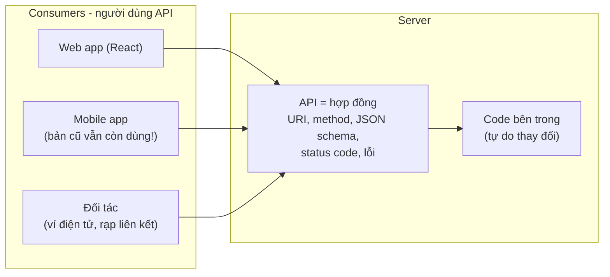
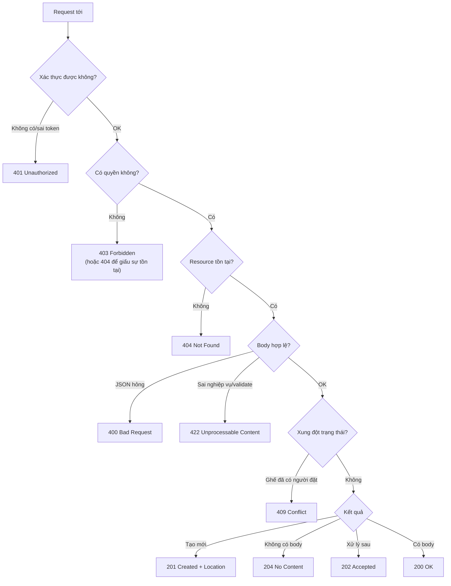
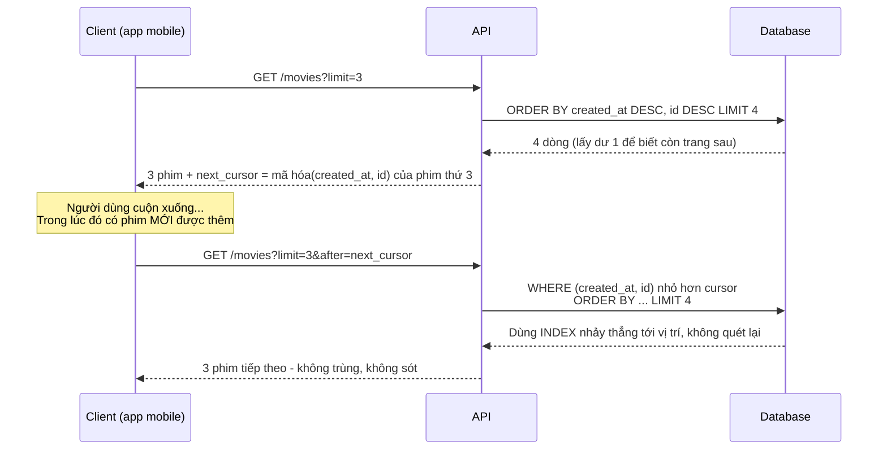
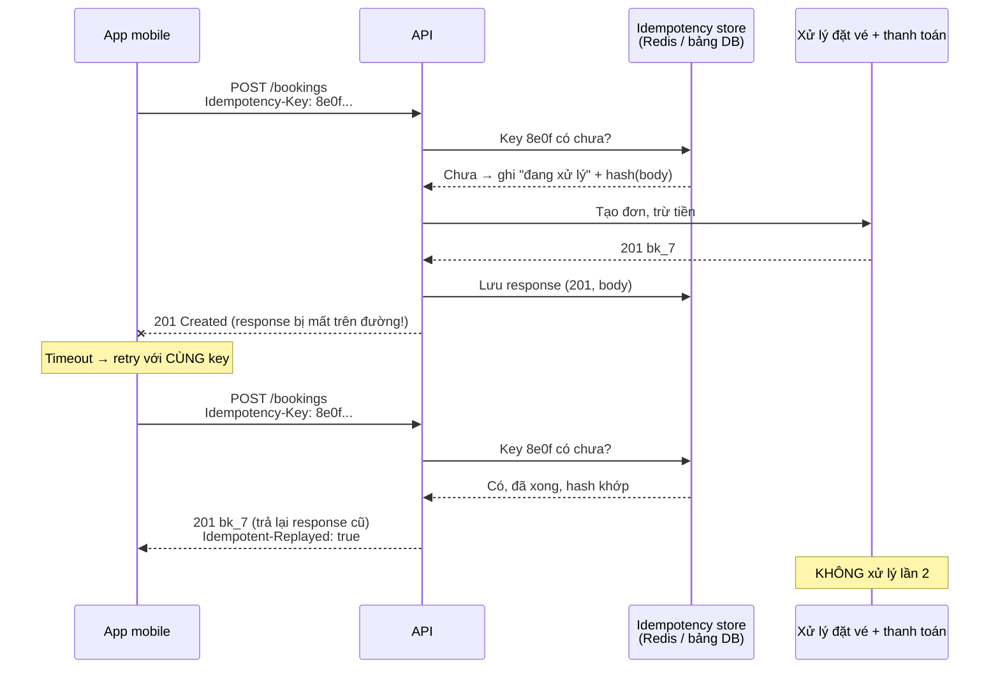
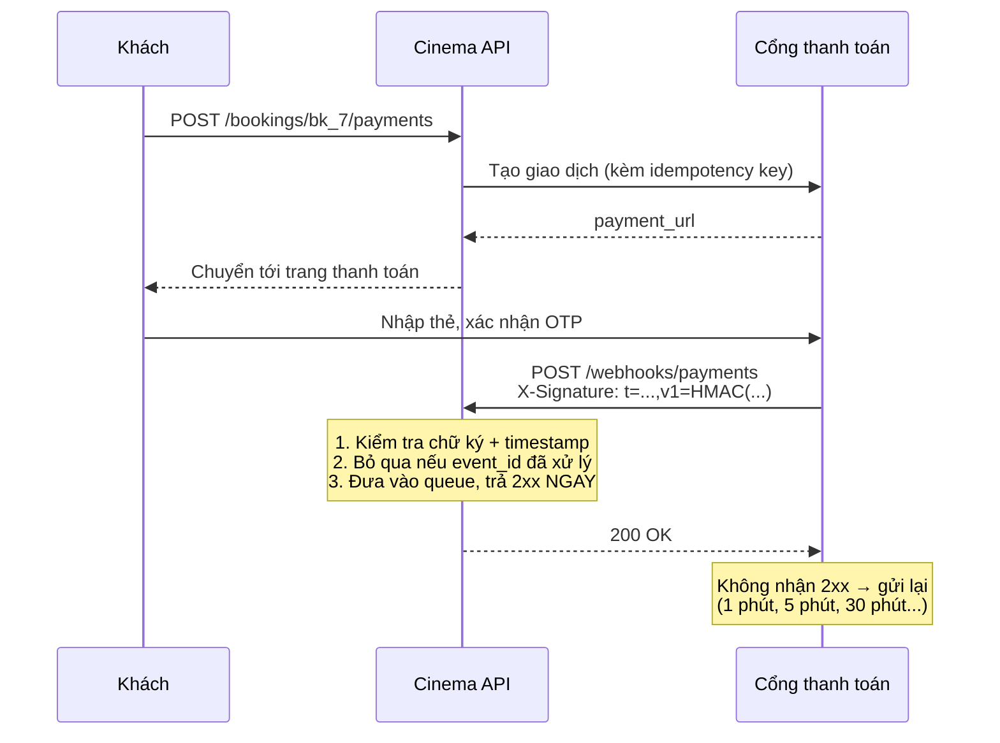
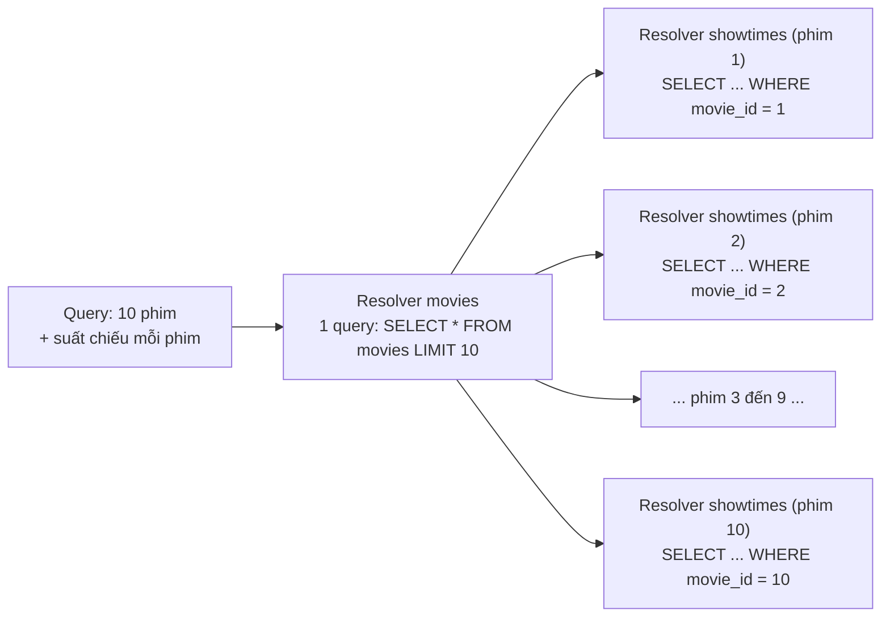
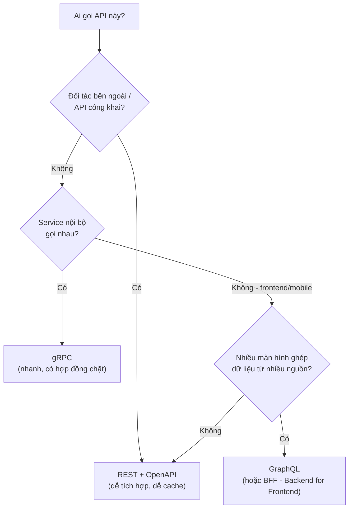
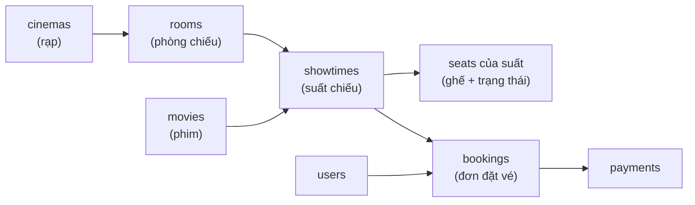
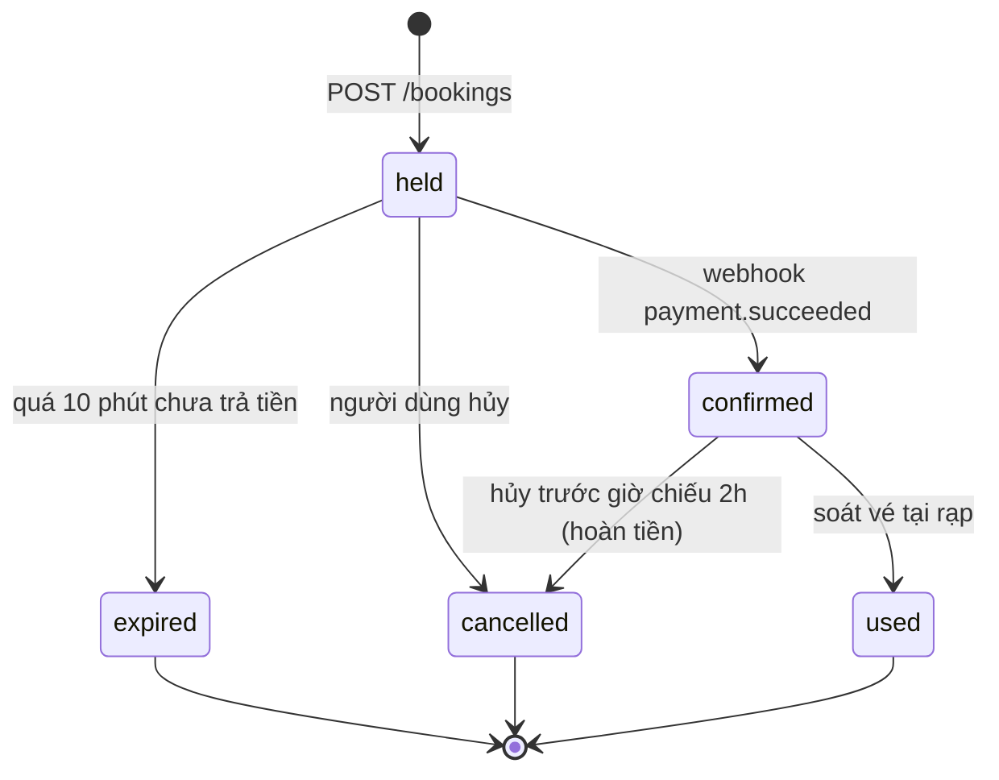

# 📚 Bài 3: Thiết kế API - REST, GraphQL, gRPC và những quy ước "sống còn"

## 🎯 Mục tiêu bài học

- Hiểu **API là một "hợp đồng"** và vì sao thiết kế sai rất đắt để sửa
- Nắm các nguyên tắc **REST**: resource, URI, HTTP method, stateless, đặt tên nhất quán
- Chọn đúng **status code** cho từng tình huống; trả lỗi theo chuẩn **RFC 9457 (Problem Details)**
- Thiết kế **pagination** (offset vs **cursor**), **filtering**, **sorting**, **sparse fieldset**
- Chọn chiến lược **versioning** và giữ **tương thích ngược** (backward compatibility)
- Hiểu và cài đặt **Idempotency-Key** để client retry an toàn (không trừ tiền 2 lần)
- Viết tài liệu API bằng **OpenAPI**; thiết kế **rate limit headers** và **webhooks** có chữ ký HMAC
- Nắm cơ bản **GraphQL**, vấn đề **N+1** và cách giải; so sánh **REST vs GraphQL vs gRPC**
- Case study xuyên suốt: **API đặt vé xem phim** (phim, suất chiếu, ghế, đặt vé, thanh toán)
- Code chạy được bằng Go và Python: **cursor pagination**, **idempotency middleware**, **xác thực webhook**

> 💡 **Vì sao cần học thiết kế API?** Viết một endpoint chạy được thì dễ. Nhưng một khi API đã có **người dùng** (app mobile đã lên store, đối tác đã tích hợp), bạn **không thể** đổi tên field, đổi format ngày, hay đổi ý nghĩa status code mà không làm gãy ứng dụng của người khác. App mobile phiên bản cũ có thể còn chạy **vài năm**. Thiết kế API tốt ngay từ đầu tiết kiệm hàng tháng trời "chữa cháy".

> 💡 **Kiến thức cần có**: [Bài 1](./01-how-the-web-works.md) (HTTP method, status code, header). Biết viết HTTP server cơ bản: [Go - Bài 12](../golang/12-http-apis.md) hoặc [Python - Bài 12](../python/12-http-web-apis.md).

---

## 📖 1. API là một hợp đồng

### Ví von: Thực đơn nhà hàng

API giống **thực đơn** của nhà hàng: khách (client) không cần biết bếp (server) nấu thế nào, chỉ cần biết **gọi món gì** (endpoint), **tùy chọn gì** (tham số), **nhận được gì** (response). Nếu nhà hàng đột ngột đổi "Phở bò" thành "Mì nước thịt bò" mà không báo, khách quen sẽ gọi món không có trong thực đơn - và **nổi giận**.



Nguyên tắc vàng: **bên trong đổi thoải mái, hợp đồng đổi cực kỳ thận trọng.**

### Đặc điểm của một API tốt

| Đặc điểm | Nghĩa là |
|---|---|
| **Dễ đoán (predictable)** | Biết `GET /movies` thì đoán được `GET /movies/{id}`, `GET /showtimes` |
| **Nhất quán** | Cùng một kiểu đặt tên (`snake_case` hay `camelCase`), cùng format ngày, cùng format lỗi ở **mọi** endpoint |
| **Tự mô tả lỗi** | Lỗi nói rõ **sai ở đâu** và **cách sửa**, không chỉ `"error": "bad request"` |
| **An toàn khi retry** | Mạng chập chờn, client gửi lại thì không tạo đơn/trừ tiền 2 lần |
| **Tiến hóa được** | Thêm tính năng mà không phá client cũ |
| **Có tài liệu** | OpenAPI spec, ví dụ request/response |

---

## 📖 2. REST - Những nguyên tắc cốt lõi

**REST** (Representational State Transfer) là một **phong cách kiến trúc** do Roy Fielding đề xuất năm 2000. Trong thực tế, "REST API" thường nghĩa là: **dùng HTTP đúng cách** để thao tác với **tài nguyên (resource)**.

### Resource là "danh từ", method là "động từ"

Trong hệ thống bán vé xem phim, các **danh từ** là: phim (`movies`), rạp (`cinemas`), suất chiếu (`showtimes`), ghế (`seats`), đơn đặt vé (`bookings`), thanh toán (`payments`).

```text
❌ Kiểu RPC trá hình (động từ trong URL):
POST /getMovies
POST /createBooking
POST /cancelBooking?id=7
GET  /deleteMovie/42        ← GET mà xóa dữ liệu! Crawler/prefetch của trình duyệt có thể gọi nhầm

✅ Kiểu REST (danh từ + HTTP method):
GET    /movies              danh sách phim
GET    /movies/42           chi tiết phim 42
POST   /bookings            tạo đơn đặt vé
GET    /bookings/7          xem đơn 7
DELETE /bookings/7          hủy đơn 7 (hoặc POST /bookings/7/cancel - xem bên dưới)
```

### HTTP method và ngữ nghĩa

| Method | Dùng để | Safe? | Idempotent? | Ví dụ |
|---|---|---|---|---|
| `GET` | Đọc | ✅ | ✅ | `GET /showtimes?movie_id=42` |
| `POST` | Tạo mới / hành động | ❌ | ❌ | `POST /bookings` |
| `PUT` | **Thay thế toàn bộ** resource | ❌ | ✅ | `PUT /users/me/preferences` |
| `PATCH` | Sửa **một phần** | ❌ | ⚠️ tùy cách thiết kế | `PATCH /bookings/7 {"note": "..."}` |
| `DELETE` | Xóa | ❌ | ✅ | `DELETE /bookings/7` |

- **Safe** = không thay đổi dữ liệu server → được cache, prefetch, gọi lại tùy ý
- **Idempotent** = gọi 1 lần hay 10 lần, **trạng thái cuối cùng** trên server như nhau. `DELETE /bookings/7` lần 2 vẫn là "đơn 7 đã bị xóa" (dù response có thể là `404`). `POST /bookings` gọi 2 lần = **2 đơn** → không idempotent → cần **Idempotency-Key** (mục 7)

### Stateless

Mỗi request phải **tự mang đủ thông tin** để server xử lý (token xác thực, tham số). Server **không nhớ** "request trước bạn đang ở trang 3". Nhờ vậy có thể thêm server phía sau load balancer thoải mái - request nào tới server nào cũng được (xem [Bài 10: System Design](./10-system-design.md)).

### Khi hành động không vừa với CRUD

Có những hành động là **động từ thật sự**: hủy vé, xác nhận thanh toán, gửi lại email. Hai cách phổ biến:

```text
Cách 1 - Sub-resource hành động (thực dụng, dễ hiểu, được Stripe/GitHub dùng):
POST /bookings/7/cancel
POST /payments/99/refund

Cách 2 - Mô hình hóa thành resource mới:
POST /bookings/7/cancellations      {"reason": "đổi lịch"}
POST /refunds                       {"payment_id": 99, "amount": 90000}
```

Cách 2 "REST thuần" hơn và giữ được lịch sử (mỗi lần hoàn tiền là một resource có ID). Cách 1 đơn giản hơn. Chọn một cách và **nhất quán**.

---

## 📖 3. Quy tắc đặt tên

### URI

| Quy tắc | ✅ Nên | ❌ Không nên |
|---|---|---|
| Danh từ số nhiều | `/movies`, `/bookings` | `/movie`, `/getBooking` |
| Chữ thường, gạch nối | `/showtime-seats` | `/ShowtimeSeats`, `/showtime_seats` |
| Lồng tối đa 2 cấp | `/showtimes/12/seats` | `/cinemas/1/rooms/3/showtimes/12/seats/F7` |
| ID trong path, lọc trong query | `/bookings?status=paid` | `/bookings/status/paid` |
| Không đuôi file, không `/` cuối | `/movies/42` | `/movies/42.json`, `/movies/42/` |

Lồng quá sâu làm URL dài và cứng nhắc. Nếu `seat` có ID toàn cục, `GET /seats/901` là đủ.

### JSON body

- Chọn **một** kiểu: `snake_case` (GitHub, Stripe, phổ biến với Python) hoặc `camelCase` (Google, phổ biến với JS). Khóa học này dùng `snake_case`.
- **Thời gian**: chuỗi **RFC 3339 / ISO 8601** có múi giờ: `"2026-09-28T19:30:00+07:00"` hoặc UTC `"2026-09-28T12:30:00Z"`. Không dùng `"28/09/2026"` (mơ hồ: 09/10 là mùng 9 tháng 10 hay 10 tháng 9?).
- **Tiền**: số nguyên theo **đơn vị nhỏ nhất** + mã tiền tệ: `{"amount": 90000, "currency": "VND"}`. **Không dùng float** cho tiền (`0.1 + 0.2 = 0.30000000000000004`).
- **ID**: nên trả về dạng **chuỗi** (`"id": "bk_01J9Z..."`) nếu có thể vượt `2^53` - JavaScript mất chính xác với số nguyên lớn.
- **Enum**: chuỗi dễ đọc `"status": "confirmed"` thay vì số ma thuật `"status": 2`.
- `null` vs không có field: quy ước rõ ràng (vd không có = không đổi khi PATCH, `null` = xóa giá trị).

Một response mẫu tốt:

```json
{
  "id": "bk_7",
  "status": "confirmed",
  "showtime": {
    "id": "st_12",
    "movie_title": "Mai",
    "starts_at": "2026-09-28T19:30:00+07:00"
  },
  "seats": ["F7", "F8"],
  "total": {"amount": 180000, "currency": "VND"},
  "created_at": "2026-09-28T10:15:02Z"
}
```

---

## 📖 4. Status code - Nói đúng "ngôn ngữ" HTTP

Client (và cả load balancer, cache, công cụ giám sát) quyết định hành vi dựa trên status code. Trả `200 OK` kèm `{"error": "..."}` là **nói dối** - retry logic, alert, cache đều hiểu sai.



| Code | Khi nào dùng | Ví dụ trong hệ thống bán vé |
|---|---|---|
| `200 OK` | Thành công, có body | `GET /movies/42` |
| `201 Created` | Tạo mới thành công + header `Location` | `POST /bookings` → `Location: /bookings/bk_7` |
| `202 Accepted` | Đã nhận, xử lý **bất đồng bộ** | `POST /reports/revenue` → trả `job_id` |
| `204 No Content` | Thành công, không có body | `DELETE /bookings/bk_7` |
| `304 Not Modified` | Dữ liệu chưa đổi (dùng `ETag`) | `GET /movies` với `If-None-Match` |
| `400 Bad Request` | Request sai cú pháp (JSON hỏng, thiếu tham số) | Body không parse được |
| `401 Unauthorized` | **Chưa xác thực** (thiếu/sai/hết hạn token) | Không gửi `Authorization` |
| `403 Forbidden` | Đã xác thực nhưng **không có quyền** | User thường gọi `POST /movies` |
| `404 Not Found` | Không tồn tại (hoặc giấu với người không có quyền) | `GET /bookings/bk_999` |
| `405 Method Not Allowed` | Resource có nhưng không hỗ trợ method | `PUT /movies` |
| `409 Conflict` | Xung đột với trạng thái hiện tại | Ghế F7 vừa bị người khác đặt |
| `412 Precondition Failed` | `If-Match` không khớp (optimistic locking) | Sửa suất chiếu mà người khác vừa sửa |
| `415 Unsupported Media Type` | Sai `Content-Type` | Gửi form thay vì JSON |
| `422 Unprocessable Content` | Cú pháp đúng nhưng **dữ liệu không hợp lệ** | Đặt 0 ghế, ngày chiếu trong quá khứ |
| `429 Too Many Requests` | Vượt rate limit (kèm `Retry-After`) | Bot "săn vé" gọi 100 lần/giây |
| `500 Internal Server Error` | Lỗi không lường trước **của server** | Bug, panic |
| `502 Bad Gateway` | Upstream trả lời sai | Cổng thanh toán trả HTML lỗi |
| `503 Service Unavailable` | Tạm thời không phục vụ (bảo trì, quá tải) | Đang deploy, kèm `Retry-After` |
| `504 Gateway Timeout` | Upstream không trả lời kịp | Cổng thanh toán treo 30 giây |

> 💡 **Quy tắc retry**: lỗi `4xx` là lỗi **của client** → retry y nguyên **vô ích** (trừ `408`, `429`). Lỗi `5xx` (và timeout) → **có thể** retry với backoff, nhưng chỉ an toàn nếu request **idempotent** (mục 7).

---

## 📖 5. Trả lỗi chuẩn - RFC 9457 Problem Details

Mỗi team tự chế format lỗi riêng (`{"error": ...}`, `{"message": ...}`, `{"err_code": ...}`) làm client phải viết code xử lý riêng cho từng API. **RFC 9457** (thay thế RFC 7807) định nghĩa format chung với `Content-Type: application/problem+json`:

```http
HTTP/1.1 422 Unprocessable Content
Content-Type: application/problem+json

{
  "type": "https://api.cinema.example/problems/validation-error",
  "title": "Dữ liệu không hợp lệ",
  "status": 422,
  "detail": "Yêu cầu có 2 lỗi validate.",
  "instance": "/v1/bookings",
  "trace_id": "4bf92f3577b34da6",
  "errors": [
    {"pointer": "#/seats", "detail": "Phải chọn từ 1 đến 8 ghế"},
    {"pointer": "#/showtime_id", "detail": "Suất chiếu đã bắt đầu"}
  ]
}
```

| Field | Ý nghĩa |
|---|---|
| `type` | URI định danh **loại lỗi** (client dùng để `switch`); nên trỏ tới trang tài liệu. Mặc định `about:blank` |
| `title` | Tóm tắt ngắn cho người đọc, **giống nhau** với mọi lỗi cùng `type` |
| `status` | Status code (lặp lại cho tiện khi log) |
| `detail` | Giải thích **cụ thể lần này** |
| `instance` | URI của lần xảy ra lỗi |
| *extension* | Bạn được thêm field riêng: `errors`, `trace_id`, `balance`... |

!!! warning "Đừng lộ chi tiết nội bộ"
    `detail` **không** được chứa stack trace, câu SQL, tên bảng, đường dẫn file. Log đầy đủ ở server kèm `trace_id`; client chỉ nhận `trace_id` để báo cho bộ phận hỗ trợ. Xem [Bài 12: Bảo mật](./12-security.md).

---

## 📖 6. Pagination, Filtering, Sorting

### Vì sao phải phân trang?

`GET /bookings` trả về **3 triệu** đơn = response hàng trăm MB, DB quét cả bảng, app hết RAM, mobile treo. **Mọi** endpoint trả danh sách phải có giới hạn - kể cả khi hôm nay mới có 10 bản ghi.

### Offset pagination

```text
GET /movies?limit=20&offset=40      → SQL: ORDER BY id LIMIT 20 OFFSET 40
GET /movies?page=3&per_page=20      → cùng ý tưởng
```

- ✅ Dễ hiểu, nhảy tới trang bất kỳ, hiện "Trang 3/50"
- ❌ **Chậm dần**: `OFFSET 1000000` bắt DB đọc rồi **bỏ đi** 1 triệu dòng
- ❌ **Trùng/sót dữ liệu** khi có bản ghi mới chèn vào giữa lúc người dùng đang cuộn

### Cursor (keyset) pagination

Thay vì "bỏ qua N dòng", ta nói "cho tôi các dòng **sau vị trí X**". Vị trí X được mã hóa thành một chuỗi **cursor** mờ (opaque) mà client chỉ việc gửi lại.

```text
GET /movies?limit=3                           → trả 3 phim + "next_cursor": "eyJj..."
GET /movies?limit=3&after=eyJj...             → 3 phim tiếp theo
SQL: WHERE (created_at, id) < ($1, $2) ORDER BY created_at DESC, id DESC LIMIT 3
```



| | Offset | Cursor (keyset) |
|---|---|---|
| Hiệu năng trang sâu | ❌ Chậm dần (O(offset)) | ✅ Ổn định (dùng index) |
| Dữ liệu thay đổi khi đang cuộn | ❌ Trùng hoặc sót | ✅ Ổn định |
| Nhảy tới trang N | ✅ | ❌ Chỉ tới/lui |
| Tổng số trang | ✅ (cần `COUNT(*)` - cũng tốn) | ❌ Thường không có |
| Hợp với | Trang admin, bảng có số trang | Feed, infinite scroll, API công khai, đồng bộ dữ liệu |

!!! tip "Cột sắp xếp phải **duy nhất**"
    Nếu chỉ sắp theo `created_at` mà hai phim có cùng `created_at`, cursor có thể **bỏ sót** một phim. Luôn thêm cột phá hòa (tie-breaker) là khóa chính: `ORDER BY created_at DESC, id DESC`. Index tương ứng: `(created_at DESC, id DESC)`. Về index xem [Bài 6](./06-database-internals-performance.md).

### Code: offset "gặp nạn" vs cursor "bình an"

Chương trình mô phỏng: người dùng lấy trang 1 (3 phim), **trong lúc đó** có phim mới được thêm, rồi lấy trang 2. Với offset, một phim bị **lặp lại**; với cursor thì không. Dữ liệu được giữ sẵn theo thứ tự `created_at DESC, id DESC` giống như `ORDER BY` của DB.

=== "Go"

    ```go
    package main

    import (
    	"encoding/base64"
    	"encoding/json"
    	"errors"
    	"fmt"
    	"slices"
    )

    type Movie struct {
    	ID        int64  `json:"id"`
    	Title     string `json:"title"`
    	CreatedAt string `json:"created_at"` // RFC 3339 UTC: so sánh chuỗi = so sánh thời gian
    }

    // cursor chứa giá trị các cột sắp xếp của phần tử CUỐI trang trước
    type cursor struct {
    	CreatedAt string `json:"c"`
    	ID        int64  `json:"i"`
    }

    func encodeCursor(m Movie) string {
    	b, _ := json.Marshal(cursor{m.CreatedAt, m.ID})
    	return base64.RawURLEncoding.EncodeToString(b)
    }

    func decodeCursor(s string) (cursor, error) {
    	var c cursor
    	b, err := base64.RawURLEncoding.DecodeString(s)
    	if err != nil || json.Unmarshal(b, &c) != nil {
    		return c, errors.New("cursor không hợp lệ")
    	}
    	return c, nil
    }

    // before: phần tử m đứng SAU cursor trong thứ tự (created_at DESC, id DESC)?
    // Tương đương SQL: WHERE (created_at, id) < (c.CreatedAt, c.ID)
    func before(m Movie, c cursor) bool {
    	return m.CreatedAt < c.CreatedAt || (m.CreatedAt == c.CreatedAt && m.ID < c.ID)
    }

    func pageByCursor(all []Movie, after string, limit int) ([]Movie, string, error) {
    	start := 0
    	if after != "" {
    		c, err := decodeCursor(after)
    		if err != nil {
    			return nil, "", err
    		}
    		start = len(all)
    		for i, m := range all { // DB thật dùng index để nhảy thẳng tới đây
    			if before(m, c) {
    				start = i
    				break
    			}
    		}
    	}
    	end := min(start+limit, len(all))
    	page := all[start:end]
    	next := ""
    	if end < len(all) {
    		next = encodeCursor(page[len(page)-1])
    	}
    	return page, next, nil
    }

    func pageByOffset(all []Movie, offset, limit int) []Movie {
    	start := min(offset, len(all))
    	return all[start:min(start+limit, len(all))]
    }

    func titles(ms []Movie) []string {
    	out := []string{}
    	for _, m := range ms {
    		out = append(out, m.Title)
    	}
    	return out
    }

    func main() {
    	movies := []Movie{
    		{6, "Mai", "2026-09-06T00:00:00Z"},
    		{5, "Lật Mặt 7", "2026-09-05T00:00:00Z"},
    		{4, "Đào, Phở và Piano", "2026-09-05T00:00:00Z"}, // trùng created_at với id 5
    		{3, "Nhà Bà Nữ", "2026-09-03T00:00:00Z"},
    		{2, "Bố Già", "2026-09-02T00:00:00Z"},
    		{1, "Hai Phượng", "2026-09-01T00:00:00Z"},
    	}

    	p1, next, _ := pageByCursor(movies, "", 3)
    	fmt.Println("Trang 1:", titles(p1))
    	fmt.Println("next_cursor:", next)

    	// Trong lúc người dùng đọc trang 1, admin thêm phim mới lên đầu danh sách
    	movies = slices.Insert(movies, 0, Movie{7, "Địa Đạo", "2026-09-07T00:00:00Z"})

    	fmt.Println("Offset trang 2:", titles(pageByOffset(movies, 3, 3)))
    	p2, next2, _ := pageByCursor(movies, next, 3)
    	fmt.Println("Cursor trang 2:", titles(p2), "| còn trang sau:", next2 != "")

    	_, _, err := pageByCursor(movies, "rác!!", 3)
    	fmt.Println("Cursor giả:", err)
    }
    // Output:
    // Trang 1: [Mai Lật Mặt 7 Đào, Phở và Piano]
    // next_cursor: eyJjIjoiMjAyNi0wOS0wNVQwMDowMDowMFoiLCJpIjo0fQ
    // Offset trang 2: [Đào, Phở và Piano Nhà Bà Nữ Bố Già]
    // Cursor trang 2: [Nhà Bà Nữ Bố Già Hai Phượng] | còn trang sau: false
    // Cursor giả: cursor không hợp lệ
    ```

=== "Python"

    ```python
    import base64
    import json
    from dataclasses import dataclass


    @dataclass
    class Movie:
        id: int
        title: str
        created_at: str  # RFC 3339 UTC: so sánh chuỗi = so sánh thời gian


    def encode_cursor(m: Movie) -> str:
        raw = json.dumps({"c": m.created_at, "i": m.id}, separators=(",", ":"))
        return base64.urlsafe_b64encode(raw.encode()).rstrip(b"=").decode()


    def decode_cursor(s: str) -> tuple[str, int]:
        try:
            padded = s + "=" * (-len(s) % 4)
            d = json.loads(base64.urlsafe_b64decode(padded))
            return d["c"], int(d["i"])
        except Exception:
            raise ValueError("cursor không hợp lệ") from None


    def page_by_cursor(all_movies, after, limit):
        start = 0
        if after:
            c_at, c_id = decode_cursor(after)
            # Tương đương SQL: WHERE (created_at, id) < (c_at, c_id)
            start = next(
                (i for i, m in enumerate(all_movies) if (m.created_at, m.id) < (c_at, c_id)),
                len(all_movies),
            )
        page = all_movies[start:start + limit]
        has_more = start + limit < len(all_movies)
        return page, encode_cursor(page[-1]) if has_more else ""


    def page_by_offset(all_movies, offset, limit):
        return all_movies[offset:offset + limit]


    def titles(ms):
        return "[" + " ".join(m.title for m in ms) + "]"


    movies = [
        Movie(6, "Mai", "2026-09-06T00:00:00Z"),
        Movie(5, "Lật Mặt 7", "2026-09-05T00:00:00Z"),
        Movie(4, "Đào, Phở và Piano", "2026-09-05T00:00:00Z"),  # trùng created_at với id 5
        Movie(3, "Nhà Bà Nữ", "2026-09-03T00:00:00Z"),
        Movie(2, "Bố Già", "2026-09-02T00:00:00Z"),
        Movie(1, "Hai Phượng", "2026-09-01T00:00:00Z"),
    ]

    p1, nxt = page_by_cursor(movies, "", 3)
    print("Trang 1:", titles(p1))
    print("next_cursor:", nxt)

    # Trong lúc người dùng đọc trang 1, admin thêm phim mới lên đầu danh sách
    movies.insert(0, Movie(7, "Địa Đạo", "2026-09-07T00:00:00Z"))

    print("Offset trang 2:", titles(page_by_offset(movies, 3, 3)))
    p2, nxt2 = page_by_cursor(movies, nxt, 3)
    print("Cursor trang 2:", titles(p2), "| còn trang sau:", str(nxt2 != "").lower())

    try:
        page_by_cursor(movies, "rác!!", 3)
    except ValueError as e:
        print("Cursor giả:", e)
    # Output:
    # Trang 1: [Mai Lật Mặt 7 Đào, Phở và Piano]
    # next_cursor: eyJjIjoiMjAyNi0wOS0wNVQwMDowMDowMFoiLCJpIjo0fQ
    # Offset trang 2: [Đào, Phở và Piano Nhà Bà Nữ Bố Già]
    # Cursor trang 2: [Nhà Bà Nữ Bố Già Hai Phượng] | còn trang sau: false
    # Cursor giả: cursor không hợp lệ
    ```

Nhìn kết quả: với offset, "Đào, Phở và Piano" xuất hiện **ở cả trang 1 và trang 2** (và "Hai Phượng" bị đẩy ra ngoài). Cursor thì trang 2 đúng là "các phim cũ hơn phim cuối trang 1".

> 💡 Cursor là **base64 của JSON** - "mờ" với client nhưng không bí mật (ai cũng decode được). Nếu không muốn client sửa cursor, hãy **ký HMAC** nó (giống webhook ở mục 10). Và luôn **validate** cursor nhận vào - đừng tin dữ liệu từ client.

### Response envelope cho danh sách

```json
{
  "data": [ { "id": "mv_6", "title": "Mai" } ],
  "pagination": {
    "next_cursor": "eyJjIjoiMjAyNi0wOS0wNVQwMDowMDowMFoiLCJpIjo0fQ",
    "has_more": true
  }
}
```

Bọc danh sách trong object `data` (thay vì trả mảng trần `[...]`) giúp sau này **thêm field** (pagination, tổng số, cảnh báo) mà không phá client. Nhiều API cũng trả header `Link: <...?after=...>; rel="next"` (RFC 8288).

### Filtering, sorting, sparse fieldset

```text
GET /showtimes?movie_id=42&cinema_id=3&date=2026-09-28     lọc bằng query param
GET /showtimes?starts_at[gte]=2026-09-28T18:00:00+07:00      toán tử (hoặc starts_after=...)
GET /bookings?status=paid,refunded                          nhiều giá trị
GET /movies?sort=-rating,title                              "-" = giảm dần; nhiều cột
GET /movies?fields=id,title,poster_url                      chỉ lấy vài field (sparse fieldset)
GET /movies?q=lat+mat                                       tìm kiếm full-text
```

!!! warning "Whitelist cột được sort/filter"
    `sort=` từ client **không được** nối thẳng vào SQL (`ORDER BY ` + sort) - đó là **SQL injection**. Map từ tên public sang cột thật bằng một whitelist: `{"rating": "rating", "title": "title"}`, tên lạ → `400`. Ngoài ra chỉ cho sort/filter trên các cột **có index**, nếu không một query có thể quét cả bảng.

---

## 📖 7. Idempotency - Retry mà không trừ tiền hai lần

### Vấn đề

Khách bấm "Thanh toán" trên app. Request tới server, server **đã tạo đơn và trừ tiền**, nhưng response bị mất do mạng 4G chập chờn khi đi qua hầm Thủ Thiêm. App thấy timeout → **retry**. Không có biện pháp gì → khách bị **trừ tiền 2 lần**, và tổng đài nhận cuộc gọi giận dữ.

Client **không thể biết** request thất bại **trước** hay **sau** khi server xử lý. Giải pháp: client gửi kèm **Idempotency-Key** - một UUID sinh ra **một lần cho mỗi ý định** (mỗi lần bấm "Thanh toán"), dùng lại y nguyên khi retry. Server nhớ key → response; gặp lại key thì **trả lại response cũ** thay vì xử lý lại. Stripe, PayPal, Adyen đều dùng cơ chế này (IETF đang chuẩn hóa header `Idempotency-Key`).



Các trường hợp server phải xử lý:

| Tình huống | Hành vi |
|---|---|
| Key mới | Ghi "đang xử lý", chạy handler, lưu response |
| Key đã xong, body **giống** | Trả lại **nguyên** response đã lưu |
| Key đã xong, body **khác** | `422` - client dùng lại key cho request khác (bug của client) |
| Key **đang xử lý** (2 request song song) | `409 Conflict` - "thử lại sau" |
| Handler lỗi `5xx` | **Xóa** key để client retry được thật sự |
| Key quá cũ (vd > 24h) | Hết hạn (TTL) và bị dọn |

### Code: Idempotency middleware

Middleware bọc handler `POST /bookings`. Ví dụ dùng bộ nhớ trong process để dễ chạy; production dùng **Redis** (`SET key value NX EX 86400` - xem [Bài 8](./08-caching.md)) hoặc **bảng DB** có UNIQUE trên key, và **gắn key với user** (`user_id + key`) để user này không "đoán trúng" key của user khác.

=== "Go"

    ```go
    package main

    import (
    	"bytes"
    	"crypto/sha256"
    	"encoding/json"
    	"fmt"
    	"io"
    	"net/http"
    	"net/http/httptest"
    	"strings"
    	"sync"
    )

    // ---------- Idempotency middleware ----------

    type entry struct {
    	reqHash string
    	done    bool
    	status  int
    	body    []byte
    }

    type IdemStore struct {
    	mu sync.Mutex
    	m  map[string]*entry
    }

    type problem struct {
    	Type   string `json:"type"`
    	Title  string `json:"title"`
    	Status int    `json:"status"`
    }

    func writeProblem(w http.ResponseWriter, status int, typ, title string) {
    	w.Header().Set("Content-Type", "application/problem+json")
    	w.WriteHeader(status)
    	json.NewEncoder(w).Encode(problem{"https://api.cinema.example/problems/" + typ, title, status})
    }

    // captureWriter ghi lại status + body để lưu vào store
    type captureWriter struct {
    	http.ResponseWriter
    	status int
    	buf    bytes.Buffer
    }

    func (c *captureWriter) WriteHeader(s int) { c.status = s; c.ResponseWriter.WriteHeader(s) }
    func (c *captureWriter) Write(b []byte) (int, error) {
    	if c.status == 0 {
    		c.status = http.StatusOK
    	}
    	c.buf.Write(b)
    	return c.ResponseWriter.Write(b)
    }

    func Idempotent(store *IdemStore, next http.Handler) http.Handler {
    	return http.HandlerFunc(func(w http.ResponseWriter, r *http.Request) {
    		key := r.Header.Get("Idempotency-Key")
    		if key == "" {
    			writeProblem(w, 400, "missing-idempotency-key", "Thiếu header Idempotency-Key")
    			return
    		}
    		body, _ := io.ReadAll(r.Body)
    		r.Body = io.NopCloser(bytes.NewReader(body)) // trả body lại cho handler đọc
    		hash := fmt.Sprintf("%x", sha256.Sum256(body))

    		store.mu.Lock()
    		e, exists := store.m[key]
    		if !exists {
    			e = &entry{reqHash: hash}
    			store.m[key] = e
    		}
    		store.mu.Unlock()

    		if exists {
    			switch {
    			case e.reqHash != hash:
    				writeProblem(w, 422, "idempotency-key-reuse", "Idempotency-Key đã dùng cho request khác")
    			case !e.done:
    				writeProblem(w, 409, "request-in-progress", "Request với key này đang được xử lý")
    			default:
    				w.Header().Set("Content-Type", "application/json")
    				w.Header().Set("Idempotent-Replayed", "true")
    				w.WriteHeader(e.status)
    				w.Write(e.body)
    			}
    			return
    		}

    		cw := &captureWriter{ResponseWriter: w}
    		next.ServeHTTP(cw, r)

    		store.mu.Lock()
    		defer store.mu.Unlock()
    		if cw.status >= 500 {
    			delete(store.m, key) // lỗi server: cho phép retry thật
    			return
    		}
    		e.done, e.status, e.body = true, cw.status, cw.buf.Bytes()
    	})
    }

    // ---------- Handler nghiệp vụ ----------

    type bookingReq struct {
    	ShowtimeID int      `json:"showtime_id"`
    	Seats      []string `json:"seats"`
    }

    type booking struct {
    	ID    int      `json:"booking_id"`
    	Seats []string `json:"seats"`
    }

    func main() {
    	var mu sync.Mutex
    	created := 0 // đếm số đơn THỰC SỰ được tạo (và số lần "trừ tiền")

    	createBooking := http.HandlerFunc(func(w http.ResponseWriter, r *http.Request) {
    		var req bookingReq
    		if err := json.NewDecoder(r.Body).Decode(&req); err != nil {
    			writeProblem(w, 400, "invalid-json", "Body không phải JSON hợp lệ")
    			return
    		}
    		mu.Lock()
    		created++
    		id := created
    		mu.Unlock()
    		w.Header().Set("Content-Type", "application/json")
    		w.Header().Set("Location", fmt.Sprintf("/v1/bookings/%d", id))
    		w.WriteHeader(http.StatusCreated)
    		json.NewEncoder(w).Encode(booking{id, req.Seats})
    	})

    	store := &IdemStore{m: map[string]*entry{}}
    	mux := http.NewServeMux()
    	mux.Handle("POST /v1/bookings", Idempotent(store, createBooking))

    	send := func(label, key, body string) {
    		req := httptest.NewRequest("POST", "/v1/bookings", strings.NewReader(body))
    		if key != "" {
    			req.Header.Set("Idempotency-Key", key)
    		}
    		rec := httptest.NewRecorder()
    		mux.ServeHTTP(rec, req)
    		fmt.Printf("%-14s %d replayed=%-5v %s", label, rec.Code,
    			rec.Header().Get("Idempotent-Replayed") == "true", rec.Body.String())
    	}

    	body := `{"showtime_id":12,"seats":["F7","F8"]}`
    	send("lần đầu:", "8e0f-a1", body)
    	send("retry:", "8e0f-a1", body)
    	send("key cũ, body mới:", "8e0f-a1", `{"showtime_id":12,"seats":["A1"]}`)
    	send("thiếu key:", "", body)
    	send("ý định mới:", "77c2-b9", `{"showtime_id":12,"seats":["A1"]}`)
    	fmt.Println("Số đơn thực sự tạo:", created)
    }
    // Output:
    // lần đầu:       201 replayed=false {"booking_id":1,"seats":["F7","F8"]}
    // retry:         201 replayed=true  {"booking_id":1,"seats":["F7","F8"]}
    // key cũ, body mới: 422 replayed=false {"type":"https://api.cinema.example/problems/idempotency-key-reuse","title":"Idempotency-Key đã dùng cho request khác","status":422}
    // thiếu key:     400 replayed=false {"type":"https://api.cinema.example/problems/missing-idempotency-key","title":"Thiếu header Idempotency-Key","status":400}
    // ý định mới:    201 replayed=false {"booking_id":2,"seats":["A1"]}
    // Số đơn thực sự tạo: 2
    ```

=== "Python"

    ```python
    # Middleware dạng WSGI (chuẩn chung của Flask, Django...) - chỉ dùng thư viện chuẩn
    import hashlib
    import io
    import json
    import threading
    from wsgiref.util import setup_testing_defaults


    def problem(start_response, status, typ, title):
        body = json.dumps(
            {"type": f"https://api.cinema.example/problems/{typ}", "title": title, "status": status},
            ensure_ascii=False, separators=(",", ":"),
        ).encode() + b"\n"
        reason = {400: "Bad Request", 409: "Conflict", 422: "Unprocessable Content"}[status]
        start_response(f"{status} {reason}", [("Content-Type", "application/problem+json")])
        return [body]


    class Idempotent:
        """Bọc một WSGI app: cùng Idempotency-Key + cùng body -> trả lại response cũ."""

        def __init__(self, app):
            self.app = app
            self.lock = threading.Lock()
            self.store = {}  # key -> dict(hash, done, status, headers, body)

        def __call__(self, environ, start_response):
            key = environ.get("HTTP_IDEMPOTENCY_KEY", "")
            if not key:
                return problem(start_response, 400, "missing-idempotency-key", "Thiếu header Idempotency-Key")
            size = int(environ.get("CONTENT_LENGTH") or 0)
            body = environ["wsgi.input"].read(size)
            environ["wsgi.input"] = io.BytesIO(body)  # trả body lại cho app đọc
            req_hash = hashlib.sha256(body).hexdigest()

            with self.lock:
                e = self.store.get(key)
                if e is None:
                    self.store[key] = {"hash": req_hash, "done": False}

            if e is not None:
                if e["hash"] != req_hash:
                    return problem(start_response, 422, "idempotency-key-reuse", "Idempotency-Key đã dùng cho request khác")
                if not e["done"]:
                    return problem(start_response, 409, "request-in-progress", "Request với key này đang được xử lý")
                start_response(e["status"], e["headers"] + [("Idempotent-Replayed", "true")])
                return [e["body"]]

            captured = {}

            def capture(status, headers, exc_info=None):
                captured["status"], captured["headers"] = status, headers
                return start_response(status, headers, exc_info)

            out = b"".join(self.app(environ, capture))
            with self.lock:
                if captured["status"].startswith("5"):
                    del self.store[key]  # lỗi server: cho phép retry thật
                else:
                    self.store[key] = {"hash": req_hash, "done": True, "status": captured["status"],
                                       "headers": captured["headers"], "body": out}
            return [out]


    # ---------- App nghiệp vụ ----------
    created = 0
    created_lock = threading.Lock()


    def create_booking(environ, start_response):
        global created
        size = int(environ.get("CONTENT_LENGTH") or 0)
        try:
            req = json.loads(environ["wsgi.input"].read(size))
        except ValueError:
            return problem(start_response, 400, "invalid-json", "Body không phải JSON hợp lệ")
        with created_lock:
            created += 1
            booking_id = created
        body = json.dumps({"booking_id": booking_id, "seats": req["seats"]}, separators=(",", ":")).encode() + b"\n"
        start_response("201 Created", [("Content-Type", "application/json"),
                                       ("Location", f"/v1/bookings/{booking_id}")])
        return [body]


    app = Idempotent(create_booking)


    def send(label, key, body):
        environ = {"REQUEST_METHOD": "POST", "PATH_INFO": "/v1/bookings",
                   "CONTENT_LENGTH": str(len(body.encode())), "wsgi.input": io.BytesIO(body.encode())}
        if key:
            environ["HTTP_IDEMPOTENCY_KEY"] = key
        setup_testing_defaults(environ)
        result = {}

        def start_response(status, headers, exc_info=None):
            result["status"], result["headers"] = status, dict(headers)

        out = b"".join(app(environ, start_response)).decode()
        replayed = result["headers"].get("Idempotent-Replayed") == "true"
        print(f"{label:<14} {result['status'][:3]} replayed={str(replayed).lower():<5} {out}", end="")


    body = '{"showtime_id":12,"seats":["F7","F8"]}'
    send("lần đầu:", "8e0f-a1", body)
    send("retry:", "8e0f-a1", body)
    send("key cũ, body mới:", "8e0f-a1", '{"showtime_id":12,"seats":["A1"]}')
    send("thiếu key:", "", body)
    send("ý định mới:", "77c2-b9", '{"showtime_id":12,"seats":["A1"]}')
    print("Số đơn thực sự tạo:", created)
    # Output:
    # lần đầu:       201 replayed=false {"booking_id":1,"seats":["F7","F8"]}
    # retry:         201 replayed=true  {"booking_id":1,"seats":["F7","F8"]}
    # key cũ, body mới: 422 replayed=false {"type":"https://api.cinema.example/problems/idempotency-key-reuse","title":"Idempotency-Key đã dùng cho request khác","status":422}
    # thiếu key:     400 replayed=false {"type":"https://api.cinema.example/problems/missing-idempotency-key","title":"Thiếu header Idempotency-Key","status":400}
    # ý định mới:    201 replayed=false {"booking_id":2,"seats":["A1"]}
    # Số đơn thực sự tạo: 2
    ```

Kết quả then chốt: dù client gửi `POST` **3 lần** với key `8e0f-a1`, chỉ có **1 đơn** được tạo.

!!! note "Idempotency ở mức API chưa đủ"
    Nếu handler gọi cổng thanh toán rồi crash **trước khi** lưu response, lần retry sẽ gọi thanh toán lần nữa. Vì vậy: (1) truyền tiếp idempotency key xuống cổng thanh toán (họ cũng hỗ trợ); (2) dùng **ràng buộc UNIQUE trong DB** (vd `UNIQUE(showtime_id, seat_id)` cho vé - xem [Bài 5](./05-relational-database-design.md)) làm "chốt chặn cuối cùng". Chủ đề này còn quay lại ở [Bài 9: Message Queue](./09-message-queues.md) (at-least-once + idempotent consumer).

---

## 📖 8. Versioning và tương thích ngược

### Thay đổi nào "phá" client (breaking)?

| ✅ An toàn (non-breaking) | ❌ Phá client (breaking) |
|---|---|
| Thêm endpoint mới | Xóa hoặc đổi tên endpoint |
| Thêm field **mới** vào response | Xóa/đổi tên field trong response |
| Thêm query param **tùy chọn** | Thêm field **bắt buộc** vào request |
| Thêm giá trị enum mới *(nếu client viết đúng - xem dưới)* | Đổi kiểu dữ liệu (`"price": 90000` → `"price": "90000"`) |
| Nới lỏng validate (cho 10 ghế thay vì 8) | Siết validate, đổi status code, đổi format lỗi |
| | Đổi ý nghĩa của field (giờ UTC → giờ địa phương) |

Hai nguyên tắc giúp tiến hóa êm:

- **Tolerant reader** (phía client): **bỏ qua field lạ**, có nhánh `default` cho giá trị enum không biết. (Postel: *"hãy dễ dãi với cái bạn nhận"*)
- **Expand → migrate → contract** (phía server): thêm cái mới song song cái cũ → chờ client chuyển → mới xóa cái cũ.

### Các cách đánh version

| Cách | Ví dụ | Ưu | Nhược |
|---|---|---|---|
| **URI path** | `/v1/bookings` | Rõ ràng, dễ route, dễ cache, dễ test bằng trình duyệt | "Không REST thuần" (cùng resource, 2 URI) |
| Header | `Accept: application/vnd.cinema.v2+json` | URI sạch | Khó test, dễ quên, cache phải `Vary` |
| Query | `/bookings?version=2` | Đơn giản | Dễ bị bỏ sót, lẫn với filter |
| Theo ngày (Stripe) | `Stripe-Version: 2024-06-20` | Mỗi tài khoản "đóng băng" ở 1 version, nâng cấp từng bước | Phức tạp để cài đặt phía server |

> 💡 Lời khuyên thực dụng: dùng **`/v1/` trong path** cho API công khai, và **cố gắng không bao giờ phải làm `/v2/`** bằng cách chỉ thay đổi non-breaking. Chỉ tăng major version khi thật sự phải thiết kế lại.

### Ngừng hỗ trợ (deprecation) một cách lịch sự

```http
HTTP/1.1 200 OK
Deprecation: @1788220800
Sunset: Tue, 01 Jun 2027 00:00:00 GMT
Link: <https://docs.cinema.example/migrate-v2>; rel="deprecation"
```

`Deprecation` (RFC 9745) báo endpoint đã bị khai tử từ thời điểm nào; `Sunset` (RFC 8594) báo **ngày nó sẽ ngừng chạy**. Kèm theo đó: email cho đối tác, theo dõi log xem **ai còn gọi** endpoint cũ trước khi tắt.

---

## 📖 9. Tài liệu API với OpenAPI

**OpenAPI** (trước là Swagger) là file YAML/JSON mô tả toàn bộ API: endpoint, tham số, schema, lỗi, xác thực. Từ một file spec bạn có: trang tài liệu tương tác (Swagger UI, Redoc), **sinh code** client/server, **mock server**, và **kiểm tra hợp đồng** trong CI.

```yaml
openapi: 3.1.0
info:
  title: Cinema Booking API
  version: 1.4.0
servers:
  - url: https://api.cinema.example/v1
paths:
  /bookings:
    post:
      summary: Đặt vé cho một suất chiếu
      operationId: createBooking
      security:
        - bearerAuth: []
      parameters:
        - name: Idempotency-Key
          in: header
          required: true
          schema: { type: string, maxLength: 64 }
      requestBody:
        required: true
        content:
          application/json:
            schema:
              type: object
              required: [showtime_id, seats]
              properties:
                showtime_id: { type: string, example: st_12 }
                seats:
                  type: array
                  minItems: 1
                  maxItems: 8
                  items: { type: string, pattern: "^[A-Z][0-9]{1,2}$" }
      responses:
        "201":
          description: Đã giữ ghế, chờ thanh toán
          headers:
            Location: { schema: { type: string } }
          content:
            application/json:
              schema: { $ref: "#/components/schemas/Booking" }
        "409":
          description: Ghế đã có người đặt
          content:
            application/problem+json:
              schema: { $ref: "#/components/schemas/Problem" }
        "422":
          description: Dữ liệu không hợp lệ
          content:
            application/problem+json:
              schema: { $ref: "#/components/schemas/Problem" }
components:
  securitySchemes:
    bearerAuth: { type: http, scheme: bearer, bearerFormat: JWT }
  schemas:
    Booking:
      type: object
      properties:
        id: { type: string, example: bk_7 }
        status: { type: string, enum: [held, confirmed, cancelled, expired] }
        seats: { type: array, items: { type: string } }
        expires_at: { type: string, format: date-time }
    Problem:
      type: object
      properties:
        type: { type: string, format: uri }
        title: { type: string }
        status: { type: integer }
        detail: { type: string }
```

**Design-first vs code-first**: viết spec **trước** (design-first) giúp frontend, mobile, backend thống nhất và làm song song với mock server; sinh spec **từ code** (code-first - FastAPI làm sẵn tại `/docs`, Go có `swaggo`, `huma`...) thì spec luôn khớp code. Dự án có nhiều team/đối tác nên nghiêng về design-first.

---

## 📖 10. Rate limit headers và Webhooks

### Rate limit - Báo cho client biết "hạn mức"

Khi mở bán vé phim bom tấn, bot "săn vé" có thể gọi hàng nghìn request/giây. Rate limit bảo vệ hệ thống (thuật toán token bucket, sliding window cài bằng Redis ở [Bài 8](./08-caching.md), chống lạm dụng ở [Bài 12](./12-security.md)). Về mặt **thiết kế API**, điều quan trọng là **nói rõ** cho client:

```http
HTTP/1.1 200 OK
RateLimit-Policy: "default";q=100;w=60
RateLimit: "default";r=42;t=18
```

```http
HTTP/1.1 429 Too Many Requests
Retry-After: 18
Content-Type: application/problem+json

{"type": "https://api.cinema.example/problems/rate-limited", "title": "Quá nhiều request", "status": 429,
 "detail": "Hạn mức 100 request/60 giây. Thử lại sau 18 giây."}
```

- `RateLimit-Policy` / `RateLimit` là bản chuẩn hóa mới của IETF: `q` = hạn mức, `w` = cửa sổ (giây), `r` = còn lại, `t` = số giây tới khi reset. Nhiều API cũ (GitHub, Twitter) dùng dạng `X-RateLimit-Limit`, `X-RateLimit-Remaining`, `X-RateLimit-Reset` - ý nghĩa tương tự.
- `Retry-After` (chuẩn HTTP) trên `429`/`503`: client **phải** chờ ngần đó giây. Client tốt dùng **exponential backoff + jitter** khi không có header này.

### Webhooks - "Đừng gọi tôi, tôi sẽ gọi bạn"

Cổng thanh toán (VNPay, MoMo, Stripe) không bắt bạn **hỏi liên tục** "khách trả tiền chưa?" (polling). Thay vào đó, khi có sự kiện họ **gọi HTTP POST** tới URL bạn đăng ký - đó là **webhook**. Ngược lại, hệ thống bán vé của bạn cũng có thể gửi webhook cho đối tác (vd `booking.confirmed`).



Nguyên tắc cho **bên nhận** webhook:

1. **Xác thực chữ ký** - URL webhook là công khai, ai cũng POST được "thanh toán thành công" giả!
2. **Chống replay**: chữ ký bao gồm **timestamp**, từ chối nếu lệch quá 5 phút
3. **Idempotent**: webhook được gửi **ít nhất một lần** (at-least-once) → có thể tới 2 lần → lưu `event_id` đã xử lý
4. **Trả 2xx nhanh**, xử lý nặng đưa vào queue ([Bài 9](./09-message-queues.md)) - nếu không bên gửi timeout và gửi lại
5. Không tin **thứ tự** - `payment.refunded` có thể tới trước `payment.succeeded`; khi nghi ngờ, gọi API của bên gửi để lấy trạng thái mới nhất

### Code: ký và xác thực webhook bằng HMAC-SHA256

Bên gửi tính `HMAC_SHA256(secret, "<timestamp>.<body>")` và gửi header `X-Signature: t=<timestamp>,v1=<hex>`. Bên nhận tính lại và so sánh bằng hàm **so sánh thời gian hằng số** (constant-time) để tránh timing attack.

=== "Go"

    ```go
    package main

    import (
    	"crypto/hmac"
    	"crypto/sha256"
    	"encoding/hex"
    	"fmt"
    	"strconv"
    	"strings"
    	"time"
    )

    func sign(secret []byte, ts int64, body []byte) string {
    	mac := hmac.New(sha256.New, secret)
    	fmt.Fprintf(mac, "%d.", ts)
    	mac.Write(body)
    	return hex.EncodeToString(mac.Sum(nil))
    }

    // verify kiểm tra header dạng "t=1790000000,v1=abcd..."
    func verify(secret []byte, header string, body []byte, now time.Time, tolerance time.Duration) error {
    	var ts int64
    	var sig string
    	for _, part := range strings.Split(header, ",") {
    		k, v, _ := strings.Cut(part, "=")
    		switch k {
    		case "t":
    			ts, _ = strconv.ParseInt(v, 10, 64)
    		case "v1":
    			sig = v
    		}
    	}
    	if ts == 0 || sig == "" {
    		return fmt.Errorf("header chữ ký sai định dạng")
    	}
    	if d := now.Sub(time.Unix(ts, 0)); d > tolerance || d < -tolerance {
    		return fmt.Errorf("timestamp lệch quá %s (chống replay)", tolerance)
    	}
    	expected := sign(secret, ts, body)
    	if !hmac.Equal([]byte(expected), []byte(sig)) { // so sánh constant-time
    		return fmt.Errorf("chữ ký không khớp")
    	}
    	return nil
    }

    func main() {
    	secret := []byte("whsec_demo_secret")
    	body := []byte(`{"event_id":"evt_1","type":"payment.succeeded","booking_id":"bk_7","amount":180000}`)
    	ts := int64(1790000000)
    	header := fmt.Sprintf("t=%d,v1=%s", ts, sign(secret, ts, body))
    	fmt.Println("X-Signature:", header)

    	now := time.Unix(ts+30, 0) // bên nhận nhận được sau 30 giây
    	fmt.Println("hợp lệ:", verify(secret, header, body, now, 5*time.Minute))

    	forged := []byte(strings.Replace(string(body), "180000", "1000", 1))
    	fmt.Println("sửa số tiền:", verify(secret, header, forged, now, 5*time.Minute))

    	later := time.Unix(ts+3600, 0) // kẻ gian gửi lại request cũ sau 1 giờ
    	fmt.Println("replay:", verify(secret, header, body, later, 5*time.Minute))
    }
    // Output:
    // X-Signature: t=1790000000,v1=2faccb7e21a7d0c5e209b2b632de69da8906667722129124c2361c793773e99e
    // hợp lệ: <nil>
    // sửa số tiền: chữ ký không khớp
    // replay: timestamp lệch quá 5m0s (chống replay)
    ```

=== "Python"

    ```python
    import hashlib
    import hmac


    def sign(secret: bytes, ts: int, body: bytes) -> str:
        return hmac.new(secret, f"{ts}.".encode() + body, hashlib.sha256).hexdigest()


    def verify(secret: bytes, header: str, body: bytes, now: int, tolerance: int = 300) -> None:
        parts = dict(p.split("=", 1) for p in header.split(",") if "=" in p)
        try:
            ts, sig = int(parts["t"]), parts["v1"]
        except (KeyError, ValueError):
            raise ValueError("header chữ ký sai định dạng") from None
        if abs(now - ts) > tolerance:
            raise ValueError(f"timestamp lệch quá {tolerance}s (chống replay)")
        if not hmac.compare_digest(sign(secret, ts, body), sig):  # so sánh constant-time
            raise ValueError("chữ ký không khớp")


    def check(label, *args):
        try:
            verify(*args)
            print(label, "OK")
        except ValueError as e:
            print(label, e)


    secret = b"whsec_demo_secret"
    body = b'{"event_id":"evt_1","type":"payment.succeeded","booking_id":"bk_7","amount":180000}'
    ts = 1790000000
    header = f"t={ts},v1={sign(secret, ts, body)}"
    print("X-Signature:", header)

    check("hợp lệ:", secret, header, body, ts + 30)
    check("sửa số tiền:", secret, header, body.replace(b"180000", b"1000"), ts + 30)
    check("replay:", secret, header, body, ts + 3600)
    # Output:
    # X-Signature: t=1790000000,v1=2faccb7e21a7d0c5e209b2b632de69da8906667722129124c2361c793773e99e
    # hợp lệ: OK
    # sửa số tiền: chữ ký không khớp
    # replay: timestamp lệch quá 300s (chống replay)
    ```

> 💡 Cả hai ngôn ngữ in ra **cùng một chữ ký** - HMAC là chuẩn, không phụ thuộc ngôn ngữ. Đây cũng là cách bạn debug khi tích hợp với đối tác: tính thử chữ ký với cùng secret, timestamp, body rồi so sánh. Lưu ý phải ký trên **raw body bytes**, không phải JSON đã parse rồi serialize lại (thứ tự key/khoảng trắng có thể khác).

---

## 📖 11. GraphQL - Client tự chọn dữ liệu

### Vấn đề của REST với màn hình phức tạp

Màn hình "Chi tiết phim" trên app cần: thông tin phim + 3 suất chiếu gần nhất ở rạp gần tôi + số ghế trống mỗi suất + 2 review nổi bật. Với REST:

- **Under-fetching**: phải gọi 4-5 request (`/movies/42`, `/showtimes?...`, `/showtimes/12/seats`...) → chậm trên 4G
- **Over-fetching**: `/movies/42` trả 40 field trong khi màn hình dùng 5

**GraphQL** (Facebook, 2015) cho client gửi **một câu query** mô tả **đúng hình dạng** dữ liệu cần, tới **một endpoint** duy nhất (`POST /graphql`).

```graphql
# Schema (phía server) - hệ thống kiểu mạnh
type Movie {
  id: ID!
  title: String!
  durationMinutes: Int!
  showtimes(first: Int = 3, cinemaId: ID): [Showtime!]!
}

type Showtime {
  id: ID!
  startsAt: String!
  availableSeats: Int!
}

type Query {
  movie(id: ID!): Movie
  movies(first: Int = 10, after: String): [Movie!]!
}

type Mutation {
  createBooking(showtimeId: ID!, seats: [String!]!): Booking!
}
```

```graphql
# Query (phía client) - lấy đúng thứ cần, trong 1 request
query MovieScreen {
  movie(id: "42") {
    title
    showtimes(first: 3, cinemaId: "3") {
      startsAt
      availableSeats
    }
  }
}
```

```json
{
  "data": {
    "movie": {
      "title": "Mai",
      "showtimes": [
        {"startsAt": "2026-09-28T18:00:00+07:00", "availableSeats": 37},
        {"startsAt": "2026-09-28T20:15:00+07:00", "availableSeats": 12}
      ]
    }
  }
}
```

### Vấn đề N+1

Server GraphQL chạy mỗi field bằng một **resolver**. Query `movies(first: 10) { showtimes { ... } }` chạy ngây thơ sẽ là:



**1 + N = 11 query** cho một request. Với 100 phim và thêm tầng lồng nữa, con số lên hàng nghìn. (N+1 cũng xảy ra với REST + ORM - xem [Bài 6](./06-database-internals-performance.md).)

**Giải pháp: DataLoader (batching)** - resolver không query ngay, mà "đăng ký" `movie_id` cần lấy; cuối mỗi "tick", DataLoader gom lại và chạy **một** query `SELECT ... WHERE movie_id IN (1,2,...,10)`, rồi chia kết quả về cho từng resolver. Từ 11 query còn **2**.

Những điều cần lưu ý khác với GraphQL:

- **Query quá sâu/quá đắt**: client có thể gửi query lồng 20 cấp → phải giới hạn **độ sâu** và **độ phức tạp** (query cost)
- **Cache HTTP khó hơn**: mọi thứ là `POST /graphql` → dùng *persisted queries* (client gửi hash của query đã đăng ký) để cache bằng `GET`
- **Lỗi**: GraphQL thường trả `200` kèm mảng `errors` - công cụ giám sát dựa trên status code cần cấu hình riêng
- **Phân quyền theo field**: mỗi resolver phải tự kiểm tra quyền

---

## 📖 12. REST vs GraphQL vs gRPC - Chọn cái nào?

**gRPC** dùng HTTP/2 + **Protocol Buffers** (định dạng nhị phân, có schema `.proto`), sinh code client/server tự động, hỗ trợ streaming hai chiều - rất hợp cho giao tiếp **giữa các service nội bộ**. Chi tiết và code ở [Go - Bài 18: gRPC](../golang/18-grpc.md).

| Tiêu chí | REST (JSON/HTTP) | GraphQL | gRPC |
|---|---|---|---|
| Kiểu giao tiếp | Resource + HTTP method | Query/mutation trên schema | Gọi hàm từ xa (RPC) |
| Định dạng | JSON (text, dễ đọc) | JSON | Protobuf (nhị phân, nhỏ, nhanh) |
| Schema/hợp đồng | Tùy chọn (OpenAPI) | **Bắt buộc**, kiểu mạnh | **Bắt buộc** (`.proto`), sinh code |
| Trình duyệt gọi trực tiếp | ✅ Tự nhiên | ✅ | ⚠️ Cần gRPC-Web/proxy |
| Cache HTTP (CDN) | ✅ Rất tốt (`GET` + `ETag`) | ⚠️ Khó | ❌ |
| Over/under-fetching | Hay gặp | ✅ Giải quyết | Tùy thiết kế message |
| Streaming | SSE/WebSocket bổ sung | Subscriptions | ✅ Có sẵn 4 kiểu |
| Hiệu năng | Tốt | Tốt (nhưng dễ N+1) | ✅ Rất tốt |
| Công cụ debug | `curl`, trình duyệt | GraphiQL, Playground | `grpcurl`, cần file proto |
| Hợp nhất với | **API công khai**, đối tác, CRUD | **Frontend/mobile** nhiều màn hình phức tạp, nhiều loại client | **Service ↔ service** nội bộ, độ trễ thấp |



Rất nhiều công ty dùng **cả ba**: REST cho đối tác, GraphQL (hoặc BFF) cho app, gRPC giữa các microservice ([Bài 14](./14-architecture-microservices.md)).

---

## 🌍 Ứng dụng thực tế: Thiết kế API đặt vé xem phim

Ghép mọi thứ lại thành một thiết kế hoàn chỉnh. Yêu cầu: người dùng xem phim, chọn suất chiếu, chọn ghế, **giữ ghế 10 phút** trong lúc thanh toán, thanh toán qua cổng bên ngoài, hủy vé trước giờ chiếu.

### Bước 1: Resource và quan hệ



### Bước 2: Danh sách endpoint

| Method & path | Mô tả | Status thành công | Lỗi đáng chú ý |
|---|---|---|---|
| `GET /v1/movies?status=now_showing&after=...` | Phim đang chiếu (cursor) | 200 | 400 cursor sai |
| `GET /v1/movies/{id}` | Chi tiết phim | 200, `ETag` | 404 |
| `GET /v1/showtimes?movie_id=&cinema_id=&date=` | Suất chiếu theo phim/rạp/ngày | 200 | 422 ngày sai |
| `GET /v1/showtimes/{id}/seats` | Sơ đồ ghế + trạng thái | 200 (cache ngắn 2-5s) | 404 |
| `POST /v1/bookings` + `Idempotency-Key` | **Giữ ghế** (`held`, hết hạn sau 10 phút) | 201 + `Location` | 409 ghế đã bị giữ, 422 quá 8 ghế |
| `GET /v1/bookings/{id}` | Xem đơn của chính mình | 200 | 404 (kể cả đơn của người khác) |
| `POST /v1/bookings/{id}/payments` + `Idempotency-Key` | Tạo giao dịch thanh toán | 201 + `payment_url` | 409 đơn đã hết hạn |
| `POST /v1/webhooks/payments` | Cổng thanh toán báo kết quả | 200 | 400 chữ ký sai |
| `POST /v1/bookings/{id}/cancel` | Hủy vé (trước giờ chiếu 2 tiếng) | 200 | 409 quá hạn hủy |
| `GET /v1/me/bookings?status=confirmed&after=...` | Lịch sử vé của tôi | 200 | 401 |

### Bước 3: Vòng đời của booking



Trạng thái được trả về trong field `status`; hành động không hợp lệ với trạng thái hiện tại (hủy vé đã `used`) → `409 Conflict` với `type` rõ ràng.

### Bước 4: Một luồng hoàn chỉnh bằng curl

```bash
# 1. Xem ghế
curl -s https://api.cinema.example/v1/showtimes/st_12/seats | jq '.data[] | select(.status=="available") | .code' | head -3
# 2. Giữ ghế (retry an toàn nhờ Idempotency-Key)
KEY=$(uuidgen)
curl -i -X POST https://api.cinema.example/v1/bookings \
  -H "Authorization: Bearer $TOKEN" -H "Idempotency-Key: $KEY" \
  -H 'Content-Type: application/json' \
  -d '{"showtime_id": "st_12", "seats": ["F7", "F8"]}'
```

```http
HTTP/1.1 201 Created
Location: /v1/bookings/bk_7
Content-Type: application/json

{"id": "bk_7", "status": "held", "seats": ["F7", "F8"],
 "total": {"amount": 180000, "currency": "VND"},
 "expires_at": "2026-09-28T10:25:02Z"}
```

Nếu người khác vừa giữ ghế F8:

```http
HTTP/1.1 409 Conflict
Content-Type: application/problem+json

{"type": "https://api.cinema.example/problems/seat-unavailable",
 "title": "Ghế không còn trống", "status": 409,
 "detail": "Ghế F8 vừa được người khác giữ.", "unavailable_seats": ["F8"]}
```

Field mở rộng `unavailable_seats` giúp app **tô đỏ đúng ghế** thay vì hiện thông báo chung chung - đó là thiết kế lỗi "hữu ích". Còn làm sao để hai người **không bao giờ** cùng giữ được F8? Đó là việc của ràng buộc DB và transaction ở [Bài 5](./05-relational-database-design.md) và [Bài 6](./06-database-internals-performance.md).

---

## ⚠️ Lỗi thường gặp

### 1. Trả `200 OK` cho mọi thứ

```json
HTTP 200  {"success": false, "error": "Booking not found"}   ❌
HTTP 404  application/problem+json {...}                    ✅
```

### 2. Động từ trong URL, GET có tác dụng phụ

`GET /bookings/7/cancel` - một link preview trong Zalo/Slack hay crawler có thể "vô tình" hủy vé. `GET` phải **safe**.

### 3. Danh sách không phân trang

"Bây giờ mới có 50 rạp" - hai năm sau là 5.000 bản ghi và endpoint timeout. Luôn có `limit` mặc định **và** `limit` tối đa (vd mặc định 20, tối đa 100).

### 4. Lộ ID tự tăng và không kiểm tra quyền sở hữu

`GET /bookings/1001`, `/bookings/1002`... - nếu server chỉ kiểm tra "đã đăng nhập" mà không kiểm tra "đơn này **của bạn**", ai cũng xem được vé người khác (lỗi **IDOR/BOLA** - top 1 trong OWASP API Security). Xem [Bài 4](./04-auth.md).

### 5. Đổi tên field "cho đẹp"

Đổi `movie_title` thành `movieTitle` trong một lần refactor → app mobile bản cũ hiện trống tên phim. Đây là **breaking change**.

### 6. Dùng float cho tiền, thời gian không có múi giờ

`"price": 89999.99999`, `"starts_at": "2026-09-28 19:30"` (giờ Việt Nam hay UTC?). Dùng số nguyên đơn vị nhỏ nhất và RFC 3339 có offset.

### 7. Retry POST không có idempotency

Client retry tự động (thư viện HTTP, service mesh, load balancer) + endpoint không idempotent = đơn trùng. Hoặc có Idempotency-Key, hoặc **không** tự động retry `POST`.

### 8. Trả lỗi lộ nội bộ

`{"error": "pq: duplicate key value violates unique constraint \"bookings_seat_uq\""}` - lộ loại DB, tên bảng, tên constraint. Map sang lỗi nghiệp vụ `409 seat-unavailable`.

---

## 🏋️ Bài tập

### Bài 1 (Dễ): Chọn status code

Chọn status code cho: (a) tạo review thành công; (b) người dùng chưa đăng nhập xem lịch sử vé; (c) nhân viên rạp A sửa suất chiếu của rạp B; (d) đặt 12 ghế trong khi tối đa 8; (e) hủy vé đã soát; (f) server gọi cổng thanh toán bị timeout; (g) xóa một thẻ đã lưu thành công.

<details markdown="1">
<summary>Đáp án</summary>

(a) `201` + `Location`; (b) `401`; (c) `403` (hoặc `404` nếu không muốn lộ suất chiếu rạp B tồn tại); (d) `422`; (e) `409`; (f) `504` (hoặc `502` nếu cổng trả lỗi); (g) `204`.

</details>

### Bài 2 (Dễ): Sửa URL

Viết lại theo phong cách REST: `POST /getShowtimesByMovie`, `GET /Movie/42/`, `POST /bookings/delete/7`, `GET /cinemas/3/rooms/5/showtimes/12/seats/F7/status`.

<details markdown="1">
<summary>Đáp án</summary>

`GET /showtimes?movie_id=...`; `GET /movies/42`; `DELETE /bookings/7` (hoặc `POST /bookings/7/cancel`); `GET /showtimes/12/seats/F7` (hoặc `GET /showtimes/12/seats?code=F7`).

</details>

### Bài 3 (Trung bình): Cursor theo cột khác

Mở rộng ví dụ pagination để hỗ trợ `sort=rating` (giảm dần), phá hòa bằng `id`. Cursor phải chứa những gì? Nếu client đổi `sort` giữa chừng nhưng vẫn gửi cursor cũ thì sao - làm thế nào phát hiện?

<details markdown="1">
<summary>Gợi ý</summary>

Cursor chứa `(rating, id)` **và tên cột sort** (vd `{"s":"rating","v":8.7,"i":42}`). Khi decode, nếu `s` khác tham số `sort` hiện tại → `400 Bad Request` "cursor không khớp với sort". Có thể ký HMAC để chống sửa.

</details>

### Bài 4 (Trung bình): Idempotency có TTL và gắn user

Sửa middleware ở mục 7: (a) key được lưu kèm thời điểm tạo, hết hạn sau 24 giờ; (b) key được "phân vùng" theo user (đọc từ header `X-User-ID` cho đơn giản) - hai user dùng cùng key không ảnh hưởng nhau; (c) viết test cho 2 request **đồng thời** cùng key (goroutine/thread) - đúng một request trả `201`, request kia trả `409` hoặc được replay.

### Bài 5 (Khó): Viết OpenAPI cho cả API đặt vé

Viết spec OpenAPI 3.1 đầy đủ cho bảng endpoint ở phần "Ứng dụng thực tế" (schema `Movie`, `Showtime`, `Seat`, `Booking`, `Problem`, pagination). Mở bằng [Swagger Editor](https://editor.swagger.io) để kiểm tra, rồi sinh mock server (vd `npx @stoplight/prism-cli mock openapi.yaml`) và gọi thử bằng curl.

### Bài 6 (Khó): Webhook receiver hoàn chỉnh

Viết endpoint `POST /webhooks/payments` (Go `net/http` hoặc FastAPI) dùng hàm `verify` ở mục 10, lưu `event_id` đã xử lý (map/SQLite) để bỏ qua bản gửi trùng, và cập nhật booking `held → confirmed`. Viết thêm một "bên gửi" giả lập gửi cùng event 3 lần, 1 event chữ ký sai, 1 event quá hạn - kiểm tra chỉ đúng 1 lần cập nhật.

---

## ✅ Checklist hoàn thành

- [ ] Giải thích được "API là hợp đồng" và những thay đổi nào là breaking
- [ ] Thiết kế URI theo resource, dùng đúng method; phân biệt safe và idempotent
- [ ] Chọn đúng status code (401 vs 403, 400 vs 422, 409, 429, 502/503/504)
- [ ] Trả lỗi theo RFC 9457 `application/problem+json`, không lộ nội bộ
- [ ] So sánh offset vs cursor pagination; cài đặt được cursor với tie-breaker
- [ ] Filter/sort qua query param với whitelist
- [ ] Cài đặt Idempotency-Key middleware và giải thích các trường hợp (replay, 422, 409, 5xx)
- [ ] Biết các cách versioning, dùng `Deprecation`/`Sunset`
- [ ] Đọc/viết được OpenAPI spec cơ bản
- [ ] Thiết kế rate limit headers và `Retry-After`
- [ ] Xác thực webhook bằng HMAC + timestamp, xử lý idempotent
- [ ] Hiểu GraphQL, vấn đề N+1 và DataLoader
- [ ] Chọn được REST / GraphQL / gRPC cho từng tình huống
- [ ] Làm ít nhất 4/6 bài tập

---

**Bài tiếp theo**: [Bài 4: Authentication & Authorization](./04-auth.md)
