# 📚 Bài 4: Authentication & Authorization - Xác thực, phân quyền và giữ an toàn cho người dùng

## 🎯 Mục tiêu bài học

- Phân biệt rõ **Authentication (xác thực - "bạn là ai?")** và **Authorization (phân quyền - "bạn được làm gì?")**, dùng đúng **401** và **403**
- Lưu mật khẩu **đúng cách**: salt, hàm băm chậm (**bcrypt, scrypt, Argon2id**), vì sao MD5/SHA-256 là **sai**
- Hiểu **session + cookie** và các cờ bảo vệ **HttpOnly, Secure, SameSite**
- Hiểu **JWT** từ bên trong: cấu trúc, **HS256 vs RS256**, hạn dùng, **refresh token rotation**, **thu hồi (revocation)** - và **tự viết** JWT bằng thư viện chuẩn
- Nắm luồng **OAuth 2.0 Authorization Code + PKCE**, **OpenID Connect (OIDC)** và **SSO** ("Đăng nhập bằng Google")
- Thiết kế **API key** cho đối tác, cài đặt **TOTP** (mã 6 số của Google Authenticator) đúng chuẩn RFC 6238
- Cài đặt **RBAC** và **ABAC**, tránh lỗi **IDOR/BOLA** - lỗ hổng API phổ biến nhất
- Nhận diện các lỗ hổng xác thực kinh điển: credential stuffing, user enumeration, session fixation, CSRF, `alg: none`...

> 💡 **Vì sao bài này quan trọng?** Theo OWASP, **Broken Access Control** đứng **#1** trong Top 10 rủi ro bảo mật web, và **Identification and Authentication Failures** cũng nằm trong top. Một lỗi phân quyền nhỏ ("quên kiểm tra đơn hàng này có phải của user đang đăng nhập không") có thể làm lộ dữ liệu của **hàng triệu** khách hàng. Đây là phần mà bạn **không được phép** "làm tạm cho chạy".

> 💡 **Kiến thức cần có**: [Bài 1](./01-how-the-web-works.md) (HTTP, header, cookie, HTTPS), [Bài 3](./03-api-design.md) (REST, status code, HMAC webhook). Viết được HTTP server cơ bản bằng [Go](../golang/12-http-apis.md) hoặc [Python](../python/12-http-web-apis.md).

---

## 📖 1. Authentication vs Authorization

### Ví von: Tòa chung cư

Hãy tưởng tượng bạn sống ở một chung cư ở Hà Nội:

- Ở cổng, bảo vệ yêu cầu bạn **quẹt thẻ cư dân** → hệ thống biết **bạn là ai** (anh An, căn 1205). Đây là **Authentication (AuthN)**.
- Vào thang máy, thẻ của bạn **chỉ bấm được tầng 12** và tầng hầm để xe, không bấm được tầng 20 (penthouse) hay phòng kỹ thuật. Đây là **Authorization (AuthZ)**.

Hai việc này **khác nhau** và xảy ra **theo thứ tự**: phải biết bạn là ai trước, rồi mới quyết định bạn được làm gì.

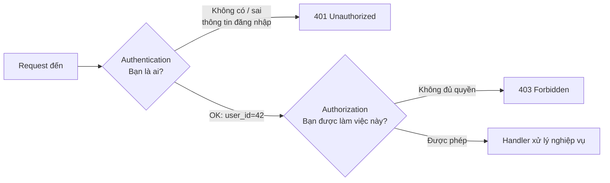

| | Authentication (AuthN) | Authorization (AuthZ) |
|---|---|---|
| Câu hỏi | "Bạn là ai?" | "Bạn được làm gì?" |
| Dựa vào | Mật khẩu, OTP, vân tay, passkey, token | Vai trò (role), thuộc tính, quan hệ sở hữu |
| Lỗi HTTP | **401 Unauthorized** (tên gây nhầm - nghĩa thật là "unauthenticated") | **403 Forbidden** |
| Ví dụ | Đăng nhập bằng email + mật khẩu | Chỉ admin được xóa sản phẩm |
| Thay đổi | Ít (mỗi lần đăng nhập) | Thường xuyên (thăng chức, đổi phòng ban) |

!!! tip "Mẹo nhớ 401 vs 403"
    - **401**: "Tôi **không biết bạn là ai**. Hãy đăng nhập (lại)." - response nên kèm header `WWW-Authenticate`.
    - **403**: "Tôi **biết bạn là ai**, nhưng bạn **không được phép**." Đăng nhập lại cũng vô ích.
    - Một số API trả **404** thay vì 403 cho tài nguyên của người khác (`GET /orders/999` không phải đơn của bạn) để **không tiết lộ** rằng tài nguyên đó tồn tại. GitHub làm vậy với repo private.

### Ba "yếu tố" xác thực (authentication factors)

| Yếu tố | Nghĩa | Ví dụ |
|---|---|---|
| **Something you know** | Điều bạn biết | Mật khẩu, mã PIN, câu hỏi bí mật |
| **Something you have** | Vật bạn có | Điện thoại (app TOTP, SMS OTP), khóa bảo mật YubiKey, thẻ ngân hàng |
| **Something you are** | Đặc điểm cơ thể | Vân tay, Face ID |

**MFA (Multi-Factor Authentication)** = kết hợp **≥ 2 yếu tố khác loại**. Mật khẩu + câu hỏi bí mật **không** phải MFA (cả hai đều là "điều bạn biết"). Mật khẩu + mã OTP trên app ngân hàng **là** MFA. Từ 2024, các ngân hàng Việt Nam bắt buộc xác thực sinh trắc học cho giao dịch lớn - đó chính là thêm yếu tố "something you are".

---

## 📖 2. Lưu mật khẩu đúng cách

### Nguyên tắc số 1: Server KHÔNG BAO GIỜ được biết lại mật khẩu gốc

Nếu database bị lộ (và bạn nên **giả định** một ngày nào đó nó sẽ bị lộ), kẻ tấn công không được lấy ra mật khẩu gốc - vì người dùng **dùng lại mật khẩu** cho email, ngân hàng, Facebook...

| Cách lưu | Đánh giá | Vì sao |
|---|---|---|
| Plaintext `MatKhau@2026` | ❌❌❌ | Lộ DB = lộ hết. Nhân viên có quyền đọc DB cũng thấy |
| Mã hóa (AES) | ❌❌ | Mã hóa là **hai chiều** - có khóa là giải được. Khóa thường nằm ngay trên server |
| `MD5(password)` / `SHA256(password)` | ❌ | Cùng mật khẩu → cùng hash → tra **rainbow table** là ra. GPU tính **hàng tỷ** SHA-256/giây |
| `SHA256(salt + password)` | ⚠️ | Hết rainbow table, nhưng vẫn **quá nhanh** để brute-force |
| **bcrypt / scrypt / Argon2id** (có salt, cố ý chậm) | ✅ | Mỗi lần thử tốn ~100ms và (với scrypt/Argon2) nhiều RAM → brute-force cực đắt |

### Salt là gì? Vì sao phải "chậm"?

- **Salt**: chuỗi ngẫu nhiên (16 byte) sinh **riêng cho từng user**, trộn vào trước khi băm. Hai người cùng đặt mật khẩu `123456` sẽ có hash **khác nhau** → kẻ tấn công không thể tính sẵn một bảng tra cứu cho tất cả mọi người, mà phải tấn công **từng user một**. Salt **không cần bí mật**, lưu ngay cạnh hash.
- **Chậm có chủ đích (key stretching)**: người dùng thật đăng nhập 1 lần, chờ 100ms không sao. Kẻ tấn công cần thử **hàng tỷ** mật khẩu: với SHA-256 mất vài giây, với bcrypt cost 12 mất **hàng nghìn năm**.
- **Pepper** (tùy chọn): một bí mật chung lưu **ngoài DB** (trong secret manager), trộn thêm vào. Nếu chỉ DB bị lộ mà pepper không lộ, hash vô dụng với kẻ tấn công.

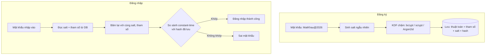

### So sánh các thuật toán

| Thuật toán | Ưu điểm | Lưu ý | Tham số gợi ý (OWASP) |
|---|---|---|---|
| **Argon2id** | Thắng Password Hashing Competition 2015, chống GPU/ASIC tốt nhất | Cần thư viện ngoài | m=19 MiB, t=2, p=1 |
| **scrypt** | Tốn RAM → khó tấn công bằng GPU. **Có sẵn** trong `hashlib` của Python | Tham số hơi khó hiểu | N=2^17, r=8, p=1 (ví dụ dưới dùng 2^14 cho nhanh) |
| **bcrypt** | Lâu đời (1999), có ở mọi ngôn ngữ, thư viện Go chính thức `x/crypto/bcrypt` | Chỉ dùng **72 byte** đầu của mật khẩu | cost ≥ 10 (thường 12) |
| PBKDF2-SHA256 | Chuẩn NIST, cần cho FIPS | Không tốn RAM → GPU tấn công được | ≥ 600.000 vòng |

### Code: băm và kiểm tra mật khẩu

Go dùng `golang.org/x/crypto/bcrypt` (thư viện "nửa chuẩn" do chính Go team duy trì). Python dùng `hashlib.scrypt` - có sẵn trong thư viện chuẩn, không cần cài gì.

```bash
# Go: thêm thư viện (bản v0.43.0 tương thích Go 1.24)
go get golang.org/x/crypto@v0.43.0
```

=== "Go"

    ```go
    package main

    import (
    	"errors"
    	"fmt"
    	"strings"

    	"golang.org/x/crypto/bcrypt"
    )

    // HashPassword băm mật khẩu bằng bcrypt. Salt được sinh ngẫu nhiên và
    // nhúng sẵn trong chuỗi kết quả, nên ta KHÔNG cần lưu salt riêng.
    func HashPassword(password string) (string, error) {
    	// cost 12 = 2^12 vòng lặp. Mỗi lần tăng 1 → chậm gấp đôi.
    	h, err := bcrypt.GenerateFromPassword([]byte(password), 12)
    	if err != nil {
    		return "", err
    	}
    	return string(h), nil
    }

    // CheckPassword so sánh mật khẩu người dùng nhập với hash đã lưu.
    // Bên trong dùng so sánh constant-time, chống timing attack.
    func CheckPassword(hash, password string) bool {
    	return bcrypt.CompareHashAndPassword([]byte(hash), []byte(password)) == nil
    }

    func main() {
    	h1, _ := HashPassword("MatKhau@2026")
    	h2, _ := HashPassword("MatKhau@2026")

    	fmt.Println("Độ dài hash:", len(h1))
    	fmt.Println("Tiền tố:", h1[:7]) // $2a$12$ = thuật toán 2a, cost 12
    	fmt.Println("Cùng mật khẩu, 2 hash giống nhau?", h1 == h2)
    	fmt.Println("Đúng mật khẩu:", CheckPassword(h1, "MatKhau@2026"))
    	fmt.Println("Sai mật khẩu:", CheckPassword(h1, "matkhau@2026"))

    	cost, _ := bcrypt.Cost([]byte(h1))
    	fmt.Println("Cost đọc từ hash:", cost)

    	// bcrypt chỉ xử lý tối đa 72 byte → thư viện từ chối thay vì cắt ngầm
    	_, err := HashPassword(strings.Repeat("a", 73))
    	fmt.Println("Mật khẩu 73 byte:", errors.Is(err, bcrypt.ErrPasswordTooLong))
    }

    // Output:
    // Độ dài hash: 60
    // Tiền tố: $2a$12$
    // Cùng mật khẩu, 2 hash giống nhau? false
    // Đúng mật khẩu: true
    // Sai mật khẩu: false
    // Cost đọc từ hash: 12
    // Mật khẩu 73 byte: true
    ```

=== "Python"

    ```python
    import base64
    import hashlib
    import hmac
    import os

    # Tham số scrypt: N (chi phí CPU/RAM), r (block size), p (song song)
    N, R, P = 2**14, 8, 1


    def hash_password(password: str) -> str:
        salt = os.urandom(16)  # salt ngẫu nhiên, KHÁC nhau cho mỗi user
        dk = hashlib.scrypt(password.encode(), salt=salt, n=N, r=R, p=P, dklen=32)
        b = lambda x: base64.b64encode(x).decode()
        # Lưu kèm thuật toán + tham số để sau này nâng cấp được
        return f"scrypt${N}${R}${P}${b(salt)}${b(dk)}"


    def check_password(stored: str, password: str) -> bool:
        algo, n, r, p, salt_b64, dk_b64 = stored.split("$")
        dk = hashlib.scrypt(password.encode(), salt=base64.b64decode(salt_b64),
                            n=int(n), r=int(r), p=int(p), dklen=32)
        # So sánh constant-time, chống timing attack
        return hmac.compare_digest(dk, base64.b64decode(dk_b64))


    h1 = hash_password("MatKhau@2026")
    h2 = hash_password("MatKhau@2026")
    print("Tiền tố:", "$".join(h1.split("$")[:4]))
    print("Cùng mật khẩu, 2 hash giống nhau?", h1 == h2)
    print("Đúng mật khẩu:", check_password(h1, "MatKhau@2026"))
    print("Sai mật khẩu:", check_password(h1, "matkhau@2026"))

    # Output:
    # Tiền tố: scrypt$16384$8$1
    # Cùng mật khẩu, 2 hash giống nhau? False
    # Đúng mật khẩu: True
    # Sai mật khẩu: False
    ```

Để ý hai điều quan trọng trong output:

1. **Cùng mật khẩu, hai hash khác nhau** - vì salt ngẫu nhiên. Vậy nên **không thể** tìm user bằng `WHERE password_hash = hash(input)`; phải lấy user theo email trước, rồi so sánh.
2. **Chuỗi hash tự mô tả**: `$2a$12$...` ghi rõ thuật toán và cost; `scrypt$16384$8$1$...` ghi rõ tham số. Nhờ vậy khi muốn tăng độ khó, bạn **không cần** bắt mọi người đổi mật khẩu:

```text
Khi user đăng nhập THÀNH CÔNG (lúc này server đang có mật khẩu gốc trong RAM):
  nếu cost trong hash < cost hiện tại (ví dụ 10 < 12)
      → băm lại với cost 12, UPDATE users SET password_hash = ...
```

### 💡 Tips quan trọng

- **Chính sách mật khẩu hiện đại (NIST SP 800-63B)**: tối thiểu 8 ký tự (khuyên 12+), cho phép tới 64+ ký tự, cho phép mọi ký tự kể cả dấu cách và tiếng Việt có dấu; **kiểm tra với danh sách mật khẩu đã bị lộ** (ví dụ API "Have I Been Pwned"); **không** bắt đổi mật khẩu định kỳ 90 ngày (người dùng sẽ đổi `Abc@123` thành `Abc@124`); **không** bắt buộc "phải có chữ hoa + số + ký tự đặc biệt".
- **Không tự chế thuật toán**. Không "băm 2 lần MD5 cho chắc". Dùng thư viện chuẩn.
- **Giới hạn tốc độ đăng nhập** (rate limit theo IP + theo tài khoản), vì dù hash chậm, kẻ tấn công vẫn có thể thử online.
- **Chuẩn hóa Unicode** (NFC/NFKC) trước khi băm - chữ "ệ" gõ trên iPhone và trên Windows có thể là các chuỗi byte khác nhau.

---

## 📖 3. Session-based Authentication (Cookie + Session)

### Ví von: Gửi xe ở siêu thị

Bạn gửi xe máy, bảo vệ đưa cho bạn **một tấm vé có số 0427**. Tấm vé **không chứa** thông tin gì về xe của bạn - nó chỉ là **con số tham chiếu**. Thông tin thật (biển số, giờ gửi) nằm trong **sổ của bảo vệ**. Lúc lấy xe, bảo vệ tra sổ theo số vé.

- Vé xe = **session ID** (chuỗi ngẫu nhiên, lưu trong **cookie** ở trình duyệt)
- Sổ của bảo vệ = **session store** trên server (RAM, Redis, bảng DB)
- Mất vé = mất phiên; bảo vệ gạch sổ = **đăng xuất / thu hồi** phiên ngay lập tức

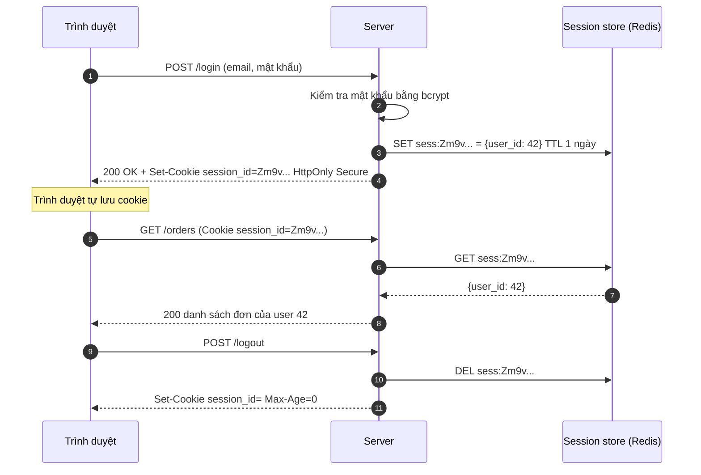

### Các cờ (flags) của cookie - phải thuộc lòng

| Cờ | Tác dụng | Chống lại |
|---|---|---|
| `HttpOnly` | JavaScript (`document.cookie`) **không đọc được** cookie | Đánh cắp session qua **XSS** |
| `Secure` | Chỉ gửi qua **HTTPS** | Nghe lén trên Wi-Fi quán cà phê |
| `SameSite=Lax` | Không gửi cookie khi request đến từ **site khác** (trừ khi người dùng bấm link điều hướng GET) | **CSRF** |
| `SameSite=Strict` | Không bao giờ gửi cookie cho request cross-site, kể cả bấm link | CSRF (chặt hơn, nhưng bấm link từ email vào sẽ thấy "chưa đăng nhập") |
| `SameSite=None` | Luôn gửi (bắt buộc kèm `Secure`) | - (dùng cho widget nhúng, SSO cross-site) |
| `Max-Age` / `Expires` | Thời gian sống. Không đặt = **session cookie**, mất khi đóng trình duyệt | Phiên sống mãi |
| `Path`, `Domain` | Phạm vi gửi cookie. **Không** đặt `Domain` nếu không cần → cookie chỉ gửi cho đúng host | Lộ cookie sang subdomain khác |
| Tiền tố `__Host-` | Tên cookie bắt đầu bằng `__Host-` buộc trình duyệt yêu cầu `Secure`, `Path=/`, không có `Domain` | Subdomain bị chiếm ghi đè cookie |

=== "Go"

    ```go
    package main

    import (
    	"fmt"
    	"net/http"
    )

    func main() {
    	c := &http.Cookie{
    		Name:     "session_id",
    		Value:    "Zm9vYmFyLXJhbmRvbS0zMmJ5dGVz",
    		Path:     "/",
    		MaxAge:   86400,                // sống 1 ngày
    		HttpOnly: true,                 // JavaScript không đọc được → chống đánh cắp qua XSS
    		Secure:   true,                 // chỉ gửi qua HTTPS
    		SameSite: http.SameSiteLaxMode, // hạn chế gửi kèm request cross-site → giảm CSRF
    	}
    	fmt.Println("Set-Cookie:", c.String())

    	logout := &http.Cookie{Name: "session_id", Value: "", Path: "/", MaxAge: -1}
    	fmt.Println("Set-Cookie:", logout.String())
    }

    // Output:
    // Set-Cookie: session_id=Zm9vYmFyLXJhbmRvbS0zMmJ5dGVz; Path=/; Max-Age=86400; HttpOnly; Secure; SameSite=Lax
    // Set-Cookie: session_id=; Path=/; Max-Age=0
    ```

=== "Python"

    ```python
    from http.cookies import SimpleCookie

    c = SimpleCookie()
    c["session_id"] = "Zm9vYmFyLXJhbmRvbS0zMmJ5dGVz"
    m = c["session_id"]
    m["path"] = "/"
    m["max-age"] = 86400     # sống 1 ngày
    m["httponly"] = True     # JavaScript không đọc được
    m["secure"] = True       # chỉ gửi qua HTTPS
    m["samesite"] = "Lax"    # hạn chế gửi kèm request cross-site
    print(c.output())

    # Output:
    # Set-Cookie: session_id=Zm9vYmFyLXJhbmRvbS0zMmJ5dGVz; HttpOnly; Max-Age=86400; Path=/; SameSite=Lax; Secure
    ```

### Session fixation và CSRF - hai lỗi kinh điển

**Session fixation**: kẻ gian lừa nạn nhân dùng một session ID **do kẻ gian biết trước** (ví dụ qua link `?sid=abc`), chờ nạn nhân đăng nhập, rồi dùng chính `abc` để vào tài khoản. **Cách chống**: **luôn sinh session ID mới** ngay sau khi đăng nhập thành công (và khi đổi quyền, đổi mật khẩu), hủy ID cũ.

**CSRF (Cross-Site Request Forgery)**: bạn đang đăng nhập ngân hàng ở tab 1. Tab 2 mở trang `khuyen-mai-hot.vn` có đoạn:

```html
<form action="https://bank.vn/transfer" method="POST">
  <input name="to" value="tai-khoan-ke-gian"><input name="amount" value="50000000">
</form>
<script>document.forms[0].submit()</script>
```

Trình duyệt **tự động gửi kèm cookie** của `bank.vn` → chuyển tiền thành công! Cách chống (dùng **kết hợp**):

1. `SameSite=Lax` hoặc `Strict` cho cookie session (mặc định của Chrome hiện nay là `Lax` nếu không đặt).
2. **CSRF token**: server gửi một token ngẫu nhiên trong form/header `X-CSRF-Token`; trang của kẻ gian không đọc được token này.
3. Kiểm tra header `Origin` / `Sec-Fetch-Site` với các request thay đổi dữ liệu.
4. **Không bao giờ** thay đổi dữ liệu bằng `GET`.

!!! note "Session ID phải được sinh thế nào?"
    Ít nhất **128 bit ngẫu nhiên** từ nguồn an toàn mật mã: `crypto/rand` (Go), `secrets.token_urlsafe(32)` (Python). **Không** dùng `math/rand`, `random.random()`, timestamp, hay `user_id + thời gian` - đoán được là mất tài khoản.

---

## 📖 4. JWT - JSON Web Token

### Ví von: Vé xem phim có mộc đỏ

Khác với vé gửi xe (chỉ là con số tham chiếu), **vé xem phim ghi sẵn mọi thông tin**: phim gì, suất mấy giờ, ghế nào - và có **mộc đỏ** của rạp. Nhân viên soát vé **không cần tra sổ**, chỉ cần kiểm tra mộc là thật và suất chiếu chưa qua.

- Thông tin trên vé = **payload (claims)**
- Mộc đỏ = **chữ ký (signature)** - ai sửa thông tin trên vé thì mộc không còn khớp
- **Nhưng**: ai nhặt được vé cũng đọc được nội dung, và **vé đã phát ra thì rất khó thu hồi** trước giờ chiếu

Đó chính là JWT: **stateless** - server không cần lưu gì, chỉ cần kiểm tra chữ ký.

### Cấu trúc: `header.payload.signature`

```text
eyJhbGciOiJIUzI1NiIsInR5cCI6IkpXVCJ9                    ← header (base64url)
.eyJzdWIiOiJ1XzQyIiwicm9sZSI6ImVkaXRvciIsImlhdCI6...     ← payload (base64url)
.GC4H28bTRbW9Al34kZ4xQQ6Cv9b5CINzu8GcPs0o6Tw             ← signature
```

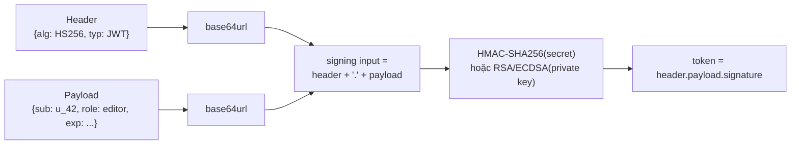

!!! warning "JWT được KÝ, không được MÃ HÓA"
    Base64url **không phải mã hóa** - ai cũng decode được payload (thử dán token vào jwt.io). **Không bao giờ** đặt mật khẩu, số CCCD, số thẻ... vào JWT. (Có chuẩn **JWE** để mã hóa, nhưng hiếm dùng.)

### Các claim chuẩn (registered claims)

| Claim | Ý nghĩa | Ví dụ |
|---|---|---|
| `iss` | Issuer - ai phát hành | `https://auth.shop.vn` |
| `sub` | Subject - token nói về ai (thường là user ID) | `u_42` |
| `aud` | Audience - token dành cho service nào. **Service phải kiểm tra aud là chính mình** | `orders-api` |
| `exp` | Hết hạn (Unix giây) | `1700000900` |
| `nbf` | Không hợp lệ trước thời điểm | `1700000000` |
| `iat` | Thời điểm phát hành | `1700000000` |
| `jti` | ID duy nhất của token - dùng để thu hồi | `7f3a...` |

### Tự viết JWT HS256 bằng thư viện chuẩn

Trong dự án thật bạn sẽ dùng thư viện (`github.com/golang-jwt/jwt/v5`, `PyJWT`). Nhưng tự viết một lần giúp bạn **hiểu vì sao** các lỗ hổng JWT xảy ra. Hai phiên bản dưới đây sinh ra **đúng cùng một token** (vì cùng header, payload và secret):

=== "Go"

    ```go
    package main

    import (
    	"crypto/hmac"
    	"crypto/sha256"
    	"encoding/base64"
    	"encoding/json"
    	"errors"
    	"fmt"
    	"strings"
    	"time"
    )

    var b64 = base64.RawURLEncoding // base64url, không padding "="

    type Claims struct {
    	Sub  string `json:"sub"`  // subject: user ID
    	Role string `json:"role"` // claim tùy chỉnh
    	Iat  int64  `json:"iat"`  // issued at (Unix giây)
    	Exp  int64  `json:"exp"`  // expiration (Unix giây)
    }

    var (
    	ErrMalformed = errors.New("token sai định dạng")
    	ErrAlg       = errors.New("thuật toán không được chấp nhận")
    	ErrSignature = errors.New("chữ ký không hợp lệ")
    	ErrExpired   = errors.New("token đã hết hạn")
    )

    func sign(input string, secret []byte) []byte {
    	mac := hmac.New(sha256.New, secret)
    	mac.Write([]byte(input))
    	return mac.Sum(nil)
    }

    func Sign(c Claims, secret []byte) (string, error) {
    	header := `{"alg":"HS256","typ":"JWT"}`
    	payload, err := json.Marshal(c)
    	if err != nil {
    		return "", err
    	}
    	input := b64.EncodeToString([]byte(header)) + "." + b64.EncodeToString(payload)
    	return input + "." + b64.EncodeToString(sign(input, secret)), nil
    }

    func Verify(token string, secret []byte, now time.Time) (Claims, error) {
    	var c Claims
    	parts := strings.Split(token, ".")
    	if len(parts) != 3 {
    		return c, ErrMalformed
    	}
    	// 1. Kiểm tra header: CHỈ chấp nhận đúng thuật toán server mong đợi
    	hb, err := b64.DecodeString(parts[0])
    	if err != nil {
    		return c, ErrMalformed
    	}
    	var h struct {
    		Alg string `json:"alg"`
    	}
    	if json.Unmarshal(hb, &h) != nil || h.Alg != "HS256" {
    		return c, ErrAlg
    	}
    	// 2. Kiểm tra chữ ký TRƯỚC khi tin vào payload (so sánh constant-time)
    	sig, err := b64.DecodeString(parts[2])
    	if err != nil || !hmac.Equal(sig, sign(parts[0]+"."+parts[1], secret)) {
    		return c, ErrSignature
    	}
    	// 3. Giải mã payload và kiểm tra hạn
    	pb, err := b64.DecodeString(parts[1])
    	if err != nil || json.Unmarshal(pb, &c) != nil {
    		return c, ErrMalformed
    	}
    	if now.Unix() >= c.Exp {
    		return c, ErrExpired
    	}
    	return c, nil
    }

    func main() {
    	secret := []byte("demo-secret-chi-de-hoc")
    	now := time.Unix(1700000000, 0)

    	token, _ := Sign(Claims{Sub: "u_42", Role: "editor",
    		Iat: now.Unix(), Exp: now.Add(15 * time.Minute).Unix()}, secret)
    	fmt.Println(strings.ReplaceAll(token, ".", ".\n"))

    	c, err := Verify(token, secret, now.Add(time.Minute))
    	fmt.Println("1) hợp lệ:", c.Sub, c.Role, err)

    	// Kẻ gian sửa role thành admin nhưng giữ nguyên chữ ký cũ
    	parts := strings.Split(token, ".")
    	fake := b64.EncodeToString([]byte(`{"sub":"u_42","role":"admin","iat":1700000000,"exp":1700000900}`))
    	_, err = Verify(parts[0]+"."+fake+"."+parts[2], secret, now)
    	fmt.Println("2) sửa payload:", err)

    	_, err = Verify(token, secret, now.Add(16*time.Minute))
    	fmt.Println("3) sau 16 phút:", err)

    	none := b64.EncodeToString([]byte(`{"alg":"none","typ":"JWT"}`)) + "." + parts[1] + "."
    	_, err = Verify(none, secret, now)
    	fmt.Println("4) alg=none:", err)
    }

    // Output:
    // eyJhbGciOiJIUzI1NiIsInR5cCI6IkpXVCJ9.
    // eyJzdWIiOiJ1XzQyIiwicm9sZSI6ImVkaXRvciIsImlhdCI6MTcwMDAwMDAwMCwiZXhwIjoxNzAwMDAwOTAwfQ.
    // GC4H28bTRbW9Al34kZ4xQQ6Cv9b5CINzu8GcPs0o6Tw
    // 1) hợp lệ: u_42 editor <nil>
    // 2) sửa payload: chữ ký không hợp lệ
    // 3) sau 16 phút: token đã hết hạn
    // 4) alg=none: thuật toán không được chấp nhận
    ```

=== "Python"

    ```python
    import base64
    import hashlib
    import hmac
    import json


    class TokenError(Exception):
        pass


    def b64e(data: bytes) -> str:
        return base64.urlsafe_b64encode(data).rstrip(b"=").decode()


    def b64d(s: str) -> bytes:
        return base64.urlsafe_b64decode(s + "=" * (-len(s) % 4))


    def _sign(signing_input: str, secret: bytes) -> bytes:
        return hmac.new(secret, signing_input.encode(), hashlib.sha256).digest()


    def sign(claims: dict, secret: bytes) -> str:
        header = {"alg": "HS256", "typ": "JWT"}
        enc = lambda d: b64e(json.dumps(d, separators=(",", ":")).encode())
        signing_input = enc(header) + "." + enc(claims)
        return signing_input + "." + b64e(_sign(signing_input, secret))


    def verify(token: str, secret: bytes, now: int) -> dict:
        parts = token.split(".")
        if len(parts) != 3:
            raise TokenError("token sai định dạng")
        h, p, s = parts
        # 1. Chỉ chấp nhận đúng thuật toán server mong đợi
        if json.loads(b64d(h)).get("alg") != "HS256":
            raise TokenError("thuật toán không được chấp nhận")
        # 2. Kiểm tra chữ ký TRƯỚC khi tin payload
        if not hmac.compare_digest(b64d(s), _sign(h + "." + p, secret)):
            raise TokenError("chữ ký không hợp lệ")
        # 3. Kiểm tra hạn
        claims = json.loads(b64d(p))
        if now >= claims["exp"]:
            raise TokenError("token đã hết hạn")
        return claims


    def check(label, fn):
        try:
            print(label, fn())
        except TokenError as e:
            print(label, e)


    secret = b"demo-secret-chi-de-hoc"
    now = 1700000000
    token = sign({"sub": "u_42", "role": "editor", "iat": now, "exp": now + 900}, secret)
    print(token.replace(".", ".\n"))

    check("1) hợp lệ:", lambda: verify(token, secret, now + 60))

    h, p, s = token.split(".")
    fake = b64e(b'{"sub":"u_42","role":"admin","iat":1700000000,"exp":1700000900}')
    check("2) sửa payload:", lambda: verify(f"{h}.{fake}.{s}", secret, now))
    check("3) sau 16 phút:", lambda: verify(token, secret, now + 16 * 60))
    none = b64e(b'{"alg":"none","typ":"JWT"}') + "." + p + "."
    check("4) alg=none:", lambda: verify(none, secret, now))

    # Output:
    # eyJhbGciOiJIUzI1NiIsInR5cCI6IkpXVCJ9.
    # eyJzdWIiOiJ1XzQyIiwicm9sZSI6ImVkaXRvciIsImlhdCI6MTcwMDAwMDAwMCwiZXhwIjoxNzAwMDAwOTAwfQ.
    # GC4H28bTRbW9Al34kZ4xQQ6Cv9b5CINzu8GcPs0o6Tw
    # 1) hợp lệ: {'sub': 'u_42', 'role': 'editor', 'iat': 1700000000, 'exp': 1700000900}
    # 2) sửa payload: chữ ký không hợp lệ
    # 3) sau 16 phút: token đã hết hạn
    # 4) alg=none: thuật toán không được chấp nhận
    ```

Ba nguyên tắc vàng khi **verify**, thể hiện trong code:

1. **Chỉ chấp nhận đúng thuật toán server mong đợi** (whitelist), không tin trường `alg` trong header. Các thư viện cũ từng chấp nhận `alg: none` (không chữ ký) - kẻ gian tự tạo token admin tùy ý.
2. **Kiểm tra chữ ký trước khi tin payload**, bằng so sánh **constant-time** (`hmac.Equal`, `hmac.compare_digest`) để không lộ thông tin qua thời gian phản hồi.
3. **Luôn kiểm tra `exp`** (và `aud`, `iss` nếu có). Cho phép lệch đồng hồ nhỏ (leeway 30-60 giây) giữa các server.

### HS256 vs RS256 / ES256

| | **HS256** (HMAC, đối xứng) | **RS256 / ES256** (bất đối xứng) |
|---|---|---|
| Khóa | **Một** secret chung để ký và verify | **Private key** để ký, **public key** để verify |
| Ai verify được? | Chỉ ai có secret - mà có secret thì **cũng ký được**! | Bất kỳ ai có public key - nhưng **không ký được** |
| Phù hợp | 1 service vừa phát vừa kiểm tra token | Auth server phát token, **nhiều** service khác verify (microservices, OIDC) |
| Phân phối khóa | Phải chia sẻ secret cho mọi service (rủi ro) | Công khai public key qua **JWKS** (`/.well-known/jwks.json`) |
| Kích thước chữ ký | 32 byte | RS256: 256 byte; ES256: 64 byte |

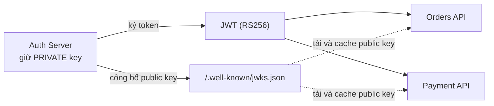

!!! warning "Lỗi 'algorithm confusion'"
    Nếu server dùng RS256 nhưng code verify viết kiểu `verify(token, key)` và **tin `alg` trong header**, kẻ gian đổi header thành `HS256` và ký bằng... **public key** (vốn công khai) làm secret HMAC. Thư viện ngây thơ sẽ chấp nhận! Luôn cố định thuật toán khi verify: `jwt.decode(token, key, algorithms=["RS256"])`.

### Access token + Refresh token

JWT khó thu hồi → giải pháp: cho **access token sống ngắn** (5-15 phút), kèm **refresh token sống dài** (7-30 ngày) để xin access token mới.

| | Access token | Refresh token |
|---|---|---|
| Thời hạn | Ngắn: 5-15 phút | Dài: 7-30 ngày |
| Gửi đến | **Mọi** API (`Authorization: Bearer ...`) | **Chỉ** endpoint `/auth/refresh` |
| Dạng | Thường là JWT (stateless) | Thường là chuỗi ngẫu nhiên **lưu trong DB** (stateful, thu hồi được) |
| Lộ thì sao? | Kẻ gian dùng được tối đa vài phút | Nguy hiểm → cần **rotation + phát hiện dùng lại** |

### Refresh token rotation và phát hiện dùng lại (reuse detection)

Mỗi lần dùng refresh token, server **cấp refresh token mới và vô hiệu hóa cái cũ**. Nếu một refresh token **đã dùng rồi** lại được gửi lên → chắc chắn có kẻ đánh cắp (hoặc người dùng thật, hoặc kẻ gian đang dùng bản sao) → **thu hồi cả "họ" token** (token family), bắt đăng nhập lại.

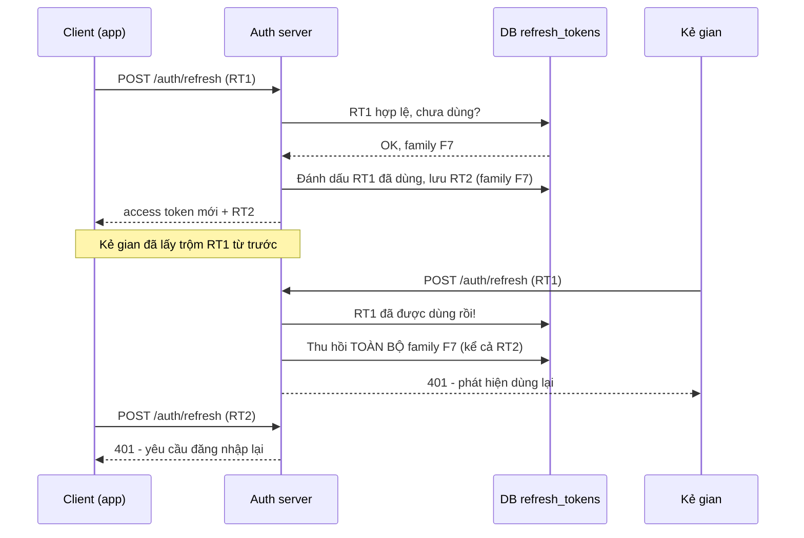

Bảng lưu refresh token gợi ý (lưu **hash** của token, giống API key - xem mục 8):

```sql
CREATE TABLE refresh_tokens (
    id           BIGSERIAL PRIMARY KEY,
    user_id      BIGINT NOT NULL REFERENCES users(id),
    token_hash   CHAR(64) NOT NULL UNIQUE,     -- SHA-256 của token, KHÔNG lưu token gốc
    family_id    UUID NOT NULL,                -- chuỗi rotation
    used_at      TIMESTAMPTZ,                  -- NULL = chưa dùng
    revoked_at   TIMESTAMPTZ,
    expires_at   TIMESTAMPTZ NOT NULL,
    user_agent   TEXT,                         -- hiển thị "Thiết bị đang đăng nhập"
    created_at   TIMESTAMPTZ NOT NULL DEFAULT now()
);
```

### Thu hồi (revocation) JWT - các chiến lược

| Chiến lược | Cách làm | Đánh đổi |
|---|---|---|
| **Hạn ngắn** | Access token 5-15 phút, thu hồi refresh token | Đơn giản nhất; vẫn còn "cửa sổ" vài phút |
| **Denylist theo `jti`** | Khi logout, lưu `jti` vào Redis với TTL = thời gian còn lại của token; mỗi request kiểm tra | Mất một phần "stateless", thêm 1 lần gọi Redis |
| **Token version** | Bảng `users` có cột `token_version`; nhúng vào JWT; đổi mật khẩu → tăng version → mọi token cũ vô hiệu | Cần đọc user (có thể cache) |
| **Session ID trong JWT** | JWT chứa `sid`, kiểm tra session còn sống | Gần như quay lại session truyền thống |

### Session hay JWT? Lưu token ở đâu?

| Tiêu chí | Session + cookie | JWT |
|---|---|---|
| Thu hồi ngay lập tức | ✅ Xóa khỏi store | ⚠️ Khó (xem bảng trên) |
| Scale nhiều server | Cần store chung (Redis) | ✅ Chỉ cần secret/public key |
| Microservices tự verify | ⚠️ Phải gọi về session store | ✅ |
| Kích thước mỗi request | ~40 byte | 300 byte - vài KB |
| Phù hợp | Web truyền thống, SPA cùng domain | Mobile app, API cho bên thứ ba, service-to-service |

**Lưu token ở trình duyệt**: `localStorage` **đọc được bằng JavaScript** → một lỗi XSS là mất token. Với SPA, cách an toàn hơn là để token (hoặc session ID) trong **cookie `HttpOnly; Secure; SameSite`** và dùng pattern **BFF (Backend-for-Frontend)**: backend của web giữ token, trình duyệt chỉ giữ cookie. Với **mobile app**: lưu trong **Keychain (iOS) / Keystore (Android)**, không lưu trong SharedPreferences dạng thường.

!!! tip "Quy tắc thực dụng"
    Web app thông thường → **session + cookie** là lựa chọn đơn giản và an toàn nhất. Đừng dùng JWT chỉ vì "nghe hiện đại". Dùng JWT khi bạn thực sự cần **verify phân tán** (nhiều service, bên thứ ba) hoặc làm việc với **OAuth2/OIDC**.

---

## 📖 5. OAuth 2.0 - Ủy quyền cho ứng dụng bên thứ ba

### Vấn đề OAuth giải quyết

Ứng dụng in ảnh `inanh.vn` muốn lấy ảnh từ Google Photos của bạn. Cách **tệ**: bạn đưa mật khẩu Google cho `inanh.vn`. Họ sẽ có **toàn quyền** tài khoản của bạn (cả Gmail, Drive), và bạn không thể thu hồi riêng mà không đổi mật khẩu.

**OAuth 2.0** cho phép: Google cấp cho `inanh.vn` một **access token** chỉ với **quyền hạn chế** (scope `photos.readonly`), **có thời hạn**, **thu hồi được** - và `inanh.vn` **không bao giờ thấy** mật khẩu của bạn.

Ví von: bạn đưa cho nhân viên rửa xe **chìa khóa phụ (valet key)** - chỉ mở cửa và nổ máy được, không mở được cốp xe và hộc đồ.

### 4 vai trò trong OAuth

| Vai trò | Ví dụ |
|---|---|
| **Resource Owner** | Bạn - chủ sở hữu ảnh |
| **Client** | `inanh.vn` - ứng dụng muốn truy cập |
| **Authorization Server** | `accounts.google.com` - xác thực bạn và cấp token |
| **Resource Server** | Google Photos API - giữ dữ liệu, kiểm tra token |

### Các "grant type" (luồng)

| Luồng | Dùng khi | Trạng thái |
|---|---|---|
| **Authorization Code + PKCE** | Web app, SPA, mobile app - có người dùng | ✅ **Khuyến nghị cho mọi client** (OAuth 2.1) |
| **Client Credentials** | Service gọi service, không có người dùng (cron job gọi API đối tác) | ✅ |
| **Device Code** | Thiết bị không có bàn phím (Smart TV, CLI) - "Mở điện thoại, vào link, nhập mã ABCD-1234" | ✅ |
| **Refresh Token** | Xin access token mới | ✅ |
| Implicit | SPA đời cũ - token trả thẳng trên URL | ❌ **Đã bị loại bỏ** |
| Resource Owner Password | Client nhận thẳng mật khẩu người dùng | ❌ **Đã bị loại bỏ** |

### Authorization Code + PKCE - từng bước

**PKCE** (Proof Key for Code Exchange, đọc là "pixy") chống việc **authorization code bị đánh cắp** (ví dụ một app độc hại trên điện thoại đăng ký cùng URL scheme). Client sinh một bí mật `code_verifier`, chỉ gửi **hash** của nó (`code_challenge`) ở bước đầu, và gửi bản gốc ở bước đổi code. Kẻ trộm code không có `code_verifier` → không đổi được token.

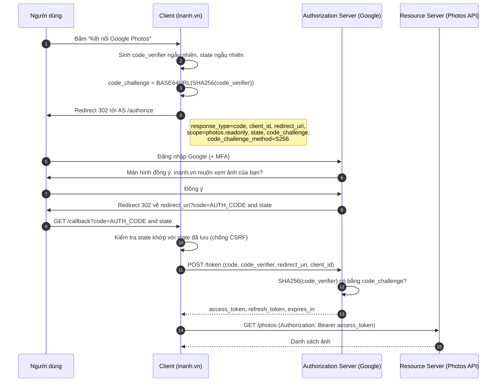

Các điểm bảo mật cần nhớ:

- **`state`**: chuỗi ngẫu nhiên gắn với phiên của người dùng, chống CSRF ở bước callback (kẻ gian ép bạn "kết nối" vào tài khoản của **hắn**).
- **`redirect_uri` phải khớp chính xác** với danh sách đã đăng ký (không dùng wildcard) - nếu không, kẻ gian đổi redirect về domain của hắn và nhận code.
- **Code chỉ dùng một lần**, sống rất ngắn (≤ 60 giây).
- `client_secret` chỉ dùng cho **confidential client** (có backend). SPA và mobile app là **public client** - không giữ được bí mật, nên PKCE là bắt buộc.

### Code: sinh PKCE (và API key - dùng ở mục 8)

Kiểm tra bằng vector mẫu trong RFC 7636: `code_verifier = dBjftJeZ4CVP-mB92K27uhbUJU1p1r_wW1gFWFOEjXk` phải cho `code_challenge = E9Melhoa2OwvFrEMTJguCHaoeK1t8URWbuGJSstw-cM`.

=== "Go"

    ```go
    package main

    import (
    	"crypto/rand"
    	"crypto/sha256"
    	"encoding/base64"
    	"encoding/hex"
    	"fmt"
    )

    var b64 = base64.RawURLEncoding

    // NewVerifier sinh code_verifier ngẫu nhiên (32 byte → 43 ký tự base64url).
    func NewVerifier() string {
    	b := make([]byte, 32)
    	rand.Read(b) // crypto/rand, KHÔNG dùng math/rand
    	return b64.EncodeToString(b)
    }

    // Challenge tính code_challenge theo phương thức S256.
    func Challenge(verifier string) string {
    	sum := sha256.Sum256([]byte(verifier))
    	return b64.EncodeToString(sum[:])
    }

    // NewAPIKey sinh API key có tiền tố dễ nhận diện + phần bí mật ngẫu nhiên.
    func NewAPIKey() string {
    	b := make([]byte, 24)
    	rand.Read(b)
    	return "sk_live_" + b64.EncodeToString(b)
    }

    // HashAPIKey: DB chỉ lưu SHA-256 của key (key đã đủ ngẫu nhiên nên không cần bcrypt).
    func HashAPIKey(key string) string {
    	sum := sha256.Sum256([]byte(key))
    	return hex.EncodeToString(sum[:])
    }

    func main() {
    	// Vector kiểm thử trong RFC 7636, Phụ lục B
    	v := "dBjftJeZ4CVP-mB92K27uhbUJU1p1r_wW1gFWFOEjXk"
    	fmt.Println("challenge:", Challenge(v))
    	fmt.Println("verifier mới dài:", len(NewVerifier()))

    	key := NewAPIKey()
    	fmt.Println("API key dài:", len(key), "tiền tố:", key[:8])
    	fmt.Println("hash mẫu:", HashAPIKey("sk_live_demo")[:16]+"...")
    }

    // Output:
    // challenge: E9Melhoa2OwvFrEMTJguCHaoeK1t8URWbuGJSstw-cM
    // verifier mới dài: 43
    // API key dài: 40 tiền tố: sk_live_
    // hash mẫu: 26f42710fb88cf0d...
    ```

=== "Python"

    ```python
    import base64
    import hashlib
    import secrets


    def b64e(data: bytes) -> str:
        return base64.urlsafe_b64encode(data).rstrip(b"=").decode()


    def new_verifier() -> str:
        return secrets.token_urlsafe(32)  # 32 byte ngẫu nhiên → 43 ký tự


    def challenge(verifier: str) -> str:
        return b64e(hashlib.sha256(verifier.encode()).digest())


    def new_api_key() -> str:
        return "sk_live_" + secrets.token_urlsafe(24)


    def hash_api_key(key: str) -> str:
        return hashlib.sha256(key.encode()).hexdigest()


    # Vector kiểm thử trong RFC 7636, Phụ lục B
    print("challenge:", challenge("dBjftJeZ4CVP-mB92K27uhbUJU1p1r_wW1gFWFOEjXk"))
    print("verifier mới dài:", len(new_verifier()))
    key = new_api_key()
    print("API key dài:", len(key), "tiền tố:", key[:8])
    print("hash mẫu:", hash_api_key("sk_live_demo")[:16] + "...")

    # Output:
    # challenge: E9Melhoa2OwvFrEMTJguCHaoeK1t8URWbuGJSstw-cM
    # verifier mới dài: 43
    # API key dài: 40 tiền tố: sk_live_
    # hash mẫu: 26f42710fb88cf0d...
    ```

---

## 📖 6. OpenID Connect (OIDC) - "Đăng nhập bằng Google"

OAuth 2.0 là giao thức **ủy quyền** (authorization) - access token nói "được đọc ảnh", nhưng **không nói bạn là ai**. Rất nhiều hệ thống từng "lạm dụng" OAuth để đăng nhập (gọi API `/me` bằng access token) và gặp lỗi bảo mật. **OpenID Connect** là một lớp mỏng **bên trên OAuth 2.0** để làm **xác thực** đúng chuẩn:

| Thành phần | Ý nghĩa |
|---|---|
| Scope `openid` | Bật chế độ OIDC. Thêm `profile`, `email` để lấy tên, email |
| **ID Token** | Một **JWT** (thường RS256) chứa thông tin người dùng: `iss`, `sub`, `aud`, `exp`, `email`, `name`, `nonce` |
| `/userinfo` | Endpoint trả thêm thông tin người dùng |
| Discovery | `https://accounts.google.com/.well-known/openid-configuration` - mô tả mọi endpoint, JWKS |
| `nonce` | Chuỗi ngẫu nhiên client gửi đi, phải xuất hiện lại trong ID token - chống replay |

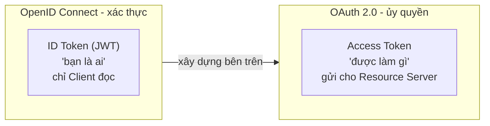

**Checklist verify ID token** (thư viện OIDC sẽ làm giúp, nhưng bạn cần biết):

1. Chữ ký hợp lệ với public key lấy từ JWKS của issuer (cố định thuật toán!)
2. `iss` đúng issuer mong đợi (`https://accounts.google.com`)
3. `aud` chứa **client_id của bạn** (không phải token phát cho app khác)
4. `exp` chưa qua; `nonce` khớp với nonce đã gửi
5. Định danh người dùng bằng cặp **(`iss`, `sub`)**, **không** bằng email - email có thể đổi, và một số provider không xác minh email

```sql
-- Liên kết tài khoản mạng xã hội với user nội bộ
CREATE TABLE user_identities (
    user_id    BIGINT NOT NULL REFERENCES users(id),
    provider   TEXT   NOT NULL,        -- 'google', 'apple', 'github'
    subject    TEXT   NOT NULL,        -- claim 'sub' từ ID token
    email      TEXT,
    PRIMARY KEY (provider, subject)
);
```

---

## 📖 7. SSO - Single Sign-On

**SSO** = đăng nhập **một lần**, dùng được **nhiều ứng dụng**. Ví dụ: đăng nhập Google một lần là vào được Gmail, YouTube, Drive. Trong doanh nghiệp: nhân viên đăng nhập **Microsoft Entra ID / Okta / Keycloak** một lần là vào được Jira, Slack, hệ thống HR, dashboard nội bộ.

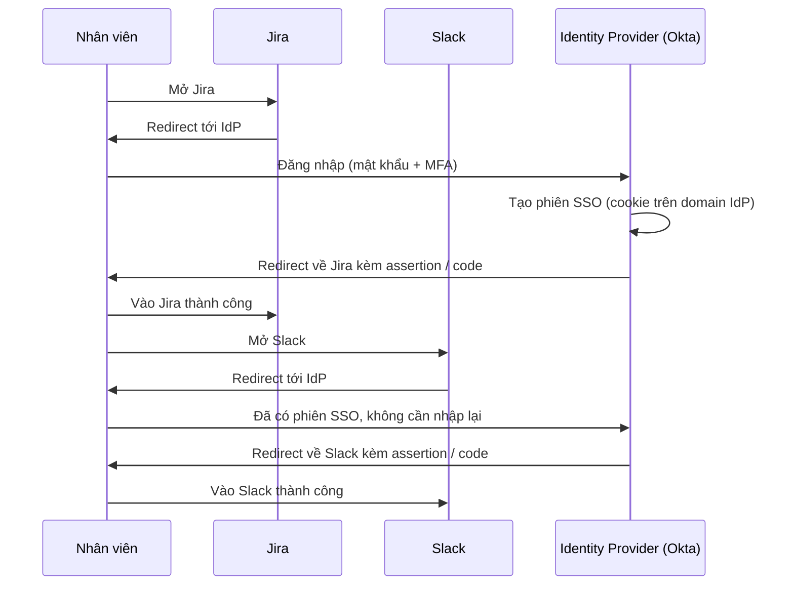

| | **SAML 2.0** | **OIDC** |
|---|---|---|
| Năm | 2005 | 2014 |
| Định dạng | XML (ký bằng XML-DSig) | JSON / JWT |
| Phổ biến ở | Doanh nghiệp, ứng dụng đời cũ | Ứng dụng mới, mobile, SPA |
| Độ phức tạp | Cao, nhiều lỗ hổng lịch sử về XML signature | Thấp hơn |

Lợi ích lớn nhất của SSO cho doanh nghiệp: **offboarding** - nhân viên nghỉ việc, IT khóa **một** tài khoản ở IdP là mất quyền vào **mọi** hệ thống. Kèm theo là **SCIM** - chuẩn để IdP tự động tạo/khóa tài khoản ở các ứng dụng.

!!! tip "Đừng tự xây Authorization Server"
    Tự viết OAuth/OIDC server rất dễ sai. Dùng giải pháp có sẵn: **Keycloak**, **Ory**, **Authentik**, **Zitadel** (tự host) hoặc **Auth0**, **Clerk**, **AWS Cognito**, **Firebase Auth** (dịch vụ). Việc của bạn là **tích hợp đúng**.

---

## 📖 8. API Key - cho đối tác và máy gọi máy

Khi đối tác (ví dụ một shop dùng API vận chuyển của bạn) gọi API **từ server của họ**, không có người dùng đứng trước màn hình → không dùng được luồng đăng nhập. **API key** là lựa chọn đơn giản nhất.

### Thiết kế API key tốt

- **Có tiền tố dễ nhận diện**: `sk_live_...`, `sk_test_...` (kiểu Stripe). Nhìn là biết loại key, môi trường; công cụ quét bí mật (GitHub secret scanning) dễ phát hiện khi bị commit nhầm.
- **Đủ ngẫu nhiên**: ≥ 128 bit từ `crypto/rand` / `secrets`.
- **Chỉ lưu hash** (SHA-256 là đủ, vì key đã là chuỗi ngẫu nhiên dài - không có "từ điển" để dò như mật khẩu người dùng). Chỉ **hiển thị key đúng một lần** lúc tạo. Lưu thêm vài ký tự đầu/cuối để người dùng nhận ra ("sk_live_Ab...9Xz").
- **Gửi qua header**, không qua query string (URL bị ghi vào log, lịch sử trình duyệt): `Authorization: Bearer sk_live_...` hoặc `X-API-Key: ...`.
- **Có scope và hạn dùng**, hỗ trợ **nhiều key cùng lúc** để đối tác **xoay vòng (rotate)** không gián đoạn.
- **Rate limit theo key**, ghi log `last_used_at`.

```sql
CREATE TABLE api_keys (
    id           BIGSERIAL PRIMARY KEY,
    partner_id   BIGINT NOT NULL REFERENCES partners(id),
    key_hash     CHAR(64) NOT NULL UNIQUE,     -- SHA-256 hex
    display_hint TEXT NOT NULL,                -- 'sk_live_Ab...9Xz'
    scopes       TEXT[] NOT NULL,              -- {'shipments:read','shipments:write'}
    expires_at   TIMESTAMPTZ,
    revoked_at   TIMESTAMPTZ,
    last_used_at TIMESTAMPTZ,
    created_at   TIMESTAMPTZ NOT NULL DEFAULT now()
);
-- Kiểm tra: SELECT ... WHERE key_hash = sha256(header) AND revoked_at IS NULL
```

Code sinh key và băm key nằm trong ví dụ PKCE ở mục 5 (hàm `NewAPIKey`/`new_api_key` và `HashAPIKey`/`hash_api_key`).

| Phương thức | Khi nào dùng |
|---|---|
| **API key** | Đối tác đơn giản, nội bộ, dịch vụ công khai có rate limit |
| **OAuth2 Client Credentials** | Đối tác lớn, cần token hạn ngắn, scope chi tiết |
| **HMAC request signing** | Cần chống sửa nội dung và replay (xem webhook ở [Bài 3](./03-api-design.md)) - kiểu AWS Signature v4 |
| **mTLS** | Service-to-service trong hạ tầng nội bộ, ngân hàng |

---

## 📖 9. MFA và TOTP - mã 6 số đổi mỗi 30 giây

Google Authenticator, Microsoft Authenticator, app ngân hàng... sinh mã 6 số đổi mỗi 30 giây. Điều kỳ diệu: **điện thoại không cần mạng** mà mã vẫn khớp với server. Bí quyết: **cả hai bên cùng giữ một secret** (chia sẻ qua mã QR lúc cài đặt) và **cùng nhìn đồng hồ**.

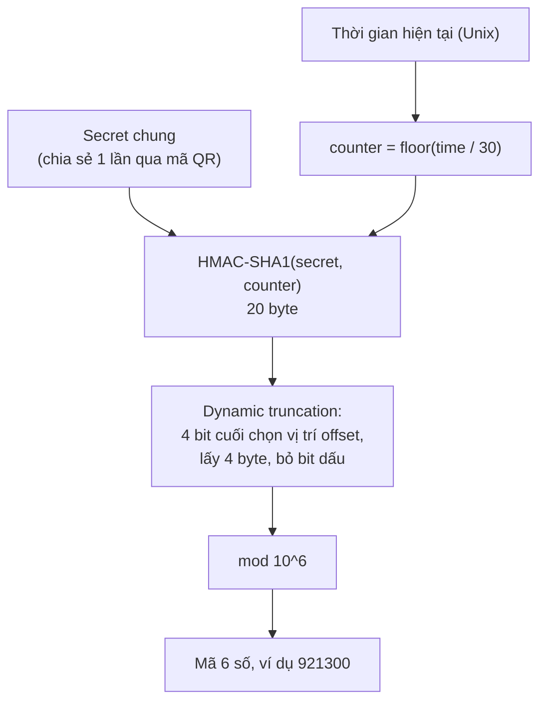

Mã QR chứa một URI dạng:

```text
otpauth://totp/Shop.vn:an@example.com?secret=GEZDGNBVGY3TQOJQGEZDGNBVGY3TQOJQ&issuer=Shop.vn&digits=6&period=30
```

### Code: TOTP theo RFC 6238, kiểm tra bằng vector chuẩn

RFC 6238 (Phụ lục B) cho sẵn bảng kết quả với secret `12345678901234567890` và mã 8 chữ số - ta dùng để kiểm chứng cài đặt của mình **đúng từng chữ số**:

=== "Go"

    ```go
    package main

    import (
    	"crypto/hmac"
    	"crypto/sha1"
    	"encoding/base32"
    	"encoding/binary"
    	"fmt"
    	"time"
    )

    // HOTP (RFC 4226): mã dùng một lần dựa trên bộ đếm.
    func HOTP(secret []byte, counter uint64, digits int) string {
    	var msg [8]byte
    	binary.BigEndian.PutUint64(msg[:], counter)
    	mac := hmac.New(sha1.New, secret)
    	mac.Write(msg[:])
    	sum := mac.Sum(nil) // 20 byte

    	// Dynamic truncation: 4 bit cuối quyết định vị trí lấy 4 byte
    	offset := sum[len(sum)-1] & 0x0f
    	code := binary.BigEndian.Uint32(sum[offset:offset+4]) & 0x7fffffff

    	mod := uint32(1)
    	for range digits {
    		mod *= 10
    	}
    	return fmt.Sprintf("%0*d", digits, code%mod)
    }

    // TOTP (RFC 6238): bộ đếm = số bước 30 giây kể từ Unix epoch.
    func TOTP(secret []byte, t time.Time, digits int) string {
    	return HOTP(secret, uint64(t.Unix()/30), digits)
    }

    // Verify chấp nhận lệch ±1 bước (đồng hồ điện thoại có thể lệch vài giây).
    func Verify(secret []byte, code string, now time.Time) bool {
    	for _, skew := range []int{-1, 0, 1} {
    		t := now.Add(time.Duration(skew*30) * time.Second)
    		if hmac.Equal([]byte(TOTP(secret, t, len(code))), []byte(code)) {
    			return true
    		}
    	}
    	return false
    }

    func main() {
    	secret := []byte("12345678901234567890") // secret mẫu của RFC 6238 (SHA-1)

    	for _, ts := range []int64{59, 1111111109, 1111111111, 1234567890, 2000000000} {
    		fmt.Printf("T=%-10d → %s\n", ts, TOTP(secret, time.Unix(ts, 0), 8))
    	}

    	// Secret dạng base32 để nhập vào Google Authenticator
    	enc := base32.StdEncoding.WithPadding(base32.NoPadding)
    	fmt.Println("Base32:", enc.EncodeToString(secret))

    	now := time.Unix(1700000000, 0)
    	code := TOTP(secret, now, 6)
    	fmt.Println("Mã 6 số lúc now:", code)
    	fmt.Println("Verify đúng lúc:", Verify(secret, code, now))
    	fmt.Println("Verify trễ 25s:", Verify(secret, code, now.Add(25*time.Second)))
    	fmt.Println("Verify trễ 2 phút:", Verify(secret, code, now.Add(2*time.Minute)))
    }

    // Output:
    // T=59         → 94287082
    // T=1111111109 → 07081804
    // T=1111111111 → 14050471
    // T=1234567890 → 89005924
    // T=2000000000 → 69279037
    // Base32: GEZDGNBVGY3TQOJQGEZDGNBVGY3TQOJQ
    // Mã 6 số lúc now: 921300
    // Verify đúng lúc: true
    // Verify trễ 25s: true
    // Verify trễ 2 phút: false
    ```

=== "Python"

    ```python
    import base64
    import hashlib
    import hmac
    import struct


    def hotp(secret: bytes, counter: int, digits: int = 6) -> str:
        digest = hmac.new(secret, struct.pack(">Q", counter), hashlib.sha1).digest()
        offset = digest[-1] & 0x0F  # dynamic truncation
        code = struct.unpack(">I", digest[offset:offset + 4])[0] & 0x7FFFFFFF
        return str(code % 10**digits).zfill(digits)


    def totp(secret: bytes, unix_time: int, digits: int = 6, step: int = 30) -> str:
        return hotp(secret, unix_time // step, digits)


    def verify(secret: bytes, code: str, now: int) -> bool:
        # chấp nhận lệch ±1 bước 30 giây
        return any(
            hmac.compare_digest(totp(secret, now + skew * 30, len(code)), code)
            for skew in (-1, 0, 1)
        )


    secret = b"12345678901234567890"  # secret mẫu của RFC 6238 (SHA-1)
    for ts in (59, 1111111109, 1111111111, 1234567890, 2000000000):
        print(f"T={ts:<10} → {totp(secret, ts, 8)}")

    print("Base32:", base64.b32encode(secret).decode().rstrip("="))

    now = 1700000000
    code = totp(secret, now)
    print("Mã 6 số lúc now:", code)
    print("Verify đúng lúc:", verify(secret, code, now))
    print("Verify trễ 25s:", verify(secret, code, now + 25))
    print("Verify trễ 2 phút:", verify(secret, code, now + 120))

    # Output:
    # T=59         → 94287082
    # T=1111111109 → 07081804
    # T=1111111111 → 14050471
    # T=1234567890 → 89005924
    # T=2000000000 → 69279037
    # Base32: GEZDGNBVGY3TQOJQGEZDGNBVGY3TQOJQ
    # Mã 6 số lúc now: 921300
    # Verify đúng lúc: True
    # Verify trễ 25s: True
    # Verify trễ 2 phút: False
    ```

### 💡 Tips quan trọng về MFA

- **Chống dùng lại mã (replay)**: lưu bước thời gian (`counter`) cuối cùng đã dùng thành công cho mỗi user; từ chối mã có counter ≤ giá trị đó.
- **Rate limit** việc nhập mã: chỉ có 1.000.000 tổ hợp, cho thử vô hạn là bị dò ra.
- **Mã khôi phục (recovery codes)**: 8-10 mã dùng một lần, **lưu dạng hash** như mật khẩu, cho người dùng tải về khi bật MFA.
- **Mã hóa secret TOTP trong DB** (khác với mật khẩu, server **cần** secret gốc để tính mã) - dùng khóa trong KMS/secret manager.
- **SMS OTP** yếu hơn (SIM swap, lừa đảo tổng đài), nhưng vẫn hơn không có gì.
- **Passkey / WebAuthn** là tương lai: khóa riêng nằm trong chip bảo mật của điện thoại/laptop, **chống phishing** tuyệt đối vì trình duyệt gắn chữ ký với đúng domain.

---

## 📖 10. Authorization - RBAC, ABAC và lỗi IDOR

### RBAC - Role-Based Access Control

Gán **quyền (permission)** cho **vai trò (role)**, gán vai trò cho **người dùng**. Giống công ty: "Kế toán" được xem báo cáo tài chính, "Nhân viên kho" được nhập xuất hàng. Nhân viên mới vào chỉ cần gán vai trò, không phải cấp từng quyền.

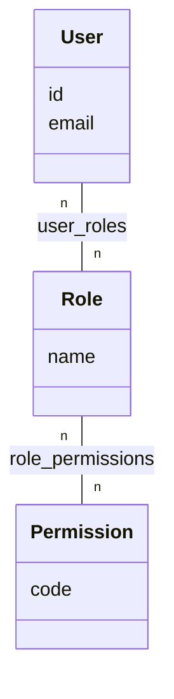

```sql
CREATE TABLE roles        (id SERIAL PRIMARY KEY, name TEXT UNIQUE NOT NULL);
CREATE TABLE permissions  (id SERIAL PRIMARY KEY, code TEXT UNIQUE NOT NULL);  -- 'post:publish'
CREATE TABLE user_roles   (user_id BIGINT REFERENCES users(id), role_id INT REFERENCES roles(id),
                           PRIMARY KEY (user_id, role_id));
CREATE TABLE role_permissions (role_id INT REFERENCES roles(id), permission_id INT REFERENCES permissions(id),
                           PRIMARY KEY (role_id, permission_id));
```

!!! tip "Kiểm tra theo permission, không theo role"
    Viết `if user.Can("post:publish")` thay vì `if user.Role == "admin"`. Khi thêm vai trò mới ("biên tập viên cấp cao" cũng được xuất bản bài), bạn chỉ sửa **dữ liệu** trong bảng `role_permissions`, không phải tìm sửa hàng chục câu `if` trong code.

### ABAC - Attribute-Based Access Control

RBAC không trả lời được các câu hỏi như: "Nhân viên được sửa tài liệu **của phòng ban mình**, **trong giờ hành chính**, và tài liệu **chưa bị khóa**". **ABAC** quyết định dựa trên **thuộc tính** của:

- **Chủ thể** (user): phòng ban, cấp bậc, vai trò
- **Tài nguyên**: chủ sở hữu, phòng ban, trạng thái
- **Hành động**: đọc, sửa, xóa
- **Ngữ cảnh**: thời gian, IP, thiết bị

| | RBAC | ABAC | ReBAC (quan hệ) |
|---|---|---|---|
| Quyết định dựa trên | Vai trò | Thuộc tính + luật | Quan hệ giữa các đối tượng ("An là **thành viên** của nhóm sở hữu thư mục chứa file") |
| Ví dụ | "Admin được xóa user" | "Chủ đơn hàng được hủy đơn khi status = pending" | Google Drive, GitHub org/team |
| Ưu | Đơn giản, dễ audit | Linh hoạt | Rất hợp với chia sẻ, phân cấp |
| Nhược | "Bùng nổ vai trò" | Khó audit, khó debug | Cần hạ tầng riêng (Google Zanzibar, OpenFGA, SpiceDB) |

Thực tế hầu hết hệ thống dùng **RBAC làm nền + vài luật ABAC** (đặc biệt là luật **sở hữu**). Code dưới đây có cả RBAC, ABAC và middleware trả **401/403** đúng chỗ:

=== "Go"

    ```go
    package main

    import (
    	"fmt"
    	"net/http"
    	"net/http/httptest"
    	"slices"
    )

    // ===== RBAC: quyền gắn với vai trò =====
    type Permission string

    const (
    	PostRead    Permission = "post:read"
    	PostWrite   Permission = "post:write"
    	PostPublish Permission = "post:publish"
    	UserManage  Permission = "user:manage"
    )

    var rolePerms = map[string][]Permission{
    	"viewer": {PostRead},
    	"editor": {PostRead, PostWrite},
    	"admin":  {PostRead, PostWrite, PostPublish, UserManage},
    }

    type User struct {
    	ID    string
    	Roles []string
    	Dept  string
    }

    func (u User) Can(p Permission) bool {
    	for _, r := range u.Roles {
    		if slices.Contains(rolePerms[r], p) {
    			return true
    		}
    	}
    	return false
    }

    // ===== ABAC: quyết định dựa trên thuộc tính của user, tài nguyên, ngữ cảnh =====
    type Doc struct {
    	OwnerID string
    	Dept    string
    	Locked  bool
    }

    func CanEditDoc(u User, d Doc, hour int) bool {
    	if d.Locked {
    		return false // tài liệu đã khóa: không ai sửa
    	}
    	if u.ID == d.OwnerID {
    		return true // chủ sở hữu luôn sửa được
    	}
    	// cùng phòng ban + có quyền ghi + trong giờ hành chính
    	return u.Dept == d.Dept && u.Can(PostWrite) && hour >= 8 && hour < 18
    }

    // ===== Middleware HTTP =====
    var users = map[string]User{ // giả lập: token → user (thực tế lấy từ session/JWT)
    	"tok-an":   {ID: "u1", Roles: []string{"viewer"}, Dept: "sales"},
    	"tok-binh": {ID: "u2", Roles: []string{"admin"}, Dept: "it"},
    }

    func RequirePerm(p Permission, next http.HandlerFunc) http.HandlerFunc {
    	return func(w http.ResponseWriter, r *http.Request) {
    		u, ok := users[r.Header.Get("Authorization")]
    		if !ok {
    			http.Error(w, "chưa đăng nhập", http.StatusUnauthorized) // 401: authn thất bại
    			return
    		}
    		if !u.Can(p) {
    			http.Error(w, "không đủ quyền", http.StatusForbidden) // 403: authz thất bại
    			return
    		}
    		next(w, r)
    	}
    }

    func main() {
    	editor := User{ID: "u3", Roles: []string{"editor"}, Dept: "sales"}
    	fmt.Println("editor post:write?", editor.Can(PostWrite))
    	fmt.Println("editor post:publish?", editor.Can(PostPublish))

    	doc := Doc{OwnerID: "u9", Dept: "sales"}
    	fmt.Println("ABAC 10h:", CanEditDoc(editor, doc, 10))
    	fmt.Println("ABAC 22h:", CanEditDoc(editor, doc, 22))
    	doc.Locked = true
    	fmt.Println("ABAC doc khóa:", CanEditDoc(editor, doc, 10))

    	h := RequirePerm(PostPublish, func(w http.ResponseWriter, r *http.Request) {
    		fmt.Fprint(w, "đã xuất bản")
    	})
    	for _, tok := range []string{"", "tok-an", "tok-binh"} {
    		req := httptest.NewRequest("POST", "/posts/1/publish", nil)
    		req.Header.Set("Authorization", tok)
    		rec := httptest.NewRecorder()
    		h(rec, req)
    		fmt.Printf("token=%q → %d\n", tok, rec.Code)
    	}
    }

    // Output:
    // editor post:write? true
    // editor post:publish? false
    // ABAC 10h: true
    // ABAC 22h: false
    // ABAC doc khóa: false
    // token="" → 401
    // token="tok-an" → 403
    // token="tok-binh" → 200
    ```

=== "Python"

    ```python
    from dataclasses import dataclass, field
    from functools import wraps

    # ===== RBAC =====
    ROLE_PERMS = {
        "viewer": {"post:read"},
        "editor": {"post:read", "post:write"},
        "admin": {"post:read", "post:write", "post:publish", "user:manage"},
    }


    @dataclass
    class User:
        id: str
        roles: list[str] = field(default_factory=list)
        dept: str = ""

        def can(self, perm: str) -> bool:
            return any(perm in ROLE_PERMS.get(r, set()) for r in self.roles)


    # ===== ABAC =====
    @dataclass
    class Doc:
        owner_id: str
        dept: str
        locked: bool = False


    def can_edit_doc(u: User, d: Doc, hour: int) -> bool:
        if d.locked:
            return False
        if u.id == d.owner_id:
            return True
        return u.dept == d.dept and u.can("post:write") and 8 <= hour < 18


    # ===== "Middleware" dạng decorator =====
    class HTTPError(Exception):
        def __init__(self, status, msg):
            super().__init__(msg)
            self.status = status


    USERS = {
        "tok-an": User("u1", ["viewer"], "sales"),
        "tok-binh": User("u2", ["admin"], "it"),
    }


    def require_perm(perm):
        def deco(handler):
            @wraps(handler)
            def wrapper(token, *args):
                user = USERS.get(token)
                if user is None:
                    raise HTTPError(401, "chưa đăng nhập")
                if not user.can(perm):
                    raise HTTPError(403, "không đủ quyền")
                return handler(user, *args)
            return wrapper
        return deco


    @require_perm("post:publish")
    def publish_post(user, post_id):
        return 200


    editor = User("u3", ["editor"], "sales")
    print("editor post:write?", editor.can("post:write"))
    print("editor post:publish?", editor.can("post:publish"))
    doc = Doc(owner_id="u9", dept="sales")
    print("ABAC 10h:", can_edit_doc(editor, doc, 10))
    print("ABAC 22h:", can_edit_doc(editor, doc, 22))
    doc.locked = True
    print("ABAC doc khóa:", can_edit_doc(editor, doc, 10))

    for tok in ("", "tok-an", "tok-binh"):
        try:
            status = publish_post(tok, 1)
        except HTTPError as e:
            status = e.status
        print(f"token={tok!r} → {status}")

    # Output:
    # editor post:write? True
    # editor post:publish? False
    # ABAC 10h: True
    # ABAC 22h: False
    # ABAC doc khóa: False
    # token='' → 401
    # token='tok-an' → 403
    # token='tok-binh' → 200
    ```

### IDOR / BOLA - lỗ hổng API số 1

**IDOR** (Insecure Direct Object Reference), trong OWASP API Top 10 gọi là **BOLA** (Broken Object Level Authorization): API kiểm tra "đã đăng nhập chưa" nhưng **quên kiểm tra tài nguyên có thuộc về người đó không**.

```text
An đăng nhập, xem đơn của mình:   GET /api/orders/1001   → 200 (đơn của An)
An thử đổi số:                     GET /api/orders/1002   → 200 (đơn của Bình!!!)  ← IDOR
```

```sql
-- ❌ Sai: chỉ lọc theo id từ URL
SELECT * FROM orders WHERE id = $1;

-- ✅ Đúng: luôn ràng buộc thêm chủ sở hữu (và tenant nếu là SaaS nhiều khách hàng)
SELECT * FROM orders WHERE id = $1 AND customer_id = $2;          -- $2 lấy từ session/token, KHÔNG lấy từ request
SELECT * FROM invoices WHERE id = $1 AND tenant_id = $2;
```

!!! warning "UUID không phải là phân quyền"
    Đổi ID từ `1002` sang UUID ngẫu nhiên khiến việc **đoán** khó hơn, nhưng ID vẫn có thể lộ qua link chia sẻ, log, email. **Luôn kiểm tra quyền sở hữu** ở server. (Xem thêm về chọn khóa chính ở [Bài 5](./05-relational-database-design.md).)

---

## 📖 11. Các lỗ hổng xác thực thường gặp và cách phòng

| Lỗ hổng | Mô tả | Phòng chống |
|---|---|---|
| **Credential stuffing** | Dùng danh sách email/mật khẩu bị lộ từ site khác để thử đăng nhập hàng loạt | Rate limit, CAPTCHA sau vài lần sai, kiểm tra mật khẩu bị lộ, MFA, phát hiện đăng nhập bất thường |
| **Brute force** | Thử hàng loạt mật khẩu cho một tài khoản | Rate limit theo tài khoản + IP, delay tăng dần. Cẩn thận: khóa cứng tài khoản → kẻ gian có thể cố ý khóa tài khoản người khác |
| **User enumeration** | Thông báo "Email không tồn tại" vs "Sai mật khẩu" giúp kẻ gian dò email | Thông báo chung "Email hoặc mật khẩu không đúng"; thời gian phản hồi như nhau (vẫn chạy bcrypt với hash giả khi email không tồn tại); form quên mật khẩu luôn trả "Nếu email tồn tại, chúng tôi đã gửi link" |
| **Session fixation** | Dùng session ID kẻ gian biết trước | Sinh session ID mới sau đăng nhập |
| **CSRF** | Trang khác lợi dụng cookie tự gửi | SameSite, CSRF token, kiểm tra Origin |
| **XSS đánh cắp token** | Script độc đọc `localStorage` / `document.cookie` | Cookie `HttpOnly`, CSP, escape output |
| **JWT `alg: none` / algorithm confusion** | Token không chữ ký hoặc ký bằng public key | Whitelist thuật toán khi verify |
| **JWT secret yếu** | Secret `secret123` bị brute-force offline (hashcat) | Secret ≥ 256 bit ngẫu nhiên, lưu trong secret manager |
| **Link đặt lại mật khẩu kém** | Token đoán được, không hết hạn, dùng nhiều lần | Token ngẫu nhiên, **lưu hash**, hạn 15-60 phút, dùng 1 lần, hủy mọi phiên sau khi đổi mật khẩu |
| **Open redirect** | `/login?next=https://evil.vn` đưa người dùng sang trang lừa đảo sau khi đăng nhập | Chỉ cho phép đường dẫn tương đối hoặc whitelist domain |
| **Timing attack** | So sánh `==` dừng ở byte sai đầu tiên → đo thời gian đoán dần chữ ký | `hmac.Equal`, `hmac.compare_digest`, `subtle.ConstantTimeCompare` |
| **Lộ bí mật trong log** | Log in ra header `Authorization`, body có mật khẩu | Lọc (redact) trường nhạy cảm trong logger |
| **IDOR/BOLA** | Không kiểm tra quyền sở hữu | Luôn lọc theo owner/tenant ở server |

### Luồng "Quên mật khẩu" đúng chuẩn

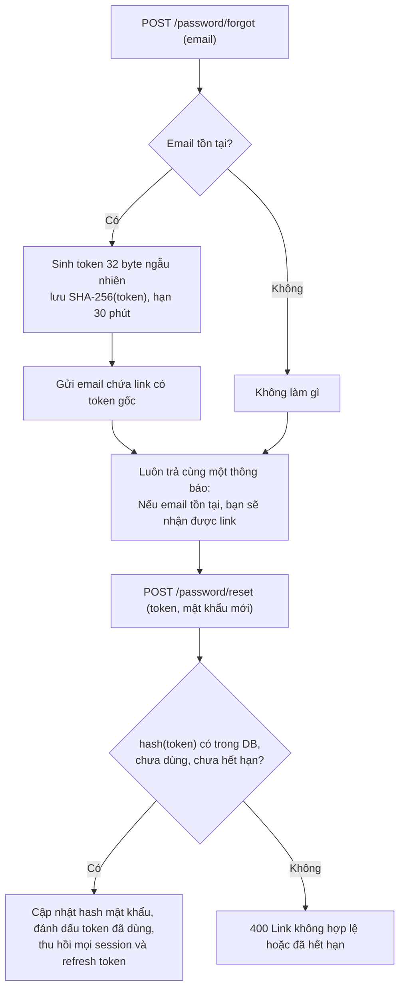

---

## 🌍 Ứng dụng thực tế

### Kiến trúc xác thực cho một sàn thương mại điện tử

Một hệ thống thực tế thường dùng **nhiều** phương thức cùng lúc - mỗi loại client một cách phù hợp:

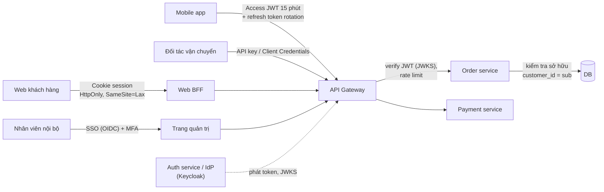

| Tình huống | Giải pháp |
|---|---|
| Khách hàng đăng nhập bằng Google/Apple | OIDC Authorization Code + PKCE, liên kết bằng `(provider, sub)` |
| Mobile app giữ đăng nhập 30 ngày | Access token ngắn + refresh token rotation, lưu trong Keychain/Keystore |
| "Đăng xuất khỏi tất cả thiết bị" | Thu hồi mọi refresh token của user + tăng `token_version` |
| Nhân viên CSKH xem đơn của khách | RBAC `order:read_any` + ghi **audit log** ai xem đơn nào lúc nào |
| Seller chỉ quản lý sản phẩm của shop mình | ABAC/ownership: `WHERE shop_id = :shop_id_of_user` |
| Thanh toán > 10 triệu | **Step-up authentication**: yêu cầu nhập lại OTP/sinh trắc học dù đang đăng nhập |
| Đối tác gọi API tạo vận đơn | API key có scope `shipments:write`, rate limit, xoay vòng key |

---

## ⚠️ Lỗi thường gặp

### 1. Lưu mật khẩu bằng MD5/SHA-256 "cho nhanh"

```text
❌ password_hash = sha256(password)
✅ password_hash = bcrypt(password, cost=12) / scrypt / argon2id
```

Hash **nhanh** là **điểm yếu**, không phải ưu điểm, khi nói về mật khẩu.

### 2. Nhầm 401 và 403

```text
❌ Chưa đăng nhập → 403;   Đã đăng nhập nhưng không phải admin → 401
✅ Chưa đăng nhập / token hết hạn → 401;   Không đủ quyền → 403 (hoặc 404 để giấu tài nguyên)
```

### 3. Tin dữ liệu phân quyền do client gửi lên

```text
❌ POST /orders {"customer_id": 42, "is_admin": true}   ← lấy customer_id từ body
✅ customer_id lấy từ session / claim 'sub' của token đã verify
```

Mass assignment: nếu bind thẳng JSON vào struct/model có trường `role`, người dùng tự nâng quyền được. Dùng DTO riêng cho input.

### 4. Chỉ decode JWT mà không verify

```python
# ❌ Chỉ đọc payload - ai cũng giả được
claims = json.loads(base64.urlsafe_b64decode(token.split(".")[1] + "=="))
# ✅ Verify chữ ký + exp + aud với thuật toán cố định
claims = jwt.decode(token, key, algorithms=["RS256"], audience="orders-api")
```

### 5. JWT sống quá lâu, không có cách thu hồi

Access token hạn **30 ngày**, bị lộ là mất tài khoản 30 ngày. → Access token 5-15 phút + refresh token có rotation.

### 6. So sánh bí mật bằng `==`

```go
// ❌ if providedSig == expectedSig
// ✅
if hmac.Equal(providedSig, expectedSig) { ... }
```

### 7. Phân quyền chỉ ở frontend

Ẩn nút "Xóa" trên giao diện **không phải** phân quyền. Kẻ gian gọi thẳng API bằng `curl`. **Mọi** kiểm tra quyền phải có ở **server**.

### 8. Sinh token bằng bộ sinh số ngẫu nhiên thường

```text
❌ Go: math/rand      Python: random.choice(...)     → đoán được
✅ Go: crypto/rand    Python: secrets.token_urlsafe() → an toàn mật mã
```

---

## 🏋️ Bài tập

### Bài 1 (Dễ): 401 hay 403?

Với mỗi tình huống, chọn status code: (a) gọi API không kèm token; (b) token hết hạn; (c) user thường gọi `DELETE /users/7`; (d) user An gọi `GET /orders/1002` là đơn của Bình; (e) API key đã bị thu hồi.

<details>
<summary>Đáp án</summary>

(a) 401. (b) 401 (client nên dùng refresh token rồi thử lại). (c) 403. (d) 403 hoặc **404** (khuyến khích 404 để không lộ đơn 1002 tồn tại). (e) 401 - key không còn định danh được ai.

</details>

### Bài 2 (Dễ): Giải mã JWT bằng tay

Lấy token trong mục 4, tách 3 phần, decode base64url phần giữa (bằng `base64 -d` hoặc Python) và cho biết `sub`, `role`, `exp`. Sau đó đổi `exp` thành Unix time ra giờ Việt Nam.

<details>
<summary>Đáp án</summary>

`sub = u_42`, `role = editor`, `exp = 1700000900` → 2023-11-14 22:28:20 UTC = **2023-11-15 05:28:20 giờ Việt Nam (UTC+7)**. Bài học: ai cũng đọc được payload.

```python
import base64, json, datetime
p = "eyJzdWIiOiJ1XzQyIiwicm9sZSI6ImVkaXRvciIsImlhdCI6MTcwMDAwMDAwMCwiZXhwIjoxNzAwMDAwOTAwfQ"
c = json.loads(base64.urlsafe_b64decode(p + "=" * (-len(p) % 4)))
print(c, datetime.datetime.fromtimestamp(c["exp"], datetime.timezone(datetime.timedelta(hours=7))))
```

</details>

### Bài 3 (Trung bình): Bổ sung `aud`, `iss`, leeway

Mở rộng hàm `Verify`/`verify` ở mục 4: thêm claim `iss` và `aud`; verify phải từ chối token có `aud` khác `"orders-api"` hoặc `iss` khác `"https://auth.shop.vn"`; chấp nhận lệch đồng hồ 30 giây cho `exp` và `nbf`. Viết test cho từng trường hợp.

### Bài 4 (Trung bình): Đăng ký / đăng nhập với session

Viết HTTP server (Go `net/http` hoặc Python `http.server`) có: `POST /register` (lưu hash scrypt/bcrypt vào map), `POST /login` (tạo session ID 32 byte, đặt cookie đủ cờ), `GET /me` (đọc session), `POST /logout`. Yêu cầu: thông báo lỗi đăng nhập chung chung; sinh session ID mới mỗi lần đăng nhập; session hết hạn sau 30 phút không hoạt động (sliding expiration).

??? question "Gợi ý"
    Lưu `sessions map[string]Session{UserID, ExpiresAt}` bảo vệ bằng `sync.Mutex` (Go) hoặc `threading.Lock` (Python). Mỗi request hợp lệ thì gia hạn `ExpiresAt = now + 30m`. Khi email không tồn tại, vẫn gọi hàm băm với một hash giả để thời gian phản hồi tương đương.

### Bài 5 (Khó): Refresh token rotation với phát hiện dùng lại

Cài đặt (có thể dùng SQLite) bảng `refresh_tokens` như mục 4 và hàm `refresh(token)`: trả access JWT mới + refresh token mới; nếu token đã dùng → thu hồi cả family và trả lỗi. Viết test mô phỏng đúng kịch bản trong sequence diagram (client dùng RT1 → nhận RT2; kẻ gian dùng RT1 → cả family bị thu hồi; client dùng RT2 → bị từ chối).

### Bài 6 (Khó): TOTP chống replay + recovery codes

Mở rộng code TOTP: (1) lưu `last_counter` cho mỗi user và từ chối mã đã dùng; (2) sinh 10 recovery code dạng `xxxx-xxxx`, chỉ lưu hash, mỗi mã dùng được một lần; (3) sinh URI `otpauth://` để hiển thị QR. Kiểm tra lại bằng vector RFC 6238.

<details>
<summary>Đáp án gợi ý (phần chống replay, Python)</summary>

```python
def verify_once(user, code, now):
    for skew in (-1, 0, 1):
        counter = now // 30 + skew
        if counter <= user.last_counter:
            continue                      # mã của bước này (hoặc trước đó) đã dùng rồi
        if hmac.compare_digest(hotp(user.secret, counter), code):
            user.last_counter = counter   # nhớ lại để lần sau từ chối
            return True
    return False
```

</details>

### Bài 7 (Thử thách): Đăng nhập bằng GitHub

Đăng ký một OAuth App trên GitHub, cài đặt luồng Authorization Code + PKCE + `state` hoàn chỉnh (redirect, callback, đổi code lấy token, gọi `https://api.github.com/user`), rồi liên kết vào bảng `user_identities`. Ghi lại mọi request/response và vẽ lại sequence diagram của riêng bạn.

---

## ✅ Checklist hoàn thành

- [ ] Giải thích được authentication vs authorization, dùng đúng 401/403
- [ ] Biết vì sao phải dùng salt + hàm băm chậm; băm/kiểm tra mật khẩu bằng bcrypt (Go) và scrypt (Python)
- [ ] Thuộc các cờ cookie `HttpOnly`, `Secure`, `SameSite` và lỗ hổng mỗi cờ chống lại
- [ ] Hiểu session fixation, CSRF và cách phòng
- [ ] Tự viết được JWT HS256 (ký + verify) bằng thư viện chuẩn; biết 3 nguyên tắc verify
- [ ] Phân biệt HS256 vs RS256, biết JWKS là gì, hiểu lỗi algorithm confusion
- [ ] Thiết kế được access + refresh token với rotation, reuse detection và chiến lược thu hồi
- [ ] Vẽ lại được luồng OAuth2 Authorization Code + PKCE; giải thích vai trò của `state`, `code_verifier`, `redirect_uri`
- [ ] Phân biệt OAuth2 (ủy quyền) và OIDC (xác thực); biết verify ID token; hiểu SSO, SAML vs OIDC
- [ ] Thiết kế API key đúng cách (tiền tố, chỉ lưu hash, scope, rotate)
- [ ] Cài đặt TOTP khớp vector RFC 6238
- [ ] Cài đặt RBAC + ABAC, luôn kiểm tra quyền sở hữu để tránh IDOR/BOLA
- [ ] Nêu được ≥ 8 lỗ hổng xác thực và cách phòng

---

**Bài tiếp theo**: [Bài 5: Thiết kế Database quan hệ](./05-relational-database-design.md)
