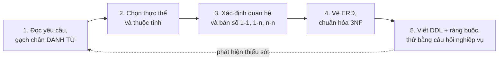
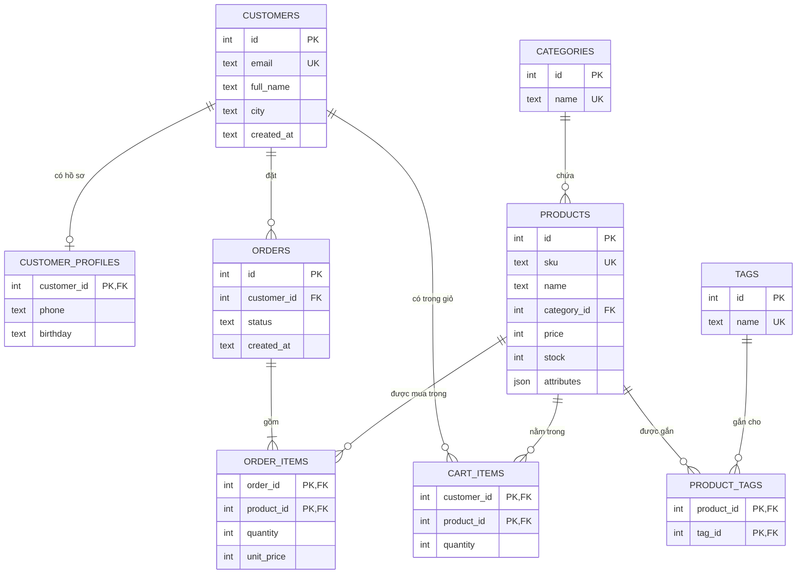
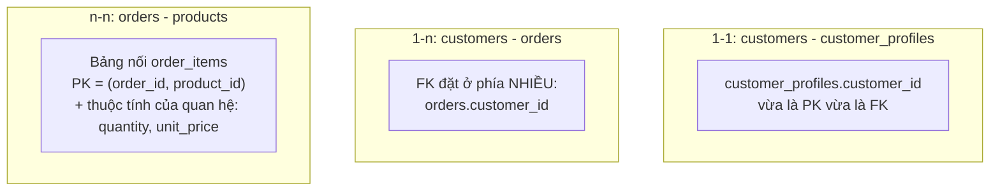
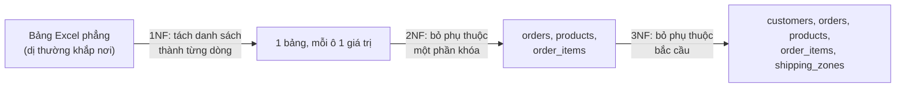
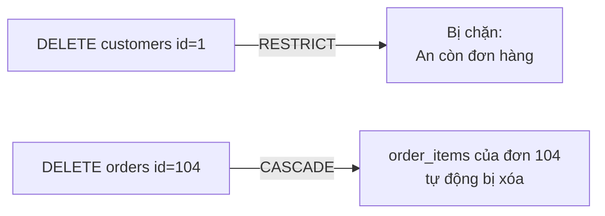
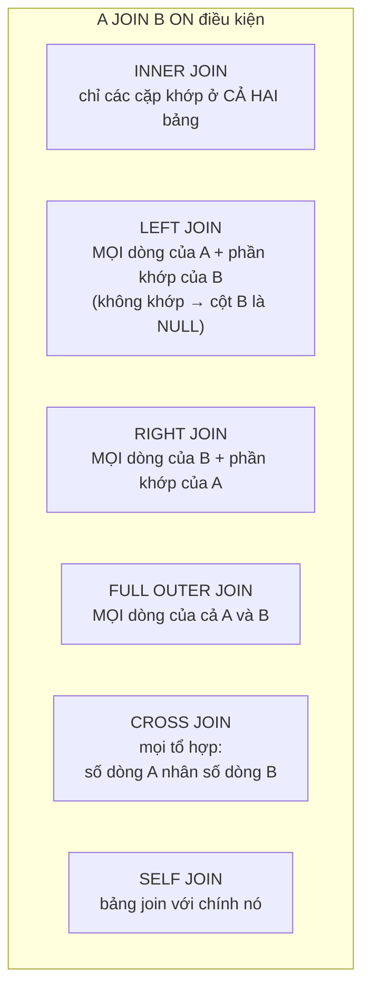
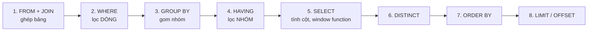
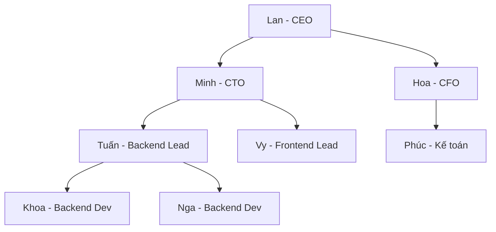
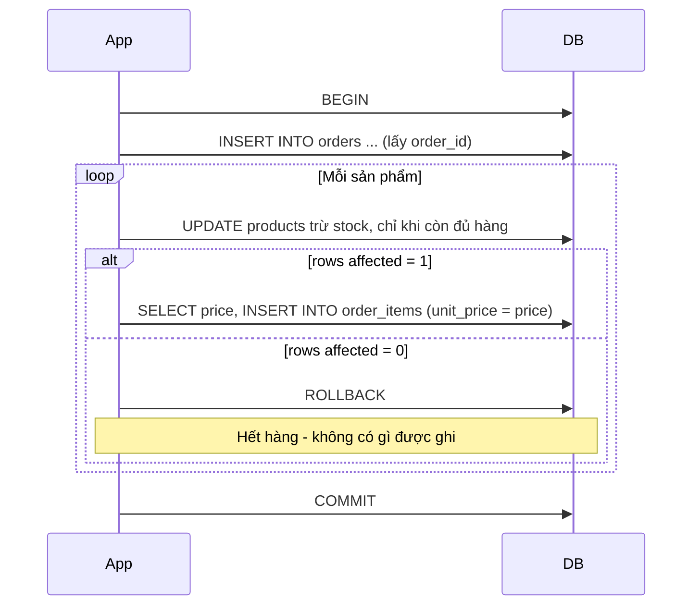

# 📚 Bài 5: Thiết kế Database quan hệ - Từ yêu cầu nghiệp vụ đến schema và SQL nâng cao

## 🎯 Mục tiêu bài học

- Biết cách **đi từ yêu cầu nghiệp vụ** đến mô hình dữ liệu: tìm thực thể, thuộc tính, quan hệ; vẽ **ERD**
- Chọn **khóa chính** đúng: surrogate vs natural key, **BIGINT vs UUID** (v4, v7)
- Mô hình hóa quan hệ **1-1, 1-n, n-n**
- **Chuẩn hóa** dữ liệu 1NF → 2NF → 3NF qua ví dụ cụ thể, và biết **khi nào nên phi chuẩn hóa**
- Dùng **ràng buộc (constraints)** để database tự bảo vệ dữ liệu: `NOT NULL`, `UNIQUE`, `CHECK`, `FOREIGN KEY ... ON DELETE`
- Thành thạo SQL truy vấn: **JOIN** các loại, **GROUP BY / HAVING**, **subquery**, **CTE** (kể cả **đệ quy**), **window function**
- Nắm các pattern thực tế: **UPSERT**, **soft delete**, **audit columns / lịch sử**, **enum vs lookup table**, **cột JSON**
- Case study xuyên suốt: **database cho một shop thương mại điện tử**; mọi câu SQL đều **chạy thử được** bằng SQLite (có ghi chú khác biệt với PostgreSQL)

> 💡 **Vì sao thiết kế database quan trọng?** Code có thể viết lại trong vài tuần. **Dữ liệu thì sống hàng chục năm** - và schema sai thì rất đắt để sửa khi bảng đã có 50 triệu dòng. Một schema tốt giúp code đơn giản, query nhanh, và quan trọng nhất: **dữ liệu không thể rơi vào trạng thái vô lý** (đơn hàng không có khách, tồn kho âm, giá tiền âm).

> 💡 **Kiến thức cần có**: SQL cơ bản (`SELECT`, `INSERT`, `UPDATE`, `DELETE`, `WHERE`, `ORDER BY`) và cách gọi database từ code: [Go - Bài 13](../golang/13-database-sql.md) hoặc [Python - Bài 13](../python/13-databases.md).

### 🧪 Chuẩn bị: chạy SQL trong bài bằng SQLite

Mọi ví dụ trong bài dùng **SQLite** (có sẵn trong Python, không cần cài server) để bạn chạy ngay. Khác biệt với **PostgreSQL** - database bạn sẽ dùng nhiều nhất khi đi làm - được ghi chú ở từng chỗ và tổng hợp ở **mục 12**.

```bash
# Cách 1: dùng CLI (macOS/Linux thường có sẵn; Windows tải ở sqlite.org)
sqlite3 shop.db
sqlite> .headers on
sqlite> .mode column

# Cách 2: dùng Python - đoạn script nhỏ để chạy file .sql
python3 -c "import sqlite3,sys; c=sqlite3.connect('shop.db'); c.executescript(open(sys.argv[1]).read())" schema.sql
```

!!! note "Kết quả trong bài"
    Các bảng kết quả bên dưới được sinh ra bằng cách **chạy thật** từng câu SQL trên SQLite 3.45 với dữ liệu mẫu ở mục 3. Bạn chạy lại sẽ thấy y hệt.

---

## 📖 1. Từ yêu cầu nghiệp vụ đến mô hình dữ liệu

### Ví von: Thiết kế tủ hồ sơ cho văn phòng

Trước khi có máy tính, văn phòng lưu hồ sơ trong **tủ**: mỗi ngăn tủ một loại (ngăn "Khách hàng", ngăn "Hóa đơn"), mỗi tờ phiếu có các ô cố định (họ tên, số điện thoại...). Muốn biết hóa đơn của ai, phiếu hóa đơn ghi **mã khách hàng** để tra sang ngăn "Khách hàng".

- Ngăn tủ = **bảng (table)** / **thực thể (entity)**
- Ô trên phiếu = **cột (column)** / **thuộc tính (attribute)**
- Mỗi tờ phiếu = **dòng (row)**
- Mã khách hàng ghi trên hóa đơn = **khóa ngoại (foreign key)** - tạo nên **quan hệ (relationship)**

### Quy trình 5 bước



### Thực hành với yêu cầu của shop

> **Yêu cầu từ chủ shop**: "Shop bán **sản phẩm** thuộc nhiều **danh mục** (điện tử, thời trang, sách). **Khách hàng** đăng ký bằng email, có thể lưu thông tin **hồ sơ** (số điện thoại, ngày sinh). Khách **đặt đơn hàng** gồm nhiều sản phẩm với số lượng khác nhau. Đơn có **trạng thái**: chờ thanh toán, đã thanh toán, đang giao, đã hủy. Sản phẩm được gắn **nhãn** (bán chạy, quà tặng) để làm khuyến mãi. Khách có **giỏ hàng**. Tôi muốn xem **doanh thu theo ngày**, **sản phẩm bán chạy**, **khách hàng thân thiết**."

**Bước 1 - gạch chân danh từ** → ứng viên thực thể: sản phẩm, danh mục, khách hàng, hồ sơ, đơn hàng, trạng thái, nhãn, giỏ hàng.

**Bước 2 - phân loại**: danh từ nào có **nhiều thuộc tính riêng** và **tồn tại độc lập** thì là thực thể (sản phẩm, khách hàng, đơn hàng). Danh từ chỉ là **một giá trị** thì là thuộc tính (trạng thái → cột `status` của đơn hàng; "doanh thu" là **số liệu tính ra**, không phải bảng).

**Bước 3 - hỏi 2 câu cho mỗi cặp thực thể**: "Một A có **bao nhiêu** B?" và "Một B có **bao nhiêu** A?"

| Cặp | A → B | B → A | Quan hệ |
|---|---|---|---|
| Khách hàng - Hồ sơ | 1 khách có tối đa 1 hồ sơ | 1 hồ sơ thuộc đúng 1 khách | **1-1** |
| Khách hàng - Đơn hàng | 1 khách có nhiều đơn | 1 đơn thuộc đúng 1 khách | **1-n** |
| Danh mục - Sản phẩm | 1 danh mục có nhiều sản phẩm | 1 sản phẩm thuộc 1 danh mục | **1-n** |
| Đơn hàng - Sản phẩm | 1 đơn có nhiều sản phẩm | 1 sản phẩm nằm trong nhiều đơn | **n-n** → cần bảng nối `order_items` (kèm số lượng, giá) |
| Sản phẩm - Nhãn | 1 sản phẩm có nhiều nhãn | 1 nhãn gắn cho nhiều sản phẩm | **n-n** → bảng nối `product_tags` |

### ERD của shop



Cách đọc ký hiệu "chân chim" (crow's foot) ở hai đầu đường nối:

| Ký hiệu | Nghĩa |
|---|---|
| `\|\|` | Đúng một (bắt buộc) |
| `o\|` | Không hoặc một |
| `\|{` | Một hoặc nhiều |
| `o{` | Không hoặc nhiều |

Ví dụ `ORDERS ||--|{ ORDER_ITEMS`: một đơn hàng có **ít nhất một** dòng sản phẩm; mỗi dòng thuộc **đúng một** đơn.

---

## 📖 2. Khóa (Keys) - định danh mỗi dòng

### Các loại khóa

| Loại | Ý nghĩa | Ví dụ |
|---|---|---|
| **Primary key (PK)** | Định danh **duy nhất, không NULL, không đổi** cho mỗi dòng | `customers.id` |
| **Candidate key** | Bất kỳ cột (tổ hợp cột) nào cũng có thể làm PK | `id`, `email` |
| **Unique key** | Candidate key không được chọn làm PK, vẫn đảm bảo duy nhất | `customers.email UNIQUE` |
| **Foreign key (FK)** | Cột tham chiếu PK của bảng khác | `orders.customer_id → customers.id` |
| **Composite key** | Khóa gồm nhiều cột | `order_items (order_id, product_id)` |

### Surrogate key vs Natural key

- **Natural key** (khóa tự nhiên): giá trị có ý nghĩa ngoài đời - email, số CCCD, mã số thuế, SKU.
- **Surrogate key** (khóa thay thế): số/chuỗi **vô nghĩa** do hệ thống sinh ra - `id = 1, 2, 3...` hoặc UUID.

| | Natural key | Surrogate key |
|---|---|---|
| Ưu | Không cần cột thừa; có nghĩa khi đọc | **Không bao giờ phải đổi**; nhỏ gọn; đồng nhất mọi bảng |
| Nhược | Ngoài đời **có thể đổi** (khách đổi email, CMND 9 số → CCCD 12 số); thường dài; có thể trùng bất ngờ | Cần thêm `UNIQUE` cho natural key để không trùng dữ liệu |
| Khi dùng | Bảng tra cứu ổn định (mã tiền tệ `VND`, mã quốc gia `VN`) | **Hầu hết bảng nghiệp vụ** |

!!! tip "Quy tắc thực dụng"
    Dùng **surrogate key làm PK**, và **vẫn đặt `UNIQUE`** trên natural key (`email`, `sku`). Được cả hai: khóa ổn định để tham chiếu, và database chặn trùng dữ liệu.

    Câu chuyện thật: nhiều hệ thống Việt Nam từng dùng **số CMND 9 số làm khóa chính**. Khi chuyển sang **CCCD 12 số**, họ phải sửa khóa chính và mọi khóa ngoại trỏ tới nó - một cuộc "đại phẫu" dữ liệu.

### BIGINT tự tăng hay UUID?

| | `BIGINT` tự tăng (identity/serial) | UUID v4 (ngẫu nhiên) | UUID v7 (theo thời gian) |
|---|---|---|---|
| Kích thước | 8 byte | 16 byte | 16 byte |
| Sinh ở đâu | Database | Bất kỳ đâu (app, client) - không cần hỏi DB | Bất kỳ đâu |
| Đoán được? | Có: `/orders/1001` → thử `/orders/1002`; lộ số lượng đơn/ngày | Không | Khó (lộ thời điểm tạo) |
| Hiệu năng index B-tree | ✅ Tốt nhất: luôn chèn vào cuối | ❌ Chèn ngẫu nhiên → tách trang index, cache kém | ✅ Gần như tăng dần |
| Gộp dữ liệu nhiều DB/shard | Dễ trùng | ✅ | ✅ |

```text
BIGINT : 1001
UUIDv4 : 3f2b8c9e-4a1d-4e7b-9c2a-7d5e1f0a6b3c     ← hoàn toàn ngẫu nhiên
UUIDv7 : 0192a7c4-5e10-7b3a-8f21-4c9d0e6a2b17     ← 48 bit đầu là timestamp (ms) → tăng dần theo thời gian
```

**Khuyến nghị**: `BIGINT` identity cho hầu hết bảng nội bộ; nếu cần ID sinh phân tán hoặc không muốn lộ số thứ tự ra ngoài, dùng **UUID v7** (PostgreSQL 18 có `uuidv7()`; phiên bản cũ hơn sinh ở tầng ứng dụng). Một pattern phổ biến: PK là `BIGINT` (nội bộ, JOIN nhanh) + cột `public_id` UUID/chuỗi ngẫu nhiên có `UNIQUE` để lộ ra API.

!!! warning "ID khó đoán không thay thế kiểm tra quyền"
    Dù dùng UUID, API vẫn phải kiểm tra "đơn này có thuộc về user đang đăng nhập không" - xem lỗi IDOR ở [Bài 4](./04-auth.md).

---

## 📖 3. Quan hệ 1-1, 1-n, n-n và schema của shop

### Ba kiểu quan hệ và cách cài đặt



- **1-1**: dùng khi tách phần **ít dùng / nhạy cảm / tùy chọn** ra bảng riêng (hồ sơ, cài đặt, thông tin KYC). Cách cài: PK của bảng phụ **đồng thời là FK** tới bảng chính → mỗi khách tối đa một hồ sơ.
- **1-n**: FK luôn đặt ở **phía "nhiều"**. Đừng bao giờ lưu danh sách `order_ids = "101,103"` trong bảng `customers`!
- **n-n**: **bắt buộc** có bảng nối. Bảng nối thường mang thêm **thuộc tính của chính quan hệ** - số lượng và giá mua nằm ở `order_items`, không thuộc về đơn hàng hay sản phẩm.

### Schema đầy đủ (SQLite)

```sql
PRAGMA foreign_keys = ON;   -- SQLite: phải bật thủ công cho mỗi connection!

CREATE TABLE customers (
    id         INTEGER PRIMARY KEY,
    email      TEXT    NOT NULL UNIQUE,
    full_name  TEXT    NOT NULL,
    city       TEXT,
    created_at TEXT    NOT NULL DEFAULT CURRENT_TIMESTAMP
);

CREATE TABLE customer_profiles (          -- quan hệ 1-1 với customers
    customer_id INTEGER PRIMARY KEY REFERENCES customers(id) ON DELETE CASCADE,
    phone       TEXT,
    birthday    TEXT
);

CREATE TABLE categories (
    id   INTEGER PRIMARY KEY,
    name TEXT NOT NULL UNIQUE
);

CREATE TABLE products (
    id          INTEGER PRIMARY KEY,
    sku         TEXT    NOT NULL UNIQUE,
    name        TEXT    NOT NULL,
    category_id INTEGER NOT NULL REFERENCES categories(id) ON DELETE RESTRICT,
    price       INTEGER NOT NULL CHECK (price >= 0),           -- VND, số nguyên
    stock       INTEGER NOT NULL DEFAULT 0 CHECK (stock >= 0),
    attributes  TEXT    CHECK (attributes IS NULL OR json_valid(attributes))
);

CREATE TABLE orders (
    id          INTEGER PRIMARY KEY,
    customer_id INTEGER NOT NULL REFERENCES customers(id) ON DELETE RESTRICT,
    status      TEXT    NOT NULL DEFAULT 'pending'
                CHECK (status IN ('pending', 'paid', 'shipped', 'cancelled')),
    created_at  TEXT    NOT NULL
);

CREATE TABLE order_items (
    order_id   INTEGER NOT NULL REFERENCES orders(id) ON DELETE CASCADE,
    product_id INTEGER NOT NULL REFERENCES products(id) ON DELETE RESTRICT,
    quantity   INTEGER NOT NULL CHECK (quantity > 0),
    unit_price INTEGER NOT NULL CHECK (unit_price >= 0),   -- giá TẠI THỜI ĐIỂM mua
    PRIMARY KEY (order_id, product_id)
);

CREATE TABLE tags (
    id   INTEGER PRIMARY KEY,
    name TEXT NOT NULL UNIQUE
);

CREATE TABLE product_tags (               -- bảng nối cho quan hệ n-n
    product_id INTEGER NOT NULL REFERENCES products(id) ON DELETE CASCADE,
    tag_id     INTEGER NOT NULL REFERENCES tags(id) ON DELETE CASCADE,
    PRIMARY KEY (product_id, tag_id)
);

CREATE TABLE cart_items (
    customer_id INTEGER NOT NULL REFERENCES customers(id) ON DELETE CASCADE,
    product_id  INTEGER NOT NULL REFERENCES products(id) ON DELETE CASCADE,
    quantity    INTEGER NOT NULL CHECK (quantity > 0),
    PRIMARY KEY (customer_id, product_id)
);

CREATE TABLE employees (
    id         INTEGER PRIMARY KEY,
    name       TEXT NOT NULL,
    title      TEXT NOT NULL,
    manager_id INTEGER REFERENCES employees(id)     -- tự tham chiếu
);
```

### Dữ liệu mẫu

```sql
INSERT INTO customers (id, email, full_name, city) VALUES
    (1, 'an@example.com',   'Nguyễn Văn An', 'Hà Nội'),
    (2, 'binh@example.com', 'Trần Thị Bình', 'TP.HCM'),
    (3, 'chi@example.com',  'Lê Minh Chi',   'Đà Nẵng'),
    (4, 'dung@example.com', 'Phạm Dũng',     'Hà Nội');   -- chưa mua gì

INSERT INTO categories (id, name) VALUES
    (1, 'Điện tử'), (2, 'Thời trang'), (3, 'Sách'), (4, 'Đồ chơi');  -- Đồ chơi: chưa có sản phẩm

INSERT INTO products (id, sku, name, category_id, price, stock, attributes) VALUES
    (1, 'DT-001', 'Tai nghe Bluetooth',    1, 450000, 50, '{"color": "đen", "bluetooth": "5.3", "warranty_months": 12}'),
    (2, 'DT-002', 'Sạc dự phòng 10000mAh', 1, 350000, 30, '{"color": "trắng", "warranty_months": 6}'),
    (3, 'TT-001', 'Áo thun basic',         2, 150000, 100, '{"color": "trắng", "sizes": ["S", "M", "L"]}'),
    (4, 'TT-002', 'Quần jean',             2, 420000, 40, NULL),
    (5, 'SA-001', 'Clean Code',            3, 280000, 20, NULL),
    (6, 'SA-002', 'Designing Data-Intensive Applications', 3, 650000, 10, NULL),
    (7, 'SA-003', 'Nhập môn SQL',          3, 120000, 15, NULL);  -- chưa ai mua

INSERT INTO orders (id, customer_id, status, created_at) VALUES
    (101, 1, 'paid',      '2026-09-01 09:15'),
    (102, 2, 'shipped',   '2026-09-01 20:40'),
    (103, 1, 'shipped',   '2026-09-02 11:05'),
    (104, 3, 'cancelled', '2026-09-03 08:30'),
    (105, 2, 'paid',      '2026-09-03 21:10');

INSERT INTO order_items (order_id, product_id, quantity, unit_price) VALUES
    (101, 1, 1, 450000), (101, 5, 2, 280000),
    (102, 3, 3, 150000), (102, 4, 1, 420000),
    (103, 6, 1, 650000),
    (104, 2, 1, 350000),
    (105, 1, 2, 450000), (105, 3, 1, 150000);

INSERT INTO tags (id, name) VALUES (1, 'bán chạy'), (2, 'quà tặng'), (3, 'giảm giá');
INSERT INTO product_tags (product_id, tag_id) VALUES (1, 1), (1, 2), (3, 1), (5, 2), (6, 2);

INSERT INTO employees (id, name, title, manager_id) VALUES
    (1, 'Lan',  'CEO',              NULL),
    (2, 'Minh', 'CTO',              1),
    (3, 'Hoa',  'CFO',              1),
    (4, 'Tuấn', 'Backend Lead',     2),
    (5, 'Vy',   'Frontend Lead',    2),
    (6, 'Khoa', 'Backend Dev',      4),
    (7, 'Nga',  'Backend Dev',      4),
    (8, 'Phúc', 'Kế toán',          3);
```

---

## 📖 4. Chuẩn hóa (Normalization) - 1NF, 2NF, 3NF

### Vì sao cần chuẩn hóa? Câu chuyện file Excel

Chủ shop ban đầu quản lý bằng một file Excel duy nhất:

```text
ma_don | ngay       | ten_khach     | sdt_khach  | thanh_pho | ma_vung_ship | san_pham                          | tong_tien
-------+------------+---------------+------------+-----------+--------------+-----------------------------------+----------
101    | 2026-09-01 | Nguyễn Văn An | 0912345678 | Hà Nội    | MB           | Tai nghe x1 (450k), Clean Code x2 | 1010000
103    | 2026-09-02 | Nguyễn Văn An | 0912345678 | Hà Nội    | MB           | DDIA x1 (650k)                    | 650000
102    | 2026-09-01 | Trần Thị Bình | 0987654321 | TP.HCM    | MN           | Áo thun x3, Quần jean x1          | 870000
```

Các **dị thường (anomaly)** xuất hiện:

| Dị thường | Ví dụ |
|---|---|
| **Update anomaly** | An đổi số điện thoại → phải sửa **mọi dòng** đơn của An; sót một dòng là dữ liệu mâu thuẫn |
| **Insert anomaly** | Muốn thêm khách mới **chưa mua gì** → không có chỗ ghi (vì mỗi dòng là một đơn) |
| **Delete anomaly** | Xóa đơn 102 (đơn duy nhất của Bình) → **mất luôn** thông tin khách Bình |
| **Không truy vấn được** | "Tổng số áo thun đã bán?" → phải cắt chuỗi `"Áo thun x3, Quần jean x1"`... |

Chuẩn hóa là quá trình **tách bảng** để **mỗi sự thật chỉ được lưu ở đúng một nơi**.

### 1NF - Mỗi ô chỉ chứa một giá trị nguyên tử

**Vi phạm**: cột `san_pham` chứa **danh sách**. **Sửa**: mỗi sản phẩm trong đơn là một dòng.

```text
ma_don | ngay       | ten_khach     | sdt_khach  | thanh_pho | ma_vung_ship | ten_sp     | gia_sp | so_luong
-------+------------+---------------+------------+-----------+--------------+------------+--------+---------
101    | 2026-09-01 | Nguyễn Văn An | 0912345678 | Hà Nội    | MB           | Tai nghe   | 450000 | 1
101    | 2026-09-01 | Nguyễn Văn An | 0912345678 | Hà Nội    | MB           | Clean Code | 280000 | 2
102    | 2026-09-01 | Trần Thị Bình | 0987654321 | TP.HCM    | MN           | Áo thun    | 150000 | 3
...
Khóa của bảng: (ma_don, ten_sp)
```

Cột `tong_tien` cũng bị bỏ - nó **tính được** từ `gia_sp × so_luong`.

### 2NF - Không phụ thuộc vào MỘT PHẦN của khóa

(Chỉ áp dụng khi khóa gồm nhiều cột.) Khóa hiện là `(ma_don, ten_sp)`, nhưng:

- `ngay`, `ten_khach`, `sdt_khach`, `thanh_pho`... chỉ phụ thuộc vào `ma_don` → **phụ thuộc một phần**
- `gia_sp` chỉ phụ thuộc vào `ten_sp` → **phụ thuộc một phần**

**Sửa**: tách thành 3 bảng, mỗi bảng các cột phụ thuộc vào **toàn bộ** khóa của nó:

```text
orders(ma_don PK, ngay, ten_khach, sdt_khach, thanh_pho, ma_vung_ship)
products(ma_sp PK, ten_sp, gia_sp)
order_items(ma_don, ma_sp, so_luong)   PK = (ma_don, ma_sp)
```

### 3NF - Không phụ thuộc bắc cầu (transitive)

Trong `orders`: `sdt_khach`, `thanh_pho` phụ thuộc vào **khách hàng**, khách hàng phụ thuộc vào `ma_don` → phụ thuộc bắc cầu `ma_don → khách → sđt`. Tương tự, `ma_vung_ship` phụ thuộc vào `thanh_pho`, không phụ thuộc trực tiếp vào đơn.

**Sửa**: tách `customers` và bảng tra cứu vùng giao hàng:



```text
customers(id PK, full_name, phone, city)
shipping_zones(city PK, zone_code)            -- 'Hà Nội' → 'MB'
orders(id PK, customer_id FK, created_at)
products(id PK, name, price)
order_items(order_id FK, product_id FK, quantity, unit_price)   PK = (order_id, product_id)
```

!!! tip "Câu thần chú của 3NF"
    Mỗi cột không phải khóa phải phụ thuộc vào **"the key, the whole key, and nothing but the key"** - vào khóa (1NF), vào **toàn bộ** khóa (2NF), và **không gì khác ngoài** khóa (3NF).

### ⚠️ `unit_price` trong `order_items` KHÔNG phải là trùng lặp!

Để ý: ở bước 3NF ta vẫn giữ `unit_price` trong `order_items`, dù `products` đã có `price`. Đây **không phải** vi phạm chuẩn hóa, vì chúng là **hai sự thật khác nhau**:

- `products.price` = giá **hiện tại** (thay đổi khi khuyến mãi)
- `order_items.unit_price` = giá **khách đã trả tại thời điểm mua** (không bao giờ được đổi - hóa đơn, kế toán, hoàn tiền đều dựa vào nó)

Tương tự: địa chỉ giao hàng của đơn nên được **chụp lại (snapshot)** vào đơn, vì khách đổi địa chỉ sau này không được làm đơn cũ "giao đến địa chỉ mới". Ta sẽ thấy điều này bằng dữ liệu thật ở **mục 10** (phần audit).

### Khi nào nên phi chuẩn hóa (denormalize)?

Chuẩn hóa tối ưu cho **ghi đúng**; đôi khi ta cố ý lặp dữ liệu để **đọc nhanh**. Chỉ làm khi đã **đo** thấy vấn đề hiệu năng thật:

| Tình huống | Phi chuẩn hóa | Cái giá |
|---|---|---|
| Trang sản phẩm hiện "Đã bán 12,3k" và "4.8 sao" - đếm mỗi lần xem quá tốn | Cột `sold_count`, `rating_avg` trong `products` | Phải cập nhật khi có đơn/đánh giá mới (trigger, job, sự kiện); có thể lệch nhẹ |
| Danh sách đơn hàng cần `total` để sắp xếp, lọc | Cột `orders.total_amount` | Phải đảm bảo bằng tổng `order_items` (tính trong cùng transaction) |
| Báo cáo doanh thu theo ngày trên hàng trăm triệu dòng | Bảng tổng hợp `daily_revenue` / materialized view | Dữ liệu trễ vài phút; cần job làm mới |
| Hệ thống phân tích (OLAP) | Mô hình **star schema** (bảng fact + dimension) trong data warehouse | Tách hẳn khỏi DB giao dịch |

> **Quy tắc**: "Normalize until it hurts, denormalize until it works" - chuẩn hóa đến 3NF trước; phi chuẩn hóa **có chủ đích, có ghi chú** và có cơ chế giữ đồng bộ. Xem thêm về cache và đọc nhanh ở [Bài 8](./08-caching.md).

---

## 📖 5. Ràng buộc (Constraints) - để database tự bảo vệ dữ liệu

### Ví von: Bảo vệ ở cổng tòa nhà

Kiểm tra dữ liệu ở tầng ứng dụng giống như **dặn nhân viên** "đừng cho người lạ vào". Nhưng sẽ có ngày: một script import dữ liệu, một admin sửa tay trong DB, một service mới viết bởi team khác, một bug race condition... **Ràng buộc trong database** là **bảo vệ đứng ở cổng**: không ai qua được nếu sai luật, bất kể đi đường nào.

| Ràng buộc | Đảm bảo | Ví dụ trong shop |
|---|---|---|
| `NOT NULL` | Cột bắt buộc có giá trị | Khách phải có `email`, `full_name` |
| `UNIQUE` | Không trùng | Không có 2 khách cùng email, 2 sản phẩm cùng SKU |
| `CHECK` | Điều kiện tùy ý trên dòng | `price >= 0`, `quantity > 0`, `status IN (...)` |
| `PRIMARY KEY` | = `NOT NULL` + `UNIQUE` | `id` |
| `FOREIGN KEY` | Giá trị phải tồn tại ở bảng được tham chiếu | Đơn hàng phải thuộc về một khách có thật |
| `DEFAULT` | Giá trị mặc định khi không truyền | `status = 'pending'`, `created_at = now()` |

### Xem các ràng buộc "chặn cửa"

```sql
INSERT INTO customers (email, full_name) VALUES ('em@example.com', NULL);
```

Kết quả (SQLite báo lỗi - đúng như mong đợi):

```text
Error: NOT NULL constraint failed: customers.full_name
```

```sql
INSERT INTO customers (email, full_name) VALUES ('an@example.com', 'An giả mạo');
```

Kết quả (SQLite báo lỗi - đúng như mong đợi):

```text
Error: UNIQUE constraint failed: customers.email
```

```sql
INSERT INTO products (sku, name, category_id, price) VALUES ('X-1', 'Lỗi giá', 1, -5000);
```

Kết quả (SQLite báo lỗi - đúng như mong đợi):

```text
Error: CHECK constraint failed: price >= 0
```

```sql
INSERT INTO orders (customer_id, created_at) VALUES (999, '2026-09-04');
```

Kết quả (SQLite báo lỗi - đúng như mong đợi):

```text
Error: FOREIGN KEY constraint failed
```

!!! warning "SQLite: phải bật khóa ngoại thủ công"
    Vì lý do tương thích ngược, SQLite **mặc định KHÔNG kiểm tra** foreign key. Phải chạy `PRAGMA foreign_keys = ON;` **cho mỗi connection**. PostgreSQL và MySQL (InnoDB) luôn kiểm tra.

### `ON DELETE` - chuyện gì xảy ra khi xóa dòng cha?

| Hành vi | Ý nghĩa | Dùng khi |
|---|---|---|
| `RESTRICT` / `NO ACTION` (mặc định) | **Chặn** xóa cha nếu còn con | Khách hàng đã có đơn - không được xóa (dữ liệu kế toán!) |
| `CASCADE` | Xóa cha → **xóa luôn** các con | Xóa đơn → xóa các dòng `order_items` của đơn đó; xóa khách → xóa giỏ hàng |
| `SET NULL` | Xóa cha → FK của con thành `NULL` | Xóa nhân viên quản lý → `manager_id` của cấp dưới thành NULL |
| `SET DEFAULT` | Đặt về giá trị mặc định | Hiếm dùng |



```sql
DELETE FROM customers WHERE id = 1;   -- An đã có đơn hàng
```

Kết quả (SQLite báo lỗi - đúng như mong đợi):

```text
Error: FOREIGN KEY constraint failed
```

```sql
DELETE FROM orders WHERE id = 104;   -- đơn đã hủy
SELECT count(*) AS items_con_lai FROM order_items WHERE order_id = 104;
```

Kết quả:

```text
items_con_lai
-------------
0
```

!!! warning "CASCADE là con dao hai lưỡi"
    `ON DELETE CASCADE` từ `customers` xuống `orders` nghĩa là một lệnh `DELETE` nhầm sẽ **xóa sạch lịch sử mua hàng**. Chỉ dùng `CASCADE` cho dữ liệu **thực sự là "một phần" của cha** (dòng trong đơn, ảnh của sản phẩm, giỏ hàng). Dữ liệu có giá trị lịch sử/kế toán → `RESTRICT` + **soft delete** (mục 9).

### 💡 Tips quan trọng

- **Đặt tên ràng buộc** để thông báo lỗi dễ hiểu và dễ `DROP` sau này: `CONSTRAINT chk_products_price_nonneg CHECK (price >= 0)`.
- **Tiền tệ**: lưu số nguyên (VND không có số lẻ) hoặc `NUMERIC(12,2)` - **không bao giờ** dùng `FLOAT`/`REAL` (`0.1 + 0.2 = 0.30000000000000004`).
- **Thời gian**: PostgreSQL dùng `TIMESTAMPTZ` (lưu UTC, hiển thị theo múi giờ), không dùng `TIMESTAMP` không múi giờ. SQLite không có kiểu ngày giờ riêng - lưu chuỗi ISO-8601 `'2026-09-01 09:15'` hoặc số Unix.
- **Ánh xạ lỗi ràng buộc thành lỗi API**: vi phạm `UNIQUE (email)` → `409 Conflict` "Email đã được đăng ký"; vi phạm `CHECK` → `422`. Đừng để lộ nguyên văn lỗi SQL ra client.
- **Kiểm tra ở cả hai tầng**: tầng ứng dụng để báo lỗi thân thiện; tầng DB để **đảm bảo tuyệt đối**. Ví dụ "email đã tồn tại": kiểm tra bằng `SELECT` trước rồi mới `INSERT` vẫn có **race condition** (2 request cùng lúc) - chỉ `UNIQUE` mới chặn được chắc chắn.

---

## 📖 6. JOIN - kết hợp dữ liệu từ nhiều bảng

### Các loại JOIN



Hình dung bằng tập hợp (A = khách hàng, B = đơn hàng):

```text
          A (customers)          B (orders)
        ┌──────────────┐    ┌──────────────┐
        │  Dũng        │    │              │
        │  (chưa mua)  ├────┤ An, Bình, Chi│
        │              │khớp│  có đơn      │
        └──────────────┘    └──────────────┘
INNER JOIN  → chỉ vùng giữa (An, Bình, Chi kèm đơn của họ)
LEFT JOIN   → vùng giữa + Dũng (cột đơn hàng = NULL)
```

### INNER JOIN - đơn hàng kèm tên khách

```sql
SELECT o.id AS order_id, c.full_name, o.status, o.created_at
FROM orders AS o
INNER JOIN customers AS c ON c.id = o.customer_id
ORDER BY o.id;
```

Kết quả:

```text
order_id | full_name     | status    | created_at
---------+---------------+-----------+-----------------
101      | Nguyễn Văn An | paid      | 2026-09-01 09:15
102      | Trần Thị Bình | shipped   | 2026-09-01 20:40
103      | Nguyễn Văn An | shipped   | 2026-09-02 11:05
104      | Lê Minh Chi   | cancelled | 2026-09-03 08:30
105      | Trần Thị Bình | paid      | 2026-09-03 21:10
```

### LEFT JOIN - mọi khách hàng, kể cả người chưa mua

```sql
SELECT c.full_name, COUNT(o.id) AS so_don
FROM customers AS c
LEFT JOIN orders AS o ON o.customer_id = c.id
GROUP BY c.id, c.full_name
ORDER BY so_don DESC, c.full_name;
```

Kết quả:

```text
full_name     | so_don
--------------+-------
Nguyễn Văn An | 2
Trần Thị Bình | 2
Lê Minh Chi   | 1
Phạm Dũng     | 0
```

!!! tip "`COUNT(o.id)` chứ không phải `COUNT(*)`"
    Với Dũng, LEFT JOIN tạo ra **một dòng** có `o.id = NULL`. `COUNT(*)` đếm dòng → ra **1** (sai). `COUNT(o.id)` bỏ qua NULL → ra **0** (đúng).

### Anti-join - tìm cái "không có"

Pattern "LEFT JOIN rồi lọc `IS NULL`" trả lời các câu hỏi dạng **"chưa bao giờ"**: sản phẩm chưa ai mua, khách chưa đặt đơn, user chưa xác minh email...

```sql
-- Sản phẩm CHƯA từng được đặt (anti-join)
SELECT p.sku, p.name
FROM products AS p
LEFT JOIN order_items AS oi ON oi.product_id = p.id
WHERE oi.product_id IS NULL;
```

Kết quả:

```text
sku    | name
-------+-------------
SA-003 | Nhập môn SQL
```

(Cách viết tương đương: `WHERE NOT EXISTS (SELECT 1 FROM order_items WHERE product_id = p.id)`.)

### FULL OUTER JOIN - tìm dữ liệu "mồ côi" ở cả hai phía

```sql
-- Danh mục nào chưa có sản phẩm? Sản phẩm nào không thuộc danh mục?
SELECT c.name AS danh_muc, p.name AS san_pham
FROM categories AS c
FULL OUTER JOIN products AS p ON p.category_id = c.id
WHERE c.id IS NULL OR p.id IS NULL;
```

Kết quả:

```text
danh_muc | san_pham
---------+---------
Đồ chơi  | NULL
```

`RIGHT JOIN` và `FULL OUTER JOIN` có trong SQLite từ bản 3.39 (2022); PostgreSQL có từ lâu; **MySQL không có** `FULL OUTER JOIN` (phải `UNION` hai LEFT JOIN).

### SELF JOIN - nhân viên và người quản lý

Bảng `employees` có `manager_id` trỏ về chính bảng đó. Join bảng với chính nó, đặt hai **bí danh** (`e` = nhân viên, `m` = quản lý):

```sql
SELECT e.name AS nhan_vien, e.title, m.name AS quan_ly
FROM employees AS e
LEFT JOIN employees AS m ON m.id = e.manager_id
ORDER BY e.id;
```

Kết quả:

```text
nhan_vien | title         | quan_ly
----------+---------------+--------
Lan       | CEO           | NULL
Minh      | CTO           | Lan
Hoa       | CFO           | Lan
Tuấn      | Backend Lead  | Minh
Vy        | Frontend Lead | Minh
Khoa      | Backend Dev   | Tuấn
Nga       | Backend Dev   | Tuấn
Phúc      | Kế toán       | Hoa
```

### CROSS JOIN - sinh mọi tổ hợp

Sinh SKU cho mọi biến thể size × màu của áo thun:

```sql
WITH sizes(size) AS (VALUES ('S'), ('M'), ('L')),
     colors(color) AS (VALUES ('Đen'), ('Trắng'))
SELECT 'TT-001-' || size || '-' || color AS variant_sku
FROM sizes CROSS JOIN colors;
```

Kết quả:

```text
variant_sku
--------------
TT-001-S-Đen
TT-001-S-Trắng
TT-001-M-Đen
TT-001-M-Trắng
TT-001-L-Đen
TT-001-L-Trắng
```

### Join qua bảng nối n-n

```sql
SELECT p.name, GROUP_CONCAT(t.name, ', ') AS tags
FROM products AS p
JOIN product_tags AS pt ON pt.product_id = p.id
JOIN tags AS t ON t.id = pt.tag_id
GROUP BY p.id, p.name
ORDER BY p.id;
```

Kết quả:

```text
name                                  | tags
--------------------------------------+-------------------
Tai nghe Bluetooth                    | bán chạy, quà tặng
Áo thun basic                         | bán chạy
Clean Code                            | quà tặng
Designing Data-Intensive Applications | quà tặng
```

(`GROUP_CONCAT` là của SQLite/MySQL; PostgreSQL dùng `STRING_AGG(t.name, ', ')`.)

---

## 📖 7. GROUP BY, HAVING và thứ tự thực thi của SQL

### Thứ tự viết khác thứ tự chạy!

Bạn **viết** `SELECT ... FROM ... WHERE ... GROUP BY ... HAVING ... ORDER BY ... LIMIT`, nhưng database **thực thi** theo thứ tự logic:



Hệ quả:

- `WHERE` **không dùng được** hàm tổng hợp (`WHERE SUM(x) > 10` sai) - vì lúc đó chưa gom nhóm. Dùng `HAVING`.
- `WHERE` **không dùng được bí danh** đặt trong `SELECT` (vì `SELECT` chạy sau). `ORDER BY` thì dùng được.
- Lọc được bằng `WHERE` thì **đừng để đến `HAVING`** - loại bớt dòng sớm thì gom nhóm nhanh hơn.

### Doanh thu theo danh mục

```sql
SELECT cat.name AS danh_muc,
       COUNT(DISTINCT o.id)             AS so_don,
       SUM(oi.quantity)                 AS so_luong,
       SUM(oi.quantity * oi.unit_price) AS doanh_thu
FROM order_items AS oi
JOIN orders     AS o   ON o.id = oi.order_id
JOIN products   AS p   ON p.id = oi.product_id
JOIN categories AS cat ON cat.id = p.category_id
WHERE o.status <> 'cancelled'          -- lọc DÒNG trước khi gom nhóm
GROUP BY cat.id, cat.name
ORDER BY doanh_thu DESC;
```

Kết quả:

```text
danh_muc   | so_don | so_luong | doanh_thu
-----------+--------+----------+----------
Điện tử    | 2      | 3        | 1350000
Sách       | 2      | 3        | 1210000
Thời trang | 2      | 5        | 1020000
```

### HAVING - khách hàng chi tiêu trên 1 triệu

```sql
SELECT c.full_name, SUM(oi.quantity * oi.unit_price) AS tong_chi_tieu
FROM customers AS c
JOIN orders      AS o  ON o.customer_id = c.id
JOIN order_items AS oi ON oi.order_id = o.id
WHERE o.status IN ('paid', 'shipped')
GROUP BY c.id, c.full_name
HAVING SUM(oi.quantity * oi.unit_price) > 1000000   -- lọc NHÓM sau khi gom
ORDER BY tong_chi_tieu DESC;
```

Kết quả:

```text
full_name     | tong_chi_tieu
--------------+--------------
Trần Thị Bình | 1920000
Nguyễn Văn An | 1660000
```

!!! warning "Mọi cột trong SELECT phải nằm trong GROUP BY hoặc trong hàm tổng hợp"
    `SELECT c.full_name, c.city, SUM(...) ... GROUP BY c.id` - PostgreSQL chấp nhận vì `full_name`, `city` phụ thuộc hàm vào `c.id` (khóa chính). Nhưng `GROUP BY c.city` rồi `SELECT c.full_name` thì **vô nghĩa** (một thành phố có nhiều khách - lấy tên ai?). PostgreSQL báo lỗi; SQLite và MySQL (tắt `ONLY_FULL_GROUP_BY`) **lặng lẽ chọn bừa** một giá trị - bug khó phát hiện.

---

## 📖 8. Subquery và CTE

### Subquery - câu truy vấn lồng

**Scalar subquery** (trả về 1 giá trị) - sản phẩm đắt hơn giá trung bình:

```sql
-- Sản phẩm đắt hơn giá trung bình
SELECT name, price
FROM products
WHERE price > (SELECT AVG(price) FROM products)
ORDER BY price DESC;
```

Kết quả:

```text
name                                  | price
--------------------------------------+-------
Designing Data-Intensive Applications | 650000
Tai nghe Bluetooth                    | 450000
Quần jean                             | 420000
Sạc dự phòng 10000mAh                 | 350000
```

**EXISTS** - khách hàng đã từng mua sách (dừng ngay khi tìm thấy dòng đầu tiên, không cần đếm hết):

```sql
-- Khách hàng đã từng mua sách
SELECT c.full_name
FROM customers AS c
WHERE EXISTS (
    SELECT 1
    FROM orders AS o
    JOIN order_items AS oi ON oi.order_id = o.id
    JOIN products    AS p  ON p.id = oi.product_id
    WHERE o.customer_id = c.id AND p.category_id = 3
);
```

Kết quả:

```text
full_name
-------------
Nguyễn Văn An
```

**Correlated subquery** (subquery tương quan) - subquery tham chiếu đến dòng của query ngoài, chạy lại (về mặt logic) cho **từng dòng**:

```sql
-- Đơn hàng MỚI NHẤT của mỗi khách (subquery tương quan)
SELECT c.full_name, o.id AS order_id, o.created_at
FROM customers AS c
JOIN orders AS o ON o.customer_id = c.id
WHERE o.created_at = (
    SELECT MAX(o2.created_at) FROM orders AS o2 WHERE o2.customer_id = c.id
)
ORDER BY c.id;
```

Kết quả:

```text
full_name     | order_id | created_at
--------------+----------+-----------------
Nguyễn Văn An | 103      | 2026-09-02 11:05
Trần Thị Bình | 105      | 2026-09-03 21:10
Lê Minh Chi   | 104      | 2026-09-03 08:30
```

!!! tip "`IN` vs `EXISTS` và cái bẫy `NOT IN` với NULL"
    `WHERE id NOT IN (SELECT manager_id FROM employees)` trả về **rỗng** nếu subquery có **bất kỳ** giá trị `NULL` nào (CEO có `manager_id = NULL`)! Vì `x NOT IN (1, NULL)` = `x <> 1 AND x <> NULL` = `UNKNOWN`. Dùng `NOT EXISTS` để an toàn.

### CTE - Common Table Expression (`WITH`)

CTE là **"biến tạm" cho query**: đặt tên cho một bước trung gian, rồi dùng ở bước sau. Giúp một query dài **đọc từ trên xuống** như code, thay vì lồng subquery 3-4 tầng.

```sql
WITH order_totals AS (          -- bước 1: tổng tiền từng đơn
    SELECT order_id, SUM(quantity * unit_price) AS total
    FROM order_items
    GROUP BY order_id
),
valid_orders AS (                 -- bước 2: chỉ giữ đơn hợp lệ
    SELECT o.id, o.customer_id, t.total
    FROM orders AS o
    JOIN order_totals AS t ON t.order_id = o.id
    WHERE o.status <> 'cancelled'
)
SELECT COUNT(*)           AS so_don,
       SUM(total)         AS doanh_thu,
       AVG(total)         AS gia_tri_don_tb,    -- AOV: Average Order Value
       MAX(total)         AS don_lon_nhat
FROM valid_orders;
```

Kết quả:

```text
so_don | doanh_thu | gia_tri_don_tb | don_lon_nhat
-------+-----------+----------------+-------------
4      | 3580000   | 895000.0       | 1050000
```

### Recursive CTE - duyệt cây, phân cấp

Dữ liệu dạng cây rất phổ biến: **sơ đồ tổ chức**, **danh mục đa cấp** (Điện tử > Điện thoại > iPhone), **comment trả lời comment**, **cây thư mục**. Recursive CTE gồm 2 phần nối bằng `UNION ALL`:

1. **Anchor**: điểm xuất phát
2. **Recursive member**: join với chính CTE để đi xuống một cấp; lặp đến khi không sinh thêm dòng nào



Liệt kê toàn bộ "cây" dưới quyền CTO Minh:

```sql
WITH RECURSIVE org(id, name, title, level, path) AS (
    -- Anchor: điểm xuất phát (CTO)
    SELECT id, name, title, 0, name
    FROM employees
    WHERE id = 2
    UNION ALL
    -- Recursive: tìm cấp dưới trực tiếp của những người đã có trong org
    SELECT e.id, e.name, e.title, org.level + 1, org.path || ' > ' || e.name
    FROM employees AS e
    JOIN org ON e.manager_id = org.id
)
SELECT substr('            ', 1, level * 4) || name AS so_do, title, path
FROM org
ORDER BY path;
```

Kết quả:

```text
so_do        | title         | path
-------------+---------------+-------------------
Minh         | CTO           | Minh
    Tuấn     | Backend Lead  | Minh > Tuấn
        Khoa | Backend Dev   | Minh > Tuấn > Khoa
        Nga  | Backend Dev   | Minh > Tuấn > Nga
    Vy       | Frontend Lead | Minh > Vy
```

Cách nó chạy:

| Vòng | Dòng mới sinh ra | Giải thích |
|---|---|---|
| 0 (anchor) | Minh | `WHERE id = 2` |
| 1 | Tuấn, Vy | nhân viên có `manager_id` = Minh |
| 2 | Khoa, Nga | nhân viên có `manager_id` = Tuấn (Vy không có cấp dưới) |
| 3 | (không có) | dừng |

**Ứng dụng khác của recursive CTE** - sinh chuỗi ngày để báo cáo **không bị "thủng" ngày không có đơn** (biểu đồ doanh thu sẽ vẽ sai nếu thiếu ngày 04/09, 05/09):

```sql
-- Doanh thu MỖI ngày từ 01/09 đến 05/09, kể cả ngày không có đơn
WITH RECURSIVE days(d) AS (
    SELECT '2026-09-01'
    UNION ALL
    SELECT date(d, '+1 day') FROM days WHERE d < '2026-09-05'
),
daily AS (
    SELECT date(o.created_at) AS d, SUM(oi.quantity * oi.unit_price) AS revenue
    FROM orders AS o JOIN order_items AS oi ON oi.order_id = o.id
    WHERE o.status <> 'cancelled'
    GROUP BY date(o.created_at)
)
SELECT days.d AS ngay, COALESCE(daily.revenue, 0) AS doanh_thu
FROM days LEFT JOIN daily ON daily.d = days.d
ORDER BY days.d;
```

Kết quả:

```text
ngay       | doanh_thu
-----------+----------
2026-09-01 | 1880000
2026-09-02 | 650000
2026-09-03 | 1050000
2026-09-04 | 0
2026-09-05 | 0
```

(PostgreSQL có hàm tiện hơn: `SELECT generate_series('2026-09-01'::date, '2026-09-05', interval '1 day')`.)

!!! warning "Vòng lặp vô hạn"
    Nếu dữ liệu có **chu trình** (A quản lý B, B quản lý A - do nhập sai), recursive CTE chạy mãi. Phòng bằng cách giới hạn độ sâu (`WHERE org.level < 20`), hoặc kiểm tra `path` chưa chứa id hiện tại. PostgreSQL 14+ có cú pháp `CYCLE id SET is_cycle USING path`.

---

## 📖 9. Window Functions - tính toán "nhìn sang hàng xóm"

### Khác gì GROUP BY?

- `GROUP BY` **gộp** nhiều dòng thành **một** dòng mỗi nhóm → mất chi tiết.
- **Window function** tính toán trên một "cửa sổ" các dòng liên quan nhưng **giữ nguyên từng dòng**.

Ví von: `GROUP BY` giống bảng tổng kết **điểm trung bình của lớp**; window function giống **bảng điểm từng học sinh có thêm cột "hạng trong lớp"** và "điểm trung bình lớp" bên cạnh.

```text
hàm() OVER (
    PARTITION BY ...   -- chia thành các nhóm (giống GROUP BY nhưng không gộp dòng)
    ORDER BY ...       -- thứ tự trong mỗi nhóm
    ROWS BETWEEN ...   -- (tùy chọn) khung cửa sổ
)
```

### ROW_NUMBER vs RANK vs DENSE_RANK - xếp hạng sản phẩm bán chạy

```sql
WITH sold AS (                  -- số lượng đã bán (không tính đơn hủy)
    SELECT oi.product_id, SUM(oi.quantity) AS qty
    FROM order_items AS oi
    JOIN orders AS o ON o.id = oi.order_id
    WHERE o.status <> 'cancelled'
    GROUP BY oi.product_id
)
SELECT p.name, COALESCE(s.qty, 0) AS qty,
       ROW_NUMBER() OVER (ORDER BY COALESCE(s.qty, 0) DESC, p.name) AS row_num,
       RANK()       OVER (ORDER BY COALESCE(s.qty, 0) DESC)         AS rnk,
       DENSE_RANK() OVER (ORDER BY COALESCE(s.qty, 0) DESC)         AS dense_rnk
FROM products AS p
LEFT JOIN sold AS s ON s.product_id = p.id
ORDER BY row_num;
```

Kết quả:

```text
name                                  | qty | row_num | rnk | dense_rnk
--------------------------------------+-----+---------+-----+----------
Áo thun basic                         | 4   | 1       | 1   | 1
Tai nghe Bluetooth                    | 3   | 2       | 2   | 2
Clean Code                            | 2   | 3       | 3   | 3
Designing Data-Intensive Applications | 1   | 4       | 4   | 4
Quần jean                             | 1   | 5       | 4   | 4
Nhập môn SQL                          | 0   | 6       | 6   | 5
Sạc dự phòng 10000mAh                 | 0   | 7       | 6   | 5
```

| Hàm | Khi bằng nhau | Ví dụ với qty 1, 1, 0, 0 |
|---|---|---|
| `ROW_NUMBER()` | Vẫn đánh số khác nhau (cần thêm tiêu chí phụ `p.name` để **ổn định**) | 4, 5, 6, 7 |
| `RANK()` | Cùng hạng, **nhảy cóc** hạng tiếp theo (kiểu xếp hạng thi đấu) | 4, 4, 6, 6 |
| `DENSE_RANK()` | Cùng hạng, **không nhảy cóc** | 4, 4, 5, 5 |

!!! warning "Bẫy: lọc bảng bên phải của LEFT JOIN trong WHERE"
    Để ý `sold` được tính trong CTE riêng rồi mới `LEFT JOIN`. Nếu viết `products LEFT JOIN order_items ... LEFT JOIN orders o ... WHERE o.status <> 'cancelled'`, sản phẩm **chỉ nằm trong đơn đã hủy** (sạc dự phòng) sẽ **biến mất** khỏi kết quả - vì `WHERE` loại dòng đó, biến LEFT JOIN thành INNER JOIN. Đặt điều kiện vào `ON` hoặc tính trước trong CTE.

### Top-N mỗi nhóm - sản phẩm đắt nhất mỗi danh mục

Bài toán kinh điển trong phỏng vấn và thực tế ("3 bài viết mới nhất của mỗi tác giả", "đơn gần nhất của mỗi khách"):

```sql
-- Sản phẩm đắt nhất trong MỖI danh mục (top-1 per group)
SELECT danh_muc, name, price
FROM (
    SELECT cat.name AS danh_muc, p.name, p.price,
           ROW_NUMBER() OVER (PARTITION BY p.category_id ORDER BY p.price DESC) AS rn
    FROM products AS p
    JOIN categories AS cat ON cat.id = p.category_id
)
WHERE rn = 1
ORDER BY price DESC;
```

Kết quả:

```text
danh_muc   | name                                  | price
-----------+---------------------------------------+-------
Sách       | Designing Data-Intensive Applications | 650000
Điện tử    | Tai nghe Bluetooth                    | 450000
Thời trang | Quần jean                             | 420000
```

### Running total, LAG - doanh thu lũy kế và so với hôm trước

```sql
WITH daily AS (
    SELECT date(o.created_at) AS ngay, SUM(oi.quantity * oi.unit_price) AS doanh_thu
    FROM orders AS o JOIN order_items AS oi ON oi.order_id = o.id
    WHERE o.status <> 'cancelled'
    GROUP BY date(o.created_at)
)
SELECT ngay, doanh_thu,
       SUM(doanh_thu) OVER (ORDER BY ngay)  AS luy_ke,
       LAG(doanh_thu) OVER (ORDER BY ngay)  AS hom_truoc,
       doanh_thu - LAG(doanh_thu) OVER (ORDER BY ngay) AS chenh_lech
FROM daily
ORDER BY ngay;
```

Kết quả:

```text
ngay       | doanh_thu | luy_ke  | hom_truoc | chenh_lech
-----------+-----------+---------+-----------+-----------
2026-09-01 | 1880000   | 1880000 | NULL      | NULL
2026-09-02 | 650000    | 2530000 | 1880000   | -1230000
2026-09-03 | 1050000   | 3580000 | 650000    | 400000
```

- `SUM(...) OVER (ORDER BY ngay)` = cộng dồn từ đầu đến dòng hiện tại (**running total**)
- `LAG(x)` = giá trị của dòng **trước**; `LEAD(x)` = dòng **sau** → tính tăng trưởng ngày/ngày, tháng/tháng
- Trung bình trượt 7 ngày: `AVG(doanh_thu) OVER (ORDER BY ngay ROWS BETWEEN 6 PRECEDING AND CURRENT ROW)`

### Tỷ trọng trong nhóm - kết hợp GROUP BY và window

```sql
-- Tỷ trọng của mỗi đơn trong tổng chi tiêu của khách đó
SELECT o.customer_id, o.id AS order_id,
       SUM(oi.quantity * oi.unit_price) AS total,
       ROUND(100.0 * SUM(oi.quantity * oi.unit_price)
             / SUM(SUM(oi.quantity * oi.unit_price)) OVER (PARTITION BY o.customer_id), 1) AS pct
FROM orders AS o JOIN order_items AS oi ON oi.order_id = o.id
WHERE o.status <> 'cancelled'
GROUP BY o.customer_id, o.id
ORDER BY o.customer_id, o.id;
```

Kết quả:

```text
customer_id | order_id | total   | pct
------------+----------+---------+-----
1           | 101      | 1010000 | 60.8
1           | 103      | 650000  | 39.2
2           | 102      | 870000  | 45.3
2           | 105      | 1050000 | 54.7
```

`SUM(SUM(...)) OVER (PARTITION BY customer_id)`: `SUM` bên trong là hàm tổng hợp của `GROUP BY` (tổng mỗi đơn), `SUM ... OVER` bên ngoài cộng tổng các đơn của cùng khách - vì window function chạy **sau** `GROUP BY`.

---

## 📖 10. Các pattern thực tế: UPSERT, soft delete, audit, enum, JSON

### UPSERT - "chưa có thì thêm, có rồi thì cập nhật"

Tình huống: bấm "Thêm vào giỏ" một sản phẩm đã có trong giỏ → tăng số lượng thay vì báo lỗi trùng khóa. Làm bằng `SELECT` rồi `INSERT`/`UPDATE` ở code sẽ bị **race condition** khi hai request đến cùng lúc. UPSERT làm việc đó **nguyên tử** trong một câu lệnh:

```sql
-- An bấm "Thêm vào giỏ" áo thun 2 lần: lần 1 thêm 2 cái, lần 2 thêm 1 cái
INSERT INTO cart_items (customer_id, product_id, quantity) VALUES (1, 3, 2)
ON CONFLICT (customer_id, product_id)
DO UPDATE SET quantity = cart_items.quantity + excluded.quantity;

INSERT INTO cart_items (customer_id, product_id, quantity) VALUES (1, 3, 1)
ON CONFLICT (customer_id, product_id)
DO UPDATE SET quantity = cart_items.quantity + excluded.quantity;

SELECT * FROM cart_items;
```

Kết quả:

```text
customer_id | product_id | quantity
------------+------------+---------
1           | 3          | 3
```

- `excluded` = dòng **đang định chèn** (bị từ chối vì trùng khóa).
- Cú pháp `ON CONFLICT ... DO UPDATE` / `DO NOTHING` giống hệt nhau ở **SQLite và PostgreSQL**. MySQL: `INSERT ... ON DUPLICATE KEY UPDATE quantity = quantity + VALUES(quantity)`.
- PostgreSQL có thêm `RETURNING *` để lấy dòng kết quả, và lệnh `MERGE` (từ bản 15) cho các trường hợp phức tạp.
- UPSERT cũng là nền tảng của **idempotency** ([Bài 3](./03-api-design.md)): `INSERT INTO idempotency_keys ... ON CONFLICT DO NOTHING`.

### Soft delete - "xóa mềm"

Thay vì `DELETE`, đánh dấu `deleted_at = now()`. Dùng khi cần **khôi phục** ("thùng rác 30 ngày"), **giữ lịch sử** (đơn hàng cũ vẫn trỏ tới sản phẩm đã ngừng bán), hoặc **yêu cầu pháp lý/kế toán**.

Vấn đề kinh điển: khách xóa tài khoản rồi **đăng ký lại cùng email** → `UNIQUE(email)` chặn, vì dòng cũ vẫn còn. Giải pháp: **partial unique index** - chỉ bắt duy nhất trong số dòng **chưa xóa**:

```sql
CREATE TABLE accounts (
    id         INTEGER PRIMARY KEY,
    email      TEXT NOT NULL,
    deleted_at TEXT                           -- NULL = đang hoạt động
);
-- Email chỉ cần duy nhất trong số tài khoản CHƯA xóa (partial unique index)
CREATE UNIQUE INDEX uq_accounts_email_active ON accounts (email) WHERE deleted_at IS NULL;

INSERT INTO accounts (email) VALUES ('an@example.com');
UPDATE accounts SET deleted_at = '2026-09-10 10:00' WHERE id = 1;   -- "xóa mềm"
INSERT INTO accounts (email) VALUES ('an@example.com');             -- đăng ký lại: OK

SELECT id, email, deleted_at FROM accounts;
```

Kết quả:

```text
id | email          | deleted_at
---+----------------+-----------------
1  | an@example.com | 2026-09-10 10:00
2  | an@example.com | NULL
```

```sql
-- Tiếp theo ví dụ trên: đăng ký trùng email với tài khoản đang hoạt động
INSERT INTO accounts (email) VALUES ('an@example.com');
```

Kết quả (SQLite báo lỗi - đúng như mong đợi):

```text
Error: UNIQUE constraint failed: accounts.email
```

!!! warning "Cái giá của soft delete"
    - **Mọi** query phải nhớ thêm `WHERE deleted_at IS NULL` - quên một chỗ là hiện dữ liệu "đã xóa". Giảm rủi ro bằng **view** `CREATE VIEW active_accounts AS SELECT * FROM accounts WHERE deleted_at IS NULL`, hoặc scope mặc định của ORM.
    - Foreign key không "biết" soft delete: đơn hàng vẫn trỏ tới khách đã xóa mềm (thường đây lại là điều ta muốn).
    - **Luật bảo vệ dữ liệu cá nhân** (Nghị định 13/2023 của Việt Nam, GDPR ở châu Âu): khi người dùng yêu cầu xóa, bạn có thể phải **xóa thật hoặc ẩn danh hóa** dữ liệu cá nhân (đổi email thành `deleted-42@invalid`, xóa tên, SĐT), chỉ giữ lại dữ liệu giao dịch cần thiết.
    - Bảng lớn dần mãi → cần job dọn dẹp (xóa thật sau N ngày) hoặc chuyển sang bảng lưu trữ.

### Audit columns và lịch sử thay đổi

Gần như **mọi bảng nghiệp vụ** nên có:

```sql
created_at  TIMESTAMPTZ NOT NULL DEFAULT now(),
updated_at  TIMESTAMPTZ NOT NULL DEFAULT now(),
created_by  BIGINT REFERENCES users(id),   -- ai tạo (tùy nhu cầu)
updated_by  BIGINT REFERENCES users(id)
```

Khi cần biết **"ai đổi cái gì, lúc nào, từ giá trị nào sang giá trị nào"** (giá sản phẩm, số dư, quyền của user), dùng **bảng lịch sử** được ghi bằng **trigger** - đảm bảo không sót dù thay đổi đến từ code, script hay admin:

```sql
ALTER TABLE products ADD COLUMN updated_at TEXT;

CREATE TABLE price_history (
    id         INTEGER PRIMARY KEY,
    product_id INTEGER NOT NULL REFERENCES products(id),
    old_price  INTEGER NOT NULL,
    new_price  INTEGER NOT NULL,
    changed_at TEXT    NOT NULL DEFAULT CURRENT_TIMESTAMP
);

CREATE TRIGGER trg_products_price_audit
AFTER UPDATE OF price ON products
WHEN OLD.price <> NEW.price
BEGIN
    INSERT INTO price_history (product_id, old_price, new_price)
    VALUES (OLD.id, OLD.price, NEW.price);
END;

UPDATE products SET price = 399000, updated_at = CURRENT_TIMESTAMP WHERE id = 1;  -- giảm giá
UPDATE products SET price = 429000, updated_at = CURRENT_TIMESTAMP WHERE id = 1;  -- tăng lại
UPDATE products SET stock = 45 WHERE id = 1;                                      -- không đổi giá → không ghi

SELECT product_id, old_price, new_price FROM price_history ORDER BY id;
```

Kết quả:

```text
product_id | old_price | new_price
-----------+-----------+----------
1          | 450000    | 399000
1          | 399000    | 429000
```

Và đây là lý do `order_items.unit_price` phải tồn tại (mục 4) - giá sản phẩm đã đổi hai lần, nhưng đơn cũ vẫn giữ đúng giá khách đã trả:

```sql
-- Giá trong đơn hàng cũ KHÔNG đổi theo, vì order_items lưu unit_price riêng
SELECT oi.order_id, p.name, oi.unit_price AS gia_luc_mua, p.price AS gia_hien_tai
FROM order_items AS oi JOIN products AS p ON p.id = oi.product_id
WHERE oi.product_id = 1;
```

Kết quả:

```text
order_id | name               | gia_luc_mua | gia_hien_tai
---------+--------------------+-------------+-------------
101      | Tai nghe Bluetooth | 450000      | 429000
105      | Tai nghe Bluetooth | 450000      | 429000
```

Phiên bản PostgreSQL của trigger cập nhật `updated_at` (mẫu rất hay gặp):

```sql
-- PostgreSQL
CREATE OR REPLACE FUNCTION set_updated_at() RETURNS trigger AS $$
BEGIN
    NEW.updated_at := now();
    RETURN NEW;
END;
$$ LANGUAGE plpgsql;

CREATE TRIGGER trg_products_updated_at
BEFORE UPDATE ON products
FOR EACH ROW EXECUTE FUNCTION set_updated_at();
```

### Enum vs Lookup table vs CHECK

Cột `status` của đơn hàng chỉ nhận vài giá trị. Có 3 cách:

```sql
UPDATE orders SET status = 'refunded' WHERE id = 101;
```

Kết quả (SQLite báo lỗi - đúng như mong đợi):

```text
Error: CHECK constraint failed: status IN ('pending', 'paid', 'shipped', 'cancelled')
```

| Cách | Ví dụ | Ưu | Nhược |
|---|---|---|---|
| **`CHECK (status IN (...))`** | Như schema ở trên | Đơn giản, chạy mọi DB | Thêm giá trị = `ALTER TABLE` (đổi constraint) |
| **Kiểu `ENUM`** (PostgreSQL, MySQL) | `CREATE TYPE order_status AS ENUM ('pending','paid','shipped','cancelled')` | Gọn (4 byte), tự kiểm tra | Thêm giá trị dễ (`ALTER TYPE ... ADD VALUE`), nhưng **xóa/đổi tên rất khó**; thứ tự cố định |
| **Lookup table** | `order_statuses(code PK, label_vi, is_final, sort_order)` + FK | Thêm/sửa bằng `INSERT`; lưu được **thuộc tính** (nhãn tiếng Việt, màu hiển thị, có phải trạng thái cuối...); admin tự quản lý được | Thêm một JOIN khi cần nhãn |

```sql
-- Lookup table (PostgreSQL/SQLite đều chạy)
CREATE TABLE order_statuses (
    code       TEXT PRIMARY KEY,          -- 'pending'
    label_vi   TEXT NOT NULL,             -- 'Chờ thanh toán'
    is_final   BOOLEAN NOT NULL DEFAULT FALSE,
    sort_order INT NOT NULL
);
-- orders.status TEXT NOT NULL REFERENCES order_statuses(code)
```

**Gợi ý chọn**: tập giá trị **gần như cố định, gắn chặt với logic code** (trạng thái đơn - code có `switch` theo từng trạng thái) → `CHECK` hoặc `ENUM`. Tập giá trị **do nghiệp vụ quản lý, hay thay đổi, có thuộc tính đi kèm** (lý do hủy đơn, loại khách hàng, tỉnh/thành) → **lookup table**.

### Cột JSON - linh hoạt có kiểm soát

Sản phẩm mỗi loại có thuộc tính riêng: tai nghe có phiên bản Bluetooth, áo có size, sách có số trang. Tạo cột cho mọi thuộc tính của mọi loại → bảng hàng trăm cột toàn NULL. Mô hình EAV (entity-attribute-value) → query cực khổ. **Cột JSON** là điểm cân bằng:

```sql
SELECT name,
       json_extract(attributes, '$.color')           AS mau,
       json_extract(attributes, '$.warranty_months') AS bao_hanh_thang
FROM products
WHERE json_extract(attributes, '$.color') = 'trắng';
```

Kết quả:

```text
name                  | mau   | bao_hanh_thang
----------------------+-------+---------------
Sạc dự phòng 10000mAh | trắng | 6
Áo thun basic         | trắng | NULL
```

```sql
-- "Mở" mảng JSON thành các dòng
SELECT p.name, s.value AS size
FROM products AS p, json_each(p.attributes, '$.sizes') AS s
WHERE p.id = 3;
```

Kết quả:

```text
name          | size
--------------+-----
Áo thun basic | S
Áo thun basic | M
Áo thun basic | L
```

Tương đương trên PostgreSQL (dùng **`JSONB`** - dạng nhị phân, có index được):

```sql
-- PostgreSQL
SELECT name, attributes->>'color' AS mau, (attributes->>'warranty_months')::int AS bao_hanh_thang
FROM products
WHERE attributes @> '{"color": "trắng"}';              -- toán tử "chứa"

CREATE INDEX idx_products_attrs ON products USING GIN (attributes);   -- tăng tốc @>
SELECT p.name, s.size FROM products p, jsonb_array_elements_text(p.attributes->'sizes') AS s(size);
```

!!! tip "Khi nào dùng JSON, khi nào dùng cột thường?"
    - ✅ JSON: thuộc tính **thay đổi theo loại**, **ít dùng để lọc/JOIN**, dữ liệu từ bên ngoài (payload webhook, cấu hình), metadata.
    - ❌ Cột thường: dữ liệu **cần ràng buộc** (NOT NULL, FK, CHECK), **hay lọc/sắp xếp/tổng hợp** (giá, trạng thái, `customer_id`), dữ liệu cốt lõi của nghiệp vụ.
    - Nếu thấy mình hay `WHERE attributes->>'x' = ...` trên một khóa JSON → cân nhắc "thăng cấp" nó thành cột thật (PostgreSQL có **generated column** để làm việc này mà không phải đổi code ghi).

---

## 📖 11. Case study: Database cho shop thương mại điện tử

### Trả lời câu hỏi nghiệp vụ của chủ shop

Quay lại yêu cầu ở mục 1 - schema phải trả lời được các câu hỏi kinh doanh. Doanh thu theo ngày (mục 8), sản phẩm bán chạy (mục 9), giá trị đơn trung bình (mục 8) đã có. Thêm vài câu nữa:

```sql
-- Tỷ lệ đơn theo trạng thái
SELECT status, COUNT(*) AS so_don,
       ROUND(100.0 * COUNT(*) / SUM(COUNT(*)) OVER (), 1) AS pct
FROM orders
GROUP BY status
ORDER BY so_don DESC, status;
```

Kết quả:

```text
status    | so_don | pct
----------+--------+-----
paid      | 2      | 40.0
shipped   | 2      | 40.0
cancelled | 1      | 20.0
```

```sql
-- Khách hàng quay lại mua (>= 2 đơn hợp lệ), kèm ngày đơn đầu và đơn gần nhất
SELECT c.full_name,
       COUNT(*)                                  AS so_don,
       MIN(o.created_at)                         AS don_dau,
       MAX(o.created_at)                         AS don_gan_nhat
FROM customers AS c
JOIN orders AS o ON o.customer_id = c.id
WHERE o.status <> 'cancelled'
GROUP BY c.id, c.full_name
HAVING COUNT(*) >= 2
ORDER BY c.id;
```

Kết quả:

```text
full_name     | so_don | don_dau          | don_gan_nhat
--------------+--------+------------------+-----------------
Nguyễn Văn An | 2      | 2026-09-01 09:15 | 2026-09-02 11:05
Trần Thị Bình | 2      | 2026-09-01 20:40 | 2026-09-03 21:10
```

```sql
-- Doanh thu theo thành phố, kèm thứ hạng
SELECT c.city,
       COUNT(DISTINCT c.id)             AS so_khach_mua,
       SUM(oi.quantity * oi.unit_price) AS doanh_thu,
       RANK() OVER (ORDER BY SUM(oi.quantity * oi.unit_price) DESC) AS hang
FROM customers AS c
JOIN orders AS o ON o.customer_id = c.id AND o.status <> 'cancelled'
JOIN order_items AS oi ON oi.order_id = o.id
GROUP BY c.city;
```

Kết quả:

```text
city   | so_khach_mua | doanh_thu | hang
-------+--------------+-----------+-----
TP.HCM | 1            | 1920000   | 1
Hà Nội | 1            | 1660000   | 2
```

### Đặt hàng trong một transaction (Go & Python)

Thao tác quan trọng nhất của shop: **đặt hàng**. Phải đảm bảo **tất cả hoặc không gì cả**: tạo đơn, trừ kho, ghi từng dòng sản phẩm với giá tại thời điểm mua. Nếu một sản phẩm hết hàng giữa chừng → **rollback** toàn bộ, không được để "đơn đã tạo nhưng kho chưa trừ".

Kỹ thuật chính: **trừ kho có điều kiện** `UPDATE ... SET stock = stock - ? WHERE id = ? AND stock >= ?` rồi kiểm tra **số dòng bị ảnh hưởng**. Nếu 0 dòng → không đủ hàng. Cách này an toàn kể cả khi nhiều người mua cùng lúc (chi tiết về transaction, isolation level và lock ở [Bài 6](./06-database-internals-performance.md)).



Go dùng driver `modernc.org/sqlite` (SQLite viết bằng Go thuần, không cần CGO: `go get modernc.org/sqlite@v1.38.0`); Python dùng module `sqlite3` có sẵn:

=== "Go"

    ```go
    package main

    import (
    	"database/sql"
    	"errors"
    	"fmt"
    	"log"

    	_ "modernc.org/sqlite" // driver SQLite thuần Go (không cần CGO)
    )

    var ErrOutOfStock = errors.New("hết hàng")

    type Item struct {
    	ProductID int64
    	Qty       int
    }

    const schema = `
    PRAGMA foreign_keys = ON;
    CREATE TABLE products (
        id    INTEGER PRIMARY KEY,
        name  TEXT    NOT NULL,
        price INTEGER NOT NULL CHECK (price >= 0),
        stock INTEGER NOT NULL CHECK (stock >= 0)
    );
    CREATE TABLE orders (
        id          INTEGER PRIMARY KEY,
        customer_id INTEGER NOT NULL,
        status      TEXT    NOT NULL DEFAULT 'pending'
    );
    CREATE TABLE order_items (
        order_id   INTEGER NOT NULL REFERENCES orders(id) ON DELETE CASCADE,
        product_id INTEGER NOT NULL REFERENCES products(id),
        quantity   INTEGER NOT NULL CHECK (quantity > 0),
        unit_price INTEGER NOT NULL,
        PRIMARY KEY (order_id, product_id)
    );
    INSERT INTO products VALUES
        (2, 'Sạc dự phòng 10000mAh', 350000, 30),
        (6, 'Designing Data-Intensive Applications', 650000, 10);`

    // PlaceOrder tạo đơn hàng trong MỘT transaction: trừ kho, chụp lại giá,
    // ghi order + order_items. Lỗi ở bất kỳ bước nào → rollback toàn bộ.
    func PlaceOrder(db *sql.DB, customerID int64, items []Item) (orderID, total int64, err error) {
    	tx, err := db.Begin()
    	if err != nil {
    		return 0, 0, err
    	}
    	defer tx.Rollback() // không có tác dụng nếu đã Commit

    	res, err := tx.Exec(`INSERT INTO orders (customer_id) VALUES (?)`, customerID)
    	if err != nil {
    		return 0, 0, err
    	}
    	orderID, _ = res.LastInsertId() // PostgreSQL: dùng INSERT ... RETURNING id

    	for _, it := range items {
    		// Trừ kho có điều kiện: chỉ thành công nếu còn đủ hàng (tránh bán âm kho)
    		res, err := tx.Exec(`UPDATE products SET stock = stock - ?
    		                     WHERE id = ? AND stock >= ?`, it.Qty, it.ProductID, it.Qty)
    		if err != nil {
    			return 0, 0, err
    		}
    		if n, _ := res.RowsAffected(); n != 1 {
    			return 0, 0, fmt.Errorf("sản phẩm %d: %w", it.ProductID, ErrOutOfStock)
    		}
    		var price int64
    		if err := tx.QueryRow(`SELECT price FROM products WHERE id = ?`, it.ProductID).Scan(&price); err != nil {
    			return 0, 0, err
    		}
    		// unit_price = giá TẠI THỜI ĐIỂM mua, không bị ảnh hưởng khi sau này đổi giá
    		if _, err := tx.Exec(`INSERT INTO order_items (order_id, product_id, quantity, unit_price)
    		                      VALUES (?, ?, ?, ?)`, orderID, it.ProductID, it.Qty, price); err != nil {
    			return 0, 0, err
    		}
    		total += price * int64(it.Qty)
    	}
    	return orderID, total, tx.Commit()
    }

    func stock(db *sql.DB, id int64) (s int) {
    	db.QueryRow(`SELECT stock FROM products WHERE id = ?`, id).Scan(&s)
    	return
    }

    func main() {
    	db, err := sql.Open("sqlite", ":memory:")
    	if err != nil {
    		log.Fatal(err)
    	}
    	db.SetMaxOpenConns(1) // :memory: → mỗi connection là một DB riêng
    	if _, err := db.Exec(schema); err != nil {
    		log.Fatal(err)
    	}

    	id, total, err := PlaceOrder(db, 2, []Item{{6, 2}, {2, 1}})
    	fmt.Println("Đơn 1:", id, total, err)
    	fmt.Println("Tồn kho sp 6:", stock(db, 6))

    	_, _, err = PlaceOrder(db, 2, []Item{{2, 1}, {6, 100}})
    	fmt.Println("Đơn 2:", err, "| hết hàng?", errors.Is(err, ErrOutOfStock))
    	fmt.Println("Tồn kho sp 2 sau rollback:", stock(db, 2))

    	var n int
    	db.QueryRow(`SELECT count(*) FROM orders`).Scan(&n)
    	fmt.Println("Số đơn trong DB:", n)
    }

    // Output:
    // Đơn 1: 1 1650000 <nil>
    // Tồn kho sp 6: 8
    // Đơn 2: sản phẩm 6: hết hàng | hết hàng? true
    // Tồn kho sp 2 sau rollback: 29
    // Số đơn trong DB: 1
    ```

=== "Python"

    ```python
    import sqlite3


    class OutOfStock(Exception):
        pass


    SCHEMA = """
    PRAGMA foreign_keys = ON;
    CREATE TABLE products (
        id    INTEGER PRIMARY KEY,
        name  TEXT    NOT NULL,
        price INTEGER NOT NULL CHECK (price >= 0),
        stock INTEGER NOT NULL CHECK (stock >= 0)
    );
    CREATE TABLE orders (
        id          INTEGER PRIMARY KEY,
        customer_id INTEGER NOT NULL,
        status      TEXT    NOT NULL DEFAULT 'pending'
    );
    CREATE TABLE order_items (
        order_id   INTEGER NOT NULL REFERENCES orders(id) ON DELETE CASCADE,
        product_id INTEGER NOT NULL REFERENCES products(id),
        quantity   INTEGER NOT NULL CHECK (quantity > 0),
        unit_price INTEGER NOT NULL,
        PRIMARY KEY (order_id, product_id)
    );
    INSERT INTO products VALUES
        (2, 'Sạc dự phòng 10000mAh', 350000, 30),
        (6, 'Designing Data-Intensive Applications', 650000, 10);
    """


    def place_order(conn: sqlite3.Connection, customer_id: int, items: list[tuple[int, int]]):
        """Tạo đơn trong MỘT transaction: trừ kho, chụp giá, ghi order + items."""
        total = 0
        with conn:  # tự COMMIT nếu thành công, ROLLBACK nếu có exception
            cur = conn.execute("INSERT INTO orders (customer_id) VALUES (?)", (customer_id,))
            order_id = cur.lastrowid  # PostgreSQL: INSERT ... RETURNING id
            for product_id, qty in items:
                cur = conn.execute(
                    "UPDATE products SET stock = stock - ? WHERE id = ? AND stock >= ?",
                    (qty, product_id, qty),
                )
                if cur.rowcount != 1:
                    raise OutOfStock(f"sản phẩm {product_id}: hết hàng")
                (price,) = conn.execute(
                    "SELECT price FROM products WHERE id = ?", (product_id,)
                ).fetchone()
                conn.execute(
                    "INSERT INTO order_items (order_id, product_id, quantity, unit_price) "
                    "VALUES (?, ?, ?, ?)",
                    (order_id, product_id, qty, price),
                )
                total += price * qty
        return order_id, total


    def stock(conn, pid):
        return conn.execute("SELECT stock FROM products WHERE id = ?", (pid,)).fetchone()[0]


    conn = sqlite3.connect(":memory:")
    conn.executescript(SCHEMA)

    print("Đơn 1:", place_order(conn, 2, [(6, 2), (2, 1)]))
    print("Tồn kho sp 6:", stock(conn, 6))

    try:
        place_order(conn, 2, [(2, 1), (6, 100)])
    except OutOfStock as e:
        print("Đơn 2:", e)
    print("Tồn kho sp 2 sau rollback:", stock(conn, 2))
    print("Số đơn trong DB:", conn.execute("SELECT count(*) FROM orders").fetchone()[0])

    # Output:
    # Đơn 1: (1, 1650000)
    # Tồn kho sp 6: 8
    # Đơn 2: sản phẩm 6: hết hàng
    # Tồn kho sp 2 sau rollback: 29
    # Số đơn trong DB: 1
    ```

Để ý: đơn 2 thất bại ở sản phẩm 6, nhưng sản phẩm 2 (được xử lý **trước**) cũng **không bị trừ kho** (vẫn 29), và bảng `orders` chỉ có 1 đơn - nhờ rollback.

Với PostgreSQL, bạn chỉ đổi driver (`github.com/jackc/pgx/v5/stdlib` / `psycopg`), placeholder `?` → `$1, $2` (Go pgx) hoặc `%s` (psycopg), và dùng `INSERT ... RETURNING id` thay cho `LastInsertId()`.

### Schema phiên bản PostgreSQL (production)

```sql
-- PostgreSQL 16+ (rút gọn: categories, tags... tương tự bản SQLite)
CREATE TABLE customers (
    id          BIGINT GENERATED ALWAYS AS IDENTITY PRIMARY KEY,
    public_id   UUID        NOT NULL UNIQUE DEFAULT gen_random_uuid(),  -- lộ ra API
    email       TEXT        NOT NULL,
    full_name   TEXT        NOT NULL,
    city        TEXT,
    created_at  TIMESTAMPTZ NOT NULL DEFAULT now(),
    updated_at  TIMESTAMPTZ NOT NULL DEFAULT now(),
    deleted_at  TIMESTAMPTZ
);
CREATE UNIQUE INDEX uq_customers_email_active ON customers (lower(email)) WHERE deleted_at IS NULL;

CREATE TYPE order_status AS ENUM ('pending', 'paid', 'shipped', 'cancelled');

CREATE TABLE products (
    id          BIGINT GENERATED ALWAYS AS IDENTITY PRIMARY KEY,
    sku         TEXT          NOT NULL UNIQUE,
    name        TEXT          NOT NULL,
    category_id BIGINT        NOT NULL REFERENCES categories(id) ON DELETE RESTRICT,
    price       NUMERIC(12,0) NOT NULL CONSTRAINT chk_products_price CHECK (price >= 0),
    stock       INTEGER       NOT NULL DEFAULT 0 CONSTRAINT chk_products_stock CHECK (stock >= 0),
    attributes  JSONB,
    created_at  TIMESTAMPTZ   NOT NULL DEFAULT now(),
    updated_at  TIMESTAMPTZ   NOT NULL DEFAULT now()
);

CREATE TABLE orders (
    id               BIGINT GENERATED ALWAYS AS IDENTITY PRIMARY KEY,
    customer_id      BIGINT        NOT NULL REFERENCES customers(id) ON DELETE RESTRICT,
    status           order_status  NOT NULL DEFAULT 'pending',
    shipping_address JSONB         NOT NULL,          -- snapshot địa chỉ lúc đặt
    total_amount     NUMERIC(14,0) NOT NULL CHECK (total_amount >= 0),  -- phi chuẩn hóa có chủ đích
    created_at       TIMESTAMPTZ   NOT NULL DEFAULT now(),
    updated_at       TIMESTAMPTZ   NOT NULL DEFAULT now()
);
CREATE INDEX idx_orders_customer_created ON orders (customer_id, created_at DESC);

CREATE TABLE order_items (
    order_id   BIGINT        NOT NULL REFERENCES orders(id) ON DELETE CASCADE,
    product_id BIGINT        NOT NULL REFERENCES products(id) ON DELETE RESTRICT,
    quantity   INTEGER       NOT NULL CHECK (quantity > 0),
    unit_price NUMERIC(12,0) NOT NULL CHECK (unit_price >= 0),
    PRIMARY KEY (order_id, product_id)
);
```

(Index - vì sao có `idx_orders_customer_created`, và vì sao PostgreSQL **không tự tạo** index cho cột foreign key - là chủ đề chính của [Bài 6](./06-database-internals-performance.md).)

---

## 📖 12. SQLite vs PostgreSQL: những khác biệt cần nhớ

| Chủ đề | SQLite | PostgreSQL |
|---|---|---|
| Khóa chính tự tăng | `INTEGER PRIMARY KEY` | `BIGINT GENERATED ALWAYS AS IDENTITY` (hoặc `BIGSERIAL`) |
| Kiểu dữ liệu | "Type affinity" - lỏng lẻo, cột `INTEGER` vẫn nhận chuỗi (trừ bảng `STRICT`) | Chặt chẽ |
| Foreign key | **Tắt mặc định**, cần `PRAGMA foreign_keys = ON` | Luôn bật |
| Ngày giờ | Không có kiểu riêng; lưu TEXT/INTEGER; hàm `date()`, `datetime()` | `DATE`, `TIMESTAMPTZ`, `INTERVAL`, `now()` |
| Boolean | 0/1 | `BOOLEAN` |
| JSON | `json_extract`, `->`, `->>`, `json_each` (TEXT) | `JSON`, **`JSONB`** + index GIN, `@>`, `jsonb_array_elements` |
| Nối chuỗi nhóm | `GROUP_CONCAT(x, ', ')` | `STRING_AGG(x, ', ')` |
| Sinh chuỗi | Recursive CTE | `generate_series()` |
| Enum | `CHECK` | `CREATE TYPE ... AS ENUM` hoặc `CHECK` |
| `RETURNING` | Có (từ 3.35) | Có |
| UPSERT | `ON CONFLICT` | `ON CONFLICT`, `MERGE` |
| `ALTER TABLE` | Hạn chế (không đổi kiểu cột, không thêm constraint vào bảng có sẵn) | Đầy đủ, **DDL trong transaction** |
| Placeholder | `?` | `$1, $2` |
| Ghi đồng thời | Một writer tại một thời điểm | Nhiều writer (MVCC) |
| Dùng khi | App mobile/desktop, test, prototype, site nhỏ, edge | Backend production đa người dùng |

---

## 🌍 Ứng dụng thực tế

| Hệ thống | Bài toán thiết kế | Kỹ thuật trong bài |
|---|---|---|
| **Sàn TMĐT** (Shopee, Tiki) | Sản phẩm có hàng nghìn loại thuộc tính khác nhau | Cột chung + `JSONB attributes`; biến thể size/màu bằng bảng `product_variants` |
| **Ngân hàng, ví điện tử** | Số dư không được sai, phải truy vết mọi thay đổi | `CHECK (balance >= 0)`, bảng **sổ cái (ledger)** chỉ `INSERT` không `UPDATE`, audit trigger |
| **App đặt xe / giao đồ ăn** | Giá chuyến đi thay đổi theo giờ cao điểm | Snapshot giá, phí, địa chỉ vào bản ghi chuyến đi |
| **Mạng xã hội** | Bình luận lồng nhau, bạn bè (n-n tự tham chiếu) | Recursive CTE, bảng `friendships(user_id, friend_id)` |
| **Phần mềm HR** | Sơ đồ tổ chức, báo cáo theo phòng ban | Self join, recursive CTE, window function |
| **SaaS nhiều khách hàng (multi-tenant)** | Dữ liệu các công ty không được lẫn | Cột `tenant_id` trong mọi bảng, FK và UNIQUE kèm `tenant_id`, Row-Level Security của PostgreSQL |
| **Dashboard báo cáo** | Doanh thu theo ngày, lũy kế, so với kỳ trước, top N | CTE, window function (`SUM OVER`, `LAG`, `ROW_NUMBER`), bảng tổng hợp phi chuẩn hóa |

---

## ⚠️ Lỗi thường gặp

### 1. Lưu danh sách trong một cột

```text
❌ customers.order_ids = '101,103'          products.tags = 'bán chạy,quà tặng'
✅ Bảng orders với FK customer_id;         bảng nối product_tags
```

### 2. Dùng FLOAT cho tiền

```sql
-- ❌ price REAL          → 0.1 + 0.2 = 0.30000000000000004
-- ✅ price INTEGER (VND) hoặc NUMERIC(12,2)
```

### 3. Không lưu giá tại thời điểm mua

Đơn hàng chỉ có `product_id`, tính tiền bằng `products.price` hiện tại → khi đổi giá, **mọi hóa đơn cũ thay đổi theo**. Luôn snapshot `unit_price` (và địa chỉ, phí ship, thuế suất...).

### 4. Thiếu ràng buộc, "để code kiểm tra"

Không `UNIQUE(email)` → race condition tạo 2 tài khoản trùng email. Không `CHECK (stock >= 0)` → bán âm kho. Không FK → `order_items` trỏ tới sản phẩm không tồn tại.

### 5. `COUNT(*)` với LEFT JOIN, `NOT IN` với NULL

Như đã thấy ở mục 6 và mục 8: `COUNT(*)` đếm cả dòng NULL do LEFT JOIN sinh ra; `NOT IN (subquery có NULL)` trả về rỗng. Dùng `COUNT(cột_bên_phải)` và `NOT EXISTS`.

### 6. Lọc bảng bên phải LEFT JOIN trong WHERE

```sql
-- ❌ Biến LEFT JOIN thành INNER JOIN - khách chưa có đơn "paid" biến mất
SELECT c.full_name, o.id FROM customers c LEFT JOIN orders o ON o.customer_id = c.id
WHERE o.status = 'paid';
-- ✅ Đưa điều kiện vào ON
SELECT c.full_name, o.id FROM customers c LEFT JOIN orders o ON o.customer_id = c.id AND o.status = 'paid';
```

### 7. `ON DELETE CASCADE` bừa bãi

Cascade từ `customers` → `orders` → `order_items`: một câu `DELETE` nhầm xóa sạch lịch sử kinh doanh. Dữ liệu có giá trị lịch sử → `RESTRICT` + soft delete.

### 8. Quên `WHERE deleted_at IS NULL`

Khi dùng soft delete, sản phẩm "đã xóa" vẫn hiện trên trang chủ, khách "đã xóa" vẫn nhận email marketing. Dùng view hoặc scope mặc định.

### 9. Dùng natural key hay thay đổi làm khóa chính

Email, số điện thoại, CMND làm PK → khi đổi phải cập nhật mọi FK. Dùng surrogate key + `UNIQUE`.

### 10. Đặt tên không nhất quán

`Customer`, `tbl_order`, `OrderItems`, `product_category`... Chọn một quy ước và giữ nó: bảng **số nhiều, snake_case** (`order_items`), khóa ngoại `<bảng_số_ít>_id` (`customer_id`), thời gian `*_at` (`created_at`), boolean `is_*`/`has_*`.

---

## 🏋️ Bài tập

Tất cả bài tập dùng schema và dữ liệu mẫu ở mục 3.

### Bài 1 (Dễ): Đọc ERD

Từ ERD ở mục 1, trả lời: (a) Một khách hàng có thể có bao nhiêu hồ sơ? (b) Một đơn hàng có thể không có dòng sản phẩm nào không? (c) Vì sao `cart_items` dùng khóa chính kép `(customer_id, product_id)`?

<details>
<summary>Đáp án</summary>

(a) 0 hoặc 1 (`||--o|`). (b) Theo ERD thì không (`||--|{` - ít nhất một); lưu ý DB **không tự đảm bảo** được điều này bằng FK - phải đảm bảo trong code/transaction đặt hàng. (c) Để mỗi sản phẩm chỉ xuất hiện **một lần** trong giỏ của một khách - thêm lần nữa thì tăng `quantity` (UPSERT ở mục 10).

</details>

### Bài 2 (Dễ): Chuẩn hóa

Bảng sau vi phạm dạng chuẩn nào? Hãy tách thành 3NF.

```text
enrollments(student_id, course_id, student_name, student_email, course_title, teacher_name, teacher_phone, grade)
PK = (student_id, course_id)
```

<details>
<summary>Đáp án</summary>

Vi phạm **2NF**: `student_name`, `student_email` chỉ phụ thuộc `student_id`; `course_title`, `teacher_name` chỉ phụ thuộc `course_id`. Vi phạm **3NF**: `teacher_phone` phụ thuộc `teacher` (bắc cầu qua `course_id → teacher`).

```text
students(id PK, name, email UNIQUE)
teachers(id PK, name, phone)
courses(id PK, title, teacher_id FK → teachers)
enrollments(student_id FK, course_id FK, grade)   PK = (student_id, course_id)
```

</details>

### Bài 3 (Trung bình): Viết query

Viết SQL (chạy thử bằng SQLite):

1. Danh sách khách hàng **chưa từng** có đơn hàng hợp lệ (không tính đơn đã hủy). Kết quả mong đợi: Lê Minh Chi, Phạm Dũng.
2. Với mỗi danh mục, số sản phẩm và giá trung bình, **kể cả** danh mục chưa có sản phẩm (Đồ chơi: 0 sản phẩm).
3. Tổng số tiền mỗi đơn, kèm cột `hang_trong_khach` = thứ hạng đơn đó theo giá trị trong số các đơn của cùng khách.

<details>
<summary>Đáp án</summary>

```sql
-- 1
SELECT c.full_name FROM customers c
WHERE NOT EXISTS (SELECT 1 FROM orders o WHERE o.customer_id = c.id AND o.status <> 'cancelled');

-- 2
SELECT cat.name, COUNT(p.id) AS so_sp, AVG(p.price) AS gia_tb
FROM categories cat LEFT JOIN products p ON p.category_id = cat.id
GROUP BY cat.id, cat.name;

-- 3
SELECT o.customer_id, o.id, SUM(oi.quantity * oi.unit_price) AS total,
       RANK() OVER (PARTITION BY o.customer_id ORDER BY SUM(oi.quantity * oi.unit_price) DESC) AS hang_trong_khach
FROM orders o JOIN order_items oi ON oi.order_id = o.id
GROUP BY o.customer_id, o.id;
```

</details>

### Bài 4 (Trung bình): Danh mục đa cấp

Thêm cột `parent_id` vào `categories` (Điện tử > Điện thoại > Android). Viết recursive CTE: (a) in ra "breadcrumb" `Điện tử > Điện thoại > Android` cho một danh mục bất kỳ (đi **ngược lên** gốc); (b) tính doanh thu của "Điện tử" **bao gồm mọi danh mục con cháu**.

??? question "Gợi ý"
    (a) Anchor là danh mục cần tìm, bước đệ quy JOIN `categories c ON c.id = tree.parent_id` (đi lên). (b) Anchor là "Điện tử", bước đệ quy JOIN `c.parent_id = tree.id` (đi xuống), rồi JOIN kết quả với `products` và `order_items`.

### Bài 5 (Khó): Thiết kế schema cho hệ thống đặt vé xem phim

Dựa trên API ở [Bài 3](./03-api-design.md) (phim, rạp, phòng chiếu, ghế, suất chiếu, đặt vé, thanh toán): vẽ ERD bằng Mermaid, viết DDL có đủ ràng buộc. Yêu cầu bắt buộc: **một ghế trong một suất chiếu chỉ được bán một lần** (gợi ý: `UNIQUE (showtime_id, seat_id)` trên bảng vé); giá vé snapshot; trạng thái đặt vé; ghế bị "giữ chỗ" 10 phút. Viết query: "tỷ lệ lấp đầy của từng suất chiếu hôm nay".

### Bài 6 (Khó): Ví điện tử với sổ cái

Thiết kế `wallets(id, user_id, balance)` và `ledger_entries(id, wallet_id, amount, type, ref_id, created_at)` chỉ INSERT. Viết hàm chuyển tiền (Go hoặc Python + SQLite) trong transaction: trừ ví A, cộng ví B, ghi 2 bút toán; đảm bảo `balance >= 0` bằng `CHECK`; và một query kiểm tra đối soát: `balance` của mỗi ví **bằng** tổng `amount` trong sổ cái.

### Bài 7 (Thử thách): Báo cáo cohort

Thêm ~50 đơn hàng ngẫu nhiên trải trên 3 tháng. Viết một query (CTE + window function) tạo **báo cáo cohort**: nhóm khách theo **tháng mua đầu tiên**, và với mỗi nhóm, tỷ lệ khách quay lại mua ở tháng thứ 1, 2 sau đó.

---

## ✅ Checklist hoàn thành

- [ ] Đi được từ yêu cầu nghiệp vụ → thực thể, thuộc tính, quan hệ → ERD (Mermaid `erDiagram`)
- [ ] Giải thích được surrogate vs natural key, chọn được giữa BIGINT, UUID v4, UUID v7
- [ ] Cài đặt đúng quan hệ 1-1, 1-n, n-n (bảng nối)
- [ ] Chuẩn hóa được một bảng phẳng lên 3NF; phân biệt "trùng lặp" với "snapshot lịch sử"; biết khi nào phi chuẩn hóa
- [ ] Dùng đủ `NOT NULL`, `UNIQUE`, `CHECK`, FK với `ON DELETE` phù hợp
- [ ] Viết thành thạo INNER / LEFT / FULL / SELF / CROSS JOIN và anti-join
- [ ] Hiểu thứ tự thực thi của SQL; dùng đúng `WHERE` vs `HAVING`
- [ ] Viết được subquery (scalar, EXISTS, tương quan), CTE và recursive CTE
- [ ] Dùng được `ROW_NUMBER`, `RANK`, `DENSE_RANK`, running total, `LAG`, top-N mỗi nhóm
- [ ] Áp dụng UPSERT, soft delete + partial unique index, audit trigger, enum/lookup table, cột JSON
- [ ] Viết được thao tác đặt hàng trong transaction bằng Go và Python
- [ ] Nắm các khác biệt chính giữa SQLite và PostgreSQL

---

**Bài tiếp theo**: [Bài 6: Database Internals & Hiệu năng](./06-database-internals-performance.md)
