# 📚 Bài 7: NoSQL - Chọn đúng "kho chứa" cho đúng loại dữ liệu

## 🎯 Mục tiêu bài học

Ở [Bài 5](./05-relational-database-design.md) và [Bài 6](./06-database-internals-performance.md) bạn đã làm việc với database quan hệ (PostgreSQL). Đó là lựa chọn mặc định rất tốt. Nhưng khi hệ thống lớn lên, bạn sẽ gặp những bài toán mà bảng + JOIN không phải là công cụ phù hợp nhất: lưu hàng tỷ tin nhắn chat, tìm kiếm sản phẩm theo từ khoá có dấu, gợi ý "bạn của bạn", lưu số liệu cảm biến mỗi giây, tìm văn bản "có nghĩa gần giống"...

Sau bài này bạn sẽ:

- Hiểu **vì sao NoSQL ra đời** và khi nào **không nên** dùng nó
- Giải thích được **định lý CAP** và **PACELC** - không bị hiểu sai như phần lớn bài viết trên mạng
- Phân biệt **ACID** và **BASE**, hiểu **eventual consistency** và **quorum** (`R + W > N`)
- Nắm 7 họ database: **key-value**, **document**, **wide-column**, **graph**, **search**, **time-series**, **vector**
- Làm việc với **MongoDB** từ Go và Python: CRUD, **embedding vs referencing**, **index**, **aggregation pipeline**
- Thiết kế bảng **Cassandra** theo kiểu **query-first** với *partition key* và *clustering key*
- Viết truy vấn **Cypher** cho graph database
- **Tự cài đặt inverted index** - trái tim của Elasticsearch - bằng Go và Python
- Dùng **bảng quyết định** để chọn database và hiểu **polyglot persistence**

!!! note "Môi trường chạy ví dụ"
    Code MongoDB trong bài được chạy thật trên **MongoDB 8** (Docker `mongo:8`), Go driver **`go.mongodb.org/mongo-driver/v2` v2.5.0** (bản v2 mới nhất còn hỗ trợ Go 1.24) và Python **`pymongo` 4.18**. Code inverted index chạy thật với Go 1.24 và Python 3.11. Các truy vấn Cassandra, Neo4j, Elasticsearch, TimescaleDB, pgvector là **ví dụ minh hoạ** - output được đánh dấu "(ví dụ)".

## 🧪 0. Chuẩn bị môi trường

```bash
# MongoDB 8 chạy ở cổng 27017
docker run -d --name mongo-lesson -p 27017:27017 mongo:8

# Mở shell mongosh bên trong container
docker exec -it mongo-lesson mongosh shop

# Thư viện client
go get go.mongodb.org/mongo-driver/v2@v2.5.0     # Go
pip install "pymongo>=4.10"                      # Python
```

Khi học xong, dọn dẹp bằng `docker rm -f mongo-lesson`.

## 📖 1. Vì sao có NoSQL?

### 1.1 Câu chuyện lịch sử ngắn

Những năm 2000, Google, Amazon, Facebook gặp một vấn đề chưa ai gặp: **dữ liệu quá lớn để nằm trên 1 máy**, và **lượng ghi quá nhiều** để 1 máy chủ database chịu nổi. Database quan hệ thời đó được thiết kế cho **1 máy mạnh** (scale up), còn các công ty này cần **hàng nghìn máy rẻ** (scale out).

Họ công bố những bài báo nổi tiếng:

| Năm | Bài báo | Ảnh hưởng |
|-----|---------|-----------|
| 2006 | Google **Bigtable** | Mô hình wide-column → HBase, Cassandra |
| 2007 | Amazon **Dynamo** | Key-value phân tán, eventual consistency → DynamoDB, Riak, Cassandra |
| 2009 | Phong trào "**NoSQL**" | MongoDB, Redis, CouchDB, Neo4j... ra đời/lên ngôi |

Chữ **NoSQL** ngày nay được hiểu là **"Not only SQL"** - không phải "vứt SQL đi", mà là "ngoài SQL còn có những công cụ khác, mỗi cái giỏi một việc".

### 1.2 Những "nỗi đau" mà NoSQL giải quyết

| Nỗi đau với RDBMS | Ví dụ thực tế | NoSQL giải quyết thế nào |
|---|---|---|
| Khó **scale ghi** ra nhiều máy | App chat 1 tỷ tin nhắn/ngày | Cassandra/ScyllaDB tự chia dữ liệu ra nhiều node |
| **Schema cứng**, đổi cột phải migration | Sản phẩm TMĐT: áo có "size", điện thoại có "RAM", sách có "tác giả" | Document DB: mỗi document một hình dạng |
| **JOIN sâu** nhiều tầng rất chậm | "Bạn của bạn của bạn" trên mạng xã hội | Graph DB duyệt quan hệ trực tiếp |
| `LIKE '%áo thun%'` không dùng được index | Ô tìm kiếm sản phẩm | Search engine dùng inverted index |
| Hàng tỷ điểm dữ liệu theo thời gian | Giá cổ phiếu mỗi giây, cảm biến IoT | Time-series DB nén và gộp theo thời gian |
| Tìm theo **ý nghĩa**, không theo từ khoá | "Áo mặc đi biển" → gợi ý "áo sơ mi hoa" | Vector DB tìm láng giềng gần nhất |

> 💡 **Ví von**: RDBMS giống một **tủ hồ sơ hành chính** ở phường: mọi tờ khai đúng mẫu, có số thứ tự, tra cứu chéo chính xác. Rất đáng tin. Nhưng bạn không dùng tủ hồ sơ để **chứa hàng ở kho Shopee** (cần xếp nhanh, lấy nhanh theo mã), cũng không dùng nó làm **cuốn danh bạ tìm theo tên gần đúng**. Mỗi loại "kho" hợp với một kiểu đồ.

### 1.3 Nhưng đừng vội bỏ PostgreSQL

!!! warning "Mặc định vẫn là PostgreSQL"
    Với **đa số** ứng dụng (kể cả startup vài triệu người dùng), một PostgreSQL được thiết kế tốt + index đúng + Redis cache là **đủ**. Postgres còn có JSONB (lưu document), full-text search, extension `pgvector` (vector), TimescaleDB (time-series). Chỉ thêm database NoSQL khi bạn **chỉ ra được** bài toán cụ thể mà Postgres làm không tốt - vì mỗi database mới là thêm một thứ phải vận hành, backup, giám sát, và học.

## 📖 2. Định lý CAP và PACELC

### 2.1 CAP - phát biểu đúng

Khi dữ liệu được **sao chép (replicate)** trên nhiều máy, có 3 tính chất ta mong muốn:

- **C - Consistency** (nhất quán, theo nghĩa *linearizability*): mọi lần đọc đều thấy **lần ghi mới nhất**, như thể chỉ có 1 bản dữ liệu.
- **A - Availability** (sẵn sàng): **mọi** request gửi tới một node còn sống đều nhận được phản hồi (không lỗi, không treo).
- **P - Partition tolerance** (chịu phân mảnh mạng): hệ thống vẫn chạy khi mạng giữa các node bị **đứt** hoặc mất gói tin.

**Định lý CAP** (Eric Brewer, 2000): *khi có phân mảnh mạng (P), bạn chỉ có thể chọn giữ C hoặc A - không thể cả hai.*

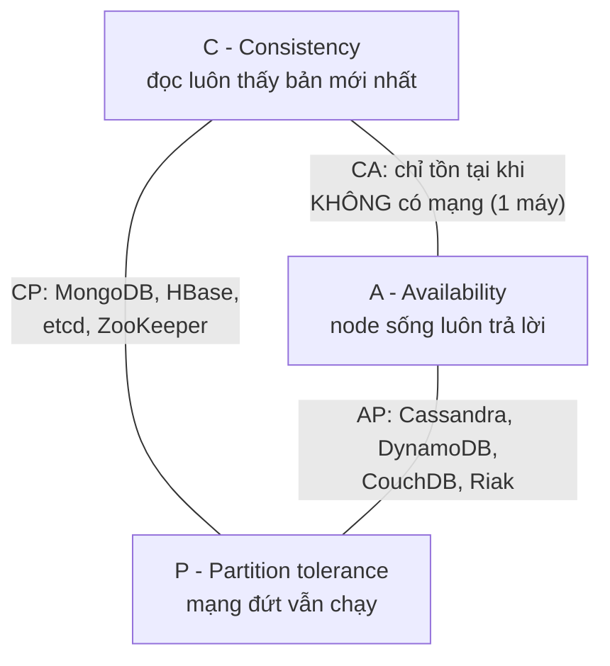

!!! warning "Hiểu sai phổ biến: 'chọn 2 trong 3'"
    Trong hệ phân tán thật, **mạng CHẮC CHẮN sẽ có lúc đứt** (switch hỏng, cáp quang biển bị đứt, GC pause làm node "im lặng" 10 giây). Bạn **không được chọn bỏ P**. Nên câu hỏi thật là: *"khi mạng đứt, hệ thống của tôi ưu tiên C hay A?"*. "CA" chỉ có nghĩa với database chạy trên 1 máy.

### 2.2 Ví dụ cụ thể: chuyển tiền vs giỏ hàng

Giả sử có 2 node ở Hà Nội và TP.HCM, đường cáp giữa hai nơi bị đứt:

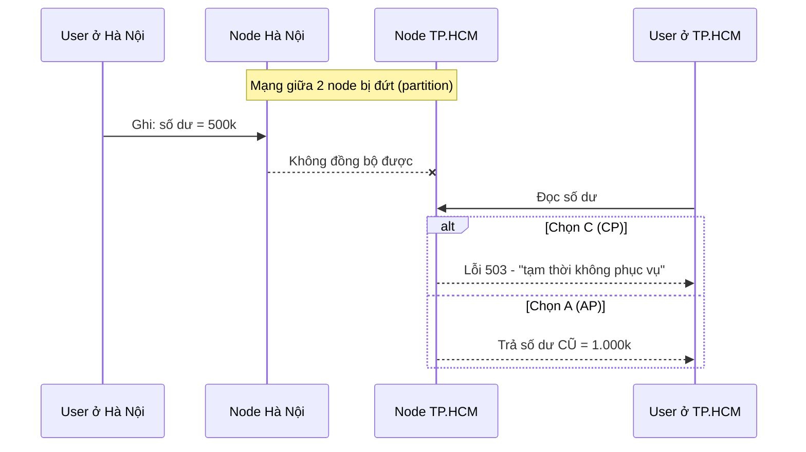

- **Ngân hàng, kho hàng, đặt vé** → chọn **C**: thà báo lỗi còn hơn cho rút tiền 2 lần hay bán 1 ghế cho 2 người.
- **Giỏ hàng, lượt like, news feed** → chọn **A**: thấy số like cũ vài giây không sao, nhưng trang **không load được** thì mất khách. Amazon nổi tiếng với quyết định "giỏ hàng luôn cho thêm đồ", khi mạng lành lại thì **gộp** (merge) các phiên bản.

### 2.3 PACELC - bổ sung phần CAP bỏ quên

CAP chỉ nói về lúc **có sự cố**. Nhưng 99.9% thời gian mạng vẫn lành! Daniel Abadi (2010) đề xuất **PACELC**:

> **if P**artition → chọn **A** hoặc **C**; **E**lse (bình thường) → chọn **L**atency (độ trễ thấp) hoặc **C**onsistency.

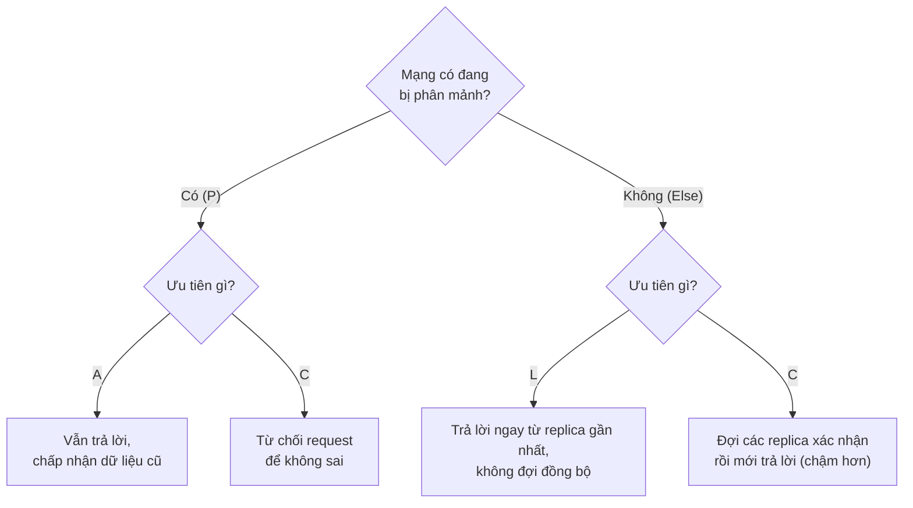

Vì sao lúc bình thường cũng phải chọn? Vì muốn **nhất quán** thì lần ghi phải **đợi** replica ở xa xác nhận - Hà Nội ↔ Singapore mất ~40ms mỗi vòng. Muốn **nhanh** thì trả lời ngay và đồng bộ sau.

| Hệ thống | Khi Partition | Else (bình thường) | Ký hiệu |
|---|---|---|---|
| Cassandra, DynamoDB (mặc định) | A | L | **PA/EL** |
| MongoDB (mặc định, đọc từ primary) | C | C | **PC/EC** |
| PostgreSQL + sync replication | C | C | **PC/EC** |
| PostgreSQL + async replica (đọc replica) | A | L | **PA/EL** |
| Google Spanner | C | C (dùng đồng hồ nguyên tử để giảm độ trễ) | **PC/EC** |

!!! tip "Nhiều database cho bạn chỉnh 'núm vặn'"
    Cassandra có **consistency level** cho **từng query** (`ONE`, `QUORUM`, `ALL`). MongoDB có **writeConcern** / **readConcern** / **readPreference**. DynamoDB có `ConsistentRead=true`. Nghĩa là C/A/L không phải thuộc tính cố định của sản phẩm, mà là **cấu hình** của từng thao tác.

## 📖 3. ACID vs BASE và các mức nhất quán

### 3.1 BASE là gì?

Bạn đã biết **ACID** ở Bài 6. Nhiều hệ NoSQL thời đầu chọn triết lý ngược lại, gọi vui là **BASE** (bazơ - đối lập với acid 😄):

| | ACID | BASE |
|---|---|---|
| Viết tắt | Atomicity, Consistency, Isolation, Durability | **B**asically **A**vailable, **S**oft state, **E**ventually consistent |
| Triết lý | "Đúng trước, nhanh sau" | "Luôn phục vụ, đúng dần dần" |
| Đọc ngay sau khi ghi | Chắc chắn thấy bản mới | **Có thể** thấy bản cũ một lúc |
| Transaction nhiều bản ghi | Có | Thường chỉ trong 1 key / 1 document / 1 partition |
| Scale ra nhiều máy | Khó hơn | Dễ hơn |
| Ví dụ | PostgreSQL, MySQL | Cassandra, DynamoDB, Riak |

!!! note "Ranh giới đang mờ dần"
    MongoDB (từ 4.0) có transaction nhiều document, DynamoDB có `TransactWriteItems`, còn "NewSQL" như **CockroachDB**, **YugabyteDB**, **TiDB**, **Spanner** vừa scale ngang vừa ACID. Đừng coi "NoSQL = không có transaction" là chân lý.

### 3.2 Eventual consistency - "rồi sẽ đúng"

**Eventual consistency**: nếu không có lần ghi mới, **sau một khoảng thời gian** mọi replica sẽ hội tụ về cùng giá trị. Không hứa "bao lâu".

> 💡 **Ví von**: Bạn đổi avatar Facebook. Bạn thấy avatar mới ngay, nhưng bạn thân ở Mỹ vài giây sau mới thấy. Không ai chết cả - đó là eventual consistency.

Các mức đảm bảo **ở giữa** mà bạn thường cần:

| Mức | Ý nghĩa | Khi nào cần |
|---|---|---|
| **Read-your-writes** | Tôi ghi xong thì **tôi** đọc lại phải thấy | Sửa hồ sơ xong reload trang |
| **Monotonic reads** | Đã thấy bản mới thì không bao giờ "lùi" về bản cũ | Cuộn feed, không muốn bình luận "biến mất" |
| **Causal consistency** | Câu trả lời không hiện trước câu hỏi | Bình luận / chat |
| **Linearizable (strong)** | Như chỉ có 1 bản dữ liệu | Số dư, tồn kho, khoá phân tán |

### 3.3 Quorum: N, R, W

Trong hệ kiểu Dynamo (Cassandra, DynamoDB...), mỗi dữ liệu có **N** bản sao. Khi ghi, đợi **W** node xác nhận; khi đọc, hỏi **R** node và lấy bản mới nhất.

> **Nếu `R + W > N`** thì tập node được đọc và tập node được ghi **chắc chắn giao nhau** ít nhất 1 node → lần đọc luôn gặp ít nhất 1 bản mới nhất.

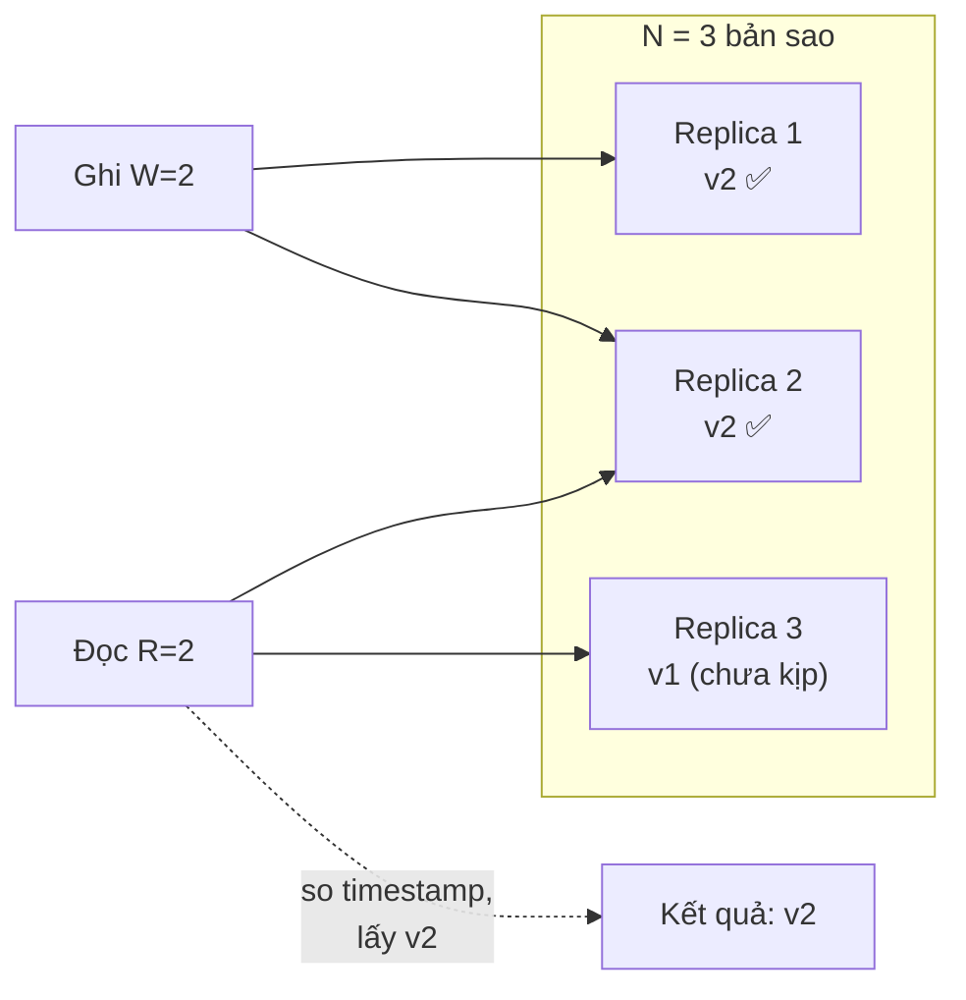

| Cấu hình (N=3) | R + W | Đặc điểm |
|---|---|---|
| W=1, R=1 | 2 ≤ 3 | Nhanh nhất, có thể đọc dữ liệu cũ |
| W=2, R=2 (**QUORUM**) | 4 > 3 | Cân bằng - phổ biến nhất |
| W=3, R=1 | 4 > 3 | Đọc nhanh, nhưng ghi thất bại nếu 1 node chết |
| W=1, R=3 | 4 > 3 | Ghi nhanh, đọc chậm |

### 💡 Tips quan trọng

- Khi ai đó nói "database X là CP/AP", hãy hỏi lại: **với cấu hình nào, cho thao tác nào?**
- Đa số bug "dữ liệu lúc có lúc không" trong hệ NoSQL là do **đọc từ replica** ngay sau khi ghi. Giải pháp phổ biến: đọc từ primary trong vài giây sau khi user vừa ghi, hoặc dùng mức nhất quán cao hơn cho đúng thao tác đó.

## 📖 4. Bản đồ các họ NoSQL

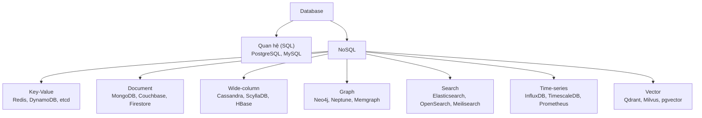

| Họ | Đơn vị dữ liệu | Truy vấn mạnh nhất | Điểm yếu |
|---|---|---|---|
| Key-value | `key → value` (blob) | Lấy/ghi theo key, O(1) | Không tìm theo nội dung value |
| Document | Document JSON/BSON lồng nhau | Lấy cả "cục" dữ liệu, lọc theo field | JOIN yếu, dễ trùng lặp dữ liệu |
| Wide-column | Hàng trong partition, sắp theo clustering key | Ghi cực nhanh, đọc 1 partition theo khoảng | Chỉ query được đúng cái đã thiết kế |
| Graph | Node + cạnh (relationship) | Duyệt quan hệ nhiều bước | Khó scale ngang, aggregate lớn chậm |
| Search | Document đã được phân tích thành term | Full-text, fuzzy, xếp hạng, facet | Không phải nguồn dữ liệu gốc |
| Time-series | (thời điểm, tags, giá trị) | Gộp theo khoảng thời gian | Update/delete lẻ kém |
| Vector | Vector nhiều chiều | Tìm k láng giềng gần nhất | Kết quả xấp xỉ, tốn RAM |

## 📖 5. Key-Value store

### 5.1 Mô hình

Đơn giản nhất: một **hash map khổng lồ** (xem [Bài 3 thuật toán: Hash Table](../algorithms/03-hashing.md)). Database không quan tâm bên trong value là gì.

```text
user:1001:profile   → {"name":"An","city":"Hà Nội"}
session:9f8a...     → {"user_id":1001,"exp":1735689600}
cart:1001           → [{"sku":"AO-01","qty":2}]
rate:ip:1.2.3.4     → 57
```

- **Redis**: nằm trong RAM, cực nhanh (~0.1ms), có nhiều kiểu dữ liệu (list, set, sorted set, hash...) - học kỹ ở [Bài 8](./08-caching.md).
- **DynamoDB** (AWS): key-value + document, lưu trên đĩa SSD, scale gần như vô hạn, trả tiền theo request.
- **etcd**: key-value **CP** dùng Raft, lưu cấu hình cho Kubernetes.

### 5.2 Thiết kế key

Quy ước phổ biến: `đối-tượng:id:thuộc-tính`, dùng dấu `:` phân cách.

```text
✅ product:8812:stock        rõ ràng, đọc là hiểu
✅ order:2024-06-01:count    gom theo ngày
❌ 8812                      8812 là gì? user? product?
❌ user_profile_data_for_id_1001_version_2   dài, tốn RAM
```

### 5.3 DynamoDB: partition key + sort key

DynamoDB mở rộng key-value thành **key hai phần**:

- **Partition key (PK)**: băm (hash) để quyết định dữ liệu nằm ở **máy nào**.
- **Sort key (SK)**: trong cùng partition, các item được **sắp xếp** theo SK → truy vấn theo khoảng được.

| PK | SK | Thuộc tính |
|---|---|---|
| `USER#1001` | `PROFILE` | name=An, city=Hà Nội |
| `USER#1001` | `ORDER#2024-06-01#A12` | total=350000 |
| `USER#1001` | `ORDER#2024-06-15#B77` | total=120000 |

Một query `PK = "USER#1001" AND begins_with(SK, "ORDER#2024-06")` lấy **toàn bộ đơn tháng 6** của user trong **1 lần đọc**, không cần JOIN. Kỹ thuật gom nhiều loại thực thể vào một bảng như thế gọi là **single-table design** - mạnh nhưng khó đọc, chỉ nên dùng khi bạn biết rõ mọi mẫu truy vấn.

## 📖 6. Document database - MongoDB

### 6.1 Document là gì?

MongoDB lưu **document** dạng **BSON** (Binary JSON - JSON nhị phân có thêm kiểu `Date`, `ObjectId`, `Decimal128`, `int64`...). Các document nằm trong **collection** (tương đương bảng), nhưng **không bắt buộc cùng cấu trúc**.

| SQL | MongoDB |
|---|---|
| database | database |
| table | collection |
| row | document |
| column | field |
| primary key | `_id` (mặc định là `ObjectId`) |
| JOIN | **embedding** hoặc `$lookup` |
| `GROUP BY` | aggregation pipeline `$group` |

```json
{
  "_id": "p1",
  "name": "Áo thun cotton",
  "category": "thoi-trang",
  "price": 199000,
  "attributes": { "size": ["S", "M", "L"], "color": "đen" },
  "reviews": [
    { "user": "an",   "rating": 5 },
    { "user": "binh", "rating": 4 }
  ]
}
```

Một điện thoại trong cùng collection có thể có `attributes: { "ram": "8GB", "chip": "..." }` - không cần `ALTER TABLE`.

!!! warning "Schemaless không có nghĩa là không có schema"
    Schema vẫn tồn tại - chỉ là nó nằm **trong code** thay vì trong database. Nếu không kỷ luật, collection sẽ có `price` lúc là số, lúc là chuỗi `"199.000đ"`. Hãy dùng **JSON Schema validation** của MongoDB (`$jsonSchema`) và struct/model rõ ràng trong code.

### 6.2 Embedding vs Referencing - quyết định quan trọng nhất

Trong SQL bạn **chuẩn hoá** (normalize) rồi JOIN. Trong MongoDB bạn phải chọn:

- **Embedding** (nhúng): đặt dữ liệu con **bên trong** document cha.
- **Referencing** (tham chiếu): lưu `_id` của document khác, khi cần thì query thêm (hoặc `$lookup`).

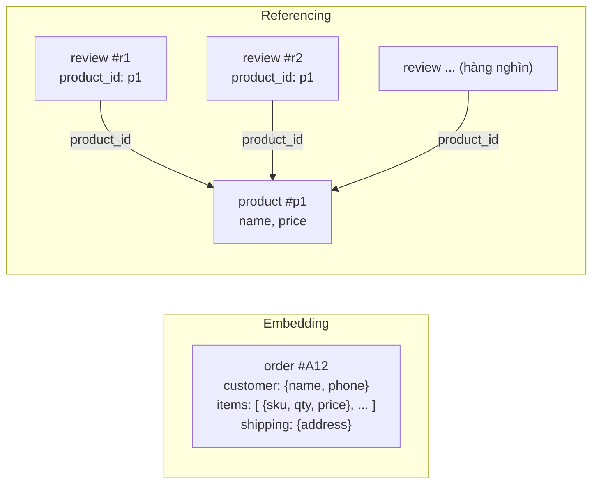

**Quy tắc chọn:**

| Câu hỏi | Nếu "có" → |
|---|---|
| Dữ liệu con luôn được đọc **cùng** với cha? | Embed |
| Quan hệ 1-vài (1-few), số lượng con **có giới hạn**? | Embed |
| Dữ liệu con là "ảnh chụp" tại thời điểm đó (giá lúc mua, địa chỉ giao)? | Embed |
| Số lượng con **không giới hạn** (comment, log, follower)? | Reference |
| Dữ liệu con được **dùng chung** bởi nhiều cha và hay thay đổi? | Reference |
| Dữ liệu con thường được truy vấn **độc lập**? | Reference |

> 💡 **Ví von**: **Hoá đơn** siêu thị in sẵn tên và giá từng món (embedding) - vì giá hôm nay có thể khác giá tuần sau, hoá đơn phải giữ nguyên. Còn **danh bạ** điện thoại chỉ lưu số của bạn bè (reference) - khi bạn bè đổi ảnh đại diện, bạn không cần sửa danh bạ.

!!! warning "Giới hạn 16MB và mảng không giới hạn"
    Một document MongoDB tối đa **16MB**. Mảng `comments` của một bài viết viral có thể phình ra vô hạn → document to dần, mỗi lần update phải ghi lại cả cục lớn, rồi đụng giới hạn. Đây là anti-pattern **"unbounded array"**. Dùng referencing, hoặc **subset pattern**: nhúng **10 review mới nhất** để hiển thị nhanh, toàn bộ review nằm ở collection riêng.

Một số pattern hay dùng:

| Pattern | Ý tưởng | Ví dụ |
|---|---|---|
| **Subset** | Nhúng phần hay dùng, phần còn lại tham chiếu | 10 review mới nhất trong product |
| **Extended reference** | Nhúng vài field hay đọc của đối tượng được tham chiếu | Đơn hàng lưu `customer_id` + `customer_name` |
| **Bucket** | Gom nhiều bản ghi nhỏ vào 1 document theo khoảng | Mỗi document = số đo cảm biến trong 1 giờ |
| **Computed** | Lưu sẵn giá trị tổng hợp | `rating_avg`, `review_count` trong product |

### 6.3 CRUD với Go và Python

Ví dụ dưới đây lưu sản phẩm với review **nhúng** bên trong, tạo index, truy vấn, cập nhật mảng nhúng và tính điểm trung bình theo danh mục.

=== "Go"

    ```go
    // go get go.mongodb.org/mongo-driver/v2@v2.5.0
    package main

    import (
    	"context"
    	"fmt"
    	"log"
    	"time"

    	"go.mongodb.org/mongo-driver/v2/bson"
    	"go.mongodb.org/mongo-driver/v2/mongo"
    	"go.mongodb.org/mongo-driver/v2/mongo/options"
    )

    type Review struct {
    	User   string `bson:"user"`
    	Rating int    `bson:"rating"`
    }

    type Product struct {
    	ID       string   `bson:"_id"`
    	Name     string   `bson:"name"`
    	Category string   `bson:"category"`
    	Price    int64    `bson:"price"`
    	Reviews  []Review `bson:"reviews"` // embedding: review nằm ngay trong sản phẩm
    }

    func main() {
    	ctx, cancel := context.WithTimeout(context.Background(), 10*time.Second)
    	defer cancel()

    	client, err := mongo.Connect(options.Client().ApplyURI("mongodb://localhost:27017"))
    	if err != nil {
    		log.Fatal(err)
    	}
    	defer client.Disconnect(ctx)

    	col := client.Database("shop").Collection("products")
    	_ = col.Drop(ctx) // cho phép chạy lại nhiều lần

    	// 1. Insert nhiều document
    	docs := []any{
    		Product{"p1", "Áo thun cotton", "thoi-trang", 199000, []Review{{"an", 5}, {"binh", 4}}},
    		Product{"p2", "Quần jean", "thoi-trang", 459000, []Review{{"chi", 3}}},
    		Product{"p3", "Tai nghe Bluetooth", "dien-tu", 890000, []Review{{"an", 5}}},
    		Product{"p4", "Sạc dự phòng", "dien-tu", 350000, []Review{}},
    	}
    	res, err := col.InsertMany(ctx, docs)
    	if err != nil {
    		log.Fatal(err)
    	}
    	fmt.Println("inserted:", len(res.InsertedIDs))

    	// 2. Tạo compound index (category, price)
    	idx, err := col.Indexes().CreateOne(ctx, mongo.IndexModel{
    		Keys: bson.D{{Key: "category", Value: 1}, {Key: "price", Value: 1}},
    	})
    	if err != nil {
    		log.Fatal(err)
    	}
    	fmt.Println("index:", idx)

    	// 3. Query: đồ điện tử giá dưới 500k
    	filter := bson.D{
    		{Key: "category", Value: "dien-tu"},
    		{Key: "price", Value: bson.D{{Key: "$lt", Value: 500000}}},
    	}
    	cur, err := col.Find(ctx, filter)
    	if err != nil {
    		log.Fatal(err)
    	}
    	var found []Product
    	if err := cur.All(ctx, &found); err != nil {
    		log.Fatal(err)
    	}
    	for _, p := range found {
    		fmt.Println("found:", p.Name, p.Price)
    	}

    	// 4. $push: thêm review vào mảng nhúng - atomic trên 1 document
    	upd, err := col.UpdateOne(ctx,
    		bson.D{{Key: "_id", Value: "p4"}},
    		bson.D{{Key: "$push", Value: bson.D{{Key: "reviews", Value: Review{"dung", 4}}}}},
    	)
    	if err != nil {
    		log.Fatal(err)
    	}
    	fmt.Println("modified:", upd.ModifiedCount)

    	// 5. Aggregation pipeline: điểm trung bình theo danh mục
    	pipeline := mongo.Pipeline{
    		{{Key: "$unwind", Value: "$reviews"}},
    		{{Key: "$group", Value: bson.D{
    			{Key: "_id", Value: "$category"},
    			{Key: "avgRating", Value: bson.D{{Key: "$avg", Value: "$reviews.rating"}}},
    			{Key: "count", Value: bson.D{{Key: "$sum", Value: 1}}},
    		}}},
    		{{Key: "$sort", Value: bson.D{{Key: "_id", Value: 1}}}},
    	}
    	agg, err := col.Aggregate(ctx, pipeline)
    	if err != nil {
    		log.Fatal(err)
    	}
    	var rows []struct {
    		Category  string  `bson:"_id"`
    		AvgRating float64 `bson:"avgRating"`
    		Count     int     `bson:"count"`
    	}
    	if err := agg.All(ctx, &rows); err != nil {
    		log.Fatal(err)
    	}
    	for _, r := range rows {
    		fmt.Printf("%s: %.2f sao (%d review)\n", r.Category, r.AvgRating, r.Count)
    	}
    }

    // Output:
    // inserted: 4
    // index: category_1_price_1
    // found: Sạc dự phòng 350000
    // modified: 1
    // dien-tu: 4.50 sao (2 review)
    // thoi-trang: 4.00 sao (3 review)
    ```

=== "Python"

    ```python
    # pip install "pymongo>=4.10"
    from pymongo import ASCENDING, MongoClient

    client = MongoClient("mongodb://localhost:27017", serverSelectionTimeoutMS=5000)
    col = client["shop"]["products"]
    col.drop()  # cho phép chạy lại nhiều lần

    # 1. Insert nhiều document - review được NHÚNG (embedding) trong sản phẩm
    res = col.insert_many([
        {"_id": "p1", "name": "Áo thun cotton", "category": "thoi-trang", "price": 199000,
         "reviews": [{"user": "an", "rating": 5}, {"user": "binh", "rating": 4}]},
        {"_id": "p2", "name": "Quần jean", "category": "thoi-trang", "price": 459000,
         "reviews": [{"user": "chi", "rating": 3}]},
        {"_id": "p3", "name": "Tai nghe Bluetooth", "category": "dien-tu", "price": 890000,
         "reviews": [{"user": "an", "rating": 5}]},
        {"_id": "p4", "name": "Sạc dự phòng", "category": "dien-tu", "price": 350000,
         "reviews": []},
    ])
    print("inserted:", len(res.inserted_ids))

    # 2. Compound index (category, price)
    print("index:", col.create_index([("category", ASCENDING), ("price", ASCENDING)]))

    # 3. Query: đồ điện tử giá dưới 500k
    for p in col.find({"category": "dien-tu", "price": {"$lt": 500000}}):
        print("found:", p["name"], p["price"])

    # 4. $push: thêm review vào mảng nhúng - atomic trên 1 document
    upd = col.update_one({"_id": "p4"}, {"$push": {"reviews": {"user": "dung", "rating": 4}}})
    print("modified:", upd.modified_count)

    # 5. Aggregation pipeline: điểm trung bình theo danh mục
    pipeline = [
        {"$unwind": "$reviews"},
        {"$group": {"_id": "$category",
                    "avgRating": {"$avg": "$reviews.rating"},
                    "count": {"$sum": 1}}},
        {"$sort": {"_id": 1}},
    ]
    for r in col.aggregate(pipeline):
        print(f"{r['_id']}: {r['avgRating']:.2f} sao ({r['count']} review)")

    # Output:
    # inserted: 4
    # index: category_1_price_1
    # found: Sạc dự phòng 350000
    # modified: 1
    # dien-tu: 4.50 sao (2 review)
    # thoi-trang: 4.00 sao (3 review)
    ```

Vài điểm cần để ý:

- **`bson.D`** (Go) là danh sách **có thứ tự** các cặp key-value. Thứ tự quan trọng với index key và pipeline stage, nên dùng `bson.D` thay vì `bson.M` (map - không có thứ tự) cho những chỗ đó.
- **`mongo.Connect` không thực sự kết nối ngay** - nó tạo pool và kết nối lười (lazy). Muốn kiểm tra sớm, gọi `client.Ping(ctx, nil)` (Go) / `client.admin.command("ping")` (Python).
- `Client` là **thread-safe** và chứa **connection pool** - tạo **một lần** khi khởi động app, dùng chung, giống `*sql.DB` ở Bài 6.
- `$push` chỉnh sửa **một document** - thao tác trên **1 document luôn atomic** trong MongoDB. Đây là lý do embedding đôi khi giúp bạn **không cần transaction**.

### 6.4 Index trong MongoDB

MongoDB cũng dùng **B-tree** cho index, nên mọi thứ bạn học ở Bài 6 (selectivity, leftmost prefix, covering index) đều áp dụng được.

| Loại index | Lệnh `mongosh` | Dùng khi |
|---|---|---|
| Single field | `db.products.createIndex({price: 1})` | Lọc/sắp xếp theo 1 field |
| Compound | `createIndex({category: 1, price: 1})` | Lọc nhiều field - thứ tự quan trọng |
| Multikey | `createIndex({"reviews.user": 1})` | Field là **mảng** - tự động index từng phần tử |
| Unique | `createIndex({email: 1}, {unique: true})` | Chặn trùng |
| TTL | `createIndex({createdAt: 1}, {expireAfterSeconds: 3600})` | Tự xoá document hết hạn (session, OTP) |
| Partial | `createIndex({status: 1}, {partialFilterExpression: {status: "pending"}})` | Chỉ index một phần dữ liệu |
| Text | `createIndex({name: "text"})` | Full-text đơn giản (yếu hơn Elasticsearch) |

**Quy tắc ESR** cho compound index: sắp field theo thứ tự **E**quality (so bằng) → **S**ort (sắp xếp) → **R**ange (khoảng). Ví dụ query `{category: "dien-tu", price: {$lt: 500000}}` sort theo `rating` → index tốt nhất là `{category: 1, rating: -1, price: 1}`.

Kiểm tra query có dùng index không bằng `explain` (tương tự `EXPLAIN ANALYZE`):

```javascript
db.products.find({category: "dien-tu", price: {$lt: 500000}}).explain("executionStats")
```

Kết quả rút gọn (chạy thật):

```text
{
  stage: 'FETCH',
  input: 'IXSCAN',
  index: 'category_1_price_1',
  keysExamined: 1,
  docsExamined: 1,
  nReturned: 1
}
```

- `IXSCAN` = quét index (tốt). Nếu thấy **`COLLSCAN`** = quét toàn bộ collection (giống Seq Scan) → thiếu index.
- Tỷ lệ vàng: `keysExamined ≈ docsExamined ≈ nReturned`. Nếu `docsExamined` gấp 1000 lần `nReturned` → index chưa đủ chọn lọc.

### 6.5 Aggregation pipeline

Aggregation pipeline giống **dây chuyền nhà máy**: document đi qua từng **stage**, mỗi stage biến đổi dòng dữ liệu rồi chuyển tiếp.

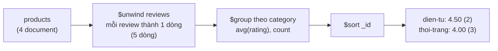

| Stage | Tương đương SQL | Ghi chú |
|---|---|---|
| `$match` | `WHERE` | Đặt **càng sớm càng tốt** để dùng index và giảm dữ liệu |
| `$project` / `$addFields` | `SELECT cột, biểu thức` | |
| `$group` | `GROUP BY` | `$sum`, `$avg`, `$max`, `$push` |
| `$sort`, `$limit`, `$skip` | `ORDER BY`, `LIMIT`, `OFFSET` | |
| `$unwind` | "bung" mảng thành nhiều dòng | |
| `$lookup` | `LEFT JOIN` | Dùng hạn chế - nếu join nhiều, có lẽ bạn cần SQL |
| `$facet` | nhiều query song song trên cùng input | Làm bộ lọc "facet" cho trang tìm kiếm |

Ví dụ `$lookup` - lấy đơn hàng kèm thông tin khách:

```javascript
db.orders.aggregate([
  { $match: { status: "pending" } },
  { $lookup: {
      from: "customers", localField: "customer_id",
      foreignField: "_id", as: "customer" } },
  { $unwind: "$customer" },
  { $project: { _id: 1, total: 1, "customer.name": 1 } }
])
```

### 6.6 Transaction, write concern, read concern

- Thao tác trên **1 document** luôn atomic. Transaction **nhiều document** có từ MongoDB 4.0 (cần replica set) - dùng được nhưng chậm hơn; nếu bạn cần nó ở khắp nơi, đó là dấu hiệu nên dùng SQL.
- **writeConcern** quyết định "ghi xong" nghĩa là gì: `w: 1` (primary nhận là xong) hay `w: "majority"` (đa số replica đã ghi - mặc định từ MongoDB 5.0, an toàn khi primary chết).
- **readPreference**: `primary` (mặc định, nhất quán) hay `secondary`/`nearest` (nhanh hơn nhưng có thể đọc dữ liệu cũ).

## 📖 7. Wide-column - Cassandra

### 7.1 Kiến trúc: vòng tròn không có "sếp"

Cassandra (và ScyllaDB - bản viết lại bằng C++) được thiết kế để **ghi cực nhiều** (hàng trăm nghìn ghi/giây) và **không có điểm chết đơn lẻ**. Mọi node **ngang hàng** (không có primary), xếp thành một **vòng băm** (consistent hashing ring):

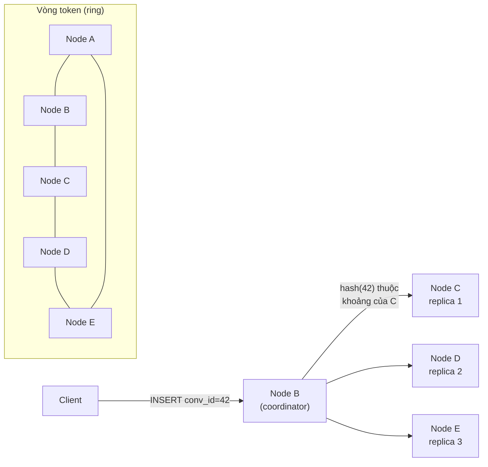

- `hash(partition key)` → một **token** → rơi vào khoảng của node nào thì node đó (và N-1 node kế tiếp) giữ dữ liệu.
- Thêm node mới chỉ phải chuyển **một phần** dữ liệu - đó là sức mạnh của consistent hashing (sẽ học kỹ ở [Bài 10](./10-system-design.md)).
- Engine lưu trữ là **LSM-tree**: ghi vào commit log + bảng trong RAM (memtable), đầy thì flush thành file bất biến (SSTable) trên đĩa, định kỳ **compaction** gộp file. Ghi luôn là **ghi tuần tự** → rất nhanh; đổi lại đọc phải xem nhiều file (dùng bloom filter để bỏ qua file không chứa key).

### 7.2 Partition key và clustering key

Primary key của Cassandra gồm hai phần:

```sql
PRIMARY KEY ((partition_key_cols), clustering_col1, clustering_col2)
```

- **Partition key**: quyết định dữ liệu nằm ở **node nào**. Mọi hàng cùng partition key nằm **cạnh nhau** trên cùng node.
- **Clustering key**: quyết định **thứ tự** các hàng **bên trong** partition (lưu sẵn đã sắp xếp trên đĩa).

> 💡 **Ví von**: Kho hàng có nhiều **dãy kệ** (node). **Partition key** là "mã dãy kệ" - biết mã là đi thẳng tới đúng dãy. **Clustering key** là thứ tự xếp hàng **trên kệ** - đã xếp theo ngày nhập nên lấy "10 món mới nhất" chỉ cần nhìn một đầu kệ.

### 7.3 Query-first modeling: thiết kế theo câu hỏi

Đây là khác biệt tư duy lớn nhất so với SQL:

| SQL | Cassandra |
|---|---|
| Thiết kế theo **thực thể** (bảng users, messages...) rồi viết query gì cũng được | Liệt kê **mọi câu truy vấn** trước, mỗi query → **một bảng** |
| Chuẩn hoá, tránh trùng lặp | **Chấp nhận trùng lặp** (denormalize) - đĩa rẻ, JOIN không có |
| JOIN, subquery, `WHERE` bất kỳ cột | Không JOIN; `WHERE` phải theo partition key (+ clustering key theo thứ tự) |

**Bài toán**: app chat (như Zalo/Messenger). Các truy vấn cần:

1. Q1: Lấy 50 tin nhắn **mới nhất** của một cuộc hội thoại, cuộn lên xem tin cũ hơn.
2. Q2: Lấy danh sách hội thoại của một user, sắp theo **tin nhắn cuối** mới nhất.

```sql
-- Q1: tin nhắn theo hội thoại. Chia thêm theo tháng (bucket) để partition không phình vô hạn
CREATE TABLE messages_by_conversation (
    conversation_id uuid,
    month           text,        -- '2024-06' : bucket
    sent_at         timeuuid,    -- vừa là thời gian, vừa duy nhất
    sender_id       uuid,
    body            text,
    PRIMARY KEY ((conversation_id, month), sent_at)
) WITH CLUSTERING ORDER BY (sent_at DESC);

-- Q2: hội thoại theo user - cùng dữ liệu nhưng bảng khác (denormalize)
CREATE TABLE conversations_by_user (
    user_id          uuid,
    last_message_at  timestamp,
    conversation_id  uuid,
    title            text,
    last_message     text,
    PRIMARY KEY ((user_id), last_message_at, conversation_id)
) WITH CLUSTERING ORDER BY (last_message_at DESC, conversation_id ASC);
```

```sql
-- Q1: 50 tin mới nhất - đọc đúng 1 partition, dữ liệu đã sắp sẵn → cực nhanh
SELECT sender_id, body, sent_at FROM messages_by_conversation
WHERE conversation_id = 5b6f... AND month = '2024-06'
LIMIT 50;

-- Cuộn lên: tin cũ hơn mốc cuối cùng đã thấy (phân trang theo khoảng)
SELECT sender_id, body, sent_at FROM messages_by_conversation
WHERE conversation_id = 5b6f... AND month = '2024-06' AND sent_at < 8e2a...
LIMIT 50;

-- ❌ Lỗi: không có partition key → Cassandra từ chối (phải quét mọi node)
SELECT * FROM messages_by_conversation WHERE sender_id = 11aa...;
```

```text
Output (ví dụ):
InvalidRequest: Error from server: code=2200 [Invalid query] message="Cannot execute
this query as it might involve data filtering and thus may have unpredictable performance.
If you want to execute this query despite the performance unpredictability, use ALLOW FILTERING"
```

!!! warning "Đừng thêm `ALLOW FILTERING` cho hết lỗi"
    Thông báo trên là Cassandra đang **cứu bạn**: query đó phải quét toàn cụm. Cách đúng là tạo **thêm một bảng** `messages_by_sender` với partition key là `sender_id`, và ghi vào cả hai bảng (dùng `BATCH` loại logged cho các bảng cùng dữ liệu).

**Các nguyên tắc sống còn khi chọn partition key:**

1. **Phân tán đều**: tránh "hot partition" - ví dụ partition key = `country` thì partition "VN" gánh 90% dữ liệu.
2. **Không phình vô hạn**: giữ mỗi partition dưới ~100MB / vài trăm nghìn hàng → dùng **bucket** (tháng, ngày).
3. **Mỗi query đọc 1 (hoặc rất ít) partition**.
4. **Xoá là ghi thêm "bia mộ" (tombstone)**: xoá nhiều trong 1 partition làm đọc chậm dần. Cassandra không hợp với dữ liệu kiểu "hàng đợi" (ghi rồi xoá liên tục).

## 📖 8. Graph database

### 8.1 Khi nào quan hệ là "nhân vật chính"?

Trong SQL, "bạn của bạn của bạn" cần **self-join 3 lần** trên bảng `friendships` hàng tỷ dòng - mỗi tầng nhân số lượng lên. Graph database (Neo4j, Amazon Neptune, Memgraph) lưu **cạnh như con trỏ trực tiếp** giữa các node ("index-free adjacency"): đi từ một node sang hàng xóm là O(1), không cần tra index.

**Property graph** gồm:

- **Node** có nhãn (label) và thuộc tính: `(:User {name: "An"})`
- **Relationship** có hướng, có kiểu và thuộc tính: `-[:FOLLOWS {since: 2023}]->`

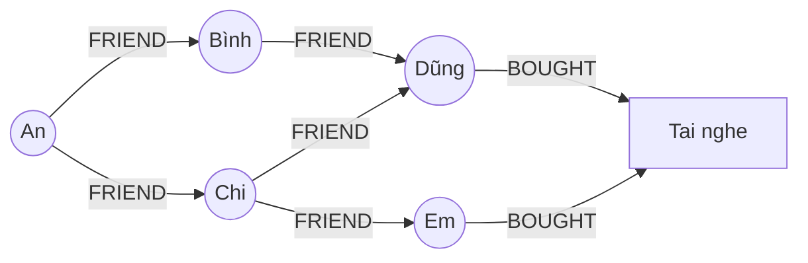

### 8.2 Cypher - ngôn ngữ truy vấn "vẽ bằng ASCII"

Cypher (Neo4j, và là nền của chuẩn ISO **GQL** 2024) viết pattern gần giống hình vẽ: `(node)-[quan hệ]->(node)`.

```cypher
// Tạo dữ liệu
CREATE (an:User {name:'An'}), (binh:User {name:'Bình'}), (chi:User {name:'Chi'}),
       (dung:User {name:'Dũng'}), (em:User {name:'Em'}),
       (tn:Product {name:'Tai nghe'}),
       (an)-[:FRIEND]->(binh), (an)-[:FRIEND]->(chi),
       (binh)-[:FRIEND]->(dung), (chi)-[:FRIEND]->(dung), (chi)-[:FRIEND]->(em),
       (dung)-[:BOUGHT]->(tn), (em)-[:BOUGHT]->(tn);

// Gợi ý kết bạn cho An: bạn-của-bạn, chưa là bạn, xếp theo số bạn chung
MATCH (me:User {name:'An'})-[:FRIEND]-(f)-[:FRIEND]-(fof:User)
WHERE fof <> me AND NOT (me)-[:FRIEND]-(fof)
RETURN fof.name AS goi_y, count(DISTINCT f) AS ban_chung
ORDER BY ban_chung DESC;
```

```text
Output (ví dụ):
╒═══════╤═══════════╕
│goi_y  │ban_chung  │
╞═══════╪═══════════╡
│"Dũng" │2          │
│"Em"   │1          │
└───────┴───────────┘
```

```cypher
// "Bạn bè của bạn đã mua gì?" - gợi ý sản phẩm
MATCH (me:User {name:'An'})-[:FRIEND*1..2]-(u)-[:BOUGHT]->(p:Product)
RETURN p.name, count(DISTINCT u) AS so_nguoi_mua ORDER BY so_nguoi_mua DESC;

// Đường ngắn nhất giữa 2 người (như "6 độ cách biệt" của LinkedIn)
MATCH path = shortestPath((a:User {name:'An'})-[:FRIEND*]-(b:User {name:'Em'}))
RETURN [n IN nodes(path) | n.name] AS duong_di;
```

So với SQL, câu "bạn của bạn" cần `WITH RECURSIVE` hoặc nhiều JOIN - dài và khó đọc hơn nhiều.

**Dùng graph DB khi**: gợi ý bạn bè/sản phẩm, phát hiện gian lận (chuỗi tài khoản chuyển tiền vòng tròn, nhiều tài khoản dùng chung thiết bị), knowledge graph, phân quyền phức tạp (Google Zanzibar-style), bản đồ phụ thuộc hạ tầng.

**Không dùng khi**: dữ liệu chủ yếu là bảng phẳng, cần aggregate lớn (tổng doanh thu theo tháng) - SQL làm tốt hơn.

## 📖 9. Search engine - Elasticsearch và inverted index

### 9.1 Vì sao `LIKE '%áo thun%'` chậm?

B-tree index sắp xếp theo **giá trị đầy đủ** - nó giúp tìm `name = 'Áo thun'` hoặc `name LIKE 'Áo%'` (prefix). Nhưng `'%áo thun%'` có thể nằm **ở giữa** chuỗi → phải quét toàn bảng. Thêm nữa, người dùng gõ "ao thun" (không dấu), "áo phông", "áo thun namm" (gõ sai) - SQL không hiểu.

### 9.2 Inverted index - "mục lục cuối sách"

Sách giáo khoa có **mục lục cuối sách** (index): "Quang hợp - trang 12, 45, 88". Bạn tra **từ** để ra **trang**, thay vì đọc cả cuốn. Đó chính là **inverted index**: ánh xạ **từ (term) → danh sách tài liệu chứa từ đó (posting list)**.

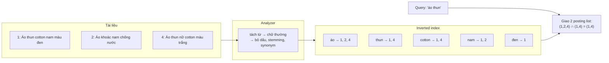

Các bước khi **index** một tài liệu:

1. **Analyzer** biến văn bản thành **term**: tách từ (tokenizer) → chữ thường → (tuỳ chọn) bỏ dấu `áo → ao` (ASCII folding), đưa về gốc từ `running → run` (stemming), thêm từ đồng nghĩa `áo phông = áo thun`.
2. Với mỗi term, **thêm ID tài liệu** vào posting list của term đó.

Khi **tìm kiếm**: query cũng đi qua **cùng analyzer**, rồi lấy posting list của từng term và **giao** (AND) hoặc **hợp** (OR) chúng. Vì posting list đã **sắp xếp**, phép giao dùng **hai con trỏ** O(n + m) (xem [Bài 2 thuật toán: Mảng & Chuỗi](../algorithms/02-arrays-strings.md)).

### 9.3 Tự cài đặt inverted index

=== "Go"

    ```go
    package main

    import (
    	"fmt"
    	"sort"
    	"strings"
    	"unicode"
    )

    // InvertedIndex: từ (term) -> danh sách ID tài liệu chứa từ đó (posting list), đã sắp xếp.
    type InvertedIndex struct {
    	postings map[string][]int
    	docs     map[int]string
    }

    func NewInvertedIndex() *InvertedIndex {
    	return &InvertedIndex{postings: map[string][]int{}, docs: map[int]string{}}
    }

    // tokenize = "analyzer" tối giản: chữ thường + tách theo ký tự không phải chữ/số.
    func tokenize(text string) []string {
    	return strings.FieldsFunc(strings.ToLower(text), func(r rune) bool {
    		return !unicode.IsLetter(r) && !unicode.IsNumber(r)
    	})
    }

    func (ix *InvertedIndex) Add(id int, text string) {
    	ix.docs[id] = text
    	seen := map[string]bool{}
    	for _, term := range tokenize(text) {
    		if seen[term] {
    			continue // mỗi tài liệu chỉ ghi 1 lần vào posting list
    		}
    		seen[term] = true
    		ix.postings[term] = append(ix.postings[term], id) // id tăng dần => list tự sắp xếp
    	}
    }

    // intersect: giao 2 danh sách đã sắp xếp bằng hai con trỏ - O(n+m).
    func intersect(a, b []int) []int {
    	var out []int
    	i, j := 0, 0
    	for i < len(a) && j < len(b) {
    		switch {
    		case a[i] == b[j]:
    			out = append(out, a[i])
    			i++
    			j++
    		case a[i] < b[j]:
    			i++
    		default:
    			j++
    		}
    	}
    	return out
    }

    // Search: trả về tài liệu chứa TẤT CẢ các từ trong query (AND).
    func (ix *InvertedIndex) Search(query string) []int {
    	terms := tokenize(query)
    	if len(terms) == 0 {
    		return nil
    	}
    	// Mẹo tối ưu: bắt đầu từ posting list NGẮN nhất.
    	sort.Slice(terms, func(i, j int) bool {
    		return len(ix.postings[terms[i]]) < len(ix.postings[terms[j]])
    	})
    	result := ix.postings[terms[0]]
    	for _, t := range terms[1:] {
    		result = intersect(result, ix.postings[t])
    	}
    	return result
    }

    func main() {
    	ix := NewInvertedIndex()
    	products := []string{
    		"Áo thun cotton nam màu đen",
    		"Áo khoác nam chống nước",
    		"Quần jean nữ màu xanh",
    		"Áo thun nữ cotton màu trắng",
    		"Giày chạy bộ nam màu đen",
    	}
    	for i, p := range products {
    		ix.Add(i+1, p)
    	}

    	fmt.Println("posting[áo]  =", ix.postings["áo"])
    	fmt.Println("posting[màu] =", ix.postings["màu"])
    	for _, q := range []string{"áo thun", "Màu Đen", "nam", "cotton nữ", "váy"} {
    		ids := ix.Search(q)
    		fmt.Printf("%-10q -> %v", q, ids)
    		for _, id := range ids {
    			fmt.Printf(" | %s", ix.docs[id])
    		}
    		fmt.Println()
    	}
    }

    // Output:
    // posting[áo]  = [1 2 4]
    // posting[màu] = [1 3 4 5]
    // "áo thun"  -> [1 4] | Áo thun cotton nam màu đen | Áo thun nữ cotton màu trắng
    // "Màu Đen"  -> [1 5] | Áo thun cotton nam màu đen | Giày chạy bộ nam màu đen
    // "nam"      -> [1 2 5] | Áo thun cotton nam màu đen | Áo khoác nam chống nước | Giày chạy bộ nam màu đen
    // "cotton nữ" -> [4] | Áo thun nữ cotton màu trắng
    // "váy"      -> []
    ```

=== "Python"

    ```python
    import re
    from collections import defaultdict


    def tokenize(text: str) -> list[str]:
        """Analyzer tối giản: chữ thường + tách theo ký tự không phải chữ/số."""
        return re.findall(r"\w+", text.lower())


    def intersect(a: list[int], b: list[int]) -> list[int]:
        """Giao 2 danh sách đã sắp xếp bằng hai con trỏ - O(n+m)."""
        out, i, j = [], 0, 0
        while i < len(a) and j < len(b):
            if a[i] == b[j]:
                out.append(a[i])
                i += 1
                j += 1
            elif a[i] < b[j]:
                i += 1
            else:
                j += 1
        return out


    class InvertedIndex:
        def __init__(self) -> None:
            self.postings: dict[str, list[int]] = defaultdict(list)  # term -> [doc_id...]
            self.docs: dict[int, str] = {}

        def add(self, doc_id: int, text: str) -> None:
            self.docs[doc_id] = text
            for term in dict.fromkeys(tokenize(text)):  # bỏ trùng, giữ thứ tự
                self.postings[term].append(doc_id)       # id tăng dần => list tự sắp xếp

        def search(self, query: str) -> list[int]:
            """Tài liệu chứa TẤT CẢ các từ trong query (AND)."""
            terms = tokenize(query)
            if not terms:
                return []
            # Mẹo tối ưu: bắt đầu từ posting list NGẮN nhất.
            terms.sort(key=lambda t: len(self.postings.get(t, [])))
            result = self.postings.get(terms[0], [])
            for t in terms[1:]:
                result = intersect(result, self.postings.get(t, []))
            return result


    ix = InvertedIndex()
    products = [
        "Áo thun cotton nam màu đen",
        "Áo khoác nam chống nước",
        "Quần jean nữ màu xanh",
        "Áo thun nữ cotton màu trắng",
        "Giày chạy bộ nam màu đen",
    ]
    for i, p in enumerate(products, start=1):
        ix.add(i, p)

    print("posting[áo]  =", ix.postings["áo"])
    print("posting[màu] =", ix.postings["màu"])
    for q in ["áo thun", "Màu Đen", "nam", "cotton nữ", "váy"]:
        ids = ix.search(q)
        print(f"{q!r:<10} -> {ids}" + "".join(f" | {ix.docs[i]}" for i in ids))

    # Output:
    # posting[áo]  = [1, 2, 4]
    # posting[màu] = [1, 3, 4, 5]
    # 'áo thun'  -> [1, 4] | Áo thun cotton nam màu đen | Áo thun nữ cotton màu trắng
    # 'Màu Đen'  -> [1, 5] | Áo thun cotton nam màu đen | Giày chạy bộ nam màu đen
    # 'nam'      -> [1, 2, 5] | Áo thun cotton nam màu đen | Áo khoác nam chống nước | Giày chạy bộ nam màu đen
    # 'cotton nữ' -> [4] | Áo thun nữ cotton màu trắng
    # 'váy'      -> []
    ```

Quan sát:

- "Màu Đen" (viết hoa) vẫn tìm ra vì **query đi qua cùng analyzer** với lúc index (chữ thường hoá). Quy tắc vàng của search: **analyzer lúc index và lúc query phải khớp nhau**.
- Tìm "ao thun" (không dấu) sẽ **không** ra gì - vì ta chưa bỏ dấu. Elasticsearch giải quyết bằng filter `asciifolding` (hoặc plugin phân tích tiếng Việt). Đây là bài tập cuối bài.
- Engine thật còn lưu **vị trí** của từ trong tài liệu (để tìm cụm từ chính xác "áo thun" liền nhau), **tần suất** (để xếp hạng), và nén posting list.

### 9.4 Xếp hạng: TF-IDF và BM25

Tìm được tài liệu mới là một nửa - phải **xếp hạng** cái nào liên quan nhất lên đầu. Ý tưởng:

- **TF** (term frequency): từ xuất hiện **nhiều lần** trong tài liệu → liên quan hơn.
- **IDF** (inverse document frequency): từ **hiếm** trong cả kho quan trọng hơn từ phổ biến. "cotton" mang nhiều thông tin hơn "áo" (có trong hầu hết sản phẩm thời trang).
- **BM25** (mặc định của Elasticsearch/Lucene) = TF-IDF cải tiến: TF bão hoà (xuất hiện 20 lần không hơn 5 lần bao nhiêu), và chuẩn hoá theo **độ dài** tài liệu.

### 9.5 Elasticsearch trong thực tế

Elasticsearch (và bản fork mã nguồn mở **OpenSearch**) xây trên thư viện **Lucene**. Dữ liệu chia thành **shard** (mỗi shard là một Lucene index), có **replica**.

```json
PUT /products
{
  "settings": {
    "analysis": {
      "analyzer": {
        "vi_folding": { "tokenizer": "standard", "filter": ["lowercase", "asciifolding"] }
      }
    }
  },
  "mappings": {
    "properties": {
      "name":     { "type": "text", "analyzer": "vi_folding" },
      "category": { "type": "keyword" },
      "price":    { "type": "long" }
    }
  }
}
```

```json
GET /products/_search
{
  "query": {
    "bool": {
      "must":   [ { "match": { "name": { "query": "ao thun", "fuzziness": "AUTO" } } } ],
      "filter": [ { "term": { "category": "thoi-trang" } },
                  { "range": { "price": { "lte": 300000 } } } ]
    }
  },
  "aggs": { "theo_danh_muc": { "terms": { "field": "category" } } }
}
```

- `text` được phân tích (tách từ) → dùng cho full-text; `keyword` giữ nguyên → dùng cho lọc chính xác, sắp xếp, aggregation.
- `must` ảnh hưởng **điểm** (score); `filter` chỉ lọc có/không, **được cache** và nhanh hơn.
- `fuzziness: AUTO` cho phép gõ sai 1-2 ký tự ("thunn" vẫn ra "thun").

!!! warning "Elasticsearch KHÔNG phải nguồn dữ liệu gốc"
    ES là **near real-time** (mặc định refresh mỗi 1 giây - ghi xong chưa tìm thấy ngay), không có transaction, và từng có lịch sử mất dữ liệu khi cụm bị chia đôi. Mẫu chuẩn: **PostgreSQL là nguồn sự thật** → đồng bộ sang ES qua **CDC** (Debezium đọc WAL) hoặc **outbox + message queue** (xem [Bài 9](./09-message-queues.md)). Mất ES thì **đánh index lại** từ Postgres.

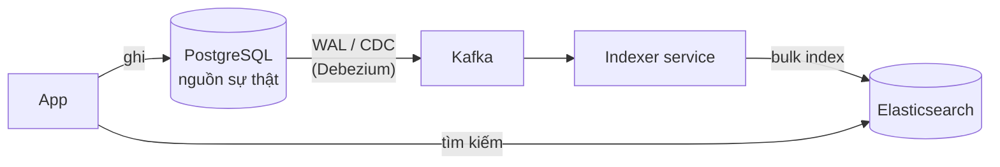

## 📖 10. Time-series database

Dữ liệu time-series là **chuỗi số đo theo thời gian**: CPU mỗi 10 giây, giá BTC mỗi giây, nhiệt độ kho lạnh mỗi phút, số đơn hàng mỗi phút.

Đặc điểm:

- **Ghi rất nhiều, gần như chỉ append** (hiếm khi sửa quá khứ).
- **Truy vấn theo khoảng thời gian** và **gộp** (trung bình mỗi 5 phút, max mỗi giờ).
- Dữ liệu cũ **ít giá trị dần** → **downsampling** (gộp dữ liệu 1 giây thành 1 phút sau 7 ngày) và **retention** (xoá sau 90 ngày).
- Nén cực tốt: timestamp tăng đều và giá trị thay đổi ít → nén delta-of-delta, Gorilla... giảm 10-20 lần dung lượng.

| Sản phẩm | Đặc điểm |
|---|---|
| **Prometheus** | Kéo (pull) metrics, dùng cho monitoring - học ở [Bài 11](./11-observability-reliability.md) |
| **InfluxDB** | Time-series chuyên dụng, có ngôn ngữ riêng |
| **TimescaleDB** | Extension của **PostgreSQL** - vẫn là SQL, JOIN được với bảng thường |
| **ClickHouse** | Column store phân tích (OLAP), rất mạnh cho log/analytics |

Ví dụ TimescaleDB - vẫn là SQL quen thuộc:

```sql
CREATE TABLE sensor_data (
    time        timestamptz NOT NULL,
    warehouse   text        NOT NULL,
    temperature double precision
);
SELECT create_hypertable('sensor_data', 'time');   -- tự chia partition theo thời gian

-- Nhiệt độ trung bình mỗi 15 phút của kho Bình Dương trong 1 ngày qua
SELECT time_bucket('15 minutes', time) AS bucket, avg(temperature) AS avg_temp
FROM sensor_data
WHERE warehouse = 'binh-duong' AND time > now() - interval '1 day'
GROUP BY bucket ORDER BY bucket;

-- Tự xoá dữ liệu cũ hơn 90 ngày
SELECT add_retention_policy('sensor_data', INTERVAL '90 days');
```

## 📖 11. Vector database - tìm theo "ý nghĩa"

### 11.1 Embedding

Mô hình AI (embedding model) biến một đoạn văn bản / ảnh thành một **vector** vài trăm đến vài nghìn chiều, sao cho **nội dung giống nhau về nghĩa** thì **vector nằm gần nhau**.

```text
"áo mặc đi biển"        → [0.12, -0.40, 0.88, ...]  (ví dụ 768 chiều)
"áo sơ mi hoa hawaii"   → [0.10, -0.38, 0.85, ...]  ← gần
"sạc dự phòng 10000mAh" → [-0.70, 0.22, 0.05, ...]  ← xa
```

Độ gần thường đo bằng **cosine similarity** = cos(góc giữa 2 vector): 1 là cùng hướng (rất giống), 0 là không liên quan.

### 11.2 Tìm láng giềng gần nhất (ANN)

So sánh query với **từng** vector trong 10 triệu vector là quá chậm. Vector DB dùng thuật toán **ANN** (Approximate Nearest Neighbor) - chấp nhận **xấp xỉ** (có thể bỏ sót vài kết quả) để nhanh hơn hàng trăm lần. Phổ biến nhất là **HNSW** (đồ thị nhiều tầng, giống "đường cao tốc → quốc lộ → đường làng").

```sql
-- pgvector: vector search ngay trong PostgreSQL
CREATE EXTENSION vector;
CREATE TABLE products (id bigint PRIMARY KEY, name text, embedding vector(768));
CREATE INDEX ON products USING hnsw (embedding vector_cosine_ops);

-- 5 sản phẩm "gần nghĩa" nhất với câu query (vector $1 do embedding model sinh ra)
SELECT id, name, 1 - (embedding <=> $1) AS similarity
FROM products ORDER BY embedding <=> $1 LIMIT 5;
```

Ứng dụng: **tìm kiếm ngữ nghĩa**, **RAG** (chatbot trả lời dựa trên tài liệu công ty), gợi ý sản phẩm tương tự, tìm ảnh giống nhau, phát hiện câu hỏi trùng. Sản phẩm: **pgvector** (khởi đầu tốt nhất nếu đã có Postgres), **Qdrant**, **Milvus**, **Weaviate**, **Pinecone**; Elasticsearch/OpenSearch cũng có vector search.

!!! tip "Hybrid search"
    Thực tế tốt nhất thường là **kết hợp**: keyword search (BM25 - bắt đúng mã sản phẩm "iPhone 15 Pro") + vector search (hiểu ý "điện thoại chụp ảnh đẹp") rồi trộn kết quả (ví dụ Reciprocal Rank Fusion).

## 📖 12. Bảng quyết định chọn database

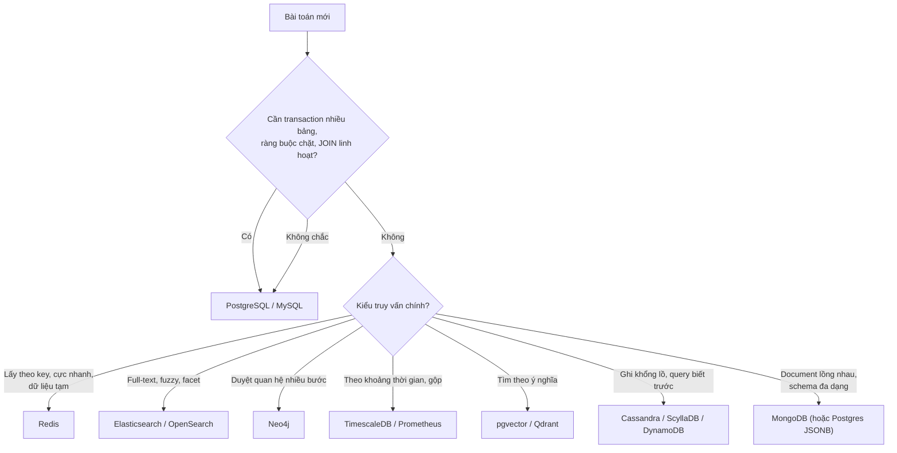

| Nhu cầu | Lựa chọn đầu tiên | Thay thế | Lưu ý |
|---|---|---|---|
| Nghiệp vụ lõi: đơn hàng, thanh toán, tồn kho | PostgreSQL | MySQL, CockroachDB | Cần ACID |
| Cache, session, rate limit, bảng xếp hạng | Redis | Memcached, Valkey | Dữ liệu có thể mất (xem Bài 8) |
| Catalog sản phẩm thuộc tính đa dạng | Postgres JSONB | MongoDB | JSONB + GIN index đủ cho đa số trường hợp |
| Tin nhắn chat, activity log hàng tỷ dòng | Cassandra / ScyllaDB | DynamoDB, HBase | Thiết kế query-first |
| Ô tìm kiếm, lọc facet | Elasticsearch / OpenSearch | Meilisearch, Typesense, Postgres FTS | Đồng bộ từ DB gốc |
| Mạng xã hội, gian lận, gợi ý | Neo4j | Postgres recursive CTE (nhỏ) | |
| Metrics, IoT | Prometheus / TimescaleDB | InfluxDB, ClickHouse | Retention + downsampling |
| Phân tích (OLAP), báo cáo trên tỷ dòng | ClickHouse | BigQuery, Snowflake | Column store |
| Semantic search, RAG | pgvector | Qdrant, Milvus | |
| Cấu hình phân tán, leader election | etcd | ZooKeeper, Consul | Cần CP |
| File, ảnh, video | Object storage (S3, MinIO) | | **Không** lưu file lớn trong DB |

## 📖 13. Polyglot persistence

**Polyglot persistence** = một hệ thống dùng **nhiều loại database**, mỗi loại cho phần việc nó giỏi nhất. Giống nhà hàng có tủ lạnh (đồ tươi), tủ đông (đồ đông lạnh), kệ khô (gạo, gia vị) - không ai nhét tất cả vào một tủ.

Kiến trúc tham khảo cho một sàn TMĐT:

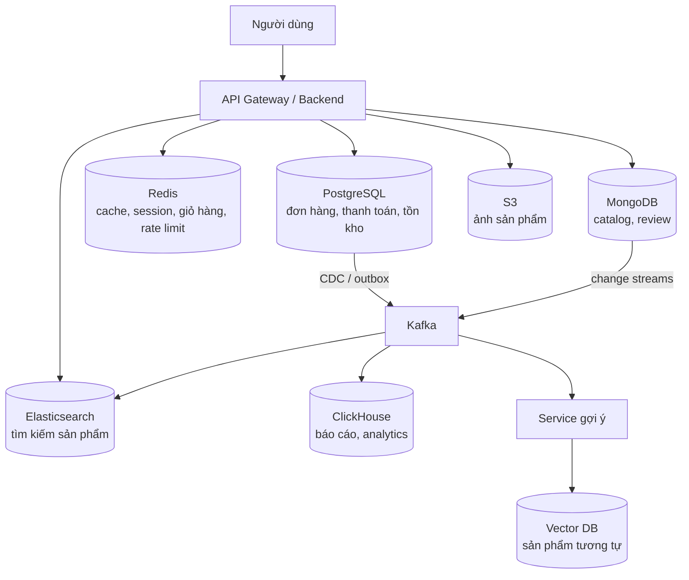

**Cái giá phải trả:**

- Mỗi database thêm = thêm **vận hành**: backup, nâng cấp, giám sát, bảo mật, người trực đêm biết sửa.
- **Đồng bộ dữ liệu** giữa các kho: phải chấp nhận **eventual consistency** và xử lý khi đồng bộ lỗi (đọc Bài 9 về outbox, idempotent consumer).
- Luôn xác định rõ **một nguồn sự thật** (source of truth) cho mỗi loại dữ liệu. Các kho còn lại là **bản sao dẫn xuất** (derived data) - có thể xoá đi và dựng lại.

!!! tip "Bắt đầu nhỏ"
    Startup giai đoạn đầu: **PostgreSQL + Redis** là đủ. Tìm kiếm dùng Postgres full-text/`pg_trgm`. Chỉ tách thêm Elasticsearch khi search thật sự thành vấn đề (chất lượng hoặc tải). Mỗi database mới phải có **lý do đo được**.

## 🌍 Ứng dụng thực tế

- **Discord** lưu hàng nghìn tỷ tin nhắn: từ MongoDB → Cassandra (2017) → **ScyllaDB** (2022), với partition key `(channel_id, bucket)` - bucket theo cửa sổ thời gian, giống hệt ví dụ `messages_by_conversation` ở trên.
- **Netflix** dùng Cassandra cho lịch sử xem, Elasticsearch cho tìm kiếm nội bộ, EVCache (Memcached) làm cache - một ví dụ điển hình của polyglot persistence.
- **Uber** dùng MySQL làm nền cho kho dữ liệu riêng (Schemaless, Docstore) - chứng tỏ "NoSQL" đôi khi là **cách dùng** SQL chứ không phải sản phẩm khác.
- **Các sàn TMĐT Việt Nam** (Tiki, Shopee...) phổ biến kiến trúc: MySQL/Postgres cho đơn hàng, Redis cho cache/flash sale, Elasticsearch cho ô tìm kiếm có xử lý tiếng Việt không dấu.
- **Ngân hàng** dùng graph database để phát hiện **vòng chuyển tiền** rửa tiền và các tài khoản "nhận hộ" dùng chung thiết bị/số điện thoại.
- **Chatbot hỗ trợ khách hàng** dùng **RAG**: tài liệu nội bộ được chia đoạn, tạo embedding, lưu vào pgvector/Qdrant; khi khách hỏi, tìm đoạn gần nghĩa nhất đưa cho LLM trả lời.

## ⚠️ Lỗi thường gặp

### 1. Chọn MongoDB "vì không cần thiết kế schema"

```text
❌ "Dùng Mongo cho nhanh, khỏi lo schema"
   → 6 tháng sau: price lúc là số lúc là chuỗi, đơn hàng cần transaction 3 collection,
     báo cáo cần $lookup 4 tầng.
✅ Dữ liệu có quan hệ chặt + cần transaction → PostgreSQL.
   Chỉ một phần dữ liệu linh hoạt → cột JSONB trong Postgres.
```

### 2. Embed mảng không giới hạn

```json
❌ { "_id": "post1", "comments": [ ...200.000 phần tử... ] }   // đụng giới hạn 16MB
✅ collection comments riêng: { "post_id": "post1", "text": "..." }
   + nhúng 5 comment mới nhất trong post để hiển thị nhanh (subset pattern)
```

### 3. Thiết kế Cassandra như SQL

```sql
❌ PRIMARY KEY (message_id)            -- rồi query WHERE conversation_id = ?  → không được
❌ PRIMARY KEY ((country), created_at) -- partition "VN" khổng lồ (hot partition)
✅ PRIMARY KEY ((conversation_id, month), sent_at)  -- theo đúng câu truy vấn, có bucket
```

### 4. Dùng Elasticsearch làm database chính

```text
❌ App ghi thẳng vào ES, không lưu ở đâu khác → mất cụm là mất dữ liệu
✅ Ghi vào DB gốc → đồng bộ sang ES bằng CDC/outbox → có thể reindex bất cứ lúc nào
```

### 5. Quên index trong MongoDB

```text
❌ find({email: "an@x.com"}) trên 5 triệu document → COLLSCAN, 3 giây
✅ createIndex({email: 1}, {unique: true}) → IXSCAN, ~1ms
   Luôn kiểm tra bằng .explain("executionStats") trước khi lên production
```

### 6. Đọc từ replica rồi ngạc nhiên vì dữ liệu cũ

```text
❌ readPreference: secondary cho màn hình "sửa hồ sơ" → user bấm Lưu, reload lại thấy tên cũ
✅ Đọc primary cho luồng vừa ghi (read-your-writes); secondary cho báo cáo, trang public
```

### 7. Dùng `bson.M` (map) khi thứ tự quan trọng

```go
// ❌ map trong Go không có thứ tự → index có thể thành {price:1, category:1}
Keys: bson.M{"category": 1, "price": 1}
// ✅
Keys: bson.D{{Key: "category", Value: 1}, {Key: "price", Value: 1}}
```

## 🏋️ Bài tập

### Bài 1 (Dễ): Phân loại CAP/PACELC

Với mỗi tình huống, bạn ưu tiên **C** hay **A** khi mạng đứt, và **L** hay **C** lúc bình thường? Giải thích.

1. Đếm lượt xem video
2. Đặt ghế xem phim
3. Giỏ hàng
4. Số dư ví điện tử

<details>
<summary>Đáp án</summary>

1. **PA/EL** - sai lệch vài lượt xem không ảnh hưởng; cần nhanh.
2. **PC/EC** - không được bán 1 ghế cho 2 người; chấp nhận chậm/lỗi tạm thời.
3. **PA/EL** - luôn cho thêm đồ vào giỏ, gộp khi mạng lành (bài học từ Amazon Dynamo). Khi **thanh toán** thì mới kiểm tra chặt.
4. **PC/EC** - tiền phải chính xác tuyệt đối.

</details>

### Bài 2 (Dễ): Quorum

Cụm Cassandra có `N = 5`. Liệt kê các cặp (R, W) đảm bảo luôn đọc được bản ghi mới nhất. Cặp nào chịu được 2 node chết mà vẫn đọc và ghi được?

<details>
<summary>Đáp án</summary>

Cần `R + W > 5`, ví dụ (1,5), (2,4), (3,3), (4,2), (5,1) và các cặp lớn hơn. Chịu 2 node chết nghĩa là còn 3 node → cần `R ≤ 3` và `W ≤ 3` → chỉ có **(3,3)** - chính là `QUORUM` (`⌊5/2⌋ + 1 = 3`).

</details>

### Bài 3 (Trung bình): Embedding hay referencing?

Thiết kế document MongoDB cho blog: `User`, `Post`, `Comment`, `Tag`. Một post có trung bình 20 comment nhưng bài viral có 50.000 comment. Trang chi tiết post hiển thị tên + avatar tác giả, 10 comment mới nhất, danh sách tag. Viết cấu trúc JSON mẫu và giải thích từng lựa chọn.

<details>
<summary>Gợi ý</summary>

- `posts`: nhúng `author: {id, name, avatar}` (extended reference - chấp nhận cập nhật lại khi user đổi avatar, hoặc chỉ nhúng id + name), nhúng `tags: ["go", "backend"]` (mảng nhỏ, có giới hạn), nhúng `recent_comments` (≤ 10, subset pattern), lưu `comment_count` (computed pattern).
- `comments`: collection riêng `{post_id, author_id, text, created_at}` với index `{post_id: 1, created_at: -1}`.

</details>

### Bài 4 (Trung bình): Aggregation pipeline

Dùng collection `products` trong bài, viết pipeline (Go hoặc Python) trả về cho **mỗi danh mục**: số sản phẩm, giá trung bình, sản phẩm đắt nhất (tên + giá). Gợi ý: `$sort` theo giá giảm dần trước, rồi `$group` với `$first`.

### Bài 5 (Trung bình): Inverted index không dấu + OR search

Mở rộng code inverted index:

1. Thêm bước **bỏ dấu tiếng Việt** vào analyzer để "ao thun" tìm ra "Áo thun". Python: `unicodedata.normalize("NFD", s)` rồi bỏ ký tự thuộc loại `Mn`, xử lý riêng `đ → d`. Go: `golang.org/x/text/unicode/norm` + `runes.Remove(runes.In(unicode.Mn))`.
2. Thêm `SearchAny(query)` trả về tài liệu chứa **ít nhất một** từ, **xếp hạng** theo số từ khớp (nhiều hơn đứng trước).

<details>
<summary>Gợi ý Python cho bước 1</summary>

```python
import unicodedata

def fold(s: str) -> str:
    s = s.lower().replace("đ", "d")
    nfd = unicodedata.normalize("NFD", s)
    return "".join(c for c in nfd if unicodedata.category(c) != "Mn")

print(fold("Áo thun màu đen"))  # ao thun mau den
```

</details>

### Bài 6 (Khó): Query-first modeling cho Cassandra

Thiết kế bảng Cassandra cho hệ thống **theo dõi đơn giao hàng** với các truy vấn:

- Q1: Lịch sử trạng thái của một đơn (mới nhất trước)
- Q2: Các đơn của một shipper trong một ngày
- Q3: Các đơn đang "chờ lấy hàng" của một kho, cũ nhất trước

Viết `CREATE TABLE` cho từng query, chỉ rõ partition key, clustering key, bucket (nếu cần), và giải thích cách ghi đồng thời vào nhiều bảng. Q3 có vấn đề gì với tombstone khi đơn đổi trạng thái liên tục?

### Bài 7 (Khó): Polyglot persistence cho app đặt đồ ăn

Thiết kế lưu trữ cho app giao đồ ăn (kiểu GrabFood/ShopeeFood): tài khoản, nhà hàng + thực đơn, đơn hàng + thanh toán, vị trí tài xế (cập nhật 3 giây/lần), tìm món "bún bò gần tôi", lịch sử chat khách-tài xế, gợi ý món. Vẽ sơ đồ Mermaid, chọn database cho từng phần, ghi rõ **nguồn sự thật**, cách **đồng bộ**, và mức nhất quán cần thiết cho từng luồng.

## ✅ Checklist hoàn thành

- [ ] Giải thích được vì sao NoSQL ra đời và vì sao PostgreSQL vẫn là lựa chọn mặc định
- [ ] Phát biểu đúng định lý CAP (P là bắt buộc) và PACELC
- [ ] Phân biệt ACID/BASE, các mức nhất quán, tính được quorum `R + W > N`
- [ ] Kể được 7 họ NoSQL, điểm mạnh/yếu và sản phẩm tiêu biểu
- [ ] Thiết kế key cho key-value store; hiểu partition key + sort key của DynamoDB
- [ ] Chọn đúng embedding/referencing, biết các pattern subset, extended reference, bucket, computed
- [ ] CRUD, tạo index, đọc `explain`, viết aggregation pipeline MongoDB bằng Go và Python
- [ ] Thiết kế bảng Cassandra theo query-first, tránh hot partition và partition phình vô hạn
- [ ] Viết được truy vấn Cypher "bạn của bạn"
- [ ] Tự cài đặt inverted index và giải thích analyzer, posting list, BM25
- [ ] Biết khi nào dùng time-series DB và vector DB
- [ ] Vẽ được kiến trúc polyglot persistence với một nguồn sự thật rõ ràng

**Bài tiếp theo**: [Bài 8: Caching & Redis](./08-caching.md)
