# 📚 Bài 8: Caching & Redis - Nhớ tạm để chạy nhanh gấp trăm lần

## 🎯 Mục tiêu bài học

Ở [Bài 6](./06-database-internals-performance.md) bạn đã học cách làm query nhanh hơn bằng index. Nhưng dù index tốt đến đâu, một query vẫn tốn **vài mili-giây** và mỗi query đều "ăn" CPU, RAM, kết nối của database. Khi trang chủ của bạn nhận **10.000 request/giây** và request nào cũng hỏi cùng một câu "top 20 sản phẩm bán chạy", việc bắt database trả lời 10.000 lần cùng một đáp án là lãng phí khủng khiếp.

**Cache** (bộ nhớ đệm) giải quyết đúng vấn đề đó: *lưu tạm kết quả đã tính ở nơi đọc nhanh hơn, để lần sau khỏi tính lại*.

Sau bài này bạn sẽ:

- Thuộc **bảng độ trễ** (latency numbers) và hiểu vì sao cache nhanh
- Biết các **tầng cache**: browser, CDN, reverse proxy, in-process, Redis, buffer pool của DB
- Dùng đúng **HTTP caching**: `Cache-Control`, `ETag`, `304 Not Modified`
- Nắm **Redis**: các kiểu dữ liệu, TTL, persistence (RDB/AOF), eviction policy
- Phân biệt 5 pattern: **cache-aside, read-through, write-through, write-behind, refresh-ahead**
- Xử lý 3 "tai nạn" kinh điển: **cache stampede**, **cache penetration**, **cache avalanche**
- Tự viết **LRU cache có TTL**, **singleflight**, **cache-aside** bằng Go và Python
- Dùng Redis cho **distributed lock**, **rate limiter** (token bucket bằng Lua), **leaderboard**, **session store**

!!! note "Môi trường chạy ví dụ"
    Các ví dụ in-process (LRU, singleflight, cache-aside, ETag) được **chạy thật** với Go 1.24 và Python 3.11, output in bên dưới là output thật (thời gian đo có thể lệch vài ms trên máy bạn). Singleflight dùng `golang.org/x/sync` **v0.19.0** (vẫn hỗ trợ Go 1.24). Code dùng Redis (`github.com/redis/go-redis/v9`, `redis-py`) là **ví dụ minh hoạ** - output được đánh dấu "(ví dụ)".

## 🧪 0. Chuẩn bị môi trường (cho phần Redis)

```bash
# Redis 7 chạy ở cổng 6379 (hoặc Valkey - bản fork mã nguồn mở, tương thích lệnh)
docker run -d --name redis-lesson -p 6379:6379 redis:7

# Mở redis-cli bên trong container
docker exec -it redis-lesson redis-cli

# Thư viện client
go get github.com/redis/go-redis/v9          # Go
pip install redis                             # Python (redis-py)

# Cho ví dụ singleflight (giữ toolchain Go 1.24 hiện tại)
GOTOOLCHAIN=local go get golang.org/x/sync@v0.19.0
```

!!! tip "Redis hay Valkey?"
    Năm 2024 Redis đổi giấy phép, cộng đồng (Linux Foundation, AWS, Google...) tách ra bản fork **Valkey** giữ giấy phép BSD. Từ Redis 8, Redis có thêm lựa chọn giấy phép AGPLv3. Với người học: **lệnh và client giống nhau**, mọi thứ trong bài này dùng được cho cả hai.

## 📖 1. Vì sao cache nhanh? - Bảng độ trễ

### 1.1 Latency numbers mọi lập trình viên nên thuộc

Máy tính có nhiều "kho" dữ liệu, kho càng gần CPU càng nhanh nhưng càng nhỏ và đắt. Hãy nhìn **bậc độ lớn** (không cần nhớ chính xác từng con số):

| Thao tác | Độ trễ (xấp xỉ) | Nếu 1 ns = 1 giây thì... |
|---|---|---|
| Đọc L1 cache của CPU | ~1 ns | 1 giây - chớp mắt |
| Đọc L2 cache | ~4 ns | 4 giây |
| Khoá/mở mutex | ~20 ns | 20 giây |
| Đọc RAM (main memory) | ~100 ns | ~1,7 phút - đi pha ly cà phê |
| Đọc ngẫu nhiên 4KB từ SSD NVMe | ~20-100 µs | ~6 giờ đến ~1 ngày |
| Round-trip mạng trong cùng datacenter | ~0,5 ms | ~6 ngày |
| `GET` Redis qua mạng nội bộ | ~0,2-1 ms | ~2-12 ngày |
| Query PostgreSQL đơn giản có index | ~1-5 ms | ~12-58 ngày |
| Seek ổ cứng HDD | ~5-10 ms | ~2-4 tháng |
| Round-trip Hà Nội ↔ TP.HCM | ~20-30 ms | ~8-11 tháng |
| Round-trip Việt Nam ↔ Mỹ | ~150-250 ms | ~5-8 năm |

Ba bài học rút ra:

1. **RAM nhanh hơn SSD ~1.000 lần**, nhanh hơn một query DB ~10.000 lần. Cache thường nằm ở RAM.
2. **Mạng rất đắt**. Một `GET` Redis tốn chủ yếu vì phải đi qua mạng, không phải vì Redis chậm (Redis xử lý 1 lệnh chỉ vài µs). Cache **trong process** (map trong RAM của chính app) còn nhanh hơn Redis hàng nghìn lần.
3. **Khoảng cách địa lý không nén được** - ánh sáng không đi nhanh hơn. Muốn người dùng ở Mỹ thấy trang nhanh, phải đặt dữ liệu **gần họ** (CDN).

> 💡 **Ví von**: Bạn là đầu bếp quán phở. Hành lá thái sẵn để ngay **trên bàn** (L1 cache), gia vị trên **kệ sau lưng** (RAM), thịt trong **tủ lạnh dưới bếp** (SSD), còn xương bò phải **đi chợ Long Biên** mua (database/mạng). Đầu bếp giỏi là người **chuẩn bị sẵn** những thứ dùng nhiều nhất ở chỗ gần tay nhất. Cache chính là "thái hành sẵn".

### 1.2 Hit ratio - con số quyết định cache có đáng không

- **Cache hit**: dữ liệu có sẵn trong cache → trả ngay.
- **Cache miss**: không có → phải đi lấy từ nguồn chậm (DB), rồi (thường) lưu vào cache.
- **Hit ratio** = `hit / (hit + miss)`.

Độ trễ trung bình = `hit_ratio × t_cache + (1 − hit_ratio) × t_db`.

Với `t_cache = 0,5ms`, `t_db = 20ms`:

| Hit ratio | Độ trễ trung bình | Tải lên DB (so với không cache) |
|---|---|---|
| 0% | 20 ms | 100% |
| 50% | 10,25 ms | 50% |
| 90% | 2,45 ms | 10% |
| 99% | 0,70 ms | 1% |

Từ 90% lên 99% hit ratio, **tải DB giảm thêm 10 lần**. Vì vậy người ta rất quan tâm từng % hit ratio.

!!! warning "Cache không phải phép màu"
    Cache chỉ hiệu quả khi dữ liệu **được đọc nhiều hơn ghi nhiều lần** và **cùng một dữ liệu được đọc lặp lại** (phân bố "nóng/lạnh" - 20% sản phẩm chiếm 80% lượt xem). Nếu mỗi request hỏi một thứ khác nhau (ví dụ: lịch sử giao dịch của từng người, mỗi người xem 1 lần), cache chỉ tốn RAM mà hit ratio gần 0.

## 📖 2. Các tầng cache - từ trình duyệt đến ổ đĩa

Một request đi từ điện thoại người dùng đến database có thể gặp **6 tầng cache**. Tầng càng gần người dùng, càng tiết kiệm được nhiều công sức phía sau.

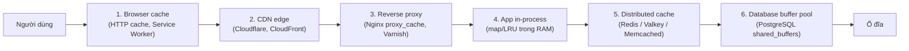

| Tầng | Lưu gì | Ai điều khiển | Độ trễ | Ghi chú |
|---|---|---|---|---|
| Browser | Ảnh, JS, CSS, response API | Header HTTP từ server | 0 ms (không cần mạng) | Không xoá được từ phía server! |
| CDN | File tĩnh, ảnh, video, đôi khi HTML/API công khai | Header + cấu hình CDN, API purge | 5-30 ms (gần user) | Giảm tải server gốc cực mạnh |
| Reverse proxy | Response HTTP nguyên trang | Cấu hình Nginx/Varnish | < 1 ms (cùng DC) | Hợp cho trang công khai |
| In-process | Object đã parse sẵn | Code của bạn | ~100 ns | Mỗi instance một bản riêng → khó đồng bộ |
| Redis | Object, counter, session, rate limit... | Code của bạn | ~0,5 ms | Dùng chung cho mọi instance |
| DB buffer pool | Page dữ liệu/index | Database tự quản | nằm trong thời gian query | Bạn chỉ chỉnh kích thước |

### 2.1 In-process cache hay Redis?

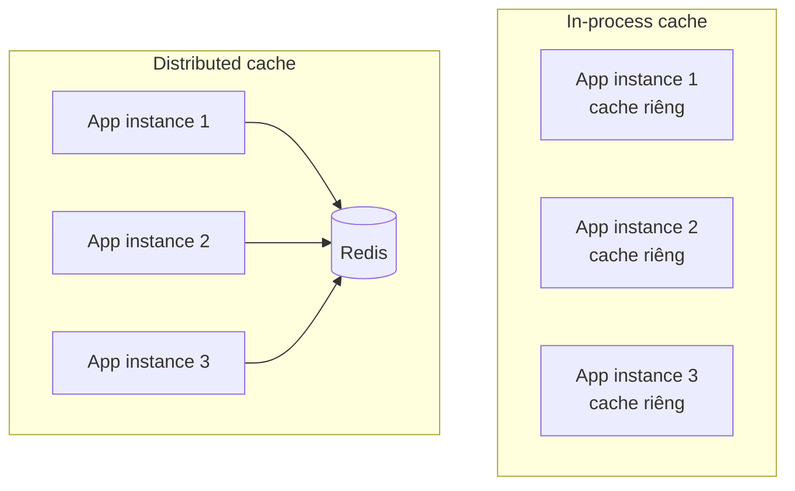

| Tiêu chí | In-process | Redis |
|---|---|---|
| Tốc độ | Cực nhanh (không qua mạng, không serialize) | Nhanh (~0,5 ms) |
| Dữ liệu giữa các instance | Mỗi instance một bản → **có thể lệch nhau** | Một bản duy nhất |
| Mất khi restart/deploy | Có | Không (nếu bật persistence) |
| Giới hạn RAM | RAM của app | RAM riêng của Redis, scale được |
| Hợp với | Config, danh mục ít đổi, dữ liệu "siêu nóng" | Session, counter, dữ liệu dùng chung |

Hệ thống lớn thường dùng **cả hai** (cache 2 tầng - L1 in-process vài giây, L2 Redis vài phút).

### 💡 Tips quan trọng

- Luôn hỏi: **tầng nào gần người dùng nhất có thể cache được dữ liệu này?** Cache ở CDN tiết kiệm hơn cache ở Redis rất nhiều.
- Dữ liệu **riêng tư** (giỏ hàng, số dư) tuyệt đối không được cache ở CDN/proxy dùng chung.

## 📖 3. HTTP caching - để trình duyệt và CDN làm hộ

HTTP có sẵn một hệ thống cache rất mạnh. Server chỉ cần **gửi đúng header**, còn browser và CDN tự lo.

### 3.1 `Cache-Control` - "được giữ bao lâu, ai được giữ"

| Directive | Ý nghĩa |
|---|---|
| `max-age=60` | Được dùng lại trong 60 giây mà **không cần hỏi server** |
| `s-maxage=300` | Như `max-age` nhưng chỉ cho cache **dùng chung** (CDN, proxy) |
| `public` | Cache dùng chung được phép lưu |
| `private` | Chỉ browser của **chính người đó** được lưu (dữ liệu cá nhân) |
| `no-cache` | Được lưu, nhưng **phải hỏi lại server** (revalidate) trước mỗi lần dùng |
| `no-store` | **Không được lưu** ở đâu cả (dữ liệu nhạy cảm: ngân hàng) |
| `immutable` | Nội dung không bao giờ đổi → khỏi revalidate kể cả khi user bấm F5 |
| `stale-while-revalidate=30` | Hết hạn rồi vẫn được trả bản cũ trong 30s, trong lúc âm thầm lấy bản mới |

!!! warning "`no-cache` KHÔNG có nghĩa là 'không cache'"
    Đây là cái bẫy nổi tiếng. `no-cache` = "cache nhưng phải kiểm tra lại". Muốn cấm lưu hoàn toàn thì dùng `no-store`.

Công thức hay dùng:

```text
# File tĩnh có hash trong tên (app.3f9a1c.js) - đổi nội dung thì đổi tên
Cache-Control: public, max-age=31536000, immutable

# Trang sản phẩm công khai - CDN giữ 5 phút, browser giữ 1 phút
Cache-Control: public, max-age=60, s-maxage=300, stale-while-revalidate=30

# API trả thông tin tài khoản
Cache-Control: private, no-cache

# Trang sao kê ngân hàng
Cache-Control: no-store
```

### 3.2 `ETag` và `304 Not Modified` - "anh có bản này rồi, dùng tiếp đi"

Khi cache hết hạn, browser không cần tải lại cả body nếu nội dung **chưa đổi**. Server gắn cho mỗi phiên bản nội dung một "vân tay" gọi là **ETag**:

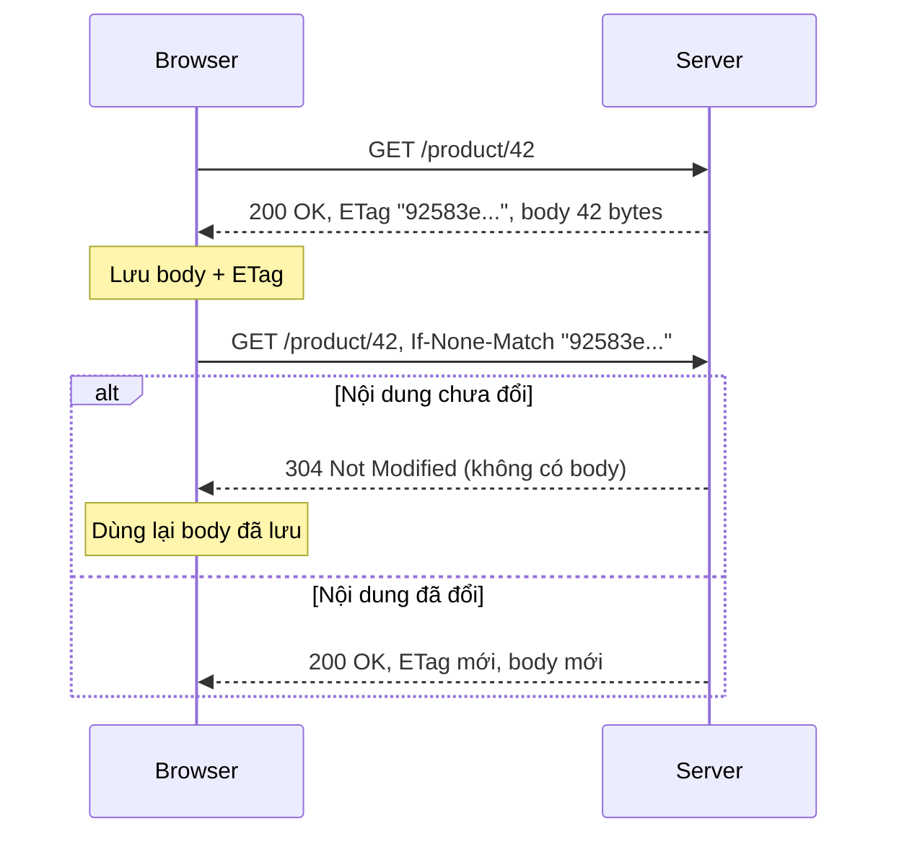

Có một cặp header tương tự dựa trên thời gian: `Last-Modified` / `If-Modified-Since` (kém chính xác hơn vì chỉ đến giây).

Ví dụ chạy thật: server tính ETag bằng SHA-256 của nội dung, client gửi lại `If-None-Match`:

=== "Go"

    ```go
    package main

    import (
    	"crypto/sha256"
    	"fmt"
    	"net/http"
    	"net/http/httptest"
    )

    var product = []byte(`{"id":42,"name":"Áo thun","price":199000}`)

    func productHandler(w http.ResponseWriter, r *http.Request) {
    	sum := sha256.Sum256(product)
    	etag := fmt.Sprintf(`"%x"`, sum[:8]) // "vân tay" của nội dung
    	w.Header().Set("ETag", etag)
    	w.Header().Set("Cache-Control", "public, max-age=60")
    	if r.Header.Get("If-None-Match") == etag {
    		w.WriteHeader(http.StatusNotModified) // 304: không gửi lại body
    		return
    	}
    	w.Header().Set("Content-Type", "application/json")
    	w.Write(product)
    }

    func main() {
    	srv := httptest.NewServer(http.HandlerFunc(productHandler))
    	defer srv.Close()

    	resp1, _ := http.Get(srv.URL + "/product/42")
    	etag := resp1.Header.Get("ETag")
    	fmt.Println("lần 1:", resp1.StatusCode, "ETag:", etag, "body bytes:", resp1.ContentLength)
    	resp1.Body.Close()

    	req, _ := http.NewRequest("GET", srv.URL+"/product/42", nil)
    	req.Header.Set("If-None-Match", etag) // "tôi đang có bản này rồi"
    	resp2, _ := http.DefaultClient.Do(req)
    	fmt.Println("lần 2:", resp2.StatusCode, "body bytes:", resp2.ContentLength)
    	resp2.Body.Close()
    }
    ```

    Output:

    ```text
    lần 1: 200 ETag: "92583edaf8528b6e" body bytes: 42
    lần 2: 304 body bytes: 0
    ```

=== "Python"

    ```python
    import hashlib
    import http.client
    import threading
    from http.server import BaseHTTPRequestHandler, HTTPServer

    PRODUCT = '{"id":42,"name":"Áo thun","price":199000}'.encode()


    class Handler(BaseHTTPRequestHandler):
        def do_GET(self):
            etag = '"' + hashlib.sha256(PRODUCT).hexdigest()[:16] + '"'
            if self.headers.get("If-None-Match") == etag:
                self.send_response(304)          # 304: không gửi lại body
                self.send_header("ETag", etag)
                self.end_headers()
                return
            self.send_response(200)
            self.send_header("ETag", etag)
            self.send_header("Cache-Control", "public, max-age=60")
            self.send_header("Content-Type", "application/json")
            self.send_header("Content-Length", str(len(PRODUCT)))
            self.end_headers()
            self.wfile.write(PRODUCT)

        def log_message(self, *args):            # tắt log cho gọn
            pass


    srv = HTTPServer(("127.0.0.1", 0), Handler)
    threading.Thread(target=srv.serve_forever, daemon=True).start()
    host, port = srv.server_address


    def get(headers=None):
        conn = http.client.HTTPConnection(host, port)
        conn.request("GET", "/product/42", headers=headers or {})
        resp = conn.getresponse()
        body = resp.read()
        conn.close()
        return resp, body


    r1, body1 = get()
    etag = r1.getheader("ETag")
    print("lần 1:", r1.status, "ETag:", etag, "body bytes:", len(body1))

    r2, body2 = get({"If-None-Match": etag})   # "tôi đang có bản này rồi"
    print("lần 2:", r2.status, "body bytes:", len(body2))
    srv.shutdown()
    ```

    Output:

    ```text
    lần 1: 200 ETag: "92583edaf8528b6e" body bytes: 42
    lần 2: 304 body bytes: 0
    ```

Lần 2 server **không gửi body** - với một response JSON 500KB hay một ảnh 2MB, đó là khoản tiết kiệm băng thông rất lớn.

!!! tip "ETag vẫn tốn một round-trip"
    304 tiết kiệm **băng thông**, không tiết kiệm **độ trễ mạng** (vẫn phải hỏi server). `max-age` mới giúp **không cần hỏi**. Kết hợp cả hai: `max-age` ngắn + `ETag` để revalidate rẻ.

## 📖 4. Redis - con dao Thụy Sĩ của backend

**Redis** (REmote DIctionary Server) là một **key-value store nằm trong RAM**, xử lý lệnh bằng **một luồng chính** (nên mỗi lệnh là atomic), đạt hàng trăm nghìn lệnh/giây trên một máy. Nó không chỉ lưu string mà có cả **cấu trúc dữ liệu** - đây là lý do Redis dùng được cho rất nhiều việc ngoài cache.

### 4.1 Các kiểu dữ liệu và công dụng

| Kiểu | Lệnh tiêu biểu | Dùng cho |
|---|---|---|
| **String** | `SET`, `GET`, `INCR`, `SETEX` | Cache object (JSON), counter, cờ (flag) |
| **Hash** | `HSET`, `HGET`, `HINCRBY` | Object có nhiều field: session, profile, giỏ hàng |
| **List** | `LPUSH`, `RPOP`, `LRANGE`, `BLPOP` | Hàng đợi đơn giản, "10 hoạt động gần nhất" |
| **Set** | `SADD`, `SISMEMBER`, `SINTER` | Tag, danh sách user đã like, bạn chung |
| **Sorted Set (ZSet)** | `ZADD`, `ZINCRBY`, `ZREVRANGE`, `ZRANK` | **Leaderboard**, hàng đợi ưu tiên, sliding window rate limit |
| **Bitmap** | `SETBIT`, `BITCOUNT` | Điểm danh hằng ngày, user active (1 bit/user) |
| **HyperLogLog** | `PFADD`, `PFCOUNT` | Đếm **xấp xỉ** số phần tử khác nhau (unique visitor) với 12KB |
| **Stream** | `XADD`, `XREADGROUP`, `XACK` | Log sự kiện, message queue nhẹ (xem [Bài 9](./09-message-queues.md)) |
| **Geo** | `GEOADD`, `GEOSEARCH` | Tìm tài xế/cửa hàng gần nhất |
| **Pub/Sub** | `PUBLISH`, `SUBSCRIBE` | Thông báo realtime (không lưu lại tin) |

Thử nhanh trong `redis-cli`:

```text
127.0.0.1:6379> SET product:42 '{"name":"Áo thun","price":199000}' EX 300
OK
127.0.0.1:6379> GET product:42
"{\"name\":\"\xc3\x81o thun\",\"price\":199000}"
127.0.0.1:6379> TTL product:42
(integer) 297
127.0.0.1:6379> INCR page:home:views
(integer) 1
127.0.0.1:6379> HSET cart:user:7 sku:111 2 sku:222 1
(integer) 2
127.0.0.1:6379> HGETALL cart:user:7
1) "sku:111"
2) "2"
3) "sku:222"
4) "1"
127.0.0.1:6379> PFADD visitors:2026-09-30 u1 u2 u3 u1
(integer) 1
127.0.0.1:6379> PFCOUNT visitors:2026-09-30
(integer) 3
```

Output (ví dụ).

!!! tip "Đặt tên key có quy ước"
    Dùng dạng `đối_tượng:id:thuộc_tính`, ví dụ `user:42:profile`, `cart:user:7`, `rate:ip:1.2.3.4`. Dễ đọc, dễ tìm, dễ xoá theo nhóm. Có thể thêm tiền tố version: `v2:user:42` - khi đổi format dữ liệu, chỉ cần đổi `v2` → `v3` là toàn bộ cache cũ bị "bỏ rơi" và tự hết hạn.

### 4.2 TTL - dữ liệu cache phải có hạn sử dụng

```text
SET key value EX 300      # hết hạn sau 300 giây
SET key value PX 1500     # hết hạn sau 1500 ms
EXPIRE key 60             # đặt lại TTL cho key đang có
TTL key                   # còn bao nhiêu giây (-1: không hạn, -2: không tồn tại)
PERSIST key               # bỏ TTL
```

Redis xoá key hết hạn theo 2 cách: **lười** (lazy - khi có ai đọc key đó thì kiểm tra) và **chủ động** (mỗi giây lấy mẫu ngẫu nhiên vài key có TTL để xoá). Vì vậy key hết hạn có thể còn chiếm RAM một chút trước khi bị dọn.

!!! warning "Quy tắc vàng: mọi key cache đều phải có TTL"
    TTL là "lưới an toàn" cuối cùng: dù code invalidation của bạn có bug, dữ liệu sai cũng chỉ sống tối đa bằng TTL. Key không TTL sẽ tích tụ đến khi Redis đầy RAM.

### 4.3 Persistence - RDB và AOF

Redis nằm trong RAM, vậy khi restart thì sao? Redis có 2 cơ chế lưu xuống đĩa:

| | **RDB** (snapshot) | **AOF** (append-only file) |
|---|---|---|
| Cách làm | Định kỳ `fork()` rồi ghi **ảnh chụp** toàn bộ dữ liệu ra file `.rdb` | Ghi **mọi lệnh ghi** vào cuối file log |
| Mất dữ liệu khi sập | Mất từ lần snapshot gần nhất (có thể vài phút) | Với `appendfsync everysec`: mất tối đa ~1 giây |
| Kích thước file | Nhỏ, nén | Lớn hơn, cần **rewrite** định kỳ để gọn lại |
| Tốc độ khởi động | Nhanh | Chậm hơn (phải "chạy lại" lệnh) |
| Hợp với | Backup, cache thuần | Dữ liệu cần bền hơn (session, counter) |

```text
# redis.conf
save 3600 1 300 100 60 10000   # RDB: snapshot nếu (1h có ≥1 thay đổi) hoặc (5' có ≥100) hoặc (60s có ≥10000)
appendonly yes                 # bật AOF
appendfsync everysec           # fsync mỗi giây (cân bằng giữa an toàn và tốc độ)
aof-use-rdb-preamble yes       # AOF rewrite dùng định dạng RDB ở đầu -> khởi động nhanh
```

Khuyến nghị thực tế: **dùng làm cache thuần** thì có thể tắt hết persistence (mất thì nạp lại từ DB). **Dùng lưu session/rate limit/lock** thì bật AOF `everysec` + RDB để backup.

!!! warning "Redis không phải database chính"
    Kể cả có AOF, Redis không có các đảm bảo như PostgreSQL (transaction nhiều bảng, ràng buộc, replication đồng bộ...). Dữ liệu **không được phép mất** (đơn hàng, số dư) phải nằm trong database thật.

### 4.4 Eviction policy - khi RAM đầy thì đuổi ai?

Đặt `maxmemory 2gb` để Redis không nuốt hết RAM máy. Khi chạm giới hạn, Redis làm theo `maxmemory-policy`:

| Policy | Hành vi |
|---|---|
| `noeviction` (mặc định) | Không đuổi, **từ chối lệnh ghi** (báo lỗi OOM) |
| `allkeys-lru` | Đuổi key **lâu nhất chưa dùng** trong mọi key |
| `allkeys-lfu` | Đuổi key **ít được dùng nhất** (đếm tần suất) |
| `volatile-lru` / `volatile-lfu` | Như trên nhưng chỉ xét key **có TTL** |
| `allkeys-random` / `volatile-random` | Đuổi ngẫu nhiên |
| `volatile-ttl` | Đuổi key có TTL **sắp hết** nhất |

- Redis dùng làm **cache thuần** → `allkeys-lru` hoặc `allkeys-lfu` (LFU tốt hơn khi có dữ liệu "nóng bền").
- Redis vừa cache vừa lưu thứ quan trọng (session không TTL) → `volatile-lru` để chỉ đuổi key cache. Nhưng tốt hơn: **tách 2 instance** Redis riêng.

Redis không làm LRU chính xác (tốn RAM để giữ danh sách liên kết) mà **LRU xấp xỉ**: lấy mẫu ngẫu nhiên `maxmemory-samples` (mặc định 5) key rồi đuổi key cũ nhất trong mẫu.

### 4.5 Tự viết LRU cache có TTL

Để hiểu sâu, hãy tự cài một cache giống Redis thu nhỏ: **giới hạn số phần tử (LRU)** + **TTL từng key** + **xoá lười**. Cấu trúc kinh điển: **hash map** (tra cứu O(1)) + **danh sách liên kết đôi** (biết ai cũ nhất, di chuyển O(1)). Trong Python, `OrderedDict` đã gói sẵn cả hai.

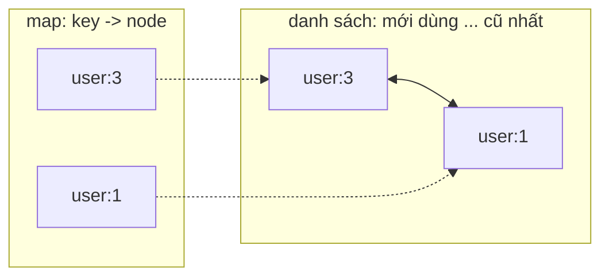

Ví dụ dùng **đồng hồ giả** để "tua thời gian" mà không phải `sleep` - một kỹ thuật test rất hữu ích:

=== "Go"

    ```go
    package main

    import (
    	"container/list"
    	"fmt"
    	"sync"
    	"time"
    )

    type entry struct {
    	key       string
    	value     string
    	expiresAt time.Time
    }

    // LRUCache: giới hạn số phần tử (LRU) + mỗi key có TTL riêng.
    type LRUCache struct {
    	mu    sync.Mutex
    	cap   int
    	ll    *list.List               // đầu list = vừa dùng gần nhất
    	items map[string]*list.Element // key -> node trong list
    	now   func() time.Time         // "đồng hồ" có thể thay khi test
    }

    func NewLRU(capacity int, now func() time.Time) *LRUCache {
    	return &LRUCache{cap: capacity, ll: list.New(),
    		items: make(map[string]*list.Element), now: now}
    }

    func (c *LRUCache) Get(key string) (string, bool) {
    	c.mu.Lock()
    	defer c.mu.Unlock()
    	el, ok := c.items[key]
    	if !ok {
    		return "", false
    	}
    	e := el.Value.(*entry)
    	if c.now().After(e.expiresAt) { // hết hạn -> xoá "lười" (lazy expiration)
    		c.removeElement(el)
    		return "", false
    	}
    	c.ll.MoveToFront(el) // vừa được dùng -> đưa lên đầu
    	return e.value, true
    }

    func (c *LRUCache) Set(key, value string, ttl time.Duration) {
    	c.mu.Lock()
    	defer c.mu.Unlock()
    	if el, ok := c.items[key]; ok { // đã có -> cập nhật
    		e := el.Value.(*entry)
    		e.value, e.expiresAt = value, c.now().Add(ttl)
    		c.ll.MoveToFront(el)
    		return
    	}
    	el := c.ll.PushFront(&entry{key, value, c.now().Add(ttl)})
    	c.items[key] = el
    	if c.ll.Len() > c.cap { // quá sức chứa -> đuổi phần tử cũ nhất (cuối list)
    		oldest := c.ll.Back()
    		fmt.Println("  evict:", oldest.Value.(*entry).key)
    		c.removeElement(oldest)
    	}
    }

    func (c *LRUCache) removeElement(el *list.Element) {
    	c.ll.Remove(el)
    	delete(c.items, el.Value.(*entry).key)
    }

    func main() {
    	clock := time.Date(2026, 1, 1, 0, 0, 0, 0, time.UTC)
    	c := NewLRU(2, func() time.Time { return clock })

    	c.Set("user:1", "An", time.Minute)
    	c.Set("user:2", "Bình", time.Minute)
    	c.Get("user:1")                        // user:1 thành "vừa dùng"
    	c.Set("user:3", "Chi", 10*time.Second) // đầy -> đuổi user:2

    	for _, k := range []string{"user:1", "user:2", "user:3"} {
    		v, ok := c.Get(k)
    		fmt.Printf("%s -> %q %v\n", k, v, ok)
    	}

    	clock = clock.Add(30 * time.Second) // tua đồng hồ 30 giây
    	v, ok := c.Get("user:3")
    	fmt.Printf("sau 30s: user:3 -> %q %v\n", v, ok)
    	v, ok = c.Get("user:1")
    	fmt.Printf("sau 30s: user:1 -> %q %v\n", v, ok)
    }
    ```

    Output:

    ```text
      evict: user:2
    user:1 -> "An" true
    user:2 -> "" false
    user:3 -> "Chi" true
    sau 30s: user:3 -> "" false
    sau 30s: user:1 -> "An" true
    ```

=== "Python"

    ```python
    import threading
    import time
    from collections import OrderedDict


    class LRUCache:
        """Giới hạn số phần tử (LRU) + mỗi key có TTL riêng."""

        def __init__(self, capacity, clock=time.monotonic):
            self.capacity = capacity
            self.clock = clock          # "đồng hồ" có thể thay khi test
            self.data = OrderedDict()   # key -> (value, expires_at); cuối = vừa dùng
            self.lock = threading.Lock()

        def get(self, key):
            with self.lock:
                item = self.data.get(key)
                if item is None:
                    return None
                value, expires_at = item
                if self.clock() > expires_at:   # hết hạn -> xoá "lười"
                    del self.data[key]
                    return None
                self.data.move_to_end(key)      # vừa được dùng -> đưa về cuối
                return value

        def set(self, key, value, ttl):
            with self.lock:
                if key in self.data:
                    self.data.move_to_end(key)
                self.data[key] = (value, self.clock() + ttl)
                if len(self.data) > self.capacity:  # quá sức chứa -> đuổi cái cũ nhất
                    oldest, _ = self.data.popitem(last=False)
                    print("  evict:", oldest)


    now = [0.0]
    c = LRUCache(2, clock=lambda: now[0])

    c.set("user:1", "An", 60)
    c.set("user:2", "Bình", 60)
    c.get("user:1")               # user:1 thành "vừa dùng"
    c.set("user:3", "Chi", 10)    # đầy -> đuổi user:2

    for k in ["user:1", "user:2", "user:3"]:
        print(f"{k} -> {c.get(k)!r}")

    now[0] += 30                  # tua đồng hồ 30 giây
    print("sau 30s: user:3 ->", repr(c.get("user:3")))
    print("sau 30s: user:1 ->", repr(c.get("user:1")))
    ```

    Output:

    ```text
      evict: user:2
    user:1 -> 'An'
    user:2 -> None
    user:3 -> 'Chi'
    sau 30s: user:3 -> None
    sau 30s: user:1 -> 'An'
    ```

Giải thích: cache chỉ chứa 2 phần tử. Vì `user:1` vừa được đọc nên khi thêm `user:3`, kẻ bị đuổi là `user:2` (lâu nhất chưa dùng). Sau 30 giây, `user:3` (TTL 10s) đã hết hạn nên bị xoá khi đọc; `user:1` (TTL 60s) vẫn còn.

!!! tip "Trong production"
    Đừng tự viết - dùng thư viện đã được tối ưu: Go có `github.com/hashicorp/golang-lru/v2` (có bản `expirable`), `github.com/dgraph-io/ristretto`, `github.com/maypok86/otter`; Python có `functools.lru_cache` (không TTL), `cachetools.TTLCache`. Tự viết để **hiểu**, không phải để deploy.

## 📖 5. Các pattern đọc/ghi cache

Câu hỏi trung tâm: **ai** chịu trách nhiệm đồng bộ cache với database, và **khi nào**?

### 5.1 Cache-aside (lazy loading) - phổ biến nhất

Ứng dụng tự làm hết: đọc cache → miss thì đọc DB → ghi vào cache. Khi ghi: cập nhật DB → **xoá** key cache.

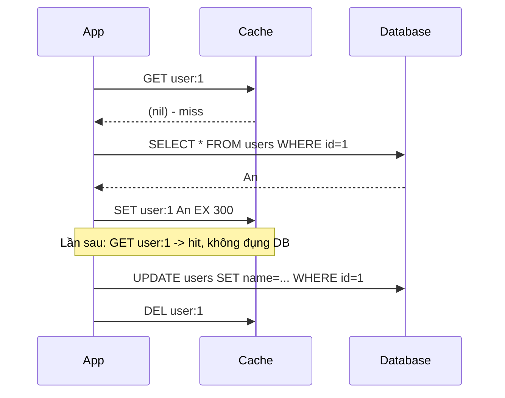

- ✅ Đơn giản, chỉ cache dữ liệu **thực sự được đọc**; cache sập thì app vẫn chạy (chậm hơn).
- ❌ Lần đọc đầu luôn chậm; có khoảng thời gian dữ liệu cũ (tối đa bằng TTL nếu quên xoá).

Ví dụ chạy thật với một "database" chậm 50ms mỗi query, có cả **negative caching** (nhớ luôn cả việc "không tìm thấy" - xem mục 7.2):

=== "Go"

    ```go
    package main

    import (
    	"fmt"
    	"sync"
    	"time"
    )

    // ---------- "Database" chậm ----------
    type SlowDB struct {
    	mu    sync.Mutex
    	users map[int]string
    }

    func (d *SlowDB) GetUser(id int) (string, bool) {
    	time.Sleep(50 * time.Millisecond) // mỗi query tốn ~50ms
    	d.mu.Lock()
    	defer d.mu.Unlock()
    	name, ok := d.users[id]
    	return name, ok
    }

    func (d *SlowDB) UpdateUser(id int, name string) {
    	time.Sleep(50 * time.Millisecond)
    	d.mu.Lock()
    	defer d.mu.Unlock()
    	d.users[id] = name
    }

    // ---------- Cache đơn giản có TTL ----------
    type item struct {
    	value     string
    	found     bool // false = "negative cache": nhớ rằng key KHÔNG tồn tại
    	expiresAt time.Time
    }

    type Cache struct {
    	mu sync.Mutex
    	m  map[string]item
    }

    func (c *Cache) Get(key string) (item, bool) {
    	c.mu.Lock()
    	defer c.mu.Unlock()
    	it, ok := c.m[key]
    	if !ok || time.Now().After(it.expiresAt) {
    		return item{}, false
    	}
    	return it, true
    }

    func (c *Cache) Set(key string, it item, ttl time.Duration) {
    	c.mu.Lock()
    	defer c.mu.Unlock()
    	it.expiresAt = time.Now().Add(ttl)
    	c.m[key] = it
    }

    func (c *Cache) Delete(key string) {
    	c.mu.Lock()
    	defer c.mu.Unlock()
    	delete(c.m, key)
    }

    // ---------- Service dùng cache-aside ----------
    type UserService struct {
    	db    *SlowDB
    	cache *Cache
    }

    func (s *UserService) GetUser(id int) (string, bool, string) {
    	key := fmt.Sprintf("user:%d", id)
    	if it, ok := s.cache.Get(key); ok { // 1. hỏi cache trước
    		return it.value, it.found, "HIT "
    	}
    	name, found := s.db.GetUser(id) // 2. miss -> hỏi DB
    	ttl := 5 * time.Minute
    	if !found {
    		ttl = 30 * time.Second // key không tồn tại: cache ngắn hơn
    	}
    	s.cache.Set(key, item{value: name, found: found}, ttl) // 3. ghi vào cache
    	return name, found, "MISS"
    }

    func (s *UserService) UpdateUser(id int, name string) {
    	s.db.UpdateUser(id, name)                  // 1. ghi DB trước
    	s.cache.Delete(fmt.Sprintf("user:%d", id)) // 2. rồi XOÁ cache (không set)
    }

    func main() {
    	svc := &UserService{
    		db:    &SlowDB{users: map[int]string{1: "An", 2: "Bình"}},
    		cache: &Cache{m: map[string]item{}},
    	}
    	get := func(id int) {
    		start := time.Now()
    		name, found, src := svc.GetUser(id)
    		took := time.Since(start).Round(10 * time.Millisecond)
    		fmt.Printf("GET user:%d -> %-4s %-6q found=%-5v %v\n", id, src, name, found, took)
    	}

    	get(1)
    	get(1)
    	get(1)
    	fmt.Println("UPDATE user:1 = An Nguyễn")
    	svc.UpdateUser(1, "An Nguyễn")
    	get(1)
    	get(1)
    	get(999) // không tồn tại
    	get(999) // negative cache -> không đụng DB nữa
    }
    ```

    Output:

    ```text
    GET user:1 -> MISS "An"   found=true  50ms
    GET user:1 -> HIT  "An"   found=true  0s
    GET user:1 -> HIT  "An"   found=true  0s
    UPDATE user:1 = An Nguyễn
    GET user:1 -> MISS "An Nguyễn" found=true  50ms
    GET user:1 -> HIT  "An Nguyễn" found=true  0s
    GET user:999 -> MISS ""     found=false 50ms
    GET user:999 -> HIT  ""     found=false 0s
    ```

=== "Python"

    ```python
    import time


    class SlowDB:
        def __init__(self):
            self.users = {1: "An", 2: "Bình"}

        def get_user(self, uid):
            time.sleep(0.05)                 # mỗi query tốn ~50ms
            return self.users.get(uid)

        def update_user(self, uid, name):
            time.sleep(0.05)
            self.users[uid] = name


    class TTLCache:
        def __init__(self):
            self.data = {}                   # key -> (value, expires_at)

        def get(self, key):
            item = self.data.get(key)
            if item is None or time.monotonic() > item[1]:
                return None
            return item

        def set(self, key, value, ttl):
            self.data[key] = (value, time.monotonic() + ttl)

        def delete(self, key):
            self.data.pop(key, None)


    MISSING = "<không tồn tại>"             # sentinel cho negative caching


    class UserService:
        def __init__(self, db, cache):
            self.db, self.cache = db, cache

        def get_user(self, uid):
            key = f"user:{uid}"
            item = self.cache.get(key)       # 1. hỏi cache trước
            if item is not None:
                return item[0], "HIT "
            name = self.db.get_user(uid)     # 2. miss -> hỏi DB
            if name is None:
                self.cache.set(key, MISSING, ttl=30)   # key không tồn tại: TTL ngắn
                return MISSING, "MISS"
            self.cache.set(key, name, ttl=300)         # 3. ghi vào cache
            return name, "MISS"

        def update_user(self, uid, name):
            self.db.update_user(uid, name)             # 1. ghi DB trước
            self.cache.delete(f"user:{uid}")           # 2. rồi XOÁ cache


    svc = UserService(SlowDB(), TTLCache())


    def get(uid):
        start = time.perf_counter()
        name, src = svc.get_user(uid)
        ms = round((time.perf_counter() - start) * 1000 / 10) * 10
        print(f"GET user:{uid} -> {src} {name!r:16} {ms}ms")


    get(1)
    get(1)
    get(1)
    print("UPDATE user:1 = An Nguyễn")
    svc.update_user(1, "An Nguyễn")
    get(1)
    get(1)
    get(999)
    get(999)
    ```

    Output:

    ```text
    GET user:1 -> MISS 'An'             50ms
    GET user:1 -> HIT  'An'             0ms
    GET user:1 -> HIT  'An'             0ms
    UPDATE user:1 = An Nguyễn
    GET user:1 -> MISS 'An Nguyễn'      50ms
    GET user:1 -> HIT  'An Nguyễn'      0ms
    GET user:999 -> MISS '<không tồn tại>' 50ms
    GET user:999 -> HIT  '<không tồn tại>' 0ms
    ```

Nhìn cột thời gian: **50ms → 0ms**. Sau khi update, key bị xoá nên lần đọc kế tiếp lấy **dữ liệu mới** từ DB.

!!! warning "Khi ghi: XOÁ cache, đừng SET cache"
    Nếu 2 request cùng update, thứ tự `SET` vào cache có thể **ngược** với thứ tự ghi DB → cache giữ giá trị cũ vĩnh viễn (đến hết TTL). Xoá thì an toàn hơn: lần đọc sau tự nạp giá trị đúng từ DB. Và luôn **ghi DB trước, xoá cache sau**: nếu xoá cache trước, một request đọc chen vào giữa sẽ nạp lại giá trị cũ vào cache.

Cùng pattern đó với Redis thật:

=== "Go"

    ```go
    package cache

    import (
    	"context"
    	"encoding/json"
    	"errors"
    	"fmt"
    	"time"

    	"github.com/redis/go-redis/v9"
    )

    type User struct {
    	ID   int    `json:"id"`
    	Name string `json:"name"`
    }

    type UserRepo interface {
    	FindByID(ctx context.Context, id int) (*User, error)
    }

    type UserCache struct {
    	rdb  *redis.Client // redis.NewClient(&redis.Options{Addr: "localhost:6379"})
    	repo UserRepo
    }

    func (c *UserCache) Get(ctx context.Context, id int) (*User, error) {
    	key := fmt.Sprintf("user:%d", id)

    	data, err := c.rdb.Get(ctx, key).Bytes()
    	if err == nil { // HIT
    		var u User
    		if err := json.Unmarshal(data, &u); err == nil {
    			return &u, nil
    		}
    	} else if !errors.Is(err, redis.Nil) {
    		// Redis lỗi/timeout: KHÔNG làm sập request, đọc thẳng DB
    		return c.repo.FindByID(ctx, id)
    	}

    	u, err := c.repo.FindByID(ctx, id) // MISS
    	if err != nil {
    		return nil, err
    	}
    	if b, err := json.Marshal(u); err == nil {
    		c.rdb.Set(ctx, key, b, 5*time.Minute) // lỗi ghi cache: bỏ qua
    	}
    	return u, nil
    }

    func (c *UserCache) Invalidate(ctx context.Context, id int) error {
    	return c.rdb.Del(ctx, fmt.Sprintf("user:%d", id)).Err()
    }
    ```

=== "Python"

    ```python
    import json

    import redis

    r = redis.Redis(host="localhost", port=6379, decode_responses=True,
                    socket_timeout=0.2)          # timeout ngắn: cache chậm thì bỏ qua


    def get_user(user_id, repo):
        key = f"user:{user_id}"
        try:
            data = r.get(key)
            if data is not None:                 # HIT
                return json.loads(data)
        except redis.RedisError:
            return repo.find_by_id(user_id)      # Redis lỗi: đọc thẳng DB

        user = repo.find_by_id(user_id)          # MISS
        try:
            r.set(key, json.dumps(user), ex=300)
        except redis.RedisError:
            pass                                 # ghi cache lỗi: bỏ qua
        return user


    def invalidate_user(user_id):
        r.delete(f"user:{user_id}")
    ```

Điểm quan trọng: **cache lỗi thì app vẫn phải chạy** (degrade gracefully). Cache là để tăng tốc, không phải điểm chết của hệ thống.

### 5.2 Read-through

Giống cache-aside nhưng **thư viện/tầng cache tự đi lấy DB** khi miss. App chỉ nói chuyện với cache.

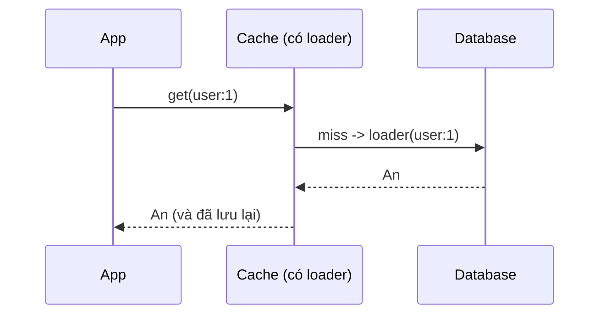

Code app gọn hơn (logic nạp nằm một chỗ). Ví dụ: `LoadingCache` của Caffeine (Java), DAX trước DynamoDB, hoặc wrapper bạn tự viết quanh Redis.

### 5.3 Write-through

Mỗi lần ghi, **ghi vào cache và DB cùng lúc** (đồng bộ) - thường qua tầng cache.

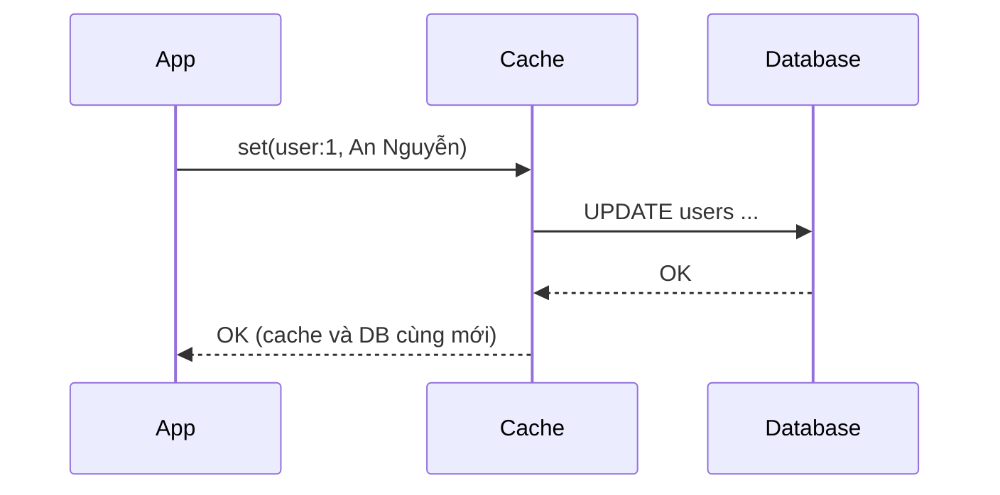

- ✅ Cache luôn "ấm" và mới; đọc sau ghi luôn đúng.
- ❌ Ghi chậm hơn (2 nơi); cache chứa cả dữ liệu không ai đọc; nếu ghi DB xong mà ghi cache lỗi → lệch.

### 5.4 Write-behind (write-back)

Ghi **vào cache trước**, trả lời ngay, rồi **gom lại ghi xuống DB sau** (bất đồng bộ, theo lô).

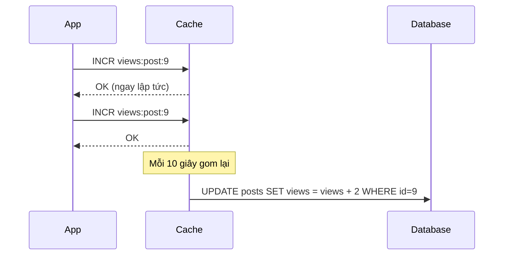

- ✅ Ghi cực nhanh, giảm tải DB mạnh (1 lệnh DB thay cho hàng nghìn lệnh).
- ❌ Cache sập trước khi flush → **mất dữ liệu**. Chỉ dùng cho dữ liệu "mất một chút cũng được": lượt xem, lượt like, vị trí đọc video.

### 5.5 Refresh-ahead

Chủ động **làm mới key trước khi nó hết hạn** (ví dụ khi TTL còn < 20% mà key vẫn đang được đọc), để người dùng không bao giờ gặp miss.

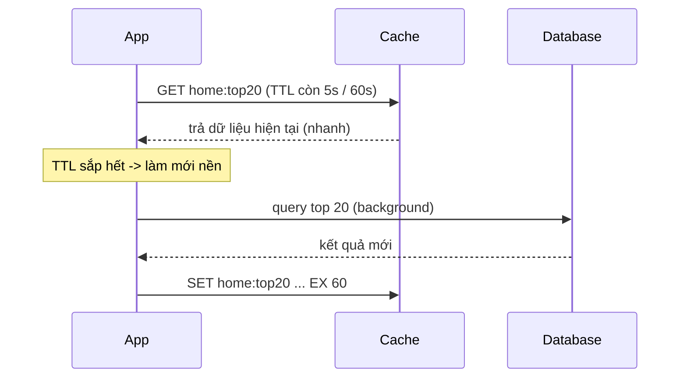

Hợp với dữ liệu **rất nóng, tính toán đắt**: trang chủ, bảng xếp hạng, tỉ giá. Nhược điểm: có thể làm mới cả những key sắp không ai cần.

### 5.6 So sánh nhanh

| Pattern | Ai nạp cache | Ghi | Độ mới dữ liệu | Rủi ro chính |
|---|---|---|---|---|
| Cache-aside | App | DB rồi xoá cache | Tốt (cũ tối đa TTL) | Miss đầu tiên chậm |
| Read-through | Tầng cache | (kết hợp pattern ghi khác) | Tốt | Phụ thuộc thư viện |
| Write-through | Tầng cache | Cache + DB đồng bộ | Rất tốt | Ghi chậm, cache phình |
| Write-behind | Tầng cache | Cache, DB sau | DB bị trễ | **Mất dữ liệu** |
| Refresh-ahead | Nền | - | Rất tốt, không miss | Tốn tài nguyên làm mới |

## 📖 6. Cache invalidation - "một trong hai việc khó nhất"

> *"There are only two hard things in Computer Science: cache invalidation and naming things."* - Phil Karlton

Khi dữ liệu gốc thay đổi, làm sao cache biết? Các chiến lược:

| Chiến lược | Cách làm | Ưu | Nhược |
|---|---|---|---|
| **Chỉ dùng TTL** | Để key tự hết hạn | Đơn giản nhất | Dữ liệu cũ tối đa = TTL |
| **Xoá khi ghi** | Code ghi DB xong thì `DEL` key | Dữ liệu mới gần như ngay | Phải nhớ xoá **mọi** key liên quan |
| **Versioned key** | Key chứa version: `product:42:v17`; ghi DB thì tăng version | Không cần xoá, không có race | Key cũ nằm chờ hết TTL |
| **Event-driven** | DB thay đổi → sự kiện (CDC/Debezium, [Bài 9](./09-message-queues.md)) → service xoá cache | Tách rời, không sót | Hạ tầng phức tạp hơn |

### 6.1 Race condition kinh điển của cache-aside

Ngay cả "ghi DB rồi xoá cache" vẫn có một kẽ hở hiếm gặp:

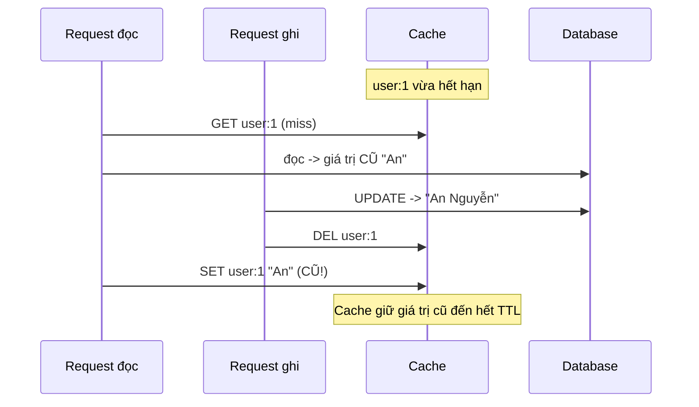

Xác suất thấp (lần đọc DB phải chậm hơn cả một lần ghi + xoá), nhưng ở quy mô lớn thì **sẽ xảy ra**. Cách giảm thiểu:

- **TTL ngắn vừa đủ** - lưới an toàn giới hạn thời gian sai.
- **Delayed double delete**: xoá cache, rồi sau ~500ms xoá thêm lần nữa.
- **Versioning**: chỉ `SET` nếu version mới hơn version trong cache (dùng Lua script).
- Với dữ liệu **tuyệt đối không được cũ** (số dư, tồn kho khi thanh toán): **đừng đọc từ cache** ở bước quyết định - đọc DB.

### 💡 Tips quan trọng

- Liệt kê rõ: *dữ liệu này được phép cũ bao lâu?* 1 giây? 5 phút? 1 ngày? Câu trả lời quyết định TTL và chiến lược.
- Cache **kết quả đã tổng hợp** (trang sản phẩm đầy đủ) thì khi một phần nhỏ đổi (giá) bạn phải xoá cả khối. Cache **nhỏ, theo entity** (`product:42`, `price:42`) dễ invalidate hơn.

## 📖 7. Ba "tai nạn" kinh điển: stampede, penetration, avalanche

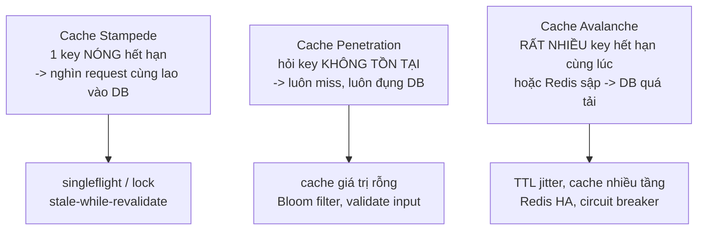

### 7.1 Cache stampede (thundering herd / dog-piling)

Trang chủ có key `home:top20` được đọc 5.000 lần/giây. Đúng 12:00:00 key hết hạn. Trong 200ms cần để query lại, **1.000 request** cùng thấy miss và cùng chạy query nặng đó → DB CPU 100% → query càng chậm → càng nhiều request dồn lại → sập.

> 💡 **Ví von**: Quán cơm trưa hết cơm. Nếu 50 khách đều tự chạy vào bếp nấu nồi cơm mới thì bếp loạn. Cách đúng: **một** người đi nấu, 49 người còn lại **chờ nồi đó**.

**Cách 1 - Request coalescing (singleflight)**: trong một process, các request cùng key **chờ chung một lần gọi**. Go có sẵn `golang.org/x/sync/singleflight`; Python ta tự làm bằng **khoá theo key + double-check**:

=== "Go"

    ```go
    package main

    import (
    	"fmt"
    	"sync"
    	"sync/atomic"
    	"time"

    	"golang.org/x/sync/singleflight"
    )

    var dbCalls atomic.Int32

    func loadFromDB(id string) (string, error) {
    	dbCalls.Add(1)
    	time.Sleep(100 * time.Millisecond) // giả lập query nặng
    	return "product-" + id, nil
    }

    func main() {
    	const N = 100

    	// 1) Không bảo vệ: cache vừa hết hạn, 100 request cùng lao vào DB
    	var wg sync.WaitGroup
    	for i := 0; i < N; i++ {
    		wg.Add(1)
    		go func() {
    			defer wg.Done()
    			loadFromDB("42")
    		}()
    	}
    	wg.Wait()
    	fmt.Println("không singleflight - số lần gọi DB:", dbCalls.Load())

    	// 2) Có singleflight: request trùng key chờ chung 1 lần gọi
    	dbCalls.Store(0)
    	var g singleflight.Group
    	var sharedCount atomic.Int32
    	for i := 0; i < N; i++ {
    		wg.Add(1)
    		go func() {
    			defer wg.Done()
    			v, err, shared := g.Do("product:42", func() (any, error) {
    				return loadFromDB("42")
    			})
    			if err != nil || v.(string) != "product-42" {
    				panic("sai kết quả")
    			}
    			if shared {
    				sharedCount.Add(1)
    			}
    		}()
    	}
    	wg.Wait()
    	fmt.Println("có singleflight   - số lần gọi DB:", dbCalls.Load())
    	fmt.Println("số request nhận kết quả dùng chung:", sharedCount.Load())
    }
    ```

    Output:

    ```text
    không singleflight - số lần gọi DB: 100
    có singleflight   - số lần gọi DB: 1
    số request nhận kết quả dùng chung: 100
    ```

=== "Python"

    ```python
    import threading
    import time

    cache = {}
    db_calls = 0
    counter_lock = threading.Lock()


    def load_from_db(pid):
        global db_calls
        with counter_lock:
            db_calls += 1
        time.sleep(0.1)                  # giả lập query nặng
        return f"product-{pid}"


    def get_naive(pid):
        key = f"product:{pid}"
        if key in cache:
            return cache[key]
        value = load_from_db(pid)        # 100 thread cùng miss -> 100 lần gọi DB
        cache[key] = value
        return value


    key_locks = {}
    key_locks_guard = threading.Lock()


    def lock_for(key):
        with key_locks_guard:
            return key_locks.setdefault(key, threading.Lock())


    def get_protected(pid):
        key = f"product:{pid}"
        if key in cache:                 # đường nhanh: cache hit, không cần khoá
            return cache[key]
        with lock_for(key):              # chỉ 1 thread được nạp key này
            if key in cache:             # double-check: thread trước đã nạp chưa?
                return cache[key]
            value = load_from_db(pid)
            cache[key] = value
            return value


    def run(fn, n=100):
        threads = [threading.Thread(target=fn, args=(42,)) for _ in range(n)]
        for t in threads:
            t.start()
        for t in threads:
            t.join()


    run(get_naive)
    print("không bảo vệ - số lần gọi DB:", db_calls)

    cache.clear()
    db_calls = 0
    run(get_protected)
    print("có khoá      - số lần gọi DB:", db_calls)
    ```

    Output:

    ```text
    không bảo vệ - số lần gọi DB: 100
    có khoá      - số lần gọi DB: 1
    ```

100 request → **1** lần gọi DB. Để ý bước **double-check** trong bản Python: thread thứ 2 vào được khoá sau khi thread 1 đã nạp xong, nên phải kiểm tra cache lại lần nữa, nếu không nó sẽ lại gọi DB.

!!! note "Singleflight chỉ gộp trong 1 process"
    Có 20 instance app thì vẫn có tối đa 20 lần gọi DB - thường là chấp nhận được. Nếu cần gộp **giữa các instance**, dùng **distributed lock** trên Redis (mục 8.1): ai lấy được lock thì nạp, người khác đợi ngắn rồi đọc lại cache hoặc trả bản cũ.

**Cách 2 - Stale-while-revalidate**: lưu kèm "thời điểm nên làm mới" bên trong value, TTL thật dài hơn. Khi quá "hạn mềm", một request làm mới nền, các request khác vẫn nhận **bản cũ** ngay lập tức.

**Cách 3 - Probabilistic early expiration (XFetch)**: mỗi request, khi key gần hết hạn, **tung xúc xắc** để quyết định có làm mới sớm không; càng gần hạn xác suất càng cao. Kết quả: thường chỉ 1 request làm mới trước khi key hết hạn thật.

### 7.2 Cache penetration - hỏi thứ không tồn tại

Kẻ xấu (hoặc bug) gọi `GET /product/-1`, `/product/99999999`... Các id này **không có trong DB** nên cũng không bao giờ được cache → **mọi request đều xuyên thủng** cache xuống DB.

Cách chống:

1. **Validate input**: id âm, sai định dạng → trả 400 ngay, không đụng cache/DB.
2. **Cache giá trị rỗng (negative caching)**: nhớ "id 999 không tồn tại" với TTL **ngắn** (30-60s). Ví dụ cache-aside ở mục 5.1 đã làm điều này (`GET user:999` lần 2 là HIT).
3. **Bloom filter**: cấu trúc xác suất trả lời "**chắc chắn không có**" hoặc "**có thể có**" với rất ít RAM (khoảng 10 bit/phần tử cho tỉ lệ sai ~1%). Nạp toàn bộ id hợp lệ vào Bloom filter; request nào filter nói "chắc chắn không có" → trả 404 luôn. Chi tiết cách hoạt động xem [Bài 15 - Cấu trúc dữ liệu nâng cao](../algorithms/15-advanced-data-structures.md). Redis có sẵn qua module RedisBloom (`BF.ADD`, `BF.EXISTS`), có trong Redis 8 / Redis Stack.

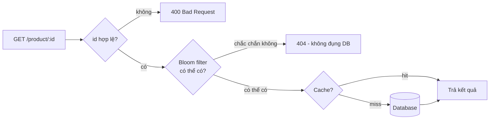

### 7.3 Cache avalanche - tuyết lở

Hai nguyên nhân:

1. **Rất nhiều key hết hạn cùng lúc**: ví dụ lúc 2h sáng job nạp lại toàn bộ 1 triệu sản phẩm vào cache với cùng `TTL = 3600` → đúng 3h sáng, 1 triệu key cùng hết hạn.
2. **Redis sập/khởi động lại** → toàn bộ traffic dội xuống DB.

Cách chống:

- **TTL jitter**: cộng thêm một khoảng ngẫu nhiên vào TTL để thời điểm hết hạn "rải đều":

=== "Go"

    ```go
    // TTL cơ bản 1 giờ, cộng ngẫu nhiên 0-10 phút
    func ttlWithJitter(base time.Duration) time.Duration {
    	jitter := time.Duration(rand.Int64N(int64(base / 6))) // math/rand/v2
    	return base + jitter
    }

    rdb.Set(ctx, key, data, ttlWithJitter(time.Hour))
    ```

=== "Python"

    ```python
    import random

    def ttl_with_jitter(base_seconds):
        # TTL cơ bản 1 giờ, cộng ngẫu nhiên 0-10 phút
        return base_seconds + random.randint(0, base_seconds // 6)

    r.set(key, data, ex=ttl_with_jitter(3600))
    ```

- **Redis high availability**: Redis Sentinel (tự failover) hoặc Redis Cluster; cache nhiều tầng (in-process L1 đỡ một phần).
- **Bảo vệ DB**: giới hạn số query đồng thời (semaphore, connection pool nhỏ), **circuit breaker**, trả dữ liệu mặc định/cũ thay vì sập (xem [Bài 11](./11-observability-reliability.md)).
- **Cache warming**: trước giờ cao điểm (flash sale 0h), chủ động nạp sẵn các key nóng.

### 7.4 Hot key và big key

- **Hot key**: một key nhận lượng đọc khổng lồ (sản phẩm flash sale) → một node Redis quá tải dù cluster có 10 node. Cách xử lý: cache thêm ở **in-process** vài giây; hoặc nhân bản key (`product:42:copy1..copy8`) và đọc ngẫu nhiên một bản.
- **Big key**: một value vài MB, hoặc Hash/List hàng triệu phần tử. Redis đơn luồng nên đọc/xoá big key **chặn mọi lệnh khác**. Tách nhỏ dữ liệu; dùng `UNLINK` (xoá nền) thay `DEL`; tìm big key bằng `redis-cli --bigkeys`.

!!! warning "Không dùng `KEYS *` trên production"
    `KEYS` duyệt toàn bộ keyspace và chặn Redis vài giây với hàng triệu key. Dùng `SCAN` (duyệt dần theo con trỏ) thay thế.

## 📖 8. Redis ngoài cache: lock, rate limit, leaderboard, session

### 8.1 Distributed lock với `SET NX PX`

Bài toán: 5 instance cùng chạy cron "gửi email tổng kết lúc 8h" - chỉ **một** được chạy. Hoặc: chỉ một instance được nạp lại cache nặng.

```text
SET lock:report:2026-09-30 <token-ngẫu-nhiên> NX PX 30000
```

- `NX`: chỉ set nếu key **chưa tồn tại** → ai set được là người giữ lock.
- `PX 30000`: tự hết hạn sau 30s → nếu người giữ lock chết, lock không bị kẹt mãi.
- `token` ngẫu nhiên: khi mở khoá, chỉ xoá nếu token **đúng là của mình** (tránh xoá nhầm lock của người khác). Việc "so sánh rồi xoá" phải atomic → dùng Lua script.

=== "Go"

    ```go
    var unlockScript = redis.NewScript(`
    if redis.call("GET", KEYS[1]) == ARGV[1] then
        return redis.call("DEL", KEYS[1])
    end
    return 0`)

    func withLock(ctx context.Context, rdb *redis.Client, key string, ttl time.Duration, fn func() error) error {
    	token := uuid.NewString() // github.com/google/uuid
    	ok, err := rdb.SetNX(ctx, key, token, ttl).Result() // SET key token NX PX ttl
    	if err != nil {
    		return err
    	}
    	if !ok {
    		return errors.New("đang có người khác giữ lock")
    	}
    	defer unlockScript.Run(ctx, rdb, []string{key}, token)
    	return fn()
    }
    ```

=== "Python"

    ```python
    import uuid
    from contextlib import contextmanager

    UNLOCK = r.register_script("""
    if redis.call("GET", KEYS[1]) == ARGV[1] then
        return redis.call("DEL", KEYS[1])
    end
    return 0
    """)


    @contextmanager
    def redis_lock(key, ttl_ms=30_000):
        token = str(uuid.uuid4())
        if not r.set(key, token, nx=True, px=ttl_ms):   # SET key token NX PX ttl
            raise RuntimeError("đang có người khác giữ lock")
        try:
            yield
        finally:
            UNLOCK(keys=[key], args=[token])


    with redis_lock("lock:report:2026-09-30"):
        send_daily_report()
    ```

!!! warning "Những giới hạn của Redis lock - phải biết trước khi dùng"
    1. **Lock hết hạn khi việc chưa xong**: tiến trình bị GC pause / mạng chậm 40s, lock (30s) tự hết hạn, tiến trình khác lấy lock → **hai người cùng làm**. Cần gia hạn lock định kỳ (watchdog) và/hoặc **fencing token** (số tăng dần, DB từ chối ghi có token cũ hơn).
    2. **Failover mất lock**: Redis master nhận `SET` rồi sập trước khi kịp đồng bộ sang replica; replica lên làm master → lock "biến mất". Thuật toán **Redlock** (nhiều node độc lập) cố giải quyết nhưng vẫn gây tranh cãi (xem bài phân tích của Martin Kleppmann).
    3. **Kết luận thực dụng**: Redis lock tốt cho **tối ưu hiệu năng** (tránh làm trùng việc - làm trùng cũng không sao). Với **tính đúng đắn** (không được trừ tiền 2 lần), hãy dựa vào **database**: unique constraint, `SELECT ... FOR UPDATE`, optimistic locking theo version, hoặc etcd/ZooKeeper.

### 8.2 Rate limiter - token bucket bằng Lua

**Token bucket**: mỗi user có một "xô" chứa tối đa `capacity` token, token được **nạp lại đều** `rate` token/giây. Mỗi request lấy 1 token; hết token → từ chối (HTTP 429). Cho phép "bùng nổ" ngắn (burst) đến `capacity` nhưng trung bình không vượt `rate`.

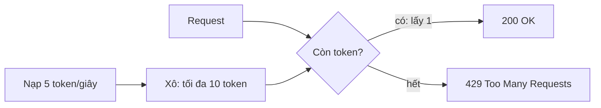

Vì có nhiều instance app, trạng thái xô phải nằm ở Redis, và bước "đọc → tính → ghi" phải **atomic** → viết bằng **Lua script** (Redis chạy trọn script không xen lệnh khác):

```lua
-- KEYS[1] = key của xô; ARGV[1] = capacity, ARGV[2] = rate (token/giây), ARGV[3] = cost
local capacity = tonumber(ARGV[1])
local rate     = tonumber(ARGV[2])
local cost     = tonumber(ARGV[3])

-- dùng đồng hồ của Redis để mọi instance app thống nhất thời gian
local t   = redis.call('TIME')
local now = tonumber(t[1]) * 1000 + math.floor(tonumber(t[2]) / 1000)  -- ms

local b      = redis.call('HMGET', KEYS[1], 'tokens', 'ts')
local tokens = tonumber(b[1]) or capacity
local ts     = tonumber(b[2]) or now

-- nạp thêm token theo thời gian đã trôi qua, không vượt capacity
tokens = math.min(capacity, tokens + math.max(0, now - ts) / 1000 * rate)

local allowed = 0
if tokens >= cost then
  tokens  = tokens - cost
  allowed = 1
end

redis.call('HSET', KEYS[1], 'tokens', tokens, 'ts', now)
redis.call('PEXPIRE', KEYS[1], math.ceil(capacity / rate * 1000) + 1000)
return {allowed, math.floor(tokens)}
```

=== "Go"

    ```go
    //go:embed token_bucket.lua
    var tokenBucketLua string

    var tokenBucket = redis.NewScript(tokenBucketLua)

    // Allow trả về true nếu request được phép.
    func Allow(ctx context.Context, rdb *redis.Client, userID string) (bool, error) {
    	key := "rate:user:" + userID
    	res, err := tokenBucket.Run(ctx, rdb, []string{key}, 10, 5, 1).Int64Slice()
    	if err != nil {
    		return true, err // Redis lỗi: "fail open" - cho qua, nhưng ghi log/cảnh báo
    	}
    	return res[0] == 1, nil
    }
    ```

=== "Python"

    ```python
    from pathlib import Path

    token_bucket = r.register_script(Path("token_bucket.lua").read_text())


    def allow(user_id: str) -> bool:
        try:
            allowed, _tokens = token_bucket(keys=[f"rate:user:{user_id}"], args=[10, 5, 1])
            return allowed == 1
        except redis.RedisError:
            return True   # "fail open": cho qua, nhưng ghi log/cảnh báo


    for i in range(12):
        print(i + 1, allow("7"))
    ```

```text
1 True
2 True
...
10 True
11 False
12 False
```

Output (ví dụ) - gọi liên tục 12 lần: 10 lần đầu dùng hết xô, 2 lần sau bị chặn cho đến khi token được nạp lại.

!!! tip "Fail open hay fail closed?"
    Khi Redis lỗi, rate limiter nên **cho qua** (fail open) với API thông thường - chặn nhầm toàn bộ người dùng tệ hơn nhiều so với để lọt vài request. Với API nhạy cảm (đăng nhập, gửi OTP), có thể chọn **fail closed**. Các thuật toán khác (fixed window, sliding window log/counter) được so sánh ở [Bài 10](./10-system-design.md).

### 8.3 Leaderboard với Sorted Set

Sorted Set giữ các member **luôn được sắp theo score**, thêm/cập nhật/tra thứ hạng đều O(log N). Bảng xếp hạng game 10 triệu người chơi chỉ là vài lệnh:

```text
127.0.0.1:6379> ZINCRBY lb:week:40 120 an
"120"
127.0.0.1:6379> ZINCRBY lb:week:40 300 binh
"300"
127.0.0.1:6379> ZINCRBY lb:week:40 80 chi
"80"
127.0.0.1:6379> ZINCRBY lb:week:40 50 an
"170"
127.0.0.1:6379> ZREVRANGE lb:week:40 0 2 WITHSCORES
1) "binh"
2) "300"
3) "an"
4) "170"
5) "chi"
6) "80"
127.0.0.1:6379> ZREVRANK lb:week:40 an
(integer) 1
```

Output (ví dụ). `ZREVRANK` đánh số từ 0 nên `an` đứng **hạng 2**.

=== "Go"

    ```go
    func AddScore(ctx context.Context, rdb *redis.Client, week, player string, delta float64) error {
    	return rdb.ZIncrBy(ctx, "lb:week:"+week, delta, player).Err()
    }

    func Top(ctx context.Context, rdb *redis.Client, week string, n int64) ([]redis.Z, error) {
    	return rdb.ZRevRangeWithScores(ctx, "lb:week:"+week, 0, n-1).Result()
    }

    func Rank(ctx context.Context, rdb *redis.Client, week, player string) (int64, error) {
    	r, err := rdb.ZRevRank(ctx, "lb:week:"+week, player).Result()
    	return r + 1, err // đổi sang hạng bắt đầu từ 1
    }
    ```

=== "Python"

    ```python
    def add_score(week, player, delta):
        r.zincrby(f"lb:week:{week}", delta, player)


    def top(week, n=10):
        return r.zrevrange(f"lb:week:{week}", 0, n - 1, withscores=True)


    def rank(week, player):
        pos = r.zrevrank(f"lb:week:{week}", player)
        return None if pos is None else pos + 1   # hạng bắt đầu từ 1
    ```

Nếu làm bằng SQL, "hạng của tôi là bao nhiêu" cần `COUNT(*) WHERE score > my_score` - quét rất nhiều dòng với bảng lớn. Sorted Set trả lời trong micro-giây.

### 8.4 Session store

Khi có nhiều instance app sau load balancer, session không thể nằm trong RAM của một instance (request sau có thể rơi vào instance khác). Đặt session vào Redis:

```text
HSET session:9f2c1a user_id 42 role customer created_at 1759200000
EXPIRE session:9f2c1a 1800          # 30 phút không hoạt động thì hết hạn
```

Mỗi request hợp lệ gọi lại `EXPIRE` để **gia hạn trượt** (sliding expiration). Đăng xuất = `DEL session:9f2c1a` - thu hồi **ngay lập tức**, điều mà JWT thuần không làm được (xem [Bài 4](./04-auth.md)).

=== "Go"

    ```go
    func LoadSession(ctx context.Context, rdb *redis.Client, sid string) (map[string]string, error) {
    	key := "session:" + sid
    	pipe := rdb.TxPipeline() // gửi 2 lệnh trong 1 round-trip
    	get := pipe.HGetAll(ctx, key)
    	pipe.Expire(ctx, key, 30*time.Minute) // gia hạn trượt
    	if _, err := pipe.Exec(ctx); err != nil {
    		return nil, err
    	}
    	return get.Val(), nil // map rỗng = session không tồn tại / đã hết hạn
    }
    ```

=== "Python"

    ```python
    def load_session(sid):
        key = f"session:{sid}"
        pipe = r.pipeline()            # gửi 2 lệnh trong 1 round-trip
        pipe.hgetall(key)
        pipe.expire(key, 1800)         # gia hạn trượt
        data, _ = pipe.execute()
        return data or None            # {} = session không tồn tại / đã hết hạn
    ```

!!! tip "Pipeline - gom lệnh để giảm round-trip"
    Nhớ bảng độ trễ: 100 lệnh `GET` tuần tự = 100 round-trip ≈ 50ms. Gói vào **pipeline** (hoặc `MGET`) = 1 round-trip ≈ 0,5ms. Đây là tối ưu Redis quan trọng số 1.

## 🌍 Ứng dụng thực tế

| Tình huống | Giải pháp cache |
|---|---|
| Sàn TMĐT, trang chi tiết sản phẩm được xem hàng triệu lần/ngày | Ảnh qua **CDN**; JSON sản phẩm ở **Redis** (cache-aside, TTL 5-10 phút + jitter); giá/tồn kho cache ngắn hơn hoặc đọc thẳng DB lúc thanh toán |
| Flash sale 0h | **Cache warming** trước giờ G; **hot key** được cache in-process vài giây; **singleflight**; tồn kho trừ bằng Lua script/`DECR` trên Redis rồi đồng bộ về DB qua queue ([Bài 9](./09-message-queues.md)) |
| Báo điện tử, trang chủ tin tức | Nguyên trang HTML ở **CDN** với `s-maxage=30, stale-while-revalidate`; khi biên tập sửa bài thì **purge** URL qua API của CDN |
| App ngân hàng | `Cache-Control: no-store` cho mọi trang có số dư; session ở Redis để đăng xuất tức thì; **rate limit** đăng nhập/OTP |
| Game mobile | Bảng xếp hạng tuần bằng **Sorted Set**; điểm danh hằng ngày bằng **Bitmap** |
| API công khai (bản đồ, thời tiết) | **Rate limiter token bucket** theo API key; response ở CDN theo tham số |
| Đếm lượt xem video/bài viết | `INCR` trên Redis, **write-behind** gom về DB mỗi vài chục giây |

## ⚠️ Lỗi thường gặp

| Lỗi | Hậu quả | Cách đúng |
|---|---|---|
| Key cache không có TTL | Redis đầy RAM, dữ liệu sai sống mãi | Mọi key cache đều có TTL (+ jitter) |
| Ghi DB xong `SET` cache thay vì `DEL` | Race condition → cache giữ giá trị cũ | Ghi DB rồi **xoá** cache |
| Xoá cache **trước** khi ghi DB | Request đọc chen vào nạp lại giá trị cũ | Ghi DB **trước**, xoá cache **sau** |
| Redis lỗi làm cả request lỗi 500 | Cache sập = hệ thống sập | Bắt lỗi, timeout ngắn, fallback về DB |
| Cache dữ liệu cá nhân ở CDN (`public`) | Người A thấy thông tin của người B | `private`/`no-store` cho dữ liệu riêng |
| Dùng `no-cache` với ý "đừng cache" | Browser vẫn lưu dữ liệu nhạy cảm | Dùng `no-store` |
| Cache key thiếu tham số | `/products?page=2` trả kết quả của page 1 | Key phải gồm **mọi** tham số ảnh hưởng kết quả (page, lang, currency, user role...) |
| `KEYS *` trên production | Redis đứng hình vài giây | `SCAN` |
| Không giới hạn `maxmemory` | Redis bị OOM killer giết, mất sạch | Đặt `maxmemory` + eviction policy phù hợp |
| Dùng Redis lock cho nghiệp vụ tiền bạc | Lock hết hạn/failover → trừ tiền 2 lần | Ràng buộc DB, transaction, idempotency |
| Cache mọi thứ "cho chắc" | Tốn RAM, khó invalidate, bug dữ liệu cũ | Đo trước: chỉ cache chỗ **thực sự chậm và đọc nhiều** |
| Serialize object khổng lồ (vài MB) | Big key chặn Redis, tốn băng thông | Cache nhỏ, theo entity; nén nếu cần |

## 🏋️ Bài tập

### Bài 1 (Dễ) - Tính hit ratio

Một API có `t_cache = 1ms`, `t_db = 30ms`. Sau khi thêm cache, độ trễ trung bình đo được là 3,9 ms. Hit ratio là bao nhiêu? Tải DB giảm bao nhiêu lần?

<details><summary>Đáp án</summary>

`h × 1 + (1 − h) × 30 = 3,9` → `30 − 29h = 3,9` → `h = 0,9` → **hit ratio 90%**. Chỉ 10% request xuống DB → tải DB giảm **10 lần**.

</details>

### Bài 2 (Dễ) - Chọn header Cache-Control

Chọn header phù hợp cho: (a) `logo.8f3a2c.png`, (b) `GET /api/me` trả thông tin tài khoản, (c) trang danh sách tin tức công khai cập nhật mỗi phút, (d) trang hiển thị số thẻ tín dụng.

<details><summary>Đáp án</summary>

(a) `public, max-age=31536000, immutable` - tên file có hash, đổi nội dung là đổi tên.
(b) `private, no-cache` (kèm ETag) - chỉ browser của người đó, luôn revalidate.
(c) `public, max-age=30, s-maxage=60, stale-while-revalidate=30`.
(d) `no-store`.

</details>

### Bài 3 (Trung bình) - Thêm thống kê cho LRU cache

Mở rộng `LRUCache` ở mục 4.5: đếm `hits`, `misses`, `evictions`, và thêm hàm `Stats()` / `stats()` trả về hit ratio. Viết test với đồng hồ giả chứng minh key hết hạn được tính là miss.

### Bài 4 (Trung bình) - Stale-while-revalidate in-process

Viết hàm `GetOrLoad(key, softTTL, hardTTL, loader)`:

- Còn trong `softTTL` → trả cache.
- Quá `softTTL` nhưng chưa quá `hardTTL` → **trả bản cũ ngay**, đồng thời chạy `loader` ở nền (chỉ **một** goroutine/thread làm mới cho mỗi key).
- Quá `hardTTL` hoặc chưa có → gọi `loader` đồng bộ (dùng singleflight / khoá theo key).

<details><summary>Gợi ý</summary>

Lưu trong mỗi entry: `value`, `softExpire`, `hardExpire`, `refreshing bool`. Khi quá soft TTL, dưới mutex kiểm tra `refreshing`; nếu `false` thì đặt `true` và khởi chạy goroutine/thread làm mới, cuối goroutine đặt lại `false` và cập nhật value + hai mốc hết hạn.

</details>

### Bài 5 (Trung bình) - Tìm bug

Đoạn code sau có **3 vấn đề**. Chỉ ra và sửa.

```python
def update_price(product_id, price):
    r.delete(f"product:{product_id}")
    db.execute("UPDATE products SET price=%s WHERE id=%s", (price, product_id))

def get_product(product_id):
    data = r.get(f"product:{product_id}")      # Redis lỗi -> exception -> 500
    if data:
        return json.loads(data)
    p = db.fetch_one("SELECT * FROM products WHERE id=%s", (product_id,))
    r.set(f"product:{product_id}", json.dumps(p))
    return p
```

<details><summary>Đáp án</summary>

1. Xoá cache **trước** khi ghi DB → request đọc chen giữa nạp lại giá cũ. Sửa: ghi DB trước rồi mới `delete`.
2. `r.set` không có TTL → dữ liệu sai (nếu có) sống mãi và Redis phình. Sửa: `ex=300 + jitter`.
3. Không xử lý lỗi Redis → cache sập kéo theo API sập. Bọc `try/except redis.RedisError` và fallback về DB. (Thêm điểm: `p` là `None` khi id không tồn tại → nên negative-cache với TTL ngắn để chống penetration.)

</details>

### Bài 6 (Khó) - Rate limiter sliding window bằng Sorted Set

Cài rate limiter "tối đa N request trong 60 giây gần nhất" dùng Sorted Set: mỗi request `ZADD key now now-uuid`, xoá phần tử cũ bằng `ZREMRANGEBYSCORE key 0 now-60000`, đếm bằng `ZCARD`. Viết thành **một Lua script** để atomic. So sánh bộ nhớ dùng với token bucket khi N = 10.000.

<details><summary>Gợi ý</summary>

Sliding window log lưu **mỗi request một phần tử** → O(N) bộ nhớ mỗi user (10.000 phần tử!), trong khi token bucket chỉ 2 số. Đổi lại sliding log chính xác tuyệt đối. Thực tế hay dùng "sliding window counter" (2 bộ đếm của cửa sổ hiện tại và trước đó) làm điểm cân bằng.

</details>

### Bài 7 (Khó) - Cache 2 tầng

Thiết kế và cài `TwoLevelCache` gồm L1 = LRU in-process (TTL 5s) và L2 = Redis (TTL 5 phút). Khi một instance xoá key, làm sao các instance khác xoá L1 của chúng? (Gợi ý: Redis Pub/Sub kênh `invalidate`.) Viết sơ đồ sequence cho luồng update và nêu điều gì xảy ra nếu một instance lỡ mất message Pub/Sub.

## ✅ Checklist hoàn thành

- [ ] Nhớ bậc độ lớn: RAM ~100ns, Redis ~0,5ms, query DB ~ms, xuyên lục địa ~200ms
- [ ] Tính được độ trễ trung bình và tải DB theo hit ratio
- [ ] Kể được 6 tầng cache và chọn tầng phù hợp cho từng loại dữ liệu
- [ ] Phân biệt `max-age`, `s-maxage`, `no-cache`, `no-store`, `private`, `immutable`
- [ ] Giải thích được ETag / `If-None-Match` / `304`
- [ ] Biết công dụng của String, Hash, List, Set, Sorted Set, Bitmap, HyperLogLog, Stream
- [ ] Hiểu RDB vs AOF và chọn eviction policy cho Redis làm cache
- [ ] Tự viết được LRU cache có TTL
- [ ] Vẽ được sequence diagram của 5 pattern cache và nêu ưu/nhược
- [ ] Giải thích race condition của cache-aside và vì sao "ghi DB rồi xoá cache"
- [ ] Chống được stampede (singleflight/lock), penetration (null cache, Bloom filter), avalanche (jitter, HA)
- [ ] Viết distributed lock `SET NX PX` + unlock bằng Lua và nêu được giới hạn của nó
- [ ] Hiểu token bucket rate limiter và leaderboard bằng Sorted Set

**Bài tiếp theo**: [Bài 9: Message Queue & Xử lý bất đồng bộ](./09-message-queues.md)
