# 📚 Bài 10: System Design & Scalability

## 🎯 Mục tiêu bài học

- Biết **quy trình 7 bước** để tiếp cận mọi bài toán system design: yêu cầu → ước lượng → API → data model → high-level design → deep dive → bottleneck
- Tự làm **ước lượng back-of-the-envelope** (QPS, dung lượng, băng thông, cache) với con số cụ thể
- Phân biệt **scale dọc (vertical)** và **scale ngang (horizontal)**, hiểu vì sao service nên **stateless**
- Hiểu **load balancer** (L4 vs L7, round robin, least connections, consistent hash), **CDN**
- Nắm các cách **scale database**: read replica, sharding, **consistent hashing** (tự cài đặt bằng Go & Python)
- Tính **availability** (bảng "số 9", SLA của chuỗi service nối tiếp / song song)
- Cài đặt **rate limiting**: token bucket, leaky bucket, fixed window, sliding window
- Áp dụng các pattern chịu lỗi: **timeout, retry + exponential backoff + jitter, circuit breaker, bulkhead, backpressure**
- Thiết kế API **idempotent** và **sinh ID duy nhất** (UUID v4/v7, Snowflake)
- Thực hành 5 **case study** kinh điển: URL shortener, news feed, chat app, notification system, rate limiter service
- Biết cách **trả lời phỏng vấn system design**

> 💡 **Bài này nằm ở đâu trong khóa?** Các bài trước dạy từng "viên gạch": HTTP ([Bài 1](./01-how-the-web-works.md)), API ([Bài 3](./03-api-design.md)), database ([Bài 5](./05-relational-database-design.md), [Bài 6](./06-database-internals-performance.md), [Bài 7](./07-nosql.md)), cache ([Bài 8](./08-caching.md)), message queue ([Bài 9](./09-message-queues.md)). Bài này dạy cách **ghép các viên gạch thành một ngôi nhà** chịu được hàng triệu người dùng.

## 📖 1. System design là gì? Tại sao cần học?

**System design** (thiết kế hệ thống) là việc quyết định **các thành phần** của một hệ thống phần mềm (service, database, cache, queue, CDN...), **cách chúng nói chuyện với nhau**, và **cách hệ thống sống sót** khi lượng người dùng tăng gấp 100 lần hoặc khi một máy chủ bốc cháy lúc 2 giờ sáng.

> 💡 **Ví von**: Viết một API giống như **nấu một nồi phở ngon**. System design giống như **mở chuỗi 500 quán phở** khắp Việt Nam: nguyên liệu nhập từ đâu (database), nấu sẵn nước dùng ở bếp trung tâm (cache), mỗi quán phục vụ khu vực của mình (CDN, sharding), quán đông quá thì chuyển khách sang quán bên cạnh (load balancer), một quán mất điện thì các quán khác vẫn bán (high availability).

Một hệ thống "chạy được" trên laptop khác rất xa một hệ thống chạy cho **Shopee ngày 11/11**, **Momo dịp Tết**, hay **VnExpress khi có tin nóng**. Khác biệt nằm ở 4 thuộc tính:

| Thuộc tính | Câu hỏi | Ví dụ |
|------------|---------|-------|
| **Scalability** (khả năng mở rộng) | Tải tăng 10× thì sao? | Flash sale: từ 1k lên 100k request/giây |
| **Availability** (tính sẵn sàng) | Hệ thống "sống" bao nhiêu % thời gian? | 99.99% = chỉ được chết 52 phút/năm |
| **Reliability** (độ tin cậy) | Có trả kết quả **đúng** không, kể cả khi có lỗi? | Chuyển tiền không bị trừ 2 lần |
| **Performance** (hiệu năng) | Nhanh cỡ nào? | p99 latency < 200ms |
| **Maintainability** (dễ bảo trì) | Team mới vào có hiểu, sửa được không? | Thêm tính năng mà không phá cái cũ |

!!! note "Không có thiết kế \"đúng\", chỉ có thiết kế \"phù hợp\""
    System design là nghệ thuật **đánh đổi (trade-off)**: nhanh hơn nhưng tốn tiền hơn, nhất quán hơn nhưng chậm hơn, đơn giản hơn nhưng khó scale hơn. Một kỹ sư giỏi không thuộc lòng "đáp án" mà biết **đặt câu hỏi đúng** và **giải thích được vì sao** chọn phương án A thay vì B.

## 📖 2. Quy trình 7 bước tiếp cận một bài toán system design

Dù là phỏng vấn 45 phút hay thiết kế thật trong 2 tuần, hãy đi theo khung sau:

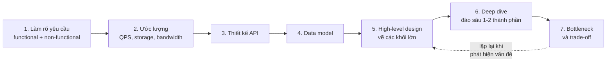

### 2.1. Bước 1 - Làm rõ yêu cầu

Sai lầm số 1 của người mới: **lao vào vẽ ngay**. Hãy hỏi trước. Yêu cầu chia làm 2 loại:

| Loại | Nghĩa | Ví dụ cho "thiết kế Zalo" |
|------|-------|---------------------------|
| **Functional** (chức năng) | Hệ thống **làm gì** | Nhắn tin 1-1, nhắn nhóm (≤ 100 người), gửi ảnh, xem "đã xem", trạng thái online |
| **Non-functional** (phi chức năng) | Hệ thống làm **tốt đến mức nào** | 50 triệu DAU, tin nhắn đến trong < 500ms, không mất tin nhắn, availability 99.99%, lưu lịch sử vĩnh viễn |

Các câu hỏi nên hỏi:

- **Ai dùng, bao nhiêu người?** DAU (daily active users), tăng trưởng mỗi năm?
- **Đọc nhiều hay ghi nhiều?** Tỉ lệ read:write (feed: 100:1; logging: 1:100)
- **Dữ liệu lớn cỡ nào, giữ bao lâu?**
- **Độ trễ chấp nhận được?** Real-time (< 100ms) hay vài giây cũng được?
- **Nhất quán mạnh hay cuối cùng (eventual)?** Số dư tài khoản cần mạnh; số like thì eventual là đủ
- **Phạm vi**: tính năng nào **không** cần làm? (ví dụ: bỏ qua video call)

### 2.2. Bước 2 - Ước lượng "back-of-the-envelope"

"Back-of-the-envelope" = tính nhẩm **trên mặt sau phong bì**: không cần chính xác, chỉ cần **đúng bậc độ lớn** (100 hay 10.000 hay 1 triệu?) để biết cần 1 máy hay 100 máy.

#### Những con số cần thuộc

| Con số | Giá trị | Mẹo nhớ |
|--------|---------|---------|
| Số giây trong 1 ngày | 86.400 ≈ **10^5** | "1 ngày ≈ 100 nghìn giây" |
| 1 triệu request/ngày | ≈ **12 request/giây** | 10^6 / 10^5 ≈ 10 |
| 1 tỷ request/ngày | ≈ **12.000 request/giây** | |
| 2^10 / 2^20 / 2^30 / 2^40 | ≈ 1 nghìn / 1 triệu / 1 tỷ / 1 nghìn tỷ | KB / MB / GB / TB |
| Peak (giờ cao điểm) | ≈ **2-3× trung bình** | Flash sale có thể 10-100× |

#### Độ trễ (latency) cần có "cảm giác"

| Thao tác | Thời gian xấp xỉ | So sánh đời thường (nếu 1ns = 1 giây) |
|----------|------------------|---------------------------------------|
| Đọc L1 cache | 1 ns | 1 giây |
| Đọc RAM | 100 ns | ~1.5 phút |
| Đọc 1MB tuần tự từ RAM | ~10 µs | ~3 giờ |
| Đọc ngẫu nhiên SSD | ~100 µs | ~1 ngày |
| Round-trip trong cùng datacenter | ~500 µs | ~6 ngày |
| Đọc 1MB tuần tự từ SSD | ~1 ms | ~12 ngày |
| Seek ổ HDD | ~10 ms | ~4 tháng |
| Gói tin Hà Nội ↔ Singapore ↔ Hà Nội | ~50 ms | ~1.5 năm |
| Gói tin Việt Nam ↔ Mỹ ↔ Việt Nam | ~150-200 ms | ~5-6 năm |

> 💡 **Rút ra**: RAM nhanh hơn đĩa ~1000 lần, trong datacenter nhanh hơn liên lục địa ~300 lần. Đó là lý do tồn tại của **cache** (Bài 8) và **CDN** (mục 6).

#### Ví dụ tính toán: dịch vụ rút gọn link

Giả sử: **100 triệu link mới mỗi ngày**, tỉ lệ đọc:ghi = **10:1**, lưu **5 năm**, mỗi bản ghi ~**500 byte**.

| Đại lượng | Phép tính | Kết quả |
|-----------|-----------|---------|
| Ghi (write QPS) | 100.000.000 / 86.400 | ≈ **1.160 req/s** (peak ~3.000) |
| Đọc (read QPS) | 1.160 × 10 | ≈ **11.600 req/s** (peak ~30.000) |
| Số link sau 5 năm | 10^8 × 365 × 5 | ≈ **182,5 tỷ link** |
| Dung lượng | 182,5 × 10^9 × 500 B | ≈ **91 TB** (chưa tính replica ×3 → ~274 TB) |
| Độ dài mã rút gọn | 62^6 ≈ 56,8 tỷ < 182,5 tỷ; 62^7 ≈ 3.500 tỷ | cần **7 ký tự** base62 |
| Bộ nhớ cache (quy tắc 80/20) | 20% × 1 tỷ lượt đọc/ngày × 500 B | ≈ **100 GB** RAM → vài node Redis |
| Băng thông đọc | 11.600 × 500 B | ≈ **5,8 MB/s** (nhỏ!) |

Kết luận rút ra ngay: **băng thông không phải vấn đề**, **dung lượng lưu trữ lớn** (cần sharding hoặc NoSQL), **đọc nhiều** (cần cache mạnh).

!!! tip "Làm tròn mạnh tay"
    86.400 → 100.000, 1.157 → 1.000. Người phỏng vấn muốn thấy **cách bạn suy luận**, không muốn thấy bạn bấm máy tính. Nói to giả định của mình: "Em giả sử mỗi bản ghi 500 byte vì URL dài trung bình 100 ký tự cộng metadata".

### 2.3. Bước 3 - Thiết kế API

Viết ra các endpoint chính (xem [Bài 3: Thiết kế API](./03-api-design.md)). Ví dụ:

```text
POST /api/v1/urls          {"long_url": "...", "custom_alias"?: "..."}  -> 201 {"short_url": "https://s.vn/aZ3kP9x"}
GET  /{code}                                                            -> 302 Location: <long_url>
GET  /api/v1/urls/{code}/stats                                          -> 200 {"clicks": 1234, ...}
```

### 2.4. Bước 4 - Data model

Chọn **loại database** và **schema**. Trả lời: dữ liệu có quan hệ phức tạp không (→ SQL)? Có cần scale ghi cực lớn, truy cập theo key (→ key-value/wide-column)? Xem [Bài 5](./05-relational-database-design.md) và [Bài 7](./07-nosql.md).

### 2.5. Bước 5 - High-level design

Vẽ các **khối lớn** và mũi tên luồng dữ liệu. Bắt đầu **đơn giản nhất có thể** rồi mới thêm thành phần khi có lý do:

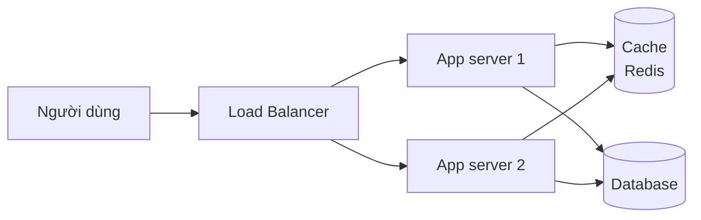

### 2.6. Bước 6 - Deep dive

Chọn 1-2 thành phần **khó nhất / quan trọng nhất** và đào sâu: sinh mã rút gọn thế nào để không trùng? Cache invalidation ra sao? Shard theo key nào?

### 2.7. Bước 7 - Bottleneck & trade-off

Tự hỏi: **"Cái gì sẽ chết đầu tiên khi tải tăng 10×?"** và **"Nếu thành phần X chết thì sao?"** (single point of failure - SPOF). Sau đó đề xuất cải tiến và nói rõ đánh đổi.

## 📖 3. Scalability: Scale dọc vs Scale ngang

Khi một server không chịu nổi tải, có 2 hướng:

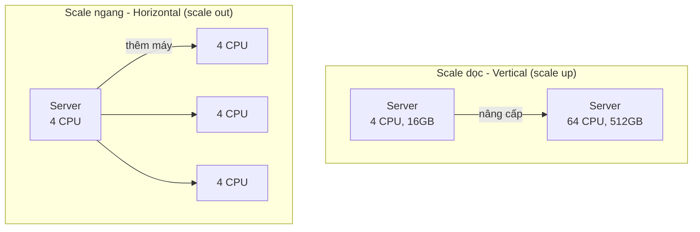

| Tiêu chí | Scale dọc (vertical) | Scale ngang (horizontal) |
|----------|----------------------|--------------------------|
| Cách làm | Mua máy **to hơn** (CPU, RAM, SSD) | Thêm **nhiều máy** chạy song song |
| Độ phức tạp | Rất đơn giản - không sửa code | Cần load balancer, service stateless, dữ liệu phân tán |
| Giới hạn | Có **trần cứng** (máy to nhất cũng có giới hạn) | Gần như **không giới hạn** |
| Chi phí | Tăng **phi tuyến** (máy 2× mạnh đắt hơn 2×) | Tăng gần **tuyến tính**, dùng máy rẻ |
| Khả năng chịu lỗi | Một máy chết = **chết hết** (SPOF) | Một máy chết, các máy khác gánh |
| Downtime khi nâng cấp | Thường phải restart | Rolling, không downtime |
| Phù hợp | Database quan hệ (giai đoạn đầu), hệ thống nhỏ | Web/API server, hệ thống lớn |

> 💡 **Ví von**: Quán cơm đông khách. **Scale dọc** = thay đầu bếp bằng một siêu đầu bếp nấu nhanh gấp đôi (có giới hạn, và siêu đầu bếp ốm thì quán đóng cửa). **Scale ngang** = thuê thêm 5 đầu bếp bình thường (cần người điều phối order - chính là load balancer).

!!! tip "Lời khuyên thực tế"
    **Đừng scale sớm.** Một server Go/Python tốt + PostgreSQL trên một máy 16 CPU có thể phục vụ hàng nghìn request/giây - đủ cho 95% startup. Scale dọc trước (rẻ về công sức), scale ngang khi thật sự cần. Nhưng **ngay từ đầu hãy viết service stateless** để khi cần scale ngang thì không phải viết lại.

## 📖 4. Stateless service - Điều kiện để scale ngang

**Stateful** service giữ dữ liệu của người dùng (session, giỏ hàng, file upload tạm) **trong RAM/đĩa của chính nó**. **Stateless** service không giữ gì - mọi trạng thái nằm ở kho chung (DB, Redis, S3), nên **request nào đến server nào cũng xử lý được**.

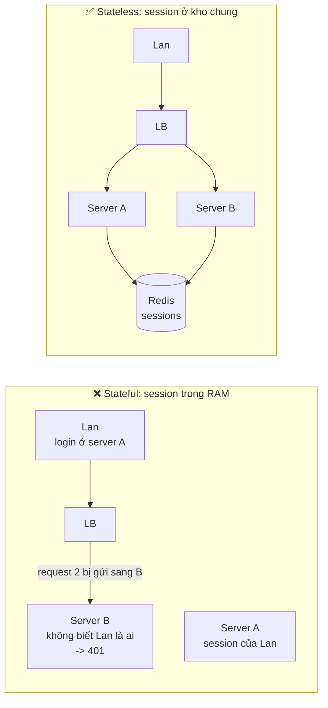

Cách biến service thành stateless:

| Trạng thái | Đừng để ở | Hãy để ở |
|------------|-----------|----------|
| Session đăng nhập | RAM của server | Redis, hoặc token tự chứa (JWT - [Bài 4](./04-auth.md)) |
| File người dùng upload | Đĩa local | Object storage (S3, GCS, MinIO) |
| Cache | Chỉ RAM local (nếu cần nhất quán) | Redis/Memcached (local cache chỉ cho dữ liệu ít đổi) |
| Job chạy nền | Goroutine/thread trong server web | Message queue + worker ([Bài 9](./09-message-queues.md)) |
| Cấu hình | File sửa tay trên server | Biến môi trường, config service |

> ⚠️ **Sticky session** (LB luôn gửi một user về cùng server) là "băng keo cá nhân" cho service stateful. Nó chạy được, nhưng khi server đó chết thì user mất session, và tải phân bổ không đều. Chỉ dùng khi bắt buộc (ví dụ WebSocket - xem case study chat).

## 📖 5. Load Balancer - "Người điều phối"

**Load balancer (LB)** nhận request từ client và phân phối cho nhiều server phía sau. Nó còn làm **health check** (không gửi vào server chết), **TLS termination** (giải mã HTTPS một lần ở LB), và che giấu cấu trúc bên trong.

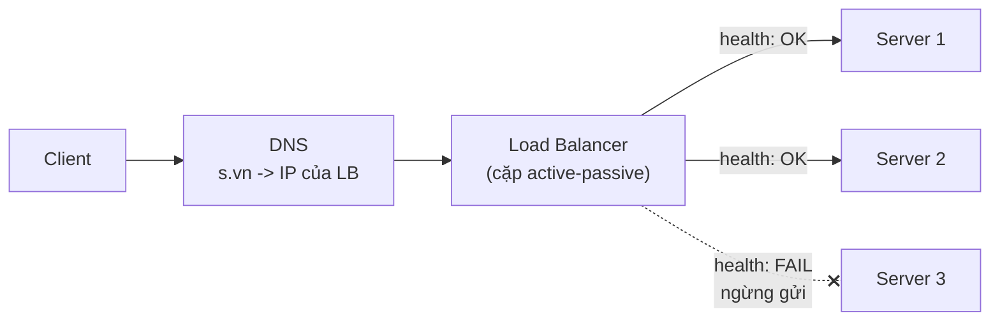

### 5.1. L4 vs L7

| | **Layer 4** (Transport) | **Layer 7** (Application) |
|---|---|---|
| Nhìn thấy gì | IP, port, TCP/UDP | Toàn bộ HTTP: URL, header, cookie, body |
| Định tuyến theo | IP/port | Path (`/api` → A, `/static` → B), header, cookie, hostname |
| Tốc độ | Rất nhanh, ít tốn CPU | Chậm hơn (phải parse HTTP, thường giải mã TLS) |
| Tính năng | Chuyển tiếp kết nối | Rewrite URL, thêm header, retry, rate limit, cache, nén, auth |
| Ví dụ | AWS NLB, LVS, HAProxy (mode tcp) | Nginx, Envoy, Traefik, AWS ALB, HAProxy (mode http) |
| Dùng khi | Database, game server, gRPC passthrough, cần throughput cực cao | Web/API thông thường (95% trường hợp) |

### 5.2. Thuật toán cân bằng tải

| Thuật toán | Cách làm | Hợp với |
|------------|----------|---------|
| **Round robin** | Lần lượt 1 → 2 → 3 → 1 → ... | Server giống nhau, request đều nhau |
| **Weighted round robin** | Server mạnh nhận nhiều hơn (trọng số 3:1) | Server cấu hình khác nhau, canary deploy |
| **Least connections** | Gửi cho server đang có **ít kết nối nhất** | Request dài ngắn khác nhau (upload, WebSocket) |
| **Least response time** | Server trả lời nhanh nhất + ít kết nối | Server có hiệu năng dao động |
| **IP hash / Consistent hash** | `hash(client IP hoặc key) → server` | Cần "dính" user với server (cache cục bộ, WebSocket) |
| **Random / Power of two choices** | Chọn ngẫu nhiên 2 server, lấy server ít tải hơn | LB phân tán nhiều instance (Envoy, gRPC) |

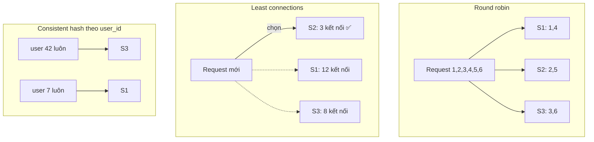

!!! note "Load balancer có phải SPOF không?"
    Có, nếu chỉ có một. Thực tế dùng **cặp LB active-passive** với một **IP ảo (VIP)** chuyển qua lại bằng keepalived/VRRP, hoặc dùng LB được quản lý của cloud (AWS ALB, GCP LB) vốn đã phân tán. Ở tầng cao hơn, **DNS** có thể trả về nhiều IP (DNS round robin) hoặc IP gần người dùng nhất (GeoDNS, anycast).

## 📖 6. CDN - Mang nội dung đến gần người dùng

**CDN (Content Delivery Network)** là mạng lưới hàng trăm máy chủ **edge** đặt khắp thế giới, lưu bản sao nội dung **tĩnh** (ảnh, video, JS, CSS) và cả nội dung động có thể cache. Người ở Cần Thơ tải ảnh từ edge ở TP.HCM thay vì từ server gốc (origin) ở Singapore.

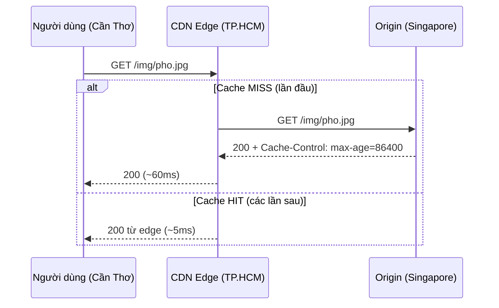

| Khái niệm | Giải thích |
|-----------|------------|
| **Pull CDN** | Edge tự lấy từ origin khi có cache miss. Dễ dùng nhất (Cloudflare, CloudFront) |
| **Push CDN** | Bạn chủ động upload nội dung lên CDN. Hợp với file lớn, ít đổi (video) |
| **TTL / Cache-Control** | Origin quyết định edge giữ bao lâu (`max-age`, `s-maxage`) |
| **Cache busting** | Đổi tên file khi nội dung đổi: `app.3f9a1c.js` → cache mãi mãi mà vẫn cập nhật được |
| **Purge / Invalidation** | Xóa cache trên edge khi cần (tốn thời gian, có thể mất phí) |

Lợi ích: giảm độ trễ, **giảm 80-95% tải** cho origin, chống DDoS (edge hấp thụ), tiết kiệm băng thông. Xem thêm về HTTP caching ở [Bài 8](./08-caching.md).

## 📖 7. Scale database

Server ứng dụng stateless thì scale ngang dễ. **Database mới là phần khó** vì nó giữ trạng thái. Thứ tự nên thử (từ rẻ đến đắt):

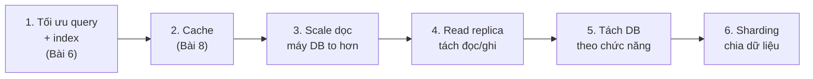

### 7.1. Read replica (bản sao chỉ đọc)

Một **primary** nhận mọi lệnh ghi, rồi **replicate** (sao chép) sang nhiều **replica** chỉ phục vụ đọc. Với tỉ lệ đọc:ghi 10:1, thêm replica giúp giảm tải cực nhiều.

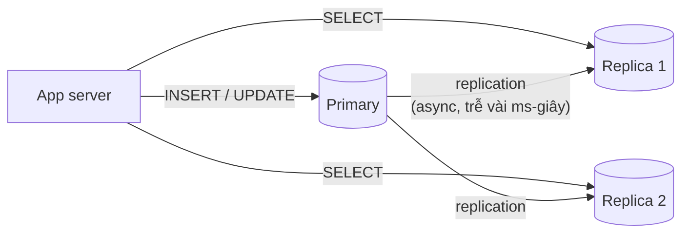

**Vấn đề: replication lag.** Replica thường được cập nhật **bất đồng bộ**, trễ vài mili giây đến vài giây. Kịch bản kinh điển: Lan đổi avatar (ghi vào primary), trang reload đọc từ replica → **thấy avatar cũ**, tưởng lỗi.

Cách xử lý **read-your-writes**:

- Đọc dữ liệu **của chính user** từ primary trong N giây sau khi họ ghi
- Ghi nhớ "phiên bản/LSN" sau khi ghi, chỉ đọc từ replica đã theo kịp phiên bản đó
- Dữ liệu nhạy cảm (số dư) **luôn** đọc từ primary

### 7.2. Sharding (phân mảnh dữ liệu)

Khi **lượng ghi** hoặc **dung lượng** vượt sức một máy, chia dữ liệu thành nhiều **shard**, mỗi shard là một database độc lập chứa một phần dữ liệu.

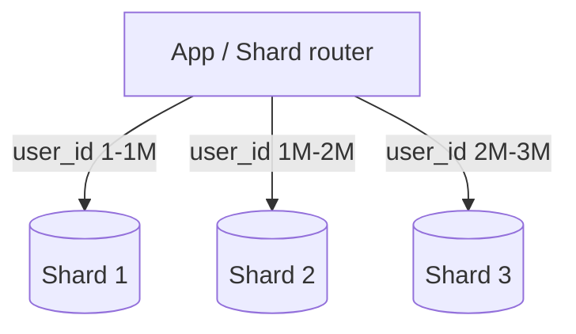

| Chiến lược | Cách chia | Ưu | Nhược |
|------------|-----------|-----|-------|
| **Range-based** | `user_id` 1-1M → shard 1, 1M-2M → shard 2 | Truy vấn theo khoảng dễ | **Hot spot**: user mới đều dồn vào shard cuối |
| **Hash-based** | `hash(user_id) % N` | Phân bố đều | Thêm shard → **gần như toàn bộ** dữ liệu phải di chuyển (xem 7.3) |
| **Consistent hashing** | Vòng hash (mục 7.3) | Thêm/bớt shard chỉ di chuyển ~1/N dữ liệu | Phức tạp hơn |
| **Directory-based** | Bảng tra cứu `tenant → shard` | Linh hoạt tuyệt đối, di chuyển từng tenant | Bảng tra cứu thành điểm nghẽn/SPOF |
| **Geo-based** | User VN → shard Singapore, user EU → shard Frankfurt | Độ trễ thấp, tuân thủ luật dữ liệu | Phân bố không đều |

**Chọn shard key** là quyết định quan trọng nhất:

- Key phải có **độ phân tán cao** (cardinality lớn): `user_id` tốt, `country` tệ (80% user ở VN → 1 shard gánh hết)
- Các truy vấn phổ biến nên **chỉ chạm 1 shard**: chat app shard theo `conversation_id` để lấy tin nhắn một cuộc trò chuyện chỉ cần 1 shard
- Tránh **celebrity problem**: một key quá "nóng" (tài khoản Sơn Tùng) có thể làm quá tải một shard

Cái giá phải trả của sharding:

- **JOIN giữa các shard** gần như không thể → phải denormalize hoặc join ở tầng ứng dụng
- **Transaction xuyên shard** rất khó (cần 2PC hoặc saga - [Bài 14](./14-architecture-microservices.md))
- **Resharding** (chia lại) đau đớn
- Truy vấn không có shard key phải **hỏi tất cả shard** (scatter-gather)

!!! tip "Trước khi tự sharding, hãy cân nhắc..."
    Các hệ thống như **Vitess** (MySQL), **Citus** (PostgreSQL), **CockroachDB**, **YugabyteDB**, **Cassandra**, **DynamoDB**, **MongoDB** đã làm sharding cho bạn. Tự viết logic sharding trong ứng dụng là con đường nhiều nước mắt.

### 7.3. Consistent hashing ⭐

**Vấn đề của `hash(key) % N`**: khi N đổi từ 3 thành 4, key có `hash = 5` chuyển từ shard `5 % 3 = 2` sang `5 % 4 = 1`. Tính ra **~75% key phải di chuyển** → cache bị xóa sạch (cache stampede đổ vào DB), dữ liệu phải chuyển ồ ạt.

**Consistent hashing**: đặt cả **server** và **key** lên một **vòng tròn** giá trị hash (0 → 2^32-1). Mỗi key thuộc về **server đầu tiên gặp được khi đi theo chiều kim đồng hồ**.

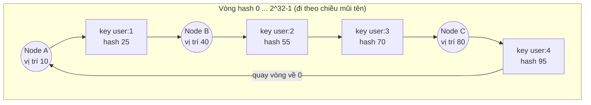

Đọc sơ đồ: `user:1` (hash 25) đi tiếp gặp **B** → thuộc B. `user:2`, `user:3` → thuộc **C**. `user:4` (95) đi hết vòng, quay về đầu gặp **A** → thuộc A.

**Thêm node D ở vị trí 60**: chỉ `user:2` (hash 55) chuyển từ C sang D. Mọi key khác **giữ nguyên**. Trung bình chỉ **~1/N** key phải di chuyển.

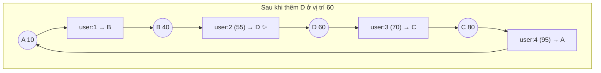

**Virtual node (vnode)**: nếu mỗi server chỉ có 1 điểm trên vòng, các khoảng sẽ rất không đều (server A có thể ôm 60% vòng). Giải pháp: mỗi server đặt **100-200 điểm ảo** ("A#0", "A#1"...). Nhiều điểm → phân bố đều hơn, và khi một node chết, tải của nó được **rải đều cho mọi node còn lại** thay vì dồn hết vào node kế bên.

Cài đặt đầy đủ (10.000 key, 3 node × 100 vnode, rồi thêm node D):

=== "Go"

    ```go
    package main

    import (
    	"crypto/md5"
    	"encoding/binary"
    	"fmt"
    	"slices"
    	"sort"
    	"strconv"
    )

    // Ring là một consistent hash ring có virtual node.
    type Ring struct {
    	replicas int               // số virtual node cho mỗi node thật
    	hashes   []uint32          // các điểm trên vòng, đã sắp xếp
    	owner    map[uint32]string // điểm -> tên node thật
    }

    func NewRing(replicas int) *Ring {
    	return &Ring{replicas: replicas, owner: make(map[uint32]string)}
    }

    // hashKey lấy 4 byte đầu của MD5 -> số uint32 (phân tán đều, không cần bảo mật).
    func hashKey(s string) uint32 {
    	sum := md5.Sum([]byte(s))
    	return binary.BigEndian.Uint32(sum[:4])
    }

    // Add đặt `replicas` điểm của node lên vòng: "A#0", "A#1", ...
    func (r *Ring) Add(node string) {
    	for i := 0; i < r.replicas; i++ {
    		h := hashKey(node + "#" + strconv.Itoa(i))
    		r.hashes = append(r.hashes, h)
    		r.owner[h] = node
    	}
    	slices.Sort(r.hashes)
    }

    // Remove gỡ mọi điểm của node khỏi vòng.
    func (r *Ring) Remove(node string) {
    	kept := r.hashes[:0]
    	for _, h := range r.hashes {
    		if r.owner[h] == node {
    			delete(r.owner, h)
    			continue
    		}
    		kept = append(kept, h)
    	}
    	r.hashes = kept
    }

    // Get tìm điểm đầu tiên >= hash(key) theo chiều kim đồng hồ.
    func (r *Ring) Get(key string) string {
    	h := hashKey(key)
    	i := sort.Search(len(r.hashes), func(i int) bool { return r.hashes[i] >= h })
    	if i == len(r.hashes) { // đi hết vòng -> quay về điểm đầu
    		i = 0
    	}
    	return r.owner[r.hashes[i]]
    }

    func main() {
    	const numKeys = 10000
    	keys := make([]string, numKeys)
    	for i := range keys {
    		keys[i] = "user:" + strconv.Itoa(i)
    	}

    	ring := NewRing(100)
    	for _, n := range []string{"A", "B", "C"} {
    		ring.Add(n)
    	}
    	before := map[string]string{}
    	count := map[string]int{}
    	for _, k := range keys {
    		n := ring.Get(k)
    		before[k] = n
    		count[n]++
    	}
    	fmt.Println("Phân bố với 3 node:", count["A"], count["B"], count["C"])

    	ring.Add("D")
    	moved := 0
    	count = map[string]int{}
    	for _, k := range keys {
    		n := ring.Get(k)
    		count[n]++
    		if n != before[k] {
    			moved++
    		}
    	}
    	fmt.Println("Phân bố với 4 node:", count["A"], count["B"], count["C"], count["D"])
    	fmt.Printf("Consistent hashing: %d/%d key phải di chuyển (%.1f%%)\n",
    		moved, numKeys, float64(moved)*100/numKeys)

    	// So sánh: hash(key) % N
    	movedMod := 0
    	for _, k := range keys {
    		if hashKey(k)%3 != hashKey(k)%4 {
    			movedMod++
    		}
    	}
    	fmt.Printf("Modulo hashing:     %d/%d key phải di chuyển (%.1f%%)\n",
    		movedMod, numKeys, float64(movedMod)*100/numKeys)
    }
    ```

=== "Python"

    ```python
    import bisect
    import hashlib
    from collections import Counter


    def hash_key(s: str) -> int:
        # 4 byte đầu của MD5 -> số 32-bit, giống hệt bản Go
        return int.from_bytes(hashlib.md5(s.encode()).digest()[:4], "big")


    class Ring:
        """Consistent hash ring có virtual node."""

        def __init__(self, replicas: int = 100):
            self.replicas = replicas
            self.hashes: list[int] = []      # các điểm trên vòng, đã sắp xếp
            self.owner: dict[int, str] = {}  # điểm -> node thật

        def add(self, node: str) -> None:
            for i in range(self.replicas):
                h = hash_key(f"{node}#{i}")
                bisect.insort(self.hashes, h)
                self.owner[h] = node

        def remove(self, node: str) -> None:
            self.hashes = [h for h in self.hashes if self.owner[h] != node]
            self.owner = {h: n for h, n in self.owner.items() if n != node}

        def get(self, key: str) -> str:
            h = hash_key(key)
            i = bisect.bisect_left(self.hashes, h)  # điểm đầu tiên >= h
            if i == len(self.hashes):               # hết vòng -> quay về đầu
                i = 0
            return self.owner[self.hashes[i]]


    if __name__ == "__main__":
        keys = [f"user:{i}" for i in range(10_000)]

        ring = Ring(100)
        for n in "ABC":
            ring.add(n)
        before = {k: ring.get(k) for k in keys}
        c = Counter(before.values())
        print("Phân bố với 3 node:", c["A"], c["B"], c["C"])

        ring.add("D")
        after = {k: ring.get(k) for k in keys}
        c = Counter(after.values())
        print("Phân bố với 4 node:", c["A"], c["B"], c["C"], c["D"])
        moved = sum(before[k] != after[k] for k in keys)
        print(f"Consistent hashing: {moved}/{len(keys)} key phải di chuyển "
              f"({moved * 100 / len(keys):.1f}%)")

        moved_mod = sum(hash_key(k) % 3 != hash_key(k) % 4 for k in keys)
        print(f"Modulo hashing:     {moved_mod}/{len(keys)} key phải di chuyển "
              f"({moved_mod * 100 / len(keys):.1f}%)")
    ```

**Output** (Go và Python in ra giống hệt nhau):

```text
Phân bố với 3 node: 3232 3370 3398
Phân bố với 4 node: 2577 2466 2509 2448
Consistent hashing: 2448/10000 key phải di chuyển (24.5%)
Modulo hashing:     7391/10000 key phải di chuyển (73.9%)
```

Kết quả nói lên tất cả: thêm 1 node vào 3 node, consistent hashing chỉ di chuyển **24,5%** key (lý thuyết: 1/4 = 25%), còn modulo di chuyển **73,9%** (lý thuyết: 3/4). Hai phiên bản Go và Python dùng cùng hàm hash (4 byte đầu của MD5) nên cho **kết quả giống hệt nhau** - điều quan trọng trong thực tế khi client viết bằng nhiều ngôn ngữ phải cùng tính ra một node.

!!! tip "Ai dùng consistent hashing?"
    **Cassandra**, **DynamoDB** (phân vùng dữ liệu), **Memcached client** (ketama), **Nginx** (`hash $request_uri consistent`), **Envoy** (ring hash / Maglev), **Discord** (phân phối guild cho server). Redis Cluster dùng biến thể **hash slot**: 16.384 slot cố định, mỗi node giữ một dải slot.

## 📖 8. CAP - Nhắc lại nhanh

Đã học kỹ ở [Bài 7: NoSQL](./07-nosql.md). Tóm tắt: khi có **network partition** (P - mạng giữa các node bị đứt, điều **chắc chắn** xảy ra trong hệ phân tán), bạn phải chọn:

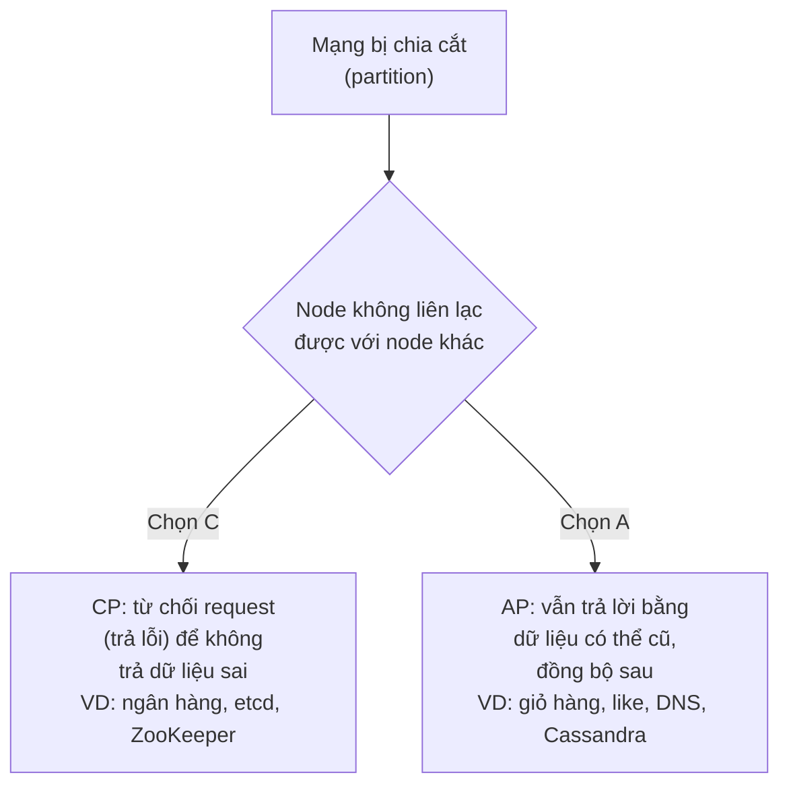

**PACELC** mở rộng CAP: **P**artition → chọn **A** hoặc **C**; **E**lse (bình thường) → chọn **L**atency hoặc **C**onsistency. Ví dụ đồng bộ ghi sang 3 replica trước khi trả lời = nhất quán hơn nhưng chậm hơn.

> 💡 Trong một hệ thống, **từng loại dữ liệu** có thể chọn khác nhau: số dư ví Momo cần CP, còn số người đã xem story thì AP là đủ.

## 📖 9. Availability - Toán của "những con số 9"

**Availability** = thời gian hệ thống hoạt động / tổng thời gian. Người ta nói bằng "số con số 9":

| Availability | Tên gọi | Downtime cho phép / năm | / tháng (30 ngày) | / tuần | / ngày |
|--------------|---------|-------------------------|-------------------|--------|--------|
| 99% | "two nines" | 3,65 ngày | 7,2 giờ | 1,68 giờ | 14,4 phút |
| 99,9% | "three nines" | 8,76 giờ | 43,2 phút | 10,1 phút | 1,44 phút |
| 99,95% | | 4,38 giờ | 21,6 phút | 5,04 phút | 43,2 giây |
| 99,99% | "four nines" | 52,6 phút | 4,32 phút | 1,01 phút | 8,6 giây |
| 99,999% | "five nines" | 5,26 phút | 25,9 giây | 6,05 giây | 0,86 giây |

> 💡 Mỗi con số 9 thêm vào **khó gấp ~10 lần** và **đắt gấp nhiều lần**. 99,999% nghĩa là bạn không kịp mở laptop khi có sự cố - mọi thứ phải **tự động** phục hồi.

### 9.1. Service nối tiếp (serial) - availability **nhân** với nhau

Request phải đi qua **tất cả** thành phần thì mới thành công:

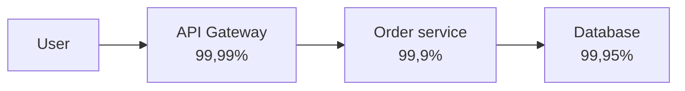

A_tổng = 0,9999 × 0,999 × 0,9995 ≈ **0,9984 = 99,84%** → **thấp hơn** thành phần yếu nhất!

Hệ thống có 10 microservice nối tiếp, mỗi cái 99,9%: 0,999^10 ≈ **99,0%** → mất 3,65 ngày/năm. Đây là một lý do **không nên chia microservice quá vụn** ([Bài 14](./14-architecture-microservices.md)).

### 9.2. Thành phần song song (redundancy) - xác suất **cùng chết** nhân với nhau

Hệ thống sống nếu **ít nhất một** bản sao sống:

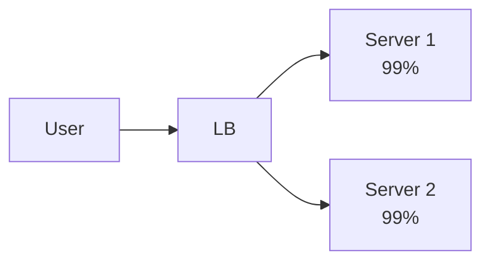

A_tổng = 1 − (1 − 0,99) × (1 − 0,99) = 1 − 0,0001 = **99,99%**

Hai server "tệ" 99% chạy song song cho ra 99,99%! Đây là sức mạnh của **redundancy**. (Điều kiện: chúng chết **độc lập** - nếu cả hai cùng nằm trên một rack, cùng mất điện thì công thức không còn đúng. Vì vậy người ta đặt replica ở nhiều **availability zone**.)

!!! warning "SLA của bạn không thể cao hơn SLA của các phụ thuộc"
    Nếu bạn phụ thuộc cứng vào một API bên thứ ba cam kết 99,9%, bạn **không thể** hứa với khách hàng 99,99% - trừ khi có fallback (cache, hàng đợi, nhà cung cấp dự phòng). Chi tiết về SLI/SLO/SLA và error budget ở [Bài 11](./11-observability-reliability.md).

## 📖 10. Rate limiting ⭐

**Rate limiting** giới hạn số request một client được gửi trong một khoảng thời gian. Mục đích:

- **Chống lạm dụng**: brute-force mật khẩu, scrape dữ liệu, spam OTP (mỗi SMS tốn tiền!)
- **Bảo vệ hệ thống** khỏi quá tải (một client lỗi gửi vòng lặp vô hạn)
- **Công bằng** giữa các khách hàng, và là **mô hình kinh doanh** (gói Free 100 req/phút, Pro 10.000 req/phút)

Khi bị giới hạn, trả về **`429 Too Many Requests`** kèm header:

```http
HTTP/1.1 429 Too Many Requests
Retry-After: 30
RateLimit-Limit: 100
RateLimit-Remaining: 0
RateLimit-Reset: 30
```

### 10.1. Các thuật toán

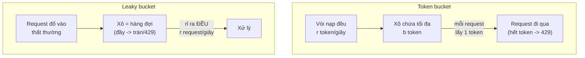

| Thuật toán | Ý tưởng | Burst? | Bộ nhớ | Dùng bởi |
|------------|---------|--------|--------|----------|
| **Token bucket** | Xô nạp token đều đặn; request lấy token | ✅ Cho phép burst đến `capacity` | 2 số / client | AWS API Gateway, Stripe, `golang.org/x/time/rate` |
| **Leaky bucket** | Hàng đợi, xử lý với tốc độ cố định | ❌ Làm **mượt** đầu ra | Hàng đợi | Nginx `limit_req`, traffic shaping |
| **Fixed window** | Đếm request trong mỗi phút cố định (12:00-12:01) | ⚠️ Có thể gấp đôi ở ranh giới | 1 số / client | Đơn giản, nhiều hệ thống nhỏ |
| **Sliding window log** | Lưu timestamp mọi request trong cửa sổ | ✅ Chính xác tuyệt đối | Tốn: O(limit) / client | Khi cần chính xác cao |
| **Sliding window counter** | Ước lượng = đếm cửa sổ trước × tỉ lệ chồng lấn + cửa sổ hiện tại | Xấp xỉ tốt | 2 số / client | Cloudflare, nhiều API gateway |

**Vấn đề ranh giới của fixed window**: giới hạn 5 request/10 giây. Client gửi 5 request lúc 9,0-9,4s (cửa sổ [0,10)) và 5 request lúc 10,0-10,4s (cửa sổ [10,20)). Mỗi cửa sổ đều "hợp lệ", nhưng thực tế **10 request trong 1,4 giây** - gấp đôi giới hạn!

```mermaid
gantt
    title Fixed window: 10 request lọt qua trong 1,4 giây
    dateFormat X
    axisFormat %s
    section Cửa sổ
    Cửa sổ 0-10s (5 req OK)  :0, 10
    Cửa sổ 10-20s (5 req OK) :10, 20
    section Request
    5 request (9,0-9,4s)     :crit, 9, 10
    5 request (10,0-10,4s)   :crit, 10, 11
```

### 10.2. Cài đặt 5 thuật toán

Các limiter nhận thời điểm `now` từ bên ngoài thay vì tự gọi đồng hồ - vừa **dễ test**, vừa cho **kết quả lặp lại được** để bạn so sánh:

=== "Go"

    ```go
    package main

    import (
    	"fmt"
    	"math"
    )

    // Mọi limiter nhận thời điểm "now" (giây) từ bên ngoài
    // -> dễ test, kết quả lặp lại được (không phụ thuộc đồng hồ thật).

    // ---------- 1. Token bucket ----------
    type TokenBucket struct {
    	capacity float64 // số token tối đa (= burst cho phép)
    	rate     float64 // số token nạp thêm mỗi giây
    	tokens   float64
    	last     float64
    }

    func NewTokenBucket(capacity, rate float64) *TokenBucket {
    	return &TokenBucket{capacity: capacity, rate: rate, tokens: capacity}
    }

    func (b *TokenBucket) Allow(now float64) bool {
    	// Nạp token cho khoảng thời gian đã trôi qua (không vượt capacity)
    	b.tokens = math.Min(b.capacity, b.tokens+(now-b.last)*b.rate)
    	b.last = now
    	if b.tokens >= 1 {
    		b.tokens--
    		return true
    	}
    	return false
    }

    // ---------- 2. Leaky bucket (dạng hàng đợi) ----------
    // Request vào hàng đợi, được "rỉ" ra xử lý với tốc độ CỐ ĐỊNH.
    type LeakyBucket struct {
    	capacity  int       // số request tối đa đang chờ
    	interval  float64   // 1/leakRate: khoảng cách giữa 2 lần xử lý
    	scheduled []float64 // thời điểm xử lý của các request chưa xong
    	nextFree  float64
    }

    // Offer trả về (được nhận?, thời điểm sẽ được xử lý).
    func (b *LeakyBucket) Offer(now float64) (bool, float64) {
    	pending := b.scheduled[:0]
    	for _, t := range b.scheduled {
    		if t >= now { // chưa xử lý xong -> vẫn nằm trong xô
    			pending = append(pending, t)
    		}
    	}
    	b.scheduled = pending
    	if len(b.scheduled) >= b.capacity {
    		return false, 0 // xô đầy -> tràn
    	}
    	at := math.Max(now, b.nextFree)
    	b.nextFree = at + b.interval
    	b.scheduled = append(b.scheduled, at)
    	return true, at
    }

    // ---------- 3. Fixed window counter ----------
    type FixedWindow struct {
    	limit  int
    	window float64
    	curWin int64
    	count  int
    }

    func (f *FixedWindow) Allow(now float64) bool {
    	w := int64(now / f.window) // cửa sổ số mấy
    	if w != f.curWin {
    		f.curWin, f.count = w, 0
    	}
    	if f.count < f.limit {
    		f.count++
    		return true
    	}
    	return false
    }

    // ---------- 4. Sliding window log ----------
    type SlidingLog struct {
    	limit  int
    	window float64
    	log    []float64 // thời điểm các request ĐƯỢC CHẤP NHẬN
    }

    func (s *SlidingLog) Allow(now float64) bool {
    	i := 0
    	for i < len(s.log) && s.log[i] <= now-s.window {
    		i++ // bỏ các request đã ra khỏi cửa sổ (now-window, now]
    	}
    	s.log = s.log[i:]
    	if len(s.log) < s.limit {
    		s.log = append(s.log, now)
    		return true
    	}
    	return false
    }

    // ---------- 5. Sliding window counter ----------
    type SlidingCounter struct {
    	limit     int
    	window    float64
    	curWin    int64
    	curCount  int
    	prevCount int
    }

    func (s *SlidingCounter) Allow(now float64) bool {
    	w := int64(now / s.window)
    	if w != s.curWin {
    		if w == s.curWin+1 {
    			s.prevCount = s.curCount
    		} else {
    			s.prevCount = 0 // bỏ qua >= 1 cửa sổ trống
    		}
    		s.curWin, s.curCount = w, 0
    	}
    	elapsed := now/s.window - float64(w) // đã đi được bao nhiêu % cửa sổ hiện tại
    	estimate := float64(s.prevCount)*(1-elapsed) + float64(s.curCount)
    	if estimate < float64(s.limit) {
    		s.curCount++
    		return true
    	}
    	return false
    }

    func mark(ok bool) string {
    	if ok {
    		return "✅"
    	}
    	return "❌"
    }

    func main() {
    	fmt.Println("== Token bucket (capacity=3, nạp 1 token/giây) ==")
    	tb := NewTokenBucket(3, 1)
    	for _, t := range []float64{0, 0, 0, 0, 0.5, 1.0, 1.1, 3.5, 3.6} {
    		ok := tb.Allow(t)
    		fmt.Printf("t=%.1fs %s còn %.1f token\n", t, mark(ok), tb.tokens)
    	}

    	fmt.Println("\n== Leaky bucket (xô chứa 3, xử lý 1 req/giây) ==")
    	lb := &LeakyBucket{capacity: 3, interval: 1}
    	for _, t := range []float64{0, 0, 0, 0, 0, 2.5, 2.5} {
    		if ok, at := lb.Offer(t); ok {
    			fmt.Printf("t=%.1fs ✅ vào hàng đợi, xử lý lúc t=%.1fs\n", t, at)
    		} else {
    			fmt.Printf("t=%.1fs ❌ xô đầy, từ chối\n", t)
    		}
    	}

    	fmt.Println("\n== Giới hạn 5 request / 10 giây ==")
    	times := []float64{9.0, 9.1, 9.2, 9.3, 9.4, 10.0, 10.1, 10.2, 10.3, 10.4, 15, 19.5}
    	fw := &FixedWindow{limit: 5, window: 10}
    	sl := &SlidingLog{limit: 5, window: 10}
    	sc := &SlidingCounter{limit: 5, window: 10}
    	fmt.Println("   t   | fixed | sliding log | sliding counter")
    	total := [3]int{}
    	for _, t := range times {
    		res := [3]bool{fw.Allow(t), sl.Allow(t), sc.Allow(t)}
    		for i, ok := range res {
    			if ok {
    				total[i]++
    			}
    		}
    		fmt.Printf("%5.1fs |  %s   |     %s      |      %s\n", t, mark(res[0]), mark(res[1]), mark(res[2]))
    	}
    	fmt.Printf("Tổng chấp nhận: fixed=%d, sliding log=%d, sliding counter=%d\n", total[0], total[1], total[2])
    }
    ```

=== "Python"

    ```python
    """Các thuật toán rate limiting. Thời gian `now` (giây) truyền từ ngoài vào
    -> kết quả lặp lại được, dễ viết test."""
    from collections import deque


    class TokenBucket:
        def __init__(self, capacity: float, rate: float):
            self.capacity = capacity  # số token tối đa (= burst)
            self.rate = rate          # token nạp thêm mỗi giây
            self.tokens = capacity
            self.last = 0.0

        def allow(self, now: float) -> bool:
            self.tokens = min(self.capacity, self.tokens + (now - self.last) * self.rate)
            self.last = now
            if self.tokens >= 1:
                self.tokens -= 1
                return True
            return False


    class LeakyBucket:
        """Dạng hàng đợi: request được 'rỉ' ra xử lý với tốc độ cố định."""

        def __init__(self, capacity: int, leak_rate: float):
            self.capacity = capacity
            self.interval = 1 / leak_rate
            self.scheduled: deque[float] = deque()  # thời điểm xử lý các request chưa xong
            self.next_free = 0.0

        def offer(self, now: float) -> tuple[bool, float]:
            while self.scheduled and self.scheduled[0] < now:
                self.scheduled.popleft()          # đã xử lý xong -> rời khỏi xô
            if len(self.scheduled) >= self.capacity:
                return False, 0.0                 # xô đầy -> tràn
            at = max(now, self.next_free)
            self.next_free = at + self.interval
            self.scheduled.append(at)
            return True, at


    class FixedWindow:
        def __init__(self, limit: int, window: float):
            self.limit, self.window = limit, window
            self.cur_win, self.count = 0, 0

        def allow(self, now: float) -> bool:
            w = int(now // self.window)
            if w != self.cur_win:
                self.cur_win, self.count = w, 0
            if self.count < self.limit:
                self.count += 1
                return True
            return False


    class SlidingLog:
        def __init__(self, limit: int, window: float):
            self.limit, self.window = limit, window
            self.log: deque[float] = deque()  # thời điểm các request được chấp nhận

        def allow(self, now: float) -> bool:
            while self.log and self.log[0] <= now - self.window:
                self.log.popleft()
            if len(self.log) < self.limit:
                self.log.append(now)
                return True
            return False


    class SlidingCounter:
        def __init__(self, limit: int, window: float):
            self.limit, self.window = limit, window
            self.cur_win, self.cur_count, self.prev_count = 0, 0, 0

        def allow(self, now: float) -> bool:
            w = int(now // self.window)
            if w != self.cur_win:
                self.prev_count = self.cur_count if w == self.cur_win + 1 else 0
                self.cur_win, self.cur_count = w, 0
            elapsed = now / self.window - w  # đã đi được bao nhiêu % cửa sổ hiện tại
            estimate = self.prev_count * (1 - elapsed) + self.cur_count
            if estimate < self.limit:
                self.cur_count += 1
                return True
            return False


    def mark(ok: bool) -> str:
        return "✅" if ok else "❌"


    if __name__ == "__main__":
        print("== Token bucket (capacity=3, nạp 1 token/giây) ==")
        tb = TokenBucket(3, 1)
        for t in [0, 0, 0, 0, 0.5, 1.0, 1.1, 3.5, 3.6]:
            ok = tb.allow(t)
            print(f"t={t:.1f}s {mark(ok)} còn {tb.tokens:.1f} token")

        print("\n== Leaky bucket (xô chứa 3, xử lý 1 req/giây) ==")
        lb = LeakyBucket(3, 1)
        for t in [0, 0, 0, 0, 0, 2.5, 2.5]:
            ok, at = lb.offer(t)
            if ok:
                print(f"t={t:.1f}s ✅ vào hàng đợi, xử lý lúc t={at:.1f}s")
            else:
                print(f"t={t:.1f}s ❌ xô đầy, từ chối")

        print("\n== Giới hạn 5 request / 10 giây ==")
        times = [9.0, 9.1, 9.2, 9.3, 9.4, 10.0, 10.1, 10.2, 10.3, 10.4, 15, 19.5]
        limiters = [FixedWindow(5, 10), SlidingLog(5, 10), SlidingCounter(5, 10)]
        total = [0, 0, 0]
        print("   t   | fixed | sliding log | sliding counter")
        for t in times:
            res = [lim.allow(t) for lim in limiters]
            total = [a + b for a, b in zip(total, res)]
            print(f"{t:5.1f}s |  {mark(res[0])}   |     {mark(res[1])}      |      {mark(res[2])}")
        print(f"Tổng chấp nhận: fixed={total[0]}, sliding log={total[1]}, sliding counter={total[2]}")
    ```

**Output** (Go và Python in ra giống hệt nhau):

```text
== Token bucket (capacity=3, nạp 1 token/giây) ==
t=0.0s ✅ còn 2.0 token
t=0.0s ✅ còn 1.0 token
t=0.0s ✅ còn 0.0 token
t=0.0s ❌ còn 0.0 token
t=0.5s ❌ còn 0.5 token
t=1.0s ✅ còn 0.0 token
t=1.1s ❌ còn 0.1 token
t=3.5s ✅ còn 1.5 token
t=3.6s ✅ còn 0.6 token

== Leaky bucket (xô chứa 3, xử lý 1 req/giây) ==
t=0.0s ✅ vào hàng đợi, xử lý lúc t=0.0s
t=0.0s ✅ vào hàng đợi, xử lý lúc t=1.0s
t=0.0s ✅ vào hàng đợi, xử lý lúc t=2.0s
t=0.0s ❌ xô đầy, từ chối
t=0.0s ❌ xô đầy, từ chối
t=2.5s ✅ vào hàng đợi, xử lý lúc t=3.0s
t=2.5s ✅ vào hàng đợi, xử lý lúc t=4.0s

== Giới hạn 5 request / 10 giây ==
   t   | fixed | sliding log | sliding counter
  9.0s |  ✅   |     ✅      |      ✅
  9.1s |  ✅   |     ✅      |      ✅
  9.2s |  ✅   |     ✅      |      ✅
  9.3s |  ✅   |     ✅      |      ✅
  9.4s |  ✅   |     ✅      |      ✅
 10.0s |  ✅   |     ❌      |      ❌
 10.1s |  ✅   |     ❌      |      ✅
 10.2s |  ✅   |     ❌      |      ❌
 10.3s |  ✅   |     ❌      |      ❌
 10.4s |  ✅   |     ❌      |      ❌
 15.0s |  ❌   |     ❌      |      ✅
 19.5s |  ❌   |     ✅      |      ✅
Tổng chấp nhận: fixed=10, sliding log=6, sliding counter=8
```

Phân tích kết quả:

- **Token bucket**: 3 request đầu dùng hết 3 token (burst), request thứ 4 bị chặn. Sau 1 giây có lại 1 token. Ở t=3,5s, xô đã nạp lại 2,5 token.
- **Leaky bucket**: nhận 3 request vào hàng đợi nhưng xử lý **đều đặn** ở t=0, 1, 2 - đầu ra được làm mượt.
- **Fixed window** cho lọt **10 request** trong 1,4 giây - đúng lỗi ranh giới đã nói.
- **Sliding log** chính xác: chỉ 5 request trong mọi khoảng 10 giây. Request lúc 19,5s được chấp nhận vì các request lúc 9,x đã ra khỏi cửa sổ (9,5; 19,5].
- **Sliding counter** là **xấp xỉ**: lúc 10,1s nó ước lượng `5 × 0,99 + 0 = 4,95 < 5` nên cho qua. Sai số nhỏ, đổi lại chỉ cần 2 con số mỗi client.

!!! tip "Dùng thư viện có sẵn trong code thật"
    Go: [`golang.org/x/time/rate`](https://pkg.go.dev/golang.org/x/time/rate) (token bucket, an toàn cho goroutine). Python: `limits`, `slowapi` (FastAPI), `django-ratelimit`. Khi có **nhiều instance**, bộ đếm phải nằm ở kho chung (Redis) - xem case study 5 (mục 18).

## 📖 11. Chịu lỗi: timeout, retry, circuit breaker, bulkhead, backpressure

Trong hệ phân tán, **mọi lời gọi mạng đều có thể thất bại** - chậm, mất gói, service kia đang deploy, database đang failover. Câu hỏi không phải "có lỗi không" mà "**khi lỗi thì hệ thống cư xử thế nào**".

> 💡 **Ví von - hiệu ứng domino**: Service thanh toán chậm → service đặt hàng chờ, giữ kết nối → hết connection pool → service đặt hàng treo → API gateway chờ → toàn bộ app treo. Một service chậm có thể **kéo sập cả hệ thống** (cascading failure). Các pattern dưới đây là "cầu chì" ngăn domino đổ.

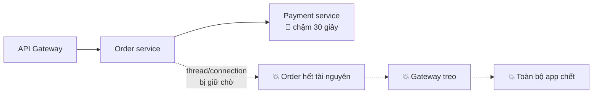

### 11.1. Timeout - Không bao giờ chờ vô hạn

**Mọi** lời gọi ra ngoài (HTTP, DB, Redis, queue) phải có timeout. Mặc định của nhiều thư viện là **không có timeout** (`http.DefaultClient` của Go, `requests` của Python)!

=== "Go"

    ```go
    // Timeout cho cả request qua context (ưu tiên cách này)
    ctx, cancel := context.WithTimeout(r.Context(), 2*time.Second)
    defer cancel()
    req, _ := http.NewRequestWithContext(ctx, http.MethodGet, url, nil)
    resp, err := client.Do(req)

    // Và một client có giới hạn tổng
    client := &http.Client{Timeout: 5 * time.Second}
    ```

=== "Python"

    ```python
    import httpx, requests

    # requests: (connect timeout, read timeout) - mặc định là CHỜ MÃI MÃI
    requests.get(url, timeout=(1, 2))

    # httpx: mặc định 5 giây, có thể tinh chỉnh
    httpx.get(url, timeout=httpx.Timeout(2.0, connect=1.0))
    ```

**Timeout budget**: nếu gateway cho tổng 3 giây, service bên trong không được đặt timeout 5 giây. Truyền **deadline** xuyên suốt chuỗi gọi (Go: `context`; gRPC tự truyền deadline - [Go Bài 18](../golang/18-grpc.md)).

### 11.2. Retry với exponential backoff + jitter

Lỗi tạm thời (mạng chập chờn, 503) thường tự hết sau vài trăm ms → thử lại là hợp lý. Nhưng retry **sai cách** thì còn tệ hơn không retry:

- Retry **ngay lập tức** → dội thêm tải lên service đang quá tải → nó càng chết
- Mọi client retry **cùng một thời điểm** → "đàn trâu chạy loạn" (**thundering herd**)
- Retry lỗi **vĩnh viễn** (400, 404) → vô ích
- Retry request **không idempotent** (trừ tiền) → trừ tiền 2 lần (mục 12)

Công thức **exponential backoff + full jitter** (khuyến nghị của AWS):

```text
chờ = random(0, min(cap, base × 2^attempt))
attempt 0: random(0, 50ms)   attempt 1: random(0, 100ms)
attempt 2: random(0, 200ms)  attempt 3: random(0, 400ms) ... tối đa cap
```

=== "Go"

    ```go
    package main

    import (
    	"context"
    	"errors"
    	"fmt"
    	"math/rand/v2"
    	"time"
    )

    // Lỗi tạm thời (503, timeout, mất kết nối...) -> nên thử lại.
    // Lỗi vĩnh viễn (400, 401, 404...) -> thử lại cũng vô ích.
    type TemporaryError struct{ msg string }

    func (e TemporaryError) Error() string { return e.msg }

    var rng = rand.New(rand.NewPCG(42, 0)) // seed cố định để demo lặp lại được

    // backoff tính thời gian chờ trước lần thử thứ `attempt` (bắt đầu từ 0)
    // theo chiến lược "full jitter": random trong [0, min(cap, base*2^attempt)).
    func backoff(attempt int, base, maxDelay time.Duration) time.Duration {
    	d := base << attempt // base * 2^attempt
    	if d > maxDelay || d <= 0 {
    		d = maxDelay
    	}
    	return time.Duration(rng.Int64N(int64(d)))
    }

    func Retry(ctx context.Context, maxAttempts int, fn func() error) error {
    	var err error
    	for attempt := 0; attempt < maxAttempts; attempt++ {
    		if err = fn(); err == nil {
    			return nil
    		}
    		var tmp TemporaryError
    		if !errors.As(err, &tmp) {
    			return fmt.Errorf("lỗi vĩnh viễn, không thử lại: %w", err)
    		}
    		if attempt == maxAttempts-1 {
    			break
    		}
    		wait := backoff(attempt, 50*time.Millisecond, 2*time.Second)
    		fmt.Printf("  lần %d lỗi (%v) -> chờ %v\n", attempt+1, err, wait.Round(time.Millisecond))
    		select {
    		case <-time.After(wait):
    		case <-ctx.Done(): // tôn trọng deadline của người gọi
    			return ctx.Err()
    		}
    	}
    	return fmt.Errorf("hết %d lần thử: %w", maxAttempts, err)
    }

    func main() {
    	ctx, cancel := context.WithTimeout(context.Background(), 5*time.Second)
    	defer cancel()

    	n := 0
    	flaky := func() error { // lỗi 3 lần đầu, lần 4 thành công
    		n++
    		if n <= 3 {
    			return TemporaryError{"503 Service Unavailable"}
    		}
    		return nil
    	}
    	fmt.Println("Kịch bản 1: service chập chờn")
    	fmt.Println("  kết quả:", Retry(ctx, 5, flaky))

    	fmt.Println("Kịch bản 2: lỗi 400 - không thử lại")
    	bad := func() error { return errors.New("400 Bad Request") }
    	fmt.Println("  kết quả:", Retry(ctx, 5, bad))

    	// Thundering herd: 1000 client cùng thử lại ở lần thứ 3 (attempt=2, trần 200ms)
    	fmt.Println("Kịch bản 3: 1000 client thử lại cùng lúc")
    	noJitter := map[int64]int{}
    	withJitter := map[int64]int{}
    	for i := 0; i < 1000; i++ {
    		noJitter[(50*time.Millisecond<<2).Milliseconds()/10]++
    		withJitter[backoff(2, 50*time.Millisecond, 2*time.Second).Milliseconds()/10]++
    	}
    	peak := func(m map[int64]int) int {
    		p := 0
    		for _, c := range m {
    			p = max(p, c)
    		}
    		return p
    	}
    	fmt.Printf("  không jitter: đỉnh %d request trong cùng 10ms\n", peak(noJitter))
    	fmt.Printf("  full jitter : đỉnh %d request trong cùng 10ms\n", peak(withJitter))
    }
    ```

    **Output:**

    ```text
    Kịch bản 1: service chập chờn
      lần 1 lỗi (503 Service Unavailable) -> chờ 43ms
      lần 2 lỗi (503 Service Unavailable) -> chờ 96ms
      lần 3 lỗi (503 Service Unavailable) -> chờ 27ms
      kết quả: <nil>
    Kịch bản 2: lỗi 400 - không thử lại
      kết quả: lỗi vĩnh viễn, không thử lại: 400 Bad Request
    Kịch bản 3: 1000 client thử lại cùng lúc
      không jitter: đỉnh 1000 request trong cùng 10ms
      full jitter : đỉnh 59 request trong cùng 10ms
    ```

=== "Python"

    ```python
    import random
    import time
    from collections import Counter

    rng = random.Random(42)  # seed cố định để demo lặp lại được


    class TemporaryError(Exception):
        """Lỗi tạm thời (503, timeout...) -> nên thử lại."""


    def backoff(attempt: int, base: float = 0.05, cap: float = 2.0) -> float:
        """Full jitter: random trong [0, min(cap, base * 2^attempt))."""
        return rng.uniform(0, min(cap, base * 2 ** attempt))


    def retry(fn, max_attempts: int = 5, deadline: float | None = None):
        for attempt in range(max_attempts):
            try:
                return fn()
            except TemporaryError as e:
                if attempt == max_attempts - 1:
                    raise RuntimeError(f"hết {max_attempts} lần thử: {e}") from e
                wait = backoff(attempt)
                if deadline is not None and time.monotonic() + wait > deadline:
                    raise TimeoutError("vượt deadline của người gọi") from e
                print(f"  lần {attempt + 1} lỗi ({e}) -> chờ {wait * 1000:.0f}ms")
                time.sleep(wait)
            # Lỗi khác (ValueError, 400...) không bị bắt -> văng ra ngay, không thử lại


    def main() -> None:
        deadline = time.monotonic() + 5
        n = 0

        def flaky():
            nonlocal n
            n += 1
            if n <= 3:
                raise TemporaryError("503 Service Unavailable")
            return "OK"

        print("Kịch bản 1: service chập chờn")
        print("  kết quả:", retry(flaky, deadline=deadline))

        print("Kịch bản 2: lỗi 400 - không thử lại")
        def bad():
            raise ValueError("400 Bad Request")
        try:
            retry(bad, deadline=deadline)
        except ValueError as e:
            print("  kết quả: lỗi vĩnh viễn, không thử lại:", e)

        print("Kịch bản 3: 1000 client thử lại cùng lúc")
        no_jitter = Counter(int(0.05 * 2**2 * 1000) // 10 for _ in range(1000))
        with_jitter = Counter(int(backoff(2) * 1000) // 10 for _ in range(1000))
        print(f"  không jitter: đỉnh {max(no_jitter.values())} request trong cùng 10ms")
        print(f"  full jitter : đỉnh {max(with_jitter.values())} request trong cùng 10ms")


    if __name__ == "__main__":
        main()
    ```

    **Output:**

    ```text
    Kịch bản 1: service chập chờn
      lần 1 lỗi (503 Service Unavailable) -> chờ 32ms
      lần 2 lỗi (503 Service Unavailable) -> chờ 3ms
      lần 3 lỗi (503 Service Unavailable) -> chờ 55ms
      kết quả: OK
    Kịch bản 2: lỗi 400 - không thử lại
      kết quả: lỗi vĩnh viễn, không thử lại: 400 Bad Request
    Kịch bản 3: 1000 client thử lại cùng lúc
      không jitter: đỉnh 1000 request trong cùng 10ms
      full jitter : đỉnh 60 request trong cùng 10ms
    ```

Kịch bản 3 cho thấy giá trị của jitter: không có jitter, **1000 client dội vào cùng một khoảnh khắc**; có jitter, tải được **rải đều** (~50-60 request mỗi 10ms).

!!! warning "Retry storm - Nhân tải theo cấp số nhân"
    Nếu gateway retry 3 lần, service A retry 3 lần, service B retry 3 lần → một request của user có thể thành **3 × 3 × 3 = 27** request vào database. Quy tắc: **chỉ retry ở một tầng** (thường là tầng gần client nhất hoặc tầng gọi trực tiếp), dùng **retry budget** (ví dụ tối đa 10% request là retry), và kết hợp **circuit breaker**.

### 11.3. Circuit breaker - "Cầu dao tự động"

Giống **cầu dao điện** trong nhà: khi chập điện, cầu dao **ngắt** để bảo vệ cả ngôi nhà. Circuit breaker theo dõi lời gọi đến một service; khi lỗi quá nhiều, nó **ngừng gọi** trong một thời gian và **trả lỗi ngay** (fail fast) thay vì bắt người dùng chờ timeout.

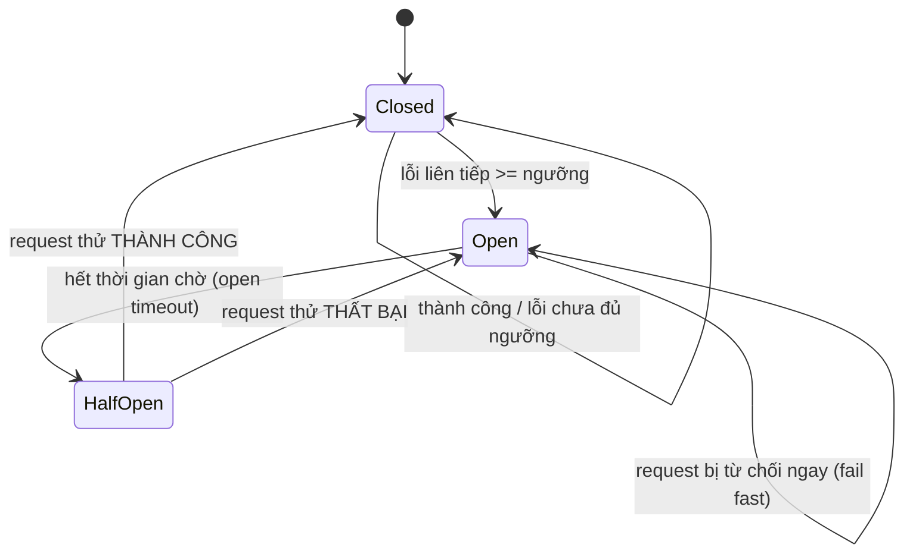

| Trạng thái | Hành vi |
|------------|---------|
| **Closed** (đóng mạch - bình thường) | Request đi qua. Đếm lỗi liên tiếp. |
| **Open** (hở mạch - ngắt) | **Không gọi** downstream, trả lỗi ngay hoặc fallback. Cho downstream thời gian hồi phục. |
| **Half-open** (nửa mở) | Cho **một** request thử đi qua. Thành công → Closed, thất bại → Open lại. |

=== "Go"

    ```go
    package main

    import (
    	"errors"
    	"fmt"
    	"sync"
    )

    type State int

    const (
    	Closed   State = iota // bình thường, cho request đi qua
    	Open                  // "ngắt cầu dao": từ chối ngay, không gọi downstream
    	HalfOpen              // thử lại dè dặt với 1 request
    )

    func (s State) String() string { return [...]string{"CLOSED", "OPEN", "HALF_OPEN"}[s] }

    var ErrOpen = errors.New("circuit open: từ chối nhanh")

    type Breaker struct {
    	mu          sync.Mutex
    	state       State
    	failures    int     // số lỗi LIÊN TIẾP khi đang Closed
    	threshold   int     // bao nhiêu lỗi liên tiếp thì Open
    	openTimeout float64 // Open bao lâu (giây) rồi chuyển HalfOpen
    	openedAt    float64
    	probing     bool // HalfOpen: đã có 1 request thử đang chạy chưa
    }

    func NewBreaker(threshold int, openTimeout float64) *Breaker {
    	return &Breaker{threshold: threshold, openTimeout: openTimeout}
    }

    // Call chạy fn nếu breaker cho phép. `now` truyền từ ngoài để demo lặp lại được;
    // code thật dùng time.Now().
    func (b *Breaker) Call(now float64, fn func() error) error {
    	b.mu.Lock()
    	if b.state == Open && now-b.openedAt >= b.openTimeout {
    		b.state = HalfOpen // hết thời gian chờ -> cho thử 1 request
    	}
    	if b.state == Open || (b.state == HalfOpen && b.probing) {
    		b.mu.Unlock()
    		return ErrOpen
    	}
    	if b.state == HalfOpen {
    		b.probing = true
    	}
    	b.mu.Unlock()

    	err := fn() // KHÔNG giữ lock khi gọi downstream

    	b.mu.Lock()
    	defer b.mu.Unlock()
    	b.probing = false
    	if err != nil {
    		b.failures++
    		if b.state == HalfOpen || b.failures >= b.threshold {
    			b.state, b.openedAt = Open, now
    		}
    		return err
    	}
    	b.state, b.failures = Closed, 0 // thành công -> đóng lại, reset bộ đếm
    	return nil
    }

    func (b *Breaker) State() State {
    	b.mu.Lock()
    	defer b.mu.Unlock()
    	return b.state
    }

    func main() {
    	cb := NewBreaker(3, 5)
    	calls := 0
    	// Downstream "chết" từ t=1 đến t=12
    	payment := func(now float64) func() error {
    		return func() error {
    			calls++
    			if now >= 1 && now < 12 {
    				return errors.New("timeout")
    			}
    			return nil
    		}
    	}
    	for _, t := range []float64{0, 1, 2, 3, 4, 6, 8.5, 10, 13.5, 14} {
    		err := cb.Call(t, payment(t))
    		res := "OK"
    		if err != nil {
    			res = err.Error()
    		}
    		fmt.Printf("t=%4.1fs %-28s -> state=%s\n", t, res, cb.State())
    	}
    	fmt.Println("Số lần thực sự gọi downstream:", calls, "/ 10")
    }
    ```

=== "Python"

    ```python
    import threading
    from enum import Enum


    class State(Enum):
        CLOSED = "CLOSED"        # bình thường
        OPEN = "OPEN"            # từ chối ngay, không gọi downstream
        HALF_OPEN = "HALF_OPEN"  # thử lại dè dặt với 1 request


    class CircuitOpenError(Exception):
        def __str__(self) -> str:
            return "circuit open: từ chối nhanh"


    class CircuitBreaker:
        def __init__(self, threshold: int = 3, open_timeout: float = 5.0):
            self.threshold = threshold
            self.open_timeout = open_timeout
            self.state = State.CLOSED
            self.failures = 0
            self.opened_at = 0.0
            self.probing = False
            self._lock = threading.Lock()

        def call(self, now: float, fn):
            """`now` truyền từ ngoài để demo lặp lại được; code thật dùng time.monotonic()."""
            with self._lock:
                if self.state is State.OPEN and now - self.opened_at >= self.open_timeout:
                    self.state = State.HALF_OPEN
                if self.state is State.OPEN or (self.state is State.HALF_OPEN and self.probing):
                    raise CircuitOpenError()
                if self.state is State.HALF_OPEN:
                    self.probing = True

            try:
                result = fn()  # KHÔNG giữ lock khi gọi downstream
            except Exception:
                with self._lock:
                    self.probing = False
                    self.failures += 1
                    if self.state is State.HALF_OPEN or self.failures >= self.threshold:
                        self.state, self.opened_at = State.OPEN, now
                raise
            with self._lock:
                self.probing = False
                self.state, self.failures = State.CLOSED, 0
            return result


    def main() -> None:
        cb = CircuitBreaker(threshold=3, open_timeout=5)
        calls = 0

        def payment(now: float):
            def do():
                nonlocal calls
                calls += 1
                if 1 <= now < 12:  # downstream "chết" từ t=1 đến t=12
                    raise TimeoutError("timeout")
                return "OK"
            return do

        for t in [0, 1, 2, 3, 4, 6, 8.5, 10, 13.5, 14]:
            try:
                res = cb.call(t, payment(t))
            except Exception as e:
                res = str(e)
            print(f"t={t:4.1f}s {res:<28} -> state={cb.state.value}")
        print("Số lần thực sự gọi downstream:", calls, "/ 10")


    if __name__ == "__main__":
        main()
    ```

**Output** (Go và Python in ra giống hệt nhau):

```text
t= 0.0s OK                           -> state=CLOSED
t= 1.0s timeout                      -> state=CLOSED
t= 2.0s timeout                      -> state=CLOSED
t= 3.0s timeout                      -> state=OPEN
t= 4.0s circuit open: từ chối nhanh  -> state=OPEN
t= 6.0s circuit open: từ chối nhanh  -> state=OPEN
t= 8.5s timeout                      -> state=OPEN
t=10.0s circuit open: từ chối nhanh  -> state=OPEN
t=13.5s OK                           -> state=CLOSED
t=14.0s OK                           -> state=CLOSED
Số lần thực sự gọi downstream: 7 / 10
```

Trong 10 lần gọi, breaker chỉ thực sự gọi downstream **7 lần**; 3 lần còn lại **trả lỗi ngay trong vài micro giây** thay vì chờ timeout. Với tải thật hàng nghìn request/giây, đó là hàng nghìn kết nối **không bị treo**, và service thanh toán có "khoảng thở" để hồi phục.

Khi breaker Open, nên trả gì cho người dùng? → **Fallback**: dữ liệu cache cũ, giá trị mặc định (gợi ý sản phẩm "bán chạy" chung thay vì cá nhân hóa), hoặc thông báo lỗi thân thiện "Thanh toán đang bảo trì, vui lòng thử lại sau 1 phút".

!!! tip "Thư viện production"
    Go: [`sony/gobreaker`](https://github.com/sony/gobreaker), `failsafe-go`. Python: `pybreaker`, `purgatory`. Hoặc để **service mesh** (Istio, Linkerd - [Bài 14](./14-architecture-microservices.md)) làm ở tầng hạ tầng với outlier detection. Breaker thật thường dùng **tỉ lệ lỗi trong cửa sổ trượt** (ví dụ > 50% trong 20 request gần nhất) thay vì lỗi liên tiếp.

### 11.4. Bulkhead - Vách ngăn chống chìm tàu

Tàu thủy chia khoang bằng **vách ngăn (bulkhead)**: thủng một khoang thì nước không tràn sang khoang khác. Trong phần mềm: **cô lập tài nguyên** (connection pool, goroutine/thread pool, semaphore) cho từng downstream.

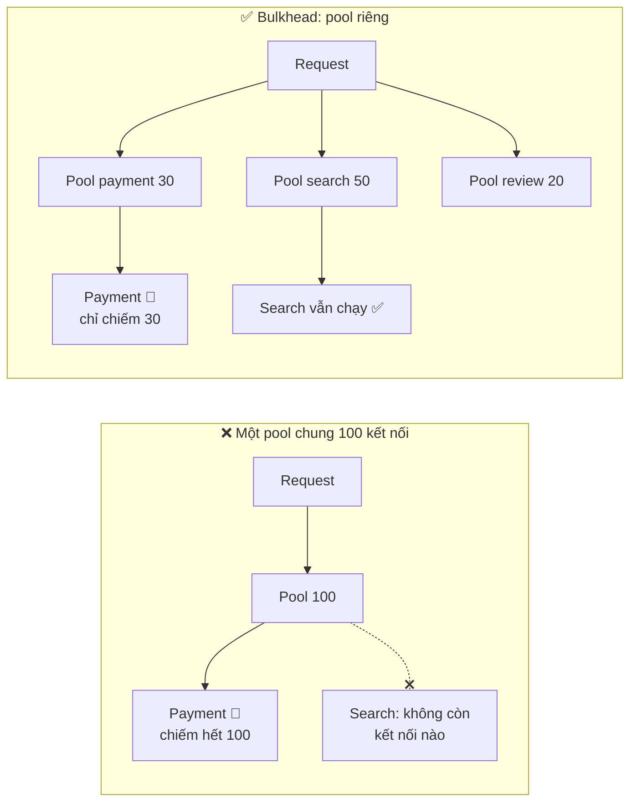

Cài đặt đơn giản nhất là một **semaphore** giới hạn số lời gọi đồng thời tới mỗi downstream:

=== "Go"

    ```go
    // Tối đa 30 lời gọi đồng thời tới payment
    var paymentSem = make(chan struct{}, 30)

    func callPayment(ctx context.Context) error {
    	select {
    	case paymentSem <- struct{}{}: // lấy "vé"
    		defer func() { <-paymentSem }()
    		return doCallPayment(ctx)
    	default:
    		return ErrBulkheadFull // hết vé -> từ chối ngay, không xếp hàng vô hạn
    	}
    }
    ```

=== "Python"

    ```python
    import asyncio

    payment_sem = asyncio.Semaphore(30)  # tối đa 30 lời gọi đồng thời

    async def call_payment():
        if payment_sem.locked():          # hết "vé" -> từ chối ngay
            raise BulkheadFullError()
        async with payment_sem:
            return await do_call_payment()
    ```

### 11.5. Backpressure - "Bớt gửi đi, tôi không kịp xử lý"

**Backpressure** là cơ chế để **bên nhận báo cho bên gửi chậm lại** khi quá tải, thay vì nhận hết rồi chết vì hết RAM.

> 💡 **Ví von**: Quán bún chả đông khách. Không có backpressure = nhận order vô hạn, bếp làm không kịp, khách chờ 2 tiếng rồi bỏ về (nhưng quán vẫn nấu cho họ - phí công). Có backpressure = hết bàn thì **bảo khách chờ ngoài / sang quán khác** ngay từ đầu.

Các hình thức:

| Cơ chế | Ví dụ |
|--------|-------|
| **Hàng đợi có giới hạn** (bounded queue) | Channel Go có buffer; `queue.Queue(maxsize=1000)`; đầy → từ chối hoặc block |
| **Load shedding** (bỏ bớt tải) | Server trả `503` ngay khi đang xử lý > N request, thay vì chậm cho tất cả |
| **Trả về tín hiệu** | HTTP `429`/`503` + `Retry-After`; TCP flow control; gRPC flow control |
| **Pull thay vì push** | Consumer Kafka tự **kéo** message theo tốc độ của mình ([Bài 9](./09-message-queues.md)) |
| **Ưu tiên** | Khi quá tải, bỏ request "phân tích" trước, giữ request "thanh toán" |

!!! warning "Hàng đợi vô hạn là quả bom hẹn giờ"
    Một hàng đợi không giới hạn không làm biến mất quá tải - nó chỉ **che giấu** quá tải cho đến khi hết RAM. Tệ hơn, request nằm trong hàng đợi 30 giây thì khi được xử lý, người dùng đã bỏ đi từ lâu. **Mọi hàng đợi đều phải có giới hạn.**

## 📖 12. Idempotency - Gọi 1 lần hay 10 lần đều như nhau

Một thao tác **idempotent** cho **cùng kết quả** dù thực hiện 1 hay nhiều lần. Đây là điều kiện để **retry an toàn**.

| Method | Idempotent? | Ghi chú |
|--------|-------------|---------|
| `GET`, `HEAD` | ✅ | Chỉ đọc |
| `PUT` | ✅ | "Đặt giá trị thành X" - đặt 2 lần vẫn là X |
| `DELETE` | ✅ | Xóa 2 lần: lần 2 trả 404 nhưng **trạng thái** như nhau |
| `POST` | ❌ | "Tạo mới" - gọi 2 lần tạo 2 đơn hàng! |
| `PATCH` | Tùy | `{"balance": 100}` ✅, `{"balance": "+100"}` ❌ |

**Kịch bản kinh điển**: Lan bấm "Thanh toán 150.000đ". Request đến server, server trừ tiền thành công, nhưng **response bị mất** trên đường về (mạng 4G yếu). App thấy timeout → **retry** → trừ tiền **lần 2**. 😱

**Giải pháp: Idempotency Key** (Stripe, PayPal, Momo đều dùng). Client sinh một UUID cho **mỗi ý định** thanh toán và gửi kèm header `Idempotency-Key`. Server lưu kết quả theo key; lần sau gặp lại key thì **trả kết quả cũ**, không xử lý lại.

```mermaid
sequenceDiagram
    participant App as App (Lan)
    participant API as Payment API
    participant S as Idempotency store (Redis/DB)
    participant Bank as Ngân hàng
    App->>API: POST /payments (Idempotency-Key: abc)
    API->>S: key "abc" có chưa? -> chưa, giữ chỗ
    API->>Bank: trừ 150.000đ
    Bank-->>API: OK
    API->>S: lưu kết quả của "abc"
    API--xApp: 201 Created (MẤT trên đường về)
    Note over App: Timeout -> retry với CÙNG key
    App->>API: POST /payments (Idempotency-Key: abc)
    API->>S: key "abc" có chưa? -> CÓ, kết quả 201
    API-->>App: 201 Created (kết quả cũ, KHÔNG trừ tiền lần 2)
```

=== "Go"

    ```go
    package main

    import (
    	"crypto/sha256"
    	"fmt"
    	"sync"
    )

    type Response struct {
    	Status int
    	Body   string
    }

    type entry struct {
    	reqHash [32]byte // "vân tay" của body để phát hiện dùng lại key cho request khác
    	resp    *Response
    	done    bool
    }

    // PaymentService lưu kết quả theo Idempotency-Key.
    // Production: lưu trong Redis/DB với TTL (ví dụ 24h), không phải map trong RAM.
    type PaymentService struct {
    	mu      sync.Mutex
    	keys    map[string]*entry
    	charged int // số tiền thực sự đã trừ
    }

    func (s *PaymentService) Charge(idemKey, body string, amount int) Response {
    	h := sha256.Sum256([]byte(body))
    	s.mu.Lock()
    	if e, ok := s.keys[idemKey]; ok {
    		s.mu.Unlock()
    		switch {
    		case e.reqHash != h:
    			return Response{422, "Idempotency-Key đã dùng cho request khác"}
    		case !e.done:
    			return Response{409, "request trước với key này đang xử lý"}
    		default:
    			return *e.resp // trả lại ĐÚNG kết quả cũ, không trừ tiền lần 2
    		}
    	}
    	e := &entry{reqHash: h}
    	s.keys[idemKey] = e // "giữ chỗ" trước khi xử lý
    	s.mu.Unlock()

    	// ... gọi cổng thanh toán, ghi DB (không giữ lock khi gọi mạng) ...
    	resp := &Response{201, fmt.Sprintf("đã thanh toán %d đ", amount)}

    	s.mu.Lock()
    	s.charged += amount
    	e.resp, e.done = resp, true
    	s.mu.Unlock()
    	return *resp
    }

    func main() {
    	svc := &PaymentService{keys: map[string]*entry{}}
    	body := `{"order_id": 42, "amount": 150000}`

    	fmt.Println("Lần 1   :", svc.Charge("key-abc", body, 150000))
    	// Client bị timeout, không biết đã trừ tiền chưa -> gửi lại CÙNG key
    	fmt.Println("Retry   :", svc.Charge("key-abc", body, 150000))
    	fmt.Println("Retry   :", svc.Charge("key-abc", body, 150000))
    	fmt.Println("Sai body:", svc.Charge("key-abc", `{"order_id": 43}`, 99000))
    	fmt.Println("Tổng tiền đã trừ:", svc.charged)
    }
    ```

    **Output:**

    ```text
    Lần 1   : {201 đã thanh toán 150000 đ}
    Retry   : {201 đã thanh toán 150000 đ}
    Retry   : {201 đã thanh toán 150000 đ}
    Sai body: {422 Idempotency-Key đã dùng cho request khác}
    Tổng tiền đã trừ: 150000
    ```

=== "Python"

    ```python
    import hashlib
    import threading
    from dataclasses import dataclass


    @dataclass
    class Response:
        status: int
        body: str


    @dataclass
    class Entry:
        req_hash: bytes            # "vân tay" của body
        resp: Response | None = None
        done: bool = False


    class PaymentService:
        """Lưu kết quả theo Idempotency-Key.
        Production: Redis/DB với TTL (ví dụ 24h), không phải dict trong RAM."""

        def __init__(self):
            self.keys: dict[str, Entry] = {}
            self.charged = 0
            self._lock = threading.Lock()

        def charge(self, idem_key: str, body: str, amount: int) -> Response:
            h = hashlib.sha256(body.encode()).digest()
            with self._lock:
                e = self.keys.get(idem_key)
                if e is not None:
                    if e.req_hash != h:
                        return Response(422, "Idempotency-Key đã dùng cho request khác")
                    if not e.done:
                        return Response(409, "request trước với key này đang xử lý")
                    return e.resp               # trả lại ĐÚNG kết quả cũ
                e = Entry(req_hash=h)
                self.keys[idem_key] = e         # "giữ chỗ" trước khi xử lý

            # ... gọi cổng thanh toán, ghi DB (không giữ lock khi gọi mạng) ...
            resp = Response(201, f"đã thanh toán {amount} đ")
            with self._lock:
                self.charged += amount
                e.resp, e.done = resp, True
            return resp


    if __name__ == "__main__":
        svc = PaymentService()
        body = '{"order_id": 42, "amount": 150000}'
        print("Lần 1   :", svc.charge("key-abc", body, 150000))
        print("Retry   :", svc.charge("key-abc", body, 150000))
        print("Retry   :", svc.charge("key-abc", body, 150000))
        print("Sai body:", svc.charge("key-abc", '{"order_id": 43}', 99000))
        print("Tổng tiền đã trừ:", svc.charged)
    ```

    **Output:**

    ```text
    Lần 1   : Response(status=201, body='đã thanh toán 150000 đ')
    Retry   : Response(status=201, body='đã thanh toán 150000 đ')
    Retry   : Response(status=201, body='đã thanh toán 150000 đ')
    Sai body: Response(status=422, body='Idempotency-Key đã dùng cho request khác')
    Tổng tiền đã trừ: 150000
    ```

Các chi tiết quan trọng:

- **Giữ chỗ trước khi xử lý** (trạng thái "đang xử lý") để hai request trùng key đến **cùng lúc** không cùng chạy. Trong DB, dùng `INSERT ... ON CONFLICT DO NOTHING` hoặc unique constraint; trong Redis dùng `SET key value NX EX 86400`.
- **So "vân tay" body**: cùng key nhưng khác nội dung = lỗi của client → `422`.
- **TTL**: giữ key 24h-7 ngày, không cần mãi mãi.
- Với consumer của message queue, idempotency còn quan trọng hơn vì hầu hết queue giao **at-least-once** ([Bài 9](./09-message-queues.md)).

## 📖 13. Sinh ID duy nhất trong hệ phân tán

`AUTO_INCREMENT` của một database đơn là cách dễ nhất. Nhưng khi có **nhiều shard, nhiều datacenter**, hoặc muốn **tạo ID ở client** trước khi ghi DB, bạn cần cách khác.

| Cách | Kích thước | Sắp xếp theo thời gian? | Cần phối hợp? | Nhược điểm |
|------|-----------|--------------------------|---------------|------------|
| **Auto-increment** | 64 bit | ✅ | ✅ Một DB trung tâm | SPOF, lộ số lượng ("đơn hàng #1053" → đối thủ biết bạn có ~1000 đơn), khó shard |
| **UUID v4** | 128 bit | ❌ Hoàn toàn ngẫu nhiên | ❌ | Làm **B-tree index phân mảnh** (insert vào vị trí ngẫu nhiên), dài |
| **UUID v7** (RFC 9562, 2024) | 128 bit | ✅ 48 bit đầu là Unix ms | ❌ | Dài hơn 64 bit, lộ thời điểm tạo |
| **ULID** | 128 bit | ✅ | ❌ | Tương tự UUIDv7, biểu diễn Crockford base32 |
| **Snowflake** (Twitter) | **64 bit** | ✅ | Cần cấp **machine ID** duy nhất | Phụ thuộc đồng hồ, giới hạn 1024 máy × 4096 ID/ms |
| **Ticket server** (Flickr) | 64 bit | ✅ | ✅ DB chuyên cấp ID | Thêm một thành phần |

### 13.1. Cấu trúc Snowflake ID

```mermaid
flowchart LR
    S["1 bit<br/>dấu = 0"] --- T["41 bit timestamp<br/>ms kể từ epoch riêng<br/>≈ 69 năm"] --- M["10 bit machine ID<br/>1024 máy"] --- Q["12 bit sequence<br/>4096 ID / ms / máy"]
```

- **41 bit** thời gian: 2^41 ms ≈ **69 năm** kể từ epoch bạn chọn (ví dụ 2020-01-01)
- **10 bit** máy: tối đa 1024 máy sinh ID (cấp qua config, ZooKeeper/etcd, hoặc từ số thứ tự Pod StatefulSet)
- **12 bit** sequence: mỗi máy sinh được **4096 ID mỗi mili giây** ≈ 4 triệu ID/giây
- ID là số 64-bit **tăng dần theo thời gian** → index B-tree rất thân thiện, sắp xếp theo ID ≈ sắp xếp theo thời gian tạo

### 13.2. Cài đặt Snowflake và UUID v7

=== "Go"

    ```go
    package main

    import (
    	"crypto/rand"
    	"encoding/binary"
    	"errors"
    	"fmt"
    	"sort"
    	"sync"
    	"time"
    )

    // ================= Snowflake =================
    // | 1 bit dấu (=0) | 41 bit timestamp (ms) | 10 bit machine | 12 bit sequence |
    const (
    	epoch       int64 = 1577836800000 // 2020-01-01T00:00:00Z (ms) - epoch riêng
    	machineBits       = 10
    	seqBits           = 12
    	maxMachine        = 1<<machineBits - 1 // 1023
    	maxSeq            = 1<<seqBits - 1     // 4095
    )

    var ErrClockBackwards = errors.New("đồng hồ bị lùi - từ chối sinh ID")

    type Snowflake struct {
    	mu        sync.Mutex
    	machineID int64
    	lastMs    int64
    	seq       int64
    	now       func() int64 // trả về Unix ms - inject được để test
    }

    func NewSnowflake(machineID int64, now func() int64) (*Snowflake, error) {
    	if machineID < 0 || machineID > maxMachine {
    		return nil, fmt.Errorf("machineID phải trong [0, %d]", maxMachine)
    	}
    	return &Snowflake{machineID: machineID, now: now, lastMs: -1}, nil
    }

    func (s *Snowflake) Next() (int64, error) {
    	s.mu.Lock()
    	defer s.mu.Unlock()
    	ms := s.now()
    	switch {
    	case ms < s.lastMs:
    		return 0, ErrClockBackwards
    	case ms == s.lastMs:
    		s.seq = (s.seq + 1) & maxSeq
    		if s.seq == 0 { // hết 4096 ID trong 1ms -> chờ sang ms kế tiếp
    			for ms <= s.lastMs {
    				ms = s.now()
    			}
    		}
    	default:
    		s.seq = 0
    	}
    	s.lastMs = ms
    	return (ms-epoch)<<(machineBits+seqBits) | s.machineID<<seqBits | s.seq, nil
    }

    func Decompose(id int64) (time.Time, int64, int64) {
    	ms := id>>(machineBits+seqBits) + epoch
    	machine := id >> seqBits & maxMachine
    	seq := id & maxSeq
    	return time.UnixMilli(ms).UTC(), machine, seq
    }

    // ================= UUID v7 =================
    // 48 bit Unix ms | 4 bit version (7) | 12 bit random | 2 bit variant | 62 bit random
    func UUIDv7(ms int64) string {
    	var b [16]byte
    	_, _ = rand.Read(b[6:]) // crypto/rand không bao giờ trả lỗi trên Go 1.24+
    	var ts [8]byte
    	binary.BigEndian.PutUint64(ts[:], uint64(ms))
    	copy(b[0:6], ts[2:8])   // 48 bit thấp của timestamp
    	b[6] = b[6]&0x0F | 0x70 // version 7
    	b[8] = b[8]&0x3F | 0x80 // variant RFC 9562 (10xx)
    	return fmt.Sprintf("%x-%x-%x-%x-%x", b[0:4], b[4:6], b[6:8], b[8:10], b[10:16])
    }

    func main() {
    	// 1) Đồng hồ giả cố định -> output lặp lại được
    	fixed := time.Date(2026, 9, 26, 8, 0, 0, 0, time.UTC).UnixMilli()
    	clock := fixed
    	sf, _ := NewSnowflake(7, func() int64 { return clock })
    	for i := 0; i < 3; i++ {
    		id, _ := sf.Next()
    		fmt.Println("ID:", id)
    	}
    	clock++ // sang mili giây tiếp theo
    	id, _ := sf.Next()
    	t, m, seq := Decompose(id)
    	fmt.Printf("ID: %d -> time=%s machine=%d seq=%d\n", id, t.Format(time.RFC3339Nano), m, seq)

    	clock -= 5 // NTP chỉnh đồng hồ lùi 5ms
    	_, err := sf.Next()
    	fmt.Println("Đồng hồ lùi:", err)

    	// 2) Đồng hồ thật: sinh 100k ID liên tục
    	live, _ := NewSnowflake(1, func() int64 { return time.Now().UnixMilli() })
    	ids := make([]int64, 100_000)
    	for i := range ids {
    		ids[i], _ = live.Next()
    	}
    	uniq := map[int64]bool{}
    	for _, v := range ids {
    		uniq[v] = true
    	}
    	fmt.Printf("Sinh %d ID: %d ID khác nhau, tăng dần: %v\n",
    		len(ids), len(uniq), sort.SliceIsSorted(ids, func(i, j int) bool { return ids[i] < ids[j] }))

    	// 3) UUID v7: sắp xếp theo chuỗi == sắp xếp theo thời gian
    	var uuids []string
    	for i := int64(0); i < 3; i++ {
    		uuids = append(uuids, UUIDv7(fixed+i))
    	}
    	for _, u := range uuids {
    		fmt.Println("UUIDv7:", u, "| version:", string(u[14]))
    	}
    	fmt.Println("Chuỗi UUIDv7 đã sắp xếp đúng thứ tự thời gian:", sort.StringsAreSorted(uuids))
    }
    ```

    **Output:**

    ```text
    ID: 891594945331228672
    ID: 891594945331228673
    ID: 891594945331228674
    ID: 891594945335422976 -> time=2026-09-26T08:00:00.001Z machine=7 seq=0
    Đồng hồ lùi: đồng hồ bị lùi - từ chối sinh ID
    Sinh 100000 ID: 100000 ID khác nhau, tăng dần: true
    UUIDv7: 01a0dcba-6c00-7678-81a5-00a977088a57 | version: 7
    UUIDv7: 01a0dcba-6c01-7087-95aa-48349da65c11 | version: 7
    UUIDv7: 01a0dcba-6c02-726b-b893-dfa2de1588d4 | version: 7
    Chuỗi UUIDv7 đã sắp xếp đúng thứ tự thời gian: true
    ```

=== "Python"

    ```python
    import os
    import threading
    import time
    import uuid
    from datetime import datetime, timezone

    # | 1 bit dấu | 41 bit timestamp (ms) | 10 bit machine | 12 bit sequence |
    EPOCH = 1577836800000  # 2020-01-01T00:00:00Z (ms)
    MACHINE_BITS, SEQ_BITS = 10, 12
    MAX_MACHINE, MAX_SEQ = (1 << MACHINE_BITS) - 1, (1 << SEQ_BITS) - 1


    class ClockBackwardsError(Exception):
        pass


    class Snowflake:
        def __init__(self, machine_id: int, now=lambda: time.time_ns() // 1_000_000):
            if not 0 <= machine_id <= MAX_MACHINE:
                raise ValueError(f"machine_id phải trong [0, {MAX_MACHINE}]")
            self.machine_id = machine_id
            self.now = now          # hàm trả về Unix ms - inject được để test
            self.last_ms = -1
            self.seq = 0
            self._lock = threading.Lock()

        def next(self) -> int:
            with self._lock:
                ms = self.now()
                if ms < self.last_ms:
                    raise ClockBackwardsError("đồng hồ bị lùi - từ chối sinh ID")
                if ms == self.last_ms:
                    self.seq = (self.seq + 1) & MAX_SEQ
                    if self.seq == 0:            # hết 4096 ID trong 1ms -> chờ ms kế
                        while ms <= self.last_ms:
                            ms = self.now()
                else:
                    self.seq = 0
                self.last_ms = ms
                return ((ms - EPOCH) << (MACHINE_BITS + SEQ_BITS)) | (self.machine_id << SEQ_BITS) | self.seq


    def decompose(id_: int):
        ms = (id_ >> (MACHINE_BITS + SEQ_BITS)) + EPOCH
        return (datetime.fromtimestamp(ms / 1000, tz=timezone.utc),
                (id_ >> SEQ_BITS) & MAX_MACHINE, id_ & MAX_SEQ)


    def uuid7(ms: int) -> uuid.UUID:
        """UUID v7 (RFC 9562). Python 3.14+ đã có sẵn uuid.uuid7()."""
        b = bytearray(ms.to_bytes(6, "big") + os.urandom(10))
        b[6] = (b[6] & 0x0F) | 0x70   # version 7
        b[8] = (b[8] & 0x3F) | 0x80   # variant 10xx
        return uuid.UUID(bytes=bytes(b))


    def main() -> None:
        fixed = int(datetime(2026, 9, 26, 8, 0, tzinfo=timezone.utc).timestamp() * 1000)
        clock = [fixed]
        sf = Snowflake(7, now=lambda: clock[0])
        for _ in range(3):
            print("ID:", sf.next())
        clock[0] += 1
        id_ = sf.next()
        t, m, seq = decompose(id_)
        print(f"ID: {id_} -> time={t.isoformat(timespec='milliseconds')} machine={m} seq={seq}")

        clock[0] -= 5
        try:
            sf.next()
        except ClockBackwardsError as e:
            print("Đồng hồ lùi:", e)

        live = Snowflake(1)
        ids = [live.next() for _ in range(100_000)]
        print(f"Sinh {len(ids)} ID: {len(set(ids))} ID khác nhau, tăng dần: {ids == sorted(ids)}")

        uuids = [str(uuid7(fixed + i)) for i in range(3)]
        for u in uuids:
            print("UUIDv7:", u, "| version:", uuid.UUID(u).version)
        print("Chuỗi UUIDv7 đã sắp xếp đúng thứ tự thời gian:", uuids == sorted(uuids))


    if __name__ == "__main__":
        main()
    ```

    **Output:**

    ```text
    ID: 891594945331228672
    ID: 891594945331228673
    ID: 891594945331228674
    ID: 891594945335422976 -> time=2026-09-26T08:00:00.001+00:00 machine=7 seq=0
    Đồng hồ lùi: đồng hồ bị lùi - từ chối sinh ID
    Sinh 100000 ID: 100000 ID khác nhau, tăng dần: True
    UUIDv7: 01a0dcba-6c00-7ca9-b938-72dd47c303bb | version: 7
    UUIDv7: 01a0dcba-6c01-7f7c-aef3-2ffb20e500cf | version: 7
    UUIDv7: 01a0dcba-6c02-752d-b8a7-8f9d041dd318 | version: 7
    Chuỗi UUIDv7 đã sắp xếp đúng thứ tự thời gian: True
    ```

> 📝 Các dòng `UUIDv7:` chứa 74 bit ngẫu nhiên nên **sẽ khác** mỗi lần bạn chạy; phần đầu `01a0dcba-6c0x` là timestamp nên giống nhau và tăng dần. Các ID Snowflake dùng đồng hồ giả nên lặp lại chính xác.

Hai điểm "bẫy" đã xử lý trong code:

1. **Đồng hồ lùi** (NTP chỉnh giờ): nếu cứ sinh ID thì có thể **trùng** ID đã sinh trước đó → từ chối (hoặc chờ đến khi đồng hồ vượt `lastMs`).
2. **Hết sequence trong 1 ms**: chờ sang mili giây kế tiếp.

!!! tip "Nên chọn gì?"
    - Ứng dụng thông thường, một database: **`BIGSERIAL`/auto-increment** nội bộ + **UUID v7** hoặc mã ngẫu nhiên làm ID công khai.
    - Cần ID tạo ở client / nhiều service / nhiều DB: **UUID v7** (Go: `github.com/google/uuid` có `uuid.NewV7()`; Python 3.14+: `uuid.uuid7()`; PostgreSQL 18: `uuidv7()`).
    - Cần ID 64-bit gọn, thứ tự thời gian, throughput cực cao: **Snowflake** (Discord, Instagram dùng biến thể).

## 📖 14. Case study 1: Thiết kế dịch vụ rút gọn link (như bit.ly)

### 14.1. Yêu cầu

- **Functional**: tạo link ngắn từ link dài; truy cập link ngắn → chuyển hướng đến link dài; custom alias (tùy chọn); link hết hạn; thống kê lượt click
- **Non-functional**: 100 triệu link mới/ngày; đọc:ghi = 10:1; redirect p99 < 50ms; availability 99,99%; link ngắn **không đoán được** thứ tự (tùy yêu cầu)

Ước lượng đã làm ở mục 2.2: **~1.200 ghi/s, ~12.000 đọc/s, 91 TB trong 5 năm, 7 ký tự base62, ~100 GB cache**.

### 14.2. API

```text
POST /api/v1/urls
  body: {"long_url": "https://shopee.vn/...", "alias": "sale1111", "expires_at": "2026-12-31"}
  -> 201 {"code": "aZ3kP9x", "short_url": "https://s.vn/aZ3kP9x"}

GET /{code}
  -> 302 Found, Location: https://shopee.vn/...
  -> 404 nếu không tồn tại / 410 Gone nếu hết hạn
```

**301 hay 302?**

| | 301 Moved Permanently | 302 Found |
|---|---|---|
| Trình duyệt cache? | ✅ Lần sau **không gọi server** | ❌ Mỗi lần đều hỏi server |
| Tải server | Thấp hơn | Cao hơn |
| Thống kê click | ❌ Mất (trình duyệt tự redirect) | ✅ Đếm được mọi click |
| Đổi đích sau này | ❌ Khó (đã cache) | ✅ |

→ Dịch vụ cần **analytics** (bit.ly) dùng **302**.

### 14.3. Data model

```mermaid
erDiagram
    URLS {
        bigint id PK "Snowflake hoặc từ bộ đếm"
        varchar code UK "7 ký tự base62"
        text long_url
        bigint user_id "nullable"
        timestamp created_at
        timestamp expires_at "nullable"
    }
    CLICKS {
        varchar code
        timestamp clicked_at
        varchar country
        varchar referrer
    }
    URLS ||--o{ CLICKS : "được click"
```

Truy vấn chính là **tra `code → long_url`**, không có JOIN phức tạp → key-value/wide-column (DynamoDB, Cassandra) hoặc PostgreSQL shard theo `code` đều được. Bảng `CLICKS` ghi cực nhiều → đẩy vào **Kafka** rồi ghi vào kho phân tích (ClickHouse), **không** ghi trực tiếp vào DB chính.

### 14.4. Sinh mã rút gọn - Deep dive

| Cách | Ý tưởng | Ưu | Nhược |
|------|---------|-----|-------|
| **Hash + cắt** | `base62(md5(long_url))[:7]` | Cùng URL → cùng mã | **Va chạm** (2 URL cùng 7 ký tự đầu) → phải kiểm tra DB và thử lại |
| **Bộ đếm + base62** | ID tăng dần → base62 | Không bao giờ va chạm | Mã **đoán được** (`aZ3kP9x` → `aZ3kP9y`); bộ đếm là SPOF |
| **Cấp dải ID** (range allocation) | Mỗi server xin trước dải 1.000.000 ID từ ZooKeeper/DB | Không va chạm, không SPOF mỗi request | Mất vài ID khi server chết (chấp nhận được) |
| **Ngẫu nhiên + kiểm tra** | Sinh 7 ký tự ngẫu nhiên, `INSERT` với unique constraint, trùng thì thử lại | Không đoán được | Cần kiểm tra DB mỗi lần (tỉ lệ trùng rất thấp khi không gian 3.500 tỷ) |

Mã hóa base62 (0-9, a-z, A-Z - an toàn trong URL, không cần escape):

=== "Go"

    ```go
    package main

    import (
    	"fmt"
    	"strings"
    )

    const alphabet = "0123456789abcdefghijklmnopqrstuvwxyzABCDEFGHIJKLMNOPQRSTUVWXYZ"

    func Encode(n uint64) string {
    	if n == 0 {
    		return "0"
    	}
    	var sb []byte
    	for n > 0 {
    		sb = append(sb, alphabet[n%62])
    		n /= 62
    	}
    	for i, j := 0, len(sb)-1; i < j; i, j = i+1, j-1 { // đảo ngược
    		sb[i], sb[j] = sb[j], sb[i]
    	}
    	return string(sb)
    }

    func Decode(s string) (uint64, error) {
    	var n uint64
    	for _, c := range s {
    		i := strings.IndexRune(alphabet, c)
    		if i < 0 {
    			return 0, fmt.Errorf("ký tự không hợp lệ: %q", c)
    		}
    		n = n*62 + uint64(i)
    	}
    	return n, nil
    }

    func main() {
    	for _, id := range []uint64{0, 61, 62, 125, 1_000_000, 3_521_614_606_207} {
    		code := Encode(id)
    		back, _ := Decode(code)
    		fmt.Printf("%16d -> %-10q -> %d\n", id, code, back)
    	}
    	_, err := Decode("abc-1")
    	fmt.Println(err)
    }
    ```

    **Output:**

    ```text
                   0 -> "0"        -> 0
                  61 -> "Z"        -> 61
                  62 -> "10"       -> 62
                 125 -> "21"       -> 125
             1000000 -> "4c92"     -> 1000000
       3521614606207 -> "ZZZZZZZ"  -> 3521614606207
    ký tự không hợp lệ: '-'
    ```

=== "Python"

    ```python
    ALPHABET = "0123456789abcdefghijklmnopqrstuvwxyzABCDEFGHIJKLMNOPQRSTUVWXYZ"
    INDEX = {c: i for i, c in enumerate(ALPHABET)}


    def encode(n: int) -> str:
        if n == 0:
            return "0"
        out = []
        while n > 0:
            n, r = divmod(n, 62)
            out.append(ALPHABET[r])
        return "".join(reversed(out))


    def decode(s: str) -> int:
        n = 0
        for c in s:
            if c not in INDEX:
                raise ValueError(f"ký tự không hợp lệ: {c!r}")
            n = n * 62 + INDEX[c]
        return n


    if __name__ == "__main__":
        for id_ in [0, 61, 62, 125, 1_000_000, 3_521_614_606_207]:
            code = encode(id_)
            print(f"{id_:16d} -> {code!r:<10} -> {decode(code)}")
        try:
            decode("abc-1")
        except ValueError as e:
            print(e)
    ```

    **Output:**

    ```text
                   0 -> '0'        -> 0
                  61 -> 'Z'        -> 61
                  62 -> '10'       -> 62
                 125 -> '21'       -> 125
             1000000 -> '4c92'     -> 1000000
       3521614606207 -> 'ZZZZZZZ'  -> 3521614606207
    ký tự không hợp lệ: '-'
    ```

`ZZZZZZZ` = 62^7 − 1 ≈ **3.521 tỷ** → đủ cho 182,5 tỷ link trong 5 năm (dư ~19 lần).

### 14.5. High-level design

```mermaid
flowchart TB
    U["Người dùng"] --> CDN["CDN / Edge<br/>(cache redirect phổ biến)"]
    CDN --> LB["Load Balancer"]
    LB --> W["Write service<br/>(tạo link)"]
    LB --> R["Redirect service<br/>(đọc - 90% tải)"]
    W --> IDG["ID generator<br/>(cấp dải ID)"]
    W --> DB[("DB shard theo code<br/>Cassandra / Postgres")]
    R --> C[("Redis cache<br/>code -> long_url")]
    R -->|"cache miss"| DB
    R -->|"sự kiện click<br/>(async)"| K["Kafka"]
    K --> A["Analytics worker"] --> CH[("ClickHouse")]
```

```mermaid
sequenceDiagram
    participant U as Trình duyệt
    participant R as Redirect service
    participant C as Redis
    participant D as Database
    participant K as Kafka
    U->>R: GET /aZ3kP9x
    R->>C: GET url:aZ3kP9x
    alt Cache hit (~95%)
        C-->>R: https://shopee.vn/...
    else Cache miss
        C-->>R: nil
        R->>D: SELECT long_url WHERE code='aZ3kP9x'
        D-->>R: https://shopee.vn/...
        R->>C: SET url:aZ3kP9x ... EX 86400
    end
    R--)K: click event (không chờ)
    R-->>U: 302 Location: https://shopee.vn/...
```

### 14.6. Bottleneck & mở rộng

- **Hot link** (link khuyến mãi 11/11 được click hàng triệu lần/phút): cache ở CDN edge + local in-memory cache vài giây
- **Link độc hại** (lừa đảo): quét bằng Google Safe Browsing khi tạo, rate limit tạo link theo user/IP
- **Hết hạn**: không cần xóa ngay - kiểm tra `expires_at` khi đọc, job dọn dẹp chạy nền
- **Custom alias trùng**: unique constraint trên `code`

## 📖 15. Case study 2: News feed (như Facebook, Instagram)

### 15.1. Yêu cầu

- Người dùng đăng bài; xem **feed** gồm bài của những người mình theo dõi, mới nhất trước
- 10 triệu DAU, mỗi người mở feed ~5 lần/ngày → ~580 lần đọc feed/giây trung bình (peak ~2.000); đăng ~2 bài/ngày → ~230 bài/giây
- Feed tải < 200ms. Chấp nhận bài mới xuất hiện trễ vài giây (**eventual consistency**)

### 15.2. Fan-out on write vs fan-out on read

Câu hỏi cốt lõi: **khi nào** ghép feed?

```mermaid
flowchart TB
    subgraph W["Fan-out on WRITE (push)"]
        direction LR
        P1["Lan đăng bài"] --> FW["Fan-out worker"]
        FW --> F1["Feed của bạn 1<br/>(Redis list)"]
        FW --> F2["Feed của bạn 2"]
        FW --> F3["... 500 người theo dõi"]
        F1 --> RD1["Đọc feed:<br/>chỉ 1 lệnh LRANGE ⚡"]
    end
    subgraph R["Fan-out on READ (pull)"]
        direction LR
        RQ["Minh mở feed"] --> Q1["Lấy 300 người<br/>Minh theo dõi"]
        Q1 --> Q2["Lấy bài mới của<br/>từng người"]
        Q2 --> Q3["Merge + sort<br/>(chậm 🐢)"]
    end
```

| | Fan-out on write (push) | Fan-out on read (pull) |
|---|---|---|
| Khi đăng bài | Ghi post_id vào feed của **mọi follower** | Chỉ lưu bài |
| Khi đọc feed | Cực nhanh - feed đã có sẵn | Chậm - phải gom từ N người |
| Tốn | Ghi & bộ nhớ (nhiều bản sao) | CPU lúc đọc |
| Vấn đề | **Celebrity**: Sơn Tùng có 10 triệu follower → 1 bài = 10 triệu lần ghi | User theo dõi nhiều người → đọc rất chậm |
| Lãng phí | Ghi feed cho cả user **không bao giờ đăng nhập** | Không |

### 15.3. Giải pháp lai (hybrid) - cách Facebook/Twitter làm

- User **thường** (< 10.000 follower): **push** - fan-out ghi vào feed cache của follower
- **Celebrity**: **pull** - khi user mở feed, lấy feed đã push sẵn + **gộp** bài mới của các celebrity mà user theo dõi
- Chỉ push cho follower **đã hoạt động** trong 30 ngày gần đây

```mermaid
flowchart TB
    subgraph Write["Luồng đăng bài"]
        A["Client"] --> PS["Post service"]
        PS --> PDB[("Posts DB")]
        PS --> MQ["Queue: post_created"]
        MQ --> FO["Fan-out workers"]
        FO --> G[("Graph DB / bảng follows")]
        FO -->|"chỉ user thường,<br/>follower active"| FC[("Feed cache<br/>Redis: feed:user_id<br/>= list post_id")]
    end
    subgraph Read["Luồng đọc feed"]
        B["Client"] --> FS["Feed service"]
        FS --> FC
        FS -->|"bài mới của<br/>celebrity đang follow"| PDB
        FS --> HY["Hydrate: lấy nội dung bài,<br/>tác giả, số like<br/>(từ cache)"]
        HY --> RK["Xếp hạng<br/>(thời gian hoặc ML)"]
    end
```

Chi tiết thiết kế:

- Feed cache chỉ lưu **ID bài** (8 byte), không lưu nội dung → 500 bài × 8 byte × 10 triệu user ≈ **40 GB** - vừa với cụm Redis
- Chỉ giữ 500-1000 bài gần nhất mỗi feed (`LTRIM`); cuộn xa hơn thì query DB
- **Phân trang bằng cursor** (`?before=<post_id>`), không dùng offset ([Bài 3](./03-api-design.md))
- "Hydrate" (lấy nội dung, avatar, số like) từ cache theo lô (`MGET`)

## 📖 16. Case study 3: Ứng dụng chat (như Zalo, Messenger)

### 16.1. Yêu cầu

- Chat 1-1 và nhóm (≤ 500 người), trạng thái **online/last seen**, **đã nhận / đã xem**, lịch sử tin nhắn, đồng bộ nhiều thiết bị
- 50 triệu DAU, mỗi người gửi 40 tin/ngày → 2 tỷ tin/ngày ≈ **23.000 tin/giây** (peak ~70.000)
- Tin nhắn đến trong < 500ms, **không mất tin**, **đúng thứ tự** trong một cuộc trò chuyện

### 16.2. Tại sao WebSocket?

HTTP là **request-response**: server không thể tự "đẩy" tin nhắn cho client. Các lựa chọn:

| Kỹ thuật | Cách làm | Nhược |
|----------|----------|-------|
| **Short polling** | Client hỏi mỗi 2 giây "có tin mới không?" | Lãng phí, trễ |
| **Long polling** | Client hỏi, server **giữ** request đến khi có tin hoặc timeout | Tốn kết nối, phức tạp |
| **Server-Sent Events** | Server đẩy một chiều qua HTTP | Chỉ một chiều |
| **WebSocket** ✅ | Kết nối TCP **hai chiều, lâu dài** sau một lần "nâng cấp" HTTP | Stateful → khó scale hơn |

```mermaid
sequenceDiagram
    participant C as App Lan
    participant G as Chat gateway
    C->>G: GET /ws (Upgrade: websocket)
    G-->>C: 101 Switching Protocols
    Note over C,G: Kết nối mở suốt phiên, hai bên gửi bất cứ lúc nào
    C->>G: {"type":"msg","to":"conv_9","text":"Ăn trưa không?"}
    G-->>C: {"type":"ack","client_id":"c1","msg_id":7781}
    G-->>C: {"type":"msg","from":"minh","text":"Ok 12h nhé"}
    C->>G: ping (heartbeat mỗi 30s)
    G-->>C: pong
```

### 16.3. Kiến trúc

Vấn đề chính: Lan kết nối vào **gateway 1**, Minh kết nối vào **gateway 7**. Làm sao tin của Lan đến được Minh?

```mermaid
flowchart TB
    Lan["📱 Lan"] <-->|"WebSocket"| G1["Chat gateway 1"]
    Minh["📱 Minh"] <-->|"WebSocket"| G7["Chat gateway 7"]
    G1 --> CS["Chat service"]
    CS --> ID["ID generator<br/>(thứ tự theo conversation)"]
    CS --> MDB[("Message store<br/>Cassandra<br/>partition = conversation_id")]
    CS --> SR[("Session registry<br/>Redis: user -> gateway")]
    CS -->|"Minh online ở gateway 7"| PUB["Pub/Sub<br/>(Redis / Kafka / NATS)"]
    PUB --> G7
    CS -->|"Minh offline"| PN["Notification service<br/>(push APNs/FCM)"]
    G1 & G7 --> PR["Presence service"]
```

Luồng gửi tin:

1. Lan gửi tin qua WebSocket đến gateway 1 kèm `client_msg_id` (để chống trùng khi gửi lại)
2. Chat service **lưu vào DB trước** (không mất tin), gán `msg_id` tăng dần **trong conversation** → đảm bảo thứ tự
3. Trả **ACK** cho Lan (hiện 1 dấu tích ✓ "đã gửi")
4. Tra session registry: Minh đang ở gateway nào? → publish vào kênh của gateway 7
5. Gateway 7 đẩy tin xuống Minh; app Minh gửi ACK "đã nhận" → Lan thấy ✓✓
6. Minh offline → gửi **push notification**; khi Minh online lại, app gửi `last_msg_id` đã có để **đồng bộ** tin còn thiếu

### 16.4. Presence (online / last seen)

- Client gửi **heartbeat** mỗi 30 giây; presence service lưu `last_seen:user_id` trong Redis với TTL 60s
- Không có heartbeat quá 60s → coi là offline (tránh "online" giả khi mất mạng đột ngột mà không đóng kết nối)
- **Không** broadcast trạng thái cho mọi bạn bè mỗi lần thay đổi (Sơn Tùng online → 5 triệu sự kiện!). Chỉ gửi cho những người **đang mở cuộc trò chuyện** với họ, hoặc client tự hỏi theo lô khi mở danh sách bạn

```mermaid
stateDiagram-v2
    [*] --> Online: kết nối WebSocket
    Online --> Online: heartbeat (gia hạn TTL 60s)
    Online --> Away: không hoạt động 5 phút
    Away --> Online: có thao tác
    Online --> Offline: đóng kết nối / TTL hết hạn
    Away --> Offline: TTL hết hạn
    Offline --> Online: kết nối lại
```

### 16.5. Scale gateway WebSocket

- Mỗi kết nối WebSocket là **stateful** → LB dùng **least connections**; một gateway Go có thể giữ **hàng trăm nghìn** kết nối nhàn rỗi
- Deploy gateway mới: các client bị ngắt phải **tự kết nối lại** với backoff + jitter (tránh 1 triệu client reconnect cùng lúc)
- Nhóm lớn: fan-out tin nhắn **theo gateway** (mỗi gateway nhận 1 bản, tự phát cho các thành viên đang kết nối với nó) thay vì theo từng user

## 📖 17. Case study 4: Hệ thống thông báo (Notification system)

### 17.1. Yêu cầu

- Gửi thông báo qua nhiều kênh: **push** (iOS APNs, Android FCM), **SMS**, **email**, **in-app**
- Nguồn: đơn hàng đã giao, OTP, khuyến mãi, nhắc lịch... từ nhiều service
- Tôn trọng **cài đặt người dùng** (tắt email khuyến mãi, giờ yên lặng 22h-7h)
- 10 triệu thông báo/ngày, spike khi chạy chiến dịch marketing (1 triệu trong 10 phút)
- **OTP** phải nhanh (< 5 giây) và **không bị chặn** bởi đợt marketing; **không gửi trùng**

### 17.2. Kiến trúc

```mermaid
flowchart LR
    subgraph Sources["Các service gửi yêu cầu"]
        O["Order"]
        A["Auth (OTP)"]
        M["Marketing"]
    end
    O & A & M --> NS["Notification service<br/>(validate, dedupe,<br/>rate limit)"]
    NS --> PREF[("User settings<br/>+ device tokens")]
    NS --> TPL["Template engine<br/>(đa ngôn ngữ)"]
    NS --> QH["Queue ƯU TIÊN CAO<br/>(OTP, giao dịch)"]
    NS --> QL["Queue ưu tiên thấp<br/>(marketing)"]
    QH & QL --> WP["Push workers"] --> APNS["APNs / FCM"]
    QH & QL --> WS["SMS workers"] --> SMS["Nhà mạng / SMS gateway"]
    QH & QL --> WE["Email workers"] --> SES["SES / SendGrid"]
    WP & WS & WE --> LOG[("Notification log<br/>trạng thái gửi")]
    WP & WS & WE -.->|"lỗi tạm thời"| RQ["Retry queue<br/>(backoff)"]
    RQ -.-> WP
    RQ -.->|"quá số lần"| DLQ["Dead letter queue"]
```

Quyết định thiết kế:

- **Tách queue theo độ ưu tiên và theo kênh**: đợt marketing 1 triệu email không làm OTP phải xếp hàng; SMS gateway chậm không ảnh hưởng push
- **Dedupe**: mỗi thông báo có `notification_id` (idempotency key, mục 12); worker kiểm tra đã gửi chưa trước khi gửi → không gửi OTP 2 lần khi message queue giao lại
- **Retry với backoff**, quá số lần thì vào **DLQ** để xem xét ([Bài 9](./09-message-queues.md))
- **Rate limit** theo user (tối đa 3 push marketing/ngày) và theo nhà cung cấp (SMS gateway chỉ nhận 100 SMS/giây)
- **Fallback kênh**: push thất bại (token hết hạn) → gửi in-app hoặc SMS cho thông báo quan trọng
- **Theo dõi**: tỉ lệ gửi thành công, tỉ lệ mở, token không hợp lệ (xóa khỏi DB)

```mermaid
sequenceDiagram
    participant Auth as Auth service
    participant NS as Notification service
    participant Q as Queue ưu tiên cao
    participant W as SMS worker
    participant GW as SMS gateway
    Auth->>NS: send OTP (id=n-123, user=42, template=otp)
    NS->>NS: kiểm tra settings, rate limit (≤ 5 OTP/giờ)
    NS->>Q: enqueue n-123
    NS-->>Auth: 202 Accepted
    Q->>W: n-123
    W->>W: đã gửi n-123 chưa? -> chưa
    W->>GW: gửi SMS
    GW-->>W: 503 (quá tải)
    W->>Q: requeue sau 2s (backoff)
    Q->>W: n-123 (lần 2)
    W->>GW: gửi SMS
    GW-->>W: 200 OK
    W->>W: đánh dấu n-123 = SENT
```

## 📖 18. Case study 5: Rate limiter service phân tán

### 18.1. Yêu cầu

- Giới hạn request theo **API key / user / IP** cho toàn bộ API (50 instance API server)
- Nhiều luật: 100 req/phút cho gói Free, 10.000 cho Pro; 5 lần đăng nhập sai/15 phút theo IP
- Thêm độ trễ **< 2ms**; nếu rate limiter chết thì **API vẫn chạy** (fail open)

### 18.2. Đặt rate limiter ở đâu?

```mermaid
flowchart LR
    C["Client"] --> E["CDN / WAF<br/>(chặn DDoS theo IP)"]
    E --> GW["API Gateway<br/>(rate limit theo API key)"]
    GW --> S1["Service A<br/>(middleware: luật<br/>nghiệp vụ riêng)"]
    GW --> S2["Service B"]
    GW --> RL[("Redis cluster<br/>bộ đếm dùng chung")]
    S1 --> RL
```

| Vị trí | Ưu | Nhược |
|--------|-----|-------|
| Client | Không | Không tin được client - chỉ để UX |
| CDN/WAF | Chặn sớm nhất, chống DDoS | Luật thô (theo IP) |
| **API gateway** | Tập trung, mọi service được bảo vệ | Không biết logic nghiệp vụ |
| Middleware trong service | Linh hoạt, theo nghiệp vụ | Mỗi service tự làm |

### 18.3. Vì sao cần bộ đếm tập trung?

50 instance, mỗi instance tự đếm 100 req/phút trong RAM → thực tế user được **5.000 req/phút**. Bộ đếm phải nằm ở **Redis** dùng chung.

**Race condition**: hai instance cùng đọc "99", cùng thấy < 100, cùng cho qua, cùng ghi "100" → lọt request. Giải pháp: thao tác **nguyên tử** - `INCR` của Redis, hoặc **Lua script** chạy nguyên khối trên Redis:

```lua
-- Sliding window log bằng sorted set. KEYS[1]=key, ARGV: now_ms, window_ms, limit, member
redis.call('ZREMRANGEBYSCORE', KEYS[1], 0, ARGV[1] - ARGV[2])   -- bỏ request cũ
local count = redis.call('ZCARD', KEYS[1])
if count < tonumber(ARGV[3]) then
  redis.call('ZADD', KEYS[1], ARGV[1], ARGV[4])                 -- ghi request này
  redis.call('PEXPIRE', KEYS[1], ARGV[2])
  return 1                                                       -- cho qua
end
return 0                                                         -- 429
```

Với fixed window, chỉ cần 2 lệnh (đã học ở [Bài 8](./08-caching.md)):

```text
INCR rl:{api_key}:{phút hiện tại}      -> trả về số đếm mới
EXPIRE rl:{api_key}:{phút hiện tại} 60 (chỉ khi số đếm = 1)
```

```mermaid
sequenceDiagram
    participant C as Client
    participant GW as API Gateway
    participant R as Redis
    participant S as Service
    C->>GW: GET /orders (X-API-Key: k1)
    GW->>R: EVALSHA sliding_window k1 ...
    alt Còn quota
        R-->>GW: 1
        GW->>S: forward
        S-->>GW: 200
        GW-->>C: 200 + RateLimit-Remaining: 57
    else Hết quota
        R-->>GW: 0
        GW-->>C: 429 + Retry-After: 12
    end
    Note over GW,R: Redis chết/timeout 5ms -> FAIL OPEN (cho qua) + cảnh báo
```

### 18.4. Tối ưu & đánh đổi

- **Độ trễ**: mỗi request thêm 1 round-trip Redis (~0,5ms trong cùng datacenter). Có thể **đếm cục bộ theo lô** rồi đồng bộ về Redis mỗi 100ms - đổi độ chính xác lấy tốc độ
- **Fail open vs fail closed**: API thường → fail open (Redis chết thì cho qua); endpoint đăng nhập/OTP → cân nhắc fail closed
- **Multi-region**: mỗi region một Redis, chấp nhận user có thể vượt giới hạn một chút khi đi qua nhiều region
- **Cấu hình luật động**: lưu luật trong DB/config service, gateway cache và reload - không cần deploy lại

## 📖 19. Mẹo phỏng vấn System Design

```mermaid
gantt
    title Phân bổ 45 phút phỏng vấn
    dateFormat mm
    axisFormat %M'
    section Mở đầu
    Làm rõ yêu cầu            :a1, 00, 5m
    Ước lượng                  :a2, after a1, 5m
    section Thiết kế
    API + data model           :a3, after a2, 5m
    High-level design          :a4, after a3, 10m
    section Đào sâu
    Deep dive 1-2 thành phần   :a5, after a4, 15m
    Bottleneck, tổng kết       :a6, after a5, 5m
```

**Nên làm**:

- ✅ **Hỏi trước, vẽ sau.** Viết yêu cầu lên bảng để cả hai cùng thấy
- ✅ **Nói to suy nghĩ** ("think out loud"): người phỏng vấn chấm **quá trình**, không chỉ đáp án
- ✅ **Bắt đầu đơn giản** (1 server + 1 DB), rồi scale khi có con số chứng minh cần
- ✅ **Nêu trade-off** cho mọi quyết định: "Em chọn Cassandra vì ghi nhiều và truy cập theo key, đánh đổi là không có JOIN và transaction"
- ✅ **Dùng con số** từ phần ước lượng để biện minh: "12.000 read/s thì một Postgres + cache là đủ, chưa cần shard"
- ✅ Chủ động nhắc **failure**: "Nếu Redis chết thì..."; nhắc **monitoring** (Bài 11), **bảo mật** (Bài 12)
- ✅ Lắng nghe gợi ý - người phỏng vấn hỏi "còn cách nào khác không?" thường là đang **dẫn dắt** bạn

**Không nên**:

- ❌ Nhảy vào chi tiết (tên bảng, tên cột) khi chưa có bức tranh tổng
- ❌ Ném buzzword không giải thích ("dùng Kafka, Kubernetes, microservices") - bạn sẽ bị hỏi "tại sao?"
- ❌ Im lặng 5 phút để nghĩ
- ❌ Khăng khăng một phương án khi người phỏng vấn đưa ra ràng buộc mới
- ❌ Thiết kế cho quy mô Google khi đề bài là 10.000 user

**Các đề hay gặp**: URL shortener, rate limiter, news feed, chat, notification, **web crawler**, **typeahead/autocomplete**, **key-value store**, **YouTube/Netflix**, **Google Drive/Dropbox**, **Uber/Grab** (geo-index, ghép tài xế), **ticket booking** (chống bán trùng ghế), **payment system**, **leaderboard** (Redis sorted set), **distributed job scheduler**.

## 🌍 Ứng dụng thực tế

| Công ty / Hệ thống | Kỹ thuật trong bài |
|--------------------|-------------------|
| **Shopee / Lazada / Tiki** ngày 11/11 | Rate limiting + hàng đợi ảo (waiting room), cache ở CDN, scale ngang tự động, circuit breaker cho service phụ (gợi ý sản phẩm) |
| **Discord** | Snowflake ID, consistent hashing phân phối guild, Cassandra → ScyllaDB partition theo channel |
| **Zalo / Messenger** | WebSocket gateway, presence bằng heartbeat, message store partition theo conversation |
| **Twitter/X** | Fan-out hybrid cho timeline, Snowflake (phát minh ở đây) |
| **Stripe / Momo / VNPay** | Idempotency key, retry có backoff, rate limit theo API key |
| **Netflix** | Hystrix (circuit breaker, bulkhead) - "cha đẻ" các pattern chịu lỗi hiện đại, chaos engineering |
| **Cloudflare** | Sliding window counter rate limiting ở edge, anycast CDN |
| **Amazon DynamoDB** | Consistent hashing, token bucket cho capacity, read replica toàn cầu |

## ⚠️ Lỗi thường gặp

### Lỗi 1: Thiết kế cho quy mô tưởng tượng

Microservices + Kafka + Kubernetes + sharding cho một app 500 user. Chi phí vận hành khổng lồ, team 3 người không kham nổi. **Bắt đầu với monolith tốt + 1 database + cache**, đo đạc, rồi scale đúng chỗ nghẽn.

### Lỗi 2: Gọi mạng không có timeout

`http.Get(url)` của Go và `requests.get(url)` của Python **không có timeout mặc định**. Một service bên thứ ba treo là toàn bộ worker của bạn treo theo. **Mọi** lời gọi ra ngoài phải có timeout.

### Lỗi 3: Retry ngay lập tức, không jitter, ở mọi tầng

Gây retry storm và thundering herd, biến sự cố nhỏ thành sự cố lớn. Dùng exponential backoff + jitter, giới hạn số lần, chỉ retry ở một tầng, chỉ retry lỗi tạm thời và thao tác idempotent.

### Lỗi 4: Retry thao tác không idempotent

Retry `POST /payments` không có idempotency key = trừ tiền nhiều lần. Luôn thiết kế API ghi quan trọng với idempotency key.

### Lỗi 5: Service stateful mà không biết

Lưu session trong biến global, file upload vào `/tmp` của server, cache trong RAM được coi là "nguồn sự thật". Chạy 1 instance thì ổn, scale lên 2 instance là lỗi ngẫu nhiên khó hiểu.

### Lỗi 6: Dùng `hash(key) % N` cho cache/shard

Thêm 1 node → ~75% key đổi chỗ → cache miss hàng loạt → database sập (cache stampede). Dùng consistent hashing hoặc hash slot.

### Lỗi 7: Rate limit trong RAM của từng instance

10 instance, mỗi instance cho 100 req/phút → user thật sự được 1000 req/phút. Và mỗi lần deploy, bộ đếm bị reset. Dùng Redis với thao tác nguyên tử.

### Lỗi 8: Đọc từ replica ngay sau khi ghi

User cập nhật hồ sơ rồi thấy dữ liệu cũ, tưởng lưu thất bại, bấm lưu lại nhiều lần. Áp dụng read-your-writes cho dữ liệu của chính user.

### Lỗi 9: Quên rằng availability nhân với nhau

"Mỗi service của em đều 99,9%" nhưng request đi qua 8 service nối tiếp → 99,2%. Giảm số bước nối tiếp, thêm redundancy, cache, xử lý bất đồng bộ.

### Lỗi 10: Hàng đợi / buffer không giới hạn

`make(chan Job, 1_000_000)`, `queue.Queue()` không `maxsize`, `asyncio.create_task` không giới hạn → quá tải biến thành **hết RAM** thay vì trả lỗi 503 lịch sự. Mọi hàng đợi phải có giới hạn và chiến lược khi đầy.

### Lỗi 11: Dùng UUID v4 làm khóa chính cho bảng rất lớn

Insert ngẫu nhiên khắp B-tree → page split, index phình to, cache kém. Dùng UUID v7 / Snowflake / bigint tăng dần cho khóa chính.

## 🏋️ Bài tập

### Bài tập 1: Ước lượng Instagram (⭐ Dễ)

500 triệu DAU, mỗi người đăng 0,2 ảnh/ngày, xem 50 ảnh/ngày. Ảnh trung bình 300 KB (sau nén), lưu vĩnh viễn, 3 bản sao. Tính: upload QPS, view QPS, dung lượng ảnh mới mỗi ngày và sau 10 năm, băng thông đọc.

<details>
<summary>Đáp án</summary>

- Upload: 500M × 0,2 = 100M ảnh/ngày ÷ 10^5 ≈ **1.000 ảnh/s** (peak ~3.000)
- View: 500M × 50 = 25 tỷ/ngày ÷ 10^5 ≈ **250.000 view/s** → bắt buộc CDN
- Dung lượng/ngày: 100M × 300 KB = **30 TB/ngày**, × 3 bản sao = 90 TB/ngày
- 10 năm: 30 TB × 365 × 10 ≈ **110 PB** (× 3 ≈ 330 PB) → object storage, tiering (ảnh cũ chuyển sang lớp lưu trữ rẻ)
- Băng thông đọc: 250.000 × 300 KB = **75 GB/s** → gần như toàn bộ phải do CDN gánh

</details>

### Bài tập 2: Tính availability (⭐ Dễ)

Request đi qua: LB (99,99%) → 2 app server song song (mỗi cái 99,5%) → Redis (99,9%) → PostgreSQL primary (99,95%). Availability tổng? Nếu thêm 1 replica PostgreSQL có auto-failover (coi như song song, mỗi cái 99,95%) thì sao?

<details>
<summary>Đáp án</summary>

- App song song: 1 − 0,005² = 0,999975
- Tổng: 0,9999 × 0,999975 × 0,999 × 0,9995 ≈ **0,99837 ≈ 99,84%**
- DB song song: 1 − 0,0005² = 0,99999975 → tổng ≈ 0,9999 × 0,999975 × 0,999 × 0,99999975 ≈ **99,89%**. Giờ **Redis (99,9%)** là mắt xích yếu nhất → cần Redis Sentinel/Cluster, hoặc cho phép app chạy (chậm hơn) khi Redis chết.

</details>

### Bài tập 3: Token bucket an toàn đa luồng dùng đồng hồ thật (⭐⭐ Trung bình)

Sửa `TokenBucket` trong bài để: (a) dùng `time.Now()`/`time.monotonic()` thay vì `now` truyền vào, (b) an toàn khi nhiều goroutine/thread gọi đồng thời, (c) thêm hàm `Wait(ctx)` chờ đến khi có token. Viết HTTP middleware trả `429` + `Retry-After` theo **từng IP** (map IP → bucket; nhớ dọn bucket không dùng lâu để không rò rỉ bộ nhớ).

### Bài tập 4: Consistent hashing có trọng số (⭐⭐ Trung bình)

Mở rộng `Ring` để mỗi node có **trọng số** (node 32GB RAM có weight 2 so với node 16GB weight 1). Kiểm tra phân bố 100.000 key đúng tỉ lệ. Thêm hàm `GetN(key, n)` trả về **n node khác nhau** liên tiếp trên vòng (dùng để lưu n bản sao, như Cassandra).

<details>
<summary>Gợi ý</summary>

Số vnode = `replicas × weight`. `GetN`: từ vị trí tìm được, đi tiếp theo chiều kim đồng hồ, bỏ qua vnode thuộc node đã chọn, đến khi đủ n node khác nhau (hoặc hết node).

</details>

### Bài tập 5: Thiết kế Typeahead / Autocomplete (⭐⭐⭐ Khó)

Thiết kế ô tìm kiếm gợi ý của Shopee: gõ "ao kh" → gợi ý "áo khoác nam", "áo khoác gió"... 10 triệu DAU, mỗi lần gõ phím là một request, gợi ý trong < 100ms, cập nhật xu hướng mỗi giờ. Viết đủ 7 bước: yêu cầu, ước lượng QPS, API, cấu trúc dữ liệu (trie + top-k ở mỗi node), high-level design (cách build trie offline từ log tìm kiếm, cách phân phối), cache ở client/CDN, xử lý tiếng Việt có dấu/không dấu.

### Bài tập 6: Thiết kế hệ thống bán vé concert (⭐⭐⭐ Khó)

Concert 50.000 vé, 2 triệu người vào đúng 20:00. Yêu cầu: **không bán trùng ghế**, không sập, công bằng. Gợi ý thảo luận: waiting room (hàng đợi ảo) + token vào cửa, giữ ghế tạm (reservation với TTL 10 phút), khóa lạc quan / `SELECT ... FOR UPDATE SKIP LOCKED` / Redis `SET NX`, idempotency khi thanh toán, chống bot (rate limit, CAPTCHA), điều gì xảy ra khi thanh toán thất bại (trả ghế về kho).

## ✅ Checklist hoàn thành

- [ ] Trình bày được quy trình 7 bước của một bài system design
- [ ] Ước lượng được QPS, dung lượng, băng thông, cache từ số DAU
- [ ] Giải thích được scale dọc vs ngang, vì sao service phải stateless
- [ ] Phân biệt LB L4/L7 và các thuật toán round robin, least connections, consistent hash
- [ ] Biết khi nào dùng read replica, khi nào sharding, cách chọn shard key
- [ ] Tự cài đặt được consistent hashing với virtual node và giải thích kết quả ~1/N
- [ ] Tính được availability của chuỗi nối tiếp và song song, thuộc bảng "số 9"
- [ ] Cài đặt được token bucket, leaky bucket, fixed/sliding window và biết ưu nhược từng cái
- [ ] Áp dụng timeout, retry + backoff + jitter, circuit breaker, bulkhead, backpressure
- [ ] Thiết kế được API thanh toán idempotent
- [ ] Hiểu cấu trúc Snowflake, UUID v7 và khi nào dùng loại nào
- [ ] Vẽ được high-level design cho URL shortener, news feed, chat, notification, rate limiter

**Bài tiếp theo**: [Bài 11: Observability & Reliability](./11-observability-reliability.md)
