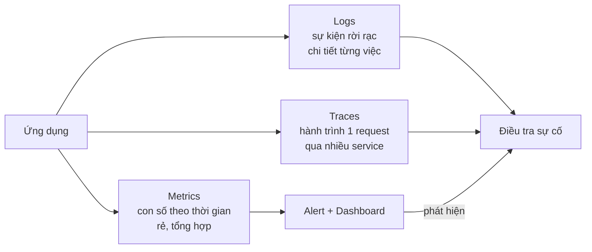
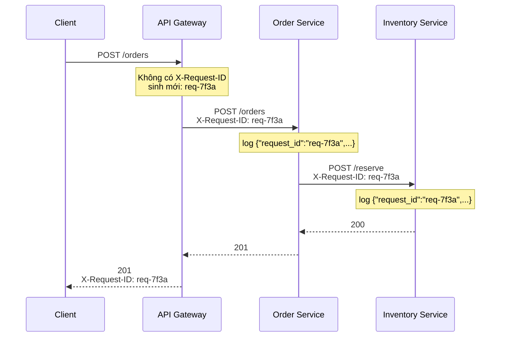
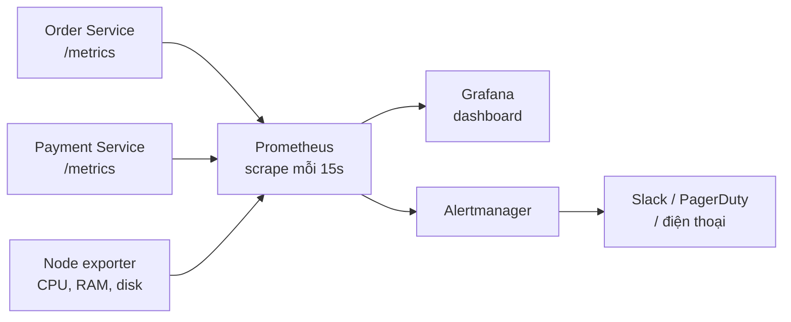
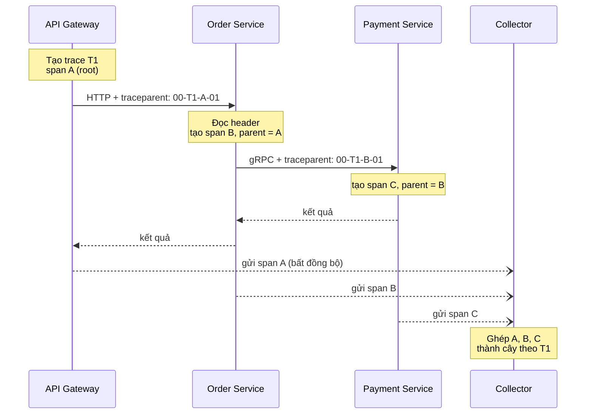
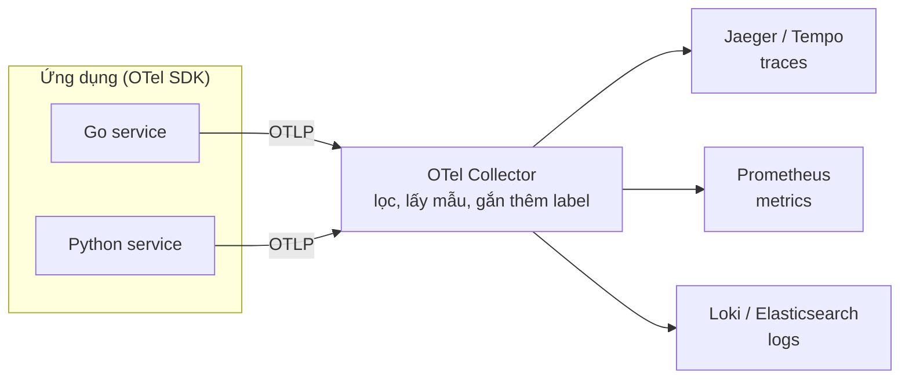
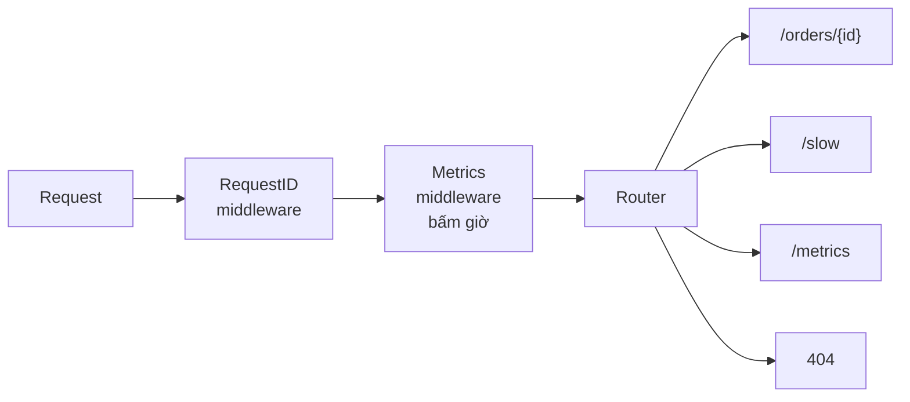
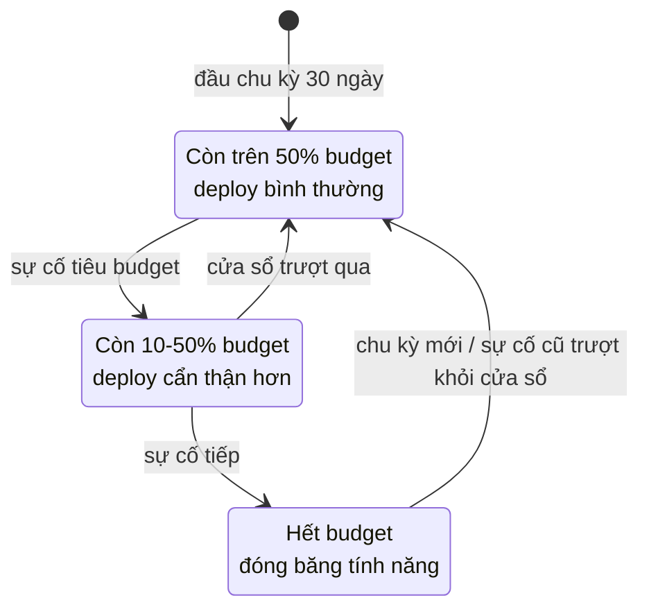
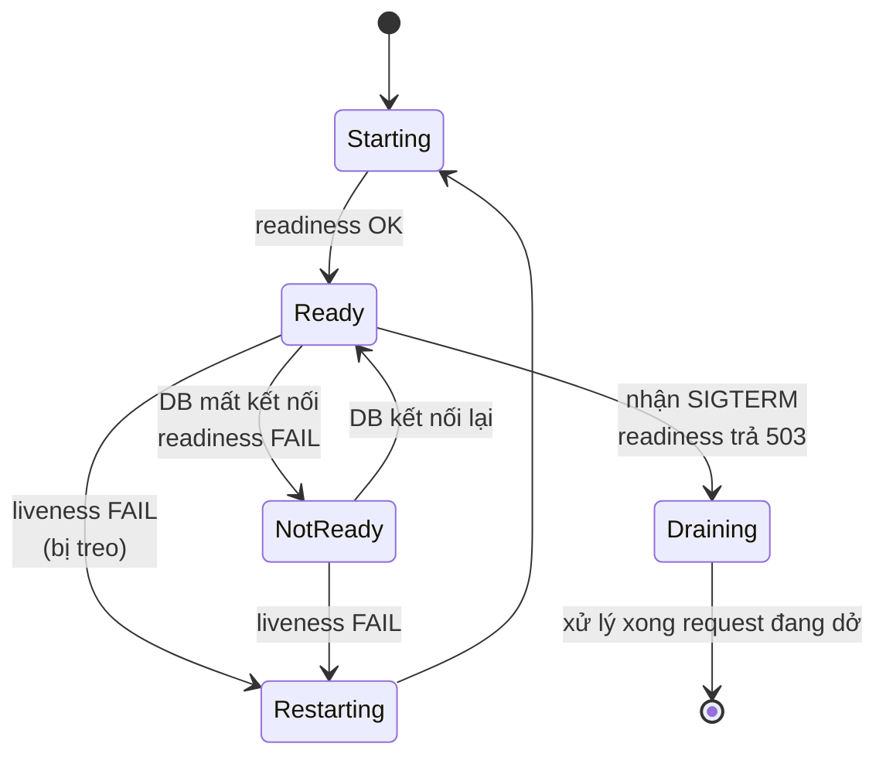
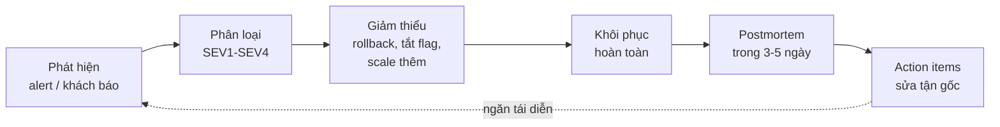

# 📚 Bài 11: Observability & Reliability

## 🎯 Mục tiêu bài học

- Phân biệt **monitoring** và **observability**, nắm "3 trụ cột": **logs, metrics, traces**
- Viết **structured log** (JSON) có **request ID** để lần theo một request qua nhiều service
- Hiểu các loại metric (**counter, gauge, histogram**), phương pháp **RED** và **USE**, đọc được **Prometheus exposition format** và viết **PromQL** cơ bản
- Hiểu **distributed tracing**: trace, span, **context propagation** (header `traceparent`), OpenTelemetry
- Tự cài đặt **middleware request-id + metrics** bằng Go và Python (không cần thư viện ngoài)
- Định nghĩa **SLI / SLO / SLA**, tính **error budget** và **burn rate**
- Thiết kế **alerting** không gây "mệt mỏi cảnh báo", phân biệt **liveness** và **readiness** probe
- Biết quy trình **xử lý sự cố (incident)** và viết **postmortem không đổ lỗi (blameless)**
- Áp dụng **graceful degradation** và làm quen với **chaos engineering**

> 💡 **Bài này nằm ở đâu trong khóa?** [Bài 10](./10-system-design.md) dạy cách thiết kế hệ thống chịu tải và chịu lỗi (retry, circuit breaker, availability...). Nhưng thiết kế tốt mấy thì hệ thống **vẫn sẽ hỏng**. Bài này trả lời câu hỏi: **làm sao biết nó hỏng, hỏng ở đâu, và sửa nhanh thế nào?** Phần "cách làm trong code" (logging với `slog`, graceful shutdown, config) đã có ở [Go - Bài 16: Production-ready](../golang/16-production-ready.md) và [Python - Bài 16: Production-ready](../python/16-production-ready.md) — bài này tập trung vào **tư duy vận hành** ở tầm hệ thống.

## 📖 1. Monitoring vs Observability

### 1.1. Câu chuyện lúc 2 giờ sáng

Điện thoại rung: *"Khách hàng phàn nàn không đặt được đơn"*. Bạn mở laptop và cần trả lời thật nhanh:

1. **Có thật sự lỗi không?** Bao nhiêu % request bị lỗi? Từ khi nào?
2. **Lỗi ở đâu?** API gateway, order service, database hay cổng thanh toán?
3. **Tại sao?** Deploy mới? Database đầy? Đối tác thanh toán sập?

Nếu hệ thống của bạn chỉ có `fmt.Println("error")` rải rác thì bạn sẽ mất **vài giờ** để đoán mò. Nếu có observability tốt, bạn mất **vài phút**.

### 1.2. Định nghĩa

| | **Monitoring** (giám sát) | **Observability** (khả năng quan sát) |
|---|---|---|
| Câu hỏi | "Hệ thống có đang **ổn** không?" | "**Tại sao** hệ thống lại như thế này?" |
| Loại vấn đề | **Known unknowns** — lỗi đã đoán trước (CPU cao, disk đầy) | **Unknown unknowns** — lỗi chưa từng gặp |
| Công cụ | Dashboard cố định, alert theo ngưỡng | Log có cấu trúc, trace, metric nhiều chiều, truy vấn tự do |
| Ví von | **Đèn báo trên taplo xe máy**: hết xăng, sắp hết dầu | **Thợ sửa xe có máy chẩn đoán**: cắm vào đọc được mọi thông số để tìm nguyên nhân |

> 💡 Monitoring là **một phần** của observability. Một hệ thống "observable" là hệ thống mà bạn có thể **hiểu trạng thái bên trong chỉ bằng cách nhìn dữ liệu nó phát ra**, không cần deploy thêm code để debug.

### 1.3. Ba trụ cột: Logs, Metrics, Traces



| Trụ cột | Trả lời câu hỏi | Ví dụ | Chi phí lưu trữ |
|---------|-----------------|-------|-----------------|
| **Metrics** | "Có chuyện gì không? Bao nhiêu?" | `error_rate = 5%`, `p99 = 1.2s` | Thấp (chỉ là con số) |
| **Logs** | "Chuyện gì đã xảy ra với request X?" | `{"msg":"payment failed","order_id":42,"err":"timeout"}` | Cao (text, nhiều) |
| **Traces** | "Request X chậm ở **bước nào**?" | gateway 5ms → order 20ms → **payment 1800ms** | Trung bình (thường lấy mẫu) |

Quy trình điển hình: **metric** kích hoạt alert ("error rate tăng") → mở **trace** của request lỗi để thấy nó chết ở service nào → đọc **log** của service đó (lọc theo `trace_id`) để thấy nguyên nhân chính xác.

!!! tip "Liên kết 3 trụ cột bằng ID"
    Sức mạnh thật sự đến khi **log có `trace_id`/`request_id`**, và metric có **exemplar** trỏ tới trace. Khi đó bạn nhảy qua lại giữa 3 loại dữ liệu chỉ bằng một cú click trên Grafana.

## 📖 2. Structured Logging & Request ID

### 2.1. Log văn bản vs log có cấu trúc

```text
# Log văn bản (khó máy đọc)
2026-09-28 10:15:02 ERROR Không thanh toán được đơn 42 cho user 7 vì timeout sau 3000ms

# Log có cấu trúc - JSON (máy đọc, lọc, thống kê dễ dàng)
{"time":"2026-09-28T10:15:02Z","level":"ERROR","msg":"payment failed","order_id":42,"user_id":7,"err":"timeout","duration_ms":3000,"request_id":"a1b2c3"}
```

Với JSON, bạn có thể hỏi hệ thống log (Loki, Elasticsearch, CloudWatch...): *"cho tôi mọi log `level=ERROR` có `duration_ms > 2000` trong 1 giờ qua, nhóm theo `err`"*. Với log văn bản, bạn phải viết regex cầu nguyện.

### 2.2. Log level — dùng thế nào cho đúng

| Level | Khi nào dùng | Ví dụ | Bật ở production? |
|-------|-------------|-------|-------------------|
| `DEBUG` | Chi tiết cho dev khi debug | "cache key = user:7, hit=false" | Thường **tắt** |
| `INFO` | Sự kiện nghiệp vụ bình thường | "đơn hàng 42 đã tạo" | Bật |
| `WARN` | Bất thường nhưng tự xử lý được | "retry lần 2 gọi payment" | Bật |
| `ERROR` | Thao tác thất bại, cần người xem | "thanh toán thất bại sau 3 lần retry" | Bật, có thể alert |

!!! warning "Đừng log mọi thứ ở mức ERROR"
    Nếu 404 "không tìm thấy sản phẩm" (lỗi của client) cũng log ERROR, dashboard lỗi sẽ luôn đỏ và mọi người sẽ **phớt lờ** nó. Lỗi do client (4xx) thường là `INFO`/`WARN`; lỗi do server (5xx) mới là `ERROR`.

### 2.3. Request ID — sợi chỉ xuyên suốt

Một request của người dùng có thể đi qua gateway → order service → inventory service → database. Mỗi service ghi log riêng. Làm sao gom tất cả log của **đúng một request** lại? Gắn cho nó một **ID duy nhất** ngay từ cửa vào và **truyền đi** ở mọi bước.



Quy tắc:

1. Nếu request đến **đã có** `X-Request-ID` (từ gateway/load balancer) → dùng lại. Nếu không có hoặc không hợp lệ (quá dài, ký tự lạ) → **sinh mới**.
2. Lưu ID vào **context** của request (Go: `context.Context`, Python: `contextvars`) để mọi hàm bên dưới lấy được.
3. **Ghi ID vào mọi dòng log** và **trả về trong response header** — khi khách hàng báo lỗi, bạn xin họ ID đó là tìm ra ngay.
4. Khi gọi service khác → **gửi kèm header**.

> 💡 Trong hệ thống dùng OpenTelemetry, `trace_id` (mục 4) đóng vai trò của request ID. Nhiều nơi dùng cả hai: `request_id` cho con người đọc, `trace_id` cho công cụ tracing.

## 📖 3. Metrics

### 3.1. Metric là gì?

Metric là **một con số được đo liên tục theo thời gian**, có tên và các **label** (nhãn) để phân loại:

```text
http_requests_total{method="GET", route="/orders/{id}", status="200"}  1027   @ 10:15:00
http_requests_total{method="GET", route="/orders/{id}", status="200"}  1093   @ 10:15:15
```

Mỗi tổ hợp tên + label là một **time series** (chuỗi thời gian). Prometheus cứ 15 giây lại "cào" (**scrape**) endpoint `/metrics` của ứng dụng để lấy giá trị mới.



### 3.2. Bốn loại metric

| Loại | Đặc điểm | Ví dụ | Ví von |
|------|----------|-------|--------|
| **Counter** | Chỉ **tăng** (reset về 0 khi restart) | Tổng số request, tổng số lỗi, tổng tiền đã thu | **Đồng hồ công-tơ-mét** xe máy |
| **Gauge** | Tăng **hoặc giảm** | Số request đang xử lý, RAM đang dùng, số phần tử trong queue | **Kim xăng** |
| **Histogram** | Đếm số quan sát rơi vào từng **khoảng (bucket)** | Phân bố latency: bao nhiêu request < 50ms, < 100ms... | **Bảng phân loại điểm thi**: bao nhiêu em dưới 5, dưới 8... |
| **Summary** | Tính sẵn percentile ở phía client | p50, p99 latency | Ít dùng — không cộng gộp được giữa nhiều instance |

!!! tip "Vì sao đo latency bằng histogram, không phải trung bình?"
    Trung bình **nói dối**. 99 request mất 10ms + 1 request mất 10 giây → trung bình ~110ms, trông "ổn". Nhưng 1% người dùng đang chờ 10 giây! Ta cần **percentile**: p50 (trung vị), p95, **p99** (99% request nhanh hơn giá trị này). Histogram cho phép tính percentile **gộp từ nhiều instance** ở phía Prometheus.

### 3.3. Phương pháp RED và USE — đo cái gì?

Người mới hay đo "mọi thứ" rồi chết đuối trong dashboard. Hai phương pháp sau cho biết **nên đo gì**:

**RED** — cho **service** (thứ nhận request):

| Chữ | Ý nghĩa | Metric |
|-----|---------|--------|
| **R**ate | Bao nhiêu request/giây | `rate(http_requests_total[5m])` |
| **E**rrors | Bao nhiêu request lỗi | `rate(http_requests_total{status=~"5.."}[5m])` |
| **D**uration | Mất bao lâu (phân bố) | `histogram_quantile(0.99, ...)` |

**USE** — cho **tài nguyên** (CPU, RAM, disk, connection pool...):

| Chữ | Ý nghĩa | Ví dụ với connection pool của DB |
|-----|---------|-------------------------------|
| **U**tilization | % thời gian/dung lượng đang bận | 18/20 connection đang dùng = 90% |
| **S**aturation | Lượng việc phải **xếp hàng chờ** | 35 goroutine đang chờ lấy connection |
| **E**rrors | Số lỗi | 12 lần timeout khi lấy connection |

> Google SRE còn có **"4 golden signals"**: latency, traffic, errors, **saturation** — gần như RED + chữ S của USE.

### 3.4. Cardinality — kẻ thù thầm lặng

Mỗi tổ hợp label khác nhau = 1 time series riêng, chiếm RAM của Prometheus. Nếu bạn đặt label `user_id` với 5 triệu user → 5 triệu time series → Prometheus **sập**.

| Label | Số giá trị | Tốt? |
|-------|-----------|------|
| `method` (GET, POST...) | ~5 | ✅ |
| `status` (200, 404, 500...) | ~10 | ✅ |
| `route` = **pattern** `/orders/{id}` | ~50 | ✅ |
| `path` = URL thật `/orders/123456` | vô hạn | ❌ |
| `user_id`, `email`, `request_id` | hàng triệu | ❌ — để trong **log/trace**, không để trong metric |

### 3.5. Prometheus exposition format

Endpoint `/metrics` trả về **văn bản thuần** theo định dạng sau (bạn sẽ tự sinh nó trong mục 5):

```text
# HELP http_requests_total Tổng số HTTP request đã xử lý.
# TYPE http_requests_total counter
http_requests_total{method="GET",route="/orders/{id}",status="200"} 1027
http_requests_total{method="GET",route="/orders/{id}",status="500"} 3
# HELP http_requests_in_flight Số request đang xử lý.
# TYPE http_requests_in_flight gauge
http_requests_in_flight 4
# HELP http_request_duration_seconds Thời gian xử lý request.
# TYPE http_request_duration_seconds histogram
http_request_duration_seconds_bucket{route="/orders/{id}",le="0.05"} 900
http_request_duration_seconds_bucket{route="/orders/{id}",le="0.1"} 1010
http_request_duration_seconds_bucket{route="/orders/{id}",le="0.5"} 1028
http_request_duration_seconds_bucket{route="/orders/{id}",le="+Inf"} 1030
http_request_duration_seconds_sum{route="/orders/{id}"} 41.2
http_request_duration_seconds_count{route="/orders/{id}"} 1030
```

Chú ý: bucket của histogram là **cộng dồn (cumulative)** — `le="0.1"` nghĩa là "**nhỏ hơn hoặc bằng** 0.1 giây", đã bao gồm cả những request ≤ 0.05s. Bucket `+Inf` luôn bằng `_count`.

### 3.6. PromQL cơ bản

PromQL là ngôn ngữ truy vấn của Prometheus. Vài câu bạn sẽ viết hằng ngày:

```text
# Số request/giây trung bình trong 5 phút qua, theo route
sum by (route) (rate(http_requests_total[5m]))

# Tỉ lệ lỗi 5xx (%)
100 * sum(rate(http_requests_total{status=~"5.."}[5m]))
    / sum(rate(http_requests_total[5m]))

# Latency p99 theo route (từ histogram)
histogram_quantile(0.99,
  sum by (le, route) (rate(http_request_duration_seconds_bucket[5m])))

# Top 3 route chậm nhất theo p95
topk(3, histogram_quantile(0.95,
  sum by (le, route) (rate(http_request_duration_seconds_bucket[5m]))))

# Disk sẽ đầy trong 4 giờ tới? (dự đoán tuyến tính)
predict_linear(node_filesystem_avail_bytes{mountpoint="/"}[1h], 4 * 3600) < 0
```

!!! note "`rate()` chứ không phải giá trị thô"
    Counter chỉ tăng nên giá trị thô (`1027`) chẳng nói lên gì. `rate(x[5m])` tính **tốc độ tăng trung bình mỗi giây** trong 5 phút, và tự xử lý chuyện counter bị reset về 0 khi app restart. **Không bao giờ** `rate()` một gauge.

## 📖 4. Distributed Tracing

### 4.1. Trace và Span

- **Trace**: toàn bộ hành trình của **một** request qua hệ thống. Có một `trace_id` (16 byte).
- **Span**: **một bước** trong hành trình (một lần gọi HTTP, một câu SQL, một lần gọi Redis). Có `span_id` (8 byte), `parent_span_id`, thời điểm bắt đầu/kết thúc, và **attributes** (`http.method`, `db.statement`...).

Các span lồng nhau tạo thành **cây**. Công cụ như Jaeger, Grafana Tempo, Zipkin vẽ cây này thành biểu đồ thác nước (waterfall):

```text
trace_id = 4bf92f35...                       0ms        500ms       1000ms      1500ms
├─ api-gateway   POST /checkout              [██████████████████████████████████████] 1620ms
│  └─ order-service  CreateOrder              [████████████████████████████████████] 1590ms
│     ├─ postgres  INSERT orders              [█] 12ms
│     ├─ inventory-service  Reserve             [██] 45ms
│     └─ payment-service  Charge                   [██████████████████████████████] 1480ms  ← thủ phạm!
```

Chỉ nhìn một lần là biết: **payment chậm**, không phải database.

### 4.2. Context propagation — truyền "ngữ cảnh" qua mạng

Làm sao service B biết span của nó là con của span nào ở service A? A phải **gửi trace context theo request** — chuẩn W3C Trace Context dùng header `traceparent`:

```text
traceparent: 00-4bf92f3577b34da6a3ce929d0e0e4736-00f067aa0ba902b7-01
             │  │                                │                └─ flags (01 = được lấy mẫu)
             │  │                                └─ parent span id (8 byte hex)
             │  └─ trace id (16 byte hex)
             └─ version
```



Với message queue ([Bài 9](./09-message-queues.md)) cũng vậy: trace context được đặt vào **header của message** để consumer nối tiếp trace.

### 4.3. Tự cài đặt context propagation (để hiểu bản chất)

Ví dụ dưới đây tự parse/sinh header `traceparent` và tạo span con. Trong thực tế bạn dùng OpenTelemetry SDK (mục 4.4), nhưng tự viết một lần sẽ giúp bạn hiểu SDK làm gì bên dưới.

=== "Go"

    ```go
    package main

    import (
    	"errors"
    	"fmt"
    	"strings"
    )

    type SpanContext struct {
    	TraceID string // 32 ký tự hex
    	SpanID  string // 16 ký tự hex
    	Sampled bool
    }

    func isHex(s string, n int) bool {
    	if len(s) != n {
    		return false
    	}
    	for _, c := range s {
    		if !strings.ContainsRune("0123456789abcdef", c) {
    			return false
    		}
    	}
    	return true
    }

    func ParseTraceparent(h string) (SpanContext, error) {
    	p := strings.Split(h, "-")
    	if len(p) != 4 || p[0] != "00" || !isHex(p[1], 32) || !isHex(p[2], 16) {
    		return SpanContext{}, errors.New("traceparent không hợp lệ")
    	}
    	return SpanContext{TraceID: p[1], SpanID: p[2], Sampled: p[3] == "01"}, nil
    }

    func (sc SpanContext) Traceparent() string {
    	flags := "00"
    	if sc.Sampled {
    		flags = "01"
    	}
    	return fmt.Sprintf("00-%s-%s-%s", sc.TraceID, sc.SpanID, flags)
    }

    var counter int

    // Demo: dùng bộ đếm cho dễ đọc. Thực tế span id là 8 byte NGẪU NHIÊN.
    func newSpanID() string {
    	counter++
    	return fmt.Sprintf("%016x", counter)
    }

    func StartSpan(name string, parent SpanContext, depth int) SpanContext {
    	child := SpanContext{TraceID: parent.TraceID, SpanID: newSpanID(), Sampled: parent.Sampled}
    	fmt.Printf("%s[%s] trace=%s span=%s parent=%s\n",
    		strings.Repeat("  ", depth), name, child.TraceID[:8], child.SpanID, parent.SpanID)
    	return child
    }

    func main() {
    	// Header do client/load balancer gửi đến gateway
    	incoming := "00-4bf92f3577b34da6a3ce929d0e0e4736-00f067aa0ba902b7-01"
    	parent, _ := ParseTraceparent(incoming)

    	gw := StartSpan("api-gateway POST /checkout", parent, 0)
    	header := gw.Traceparent() // gateway gắn header này khi gọi order-service
    	fmt.Println("  -> traceparent:", header)

    	// Order service nhận header, tiếp tục trace
    	fromGW, _ := ParseTraceparent(header)
    	order := StartSpan("order-service CreateOrder", fromGW, 1)
    	StartSpan("postgres INSERT orders", order, 2)
    	StartSpan("payment-service Charge", order, 2)

    	if _, err := ParseTraceparent("rác-rác"); err != nil {
    		fmt.Println("header hỏng:", err, "-> bắt đầu trace mới")
    	}
    }

    // Output:
    // [api-gateway POST /checkout] trace=4bf92f35 span=0000000000000001 parent=00f067aa0ba902b7
    //   -> traceparent: 00-4bf92f3577b34da6a3ce929d0e0e4736-0000000000000001-01
    //   [order-service CreateOrder] trace=4bf92f35 span=0000000000000002 parent=0000000000000001
    //     [postgres INSERT orders] trace=4bf92f35 span=0000000000000003 parent=0000000000000002
    //     [payment-service Charge] trace=4bf92f35 span=0000000000000004 parent=0000000000000002
    // header hỏng: traceparent không hợp lệ -> bắt đầu trace mới
    ```

=== "Python"

    ```python
    import itertools
    import re
    from dataclasses import dataclass

    TRACEPARENT_RE = re.compile(r"^00-([0-9a-f]{32})-([0-9a-f]{16})-([0-9a-f]{2})$")


    @dataclass(frozen=True)
    class SpanContext:
        trace_id: str
        span_id: str
        sampled: bool

        def traceparent(self) -> str:
            return f"00-{self.trace_id}-{self.span_id}-{'01' if self.sampled else '00'}"


    def parse_traceparent(header: str) -> SpanContext:
        m = TRACEPARENT_RE.match(header)
        if not m:
            raise ValueError("traceparent không hợp lệ")
        return SpanContext(m.group(1), m.group(2), m.group(3) == "01")


    _counter = itertools.count(1)


    def new_span_id() -> str:
        # Demo: dùng bộ đếm cho dễ đọc. Thực tế: secrets.token_hex(8)
        return f"{next(_counter):016x}"


    def start_span(name: str, parent: SpanContext, depth: int) -> SpanContext:
        child = SpanContext(parent.trace_id, new_span_id(), parent.sampled)
        print(f"{'  ' * depth}[{name}] trace={child.trace_id[:8]} "
              f"span={child.span_id} parent={parent.span_id}")
        return child


    if __name__ == "__main__":
        incoming = "00-4bf92f3577b34da6a3ce929d0e0e4736-00f067aa0ba902b7-01"
        parent = parse_traceparent(incoming)

        gw = start_span("api-gateway POST /checkout", parent, 0)
        header = gw.traceparent()
        print("  -> traceparent:", header)

        from_gw = parse_traceparent(header)
        order = start_span("order-service CreateOrder", from_gw, 1)
        start_span("postgres INSERT orders", order, 2)
        start_span("payment-service Charge", order, 2)

        try:
            parse_traceparent("rác-rác")
        except ValueError as e:
            print("header hỏng:", e, "-> bắt đầu trace mới")

    # Output:
    # [api-gateway POST /checkout] trace=4bf92f35 span=0000000000000001 parent=00f067aa0ba902b7
    #   -> traceparent: 00-4bf92f3577b34da6a3ce929d0e0e4736-0000000000000001-01
    #   [order-service CreateOrder] trace=4bf92f35 span=0000000000000002 parent=0000000000000001
    #     [postgres INSERT orders] trace=4bf92f35 span=0000000000000003 parent=0000000000000002
    #     [payment-service Charge] trace=4bf92f35 span=0000000000000004 parent=0000000000000002
    # header hỏng: traceparent không hợp lệ -> bắt đầu trace mới
    ```

### 4.4. OpenTelemetry — chuẩn chung của ngành

**OpenTelemetry (OTel)** là bộ API + SDK + giao thức (OTLP) **trung lập nhà cung cấp** để phát ra traces, metrics và logs. Bạn instrument code **một lần** bằng OTel, rồi gửi dữ liệu tới bất kỳ backend nào: Jaeger, Grafana Tempo, Datadog, New Relic, Honeycomb...



Code thật trông như sau (đoạn trích, cần cài thư viện `go.opentelemetry.io/otel` / `opentelemetry-sdk`, không chạy trực tiếp trong bài):

=== "Go"

    ```go
    // Bọc handler: tự tạo span cho mỗi request, tự đọc/ghi header traceparent
    handler := otelhttp.NewHandler(mux, "order-service")

    // Tạo span thủ công cho một bước quan trọng
    tracer := otel.Tracer("order-service")
    func (s *Service) CreateOrder(ctx context.Context, o Order) error {
    	ctx, span := tracer.Start(ctx, "CreateOrder")
    	defer span.End()
    	span.SetAttributes(attribute.Int64("order.items", int64(len(o.Items))))

    	if err := s.repo.Insert(ctx, o); err != nil { // ctx mang span -> span con
    		span.RecordError(err)
    		span.SetStatus(codes.Error, "insert failed")
    		return err
    	}
    	return nil
    }
    ```

=== "Python"

    ```python
    # Tự động instrument FastAPI, requests, SQLAlchemy...
    # opentelemetry-instrument --service_name order-service uvicorn app:app

    from opentelemetry import trace

    tracer = trace.get_tracer("order-service")

    def create_order(order):
        with tracer.start_as_current_span("CreateOrder") as span:
            span.set_attribute("order.items", len(order.items))
            try:
                repo.insert(order)          # span con tự gắn vào span hiện tại
            except Exception as e:
                span.record_exception(e)
                span.set_status(trace.Status(trace.StatusCode.ERROR))
                raise
    ```

!!! tip "Sampling — không cần lưu 100% trace"
    Với 10.000 request/giây, lưu mọi trace rất tốn. Thường dùng **head sampling** (quyết định giữ 1-10% ngay từ đầu) hoặc **tail sampling** ở Collector (giữ **tất cả** trace lỗi hoặc chậm, chỉ giữ 1% trace bình thường) — tail sampling "thông minh" hơn nhưng Collector phải giữ span trong bộ nhớ chờ trace hoàn tất.

## 📖 5. Thực hành: Middleware Request ID + Metrics

Giờ ta viết một server nhỏ có:

- Middleware **RequestID**: nhận/sinh `X-Request-ID`, đưa vào context, trả về trong header.
- **Structured log JSON** có `request_id`.
- Middleware **Metrics**: đếm request theo `method/route/status` (counter) và đo latency (histogram), dùng **route pattern** chứ không dùng path thật (tránh cardinality bùng nổ).
- Endpoint `/metrics` theo đúng **Prometheus exposition format** — tự viết, không cần thư viện.



Chương trình tự khởi động server trên cổng ngẫu nhiên, gửi vài request thử, rồi in nội dung `/metrics` (bỏ dòng `_sum` vì giá trị thay đổi mỗi lần chạy).

=== "Go"

    ```go
    package main

    import (
    	"bufio"
    	"context"
    	"crypto/rand"
    	"encoding/hex"
    	"fmt"
    	"log/slog"
    	"maps"
    	"net/http"
    	"net/http/httptest"
    	"os"
    	"slices"
    	"strconv"
    	"strings"
    	"sync"
    	"time"
    )

    // ================= Request ID =================
    type ctxKey struct{}

    func RequestID(next http.Handler) http.Handler {
    	return http.HandlerFunc(func(w http.ResponseWriter, r *http.Request) {
    		id := r.Header.Get("X-Request-ID")
    		if id == "" || len(id) > 64 { // không tin tuyệt đối dữ liệu client gửi
    			b := make([]byte, 8)
    			rand.Read(b)
    			id = hex.EncodeToString(b)
    		}
    		w.Header().Set("X-Request-ID", id)
    		ctx := context.WithValue(r.Context(), ctxKey{}, id)
    		next.ServeHTTP(w, r.WithContext(ctx))
    	})
    }

    func RequestIDFrom(ctx context.Context) string {
    	id, _ := ctx.Value(ctxKey{}).(string)
    	return id
    }

    // ================= Metrics =================
    var buckets = []float64{0.005, 0.01, 0.05, 0.1, 0.5, 1}

    type histogram struct {
    	counts []uint64 // cộng dồn: counts[i] = số quan sát <= buckets[i]
    	sum    float64
    	count  uint64
    }

    type Metrics struct {
    	mu       sync.Mutex
    	requests map[string]uint64     // key = chuỗi label
    	latency  map[string]*histogram // key = route
    }

    func NewMetrics() *Metrics {
    	return &Metrics{requests: map[string]uint64{}, latency: map[string]*histogram{}}
    }

    func (m *Metrics) observe(method, route string, status int, sec float64) {
    	m.mu.Lock()
    	defer m.mu.Unlock()
    	m.requests[fmt.Sprintf("method=%q,route=%q,status=\"%d\"", method, route, status)]++
    	h, ok := m.latency[route]
    	if !ok {
    		h = &histogram{counts: make([]uint64, len(buckets))}
    		m.latency[route] = h
    	}
    	for i, b := range buckets {
    		if sec <= b {
    			h.counts[i]++
    		}
    	}
    	h.sum += sec
    	h.count++
    }

    type statusRecorder struct {
    	http.ResponseWriter
    	status int
    }

    func (s *statusRecorder) WriteHeader(code int) {
    	s.status = code
    	s.ResponseWriter.WriteHeader(code)
    }

    func (m *Metrics) Middleware(next http.Handler) http.Handler {
    	return http.HandlerFunc(func(w http.ResponseWriter, r *http.Request) {
    		start := time.Now()
    		rec := &statusRecorder{ResponseWriter: w, status: http.StatusOK}
    		next.ServeHTTP(rec, r)
    		// Go 1.23+: ServeMux ghi pattern đã khớp vào r.Pattern, vd "GET /orders/{id}"
    		route := r.Pattern
    		if i := strings.IndexByte(route, ' '); i >= 0 {
    			route = route[i+1:]
    		}
    		if route == "" {
    			route = "unmatched" // 404: KHÔNG dùng path thật làm label
    		}
    		m.observe(r.Method, route, rec.status, time.Since(start).Seconds())
    	})
    }

    // ServeHTTP phục vụ /metrics theo Prometheus text format.
    func (m *Metrics) ServeHTTP(w http.ResponseWriter, r *http.Request) {
    	m.mu.Lock()
    	defer m.mu.Unlock()
    	w.Header().Set("Content-Type", "text/plain; version=0.0.4")
    	fmt.Fprintln(w, "# HELP http_requests_total Tổng số HTTP request đã xử lý.")
    	fmt.Fprintln(w, "# TYPE http_requests_total counter")
    	for _, k := range slices.Sorted(maps.Keys(m.requests)) {
    		fmt.Fprintf(w, "http_requests_total{%s} %d\n", k, m.requests[k])
    	}
    	fmt.Fprintln(w, "# HELP http_request_duration_seconds Thời gian xử lý request.")
    	fmt.Fprintln(w, "# TYPE http_request_duration_seconds histogram")
    	for _, route := range slices.Sorted(maps.Keys(m.latency)) {
    		h := m.latency[route]
    		for i, b := range buckets {
    			le := strconv.FormatFloat(b, 'g', -1, 64)
    			fmt.Fprintf(w, "http_request_duration_seconds_bucket{route=%q,le=%q} %d\n", route, le, h.counts[i])
    		}
    		fmt.Fprintf(w, "http_request_duration_seconds_bucket{route=%q,le=\"+Inf\"} %d\n", route, h.count)
    		fmt.Fprintf(w, "http_request_duration_seconds_sum{route=%q} %g\n", route, h.sum)
    		fmt.Fprintf(w, "http_request_duration_seconds_count{route=%q} %d\n", route, h.count)
    	}
    }

    // ================= Ứng dụng =================
    func main() {
    	// Bỏ trường time để output ổn định khi chạy demo; production thì GIỮ LẠI.
    	logger := slog.New(slog.NewJSONHandler(os.Stdout, &slog.HandlerOptions{
    		ReplaceAttr: func(groups []string, a slog.Attr) slog.Attr {
    			if a.Key == slog.TimeKey {
    				return slog.Attr{}
    			}
    			return a
    		},
    	}))

    	metrics := NewMetrics()
    	mux := http.NewServeMux()
    	mux.HandleFunc("GET /orders/{id}", func(w http.ResponseWriter, r *http.Request) {
    		log := logger.With("request_id", RequestIDFrom(r.Context()))
    		log.Info("lấy đơn hàng", "order_id", r.PathValue("id"))
    		fmt.Fprintln(w, "ok")
    	})
    	mux.HandleFunc("GET /slow", func(w http.ResponseWriter, r *http.Request) {
    		time.Sleep(20 * time.Millisecond)
    		fmt.Fprintln(w, "chậm nhưng xong")
    	})
    	mux.Handle("GET /metrics", metrics)

    	srv := httptest.NewServer(RequestID(metrics.Middleware(mux)))
    	defer srv.Close()

    	get := func(path, reqID string) *http.Response {
    		req, _ := http.NewRequest("GET", srv.URL+path, nil)
    		if reqID != "" {
    			req.Header.Set("X-Request-ID", reqID)
    		}
    		resp, err := http.DefaultClient.Do(req)
    		if err != nil {
    			panic(err)
    		}
    		return resp
    	}

    	resp := get("/orders/1", "abc-123")
    	fmt.Println("X-Request-ID trả về:", resp.Header.Get("X-Request-ID"))
    	resp.Body.Close()
    	get("/orders/2", "req-002").Body.Close()

    	resp = get("/slow", "") // không gửi ID -> server tự sinh
    	fmt.Println("ID tự sinh dài:", len(resp.Header.Get("X-Request-ID")), "ký tự")
    	resp.Body.Close()

    	resp = get("/khong-ton-tai", "")
    	fmt.Println("status:", resp.StatusCode)
    	resp.Body.Close()

    	resp = get("/metrics", "")
    	defer resp.Body.Close()
    	fmt.Println("----- /metrics -----")
    	sc := bufio.NewScanner(resp.Body)
    	for sc.Scan() {
    		if !strings.Contains(sc.Text(), "_sum{") {
    			fmt.Println(sc.Text())
    		}
    	}
    }

    // Output:
    // {"level":"INFO","msg":"lấy đơn hàng","request_id":"abc-123","order_id":"1"}
    // X-Request-ID trả về: abc-123
    // {"level":"INFO","msg":"lấy đơn hàng","request_id":"req-002","order_id":"2"}
    // ID tự sinh dài: 16 ký tự
    // status: 404
    // ----- /metrics -----
    // # HELP http_requests_total Tổng số HTTP request đã xử lý.
    // # TYPE http_requests_total counter
    // http_requests_total{method="GET",route="/orders/{id}",status="200"} 2
    // http_requests_total{method="GET",route="/slow",status="200"} 1
    // http_requests_total{method="GET",route="unmatched",status="404"} 1
    // # HELP http_request_duration_seconds Thời gian xử lý request.
    // # TYPE http_request_duration_seconds histogram
    // http_request_duration_seconds_bucket{route="/orders/{id}",le="0.005"} 2
    // http_request_duration_seconds_bucket{route="/orders/{id}",le="0.01"} 2
    // http_request_duration_seconds_bucket{route="/orders/{id}",le="0.05"} 2
    // http_request_duration_seconds_bucket{route="/orders/{id}",le="0.1"} 2
    // http_request_duration_seconds_bucket{route="/orders/{id}",le="0.5"} 2
    // http_request_duration_seconds_bucket{route="/orders/{id}",le="1"} 2
    // http_request_duration_seconds_bucket{route="/orders/{id}",le="+Inf"} 2
    // http_request_duration_seconds_count{route="/orders/{id}"} 2
    // http_request_duration_seconds_bucket{route="/slow",le="0.005"} 0
    // http_request_duration_seconds_bucket{route="/slow",le="0.01"} 0
    // http_request_duration_seconds_bucket{route="/slow",le="0.05"} 1
    // http_request_duration_seconds_bucket{route="/slow",le="0.1"} 1
    // http_request_duration_seconds_bucket{route="/slow",le="0.5"} 1
    // http_request_duration_seconds_bucket{route="/slow",le="1"} 1
    // http_request_duration_seconds_bucket{route="/slow",le="+Inf"} 1
    // http_request_duration_seconds_count{route="/slow"} 1
    // http_request_duration_seconds_bucket{route="unmatched",le="0.005"} 1
    // http_request_duration_seconds_bucket{route="unmatched",le="0.01"} 1
    // http_request_duration_seconds_bucket{route="unmatched",le="0.05"} 1
    // http_request_duration_seconds_bucket{route="unmatched",le="0.1"} 1
    // http_request_duration_seconds_bucket{route="unmatched",le="0.5"} 1
    // http_request_duration_seconds_bucket{route="unmatched",le="1"} 1
    // http_request_duration_seconds_bucket{route="unmatched",le="+Inf"} 1
    // http_request_duration_seconds_count{route="unmatched"} 1
    ```

=== "Python"

    ```python
    import json
    import logging
    import re
    import secrets
    import sys
    import threading
    import time
    import urllib.error
    import urllib.request
    from contextvars import ContextVar
    from http.server import BaseHTTPRequestHandler, ThreadingHTTPServer

    # ================= Structured log + Request ID =================
    request_id_var: ContextVar[str] = ContextVar("request_id", default="-")


    class JsonFormatter(logging.Formatter):
        def format(self, record: logging.LogRecord) -> str:
            data = {"level": record.levelname, "msg": record.getMessage(),
                    "request_id": request_id_var.get()}
            data.update(getattr(record, "fields", {}))
            return json.dumps(data, ensure_ascii=False)  # production: thêm "time"


    log = logging.getLogger("app")
    _h = logging.StreamHandler(sys.stdout)
    _h.setFormatter(JsonFormatter())
    log.addHandler(_h)
    log.setLevel(logging.INFO)

    # ================= Metrics =================
    BUCKETS = (0.005, 0.01, 0.05, 0.1, 0.5, 1.0)


    class Metrics:
        def __init__(self) -> None:
            self.lock = threading.Lock()
            self.requests: dict[str, int] = {}
            self.hist: dict[str, dict] = {}

        def observe(self, method: str, route: str, status: int, sec: float) -> None:
            with self.lock:
                key = f'method="{method}",route="{route}",status="{status}"'
                self.requests[key] = self.requests.get(key, 0) + 1
                h = self.hist.setdefault(route, {"counts": [0] * len(BUCKETS), "sum": 0.0, "count": 0})
                for i, b in enumerate(BUCKETS):
                    if sec <= b:
                        h["counts"][i] += 1
                h["sum"] += sec
                h["count"] += 1

        def render(self) -> str:
            with self.lock:
                out = ["# HELP http_requests_total Tổng số HTTP request đã xử lý.",
                       "# TYPE http_requests_total counter"]
                out += [f"http_requests_total{{{k}}} {v}" for k, v in sorted(self.requests.items())]
                out += ["# HELP http_request_duration_seconds Thời gian xử lý request.",
                        "# TYPE http_request_duration_seconds histogram"]
                for route, h in sorted(self.hist.items()):
                    name = "http_request_duration_seconds"
                    for b, c in zip(BUCKETS, h["counts"]):
                        out.append(f'{name}_bucket{{route="{route}",le="{b:g}"}} {c}')
                    out.append(f'{name}_bucket{{route="{route}",le="+Inf"}} {h["count"]}')
                    out.append(f'{name}_sum{{route="{route}"}} {h["sum"]}')
                    out.append(f'{name}_count{{route="{route}"}} {h["count"]}')
                return "\n".join(out) + "\n"


    METRICS = Metrics()


    # ================= Handlers =================
    def get_order(id: str) -> tuple[int, str]:
        log.info("lấy đơn hàng", extra={"fields": {"order_id": id}})
        return 200, "ok\n"


    def slow() -> tuple[int, str]:
        time.sleep(0.02)
        return 200, "chậm nhưng xong\n"


    def metrics_endpoint() -> tuple[int, str]:
        return 200, METRICS.render()


    # (regex, route pattern dùng làm label, handler)
    ROUTES = [
        (re.compile(r"^/orders/(?P<id>[^/]+)$"), "/orders/{id}", get_order),
        (re.compile(r"^/slow$"), "/slow", slow),
        (re.compile(r"^/metrics$"), "/metrics", metrics_endpoint),
    ]


    class Handler(BaseHTTPRequestHandler):
        def do_GET(self) -> None:
            start = time.perf_counter()
            rid = self.headers.get("X-Request-ID") or ""
            if not rid or len(rid) > 64:
                rid = secrets.token_hex(8)
            token = request_id_var.set(rid)
            route, status, body = "unmatched", 404, "not found\n"
            try:
                for pattern, name, fn in ROUTES:
                    m = pattern.match(self.path)
                    if m:
                        route = name
                        status, body = fn(**m.groupdict())
                        break
            except Exception:
                log.exception("lỗi không mong đợi")
                status, body = 500, "internal error\n"
            finally:
                data = body.encode()
                self.send_response(status)
                self.send_header("X-Request-ID", rid)
                self.send_header("Content-Length", str(len(data)))
                self.end_headers()
                self.wfile.write(data)
                METRICS.observe("GET", route, status, time.perf_counter() - start)
                request_id_var.reset(token)

        def log_message(self, *args) -> None:  # tắt access log mặc định của http.server
            pass


    def get(base: str, path: str, req_id: str = ""):
        req = urllib.request.Request(base + path)
        if req_id:
            req.add_header("X-Request-ID", req_id)
        try:
            return urllib.request.urlopen(req)
        except urllib.error.HTTPError as e:  # 4xx/5xx vẫn là response hợp lệ
            return e


    if __name__ == "__main__":
        server = ThreadingHTTPServer(("127.0.0.1", 0), Handler)
        threading.Thread(target=server.serve_forever, daemon=True).start()
        base = f"http://127.0.0.1:{server.server_port}"

        resp = get(base, "/orders/1", "abc-123")
        print("X-Request-ID trả về:", resp.headers["X-Request-ID"])
        get(base, "/orders/2", "req-002")
        resp = get(base, "/slow")
        print("ID tự sinh dài:", len(resp.headers["X-Request-ID"]), "ký tự")
        print("status:", get(base, "/khong-ton-tai").status)

        print("----- /metrics -----")
        for line in get(base, "/metrics").read().decode().splitlines():
            if "_sum{" not in line:
                print(line)
        server.shutdown()

    # Output:
    # {"level": "INFO", "msg": "lấy đơn hàng", "request_id": "abc-123", "order_id": "1"}
    # X-Request-ID trả về: abc-123
    # {"level": "INFO", "msg": "lấy đơn hàng", "request_id": "req-002", "order_id": "2"}
    # ID tự sinh dài: 16 ký tự
    # status: 404
    # ----- /metrics -----
    # # HELP http_requests_total Tổng số HTTP request đã xử lý.
    # # TYPE http_requests_total counter
    # http_requests_total{method="GET",route="/orders/{id}",status="200"} 2
    # http_requests_total{method="GET",route="/slow",status="200"} 1
    # http_requests_total{method="GET",route="unmatched",status="404"} 1
    # # HELP http_request_duration_seconds Thời gian xử lý request.
    # # TYPE http_request_duration_seconds histogram
    # http_request_duration_seconds_bucket{route="/orders/{id}",le="0.005"} 2
    # http_request_duration_seconds_bucket{route="/orders/{id}",le="0.01"} 2
    # http_request_duration_seconds_bucket{route="/orders/{id}",le="0.05"} 2
    # http_request_duration_seconds_bucket{route="/orders/{id}",le="0.1"} 2
    # http_request_duration_seconds_bucket{route="/orders/{id}",le="0.5"} 2
    # http_request_duration_seconds_bucket{route="/orders/{id}",le="1"} 2
    # http_request_duration_seconds_bucket{route="/orders/{id}",le="+Inf"} 2
    # http_request_duration_seconds_count{route="/orders/{id}"} 2
    # http_request_duration_seconds_bucket{route="/slow",le="0.005"} 0
    # http_request_duration_seconds_bucket{route="/slow",le="0.01"} 0
    # http_request_duration_seconds_bucket{route="/slow",le="0.05"} 1
    # http_request_duration_seconds_bucket{route="/slow",le="0.1"} 1
    # http_request_duration_seconds_bucket{route="/slow",le="0.5"} 1
    # http_request_duration_seconds_bucket{route="/slow",le="1"} 1
    # http_request_duration_seconds_bucket{route="/slow",le="+Inf"} 1
    # http_request_duration_seconds_count{route="/slow"} 1
    # http_request_duration_seconds_bucket{route="unmatched",le="0.005"} 1
    # http_request_duration_seconds_bucket{route="unmatched",le="0.01"} 1
    # http_request_duration_seconds_bucket{route="unmatched",le="0.05"} 1
    # http_request_duration_seconds_bucket{route="unmatched",le="0.1"} 1
    # http_request_duration_seconds_bucket{route="unmatched",le="0.5"} 1
    # http_request_duration_seconds_bucket{route="unmatched",le="1"} 1
    # http_request_duration_seconds_bucket{route="unmatched",le="+Inf"} 1
    # http_request_duration_seconds_count{route="unmatched"} 1
    ```

**Những điểm đáng chú ý trong code:**

- `/orders/1` và `/orders/2` gom chung **một** time series `route="/orders/{id}"` — nhờ dùng **pattern** chứ không phải path thật. Request 404 gom vào `route="unmatched"`, nếu không kẻ tấn công quét 1 triệu URL ngẫu nhiên sẽ tạo ra 1 triệu time series.
- Request `/slow` (~20ms) rơi vào bucket `le="0.05"` trở lên, còn các request nhanh rơi vào ngay bucket đầu tiên — đúng tính chất **cộng dồn**.
- Lần scrape `/metrics` **chưa** tự đếm chính nó (vì middleware ghi nhận sau khi handler chạy xong) — lần scrape sau sẽ thấy.
- Trong Go, `statusRecorder` "nghe lén" status code vì `http.ResponseWriter` không cho đọc lại status đã ghi.

!!! tip "Trong dự án thật"
    Dùng thư viện chính thức: Go `github.com/prometheus/client_golang` (`promhttp.Handler()`), Python `prometheus_client` (`Counter`, `Histogram`, `start_http_server`). Chúng xử lý escape label, metric của runtime (GC, goroutine, file descriptor) và nhiều chi tiết khác. Tự viết ở đây là để bạn **hiểu định dạng** — khi đọc `/metrics` của bất kỳ hệ thống nào bạn sẽ không còn bỡ ngỡ.

## 📖 6. SLI, SLO, SLA & Error Budget

### 6.1. Ba khái niệm dễ nhầm

| Khái niệm | Là gì | Ví dụ | Ai quan tâm |
|-----------|-------|-------|-------------|
| **SLI** — Service Level **Indicator** | Một **con số đo được** phản ánh trải nghiệm người dùng | % request `GET /orders` trả về 2xx/3xx/4xx trong < 300ms | Kỹ sư |
| **SLO** — Service Level **Objective** | **Mục tiêu nội bộ** cho SLI trong một khoảng thời gian | SLI trên ≥ **99.9%** trong **30 ngày** trượt | Kỹ sư + Product |
| **SLA** — Service Level **Agreement** | **Hợp đồng** với khách hàng, có **đền bù** nếu vi phạm | "Uptime ≥ 99.5%/tháng, nếu không hoàn 10% phí" | Kinh doanh + pháp lý |

> 💡 **Ví von với xe khách Hà Nội – Hải Phòng**: SLI là "% chuyến đến đúng giờ (trễ ≤ 10 phút)". SLO là "nhà xe tự đặt mục tiêu 99% chuyến đúng giờ". SLA là "in trên vé: trễ quá 1 tiếng hoàn 50% tiền vé". SLA luôn **lỏng hơn** SLO để nhà xe có vùng đệm an toàn.

Một SLI tốt đo **từ góc nhìn người dùng**: CPU 90% không phải SLI (người dùng không thấy CPU); "tỉ lệ đặt hàng thành công" là SLI tốt.

```text
SLI thường gặp = số sự kiện tốt / tổng số sự kiện hợp lệ

Availability SLI = request không lỗi 5xx / tổng request
Latency SLI      = request nhanh hơn 300ms / tổng request
Freshness SLI    = lần đọc thấy dữ liệu mới hơn 1 phút / tổng lần đọc  (cho pipeline dữ liệu)
```

### 6.2. Error budget — "ngân sách được phép hỏng"

Nếu SLO là 99.9% thì **0.1% còn lại là error budget**: lượng "hỏng" bạn **được phép tiêu**. Đây là ý tưởng quan trọng nhất của SRE vì nó biến cuộc cãi nhau muôn thuở *"dev muốn ra tính năng nhanh vs ops muốn ổn định"* thành **một con số chung**:

- Còn nhiều budget → cứ deploy, thử nghiệm, chạy chaos test.
- Budget sắp hết → **đóng băng tính năng**, dồn sức cho độ ổn định.



### 6.3. Tính toán error budget và burn rate

**Burn rate** (tốc độ đốt budget) = tỉ lệ lỗi hiện tại / tỉ lệ lỗi cho phép. Burn rate = 1 nghĩa là đốt vừa hết budget đúng cuối chu kỳ; burn rate = 14.4 nghĩa là với tốc độ này, budget 30 ngày sẽ **hết sau ~2 ngày**.

=== "Go"

    ```go
    package main

    import "fmt"

    func main() {
    	const windowDays = 30
    	windowMin := float64(windowDays * 24 * 60) // 43.200 phút

    	fmt.Println("SLO       | Downtime cho phép / 30 ngày")
    	for _, slo := range []float64{0.99, 0.999, 0.9995, 0.9999} {
    		fmt.Printf("%-9s | %.2f phút\n", fmt.Sprintf("%g%%", slo*100), windowMin*(1-slo))
    	}

    	// Budget theo số request
    	slo := 0.999
    	total := 10_000_000.0 // request dự kiến trong 30 ngày
    	allowed := total * (1 - slo)
    	failed := 3_500.0 // số request lỗi đã xảy ra từ đầu chu kỳ
    	fmt.Printf("\nĐược phép lỗi: %.0f request\n", allowed)
    	fmt.Printf("Đã tiêu: %.0f (%.0f%%), còn lại: %.0f%%\n", failed, failed/allowed*100, (1-failed/allowed)*100)

    	// Burn rate: 1 giờ qua tỉ lệ lỗi là 1.44%
    	currentErrorRate := 0.0144
    	burn := currentErrorRate / (1 - slo)
    	fmt.Printf("\nBurn rate: %.1f\n", burn)
    	fmt.Printf("Hết sạch budget sau: %.0f giờ nếu giữ tốc độ này\n", windowDays*24/burn)
    	fmt.Printf("1 giờ ở tốc độ này đốt: %.0f%% budget\n", burn/(windowDays*24)*100)
    }

    // Output:
    // SLO       | Downtime cho phép / 30 ngày
    // 99%       | 432.00 phút
    // 99.9%     | 43.20 phút
    // 99.95%    | 21.60 phút
    // 99.99%    | 4.32 phút
    //
    // Được phép lỗi: 10000 request
    // Đã tiêu: 3500 (35%), còn lại: 65%
    //
    // Burn rate: 14.4
    // Hết sạch budget sau: 50 giờ nếu giữ tốc độ này
    // 1 giờ ở tốc độ này đốt: 2% budget
    ```

=== "Python"

    ```python
    WINDOW_DAYS = 30
    window_min = WINDOW_DAYS * 24 * 60  # 43.200 phút

    print("SLO       | Downtime cho phép / 30 ngày")
    for slo in (0.99, 0.999, 0.9995, 0.9999):
        label = f"{slo * 100:g}%"
        print(f"{label:<9} | {window_min * (1 - slo):.2f} phút")

    slo = 0.999
    total = 10_000_000          # request dự kiến trong 30 ngày
    allowed = total * (1 - slo)
    failed = 3_500              # số request lỗi đã xảy ra
    print(f"\nĐược phép lỗi: {allowed:.0f} request")
    print(f"Đã tiêu: {failed} ({failed / allowed:.0%}), còn lại: {1 - failed / allowed:.0%}")

    current_error_rate = 0.0144  # 1 giờ qua
    burn = current_error_rate / (1 - slo)
    print(f"\nBurn rate: {burn:.1f}")
    print(f"Hết sạch budget sau: {WINDOW_DAYS * 24 / burn:.0f} giờ nếu giữ tốc độ này")
    print(f"1 giờ ở tốc độ này đốt: {burn / (WINDOW_DAYS * 24):.0%} budget")

    # Output:
    # SLO       | Downtime cho phép / 30 ngày
    # 99%       | 432.00 phút
    # 99.9%     | 43.20 phút
    # 99.95%    | 21.60 phút
    # 99.99%    | 4.32 phút
    #
    # Được phép lỗi: 10000 request
    # Đã tiêu: 3500 (35%), còn lại: 65%
    #
    # Burn rate: 14.4
    # Hết sạch budget sau: 50 giờ nếu giữ tốc độ này
    # 1 giờ ở tốc độ này đốt: 2% budget
    ```

!!! note "Chọn SLO thế nào?"
    - **Đừng đặt 100%**: không thể đạt, và mỗi "số 9" thêm vào tốn gấp ~10 lần công sức (xem bảng availability ở [Bài 10](./10-system-design.md)). Mạng di động 4G của người dùng cũng chỉ ~99%, nên 99.999% phía server thường là lãng phí.
    - Bắt đầu bằng **số liệu thực tế** của 4 tuần gần nhất, đặt SLO thấp hơn một chút, rồi siết dần.
    - Mỗi SLO phải có **chủ sở hữu** và **chính sách** rõ ràng khi hết budget (ai quyết định đóng băng?).

## 📖 7. Alerting — cảnh báo đúng lúc, đúng người

### 7.1. Nguyên tắc vàng

> **Chỉ đánh thức con người khi có việc con người PHẢI làm NGAY.**

Nếu kỹ sư trực (on-call) nhận 50 alert/đêm mà 45 cái là "CPU 81%" rồi tự hết → họ sẽ **tắt tiếng điện thoại**, và bỏ lỡ cái alert thật. Đó là **alert fatigue** (mệt mỏi cảnh báo).

| Nên alert (page — gọi điện) | Không nên page (chỉ ticket/dashboard) |
|-----------------------------|----------------------------------------|
| Error budget đốt nhanh (burn rate cao) | CPU 85% nhưng latency vẫn tốt |
| Tỉ lệ đặt hàng thành công giảm mạnh | Một pod restart 1 lần |
| Disk sẽ đầy trong < 4 giờ | Disk 70% |
| Không có đơn hàng nào trong 10 phút giờ cao điểm | Cảnh báo "có thể" từ một chỉ số phụ |

Alert nên dựa trên **triệu chứng (symptom)** người dùng cảm nhận (lỗi, chậm), không phải **nguyên nhân (cause)** (CPU, RAM). CPU cao mà người dùng không bị ảnh hưởng thì chưa cần dậy lúc 3 giờ sáng.

### 7.2. Alert theo burn rate (multi-window)

Google SRE khuyến nghị alert khi burn rate cao ở **cả cửa sổ dài và cửa sổ ngắn** (cửa sổ ngắn giúp alert tự tắt nhanh khi sự cố đã hết):

| Mức độ | Burn rate | Cửa sổ dài / ngắn | Ý nghĩa | Hành động |
|--------|-----------|-------------------|---------|-----------|
| Nghiêm trọng | 14.4 | 1h / 5m | Đốt 2% budget trong 1 giờ | **Page** ngay |
| Cao | 6 | 6h / 30m | Đốt 5% budget trong 6 giờ | **Page** |
| Chậm | 1 | 3 ngày / 6h | Sẽ hết budget đúng cuối chu kỳ | **Ticket** xử lý trong giờ hành chính |

Ví dụ Prometheus alerting rule (SLO 99.9%):

```yaml
groups:
  - name: order-service-slo
    rules:
      - alert: OrderServiceErrorBudgetBurnFast
        expr: |
          (
            sum(rate(http_requests_total{job="order",status=~"5.."}[1h]))
            / sum(rate(http_requests_total{job="order"}[1h]))
          ) > (14.4 * 0.001)
          and
          (
            sum(rate(http_requests_total{job="order",status=~"5.."}[5m]))
            / sum(rate(http_requests_total{job="order"}[5m]))
          ) > (14.4 * 0.001)
        labels:
          severity: page
        annotations:
          summary: "Order service đang đốt error budget rất nhanh"
          runbook_url: "https://wiki.example.vn/runbooks/order-service-5xx"
```

!!! tip "Mỗi alert phải có runbook"
    **Runbook** là tài liệu "khi thấy alert này thì làm gì": kiểm tra dashboard nào, lệnh nào để xem log, cách rollback, liên hệ ai. Người trực lúc 3 giờ sáng, đầu óc mơ màng, cần **làm theo checklist** chứ không cần suy luận từ đầu.

## 📖 8. Health check: Liveness vs Readiness

Kubernetes (và load balancer) hỏi app 2 câu **khác nhau**:

| Probe | Câu hỏi | Nếu thất bại | Nên kiểm tra |
|-------|---------|-------------|--------------|
| **Liveness** `/healthz` | "Tiến trình còn **sống** không, hay bị treo (deadlock)?" | **Restart** container | Chỉ kiểm tra **nội bộ** tiến trình. KHÔNG gọi database! |
| **Readiness** `/readyz` | "Đã **sẵn sàng nhận traffic** chưa?" | **Tạm rút** khỏi load balancer (không restart) | DB kết nối được, cache đã warm, chưa trong quá trình shutdown |
| **Startup** | "Đã khởi động xong chưa?" (app khởi động chậm) | Chờ thêm, hết hạn thì restart | Như liveness, nhưng cho phép lâu hơn |



!!! warning "Sai lầm kinh điển: liveness kiểm tra database"
    Database chậm 30 giây → liveness của **mọi** pod thất bại → Kubernetes **restart tất cả** → khi khởi động lại, tất cả cùng lúc mở connection tới DB đang yếu → DB sập hẳn. Một sự cố nhỏ thành thảm họa (**cascading failure**). Liveness chỉ nên trả lời "tiến trình tôi còn chạy".

=== "Go"

    ```go
    var ready atomic.Bool // true sau khi khởi tạo xong; false khi bắt đầu shutdown

    mux.HandleFunc("GET /healthz", func(w http.ResponseWriter, r *http.Request) {
    	w.WriteHeader(http.StatusOK) // còn trả lời được = còn sống
    })

    mux.HandleFunc("GET /readyz", func(w http.ResponseWriter, r *http.Request) {
    	ctx, cancel := context.WithTimeout(r.Context(), 500*time.Millisecond)
    	defer cancel()
    	if !ready.Load() || db.PingContext(ctx) != nil {
    		http.Error(w, "not ready", http.StatusServiceUnavailable)
    		return
    	}
    	w.WriteHeader(http.StatusOK)
    })
    ```

=== "Python"

    ```python
    ready = threading.Event()  # set() sau khi khởi tạo xong; clear() khi shutdown

    @app.get("/healthz")
    def healthz():
        return {"status": "ok"}          # còn trả lời được = còn sống

    @app.get("/readyz")
    def readyz(response: Response):
        try:
            if not ready.is_set():
                raise RuntimeError("starting or draining")
            db.execute("SELECT 1")       # nên đặt timeout ngắn
        except Exception:
            response.status_code = 503
            return {"status": "not ready"}
        return {"status": "ok"}
    ```

Graceful shutdown đầy đủ (bắt SIGTERM → readiness 503 → chờ LB rút → `Shutdown`) đã có trong [Go - Bài 16](../golang/16-production-ready.md) và [Python - Bài 16](../python/16-production-ready.md). Cấu hình probe trong Kubernetes xem [Bài 13](./13-testing-cicd-deployment.md).

## 📖 9. Graceful Degradation — hỏng một phần, không hỏng tất cả

Khi một dependency **không quan trọng** gặp sự cố, hệ thống nên **giảm chất lượng** thay vì **chết hẳn**:

| Tình huống | Chết hẳn (tệ) | Graceful degradation (tốt) |
|-----------|---------------|---------------------------|
| Service gợi ý món ăn sập | Trang chủ app lỗi 500 | Hiển thị "món phổ biến" (danh sách tĩnh, cache) |
| Service đánh giá (review) chậm | Trang sản phẩm load 10 giây | Hiện sản phẩm ngay, phần review ghi "đang tải" |
| Redis cache sập | Mọi request lỗi | Đọc thẳng DB (chậm hơn) + rate limit để bảo vệ DB |
| Quá tải ngày flash sale | Toàn bộ site sập | Tắt tạm tính năng phụ (lịch sử xem, chat), ưu tiên checkout (**load shedding**) |

Chìa khóa: phân loại dependency thành **critical** (không có thì không phục vụ được — ví dụ DB đơn hàng) và **non-critical** (có thì tốt — gợi ý, review, analytics). Với loại non-critical: luôn đặt **timeout ngắn** + **fallback**.

=== "Go"

    ```go
    package main

    import (
    	"context"
    	"fmt"
    	"time"
    )

    var popular = []string{"Phở bò", "Cơm tấm", "Trà sữa"}

    // Giả lập service gợi ý đang bị chậm (200ms)
    func personalRecommendations(ctx context.Context, userID int) ([]string, error) {
    	select {
    	case <-time.After(200 * time.Millisecond):
    		return []string{"Bún chả (vì bạn hay đặt)"}, nil
    	case <-ctx.Done():
    		return nil, ctx.Err()
    	}
    }

    func homePage(userID int) {
    	// Non-critical: chỉ chờ tối đa 50ms
    	ctx, cancel := context.WithTimeout(context.Background(), 50*time.Millisecond)
    	defer cancel()

    	recs, err := personalRecommendations(ctx, userID)
    	degraded := false
    	if err != nil {
    		fmt.Printf("gợi ý thất bại (%v) -> dùng danh sách phổ biến\n", err)
    		recs, degraded = popular, true
    	}
    	fmt.Printf("Trang chủ user %d: %v (degraded=%v)\n", userID, recs, degraded)
    }

    func main() {
    	start := time.Now()
    	homePage(7)
    	fmt.Println("trả về trong < 100ms:", time.Since(start) < 100*time.Millisecond)
    }

    // Output:
    // gợi ý thất bại (context deadline exceeded) -> dùng danh sách phổ biến
    // Trang chủ user 7: [Phở bò Cơm tấm Trà sữa] (degraded=true)
    // trả về trong < 100ms: true
    ```

=== "Python"

    ```python
    import time
    from concurrent.futures import ThreadPoolExecutor, TimeoutError

    POPULAR = ["Phở bò", "Cơm tấm", "Trà sữa"]
    pool = ThreadPoolExecutor(max_workers=4)


    def personal_recommendations(user_id: int) -> list[str]:
        time.sleep(0.2)  # giả lập service gợi ý đang chậm
        return ["Bún chả (vì bạn hay đặt)"]


    def home_page(user_id: int) -> None:
        future = pool.submit(personal_recommendations, user_id)
        degraded = False
        try:
            recs = future.result(timeout=0.05)  # non-critical: chờ tối đa 50ms
        except TimeoutError:
            print("gợi ý thất bại (timeout) -> dùng danh sách phổ biến")
            recs, degraded = POPULAR, True
        print(f"Trang chủ user {user_id}: {recs} (degraded={degraded})")


    if __name__ == "__main__":
        start = time.perf_counter()
        home_page(7)
        print("trả về trong < 100ms:", time.perf_counter() - start < 0.1)
        pool.shutdown(wait=True)

    # Output:
    # gợi ý thất bại (timeout) -> dùng danh sách phổ biến
    # Trang chủ user 7: ['Phở bò', 'Cơm tấm', 'Trà sữa'] (degraded=True)
    # trả về trong < 100ms: True
    ```

Kết hợp với **circuit breaker** ([Bài 10](./10-system-design.md)): khi service gợi ý lỗi liên tục, breaker mở → trả fallback **ngay lập tức** mà không cần chờ 50ms timeout. Và nhớ **đo** tỉ lệ degraded bằng metric (`recommendations_fallback_total`) — degrade âm thầm mãi mà không ai biết cũng là một dạng sự cố.

## 📖 10. Xử lý sự cố (Incident Management)

### 10.1. Vòng đời một sự cố



| Mức | Ví dụ | Phản ứng |
|-----|-------|----------|
| **SEV1** | Toàn bộ app không đặt hàng được; lộ dữ liệu | Mọi người liên quan vào ngay, cập nhật mỗi 15-30 phút, báo lãnh đạo |
| **SEV2** | Thanh toán qua một ví điện tử lỗi; chậm nghiêm trọng một vùng | On-call + team sở hữu xử lý ngay |
| **SEV3** | Tính năng phụ lỗi (lịch sử đơn), có cách khác | Xử lý trong giờ làm việc |
| **SEV4** | Lỗi hiển thị nhỏ | Đưa vào backlog |

### 10.2. Vai trò khi xử lý SEV1/SEV2

- **Incident Commander (IC)**: điều phối, ra quyết định, **không tự tay sửa** — giống chỉ huy chữa cháy đứng ngoài nhìn toàn cảnh.
- **Ops / Tech lead**: người trực tiếp điều tra và thao tác.
- **Communications**: cập nhật trạng thái cho CSKH, lãnh đạo, trang status page.
- **Scribe**: ghi timeline (mấy giờ ai làm gì) — cực kỳ quý khi viết postmortem.

!!! tip "Giảm thiểu trước, tìm nguyên nhân sau"
    Mục tiêu đầu tiên là **cầm máu**, không phải tìm ra thủ phạm. Có deploy trong 1 giờ qua? **Rollback ngay** rồi điều tra sau. Tính năng mới bật? **Tắt feature flag**. Đừng debug trên production khi khách hàng vẫn đang chịu lỗi.

### 10.3. Postmortem không đổ lỗi (Blameless)

**Blameless** nghĩa là: giả định mọi người đã hành động tốt nhất với thông tin họ có lúc đó. Câu hỏi đúng không phải *"Ai gõ nhầm lệnh xóa DB?"* mà là *"Vì sao hệ thống **cho phép** một lệnh gõ nhầm xóa được DB production?"*. Nếu đổ lỗi, lần sau mọi người sẽ **giấu** sai sót — và tổ chức không bao giờ học được gì.

Mẫu postmortem:

```markdown
# Postmortem: Không đặt được đơn qua ví điện tử - 2026-09-12

**Mức độ**: SEV2 · **Thời gian ảnh hưởng**: 19:02 - 19:49 (47 phút)
**Người viết**: ... · **Trạng thái**: Đã review

## Tóm tắt
Trong 47 phút giờ cao điểm tối, 38% đơn thanh toán qua ví bị lỗi 502
do connection pool tới payment gateway cạn kiệt sau khi deploy v2.14.

## Ảnh hưởng
- ~4.200 đơn thất bại, ~1.100 khách chuyển sang tiền mặt, ước tính mất 310 triệu doanh thu.
- Tiêu 61% error budget tháng của checkout-service.

## Timeline (giờ VN)
- 18:55 Deploy v2.14 (đổi HTTP client, vô tình đặt MaxIdleConns = 2)
- 19:02 Error rate checkout bắt đầu tăng
- 19:09 Alert burn-rate SEV2 page on-call
- 19:21 Xác định lỗi trùng thời điểm deploy
- 19:31 Rollback v2.13 → lỗi giảm dần
- 19:49 Error rate về mức bình thường

## Nguyên nhân gốc (5 Whys)
1. Vì sao đơn lỗi? Request tới payment gateway timeout.
2. Vì sao timeout? Chờ lấy connection từ pool quá lâu.
3. Vì sao pool cạn? Cấu hình mới giới hạn còn 2 connection idle, phải mở TLS mới liên tục.
4. Vì sao cấu hình sai lọt lên production? Không có load test cho checkout trước deploy.
5. Vì sao mất 19 phút mới nghi deploy? Dashboard không hiển thị mốc deploy.

## Điều gì tốt / chưa tốt / may mắn
- Tốt: alert burn-rate hoạt động đúng; rollback chỉ mất 10 phút.
- Chưa tốt: canary chỉ chạy 5 phút, chưa đủ để thấy lỗi ở tải thấp.
- May mắn: sự cố không xảy ra vào ngày sale 9/9.

## Action items
| Việc | Loại | Người phụ trách | Hạn |
|------|------|-----------------|-----|
| Thêm metric + alert cho connection pool saturation | Phát hiện | @an | 20/09 |
| Load test checkout trong pipeline trước production | Phòng ngừa | @binh | 30/09 |
| Canary tối thiểu 30 phút + tự rollback theo error rate | Giảm thiểu | @chi | 15/10 |
| Annotation mốc deploy trên Grafana | Phát hiện | @dung | 20/09 |
```

## 📖 11. Chaos Engineering — chủ động phá để học

**Chaos engineering** là **cố ý gây lỗi có kiểm soát** trên hệ thống để kiểm chứng nó chịu lỗi đúng như thiết kế — *trước khi* lỗi thật xảy ra lúc 2 giờ sáng. Netflix nổi tiếng với **Chaos Monkey**: ngẫu nhiên tắt máy chủ production trong giờ làm việc.

> 💡 **Ví von**: diễn tập phòng cháy chữa cháy ở chung cư. Không ai muốn cháy thật, nhưng diễn tập giúp phát hiện "cửa thoát hiểm tầng 12 bị khóa" khi còn kịp sửa.

Quy trình một thí nghiệm:

1. **Định nghĩa trạng thái ổn định** bằng metric: "tỉ lệ đặt đơn thành công ≥ 99.5%, p99 < 400ms".
2. **Đặt giả thuyết**: "Nếu 1 trong 3 pod của payment-service chết, trạng thái ổn định vẫn giữ nguyên".
3. **Gây lỗi** với **phạm vi nhỏ (blast radius)** trước: một pod, một % traffic, môi trường staging trước production.
4. **Quan sát** và so sánh với giả thuyết.
5. **Dừng ngay** nếu vượt ngưỡng an toàn; ghi nhận điểm yếu; sửa; lặp lại.

| Loại lỗi gây ra | Công cụ ví dụ | Kiểm chứng điều gì |
|-----------------|--------------|--------------------|
| Tắt pod/máy | Chaos Mesh, Litmus, `kubectl delete pod` | Replica, readiness, tự phục hồi |
| Thêm độ trễ mạng | `tc netem`, Toxiproxy | Timeout, circuit breaker, fallback |
| Làm đầy disk / CPU | stress-ng | Alert, graceful degradation |
| Chặn một dependency | Toxiproxy, network policy | Graceful degradation |
| Mất cả một vùng (AZ) | Game day có kế hoạch | Multi-AZ failover |

!!! warning "Đừng bắt đầu chaos engineering khi chưa có observability"
    Phá hệ thống mà không đo được tác động thì chỉ là... phá hệ thống. Thứ tự đúng: metrics + alert + runbook → chaos ở staging → chaos nhỏ ở production.

## 🌍 Ứng dụng thực tế

- **Grab / Gojek**: mỗi service có dashboard RED chuẩn hóa; alert theo SLO cho các luồng "đặt xe", "thanh toán"; distributed tracing giúp tìm ra service chậm trong chuỗi hàng chục service.
- **Shopee / Tiki trước ngày sale**: load test + game day (diễn tập sự cố), chuẩn bị sẵn **feature flag để tắt tính năng phụ** (load shedding) khi quá tải.
- **Ngân hàng số (MB, Techcombank, VPBank...)**: yêu cầu audit log có cấu trúc, trace_id xuyên suốt để đối soát giao dịch, SLO nghiêm ngặt cho chuyển tiền nhanh 24/7 (NAPAS).
- **Google SRE**: khái niệm error budget, burn-rate alert, postmortem blameless đều đến từ sách *Site Reliability Engineering* (miễn phí tại sre.google).
- **Stack mã nguồn mở phổ biến**: Prometheus + Grafana (metrics), Loki hoặc ELK (logs), Jaeger/Tempo (traces), OpenTelemetry Collector gom tất cả. Bản trả phí: Datadog, New Relic, Grafana Cloud.

## ⚠️ Lỗi thường gặp

| Lỗi | Hậu quả | Cách đúng |
|-----|---------|-----------|
| Log văn bản tự do, không có request_id | Không lần theo được một request qua nhiều service | Log JSON, luôn có `request_id`/`trace_id` |
| Log thông tin nhạy cảm (mật khẩu, token, số thẻ) | Lộ dữ liệu qua hệ thống log (nhiều người đọc được) | Che (mask) PII — xem [Bài 12](./12-security.md) |
| Dùng `user_id`, URL thật làm label metric | Cardinality bùng nổ, Prometheus hết RAM | Label chỉ gồm giá trị hữu hạn; ID để trong log/trace |
| Đo latency bằng trung bình | Che mất những người dùng chịu p99 tệ | Histogram + p95/p99 |
| Alert theo nguyên nhân (CPU > 80%) | Alert fatigue, bỏ lỡ alert thật | Alert theo triệu chứng / SLO burn rate |
| Alert không có runbook | On-call bối rối lúc 3 giờ sáng | Mỗi alert gắn link runbook |
| Liveness probe gọi database | DB chậm → restart hàng loạt → cascading failure | Liveness chỉ kiểm tra tiến trình; DB để ở readiness |
| Đặt SLO 100% hoặc 99.999% cho mọi thứ | Không đạt được, team kiệt sức, không dám deploy | SLO theo nhu cầu người dùng, có error budget |
| Postmortem đi tìm người có lỗi | Mọi người giấu sai sót, lỗi lặp lại | Blameless, tập trung sửa hệ thống/quy trình |
| Fallback âm thầm không đo | Tính năng hỏng hàng tuần không ai biết | Đếm số lần fallback bằng metric, có alert |

## 🏋️ Bài tập

### Bài tập 1: Đọc exposition format (⭐ Dễ)

Cho đoạn `/metrics` sau. Hỏi: (a) có bao nhiêu request tổng cộng? (b) bao nhiêu % request nhanh hơn hoặc bằng 100ms? (c) p50 nằm trong khoảng nào?

```text
api_latency_seconds_bucket{le="0.05"} 600
api_latency_seconds_bucket{le="0.1"} 900
api_latency_seconds_bucket{le="0.5"} 980
api_latency_seconds_bucket{le="+Inf"} 1000
api_latency_seconds_count 1000
```

<details markdown="1">
<summary>Đáp án</summary>

(a) 1000 (bằng `_count` và bucket `+Inf`). (b) 900/1000 = **90%**. (c) Request thứ 500 nằm trong bucket đầu tiên (600 request ≤ 50ms) → p50 **≤ 50ms**. Prometheus `histogram_quantile` sẽ nội suy tuyến tính trong khoảng 0–0.05s: 0.05 × 500/600 ≈ **41.7ms**.

</details>

### Bài tập 2: Chọn loại metric (⭐ Dễ)

Mỗi đại lượng sau nên là counter, gauge hay histogram? (1) số đơn hàng đã tạo; (2) số message đang nằm trong queue; (3) kích thước response (byte); (4) số connection DB đang mở; (5) tổng tiền (VNĐ) đã thanh toán.

<details markdown="1">
<summary>Đáp án</summary>

(1) counter, (2) gauge, (3) histogram (để biết phân bố), (4) gauge, (5) counter (chỉ tăng; hoàn tiền nên là counter riêng `refunds_total`).

</details>

### Bài tập 3: Tính error budget (⭐⭐ Trung bình)

API thanh toán có SLO availability **99.95%** theo cửa sổ 28 ngày, lưu lượng trung bình 200 request/giây. (a) Được phép bao nhiêu phút downtime hoàn toàn? (b) Bao nhiêu request lỗi? (c) Hôm nay có sự cố 12 phút với 30% request lỗi — đã tiêu bao nhiêu % budget?

<details markdown="1">
<summary>Đáp án</summary>

(a) 28 × 24 × 60 = 40.320 phút × 0.0005 = **20,16 phút**. (b) Tổng request = 200 × 86.400 × 28 = 483.840.000 → × 0.0005 = **241.920 request**. (c) 12 phút × 60 × 200 × 30% = 43.200 request lỗi → 43.200 / 241.920 ≈ **17,9%** budget.

</details>

### Bài tập 4: Thêm gauge in-flight và label method (⭐⭐ Trung bình)

Mở rộng chương trình ở mục 5: (a) thêm gauge `http_requests_in_flight` (tăng khi request vào, giảm khi xong — dùng `atomic`/`threading.Lock`); (b) thêm counter `http_responses_size_bytes_total`; (c) viết test gửi 10 request song song vào `/slow` và kiểm tra lúc giữa chừng gauge > 1.

### Bài tập 5: Log có trace (⭐⭐ Trung bình)

Kết hợp mục 4.3 và mục 5: middleware đọc header `traceparent` (nếu không có thì sinh trace mới với id **ngẫu nhiên**), đưa `trace_id` và `span_id` vào mọi dòng log JSON, và khi server gọi ra ngoài (dùng `http.Client`/`urllib`) thì gắn header `traceparent` với span id mới.

### Bài tập 6: Thiết kế SLO và alert cho app giao đồ ăn (⭐⭐⭐ Khó)

Cho các luồng: xem menu, đặt đơn, thanh toán, theo dõi vị trí tài xế. Với mỗi luồng hãy viết: (1) SLI cụ thể (công thức), (2) SLO hợp lý và **lý do**, (3) alert burn-rate (PromQL) và mức độ (page/ticket), (4) dependency nào là non-critical và fallback là gì. Cuối cùng viết một runbook ngắn cho alert "thanh toán lỗi tăng".

<details markdown="1">
<summary>Gợi ý</summary>

Thanh toán cần SLO cao nhất (99.95%) vì ảnh hưởng trực tiếp doanh thu; xem menu có thể 99.9% và cache CDN mạnh; vị trí tài xế là **freshness SLI** ("99% lần cập nhật hiển thị trễ < 10 giây"). Non-critical: gợi ý món, đánh giá, ảnh độ phân giải cao, ước lượng thời gian giao chính xác (fallback: khoảng thời gian mặc định).

</details>

### Bài tập 7: Viết postmortem (⭐⭐⭐ Khó)

Chọn một sự cố công khai nổi tiếng (ví dụ: sự cố CrowdStrike tháng 7/2024, AWS us-east-1 12/2021, hoặc Facebook BGP 10/2021). Đọc báo cáo chính thức rồi viết lại theo mẫu ở mục 10.3, nhấn mạnh: nguyên nhân gốc theo kiểu "hệ thống cho phép điều gì", và 3 action item bạn đề xuất.

## ✅ Checklist hoàn thành

- [ ] Phân biệt được monitoring và observability, nêu được vai trò của logs, metrics, traces
- [ ] Viết được structured log JSON có request_id, biết dùng log level đúng
- [ ] Phân biệt counter, gauge, histogram; biết vì sao dùng percentile thay vì trung bình
- [ ] Áp dụng được RED cho service và USE cho tài nguyên
- [ ] Giải thích được cardinality và chọn label hợp lý
- [ ] Đọc được Prometheus exposition format, viết được PromQL rate / tỉ lệ lỗi / p99
- [ ] Giải thích được trace, span, header `traceparent` và vai trò của OpenTelemetry
- [ ] Tự viết được middleware request-id + metrics bằng Go hoặc Python
- [ ] Phân biệt SLI/SLO/SLA, tính được error budget và burn rate
- [ ] Thiết kế alert theo triệu chứng, có runbook
- [ ] Phân biệt liveness và readiness, biết vì sao liveness không được gọi DB
- [ ] Áp dụng timeout + fallback cho dependency non-critical
- [ ] Viết được một postmortem blameless theo mẫu

**Bài tiếp theo**: [Bài 12: Bảo mật Backend](./12-security.md)
