# 📚 Bài 14: Kiến trúc & Microservices

## 🎯 Mục tiêu bài học

- So sánh **monolith, modular monolith, microservices, serverless** và chọn được kiến trúc phù hợp với quy mô team/sản phẩm
- Hiểu **layered architecture** và **clean / hexagonal architecture (ports & adapters)**: vẽ được sơ đồ, tổ chức được thư mục Go và Python, tự viết được một ví dụ chạy được
- Nắm các khái niệm cốt lõi của **DDD**: ubiquitous language, bounded context, entity, value object, aggregate, domain event — qua ví dụ thương mại điện tử
- Phân biệt **giao tiếp đồng bộ và bất đồng bộ**, biết vai trò của **API gateway, BFF, service discovery, service mesh**
- Hiểu nguyên tắc **mỗi service sở hữu dữ liệu của mình**, và vì sao **2PC** hiếm khi dùng còn **saga** thì phổ biến (có code saga chạy được)
- Biết cách chuyển dần monolith sang microservices bằng **strangler fig**, hiểu **định luật Conway**
- Biết **khi nào KHÔNG nên** dùng microservices
- **Capstone**: thiết kế đầu-cuối một hệ thống **giao đồ ăn**, vận dụng toàn bộ kiến thức từ Bài 1 đến Bài 13

> 💡 **Bài này nằm ở đâu trong khóa?** Đây là bài cuối. [Bài 10](./10-system-design.md) dạy cách **scale** một hệ thống (cache, sharding, replication, load balancing). Bài này trả lời câu hỏi khác: **tổ chức code và chia hệ thống thế nào** để nhiều người/nhiều team cùng phát triển lâu dài mà không giẫm chân nhau. Phần giao tiếp qua message queue, outbox, idempotency đã có ở [Bài 9](./09-message-queues.md); gRPC ở [Go - Bài 18](../golang/18-grpc.md); observability ở [Bài 11](./11-observability-reliability.md); deploy ở [Bài 13](./13-testing-cicd-deployment.md).

## 📖 1. Kiến trúc phần mềm là gì?

Kiến trúc là **những quyết định khó thay đổi về sau**: chia hệ thống thành những phần nào, các phần nói chuyện với nhau ra sao, dữ liệu nằm ở đâu, ai sở hữu cái gì. Đổi tên một biến mất 5 giây; tách một database đang chạy thành hai mất 6 tháng.

> 💡 **Ví von**: kiến trúc giống **quy hoạch một khu đô thị**. Đặt nhà ở đâu, đường đi thế nào, điện nước chạy ra sao — quyết định từ đầu và rất tốn kém nếu phải đập đi xây lại. Nhưng quy hoạch cho một thị trấn 5.000 dân mà làm như Thủ Thiêm (đường 10 làn, metro ngầm) thì lãng phí và chẳng ai ở. **Kiến trúc tốt là kiến trúc vừa với quy mô hiện tại và có đường mở rộng.**

Mục tiêu của kiến trúc tốt:

- **Dễ thay đổi**: thêm tính năng mới không phải sửa 20 chỗ.
- **Dễ hiểu**: người mới đọc cấu trúc thư mục là đoán được hệ thống làm gì.
- **Dễ test**: logic nghiệp vụ test được không cần DB, HTTP.
- **Cho phép nhiều người làm song song** mà ít xung đột.
- **Đáp ứng yêu cầu phi chức năng**: hiệu năng, sẵn sàng, bảo mật, chi phí.

## 📖 2. Monolith, modular monolith, microservices, serverless

### 2.1. Bốn kiểu phổ biến

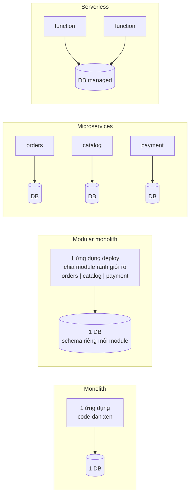
```mermaid
flowchart LR
    subgraph MONO["Monolith"]
        M1["1 ứng dụng<br/>code đan xen"] --> MDB[("1 DB")]
    end
    subgraph MODMONO["Modular monolith"]
        MM["1 ứng dụng deploy<br/>chia module ranh giới rõ<br/>orders | catalog | payment"] --> MMDB[("1 DB<br/>schema riêng mỗi module")]
    end
    subgraph MS["Microservices"]
        S1["orders"] --> D1[("DB")]
        S2["catalog"] --> D2[("DB")]
        S3["payment"] --> D3[("DB")]
    end
    subgraph SL["Serverless"]
        F1["function"] & F2["function"] --> MDBS[("DB managed")]
    end
```

| Tiêu chí | Monolith | Modular monolith | Microservices | Serverless (FaaS) |
|---|---|---|---|---|
| Đơn vị deploy | 1 | 1 | Nhiều (mỗi service) | Mỗi function |
| Ranh giới module | Thường mờ | **Rõ, được ép bằng code** | Rõ (qua mạng) | Theo function |
| Gọi giữa các phần | Hàm (ns) | Hàm qua interface (ns) | **Mạng** (ms, có thể lỗi) | Mạng / sự kiện |
| Transaction | ACID dễ | ACID dễ | **Khó** (saga) | Khó |
| Scale | Cả khối | Cả khối | Từng service | Tự động, theo request |
| Độ phức tạp vận hành | Thấp | Thấp | **Cao** (CI/CD, observability, mạng) | Thấp–vừa (nhưng khó debug) |
| Team phù hợp | 1–10 người | 5–50 người | Nhiều team độc lập (thường 50+) | Nhỏ, tải thất thường |
| Rủi ro chính | "Big ball of mud" | Kỷ luật ranh giới | **Distributed monolith**, chi phí | Cold start, vendor lock-in, giới hạn thời gian chạy |

### 2.2. Monolith không phải là xấu

Monolith bị hiểu lầm là "cũ kỹ". Thực tế Shopify, Basecamp, Stack Overflow chạy monolith quy mô rất lớn. Một monolith có cấu trúc tốt:

- Deploy một lần, debug một chỗ, stack trace đầy đủ.
- Transaction ACID trong một database — không cần saga.
- Refactor ranh giới module chỉ là di chuyển code, IDE hỗ trợ.

Vấn đề thật sự là **big ball of mud** (cục bùn to): module nào cũng gọi thẳng vào bảng của module khác, sửa một chỗ vỡ ba chỗ.

### 2.3. Modular monolith — điểm khởi đầu được khuyên dùng

Một ứng dụng, một lần deploy, nhưng chia thành **module theo nghiệp vụ** với luật:

1. Mỗi module có **API công khai** (interface) — module khác chỉ gọi qua đó.
2. Mỗi module **sở hữu bảng của mình** (schema riêng); không `JOIN` sang bảng module khác.
3. Giao tiếp có thể qua **event nội bộ** (in-process) để giảm phụ thuộc.
4. Ranh giới được **kiểm tra tự động** (Go: `internal/` package; Python: `import-linter`; Java: ArchUnit).

Khi một module thật sự cần scale riêng hoặc cần một team riêng, việc tách thành microservice trở nên **dễ** vì ranh giới đã có sẵn.

### 2.4. Serverless

Viết **function** (AWS Lambda, Cloud Run functions), nền tảng lo mọi thứ còn lại: scale từ 0 đến hàng nghìn bản sao, tính tiền theo số lần gọi và thời gian chạy. Rất hợp cho: xử lý ảnh sau khi upload, webhook, cron job, API có tải thất thường. Kém hợp cho: kết nối DB dài hạn (mỗi function mở connection → cạn connection pool, cần RDS Proxy/pgbouncer), tác vụ chạy lâu, tải cao đều đặn (đắt hơn container).

## 📖 3. Layered architecture (kiến trúc phân lớp)

Kiểu kinh điển, gần như ai cũng bắt đầu từ đây:

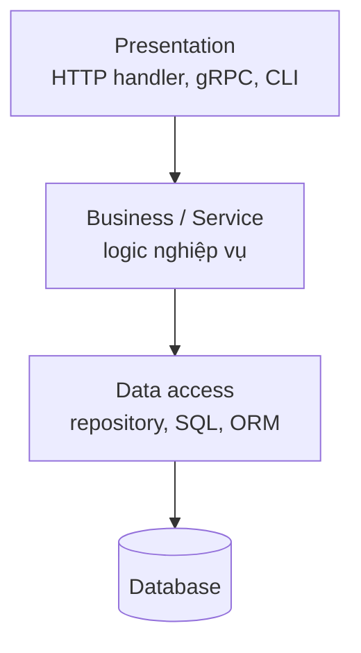
```mermaid
flowchart TB
    P["Presentation<br/>HTTP handler, gRPC, CLI"] --> B["Business / Service<br/>logic nghiệp vụ"]
    B --> D["Data access<br/>repository, SQL, ORM"]
    D --> DB[("Database")]
```

Luật: lớp trên chỉ gọi lớp ngay dưới. Dễ hiểu, dễ bắt đầu.

**Vấn đề**: lớp nghiệp vụ **phụ thuộc** vào lớp data access → logic nghiệp vụ dính chặt vào DB/ORM. Muốn test tính giá khuyến mãi phải dựng database; muốn đổi PostgreSQL sang DynamoDB phải sửa cả lớp nghiệp vụ. Thiết kế thường bắt đầu từ **bảng** ("database-driven design") thay vì từ **nghiệp vụ**.

## 📖 4. Clean / Hexagonal architecture (Ports & Adapters)

### 4.1. Ý tưởng: đảo chiều phụ thuộc

Hexagonal (Alistair Cockburn), Onion (Jeffrey Palermo), Clean Architecture (Robert C. Martin) là các biến thể của cùng một ý: **nghiệp vụ nằm ở trung tâm và không phụ thuộc vào gì cả**; DB, HTTP, message queue, framework là **chi tiết** ở vòng ngoài, cắm vào qua **cổng (port)**.

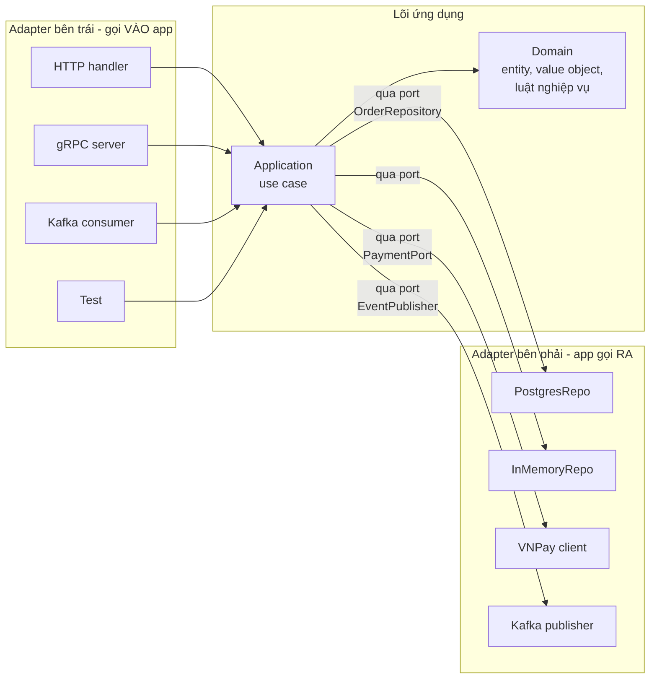
```mermaid
flowchart LR
    subgraph DRIVING["Adapter bên trái - gọi VÀO app"]
        HTTP["HTTP handler"]
        GRPC["gRPC server"]
        CONS["Kafka consumer"]
        TEST["Test"]
    end
    subgraph CORE["Lõi ứng dụng"]
        UC["Application<br/>use case"]
        DOM["Domain<br/>entity, value object,<br/>luật nghiệp vụ"]
        UC --> DOM
    end
    subgraph DRIVEN["Adapter bên phải - app gọi RA"]
        PG["PostgresRepo"]
        MEM["InMemoryRepo"]
        PAY["VNPay client"]
        PUB["Kafka publisher"]
    end
    HTTP --> UC
    GRPC --> UC
    CONS --> UC
    TEST --> UC
    UC -->|"qua port<br/>OrderRepository"| PG
    UC -->|"qua port"| MEM
    UC -->|"qua port<br/>PaymentPort"| PAY
    UC -->|"qua port<br/>EventPublisher"| PUB
```

- **Port**: interface do **lõi định nghĩa**, nói bằng ngôn ngữ nghiệp vụ (`OrderRepository.Save(order)`, không phải `ExecSQL`).
  - *Driving port* (bên trái): cách thế giới gọi vào app — các use case.
  - *Driven port* (bên phải): thứ app cần từ bên ngoài — lưu trữ, thanh toán, gửi event.
- **Adapter**: cài đặt cụ thể của port (`PostgresOrderRepository`, `VNPayGateway`, `HTTPHandler`).
- **Dependency rule**: mũi tên phụ thuộc **chỉ hướng vào trong**. Domain không `import` gì từ adapter.

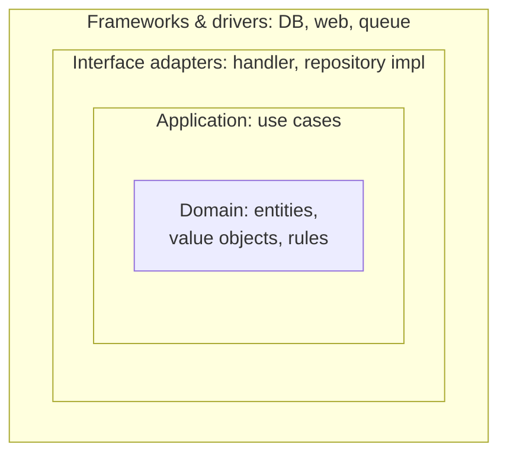
```mermaid
flowchart TB
    subgraph L4["Frameworks & drivers: DB, web, queue"]
        subgraph L3["Interface adapters: handler, repository impl"]
            subgraph L2["Application: use cases"]
                L1["Domain: entities,<br/>value objects, rules"]
            end
        end
    end
```

> 💡 **Ví von**: lõi ứng dụng giống **chiếc laptop**, port giống **cổng USB-C**. Laptop không cần biết bạn cắm màn hình Dell hay LG, sạc Anker hay Apple — miễn là đúng chuẩn cổng. Đổi màn hình (đổi DB) không cần mở laptop ra hàn lại (sửa nghiệp vụ). Và khi test, bạn cắm một "màn hình giả" (fake adapter) vào là xong.

### 4.2. Cấu trúc thư mục

=== "Go"

    ```text
    order-service/
    ├── cmd/
    │   └── api/
    │       └── main.go            # composition root: đọc config, tạo adapter, nối dây
    ├── internal/
    │   ├── domain/                # KHÔNG import database/sql, net/http...
    │   │   ├── order.go           # aggregate Order, luật nghiệp vụ
    │   │   ├── money.go           # value object
    │   │   └── events.go          # OrderPlaced, OrderCancelled
    │   ├── app/                   # use case + định nghĩa port
    │   │   ├── ports.go           # OrderRepository, PaymentPort, EventPublisher
    │   │   ├── place_order.go
    │   │   └── place_order_test.go   # test với fake adapter, không cần DB
    │   └── adapter/
    │       ├── http/              # handler: JSON <-> command
    │       ├── postgres/          # OrderRepository bằng SQL (+ integration test)
    │       ├── vnpay/             # PaymentPort gọi API cổng thanh toán
    │       └── kafka/             # EventPublisher (qua outbox)
    ├── migrations/
    └── go.mod
    ```

    Thư mục `internal/` được **Go compiler ép**: code ngoài module không import được — một cách miễn phí để giữ ranh giới.

=== "Python"

    ```text
    order_service/
    ├── pyproject.toml
    ├── src/order_service/
    │   ├── main.py                # composition root: tạo FastAPI app, nối adapter
    │   ├── domain/                # thuần Python — không import sqlalchemy, fastapi
    │   │   ├── order.py
    │   │   ├── money.py
    │   │   └── events.py
    │   ├── app/
    │   │   ├── ports.py           # Protocol: OrderRepository, PaymentPort...
    │   │   └── place_order.py
    │   └── adapters/
    │       ├── api/               # FastAPI router, Pydantic schema (DTO)
    │       ├── db/                # SQLAlchemy model + repository
    │       ├── payment/
    │       └── messaging/
    ├── migrations/                # Alembic
    └── tests/
        ├── unit/                  # domain + app với fake
        └── integration/           # adapter với DB thật
    ```

    Dùng **import-linter** trong CI để cấm `domain` import `adapters` hay `sqlalchemy`.

!!! tip "Package theo nghiệp vụ, không theo kỹ thuật"
    Khi hệ thống lớn lên (modular monolith), cấp cao nhất nên chia theo **nghiệp vụ** (`orders/`, `catalog/`, `payment/`), bên trong mỗi cái mới chia `domain/app/adapter`. Tránh kiểu `controllers/`, `services/`, `models/` ở cấp cao nhất cho cả ứng dụng — thêm một tính năng phải chạm vào mọi thư mục.

### 4.3. Ví dụ chạy được: ports & adapters + DDD

Để chạy được bằng một lệnh, ví dụ dưới gói gọn trong **một file**, chia thành các vùng tương ứng với các package ở trên. Chú ý:

- `Money` là **value object**, `Order` là **aggregate root**, `OrderPlaced` là **domain event** (mục 5).
- Use case `PlaceOrderHandler` chỉ biết **interface** (port), không biết map hay PostgreSQL.
- `main` là **composition root** — nơi duy nhất chọn adapter cụ thể.

=== "Go"

    ```go
    package main

    import (
    	"errors"
    	"fmt"
    	"sort"
    )

    // ================= DOMAIN — trái tim, không phụ thuộc DB/HTTP/framework =================

    // Money là VALUE OBJECT: không có ID, bất biến, bằng nhau khi giá trị bằng nhau.
    type Money struct {
    	Amount   int64
    	Currency string
    }

    func VND(a int64) Money { return Money{Amount: a, Currency: "VND"} }

    func (m Money) Add(o Money) Money {
    	if m.Currency != o.Currency {
    		panic("không cộng được hai loại tiền khác nhau")
    	}
    	return Money{m.Amount + o.Amount, m.Currency}
    }
    func (m Money) Times(n int) Money { return Money{m.Amount * int64(n), m.Currency} }
    func (m Money) String() string    { return fmt.Sprintf("%d %s", m.Amount, m.Currency) }

    type OrderLine struct {
    	SKU   string
    	Qty   int
    	Price Money
    }

    // OrderPlaced là DOMAIN EVENT: "điều gì đó đã xảy ra" trong nghiệp vụ.
    type OrderPlaced struct {
    	OrderID string
    	Total   Money
    }

    var (
    	ErrEmptyOrder  = errors.New("đơn hàng phải có ít nhất 1 sản phẩm")
    	ErrQtyLimit    = errors.New("mỗi sản phẩm từ 1 đến 10 cái")
    	ErrNotEditable = errors.New("chỉ sửa được đơn ở trạng thái DRAFT")
    )

    // Order là AGGREGATE ROOT (đồng thời là ENTITY: có ID, có vòng đời).
    // Mọi thay đổi bên trong (lines) phải đi qua method của nó → luật nghiệp vụ luôn đúng.
    type Order struct {
    	ID         string
    	CustomerID string
    	lines      []OrderLine // private: bên ngoài không sửa trực tiếp được
    	status     string
    }

    func NewOrder(id, customerID string) *Order {
    	return &Order{ID: id, CustomerID: customerID, status: "DRAFT"}
    }

    func (o *Order) AddItem(sku string, qty int, price Money) error {
    	if o.status != "DRAFT" {
    		return ErrNotEditable
    	}
    	for i := range o.lines {
    		if o.lines[i].SKU == sku {
    			if o.lines[i].Qty+qty > 10 {
    				return ErrQtyLimit
    			}
    			o.lines[i].Qty += qty
    			return nil
    		}
    	}
    	if qty < 1 || qty > 10 {
    		return ErrQtyLimit
    	}
    	o.lines = append(o.lines, OrderLine{sku, qty, price})
    	return nil
    }

    func (o *Order) Total() Money {
    	total := VND(0)
    	for _, l := range o.lines {
    		total = total.Add(l.Price.Times(l.Qty))
    	}
    	return total
    }

    func (o *Order) Place() (OrderPlaced, error) {
    	if o.status != "DRAFT" {
    		return OrderPlaced{}, ErrNotEditable
    	}
    	if len(o.lines) == 0 {
    		return OrderPlaced{}, ErrEmptyOrder
    	}
    	o.status = "PLACED"
    	return OrderPlaced{OrderID: o.ID, Total: o.Total()}, nil
    }

    func (o *Order) Status() string { return o.status }

    // ================= PORTS — interface do phía trong định nghĩa =================

    type OrderRepository interface { // driven port (bên phải)
    	Save(o *Order) error
    	ByID(id string) (*Order, error)
    }

    type Catalog interface {
    	PriceOf(sku string) (Money, error)
    }

    type EventPublisher interface {
    	Publish(e OrderPlaced) error
    }

    // ================= APPLICATION — use case, điều phối domain + ports =================

    type PlaceOrderCmd struct {
    	OrderID, CustomerID string
    	Items               map[string]int // sku -> số lượng
    }

    type PlaceOrderHandler struct { // driving port (bên trái) — HTTP/gRPC/CLI gọi vào đây
    	Orders  OrderRepository
    	Catalog Catalog
    	Events  EventPublisher
    }

    func (h PlaceOrderHandler) Handle(cmd PlaceOrderCmd) (Money, error) {
    	order := NewOrder(cmd.OrderID, cmd.CustomerID)

    	skus := make([]string, 0, len(cmd.Items))
    	for sku := range cmd.Items {
    		skus = append(skus, sku)
    	}
    	sort.Strings(skus) // thứ tự ổn định

    	for _, sku := range skus {
    		price, err := h.Catalog.PriceOf(sku) // giá lấy từ server, KHÔNG tin client
    		if err != nil {
    			return Money{}, err
    		}
    		if err := order.AddItem(sku, cmd.Items[sku], price); err != nil {
    			return Money{}, err
    		}
    	}
    	event, err := order.Place()
    	if err != nil {
    		return Money{}, err
    	}
    	if err := h.Orders.Save(order); err != nil {
    		return Money{}, err
    	}
    	// Thực tế: lưu event vào bảng outbox trong CÙNG transaction (xem Bài 9)
    	return event.Total, h.Events.Publish(event)
    }

    // ================= ADAPTERS — cài đặt cụ thể của ports =================

    type InMemoryOrders struct{ data map[string]*Order }

    func (r *InMemoryOrders) Save(o *Order) error { r.data[o.ID] = o; return nil }
    func (r *InMemoryOrders) ByID(id string) (*Order, error) {
    	if o, ok := r.data[id]; ok {
    		return o, nil
    	}
    	return nil, fmt.Errorf("không tìm thấy đơn %q", id)
    }

    type StaticCatalog map[string]Money

    func (c StaticCatalog) PriceOf(sku string) (Money, error) {
    	if p, ok := c[sku]; ok {
    		return p, nil
    	}
    	return Money{}, fmt.Errorf("không có sản phẩm %q", sku)
    }

    type StdoutPublisher struct{}

    func (StdoutPublisher) Publish(e OrderPlaced) error {
    	fmt.Printf("[event] OrderPlaced order=%s total=%s\n", e.OrderID, e.Total)
    	return nil
    }

    // ================= MAIN — "composition root": nơi DUY NHẤT biết mọi adapter =================

    func main() {
    	repo := &InMemoryOrders{data: map[string]*Order{}}
    	h := PlaceOrderHandler{
    		Orders:  repo,
    		Catalog: StaticCatalog{"ao-thun": VND(150_000), "non": VND(90_000)},
    		Events:  StdoutPublisher{},
    	}

    	total, err := h.Handle(PlaceOrderCmd{"o-1", "c-1", map[string]int{"ao-thun": 2, "non": 1}})
    	if err != nil {
    		panic(err)
    	}
    	fmt.Println("o-1 tổng:", total)

    	_, err = h.Handle(PlaceOrderCmd{"o-2", "c-1", map[string]int{}})
    	fmt.Println("o-2:", err)
    	_, err = h.Handle(PlaceOrderCmd{"o-3", "c-1", map[string]int{"ao-thun": 11}})
    	fmt.Println("o-3:", err)
    	_, err = h.Handle(PlaceOrderCmd{"o-4", "c-1", map[string]int{"dep": 1}})
    	fmt.Println("o-4:", err)

    	o, _ := repo.ByID("o-1")
    	fmt.Println("đã lưu:", o.ID, o.Status(), o.Total())
    	fmt.Println("value object bằng nhau:", VND(90_000) == VND(90_000))
    }
    ```

=== "Python"

    ```python
    from __future__ import annotations

    from dataclasses import dataclass, field
    from typing import Protocol

    # ================= DOMAIN — trái tim, không phụ thuộc DB/HTTP/framework =================


    @dataclass(frozen=True)  # VALUE OBJECT: bất biến, so sánh theo giá trị
    class Money:
        amount: int
        currency: str = "VND"

        def __add__(self, other: Money) -> Money:
            if self.currency != other.currency:
                raise ValueError("không cộng được hai loại tiền khác nhau")
            return Money(self.amount + other.amount, self.currency)

        def times(self, n: int) -> Money:
            return Money(self.amount * n, self.currency)

        def __str__(self) -> str:
            return f"{self.amount} {self.currency}"


    @dataclass
    class OrderLine:
        sku: str
        qty: int
        price: Money


    @dataclass(frozen=True)  # DOMAIN EVENT
    class OrderPlaced:
        order_id: str
        total: Money


    class DomainError(Exception):
        pass


    EMPTY_ORDER = "đơn hàng phải có ít nhất 1 sản phẩm"
    QTY_LIMIT = "mỗi sản phẩm từ 1 đến 10 cái"
    NOT_EDITABLE = "chỉ sửa được đơn ở trạng thái DRAFT"


    class Order:
        """AGGREGATE ROOT: mọi thay đổi bên trong đi qua method → luật nghiệp vụ luôn đúng."""

        def __init__(self, order_id: str, customer_id: str):
            self.id = order_id
            self.customer_id = customer_id
            self._lines: list[OrderLine] = []
            self._status = "DRAFT"

        def add_item(self, sku: str, qty: int, price: Money) -> None:
            if self._status != "DRAFT":
                raise DomainError(NOT_EDITABLE)
            for line in self._lines:
                if line.sku == sku:
                    if line.qty + qty > 10:
                        raise DomainError(QTY_LIMIT)
                    line.qty += qty
                    return
            if not 1 <= qty <= 10:
                raise DomainError(QTY_LIMIT)
            self._lines.append(OrderLine(sku, qty, price))

        def total(self) -> Money:
            total = Money(0)
            for line in self._lines:
                total = total + line.price.times(line.qty)
            return total

        def place(self) -> OrderPlaced:
            if self._status != "DRAFT":
                raise DomainError(NOT_EDITABLE)
            if not self._lines:
                raise DomainError(EMPTY_ORDER)
            self._status = "PLACED"
            return OrderPlaced(self.id, self.total())

        @property
        def status(self) -> str:
            return self._status


    # ================= PORTS — interface do phía trong định nghĩa =================


    class OrderRepository(Protocol):
        def save(self, order: Order) -> None: ...
        def by_id(self, order_id: str) -> Order: ...


    class Catalog(Protocol):
        def price_of(self, sku: str) -> Money: ...


    class EventPublisher(Protocol):
        def publish(self, event: OrderPlaced) -> None: ...


    # ================= APPLICATION — use case =================


    @dataclass
    class PlaceOrderCmd:
        order_id: str
        customer_id: str
        items: dict[str, int] = field(default_factory=dict)


    class PlaceOrderHandler:
        def __init__(self, orders: OrderRepository, catalog: Catalog, events: EventPublisher):
            self.orders, self.catalog, self.events = orders, catalog, events

        def handle(self, cmd: PlaceOrderCmd) -> Money:
            order = Order(cmd.order_id, cmd.customer_id)
            for sku in sorted(cmd.items):
                price = self.catalog.price_of(sku)  # giá lấy từ server, KHÔNG tin client
                order.add_item(sku, cmd.items[sku], price)
            event = order.place()
            self.orders.save(order)
            # Thực tế: lưu event vào bảng outbox trong CÙNG transaction (xem Bài 9)
            self.events.publish(event)
            return event.total


    # ================= ADAPTERS =================


    class InMemoryOrders:
        def __init__(self):
            self.data: dict[str, Order] = {}

        def save(self, order: Order) -> None:
            self.data[order.id] = order

        def by_id(self, order_id: str) -> Order:
            if order_id not in self.data:
                raise KeyError(f'không tìm thấy đơn "{order_id}"')
            return self.data[order_id]


    class StaticCatalog:
        def __init__(self, prices: dict[str, Money]):
            self.prices = prices

        def price_of(self, sku: str) -> Money:
            if sku not in self.prices:
                raise DomainError(f'không có sản phẩm "{sku}"')
            return self.prices[sku]


    class StdoutPublisher:
        def publish(self, event: OrderPlaced) -> None:
            print(f"[event] OrderPlaced order={event.order_id} total={event.total}")


    # ================= MAIN — composition root =================

    if __name__ == "__main__":
        repo = InMemoryOrders()
        h = PlaceOrderHandler(
            orders=repo,
            catalog=StaticCatalog({"ao-thun": Money(150_000), "non": Money(90_000)}),
            events=StdoutPublisher(),
        )

        print("o-1 tổng:", h.handle(PlaceOrderCmd("o-1", "c-1", {"ao-thun": 2, "non": 1})))

        for cmd in [
            PlaceOrderCmd("o-2", "c-1", {}),
            PlaceOrderCmd("o-3", "c-1", {"ao-thun": 11}),
            PlaceOrderCmd("o-4", "c-1", {"dep": 1}),
        ]:
            try:
                h.handle(cmd)
            except DomainError as e:
                print(f"{cmd.order_id}:", e)

        o = repo.by_id("o-1")
        print("đã lưu:", o.id, o.status, o.total())
        print("value object bằng nhau:", str(Money(90_000) == Money(90_000)).lower())
    ```

```text
# Output (Go và Python giống nhau):
[event] OrderPlaced order=o-1 total=390000 VND
o-1 tổng: 390000 VND
o-2: đơn hàng phải có ít nhất 1 sản phẩm
o-3: mỗi sản phẩm từ 1 đến 10 cái
o-4: không có sản phẩm "dep"
đã lưu: o-1 PLACED 390000 VND
value object bằng nhau: true
```

Muốn chuyển sang PostgreSQL? Viết `PostgresOrders` cài đặt `OrderRepository`, đổi **một dòng** trong `main`. Domain và use case không đổi một ký tự. Muốn test use case? Dùng đúng `InMemoryOrders` như trên — đây chính là **fake** ở [Bài 13](./13-testing-cicd-deployment.md).

!!! warning "Đừng biến hexagonal thành nghi lễ"
    Một CRUD service quản lý danh mục tỉnh/thành không cần 4 lớp, 12 interface và mapper giữa 3 loại model. Kiến trúc sạch đáng giá khi **nghiệp vụ phức tạp** (đơn hàng, thanh toán, khuyến mãi, điều phối tài xế). Với phần CRUD đơn giản, handler → repository là đủ. Interface nên được tạo **khi có ít nhất hai cài đặt** (production + test) — không tạo "cho đẹp".

## 📖 5. Domain-Driven Design (DDD) — những thứ cốt lõi

DDD (Eric Evans, 2003) là cách tiếp cận thiết kế phần mềm **xoay quanh nghiệp vụ**, cộng tác chặt với chuyên gia nghiệp vụ (domain expert). DDD có hai phần: **strategic** (chia hệ thống lớn) và **tactical** (thiết kế code bên trong). Ta dùng ví dụ một sàn **thương mại điện tử**.

### 5.1. Ubiquitous language — ngôn ngữ chung

Dev, PM, kế toán, CSKH dùng **cùng một từ cho cùng một khái niệm**, và từ đó xuất hiện **y nguyên trong code**.

| Nghiệp vụ nói | Code nên là | Tránh |
|---|---|---|
| "Khách **đặt đơn**" | `order.Place()` | `order.SetStatus(2)` |
| "**Hủy đơn** trước khi giao" | `order.Cancel(reason)` | `UpdateOrder(o, map{"status": "X"})` |
| "Đơn **đã giao cho đơn vị vận chuyển**" | `OrderShipped` event | `StatusChangedEvent{3}` |
| "**Voucher** chỉ áp dụng đơn từ 200k" | `voucher.ApplicableTo(order)` | `if o.total > 200000 && v.type == 1` rải khắp nơi |

Khi PM nói "đơn bị **treo**", cả team phải hiểu đúng một nghĩa — nếu không, hãy định nghĩa và ghi vào **glossary**.

### 5.2. Bounded context — cùng một từ, nhiều nghĩa

Từ "**Sản phẩm**" trong sàn thương mại điện tử có nghĩa khác nhau tùy bộ phận:

| Context | "Sản phẩm" là gì với họ | Thuộc tính quan tâm |
|---|---|---|
| **Catalog** | Thứ để trưng bày, tìm kiếm | Tên, mô tả, ảnh, danh mục, thuộc tính (size, màu) |
| **Pricing** | Thứ có giá | Giá gốc, giá khuyến mãi, lịch giá |
| **Inventory** | Thứ nằm trong kho | SKU, số lượng tồn theo kho, số lượng đang giữ chỗ |
| **Shipping** | Một kiện hàng | Cân nặng, kích thước, hàng dễ vỡ |
| **Ordering** | Một dòng trong đơn | SKU, số lượng, **giá tại thời điểm đặt** (snapshot) |

Cố nhồi mọi thứ vào **một** class `Product` khổng lồ dùng chung → class 80 field, ai cũng sửa, ai cũng sợ. **Bounded context** là ranh giới mà bên trong đó một mô hình có nghĩa **nhất quán**. Mỗi context có model riêng, chỉ chia sẻ **ID** (`sku`).

Bounded context là **ứng viên tự nhiên nhất** để chia module (modular monolith) hoặc service (microservices).

### 5.3. Context map

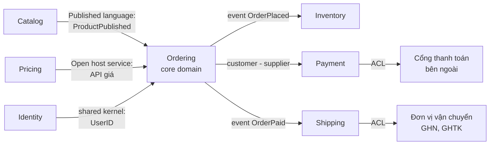
```mermaid
flowchart LR
    CAT["Catalog"]
    PRI["Pricing"]
    INV["Inventory"]
    ORD["Ordering<br/>core domain"]
    PAY["Payment"]
    SHP["Shipping"]
    IDN["Identity"]
    EXT["Cổng thanh toán<br/>bên ngoài"]
    GHN["Đơn vị vận chuyển<br/>GHN, GHTK"]

    CAT -->|"Published language:<br/>ProductPublished"| ORD
    PRI -->|"Open host service:<br/>API giá"| ORD
    ORD -->|"event OrderPlaced"| INV
    ORD -->|"customer - supplier"| PAY
    PAY -->|"ACL"| EXT
    ORD -->|"event OrderPaid"| SHP
    SHP -->|"ACL"| GHN
    IDN -->|"shared kernel:<br/>UserID"| ORD
```

Các kiểu quan hệ hay gặp:

| Quan hệ | Nghĩa |
|---|---|
| **Customer–Supplier** | Upstream (supplier) cung cấp, downstream (customer) có tiếng nói về API |
| **Conformist** | Downstream chấp nhận nguyên mô hình của upstream (không có quyền thương lượng) |
| **Anti-Corruption Layer (ACL)** | Lớp **dịch** mô hình bên ngoài sang mô hình của mình — để API "kỳ quặc" của cổng thanh toán không lan vào nghiệp vụ |
| **Open Host Service / Published Language** | Upstream công bố API/định dạng event chuẩn, có tài liệu, cho nhiều bên dùng |
| **Shared Kernel** | Hai context dùng chung một phần mô hình nhỏ (cẩn thận: thay đổi phải hai bên đồng ý) |

**Core domain** (nghiệp vụ lõi — thứ làm công ty khác biệt: ordering, khuyến mãi, điều phối) đáng đầu tư thiết kế kỹ. **Generic subdomain** (gửi email, xác thực, thanh toán) nên **mua/dùng dịch vụ có sẵn**.

### 5.4. Entity và Value object

| | Entity | Value object |
|---|---|---|
| Nhận diện bằng | **ID** | **Giá trị** các thuộc tính |
| Thay đổi | Có vòng đời, trạng thái thay đổi | **Bất biến** — muốn đổi thì tạo cái mới |
| Ví dụ | `Order`, `Customer`, `Shipment` | `Money`, `Address`, `DateRange`, `Email`, `Quantity` |
| So sánh | Hai đơn cùng ID là một đơn (dù tổng tiền khác) | `Money{90000, VND} == Money{90000, VND}` |

Value object giúp code **an toàn và biểu cảm** hơn dùng kiểu nguyên thủy ("primitive obsession"): `Money` không thể cộng VND với USD; `Email` luôn hợp lệ vì được validate lúc tạo; hàm `Transfer(from, to AccountID, amount Money)` không thể truyền nhầm thứ tự như `Transfer(string, string, int64)`.

### 5.5. Aggregate

**Aggregate** là một cụm entity + value object được xem như **một đơn vị nhất quán**, truy cập qua **aggregate root**. Trong ví dụ mục 4.3, `Order` là root, `OrderLine` nằm bên trong. Luật "mỗi sản phẩm tối đa 10 cái" và "đơn đã đặt thì không sửa" được đảm bảo vì **không ai sửa `lines` trực tiếp được**.

Các quy tắc thiết kế aggregate (Vaughn Vernon):

1. **Bảo vệ bất biến (invariant)** bên trong ranh giới: mọi thay đổi đi qua method của root.
2. **Giữ aggregate nhỏ**: `Customer` không chứa danh sách 10.000 `Order` — load một khách hàng không nên kéo cả lịch sử mua hàng.
3. **Tham chiếu aggregate khác bằng ID**: `Order` chứa `CustomerID`, không chứa object `Customer`.
4. **Một transaction chỉ sửa một aggregate**. Cần cập nhật aggregate khác → phát **domain event**, xử lý ở transaction khác (**eventual consistency**).

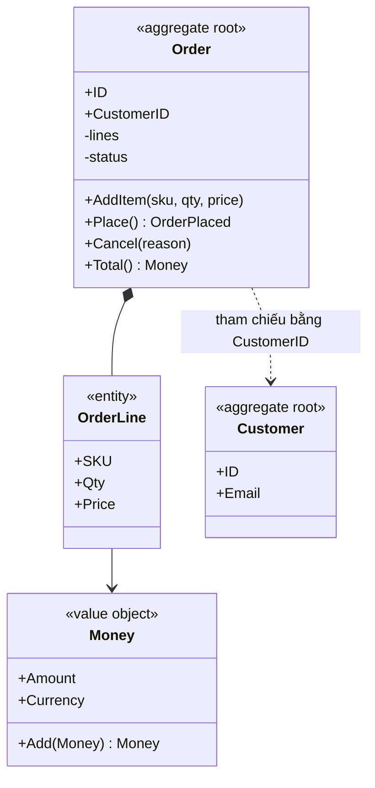
```mermaid
classDiagram
    class Order {
        <<aggregate root>>
        +ID
        +CustomerID
        -lines
        -status
        +AddItem(sku, qty, price)
        +Place() OrderPlaced
        +Cancel(reason)
        +Total() Money
    }
    class OrderLine {
        <<entity>>
        +SKU
        +Qty
        +Price
    }
    class Money {
        <<value object>>
        +Amount
        +Currency
        +Add(Money) Money
    }
    class Customer {
        <<aggregate root>>
        +ID
        +Email
    }
    Order *-- OrderLine
    OrderLine --> Money
    Order ..> Customer : tham chiếu bằng CustomerID
```

### 5.6. Domain event

Domain event mô tả **điều đã xảy ra** trong nghiệp vụ, đặt tên ở **thì quá khứ**: `OrderPlaced`, `PaymentCaptured`, `StockReserved`, `OrderShipped`. Chúng là "keo" nối các aggregate và các bounded context mà không phụ thuộc trực tiếp:

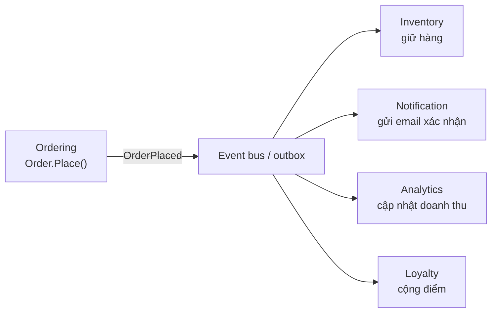
```mermaid
flowchart LR
    O["Ordering<br/>Order.Place()"] -->|"OrderPlaced"| BUS["Event bus / outbox"]
    BUS --> I["Inventory<br/>giữ hàng"]
    BUS --> N["Notification<br/>gửi email xác nhận"]
    BUS --> A["Analytics<br/>cập nhật doanh thu"]
    BUS --> L["Loyalty<br/>cộng điểm"]
```

Thêm tính năng "cộng điểm thưởng" = thêm một consumer mới, **không sửa** code Ordering. Để event không bị mất khi DB commit xong mà publish lỗi, dùng **transactional outbox** ([Bài 9](./09-message-queues.md)).

!!! note "Event storming"
    Cách nhanh nhất để tìm bounded context và aggregate: mời dev + domain expert vào phòng, dán giấy note màu cam ghi **mọi domain event** theo dòng thời gian ("Khách đặt đơn", "Nhà hàng xác nhận", "Tài xế nhận đơn"...), rồi thêm command, actor, policy. Các cụm event gắn bó với nhau thường chính là bounded context.

## 📖 6. Giao tiếp giữa các service

### 6.1. Đồng bộ vs bất đồng bộ

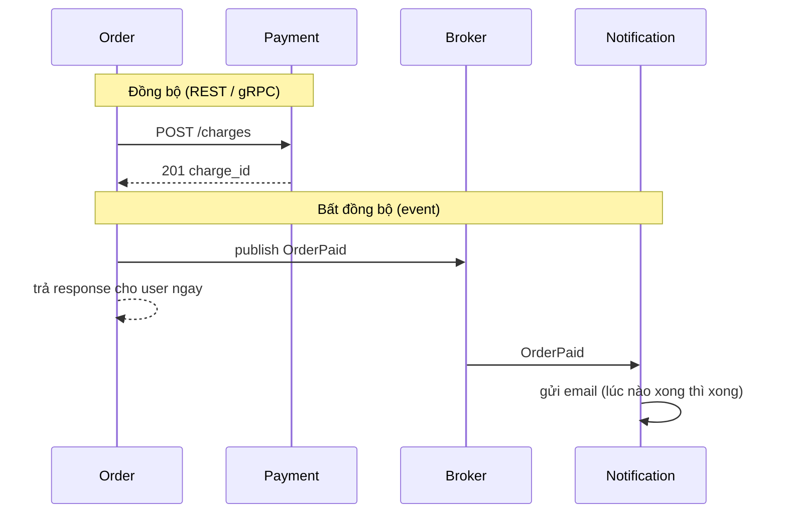
```mermaid
sequenceDiagram
    participant O as Order
    participant P as Payment
    participant B as Broker
    participant N as Notification
    Note over O,P: Đồng bộ (REST / gRPC)
    O->>P: POST /charges
    P-->>O: 201 charge_id
    Note over O,N: Bất đồng bộ (event)
    O->>B: publish OrderPaid
    O-->>O: trả response cho user ngay
    B->>N: OrderPaid
    N->>N: gửi email (lúc nào xong thì xong)
```

| | Đồng bộ (REST, gRPC) | Bất đồng bộ (queue, event stream) |
|---|---|---|
| Mô hình | Hỏi – đợi – đáp | Gửi – quên (fire and forget) / pub-sub |
| **Temporal coupling** | Có: bên kia **phải đang sống** | Không: bên kia chết thì message đợi trong queue |
| Độ trễ cảm nhận | Cộng dồn qua mỗi hop | Thấp cho người gọi, kết quả cuối đến sau |
| Nhất quán | Biết kết quả ngay | **Eventual consistency** |
| Debug | Dễ hơn (stack trace, trace) | Khó hơn (cần tracing + correlation ID) |
| Dùng khi | **Cần câu trả lời ngay** để tiếp tục (kiểm tra tồn kho, lấy giá) | **Thông báo điều đã xảy ra**, tác vụ lâu, fan-out cho nhiều bên |

**Phép tính đáng sợ của chuỗi gọi đồng bộ**: nếu một request đi qua 5 service, mỗi service sẵn sàng 99.9%, thì độ sẵn sàng tổng là `0.999^5 ≈ 99.5%` — tức ~3.6 giờ sập mỗi tháng thay vì 43 phút. Độ trễ cũng cộng dồn: p99 của cả chuỗi xấu hơn p99 của từng service. Vì vậy: giảm độ dài chuỗi gọi đồng bộ, luôn có **timeout, retry có backoff + jitter, circuit breaker** ([Bài 11](./11-observability-reliability.md)).

### 6.2. REST hay gRPC giữa các service?

- **REST/JSON**: đơn giản, dễ debug bằng `curl`, hợp cho API public ([Bài 3](./03-api-design.md)).
- **gRPC/Protobuf**: nhanh hơn, schema chặt chẽ, sinh code client tự động, streaming — rất hợp cho giao tiếp **nội bộ** giữa các service ([Go - Bài 18](../golang/18-grpc.md)).

### 6.3. Choreography vs orchestration

Khi một quy trình nghiệp vụ trải qua nhiều service:

- **Choreography (vũ đạo)**: không ai chỉ huy; mỗi service nghe event và tự biết phải làm gì. Linh hoạt, ít phụ thuộc — nhưng khó nhìn thấy toàn cảnh quy trình ("ai làm gì sau event này?").
- **Orchestration (nhạc trưởng)**: một service (orchestrator) điều phối, gọi từng bước và xử lý lỗi. Quy trình tường minh ở một chỗ, dễ theo dõi — nhưng orchestrator có thể thành "god service".

Quy tắc thực dụng: quy trình **ngắn, ít bước** → choreography; quy trình **dài, nhiều nhánh lỗi, cần theo dõi trạng thái** (đặt đồ ăn, hoàn tiền) → orchestration (có thể dùng engine như **Temporal**, AWS Step Functions). Ví dụ ở mục 9.

## 📖 7. API gateway, BFF, service discovery, service mesh

### 7.1. API gateway

Client (app mobile, web) không nên biết có 30 service phía sau. **API gateway** là cửa ngõ duy nhất:

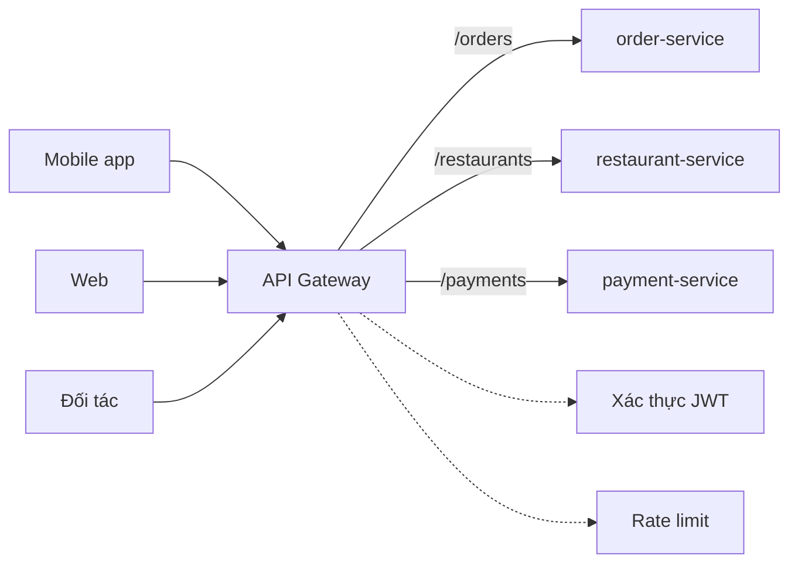
```mermaid
flowchart LR
    APP["Mobile app"] --> GW["API Gateway"]
    WEB["Web"] --> GW
    PARTNER["Đối tác"] --> GW
    GW -->|"/orders"| ORD["order-service"]
    GW -->|"/restaurants"| RES["restaurant-service"]
    GW -->|"/payments"| PAY["payment-service"]
    GW -.-> AUTH["Xác thực JWT"]
    GW -.-> RL["Rate limit"]
```

Việc gateway thường làm (cross-cutting concerns): **routing**, **TLS termination**, **xác thực** token ([Bài 4](./04-auth.md)), **rate limiting**, CORS, request ID/tracing, nén, cache, chuyển đổi giao thức (REST ngoài → gRPC trong). Ví dụ: Kong, Envoy, NGINX, Traefik, AWS API Gateway, Google API Gateway / Apigee.

!!! warning "Gateway không chứa logic nghiệp vụ"
    Gateway nhét logic nghiệp vụ ("nếu đơn > 1 triệu thì gọi thêm service X") sẽ trở thành monolith mới mà team nào cũng phải sửa. Giữ gateway **mỏng**, chỉ lo hạ tầng.

### 7.2. Backend for Frontend (BFF)

Màn hình "chi tiết đơn hàng" trên mobile cần dữ liệu từ 4 service. Mobile gọi 4 request qua mạng 4G chập chờn thì chậm; web lại cần dữ liệu khác mobile. **BFF**: mỗi loại client có một backend nhỏ riêng (thường do **chính team frontend** sở hữu) để **gom** (aggregate) và **định hình** dữ liệu đúng như màn hình cần.

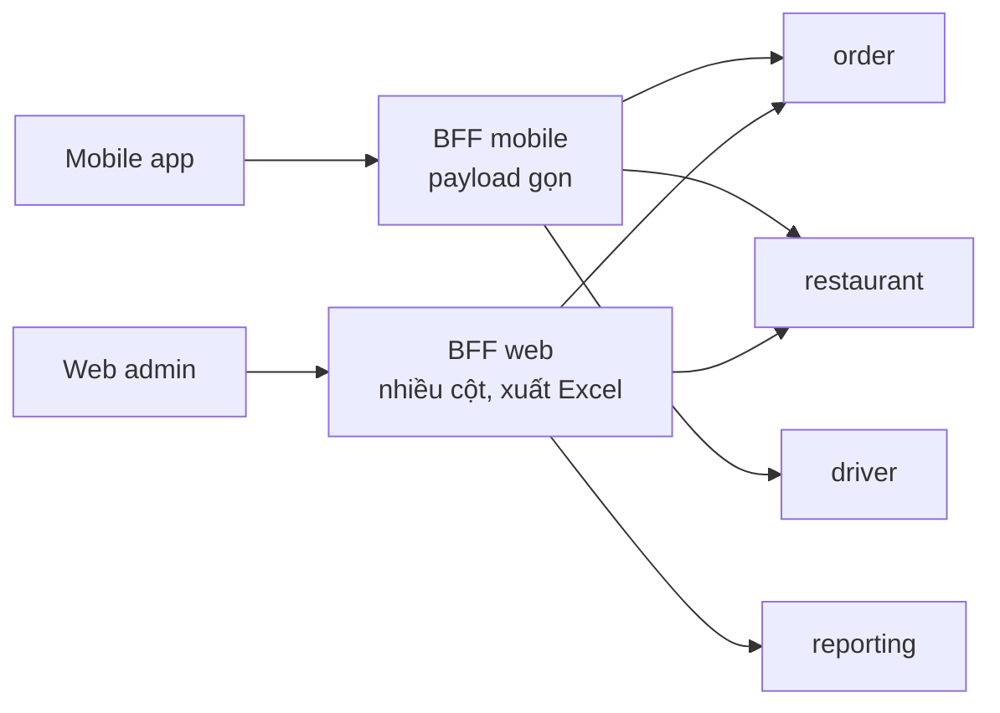
```mermaid
flowchart LR
    MOB["Mobile app"] --> BFFM["BFF mobile<br/>payload gọn"]
    WEB["Web admin"] --> BFFW["BFF web<br/>nhiều cột, xuất Excel"]
    BFFM --> ORD["order"]
    BFFM --> RES["restaurant"]
    BFFM --> DRV["driver"]
    BFFW --> ORD
    BFFW --> RES
    BFFW --> RPT["reporting"]
```

GraphQL cũng thường được dùng ở vai trò này.

### 7.3. Service discovery

Service chạy trên nhiều instance, IP thay đổi liên tục (autoscale, deploy, pod chết). Làm sao `order-service` biết gọi `payment-service` ở đâu?

| Cách | Hoạt động | Ví dụ |
|---|---|---|
| **DNS / server-side** | Gọi một tên cố định, hạ tầng tự cân bằng tải tới instance khỏe | Kubernetes Service: `http://payment-api.payments.svc.cluster.local` |
| **Client-side** | Client hỏi registry danh sách instance rồi tự chọn | Consul, Eureka, gRPC xDS |

Trên Kubernetes, bạn gần như **không phải làm gì**: Service + DNS nội bộ đã là service discovery ([Bài 13](./13-testing-cicd-deployment.md)).

### 7.4. Service mesh

Khi có hàng chục service, mỗi service đều phải tự làm: mTLS, retry, timeout, circuit breaker, metrics, tracing — bằng nhiều ngôn ngữ khác nhau. **Service mesh** đưa những việc này ra khỏi code, vào một **proxy sidecar** (Envoy) đứng cạnh mỗi service:

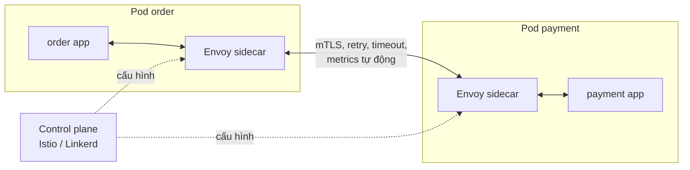
```mermaid
flowchart LR
    subgraph PODA["Pod order"]
        A["order app"] <--> PA["Envoy sidecar"]
    end
    subgraph PODB["Pod payment"]
        PB["Envoy sidecar"] <--> B["payment app"]
    end
    PA <-->|"mTLS, retry, timeout,<br/>metrics tự động"| PB
    CP["Control plane<br/>Istio / Linkerd"] -.->|"cấu hình"| PA
    CP -.->|"cấu hình"| PB
```

Lợi ích: mã hóa và xác thực giữa các service (zero trust) không cần sửa code, chia traffic cho canary, metrics đồng nhất. Cái giá: thêm độ phức tạp vận hành, thêm độ trễ nhỏ, thêm tài nguyên. **Chỉ cân nhắc khi đã có nhiều service** và đau vì những vấn đề trên. (Istio có chế độ *ambient* không cần sidecar để giảm chi phí.)

## 📖 8. Quyền sở hữu dữ liệu (data ownership)

### 8.1. Database per service

Luật quan trọng nhất của microservices: **mỗi service sở hữu dữ liệu của mình; service khác chỉ truy cập qua API hoặc event**.

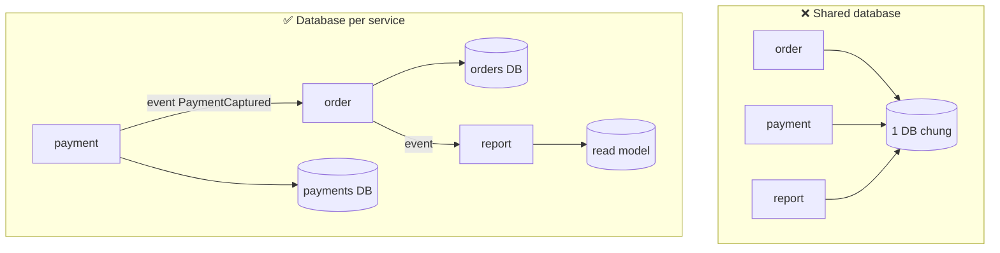
```mermaid
flowchart TB
    subgraph BAD["❌ Shared database"]
        O1["order"] --> SDB[("1 DB chung")]
        P1["payment"] --> SDB
        R1["report"] --> SDB
    end
    subgraph GOOD["✅ Database per service"]
        O2["order"] --> ODB[("orders DB")]
        P2["payment"] --> PDB[("payments DB")]
        P2 -->|"event PaymentCaptured"| O2
        O2 -->|"event"| R2["report"]
        R2 --> RDB[("read model")]
    end
```

Vì sao dùng chung DB là xấu: team payment đổi tên một cột → service order vỡ; không ai dám sửa schema; một query nặng của report làm chậm việc đặt hàng; không deploy độc lập được. Đó là **distributed monolith** — có mọi cái khổ của microservices mà không có cái lợi nào.

"Riêng" không nhất thiết là riêng **máy chủ** DB: có thể là **schema riêng** hoặc **database riêng** trên cùng một cụm PostgreSQL, với **user DB riêng** không có quyền đọc schema của service khác.

### 8.2. Vậy query dữ liệu nằm rải rác thế nào?

| Kỹ thuật | Cách làm | Khi nào |
|---|---|---|
| **API composition** | BFF/gateway gọi nhiều service rồi ghép | Ít dữ liệu, cần mới nhất |
| **Data replication qua event** | Service giữ **bản sao** tối thiểu dữ liệu nó cần (ví dụ order lưu snapshot tên món, giá) | Cần đọc nhanh, chấp nhận hơi cũ |
| **CQRS read model** | Một service nghe event từ nhiều nơi, dựng bảng/chỉ mục **chuyên cho truy vấn** (Elasticsearch, bảng denormalized) | Tìm kiếm, dashboard, báo cáo |
| **Data warehouse** | CDC/stream đổ về BigQuery/Redshift | Phân tích, BI |

Snapshot dữ liệu là **đúng về mặt nghiệp vụ**, không chỉ là tối ưu: đơn hàng phải lưu **giá tại thời điểm đặt**, không phải giá hiện tại của món ăn.

## 📖 9. Transaction phân tán: 2PC vs Saga

### 9.1. Vấn đề

Đặt đồ ăn cần: tạo đơn (order DB), trừ tiền ví (payment DB), giữ tài xế (delivery DB). Ba database khác nhau — không có `BEGIN ... COMMIT` chung.

### 9.2. Two-Phase Commit (2PC)

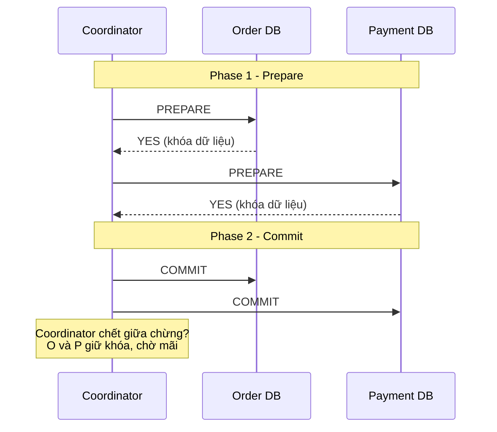
```mermaid
sequenceDiagram
    participant C as Coordinator
    participant O as Order DB
    participant P as Payment DB
    Note over C,P: Phase 1 - Prepare
    C->>O: PREPARE
    O-->>C: YES (khóa dữ liệu)
    C->>P: PREPARE
    P-->>C: YES (khóa dữ liệu)
    Note over C,P: Phase 2 - Commit
    C->>O: COMMIT
    C->>P: COMMIT
    Note over C: Coordinator chết giữa chừng?<br/>O và P giữ khóa, chờ mãi
```

2PC cho tính **nguyên tử** thật sự, nhưng:

- **Blocking**: coordinator chết sau phase 1 → mọi bên **giữ khóa** và chờ.
- Mọi bên phải **cùng sống** → độ sẵn sàng giảm, độ trễ tăng.
- Hầu hết message broker, API bên thứ ba (cổng thanh toán, SMS) **không hỗ trợ** 2PC/XA.

→ Trong microservices hiện đại, 2PC **hiếm khi** được dùng. (Nó vẫn tồn tại *bên trong* các database phân tán như Spanner, CockroachDB — nơi hệ thống tự lo.)

### 9.3. Saga

**Saga** là chuỗi **giao dịch cục bộ**; mỗi bước commit ngay trong DB của một service. Nếu một bước thất bại, chạy các **hành động bù trừ (compensating transaction)** cho các bước đã xong, theo thứ tự ngược.

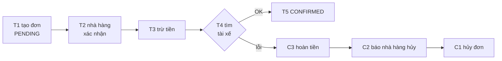
```mermaid
flowchart LR
    T1["T1 tạo đơn<br/>PENDING"] --> T2["T2 nhà hàng<br/>xác nhận"] --> T3["T3 trừ tiền"] --> T4{"T4 tìm<br/>tài xế"}
    T4 -->|"OK"| T5["T5 CONFIRMED"]
    T4 -->|"lỗi"| C3["C3 hoàn tiền"] --> C2["C2 báo nhà hàng hủy"] --> C1["C1 hủy đơn"]
```

**Orchestration** — code chạy được (orchestrator gọi từng bước; ở đây các service được giả lập bằng hàm in log):

=== "Go"

    ```go
    package main

    import (
    	"errors"
    	"fmt"
    )

    // Step là một bước trong saga: Do là giao dịch cục bộ của MỘT service,
    // Undo là hành động bù trừ (compensation) — "hoàn tác về mặt nghiệp vụ".
    type Step struct {
    	Name string
    	Do   func() error
    	Undo func() // nil nếu bước không cần bù
    }

    // RunSaga (orchestration): chạy lần lượt; bước nào lỗi thì bù các bước ĐÃ xong theo thứ tự ngược.
    func RunSaga(steps []Step) error {
    	var done []Step
    	for _, s := range steps {
    		fmt.Println("  ->", s.Name)
    		if err := s.Do(); err != nil {
    			fmt.Printf("  xx %s thất bại: %v\n", s.Name, err)
    			for i := len(done) - 1; i >= 0; i-- {
    				if done[i].Undo != nil {
    					fmt.Println("  <- bù trừ:", done[i].Name)
    					done[i].Undo()
    				}
    			}
    			return fmt.Errorf("saga hủy tại bước %q: %w", s.Name, err)
    		}
    		done = append(done, s)
    	}
    	return nil
    }

    var ErrNoDriver = errors.New("không có tài xế trong bán kính 5km")

    func placeFoodOrder(orderID string, amount int64, driverAvailable bool) error {
    	log := func(format string, a ...any) { fmt.Printf("     "+format+"\n", a...) }
    	steps := []Step{
    		{
    			Name: "order: tạo đơn PENDING",
    			Do:   func() error { log("order %s = PENDING", orderID); return nil },
    			Undo: func() { log("order %s = CANCELLED", orderID) },
    		},
    		{
    			Name: "restaurant: xác nhận món",
    			Do:   func() error { log("nhà hàng nhận đơn %s", orderID); return nil },
    			Undo: func() { log("báo nhà hàng hủy đơn %s", orderID) },
    		},
    		{
    			Name: "payment: trừ tiền ví",
    			Do:   func() error { log("trừ %d đ (idempotency key %s-pay)", amount, orderID); return nil },
    			Undo: func() { log("hoàn %d đ vào ví", amount) },
    		},
    		{
    			Name: "delivery: tìm tài xế",
    			Do: func() error {
    				if !driverAvailable {
    					return ErrNoDriver
    				}
    				log("tài xế D42 nhận đơn %s", orderID)
    				return nil
    			},
    		},
    		{
    			Name: "order: xác nhận CONFIRMED",
    			Do:   func() error { log("order %s = CONFIRMED", orderID); return nil },
    		},
    	}
    	return RunSaga(steps)
    }

    func main() {
    	fmt.Println("Kịch bản 1: mọi thứ suôn sẻ")
    	fmt.Println("  kết quả:", placeFoodOrder("F-1001", 120_000, true) == nil)

    	fmt.Println("Kịch bản 2: không tìm được tài xế")
    	err := placeFoodOrder("F-1002", 85_000, false)
    	fmt.Println("  kết quả:", err)
    	fmt.Println("  là ErrNoDriver:", errors.Is(err, ErrNoDriver))
    }
    ```

=== "Python"

    ```python
    from dataclasses import dataclass
    from typing import Callable


    @dataclass
    class Step:
        """Một bước saga: do = giao dịch cục bộ của MỘT service, undo = hành động bù trừ."""

        name: str
        do: Callable[[], None]
        undo: Callable[[], None] | None = None


    class NoDriver(Exception):
        pass


    class SagaAborted(Exception):
        pass


    def run_saga(steps: list[Step]) -> None:
        done: list[Step] = []
        for s in steps:
            print("  ->", s.name)
            try:
                s.do()
            except Exception as err:
                print(f"  xx {s.name} thất bại: {err}")
                for d in reversed(done):  # bù theo thứ tự NGƯỢC
                    if d.undo:
                        print("  <- bù trừ:", d.name)
                        d.undo()
                raise SagaAborted(f'saga hủy tại bước "{s.name}": {err}') from err
            done.append(s)


    def place_food_order(order_id: str, amount: int, driver_available: bool) -> None:
        def log(msg: str) -> None:
            print("     " + msg)

        def find_driver() -> None:
            if not driver_available:
                raise NoDriver("không có tài xế trong bán kính 5km")
            log(f"tài xế D42 nhận đơn {order_id}")

        run_saga([
            Step("order: tạo đơn PENDING",
                 lambda: log(f"order {order_id} = PENDING"),
                 lambda: log(f"order {order_id} = CANCELLED")),
            Step("restaurant: xác nhận món",
                 lambda: log(f"nhà hàng nhận đơn {order_id}"),
                 lambda: log(f"báo nhà hàng hủy đơn {order_id}")),
            Step("payment: trừ tiền ví",
                 lambda: log(f"trừ {amount} đ (idempotency key {order_id}-pay)"),
                 lambda: log(f"hoàn {amount} đ vào ví")),
            Step("delivery: tìm tài xế", find_driver),
            Step("order: xác nhận CONFIRMED", lambda: log(f"order {order_id} = CONFIRMED")),
        ])


    if __name__ == "__main__":
        print("Kịch bản 1: mọi thứ suôn sẻ")
        place_food_order("F-1001", 120_000, True)  # không raise nghĩa là thành công
        print("  kết quả: true")

        print("Kịch bản 2: không tìm được tài xế")
        try:
            place_food_order("F-1002", 85_000, False)
        except SagaAborted as err:
            print("  kết quả:", err)
            print("  là ErrNoDriver:", str(isinstance(err.__cause__, NoDriver)).lower())
    ```

```text
# Output (Go và Python giống nhau):
Kịch bản 1: mọi thứ suôn sẻ
  -> order: tạo đơn PENDING
     order F-1001 = PENDING
  -> restaurant: xác nhận món
     nhà hàng nhận đơn F-1001
  -> payment: trừ tiền ví
     trừ 120000 đ (idempotency key F-1001-pay)
  -> delivery: tìm tài xế
     tài xế D42 nhận đơn F-1001
  -> order: xác nhận CONFIRMED
     order F-1001 = CONFIRMED
  kết quả: true
Kịch bản 2: không tìm được tài xế
  -> order: tạo đơn PENDING
     order F-1002 = PENDING
  -> restaurant: xác nhận món
     nhà hàng nhận đơn F-1002
  -> payment: trừ tiền ví
     trừ 85000 đ (idempotency key F-1002-pay)
  -> delivery: tìm tài xế
  xx delivery: tìm tài xế thất bại: không có tài xế trong bán kính 5km
  <- bù trừ: payment: trừ tiền ví
     hoàn 85000 đ vào ví
  <- bù trừ: restaurant: xác nhận món
     báo nhà hàng hủy đơn F-1002
  <- bù trừ: order: tạo đơn PENDING
     order F-1002 = CANCELLED
  kết quả: saga hủy tại bước "delivery: tìm tài xế": không có tài xế trong bán kính 5km
  là ErrNoDriver: true
```

**Choreography** — cùng quy trình nhưng không có orchestrator, các service phản ứng với event của nhau:

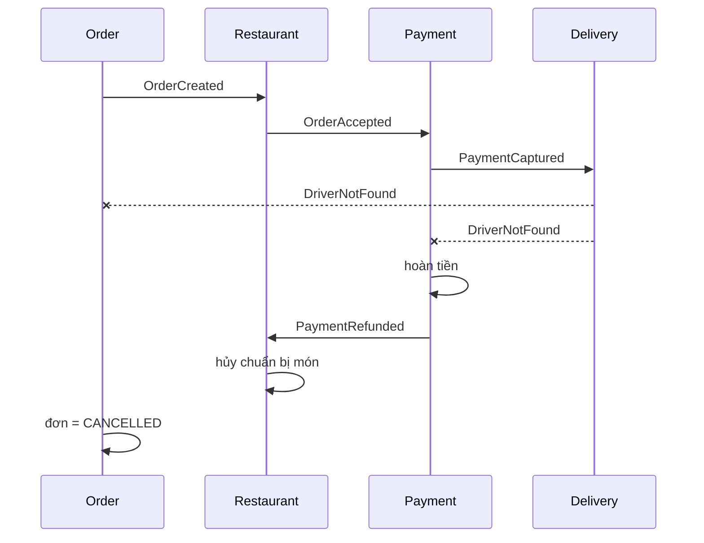
```mermaid
sequenceDiagram
    participant O as Order
    participant R as Restaurant
    participant P as Payment
    participant D as Delivery
    O->>R: OrderCreated
    R->>P: OrderAccepted
    P->>D: PaymentCaptured
    D--xO: DriverNotFound
    D--xP: DriverNotFound
    P->>P: hoàn tiền
    P->>R: PaymentRefunded
    R->>R: hủy chuẩn bị món
    O->>O: đơn = CANCELLED
```

### 9.4. Những điều saga đòi hỏi

- **Bù trừ ≠ rollback**: không thể "un-send" một email hay "un-cook" một món ăn. Bù trừ là hành động **nghiệp vụ** (hoàn tiền, gửi email xin lỗi, tặng voucher).
- **Mọi bước và mọi hành động bù trừ phải idempotent và retry được** — message có thể đến 2 lần, bù trừ có thể lỗi giữa chừng và phải thử lại ([Bài 9](./09-message-queues.md)). Dùng idempotency key như `F-1002-pay`.
- **Lưu trạng thái saga** bền vững (bảng `saga_instances`) để orchestrator khởi động lại vẫn chạy tiếp được. Engine như **Temporal** làm việc này cho bạn.
- **Không có isolation**: trong lúc saga chạy, người khác có thể thấy trạng thái trung gian (đơn `PENDING`, tiền đã trừ nhưng đơn chưa xác nhận). Xử lý bằng **semantic lock** (trạng thái `PENDING` báo "đang xử lý, đừng đụng vào"), và thiết kế UI chấp nhận trạng thái trung gian.
- **Sắp xếp các bước khéo léo**: bước **dễ thất bại** và **dễ bù** đặt trước; bước **khó/không thể bù** (pivot, như gửi đơn cho đơn vị vận chuyển bên ngoài) đặt càng muộn càng tốt; sau pivot chỉ còn các bước chắc chắn thành công (retry đến khi xong).

## 📖 10. Strangler fig — chuyển dần từ monolith

Không bao giờ **viết lại toàn bộ** ("big bang rewrite") — nó gần như luôn trễ hạn nhiều năm, trong khi hệ thống cũ vẫn phải được bảo trì song song. Thay vào đó dùng mẫu **strangler fig** (cây sung bóp nghẹt — mọc bao quanh cây chủ, dần dần thay thế nó):

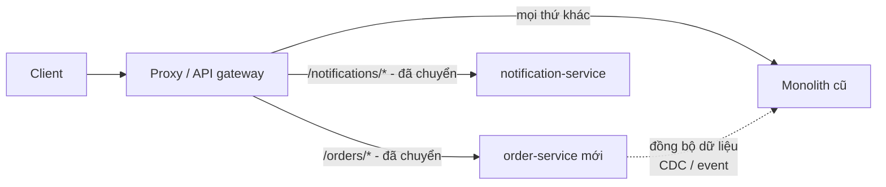
```mermaid
flowchart LR
    U["Client"] --> P["Proxy / API gateway"]
    P -->|"/orders/* - đã chuyển"| NEW["order-service mới"]
    P -->|"/notifications/* - đã chuyển"| NEW2["notification-service"]
    P -->|"mọi thứ khác"| OLD["Monolith cũ"]
    NEW -.->|"đồng bộ dữ liệu<br/>CDC / event"| OLD
```

Các bước:

1. Đặt một **proxy** (gateway) trước monolith — ban đầu route 100% vào monolith.
2. Chọn một phần **ít rủi ro, ranh giới rõ, có giá trị** (thường là notification, search, hoặc một bounded context mới) để tách trước.
3. Xây service mới; đồng bộ dữ liệu qua **CDC** (Debezium) hoặc event; có thể chạy **song song** và so sánh kết quả (shadow traffic — [Bài 13](./13-testing-cicd-deployment.md)).
4. Chuyển route dần (dùng feature flag / canary), giữ khả năng quay lại.
5. Xóa code cũ trong monolith. Lặp lại.

Trước khi tách service, hãy **modularize bên trong monolith trước** — tách được module trong cùng codebase thì mới tách được qua mạng.

## 📖 11. Định luật Conway

> *"Tổ chức nào thiết kế hệ thống thì sẽ tạo ra thiết kế sao chép cấu trúc giao tiếp của tổ chức đó."* — Melvin Conway, 1967

Ba team (frontend, backend, DBA) → hệ thống ba lớp với ranh giới đúng ở chỗ ba team bàn giao cho nhau. Bốn team cùng sửa một service → service đó thành chiến trường merge conflict.

**Inverse Conway maneuver**: thiết kế **tổ chức** theo kiến trúc mong muốn. Muốn có service "Ordering" và "Delivery" độc lập → lập **hai team** tương ứng, mỗi team sở hữu trọn vẹn service của mình (code, DB, deploy, on-call — "you build it, you run it"). Sách *Team Topologies* phân loại: **stream-aligned team** (theo luồng giá trị nghiệp vụ), **platform team** (cung cấp CI/CD, K8s, observability như một sản phẩm nội bộ), **enabling team**, **complicated-subsystem team**.

Hệ quả thực tế: **số lượng service nên tương xứng với số team**. 5 kỹ sư duy trì 40 microservices là dấu hiệu kiến trúc đi trước tổ chức quá xa.

## 📖 12. Khi nào KHÔNG nên dùng microservices

Microservices giải quyết bài toán **tổ chức** (nhiều team deploy độc lập) và bài toán **scale khác biệt** giữa các phần. Nó **không** tự làm code sạch hơn hay hệ thống nhanh hơn. Đừng dùng khi:

- **Team nhỏ** (dưới ~20 kỹ sư) — chi phí vận hành (CI/CD mỗi service, observability, tracing, mạng, bảo mật) nuốt hết thời gian làm tính năng.
- **Sản phẩm mới, nghiệp vụ chưa rõ** — ranh giới service sai rất đắt để sửa (phải di chuyển dữ liệu giữa DB). Hãy bắt đầu bằng modular monolith, đợi ranh giới ổn định.
- **Chưa có nền tảng**: chưa có CI/CD tự động, chưa có centralized logging, tracing, alert ([Bài 11](./11-observability-reliability.md), [Bài 13](./13-testing-cicd-deployment.md)) — microservices mà không có những thứ này là "debug trong bóng tối".
- **Các phần luôn thay đổi cùng nhau** — mỗi tính năng phải sửa và deploy 4 service theo đúng thứ tự.
- **Cần transaction mạnh** giữa các phần — tách ra là tự chuốc lấy saga.

**Dấu hiệu bạn đang có distributed monolith**:

- Phải deploy nhiều service **cùng lúc, theo thứ tự**.
- Nhiều service dùng **chung database** hoặc chung thư viện "models" chứa entity.
- Một request đi qua chuỗi 6–7 lời gọi đồng bộ.
- Một service chết kéo sập cả hệ thống.
- Không thể chạy/test một service mà không dựng 10 service khác.

!!! tip "Lời khuyên"
    *"Monolith first"* (Martin Fowler): bắt đầu bằng modular monolith có ranh giới rõ. Tách service khi có **lý do cụ thể**: một module cần scale khác hẳn (dispatch tài xế xử lý 50.000 cập nhật vị trí/giây), cần công nghệ khác (ML bằng Python trong hệ thống Go), cần cô lập lỗi/bảo mật (payment, PCI DSS), hoặc có một team riêng muốn deploy độc lập. Amazon Prime Video từng công bố gộp một hệ thống giám sát video từ serverless/microservices về một ứng dụng và **giảm 90% chi phí** — kiến trúc là trade-off, không phải tôn giáo.

## 📖 13. Capstone: thiết kế hệ thống giao đồ ăn

Hãy vận dụng toàn bộ khóa học để thiết kế một hệ thống kiểu **GrabFood / ShopeeFood** — từ yêu cầu đến kiến trúc, luồng dữ liệu, và các quyết định kỹ thuật. Đây cũng là một đề **phỏng vấn system design** rất phổ biến.

### 13.1. Yêu cầu

**Chức năng:**

1. Khách tìm nhà hàng/món gần mình, xem menu, đặt món, thanh toán (ví, thẻ, tiền mặt).
2. Nhà hàng nhận đơn, xác nhận, báo "món đã xong".
3. Hệ thống tìm và giao đơn cho tài xế gần nhất; tài xế nhận/từ chối.
4. Khách theo dõi **vị trí tài xế theo thời gian thực** và trạng thái đơn.
5. Thông báo (push/SMS) ở mỗi bước; đánh giá sau khi giao.

**Phi chức năng:**

| Yêu cầu | Mục tiêu |
|---|---|
| Quy mô | 5 triệu người dùng hoạt động/ngày, 1 triệu đơn/ngày, 50.000 tài xế online giờ cao điểm |
| Đặt đơn | p99 < 500ms, **không bao giờ trừ tiền 2 lần**, không mất đơn |
| Vị trí tài xế | cập nhật mỗi 4 giây, độ trễ hiển thị < 2 giây |
| Sẵn sàng | Đặt đơn và thanh toán: 99.95%; gợi ý/đánh giá có thể suy giảm |
| Cao điểm | Trưa 11h–13h và tối 18h–20h gấp ~5 lần trung bình |

**Ước lượng nhanh** (kỹ năng từ [Bài 10](./10-system-design.md)):

```text
Đơn hàng:   1.000.000 / 86.400s ≈ 12 đơn/s trung bình → cao điểm x5 ≈ 60 đơn/s (dễ)
Vị trí:     50.000 tài xế / 4s    = 12.500 cập nhật/s  ← đây mới là phần NẶNG
Đọc menu:   ~100 lượt xem / đơn   → ~6.000 req/s cao điểm → cache + CDN
Lưu đơn:    1 triệu x ~2KB = 2GB/ngày ≈ 730GB/năm → PostgreSQL + partition theo tháng
Vị trí:     không lưu hết vào DB giao dịch; giữ vị trí MỚI NHẤT trong Redis,
            lịch sử hành trình đổ về object storage / data warehouse
```

Kết luận: phần **đơn hàng** cần **đúng đắn** (tiền bạc) hơn là thông lượng; phần **vị trí** cần **thông lượng** và chấp nhận mất một vài điểm. Hai phần có yêu cầu khác hẳn nhau → **lý do chính đáng** để tách thành service riêng.

### 13.2. Bounded contexts và context map

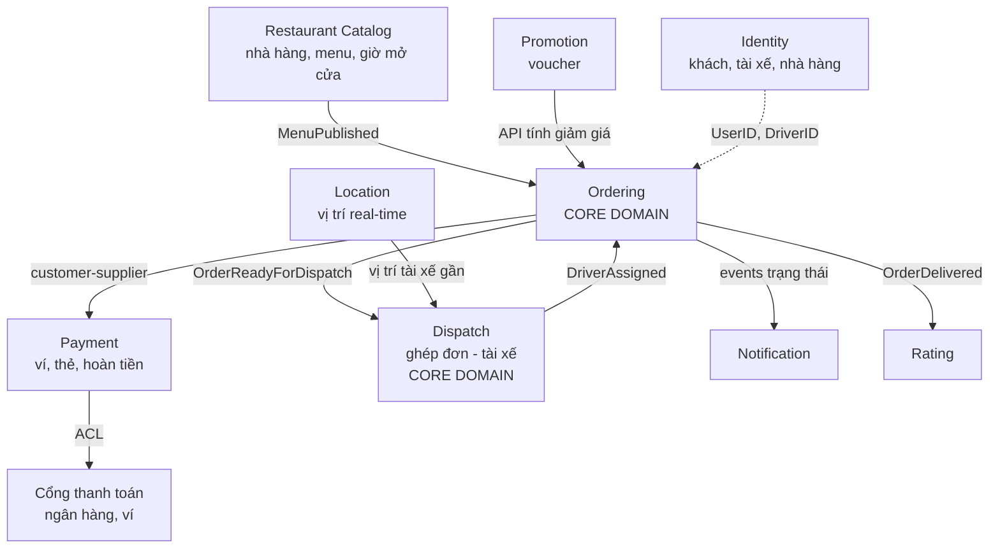
```mermaid
flowchart TB
    IDN["Identity<br/>khách, tài xế, nhà hàng"]
    CAT["Restaurant Catalog<br/>nhà hàng, menu, giờ mở cửa"]
    ORD["Ordering<br/>CORE DOMAIN"]
    PAY["Payment<br/>ví, thẻ, hoàn tiền"]
    DSP["Dispatch<br/>ghép đơn - tài xế<br/>CORE DOMAIN"]
    LOC["Location<br/>vị trí real-time"]
    NTF["Notification"]
    PRM["Promotion<br/>voucher"]
    RAT["Rating"]
    PSP["Cổng thanh toán<br/>ngân hàng, ví"]

    CAT -->|"MenuPublished"| ORD
    PRM -->|"API tính giảm giá"| ORD
    ORD -->|"customer-supplier"| PAY
    PAY -->|"ACL"| PSP
    ORD -->|"OrderReadyForDispatch"| DSP
    LOC -->|"vị trí tài xế gần"| DSP
    DSP -->|"DriverAssigned"| ORD
    ORD -->|"events trạng thái"| NTF
    ORD -->|"OrderDelivered"| RAT
    IDN -.->|"UserID, DriverID"| ORD
```

**Core domain** ở đây là **Ordering** và **Dispatch** (thuật toán ghép tài xế quyết định trải nghiệm và chi phí — lợi thế cạnh tranh). Identity, Notification, Payment gateway là generic → dùng giải pháp có sẵn/dịch vụ bên ngoài càng nhiều càng tốt.

### 13.3. Kiến trúc tổng thể

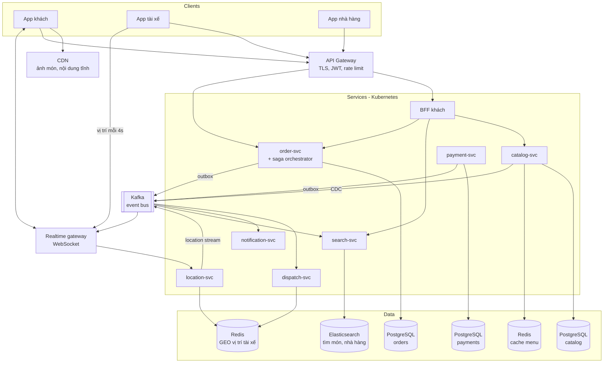
```mermaid
flowchart TB
    subgraph CLIENTS["Clients"]
        CA["App khách"]
        DA["App tài xế"]
        MA["App nhà hàng"]
    end
    CDN["CDN<br/>ảnh món, nội dung tĩnh"]
    GW["API Gateway<br/>TLS, JWT, rate limit"]
    WS["Realtime gateway<br/>WebSocket"]
    CA --> CDN
    CA --> GW
    DA --> GW
    MA --> GW
    CA <--> WS
    DA -->|"vị trí mỗi 4s"| WS

    subgraph SERVICES["Services - Kubernetes"]
        BFF["BFF khách"]
        CATS["catalog-svc"]
        ORDS["order-svc<br/>+ saga orchestrator"]
        PAYS["payment-svc"]
        DSPS["dispatch-svc"]
        LOCS["location-svc"]
        NTFS["notification-svc"]
        SRCH["search-svc"]
    end
    GW --> BFF
    GW --> ORDS
    BFF --> CATS
    BFF --> SRCH
    BFF --> ORDS
    WS --> LOCS

    subgraph DATA["Data"]
        PGO[("PostgreSQL<br/>orders")]
        PGP[("PostgreSQL<br/>payments")]
        PGC[("PostgreSQL<br/>catalog")]
        ES[("Elasticsearch<br/>tìm món, nhà hàng")]
        RGEO[("Redis<br/>GEO vị trí tài xế")]
        RC[("Redis<br/>cache menu")]
    end
    KAFKA[["Kafka<br/>event bus"]]

    ORDS --> PGO
    PAYS --> PGP
    CATS --> PGC
    CATS --> RC
    SRCH --> ES
    LOCS --> RGEO
    DSPS --> RGEO
    ORDS -->|"outbox"| KAFKA
    PAYS -->|"outbox"| KAFKA
    CATS -->|"CDC"| KAFKA
    KAFKA --> DSPS
    KAFKA --> NTFS
    KAFKA --> SRCH
    LOCS -->|"location stream"| KAFKA
    KAFKA --> WS
```

Giải thích một số lựa chọn:

- **Location service** tách riêng vì tải ghi rất cao (12.500 cập nhật/s) và chấp nhận mất mát. Lưu vị trí mới nhất bằng **Redis GEO** (`GEOADD drivers:hcm 106.70 10.77 D42`, `GEOSEARCH ... BYRADIUS 3 km`) hoặc chia ô theo **geohash/H3**. Không ghi mỗi điểm vào PostgreSQL.
- **Realtime gateway (WebSocket)** giữ kết nối lâu dài với app để đẩy vị trí tài xế và trạng thái đơn — tách khỏi API gateway vì đặc tính khác hẳn (kết nối dài, stateful). Scale ngang bằng cách route theo `order_id` và dùng pub/sub (Redis/Kafka) để phát tới đúng node đang giữ kết nối.
- **Order service** là nơi duy nhất sở hữu trạng thái đơn; chạy **saga orchestrator** (mục 9) cho luồng đặt đơn. Mọi event đi qua **transactional outbox** để không mất.
- **Catalog** đọc nhiều ghi ít → **cache-aside** Redis + CDN cho ảnh ([Bài 8](./08-caching.md)); đồng bộ sang **Elasticsearch** qua CDC để tìm kiếm "bún bò gần tôi" ([Bài 7](./07-nosql.md)).
- **Payment** tách riêng để cô lập bảo mật và tuân thủ; idempotency key cho mọi lệnh trừ tiền; webhook từ cổng thanh toán được xác thực chữ ký HMAC ([Bài 12](./12-security.md)).

### 13.4. Luồng đặt đơn

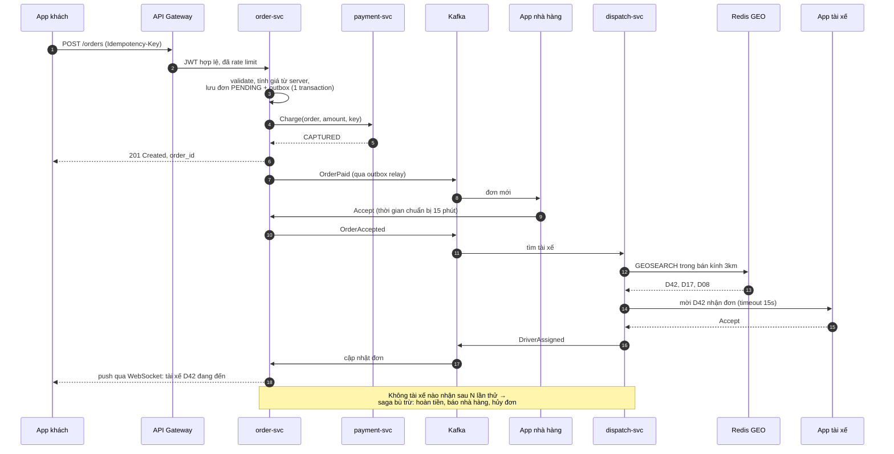
```mermaid
sequenceDiagram
    autonumber
    participant C as App khách
    participant G as API Gateway
    participant O as order-svc
    participant P as payment-svc
    participant K as Kafka
    participant R as App nhà hàng
    participant D as dispatch-svc
    participant L as Redis GEO
    participant T as App tài xế

    C->>G: POST /orders (Idempotency-Key)
    G->>O: JWT hợp lệ, đã rate limit
    O->>O: validate, tính giá từ server,<br/>lưu đơn PENDING + outbox (1 transaction)
    O->>P: Charge(order, amount, key)
    P-->>O: CAPTURED
    O-->>C: 201 Created, order_id
    O->>K: OrderPaid (qua outbox relay)
    K->>R: đơn mới
    R->>O: Accept (thời gian chuẩn bị 15 phút)
    O->>K: OrderAccepted
    K->>D: tìm tài xế
    D->>L: GEOSEARCH trong bán kính 3km
    L-->>D: D42, D17, D08
    D->>T: mời D42 nhận đơn (timeout 15s)
    T-->>D: Accept
    D->>K: DriverAssigned
    K->>O: cập nhật đơn
    O-->>C: push qua WebSocket: tài xế D42 đang đến
    Note over D,O: Không tài xế nào nhận sau N lần thử →<br/>saga bù trừ: hoàn tiền, báo nhà hàng, hủy đơn
```

Các điểm then chốt:

- Bước 1–6: request đồng bộ **ngắn nhất có thể** — chỉ những gì khách cần biết ngay (đơn đã tạo, tiền đã trừ). Phần còn lại (nhà hàng, tài xế) diễn ra **bất đồng bộ** vì có thể mất nhiều phút.
- `Idempotency-Key` ở bước 1: app retry do mạng yếu không tạo 2 đơn, không trừ tiền 2 lần ([Bài 3](./03-api-design.md), [Bài 9](./09-message-queues.md)).
- Giá tính ở **server**, không tin giá client gửi lên ([Bài 12](./12-security.md)).
- Trạng thái đơn là một **state machine** tường minh:

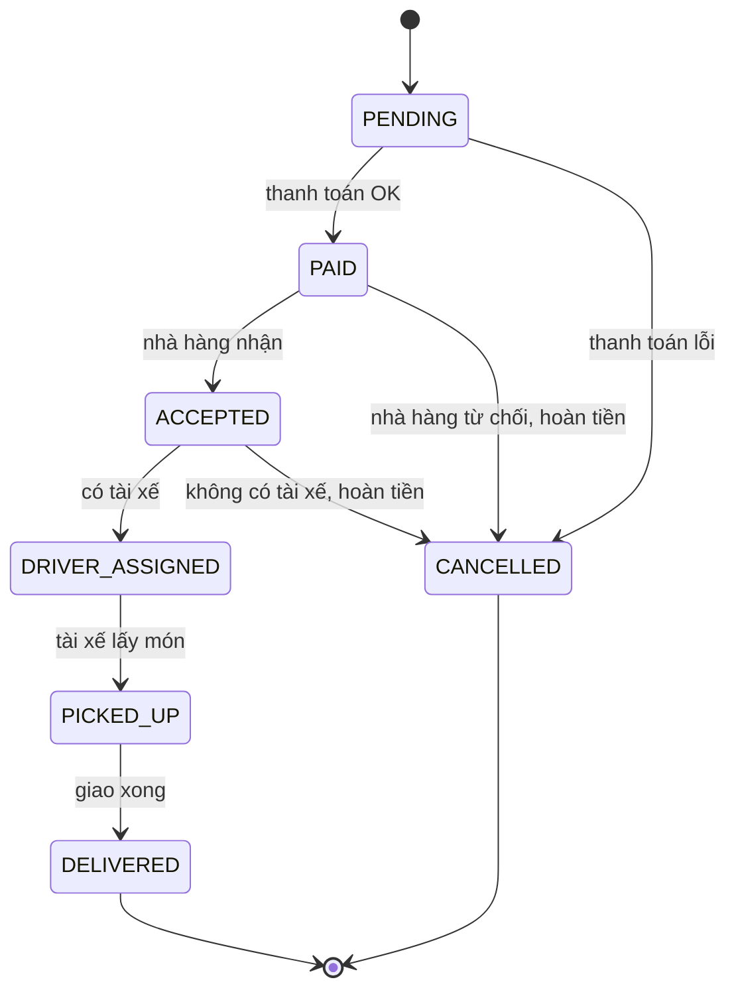
```mermaid
stateDiagram-v2
    [*] --> PENDING
    PENDING --> PAID: thanh toán OK
    PENDING --> CANCELLED: thanh toán lỗi
    PAID --> ACCEPTED: nhà hàng nhận
    PAID --> CANCELLED: nhà hàng từ chối, hoàn tiền
    ACCEPTED --> DRIVER_ASSIGNED: có tài xế
    ACCEPTED --> CANCELLED: không có tài xế, hoàn tiền
    DRIVER_ASSIGNED --> PICKED_UP: tài xế lấy món
    PICKED_UP --> DELIVERED: giao xong
    DELIVERED --> [*]
    CANCELLED --> [*]
```

### 13.5. Vận dụng toàn khóa học

| Vấn đề | Quyết định | Bài |
|---|---|---|
| Giao thức, TLS, CDN cho ảnh món | HTTPS/HTTP2 qua gateway, ảnh qua CDN | [Bài 1](./01-how-the-web-works.md) |
| Vận hành, debug trên server | Log, `curl`, `ss`, `top` khi có sự cố | [Bài 2](./02-linux-shell.md) |
| API public cho app | REST, versioning `/v1`, pagination cursor cho lịch sử đơn, format lỗi thống nhất, idempotency key | [Bài 3](./03-api-design.md) |
| Đăng nhập khách/tài xế/nhà hàng | OTP qua SMS, JWT ngắn hạn + refresh token, RBAC theo vai trò | [Bài 4](./04-auth.md) |
| Schema đơn hàng | Chuẩn hóa, snapshot giá món trong `order_items`, ràng buộc CHECK trạng thái | [Bài 5](./05-relational-database-design.md) |
| Hiệu năng DB | Index `(customer_id, created_at)`, partition bảng `orders` theo tháng, connection pool | [Bài 6](./06-database-internals-performance.md) |
| Tìm kiếm món, lưu vị trí | Elasticsearch cho full-text + geo; Redis GEO cho vị trí tài xế | [Bài 7](./07-nosql.md) |
| Menu đọc nhiều | Cache-aside, TTL + invalidation khi nhà hàng sửa menu, chống cache stampede | [Bài 8](./08-caching.md) |
| Luồng nhiều bước, fan-out thông báo | Kafka, outbox, consumer idempotent, DLQ | [Bài 9](./09-message-queues.md) |
| Cao điểm trưa/tối | Scale ngang stateless service, read replica, rate limit, back-pressure | [Bài 10](./10-system-design.md) |
| Biết hệ thống khỏe không | SLO đặt đơn 99.95%, tracing xuyên service, alert theo burn rate, circuit breaker gọi payment | [Bài 11](./11-observability-reliability.md) |
| Bảo mật | Chống IDOR (khách chỉ xem đơn của mình), ký webhook, không log số điện thoại/địa chỉ đầy đủ | [Bài 12](./12-security.md) |
| Phát hành an toàn | Contract test giữa order–payment, canary, feature flag cho thuật toán dispatch mới, migration expand/contract | [Bài 13](./13-testing-cicd-deployment.md) |
| Tổ chức code & team | Hexagonal cho order/dispatch, bounded context, saga, team theo context | Bài này |

### 13.6. Lộ trình tiến hóa thực tế

Không startup nào bắt đầu với 10 service như sơ đồ trên. Lộ trình hợp lý:

```mermaid
flowchart LR
    V1["Giai đoạn 1<br/>MVP 1 thành phố<br/>modular monolith<br/>+ PostgreSQL + Redis"] --> V2["Giai đoạn 2<br/>tách location +<br/>realtime gateway<br/>vì tải khác biệt"]
    V2 --> V3["Giai đoạn 3<br/>tách payment<br/>bảo mật, tuân thủ"]
    V3 --> V4["Giai đoạn 4<br/>nhiều thành phố, nhiều team<br/>tách dispatch, search,<br/>notification"]
```

Mỗi bước tách đều có **lý do đo được** (tải, bảo mật, tổ chức), và nhờ ranh giới module rõ từ đầu (hexagonal + bounded context) nên việc tách không phải viết lại.

## 📖 14. Lộ trình học tiếp

Bạn đã đi hết khóa Backend Engineering. Những hướng nên đào sâu tiếp:

| Hướng | Nên học | Tài liệu gợi ý |
|---|---|---|
| **Hệ thống phân tán** | Replication, consensus (Raft), consistency models, CAP/PACELC | *Designing Data-Intensive Applications* (Martin Kleppmann) — cuốn sách quan trọng nhất cho backend |
| **Kiến trúc & DDD** | Strategic DDD, event storming, event sourcing, CQRS | *Learning Domain-Driven Design* (Vlad Khononov), *Building Microservices* (Sam Newman), *Monolith to Microservices* |
| **System design phỏng vấn** | Luyện thiết kế: URL shortener, chat, news feed, ride-hailing | *System Design Interview* (Alex Xu) vol 1–2, ByteByteGo |
| **Cloud & DevOps** | Kubernetes sâu (operator, networking), Terraform, GitOps | Chứng chỉ CKAD, AWS Solutions Architect Associate |
| **Reliability** | SRE, incident management, chaos engineering | *Site Reliability Engineering* (Google, đọc miễn phí online) |
| **Database** | Internals PostgreSQL, query planner, vận hành | *Database Internals* (Alex Petrov), tài liệu PostgreSQL |
| **Bảo mật** | AppSec, OAuth2/OIDC sâu, threat modeling | OWASP ASVS, PortSwigger Web Security Academy |
| **Ngôn ngữ** | Concurrency Go nâng cao, async Python | Khóa [Golang](../golang/README.md) và [Python](../python/README.md) trên site này |
| **Thuật toán & tư duy** | Cấu trúc dữ liệu, giải bài, clean code, trade-off | Khóa [Thuật toán](../algorithms/README.md) và [Tư duy SE](../mindset/README.md) |

!!! tip "Cách học hiệu quả nhất: xây một dự án thật"
    Chọn một đề tài (giao đồ ăn thu nhỏ, đặt vé xe khách, quản lý phòng trọ) và làm **đầu-cuối**: API có auth → PostgreSQL có migration → cache → queue cho thông báo → test + CI → deploy lên Cloud Run hoặc K8s → dashboard + alert → viết README giải thích các quyết định kiến trúc (**ADR — Architecture Decision Record**). Một dự án như vậy trên GitHub có giá trị hơn 10 chứng chỉ khi đi phỏng vấn.

## 🌍 Ứng dụng thực tế

- **Grab**: bắt đầu bằng monolith Rails, chuyển dần sang microservices bằng Go khi mở rộng ra nhiều quốc gia và nhiều ngành dọc (xe, đồ ăn, thanh toán); dispatch và location là các hệ thống riêng xử lý hàng trăm nghìn cập nhật vị trí mỗi giây.
- **Shopify**: một trong những **modular monolith** Ruby lớn nhất thế giới — họ đầu tư công cụ (Packwerk) để ép ranh giới giữa các component thay vì tách microservices.
- **Amazon**: "two-pizza teams" — mỗi team đủ nhỏ để hai cái pizza đủ ăn, sở hữu trọn service của mình; kiến trúc của Amazon phản chiếu đúng cấu trúc team (định luật Conway theo chiều có chủ đích).
- **Uber**: từng có hàng nghìn microservices, sau đó chuyển sang **DOMA** (Domain-Oriented Microservice Architecture) — gom service theo domain, có gateway cho mỗi domain — để giảm độ phức tạp.
- **Ngân hàng Việt Nam**: core banking (monolith lớn, thường mua từ nhà cung cấp) được bao quanh bằng lớp API và các service mới (app mobile, eKYC, thanh toán QR) theo đúng mẫu **strangler fig + anti-corruption layer**.
- **Segment**: công bố bài "Goodbye Microservices" — gộp 140+ service về một, vì chi phí vận hành vượt xa lợi ích với quy mô team của họ.

## ⚠️ Lỗi thường gặp

### 1. Chia microservices từ ngày đầu

```text
❌ Startup 4 người, chưa có khách hàng, đã có 12 service, 12 repo, 12 pipeline, Kafka, Istio
✅ Modular monolith với ranh giới rõ; tách service khi có lý do đo được
```

### 2. Chia service theo lớp kỹ thuật thay vì theo nghiệp vụ

```text
❌ "database-service", "validation-service", "email-template-service"
   → mọi tính năng phải sửa tất cả; một request đi qua 5 hop
✅ Chia theo bounded context: ordering, payment, dispatch — mỗi service tự chủ một khả năng nghiệp vụ
```

### 3. Nhiều service dùng chung database

```text
❌ payment-svc SELECT trực tiếp bảng orders của order-svc
✅ Mỗi service sở hữu dữ liệu; cần thì gọi API, nghe event, hoặc giữ bản sao tối thiểu
```

### 4. Chuỗi gọi đồng bộ dài, không timeout

```text
❌ gateway → order → promotion → catalog → pricing → inventory, không timeout, không circuit breaker
✅ Rút ngắn chuỗi, dùng event cho phần không cần ngay, luôn đặt timeout + retry có giới hạn + fallback
```

### 5. Domain phụ thuộc framework/ORM

```text
❌ Entity Order kế thừa SQLAlchemy Base / chứa tag gorm, JSON; luật nghiệp vụ nằm trong HTTP handler
✅ Domain thuần; adapter lo mapping sang ORM/JSON; handler chỉ chuyển request → command → gọi use case
```

### 6. Anemic domain model

```text
❌ Order chỉ có getter/setter; mọi luật nằm rải rác trong OrderService, PaymentService, AdminService
   → luật "đơn đã đặt thì không sửa" bị quên ở một chỗ
✅ Luật nằm trong aggregate: order.AddItem() tự kiểm tra trạng thái (mục 4.3)
```

### 7. Aggregate quá lớn

```text
❌ Restaurant chứa toàn bộ Menu, Orders, Reviews → mỗi lần cập nhật giờ mở cửa phải load 50.000 đơn,
   khóa lạc quan xung đột liên tục
✅ Aggregate nhỏ, tham chiếu nhau bằng ID, đồng bộ bằng domain event
```

### 8. Dùng 2PC hoặc "gọi lần lượt rồi cầu may"

```text
❌ Trừ tiền xong, gọi dispatch lỗi → không ai hoàn tiền; hoặc cố dựng XA transaction qua 3 service
✅ Saga với bước bù trừ idempotent, trạng thái saga được lưu bền vững
```

### 9. Thư viện "common" dùng chung chứa model nghiệp vụ

```text
❌ Package shared-models chứa struct Order dùng cho 8 service → đổi một field phải release 8 service
✅ Chia sẻ hợp đồng (Protobuf/OpenAPI/schema event), không chia sẻ model nội bộ;
   thư viện chung chỉ cho hạ tầng (logging, tracing)
```

### 10. Big bang rewrite

```text
❌ "Hệ thống cũ tệ quá, dừng hết để viết lại bằng microservices" → 2 năm sau vẫn chưa xong
✅ Strangler fig: tách từng phần, luôn có hệ thống chạy được trên production
```

## 🏋️ Bài tập

### Bài tập 1: Chọn kiến trúc (⭐ Dễ)

Chọn monolith / modular monolith / microservices / serverless cho từng trường hợp và giải thích ngắn:

1. Website giới thiệu và đặt lịch của một phòng khám nha khoa, 2 dev.
2. Ứng dụng quản lý bán hàng cho chuỗi 50 cửa hàng, team 12 người, nghiệp vụ còn thay đổi nhiều.
3. Sàn thương mại điện tử 300 kỹ sư, 25 team.
4. Tạo thumbnail mỗi khi người dùng upload ảnh, lượng upload thất thường.

<details markdown="1"><summary>Đáp án</summary>

1. **Monolith** đơn giản (hoặc thậm chí nền tảng có sẵn) — không cần gì hơn.
2. **Modular monolith** — một lần deploy, ranh giới module theo nghiệp vụ (bán hàng, kho, khách hàng), sẵn sàng tách sau.
3. **Microservices** — nhiều team cần deploy độc lập; ranh giới theo bounded context, có platform team.
4. **Serverless function** kích hoạt bởi sự kiện upload lên object storage — scale theo tải, không trả tiền khi rảnh.

</details>

### Bài tập 2: Entity hay value object? (⭐ Dễ)

Phân loại trong hệ thống giao đồ ăn: `Driver`, `GeoPoint(lat, lng)`, `Order`, `DeliveryAddress`, `PhoneNumber`, `Restaurant`, `TimeWindow(open, close)`, `Voucher`, `Rating(stars, comment)`.

<details markdown="1"><summary>Đáp án</summary>

Entity: `Driver`, `Order`, `Restaurant`, `Voucher` (có mã, có vòng đời: còn lượt/hết lượt). Value object: `GeoPoint`, `DeliveryAddress` (snapshot trong đơn), `PhoneNumber`, `TimeWindow`. `Rating` tùy ngữ cảnh: nếu khách sửa/xóa được đánh giá và cần tham chiếu tới nó → entity; nếu chỉ là giá trị gắn vào đơn → value object.

</details>

### Bài tập 3: Mở rộng aggregate `Order` (⭐⭐ Trung bình)

Mở rộng ví dụ mục 4.3 (Go hoặc Python):

1. Thêm `Cancel(reason)`: chỉ hủy được khi `DRAFT` hoặc `PLACED`, trả về event `OrderCancelled`.
2. Thêm value object `Voucher` (giảm theo % có trần, hoặc giảm số tiền cố định, điều kiện đơn tối thiểu) và method `ApplyVoucher`. Tổng tiền không bao giờ âm.
3. Viết unit test cho các luật trên chỉ dùng fake adapter.

### Bài tập 4: Đổi adapter (⭐⭐ Trung bình)

Viết adapter `SQLiteOrders` cài đặt `OrderRepository` cho ví dụ mục 4.3 (lưu đơn và các dòng vào 2 bảng, trong một transaction). Chỉ sửa `main` để dùng nó. Viết integration test như [Bài 13](./13-testing-cicd-deployment.md). Chứng minh rằng **không một dòng nào** trong domain và use case phải thay đổi.

### Bài tập 5: Saga bền vững (⭐⭐⭐ Khó)

Nâng cấp saga ở mục 9.3:

1. Lưu trạng thái saga (bước hiện tại, các bước đã xong) vào SQLite sau mỗi bước; giả lập orchestrator "chết" giữa chừng rồi khởi động lại → saga chạy tiếp đúng chỗ.
2. Hành động bù trừ có thể lỗi tạm thời: retry với exponential backoff, tối đa 5 lần; hết lần thì đưa vào hàng đợi "cần người xử lý".
3. Mỗi bước dùng idempotency key; chứng minh chạy lại một bước 2 lần không trừ tiền 2 lần.
4. Câu hỏi thiết kế: có nên đổi thứ tự để **tìm tài xế trước khi trừ tiền** không? Phân tích trade-off (tài xế chờ khách thanh toán thất bại vs. hoàn tiền thường xuyên).

### Bài tập 6: Context map cho hệ thống của bạn (⭐⭐⭐ Khó)

Chọn một hệ thống bạn biết rõ (đặt vé xe khách liên tỉnh, quản lý trường học, ví điện tử...). Làm một buổi **event storming** (có thể một mình, dùng giấy note hoặc Miro): liệt kê 20–30 domain event, nhóm thành bounded context, vẽ context map (Mermaid) với kiểu quan hệ, xác định core domain. Sau đó viết một **ADR** ngắn: "Bắt đầu với modular monolith hay microservices, và vì sao".

### Bài tập 7: Capstone mở rộng (⭐⭐⭐ Khó)

Với hệ thống giao đồ ăn ở mục 13, thiết kế thêm (sơ đồ + giải thích):

1. **Gom đơn** (một tài xế giao 2 đơn cùng hướng): ảnh hưởng tới dispatch và state machine thế nào?
2. **Surge pricing** (tăng phí ship khi thiếu tài xế): dữ liệu đầu vào lấy từ đâu, tính ở đâu, cache thế nào, làm sao khách thấy **đúng giá đã báo** khi đặt?
3. **Sự cố**: Redis GEO sập 10 phút lúc 12h trưa. Hệ thống suy giảm thế nào (graceful degradation)? Alert nào bắn? Runbook gồm những bước gì?
4. **Mở rộng sang Hà Nội**: chia dữ liệu/partition theo thành phố thế nào? Service nào cần triển khai theo vùng?

## ✅ Checklist hoàn thành

- [ ] So sánh được monolith, modular monolith, microservices, serverless và chọn đúng theo ngữ cảnh
- [ ] Giải thích được hạn chế của layered architecture và dependency rule của clean/hexagonal
- [ ] Tổ chức được thư mục Go/Python theo ports & adapters; chạy được ví dụ mục 4.3
- [ ] Hiểu ubiquitous language, bounded context, context map (ACL, customer–supplier, shared kernel...)
- [ ] Phân biệt entity và value object; thiết kế aggregate nhỏ, bảo vệ bất biến, tham chiếu bằng ID
- [ ] Biết dùng domain event và outbox để nối các context
- [ ] Chọn đúng giao tiếp đồng bộ/bất đồng bộ; hiểu choreography vs orchestration
- [ ] Giải thích vai trò API gateway, BFF, service discovery, service mesh
- [ ] Áp dụng database per service và các cách truy vấn dữ liệu phân tán
- [ ] Giải thích vì sao 2PC hiếm dùng; viết được saga có bù trừ
- [ ] Áp dụng strangler fig; hiểu định luật Conway và inverse Conway maneuver
- [ ] Nhận ra dấu hiệu distributed monolith và biết khi nào KHÔNG dùng microservices
- [ ] Tự thiết kế được một hệ thống đầu-cuối như capstone giao đồ ăn, liên kết được với các bài 1–13

🎉 **Chúc mừng bạn đã hoàn thành khóa Backend Engineering toàn diện!** Từ việc hiểu một request đi qua Internet thế nào đến thiết kế cả một hệ thống phân tán — bạn đã có bản đồ đầy đủ. Giờ là lúc xây thứ gì đó thật.

**Quay về trang chính**: [README](./README.md)
