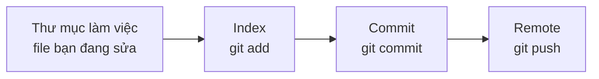

# 📚 Bài 15: Git cho công việc hằng ngày

## 🎯 Mục tiêu bài học

- Nhìn một thay đổi theo ba chỗ: thư mục đang làm, vùng chờ commit (index), và lịch sử
- Đọc `status`, `diff`, `log` trước khi commit
- Tách việc bằng nhánh, rồi ghép lại bằng merge
- Biết khi nào rebase làm lịch sử dễ đọc, và khi nào không được viết lại lịch sử
- Giải conflict bằng cách đọc hai phía, không bấm "chấp nhận hết"
- Đọc diff của một pull request như người review

> 💡 **Kiến thức cần có**: đã từng `git clone` và `git commit`. Bài này là thao tác mỗi ngày. `git bisect` để tìm commit gây bug nằm ở [Tư duy Debug](../mindset/05-debugging.md).

---

## 📖 1. Ba vùng, không phải một nút Save

Git không lưu "file hiện tại". Nó lưu **ảnh chụp** (commit) những gì bạn cố ý đưa vào.



| Lệnh | Câu hỏi nó trả lời |
|---|---|
| `git status` | File nào sửa, file nào đã `add`, nhánh nào đang đứng |
| `git diff` | Phần chưa `add` khác bản đã `add` thế nào |
| `git diff --staged` | Phần sắp commit khác commit trước thế nào |
| `git log --oneline -10` | 10 commit gần nhất trên nhánh này |

Một commit nên là một ý: "thêm kiểm tra tồn kho", không phải "sửa linh tinh cả tuần". Câu thông điệp viết ở thì hiện tại, nói **việc đã làm**: `Trừ kho trong cùng transaction với đơn hàng`.

---

## 📖 2. Xem diff trước khi commit

```bash
git status
git diff
git add internal/store/store.go
git diff --staged
git commit -m "Trừ kho và ghi outbox trong một transaction"
```

`git add .` tiện và cũng dễ lôi theo file không định commit: `shop.db`, `.env`, log, file IDE. Nhìn `git status` trước. Secret, mật khẩu, file database cục bộ thuộc `.gitignore`.

Sửa commit **vừa tạo, chưa push**:

```bash
git commit --amend
```

`--amend` thay commit cũ bằng commit mới. Sau khi người khác đã kéo commit đó, amend làm hai bên lệch lịch sử. Chỉ amend commit còn nằm trên máy bạn.

---

## 📖 3. Nhánh là một dòng lịch sử riêng

```bash
git switch -c cursor/them-dat-hang
# sửa, commit
git push -u origin cursor/them-dat-hang
```

`main` là nhánh mọi người dựa vào. Việc đang dở nằm trên nhánh khác, mở pull request, rồi mới vào `main`.

Xem nhánh cục bộ và nhánh remote:

```bash
git branch
git branch -r
```

Đổi tên nhánh cục bộ khi tên gõ nhầm:

```bash
git branch -m ten-cu ten-moi
```

---

## 📖 4. Merge: giữ nguyên hai dòng lịch sử

Khi nhánh xong, ghép vào `main`:

```bash
git switch main
git pull origin main
git merge cursor/them-dat-hang
```

Merge tạo một commit ghép nếu hai phía cùng đi tiếp từ một gốc. Lịch sử còn dấu "nhánh này từng tồn tại". Với nhánh đã có pull request và đã được review, merge là cách an toàn vì không viết lại commit người khác đã thấy.

---

## 📖 5. Rebase: đặt commit của bạn lên đầu lịch sử mới

Đồng nghiệp đã đẩy thêm commit lên `main`. Nhánh của bạn tách từ `main` cũ. Rebase nhấc commit của bạn và đặt lại lên `main` mới:

```bash
git switch cursor/them-dat-hang
git fetch origin
git rebase origin/main
```

Lịch sử thành một đường thẳng, dễ đọc. Cái giá: commit của bạn đổi danh tính (hash mới) dù nội dung trông giống.

Chỉ rebase nhánh **mình đang viết, chưa có người khác dựa vào**. `main` và mọi nhánh dùng chung không rebase. Viết lại lịch sử đã push nghĩa là người đã kéo bản cũ sẽ phải xử lý một dòng commit không còn tồn tại.

---

## 📖 6. Conflict: Git không biết ý bạn

Conflict xảy ra khi hai phía sửa cùng một đoạn. Git dừng và để lại dấu trong file:

```text
<<<<<<< HEAD
stock := stock - qty
=======
stock := stock - order.Qty
>>>>>>> cursor/them-dat-hang
```

`HEAD` là phía bạn đang đứng. Phía dưới là phía đang ghép vào. Việc của bạn là viết lại đoạn đó thành bản đúng, xóa ba dòng dấu, rồi:

```bash
git add internal/store/store.go
git rebase --continue    # nếu đang rebase
# hoặc
git commit               # nếu đang merge
```

Đừng giữ cả hai chỉ vì muốn hết dấu. Hãy chạy test của đoạn đó sau khi chọn. Muốn bỏ cuộc giữa rebase: `git rebase --abort`. Giữa merge: `git merge --abort`.

---

## 📖 7. Đọc một pull request

Diff của pull request là phần nhánh của bạn đã thêm so với `main`, không phải so với commit liền trước:

```bash
git diff origin/main...HEAD
git log --oneline origin/main..HEAD
```

Ba chấm (`main...HEAD`) so với **gốc chung**. Hai chấm so với đầu `main` hiện tại, dễ lẫn commit người khác vừa đẩy.

Khi review, đọc theo thứ tự:

1. Thông điệp và mô tả: việc này định thay đổi hành vi nào
2. Test: có case nào khóa hành vi đó không
3. Phần còn lại của diff: lỗi, quyền, tiền, câu SQL

Một review tốt chỉ vào một dòng và nói hệ quả: "gọi lại cùng key vẫn trừ kho". "LGTM" không nói điều đó.

---

## 📖 8. Việc không đưa vào Git

| Thứ | Vì sao |
|---|---|
| `.env`, token, `SHOP_SECRET` | Lịch sử Git nhớ mãi, xóa ở commit sau không xóa ở commit trước |
| `shop.db`, file build, `node_modules` | Tạo lại được, làm diff vô nghĩa |
| File máy cá nhân (`.idea` nếu team không thống nhất) | Gây conflict giả |

Nếu một secret đã lỡ commit, đổi secret đó ở nơi cấp phát (database, nhà cung cấp). Xóa file ở commit mới không thu hồi bản đã push.

---

## 🏋️ Bài tập

### Bài tập 1

Bạn có một commit chưa push, thông điệp ghi "fix". Trong commit có cả `store.go` và file `shop.db`. Làm gì trước khi push?

<details markdown="1"><summary>Đáp án</summary>

Bỏ `shop.db` khỏi commit (và thêm vào `.gitignore`), viết lại thông điệp cho nói việc đã làm. Vì chưa push, được phép `git commit --amend` sau khi sửa vùng chờ. Không push file database.

</details>

### Bài tập 2

Nhánh của bạn đã mở pull request. Đồng nghiệp vừa merge một commit khác vào `main`, sửa đúng hàm bạn cũng đang sửa. Bạn chọn merge hay rebase, và conflict thì xử lý thế nào?

<details markdown="1"><summary>Đáp án</summary>

Pull request đã public thì **merge** `main` vào nhánh (hoặc nút update trên GitHub) để không viết lại commit người review đã comment. Mở file conflict, giữ hành vi đúng của cả hai phía, xóa dấu conflict, chạy test liên quan, rồi commit merge.

</details>

---

## ✅ Tự kiểm tra

- [ ] Tôi xem `git diff` trước khi commit
- [ ] Tôi không commit secret và file sinh ra tại máy
- [ ] Tôi để `main` chỉ nhận việc đã xong, qua nhánh và pull request
- [ ] Tôi chỉ rebase nhánh chưa ai dựa vào
- [ ] Tôi giải conflict bằng cách đọc hai phía rồi chạy test

**Bài tiếp**: [Bài 16: Bẫy tiền, thời gian và chữ](./16-production-traps.md)
