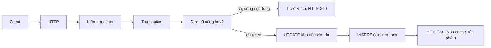

# 📚 Bài 17: Dự án shop — một đơn hàng chạy thật

## 🎯 Mục tiêu bài học

- Chạy được một API: đăng ký, đăng nhập, xem hàng, đặt một dòng đơn
- Thấy tiền, trừ kho, đơn và outbox nằm trong **một** transaction
- Gửi lại cùng `Idempotency-Key` thì nhận lại đơn cũ, tồn kho không giảm lần hai
- Có `/healthz`, `/readyz` và một metric đếm đơn mới

> 💡 Mã nguồn nằm trong thư mục `projects/shop` của repo: [github.com/nguyenthanh1205tb/learning/tree/main/projects/shop](https://github.com/nguyenthanh1205tb/learning/tree/main/projects/shop). Trang web tài liệu không copy thư mục này; hãy clone repo để chạy. Bài này giả định bạn đã đọc [Bài 4](./04-auth.md), [Bài 5](./05-relational-database-design.md), [Bài 8](./08-caching.md), [Bài 9](./09-message-queues.md) và [Bài 16](./16-production-traps.md).

---

## 📖 1. Chạy

Cần Go 1.23 trở lên.

```bash
cd projects/shop
go test ./...
export SHOP_SECRET=dev-secret-change-me
go run ./cmd/shop
```

`SHOP_SECRET` dài ít nhất 16 ký tự, dùng để ký token. Thiếu biến này thì process thoát. Database mặc định là file SQLite `shop.db` cạnh chỗ bạn chạy lệnh, để `go test` không cần Docker. Cache mặc định nằm trong bộ nhớ. Có Redis thì:

```bash
go run ./cmd/shop -redis 127.0.0.1:6379
```

Lần đầu chạy, nếu bảng sản phẩm trống, chương trình tạo một sản phẩm "Tai nghe", 450.000đ, tồn 20.

```bash
curl -s -X POST localhost:8080/v1/register \
  -H 'Content-Type: application/json' \
  -d '{"email":"an@shop.vn","password":"correct-horse"}'

curl -s -X POST localhost:8080/v1/login \
  -H 'Content-Type: application/json' \
  -d '{"email":"an@shop.vn","password":"correct-horse"}'
# lấy token trong JSON

curl -s localhost:8080/v1/products -H "Authorization: Bearer $TOKEN"
curl -s -X POST localhost:8080/v1/orders \
  -H "Authorization: Bearer $TOKEN" \
  -H "Idempotency-Key: $(uuidgen)" \
  -H 'Content-Type: application/json' \
  -d '{"product_id":1,"qty":1}'
curl -s localhost:8080/metrics
```

---

## 📖 2. Luồng một request đặt hàng



| Đoạn | File | Bài liên quan |
|---|---|---|
| Đơn giá × số lượng, chặn tràn số | `internal/money` | Bài 16 |
| Băm mật khẩu, ký token HMAC | `internal/auth` | Bài 4 |
| User, sản phẩm, đơn, outbox | `internal/store` | Bài 5, Bài 9 |
| Cache danh sách sản phẩm 30 giây | `internal/cache` | Bài 8 |
| Route, status code, metric | `internal/httpserver` | Bài 3, Bài 11 |

Token không phải JWT của một thư viện lớn. Nó là `userID.expiry.hmac`, hạn 24 giờ. Đủ để thấy chữ ký và hạn dùng. Khi làm sản phẩm thật, phần này được thay bằng session hoặc JWT như Bài 4, không copy nguyên cơ chế demo.

Mật khẩu qua bcrypt. Test dùng `bcrypt.MinCost` cho nhanh. `cmd/shop` dùng `bcrypt.DefaultCost`.

---

## 📖 3. Transaction và key

`PlaceOrder` làm các bước sau trong một transaction SQLite:

1. Tìm đơn của đúng user với đúng `Idempotency-Key`
2. Nếu có và hash nội dung (`product_id`, `qty`) khớp: trả đơn đó, `Created = false`
3. Nếu có mà hash khác: lỗi `ErrIdempotency` (HTTP 409)
4. `UPDATE products SET stock = stock - ? WHERE id = ? AND stock >= ?`
5. Không có dòng nào đổi: hết hàng hoặc không có sản phẩm
6. Tính `total_vnd` bằng `money.Line`, ghi `orders` và một dòng `outbox` loại `order.created`
7. Commit

`RowsAffected` của câu `UPDATE ... AND stock >= ?` là cách trừ kho không cần đọc-rồi-ghi. Hai request cùng lúc tranh suất cuối: một câu cập nhật được, câu kia thấy 0 dòng.

Hash nội dung ngăn client tái sử dụng một key cho một đơn khác. Key ngắn hơn 8 ký tự hoặc dài hơn 128 ký tự bị từ chối.

Bảng `outbox` chưa có relay đăng lên Kafka. Bài này dừng ở chỗ khó hơn: sự kiện và đơn cùng sống hoặc cùng không tồn tại. Relay là bước tiếp, đã mô tả ở Bài 9.

SQLite trong repo dùng tham số `?`. Chuyển PostgreSQL thì đổi thành `$1`, `$2` và giữ nguyên hình dạng bảng. `SetMaxOpenConns(1)` trên SQLite tránh lỗi "database is locked" của demo một file; Postgres thì dùng pool như Bài 6.

---

## 📖 4. Cache, sức khỏe, metric

`GET /v1/products` đọc cache key `products:v1`. Lần đầu là `X-Cache: MISS`, lần sau trong 30 giây là `HIT`. Đơn **mới** xóa key đó. Đơn phát lại (HTTP 200) không đụng kho nên không cần xóa.

| Route | Ý nghĩa |
|---|---|
| `GET /healthz` | Process còn nhận request |
| `GET /readyz` | Database còn `Ping` được. Lỗi thì 503 |
| `GET /metrics` | `shop_http_requests_total` và `shop_orders_created_total` |

`shop_orders_created_total` chỉ tăng khi `Created == true`. Gửi lại cùng key không làm số đơn mới tăng.

---

## 📖 5. Những gì cố tình chưa làm

Demo một dòng đơn, một process, SQLite. Chưa có: giỏ nhiều sản phẩm, relay outbox, phân quyền admin, giới hạn tốc độ, Postgres. Thêm từng thứ một sau khi test hiện tại vẫn xanh. Bài tập dưới đây là hướng mở rộng, không phải danh sách thiếu sót phải vá ngay.

---

## 🏋️ Bài tập

### Bài tập 1

Chạy `go test ./...`. Chỉ ra test nào chứng minh gửi lại đơn không trừ kho hai lần.

<details markdown="1"><summary>Đáp án</summary>

`TestPlaceOrderIsIdempotent` trong `internal/store/store_test.go`: tồn bắt đầu là 2, hai lần `PlaceOrder` cùng key, tồn còn 1, và outbox có đúng một sự kiện. `TestRegisterLoginOrderOnce` kiểm thêm HTTP: lần đầu 201, lần sau 200, cùng `id`, metric đơn mới bằng 1.

</details>

### Bài tập 2

Vì sao cùng key mà đổi `qty` lại là 409, không phải đơn mới?

<details markdown="1"><summary>Đáp án</summary>

Key đại diện cho một ý định. Đổi số lượng là ý định khác. Nếu server lặng lẽ tạo đơn mới, client đang thử lại sẽ trừ kho theo số lượng nó không còn muốn, hoặc lần thử lại vô tình thành một giao dịch thứ hai. `request_hash` khác thì trả `ErrIdempotency`.

</details>

---

## ✅ Tự kiểm tra

- [ ] `go test ./...` trong `projects/shop` xanh
- [ ] Tôi đặt được một đơn bằng `curl` và thấy metric đơn mới tăng 1
- [ ] Gửi lại cùng key không giảm tồn kho
- [ ] Tôi chỉ được chỗ nào sẽ đổi nếu chuyển SQLite sang Postgres

**Quay lại**: [Mục lục Backend](./README.md)
