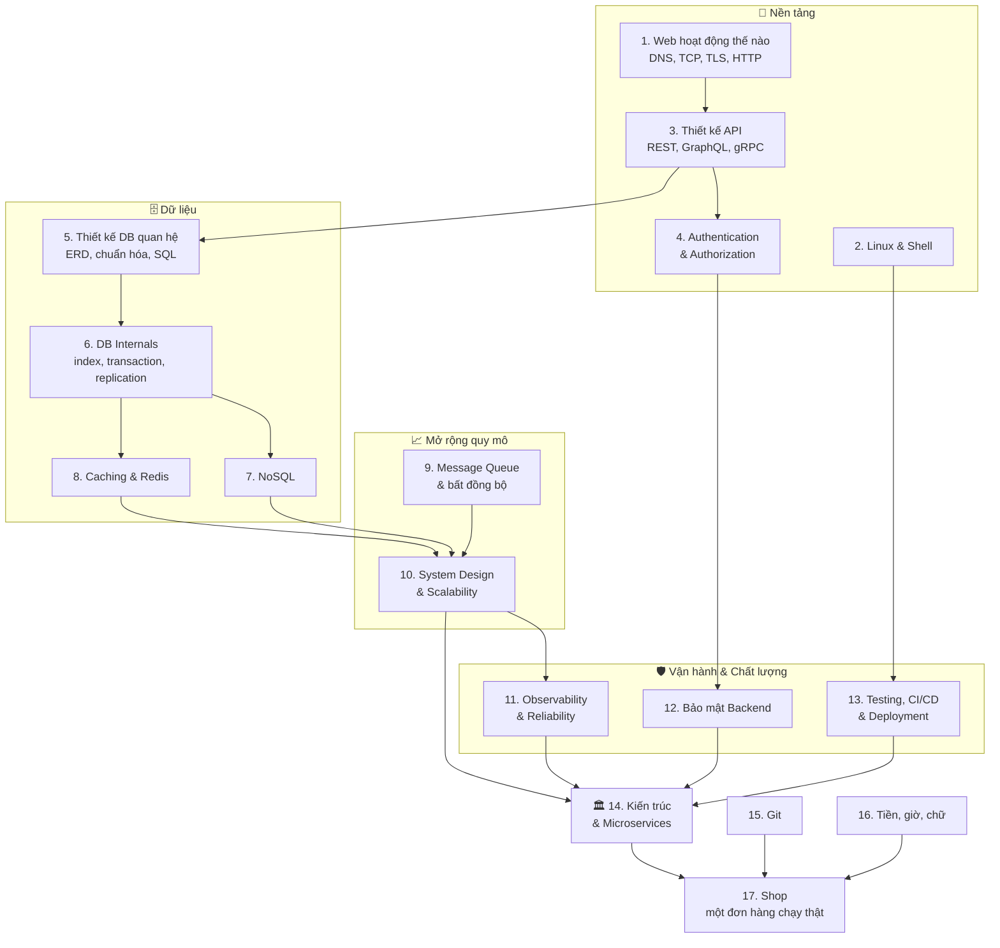

# 🏗️ Backend Engineering toàn diện

## 📋 Tổng quan

Chào mừng bạn đến với khóa học **Backend Engineering toàn diện**! Nếu các khóa [Golang](../golang/README.md) và [Python](../python/README.md) dạy bạn **viết code**, thì khóa này dạy bạn **xây hệ thống**: cách web vận hành, thiết kế API, xác thực và phân quyền, thiết kế và tối ưu database, cache, message queue, thiết kế hệ thống chịu tải lớn, giám sát, bảo mật, kiểm thử, triển khai và kiến trúc microservices.

Mỗi bài được giải thích **thật chi tiết và dễ hiểu**, dùng ví von đời thường ở Việt Nam (gửi xe, chung cư, quán phở, đặt vé xem phim...), có **sơ đồ Mermaid**, code chạy được bằng **cả Go và Python** (chuyển qua lại bằng tab), mục **"🌍 Ứng dụng thực tế"**, **"⚠️ Lỗi thường gặp"**, bài tập từ dễ đến khó và checklist tự đánh giá.

> 💡 **Backend là gì?** Khi bạn bấm "Đặt hàng" trên app mua sắm, phần bạn nhìn thấy là **frontend**. Mọi thứ xảy ra phía sau - kiểm tra bạn là ai, trừ tồn kho, tính tiền, gọi cổng thanh toán, gửi email xác nhận, ghi log, chịu được 1 triệu người cùng bấm trong đợt sale 11/11 - là **backend**. Backend engineer là người đảm bảo hệ thống **đúng, nhanh, an toàn và không sập**.

### 🎯 Mục tiêu khóa học

- Hiểu **web hoạt động thế nào** từ lúc gõ URL đến khi trang hiện ra: DNS, TCP, TLS, HTTP/1.1/2/3
- Làm việc thành thạo với **Linux và shell** - môi trường mà mọi server chạy trên đó
- Thiết kế **API** chuẩn chỉnh (REST, GraphQL, gRPC), versioning, pagination, idempotency
- Cài đặt **xác thực và phân quyền** an toàn: băm mật khẩu, session, JWT, OAuth2/OIDC, MFA, RBAC
- **Thiết kế database quan hệ** từ yêu cầu nghiệp vụ, chuẩn hóa, viết SQL nâng cao (CTE, window function)
- Hiểu **database từ bên trong**: index, EXPLAIN, transaction, isolation, lock, replication, sharding
- Biết khi nào dùng **NoSQL** (document, key-value, wide-column, graph) và **cache** (Redis)
- Xử lý bất đồng bộ bằng **message queue** (RabbitMQ, Kafka): thường **at-least-once**, kết hợp consumer idempotent để hiệu quả như exactly-once
- **Thiết kế hệ thống** chịu tải lớn: load balancing, scaling, CAP, rate limiting, ước lượng dung lượng
- Vận hành hệ thống với **observability** (log, metric, trace), SLO, xử lý sự cố
- **Bảo mật backend** theo OWASP, quản lý secret, chống tấn công phổ biến
- **Kiểm thử, CI/CD và triển khai** (Docker, Kubernetes, blue-green, canary)
- Lựa chọn **kiến trúc**: monolith, modular monolith, microservices, event-driven, DDD
- Dùng **Git** mỗi ngày, tránh bẫy tiền/giờ/chữ, và hoàn thành một **shop** chạy được (đăng ký, đặt đơn, outbox, cache, metric)

### 👥 Ai nên học khóa này?

- Bạn đã học xong cơ bản **Go** hoặc **Python** (ít nhất tới phần HTTP API và database) và muốn trở thành **backend developer**
- Bạn là **fresher/junior** đã đi làm nhưng thấy "hổng" kiến thức nền: không hiểu vì sao query chậm, vì sao hệ thống sập khi đông người
- Bạn đang chuẩn bị **phỏng vấn** backend / system design
- Frontend/mobile developer muốn hiểu phía server để làm việc tốt hơn với team backend

### ⏱️ Thời gian học tập

- **Tổng thời gian**: khoảng **7 tuần** (1-2 giờ/ngày), mỗi tuần 2 bài
- **Cấp độ**: Trung cấp (cần biết lập trình cơ bản bằng Go hoặc Python)
- **Kết quả**: Tự thiết kế và xây dựng được một backend hoàn chỉnh - có API, xác thực, database được thiết kế tốt, cache, xử lý bất đồng bộ, giám sát và triển khai tự động - và tự tin trả lời các câu hỏi system design cơ bản

## 🛠️ Yêu cầu hệ thống

### Kiến thức cần có

- Lập trình cơ bản với **Go** ([khóa Golang](../golang/README.md), tới Bài 13) hoặc **Python** ([khóa Python](../python/README.md), tới Bài 13)
- Nên có: cấu trúc dữ liệu và độ phức tạp thuật toán ([khóa Thuật toán](../algorithms/README.md)) - rất hữu ích cho bài về index, cache, system design

### Phần mềm cần cài đặt

1. **Go 1.23+** (khuyên dùng 1.24) và/hoặc **Python 3.11+**
2. **Docker** + Docker Compose - để chạy PostgreSQL, Redis, RabbitMQ/Kafka, Prometheus... trên máy mà không cần cài trực tiếp
3. **Terminal**: Linux/macOS có sẵn; Windows dùng **WSL2** (khuyến nghị mạnh - server thật chạy Linux)
4. **curl** hoặc **Postman/Bruno/HTTPie** - gọi thử API
5. Một **database client**: `psql`, `sqlite3`, DBeaver hoặc TablePlus
6. **VS Code** với extension Go/Python, Docker, và một extension xem Mermaid (hoặc xem ngay trên trang web của khóa học)

## 🗺️ Bản đồ kiến thức backend

Các bài được sắp xếp để kiến thức **xây chồng lên nhau**: nền tảng → dữ liệu → mở rộng quy mô → vận hành → kiến trúc.



## 📚 Cấu trúc khóa học

#### Tuần 1: Nền tảng web và môi trường server

- [ ] **Bài 1**: [Web hoạt động thế nào](./01-how-the-web-works.md) - DNS, TCP/IP, TLS/HTTPS, HTTP/1.1 → HTTP/2 → HTTP/3, cookie, CORS, CDN
- [ ] **Bài 2**: [Linux & Shell](./02-linux-shell.md) - file system, quyền, process, pipe, systemd, SSH, lệnh chẩn đoán mạng và hiệu năng

#### Tuần 2: API và bảo vệ API

- [ ] **Bài 3**: [Thiết kế API](./03-api-design.md) - REST, status code, lỗi RFC 9457, pagination, versioning, idempotency, OpenAPI, webhook, GraphQL, gRPC
- [ ] **Bài 4**: [Authentication & Authorization](./04-auth.md) - băm mật khẩu, session/cookie, JWT, refresh token rotation, OAuth2 + PKCE, OIDC, SSO, API key, TOTP, RBAC/ABAC

#### Tuần 3: Database quan hệ

- [ ] **Bài 5**: [Thiết kế Database quan hệ](./05-relational-database-design.md) - ERD, khóa, chuẩn hóa 3NF, ràng buộc, JOIN, CTE đệ quy, window function, UPSERT, soft delete, JSON
- [ ] **Bài 6**: [Database Internals & Hiệu năng](./06-database-internals-performance.md) - B-tree index, EXPLAIN, N+1, ACID, isolation level, lock, MVCC, connection pool, replication, sharding, migration

#### Tuần 4: Dữ liệu phi quan hệ và cache

- [ ] **Bài 7**: [NoSQL](./07-nosql.md) - document, key-value, wide-column, graph; MongoDB, DynamoDB, Cassandra; mô hình hóa theo truy vấn
- [ ] **Bài 8**: [Caching & Redis](./08-caching.md) - cache-aside, write-through, TTL, invalidation, cache stampede, cấu trúc dữ liệu Redis, distributed lock

#### Tuần 5: Bất đồng bộ và thiết kế hệ thống

- [ ] **Bài 9**: [Message Queue & Xử lý bất đồng bộ](./09-message-queues.md) - RabbitMQ, Kafka, at-least-once, idempotent consumer, outbox pattern, retry, dead letter queue
- [ ] **Bài 10**: [System Design & Scalability](./10-system-design.md) - scale dọc/ngang, load balancer, CAP, consistent hashing, rate limiting, ước lượng dung lượng, thiết kế URL shortener

#### Tuần 6: Vận hành an toàn và ổn định

- [ ] **Bài 11**: [Observability & Reliability](./11-observability-reliability.md) - structured logging, metrics, tracing (OpenTelemetry), SLI/SLO, alerting, timeout, retry, circuit breaker
- [ ] **Bài 12**: [Bảo mật Backend](./12-security.md) - OWASP Top 10, SQL injection, XSS, SSRF, quản lý secret, mã hóa, security headers

#### Tuần 7: Chất lượng, triển khai và kiến trúc

- [ ] **Bài 13**: [Testing, CI/CD & Deployment](./13-testing-cicd-deployment.md) - kim tự tháp test, integration test với container, pipeline CI/CD, Docker, Kubernetes, blue-green, canary, feature flag
- [ ] **Bài 14**: [Kiến trúc & Microservices](./14-architecture-microservices.md) - monolith vs microservices, clean/hexagonal architecture, DDD, API gateway, saga, event-driven

#### Thực hành: việc làm mỗi ngày và một hệ thống chạy được

- [ ] **Bài 15**: [Git](./15-git.md) - diff, nhánh, merge, rebase, conflict, đọc pull request
- [ ] **Bài 16**: [Bẫy tiền, thời gian và chữ](./16-production-traps.md) - số nguyên cho tiền, UTC, UTF-8, idempotency key
- [ ] **Bài 17**: [Dự án shop](./17-shop-capstone.md) - API đăng ký, đăng nhập, đặt một dòng đơn, outbox, cache, metric (`projects/shop`)

> 💡 **Học theo thứ tự nào?** Bài 1-6 là **nền bắt buộc**, nên học theo thứ tự. Sau đó bạn có thể nhảy theo nhu cầu: đang gặp vấn đề hiệu năng → Bài 8, 10; chuẩn bị đưa hệ thống lên production → Bài 11, 12, 13. Bài 14 nên học cuối cùng vì tổng hợp kiến thức của mọi bài trước.

## 🚀 Bắt đầu học

### Cách học hiệu quả

1. **Đọc hiểu "vì sao"** trước "làm thế nào". Mỗi kỹ thuật backend sinh ra để giải một vấn đề cụ thể - hiểu vấn đề thì nhớ giải pháp lâu hơn.
2. **Chạy lại mọi ví dụ**. Code trong bài đã được chạy thử; hãy tự gõ lại, sửa, làm hỏng nó và quan sát.
3. **Vẽ lại sơ đồ** bằng tay hoặc Mermaid. Nếu bạn vẽ lại được luồng OAuth2 hay luồng xử lý message mà không nhìn bài, bạn đã hiểu.
4. **Làm bài tập** ít nhất tới mức "Trung bình". Bài "Khó" và "Thử thách" là thứ sẽ gặp khi đi làm và khi phỏng vấn.
5. **Xây một dự án xuyên suốt**: làm [Bài 17](./17-shop-capstone.md) (`projects/shop`) sau khi đã có API, auth, database và queue. Mỗi bài trước đó là một mảnh của cùng một đơn hàng.

### Dựng môi trường thí nghiệm nhanh bằng Docker

```bash
# PostgreSQL và Redis - dùng cho Bài 5, 6, 8 và nhiều bài sau
docker run -d --name pg -e POSTGRES_PASSWORD=dev -p 5432:5432 postgres:16
docker run -d --name redis -p 6379:6379 redis:7

# Kiểm tra
docker exec -it pg psql -U postgres -c "SELECT version();"
docker exec -it redis redis-cli PING
# Output: PONG
```

## 🔗 Liên kết với các khóa học khác

| Khóa học | Liên quan thế nào |
|---|---|
| [🐹 Golang](../golang/README.md) | Ngôn ngữ backend hiệu năng cao; Bài 12 (HTTP), 13 (database), 16 (production), 17 (Docker), 18 (gRPC) là bước đệm trực tiếp cho khóa này |
| [🐍 Python](../python/README.md) | Ngôn ngữ backend phổ biến (FastAPI, Django); Bài 12 (web API), 13 (database) là bước đệm |
| [🧮 Thuật toán](../algorithms/README.md) | Hash table → cache & consistent hashing; cây B-tree → index; heap → hàng đợi ưu tiên; đồ thị → phụ thuộc giữa các service |
| [🧠 Tư duy SE](../mindset/README.md) | Trade-off, debug, clean code, làm việc nhóm - những kỹ năng quyết định bạn là "coder" hay "engineer" |

## ✅ Checklist tiến độ

Đánh dấu khi bạn hoàn thành bài học **và** làm xong bài tập mức "Trung bình" trở lên:

- [ ] Bài 1 - Web hoạt động thế nào
- [ ] Bài 2 - Linux & Shell
- [ ] Bài 3 - Thiết kế API
- [ ] Bài 4 - Authentication & Authorization
- [ ] Bài 5 - Thiết kế Database quan hệ
- [ ] Bài 6 - Database Internals & Hiệu năng
- [ ] Bài 7 - NoSQL
- [ ] Bài 8 - Caching & Redis
- [ ] Bài 9 - Message Queue & Xử lý bất đồng bộ
- [ ] Bài 10 - System Design & Scalability
- [ ] Bài 11 - Observability & Reliability
- [ ] Bài 12 - Bảo mật Backend
- [ ] Bài 13 - Testing, CI/CD & Deployment
- [ ] Bài 14 - Kiến trúc & Microservices
- [ ] Bài 15 - Git
- [ ] Bài 16 - Bẫy tiền, thời gian và chữ
- [ ] Bài 17 - Dự án shop (`go test ./...` trong `projects/shop`)
- [ ] 🏆 **Dự án cá nhân**: một backend hoàn chỉnh (API + auth + PostgreSQL + Redis + queue + metrics + CI/CD), có README mô tả kiến trúc bằng sơ đồ

## 📖 Tài liệu tham khảo

### Sách

- **Designing Data-Intensive Applications** - Martin Kleppmann (O'Reilly). "Kinh thánh" của backend engineer về dữ liệu, replication, partitioning, consistency. Nên đọc song song với Bài 5-10.
- **System Design Interview** (Vol. 1 & 2) - Alex Xu. Dễ đọc, nhiều sơ đồ, hợp để luyện phỏng vấn.
- **Release It!** - Michael T. Nygard. Các pattern giữ hệ thống sống sót trên production (timeout, circuit breaker, bulkhead).
- **Site Reliability Engineering** - Google (đọc miễn phí tại sre.google/books).
- **Building Microservices** - Sam Newman.

### Tài liệu trực tuyến

- [roadmap.sh/backend](https://roadmap.sh/backend) - lộ trình backend developer, được cập nhật liên tục
- [The System Design Primer](https://github.com/donnemartin/system-design-primer) - tổng hợp kiến thức system design kèm bài tập
- [OWASP Cheat Sheet Series](https://cheatsheetseries.owasp.org/) - hướng dẫn bảo mật cụ thể cho từng chủ đề (mật khẩu, session, JWT...)
- [PostgreSQL Documentation](https://www.postgresql.org/docs/current/) - tài liệu chính thức, viết rất tốt
- [Use The Index, Luke!](https://use-the-index-luke.com/) - giải thích index SQL cho developer
- [High Scalability](http://highscalability.com/) và engineering blog của các công ty lớn (Netflix, Uber, Discord, Shopee, Grab)
- [MDN Web Docs - HTTP](https://developer.mozilla.org/en-US/docs/Web/HTTP) - tài liệu chuẩn về HTTP

---

**Bắt đầu thôi**: [Bài 1: Web hoạt động thế nào](./01-how-the-web-works.md) 🚀
