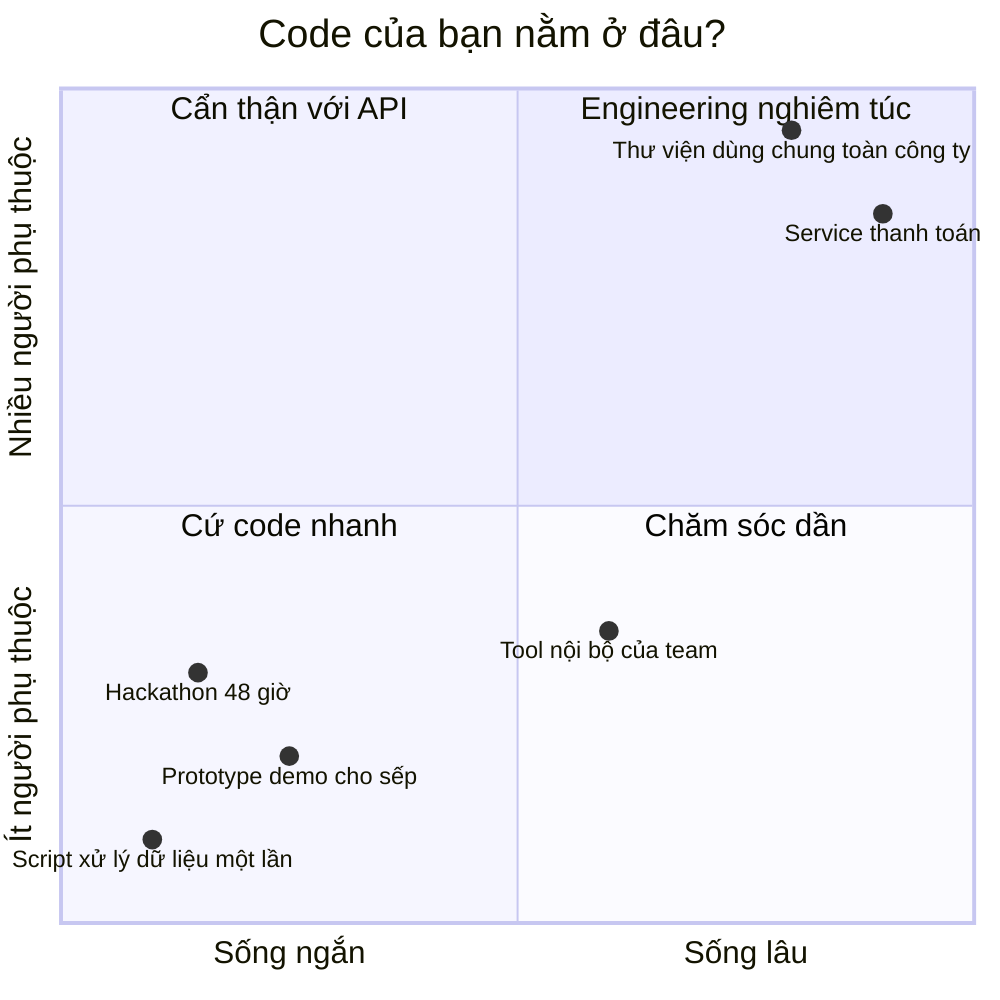
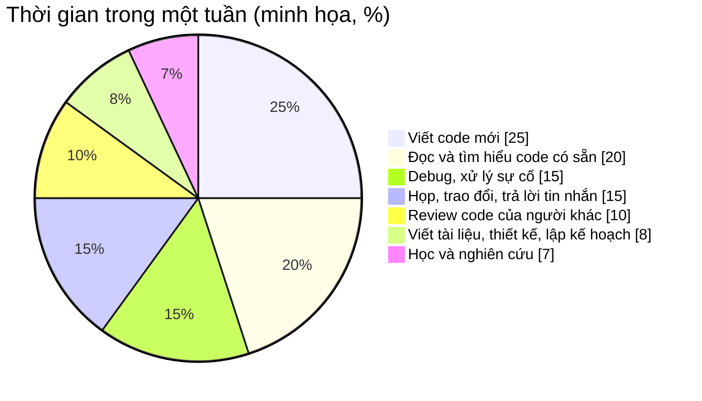
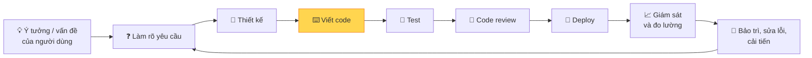
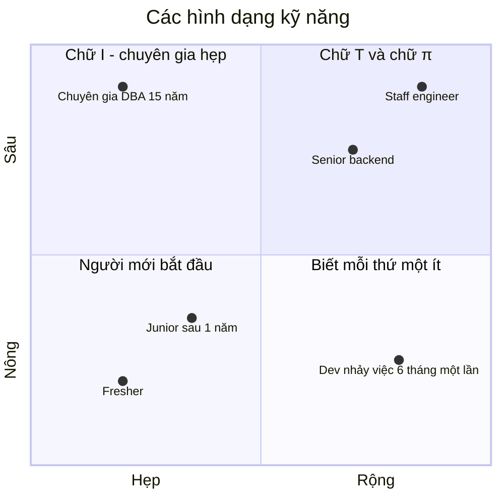
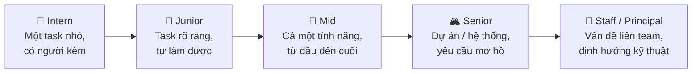
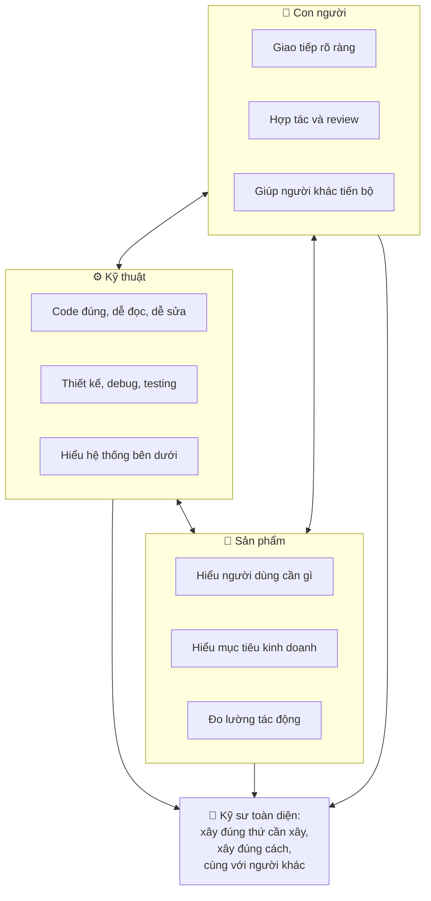
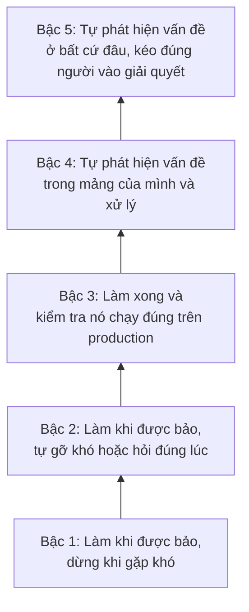
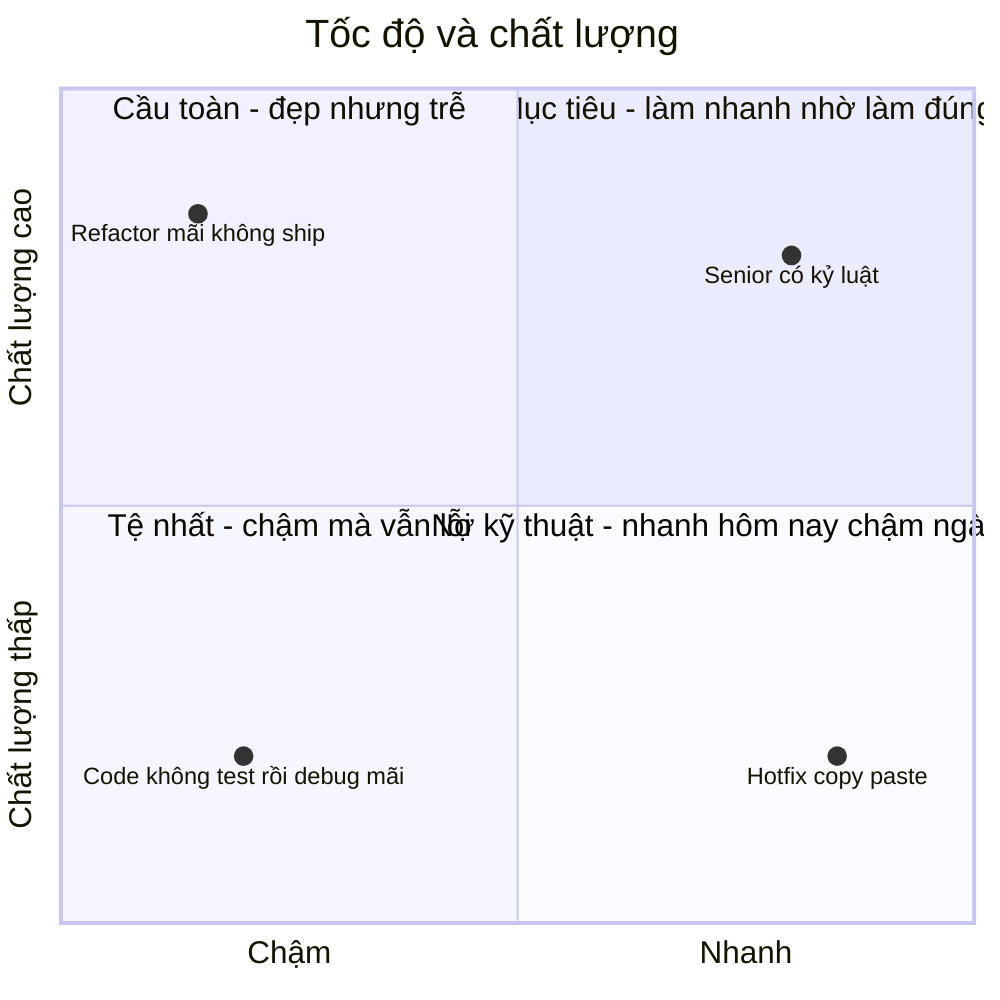
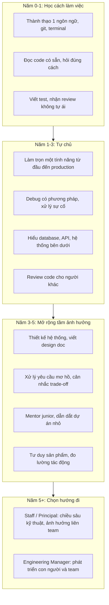

# 📚 Bài 1: Software Engineer là gì?

## 🎯 Mục tiêu bài học

- Phân biệt **lập trình (programming)** và **kỹ nghệ phần mềm (software engineering)** - và vì sao sự khác biệt đó quyết định cách bạn làm việc mỗi ngày
- Hiểu một kỹ sư phần mềm **thực sự** dành thời gian cho việc gì (spoiler: viết code chỉ là một phần)
- Nắm mô hình kỹ năng **chữ T** và **chữ π**, biết cách chọn "chiều sâu" cho bản thân
- Biết **kỳ vọng ở từng cấp bậc**: Intern → Junior → Mid → Senior → Staff/Principal (phạm vi, mức độ tự chủ, tác động)
- Hiểu "**toàn diện**" nghĩa là gì: kỹ thuật + sản phẩm + con người
- Xây dựng **tư duy ownership** (làm chủ) và **craftsmanship** (tay nghề)
- Nhận thức về **đạo đức nghề nghiệp** của người viết phần mềm
- Gỡ bỏ những **huyền thoại** phổ biến (10x engineer, "phải biết mọi ngôn ngữ"...)
- Có một **lộ trình** phát triển cho vài năm đầu sự nghiệp

## 📖 1. Câu chuyện mở đầu: Hai bạn fresher

Công ty thương mại điện tử X tuyển cùng lúc hai bạn fresher: **Minh** và **Lan**. Cả hai đều tốt nghiệp loại giỏi, đều biết Go và Python, điểm bài test thuật toán ngang nhau.

Tuần đầu tiên, cả hai nhận ticket giống nhau: *"Thêm tính năng gửi email xác nhận khi khách đặt hàng thành công."*

**Minh** đọc ticket xong, mở editor, 3 tiếng sau đã có code chạy được trên máy. Minh tạo Pull Request (PR), tự hào vì là người xong đầu tiên.

**Lan** đọc ticket, rồi hỏi tech lead vài câu:

- "Nếu dịch vụ email bị lỗi thì đơn hàng có bị hủy không, hay chỉ cần thử gửi lại?"
- "Khách đặt 1 đơn có 3 sản phẩm thì gửi 1 email hay 3 email?"
- "Email cần tiếng Việt hay cả tiếng Anh?"
- "Có giới hạn số email gửi mỗi giây từ nhà cung cấp không?"

Lan mất nửa ngày để hỏi, đọc code cũ, viết một ghi chú ngắn về cách làm, rồi mới code. Lan xong sau Minh **một ngày rưỡi**.

Hai tuần sau, vào ngày sale 11/11:

- Code của Minh gửi email **ngay trong request đặt hàng**. Nhà cung cấp email chậm lại vì quá tải → mỗi lần đặt hàng mất 8 giây → khách bấm "Đặt hàng" nhiều lần → **đơn hàng bị trùng**. Team phải thức đến 3 giờ sáng để xử lý, rồi hoàn tiền thủ công cho hàng trăm khách.
- Code của Lan (ở một service khác, cùng mô hình) đưa việc gửi email vào **hàng đợi (queue)**, có thử lại (retry) khi lỗi. Ngày sale, email đến chậm vài phút nhưng không ai phàn nàn.

Minh không kém Lan về **lập trình**. Minh chỉ đang làm **lập trình**, còn Lan đang làm **kỹ nghệ phần mềm**. Bài học này nói về sự khác biệt đó.

!!! note "Đây không phải câu chuyện 'nhanh là xấu'"
    Trong nhiều tình huống, làm nhanh như Minh là **đúng** - ví dụ viết script một lần để xử lý dữ liệu, hoặc làm prototype để thử ý tưởng. Điểm mấu chốt là **biết mình đang ở tình huống nào**. Kỹ sư giỏi không phải người lúc nào cũng cẩn thận tối đa, mà là người **chọn đúng mức độ cẩn thận** cho từng việc.

## 📖 2. Programming khác Software Engineering thế nào?

### "Programming integrated over time"

Cuốn *Software Engineering at Google* (Titus Winters, Tom Manshreck, Hyrum Wright) có một định nghĩa rất hay:

> **"Software engineering is programming integrated over time."**
> (Kỹ nghệ phần mềm là lập trình được *tích phân theo thời gian*.)

Nghe hơi "toán", nhưng ý rất đời thường:

- **Lập trình** là hành động viết ra code để giải quyết một vấn đề **ngay bây giờ**.
- **Software engineering** là lập trình **cộng thêm** mọi thứ cần thiết để code đó **tiếp tục sống khỏe** trong nhiều tháng, nhiều năm: khi yêu cầu thay đổi, khi team thay người, khi lượng người dùng tăng 100 lần, khi thư viện bạn dùng ra phiên bản mới, khi có lỗ hổng bảo mật...

Hãy tưởng tượng sự khác biệt giữa **dựng lều đi cắm trại** và **xây nhà để ở 30 năm**. Cả hai đều là "tạo ra chỗ ở". Nhưng xây nhà thì bạn phải nghĩ đến móng, hệ thống điện nước, sau này có thêm con thì mở rộng thế nào, sửa ống nước có phải đục tường không... Không ai trách bạn dựng lều mà không đổ móng. Nhưng xây nhà mà không đổ móng thì là thảm họa.

### Ba trục khiến "engineering" khác "programming"

Sách của Google chỉ ra ba yếu tố:

| Trục | Câu hỏi | Ví dụ |
|---|---|---|
| **Thời gian** (Time) | Code này sẽ sống bao lâu? | Script đổi tên file sống 5 phút. Service thanh toán sống 10 năm, qua 3 thế hệ kỹ sư |
| **Quy mô** (Scale) | Bao nhiêu người, bao nhiêu hệ thống phụ thuộc vào nó? | Tool cá nhân: 1 người dùng. Thư viện nội bộ: 40 team phụ thuộc, sửa một hàm có thể làm vỡ 200 chỗ |
| **Đánh đổi** (Trade-offs) | Chi phí và lợi ích của mỗi quyết định là gì? | Thêm cache: nhanh hơn nhưng dữ liệu có thể cũ. Viết test: chậm hôm nay nhưng nhanh hơn trong 6 tháng tới |



Cùng một người, cùng một ngôn ngữ, nhưng cách làm ở góc dưới-trái và góc trên-phải **phải khác nhau**. Viết script một lần mà cũng vẽ UML, viết 50 test thì lãng phí. Viết service thanh toán mà "chạy được là được" thì nguy hiểm.

### Hyrum's Law - khi thời gian và quy mô cộng lại

Một định luật nổi tiếng khác (đặt theo tên Hyrum Wright):

> *"Khi một API có đủ nhiều người dùng, thì **mọi hành vi quan sát được** của hệ thống sẽ có người phụ thuộc vào - bất kể bạn đã hứa gì trong tài liệu."*

Ví dụ thực tế: API của bạn trả về danh sách đơn hàng. Tài liệu không hề hứa thứ tự sắp xếp, nhưng do cách query, kết quả **tình cờ** luôn theo thứ tự thời gian. Một năm sau bạn tối ưu query, thứ tự thay đổi → app mobile của team khác hiển thị sai vì họ đã "ngầm" dựa vào thứ tự đó. Bạn không làm gì "sai" theo tài liệu - nhưng bạn vẫn làm hỏng hệ thống.

Bài học: khi code sống lâu và có nhiều người dùng, **mọi thay đổi đều có rủi ro**. Đó là lý do software engineering cần test, versioning, deprecation, rollout từ từ...

### So sánh trực tiếp

| Khía cạnh | Programming | Software Engineering |
|---|---|---|
| Câu hỏi chính | "Làm sao cho nó chạy?" | "Làm sao cho nó chạy **đúng, lâu dài, và người khác sửa được**?" |
| Người đọc code | Chính mình, hôm nay | Đồng đội, người kế nhiệm, chính mình 6 tháng sau |
| Dữ liệu đầu vào | Dữ liệu mẫu "đẹp" | Dữ liệu thật: thiếu, sai, trùng, cực lớn, độc hại |
| Khi có lỗi | Sửa và chạy lại | Phát hiện, cảnh báo, khôi phục, học từ sự cố |
| Thành công là | Code chạy trên máy mình | Tính năng giải quyết được vấn đề của người dùng, ổn định trên production |
| Phạm vi công việc | Viết code | Hiểu yêu cầu, thiết kế, code, test, review, deploy, giám sát, bảo trì, tài liệu, giao tiếp |

### Ví dụ: Cùng một yêu cầu, hai tư duy

Yêu cầu: *"Tính tổng doanh thu từ file CSV đơn hàng mà team kế toán gửi mỗi ngày."*

Dữ liệu **thật** hôm nay trông như sau (để ý: có dấu cách thừa, có dòng chữ, có số âm, có dòng trống - dữ liệu thật **luôn** bẩn như vậy):

```text
ORD-001,150000
ORD-002, 320000
ORD-003,abc
ORD-004,-50000

ORD-005,99000
```

**Tư duy "chạy được là được"** - code ngắn, nhìn có vẻ ổn:

=== "Go"

    ```go
    package main

    import (
    	"fmt"
    	"strconv"
    	"strings"
    )

    const data = `ORD-001,150000
    ORD-002, 320000
    ORD-003,abc
    ORD-004,-50000

    ORD-005,99000`

    func main() {
    	total := 0
    	for _, line := range strings.Split(data, "\n") {
    		if line == "" {
    			continue
    		}
    		parts := strings.Split(line, ",")
    		amount, _ := strconv.Atoi(parts[1]) // "kệ lỗi, chạy được là được"
    		total += amount
    	}
    	fmt.Println("Tổng doanh thu:", total)
    }

    // Output:
    // Tổng doanh thu: 199000
    ```

=== "Python"

    ```python
    data = """ORD-001,150000
    ORD-002, 320000
    ORD-003,abc
    ORD-004,-50000

    ORD-005,99000"""

    total = 0
    for line in data.splitlines():
        if not line:
            continue
        try:
            total += int(line.split(",")[1])
        except Exception:
            pass  # "kệ lỗi, chạy được là được"
    print("Tổng doanh thu:", total)

    # Output:
    # Tổng doanh thu: 519000
    ```

Đáng sợ nhất ở đây **không phải** là con số sai. Đáng sợ là **con số sai mà không ai biết**. Go ra 199.000, Python ra 519.000 (vì `int()` của Python tự bỏ dấu cách còn `strconv.Atoi` của Go thì không) - cả hai đều sai, và không có bất kỳ cảnh báo nào. Kế toán sẽ báo cáo con số này lên giám đốc.

**Tư duy engineering** - tự hỏi: *"Dữ liệu sai thì sao? Ai cần biết? Người đọc code sau này có hiểu không?"*

=== "Go"

    ```go
    package main

    import (
    	"fmt"
    	"strconv"
    	"strings"
    )

    const data = `ORD-001,150000
    ORD-002, 320000
    ORD-003,abc
    ORD-004,-50000

    ORD-005,99000`

    // Report là kết quả tổng hợp: không chỉ con số, mà cả những gì đã bị bỏ qua.
    type Report struct {
    	Total    int
    	Valid    int
    	Problems []string
    }

    func summarize(csv string) Report {
    	var r Report
    	for i, line := range strings.Split(csv, "\n") {
    		lineNo := i + 1
    		line = strings.TrimSpace(line)
    		if line == "" {
    			continue
    		}
    		parts := strings.Split(line, ",")
    		if len(parts) != 2 {
    			r.Problems = append(r.Problems, fmt.Sprintf("dòng %d: cần 2 cột, có %d", lineNo, len(parts)))
    			continue
    		}
    		amount, err := strconv.Atoi(strings.TrimSpace(parts[1]))
    		if err != nil {
    			r.Problems = append(r.Problems, fmt.Sprintf("dòng %d: số tiền không hợp lệ %q", lineNo, parts[1]))
    			continue
    		}
    		if amount <= 0 {
    			r.Problems = append(r.Problems, fmt.Sprintf("dòng %d: số tiền phải > 0, nhận %d", lineNo, amount))
    			continue
    		}
    		r.Total += amount
    		r.Valid++
    	}
    	return r
    }

    func main() {
    	r := summarize(data)
    	fmt.Printf("Tổng doanh thu: %d (%d đơn hợp lệ)\n", r.Total, r.Valid)
    	if len(r.Problems) > 0 {
    		fmt.Printf("⚠️ %d dòng bị bỏ qua:\n", len(r.Problems))
    		for _, p := range r.Problems {
    			fmt.Println("  -", p)
    		}
    	}
    }

    // Output:
    // Tổng doanh thu: 569000 (3 đơn hợp lệ)
    // ⚠️ 2 dòng bị bỏ qua:
    //   - dòng 3: số tiền không hợp lệ "abc"
    //   - dòng 4: số tiền phải > 0, nhận -50000
    ```

=== "Python"

    ```python
    from dataclasses import dataclass, field

    data = """ORD-001,150000
    ORD-002, 320000
    ORD-003,abc
    ORD-004,-50000

    ORD-005,99000"""


    @dataclass
    class Report:
        """Kết quả tổng hợp: không chỉ con số, mà cả những gì đã bị bỏ qua."""
        total: int = 0
        valid: int = 0
        problems: list[str] = field(default_factory=list)


    def summarize(csv: str) -> Report:
        r = Report()
        for line_no, line in enumerate(csv.splitlines(), start=1):
            line = line.strip()
            if not line:
                continue
            parts = line.split(",")
            if len(parts) != 2:
                r.problems.append(f"dòng {line_no}: cần 2 cột, có {len(parts)}")
                continue
            try:
                amount = int(parts[1])
            except ValueError:
                r.problems.append(f"dòng {line_no}: số tiền không hợp lệ {parts[1]!r}")
                continue
            if amount <= 0:
                r.problems.append(f"dòng {line_no}: số tiền phải > 0, nhận {amount}")
                continue
            r.total += amount
            r.valid += 1
        return r


    r = summarize(data)
    print(f"Tổng doanh thu: {r.total} ({r.valid} đơn hợp lệ)")
    if r.problems:
        print(f"⚠️ {len(r.problems)} dòng bị bỏ qua:")
        for p in r.problems:
            print("  -", p)

    # Output:
    # Tổng doanh thu: 569000 (3 đơn hợp lệ)
    # ⚠️ 2 dòng bị bỏ qua:
    #   - dòng 3: số tiền không hợp lệ 'abc'
    #   - dòng 4: số tiền phải > 0, nhận -50000
    ```

Code dài hơn khoảng gấp đôi. Nhưng hãy nhìn những gì bạn nhận được:

1. **Kết quả đúng**, và giống nhau ở cả hai ngôn ngữ (hành vi được quyết định bởi *bạn*, không phải bởi "tình cờ" của thư viện).
2. **Minh bạch**: kế toán biết có 2 dòng lỗi, ở dòng nào, vì sao → họ có thể sửa file gốc.
3. **Dễ test**: logic nằm trong hàm `summarize` nhận chuỗi và trả về `Report`, không in trực tiếp → bạn có thể viết test cho nó (Bài 6).
4. **Dễ mở rộng**: muốn thêm quy tắc "số tiền tối đa 1 tỷ" chỉ cần thêm một `if`.

!!! tip "Câu hỏi 'engineering' nên tự hỏi với mọi đoạn code"
    1. Nếu đầu vào sai/thiếu/rỗng/cực lớn thì sao?
    2. Nếu phụ thuộc bên ngoài (database, API, email) chậm hoặc chết thì sao?
    3. Khi có lỗi, **ai** cần biết và họ biết bằng cách nào?
    4. Người khác (hoặc mình 6 tháng sau) có hiểu và sửa được code này không?
    5. Làm sao biết code này **vẫn đúng** sau khi ai đó sửa nó?

    Không phải lúc nào cũng cần trả lời hết. Nhưng **phải hỏi**, rồi quyết định có chủ đích.

## 📖 3. Kỹ sư phần mềm thực sự làm gì mỗi ngày?

Nhiều bạn sinh viên hình dung công việc kỹ sư là: đến công ty, đeo tai nghe, code 8 tiếng, về nhà. Thực tế khác khá xa.

### Thời gian đi đâu?

Biểu đồ dưới đây là **ước lượng minh họa** cho một kỹ sư backend cấp Mid ở một công ty sản phẩm cỡ vừa (con số thật khác nhau tùy công ty, tùy giai đoạn dự án và tùy cấp bậc - nhưng hình dạng chung thì khá giống nhau ở nhiều nơi):



Một số nhận xét quan trọng:

- **Viết code mới chỉ khoảng 1/4 thời gian.** Phần lớn thời gian còn lại là **đọc**, **hiểu**, **sửa** và **giao tiếp**. Vì vậy kỹ năng đọc code, debug và giao tiếp quan trọng không kém kỹ năng viết code.
- **Càng lên cao, phần "viết code" càng nhỏ lại** - Senior dành nhiều thời gian cho thiết kế, review, mentor; Staff có khi chỉ code 20-30% thời gian.
- **Đọc code chiếm nhiều hơn viết** → code của bạn sẽ được đọc nhiều hơn được viết. Đây là nền tảng của Bài 3 (Clean Code).

### Một ngày cụ thể

```mermaid
gantt
    title Một ngày của Lan - Mid Backend Engineer
    dateFormat HH:mm
    axisFormat %H:%M
    section Buổi sáng
    Đọc tin nhắn và kiểm tra dashboard     :a1, 09:00, 20m
    Daily standup                          :a2, after a1, 15m
    Review 2 PR của đồng đội               :a3, after a2, 45m
    Code tính năng voucher - deep work     :a4, after a3, 100m
    section Buổi chiều
    Nghỉ trưa                              :b1, 12:00, 60m
    Họp làm rõ yêu cầu với PM và designer  :b2, 13:00, 45m
    Debug lỗi thanh toán do QA báo         :b3, after b2, 75m
    Tiếp tục code và viết test             :b4, after b3, 90m
    Cập nhật PR và viết mô tả              :b5, after b4, 30m
```



Để ý: khoảng thời gian code liền mạch (deep work) dài nhất chỉ khoảng **1 tiếng 40 phút**. Đó là thực tế ở hầu hết các công ty. Người kỹ sư hiệu quả là người **bảo vệ được thời gian tập trung** của mình (gom họp vào một buổi, tắt thông báo khi code) và **làm tốt những phần không phải code**.

### Vòng đời thực sự của một tính năng

Code chỉ là một trạm trong một hành trình dài:



Ô màu vàng là thứ mà trường học và các khóa học lập trình dạy bạn. Tất cả các ô còn lại là **software engineering**. Khóa học này đi qua gần như từng ô trong sơ đồ trên.

## 📖 4. Kỹ năng hình chữ T và chữ π

### Mô hình chữ T (T-shaped)

```text
  ┌──────────────────────────────────────────────────────┐
  │ Frontend · DevOps · Database · Bảo mật · Sản phẩm ... │  ← Chiều RỘNG: biết đủ để
  └──────────────────────────────────────────────────────┘    làm việc & giao tiếp
                          │         │
                          │ Backend │
                          │   với   │  ← Chiều SÂU: giỏi thật sự,
                          │   Go    │    người khác tìm đến bạn
                          │         │    khi gặp vấn đề khó
                          └─────────┘
```

- **Thanh dọc (chiều sâu)**: một lĩnh vực bạn giỏi **thật sự** - hiểu đến tận gốc, giải quyết được vấn đề mà người khác bó tay. Ví dụ: backend với Go, hiểu sâu concurrency, database, hiệu năng.
- **Thanh ngang (chiều rộng)**: những lĩnh vực bạn **biết đủ** để làm việc cùng người khác và không bị "mù" - ví dụ: biết đủ frontend để hiểu vì sao API của mình khó dùng; biết đủ DevOps để tự deploy; biết đủ sản phẩm để hỏi "tính năng này đo thành công bằng gì?".

### Các "hình dạng" kỹ năng khác

| Hình dạng | Mô tả | Rủi ro |
|---|---|---|
| **Chữ I** (chuyên gia hẹp) | Rất sâu một mảng, gần như không biết gì ngoài nó | Khó làm việc liên team, dễ "lỗi thời" nếu công nghệ đó hết thời |
| **Dấu gạch ngang —** (biết mỗi thứ một ít) | Biết rộng nhưng không sâu mảng nào | Không giải quyết được vấn đề khó, dễ bị thay thế |
| **Chữ T** | Một chiều sâu + chiều rộng | Mô hình mục tiêu cho phần lớn kỹ sư Mid/Senior |
| **Chữ π** | **Hai** chiều sâu + chiều rộng | Rất có giá trị, ví dụ: backend + data, hoặc mobile + bảo mật |
| **Hình răng lược** (comb) | Nhiều chiều sâu | Thường là Staff/Principal lâu năm |



### Cách xây chữ T cho bản thân

1. **Chọn chiều sâu đầu tiên dựa trên công việc hiện tại**, không phải theo trend. Nếu bạn đang làm backend Go, hãy đào sâu Go + database + hệ thống phân tán. Chiều sâu phát triển nhanh nhất khi được **dùng hằng ngày**.
2. **Mở rộng chiều ngang theo "hàng xóm"**: học những thứ tiếp giáp trực tiếp với công việc - backend thì học thêm database, Linux, networking, Docker, CI/CD, observability (xem [khóa Backend](../backend/README.md)).
3. **Chiều sâu thứ hai (chữ π) thường đến tự nhiên** sau 3-5 năm, từ một mảng bạn được giao nhiều lần và thấy hứng thú.
4. **Nền tảng khoa học máy tính là "chất keo"** giúp học mọi chiều sâu nhanh hơn: cấu trúc dữ liệu & thuật toán ([khóa Thuật toán](../algorithms/README.md)), hệ điều hành, mạng, database.

!!! tip "Chiều sâu ≠ biết nhiều thư viện"
    Biết 15 framework web không phải là chiều sâu. Chiều sâu là hiểu **vì sao** framework hoạt động như vậy: HTTP hoạt động thế nào, connection pool là gì, vì sao query chậm, goroutine được lên lịch ra sao. Khi hiểu đến tầng đó, framework mới chỉ mất vài ngày để học.

## 📖 5. Các cấp bậc: Intern → Junior → Mid → Senior → Staff/Principal

Mỗi công ty đặt tên cấp bậc khác nhau (L3/L4/L5, SE1/SE2, Associate/Senior...). Nhưng phần lớn các công ty công nghệ phân cấp dựa trên **ba trục**:

- **Phạm vi (scope)**: bạn chịu trách nhiệm cho thứ lớn cỡ nào - một task, một tính năng, một hệ thống, hay nhiều team?
- **Mức độ tự chủ (autonomy)**: bạn cần bao nhiêu hướng dẫn? Được giao việc cụ thể, hay được giao **một vấn đề** rồi tự tìm ra việc cần làm?
- **Tác động (impact)**: kết quả công việc của bạn ảnh hưởng đến ai - bản thân, team, sản phẩm, hay cả tổ chức?



### Bảng kỳ vọng

| Cấp | Phạm vi | Tự chủ | Tác động | Câu hỏi thường tự đặt ra | Kinh nghiệm thường gặp* |
|---|---|---|---|---|---|
| **Intern** | Task nhỏ, được chia sẵn | Cần hướng dẫn thường xuyên | Học là chính | "Làm cái này thế nào?" | Đang đi học |
| **Junior** | Task rõ ràng (vài ngày) | Tự làm được khi yêu cầu rõ; cần giúp khi gặp vấn đề lạ | Hoàn thành task đúng hạn, đúng chất lượng | "Làm sao để làm cho đúng?" | 0-2 năm |
| **Mid** | Một tính năng hoàn chỉnh (vài tuần) | Tự làm từ đầu đến cuối, biết khi nào cần hỏi | Tính năng chạy tốt trên production; giúp junior | "Làm sao để làm cho tốt?" | 2-5 năm |
| **Senior** | Một dự án/hệ thống (vài tháng), yêu cầu còn mơ hồ | Tự định nghĩa vấn đề và kế hoạch; người khác dựa vào | Kết quả của cả team tốt lên; nâng level người khác | "Có nên làm cái này không? Làm cái gì thì tác động lớn nhất?" | 5+ năm |
| **Staff / Principal** | Nhiều team, nhiều hệ thống, hoặc cả tổ chức (6 tháng - vài năm) | Tự tìm ra vấn đề quan trọng nhất mà chưa ai giao | Định hướng kỹ thuật, giảm rủi ro lớn, nhân rộng năng lực | "Tổ chức sẽ gặp vấn đề gì trong 1-2 năm tới?" | 8-10+ năm |

*\*Số năm chỉ là tham khảo rất thô. Có người lên Senior sau 4 năm, có người 10 năm vẫn là Mid. **Cấp bậc đo bằng phạm vi và tác động, không đo bằng số năm.***

### Mỗi cấp nhìn cùng một ticket thế nào?

Ticket: *"Trang danh sách sản phẩm tải chậm, khách phàn nàn."*

| Cấp | Cách tiếp cận điển hình |
|---|---|
| **Intern** | Hỏi mentor nên bắt đầu từ đâu. Được chỉ vào một query, thêm index theo hướng dẫn. |
| **Junior** | Tự tìm ra query chậm bằng log, thêm index, đo lại thấy nhanh hơn, tạo PR. |
| **Mid** | Đo toàn bộ request (database, API gọi ra ngoài, render), phát hiện có lỗi N+1 query, sửa, thêm test để không tái phát, theo dõi chỉ số sau khi deploy. |
| **Senior** | Hỏi: "Chậm là bao nhiêu? Ảnh hưởng tỉ lệ chuyển đổi thế nào?". Phát hiện 5 trang khác cũng có cùng vấn đề do cách dùng ORM của cả team → sửa trang này, viết hướng dẫn cho team, thêm cảnh báo (alert) khi thời gian phản hồi vượt ngưỡng. |
| **Staff** | Nhận ra các team đều tự làm cache theo cách riêng, gây lỗi dữ liệu cũ ở nhiều nơi. Đề xuất (RFC) một lớp cache chuẩn cho cả công ty, thuyết phục các team áp dụng dần trong 2 quý. |

Để ý: không ai trong bảng trên "sai". Họ chỉ nhìn vấn đề ở **phạm vi khác nhau**. Lên cấp chính là **mở rộng phạm vi bạn tự nguyện chịu trách nhiệm**.

### Dấu hiệu bạn sẵn sàng lên cấp tiếp theo

- **Junior → Mid**: Bạn thường xuyên nhận ticket mà **không cần ai chia nhỏ hộ**; PR của bạn ít bị yêu cầu sửa lớn; bạn đã tự xử lý được vài sự cố production nhỏ.
- **Mid → Senior**: Người khác (kể cả PM) **tìm đến bạn** khi có vấn đề trong một mảng hệ thống; bạn từng nhận một yêu cầu mơ hồ và biến nó thành kế hoạch mà team làm theo; bạn review code và junior tiến bộ nhờ review của bạn.
- **Senior → Staff**: Bạn giải quyết những vấn đề **không nằm trong backlog của team nào**; ảnh hưởng của bạn vượt ra ngoài team mình; bạn thường "nói không" với việc hay để làm việc quan trọng hơn.

!!! warning "Cảnh giác với 'lạm phát chức danh'"
    Ở một số công ty (đặc biệt startup nhỏ), bạn có thể có chức danh "Senior" sau 2 năm vì bạn là người lâu nhất team. Điều đó không sai, nhưng hãy **tự đánh giá theo bảng phạm vi - tự chủ - tác động** ở trên, không theo chức danh. Khi chuyển sang công ty lớn hơn, người phỏng vấn sẽ đánh giá bạn theo năng lực, không theo tên gọi trên LinkedIn.

## 📖 6. "Toàn diện" nghĩa là gì?

Kỹ sư toàn diện **không phải** là "full-stack biết hết mọi công nghệ". Toàn diện nghĩa là bạn mạnh ở **ba vòng tròn**:



| Chỉ mạnh... | Hậu quả thường thấy |
|---|---|
| Kỹ thuật | Code đẹp, kiến trúc hoành tráng - cho một tính năng không ai dùng. Hoặc: giải pháp đúng nhưng không ai hiểu, không được team chấp nhận |
| Sản phẩm | Ra tính năng nhanh, người dùng thích - nhưng hệ thống ngày càng mong manh, 1 năm sau không ai dám sửa |
| Con người | Được mọi người quý, họp giỏi - nhưng không tự giải quyết được vấn đề kỹ thuật khó |

Ba câu hỏi tóm tắt tư duy toàn diện:

1. **Có nên làm cái này không?** (sản phẩm) - Vấn đề này có thật không? Có đáng không?
2. **Làm thế nào cho đúng?** (kỹ thuật) - Giải pháp đơn giản nhất mà vẫn đúng và bền là gì?
3. **Làm cùng ai, và ai cần biết?** (con người) - Ai bị ảnh hưởng? Ai cần review? Ai cần được thông báo?

## 📖 7. Tư duy Ownership (làm chủ)

Nếu chỉ được chọn **một** phẩm chất để phân biệt kỹ sư giỏi với kỹ sư trung bình, nhiều tech lead sẽ chọn **ownership**.

### Ownership là gì?

**Ownership** là coi kết quả như của chính mình - không phải "task của mình", mà là **kết quả mà task đó hướng đến**.

- Người **không** có ownership: *"Em làm xong ticket rồi, PR đã merge."*
- Người **có** ownership: *"Tính năng đã lên production, em đã kiểm tra log thấy 300 đơn đầu tiên xử lý đúng, có 2 đơn lỗi do dữ liệu cũ, em đã tạo ticket và báo team data. Em cũng thêm alert nếu tỉ lệ lỗi vượt 1%."*

### Bậc thang ownership



### "Xong" nghĩa là gì? (Definition of Done của người có ownership)

- [ ] Code đã merge **và** đã deploy lên production
- [ ] Đã kiểm tra tính năng **thực sự hoạt động** trên production (log, metric, thử tay)
- [ ] Có cách phát hiện nếu nó hỏng (log lỗi rõ ràng, alert nếu quan trọng)
- [ ] Tài liệu / README / runbook đã cập nhật nếu cần
- [ ] Những người liên quan (PM, QA, support, team khác) **đã được thông báo**
- [ ] Những việc còn dở (nợ kỹ thuật, edge case chưa xử lý) đã được ghi lại thành ticket, không nằm trong đầu

### Ownership qua tin nhắn: trước và sau

**❌ Trước** (tin nhắn trên Slack, 5 giờ chiều thứ Sáu):

> "Anh ơi, em bị lỗi này, anh xem giúp em" *(kèm ảnh chụp màn hình mờ)*

**✅ Sau**:

> "Anh ơi, em đang làm ticket SHOP-231 (xuất hóa đơn PDF). Khi chạy test `TestInvoicePDF` bị lỗi `font not found: Roboto`.
> Em đã thử: (1) cài font vào máy, (2) chạy trong Docker - vẫn lỗi. Em nghi do đường dẫn font trong config là đường dẫn tuyệt đối trên máy anh Huy.
> Em cần anh xác nhận giúp: font nên để trong repo hay trong image Docker? Không gấp, thứ Hai anh trả lời cũng được, em làm phần khác trước."

Tin nhắn thứ hai cho thấy: bạn **đã tự cố gắng**, bạn **tôn trọng thời gian** người khác, và bạn **vẫn tiếp tục chịu trách nhiệm** với vấn đề.

!!! warning "Ownership không có nghĩa là ôm hết mọi việc"
    Ownership **không** phải là tự làm mọi thứ một mình, làm thêm giờ triền miên, hay không bao giờ nhờ giúp. Người có ownership cao nhất thường là người **biết kéo đúng người vào đúng lúc** và **nói rõ khi mình không kịp**. Báo sớm "em sẽ trễ 2 ngày vì X" là một hành động ownership; im lặng đến ngày deadline mới báo thì không.

## 📖 8. Craftsmanship - Tay nghề và niềm tự hào nghề nghiệp

Người thợ mộc giỏi bào nhẵn cả mặt sau của tủ - mặt mà không ai nhìn thấy. **Craftsmanship** trong phần mềm là tinh thần đó: làm tốt cả những phần "không ai thấy" - tên biến, thông báo lỗi, test, tài liệu.

### Những nguyên tắc tay nghề

- **Quy tắc hướng đạo sinh (Boy Scout Rule)**: *"Để lại khu cắm trại sạch hơn lúc bạn đến."* Mỗi lần chạm vào một file, cải thiện một chút: đổi một cái tên khó hiểu, xóa một dòng code chết, thêm một test còn thiếu.
- **Cửa sổ vỡ (Broken Windows)** - từ *The Pragmatic Programmer*: một tòa nhà có một cửa sổ vỡ không ai sửa sẽ nhanh chóng bị đập vỡ thêm nhiều cửa khác. Codebase cũng vậy: một chỗ "tạm bợ" không ai dọn khiến mọi người nghĩ "ở đây tạm bợ là bình thường".
- **Hiểu công cụ của mình**: editor, terminal, git, debugger. Thợ giỏi biết rõ đồ nghề.
- **Tự hào nhưng không tự ái**: tự hào về code của mình, nhưng sẵn sàng vứt bỏ nó khi có giải pháp tốt hơn. **Bạn không phải là code của bạn.**

### Tay nghề ≠ Cầu toàn

Tay nghề cao **không** có nghĩa là mọi thứ phải hoàn hảo. *The Pragmatic Programmer* gọi đó là **"good-enough software"** - phần mềm đủ tốt cho mục đích của nó.



Điều ngạc nhiên mà các kỹ sư giàu kinh nghiệm đều biết: **về lâu dài, chất lượng cao chính là cách để đi nhanh**. Code sạch, có test giúp bạn sửa tự tin; code bẩn khiến mỗi thay đổi nhỏ tốn gấp đôi thời gian. Nhưng "lâu dài" là từ khóa - với prototype 2 ngày, hãy cứ nhanh.

## 📖 9. Đạo đức nghề nghiệp

Phần mềm ngày nay điều khiển tiền trong tài khoản ngân hàng, hồ sơ bệnh án, xe ô tô, và thông tin cá nhân của hàng triệu người. Kỹ sư phần mềm có **quyền lực** thật - và cùng với nó là **trách nhiệm** thật.

### Những câu chuyện có thật

- **Therac-25 (1985-1987)**: Máy xạ trị này đã chiếu liều phóng xạ quá mức cho nhiều bệnh nhân, một số người đã tử vong. Một trong những nguyên nhân chính là **lỗi phần mềm dạng race condition** và việc bỏ các khóa an toàn phần cứng vì "tin vào phần mềm". Đây là ca kinh điển được dạy trong các lớp đạo đức kỹ thuật.
- **Knight Capital (2012)**: Một lần deploy lỗi (code cũ bị kích hoạt lại trên một server do quy trình deploy thủ công) khiến công ty mất khoảng **440 triệu USD trong 45 phút** và gần như phá sản. Không phải vấn đề đạo đức cá nhân, nhưng cho thấy hậu quả của việc **coi nhẹ quy trình**.
- **Vụ gian lận khí thải Volkswagen (2015)**: Phần mềm trong xe được viết để **phát hiện khi xe đang bị kiểm định** và giảm khí thải chỉ trong lúc đó. Ít nhất một kỹ sư đã bị kết án tù tại Mỹ. "Tôi chỉ làm theo yêu cầu" không phải là lời bào chữa.

### Các tình huống đạo đức hằng ngày (nhỏ hơn nhưng phổ biến hơn nhiều)

| Tình huống | Câu hỏi nên đặt ra |
|---|---|
| Log toàn bộ request body để debug cho tiện - trong đó có mật khẩu, số CCCD, số thẻ | Dữ liệu cá nhân này có cần thiết không? Ai đọc được log? Có vi phạm quy định bảo vệ dữ liệu cá nhân không? |
| PM yêu cầu nút "Hủy đăng ký" nhỏ xíu, màu xám, nằm sau 4 màn hình | Đây có phải "dark pattern" lừa người dùng không? Mình có nên lên tiếng không? |
| Được nhờ xuất danh sách khách hàng kèm số điện thoại ra Excel gửi qua ứng dụng chat cá nhân | Có kênh chia sẻ an toàn hơn không? Người nhận có quyền xem dữ liệu này không? |
| Ước lượng 3 tuần nhưng sếp muốn nghe "1 tuần" | Mình có đang nói điều sếp muốn nghe hay điều mình tin là đúng? |
| Phát hiện lỗ hổng bảo mật trong code của chính mình đã chạy 6 tháng | Báo ngay, kể cả khi xấu hổ. Giấu lỗi bảo mật là sai lầm lớn gấp nhiều lần mắc lỗi |
| Copy code từ một repo trên mạng vào sản phẩm của công ty | License của code đó là gì? Có được dùng cho mục đích thương mại không? |
| Dùng AI sinh code rồi merge mà không đọc kỹ | Mình có hiểu code này không? Nếu nó sai, ai chịu trách nhiệm? (Câu trả lời: vẫn là bạn) |

### Nguyên tắc đạo đức tối thiểu

1. **Trung thực**: về ước lượng, về tiến độ, về lỗi của mình. Báo tin xấu sớm.
2. **Bảo vệ người dùng**: dữ liệu của họ, tiền của họ, sự an toàn của họ. Thu thập ít nhất có thể, bảo vệ tốt nhất có thể.
3. **Không làm điều mình biết là gây hại**, kể cả khi được yêu cầu. Lên tiếng qua kênh phù hợp (tech lead, quản lý, bộ phận pháp chế).
4. **Tôn trọng tài sản trí tuệ**: license, bản quyền, bí mật kinh doanh của công ty cũ.
5. **Chịu trách nhiệm với code mình đưa lên**, dù code đó do bạn, đồng nghiệp hay AI viết.

!!! note "Tham khảo"
    Hiệp hội ACM có **Bộ quy tắc đạo đức và hành xử nghề nghiệp** (ACM Code of Ethics and Professional Conduct) - rất đáng đọc một lần. Nguyên tắc đầu tiên của nó: đóng góp cho xã hội và sự an lành của con người.

## 📖 10. Gỡ bỏ những huyền thoại

### Huyền thoại 1: "10x engineer" - Kỹ sư giỏi gấp 10 lần người thường

**Sự thật**: Có những kỹ sư tạo ra tác động lớn gấp nhiều lần - nhưng hiếm khi vì họ **gõ code nhanh gấp 10 lần**. Họ tạo ra tác động lớn vì:

- Chọn **đúng vấn đề** để giải (không làm 10 tính năng vô ích)
- Chọn **giải pháp đơn giản** (tránh 3 tháng xây thứ không cần)
- **Giúp cả team nhanh hơn** (viết tool, tài liệu, review tốt, mentor)

Còn hình ảnh "thiên tài cô độc, code đêm, không ai hiểu code của anh ta, cáu kỉnh khi bị hỏi" - đó thường là **người làm cả team chậm đi**. Họ tạo ra "bus factor = 1" (nếu người đó bị xe buýt tông, dự án chết).

### Huyền thoại 2: "Phải biết thật nhiều ngôn ngữ"

**Sự thật**: Biết **một ngôn ngữ thật sâu** + hiểu **các khái niệm nền tảng** (bộ nhớ, concurrency, kiểu dữ liệu, mạng...) quan trọng hơn biết sơ sơ 8 ngôn ngữ. Khi đã hiểu nền tảng, học ngôn ngữ mới chỉ mất vài tuần. Khóa học này dùng Go và Python song song chính là để bạn thấy: **tư duy giống nhau, chỉ cú pháp khác nhau**.

### Huyền thoại 3: "Giỏi là code nhanh"

**Sự thật**: Tốc độ gõ code gần như không bao giờ là nút thắt cổ chai. Nút thắt là: hiểu yêu cầu, thiết kế, debug, chờ review, phối hợp. Một kỹ sư "chậm" nhưng code ít lỗi, ít phải làm lại, thường **về đích sớm hơn**.

### Huyền thoại 4: "Senior = số năm kinh nghiệm"

**Sự thật**: Có người có **10 năm kinh nghiệm**, và có người có **1 năm kinh nghiệm lặp lại 10 lần**. Cấp bậc đo bằng phạm vi, tự chủ, tác động (mục 5).

### Huyền thoại 5: "Hỏi nhiều là dở"

**Sự thật**: Không hỏi và kẹt 3 ngày mới là dở. Hỏi **đúng cách** (sau khi đã tự thử, kèm ngữ cảnh) là kỹ năng của người chuyên nghiệp. Bài 2 có "quy tắc 15 phút" cho việc này.

### Huyền thoại 6: "Phải giỏi toán mới làm được"

**Sự thật**: Phần lớn công việc phần mềm cần **tư duy logic** và **cẩn thận**, không cần giải tích hay đại số tuyến tính. Một số mảng (đồ họa, machine learning, mật mã) cần toán nhiều hơn - nhưng đó là lựa chọn chuyên sâu, không phải điều kiện vào nghề.

### Huyền thoại 7: "AI sẽ viết hết code, không cần học nữa"

**Sự thật**: AI giúp viết code nhanh hơn - nghĩa là **phần viết code càng rẻ**, còn những phần khác càng **đắt giá**: hiểu vấn đề, đánh giá code (kể cả code AI viết) đúng hay sai, thiết kế, debug, chịu trách nhiệm. Kỹ sư có tư duy tốt dùng AI như một đòn bẩy; kỹ sư không có tư duy thì chỉ copy lỗi nhanh hơn.

### Huyền thoại 8: "Code tốt thì không cần giao tiếp"

**Sự thật**: Code tốt nhất thế giới cũng vô dụng nếu giải sai bài toán, hoặc không ai trong team hiểu và chấp nhận nó. Giao tiếp là một nửa công việc (Bài 8).

## 📖 11. Lộ trình phát triển

Đây là lộ trình **gợi ý** cho vài năm đầu. Không cần theo đúng từng mốc - mỗi người có tốc độ khác nhau.



Ở mỗi giai đoạn, câu hỏi trọng tâm thay đổi:

| Giai đoạn | Câu hỏi trọng tâm | Bài học liên quan trong khóa |
|---|---|---|
| Năm 0-1 | "Làm sao để không bị kẹt và làm đúng?" | Bài 2, 3, 5 |
| Năm 1-3 | "Làm sao để làm tốt và tự chủ?" | Bài 4, 5, 6 |
| Năm 3-5 | "Làm sao để cả team làm tốt?" | Bài 7, 8, 9 |
| Năm 5+ | "Làm gì thì tác động lớn nhất cho tổ chức?" | Bài 9, 10 |

## 🌍 Tình huống thực tế

### Tình huống 1: "Thêm trường số điện thoại vào form đăng ký"

Ticket chỉ có một dòng. Hai cách nghĩ:

**🧑‍💻 Junior nghĩ**: "Dễ. Thêm cột `phone` vào bảng `users`, thêm field vào API, thêm ô input. 2 tiếng."

**🧑‍🏫 Senior nghĩ**:

- **Bắt buộc hay tùy chọn?** Nếu bắt buộc, 2 triệu user cũ chưa có số điện thoại thì sao? Lần đăng nhập tới có bắt họ nhập không?
- **Định dạng?** `0912345678`, `+84912345678`, `84 912 345 678` - lưu dạng nào? Chuẩn hóa ở đâu?
- **Có duy nhất (unique) không?** Hai tài khoản dùng chung một số được không?
- **Có cần xác minh (OTP) không?** Nếu không xác minh thì số điện thoại dùng để làm gì - có ai sẽ nhắn tin marketing vào số đó không?
- **Dữ liệu cá nhân**: ai được xem số này? Có hiện trong log không? Có cần che bớt (`091****678`) khi hiển thị cho nhân viên CSKH không?
- **Migration**: thêm cột vào bảng 2 triệu dòng có khóa bảng không? Deploy lúc nào?

Senior không nhất thiết làm lâu hơn nhiều - nhưng họ **hỏi 10 phút để tránh làm lại 2 tuần**. Nhiều câu hỏi trên chỉ cần PM trả lời một câu.

### Tình huống 2: Phát hiện bug ở module của team khác

Trong lúc làm tính năng của mình, bạn phát hiện API của team Payment đôi khi trả về số tiền âm.

| | Hành động |
|---|---|
| **❌ Không có ownership** | "Không phải code của mình." Bỏ qua. Hoặc tệ hơn: tự thêm `if amount < 0 { amount = 0 }` vào code của mình để "chữa cháy" mà không báo ai. |
| **⚠️ Ownership nửa vời** | Nhắn riêng cho một bạn bên team Payment. Bạn ấy đang nghỉ phép. Chuyện chìm luôn. |
| **✅ Ownership đúng cách** | Thu thập bằng chứng (request ID, thời gian, dữ liệu mẫu), tạo ticket trong backlog của team Payment, nhắn vào kênh chung của team họ kèm link ticket. Trong code của mình, xử lý trường hợp này **một cách rõ ràng** (log cảnh báo, không âm thầm sửa số). Theo dõi đến khi ticket được xử lý. |

### Tình huống 3: Deadline gấp, PM muốn bỏ qua test

PM: *"Tuần sau demo cho khách hàng lớn. Em bỏ phần test đi cho kịp được không?"*

**Junior** thường chọn một trong hai cực: im lặng làm theo (rồi demo bị lỗi), hoặc cãi "không test là không chuyên nghiệp" (và bị coi là cứng nhắc).

**Senior** chuyển câu hỏi thành **trade-off** mà PM hiểu được:

> "Được anh. Em đề xuất thế này: phần luồng demo chính (tạo đơn, thanh toán) em vẫn viết test vì nếu lỗi lúc demo thì rủi ro nhất. Phần báo cáo thống kê em làm nhanh, chưa test, và em tạo ticket để bổ sung test tuần sau demo. Như vậy kịp deadline, rủi ro demo thấp, và mình không quên nợ. Anh thấy ổn không?"

Đây là tư duy **engineering = trade-off** (Bài 7): không có "luôn luôn" hay "không bao giờ", chỉ có lựa chọn có ý thức.

### Tình huống 4: Được nhờ "gửi nhanh file khách hàng"

Chị bên Sales nhắn: *"Em ơi, xuất giúp chị danh sách khách hàng VIP kèm số điện thoại và địa chỉ ra Excel, gửi qua Zalo cho chị nhé, gấp lắm."*

**Junior**: Viết query, xuất file, gửi qua Zalo. Xong trong 10 phút, chị Sales rất vui.

**Senior**:

1. Kiểm tra: chị có **quyền** xem dữ liệu này không? Công ty có quy trình cấp dữ liệu không?
2. Hỏi mục đích: chị cần số điện thoại để làm gì? Có thể chỉ cần tên và hạng thành viên?
3. Dùng **kênh an toàn** (thư mục chia sẻ có phân quyền của công ty, có thời hạn) thay vì ứng dụng chat cá nhân.
4. Nếu yêu cầu lặp lại thường xuyên → đề xuất làm một trang báo cáo có phân quyền, thay vì xuất file thủ công mỗi tuần.

Cả hai đều "giúp đỡ đồng nghiệp". Nhưng chỉ người thứ hai **bảo vệ được cả khách hàng, công ty và chính mình** nếu file đó bị lộ.

## ⚠️ Sai lầm thường gặp

### 1. Đồng nhất "làm việc" với "viết code"

**Biểu hiện**: Thấy họp, viết tài liệu, review là "mất thời gian", chỉ có code mới là "làm việc thật".

**Hậu quả**: Code nhanh nhưng làm sai thứ, làm lại nhiều lần; không ai biết bạn đang làm gì.

**Cách sửa**: Coi làm rõ yêu cầu, review, tài liệu là **một phần của engineering** - chúng giúp code bạn viết ra *đúng* và *sống lâu*.

### 2. Áp dụng một mức cẩn thận cho mọi thứ

**Biểu hiện**: Hoặc lúc nào cũng "làm nhanh cho xong", hoặc lúc nào cũng thiết kế hoành tráng kể cả với script dùng một lần.

**Cách sửa**: Trước mỗi việc, tự hỏi: *"Code này sống bao lâu? Bao nhiêu người phụ thuộc? Nếu sai thì hậu quả là gì?"* (biểu đồ góc phần tư ở mục 2).

### 3. Nghĩ "merge xong là xong"

**Biểu hiện**: PR merge là quên luôn. Tính năng lỗi trên production một tuần mới có người phát hiện.

**Cách sửa**: Dùng checklist "Definition of Done" ở mục 7. Sau deploy, dành 15 phút kiểm tra log/metric.

### 4. Chạy theo chức danh và công nghệ "hot"

**Biểu hiện**: Nhảy việc 6 tháng một lần vì chức danh; học công nghệ mới mỗi tháng nhưng không cái nào sâu.

**Hậu quả**: Hình dạng kỹ năng "gạch ngang": rộng mà nông; không có câu chuyện nào về một hệ thống mình thực sự sở hữu và làm tốt dần lên theo thời gian.

**Cách sửa**: Ở đủ lâu để **thấy hậu quả của chính các quyết định của mình** (thường ít nhất 1,5-2 năm). Đó là cách học software engineering nhanh nhất - vì software engineering là "programming integrated over time".

### 5. Im lặng khi bị kẹt hoặc sắp trễ

**Biểu hiện**: Kẹt 2 ngày không hỏi ai; đến ngày deadline mới báo "chưa xong".

**Cách sửa**: Báo sớm, báo kèm phương án. "Em sẽ trễ" lúc thứ Hai tốt hơn gấp 10 lần lúc thứ Sáu.

### 6. Nghĩ đạo đức là việc của người khác

**Biểu hiện**: "Sếp bảo thì em làm", "log hết cho dễ debug", "copy code trên mạng thì có sao".

**Cách sửa**: Nhớ rằng bạn là người **cuối cùng** chạm vào code trước khi nó chạm đến người dùng. Lên tiếng là một phần trách nhiệm nghề nghiệp.

## 🏋️ Bài tập

### Bài tập 1: Phân loại code của bạn (Dễ)

Liệt kê 5 đoạn code/dự án bạn đã viết gần đây (bài tập, dự án cá nhân, code ở công ty). Đặt từng cái lên biểu đồ góc phần tư "sống ngắn/sống lâu" × "ít/nhiều người phụ thuộc" ở mục 2. Với mỗi cái, trả lời: mức độ cẩn thận bạn đã dùng có **phù hợp** không? Chỗ nào bạn đã quá cẩn thận, chỗ nào quá cẩu thả?

### Bài tập 2: Nhật ký thời gian (Dễ)

Trong **một tuần**, ghi lại mỗi ngày bạn dành bao nhiêu thời gian cho: viết code mới, đọc code, debug, họp/nhắn tin, review, tài liệu, học. Vẽ biểu đồ tròn của riêng bạn và so sánh với biểu đồ ở mục 3.

??? question "Gợi ý phân tích"
    - Nếu "viết code mới" > 60%: bạn có đang bỏ qua bước làm rõ yêu cầu, review, hoặc học không?
    - Nếu "họp/nhắn tin" > 40%: thời gian tập trung của bạn đang bị chia nhỏ. Thử gom họp vào buổi chiều, tắt thông báo 2 tiếng mỗi sáng.
    - Nếu "debug" > 30%: có thể code đang thiếu test, hoặc bạn debug chưa có phương pháp (Bài 5).

### Bài tập 3: Vẽ chữ T của bạn (Trung bình)

Vẽ hình chữ T của bạn **hôm nay**: thanh dọc là gì? Thanh ngang gồm những gì? Sau đó vẽ chữ T bạn muốn có **sau 2 năm**. Liệt kê 3 hành động cụ thể trong 3 tháng tới để đi từ hình thứ nhất đến hình thứ hai.

### Bài tập 4: Xác định cấp độ (Trung bình)

Dùng bảng kỳ vọng ở mục 5, tự đánh giá mình đang ở cấp nào theo từng trục (phạm vi, tự chủ, tác động). Ba trục có đồng đều không? Viết ra **một ví dụ cụ thể** gần đây chứng minh cho mỗi trục.

### Bài tập 5: Viết lại tin nhắn (Trung bình)

Viết lại các tin nhắn sau theo tinh thần ownership (có ngữ cảnh, đã thử gì, cần gì, mức độ gấp):

1. "Anh ơi deploy lỗi rồi"
2. "Task này em không làm được"
3. "Em xong rồi ạ"

??? question "Đáp án tham khảo cho tin nhắn 3"
    "Em đã xong ticket SHOP-412 (lọc đơn hàng theo trạng thái). PR #238 đã merge và deploy lên production lúc 15:20. Em đã test tay trên production với 3 trạng thái, đều đúng; log không có lỗi mới. Có một điểm em chưa xử lý: lọc theo nhiều trạng thái cùng lúc - em đã tạo ticket SHOP-420 và gắn nhãn 'nice-to-have'. Chị PM có thể thông báo cho team CSKH dùng thử rồi ạ."

### Bài tập 6: Tình huống đạo đức (Khó)

Bạn phát hiện đoạn code gửi thông báo khuyến mãi của công ty đang gửi cho cả những người dùng **đã tắt** nhận thông báo, do một bug từ 3 tháng trước - và bug đó do chính bạn viết. Chưa ai phát hiện. Hãy viết ra:

1. Bạn sẽ báo cho ai, bằng kênh nào, trong bao lâu?
2. Nội dung tin nhắn bạn gửi (thẳng thắn, có dữ kiện, có đề xuất khắc phục).
3. Bạn sẽ đề xuất gì để lỗi tương tự không xảy ra nữa?

### Bài tập 7: Phỏng vấn một người đi trước (Khó)

Hẹn một kỹ sư Senior (ở công ty bạn hoặc qua cộng đồng) 30 phút cà phê. Hỏi họ:

1. Điều gì khác nhau nhất giữa năm đầu đi làm và bây giờ trong cách họ làm việc?
2. Sai lầm lớn nhất của họ khi còn junior là gì?
3. Nếu chỉ được khuyên một điều cho người mới, họ sẽ khuyên gì?

Viết lại câu trả lời và so sánh với nội dung bài học này.

## ✅ Checklist hoàn thành

- [ ] Tôi giải thích được "software engineering is programming integrated over time" bằng lời của mình
- [ ] Tôi biết ba trục thời gian - quy mô - đánh đổi và áp dụng để chọn mức độ cẩn thận
- [ ] Tôi hiểu Hyrum's Law và vì sao mọi thay đổi trên hệ thống lớn đều có rủi ro
- [ ] Tôi biết một kỹ sư dành thời gian cho những việc gì ngoài viết code
- [ ] Tôi đã vẽ chữ T của mình và biết chiều sâu mình muốn phát triển
- [ ] Tôi biết kỳ vọng ở cấp hiện tại và cấp tiếp theo theo ba trục phạm vi - tự chủ - tác động
- [ ] Tôi có checklist "Definition of Done" của người có ownership
- [ ] Tôi phân biệt được craftsmanship và cầu toàn
- [ ] Tôi nhận diện được các tình huống đạo đức hằng ngày và biết cách lên tiếng
- [ ] Tôi không còn tin vào các huyền thoại 10x engineer, "phải biết mọi ngôn ngữ", "hỏi là dở"
- [ ] Tôi đã làm ít nhất 3 bài tập phản tư ở trên

---

**Bài tiếp theo**: [Bài 2: Tư duy giải quyết vấn đề](./02-problem-solving.md) →
