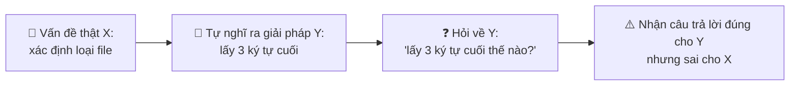
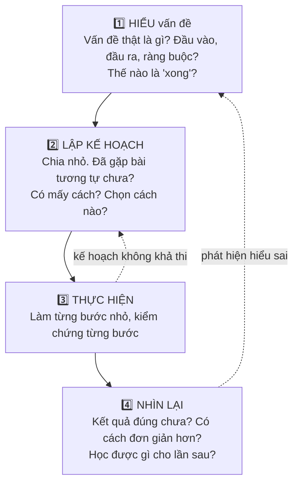
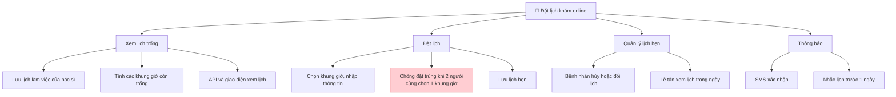
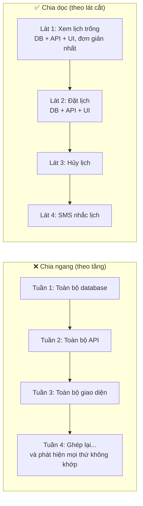
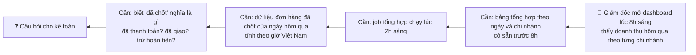
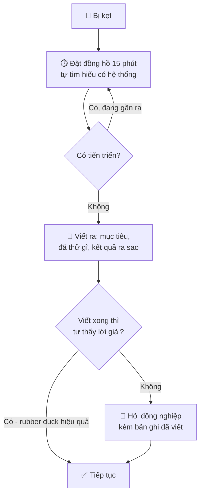
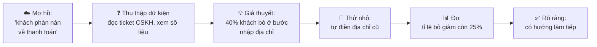
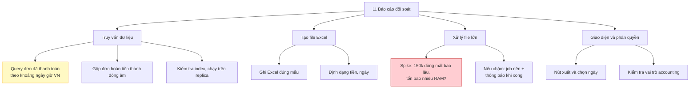
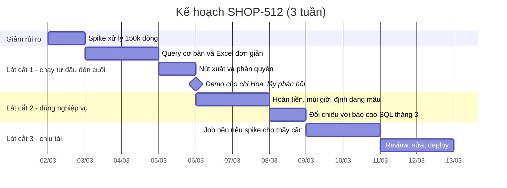
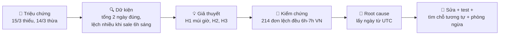

# 📚 Bài 2: Tư duy giải quyết vấn đề

## 🎯 Mục tiêu bài học

- Hiểu vì sao **giải quyết vấn đề** (problem solving) - chứ không phải viết code - mới là công việc chính của kỹ sư
- **Hiểu vấn đề trước khi giải**: diễn đạt lại, đặt câu hỏi làm rõ, định nghĩa "xong" (definition of done)
- Nhận diện **XY problem** - khi người ta hỏi về giải pháp thay vì vấn đề
- **Chia nhỏ** vấn đề lớn thành các vấn đề con có thể làm và kiểm chứng được
- Dùng các công cụ tư duy: **first principles**, **working backwards**, **pattern matching**, **4 bước của Pólya**
- Dùng **rubber duck** và **viết để suy nghĩ**
- Biết **time-box** và **khi nào nên hỏi** (quy tắc 15 phút)
- **Xử lý sự mơ hồ** và **ước lượng** những việc chưa rõ
- Thực hành trên 3 ví dụ: ticket mơ hồ → kế hoạch cụ thể; bug report → root cause; coding kata từ brute force → tối ưu

## 📖 1. Kỹ sư được trả lương để giải quyết vấn đề, không phải để viết code

Hãy nhớ câu này: **code là chi phí, không phải tài sản**. Mỗi dòng code phải được đọc, test, bảo trì, và có thể chứa bug. Công ty không trả lương cho bạn vì số dòng code bạn viết - họ trả lương vì **vấn đề bạn giải quyết được**.

Đôi khi giải pháp tốt nhất là:

- **Không viết code** - ví dụ: sửa một cấu hình, đổi quy trình, hoặc dùng tính năng đã có sẵn
- **Xóa code** - ví dụ: bỏ một tính năng không ai dùng đang gây lỗi
- **Viết ít code hơn dự định** - ví dụ: dùng thư viện chuẩn thay vì tự viết

### Câu chuyện: "Em cần API để lấy 3 ký tự cuối của tên file"

Bạn junior Hùng hỏi trong group chat: *"Có ai biết hàm nào lấy 3 ký tự cuối của chuỗi không ạ? Em cần lấy phần mở rộng file."*

Mọi người trả lời `s[len(s)-3:]`. Hùng dùng, chạy được. Một tuần sau có bug: file `.jpeg` thành `peg`, file `.go` thành `.go` (thừa dấu chấm), file `Makefile` thành `ile`.

Vấn đề thật của Hùng **không phải** "lấy 3 ký tự cuối". Vấn đề thật là **"xác định loại file"** - và cho vấn đề đó có hàm có sẵn `filepath.Ext` (Go) hoặc `pathlib.Path.suffix` (Python), hoặc tốt hơn nữa: kiểm tra nội dung file (MIME type) vì phần mở rộng có thể bị giả mạo.

Đây gọi là **XY problem**:



!!! tip "Cách tránh XY problem"
    - **Khi hỏi**: luôn nói *mục tiêu cuối cùng*, không chỉ bước đang kẹt. "Em đang muốn **xác định loại file người dùng upload** để chặn file thực thi. Em định lấy 3 ký tự cuối, có cách nào tốt hơn không?"
    - **Khi được hỏi**: hỏi ngược lại "Em đang muốn làm gì cuối cùng?" trước khi trả lời.

## 📖 2. Bức tranh tổng thể: Quy trình giải quyết vấn đề

Nhà toán học George Pólya, trong cuốn *How to Solve It* (1945), đề xuất 4 bước giải toán. Gần 80 năm sau, 4 bước này vẫn là khung tư duy tốt nhất cho kỹ sư phần mềm:



| Bước của Pólya | Câu hỏi trong toán học | Câu hỏi trong phần mềm |
|---|---|---|
| **1. Hiểu** | Ẩn số là gì? Dữ kiện là gì? Điều kiện là gì? | Ai dùng? Để làm gì? Input/output? Ràng buộc (hiệu năng, bảo mật, deadline)? Thế nào là xong? |
| **2. Lập kế hoạch** | Đã gặp bài toán liên quan chưa? Có thể giải bài đơn giản hơn trước không? | Đã có ai làm chưa (trong codebase, thư viện)? Có thể làm phiên bản nhỏ nhất trước không? Rủi ro lớn nhất ở đâu? |
| **3. Thực hiện** | Kiểm tra từng bước. Có chứng minh được bước này đúng không? | Code từng phần nhỏ, test ngay. Commit thường xuyên. |
| **4. Nhìn lại** | Kiểm tra kết quả? Có cách khác không? Dùng phương pháp này cho bài khác được không? | Test biên. Refactor. Ghi lại bài học. Có phần nào dùng lại được không? |

Sai lầm phổ biến nhất của người mới: **nhảy thẳng vào bước 3**. Sai lầm phổ biến thứ hai: **bỏ qua bước 4**. Các mục tiếp theo đi sâu vào từng bước.

## 📖 3. Bước 1: Hiểu vấn đề trước khi giải

> *"Nếu tôi có 1 giờ để giải quyết một vấn đề, tôi sẽ dành 55 phút để suy nghĩ về vấn đề và 5 phút để suy nghĩ về giải pháp."* - Câu nói thường được gán cho Einstein (dù chưa chắc ông đã nói). Ai nói không quan trọng - ý tưởng thì đúng.

### Kỹ thuật 1: Diễn đạt lại (restate)

Viết lại yêu cầu **bằng lời của bạn**, rồi gửi cho người giao việc xác nhận. Việc này tốn 5 phút nhưng phát hiện hiểu lầm ngay lập tức.

**Yêu cầu gốc** (PM nhắn): *"Thêm tính năng cho khách lưu sản phẩm yêu thích."*

**Diễn đạt lại**:

> "Em hiểu là: khách hàng **đã đăng nhập** có thể bấm nút tim trên trang chi tiết sản phẩm để lưu, bấm lại để bỏ lưu. Có một trang 'Yêu thích' liệt kê các sản phẩm đã lưu, mới nhất ở trên. Khách **chưa đăng nhập** bấm tim thì hiện popup yêu cầu đăng nhập. Sản phẩm hết hàng vẫn hiện trong danh sách nhưng có nhãn 'Hết hàng'. Chị xác nhận giúp em nhé?"

PM trả lời: *"Đúng rồi, nhưng khách chưa đăng nhập vẫn lưu được, lưu tạm trên máy, đăng nhập thì gộp vào."* → Một hiểu lầm lớn được phát hiện **trước khi viết dòng code nào**.

### Kỹ thuật 2: Hỏi câu hỏi làm rõ

Không phải câu hỏi nào cũng tốt. Câu hỏi tốt là câu hỏi mà **câu trả lời thay đổi cách bạn làm**. Dùng checklist sau:

| Nhóm | Câu hỏi mẫu |
|---|---|
| **Tại sao** (mục tiêu) | Vấn đề gốc là gì? Ai đang gặp khó khăn? Thành công đo bằng gì? |
| **Ai** (người dùng) | Ai dùng tính năng này? Khách hàng, nhân viên nội bộ, hệ thống khác? Bao nhiêu người? |
| **Cái gì** (phạm vi) | Cái gì **nằm trong** và cái gì **nằm ngoài** phạm vi lần này? |
| **Đầu vào / đầu ra** | Dữ liệu đến từ đâu, định dạng gì? Kết quả hiển thị ở đâu, định dạng gì? |
| **Trường hợp biên** | Rỗng thì sao? Cực lớn thì sao? Trùng thì sao? Lỗi mạng thì sao? |
| **Ràng buộc** | Có yêu cầu hiệu năng không? Bảo mật, phân quyền? Tương thích ngược? |
| **Thời gian** | Deadline là cứng hay mềm? Có thể giao từng phần không? |
| **Đã có gì** | Hệ thống hiện tại xử lý chuyện tương tự thế nào? Đã có ai thử làm chưa? |

!!! tip "Mẹo: đưa ra phương án khi hỏi"
    Thay vì hỏi câu mở *"Bị lỗi mạng thì làm gì ạ?"*, hãy hỏi kèm đề xuất: *"Nếu gửi email lỗi, em đề xuất thử lại 3 lần rồi ghi log, **không** hủy đơn. Chị đồng ý không?"*. Người bận chỉ cần trả lời "OK" - bạn nhận câu trả lời nhanh hơn nhiều, và cho thấy bạn đã suy nghĩ.

### Kỹ thuật 3: Định nghĩa "xong" (Definition of Done / Acceptance Criteria)

"Xong" phải **kiểm chứng được**. "Tính năng chạy tốt" không kiểm chứng được. Dùng dạng **Given - When - Then** (Cho trước - Khi - Thì):

```text
Tiêu chí 1: Lưu sản phẩm yêu thích
  Cho trước  khách đã đăng nhập và đang xem sản phẩm A
  Khi        khách bấm nút tim
  Thì        sản phẩm A xuất hiện đầu tiên trong trang "Yêu thích"
             và nút tim chuyển sang màu đỏ

Tiêu chí 2: Khách chưa đăng nhập
  Cho trước  khách chưa đăng nhập, đã lưu 2 sản phẩm trên máy
  Khi        khách đăng nhập vào tài khoản đã có 3 sản phẩm yêu thích
  Thì        danh sách có 5 sản phẩm (hoặc ít hơn nếu trùng), không mất sản phẩm nào

Tiêu chí 3: Giới hạn
  Cho trước  khách đã có 500 sản phẩm yêu thích
  Khi        khách lưu thêm sản phẩm
  Thì        hiện thông báo "Danh sách yêu thích đã đầy"
```

Mỗi tiêu chí sau này có thể biến thành **một test case** (Bài 6).

### Kỹ thuật 4: Tìm ví dụ cụ thể

Khi yêu cầu còn trừu tượng, hãy **xin (hoặc tự tạo) ví dụ cụ thể**: một file mẫu, một ảnh chụp màn hình, một bảng số liệu với kết quả mong đợi. Ví dụ cụ thể phát hiện hiểu lầm nhanh hơn mọi mô tả bằng lời.

> "Chị gửi em một file báo cáo mẫu mà chị đang làm bằng tay được không? Em sẽ làm cho ra y hệt."

## 📖 4. Bước 2a: Chia nhỏ vấn đề (Decomposition)

Một vấn đề lớn gần như không bao giờ giải được "một phát". Người giỏi giải quyết vấn đề thực chất là người giỏi **chia vấn đề lớn thành các vấn đề nhỏ mà mỗi cái đều dễ**.

### Cây phân rã

Ví dụ: *"Xây tính năng đặt lịch khám bệnh online cho phòng khám."*



Ô màu đỏ là **phần rủi ro nhất** (concurrency - hai người đặt cùng lúc). Khi đã có cây, bạn biết nên **làm/thử phần rủi ro trước** thay vì để đến cuối mới phát hiện nó khó.

### Nguyên tắc chia nhỏ tốt

1. **Mỗi lá ≤ 1 ngày làm việc.** Nếu lớn hơn, chia tiếp. Task lớn hơn 1-2 ngày là nơi ẩn nấp của những điều chưa hiểu.
2. **Mỗi lá kiểm chứng được độc lập.** "Làm phần backend" không kiểm chứng được. "API trả về danh sách khung giờ trống của bác sĩ X ngày Y" thì được.
3. **Tìm phần rủi ro nhất và làm nó trước** (hoặc làm thử - spike).
4. **Ghi rõ phụ thuộc**: cái gì phải xong trước cái gì?

### Chia ngang hay chia dọc?

Có hai cách chia một tính năng:



**Chia dọc** (vertical slicing) - mỗi lát cắt xuyên qua mọi tầng và tạo ra một thứ **chạy được từ đầu đến cuối**. *The Pragmatic Programmer* gọi đây là **tracer bullet** (đạn vạch đường): bắn một viên xuyên suốt hệ thống trước để xem có trúng đích không, rồi mới bổ sung dần. Lợi ích:

- Phát hiện vấn đề tích hợp **ngay tuần đầu**, không phải tuần cuối
- Có thể demo, lấy phản hồi sớm
- Nếu hết thời gian, bạn có 3 tính năng chạy được thay vì 4 tầng chưa ghép

## 📖 5. Bước 2b: Các công cụ tư duy để tìm lời giải

### Công cụ 1: First principles - Suy nghĩ từ nguyên lý gốc

Thay vì suy luận theo kiểu **"người ta hay làm thế"** (reasoning by analogy), hãy chia vấn đề về những **sự thật cơ bản** không thể chối cãi, rồi xây lời giải từ đó.

**Tình huống**: API danh sách sản phẩm mất 3 giây. Trong buổi họp, có người nói: *"Go chậm quá, mình viết lại bằng Rust đi."*

**Suy nghĩ first principles**:

1. Thời gian một request = thời gian mạng + thời gian truy vấn database + thời gian xử lý trong code + thời gian gọi service khác.
2. Code Go xử lý vài nghìn object JSON mất cỡ **mili giây**, không phải giây.
3. Vậy 3 giây gần như chắc chắn nằm ở **database** hoặc **gọi mạng**.
4. → Đo từng phần trước. (Kết quả thực tế: có một vòng lặp gọi database **một lần cho mỗi sản phẩm** - lỗi N+1 query. Sửa trong 1 giờ, API còn 80ms. Không cần viết lại bằng Rust.)

!!! tip "Câu hỏi first principles"
    - "Điều gì **chắc chắn đúng** ở đây?"
    - "Nếu bắt đầu lại từ đầu, không có ràng buộc lịch sử, mình sẽ làm thế nào?"
    - "Giả định này đến từ đâu? Nó còn đúng không?"
    - "Con số thật là bao nhiêu?" (đo, đừng đoán)

### Công cụ 2: Working backwards - Đi ngược từ đích

Bắt đầu từ **kết quả cuối cùng** mong muốn, rồi hỏi "để có cái này, mình cần gì ngay trước đó?" - lặp lại đến khi về đến điểm xuất phát.

Amazon nổi tiếng với cách làm này: trước khi xây sản phẩm, họ viết **thông cáo báo chí giả định** (press release) như thể sản phẩm đã ra mắt, kèm các câu hỏi thường gặp (FAQ). Nếu không viết được một thông cáo hấp dẫn, sản phẩm có thể không đáng làm.

**Áp dụng cho kỹ sư** - ví dụ làm dashboard doanh thu:



Đi ngược từ đích giúp bạn phát hiện **câu hỏi quan trọng nhất** (ô cuối cùng) mà nếu đi xuôi, bạn có thể chỉ gặp nó sau khi đã code xong.

### Công cụ 3: Pattern matching - "Mình đã gặp bài này chưa?"

Phần lớn vấn đề bạn gặp **không mới**. Chúng là biến thể của những vấn đề đã có lời giải:

| Bạn gặp | Thực chất là | Lời giải đã biết |
|---|---|---|
| "Hai người bấm đặt cùng một phòng cùng lúc" | Race condition / tranh chấp tài nguyên | Khóa (lock), ràng buộc unique trong DB, optimistic locking |
| "Khách bấm thanh toán 2 lần, bị trừ tiền 2 lần" | Thiếu idempotency | Idempotency key |
| "Gọi API bên ngoài hay bị lỗi chập chờn" | Lỗi tạm thời (transient failure) | Retry với exponential backoff, timeout, circuit breaker |
| "Trang chậm vì tính toán lại mỗi lần" | Tính lại dữ liệu không đổi | Cache |
| "Tìm đường ngắn nhất giữa hai kho hàng" | Đường đi ngắn nhất trên đồ thị | Dijkstra ([Bài 12 - Thuật toán](../algorithms/12-shortest-paths-mst.md)) |
| "Gợi ý từ khóa khi gõ" | Tìm theo tiền tố | Trie ([Bài 15 - Thuật toán](../algorithms/15-advanced-data-structures.md)) |

Cách xây dựng "thư viện pattern" cho bản thân:

1. **Ghi nhật ký kỹ thuật**: mỗi vấn đề khó đã giải, ghi 3 dòng - triệu chứng, nguyên nhân, lời giải.
2. **Đọc postmortem** của công ty mình và các công ty khác (nhiều công ty công bố công khai).
3. **Học cấu trúc dữ liệu & thuật toán** - không phải để phỏng vấn, mà vì chúng là kho pattern đã được đặt tên ([khóa Thuật toán](../algorithms/README.md), đặc biệt [Bài 17](../algorithms/17-problem-solving-patterns.md)).

!!! warning "Cẩn thận: pattern matching sai"
    Tâm lý học gọi là **hiệu ứng Einstellung**: khi đã quen một cách giải, ta có xu hướng áp nó vào mọi thứ, kể cả khi có cách đơn giản hơn. "Cầm búa thì nhìn đâu cũng thấy đinh." Kỹ sư vừa học Kafka thấy mọi thứ cần Kafka. Luôn tự hỏi: *"Bài này có thực sự giống không, hay chỉ giống bề ngoài?"*

### Công cụ 4: Giải bài đơn giản hơn trước

Pólya gợi ý: nếu không giải được bài toán, hãy giải một **phiên bản đơn giản hơn**:

- Bỏ bớt ràng buộc: "Nếu chỉ có 1 bác sĩ thì sao?" → giải xong, mở rộng ra nhiều bác sĩ.
- Giảm kích thước: "Nếu chỉ có 10 dòng dữ liệu?" → giải brute force trước, tối ưu sau.
- Giải trường hợp đặc biệt: "Nếu mọi khung giờ đều 30 phút?" → sau đó tổng quát hóa.

### Công cụ 5: Rubber duck debugging - Giải thích cho con vịt

Kỹ thuật nổi tiếng từ *The Pragmatic Programmer*: đặt một con vịt cao su cạnh màn hình, và khi bị kẹt, **giải thích vấn đề cho con vịt từng dòng một**.

Nghe buồn cười, nhưng nó hoạt động vì khi phải **nói thành lời**, bạn buộc phải chuyển từ "cảm giác hiểu" sang "hiểu thật". Rất nhiều lần, giữa chừng câu giải thích, bạn tự dừng lại: *"...và ở đây biến `total` được reset về 0... khoan đã, sao nó lại reset trong vòng lặp?"*

Không có vịt? Giải thích cho đồng nghiệp (họ thường không cần nói gì), cho cái cây, hoặc **viết ra**.

### Công cụ 6: Viết để suy nghĩ

> *"Viết là suy nghĩ trên giấy."* - Nếu bạn không viết ra rõ ràng được, có lẽ bạn chưa nghĩ rõ ràng.

Trước khi code một việc lớn hơn 1 ngày, viết một **ghi chú thiết kế ngắn** (nửa trang là đủ):

```text
## Vấn đề
Khách bấm "Thanh toán" 2 lần bị trừ tiền 2 lần (3-5 ca/tuần).

## Mục tiêu
Mỗi đơn hàng chỉ bị trừ tiền đúng 1 lần, kể cả khi client gửi lại request.

## Không nằm trong phạm vi
Hoàn tiền tự động cho các ca đã bị trừ 2 lần (xử lý tay, ticket riêng).

## Phương án
1. Disable nút ở frontend -> không đủ, request vẫn có thể gửi lại do mạng chập chờn.
2. Idempotency key: client tạo key cho mỗi lần thanh toán, server lưu key + kết quả,
   nhận key trùng thì trả lại kết quả cũ. -> CHỌN
3. Khóa theo order_id -> chặn được trùng, nhưng không trả lại kết quả cho request thứ 2.

## Rủi ro / câu hỏi mở
- Key lưu bao lâu? (đề xuất 24h)
- Cổng thanh toán có hỗ trợ idempotency key không? -> cần kiểm tra tài liệu.
```

Nửa trang này mất 20 phút, nhưng: bạn phát hiện câu hỏi mở trước khi code, tech lead review được hướng đi trong 5 phút, và sau này ai cũng hiểu **vì sao** code được viết như vậy.

## 📖 6. Time-boxing và khi nào nên hỏi

### Hai cách thất bại đối xứng

| Hỏi quá sớm | Hỏi quá muộn |
|---|---|
| Hỏi ngay khi gặp lỗi, chưa đọc thông báo lỗi | Kẹt 2 ngày, không nói với ai |
| Người khác phải làm hộ phần suy nghĩ | Deadline trễ, team bất ngờ |
| Bạn không học được cách tự gỡ | Thường vấn đề chỉ cần người khác 5 phút |
| Làm phiền đồng nghiệp liên tục | Người ta nghĩ bạn "biến mất" |

### Quy tắc 15 phút

Một quy tắc đơn giản được nhiều team áp dụng:

1. Khi bị kẹt, **tự cố gắng trong 15 phút** một cách có hệ thống (đọc lỗi, tìm kiếm, đọc code/tài liệu, thử giả thuyết).
2. Ghi lại mình đã thử những gì.
3. Sau 15 phút mà **không có tiến triển**, hãy hỏi - kèm những gì đã thử.

"15 phút" không phải con số thần kỳ. Người mới có thể dùng 15-30 phút; task gấp dùng ngắn hơn; bài toán nghiên cứu có thể dùng vài giờ. Điểm mấu chốt: **đặt giới hạn thời gian trước**, và khi hết giờ thì **ra quyết định có ý thức** thay vì trôi đi.



### Mẫu câu hỏi tốt

```text
[Mục tiêu]  Em đang làm X (ticket ABC-123) để đạt được Y.
[Vấn đề]    Khi làm Z, em gặp lỗi/hành vi: <thông báo lỗi đầy đủ, hoặc mô tả>.
[Mong đợi]  Em mong đợi: ...
[Đã thử]    1) ... -> kết quả ...  2) ... -> kết quả ...
[Giả thuyết] Em nghi là do ... vì ...
[Cần gì]    Anh/chị chỉ giúp em hướng tìm hiểu / xác nhận giả thuyết. Mức độ gấp: ...
```

!!! note "Hỏi là kỹ năng, không phải điểm yếu"
    Senior hỏi **nhiều hơn** junior - chỉ là họ hỏi câu khác: "Tại sao mình làm việc này?", "Ai đã từng xử lý chuyện này?", "Có ràng buộc gì mình chưa biết?". Hỏi đúng lúc tiết kiệm thời gian cho cả team.

## 📖 7. Xử lý sự mơ hồ

Càng lên cao, yêu cầu càng mơ hồ. Junior nhận *"thêm cột `phone` vào bảng users"*; Senior nhận *"khách phàn nàn về trải nghiệm thanh toán"*. **Khả năng biến mơ hồ thành rõ ràng** là một trong những dấu hiệu rõ nhất của người sẵn sàng lên Senior.

### Các kỹ thuật

1. **Ghi lại giả định (assumption log)**: Khi không có câu trả lời, đừng dừng lại - hãy đưa ra giả định hợp lý, **ghi rõ ra**, và tiếp tục.

    ```text
    Giả định (cần xác nhận trước thứ Tư):
    - A1: Báo cáo chỉ tính đơn đã thanh toán, không tính đơn COD chưa giao.
    - A2: Múi giờ theo giờ Việt Nam (UTC+7).
    - A3: Tối đa 100.000 đơn/tháng -> xuất file đồng bộ là đủ, chưa cần job nền.
    ```

2. **Đề xuất mặc định có thời hạn**: *"Em sẽ làm theo phương án A. Nếu anh chị thấy không ổn, báo em trước thứ Tư nhé."* Việc không bị chặn chờ câu trả lời.

3. **Làm thử (spike)**: Dành một khoảng thời gian cố định (ví dụ nửa ngày) để thử nghiệm, **chỉ để học**, không phải để ra code production. Kết quả của spike là **thông tin**, không phải tính năng.

4. **Phân biệt quyết định một chiều và hai chiều**: Quyết định dễ đảo ngược (tên hàm, thư viện vẽ biểu đồ) → quyết nhanh. Quyết định khó đảo ngược (schema database public, API cho đối tác) → cẩn thận, lấy ý kiến (Bài 7).

5. **Làm phiên bản nhỏ nhất, lấy phản hồi**: Người dùng thường không biết họ muốn gì cho đến khi thấy một cái gì đó.



## 📖 8. Ước lượng những điều chưa biết

*"Bao lâu thì xong?"* - câu hỏi đáng sợ nhất với nhiều kỹ sư. Sự thật là **ước lượng luôn sai** - mục tiêu là sai **ít** và sai **một cách có thông tin**.

### Hình nón bất định (Cone of Uncertainty)

Ở đầu dự án, độ không chắc chắn có thể lên đến gấp 4 lần (xong sớm gấp 4 hoặc trễ gấp 4). Càng làm, càng hiểu, độ không chắc chắn càng thu hẹp. Vì vậy:

- **Ước lượng bằng khoảng, không bằng một con số**: "3-6 ngày" trung thực hơn "4 ngày".
- **Ước lượng lại** sau khi hiểu thêm (sau spike, sau khi làm lát cắt đầu tiên).

### Ước lượng ba điểm (Three-point / PERT)

Với mỗi task nhỏ, ước lượng ba con số:

- **O** (Optimistic - lạc quan): mọi thứ suôn sẻ
- **M** (Most likely - khả năng cao nhất)
- **P** (Pessimistic - bi quan): gặp những trục trặc hợp lý (không phải thiên tai)

Ước lượng kỳ vọng: **E = (O + 4M + P) / 6**

| Task | O | M | P | E |
|---|---|---|---|---|
| API lấy dữ liệu báo cáo | 0,5 | 1 | 2 | 1,08 |
| Xuất Excel | 0,5 | 1 | 3 | 1,25 |
| Chạy nền cho file lớn | 1 | 2 | 5 | 2,33 |
| Giao diện + phân quyền | 1 | 1,5 | 3 | 1,67 |
| Test, review, sửa | 1 | 1,5 | 3 | 1,67 |
| **Tổng** | 4 | 7 | 16 | **8,0 ngày** |

Để ý: tổng "khả năng cao nhất" là 7 ngày, nhưng ước lượng kỳ vọng là 8 ngày - vì rủi ro luôn lệch về phía **trễ** (hiếm khi task xong sớm gấp 3 lần, nhưng thường xuyên trễ gấp 3 lần).

### Những thứ hay bị quên khi ước lượng

- Thời gian **review** và sửa theo review
- Thời gian **viết test**
- **Họp**, trả lời tin nhắn, hỗ trợ người khác (thường 20-30% thời gian)
- **Deploy**, kiểm tra trên production
- **Tích hợp** với team khác (và chờ họ)
- Nghỉ phép, ngày lễ

!!! tip "Nói về ước lượng như thế nào"
    ❌ *"4 ngày."* (rồi làm 9 ngày)

    ✅ *"Khoảng 6-10 ngày. Phần chưa chắc chắn nhất là xử lý file lớn - em cần nửa ngày thử nghiệm trước. Sau khi thử xong (chiều mai), em sẽ cho con số chính xác hơn."*

    Câu thứ hai cho người nghe biết: khoảng dao động, **vì sao** dao động, và **khi nào** bạn sẽ chắc chắn hơn.

## 📖 9. Ví dụ thực hành A: Từ ticket mơ hồ đến kế hoạch cụ thể

### Ticket

> **SHOP-512**: Làm tính năng xuất báo cáo.
> *(Người tạo: chị Hoa - Trưởng phòng Kế toán)*

Chỉ vậy thôi. Hãy đi qua từng bước.

### Bước 1: Hiểu - Hỏi đúng câu hỏi

Bạn hẹn chị Hoa 20 phút, chuẩn bị sẵn câu hỏi:

| Câu hỏi | Câu trả lời của chị Hoa |
|---|---|
| Báo cáo này để làm gì? Hiện tại chị đang làm thế nào? | Cuối tháng đối soát doanh thu với ngân hàng. Hiện nhờ IT chạy SQL, mất 2-3 ngày chờ. |
| Báo cáo gồm những thông tin gì? Chị có file mẫu không? | Có, đây là file Excel mẫu: mã đơn, ngày, chi nhánh, tiền hàng, phí ship, giảm giá, thực thu, phương thức thanh toán. |
| Tính những đơn nào? | Đơn đã thanh toán thành công. Đơn hoàn tiền thì hiện dòng âm. |
| Theo khoảng thời gian nào? | Chọn từ ngày - đến ngày, thường là 1 tháng. |
| Ngày tính theo giờ nào? | *(chị Hoa chưa nghĩ đến)* → Thống nhất: giờ Việt Nam. |
| Bao nhiêu đơn một tháng? | Khoảng 80.000 - 150.000. |
| Ai được xuất báo cáo? | Chỉ phòng kế toán (5 người). |
| Cần gấp không? | Trước kỳ đối soát ngày 5 tháng sau (còn 3 tuần). |

### Bước 2: Diễn đạt lại và định nghĩa "xong"

```text
SHOP-512 (viết lại): Xuất báo cáo đối soát doanh thu dạng Excel

Mục tiêu: Phòng kế toán tự xuất báo cáo đối soát, không phải chờ IT (hiện mất 2-3 ngày).

Phạm vi:
- Người dùng có vai trò "accounting" chọn khoảng ngày (tối đa 31 ngày), bấm "Xuất".
- File Excel theo đúng mẫu đính kèm, mỗi dòng một đơn đã thanh toán; đơn hoàn tiền là dòng âm.
- Ngày tính theo giờ Việt Nam.

Ngoài phạm vi (lần này):
- Biểu đồ, dashboard. Gửi email tự động. Định dạng PDF.

Tiêu chí hoàn thành:
- Người không có vai trò accounting -> nhận lỗi 403.
- Xuất tháng 3 với dữ liệu thật: tổng "thực thu" khớp với báo cáo SQL IT đã làm tay.
- 150.000 đơn: xuất xong trong < 2 phút, không làm chậm hệ thống đặt hàng.
- Đơn đặt lúc 00:30 ngày 1/4 giờ VN thuộc báo cáo tháng 4 (không phải tháng 3).
```

### Bước 3: Chia nhỏ



- 🔴 **Rủi ro lớn nhất**: xử lý 150.000 dòng (có thể hết bộ nhớ, timeout, hoặc làm chậm database chính). → Làm **spike** ngay ngày đầu.
- 🟡 **Dễ sai nhất**: múi giờ và cách tính đơn hoàn tiền. → Viết test với dữ liệu biên.

### Bước 4: Kế hoạch theo lát cắt dọc



Sau **4 ngày**, chị Hoa đã thấy một phiên bản chạy được (dù chưa đẹp). Nếu chị nói *"À, còn thiếu cột mã nhân viên bán hàng"*, bạn biết ngay từ tuần 1, không phải tuần 3.

### Bước 5: Cập nhật ticket và thông báo

Viết lại ticket theo bước 2, gắn file mẫu, ghi các giả định và ước lượng (8-11 ngày), gửi chị Hoa và tech lead xác nhận. **Chỉ sau đó mới mở editor.**

!!! note "Tổng thời gian cho bước 1-5: khoảng nửa ngày"
    Nửa ngày "chưa code dòng nào" có thể khiến bạn sốt ruột. Nhưng hãy nghĩ đến phương án ngược lại: code 2 tuần theo hiểu biết của mình, demo, và nghe *"Không phải cái này, chị cần theo giờ Việt Nam, và đơn hoàn tiền phải là dòng âm..."*.

## 📖 10. Ví dụ thực hành B: Từ bug report đến root cause

### Bug report

> **BUG-877** (từ phòng kế toán): *"Báo cáo doanh thu ngày 15/3 thiếu khoảng 12 triệu so với số tiền thực nhận từ ngân hàng. Ngày 14/3 lại thừa khoảng 12 triệu."*

### Bước 1: Hiểu - thu thập dữ kiện, chưa vội đoán

Thay vì mở code ngay, liệt kê những gì **chắc chắn biết**:

- Ngày 15/3 thiếu ≈ 12 triệu, ngày 14/3 thừa ≈ 12 triệu → **tổng hai ngày đúng**. Tiền không mất, mà bị **chuyển từ ngày này sang ngày kia**.
- Hỏi thêm: các ngày khác có bị không? → Kế toán kiểm tra: **ngày nào cũng lệch một chút**, ngày 15/3 lệch nhiều vì có chương trình flash sale lúc **6 giờ sáng**.

### Bước 2: Lập giả thuyết

Dữ kiện "tiền bị chuyển sang ngày hôm trước" + "lệch nhiều khi có sale buổi sáng sớm" gợi ý mạnh đến **múi giờ**: Việt Nam là UTC+7, nên mọi đơn đặt từ 0:00 đến 6:59 sáng giờ Việt Nam là **ngày hôm trước** theo giờ UTC.

Các giả thuyết khác (đừng bỏ qua):

| Giả thuyết | Dự đoán nếu đúng | Kiểm tra |
|---|---|---|
| H1: Nhóm theo ngày UTC thay vì giờ VN | Các đơn lệch đều nằm trong khoảng 0:00-6:59 giờ VN | Lọc đơn lệch, xem giờ đặt |
| H2: Đơn được ghi nhận theo ngày thanh toán thay vì ngày đặt | Các đơn lệch có thời điểm thanh toán khác ngày đặt | So sánh hai cột thời gian |
| H3: Job tổng hợp chạy trước khi hết ngày | Đơn lệch nằm ở cuối ngày | Xem giờ chạy job |

### Bước 3: Kiểm chứng

Lấy danh sách đơn ngày 15/3 theo ngân hàng, so với báo cáo → 214 đơn "biến mất" khỏi ngày 15/3. **Tất cả** có giờ đặt từ 06:00 đến 06:58 giờ Việt Nam. → H1 được xác nhận; H2, H3 bị loại (dữ kiện không khớp với dự đoán của chúng).

### Bước 4: Tìm đúng dòng code

Đoạn code tổng hợp báo cáo lấy ngày bằng cách định dạng trực tiếp thời gian lưu trong database (UTC). Tái hiện lỗi bằng một chương trình nhỏ nhất có thể:

=== "Go"

    ```go
    package main

    import (
    	"fmt"
    	"time"
    )

    func main() {
    	vn, err := time.LoadLocation("Asia/Ho_Chi_Minh")
    	if err != nil {
    		panic(err)
    	}
    	// Đơn hàng khách đặt lúc 6:30 sáng ngày 15/3 theo giờ Việt Nam.
    	placed := time.Date(2026, 3, 15, 6, 30, 0, 0, vn)
    	// Database lưu theo UTC (đúng chuẩn, không có gì sai).
    	stored := placed.UTC()

    	fmt.Println("Giờ lưu trong DB (UTC):", stored.Format(time.DateTime))
    	fmt.Println("❌ Ngày báo cáo (lấy thẳng từ UTC):", stored.Format(time.DateOnly))
    	fmt.Println("✅ Ngày báo cáo (đổi sang giờ VN):", stored.In(vn).Format(time.DateOnly))
    }

    // Output:
    // Giờ lưu trong DB (UTC): 2026-03-14 23:30:00
    // ❌ Ngày báo cáo (lấy thẳng từ UTC): 2026-03-14
    // ✅ Ngày báo cáo (đổi sang giờ VN): 2026-03-15
    ```

=== "Python"

    ```python
    from datetime import datetime, timezone
    from zoneinfo import ZoneInfo

    vn = ZoneInfo("Asia/Ho_Chi_Minh")
    # Đơn hàng khách đặt lúc 6:30 sáng ngày 15/3 theo giờ Việt Nam.
    placed = datetime(2026, 3, 15, 6, 30, tzinfo=vn)
    # Database lưu theo UTC (đúng chuẩn, không có gì sai).
    stored = placed.astimezone(timezone.utc)

    print("Giờ lưu trong DB (UTC):", stored.strftime("%Y-%m-%d %H:%M:%S"))
    print("❌ Ngày báo cáo (lấy thẳng từ UTC):", stored.date())
    print("✅ Ngày báo cáo (đổi sang giờ VN):", stored.astimezone(vn).date())

    # Output:
    # Giờ lưu trong DB (UTC): 2026-03-14 23:30:00
    # ❌ Ngày báo cáo (lấy thẳng từ UTC): 2026-03-14
    # ✅ Ngày báo cáo (đổi sang giờ VN): 2026-03-15
    ```

> Lưu ý với Python trên Windows: `zoneinfo` cần dữ liệu múi giờ, cài bằng `pip install tzdata`.

**Root cause**: Việc lưu UTC trong database là **đúng**. Lỗi nằm ở chỗ **khi chuyển thời điểm (instant) thành "ngày" để nhóm báo cáo, code không chỉ định múi giờ** - mà "ngày" là khái niệm phụ thuộc múi giờ.

### Bước 5: Sửa và ngăn tái phát

Một kỹ sư có tư duy tốt không dừng ở việc sửa một dòng code. Họ hỏi: **"Tại sao lỗi này lọt qua được, và làm sao để nó không xảy ra lần nữa - ở đây và ở chỗ khác?"**

1. **Sửa**: chuyển sang giờ Việt Nam trước khi lấy ngày.
2. **Test**: thêm test với đơn lúc 06:30 sáng và 23:59 tối giờ VN.
3. **Tìm chỗ tương tự**: grep toàn bộ codebase những chỗ định dạng ngày từ thời gian UTC → phát hiện thêm 2 báo cáo khác cùng lỗi.
4. **Phòng ngừa**: tạo hàm dùng chung `BusinessDate(t)` trả về ngày theo giờ Việt Nam, và ghi vào hướng dẫn code của team.
5. **Dữ liệu cũ**: báo kế toán rằng các báo cáo từ trước đến nay đều lệch theo cùng quy luật, đề xuất chạy lại báo cáo 3 tháng gần nhất.



Bài 5 (Debug) sẽ đi sâu hơn vào quy trình này.

## 📖 11. Ví dụ thực hành C: Coding kata từ brute force đến tối ưu

Coding kata là bài tập nhỏ để luyện **quy trình** giải quyết vấn đề. Điều quan trọng không phải lời giải cuối cùng, mà là **cách đi đến đó**.

### Đề bài

> App học tiếng Anh muốn hiển thị **"chuỗi ngày học liên tiếp dài nhất"** của mỗi người dùng để tạo động lực. Cho danh sách các ngày người dùng đã học (mỗi ngày là một số nguyên, ví dụ số thứ tự ngày kể từ khi đăng ký), hãy trả về độ dài chuỗi ngày liên tiếp dài nhất.
>
> Ví dụ: `[5, 1, 3, 2, 10, 11]` → `3` (các ngày 1, 2, 3).

### Bước 1 (Pólya): Hiểu

Trước khi code, hỏi (hoặc tự trả lời và ghi lại giả định):

- **Danh sách có sắp xếp không?** → Không, dữ liệu lấy từ log, thứ tự bất kỳ.
- **Có ngày trùng không?** → Có! Một ngày học nhiều bài sẽ có nhiều bản ghi. Ngày trùng **không** làm đứt chuỗi và **không** làm chuỗi dài thêm.
- **Danh sách rỗng?** → Trả về 0.
- **Kích thước?** → Người dùng lâu năm có thể có vài nghìn ngày; có 2 triệu người dùng, tính lại mỗi đêm.

Tự tạo ví dụ biên: `[]` → 0; `[7]` → 1; `[1, 2, 2, 3]` → 3; `[1, 3, 5]` → 1.

### Bước 2 (Pólya): Lập kế hoạch - bắt đầu từ cách ngây thơ nhất

Cách đơn giản nhất mà ai cũng nghĩ ra: **với mỗi ngày `d`, đếm xem `d+1`, `d+2`, ... có trong danh sách không**. Chưa tối ưu - nhưng dễ viết, dễ tin là đúng. Đây là **brute force**, và nó có giá trị lớn: nó trở thành **"chuẩn vàng"** để kiểm tra các phiên bản tối ưu sau này.

Sau đó hỏi: **"Công việc nào đang bị lặp lại?"**

- Brute force tìm `d+1` trong danh sách bằng cách **quét cả danh sách** → nếu các ngày đã **sắp xếp**, những ngày liên tiếp sẽ nằm **cạnh nhau** → chỉ cần một lần duyệt. Chi phí: sắp xếp O(n log n).
- Có thể nhanh hơn nữa không? Việc "kiểm tra `d+1` có tồn tại không" có thể làm trong O(1) bằng **hash set** ([Bài 3 - Hash Table](../algorithms/03-hashing.md)). Nhưng nếu đếm từ **mọi** ngày thì chuỗi dài bị đếm lại nhiều lần. Mẹo: **chỉ bắt đầu đếm từ ngày "đầu chuỗi"** - ngày `d` mà `d-1` không tồn tại. Mỗi ngày chỉ được đi qua tối đa 2 lần → O(n).

### Bước 3 (Pólya): Thực hiện - cả ba phiên bản, và kiểm tra chéo

=== "Go"

    ```go
    package main

    import (
    	"fmt"
    	"math/rand"
    	"slices"
    )

    // Bước 1 - Brute force: với mỗi ngày d, đếm d+1, d+2... có trong danh sách không.
    // Dễ viết, dễ tin là đúng. Độ phức tạp O(n³) vì slices.Contains là O(n).
    func longestStreakBrute(days []int) int {
    	best := 0
    	for _, d := range days {
    		length := 1
    		for slices.Contains(days, d+length) {
    			length++
    		}
    		best = max(best, length)
    	}
    	return best
    }

    // Bước 2 - Sắp xếp: các ngày liên tiếp sẽ nằm cạnh nhau. O(n log n).
    func longestStreakSort(days []int) int {
    	if len(days) == 0 {
    		return 0
    	}
    	sorted := slices.Clone(days) // không sửa dữ liệu của người gọi
    	slices.Sort(sorted)
    	best, cur := 1, 1
    	for i := 1; i < len(sorted); i++ {
    		switch sorted[i] - sorted[i-1] {
    		case 0: // ngày trùng - bỏ qua, không làm đứt chuỗi
    		case 1:
    			cur++
    			best = max(best, cur)
    		default:
    			cur = 1
    		}
    	}
    	return best
    }

    // Bước 3 - Hash set: chỉ bắt đầu đếm tại ngày "đầu chuỗi" (d-1 không tồn tại). O(n).
    func longestStreakSet(days []int) int {
    	set := make(map[int]struct{}, len(days))
    	for _, d := range days {
    		set[d] = struct{}{}
    	}
    	best := 0
    	for d := range set {
    		if _, ok := set[d-1]; ok {
    			continue // không phải đầu chuỗi, sẽ được đếm từ đầu chuỗi
    		}
    		length := 1
    		for {
    			if _, ok := set[d+length]; !ok {
    				break
    			}
    			length++
    		}
    		best = max(best, length)
    	}
    	return best
    }

    func main() {
    	cases := []struct {
    		name string
    		days []int
    		want int
    	}{
    		{"ví dụ trong đề", []int{5, 1, 3, 2, 10, 11}, 3},
    		{"rỗng", []int{}, 0},
    		{"một ngày", []int{7}, 1},
    		{"ngày trùng", []int{1, 2, 2, 3}, 3},
    		{"không liên tiếp", []int{1, 3, 5}, 1},
    	}
    	for _, c := range cases {
    		b, s, h := longestStreakBrute(c.days), longestStreakSort(c.days), longestStreakSet(c.days)
    		fmt.Printf("%-16s brute=%d sort=%d set=%d want=%d\n", c.name, b, s, h, c.want)
    	}

    	// Đối chiếu ngẫu nhiên: bản brute force là "chuẩn vàng" để kiểm tra bản tối ưu.
    	rng := rand.New(rand.NewSource(42))
    	for i := 0; i < 1000; i++ {
    		days := make([]int, rng.Intn(30))
    		for j := range days {
    			days[j] = rng.Intn(40)
    		}
    		b := longestStreakBrute(days)
    		if s, h := longestStreakSort(days), longestStreakSet(days); s != b || h != b {
    			fmt.Println("SAI với input:", days, b, s, h)
    			return
    		}
    	}
    	fmt.Println("1000 bộ dữ liệu ngẫu nhiên: cả 3 cách cho cùng kết quả")
    }

    // Output:
    // ví dụ trong đề   brute=3 sort=3 set=3 want=3
    // rỗng             brute=0 sort=0 set=0 want=0
    // một ngày         brute=1 sort=1 set=1 want=1
    // ngày trùng       brute=3 sort=3 set=3 want=3
    // không liên tiếp  brute=1 sort=1 set=1 want=1
    // 1000 bộ dữ liệu ngẫu nhiên: cả 3 cách cho cùng kết quả
    ```

=== "Python"

    ```python
    import random


    def longest_streak_brute(days: list[int]) -> int:
        """Bước 1 - Brute force: với mỗi ngày d, đếm d+1, d+2... có trong list không.
        Dễ viết, dễ tin là đúng. O(n³) vì `x in list` là O(n)."""
        best = 0
        for d in days:
            length = 1
            while d + length in days:
                length += 1
            best = max(best, length)
        return best


    def longest_streak_sort(days: list[int]) -> int:
        """Bước 2 - Sắp xếp: các ngày liên tiếp sẽ nằm cạnh nhau. O(n log n)."""
        if not days:
            return 0
        s = sorted(days)  # sorted() trả về list mới, không sửa dữ liệu của người gọi
        best = cur = 1
        for prev, day in zip(s, s[1:]):
            if day == prev:  # ngày trùng - bỏ qua, không làm đứt chuỗi
                continue
            if day == prev + 1:
                cur += 1
                best = max(best, cur)
            else:
                cur = 1
        return best


    def longest_streak_set(days: list[int]) -> int:
        """Bước 3 - Hash set: chỉ bắt đầu đếm tại ngày "đầu chuỗi". O(n)."""
        day_set = set(days)
        best = 0
        for d in day_set:
            if d - 1 in day_set:
                continue  # không phải đầu chuỗi, sẽ được đếm từ đầu chuỗi
            length = 1
            while d + length in day_set:
                length += 1
            best = max(best, length)
        return best


    cases = [
        ("ví dụ trong đề", [5, 1, 3, 2, 10, 11], 3),
        ("rỗng", [], 0),
        ("một ngày", [7], 1),
        ("ngày trùng", [1, 2, 2, 3], 3),
        ("không liên tiếp", [1, 3, 5], 1),
    ]
    for name, days, want in cases:
        b, s, h = longest_streak_brute(days), longest_streak_sort(days), longest_streak_set(days)
        print(f"{name:<16} brute={b} sort={s} set={h} want={want}")

    # Đối chiếu ngẫu nhiên: bản brute force là "chuẩn vàng" để kiểm tra bản tối ưu.
    rng = random.Random(42)
    for _ in range(1000):
        days = [rng.randrange(40) for _ in range(rng.randrange(30))]
        b = longest_streak_brute(days)
        s, h = longest_streak_sort(days), longest_streak_set(days)
        if s != b or h != b:
            print("SAI với input:", days, b, s, h)
            break
    else:
        print("1000 bộ dữ liệu ngẫu nhiên: cả 3 cách cho cùng kết quả")

    # Output:
    # ví dụ trong đề   brute=3 sort=3 set=3 want=3
    # rỗng             brute=0 sort=0 set=0 want=0
    # một ngày         brute=1 sort=1 set=1 want=1
    # ngày trùng       brute=3 sort=3 set=3 want=3
    # không liên tiếp  brute=1 sort=1 set=1 want=1
    # 1000 bộ dữ liệu ngẫu nhiên: cả 3 cách cho cùng kết quả
    ```

Để ý phần cuối chương trình: **1000 bộ dữ liệu ngẫu nhiên**, so sánh bản tối ưu với bản brute force. Đây là kỹ thuật cực kỳ mạnh (thường gọi là *differential testing* hoặc dùng *test oracle*): khi bạn viết một thuật toán thông minh, hãy **giữ lại phiên bản ngây thơ** để kiểm tra nó. Dân thi lập trình (competitive programming) gọi đây là *stress test*.

### Bước 4 (Pólya): Nhìn lại - đo trên dữ liệu thật

Bây giờ đo thời gian. Và đây là điểm thú vị: nếu đo với dữ liệu **ngẫu nhiên**, các chuỗi liên tiếp rất ngắn, brute force chạy khá nhanh - bạn có thể kết luận sai rằng "brute force là đủ". Nhưng dữ liệu **thật** thì sao? Người dùng chăm chỉ nhất - chính là những người bạn muốn tôn vinh - **học mỗi ngày**, tạo ra chuỗi dài nhất có thể. Đó là **trường hợp xấu nhất** của brute force.

=== "Go"

    ```go
    // Thêm vào cùng file với 3 hàm ở trên (nhớ import "time"),
    // rồi gọi benchmark() trong main().

    func measure(name string, f func([]int) int, days []int) {
    	start := time.Now()
    	result := f(days)
    	fmt.Printf("%-5s n=%-5d kết quả=%-5d %v\n", name, len(days), result, time.Since(start).Round(time.Microsecond))
    }

    func benchmark() {
    	rng := rand.New(rand.NewSource(1))
    	for _, n := range []int{500, 1000, 2000} {
    		// Trường hợp xấu nhất nhưng rất thật: user chăm chỉ, ngày nào cũng đăng nhập.
    		days := make([]int, n)
    		for i := range days {
    			days[i] = i
    		}
    		rng.Shuffle(n, func(i, j int) { days[i], days[j] = days[j], days[i] })
    		measure("brute", longestStreakBrute, days)
    		measure("sort", longestStreakSort, days)
    		measure("set", longestStreakSet, days)
    	}
    }
    ```

=== "Python"

    ```python
    # Thêm vào cuối file kata ở trên (thay cho phần chạy test).
    import time


    def measure(name, f, days):
        start = time.perf_counter()
        result = f(days)
        ms = (time.perf_counter() - start) * 1000
        print(f"{name:<5} n={len(days):<5} kết quả={result:<5} {ms:.2f}ms")


    rng = random.Random(1)
    for n in (250, 500, 1000):
        # Trường hợp xấu nhất nhưng rất thật: user chăm chỉ, ngày nào cũng đăng nhập.
        days = list(range(n))
        rng.shuffle(days)
        measure("brute", longest_streak_brute, days)
        measure("sort", longest_streak_sort, days)
        measure("set", longest_streak_set, days)
    ```

Kết quả trên một máy (con số trên máy bạn sẽ khác, nhưng **tỉ lệ** sẽ tương tự):

```text
Go:
brute n=500   kết quả=500   13.701ms
sort  n=500   kết quả=500   29µs
set   n=500   kết quả=500   31µs
brute n=1000  kết quả=1000  101.613ms
sort  n=1000  kết quả=1000  101µs
set   n=1000  kết quả=1000  86µs
brute n=2000  kết quả=2000  757.984ms
sort  n=2000  kết quả=2000  148µs
set   n=2000  kết quả=2000  126µs

Python:
brute n=250   kết quả=250   21.42ms
sort  n=250   kết quả=250   0.07ms
set   n=250   kết quả=250   0.02ms
brute n=500   kết quả=500   163.62ms
sort  n=500   kết quả=500   0.13ms
set   n=500   kết quả=500   0.07ms
brute n=1000  kết quả=1000  1407.44ms
sort  n=1000  kết quả=1000  0.23ms
set   n=1000  kết quả=1000  0.09ms
```

Đọc kết quả như một kỹ sư:

- **n tăng gấp đôi → brute force chậm gấp khoảng 8 lần** (13,7 → 101 → 758ms). 2³ = 8 → khớp với dự đoán O(n³). Lý thuyết và đo đạc **khớp nhau** - đó là dấu hiệu bạn hiểu đúng code của mình ([Bài 1 - Big-O](../algorithms/01-complexity.md)).
- Với 2 triệu người dùng, brute force mất cỡ 1 giây cho **một** người dùng chăm chỉ → job hằng đêm không bao giờ chạy xong.
- Bản sort và bản set đều đủ nhanh. **Chọn bản nào?** Bản sort dễ đọc với nhiều người, không tốn thêm bộ nhớ cho set; bản set nhanh hơn về lý thuyết. Với vài nghìn phần tử, khác biệt là vài chục micro giây - **chọn bản dễ đọc và dễ bảo trì hơn với team của bạn** là hoàn toàn hợp lý.

### Bài học từ kata

1. **Hiểu đề trước**: câu hỏi "có ngày trùng không?" quyết định thuật toán đúng hay sai (bản sort ngây thơ không xử lý trùng sẽ ra kết quả sai với `[1, 2, 2, 3]`).
2. **Brute force trước, tối ưu sau** - và **giữ brute force làm chuẩn kiểm tra**.
3. **Tìm công việc bị lặp lại** - đó là nơi tối ưu hóa.
4. **Đo với dữ liệu thật**, đặc biệt là trường hợp xấu nhất có thật (người dùng chăm chỉ), không chỉ dữ liệu ngẫu nhiên.
5. **Tối ưu vừa đủ**: nhanh hơn 10 micro giây không đáng đổi lấy code khó hiểu.

## 🌍 Tình huống thực tế

### Tình huống 1: "Anh ơi, làm giúp em cái cronjob"

Bạn Nam (junior) nhận tin nhắn từ một bạn bên Marketing: *"Làm giúp chị cronjob mỗi sáng gửi file danh sách khách mới vào email chị nhé."*

**🧑‍💻 Junior nghĩ**: "Viết script query khách mới, xuất CSV, gửi email, đặt cron 8h sáng. 3 tiếng."

**🧑‍🏫 Senior nghĩ**: "Chị ấy **dùng file đó để làm gì**?" → Hỏi ra: chị ấy mở file, copy số điện thoại vào công cụ gửi SMS chào mừng. → Vấn đề thật là **gửi SMS chào mừng khách mới**. Công cụ SMS đó có sẵn API; có thể tích hợp trực tiếp khi khách đăng ký, không cần file, không cần email chứa dữ liệu cá nhân, không cần chị ấy copy tay mỗi sáng.

XY problem trong đời thực: người ta đưa bạn **giải pháp** (cronjob gửi file), không phải **vấn đề** (chào mừng khách mới). Hỏi "để làm gì?" có thể tiết kiệm công sức cho cả hai bên - và cho ra giải pháp tốt hơn.

### Tình huống 2: Bị kẹt với lỗi build lúc 4 giờ chiều

Bạn Linh gặp lỗi build lạ sau khi pull code mới nhất.

| Thời điểm | ❌ Cách làm không hiệu quả | ✅ Cách làm hiệu quả |
|---|---|---|
| 16:00 | Thử xóa cache, cài lại, restart máy... không có hệ thống | Đọc kỹ thông báo lỗi, đặt time-box 15 phút |
| 16:15 | Vẫn tiếp tục thử bừa | Đã thử 3 giả thuyết, ghi lại. Viết câu hỏi theo mẫu, gửi vào kênh team |
| 16:20 | ... | Đồng nghiệp trả lời: "Commit sáng nay đổi phiên bản Go, em cập nhật toolchain nhé" |
| 18:30 | Vẫn kẹt, về nhà bực bội, mai hỏi | Đã xong task, về đúng giờ |

### Tình huống 3: Sếp hỏi "Tính năng này bao lâu?" ngay trong cuộc họp

**🧑‍💻 Junior**: Muốn tỏ ra giỏi, trả lời ngay "3 ngày ạ". Làm mất 2 tuần, bị đánh giá là ước lượng kém.

**🧑‍🏫 Senior**: *"Ước lượng sơ bộ là 1-3 tuần - khoảng dao động lớn vì em chưa biết hệ thống thanh toán cũ có hỗ trợ hoàn tiền một phần không. Em cần 1 ngày để tìm hiểu, chiều mai em gửi con số chắc chắn hơn kèm kế hoạch."*

Senior không từ chối trả lời - họ trả lời **trung thực về độ không chắc chắn** và **hứa một thời điểm** sẽ chắc chắn hơn.

### Tình huống 4: Yêu cầu mâu thuẫn

PM muốn *"trang sản phẩm load dưới 1 giây"* và *"hiển thị tồn kho real-time của 200 chi nhánh"*.

**Junior**: Cố làm cả hai, tối ưu 2 tuần, vẫn 3 giây.

**Senior**: Làm rõ **vấn đề thật** đằng sau từng yêu cầu. Khách cần biết *"chi nhánh gần tôi có hàng không"*, không cần 200 con số real-time. → Đề xuất: load trang nhanh với trạng thái "còn hàng/hết hàng" (cache 1 phút), chỉ hiển thị chi tiết 3 chi nhánh gần nhất khi khách bấm vào. PM đồng ý ngay.

## ⚠️ Sai lầm thường gặp

### 1. Nhảy vào code ngay

**Biểu hiện**: Nhận ticket → mở editor trong 2 phút.

**Hậu quả**: Giải sai bài toán, làm lại; thiết kế chắp vá vì phát hiện yêu cầu giữa chừng.

**Cách sửa**: Quy tắc cá nhân: *"Không mở editor cho đến khi viết được định nghĩa 'xong' trong 3-5 dòng."*

### 2. Hỏi câu hỏi không làm thay đổi gì

**Biểu hiện**: Hỏi 30 câu, phần lớn là chi tiết mà câu trả lời nào cũng không ảnh hưởng cách làm.

**Cách sửa**: Trước mỗi câu hỏi, tự hỏi: *"Nếu câu trả lời là A hay B, mình có làm khác đi không?"* Nếu không - tự quyết và ghi giả định.

### 3. Tối ưu quá sớm

**Biểu hiện**: Viết ngay thuật toán phức tạp khi chưa có bản chạy đúng; tối ưu phần chiếm 1% thời gian chạy.

**Cách sửa**: *"Làm cho chạy đúng → làm cho rõ ràng → làm cho nhanh (nếu cần, sau khi đo)."*

### 4. Không bao giờ dùng brute force vì "trông không chuyên nghiệp"

**Biểu hiện**: Cố nghĩ ra lời giải tối ưu ngay, kẹt 2 tiếng.

**Cách sửa**: Brute force là **bước đầu hợp lệ**. Nó cho bạn một lời giải đúng, giúp bạn hiểu bài toán, và làm chuẩn kiểm tra. Nhiều khi nó là **đủ** (dữ liệu nhỏ).

### 5. Chỉ đo với dữ liệu "đẹp"

**Biểu hiện**: Test với 10 dòng, dữ liệu ngẫu nhiên; lên production với 1 triệu dòng dữ liệu lệch.

**Cách sửa**: Hỏi *"Dữ liệu thật trông như thế nào? Trường hợp xấu nhất **có thật** là gì?"*

### 6. Ước lượng bằng một con số và không bao giờ cập nhật

**Cách sửa**: Ước lượng bằng khoảng. Ước lượng lại sau mỗi mốc. Báo sớm khi ước lượng thay đổi.

### 7. Chia nhỏ theo tầng thay vì theo lát cắt

**Biểu hiện**: "Tuần này em làm xong toàn bộ database, tuần sau làm API." Tuần thứ 4 mới ghép lại được.

**Cách sửa**: Làm một lát cắt mỏng chạy từ đầu đến cuối trước (tracer bullet).

## 🏋️ Bài tập

### Bài tập 1: Viết lại ticket (Dễ)

Chọn một ticket (hoặc bài tập) gần đây của bạn. Viết lại theo mẫu: **Mục tiêu - Phạm vi - Ngoài phạm vi - Tiêu chí hoàn thành (Given/When/Then)**. Có điều gì bạn phát hiện mình chưa rõ không?

### Bài tập 2: Phát hiện XY problem (Dễ)

Với mỗi câu hỏi sau, đoán **vấn đề thật X** có thể là gì và bạn sẽ hỏi lại câu gì:

1. "Làm sao để tăng timeout của database lên 5 phút?"
2. "Làm sao để tắt cảnh báo của linter cho cả project?"
3. "Làm sao để copy toàn bộ database production về máy em?"

??? question "Gợi ý"
    1. Có thể có một query rất chậm (thiếu index, query quá nhiều dữ liệu). Hỏi: "Query nào đang chạy lâu vậy? Nó xử lý bao nhiêu dữ liệu?"
    2. Có thể linter đang báo một lỗi thật mà họ không hiểu, hoặc cấu hình linter không phù hợp một vài file. Hỏi: "Cảnh báo cụ thể là gì?"
    3. Có thể cần tái hiện một bug chỉ xảy ra với dữ liệu thật. Hỏi: "Em muốn debug cái gì? Có thể dùng dữ liệu đã ẩn danh hóa, hoặc chỉ một phần dữ liệu liên quan không?" (Copy database production chứa dữ liệu cá nhân về máy là rủi ro bảo mật lớn.)

### Bài tập 3: Cây phân rã (Trung bình)

Vẽ cây phân rã (bằng Mermaid hoặc trên giấy) cho tính năng: *"Cho phép người dùng đăng nhập bằng Google"*. Đánh dấu phần rủi ro nhất. Sau đó chia thành 3-4 lát cắt dọc.

### Bài tập 4: Ước lượng ba điểm (Trung bình)

Lấy task lớn nhất bạn sẽ làm trong 2 tuần tới. Chia thành 4-8 task con, ước lượng O/M/P cho từng task, tính E. Ghi lại. **Khi làm xong, so sánh với thực tế** - bạn thường lệch về phía nào, bao nhiêu phần trăm?

### Bài tập 5: Kata - hai sản phẩm vừa đủ ngân sách (Trung bình)

Khách có voucher giảm giá áp dụng khi mua **đúng 2 sản phẩm** có tổng giá **bằng đúng** số tiền X. Cho danh sách giá, tìm xem có cặp nào không. Làm theo đúng 4 bước Pólya:

1. Viết ra các câu hỏi làm rõ và giả định (giá trùng nhau? một sản phẩm dùng 2 lần được không?)
2. Viết brute force O(n²)
3. Viết bản tối ưu O(n) bằng hash set
4. Kiểm tra chéo 1000 bộ ngẫu nhiên, đo thời gian với n = 1000, 10.000

??? question "Gợi ý bản tối ưu"
    Duyệt từng giá `p`; nếu `X - p` đã có trong set các giá **đã duyệt trước đó** thì tìm thấy; nếu không, thêm `p` vào set. Thêm **sau** khi kiểm tra đảm bảo không dùng một sản phẩm hai lần. Xem thêm [Bài 3 - Hash Table](../algorithms/03-hashing.md).

### Bài tập 6: Root cause (Khó)

Bug report: *"Một số khách hàng nhận được 2 email xác nhận cho cùng một đơn hàng. Chỉ xảy ra vào giờ cao điểm."* Không cần code - hãy viết ra:

1. Những dữ kiện bạn cần thu thập thêm
2. Ít nhất 3 giả thuyết, mỗi giả thuyết kèm **dự đoán** nếu nó đúng và **cách kiểm tra**
3. Nếu giả thuyết đúng là "worker gửi email bị timeout, message được đưa lại vào queue và xử lý lần 2", hãy đề xuất cách sửa và cách phòng ngừa

??? question "Gợi ý giả thuyết"
    - Client/frontend gửi request đặt hàng 2 lần (người dùng bấm 2 lần khi hệ thống chậm) → kiểm tra có 2 đơn hay 1 đơn?
    - Queue giao message nhiều hơn một lần (at-least-once delivery) và worker xử lý không idempotent → kiểm tra log worker có xử lý cùng message ID 2 lần?
    - Hai instance của job gửi email chạy song song → kiểm tra số instance, log theo hostname.

    Cách sửa cho giả thuyết cuối: làm worker **idempotent** - lưu "đã gửi email xác nhận cho đơn X" trước/sau khi gửi (có ràng buộc unique), bỏ qua nếu đã gửi. Xem [Bài 9 - Message Queue](../backend/09-message-queues.md).

### Bài tập 7: Viết để suy nghĩ (Khó)

Chọn một vấn đề kỹ thuật bạn đang phân vân (ví dụ: nên dùng thư viện nào, nên thiết kế bảng thế nào). Viết ghi chú thiết kế nửa trang theo mẫu ở mục 5 (Vấn đề - Mục tiêu - Ngoài phạm vi - Phương án - Rủi ro). Gửi cho một đồng nghiệp đọc trong 5 phút. Bạn có đổi ý sau khi viết không?

## ✅ Checklist hoàn thành

- [ ] Tôi hiểu "code là chi phí" và vấn đề mới là thứ cần giải
- [ ] Tôi nhận diện được XY problem và biết hỏi "để làm gì?"
- [ ] Tôi nhớ 4 bước của Pólya: Hiểu - Lập kế hoạch - Thực hiện - Nhìn lại
- [ ] Tôi biết diễn đạt lại yêu cầu và viết tiêu chí Given/When/Then
- [ ] Tôi có checklist câu hỏi làm rõ (tại sao, ai, cái gì, input/output, biên, ràng buộc, thời gian)
- [ ] Tôi biết chia nhỏ vấn đề thành cây, tìm phần rủi ro nhất, và chia theo lát cắt dọc
- [ ] Tôi biết dùng first principles, working backwards, pattern matching, giải bài đơn giản hơn
- [ ] Tôi đã thử rubber duck và viết ghi chú thiết kế ngắn
- [ ] Tôi áp dụng time-box và biết hỏi theo mẫu (mục tiêu, vấn đề, đã thử, giả thuyết, cần gì)
- [ ] Tôi biết ghi giả định và đề xuất mặc định khi yêu cầu mơ hồ
- [ ] Tôi ước lượng bằng khoảng, dùng được công thức ba điểm
- [ ] Tôi hiểu cách giữ brute force làm "chuẩn vàng" để kiểm tra bản tối ưu
- [ ] Tôi đã làm ít nhất một kata theo đủ 4 bước và đo với trường hợp xấu nhất có thật

---

**Bài tiếp theo**: [Bài 3: Clean Code](./03-clean-code.md) →
