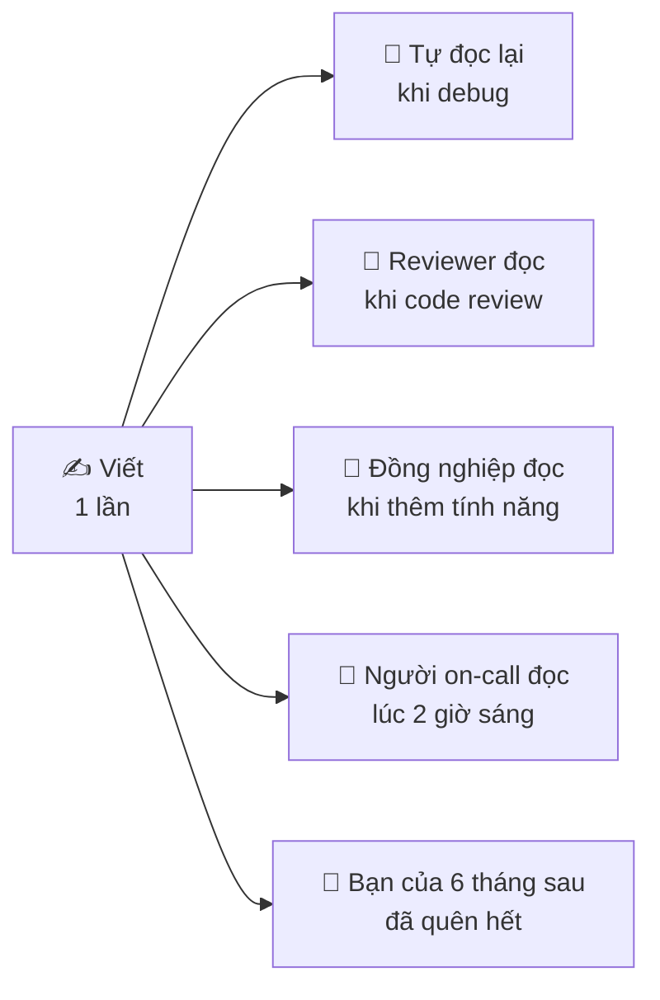
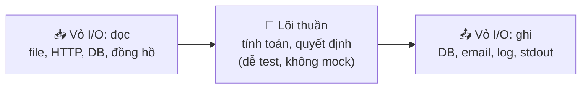
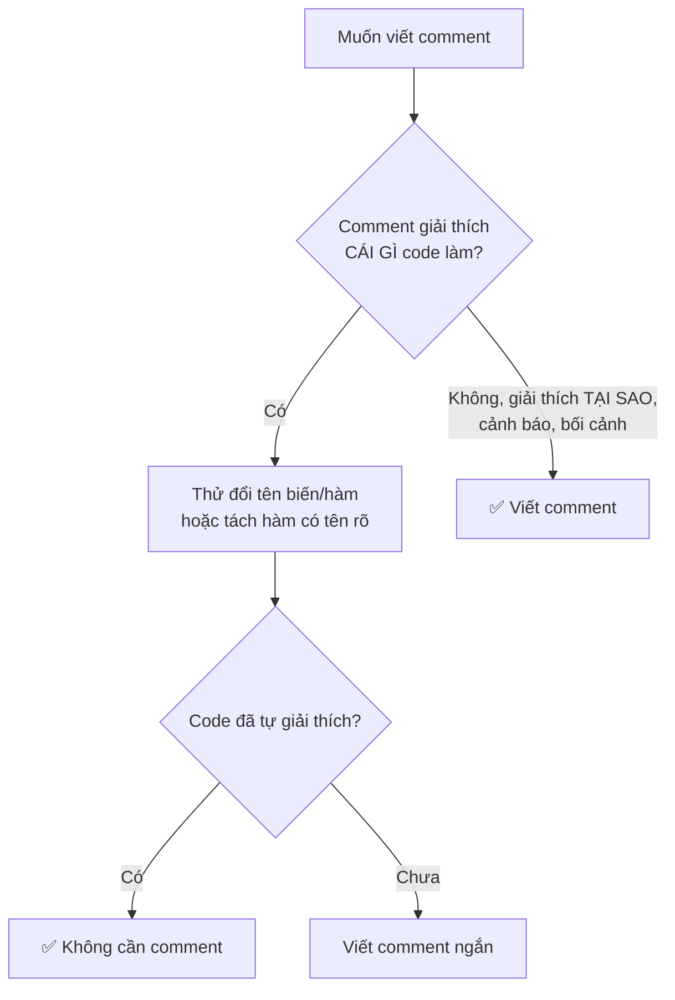
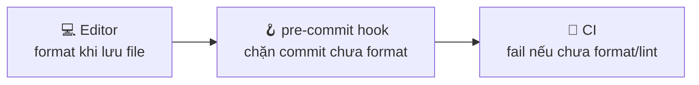
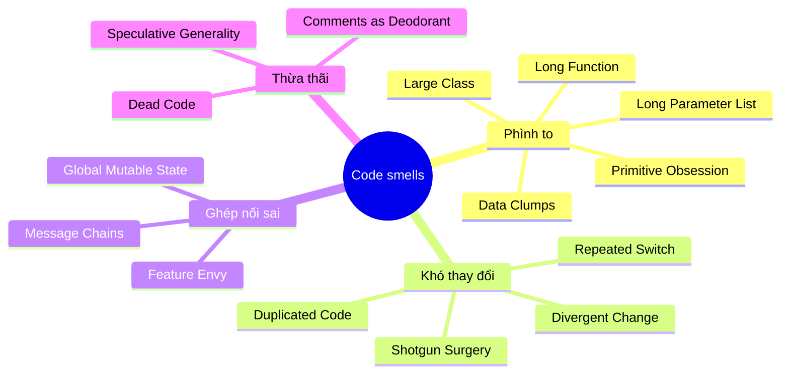
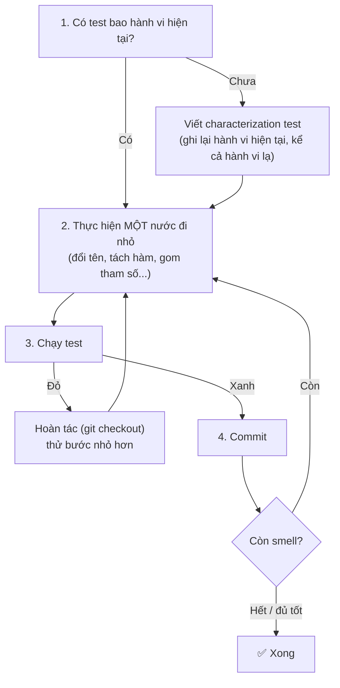
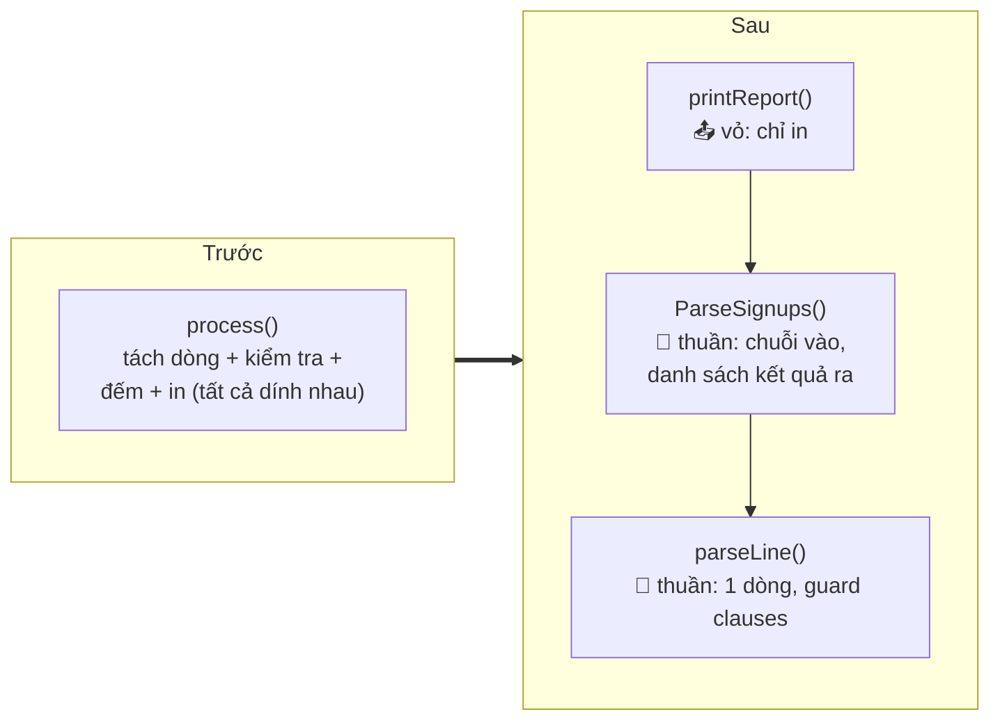
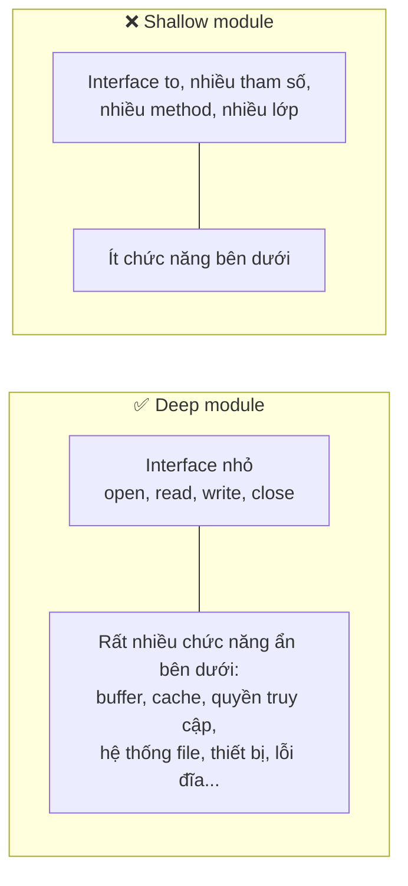

# 📚 Bài 3: Clean Code - Viết code cho người đọc

## 🎯 Mục tiêu bài học

- Hiểu vì sao **code được đọc nhiều hơn viết** - và vì sao điều đó thay đổi cách ta viết code
- Biết **đặt tên** có chủ đích: biến, hàm, kiểu, hằng số, boolean - theo quy ước của Go và Python
- Viết **hàm** làm một việc, ở một mức trừu tượng, với ít tham số và không có "cờ" bất ngờ
- Dùng **guard clause** để phá "code mũi tên", thay **magic number** bằng hằng số có tên
- Nhận diện **side effect** ẩn và tách **lõi thuần (pure core)** khỏi **vỏ I/O**
- Viết **comment giải thích TẠI SAO**, không phải CÁI GÌ; dùng formatter (`gofmt`, `ruff`) để khỏi cãi nhau về format
- Thuộc **danh mục code smell** phổ biến và **nước đi refactor** tương ứng
- Thực hành **2 walkthrough refactor trước/sau** (Go và Python), có test chứng minh hành vi không đổi
- Biết **phê phán giáo điều**: khi nào "Clean Code" phản tác dụng, và ý tưởng **deep module** của John Ousterhout

## 📖 1. Code được đọc nhiều hơn viết

### Câu chuyện: 2 giờ sáng và hàm `proc2`

Minh là backend engineer năm thứ hai ở một công ty thương mại điện tử. 2 giờ sáng, điện thoại rung: *"Đơn hàng thanh toán qua ví điện tử bị trừ tiền 2 lần"*. Minh mở laptop, tìm tới đoạn code xử lý thanh toán và thấy:

```python
def proc2(d, f=False, t=3):
    r = None
    for i in range(t):
        try:
            r = cl.send(d)
            if r["s"] == 1 or f:
                break
        except Exception:
            pass
    if r and r["s"] == 1:
        upd(d["id"], 2)
    return r
```

`d` là gì? `f` là cờ gì? `t=3` là 3 lần thử hay 3 giây? `r["s"] == 1` nghĩa là thành công hay đang xử lý? `upd(d["id"], 2)` - trạng thái 2 là gì? Tại sao nuốt mọi exception?

Minh mất **50 phút** chỉ để hiểu đoạn code 12 dòng này, trong khi khách hàng vẫn đang bị trừ tiền. Hóa ra: `t=3` là số lần thử lại, và vì exception bị nuốt (timeout nhưng ví điện tử **đã** trừ tiền), code gửi lại yêu cầu thanh toán thêm lần nữa.

Người viết đoạn code đó đã tiết kiệm được khoảng 2 phút khi gõ tên ngắn. Công ty trả giá bằng 50 phút sự cố và hàng trăm khách hàng bực bội.

### Tỉ lệ đọc/viết

Robert C. Martin ước tính tỉ lệ thời gian **đọc code so với viết code là hơn 10:1**. Con số chính xác không quan trọng - điều quan trọng là mỗi dòng code sẽ được đọc lại nhiều lần:



> *"Any fool can write code that a computer can understand. Good programmers write code that humans can understand."* - Martin Fowler

### Vậy "clean code" là gì?

Không có định nghĩa tuyệt đối, nhưng hầu hết kỹ sư giỏi đồng ý code "sạch" có các tính chất:

| Tính chất | Câu hỏi kiểm tra |
|---|---|
| **Dễ đọc** | Một đồng nghiệp mới vào có hiểu đoạn này trong vài phút không? |
| **Dễ thay đổi** | Đổi một quy tắc kinh doanh có phải sửa ở 1 chỗ hay 10 chỗ? |
| **Ít bất ngờ** | Hàm có làm đúng như tên của nó hứa hẹn - không hơn, không kém? |
| **Dễ test** | Có test được logic mà không cần database, mạng, đồng hồ thật không? |
| **Nhất quán** | Cùng một khái niệm có được gọi cùng một tên ở mọi nơi không? |

!!! note "Clean code không phải là mục tiêu cuối"
    Mục tiêu là **giảm chi phí thay đổi phần mềm theo thời gian**. Clean code là phương tiện. Khi một quy tắc "clean" làm code khó hiểu hơn, hãy bỏ quy tắc đó (xem mục 13).

## 📖 2. Đặt tên - kỹ năng quan trọng nhất và khó nhất

> *"There are only two hard things in Computer Science: cache invalidation and naming things."* - Phil Karlton

Tên tốt là **tài liệu miễn phí luôn đúng**. Tên xấu là **tài liệu sai** - còn tệ hơn không có tài liệu.

### Nguyên tắc 1: Tên nói lên ý định

| ❌ Tên xấu | ✅ Tên tốt | Tại sao |
|---|---|---|
| `d` | `daysSinceLastLogin` / `days_since_last_login` | Biết ngay đơn vị và ý nghĩa |
| `data`, `info`, `obj` | `invoice`, `shippingAddress` | "data" đúng với mọi thứ = không nói gì |
| `list1`, `list2` | `activeUsers`, `bannedUsers` | Phân biệt được hai danh sách |
| `temp` | `celsius` hoặc `pendingOrder` | "temp" là nhiệt độ hay tạm thời? |
| `flag` | `isExpired`, `shouldRetry` | Cờ gì? |
| `r["s"] == 1` | `resp.Status == StatusPaid` | Không cần nhớ mã số |
| `timeout = 30` | `timeoutSeconds = 30` hoặc `timeout = 30 * time.Second` | Đơn vị nằm trong tên hoặc kiểu |

### Nguyên tắc 2: Độ dài tên tỉ lệ với phạm vi

Đây là điểm mà người mới thường hiểu sai: **tên dài không phải lúc nào cũng tốt hơn**.

- Biến sống trong **3 dòng** (chỉ số vòng lặp, receiver) → tên ngắn là đủ: `i`, `u`, `err`
- Biến sống trong **cả hàm dài** → tên mô tả: `retryCount`
- Tên **exported / public**, dùng ở nhiều package → tên đầy đủ, rõ nghĩa: `ParseInvoiceFromCSV`

=== "Go"

    ```go
    // Tốt: phạm vi nhỏ, tên ngắn - đúng phong cách Go
    for i, u := range users {
        fmt.Println(i, u.Name)
    }

    // Không cần: phạm vi 1 dòng mà tên quá dài
    for userIndex, currentUserObject := range users {
        fmt.Println(userIndex, currentUserObject.Name)
    }
    ```

=== "Python"

    ```python
    # Tốt: comprehension ngắn, tên ngắn
    emails = [u.email for u in users if u.is_active]

    # Không cần thiết
    emails = [current_user_object.email for current_user_object in users if current_user_object.is_active]
    ```

### Nguyên tắc 3: Mỗi loại tên có "ngữ pháp" riêng

| Loại | Ngữ pháp | Go | Python |
|---|---|---|---|
| Biến, kiểu | **Danh từ** | `invoice`, `type Invoice struct` | `invoice`, `class Invoice` |
| Hàm, method | **Động từ** (hoặc cụm động từ) | `SendEmail`, `calculateTax` | `send_email`, `calculate_tax` |
| Boolean | **is/has/can/should** + tính từ | `isActive`, `hasPermission` | `is_active`, `has_permission` |
| Hằng số | Danh từ mô tả giá trị | `MaxRetries` | `MAX_RETRIES` |
| Collection | **Số nhiều** | `orders` | `orders` |
| Map/dict | `valueByKey` | `priceBySKU` | `price_by_sku` |

!!! tip "Boolean đừng dùng dạng phủ định"
    `if !isNotValid` khiến não phải lật hai lần. Dùng `isValid` và viết `if !isValid`. Tương tự, tham số `disableCache=False` khó đọc hơn `useCache=True`.

### Nguyên tắc 4: Theo quy ước của ngôn ngữ

=== "Go"

    | Quy ước Go | ❌ | ✅ |
    |---|---|---|
    | MixedCaps, không gạch dưới | `user_id`, `MAX_SIZE` | `userID`, `maxSize` |
    | Viết tắt giữ nguyên hoa/thường | `UserId`, `HttpServer`, `ParseJson` | `UserID`, `HTTPServer`, `ParseJSON` |
    | Getter không có `Get` | `u.GetName()` | `u.Name()` |
    | Không lặp tên package | `user.UserService` | `user.Service` |
    | Receiver ngắn, nhất quán | `func (this *Cart)`, `func (self *Cart)` | `func (c *Cart)` |
    | Interface 1 method: đuôi `-er` | `IReader`, `ReaderInterface` | `Reader`, `Notifier` |
    | Error biến: tiền tố `Err` | `NotFoundError = errors.New(...)` | `ErrNotFound = errors.New(...)` |

=== "Python"

    | Quy ước Python (PEP 8) | ❌ | ✅ |
    |---|---|---|
    | Hàm, biến: snake_case | `getUserName`, `userID` | `get_user_name`, `user_id` |
    | Class: PascalCase | `order_service` | `OrderService` |
    | Hằng số module: UPPER_CASE | `maxRetries = 3` | `MAX_RETRIES = 3` |
    | "Private": gạch dưới đầu | `internalCache` | `_cache` |
    | Không che tên built-in | `list`, `id`, `type`, `input` | `items`, `user_id`, `kind`, `raw_input` |
    | Exception: đuôi `Error` | `class NotFound(Exception)` | `class NotFoundError(Exception)` |

### Nguyên tắc 5: Nhất quán từ vựng (Ubiquitous Language)

Cùng một khái niệm, dùng **một từ duy nhất** trong toàn codebase. Nếu nơi thì `fetchUser`, nơi `getCustomer`, nơi `retrieveClient` - người đọc sẽ tự hỏi ba thứ này có khác nhau không.

| Khái niệm | Chọn MỘT | Tránh trộn |
|---|---|---|
| Lấy từ DB | `get` | `fetch`, `retrieve`, `load`, `find` lẫn lộn |
| Người mua | `customer` | `user`, `client`, `buyer` cho cùng một thứ |
| Xóa | `delete` | `remove`, `destroy`, `erase` |

!!! tip "Tiếng Việt trong tên biến?"
    Nhiều team Việt Nam dùng tên kiểu `tongTien`, `khachHang`. Không có gì sai tuyệt đối - nhưng **đừng trộn** (`tongPrice`, `customerTen`). Quy tắc thực tế: tên **kỹ thuật** dùng tiếng Anh; khái niệm **nghiệp vụ đặc thù Việt Nam** khó dịch (ví dụ `maSoThue`, `canCuocCongDan`) có thể giữ tiếng Việt không dấu *nếu cả team thống nhất* và ghi vào coding guideline. Comment và tài liệu nội bộ viết tiếng Việt hoàn toàn ổn.

### Bài kiểm tra nhanh: đặt lại tên

| Code gốc | Đề xuất |
|---|---|
| `func chk(u User) bool` | `func canCheckout(u User) bool` |
| `def calc(a, b)` | `def calculate_shipping_fee(weight_kg, distance_km)` |
| `var m map[string]int` | `var stockBySKU map[string]int` |
| `x = 86400` | `SECONDS_PER_DAY = 86400` |
| `def process(data)` | `def import_orders_from_csv(csv_path)` |
| `status = 3` | `status = OrderStatus.SHIPPED` |

## 📖 3. Hàm - làm một việc và làm tốt

### Quy tắc 1: Một hàm làm một việc

Cách kiểm tra: **mô tả hàm bằng một câu không có chữ "và"**. Nếu bạn phải nói *"hàm này validate đơn hàng **và** tính tiền **và** lưu DB **và** gửi email"* → nó đang làm 4 việc.

Nhưng "một việc" là ở **một mức trừu tượng**. `PlaceOrder` có thể gọi validate, tính tiền, lưu, gửi email - miễn là **chính nó** chỉ điều phối ở mức cao, không trộn lẫn chi tiết cấp thấp:

=== "Go"

    ```go
    // ✅ Một mức trừu tượng: đọc như một câu chuyện
    func (s *OrderService) PlaceOrder(ctx context.Context, req PlaceOrderRequest) (Order, error) {
        if err := req.Validate(); err != nil {
            return Order{}, fmt.Errorf("invalid order: %w", err)
        }
        order := NewOrder(req)
        order.Total = s.pricing.Total(order.Items, req.Coupon)
        if err := s.repo.Save(ctx, order); err != nil {
            return Order{}, fmt.Errorf("save order: %w", err)
        }
        s.notifier.OrderPlaced(ctx, order)
        return order, nil
    }
    ```

=== "Python"

    ```python
    # ✅ Một mức trừu tượng: đọc như một câu chuyện
    def place_order(self, req: PlaceOrderRequest) -> Order:
        req.validate()
        order = Order.from_request(req)
        order.total = self.pricing.total(order.items, req.coupon)
        self.repo.save(order)
        self.notifier.order_placed(order)
        return order
    ```

So sánh với phiên bản trộn mức trừu tượng - cùng một hàm vừa nói chuyện "đặt hàng" vừa nói chuyện "nối chuỗi SQL" và "định dạng HTML email":

```python
# ❌ Trộn mức trừu tượng
def place_order(req):
    if not req.get("items"):
        raise ValueError("empty")
    total = 0
    for it in req["items"]:
        total += it["price"] * it["qty"]
    cur = db.cursor()
    cur.execute("INSERT INTO orders (user_id, total) VALUES (%s, %s)", (req["user_id"], total))
    html = "<h1>Cảm ơn</h1><p>Tổng: " + str(total) + "</p>"
    smtp.sendmail("shop@x.vn", req["email"], html)
```

### Quy tắc 2: Ít tham số

| Số tham số | Đánh giá |
|---|---|
| 0-2 | Tốt |
| 3 | Chấp nhận được, cân nhắc |
| 4+ | Gần như chắc chắn nên gom thành struct / dataclass |

Tham số nhiều gây hai vấn đề: dễ **truyền nhầm thứ tự** (`createUser("An", "an@x.vn", "0901...", "Hà Nội", true, false)` - `true` là gì?) và là dấu hiệu hàm **làm quá nhiều việc**.

=== "Go"

    ```go
    // ❌ 6 tham số, 2 bool - không thể đọc tại nơi gọi
    CreateUser("An", "an@x.vn", "0901234567", "Hà Nội", true, false)

    // ✅ Gom thành struct - nơi gọi tự giải thích
    CreateUser(NewUser{
        Name:        "An",
        Email:       "an@x.vn",
        Phone:       "0901234567",
        City:        "Hà Nội",
        IsVerified:  true,
        WantsPromos: false,
    })
    ```

=== "Python"

    ```python
    # ❌
    create_user("An", "an@x.vn", "0901234567", "Hà Nội", True, False)

    # ✅ Keyword-only arguments (dấu *) buộc người gọi ghi tên
    def create_user(name: str, email: str, *, phone: str = "", city: str = "",
                    is_verified: bool = False, wants_promos: bool = False) -> User: ...

    create_user("An", "an@x.vn", phone="0901234567", city="Hà Nội", is_verified=True)
    ```

### Quy tắc 3: Tránh tham số cờ (flag argument)

Một tham số `bool` điều khiển hàm làm hai việc khác nhau = hàm đang làm hai việc.

=== "Go"

    ```go
    // ❌ render(report, true) - true là gì?
    func render(r Report, asPDF bool) []byte

    // ✅ Hai hàm, hai tên
    func RenderHTML(r Report) []byte
    func RenderPDF(r Report) []byte
    ```

=== "Python"

    ```python
    # ❌ render(report, True)
    def render(report, as_pdf): ...

    # ✅
    def render_html(report): ...
    def render_pdf(report): ...
    ```

### Quy tắc 4: Command-Query Separation

Một hàm hoặc **trả lời câu hỏi** (query - không đổi trạng thái), hoặc **làm một hành động** (command - đổi trạng thái), không nên cả hai. `if set("username", "an")` - đây là kiểm tra đã set chưa, hay set rồi kiểm tra thành công? Không ai biết.

Ngoại lệ hợp lý: các thao tác nguyên tử như `pop()`, `LoadOrStore`, `INSERT ... RETURNING` - vì tách ra sẽ gây race condition.

### Quy tắc 5: Hàm "nhỏ" - nhưng đừng quá nhỏ

Hàm 300 dòng gần như chắc chắn nên chia. Nhưng hàm 3 dòng cũng không phải lúc nào cũng tốt hơn hàm 30 dòng. Một chỉ dẫn thực tế hơn con số:

- Hàm **vừa một màn hình** (~40-60 dòng) thường dễ đọc
- Tách hàm khi phần tách ra **có tên đáng giá** (tên nói được nhiều hơn code bên trong)
- **Đừng** tách khi người đọc phải nhảy qua 8 hàm 2 dòng mới hiểu một luồng (xem mục 13)

## 📖 4. Guard clause - phá "code mũi tên"

Khi if lồng if lồng if, code có hình **mũi tên** chỉ sang phải. Mắt người đọc phải giữ trong đầu mọi điều kiện đang mở.

```text
if
    if
        if
            if
                <-- logic chính nằm tận đây
            else
        else
    else
else
```

**Guard clause** (mệnh đề canh cổng): xử lý các trường hợp lỗi/đặc biệt **trước**, `return` sớm, để **đường chính (happy path)** nằm thẳng ở lề trái. Đây cũng chính là phong cách chuẩn của Go ("indent error flow, not the happy path").

=== "Go"

    ```go
    // ❌ Mũi tên
    func Withdraw(acc *Account, amount int64) error {
        if acc != nil {
            if !acc.Frozen {
                if amount > 0 {
                    if acc.Balance >= amount {
                        acc.Balance -= amount
                        return nil
                    } else {
                        return ErrInsufficientFunds
                    }
                } else {
                    return ErrInvalidAmount
                }
            } else {
                return ErrAccountFrozen
            }
        } else {
            return ErrNoAccount
        }
    }

    // ✅ Guard clauses: mỗi điều kiện một dòng, happy path ở cuối, lề trái
    func Withdraw(acc *Account, amount int64) error {
        if acc == nil {
            return ErrNoAccount
        }
        if acc.Frozen {
            return ErrAccountFrozen
        }
        if amount <= 0 {
            return ErrInvalidAmount
        }
        if acc.Balance < amount {
            return ErrInsufficientFunds
        }
        acc.Balance -= amount
        return nil
    }
    ```

=== "Python"

    ```python
    # ❌ Mũi tên
    def withdraw(acc, amount):
        if acc is not None:
            if not acc.frozen:
                if amount > 0:
                    if acc.balance >= amount:
                        acc.balance -= amount
                    else:
                        raise InsufficientFundsError()
                else:
                    raise InvalidAmountError()
            else:
                raise AccountFrozenError()
        else:
            raise NoAccountError()

    # ✅ Guard clauses
    def withdraw(acc, amount):
        if acc is None:
            raise NoAccountError()
        if acc.frozen:
            raise AccountFrozenError()
        if amount <= 0:
            raise InvalidAmountError()
        if acc.balance < amount:
            raise InsufficientFundsError()
        acc.balance -= amount
    ```

Lợi ích ngoài việc dễ đọc: mỗi `else` xa cách `if` của nó 10 dòng là một chỗ dễ viết nhầm. Guard clause xóa hẳn các `else` đó.

!!! tip "Mẹo: `else` sau `return` là thừa"
    Nếu nhánh `if` kết thúc bằng `return`/`raise`/`continue`, bạn không cần `else`. Linter (`golint`/`revive` với rule `indent-error-flow`, `ruff` với rule `RET505`) sẽ nhắc bạn điều này.

## 📖 5. Magic number và magic string

**Magic number** là một con số xuất hiện trong code mà không có tên giải thích nó là gì.

```python
if user.age >= 18 and order.total > 5000000 and retry < 3:
    time.sleep(86400)
```

Đọc dòng này, bạn phải đoán: 18 là tuổi trưởng thành hay tuổi được mua rượu? 5000000 là ngưỡng gì - miễn phí ship, cần duyệt, hay chống gian lận? Và khi luật đổi ngưỡng, bạn phải `grep "5000000"` rồi cầu nguyện không có chỗ nào viết `5_000_000` hoặc `5e6`.

=== "Go"

    ```go
    const (
        LegalAdultAge          = 18
        ManualReviewThreshold  = 5_000_000 // VND - đơn lớn hơn cần nhân viên duyệt
        MaxPaymentRetries      = 3
        ReconciliationInterval = 24 * time.Hour
    )

    // Magic string → kiểu có tên + hằng số
    type OrderStatus string

    const (
        StatusPending  OrderStatus = "pending"
        StatusPaid     OrderStatus = "paid"
        StatusShipped  OrderStatus = "shipped"
        StatusCanceled OrderStatus = "canceled"
    )

    if user.Age >= LegalAdultAge && order.Total > ManualReviewThreshold && retry < MaxPaymentRetries {
        time.Sleep(ReconciliationInterval)
    }
    ```

=== "Python"

    ```python
    from datetime import timedelta
    from enum import StrEnum

    LEGAL_ADULT_AGE = 18
    MANUAL_REVIEW_THRESHOLD = 5_000_000  # VND - đơn lớn hơn cần nhân viên duyệt
    MAX_PAYMENT_RETRIES = 3
    RECONCILIATION_INTERVAL = timedelta(days=1)


    class OrderStatus(StrEnum):
        PENDING = "pending"
        PAID = "paid"
        SHIPPED = "shipped"
        CANCELED = "canceled"


    if user.age >= LEGAL_ADULT_AGE and order.total > MANUAL_REVIEW_THRESHOLD and retry < MAX_PAYMENT_RETRIES:
        time.sleep(RECONCILIATION_INTERVAL.total_seconds())
    ```

Những con số **không cần** đặt tên: `0`, `1` trong ngữ cảnh hiển nhiên (`i := 0`, `len(x) - 1`), `100` khi tính phần trăm, `2` khi chia đôi. Quy tắc: nếu người đọc phải **dừng lại hỏi "số này ở đâu ra"** thì đặt tên.

!!! warning "Đừng đặt tên vô nghĩa"
    `const Three = 3` hay `ONE_HUNDRED = 100` còn tệ hơn số trần - nó không thêm thông tin nào mà lại khóa giá trị vào tên (đổi thành 4 thì tên `Three` thành nói dối). Tên phải nói **ý nghĩa**, không nói **giá trị**.

## 📖 6. Side effect - những bất ngờ không ai muốn

**Side effect** (hiệu ứng phụ) là bất cứ điều gì hàm làm ngoài việc trả về kết quả: ghi DB, gọi mạng, in ra màn hình, sửa biến toàn cục, **sửa tham số đầu vào**. Side effect không xấu - phần mềm vô dụng nếu không có side effect. Cái xấu là side effect **ẩn** - không được tên hàm báo trước.

### Ví dụ side effect ẩn

=== "Go"

    ```go
    // ❌ Tên nói "kiểm tra", nhưng hàm lại tạo session và ghi DB
    func CheckPassword(u *User, pw string) bool {
        if bcrypt.CompareHashAndPassword(u.Hash, []byte(pw)) != nil {
            return false
        }
        session.Create(u.ID)            // bất ngờ!
        db.Exec("UPDATE users SET last_login = now() WHERE id = $1", u.ID) // bất ngờ!
        return true
    }
    ```

=== "Python"

    ```python
    # ❌ Tên nói "tính", nhưng hàm lại SỬA danh sách của người gọi
    def calculate_total(items):
        items.sort(key=lambda it: it.price)   # bất ngờ: đảo thứ tự giỏ hàng của người gọi
        return sum(it.price * it.qty for it in items)
    ```

Hậu quả thực tế: một đồng nghiệp gọi `CheckPassword` trong trang "đổi mật khẩu" để xác nhận mật khẩu cũ → mỗi lần đổi mật khẩu lại tạo thêm một session. Bug kiểu này rất khó tìm vì **không ai nghi ngờ một hàm tên "Check"**.

### Bẫy kinh điển của Python: tham số mặc định mutable

```python
def add_tag(tag, tags=[]):      # ❌ list này được tạo MỘT LẦN, dùng chung mọi lần gọi
    tags.append(tag)
    return tags

print(add_tag("a"))  # ['a']
print(add_tag("b"))  # ['a', 'b']  <- bất ngờ!

def add_tag_fixed(tag, tags=None):  # ✅
    tags = [] if tags is None else list(tags)
    tags.append(tag)
    return tags
```

### Cách tổ chức: lõi thuần, vỏ I/O (Functional Core, Imperative Shell)

**Hàm thuần (pure function)**: cùng input → luôn cùng output, không side effect. Hàm thuần dễ test (không cần mock), dễ hiểu (chỉ cần nhìn input/output), dễ dùng lại.

Chiến lược: dồn **quyết định** (logic nghiệp vụ) vào lõi thuần, để lớp vỏ mỏng lo **I/O** (đọc file, gọi DB, in ra).



Walkthrough 2 ở mục 12 thực hành đúng kỹ thuật này.

!!! tip "Đồng hồ cũng là I/O"
    `time.Now()` / `datetime.now()` bên trong logic khiến hàm không thuần - test chạy lúc 23:59 và 00:01 cho kết quả khác nhau. Truyền thời gian vào như một tham số (`now time.Time`) để logic thuần và test được.

## 📖 7. Comment - giải thích TẠI SAO, không phải CÁI GÌ

Code nói **cái gì** và **thế nào**. Comment tốt nói những điều code **không thể nói**: **tại sao**, bối cảnh, cảnh báo.

### Comment xấu

```go
// Tăng i lên 1
i++

// Lấy user theo id
func GetUserByID(id int64) (*User, error)

// Kiểm tra user có active không
if u.Status == 1 { // 1 = active     <-- comment đang bù cho magic number

// 2023-05-01 - Hùng sửa
// 2023-06-12 - Lan sửa lại
// (Nhật ký thay đổi: việc của git log, không phải comment)

// func oldCalculate(x int) int {
//     return x * 2
// }
// (Code bị comment: xóa đi, git nhớ hộ bạn)
```

Và loại nguy hiểm nhất: **comment nói dối**. Code đã đổi nhưng comment chưa:

```python
# Thử lại tối đa 3 lần
for attempt in range(5):
    ...
```

Người đọc tin comment hay tin code? Comment lỗi thời còn tệ hơn không có comment.

### Comment tốt

=== "Go"

    ```go
    // Dùng tỉ giá của ngày đặt hàng, KHÔNG phải ngày thanh toán:
    // theo hợp đồng với đối tác, khách được giữ giá trong 7 ngày (ticket PAY-381).
    rate := rates.On(order.CreatedAt)

    // Cảnh báo: API của nhà vận chuyển trả 200 kèm body {"error": ...} khi lỗi,
    // nên phải kiểm tra body chứ không chỉ status code.
    if resp.Error != "" {
        return fmt.Errorf("carrier: %s", resp.Error)
    }

    // Dùng insertion sort vì n luôn <= 10 (số bước trong checkout)
    // và benchmark cho thấy nhanh hơn sort.Slice 3 lần ở kích thước này.
    insertionSort(steps)

    // TODO(PAY-402): bỏ nhánh này sau khi tất cả client lên app >= 5.2.
    if req.ClientVersion < "5.2" {
        ...
    }
    ```

=== "Python"

    ```python
    # Dùng tỉ giá của ngày đặt hàng, KHÔNG phải ngày thanh toán:
    # theo hợp đồng với đối tác, khách được giữ giá trong 7 ngày (ticket PAY-381).
    rate = rates.on(order.created_at)

    # Regex này cố ý KHÔNG kiểm tra email đầy đủ theo RFC 5322 -
    # ta chỉ chặn lỗi gõ nhầm; xác thực thật bằng email xác nhận.
    EMAIL_RE = re.compile(r"^[^@\s]+@[^@\s]+\.[^@\s]+$")
    ```

### Tài liệu cho API công khai

Hàm/kiểu **exported** (Go) hoặc **public** (Python) nên có doc comment mô tả: làm gì, tham số có ràng buộc gì, trả về gì, lỗi gì có thể xảy ra.

=== "Go"

    ```go
    // Transfer chuyển amount (VND, > 0) từ from sang to trong một transaction.
    // Trả về ErrInsufficientFunds nếu số dư không đủ; khi đó không tài khoản nào bị thay đổi.
    // An toàn khi gọi đồng thời.
    func (s *Service) Transfer(ctx context.Context, from, to AccountID, amount int64) error
    ```

=== "Python"

    ```python
    def transfer(self, from_id: AccountId, to_id: AccountId, amount: int) -> None:
        """Chuyển ``amount`` (VND, > 0) từ ``from_id`` sang ``to_id`` trong một transaction.

        Raises:
            InsufficientFundsError: số dư không đủ; khi đó không tài khoản nào bị thay đổi.
        """
    ```

### Quy trình quyết định: có nên viết comment này?



## 📖 8. Format - để máy lo, đừng cãi nhau

Tab hay space? Dấu ngoặc xuống dòng hay không? Dòng dài 80 hay 120 ký tự? Những cuộc tranh luận này **tốn hàng nghìn giờ** trong code review toàn ngành - và hoàn toàn không đáng.

> *"Gofmt's style is no one's favorite, yet gofmt is everyone's favorite."* - Rob Pike, Go Proverbs

Giải pháp: **một formatter tự động, cấu hình một lần, chạy mọi lúc**.

| Việc | Go | Python |
|---|---|---|
| Format | `gofmt -w .` (có sẵn), `goimports` (sắp xếp import) | `ruff format .` (hoặc `black`) |
| Lint | `go vet ./...`, `staticcheck`, `golangci-lint run` | `ruff check .` (thay flake8, isort, pyupgrade...) |
| Kiểu | Compiler | `mypy` hoặc `pyright` |

Cấu hình Python tối thiểu trong `pyproject.toml`:

```toml
[tool.ruff]
line-length = 100
target-version = "py311"

[tool.ruff.lint]
# E/F: lỗi cơ bản, I: sắp xếp import, B: bugbear (bẫy thường gặp),
# UP: cú pháp hiện đại, SIM: đơn giản hóa, RET: return thừa
select = ["E", "F", "I", "B", "UP", "SIM", "RET"]
```

Và ba nơi để chạy chúng, từ sớm đến muộn:



!!! tip "Quy tắc trong code review"
    Nếu một góp ý về format **có thể được tự động hóa**, đừng viết nó trong review - hãy thêm vào cấu hình linter. Code review dành cho những thứ máy không thấy được: thiết kế, tên, logic, trường hợp biên.

Ngoài formatter, còn một loại "format" máy không làm được: **khoảng trắng dọc**. Nhóm các dòng liên quan lại, cách nhau bằng một dòng trống - như đoạn văn trong một bài viết. Khai báo biến gần nơi dùng nó. Hàm gọi đặt gần hàm được gọi (hàm cấp cao ở trên, chi tiết ở dưới - đọc như báo: tiêu đề trước, chi tiết sau).

## 📖 9. Xử lý lỗi cũng là clean code

Code xử lý lỗi kém là nguồn gốc của rất nhiều sự cố (như câu chuyện ở mục 1). Ba quy tắc:

**1. Đừng nuốt lỗi.** `except Exception: pass` và `_ = doSomething()` là những dòng code nguy hiểm nhất bạn có thể viết. Nếu thật sự muốn bỏ qua, ghi comment **tại sao** và log lại.

**2. Thêm ngữ cảnh khi chuyển lỗi lên.** Lỗi `connection refused` ở log không cho biết ai gọi, gọi gì.

=== "Go"

    ```go
    // ❌
    if err != nil {
        return err
    }

    // ✅ Mỗi tầng thêm một mẩu ngữ cảnh; %w giữ lỗi gốc cho errors.Is/As
    if err != nil {
        return fmt.Errorf("charge order %s via momo: %w", order.ID, err)
    }
    // Log cuối cùng: "place order: charge order A123 via momo: dial tcp: connection refused"
    ```

=== "Python"

    ```python
    # ❌
    try:
        gateway.charge(order)
    except Exception:
        pass

    # ✅ Bắt lỗi CỤ THỂ, thêm ngữ cảnh, giữ lỗi gốc bằng "from"
    try:
        gateway.charge(order)
    except GatewayTimeoutError as e:
        raise PaymentError(f"charge order {order.id} via momo") from e
    ```

**3. Xử lý lỗi ở đúng một chỗ.** Hoặc log, hoặc trả lỗi lên - không cả hai (nếu không, một lỗi xuất hiện 5 lần trong log ở 5 tầng). Chi tiết hơn ở [Go Bài 7](../golang/07-error-handling.md) và [Python Bài 7](../python/07-exceptions-files.md).

## 📖 10. Danh mục code smell và nước đi refactor

**Code smell** (mùi code) là dấu hiệu bề mặt cho thấy **có thể** có vấn đề thiết kế sâu hơn - giống mùi khét trong bếp: chưa chắc cháy nhà, nhưng nên đi kiểm tra. Thuật ngữ này do Kent Beck và Martin Fowler phổ biến trong cuốn *Refactoring*.



| Smell | Dấu hiệu nhận biết | Nước đi refactor |
|---|---|---|
| **Long Function** | Phải cuộn chuột; có comment chia "phần 1, phần 2" | **Extract Function** - mỗi "phần" thành một hàm có tên |
| **Large Class** | Struct/class có 30 field, 50 method; tên kiểu `Manager`, `Helper`, `Utils` | **Extract Class** - tách theo nhóm field hay đi cùng nhau |
| **Long Parameter List** | 5+ tham số, nhiều bool | **Introduce Parameter Object** (struct/dataclass) |
| **Data Clumps** | Bộ ba `street, city, district` luôn đi cùng nhau | Gom thành kiểu `Address` |
| **Primitive Obsession** | Tiền là `float`, email là `string`, trạng thái là `int` | **Replace Primitive with Object**: `Money`, `Email`, `OrderStatus` |
| **Duplicated Code** | Copy-paste cùng logic ở 3 nơi | **Extract Function** - nhưng xem quy tắc ba lần ở Bài 4 |
| **Shotgun Surgery** | Đổi một quy tắc phải sửa 7 file | **Move Function/Field** - gom những thứ thay đổi cùng nhau về một chỗ |
| **Divergent Change** | Một file bị sửa vì 5 lý do khác nhau | **Split** theo lý do thay đổi (Single Responsibility) |
| **Repeated Switch** | Cùng `switch order.Type` xuất hiện ở nhiều nơi | **Replace Conditional with Polymorphism** (interface) hoặc bảng tra (map) |
| **Feature Envy** | Hàm của A liên tục truy cập dữ liệu của B | **Move Function** sang B |
| **Message Chains** | `order.Customer().Address().City().Name()` | **Hide Delegate**: `order.ShippingCity()` (Law of Demeter - Bài 4) |
| **Global Mutable State** | Biến toàn cục bị sửa ở nhiều nơi | Truyền qua tham số, đóng gói vào struct |
| **Dead Code** | Hàm không ai gọi, nhánh `if false`, feature flag đã tắt 2 năm | **Xóa** - git nhớ hộ bạn |
| **Speculative Generality** | Interface chỉ có 1 cài đặt "để sau này mở rộng" | **Inline** - xóa lớp trừu tượng thừa (YAGNI - Bài 4) |
| **Comments as Deodorant** | Comment dài giải thích đoạn code rối | Refactor cho code tự rõ, rồi xóa comment |
| **Flag Argument** | `render(r, true, false)` | **Split Function** thành các hàm có tên |

!!! note "Smell không phải là lỗi"
    Một hàm dài 80 dòng xử lý một thuật toán phức tạp có thể hoàn toàn ổn. Smell là **câu hỏi** ("có vấn đề không?"), không phải **bản án**. Đừng biến bảng này thành luật cứng trong code review.

### Refactor an toàn: bước nhỏ, test xanh liên tục

**Refactoring** = thay đổi cấu trúc code **mà không đổi hành vi**. Nếu hành vi đổi, đó không phải refactor - đó là viết lại (và rủi ro hơn nhiều).



Ba quy tắc vàng:

1. **Test trước, refactor sau.** Không có test thì bạn đang "sửa và cầu nguyện". Xem kỹ thuật characterization test ở [Bài 6](./06-testing-quality.md).
2. **Bước nhỏ, commit thường.** Mỗi bước dài vài phút. Nếu test đỏ, hoàn tác - rẻ hơn debug.
3. **Tách PR refactor khỏi PR thay đổi hành vi.** Reviewer đọc "PR này chỉ đổi cấu trúc, test không đổi" nhanh gấp 10 lần một PR trộn cả hai.

## 📖 11. Walkthrough 1: Refactor hàm tính tiền đơn hàng

### Bối cảnh

Bạn nhận ticket: *"Thêm mã giảm giá FREESHIP cho khách thường"*. Bạn mở file và gặp hàm này. Trước khi thêm tính năng, bạn quyết định **dọn dẹp trước** (quy tắc: *"make the change easy, then make the easy change"* - Kent Beck).

### Trước khi refactor

=== "Go"

    ```go
    package main

    import "fmt"

    type Item struct {
    	Name  string
    	Price int
    	Qty   int
    }

    // tinh tien don hang
    func calc(u string, items []Item, c string) int {
    	t := 0
    	for i := 0; i < len(items); i++ {
    		t = t + items[i].Price*items[i].Qty
    	}
    	if u == "vip" {
    		if t > 500000 {
    			t = t - t*10/100
    		} else {
    			t = t - t*5/100
    		}
    	} else {
    		if c == "SALE50" {
    			if t > 200000 {
    				t = t - 50000
    			}
    		}
    	}
    	if t < 300000 {
    		t = t + 30000
    	}
    	return t
    }

    func main() {
    	items := []Item{{"Áo thun", 150000, 2}, {"Mũ", 80000, 1}}
    	fmt.Println(calc("vip", items, ""))
    	fmt.Println(calc("normal", items, "SALE50"))
    	fmt.Println(calc("normal", []Item{{"Tất", 20000, 3}}, ""))
    }

    // Output:
    // 361000
    // 330000
    // 90000
    ```

=== "Python"

    ```python
    # tinh tien don hang
    def calc(u, items, c):
        t = 0
        for i in range(len(items)):
            t = t + items[i]["price"] * items[i]["qty"]
        if u == "vip":
            if t > 500000:
                t = t - t * 10 // 100
            else:
                t = t - t * 5 // 100
        else:
            if c == "SALE50":
                if t > 200000:
                    t = t - 50000
        if t < 300000:
            t = t + 30000
        return t


    items = [{"name": "Áo thun", "price": 150000, "qty": 2}, {"name": "Mũ", "price": 80000, "qty": 1}]
    print(calc("vip", items, ""))
    print(calc("normal", items, "SALE50"))
    print(calc("normal", [{"name": "Tất", "price": 20000, "qty": 3}], ""))

    # Output:
    # 361000
    # 330000
    # 90000
    ```

### Bước 0: Liệt kê smell

| Smell | Ở đâu |
|---|---|
| Tên vô nghĩa | `calc`, `u`, `c`, `t` |
| Magic number | `500000`, `10`, `5`, `200000`, `50000`, `300000`, `30000` |
| Magic string | `"vip"`, `"SALE50"` |
| Code mũi tên | 3 tầng if lồng nhau |
| Một hàm làm 4 việc | cộng tiền hàng, giảm giá VIP, giảm giá coupon, phí ship |
| Biến bị tái sử dụng | `t` lần lượt là "tổng hàng", "sau giảm giá", "phải trả" - ba ý nghĩa |
| Comment nói CÁI GÌ | `// tinh tien don hang` - tên hàm tốt sẽ thay được |

Và một **quy tắc nghiệp vụ ẩn** mà code không nói rõ: *khách VIP không được dùng coupon* (vì nhánh `else`). Đây là loại thông tin phải được làm **hiển thị** khi refactor.

### Bước 1: Viết test ghi lại hành vi hiện tại

Trước khi đổi bất cứ thứ gì, ta khóa hành vi bằng test. Ta viết test **cho phiên bản cũ** trước, chạy xanh, rồi mới refactor. Khi viết test, ta phát hiện một điều thú vị: **giỏ hàng rỗng vẫn bị tính 30.000đ phí ship**. Đó có phải bug? Có thể - nhưng **refactor không sửa bug**. Ta giữ nguyên hành vi, ghi vào test với tên rõ ràng, và hỏi PM trong một ticket riêng.

### Bước 2..N: Các nước đi nhỏ

1. **Rename**: `calc` → `OrderTotal`, `u` → `tier`, `c` → `coupon` (chạy test ✅, commit)
2. **Replace magic number with constant** (chạy test ✅, commit)
3. **Extract Function**: `subtotalOf`, `shippingFor` (✅, commit)
4. **Extract Function**: `vipDiscount`, `couponDiscount`, `discountFor` (✅, commit)
5. **Guard clause** trong `couponDiscount` (✅, commit)
6. **Split Variable**: `t` → `subtotal`, `afterDiscount` (✅, commit)
7. **Replace magic string with type**: `Tier` (✅, commit)

### Sau khi refactor

=== "Go"

    ```go
    package main

    import "fmt"

    type Item struct {
    	Name  string
    	Price int // VND
    	Qty   int
    }

    type Tier string

    const (
    	TierNormal Tier = "normal"
    	TierVIP    Tier = "vip"
    )

    const (
    	vipBigOrderThreshold = 500_000 // VND
    	vipBigOrderPercent   = 10
    	vipSmallOrderPercent = 5

    	couponSale50      = "SALE50"
    	sale50MinSubtotal = 200_000
    	sale50Amount      = 50_000

    	freeShippingFrom = 300_000
    	shippingFee      = 30_000
    )

    // OrderTotal trả về số tiền khách phải trả (VND): tiền hàng - giảm giá + phí ship.
    // Khách VIP không được dùng coupon (quy định của Marketing, ticket SHOP-142).
    func OrderTotal(tier Tier, items []Item, coupon string) int {
    	subtotal := subtotalOf(items)
    	afterDiscount := subtotal - discountFor(tier, subtotal, coupon)
    	return afterDiscount + shippingFor(afterDiscount)
    }

    func subtotalOf(items []Item) int {
    	sum := 0
    	for _, it := range items {
    		sum += it.Price * it.Qty
    	}
    	return sum
    }

    func discountFor(tier Tier, subtotal int, coupon string) int {
    	if tier == TierVIP {
    		return vipDiscount(subtotal)
    	}
    	return couponDiscount(subtotal, coupon)
    }

    func vipDiscount(subtotal int) int {
    	if subtotal > vipBigOrderThreshold {
    		return subtotal * vipBigOrderPercent / 100
    	}
    	return subtotal * vipSmallOrderPercent / 100
    }

    func couponDiscount(subtotal int, coupon string) int {
    	if coupon != couponSale50 || subtotal <= sale50MinSubtotal {
    		return 0
    	}
    	return sale50Amount
    }

    func shippingFor(amount int) int {
    	if amount >= freeShippingFrom {
    		return 0
    	}
    	return shippingFee
    }

    func main() {
    	items := []Item{{"Áo thun", 150_000, 2}, {"Mũ", 80_000, 1}}
    	fmt.Println(OrderTotal(TierVIP, items, ""))
    	fmt.Println(OrderTotal(TierNormal, items, "SALE50"))
    	fmt.Println(OrderTotal(TierNormal, []Item{{"Tất", 20_000, 3}}, ""))
    }

    // Output:
    // 361000
    // 330000
    // 90000
    ```

    Test (`order_test.go`, cùng thư mục, chạy `go test ./...`):

    ```go
    package main

    import "testing"

    func TestOrderTotal(t *testing.T) {
    	shirt := Item{"Áo thun", 150_000, 2}
    	hat := Item{"Mũ", 80_000, 1}
    	tests := []struct {
    		name   string
    		tier   Tier
    		items  []Item
    		coupon string
    		want   int
    	}{
    		{"VIP đơn nhỏ giảm 5%", TierVIP, []Item{shirt, hat}, "", 361_000},
    		{"VIP đơn lớn giảm 10%", TierVIP, []Item{shirt, shirt}, "", 540_000},
    		{"khách thường dùng SALE50", TierNormal, []Item{shirt, hat}, "SALE50", 330_000},
    		{"VIP không dùng được coupon", TierVIP, []Item{shirt, hat}, "SALE50", 361_000},
    		{"đơn nhỏ chịu phí ship", TierNormal, []Item{{"Tất", 20_000, 3}}, "", 90_000},
    		// Hành vi hiện tại (có thể là bug, đã hỏi PM ở SHOP-150): giỏ rỗng vẫn tính ship.
    		{"giỏ rỗng vẫn tính ship", TierNormal, nil, "", 30_000},
    	}
    	for _, tc := range tests {
    		t.Run(tc.name, func(t *testing.T) {
    			if got := OrderTotal(tc.tier, tc.items, tc.coupon); got != tc.want {
    				t.Errorf("OrderTotal() = %d, want %d", got, tc.want)
    			}
    		})
    	}
    }
    ```

    ```text
    $ go test -v ./...
    === RUN   TestOrderTotal
    === RUN   TestOrderTotal/VIP_đơn_nhỏ_giảm_5%
    ...
    --- PASS: TestOrderTotal (0.00s)
    PASS
    ```

=== "Python"

    ```python
    from dataclasses import dataclass
    from enum import StrEnum


    @dataclass(frozen=True)
    class Item:
        name: str
        price: int  # VND
        qty: int


    class Tier(StrEnum):
        NORMAL = "normal"
        VIP = "vip"


    VIP_BIG_ORDER_THRESHOLD = 500_000  # VND
    VIP_BIG_ORDER_PERCENT = 10
    VIP_SMALL_ORDER_PERCENT = 5

    COUPON_SALE50 = "SALE50"
    SALE50_MIN_SUBTOTAL = 200_000
    SALE50_AMOUNT = 50_000

    FREE_SHIPPING_FROM = 300_000
    SHIPPING_FEE = 30_000


    def order_total(tier: Tier, items: list[Item], coupon: str = "") -> int:
        """Số tiền khách phải trả (VND): tiền hàng - giảm giá + phí ship.

        Khách VIP không được dùng coupon (quy định của Marketing, ticket SHOP-142).
        """
        subtotal = subtotal_of(items)
        after_discount = subtotal - discount_for(tier, subtotal, coupon)
        return after_discount + shipping_for(after_discount)


    def subtotal_of(items: list[Item]) -> int:
        return sum(it.price * it.qty for it in items)


    def discount_for(tier: Tier, subtotal: int, coupon: str) -> int:
        if tier == Tier.VIP:
            return vip_discount(subtotal)
        return coupon_discount(subtotal, coupon)


    def vip_discount(subtotal: int) -> int:
        if subtotal > VIP_BIG_ORDER_THRESHOLD:
            return subtotal * VIP_BIG_ORDER_PERCENT // 100
        return subtotal * VIP_SMALL_ORDER_PERCENT // 100


    def coupon_discount(subtotal: int, coupon: str) -> int:
        if coupon != COUPON_SALE50 or subtotal <= SALE50_MIN_SUBTOTAL:
            return 0
        return SALE50_AMOUNT


    def shipping_for(amount: int) -> int:
        if amount >= FREE_SHIPPING_FROM:
            return 0
        return SHIPPING_FEE


    if __name__ == "__main__":
        items = [Item("Áo thun", 150_000, 2), Item("Mũ", 80_000, 1)]
        print(order_total(Tier.VIP, items))
        print(order_total(Tier.NORMAL, items, "SALE50"))
        print(order_total(Tier.NORMAL, [Item("Tất", 20_000, 3)]))

    # Output:
    # 361000
    # 330000
    # 90000
    ```

    Test (`test_order.py`, giả sử code trên lưu ở `order.py`, chạy `python -m unittest -v`):

    ```python
    import unittest

    from order import Item, Tier, order_total

    SHIRT = Item("Áo thun", 150_000, 2)
    HAT = Item("Mũ", 80_000, 1)


    class OrderTotalTest(unittest.TestCase):
        def test_cases(self):
            cases = [
                ("VIP đơn nhỏ giảm 5%", Tier.VIP, [SHIRT, HAT], "", 361_000),
                ("VIP đơn lớn giảm 10%", Tier.VIP, [SHIRT, SHIRT], "", 540_000),
                ("khách thường dùng SALE50", Tier.NORMAL, [SHIRT, HAT], "SALE50", 330_000),
                ("VIP không dùng được coupon", Tier.VIP, [SHIRT, HAT], "SALE50", 361_000),
                ("đơn nhỏ chịu phí ship", Tier.NORMAL, [Item("Tất", 20_000, 3)], "", 90_000),
                # Hành vi hiện tại (có thể là bug, đã hỏi PM ở SHOP-150): giỏ rỗng vẫn tính ship.
                ("giỏ rỗng vẫn tính ship", Tier.NORMAL, [], "", 30_000),
            ]
            for name, tier, items, coupon, want in cases:
                with self.subTest(name):
                    self.assertEqual(order_total(tier, items, coupon), want)


    if __name__ == "__main__":
        unittest.main()
    ```

    ```text
    $ python -m unittest -v
    test_cases (test_order.OrderTotalTest.test_cases) ... ok

    ----------------------------------------------------------------------
    Ran 1 test in 0.000s

    OK
    ```

### Nhìn lại

- Code **dài hơn** (từ ~20 lên ~60 dòng). Điều đó không sao - mỗi mẩu giờ có tên, và quy tắc nghiệp vụ nằm ở chỗ dễ tìm.
- Thêm coupon `FREESHIP` giờ là việc **sửa `couponDiscount` hoặc `shippingFor`** - một chỗ, rõ ràng, có test bao quanh.
- Quy tắc ẩn "VIP không dùng coupon" giờ **hiện rõ** trong `discountFor` và doc comment.
- Ta phát hiện một bug tiềm năng (giỏ rỗng tính ship) nhưng **không lén sửa** trong PR refactor.

!!! tip "Refactor tiếp hay dừng?"
    Có thể đi xa hơn: biến mỗi loại giảm giá thành một `DiscountRule` interface (Strategy pattern - Bài 4). Nhưng với 2 loại giảm giá, điều đó là **quá sớm**. Dừng khi code đủ rõ cho thay đổi tiếp theo. Khi có loại giảm giá thứ 3-4, lúc đó mới cân nhắc.

## 📖 12. Walkthrough 2: Tách side effect khỏi logic

### Bối cảnh

Một script xử lý danh sách đăng ký (email, tên, ngày) từ form: in lời chào cho dòng hợp lệ, báo lỗi dòng không hợp lệ. Team muốn dùng lại logic kiểm tra này trong một API mới - nhưng không thể, vì logic dính chặt với `print`. Và không ai viết được test mà không bắt stdout.

### Trước khi refactor

=== "Go"

    ```go
    package main

    import (
    	"fmt"
    	"strings"
    )

    var count int

    func process(data string) {
    	lines := strings.Split(data, "\n")
    	bad := 0
    	for i, l := range lines {
    		if l != "" {
    			p := strings.Split(l, ",")
    			if len(p) == 3 {
    				if p[0] != "" {
    					if strings.Contains(p[0], "@") {
    						fmt.Printf("Chào mừng %s <%s>\n", p[1], p[0])
    						count++
    					} else {
    						fmt.Printf("Bỏ qua dòng %d: email không hợp lệ %q\n", i+1, p[0])
    						bad++
    					}
    				} else {
    					fmt.Printf("Bỏ qua dòng %d: thiếu email\n", i+1)
    					bad++
    				}
    			} else {
    				fmt.Printf("Bỏ qua dòng %d: sai số cột\n", i+1)
    				bad++
    			}
    		}
    	}
    	fmt.Printf("Tổng: %d hợp lệ, %d lỗi\n", count, bad)
    }

    const input = `an@example.com,An,2024-01-05
    binh-at-example.com,Bình,2024-01-06
    ,Chi,2024-01-07
    dung@example.com,Dũng,2024-01-08
    thiếu-cột`

    func main() {
    	process(input)
    }

    // Output:
    // Chào mừng An <an@example.com>
    // Bỏ qua dòng 2: email không hợp lệ "binh-at-example.com"
    // Bỏ qua dòng 3: thiếu email
    // Chào mừng Dũng <dung@example.com>
    // Bỏ qua dòng 5: sai số cột
    // Tổng: 2 hợp lệ, 3 lỗi
    ```

=== "Python"

    ```python
    count = 0


    def process(data):
        global count
        bad = 0
        lines = data.split("\n")
        for i in range(len(lines)):
            l = lines[i]
            if l != "":
                p = l.split(",")
                if len(p) == 3:
                    if p[0] != "":
                        if "@" in p[0]:
                            print(f"Chào mừng {p[1]} <{p[0]}>")
                            count += 1
                        else:
                            print(f'Bỏ qua dòng {i + 1}: email không hợp lệ "{p[0]}"')
                            bad += 1
                    else:
                        print(f"Bỏ qua dòng {i + 1}: thiếu email")
                        bad += 1
                else:
                    print(f"Bỏ qua dòng {i + 1}: sai số cột")
                    bad += 1
        print(f"Tổng: {count} hợp lệ, {bad} lỗi")


    INPUT = """an@example.com,An,2024-01-05
    binh-at-example.com,Bình,2024-01-06
    ,Chi,2024-01-07
    dung@example.com,Dũng,2024-01-08
    thiếu-cột"""

    process(INPUT)

    # Output:
    # Chào mừng An <an@example.com>
    # Bỏ qua dòng 2: email không hợp lệ "binh-at-example.com"
    # Bỏ qua dòng 3: thiếu email
    # Chào mừng Dũng <dung@example.com>
    # Bỏ qua dòng 5: sai số cột
    # Tổng: 2 hợp lệ, 3 lỗi
    ```

!!! warning "Bug ẩn do global state"
    `count` là biến toàn cục còn `bad` là biến cục bộ. Gọi `process` **hai lần** (ví dụ: xử lý 2 file), dòng tổng của lần thứ hai sẽ đếm cả lần đầu: `Tổng: 4 hợp lệ, 3 lỗi`. Loại bug này thường chỉ lộ ra khi code được dùng lại ở ngữ cảnh mới - đúng lúc bạn không ngờ tới.

### Kế hoạch refactor



1. Tạo kiểu dữ liệu cho kết quả: `Row` (số dòng + đăng ký hợp lệ **hoặc** lý do lỗi)
2. Tách `parseLine` - hàm thuần, dùng guard clause
3. Tách `ParseSignups` - hàm thuần, trả về danh sách `Row` **theo đúng thứ tự dòng** (để output không đổi)
4. Vỏ `printReport` chỉ làm việc in, tự đếm từ kết quả - **xóa biến toàn cục**

### Sau khi refactor

=== "Go"

    ```go
    package main

    import (
    	"fmt"
    	"strings"
    )

    type Signup struct {
    	Email, Name, Date string
    }

    // Row là kết quả xử lý một dòng: hoặc Signup hợp lệ, hoặc Err khác rỗng.
    type Row struct {
    	Line   int
    	Signup Signup
    	Err    string
    }

    // ParseSignups là hàm thuần: không in, không đọc biến toàn cục.
    // Dòng trống bị bỏ qua; kết quả giữ nguyên thứ tự dòng.
    func ParseSignups(data string) []Row {
    	var rows []Row
    	for i, line := range strings.Split(data, "\n") {
    		if line == "" {
    			continue
    		}
    		s, err := parseLine(line)
    		rows = append(rows, Row{Line: i + 1, Signup: s, Err: err})
    	}
    	return rows
    }

    func parseLine(line string) (Signup, string) {
    	fields := strings.Split(line, ",")
    	if len(fields) != 3 {
    		return Signup{}, "sai số cột"
    	}
    	email := fields[0]
    	if email == "" {
    		return Signup{}, "thiếu email"
    	}
    	if !strings.Contains(email, "@") {
    		return Signup{}, fmt.Sprintf("email không hợp lệ %q", email)
    	}
    	return Signup{Email: email, Name: fields[1], Date: fields[2]}, ""
    }

    // printReport là lớp vỏ I/O mỏng.
    func printReport(rows []Row) {
    	valid, invalid := 0, 0
    	for _, r := range rows {
    		if r.Err != "" {
    			fmt.Printf("Bỏ qua dòng %d: %s\n", r.Line, r.Err)
    			invalid++
    			continue
    		}
    		fmt.Printf("Chào mừng %s <%s>\n", r.Signup.Name, r.Signup.Email)
    		valid++
    	}
    	fmt.Printf("Tổng: %d hợp lệ, %d lỗi\n", valid, invalid)
    }

    const input = `an@example.com,An,2024-01-05
    binh-at-example.com,Bình,2024-01-06
    ,Chi,2024-01-07
    dung@example.com,Dũng,2024-01-08
    thiếu-cột`

    func main() {
    	printReport(ParseSignups(input))
    }

    // Output:
    // Chào mừng An <an@example.com>
    // Bỏ qua dòng 2: email không hợp lệ "binh-at-example.com"
    // Bỏ qua dòng 3: thiếu email
    // Chào mừng Dũng <dung@example.com>
    // Bỏ qua dòng 5: sai số cột
    // Tổng: 2 hợp lệ, 3 lỗi
    ```

    Test - chú ý: **không cần bắt stdout**, chỉ so sánh dữ liệu:

    ```go
    package main

    import "testing"

    func TestParseSignups(t *testing.T) {
    	rows := ParseSignups("a@x.vn,A,2024-01-01\n\nbad,B,2024-01-02\nx,y")
    	if len(rows) != 3 {
    		t.Fatalf("got %d rows, want 3 (dòng trống bị bỏ qua)", len(rows))
    	}
    	if rows[0].Err != "" || rows[0].Signup.Name != "A" {
    		t.Errorf("row 0 = %+v, want valid signup A", rows[0])
    	}
    	if rows[1].Line != 3 || rows[1].Err != `email không hợp lệ "bad"` {
    		t.Errorf("row 1 = %+v", rows[1])
    	}
    	if rows[2].Err != "sai số cột" {
    		t.Errorf("row 2 = %+v", rows[2])
    	}
    }
    ```

=== "Python"

    ```python
    from dataclasses import dataclass


    @dataclass(frozen=True)
    class Signup:
        email: str
        name: str
        date: str


    @dataclass(frozen=True)
    class Row:
        """Kết quả xử lý một dòng: hoặc signup hợp lệ, hoặc error khác rỗng."""

        line: int
        signup: Signup | None = None
        error: str = ""


    def parse_signups(data: str) -> list[Row]:
        """Hàm thuần: không in, không đọc biến toàn cục. Bỏ qua dòng trống, giữ thứ tự."""
        rows = []
        for line_no, line in enumerate(data.split("\n"), start=1):
            if not line:
                continue
            rows.append(parse_line(line_no, line))
        return rows


    def parse_line(line_no: int, line: str) -> Row:
        fields = line.split(",")
        if len(fields) != 3:
            return Row(line_no, error="sai số cột")
        email, name, date = fields
        if not email:
            return Row(line_no, error="thiếu email")
        if "@" not in email:
            return Row(line_no, error=f'email không hợp lệ "{email}"')
        return Row(line_no, signup=Signup(email, name, date))


    def print_report(rows: list[Row]) -> None:
        """Lớp vỏ I/O mỏng."""
        valid = invalid = 0
        for row in rows:
            if row.error:
                print(f"Bỏ qua dòng {row.line}: {row.error}")
                invalid += 1
                continue
            print(f"Chào mừng {row.signup.name} <{row.signup.email}>")
            valid += 1
        print(f"Tổng: {valid} hợp lệ, {invalid} lỗi")


    INPUT = """an@example.com,An,2024-01-05
    binh-at-example.com,Bình,2024-01-06
    ,Chi,2024-01-07
    dung@example.com,Dũng,2024-01-08
    thiếu-cột"""

    if __name__ == "__main__":
        print_report(parse_signups(INPUT))

    # Output:
    # Chào mừng An <an@example.com>
    # Bỏ qua dòng 2: email không hợp lệ "binh-at-example.com"
    # Bỏ qua dòng 3: thiếu email
    # Chào mừng Dũng <dung@example.com>
    # Bỏ qua dòng 5: sai số cột
    # Tổng: 2 hợp lệ, 3 lỗi
    ```

    Test (giả sử code trên lưu ở `signups.py`) - **không cần bắt stdout**:

    ```python
    import unittest

    from signups import parse_signups


    class ParseSignupsTest(unittest.TestCase):
        def test_mixed_input(self):
            rows = parse_signups("a@x.vn,A,2024-01-01\n\nbad,B,2024-01-02\nx,y")
            self.assertEqual(len(rows), 3)  # dòng trống bị bỏ qua
            self.assertEqual(rows[0].signup.name, "A")
            self.assertEqual((rows[1].line, rows[1].error), (3, 'email không hợp lệ "bad"'))
            self.assertEqual(rows[2].error, "sai số cột")


    if __name__ == "__main__":
        unittest.main()
    ```

### Nhìn lại

| | Trước | Sau |
|---|---|---|
| Dùng lại logic trong API | ❌ Không được (dính `print`) | ✅ Gọi `ParseSignups`, trả JSON |
| Test | Phải bắt stdout, so chuỗi | So sánh dữ liệu trực tiếp |
| Gọi 2 lần | ❌ Đếm sai (global state) | ✅ Đúng |
| Độ sâu lồng nhau | 5 tầng | 1-2 tầng |
| Thêm quy tắc mới (vd. kiểm tra ngày) | Thêm tầng if thứ 6 | Thêm 1 guard clause trong `parseLine` |

## 📖 13. Phê phán giáo điều: khi "Clean Code" phản tác dụng

Cuốn *Clean Code* (Robert C. Martin, 2008) đã giúp cả một thế hệ lập trình viên quan tâm đến chất lượng code. Nhưng một số lời khuyên trong đó, nếu áp dụng máy móc, tạo ra code **khó hiểu hơn**. Một kỹ sư trưởng thành biết **lý do** đằng sau mỗi quy tắc, nên biết khi nào quy tắc không còn phục vụ lý do đó.

### Quan điểm của John Ousterhout: Deep modules

John Ousterhout (giáo sư Stanford, tác giả Tcl) trong cuốn *A Philosophy of Software Design* đưa ra một góc nhìn khác: mục tiêu của thiết kế là **giảm độ phức tạp** mà người đọc phải gánh. Ông so sánh module như một hình chữ nhật:

- **Chiều rộng** = độ phức tạp của **interface** (người dùng phải biết bao nhiêu thứ)
- **Chiều sâu** = lượng **chức năng** ẩn bên trong



Ví dụ kinh điển của deep module: **file I/O của Unix** - 5 system call (`open`, `read`, `write`, `lseek`, `close`) che giấu hàng trăm nghìn dòng code về đĩa, cache, quyền, hệ thống file. Trong Go, `io.Reader` chỉ có **một method** nhưng cả hệ sinh thái xây trên nó.

### Những chỗ giáo điều gây hại

| Quy tắc (áp dụng máy móc) | Vấn đề | Cách nhìn cân bằng hơn |
|---|---|---|
| "Hàm nên dài 2-4 dòng" | Logic bị băm vụn thành 20 hàm nhỏ; đọc một luồng phải nhảy qua lại liên tục ("shallow functions") | Tách khi phần tách ra có **tên đáng giá** và **đứng riêng được**; một hàm 40 dòng đọc thẳng từ trên xuống thường tốt hơn 10 hàm 4 dòng |
| "Comment là thất bại" | Người ta ngại viết comment, mất bối cảnh "tại sao" | Ousterhout: comment mô tả những gì **không thể** nói bằng code - interface, bất biến, lý do - là **thiết yếu** |
| "Mọi thứ phải có interface để test" | Interface với đúng 1 cài đặt ở khắp nơi, nhảy "Go to definition" luôn rơi vào interface | Thêm interface khi có **2 cài đặt thật** (kể cả fake trong test) hoặc cần cắt ranh giới (DB, mạng) |
| "Không bao giờ lặp code" | Trừu tượng hóa sớm, gộp hai thứ trông giống nhau nhưng thay đổi vì lý do khác nhau | "A little copying is better than a little dependency" (Go proverb); quy tắc ba lần - Bài 4 |
| "Class nhỏ, nhiều class" | "Classitis": `OrderManager`, `OrderManagerFactory`, `OrderManagerFactoryImpl`... | Ít module hơn nhưng **sâu hơn** |
| "Không bao giờ dùng biến tên ngắn" | `for userIndex := 0; ...` | Độ dài tên tỉ lệ với phạm vi (mục 2) |

### Ví dụ: băm vụn quá mức

=== "Go"

    ```go
    // ❌ "Clean" theo kiểu máy móc: 5 hàm, mỗi hàm 1-2 dòng, đọc phải nhảy 5 lần
    func IsEligibleForLoan(a Applicant) bool {
        return isAdult(a) && hasIncome(a) && hasNoBadDebt(a)
    }
    func isAdult(a Applicant) bool      { return ageOf(a) >= 18 }
    func ageOf(a Applicant) int         { return yearsBetween(a.BirthDate, today()) }
    func hasIncome(a Applicant) bool    { return a.MonthlyIncome > 0 }
    func hasNoBadDebt(a Applicant) bool { return !a.HasBadDebt }

    // ✅ Một hàm, đọc một mạch, vẫn rõ ràng (và thuần: truyền now vào)
    func IsEligibleForLoan(a Applicant, now time.Time) bool {
        age := yearsBetween(a.BirthDate, now)
        return age >= LegalAdultAge && a.MonthlyIncome > 0 && !a.HasBadDebt
    }
    ```

=== "Python"

    ```python
    # ❌ Băm vụn
    def is_eligible_for_loan(a):
        return _is_adult(a) and _has_income(a) and _has_no_bad_debt(a)

    def _is_adult(a): return _age_of(a) >= 18
    def _age_of(a): return _years_between(a.birth_date, _today())
    def _has_income(a): return a.monthly_income > 0
    def _has_no_bad_debt(a): return not a.has_bad_debt

    # ✅ Một mạch
    def is_eligible_for_loan(a: Applicant, today: date) -> bool:
        age = years_between(a.birth_date, today)
        return age >= LEGAL_ADULT_AGE and a.monthly_income > 0 and not a.has_bad_debt
    ```

!!! note "Hai tác giả đã tranh luận trực tiếp"
    Năm 2024, John Ousterhout và Robert Martin đã có một cuộc tranh luận bằng văn bản công khai (repo GitHub `johnousterhout/aposd-vs-clean-code`) về độ dài hàm, comment và TDD. Đáng đọc - không phải để chọn phe, mà để thấy hai kỹ sư rất giỏi lập luận khác nhau từ cùng một mục tiêu: **code dễ hiểu**.

### Kim chỉ nam thay cho luật cứng

Khi phân vân giữa hai cách viết, hỏi:

1. **Người đọc phải giữ bao nhiêu thứ trong đầu** để hiểu đoạn này? (ít hơn = tốt hơn)
2. **Thay đổi hay gặp nhất** tiếp theo sẽ phải sửa bao nhiêu chỗ?
3. Nếu có bug ở đây lúc 2 giờ sáng, cách viết nào giúp **tìm ra nhanh hơn**?
4. Cách viết này có **nhất quán** với phần còn lại của codebase không? (Nhất quán thường quan trọng hơn "tối ưu cục bộ")

> *"Clear is better than clever."* - Go Proverbs

## 📖 14. Clean code trong làm việc hàng ngày

### Quy tắc hướng đạo sinh (Boy Scout Rule)

*"Rời khu cắm trại sạch hơn lúc bạn đến."* Mỗi lần chạm vào một file, cải thiện **một chút**: đổi một tên khó hiểu, xóa một đoạn code chết, thêm một hằng số. Không cần đại tu.

Nhưng có giới hạn: nếu cải thiện đó làm PR phình từ 20 dòng lên 400 dòng, hãy **tách thành PR riêng**. Reviewer sẽ cảm ơn bạn.

### Góp ý clean code trong code review

| ❌ Cách góp ý gây khó chịu | ✅ Cách góp ý hiệu quả |
|---|---|
| "Tên biến tệ quá." | "`d` hơi khó đoán - `daysUntilExpiry` được không? Mình đọc 2 lần mới hiểu." |
| "Sai rồi, phải dùng guard clause." | "nit: đảo điều kiện rồi return sớm thì happy path sẽ không bị lồng 3 tầng - tùy bạn." |
| "Hàm này quá dài." | "Hàm này đang làm cả validate và gửi email - tách ra thì test phần validate dễ hơn, bạn thấy sao?" |

Dùng tiền tố `nit:` cho góp ý nhỏ, không bắt buộc. Giải thích **tại sao**, không chỉ **cái gì**. Chi tiết về code review ở [Bài 8](./08-teamwork-communication.md).

### Clean code và deadline

*"Không có thời gian viết code sạch"* thường là ngụy biện: viết tên tốt, guard clause, hằng số **không tốn thêm thời gian** khi đã thành thói quen. Cái tốn thời gian là **refactor lớn** - và cái đó cần thương lượng như mọi công việc khác (xem [Bài 7 - Trade-off](./07-tradeoffs-decisions.md) về nợ kỹ thuật).

## 🌍 Tình huống thực tế

### Tình huống 1: "Code của anh senior rối quá, em có nên sửa không?"

Lan (junior, tháng thứ 3) được giao thêm một trường vào báo cáo. Hàm `buildReport` dài 400 dòng, do anh Tuấn (senior) viết 2 năm trước. Lan muốn refactor toàn bộ.

**Cách xử lý tốt**:

1. Làm đúng việc được giao trước, với thay đổi nhỏ nhất có thể - và **thêm test** cho phần mình chạm vào.
2. Ghi lại những smell thấy được vào một ticket "tech debt": *"`buildReport` 400 dòng, trộn truy vấn DB + định dạng; đề xuất tách thành 3 bước; ước tính 1 ngày."*
3. Hỏi anh Tuấn **một cách tò mò, không phán xét**: *"Em thấy hàm này làm cả query và format, có lý do lịch sử gì không anh? Em đang nghĩ tách ra để thêm trường dễ hơn."* - Rất có thể có lý do bạn chưa biết (hiệu năng, deadline cũ, yêu cầu lạ của khách).
4. Để team lead ưu tiên ticket refactor cùng với các việc khác.

### Tình huống 2: Tranh cãi về format trong review

Hai bạn trong team cãi nhau 3 ngày trong một PR về việc xuống dòng tham số. **Giải pháp**: không ai thắng - thêm `ruff format` / `gofmt` vào pre-commit và CI, chạy một lần trên toàn repo trong một PR riêng ("chore: apply formatter, no logic change"), đóng tranh cãi vĩnh viễn.

!!! tip "Giữ `git blame` sạch"
    Sau PR format toàn repo, thêm commit hash vào file `.git-blame-ignore-revs` để `git blame` bỏ qua nó, không che mất tác giả thật của từng dòng.

### Tình huống 3: Code sạch nhưng chậm

Bạn refactor một vòng lặp xử lý 10 triệu dòng log thành các hàm nhỏ đẹp đẽ, mỗi hàm tạo một slice/list mới. Job chạy từ 4 phút lên 25 phút. **Bài học**: trên **hot path** đã được đo (profile), hiệu năng có thể quan trọng hơn cấu trúc đẹp. Giữ phần code tối ưu, **ghi comment giải thích tại sao** nó được viết như vậy, kèm con số benchmark. Ở 99% code còn lại (không phải hot path), ưu tiên dễ đọc.

## ⚠️ Sai lầm thường gặp

| Sai lầm | Hậu quả | Cách tránh |
|---|---|---|
| Refactor mà không có test | Đổi hành vi mà không biết, bug lên production | Viết characterization test trước |
| Trộn refactor với tính năng mới trong một PR | Review khó, không biết bug do cái nào | PR riêng cho refactor |
| "Sửa" bug trong lúc refactor | Hành vi đổi lặng lẽ, người khác phụ thuộc vào hành vi cũ | Ghi test cho hành vi hiện tại, mở ticket sửa riêng |
| Viết lại toàn bộ ("big rewrite") thay vì refactor từng bước | Mất hàng tháng, mất các xử lý trường hợp biên ẩn trong code cũ | Refactor tăng dần, luôn giữ code chạy được |
| Áp luật máy móc (hàm ≤ 5 dòng, không comment) | Code băm vụn, mất bối cảnh | Hỏi "người đọc có dễ hiểu hơn không?" |
| Đặt tên theo cài đặt thay vì ý nghĩa | `userMap`, `orderList` - đổi cấu trúc dữ liệu thì tên sai | `usersByID`, `pendingOrders` |
| Comment-out code "để dành" | Code chết tích tụ, không ai dám xóa | Xóa - git lưu lịch sử |
| Nuốt lỗi `except: pass` / `_ = err` | Sự cố im lặng, rất khó debug | Xử lý, hoặc log + ghi lý do bỏ qua |
| Trừu tượng hóa quá sớm "cho sạch" | Interface, factory không cần thiết | YAGNI - chờ có nhu cầu thật (Bài 4) |
| Tranh cãi format bằng tay | Mất thời gian, mất hòa khí | Formatter + CI |

## 🏋️ Bài tập

### Bài tập 1: Đặt lại tên (Dễ)

Đặt lại tên cho các định danh sau, cho cả Go và Python:

```text
a) func get(i int) *U                     (lấy user theo id từ DB)
b) def chk(s)                             (kiểm tra số điện thoại Việt Nam hợp lệ)
c) var flag bool                          (đơn hàng đã được gửi email xác nhận chưa)
d) lst = []                               (danh sách sản phẩm hết hàng)
e) m := map[string]float64{}              (giá theo mã sản phẩm)
f) def do_stuff(o)                        (hủy đơn và hoàn tiền)
```

<details><summary>Đáp án gợi ý</summary>

| | Go | Python |
|---|---|---|
| a | `func (r *UserRepo) Get(ctx context.Context, id int64) (*User, error)` - trong package `user` có thể là `Get` | `def get_user(user_id: int) -> User` |
| b | `func IsValidVNPhone(s string) bool` | `def is_valid_vn_phone(phone: str) -> bool` |
| c | `confirmationEmailSent` | `confirmation_email_sent` |
| d | `outOfStockProducts` | `out_of_stock_products` |
| e | `priceBySKU` (và cân nhắc dùng `int64` VND thay vì `float64` cho tiền!) | `price_by_sku` |
| f | Tách thành 2: `CancelOrder` và `Refund`, hoặc `CancelAndRefund` nếu luôn phải đi cùng nhau (nguyên tử) | `cancel_and_refund(order)` |

</details>

### Bài tập 2: Guard clause (Dễ)

Viết lại bằng guard clause:

```python
def can_publish(post, user):
    if user is not None:
        if user.is_active:
            if post.author_id == user.id or user.is_admin:
                if post.title and post.body:
                    return True
                else:
                    return False
            else:
                return False
        else:
            return False
    else:
        return False
```

<details><summary>Đáp án</summary>

```python
def can_publish(post, user) -> bool:
    if user is None or not user.is_active:
        return False
    if post.author_id != user.id and not user.is_admin:
        return False
    return bool(post.title and post.body)
```

Chú ý dòng thứ hai dùng định luật De Morgan: `not (A or B)` = `not A and not B`. Viết thêm test cho 5 trường hợp trước khi tin rằng mình đảo điều kiện đúng!

</details>

### Bài tập 3: Săn smell (Trung bình)

Liệt kê ít nhất 6 code smell trong đoạn Go sau và nêu nước đi refactor cho từng cái:

```go
var db *sql.DB

func Handle(w http.ResponseWriter, r *http.Request) {
    // lay id
    id := r.URL.Query().Get("id")
    rows, _ := db.Query("SELECT name, city, street, district, type FROM customers WHERE id = " + id)
    var n, c, s, d string
    var t int
    for rows.Next() {
        rows.Scan(&n, &c, &s, &d, &t)
    }
    if t == 1 {
        fmt.Fprintf(w, "<h1>%s (VIP)</h1><p>%s, %s, %s</p>", n, s, d, c)
    } else if t == 2 {
        fmt.Fprintf(w, "<h1>%s (Đại lý)</h1><p>%s, %s, %s</p>", n, s, d, c)
    } else {
        fmt.Fprintf(w, "<h1>%s</h1><p>%s, %s, %s</p>", n, s, d, c)
    }
}
```

<details><summary>Đáp án gợi ý</summary>

1. **Global mutable state** (`var db`) → inject vào struct handler (`type CustomerHandler struct{ repo CustomerRepo }`)
2. **Nuốt lỗi** (`rows, _ :=`, `rows.Scan` bỏ lỗi, không `rows.Close()`) → xử lý lỗi, trả 500/404
3. **SQL injection** (nối chuỗi `id`) - đây là **lỗ hổng bảo mật**, không chỉ smell → dùng placeholder `$1`
4. **Tên vô nghĩa** `n, c, s, d, t` → `name, city, street, district, kind`
5. **Data clumps** `street, district, city` → kiểu `Address` với method `String()`
6. **Magic number** `t == 1`, `t == 2` → `type CustomerKind int` với hằng `KindVIP`, `KindAgent`
7. **Trộn mức trừu tượng**: HTTP + SQL + HTML trong một hàm → tách repo / handler / template
8. **Duplicated code**: 3 dòng `Fprintf` gần giống nhau → tính `label` trước, in một lần
9. **Comment nói CÁI GÌ** `// lay id` → xóa
10. **Không escape HTML** (XSS nếu tên có `<script>`) → dùng `html/template`

</details>

### Bài tập 4: Tách side effect (Trung bình)

Hàm sau khó test vì gọi `datetime.now()` và `print`. Refactor để logic chào hỏi là hàm thuần, và viết test cho các mốc 4:59, 5:00, 11:59, 12:00, 17:59, 18:00.

```python
from datetime import datetime

def greet(name):
    h = datetime.now().hour
    if h >= 5 and h < 12:
        print("Chào buổi sáng, " + name)
    elif h >= 12 and h < 18:
        print("Chào buổi chiều, " + name)
    else:
        print("Chào buổi tối, " + name)
```

<details><summary>Đáp án gợi ý</summary>

```python
from datetime import datetime, time

MORNING_START = time(5, 0)
AFTERNOON_START = time(12, 0)
EVENING_START = time(18, 0)


def greeting_for(name: str, at: time) -> str:
    """Hàm thuần: thời điểm được truyền vào."""
    if MORNING_START <= at < AFTERNOON_START:
        return f"Chào buổi sáng, {name}"
    if AFTERNOON_START <= at < EVENING_START:
        return f"Chào buổi chiều, {name}"
    return f"Chào buổi tối, {name}"


def greet(name: str) -> None:  # vỏ I/O
    print(greeting_for(name, datetime.now().time()))


# Test
assert greeting_for("An", time(4, 59)) == "Chào buổi tối, An"
assert greeting_for("An", time(5, 0)) == "Chào buổi sáng, An"
assert greeting_for("An", time(11, 59)) == "Chào buổi sáng, An"
assert greeting_for("An", time(12, 0)) == "Chào buổi chiều, An"
assert greeting_for("An", time(17, 59)) == "Chào buổi chiều, An"
assert greeting_for("An", time(18, 0)) == "Chào buổi tối, An"
```

Bản Go tương tự: `func GreetingFor(name string, at time.Time) string`, và `main` gọi `GreetingFor(name, time.Now())`.

</details>

### Bài tập 5: Refactor có test (Khó)

Lấy walkthrough 1 (mục 11) và **thêm tính năng** coupon `FREESHIP`: khách thường nhập `FREESHIP` được miễn phí ship, không giảm tiền hàng; không dùng cùng `SALE50` (mỗi đơn một coupon). Yêu cầu:

1. Viết test cho `FREESHIP` **trước** (thấy đỏ)
2. Thêm code nhỏ nhất để xanh
3. Nhìn lại: code bây giờ có nên chuyển sang Strategy pattern chưa? Viết 3-4 câu lập luận.

??? question "Gợi ý"
    `shippingFor` giờ cần biết coupon: `shippingFor(tier, afterDiscount, coupon)`. Hãy chú ý: hai hàm `couponDiscount` và `shippingFor` đều kiểm tra coupon - đó có phải **Repeated Switch** đang bắt đầu hình thành? Với 2 coupon, một `switch coupon` rõ ràng thường vẫn đủ. Khi Marketing bắt đầu tạo coupon mới **hàng tuần**, đó là lúc chuyển coupon thành **dữ liệu** (bảng cấu hình) hoặc **Strategy** - xem [Bài 4](./04-design-principles.md).

### Bài tập 6: Phản biện (Khó)

Chọn một đoạn code bạn viết cách đây 3-6 tháng (hoặc một file trong project mã nguồn mở bạn dùng). Viết một đoạn review ngắn gồm: 3 điểm tốt, 3 smell, và **1 quy tắc clean code mà bạn quyết định KHÔNG áp dụng** cho đoạn đó - kèm lý do.

## ✅ Checklist hoàn thành

- [ ] Tôi hiểu vì sao code được đọc nhiều hơn viết và clean code là để giảm chi phí thay đổi
- [ ] Tôi đặt tên theo ý nghĩa, độ dài tỉ lệ với phạm vi, đúng quy ước Go (MixedCaps, `ID`, không `Get`) và Python (PEP 8)
- [ ] Tôi dùng một từ duy nhất cho một khái niệm trong codebase
- [ ] Hàm của tôi làm một việc ở một mức trừu tượng, ít tham số, không có tham số cờ
- [ ] Tôi dùng guard clause để happy path nằm ở lề trái
- [ ] Tôi thay magic number/string bằng hằng số hoặc kiểu có tên nói lên **ý nghĩa**
- [ ] Tôi nhận ra side effect ẩn và biết tách lõi thuần khỏi vỏ I/O (kể cả đồng hồ)
- [ ] Comment của tôi giải thích TẠI SAO; tôi xóa code bị comment-out
- [ ] Project của tôi có formatter + linter chạy ở editor, pre-commit và CI
- [ ] Tôi không nuốt lỗi, và thêm ngữ cảnh khi chuyển lỗi lên
- [ ] Tôi nhận diện được ít nhất 10 code smell và biết nước đi refactor tương ứng
- [ ] Tôi refactor theo bước nhỏ, có test, commit thường, tách PR refactor khỏi PR tính năng
- [ ] Tôi đã tự làm lại 2 walkthrough và chạy test
- [ ] Tôi hiểu ý tưởng deep module và biết khi nào một quy tắc clean code phản tác dụng

---

**Bài tiếp theo**: [Bài 4: Nguyên tắc thiết kế](./04-design-principles.md) →
