# 📚 Bài 4: Nguyên tắc thiết kế phần mềm

## 🎯 Mục tiêu bài học

- Hiểu **độ phức tạp** là kẻ thù số một của phần mềm: triệu chứng, nguyên nhân, và cách nó tích tụ (theo John Ousterhout)
- Phân biệt **coupling** (độ phụ thuộc) và **cohesion** (độ gắn kết), biết vì sao ta muốn "coupling thấp, cohesion cao"
- Áp dụng **information hiding** và **deep module** để giấu quyết định thiết kế sau interface nhỏ
- Hiểu **SOLID** qua ví dụ sai → đúng bằng Go (interface ngầm định) và Python (Protocol/ABC)
- Biết khi nào **DRY** đúng và khi nào nó sai; quy tắc **ba lần** và **AHA**
- Sống với **KISS**, **YAGNI**, **composition over inheritance**, **Law of Demeter**
- Dùng **dependency injection** không cần framework
- Nắm các **design pattern** hay dùng nhất (Strategy, Factory, Observer, Adapter, Decorator, Functional Options/Builder, Repository) - và **khi nào chúng thành over-engineering**

## 📖 1. Vì sao cần nguyên tắc thiết kế?

### Câu chuyện: "Thêm một phương thức thanh toán mất 3 tuần"

Startup của Hà có một app bán đồ ăn. Năm đầu, mọi thứ rất nhanh: tính năng mới xong trong 2-3 ngày. Năm thứ hai, CEO muốn thêm thanh toán qua ZaloPay - đội ước tính **3 tuần**. CEO không hiểu: *"Đã có MoMo rồi, thêm một cái tương tự sao lâu vậy?"*

Hà mở code và đếm: chữ `"momo"` xuất hiện ở **47 chỗ** trong 19 file - trong xử lý đơn, hoàn tiền, báo cáo, gửi email, tính phí, đối soát, màn hình admin... Mỗi chỗ là một `if method == "momo"` hoặc `elif`. Thêm ZaloPay nghĩa là tìm và sửa từng chỗ, và cầu nguyện không bỏ sót chỗ nào.

Không ai trong đội **quyết định** thiết kế tệ. Mỗi `if` đều hợp lý tại thời điểm viết, và chỉ tốn 5 phút. Độ phức tạp **tích tụ dần**, từng chút một - cho đến khi mọi thay đổi đều đắt.

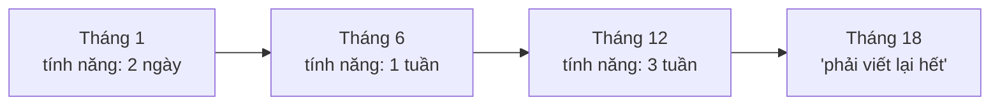

Nguyên tắc thiết kế tồn tại để **làm phẳng đường cong này**: giữ chi phí thay đổi ở mức chấp nhận được khi phần mềm lớn dần.

## 📖 2. Độ phức tạp - kẻ thù số một

John Ousterhout định nghĩa: **độ phức tạp là bất cứ thứ gì liên quan đến cấu trúc phần mềm khiến nó khó hiểu và khó sửa đổi.**

### Ba triệu chứng

| Triệu chứng | Nghĩa là | Ví dụ |
|---|---|---|
| **Change amplification** (khuếch đại thay đổi) | Một thay đổi đơn giản phải sửa nhiều chỗ | Thêm ZaloPay phải sửa 47 chỗ |
| **Cognitive load** (tải nhận thức) | Phải biết rất nhiều thứ mới làm được một việc | Muốn gọi hàm gửi email phải biết cấu hình SMTP, retry, template, i18n |
| **Unknown unknowns** (không biết mình không biết) | Không rõ phải sửa những đâu, không rõ thiếu thông tin gì | Sửa phí ship ở checkout nhưng không biết báo cáo doanh thu cũng tự tính lại phí ship theo cách riêng |

**Unknown unknowns** là tệ nhất: với hai triệu chứng đầu, ít ra bạn biết mình phải làm gì (dù tốn công). Với cái thứ ba, bạn **không biết mình đã sai** cho đến khi có sự cố.

### Hai nguyên nhân

1. **Phụ thuộc (dependencies)**: code A không thể hiểu hoặc sửa riêng mà không xét đến code B
2. **Mờ mịt (obscurity)**: thông tin quan trọng không hiển nhiên - tên mơ hồ, quy ước ngầm, trạng thái `3` nghĩa là gì không ai biết

### Tactical vs Strategic programming

| | Tactical (chiến thuật) | Strategic (chiến lược) |
|---|---|---|
| Mục tiêu | Làm cho tính năng **chạy được**, nhanh nhất có thể | Tạo ra **thiết kế tốt** mà tính năng này là một phần |
| Tư duy | "Thêm một `if` nữa là xong" | "Nếu có loại thứ ba thì sao? Chỗ nào nên biết về chuyện này?" |
| Ngắn hạn | Nhanh hơn | Chậm hơn ~10-20% |
| Dài hạn | Ngày càng chậm | Giữ tốc độ ổn định |

Ousterhout gọi người chỉ làm tactical là **"tactical tornado"** - người ra tính năng cực nhanh, được sếp khen, nhưng để lại đống đổ nát cho người sau dọn. Lời khuyên của ông: đầu tư **10-20% thời gian** liên tục vào thiết kế - không phải một "sprint refactor" lớn mỗi năm.

!!! note "Nhưng đừng hiểu sai"
    Strategic không có nghĩa là thiết kế hoành tráng từ đầu (xem YAGNI ở mục 8). Nó có nghĩa là: **mỗi lần chạm vào code, để thiết kế tốt hơn một chút**, và khi thêm một thứ, nghĩ xem nó thuộc về đâu.

## 📖 3. Coupling và Cohesion

Hai khái niệm này (do Larry Constantine đưa ra từ những năm 1960s) vẫn là thước đo cơ bản nhất cho thiết kế tốt.

- **Coupling** (độ ghép nối): mức độ các module **phụ thuộc vào nhau**. Muốn **thấp** - sửa module A không kéo theo sửa module B.
- **Cohesion** (độ gắn kết): mức độ các thứ **bên trong** một module **thuộc về nhau**. Muốn **cao** - mọi thứ trong module phục vụ cùng một mục đích.

### Ví dụ đời thường: nhà hàng

Nhà hàng tốt: **bếp** lo nấu, **quầy bar** lo đồ uống, **thu ngân** lo tiền. Mỗi bộ phận gắn kết cao bên trong. Giữa các bộ phận chỉ giao tiếp qua **phiếu order** (một interface nhỏ, rõ ràng) → coupling thấp. Đổi đầu bếp không ảnh hưởng thu ngân.

Nhà hàng tệ: đầu bếp tự đi thu tiền, thu ngân vào bếp nêm gia vị, ai cũng cầm chìa khóa kho. Đầu bếp nghỉ ốm → không ai thu tiền được.

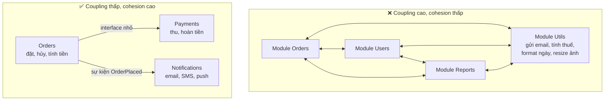

### Các mức coupling (từ tệ nhất đến tốt nhất)

| Loại | Mô tả | Ví dụ |
|---|---|---|
| **Content** | A sửa trực tiếp dữ liệu nội bộ của B | Package khác gán `cart.items[0].price = 0` |
| **Common** | Chia sẻ biến toàn cục | `var db *sql.DB`, `config = {}` toàn cục được sửa khắp nơi |
| **Control** | A truyền cờ điều khiển B làm gì | `process(order, mode=3)` |
| **Stamp** | Truyền cả struct lớn khi chỉ cần 1-2 field | `sendEmail(user User)` chỉ dùng `user.Email` |
| **Data** | Chỉ truyền dữ liệu cần thiết | `sendEmail(to string, body string)` |
| **Message** | Giao tiếp qua sự kiện/thông điệp | Publish `OrderPlaced`, ai quan tâm thì nghe |

!!! tip "Cách đo coupling nhanh"
    Hỏi: *"Nếu tôi đổi cài đặt bên trong module này, bao nhiêu file khác phải sửa theo?"* Và: *"Để test module này, tôi phải dựng lên bao nhiêu thứ khác?"* Nếu câu trả lời là "rất nhiều" - coupling cao.

## 📖 4. Information hiding - giấu quyết định sau interface

David Parnas (1972) đề xuất: chia module không theo **các bước xử lý**, mà theo **các quyết định thiết kế có khả năng thay đổi**. Mỗi module **giấu** một quyết định (lưu dữ liệu thế nào, dùng thuật toán gì, gọi dịch vụ nào) sau một interface ổn định.

### Rò rỉ thông tin (information leakage)

=== "Go"

    ```go
    // ❌ Rò rỉ: ai cũng có thể sửa Items trực tiếp, phá vỡ bất biến "Total luôn đúng"
    type Cart struct {
        Items []Item
        Total int
    }
    // Ở đâu đó trong package khác:
    cart.Items = append(cart.Items, item) // quên cập nhật Total → bug

    // ✅ Giấu: field unexported, chỉ thay đổi qua method giữ bất biến
    type Cart struct {
        items []Item
    }

    func (c *Cart) Add(it Item) error {
        if it.Qty <= 0 {
            return ErrInvalidQty
        }
        c.items = append(c.items, it)
        return nil
    }

    func (c *Cart) Total() int { // tính khi cần: không thể "quên cập nhật"
        sum := 0
        for _, it := range c.items {
            sum += it.Price * it.Qty
        }
        return sum
    }

    // Trả về BẢN SAO để người gọi không sửa được dữ liệu bên trong
    func (c *Cart) Items() []Item { return slices.Clone(c.items) }
    ```

=== "Python"

    ```python
    # ❌ Rò rỉ
    class Cart:
        def __init__(self):
            self.items = []
            self.total = 0

    cart.items.append(item)  # quên cập nhật total → bug


    # ✅ Giấu: dùng quy ước "_" và chỉ lộ ra những gì cần
    class Cart:
        def __init__(self) -> None:
            self._items: list[Item] = []

        def add(self, item: Item) -> None:
            if item.qty <= 0:
                raise InvalidQuantityError(item)
            self._items.append(item)

        @property
        def total(self) -> int:
            return sum(it.price * it.qty for it in self._items)

        @property
        def items(self) -> tuple[Item, ...]:  # tuple: người gọi không append được
            return tuple(self._items)
    ```

### Rò rỉ tinh vi hơn: định dạng và thứ tự

Rò rỉ không chỉ là field public. Nếu hai module cùng **biết** định dạng của một file (ví dụ cả `writer` và `reader` đều tự parse CSV với cột thứ 3 là ngày), đó là rò rỉ: đổi định dạng phải sửa cả hai. Giải pháp: gom kiến thức về định dạng vào **một** module.

Một dạng khác là **temporal decomposition** (chia theo thời gian): chia module theo thứ tự các bước (đọc → xử lý → ghi) khiến cùng một kiến thức (định dạng file) bị trải ra nhiều module. Chia theo **kiến thức** thay vì theo **thứ tự thực hiện**.

### Deep module - nhắc lại từ Bài 3

Module tốt có **interface nhỏ, chức năng lớn**. Ví dụ tuyệt vời trong thư viện chuẩn:

| Module | Interface | Giấu đi |
|---|---|---|
| Go `net/http.Get(url)` | 1 hàm | DNS, TCP, TLS, HTTP/1.1 vs HTTP/2, redirect, connection pool |
| Python `json.loads(s)` | 1 hàm | Tokenizer, parser, xử lý Unicode, số lớn |
| Go garbage collector | 0 hàm (!) | Toàn bộ quản lý bộ nhớ |

Khi thiết kế, hãy hỏi: **"Người dùng module của tôi phải biết ít nhất bao nhiêu thứ?"** - và cố làm con số đó nhỏ đi.

## 📖 5. SOLID - năm nguyên tắc, hiểu đúng tinh thần

SOLID do Robert C. Martin tổng hợp, ban đầu cho lập trình hướng đối tượng. Go không có class và kế thừa, Python có duck typing - nhưng **tinh thần** của SOLID vẫn áp dụng tốt.

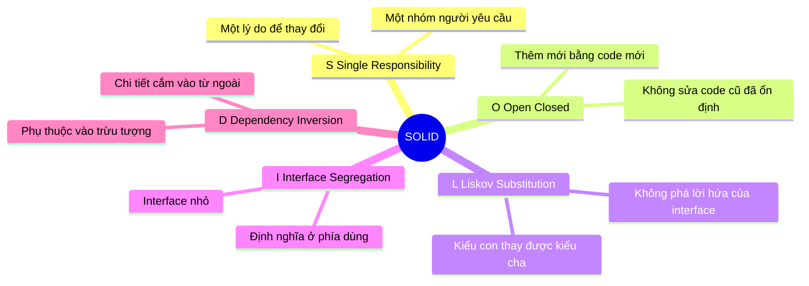

### S - Single Responsibility Principle

> Một module chỉ nên có **một lý do để thay đổi** - hay chính xác hơn, chỉ chịu trách nhiệm trước **một nhóm người** (actor).

**Sai lầm phổ biến**: hiểu SRP là "một hàm/struct chỉ làm một việc". Không phải. Câu hỏi đúng là: **ai sẽ yêu cầu thay đổi phần code này?**

=== "Go"

    ```go
    // ❌ Ba nhóm người khác nhau cùng "sở hữu" một struct:
    //   - Kế toán: quy tắc tính lương        → CalculatePay
    //   - HR: định dạng báo cáo giờ làm       → ReportHours
    //   - DBA/kỹ thuật: cách lưu trữ          → Save
    type Employee struct{ /* ... */ }

    func (e *Employee) CalculatePay() int     { /* ... */ }
    func (e *Employee) ReportHours() string   { /* ... */ }
    func (e *Employee) Save(db *sql.DB) error { /* ... */ }

    // ✅ Mỗi nhóm một chỗ; Employee chỉ là dữ liệu
    type Employee struct{ /* ... */ }

    type PayCalculator struct{ /* quy tắc lương */ }
    func (PayCalculator) Pay(e Employee) int

    type HoursReporter struct{}
    func (HoursReporter) Report(e Employee) string

    type EmployeeRepo struct{ db *sql.DB }
    func (r EmployeeRepo) Save(ctx context.Context, e Employee) error
    ```

=== "Python"

    ```python
    # ❌ Kế toán, HR và DBA cùng sửa một class
    class Employee:
        def calculate_pay(self) -> int: ...
        def report_hours(self) -> str: ...
        def save(self, conn) -> None: ...


    # ✅
    @dataclass
    class Employee: ...

    class PayCalculator:
        def pay(self, e: Employee) -> int: ...

    class HoursReporter:
        def report(self, e: Employee) -> str: ...

    class EmployeeRepo:
        def __init__(self, conn) -> None: ...
        def save(self, e: Employee) -> None: ...
    ```

**Vì sao quan trọng?** Tưởng tượng `CalculatePay` và `ReportHours` cùng dùng một hàm nội bộ `regularHours()`. Kế toán yêu cầu đổi cách tính giờ làm thêm → dev sửa `regularHours()` → báo cáo của HR lặng lẽ sai. Hai nhóm người, một chỗ code = rủi ro.

### O - Open/Closed Principle

> Module nên **mở để mở rộng**, nhưng **đóng để sửa đổi**: thêm hành vi mới bằng cách **thêm code mới**, không sửa code cũ đã chạy ổn.

Đây chính là lời giải cho câu chuyện 47 chữ `"momo"`:

=== "Go"

    ```go
    package main

    import "fmt"

    // ❌ Trước: mỗi phương thức mới = sửa hàm này (và 46 chỗ khác giống nó)
    // func fee(method string, amount int) int {
    // 	switch method {
    // 	case "cod":  return 15_000
    // 	case "card": return amount * 2 / 100
    // 	case "momo": return 0
    // 	}
    // 	return 0
    // }

    // ✅ Sau: mọi thứ về một phương thức nằm ở MỘT chỗ.
    // Thêm ZaloPay = thêm một type mới, không sửa checkout.
    type PaymentMethod interface {
    	Name() string
    	Fee(amount int) int
    }

    type COD struct{}

    func (COD) Name() string       { return "COD" }
    func (COD) Fee(amount int) int { return 15_000 }

    type Card struct{}

    func (Card) Name() string       { return "Thẻ" }
    func (Card) Fee(amount int) int { return amount * 2 / 100 }

    type Momo struct{}

    func (Momo) Name() string       { return "MoMo" }
    func (Momo) Fee(amount int) int { return 0 }

    func checkout(amount int, pm PaymentMethod) {
    	fee := pm.Fee(amount)
    	fmt.Printf("%s: tiền hàng %d + phí %d = %d\n", pm.Name(), amount, fee, amount+fee)
    }

    func main() {
    	for _, pm := range []PaymentMethod{COD{}, Card{}, Momo{}} {
    		checkout(500_000, pm)
    	}
    }

    // Output:
    // COD: tiền hàng 500000 + phí 15000 = 515000
    // Thẻ: tiền hàng 500000 + phí 10000 = 510000
    // MoMo: tiền hàng 500000 + phí 0 = 500000
    ```

=== "Python"

    ```python
    from typing import Protocol


    class PaymentMethod(Protocol):
        name: str

        def fee(self, amount: int) -> int: ...


    class COD:
        name = "COD"

        def fee(self, amount: int) -> int:
            return 15_000


    class Card:
        name = "Thẻ"

        def fee(self, amount: int) -> int:
            return amount * 2 // 100


    class Momo:
        name = "MoMo"

        def fee(self, amount: int) -> int:
            return 0


    def checkout(amount: int, pm: PaymentMethod) -> None:
        fee = pm.fee(amount)
        print(f"{pm.name}: tiền hàng {amount} + phí {fee} = {amount + fee}")


    for pm in (COD(), Card(), Momo()):
        checkout(500_000, pm)

    # Output:
    # COD: tiền hàng 500000 + phí 15000 = 515000
    # Thẻ: tiền hàng 500000 + phí 10000 = 510000
    # MoMo: tiền hàng 500000 + phí 0 = 500000
    ```

!!! warning "OCP không có nghĩa là 'không bao giờ sửa code'"
    Bạn không thể "đóng" với **mọi** thay đổi - chỉ với những thay đổi bạn **dự đoán** được. Nếu thêm phương thức thanh toán là chuyện xảy ra hàng quý, nó xứng đáng được đóng. Nếu chỉ có 2 phương thức suốt 5 năm, một `switch` đơn giản hơn.

### L - Liskov Substitution Principle

> Nếu S là kiểu con của T, thì bất cứ chỗ nào dùng T đều có thể thay bằng S **mà chương trình vẫn đúng**.

Nói đời thường: **kiểu con phải giữ lời hứa của kiểu cha**. Không được đòi hỏi nhiều hơn (precondition mạnh hơn), không được trả về ít hơn (postcondition yếu hơn), không được ném lỗi bất ngờ.

=== "Go"

    ```go
    type Store interface {
        Get(key string) (string, error)
        Put(key, value string) error
    }

    // ❌ Vi phạm LSP: "là" Store nhưng Put lại panic.
    // Mọi hàm nhận Store đều có thể sập khi được truyền ReadOnlyStore.
    type ReadOnlyStore struct{ data map[string]string }

    func (s ReadOnlyStore) Get(k string) (string, error) { return s.data[k], nil }
    func (s ReadOnlyStore) Put(k, v string) error       { panic("read-only!") }

    // ✅ Tách interface theo khả năng thật; ReadOnlyStore chỉ hứa những gì nó làm được
    type Getter interface {
        Get(key string) (string, error)
    }
    type Putter interface {
        Put(key, value string) error
    }
    type Store interface {
        Getter
        Putter
    }
    // ReadOnlyStore chỉ thỏa mãn Getter - compiler sẽ chặn nếu ai đó truyền nó vào chỗ cần Store
    ```

=== "Python"

    ```python
    class Discount:
        def apply(self, total: int) -> int:
            """Lời hứa: nhận mọi total >= 0, trả về giá trị trong [0, total]."""
            return total


    # ❌ Vi phạm LSP: đòi hỏi nhiều hơn cha (precondition mạnh hơn)
    class LoyaltyDiscount(Discount):
        def apply(self, total: int) -> int:
            if total < 100_000:
                raise ValueError("đơn quá nhỏ")  # code gọi Discount không hề chờ lỗi này!
            return total * 95 // 100


    # ✅ Giữ lời hứa: đơn nhỏ thì đơn giản là không giảm
    class LoyaltyDiscount(Discount):
        def apply(self, total: int) -> int:
            if total < 100_000:
                return total
            return total * 95 // 100
    ```

Dấu hiệu vi phạm LSP trong code: `panic("not implemented")`, `raise NotImplementedError` trong lớp con, hoặc code kiểu `if isinstance(x, Special): ...` / `if _, ok := s.(ReadOnlyStore); ok` - người gọi phải "biết" kiểu con cụ thể.

### I - Interface Segregation Principle

> Không nên buộc client phụ thuộc vào những method nó không dùng.

Trong Go, nguyên tắc này gần như là **văn hóa**: interface nhỏ (`io.Reader` có 1 method), và **interface được định nghĩa ở phía dùng**, không phải phía cài đặt. Câu thần chú: *"Accept interfaces, return structs."*

=== "Go"

    ```go
    // ❌ Interface "béo" định nghĩa ở package user, bên cạnh cài đặt
    package user

    type Store interface {
        Get(ctx context.Context, id int64) (User, error)
        List(ctx context.Context, f Filter) ([]User, error)
        Create(ctx context.Context, u User) error
        Update(ctx context.Context, u User) error
        Delete(ctx context.Context, id int64) error
        Ban(ctx context.Context, id int64, reason string) error
        // ... 10 method nữa
    }

    // ✅ Package billing chỉ cần lấy email - tự định nghĩa interface 1 method mình cần.
    // *user.PostgresStore tự động thỏa mãn nó (interface ngầm định của Go).
    package billing

    type emailLookup interface {
        Get(ctx context.Context, id int64) (user.User, error)
    }

    type InvoiceSender struct {
        users emailLookup
    }
    // Test: fake chỉ cần cài 1 method, không phải 16.
    ```

=== "Python"

    ```python
    # ✅ Protocol định nghĩa ở phía dùng; bất kỳ class nào có method get() phù hợp đều thỏa mãn
    from typing import Protocol


    class UserLookup(Protocol):
        def get(self, user_id: int) -> User: ...


    class InvoiceSender:
        def __init__(self, users: UserLookup) -> None:
            self._users = users


    # Fake trong test chỉ cần đúng một method
    class FakeUsers:
        def get(self, user_id: int) -> User:
            return User(id=user_id, email="test@example.com")
    ```

### D - Dependency Inversion Principle

> Module cấp cao (logic nghiệp vụ) không nên phụ thuộc vào module cấp thấp (DB, email, HTTP). Cả hai nên phụ thuộc vào **trừu tượng**.

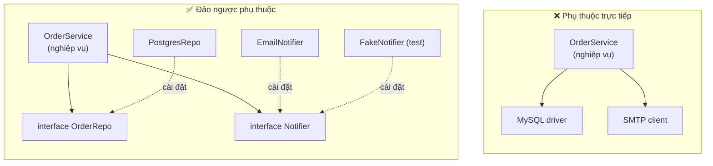

Mũi tên phụ thuộc giờ chỉ **từ chi tiết vào trừu tượng**. Logic nghiệp vụ không biết (và không quan tâm) email được gửi bằng SMTP, SendGrid hay chỉ ghi vào slice trong test. Cách "cắm" chi tiết vào là **dependency injection** - xem mục 10.

### SOLID - tóm tắt thực dụng

| Nguyên tắc | Câu hỏi để tự kiểm tra | Dấu hiệu vi phạm |
|---|---|---|
| **S** | Ai (nhóm người nào) sẽ yêu cầu sửa file này? | File bị sửa vì nhiều lý do không liên quan |
| **O** | Thêm biến thể mới có phải sửa code cũ ở nhiều nơi? | `switch type` lặp lại khắp nơi |
| **L** | Thay cài đặt khác vào có làm người gọi bất ngờ? | `panic("not implemented")`, kiểm tra kiểu cụ thể |
| **I** | Client có phải phụ thuộc vào method nó không dùng? | Fake trong test phải cài 15 method rỗng |
| **D** | Logic nghiệp vụ có import driver DB/HTTP? | Không test được nghiệp vụ nếu không có DB thật |

## 📖 6. DRY, WET và AHA

### DRY - Don't Repeat Yourself

Định nghĩa gốc (Andy Hunt & Dave Thomas, *The Pragmatic Programmer*): *"Mỗi mẩu **kiến thức** phải có một biểu diễn duy nhất, rõ ràng, có thẩm quyền trong hệ thống."*

Chú ý: DRY nói về **kiến thức**, không phải về **ký tự**. Hai đoạn code trông giống hệt nhau nhưng biểu diễn **hai kiến thức khác nhau** thì **không** vi phạm DRY.

### Câu chuyện: Trừu tượng sai

Team có hai hàm kiểm tra số điện thoại: một cho **khách hàng**, một cho **tài xế**. Code giống hệt nhau. Một bạn "DRY hóa" thành `validatePhone(phone)`. Ổn.

6 tháng sau: tài xế phải có số của **nhà mạng Việt Nam** (để gọi nội bộ), khách hàng thì chấp nhận **số nước ngoài**. Bạn khác thêm tham số: `validatePhone(phone, allowForeign bool)`. 3 tháng sau: khách doanh nghiệp được dùng **số bàn**. `validatePhone(phone, allowForeign, allowLandline bool)`. Rồi tài xế cần kiểm tra **số không nằm trong danh sách đen**...

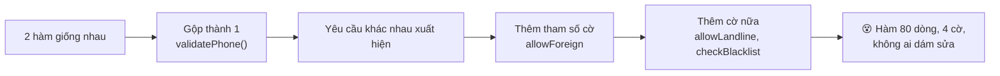

> *"Duplication is far cheaper than the wrong abstraction."* - Sandi Metz

Cách chữa (Sandi Metz): khi trừu tượng đã sai, **inline nó trở lại** vào từng nơi gọi, xóa phần không dùng ở mỗi nơi, rồi mới xem có trừu tượng **đúng** nào xuất hiện không.

### WET, AHA và quy tắc ba lần

| Nguyên tắc | Ý nghĩa |
|---|---|
| **DRY** | Mỗi kiến thức một chỗ |
| **WET** ("Write Everything Twice") | Chấp nhận lặp lại lần hai; lần ba mới trừu tượng hóa |
| **AHA** ("Avoid Hasty Abstractions" - Kent C. Dodds) | Ưu tiên lặp lại hơn trừu tượng vội vàng; chờ đến khi hiểu rõ điểm chung |
| **Rule of Three** (Don Roberts, qua Martin Fowler) | Lần 1: viết. Lần 2: nhăn mặt nhưng copy. Lần 3: refactor |

Câu hỏi quyết định trước khi gộp hai đoạn code giống nhau:

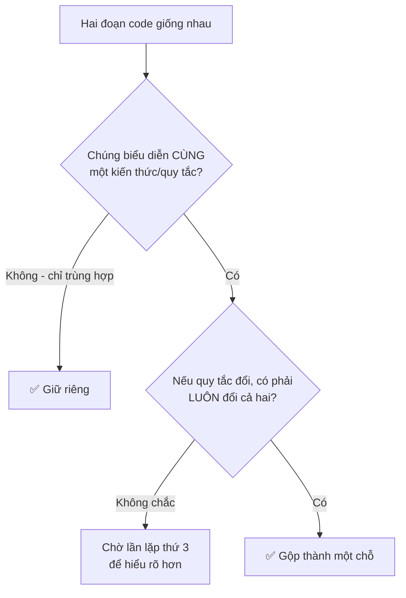

!!! tip "Những thứ NÊN DRY ngay từ đầu"
    - **Quy tắc nghiệp vụ**: thuế VAT 10%, ngưỡng miễn phí ship, định nghĩa "khách VIP"
    - **Hằng số cấu hình**: URL, timeout, giới hạn
    - **Schema dữ liệu**: định nghĩa bảng, định dạng message (sinh code từ một nguồn - OpenAPI, protobuf)

    Những thứ này nếu lặp lại thì **chắc chắn** sẽ lệch nhau.

## 📖 7. KISS - Keep It Simple

> *"Simplicity is prerequisite for reliability."* - Edsger Dijkstra

Đơn giản **không** có nghĩa là dễ viết. Thường thì viết đơn giản **khó hơn** viết phức tạp - vì phải hiểu vấn đề đủ sâu để thấy phần cốt lõi.

=== "Go"

    ```go
    // ❌ "Thông minh": dùng reflection để copy field "cho linh hoạt"
    func copyFields(dst, src any) {
        dv := reflect.ValueOf(dst).Elem()
        sv := reflect.ValueOf(src).Elem()
        for i := 0; i < sv.NumField(); i++ {
            if f := dv.FieldByName(sv.Type().Field(i).Name); f.IsValid() && f.CanSet() {
                f.Set(sv.Field(i))
            }
        }
    }

    // ✅ Nhàm chán, rõ ràng, compiler kiểm tra được, tìm kiếm được
    func toResponse(u User) UserResponse {
        return UserResponse{ID: u.ID, Name: u.Name, Email: u.Email}
    }
    ```

=== "Python"

    ```python
    # ❌ "Thông minh"
    result = dict(filter(lambda kv: kv[1] is not None and not kv[0].startswith("_"),
                         map(lambda k: (k, getattr(obj, k, None)), dir(obj))))

    # ✅ Rõ ràng
    result = {"id": user.id, "name": user.name, "email": user.email}
    ```

### "Choose boring technology"

Nguyên tắc KISS ở mức kiến trúc (Dan McKinley): mỗi công ty có một số ít **"token đổi mới"** (innovation tokens). Dùng chúng cho thứ tạo **khác biệt cho sản phẩm**, không phải cho hạ tầng. PostgreSQL, Redis, một monolith chia module tốt - "nhàm chán" nhưng đã được hàng triệu người debug hộ bạn.

| Tình huống | Lựa chọn "boring" | Lựa chọn "thú vị" |
|---|---|---|
| Lưu dữ liệu đơn hàng | PostgreSQL | Một NoSQL DB mới ra 6 tháng |
| Hàng đợi việc nền (vài trăm job/phút) | Bảng DB + worker, hoặc Redis | Kafka cluster |
| 3 dev, 1 sản phẩm | Monolith có module rõ ràng | 12 microservices |

## 📖 8. YAGNI - You Aren't Gonna Need It

> Đừng xây thứ bạn **nghĩ** sẽ cần. Xây thứ bạn **đang** cần.

Martin Fowler liệt kê **bốn chi phí** của một tính năng "để sẵn cho sau này":

| Chi phí | Mô tả |
|---|---|
| **Cost of build** | Thời gian xây nó bây giờ |
| **Cost of delay** | Những tính năng thật bị chậm lại vì bạn bận xây nó |
| **Cost of carry** | Mọi người phải đọc, hiểu, bảo trì, test nó - mãi mãi |
| **Cost of repair** | Khi nhu cầu thật xuất hiện, nó thường **khác** với dự đoán → phải sửa hoặc xóa |

### Ví dụ: Hệ thống plugin cho một định dạng export

Yêu cầu: *"Cho phép export danh sách đơn hàng ra CSV."*

Bạn Nam nghĩ: *"Sau này chắc sẽ cần Excel, PDF, JSON..."* và xây: interface `Exporter`, `ExporterFactory`, `ExporterRegistry` đăng ký bằng tên, file cấu hình YAML chọn exporter, và... một cài đặt CSV. 400 dòng, 3 ngày.

18 tháng sau: vẫn chỉ có CSV. Khi yêu cầu mới đến, đó là *"gửi báo cáo tự động vào Google Sheets"* - không khớp với interface `Exporter` (vốn giả định ghi ra file). Toàn bộ khung plugin bị bỏ đi.

Phiên bản YAGNI: một hàm `WriteOrdersCSV(w io.Writer, orders []Order) error` - 30 dòng, 1 giờ. Khi có định dạng thứ hai, thêm một hàm thứ hai. Khi có định dạng thứ ba, **lúc đó** mới xem có nên có interface không.

!!! note "YAGNI không áp dụng cho..."
    - Những thứ **rất đắt để thêm sau**: bảo mật, khả năng migrate dữ liệu, logging/observability cơ bản, idempotency cho API thanh toán, thiết kế schema cho tiền (dùng số nguyên, không dùng float)
    - Những thứ đã có **cam kết rõ ràng** trong roadmap quý này

    YAGNI là về tính năng **suy đoán**, không phải về **chất lượng cơ bản**.

## 📖 9. Composition over Inheritance và Law of Demeter

### Composition over inheritance

Kế thừa tạo coupling **mạnh nhất** có thể: lớp con phụ thuộc vào **chi tiết cài đặt** của lớp cha. Đổi lớp cha có thể phá lớp con một cách bất ngờ ("fragile base class").

Vấn đề kinh điển: **bùng nổ tổ hợp**.

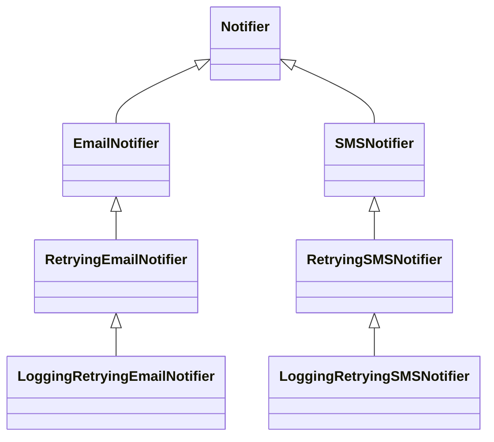

Thêm kênh Zalo → thêm 3 lớp nữa. Thêm tính năng "rate limit" → nhân đôi số lớp. Với **composition**, ta có 3 kênh + 3 lớp bọc (retry, logging, rate limit) = 6 mảnh, lắp ráp tùy ý - xem Decorator ở mục 11.

!!! note "Go không có kế thừa"
    Go cố ý không có kế thừa class. **Embedding** (`type Admin struct { User }`) trông giống nhưng không phải: nó chỉ là "tự động chuyển tiếp method", không có đa hình qua kiểu cha - `Admin` **không phải** là `User` khi truyền vào hàm nhận `User`. Đa hình trong Go đi qua **interface**. Python có kế thừa - hãy dùng nó cho quan hệ "là một" thật sự và nông (1-2 tầng), ví dụ lớp exception, hoặc ABC định nghĩa interface.

### Law of Demeter - "chỉ nói chuyện với bạn thân"

Một method chỉ nên gọi method của: chính nó, tham số của nó, đối tượng nó tạo ra, và field trực tiếp của nó. **Không** đi xuyên qua chuỗi đối tượng.

=== "Go"

    ```go
    // ❌ Chuỗi message: code này biết cấu trúc của Order, Customer, Address, Province
    fee := shippingFees[order.Customer.Address.Province.Region]

    // ✅ "Tell, don't ask": hỏi Order câu hỏi nó nên trả lời được
    fee := shippingFees[order.ShippingRegion()]

    func (o Order) ShippingRegion() Region {
        return o.Customer.Address.Region() // chi tiết nằm ở MỘT chỗ
    }
    ```

=== "Python"

    ```python
    # ❌
    fee = SHIPPING_FEES[order.customer.address.province.region]

    # ✅
    fee = SHIPPING_FEES[order.shipping_region()]
    ```

Lợi ích: khi địa chỉ giao hàng không còn lấy từ `Customer` mà từ `order.DeliveryAddress` (khách được chọn địa chỉ khác), chỉ sửa **một** method.

!!! tip "Không phải mọi dấu chấm đều vi phạm"
    Law of Demeter nói về **đối tượng có hành vi**, không phải cấu trúc dữ liệu thuần hay fluent API. `strings.NewReplacer(...).Replace(s)`, `df.groupby("city").sum()`, `resp.JSON.Data.Items` trong một DTO - đều ổn. Hỏi: *"Nếu cấu trúc bên trong đổi, bao nhiêu chỗ phải sửa?"*

## 📖 10. Dependency Injection - không cần framework

**Dependency Injection (DI)** nghe to tát nhưng ý tưởng rất đơn giản: **đừng để một thành phần tự tạo ra thứ nó phụ thuộc - hãy truyền vào cho nó.**

```go
// ❌ Tự tạo phụ thuộc: không thể test mà không gửi email thật
func NewOrderService() *OrderService {
    return &OrderService{notifier: smtp.NewClient("smtp.company.vn:587")}
}

// ✅ Nhận phụ thuộc từ bên ngoài (constructor injection)
func NewOrderService(n Notifier) *OrderService {
    return &OrderService{notifier: n}
}
```

Tất cả các thành phần thật được lắp ráp ở **một nơi duy nhất** - gọi là **composition root** - thường là `main()`.

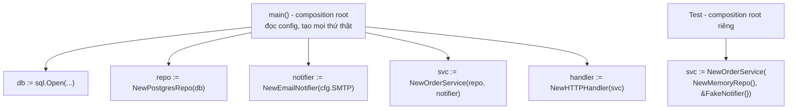

=== "Go"

    ```go
    package main

    import "fmt"

    type Notifier interface {
    	Notify(to, msg string) error
    }

    type OrderService struct {
    	notifier Notifier
    	nextID   int
    }

    func NewOrderService(n Notifier) *OrderService {
    	return &OrderService{notifier: n}
    }

    func (s *OrderService) Place(email string, total int) (int, error) {
    	s.nextID++
    	id := s.nextID
    	msg := fmt.Sprintf("Đơn #%d: %d VND", id, total)
    	if err := s.notifier.Notify(email, msg); err != nil {
    		return 0, fmt.Errorf("notify order %d: %w", id, err)
    	}
    	return id, nil
    }

    // Cài đặt "thật" (ở đây in ra màn hình cho đơn giản)
    type ConsoleNotifier struct{}

    func (ConsoleNotifier) Notify(to, msg string) error {
    	fmt.Printf("[email -> %s] %s\n", to, msg)
    	return nil
    }

    // Cài đặt giả cho test: chỉ ghi nhận
    type FakeNotifier struct{ Sent []string }

    func (f *FakeNotifier) Notify(to, msg string) error {
    	f.Sent = append(f.Sent, to+": "+msg)
    	return nil
    }

    func main() {
    	// Composition root: lắp ráp thành phần thật
    	svc := NewOrderService(ConsoleNotifier{})
    	svc.Place("an@example.com", 250_000)

    	// Trong test: thay bằng fake, không gửi email thật
    	fake := &FakeNotifier{}
    	NewOrderService(fake).Place("binh@example.com", 99_000)
    	fmt.Println("fake đã ghi nhận:", fake.Sent)
    }

    // Output:
    // [email -> an@example.com] Đơn #1: 250000 VND
    // fake đã ghi nhận: [binh@example.com: Đơn #1: 99000 VND]
    ```

=== "Python"

    ```python
    from typing import Protocol


    class Notifier(Protocol):
        def notify(self, to: str, msg: str) -> None: ...


    class OrderService:
        def __init__(self, notifier: Notifier) -> None:
            self._notifier = notifier
            self._next_id = 0

        def place(self, email: str, total: int) -> int:
            self._next_id += 1
            order_id = self._next_id
            self._notifier.notify(email, f"Đơn #{order_id}: {total} VND")
            return order_id


    class ConsoleNotifier:
        def notify(self, to: str, msg: str) -> None:
            print(f"[email -> {to}] {msg}")


    class FakeNotifier:
        def __init__(self) -> None:
            self.sent: list[str] = []

        def notify(self, to: str, msg: str) -> None:
            self.sent.append(f"{to}: {msg}")


    # Composition root
    svc = OrderService(ConsoleNotifier())
    svc.place("an@example.com", 250_000)

    # Trong test
    fake = FakeNotifier()
    OrderService(fake).place("binh@example.com", 99_000)
    print("fake đã ghi nhận:", fake.sent)

    # Output:
    # [email -> an@example.com] Đơn #1: 250000 VND
    # fake đã ghi nhận: ['binh@example.com: Đơn #1: 99000 VND']
    ```

!!! tip "Có cần DI framework không?"
    Với đa số dự án Go và Python: **không**. Lắp ráp bằng tay trong `main()` là rõ ràng nhất - đọc từ trên xuống là thấy toàn bộ đồ thị phụ thuộc. Framework (Google `wire`, `uber-go/fx`, `dependency-injector`) chỉ đáng khi đồ thị có hàng trăm thành phần. FastAPI có `Depends` sẵn - dùng nó khi đã dùng FastAPI.

## 📖 11. Design patterns hay dùng - và khi nào chúng là over-engineering

Design pattern là **từ vựng chung** cho các lời giải lặp đi lặp lại. Giá trị lớn nhất của chúng là giao tiếp: nói *"dùng Decorator để thêm retry"* thì cả team hiểu ngay. Nhưng pattern là **công cụ**, không phải **mục tiêu**. Code có nhiều pattern không phải là code tốt.

!!! warning "Pattern trong Go và Python khác Java"
    Nhiều pattern trong sách "Gang of Four" (1994) tồn tại vì Java/C++ thời đó thiếu hàm là giá trị (first-class function). Trong Go và Python, rất nhiều pattern **thu gọn thành một hàm** được truyền vào. Đừng viết Go/Python theo kiểu Java.

### Strategy - thay đổi thuật toán lúc chạy

**Vấn đề**: nhiều cách làm cùng một việc (tính phí ship, tính giảm giá, chọn thuật toán nén), chọn lúc chạy.

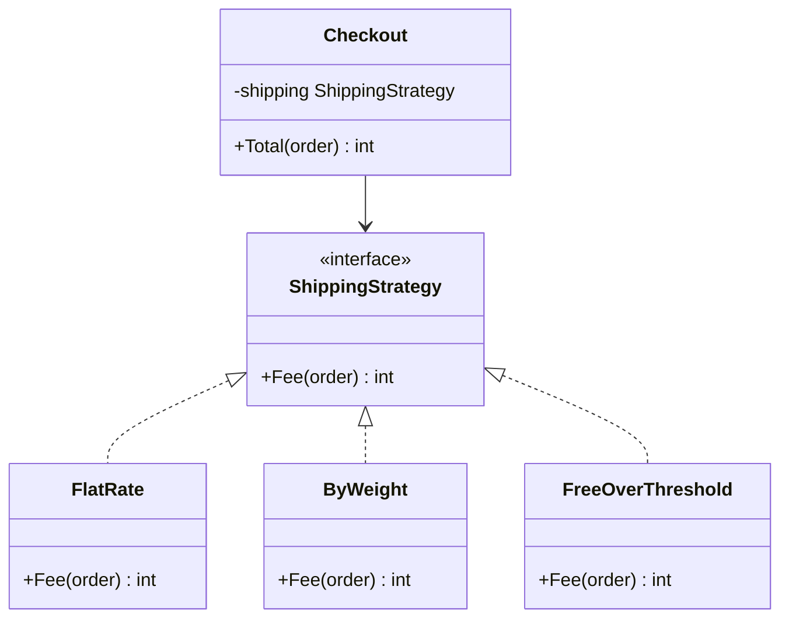

Ví dụ `PaymentMethod` ở mục OCP chính là Strategy. Khi strategy chỉ có **một method**, trong Go và Python dùng luôn **hàm**:

=== "Go"

    ```go
    package main

    import "fmt"

    // Strategy = một kiểu hàm
    type ShippingFee func(weightGrams, subtotal int) int

    func flatRate(_, _ int) int { return 30_000 }

    func byWeight(weightGrams, _ int) int {
    	return 15_000 + weightGrams/1000*5_000
    }

    func freeOver(threshold int, fallback ShippingFee) ShippingFee {
    	return func(w, subtotal int) int {
    		if subtotal >= threshold {
    			return 0
    		}
    		return fallback(w, subtotal)
    	}
    }

    func main() {
    	strategies := []struct {
    		name string
    		fee  ShippingFee
    	}{
    		{"đồng giá", flatRate},
    		{"theo cân nặng", byWeight},
    		{"miễn phí từ 500k", freeOver(500_000, byWeight)},
    	}
    	for _, s := range strategies {
    		fmt.Printf("%s: %d\n", s.name, s.fee(3_500, 600_000))
    	}
    }

    // Output:
    // đồng giá: 30000
    // theo cân nặng: 30000
    // miễn phí từ 500k: 0
    ```

=== "Python"

    ```python
    from collections.abc import Callable

    ShippingFee = Callable[[int, int], int]  # (weight_grams, subtotal) -> fee


    def flat_rate(weight_grams: int, subtotal: int) -> int:
        return 30_000


    def by_weight(weight_grams: int, subtotal: int) -> int:
        return 15_000 + weight_grams // 1000 * 5_000


    def free_over(threshold: int, fallback: ShippingFee) -> ShippingFee:
        def fee(weight_grams: int, subtotal: int) -> int:
            if subtotal >= threshold:
                return 0
            return fallback(weight_grams, subtotal)
        return fee


    strategies = {
        "đồng giá": flat_rate,
        "theo cân nặng": by_weight,
        "miễn phí từ 500k": free_over(500_000, by_weight),
    }
    for name, fee in strategies.items():
        print(f"{name}: {fee(3_500, 600_000)}")

    # Output:
    # đồng giá: 30000
    # theo cân nặng: 30000
    # miễn phí từ 500k: 0
    ```

**Over-engineering khi**: chỉ có một strategy và không có kế hoạch cụ thể cho cái thứ hai; hoặc các "strategy" thực chất chỉ khác nhau một con số (dùng tham số/cấu hình thay vì pattern).

### Factory - gom logic khởi tạo

**Vấn đề**: việc tạo đối tượng phức tạp (cần kiểm tra, chọn cài đặt theo cấu hình) và bị lặp ở nhiều nơi.

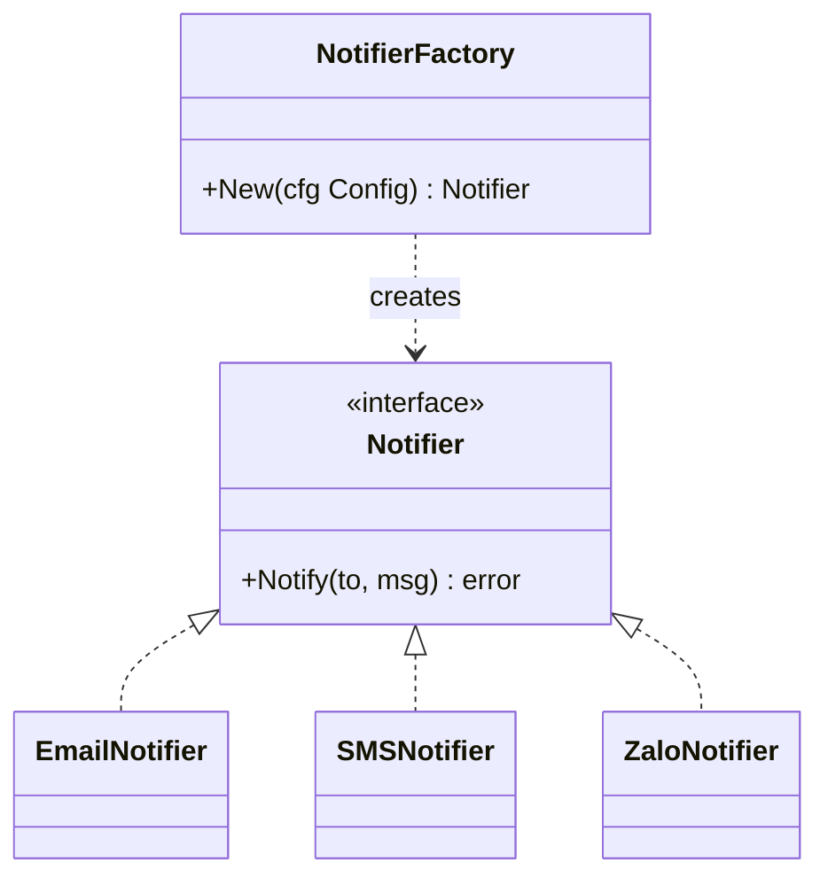

=== "Go"

    ```go
    // Trong Go, "factory" thường chỉ là một hàm New...
    func NewNotifier(cfg Config) (Notifier, error) {
        switch cfg.Channel {
        case "email":
            return NewEmailNotifier(cfg.SMTPAddr), nil
        case "sms":
            return NewSMSNotifier(cfg.SMSAPIKey), nil
        default:
            return nil, fmt.Errorf("unknown notification channel %q", cfg.Channel)
        }
    }
    ```

=== "Python"

    ```python
    # Trong Python, class chính là factory; một dict cũng đủ
    NOTIFIERS: dict[str, Callable[[Config], Notifier]] = {
        "email": lambda cfg: EmailNotifier(cfg.smtp_addr),
        "sms": lambda cfg: SMSNotifier(cfg.sms_api_key),
    }

    def new_notifier(cfg: Config) -> Notifier:
        try:
            return NOTIFIERS[cfg.channel](cfg)
        except KeyError:
            raise ValueError(f"unknown notification channel {cfg.channel!r}") from None
    ```

**Over-engineering khi**: `UserFactory` chỉ gọi `User{...}`; `AbstractFactoryFactory`; factory cho một kiểu chỉ có một cài đặt.

### Observer - thông báo khi có sự kiện

**Vấn đề**: khi một đơn hàng được đặt, nhiều việc phải xảy ra (gửi email, cộng điểm thưởng, ghi analytics, báo kho) - nhưng module Orders không nên biết hết những việc đó.

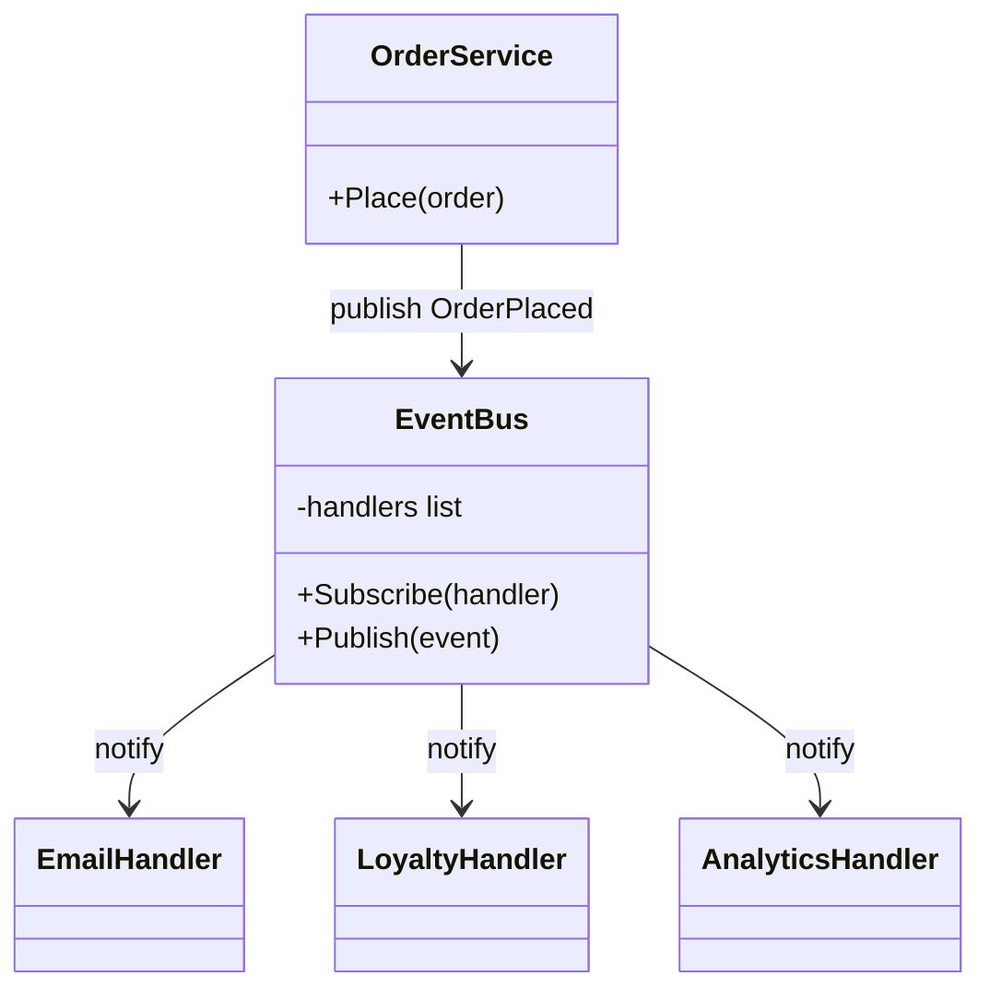

=== "Go"

    ```go
    package main

    import "fmt"

    type OrderPlaced struct {
    	ID    int
    	Email string
    	Total int
    }

    type Bus struct {
    	handlers []func(OrderPlaced)
    }

    func (b *Bus) Subscribe(h func(OrderPlaced)) { b.handlers = append(b.handlers, h) }

    func (b *Bus) Publish(e OrderPlaced) {
    	for _, h := range b.handlers {
    		h(e)
    	}
    }

    func main() {
    	bus := &Bus{}
    	bus.Subscribe(func(e OrderPlaced) { fmt.Println("email xác nhận ->", e.Email) })
    	bus.Subscribe(func(e OrderPlaced) { fmt.Println("cộng điểm:", e.Total/10_000) })
    	bus.Subscribe(func(e OrderPlaced) { fmt.Println("analytics: order", e.ID) })

    	// Orders chỉ biết Publish - không biết ai đang nghe
    	bus.Publish(OrderPlaced{ID: 42, Email: "an@example.com", Total: 350_000})
    }

    // Output:
    // email xác nhận -> an@example.com
    // cộng điểm: 35
    // analytics: order 42
    ```

=== "Python"

    ```python
    from collections.abc import Callable
    from dataclasses import dataclass


    @dataclass(frozen=True)
    class OrderPlaced:
        id: int
        email: str
        total: int


    class Bus:
        def __init__(self) -> None:
            self._handlers: list[Callable[[OrderPlaced], None]] = []

        def subscribe(self, handler: Callable[[OrderPlaced], None]) -> None:
            self._handlers.append(handler)

        def publish(self, event: OrderPlaced) -> None:
            for handler in self._handlers:
                handler(event)


    bus = Bus()
    bus.subscribe(lambda e: print("email xác nhận ->", e.email))
    bus.subscribe(lambda e: print("cộng điểm:", e.total // 10_000))
    bus.subscribe(lambda e: print("analytics: order", e.id))

    bus.publish(OrderPlaced(id=42, email="an@example.com", total=350_000))

    # Output:
    # email xác nhận -> an@example.com
    # cộng điểm: 35
    # analytics: order 42
    ```

**Over-engineering khi**: chỉ có một người nghe (gọi thẳng hàm còn rõ hơn); hoặc luồng nghiệp vụ **cần** biết kết quả (thanh toán thất bại thì không được tạo đơn) - khi đó sự kiện làm luồng xử lý **ẩn** đi và khó debug. Observer trong bộ nhớ cũng không bền: server sập giữa chừng thì handler còn lại không chạy - cần message queue thật (xem [Backend Bài 9](../backend/09-message-queues.md)).

### Adapter - làm cho interface không khớp trở nên khớp

**Vấn đề**: bạn có interface `Notifier` nhưng thư viện SMS của nhà mạng có API hoàn toàn khác.

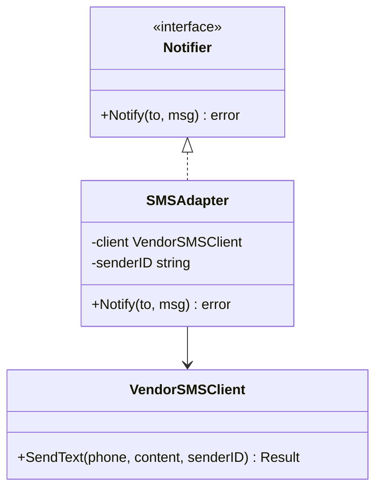

=== "Go"

    ```go
    // Thư viện bên thứ ba - không sửa được
    // func (c *vendor.Client) SendText(phone, content, senderID string) vendor.Result

    type SMSAdapter struct {
        client   *vendor.Client
        senderID string
    }

    func (a SMSAdapter) Notify(to, msg string) error {
        res := a.client.SendText(to, msg, a.senderID)
        if res.Code != 0 { // chuyển "ngôn ngữ" của vendor sang ngôn ngữ của ta
            return fmt.Errorf("sms vendor error %d: %s", res.Code, res.Message)
        }
        return nil
    }
    ```

=== "Python"

    ```python
    class SMSAdapter:
        def __init__(self, client: vendor.Client, sender_id: str) -> None:
            self._client = client
            self._sender_id = sender_id

        def notify(self, to: str, msg: str) -> None:
            res = self._client.send_text(phone=to, content=msg, sender_id=self._sender_id)
            if res.code != 0:
                raise NotificationError(f"sms vendor error {res.code}: {res.message}")
    ```

Adapter là một trong những pattern **luôn đáng giá** ở ranh giới hệ thống: nó cô lập thư viện bên ngoài (đổi nhà cung cấp SMS = viết adapter mới) và dịch lỗi sang ngôn ngữ của bạn. Trong DDD, phiên bản lớn của nó gọi là **anti-corruption layer**.

### Decorator - bọc thêm hành vi

**Vấn đề**: thêm retry, logging, cache, đo thời gian... cho một thành phần **mà không sửa nó**, và kết hợp tùy ý. Đây là lời giải cho bùng nổ kế thừa ở mục 9. HTTP middleware trong Go và `@decorator` trong Python đều là biến thể của pattern này.

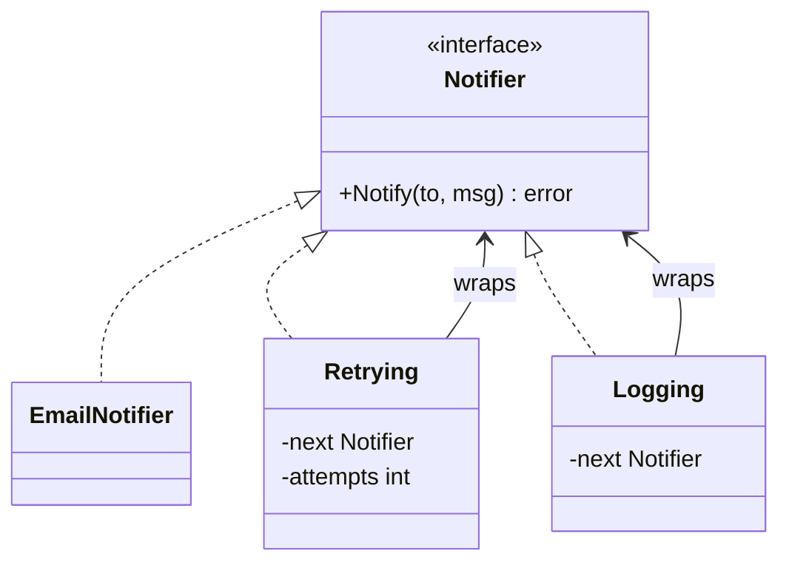

=== "Go"

    ```go
    package main

    import (
    	"errors"
    	"fmt"
    )

    type Notifier interface {
    	Notify(to, msg string) error
    }

    // Notifier "thật" nhưng chập chờn: 2 lần đầu lỗi
    type flakyNotifier struct{ calls int }

    func (f *flakyNotifier) Notify(to, msg string) error {
    	f.calls++
    	if f.calls <= 2 {
    		return errors.New("timeout")
    	}
    	fmt.Printf("  gửi tới %s: %s\n", to, msg)
    	return nil
    }

    // Decorator 1: thử lại
    type retrying struct {
    	next     Notifier
    	attempts int
    }

    func (r retrying) Notify(to, msg string) error {
    	var err error
    	for i := 1; i <= r.attempts; i++ {
    		if err = r.next.Notify(to, msg); err == nil {
    			return nil
    		}
    		fmt.Printf("  lần %d lỗi: %v\n", i, err)
    	}
    	return fmt.Errorf("sau %d lần: %w", r.attempts, err)
    }

    // Decorator 2: ghi log
    type logging struct{ next Notifier }

    func (l logging) Notify(to, msg string) error {
    	fmt.Println("-> bắt đầu gửi tới", to)
    	err := l.next.Notify(to, msg)
    	fmt.Println("<- kết thúc, err =", err)
    	return err
    }

    func main() {
    	// Lắp ráp như lego: logging bọc retrying bọc notifier thật
    	var n Notifier = logging{retrying{&flakyNotifier{}, 3}}
    	_ = n.Notify("an@example.com", "Xin chào")
    }

    // Output:
    // -> bắt đầu gửi tới an@example.com
    //   lần 1 lỗi: timeout
    //   lần 2 lỗi: timeout
    //   gửi tới an@example.com: Xin chào
    // <- kết thúc, err = <nil>
    ```

=== "Python"

    ```python
    from typing import Protocol


    class Notifier(Protocol):
        def notify(self, to: str, msg: str) -> None: ...


    class FlakyNotifier:
        """Notifier 'thật' nhưng chập chờn: 2 lần đầu lỗi."""

        def __init__(self) -> None:
            self.calls = 0

        def notify(self, to: str, msg: str) -> None:
            self.calls += 1
            if self.calls <= 2:
                raise TimeoutError("timeout")
            print(f"  gửi tới {to}: {msg}")


    class Retrying:
        def __init__(self, inner: Notifier, attempts: int) -> None:
            self._inner, self._attempts = inner, attempts

        def notify(self, to: str, msg: str) -> None:
            for i in range(1, self._attempts + 1):
                try:
                    return self._inner.notify(to, msg)
                except TimeoutError as e:
                    print(f"  lần {i} lỗi: {e}")
                    last = e
            raise RuntimeError(f"sau {self._attempts} lần") from last


    class Logging:
        def __init__(self, inner: Notifier) -> None:
            self._inner = inner

        def notify(self, to: str, msg: str) -> None:
            print("-> bắt đầu gửi tới", to)
            self._inner.notify(to, msg)
            print("<- kết thúc")


    n: Notifier = Logging(Retrying(FlakyNotifier(), attempts=3))
    n.notify("an@example.com", "Xin chào")

    # Output:
    # -> bắt đầu gửi tới an@example.com
    #   lần 1 lỗi: timeout
    #   lần 2 lỗi: timeout
    #   gửi tới an@example.com: Xin chào
    # <- kết thúc
    ```

**Over-engineering khi**: chồng 6 lớp decorator mà mỗi lớp chỉ dùng một lần - stack trace dài, khó biết lớp nào làm gì. Nếu chỉ cần retry ở một chỗ, một vòng lặp `for` tại chỗ là đủ.

### Functional Options (Go) / Builder - cấu hình đối tượng nhiều tham số tùy chọn

**Vấn đề**: đối tượng có 1-2 tham số bắt buộc và nhiều tham số tùy chọn có giá trị mặc định hợp lý.

Trong Java người ta dùng **Builder**. Trong Go, idiom phổ biến là **functional options** (Dave Cheney, Rob Pike). Trong Python, **keyword arguments với giá trị mặc định** đã giải quyết hầu hết trường hợp - Builder hiếm khi cần.

=== "Go"

    ```go
    package main

    import (
    	"fmt"
    	"time"
    )

    type Server struct {
    	addr     string
    	timeout  time.Duration
    	maxConns int
    }

    type Option func(*Server)

    func WithTimeout(d time.Duration) Option { return func(s *Server) { s.timeout = d } }
    func WithMaxConns(n int) Option          { return func(s *Server) { s.maxConns = n } }

    func NewServer(addr string, opts ...Option) *Server {
    	s := &Server{addr: addr, timeout: 30 * time.Second, maxConns: 100} // mặc định hợp lý
    	for _, opt := range opts {
    		opt(s)
    	}
    	return s
    }

    func (s *Server) String() string {
    	return fmt.Sprintf("addr=%s timeout=%s maxConns=%d", s.addr, s.timeout, s.maxConns)
    }

    func main() {
    	fmt.Println(NewServer(":8080"))
    	fmt.Println(NewServer(":9090", WithTimeout(5*time.Second), WithMaxConns(10)))
    }

    // Output:
    // addr=:8080 timeout=30s maxConns=100
    // addr=:9090 timeout=5s maxConns=10
    ```

=== "Python"

    ```python
    from dataclasses import dataclass, replace


    # Python: keyword arguments + giá trị mặc định là đủ, không cần Builder
    @dataclass(frozen=True)
    class ServerConfig:
        addr: str
        timeout: float = 30.0
        max_conns: int = 100


    print(ServerConfig(":8080"))
    print(ServerConfig(":9090", timeout=5.0, max_conns=10))

    # Cần "biến thể" của một cấu hình có sẵn? dataclasses.replace
    base = ServerConfig(":8080")
    print(replace(base, max_conns=500))

    # Output:
    # ServerConfig(addr=':8080', timeout=30.0, max_conns=100)
    # ServerConfig(addr=':9090', timeout=5.0, max_conns=10)
    # ServerConfig(addr=':8080', timeout=30.0, max_conns=500)
    ```

**Over-engineering khi**: struct chỉ có 2-3 field (dùng struct literal); hoặc dùng functional options cho struct **nội bộ** chỉ khởi tạo ở một chỗ. Một struct `Config` truyền vào cũng là lựa chọn Go rất tốt và dễ đọc hơn.

### Repository - giấu chi tiết lưu trữ

**Vấn đề**: logic nghiệp vụ bị trộn với SQL; không test được nghiệp vụ mà không có DB.

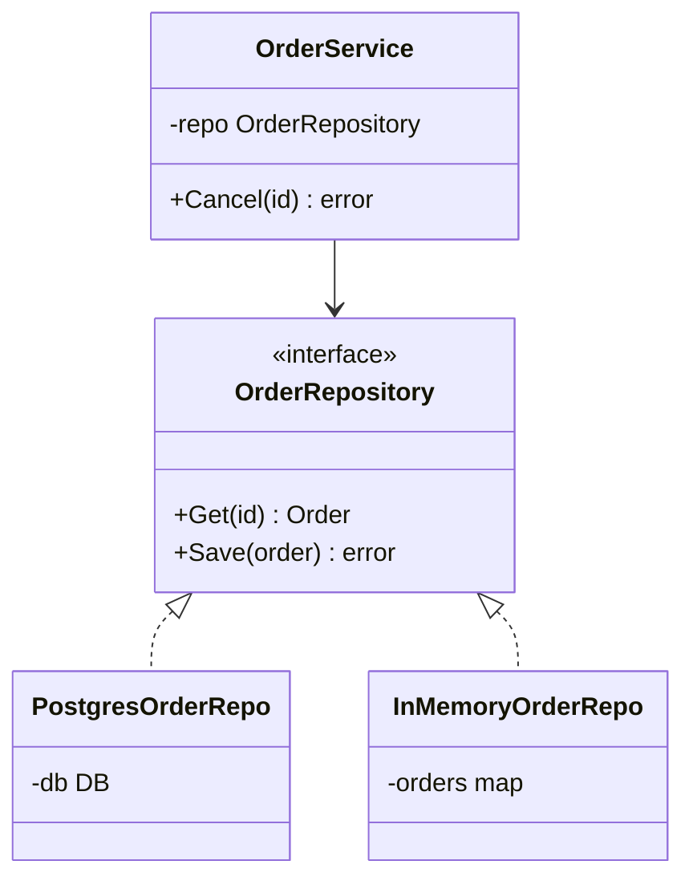

=== "Go"

    ```go
    type OrderRepository interface {
        Get(ctx context.Context, id string) (Order, error)
        Save(ctx context.Context, o Order) error
    }

    func (s *OrderService) Cancel(ctx context.Context, id string) error {
        o, err := s.repo.Get(ctx, id)
        if err != nil {
            return fmt.Errorf("get order %s: %w", id, err)
        }
        if err := o.Cancel(); err != nil { // quy tắc nghiệp vụ nằm trong Order, không trong SQL
            return err
        }
        return s.repo.Save(ctx, o)
    }
    ```

=== "Python"

    ```python
    class OrderRepository(Protocol):
        def get(self, order_id: str) -> Order: ...
        def save(self, order: Order) -> None: ...


    class OrderService:
        def __init__(self, repo: OrderRepository) -> None:
            self._repo = repo

        def cancel(self, order_id: str) -> None:
            order = self._repo.get(order_id)
            order.cancel()  # quy tắc nghiệp vụ nằm trong Order, không trong SQL
            self._repo.save(order)
    ```

**Over-engineering khi**: ứng dụng CRUD đơn giản mà repository chỉ là lớp mỏng chuyển tiếp 1-1 sang ORM; repository "generic" `Repository[T]` với 20 method mà không ai dùng hết; hoặc repository giấu mất khả năng dùng transaction, JOIN, truy vấn tối ưu - khiến code chậm và rắc rối hơn.

### Bảng tổng hợp: dấu hiệu cần vs dấu hiệu thừa

| Pattern | Dấu hiệu CẦN | Dấu hiệu THỪA | Dạng gọn trong Go/Python |
|---|---|---|---|
| **Strategy** | Nhiều thuật toán thay đổi lúc chạy, `switch` lặp lại | Chỉ 1 cài đặt; các biến thể chỉ khác một con số | Truyền hàm |
| **Factory** | Khởi tạo phức tạp, chọn cài đặt theo config | Factory chỉ gọi constructor | Hàm `New...`, dict |
| **Observer** | Nhiều bên cần phản ứng với một sự kiện, độc lập nhau | 1 người nghe; luồng cần kết quả đồng bộ | Slice/list các hàm |
| **Adapter** | Tích hợp thư viện/dịch vụ bên ngoài | Adapter cho code của chính mình mà sửa được | Struct/class nhỏ |
| **Decorator** | Hành vi cắt ngang (retry, log, cache, auth) kết hợp tùy ý | Chỉ dùng 1 lần ở 1 chỗ | Middleware, `@decorator` |
| **Functional options / Builder** | Nhiều tham số tùy chọn, API công khai | 2-3 field, dùng nội bộ | Python: kwargs mặc định |
| **Repository** | Logic nghiệp vụ đáng kể cần test không cần DB | CRUD mỏng; che mất sức mạnh của DB | Interface nhỏ ở phía dùng |

## 📖 12. Thiết kế trong thực tế: quy trình ra quyết định

### "Design it twice"

Lời khuyên của Ousterhout: với mọi quyết định thiết kế đáng kể, hãy **phác thảo ít nhất hai phương án khác nhau căn bản**, rồi so sánh. Phương án đầu tiên hiếm khi là tốt nhất - nó chỉ là cái nảy ra đầu tiên. Phác thảo chỉ mất 15-30 phút (vài chữ ký hàm, một sơ đồ), rẻ hơn rất nhiều so với phát hiện ra sau khi đã code xong.

### Có nên thêm lớp trừu tượng này không?

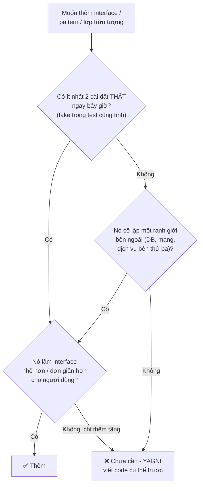

### Checklist review thiết kế

Khi review thiết kế (của mình hoặc người khác), hỏi:

1. **Thay đổi có khả năng xảy ra nhất** trong 6 tháng tới là gì? Thiết kế này làm nó dễ hay khó?
2. Mỗi module **giấu** quyết định gì? Có quyết định nào bị **rò rỉ** ra nhiều nơi?
3. Người dùng module phải **biết bao nhiêu thứ** để dùng nó đúng?
4. Có **lớp trừu tượng nào chỉ chuyển tiếp** (pass-through) mà không thêm giá trị?
5. Test logic nghiệp vụ có cần DB/mạng thật không?
6. Có cách nào **đơn giản hơn** đạt 80% lợi ích không?

## 🌍 Tình huống thực tế

### Tình huống 1: Senior muốn "chuẩn hóa" bằng Clean Architecture

Team 3 người làm công cụ nội bộ quản lý kho, khoảng 20 màn hình CRUD. Anh trưởng nhóm mới đề xuất Clean Architecture đầy đủ: `entities`, `usecases`, `interfaces`, `infrastructure`, mỗi thao tác có `InputPort`, `OutputPort`, `Presenter`, `Interactor`. Thêm một trường mới vào form phải sửa **9 file**.

**Phân tích**: đây là **change amplification** do thiết kế quá mức. Lợi ích của nhiều tầng (thay DB, thay framework) không có giá trị thật cho một công cụ nội bộ CRUD.

**Cách phản biện xây dựng**: đừng nói "Clean Architecture dở". Hãy đưa **dữ liệu**: *"Tuần qua 6 PR thêm trường, trung bình mỗi PR sửa 9 file và mất 1 ngày. Em đề xuất thử gộp thành 3 tầng (handler - service - repo) cho module mới trong 2 sprint, rồi so sánh số file/thời gian mỗi PR."* - Đề xuất thử nghiệm có thời hạn và đo lường, không phải tranh luận quan điểm.

### Tình huống 2: Tích hợp cổng thanh toán thứ hai

Công ty dùng VNPay, giờ thêm MoMo. Code VNPay nằm rải rác trong `OrderService`.

**Cách làm từng bước**:

1. Định nghĩa interface `PaymentGateway` **dựa trên những gì OrderService thực sự cần** (tạo link thanh toán, xác minh callback, hoàn tiền) - không phải dựa trên API của VNPay
2. Chuyển code VNPay hiện tại vào `VNPayGateway` (adapter) - chạy test, deploy, **chưa** thêm MoMo
3. Viết `MomoGateway` - thêm code mới, không sửa `OrderService` (OCP)
4. Factory chọn gateway theo lựa chọn của khách

Chú ý: đây là thời điểm **đúng** để thêm interface - khi có **cài đặt thứ hai thật**. Nếu làm interface từ lúc chỉ có VNPay, rất có thể nó sẽ mang hình dạng của VNPay và không khớp với MoMo.

### Tình huống 3: Utils.go dài 3000 dòng

`utils.go` / `helpers.py` chứa đủ thứ: format tiền, gửi email, parse ngày, tính khoảng cách GPS, resize ảnh. Mọi package đều import nó. **Cohesion thấp nhất có thể**.

**Cách xử lý**: không cần đại tu một lần. Mỗi lần chạm vào một hàm trong utils, **chuyển nó về gần nơi dùng nó nhất** hoặc vào package có tên nói lên mục đích (`money`, `geo`, `imaging`). Sau vài tháng, `utils` tự teo nhỏ. Và thêm quy ước team: *không tạo file tên `utils`, `helpers`, `common`, `misc`*.

## ⚠️ Sai lầm thường gặp

| Sai lầm | Hậu quả | Cách tránh |
|---|---|---|
| Thêm interface cho mọi struct "để test được" | Nhảy "Go to definition" luôn vào interface; gấp đôi số file | Interface ở phía dùng, khi cần; fake theo interface nhỏ |
| DRY hóa hai đoạn code chỉ trùng hợp giống nhau | Trừu tượng sai, đầy tham số cờ | Hỏi "cùng kiến thức?"; quy tắc ba lần |
| Xây khung "cho tương lai" | Chi phí xây + mang + sửa; thường đoán sai tương lai | YAGNI; xây khi có nhu cầu thứ hai thật |
| Kế thừa sâu 4-5 tầng | Fragile base class, bùng nổ tổ hợp | Composition, interface |
| Áp pattern vì đọc sách xong | Code khó đọc, dài, "enterprise" | Pattern phải giải quyết một vấn đề đang có |
| Hiểu SRP là "một hàm một dòng" | Code băm vụn | SRP = một nhóm người, một lý do thay đổi |
| Interface mang hình dạng của cài đặt đầu tiên | Không khớp với cài đặt thứ hai | Thiết kế interface từ nhu cầu của **người dùng** nó |
| Không bao giờ đầu tư vào thiết kế ("làm cho chạy đã") | Tactical tornado; tốc độ giảm dần | 10-20% thời gian cho thiết kế, liên tục |
| Dùng DI framework cho project nhỏ | Magic, khó debug khởi tạo | Lắp ráp bằng tay trong `main()` |

## 🏋️ Bài tập

### Bài tập 1: Coupling hay cohesion? (Dễ)

Với mỗi mô tả, cho biết vấn đề là **coupling cao** hay **cohesion thấp** (hoặc cả hai):

1. Package `common` chứa: format ngày, gửi SMS, tính thuế, kết nối Redis
2. Module Báo cáo đọc trực tiếp bảng `orders` của module Đơn hàng và tự tính lại phí ship
3. Hàm `ProcessOrder(order, mode int)` với `mode` 1-5 làm 5 việc khác nhau
4. Đổi tên cột `phone` thành `phone_number` phải sửa 14 file ở 6 package

<details><summary>Đáp án</summary>

1. **Cohesion thấp** (các thứ không liên quan gom chung) - và thường dẫn đến coupling cao vì ai cũng import `common`.
2. **Coupling cao** (content coupling - phụ thuộc vào dữ liệu nội bộ của module khác) và **rò rỉ kiến thức** (quy tắc phí ship bị lặp). Module Đơn hàng nên cung cấp dữ liệu phí ship đã tính, hoặc phát sự kiện.
3. **Control coupling** + **cohesion thấp** trong hàm: tách thành 5 hàm có tên.
4. **Coupling cao** / **change amplification**: tên cột rò rỉ khỏi tầng repository. Chỉ repository nên biết tên cột.

</details>

### Bài tập 2: Tìm vi phạm SOLID (Trung bình)

Đoạn Python sau vi phạm những nguyên tắc nào? Sửa lại.

```python
class ReportService:
    def __init__(self):
        self.db = psycopg2.connect("postgres://prod-db/app")
        self.smtp = smtplib.SMTP("smtp.company.vn")

    def run(self, kind):
        rows = self.db.cursor().execute("SELECT * FROM sales").fetchall()
        if kind == "pdf":
            content = self._to_pdf(rows)
        elif kind == "excel":
            content = self._to_excel(rows)
        elif kind == "csv":
            content = self._to_csv(rows)
        self.smtp.sendmail("bot@company.vn", "boss@company.vn", content)
```

<details><summary>Đáp án gợi ý</summary>

- **D (DIP)**: tự tạo kết nối DB và SMTP thật trong `__init__` → không test được. Truyền `SalesRepo` và `Mailer` vào.
- **S (SRP)**: một class vừa truy vấn, vừa định dạng, vừa gửi email - ba lý do thay đổi (schema DB, định dạng báo cáo, kênh gửi).
- **O (OCP)**: `if kind == ...` - thêm định dạng mới phải sửa `run`. Dùng dict các hàm formatter (Strategy dạng hàm).
- Bonus: nếu `kind` sai, `content` không được gán → `UnboundLocalError` khó hiểu.

```python
Formatter = Callable[[list[Sale]], bytes]

FORMATTERS: dict[str, Formatter] = {"pdf": to_pdf, "excel": to_excel, "csv": to_csv}


class ReportService:
    def __init__(self, sales: SalesRepo, mailer: Mailer) -> None:
        self._sales, self._mailer = sales, mailer

    def send_sales_report(self, kind: str, to: str) -> None:
        formatter = FORMATTERS.get(kind)
        if formatter is None:
            raise ValueError(f"unknown report format {kind!r}")
        self._mailer.send(to, formatter(self._sales.all()))
```

</details>

### Bài tập 3: DRY hay không DRY? (Trung bình)

Hai hàm sau giống nhau đến 90%. Có nên gộp không? Lập luận.

```go
// Dùng cho mật khẩu người dùng
func validateUserPassword(pw string) error {
    if len(pw) < 8 { return errors.New("mật khẩu tối thiểu 8 ký tự") }
    if !hasDigit(pw) { return errors.New("mật khẩu phải có chữ số") }
    return nil
}

// Dùng cho mã PIN rút tiền của ví
func validateWalletPIN(pin string) error {
    if len(pin) < 6 { return errors.New("PIN tối thiểu 6 ký tự") }
    if !hasDigit(pin) { return errors.New("PIN phải có chữ số") }
    return nil
}
```

<details><summary>Đáp án gợi ý</summary>

**Không nên gộp.** Chúng là hai **kiến thức khác nhau**, do hai nhóm khác nhau quyết định (chính sách bảo mật tài khoản vs quy định của ví/ngân hàng) và sẽ thay đổi độc lập: PIN sắp tới có thể phải **đúng** 6 chữ số, **chỉ** chữ số, không được là ngày sinh; mật khẩu có thể phải kiểm tra danh sách mật khẩu bị lộ. Gộp lại sẽ sinh ra `validateSecret(s, minLen, onlyDigits, checkBreached, ...)`. Phần thật sự chung (`hasDigit`) đã được dùng chung rồi - thế là đủ.

</details>

### Bài tập 4: Composition (Trung bình)

Dùng Decorator ở mục 11, viết thêm decorator `rateLimited` chỉ cho phép gửi tối đa N tin nhắn (các lần sau trả lỗi `ErrRateLimited` / raise `RateLimitedError`). Lắp ráp: `logging(rateLimited(retrying(flaky, 3), 2))` và gọi `Notify` 3 lần. Dự đoán output trước khi chạy.

??? question "Gợi ý"
    `rateLimited` cần một bộ đếm - nên là con trỏ receiver trong Go (`*rateLimited`) để bộ đếm được giữ giữa các lần gọi. Lưu ý rằng `flakyNotifier` chỉ lỗi 2 lần **đầu tiên** trong đời nó, nên lần gọi thứ hai sẽ thành công ngay. Lần thứ ba bị `rateLimited` chặn **trước khi** tới `retrying` - nên không có dòng "lần 1 lỗi" nào.

### Bài tập 5: Thiết kế hai lần (Khó)

Yêu cầu: *"Hệ thống cần gửi thông báo cho khách qua email, SMS, và push notification. Khách chọn kênh ưa thích. Tin khuyến mãi không được gửi từ 22h đến 7h. Tin giao dịch (OTP, xác nhận đơn) gửi ngay."*

Phác thảo **hai** thiết kế khác nhau căn bản (chỉ cần chữ ký hàm/interface và một sơ đồ), rồi so sánh theo: số khái niệm người dùng module phải biết, chỗ nào phải sửa khi thêm kênh Zalo, chỗ nào phải sửa khi đổi khung giờ cấm, cách test quy tắc 22h-7h.

??? question "Gợi ý hai hướng"
    - **Hướng A**: `Notifier` interface mỗi kênh + một `Dispatcher` biết sở thích khách và quy tắc giờ giấc. Quy tắc giờ nằm trong Dispatcher, nhận `now` làm tham số để test.
    - **Hướng B**: một hàm deep module `Send(ctx, customerID, Message{Kind: Promo|Transactional, ...})` - người gọi không biết gì về kênh hay giờ giấc; bên trong có hàng đợi, và tin khuyến mãi bị "hoãn" đến 7h sáng thay vì bị bỏ.
    - So sánh: B có interface nhỏ hơn (deep hơn), nhưng bên trong phức tạp hơn (cần hàng đợi hoãn). A đơn giản hơn nếu tin khuyến mãi ngoài giờ chỉ đơn giản là **bỏ qua**. Câu hỏi làm rõ quan trọng cho PM: *"Tin khuyến mãi lúc 23h thì bỏ hay hoãn?"*

## ✅ Checklist hoàn thành

- [ ] Tôi nêu được 3 triệu chứng của độ phức tạp (change amplification, cognitive load, unknown unknowns) và 2 nguyên nhân
- [ ] Tôi phân biệt tactical và strategic programming, và đầu tư đều đặn vào thiết kế
- [ ] Tôi giải thích được coupling vs cohesion bằng ví dụ đời thường và nhận diện các mức coupling
- [ ] Tôi giấu dữ liệu nội bộ và quyết định thiết kế sau interface nhỏ (deep module)
- [ ] Tôi hiểu SRP theo nghĩa "một nhóm người, một lý do thay đổi"
- [ ] Tôi dùng interface/Protocol để thêm biến thể mà không sửa code cũ (OCP) - khi biến thể đó có thật
- [ ] Tôi nhận ra vi phạm LSP (`panic("not implemented")`, kiểm tra kiểu cụ thể)
- [ ] Tôi định nghĩa interface nhỏ ở phía dùng (ISP, "accept interfaces, return structs")
- [ ] Tôi lắp ráp phụ thuộc trong composition root và thay bằng fake trong test (DIP + DI)
- [ ] Tôi hiểu DRY là về kiến thức, và áp dụng quy tắc ba lần / AHA
- [ ] Tôi ưu tiên giải pháp đơn giản, công nghệ "nhàm chán", và không xây thứ chưa cần (KISS, YAGNI)
- [ ] Tôi ưu tiên composition hơn kế thừa và tránh chuỗi message dài (Law of Demeter)
- [ ] Tôi biết 7 pattern: Strategy, Factory, Observer, Adapter, Decorator, Functional Options/Builder, Repository - và dấu hiệu chúng thành over-engineering
- [ ] Tôi phác thảo ít nhất hai phương án cho mọi quyết định thiết kế quan trọng

---

**Bài tiếp theo**: [Bài 5: Tư duy Debug](./05-debugging.md) →
