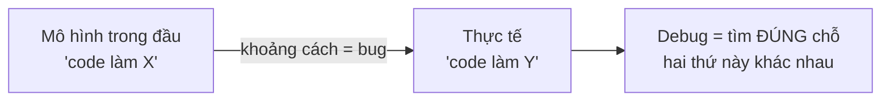
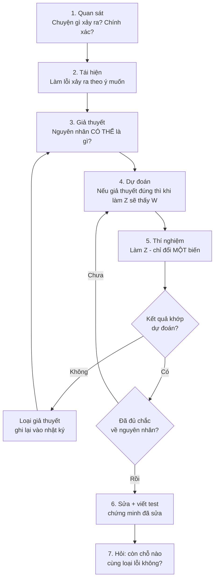
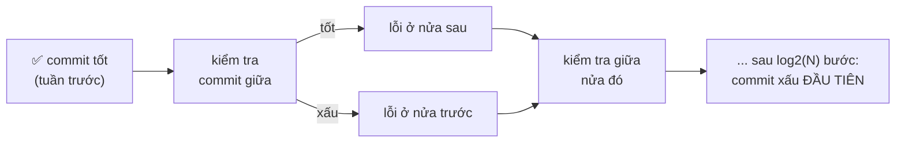
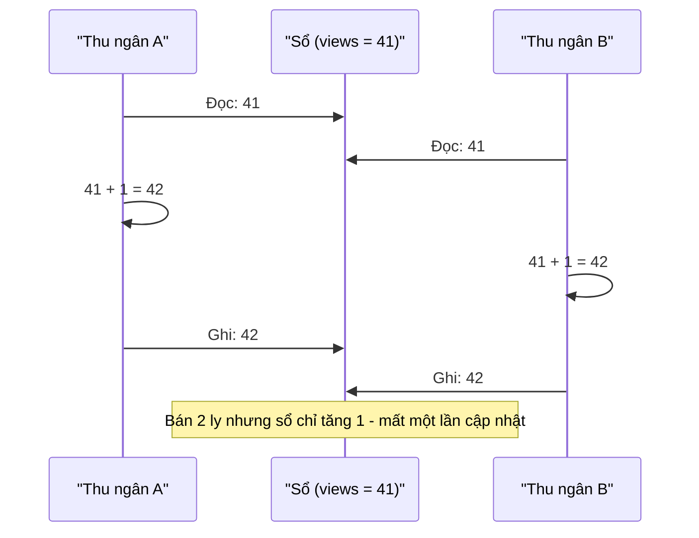
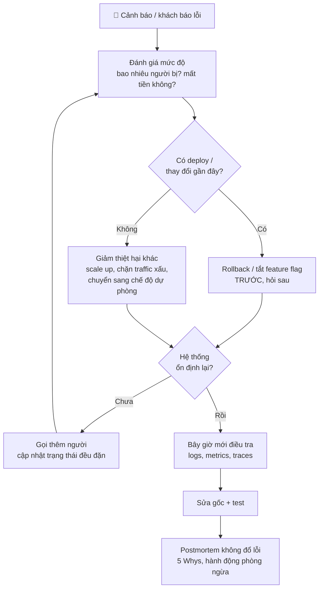
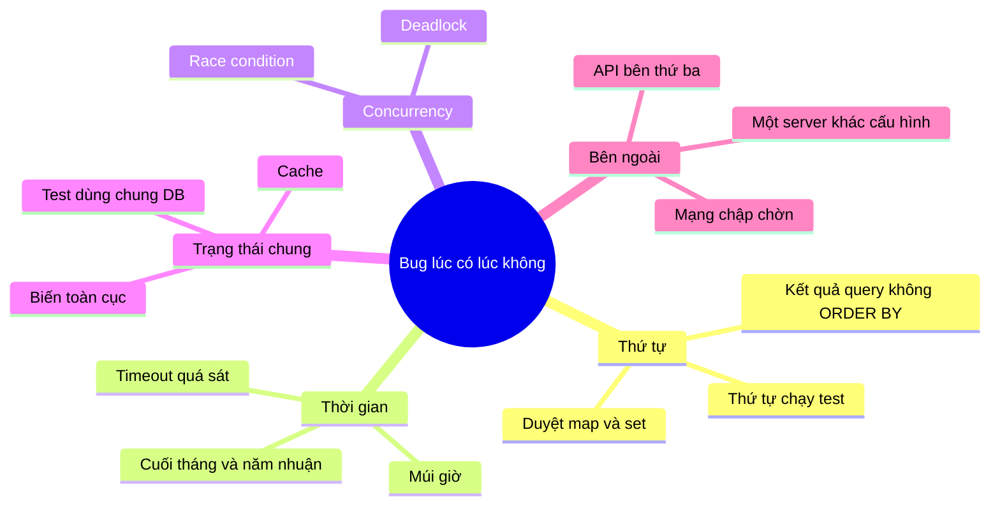

# 📚 Bài 5: Tư duy Debug

> "Debug khó gấp đôi viết code. Vậy nếu bạn viết code khôn ngoan hết mức có thể, theo định nghĩa bạn không đủ khôn để debug nó." - Brian Kernighan

Có một cảnh rất quen ở mọi công ty phần mềm Việt Nam: 4 giờ chiều thứ Sáu, bạn junior ngồi nhìn màn hình đã 2 tiếng, sửa một dòng, chạy lại, không được, sửa dòng khác, chạy lại, vẫn không được... Tab trình duyệt mở 17 câu hỏi Stack Overflow. Rồi anh senior đi ngang, hỏi ba câu, gõ hai lệnh, và 10 phút sau bug được tìm ra.

Anh senior **không thông minh hơn gấp 12 lần**. Anh ấy chỉ có **phương pháp**. Bài này dạy bạn phương pháp đó.

## 🎯 Mục tiêu bài học

- Hiểu debug là **quá trình thu hẹp khoảng cách** giữa "điều mình nghĩ code làm" và "điều code thật sự làm"
- Áp dụng **phương pháp khoa học** vào debug: quan sát → giả thuyết → dự đoán → thí nghiệm → kết luận
- Luôn **tái hiện lỗi trước** khi sửa, và biến lỗi thành một test thất bại
- Đọc thành thạo **Go panic** và **Python traceback** (kể cả exception lồng nhau)
- **Thu nhỏ** trường hợp lỗi bằng chia đôi (delta debugging) - bằng tay và bằng code
- Dùng **`git bisect`** để tìm commit gây lỗi trong vài phút
- Biết khi nào dùng **log**, khi nào dùng **debugger** (Delve cho Go, pdb cho Python)
- Có **checklist kiểm tra giả định** và **checklist "chạy trên máy em mà"**
- Nhận diện và bắt **race condition** (`go run -race`), hiểu vì sao test "lúc được lúc không"
- Debug **production** bằng logs, metrics, traces - và ưu tiên **giảm thiệt hại** trước khi tìm nguyên nhân
- Dùng **5 Whys** để tìm nguyên nhân gốc, viết **bug report** mà người khác đọc là làm được ngay

## 📖 1. Debug là gì - và vì sao "thử bừa" thất bại

### Câu chuyện: Hai ngày của Minh và 40 phút của chị Lan

Minh (junior, 6 tháng kinh nghiệm) nhận ticket: *"Khách báo không áp được mã giảm giá FREESHIP."* Minh làm thế này:

1. Mở file `coupon.go`, thấy đoạn so sánh ngày hết hạn, nghĩ "chắc lỗi ở đây", sửa `<` thành `<=`. Deploy lên staging. Vẫn lỗi.
2. Nghĩ "chắc cache", thêm code xóa cache. Vẫn lỗi.
3. Nghĩ "chắc do chữ hoa chữ thường", thêm `strings.ToUpper`. Vẫn lỗi.
4. Hết ngày thứ hai, code đã bị sửa ở 5 chỗ, không ai biết chỗ nào cần giữ, chỗ nào nên bỏ.

Chị Lan (senior) được nhờ vào xem. Chị hỏi:

- *"Mã nào, tài khoản nào, lúc mấy giờ? Em tự tái hiện được chưa?"* → Minh chưa thử tái hiện.
- *"Mã khác có áp được không?"* → Có, chỉ FREESHIP lỗi.
- *"FREESHIP có gì khác các mã khác?"* → Mở DB ra xem: FREESHIP có điều kiện "đơn tối thiểu 100.000đ", các mã khác thì không.
- *"Đơn của khách bao nhiêu?"* → 100.000đ **đúng bằng** mức tối thiểu.

Chị mở hàm kiểm tra: `if order.Total > coupon.MinOrder` - lẽ ra phải là `>=`. Tổng thời gian: 40 phút, trong đó 30 phút là hỏi và quan sát, 10 phút là sửa + viết test.

Khác biệt **không nằm ở kiến thức Go**. Minh đoán rồi sửa (**shotgun debugging** - bắn đạn chùm). Chị Lan **thu thập dữ kiện, loại trừ khả năng, thu hẹp phạm vi** - rồi mới sửa đúng một chỗ.

### Bug thật ra là gì?

Mỗi bug là một **khoảng cách** giữa hai thứ:

- **Mô hình trong đầu bạn**: "hàm này nhận đơn 100k và trả về true"
- **Thực tế**: hàm trả về false

Debug không phải là "sửa code". Debug là **tìm ra chỗ mà mô hình trong đầu bạn sai**. Khi tìm ra, việc sửa thường chỉ mất vài phút.



!!! tip "Câu thần chú"
    **"Đừng sửa cái bạn chưa hiểu."** Nếu bạn sửa một dòng và bug biến mất nhưng bạn không giải thích được *vì sao*, bạn chưa sửa bug - bạn chỉ **giấu** nó đi. Nó sẽ quay lại, thường là vào lúc tệ nhất.

### Ba cách debug tệ (và rất phổ biến)

| Kiểu | Biểu hiện | Vì sao tệ |
|---|---|---|
| **Shotgun** (bắn chùm) | Sửa nhiều chỗ cùng lúc, hy vọng trúng một chỗ | Không biết chỗ nào là thủ phạm, để lại code rác |
| **Voodoo** (cúng bái) | "Xóa `node_modules`, restart máy, chạy lại" mà không hiểu vì sao | Đôi khi được, nhưng không học được gì, và bug quay lại |
| **Stare** (nhìn chằm chằm) | Đọc đi đọc lại cùng một đoạn code hàng giờ | Bug thường **không nằm ở chỗ bạn nghĩ** - nếu nó ở đó, bạn đã thấy rồi |

## 📖 2. Debug như một nhà khoa học

Phương pháp khoa học bạn học từ cấp 2 là công cụ debug tốt nhất từng được phát minh:



Hai điểm then chốt mà người mới hay bỏ qua:

1. **Mỗi thí nghiệm chỉ đổi MỘT biến.** Nếu bạn vừa đổi version thư viện, vừa sửa config, vừa sửa code rồi chạy lại - dù kết quả là gì, bạn cũng không học được gì.
2. **Giả thuyết phải bị "bác bỏ được".** "Chắc do mạng" không phải giả thuyết tốt. "Nếu do mạng, thì gọi thẳng API bằng `curl` từ cùng server cũng sẽ chậm >2s" - đó là giả thuyết tốt, vì bạn có thể kiểm chứng nó trong 30 giây.

### Nhật ký debug (debug journal)

Với bug khó (mất hơn 30 phút), hãy **viết ra**. Một file text đơn giản:

```text
BUG: Khách không áp được mã FREESHIP (ticket #4821)

QUAN SÁT
- Khách user_id=9912, đơn 100.000đ, 14:05 ngày 12/3
- Thông báo: "Đơn hàng chưa đủ điều kiện"

GIẢ THUYẾT                         | THÍ NGHIỆM                     | KẾT QUẢ
1. Mã hết hạn                       | Xem expires_at trong DB         | ❌ Còn hạn đến 31/3
2. Mã chỉ cho khách mới             | Xem điều kiện mã                 | ❌ Không có điều kiện này
3. Lỗi so sánh ở mức tối thiểu      | Tạo đơn 99k, 100k, 101k trên local | ✅ 99k lỗi (đúng), 100k lỗi (SAI), 101k được

NGUYÊN NHÂN: `order.Total > coupon.MinOrder` phải là `>=`
SỬA: PR #1203 + test cho 3 mức giá biên
CÒN CHỖ NÀO KHÁC? grep "MinOrder" → 2 chỗ khác cũng dùng `>`, sửa luôn
```

Lợi ích: (1) không thử lại giả thuyết đã loại, (2) khi phải nhờ người khác, bạn đưa họ file này thay vì kể lể, (3) sau này viết postmortem chỉ cần copy.

!!! note "Rubber duck debugging"
    Nhiều lập trình viên để một con vịt cao su trên bàn và **giải thích code cho nó từng dòng**. Nghe buồn cười, nhưng rất hiệu quả: khi buộc phải nói thành lời "dòng này làm X vì...", bạn phát hiện ra chỗ mình đang **giả định** mà chưa kiểm tra. Viết nhật ký debug, hoặc viết câu hỏi lên Slack (Bài 8, mục 4.3) cũng có tác dụng tương tự - rất nhiều câu hỏi chưa kịp gửi đã tự có đáp án.

## 📖 3. Tái hiện lỗi trước tiên (Reproduce first)

**Bạn không thể sửa một bug mà bạn không làm nó xảy ra được.** Chính xác hơn: bạn có thể sửa, nhưng bạn sẽ không bao giờ **biết** là đã sửa được hay chưa.

### Các mức độ tái hiện

| Mức | Mô tả | Ví dụ |
|---|---|---|
| 🔴 0 | Chỉ nghe kể | "Khách bảo app bị lỗi" |
| 🟠 1 | Có dữ kiện cụ thể | user_id, thời điểm, request_id, ảnh chụp màn hình |
| 🟡 2 | Tái hiện được trên môi trường khác (staging) | Làm theo các bước, thấy lỗi, nhưng mất 10 phút |
| 🟢 3 | Tái hiện được trên máy mình, nhanh | Một lệnh, 5 giây, thấy lỗi |
| 🏆 4 | Có **test tự động thất bại** | `go test -run TestFreeshipAtMinimum` → FAIL |

Mục tiêu của bạn là đi từ mức 0 lên mức 4 **càng nhanh càng tốt**. Ở mức 4, mỗi vòng thí nghiệm chỉ tốn vài giây thay vì vài phút - bạn thử được gấp 50 lần giả thuyết trong cùng thời gian.

### Câu hỏi để tái hiện (hỏi người báo lỗi)

- **Ai?** Tài khoản nào, vai trò gì (admin/khách), thiết bị gì, app version mấy?
- **Khi nào?** Chính xác thời điểm (để tìm log). Lần đầu thấy khi nào? Trước đó có được không?
- **Ở đâu?** Màn hình nào, API nào, môi trường nào (prod/staging)?
- **Làm gì?** Từng bước, cụ thể. Dữ liệu nhập vào là gì?
- **Mong đợi gì, thấy gì?** Nguyên văn thông báo lỗi, ảnh chụp.
- **Lúc nào cũng bị hay thỉnh thoảng?** Người khác có bị không?

"Thỉnh thoảng mới bị" là manh mối cực quan trọng: nó gợi ý **race condition, cache, thời gian, dữ liệu đặc biệt, hoặc một server cụ thể** trong số nhiều server.

### Biến bug thành test thất bại

Khi đã tái hiện được, hãy **viết test trước khi sửa**. Test phải FAIL với code hiện tại:

=== "Go"

    ```go
    func TestCouponAppliesAtExactMinimum(t *testing.T) {
        coupon := Coupon{Code: "FREESHIP", MinOrder: 100_000}
        order := Order{Total: 100_000}

        if !coupon.Applies(order) {
            t.Fatalf("đơn %d đúng bằng mức tối thiểu %d phải được áp mã",
                order.Total, coupon.MinOrder)
        }
    }
    ```

=== "Python"

    ```python
    def test_coupon_applies_at_exact_minimum():
        coupon = Coupon(code="FREESHIP", min_order=100_000)
        order = Order(total=100_000)

        assert coupon.applies(order), (
            "đơn đúng bằng mức tối thiểu phải được áp mã"
        )
    ```

Test này có ba giá trị: (1) chứng minh bạn **hiểu** bug, (2) chứng minh bạn **đã sửa**, (3) đảm bảo bug **không quay lại** (regression test). Bài 6 sẽ nói kỹ hơn về testing.

## 📖 4. Đọc thông báo lỗi và stack trace

Điều đáng ngạc nhiên: rất nhiều người **không đọc** thông báo lỗi. Họ thấy chữ đỏ, hoảng, và copy dòng đầu tiên lên Google. Thông báo lỗi là **manh mối miễn phí** mà máy tính đưa cho bạn - hãy đọc hết.

### 4.1. Đọc Go panic

Chương trình dưới đây gửi hóa đơn cho các đơn hàng. Đơn thứ hai là của **khách vãng lai** (không có tài khoản):

```go
package main

import "fmt"

type Order struct {
	ID       int
	Customer *Customer
}

type Customer struct {
	Name  string
	Email string
}

func customerEmail(o *Order) string {
	return o.Customer.Email
}

func sendReceipts(orders []*Order) {
	for _, o := range orders {
		fmt.Println("gửi hóa đơn tới", customerEmail(o))
	}
}

func main() {
	orders := []*Order{
		{ID: 1, Customer: &Customer{Name: "An", Email: "an@example.com"}},
		{ID: 2}, // đơn khách vãng lai: không có Customer
	}
	sendReceipts(orders)
}
```

Output thật khi chạy `go run .` (đường dẫn đã rút gọn):

```text
gửi hóa đơn tới an@example.com
panic: runtime error: invalid memory address or nil pointer dereference
[signal SIGSEGV: segmentation violation code=0x1 addr=0x10 pc=0x491b0d]

goroutine 1 [running]:
main.customerEmail(...)
	/home/an/shop/main.go:16
main.sendReceipts({0xc00010cf30, 0x2, 0xc00010cf40?})
	/home/an/shop/main.go:21 +0x2d
main.main()
	/home/an/shop/main.go:30 +0x9f
exit status 2
```

Cách đọc, **từ trên xuống**:

| Phần | Ý nghĩa |
|---|---|
| `gửi hóa đơn tới an@example.com` | Đơn 1 chạy **được** → lỗi xảy ra ở đơn **sau** đó. Output trước panic là manh mối! |
| `panic: runtime error: invalid memory address or nil pointer dereference` | **Loại lỗi**: truy cập qua con trỏ `nil` |
| `addr=0x10` | Địa chỉ nhỏ (0x10 = 16) → đang đọc một **field** của struct có con trỏ nil (field `Email` nằm sau `Name`, cách đầu struct 16 byte) |
| `goroutine 1 [running]` | Goroutine nào bị panic (1 = main). Với server có hàng nghìn goroutine, dòng này rất quan trọng |
| `main.customerEmail(...)` + `main.go:16` | **Frame trên cùng = nơi panic xảy ra**. `(...)` nghĩa là hàm đã được inline |
| `main.sendReceipts(...)` + `main.go:21` | Ai gọi hàm trên |
| `main.main()` + `main.go:30` | Ai gọi tiếp - đến đây là gốc |

Dòng 16 là `return o.Customer.Email`. `o` không nil (vì ta đã vào được hàm và đơn 1 chạy tốt), vậy `o.Customer` là nil. Kết hợp với "đơn 1 chạy được" → đơn 2 không có Customer. **Đọc kỹ panic đã cho ta 90% đáp án, chưa cần mở debugger.**

!!! tip "Mẹo đọc Go stack trace dài"
    Trace của server thật có thể dài hàng trăm dòng (các frame của `net/http`, `runtime`...). Hãy tìm **frame đầu tiên thuộc package của bạn** (ví dụ `github.com/cong-ty/shop/...`) tính từ trên xuống. Đó thường là chỗ cần nhìn. Frame của thư viện chuẩn gần như không bao giờ là thủ phạm.

Sửa đúng không phải là "thêm `if o.Customer != nil` cho qua". Câu hỏi đúng là: **"Khách vãng lai thì hóa đơn gửi đi đâu?"** Có thể đơn vãng lai có `GuestEmail`, có thể không cần gửi. Đây là câu hỏi **nghiệp vụ** - hỏi PM (Bài 9).

### 4.2. Đọc Python traceback

Tính tổng tiền đơn cà phê. Menu có 2 món, nhưng khách đặt thêm "trà đào" - món vừa được thêm vào app nhưng chưa có trong bảng giá:

```python
import json


def load_prices(path):
    with open(path) as f:
        return json.load(f)


def line_total(item, prices):
    return prices[item["sku"]] * item["qty"]


def order_total(order, prices):
    return sum(line_total(item, prices) for item in order["items"])


def main():
    prices = {"CF-SUA-DA": 29000, "BANH-MI": 25000}
    order = {"id": 42, "items": [
        {"sku": "CF-SUA-DA", "qty": 2},
        {"sku": "TRA-DAO", "qty": 1},
    ]}
    print("Tổng:", order_total(order, prices))


if __name__ == "__main__":
    main()
```

Output thật (Python 3.11, đường dẫn rút gọn):

```text
Traceback (most recent call last):
  File "/home/an/shop/shop.py", line 27, in <module>
    main()
  File "/home/an/shop/shop.py", line 23, in main
    print("Tổng:", order_total(order, prices))
                   ^^^^^^^^^^^^^^^^^^^^^^^^^^
  File "/home/an/shop/shop.py", line 14, in order_total
    return sum(line_total(item, prices) for item in order["items"])
           ^^^^^^^^^^^^^^^^^^^^^^^^^^^^^^^^^^^^^^^^^^^^^^^^^^^^^^^^
  File "/home/an/shop/shop.py", line 14, in <genexpr>
    return sum(line_total(item, prices) for item in order["items"])
               ^^^^^^^^^^^^^^^^^^^^^^^^
  File "/home/an/shop/shop.py", line 10, in line_total
    return prices[item["sku"]] * item["qty"]
           ~~~~~~^^^^^^^^^^^^^
KeyError: 'TRA-DAO'
```

Python in **ngược** với Go: `most recent call last` - **frame cuối cùng là nơi lỗi xảy ra**. Nên đọc **từ dưới lên**:

1. **Dòng cuối**: `KeyError: 'TRA-DAO'` → tra từ điển với key `'TRA-DAO'` không tồn tại
2. **Frame cuối**: `line_total`, dòng 10. Dấu `~~~~~~^^^^^^^^^^^^^` (Python 3.11+) chỉ đúng biểu thức gây lỗi: `prices[item["sku"]]` - không phải `item["qty"]`
3. **Đi ngược lên** để hiểu ngữ cảnh: được gọi từ `order_total` → từ `main`

!!! warning "Đừng dừng ở 'thêm .get(sku, 0)'"
    Sửa thành `prices.get(item["sku"], 0)` làm lỗi biến mất - và **tặng miễn phí** trà đào cho khách. Lỗi "ồn ào" (crash) được đổi thành lỗi "im lặng" (sai tiền) - tệ hơn nhiều. Câu hỏi đúng: *"Vì sao một món không có giá lại lọt vào được đơn hàng?"* - có thể phải kiểm tra ở bước thêm món vào giỏ.

### 4.3. Exception lồng nhau (chained exception)

Khi code bắt một lỗi rồi ném ra lỗi khác, Python in **cả hai**:

```python
import json


def load_config(text):
    try:
        return json.loads(text)
    except json.JSONDecodeError as e:
        raise ValueError("config không hợp lệ") from e


load_config('{"port": 8080,}')
```

Output thật (rút gọn đường dẫn):

```text
Traceback (most recent call last):
  File "/home/an/shop/chained.py", line 6, in load_config
    return json.loads(text)
           ^^^^^^^^^^^^^^^^
  File "/usr/lib/python3.11/json/__init__.py", line 346, in loads
    return _default_decoder.decode(s)
           ^^^^^^^^^^^^^^^^^^^^^^^^^^
  File "/usr/lib/python3.11/json/decoder.py", line 337, in decode
    obj, end = self.raw_decode(s, idx=_w(s, 0).end())
               ^^^^^^^^^^^^^^^^^^^^^^^^^^^^^^^^^^^^^^
  File "/usr/lib/python3.11/json/decoder.py", line 353, in raw_decode
    obj, end = self.scan_once(s, idx)
               ^^^^^^^^^^^^^^^^^^^^^^
json.decoder.JSONDecodeError: Expecting property name enclosed in double quotes: line 1 column 15 (char 14)

The above exception was the direct cause of the following exception:

Traceback (most recent call last):
  File "/home/an/shop/chained.py", line 11, in <module>
    load_config('{"port": 8080,}')
  File "/home/an/shop/chained.py", line 8, in load_config
    raise ValueError("config không hợp lệ") from e
ValueError: config không hợp lệ
```

Lỗi cuối (`ValueError: config không hợp lệ`) chỉ cho biết **cái gì** hỏng. Nguyên nhân **thật** nằm ở traceback **phía trên**: `line 1 column 15` - dấu phẩy thừa trước `}`. Người mới thường chỉ đọc đoạn cuối và bỏ lỡ manh mối quan trọng nhất.

Go có khái niệm tương tự: **error wrapping** với `fmt.Errorf("...: %w", err)`. Một thông báo lỗi Go tốt đọc giống một câu chuyện từ ngoài vào trong:

```text
tải config: đọc file /etc/shop/config.json: open /etc/shop/config.json: permission denied
```

Mỗi tầng thêm ngữ cảnh của nó. Khi đọc, lỗi **gốc** nằm ở **cuối cùng bên phải** (`permission denied`). Đây là lý do Bài 3 khuyên luôn wrap lỗi kèm ngữ cảnh thay vì `return err` trơn.

### 4.4. Bảng tra nhanh các lỗi phổ biến

| Go | Python | Thường là do |
|---|---|---|
| `nil pointer dereference` | `AttributeError: 'NoneType' object has no attribute` | Giá trị "không có" không được xử lý (khách vãng lai, query không ra kết quả) |
| `index out of range [5] with length 5` | `IndexError: list index out of range` | Lỗi lệch 1 (off-by-one), danh sách rỗng |
| `assignment to entry in nil map` | (không có - dict luôn khởi tạo) | Quên `make(map...)` |
| `all goroutines are asleep - deadlock!` | Chương trình treo | Channel không ai nhận/gửi, lock không được nhả |
| `concurrent map read and map write` | (hiếm, do GIL) | Nhiều goroutine truy cập map không có lock |
| `context deadline exceeded` | `TimeoutError`, `ReadTimeout` | Dịch vụ phía sau chậm, timeout quá ngắn |
| `connection refused` | `ConnectionRefusedError` | Dịch vụ chưa chạy, sai port, sai host |
| (lỗi biên dịch) | `KeyError`, `TypeError` lúc chạy | Dữ liệu không đúng hình dạng mong đợi |

## 📖 5. Thu nhỏ trường hợp lỗi (Minimize)

Khi đã tái hiện được, bước tiếp theo là **làm cho nó nhỏ nhất có thể**: ít code nhất, ít dữ liệu nhất, ít bước nhất mà **vẫn còn lỗi**.

Vì sao? Vì bug nằm ở **giao điểm** của những thứ còn lại. Một file import 1000 dòng bị lỗi - bạn không biết nhìn vào đâu. Một dòng duy nhất bị lỗi - bạn nhìn là thấy.

### Tình huống: file import thực đơn 1000 dòng bị lỗi

Chủ quán upload file CSV 1000 món, hệ thống báo lỗi chung chung. Thay vì đọc 1000 dòng, ta **chia đôi**: nửa đầu có lỗi không? Nếu có, bỏ nửa sau. Nếu không, lỗi ở nửa sau. Lặp lại. Với 1000 dòng, chỉ cần khoảng **10 bước** (log₂1000 ≈ 10).

=== "Go"

    ```go
    package main

    import (
    	"fmt"
    	"strconv"
    	"strings"
    )

    func parseRow(line string) error {
    	parts := strings.Split(line, ",")
    	if len(parts) != 3 {
    		return fmt.Errorf("cần 3 cột, có %d", len(parts))
    	}
    	if _, err := strconv.Atoi(parts[1]); err != nil {
    		return err
    	}
    	_, err := strconv.Atoi(parts[2])
    	return err
    }

    func crashes(lines []string) bool {
    	for _, l := range lines {
    		if parseRow(l) != nil {
    			return true
    		}
    	}
    	return false
    }

    // minimize chia đôi liên tục, giữ lại nửa vẫn còn gây lỗi.
    func minimize(lines []string) []string {
    	for step := 1; len(lines) > 1; step++ {
    		mid := len(lines) / 2
    		left, right := lines[:mid], lines[mid:]
    		switch {
    		case crashes(left):
    			lines = left
    		case crashes(right):
    			lines = right
    		default:
    			return lines // lỗi cần cả hai nửa cùng lúc -> xem thủ công
    		}
    		fmt.Printf("bước %d: còn %d dòng\n", step, len(lines))
    	}
    	return lines
    }

    func main() {
    	rows := make([]string, 1000)
    	for i := range rows {
    		rows[i] = fmt.Sprintf("Món %d,1,%d", i, 20000+i)
    	}
    	rows[737] = `"Bánh mì, pate",2,25000` // tên món có dấu phẩy
    	fmt.Println("File lỗi?", crashes(rows))
    	fmt.Printf("Thủ phạm: %q\n", minimize(rows))
    }

    // Output:
    // File lỗi? true
    // bước 1: còn 500 dòng
    // bước 2: còn 250 dòng
    // bước 3: còn 125 dòng
    // bước 4: còn 63 dòng
    // bước 5: còn 32 dòng
    // bước 6: còn 16 dòng
    // bước 7: còn 8 dòng
    // bước 8: còn 4 dòng
    // bước 9: còn 2 dòng
    // bước 10: còn 1 dòng
    // Thủ phạm: ["\"Bánh mì, pate\",2,25000"]
    ```

=== "Python"

    ```python
    def parse_row(line):
        name, qty, price = line.split(",")
        return name, int(qty), int(price)


    def crashes(lines):
        try:
            for line in lines:
                parse_row(line)
            return False
        except ValueError:
            return True


    def minimize(lines):
        """Chia đôi liên tục, giữ lại nửa vẫn còn gây lỗi."""
        step = 0
        while len(lines) > 1:
            mid = len(lines) // 2
            left, right = lines[:mid], lines[mid:]
            if crashes(left):
                lines = left
            elif crashes(right):
                lines = right
            else:
                break  # lỗi cần cả hai nửa cùng lúc -> xem thủ công
            step += 1
            print(f"bước {step}: còn {len(lines)} dòng")
        return lines


    rows = [f"Món {i},1,{20000 + i}" for i in range(1000)]
    rows[737] = '"Bánh mì, pate",2,25000'  # tên món có dấu phẩy
    print("File lỗi?", crashes(rows))
    print("Thủ phạm:", minimize(rows))

    # Output:
    # File lỗi? True
    # bước 1: còn 500 dòng
    # bước 2: còn 250 dòng
    # bước 3: còn 125 dòng
    # bước 4: còn 63 dòng
    # bước 5: còn 32 dòng
    # bước 6: còn 16 dòng
    # bước 7: còn 8 dòng
    # bước 8: còn 4 dòng
    # bước 9: còn 2 dòng
    # bước 10: còn 1 dòng
    # Thủ phạm: ['"Bánh mì, pate",2,25000']
    ```

Nhìn vào **một dòng** thủ phạm, nguyên nhân hiện ra ngay: tên món có dấu phẩy nằm trong ngoặc kép, nhưng code dùng `split(",")` thay vì một **CSV parser thật** (`encoding/csv` trong Go, module `csv` trong Python). Đây là bài học lớn hơn: **đừng tự parse định dạng chuẩn**.

Kỹ thuật này có tên là **delta debugging**. Nó áp dụng được cho mọi thứ, không chỉ dữ liệu:

- **Code**: comment bớt một nửa logic, lỗi còn không?
- **Config**: bỏ bớt một nửa biến môi trường, lỗi còn không?
- **Request**: bỏ bớt một nửa field trong JSON body, lỗi còn không?
- **Thư viện**: hạ một nửa số dependency về version cũ?
- **Lịch sử**: lỗi có từ commit nào? → `git bisect` (mục 6)

### Minimal reproducible example (MRE)

Khi phải hỏi người khác (đồng nghiệp, GitHub issue, Stack Overflow), hãy gửi một **MRE**:

- [ ] **Minimal**: bỏ hết mọi thứ không liên quan - không cần DB, không cần framework nếu lỗi vẫn còn khi không có chúng
- [ ] **Complete**: người khác copy về chạy được ngay, không thiếu import, không thiếu dữ liệu
- [ ] **Reproducible**: chạy là thấy lỗi, kèm output thật và output mong đợi
- [ ] Ghi rõ **version**: Go/Python, OS, thư viện

Điều kỳ diệu: **khoảng một nửa số lần, trong lúc làm MRE bạn tự tìm ra bug**. Vì làm MRE chính là thu nhỏ trường hợp lỗi.

## 📖 6. `git bisect` - tìm commit gây lỗi bằng tìm kiếm nhị phân

Tình huống cực kỳ phổ biến: *"Tuần trước tính năng này còn chạy. Giờ hỏng rồi. Có 80 commit ở giữa."* Đọc 80 commit? Không. `git bisect` áp dụng đúng ý tưởng chia đôi ở mục 5, nhưng trên **lịch sử commit**: với 80 commit chỉ cần khoảng **7 bước** (log₂80 ≈ 6,3).



### Demo: tự tạo một repo nhỏ và "bắt quả tang"

Script dưới đây tạo repo 8 commit. Một commit "refactor" âm thầm làm hỏng công thức tính giá giảm (bạn tìm được lỗi trước khi xem đáp án không?):

```bash
#!/usr/bin/env bash
# Tạo một repo nhỏ có 8 commit, trong đó 1 commit âm thầm gây bug.
set -e
rm -rf bisect-demo && mkdir bisect-demo && cd bisect-demo
git init -q -b main
git config user.name "An" && git config user.email "an@example.com"

commit() { git add -A && git commit -q -m "$1"; }

cat > pricing.py <<'PY'
def final_price(price, discount_percent):
    return price - price * discount_percent // 100
PY
cat > test_pricing.py <<'PY'
from pricing import final_price
assert final_price(100_000, 10) == 90_000, final_price(100_000, 10)
print("OK")
PY
commit "feat: tính giá sau giảm"
echo "# Shop" > README.md;                 commit "docs: thêm README"
echo "VAT = 0.08" > config.py;             commit "chore: thêm config VAT"
echo "# log" >> README.md;                  commit "docs: ghi chú log"
# Commit gây bug: "tối ưu" nhưng đổi thứ tự phép tính
cat > pricing.py <<'PY'
def final_price(price, discount_percent):
    return price - price * (discount_percent // 100)
PY
commit "refactor: làm gọn công thức giá"
echo "SHIP_FEE = 15000" >> config.py;      commit "feat: phí ship"
echo "# faq" >> README.md;                  commit "docs: FAQ"
echo "FREE_SHIP_FROM = 300000" >> config.py; commit "feat: freeship từ 300k"
```

Chạy script, xem lịch sử và xác nhận HEAD đang lỗi (hash trên máy bạn sẽ khác):

```text
$ bash bisect-demo.sh && cd bisect-demo
$ git log --oneline
31c50d9 feat: freeship từ 300k
9d1784c docs: FAQ
3ac2e32 feat: phí ship
b31daff refactor: làm gọn công thức giá
f87aa18 docs: ghi chú log
5548492 chore: thêm config VAT
33bc2e9 docs: thêm README
ba44994 feat: tính giá sau giảm

$ python3 test_pricing.py
Traceback (most recent call last):
  ...
AssertionError: 100000
```

Giá sau giảm 10% của 100.000đ ra 100.000đ - không giảm gì cả! Giờ để `git bisect` tự tìm. Ta nói: HEAD là **xấu**, commit đầu tiên (`HEAD~7`) là **tốt**, và cho nó một lệnh để tự kiểm tra:

```text
$ git bisect start HEAD HEAD~7
$ git bisect run python3 test_pricing.py
Bisecting: 3 revisions left to test after this (roughly 2 steps)
[f87aa18ccafd50ae0ae8774189fdefa4ed2322fa] docs: ghi chú log
running 'python3' 'test_pricing.py'
OK
Bisecting: 1 revision left to test after this (roughly 1 step)
[3ac2e3225d7235706f559eb6d6b9857c112ccc52] feat: phí ship
running 'python3' 'test_pricing.py'
Traceback (most recent call last):
  ...
AssertionError: 100000
Bisecting: 0 revisions left to test after this (roughly 0 steps)
[b31daff59180f03ccd0ddfe460a7eea6e7a10278] refactor: làm gọn công thức giá
running 'python3' 'test_pricing.py'
Traceback (most recent call last):
  ...
AssertionError: 100000
b31daff59180f03ccd0ddfe460a7eea6e7a10278 is the first bad commit
commit b31daff59180f03ccd0ddfe460a7eea6e7a10278
Author: An <an@example.com>
Date:   Wed Sep 30 17:29:54 2026 +0000

    refactor: làm gọn công thức giá

 pricing.py | 2 +-
 1 file changed, 1 insertion(+), 1 deletion(-)
bisect found first bad commit

$ git bisect reset
```

Chỉ 3 lần chạy test, `git bisect` chỉ đúng commit thủ phạm. Nhìn diff: `discount_percent // 100` với `discount_percent = 10` là phép **chia nguyên** → `0`. Công thức cũ nhân trước rồi mới chia (`price * 10 // 100 = 10000`), công thức mới chia trước nên mất hết. Một "refactor vô hại" đổi **thứ tự tính toán** - và không có test nào chạy trong CI để bắt nó.

### Mẹo dùng `git bisect`

| Lệnh / quy ước | Ý nghĩa |
|---|---|
| `git bisect start <xấu> <tốt>` | Bắt đầu, cho biết hai đầu mút |
| `git bisect good` / `git bisect bad` | Đánh dấu thủ công commit hiện tại (khi kiểm tra bằng tay, ví dụ phải bấm UI) |
| `git bisect skip` | Commit này không build được, bỏ qua |
| `git bisect run <lệnh>` | Tự động: exit code **0 = tốt**, **1-127 = xấu** (trừ **125 = skip**) |
| `git bisect log` | Xem lại các bước đã làm |
| `git bisect reset` | Kết thúc, quay về branch ban đầu |

!!! tip "Bisect chỉ hiệu quả khi commit nhỏ"
    Nếu commit thủ phạm là một commit "WIP: sửa đủ thứ" với 2000 dòng thay đổi, bisect chỉ thu hẹp được đến đó. Đây là lý do thực tế cho lời khuyên ở Bài 8: **commit nhỏ, mỗi commit một ý, mỗi commit đều build và pass test**. Lịch sử git sạch là một **công cụ debug**, không chỉ là thẩm mỹ.

## 📖 7. Log hay Debugger?

Đây là cuộc tranh luận muôn thuở. Câu trả lời thật: **cả hai, tùy tình huống**.

| Tình huống | Nên dùng | Vì sao |
|---|---|---|
| Lỗi tái hiện được trên máy, logic phức tạp, muốn xem nhiều biến | **Debugger** | Dừng lại, xem mọi biến, đi từng bước mà không phải sửa code |
| Lỗi chỉ xảy ra trên production | **Log** (+ metrics, traces) | Không thể dừng production lại |
| Lỗi liên quan thời gian, concurrency | **Log** (có timestamp, goroutine/thread id) | Debugger dừng chương trình → thay đổi thời gian → lỗi biến mất (**heisenbug**) |
| Cần xem luồng qua nhiều service | **Log + tracing** | Debugger chỉ gắn vào một process |
| Kiểm tra nhanh một giá trị | `print` tạm thời | Nhanh nhất - miễn là nhớ xóa |
| Tìm hiểu code lạ (đọc code người khác) | **Debugger** | Đi từng bước xem code thật sự chạy qua đâu |

### 7.1. Print debugging - làm cho đúng

Print không có gì xấu hổ. Nhưng hãy làm có kỷ luật:

- **In cả nhãn**, không in trơn: `fmt.Printf("DEBUG total=%d min=%d\n", ...)` thay vì `fmt.Println(total)`
- **In `%#v` (Go) / `repr()` (Python)** để thấy kiểu và ký tự ẩn: chuỗi `"100000 "` (có dấu cách) trông giống hệt `"100000"` khi in thường
- **Đánh dấu để dễ xóa**: tiền tố `DEBUG` hoặc `XXX`, trước khi commit chạy `git diff | grep DEBUG`
- **In ở ranh giới**: đầu vào và đầu ra của hàm nghi ngờ - để chia đôi không gian tìm kiếm

=== "Go"

    ```go
    // %v in giá trị, %#v in kèm kiểu và dấu ngoặc kép - thấy được khoảng trắng thừa
    fmt.Printf("DEBUG code=%#v min=%#v\n", code, minOrder)
    // DEBUG code="FREESHIP " min=100000
    ```

=== "Python"

    ```python
    # f-string với "=" (Python 3.8+) in cả tên biến; !r dùng repr()
    print(f"DEBUG {code=!r} {min_order=}")
    # DEBUG code='FREESHIP ' min_order=100000
    ```

### 7.2. Debugger cho Python: pdb

Python có sẵn debugger `pdb`. Chỉ cần thêm `breakpoint()` vào code, hoặc chạy `python3 -m pdb file.py`. Ví dụ hàm tính điểm đánh giá trung bình:

```python
def average_rating(ratings):
    total = 0
    for r in ratings:
        total += r
    return total / len(ratings)


print(average_rating([5, 4, 3]))
print(average_rating([]))
```

Một phiên pdb thật: đặt breakpoint ở dòng 5 (`b 5`), chạy tiếp (`c`), in biến (`p`):

```text
$ python3 -m pdb pdbdemo.py
> /home/an/shop/pdbdemo.py(1)<module>()
-> def average_rating(ratings):
(Pdb) b 5
Breakpoint 1 at /home/an/shop/pdbdemo.py:5
(Pdb) c
> /home/an/shop/pdbdemo.py(5)average_rating()
-> return total / len(ratings)
(Pdb) p total, ratings
(12, [5, 4, 3])
(Pdb) c
4.0
> /home/an/shop/pdbdemo.py(5)average_rating()
-> return total / len(ratings)
(Pdb) p total, ratings, len(ratings)
(0, [], 0)
(Pdb) q
```

Lần dừng thứ hai cho thấy ngay: `len(ratings) == 0` → sắp chia cho 0. Sản phẩm mới chưa có đánh giá nào - và câu hỏi nghiệp vụ lại xuất hiện: hiển thị "0 sao" hay "Chưa có đánh giá"? (Gợi ý: "0 sao" làm sản phẩm trông rất tệ.)

Các lệnh pdb hay dùng:

| Lệnh | Ý nghĩa |
|---|---|
| `b 25` / `b file.py:25` / `b 25, qty > 100` | Đặt breakpoint (có thể kèm điều kiện) |
| `c` | Chạy tiếp đến breakpoint sau |
| `n` | Dòng tiếp theo (không đi vào hàm con) |
| `s` | Đi vào hàm con |
| `r` | Chạy đến khi hàm hiện tại return |
| `p expr` / `pp expr` | In / in đẹp biểu thức |
| `l` / `ll` | Xem code xung quanh / cả hàm |
| `w` | Xem stack (đang ở đâu, ai gọi) |
| `u` / `d` | Lên / xuống một frame trong stack |
| `interact` | Mở Python REPL với toàn bộ biến hiện tại |

!!! tip "Post-mortem: debug SAU khi crash"
    `python3 -m pdb -c continue script.py` - chạy bình thường, khi có exception thì **tự dừng tại chỗ lỗi** để bạn xem biến. Với pytest: `pytest --pdb`. Cực kỳ hữu ích với lỗi chỉ xảy ra sau 10 phút chạy.

### 7.3. Debugger cho Go: Delve

Go dùng **Delve** (`dlv`). Cài: `go install github.com/go-delve/delve/cmd/dlv@latest`. Hầu hết IDE (VS Code, GoLand) dùng Delve bên dưới khi bạn bấm nút "Debug".

```bash
dlv debug .              # build + chạy dưới debugger
dlv test ./coupon        # debug một package test
dlv attach <pid>         # gắn vào process đang chạy (cẩn thận trên production!)
```

Một phiên làm việc điển hình (output minh họa, rút gọn):

```text
(dlv) break coupon.go:42
Breakpoint 1 set at 0x4a1b2c for main.(*Coupon).Applies() ./coupon.go:42
(dlv) condition 1 order.Total == 100000
(dlv) continue
> main.(*Coupon).Applies() ./coupon.go:42 (hits goroutine(1):1 total:1)
    41:	func (c *Coupon) Applies(order Order) bool {
=>  42:		return order.Total > c.MinOrder
    43:	}
(dlv) print order.Total, c.MinOrder
100000
100000
(dlv) stack
0  main.(*Coupon).Applies() ./coupon.go:42
1  main.checkout() ./checkout.go:88
2  main.main() ./main.go:15
```

| Lệnh Delve | Tương đương pdb | Ý nghĩa |
|---|---|---|
| `break file.go:42` (`b`) | `b 42` | Đặt breakpoint |
| `condition 1 x > 5` | `b 42, x > 5` | Breakpoint có điều kiện |
| `continue` (`c`) | `c` | Chạy tiếp |
| `next` (`n`) / `step` (`s`) / `stepout` | `n` / `s` / `r` | Đi từng bước |
| `print x` (`p`) / `locals` / `args` | `p x` | Xem biến |
| `stack` (`bt`) | `w` | Xem stack |
| `goroutines` / `goroutine 7` | (không có) | Liệt kê / chuyển sang goroutine khác |

!!! warning "Debugger và concurrency"
    Khi breakpoint dừng một goroutine, các goroutine khác **vẫn có thể chạy** hoặc bị dừng tùy chế độ - thời gian bị thay đổi hoàn toàn. Bug race condition thường **biến mất** khi bạn debug. Với loại bug này, dùng race detector (mục 10) và log có timestamp.

## 📖 8. Kiểm tra giả định - nơi bug thật sự ẩn náu

Bug khó nhất không nằm ở code bạn nghi ngờ. Nó nằm ở chỗ bạn **chắc chắn là đúng nên không thèm kiểm tra**. Khi đã kẹt hơn 30 phút, hãy dừng lại và đi qua checklist này - mỗi câu trả lời phải là **"tôi đã kiểm chứng"**, không phải "chắc là vậy":

### ✅ Checklist giả định

- [ ] **Code đang chạy có đúng là code tôi đang sửa không?** (đã build lại chưa? đã deploy chưa? đúng branch chưa? container có dùng image cũ không? Python có import nhầm file cùng tên không?)
- [ ] **Hàm này có thật sự được gọi không?** (thêm một dòng log/panic tạm để chắc chắn)
- [ ] **Dữ liệu đầu vào có đúng như tôi nghĩ?** (in `repr()`/`%#v` ra - khoảng trắng, chữ hoa, `null` vs chuỗi rỗng, số dạng string `"100"`)
- [ ] **Đúng môi trường không?** (đang trỏ vào DB staging hay local? biến môi trường nào đang có hiệu lực?)
- [ ] **Đúng version thư viện không?** (`go list -m all`, `pip freeze`)
- [ ] **Cache?** (trình duyệt, CDN, Redis, cache build, `__pycache__`)
- [ ] **Thời gian và múi giờ?** (server chạy UTC, máy bạn chạy giờ Việt Nam)
- [ ] **Quyền?** (file, DB user, IAM role, CORS)
- [ ] **Lỗi có bị nuốt ở đâu không?** (`except: pass`, `_ = err`, log ở mức DEBUG bị tắt)
- [ ] **Tôi có đang đọc đúng log/đúng server/đúng khoảng thời gian không?**

!!! note "\"select isn't broken\""
    Câu nói nổi tiếng từ cuốn *The Pragmatic Programmer*: khi code của bạn lỗi, **khả năng cao là lỗi ở code của bạn**, không phải ở compiler, hệ điều hành, PostgreSQL hay thư viện chuẩn. Những thứ đó được hàng triệu người dùng mỗi ngày. Hãy nghi ngờ code của mình trước, code của team thứ hai, thư viện nhỏ ít người dùng thứ ba, và thư viện chuẩn/compiler **cuối cùng**. (Không phải là không bao giờ có - nhưng rất hiếm.)

### Câu chuyện: 3 tiếng vì một file cùng tên

Hùng viết script Python tung xúc xắc cho minigame, đặt tên file là `random.py`. Chạy lên nhận lỗi (output thật, Python 3.11):

```text
AttributeError: partially initialized module 'random' has no attribute 'randint' (most likely due to a circular import)
```

Hùng cài lại Python, tạo lại virtualenv, hỏi AI... 3 tiếng sau mới nhận ra: `import random` đang import **chính file `random.py` của Hùng**, không phải module chuẩn. Giả định "`import random` là module chuẩn" chưa bao giờ được kiểm tra. Một dòng `print(random.__file__)` sẽ cho đáp án trong 5 giây. (Thông báo lỗi thậm chí đã gợi ý "circular import" - nếu đọc kỹ!)

## 📖 9. "Chạy trên máy em mà!" (Works on my machine)

Câu nói nổi tiếng nhất nghề. Khi code chạy ở máy A mà không chạy ở máy B, **code giống nhau** - vậy thứ khác nhau là **môi trường**. Nhiệm vụ của bạn: **liệt kê khác biệt, rồi loại dần** (lại chia đôi!).

### ✅ Checklist so sánh môi trường

| Hạng mục | Kiểm tra bằng | Ví dụ khác biệt hay gặp |
|---|---|---|
| **Version ngôn ngữ** | `go version`, `python3 --version` | Máy dev Python 3.12, server 3.9 → cú pháp `match` không chạy |
| **Version thư viện** | `go.sum`, `pip freeze`, lock file | Không có lock file → server cài bản mới hơn |
| **Hệ điều hành** | `uname -a` | macOS không phân biệt hoa thường tên file, Linux có: `import Utils` vs `utils.py` |
| **Kiến trúc CPU** | `uname -m` | Máy Mac M1 (arm64) vs server x86_64 - image Docker, thư viện C |
| **Biến môi trường** | `env \| sort`, `go env` | Thiếu `DATABASE_URL`, `APP_ENV=dev` vô tình bật chế độ debug |
| **Múi giờ, locale** | `date`, `echo $TZ`, `locale` | Máy bạn `Asia/Ho_Chi_Minh`, server `UTC`; dấu thập phân `,` vs `.` |
| **Dữ liệu** | So sánh DB | Local có 10 bản ghi đẹp, production có 10 triệu bản ghi "bẩn" (null, emoji, tên 300 ký tự) |
| **Mạng** | `curl`, `nslookup` | Production có firewall, proxy, DNS khác; gọi API bên thứ ba bị chặn |
| **Quyền, người dùng** | `id`, `ls -l` | Container chạy user không phải root, không ghi được `/app/logs` |
| **Tài nguyên** | `free -h`, `nproc`, limits | Máy dev 32GB RAM, container giới hạn 512MB → bị OOM kill |
| **File cục bộ** | `git status`, `.gitignore` | File config chỉ có trên máy bạn, không được commit |
| **Tải và concurrency** | - | Máy bạn: 1 người dùng. Production: 1000 request cùng lúc → race condition |

### Ví dụ: Múi giờ - thủ phạm kinh điển ở Việt Nam

Việt Nam là UTC+7. Server gần như luôn chạy **UTC**. Một đơn cà phê lúc 6h30 sáng 01/10 giờ Việt Nam:

=== "Go"

    ```go
    package main

    import (
    	"fmt"
    	"time"
    )

    func main() {
    	vn := time.FixedZone("ICT", 7*60*60)
    	// Khách đặt cà phê lúc 6h30 sáng 01/10 theo giờ Việt Nam
    	orderAt := time.Date(2026, 10, 1, 6, 30, 0, 0, vn)

    	fmt.Println("Lưu trong DB (UTC):", orderAt.UTC().Format(time.RFC3339))
    	fmt.Println("Ngày theo UTC:     ", orderAt.UTC().Format("2006-01-02"))
    	fmt.Println("Ngày theo giờ VN:  ", orderAt.In(vn).Format("2006-01-02"))
    }

    // Output:
    // Lưu trong DB (UTC): 2026-09-30T23:30:00Z
    // Ngày theo UTC:      2026-09-30
    // Ngày theo giờ VN:   2026-10-01
    ```

=== "Python"

    ```python
    from datetime import datetime, timedelta, timezone

    VN = timezone(timedelta(hours=7))
    # Khách đặt cà phê lúc 6h30 sáng 01/10 theo giờ Việt Nam
    order_at = datetime(2026, 10, 1, 6, 30, tzinfo=VN)

    print("Lưu trong DB (UTC):", order_at.astimezone(timezone.utc).isoformat())
    print("Ngày theo UTC:     ", order_at.astimezone(timezone.utc).date())
    print("Ngày theo giờ VN:  ", order_at.astimezone(VN).date())

    # Output:
    # Lưu trong DB (UTC): 2026-09-30T23:30:00+00:00
    # Ngày theo UTC:      2026-09-30
    # Ngày theo giờ VN:   2026-10-01
    ```

Cùng một thời điểm, nhưng "ngày" khác nhau. Mọi đơn từ 0h đến 7h sáng giờ Việt Nam bị tính vào **ngày hôm trước** nếu báo cáo nhóm theo ngày UTC. Trên máy dev (giờ VN), mọi thứ đúng. Trên server (UTC), báo cáo lệch. Đây chính là bug #1 ở phần Tình huống thực tế.

!!! tip "Cách diệt tận gốc 'works on my machine'"
    - **Lock file** cho dependency (`go.sum`, `poetry.lock`/`requirements.txt` có pin version)
    - **Docker / devcontainer**: môi trường dev giống production
    - **Config qua biến môi trường**, có file `.env.example` được commit
    - **CI chạy test trên môi trường sạch** - nếu CI pass mà máy bạn fail (hoặc ngược lại), chính cái khác biệt đó là manh mối
    - **Seed dữ liệu thật hơn**: có null, có emoji, có tên dài, có số âm

## 📖 10. Race condition - bug "lúc có lúc không"

**Race condition** xảy ra khi kết quả phụ thuộc vào **thứ tự** mà các luồng (goroutine/thread) chạy - và thứ tự đó không được đảm bảo. Nó là loại bug khó nhất vì: không tái hiện được ổn định, biến mất khi bạn thêm log hay debugger, và thường chỉ xuất hiện dưới tải cao trên production.

### Ví dụ đời thường: hai thu ngân, một cuốn sổ

Quán cà phê có một cuốn sổ ghi số ly đã bán. Hai thu ngân cùng bán một ly cùng lúc:



`views++` trông như một thao tác, nhưng thực ra là **ba**: đọc, cộng, ghi. Hai luồng xen kẽ nhau ở giữa → mất cập nhật (**lost update**).

### Demo Go: đếm lượt xem sản phẩm

```go
package main

import (
	"fmt"
	"sync"
)

func main() {
	views := 0 // đếm lượt xem sản phẩm
	var wg sync.WaitGroup
	for i := 0; i < 1000; i++ {
		wg.Add(1)
		go func() {
			defer wg.Done()
			views++ // đọc - cộng - ghi: KHÔNG an toàn khi chạy song song
		}()
	}
	wg.Wait()
	fmt.Println("views =", views)
}
```

Chạy 3 lần `go run .` - output thật, mỗi lần **một kết quả khác**, không lần nào đúng 1000:

```text
views = 986
views = 986
views = 972
```

Trên máy dev với ít core, có khi bạn chạy 10 lần đều ra 1000 và tưởng code đúng. Đó là lý do **không được tin vào "chạy thử thấy đúng"** với code concurrent. Hãy dùng **race detector** của Go - chỉ cần thêm cờ `-race`:

```text
$ go run -race .
==================
WARNING: DATA RACE
Read at 0x00c00009a078 by goroutine 8:
  main.main.func1()
      /home/an/race/main.go:15 +0x84

Previous write at 0x00c00009a078 by goroutine 7:
  main.main.func1()
      /home/an/race/main.go:15 +0x96

Goroutine 8 (running) created at:
  main.main()
      /home/an/race/main.go:13 +0x78

Goroutine 7 (running) created at:
  main.main()
      /home/an/race/main.go:13 +0x78
==================
...
views = 871
Found 2 data race(s)
exit status 66
```

Race detector chỉ rõ: **dòng 15** (`views++`) bị goroutine 8 **đọc** trong khi goroutine 7 **ghi**, cả hai được tạo ở **dòng 13** (`go func()`). Không cần đoán.

Sửa bằng `sync.Mutex` (hoặc `sync/atomic` cho bộ đếm đơn giản):

```go
	var mu sync.Mutex
	// ...
		go func() {
			defer wg.Done()
			mu.Lock()
			views++
			mu.Unlock()
		}()
```

Output thật với `go run -race .` sau khi sửa: `views = 1000`, không có cảnh báo, exit code 0.

!!! tip "Bật `-race` trong CI"
    `go test -race ./...` nên chạy trong CI cho mọi PR. Nó chậm hơn 2-10 lần và tốn RAM hơn, nhưng bắt được những bug mà bạn sẽ mất nhiều ngày để tìm trên production. Lưu ý: race detector chỉ phát hiện race **thực sự xảy ra trong lần chạy đó** - test phải thật sự chạy song song đoạn code đó.

### Demo Python: GIL không cứu bạn

Nhiều người nghĩ "Python có GIL nên không có race condition". **Sai.** GIL chỉ đảm bảo một bytecode chạy tại một thời điểm - nhưng "đọc rồi ghi" gồm nhiều bytecode, và luồng có thể bị chuyển ở giữa (nhất là khi có I/O):

```python
import threading
import time

views = 0
lock = threading.Lock()


def add_view_unsafe():
    global views
    current = views        # đọc
    time.sleep(0)          # nhường CPU - mô phỏng một thao tác I/O nhỏ
    views = current + 1    # ghi


def add_view_safe():
    global views
    with lock:
        current = views
        time.sleep(0)
        views = current + 1


def run(worker, n=1000):
    global views
    views = 0
    threads = [threading.Thread(target=worker) for _ in range(n)]
    for t in threads:
        t.start()
    for t in threads:
        t.join()
    return views


print("unsafe:", run(add_view_unsafe))
print("safe:  ", run(add_view_safe))
```

Output thật qua 3 lần chạy (số `unsafe` thay đổi mỗi lần):

```text
unsafe: 559
safe:   1000
unsafe: 534
safe:   1000
unsafe: 532
safe:   1000
```

Trong đời thật, `time.sleep(0)` chính là **một câu query DB** hay **một lời gọi API** nằm giữa "đọc" và "ghi". Và race condition nguy hiểm nhất không nằm trong bộ nhớ một process, mà ở **database**: hai request cùng đọc tồn kho = 1, cùng trừ đi 1, cùng ghi 0 → bán 2 sản phẩm trong khi kho chỉ có 1. Cách sửa ở tầng DB: `UPDATE ... SET stock = stock - 1 WHERE id = ? AND stock > 0` (thao tác nguyên tử), hoặc `SELECT ... FOR UPDATE`, hoặc optimistic locking với cột `version` (xem [Backend Bài 6](../backend/06-database-internals-performance.md)).

### Dấu hiệu nhận biết race condition

- Lỗi "thỉnh thoảng" mới xảy ra, nhất là dưới tải cao
- Test **flaky**: chạy lại thì pass
- Thêm log/debugger thì lỗi biến mất
- Số liệu lệch **ít** (986 thay vì 1000) chứ không sai hoàn toàn
- Chỉ xảy ra khi có nhiều instance/pod

## 📖 11. Debug trên production

Debug production khác hẳn debug trên máy: bạn **không thể dừng hệ thống**, không thể thêm `print` rồi chạy lại, và **mỗi phút trôi qua là tiền và uy tín mất đi**.

### Nguyên tắc số 1: Giảm thiệt hại trước, tìm nguyên nhân sau



Người mới hay muốn "tìm ra bug rồi sửa luôn" trong khi hệ thống đang cháy. Senior hỏi: **"Cách nhanh nhất để khách hết bị ảnh hưởng là gì?"** Thường là rollback - mất 2 phút - trong khi tìm bug có thể mất 2 giờ.

### Ba trụ cột: Logs, Metrics, Traces

| | Logs | Metrics | Traces |
|---|---|---|---|
| **Là gì** | Bản ghi từng sự kiện | Con số tổng hợp theo thời gian | Hành trình của **một** request qua nhiều service |
| **Trả lời câu hỏi** | "Chuyện gì đã xảy ra với request X?" | "Hệ thống có đang khỏe không? Từ lúc nào xấu đi?" | "Request này chậm ở **đâu**?" |
| **Ví dụ** | `ERROR payment failed order_id=123 err="timeout"` | Tỉ lệ lỗi 5xx, p99 latency, số connection DB | API 2s = 50ms auth + 1.9s gọi ngân hàng + 50ms DB |
| **Công cụ** | Loki, ELK, CloudWatch Logs | Prometheus + Grafana, Datadog | Jaeger, Tempo, OpenTelemetry |
| **Chi phí** | Cao nếu log quá nhiều | Rẻ | Trung bình (thường lấy mẫu) |

**Cách dùng kết hợp**: Metrics cho biết **có vấn đề và từ khi nào** (đồ thị lỗi tăng vọt lúc 14:05) → Traces cho biết **ở đâu** (service thanh toán chậm) → Logs cho biết **tại sao** (timeout khi gọi ngân hàng X). Chi tiết kỹ thuật: [Backend Bài 11: Observability](../backend/11-observability-reliability.md).

### Log thế nào để debug được?

Log tốt là log mà **3 giờ sáng, bạn đọc là hiểu**, không cần mở code:

=== "Go"

    ```go
    // ❌ Log vô dụng
    log.Println("error")
    log.Println(err)

    // ✅ Structured log: có ngữ cảnh, tìm kiếm/lọc được
    logger.Error("thanh toán thất bại",
        "request_id", reqID,   // nối log của cùng một request
        "order_id", order.ID,
        "user_id", order.UserID,
        "amount", order.Total,
        "provider", "momo",
        "duration_ms", time.Since(start).Milliseconds(),
        "err", err,
    )
    ```

=== "Python"

    ```python
    # ❌ Log vô dụng
    logger.error("error")
    logger.error(e)

    # ✅ Structured log: có ngữ cảnh, tìm kiếm/lọc được
    logger.error(
        "thanh toán thất bại",
        extra={
            "request_id": req_id,  # nối log của cùng một request
            "order_id": order.id,
            "user_id": order.user_id,
            "amount": order.total,
            "provider": "momo",
            "duration_ms": int((time.monotonic() - start) * 1000),
        },
        exc_info=True,
    )
    ```

Checklist log tốt:

- [ ] Có **request_id / trace_id** để ghép mọi log của một request
- [ ] Có **ID của thực thể** (order_id, user_id) để tìm theo khách báo lỗi
- [ ] Có **thời lượng** cho các lời gọi ra ngoài (DB, API)
- [ ] **Không** log mật khẩu, token, số thẻ, CCCD (xem [Backend Bài 12: Bảo mật](../backend/12-security.md))
- [ ] Đúng **mức độ**: ERROR = cần người xử lý, WARN = bất thường nhưng tự phục hồi, INFO = sự kiện nghiệp vụ, DEBUG = chi tiết cho dev
- [ ] Log lỗi **một lần**, ở nơi xử lý nó - không log ở mọi tầng rồi return (một lỗi thành 5 dòng log)

### Quy tắc an toàn khi debug production

1. **Chỉ đọc** trước. Không `UPDATE`/`DELETE` trên DB production để "thử".
2. Nếu bắt buộc phải sửa dữ liệu: viết script, **nhờ người review**, chạy trong transaction, kiểm tra số dòng bị ảnh hưởng trước khi commit.
3. **Ghi lại mọi hành động** kèm thời gian vào kênh incident - để người khác biết, và để làm postmortem.
4. Không `dlv attach` / không bật log DEBUG toàn hệ thống trên production khi chưa hiểu tác động (có thể làm chậm hoặc làm đầy ổ đĩa).
5. Truy cập dữ liệu khách hàng **chỉ khi cần** và theo quy trình của công ty.

## 📖 12. 5 Whys - tìm nguyên nhân gốc

Sửa xong bug là mới xong **một nửa**. Nửa còn lại: **vì sao bug lọt được vào production, và làm sao để cả loại bug này không lặp lại?** Kỹ thuật đơn giản nhất: hỏi "Tại sao?" khoảng 5 lần (xuất phát từ Toyota).

### Ví dụ: Khách bị trừ tiền hai lần

| # | Câu hỏi | Trả lời |
|---|---|---|
| 1 | Tại sao khách bị trừ tiền 2 lần? | Vì service thanh toán gọi API ngân hàng 2 lần cho cùng đơn |
| 2 | Tại sao gọi 2 lần? | Vì lần đầu timeout sau 5s, code tự động retry |
| 3 | Tại sao retry lại tạo giao dịch mới? | Vì request không có **idempotency key** - ngân hàng coi đó là giao dịch khác |
| 4 | Tại sao không có idempotency key? | Vì khi tích hợp, không ai biết API ngân hàng hỗ trợ; tài liệu tích hợp nội bộ không nhắc |
| 5 | Tại sao không ai phát hiện khi review/test? | Vì không có checklist review cho code gọi thanh toán, và test không mô phỏng timeout |

**Hành động** (mỗi cái có người phụ trách + hạn):

- Ngắn hạn: thêm idempotency key cho mọi lời gọi thanh toán; hoàn tiền cho khách bị ảnh hưởng
- Trung hạn: test tích hợp mô phỏng timeout; checklist review "retry có an toàn không?"
- Dài hạn: tài liệu tích hợp thanh toán; alert khi một đơn có >1 giao dịch thành công

!!! warning "Những cái bẫy của 5 Whys"
    - **Dừng ở con người**: "Tại sao? Vì Nam quên." → Đây không phải nguyên nhân gốc. Hỏi tiếp: *"Tại sao hệ thống cho phép quên mà không phát hiện?"* Con người luôn có lúc quên - hệ thống tốt là hệ thống **bắt được** sự quên đó.
    - **Chỉ đi một nhánh**: thường có **nhiều** nguyên nhân góp phần. Vẽ thành cây, không phải đường thẳng.
    - **Con số 5 không thiêng liêng**: có khi 3 là đủ, có khi cần 7. Dừng khi tới chỗ mà hành động phòng ngừa là **khả thi và có giá trị**.

Kết quả của 5 Whys đi vào **postmortem không đổ lỗi** (blameless postmortem). Template postmortem đầy đủ ở [Bài 8, mục 12](./08-teamwork-communication.md). Tinh thần cốt lõi: **tìm lỗi của hệ thống, không tìm người để phạt**. Nếu mọi người sợ bị phạt, họ sẽ giấu lỗi - và bạn mất đi nguồn học hỏi quý nhất.

## 📖 13. Viết bug report tốt

Bug report tốt tiết kiệm hàng giờ cho người sửa (có khi chính là bạn, 3 tháng sau). Bug report tệ tạo ra 10 tin nhắn qua lại.

### ❌ Bug report tệ

```text
Tiêu đề: App bị lỗi
Nội dung: Thanh toán không được, fix gấp!!!
```

Người nhận phải hỏi: app nào? web hay mobile? tài khoản nào? thanh toán bằng gì? lỗi hiện ra thế nào? lúc nào? ai cũng bị hay chỉ một người?

### ✅ Template bug report

```markdown
## Tiêu đề
[Checkout] Thanh toán MoMo báo "Giao dịch thất bại" với đơn > 10 triệu (Android)

## Môi trường
- App Android v3.12.0 (build 412), Samsung A52, Android 13
- Production, khoảng 14:00 - 14:30 ngày 12/03
- Tài khoản test: tester01@shop.vn (user_id 9912)

## Các bước tái hiện
1. Thêm sản phẩm SKU TV-55-QLED (12.500.000đ) vào giỏ
2. Chọn thanh toán MoMo
3. Bấm "Đặt hàng"

## Kết quả mong đợi
Chuyển sang app MoMo để xác nhận thanh toán

## Kết quả thực tế
Hiện popup "Giao dịch thất bại. Mã lỗi: PAY-4003". Không chuyển sang MoMo.

## Tần suất
5/5 lần với đơn > 10 triệu. Đơn 9.900.000đ thì thành công.

## Bằng chứng
- Ảnh chụp màn hình: (đính kèm)
- request_id: 7f3a9c21-...  (từ màn hình "Chi tiết lỗi")

## Mức độ ảnh hưởng
Không mua được đơn giá trị cao qua MoMo (~8% doanh thu theo số liệu tháng trước).
Workaround: khách dùng thẻ ngân hàng thì được.

## Ghi chú / giả thuyết (không bắt buộc)
Có thể liên quan hạn mức giao dịch mới của MoMo từ 01/03?
```

Chú ý những điểm vàng: **tiêu đề đủ để tìm kiếm**, **bước tái hiện đánh số**, **mong đợi vs thực tế tách riêng**, **tần suất + ranh giới** (9,9 triệu được, 10 triệu+ không - cực kỳ giá trị!), **request_id** để tra log, **mức độ ảnh hưởng** để ưu tiên, và **workaround**.

## 🌍 Tình huống thực tế: 3 bug thật từ đầu đến cuối

Ba câu chuyện dưới đây dựa trên những loại bug rất phổ biến trong các công ty Việt Nam. Hãy thử **dừng lại sau phần "Triệu chứng"** và tự nghĩ giả thuyết trước khi đọc tiếp.

### Bug #1: Doanh thu ngày lệch với số của kế toán

**Triệu chứng**: Kế toán chuỗi cà phê phàn nàn: báo cáo doanh thu theo ngày trên dashboard **không khớp** với số tổng hợp từ máy POS ở cửa hàng. Chênh lệch mỗi ngày khoảng 3-8%, không cố định. Tổng doanh thu **cả tháng** thì gần khớp.

**Quan sát & tái hiện**:

- Chọn một ngày cụ thể (15/3), so sánh từng đơn giữa dashboard và file POS
- Phát hiện: dashboard **thiếu** các đơn từ 0h-7h sáng 15/3, nhưng lại **thừa** các đơn từ 0h-7h sáng 16/3
- Chạy báo cáo trên máy dev → **khớp**! Trên production → lệch

**Giả thuyết**: "Thiếu đầu ngày, thừa cuối ngày, đúng khoảng 7 tiếng" + "máy dev đúng, server sai" → **múi giờ** (UTC+7).

**Thí nghiệm**: Chạy báo cáo trên máy dev với `TZ=UTC` → lệch giống hệt production. Giả thuyết được xác nhận.

**Nguyên nhân**: Query báo cáo dùng `DATE(created_at)` - cắt ngày theo múi giờ của **session DB**, mà server DB chạy UTC. Máy dev của team đều để giờ Việt Nam nên chưa bao giờ thấy. Tổng tháng gần khớp vì phần "thiếu" và "thừa" bù trừ nhau, chỉ lệch ở hai đầu tháng.

**Sửa**: Chuyển về giờ Việt Nam trước khi cắt ngày: `DATE(created_at AT TIME ZONE 'Asia/Ho_Chi_Minh')` (PostgreSQL, với `created_at` là `timestamptz`). Thêm test với đơn lúc 6h30 sáng giờ VN (như ví dụ ở mục 9).

**Phòng ngừa**: CI chạy với `TZ=UTC` (giống production); quy ước "lưu UTC, hiển thị và nhóm theo múi giờ của **nghiệp vụ**"; thêm vào checklist review: "Có cắt ngày/giờ không? Theo múi giờ nào?"

**Bài học**: Khi lỗi **có quy luật** (đúng 7 tiếng, đúng số 1000, đúng 10 triệu), quy luật đó gần như là đáp án. Và "máy dev đúng, server sai" → so sánh môi trường (mục 9).

### Bug #2: API chậm dần rồi sập sau vài ngày

**Triệu chứng**: Service `notification` (Go) sau khi deploy chạy ổn, nhưng cứ khoảng 2-3 ngày thì bắt đầu chậm, rồi toàn bộ request lỗi `context deadline exceeded`. Restart là hết - nên team đã... đặt cron restart mỗi đêm (voodoo debugging!). Cho đến khi một đợt khuyến mãi lớn làm nó sập sau **4 tiếng**.

**Quan sát** (từ metrics trên Grafana):

- Latency p99 tăng dần theo thời gian kể từ lúc restart - **không** tương quan với traffic
- Số goroutine: tăng **tuyến tính** từ 50 lên 40.000 trong 2 ngày, không bao giờ giảm
- Bộ nhớ tăng theo, số file descriptor mở tăng theo
- Ngày khuyến mãi traffic x10 → tăng nhanh gấp 10 → sập sau 4 tiếng

**Giả thuyết**: Có thứ gì đó được **tạo ra theo mỗi request nhưng không bao giờ được giải phóng** (resource leak). Goroutine và file descriptor tăng cùng nhau → nghi ngờ kết nối HTTP.

**Thí nghiệm**: Bật `net/http/pprof`, lấy goroutine dump (`/debug/pprof/goroutine?debug=1`). 39.000 goroutine đang đứng ở cùng một chỗ: đọc response từ API gửi SMS bên thứ ba.

**Nguyên nhân**:

```go
resp, err := client.Post(smsURL, "application/json", body)
if err != nil {
    return err
}
if resp.StatusCode != http.StatusOK {
    return fmt.Errorf("sms provider: status %d", resp.StatusCode)
    // ❌ return sớm mà không đóng resp.Body -> kết nối bị giữ mãi
}
defer resp.Body.Close()
```

`defer resp.Body.Close()` được đặt **sau** nhánh return sớm. Mỗi khi nhà cung cấp SMS trả lỗi (khoảng 2% request), một kết nối bị rò rỉ. Ngày thường 2% của ít request → chậm. Ngày khuyến mãi 2% của rất nhiều request → sập nhanh.

**Sửa**: Đặt `defer resp.Body.Close()` **ngay sau** khi kiểm tra `err`. Thêm `client.Timeout`. Thêm test dùng `httptest.Server` trả về 500.

**Phòng ngừa**: Bật linter `bodyclose` trong CI; thêm alert khi số goroutine tăng liên tục trong 1 giờ; **bỏ cron restart** (nó đã che giấu vấn đề suốt 3 tháng).

**Bài học**: Metrics theo thời gian cho thấy **xu hướng** mà log không thể cho thấy. "Restart là hết" là triệu chứng của **rò rỉ tài nguyên**. Và "workaround vĩnh viễn" (cron restart) là nợ kỹ thuật nguy hiểm - nó dập tắt alarm mà không dập lửa.

### Bug #3: Test "lúc xanh lúc đỏ" (flaky test)

**Triệu chứng**: Test `TestProductTagsLabel` trong CI thỉnh thoảng fail, khoảng 1/3 số lần. Chạy lại thì pass. Team bắt đầu có thói quen "CI đỏ thì bấm Re-run" - và đã có lần một bug thật lọt qua vì mọi người tưởng lại là test flaky.

**Quan sát**: Thông báo fail: `expected "cafe,sua,da", got "sua,da,cafe"`. Cùng dữ liệu, khác thứ tự.

**Tái hiện**: Chạy test 20 lần liên tục: `go test -run TestProductTagsLabel -count=20` → fail 13/20. Đã tái hiện ổn định!

**Nguyên nhân**: Code ghép tag từ một map:

=== "Go"

    ```go
    package main

    import (
    	"fmt"
    	"strings"
    )

    func tagsLabel(tags map[string]bool) string {
    	var out []string
    	for t := range tags {
    		out = append(out, t)
    	}
    	return strings.Join(out, ",")
    }

    func main() {
    	tags := map[string]bool{"cafe": true, "sua": true, "da": true}
    	for i := 0; i < 5; i++ {
    		fmt.Println(tagsLabel(tags))
    	}
    }

    // Output (một lần chạy thật - thứ tự thay đổi mỗi lần):
    // cafe,sua,da
    // sua,da,cafe
    // cafe,sua,da
    // da,cafe,sua
    // cafe,sua,da
    ```

=== "Python"

    ```python
    # set của chuỗi: thứ tự phụ thuộc hash, mà hash chuỗi được
    # ngẫu nhiên hóa theo mỗi process (PYTHONHASHSEED)
    print(",".join({"cafe", "sua", "da"}))

    # Output thật khi chạy với PYTHONHASHSEED=1, 2, 3:
    # cafe,sua,da
    # da,sua,cafe
    # sua,cafe,da
    ```

Go **cố ý ngẫu nhiên hóa** thứ tự duyệt map để lập trình viên không vô tình phụ thuộc vào nó. Python ngẫu nhiên hóa hash của chuỗi (vì lý do bảo mật), nên thứ tự `set` thay đổi giữa các lần chạy. Code "đúng" trên máy dev vài lần liền chỉ là **may mắn**.

**Sửa**: Sắp xếp trước khi ghép (`sort.Strings(out)` / `",".join(sorted(tags))`) - nếu thứ tự có ý nghĩa với người dùng. Hoặc test so sánh như tập hợp nếu thứ tự không quan trọng.

**Phòng ngừa**: Quy tắc team: **test flaky là bug ưu tiên cao**, không được bấm Re-run cho qua. Theo dõi tỉ lệ flaky trong CI. Chạy test với `-count=N` và `-shuffle=on` định kỳ.

**Bài học**: "Lúc được lúc không" luôn có nguyên nhân: thứ tự không xác định, thời gian, concurrency, dữ liệu dùng chung giữa các test, hoặc phụ thuộc mạng. Test flaky phá hủy **niềm tin** vào CI - thứ còn đắt hơn cả bản thân bug.



## ⚠️ Sai lầm thường gặp

1. **Sửa trước khi tái hiện**: Bạn không biết đã sửa được chưa. → Luôn tái hiện, tốt nhất bằng một test thất bại.
2. **Đổi nhiều thứ cùng lúc**: Không biết thay đổi nào có tác dụng. → Mỗi thí nghiệm một biến.
3. **Không đọc hết thông báo lỗi**: Bỏ lỡ nguyên nhân gốc trong exception lồng nhau hoặc dòng output ngay trước panic. → Đọc từ đầu đến cuối, tìm frame đầu tiên trong code của mình.
4. **Sửa triệu chứng, không sửa nguyên nhân**: `if x != nil`, `dict.get(k, 0)`, `try/except: pass` làm lỗi im lặng. → Hỏi "vì sao giá trị này lại có thể nil/thiếu?"
5. **Tin vào "chắc chắn"**: "Chắc chắn đã deploy rồi", "chắc chắn config đúng". → Kiểm chứng mọi giả định (mục 8).
6. **Đổ lỗi cho công cụ quá sớm**: "Chắc bug của Go/PostgreSQL". → Select isn't broken - nghi ngờ code mình trước.
7. **Bấm Re-run cho test flaky**: Dạy cả team phớt lờ CI. → Flaky test là bug thật, ưu tiên sửa.
8. **Tìm nguyên nhân khi production đang cháy**: Để khách chịu lỗi thêm hàng giờ. → Rollback/giảm thiệt hại trước.
9. **Workaround vĩnh viễn**: Cron restart, tăng timeout lên 5 phút, retry vô hạn. → Được phép làm tạm, nhưng phải có ticket tìm nguyên nhân gốc với deadline.
10. **Kẹt một mình quá lâu**: 4 tiếng không tiến triển mà không hỏi ai. → Quy tắc gợi ý: sau 30-60 phút không có manh mối mới, viết lại những gì đã thử và hỏi (Bài 2, Bài 8).
11. **Sửa xong không hỏi "còn chỗ nào nữa?"**: Cùng một lỗi copy-paste ở 3 chỗ khác. → `grep` pattern tương tự sau khi sửa.
12. **Quên xóa code debug**: `print("DEBUG here 2")` lên production, log token của khách. → Đánh dấu và kiểm tra `git diff` trước khi commit.

## 🏋️ Bài tập

### Bài 1 (Dễ): Đọc stack trace

Cho Go panic sau từ một service thật:

```text
panic: runtime error: index out of range [3] with length 3

goroutine 47 [running]:
github.com/shop/api/internal/cart.(*Cart).ApplyPromo(0xc0001a2000, {0xc00012e0f0, 0x8})
	/app/internal/cart/promo.go:58 +0x3a5
github.com/shop/api/internal/handler.(*CartHandler).Promo(0xc000110040, {0x9a1c80, 0xc0002b4000}, 0xc0002a6100)
	/app/internal/handler/cart.go:112 +0x1f4
net/http.HandlerFunc.ServeHTTP(0xc0001101a0, {0x9a1c80, 0xc0002b4000}, 0xc0002a6100)
	/usr/local/go/src/net/http/server.go:2220 +0x29
```

Trả lời: (a) Lỗi gì? (b) Ở file nào, dòng nào? (c) Frame nào là code của team, frame nào của thư viện chuẩn? (d) Giả thuyết đầu tiên của bạn là gì, và bạn sẽ kiểm tra nó thế nào?

<details markdown="1"><summary>Đáp án</summary>

(a) Truy cập phần tử chỉ số 3 trong slice chỉ có 3 phần tử (hợp lệ: 0, 1, 2) - lỗi lệch 1 hoặc giả định sai về độ dài.

(b) `internal/cart/promo.go:58`, trong method `ApplyPromo` của `*Cart`. Đây là frame **trên cùng** (Go in nơi panic ở trên).

(c) Hai frame đầu (`internal/cart`, `internal/handler`) là code của team. `net/http` là thư viện chuẩn - gần như chắc chắn không phải thủ phạm.

(d) Ví dụ: "Code giả định giỏ hàng có ít nhất 4 món (ví dụ khuyến mãi 'mua 3 tặng 1' truy cập `items[3]`), nhưng giỏ này chỉ có 3". Kiểm tra: mở dòng 58, xem chỉ số đến từ đâu; tìm log của request (goroutine 47, thời điểm panic) để biết giỏ có những gì; viết test với giỏ đúng 3 món.

</details>

### Bài 2 (Dễ): Chuyển bug report tệ thành tốt

Viết lại bug report sau theo template ở mục 13 (tự bịa các chi tiết hợp lý): *"Không upload được ảnh đại diện, mọi người xem giúp."*

<details markdown="1"><summary>Gợi ý</summary>

Những thông tin cần có: nền tảng (web/iOS/Android + version), trình duyệt, loại file (JPG/PNG/HEIC), **dung lượng file** (rất hay là nguyên nhân: giới hạn 5MB), thông báo lỗi nguyên văn, các bước, tần suất (mọi ảnh hay chỉ ảnh từ iPhone? - ảnh HEIC là thủ phạm kinh điển), request_id hoặc thời điểm, mức độ ảnh hưởng.

</details>

### Bài 3 (Trung bình): git bisect bằng tay

Chạy script ở mục 6 để tạo repo. Lần này **không dùng** `git bisect run` - hãy dùng `git bisect good` / `git bisect bad` bằng tay sau mỗi lần chạy test. Đếm số bước. Sau đó thêm 20 commit "docs" nữa sau commit cuối (dùng vòng lặp bash) và chạy lại `git bisect run`: số bước tăng bao nhiêu? Giải thích bằng log₂.

<details markdown="1"><summary>Đáp án</summary>

Với 8 commit (7 commit cần xét giữa tốt và xấu), bisect cần khoảng 3 bước. Thêm 20 commit → 27 commit giữa hai đầu → khoảng log₂(27) ≈ 4,75 → 5 bước. Số commit tăng gần 4 lần nhưng số bước chỉ tăng 2. Đó là sức mạnh của tìm kiếm nhị phân: 1000 commit cũng chỉ cần khoảng 10 bước.

Vòng lặp tham khảo:

```bash
for i in $(seq 1 20); do echo "note $i" >> NOTES.md; git add -A; git commit -q -m "docs: note $i"; done
```

</details>

### Bài 4 (Trung bình): Bắt race condition

Viết một chương trình Go mô phỏng **bán vé**: 100 vé, 150 goroutine cùng "mua" (nếu `tickets > 0` thì `tickets--` và tăng `sold`). Chạy nhiều lần: có lần nào `sold > 100` không? Chạy với `-race`. Sửa bằng `sync.Mutex`. Làm tương tự bằng Python với `threading` (thêm `time.sleep(0)` giữa kiểm tra và trừ).

<details markdown="1"><summary>Gợi ý</summary>

Lỗi là **check-then-act**: kiểm tra `tickets > 0` và `tickets--` phải nằm trong **cùng một** vùng khóa. Nếu bạn khóa riêng từng thao tác (khóa khi đọc, mở, rồi khóa khi ghi), race vẫn còn - race detector có thể không báo vì mỗi truy cập đều có khóa, nhưng **logic** vẫn sai (race condition khác data race!). Trong DB, đây chính là bài toán bán quá số tồn kho - cách sửa là `UPDATE ... WHERE stock > 0` nguyên tử.

</details>

### Bài 5 (Khó): 5 Whys cho một sự cố thật

Nhớ lại một bug/sự cố bạn từng gặp (đồ án, công việc, side project). Viết:

1. Triệu chứng như người dùng thấy
2. Dòng thời gian: khi nào xảy ra, khi nào phát hiện, khi nào sửa xong
3. 5 Whys - vẽ dạng cây nếu có nhiều nhánh
4. Ít nhất 3 hành động phòng ngừa, phân loại: ngắn hạn / trung hạn / dài hạn
5. Kiểm tra lại: có câu trả lời "Why" nào dừng ở **một con người** không? Nếu có, hỏi tiếp.

### Bài 6 (Khó): Luyện phương pháp khoa học

Lấy một dự án có sẵn của bạn (hoặc repo mã nguồn mở nhỏ). Nhờ một người bạn **cố tình gài một bug** (đổi một `<` thành `<=`, xóa một dòng `Close()`, đổi thứ tự hai dòng...) mà không nói ở đâu. Tìm bug bằng cách:

- Ghi **nhật ký debug** như mục 2 (quan sát, giả thuyết, thí nghiệm, kết quả)
- **Cấm** đọc diff git
- Được dùng: test, debugger, log, bisect trên dữ liệu

Sau đó đổi vai. So sánh nhật ký của hai người: ai loại trừ giả thuyết nhanh hơn? Vì sao?

## ✅ Checklist hoàn thành

- [ ] Tôi hiểu debug là tìm chỗ mô hình trong đầu khác với thực tế, và không sửa khi chưa hiểu
- [ ] Tôi áp dụng vòng lặp quan sát → giả thuyết → dự đoán → thí nghiệm (mỗi lần một biến)
- [ ] Tôi ghi nhật ký debug cho bug mất hơn 30 phút
- [ ] Tôi tái hiện lỗi trước khi sửa, và biến nó thành một test thất bại
- [ ] Tôi đọc được Go panic (từ trên xuống) và Python traceback (từ dưới lên), kể cả exception lồng nhau
- [ ] Tôi thu nhỏ trường hợp lỗi bằng chia đôi và biết làm một MRE
- [ ] Tôi dùng được `git bisect run` để tìm commit gây lỗi
- [ ] Tôi biết khi nào dùng log, khi nào dùng debugger, và dùng được pdb/Delve ở mức cơ bản
- [ ] Tôi có checklist giả định và checklist so sánh môi trường ("works on my machine")
- [ ] Tôi nhận ra race condition, chạy `go test -race`, và biết GIL không bảo vệ khỏi race
- [ ] Khi production có sự cố, tôi ưu tiên giảm thiệt hại (rollback) trước khi tìm nguyên nhân
- [ ] Tôi dùng logs, metrics, traces đúng vai trò, và viết log có ngữ cảnh (request_id, entity id)
- [ ] Tôi dùng 5 Whys để tìm nguyên nhân gốc mà không dừng ở "lỗi của một người"
- [ ] Tôi viết bug report có bước tái hiện, mong đợi vs thực tế, tần suất, bằng chứng, mức độ ảnh hưởng

---

**Bài tiếp theo**: [Bài 6: Testing & Chất lượng](./06-testing-quality.md) →
