# 📚 Bài 6: Testing & Chất lượng - "Chất lượng là việc của tất cả mọi người"

> "Code không có test không phải là code hỏng. Nó là code mà **không ai dám sửa**."

Ở các bài trước bạn đã học cách viết code sạch (Bài 3), thiết kế tốt (Bài 4) và debug có hệ thống (Bài 5). Bài này trả lời một câu hỏi mà rất nhiều bạn junior né tránh: **"Làm sao để biết code của mình ĐÚNG - và vẫn đúng sau 6 tháng nữa, khi 5 người khác đã sửa nó?"**

Đây **không phải** bài hướng dẫn cú pháp `testing` của Go hay `pytest` của Python (bạn đã có ở [Go Bài 9](../golang/09-packages-modules-testing.md) và phần testing của khóa Python). Đây là bài về **tư duy**: test cái gì, test bao nhiêu, khi nào nên/không nên, và làm sao để chất lượng trở thành thói quen của cả team chứ không phải "việc của QA".

## 🎯 Mục tiêu bài học

- Hiểu vì sao **chất lượng là trách nhiệm của developer**, không chỉ của QA/tester
- Hiểu lý do thật sự của việc viết test: **sự tự tin để thay đổi code**
- Biết **test cái gì**: hành vi (behavior) chứ không phải chi tiết cài đặt (implementation)
- Nắm **Test Pyramid** và **Testing Trophy**, biết phân bổ unit / integration / E2E hợp lý
- Viết test đạt tiêu chuẩn **FIRST** và theo mẫu **Arrange - Act - Assert**
- Thực hành trọn một vòng **TDD Red → Green → Refactor** bằng Go và Python (chạy được)
- Biết cách đưa code legacy "không ai dám đụng" vào vòng kiểm soát bằng **characterization test**
- Nhận diện và xử lý **flaky test**
- Hiểu đúng về **code coverage** - con số hữu ích nhưng rất dễ gây ảo tưởng
- Dùng **code review, linter, static analysis, Definition of Done** như các "cổng chất lượng"
- Biết cân bằng **chất lượng vs tốc độ** một cách có ý thức

---

## 📖 1. Chất lượng là việc của ai?

### Một câu chuyện quen thuộc

Minh là junior backend ở một công ty thương mại điện tử tại TP.HCM. Sprint này Minh làm tính năng "mã giảm giá theo hạng thành viên". Code xong lúc 5h chiều thứ Năm, Minh push lên, chuyển ticket sang cột **"Ready for QA"** và đi về.

Sáng thứ Sáu, chị Lan (QA) báo 4 bug:

1. Nhập mã giảm giá khi giỏ hàng trống → server trả lỗi 500
2. Hạng "Gold" viết hoa (`GOLD`) không được giảm
3. Giảm giá 100% làm tổng tiền thành số âm khi có phí ship
4. Áp mã hai lần liên tiếp thì được giảm hai lần

Minh sửa, push, QA test lại, lại phát hiện thêm 2 bug nữa. Tính năng dự kiến release thứ Sáu bị lùi sang thứ Ba tuần sau. Trong buổi retro, anh Tuấn (tech lead) hỏi một câu khiến Minh nhớ mãi:

> "Em nghĩ 4 bug đó, cái nào **em** có thể tự phát hiện trong 15 phút nếu em tự hỏi 'chuyện gì xảy ra nếu...?'"

Câu trả lời thật lòng: **cả 4**.

### Tư duy "ném qua tường" (throw it over the wall)

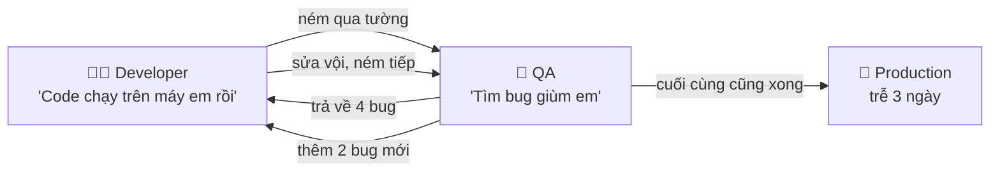

Vấn đề của mô hình này:

- **Vòng phản hồi quá dài**: mỗi lần qua lại mất nửa ngày đến 1 ngày
- **QA không thể biết hết** các nhánh code bên trong - chỉ developer mới biết `if` nào tồn tại
- **Developer mất dần cảm giác sở hữu**: "có người kiểm tra rồi, mình cứ code nhanh"
- **QA trở thành nút thắt cổ chai** của cả team

### Chi phí sửa bug tăng theo thời gian

Một bug được phát hiện càng muộn thì càng đắt. Con số chính xác thay đổi tùy nghiên cứu, nhưng xu hướng thì ai làm lâu năm cũng thấy:

| Giai đoạn phát hiện bug | Ai phát hiện | Chi phí tương đối | Ví dụ |
|---|---|---|---|
| Lúc viết code / chạy test local | Chính bạn | 1x - vài phút | Test đỏ, sửa ngay |
| Code review | Đồng nghiệp | ~5x - vài giờ | Comment, sửa, review lại |
| QA / staging | Tester | ~10x - 1 ngày | Tạo ticket, tái hiện, sửa, deploy lại |
| Production | Khách hàng 😱 | 50-100x+ | Hotfix đêm, mất tiền, mất uy tín, viết postmortem |

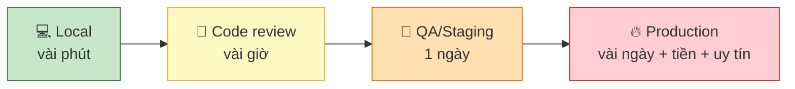

!!! tip "Tư duy đúng"
    **QA không phải là lưới an toàn duy nhất - QA là lưới an toàn cuối cùng.** Developer chịu trách nhiệm chính về chất lượng code mình viết. QA giỏi giúp bạn tìm những thứ bạn **không thể nghĩ tới** (trải nghiệm người dùng, tích hợp giữa các hệ thống, kịch bản nghiệp vụ phức tạp) - chứ không phải những lỗi `nil pointer` mà bạn đáng lẽ tự bắt được.

### "Chất lượng" gồm những gì?

Chất lượng phần mềm không chỉ là "không có bug". Nó có hai mặt:

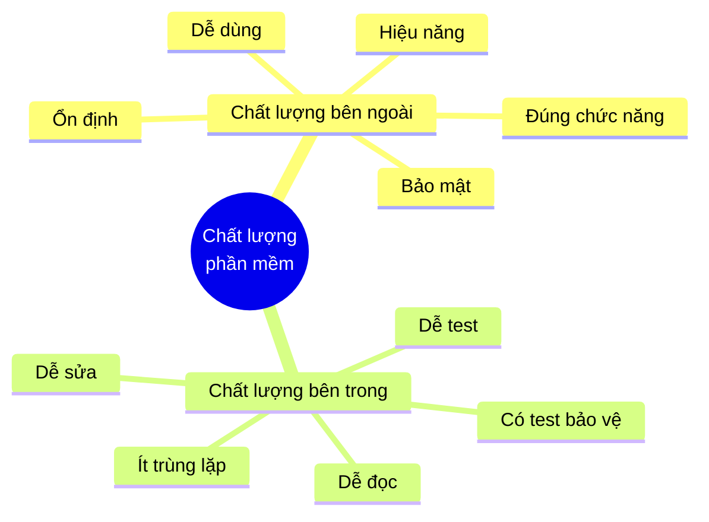

- **Chất lượng bên ngoài (external)**: khách hàng nhìn thấy - tính năng chạy đúng, nhanh, không sập
- **Chất lượng bên trong (internal)**: chỉ developer nhìn thấy - code dễ hiểu, dễ sửa, có test

Khách hàng không bao giờ đọc code của bạn, nên nhiều người nghĩ chất lượng bên trong "không quan trọng". Sai lầm lớn: **chất lượng bên trong quyết định tốc độ bạn giao được chất lượng bên ngoài trong tương lai**. Chúng ta sẽ quay lại điểm này ở mục 14.

---

## 📖 2. Tại sao viết test? Sự tự tin để thay đổi

Hỏi 10 developer "tại sao viết test?", 8 người sẽ nói "để tìm bug". Đúng, nhưng chưa đủ. Lý do **quan trọng nhất** là:

> **Test cho bạn sự tự tin để thay đổi code.**

### Câu chuyện: Refactor lúc 11 giờ đêm

Hệ thống tính lương của một công ty outsource có hàm `CalculateSalary` dài 400 dòng, viết từ 2018. Sếp yêu cầu thêm "phụ cấp làm việc từ xa". Hai developer, hai cách:

**Hùng (không có test):**

- Đọc 400 dòng, không dám sửa cấu trúc
- Chèn thêm một `if` vào giữa, copy-paste logic từ chỗ khác
- Test tay 3 trường hợp, thấy đúng, deploy
- Cuối tháng: 200 nhân viên part-time bị tính sai lương vì cái `if` chèn nhầm chỗ. Kế toán phải tính lại bằng Excel.

**Vy (viết test trước khi sửa):**

- Dành 1 ngày viết 30 test ghi lại hành vi hiện tại (kỹ thuật ở mục 7)
- Refactor hàm 400 dòng thành 8 hàm nhỏ - chạy test sau **mỗi** bước nhỏ, luôn xanh
- Thêm phụ cấp từ xa - viết test trước, rồi code
- Deploy. Cuối tháng không có gì xảy ra. (Và "không có gì xảy ra" chính là thành công.)

Vy chậm hơn Hùng 1 ngày ở lần sửa đầu tiên. Nhưng **mọi lần sửa sau** trên hàm đó, cả team đều nhanh hơn - vì đã có lưới an toàn.

### 5 giá trị của một bộ test tốt

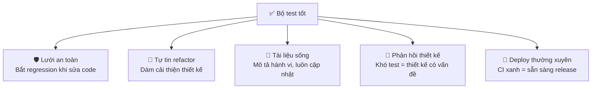

1. **Lưới an toàn (regression)**: bạn sửa A, test báo B bị hỏng - trước khi khách hàng báo
2. **Tự tin refactor**: không có test, không ai dám dọn code → code ngày càng tệ (xem "technical debt" ở Bài 7)
3. **Tài liệu sống**: test `TestFee/đúng_ngưỡng_500k_thì_free_ship` nói rõ quy tắc nghiệp vụ hơn mọi trang Confluence đã lỗi thời
4. **Phản hồi về thiết kế**: nếu để test một hàm bạn phải dựng database, gọi API thật và chờ 5 giây - hàm đó đang làm quá nhiều việc (liên hệ SRP ở Bài 4)
5. **Cho phép deploy thường xuyên**: công ty deploy 20 lần/ngày không phải vì họ liều - mà vì họ có bộ test tự động mà họ tin tưởng

!!! note "Test là khoản đầu tư, không phải chi phí"
    Viết test tốn thời gian **bây giờ** để tiết kiệm thời gian **sau này**. Giống như mua bảo hiểm xe máy: năm nào không tai nạn bạn thấy "phí tiền", nhưng năm có tai nạn thì bạn biết ơn nó. Khác biệt: với phần mềm, "tai nạn" xảy ra gần như chắc chắn - chỉ là chưa biết khi nào.

---

## 📖 3. Test cái gì? Hành vi, không phải cài đặt

Đây là sai lầm phổ biến nhất của người mới viết test: **test cách code làm việc, thay vì test code làm được gì.**

### So sánh: test cài đặt vs test hành vi

Giả sử bạn có một service tính tổng giỏ hàng. Test "cài đặt" (implementation) kiểm tra **bên trong** gọi hàm nào, bao nhiêu lần:

=== "Go"

    ```go
    // ❌ Test chi tiết cài đặt: gãy mỗi khi refactor dù hành vi không đổi
    func TestCartTotal_Implementation(t *testing.T) {
        repo := &mockRepo{}
        svc := NewCartService(repo)

        svc.Total("cart-1")

        // Kiểm tra CÁCH làm, không phải KẾT QUẢ
        if repo.getItemsCalls != 1 {
            t.Error("phải gọi GetItems đúng 1 lần")
        }
        if repo.getPriceCalls != 3 {
            t.Error("phải gọi GetPrice đúng 3 lần") // đổi sang GetPrices (batch) là test đỏ!
        }
    }

    // ✅ Test hành vi: chỉ quan tâm input -> output
    func TestCartTotal_Behavior(t *testing.T) {
        repo := newFakeRepo(
            item{sku: "ao-thun", price: 150_000, qty: 2},
            item{sku: "non", price: 80_000, qty: 1},
        )
        svc := NewCartService(repo)

        got := svc.Total("cart-1")

        if got != 380_000 {
            t.Errorf("Total = %d; want 380000", got)
        }
    }
    ```

=== "Python"

    ```python
    # ❌ Test chi tiết cài đặt: gãy mỗi khi refactor dù hành vi không đổi
    def test_cart_total_implementation():
        repo = Mock()
        repo.get_items.return_value = [...]
        svc = CartService(repo)

        svc.total("cart-1")

        # Kiểm tra CÁCH làm, không phải KẾT QUẢ
        repo.get_items.assert_called_once()
        assert repo.get_price.call_count == 3  # đổi sang get_prices (batch) là test đỏ!


    # ✅ Test hành vi: chỉ quan tâm input -> output
    def test_cart_total_behavior():
        repo = FakeRepo(
            Item(sku="ao-thun", price=150_000, qty=2),
            Item(sku="non", price=80_000, qty=1),
        )
        svc = CartService(repo)

        assert svc.total("cart-1") == 380_000
    ```

Khi bạn tối ưu hiệu năng bằng cách gọi `GetPrices` một lần thay vì `GetPrice` 3 lần, test thứ nhất đỏ **dù hệ thống vẫn đúng**. Test kiểu này gọi là **test giòn (brittle test)** - nó không bảo vệ bạn, nó **cản trở** bạn refactor. Sau vài lần như vậy, team bắt đầu ghét test và xóa test.

!!! tip "Quy tắc ngón tay cái"
    Hỏi: **"Nếu tôi refactor bên trong mà hành vi bên ngoài không đổi, test này có đỏ không?"** Nếu có → test đang gắn với cài đặt. Hãy viết lại để kiểm tra **kết quả quan sát được**: giá trị trả về, trạng thái trong database, response HTTP, message gửi đi.

### Khi nào mock là hợp lý?

Mock không xấu - lạm dụng mock mới xấu. Dùng mock/fake/stub cho **ranh giới hệ thống** (system boundary):

| Nên dùng test double | Không nên mock |
|---|---|
| Gọi API bên thứ ba (cổng thanh toán, SMS, email) | Các hàm/class nội bộ trong cùng module |
| Thời gian (`time.Now()`), số ngẫu nhiên | Cấu trúc dữ liệu đơn giản (struct, dict) |
| Hệ thống chậm/đắt khi chạy unit test | Thư viện chuẩn (trừ I/O) |
| Kiểm tra "đã gửi email xác nhận" - đây chính là hành vi | Mọi thứ chỉ để "cô lập tuyệt đối" |

### Chọn test case: đừng chỉ test "happy path"

Người mới thường test đúng **một** trường hợp - trường hợp mọi thứ suôn sẻ. Người có kinh nghiệm hỏi "chuyện gì xảy ra nếu...?" theo một checklist trong đầu:

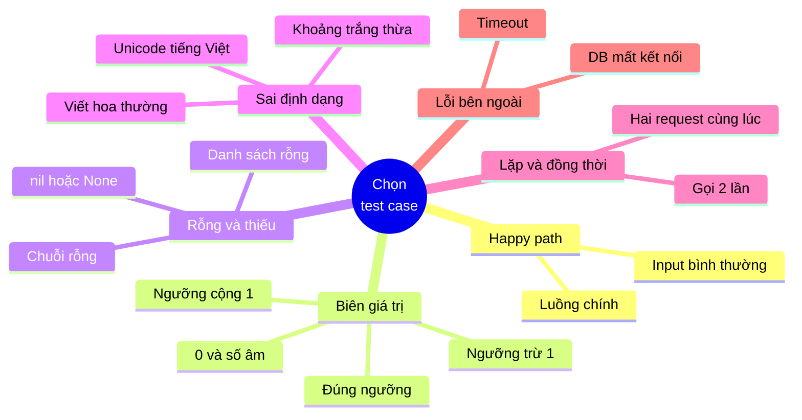

Áp dụng cho 4 bug của Minh ở mục 1:

| Bug | Nhóm test case bị bỏ qua |
|---|---|
| Giỏ hàng trống → lỗi 500 | Rỗng và thiếu |
| `GOLD` viết hoa không được giảm | Sai định dạng |
| Giảm 100% + phí ship → tổng âm | Biên giá trị |
| Áp mã 2 lần → giảm 2 lần | Lặp và đồng thời |

### Không cần test những gì?

- Getter/setter tầm thường không có logic
- Code của framework/thư viện (đã được họ test) - nhưng **có** test cách bạn **dùng** chúng
- Code prototype sẽ vứt đi trong tuần (nhưng hãy chắc chắn nó thật sự bị vứt đi!)
- Constant, config tĩnh

---

## 📖 4. Test Pyramid & Testing Trophy

Có nhiều loại test, mỗi loại có giá khác nhau:

| Loại | Kiểm tra gì | Tốc độ | Độ tin cậy về hệ thống thật | Chi phí bảo trì |
|---|---|---|---|---|
| **Static** (type check, lint) | Lỗi cú pháp, kiểu, pattern nguy hiểm | Tức thì | Thấp | Rất thấp |
| **Unit** | Một hàm/class, cô lập | ms | Thấp - trung bình | Thấp |
| **Integration** | Nhiều thành phần thật cùng nhau (code + DB thật, code + HTTP) | 100ms - vài giây | Cao | Trung bình |
| **End-to-end (E2E)** | Cả hệ thống như người dùng (trình duyệt, app) | Giây - phút | Rất cao | Cao, hay flaky |
| **Manual / Exploratory** | Người thật khám phá | Giờ | Cao với UX | Rất cao |

### Test Pyramid (Mike Cohn)

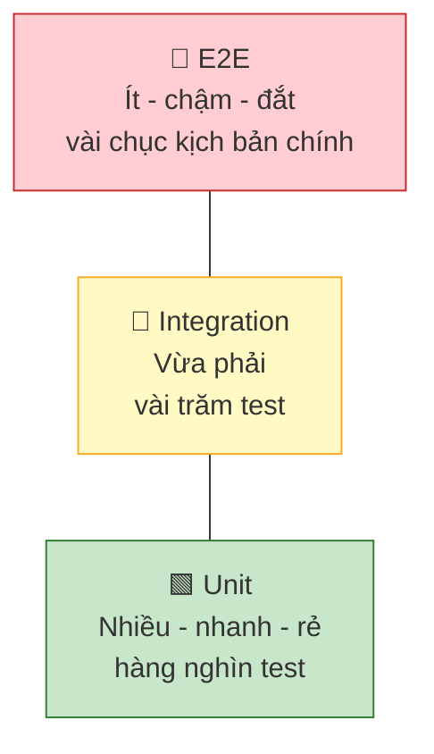

Ý tưởng: **càng xuống dưới càng nhiều test**, vì test ở dưới nhanh, rẻ, ổn định. Test ở trên chậm và dễ vỡ, nên chỉ dùng cho các luồng quan trọng nhất (đăng ký, đặt hàng, thanh toán).

### Testing Trophy (Kent C. Dodds)

Với ứng dụng web hiện đại, nhiều người thấy **integration test cho nhiều giá trị nhất trên mỗi đồng bỏ ra**: nó kiểm tra code thật chạy cùng nhau, nhưng vẫn đủ nhanh. Từ đó có mô hình "chiếc cúp":

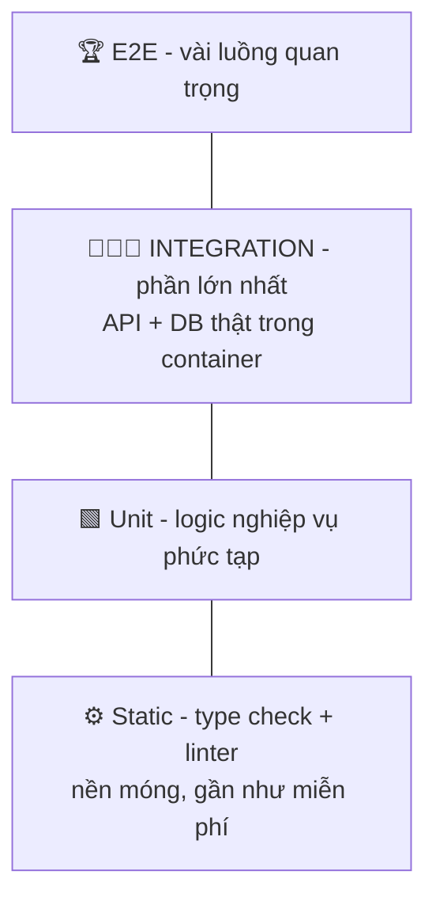

### Anti-pattern: "Cây kem ốc quế" (Ice-cream cone)

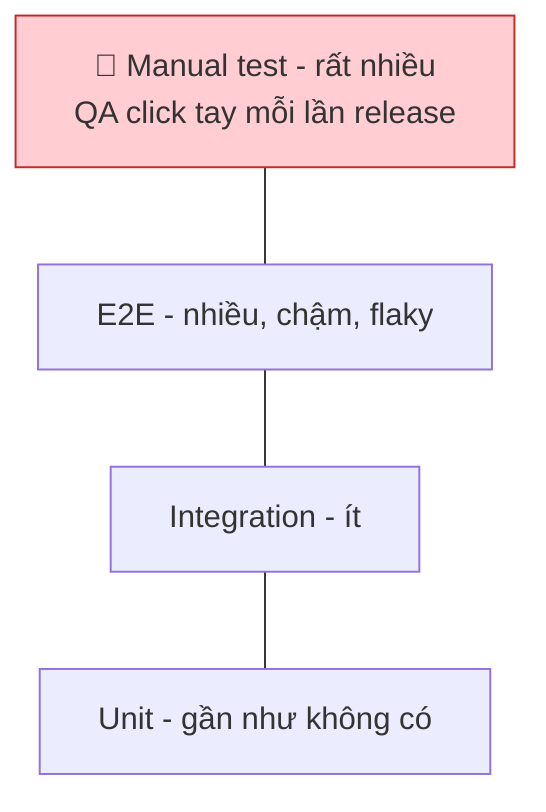

Rất nhiều công ty ở Việt Nam (và cả thế giới) đang ở hình dạng này: mỗi lần release, cả team QA test tay 2-3 ngày theo file Excel 500 dòng. Kết quả: release chậm, ai cũng sợ release, nên gom nhiều thay đổi vào một lần release → rủi ro càng lớn → càng sợ. Một vòng luẩn quẩn.

!!! tip "Pyramid hay Trophy?"
    Đừng tranh cãi hình dạng. Nguyên tắc chung của cả hai: **đẩy việc kiểm tra xuống tầng rẻ nhất có thể bắt được lỗi đó**. Lỗi kiểu dữ liệu → để compiler/type checker bắt. Lỗi logic tính toán → unit test. Lỗi SQL sai → integration test với DB thật. Lỗi "nút thanh toán không bấm được" → E2E.

Chi tiết về cách dựng integration test với database thật trong CI, xem [Backend Bài 13: Testing, CI/CD & Deployment](../backend/13-testing-cicd-deployment.md).

---

## 📖 5. Test tốt trông như thế nào? FIRST + AAA

### Nguyên tắc FIRST

| Chữ | Nghĩa | Vi phạm thường gặp |
|---|---|---|
| **F**ast | Nhanh - cả bộ unit test chạy trong vài giây | Test gọi API thật, `sleep(5)` |
| **I**ndependent / Isolated | Độc lập - chạy riêng lẻ, theo bất kỳ thứ tự nào đều ra cùng kết quả | Test B dùng dữ liệu test A tạo ra |
| **R**epeatable | Lặp lại được - chạy 100 lần, 100 kết quả giống nhau, trên mọi máy | Phụ thuộc giờ hệ thống, múi giờ, mạng, random |
| **S**elf-validating | Tự đánh giá - pass/fail rõ ràng, không cần người đọc log | Test chỉ `print` kết quả để "nhìn bằng mắt" |
| **T**imely | Kịp thời - viết cùng lúc (hoặc trước) code | "Để sprint sau viết test" (không bao giờ xảy ra) |

!!! warning "Test chậm = test không được chạy"
    Nếu bộ test mất 20 phút, developer sẽ không chạy nó trước khi push. Họ đẩy lên CI và đi pha cà phê. Khi CI đỏ, họ đã chuyển sang việc khác và mất ngữ cảnh. **Tốc độ của test quyết định tần suất nó được chạy, và tần suất quyết định giá trị của nó.**

### Cấu trúc AAA: Arrange - Act - Assert

Mọi test tốt đều có 3 phần rõ ràng (còn gọi là Given - When - Then):

=== "Go"

    ```go
    func TestApplyCoupon_ExpiredCoupon_ReturnsError(t *testing.T) {
        // Arrange - chuẩn bị dữ liệu
        coupon := Coupon{Code: "TET2026", ExpiresAt: date(2026, 2, 1)}
        cart := Cart{Total: 300_000}
        today := date(2026, 3, 1)

        // Act - thực hiện MỘT hành động
        _, err := ApplyCoupon(cart, coupon, today)

        // Assert - kiểm tra kết quả
        if !errors.Is(err, ErrCouponExpired) {
            t.Fatalf("err = %v; want ErrCouponExpired", err)
        }
    }
    ```

=== "Python"

    ```python
    def test_apply_coupon_expired_coupon_raises_error():
        # Arrange - chuẩn bị dữ liệu
        coupon = Coupon(code="TET2026", expires_at=date(2026, 2, 1))
        cart = Cart(total=300_000)
        today = date(2026, 3, 1)

        # Act + Assert - với exception, pytest gộp hai bước
        with pytest.raises(CouponExpiredError):
            apply_coupon(cart, coupon, today)
    ```

### Đặt tên test như một câu nói

Tên test là thứ đầu tiên bạn đọc khi CI đỏ lúc 2h sáng. So sánh:

| ❌ Tên tệ | ✅ Tên tốt |
|---|---|
| `TestCoupon1` | `TestApplyCoupon_ExpiredCoupon_ReturnsError` |
| `test_fee` | `test_fee_is_zero_when_order_reaches_free_ship_threshold` |
| `TestHandler` | `TestCreateOrder_ReturnsConflict_WhenIdempotencyKeyReused` |

Mẫu gợi ý: `Test<Đơn vị>_<Tình huống>_<Kết quả mong đợi>`.

### Một test - một lý do để đỏ

Test tốt khi đỏ sẽ **nói ngay** cái gì hỏng. Nếu một test kiểm tra 15 thứ khác nhau, khi nó đỏ bạn phải debug chính cái test. Table-driven test (Go) và `parametrize` (pytest) giúp bạn có nhiều case mà mỗi case vẫn báo lỗi riêng - bạn sẽ thấy ngay ở mục TDD dưới đây.

---

## 📖 6. TDD: Red → Green → Refactor

**Test-Driven Development** là kỷ luật viết test **trước** code. Chu trình gồm 3 bước lặp lại rất ngắn (vài phút mỗi vòng):

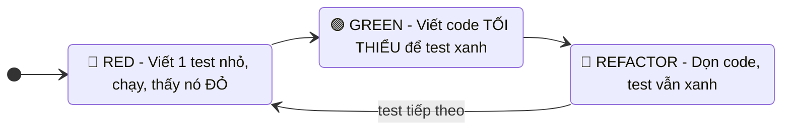

Tại sao phải thấy test **đỏ** trước? Vì một test chưa bao giờ đỏ có thể là test **không kiểm tra gì cả** (quên assert, gọi nhầm hàm, điều kiện luôn đúng). Thấy đỏ rồi mới xanh = bằng chứng test thật sự có tác dụng.

### Bài toán: Tính phí ship

PM gửi yêu cầu cho tính năng tính phí ship của một shop online:

```text
- Đơn hàng từ 500.000đ trở lên: miễn phí ship
- Nội thành: 20.000đ, ngoại thành: 35.000đ
- Phí trên đã bao gồm 3kg đầu. Mỗi kg tiếp theo (làm tròn lên) cộng 5.000đ
```

Thay vì code một mạch, ta đi từng bước nhỏ.

### Vòng 1 - 🔴 RED: test đầu tiên, trường hợp đơn giản nhất

Viết test trước. Hàm `Fee` chỉ là một "vỏ" trả về 0 để code biên dịch được:

=== "Go"

    ```go
    // shipping.go
    package shipping

    // Fee trả về phí ship (VND). Chưa cài đặt gì cả.
    func Fee(orderTotal int, weightKg float64, innerCity bool) int {
        return 0
    }
    ```

    ```go
    // shipping_test.go
    package shipping

    import "testing"

    func TestFee_InnerCityLightOrder(t *testing.T) {
        got := Fee(200_000, 1, true)
        want := 20_000
        if got != want {
            t.Errorf("Fee(200000, 1kg, nội thành) = %d; want %d", got, want)
        }
    }
    ```

    ```text
    $ go test ./...
    --- FAIL: TestFee_InnerCityLightOrder (0.00s)
        shipping_test.go:9: Fee(200000, 1kg, nội thành) = 0; want 20000
    FAIL
    FAIL	shipping	0.002s
    FAIL
    ```

=== "Python"

    ```python
    # shipping.py
    def fee(order_total: int, weight_kg: float, inner_city: bool) -> int:
        """Trả về phí ship (VND). Chưa cài đặt gì cả."""
        return 0
    ```

    ```python
    # test_shipping.py
    from shipping import fee


    def test_inner_city_light_order():
        assert fee(200_000, 1, inner_city=True) == 20_000
    ```

    ```text
    $ pytest -q
    F                                                                        [100%]
    =================================== FAILURES ===================================
    _________________________ test_inner_city_light_order __________________________

        def test_inner_city_light_order():
    >       assert fee(200_000, 1, inner_city=True) == 20_000
    E       assert 0 == 20000
    E        +  where 0 = fee(200000, 1, inner_city=True)

    test_shipping.py:5: AssertionError
    =========================== short test summary info ============================
    FAILED test_shipping.py::test_inner_city_light_order - assert 0 == 20000
    1 failed in 0.02s
    ```

Test đỏ vì **đúng lý do** (trả về 0 thay vì 20000). Tốt!

### Vòng 1 - 🟢 GREEN: code tối thiểu

"Tối thiểu" nghĩa là **tối thiểu thật sự** - kể cả hardcode (kỹ thuật "Fake it till you make it"):

=== "Go"

    ```go
    func Fee(orderTotal int, weightKg float64, innerCity bool) int {
        return 20_000 // "Fake it" - hardcode cho test xanh
    }
    ```

=== "Python"

    ```python
    def fee(order_total: int, weight_kg: float, inner_city: bool) -> int:
        return 20_000  # "Fake it" - hardcode cho test xanh
    ```

Nghe có vẻ ngớ ngẩn? Mục đích là **để test tiếp theo buộc bạn phải viết logic thật**. Mỗi test mới là một "áp lực" đẩy code về phía tổng quát.

### Vòng 2 - 🔴 RED → 🟢 GREEN: ngoại thành

Thêm test ngoại thành. Code hardcode lập tức lộ ra:

=== "Go"

    ```go
    func TestFee_OuterCityLightOrder(t *testing.T) {
        if got := Fee(200_000, 1, false); got != 35_000 {
            t.Errorf("ngoại thành: got %d; want 35000", got)
        }
    }
    ```

    ```text
    $ go test ./...
    --- FAIL: TestFee_OuterCityLightOrder (0.00s)
        shipping_test.go:13: ngoại thành: got 20000; want 35000
    FAIL
    FAIL	shipping	0.002s
    FAIL
    ```

=== "Python"

    ```python
    def test_outer_city_light_order():
        assert fee(200_000, 1, inner_city=False) == 35_000
    ```

    ```text
    $ pytest -q
    =========================== short test summary info ============================
    FAILED test_shipping.py::test_outer_city_light_order - assert 20000 == 35000
    1 failed, 1 passed in 0.02s
    ```

Sửa cho xanh bằng một `if innerCity { return 20_000 }; return 35_000`. Tiếp tục như vậy:

| Vòng | Test mới (RED) | Code thêm để GREEN |
|---|---|---|
| 3 | Đơn 500.000đ → 0đ | `if orderTotal >= 500_000 { return 0 }` |
| 4 | Đơn 499.999đ → vẫn tính phí | (đã xanh - test biên giá trị, giữ lại làm "bảo hiểm") |
| 5 | 5kg ngoại thành → 45.000đ | Tính phụ phí `(weight - 3) * 5000` |
| 6 | 3.2kg → làm tròn lên 1kg → 25.000đ | Đổi sang `math.Ceil` |
| 7 | Đúng 3kg → không phụ phí | (đã xanh) |

!!! note "Vòng 6 là khoảnh khắc 'à há'"
    Ở vòng 5, bạn có thể viết `int(weightKg - 3) * 5000`. Test 5kg xanh. Nhưng với 3.2kg, `int(0.2) = 0` → không tính phụ phí, trong khi yêu cầu nói "làm tròn lên". **Test case 3.2kg bắt được lỗi mà code review bằng mắt rất dễ bỏ qua.** Đây là lý do nên chọn test case theo checklist "biên giá trị" ở mục 3.

### 🔵 REFACTOR: dọn dẹp khi test đang xanh

Sau 7 vòng, code chạy đúng nhưng đầy "magic number" và `if` lồng nhau. Bây giờ - **và chỉ bây giờ, khi mọi test đang xanh** - ta refactor: đặt tên hằng số, tách hàm nhỏ, gom test thành bảng. Chạy test sau mỗi thay đổi nhỏ.

Phiên bản cuối cùng (chạy được):

=== "Go"

    ```go
    // shipping.go
    package shipping

    import "math"

    // Quy tắc kinh doanh - đặt tên rõ ràng thay vì "magic number".
    const (
        FreeShipThreshold = 500_000 // đơn từ 500k được miễn phí ship
        innerCityBaseFee  = 20_000
        outerCityBaseFee  = 35_000
        includedWeightKg  = 3.0 // 3kg đầu đã tính trong phí cơ bản
        extraFeePerKg     = 5_000
    )

    // Fee trả về phí ship (VND) cho một đơn hàng.
    func Fee(orderTotal int, weightKg float64, innerCity bool) int {
        if orderTotal >= FreeShipThreshold {
            return 0
        }
        return baseFee(innerCity) + overweightFee(weightKg)
    }

    func baseFee(innerCity bool) int {
        if innerCity {
            return innerCityBaseFee
        }
        return outerCityBaseFee
    }

    func overweightFee(weightKg float64) int {
        extraKg := math.Ceil(weightKg - includedWeightKg) // 3.2kg -> tính thêm 1kg
        if extraKg <= 0 {
            return 0
        }
        return int(extraKg) * extraFeePerKg
    }
    ```

    ```go
    // shipping_test.go
    package shipping

    import "testing"

    func TestFee(t *testing.T) {
        tests := []struct {
            name       string
            orderTotal int
            weightKg   float64
            innerCity  bool
            want       int
        }{
            {"nội thành, đơn nhỏ, hàng nhẹ", 200_000, 1, true, 20_000},
            {"ngoại thành, đơn nhỏ, hàng nhẹ", 200_000, 1, false, 35_000},
            {"đúng ngưỡng 500k thì free ship", 500_000, 1, false, 0},
            {"dưới ngưỡng 1 đồng vẫn tính phí", 499_999, 1, true, 20_000},
            {"đúng 3kg chưa tính phụ phí", 200_000, 3, true, 20_000},
            {"3.2kg làm tròn lên thêm 1kg", 200_000, 3.2, true, 25_000},
            {"5kg ngoại thành: 35k + 2*5k", 200_000, 5, false, 45_000},
            {"hàng nặng nhưng đơn lớn vẫn free", 900_000, 20, false, 0},
        }
        for _, tc := range tests {
            t.Run(tc.name, func(t *testing.T) {
                got := Fee(tc.orderTotal, tc.weightKg, tc.innerCity)
                if got != tc.want {
                    t.Errorf("Fee(%d, %.1fkg, inner=%v) = %d; want %d",
                        tc.orderTotal, tc.weightKg, tc.innerCity, got, tc.want)
                }
            })
        }
    }
    ```

    ```text
    $ go test -v ./...
    === RUN   TestFee
    === RUN   TestFee/nội_thành,_đơn_nhỏ,_hàng_nhẹ
    ...
    --- PASS: TestFee (0.00s)
        --- PASS: TestFee/nội_thành,_đơn_nhỏ,_hàng_nhẹ (0.00s)
        --- PASS: TestFee/ngoại_thành,_đơn_nhỏ,_hàng_nhẹ (0.00s)
        --- PASS: TestFee/đúng_ngưỡng_500k_thì_free_ship (0.00s)
        --- PASS: TestFee/dưới_ngưỡng_1_đồng_vẫn_tính_phí (0.00s)
        --- PASS: TestFee/đúng_3kg_chưa_tính_phụ_phí (0.00s)
        --- PASS: TestFee/3.2kg_làm_tròn_lên_thêm_1kg (0.00s)
        --- PASS: TestFee/5kg_ngoại_thành:_35k_+_2*5k (0.00s)
        --- PASS: TestFee/hàng_nặng_nhưng_đơn_lớn_vẫn_free (0.00s)
    PASS
    ok  	shipping	0.003s
    ```

=== "Python"

    ```python
    # shipping.py
    import math

    # Quy tắc kinh doanh - đặt tên rõ ràng thay vì "magic number".
    FREE_SHIP_THRESHOLD = 500_000  # đơn từ 500k được miễn phí ship
    INNER_CITY_BASE_FEE = 20_000
    OUTER_CITY_BASE_FEE = 35_000
    INCLUDED_WEIGHT_KG = 3.0  # 3kg đầu đã tính trong phí cơ bản
    EXTRA_FEE_PER_KG = 5_000


    def fee(order_total: int, weight_kg: float, inner_city: bool) -> int:
        """Trả về phí ship (VND) cho một đơn hàng."""
        if order_total >= FREE_SHIP_THRESHOLD:
            return 0
        return _base_fee(inner_city) + _overweight_fee(weight_kg)


    def _base_fee(inner_city: bool) -> int:
        return INNER_CITY_BASE_FEE if inner_city else OUTER_CITY_BASE_FEE


    def _overweight_fee(weight_kg: float) -> int:
        extra_kg = math.ceil(weight_kg - INCLUDED_WEIGHT_KG)  # 3.2kg -> tính thêm 1kg
        return max(extra_kg, 0) * EXTRA_FEE_PER_KG
    ```

    ```python
    # test_shipping.py
    import pytest

    from shipping import fee


    @pytest.mark.parametrize(
        "order_total, weight_kg, inner_city, expected",
        [
            pytest.param(200_000, 1, True, 20_000, id="noi-thanh-don-nho"),
            pytest.param(200_000, 1, False, 35_000, id="ngoai-thanh-don-nho"),
            pytest.param(500_000, 1, False, 0, id="dung-nguong-free-ship"),
            pytest.param(499_999, 1, True, 20_000, id="duoi-nguong-1-dong"),
            pytest.param(200_000, 3, True, 20_000, id="dung-3kg"),
            pytest.param(200_000, 3.2, True, 25_000, id="3.2kg-lam-tron-len"),
            pytest.param(200_000, 5, False, 45_000, id="5kg-ngoai-thanh"),
            pytest.param(900_000, 20, False, 0, id="nang-nhung-don-lon"),
        ],
    )
    def test_fee(order_total, weight_kg, inner_city, expected):
        assert fee(order_total, weight_kg, inner_city) == expected
    ```

    ```text
    $ pytest -v
    collected 8 items

    test_shipping.py::test_fee[noi-thanh-don-nho] PASSED                     [ 12%]
    test_shipping.py::test_fee[ngoai-thanh-don-nho] PASSED                   [ 25%]
    test_shipping.py::test_fee[dung-nguong-free-ship] PASSED                 [ 37%]
    test_shipping.py::test_fee[duoi-nguong-1-dong] PASSED                    [ 50%]
    test_shipping.py::test_fee[dung-3kg] PASSED                              [ 62%]
    test_shipping.py::test_fee[3.2kg-lam-tron-len] PASSED                    [ 75%]
    test_shipping.py::test_fee[5kg-ngoai-thanh] PASSED                       [ 87%]
    test_shipping.py::test_fee[nang-nhung-don-lon] PASSED                    [100%]

    ============================== 8 passed in 0.01s ===============================
    ```

    Cài pytest bằng `pip install pytest` nếu chưa có.

Nhìn vào bảng test, một PM không biết code vẫn đọc hiểu được quy tắc tính phí. Đó chính là "tài liệu sống".

### Khi nào TDD phù hợp, khi nào không?

| TDD rất hợp | TDD kém hiệu quả |
|---|---|
| Logic nghiệp vụ rõ ràng: tính tiền, thuế, khuyến mãi, phân quyền | Đang khám phá: chưa biết API trông thế nào, thử nghiệm thư viện mới |
| Sửa bug: viết test tái hiện bug trước, rồi sửa | UI/giao diện thay đổi liên tục |
| Thuật toán có input/output rõ ràng | Spike/prototype sẽ vứt đi |
| Code nhiều người cùng sửa | Script chạy 1 lần |

!!! tip "Không cần là 'tín đồ' TDD"
    Bạn không cần viết 100% code theo TDD. Nhưng có **một thói quen** nên áp dụng ngay từ hôm nay: **khi sửa bug, hãy viết test tái hiện bug trước.** Test đỏ → sửa → test xanh. Bug đó sẽ không bao giờ quay lại mà không ai biết.

---

## 📖 7. Test code legacy: Characterization tests

> "Legacy code đơn giản là code không có test." - Michael Feathers, *Working Effectively with Legacy Code*

### Tình huống

Bạn vừa vào công ty mới. Tuần đầu tiên, sếp giao: "Sửa lại cách tính điểm tích lũy, thêm hạng Platinum". Hàm tính điểm viết từ 2019, tác giả đã nghỉ việc, không có tài liệu, không có test. Mọi người trong team đều nói "cẩn thận, hàm đó ảnh hưởng tới 2 triệu khách hàng".

Bạn **không biết** hàm đó "đúng" là như thế nào. Bạn chỉ biết nó đang chạy trên production và khách hàng đang quen với kết quả của nó. Vì vậy mục tiêu đầu tiên **không phải** là kiểm tra nó đúng - mà là **ghi lại chính xác nó đang làm gì**, để khi bạn sửa, bạn biết mình đã thay đổi những gì.

### Quy trình characterization test

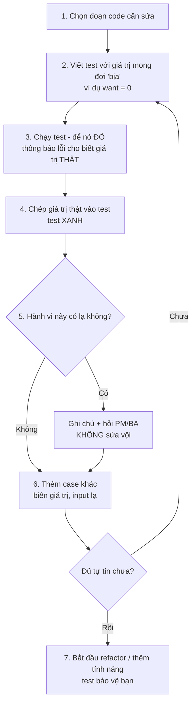

Code legacy (đừng sửa nó vội!):

=== "Go"

    ```go
    package legacy

    // LoyaltyPoints - code viết năm 2019, không ai còn nhớ vì sao lại như vậy.
    func LoyaltyPoints(amount int, tier string) int {
        p := amount / 10000
        if tier == "gold" {
            p = p * 2
        } else if tier == "silver" {
            p = p * 3 / 2
        }
        if amount > 1000000 {
            p += 50
        }
        if p > 500 {
            p = 500
        }
        return p
    }
    ```

    Characterization test - chạy thật, tất cả đều PASS:

    ```go
    package legacy

    import "testing"

    // Characterization test: ghi lại hành vi HIỆN TẠI, không phán xét đúng/sai.
    func TestLoyaltyPoints_CurrentBehavior(t *testing.T) {
        cases := []struct {
            amount int
            tier   string
            want   int // giá trị lấy từ lần chạy thật, không phải từ spec
        }{
            {150_000, "normal", 15},
            {150_000, "gold", 30},
            {150_000, "silver", 22},    // 22.5 bị làm tròn xuống - cố ý hay bug? -> hỏi PM
            {150_000, "GOLD", 15},      // viết hoa bị coi là khách thường!
            {1_000_000, "normal", 100}, // đúng 1 triệu KHÔNG được thưởng 50
            {1_000_001, "normal", 150}, // hơn 1 đồng thì được
            {9_999, "gold", 0},         // dưới 10k không có điểm
            {5_000_000, "gold", 500},   // bị chặn trần 500
        }
        for _, c := range cases {
            if got := LoyaltyPoints(c.amount, c.tier); got != c.want {
                t.Errorf("LoyaltyPoints(%d, %q) = %d; want %d", c.amount, c.tier, got, c.want)
            }
        }
    }
    ```

    ```text
    $ go test -v ./...
    === RUN   TestLoyaltyPoints_CurrentBehavior
    --- PASS: TestLoyaltyPoints_CurrentBehavior (0.00s)
    PASS
    ok  	legacy	0.005s
    ```

=== "Python"

    ```python
    # loyalty.py
    def loyalty_points(amount, tier):
        # Code viết năm 2019, không ai còn nhớ vì sao lại như vậy.
        p = amount // 10000
        if tier == "gold":
            p = p * 2
        elif tier == "silver":
            p = int(p * 1.5)
        if amount > 1000000:
            p += 50
        if p > 500:
            p = 500
        return p
    ```

    Characterization test - chạy thật, tất cả đều PASS:

    ```python
    # test_loyalty.py
    import pytest

    from loyalty import loyalty_points


    # Characterization test: ghi lại hành vi HIỆN TẠI, không phán xét đúng/sai.
    @pytest.mark.parametrize(
        "amount, tier, expected",  # expected lấy từ lần chạy thật, không phải từ spec
        [
            (150_000, "normal", 15),
            (150_000, "gold", 30),
            (150_000, "silver", 22),  # 22.5 bị làm tròn xuống - cố ý hay bug? -> hỏi PM
            (150_000, "GOLD", 15),  # viết hoa bị coi là khách thường!
            (1_000_000, "normal", 100),  # đúng 1 triệu KHÔNG được thưởng 50
            (1_000_001, "normal", 150),  # hơn 1 đồng thì được
            (9_999, "gold", 0),  # dưới 10k không có điểm
            (5_000_000, "gold", 500),  # bị chặn trần 500
        ],
    )
    def test_loyalty_points_current_behavior(amount, tier, expected):
        assert loyalty_points(amount, tier) == expected
    ```

    ```text
    $ pytest -q
    ........                                                                 [100%]
    8 passed in 0.01s
    ```

Chỉ sau 30 phút, bạn đã phát hiện **3 hành vi đáng ngờ** (làm tròn xuống với silver, `GOLD` viết hoa, ngưỡng "lớn hơn" chứ không phải "lớn hơn hoặc bằng"). Và quan trọng hơn: bạn **không sửa chúng ngay**. Có thể khách hàng silver đã quen nhận 22 điểm; đổi thành 23 là thay đổi nghiệp vụ, cần PM quyết định.

!!! warning "Sửa 'bug' trong code legacy có thể là tạo bug mới"
    Một bộ phận khác (kế toán, báo cáo, đối tác) có thể đang **phụ thuộc** vào hành vi "sai" đó. Nguyên tắc: **tách biệt refactor và thay đổi hành vi**. Commit 1: refactor, test characterization vẫn xanh. Commit 2: thay đổi hành vi có chủ đích, cập nhật test tương ứng, có PM đồng ý.

### Kỹ thuật "seam" - tạo khe hở để test

Code legacy thường khó test vì nó tự gọi database, tự gọi `time.Now()`, tự đọc file config. Feathers gọi chỗ bạn có thể "chen vào" thay đổi hành vi mà không sửa code gọi là **seam** (đường may). Các seam phổ biến:

- **Tham số hóa**: biến dependency ẩn thành tham số (xem ví dụ thời gian ở mục 8)
- **Interface**: thay struct cụ thể bằng interface (Go) / duck typing (Python) để truyền fake vào
- **Extract function**: tách phần logic thuần (pure) ra khỏi phần I/O, test phần thuần trước

---

## 📖 8. Flaky tests - kẻ thù thầm lặng

**Flaky test** là test lúc pass lúc fail **mà code không hề thay đổi**. Nó nguy hiểm hơn bạn nghĩ:

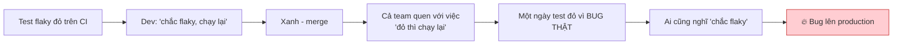

Flaky test **phá hủy niềm tin** vào cả bộ test. Khi mất niềm tin, bộ test mất giá trị.

### Nguyên nhân phổ biến

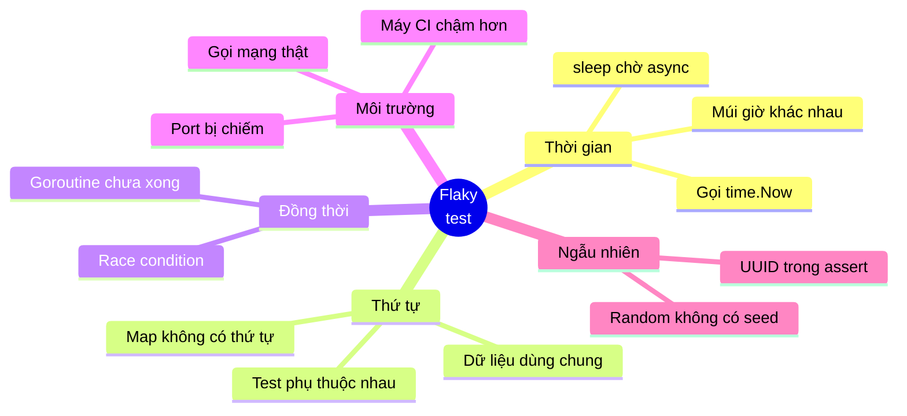

### Ví dụ: test phụ thuộc giờ hệ thống

Chương trình "giờ vàng" giảm 20% từ 14h đến 16h. Phiên bản đầu tự gọi giờ hệ thống bên trong - test chỉ pass nếu CI chạy đúng khung giờ đó. Cách sửa đơn giản nhất: **biến thời gian thành tham số**.

=== "Go"

    ```go
    // promo.go
    package promo

    import "time"

    // ❌ Phiên bản khó test: tự gọi time.Now() bên trong.
    // Test chỉ pass nếu CI chạy đúng 14h-16h -> flaky.
    func DiscountPercentNow() int {
        return DiscountPercent(time.Now())
    }

    // ✅ Phiên bản dễ test: thời gian là THAM SỐ (dependency injection đơn giản nhất).
    func DiscountPercent(now time.Time) int {
        if h := now.Hour(); h >= 14 && h < 16 {
            return 20 // "giờ vàng" 14h-16h giảm 20%
        }
        return 0
    }
    ```

    ```go
    // promo_test.go
    package promo

    import (
        "testing"
        "time"
    )

    func at(hour, min int) time.Time {
        return time.Date(2026, 9, 26, hour, min, 0, 0, time.UTC)
    }

    func TestDiscountPercent(t *testing.T) {
        tests := []struct {
            now  time.Time
            want int
        }{
            {at(13, 59), 0},
            {at(14, 0), 20},
            {at(15, 59), 20},
            {at(16, 0), 0},
        }
        for _, tc := range tests {
            if got := DiscountPercent(tc.now); got != tc.want {
                t.Errorf("DiscountPercent(%s) = %d; want %d", tc.now.Format("15:04"), got, tc.want)
            }
        }
    }
    ```

    ```text
    $ go test -v ./...
    === RUN   TestDiscountPercent
    --- PASS: TestDiscountPercent (0.00s)
    PASS
    ok  	promo	0.002s
    ```

=== "Python"

    ```python
    # promo.py
    from datetime import datetime


    # ❌ Phiên bản khó test: tự gọi datetime.now() bên trong.
    # Test chỉ pass nếu CI chạy đúng 14h-16h -> flaky.
    def discount_percent_now() -> int:
        return discount_percent(datetime.now())


    # ✅ Phiên bản dễ test: thời gian là THAM SỐ (dependency injection đơn giản nhất).
    def discount_percent(now: datetime) -> int:
        if 14 <= now.hour < 16:
            return 20  # "giờ vàng" 14h-16h giảm 20%
        return 0
    ```

    ```python
    # test_promo.py
    from datetime import datetime

    import pytest

    from promo import discount_percent


    def at(hour: int, minute: int) -> datetime:
        return datetime(2026, 9, 26, hour, minute)


    @pytest.mark.parametrize(
        "now, expected",
        [(at(13, 59), 0), (at(14, 0), 20), (at(15, 59), 20), (at(16, 0), 0)],
    )
    def test_discount_percent(now, expected):
        assert discount_percent(now) == expected
    ```

    ```text
    $ pytest -q
    ....                                                                     [100%]
    4 passed in 0.01s
    ```

Bonus: giờ bạn test được cả **biên** (13:59, 14:00, 15:59, 16:00) - điều không thể làm khi phụ thuộc giờ thật.

### Quy trình xử lý flaky test trong team

1. **Không bao giờ "chạy lại cho xanh" mà không ghi nhận.** Tạo ticket ngay.
2. **Cách ly (quarantine)**: đánh dấu skip có ticket kèm theo (`t.Skip("flaky: JIRA-1234")` / `@pytest.mark.skip(reason="flaky: JIRA-1234")`), để không chặn cả team.
3. **Tái hiện**: chạy lặp nhiều lần - `go test -count=100 -race -run TestX` hoặc `pytest -p no:randomly --count=100` (với plugin `pytest-repeat`).
4. **Sửa tận gốc**: inject thời gian, bỏ `sleep` thay bằng chờ điều kiện, cô lập dữ liệu mỗi test.
5. **Đặt hạn**: test bị cách ly quá 2 tuần mà không ai sửa → xóa hoặc viết lại. Test bị skip vĩnh viễn = không có test.

!!! warning "`sleep` trong test là mùi khó chịu"
    `time.Sleep(2 * time.Second)` "để chờ goroutine xong" sẽ pass trên laptop của bạn và fail trên máy CI đang chạy 10 job cùng lúc. Hãy chờ **điều kiện** (channel, `sync.WaitGroup`, polling có timeout) thay vì chờ **thời gian**.

---

## 📖 9. Code coverage: con số dễ gây ảo tưởng

**Coverage** đo **bao nhiêu phần trăm dòng code được chạy qua** khi chạy test. Chú ý: *được chạy qua*, không phải *được kiểm tra*.

```text
$ go test -cover ./...
ok  	shipping	0.003s	coverage: 100.0% of statements

$ go test -coverprofile=c.out ./... && go tool cover -func=c.out
shipping/shipping.go:15:	Fee		100.0%
shipping/shipping.go:22:	baseFee		100.0%
shipping/shipping.go:29:	overweightFee	100.0%
total:				(statements)	100.0%
```

(Python: `pip install pytest-cov` rồi `pytest --cov=shipping`.)

### Thí nghiệm: 100% coverage, 0% giá trị

Viết một test "cho có" - gọi hàm qua mọi nhánh nhưng **không assert gì**:

```go
// ❌ Test "cho có": chạy qua mọi dòng code nhưng KHÔNG kiểm tra gì cả.
func TestFee_NoAssert(t *testing.T) {
	Fee(900_000, 1, true)  // nhánh free ship
	Fee(200_000, 5, true)  // nhánh nội thành + quá cân
	Fee(200_000, 1, false) // nhánh ngoại thành
}
```

```text
$ go test -cover ./...
ok  	shipping	0.003s	coverage: 100.0% of statements
```

Bây giờ cố tình phá code - đổi đơn free ship thành `return 999_999`. Chạy lại: **vẫn xanh, vẫn 100%**. Bộ test này không bảo vệ được gì.

### Định luật Goodhart

> "Khi một thước đo trở thành mục tiêu, nó không còn là thước đo tốt nữa."

Khi công ty đặt KPI "coverage ≥ 90%", developer sẽ viết test để đạt 90% chứ không phải để bắt bug. Bạn sẽ thấy test cho getter/setter, test không assert, test snapshot khổng lồ không ai đọc.

| Coverage **hữu ích** để... | Coverage **vô dụng** để... |
|---|---|
| Tìm vùng code **chưa có test nào** (0% là tín hiệu rõ ràng) | Chứng minh code "đã được test kỹ" |
| Xem nhánh `if err != nil` có được test không | Làm KPI đánh giá developer |
| Phát hiện coverage **giảm đột ngột** trong PR | So sánh chất lượng giữa các team |

!!! tip "Thước đo tốt hơn: Mutation testing"
    Mutation testing tự động "phá" code của bạn (đổi `>=` thành `>`, `+` thành `-`, `return 0` thành `return 1`...) rồi chạy test. Nếu test vẫn xanh → mutant "sống sót" → test của bạn yếu. Công cụ: `go-mutesting`/`gremlins` (Go), `mutmut` (Python). Chạy chậm, nên dùng cho module quan trọng (thanh toán, tính tiền) thay vì cả codebase.

**Một con số thực tế**: nhiều team khỏe mạnh có coverage 70-85% cho logic nghiệp vụ, thấp hơn cho code "keo dán" (wiring, main, config). Quan trọng hơn con số là câu hỏi: **"Nếu tôi xóa dòng code này, có test nào đỏ không?"**

---

## 📖 10. Code review như một cổng chất lượng

Code review là nơi con người bắt những thứ máy không bắt được. Bài 8 sẽ đi sâu vào **cách review và nhận review** như một kỹ năng giao tiếp. Ở đây ta tập trung vào khía cạnh **chất lượng**.

### Review cái gì? (Máy làm được thì để máy làm)

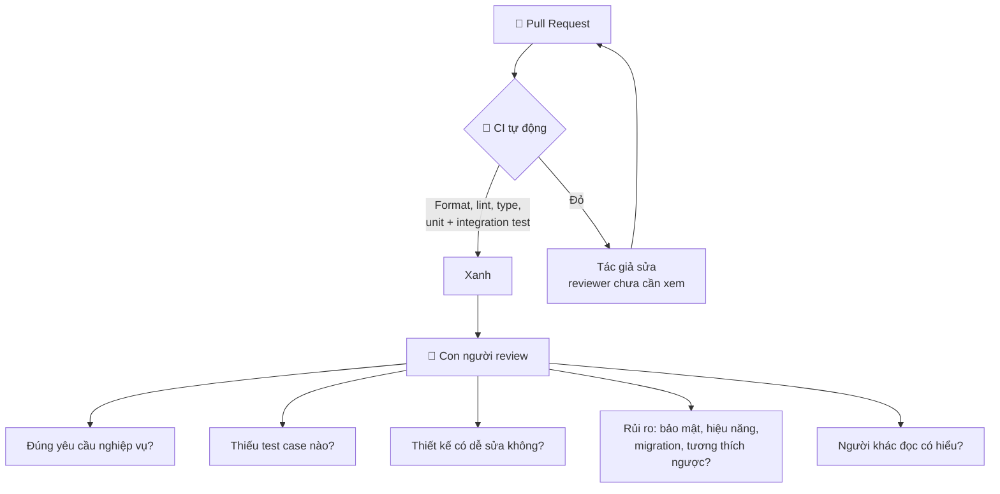

!!! tip "Đừng tốn chất xám con người cho việc của máy"
    Nếu reviewer còn phải comment "thiếu dấu cách", "import chưa sắp xếp", "biến không dùng" - team bạn đang thiếu formatter/linter trong CI. Con người nên dành năng lượng cho **logic, thiết kế và rủi ro**.

### Checklist review về chất lượng

```text
CHECKLIST REVIEW - GÓC NHÌN CHẤT LƯỢNG

[ ] PR có mô tả: làm gì, tại sao, test thế nào?
[ ] Có test cho hành vi mới? Có test cho bug vừa sửa?
[ ] Test kiểm tra HÀNH VI (không gãy khi refactor)?
[ ] Các case biên: rỗng, nil/None, 0, âm, ngưỡng, trùng lặp, đồng thời?
[ ] Lỗi được xử lý hay bị nuốt (err bị bỏ qua, except: pass)?
[ ] Log/metric đủ để debug khi có sự cố trên production?
[ ] Migration DB có an toàn khi chạy trên bảng lớn? Có rollback?
[ ] Có thay đổi API public? Client cũ có bị ảnh hưởng?
[ ] Dữ liệu người dùng / secret có bị log ra không?
[ ] Có feature flag nếu rủi ro cao?
```

### PR nhỏ = review chất lượng cao

Nghiên cứu nội bộ ở nhiều công ty cho thấy cùng một hiện tượng: PR 50 dòng nhận được comment chi tiết; PR 2.000 dòng nhận được "LGTM 👍". Reviewer không phải lười - não người không thể giữ 2.000 dòng trong đầu. **Muốn review tốt, hãy gửi PR nhỏ** (thường dưới 300-400 dòng thay đổi thật).

---

## 📖 11. Static analysis & Linters: "Đồng nghiệp không bao giờ mệt"

Static analysis đọc code **mà không chạy nó** để tìm lỗi. Nó là tầng dưới cùng của Testing Trophy - rẻ nhất, nhanh nhất.

### Bộ công cụ phổ biến

| Mục đích | Go | Python |
|---|---|---|
| Format tự động | `gofmt`, `goimports` | `ruff format` hoặc `black` |
| Phân tích lỗi phổ biến | `go vet` (có sẵn) | `ruff check` |
| Linter tổng hợp | `staticcheck`, `golangci-lint` | `ruff` (thay flake8, isort, pyupgrade...) |
| Kiểm tra kiểu | Compiler (có sẵn) | `mypy`, `pyright` |
| Bảo mật | `gosec`, `govulncheck` | `bandit`, `pip-audit` |
| Race condition | `go test -race` | - |

### Ví dụ lỗi mà linter bắt được, con người hay bỏ qua

=== "Go"

    ```go
    // go vet: "Printf format %d has arg name of wrong type string"
    fmt.Printf("Đơn hàng %d đã tạo\n", orderID) // orderID là string

    // staticcheck SA4006: giá trị err gán nhưng không bao giờ dùng
    user, err := repo.FindUser(ctx, id)
    user, err = repo.FindProfile(ctx, id) // err ở dòng trên bị ghi đè mà chưa kiểm tra!
    if err != nil {
        return err
    }
    ```

=== "Python"

    ```python
    # ruff B006: mutable default argument - list dùng chung giữa MỌI lần gọi!
    def add_item(item, cart=[]):
        cart.append(item)
        return cart

    # ruff E722 / BLE001: bắt mọi exception rồi nuốt mất - lỗi biến mất không dấu vết
    try:
        charge_customer(order)
    except:
        pass

    # mypy: Argument 1 to "send_sms" has incompatible type "int | None"; expected "int"
    phone = find_phone(user_id)  # có thể trả None
    send_sms(phone, "Mã OTP của bạn là 123456")
    ```

### Đưa vào quy trình: pre-commit + CI

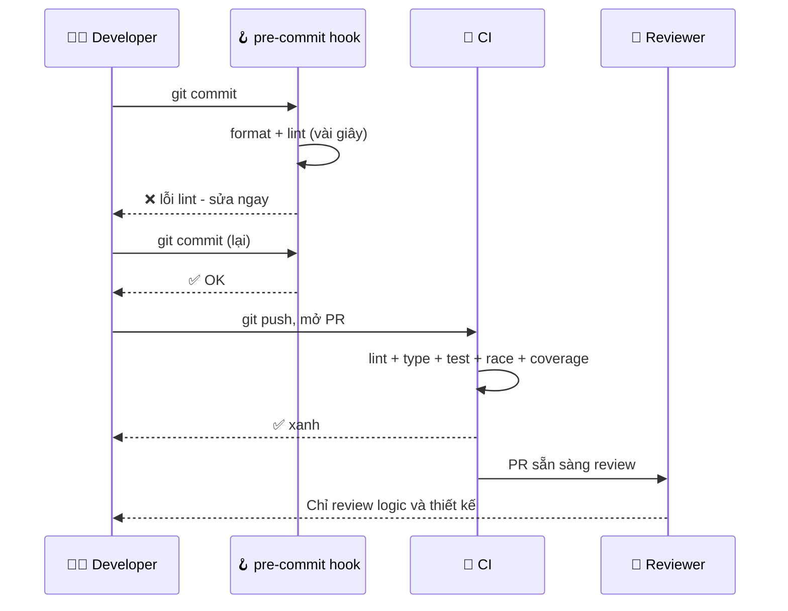

!!! note "Áp dụng linter cho codebase cũ"
    Bật linter trên dự án cũ có thể ra 3.000 cảnh báo - và cả team sẽ bỏ qua tất cả. Cách thực tế: bật **chỉ cho code mới** (golangci-lint có `new-from-rev`, ruff có thể cấu hình theo từng thư mục), hoặc bật từng rule một, sửa hết rồi bật rule tiếp theo. "Cải thiện dần" thắng "hoàn hảo một lần".

---

## 📖 12. Definition of Done - "Xong" nghĩa là gì?

Một trong những nguồn xung đột lớn nhất trong team:

- Dev: "Xong rồi anh" (= code chạy trên máy em)
- PM: "Xong rồi à? Sao khách chưa dùng được?" (= đã lên production)
- QA: "Xong gì mà chưa có test case?"

**Definition of Done (DoD)** là thỏa thuận chung của cả team: một việc chỉ được gọi là "Done" khi thỏa **tất cả** các điều kiện dưới đây. Mẫu tham khảo, hãy điều chỉnh cho team bạn:

```text
DEFINITION OF DONE - Team Checkout

Code
[ ] Code đã merge vào nhánh chính
[ ] Được ít nhất 1 người review và approve
[ ] CI xanh: format, lint, type check, test

Test
[ ] Có unit test cho logic nghiệp vụ mới
[ ] Có integration test cho API/DB mới (nếu có)
[ ] Bug fix đi kèm test tái hiện bug
[ ] Các tiêu chí chấp nhận (acceptance criteria) trong ticket đều đã kiểm tra

Vận hành
[ ] Có log/metric cho luồng mới; alert nếu là luồng quan trọng
[ ] Feature flag cho thay đổi rủi ro cao
[ ] Migration đã chạy thử trên staging với dữ liệu gần thật

Tài liệu
[ ] Cập nhật API docs / README / runbook nếu cần
[ ] Ghi chú thay đổi cho QA / CS nếu người dùng nhìn thấy

Release
[ ] Đã deploy lên production (hoặc sẵn sàng deploy theo lịch)
[ ] Đã kiểm tra trên production sau deploy (smoke test, dashboard)
```

!!! tip "DoD khác Acceptance Criteria"
    **Acceptance Criteria** riêng cho từng ticket: "Đơn ≥ 500k được free ship". **Definition of Done** áp dụng cho **mọi** ticket: "có test, có review, đã deploy". Một ticket xong khi thỏa cả hai.

---

## 📖 13. Shift-left: Dời việc kiểm tra về sớm hơn

"Shift-left" nghĩa là dời hoạt động chất lượng **sang trái** trên dòng thời gian phát triển - tức là sớm hơn, khi sửa còn rẻ.

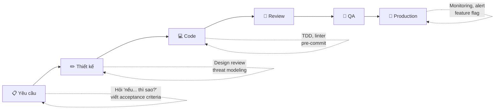

Các hoạt động shift-left cụ thể:

| Giai đoạn | Hoạt động | Bắt được loại lỗi |
|---|---|---|
| Yêu cầu | Dev + QA + PM cùng đọc ticket, hỏi case biên, viết acceptance criteria dạng Given/When/Then | Hiểu sai yêu cầu - loại bug đắt nhất |
| Thiết kế | Design review, xem xét bảo mật, hiệu năng, dữ liệu lớn | Kiến trúc sai, lỗ hổng bảo mật |
| Code | TDD, linter trong editor, pre-commit hook | Lỗi logic, lỗi kiểu, style |
| Review | PR nhỏ, checklist | Thiếu test, rủi ro vận hành |
| CI | Test tự động, quét bảo mật dependency | Regression, thư viện có lỗ hổng |

!!! note "Shift-right cũng quan trọng"
    Không phải lỗi nào cũng bắt được trước khi release. Các công ty lớn cũng "shift-right": feature flag, canary release (bật cho 1% người dùng trước), monitoring, alert. Mục tiêu: **phát hiện nhanh + giảm thiểu thiệt hại** khi lỗi lọt qua. Xem [Backend Bài 11: Observability & Reliability](../backend/11-observability-reliability.md).

### "Three Amigos" - buổi họp 15 phút tiết kiệm 3 ngày

Trước khi bắt đầu một ticket phức tạp, **Dev + QA + PM** (ba "người bạn") ngồi 15 phút cùng nhau:

- PM: "Tính năng này để làm gì, cho ai?"
- Dev: "Nếu giỏ hàng trống thì sao? Nếu mã hết hạn giữa lúc thanh toán thì sao?"
- QA: "Mình sẽ test những kịch bản nào để chấp nhận?"

Nếu Minh ở mục 1 có buổi này, cả 4 bug đã được phát hiện **trước khi viết dòng code đầu tiên**.

---

## 📖 14. Chất lượng vs Tốc độ: một trade-off có ý thức

"Không có thời gian viết test" là câu nói phổ biến nhất ở các team đang chạy deadline. Hãy xem xét kỹ hơn.

### Giả thuyết "sức bền thiết kế" (Design Stamina Hypothesis - Martin Fowler)

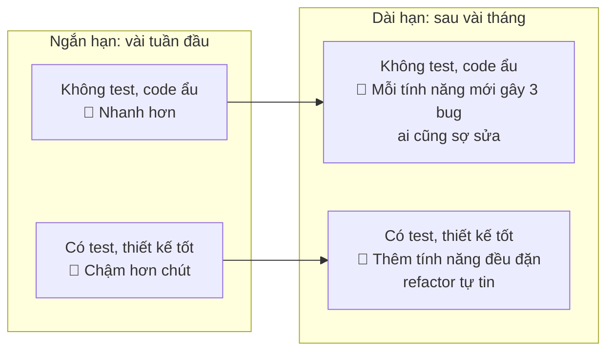

Điểm giao nhau - nơi code chất lượng bắt đầu **nhanh hơn** - thường đến **sớm hơn bạn nghĩ**: vài tuần, không phải vài năm. Vì vậy với hầu hết sản phẩm sống lâu hơn 1-2 tháng, "làm nhanh bằng cách bỏ chất lượng" là ảo tưởng.

### Nhưng không phải lúc nào cũng cần chất lượng tối đa

Người senior không nói "luôn viết test 100%". Họ **điều chỉnh mức chất lượng theo bối cảnh**:

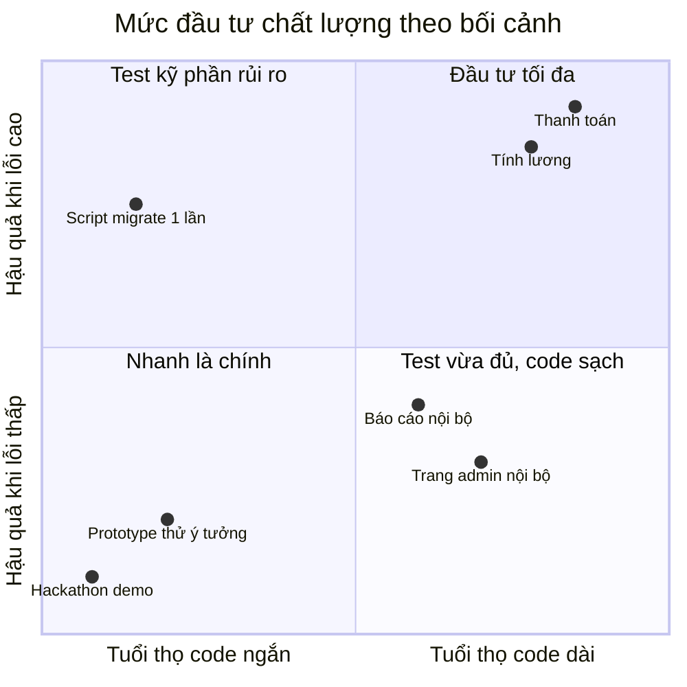

| Bối cảnh | Mức chất lượng hợp lý |
|---|---|
| Thanh toán, tiền, dữ liệu y tế, bảo mật | Tối đa: test kỹ, review 2 người, feature flag, monitoring |
| Tính năng sản phẩm chính | Test hành vi quan trọng, CI đầy đủ, DoD chuẩn |
| Công cụ nội bộ | Test phần logic, chấp nhận UI chưa hoàn hảo |
| Prototype để kiểm chứng ý tưởng | Tối thiểu - **nhưng phải thật sự vứt đi** hoặc viết lại nếu ý tưởng thành công |
| Script migrate dữ liệu 1 lần | Code nhanh, nhưng **chạy thử trên bản sao dữ liệu**, có backup, có dry-run |

!!! warning "Cái bẫy 'prototype lên production'"
    Câu chuyện kinh điển: "Làm tạm cái prototype cho sếp xem thôi". Sếp thấy chạy được: "Ngon, tuần sau cho khách dùng luôn nhé". Prototype không test, không xử lý lỗi, trở thành hệ thống lõi của công ty trong 5 năm. **Khi làm prototype, hãy nói rõ với mọi người (bằng văn bản) rằng nó cần viết lại trước khi lên production** - và ước lượng thời gian viết lại ngay từ đầu.

### Cắt giảm đúng chỗ khi deadline gấp

Khi thật sự bị ép deadline, người có kinh nghiệm **cắt phạm vi (scope), không cắt chất lượng**:

- ✅ Bỏ bớt tính năng phụ, giữ tính năng chính chạy đúng
- ✅ Ra mắt cho 10% người dùng trước
- ✅ Ghi nợ kỹ thuật **có chủ đích**, có ticket, có ngày trả (xem Bài 7)
- ❌ Bỏ test cho logic tính tiền
- ❌ Bỏ review "cho nhanh"
- ❌ "Deploy thứ Sáu 6h chiều rồi về"

---

## 🌍 Tình huống thực tế

### Tình huống 1: "Không có thời gian viết test"

**Bối cảnh**: Sprint còn 2 ngày, bạn còn 1 tính năng "hoàn tiền một phần" chưa xong. Tech lead đang nghỉ phép.

| 🐣 Junior nghĩ | 🦉 Senior nghĩ |
|---|---|
| "Code cho xong trước, test để sprint sau" | "Hoàn tiền = tiền. Logic tính tiền hoàn **bắt buộc** có test. Phần UI hiển thị lịch sử hoàn tiền có thể test tay." |
| Code cả tính năng, test tay 1 lần, merge | Báo PM ngay hôm nay: "Em làm xong phần lõi + test trong 2 ngày được. Phần export Excel cần thêm 1 ngày - mình tách ra ticket khác được không?" |
| Tuần sau: kế toán phát hiện hoàn tiền sai 2 lần | Tuần sau: tính năng chạy ổn, export Excel xong sau 1 ngày |

**Bài học**: Khi thiếu thời gian, **thương lượng phạm vi**, không âm thầm hạ chất lượng. Và nói **sớm**, không đợi đến ngày cuối.

### Tình huống 2: Test đỏ trên CI, "chắc flaky"

**Bối cảnh**: PR của bạn có một test integration đỏ trên CI. Chạy lại thì xanh. Không ai trong team ngạc nhiên - "test đó hay flaky lắm".

| 🐣 Junior | 🦉 Senior |
|---|---|
| Bấm "Re-run" cho đến khi xanh, merge | Chạy lại, nhưng **đọc log lần đỏ** trước |
| | Phát hiện: test dùng chung bảng `orders` với test khác, thứ tự chạy thay đổi → kết quả khác |
| | Tạo ticket, sửa: mỗi test dùng dữ liệu riêng (transaction rollback hoặc tạo ID ngẫu nhiên có seed) |
| | Nhắn team: "Mình vừa sửa test `TestOrderList` hay flaky, nguyên nhân là... Nếu mọi người gặp test flaky khác cứ tag mình" |

**Bài học**: Mỗi lần "re-run cho xanh" là một lần bộ test mất đi chút niềm tin. Người senior coi flaky test là **bug thật** - bug của hệ thống test.

### Tình huống 3: Được giao sửa module "không ai dám đụng"

**Bối cảnh**: Module tính hoa hồng cho đại lý, 1.500 dòng, 0 test, tác giả đã nghỉ. Cần thêm quy tắc hoa hồng mới.

**Cách tiếp cận của senior:**

1. **Không sửa gì trong ngày đầu tiên.** Đọc code, vẽ sơ đồ luồng chính, ghi chú các điểm lạ.
2. Lấy dữ liệu thật (đã ẩn danh) của tháng trước: đầu vào + hoa hồng đã chi trả. Dùng làm **characterization test** - "golden master": chạy code với 1.000 đầu vào thật, lưu kết quả, test so sánh.
3. Refactor nhỏ, từng bước, tách phần tính toán thuần ra khỏi phần đọc DB. Test golden master xanh sau mỗi bước.
4. Thêm quy tắc mới bằng TDD trên phần đã tách.
5. Chạy **song song (shadow mode)** 1 tháng: tính bằng cả code cũ và mới, so sánh, chỉ dùng kết quả code cũ. Khi khớp 100% (trừ quy tắc mới) → chuyển hẳn.

**Bài học**: Với code rủi ro cao, **tốc độ đến từ sự an toàn**, không phải từ sự liều lĩnh.

### Tình huống 4: Sếp yêu cầu coverage 90%

**Bối cảnh**: Công ty đặt OKR "coverage ≥ 90% cho mọi service". Team bạn đang ở 55%.

| 🐣 Junior | 🦉 Senior |
|---|---|
| Viết test gọi mọi hàm, không assert, đạt 90% trong 1 tuần | Chỉ ra với sếp vấn đề Goodhart, đề xuất mục tiêu tốt hơn |
| Coverage 90%, số bug production không đổi | Đề xuất: (1) 100% bug fix có test tái hiện, (2) module thanh toán ≥ 85% + mutation score, (3) coverage không được giảm trong PR, (4) đo **tỉ lệ bug lọt ra production** |
| | Sau 1 quý: coverage 72%, bug production giảm 40% |

**Bài học**: Hiểu **mục tiêu thật sự** đằng sau con số (ít bug, tự tin release) và đề xuất cách đo phản ánh đúng mục tiêu đó.

---

## ⚠️ Sai lầm thường gặp

### Sai lầm 1: "Chất lượng là việc của QA"

Developer là người duy nhất biết mọi nhánh `if` trong code. Hãy tự test trước khi chuyển cho QA. **QA là người thứ hai kiểm tra, không phải người đầu tiên.**

### Sai lầm 2: Chỉ test happy path

Một test với input "đẹp" không đủ. Dùng checklist chọn test case (mục 3): rỗng, biên, sai định dạng, lặp, lỗi bên ngoài.

### Sai lầm 3: Test chi tiết cài đặt

Test gãy mỗi lần refactor → team ghét test → xóa test. Hãy test hành vi quan sát được.

### Sai lầm 4: Test không bao giờ đỏ

Viết test sau khi code, test xanh ngay lần đầu, không bao giờ kiểm tra rằng nó **có thể** đỏ. Mẹo: sau khi viết test, cố tình phá code 1 giây để xem test có đỏ không.

### Sai lầm 5: Lạm dụng mock

Mock mọi thứ đến mức test chỉ kiểm tra rằng "mock trả về cái mock được bảo trả về". Mock ở **ranh giới hệ thống**, dùng đồ thật (hoặc fake đơn giản) cho phần còn lại.

### Sai lầm 6: Chạy lại flaky test cho đến khi xanh

Mỗi lần làm vậy là dạy cả team rằng "test đỏ không có ý nghĩa". Tạo ticket, cách ly, sửa tận gốc.

### Sai lầm 7: Tôn thờ coverage

100% coverage không có nghĩa là không có bug. Coverage cho biết code **chưa** được test ở đâu, không cho biết code **đã** được test **tốt** ở đâu.

### Sai lầm 8: Sửa "bug" trong code legacy mà không hỏi

Hành vi "sai" có thể đang được hệ thống khác phụ thuộc. Viết characterization test, ghi chú, hỏi người có thẩm quyền.

### Sai lầm 9: Để test chậm dần mà không ai quan tâm

Từ 30 giây lên 20 phút không xảy ra trong một ngày. Hãy theo dõi thời gian chạy test như theo dõi hiệu năng production.

### Sai lầm 10: "Xong" mà chưa lên production

Code nằm trên nhánh chưa merge, hoặc merge rồi nhưng chưa deploy, chưa kiểm tra → **chưa tạo ra giá trị gì**. Thống nhất Definition of Done với team.

---

## 🏋️ Bài tập

### Bài tập 1 (Dễ): Liệt kê test case

Cho yêu cầu: *"Mật khẩu hợp lệ nếu dài 8-64 ký tự, có ít nhất 1 chữ hoa, 1 chữ số, và không chứa khoảng trắng."*

Dùng mindmap chọn test case ở mục 3, liệt kê **ít nhất 10 test case** (input + kết quả mong đợi).

<details>
<summary>Đáp án gợi ý</summary>

| # | Input | Kết quả | Nhóm |
|---|---|---|---|
| 1 | `Matkhau123` | Hợp lệ | Happy path |
| 2 | `Abcdef1` (7 ký tự) | Không hợp lệ | Biên - dưới ngưỡng |
| 3 | `Abcdefg1` (8 ký tự) | Hợp lệ | Biên - đúng ngưỡng |
| 4 | 64 ký tự hợp lệ | Hợp lệ | Biên - đúng ngưỡng trên |
| 5 | 65 ký tự | Không hợp lệ | Biên - trên ngưỡng |
| 6 | `matkhau123` | Không hợp lệ | Thiếu chữ hoa |
| 7 | `Matkhauabc` | Không hợp lệ | Thiếu chữ số |
| 8 | `Mat khau123` | Không hợp lệ | Có khoảng trắng |
| 9 | `""` (rỗng) | Không hợp lệ | Rỗng |
| 10 | `Mậtkhẩu123` | ? - **cần hỏi PM**: "chữ hoa" có tính chữ có dấu không? Độ dài tính theo byte hay ký tự? | Unicode |
| 11 | `Matkhau123\t` | Không hợp lệ | Khoảng trắng dạng tab |

Case 10 là case "đắt giá nhất": nó lộ ra chỗ yêu cầu chưa rõ. Tìm ra những câu hỏi như vậy **trước khi code** chính là shift-left.

</details>

### Bài tập 2 (Dễ): Phát hiện test tệ

Đoạn test sau có những vấn đề gì theo FIRST và AAA?

```python
def test_order():
    create_user("test@example.com")          # dùng DB thật, không dọn dẹp
    order = create_order("test@example.com", items=get_random_items())
    time.sleep(3)                            # chờ worker gửi email
    print(order.total)                       # "nhìn bằng mắt"
    assert order.status == "created"
    assert len(get_emails()) > 0
    cancel_order(order.id)
    assert order_status(order.id) == "cancelled"
```

<details>
<summary>Đáp án</summary>

- **Không Independent**: tạo user thật không dọn dẹp → chạy lần 2 có thể lỗi "email đã tồn tại"
- **Không Repeatable**: `get_random_items()` không có seed; `sleep(3)` phụ thuộc tốc độ máy
- **Không Fast**: sleep 3 giây
- **Không Self-validating hoàn toàn**: `print` để nhìn bằng mắt; `len(get_emails()) > 0` có thể đúng do email của test khác
- **Vi phạm AAA / một lý do để đỏ**: test cả tạo đơn, gửi email, hủy đơn trong một test
- **Tên test** không nói gì về hành vi

Cách sửa: tách thành 3 test (`test_create_order_sets_status_created`, `test_create_order_sends_confirmation_email`, `test_cancel_order_sets_status_cancelled`), dùng dữ liệu cố định, fake email sender để kiểm tra "đã gửi email tới đúng địa chỉ", mỗi test tự tạo dữ liệu riêng trong transaction được rollback.

</details>

### Bài tập 3 (Trung bình): TDD bằng tay

Dùng TDD (Go hoặc Python) để viết hàm `ParseVND(s string) (int, error)` / `parse_vnd(s: str) -> int` chuyển chuỗi tiền Việt sang số:

- `"150.000đ"` → `150000`
- `"1.250.000 VND"` → `1250000`
- `"0đ"` → `0`
- `"abc"` → lỗi
- `"-50.000đ"` → lỗi (không chấp nhận số âm)

Yêu cầu: commit (hoặc ghi lại) **mỗi vòng Red/Green/Refactor** riêng biệt, để thấy code tiến hóa. Viết ít nhất 1 test case biên do bạn tự nghĩ ra.

<details>
<summary>Gợi ý</summary>

Thứ tự test gợi ý: `"0đ"` (đơn giản nhất) → `"150.000đ"` (có dấu chấm) → `"1.250.000 VND"` (hậu tố khác, khoảng trắng) → `"abc"` → `"-50.000đ"`. Case biên tự nghĩ: `""`, `"150,000đ"` (dấu phẩy kiểu Mỹ - chấp nhận hay không? hỏi PM!), `"  150.000đ  "`, số vượt quá `int64`.

</details>

### Bài tập 4 (Trung bình): Characterization test

Chọn một hàm **thật** trong một dự án bạn từng làm (hoặc một thư viện open source) mà bạn không hiểu hết. Viết 8-10 characterization test theo quy trình ở mục 7. Ghi lại ít nhất 2 hành vi "đáng ngờ" và câu hỏi bạn sẽ hỏi PM/tác giả.

### Bài tập 5 (Khó): Viết Definition of Done cho team bạn

Nếu bạn đang đi làm: so sánh quy trình hiện tại của team với mẫu DoD ở mục 12. Viết một bản DoD **thực tế** (không phải lý tưởng) gồm tối đa 10 mục mà team có thể bắt đầu áp dụng **ngay tuần sau**. Với mỗi mục, ghi chú: "đã làm", "làm một phần", "chưa làm".

Nếu bạn đang học: viết DoD cho dự án cá nhân của bạn (ví dụ dự án tổng hợp trong khóa Go/Python).

### Bài tập 6 (Khó): Thí nghiệm mutation testing

Lấy code `shipping` ở mục 6. Tự tay tạo 5 "mutant" (đổi `>=` thành `>`, `20_000` thành `25_000`, `math.Ceil` thành `math.Floor`, xóa `if extraKg <= 0`, đổi `+` thành `-`). Với mỗi mutant, chạy test: có test nào đỏ không? Nếu mutant "sống sót", viết thêm test để "giết" nó.

<details>
<summary>Gợi ý</summary>

- `>=` → `>`: bị giết bởi case "đúng ngưỡng 500k thì free ship"
- `math.Ceil` → `math.Floor`: bị giết bởi case 3.2kg
- Xóa `if extraKg <= 0 { return 0 }`: với 1kg, `extraKg = -2` → phí âm `-10000` → case "nội thành, đơn nhỏ, hàng nhẹ" đỏ
- Nếu bạn **bỏ** case "đúng ngưỡng 500k" khỏi bảng test, mutant `>` sẽ sống sót - đó là lý do test biên quan trọng

</details>

---

## ✅ Checklist hoàn thành

- [ ] Giải thích được vì sao chất lượng là trách nhiệm của developer, và chi phí bug tăng theo giai đoạn
- [ ] Nói được lý do quan trọng nhất của test: sự tự tin để thay đổi code
- [ ] Phân biệt test hành vi và test cài đặt; biết khi nào nên dùng mock
- [ ] Dùng checklist chọn test case: happy path, biên, rỗng, sai định dạng, lặp, lỗi ngoài
- [ ] Vẽ được Test Pyramid, Testing Trophy và nhận diện anti-pattern "cây kem"
- [ ] Viết test theo FIRST và AAA, đặt tên test như một câu nói
- [ ] Thực hành trọn một vòng TDD Red → Green → Refactor
- [ ] Viết characterization test cho code legacy trước khi sửa
- [ ] Biết nguyên nhân và quy trình xử lý flaky test
- [ ] Hiểu giới hạn của coverage và biết mutation testing là gì
- [ ] Thiết lập linter/formatter + pre-commit + CI cho dự án của mình
- [ ] Viết được Definition of Done cho team hoặc dự án cá nhân
- [ ] Biết điều chỉnh mức chất lượng theo bối cảnh, và cắt phạm vi thay vì cắt chất lượng

---

💡 **Tips ghi nhớ**:

- **Test cho bạn sự tự tin để thay đổi** - đó là lý do số 1
- **Test hành vi, không test cài đặt** - refactor không được làm test đỏ
- **Thấy đỏ trước, rồi mới xanh** - test chưa từng đỏ có thể là test vô dụng
- **Sửa bug = viết test tái hiện trước**
- **Coverage cho biết chỗ CHƯA test, không cho biết chỗ ĐÃ test tốt**
- **Cắt phạm vi, đừng cắt chất lượng**

**Bài tiếp theo**: [Bài 7: Trade-off & Ra quyết định kỹ thuật](./07-tradeoffs-decisions.md)
