# 📚 Bài 7: Trade-off & Ra quyết định kỹ thuật

> "Nếu bạn nghĩ một giải pháp không có nhược điểm nào, nghĩa là bạn chưa tìm ra nó."

Hỏi một kỹ sư senior bất kỳ câu hỏi thiết kế nào - "Nên dùng SQL hay NoSQL?", "Có nên tách microservice không?", "Có nên dùng cache không?" - và bạn gần như chắc chắn nhận được câu trả lời: **"It depends" (Còn tùy)**.

Người mới nghe câu đó thấy khó chịu: "Tùy cái gì? Nói luôn đi!". Nhưng thật ra đó là dấu hiệu của sự trưởng thành: **không có giải pháp tốt nhất tuyệt đối, chỉ có giải pháp phù hợp nhất với bối cảnh**. Điều phân biệt senior với junior không phải là biết nói "it depends" - mà là nói được **tùy vào cái gì**, và sau đó **vẫn đưa ra được quyết định**.

Bài này dạy bạn cách làm điều đó một cách có hệ thống.

## 🎯 Mục tiêu bài học

- Hiểu rằng **mọi lựa chọn kỹ thuật đều là trade-off** và nhận diện các cặp trade-off kinh điển
- Nói "it depends" **đúng cách**: nêu rõ yếu tố quyết định và đưa ra khuyến nghị
- Dùng các framework ra quyết định: **cửa một chiều / hai chiều**, **cost of delay**, **ma trận quyết định có trọng số** (kèm code Go/Python)
- Viết **Architecture Decision Record (ADR)** và **Design Doc / RFC** theo mẫu
- Hiểu **technical debt** qua **góc phần tư của Martin Fowler** và cách quản lý nợ kỹ thuật
- Chọn công nghệ bằng tư duy **"boring technology"** và **innovation tokens**
- Phân biệt **tối ưu hóa sớm** với **nhận thức về hiệu năng**
- Rèn **tư duy bậc hai (second-order thinking)** và miễn dịch với **hype**

---

## 📖 1. "It depends" - nói sao cho đúng

### Hai câu trả lời, hai đẳng cấp

Buổi họp kỹ thuật ở một startup fintech tại Hà Nội. PM hỏi: *"Mình có nên dùng MongoDB cho tính năng lịch sử giao dịch không?"*

**Câu trả lời A (junior):**

> "Dạ còn tùy anh ạ. MongoDB cũng có ưu điểm, PostgreSQL cũng có ưu điểm."

Đúng, nhưng vô dụng. PM không biết gì hơn, và cuộc họp không tiến thêm bước nào.

**Câu trả lời B (senior):**

> "Tùy vào 3 yếu tố: (1) dữ liệu có cần transaction cùng với số dư ví không, (2) truy vấn chủ yếu là gì, (3) team có kinh nghiệm vận hành Mongo không.
>
> Với mình hiện tại: lịch sử giao dịch **phải** nhất quán với số dư - cần transaction; truy vấn chủ yếu là lọc theo user + khoảng thời gian - PostgreSQL với index làm rất tốt; và team chưa ai vận hành Mongo trên production.
>
> **Nên em đề xuất PostgreSQL.** Em sẽ xem xét lại nếu dữ liệu vượt 1 tỷ dòng hoặc cần lưu schema rất linh hoạt."

### Công thức "It depends" đúng cách

```text
"Tùy vào [2-3 yếu tố quyết định].
 Trong bối cảnh của chúng ta: [yếu tố 1 = ...], [yếu tố 2 = ...].
 Vì vậy tôi đề xuất [lựa chọn X].
 Cái giá phải trả là [nhược điểm của X], chấp nhận được vì [lý do].
 Tôi sẽ xem xét lại nếu [điều kiện thay đổi]."
```

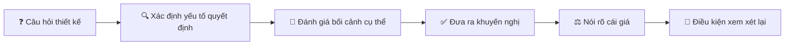

!!! tip "Nguyên tắc vàng"
    **"It depends" là điểm bắt đầu của câu trả lời, không phải toàn bộ câu trả lời.** Người ra quyết định cần bạn giúp họ **thu hẹp** lựa chọn, không phải liệt kê thêm lựa chọn.

---

## 📖 2. Mọi thứ đều là trade-off

Trade-off (đánh đổi) là khi **có được thứ này phải hy sinh thứ khác**. Giống như mua xe máy: xe tay ga thì tiện, cốp rộng nhưng tốn xăng; xe số thì tiết kiệm nhưng đi phố kẹt xe mỏi tay. Không có xe "tốt nhất" - chỉ có xe hợp với nhu cầu của bạn.

### Các cặp trade-off kinh điển trong phần mềm

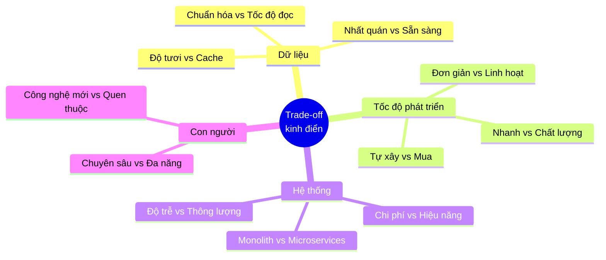

### 2.1. Nhất quán (Consistency) vs Sẵn sàng (Availability)

Định lý CAP nói: khi mạng bị phân mảnh (partition - chuyện chắc chắn xảy ra trong hệ phân tán), bạn phải chọn giữa **trả về dữ liệu chắc chắn đúng nhất** (C) hoặc **luôn trả lời được** (A).

Nghe hàn lâm, nhưng thực tế rất đời thường:

| Tình huống | Chọn gì | Lý do |
|---|---|---|
| Số dư ví điện tử khi chuyển tiền | **Consistency** | Thà báo "hệ thống bận, thử lại sau" còn hơn cho rút tiền 2 lần |
| Số lượt like bài viết | **Availability** | Hiển thị 1.203 thay vì 1.205 chẳng ai phàn nàn |
| Tồn kho khi flash sale | **Consistency** (cho đặt hàng) | Bán 1.000 cái khi kho chỉ có 100 = thảm họa CSKH |
| Tồn kho hiển thị trên trang sản phẩm | **Availability** | "Còn hàng" chậm vài giây vẫn chấp nhận được |
| Giỏ hàng | **Availability** | Amazon nổi tiếng chọn "luôn cho thêm vào giỏ", xử lý xung đột sau |

!!! note "Cùng một hệ thống, nhiều lựa chọn khác nhau"
    Chú ý ví dụ tồn kho: **cùng một dữ liệu**, nhưng chỗ đọc để hiển thị chọn A, chỗ trừ kho khi đặt hàng chọn C. Kỹ sư giỏi không chọn một lần cho cả hệ thống - họ chọn **cho từng luồng nghiệp vụ**. Chi tiết kỹ thuật: [Backend Bài 10: System Design](../backend/10-system-design.md).

### 2.2. Tốc độ vs Chất lượng

Đã bàn kỹ ở [Bài 6](./06-testing-quality.md). Tóm tắt: trong ngắn hạn có trade-off thật; trong dài hạn, chất lượng bên trong **là** tốc độ. Khi buộc phải đánh đổi, **cắt phạm vi, không cắt chất lượng** ở phần lõi.

### 2.3. Tự xây (Build) vs Mua/Dùng sẵn (Buy)

Câu hỏi xuất hiện hàng tuần: "Mình tự viết hệ thống gửi email/xác thực/tìm kiếm/thanh toán, hay dùng dịch vụ có sẵn?"

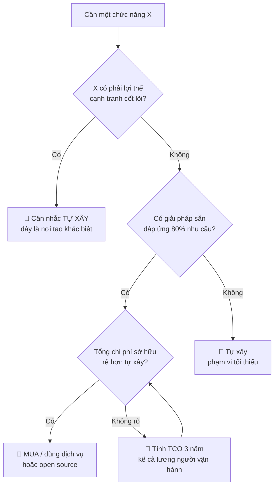

Chi phí mà người ta **hay quên** khi chọn "tự xây":

| Chi phí thấy được | Chi phí ẩn |
|---|---|
| Thời gian code phiên bản đầu | Bảo trì, sửa bug suốt nhiều năm |
| | Vận hành: monitoring, on-call lúc 3h sáng |
| | Bảo mật: vá lỗ hổng, audit |
| | Kiến thức nằm trong đầu 1-2 người → rủi ro khi họ nghỉ |
| | **Chi phí cơ hội**: team không làm tính năng tạo ra doanh thu |

Chi phí mà người ta hay quên khi chọn "mua":

- Phí tăng theo quy mô (rẻ lúc 1.000 user, đắt khủng khiếp lúc 1 triệu user)
- Bị khóa vào nhà cung cấp (vendor lock-in)
- Không tùy biến được khi nghiệp vụ đặc thù
- Dữ liệu nằm ở bên thứ ba (vấn đề pháp lý, ví dụ quy định lưu trữ dữ liệu tại Việt Nam)

!!! tip "Quy tắc thực tế"
    **Mua những gì giống mọi công ty khác (email, SMS OTP, auth, monitoring, CI). Tự xây những gì làm công ty bạn khác biệt** (thuật toán gợi ý, logic định giá, trải nghiệm đặt hàng đặc thù).

### 2.4. Đơn giản vs Linh hoạt

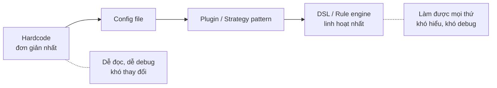

Mỗi bước sang phải: linh hoạt hơn, nhưng **phức tạp hơn, khó debug hơn, khó onboard người mới hơn**. Sai lầm kinh điển: xây rule engine cho 3 quy tắc khuyến mãi "vì sau này có thể có 100 quy tắc". Sau 2 năm vẫn chỉ có 5 quy tắc, nhưng không ai hiểu cái engine.

Nhớ lại **YAGNI** (You Aren't Gonna Need It) ở Bài 4: xây cho nhu cầu **hiện tại** + thiết kế để **dễ thay đổi**, thay vì xây sẵn cho mọi nhu cầu **tưởng tượng**.

### 2.5. Bảng tổng hợp trade-off hay gặp

| Trade-off | Chọn bên trái khi... | Chọn bên phải khi... |
|---|---|---|
| Monolith vs Microservices | Team < 20 người, sản phẩm còn đổi nhiều | Nhiều team độc lập, domain đã ổn định, cần scale riêng từng phần |
| SQL vs NoSQL | Dữ liệu quan hệ, cần transaction, truy vấn đa dạng | Truy cập theo key đơn giản, khối lượng cực lớn, schema thay đổi liên tục |
| Đồng bộ vs Bất đồng bộ (queue) | Người dùng cần kết quả ngay | Việc lâu, có thể làm sau, cần chịu tải đột biến |
| Cache vs Không cache | Đọc nhiều, chấp nhận dữ liệu cũ vài giây | Dữ liệu phải luôn mới nhất, hoặc chưa có vấn đề hiệu năng |
| Chuẩn hóa vs Phi chuẩn hóa | Ghi nhiều, cần nhất quán | Đọc nhiều, cần nhanh, chấp nhận đồng bộ dữ liệu trùng |
| Latency vs Throughput | Trải nghiệm người dùng tương tác | Xử lý batch, báo cáo cuối ngày |

---

## 📖 3. Framework ra quyết định

Hiểu trade-off rồi, làm sao **quyết định** nhanh và tốt? Dưới đây là 4 công cụ dùng được ngay.

### 3.1. Cửa một chiều vs Cửa hai chiều (One-way vs Two-way doors)

Jeff Bezos (Amazon) chia quyết định thành hai loại:

- **Cửa hai chiều (two-way door)**: đi qua rồi, không thích thì quay lại được. Chi phí đảo ngược thấp.
- **Cửa một chiều (one-way door)**: đi qua là khó hoặc không thể quay lại. Chi phí đảo ngược rất cao.

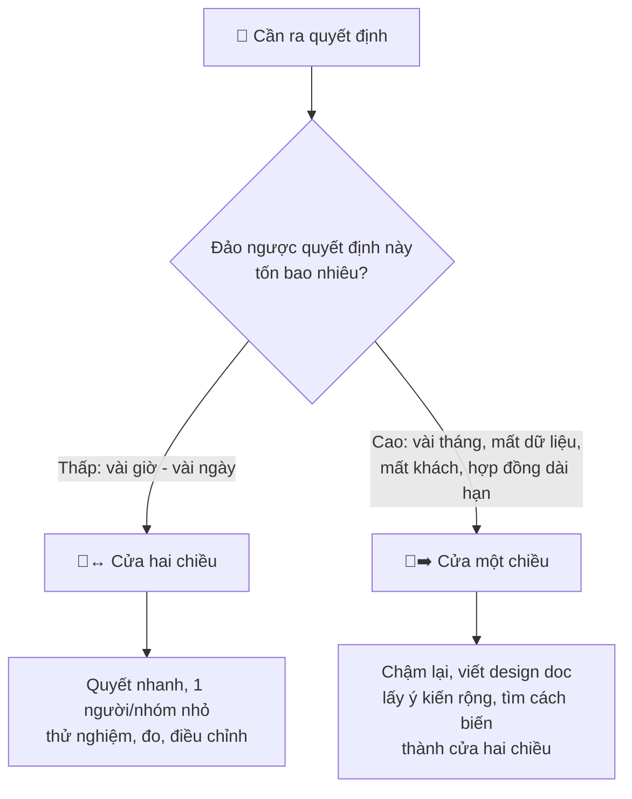

| Cửa hai chiều (quyết nhanh) | Cửa một chiều (cân nhắc kỹ) |
|---|---|
| Đặt tên biến, cấu trúc thư mục | Chọn database chính cho dữ liệu cốt lõi |
| Thư viện logging, thư viện HTTP client | Định dạng API public đã có khách hàng dùng |
| Bật/tắt tính năng sau feature flag | Xóa dữ liệu người dùng |
| Thay đổi UI nhỏ | Ký hợp đồng 3 năm với nhà cung cấp cloud |
| Thêm một index | Chọn ngôn ngữ chính cho cả công ty |

!!! warning "Hai sai lầm đối xứng"
    - **Coi cửa hai chiều như cửa một chiều**: họp 3 tuần để chọn thư viện validation. Tốn thời gian, làm team chậm chạp.
    - **Coi cửa một chiều như cửa hai chiều**: "cứ đổi schema API public đi, có gì sửa sau" - rồi 50 đối tác tích hợp bị hỏng.

!!! tip "Kỹ năng cao cấp: biến cửa một chiều thành cửa hai chiều"
    Người senior giỏi không chỉ phân loại quyết định - họ **thiết kế để quyết định có thể đảo ngược**:

    - Đặt **interface/abstraction** trước chỗ dùng database/nhà cung cấp → đổi sau dễ hơn
    - **Feature flag** → tắt tính năng mới trong 1 giây nếu có vấn đề
    - **Soft delete** thay vì xóa thật
    - **API versioning** (`/v1`, `/v2`) → thay đổi không phá client cũ
    - **Chạy song song** hệ thống cũ và mới trước khi chuyển hẳn

### 3.2. Cost of Delay - Cái giá của sự chậm trễ

Không quyết định cũng là một quyết định - và nó có giá. **Cost of Delay** = giá trị bị mất đi cho mỗi đơn vị thời gian chậm trễ.

Ví dụ: Team có 2 việc, chỉ làm được lần lượt:

| Việc | Giá trị mỗi tuần khi hoàn thành | Thời gian làm |
|---|---|---|
| A: Tích hợp ví MoMo (khách đang yêu cầu) | 50 triệu/tuần doanh thu thêm | 4 tuần |
| B: Trang báo cáo cho admin | 10 triệu/tuần (tiết kiệm thời gian nhân viên) | 1 tuần |

Dùng **CD3** (Cost of Delay Divided by Duration) = giá trị/tuần ÷ thời gian:

- A: 50 ÷ 4 = **12,5**
- B: 10 ÷ 1 = **10**

→ Làm A trước. Nhưng hãy tính thử cả hai thứ tự để thấy tại sao:

- **A trước, B sau**: trong khi làm A (4 tuần), mất cả A và B: 4 × (50 + 10) = 240. Trong khi làm B (tuần thứ 5), vẫn mất B: 1 × 10 = 10. **Tổng thiệt hại: 250 triệu**
- **B trước, A sau**: làm B (1 tuần), mất cả hai: 1 × 60 = 60. Làm A (4 tuần), vẫn mất A: 4 × 50 = 200. **Tổng thiệt hại: 260 triệu**

Chênh lệch nhỏ ở ví dụ này, nhưng với 10 việc trong backlog, sắp xếp đúng thứ tự có thể tạo khác biệt rất lớn. Quan trọng hơn: **khung tư duy** này buộc bạn hỏi "chậm 1 tuần thì mất gì?" - câu hỏi thường bị bỏ qua khi team tranh luận kỹ thuật kéo dài.

!!! note "Cost of delay của việc tranh luận"
    Team 6 người họp 2 tiếng mỗi ngày trong 1 tuần để chọn giữa hai thư viện gần như tương đương = 60 giờ công. Chọn "sai" thư viện và đổi sau đó có khi chỉ tốn 16 giờ. Với cửa hai chiều, **quyết nhanh thường rẻ hơn quyết đúng**.

### 3.3. Ma trận quyết định có trọng số (Weighted Decision Matrix)

Khi có nhiều lựa chọn và nhiều tiêu chí, đừng để cuộc tranh luận biến thành "anh thích Kafka, em thích RabbitMQ". Hãy làm rõ **tiêu chí** và **trọng số** trước, rồi mới chấm điểm.

**Bối cảnh**: Team cần message queue cho hệ thống thông báo đơn hàng (~5.000 tin/giây lúc cao điểm). Team đã vận hành Redis cho cache, chưa ai vận hành Kafka.

**Bước 1 - Thống nhất tiêu chí và trọng số (TRƯỚC khi chấm điểm):**

| Tiêu chí | Trọng số | Vì sao |
|---|---|---|
| Team quen thuộc | 30% | Team 4 người, không có SRE riêng |
| Chi phí vận hành | 25% | Startup, ngân sách hạn chế |
| Đảm bảo delivery | 20% | Mất thông báo đơn hàng gây phiền, nhưng không mất tiền |
| Throughput 5k msg/s | 15% | Cả 3 lựa chọn đều đáp ứng được |
| Hệ sinh thái, tài liệu | 10% | |

**Bước 2 - Chấm điểm 1-5 cho từng lựa chọn:**

| Tiêu chí (trọng số) | RabbitMQ | Kafka | Redis Streams |
|---|---|---|---|
| Team quen thuộc (30%) | 3 | 2 | 5 |
| Chi phí vận hành (25%) | 4 | 2 | 5 |
| Throughput 5k msg/s (15%) | 4 | 5 | 4 |
| Đảm bảo delivery (20%) | 5 | 4 | 3 |
| Hệ sinh thái (10%) | 4 | 5 | 3 |

**Bước 3 - Tính điểm và phân tích độ nhạy** (sensitivity analysis - thử thay đổi trọng số xem kết quả có đổi không):

=== "Go"

    ```go
    package main

    import (
        "fmt"
        "sort"
    )

    type Criterion struct {
        Name   string
        Weight int // phần trăm, tổng = 100
    }

    type Option struct {
        Name   string
        Scores []int // điểm 1-5, cùng thứ tự với criteria
    }

    type Result struct {
        Name  string
        Score float64
    }

    func rank(criteria []Criterion, options []Option) []Result {
        results := make([]Result, 0, len(options))
        for _, o := range options {
            total := 0.0
            for i, c := range criteria {
                total += float64(o.Scores[i]*c.Weight) / 100
            }
            results = append(results, Result{o.Name, total})
        }
        sort.Slice(results, func(i, j int) bool { return results[i].Score > results[j].Score })
        return results
    }

    func printRanking(title string, criteria []Criterion, options []Option) {
        fmt.Println("==", title, "==")
        for i, r := range rank(criteria, options) {
            fmt.Printf("%d. %-14s %.2f\n", i+1, r.Name, r.Score)
        }
    }

    func main() {
        options := []Option{
            // quen thuộc, chi phí vận hành, throughput, đảm bảo delivery, hệ sinh thái
            {"RabbitMQ", []int{3, 4, 4, 5, 4}},
            {"Kafka", []int{2, 2, 5, 4, 5}},
            {"Redis Streams", []int{5, 5, 4, 3, 3}},
        }

        base := []Criterion{
            {"Team quen thuộc", 30},
            {"Chi phí vận hành", 25},
            {"Throughput 5k msg/s", 15},
            {"Đảm bảo delivery", 20},
            {"Hệ sinh thái", 10},
        }
        printRanking("Trọng số ban đầu", base, options)

        // Phân tích độ nhạy: nếu mất tin nhắn là cực kỳ nghiêm trọng thì sao?
        reliability := []Criterion{
            {"Team quen thuộc", 15},
            {"Chi phí vận hành", 20},
            {"Throughput 5k msg/s", 15},
            {"Đảm bảo delivery", 40},
            {"Hệ sinh thái", 10},
        }
        printRanking("Ưu tiên độ tin cậy", reliability, options)
    }

    // Output:
    // == Trọng số ban đầu ==
    // 1. Redis Streams  4.25
    // 2. RabbitMQ       3.90
    // 3. Kafka          3.15
    // == Ưu tiên độ tin cậy ==
    // 1. RabbitMQ       4.25
    // 2. Redis Streams  3.85
    // 3. Kafka          3.55
    ```

=== "Python"

    ```python
    from dataclasses import dataclass


    @dataclass
    class Criterion:
        name: str
        weight: int  # phần trăm, tổng = 100


    def rank(criteria: list[Criterion], options: dict[str, list[int]]) -> list[tuple[str, float]]:
        results = []
        for name, scores in options.items():
            total = sum(s * c.weight for s, c in zip(scores, criteria)) / 100
            results.append((name, total))
        return sorted(results, key=lambda r: r[1], reverse=True)


    def print_ranking(title: str, criteria: list[Criterion], options: dict[str, list[int]]) -> None:
        print("==", title, "==")
        for i, (name, score) in enumerate(rank(criteria, options), start=1):
            print(f"{i}. {name:<14} {score:.2f}")


    options = {
        # quen thuộc, chi phí vận hành, throughput, đảm bảo delivery, hệ sinh thái
        "RabbitMQ": [3, 4, 4, 5, 4],
        "Kafka": [2, 2, 5, 4, 5],
        "Redis Streams": [5, 5, 4, 3, 3],
    }

    base = [
        Criterion("Team quen thuộc", 30),
        Criterion("Chi phí vận hành", 25),
        Criterion("Throughput 5k msg/s", 15),
        Criterion("Đảm bảo delivery", 20),
        Criterion("Hệ sinh thái", 10),
    ]
    print_ranking("Trọng số ban đầu", base, options)

    # Phân tích độ nhạy: nếu mất tin nhắn là cực kỳ nghiêm trọng thì sao?
    reliability = [
        Criterion("Team quen thuộc", 15),
        Criterion("Chi phí vận hành", 20),
        Criterion("Throughput 5k msg/s", 15),
        Criterion("Đảm bảo delivery", 40),
        Criterion("Hệ sinh thái", 10),
    ]
    print_ranking("Ưu tiên độ tin cậy", reliability, options)

    # Output:
    # == Trọng số ban đầu ==
    # 1. Redis Streams  4.25
    # 2. RabbitMQ       3.90
    # 3. Kafka          3.15
    # == Ưu tiên độ tin cậy ==
    # 1. RabbitMQ       4.25
    # 2. Redis Streams  3.85
    # 3. Kafka          3.55
    ```

**Bài học quan trọng nhất từ kết quả**: chỉ cần thay đổi trọng số của "Đảm bảo delivery" từ 20% lên 40%, người thắng đổi từ Redis Streams sang RabbitMQ. Nghĩa là:

> **Cuộc tranh luận thật sự không phải "Redis hay RabbitMQ" - mà là "mất một thông báo đơn hàng nghiêm trọng đến mức nào?"**

Đó là câu hỏi **nghiệp vụ**, cần hỏi PM, không phải câu hỏi kỹ thuật để dev cãi nhau. Ma trận quyết định có giá trị nhất ở chỗ nó **làm lộ ra giả định ẩn**.

!!! warning "Cạm bẫy của ma trận quyết định"
    - **Chấm điểm trước, chỉnh trọng số sau** cho ra kết quả mình muốn → luôn chốt trọng số **trước**
    - **Giả chính xác**: 4,25 vs 3,90 không có nghĩa là "tốt hơn 9%". Chênh lệch nhỏ = hai lựa chọn gần như tương đương, hãy chọn cái nào dễ đảo ngược hơn
    - **Quá nhiều tiêu chí**: 15 tiêu chí làm loãng tiêu chí quan trọng. Giữ 4-6 tiêu chí.

### 3.4. Khung thời gian cho quyết định (Timeboxing)

| Loại quyết định | Thời gian tối đa gợi ý | Hình thức |
|---|---|---|
| Cửa hai chiều, ảnh hưởng 1 người | Vài phút | Tự quyết, ghi chú trong PR |
| Cửa hai chiều, ảnh hưởng team | 1 ngày | Thảo luận Slack, tech lead chốt |
| Cửa một chiều, ảnh hưởng team | 1 tuần | ADR + họp review 30-60 phút |
| Cửa một chiều, ảnh hưởng nhiều team | 2-4 tuần | Design doc/RFC + review rộng |

Khi hết thời gian mà chưa đồng thuận → người có trách nhiệm (tech lead, owner) **quyết định**, những người khác **"disagree and commit"** (không đồng ý nhưng cam kết thực hiện hết mình - xem [Bài 8](./08-teamwork-communication.md)).

---

## 📖 4. Architecture Decision Records (ADR)

### Vấn đề: "Sao hồi đó lại chọn cái này?"

Sáu tháng sau khi chọn Redis Streams, một developer mới vào team hỏi: *"Sao mình không dùng Kafka? Kafka mạnh hơn mà?"*. Không ai nhớ chính xác lý do. Người quyết định đã chuyển team. Cuộc tranh luận bắt đầu lại từ đầu - hoặc tệ hơn, team chuyển sang Kafka mà không biết những lý do hồi đó vẫn còn đúng.

**ADR** là một văn bản ngắn (1-2 trang) ghi lại **một quyết định kiến trúc quan trọng**: bối cảnh, lựa chọn, lý do, và hệ quả. ADR được lưu **ngay trong repo** (thường ở `docs/adr/`), đánh số, và **không bao giờ sửa nội dung** sau khi được chấp nhận - nếu đổi quyết định, viết ADR mới thay thế ADR cũ.

### Vòng đời của một ADR

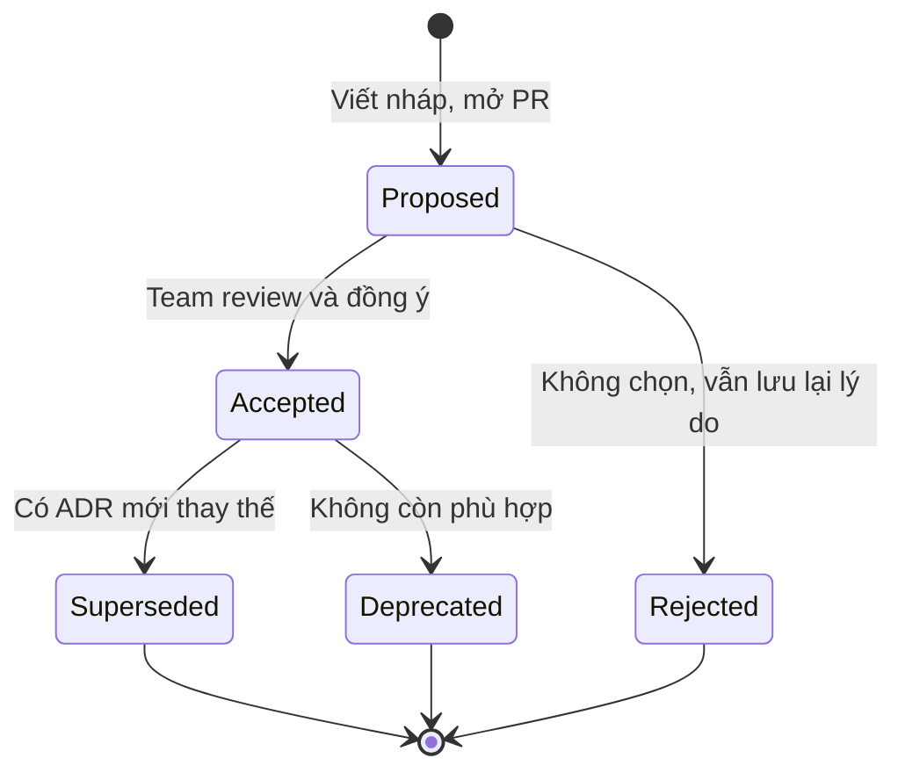

### Mẫu ADR (dựa trên mẫu của Michael Nygard)

```text
# ADR-NNN: [Tiêu đề ngắn dạng quyết định]

- Trạng thái: Proposed | Accepted | Rejected | Deprecated | Superseded by ADR-XXX
- Ngày: YYYY-MM-DD
- Người quyết định: [tên / vai trò]
- Người được hỏi ý kiến: [tên / team]

## Bối cảnh
Vấn đề là gì? Những ràng buộc nào (kỹ thuật, nghiệp vụ, con người, ngân sách, thời gian)?
Viết sao cho một người mới vào team 1 năm sau vẫn hiểu.

## Các lựa chọn đã xem xét
1. Lựa chọn A - mô tả ngắn, ưu, nhược
2. Lựa chọn B - ...
3. Lựa chọn C - ...
(Luôn có lựa chọn "không làm gì / giữ nguyên" nếu hợp lý)

## Quyết định
Chúng tôi chọn [X] vì [lý do chính, gắn với bối cảnh].

## Hệ quả
- Tích cực: ...
- Tiêu cực / cái giá chấp nhận: ...
- Việc cần làm tiếp theo: ...

## Điều kiện xem xét lại
Quyết định này nên được đánh giá lại khi: ...
```

### Ví dụ ADR đã điền

```text
# ADR-007: Dùng Redis Streams làm message queue cho thông báo đơn hàng

- Trạng thái: Accepted
- Ngày: 2026-03-12
- Người quyết định: Nguyễn Văn Tuấn (Tech Lead, team Order)
- Người được hỏi ý kiến: team Platform, chị Hà (PM Order)

## Bối cảnh
Hiện tại service Order gọi đồng bộ service Notification (SMS, email, push) sau khi
tạo đơn. Khi Notification chậm (nhà cung cấp SMS timeout), API tạo đơn chậm theo,
p99 tăng từ 300ms lên 4s trong đợt sale 9/9. Cần tách bất đồng bộ.

Ràng buộc:
- Team 4 backend, không có SRE riêng; đã vận hành Redis cluster cho cache 2 năm.
- Tải cao điểm ước tính 5.000 tin/giây (gấp 5 lần đợt 9/9).
- PM xác nhận: mất một thông báo là phiền nhưng KHÔNG mất tiền
  (khách vẫn xem được đơn trong app). Chấp nhận tỉ lệ mất rất nhỏ.
- Cần xong trước đợt sale 11/11 (8 tuần).

## Các lựa chọn đã xem xét
1. Kafka: mạnh nhất về throughput và lưu trữ lâu dài. Nhưng team chưa ai vận hành;
   managed Kafka tốn khoảng 15-20 triệu/tháng; quá mức cần thiết cho 5k msg/s.
2. RabbitMQ: đảm bảo delivery tốt, ack/retry/dead-letter đầy đủ. Team có 1 người
   từng dùng. Phải dựng và vận hành thêm một cụm mới.
3. Redis Streams: dùng lại cluster sẵn có, có consumer group + ack + pending list.
   Độ bền phụ thuộc cấu hình AOF; khó hơn RabbitMQ khi cần routing phức tạp.
4. Giữ nguyên, chỉ thêm timeout ngắn: không giải quyết gốc rễ khi Notification chậm.

Ma trận quyết định (xem phụ lục): Redis Streams 4.25, RabbitMQ 3.90, Kafka 3.15.
Với trọng số "Đảm bảo delivery" 40%, RabbitMQ thắng -> đã hỏi PM, PM xác nhận
trọng số 20% là phù hợp.

## Quyết định
Chọn Redis Streams, bật AOF everysec, consumer group cho từng kênh (sms, email, push).

## Hệ quả
- Tích cực: không thêm hạ tầng mới; triển khai ước tính 3 tuần; API tạo đơn
  không còn phụ thuộc tốc độ nhà cung cấp SMS.
- Tiêu cực: có thể mất tối đa ~1 giây dữ liệu nếu node Redis sập (AOF everysec);
  chưa có dead-letter queue sẵn -> phải tự viết job xử lý pending quá 3 lần retry.
- Việc tiếp theo: dashboard độ dài stream + số tin pending; alert khi pending > 10.000.

## Điều kiện xem xét lại
- Tải vượt 50.000 tin/giây, HOẶC
- Có luồng mới mà mất tin nhắn = mất tiền (ví dụ: thanh toán, đối soát), HOẶC
- Cần replay dữ liệu cũ hơn 7 ngày cho analytics.
```

Chú ý mục **"Điều kiện xem xét lại"**: nó trả lời trước câu hỏi của developer mới 6 tháng sau. Nếu chưa có điều kiện nào xảy ra → quyết định vẫn đúng, không cần tranh luận lại.

!!! tip "Khi nào viết ADR?"
    Viết ADR khi quyết định: (1) khó đảo ngược, (2) ảnh hưởng nhiều người/nhiều service, hoặc (3) bạn đoán sẽ có người hỏi "sao lại thế?". **Không** cần ADR cho việc chọn tên biến hay thư viện format ngày tháng. Một team khỏe mạnh thường có vài ADR mỗi quý.

---

## 📖 5. Design Doc / RFC - Nghĩ trên giấy trước khi code

ADR ghi lại **một quyết định**. **Design doc** (hay RFC - Request for Comments) mô tả **cả một thiết kế** cho một dự án/tính năng lớn, và được viết **trước khi code** để thu thập ý kiến.

### Tại sao viết design doc?

- **Viết là suy nghĩ**: rất nhiều lỗ hổng lộ ra khi bạn cố giải thích bằng chữ
- **Sửa trên giấy rẻ hơn sửa trên code** hàng trăm lần (shift-left - Bài 6)
- **Mở rộng góc nhìn**: team bảo mật, team data, team mobile góp ý trước khi quá muộn
- **Tài liệu onboarding**: người mới đọc design doc hiểu hệ thống nhanh hơn đọc code

### Quy trình design doc

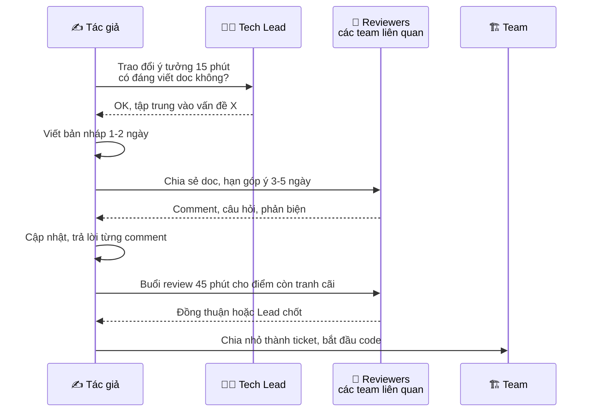

### Mẫu Design Doc / RFC

```text
# [Tên dự án/tính năng] - Design Doc

Tác giả: ...        Reviewers: ...        Trạng thái: Draft | In Review | Approved
Ngày tạo: ...       Cập nhật: ...         Link ticket/epic: ...

## 1. Tóm tắt (TL;DR)
3-5 câu: vấn đề gì, đề xuất gì, tác động gì. Người bận chỉ đọc phần này.

## 2. Bối cảnh & Vấn đề
- Hiện trạng: hệ thống đang hoạt động thế nào?
- Vấn đề: cụ thể, có số liệu (p99 latency, số ticket CS, doanh thu mất...)
- Tại sao phải giải quyết BÂY GIỜ?

## 3. Mục tiêu (Goals)
- Mục tiêu đo được. Ví dụ: "p99 API tạo đơn < 500ms khi tải 5k đơn/phút"

## 4. Không phải mục tiêu (Non-goals)
- Những gì dự án này CỐ Ý KHÔNG làm. Ví dụ: "Không thay đổi nội dung SMS",
  "Không hỗ trợ gửi thông báo theo lịch hẹn giờ"
  (Non-goals ngăn phạm vi phình to và tránh tranh luận lạc đề)

## 5. Thiết kế đề xuất
- Sơ đồ kiến trúc, luồng dữ liệu (sequence diagram)
- API / schema / data model thay đổi
- Xử lý lỗi, retry, idempotency
- Bảo mật & quyền riêng tư
- Khả năng quan sát: log, metric, alert

## 6. Các phương án đã cân nhắc
| Phương án | Ưu | Nhược | Lý do không chọn |

## 7. Kế hoạch triển khai & Rollout
- Các giai đoạn, feature flag, % người dùng
- Migration dữ liệu, kế hoạch rollback

## 8. Rủi ro & Câu hỏi mở
- Rủi ro + cách giảm thiểu
- Câu hỏi cần reviewer trả lời

## 9. Ước lượng
- Công sức, số người, mốc thời gian chính
```

!!! tip "Phần quan trọng nhất thường bị viết tệ nhất: Non-goals"
    Người mới hay bỏ trống mục Non-goals. Nhưng đây là chỗ **ngăn 80% các cuộc tranh luận lạc đề** trong buổi review: "Sao không làm luôn tính năng hẹn giờ gửi?" → "Đó là non-goal, mình sẽ làm ở giai đoạn 2."

### Design doc tốt vs tệ

| ❌ Design doc tệ | ✅ Design doc tốt |
|---|---|
| 30 trang, mô tả từng class | 3-8 trang, tập trung vào quyết định và trade-off |
| Chỉ có một phương án | So sánh 2-3 phương án, nói rõ vì sao chọn |
| "Hệ thống sẽ nhanh hơn" | "p99 giảm từ 4s xuống < 500ms" |
| Viết sau khi đã code xong | Viết trước, sửa theo góp ý |
| Không có phần rủi ro | Liệt kê rủi ro và kế hoạch rollback |

---

## 📖 6. Technical Debt - Nợ kỹ thuật

### Phép ẩn dụ

Ward Cunningham (cha đẻ của khái niệm) so sánh: viết code nhanh-mà-chưa-tốt giống như **vay tiền**. Vay giúp bạn có thứ mình cần **ngay bây giờ** (ra mắt tính năng sớm). Nhưng bạn phải trả **lãi**: mỗi lần sửa code đó sau này đều chậm hơn, dễ lỗi hơn. Nếu không trả **gốc** (refactor), lãi cứ chồng lãi, đến lúc team dành 80% thời gian chỉ để "trả lãi" - sửa bug, workaround - thay vì làm tính năng mới.

Giống như vay tín dụng đen: vay thì dễ, nhưng không có kế hoạch trả là tan nhà nát cửa.

!!! note "Nợ không phải lúc nào cũng xấu"
    Doanh nghiệp vay ngân hàng để mở rộng là chuyện bình thường. Startup cần ra mắt trước đối thủ, chấp nhận nợ kỹ thuật **có chủ đích** là quyết định kinh doanh hợp lý. Vấn đề là **nợ không được ghi nhận** và **nợ vô tình do thiếu hiểu biết**.

### Góc phần tư nợ kỹ thuật (Technical Debt Quadrant - Martin Fowler)

Fowler phân loại nợ theo hai trục: **Cố ý hay Vô tình** × **Thận trọng hay Liều lĩnh**.

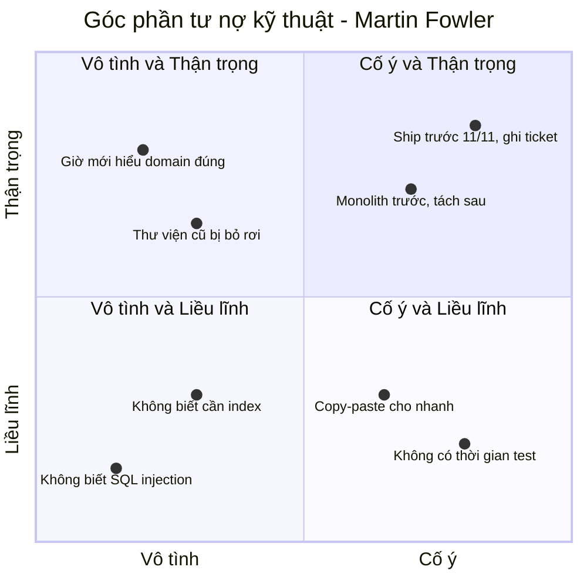

| Góc phần tư | Câu nói điển hình | Ví dụ | Đánh giá |
|---|---|---|---|
| **Cố ý + Thận trọng** | "Phải ra mắt trước 11/11. Mình hardcode 3 loại khuyến mãi, ghi ticket refactor sau đợt sale." | Có ticket, có hạn trả, có lý do kinh doanh | ✅ Khoản vay hợp lý |
| **Vô tình + Thận trọng** | "Làm xong 6 tháng mới hiểu ra đáng lẽ nên thiết kế thế này." | Hiểu biết về domain tăng lên theo thời gian | ✅ Không tránh được - là dấu hiệu team đang học |
| **Cố ý + Liều lĩnh** | "Không có thời gian thiết kế đâu, cứ code đi." | Bỏ test, copy-paste, không review, không ghi nhận | ❌ Nguy hiểm |
| **Vô tình + Liều lĩnh** | "Layer là gì? Index là gì?" | Thiếu kiến thức nền tảng | ❌ Nguy hiểm nhất - không ai biết là đang nợ |

**Cách "di chuyển" giữa các góc**:

- Vô tình + Liều lĩnh → **học** (đọc sách, code review, mentor) - đó là lý do khóa học này tồn tại
- Cố ý + Liều lĩnh → **ghi nhận và lên kế hoạch trả** → thành Cố ý + Thận trọng
- Vô tình + Thận trọng → **refactor khi hiểu rõ hơn** - bình thường và lành mạnh

### Nợ kỹ thuật trông như thế nào trong thực tế?

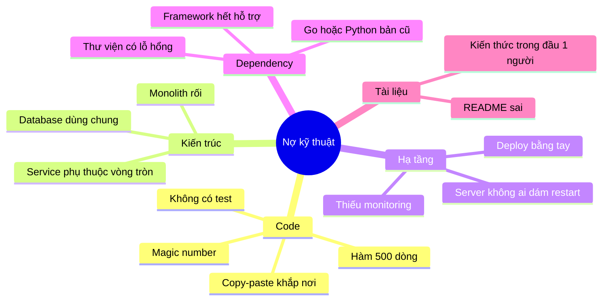

---

## 📖 7. Quản lý nợ kỹ thuật

### Bước 1: Làm cho nợ **nhìn thấy được**

Nợ không được ghi lại = nợ không bao giờ được trả. Tạo một **sổ nợ kỹ thuật** (tech debt register) - có thể chỉ là một label `tech-debt` trên Jira/GitHub Issues:

```text
TECH DEBT TICKET

Tiêu đề: Tách logic tính khuyến mãi khỏi OrderService
Loại: Code | Kiến trúc | Hạ tầng | Dependency | Tài liệu
Góc phần tư: Cố ý + Thận trọng (hardcode trước đợt sale 11/11)

Lãi suất (đang tốn gì mỗi tháng?):
- Mỗi chương trình khuyến mãi mới mất 3 ngày thay vì 0,5 ngày
- 2 bug production trong quý 3 liên quan đến khuyến mãi
- Chỉ anh Tuấn hiểu hết code này (bus factor = 1)

Gốc (trả hết tốn bao nhiêu?): ~8 ngày công

Rủi ro nếu không trả: Tết có 10 chương trình khuyến mãi -> ước tính 25 ngày công
workaround + rủi ro sai giá

Đề xuất: Trả trong sprint 24-25, trước khi làm khuyến mãi Tết
```

### Bước 2: Nói chuyện với business bằng ngôn ngữ của họ

PM và sếp **không quan tâm** "code xấu". Họ quan tâm **thời gian, tiền, rủi ro**:

| ❌ Nói kiểu developer | ✅ Nói kiểu business |
|---|---|
| "Code OrderService rối quá, cần refactor" | "Mỗi chương trình khuyến mãi mới đang tốn 3 ngày thay vì nửa ngày. Đầu tư 8 ngày bây giờ, Tết mình tiết kiệm được ~20 ngày và giảm rủi ro sai giá" |
| "Mình cần nâng cấp Python 3.8 lên 3.12" | "Python 3.8 đã hết hỗ trợ bảo mật. Nếu có lỗ hổng, mình không có bản vá. Nâng cấp giúp API nhanh hơn ~20% theo benchmark của team" |
| "Cần viết test cho module thanh toán" | "Quý trước có 3 sự cố thanh toán, mỗi lần tốn ~2 ngày xử lý và hoàn tiền. Có test tự động sẽ bắt được 2/3 lỗi đó trước khi release" |

### Bước 3: Chọn chiến lược trả nợ

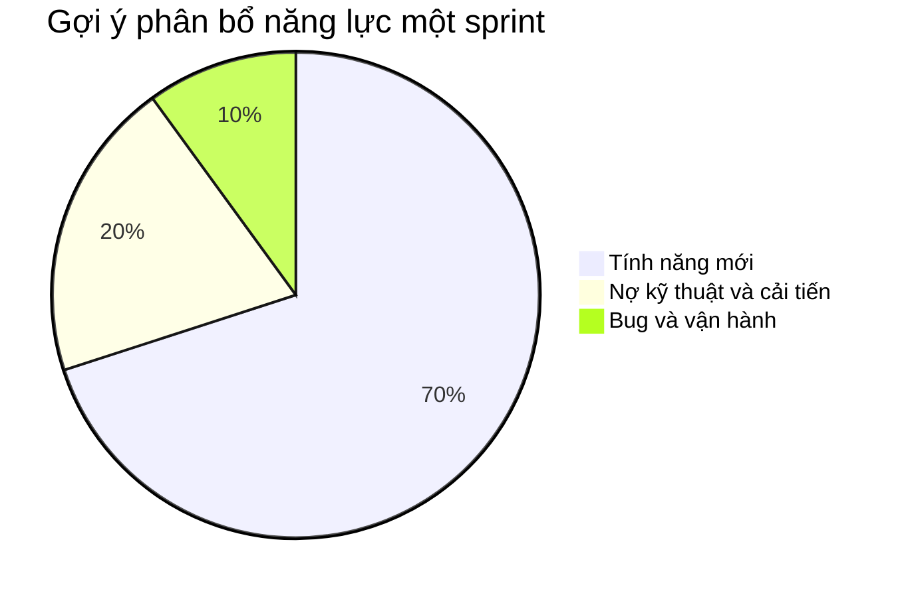

Các chiến lược phổ biến:

1. **Ngân sách cố định**: dành 15-25% mỗi sprint cho nợ kỹ thuật. Đơn giản, bền vững. Đây là cách phổ biến nhất.
2. **Quy tắc hướng đạo sinh (Boy Scout Rule)**: "Rời khu cắm trại sạch hơn lúc đến". Mỗi PR dọn dẹp một chút ở vùng code mình đang sửa - đổi tên biến khó hiểu, tách một hàm, thêm một test.
3. **Trả nợ theo cơ hội**: sắp làm tính năng lớn ở module X → refactor X trước. Nợ ở code **không ai đụng tới** thì **không cần trả** - lãi bằng 0.
4. **Sprint dọn dẹp**: một sprint riêng cho nợ kỹ thuật. Dễ bị cắt khi có deadline, nên kém bền vững hơn cách 1.
5. **Strangler Fig** cho nợ kiến trúc lớn: xây hệ thống mới **bao quanh** hệ thống cũ, chuyển dần từng luồng, đến khi hệ thống cũ "chết" tự nhiên - thay vì viết lại toàn bộ một lần (big-bang rewrite - thường thất bại).

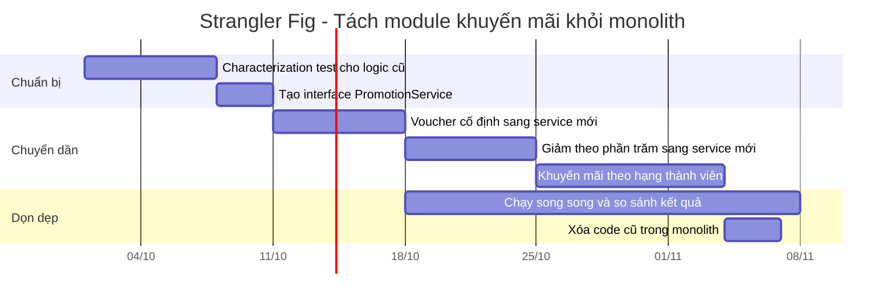

!!! warning "Đừng viết lại toàn bộ (Big-bang rewrite)"
    "Code cũ tệ quá, viết lại từ đầu cho nhanh" - câu nói đã giết không ít sản phẩm. Hệ thống cũ chứa **hàng nghìn quy tắc nghiệp vụ ngầm** và bug fix mà không ai ghi lại. Bản viết lại mất gấp 3 lần thời gian dự kiến, trong khi hệ thống cũ vẫn phải tiếp tục thêm tính năng. Hãy refactor dần hoặc dùng Strangler Fig.

### Khi nào **không** trả nợ?

- Code sắp bị xóa (tính năng sắp ngừng)
- Code ổn định, không ai sửa trong 2 năm qua và không có kế hoạch sửa
- Chi phí trả nợ lớn hơn tổng "lãi" trong suốt vòng đời còn lại của code

---

## 📖 8. Chọn công nghệ: Hãy chọn công nghệ "nhàm chán"

### Innovation tokens (Dan McKinley - "Choose Boring Technology")

Hãy tưởng tượng mỗi công ty/dự án chỉ có khoảng **3 "đồng xu đổi mới" (innovation tokens)**. Mỗi lần bạn chọn một công nghệ mới, chưa ai trong team vận hành thành thạo, bạn tiêu 1 đồng xu. Tiêu hết thì không còn năng lượng cho thứ khác.

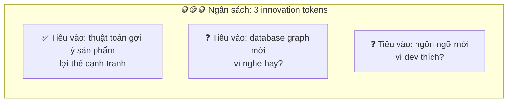

Công nghệ **"nhàm chán" (boring)** = công nghệ đã được dùng rộng rãi nhiều năm, như PostgreSQL, MySQL, Redis, Nginx, Linux, Go, Python, Java. Chúng nhàm chán vì:

- **Các lỗi đã được biết** (known unknowns): Google lỗi gì cũng ra câu trả lời trên StackOverflow
- Tuyển người dễ
- Công cụ, tài liệu, thư viện đầy đủ
- Hành vi khi gặp sự cố đã được hiểu rõ

Công nghệ mới có **unknown unknowns** - những vấn đề bạn thậm chí không biết là tồn tại, cho đến khi nó sập lúc 2h sáng.

### Checklist đánh giá công nghệ mới

```text
TRƯỚC KHI ĐƯA CÔNG NGHỆ MỚI VÀO PRODUCTION

Vấn đề
[ ] Vấn đề cụ thể mà công nghệ hiện tại KHÔNG giải quyết được là gì? (có số liệu)
[ ] Đã thử giải quyết bằng công nghệ sẵn có chưa? Tại sao không đủ?

Độ trưởng thành
[ ] Có bản ổn định (>= 1.0) và được dùng trên production ở công ty cỡ mình không?
[ ] Cộng đồng: commit gần đây, số người maintain, cách xử lý issue bảo mật?
[ ] Giấy phép (license) có phù hợp dùng thương mại?

Vận hành
[ ] Ai sẽ on-call cho nó? Người đó đã được đào tạo chưa?
[ ] Monitoring, backup, nâng cấp phiên bản làm thế nào?
[ ] Nó hỏng thì chuyện gì xảy ra? Có kế hoạch B không?

Con người
[ ] Bao nhiêu người trong team biết dùng? Tuyển người có dễ không?
[ ] Nếu người đề xuất nghỉ việc, team có tự vận hành được không?

Lối thoát
[ ] Nếu 6 tháng sau thấy không hợp, bỏ nó tốn bao nhiêu? (cửa 1 chiều hay 2 chiều?)
[ ] Có thể thử ở một phạm vi nhỏ, ít rủi ro trước không?
```

!!! tip "Giới hạn phạm vi thử nghiệm"
    Muốn thử công nghệ mới? Bắt đầu ở **nơi rủi ro thấp**: công cụ nội bộ, service không nằm trên luồng thanh toán, job chạy batch. Thành công ở đó rồi mới mở rộng. Đây là cách biến cửa một chiều thành cửa hai chiều.

### "Resume-Driven Development" - một căn bệnh

Chọn công nghệ vì **muốn có nó trong CV** thay vì vì dự án cần. Dấu hiệu:

- Blog 3 người đọc chạy trên Kubernetes với 12 microservices
- Startup 2 dev dùng Kafka + Cassandra + GraphQL Federation cho MVP
- "Thử" một framework ra mắt 2 tháng trước vào hệ thống lõi

Hậu quả thường là: người đề xuất nghỉ việc (với CV đẹp hơn), team còn lại ôm hệ thống không ai hiểu.

---

## 📖 9. Tối ưu hóa sớm vs Nhận thức về hiệu năng

### Câu nói nổi tiếng thường bị trích dẫn thiếu

Hầu hết mọi người chỉ nhớ: *"Premature optimization is the root of all evil"* - và dùng nó để bào chữa cho code chậm. Câu đầy đủ của Donald Knuth:

> "Chúng ta nên quên đi những hiệu quả nhỏ nhặt, khoảng **97%** thời gian: tối ưu hóa sớm là gốc rễ của mọi tội lỗi. Tuy vậy, chúng ta **không nên bỏ lỡ cơ hội ở 3% quan trọng** đó."

Hai vế đều quan trọng.

### Hai thái cực sai

| ❌ Tối ưu hóa sớm | ❌ Coi thường hiệu năng |
|---|---|
| Viết lại vòng lặp bằng bitwise cho "nhanh hơn" 2 nano giây, code không ai đọc được | Gọi database trong vòng lặp 10.000 lần (N+1 query) |
| Thêm cache cho API được gọi 10 lần/ngày | Load cả bảng 5 triệu dòng vào RAM để đếm |
| Tách microservice "để scale" khi có 100 user | Không có index cho cột dùng trong WHERE |
| Tranh luận Go vs Rust cho CRUD app | Thuật toán O(n²) cho danh sách sẽ lên 1 triệu phần tử |

**Nhận thức về hiệu năng (performance awareness)** = không tối ưu vi mô, nhưng **tránh những sai lầm lớn về cấu trúc** ngay từ đầu - vì chúng rất đắt để sửa sau này.

### Tính nhẩm (Napkin math) - Kỹ năng bị đánh giá thấp

Kỹ sư giỏi ước lượng được **độ lớn** trước khi code. Một số con số tham khảo (độ lớn, không cần chính xác):

| Thao tác | Thời gian xấp xỉ |
|---|---|
| Đọc từ RAM | ~100 nanosecond |
| Đọc 1MB tuần tự từ RAM | ~vài chục microsecond |
| Đọc ngẫu nhiên từ SSD | ~100 microsecond |
| Round-trip trong cùng datacenter | ~0,5 millisecond |
| Query DB đơn giản có index | ~1 millisecond |
| Gọi API bên ngoài | 50 - 500 millisecond |
| Round-trip Việt Nam ↔ Mỹ | ~150-250 millisecond |

**Ví dụ tính nhẩm**: trang danh sách đơn hàng hiển thị 50 đơn, mỗi đơn query thêm thông tin khách hàng (N+1). 51 query × ~1ms = ~51ms. Chấp nhận được? Có thể. Nhưng nếu DB ở region khác (mỗi query ~30ms) → 51 × 30 = **1,5 giây**. Tính nhẩm 30 giây giúp bạn biết cần JOIN hoặc batch query **trước khi** khách hàng phàn nàn.

### Quy trình tối ưu đúng: Đo trước, sửa sau

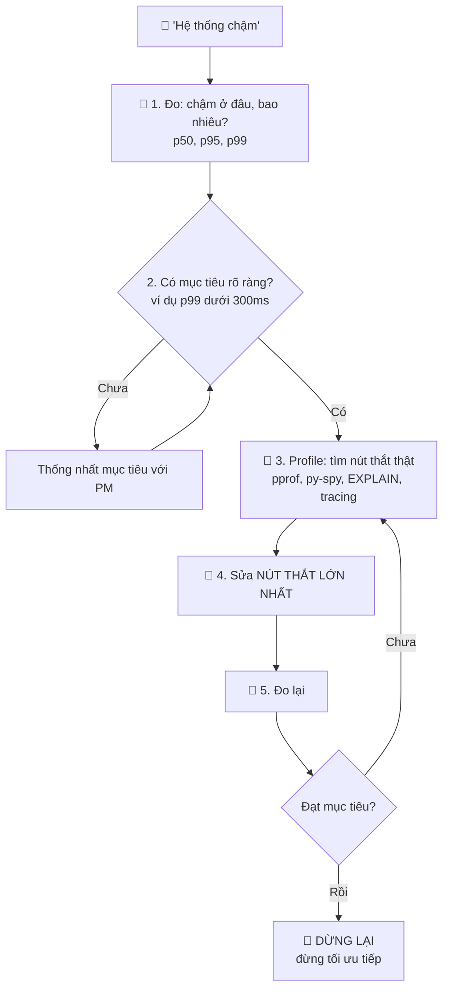

### Câu chuyện: "Tối ưu" sai chỗ

Một dev dành 3 ngày viết lại hàm serialize JSON bằng thư viện "nhanh hơn 5 lần". API vẫn chậm y như cũ. Khi profile mới thấy: serialize JSON chiếm **2ms**, còn một query thiếu index chiếm **1.800ms**. Thêm 1 index (5 phút) → API nhanh gấp 10 lần.

**Bài học**: Trực giác về chỗ chậm **thường sai**. Luôn đo. Chi tiết về profiling và database performance: [Backend Bài 6](../backend/06-database-internals-performance.md), [Backend Bài 11](../backend/11-observability-reliability.md).

---

## 📖 10. Tư duy bậc hai (Second-order thinking)

**Tư duy bậc một**: "Quyết định này giải quyết vấn đề trước mắt thế nào?"
**Tư duy bậc hai**: "**Và sau đó thì sao?** Hệ quả của hệ quả là gì?"

### Ví dụ 1: Thêm retry để tăng độ tin cậy

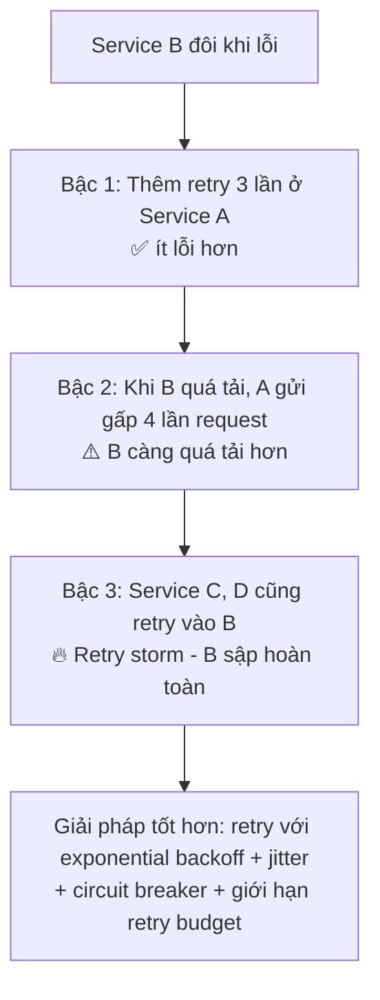

### Ví dụ 2: Thêm cache để API nhanh hơn

- **Bậc 1**: API nhanh gấp 10 lần ✅
- **Bậc 2**: Dữ liệu cũ - khách đổi địa chỉ nhưng đơn vẫn giao về địa chỉ cũ ⚠️
- **Bậc 3**: Cache hết hạn cùng lúc → hàng nghìn request đổ vào DB (cache stampede) 🔥
- **Bậc 4**: Team quen với việc DB "nhẹ" nhờ cache, không ai tối ưu query; một ngày Redis sập, DB không chịu nổi tải thật

### Ví dụ 3: KPI "số ticket đóng mỗi tuần"

- **Bậc 1**: Dev làm việc năng suất hơn
- **Bậc 2**: Dev chia 1 việc thành 5 ticket nhỏ; chọn việc dễ, né việc khó
- **Bậc 3**: Việc quan trọng nhưng khó (nợ kỹ thuật, điều tra sự cố) không ai làm

### Bộ câu hỏi tư duy bậc hai

```text
Trước mỗi quyết định kỹ thuật quan trọng, hỏi:
1. Và sau đó thì sao? (hỏi ít nhất 2-3 lần)
2. Điều gì xảy ra khi tải gấp 10 lần? Khi thành phần này hỏng?
3. Ai khác bị ảnh hưởng? (team khác, CS, kế toán, khách hàng)
4. Nó thay đổi HÀNH VI của con người thế nào? (dev, người dùng)
5. 1 năm nữa, quyết định này trông thế nào?
6. Nếu ai cũng làm như vậy (mọi service đều retry, mọi team đều thêm cache) thì sao?
```

---

## 📖 11. Miễn dịch với Hype

### Chu kỳ Hype (Gartner Hype Cycle)

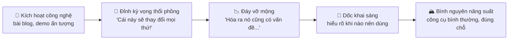

Hầu như công nghệ nào cũng đi qua chu kỳ này: NoSQL (2010), microservices (2015), blockchain (2017), serverless (2018)... Ở "đỉnh kỳ vọng", các công ty lao vào dùng cho **mọi thứ**. Ở "đáy vỡ mộng", nhiều công ty phải quay về giải pháp cũ - ví dụ những bài viết nổi tiếng về việc gộp microservices trở lại thành monolith.

### Câu chuyện: Microservices cho startup 5 người

Một startup giáo dục ở TP.HCM có 5 dev, 2.000 người dùng. CTO mới đọc về kiến trúc của Netflix và quyết định tách hệ thống thành 15 microservices.

6 tháng sau:

- Mỗi tính năng mới phải sửa 4-5 service, deploy theo đúng thứ tự
- Debug một lỗi phải đọc log ở 6 chỗ
- Chi phí cloud tăng gấp 4 lần (15 service × môi trường dev/staging/prod)
- Tốc độ ra tính năng **chậm hơn** so với hồi còn monolith

Netflix dùng microservices vì họ có **hàng nghìn kỹ sư** cần làm việc độc lập. Vấn đề của startup 5 người thì ngược lại: **cần tốc độ và sự đơn giản**.

### Bộ lọc hype

```text
Khi nghe "Công nghệ X đang hot, mình nên dùng!", hỏi:

1. Công ty đang dùng X thành công có bối cảnh giống mình không?
   (quy mô, số kỹ sư, loại sản phẩm)
2. Vấn đề X giải quyết - mình có vấn đề đó KHÔNG, và có số liệu không?
3. Ai đang nói về X? Người dùng thật trên production hay người bán X?
4. Đã có ai viết bài "chúng tôi bỏ X vì..." chưa? Đọc nó.
5. Nếu đợi 1 năm nữa mới dùng X thì mất gì?
```

!!! tip "Theo dõi công nghệ mới vẫn quan trọng"
    Miễn dịch với hype **không** có nghĩa là bảo thủ. Hãy **học** và **thử** công nghệ mới trong side project, hackathon, công cụ nội bộ. Chỉ cần tách bạch: **thử nghiệm để học** (tốt, nên làm) và **đưa vào hệ thống lõi của công ty** (cần lý do chính đáng). Bài 10 bàn thêm về cách học liên tục.

---

## 🌍 Tình huống thực tế

### Tình huống 1: "Mình chuyển sang microservices đi anh"

**Bối cảnh**: Bạn là mid-level trong team 8 người, sản phẩm là monolith Go 3 năm tuổi. Một đồng nghiệp đề xuất tách microservices vì "monolith khó scale".

| 🐣 Junior | 🦉 Senior |
|---|---|
| "Đúng rồi, microservices hiện đại hơn, em ủng hộ!" | "Cụ thể mình đang gặp vấn đề scale nào? Có số liệu không?" |
| | Tìm hiểu: vấn đề thật là module báo cáo chạy query nặng làm chậm cả hệ thống |
| | Đề xuất: tách **riêng** module báo cáo sang đọc từ read replica - 1 tuần công, giải quyết 90% vấn đề |
| | Viết ADR: "Chưa tách microservices. Xem xét lại khi team > 20 người hoặc có module cần scale khác biệt rõ rệt" |

**Bài học**: Bắt đầu từ **vấn đề cụ thể có số liệu**, không phải từ **giải pháp thời thượng**.

### Tình huống 2: Tranh luận không hồi kết

**Bối cảnh**: Team tranh luận 2 tuần về việc dùng `gorm` hay `sqlc` cho dự án Go mới. Slack thread 200 tin nhắn.

**Cách senior xử lý**:

1. Nhận ra đây là **cửa hai chiều** (có thể đổi dần, dự án mới)
2. Gọi họp 30 phút, viết lên bảng 4 tiêu chí + trọng số, cả team đồng ý trước
3. Chấm điểm nhanh → chênh lệch nhỏ → "cả hai đều ổn, chênh lệch không đáng kể"
4. Tech lead chốt `sqlc` (team đã quen SQL thuần), ghi ADR 1 trang, đặt điều kiện xem xét lại sau 3 tháng
5. Người ủng hộ `gorm` **disagree and commit**: vẫn viết code `sqlc` tốt nhất có thể

**Bài học**: Chi phí của tranh luận kéo dài thường **lớn hơn** chi phí của lựa chọn "chưa tối ưu".

### Tình huống 3: PM muốn ra mắt trong 2 tuần

**Bối cảnh**: Tính năng "flash sale" cần ra mắt trong 2 tuần cho chiến dịch marketing đã chốt ngày. Thiết kế "đúng" cần 5 tuần.

| 🐣 Junior | 🦉 Senior |
|---|---|
| "Không kịp đâu chị" (và dừng ở đó) | "Kịp được nếu mình chấp nhận 3 khoản nợ có chủ đích..." |
| Hoặc: âm thầm code ẩu cho kịp | Liệt kê rõ: (1) chỉ hỗ trợ 1 flash sale cùng lúc, (2) tồn kho dùng Redis lock đơn giản thay vì hệ thống đặt chỗ đầy đủ, (3) trang admin cấu hình bằng file JSON |
| | Giữ nguyên chất lượng phần **không được sai**: trừ tồn kho chính xác, không bán vượt số lượng, có test |
| | Tạo 3 tech-debt ticket, PM đồng ý đưa vào 2 sprint sau chiến dịch |

**Bài học**: Nợ kỹ thuật **có chủ đích + thận trọng** là công cụ kinh doanh hợp lệ - miễn là nó **được ghi nhận** và có **kế hoạch trả**.

### Tình huống 4: Đòi tối ưu khi chưa có vấn đề

**Bối cảnh**: Trong code review, bạn nhận comment: *"Chỗ này nên dùng `sync.Pool` để giảm allocation."* Hàm đó được gọi 50 lần/ngày.

**Phản hồi của senior (lịch sự, có dữ liệu):**

> "Cảm ơn anh đã góp ý! Hàm này chỉ chạy khi admin export báo cáo, khoảng 50 lần/ngày, mỗi lần ~20ms. Em nghĩ thêm `sync.Pool` sẽ làm code phức tạp hơn mà lợi ích không đo được. Nếu sau này nó nằm trên luồng nóng, em sẽ profile rồi tối ưu. Anh thấy ổn không ạ?"

**Bài học**: Tối ưu cần **dữ liệu** biện minh. Và phản biện cũng cần dữ liệu.

---

## ⚠️ Sai lầm thường gặp

### Sai lầm 1: Dừng lại ở "it depends"

Nói "tùy" mà không nêu yếu tố và khuyến nghị = không giúp gì. Luôn kết thúc bằng một đề xuất cụ thể.

### Sai lầm 2: Tin rằng có giải pháp "tốt nhất"

"Kafka tốt hơn RabbitMQ", "Go tốt hơn Python" - không có ngữ cảnh thì những câu này vô nghĩa.

### Sai lầm 3: Đối xử mọi quyết định như nhau

Họp 3 tuần cho quyết định cửa hai chiều; quyết trong 5 phút cho cửa một chiều. Hãy phân loại trước.

### Sai lầm 4: Không ghi lại lý do quyết định

6 tháng sau không ai nhớ vì sao, tranh luận lại từ đầu. Viết ADR cho quyết định quan trọng.

### Sai lầm 5: Nợ kỹ thuật "vô hình"

Nợ không có ticket, không ai biết, không ai trả. Làm nó nhìn thấy được và nói bằng ngôn ngữ business.

### Sai lầm 6: Big-bang rewrite

"Viết lại từ đầu" hầu như luôn lâu hơn, rủi ro hơn dự kiến. Ưu tiên refactor dần, Strangler Fig.

### Sai lầm 7: Tiêu hết innovation tokens

Dùng 5 công nghệ mới cùng lúc trong một dự án. Mỗi dự án chỉ nên có 1-2 thứ mới.

### Sai lầm 8: Tối ưu theo cảm giác

Tối ưu không đo lường, tối ưu chỗ không phải nút thắt. Luôn đo → profile → sửa → đo lại.

### Sai lầm 9: Dùng "premature optimization" để bào chữa cho thiết kế tệ

N+1 query, thiếu index, thuật toán O(n²) cho dữ liệu lớn không phải "tối ưu sớm" - đó là thiếu nhận thức về hiệu năng.

### Sai lầm 10: Chạy theo hype / Resume-Driven Development

Chọn công nghệ vì nó hot hoặc vì muốn có trong CV, không phải vì dự án cần.

---

## 🏋️ Bài tập

### Bài tập 1 (Dễ): Phân loại cửa

Phân loại các quyết định sau là cửa một chiều hay hai chiều, và nếu là cửa một chiều, đề xuất cách biến nó thành "gần hai chiều":

1. Đổi thư viện log từ `logrus` sang `slog`
2. Đổi tên một field trong API public mà app mobile đang dùng
3. Chuyển database chính từ MySQL sang PostgreSQL
4. Bật tính năng thanh toán trả góp cho toàn bộ người dùng
5. Xóa các tài khoản không hoạt động quá 2 năm

<details markdown="1">
<summary>Đáp án gợi ý</summary>

1. **Hai chiều** - đổi lại dễ, nhất là nếu log qua một interface chung
2. **Một chiều** (app mobile cũ không tự cập nhật). Biến thành hai chiều: thêm field mới, giữ field cũ, đánh dấu deprecated, theo dõi version app, chỉ xóa khi < 1% người dùng còn app cũ
3. **Một chiều** (rất tốn kém). Giảm rủi ro: dual-write, chạy song song, chuyển dần từng bảng/từng service, giữ khả năng quay lại trong một thời gian
4. **Hai chiều nếu có feature flag**, một chiều nếu không. Rollout 1% → 10% → 100%
5. **Một chiều** (mất dữ liệu). Biến thành gần hai chiều: soft delete + thông báo email trước 30 ngày + lưu archive 90 ngày trước khi xóa thật. Kiểm tra quy định pháp lý về dữ liệu cá nhân

</details>

### Bài tập 2 (Dễ): Viết lại câu "it depends"

Viết lại các câu trả lời sau theo công thức ở mục 1:

- "Dùng cache hay không thì còn tùy."
- "Nên dùng Go hay Python cho service mới? Cái nào cũng được."

### Bài tập 3 (Trung bình): Ma trận quyết định của riêng bạn

Chọn một quyết định thật bạn đang/sắp đối mặt (chọn công nghệ cho side project, chọn công ty để ứng tuyển, chọn khóa học tiếp theo...). Lập ma trận: 4-6 tiêu chí, trọng số chốt **trước**, 2-4 lựa chọn. Chạy code ở mục 3.3 với dữ liệu của bạn. Sau đó **thay đổi trọng số của tiêu chí quan trọng nhất ±15%** - kết quả có đổi không? Điều đó nói gì về quyết định của bạn?

### Bài tập 4 (Trung bình): Viết ADR

Viết một ADR hoàn chỉnh (theo mẫu ở mục 4) cho một trong các quyết định:

- Chọn PostgreSQL hay MongoDB cho hệ thống quản lý khóa học online
- Dùng JWT hay session-based auth cho ứng dụng web nội bộ (tham khảo [Backend Bài 4](../backend/04-auth.md))
- Tự viết hay dùng dịch vụ có sẵn cho gửi email marketing

Yêu cầu: có ít nhất 3 lựa chọn, có mục "Điều kiện xem xét lại".

### Bài tập 5 (Khó): Kiểm kê nợ kỹ thuật

Với một dự án bạn đang làm (hoặc dự án tổng hợp trong khóa [Go](../golang/10-final-project.md)/[Python](../python/10-final-project.md)):

1. Liệt kê 5-10 khoản nợ kỹ thuật
2. Xếp mỗi khoản vào góc phần tư Fowler
3. Với 3 khoản quan trọng nhất: viết tech debt ticket theo mẫu ở mục 7, có "lãi suất" và "gốc"
4. Viết một đoạn 5 câu thuyết phục PM dành 20% sprint để trả nợ - **không dùng từ "refactor" hay "code xấu"**

### Bài tập 6 (Khó): Tư duy bậc hai

Với mỗi đề xuất, viết ít nhất 3 bậc hệ quả và một giải pháp cải tiến:

1. "Tăng timeout của API gọi sang cổng thanh toán từ 5s lên 60s để giảm lỗi timeout"
2. "Bắt buộc mọi PR phải có 2 approve để tăng chất lượng"
3. "Thưởng cho developer theo số bug tìm được trong code của người khác"

<details markdown="1">
<summary>Gợi ý cho đề xuất 1</summary>

- Bậc 1: ít lỗi timeout hơn
- Bậc 2: khi cổng thanh toán chậm, mỗi request giữ connection/goroutine/worker đến 60s → cạn connection pool
- Bậc 3: toàn bộ API (kể cả API không liên quan thanh toán) bị treo vì hết tài nguyên → sự cố lan rộng
- Bậc 4: người dùng bấm "thanh toán" lần nữa vì chờ lâu → nguy cơ trừ tiền 2 lần nếu không có idempotency key

Cải tiến: giữ timeout hợp lý (dựa trên p99 thực tế của cổng thanh toán), xử lý bất đồng bộ (trả "đang xử lý" + webhook/polling), circuit breaker, idempotency key, bulkhead (tách pool tài nguyên cho thanh toán).

</details>

---

## ✅ Checklist hoàn thành

- [ ] Trả lời "it depends" theo công thức: yếu tố → bối cảnh → khuyến nghị → cái giá → điều kiện xem xét lại
- [ ] Nêu được ít nhất 5 cặp trade-off kinh điển và ví dụ khi nào chọn bên nào
- [ ] Phân tích build vs buy có tính cả chi phí ẩn
- [ ] Phân loại quyết định thành cửa một chiều / hai chiều, và biết cách biến cửa một chiều thành hai chiều
- [ ] Dùng cost of delay để sắp xếp thứ tự công việc
- [ ] Lập ma trận quyết định có trọng số và làm phân tích độ nhạy
- [ ] Viết được ADR và biết khi nào cần viết
- [ ] Viết được design doc với Goals và Non-goals rõ ràng
- [ ] Giải thích góc phần tư nợ kỹ thuật và cách quản lý nợ bằng ngôn ngữ business
- [ ] Áp dụng "choose boring technology" và checklist đánh giá công nghệ mới
- [ ] Phân biệt tối ưu hóa sớm với nhận thức hiệu năng; biết quy trình đo → profile → sửa
- [ ] Áp dụng tư duy bậc hai cho ít nhất một quyết định thật
- [ ] Dùng bộ lọc hype khi đánh giá công nghệ đang "hot"

---

💡 **Tips ghi nhớ**:

- **"It depends" là điểm bắt đầu, không phải câu trả lời**
- **Cửa hai chiều: quyết nhanh. Cửa một chiều: chậm lại, viết doc**
- **Chốt trọng số trước khi chấm điểm** - và tranh luận về trọng số, không phải về công cụ
- **Quyết định không ghi lại sẽ bị tranh luận lại**
- **Nợ kỹ thuật có chủ đích + có ticket = công cụ. Nợ vô hình = quả bom hẹn giờ**
- **Chọn công nghệ nhàm chán, tiêu innovation token vào thứ tạo khác biệt**
- **Đo trước, tối ưu sau. Và hỏi: "Rồi sau đó thì sao?"**

**Bài tiếp theo**: [Bài 8: Làm việc nhóm & Giao tiếp](./08-teamwork-communication.md)
