# 📚 Bài 8: Làm việc nhóm & Giao tiếp

> "Phần mềm là một môn thể thao đồng đội. Một cầu thủ giỏi nhất đội mà không chuyền bóng thì đội vẫn thua."

Có một sự thật mà trường học ít khi nói với bạn: **phần lớn thời gian của một software engineer không dành cho việc viết code**. Bạn đọc code của người khác, review PR, viết tài liệu, trả lời tin nhắn, họp lập kế hoạch, giải thích cho PM vì sao tính năng này mất 2 tuần, hỏi đồng nghiệp về một hệ thống bạn chưa hiểu...

Kỹ sư giỏi về kỹ thuật nhưng giao tiếp kém thường **bị kẹt ở level mid** rất lâu. Ngược lại, kỹ sư kỹ thuật khá + giao tiếp tốt thường thăng tiến nhanh hơn, vì **tác động của họ được nhân lên qua cả team**.

Tin tốt: giao tiếp **là kỹ năng**, không phải tính cách bẩm sinh. Người hướng nội vẫn có thể giao tiếp rất hiệu quả - đặc biệt là giao tiếp bằng văn bản. Bài này cho bạn các mẫu (template), checklist và ví dụ cụ thể để luyện tập.

## 🎯 Mục tiêu bài học

- Hiểu vì sao phần mềm là **"môn thể thao đồng đội"** và vai trò của từng người trong team
- Viết **commit message** chuẩn (Conventional Commits) và tạo **PR nhỏ, dễ review**
- **Review code** hiệu quả: nhìn vào đâu, dùng giọng điệu nào, phân biệt nit và blocking
- **Nhận feedback** mà không phòng thủ
- Viết tin nhắn Slack/email rõ ràng, **đặt câu hỏi hay**, viết **status update**
- Biết khi nào cần **họp** và khi nào nên **làm việc bất đồng bộ**
- **Ước lượng** công việc bằng khoảng (range), story points, chia nhỏ việc
- Nắm các điều cốt lõi của **Agile, Scrum, Kanban**
- Làm việc tốt với **PM, designer, QA**
- **Bất đồng rồi cam kết**, xử lý xung đột, **mentor và được mentor**, làm việc remote
- Hiểu **an toàn tâm lý (psychological safety)** và cách góp phần xây dựng nó

---

## 📖 1. Phần mềm là môn thể thao đồng đội

### "Anh hùng cô độc" - một câu chuyện có thật (ở rất nhiều công ty)

Khoa là developer giỏi nhất team. Anh viết gần như toàn bộ hệ thống thanh toán, code nhanh, sửa bug trong vài phút. Mọi người đều hỏi Khoa. Sếp rất quý Khoa.

Nhưng:

- Khoa không viết tài liệu - "code là tài liệu"
- Khoa hay push thẳng lên `main` - "review mất thời gian"
- Khi ai hỏi, Khoa trả lời "để anh sửa cho nhanh" thay vì giải thích
- Khoa đi nghỉ phép 1 tuần → hệ thống thanh toán lỗi → không ai sửa được → công ty mất 2 ngày doanh thu thanh toán online

Rồi Khoa nghỉ việc. Team mất 4 tháng để hiểu lại hệ thống thanh toán.

**Khoa rất giỏi, nhưng team của Khoa rất yếu.** Và công ty trả lương cho kết quả của **team**, không phải của một người.

### Bus factor

**Bus factor** (hay "lottery factor" cho dễ nghe hơn) = số người tối thiểu cần "biến mất" (trúng số và nghỉ việc) để dự án bị đình trệ. Bus factor = 1 là rủi ro cực lớn.

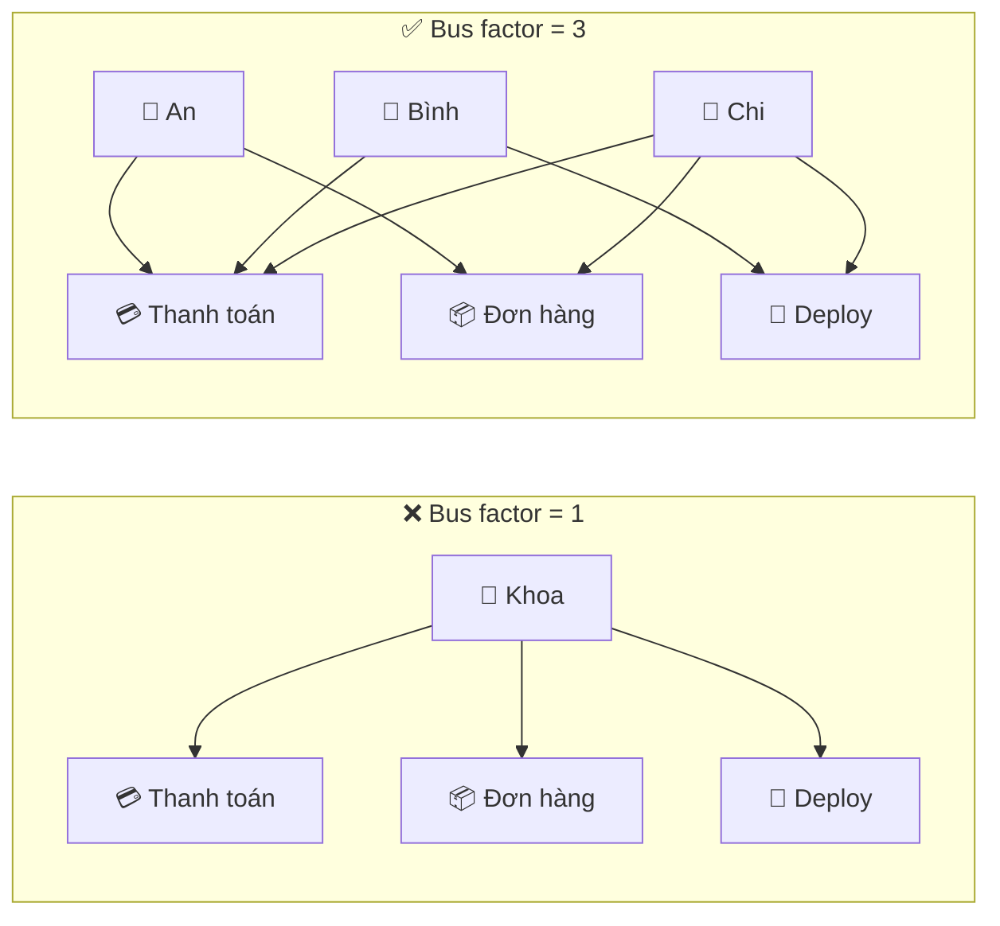

Cách tăng bus factor: code review (người khác phải đọc code), tài liệu, pair programming, luân phiên on-call, **chủ động dạy lại** những gì mình biết.

### Bạn làm việc với ai?

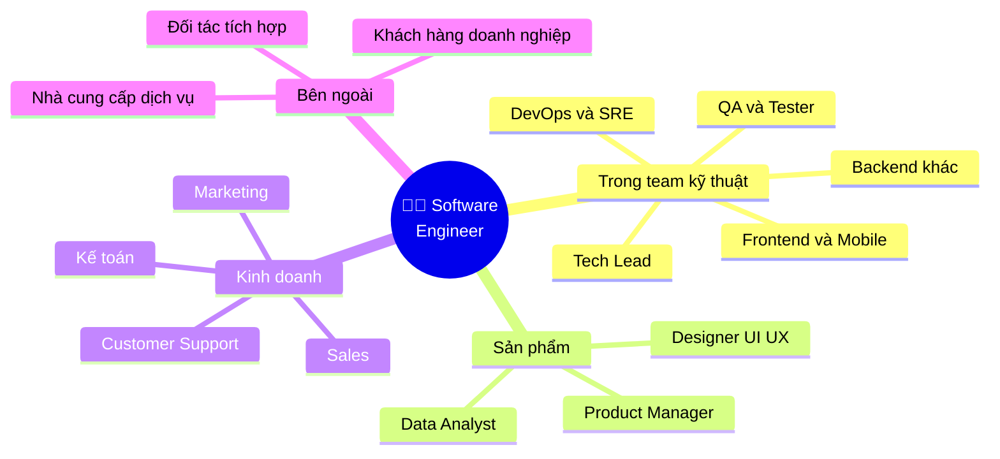

Mỗi nhóm người có **ngôn ngữ riêng** và **mối quan tâm riêng**. Kỹ năng giao tiếp cốt lõi là **dịch** giữa các ngôn ngữ đó: nói với PM bằng ngôn ngữ người dùng và thời gian, nói với sếp bằng ngôn ngữ rủi ro và chi phí, nói với dev khác bằng ngôn ngữ kỹ thuật.

---

## 📖 2. Git workflow & Commit tốt

Git history là **tài liệu về lý do** code trông như hiện tại. Khi bạn chạy `git blame` lúc 2h sáng để hiểu vì sao có một dòng code lạ, commit message tốt là cứu tinh.

### Commit message tệ vs tốt

```text
❌ Commit message tệ (thật, từ các repo thật):
   fix
   update
   wip
   asdfgh
   sửa theo comment
   fix bug linh tinh
   final version
   final version 2 (thật sự final)
```

```text
✅ Commit message tốt:

fix(shipping): tính phí ship đúng khi đơn bằng đúng 500.000đ

Điều kiện free ship dùng ">" thay vì ">=", nên đơn đúng 500.000đ vẫn
bị tính phí 20.000đ. CS nhận 14 phàn nàn trong tuần qua.

Thêm test cho các giá trị biên 499.999đ, 500.000đ, 500.001đ.

Closes SHOP-1234
```

Cấu trúc:

1. **Dòng đầu** (≤ 72 ký tự): **cái gì** thay đổi, dạng mệnh lệnh ("thêm", "sửa", không phải "đã thêm")
2. **Dòng trống**
3. **Thân**: **tại sao** thay đổi (code đã cho biết **cái gì** rồi), bối cảnh, ảnh hưởng
4. **Footer**: liên kết ticket, `BREAKING CHANGE:` nếu có

### Conventional Commits

Một quy ước phổ biến giúp commit message có cấu trúc, máy đọc được (tự sinh changelog, tự tăng version):

```text
<type>(<scope>)<!>: <mô tả>

type:  feat     - tính năng mới
       fix      - sửa bug
       docs     - chỉ tài liệu
       refactor - đổi cấu trúc code, không đổi hành vi
       perf     - cải thiện hiệu năng
       test     - thêm/sửa test
       build/ci - build system, CI pipeline
       chore    - việc vặt (bump dependency, config)
scope: phần hệ thống bị ảnh hưởng (checkout, api, auth...) - tùy chọn
!:     có breaking change
```

Nhiều team dùng hook `commit-msg` hoặc CI để kiểm tra định dạng. Đây là một bộ kiểm tra tối giản - chú ý cách đếm độ dài **theo ký tự** chứ không theo byte (tiếng Việt có dấu chiếm nhiều byte trong UTF-8):

=== "Go"

    ```go
    package main

    import (
        "fmt"
        "regexp"
        "strings"
        "unicode/utf8"
    )

    // type(scope)!: mô tả
    var header = regexp.MustCompile(
        `^(feat|fix|docs|style|refactor|perf|test|build|ci|chore|revert)(\([a-z0-9-]+\))?(!)?: (.+)$`)

    const maxHeaderLen = 72

    // Check trả về danh sách vấn đề của dòng đầu commit message (rỗng = hợp lệ).
    func Check(msg string) []string {
        first := strings.SplitN(msg, "\n", 2)[0]
        m := header.FindStringSubmatch(first)
        if m == nil {
            return []string{"sai định dạng 'type(scope): mô tả'"}
        }
        var problems []string
        // Đếm theo ký tự (rune), không theo byte: "ệ" chiếm 3 byte trong UTF-8
        if n := utf8.RuneCountInString(first); n > maxHeaderLen {
            problems = append(problems, fmt.Sprintf("dòng đầu dài %d ký tự (tối đa %d)", n, maxHeaderLen))
        }
        if strings.HasSuffix(m[4], ".") {
            problems = append(problems, "không kết thúc bằng dấu chấm")
        }
        return problems
    }

    func main() {
        messages := []string{
            "feat(checkout): thêm thanh toán qua ví MoMo",
            "fix: sửa phí ship sai khi đơn đúng 500.000đ",
            "feat(api)!: đổi định dạng response của /orders",
            "update code",
            "Fix: bug",
            "docs: cập nhật hướng dẫn cài đặt.",
            "refactor(order): tách logic tính khuyến mãi ra khỏi OrderService để dễ test và dễ mở rộng",
        }
        for _, msg := range messages {
            if problems := Check(msg); len(problems) == 0 {
                fmt.Printf("✅ %s\n", msg)
            } else {
                fmt.Printf("❌ %s\n   -> %s\n", msg, strings.Join(problems, "; "))
            }
        }
    }

    // Output:
    // ✅ feat(checkout): thêm thanh toán qua ví MoMo
    // ✅ fix: sửa phí ship sai khi đơn đúng 500.000đ
    // ✅ feat(api)!: đổi định dạng response của /orders
    // ❌ update code
    //    -> sai định dạng 'type(scope): mô tả'
    // ❌ Fix: bug
    //    -> sai định dạng 'type(scope): mô tả'
    // ❌ docs: cập nhật hướng dẫn cài đặt.
    //    -> không kết thúc bằng dấu chấm
    // ❌ refactor(order): tách logic tính khuyến mãi ra khỏi OrderService để dễ test và dễ mở rộng
    //    -> dòng đầu dài 89 ký tự (tối đa 72)
    ```

=== "Python"

    ```python
    import re

    # type(scope)!: mô tả
    HEADER = re.compile(
        r"^(feat|fix|docs|style|refactor|perf|test|build|ci|chore|revert)"
        r"(\([a-z0-9-]+\))?(!)?: (.+)$"
    )
    MAX_HEADER_LEN = 72


    def check(msg: str) -> list[str]:
        """Trả về danh sách vấn đề của dòng đầu commit message (rỗng = hợp lệ)."""
        first = msg.split("\n", 1)[0]
        m = HEADER.match(first)
        if m is None:
            return ["sai định dạng 'type(scope): mô tả'"]
        problems = []
        # len() của str trong Python đếm theo ký tự, không theo byte
        if len(first) > MAX_HEADER_LEN:
            problems.append(f"dòng đầu dài {len(first)} ký tự (tối đa {MAX_HEADER_LEN})")
        if m.group(4).endswith("."):
            problems.append("không kết thúc bằng dấu chấm")
        return problems


    messages = [
        "feat(checkout): thêm thanh toán qua ví MoMo",
        "fix: sửa phí ship sai khi đơn đúng 500.000đ",
        "feat(api)!: đổi định dạng response của /orders",
        "update code",
        "Fix: bug",
        "docs: cập nhật hướng dẫn cài đặt.",
        "refactor(order): tách logic tính khuyến mãi ra khỏi OrderService để dễ test và dễ mở rộng",
    ]
    for msg in messages:
        problems = check(msg)
        if not problems:
            print(f"✅ {msg}")
        else:
            print(f"❌ {msg}\n   -> {'; '.join(problems)}")

    # Output:
    # ✅ feat(checkout): thêm thanh toán qua ví MoMo
    # ✅ fix: sửa phí ship sai khi đơn đúng 500.000đ
    # ✅ feat(api)!: đổi định dạng response của /orders
    # ❌ update code
    #    -> sai định dạng 'type(scope): mô tả'
    # ❌ Fix: bug
    #    -> sai định dạng 'type(scope): mô tả'
    # ❌ docs: cập nhật hướng dẫn cài đặt.
    #    -> không kết thúc bằng dấu chấm
    # ❌ refactor(order): tách logic tính khuyến mãi ra khỏi OrderService để dễ test và dễ mở rộng
    #    -> dòng đầu dài 89 ký tự (tối đa 72)
    ```

!!! tip "Không cần tự viết"
    Trên thực tế, team thường dùng công cụ có sẵn như `commitlint` + `husky` (Node) hoặc `pre-commit` với hook `conventional-pre-commit` (Python). Ví dụ trên để bạn thấy **ý tưởng đơn giản** đằng sau các công cụ đó.

### Commit nguyên tử (atomic commit)

Mỗi commit nên là **một thay đổi logic hoàn chỉnh** - build được, test pass, và có thể `revert` độc lập.

| ❌ Một commit khổng lồ | ✅ Chuỗi commit nguyên tử |
|---|---|
| `feat: thêm MoMo + sửa bug ship + đổi tên biến + update dependency` | `chore(deps): nâng cấp go-redis lên v9.5` |
| | `refactor(payment): tách interface PaymentProvider` |
| | `feat(payment): thêm MoMo provider` |
| | `fix(shipping): sửa phí ship khi đơn đúng 500k` |

Lợi ích: review dễ hơn, `git bisect` tìm bug nhanh hơn (Bài 5), revert một phần mà không mất phần khác.

### Trunk-based development với PR nhỏ

Có nhiều Git workflow (Git Flow, GitHub Flow, Trunk-based). Xu hướng hiện đại ở các team deploy thường xuyên là **nhánh ngắn hạn + merge thường xuyên vào `main`**:

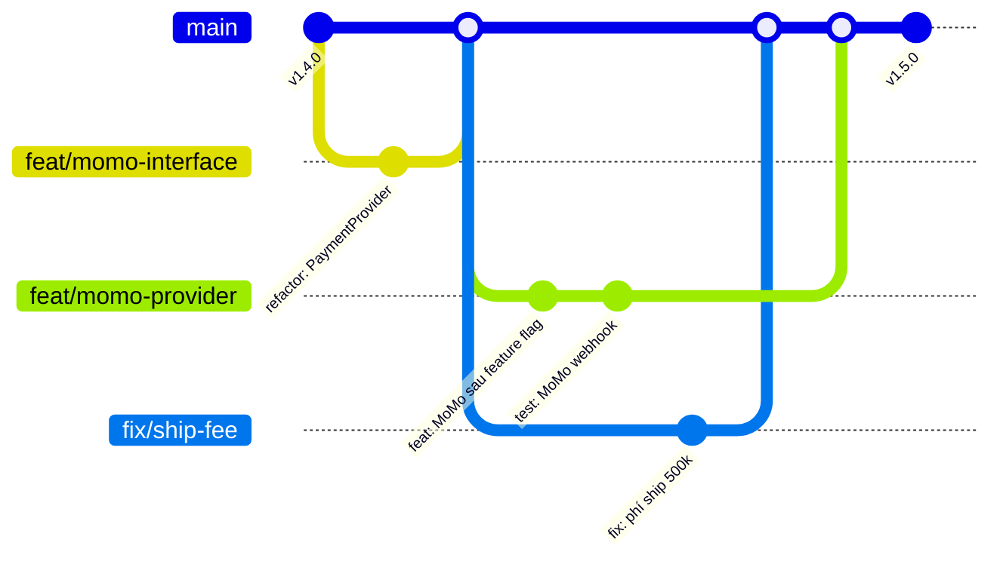

Nguyên tắc:

- Nhánh sống **1-3 ngày**, không phải 3 tuần (nhánh sống càng lâu, merge conflict càng khủng khiếp)
- Tính năng lớn chưa xong → merge phần đã xong **sau feature flag** (tắt với người dùng)
- `main` luôn ở trạng thái **deploy được**

### PR nhỏ - kỹ năng quan trọng bị đánh giá thấp

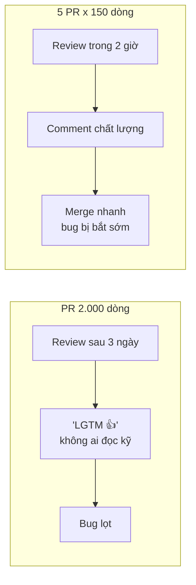

Cách chia PR lớn:

1. **Tách refactor ra trước**: PR 1 chỉ refactor (không đổi hành vi), PR 2 thêm tính năng
2. **Chia theo tầng**: PR schema/migration → PR repository → PR API → PR UI
3. **Feature flag**: merge từng phần, bật khi hoàn tất
4. **Tách thay đổi cơ học**: đổi tên hàng loạt, format → PR riêng, reviewer lướt nhanh

### Mẫu mô tả PR

```text
## Làm gì?
Thêm thanh toán qua ví MoMo cho checkout (phía sau feature flag `payment_momo`).

## Tại sao?
34% khách bỏ giỏ hàng ở bước thanh toán nói họ muốn dùng ví điện tử (khảo sát tháng 8).
Ticket: SHOP-1180

## Thay đổi chính
- Thêm `MomoProvider` implement interface `PaymentProvider`
- Endpoint webhook `POST /webhooks/momo` có xác thực chữ ký HMAC
- Idempotency theo `orderId` để tránh ghi nhận thanh toán 2 lần

## Test thế nào?
- Unit test cho xác thực chữ ký (hợp lệ, sai chữ ký, hết hạn)
- Integration test với MoMo sandbox: thanh toán thành công, thất bại, webhook gửi 2 lần
- Đã test tay trên staging với flag bật

## Rủi ro & Rollback
- Flag tắt mặc định. Rollback = tắt flag.
- Migration thêm cột `provider_ref` (nullable) - an toàn trên bảng lớn.

## Ảnh chụp / Log (nếu có)
...

## Reviewer cần chú ý
Phần xác thực chữ ký trong `momo/signature.go` - nhờ anh Tuấn xem kỹ giúp em.
```

!!! tip "Tự review PR của mình trước"
    Trước khi nhờ người khác review, **tự đọc diff của mình trên giao diện GitHub/GitLab** như thể bạn là reviewer. Bạn sẽ ngạc nhiên vì số lỗi tự bắt được: `fmt.Println` debug quên xóa, file không liên quan, TODO chưa làm. Tôn trọng thời gian của reviewer.

---

## 📖 3. Code Review - Nghệ thuật cho và nhận

Code review có 4 mục đích, theo thứ tự quan trọng:

1. **Chia sẻ kiến thức** - tăng bus factor, người mới học từ người cũ và ngược lại
2. **Tìm vấn đề** - bug, lỗ hổng, rủi ro vận hành (Bài 6)
3. **Giữ codebase nhất quán** - dễ đọc cho tất cả mọi người
4. **Tạo cảm giác sở hữu chung** - "code của team", không phải "code của Khoa"

### 3.1. Vòng đời một PR

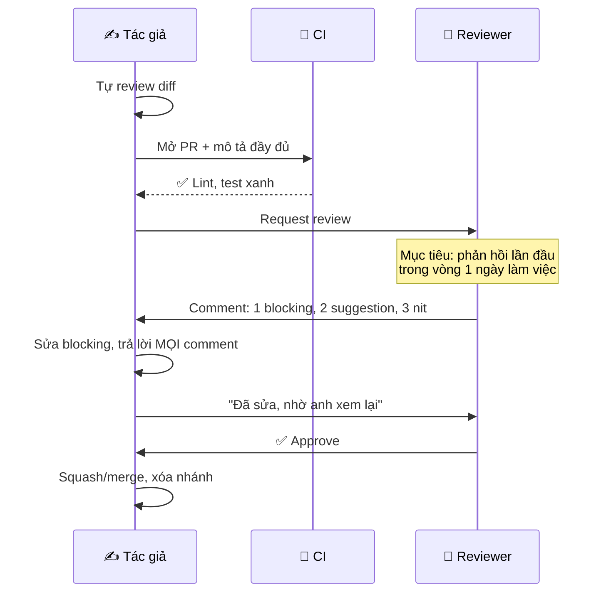

### 3.2. Là người review: Nhìn vào đâu?

Hãy review theo **thứ tự ưu tiên** - từ thứ quan trọng nhất đến ít quan trọng nhất. Nếu tầng trên có vấn đề lớn, chưa cần soi tầng dưới:

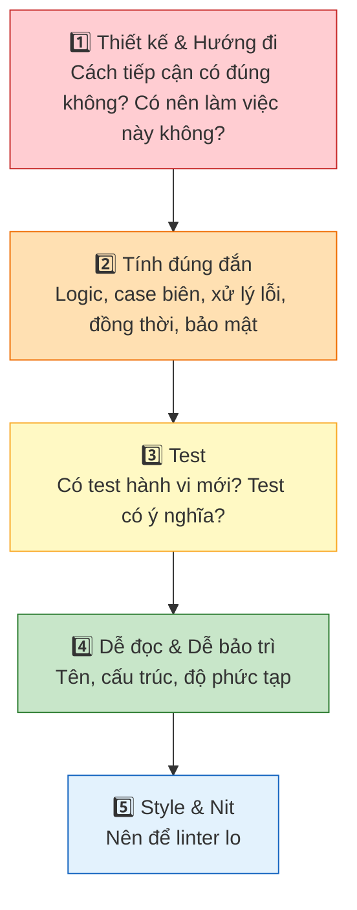

!!! warning "Review thiết kế quá muộn"
    Nếu bạn phát hiện "cả hướng tiếp cận sai" ở PR 800 dòng, tác giả đã mất 1 tuần. Đó là lý do thiết kế quan trọng nên được thảo luận **trước khi code** (design doc - Bài 7, hoặc chỉ cần 15 phút trao đổi). Code review không phải nơi đầu tiên để thảo luận thiết kế.

### 3.3. Phân loại comment: Nit vs Blocking

Người nhận review cần biết comment nào **bắt buộc sửa**, comment nào chỉ là **góp ý**. Nhiều team dùng tiền tố theo chuẩn **Conventional Comments**:

| Tiền tố | Nghĩa | Bắt buộc sửa? |
|---|---|---|
| `blocking:` / `issue:` | Vấn đề thật: bug, bảo mật, mất dữ liệu | ✅ Có |
| `suggestion:` | Cách làm tốt hơn, có lý do | Tác giả quyết định |
| `question:` | Reviewer chưa hiểu, cần giải thích | Trả lời (có thể dẫn đến sửa) |
| `nit:` | Chi tiết nhỏ, sở thích cá nhân | ❌ Không |
| `praise:` | Khen điểm làm tốt | - |
| `thought:` / `fyi:` | Chia sẻ thông tin, ý tưởng cho tương lai | ❌ Không |

### 3.4. Comment tốt vs tệ - Ví dụ thực tế

Giả sử bạn review đoạn code sau:

=== "Go"

    ```go
    func (s *OrderService) Cancel(ctx context.Context, orderID string) error {
        order, _ := s.repo.Find(ctx, orderID)
        if order.Status == "shipped" {
            return errors.New("cannot cancel")
        }
        order.Status = "cancelled"
        s.repo.Save(ctx, order)
        s.payment.Refund(ctx, order.PaymentID, order.Total)
        return nil
    }
    ```

=== "Python"

    ```python
    def cancel(self, order_id: str) -> None:
        order = self.repo.find(order_id)
        if order.status == "shipped":
            raise Exception("cannot cancel")
        order.status = "cancelled"
        self.repo.save(order)
        self.payment.refund(order.payment_id, order.total)
    ```

| ❌ Comment tệ | Vì sao tệ | ✅ Comment tốt |
|---|---|---|
| "Sai rồi." | Không nói sai ở đâu, sửa thế nào | "**blocking:** Nếu `Find` trả lỗi (không tìm thấy đơn), `order` sẽ là nil/None và dòng tiếp theo panic. Mình nên trả `ErrOrderNotFound` để handler map sang 404 nhé." |
| "Sao em lại làm thế này??" | Giọng buộc tội, gây phòng thủ | "**question:** Nếu `Refund` lỗi thì đơn đã chuyển `cancelled` nhưng khách chưa được hoàn tiền. Mình có cơ chế retry/đối soát nào xử lý case này không? Nếu chưa, có thể cân nhắc outbox pattern hoặc gọi refund trước rồi mới lưu trạng thái." |
| "Code như này ai đọc được." | Công kích cá nhân | "**suggestion:** Mình nghĩ nên dùng hằng số `StatusShipped` thay cho chuỗi `"shipped"` để tránh gõ nhầm - trong package `order` đã có sẵn." |
| "Đổi tên biến đi." | Không có lý do | "**nit:** `order` → ok rồi, nhưng lỗi `"cannot cancel"` nên nói rõ lý do, ví dụ `ErrOrderAlreadyShipped`, để client hiển thị thông báo phù hợp. Không block." |
| (Không comment gì, approve) | Bỏ lỡ 2 bug nghiêm trọng | "**praise:** Test case cho đơn đã giao viết rất rõ 👍" |

### Công thức comment tốt

```text
[tiền tố]: [quan sát cụ thể] + [tại sao nó quan trọng] + [gợi ý hoặc câu hỏi]

Ví dụ:
blocking: Query này nằm trong vòng lặp (dòng 45), với đơn 200 sản phẩm sẽ là
200 query DB. Mình có thể lấy hết bằng `WHERE id IN (...)` một lần không?
```

Mẹo về giọng điệu:

- **Nói về code, không nói về người**: "Hàm này thiếu xử lý lỗi" thay vì "Em quên xử lý lỗi"
- **Dùng "mình/chúng ta"**: "Mình có thể..." thay vì "Em phải..."
- **Đặt câu hỏi thay vì ra lệnh** khi bạn không chắc: "Có lý do gì mình không dùng transaction ở đây không?" - biết đâu tác giả có lý do bạn chưa biết
- **Khen điều tốt** - thật lòng và cụ thể. Review không chỉ để bắt lỗi
- **Chuyển sang nói chuyện trực tiếp** nếu một thread qua lại quá 3 lần - 10 phút gọi điện hiệu quả hơn 20 comment

!!! tip "Tốc độ review quan trọng ngang chất lượng review"
    PR chờ review 3 ngày = tác giả mất ngữ cảnh, phải chuyển việc khác, nhánh bị conflict. Nhiều team đặt quy ước: **phản hồi lần đầu trong vòng 1 ngày làm việc** (không nhất thiết approve, nhưng phải có phản hồi). Một mẹo: dành 2 khung giờ cố định mỗi ngày để review (ví dụ 10h và 15h).

### 3.5. Là người nhận review: Đừng phòng thủ

Lần đầu nhận 25 comment cho một PR, cảm giác rất giống bị chấm bài đỏ chót. Hãy nhớ:

> **Comment là về code, không phải về bạn. Và mỗi comment là một bài học miễn phí.**

**Checklist nhận feedback:**

```text
[ ] Đọc hết mọi comment trước khi phản hồi cái nào
[ ] Giả định thiện chí: người review đang giúp mình, không phải bắt lỗi mình
[ ] Trả lời MỌI comment: "Đã sửa ở commit abc123", "Em để ticket SHOP-99 làm sau",
    hoặc giải thích lý do không đồng ý
[ ] Không hiểu → hỏi lại, đừng đoán
[ ] Không đồng ý → đưa ra lý do/dữ liệu, không cảm xúc
[ ] Comment lặp lại nhiều lần qua các PR → ghi vào sổ, đó là điểm cần cải thiện
[ ] Cảm ơn - đặc biệt với comment bắt được bug thật
```

**Khi không đồng ý với comment:**

```text
❌ "Em thấy cách của em ổn mà."
❌ (Im lặng sửa theo dù biết cách đó tệ hơn)
❌ (Im lặng không sửa, không trả lời)

✅ "Em cân nhắc cách này rồi ạ, nhưng em chọn cách hiện tại vì [lý do cụ thể].
    Benchmark với 10k đơn thì cách hiện tại nhanh hơn ~3 lần (em đính kèm kết quả).
    Anh thấy sao ạ? Nếu anh vẫn thấy cách kia tốt hơn, mình gọi 5 phút trao đổi nhé."
```

---

## 📖 4. Giao tiếp bằng văn bản

Trong môi trường làm việc hiện đại (đặc biệt remote/hybrid), **viết là cách giao tiếp chính**. Viết rõ ràng = suy nghĩ rõ ràng.

### 4.1. Tin nhắn Slack/Teams: Đừng chỉ "Hello"

```text
❌ Kiểu "hello" rồi chờ:
   09:00  Minh: Anh Tuấn ơi
   09:00  Minh: Anh rảnh không ạ
   09:47  Tuấn: Ừ em
   09:52  Minh: Em hỏi chút về cái deploy
   10:15  Tuấn: Deploy sao em?
   ...
   (2 tiếng cho một câu hỏi 1 phút)

✅ Gửi đủ thông tin trong 1 tin:
   09:00  Minh: Anh Tuấn ơi, em deploy service order lên staging bị lỗi
          "migration 042 already applied" (log: <link>). Em đã thử rollback
          migration theo runbook nhưng vẫn lỗi. Em nên xóa bản ghi trong bảng
          schema_migrations hay có cách nào an toàn hơn ạ? Không gấp, trước
          14h là được ạ.
   09:47  Tuấn: Đừng xóa tay em, chạy `make migrate-repair ENV=staging` nhé.
```

### 4.2. Nguyên tắc BLUF (Bottom Line Up Front)

Đặt **kết luận/yêu cầu lên đầu**. Người đọc bận, có thể chỉ đọc 2 dòng đầu:

```text
❌ Chôn kết luận ở cuối:
   "Hôm qua em kiểm tra log thì thấy lỗi timeout tăng từ 14h, em có xem thêm
   dashboard thì thấy DB CPU cao, em nghi là do query báo cáo mới deploy, em
   thử tắt job báo cáo thì CPU giảm, nên em nghĩ mình cần rollback job báo cáo
   và em cần anh approve PR rollback."

✅ BLUF:
   "[Cần approve trước 17h] PR rollback job báo cáo mới: <link>
   Lý do: job này làm DB CPU lên 95% từ 14h, API timeout tăng 8 lần.
   Đã xác nhận: tắt job -> CPU về 40%, timeout về bình thường.
   Chi tiết điều tra: <link doc>"
```

### 4.3. Đặt câu hỏi hay

Người junior thường ngại hỏi (sợ bị đánh giá) hoặc hỏi quá sớm (chưa tự tìm hiểu). Cân bằng tốt: **tự tìm hiểu trong một khoảng thời gian có giới hạn** (ví dụ 30-60 phút), rồi hỏi **với đầy đủ ngữ cảnh**.

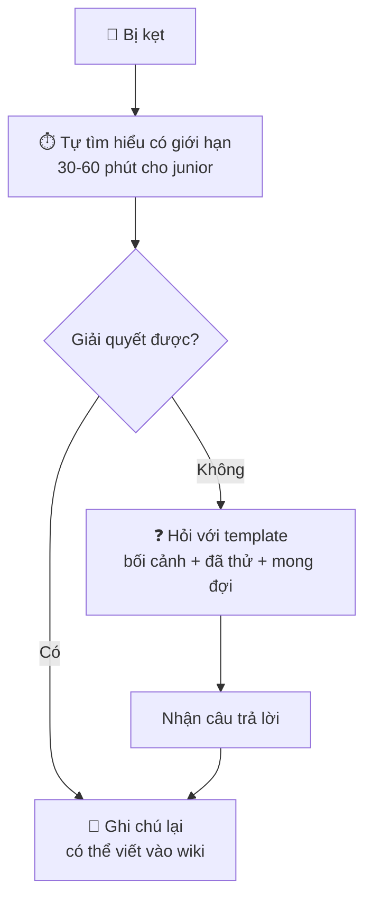

**Mẫu câu hỏi tốt:**

```text
🎯 Mục tiêu: Em đang cố làm [X] để [mục đích lớn hơn].

📍 Bối cảnh: [môi trường, phiên bản, service nào, nhánh nào]

🔴 Vấn đề: Khi em [hành động], em nhận được [kết quả thực tế / lỗi / log].

✅ Mong đợi: Em mong đợi [kết quả mong đợi].

🔍 Đã thử:
  1. [Cách 1] -> [kết quả]
  2. [Cách 2] -> [kết quả]
  3. Đã đọc [tài liệu/link], tìm trong Slack với từ khóa [...]

❓ Câu hỏi cụ thể: [Câu hỏi có thể trả lời được]

⏰ Mức độ gấp: [Đang chặn việc / Trước 17h / Không gấp]
```

**Ví dụ:**

```text
🎯 Em đang viết integration test cho API tạo đơn để chuẩn bị release thứ 6.
📍 Service order, nhánh feat/momo, chạy local với docker-compose.
🔴 Test `TestCreateOrder_WithMomo` fail với lỗi:
   "dial tcp 127.0.0.1:5432: connect: connection refused"
✅ Em mong DB test tự khởi động như các test khác.
🔍 Đã thử:
   1. `docker ps` -> container postgres đang chạy, port 5433 (không phải 5432)
   2. Đọc README phần testing -> không nhắc đến port
   3. Search Slack "5433" -> thấy anh Bình đổi port tháng trước nhưng không rõ lý do
❓ Em nên sửa config test sang 5433, hay đổi docker-compose về 5432 ạ?
⏰ Đang chặn việc viết test, nhưng em làm phần khác trong lúc chờ được ạ.
```

!!! note "Vấn đề XY (XY Problem)"
    Bạn muốn giải quyết X, nghĩ rằng Y là cách giải quyết, rồi hỏi về Y. Người trả lời mất thời gian giúp Y, trong khi X có cách giải đơn giản hơn nhiều. Ví dụ: "Làm sao lấy 3 ký tự cuối của tên file?" (Y) - thật ra muốn "lấy phần mở rộng của file" (X), và `filepath.Ext` / `os.path.splitext` làm tốt hơn (tên file `.jpeg` có 4 ký tự!). **Luôn nói mục tiêu thật (X)** - chính vì thế template có dòng "🎯 Mục tiêu".

### 4.4. Status update - Cập nhật tiến độ

Sếp và PM ghét nhất không phải tin xấu - mà là **tin xấu đến muộn**. "Dự án ổn" suốt 3 tuần rồi đến ngày cuối báo "trễ 2 tuần" là cách phá hủy niềm tin nhanh nhất.

**Mẫu status update hàng tuần:**

```text
📊 [Tên dự án] - Cập nhật tuần 38

Trạng thái: 🟢 Đúng tiến độ | 🟡 Có rủi ro | 🔴 Trễ

✅ Đã xong tuần này:
- API thanh toán MoMo (merge, đang sau feature flag)
- Integration test với sandbox MoMo

🔄 Đang làm / Tuần sau:
- Webhook xử lý hoàn tiền (dự kiến xong thứ 4)
- Test trên staging với QA (thứ 5-6)

⚠️ Rủi ro / Cần hỗ trợ:
- MoMo sandbox chậm phản hồi yêu cầu cấp key production (đã gửi 5 ngày).
  Nếu chưa có trước 30/9, ngày release 3/10 có thể lùi.
  -> Nhờ chị Hà (PM) liên hệ đầu mối bên MoMo giúp.

📅 Mốc tiếp theo: Release 3/10 (🟡 phụ thuộc key production)
```

Nguyên tắc **"No surprises"**: nếu thấy nguy cơ trễ, báo **ngay khi biết**, kèm phương án. "Em thấy có nguy cơ trễ 3 ngày vì X. Có 2 phương án: (a) cắt tính năng Y, vẫn kịp; (b) giữ Y, lùi 3 ngày. Em đề xuất (a)."

### 4.5. Tài liệu kỹ thuật

- **Design doc / RFC / ADR**: xem mẫu ở [Bài 7](./07-tradeoffs-decisions.md)
- **README**: dự án làm gì, chạy local thế nào (copy-paste chạy được), test thế nào, deploy thế nào
- **Runbook**: khi alert X kêu lúc 3h sáng, người on-call làm gì từng bước - viết cho người **đang buồn ngủ và hoảng loạn**
- **Postmortem**: xem mục 12 về an toàn tâm lý

!!! tip "Quy tắc cho mọi tài liệu"
    Viết cho **người đọc**, không phải cho bản thân. Hỏi: "Một người mới vào team, không có ngữ cảnh, đọc cái này có hiểu và làm theo được không?" Nhờ một người thật đọc thử - đó là cách test tài liệu.

---

## 📖 5. Họp & Làm việc bất đồng bộ

### Khi nào họp, khi nào async?

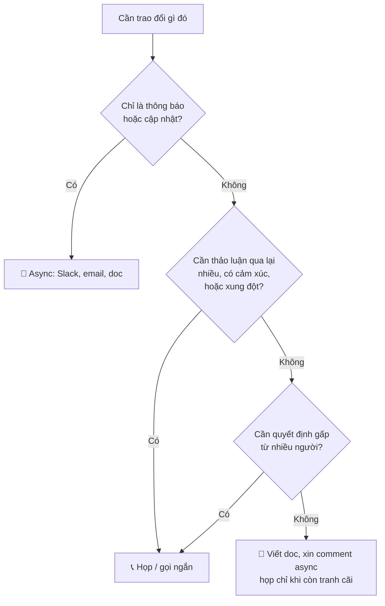

| Nên async | Nên họp (đồng bộ) |
|---|---|
| Cập nhật tiến độ | Brainstorm ý tưởng mới |
| Review tài liệu, code | Xung đột, bất đồng căng thẳng |
| Câu hỏi có câu trả lời rõ | Feedback nhạy cảm (1-1) |
| Thông báo quyết định đã chốt | Sự cố production đang diễn ra |
| Thu thập ý kiến ban đầu | Thảo luận thiết kế khi doc còn nhiều tranh cãi |

### Họp hiệu quả

Một cuộc họp 1 giờ với 8 người = **8 giờ công**. Hãy đối xử với nó như vậy.

**Mẫu lời mời họp:**

```text
Tiêu đề: [Quyết định] Chọn cách lưu lịch sử giá sản phẩm

🎯 Mục tiêu: Chốt 1 trong 2 phương án lưu lịch sử giá (xem doc)
📄 Đọc trước (10 phút): <link design doc>
⏱️ Thời lượng: 30 phút

Agenda:
- 5' Tóm tắt 2 phương án (Minh)
- 15' Thảo luận các câu hỏi mở trong doc
- 5' Chốt quyết định (anh Tuấn)
- 5' Việc tiếp theo, ai làm gì

Người cần có mặt: Minh, Tuấn, Lan (QA), Hà (PM)
Tùy chọn: team Data (nếu quan tâm báo cáo giá)
```

**Sau họp**: gửi ghi chú trong vòng vài giờ - **quyết định gì, ai làm gì, hạn khi nào**. Không có ghi chú = cuộc họp chưa từng diễn ra (sau 2 tuần không ai nhớ đã chốt gì).

### Daily standup đúng cách

Standup **không phải** buổi báo cáo cho sếp. Mục đích: **phát hiện vấn đề cần phối hợp**. Tối đa 15 phút.

```text
Mỗi người (~1 phút):
- Hôm qua: xong gì (chỉ điều liên quan đến người khác)
- Hôm nay: làm gì
- ⚠️ Bị chặn bởi gì? Cần ai giúp?

Thảo luận chi tiết -> "Mình nói riêng sau standup nhé" (parking lot)
```

---

## 📖 6. Ước lượng (Estimation)

"Việc này mất bao lâu?" - câu hỏi đơn giản nhất và khó trả lời nhất trong nghề.

### Tại sao ước lượng khó?

- **Unknown unknowns**: bạn không biết những gì bạn không biết (thư viện có bug, API đối tác không như tài liệu)
- **Lạc quan tự nhiên**: con người ước lượng dựa trên kịch bản mọi thứ suôn sẻ
- **Quên việc "phụ"**: test, review, sửa theo review, deploy, viết tài liệu, họp, hỗ trợ đồng nghiệp
- **Yêu cầu thay đổi** giữa chừng

### Nón bất định (Cone of Uncertainty)

Độ chính xác của ước lượng tăng dần khi bạn hiểu rõ vấn đề hơn:

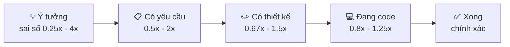

Nghĩa là: ở giai đoạn ý tưởng, việc bạn ước "1 tháng" thực tế có thể từ 1 tuần đến 4 tháng. **Đừng đưa ra một con số duy nhất khi đang ở bên trái của nón.**

### Kỹ thuật 1: Ước lượng bằng khoảng (range) và ba điểm

```text
❌ "Việc này mất 5 ngày."   (nghe như cam kết, và sẽ bị nhớ như cam kết)

✅ "Khoảng 4-8 ngày. Khả năng cao nhất là 5 ngày. Khoảng rộng vì em chưa
    chắc API của đối tác vận chuyển có hỗ trợ webhook không - em sẽ biết
    sau khi đọc tài liệu vào ngày mai, lúc đó em ước lượng lại chính xác hơn."
```

**Ước lượng ba điểm (PERT)**: lạc quan (O), khả năng cao nhất (M), bi quan (P):

```text
Kỳ vọng = (O + 4M + P) / 6

Ví dụ: O = 3 ngày, M = 5 ngày, P = 12 ngày
Kỳ vọng = (3 + 20 + 12) / 6 = 35 / 6 ≈ 5,8 ngày
```

Chú ý: kỳ vọng (5,8) **lớn hơn** "khả năng cao nhất" (5) - vì rủi ro trễ thường lớn hơn cơ hội xong sớm. Mọi thứ có thể chậm hơn nhiều, nhưng hiếm khi nhanh hơn nhiều.

### Kỹ thuật 2: Chia nhỏ (Work Breakdown)

Việc lớn không ước lượng được chính xác. Việc nhỏ (≤ 1-2 ngày) thì dễ hơn nhiều. Chia nhỏ cũng lộ ra những việc bị quên.

```text
Tính năng: "Cho phép khách hủy đơn trong 30 phút sau khi đặt"

1. API POST /orders/{id}/cancel + kiểm tra thời gian, trạng thái    1 ngày
2. Hoàn tiền qua cổng thanh toán (3 cổng: thẻ, MoMo, COD không cần)  2 ngày
3. Hoàn tồn kho                                                       0.5 ngày
4. Gửi thông báo hủy (email + push)                                   0.5 ngày
5. Nút hủy trên app + màn hình xác nhận (team mobile)                 (mobile ước lượng)
6. Unit + integration test                                            1 ngày
7. Xử lý race condition: hủy đúng lúc kho đang đóng gói               1 ngày  <- dễ bị quên!
8. Dashboard/metric: số đơn hủy, tỉ lệ hoàn tiền lỗi                   0.5 ngày
9. Review, sửa theo review, test với QA trên staging                  1.5 ngày
                                                                     --------
                                                          Tổng: ~8 ngày (range 7-11)
```

Những dòng 7, 8, 9 là những việc junior hay quên nhất - và chúng thường chiếm 30-40% tổng thời gian.

### Kỹ thuật 3: Story points & Planning poker

Nhiều team Scrum ước lượng bằng **story points** - đơn vị **tương đối** (độ phức tạp + khối lượng + rủi ro) thay vì giờ tuyệt đối. Thang Fibonacci phổ biến: 1, 2, 3, 5, 8, 13.

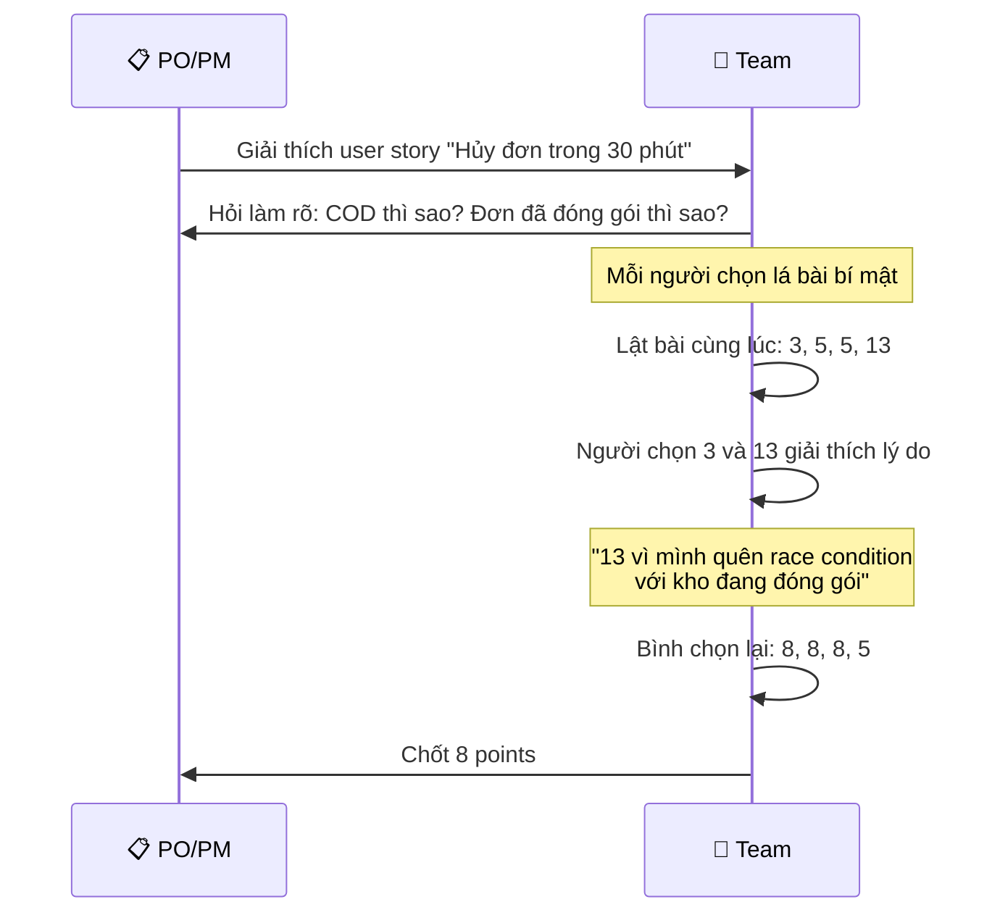

Giá trị lớn nhất của planning poker **không phải con số** - mà là **cuộc thảo luận khi mọi người chọn khác nhau**, làm lộ ra rủi ro mà một người đã thấy nhưng người khác chưa.

!!! warning "Story points không phải là thước đo năng suất"
    Khi sếp bắt đầu so sánh "team A làm 40 points/sprint, team B chỉ 25", points bị lạm phát ngay lập tức (việc 3 points bỗng thành 5). Points chỉ có ý nghĩa **trong một team** để dự báo khả năng của chính team đó.

### Ước lượng ≠ Cam kết

| Ước lượng (estimate) | Cam kết (commitment) | Mục tiêu (target) |
|---|---|---|
| "Em nghĩ mất khoảng 4-8 ngày" | "Em cam kết xong trước thứ 6" | "Marketing muốn ra mắt 11/11" |
| Dự đoán dựa trên thông tin hiện có | Lời hứa, cần buffer | Mong muốn của business |

Nhầm lẫn ba khái niệm này gây ra rất nhiều căng thẳng. Khi PM hỏi "bao lâu?", hãy làm rõ họ đang hỏi cái nào. Khi mục tiêu cố định (ngày 11/11 không thể dời), **phạm vi** phải linh hoạt (Bài 9 sẽ nói về đàm phán phạm vi).

---

## 📖 7. Agile, Scrum & Kanban - Những điều cốt lõi

**Agile** không phải một quy trình cụ thể - nó là một **tập giá trị** (Agile Manifesto, 2001). Cốt lõi: **giao phần mềm chạy được thường xuyên, nhận phản hồi, điều chỉnh**. Thay vì lên kế hoạch 12 tháng rồi làm, làm từng vòng ngắn và học liên tục.

### Scrum: Vòng đời một Sprint

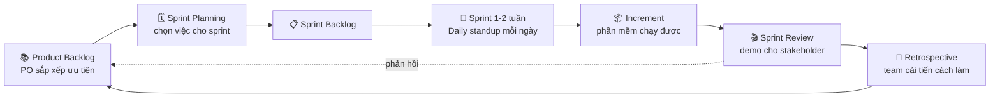

| Sự kiện | Mục đích | Thời lượng (sprint 2 tuần) |
|---|---|---|
| **Sprint Planning** | Chọn việc từ backlog, chia nhỏ, ước lượng | 2-4 giờ |
| **Daily Standup** | Đồng bộ, phát hiện blocker | 15 phút/ngày |
| **Backlog Refinement** | Làm rõ, chia nhỏ ticket cho sprint sau | 1-2 giờ/tuần |
| **Sprint Review** | Demo cho stakeholder, lấy phản hồi | 1-2 giờ |
| **Retrospective** | Cái gì tốt, cái gì chưa, thử cải tiến gì | 1-1,5 giờ |

| Vai trò | Trách nhiệm |
|---|---|
| **Product Owner (PO)** | Quyết định **làm gì** và thứ tự ưu tiên |
| **Scrum Master** | Bảo vệ quy trình, gỡ rào cản cho team |
| **Developers** | Quyết định **làm thế nào**, tự tổ chức |

### Retrospective - sự kiện quan trọng nhất (và hay bị bỏ nhất)

Mẫu retro đơn giản "Start - Stop - Continue":

```text
🟢 Continue (tiếp tục):  Pair programming cho ticket khó - giảm bug rõ rệt
🔴 Stop (dừng):          Nhận việc mới giữa sprint mà không bỏ bớt việc cũ
🟡 Start (bắt đầu):      Three Amigos 15 phút trước ticket > 5 points

Action item (tối đa 1-3, có người phụ trách):
- [Hà] Mọi yêu cầu giữa sprint phải qua PO, PO quyết định bỏ bớt việc gì
- [Minh] Tạo template Three Amigos trên Confluence, thử 2 sprint
```

!!! tip "Retro không có action item = buổi than phở"
    Kết thúc retro với 1-3 hành động **cụ thể, có người phụ trách**. Retro sau bắt đầu bằng việc xem lại: action item lần trước làm chưa, có hiệu quả không?

### Kanban: Dòng chảy liên tục

Kanban không có sprint. Công việc chảy liên tục qua các cột, với **giới hạn WIP** (Work In Progress - số việc tối đa đang làm ở mỗi cột).

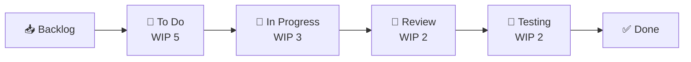

Giới hạn WIP có vẻ ngược đời ("sao lại giới hạn việc?") nhưng rất hiệu quả: khi cột Review đầy (2/2), developer **không được** bắt đầu việc mới - họ phải đi review giúp. Kết quả: việc chảy nhanh hơn, ít việc dở dang.

> **"Stop starting, start finishing"** - Ngừng bắt đầu việc mới, hãy hoàn thành việc đang làm.

### Scrum hay Kanban?

| | Scrum | Kanban |
|---|---|---|
| Nhịp | Sprint cố định 1-4 tuần | Liên tục |
| Hợp với | Phát triển sản phẩm, tính năng có thể lên kế hoạch | Vận hành, hỗ trợ, bug fix, việc đến bất ngờ |
| Thay đổi giữa chừng | Hạn chế trong sprint | Bất cứ lúc nào |
| Đo lường | Velocity (points/sprint) | Lead time, cycle time, throughput |

Thực tế nhiều team dùng **"Scrumban"**: sprint để lập kế hoạch + bảng Kanban có WIP limit để thực thi.

!!! warning "Agile giả (Cargo cult Agile)"
    Làm đủ nghi lễ (standup, sprint, retro) nhưng không có tinh thần: sprint nào cũng nhận thêm việc giữa chừng, retro không bao giờ thay đổi gì, standup thành báo cáo cho sếp 45 phút, "sprint" chỉ là cái tên khác của deadline. Hãy nhớ mục đích: **giao giá trị thường xuyên và học từ phản hồi**.

---

## 📖 8. Làm việc với PM, Designer, QA

### Vòng đời một tính năng và vai trò mỗi người

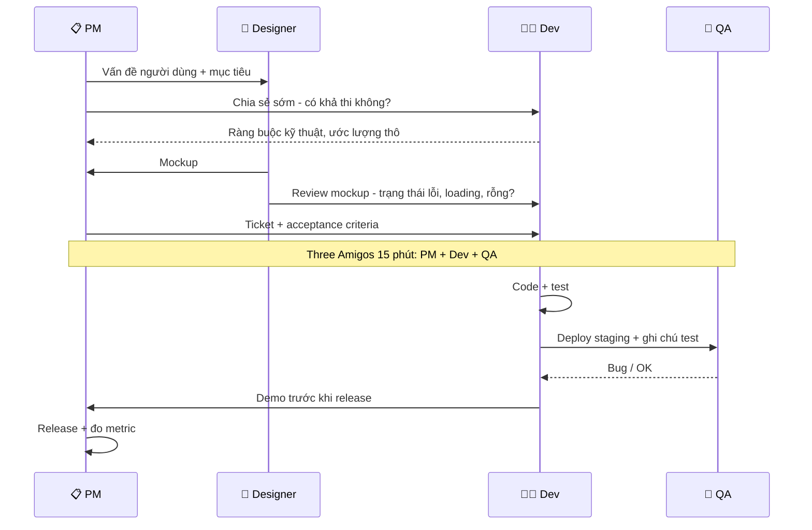

### Làm việc với PM (Product Manager)

PM chịu trách nhiệm **"làm gì và tại sao"**, bạn chịu trách nhiệm **"làm thế nào"**. Quan hệ tốt nhất là **đối tác**, không phải "người ra lệnh - người làm".

| ✅ Nên | ❌ Không nên |
|---|---|
| Hỏi "vấn đề người dùng là gì?" trước khi hỏi "làm thế nào?" | Làm đúng từng chữ trong ticket dù thấy có vấn đề |
| Đưa ra phương án thay thế: "Nếu làm X thì 2 ngày thay vì 2 tuần, đạt 80% mục tiêu" | Chỉ nói "không làm được" |
| Báo sớm khi phát hiện rủi ro | Im lặng đến ngày cuối |
| Giải thích nợ kỹ thuật bằng tác động kinh doanh (Bài 7) | Dùng thuật ngữ kỹ thuật để "thắng" tranh luận |

(Bài 9 đi sâu hơn về tư duy sản phẩm.)

### Làm việc với Designer

- **Tham gia sớm**: xem mockup **trước khi** chốt, chỉ ra chỗ khó/tốn kém về kỹ thuật ("hiệu ứng này trên Android đời cũ sẽ giật")
- **Hỏi về các trạng thái bị quên**: loading, rỗng (empty state), lỗi, dữ liệu rất dài (tên sản phẩm 200 ký tự), offline
- **Không tự ý "sửa" thiết kế** - nếu thấy vấn đề, trao đổi. Designer thường có lý do (nghiên cứu người dùng) mà bạn không biết

### Làm việc với QA

- QA là **đồng minh**, không phải "đối thủ tìm lỗi của mình"
- Gửi QA **ghi chú test**: thay đổi gì, vùng nào có rủi ro, dữ liệu test, cách bật feature flag
- Khi QA báo bug: **cảm ơn**, tái hiện, hỏi thêm nếu cần - không phản ứng "trên máy em chạy được mà"
- Mời QA vào Three Amigos để họ góp ý test case **trước khi** bạn code (Bài 6)

---

## 📖 9. Bất đồng, cam kết và xử lý xung đột

### Disagree and Commit

Trong mọi team, sẽ có lúc bạn **không đồng ý** với quyết định. Nguyên tắc "disagree and commit" (bất đồng và cam kết):

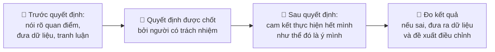

Những điều **không** phải disagree and commit:

- ❌ Im lặng trong cuộc họp, rồi phàn nàn sau lưng
- ❌ Đồng ý ngoài miệng, rồi làm theo cách của mình
- ❌ Thực hiện nửa vời để chứng minh "tôi đã nói rồi mà"
- ❌ Nhắc lại "tôi đã phản đối" mỗi khi có vấn đề nhỏ

!!! note "Khi nào KHÔNG nên commit?"
    Khi quyết định vi phạm **đạo đức, pháp luật, hoặc an toàn** (ví dụ: lưu mật khẩu dạng plain text, thu thập dữ liệu người dùng không có sự đồng ý, bỏ qua lỗ hổng bảo mật nghiêm trọng đã biết). Khi đó, hãy leo thang (escalate) lên cấp cao hơn một cách chuyên nghiệp và có văn bản.

### Xử lý xung đột

Xung đột về **ý tưởng** là lành mạnh. Xung đột về **cá nhân** là độc hại. Mục tiêu: giữ xung đột ở mức ý tưởng.

**Mô hình SBI (Situation - Behavior - Impact)** để góp ý cho đồng nghiệp:

```text
❌ "Anh lúc nào cũng review chậm, làm cả team trễ."
   (Khái quát hóa "lúc nào cũng", đánh giá tính cách)

✅ Situation (Tình huống): "Trong sprint vừa rồi,
   Behavior (Hành vi):       3 PR của em chờ review từ anh trung bình 3 ngày.
   Impact (Tác động):        Em phải chuyển qua lại giữa nhiều việc, và PR MoMo bị
                             conflict phải làm lại mất nửa ngày.
   Đề xuất:                  Mình có thể thống nhất phản hồi trong 1 ngày, hoặc em
                             nhờ người khác review khi anh bận không ạ?"
```

**Các bước xử lý xung đột:**

1. **Nói chuyện trực tiếp, riêng tư trước** - không phải trong group chat, không phải qua sếp
2. **Tìm hiểu trước khi phán xét**: "Em thấy X, anh có thể chia sẻ góc nhìn của anh không?" - thường có lý do bạn chưa biết (anh ấy đang một mình on-call sự cố)
3. **Tập trung vào mục tiêu chung**: "Cả hai mình đều muốn release ổn định"
4. **Tách người ra khỏi vấn đề**: vấn đề là "PR chờ lâu", không phải "anh lười"
5. **Nếu không giải quyết được** → cùng nhau nhờ người thứ ba (tech lead, manager) làm trung gian

---

## 📖 10. Mentoring - Dạy và Học

### Được mentor: Làm sao để tận dụng tối đa?

```text
✅ Người được mentor hiệu quả:
- Chuẩn bị trước buổi gặp: 2-3 câu hỏi/chủ đề cụ thể
- Hỏi "anh sẽ nghĩ về vấn đề này thế nào?" thay vì chỉ "giải pháp là gì?"
- Thử áp dụng lời khuyên, rồi quay lại kể kết quả
- Tôn trọng thời gian: đúng giờ, gọn
- Có thể có NHIỀU mentor cho nhiều chủ đề (kỹ thuật, sự nghiệp, giao tiếp)

❌ Người được mentor kém hiệu quả:
- Đến buổi gặp với "em không biết hỏi gì"
- Chỉ muốn được đưa đáp án để copy
- Nghe xong không làm gì
```

### Mentor người khác: Bạn không cần là senior mới mentor được

Junior năm 2 hoàn toàn có thể mentor thực tập sinh. Dạy lại là **cách học tốt nhất** (hiệu ứng Feynman - Bài 10).

**Nguyên tắc mentor tốt:**

- **Hỏi trước khi nói**: "Em đã thử những gì?", "Em nghĩ nguyên nhân là gì?"
- **Không cầm bàn phím**: để người học tự gõ, bạn hướng dẫn. Bạn gõ thì bạn học, họ không học
- **Chia sẻ quá trình suy nghĩ**, không chỉ kết quả: "Khi thấy lỗi này, anh thường kiểm tra X trước vì..."
- **Để họ mắc lỗi an toàn**: lỗi trên staging là bài học quý, lỗi trên production thì đắt
- **Khen công khai, góp ý riêng tư**

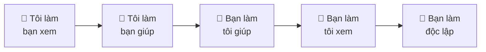

---

## 📖 11. Làm việc remote

Nhiều công ty Việt Nam (đặc biệt công ty outsource, product quốc tế) làm việc remote hoặc hybrid. Remote đòi hỏi **kỹ năng giao tiếp chủ động hơn**, vì bạn không thể "quay sang hỏi" hay "nhìn thấy" đồng nghiệp đang bận hay rảnh.

| Thử thách remote | Cách xử lý |
|---|---|
| Không ai thấy bạn đang làm gì | Cập nhật tiến độ chủ động, PR nhỏ thường xuyên, ghi chú công khai |
| Tin nhắn bị hiểu sai giọng điệu | Viết rõ ràng, thêm ngữ cảnh, dùng emoji hợp lý để thể hiện thiện chí 🙂 |
| Chênh múi giờ (làm với team Mỹ/Âu) | Viết handoff note cuối ngày, câu hỏi đầy đủ để người kia trả lời được ngay khi thức dậy |
| Cô đơn, thiếu kết nối | Camera bật trong họp nhỏ, "virtual coffee" 1-1, kênh chat không-về-công-việc |
| Ranh giới công việc - cuộc sống mờ nhạt | Giờ làm việc cố định, tắt thông báo sau giờ, không gian làm việc riêng |
| Mất tập trung ở nhà | Khối thời gian tập trung (focus block) trên lịch, tắt Slack 2 giờ |

**Mẫu handoff cuối ngày (khi làm với team khác múi giờ):**

```text
🌙 Handoff - Minh (GMT+7) -> Sarah (GMT-5)

Đã xong: PR #482 (webhook MoMo) đã merge, deploy staging OK.
Đang dở: PR #490 refactor retry - còn 2 test fail, lý do đã ghi trong PR.
Cần bạn: Review PR #491 (nhỏ, 80 dòng) - nếu approve thì merge giúp mình nhé.
Blocker: Không.
Mai mình online từ 9h GMT+7 (= 21h hôm nay giờ bạn).
```

---

## 📖 12. An toàn tâm lý (Psychological Safety)

Google nghiên cứu hàng trăm team (Project Aristotle) và phát hiện: yếu tố **số 1** tạo nên team hiệu quả không phải là có nhiều người giỏi, mà là **an toàn tâm lý** - cảm giác rằng **mình có thể hỏi, thừa nhận sai lầm, đưa ra ý kiến khác mà không bị trừng phạt hay chế giễu**.

### Tại sao nó quan trọng với kỹ sư?

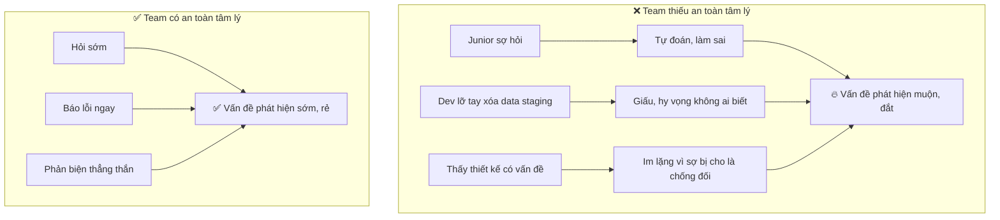

### Blameless Postmortem - Rút kinh nghiệm không đổ lỗi

Khi có sự cố production, team viết **postmortem** để học hỏi. Nguyên tắc: **tìm lỗi của hệ thống, không tìm người để đổ lỗi**.

```text
❌ Kiểu đổ lỗi:
   "Nguyên nhân: Minh chạy nhầm lệnh xóa trên production."
   -> Hành động: "Minh cần cẩn thận hơn."
   -> Kết quả: lần sau người khác chạy nhầm; mọi người học được bài học là GIẤU lỗi.

✅ Kiểu blameless:
   "Nguyên nhân: Lệnh xóa dữ liệu có thể chạy trên production mà không cần xác nhận;
   terminal staging và production trông giống hệt nhau; không có backup tự động
   cho bảng này."
   -> Hành động:
      1. Thêm bước xác nhận khi chạy lệnh nguy hiểm trên production
      2. Đổi màu prompt terminal production thành đỏ
      3. Bật backup tự động hằng giờ cho bảng orders
   -> Kết quả: lỗi này không thể xảy ra lại, với BẤT KỲ AI.
```

**Mẫu postmortem ngắn:**

```text
# Postmortem: [Tên sự cố] - [Ngày]

## Tóm tắt
Thời gian, ảnh hưởng (bao nhiêu người dùng, bao lâu, thiệt hại)

## Dòng thời gian
14:02 Deploy v1.5.0
14:10 Alert: tỉ lệ lỗi API thanh toán 15%
14:12 On-call nhận alert, bắt đầu điều tra
14:25 Xác định nguyên nhân: ...
14:28 Rollback v1.4.9
14:31 Tỉ lệ lỗi về bình thường

## Nguyên nhân gốc (5 Whys - xem Bài 5)

## Điều gì làm tốt
## Điều gì chưa tốt
## Điều gì may mắn (nếu không may mắn thì tệ hơn thế nào?)

## Hành động (có người phụ trách + hạn)
```

### Bạn có thể làm gì để tăng an toàn tâm lý (dù không phải sếp)?

- **Thừa nhận khi mình không biết**: "Em không chắc, để em tìm hiểu" - đặc biệt hiệu quả khi người senior làm điều này
- **Thừa nhận sai lầm của mình công khai**: "Bug hôm qua là do mình quên case X, mình đã thêm test"
- **Cảm ơn người đặt câu hỏi**: "Câu hỏi hay đấy, mình cũng từng thắc mắc"
- **Không bao giờ chế giễu câu hỏi "ngớ ngẩn"** - kể cả đùa
- **Mời người im lặng lên tiếng**: "Lan, em thấy sao về phương án này?"

---

## 🌍 Tình huống thực tế

### Tình huống 1: PR của bạn nhận 30 comment

**Bối cảnh**: PR đầu tiên ở công ty mới, 400 dòng, anh senior để lại 30 comment, trong đó có "Đoạn này khá rối" và "Sao không dùng thư viện có sẵn?".

| 🐣 Junior | 🦉 Senior (khi ở vị trí đó) |
|---|---|
| Buồn cả ngày, nghĩ "anh ấy không thích mình" | Đọc hết, phân loại: 3 blocking, 8 suggestion, 19 nit |
| Sửa hết 30 comment im lặng, kể cả những cái không đồng ý | Sửa blocking trước. Với suggestion, đồng ý 6 cái, giải thích lý do cho 2 cái |
| | Hỏi lại "đoạn này khá rối": "Anh thấy rối ở phần nào ạ - tên biến hay luồng xử lý?" |
| | Với "thư viện có sẵn": "Em chưa biết thư viện đó, cảm ơn anh! Em đã thay, bớt được 60 dòng" |
| | Ghi vào sổ tay: "Lần sau tìm thư viện chuẩn trước khi tự viết"; lần PR sau chia nhỏ hơn |

### Tình huống 2: Bị hỏi "Bao lâu xong?" trong họp

**Bối cảnh**: Trong sprint planning, sếp hỏi ngay: "Tính năng xuất hóa đơn điện tử mất bao lâu?". Bạn chưa đọc tài liệu của nhà cung cấp hóa đơn.

| 🐣 Junior | 🦉 Senior |
|---|---|
| Ngại, nói đại "Chắc 3 ngày anh" | "Em chưa đọc tài liệu tích hợp nên chưa ước lượng chính xác được. Ước lượng thô là 1-3 tuần, rộng vì phụ thuộc API của bên hóa đơn." |
| 3 tuần sau vẫn chưa xong, bị xem là "ước lượng kém" | "Cho em 1 ngày đọc tài liệu và làm thử một spike nhỏ, sáng mai em gửi ước lượng chi tiết có chia việc." |
| | Hôm sau gửi bảng chia việc, 8-11 ngày, nêu rõ rủi ro chữ ký số |

**Bài học**: "Em chưa biết, nhưng đây là cách em sẽ tìm ra" là câu trả lời **chuyên nghiệp**, không phải yếu kém.

### Tình huống 3: Đồng nghiệp push code thẳng lên main

**Bối cảnh**: Anh Khoa (senior, lâu năm) thường push thẳng lên `main` "cho nhanh", đã gây 2 lần lỗi staging trong tháng.

**Cách tiếp cận tốt:**

1. **Không** phàn nàn trong group chat hay sau lưng
2. Nói riêng với anh Khoa, dùng SBI: "Tuần trước có 2 lần staging lỗi sau khi code được push thẳng lên main, team QA mất nửa ngày test lại. Em nghĩ nếu mình bật branch protection thì sẽ tránh được, anh thấy sao?"
3. Đề xuất giải pháp **hệ thống** (không nhắm vào cá nhân) trong retro: bật branch protection cho mọi người, PR nhỏ được review trong 2 giờ để không ai thấy "review làm chậm"
4. Nếu vẫn không thay đổi → nhờ tech lead

**Bài học**: Giải quyết bằng **hệ thống** (quy trình, công cụ) bền vững hơn giải quyết bằng **thuyết phục cá nhân**.

### Tình huống 4: Bạn làm hỏng production

**Bối cảnh**: Bạn deploy một migration khóa bảng `orders` 10 phút, khách không đặt được hàng.

| 🐣 Phản ứng sợ hãi | 🦉 Phản ứng chuyên nghiệp |
|---|---|
| Hoảng, cố sửa một mình, không nói ai | Báo ngay trên kênh sự cố: "Mình vừa deploy migration X, có thể là nguyên nhân, đang rollback" |
| Giấu, hy vọng không ai biết | Rollback trước, điều tra sau |
| | Sau sự cố: tự nguyện viết postmortem, đề xuất: kiểm tra migration khóa bảng trong CI, chạy migration ngoài giờ cao điểm |

**Bài học**: Ai cũng từng làm hỏng production. Điều người khác nhớ **không phải là lỗi**, mà là **cách bạn xử lý nó**.

---

## ⚠️ Sai lầm thường gặp

### Sai lầm 1: "Anh hùng cô độc"

Làm mọi thứ một mình, không chia sẻ kiến thức. Bus factor = 1 là rủi ro cho team và giới hạn sự nghiệp của chính bạn (bạn không thể được giao việc mới vì "không ai thay được").

### Sai lầm 2: PR khổng lồ

PR 2.000 dòng không được review thật sự. Chia nhỏ: refactor riêng, theo tầng, feature flag.

### Sai lầm 3: Commit message vô nghĩa

"fix", "update", "wip" - bạn của 6 tháng sau sẽ không cảm ơn bạn.

### Sai lầm 4: Review như bắt lỗi chính tả

Comment 20 cái về khoảng trắng, bỏ qua lỗi logic mất tiền. Review theo thứ tự ưu tiên; để linter lo style.

### Sai lầm 5: Coi feedback là tấn công cá nhân

Comment là về code. Mỗi comment là một bài học miễn phí.

### Sai lầm 6: Chỉ gửi "Hello" rồi chờ

Gửi đủ ngữ cảnh trong một tin nhắn: mục tiêu, đã thử gì, câu hỏi cụ thể, mức độ gấp.

### Sai lầm 7: Ngại hỏi (hoặc hỏi quá sớm)

Tự tìm hiểu có giới hạn thời gian, rồi hỏi với đầy đủ ngữ cảnh. Kẹt 3 ngày mà không hỏi là lãng phí của cả team.

### Sai lầm 8: Ước lượng một con số, bỏ quên việc "phụ"

Đưa ra khoảng, chia nhỏ việc, nhớ test/review/deploy/race condition.

### Sai lầm 9: Tin xấu đến muộn

Báo rủi ro ngay khi biết, kèm phương án. "No surprises".

### Sai lầm 10: Đồng ý ngoài miệng, phản đối sau lưng

Nói thẳng trước quyết định; cam kết hết mình sau quyết định.

---

## 🏋️ Bài tập

### Bài tập 1 (Dễ): Viết lại commit message

Viết lại các commit message sau theo Conventional Commits (tự bịa bối cảnh hợp lý):

1. `fix bug`
2. `update`
3. `thêm chức năng mới và sửa mấy lỗi linh tinh`
4. `WIP`

<details markdown="1">
<summary>Gợi ý</summary>

1. `fix(auth): trả 401 thay vì 500 khi token hết hạn`
2. `chore(deps): nâng cấp pgx lên v5.6 để vá lỗ hổng CVE-...`
3. Tách thành 2+ commit: `feat(cart): cho phép lưu giỏ hàng khi chưa đăng nhập` và `fix(cart): làm tròn tổng tiền đến đơn vị đồng`
4. WIP không nên nằm trên nhánh chính. Dùng `git commit --amend` hoặc squash trước khi merge; nếu cần lưu tạm hãy dùng nhánh riêng hoặc `git stash`

</details>

### Bài tập 2 (Dễ): Viết lại comment review

Viết lại các comment sau cho mang tính xây dựng, có tiền tố phù hợp:

1. "Code gì mà dài thế."
2. "Chỗ này có SQL injection kìa."
3. "Anh không thích cách đặt tên này."
4. "Sao không viết test?"

<details markdown="1">
<summary>Gợi ý</summary>

1. `suggestion: Hàm processOrder đang làm 4 việc (validate, tính giá, lưu, gửi mail). Tách thành các hàm nhỏ sẽ dễ test từng phần hơn - ví dụ tách phần tính giá ra calculateTotal. Bạn thấy sao?`
2. `blocking: Dòng 34 nối chuỗi trực tiếp user input vào câu SQL -> SQL injection (ví dụ name = "'; DROP TABLE users; --"). Mình dùng placeholder $1 của pgx nhé.`
3. `nit: Mình nghĩ tên "data" hơi chung chung, "pendingOrders" sẽ rõ nghĩa hơn. Không block.`
4. `question: Mình không thấy test cho trường hợp hủy đơn đã giao - có phải đã được cover ở chỗ khác không? Nếu chưa thì mình nghĩ nên thêm vì đây là luồng hoàn tiền.`

</details>

### Bài tập 3 (Trung bình): Câu hỏi hay

Nhớ lại lần gần nhất bạn bị kẹt với một vấn đề kỹ thuật (hoặc tự tạo tình huống: cài Docker bị lỗi, test fail không rõ lý do...). Viết câu hỏi theo template ở mục 4.3, đầy đủ 7 phần. Sau đó tự hỏi: việc viết ra có giúp bạn tự tìm ra câu trả lời không? (Hiện tượng này gọi là **rubber duck debugging** - Bài 5.)

### Bài tập 4 (Trung bình): Ước lượng có chia việc

Chia nhỏ và ước lượng (bằng khoảng) cho tính năng: **"Người dùng có thể đăng nhập bằng mã OTP gửi qua SMS"**. Yêu cầu:

- Ít nhất 8 đầu việc, mỗi việc ≤ 2 ngày
- Có ít nhất 2 việc "dễ bị quên" (gợi ý: giới hạn số lần gửi OTP, chống brute-force, chi phí SMS, số điện thoại định dạng khác nhau)
- Tính ước lượng PERT cho toàn bộ

### Bài tập 5 (Khó): Status update khi có tin xấu

Bạn đang làm tính năng tích hợp hóa đơn điện tử, hạn release thứ Sáu tuần sau. Hôm nay (thứ Hai) bạn phát hiện chữ ký số của nhà cung cấp yêu cầu cài thêm một thành phần trên server, cần team DevOps hỗ trợ và có thể mất 1 tuần. Viết status update gửi PM và tech lead, theo nguyên tắc BLUF, có ít nhất 2 phương án.

### Bài tập 6 (Khó): Blameless postmortem

Viết postmortem theo mẫu ở mục 12 cho sự cố giả định sau: *"Một developer cập nhật config giới hạn tốc độ (rate limit), định tăng từ 1000 lên 10000 request/phút nhưng gõ nhầm thành 100. Config được deploy lúc 20h tối thứ Sáu. 30% request của khách bị từ chối trong 2 giờ cho đến khi có người phát hiện qua phàn nàn trên Facebook."*

Yêu cầu: phần nguyên nhân **không được** có tên người; ít nhất 4 hành động cải tiến mang tính hệ thống.

<details markdown="1">
<summary>Gợi ý hành động cải tiến</summary>

- Validate config: cảnh báo khi giá trị thay đổi quá 50% so với hiện tại
- Config thay đổi phải qua PR + review như code
- Alert tự động khi tỉ lệ request bị từ chối (HTTP 429) vượt ngưỡng - không đợi khách báo
- Hạn chế deploy vào tối thứ Sáu / ngoài giờ không có người trực, hoặc có on-call rõ ràng
- Canary: áp dụng config mới cho 5% traffic trước

</details>

---

## ✅ Checklist hoàn thành

- [ ] Giải thích được bus factor và cách tăng nó trong team
- [ ] Viết commit message theo Conventional Commits, có phần "tại sao"
- [ ] Chia một thay đổi lớn thành các PR nhỏ; viết mô tả PR theo mẫu
- [ ] Review code theo thứ tự ưu tiên: thiết kế → đúng đắn → test → dễ đọc → style
- [ ] Dùng tiền tố blocking/suggestion/question/nit/praise, comment về code không về người
- [ ] Nhận feedback không phòng thủ, trả lời mọi comment, phản biện bằng dữ liệu
- [ ] Viết tin nhắn theo BLUF, không "hello" rồi chờ
- [ ] Đặt câu hỏi với template: mục tiêu, bối cảnh, vấn đề, mong đợi, đã thử, câu hỏi, mức độ gấp
- [ ] Viết status update có rủi ro và phương án, theo nguyên tắc "no surprises"
- [ ] Biết khi nào họp, khi nào async; chuẩn bị agenda và ghi chú sau họp
- [ ] Ước lượng bằng khoảng, dùng PERT, chia nhỏ việc, phân biệt ước lượng - cam kết - mục tiêu
- [ ] Mô tả được sprint Scrum, bảng Kanban với WIP limit
- [ ] Biết cách làm việc với PM, designer, QA như đối tác
- [ ] Hiểu disagree and commit; dùng SBI để góp ý
- [ ] Biết cách mentor và được mentor hiệu quả
- [ ] Hiểu an toàn tâm lý và viết được blameless postmortem

---

💡 **Tips ghi nhớ**:

- **Team mạnh > cá nhân xuất sắc** - chia sẻ kiến thức là tăng giá trị của bạn, không phải giảm
- **PR nhỏ, commit nói "tại sao"**
- **Review code, không review người**
- **Hỏi với đầy đủ ngữ cảnh - một tin nhắn, đủ thông tin**
- **Tin xấu càng sớm càng tốt, kèm phương án**
- **Ước lượng là khoảng, không phải lời hứa**
- **Nói thẳng trước quyết định, cam kết sau quyết định**
- **Tìm lỗi hệ thống, không tìm người để đổ lỗi**

**Bài tiếp theo**: [Bài 9: Tư duy sản phẩm](./09-product-thinking.md)
