# 📚 Bài 9: Tư duy sản phẩm

> "Người ta không muốn mua một mũi khoan 6 li. Người ta muốn một cái lỗ 6 li." - Theodore Levitt

Hãy tưởng tượng hai kỹ sư cùng nhận ticket: *"Thêm nút xuất báo cáo doanh thu ra Excel cho chủ quán."*

- **Kỹ sư A** làm đúng từng chữ: nút đẹp, file Excel chuẩn, có test đầy đủ. Xong trong 5 ngày. Ba tháng sau, dữ liệu cho thấy chỉ 4% chủ quán từng bấm nút đó.
- **Kỹ sư B** hỏi PM: *"Chủ quán xuất Excel ra để làm gì?"* PM không chắc, nên B xin nói chuyện 15 phút với bộ phận chăm sóc khách hàng. Hóa ra: chủ quán xuất Excel **mỗi tối thứ Hai** để **gửi Zalo cho chủ đầu tư** xem doanh thu tuần. B đề xuất: làm nhanh nút Excel (1 ngày) **và** thêm tính năng "Gửi báo cáo tuần tự động qua Zalo/email" (3 ngày). Ba tháng sau, 61% chủ quán bật báo cáo tự động.

Cả hai đều code giỏi. Nhưng B tạo ra **giá trị** gấp 15 lần. Khác biệt đó gọi là **tư duy sản phẩm** (product thinking) - và nó là một trong những thứ phân biệt rõ nhất một Senior với một Mid.

## 🎯 Mục tiêu bài học

- Hiểu vì sao kỹ sư phải quan tâm đến **người dùng và business**, không chỉ "làm đúng ticket"
- Phân biệt **output** (thứ ta làm ra), **outcome** (hành vi người dùng thay đổi) và **impact** (kết quả kinh doanh)
- Dùng **Jobs-to-be-Done** để hiểu người dùng thật sự cần gì
- Hiểu cơ bản **công ty kiếm tiền thế nào**: doanh thu, chi phí, CAC, LTV, retention
- Làm việc với **metrics**: North Star metric, funnel, metric "phù phiếm" vs metric hành động được
- Hiểu **A/B testing** và tự tính được mức ý nghĩa thống kê đơn giản (Go/Python)
- Tư duy **MVP & iteration**: làm nhỏ nhất có thể để học nhanh nhất có thể
- Ưu tiên hóa bằng **RICE** và ma trận **Impact/Effort**
- Biết **nói "không"** và **đàm phán phạm vi** một cách chuyên nghiệp
- Có **ý thức chi phí** (cost awareness): ước lượng chi phí cloud trước khi xây
- Làm chủ tính năng **từ đầu đến cuối** (end-to-end ownership): từ ý tưởng đến đo lường sau khi ra mắt

## 📖 1. Vì sao kỹ sư phải quan tâm đến người dùng và business?

### "Việc của em là code, việc hiểu khách hàng là của PM"

Câu này nghe hợp lý, nhưng sai ở ba điểm:

1. **Kỹ sư ra hàng trăm quyết định sản phẩm nhỏ mỗi ngày** mà PM không bao giờ biết: thông báo lỗi viết thế nào, timeout bao lâu, trường nào bắt buộc, trạng thái rỗng hiển thị gì, xử lý thế nào khi mạng chập chờn. Mỗi quyết định đó hoặc làm người dùng hài lòng, hoặc làm họ bỏ đi.
2. **Kỹ sư biết những thứ PM không biết**: cái gì dễ, cái gì khó, cái gì hệ thống đã có sẵn dữ liệu. Nhiều ý tưởng sản phẩm tốt nhất đến từ kỹ sư: *"Mình đã có lịch sử đơn hàng rồi, làm nút 'Đặt lại đơn cũ' chỉ mất 2 ngày."*
3. **Code là chi phí, không phải tài sản.** Mỗi dòng code phải được bảo trì, test, bảo mật, hiểu bởi người mới - mãi mãi. Tính năng không ai dùng không chỉ lãng phí thời gian làm ra nó, mà còn **tiếp tục tốn tiền** mỗi tháng.

### Output, Outcome, Impact

| | Output | Outcome | Impact |
|---|---|---|---|
| **Là gì** | Thứ team làm ra | Hành vi người dùng thay đổi | Kết quả kinh doanh |
| **Ví dụ** | Tính năng "Đặt lại đơn cũ" | Khách quay lại đặt hàng nhanh hơn, thường xuyên hơn | Doanh thu từ khách cũ tăng 8% |
| **Đo bằng** | Số tính năng, số ticket, số dòng code | % người dùng dùng tính năng, tần suất | Doanh thu, chi phí, retention |
| **Ai kiểm soát** | Hoàn toàn trong tay team | Một phần | Ít - nhiều yếu tố khác |

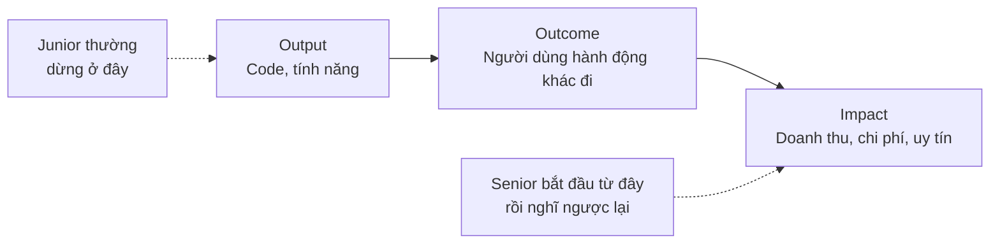

Junior hỏi: *"Em đã làm xong ticket chưa?"* Senior hỏi: *"Tính năng này có thay đổi được hành vi người dùng như mình kỳ vọng không? Làm sao mình biết?"*

!!! note "Đây không phải là bảo bạn làm thay PM"
    PM chịu trách nhiệm **quyết định làm cái gì**. Tư duy sản phẩm của kỹ sư là: **hiểu vì sao** làm cái đó, **đóng góp** ý kiến từ góc nhìn kỹ thuật, **đặt câu hỏi** khi thấy có gì không ổn, và **quan tâm đến kết quả** chứ không chỉ quan tâm đến việc giao hàng. Kỹ sư có tư duy sản phẩm là **đồng đội tốt nhất** của PM, không phải đối thủ.

### Kỹ sư sản phẩm (Product Engineer) trông như thế nào?

| Hành vi | Kỹ sư "chỉ code" | Kỹ sư sản phẩm |
|---|---|---|
| Nhận ticket | Làm ngay | Hỏi "vấn đề của người dùng là gì? Làm sao biết đã giải quyết?" |
| Gặp chỗ spec không rõ | Tự đoán, hoặc chờ | Đề xuất 2 phương án kèm trade-off, hỏi nhanh PM |
| Thấy cách rẻ hơn đạt cùng mục tiêu | Im lặng làm theo spec | Đề xuất: "Làm 20% công sức mà được 80% giá trị" |
| Làm xong | Đóng ticket | Thêm tracking, xem dashboard sau 1 tuần, báo kết quả |
| Dùng sản phẩm | Hiếm khi | Dùng thường xuyên (dogfooding), đọc ticket support |
| Nói về công việc | "Em làm API X, dùng Redis" | "Em giảm thời gian checkout từ 40s xuống 15s, tỉ lệ bỏ giỏ giảm 12%" |

## 📖 2. Hiểu người dùng: Jobs-to-be-Done

### Câu chuyện ly sữa lắc

Một chuỗi đồ ăn nhanh ở Mỹ muốn tăng doanh số sữa lắc. Họ hỏi khách: *"Sữa lắc nên đặc hơn hay loãng hơn? Ngọt hơn? Rẻ hơn?"* - sửa theo, doanh số không đổi.

Nhóm nghiên cứu của Clayton Christensen làm khác: họ **quan sát**. Phát hiện: gần một nửa số sữa lắc bán **trước 8h sáng**, cho người **đi một mình**, mua **mang đi**. Hỏi sâu hơn: những người này có quãng đường lái xe đi làm dài, buồn chán, cần thứ gì đó **một tay cầm được**, **lâu hết** (để giết thời gian), và **no đến trưa**. Chuối thì hết quá nhanh, bánh mì thì vụn, donut thì dính tay.

Khách không "mua sữa lắc". Khách **"thuê"** sữa lắc để làm một **công việc** (job): *"làm cho chuyến đi làm buổi sáng bớt chán và no bụng đến trưa"*. Hiểu đúng job → làm sữa lắc **đặc hơn** (hút lâu hết hơn), thêm miếng trái cây nhỏ (thú vị hơn), bán ở quầy nhanh (không phải xếp hàng).

### Jobs-to-be-Done (JTBD)

Ý tưởng cốt lõi: **người dùng "thuê" sản phẩm để hoàn thành một công việc trong cuộc sống của họ.** Hãy hiểu công việc đó, không phải hiểu tính năng họ yêu cầu.

Mẫu câu JTBD:

> **Khi** [tình huống], **tôi muốn** [động lực/việc cần làm], **để** [kết quả mong đợi].

Ví dụ trong bối cảnh Việt Nam:

| Sản phẩm | Yêu cầu bề mặt | Job thật sự |
|---|---|---|
| App giao đồ ăn | "Thêm bộ lọc theo giá" | **Khi** sắp hết tháng và gần hết lương, **tôi muốn** tìm bữa trưa ngon dưới 40k, **để** không phải ăn mì gói mà vẫn đủ tiền đến ngày lương |
| Phần mềm POS cho quán | "Xuất Excel doanh thu" | **Khi** tối thứ Hai, **tôi muốn** cho chủ đầu tư thấy quán đang làm ăn ra sao, **để** họ yên tâm và tôi không bị gọi điện hỏi |
| App ngân hàng | "Thêm chức năng chụp màn hình giao dịch" | **Khi** chuyển tiền cho người bán online, **tôi muốn** gửi bằng chứng ngay, **để** họ giao hàng mà không nghi ngờ |
| Hệ thống nội bộ HR | "Thêm nút tải bảng lương PDF" | **Khi** đi vay ngân hàng, **tôi muốn** chứng minh thu nhập, **để** được duyệt khoản vay |

Nhìn vào cột cuối, bạn thường thấy **giải pháp tốt hơn** yêu cầu ban đầu: báo cáo tự động gửi Zalo; nút "Chia sẻ biên nhận" có mã xác thực; "Giấy xác nhận thu nhập" có chữ ký số thay vì PDF bảng lương.

### Yêu cầu giải pháp vs Yêu cầu vấn đề

Người dùng (và cả PM, sếp) thường đưa ra **giải pháp**, không phải **vấn đề**. Nhiệm vụ của bạn là đi ngược về vấn đề - với thái độ tò mò, không phải thách thức.

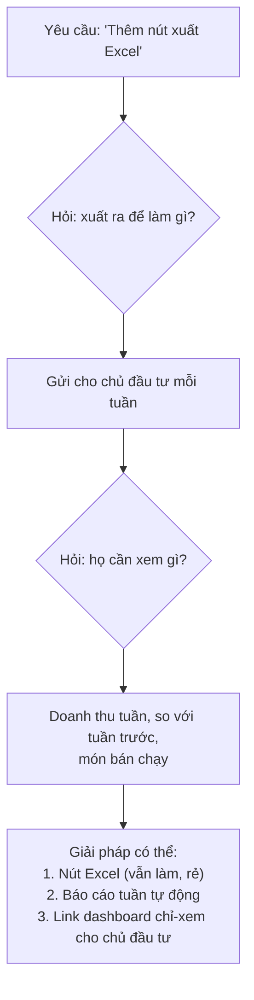

### 5 câu hỏi trước khi viết dòng code đầu tiên

1. **Ai** sẽ dùng tính năng này? (một loại người dùng cụ thể, không phải "mọi người")
2. Họ đang giải quyết vấn đề này **thế nào hôm nay**? (Excel? Gọi điện? Không làm gì?)
3. Điều gì **đau** nhất trong cách làm hiện tại?
4. Làm sao ta **biết** tính năng thành công? (con số nào sẽ thay đổi?)
5. Cách **rẻ nhất** để kiểm tra giả định này trước khi xây đầy đủ là gì?

### Kỹ sư tìm hiểu người dùng bằng cách nào?

Bạn không cần là nhà nghiên cứu UX. Những cách rẻ và hiệu quả:

- **Đọc ticket support/CS** mỗi tuần 30 phút - đây là mỏ vàng về nỗi đau thật của người dùng
- **Ngồi cùng bộ phận CS** nửa ngày mỗi quý, nghe họ trả lời điện thoại
- **Dogfooding**: tự dùng sản phẩm của mình như người dùng thật (đặt đồ ăn thật, thanh toán thật)
- **Xem dữ liệu hành vi**: funnel, session recording (có sự đồng ý của người dùng, tuân thủ quy định về dữ liệu cá nhân)
- **Tham gia phỏng vấn người dùng** cùng PM/designer - chỉ ngồi nghe cũng học được rất nhiều
- **Đi thực địa**: nếu làm phần mềm cho quán cà phê, hãy ra quán ngồi xem nhân viên dùng máy POS giờ cao điểm

!!! tip "Câu chuyện thật: màn hình POS lúc 7h sáng"
    Một team làm phần mềm POS cho chuỗi cà phê. Trên văn phòng, màn hình tính tiền "đẹp và đầy đủ". Kỹ sư ra quán lúc 7h sáng và thấy: nhân viên đeo găng tay, tay ướt, 15 khách xếp hàng, bấm nhầm nút nhỏ liên tục. Sau chuyến đi: nút to gấp đôi, món bán chạy nhất lên trang đầu, bỏ bước xác nhận không cần thiết. Thời gian mỗi đơn giảm từ 45 giây xuống 20 giây. Không có spec nào yêu cầu điều đó - chỉ có một kỹ sư chịu **đi xem người dùng thật**.

## 📖 3. Hiểu business: công ty kiếm tiền như thế nào?

Bạn không cần bằng MBA. Nhưng bạn cần trả lời được: **"Công ty mình kiếm tiền từ đâu, và tốn tiền vào đâu?"** Vì mọi quyết định kỹ thuật cuối cùng đều ảnh hưởng đến một trong hai vế đó.

### Các mô hình kinh doanh phổ biến

| Mô hình | Ví dụ | Kiếm tiền từ | Metric quan trọng |
|---|---|---|---|
| **E-commerce** | Sàn TMĐT, shop online | Bán hàng (biên lợi nhuận) | Số đơn, giá trị đơn trung bình (AOV), tỉ lệ chuyển đổi |
| **Marketplace** | App gọi xe, giao đồ ăn | Hoa hồng mỗi giao dịch (take rate) | GMV (tổng giá trị giao dịch), số giao dịch, cân bằng cung-cầu |
| **SaaS** | Phần mềm POS, HR, kế toán | Phí thuê bao hàng tháng/năm | MRR/ARR, churn (tỉ lệ rời bỏ), số khách trả tiền |
| **Quảng cáo** | Báo điện tử, mạng xã hội | Người dùng xem quảng cáo | DAU/MAU, thời gian sử dụng, số lượt hiển thị |
| **Fintech** | Ví điện tử, cho vay | Phí giao dịch, lãi, phí dịch vụ | Số giao dịch, tỉ lệ nợ xấu, chi phí gian lận |
| **Outsourcing** | Công ty gia công phần mềm | Bán giờ công / dự án | Tỉ lệ sử dụng nhân sự (utilization), biên lợi nhuận dự án, khách quay lại |

### Vài khái niệm tài chính mà kỹ sư nên biết

- **CAC** (Customer Acquisition Cost): chi phí để có một khách hàng mới (quảng cáo, khuyến mãi, sales)
- **LTV** (Lifetime Value): tổng lợi nhuận một khách mang lại trong suốt thời gian dùng sản phẩm
- **Retention / Churn**: bao nhiêu % khách còn ở lại / rời đi sau một khoảng thời gian
- **Biên lợi nhuận** (margin): mỗi đồng doanh thu, còn lại bao nhiêu sau khi trừ chi phí trực tiếp (bao gồm cả **chi phí hạ tầng**)

Quy tắc ngón tay cái: một doanh nghiệp khỏe khi **LTV > 3 × CAC**. Điều này giải thích vì sao các công ty cực kỳ quan tâm đến **retention**: tăng retention làm LTV tăng, trong khi CAC không đổi.

!!! tip "Kết nối với công việc kỹ thuật"
    - Làm checkout nhanh hơn 1 giây → tỉ lệ chuyển đổi tăng → **doanh thu** tăng
    - Sửa bug crash trên Android đời cũ → khách không bỏ đi → **retention** tăng
    - Tối ưu query, giảm 30% server → **chi phí** giảm → biên lợi nhuận tăng
    - Tự động hóa việc đối soát mà kế toán làm tay 3 ngày/tháng → **chi phí vận hành** giảm

    Khi bạn nói về công việc bằng ngôn ngữ này, sếp và PM **hiểu ngay** giá trị của bạn - và đó là thứ được nhắc đến khi xét thăng tiến (Bài 10).

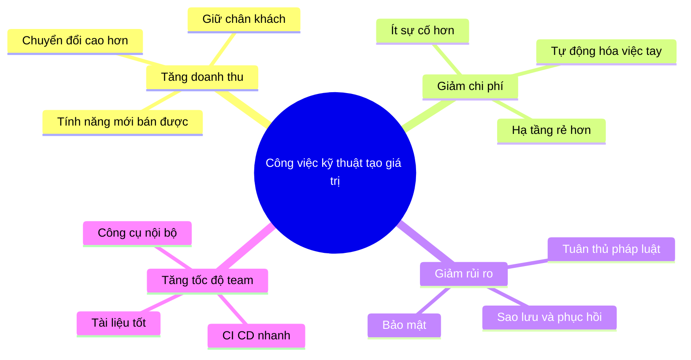

## 📖 4. Metrics: đo cái gì và vì sao

> "Cái gì không đo được thì không cải thiện được." - Nhưng cũng: "Cái gì được đo thì sẽ bị lách." (Định luật Goodhart)

### North Star Metric

**North Star Metric** (chỉ số Sao Bắc Đẩu) là **một** con số thể hiện tốt nhất giá trị mà sản phẩm mang lại cho người dùng - và dẫn đến doanh thu bền vững.

| Sản phẩm | North Star (ví dụ) | Vì sao không chọn cái khác? |
|---|---|---|
| App giao đồ ăn | Số đơn giao **thành công** mỗi tuần | "Số lượt tải app" không nói lên giá trị |
| Phần mềm POS | Số quán có **≥ 50 đơn/ngày** qua hệ thống | "Số tài khoản đăng ký" bao gồm cả quán dùng thử rồi bỏ |
| App học tiếng Anh | Số người học **≥ 3 buổi/tuần** | "Thời gian trong app" có thể tăng vì app khó dùng |
| Ví điện tử | Số người dùng có **≥ 1 giao dịch/tuần** | "Số dư ví" không nói lên mức độ sử dụng |

North Star được chia nhỏ thành các **input metrics** - những con số mà một team có thể tác động trực tiếp:

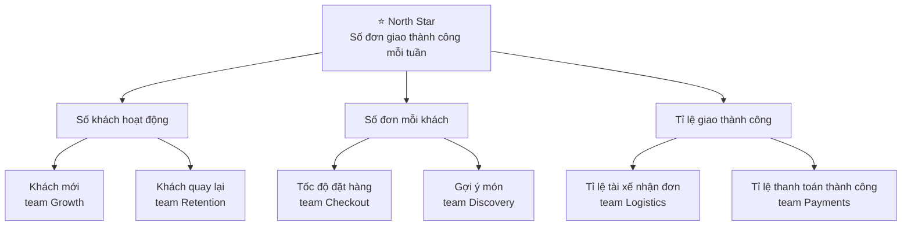

Khi bạn biết metric của team mình nằm ở đâu trên cây này, bạn biết **vì sao** công việc của mình quan trọng - và có thể tự đề xuất những việc tác động đến nó.

### Funnel (phễu chuyển đổi)

Funnel cho thấy người dùng **rơi rụng ở đâu** trong một luồng. Ví dụ luồng mua hàng của một shop online trong một tuần:

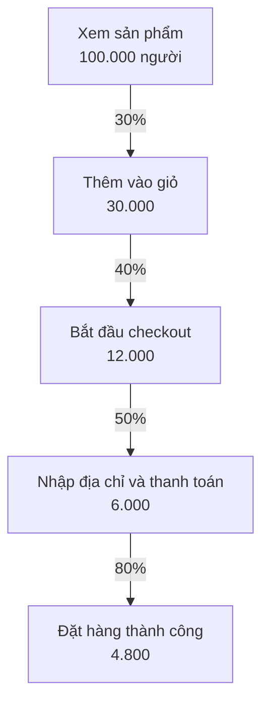

Tỉ lệ chuyển đổi tổng: 4.800 / 100.000 = **4,8%**. Câu hỏi của kỹ sư sản phẩm: **bước nào rơi rụng nhiều nhất và có thể sửa bằng kỹ thuật?**

- "Bắt đầu checkout → Nhập địa chỉ" chỉ 50%: form địa chỉ có quá nhiều trường? Chọn tỉnh/huyện/xã khó dùng trên điện thoại? Trang load chậm?
- "Nhập thanh toán → Thành công" 80%: 20% thất bại là rất cao với bước cuối. Lỗi cổng thanh toán? Timeout? Đây thường là **bug kỹ thuật**, không phải vấn đề UX.

!!! tip "Phép tính đơn giản mà mạnh"
    Nếu sửa bug thanh toán làm bước cuối tăng từ 80% lên 90%, số đơn tăng từ 4.800 lên 5.400 - **tăng 12,5% doanh thu** mà không cần thêm một khách mới nào. Đó là lý do vì sao một bug ở cuối funnel đáng được ưu tiên hơn nhiều tính năng mới.

### Metric phù phiếm vs Metric hành động được

| Metric phù phiếm (vanity) | Vì sao nguy hiểm | Metric hành động được (actionable) |
|---|---|---|
| Tổng số lượt tải app (tích lũy) | Chỉ tăng, không bao giờ giảm, không nói lên gì | Số người dùng hoạt động tuần này, retention sau 7 ngày |
| Tổng số trang được xem | Có thể tăng vì người dùng **lạc đường** | Tỉ lệ hoàn thành tác vụ chính |
| Số tính năng đã ra mắt | Output, không phải outcome | % người dùng dùng tính năng mới sau 30 ngày |
| Số dòng code / số commit | Khuyến khích code dài dòng | Thời gian từ commit đến production, tỉ lệ deploy lỗi |

### Guardrail metrics - hàng rào bảo vệ

Khi tối ưu một metric, luôn theo dõi các metric **không được phép xấu đi**:

- Tối ưu tỉ lệ chuyển đổi → guardrail: tỉ lệ hoàn tiền, tỉ lệ khiếu nại
- Tối ưu tốc độ giao hàng → guardrail: tỉ lệ tai nạn tài xế, đánh giá của tài xế
- Tối ưu thời gian dùng app → guardrail: tỉ lệ gỡ app, đánh giá 1 sao

**Định luật Goodhart**: *"Khi một thước đo trở thành mục tiêu, nó không còn là thước đo tốt."* Ví dụ: đặt KPI "đóng 50 ticket support mỗi ngày" → nhân viên đóng ticket khi chưa giải quyết xong. Luôn đi kèm metric chất lượng.

### Vai trò của kỹ sư: đo được thì mới biết

Không có dữ liệu = không có metric. Và người thêm tracking **chính là kỹ sư**. Khi làm tính năng, hãy hỏi: *"Mình cần sự kiện nào để biết tính năng này thành công?"* - và thêm chúng **ngay trong PR đầu tiên**, không phải "sau này".

Quy ước đặt tên sự kiện nên thống nhất trong team, ví dụ `object_action` ở thì quá khứ:

```text
reorder_button_viewed      { user_id, screen, previous_order_id }
reorder_button_clicked     { user_id, previous_order_id, items_count }
order_placed               { user_id, order_id, source: "reorder" | "menu" | "search", total }
```

Chú ý trường `source` trong `order_placed`: nó cho phép trả lời *"bao nhiêu đơn đến từ tính năng Đặt lại?"* - câu hỏi mà mọi PM sẽ hỏi bạn một tuần sau khi ra mắt.

## 📖 5. A/B testing - cơ bản cho kỹ sư

### Vì sao không chỉ so sánh "trước và sau"?

Bạn ra mắt nút "Mua ngay" màu cam thay cho màu xanh vào ngày 1/12. Tháng 12 doanh thu tăng 20%. Nhờ nút cam? Hay nhờ... mùa mua sắm cuối năm, lương tháng 13, đợt quảng cáo mới của team marketing? Bạn **không thể biết**.

**A/B testing** giải quyết bằng cách chia người dùng **ngẫu nhiên** thành hai nhóm **cùng một thời điểm**: nhóm A thấy bản cũ, nhóm B thấy bản mới. Mọi yếu tố bên ngoài (mùa, lương, quảng cáo) tác động đều lên cả hai nhóm - khác biệt còn lại là do thay đổi của bạn (hoặc do **ngẫu nhiên** - và thống kê giúp ta phân biệt hai điều này).

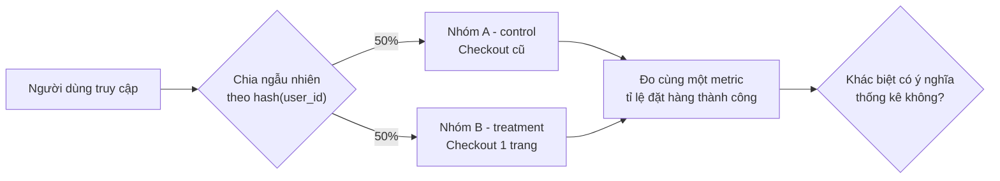

!!! note "Kỹ sư làm gì trong A/B test?"
    - Chia nhóm **ổn định**: cùng một người dùng phải luôn thấy cùng một phiên bản (thường dùng `hash(user_id + tên_thí_nghiệm) % 100`)
    - Ghi lại **người dùng thuộc nhóm nào** vào sự kiện tracking
    - Dùng **feature flag** để bật/tắt, chỉnh tỉ lệ mà không cần deploy
    - Đảm bảo hai nhóm thật sự có kích thước như kỳ vọng (xem "SRM" bên dưới)

### Tính mức ý nghĩa thống kê (two-proportion z-test)

Thí nghiệm: checkout 1 trang (B) so với checkout 3 bước (A). Metric: tỉ lệ đặt hàng thành công.

- **Tuần 1**: A: 48/1.000 người đặt hàng (4,8%). B: 60/1.000 (6,0%). B tốt hơn 25%! Ra mắt luôn?
- **Tuần 4**: A: 480/10.000 (4,8%). B: 560/10.000 (5,6%).

Hãy tính xem khác biệt có đủ tin cậy không. Ý tưởng: nếu **thật ra** A và B như nhau, thì xác suất thấy khác biệt lớn như vậy **chỉ do ngẫu nhiên** là bao nhiêu? Xác suất đó là **p-value**. Quy ước phổ biến: p < 0,05 thì coi là có ý nghĩa thống kê.

=== "Go"

    ```go
    package main

    import (
    	"fmt"
    	"math"
    )

    func normalCDF(x float64) float64 {
    	return 0.5 * (1 + math.Erf(x/math.Sqrt2))
    }

    func abTest(convA, nA, convB, nB float64) (pA, pB, z, pValue float64) {
    	pA, pB = convA/nA, convB/nB
    	pool := (convA + convB) / (nA + nB)
    	se := math.Sqrt(pool * (1 - pool) * (1/nA + 1/nB))
    	z = (pB - pA) / se
    	pValue = 2 * (1 - normalCDF(math.Abs(z))) // kiểm định hai phía
    	return
    }

    func report(name string, convA, nA, convB, nB float64) {
    	pA, pB, z, p := abTest(convA, nA, convB, nB)
    	lift := (pB - pA) / pA * 100
    	verdict := "CHƯA đủ bằng chứng"
    	if p < 0.05 {
    		verdict = "CÓ ý nghĩa thống kê"
    	}
    	fmt.Printf("%s: A=%.2f%% B=%.2f%% lift=%+.1f%% z=%.2f p=%.4f -> %s\n",
    		name, pA*100, pB*100, lift, z, p, verdict)
    }

    // sampleSize: số người cần cho MỖI nhóm (alpha=0.05 hai phía, power=80%).
    func sampleSize(p1, p2 float64) int {
    	const zAlpha, zPower = 1.96, 0.84
    	v := p1*(1-p1) + p2*(1-p2)
    	return int(math.Ceil(math.Pow(zAlpha+zPower, 2) * v / math.Pow(p1-p2, 2)))
    }

    func main() {
    	report("Tuần 1", 48, 1000, 60, 1000)
    	report("Tuần 4", 480, 10000, 560, 10000)
    	fmt.Println("Cần mỗi nhóm:", sampleSize(0.048, 0.056), "người")
    }

    // Output:
    // Tuần 1: A=4.80% B=6.00% lift=+25.0% z=1.19 p=0.2351 -> CHƯA đủ bằng chứng
    // Tuần 4: A=4.80% B=5.60% lift=+16.7% z=2.55 p=0.0108 -> CÓ ý nghĩa thống kê
    // Cần mỗi nhóm: 12074 người
    ```

=== "Python"

    ```python
    import math


    def normal_cdf(x):
        return 0.5 * (1 + math.erf(x / math.sqrt(2)))


    def ab_test(conv_a, n_a, conv_b, n_b):
        p_a, p_b = conv_a / n_a, conv_b / n_b
        p_pool = (conv_a + conv_b) / (n_a + n_b)
        se = math.sqrt(p_pool * (1 - p_pool) * (1 / n_a + 1 / n_b))
        z = (p_b - p_a) / se
        p_value = 2 * (1 - normal_cdf(abs(z)))  # kiểm định hai phía
        return p_a, p_b, z, p_value


    def report(name, conv_a, n_a, conv_b, n_b):
        p_a, p_b, z, p = ab_test(conv_a, n_a, conv_b, n_b)
        lift = (p_b - p_a) / p_a * 100
        verdict = "CÓ ý nghĩa thống kê" if p < 0.05 else "CHƯA đủ bằng chứng"
        print(f"{name}: A={p_a:.2%} B={p_b:.2%} lift={lift:+.1f}% "
              f"z={z:.2f} p={p:.4f} -> {verdict}")


    def sample_size(p1, p2, z_alpha=1.96, z_power=0.84):
        """Số người cần cho MỖI nhóm (alpha=0.05 hai phía, power=80%)."""
        var = p1 * (1 - p1) + p2 * (1 - p2)
        return math.ceil((z_alpha + z_power) ** 2 * var / (p1 - p2) ** 2)


    report("Tuần 1", 48, 1000, 60, 1000)
    report("Tuần 4", 480, 10000, 560, 10000)
    print("Cần mỗi nhóm:", sample_size(0.048, 0.056), "người")

    # Output:
    # Tuần 1: A=4.80% B=6.00% lift=+25.0% z=1.19 p=0.2351 -> CHƯA đủ bằng chứng
    # Tuần 4: A=4.80% B=5.60% lift=+16.7% z=2.55 p=0.0108 -> CÓ ý nghĩa thống kê
    # Cần mỗi nhóm: 12074 người
    ```

Đọc kết quả:

- **Tuần 1**: B "tốt hơn 25%" nhưng p = 0,235 → có **23,5%** khả năng thấy khác biệt như vậy **chỉ do may rủi**. Quá cao để kết luận. Ra mắt dựa trên số này = đánh bạc.
- **Tuần 4**: lift nhỏ hơn (16,7%) nhưng p = 0,011 → rất khó là do ngẫu nhiên. **Bây giờ** mới có thể tin.
- **Cỡ mẫu**: muốn phát hiện được mức cải thiện từ 4,8% lên 5,6% một cách đáng tin cậy, cần khoảng **12.000 người mỗi nhóm**. Hãy tính con số này **trước khi** chạy thí nghiệm, để biết cần chạy bao lâu.

Để ý: lift tuần 1 (25%) **lớn hơn** lift thật (16,7%). Kết quả sớm với ít dữ liệu thường **phóng đại** - đó là lý do không được kết luận sớm.

### Những cái bẫy của A/B testing

| Bẫy | Mô tả | Cách tránh |
|---|---|---|
| **Peeking** (nhìn trộm) | Xem kết quả mỗi ngày, dừng ngay khi thấy p < 0,05 | Tính cỡ mẫu trước, chạy đủ thời gian đã định (ít nhất trọn 1-2 tuần để bao phủ cả ngày thường và cuối tuần) |
| **Quá nhiều metric** | Đo 20 metric, chắc chắn có 1 cái "có ý nghĩa" do ngẫu nhiên | Chọn **một** metric chính trước khi chạy; các metric khác chỉ để tham khảo |
| **Novelty effect** | Người dùng bấm thử vì cái mới lạ, sau vài tuần thì hết | Chạy đủ lâu, xem xu hướng theo thời gian |
| **SRM** (Sample Ratio Mismatch) | Chia 50/50 nhưng thực tế ra 52/48 → có bug trong việc chia nhóm hoặc tracking | Kiểm tra tỉ lệ nhóm trước khi đọc kết quả - đây là việc của kỹ sư! |
| **Hiệu ứng mạng** | Marketplace: nhóm B lấy hết tài xế, nhóm A thiếu tài xế | Chia theo khu vực/thời gian thay vì theo người dùng |
| **Không đủ traffic** | Sản phẩm B2B có 200 khách - không bao giờ đủ mẫu | Dùng phỏng vấn, dữ liệu định tính, ra mắt từ từ và quan sát |

!!! warning "Không phải cái gì cũng cần A/B test"
    Sửa bug thanh toán không cần A/B test - cứ sửa. Tính năng bắt buộc theo luật - cứ làm. A/B test dành cho những thay đổi mà bạn **thật sự không chắc** chúng tốt hơn, và có **đủ traffic** để đo. Ở nhiều công ty nhỏ, "ra mắt cho 10% người dùng, theo dõi metric và lỗi, rồi mở rộng dần" là đủ tốt.

## 📖 6. MVP và Iteration

### MVP không phải là "sản phẩm tệ"

**MVP** (Minimum Viable Product) là phiên bản **nhỏ nhất** giúp bạn **học được điều quan trọng nhất** với chi phí thấp nhất. Mục tiêu của MVP là **học**, không phải là "làm ít đi".

Hình ảnh nổi tiếng của Henrik Kniberg:

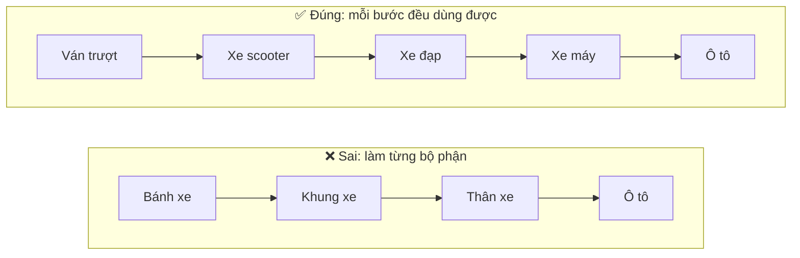

Ở cách sai, khách hàng không dùng được gì cho đến tận cuối - và nếu hóa ra họ cần đi qua ngõ nhỏ Hà Nội thì ô tô là sai hoàn toàn. Ở cách đúng, mỗi bước **giải quyết được job "đi từ A đến B"** ở mức nào đó, và bạn **học** được từ phản hồi thật: có khi đến "xe máy" là khách đã hài lòng.

### Vòng lặp Build - Measure - Learn

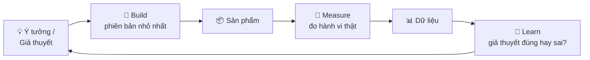

Mục tiêu là làm vòng lặp này **càng nhanh càng tốt**. Một team chạy 1 vòng/tuần sẽ học nhanh gấp 12 lần team chạy 1 vòng/quý.

### Các kiểu MVP (từ rẻ đến đắt)

| Kiểu | Cách làm | Ví dụ |
|---|---|---|
| **Fake door** (cửa giả) | Hiện nút tính năng, bấm vào thì báo "Sắp ra mắt, bạn có muốn được báo không?" | Đo xem bao nhiêu người **muốn** "Thanh toán trả sau" trước khi tích hợp |
| **Concierge** (quản gia) | Làm bằng tay cho vài khách đầu tiên | "Báo cáo tuần" gửi thủ công bằng Excel cho 10 quán, xem họ có đọc không |
| **Wizard of Oz** | Người dùng tưởng là tự động, thật ra có người làm phía sau | "Gợi ý món bằng AI" - thật ra là nhân viên chọn tay trong 2 tuần đầu |
| **Feature flag cho nhóm nhỏ** | Làm thật nhưng chỉ bật cho 5% người dùng / 1 thành phố | Ra mắt tính năng ở Đà Nẵng trước khi mở cả nước |
| **Sản phẩm đầy đủ** | Làm hoàn chỉnh | Chỉ khi đã có bằng chứng từ các bước trước |

!!! warning "Fake door phải làm có đạo đức"
    Đừng lừa người dùng trả tiền cho thứ không tồn tại. Thông báo rõ ràng "tính năng đang được phát triển", và đừng dùng quá lâu hay quá thường xuyên - người dùng sẽ mất niềm tin.

### MVP và chất lượng kỹ thuật: cắt gì, giữ gì?

Đây là chỗ kỹ sư đóng góp lớn nhất. "Làm nhanh" không có nghĩa là "làm ẩu mọi thứ":

| ✅ Được phép cắt trong MVP | ❌ KHÔNG bao giờ cắt |
|---|---|
| Tính năng phụ (lọc, sắp xếp nâng cao, xuất file) | **Bảo mật**: xác thực, phân quyền, chống SQL injection |
| Tự động hóa (có thể làm tay lúc đầu) | **Toàn vẹn dữ liệu**: tiền, tồn kho, dữ liệu khách hàng |
| Khả năng mở rộng cho 1 triệu người dùng (khi mới có 1.000) | **Tính đúng đắn của thanh toán**: idempotency, đối soát |
| Giao diện hoàn hảo, animation | **Khả năng quan sát tối thiểu**: log lỗi, metric cơ bản |
| Hỗ trợ mọi trình duyệt/thiết bị cũ | **Khả năng rollback** / tắt tính năng (feature flag) |
| Test cho các nhánh hiếm | **Test cho luồng chính** và luồng liên quan đến tiền |

Quy tắc: **cắt phạm vi, không cắt chất lượng của phần đã làm.** Một tính năng nhỏ mà chắc chắn tốt hơn một tính năng lớn mà lung lay. Và hãy ghi lại nợ kỹ thuật cố ý (Bài 7) - để khi MVP thành công, team biết cần củng cố chỗ nào.

## 📖 7. Ưu tiên hóa: RICE và Impact/Effort

Luôn luôn có **nhiều việc hơn thời gian**. Câu hỏi không phải "việc này có tốt không?" (việc nào cũng tốt) mà là **"việc này có tốt hơn những việc khác mình có thể làm với cùng thời gian không?"** Đây là khái niệm **chi phí cơ hội** (opportunity cost).

### RICE

RICE (do Intercom phổ biến) cho điểm mỗi việc theo 4 yếu tố:

| Yếu tố | Ý nghĩa | Đơn vị |
|---|---|---|
| **R**each | Bao nhiêu người bị ảnh hưởng trong một khoảng thời gian | người/quý |
| **I**mpact | Mỗi người được ảnh hưởng nhiều thế nào | 3 = rất lớn, 2 = lớn, 1 = vừa, 0,5 = nhỏ, 0,25 = rất nhỏ |
| **C**onfidence | Mức độ tự tin vào các ước lượng trên | 100% = có dữ liệu, 80% = khá chắc, 50% = đoán |
| **E**ffort | Tổng công sức của cả team | người-tháng |

```text
Điểm RICE = (Reach × Impact × Confidence) / Effort
```

### Ví dụ có tính toán: backlog quý của app đặt đồ uống

| Việc | Reach (người/quý) | Impact | Confidence | Effort (người-tháng) | Tính | **Điểm RICE** |
|---|---|---|---|---|---|---|
| Sửa checkout chậm/crash trên Android đời cũ | 6.000 | 2 | 80% | 1 | 6.000 × 2 × 0,8 / 1 | **9.600** |
| Đăng nhập bằng Zalo | 8.000 | 1 | 80% | 2 | 8.000 × 1 × 0,8 / 2 | **3.200** |
| Gợi ý món theo lịch sử | 20.000 | 1 | 50% | 4 | 20.000 × 1 × 0,5 / 4 | **2.500** |
| Chương trình giới thiệu bạn bè | 5.000 | 3 | 50% | 3 | 5.000 × 3 × 0,5 / 3 | **2.500** |
| Dark mode | 15.000 | 0,25 | 80% | 1,5 | 15.000 × 0,25 × 0,8 / 1,5 | **2.000** |
| Lọc đơn theo ngày cho admin | 50 | 2 | 100% | 0,5 | 50 × 2 × 1 / 0,5 | **200** |

Nhận xét:

- **Sửa bug Android** đứng đầu xa - dù không "hào nhoáng". Bug-fix ở luồng chính thường thắng tính năng mới. Đây là lập luận bạn có thể mang đến PM **bằng con số**, không chỉ bằng cảm giác "bug này khó chịu lắm".
- **Gợi ý món** có Reach cao nhất nhưng Confidence thấp (50%) và Effort lớn → nên làm **MVP rẻ** trước (ví dụ: "món bạn hay gọi" chỉ cần một câu query, 0,5 người-tháng) để **tăng Confidence** trước khi đầu tư lớn.
- **Lọc cho admin** điểm thấp - nhưng nếu 50 admin đó mỗi người mất 1 giờ/ngày vì thiếu nó, chi phí vận hành có thể rất lớn. RICE là **công cụ hỗ trợ suy nghĩ**, không phải máy ra quyết định.

!!! warning "Đừng để RICE thành trò chơi con số"
    Con số RICE chỉ tốt bằng ước lượng đầu vào. Giá trị lớn nhất của nó là buộc team **nói rõ giả định** ("mình nghĩ 8.000 người sẽ dùng đăng nhập Zalo - dựa trên đâu?") và **so sánh các việc trên cùng một thước đo**. Nếu ai đó chỉnh Confidence lên 100% để việc mình thích được ưu tiên - đó là vấn đề văn hóa, không phải vấn đề công cụ.

### Ma trận Impact/Effort

Khi không có thời gian cho RICE đầy đủ, một ma trận 2x2 là đủ cho buổi họp 15 phút:

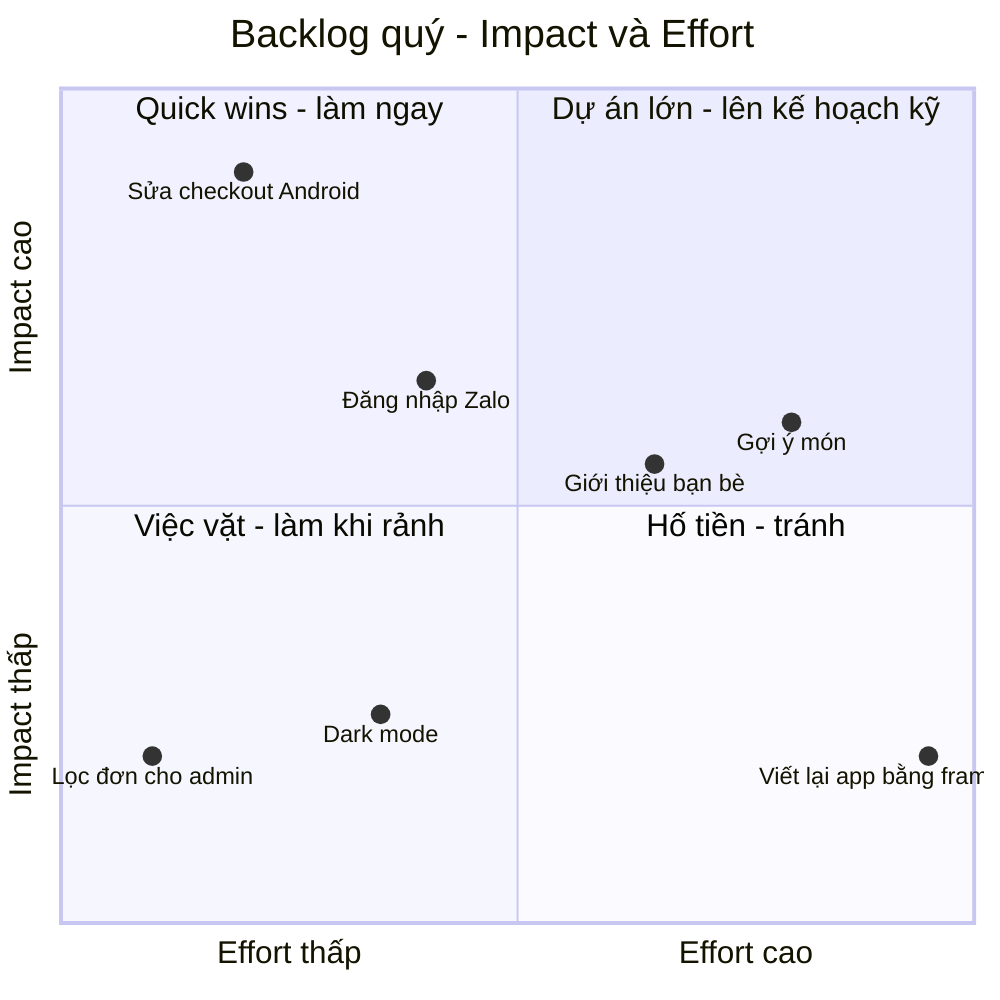

- **Quick wins** (góc trên trái): làm ngay
- **Dự án lớn** (góc trên phải): đáng làm, nhưng chia nhỏ, làm MVP trước
- **Việc vặt** (góc dưới trái): gom lại làm khi có khoảng trống, hoặc giao cho người mới làm quen code
- **Hố tiền** (góc dưới phải): tránh - "viết lại toàn bộ app" thường nằm ở đây, trừ khi có lý do kinh doanh rất rõ

## 📖 8. Nói "không" và đàm phán phạm vi

### Vì sao phải biết nói "không"?

Mỗi lần bạn nói "có" với một việc, bạn đang ngầm nói "không" với một việc khác - thường là việc quan trọng nhưng không ai đang hét lên đòi (nợ kỹ thuật, test, tài liệu, thời gian nghỉ của chính bạn). Kỹ sư không biết nói "không" sẽ: nhận quá nhiều việc → làm việc nào cũng dở → trễ hạn → mất uy tín. Nghịch lý: **người nói "có" với mọi thứ lại là người ít đáng tin nhất**.

### Nói "không" mà không làm mất lòng

Bí quyết: đừng nói "không" với **người**, hãy nói về **trade-off** và đưa ra **lựa chọn**.

| ❌ Thay vì | ✅ Hãy nói |
|---|---|
| "Không làm được." | "Làm được, nhưng sẽ phải dời việc X sang tuần sau. Anh/chị muốn ưu tiên cái nào?" |
| "Cái này vô lý." | "Em muốn hiểu thêm vấn đề mình đang giải quyết là gì - có thể có cách rẻ hơn." |
| "Không có thời gian." | "Tuần này em đã cam kết A, B, C. Nếu thêm D, một trong ba cái sẽ trễ. Mình bàn với PM nhé?" |
| "Để em xem." (rồi im lặng) | "Em cần đến chiều mai để đánh giá. Em sẽ trả lời trước 17h." |
| "Được ạ." (rồi làm thêm giờ đến 2h sáng) | "Deadline này khả thi nếu mình cắt phần Y. Nếu giữ Y thì cần thêm 3 ngày." |

Các dạng "không" khác nhau:

- **"Không phải bây giờ"**: ghi vào backlog, nêu khi nào có thể xem lại
- **"Không phải thế này"**: đề xuất cách khác đạt cùng mục tiêu
- **"Không phải em"**: chỉ đến người/team phù hợp hơn
- **"Không, vì..."**: khi yêu cầu vi phạm bảo mật, pháp luật, đạo đức - lúc này cần **dứt khoát** và leo thang nếu cần

### Tam giác phạm vi - thời gian - nguồn lực

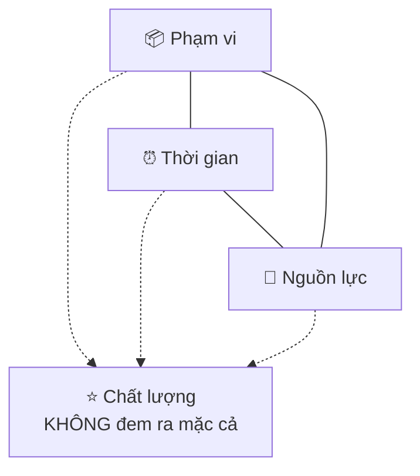

Khi thời gian cố định (ngày 11/11, Tết, ngày luật có hiệu lực) và nguồn lực cố định (thêm người vào dự án trễ chỉ làm nó trễ hơn - định luật Brooks), **thứ duy nhất có thể thay đổi là phạm vi**. Chất lượng không nằm trong bàn đàm phán - cắt chất lượng chỉ là **vay nợ** với lãi suất rất cao.

### MoSCoW - công cụ đàm phán phạm vi

| Nhóm | Ý nghĩa | Ví dụ: Flash sale 11/11 |
|---|---|---|
| **M**ust have | Không có thì không ra mắt | Giới hạn số lượng theo tồn kho, không bán quá; đồng hồ đếm ngược; chịu được tải x20 |
| **S**hould have | Quan trọng, nhưng có cách tạm | Thông báo push trước giờ sale (tạm: gửi SMS thủ công qua công cụ có sẵn) |
| **C**ould have | Có thì tốt | Hiệu ứng pháo hoa khi đặt hàng thành công |
| **W**on't have (lần này) | Rõ ràng không làm - và nói ra | Xếp hàng ảo (virtual queue) - để dành cho đợt 12/12 |

### Tình huống: Đàm phán với PM 3 tuần trước 11/11

**PM Trang**: *"Sếp muốn flash sale 11/11 có đủ 8 tính năng này. Còn 3 tuần. Được không em?"*

**Kỹ sư Phong** (đã ước lượng: làm đủ cần khoảng 6 tuần):

> *"Chị Trang, em đã xem 8 tính năng. Nói thẳng là làm đủ 8 cái với chất lượng đảm bảo cần khoảng 6 tuần, nên 3 tuần thì không kịp nếu giữ nguyên.*
>
> *Em đề xuất thế này: mục tiêu chính của 11/11 là **bán được nhiều hàng nhất mà không sập và không bán quá tồn kho**, đúng không chị? Vậy 3 cái Must là: giới hạn tồn kho, đếm ngược, và load test. Cái đó em chắc chắn xong trong 2 tuần, còn 1 tuần để test tải và dự phòng.*
>
> *Thông báo push thì mình tạm dùng công cụ gửi SMS có sẵn của marketing. Hiệu ứng pháo hoa và xếp hàng ảo để dành cho 12/12 - lúc đó mình có thêm dữ liệu từ 11/11 để biết có thật sự cần xếp hàng ảo không.*
>
> *Nếu sếp nhất định cần thêm cái nào, chị cho em biết cái nào quan trọng nhất, em xem mình có thể đổi với cái gì. Em gửi chị bảng này bằng văn bản để chị trình sếp nhé."*

Phong đã làm những điều đúng:

1. **Nói rõ sự thật** (6 tuần) ngay từ đầu, không hứa suông
2. **Quay về mục tiêu** thay vì tranh luận từng tính năng
3. **Đưa ra phương án cụ thể**, không chỉ nói "không"
4. **Giữ chất lượng** (load test) không đem ra mặc cả
5. **Mở đường** cho các lựa chọn khác và để người có thẩm quyền quyết định
6. **Viết ra** để tránh hiểu lầm và để PM có tài liệu trình lên trên

## 📖 9. Ý thức chi phí (Cost awareness)

Trên cloud, **mỗi dòng code đều có giá tiền**. Một câu query thiếu index, một vòng lặp gọi API, một dòng log DEBUG quên tắt - tất cả đều hiện lên hóa đơn cuối tháng. Kỹ sư có tư duy sản phẩm biết **ước lượng chi phí trước khi xây**, giống như bạn ước lượng tiền điện trước khi mua điều hòa.

### Câu chuyện: Log đắt hơn server

Một startup giao hàng nhận hóa đơn cloud tháng 6 tăng gấp đôi. Truy ra: một kỹ sư bật log DEBUG để điều tra một bug, log **toàn bộ request và response body** (khoảng 2KB mỗi request), rồi quên tắt. Với 500 request/giây, chi phí log mỗi tháng **vượt cả chi phí chạy server**. Chưa kể trong body có số điện thoại và địa chỉ khách hàng - một vấn đề bảo mật và tuân thủ.

### Ước lượng nhanh bằng code

Giá dưới đây là **giá tham khảo** (theo bảng giá công khai của các nhà cung cấp cloud lớn, có thể khác theo vùng và thời điểm - luôn kiểm tra lại):

=== "Go"

    ```go
    package main

    import "fmt"

    // Giá tham khảo (USD) - luôn kiểm tra bảng giá hiện hành của nhà cung cấp
    const (
    	logPricePerGB     = 0.50  // phí nạp log (ingestion)
    	storagePricePerGB = 0.023 // lưu trữ object mỗi GB mỗi tháng
    	gbBytes           = 1e9
    	secondsPerMonth   = 86_400 * 30
    )

    func logCost(rps, bytesPerRequest float64) (gb, usd float64) {
    	gb = rps * bytesPerRequest * secondsPerMonth / gbBytes
    	return gb, gb * logPricePerGB
    }

    func storageCost(itemsPerDay, bytesPerItem, months float64) (gb, usd float64) {
    	gb = itemsPerDay * 30 * months * bytesPerItem / gbBytes
    	return gb, gb * storagePricePerGB
    }

    func main() {
    	for _, c := range []struct {
    		label string
    		size  float64
    	}{{"log DEBUG 2KB/req", 2000}, {"log INFO 300B/req", 300}} {
    		gb, usd := logCost(500, c.size)
    		fmt.Printf("%6.0f GB/tháng       $%8.2f/tháng  <- %s\n", gb, usd, c.label)
    	}
    	for _, c := range []struct {
    		label string
    		size  float64
    	}{{"ảnh gốc 300KB", 300_000}, {"ảnh nén 60KB", 60_000}} {
    		gb, usd := storageCost(50_000, c.size, 12)
    		fmt.Printf("%6.0f GB sau 12 tháng $%8.2f/tháng  <- %s\n", gb, usd, c.label)
    	}
    }

    // Output:
    //   2592 GB/tháng       $ 1296.00/tháng  <- log DEBUG 2KB/req
    //    389 GB/tháng       $  194.40/tháng  <- log INFO 300B/req
    //   5400 GB sau 12 tháng $  124.20/tháng  <- ảnh gốc 300KB
    //   1080 GB sau 12 tháng $   24.84/tháng  <- ảnh nén 60KB
    ```

=== "Python"

    ```python
    # Giá tham khảo (USD) - luôn kiểm tra bảng giá hiện hành của nhà cung cấp
    LOG_PRICE_PER_GB = 0.50        # phí nạp log (ingestion)
    STORAGE_PRICE_PER_GB = 0.023   # lưu trữ object mỗi GB mỗi tháng
    GB = 1000 ** 3
    SECONDS_PER_MONTH = 86_400 * 30


    def log_cost(rps, bytes_per_request):
        gb = rps * bytes_per_request * SECONDS_PER_MONTH / GB
        return gb, gb * LOG_PRICE_PER_GB


    def storage_cost(items_per_day, bytes_per_item, months):
        gb = items_per_day * 30 * months * bytes_per_item / GB
        return gb, gb * STORAGE_PRICE_PER_GB


    for label, size in [("log DEBUG 2KB/req", 2000), ("log INFO 300B/req", 300)]:
        gb, usd = log_cost(500, size)
        print(f"{gb:>6.0f} GB/tháng       ${usd:>8.2f}/tháng  <- {label}")

    for label, size in [("ảnh gốc 300KB", 300_000), ("ảnh nén 60KB", 60_000)]:
        gb, usd = storage_cost(50_000, size, months=12)
        print(f"{gb:>6.0f} GB sau 12 tháng ${usd:>8.2f}/tháng  <- {label}")

    # Output:
    #   2592 GB/tháng       $ 1296.00/tháng  <- log DEBUG 2KB/req
    #    389 GB/tháng       $  194.40/tháng  <- log INFO 300B/req
    #   5400 GB sau 12 tháng $  124.20/tháng  <- ảnh gốc 300KB
    #   1080 GB sau 12 tháng $   24.84/tháng  <- ảnh nén 60KB
    ```

Đọc kết quả:

- **Log**: giảm từ 2KB xuống 300 byte mỗi request (chỉ log trường cần thiết, không log body) tiết kiệm khoảng **$1.100/tháng** - tương đương lương một kỹ sư junior ở Việt Nam. Một PR 20 dòng.
- **Ảnh hóa đơn**: ảnh chụp từ điện thoại khoảng 300KB, nén xuống 60KB vẫn đọc rõ chữ → tiết kiệm 80% chi phí lưu trữ. Và chi phí lưu trữ **tích lũy**: tháng thứ 24 sẽ gấp đôi tháng thứ 12, nếu không có chính sách xóa/chuyển sang lớp lưu trữ rẻ hơn.

### Checklist ước lượng chi phí cho một tính năng mới

- [ ] **Compute**: cần thêm bao nhiêu CPU/RAM? Chạy liên tục hay theo lịch?
- [ ] **Storage**: mỗi ngày thêm bao nhiêu dữ liệu? Giữ bao lâu? Có chính sách xóa/lưu trữ lạnh không?
- [ ] **Database**: có làm tăng số query/giây không? Cần thêm index? Cần read replica?
- [ ] **Network**: dữ liệu đi ra internet (egress) thường đắt - có dùng CDN không? Có gọi chéo vùng (cross-region) không?
- [ ] **Dịch vụ bên thứ ba**: SMS, email, bản đồ, AI API - tính theo lượt, nhân với số người dùng
- [ ] **Log, metrics, traces**: bao nhiêu GB mỗi tháng? Có lấy mẫu (sampling) traces không?
- [ ] **Chi phí tăng theo gì**: theo người dùng? theo đơn hàng? theo dữ liệu tích lũy? Khi người dùng x10 thì chi phí x10 hay x100?
- [ ] **So sánh với giá trị**: tính năng mang lại bao nhiêu tiền / tiết kiệm bao nhiêu so với chi phí vận hành?

!!! tip "Chi phí cũng là một metric kỹ thuật"
    Một con số rất hay để theo dõi: **chi phí hạ tầng trên mỗi đơn hàng** (hoặc mỗi người dùng hoạt động). Nếu số đơn tăng gấp đôi mà chi phí tăng gấp ba, kiến trúc có vấn đề. Nếu số đơn tăng gấp đôi mà chi phí chỉ tăng 30%, team đang làm rất tốt - và đó là thành tích đáng ghi vào brag document của bạn (Bài 10).

## 📖 10. Làm chủ từ đầu đến cuối (End-to-end ownership)

**Ownership** nghĩa là: bạn chịu trách nhiệm về **kết quả**, không chỉ về **phần việc được giao**. Một tính năng không "xong" khi code được merge. Nó xong khi **người dùng nhận được giá trị** và bạn **biết chắc** điều đó.

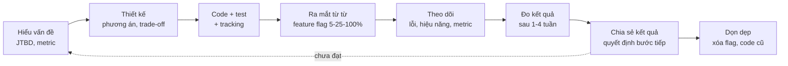

### Definition of Done của một kỹ sư sản phẩm

- [ ] Code đã merge, có test cho luồng chính và các trường hợp biên quan trọng
- [ ] Có **sự kiện tracking** để đo metric thành công đã thống nhất
- [ ] Có **log/metric/alert** để biết khi tính năng hỏng
- [ ] Ra mắt sau **feature flag**, có kế hoạch rollback
- [ ] **CS/Support đã được thông báo**: tính năng mới là gì, câu hỏi thường gặp, cách xử lý khi khách báo lỗi
- [ ] Tài liệu (nếu cần) đã cập nhật
- [ ] Đã **xem dashboard** sau khi ra mắt (1 ngày, 1 tuần) và **chia sẻ kết quả** với team
- [ ] Đã **xóa feature flag** và code cũ khi tính năng ổn định (flag sống mãi là nợ kỹ thuật)

### Ownership không có nghĩa là làm tất cả một mình

Ownership nghĩa là **đảm bảo việc được làm**, không phải **tự tay làm mọi việc**. Nếu bạn thấy CS chưa được thông báo, bạn không cần tự viết tài liệu cho CS - nhưng bạn nhắn PM: *"Chị ơi, tính năng mai ra mắt, CS đã biết chưa? Em có thể viết 5 câu FAQ nếu cần."* Đó là ownership.

!!! note "Dấu hiệu bạn đang có ownership"
    - Bạn **tự** mở dashboard xem tính năng của mình mà không ai nhắc
    - Khi có bug liên quan đến tính năng cũ của bạn, bạn **chủ động** nhận, kể cả khi đã chuyển sang dự án khác
    - Bạn nói "**chúng ta** đã làm sai chỗ này" thay vì "spec viết thế mà"
    - Bạn **báo tin xấu sớm**: "Em nghĩ mình sẽ trễ 3 ngày vì lý do X" vào thứ Hai, không phải thứ Sáu

## 🌍 Tình huống thực tế: Case study "Đặt lại đơn cũ" - từ ý tưởng đến đo lường

Câu chuyện dưới đây tổng hợp mọi thứ trong bài. Bối cảnh: app đặt đồ uống **"Cà Phê Nhanh"** có 200.000 người dùng hoạt động mỗi tháng. Linh là kỹ sư backend năm thứ 3 trong team Checkout.

### Bước 1: Ý tưởng đến từ dữ liệu (và từ việc đọc ticket support)

Trong buổi đọc ticket support hàng tuần, Linh thấy nhiều phản hồi kiểu: *"Sáng nào tôi cũng gọi đúng một món, mà phải bấm 7 lần."* Linh chạy một câu query trên dữ liệu đơn hàng 3 tháng:

- **62%** đơn hàng của khách quay lại **giống hệt** một đơn trước đó của chính họ (cùng món, cùng tùy chọn đá/đường, cùng địa chỉ)
- Thời gian trung bình từ lúc mở app đến lúc đặt hàng: **48 giây**, 7 lần chạm

### Bước 2: Viết giả thuyết theo JTBD

> **Khi** tôi vội đi làm buổi sáng, **tôi muốn** đặt đúng ly cà phê quen thuộc trong một chạm, **để** kịp lấy trên đường đi mà không phải nghĩ.

**Giả thuyết**: Nếu có nút "Đặt lại" trên màn hình chính, (1) thời gian đặt hàng của khách quay lại giảm từ 48s xuống dưới 15s, (2) **số đơn mỗi khách mỗi tuần** tăng ít nhất 5% (vì đặt dễ hơn → đặt thường xuyên hơn).

**Metric chính**: số đơn/khách hoạt động/tuần. **Guardrail**: tỉ lệ hủy đơn (không được tăng - sợ khách bấm nhầm), giá trị đơn trung bình (không được giảm quá 5%).

### Bước 3: Ưu tiên hóa

Linh tính RICE và mang đến buổi planning:

| Reach | Impact | Confidence | Effort | RICE |
|---|---|---|---|---|
| 90.000 khách quay lại/quý | 1 | 80% (có dữ liệu 62%) | 1 người-tháng | **72.000** |

Cao hơn mọi việc khác trong backlog quý. PM đồng ý.

### Bước 4: Định phạm vi MVP

| Trong MVP | Để sau |
|---|---|
| Nút "Đặt lại" cho **1 đơn gần nhất** | Chọn từ nhiều đơn cũ, "đơn yêu thích" |
| Kiểm tra món còn bán, giá hiện tại (nếu giá đổi thì hiện rõ giá mới) | Gợi ý món thay thế khi hết món |
| Màn hình xác nhận 1 bước (tránh bấm nhầm → guardrail hủy đơn) | Đặt lịch tự động mỗi sáng |
| Tracking đầy đủ, feature flag, A/B test 50/50 | Widget màn hình khóa điện thoại |

Linh nhấn mạnh với PM hai điều **không cắt**: (1) giá phải lấy theo **giá hiện tại**, không phải giá trong đơn cũ (toàn vẹn dữ liệu tiền), (2) phải kiểm tra món còn bán (nếu không, khách đặt được món đã ngừng bán → quán không làm được → hủy đơn → mất lòng tin).

### Bước 5: Ước lượng chi phí

Query "đơn gần nhất của user" đã có index `(user_id, created_at)`. Thêm khoảng 30 request/giây giờ cao điểm - không đáng kể. Không cần hạ tầng mới. Chi phí vận hành tăng thêm gần như bằng 0.

### Bước 6: Kế hoạch ra mắt

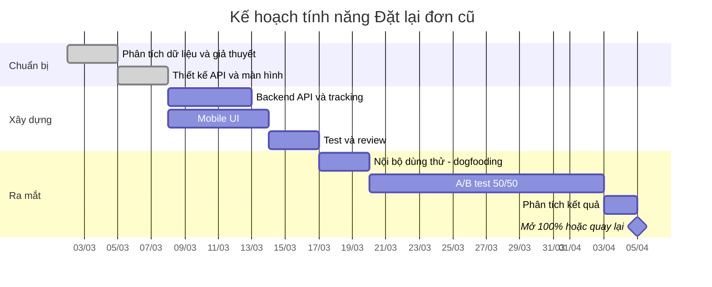

### Bước 7: Ra mắt và theo dõi

- **Ngày 1 (dogfooding)**: nhân viên công ty dùng thử. Phát hiện bug: khách đã **xóa địa chỉ cũ** → đặt lại bị lỗi. Sửa: dùng địa chỉ mặc định hiện tại và hiện rõ trên màn hình xác nhận.
- **Ngày 3 (A/B bắt đầu)**: Linh kiểm tra **SRM**: nhóm A 50,1%, nhóm B 49,9% - ổn.
- **Ngày 5**: một người trong team muốn "xem thử kết quả": B đang tốt hơn 11%! Linh nhắc: *"Mình đã thống nhất chạy đủ 14 ngày, cỡ mẫu tính trước là cần 12.000 người mỗi nhóm. Giờ mới có 7.000."*

### Bước 8: Đo kết quả (sau 14 ngày)

| Metric | Nhóm A | Nhóm B | Khác biệt | Ý nghĩa thống kê |
|---|---|---|---|---|
| Đơn/khách/tuần (chính) | 1,84 | 1,97 | **+7,1%** | Có (p < 0,01) |
| Thời gian đặt hàng (khách quay lại) | 48s | 14s | -71% | Có |
| Tỉ lệ hủy đơn (guardrail) | 3,1% | 3,2% | +0,1 điểm % | Không (chấp nhận được) |
| Giá trị đơn trung bình (guardrail) | 52.000đ | 49.500đ | -4,8% | Có - sát ngưỡng 5% |

**Học được**: Tính năng thành công với metric chính. Nhưng giá trị đơn giảm nhẹ - khách đặt lại đúng món cũ, không còn lướt menu và "tiện tay" thêm bánh. **Ý tưởng tiếp theo**: trên màn hình xác nhận đặt lại, gợi ý "Thêm bánh croissant như lần trước? (+25.000đ)" - một vòng Build-Measure-Learn mới.

### Bước 9: Chia sẻ và dọn dẹp

Linh viết một bản tổng kết nửa trang gửi kênh chung của công ty: vấn đề, giả thuyết, kết quả, bài học, bước tiếp theo. Sau 2 tuần mở 100% ổn định, Linh xóa feature flag và code A/B.

Trong buổi đánh giá cuối năm, dòng này nằm trong brag document của Linh: *"Đề xuất và dẫn dắt tính năng Đặt lại đơn cũ từ phân tích dữ liệu: +7,1% đơn/khách/tuần (tương đương khoảng X tỷ đồng doanh thu/năm), thời gian đặt hàng giảm 71%."* - Đó là ngôn ngữ của **impact**, không phải của **output**.

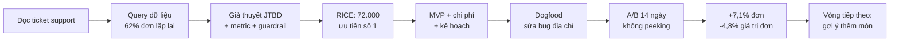

## ⚠️ Sai lầm thường gặp

1. **"Việc của em chỉ là code"**: Bỏ lỡ cơ hội tạo giá trị lớn nhất, và bị kẹt ở level mid. → Hỏi "vì sao" cho mọi ticket lớn.
2. **Làm đúng spec nhưng sai vấn đề**: Nút xuất Excel không ai bấm. → Tìm job thật sự đằng sau yêu cầu.
3. **Không thêm tracking**: Ra mắt xong không biết thành công hay không. → Tracking là một phần của Definition of Done.
4. **Tin vào metric phù phiếm**: "Đã có 1 triệu lượt tải!" nhưng retention 7 ngày là 3%. → Đo hành vi thật, đo theo thời gian.
5. **Kết luận A/B test quá sớm**: Peeking, dừng khi thấy kết quả đẹp. → Tính cỡ mẫu trước, chạy đủ thời gian.
6. **MVP = làm ẩu**: Cắt bảo mật, cắt tính đúng đắn của tiền. → Cắt phạm vi, không cắt chất lượng.
7. **Over-engineering cho quy mô chưa có**: Kiến trúc microservice cho 500 người dùng. → Xây cho quy mô hiện tại × 10, không phải × 1000.
8. **Nói "có" với mọi thứ**: Rồi trễ mọi thứ. → Nói về trade-off, đưa ra lựa chọn.
9. **Đàm phán bằng cách cắt chất lượng**: "Bỏ test cho kịp." → Cắt phạm vi, giữ chất lượng phần đã làm.
10. **Không quan tâm chi phí**: Log DEBUG trên production, ảnh không nén, query không index. → Ước lượng chi phí trước khi xây, theo dõi chi phí/đơn vị.
11. **Ownership dừng ở lúc merge**: Không xem dashboard, không biết tính năng có hỏng không. → Theo dõi 1 ngày, 1 tuần sau ra mắt.
12. **Feature flag sống mãi**: Code đầy `if flag` cho những thí nghiệm đã kết thúc từ năm ngoái. → Có ngày hết hạn cho mỗi flag, dọn dẹp là một phần công việc.

## 🏋️ Bài tập

### Bài 1 (Dễ): Viết JTBD

Chọn 3 ứng dụng bạn dùng hằng ngày (ví dụ: app ngân hàng, app giao đồ ăn, Zalo). Với mỗi app, viết **một** câu JTBD theo mẫu "Khi... tôi muốn... để...". Sau đó nghĩ: app đó có **đối thủ bất ngờ** nào (không cùng ngành) cũng làm được job đó không?

<details markdown="1"><summary>Gợi ý</summary>

Ví dụ app giao đồ ăn: *"Khi tôi làm việc muộn ở văn phòng và đói, tôi muốn có bữa tối nóng mà không phải ra ngoài, để làm xong việc và về nhà sớm."* Đối thủ bất ngờ: căng-tin công ty mở muộn, đồ ăn mang theo từ nhà, mì gói trong tủ văn phòng, dịch vụ nấu cơm theo tháng. Hiểu đối thủ theo job giúp bạn thấy sản phẩm cạnh tranh với **cái gì thật sự**.

</details>

### Bài 2 (Dễ): Funnel

Luồng đăng ký của một app: Mở màn hình đăng ký 20.000 → Nhập số điện thoại 14.000 → Nhận OTP 13.300 → Nhập đúng OTP 9.310 → Hoàn thành hồ sơ 8.379.

(a) Tính tỉ lệ chuyển đổi từng bước và tổng. (b) Bước nào đáng điều tra nhất? (c) Đưa ra 3 giả thuyết **kỹ thuật** cho bước đó và cách kiểm chứng từng giả thuyết.

<details markdown="1"><summary>Đáp án</summary>

(a) 70% → 95% → 70% → 90%. Tổng: 8.379 / 20.000 ≈ 41,9%.

(b) "Nhận OTP → Nhập đúng OTP" chỉ 70% là rất đáng ngờ: người dùng đã nhận được OTP mà 30% không nhập đúng. (Bước đầu 70% cũng thấp nhưng thường là vấn đề UX/động lực hơn là kỹ thuật.)

(c) Giả thuyết ví dụ:
1. **SMS đến chậm** với một số nhà mạng → OTP hết hạn trước khi đến. Kiểm chứng: chia tỉ lệ theo nhà mạng; đo thời gian từ lúc gửi đến lúc nhà cung cấp SMS báo đã giao.
2. **Thời hạn OTP quá ngắn** (ví dụ 60s). Kiểm chứng: phân bố thời gian giữa "gửi OTP" và "nhập OTP" - nếu nhiều người nhập ở giây 61-120 thì đúng.
3. **Ô nhập OTP không hỗ trợ tự điền** (autofill) trên iOS/Android → người dùng phải chuyển app, gõ tay, gõ sai. Kiểm chứng: so sánh tỉ lệ theo hệ điều hành và phiên bản app.

</details>

### Bài 3 (Trung bình): A/B test

Sửa code ở mục 5 để trả lời: (a) Với nhóm A 2.000/40.000 và nhóm B 2.100/40.000, kết quả có ý nghĩa thống kê không? (b) Nếu muốn phát hiện được mức cải thiện từ 5,0% lên 5,25%, cần bao nhiêu người mỗi nhóm? (c) Với 5.000 người dùng mới mỗi ngày chia đều hai nhóm, cần chạy bao nhiêu ngày?

<details markdown="1"><summary>Đáp án</summary>

(a) p_A = 5,00%, p_B = 5,25%, z ≈ 1,60, p ≈ 0,109 → **chưa** có ý nghĩa thống kê, dù có 80.000 người.

(b) Dùng `sample_size(0.05, 0.0525)` ≈ 122.000 người **mỗi nhóm**. Cải thiện càng nhỏ, cần càng nhiều mẫu (tỉ lệ nghịch với bình phương khác biệt).

(c) 2.500 người/nhóm/ngày → khoảng 49 ngày. Bài học: với traffic nhỏ, đừng A/B test những thay đổi nhỏ - hoặc chấp nhận chỉ phát hiện được thay đổi lớn, hoặc dùng phương pháp khác.

</details>

### Bài 4 (Trung bình): RICE cho backlog của bạn

Lấy 5 việc trong backlog thật của team bạn (hoặc của một side project). Tính RICE cho từng việc. Viết ra **giả định** đằng sau mỗi con số Reach và Confidence. Sau đó đặt chúng lên ma trận Impact/Effort. Thứ tự có khác với thứ tự team đang làm không? Nếu khác, vì sao?

### Bài 5 (Trung bình): Đàm phán phạm vi

PM yêu cầu: *"Tính năng đăng ký tài khoản doanh nghiệp cần: đăng ký, xác minh mã số thuế tự động, mời thành viên, phân quyền 5 vai trò, SSO với Google Workspace, xuất hóa đơn điện tử, dashboard sử dụng. Còn 4 tuần."* Bạn ước lượng cần 10 tuần. Viết (a) bảng MoSCoW, (b) tin nhắn trả lời PM theo mẫu đàm phán ở mục 8.

<details markdown="1"><summary>Gợi ý</summary>

Bắt đầu bằng câu hỏi: **khách hàng đầu tiên** dùng tính năng này là ai, và họ cần gì để **bắt đầu dùng**? Thường thì: đăng ký + mời thành viên + 2 vai trò (admin/member) là Must. Xác minh mã số thuế có thể làm tay lúc đầu (concierge). SSO và 5 vai trò có thể chờ đến khi có khách yêu cầu. Hóa đơn điện tử có thể là Must nếu **pháp luật** yêu cầu - hỏi rõ. Đừng quên nêu phần **không cắt**: bảo mật phân quyền (một thành viên không xem được dữ liệu công ty khác).

</details>

### Bài 6 (Khó): Ước lượng chi phí

Team muốn thêm tính năng "Lưu lịch sử vị trí tài xế mỗi 5 giây" để giải quyết khiếu nại. Có 8.000 tài xế hoạt động, mỗi người trung bình 10 giờ/ngày, mỗi bản ghi vị trí 100 byte. Dùng code ở mục 9 (hoặc tự viết) để tính: (a) Bao nhiêu GB mỗi tháng? (b) Chi phí lưu trữ sau 12 tháng nếu giữ hết? (c) Đề xuất ít nhất 3 cách giảm chi phí mà vẫn giải quyết được job "xử lý khiếu nại". Mỗi cách có trade-off gì?

<details markdown="1"><summary>Đáp án</summary>

(a) Mỗi tài xế: 10h × 3.600s / 5s = 7.200 bản ghi/ngày. 8.000 tài xế → 57,6 triệu bản ghi/ngày × 100 byte = 5,76 GB/ngày ≈ **173 GB/tháng** (30 ngày).

(b) Sau 12 tháng: khoảng 2.074 GB × $0,023 ≈ **$48/tháng** tiền lưu trữ object - không nhiều. Nhưng nếu lưu trong **database** (cần index để truy vấn theo tài xế + thời gian), chi phí có thể gấp 5-10 lần, và kích thước bảng ảnh hưởng hiệu năng.

(c) Ví dụ: (1) Chỉ lưu khi **đang có đơn** (giảm có thể 50%+), trade-off: không có dữ liệu lúc tài xế chờ đơn. (2) **Giữ 90 ngày** (thời hạn khiếu nại thực tế), sau đó xóa hoặc chuyển sang lưu trữ lạnh - trade-off: không tra được khiếu nại rất cũ. (3) Giảm tần suất khi tài xế **đứng yên**, trade-off: logic phức tạp hơn. (4) Lưu dạng file nén theo giờ vào object storage thay vì DB, chỉ nạp khi có khiếu nại - trade-off: truy vấn chậm hơn (vài giây thay vì mili giây), nhưng khiếu nại không cần tức thì.

</details>

### Bài 7 (Khó - phản tư): Ownership của bạn

Chọn tính năng gần nhất bạn đã làm. Trả lời trung thực:

1. Vấn đề của người dùng mà nó giải quyết là gì? (Viết JTBD)
2. Metric nào cho biết nó thành công? Bạn có biết con số hiện tại không?
3. Có tracking không? Có alert khi nó hỏng không?
4. Bạn đã xem dashboard sau khi ra mắt chưa?
5. Nếu làm lại, bạn sẽ cắt gì khỏi phạm vi để ra mắt sớm hơn một nửa thời gian?

Nếu bạn không trả lời được câu 2, hãy đi hỏi PM - ngay tuần này. Đó là bước đầu tiên để trở thành kỹ sư sản phẩm.

## ✅ Checklist hoàn thành

- [ ] Tôi giải thích được vì sao kỹ sư cần hiểu người dùng và business, và phân biệt output / outcome / impact
- [ ] Tôi viết được câu JTBD và đi ngược từ "yêu cầu giải pháp" về "vấn đề thật"
- [ ] Tôi biết công ty mình kiếm tiền từ đâu và các khái niệm CAC, LTV, retention, margin
- [ ] Tôi biết North Star metric của sản phẩm mình và metric team mình tác động đến
- [ ] Tôi đọc được một funnel và tìm bước rơi rụng đáng điều tra nhất
- [ ] Tôi phân biệt metric phù phiếm và metric hành động được, và luôn có guardrail metric
- [ ] Tôi hiểu A/B testing, tính được p-value và cỡ mẫu đơn giản, và tránh peeking/SRM
- [ ] Tôi hiểu MVP là để học, và biết cái gì được cắt, cái gì không bao giờ cắt
- [ ] Tôi ưu tiên hóa được bằng RICE và ma trận Impact/Effort, và nói rõ giả định
- [ ] Tôi nói "không" bằng cách nói về trade-off và đưa ra lựa chọn
- [ ] Tôi đàm phán phạm vi bằng MoSCoW, giữ nguyên chất lượng
- [ ] Tôi ước lượng chi phí cloud trước khi xây một tính năng mới
- [ ] Tôi làm chủ tính năng từ ý tưởng đến đo lường kết quả, và dọn dẹp sau khi xong

---

**Bài tiếp theo**: [Bài 10: Phát triển sự nghiệp](./10-career-growth.md) →
