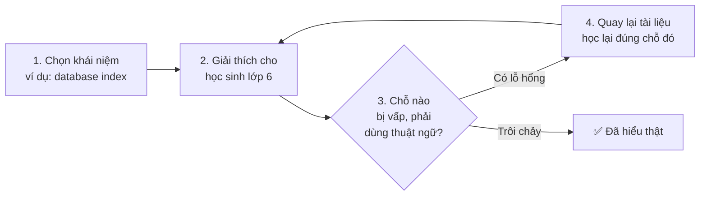
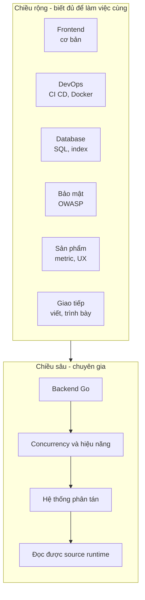
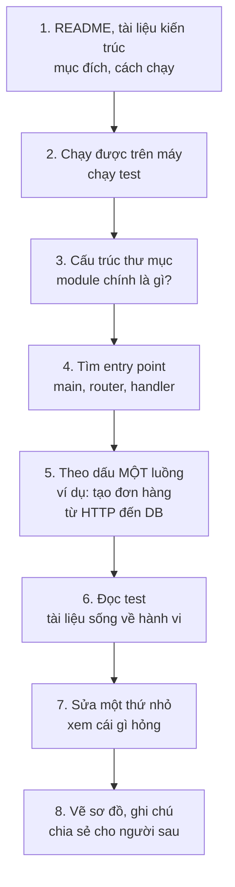
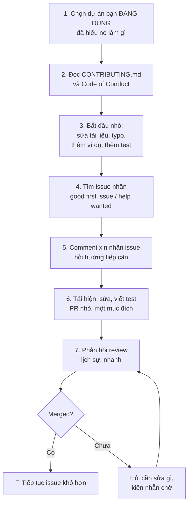
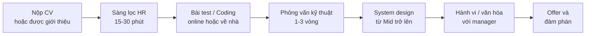
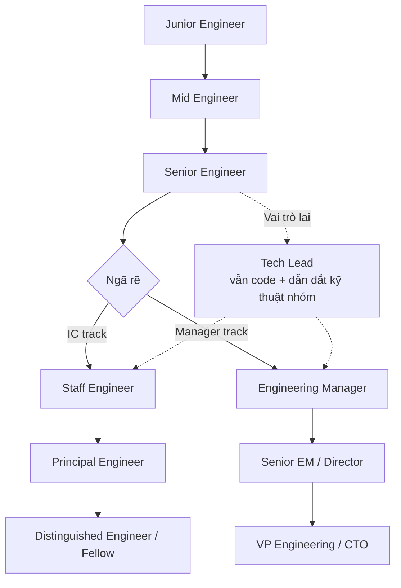
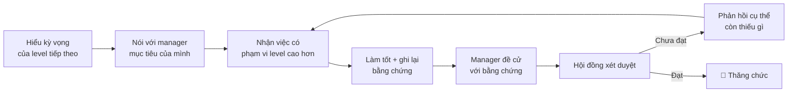
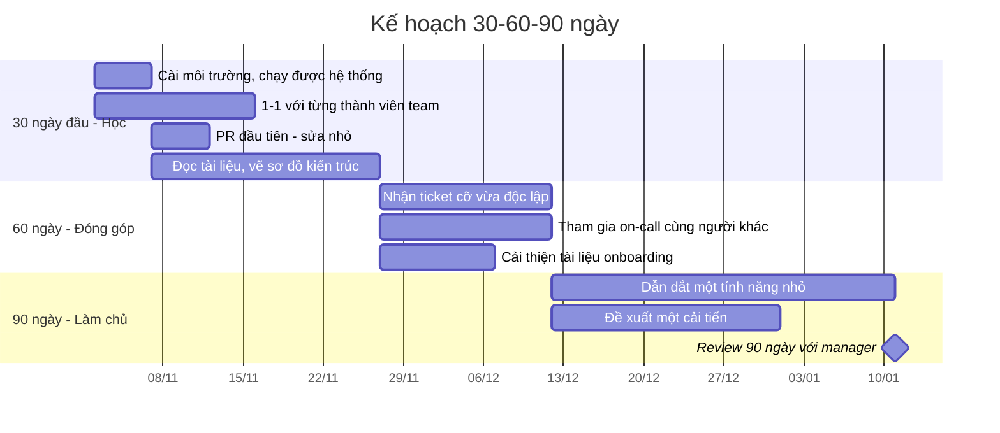
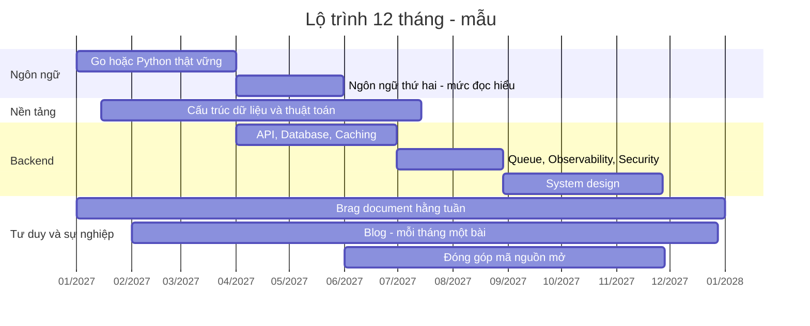

# 📚 Bài 10: Phát triển sự nghiệp

> "Có người có 10 năm kinh nghiệm. Có người chỉ có 1 năm kinh nghiệm, lặp lại 10 lần."

Năm 2020, Nam và Quân cùng tốt nghiệp một trường, cùng vào một công ty outsourcing ở Hà Nội với vị trí fresher Java. Năm 2025:

- **Nam** vẫn làm ở vị trí gần như cũ. Anh làm tốt những ticket được giao, nhưng mỗi dự án mới vẫn là "CRUD thêm màn hình". Khi công ty cắt giảm nhân sự, CV của Nam ghi "5 năm kinh nghiệm Java Spring" - giống hệt hàng trăm CV khác.
- **Quân** chuyển sang một công ty sản phẩm năm 2022, là Senior Backend Engineer, dẫn dắt một nhóm 4 người, có 2 bài blog kỹ thuật được chia sẻ nhiều, đóng góp vài PR cho một thư viện Go mã nguồn mở, và nhận được lời mời làm việc remote từ một công ty nước ngoài.

Quân không thông minh hơn Nam. Khác biệt nằm ở chỗ Quân **chủ động quản lý sự nghiệp của mình** như quản lý một dự án: có mục tiêu, có kế hoạch, có đo lường, có điều chỉnh. Nam thì để sự nghiệp **tự trôi** theo những gì công ty giao.

Bài cuối của khóa học này là về **cách bạn chủ động phát triển** - vì không ai quan tâm đến sự nghiệp của bạn nhiều bằng chính bạn.

## 🎯 Mục tiêu bài học

- Học **cách học**: deliberate practice, spaced repetition, kỹ thuật Feynman, learning in public
- Lập **kế hoạch phát triển hình chữ T**: một chiều sâu, nhiều chiều rộng
- **Đọc code và tài liệu** hiệu quả - kỹ năng bị đánh giá thấp nhất của nghề
- Xây **portfolio** có giá trị và **đóng góp mã nguồn mở** từng bước
- Chuẩn bị **phỏng vấn**: CV (cho công ty Việt Nam và quốc tế), câu hỏi hành vi theo **STAR**, vòng kỹ thuật, vòng system design, **đàm phán offer**
- Hiểu hai con đường **IC (chuyên gia) và Manager (quản lý)**
- Chuẩn bị cho **thăng tiến** với **brag document**
- Tìm **mentor**, xây dựng **mạng lưới** quan hệ (kể cả khi bạn hướng nội)
- Dùng **AI coding assistant có trách nhiệm**
- Nhận diện và **phòng tránh burnout**
- Có **kế hoạch 30-60-90 ngày** cho công việc mới và **lộ trình 12 tháng** cho bản thân

## 📖 1. Học cách học

Công nghệ thay đổi liên tục: framework bạn học hôm nay có thể lỗi thời sau 5 năm. Kỹ năng **bền vững nhất** không phải là một ngôn ngữ, mà là **khả năng học nhanh và học sâu**.

### 1.1. Deliberate practice - Luyện tập có chủ đích

Nhà tâm lý học Anders Ericsson nghiên cứu các chuyên gia (nhạc công, vận động viên, kỳ thủ cờ vua) và phát hiện: thứ tạo ra sự khác biệt không phải là **số giờ**, mà là **cách** luyện tập.

| Luyện tập "ngây thơ" | Luyện tập có chủ đích |
|---|---|
| Làm lại những việc đã biết làm | Nhắm vào **điểm yếu cụ thể**, ở rìa khả năng |
| Không có mục tiêu rõ ràng | Mục tiêu nhỏ, đo được: "viết được worker pool có graceful shutdown" |
| Không có phản hồi | **Phản hồi nhanh**: test, code review, người có kinh nghiệm |
| Thoải mái, dễ chịu | **Khó chịu** - nếu thấy dễ, bạn không đang học |
| Làm liên tục hàng giờ | Tập trung cao độ trong khoảng ngắn (45-90 phút) |

Ví dụ với kỹ sư phần mềm:

- ❌ Viết CRUD API thứ 50 giống hệt 49 cái trước → ✅ Viết lại CRUD đó nhưng thêm: phân trang bằng cursor, idempotency key, test concurrency
- ❌ Đọc thêm một bài "Top 10 Go tips" → ✅ Tự cài đặt lại một thư viện nhỏ bạn dùng hằng ngày (ví dụ một rate limiter), rồi so sánh với bản gốc
- ❌ Làm 200 bài LeetCode dễ → ✅ Làm 30 bài ở mức "vừa đủ khó", mỗi bài sau khi giải thì đọc 3 lời giải khác và viết lại lời giải tốt nhất mà không nhìn
- ❌ Nhận code review "LGTM" → ✅ Nhờ reviewer khó tính nhất team review PR của bạn, và hỏi *"Anh sẽ viết khác chỗ nào?"*

!!! tip "Vùng học tập"
    Hãy hình dung ba vòng tròn đồng tâm: **vùng thoải mái** (bạn làm được dễ dàng - không học gì), **vùng học tập** (khó nhưng làm được với cố gắng - học nhiều nhất), **vùng hoảng loạn** (quá khó, không biết bắt đầu từ đâu - chỉ thấy nản). Luyện tập có chủ đích là liên tục đẩy mình vào **vòng giữa**. Nếu một nhiệm vụ nằm ở vùng hoảng loạn, **chia nhỏ** nó cho đến khi từng phần nằm ở vùng học tập (Bài 2).

### 1.2. Spaced repetition - Ôn tập ngắt quãng

Hermann Ebbinghaus (1885) phát hiện **đường cong quên lãng**: sau khi học, ta quên rất nhanh - khoảng một nửa sau vài ngày nếu không ôn. Nhưng mỗi lần ôn lại **đúng lúc sắp quên**, trí nhớ bền hơn và lần quên tiếp theo đến chậm hơn.

Đây là lý do "học dồn trước kỳ thi" hiệu quả cho kỳ thi, nhưng 2 tuần sau thì quên sạch. Với kiến thức nghề nghiệp mà bạn muốn nhớ **nhiều năm**, hãy ôn ngắt quãng.

Hệ thống **Leitner** đơn giản: mỗi thẻ kiến thức nằm trong một "hộp". Trả lời đúng → lên hộp cao hơn → ôn thưa hơn. Trả lời sai → về hộp đầu → ôn lại ngay ngày mai. Code minh họa:

=== "Go"

    ```go
    package main

    import (
    	"fmt"
    	"time"
    )

    var intervals = []int{1, 3, 7, 14, 30} // số ngày chờ ứng với mỗi "hộp" Leitner

    // nextReview: trả lời đúng thì lên hộp (ôn thưa hơn), sai thì về hộp 0.
    func nextReview(box int, correct bool, today time.Time) (int, time.Time) {
    	if correct {
    		box = min(box+1, len(intervals)-1)
    	} else {
    		box = 0
    	}
    	return box, today.AddDate(0, 0, intervals[box])
    }

    func main() {
    	box, day := 0, time.Date(2026, 10, 1, 0, 0, 0, 0, time.UTC)
    	for _, correct := range []bool{true, true, false, true, true, true} {
    		var next time.Time
    		box, next = nextReview(box, correct, day)
    		mark := "đúng"
    		if !correct {
    			mark = "SAI "
    		}
    		fmt.Printf("%s trả lời %s -> hộp %d, ôn lại %s\n",
    			day.Format("02/01"), mark, box, next.Format("02/01"))
    		day = next
    	}
    }

    // Output:
    // 01/10 trả lời đúng -> hộp 1, ôn lại 04/10
    // 04/10 trả lời đúng -> hộp 2, ôn lại 11/10
    // 11/10 trả lời SAI  -> hộp 0, ôn lại 12/10
    // 12/10 trả lời đúng -> hộp 1, ôn lại 15/10
    // 15/10 trả lời đúng -> hộp 2, ôn lại 22/10
    // 22/10 trả lời đúng -> hộp 3, ôn lại 05/11
    ```

=== "Python"

    ```python
    from datetime import date, timedelta

    INTERVALS = [1, 3, 7, 14, 30]  # số ngày chờ ứng với mỗi "hộp" Leitner


    def next_review(box, correct, today):
        """Trả lời đúng: lên hộp (ôn thưa hơn). Sai: về hộp 0 (ôn lại ngày mai)."""
        box = min(box + 1, len(INTERVALS) - 1) if correct else 0
        return box, today + timedelta(days=INTERVALS[box])


    box, day = 0, date(2026, 10, 1)
    for correct in [True, True, False, True, True, True]:
        box, nxt = next_review(box, correct, day)
        mark = "đúng" if correct else "SAI "
        print(f"{day:%d/%m} trả lời {mark} -> hộp {box}, ôn lại {nxt:%d/%m}")
        day = nxt

    # Output:
    # 01/10 trả lời đúng -> hộp 1, ôn lại 04/10
    # 04/10 trả lời đúng -> hộp 2, ôn lại 11/10
    # 11/10 trả lời SAI  -> hộp 0, ôn lại 12/10
    # 12/10 trả lời đúng -> hộp 1, ôn lại 15/10
    # 15/10 trả lời đúng -> hộp 2, ôn lại 22/10
    # 22/10 trả lời đúng -> hộp 3, ôn lại 05/11
    ```

Trong 5 tuần, bạn chỉ ôn thẻ này **6 lần**, nhưng nhớ nó tốt hơn nhiều so với đọc lại 20 lần trong một buổi tối. Bạn không cần tự viết - dùng **Anki** (miễn phí, có app điện thoại) là đủ.

**Nên làm thẻ gì?** Không phải cú pháp (tra được trong 5 giây). Hãy làm thẻ cho:

- **Khái niệm và trade-off**: *"Khi nào dùng optimistic locking thay vì pessimistic?"*
- **Con số quan trọng**: *"Đọc 1MB tuần tự từ SSD mất khoảng bao lâu? Từ RAM?"*
- **Lệnh hay quên**: *"Lệnh git tìm commit gây lỗi tự động?"* → `git bisect run`
- **Bài học từ sự cố**: *"Vì sao `defer resp.Body.Close()` phải đặt ngay sau kiểm tra err?"* (Bài 5)

### 1.3. Kỹ thuật Feynman

Nhà vật lý Richard Feynman nổi tiếng với khả năng giải thích những điều phức tạp bằng ngôn ngữ đơn giản. Kỹ thuật mang tên ông gồm 4 bước:



Ví dụ: giải thích **database index** cho một người không học IT:

> *"Em có một cuốn danh bạ 1.000 trang, tên người được ghi lộn xộn. Muốn tìm số của chị Mai, em phải lật từng trang - đó là không có index. Giờ nếu ở cuối cuốn sách có một bảng tra theo tên, xếp theo vần A-B-C, ghi 'Mai - trang 437', thì em tìm trong vài giây. Bảng tra đó là index. Nhưng mỗi lần thêm người mới vào danh bạ, em phải cập nhật cả bảng tra - nên thêm người sẽ chậm hơn một chút. Và nếu em muốn tìm theo số điện thoại thì bảng tra theo tên không giúp được gì - cần một bảng tra khác."*

Nếu bạn giải thích được đến mức đó - bao gồm cả trade-off (ghi chậm hơn) và giới hạn (index theo cột nào thì chỉ giúp tìm theo cột đó) - bạn đã hiểu. Nếu bạn vấp ở câu *"vì sao thêm dữ liệu lại chậm hơn?"*, đó chính là chỗ cần học lại.

Hình thức áp dụng: viết blog, giải thích cho đồng nghiệp mới, trả lời câu hỏi trong nhóm, **mentor một bạn intern** (Bài 8) - dạy là cách học sâu nhất.

### 1.4. Learning in public - Học công khai

**Learning in public** nghĩa là chia sẻ quá trình học của mình một cách công khai: ghi chú, blog, code, câu hỏi, sai lầm. Không cần đợi đến khi thành chuyên gia.

Lợi ích:

1. **Buộc bạn hiểu sâu hơn** (viết ra là kỹ thuật Feynman)
2. **Nhận phản hồi** - người giỏi hơn sẽ sửa bạn khi bạn sai (và điều đó là **tốt**)
3. **Xây dựng uy tín** theo thời gian - nhà tuyển dụng tìm thấy bạn
4. **Tạo ra "tài liệu" cho chính bạn** trong tương lai

Các hình thức, từ dễ đến khó:

| Hình thức | Công sức | Ví dụ |
|---|---|---|
| **TIL** (Today I Learned) | 10 phút | Một repo GitHub với các ghi chú ngắn: "TIL: `go test -race` chỉ bắt race thật sự xảy ra khi chạy" |
| Trả lời câu hỏi | 15-30 phút | Trả lời trong các nhóm lập trình, Stack Overflow, GitHub Discussions |
| Bài blog ngắn | 2-4 giờ | "Mình đã debug một bug rò rỉ goroutine như thế nào" |
| Dự án mã nguồn mở nhỏ | Vài tuần | Một CLI tool giải quyết vấn đề của chính bạn |
| Nói ở meetup | 1-2 tuần chuẩn bị | 15 phút chia sẻ ở meetup Go/Python ở thành phố bạn |

!!! warning "Học công khai có đạo đức"
    Không chia sẻ code, dữ liệu, kiến trúc nội bộ, hay sự cố của công ty khi chưa được phép. Có thể viết về bài học **tổng quát** ("một bug rò rỉ kết nối HTTP") mà không lộ thông tin công ty. Và hãy khiêm tốn: viết "mình đã học được" thay vì "đây là cách đúng duy nhất".

### 1.5. Học đúng lúc vs Học phòng khi

- **Just-in-time** (học đúng lúc): học thứ bạn cần **ngay bây giờ** cho công việc. Hiệu quả cao vì áp dụng ngay, nhớ lâu.
- **Just-in-case** (học phòng khi): học thứ **có thể** cần sau này. Dễ quên vì không áp dụng.

Quy tắc gợi ý: **70% just-in-time, 30% just-in-case** - và phần 30% nên dành cho **nền tảng bền vững** (cấu trúc dữ liệu, mạng, database, hệ điều hành, thiết kế hệ thống) thay vì framework đang hot. Nền tảng thay đổi rất chậm; framework thay đổi rất nhanh.

!!! tip "Ngân sách thời gian học"
    Một con số thực tế: **3-5 giờ mỗi tuần** học có chủ đích ngoài công việc hằng ngày - ví dụ 45 phút mỗi sáng trước giờ làm, 4 ngày/tuần. Đều đặn quan trọng hơn cường độ: 45 phút × 4 ngày × 50 tuần = 150 giờ/năm - đủ để thành thạo một lĩnh vực mới. Một buổi 8 tiếng mỗi tháng rồi bỏ dở thì không.

## 📖 2. Phát triển hình chữ T

**Kỹ sư chữ T** (T-shaped) có:

- **Nét ngang**: hiểu biết **rộng** ở mức đủ dùng về nhiều lĩnh vực liên quan - để giao tiếp được với các team khác và không có điểm mù chết người
- **Nét dọc**: hiểu biết **sâu** ở một (hoặc hai) lĩnh vực - để là người mà cả team tìm đến khi gặp vấn đề khó



### Vì sao không phải chữ I hay chữ gạch ngang?

| Hình | Mô tả | Rủi ro |
|---|---|---|
| **I** (chỉ sâu) | Chuyên gia một thứ, không biết gì khác | Khó làm việc với team khác; nếu công nghệ đó lỗi thời, sự nghiệp gặp nguy |
| **—** (chỉ rộng) | Biết một chút mọi thứ | "Jack of all trades, master of none" - không ai tìm đến khi có vấn đề khó; khó thăng tiến lên Senior |
| **T** | Sâu một thứ + rộng đủ dùng | ✅ Cân bằng - hình mẫu phổ biến của Senior |
| **π / răng lược** | Sâu 2-3 thứ + rộng | Thường là Staff/Principal sau 8-15 năm |

### Chọn nét dọc như thế nào?

Giao của ba vòng tròn:

1. **Bạn thích** - vì học sâu cần nhiều năm, không thích thì không bền
2. **Thị trường cần** - có nhiều việc, lương tốt, xu hướng tăng
3. **Công việc hiện tại cho phép luyện tập** - học sâu cần áp dụng thật, không chỉ đọc sách

Đừng quá lo chọn sai. Nền tảng sâu ở một lĩnh vực **chuyển giao được**: người hiểu sâu concurrency trong Go sẽ học Rust async nhanh hơn nhiều người khác.

### Mẫu kế hoạch chữ T

| Lĩnh vực | Mức hiện tại (1-5) | Mục tiêu 12 tháng | Hành động cụ thể | Bằng chứng khi xong |
|---|---|---|---|---|
| **Backend Go** (nét dọc) | 3 | 4 | Hoàn thành khóa Go nâng cao; đọc source `net/http`; viết 2 bài blog | Dẫn dắt thiết kế 1 service mới ở công ty |
| Database | 2 | 3 | Đọc "Use The Index, Luke"; tối ưu 5 query chậm nhất ở công ty | Giảm p99 của API X từ 800ms xuống 200ms |
| System design | 2 | 3 | Mỗi tháng 1 bài system design, trình bày trong team | Viết 1 design doc được duyệt |
| Frontend | 1 | 2 | Làm UI đơn giản cho side project | Side project có giao diện dùng được |
| Giao tiếp | 2 | 3 | Viết design doc; trình bày 1 lần ở buổi chia sẻ công ty | Nhận phản hồi tích cực từ 3 người |

Mức: 1 = biết khái niệm, 2 = làm được với hướng dẫn, 3 = tự làm được, 4 = dạy người khác được / xử lý ca khó, 5 = được công nhận ngoài công ty.

## 📖 3. Đọc code và tài liệu

Kỹ sư dành **nhiều thời gian đọc code hơn viết code** - ước tính tỉ lệ khoảng 10:1. Vậy mà trường học dạy viết code rất nhiều và gần như không dạy đọc code.

### Chiến lược đọc một codebase mới

Đừng đọc từ file đầu tiên đến file cuối cùng như đọc tiểu thuyết. Hãy đọc như **thám tử**: có câu hỏi cụ thể, lần theo manh mối.



### Công cụ đọc code

| Mục đích | Công cụ |
|---|---|
| Nhảy đến định nghĩa / tìm nơi dùng | IDE: "Go to Definition", "Find References" (gopls cho Go, Pylance/pyright cho Python) |
| Tìm kiếm nhanh toàn repo | `grep -rn`, `rg` (ripgrep), `git grep` |
| Xem tài liệu package | `go doc net/http.Client`, `python3 -m pydoc requests.get` |
| Hiểu **vì sao** code được viết thế này | `git log -p --follow file.go`, `git blame` → xem commit message và PR gốc |
| Xem code thực sự chạy qua đâu | Debugger (Bài 5) đặt breakpoint ở entry point rồi đi từng bước |
| Xem cấu trúc | Vẽ sơ đồ trên giấy hoặc Mermaid |

!!! tip "`git blame` không phải để đổ lỗi"
    Tên lệnh nghe tiêu cực, nhưng mục đích thật là **tìm ngữ cảnh**: dòng code kỳ lạ này được thêm trong commit nào, PR nào, ticket nào, vì lý do gì? Rất nhiều lần, một đoạn code trông "ngớ ngẩn" hóa ra là cách sửa một bug production nghiêm trọng. Đọc lịch sử **trước khi** xóa nó (hàng rào của Chesterton - Bài 7).

### Đọc tài liệu kỹ thuật

- **Tài liệu chính thức trước**, blog và video sau. Blog có thể lỗi thời hoặc sai.
- **Đọc lướt toàn bộ mục lục một lần** - để biết "có tồn tại" những gì, khi cần thì biết tìm ở đâu. Rất nhiều câu hỏi "làm sao để X" có sẵn trong tài liệu mà người hỏi không biết.
- **Đọc changelog / release notes** của thư viện bạn dùng khi nâng version.
- **Đọc thông báo lỗi và tài liệu API cùng lúc**: tài liệu thường ghi rõ hàm trả về lỗi gì trong trường hợp nào.
- Với Go: đọc **source của thư viện chuẩn** - được viết rất tốt, dễ đọc, là tài liệu học Go tuyệt vời. Với Python: đọc source các thư viện phổ biến như `requests`, `click`.

### Bài tập đọc code gợi ý

1. Đọc `net/http` của Go: từ `http.ListenAndServe` lần theo đến khi handler của bạn được gọi. Vẽ sơ đồ.
2. Đọc `requests` của Python: từ `requests.get(url)` lần theo đến khi socket được mở.
3. Chọn một thư viện nhỏ (dưới 2.000 dòng) mà bạn dùng. Đọc toàn bộ. Viết một trang tóm tắt kiến trúc.

## 📖 4. Portfolio và đóng góp mã nguồn mở

### Portfolio: chất lượng hơn số lượng

Nhà tuyển dụng thấy hàng trăm GitHub đầy "todo-app", "weather-app", "clone Netflix theo video hướng dẫn". Chúng không nói lên nhiều điều. Một portfolio mạnh có **2-3 dự án** thể hiện **tư duy kỹ sư**:

| Portfolio yếu | Portfolio mạnh |
|---|---|
| 20 dự án làm theo tutorial | 2-3 dự án tự nghĩ ra, giải quyết vấn đề thật |
| README trống hoặc mặc định | README rõ ràng: vấn đề, cách chạy, kiến trúc, quyết định thiết kế, hạn chế |
| Không có test | Có test, có CI (GitHub Actions) chạy xanh |
| Commit "update", "fix", "final final" | Commit có ý nghĩa (Bài 8) |
| Chỉ chạy trên máy tác giả | Có Dockerfile hoặc hướng dẫn chạy trong 3 lệnh; có bản demo nếu phù hợp |
| Không ai dùng | Có ít nhất vài người dùng thật (bạn bè, đồng nghiệp, chính bạn hằng ngày) |

Ý tưởng dự án tốt: **giải quyết vấn đề của chính bạn hoặc người quen**. Ví dụ: bot Telegram nhắc lịch học cho lớp; tool CLI đối soát sao kê ngân hàng với sổ chi tiêu; hệ thống đặt sân cầu lông cho nhóm bạn; API tra cứu giá xăng dầu theo ngày. Những dự án này có **người dùng thật**, có **yêu cầu thay đổi thật**, và bạn có **câu chuyện thật** để kể trong phỏng vấn.

Mẫu README cho dự án portfolio:

```markdown
# Tên dự án

Một câu: dự án giải quyết vấn đề gì, cho ai.

## Demo
Ảnh chụp / GIF / link.

## Chạy thử
    git clone ... && cd ...
    docker compose up
    # mở http://localhost:8080

## Kiến trúc
Sơ đồ + 1 đoạn giải thích các thành phần.

## Quyết định thiết kế
- Chọn PostgreSQL thay vì MongoDB vì ...
- Dùng hàng đợi cho gửi email vì ...

## Hạn chế và hướng phát triển
- Chưa hỗ trợ ... vì ...
- Nếu có 100 lần người dùng, sẽ cần ...
```

Phần **"Quyết định thiết kế"** và **"Hạn chế"** là thứ phân biệt kỹ sư với người chỉ biết code. Nó cho thấy bạn **nghĩ về trade-off** (Bài 7).

### Đóng góp mã nguồn mở: từng bước

Đóng góp open source giúp bạn: đọc code chất lượng cao, nhận code review từ kỹ sư giỏi trên thế giới, luyện giao tiếp bằng tiếng Anh, và có bằng chứng công khai về năng lực.



Các lệnh cơ bản (luồng fork):

```bash
# Fork trên GitHub trước, rồi:
git clone https://github.com/<ban>/<du-an>.git
cd <du-an>
git remote add upstream https://github.com/<to-chuc>/<du-an>.git

git switch -c fix/typo-in-readme          # một branch cho một thay đổi
# ... sửa, chạy test theo CONTRIBUTING.md ...
git commit -m "docs: fix typo in installation section"
git push origin fix/typo-in-readme
# Mở Pull Request trên GitHub, điền đầy đủ template

# Khi upstream có thay đổi mới:
git fetch upstream
git rebase upstream/main
```

!!! tip "Phép lịch sự trong open source"
    - **Maintainer là tình nguyện viên** - thường làm ngoài giờ, không lương. Kiên nhẫn; đừng "ping" mỗi ngày.
    - **Hỏi trước khi làm thay đổi lớn**: mở issue thảo luận trước, tránh viết 2.000 dòng rồi bị từ chối vì không phù hợp hướng đi của dự án.
    - **Làm theo quy ước của dự án**, kể cả khi bạn thích cách khác.
    - **Không** mở PR sửa typo hàng loạt chỉ để "farm" số lượng đóng góp - maintainer nhận ra ngay.
    - **Không** nộp code do AI sinh ra mà bạn không hiểu và không tự kiểm tra - nhiều dự án đã phải cấm vì điều này.

## 📖 5. Phỏng vấn

### 5.1. Viết CV

#### CV cho công ty Việt Nam vs công ty quốc tế

| Hạng mục | Công ty Việt Nam (thường gặp) | Công ty quốc tế / nước ngoài |
|---|---|---|
| Ảnh chân dung | Thường có (không bắt buộc) | **Không** - nhiều nước (Mỹ, Anh, Úc) tránh vì luật chống phân biệt đối xử |
| Ngày sinh, giới tính, tình trạng hôn nhân | Hay có | **Không** |
| Độ dài | 1-2 trang | **1 trang** (dưới 10 năm kinh nghiệm), tối đa 2 |
| Ngôn ngữ | Tiếng Việt hoặc tiếng Anh (công ty IT thường thích tiếng Anh) | Tiếng Anh |
| Mục tiêu nghề nghiệp | Hay có | Thường bỏ, hoặc thay bằng 2-3 dòng tóm tắt (summary) |
| Định dạng | Đa dạng, có thể dùng mẫu thiết kế | **Đơn giản**, một cột, dễ đọc bởi hệ thống lọc CV tự động (ATS) |
| Trọng tâm | Công nghệ đã dùng, dự án | **Thành tựu có số liệu**, tác động |
| Tên file | Tùy | `Ho-Ten-Backend-Engineer.pdf`, không phải `CV_final_v3.pdf` |

Điểm chung: **thành tựu, không phải nhiệm vụ**.

#### Viết bullet point theo công thức XYZ

Công thức của Google: **"Đạt được [X], đo bằng [Y], bằng cách làm [Z]."**

| ❌ Mô tả nhiệm vụ | ✅ Mô tả thành tựu |
|---|---|
| Phát triển API bằng Go | Thiết kế và xây dựng API thanh toán bằng Go xử lý 2 triệu giao dịch/tháng với tỉ lệ lỗi dưới 0,01% |
| Tối ưu database | Giảm thời gian phản hồi p99 của trang tìm kiếm từ 1,8s xuống 250ms bằng cách thêm composite index và chuyển sang phân trang cursor |
| Viết unit test | Tăng độ phủ test của module đối soát từ 20% lên 85%, giảm số bug production của module từ 6 xuống 1 mỗi quý |
| Làm tính năng Đặt lại đơn | Đề xuất và dẫn dắt tính năng "Đặt lại đơn cũ" từ phân tích dữ liệu, tăng 7% số đơn/khách/tuần (Bài 9) |
| Hướng dẫn thực tập sinh | Mentor 3 thực tập sinh, cả 3 được nhận làm nhân viên chính thức |

!!! warning "Trung thực tuyệt đối"
    Đừng thổi phồng số liệu hoặc nhận công của cả team là của riêng mình. Người phỏng vấn giỏi sẽ hỏi sâu: *"Phần nào anh/chị làm trực tiếp? Làm sao đo được con số đó?"* - và sự bịa đặt lộ ra rất nhanh. Dùng "tôi" cho phần bạn làm, "team" cho phần cả team làm, và nêu rõ vai trò của bạn.

#### Checklist CV

- [ ] Thông tin liên hệ: email chuyên nghiệp, số điện thoại, link GitHub/LinkedIn (đã dọn dẹp)
- [ ] Mỗi kinh nghiệm có 3-5 bullet dạng thành tựu, bắt đầu bằng động từ mạnh (Thiết kế, Giảm, Tăng, Dẫn dắt, Tự động hóa)
- [ ] Có số liệu ở ít nhất một nửa số bullet
- [ ] Kỹ năng nhóm theo loại (Ngôn ngữ / Database / Hạ tầng / Công cụ), chỉ ghi những gì bạn **dám bị hỏi sâu**
- [ ] Điều chỉnh CV cho **từng vị trí**: đưa kinh nghiệm liên quan nhất lên đầu
- [ ] Không lỗi chính tả (nhờ một người khác đọc)
- [ ] Xuất PDF, kiểm tra lại định dạng

### 5.2. Quy trình phỏng vấn điển hình



Mẹo: **được giới thiệu nội bộ** (referral) tăng tỉ lệ được gọi phỏng vấn lên rất nhiều so với nộp CV qua cổng tuyển dụng. Đây là một lý do mạng lưới quan hệ quan trọng (mục 8).

### 5.3. Câu hỏi hành vi và phương pháp STAR

Câu hỏi hành vi (behavioral) bắt đầu bằng *"Hãy kể về một lần bạn..."*. Người phỏng vấn tin rằng **hành vi trong quá khứ dự đoán hành vi trong tương lai**. Trả lời theo cấu trúc **STAR**:

| | Nội dung | Tỉ lệ thời gian |
|---|---|---|
| **S**ituation | Bối cảnh: công ty, dự án, vấn đề | ~15% |
| **T**ask | Nhiệm vụ / vai trò **của bạn** | ~10% |
| **A**ction | **Bạn** đã làm gì, cụ thể, vì sao chọn cách đó | ~50% |
| **R**esult | Kết quả (có số liệu) + bài học | ~25% |

#### Ví dụ 1: "Kể về một lần bạn xử lý sự cố production"

> **S**: *"Ở công ty giao đồ ăn trước, một tối thứ Sáu lúc 19h - giờ cao điểm - tỉ lệ đặt hàng thất bại tăng từ 0,5% lên 30%."*
>
> **T**: *"Em đang trực on-call cho team Checkout, nên em là người phản hồi đầu tiên."*
>
> **A**: *"Việc đầu tiên em làm là kiểm tra có deploy nào gần đây không - có một bản deploy lúc 18h40. Em không cố tìm bug ngay mà rollback trước, và báo lên kênh sự cố. Sau 4 phút rollback, tỉ lệ lỗi về lại 0,6%. Sau đó em mới điều tra: trong bản deploy có một thay đổi thêm timeout 2 giây khi gọi dịch vụ khuyến mãi, mà giờ cao điểm dịch vụ đó phản hồi khoảng 2,5 giây. Em viết postmortem theo mẫu không đổ lỗi, đề xuất 3 hành động: load test với dữ liệu giờ cao điểm trước khi thay đổi timeout, cảnh báo theo tỉ lệ lỗi thay vì số lỗi tuyệt đối, và fallback 'không áp khuyến mãi' thay vì làm hỏng cả đơn."*
>
> **R**: *"Tổng thời gian ảnh hưởng là 20 phút. Cả 3 hành động được thực hiện trong 2 tuần. Quý đó không có sự cố tương tự. Bài học lớn nhất của em: giảm thiệt hại trước, tìm nguyên nhân sau."*

#### Ví dụ 2: "Kể về một lần bạn bất đồng với đồng nghiệp/cấp trên"

> **S**: *"Team em cần thêm tìm kiếm sản phẩm. Tech lead muốn triển khai Elasticsearch ngay."*
>
> **T**: *"Em được giao đánh giá phương án và làm tính năng."*
>
> **A**: *"Em nghĩ với 50.000 sản phẩm, full-text search của PostgreSQL có thể đủ, và thêm Elasticsearch nghĩa là thêm một hệ thống phải vận hành, đồng bộ dữ liệu. Nhưng em không chỉ nói 'em nghĩ'. Em làm một thí nghiệm nhỏ trong 1 ngày: tạo index GIN trên dữ liệu thật, đo độ trễ và chất lượng kết quả với 50 truy vấn phổ biến nhất lấy từ log. Em viết một tài liệu 1 trang so sánh hai phương án kèm số liệu, và nêu rõ ngưỡng nào thì nên chuyển sang Elasticsearch. Em gửi trước cho anh tech lead đọc rồi mới trao đổi trực tiếp."*
>
> **R**: *"Anh ấy đồng ý thử PostgreSQL trước. Chúng em ra mắt sau 1 tuần thay vì 4 tuần. 18 tháng sau, khi có 2 triệu sản phẩm và cần tìm kiếm theo độ tương đồng, team mới chuyển sang Elasticsearch - đúng với ngưỡng đã ghi trong tài liệu. Em học được: bất đồng bằng dữ liệu và đề xuất cụ thể thì dễ được lắng nghe hơn bằng ý kiến."*

#### Ví dụ 3: "Kể về một thất bại của bạn"

> **S**: *"Năm đầu đi làm, em được giao một tính năng xuất báo cáo, ước lượng 3 ngày."*
>
> **T**: *"Em làm một mình, báo cáo tiến độ ở daily standup."*
>
> **A (phần thất bại)**: *"Ngày thứ 2 em phát hiện dữ liệu cần lấy từ 3 hệ thống khác nhau, phức tạp hơn nhiều. Nhưng em ngại nói, vẫn báo 'đang làm, ổn ạ' suốt 1 tuần, làm đến khuya để cố xong. Cuối cùng trễ 6 ngày, và PM đã hứa ngày ra mắt với khách hàng."*
>
> **A (phần sửa)**: *"Em chủ động gặp PM xin lỗi, giải thích rõ nguyên nhân, và đề xuất ra mắt phiên bản chỉ lấy dữ liệu từ hệ thống chính trước, 2 hệ thống còn lại bổ sung sau."*
>
> **R**: *"Khách nhận được phiên bản đầu trễ 2 ngày thay vì 6. Từ đó em có một quy tắc: nếu sau 20% thời gian ước lượng mà phát hiện điều bất ngờ, em báo ngay kèm phương án. Ở dự án sau, em báo rủi ro vào ngày thứ 2 và team điều chỉnh phạm vi kịp thời."*

!!! tip "Chuẩn bị ngân hàng câu chuyện"
    Chuẩn bị sẵn **6-8 câu chuyện** STAR từ kinh nghiệm thật, mỗi câu chuyện có thể dùng cho nhiều câu hỏi: xung đột, thất bại, thành công lớn nhất, xử lý mơ hồ, ảnh hưởng người khác mà không có quyền, học nhanh một thứ mới, deadline gấp, giúp đỡ đồng nghiệp. Luyện nói to (không chỉ nghĩ), mỗi câu 2-3 phút. Và dùng **"em/tôi"** cho phần của bạn - người phỏng vấn đang đánh giá **bạn**, không phải team.

### 5.4. Vòng kỹ thuật: coding

Người phỏng vấn đánh giá **cách bạn suy nghĩ** nhiều hơn là đáp án cuối cùng. Quy trình 6 bước:

1. **Làm rõ đề** (2-3 phút): input lớn cỡ nào? Có số âm không? Mảng rỗng thì sao? Có trùng lặp không? - Đây là Bài 2 (làm rõ yêu cầu) thu nhỏ.
2. **Nêu ví dụ** và kết quả mong đợi, kể cả trường hợp biên.
3. **Nêu cách brute-force trước** kèm độ phức tạp: "Cách đơn giản nhất là hai vòng lặp, O(n²)."
4. **Tối ưu**: "Có thể dùng hash map để giảm xuống O(n)." Nói ra trade-off (bộ nhớ đổi lấy thời gian).
5. **Code** trong khi **nói suy nghĩ thành lời** (think aloud). Đặt tên biến rõ ràng.
6. **Tự test**: chạy tay với ví dụ, với trường hợp biên. Tự tìm bug trước khi người phỏng vấn chỉ ra.

Nền tảng cần có: xem [khóa Thuật toán](../algorithms/README.md), đặc biệt bài về pattern giải bài và phỏng vấn ([Bài 17](../algorithms/17-problem-solving-patterns.md)).

!!! warning "Im lặng là kẻ thù"
    Lỗi phổ biến nhất: im lặng 15 phút rồi viết ra một lời giải (có thể đúng, có thể sai). Người phỏng vấn không biết bạn nghĩ gì, không thể gợi ý khi bạn đi sai hướng. **Nói to suy nghĩ**, kể cả khi đang bí: *"Em đang nghĩ đến dùng sắp xếp, nhưng vậy thì O(n log n), em thử xem có cách O(n) không..."*

### 5.5. Vòng system design

Từ Mid trở lên, bạn sẽ gặp câu hỏi dạng *"Hãy thiết kế hệ thống rút gọn link / hệ thống đặt vé xem phim / hệ thống thông báo."* Không có đáp án "đúng" - người phỏng vấn đánh giá **quá trình** và **khả năng nói về trade-off**.

Khung 7 bước (cho buổi 45-60 phút):

| Bước | Thời gian | Nội dung |
|---|---|---|
| 1. Yêu cầu chức năng | 5 phút | Người dùng làm được gì? Phạm vi nào **không** làm? |
| 2. Yêu cầu phi chức năng | 3 phút | Bao nhiêu người dùng? Độ trễ? Nhất quán hay sẵn sàng? |
| 3. Ước lượng | 5 phút | Request/giây, dung lượng lưu trữ, băng thông (tính nhẩm) |
| 4. API | 5 phút | Các endpoint chính, input/output |
| 5. Mô hình dữ liệu | 5 phút | Bảng/collection chính, chọn loại DB và vì sao |
| 6. Kiến trúc tổng thể | 10 phút | Sơ đồ: client, load balancer, service, DB, cache, queue |
| 7. Đào sâu + trade-off | 15 phút | Điểm nghẽn, mở rộng, lỗi xảy ra thì sao, các phương án khác |

Nền tảng: [khóa Backend](../backend/README.md), đặc biệt [Bài 10: System Design](../backend/10-system-design.md), và Bài 7 của khóa này về trade-off.

### 5.6. Câu hỏi bạn nên hỏi lại

Cuối buổi phỏng vấn, "Bạn có câu hỏi gì không?" là cơ hội để **bạn đánh giá công ty**. Một vài câu hỏi tốt:

- *"Một ngày/tuần làm việc điển hình của vị trí này trông như thế nào?"*
- *"Quy trình từ lúc code được merge đến lúc lên production mất bao lâu?"* (tiết lộ mức độ trưởng thành kỹ thuật)
- *"Lần gần nhất có sự cố production, team đã xử lý như thế nào?"* (tiết lộ văn hóa đổ lỗi hay không)
- *"Người ở vị trí này được đánh giá thế nào? Thế nào là thành công sau 6 tháng?"*
- *"Anh/chị thích nhất và thấy khó nhất điều gì khi làm ở đây?"*
- *"Có ngân sách/thời gian cho học tập, hội thảo không?"*

### 5.7. Đàm phán offer

Nhiều kỹ sư Việt Nam ngại đàm phán, sợ bị "rút offer". Thực tế: **đàm phán lịch sự, có căn cứ là chuyện bình thường** và công ty chuyên nghiệp đã tính sẵn khoảng đàm phán. Rất hiếm công ty rút offer chỉ vì ứng viên đàm phán một cách tôn trọng.

#### Hiểu đầy đủ gói đãi ngộ (bối cảnh Việt Nam)

| Hạng mục | Câu hỏi cần làm rõ |
|---|---|
| **Gross hay Net?** | Lương Gross là trước thuế và bảo hiểm. Người lao động đóng 10,5% (BHXH 8%, BHYT 1,5%, BHTN 1%) trên lương đóng bảo hiểm, cộng thuế TNCN lũy tiến. Luôn hỏi rõ con số là Gross hay Net |
| **Lương đóng bảo hiểm** | Đóng trên toàn bộ lương hay chỉ lương cơ bản? Ảnh hưởng đến quyền lợi thai sản, ốm đau, lương hưu |
| **Lương thử việc** | Theo Bộ luật Lao động, ít nhất 85% lương chính thức. Nhiều công ty trả 100% - có thể đàm phán |
| **Tháng 13, thưởng** | Tháng 13 có cam kết trong hợp đồng không? Thưởng hiệu suất bao nhiêu tháng, theo tiêu chí gì? |
| **Tăng lương** | Xét tăng lương mấy lần/năm? Mức tăng trung bình? |
| **Phúc lợi** | Bảo hiểm sức khỏe tư nhân (cho cả gia đình?), ngày phép, làm remote, thiết bị, ngân sách học tập |
| **Cổ phần (ESOP)** | Với startup: số lượng, lịch vesting, điều kiện khi nghỉ việc |

Với công ty quốc tế / remote: lương cơ bản (base), cổ phần (equity/RSU), thưởng ký hợp đồng (sign-on bonus), hình thức hợp đồng (nhân viên chính thức hay contractor - ảnh hưởng bảo hiểm và thuế bạn phải tự lo).

#### Nguyên tắc đàm phán

1. **Tìm hiểu thị trường trước**: báo cáo lương IT hằng năm của các trang tuyển dụng, hỏi bạn bè cùng ngành, cộng đồng. Biết khoảng lương cho vị trí và kinh nghiệm của bạn.
2. **Tránh đưa con số trước nếu có thể**, hoặc đưa một **khoảng** dựa trên nghiên cứu, với mức thấp của khoảng vẫn là mức bạn hài lòng.
3. **Đàm phán tổng gói**, không chỉ lương: nếu lương cứng không tăng được, hỏi về thưởng ký hợp đồng, lương thử việc 100%, thêm ngày phép, thời điểm xét tăng lương sớm hơn.
4. **Có căn cứ**: *"Dựa trên khảo sát thị trường và một offer khác em đang có, em mong mức X."*
5. **Lịch sự và thể hiện sự hứng thú**: *"Em rất muốn gia nhập team, và em nghĩ nếu mức lương là X thì em có thể quyết định ngay."*
6. **Nhận mọi thứ bằng văn bản** trước khi nghỉ việc ở công ty cũ.
7. **Không nói dối** về offer khác hay lương hiện tại.

#### Kịch bản mẫu

> **HR**: *"Mức lương mong muốn của em là bao nhiêu?"*
>
> **Bạn**: *"Em muốn tìm hiểu thêm về phạm vi công việc và toàn bộ phúc lợi trước. Chị có thể chia sẻ khoảng ngân sách cho vị trí này không ạ?"*
>
> *(Nếu HR vẫn yêu cầu con số)*
>
> **Bạn**: *"Dựa trên tìm hiểu thị trường cho vị trí Backend 3 năm kinh nghiệm với Go, và trách nhiệm như trong JD, em mong muốn khoảng từ A đến B triệu Gross. Em linh hoạt tùy theo tổng gói phúc lợi."*
>
> *(Khi nhận offer thấp hơn mong đợi)*
>
> **Bạn**: *"Cảm ơn chị, em rất hào hứng với vị trí này. Mức lương thấp hơn mức em kỳ vọng khoảng 15%. Bên mình có thể điều chỉnh lên C không ạ? Nếu lương cứng khó thay đổi, em cũng sẵn sàng trao đổi về lương thử việc 100% hoặc xét tăng lương sau 6 tháng."*

## 📖 6. Hai con đường: IC và Manager

Khi lên Senior, bạn sẽ đứng trước ngã rẽ: tiếp tục làm **Individual Contributor (IC)** - chuyên gia kỹ thuật - hay chuyển sang **Engineering Manager (EM)** - quản lý con người.



### So sánh hai con đường

| | IC (Staff, Principal) | Manager (EM, Director) |
|---|---|---|
| **Tác động qua** | Quyết định kỹ thuật, kiến trúc, code, tài liệu, mentor | Con người: tuyển dụng, phát triển, giữ chân, tổ chức team |
| **Thời gian code** | Vẫn code, nhưng ít hơn Senior; nhiều thời gian viết design doc, review | Rất ít hoặc không code |
| **Thành công đo bằng** | Hệ thống tốt hơn, team kỹ thuật mạnh hơn, vấn đề khó được giải | Team giao hàng tốt, người trong team phát triển và gắn bó |
| **Phản hồi** | Tương đối nhanh (hệ thống chạy hay không) | Rất chậm (con người phát triển trong nhiều tháng, nhiều năm) |
| **Kỹ năng chính** | Chiều sâu kỹ thuật, tầm nhìn, ảnh hưởng không cần quyền lực | Lắng nghe, phản hồi, tuyển dụng, giải quyết xung đột, lập kế hoạch |
| **Một ngày điển hình** | Design review, viết RFC, giải bài toán khó, pair với người khác | 1:1, họp lập kế hoạch, tuyển dụng, gỡ vướng cho team, báo cáo lên trên |
| **Hợp với người** | Yêu thích giải quyết vấn đề kỹ thuật, muốn đi sâu | Thấy vui khi người khác thành công, chịu được sự mơ hồ về con người |

### Những hiểu lầm phổ biến

- ❌ *"Lên manager là thăng chức, IC là giậm chân."* → Ở các công ty có career ladder tốt, hai nhánh **song song**, Staff Engineer ngang cấp với Engineering Manager về lương và tầm ảnh hưởng. (Ở một số công ty Việt Nam, nhánh IC còn chưa rõ ràng - hãy hỏi khi phỏng vấn.)
- ❌ *"Kỹ sư giỏi nhất nên làm manager."* → Quản lý là **một nghề khác**, cần kỹ năng khác. Mất một kỹ sư xuất sắc để được một manager tệ là cái giá đắt cho cả hai phía.
- ❌ *"Chọn rồi thì không quay lại được."* → Rất nhiều người đi theo **con lắc**: làm manager vài năm, quay lại IC, rồi lại làm manager. Kinh nghiệm hai phía làm bạn giỏi hơn ở cả hai.
- ❌ *"Staff Engineer là Senior code giỏi hơn."* → Staff Engineer có tác động **vượt ra ngoài một team**: định hướng kỹ thuật cho nhiều team, giải quyết vấn đề mơ hồ cấp tổ chức, nâng tầm cả đội ngũ kỹ sư.

### Bốn dạng Staff Engineer (theo Will Larson)

| Dạng | Làm gì |
|---|---|
| **Tech Lead** | Dẫn dắt kỹ thuật cho một team hoặc nhóm team |
| **Architect** | Chịu trách nhiệm định hướng kỹ thuật của một lĩnh vực quan trọng |
| **Solver** | Được phái đến giải quyết những vấn đề khó nhất, hết vấn đề này sang vấn đề khác |
| **Right Hand** | "Cánh tay phải" của lãnh đạo kỹ thuật, mở rộng tầm tay của họ trong tổ chức |

!!! tip "Thử trước khi chọn"
    Trước khi quyết định, hãy **thử** những phần việc của con đường kia: nếu đang là IC, hãy mentor một bạn junior, điều phối một dự án nhỏ, tham gia phỏng vấn ứng viên. Nếu thấy vui và có năng lượng - manager có thể hợp. Nếu thấy kiệt sức và nhớ code - IC có lẽ là con đường của bạn. Nói chuyện với manager của bạn về mong muốn này; họ có thể tạo cơ hội thử.

## 📖 7. Thăng tiến và Brag document

### Thăng tiến hoạt động thế nào?

Ở hầu hết các công ty có quy trình bài bản, bạn **không được thăng chức để bắt đầu làm công việc của level cao hơn**. Bạn được thăng chức vì **đã làm công việc của level cao hơn một thời gian** và có **bằng chứng**.



Ba điều thường bị bỏ qua:

1. **Hiểu rõ kỳ vọng**: đọc career ladder / khung năng lực của công ty. Nếu không có, hỏi manager: *"Theo anh/chị, em cần thể hiện điều gì để được xem xét lên Senior?"* (Bài 1 có bảng kỳ vọng theo cấp bậc.)
2. **Nói ra mong muốn**: manager không đọc được suy nghĩ. Nói trong buổi 1:1: *"Em muốn lên Senior trong 12 tháng tới. Anh/chị có thể giúp em xác định khoảng cách và tìm dự án phù hợp không?"*
3. **Ghi lại bằng chứng**: vào mùa đánh giá, manager (và chính bạn) sẽ không nhớ bạn đã làm gì vào tháng Ba. Đó là lý do cần **brag document**.

### Brag document

**Brag document** (tài liệu "khoe", thuật ngữ do Julia Evans phổ biến) là một tài liệu bạn **tự cập nhật đều đặn** (mỗi tuần hoặc mỗi 2 tuần, 10 phút) ghi lại những việc bạn đã làm và tác động của chúng.

Vì sao cần:

- **Trí nhớ con người rất kém** - bạn sẽ quên 80% những gì mình làm trong năm
- Manager của bạn quản lý nhiều người, **càng không nhớ**
- Công việc "vô hình" (mentor, review, cải thiện quy trình, gỡ vướng cho team khác) rất dễ bị bỏ quên - nhưng lại là thứ quan trọng ở level Senior trở lên
- Viết CV, đàm phán lương, phỏng vấn - tất cả đều dễ hơn khi có sẵn tài liệu này

Mẫu brag document:

```markdown
# Brag document - Nguyễn Văn A - 2026

## Mục tiêu năm nay
- Lên Senior Backend Engineer
- Dẫn dắt thiết kế ít nhất 1 hệ thống mới
- Mentor ít nhất 1 người

## Dự án và tác động
### Q1: Tính năng Đặt lại đơn cũ
- Vai trò: đề xuất ý tưởng từ phân tích dữ liệu, thiết kế API, dẫn dắt 2 kỹ sư
- Kết quả: +7,1% đơn/khách/tuần; thời gian đặt hàng giảm 71%
- Link: design doc, dashboard, bài tổng kết

### Q2: Giảm chi phí hạ tầng
- Phát hiện log DEBUG làm tăng chi phí log; đề xuất và làm chuẩn log mới
- Kết quả: giảm ~1.100 USD/tháng; không mất thông tin cần cho debug

## Kỹ thuật và thiết kế
- Viết ADR chọn PostgreSQL full-text search thay vì Elasticsearch (tiết kiệm 3 tuần)
- Review 120 PR, trong đó phát hiện 2 lỗi bảo mật trước khi lên production

## Hướng dẫn và nâng đỡ người khác
- Mentor bạn B (intern) → được nhận chính thức
- Viết tài liệu onboarding cho service thanh toán: thời gian onboard giảm từ 3 tuần xuống 1 tuần

## Cải thiện quy trình và văn hóa
- Đề xuất bật `go test -race` trong CI, phát hiện 3 race condition có sẵn
- Tổ chức 4 buổi chia sẻ kỹ thuật nội bộ

## Sự cố và bài học
- Xử lý sự cố checkout lỗi 30% (xem postmortem #12): rollback trong 4 phút

## Học tập
- Hoàn thành khóa Backend; đọc "Designing Data-Intensive Applications"
- Viết 3 bài blog, 1 bài được chia sẻ trong cộng đồng Go

## Phản hồi nhận được
- "A giải thích trade-off rất rõ trong design review" - chị C, Staff Engineer
```

!!! tip "Mẹo viết brag document"
    - Viết theo **tác động** (số liệu, ai được lợi), không chỉ liệt kê việc
    - Đặt lịch nhắc **thứ Sáu hằng tuần, 10 phút**
    - Lưu **link** đến bằng chứng (PR, design doc, dashboard, tin nhắn cảm ơn)
    - Chia sẻ với manager **trước** mùa đánh giá - giúp họ viết đề cử cho bạn dễ hơn
    - Ghi cả những lời khen/cảm ơn bạn nhận được (chụp màn hình tin nhắn)

### Tận dụng buổi 1:1 với manager

1:1 là **buổi họp của bạn**, không phải của manager. Hãy chuẩn bị nội dung:

- **Tiến độ và vướng mắc** (ngắn gọn - việc này có thể viết trên Slack)
- **Phản hồi**: *"Tuần này có điều gì em có thể làm tốt hơn không?"*
- **Sự nghiệp**: *"Em đang cách level tiếp theo bao xa? Dự án nào sắp tới giúp em thể hiện điều đó?"*
- **Góp ý cho team/quy trình**: điều bạn thấy chưa ổn và đề xuất

## 📖 8. Mentor và mạng lưới quan hệ

### Mentor, Coach, Sponsor - khác nhau thế nào?

| | Mentor | Coach | Sponsor |
|---|---|---|---|
| **Làm gì** | Chia sẻ kinh nghiệm, lời khuyên | Đặt câu hỏi giúp bạn tự tìm ra câu trả lời | **Nói tốt về bạn** ở những nơi bạn không có mặt, đề cử bạn cho cơ hội |
| **Câu nói điển hình** | "Hồi anh gặp chuyện này, anh đã..." | "Em nghĩ những lựa chọn nào? Điều gì làm em do dự?" | "Dự án mới này nên giao cho A, A đã làm rất tốt việc X" |
| **Bạn cần** | Nhiều người, cho nhiều chủ đề | Khi cần phát triển kỹ năng mềm, ra quyết định | Rất quan trọng để lên Senior+ |

Sponsor thường là manager, manager của manager, hoặc một Staff Engineer có tiếng nói. Bạn **không xin** được sponsor - bạn **có** sponsor khi làm tốt công việc **mà họ nhìn thấy**. Đó là lý do cần làm cho công việc của mình **hiển thị** (viết tổng kết, chia sẻ trong buổi họp, brag document).

### Tìm và làm việc với mentor

- **Không cần một mentor "toàn năng"**. Có thể có một mentor về Go, một mentor về sự nghiệp, một mentor về tiếng Anh.
- **Hỏi cụ thể, không hỏi chung chung**:
    - ❌ *"Anh làm mentor cho em được không?"* (câu hỏi lớn, người bận sẽ ngại)
    - ✅ *"Em đang phân vân giữa hai cách thiết kế cho service X (link tài liệu 1 trang). Anh có 20 phút tuần này để cho em ý kiến không ạ?"*
- **Chuẩn bị trước**, tôn trọng thời gian của mentor.
- **Làm theo và báo lại kết quả**: *"Em đã thử cách anh gợi ý, kết quả là..."* - đây là điều khiến mentor muốn tiếp tục giúp bạn.
- **Cho đi**: mentor người sau bạn. Junior năm 2 hoàn toàn có thể giúp thực tập sinh.

### Networking cho người hướng nội

Networking không phải là đi sự kiện phát danh thiếp. Networking là **xây dựng các mối quan hệ chuyên nghiệp dựa trên sự giúp đỡ lẫn nhau**, và nó có thể diễn ra chủ yếu bằng văn bản.

- **Giúp đỡ trước**: trả lời câu hỏi trong nhóm cộng đồng, review PR mã nguồn mở, chia sẻ tài liệu hữu ích
- **Viết**: blog, bài chia sẻ trên LinkedIn - người khác tìm đến bạn thay vì bạn phải tìm họ
- **Cộng đồng**: các nhóm Go, Python, DevOps ở Việt Nam trên Facebook/Discord; meetup và hội thảo (nhiều sự kiện có phần dành cho diễn giả mới); các cộng đồng viết bài kỹ thuật tiếng Việt
- **Giữ liên lạc với đồng nghiệp cũ**: rất nhiều cơ hội việc làm tốt nhất đến từ người từng làm cùng bạn
- **Đi sự kiện có mục tiêu nhỏ**: "hôm nay nói chuyện với 2 người, hỏi họ đang làm gì" là đủ

## 📖 9. Dùng AI coding assistant có trách nhiệm

AI coding assistant (Claude, Copilot, Cursor...) đã trở thành công cụ hằng ngày của nhiều kỹ sư. Chúng giúp tăng tốc đáng kể - **nếu** dùng đúng cách. Nguyên tắc số 1:

> **Bạn chịu trách nhiệm về mọi dòng code bạn commit, bất kể ai (hay cái gì) viết ra nó.**

"AI viết đấy" không phải là lời giải thích chấp nhận được khi production sập - cũng giống như "Stack Overflow viết đấy".

### Ví dụ: đoạn code "trông đúng" nhưng sai

Bạn nhờ AI viết hàm tính giá sau VAT. Nó đưa ra đoạn code gọn gàng, chạy được - nhưng dùng số thực (float) cho tiền:

=== "Go"

    ```go
    package main

    import "fmt"

    // priceWithVAT: đoạn code AI gợi ý - dùng float64 cho tiền
    func priceWithVAT(price, vat float64) float64 {
    	return price * (1 + vat)
    }

    // priceWithVATDong: sau khi review - tiền là số nguyên (đồng)
    func priceWithVATDong(priceDong, vatPercent int64) int64 {
    	return priceDong + priceDong*vatPercent/100
    }

    func main() {
    	fmt.Println(priceWithVAT(29000, 0.08))
    	a, b := 0.1, 0.2
    	fmt.Println(a+b == 0.3)
    	fmt.Println(priceWithVATDong(29000, 8))
    }

    // Output:
    // 31320.000000000004
    // false
    // 31320
    ```

=== "Python"

    ```python
    def price_with_vat(price, vat=0.08):  # đoạn code AI gợi ý
        return price * (1 + vat)


    print(price_with_vat(29000))
    print(0.1 + 0.2 == 0.3)


    def price_with_vat_dong(price_dong, vat_percent=8):  # sau khi review
        return price_dong + price_dong * vat_percent // 100


    print(price_with_vat_dong(29000))

    # Output:
    # 31320.000000000004
    # False
    # 31320
    ```

`31320.000000000004` - sai số nhỏ, nhưng cộng dồn qua hàng triệu giao dịch, so sánh bằng `==`, hay làm tròn không nhất quán giữa các service, sẽ gây lệch đối soát. Quy tắc trong ngành: **lưu tiền bằng số nguyên** theo đơn vị nhỏ nhất (đồng, xu) hoặc dùng kiểu decimal. AI không "biết" hệ thống của bạn cần gì - **bạn** phải biết. (Để ý: phiên bản số nguyên cũng có quyết định ngầm - chia nguyên làm tròn xuống. Làm tròn thế nào là **quy định nghiệp vụ/kế toán**, cần hỏi, không phải để AI tự chọn.)

### Checklist dùng AI có trách nhiệm

- [ ] **Hiểu từng dòng** trước khi commit. Không hiểu → hỏi lại AI để giải thích, hoặc viết lại theo cách bạn hiểu
- [ ] **Chạy và test** - đặc biệt các trường hợp biên (rỗng, nil, số âm, rất lớn, Unicode, múi giờ)
- [ ] **Kiểm tra thư viện/hàm có tồn tại thật** và đúng version - AI đôi khi "bịa" API
- [ ] **Kiểm tra bảo mật**: SQL injection, secret bị hard-code, thiếu kiểm tra quyền, log dữ liệu nhạy cảm
- [ ] **Không dán secret, dữ liệu khách hàng, code nội bộ** vào công cụ AI mà công ty chưa cho phép - đọc chính sách của công ty
- [ ] **Tuân thủ quy ước của codebase**: AI viết code "chung chung", bạn điều chỉnh cho khớp phong cách và kiến trúc của team
- [ ] **Ghi rõ trong PR** nếu phần lớn code do AI sinh ra, khi team có quy định như vậy

### Dùng AI để học, không phải để khỏi học

| ✅ Dùng AI để | ⚠️ Cẩn thận khi |
|---|---|
| Giải thích đoạn code lạ, thông báo lỗi khó hiểu | Nhờ AI giải bài tập bạn đang học - bạn mất cơ hội luyện tập |
| Sinh boilerplate, test case, dữ liệu mẫu | Chấp nhận thiết kế kiến trúc mà không tự suy nghĩ về trade-off |
| Gợi ý nhiều phương án để bạn so sánh | Debug bằng cách dán lỗi vào AI liên tục mà không tự đọc (Bài 5) |
| Review code của bạn, tìm edge case bị bỏ sót | Dùng cho lĩnh vực bạn hoàn toàn không biết gì - bạn không thể phân biệt đúng sai |
| Hỏi đáp như một "rubber duck" thông minh | Viết tài liệu/blog nguyên văn từ AI và đứng tên |

!!! note "Quy tắc 15 phút khi đang học"
    Khi đang học một kỹ năng mới, hãy **tự vật lộn ít nhất 15 phút** trước khi hỏi AI. Sự vật lộn đó chính là quá trình học (deliberate practice, mục 1.1). Sau khi hỏi, hãy **tự viết lại** lời giải mà không nhìn. Kỹ sư nào chỉ biết điều khiển AI mà không hiểu nền tảng sẽ không thể review output của nó - và sẽ bị thay thế bởi chính AI đó.

## 📖 10. Phòng tránh burnout

**Burnout** (kiệt sức nghề nghiệp) là tình trạng mệt mỏi kéo dài do căng thẳng công việc mãn tính. Tổ chức Y tế Thế giới mô tả nó qua ba biểu hiện: **cạn kiệt năng lượng**, **xa cách hoặc hoài nghi với công việc**, và **hiệu quả làm việc giảm**.

Ngành phần mềm có nhiều yếu tố dễ gây burnout: deadline gấp, on-call ban đêm, công nghệ thay đổi liên tục (áp lực phải học mãi), làm việc một mình trước màn hình, ranh giới công việc - cuộc sống mờ nhạt khi làm remote.

### Dấu hiệu cảnh báo

- Sáng thứ Hai thấy **sợ** mở laptop, không chỉ là "lười"
- Những việc từng thấy thú vị giờ thấy **vô nghĩa**
- Hay cáu gắt với đồng nghiệp, trong code review
- Mất ngủ, hay ốm vặt, đau đầu, đau lưng
- Làm nhiều giờ hơn nhưng **làm được ít hơn**
- Không nhớ lần cuối mình nghỉ phép mà không mở Slack là khi nào

### Nguyên nhân và cách đối phó

| Nguyên nhân | Dấu hiệu | Cách đối phó |
|---|---|---|
| **Quá tải kéo dài** | Luôn làm thêm giờ, backlog không bao giờ hết | Nói "không" và đàm phán phạm vi (Bài 9); nói rõ với manager về khối lượng việc |
| **Thiếu kiểm soát** | Không được quyết định cách làm, bị micromanage | Đề xuất cách làm kèm lý do; tìm phạm vi nhỏ mà bạn làm chủ |
| **Thiếu ghi nhận** | Làm tốt mà không ai biết | Brag document; chia sẻ kết quả công khai |
| **Bất công** | Chia việc không đều, thiên vị | Trao đổi thẳng thắn với manager, bằng dữ kiện |
| **Mâu thuẫn giá trị** | Làm việc mà mình thấy sai | Nêu quan ngại; nếu kéo dài, cân nhắc thay đổi |
| **On-call quá nặng** | Bị gọi dậy nhiều đêm/tuần | Đề xuất sửa gốc các cảnh báo; luân phiên công bằng; nghỉ bù sau đêm trực |
| **Áp lực tự đặt ra** | "Mình phải học hết mọi thứ", so sánh với người khác trên mạng | Kế hoạch học có giới hạn (3-5 giờ/tuần); nhớ rằng người khác chỉ khoe phần đẹp |

### Thói quen bền vững

- **Tốc độ bền vững** (sustainable pace): sự nghiệp là một cuộc chạy marathon 30-40 năm, không phải chạy nước rút. Làm thêm giờ vài ngày trước một đợt ra mắt quan trọng là bình thường; làm thêm giờ **mọi tuần** là dấu hiệu hệ thống có vấn đề.
- **Ranh giới rõ ràng**: tắt thông báo công việc sau giờ làm (trừ khi đang trực), có "nghi thức kết thúc ngày" (ghi 3 việc cho ngày mai rồi gập laptop).
- **Nghỉ phép thật sự**: không mang laptop, không mở Slack. Bàn giao rõ ràng trước khi nghỉ.
- **Nền tảng thể chất**: ngủ đủ, vận động (đi bộ, cầu lông, bơi...), đứng dậy khỏi ghế mỗi giờ.
- **Cuộc sống ngoài code**: gia đình, bạn bè, sở thích không liên quan đến màn hình.
- **Nói ra**: với manager, với người thân, với bạn bè. Nếu các dấu hiệu kéo dài hoặc nặng, hãy tìm đến **chuyên gia tâm lý** - đây là việc chăm sóc sức khỏe bình thường, như đi khám khi đau.

!!! warning "Burnout không phải là thất bại cá nhân"
    Burnout thường là kết quả của **môi trường làm việc**, không phải vì bạn "yếu đuối". Nếu bạn là người dẫn dắt team, hãy để ý dấu hiệu này ở đồng đội, làm gương về giờ giấc và nghỉ phép, và đừng khen ngợi văn hóa "làm xuyên đêm".

## 📖 11. Kế hoạch 30-60-90 ngày cho công việc mới

Những tháng đầu ở công việc mới định hình ấn tượng về bạn rất lâu về sau. Một kế hoạch rõ ràng giúp bạn không bị cuốn theo, và cho manager thấy bạn chủ động.



### 30 ngày đầu: Học và kết nối

- [ ] Chạy được hệ thống trên máy, chạy được test, deploy được lên staging
- [ ] Gặp 1:1 (15-30 phút) với **từng** thành viên team và các đối tác chính (PM, designer, QA, team liên quan). Hỏi: *"Anh/chị đang làm gì? Điều gì khó nhất ở đây? Có lời khuyên gì cho người mới?"*
- [ ] Hiểu **sản phẩm**: tự dùng sản phẩm như người dùng, biết North Star metric (Bài 9)
- [ ] Merge PR đầu tiên (dù nhỏ) trong tuần đầu hoặc tuần thứ hai
- [ ] Vẽ sơ đồ kiến trúc theo hiểu biết của mình, nhờ người có kinh nghiệm sửa
- [ ] Hỏi manager: *"Sau 90 ngày, điều gì cho thấy em đã làm tốt?"*
- [ ] Ghi lại những gì **khó hiểu với người mới** - cơ hội đóng góp tài liệu

!!! tip "Lợi thế của người mới"
    Trong 30 ngày đầu, bạn có một "siêu năng lực": **mắt nhìn mới**. Bạn thấy những điều bất hợp lý mà người cũ đã quen. Hãy **ghi lại**, nhưng đừng vội phán xét hay đề xuất thay đổi lớn - có thể có lý do mà bạn chưa biết (hàng rào của Chesterton). Hỏi *"Vì sao mình làm theo cách này?"* với sự tò mò, không phải chỉ trích.

### 60 ngày: Đóng góp

- [ ] Nhận và hoàn thành ticket cỡ vừa **độc lập**
- [ ] Tham gia review code của người khác (bắt đầu bằng câu hỏi để học)
- [ ] Theo cặp (shadow) trong ca on-call
- [ ] Cập nhật tài liệu onboarding dựa trên ghi chú của 30 ngày đầu - món quà cho người mới tiếp theo
- [ ] Bắt đầu brag document

### 90 ngày: Làm chủ

- [ ] Dẫn dắt một tính năng nhỏ từ đầu đến cuối (Bài 9, mục 10)
- [ ] Đề xuất **một** cải tiến có dữ liệu (quy trình, công cụ, hiệu năng)
- [ ] Review 90 ngày với manager: điều gì tốt, điều gì cần cải thiện, mục tiêu 6 tháng tới

## 📖 12. Lộ trình 12 tháng

Kế hoạch dưới đây là **mẫu** cho một kỹ sư Junior/Mid muốn trở thành kỹ sư backend toàn diện, học song song với công việc (khoảng 5-7 giờ/tuần). Hãy điều chỉnh theo xuất phát điểm và mục tiêu của bạn.



### Mẫu lộ trình theo quý

| Quý | Mục tiêu | Tài liệu trong repo này | Dự án / bằng chứng |
|---|---|---|---|
| **Q1** | Thành thạo một ngôn ngữ chính | [Khóa Go](../golang/README.md) hoặc [Khóa Python](../python/README.md) - làm hết bài tập | CLI tool giải quyết vấn đề của chính bạn, có test và CI |
| **Q1-Q2** | Nền tảng thuật toán | [Khóa Thuật toán](../algorithms/README.md) - mỗi tuần 1 bài + 3-5 bài luyện | Repo lời giải có giải thích độ phức tạp |
| **Q2** | Backend cốt lõi: HTTP, API, database, cache | [Khóa Backend](../backend/README.md) - Bài 1 đến 8 | REST API có auth, PostgreSQL, Redis, Docker Compose |
| **Q3** | Hệ thống bất đồng bộ, quan sát, bảo mật | [Khóa Backend](../backend/README.md) - Bài 9, 11, 12, 13 | Thêm hàng đợi, metrics, logging có cấu trúc, CI/CD cho dự án Q2 |
| **Q3** | Ngôn ngữ thứ hai | Khóa còn lại trong [Go](../golang/README.md) / [Python](../python/README.md) | Viết lại một phần dự án bằng ngôn ngữ thứ hai, so sánh |
| **Q4** | System design và kiến trúc | [Backend Bài 10](../backend/10-system-design.md), [Bài 14](../backend/14-architecture-microservices.md), Bài 7 khóa này | 4 bài system design tự làm, trình bày cho bạn bè/đồng nghiệp |
| **Cả năm** | Tư duy kỹ sư | Khóa này - đọc lại mỗi quý | Brag document, 10+ bài blog/TIL, 1-3 PR mã nguồn mở |

### Mẫu Kế hoạch phát triển cá nhân (IDP)

```markdown
# Kế hoạch phát triển cá nhân - [Tên] - [Năm]

## Tôi đang ở đâu? (tự đánh giá, nhờ manager/đồng nghiệp góp ý)
- Điểm mạnh: ...
- Điểm cần cải thiện: ...
- Level hiện tại: ... | Mục tiêu: ... trong ... tháng

## 3 mục tiêu lớn năm nay (cụ thể, đo được)
1. Kỹ thuật: ...  (bằng chứng khi xong: ...)
2. Tác động: ...  (bằng chứng khi xong: ...)
3. Con người / giao tiếp: ...  (bằng chứng khi xong: ...)

## Kế hoạch hành động theo quý
| Quý | Hành động | Thời gian/tuần | Người hỗ trợ |
|-----|-----------|----------------|--------------|
| Q1  | ...       | ...            | ...          |

## Mentor / người hỗ trợ
- ...

## Kiểm tra định kỳ
- Mỗi tháng: tự xem lại 15 phút
- Mỗi quý: trao đổi với manager trong 1:1
```

!!! tip "Kế hoạch là để điều chỉnh"
    Không kế hoạch nào đúng hoàn toàn sau 3 tháng. Công ty đổi hướng, bạn phát hiện mình thích một lĩnh vực khác, cuộc sống có biến cố. Điều quan trọng không phải là làm đúng 100% kế hoạch, mà là **có hướng đi** và **xem lại định kỳ**. Một kế hoạch được điều chỉnh 4 lần vẫn tốt hơn nhiều so với không có kế hoạch.

## 🌍 Tình huống thực tế

### Tình huống 1: "Em làm 3 năm rồi mà vẫn chưa lên Senior"

**Tuấn** (3 năm kinh nghiệm) cảm thấy bất công khi bạn cùng khóa đã lên Senior. Trong buổi 1:1, Tuấn hỏi thẳng manager: *"Em cần làm gì để lên Senior?"*

Manager trả lời cụ thể: *"Code của em tốt, giao việc đúng hạn. Nhưng những gì em làm đều là ticket đã được chia sẵn. Ở level Senior, anh cần thấy em: (1) nhận một vấn đề mơ hồ và tự chia nó thành kế hoạch, (2) thiết kế và bảo vệ được một giải pháp trước team, (3) giúp người khác trong team tốt lên."*

Tuấn lập kế hoạch 6 tháng: xin dẫn dắt dự án chuyển hệ thống thông báo sang hàng đợi (vấn đề mơ hồ); viết design doc và trình bày ở buổi design review; nhận mentor một bạn junior mới; ghi brag document mỗi tuần. Tháng thứ 7, manager đề cử Tuấn với bằng chứng từ brag document. Tuấn được thăng chức.

**Bài học**: Thăng tiến không đến từ **số năm**, mà từ việc **thể hiện hành vi của level tiếp theo** - và làm cho hành vi đó **được nhìn thấy**. Hỏi cụ thể, nhận phản hồi cụ thể, lập kế hoạch cụ thể.

### Tình huống 2: Đàm phán offer lần đầu

**Hà** (2 năm kinh nghiệm Python) nhận offer từ một công ty sản phẩm: 28 triệu Gross, thử việc 85%. Hà định nhận ngay vì "sợ mất cơ hội". Chị mentor khuyên nên tìm hiểu trước.

Hà tìm hiểu báo cáo lương thị trường, hỏi 3 người bạn ở vị trí tương tự, và biết khoảng hợp lý là 28-35 triệu. Hà cũng hỏi HR thêm: lương đóng bảo hiểm tính trên toàn bộ lương hay không, tháng 13 có ghi trong hợp đồng không.

Hà trả lời: *"Em cảm ơn chị, em rất hào hứng với vị trí này, đặc biệt là việc được làm với hệ thống dữ liệu lớn. Dựa trên khảo sát thị trường cho kinh nghiệm và kỹ năng của em, em mong mức 32 triệu Gross. Em cũng mong được hưởng 100% lương trong thời gian thử việc. Nếu được như vậy, em có thể xác nhận ngay trong tuần này."*

Kết quả: công ty đồng ý 31 triệu và thử việc 100%. Chênh lệch 3 triệu/tháng - và vì lần tăng lương sau thường tính theo phần trăm của mức hiện tại, khoảng cách này **cộng dồn** qua nhiều năm.

**Bài học**: Đàm phán lịch sự, có căn cứ, thể hiện sự hào hứng hiếm khi làm mất offer. Không đàm phán thì chắc chắn không được gì thêm.

### Tình huống 3: Thử làm manager rồi quay lại IC

**Long** là Senior Engineer xuất sắc, được đề nghị làm Engineering Manager cho team 6 người. Long nhận vì nghĩ đó là "bước tiến tự nhiên". Sau 1 năm, Long nhận ra: anh cảm thấy trống rỗng khi cả tuần chỉ họp, anh nhớ cảm giác giải quyết bài toán kỹ thuật khó, và những cuộc trò chuyện về hiệu suất làm việc khiến anh mất ngủ.

Long nói thẳng với Director. Họ cùng tìm một manager mới cho team (Long tham gia phỏng vấn và bàn giao cẩn thận). Long chuyển sang vai trò Staff Engineer trong nhóm nền tảng. Kinh nghiệm quản lý giúp Long hiểu góc nhìn của manager, biết cách viết đề xuất kỹ thuật mà lãnh đạo dễ đồng ý, và mentor người khác tốt hơn.

**Bài học**: Làm manager không phải là cách duy nhất để phát triển. Thử một con đường rồi quay lại **không phải thất bại** - đó là thông tin quý giá về bản thân. Và kinh nghiệm ở cả hai phía làm bạn giỏi hơn.

## ⚠️ Sai lầm thường gặp

1. **Để sự nghiệp tự trôi**: Chờ công ty giao việc, chờ được thăng chức. → Có kế hoạch, có mục tiêu, xem lại mỗi quý.
2. **Học mà không luyện**: Xem 100 video, không tự làm dự án nào. → Deliberate practice: làm, nhận phản hồi, sửa.
3. **Chạy theo công nghệ hot**: Mỗi tháng một framework mới, không sâu cái nào. → Nền tảng vững trước, một chiều sâu rõ ràng.
4. **CV liệt kê nhiệm vụ**: "Phát triển API, viết test". → Thành tựu có số liệu theo công thức XYZ.
5. **Im lặng khi phỏng vấn coding**: → Nói to suy nghĩ, làm rõ đề, brute force trước.
6. **Nhận offer đầu tiên không đàm phán**: → Tìm hiểu thị trường, đàm phán lịch sự, có căn cứ.
7. **Nghĩ manager là con đường duy nhất**: → Tìm hiểu nhánh IC, thử trước khi chọn.
8. **Không ghi lại thành tích**: Đến mùa đánh giá không nhớ mình làm gì. → Brag document 10 phút mỗi tuần.
9. **Không nói với manager về mục tiêu**: → Nói rõ trong 1:1, hỏi khoảng cách cụ thể.
10. **Dùng AI thay vì học**: Commit code không hiểu. → Hiểu từng dòng; tự vật lộn trước khi hỏi khi đang học.
11. **Hy sinh sức khỏe cho công việc**: Làm thêm giờ mọi tuần, không nghỉ phép. → Tốc độ bền vững; sự nghiệp là marathon.
12. **Ngại hỏi, ngại nhờ mentor**: → Hỏi cụ thể, chuẩn bị trước, báo lại kết quả.

## 🏋️ Bài tập

### Bài 1 (Dễ): Bắt đầu brag document

Tạo brag document theo mẫu ở mục 7. Điền những gì bạn đã làm trong **3 tháng vừa qua** (xem lại lịch sử commit, PR, tin nhắn, lịch họp để nhớ). Đặt lịch nhắc cập nhật mỗi thứ Sáu. Bạn nhớ được bao nhiêu việc? Có việc nào bạn đã quên mất cho đến khi xem lại lịch sử không?

### Bài 2 (Dễ): Viết lại CV

Chọn 5 bullet point trong CV hiện tại của bạn (hoặc viết mới nếu chưa có). Viết lại theo công thức XYZ. Mỗi bullet phải có: động từ mạnh, kết quả, cách đo, và cách làm.

<details markdown="1"><summary>Ví dụ</summary>

- Trước: *"Làm việc với Redis"*
- Sau: *"Giảm tải database 60% và thời gian phản hồi trang sản phẩm từ 400ms xuống 80ms bằng cách thêm cache Redis với chiến lược cache-aside và invalidation theo sự kiện."*

Nếu bạn không có số liệu chính xác, hãy dùng ước lượng trung thực ("khoảng", "hơn") và sẵn sàng giải thích cách bạn ước lượng. Đồng thời, từ nay hãy **đo trước và sau** mỗi việc bạn làm.

</details>

### Bài 3 (Trung bình): Kỹ thuật Feynman

Chọn **một** khái niệm bạn dùng hằng ngày nhưng chưa chắc hiểu sâu (ví dụ: goroutine, GIL, HTTPS, transaction isolation, index, JWT). Viết một đoạn giải thích 200-300 chữ cho người không học IT. Đưa cho một người thân đọc. Chỗ nào họ không hiểu? Chỗ nào bạn phải dùng thuật ngữ vì không giải thích được bằng lời thường? Học lại đúng chỗ đó và viết lại.

### Bài 4 (Trung bình): Ngân hàng câu chuyện STAR

Viết 4 câu chuyện STAR từ kinh nghiệm thật (đồ án, công việc, dự án cá nhân) cho các chủ đề: (1) thành tựu bạn tự hào nhất, (2) một thất bại và bài học, (3) một lần bất đồng, (4) một lần phải học rất nhanh một thứ mới. Luyện nói to mỗi câu trong 2-3 phút, ghi âm lại và nghe. Kiểm tra: phần Action có chiếm khoảng một nửa không? Có dùng "tôi/em" cho phần của mình không? Phần Result có số liệu không?

### Bài 5 (Trung bình): Đóng góp mã nguồn mở đầu tiên

Chọn một thư viện Go hoặc Python bạn đang dùng. Đọc CONTRIBUTING.md. Tìm một cách đóng góp nhỏ: sửa tài liệu chưa rõ, thêm ví dụ, thêm test cho trường hợp chưa được test. Mở PR. Ghi lại toàn bộ quá trình (bao gồm phản hồi của maintainer) thành một bài TIL.

### Bài 6 (Khó): Kế hoạch 12 tháng của bạn

Dùng mẫu IDP ở mục 12:

1. Tự đánh giá mức hiện tại (1-5) cho 6-8 lĩnh vực (mẫu chữ T ở mục 2). Nhờ một đồng nghiệp hoặc manager đánh giá bạn độc lập - so sánh hai kết quả.
2. Chọn **một** nét dọc và 2-3 nét ngang ưu tiên.
3. Viết 3 mục tiêu lớn cụ thể, đo được, kèm bằng chứng khi hoàn thành.
4. Lập lộ trình theo quý, liên kết với các khóa [Go](../golang/README.md), [Python](../python/README.md), [Backend](../backend/README.md), [Thuật toán](../algorithms/README.md) trong repo này.
5. Đặt lịch xem lại vào cuối mỗi quý. Chia sẻ kế hoạch với manager hoặc mentor.

### Bài 7 (Phản tư): Kiểm tra sức khỏe nghề nghiệp

Trả lời trung thực (1 = hoàn toàn không đúng, 5 = hoàn toàn đúng):

- Tôi có năng lượng khi bắt đầu tuần làm việc
- Tôi học được điều mới đáng kể trong 3 tháng qua
- Tôi biết mình cần làm gì để lên level tiếp theo
- Công việc của tôi được ghi nhận
- Tôi có ít nhất một người để hỏi ý kiến về sự nghiệp
- Tôi có thời gian cho sức khỏe, gia đình, sở thích

Với câu nào dưới 3 điểm, viết **một hành động nhỏ** bạn có thể làm trong tuần này để cải thiện nó.

## ✅ Checklist hoàn thành

- [ ] Tôi áp dụng deliberate practice: nhắm vào điểm yếu, có phản hồi, ở rìa khả năng
- [ ] Tôi dùng spaced repetition (Anki hoặc tương tự) cho kiến thức muốn nhớ lâu
- [ ] Tôi dùng kỹ thuật Feynman để kiểm tra mức độ hiểu của mình
- [ ] Tôi học công khai: TIL, blog, trả lời câu hỏi - có đạo đức, không lộ thông tin công ty
- [ ] Tôi có kế hoạch chữ T: một nét dọc rõ ràng và các nét ngang ưu tiên
- [ ] Tôi có chiến lược đọc codebase mới và đọc tài liệu chính thức trước
- [ ] Portfolio của tôi có 2-3 dự án chất lượng với README nói về quyết định thiết kế
- [ ] Tôi biết các bước đóng góp mã nguồn mở và phép lịch sự khi làm việc với maintainer
- [ ] CV của tôi viết theo thành tựu có số liệu, phù hợp với công ty Việt Nam / quốc tế
- [ ] Tôi có ngân hàng câu chuyện STAR và biết quy trình vòng coding, system design
- [ ] Tôi hiểu gói đãi ngộ (Gross/Net, bảo hiểm, thử việc, thưởng) và đàm phán lịch sự, có căn cứ
- [ ] Tôi hiểu sự khác biệt giữa IC và Manager, và biết cách thử trước khi chọn
- [ ] Tôi cập nhật brag document hằng tuần và nói rõ mục tiêu với manager
- [ ] Tôi có mentor (và đang giúp đỡ người khác), và xây dựng mạng lưới bằng cách giúp đỡ trước
- [ ] Tôi dùng AI coding assistant có trách nhiệm: hiểu, test, kiểm tra bảo mật mọi dòng code
- [ ] Tôi nhận biết dấu hiệu burnout và duy trì tốc độ bền vững
- [ ] Tôi có kế hoạch 30-60-90 ngày cho công việc mới và lộ trình 12 tháng cho bản thân

---

## 🎓 Lời kết khóa học

Bạn đã đi hết 10 bài của khóa **Tư duy Software Engineer**: từ việc hiểu nghề là gì, cách giải quyết vấn đề, viết code sạch, thiết kế, debug, testing, ra quyết định, làm việc nhóm, tư duy sản phẩm, đến phát triển sự nghiệp.

Nhưng tư duy không thay đổi chỉ bằng việc đọc. Nó thay đổi khi bạn **áp dụng** - vào ticket tiếp theo, PR tiếp theo, sự cố tiếp theo, buổi 1:1 tiếp theo. Hãy chọn **một** điều từ khóa học để áp dụng ngay tuần này. Rồi một điều khác vào tuần sau.

Và hãy quay lại đọc khóa học này sau mỗi 6-12 tháng. Mỗi lần bạn lên một level mới, bạn sẽ thấy những điều mà lần trước mình chưa nhận ra.

Chúc bạn một sự nghiệp dài lâu, nhiều niềm vui và nhiều tác động. 🚀

**Quay về trang chính**: [README](./README.md)
