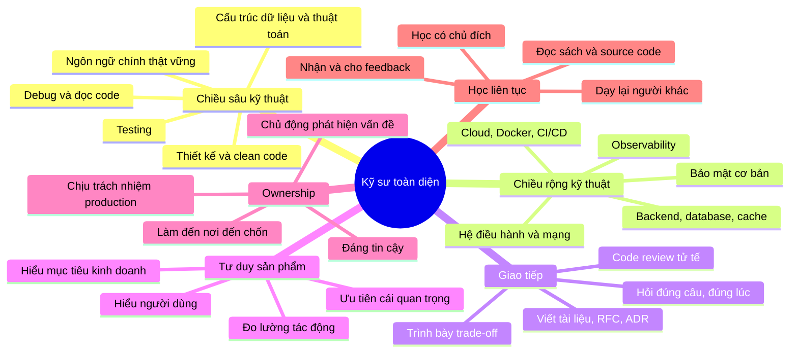
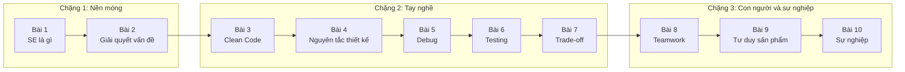
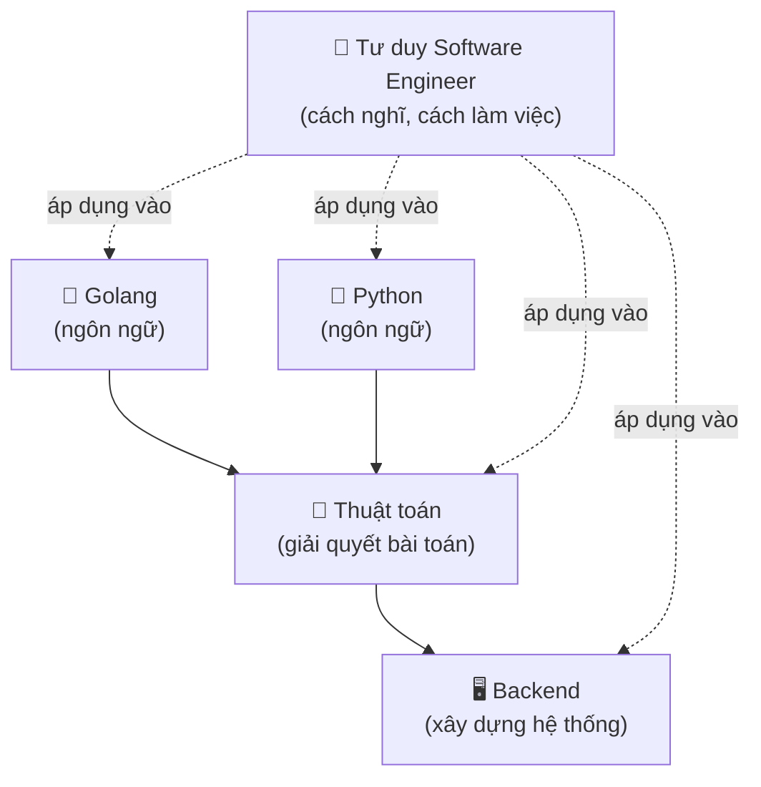

# 🧠 Tư duy Software Engineer - Trở thành kỹ sư phần mềm toàn diện

## 📋 Tổng quan

Chào mừng bạn đến với khóa học **"Tư duy Software Engineer"**! Đây **không phải** là một khóa học ngôn ngữ lập trình. Bạn sẽ không học thêm cú pháp `for`, `if` hay cách khai báo biến. Thay vào đó, khóa học trả lời những câu hỏi mà các khóa học lập trình thường bỏ qua:

- Tại sao hai người cùng biết Go/Python, cùng làm 3 năm, mà một người được giao dẫn dắt dự án còn người kia vẫn chỉ nhận ticket nhỏ?
- Khi nhận một yêu cầu mơ hồ như *"làm tính năng xuất báo cáo"*, mình nên bắt đầu từ đâu?
- Code "chạy được" và code "tốt" khác nhau ở chỗ nào?
- Khi production sập lúc 2 giờ sáng, nên nghĩ gì trước, làm gì trước?
- Làm sao để thảo luận kỹ thuật mà không biến thành cãi nhau?
- Làm sao để lên Senior, Staff - và "lên" nghĩa là gì?

Mỗi bài học được viết theo phong cách **cụ thể, thực tế, kể chuyện**: có tình huống thật ở công ty (cách một bạn junior nghĩ và cách một anh/chị senior nghĩ), có **framework** để áp dụng ngay, **checklist** để dán cạnh màn hình, và các ví dụ **trước/sau** (before/after). Code chỉ xuất hiện khi nó minh họa cho một điểm tư duy - và luôn có cả **Go** lẫn **Python**.

> 💡 **Tư duy quan trọng hơn cú pháp - vì sao?** Cú pháp bạn tra Google hoặc hỏi AI trong 10 giây. Nhưng *biết nên hỏi câu gì*, *biết đâu là vấn đề thật*, *biết khi nào nên dừng lại để không over-engineer*, *biết giải thích một quyết định cho sếp và cho đồng đội* - những thứ đó không tra được. Ngôn ngữ lập trình thay đổi 5-10 năm một lần; tư duy kỹ sư theo bạn cả sự nghiệp.

### 🎯 Mục tiêu khóa học

Sau khóa học, bạn sẽ:

- Hiểu **software engineering khác programming** ở đâu, và kỳ vọng thực tế ở từng cấp bậc (Intern → Junior → Mid → Senior → Staff/Principal)
- Có một **quy trình giải quyết vấn đề** rõ ràng: làm rõ yêu cầu, chia nhỏ, ước lượng, biết khi nào nên hỏi
- Viết code **dễ đọc, dễ sửa** - và biết phê phán chính những "quy tắc" clean code khi chúng bị áp dụng máy móc
- Nắm các **nguyên tắc thiết kế** (SOLID, DRY, KISS, YAGNI, coupling/cohesion...) và biết khi nào *không* nên dùng pattern
- **Debug có phương pháp** như một nhà khoa học thay vì "thử bừa đến khi chạy"
- Coi **testing** là công cụ thiết kế và là lưới an toàn, không phải thủ tục
- Đưa ra **quyết định kỹ thuật** có lý lẽ, ghi lại trade-off bằng ADR
- **Giao tiếp và làm việc nhóm** hiệu quả: code review, viết tài liệu, họp, phản hồi
- Có **tư duy sản phẩm**: hiểu người dùng, hiểu business, đo lường tác động
- Có một **kế hoạch phát triển sự nghiệp** cá nhân, cụ thể, đo được

### 👥 Khóa học này dành cho ai?

| Bạn là... | Bạn sẽ nhận được... |
|---|---|
| **Sinh viên / người mới học lập trình** | Bức tranh toàn cảnh về nghề, tránh những thói quen xấu ngay từ đầu |
| **Intern / Fresher** mới đi làm | Cách làm việc trong team thật: nhận ticket, hỏi đúng lúc, review code, không "biến mất" 3 ngày |
| **Junior / Mid (1-4 năm)** | Framework để bước lên Senior: ownership, thiết kế, trade-off, ảnh hưởng tới người khác |
| **Senior** muốn mentor người khác | Ngôn ngữ và ví dụ để giải thích những điều bạn "biết mà khó nói ra" |
| **Người chuyển ngành** | Những kỹ năng "không ai dạy" mà nhà tuyển dụng thực sự đánh giá |

### ⏱️ Thời gian học tập

- **Tổng thời gian**: khoảng 5 tuần (mỗi bài 2-4 buổi đọc + làm bài tập), nhưng đây là khóa học nên **đọc lại nhiều lần** trong sự nghiệp - mỗi lần bạn lên một level, bạn sẽ thấy những điều mới
- **Cấp độ**: Mọi cấp độ. Để tận dụng tốt nhất phần code minh họa, bạn nên biết cơ bản một trong hai ngôn ngữ Go hoặc Python
- **Cách học hiệu quả**: Làm **bài tập phản tư** (reflection) ở cuối mỗi bài. Viết ra giấy, không chỉ nghĩ trong đầu. Tư duy chỉ thay đổi khi bạn *áp dụng* vào công việc thật

## 🗺️ Bức tranh "Kỹ sư toàn diện"

"Toàn diện" không có nghĩa là biết mọi thứ. Nó có nghĩa là **không có điểm yếu chí mạng** ở những mặt quan trọng của nghề, và có **ít nhất một thế mạnh sâu**. Sơ đồ dưới đây là "bản đồ" mà cả khóa học sẽ đi qua:

Hãy để ý: chỉ **2 trong 6 nhánh** là thuần kỹ thuật. Đây là điều nhiều bạn junior bất ngờ nhất khi đi làm: kỹ năng code là **điều kiện cần**, nhưng những gì phân biệt một kỹ sư giỏi với một kỹ sư *rất* giỏi thường nằm ở 4 nhánh còn lại.

## 📚 Lộ trình khóa học

Khóa học chia làm **3 chặng**, đi từ "tư duy của một người viết code" đến "tư duy của một người xây dựng sản phẩm và phát triển sự nghiệp".

### 🌱 Chặng 1: Nền móng tư duy (Tuần 1)

- [x] **Bài 1**: [Software Engineer là gì](./01-what-is-software-engineering.md) - Programming khác Software Engineering thế nào ("programming integrated over time"), một ngày làm việc thật của kỹ sư, kỹ năng hình chữ T / chữ π, các cấp bậc Intern → Staff và kỳ vọng ở từng cấp, ownership, craftsmanship, đạo đức nghề nghiệp, những huyền thoại (10x engineer, "phải biết mọi ngôn ngữ")
- [x] **Bài 2**: [Tư duy giải quyết vấn đề](./02-problem-solving.md) - Hiểu trước khi giải (diễn đạt lại, hỏi làm rõ, định nghĩa "xong"), chia nhỏ vấn đề, first principles, working backwards, 4 bước của Pólya, rubber duck, viết để suy nghĩ, quy tắc 15 phút, xử lý sự mơ hồ, ước lượng; ví dụ từ ticket mơ hồ đến kế hoạch cụ thể, từ bug report đến root cause, và một coding kata từ brute force đến tối ưu

### 🔨 Chặng 2: Tay nghề (Tuần 2-4)

- [x] **Bài 3**: [Clean Code](./03-clean-code.md) - Code được đọc nhiều hơn viết, đặt tên, hàm, comment, format, xử lý lỗi, guard clause, magic number, side effect, danh mục code smell và cách refactor, walkthrough refactor trước/sau có test, và phê phán giáo điều "Clean Code"
- [x] **Bài 4**: [Nguyên tắc thiết kế](./04-design-principles.md) - Độ phức tạp là kẻ thù, coupling & cohesion, information hiding, SOLID (Go interface ngầm định, Python Protocol/ABC), DRY vs WET vs AHA, KISS, YAGNI, composition over inheritance, Law of Demeter, dependency injection, các design pattern hay dùng và khi nào chúng thành over-engineering
- [x] **Bài 5**: [Tư duy Debug](./05-debugging.md) - Debug theo phương pháp khoa học, tái hiện lỗi, đọc stack trace (Go panic, Python traceback), thu nhỏ test case, `git bisect`, debugger (Delve, pdb), "chạy trên máy em mà", race condition, debug production, 5 Whys, viết bug report, postmortem không đổ lỗi; 3 bug thật được phân tích từ đầu đến cuối
- [x] **Bài 6**: [Testing & Chất lượng](./06-testing-quality.md) - Vì sao test, kim tự tháp test, viết test tốt, TDD, test double, chất lượng là trách nhiệm của ai
- [x] **Bài 7**: [Trade-off & Ra quyết định kỹ thuật](./07-tradeoffs-decisions.md) - Không có giải pháp hoàn hảo, chỉ có đánh đổi; build vs buy, nợ kỹ thuật, quyết định một chiều/hai chiều, ADR

### 🤝 Chặng 3: Con người, sản phẩm và sự nghiệp (Tuần 5)

- [x] **Bài 8**: [Làm việc nhóm & Giao tiếp](./08-teamwork-communication.md) - Code review, viết tài liệu kỹ thuật, họp hiệu quả, phản hồi, làm việc với PM/QA/designer, xử lý bất đồng
- [x] **Bài 9**: [Tư duy sản phẩm](./09-product-thinking.md) - Hiểu người dùng và mục tiêu kinh doanh, đo lường tác động, MVP, ưu tiên hóa, "kỹ sư sản phẩm"
- [x] **Bài 10**: [Phát triển sự nghiệp](./10-career-growth.md) - Học có chủ đích, xây dựng uy tín, mentor, lộ trình IC vs manager, phỏng vấn, kế hoạch phát triển cá nhân

## 📊 Bảng tự đánh giá - Theo dõi sự phát triển của bạn

Cách dùng: đọc từng hàng, chọn **mức mô tả đúng nhất với bạn hôm nay** (hãy trung thực - không ai chấm điểm bạn ngoài chính bạn). Sau mỗi 3 tháng, đánh giá lại và so sánh. Mục tiêu không phải là đạt 5 ở mọi hàng - một kỹ sư Senior giỏi thường ở mức 4 ở vài hàng, 3 ở phần lớn các hàng còn lại.

### Thang đo (rubric)

| Lĩnh vực | Mức 1 - Mới bắt đầu | Mức 2 - Đang học | Mức 3 - Tự chủ | Mức 4 - Vững vàng | Mức 5 - Dẫn dắt |
|---|---|---|---|---|---|
| **Giải quyết vấn đề** | Bắt tay code ngay khi nhận ticket | Hỏi làm rõ khi được nhắc | Tự làm rõ yêu cầu, chia nhỏ task, ước lượng được | Xử lý tốt yêu cầu mơ hồ, đề xuất phương án thay thế | Định hình vấn đề cho cả team, tìm ra "vấn đề đúng" |
| **Chất lượng code** | Code chạy được là xong | Biết đặt tên tốt, hàm ngắn | Code nhất quán, dễ review, có test | Refactor an toàn, nhận ra code smell sớm | Đặt chuẩn mực cho team, review nâng chất lượng người khác |
| **Thiết kế** | Viết mọi thứ trong một hàm/file | Biết tách hàm, tách module | Thiết kế module có interface rõ ràng | Thiết kế hệ thống nhiều thành phần, cân nhắc trade-off | Thiết kế kiến trúc liên team, tầm nhìn dài hạn |
| **Debug** | Thử bừa, sửa đến khi chạy | Đọc stack trace, dùng print/log | Có phương pháp: tái hiện, giả thuyết, kiểm chứng | Debug được lỗi production, race condition, hiệu năng | Xây dựng hệ thống observability, dẫn dắt postmortem |
| **Testing** | Test bằng tay | Viết unit test khi được yêu cầu | Tự viết test cho code của mình | Thiết kế chiến lược test, code dễ test | Xây dựng văn hóa chất lượng cho team |
| **Giao tiếp** | Ngại hỏi, im lặng khi bị kẹt | Báo cáo tiến độ khi được hỏi | Chủ động cập nhật, viết PR description rõ | Viết design doc, trình bày trade-off thuyết phục | Căn chỉnh (align) nhiều team, ảnh hưởng không cần quyền lực |
| **Tư duy sản phẩm** | Làm đúng như ticket ghi | Hiểu tính năng dùng để làm gì | Hỏi "tại sao" và đề xuất cải tiến nhỏ | Cân nhắc người dùng và chỉ số khi ra quyết định | Định hướng sản phẩm cùng PM, đo lường tác động |
| **Ownership** | Xong task là xong việc | Theo dõi task tới khi merge | Theo dõi tới khi lên production và hoạt động đúng | Sở hữu một mảng hệ thống, chủ động xử lý nợ kỹ thuật | Sở hữu kết quả của cả team/sản phẩm |
| **Học tập** | Học khi bị bắt buộc | Học theo tutorial | Tự học có kế hoạch, đọc tài liệu gốc | Học sâu, chia sẻ lại cho team | Mentor người khác, tạo môi trường học cho tổ chức |

### Bảng theo dõi của bạn

Sao chép bảng này vào sổ tay hoặc file ghi chú của bạn:

| Lĩnh vực | Hôm nay | Sau 3 tháng | Sau 6 tháng | Sau 12 tháng | Hành động cụ thể để lên 1 mức |
|---|---|---|---|---|---|
| Giải quyết vấn đề | _ /5 | _ /5 | _ /5 | _ /5 | Ví dụ: viết "định nghĩa xong" trước khi code mọi ticket |
| Chất lượng code | _ /5 | _ /5 | _ /5 | _ /5 | |
| Thiết kế | _ /5 | _ /5 | _ /5 | _ /5 | |
| Debug | _ /5 | _ /5 | _ /5 | _ /5 | |
| Testing | _ /5 | _ /5 | _ /5 | _ /5 | |
| Giao tiếp | _ /5 | _ /5 | _ /5 | _ /5 | |
| Tư duy sản phẩm | _ /5 | _ /5 | _ /5 | _ /5 | |
| Ownership | _ /5 | _ /5 | _ /5 | _ /5 | |
| Học tập | _ /5 | _ /5 | _ /5 | _ /5 | |

!!! tip "Mẹo: nhờ người khác đánh giá cùng"
    Tự đánh giá thường lệch - người mới hay đánh giá thấp bản thân, người có vài năm kinh nghiệm hay đánh giá cao. Hãy gửi bảng rubric cho **tech lead** hoặc một **đồng nghiệp tin cậy**, nhờ họ chấm bạn, rồi so sánh. Chỗ chênh lệch lớn nhất chính là chỗ đáng nói chuyện nhất trong buổi 1:1 tiếp theo.

## 🧭 Học khóa này cùng các khóa khác

Khóa "Tư duy SE" là **lớp keo** kết nối các khóa kỹ thuật trong repo này:

- 🐹 [Khóa học Golang](../golang/README.md) - Nếu bạn muốn chạy và sửa các ví dụ Go trong khóa này
- 🐍 [Khóa học Python](../python/README.md) - Nếu bạn muốn chạy và sửa các ví dụ Python trong khóa này
- 🧮 [Khóa học Thuật toán](../algorithms/README.md) - Bài 2 (giải quyết vấn đề) đi rất tốt cùng khóa này, đặc biệt là bài "Pattern giải bài & Phỏng vấn"
- 🖥️ [Khóa học Backend](../backend/README.md) - Nơi bạn áp dụng thiết kế, debug, testing, trade-off vào hệ thống thật

**Gợi ý thứ tự học:**

| Tình trạng của bạn | Nên học thế nào |
|---|---|
| Chưa biết lập trình | Học Go hoặc Python Phần 1 trước, đọc song song Bài 1 và Bài 2 của khóa này |
| Đã biết một ngôn ngữ, chưa đi làm | Học khóa này từ đầu, kết hợp khóa Thuật toán |
| Đang đi làm | Học khóa này song song với công việc - mỗi tuần một bài, áp dụng ngay vào ticket đang làm |
| Đang chuẩn bị lên Senior | Tập trung Bài 4, 7, 8, 9, 10 và làm bảng tự đánh giá cùng tech lead |

## 📖 Sách nên đọc

Không cần đọc hết. Chọn **một cuốn** phù hợp với chỗ bạn đang yếu nhất trong bảng tự đánh giá, đọc chậm, ghi chú, và áp dụng.

| Sách | Tác giả | Đọc khi nào | Ghi chú |
|---|---|---|---|
| **The Pragmatic Programmer** (bản kỷ niệm 20 năm) | David Thomas, Andrew Hunt | Năm đầu đi làm | Cuốn "nhập môn nghề" hay nhất. Các nguyên tắc như DRY, "broken windows", "tracer bullets" xuất phát từ đây |
| **Clean Code** | Robert C. Martin | Khi code của bạn khó đọc | ⚠️ Đọc **có chọn lọc**: phần đặt tên, hàm, comment rất tốt; nhưng một số lời khuyên (hàm cực ngắn 2-4 dòng, tách class quá mức) và nhiều ví dụ Java đã lỗi thời, dễ dẫn đến code bị băm nát. Đọc kèm cuốn của Ousterhout bên dưới để có góc nhìn cân bằng (xem Bài 3) |
| **A Philosophy of Software Design** | John Ousterhout | Khi bắt đầu thiết kế module | Ngắn, sâu sắc. Khái niệm "deep module", "complexity là kẻ thù", "define errors out of existence" |
| **Refactoring** (bản 2) | Martin Fowler | Khi phải sửa code cũ | Danh mục code smell và các bước refactor an toàn |
| **Software Engineering at Google** | Titus Winters, Tom Manshreck, Hyrum Wright | Khi làm ở team lớn | Nguồn gốc câu "software engineering is programming integrated over time" |
| **Designing Data-Intensive Applications** | Martin Kleppmann | Khi làm backend 1-2 năm | "Kinh thánh" về database, phân tán, nhất quán dữ liệu. Đọc cùng khóa Backend |
| **How to Solve It** | George Pólya | Bất cứ lúc nào | Sách toán học từ năm 1945 nhưng là nền tảng của Bài 2 |
| **Debugging: The 9 Indispensable Rules** | David J. Agans | Khi hay bị kẹt với bug | Mỏng, dễ đọc, áp dụng ngay |
| **Working Effectively with Legacy Code** | Michael Feathers | Khi phải sửa hệ thống "không ai dám đụng" | Cách đưa code cũ vào vòng kiểm soát bằng test |
| **The Staff Engineer's Path** | Tanya Reilly | Khi đang là Senior | Staff engineer thực sự làm gì: big picture, dự án khó, nâng level người khác |
| **Staff Engineer: Leadership beyond the management track** | Will Larson | Khi đang là Senior | Bổ sung góc nhìn cho cuốn trên, nhiều câu chuyện thực tế |
| **Soft Skills: The Software Developer's Life Manual** | John Sonmez | Năm đầu đi làm | Sự nghiệp, tự marketing, tài chính, sức khỏe - những thứ trường không dạy |
| **The Effective Engineer** | Edmond Lau | Khi thấy mình bận mà không hiệu quả | Tư duy "đòn bẩy" (leverage): làm việc có tác động lớn nhất |
| **The Mythical Man-Month** | Frederick Brooks | Khi bắt đầu tham gia lập kế hoạch | Kinh điển: "thêm người vào dự án trễ sẽ làm nó trễ hơn" |

!!! warning "Đừng biến đọc sách thành một kiểu trì hoãn"
    Đọc 10 cuốn mà không áp dụng thì không bằng đọc 1 cuốn rồi thay đổi 3 thói quen. Quy tắc đơn giản: **mỗi chương đọc xong, viết ra 1 điều bạn sẽ làm khác đi trong tuần này**.

## 💡 Lời khuyên để học hiệu quả

1. **Đọc với một ticket thật trong đầu** - Khi đọc Bài 2, hãy mở ticket bạn đang làm và áp dụng ngay các bước. Khi đọc Bài 3, mở PR gần nhất của bạn và tự review.
2. **Viết nhật ký kỹ thuật (engineering journal)** - Mỗi ngày 5 phút: hôm nay mình kẹt ở đâu, đã gỡ thế nào, học được gì. Sau 6 tháng, đây là tài liệu quý nhất của bạn (và là nguyên liệu cho buổi đánh giá hiệu suất).
3. **Thảo luận với người khác** - Tư duy phát triển nhanh nhất khi bạn phải giải thích và bảo vệ nó. Rủ một đồng nghiệp học cùng, mỗi tuần một bài.
4. **Chấp nhận "không đồng ý"** - Khóa học này có quan điểm. Bạn có quyền không đồng ý - miễn là bạn có lý lẽ. Đó cũng chính là tư duy kỹ sư.
5. **Quay lại sau 1 năm** - Những gì bạn thấy "hiển nhiên" hôm nay sẽ có tầng nghĩa mới khi bạn đã trải qua nhiều dự án hơn.

## ✅ Checklist trước khi bắt đầu

- [ ] Tôi đã đọc phần tổng quan và hiểu đây là khóa học về **tư duy**, không phải cú pháp
- [ ] Tôi đã tự chấm bảng tự đánh giá (cột "Hôm nay") một cách trung thực
- [ ] Tôi đã chọn **2 lĩnh vực** muốn cải thiện nhất trong 3 tháng tới
- [ ] Tôi đã chuẩn bị sổ tay / file ghi chú cho nhật ký kỹ thuật
- [ ] Tôi đã cài Go hoặc Python để chạy thử các ví dụ code (không bắt buộc nhưng nên có)

---

**Bắt đầu thôi**: [Bài 1: Software Engineer là gì](./01-what-is-software-engineering.md) 🚀
